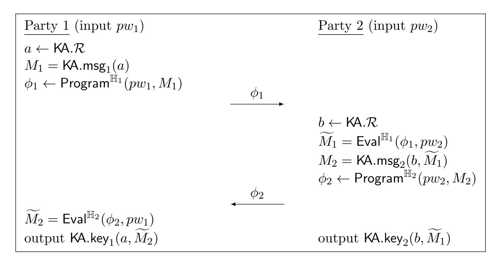
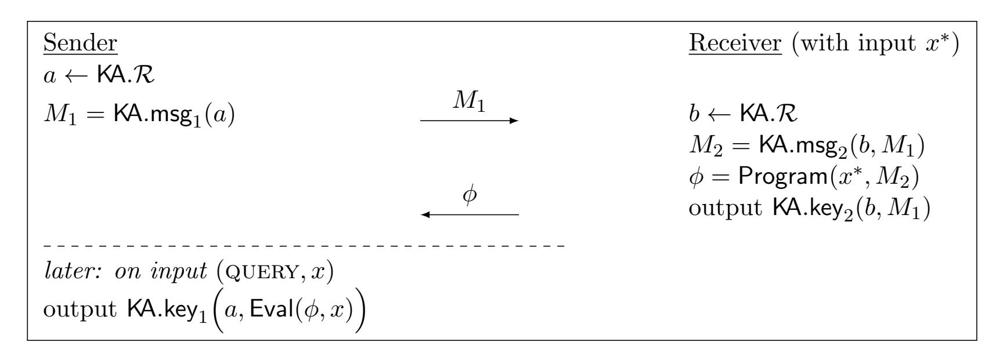
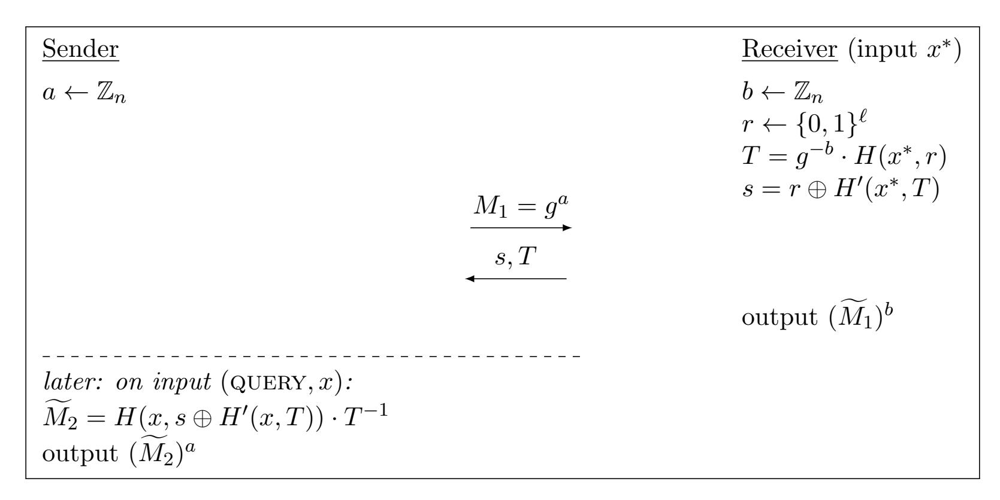

{0}------------------------------------------------

# Minimal Symmetric PAKE and 1-out-of-N OT from Programmable-Once Public Functions

Ian McQuoid<sup>∗</sup> Mike Rosulek<sup>∗</sup> Lawrence Roy<sup>∗</sup> February 20, 2025

### Abstract

Symmetric password-authenticated key exchange (sPAKE) can be seen as an extension of traditional key exchange where two parties agree on a shared key if and only if they share a common secret (possibly low-entropy) password. We present the first sPAKE protocol to simultaneously achieve the following properties:

- only two exponentiations per party, the same as plain unauthenticated Diffie-Hellman key agreement (and likely optimal);
- optimal round complexity: a single flow (one message from each party that can be sent in parallel) to achieve implicit authentication, or two flows to achieve explicit mutual authentication;
- security in the random oracle model, rather than ideal cipher or generic group model;
- UC security, rather than game-based.

Our protocol is a generalization of the seminal EKE protocol of Bellovin & Merritt (S&P 1992). We also present a UC-secure 1-out-of-N oblivious transfer (OT) protocol, for random payloads. Its communication complexity is independent of N, meaning that N can even be exponential in the security parameter. Such a protocol can also be considered a kind of oblivious PRF (OPRF). Our protocol improves over the leading UC-secure 1-out-of-N OT construction of Masny & Rindal (CCS 2019) for all N > 2, and has essentially the same cost for N = 2.

The new technique underlying these results is a primitive we call programmable-once public function (POPF). Intuitively, a POPF is a function whose output can be programmed by one party on exactly one point. All other outputs of the function are outside of any party's control, in a provable sense.

Update: dos Santos et al. (Eurocrypt 2023) [\[SGJ23\]](#page-25-0) showed that our POPF definition is not strong enough to prove security of EKE against a man-in-the-middle. See Januzelli et al. (Eurocrypt 2025) [\[JRX24\]](#page-24-0) for a fixed POPF abstraction and EKE security proof.

## 1 Introduction

Password-authenticated key exchange (PAKE) was introduced by Bellovin & Merritt [\[BM92\]](#page-23-0). It extends standard key exchange to ensure that only participants who hold a common password can successfuly establish a key. As humans are largely incapable of remembering high-entropy secure keys, the passwords come from a low-entropy distribution and are unsuitable as cryptographic key material. PAKE seeks to bootstrap these low entropy passwords into cryptographically secure keys.

<sup>∗</sup>Oregon State University, {mcquoidi,rosulekm,royl}@oregonstate.edu

{1}------------------------------------------------

Because passwords are low-entropy, an adversary can simply guess the correct password with nonnegligible probability. PAKE security says, roughly, that the only way to make one password guess is to participate in one protocol session (i.e., the transcript leaves no avenue for offline guessing).

PAKE and its variants provide a significantly improved method for password-based authentication than the usual status quo, in which a user typically sends their cleartext password to the server over an authenticated TLS session.

### 1.1 PAKE Background

In this work we focus on symmetric PAKE (sPAKE), where both participants hold the password in the clear. Since this requirement is not a good fit for client-server authentication, asymmetric PAKE (aPAKE) has also been proposed, which allows the server to hold only a hash digest of the password. Any sPAKE can be efficiently transformed into an aPAKE via the transformation of [\[HJK](#page-24-1)+18]. However, the usual security definition for aPAKE allows an attacker to perform offline pre-computation, so that it learns user passwords "instantly" in the event of a server compromise (think of a rainbow table for unsalted password hashes). In response, Jarecki, Krawczyk, and Xu [\[JKX18\]](#page-24-2) proposed strong asymmetric PAKE (SaPAKE) that requires pre-computation to be useless before server compromise (analogous to salting password hashing).

Security definition, model. There are two competing paradigms attempting to capture the intuitive security behind PAKE definitions. The game-based security model for PAKE was introduced by Bellare et al. [\[BPR00\]](#page-23-1), and is called the BPR framework (and exists in an extended form as the AFP framework [\[AFP05\]](#page-22-0)). To deal with the low-entropy nature of passwords, the BPR framework assumes that passwords are chosen independently from a fixed distribution. This fails to effectively model interesting, real-life relations between password choices and entry. Gamebased PAKE definitions were eventually superseded by simulation-based security models starting with Boyko et al. [\[BMP00\]](#page-23-2), with the universally-composable (UC) definition of [\[CHK](#page-23-3)+05] being the standard and the one we consider in this work. The simulation-based definitions allow passwords to be chosen by an external environment, and therefore make no assumptions about their distribution. The UC definitions are better suited to handle dependencies between passwords such as mistypings or using similar passwords with different severs. Additionally, allowing the passwords to be chosen by the environment gives us forward secrecy with no additional changes. For a full discussion of the merits of simulation-based PAKE definitions, see [\[CHK](#page-23-3)+05].

Implicit/explicit authentication A (symmetric) PAKE protocol can give either implicit or explicit authentication. In Canetti et al.'s [\[CHK](#page-23-3)+05] original PAKE functionality, under implicit authentication, if the two participants do not share the same password (including the case where an honest party mistypes their password, or an attacker fails to successfully guess the password) then each of the parties outputs a key which looks random to the other. The parties may not receive any notification that agreement has failed until they proceed to use their respective keys and some later task fails. Under explicit authentication, an honest party learns immediately, at the end of the PAKE instance, whether the agreement succeeded or not. In this work we focus mostly on implicit authentication, since explicit authentication can be easily added with an extra flow [\[BPR00,](#page-23-1) [ABB](#page-22-1)+20] — see also [Section 4.6.](#page-17-0)

Measuring round complexity We describe round complexity in terms of flows. A flow consists of a message from each party, which can be sent sequentially in either order, or even simultaneously

{2}------------------------------------------------

| Scheme                         | Security | Assumption | Setup   | Flows | Comp (Total) | Comm (P1/P2)                    |  |  |
|--------------------------------|----------|------------|---------|-------|--------------|---------------------------------|--|--|
| implicit authentication        |          |            |         |       |              |                                 |  |  |
| SPAKE2 [AP05]                  | BPR      | CDH        | RO, CRS | 1     | 6f 2v        | 1G<br>/ 1G                      |  |  |
| SPAKE2 [ABB+20]                | leUC     | Gap-CDH    | RO, CRS | 1     | 6f 2v        | 1G<br>/ 1G                      |  |  |
| KV-SPOKE [ABP15]               | AFP      | DDH        | CRS     | 1     | 28           | 5G<br>/ 5G                      |  |  |
| PAKE-IC-DHIES [BCJ+19]         | UC       | ODH        | RO, IC  | 2     | 2f 2v 2ic    | 1G<br>/ 1G<br>+ κ + 128         |  |  |
| PAKE-FO [BCJ+19]               | UC       | ODH        | RO, CRS | 2     | 6f 3v 2htc   | 2G<br>/ 2G<br>+ κ               |  |  |
| This Paper                     | UC       | DDH        | RO      | 1     | 2f 2v 4htc   | 1G<br>+ 3κ / 1G<br>+ 3κ         |  |  |
| explicit mutual authentication |          |            |         |       |              |                                 |  |  |
| KC-SPAKE2 [Sho20]              | mUC      | Gap-CDH    | RO, CRS | 3     | 4f 2v        | 1G<br>+ a / 1G<br>+ a           |  |  |
| UCOEKE [ACCP08]                | UC       | CDH        | RO, IC  | 3     | 2f 2v 2ic    | 1G<br>+ a / 1G<br>+ a           |  |  |
| GK-SPOKE [ABP15]               | AFP      | DDH        | CRS     | 3     | 17           | 2G<br>+ a / 4G<br>+ a           |  |  |
| SPAKE2 [ABB+20]                | rUC      | Gap-CDH    | RO, CRS | 2     | 6f 2v        | 1G<br>+ a / 1G<br>+ a           |  |  |
| This Paper                     | UC       | DDH        | RO      | 2     | 2f 2v 4htc   | 1G<br>+ 3κ + a / 1G<br>+ 3κ + a |  |  |

<span id="page-2-1"></span>Table 1: Comparison of PAKE protocols. "Comp" denotes computation (f = fixed-base exponentiation, v = variable-base exponentiation, htc = hash to curve, ic = ideal cipher evaluation). See [Section 4.5](#page-16-0) for discussion/comparison of these costs. "Comm" denotes communication (G = one group element, a = authentication security parameter). rUC denotes the relaxed UC functionality [\[ABB](#page-22-1)+20] while mUC and leUC denote a modified functionality [\[Sho20\]](#page-25-1) and lazy-extraction UC functionality [\[ABB](#page-22-1)+20] respectively.

if the communication medium allows it. In other words, the messages do not depend on each other.[1](#page-2-0) A notable example of a 1-flow protocol is unauthenticated Diffie-Hellman key agreement. While the messages can be sent simultaneously, security does not depend on their simultaneity. When considering security, we always allow the adversary to control the delivery of messages. Without loss of generality, the adversary is rushing, and in every flow it chooses to see the honest party's message before choosing its own.

Ideal models & setup assumptions UC PAKE protocols all require some kind of assumption outside of the plain model [\[CHK](#page-23-3)+05]. The strongest assumption is an ideal cipher, in which all parties have oracle access to a family of random permutations {E(k, ·)}<sup>k</sup> and corresponding inverses {E−<sup>1</sup> (k, ·)}. The constructions in this work rely on the weaker random oracle model. Another possible assumption is a common reference string (CRS), in which all parties have access to an honestly-generated public string (of polynomial length). In this realm, a random string is highly favored over a reference string which requires particular structure.

### 1.2 Our sPAKE Result

We describe a new sPAKE protocol — more precisely, we describe a generic transformation from an unauthenticated key agreement protocol (with pseudorandom messages) to an sPAKE. When instantiated with Diffie-Hellman key agreement, we obtain an sPAKE with the following properties:

• Only two exponentiations per party — the same as unauthenticated DH. (Additional hashto-curve operations are required, however.)

<span id="page-2-0"></span><sup>1</sup>When a protocol requires inherent sequentiality, we can consider one of the party's message in a flow to be empty.

{3}------------------------------------------------

| Scheme            | Assumption | Setup | Flows | Exp (sender/receiver) | Comm (sender/receiver) |
|-------------------|------------|-------|-------|-----------------------|------------------------|
| SimplestOT [CO15] | Gap-CDH    | RO    | 2     | 2f<br>Nv / 1f 2v      | 2G<br>/ 1G             |
| EndemicOT [MR19]  | DDH        | RO    | 2     | Nf<br>Nv / 1f 1v      | NG<br>NG<br>/          |
| EndemicOT [MR19]  | iDDH       | RO    | 1     | 1f<br>Nv / 1f 1v      | 1G<br>NG<br>/          |
| This Paper        | iDDH       | RO    | 1     | 1f<br>Nv / 1f 1v      | 1G<br>/ 1G<br>+ 3κ     |

<span id="page-3-1"></span>Table 2: Comparison of 1-out-of-N random OT protocols. "Exp" denotes exponentiations (f = fixed-base, v = variable-base). "Comm" denotes communication (G = one group element).

- Only one protocol flow (one message from each party, which can be sent simultaneously) to achieve implicit authentication, or two flows for explicit mutual authentication.
- UC security, in the random oracle model.

Our protocol is a generalization of the classic EKE protocol of Bellovin & Merritt [\[BM92\]](#page-23-0), which uses an ideal cipher. Our main technical idea is to replace the ideal cipher with a simpler primitive that we introduce, called a programmable-once public function (POPF). We show that a POPF can be constructed with just 2 calls to a random oracle (compared to 8 to construct an ideal cipher; cf [\[DS16\]](#page-23-6)).

Our DH-instantiated protocol is the most efficient (in round complexity and exponentiations) sPAKE in the UC model to date. A comparison of existing sPAKE protocols is given in [Table 1.](#page-2-1)

Because our construction is generic, it can be instantiated with post-quantum key agreement schemes to give efficient PQ-sPAKE. Furthermore, since EKE is actually a special case of our protocol, our security proof is the first proof of UC security for standard EKE (although many variants of EKE have been analyzed for UC security).

### 1.3 Oblivious PRF / OT Application

We also use our new POPF approach to construct an oblivious PRF (OPRF) protocol from an unauthenticated KA protocol. Roughly speaking, an OPRF protocols allows parties to jointly instantiate a random function that one party (the receiver) can evaluate only on a bounded number of inputs, while the other party (the sender) can evaluate it on an unlimited number of inputs. We achieve a variant of UC-secure OPRF with the following features:

- The receiver can evaluate the joint function on just one point. We call this variant a 1-OPRF.
- The sender does not control the "key" of the joint function. In other words, the parties cannot run the protocol again to allow the receiver to evaluate more points of the same random function, as is possible in some OPRF variants.
- If the sender is corrupt, then the joint function's outputs may not be random. If the receiver is corrupt, then the output that he receives may not be random (but all other outputs of the joint function will be random).

This OPRF variant is not useful for all applications,[2](#page-3-0) however it is sufficient to perform 1-outof-N oblivious transfer, where N is large (even exponentially large). The flavor of OT that is

<span id="page-3-0"></span><sup>2</sup>One specific example is the "OPAQUE" construction of an SaPAKE [\[JKX18\]](#page-24-2), which requires an OPRF where the sender can choose the same random function (i.e., same "key") for many different executions.

{4}------------------------------------------------

achieved is analogous to the "endemic OT" variant from [MR19]. Importantly, our OT protocol has communication independent of N.

The state of the art UC protocol for 1-out-of-N endemic OT is due to [MR19], with communication proportional to N. Our protocol has communication independent of N, and therefore significantly improves over theirs for  $N \geq 3$ . Even in the case of N=2 the two protocols have essentially the same cost. A detailed comparison is given in Table 2. To instantiate both their protocol and our protocol with Diffie-Hellman KA, we require a variant of the DDH assumption (denoted "iDDH" in the table), in which the adversary gets to choose one of the generators. This assumption is equivalent to saying that standard Diffie-Hellman key agreement is secure when Alice reuses her DH message in the presence of a malicious response from Bob (see the discussion around Definition 5).

#### 1.4 Other Related Work

PAKE protocols can largely be split into two different categories. The first of which are those influenced by the EKE protocol [BM92]. These protocols exist in the Random Oracle or Ideal Cipher models and enjoy much greater efficiency than their standard-model counterparts. The second category of PAKEs are those that forgo the RO and IC models for the standard or plain model. Many of the protocols in this category are built on smooth projective hash functions introduced by [CS02] and first used in the constuction of PAKEs in [KOY01, GL06]. These protocols are often less efficient than their RO counterparts; until this point, we are unaware of any other protocols that achieve UC-sPAKE in a single flow using the stronger functionality of Canetti et al. [CHK<sup>+</sup>05]. [ABP15] was chosen for comparison as an efficient, single-flow, standard-model PAKE. We note that even in the weaker AFP model, standard PAKEs are much less efficient than their idealized-model competitors.

As of the writing of this paper, the most efficient EKE variants are [ACCP08] which achieves explicit authentication in 3 flows with 2 exponentiations per party (same as unauthenticated DH), [BCJ<sup>+</sup>19] which achieves implicit authentication in 2 flows with 2 exponentiations per party, and [Sho20] which achieves explicit/implicit authentication in a single flow with 3 exponentiations per party. See table 1 for a more detailed comparison. Bradley et al.'s [BCJ<sup>+</sup>19] construction relies on the Oracle Diffie-Hellman (ODH) assumption which can be summarized as a modification to the DDH assumption where the adversary has access to a random oracle  $H_b(x) = H(x^b)$  and must distinguish  $(g, g^a, g^b, H(g^{ab}))$  from  $(g, g^a, g^b, r)$  but is disallowed from querying the oracle on  $g^a$ . All of these protocols are very efficient, but [ACCP08, BCJ<sup>+</sup>19] require the use of an ideal cipher and [Sho20, ABB<sup>+</sup>20] have unknown provability in the UC model with standard functionality. Our EKE variant achieves minimal cost (communication & exponentiations), from only the random oracle model, and achieving the standard notion of security.

### 2 Preliminaries

### 2.1 Unauthenticated Key Agreement

A 2-round unauthenticated key agreement (KA) protocol consists of the following parameters:

- KA.R: set of random tapes for a participant
- KA. $\mathcal{K}$ : set of output keys
- $\mathsf{KA}.\mathcal{M}_1, \mathsf{KA}.\mathcal{M}_2$ : set of protocol messages for party 1 & 2, respectively

{5}------------------------------------------------

| Party 1                      |    | Party 2                       |
|------------------------------|----|-------------------------------|
| ←<br>KA.R<br>a               |    |                               |
| M1<br>=<br>KA.msg1<br>(a)    | M1 |                               |
|                              |    | ←<br>KA.R<br>b                |
|                              |    | M2<br>=<br>KA.msg2<br>(b, M1) |
|                              | M2 |                               |
| output<br>KA.key1<br>(a, M2) |    | output<br>KA.key2<br>(b, M1)  |

<span id="page-5-0"></span>Figure 1: Structure of a generic 2-round key agreement protocol

- KA.msg<sup>1</sup> ,KA.msg<sup>2</sup> : protocol-message functions for party 1 & 2, respectively
- KA.key<sup>1</sup> ,KA.key<sup>2</sup> : output functions for party 1 & 2, respectively

The protocol is executed as illustrated in [Figure 1.](#page-5-0)

Definition 1. A 2-round KA protocol is correct if

$$\mathit{KA}.\mathit{key}_1(a,\mathit{KA}.\mathit{msg}_2(b,\mathit{KA}.\mathit{msg}_1(a))) = \mathit{KA}.\mathit{key}_2(b,\mathit{KA}.\mathit{msg}_1(a))$$

with all but negligible probability when a, b ← KA.R.

We have presented the syntax of 2-round KA assuming that the second message M<sup>2</sup> depends on M1. Our results are presented in maximum generality to allow such KA protocols. However, some KA protocols (notably Diffie-Hellman) have M<sup>2</sup> that doesn't depend on M1. In that case, we simplify notation and write KA.msg<sup>2</sup> (b) rather than KA.msg<sup>2</sup> (b, M1). Such a KA protocol is one-flow.

<span id="page-5-2"></span>Definition 2. A 2-round KA protocol is secure if the following two distributions are indistinguishable:

$$\begin{array}{l} a \leftarrow \mathsf{KA}.\mathcal{R} \\ b \leftarrow \mathsf{KA}.\mathcal{R} \\ M_1 \leftarrow \mathsf{KA}.\mathsf{msg}_1(a) \\ M_2 \leftarrow \mathsf{KA}.\mathsf{msg}_2(b,M_1) \\ \hline K \leftarrow \mathsf{KA}.\mathsf{key}_1(a,M_2) \\ \mathsf{output}\ (M_1,M_2,K) \end{array} \qquad \begin{array}{l} a \leftarrow \mathsf{KA}.\mathcal{R} \\ b \leftarrow \mathsf{KA}.\mathcal{R} \\ M_1 \leftarrow \mathsf{KA}.\mathsf{msg}_1(a) \\ M_2 \leftarrow \mathsf{KA}.\mathsf{msg}_2(b,M_1) \\ \hline K \leftarrow \mathsf{KA}.\mathcal{K} \\ \mathsf{output}\ (M_1,M_2,K) \end{array}$$

We also consider a stronger notion of security in which the protocol messages are also indistinguishable from random:

<span id="page-5-1"></span>Definition 3. A 2-round KA protocol is pseudorandom if the following two distributions are indistinguishable:

$$\begin{array}{c|c} a \leftarrow \mathsf{KA}.\mathcal{R} \\ b \leftarrow \mathsf{KA}.\mathcal{R} \\ M_1 \leftarrow \mathsf{KA}.\mathsf{msg}_1(a) \\ M_2 \leftarrow \mathsf{KA}.\mathsf{msg}_2(b,M_1) \\ K \leftarrow \mathsf{KA}.\mathsf{key}_1(a,M_2) \\ \mathsf{output}\ (M_1,M_2,K) \end{array} \qquad \begin{array}{c} M_1 \leftarrow \mathsf{KA}.\mathcal{M}_1 \\ M_2 \leftarrow \mathsf{KA}.\mathcal{M}_2 \\ K \leftarrow \mathsf{KA}.\mathcal{K} \\ \mathsf{output}\ (M_1,M_2,K) \end{array}$$

{6}------------------------------------------------

In our OPRF construction, we require a different property of KA protocols — namely, that  $M_2$ looks pseudorandom, not just to an eavesdropper, but also to the party who generated  $M_1$ .

<span id="page-6-1"></span>**Definition 4.** A 2-round KA protocol has **strongly random responses** if for all PPT A, the following two distributions are indistinguishable:

$$(M_1, state) \leftarrow \mathcal{A}()$$
 $M_2 \leftarrow \mathsf{KA}.\mathcal{M}_2$ 
output  $(state, M_2)$ 

Note that any pseudrandom, 1-flow KA protocol automatically has strongly random responses. In particular, unauthenticated Diffie-Hellman KA satisfies these properties.

It is well-known that **honest** KA instances can safely reuse the same  $M_1$  message for several instances. However, this property need not be true in the presence of adversarially generated  $M_2$ (see the discussion in Section 5 for more details). Our OPRF protocol requires the underlying KA protocol to have a kind of **robustness** property when reusing the  $M_1$  message for many sessions, even when one of the  $M_2$  messages is adversarially chosen.

<span id="page-6-0"></span>**Definition 5.** A 2-round KA protocol KA is **robust** if for all PPT A, the following distributions are indistinguishable:

$$\begin{aligned} a &\leftarrow \mathsf{KA}.\mathcal{R} \\ b &\leftarrow \mathsf{KA}.\mathcal{R} \\ M_1 &= \mathsf{KA}.\mathsf{msg}_1(a) \\ (M_2^*, st) &\leftarrow \mathcal{A}(M_1) \\ k^* &= \mathsf{KA}.\mathsf{key}_1(a, M_2^*) \\ M_2 &= \mathsf{KA}.\mathsf{msg}_2(b, M_1) \\ \boxed{k &= \mathsf{KA}.\mathsf{key}_1(a, M_2)} \\ \mathsf{output}\ (st, k^*, M_2, k) \end{aligned}$$

$$\begin{array}{l} a \leftarrow \mathsf{KA}.\mathcal{R} \\ b \leftarrow \mathsf{KA}.\mathcal{R} \\ M_1 = \mathsf{KA}.\mathsf{msg}_1(a) \\ (M_2^*, st) \leftarrow \mathcal{A}(M_1) \\ k^* = \mathsf{KA}.\mathsf{key}_1(a, M_2^*) \\ M_2 = \mathsf{KA}.\mathsf{msg}_2(b, M_1) \\ k = \mathsf{KA}.\mathsf{key}_1(a, M_2) \\ \mathsf{output}\ (st, k^*, M_2, k) \end{array} \begin{array}{l} a \leftarrow \mathsf{KA}.\mathcal{R} \\ b \leftarrow \mathsf{KA}.\mathcal{R} \\ M_1 = \mathsf{KA}.\mathsf{msg}_1(a) \\ (M_2^*, st) \leftarrow \mathcal{A}(M_1) \\ k^* = \mathsf{KA}.\mathsf{key}_1(a, M_2^*) \\ M_2 = \mathsf{KA}.\mathsf{msg}_2(b, M_1) \\ \hline k \leftarrow \mathsf{KA}.\mathcal{K} \\ \mathsf{output}\ (st, k^*, M_2, k) \end{array}$$

Note that for Diffie-Hellman KA this is equivalent to the iDDH assumption of [MR19]. In Appendix A we show that any 2-round KA protocol can be turned into a robust KA protocol by feeding its output into a random oracle, but with a factor q loss in the security reduction.

#### Symmetric PAKE 2.2

We use the definition of sPAKE from [CHK<sup>+</sup>05]. The definition is in terms of an ideal functionality, which is shown in Figure 2.

#### **Programmable-Once Public Functions** 3

#### High-Level Overview 3.1

As mentioned in the introduction, our sPAKE construction can be understood as an abstraction of the EKE protocol of Bellovin & Merritt [BM92]. EKE works as follows: Alice, with password  $pw_1$ , generates a plain KA protocol message  $M_1$  and sends  $\phi_1 = E(pw_1, M_1)$ , where E is an ideal cipher. Bob symmetrically sends  $\phi_2 = E(pw_2, M_2)$ . Now, Alice interprets  $E^{-1}(pw_1, \phi_2)$  as a KA protocol

{7}------------------------------------------------

### Functionality $\mathcal{F}_{\text{pwKE}}$

The functionality  $\mathcal{F}_{pwKE}$  is parameterized by a security parameter  $\kappa$ . It interacts with an adversary S and a set of parties via the following queries:

### Upon receiving a query (NewSession, sid, $P_i$ , $P_j$ , pw, role) from party $P_i$ :

• Send (NewSession, sid,  $P_i$ ,  $P_j$ , role) to S. In addition, if this is the first NewSession query, or if this is the second NewSession query and there is a record  $(P_j, P_i, pw', \text{role}')$ , then record  $(P_i, P_j, pw, \text{role})$  and mark this record fresh.

### Upon receiving a query (TestPwd, sid, $P_i$ , pw') from the adversary S:

- Do nothing if there is no record of the form  $(P_i, P_j, pw, role)$ .
- If pw = pw', mark the record compromised and reply to S with "Correct Guess".
- If  $pw \neq pw'$ , mark the record interrupted and reply with "Wrong Guess".

### Upon receiving a query (NewKey, sid, $P_i$ , sk) from S where $|sk| = \kappa$ :

- Do nothing if there is no record of the form  $(P_i, P_j, pw, role)$ , or if there has already been a NewKey query for  $P_i$ .
- If this record is compromised, or either  $P_i$  or  $P_j$  is corrupted, then output (sid, sk) to player  $P_i$ .
- If this record is **fresh**, there is a record  $(P_j, P_i, pw', \text{role}')$  with pw = pw' and  $\text{role} \neq \text{role}'$ , a key sk' was sent to  $P_j$ , and  $(P_j, P_i, pw, \text{role})$  was **fresh** at the time, then output (sid, sk') to  $P_i$ .
- In any other case, pick a new random key sk' of length  $\kappa$  and send (sid, sk') to  $P_i$ .
- In all cases, mark the record  $(sid, P_i, P_j, pw, role)$  as completed.

<span id="page-7-0"></span>Figure 2: Ideal functionality  $\mathcal{F}_{pwKE}$  from [CHK<sup>+</sup>05]

message and computes the corresponding KA output as her sPAKE output. Our contribution is to instantiate the ideal cipher  $(E, E^{-1})$  with a simpler object called a **programmable-once public** function (**POPF**). We now motivate the details of the POPF definitions by considering how the ideal cipher is used in the EKE protocol and typical security proof.

What cipher? It is not necessary for  $E(pw,\cdot)$  and  $E^{-1}(pw,\cdot)$  to be permutations, as they are for an ideal cipher. The only requirement is that  $E^{-1}(pw,\cdot)$  is a left inverse of  $E(pw,\cdot)$ . This observation opens up the possibility of  $E(pw,\cdot)$  being randomized and/or having longer outputs than inputs — indeed, our POPF construction has both properties.

We adjust the notation of EKE to move away from that of a cipher. In EKE, Alice generates a value  $\phi_1$ , into which she has "programmed" the association  $pw_1 \mapsto M_1$ . Hence we use the notation  $\phi_1 = \mathsf{Program}(pw_1, M_1)$ . Symmetrically, Bob "evaluates"  $\phi_1$  using his password to get a corresponding KA message, which we write as  $\widetilde{M}_1 = \mathsf{Eval}(\phi_1, pw_2)$ .

This is the sense in which  $\phi_1$  represents a public function, which can be "evaluated" on any

{8}------------------------------------------------

 $pw_2$ , that Alice has programmed for a particular  $pw_1 \mapsto M_1$  mapping of her choice.

Honest party's POPF acts like a random function. In classic EKE, the simulator for an honest Alice sends a random  $\phi_1$ . Thereafter, whenever the adversary makes an ideal cipher query of the form  $E^{-1}(\widetilde{pw}, \phi_1)$ , the simulator has an opportunity to program the output. This programmability is helpful when reducing to the security of plain KA: The simulator can receive a KA transcript (from the KA security game) and implant its messages into the ideal cipher's output.

In a POPF, we need an analogous property. The Eval function of a POPF makes calls to a random oracle  $\mathbb{H}$ . We require a simulator for honest Alice that generates  $\phi_1$  and can program  $\mathbb{H}$  appropriately so that it can fix the outputs of  $\mathsf{Eval}(\phi_1,\cdot)$  however it likes. In other words, we need a simulator that can "program" all outputs of  $\mathsf{Eval}(\phi_1,\cdot)$ . Formally speaking, we require  $\mathsf{Eval}(\phi_1,\cdot)$  to be indifferentiable from an ideal random function.

**Programmable (only) once.** In classic EKE, suppose a corrupt Bob sends  $\phi^* = \phi_2$ . Bob may know many pairs  $(pw_i, M_i)$  such that  $E(pw_i, M_i) = \phi^*$ , but a standard argument shows that he could have **chosen** at most one of the  $M_i$  values. With overwhelming probability there is at most one forward query of the form  $E(pw_i, M_i) = \phi^*$ . The other pairs he must have learned later by making inverse queries  $E^{-1}(pw_i, \phi^*) = M_i$ , meaning that he had no control over  $M_i$ . In the security proof, this gives us two properties: (1) upon seeing  $\phi^*$  the simulator can identify the **unique**  $pw^*$  such that Bob was able to choose  $E^{-1}(pw^*, \phi^*)$ ; (2) the simulator can program all other outputs  $E^{-1}(pw', \phi^*)$  for  $pw' \neq pw^*$ . Taken together, these properties formalize the idea that "Bob can control  $E^{-1}(pw, \phi^*)$  for only one value of pw, but has no control over  $E^{-1}(pw, \phi^*)$  for all other pw."

Our POPF primitive slightly weakens this intuitive idea. We similarly require property (1) above: upon seeing  $\phi^*$ , the simulator can extract a password  $pw^*$  such that the adversary could have chosen  $\mathsf{Eval}(\phi^*,pw^*)$ . However, our simulator cannot  $\mathit{simultaneously}$  program the outputs of  $\mathsf{Eval}(\phi^*,\cdot)$  like it can with an ideal cipher. The problem is that the simulator must program the outputs of  $\mathsf{Eval}(\phi^*,\cdot)$  before even seeing  $\phi^*$ , since the adversary may already be running  $\mathsf{Eval}$  in its head before announcing its choice of  $\phi^*$  in the PAKE protocol.

Instead, our simulator can program these outputs only with 1/q probability, where q is the number of random-oracle queries made by the adversary. It does this by "guessing" which of the oracle queries will witness the adversary's choice of  $pw^*$ . However, this property turns out to be enough to prove security of the PAKE protocol, as we discuss below.

More details. Let us understand how the EKE security proof uses the ability to program  $\text{Eval}(\phi^*,\cdot)$ , for the adversary's choice of  $\phi^*$ . The proof reduces PAKE security to KA security in the following way: receive a KA transcript+key  $(M_1, M_2, K)$  from the KA security game, run the honest party with  $\phi_1 = \text{Program}(pw_1, M_1)$ , program  $\text{Eval}(\phi^*, pw_1) = M_2$  (in the event that  $pw_1 \neq pw_2$ ), and use K as the honest party's PAKE output. This reduction allows us to replace the honest PAKE output K with a random output, from the usual KA security definition.

Importantly, programming the outputs of  $\mathsf{Eval}(\phi^*, \cdot)$  is used only in the *intermediate hybrids* of the security proof, and not in the final UC simulation (where we simply replace real KA outputs with random). Hence, it may not be a problem that programming a malicious POPF only succeeds with 1/q probability.

We finally formalize this programmability property for a malicious POPF in a novel way. We don't need  $\mathsf{Eval}(\phi^*,\cdot)$  to be programmable with probability 1. Honest Alice computes her PAKE

{9}------------------------------------------------

output as KA.key<sup>1</sup> (a, Eval(ϕ ∗ , ·)), and we simply need to be able to argue that this output is indistinguishable from random. The fact that the simulator has only 1/q success in programming Eval(ϕ ∗ , ·) simply introduces a factor q loss in arguing that KA.key<sup>1</sup> (Eval(ϕ ∗ , ·)) is pseudorandom. But all of the subtlety of the simulator's guessing strategy is restricted to the proof that KA.key<sup>1</sup> (a, Eval(ϕ ∗ , ·)) is pseudorandom.

Overall, this particular security property of a POPF is expressed in terms of composing Eval with the KA.key<sup>1</sup> algorithm of a KA scheme. It is instructive to understand what property of KA.key<sup>1</sup> we used here. It turns out that we only need KA.key<sup>1</sup> to be a weak PRF (i.e., on uniform inputs, its outputs are pseudorandom), with secret randomness a acting as the PRF seed. So in order to make the POPF definition as general as possible, we finally formalize this security property by saying "when an adversary outputs ϕ <sup>∗</sup> and from it the simulator extracts a corresponding pw<sup>∗</sup> , all outputs Fk(Eval(ϕ ∗ , pw)) are pseudorandom for pw ̸= pw<sup>∗</sup> , for any weak PRF F."

### 3.2 Definitions

A programmable-once public function (POPF) consists of algorithms Eval<sup>H</sup> : X ×{0, 1} <sup>∗</sup> → Y and Program<sup>H</sup> : {0, 1} <sup>∗</sup> × Y → X .H represents any global setup (such as random oracles) required by the POPF, and will be omitted unless we need to emphasize it or provide different setups to different instances.

Weak PRF Notion. As previously mentioned, security for a POPF is defined in terms of whether its outputs are suitable inputs for a weak PRF. For technical reasons, we will need the weak PRF's outputs to be pseudorandom even in the presence of specific additional leakage on their seed.

<span id="page-9-0"></span>Definition 6. Let F : {0, 1} <sup>κ</sup> × Y → Z have the syntax of a PRF. Let L be a family of functions taking input in {0, 1} κ . We say that F is a weak PRF under leakage L (i.e., an L-wPRF) if for any n, the following distributions are indistinguishable:

$$k \leftarrow \{0,1\}^{\kappa}$$
for  $i = 1$  to  $n$ :
$$y_i \leftarrow \mathcal{Y}$$

$$z_i := F(k, y_i)$$
ret  $L(k), y_1, \dots, y_n, z_1, \dots, z_n$ 

$$k \leftarrow \{0,1\}^{\kappa}$$
  
for  $i = 1$  to  $n$ :  
 $y_i \leftarrow \mathcal{Y}$   
 $z_i \leftarrow \mathcal{Z}$   
ret  $L(k), y_1, \dots, y_n, z_1, \dots, z_n$ 

POPF Definitions. Along with the functions Eval and Program introduced above, our security definitions will also depend on algorithms HSim and Extract which will be used by the simulator of our UC based constructions. They are each split into stages: HSim<sup>1</sup> and Extract<sup>1</sup> are run before ϕ is chosen and HSim<sup>2</sup> and Extract<sup>2</sup> are run after. Extract<sup>3</sup> is a further stage used to simulate subsequent access to H. Because state needs to be saved between the two stages, we cannot simply use the notation AHSim<sup>1</sup> to indicate that A's has oracle access to HSim1. Instead, we introduce the notation A ⇄ HSim<sup>1</sup> to represent the straight-line interaction between an adversary A and HSim1, where A's output is concatenated with HSim's to determines the final output. This allows both A and HSim<sup>1</sup> to output state that can be used to continue the interaction later. We only allow straight-line interaction (i.e. no rewinding) as later they will be used in the simulator for UC security, which is bound by the same rule.

Syntactically, HSim<sup>1</sup> is an interactive algorithm that takes the place of H and outputs a value ϕ ∈ X and its internal state. HSim<sup>2</sup> is then a second interactive algorithm that uses this state and 

{10}------------------------------------------------

an oracle  $\mathcal{Y}^{\{0,1\}^*}$ , and again takes the place of  $\mathbb{H}$ . Similarly, Extract<sub>1</sub> interacts with the adversary, taking the place of  $\mathbb{H}$ , and outputs its internal state. Extract<sub>2</sub> then uses this internal state along with  $\phi \in \mathcal{X}$  chosen by the adversary to compute which  $x^* \in \{0,1\}^*$  the adversary programmed. Extract<sub>3</sub> also uses the internal state.

We use Extract to formalize the security property that, for all but one value of x, the outputs  $\mathsf{Eval}(\phi, x)$  are suitable as inputs to any weak PRF. We formalize this in two steps. First, we require that the extractor be indistinguishable from the global setup  $\mathbb{H}$ , and  $\mathsf{Extract}_2$  to compute a value  $x^*$  from an adversarially-generated  $\phi$ . Second, we require that  $F(k, \mathsf{Eval}(\phi, \cdot))$  is indistinguishable from a random function, provided that it is never queried on that input  $x^*$ .

Taken together, these two properties establish the soundness of the value  $x^*$  output by the attacker. If the extractor outputs the "wrong"  $x^*$ , an adversary can program  $\mathsf{Eval}(\phi, x)$  for some  $x \neq x^*$  and cause it to be a weak input for F.

**Definition 7.** A tuple (Program, Eval, HSim, Extract) is a secure POPF if the following properties hold:

- 1. Correctness: If  $\phi \leftarrow Program(x^*, y^*)$  then  $Eval(\phi, x^*) = y^*$ . Note that the following implies this property with all but negligible probability.
- 2. **Honest Simulation:** We require that for any PPTs  $A_1$ ,  $A_2$ , the following two distributions are indistinguishable:

Note that A both has oracle access to  $Eval(\phi, \cdot)$  and  $\mathbb{H}$ , so it can check the replies for consistency. The last step,

$$\mathcal{A}_{2}^{\mathsf{Eval}^{\mathbb{H}}(\phi,\cdot),\mathbb{H}}(view,\phi) \approx \mathcal{A}_{2}^{R,\mathsf{HSim}_{2}^{R}(state)}(view,\phi),$$

is recognizable as a statement that  $\mathsf{Eval}(\phi,\cdot)$  is indifferentiable from a random function, except on the point  $x^*$ .

This definition lets us program Eval like a random oracle when  $\phi$  is chosen honestly, since this is essentially an indifferentiability property. The values Eval is programmed with need to be fixed at the moment  $\phi$  is chosen. It also guarantees that  $\phi$  does not leak x when y is uniformly random, as then R is just a random function, independent of  $x^*$ .

3. Straight-line Extraction: An adversary A must not be able to distinguish between the extractor and the global setup  $\mathbb{H}$ . We require that for all PPT A, the following distributions are indistinguishable:

Note that this only guarantees that the simulation is undetectable to A, but it doesn't guarantee the usefulness of Extract. This is established in the next property.

{11}------------------------------------------------

<span id="page-11-0"></span>4. Uncontrollable Outputs: Intuitively, for adversarially generated  $\phi$ , all outputs of Eval $(\phi, x)$ , for  $x \neq x^*$ , are suitable inputs for any weak PRF. The Extract algorithm is used to determine the value of  $x^*$ .

We require that for every PPT algorithms  $A_1, A_2$ , any  $\mathcal{L}$ -wPRF  $F : \{0, 1\}^{\kappa} \times \mathcal{Y} \to \mathcal{Z}$ , and any  $L \in \mathcal{L}$ , the following distributions are indistinguishable:

```
k \leftarrow \{0,1\}^{\kappa} 
((view,\phi), state) \leftarrow (\mathcal{A}_1(L(k)) \rightleftarrows \mathsf{Extract}_1)
(state', x^*) \leftarrow \mathsf{Extract}_2(state, \phi)
out \leftarrow \mathcal{A}_2^{F(k, \mathsf{Eval}(\phi, \cdot))!x^*}, \mathsf{Extract}_3(state')
return \ out
```

```
|k \leftarrow \{0,1\}^{\kappa} \\ ((view, \phi), state) \leftarrow (\mathcal{A}_1(L(k)) \rightleftarrows \mathsf{Extract}_1) \\ (state', x^*) \leftarrow \mathsf{Extract}_2(state, \phi) \\ R \leftarrow \mathcal{Z}^{\{0,1\}^*} \\ out \leftarrow \mathcal{A}_2^{\boxed{R!x^*}, \mathsf{Extract}_3(state')}(view) \\ \mathsf{return} \ out
```

In the above, the notation R!x denotes the oracle that aborts on input x, and acts identically to R on all other inputs.

Note that since this must work for any  $\mathcal{L}$ -wPRF and any leakage in  $\mathcal{L}$ , these can be considered to be adversarially chosen. In fact, the security of our 1-OPRF protocol will depend on putting part of the adversary inside the leakage of a suitably chosen wPRF.

Comparison to other primitives. POPF is similar to an oblivious programmable PRF (OP-PRF) [KMP+17]. In an OPPRF, a sender can generate a keyed function F such that  $F(x_i) = y_i$  for some  $(x_i, y_i)$  pairs of her choice, where F is random on all other points. The receiver has some fixed inputs  $x'_1, \ldots, x'_n$  and learns  $F(x'_i)$ . The sender doesn't learn which points  $x'_i$  the receiver evaluates F on, and the receiver doesn't learn which points  $x_i$  were programmed by the sender.

The main difference between our POPF and this OPPRF is that an OPPRF is itself a privately keyed function. The receiver obtains outputs of the function F through an interactive protocol. Our POPF is a function that Alice generates unilaterally and makes public. Both parties can evaluate it on any input of their choice (non-interactively).

#### <span id="page-11-1"></span>3.3 Construction Overview

In this section we describe the high-level idea behind our more efficient POPF construction. Our construction is in the random oracle model, with  $\mathbb{H}$  consisting of two random oracles H, H'. We construct a POPF with output  $\mathcal{Y} = \mathbb{G}$  in a group  $(\mathbb{G},\cdot)$ , and  $H:\{0,1\}^* \times \{0,1\}^{3\kappa} \to \mathbb{G}$  will produce elements of this group. Our second random oracle,  $H':\{0,1\}^* \times \mathbb{G} \to \{0,1\}^{3\kappa}$ , will output bit-strings that are treated as members of a group under exclusive-or. This could be generalized to any group as well.

Let  $\mathcal{X} = \{0,1\}^{3\kappa} \times \mathbb{G}$ . Writing  $\phi = (s,T)$ , define Eval as

$$\mathsf{Eval}(\phi, x) \stackrel{\mathrm{def}}{=} H(x, s \oplus H'(x, T)) \cdot T$$

**How does Alice program?** Suppose Alice has a pair  $(x^*, y^*)$  where  $y^* \in \mathbb{G}$ . Then  $\mathsf{Program}(x^*, y^*)$  can be computed to get (s, T) as follows:

- 1. Choose a random  $r \leftarrow \{0,1\}^{3\kappa}$  and query  $H(x^*,r)$ .
- 2. Solve for T in the equation  $H(x^*, r) \cdot T = y^*$ .

{12}------------------------------------------------

3. Solve for s in the equation r = s ⊕ H′ (x, T).

One can easily check that Eval(ϕ, x<sup>∗</sup> ) = y <sup>∗</sup> as desired.

Furthermore, if y ∗ is random then both s and T are distributed randomly (in their respective groups), and hence hide x ∗ .

Can extract x ∗ (after seeing s, T). Recall that upon seeing adversarially generated ϕ = (s, T), a simulator must be able to extract the underlying x ∗ (the unique value for which the adversary controlled Eval(ϕ, x<sup>∗</sup> )). A simulator can observe Alice's queries to the random oracle H and H′ .

Note that for ϕ = (s, T), the function Eval(ϕ, x) makes a query to H of the form H(x, s ⊕ H′ (x, T)), and that these same queries are made (in the opposite order) when ϕ is computed. We will say that such an H-query is "consistent with ϕ." When Alice finally announces ϕ, the simulator determines x <sup>∗</sup> as the first query (temporally) to H made by Alice that is consistent with ϕ. We call this query Alice's anchor query to H.

Other outputs of Eval are beyond Alice's control. We need to show that the outputs of

$$F(k, \operatorname{Eval}(\phi, x)) = F\Big(k, H\big(x, s \oplus H'(x, T)\big) \cdot T\Big)$$

are pseudorandom (for x ̸= x ∗ ), when F is any wPRF. A natural way to do this is to reduce to the security of the weak PRF. We receive input-output pairs (y<sup>i</sup> , zi) where y<sup>i</sup> is random and z<sup>i</sup> is either random or F(k, yi). The reduction algorithm should program the outputs of H so that H(x<sup>i</sup> , s ⊕ H′ (x<sup>i</sup> , T)) · T = y<sup>i</sup> . If the simulator is asked to program H in this way after ϕ = (s, T) is known, then it is a simple matter — just program this H-output to be equal to yiT −1 .

The problem is that an adversary can make the relevant query to H before announcing ϕ = (s, T) to the simulator. In that case, how will the simulator program the output of H? We address this problem by having the simulator guess which value of T given to H′ will be chosen by Alice.

Summarizing, the simulator can guess a query H′ (x1, T), and based on this guess, it can program H(x2, r2) · T to be whatever it wants. Note that even if the guess of T is correct, it might be that H(x2, r2) is not consistent with the eventual (s, T). But in that case, the output of H(x2, r2) is not relevant in the computation of Eval(ϕ, x2), so its value doesn't matter.

Because this approach involves guessing a special query to H′ , the analysis incurs a factor q loss in the reduction to weak-PRF security.

### <span id="page-12-0"></span>3.4 Details

We have already defined Eval and Program, and shown correctness. Next we prove the honest simulation property.

Define HSim<sup>1</sup> to let A<sup>1</sup> interact with H normally, while recording the random oracle lookups it makes, then pick (s, T) uniformly at random from their respective sets, and output them along with the oracle transcript. HSim<sup>2</sup> will then run A<sup>2</sup> with a custom oracle, defined as follows.

```
HS(x, r) :
  if previously evaluated on (x, r):
    return past value
  if r = s ⊕ H′
                (x, T):
    return R(x) · T
                     −1
  h ← G
  return h
```

{13}------------------------------------------------

The past queries from  $\mathcal{A}_1$  are included in "previous evaluated." Note that although access to  $\mathbb{H}$  was not given to  $\mathsf{HSim}$ , this is not significant because the random oracles H, H' can be emulated by generating fresh randomness for each unique input.

**Theorem 8.** No PPTs  $A_1$ ,  $A_2$  can achieve advantage greater than  $\frac{q}{2^{3\kappa}}$  against the honest simulation game, where  $A_1$  and  $A_2$  together make at most q queries to H.

Proof. We provide a sequence of hybrids from the simulated distribution to the real distribution in the honest simulation definition. The first intermediate hybrid replaces  $\mathcal{A}_2$ 's oracle access to R with access to  $\operatorname{Eval}^{H_S,H'}((s,T),\cdot)$ . Since s is chosen after  $\mathcal{A}_1$  finishes, with all but probability  $\frac{q}{2^{3\kappa}}$   $\mathcal{A}_1$  has never queried  $H_S$  at  $(x,s \oplus H'(x,T))$  for any x. Later, when such a query happens in  $\mathcal{A}_2$ ,  $H_S(x,r)$  replies with  $R(x) \cdot T^{-1}$ . Indistinguishability then follows from  $\operatorname{Eval}^{H_S,H'}((s,T),x) = H_S(x,s \oplus H'(x,T)) \cdot T = R(x) \cdot T^{-1}T = R(x)$ .

Next we replace the randomly generated (s,T) with one generated honestly via  $\mathsf{Program}^{H_S,H'}(x^*,y^*)$ . Because exclusive-or is invertible, generating s uniformly at random is the same as picking r uniformly randomly and then setting  $s = r \oplus H'(x^*,T)$ . Then  $H(x^*,r)$  is fresh randomness, by the bad event we proved improbable in the last hybrid, and will never be used again as H is replaced by  $H_S$  and the query  $H(x^*,r)$  is not included in the transcript from  $\mathsf{HSim}_1$ . Therefore, sampling T uniformly randomly is the same as setting  $T = (H(x^*,r))^{-1}y^*$ . Equivalently,  $(s,T) = \mathsf{Program}(x^*,y^*)$ .

Finally we remove HSim altogether, replacing access to the custom  $H_S$  with the original oracle H.  $H_S$  must return a uniformly random value for each distinct input, either directly or through  $R(x)T^{-1}$ , since in the latter case r is uniquely determined by x. The one exception is  $H_S(x^*,r)$  since  $R(x^*)$  is not random, but  $R(x^*)T^{-1} = y^*T^{-1} = H(x^*,r)$ , so this matches H. This shows that  $H_S$  behaves the same as H.

We are now at the real distribution.

Next, we define  $\mathsf{Extract}_1$  to simulate the random oracles H, H' with independent randomness for each unique query, while recording a transcript.  $\mathsf{Extract}_3$  will do the same, using the transcript to maintain consistency. This clearly satisfies the straight-line extraction property. When  $\mathcal{A}_1$  terminates with (view, (s, T)),  $\mathsf{Extract}_2$  uses the transcript to find the anchor query: the first query  $H(x^*, r^*)$  such that  $r^* = s \oplus H'(x^*, T)$ , where  $H'(x^*, T)$  is a query made later in the transcript. It outputs  $x^*$ , or if no anchor query exists,  $\bot$ .

Finally, we need to prove that our POPF satisfies uncontrollable outputs.

<span id="page-13-0"></span>**Theorem 9.** Let  $(A_1, A_2)$  be an adversary against the uncontrollable outputs distinguisher game (Definition 7), with  $A_1, A_2$  making  $q_1, q_2$  queries to H, and  $A_1$  making  $q'_1$  queries to H', where queries made by the Eval oracle are included. Assume that no PPT adversary (with a similar running time to the adversary) can achieve advantage C against the weak PRF distinguisher game (Definition 6) with  $n = q_1 + q_2$ . Then  $(A_1, A_2)$  has advantage less than  $q'_1C + \frac{q_1^2q'_1 + q_1}{2^{3\kappa}}$ .

Sketch. The full proof is given in Appendix B, and it follows the outline given in Section 3.3. The reduction guesses which query of the form H'(x,T) includes the T that the adversary eventually outputs as part of  $\phi = (s,T)$ . This guess is correct with probability  $1/q'_1$  and contributes the factor  $q'_1$  to the overall advantage.

The simplified discussion above relies on guessing a H'(x,T) query, and as a result the reduction further fails in the event that the "correct" such query (to H') is made after the H query whose output we are trying to program. We show that this bad event happens with probability  $(q_1^2q_1' + q_1)/2^{3\kappa}$ , leading to the final bounds in the theorem statement.

{14}------------------------------------------------

## 4 Symmetric PAKE

### 4.1 Protocol Overview

As discussed previously, our protocol can be viewed as a generalization of the seminal EKE protocol, introduced in [\[BM92\]](#page-23-0) and analyzed in modified forms in both the game-based (BPR) and UC model in [\[BPR00\]](#page-23-1) and [\[ACCP08\]](#page-22-4) respectively. These modified EKE protocols can be thought of as a compiler that promotes an unauthenticated KA protocol into a PAKE.

Let M1, M<sup>2</sup> be the messages of a 2-message KA protocol. In EKE, the parties run this unauthenticated KA protocol, but wrap/unwrap the KA protocol messages in an ideal cipher, keyed by their PAKE password. Specifically, let Alice hold PAKE password pw<sup>1</sup> and Bob hold PAKE password pw2. Describing just one direction of EKE, Alice sends c = E(pw1, M1) to Bob, where E is an ideal cipher. Bob will interpret E−<sup>1</sup> (pw2, c) as a message in the unauthenticated KA protocol. He responds to it and similarly wraps his response in the ideal cipher. When pw<sup>1</sup> = pw2, both parties will see a usual instance of the underlying KA protocol and agree on a key.

Our protocol can thus be thought of as replacing the ideal cipher of EKE with our new and simpler POPF primitive. Alice computes ϕ<sup>1</sup> so that Eval(ϕ1, pw1) = M1, and sends ϕ<sup>1</sup> to Bob. Bob runs Eval(ϕ1, pw2) and interprets the result as a message in the unauthenticated KA protocol. He responds to it and likewise encodes his response in a POPF (programming it at the point pw2).

It is not hard to see that an ideal cipher gives a natural POPF:

- Program(pw, M) = E(pw, M)
- Eval(ϕ, pw′ ) = E−<sup>1</sup> (pw′ , ϕ)

Hence, our protocol is a strict generalization of EKE. Our security proof therefore also establishes the UC security of the original EKE.

### 4.2 Protocol Details and Security

In [Figure 3](#page-15-0) we present the formal description of our sPAKE protocol. For the protocol to be instantiated with the POPF defined in [Section 3.4,](#page-12-0) the key agreement messages must be in a group.

The ideal functionality [Figure 2](#page-7-0) considers a system of many parties, with the sPAKE interaction happening between P<sup>i</sup> and P<sup>j</sup> . For simplicity we will refer to the party that sends the first flow as Party P1, and the party that sends the second flow as Party P2. Since we are modeling a single execution between two parties, this will not introduce any ambiguity.

The protocol requires distinct global setups (random oracles) for the two parties. Recall that the ideal functionality FpwKE uses a session id sid for each instance and a role for each party. Given a single random oracle H, the parties can instantiate separate oracles as H1(x) = H(sid, role, x) and H2(x) = (sid, role, x).

Theorem 10. If KA is a pseudorandom KA protocol [\(Definition 3\)](#page-5-1), (Program, Eval, HSim, Extract) is a secure POPF with range Y =KA.M<sup>1</sup> = KA.M2, and H1, H<sup>2</sup> are two instantiations of its global setup, then the protocol in [Figure 3](#page-15-0) UC-securely realizes the FpwKE functionality [\(Figure 2\)](#page-7-0).

The formal proof is deferred to [Appendix C.](#page-28-0) We give a sketch below.

{15}------------------------------------------------



<span id="page-15-0"></span>Figure 3: Our 2-round sPAKE, from POPF. Its parameters are an unauthenticated, pseudorandom KA protocol KA and a secure POPF construction (Program, Eval, HSim, Extract).

**Corrupt**  $P_1$ .  $P_1$ 's only protocol message is  $\phi_1$ . The security of POPF says that  $P_1$  can program  $\mathsf{Eval}(\phi_1,\cdot)$  on just a single input, and  $\mathsf{Extract}$  can extract the identity  $pw_1$  of that point. Our sPAKE simulator extracts  $pw_1$  in this way and makes an online password guess to the functionality.

The case where the password guess is wrong (honest  $P_2$  uses  $pw_2 \neq pw_1$ ) is the more interesting one. If the underlying KA protocol has the pseudorandom property of Definition 3, then the function  $M_1 \mapsto (\mathsf{KA.msg}_2(b, M_1), \mathsf{KA.key}_2(b, M_1))$  is a weak PRF (with b as the key). Hence the POPF property implies that  $P_2$ 's KA message  $M_2$  and his sPAKE output key K are indistinguishable from random. Then since  $M_2$  is random,  $P_2$ 's sPAKE protocol message  $\phi_2$  hides  $pw_2$ . In summary, when  $pw_2 \neq pw_1$ , party  $P_2$ 's protocol message is simulatable (as a dummy  $\phi$ ) and he outputs an independently random key.

Corrupt  $P_2$ . Now consider the case of corrupt  $P_2$ . He receives a  $\phi_1$  from honest  $P_1$ . From the honest simulatability property of POPF, this makes  $\text{Eval}(\phi_1, \cdot)$  a random oracle from  $P_2$ 's point of view. We can simulate each  $\text{Eval}(\phi_1, pw')$  to be a KA message with randomness known to the simulator. Later,  $P_2$  will output  $\phi_2$ , from which the simulator can extract his password  $pw_2$  and use it as an online password guess. If the password guess is correct, then the simulator can compute the shared key (since it programs  $\text{Eval}(\phi_1, pw_2)$  to a KA message with known randomness). If the password guess is incorrect, then honest  $P_1$ 's key is computed as  $\text{KA.key}_1(a, \text{Eval}(\phi_1, pw_1 \neq pw_2))$ . Similar to above,  $\text{KA.key}_1(a, \cdot)$  is a weak PRF, and hence its output is pseudorandom when composed with the POPF. In summary, when  $pw_1 \neq pw_2$ ,  $P_1$  outputs an independently random key.

### 4.3 1-Flow Variant

Our construction builds on an underlying KA protocol that is allowed to be sequential, so that  $M_2$  depends on  $M_1$ . In some cases such as in Diffie-Hellman Key Agreement, each party's Key Agreement Message can be generated independently of the other party's. In these situations, the protocol can be collapsed from a 2-flow protocol into a 1-flow protocol by sending the KA messages in parallel.

<span id="page-15-1"></span><sup>&</sup>lt;sup>3</sup>Actually, this is only a weak PRF against one query. This is enough for the proof to go through. However, technically in the proof we slightly modify this function to be a full-fledged wPRF to match our POPF definitions.

{16}------------------------------------------------

For such 1-flow KA protocols, we may write KA.msg<sup>2</sup> (b) instead of KA.msg<sup>2</sup> (b, M1). It is clear from the description in [Figure 3](#page-15-0) that in such cases, P2's sPAKE protocol message can be computed independently of M1. But does this compromise our security proof, which assumed that P2's sPAKE message comes after P1's?

If P<sup>2</sup> is corrupt, then without loss of generality it waits for P1's sPAKE message before sending its own. This is already what was considered in our security proof here.

If P<sup>1</sup> is corrupt, however, then in the 1-flow version of our sPAKE she may wait for P2's message before sending her own. This case was not considered in our security proof. However, the security of 1-flow KA protocols does not depend on which party is named P<sup>1</sup> vs P2, and our sPAKE protocol is symmetric with respect to the parties' roles. Hence, a corrupt P<sup>1</sup> who waits for P2's sPAKE message is equivalent to a corrupt P<sup>2</sup> waiting for P1's message, when instantiating our sPAKE protocol with a role-reversed KA protocol (which has all the same security properties). Hence, the same security proof holds in that case as well.

Summarizing, for the case of a 1-flow KA we obtain a secure 1-flow sPAKE protocol.

### 4.4 Comparison with EKE

As mentioned, our protocol generalizes the original EKE contruction of Bellovin & Merritt [\[BM92\]](#page-23-0), by replacing its ideal cipher with a corresponding POPF. One of the advantages of our generalization is that we require only the random oracle model, not an ideal cipher.

The reader may wonder whether this is a significant distinction, given that an ideal cipher can be realized in the random oracle model [\[DS16\]](#page-23-6). However, note that an ideal cipher construction in the random-oracle model requires an 8-round Feistel cipher. Interestingly, our proposed POPF construction is a kind of 2-round Feistel cipher, with independent random oracles as the round function, and keyed by the party's password.

Hence, our new contributions include a 4× efficiency improvement over this part of EKE in the random oracle model (in addition to our UC analysis of original EKE). In the bigger picture, we find it interesting that 8 rounds of Feistel cipher are indifferentiable from an ideal cipher, but only 2 rounds are required for a kind of "one-time" ideal cipher (POPF) that has non-trivial applications.

### <span id="page-16-0"></span>4.5 Instantiations & Costs

Our sPAKE protocol can be instantiated with any pseudorandom KA protocol. The most natural such KA is standard Diffie-Hellman. Instantiating our sPAKE protocol with DH yields a very efficient symmetric PAKE protocol with only two exponentiations for each party and a single communication flow. See [Figure 4.](#page-18-0)

Hash-to-Curve Note that our construction requires a random oracle that gives outputs in the Diffie-Hellman group; hence, our sPAKE protocol will make use of hash-to-curve operations. What is the cost of a hash-to-curve operation, compared to other costs of our protocol (exponentiations)?

For estimation purposes, we can consider using the encoding function of Brier et al. [\[BCI](#page-22-5)+10], which was extended beyond the Icart function and subsequently analyzed by [\[FFS](#page-23-8)+10, [TK17\]](#page-25-3), in conjunction with the deterministic mappings of Elligator2 [\[BHKL13\]](#page-23-9) for Montgomery curves, and SSWU [\[BCI](#page-22-6)+09, [WB19\]](#page-25-4) (respectively modified SSWU) for Weierstrass curves with AB ̸= 0 (AB = 0 resp.). As the cost of evaluating these mappings is about 2 log(p) or 3 log(p) field multiplications over a base field of order p and the cost of clearing the cofactor for many curves is small, the total cost of evaluating a hash to curve is about 4 log(p) to 6 log(p) multiplications in the base field. For a specific instantiation, we refer the reader to [\[WB19\]](#page-25-4) who estimate the cost of hashing to BLS12-381 

{17}------------------------------------------------

at half a variable-base scalar multiplication in the curve; however, BLS12-381 has a relatively large cofactor while other curves such as Curve25519 and P256 do not. For Curve25519 using Elligator2, the cost should be closer to half that of BLS due to a much smaller cofactor and the increased efficiency of Elligator2 over SSWU. In summary, the cost of a hash-to-curve operation in many Elligator-compatible curves is roughly 25% that of a variable-base exponentiation.

Post-quantum Beyond Diffie-Hellman, there are many other post-quantum KA protocols that satisfy the necessary pseudorandom property. Suitable candidates from NIST Post-Quantum Cryptography Standardization include Saber [\[DKRV19\]](#page-23-10), Kyber [\[SAB](#page-24-7)+19], NewHope [\[PAA](#page-24-8)+19], and FrodoKEM [\[NAB](#page-24-9)+19]. These all rely on LWE/LWR type security assumptions, and have (uncompressed) key exchange messages consisting of pseudorandom vectors of integers modulo a constant.

### <span id="page-17-0"></span>4.6 Implicit vs Explicit Authentication

A PAKE is said to achieve explicit authentication for a party P<sup>i</sup> when the partnered party P<sup>j</sup> learns, at the end of the protocol, if the protocol succeeded or not and achieves implicit authentication if they are not necessarily notified of successful pairing. Our protocol as presented in [Figure 3](#page-15-0) achieves implicit authentication for both parties. This means that at the end of the protocol, neither party knows if they terminated with the same session key or not. Abdalla et al. [\[ABB](#page-22-1)+20] provide a generic way to convert a UC sPAKE with implicit authentication into one with mutual authentication using the original construction directly and appending a single key confirmation flow at the end. This method requires both parties to evaluate a PRF on their session keys and send the PRF outputs as authentication messages to the other party. If the parties have different session keys, then they will be unable to authenticate to the other party. This transformation requires the same computation expense as the original protocol but requires one additional flow.

Using this method we achieve a more flow efficient protocol than one using the OEKE [\[ACCP08\]](#page-22-4) method at the expense of additional hash-to-curve calls. An extension of our protocol with the additional mutual authentication flows can be seen in [Figure 4.](#page-18-0)

## <span id="page-17-1"></span>5 1-OPRF Construction

An OPRF protocol allows Alice & Bob to jointly instantiate a random function, that one party (Bob) can evaluate on a bounded number of inputs, but Alice can evaluate on any number of inputs. In this work we only consider the case where Bob evaluates the function on 1 input, which we refer to as 1-OPRF.

### 5.1 OPRF Security

We present the security definition for 1-OPRF in [Figure 5,](#page-19-0) in the form of an ideal UC functionality. Several aspects are worth noting:

- When the sender evaluates the random function, the functionality does not give any notification to the receiver. This models the fact that the sender can evaluate the random function locally/non-interactively.
- Because the domain of the OPPRF can be exponentially large, its input/output mapping is determined on-the-fly (in the usual way of a PRF definition). By default, the mapping is determined by a random function.

{18}------------------------------------------------

```
Party 2 (input pw_2)
Party 1 (input pw_1)
a \leftarrow \mathbb{Z}_n
                                                                                  b \leftarrow \mathbb{Z}_n
r_1 \leftarrow \{0,1\}^{\ell}
                                                                                  r_2 \leftarrow \{0,1\}^{\ell}
                                                                                  T_2 = g^b \cdot H_2(pw_2, r_2)^{-1}
T_1 = g^a \cdot H_1(pw_1, r_1)^{-1}
s_{1} = r_{1} \oplus H'_{1}(pw_{1}, T_{1})
S_{1} = r_{1} \oplus H'_{1}(pw_{1}, T_{1})
M_{2} = H_{2}(pw_{1}, s_{2} \oplus H'_{2}(pw_{1}, T_{2})) \cdot T_{2}
s_{2}, T_{2}
                                                                                  s_2=r_2\oplus H_2'(pw_2,T_2)
                                                                                  \widetilde{M}_1 = H_1(pw_2, s_1 \oplus H'_1(pw_2, T_1)) \cdot T_1
                                                                                  K' := (M_1)^b
K := (M_2)^a
                      -----implicit\ authentication\ variant
                                                                                   output K'
output K
                  ------- explicit mutual authentication variant ------------------------------------
                                                                                  K_2' = \mathsf{PRF}(K', 2)
K_1 = \mathsf{PRF}(K,1)
                                                  K_1 \longrightarrow K_2'
                                                                                  if K_1 \neq \mathsf{PRF}(K',1) output \bot
if K_2' \neq \mathsf{PRF}(K,2) output \bot
output PRF(K,3)
                                                                                   output PRF(K',3)
```

<span id="page-18-0"></span>Figure 4: Our 1-flow sPAKE instantiated with Diffie-Hellman KA and our POPF construction from Section 3.4. Its parameters are a cyclic group  $\mathbb{G} = \langle g \rangle$  of order n, and random oracles  $H_b, H'_b$  for  $b \in \{1, 2\}$ .

• All outputs of the OPRF are random when the parties are honest. However, we consider a variant where a corrupt party can *choose* their own outputs. A corrupt receiver can choose the PRF's output at  $x^*$ ; a corrupt sender can choose *all* PRF outputs (by sending a function that determines them).

This last property is analogous to the **endemic OT** definition of [MR19], who define a variant of random oblivious transfer in which corrupt parties can choose their own outputs. They show that this variant of OT is useful for applications like OT extension, and can easily be efficiently transformed into other variants of OT.

1-OPRF is essentially 1-out-of-N OT, where N may be exponentially large. As such, our 1-OPRF definition is a natural generalization of endemic OT — the only main difference is accounting for a possibly exponential N. Instead of returning all N outputs to an honest sender, it exposes an oracle by which the honest sender can (non-interactively) learn any output. Instead of a corrupt sender providing to the functionality a list of all N chosen outputs, she provides a function that computes them.

#### 5.2 Protocol Overview

Like our sPAKE protocol, our 1-OPRF protocol also embeds key agreement protocol messages into a POPF. Suppose Alice and Bob want to instantiate a random function that Bob can evaluate on a single, chosen (and secret) point  $x^*$ . Let Alice send the first message  $M_1$  of a key agreement protocol (in the clear). Bob computes his KA response  $M_2$  and programs a POPF  $\phi$  so that  $\text{Eval}(\phi, x^*) = M_2$ . Now for every value of x, Alice can treat  $\text{Eval}(\phi, x)$  as a KA response, and compute the corresponding KA output. When  $x = x^*$  the KA output will be a key that Bob can also compute. But Bob has no control over  $\text{Eval}(\phi, x)$  for  $x \neq x^*$ . From his point of view, he is an eavesdropper to Alice's KA sessions (with reused  $M_1$ ) with external parties, and so the resulting

{19}------------------------------------------------

On input (ready, F˜) from the sender:

- Do nothing if there has been a previous ready query from the sender.
- If the sender is corrupt, then internally record F = F˜. Otherwise ignore F˜ and set F to be a random function.
- Send (ready) to the receiver and add sender ready to the sessions flags.

On input (ready, x<sup>∗</sup> , r<sup>∗</sup> ) from the receiver:

- Do nothing if there has been a previous ready query from the receiver.
- If the receiver is corrupt, then store the pair (x ∗ , r<sup>∗</sup> ) in the list C. Otherwise ignore r ∗ .
- Record x ∗ .
- Send (ready) to the sender and add receiver ready to the sessions flags.

On input (query, x) from the sender:

- If the session does not have flags sender ready and receiver ready, do nothing.
- If there is a pair (x, z) in C, send (output, z) to the sender. Otherwise, let v = F(x), store (x, v) in C, and send (output, v) to the sender.

On input (query) from the receiver:

- If the session does not have flags sender ready and receiver ready, do nothing.
- If there is a pair (x ∗ , z) in C, send (output, z) to the receiver. Otherwise, let v = F(x ∗ ), store (x ∗ , v) in C, and send (output, v) to the receiver.

<span id="page-19-0"></span>Figure 5: Endemic 1-OPRF functionality F1OP RF

KA output looks random.

In more detail, the random function that the parties instantiate is defined as

$$\widehat{F}(x) = \mathsf{KA}.\mathsf{key}_1(a,\mathsf{Eval}(\phi,x)),$$

where a is Alice's random tape used to generate M1. In order to apply the security of the POPF, we again argue that KA.key<sup>1</sup> (a, ·) is a weak PRF, in the presence of leakage M<sup>1</sup> (which is indeed a function of a).

### 5.3 Details and Security

The details of our 1-OPRF protocol are given in [Figure 6.](#page-20-0)

Subtleties about use of KA Unlike in our sPAKE protocol, Alice in our 1-OPRF protocol derives many KA outputs from the same first message M1. Under usual operations, the first message of a KA agreement is automatically safe to reuse for many KA instances. However, such reuse is secure only when the M<sup>2</sup> responses are honestly generated. Let us elaborate with an example.

{20}------------------------------------------------



<span id="page-20-0"></span>Figure 6: Our 1-OPRF protocol.

Imagine an application of our 1-OPRF protocol where Bob has input  $x^*$ , and later he convinces Alice to send both  $\widehat{F}(x^*)$  and  $\widehat{F}(x')$  for  $x' \neq x^*$ . In the ideal world, a corrupt Bob might be able to choose  $F(x^*)$  but F(x') must look indistinguishable from random to him. However, consider a key agreement scheme that is modified so that if Bob sends  $M_2 = \bot$  then Alice outputs a (the random tape she used to generate  $M_1$ ). Such a property does not prevent the KA scheme from satisfying the usual security definition — that definition considers only honest behaviors and an honest Bob would never send  $M_2 = \bot$ . But when such a protocol is used in our OPRF protocol, Bob can program  $\text{Eval}(\phi, x^*) = \bot$ , and then in this scenario eventually learn  $F(x^*) = a$ . Knowing a, he can easily distinguish F(x') from random, since he knows it was computed as  $\text{KA.key}_1(a, \text{Eval}(\phi, x'))$ .

This issue did not arise for our sPAKE protocol simply because Alice only computes KA output once (not twice as this example), and if she and Bob use different passwords, then she computes KA output based on a  $M_2$  that was outside of Bob's control. But for 1-OPRF we need a KA protocol to be robust (Definition 5).

**Theorem 11.** If KA is a secure **robust** KA protocol (Definition 5) with strongly random responses (Definition 4) and (Program, Eval, HSim, Extract) is a secure POPF with range  $\mathcal{Y} = \text{KA}.\mathcal{M}_1 = \text{KA}.\mathcal{M}_2$ , then the protocol in Figure 6 UC-securely realizes the  $\mathcal{F}_{1OPRF}$  functionality (Figure 5) in the random oracle model.

The details of the proof are deferred to Appendix D. We present a brief sketch here:

**Corrupt sender.** The goal of simulation in this case is for the simulator to provide to the functionality a function  $\widehat{F}$  such that if the honest receiver has input x, they will receive output  $\widehat{F}(x)$ .

This can be achieved by letting the simulator play the role of an honest receiver but use the honest simulation (HSim) of the POPF. The simulator programs all outputs of  $\mathsf{Eval}(\phi, x)$  to be equal to a KA message (whereas the honest receiver can only program one such output). Specifically, for each x, the simulator lets  $\mathsf{Eval}(\phi, x)$  equal to the KA response computed with randomness  $b_x = F(k^*, x)$ , where F is a PRF. Programming  $\mathsf{Eval}(\phi, \cdot)$ 's outputs in this way is indistinguishable to the sender if the KA responses  $(M_2$ 's) look uniform to the sender (i.e., if the KA scheme has strong random responses: Definition 4). Later if the honest receiver happens to have input  $x^*$ , it is easy to see that they will compute output  $\widehat{F}(x^*) = \mathsf{KA.key}_2(F(k^*, x^*), M_1)$ .

Corrupt receiver The simulator can easily extract the receiver's input  $x^*$  from  $\phi$ , using the extraction capabilities of the POPF. The main challenge is to argue that all other OPRF outputs

{21}------------------------------------------------



<span id="page-21-0"></span>Figure 7: Our 1-flow 1-OPRF protocol instantiated with Diffie-Hellman KA and our POPF construction from Section 3.3. Its parameters are a cyclic group  $\mathbb{G} = \langle g \rangle$  of order n, and random oracles H, H'.

(on  $x \neq x^*$ ) that the sender generates look random to the adversary. These other outputs are computed as  $\mathsf{KA}.\mathsf{key}_1(a,\mathsf{Eval}(\phi,x))$ . We show that if  $\mathsf{KA}$  satisfies robustness and strong random responses, then  $\mathsf{KA}.\mathsf{key}_1(a,\cdot)$  is indeed a weak PRF (in the presence of information needed to simulate  $M_1$  and the OPRF output at  $x^*$ ). Hence, the POPF uncontrollable output property establishes that these outputs look random to the adversary.

Using 1-flow KA Figure 6 is written assuming a 2-flow, sequential KA protocol. If the KA protocol is actually 1-flow (so  $M_2$  doesn't depend on  $M_1$ ), then it is clear that the receiver's OPRF protocol message doesn't depend on the sender's. However, in order for this change to be *secure*, we have to consider the case of a corrupt sender with a rushing strategy, who waits for the receiver's OPRF message before sending its own. The security proof does not consider this case explicitly. However, it is easy to see that our proof describes a simulator for a corrupt sender that can simulate the receiver's protocol message immediately, before seeing the adversary's protocol message. Hence our simulator works even in this rushing case. Our OPRF protocol is therefore a secure 1-flow protocol when the underlying KA is 1-flow.

#### 5.4 Instantiations

Unlike our sPAKE protocol, the 1-OPRF protocol requires stronger properties of the underlying KA — namely, strong random responses ( $M_2$  indistinguishable from random, even to the party who generates  $M_1$ ) and robustness (safety of reusing  $M_1$  even in the presence of one adversarially generated  $M_2$ ).

Note that all 1-flow KA protocols that are pseudorandom automatically satisfy the strong random responses property: if  $M_2$  looks random, and it doesn't depend on  $M_1$ , then it also looks random to the party who generated  $M_1$ . Hence, Diffie-Hellman has this property under the standard DDH assumption.

However, it is not obvious that Diffie-Hellman key agreement has the necessary robustness property under the standard DDH assumption. The Interactive Decisional Diffie-Hellman (iDDH) assumption [MR19] is the assumption required to prove the robustness property to hold for the

{22}------------------------------------------------

DH key agreement. For a group G the iDDH assumption is hard if, for any PPT adversary, the distributions (g, g<sup>a</sup> , X<sup>b</sup> , gab) and (g, g<sup>a</sup> , X<sup>b</sup> , g<sup>c</sup> ) are indistinguishable, for a, b, c ← Z<sup>p</sup> and X chosen by the adversary after seeing g b .

Hence our OPRF protocol can be instantiated with Diffie-Hellman key agreement under the iDDH assumption. The result is the 1-flow OPRF protocol shown in [Figure 7.](#page-21-0)

Unfortunately, we are not aware of post-quantum KA protocols that satisfy these stronger properties. In most such protocols, M<sup>1</sup> acts as a public key and M<sup>2</sup> acts as a key encapsulation (ciphertext), which the first party can distinguish from random. For example, in lattice-based schemes, M<sup>2</sup> is a ciphertext which looks random to an eavesdropper, but which the recipient can recognize as having low noise. We leave it as an interesting open problem to construct a postquantum KA with the stronger properties that we require.

## Acknowledgements

Authors are partially supported by NSF grant 1617197 and a Visa faculty award. We are grateful for the paper's shepherd Stanislaw Jarecki and other anonymous CCS reviewers for their thorough feedback and many helpful suggestions that improved this paper.

## References

- <span id="page-22-1"></span>[ABB+20] Michel Abdalla, Manuel Barbosa, Tatiana Bradley, Stanislaw Jarecki, Jonathan Katz, and Jiayu Xu. Universally composable relaxed password authenticated key exchange. Cryptology ePrint Archive, Report 2020/320, 2020. [https://eprint.iacr.org/2020/](https://eprint.iacr.org/2020/320) [320](https://eprint.iacr.org/2020/320).
- <span id="page-22-3"></span>[ABP15] Michel Abdalla, Fabrice Benhamouda, and David Pointcheval. Public-key encryption indistinguishable under plaintext-checkable attacks. In Jonathan Katz, editor, PKC 2015, volume 9020 of LNCS, pages 332–352. Springer, Berlin, Heidelberg, March / April 2015.
- <span id="page-22-4"></span>[ACCP08] Michel Abdalla, Dario Catalano, C´eline Chevalier, and David Pointcheval. Efficient two-party password-based key exchange protocols in the UC framework. In Tal Malkin, editor, CT-RSA 2008, volume 4964 of LNCS, pages 335–351. Springer, Berlin, Heidelberg, April 2008.
- <span id="page-22-0"></span>[AFP05] Michel Abdalla, Pierre-Alain Fouque, and David Pointcheval. Password-based authenticated key exchange in the three-party setting. In Serge Vaudenay, editor, PKC 2005, volume 3386 of LNCS, pages 65–84. Springer, Berlin, Heidelberg, January 2005.
- <span id="page-22-2"></span>[AP05] Michel Abdalla and David Pointcheval. Simple password-based encrypted key exchange protocols. In Alfred Menezes, editor, CT-RSA 2005, volume 3376 of LNCS, pages 191– 208. Springer, Berlin, Heidelberg, February 2005.
- <span id="page-22-6"></span>[BCI+09] Eric Brier, Jean-S´ebastien Coron, Thomas Icart, David Madore, Hugues Randriam, and Mehdi Tibouchi. Efficient indifferentiable hashing into ordinary elliptic curves. Cryptology ePrint Archive, Report 2009/340, 2009.
- <span id="page-22-5"></span>[BCI+10] Eric Brier, Jean-S´ebastien Coron, Thomas Icart, David Madore, Hugues Randriam, and Mehdi Tibouchi. Efficient indifferentiable hashing into ordinary elliptic curves. In Tal Rabin, editor, CRYPTO 2010, volume 6223 of LNCS, pages 237–254. Springer, Berlin, Heidelberg, August 2010.

{23}------------------------------------------------

- <span id="page-23-4"></span>[BCJ+19] Tatiana Bradley, Jan Camenisch, Stanislaw Jarecki, Anja Lehmann, Gregory Neven, and Jiayu Xu. Password-authenticated public-key encryption. In Robert H. Deng, Val´erie Gauthier-Uma˜na, Mart´ın Ochoa, and Moti Yung, editors, ACNS 19International Conference on Applied Cryptography and Network Security, volume 11464 of LNCS, pages 442–462. Springer, Cham, June 2019.
- <span id="page-23-9"></span>[BHKL13] Daniel J. Bernstein, Mike Hamburg, Anna Krasnova, and Tanja Lange. Elligator: elliptic-curve points indistinguishable from uniform random strings. In Ahmad-Reza Sadeghi, Virgil D. Gligor, and Moti Yung, editors, ACM CCS 2013, pages 967–980. ACM Press, November 2013.
- <span id="page-23-0"></span>[BM92] Steven M. Bellovin and Michael Merritt. Encrypted key exchange: Password-based protocols secure against dictionary attacks. In 1992 IEEE Symposium on Security and Privacy, pages 72–84. IEEE Computer Society Press, May 1992.
- <span id="page-23-2"></span>[BMP00] Victor Boyko, Philip D. MacKenzie, and Sarvar Patel. Provably secure passwordauthenticated key exchange using Diffie-Hellman. In Bart Preneel, editor, EURO-CRYPT 2000, volume 1807 of LNCS, pages 156–171. Springer, Berlin, Heidelberg, May 2000.
- <span id="page-23-1"></span>[BPR00] Mihir Bellare, David Pointcheval, and Phillip Rogaway. Authenticated key exchange secure against dictionary attacks. In Bart Preneel, editor, EUROCRYPT 2000, volume 1807 of LNCS, pages 139–155. Springer, Berlin, Heidelberg, May 2000.
- <span id="page-23-3"></span>[CHK+05] Ran Canetti, Shai Halevi, Jonathan Katz, Yehuda Lindell, and Philip D. MacKenzie. Universally composable password-based key exchange. In Ronald Cramer, editor, EU-ROCRYPT 2005, volume 3494 of LNCS, pages 404–421. Springer, Berlin, Heidelberg, May 2005.
- <span id="page-23-5"></span>[CO15] Tung Chou and Claudio Orlandi. The simplest protocol for oblivious transfer. In Kristin E. Lauter and Francisco Rodr´ıguez-Henr´ıquez, editors, LATINCRYPT 2015, volume 9230 of LNCS, pages 40–58. Springer, Cham, August 2015.
- <span id="page-23-7"></span>[CS02] Ronald Cramer and Victor Shoup. Universal hash proofs and a paradigm for adaptive chosen ciphertext secure public-key encryption. In Lars R. Knudsen, editor, EU-ROCRYPT 2002, volume 2332 of LNCS, pages 45–64. Springer, Berlin, Heidelberg, April / May 2002.
- <span id="page-23-10"></span>[DKRV19] Jan-Pieter D'Anvers, Angshuman Karmakar, Sujoy Sinha Roy, and Frederik Vercauteren. SABER. Technical report, National Institute of Standards and Technology, 2019. available at [https://csrc.nist.gov/projects/post-quantum-cryptography/](https://csrc.nist.gov/projects/post-quantum-cryptography/post-quantum-cryptography-standardization/round-2-submissions) [post-quantum-cryptography-standardization/round-2-submissions](https://csrc.nist.gov/projects/post-quantum-cryptography/post-quantum-cryptography-standardization/round-2-submissions).
- <span id="page-23-6"></span>[DS16] Yuanxi Dai and John P. Steinberger. Indifferentiability of 8-round Feistel networks. In Matthew Robshaw and Jonathan Katz, editors, CRYPTO 2016, Part I, volume 9814 of LNCS, pages 95–120. Springer, Berlin, Heidelberg, August 2016.
- <span id="page-23-8"></span>[FFS+10] Reza R. Farashahi, Pierre-Alain Fouque, Igor E. Shparlinski, Mehdi Tibouchi, and J. Felipe Voloch. Indifferentiable deterministic hashing to elliptic and hyperelliptic curves. Cryptology ePrint Archive, Report 2010/539, 2010.

{24}------------------------------------------------

- <span id="page-24-5"></span>[GL06] Rosario Gennaro and Yehuda Lindell. A framework for password-based authenticated key exchange. ACM Transactions on Information and System Security, 9(2):181–234, 2006.
- <span id="page-24-1"></span>[HJK+18] Jung Yeon Hwang, Stanislaw Jarecki, Taekyoung Kwon, Joohee Lee, Ji Sun Shin, and Jiayu Xu. Round-reduced modular construction of asymmetric password-authenticated key exchange. In Dario Catalano and Roberto De Prisco, editors, SCN 18, volume 11035 of LNCS, pages 485–504. Springer, Cham, September 2018.
- <span id="page-24-2"></span>[JKX18] Stanislaw Jarecki, Hugo Krawczyk, and Jiayu Xu. OPAQUE: An asymmetric PAKE protocol secure against pre-computation attacks. In Jesper Buus Nielsen and Vincent Rijmen, editors, EUROCRYPT 2018, Part III, volume 10822 of LNCS, pages 456–486. Springer, Cham, April / May 2018.
- <span id="page-24-0"></span>[JRX24] Jake Januzelli, Lawrence Roy, and Jiayu Xu. Under what conditions is encrypted key exchange actually secure? Cryptology ePrint Archive, Report 2024/324, 2024.
- <span id="page-24-6"></span>[KMP+17] Vladimir Kolesnikov, Naor Matania, Benny Pinkas, Mike Rosulek, and Ni Trieu. Practical multi-party private set intersection from symmetric-key techniques. In Bhavani M. Thuraisingham, David Evans, Tal Malkin, and Dongyan Xu, editors, ACM CCS 2017, pages 1257–1272. ACM Press, October / November 2017.
- <span id="page-24-4"></span>[KOY01] Jonathan Katz, Rafail Ostrovsky, and Moti Yung. Efficient password-authenticated key exchange using human-memorable passwords. In Birgit Pfitzmann, editor, EURO-CRYPT 2001, volume 2045 of LNCS, pages 475–494. Springer, Berlin, Heidelberg, May 2001.
- <span id="page-24-3"></span>[MR19] Daniel Masny and Peter Rindal. Endemic oblivious transfer. In Lorenzo Cavallaro, Johannes Kinder, XiaoFeng Wang, and Jonathan Katz, editors, ACM CCS 2019, pages 309–326. ACM Press, November 2019.
- <span id="page-24-9"></span>[NAB+19] Michael Naehrig, Erdem Alkim, Joppe Bos, L´eo Ducas, Karen Easterbrook, Brian LaMacchia, Patrick Longa, Ilya Mironov, Valeria Nikolaenko, Christopher Peikert, Ananth Raghunathan, and Douglas Stebila. FrodoKEM. Technical report, National Institute of Standards and Technology, 2019. available at [https://csrc.nist.gov/projects/post-quantum-cryptography/](https://csrc.nist.gov/projects/post-quantum-cryptography/post-quantum-cryptography-standardization/round-2-submissions) [post-quantum-cryptography-standardization/round-2-submissions](https://csrc.nist.gov/projects/post-quantum-cryptography/post-quantum-cryptography-standardization/round-2-submissions).
- <span id="page-24-8"></span>[PAA+19] Thomas P¨oppelmann, Erdem Alkim, Roberto Avanzi, Joppe Bos, L´eo Ducas, Antonio de la Piedra, Peter Schwabe, Douglas Stebila, Martin R. Albrecht, Emmanuela Orsini, Valery Osheter, Kenneth G. Paterson, Guy Peer, and Nigel P. Smart. NewHope. Technical report, National Institute of Standards and Technology, 2019. available at [https://csrc.nist.gov/projects/post-quantum-cryptography/](https://csrc.nist.gov/projects/post-quantum-cryptography/post-quantum-cryptography-standardization/round-2-submissions) [post-quantum-cryptography-standardization/round-2-submissions](https://csrc.nist.gov/projects/post-quantum-cryptography/post-quantum-cryptography-standardization/round-2-submissions).
- <span id="page-24-7"></span>[SAB+19] Peter Schwabe, Roberto Avanzi, Joppe Bos, L´eo Ducas, Eike Kiltz, Tancr`ede Lepoint, Vadim Lyubashevsky, John M. Schanck, Gregor Seiler, and Damien Stehl´e. CRYSTALS-KYBER. Technical report, National Institute of Standards and Technology, 2019. available at [https://csrc.nist.gov/projects/post-quantum-cryptography/](https://csrc.nist.gov/projects/post-quantum-cryptography/post-quantum-cryptography-standardization/round-2-submissions) [post-quantum-cryptography-standardization/round-2-submissions](https://csrc.nist.gov/projects/post-quantum-cryptography/post-quantum-cryptography-standardization/round-2-submissions).

{25}------------------------------------------------

- <span id="page-25-0"></span>[SGJ23] Bruno Freitas Dos Santos, Yanqi Gu, and Stanislaw Jarecki. Randomized half-ideal cipher on groups with applications to UC (a)PAKE. In Carmit Hazay and Martijn Stam, editors, *EUROCRYPT 2023*, *Part V*, volume 14008 of *LNCS*, pages 128–156. Springer, Cham, April 2023.
- <span id="page-25-1"></span>[Sho20] Victor Shoup. Security analysis of SPAKE2+. Cryptology ePrint Archive, Report 2020/313, 2020. https://eprint.iacr.org/2020/313.
- <span id="page-25-3"></span>[TK17] Mehdi Tibouchi and Taechan Kim. Improved elliptic curve hashing and point representation. Designs, Codes and Cryptography, 2017.
- <span id="page-25-4"></span>[WB19] Riad S. Wahby and Dan Boneh. Fast and simple constant-time hashing to the BLS12-381 elliptic curve. *IACR TCHES*, 2019(4):154–179, 2019.

### <span id="page-25-2"></span>A Robust KA Construction

**Theorem 12.** Given a secure and correct KA protocol KA with exponentially large KA.K, and a random oracle  $H: KA.K \to KA.K$ , define KA' to use the same messages as KA, but use

$$\mathit{KA}'.\mathit{key}_1(a,M_2) = H(\mathit{KA}.\mathit{key}_1(a,M_2))$$
  $\mathit{KA}'.\mathit{key}_2(b,M_1) = H(\mathit{KA}.\mathit{key}_2(b,M_1))$ 

as its output functions. Then  $K\!A'$  is a secure, correct, and robust key agreement, and is pseudorandom or has strongly random responses if  $K\!A$  does.

*Proof.* Correctness and security are clear because the same function has been composed on to the outputs of both key functions, and because the adversary cannot guess what input to H was used to get the key by the security of KA. Pseudorandomness and having strongly random responses are properties defined only using the messages of the key agreement, and since KA' has the same messages as KA these properties are preserved.

Finally, we prove robustness. Let  $\mathcal{A}_1$ ,  $A_2$  be a PPTs making at most q queries to H that distinguishes the two robust KA distributions from Definition 5 with advantage A, where  $\mathcal{A}_1$  produces  $M_2^*$  and  $\mathcal{A}_2$  distinguishes the resulting  $(st, k^*, M_2, k)$ . In Figure 8 we define an adversary  $\mathcal{A}'$  against the security of KA.

When run on the random KA security distribution,  $\mathcal{A}'$  returns true with probability at most  $\frac{q}{|\mathsf{KA}.\mathcal{K}|}$  because the only way the adversary has of finding K is to guess and check preimages of k, so has q guesses at finding a uniformly random value.

For the real KA security distribution, with probability at least  $\frac{1}{q+2} \mathcal{A}'$  behaves like it is emulating the real distribution for the robust KA security definition, because in the real distribution k = H(K) and  $k^* = H(K^*)$  for some K and  $K^*$ , and  $K^*$  must be either K (matching  $\mathcal{A}'$  when g = 1), something  $\mathcal{A}$  queries (g > 1), or something else (g = 0). When  $\mathcal{A}$  is run on the real distribution for robust KA it must query H(K) with probability at least A, as if it does not k = H(K) is freshly random from  $\mathcal{A}$ 's point of view, matching the random distribution for robust KA exactly. Therefore,  $\mathcal{A}'$  outputs true with probability at least  $\frac{A}{g+2}$ .

Combining the two cases together, we get that  $\mathcal{A}'$  has advantage at least  $\frac{A}{q+2} - \frac{q}{|\mathsf{KA}.\mathcal{K}|}$  against the security of KA. Conversely, if no PPT has advantage C against the security of KA it is impossible for any PPT to achieve advantage  $(q+2)C + \frac{q^2+2q}{|\mathsf{KA}.\mathcal{K}|}$  against the robust security of KA'.

{26}------------------------------------------------

```
 \frac{\mathcal{A}'(M_1, M_2, K) :}{i := 0} 
 g \leftarrow \{0, \dots, q+1\} 
 k^* \leftarrow \mathsf{KA}.\mathcal{K} 
 \frac{H(K') :}{\text{if previously evaluated on } K' :} 
 \text{return past value} 
 i := i+1 
 \text{if } i = g : 
 \text{return } k^* 
 h \leftarrow \mathsf{KA}.\mathcal{K} 
 \text{return } h 
 k := H(K) 
 (M_2^*, st) \leftarrow \mathcal{A}_1^H(M_1) 
 \text{run } \mathcal{A}_2^H(st, k^*, M_2, k) 
 \text{return true iff } \mathcal{A}_1 \text{ or } \mathcal{A}_2 \text{ queried } H(K).
```

<span id="page-26-1"></span>Figure 8: Reduction turning an adversary  $\mathcal{A}$  for the robust KA property (Definition 5) of KA' into another adversary  $\mathcal{A}'$  attacking the security of the underlying key agreement protocol (Definition 2).

### <span id="page-26-0"></span>**B** Additional Proofs for POPF Construction

Below is the full proof of Theorem 9:

*Proof.* First, we give some bad events and show that they are improbable in the uncontrollable outputs game. For each non-anchor query  $H(x, s \oplus H'(x, T))$  consistent with the  $\phi$  that  $\mathcal{A}_1$  chooses, we need T to have appeared in a query to H' before this query is made. In our proof we will be programming H to make  $\mathsf{Eval}(\phi, x)$  take uniformly random values for  $x \neq x^*$ , which requires knowing T, at least from polynomially many options.

To enforce this, we require that when any query  $H'(x_1,T)$  is made by  $\mathcal{A}_1$ , there have not already been queries  $H(x_1,r_1)$ ,  $H(x_2,r_2)$ ,  $H'(x_2,T)$ , such that  $r_1 \oplus r_2 = H'(x_1,T) \oplus H'(x_2,T)$ . If this occurred then the adversary could choose to output  $\phi = (s,T)$  with  $s = r_1 \oplus H'(x_1,T)$ , which would mean that these two H-queries have the form  $H(x_1,s \oplus H'(x_1,T))$  and  $H(x_2,s \oplus H'(x_2,T))$ . In other words, this event corresponds to an adversary querying  $H(x_1,s \oplus H'(x_1,T))$ , for a non-anchor  $x_1$ , before making the  $H'(x_1,T)$  query. There are at most  $q_1^2q_1'$  ways to trigger this event, because the last H' query and the two H queries fully specify the inputs to the  $H'(x_2,T)$  query. Each way has probability at most  $2^{-3\kappa}$  because  $H'(x_1,T)$  is freshly random and its output is fixed by the other queries.

We need a similar bad event during  $\mathcal{A}_2$ 's execution, but it is simple because we already know  $\phi$ . For each query H'(x,T) made by  $\mathcal{A}_2$ , there must not have been a previous query to H(x,r) with  $r = s \oplus H'(x,T)$  during  $\mathcal{A}_1$ 's execution. The H-query and  $\phi$  fully specify the H' query, so there are at most  $q_1$  possibilities for this to trigger, each with probability  $2^{-3\kappa}$ .

Next, we assume these bad events do not occur and give a reduction in Figure 9. We argue that, excluding bad events, when  $\mathcal{A}_{wprf}$  is given the real weak PRF distribution and it does not abort, it is indistinguishable from the real POPF uncontrollable outputs distribution. Every unique query to H or H' returns an independent, uniformly random value, the same as with the random oracles.

{27}------------------------------------------------

```
\underline{\mathcal{A}_{\mathrm{wprf}}(L,y_1,\ldots,y_n,z_1,\ldots,z_n)}:
\overline{i := 0}
g \leftarrow \{1, \dots, q_1'\}
Z := \text{empty assoc. array}
H'(x,T'):
  if previously evaluated on (x, T'):
      return past value
   if T' is the g'th unique T' queried and T^* is unassigned:
      T^* := T'
   h \leftarrow \{0,1\}^{3\kappa}
   return h
H(x,r):
  if previously evaluated on (x, r):
      return past value
  i := i + 1
   if T^* assigned:
     Z[(x,r)] := z_i
return y_i T^{*-1}
   h \leftarrow \mathbb{G}
   return h
\mathcal{O}(x):
  \overline{r} := s \oplus H'(x,T)
  call H(x,r) // ensures that Z[(x,r)] is defined
  return Z[(x,r)]
(view,(s,T)) \leftarrow \mathcal{A}_1^{H,H'}(L)
x^* := \mathsf{Extract}_2(\mathsf{oracle\ transcripts}, (s, T))
if x^* = \bot: T^* := T
else: abort if T \neq T^*
out \leftarrow \mathcal{A}_2^{\mathcal{O}!x^*,H,H'}(view)
return out
```

<span id="page-27-0"></span>Figure 9: Reduction converting an adversary  $\mathcal{A}$  for the uncontrollable outputs definition into an attack  $\mathcal{A}_{wprf}$  against the security of the weak PRF.

Finding  $x^*$  just calls Extract. Finally, we need to show that  $\mathcal{O}$  behaves the same as  $F(k, \mathsf{Eval}(\phi, \cdot))$ . We have

$$F(k,\operatorname{Eval}(\phi,x)) = F(k,H(x,s\oplus H'(x,T))T)$$

$$= F(k,y_iT^{-1}T) = F(k,y_i) = z_i = \mathcal{O}(x),$$

as long as  $T^*$  had been assigned before the query H(x,r) with  $r = s \oplus H'(x,T)$  is made, as the "if  $T^*$  assigned" in H would trigger.

Otherwise, if  $x^* \neq \bot$  then we argue that we must have hit one of the bad events. H(x,r) must be a non-anchor query consistent with  $\phi$  ( $\mathcal{O}$  cannot be queried on  $x^*$ ). The anchor query  $H(x^*, r^*)$  must be followed by a query  $H'(x^*, T)$  returning  $s \oplus r^*$ , since this is how the anchor query was

{28}------------------------------------------------

found by Extract, and this H'-query was also preceded by the query H(x,r). The query H'(x,T) was also made at some point, and if it was made during  $\mathcal{A}_1$ 's execution then one of the two H' queries must have come last of the four, and  $r \oplus r^* = H'(x,T) \oplus H'(x^*,T)$ , so the first bad event occurred. If it was made by  $\mathcal{A}_2$ , we instead trigger the second bad event because H(x,r) was made by  $\mathcal{A}_1$ .

Finally, if  $x^* = \bot$ , we know by the second bad event that H'(x,T) must have been made by  $\mathcal{A}_1$ . But this would make H(x,r) a valid candidate to be the anchor query, and since  $x^* = \bot$  no anchor query was found by Extract.

From the other direction, when  $\mathcal{A}_{wprf}$  is given the random weak PRF distribution and it does not abort, it is indistinguishable from the random POPF uncontrollable outputs distribution. The only difference from the previous case is that every  $z_i$  is chosen independently at random, the same as with the random oracle R in the definition.

In either case, the probability that  $\mathcal{A}_{\text{wprf}}$  does not abort is at least  $q_1'^{-1}$ , as H behaves the same as a random oracle and cannot leak i to the adversary and there is at least one possibility for i that does not abort. Therefore if  $(\mathcal{A}_1, \mathcal{A}_2)$  has advantage A and the bad events don't occur,  $\mathcal{A}_{\text{wprf}}$  has advantage  $\frac{A}{q_1'}$  against the weak PRF. Using the advantage bound C, solving for A, and adding the bad event probabilities, we get  $A < q_1'C + \frac{q_1^2q_1' + q_1}{2^{3\kappa}}$ .

### <span id="page-28-0"></span>C Security Proof for sPAKE Protocol

### C.1 Weak PRFs

Recall that a POPF security is defined in terms of composing its output with a weak PRF. We first show two wPRFs derived from unauthenticated key agreement, which are used in the security proof of our sPAKE protocol.

<span id="page-28-1"></span>**Lemma 13.** Let KA be a pseudorandom KA protocol (Definition 3), and let F be a (standard) PRF. Then

$$\tilde{M}_1\mapsto \left(\textstyle \tilde{\textstyle KA}.\textstyle msg_2(F(k,\tilde{M}_1),\tilde{M}_1), \tilde{\textstyle KA}.\textstyle key_2(F(k,\tilde{M}_1),\tilde{M}_1)\right)$$

is a wPRF (with no leakage).

*Proof sketch.* This lemma refers to the following distribution:

$$\begin{aligned} k &\leftarrow \{0,1\}^{\kappa} \\ \text{for } i &= 1 \text{ to } n: \\ M_{1,i} &\leftarrow \mathsf{KA}.\mathcal{M}_1 \\ b_i &\leftarrow F(k,M_{1,i}) \\ M_{2,i} &= \mathsf{KA}.\mathsf{msg}_2(b_i,M_{1,i}) \\ k_i &\leftarrow \mathsf{KA}.\mathsf{key}_2(b_i,M_{1,i}) \\ \text{output } (\{M_{1,i}\}_i,\{M_{2,i}\}_i,\{k_i\}_i) \end{aligned}$$

From the fact that F is a PRF, this distribution is indistinguishable from one in which all  $b_i$ 's are uniformly random. For a pseudorandom KA, the distribution is indistinguishable from one in which  $M_{1,i} \leftarrow \mathsf{KA.msg}_1(a_i)$  for random  $a_i$ . Finally, applying the property of pseudorandom KA again, the output is indistinguishable from random, since the output consists of n completely independent KA protocol transcripts and corresponding keys.

<span id="page-28-2"></span>**Lemma 14.** Let KA be a pseudorandom KA protocol (Definition 3). Then KA. $key_1(a, \cdot)$  is a weak PRF, in the presence of leakage KA. $msg_1(a)$ .

{29}------------------------------------------------

*Proof sketch.* This lemma refers to the following distribution:

```
a \leftarrow \mathsf{KA}.\mathcal{R}
M_1 = \mathsf{KA}.\mathsf{msg}_1(a)
for i = 1 to n:
M_{2,i} \leftarrow \mathsf{KA}.\mathcal{M}_2
k_i \leftarrow \mathsf{KA}.\mathsf{key}_1(a, M_{2,i})
output (M_1, \{M_{2,i}\}_i, \{k_i\}_i)
```

For a pseudorandom KA, the distribution is indistinguishable from one in which  $M_{2,i} \leftarrow \mathsf{KA.msg}_2(b_i, M_1)$  for random  $b_i$ . Namely:

```
\begin{aligned} a &\leftarrow \mathsf{KA}.\mathcal{R} \\ M_1 &= \mathsf{KA}.\mathsf{msg}_1(a) \\ \text{for } i &= 1 \text{ to } n \text{:} \\ b_i &\leftarrow \mathsf{KA}.\mathcal{R} \\ M_{2,i} &\leftarrow \mathsf{KA}.\mathsf{msg}_2(b_i, M_1) \\ k_i &\leftarrow \mathsf{KA}.\mathsf{key}_1(a, M_{2,i}) \\ \text{output } (M_1, \{M_{2,i}\}_i, \{k_i\}_i) \end{aligned}
```

And then from the correctness of the KA protocol, the distribution is identical to the following:

```
a \leftarrow \mathsf{KA}.\mathcal{R} M_1 = \mathsf{KA}.\mathsf{msg}_1(a) for i = 1 to n: b_i \leftarrow \mathsf{KA}.\mathcal{R} M_{2,i} \leftarrow \mathsf{KA}.\mathsf{msg}_2(b_i, M_1) k_i \leftarrow \mathsf{KA}.\mathsf{key}_2(b_i, M_1) output (M_1, \{M_{2,i}\}_i, \{k_i\}_i)
```

Now with a used only to generate  $M_1$ , the normal definition of KA security can be used in a straight-forward hybrid argument to replace each  $k_i$  with random. Then the other M-values can be replaced with random, from the pseudorandom KA property.

#### C.2 sPAKE Protocol Proofs

**Lemma 15.** The protocol in Figure 3 is secure against a malicious  $P_1$ .

*Proof.* The simulator for a corrupt  $P_1$  behaves as follows:

- The simulator uses  $\mathsf{Extract}_1$  to simulate  $P_1$ 's access to  $\mathbb{H}_1$ . Then when  $P_1$  outputs  $\phi_1$  in the protocol, the simulator obtains a value  $pw_1$  using  $\mathsf{Extract}_2$ , then switches to using  $\mathsf{Extract}_3$  to emulate  $\mathbb{H}_1$ .  $\mathsf{HSim}_1$  is used to simulate  $\mathbb{H}_2$  throughout.
- The simulator queries  $\mathcal{F}_{pwKE}$  on (TestPwd,  $sid, P_2, pw_1$ ) to test  $P_1$ 's password guess.
  - If the ideal functionality replies with "Correct Guess", then the simulator carries out the protocol as an honest  $P_2$ , using  $pw_2 = pw_1, b \leftarrow \mathsf{KA}.\mathcal{R}$ , and computes  $sk = \mathsf{KA}.\mathsf{key}_2(b,\mathsf{Eval}^{\mathsf{Extract}_3}(\phi_1,pw'))$ . Finally, the simulator sends  $(NewKey,sid,P_2,sk)$  to  $\mathcal{F}_{pwKE}$ .

{30}------------------------------------------------

– If the ideal functionality replies with "Wrong Guess", then the simulator switches from using HSim<sup>1</sup> to HSim<sup>2</sup> for programming H2. HSim<sup>1</sup> generates a simulated ϕ<sup>2</sup> and HSim<sup>2</sup> programs EvalHSim<sup>2</sup> (ϕ2, ·) to be random. The simulator sends (NewKey, sid, P2, ⊥) to FpwKE.

We prove the indistinguishability of this simulation using a sequence of hybrids starting with the real word and ending in the ideal world:

- Hybrid 0: This hybrid represents the real-word execution of the protocol, where P<sup>2</sup> is running honestly with input pw<sup>2</sup> and randomness b.
- Hybrid 1: Same as the previous hybrid, except that instead of choosing uniform randomness b, P<sup>2</sup> instead chooses a random k ← {0, 1} <sup>κ</sup> and sets b = F(k, EvalH<sup>1</sup> (ϕ1, pw2)), where F is a PRF. Note that P<sup>2</sup> doesn't act until ϕ<sup>1</sup> is chosen.

These hybrids are indistinguishable by the PRF property.

• Hybrid 2: Same as the previous hybrid, except we simulate H<sup>1</sup> with Extract, so that when P<sup>1</sup> outputs ϕ1, we obtain an extracted value pw<sup>1</sup> with Extract<sup>2</sup> and switch to using H<sup>3</sup> for simulation. The hybrids are indistinguishable by the straight-line extraction property of the POPF.

Note that in this hybrid, honest P<sup>2</sup> computes M<sup>2</sup> as KA.msg<sup>2</sup> (F(k, <sup>M</sup>f1), <sup>M</sup>f1) and computes their final output as sk = KA.key<sup>2</sup> (F(k, <sup>M</sup>f1), <sup>M</sup>f1). From [Lemma 13,](#page-28-1) the function

$$\widetilde{M}_1 \mapsto \left( \mathsf{KA}.\mathsf{msg}_2(F(k,\widetilde{M}_1),\widetilde{M}_1), \mathsf{KA}.\mathsf{key}_2(F(k,\widetilde{M}_1),\widetilde{M}_1) \right)$$

is a wPRF.

- Hybrid 3: Same as the previous hybrid, except that in the case of pw<sup>1</sup> ̸= pw2, we replace P2's values M<sup>2</sup> and sk with random values. This change is indistinguishable by the POPF uncontrollable outputs property, due the fact that the function mentioned above is a wPRF, and it is being composed with the output of EvalExtract<sup>3</sup> (ϕ1, pw2) for pw<sup>2</sup> ̸= pw1.
- Hybrid 4: Same as the previous hybrid, except instead of using <sup>b</sup> <sup>=</sup> <sup>F</sup>(k, <sup>M</sup>f1), the honest party uses a uniformly chosen b ← KA.R. This change is indistinguishable by the security of the PRF.
- Hybrid 5: Same as the previous hybrid, except we simulate H<sup>2</sup> with HSim<sup>1</sup> from the start. In the case of pw<sup>1</sup> ̸= pw2, we then replace ϕ<sup>2</sup> with the simulated dummy generated by HSim1, and switch to using HSim<sup>2</sup> to program H<sup>2</sup> like in the simulator. This change is indistinguishable by the POPF's honest simulation property, since ϕ<sup>2</sup> has been being programmed with a random M<sup>2</sup> since Hybrid 3.

Now we argue that this final hybrid is indistinguishable from the ideal world. When P<sup>1</sup> sends her message in the first flow, we compute the password guess pw<sup>1</sup> . If pw<sup>1</sup> = pw<sup>2</sup> then we run as an honest P<sup>2</sup> on input pw2, and P<sup>2</sup> computes output sk = KA.key<sup>2</sup> (b, Eval(ϕ1, pw2)). This is precisely what will happen in the ideal world after making a (correct) password guess on pw<sup>1</sup> and sending (NewKey, sid, P2, sk).

If pw<sup>1</sup> ̸= pw<sup>2</sup> then we send a dummy ϕ<sup>1</sup> and the honest P<sup>2</sup> computes a uniformly random output. This is precisely what would happen in the ideal world after making a (incorrect) password guess on pw<sup>1</sup> and sending (NewKey, sid, P2, ⊥).

{31}------------------------------------------------

**Lemma 16.** The protocol in Figure 3 is secure against a malicious  $P_2$ .

*Proof.* The simulator for a corrupt  $P_2$  behaves as follows:

- The simulator uses  $\mathsf{HSim}_1$  to generate a simulated  $\phi_1$  to send on behalf of  $P_1$  (as well as simulating past accesses to  $\mathbb{H}_1$ ), then uses  $\mathsf{HSim}_2$  to program the outputs of  $\mathsf{Eval}^{\mathsf{HSim}_2}(\phi_1,\cdot)$ . Specifically, for each query  $\mathsf{Eval}(\phi_1,x)$ , the simulator samples  $a_x \leftarrow \mathsf{KA}.\mathcal{R}$  and programs the output to be  $\mathsf{KA.msg}_1(a_x)$ .
- The simulator further runs  $\mathsf{Extract}_2$  to find  $pw_2$ , after using  $\mathsf{Extract}_1$  to simulate  $P_2$ 's access to  $\mathbb{H}_2$  and receiving  $\phi_2$ . Subsequently  $\mathsf{Extract}_3$  s used to simulate  $\mathbb{H}_2$ .
- The simulator queries  $\mathcal{F}_{pwKE}$  on (TestPwd,  $sid, P_1, pw_2$ ) to test  $P_2$ 's password guess.
  - If the ideal functionality replies with "Correct Guess", then the simulator sets  $sk = \text{KA.key}_1(a_{pw_2}, \text{Eval}^{\text{Extract}_3}(\phi_2, pw_2))$ . Finally, the simulator sends  $(NewKey, sid, P_1, sk)$  to  $\mathcal{F}_{pwKE}$ .
  - If the ideal functionality replies with "Wrong Guess", the simulator sends (NewKey,  $sid, P_1, \perp$ ) to  $\mathcal{F}_{pwKE}$ .

We prove the indistinguishability of this simulation using a sequence of hybrids starting with the real word and ending in the ideal world:

- Hybrid 0: This hybrid represents the real-word execution of the protocol, in which  $P_1$  runs honestly on input  $pw_1$ .
- Hybrid 1: Same as the previous hybrid, except that we use  $\mathsf{HSim}_1$  to generate the honest party's protocol message  $\phi_1$  and  $\mathsf{HSim}_2$  to program the outputs of  $\mathsf{Eval}(\phi_1, \cdot)$ .
  - Specifically, we program  $\mathsf{Eval}(\phi_1, pw_1) = \mathsf{KA.msg}_1(a)$  and program other outputs to be uniformly random. These hybrids are indistinguishable from the honest simulation property of the POPF.
- Hybrid 2: Same as the previous hybrid, except we simulate  $P_2$ 's access to  $\mathbb{H}_2$  with  $\mathsf{Extract}_1$ . When he sends  $\phi_2$  in the protocol, we extract a value  $pw_2$  (such that values  $\mathsf{Eval}^{\mathsf{Extract}_3}(\phi_2, pw)$  are "beyond the adversary's control" for  $pw \neq pw_2$ ). These hybrids are indistinguishable from the undetectability of extraction property of the POPF.
  - To summarize this interaction, we first compute  $\mathsf{KA}.\mathsf{msg}_1(a)$  to program  $\mathsf{Eval}^{\mathbb{H}_1}(\phi_1, pw_1)$ . Then the honest  $P_1$  finally computes their output as  $\mathsf{KA}.\mathsf{key}_1(a, \mathsf{Eval}^{\mathsf{Extract}_3}(\phi_2, pw_1))$ .
- Hybrid 3: Same as the previous hybrid, except that honest  $P_1$ 's output is computed as follows. If  $pw_1 = pw_2$  then compute output as  $\mathsf{KA.key}_1(a, \mathsf{Eval}^{\mathsf{Extract}_3}(\phi_2, pw_1))$  as usual. Otherwise, compute a random output.
  - When  $pw_1 = pw_2$ , this is identical to the previous hybrid, so the adversary can achieve no advantage. Therefore we can assume without loss of generality that any adversary distinguishing this hybrid from the previous always sets  $pw_1 \neq pw_2$ , as exactly the same advantage can be achieved by a new adversary that is the same as the old except that he always aborts if he was going to set  $pw_1 = pw_2$ .

In the case that  $pw_1 \neq pw_2$ , we use the uncontrollable outputs property to show that we can replace  $\mathsf{KA}.\mathsf{key}_1(a,\mathsf{Eval}(\phi_2,pw_1))$  with random, since  $\mathsf{KA}.\mathsf{key}_1(a,\cdot)$  is a wPRF in the presence of the leakage  $\mathsf{KA}.\mathsf{msg}_1(a)$  (Lemma 14), which is leaked through  $\mathsf{Eval}^{\mathbb{H}_1}(\phi_1,pw_1)$ .

{32}------------------------------------------------

• Hybrid 4: Same as the previous hybrid, except we rename the variable a as  $a_{pw_1}$ . We also use HSim to program every output  $\mathsf{Eval}^{\mathbb{H}_1}(\phi_1, x)$  to be  $\mathsf{KA.msg}_1(a_x)$ , for random  $a_x \leftarrow \mathsf{KA}.\mathcal{R}$ . The change is indistinguishable by the fact that  $\mathsf{KA.msg}_1$  outputs are pseudorandom. Note that in this hybrid, the value of  $pw_1$  is not used in any special way until the honest  $P_1$  computes their final output.

Now we argue that this final hybrid is indistinguishable from the ideal world. When  $P_2$  sends  $\phi_2$ , we compute the password guess  $pw_2$ . If  $pw_2 = pw_1$  then honest  $P_1$  computes output  $sk = \text{KA.key}_1(a_{pw_2}, \text{Eval}^{\text{Extract}_3}(\phi_2, pw_2))$ , which is exactly what happens in the ideal world after making a (correct) password guess on  $pw_2$  and sending  $(NewKey, sid, P_1, sk)$ .

If  $pw_2 \neq pw_1$  then honest  $P_1$  outputs a uniformly random key, which is exactly what happens in the ideal world after making a (incorrect) password guess on  $pw_2$  and sending  $(NewKey, sid, P_1, \bot)$ .

### <span id="page-32-0"></span>D 1-OPRF Security Proof

#### D.1 Weak PRFs

Since we define POPF security in reference to its composition with a weak PRF, we now introduce the weak PRF (derived from a KA protocol) that is used in the security proof.

<span id="page-32-1"></span>**Lemma 17.** Let KA be robust with strongly random responses (Definition 4). Then KA.key<sub>1</sub> $(a, \cdot)$  is a weak PRF, in the presence of leakage  $M_1 = \text{KA.msg}_1(a)$  and KA.key<sub>1</sub> $(a, M_2)$  for  $M_2$  chosen by  $A(M_1)$ . That is, the family of leakage functions includes A's logic for chosing  $M_2$ .

*Proof sketch.* We start from the following distribution, which is equivalent to the real distribution from the weak PRF definition because the KA has strongly random responses.

```
\begin{aligned} a &\leftarrow \mathsf{KA}.\mathcal{R} \\ M_1 &= \mathsf{KA}.\mathsf{msg}_1(a) \\ (M_2^*, st) &\leftarrow \mathcal{A}(M_1) \\ k^* &= \mathsf{KA}.\mathsf{key}_1(a, M_2^*) \\ \text{for } i &= 1 \text{ to } n \text{:} \\ b_i &\leftarrow \mathsf{KA}.\mathcal{R} \\ \hline M_{2,i} &= \mathsf{KA}.\mathsf{msg}_2(b_i, M_1) \\ k_i &= \mathsf{KA}.\mathsf{key}_1(a, M_{2,i}) \\ \text{output } (st, k^*, \{M_{2,i}\}_i, \{k_i\}_i) \end{aligned}
```

By KA correctness,  $k_i = \mathsf{KA}.\mathsf{key}_1(a, M_{2,i}) = \mathsf{KA}.\mathsf{key}_2(b_i, M_1)$ . Using this property on all but a single  $k_i$ , we get can make only  $M_1$ ,  $k^*$ , and  $k_i$  use a directly, and then the robust KA property shows that we can replace  $k_i$  with random. Therefore, by a series of n hybrids this distribution is equivalent

{33}------------------------------------------------

to the following.

```
\begin{aligned} a &\leftarrow \mathsf{KA}.\mathcal{R} \\ M_1 &= \mathsf{KA}.\mathsf{msg}_1(a) \\ (M_2^*, st) &\leftarrow \mathcal{A}(M_1) \\ k^* &= \mathsf{KA}.\mathsf{key}_1(a, M_2^*) \\ \text{for } i &= 1 \text{ to } n \text{:} \\ b_i &\leftarrow \mathsf{KA}.\mathcal{R} \\ M_{2,i} &= \mathsf{KA}.\mathsf{msg}_2(b_i, M_1) \\ \hline k_i &\leftarrow \mathsf{KA}.\mathcal{K} \\ \text{output } (st, k^*, \{M_{2,i}\}_i, \{k_i\}_i) \end{aligned}
```

And since the KA has strongly random responses, the distribution is indistinguishable from one in which  $M_{2,i} \leftarrow \mathsf{KA}.\mathcal{M}_2$ :

$$\begin{aligned} a &\leftarrow \mathsf{KA}.\mathcal{R} \\ M_1 &= \mathsf{KA}.\mathsf{msg}_1(a) \\ (M_2^*, st) &\leftarrow \mathcal{A}(M_1) \\ k^* &= \mathsf{KA}.\mathsf{key}_1(a, M_2^*) \\ \text{for } i &= 1 \text{ to } n \text{:} \\ b_i &\leftarrow \mathsf{KA}.\mathcal{R} \\ \hline M_{2,i} &\leftarrow \mathsf{KA}.\mathcal{M}_2 \\ k_i &\leftarrow \mathsf{KA}.\mathcal{K} \\ \text{output } (st, k^*, \{M_{2,i}\}_i, \{k_i\}_i) \end{aligned}$$

Which follows the definition for a weak PRF over  $M_2$ ,  $\mathsf{KA}.\mathsf{key}_1(a,M_2)$  with leakage  $k^*,M_1$ .

### D.2 1-OPRF Security Proof

<span id="page-33-0"></span>**Lemma 18.** The protocol in Figure 6 is secure against a malicious sender in the random oracle model.

*Proof.* The simulator for a corrupt sender behaves as follows:

- The simulator uses  $\mathsf{HSim}_1$  to simulate access to  $\mathbb{H}$ .
- When the simulator receives  $M_1$  from the sender, the simulator chooses a PRF F, samples a random seed  $k^*$ , and then sends (READY,  $\widehat{F}$ ) to  $\mathcal{F}_{1OPRF}$  where  $\widehat{F}(x) = \mathsf{KA.key}_2(F(k^*, x), M_1)$ .
- The simulator then gets  $\mathsf{HSim}_1$  output  $\phi$  and switches to using  $\mathsf{HSim}_2$  to program  $\mathbb{H}$ . It then gives  $\phi$  to the sender.
- $\mathsf{HSim}_2$  programs  $\mathsf{Eval}^{\mathsf{HSim}_2}(\phi,\cdot)$ . For each query  $\mathsf{Eval}(\phi,x)$ , the simulator sets the output to be  $\mathsf{KA.msg}_2(F(k^*,x),M_1)$ .

We prove the indistinguishability of this simulation using a sequence of hybrids starting with the real word and ending in the ideal world:

• Hybrid 0: This hybrid represents the real-word execution of the protocol, with the receiver executing honestly on input  $x^*$ .

{34}------------------------------------------------

- Hybrid 1: This hybrid is identical to the previous one, except now the simulator uses  $\mathsf{HSim}_1$  to generate a dummy  $\phi$  and subsequently programs outputs of  $\mathsf{Eval}(\phi, \cdot)$ , using  $\mathsf{HSim}_2$ . The output of  $\mathsf{Eval}(\phi, x)$  is programmed to be equal to  $M_2$  for  $x = x^*$ , and random for all other  $x \neq x^*$ . As this makes  $\mathsf{Eval}(\phi, x^*)$  the same as in hybrid 0, the two hybrids are indistinguishable by the honest simulation property of the POPF.
- Hybrid 2: Same as the previous hybrid, except in how the outputs of  $\mathsf{Eval}(\phi, x)$  are programmed. Whereas the previous hybrid programmed  $\mathsf{Eval}(\phi, x)$  to be random for  $x \neq x^*$ , this hybrid samples a value  $b_x \leftarrow \mathsf{KA}.\mathcal{R}$  and programs the output of  $\mathsf{Eval}(\phi, x)$  to be  $\mathsf{KA}.\mathsf{msg}_2(b_x, M_1)$ . These hybrids are indistinguishable by the strong random responses property of the KA protocol.

Also note that by renaming internal variable  $b = b_{x^*}$ , all outputs of  $\mathsf{Eval}(\phi, x)$  are programmed in a uniform way. There is no longer a special case for  $x^*$ .

• Hybrid 3: Same as the previous hybrid, except we sample a PRF seed  $k^*$  and replace each random  $b_x \leftarrow \mathsf{KA}.\mathcal{R}$  with  $b_x = F(k^*, x)$ , where F is a PRF. The two hybrids are indistinguishable by the security of the PRF.

Note that the change in this hybrid also applies to the receiver's output. It is now computed as  $\mathsf{KA.msg}_2(F(k^*,x^*),M_1)$ .

Now we argue that this final hybrid is indistinguishable from the ideal world. The simulator sends the simulated  $\phi$  value and programs the Eval outputs to have the form  $\operatorname{Eval}(\phi, x) = \operatorname{KA.msg}_2(F(k^*, x), M_1)$  then in the case that the honest receiver has input  $x^*$ , they will compute their output as  $\operatorname{KA.key}_2(F(k^*, x^*), M_1)$ . This is precisely how the function  $\widehat{F}$  is defined in the description of the simulator, so this is exactly what will happen in the ideal world when the simulator sends  $(\operatorname{READY}, \widehat{F})$  to the ideal functionality.

**Lemma 19.** The protocol in Figure 6 is secure against a malicious receiver in the random oracle model.

*Proof.* The simulator for a corrupt receiver behaves as follows:

- The simulator samples  $a \leftarrow \mathsf{KA}.\mathcal{R}$ , computes  $M_1 = \mathsf{KA}.msg_1(a)$ , and sends  $M_1$  to the receiver.
- The simulator runs  $\mathcal{A} \leftrightarrows \mathsf{Extract}_1$  and uses  $\mathsf{Extract}_2$  to get the OPRF input  $x^*$  when the receiver sends  $\phi$ . Subsequent access to  $\mathbb{H}$  is simulated with  $\mathsf{Extract}_3$ .
- The simulator waits to receive READY from  $\mathcal{F}_{1OPRF}$  and in return sends (READY,  $x^*$ , KA.key<sub>1</sub>(a, Eval<sup>Extract3</sup>( $\phi$ ,  $x^*$ ))).

We prove the indistinguishability of this simulation using a sequence of hybrids starting with the real word and ending in the ideal world:

- Hybrid 0: This hybrid represents the real-word execution of the protocol, with the sender following the protocol honestly.
- Hybrid 1: This is the same as the real protocol interaction, except we use  $\mathsf{Extract}_1$  to simulate  $\mathbb{H}$  and when  $P_2$  sends  $\phi$ ,  $\mathsf{Extract}_2$  outputs a value  $x^*$ .  $\mathsf{Extract}_3$  is used to emulate subsequent access to  $\mathbb{H}$ . This hybrid is indistinguishable from Hybrid 0 by the straight-line extraction property of the POPF.

{35}------------------------------------------------

• Hybrid 2: Recall that in the preceding hybrids, the sender's query responses were computed as KA.key<sup>1</sup> (a, Eval(ϕ, x)) for input x. In this hybrid, when the sender gets input (query, x) where x ̸= x ∗ they instead sample and output a random value z. This is indistinguishable from the previous hybrid by the Uncontrollable Outputs property of the POPF, because KA.key<sup>1</sup> (a, ·) is a weak PRF, in the presence of leakage M<sup>1</sup> = KA.msg<sup>1</sup> (a) and k <sup>∗</sup> = KA.key<sup>1</sup> (a, M2) for A(M1) chosen M<sup>2</sup> [\(Lemma 17\)](#page-32-1).

Now we argue that this final hybrid corresponds to the ideal world. First note that since the sender has no private inputs, we can perfectly simulate them. In this final hybrid: the simulator honestly provides M1, extracts the receiver's input x ∗ . When the sender has a query on x, their output is computed as follows: if x ̸= x ∗ the output is random; otherwise, the output is computed as z <sup>∗</sup> = KA.key<sup>1</sup> (a, Eval(ϕ, x<sup>∗</sup> )). This is precisely how outputs are computed for the sender in the ideal world, if the simulator sends (Ready, x<sup>∗</sup> , z<sup>∗</sup> ) to the functionality.

Lemma 20. When the protocol in [Figure 6](#page-20-0) is instantiated with a 1-flow KA and modified so that ϕ is sent before M<sup>1</sup> (like with adversary rushing), it is still secure against a malicious sender in the random oracle model.

Proof. In the case of a 1-flow KA, note that KA.msg<sup>2</sup> for the reciever does not depend on the sender's message M1. Then our simulator for the malicious sender acts as normal, but sends ϕ first before recieving M1. This is possible because the simulator in defined in the proof of [Lemma 18](#page-33-0) calculates ϕ independent of M1. If the sender calculates Eval(ϕ, x), then the simulator may program as normal because of KA.msg<sup>2</sup> 's independence of M1. Then when the sender gives the reciever M1, there still exists consistency between the sender's calculated values and the reciever's learned value KA.key<sup>2</sup> (F(k ∗ , x), M1) and the proof follows the series of hybrids as before.