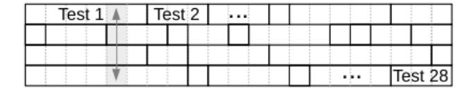
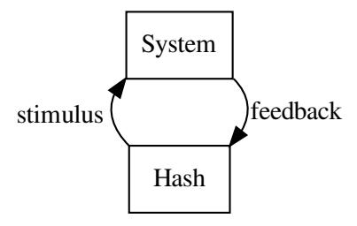

# MCU intrinsic group features for component authentication

# Frank.Schuhmacher@segrids.com

# 2020-02-01

#### Abstract

We provide a solution for the authentication of a component, accessory, smart card or tag by a main device via challenge-response-tests of two MCU intrinsic features: Progression in the execution of test programs (measured in processor clocks) and peripheral feedback to internal stimulation. The main device will be called challenger and the other device responder. Our solution requires that the authentic responders are characterized by a dedicated MCU model and a common responder ID in read-only MCU registers. Its main application is the detection/lock-out of counterfeit batteries, cartridges, sensors, or control units. The solution also suits as a redundant authentication factor in high security applications, such as payment, or conditional access.

# Contents

| 1 |     | Introduction                   | 2  |
|---|-----|--------------------------------|----|
|   | 1.1 | Problem Definition             | 2  |
|   | 1.2 | Progression<br>                | 2  |
|   | 1.3 | Peripheral Feedback<br>        | 3  |
|   | 1.4 | Responder Authentication       | 3  |
| 2 |     | The Authentication Scheme      | 4  |
|   | 2.1 | The Challenger Application<br> | 4  |
|   | 2.2 | The Responder Application<br>  | 4  |
| 3 |     | The Test Program               | 5  |
|   | 3.1 | The Electronic Logbook<br>     | 6  |
|   | 3.2 | The Feedback Loop              | 6  |
|   | 3.3 | The Timer Interrupt Handlers   | 8  |
| 4 |     | The Test Matrix                | 8  |
|   | 4.1 | The Test Plan                  | 9  |
|   | 4.2 | NVIC<br>                       | 10 |
|   | 4.3 | FMC                            | 10 |
|   | 4.4 | GPIO<br>                       | 11 |
|   | 4.5 | CRC                            | 12 |
| 5 |     | Rationale                      | 13 |

# 1 Introduction

# 1.1 Problem Definition

For anti-counterfeiting, cryptography is either vulnerable or expensive: cryptographic authentication is broken as soon as a single responder's secret key is disclosed. Due to immense revenues in product counterfeiting [1], a strong attack potential must be presumed. Cryptographic authentication without certified secure elements is most likely vulnerable to SPA, DPA, or fault injection attacks [2]. Certified secure elements are expensive for consumer mass products, and even certified secure elements are sometimes vulnerable [3].

Available non-cryptographic solutions are not practical: non-cryptographic PUF authentication schemes [4], [5] are based on responder specific challengeresponse-pairs (CRPs). Each time a challenger meets an unknown responder, it has to request a responder specific CRP from a back-end server with access to a CRP database. This makes it unpractical for anti-counterfeiting.

We present an authentication solution which is secure, practical, and cheap. It is secure, because, first, it is a non-cryptographic authentication scheme. No secret key is required thus, there is no risk of a key disclosure. Secondly, the solution is based on two MCU intrinsic features, which are laborious to simulate: progression and peripheral feedback. They will be introduced in the subsequent paragraphs. A realistic malicious responder within a counterfeit product will not be able to simulate them in real time.

It is practical because it is based on group features. In consequence, a CRP is suitable for the test of any responder. Challengers can either maintain their own CRP-list or incorporate a reference response generator. No connectivity between the challenger and a back-end is required.

It is cheap because it can be implemented purely in software with a moderate memory footprint.

# 1.2 Progression

If a processor or micro-controller executes a program, progression shall refer to the map of processor clock cycles to program execution states. Progression is an aspect of the processor's behavior [6]. It is a characteristics of processors or of micro-controllers with identical processor and bus system [7], [8].

Progression will be tested within test programs in two complementary variants: by sampling processor clock counts at dedicated program states, or, by sampling program states at dedicated processor clock counts. The test output is an electronic logbook of progression data.

The fact that sampling processor clock counts is sometimes used as a source of random data [9] shows that the program code and program initialization has to fulfill certain requirements in order to get a deterministic logbook: no caching, same clock source for CPU, memory and peripherals, pre-scaler synchronization, etc. Our first important observation is that determinism can be achieved at least for the tested micro-controller models SAM3x8e (Cortex-M3 processor) and HT32F52352 (Cortex-M0+ processor).

# 1.3 Peripheral Feedback

A complementary behavioral aspect of a micro-controller is its feedback to internal stimuli<sup>1</sup> . In our context, internal stimulus just means that the CPU writes a word into an addressable register, and feedback just means that the CPU reads a word from an addressable register. A feedback is a peripheral feedback, if this register belongs to a peripheral module of the MCU but not to the processor.

Peripheral feedback provides an MCU intrinsic hardware feature which depends on the hardware architecture, the peripheral module's behaviour and the behavioural dependency between different peripheral modules. Peripheral feedback will be tested by system self-tests. System self-tests will be specified in Section 3.2 via sequences of test items to be executed within a feedback loop. Examples will be provided in Section 4.

### 1.4 Responder Authentication

The combination of progression and peripheral feedback fulfills the SIMPL paradigm "Simulation possible, but laborious" defined in [10]. Cycle accurate simulation of the processor plus peripherals would provide progression and peripheral feedback as well. However, cycle accurate simulation of the processor alone is already laborious: simulation would take considerably longer on realistic malicious hardware than execution on authentic hardware.

Progression tests are suitable for the authentication of the processor type of a responder: in a simple variant, a challenger sends a program with progression test as a challenge to the responder; the responder executes the program; the program samples progression data in an electronic logbook and sends the electronic logbook as response back to the challenger.

A progression logbook or a hash sum over a progression logbook is suitable for processor authentication, but not for program authentication: most program modifications will change progression, but progression invariant program modifications exist, e.g. the replacement of an ALU instruction by a different ALU instruction, if the result of the instruction has no influence of the instruction flow later on.

A second important result of this article is that by extending a deterministic progression test by a program self-test, one can achieve a simultaneous processorprogram authentication. In a suitable extension, the electronic logbook covers program data in addition to progress data. Hashing the electronic logbook is required here, in order to prevent program data replacement after test execution.

By extending the electronic logbook by sampled payload data, one can even achieve a simultaneous processor-program-payload authentication. Payload is restricted to data which cannot be modified by a malicious component before – or by a third party during – program execution. Examples are data in read-only memory or a peripheral register value generated at run-time.

For the responder authentication, we apply simultaneous processor-programpayload authentication to the use case where payload covers two sorts of data:

1. The peripheral feedback of a set of peripherals that characterizes the responder's MCU model at least among all MCU models with the same processor type.

<sup>1</sup>We use the pairing "stimulus-feedback" instead of "stimulus-response", since in authentication "response" is already used in "challenge-response".

2. The responder ID, which characterizes authentic responders among all responders with the same MCU model.

In this setup, the simultaneous processor-program-payload authentication is a responder authentication. We suggest the acronym HELLO for "Hashing ELectronic LOgbooks".

# 2 The Authentication Scheme

### 2.1 The Challenger Application

For the authentication of a responder, the challenger application performs one challenge-response-test (CRT) or a sequence of more than one CRTs with a refresh operation in between. The challenger accepts responses only within a dedicated response time frame, and compares a response received in time with a reference response. The challenger either stores a CRP-list and selects for each CRT a CRP from the list, or the challenger is able to generate challenges randomly and encloses a reference responder for the generation of suitable reference responses. The first variant reduces challenger hardware costs. The second variant is necessary if refreshes are always required to achieve security for the given field of application and if the challenger has no access to a CRP server. The question wheather the first variant is sufficient is formally analyzed in the reference [11]. This reference also specifies the challenger implementation for the two variants and proves the security of authentication with "choked refresh" for the first variant in fields of application where replay attacks are not a realistic threat, and authentication with "always refresh" for the second variant.

## 2.2 The Responder Application

The responder is typically an accessory device or device component with a responder application in addition to the normal device control functionality. The responder application has four jobs:

- 1. Receive a challenge.
- 2. Load a test program in a challenge dependent way to the responder MCU's internal SRAM.
- 3. Execute the test program.
- 4. Send the test program's output as response to the challenger.

In this section, we focus on the second item.

#### 2.2.1 The Reference Test Program

The responder is programmed with a fixed reference test program in the responder application's data segment in flash memory. The reference test program is identical for all responders. The reference test program complies with the test program specification in Section 3.

#### 2.2.2 Swapping

A swap is the exchange of two 16-bit instructions in a 32-bit code word. The reference test program is implemented in such a way that a 256-byte block of its code segment consists of 64 pairs of 16 bit instructions, and each test program obtained by the application of swaps to these pairs again complies with the test program specification of Section 3.

The responder loads the reference test program code from flash to SRAM while swapping words in the swappable code block according to the first 64 bits of the challenge.

The progression of the test program obtained by a random challenge will be very different from the progression of the reference test program. This is due to the different timing of bus accesses. It is laborious to translate the progression logbook of the reference test program to the progression logbook of the challenge dependent test program.

#### 2.2.3 Braiding

The data segment of the reference test program contains a 4x25 test matrix as depicted in Figure 1. A row in the test matrix will be interpreted as a test thread in Section 3.



Figure 1: Test Matrix

The responder application contains a lookup table of 16 permutation of the set {1, 2, 3, 4} and maps 100 bits of the challenge to a sequence of 25 of these permutations. It loads the test matrix into RAM while applying the i-th permutation to the i-th column, for i = 1, ..., 25, as depicted in Figure 1, for i = 5. This will be referred to as braiding. It will be explained in Section 3 how braiding again messes up the electronic logbook generated by the test program.

### 2.2.4 The Initial Hash Value

The responder application writes 128 bits of the challenge to a buffer. It will be used as initial hash value by a hash function of the test program. Then the initialization of the challenge dependent test program is complete. The responder application branches to its entry point.

# 3 The Test Program

As described in Section 2.2, the responder application derives a test program from a reference test program stored in flash and a challenge. This section defines the challenge invariant structure of the test program's code section.

The test program covers a feedback loop and two timer interrupt handlers. A hash function is shared between feedback loop and interrupt handlers.

# 3.1 The Electronic Logbook

The responder's response to the challenge is a hash sum over an electronic logbook. The electronic logbook covers progression, program, and payload data. These three categories are not strictly disjoint, sometimes program or progression data are also considered as payload. Other examples of payload are readonly data and peripheral feedback. The complete electronic logbook is not saved or transmitted, only its hash sum is relevant.

We use a hash function with 4 word hash buffer shared by the feedback loop and the timer interrupt handlers. The hash function is a Merkle-Damg˚ardconstruction without length padding and a lightweight compression function. After bit-wise addition of a hash buffer word with the compression output, the resulting word of the hash buffer is rotated by a clock counter dependent value. This ensures a strong dependency of the hash function by the progression.

The complete challenge-response function is the composition:

challenge 7→ hash(logbook(prog(challenge))).

# 3.2 The Feedback Loop

Figure 2 depicts the feedback loop between the hash buffer and the system. It is the machinery for system self-test. In the feedback loop, the hash buffer has two functions: first, it's a source of pseudo-random stimulus data, and secondly, hashing the system feedback.



Figure 2: Feedback Loop

#### 3.2.1 Test Items

The feedback loop requires a sequence of test items, consisting of two addresses and three masks: a WriteAddress defines where to write the stimulus, a ReadAddress defines where to read the feedback.

Different bits in a word at WriteAddress are treated differently: dedicated bits are set, cleared, left unchanged, or changed pseudo-randomly (using the hash buffer as pseudo-random source). The bit assignment is realized by four masks defined in Table 1.

To save memory space, we encode these four masks in two words WriteMask0

| Mask      | Purpose                               |
|-----------|---------------------------------------|
| SetMask   | Stimulus bits to be set to 1.         |
| ClearMask | Stimulus bits to be set to 0.         |
| KeepMask  | Bits to remain unchanged by stimulus. |
| PrngMask  | Bits to be changed pseudo randomly.   |

Table 1: Stimulus bit assignment

and WriteMask1 defined as follows:

WriteMask0 :=SetMask|KeepMask WriteMask1 :=SetMask|ClearMask

Here, the | denotes the bit-wise or. Some bits of the feedback are to be ignored. The bits to be considered are selected by a ReadMask. A test item has a fivewords encoding:

```
(WriteMask0, WriteMask1, WriteAddress, ReadMask, ReadAddress)
```

The feedback loop loops column-by-column and row-by-row over the test matrix. In each round of the feedback loop, one test item is processed. Processing a test item covers four steps:

- 1. Derive the stimulus from the original value at WriteAddress, a pseudorandom value, i.e. a word of the current hash buffer, and the four masks of Table 1.
- 2. Write the stimulus to the WriteAddress.
- 3. Read the value at the ReadAddress.
- 4. Mask the read value with the ReadMask to obtain the feedback.

During the processing of a test item, eight data words are appended to the electronic logbook and hashed:

- The test-item in five-word encoding (program data).
- The feedback (progression, program or payload data, depending on the test item).
- The program counter and stack pointer (program data).

#### 3.2.2 Payload

Payload is authentic if the responder MCU reads it from the authentic memory address and appends it unmodified to the electronic logbook. Malicious responders might modify the authentic test program by address redirection or payload data manipulation for mocking authentic payload. As a countermeasure, payload data is read within the feedback loop. For some test items the ReadAddress points to payload data. In other words, payload data is handled a system feedback, even if it is read-only. Due to braiding, the access to payload data is difficult to predict from the perspective of a malicious responder. Mocking of an authentic responder by a malicious responder necessarily requires a coarse program modification, which will be detected by the progression logbook.

#### 3.2.3 Test Threads

We specify system self-tests as short sequences of test items. Examples are system internal peripheral tests and will be provided in Section 4. As depicted in Figure 1, the rows of the reference test matrix are concatenations of system selftests. We interpret these concatenations as four test threads, and the feedback loop as a system self-test multi-threading. The braiding of the test matrix is a challenge dependent scheduling of the four test threads.

For responder MCUs with little SRAM, test items can be read directly from flash while the braiding is done within the feedback loop. The cost is a small increase of run-time.

# 3.3 The Timer Interrupt Handlers

We simply say timer for a timer/counter module of the responder MCU. We clock timers by the same clock source as the CPU. If timer clocks are pre-scaled, the responder application needs to run a sync procedure in order to enter the test program always at the the same clock phase of each active timer. This is a pre-requisite for a deterministic progression.

We implement interrupt handlers for at least two timers. A timer interrupt will be triggered by a timer reaching the value of a compare value register.

The compare value will be changed multiple times during the run of the test program in order to interrupt the feedback loop at pseudo-random run-times. This makes progression difficult to predict. Additionally, the timer interrupt handlers have the following jobs:

- 1. Sample the program state at the interrupt time and append it as progression data to the electronic logbook. The program state includes at least the stacked return address.
- 2. Sample program data in a pseudo-random order and append it to the electronic logbook. This is realized by using the return address as a pointer to program data. The interrupt handler logs several consecutive code words starting from the return address. The timer interrupts have to occur sufficiently often to achieve full code coverage with high probability. By changing interrupt priorities dynamically, it can be achieved that the two timer interrupt handlers append their code mutually to the electronic logbook.
- 3. The first timer interrupt handler modifies the configuration of the second timer pseudo-randomly and vice-versa. A suitable modification is to set the timer compare value register to the current timer value plus a pseudorandom offset.
- 4. Swap code dynamically. This is an additional simulation countermeasure. A suitable code word to be swapped is selected again with the help of the stacked return address.

# 4 The Test Matrix

As described in Section 2.2, the responder application derives a test program from a reference test program stored in flash, and a challenge. The test program consists of a program code, as specified in Section 3, and a test matrix as program data.

As specified in Section 2.2, the responder application derives the test matrix from the challenge and a reference test matrix stored in flash memory.

In this section, we describe the construction of a reference test matrix. The reference test matrix is MCU model specific. Its rows are concatenations of systems self tests. Each system self test is defined by a short sequences of test items (and the program code).

System self-tests are intended for testing peripheral modules, or dependencies between peripheral modules. Peripheral either refers to a processor or a processor external MCU peripheral. System self-tests are MCU model specific. For convenience we focus on an example MCU in this section: we have chosen the Holtek HT32F52352, since the manufacturer offers the MCU customization by a factory programmable three-word custom ID.

We assume that Holtek and the responder manufacturer fix a responder ID as custom ID for all MCUs delivered by Holtek to the responder manufacturer and ensure (by contracts and suitable organizatorial means) that no third party will ever have access to HT32F52352 MCUs with the fixed responder ID as custom ID.

### 4.1 The Test Plan

As requested in Section 1.4, the system self tests shall cover tests of a set of peripherals whose behaviour characterizes the MCU model at least among all MCU products with a Cortex-M0+ processor. For HT32F52352, we choose the set of peripherals depicted in Figure 3.

| NVIC, SCB | SysTick | PDMACH0 | Memory,    |
|-----------|---------|---------|------------|
| FMC       | GPTM0   | PDMACH1 | Custom ID, |
| GPIO      | SCTM    | PDMACH2 |            |
| CRC       | МСТМ    | PDMACH3 | Code       |

Figure 3: Test Plan

The figure assigns peripheral modules to the four rows of the test matrix (i.e. to the four test threads, see Section 3.2.3). The first column covers modules providing a very characteristic functionality and well-suited for internal testing: the Cortex internal peripherals SCB and NVIC, the Flash Controller FMC, the GPIO module, and the CRC module.

The second column assigns different timer modules to the four threads. Timer modules are well-suited for testing: on one hand-side for testing their own functional behaviour, and on the other hand-side for sampling additional progression data.

The third column assigns different peripheral direct memory access (PDMA) channels to the four threads. PDMA channels are tested in combination with a second peripheral. PDMA is well-suited for testing the MCU specific memory arbiter. Furthermore, activation of a PDMA increases the complexity of cycle accurate simulation.

The fourth column, ranging over all four rows, lists test candidates to be tested in all threads. The internal tests are not well-suited for testing the communication interfaces (I2C, SPI, UART, ...). We restrict the testing on the read-write behaviour of their configuration registers. Since the testing always includes the register addressing, these tests are still valuable for the MCU characterization.

Figure 3 only provides a vertical assignment. Tests within the rows will be mixed such that in the end the structure of the test matrix is as in Figure 1. Several test items in each row will have a pointer to code and the custom ID as read address.

To demonstrate the specification of system self-tests in detail, we describe the first test of each row of our reference test matrix of the HT32F52352 in the subsequent paragraphs.

### 4.2 NVIC

The nested vectored interrupt controller (NVIC) is an ARM-v6 specific processor peripheral. In our HT32F52352 example, the test program has interrupt handlers for the timer modules BFTM0 and BFTM1 described in Section 15 of [12]. Their interrupt numbers are 17 and 18. The role of the timer interrupt handlers was specified in Section 3.3 .

We implement system tests, where the two interrupts are disabled, enabled, set to pending by software, and where the priorities of the two interruts are changed. One example of such a test covers the following six steps:

- 1. Write to the "Interrupt 16-19 Priority Register" to set the priority of interrupt 17 to one. Read a code word.
- 2. Write a random bit to the "Interrupt Clear Enable Register" to disable interrupt 17 maybe. Read next code word.
- 3. Write a random bit to the "Interrupt Set Enable Register" to enable interrupt 17 maybe. Read next code word.
- 4. Write a bit to the "Interrupt Set Pending Register" to set interrupt 17 pending. Read next code word.
- 5. Write to the "Interrupt Set Enable Register" to enable interrupt 17 for sure. Read the "Interrupt Control and State Register".
- 6. Write to the "Interrupt 16-19 Priority Register" to set the priority of interrupt 17 to zero. Read next code word.

Refer to the product user manual [12] for the register descriptions. The corresponding sequence of six test items is depicted in Table 2. All numbers in the table are hexadecimal.

The read addresses 0x1220-0x1230 point to the interrupt handlers that remain in flash memory.

# 4.3 FMC

The FMC is the flash memory controller of the HT32F52352. We apply stimuli to the FMC module to mess up the timing of flash memory accesses and in

| Test Item    | 0        | 1        | 2        |
|--------------|----------|----------|----------|
| WriteAddress | e000e410 | e000e180 | e000e100 |
| SetMask      | 100      | 0        | 0        |
| clearMask    | 0        | 0        | 0        |
| KeepMask     | fffffeff | fffffdff | fffffdff |
| PrndMask     | 0        | 200      | 200      |
| ReadAddress  | 1220     | 1224     | 1228     |
| ReadMask     | ffffffff | ffffffff | ffffffff |
| Test Item    | 3        | 4        | 5        |
| WriteAddress | e000e200 | e000e100 | e000e410 |
| SetMask      | 200      | 200      | 0        |
| ClearMask    | 0        | 0        | 100      |
| KeepMask     | fffffdff | fffffdff | fffffeff |
| PrndMask     | 0        | 0        | 0        |
| ReadAddress  | 122C     | e000ed04 | 1230     |
| ReadMask     | ffffffff | ffffffff | ffffffff |

Table 2: NVIC test example

consequence mess up the progression. Two bits of the "Flash Cache and Prefetch Control Register" are suitable: bit 12 enables the branch cache, and bit 4 enables the pre-fetch buffer. We will not change the setting of flash wait states (bits 2:0), since this caused non-deterministic progression in our tests.

Five FMC read-only registers are suitable for the MCU and responder characterization and will serve as peripheral feedback: the "Flash Page Number Status Register", "Flash Page Size Status Register", and the three "Custom ID" registers. An example for a system test consisting of a single test item is shown in Tabel 3. We instanciate this test multiple times within the test matrix variating only the read address.

| Test Item    | 0        |
|--------------|----------|
| WriteAddress | 40080200 |
| SetMask      | 0        |
| ClearMask    | 0        |
| KeepMask     | ffffffed |
| PrndMask     | 00000012 |
| ReadAddress  | 40080310 |
| ReadMask     | ffffffff |

Table 3: FMC test example

# 4.4 GPIO

For testing the general purpose IO module (GPIO), we focus on port C and assume that the pins C11 and C12 are connected via a 50 Ohm resistor as loopback. The test program initialization shall cover the clocking the alternative function IO module (AFIO), and the GPIO port C, and the configuration of pin C11 as output and pin C12 as input. We provide a test example covering the following steps:

1. Write bit 11 of the "Port C Output Set and Reset Control Register"

pseudo-randomly to set pin C11. Read the pin C12 status.

- 2. Write bit 12 of the "GPIO Port C AFIO Configuration Register 1" pseudorandomly to select an alternative function for pin C11 between 0 and 1. Read the pin C12 status.
- 3. Clear bit 12 of the "GPIO Port C AFIO Configuration Register 1" to select alternative function 0 for pin C11. Read the pin C12 status.
- 4. Write bit 12 of the "Port C Pull-Down Selection Register" pseudo-randomly. Read the pin C12 status.
- 5. Write bit 11 of the "Port C Open Drain Selection Register" pseudorandomly. Read the pin C12 status.
- 6. Write bit 12 of the "Port C Pull-Up Selection Register" pseudo-randomly. Read the pin C12 status.

An implementation of this test as sequence of test items is depicted in Table 4.

| Test Item    | 0        | 1        | 2        |
|--------------|----------|----------|----------|
| WriteAddress | 400b4024 | 40022034 | 40022034 |
| SetMask      | 0        | 0        | 0        |
| ClearMask    | 0        | 0        | 1000     |
| KeepMask     | fffffbff | ffffefff | ffffefff |
| PrndMask     | 400      | 1000     | 0        |
| ReadAddress  | 400b401c | 400b401c | 400b401c |
| ReadMask     | 1000     | 1000     | 1000     |
| Test Item    | 3        | 4        | 5        |
| WriteAddress | 400b400c | 400b4010 | 400b4008 |
| SetMask      | 0        | 0        | 0        |
| ClearMask    | 0        | 0        | 0        |
| KeepMask     | ffffefff | fffffbff | ffffefff |
| PrndMask     | 1000     | 400      | 1000     |
| ReadAddress  | 400b401c | 400b401c | 400b401c |
| ReadMask     | 1000     | 1000     | 1000     |

Table 4: GPIO test example

### 4.5 CRC

The CRC module of the HT32F52352 has a big variety of configurations which makes it well suited for testing. We provide a test example of the CRC in combination with the PDMA module covering the following steps:

- 1. Write a 16-bit random value into the "CRC Control Register". Read the first custom ID word.
- 2. Write a random value into the "CRC Seed Register". Read the second custom ID word.
- 3. Write a RAM address of the test program code to the "PDMA channel 3 Source Address Register". Read the third custom ID word.

- 4. Write the address of the "CRC Data Register" into the "PDMA channel 3 Destination Address Register". Read a code word.
- 5. Set the PDMA transfer size to 4 blocks `a 250 bytes. Read the next code word.
- 6. Write the "PDMA Control Register" in order to assign random priority to PDMA channel 3, use circular dest address mode, and start transfer. Read the PDMA interrupt status.
- 7. Write a pseudo-random value to a RAM buffer. Read the "PDMA Current Transfer Size Register".
- 8. Write a pseudo-random value to a RAM buffer. Read the "CRC Checksum Register".

An implementation of this test as sequence of test items is depicted in Table 5.

| Test Item    | 0        | 1        | 2        | 3        |
|--------------|----------|----------|----------|----------|
| WriteAddress | 4008a000 | 4008a004 | 4009004c | 40090050 |
| SetMask      | 0        | 0        | 20001000 | 4008a00c |
| ClearMask    | 0        | 0        | dfffefff | bff75ff3 |
| KeepMask     | ffffff00 | 0        | 0        | 0        |
| PrndMask     | ff       | ffffffff | 0        | 0        |
| ReadAddress  | 40080310 | 40080314 | 40080318 | 123C     |
| ReadMask     | ffffffff | ffffffff | ffffffff | ffffffff |
| Test Item    | 4        | 5        | 6        | 7        |
| WriteAddress | 40090058 | 40090048 | 20002000 | 20002000 |
| SetMask      | 400fa    | 021      | 0        | 0        |
| ClearMask    | fffbff05 | cde      | 0        | 0        |
| KeepMask     | 0        | fffff000 | 0        | 0        |
| PrndMask     | 0        | 300      | ffffffff | ffffffff |
| ReadAddress  | 1240     | 4009005c | 40090120 | 4008a008 |
| ReadMask     | ffffffff | ffff0000 | 7fffffff | ffffffff |

Table 5: CRC test example

# 5 Rationale

A test program covering a feedback loop as specified in Section 3.2 and two timer interrupt handlers as specified in Section 3.3 is suitable for simultaneous processor-program-payload-authentication, and in consequence for responder authentication:

Coarse program modifications lead to a modified progression and will be detected by the sampling of progression data in the feedback loop and in the interrupt handlers.

Progression invariant modifications will still be detected. Modifications in the feedback loop by sampling program code at pseudo-random program addresses within the interrupt handlers; modifications in the interrupt handlers by sampling program code by indirect reads within the feedback loop.

Modifications of entries in the test matrix will be detected since test items are appended to the electronic logbook in the feedback loop. Modifications in order to mock authentic payload require coarse program modifications.

Modification of electronic logbook data after the termination of the feedback loop and re-computation of the hash sum is not possible: the hash function strongly depends on progression and is thus bound to the authentic program execution on the authentic MCU.

Mocking an authentic responder is as laborious as a cycle accurate simulation of the responder MCU processor and the characteristic MCU peripherals. A realistic malicious responder will not be able to do this within the response time frame.

# References

- [1] Michigan State University, "Defining the threat of product counterfeiting," 2019. https://www.michiganstateuniversityonline.com/resources/ acapp/threat-of-product-counterfeiting/.
- [2] "Requirements to perform integrated circuit evaluations," May 2013. https://www.commoncriteriaportal.org/files/supdocs/ CCDB-2013-05-001.pdf.
- [3] M. Wagner and S. Heyse, "Single–trace template attack on the DES round keys of a recent smart card," Cryptology ePrint Archive, Report 2017/057, 2017. https://eprint.iacr.org/2017/057.
- [4] R. S. Pappu, "Physical one-way functions," PhD thesis, MIT, 2001.
- [5] S. Devadas, G. E. Suh, S. Paral, R. Sowell, T. Ziola, and V. Khandelwal, "Design and implementation of PUF-based "unclonable" RFID ICS for anti-counterfeiting and security applications," International Conference on RFID, pages 58–64, 2008.
- [6] W. Prenninger and A. Pretschner, "Abstractions for model-based testing," 2004. https://mediatum.ub.tum.de/doc/1246353/1246353.pdf.
- [7] M. Reshadi and N. Dutt, "Generic pipelined processor modeling and high performance cycle-accurate simulator generation," Proceedings of the Conference on Design, Automation and Test in Europe—Volume 2, Washington, DC, USA: IEEE Computer Society, p. 786–791, 2005.
- [8] J. Bauer and F. Freiling, "Towards cycle-accurate emulation of cortex-M code to detect timing side channels," 11th International Conference on Availability, Reliability and Security, IEEE, 2016.
- [9] S. M¨uller, "CPU time jitter based non-physical true random number generator," https://pdfs.semanticscholar.org/af73/ 17c970fd416646b2e46659c9624108be4fcc.pdf.
- [10] U. R¨uhrmair, "SIMPL systems as a keyless cryptographic and security primitive," D. Naccache (Editor), Cryptography and Security: From Theory to Applications - Essays Dedicated to Jean-Jacques Quisquater on the

- Occasion of His 65th Birthday. Lecture Notes in Computer Science, Vol. 6805, Springer, 2012.
- [11] F. Schuhmacher, "Relaxed freshness in component authentication," 2020.
- [12] Holtek, "HT32F52342/HT32F52352 user manual, holtek 32-bit microcontroller with ARM Cortex-M0+ core." Revision: V1.30, September 28, 2018.