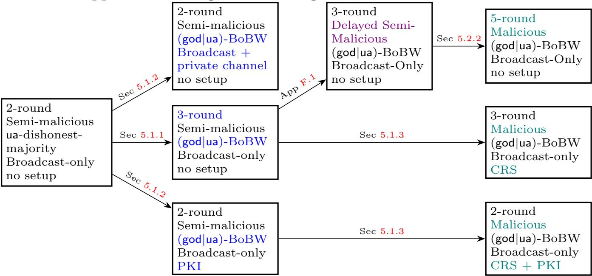

{0}------------------------------------------------

# On the Exact Round Complexity of Best-of-both-Worlds Multi-party Computation

Arpita Patra<sup>1</sup> , Divya Ravi<sup>1</sup> , Swati Singla2?

1 Indian Institute of Science, India. {arpita,divyar}@iisc.ac.in <sup>2</sup> Google India, Bangalore. swatis@iisc.ac.in

Abstract. The two traditional streams of multiparty computation (MPC) protocols consist of– (a) protocols achieving guaranteed output delivery (god) or fairness (fn) in the honest-majority setting and (b) protocols achieving unanimous or selective abort (ua, sa) in the dishonestmajority setting. The favorable presence of honest majority amongst the participants is necessary to achieve the stronger notions of god or fn. While the constructions of each type are abound in the literature, one class of protocols does not seem to withstand the threat model of the other. For instance, the honest-majority protocols do not guarantee privacy of the inputs of the honest parties in the face of dishonest majority and likewise the dishonest-majority protocols cannot achieve god and fn, tolerating even a single corruption, let alone dishonest minority. The promise of the unconventional yet much sought-after species of MPC, termed as 'Best-of-Both-Worlds' (BoBW), is to offer the best possible security depending on the actual corruption scenario.

This work nearly settles the exact round complexity of two classes of BoBW protocols differing on the security achieved in the honest-majority setting, namely god and fn respectively, under the assumption of no setup (plain model), public setup (CRS) and private setup (CRS + PKI or simply PKI). The former class necessarily requires the number of parties to be strictly more than the sum of the bounds of corruptions in the honest-majority and dishonest-majority setting, for a feasible solution to exist. Demoting the goal to the second-best attainable security in the honest-majority setting, the latter class needs no such restriction.

Assuming a network with pair-wise private channels and a broadcast channel, we show that 5 and 3 rounds are necessary and sufficient for the class of BoBW MPC with fn under the assumption of 'no setup' and 'public and private setup' respectively. For the class of BoBW MPC with god, we show necessity and sufficiency of 3 rounds for the public setup case and 2 rounds for the private setup case. In the no setup setting, we show the sufficiency of 5 rounds, while the known lower bound is 4. All our upper bounds are based on polynomial-time assumptions and assume black-box simulation. With distinct feasibility conditions, the classes differ in terms of the round requirement. The bounds are in some cases different and on a positive note at most one more, compared to the maximum of the needs of the honest-majority and dishonest-majority setting. Our results remain unaffected when security with abort and fairness are upgraded to their identifiable counterparts.

<sup>?</sup> This article is the full version of an earlier article to appear in ASIACRYPT 2020.

{1}------------------------------------------------

# 1 Introduction

In secure multi-party computation (MPC) [\[1,](#page-30-0)[2,](#page-30-1)[3\]](#page-30-2), n parties wish to jointly perform a computation on their private inputs in a way that no adversary A actively corrupting a coalition of t parties can learn more information than their outputs (privacy), nor can they affect the outputs of the computation other than by choosing their own inputs (correctness). MPC protocol comes in distinct flavours with varying degree of robustness– guaranteed output delivery (god), fairness (fn), unanimous abort (ua) and selective abort (sa). The strongest security, god, implies that all parties are guaranteed to obtain the output, regardless of the adversarial strategy. In the weaker notion of fn, the corrupted parties receive their output if and only if all honest parties do. In the further weaker guarantee of ua, fairness may be compromised, yet the adversary cannot break unanimity of honest parties. That is, either all or none of the honest parties receive the output. Lastly, sa security, the weakest in the lot, allows the adversary to selectively deprive some honest parties of the output.

While highly sought-after, the former two properties can only be realised, when majority of the involved population is honest [\[4\]](#page-30-3). In the absence of this favorable condition, only the latter two notions can be attained. With these distinct affordable goals, MPC with honest majority [\[5,](#page-30-4)[6,](#page-30-5)[7,](#page-30-6)[8,](#page-30-7)[9,](#page-30-8)[10,](#page-31-0)[11\]](#page-31-1) and dishonest majority [\[1](#page-30-0)[,12,](#page-31-2)[13,](#page-31-3)[14](#page-31-4)[,15,](#page-31-5)[16,](#page-31-6)[17\]](#page-31-7) mark one of the earlier demarcations in the world of MPC. With complementary challenges and techniques, each setting independently stands tall with spectacular body of work. Yet, the most worrisome shortcoming of these generic protocols is that: a protocol in one setting completely breaks down in the other setting i.e. the security promises are very rigid and specific to the setting. For example, a protocol for honest majority might no longer even be "private" or "correct" if half (or more) of the parties are corrupted. A protocol that guarantees security with ua for arbitrary corruptions cannot pull off the stronger security of god or fn even if only a "single" party is corrupt. In many real-life scenarios, it is highly unlikely for anyone to guess upfront how many parties the adversary is likely to corrupt. In such a scenario, the best a practitioner can do, is to employ the 'best' protocol from her favorite class and hope that the adversary will be within assumed corruption limit of the employed protocol. If the guess fails, the employed protocol, depending on whether it is an honest or dishonest majority protocol, will suffer from the above mentioned issues. The quest for attaining the best feasible security guarantee in the respective settings of honest and dishonest majority in a single protocol sets the beginning of a brand new class of MPC protocols, termed as 'Best of Both Worlds (BoBW)' [\[18,](#page-31-8)[19,](#page-31-9)[20\]](#page-31-10). In critical applications like voting [\[21,](#page-31-11)[22\]](#page-31-12), secure auctions [\[23\]](#page-31-13), secure aggregation [\[24\]](#page-31-14), federated learning and prediction [\[25,](#page-31-15)[26\]](#page-31-16), financial data analysis [\[27\]](#page-31-17) and others, where privacy of the inputs of an honest party needs protection at any cost and yet a robust completion is called for (as much as theoretically feasible), BoBW protocols are arguably the best fit.

Denoting the threshold of corruption in honest and dishonest majority case by t and s respectively, an ideal BoBW MPC should promise the best possible security in each corruption scenario for any population of size n, as long 

{2}------------------------------------------------

as t < n/2 and s < n. Quite contrary to the expectation, the grand beginning of BoBW MPC with the works of [\[18](#page-31-8)[,19,](#page-31-9)[20\]](#page-31-10) is mostly marred with pessimistic results showing the above goal is impossible for many scenarios. For reactive functionalities that receive inputs and provide outputs in multiple rounds maintaining a state information between subsequent invocations, it is impossible to achieve BoBW security [\[18\]](#page-31-8). While theoretical feasibility is not declined, nonreactive or standard functionalities are shown to be impossible to realise as long as t + s ≥ n in expected polynomial time (in the security parameter), making any positive result practically irrelevant [\[19,](#page-31-9)[20\]](#page-31-10). A number of meaningful relaxations were proposed in the literature to get around the impossibility of BoBW security when t + s ≥ n [\[19](#page-31-9)[,20\]](#page-31-10). The most relevant to our work is the relaxation proposed in [\[28\]](#page-31-18) where the best possible security of god is compromised to the second-best notion of fn in the honest-majority setting. Other attempts to circumvent the impossibility result appear in [\[18\]](#page-31-8) and [\[19,](#page-31-9)[29\]](#page-31-19) where the security in dishonest-majority setting is weakened to allowing the adversary to learn s evaluations of the function (each time with distinct inputs exclusively corresponding to the corrupt parties) in the former and achieving a weaker notion of O(1/p)-security with abort (actions of any polynomial-time adversary in the real world can be simulated by a polynomial-time adversary in the ideal world such that the distributions of the resulting outcomes cannot be distinguished with probability better than O(1/p)) in the latter. [\[18\]](#page-31-8) shows yet another circumvention by weakening the adversary in dishonest-majority case from active to passive. On the contrary, constructions are known when t + s < n is assumed [\[18\]](#page-31-8), tolerating active corruptions and giving best possible security in both the honest and dishonest majority case.

In this work, we consider two types of BoBW MPC protocols and study their exact round complexity: (a) MPC achieving the best security of god and ua in the honest and dishonest majority setting respectively assuming s + t < n, referred as (god|ua)-BoBW; (b) MPC achieving second-best security notion of fn in the honest majority and the best possible security of ua in the dishonest majority for any n, referred as (fn|ua)-BoBW. The adversary is considered malicious, rushing and polynomially-bounded in either world. The latter notion (introduced in [\[28\]](#page-31-18)) is an elegant and meaningful relaxation that brings back the true essence of BoBW protocols with no constraint on n, apart from the natural bounds of t < n/2 and s < n. Furthermore, fn is almost as good as god for many practical applications where the adversary is rational enough and does not wish to fail the honest parties at the expense of losing its own output. In spite of immense practical relevance of BoBW protocols, the question of their exact round complexity has not been tackled so far. Below, we review relevant literature on BoBW protocols and exact round complexity of MPC.

#### 1.1 On the Round Complexity of BoBW MPC

The phenomenal body of work done on round complexity catering to various adversarial settings and network models emphasises its theoretical importance 

{3}------------------------------------------------

and practical relevance. For instance, the exact round complexity of MPC independently in honest and dishonest majority has been examined and the recent literature is awash with a bunch of upper bounds that eluded for quite a long time [\[30](#page-31-20)[,31,](#page-31-21)[16,](#page-31-6)[17\]](#page-31-7). We review the round complexity of the honest-majority and dishonest-majority MPC in the cryptographic setting which define natural yet possibly loose bounds for the BoBW MPC. To begin with, 2 rounds are known to be necessary to realize any MPC protocol, regardless of the setting, no matter whether a setup is assumed or not as long as the setup (when assumed) is independent of the inputs of the involved parties [\[32\]](#page-31-22).

In the dishonest-majority setting, when no setup is assumed (plain model) 4 rounds are necessary [\[33\]](#page-31-23). Tight upper bounds appear in [\[14,](#page-31-4)[15,](#page-31-5)[16,](#page-31-6)[17,](#page-31-7)[34\]](#page-32-0), with the latter three presenting constructions under polynomial-time assumptions, yet with sa security. In the presence of a public setup (Common Reference String a.k.a. CRS setting), the lower bound comes down to 2 rounds [\[32\]](#page-31-22). A series of work present matching upper bounds under various assumptions [\[13,](#page-31-3)[35,](#page-32-1)[36\]](#page-32-2), culminating with the works of [\[30,](#page-31-20)[31\]](#page-31-21) that attain the goal under the minimal assumption of 2-round oblivious transfer (OT). In the honest-majority setting and in plain model, 3 rounds are shown to be necessary for fn (and hence for god) protocols, in the presence of pairwise-private and broadcast channels for t ≥ 2 active corruptions [\[37\]](#page-32-3) and for any t as long as n/3 < t < n/2 [\[38\]](#page-32-4). The results of [\[37](#page-32-3)[,38\]](#page-32-4) hold in the presence of CRS but does not hold in the presence of correlated randomness setup such as PKI. Circumventing the lower bound of 3 for fn, [\[39\]](#page-32-5) shows a 2-round 4PC protocol against a single active corruption achieving god even without a broadcast channel. The matching upper bounds appear in [\[11\]](#page-31-1) for the general case under public-key assumption, and in [\[38\]](#page-32-4) for the special case of 3PC under the minimal assumption of (injective) OWF. In the CRS model, 3 rounds remains to be the lower bound for fn in a setting where broadcast is the only medium of communication (broadcast-only setting) [\[40\]](#page-32-6) and additionally with point-to-point channels [\[38,](#page-32-4)[37,](#page-32-3)[41\]](#page-32-7). Given PKI, the bound can be improved to 2 [\[40\]](#page-32-6).

In the BoBW setting, constant-round protocols are presented in (or can be derived from) [\[18](#page-31-8)[,20\]](#page-31-10) for (god|ua)-BoBW and BoBW where only semi-honest corruptions are tolerated in the dishonest majority. The recent work of [\[42\]](#page-32-8) settled the exact round complexity of the latter class, as a special case of a strong adversarial model that allows both active (with threshold ta) and passive (with threshold tp, which subsumes the active corruptions) corruption for a range of thresholds for (ta, tp) starting from (dn/2e −1, bn/2c) to (0, n−1). Lastly, the round complexity of BoBW protocols of [\[29\]](#page-31-19) that achieve 1/p- security with abort in dishonest-majority (and god in honest majority), depends on the polynomial p(κ) (where κ denotes the security parameter).

## 1.2 Our Results

This work nearly settles the exact round complexity for two classes of BoBW protocols, (god|ua)-BoBW and (fn|ua)-BoBW, under the assumption of no setup (plain model), public setup (CRS) and private setup (CRS + PKI or simply 

{4}------------------------------------------------

PKI). The adversary is assumed to be rushing, active and static. The parties are connected via pair-wise private channels and an additional broadcast channel. All our upper bounds are based on polynomial-time assumptions and assume black-box simulation. We summarise our results below.

(fn|ua)-BoBW. We settle the exact round complexity of this class of BoBW protocols by establishing the necessity and sufficiency of: (a) 5 rounds in the plain model and (b) 3 rounds in both the public (CRS) and private (CRS+PKI) setup setting. In the CRS model, the necessity of 3 rounds for honest-majority MPC achieving fn (and hence for (fn|ua)-BoBW) has been demonstrated in [40,37,38], the former in a setting where broadcast is the only mode of communication (broadcast-only) and the latter two additionally with pairwise-private channels. However, these results do not hold in the presence of PKI. Our lower bound argument, on the other hand, is resilient to the presence of both CRS and PKI, and further holds in the presence of broadcast and pairwise-private channels.

|                                                                                                               | No setup (Plain Model)                                              | Public Setup (CRS)                                       | Private Setup (CRS + PKI)      |
|---------------------------------------------------------------------------------------------------------------|---------------------------------------------------------------------|----------------------------------------------------------|--------------------------------|
| $\begin{array}{l} \textbf{Honest Majority} \\ t < n/2 \\ \text{fn } / \operatorname{god} \end{array}$         | Round: 3                                                            | Round: 3                                                 | Round: 2                       |
|                                                                                                               | Lower Bound: [38,37]                                                | Lower Bound: [38,37]                                     | Lower Bound: [32]              |
|                                                                                                               | Upper Bound: [11,43]                                                | Upper Bound: [40,11,43]                                  | Upper Bound: [40]              |
| $\begin{array}{c} \textbf{Dishonest Majority} \\ s < n \\ sa \ / \ ua \end{array}$                            | Round: 4                                                            | Round: 2                                                 | Round: 2                       |
|                                                                                                               | Lower Bound: [33]                                                   | Lower Bound: [32]                                        | Lower Bound: [32]              |
|                                                                                                               | Upper Bound: [16,17,34]                                             | Upper Bound: [13,35]                                     | Upper Bound: [13,35]           |
|                                                                                                               | (sa only)                                                           | [36,30,31]                                               | [36,30,31]                     |
| $\begin{array}{l} \hline \\ \text{(fn ua)-BoBW} \\ t < n/2, s < n \\ \text{fn } \& \text{ ua} \\ \end{array}$ | Round: 5                                                            | Round: 3                                                 | Round: 3                       |
|                                                                                                               | Lower Bound: <b>This paper</b>                                      | Lower Bound: [37,38]                                     | Lower Bound: <b>This paper</b> |
|                                                                                                               | Upper Bound: <b>This paper</b>                                      | Upper Bound: This paper                                  | Upper Bound: <b>This paper</b> |
|                                                                                                               | Round: –<br>Lower Bound: 4 [33]<br>Upper Bound: 5 <b>This paper</b> | Round: 3 Lower Bound: This paper Upper Bound: This paper |                                |

<span id="page-4-0"></span>Table 1: Summary of results

(god|ua)-BoBW. In this regime, we demonstrate that 4, 3 and 2 are the respective lower bounds in the no-setup, public setup and private setup setting. The first lower bound follows from the fact that BoBW MPC in this class trivially subsumes the dishonest majority MPC when t=0 and the lower bound for dishonest-majority MPC is 4 [33]. The last lower bound follows from the standard 2-round bound for MPC needed to counter "residual function attack" [32]. Regarding the lower bound of 3 for the public setup (CRS) setting, we point that it follows directly from the 2-round impossibility of MPC with fn for honest majority in the CRS model [40,38,37] for most values of (t, s, n) satisfying s+t < n. However, these existing results do not rule out the possibility of 2-round (god|ua)-BoBW MPC for  $(t = 1, s > t, n \ge 4)$ . (In fact the protocols of [44,39] circumvent the 3-round lower bound for fn when  $t=1, n\geq 4$ ). We address this gap by giving a unified proof that works even for s > t, for all values of t (including t=1). This is non-trivial and it demonstrably breaks down in the presence of PKI. The bounds are totally different from the ones for previous class, owing to the different feasibility condition of s + t < n. While our upper bound falls 

{5}------------------------------------------------

merely one short of matching the first lower bound in case of no-setup, the upper bounds of the other two settings are tight. We leave the question of designing or alternately proving the impossibility of 4-round (god|ua)-BoBW MPC protocol as open. Our results summarised and put along with the bounds known in the honest and dishonest majority setting appear in Table [1.](#page-4-0)

Extensions. We can boost the security of all our protocols to offer identifiability (i.e. public identifiability of the parties who misbehaved) when abort happens– (fn|ua)-BoBW protocols with identifiable fairness and abort in honest and dishonest majority setting respectively and (god|ua)-BoBW protocols with identifiable abort in dishonest-majority setting. Our lower bound results hold as is when ua and fn are upgraded to their stronger variants with identifiability. Furthermore, all our upper bounds relying on CRS have instantiations based on a weaker setup, referred as common random string, owing to the availability of 2-round OT [\[45\]](#page-32-11) and Non-Interactive Zero Knowledge (NIZK) [\[46\]](#page-32-12) under the latter setup assumption. Lastly, we also propose few optimizations to minimize the use of broadcast channels in our compilers upon which our upper bounds are based. Specifically, these optimizations preserve the round complexity of our upper bounds at the cost of relaxing the security notion in dishonest majority setting to sa (as opposed to ua).

#### 1.3 Techniques

(fn|ua)-BoBW. The lower bounds are obtained via a reduction to 3-round OT in plain model and 1-round OT in private setup setting, both of which are known to be impossible [\[33,](#page-31-23)[32\]](#page-31-22) (albeit under the black-box simulation paradigm which is of concern in this paper). The starting point is a protocol π between 3 parties which provides fn when 1 party is corrupt and ua when 2 parties are corrupt, in 4 rounds when no setup is assumed and 2 rounds when private/public setup is assumed. The heart of the proof lies in devising a function f such that the realization of f via π, barring its last round, leads to an OT.

The upper bounds are settled with a proposed generic compiler that turns an r-round dishonest-majority MPC protocol achieving ua to an (r + 1)-round BoBW MPC protocol information-theoretically. The compiler churns out a 5 round and a 3-round BoBW protocol in the plain model and in the presence of a CRS respectively, when plugged with appropriate ua-secure dishonest-majority protocol in the respective setting. Since the constructions of the known 4-round dishonest-majority MPC relying on polynomial-time assumptions [\[16,](#page-31-6)[17,](#page-31-7)[34\]](#page-32-0) provide only sa security, we transform them to achieve ua for our purpose which invokes non-triviality for [\[16\]](#page-31-6). With CRS, the known constructions of [\[30,](#page-31-20)[31\]](#page-31-21) achieve unanimity and readily generate 3-round BoBW protocols.

Our compiler motivated by [\[47\]](#page-32-13) uses the underlying r-round protocol to compute authenticated secret sharing of the output y with a threshold t(< n/2) enabling the output reconstruction to occur in the last round. Fairness is ensured given the unanimity of the underlying protocol and the fact that the adversary (controlling t corrupt parties) has no information about the output y from the 

{6}------------------------------------------------

t shares he owns. However, using pairwise MACs for authentication defies unanimity in case of arbitrary corruptions because a corrupt party can choose to provide a verified share to a selected set of honest parties enabling their output reconstruction while causing the rest to abort. To address this, a form of authentication used in the Information Checking Protocol (ICP) primitive of [\[48](#page-32-14)[,49\]](#page-32-15) and unanimously identifiable commitments (UIC) of [\[50\]](#page-32-16) can be used. This technique maintains unanimity amongst the honest parties during output reconstruction.

(god|ua)-BoBW. The non-trivial lower bound for this class is for the CRS setting. The other bounds imply from the dishonest-majority case. In the CRS setting, we prove a lower bound of 3 rounds. We start with assuming a 2 round BoBW protocol π for a specifically articulated 4-party function f. Next, we consider a sequence of executions of π, with different adversarial strategies in the order of their increasingly malicious behaviour such that the views of a certain party stays the same between the executions. This sequence finally leads us to a strategy where the adversary is able to learn the input of an honest party breaching privacy, hence coming to a contradiction. The crux of the lower bound argument lies in the design of the adversarial strategies that shuffle between the honest and dishonest majority setting encapsulating the challenge in designing BoBW protocols. This is in contrast to existing lower bounds in traditional models that deal with a fixed setting and single security notion at a time.

In the presence of a CRS, we build a 3-round protocol in two steps: a) we provide a generic compiler that transforms a broadcast-only ua-secure 2-round semi-malicious protocol such as [\[30](#page-31-20)[,31\]](#page-31-21) to a 3-round broadcast-only BoBW protocol of this class against a semi-malicious adversary (that follows the protocol honestly but can choose bad random coins for each round which are available to the simulator) b) then, the round-preserving compiler of [\[51\]](#page-32-17) (using NIZKs) is applied on the above protocol to attain malicious security. The first compiler, in spirit of [\[11\]](#page-31-1), ensures god against t non-cooperating corrupt parties in the last round, via secret-sharing the last-round message of the underlying protocol during the penultimate round of the compiled protocol. This is achieved by means of a garbled circuit sent by each party outputting its last-round message of the underlying protocol and the shares of the encoded labels with a threshold of s so that s + 1 parties (in case of honest majority) can come together in the final round to construct the last-round message of the corrupt parties. This garbled circuit of a party P<sup>i</sup> also takes into account the case when some other parties abort in the initial rounds of the protocol by taking the list of aborting parties as input and hard-coding their default input and randomness such that P<sup>i</sup> 's last round message is computed considering default values for parties who aborted. The compiler is made round-preserving with additional provision of pairwiseprivate channels or alternately, PKI. The latter (with PKI) just like its 3-round avatar can be compiled to a malicious protocol via the compiler of [\[51\]](#page-32-17).

In the plain model, we provide a 5-round construction which is substantially more involved than our other upper bounds. To cope up with the demands of (god|ua)-BoBW security in the plain model, we encountered several roadblocks 

{7}------------------------------------------------

that were addressed by adapting some existing techniques combined with new tricks. The construction proceeds in two steps: a) we boost the security of our broadcast-only 3-round semi-malicious BoBW protocol to a stronger notion of delayed-semi-malicious security (where the adversary is required to justify his messages by giving a valid witness only in the last but one round) and b) we plug this 3-round BoBW protocol in the compiler of [\[31\]](#page-31-21) with some additional modifications to obtain a 5-round BoBW protocol secure against a malicious adversary. The compiler of [\[31\]](#page-31-21) takes as input a (k − 1)-round protocol secure with abort against a delayed-semi-malicious adversary and churns out a k-round protocol secure with abort against a malicious adversary for any k ≥ 5. The major challenges in our construction surface in simulation, where we cannot terminate in the honest-majority case even if the adversary aborts on behalf of a corrupt party (unlike the compiler of [\[31\]](#page-31-21) that achieves abort security only). Furthermore, we observed that the natural simulation strategy to retain the BoBW guarantee suffered from a subtle flaw, similar to the one pointed in the work of [\[52\]](#page-32-18), which we resolve with the help of the idea suggested therein. To bound the simulation time by expected polynomial-time, we further needed to introduce two 'dummy' rounds (rounds which do not involve messages of the underlying protocol being compiled) in our compiler as opposed to one as in [\[31\]](#page-31-21). This does not inflate the round complexity as our underlying delayed-semimalicious protocol only consumes 3 rounds (instead of 4 as in the case of [\[31\]](#page-31-21)). As a step towards resolving the question left open in this work (namely proving the impossibility or alternately constructing a 4-round (god|ua)-BoBW protocol under polynomial-time assumption), we present a sketch of a 4-round (god|ua)- BoBW protocol based on sub-exponentially secure trapdoor permutations and ZAPs. This construction builds upon the work of [\[53\]](#page-32-19). The pictorial roadmap to obtain the upper bounds is given in the figure below.



# 1.4 Related works on BoBW MPC

An orthogonal notion of BoBW security is considered in [\[54,](#page-32-20)[55,](#page-32-21)[28\]](#page-31-18) where information-theoretic and computational security is the desired goal in honest 

{8}------------------------------------------------

and dishonest majority setting respectively. Avoiding the relaxation to computational security in dishonest-majority setting, the work of [\[56\]](#page-32-22) introduces the best possible information-theoretic guarantee achievable in the honest and dishonest majority settings simultaneously; i.e. the one that offers standard informationtheoretic security in honest majority and offers residual security (the adversary cannot learn anything more than the residual function of the honest parties' inputs) in dishonest-majority setting. A more fine-grained graceful degradation of security is dealt with in the works of [\[28,](#page-31-18)[57,](#page-33-0)[58,](#page-33-1)[59](#page-33-2)[,42\]](#page-32-8) considering a mixed adversary that can simultaneously corrupt in both active and semi-honest style. Lastly, [\[60\]](#page-33-3) studies the communication efficiency in the BoBW setting.

#### 1.5 Our Model

Before moving onto the technical section, we detail our model here. We consider a set of n parties P = {P1, . . . Pn} connected by pairwise-secure and authentic channels and having access to a broadcast channel. A few protocols in our work that are referred to as being broadcast-only do not assume private channels. Each party is modelled as a probabilistic polynomial time (PPT) Turing machine. We assume that there exists a PPT adversary A, who can corrupt a subset of these parties. We denote the set of indices corresponding to parties controlled by A and the honest parties with C and H respectively. We denote the cryptographic security parameter by κ. A negligible function in κ is denoted by negl(κ). A function negl(·) is negligible if for every polynomial p(·) there exists a value N such that for all m > N it holds that negl(m) < 1 p(m) . We denote by [x], the set of elements {1, . . . , x}. Our protocols are proven in real-world and ideal-world paradigm. The detailed security definition and target functionalities appear in Appendix [A.](#page-34-0)

Roadmap. Our lower and upper bounds for (fn|ua)-BoBW appear in Section [2-](#page-8-0)[3.](#page-11-0) Our lower and upper bounds for (god|ua)-BoBW appear in Section [4](#page-16-0) - [5.](#page-20-1) The primitives used in our upper bounds are described in Appendix [B.](#page-37-0)

# <span id="page-8-0"></span>2 Lower Bounds for (fn|ua)-BoBW

<span id="page-8-1"></span>In this section, we show two lower bounds concerning (fn|ua)-BoBW protocols– one with no setup and the other with private setup. In the plain model, we show that it is impossible to design a 4-round (fn|ua)-BoBW protocol (with blackbox simulation). In the CRS setting, the 3-round lower bound for (fn|ua)-BoBW protocols follows directly from the impossibility of 2-round protocol achieving fn [\[40](#page-32-6)[,37](#page-32-3)[,38\]](#page-32-4). However, they do not hold in the presence of PKI. While the argument of [\[40\]](#page-32-6) crucially relies on the adversary being able to eavesdrop communication between two honest parties (which does not hold in the presence of PKI), the lower bounds of [\[37](#page-32-3)[,38\]](#page-32-4) also do not hold if PKI is assumed (as acknowledged / demonstrated in [\[37,](#page-32-3)[41\]](#page-32-7)). In the setting with CRS and PKI, we show impossibility of a 2-round protocol. The proof of both our lower bounds relies on the following theorem, which we formally state and prove below.

{9}------------------------------------------------

**Theorem 1.** An n-party r-round (fn|ua)-BoBW protocol implies a 2-party (r-1)-round maliciously-secure oblivious transfer (OT).

Proof. We prove the theorem for n=3 parties with t=1 and s=2 which can be extended for higher values of n, as elaborated later. Let  $\mathcal{P}=\{P_1,P_2,P_3\}$  denote the 3 parties and the adversary  $\mathcal{A}$  may corrupt at most two parties. As per the hypothesis, we assume that there exists a r-round (fn|ua)-BoBW protocol protocol  $\pi_f$  that can compute the function f defined as  $f((m_0,m_1),(c,R_2),R_3)=((m_c+R_2+R_3),m_c,m_c)$  which simultaneously achieves fn when t=1 parties are corrupt and ua when s=2 parties are corrupt. At a high-level, we transform the r-round 3-party protocol  $\pi_f$  among  $\{P_1,P_2,P_3\}$  into a (r-1)-round 2-party OT protocol between a sender  $P_S$  with inputs  $(m_0,m_1)$  and a receiver  $P_R$  with input c.

Let  $q = 1 - \text{negl}(\kappa)$  denote the overwhelming probability with which security of  $\pi_f$  holds, where the probability is defined over the choice of setup (in case a setup is assumed) and the random coins used by the parties. Before describing the transformation, we present the following lemma:

<span id="page-9-0"></span>**Lemma 1.** Protocol  $\pi_f$  must be such that the combined view of  $\{P_2, P_3\}$  at the end of Round (r-1) suffices to compute their output, with overwhelming probability.

Proof. Consider an adversary  $\mathcal{A}$  who corrupts only a minority of the parties (t = 1).  $\mathcal{A}$  controls party  $P_1$  with the following strategy:  $P_1$  behaves honestly in the first (r-1) rounds while he simply remains silent in Round r (last round). Since  $P_1$  receives all the desired communication throughout the protocol, it follows directly from correctness of  $\pi_f$  (which holds with overwhelming probability  $\mathbf{q}$ ) that  $\mathcal{A}$  must be able to compute the output with probability  $\mathbf{q}$ . Since  $\pi_f$  is assumed to be fair (with probability  $\mathbf{q}$ ) for the case of t = 1, it must hold that when  $P_1$  learns the output, the honest parties  $P_2$  and  $P_3$  must also be able to compute the output with overwhelming probability  $\mathbf{q} \times \mathbf{q} = \mathbf{q}^2$ ; without any communication from  $P_1$  in Round r. This implies that the combined view of  $\{P_2, P_3\}$  at the end of Round (r-1) must suffice to compute the output with overwhelming probability  $\mathbf{q}^2$ .

Our transformation from  $\pi_f$  to a (r-1)-round OT protocol  $\pi_{\mathsf{OT}}$  between a sender  $P_S$  with inputs  $(m_0, m_1)$  and a receiver  $P_R$  with input c goes as follows.  $P_S$  emulates the role of  $P_1$  during  $\pi_f$  while  $P_R$  emulates the role of both parties  $\{P_2, P_3\}$  during  $\pi_f$  using random inputs  $R_2, R_3$  respectively. In more detail, let  $\mathsf{m}^r_{i\to j}$  denote the communication from  $P_i$  to  $P_j$  in round  $\mathsf{r}$  of  $\pi_f$ . Then for  $\mathsf{r} \in [r-1]$ , the interaction in round  $\mathsf{r}$  of protocol  $\pi_{\mathsf{OT}}$  is the following:  $P_S$  sends  $\mathsf{m}^r_{1\to 2}$  and  $\mathsf{m}^r_{1\to 3}$  to  $P_R$  while  $P_R$  sends  $\mathsf{m}^r_{2\to 1}$  and  $\mathsf{m}^r_{3\to 1}$  to  $P_S$ .  $P_R$  computes the output  $m_c$  using the combined view of  $\{P_2, P_3\}$  at the end of Round (r-1).  $P_S$  outputs nothing. Recall that the output of the OT between  $(P_S, P_R)$  is  $(\bot, m_c)$  respectively. We now argue that  $\pi_{\mathsf{OT}}$  realizes the OT functionality (Appendix B.4).

**Lemma 2.** Protocol  $\pi_{OT}$  realizes the OT functionality.

{10}------------------------------------------------

Proof. We first prove that πOT is correct. By Lemma [1,](#page-9-0) it follows that P<sup>R</sup> emulating the role of both {P2, P3} of π<sup>f</sup> must be able to compute the correct output m<sup>c</sup> (with overwhelming probability) by the end of Round (r − 1). We now consider the security properties. First, we consider a corrupt P<sup>R</sup> (emulating the roles of {P2, P3} in π<sup>f</sup> ). Since by assumption, π<sup>f</sup> is a protocol that should preserve privacy of P1's input even in the presence of an adversary corrupting {P2, P3} (s = 2 corruptions), the input m1−<sup>c</sup> of P<sup>S</sup> must remain private against a corrupt PR. Next, we note that privacy of π<sup>f</sup> against a corrupt P<sup>1</sup> (t = 1 corruption) guarantees that P<sup>1</sup> does not learn anything beyond the output (mc+ R<sup>2</sup> + R3) in the protocol π<sup>f</sup> which leaks nothing about c. It thus follows that a corrupt P<sup>S</sup> in πOT emulating the role of P<sup>1</sup> in π<sup>f</sup> will also not be able to learn anything about PR's input c. More formally, we can construct a simulator for the OT protocol πOT for the cases of corrupt P<sup>R</sup> and corrupt P<sup>S</sup> by invoking the simulator of π<sup>f</sup> for the case of dishonest majority (s = 2) and honest majority (t = 1) respectively. In each case, it follows from the security of π<sup>f</sup> (which holds with overwhelming probability) that the simulator of π<sup>f</sup> would return a view indistinguishable from the real-world view with overwhelming probability; directly implying the security of the OT protocol πOT. ut Thus, we can conclude that a (r − 1)-round 2-party OT protocol πOT can be derived from r-round π<sup>f</sup> . This concludes the proof of Theorem [1.](#page-8-1) ut

Theorem 2. There exists a function f for which there is no 4-round (resp. 2 round) protocol computing f in the plain model (resp. with CRS and PKI) that simultaneously realises– (1) Ffair (Fig. [8\)](#page-35-0) when t < n/2 parties are corrupted (2) Fua (Fig. [7\)](#page-35-1) when s < n parties are corrupted. In the former setting (plain model), we assume black-box simulation.

Proof. We start with the proof in the plain model, followed by the proof with CRS and PKI. We assume for contradiction that there exists a 4-round (fn|ua)- BoBW protocol (with black-box simulation) in the plain model. Then, it follows from Theorem [1](#page-8-1) that there must exist a 3-round 2-party maliciously-secure OT protocol with black-box simulation in the plain model. We point that this OT derived as per the transformation of Theorem [1](#page-8-1) is a bidirectional OT, where each round consists of messages from both the OT sender and the receiver. Using the round-preserving transformation from bidirectional OT to alternating-message OT (where each round consists of a message from only one of the two parties) [\[34\]](#page-32-0), we contradict the necessity of 4 rounds for alternating OT in the plain model with black-box simulation [\[33\]](#page-31-23). This completes the proof for plain model.

Next, we assume for contradiction that there exists a 2-round (fn|ua)-BoBW MPC protocol in the presence of CRS and PKI. Then, it follows from Theorem [1](#page-8-1) that there exists 1-round OT protocol in this model. We have arrived at a contradiction since non-interactive OT is impossible to achieve in a model with input-independent setup that includes CRS and PKI (notably 1-round OT constructions which use an input-dependent PKI setup such as [\[61\]](#page-33-4) exist). To be more specific, a 1-round OT protocol would be vulnerable to the following residual attack by a corrupt receiver PR: P<sup>R</sup> can participate in the OT protocol with 

{11}------------------------------------------------

input c and get the output m<sup>c</sup> at the end of the 1-round OT protocol (where (m0, m1) denote the inputs of sender PS). Now, since the Round 1 messages of P<sup>S</sup> and P<sup>R</sup> are independent of each other, P<sup>R</sup> can additionally plug in his input as being (1 − c) to locally compute m1−<sup>c</sup> as well which is a violation of sender's security as per the ideal OT functionality.

Before concluding this section, we elaborate on how the proof of Theorem [1](#page-8-1) can be generalized to higher values of n. The n-party r-round protocol π<sup>f</sup> (where n = s + t) can be transformed to an (r − 1) round OT protocol between sender P<sup>S</sup> and receiver P<sup>R</sup> where P<sup>S</sup> emulates the role of {P1, . . . ., Pt} and P<sup>R</sup> emulates the role of {Pt+1, . . . ., Pn} in π<sup>f</sup> . Upon incorporating this modification, the rest of the arguments follow similar to the 3-party case. ut

# <span id="page-11-0"></span>3 Upper Bounds for (fn|ua)-BoBW

In this section, we construct two upper bounds for the (fn|ua)-BoBW class. Our upper bounds take 5 and 3 rounds in the plain model and in the CRS setting respectively, tightly matching the lower bounds presented in Section [2.](#page-8-0) We begin with a general compiler that transforms any n-party r-round actively-secure MPC protocol achieving ua in dishonest majority into an (r + 1)-round (fn|ua)- BoBW protocol.

#### <span id="page-11-1"></span>3.1 The Compiler

At a high-level, our compiler uses the compiler of [\[47\]](#page-32-13) and a form of authentication used in the Information Checking Protocol (ICP) primitive of [\[48,](#page-32-14)[49\]](#page-32-15) and unanimously identifiable commitments (UIC) of [\[50\]](#page-32-16). Drawing motivation from the compiler of [\[47\]](#page-32-13) from ua to fn in the honest majority setting, our compiler uses the given r-round protocol achieving ua security to compute an "authenticated" secret sharing with a threshold of t of the output y and reconstruct the output y during the (r + 1)th round. The correct reconstruction is guaranteed thanks to unanimity offered by the underlying protocol and the authentication mechanism that makes equivocation of a share hard. Alternatively termed as error-correcting secret sharing (ECSS) [\[47\]](#page-32-13), the authenticated secret sharing was instantiated with pairwise information-theoretic or one-time MAC as a form of authentication. This, when taken as is in our case, achieves fairness in the honest majority setting as in the original transformation. The sharing threshold t ensures that the shares of the honest set, consisting of at least t + 1 parties, dictate the reconstruction of the output, no matter whether the corrupted parties cooperate or not. The pairwise MAC, however, makes it challenging to maintain unanimity in the dishonest majority case of the transformed protocol, where a corrupt party may choose to verify its share to selected few enabling their output reconstruction. This seems to call for a MAC that cannot be manipulated partwise to keep the verifiers on different pages. A possible approach to achieve the property of public verifiability is by means of digital signatures (App. [B.6\)](#page-41-0) i.e. 

{12}------------------------------------------------

each party obtains a signed output share which it broadcasts during reconstruction and can be verified by remaining parties using a common public verification key (that the parties obtain as part of the output of the r-round protocol achieving ua). Alternately, if the form of authentication used in the ICP of [48,49] and UIC of [50] is used, then digital signatures can be avoided and the compiler (transforming any n-party r-round actively-secure MPC protocol achieving ua in dishonest majority into an (r+1)-round (fn|ua)-BoBW protocol) achieves the desirable property of being information-theoretic (i.t).

Achieving i.t security is a worthwhile goal, as substantiated by its extensive study in numerous settings including those where achieving this desirable security notion demands additional tools. For instance, there are well-known results circumventing the impossibility of achieving i.t security in dishonest majority by relying on additional assistance such as tamper-proof hardware tokens [62,50,63] and Physically Uncloneable Functions (PUFs) [64,65]. Having an i.t compiler opens up the possibility of achieving i.t BoBW MPC by plugging in an i.t. secure dishonest majority protocol (say, that uses hardware tokens / PUFs or other assistance) in the compiler. We present the formal details of the i.t compiler below.

Our i.t compiler is realized via a clean trick inspired from a form of authentication used in the Information Checking Protocol (ICP) primitive of [48,49] and unanimously identifiable commitments (UIC) of [50]. A value s is authenticated using a 'joint' MAC which is a t-degree (uniform) polynomial a(x) over a field with constant term s. Each verifier  $P_j$  receives evaluation of a(x) at a random secret point  $\mathsf{K}_j$  as verification information—  $(\mathsf{K}_j, a(\mathsf{K}_j))$ . The secret random points when picked from large enough field make it statistically hard for a corrupt authenticator to lie about the MAC polynomial (and the underlying secret) that can cause disagreement across the verifiers. We now define authentication with public verifiability and authenticated t-sharing below. Subsequently, we present a protocol for reconstruction of an authenticated t-shared value and capture the unanimity it offers in a lemma (Lemma 3). The protocol and the lemma are used in our compiler and its security proof respectively.

<span id="page-12-1"></span>**Definition 1 (Authentication with Public Verifiability).** A value  $s \in \mathbb{F} = GF(2^{\kappa})$  is said to be authenticated with public verifiability with an authenticator P and P and P are verifiers  $P = \{P_1, \ldots, P_n\}$ , if the designated authenticator holds a polynomial P and P are verifiered at most P and verifiered uniformly at random, with the constraint that P and P and each verifier P holds P and P are verifiered as P and P are verification information of verifier P.

<span id="page-12-0"></span>**Definition 2 (Authenticated** t-sharing). A value  $s \in \mathbb{F} = GF(2^{\kappa})$  is said to be authenticated t-shared (refer to Appendix B for t-sharing) amongst n parties  $\{P_1, \ldots, P_n\}$  if there exists a polynomial p(x) of degree at most t over  $\mathbb{F}$ , picked uniformly at random, with the constraint that p(0) = s, such that each share  $s_i = p(i)$  of s is authenticated with public verifiability w.r.t. authenticator  $P_i$  and verifiers  $\mathcal{P}$  and  $j^{th}$  verifier holding common point  $K_j$  for all authentication

{13}------------------------------------------------

instances. Each  $P_i$  holds  $a_i(x)$  as the MAC of  $s_i$  and  $v_{ij} = (K_i, a_j(K_i))$  as the verification information corresponding to MAC  $a_j(x)$  held by  $P_j$ .

#### Protocol Rec

<span id="page-13-1"></span>Input: Party  $P_i$  holds  $(a_i(x), \{v_{ij} = (\mathsf{K}_i, a_j(\mathsf{K}_i))\}_{j \in [n]})$ .

Output: Secret s or  $\bot$ 

**Round 1:**  $P_i$  broadcasts  $a_i(x)$ . If  $a_j(x)$  broadcasted by  $P_j$  is a polynomial of degree at most t and is consistent with  $v_{ij}$ , then  $P_i$  adds j in a set  $\mathcal{V}_i$ , marked as verified, which is initialized to  $\{i\}$ . If  $|\mathcal{V}_i| \geq t+1$  and  $\{a_j(0)\}_{j\in\mathcal{V}_i}$  lie on a t-degree polynomial, it reconstructs the secret s as the constant term of the interpolated polynomial. Else it outputs  $\bot$ .

Fig. 1: Protocol Rec to reconstruct an authenticated t-shared value

<span id="page-13-0"></span>**Lemma 3.** All the honest parties either output s or  $\bot$  in Rec (Fig 1), except with probability at most  $\frac{n^2}{|\mathbb{F}|-1}$ .

*Proof.* To prove the lemma, we show that the respective  $\mathcal{V}$  sets held by all honest parties are identical and do not comprise of any j such that  $P_j$  broadcasts an incorrect MAC polynomial  $a_j^*(x) \neq a_j(x)$ , except with probability at most  $\frac{n^2}{|\mathbb{F}|-1}$ . The latter condition would prove that the reconstructed secret (if any) would be s while the former would show that all honest parties compute the same output. With  $\mathbb{F} = GF(2^{\kappa})$ , the above probability is negligible in  $\kappa$ .

First, consider an honest  $P_i$  with verification information  $v_{ij} = (\mathsf{K}_i, a_j(\mathsf{K}_i))$  corresponding to MAC  $a_j(x)$  held by  $P_j$ . According to Rec,  $P_i$  would include j in  $\mathcal{V}_i$  only if  $a_j^*(x)$  broadcast by  $P_j$  is consistent with  $v_{ij}$ . Since a potentially corrupt  $P_j$  has no information about the random secret point  $\mathsf{K}_i$ , the probability that  $P_j$  broadcasts  $a_j^*(x) \neq a_j(x)$  but  $a_j^*(\mathsf{K}_i) = a_j(\mathsf{K}_i)$  is the probability that  $P_j$  guessed the secret point  $\mathsf{K}_i$  correctly which is  $\frac{1}{|\mathbb{F}|-1}$  ( $\mathsf{K}_i$  was picked uniformly at random from  $\mathbb{F} \setminus \{0\}$ ). Extending this argument to all potentially corrupt  $P_j$ 's, the probability that  $\mathcal{V}_i$  includes at least one j such that  $a_j^*(x) \neq a_j(x)$  is at most  $\frac{|\mathcal{C}|}{|\mathbb{F}|-1}$  (applying union bound), where  $\mathcal{C}$  is the set of parties controlled by the adversary  $\mathcal{A}$ . Finally, applying the union bound over the set of honest parties  $\mathcal{H}$ , we conclude that the probability that at least one honest party includes some j in its  $\mathcal{V}$  set such that  $P_j$  broadcast  $a_j^*(x) \neq a_j(x)$  is at most  $\frac{|\mathcal{H}| \cdot |\mathcal{C}|}{|\mathbb{F}|-1}$ . Taking into account that  $|\mathcal{H}|, |\mathcal{C}| < n$ , this probability is bounded by  $\frac{n^2}{|\mathbb{F}|-1}$ . Thus all honest parties would have identical  $\mathcal{V}$  sets, excluding js such that  $P_j$  broadcast the incorrect MAC polynomial, except with probability  $\frac{n^2}{|\mathbb{F}|-1}$ .

<span id="page-13-2"></span>We present our protocol  $\pi_{\mathsf{bw.fair}}$  in Fig. 3. The correctness and security of  $\pi_{\mathsf{bw.fair}}$  are analyzed in Theorem 3 and Theorem 4, respectively, in a hybrid-execution model where the parties have access to a functionality  $\mathcal{F}_{\mathsf{ua}}^{\mathsf{auth}}$  (Figure 2) that computes the authenticated t-sharing of the output  $y = f(x_1 \dots x_n)$  with  $\mathsf{ua}$  security.

{14}------------------------------------------------

# $\mathcal{F}_{\mathsf{ua}}^{\mathsf{auth}}$

<span id="page-14-2"></span>**Input:** On message (sid, Input,  $x_i$ ,  $K_i$ ) from a party  $P_i$  ( $i \in [n]$ ), do the following: if such a message was received from  $P_i$  earlier, then ignore. Otherwise record it internally. If  $(x_i, K_i)$  is outside of the domain for  $P_i$  ( $i \in [n]$ ), consider  $x_i = \texttt{abort}$ .

Output to adversary: If there exists  $i \in [n]$  such that  $x_i = \text{abort}$ , send  $(\text{sid}, \texttt{Output}, \bot)$  to all the parties. Else, compute  $y = f(x_1 ... x_n)$  and compute the authenticated t-sharing of secret s = y (Definition 2). Let p(x) denote the t-degree polynomial with p(0) = y,  $a_i(x)$  denote the MAC of  $s_i = p(i)$  and  $v_{ij} = (\mathsf{K}_i, a_j(\mathsf{K}_i))$  represent the verification information corresponding to MAC  $a_j(x)$  held by  $P_j$ . Set  $z_i = (a_i(x), \{v_{ij} = (\mathsf{K}_i, a_j(\mathsf{K}_i))\}_{j \in [n]})$ . Send  $(\mathsf{sid}, \mathsf{Output}, \{z_i\}_{i \in \mathcal{C}})$  to the adversary, where  $\mathcal{C}$  denotes the set of parties controlled by the adversary.

Output to honest parties: Receive either continue or abort from adversary. In case of continue, send  $z_i$  to each honest  $P_i$ , whereas in case of abort send  $\bot$  to all honest parties.

Fig. 2: Ideal Functionality  $\mathcal{F}_{ua}^{auth}$ 

#### Protocol $\pi_{\mathsf{bw.fair}}$

<span id="page-14-0"></span>**Inputs:** Party  $P_i$  has  $x_i$  for  $i \in [n]$ 

**Model:**  $\mathcal{F}_{ua}^{auth}$ - hybrid model (Figure 2)

**Output:**  $y = f(x_1 \dots x_n)$  or  $\bot$ 

**Round** 1 - r:  $P_i$  interacts with  $\mathcal{F}_{ua}^{\text{auth}}$  with input  $(x_i, \mathsf{K}_i)$  to compute authenticated t-sharing of output  $y = f(x_1 \dots x_n)$ , where  $\mathsf{K}_i$  denotes its secret random key from  $\mathbb{F} \setminus \{0\}$ .

**Round** (r+1): If  $\mathcal{F}_{ua}^{auth}$  returns  $\perp$ ,  $P_i$  outputs  $\perp$ . Else it participates in Rec with the output obtained from  $\mathcal{F}_{ua}^{auth}$  and outputs the output of Rec.

Fig. 3: (fn|ua)-BoBW protocol

#### **Theorem 3.** Protocol $\pi_{\mathsf{bw.fair}}$ is correct, except with negligible probability.

Proof. We argue that an honest party's output y which is not  $\bot$  is correct, with very high probability. In  $\mathcal{F}_{\mathsf{ua}}^{\mathsf{auth}}$ -hybrid model, the output of  $\mathcal{F}_{\mathsf{ua}}^{\mathsf{auth}}$  is indeed a correct authenticated t-sharing of the output  $y = f(x_1 \dots x_n)$  where  $x_i$  denotes the input committed by  $P_i$  to  $\mathcal{F}_{\mathsf{ua}}^{\mathsf{auth}}$ . In the honest majority setting (i.e. t < n/2),  $|\mathcal{V}_i|$  of an honest  $P_i$  will contain all the honest parties. Therefore, the reconstructed polynomial via the points  $\{a_j(0)\}_{j\in\mathcal{V}_i}$  is indeed the correct polynomial and computes the correct output y. In the dishonest majority setting (i.e. s < n),  $|\mathcal{V}_i|$  of an honest  $P_i$  may contain a corrupt party  $P_j$  broadcasting a wrong  $a_j(x)$  with probability at most  $\frac{s}{|\mathbb{F}|-1}$  and as a consequence a wrong t-degree polynomial may get reconstructed. Therefore, except with probability  $\frac{s}{|\mathbb{F}|-1}$ ,  $P_i$ 's reconstructed output is correct.

<span id="page-14-1"></span>**Theorem 4.** Protocol  $\pi_{\mathsf{bw.fair}}$  realises— (i)  $\mathcal{F}_{\mathsf{fair}}$  (Fig. 8) when at most t < n/2 parties are corrupt and (ii)  $\mathcal{F}_{\mathsf{ua}}$  (Fig. 7) when at most s < n parties are corrupt, in the  $\mathcal{F}_{\mathsf{ua}}^{\mathsf{auth}}$ -hybrid model. It takes (r+1) rounds, assuming the realization of  $\mathcal{F}_{\mathsf{ua}}^{\mathsf{auth}}$  requires r rounds.

{15}------------------------------------------------

We conclude this section with a brief intuition of the proof of Theorem [4,](#page-14-1) while full proof appears in Appendix [C.](#page-41-1) First, consider the case of dishonest majority. If A aborts the computation of F auth ua , then all honest parties output ⊥. Suppose A allows all honest parties to get authenticated t-shares of the output y as output of F auth ua , then honest parties would either output y or ⊥ depending on whether (t + 1) valid output shares are received in Round (r + 1) or not. Unanimity amongst the honest parties follows directly from the argument of Lemma [3.](#page-13-0) Thus we can conclude that πbw.fair achieves ua in case of dishonest majority. Moving on to the honest majority setting, A again has two choices - whether to allow computation of F auth ua to succeed or not. In the former case, since there are (t + 1) honest parties, their output shares would suffice to reconstruct the output irrespective of any misbehavior of A during Round (r + 1); leading to output computation by all. In the latter case, since A has access to only upto t output shares, he learns nothing about the output and all parties output ⊥. Thus, πbw.fair achieves fn in case of the honest majority setting. This completes the intuition.

## 3.2 The Upper Bounds

Building our round-optimal (fn|ua)-BoBW protocols in the plain and CRS model involves constructing 2 and 4 round protocols that achieve ua security against dishonest majority in the respective models. Such protocols when plugged in our compiler of Section [3.1](#page-11-1) would directly yield the round-optimal (fn|ua)-BoBW protocols. In the CRS setting, the known 2-round protocols of [\[30,](#page-31-20)[31\]](#page-31-21) achieve ua and thereby lead to a 3-round (fn|ua)-BoBW protocol, matching the lower bound. Note that this 3-round upper bound in the public setup (CRS setting) also serves as the round-optimal upper bound in the private setup.

We now consider the plain model. Unfortunately, the existing 4-round MPC protocols in the plain model relying on polynomial-time assumptions [\[16,](#page-31-6)[17,](#page-31-7)[34\]](#page-32-0), in spite of convenient use of broadcast, only satisfy the weaker notion of sa. In this work, we demonstrate how the protocol of [\[16\]](#page-31-6) and [\[17](#page-31-7)[,34\]](#page-32-0) can be tweaked to achieve ua in Appendix [D.](#page-44-0) The former reuses the technique of authentication with public verifiability introduced previously and involves a few other tinkering. With respect to the above mentioned ua protocols, our (fn|ua)-BoBW MPC protocols rely on the assumption of 2-round OT in the common random/reference string model and 4-round OT in the plain model.

<span id="page-15-0"></span>Theorem 5. Assuming the existence of a 4 (resp., 2) round MPC protocol that realizes Fua (Fig [7\)](#page-35-1) for upto n − 1 malicious corruptions in the plain (resp., CRS) model, there exists a 5 (resp., 3)-round MPC protocol in the plain (resp., CRS) model that simultaneously realises– (1) Ffair (Fig. [8\)](#page-35-0) when t < n/2 parties are corrupted (2) Fua (Fig. [7\)](#page-35-1) when s < n parties are corrupted.

A minor observation regarding the use of broadcast in our compiler is that we can replace it with point-to-point communication at the expense of relaxing ua to sa security in the dishonest majority setting.

{16}------------------------------------------------

Security with Identifiability. Our compiler preserves the property of identifiability. Since the underlying dishonest-majority protocols [\[30,](#page-31-20)[31\]](#page-31-21) can be boosted to achieve identifiable abort (as shown by [\[66\]](#page-33-9)), the upper bound in the CRS model achieves identifiable fairness and abort in the honest and dishonest majority setting respectively. With respect to the plain model, we show how security of [\[17\]](#page-31-7) can be boosted to achieve identifiable abort with minor tweaks in Appendix [D.2.](#page-50-0) This variant, when compiled using our compiler of Section [3.1](#page-11-1) would achieve identifiable fairness and abort in the honest and dishonest majority setting respectively. We therefore get a version of Theorem [5](#page-15-0) where Fua and Ffair are replaced with Fidua (Fig [10\)](#page-35-2) and Fidfair (Fig [11\)](#page-36-0) respectively.

# <span id="page-16-0"></span>4 Lower Bounds for (god|ua)-BoBW

In this section, we prove that it is impossible to design a 2-round (god|ua)- BoBW protocol with t + s < n in the CRS model. Note that the necessity of 3 rounds for (god|ua)-BoBW protocol for most values of (n, s, t) follows from the 2-round impossibility of fair MPC for honest majority in the CRS model [\[40](#page-32-6)[,38](#page-32-4)[,37\]](#page-32-3). Accounting for the fact that these existing results do not rule out the possibility of 2-round (god|ua)-BoBW MPC for (t = 1, s > t, n ≥ 4), we present a unified proof that works even for s > t, for all values of t (including t = 1). Our proof approach deals with adversarial strategies that shuffle between the honest and dishonest majority setting, highlighting the challenge of designing protocols that simultaneously provide different guarantees for different settings. This is in contrast to the existing lower bounds of [\[40,](#page-32-6)[38](#page-32-4)[,37\]](#page-32-3) which deal only with honest majority setting and single security notion of fn. Lastly, we demonstrate why our proof breaks down in the presence of PKI. Indeed, we construct a 2-round (god|ua)-BoBW protocol assuming CRS and PKI in this work.

<span id="page-16-1"></span>Theorem 6. Let n, t, s be such that t+s < n and t < n/2. There exist functions f for which there is no two-round protocol in the CRS model computing f that simultaneously realizes– (1) Fgod (Fig. [9\)](#page-35-3) when t < n/2 parties are corrupted (2) Fua (Fig. [7\)](#page-35-1) when s < n parties are corrupted.

Proof. We prove the theorem for n = 4 parties with t = 1 and s = 2. The result then can be extended for higher values of n, which we elaborate upon later. Let P = {P1, P2, P3, P4} denote the set of 4 parties and A may corrupt at most two among them. We prove the theorem by contradiction. We assume that there exists a 2-round (god|ua) BoBW protocol π in the CRS model that can compute the function f(x1, x2, x3, x4) defined below for P<sup>i</sup> 's input x<sup>i</sup> : f(x1, x2, x3, x4) = 1 if x<sup>1</sup> = x<sup>2</sup> = 1; 0 otherwise. By assumption, π achieves god when t = 1 parties are corrupt and ua security when s = 2 parties are corrupt (satisfying feasibility criteria t + s < n).

At a high level, we discuss three adversarial strategies A1, A<sup>2</sup> and A<sup>3</sup> of A. While both A<sup>1</sup> and A<sup>3</sup> deal with t = 1 corruption with the adversary corrupting P1, A<sup>2</sup> involves s = 2 corruptions where the adversary corrupts {P3, P4}. We consider A<sup>i</sup> strategy as being launched in execution Σ<sup>i</sup> (i ∈ [3]) of π. The 

{17}------------------------------------------------

executions are assumed to be run for the same input tuple  $(x_1, x_2, \perp, \perp)$  and the same random inputs  $(r_1, r_2, r_3, r_4)$  of the parties. (Same random inputs are considered for simplicity and without loss of generality. The same arguments hold for distribution ensembles as well.) Our executions and adversarial strategies are sequenced in the order of increasingly more non-cooperating malicious adversaries. Yet, keeping the views of a certain party between two consecutive executions same, we are able to conclude the party would output the correct value even in the face of stronger malicious behaviour. Finally, we reach to the final execution  $\Sigma_3$  where we show that a party can deduce the output in the end of Round 1 itself. Lastly, we show a strategy for the party to explicitly breach the input privacy of one of the input-contributing parties.

We assume that the communication done in the second round of  $\pi$  is via broadcast alone. This holds without loss of generality since the parties can perform point-to-point communication by exchanging random pads in the first round and then use these random pads to unmask later broadcasts. We use the following notation: Let  $\mathfrak{p}^1_{i\to j}$  denote the pairwise communication from  $P_i$  to  $P_j$  in round 1 and  $\mathfrak{b}^r_i$  denote the broadcast by  $P_i$  in round r, where  $r \in [2], \{i, j\} \in [4]$ . These values may be function of CRS as per the working of the protocol.  $V_i^\ell$  denotes the view of party  $P_i$  at the end of execution  $\Sigma_\ell$  ( $\ell \in [3]$ ) of  $\pi$ . Below we describe the strategies  $\mathcal{A}_1, \mathcal{A}_2$  and  $\mathcal{A}_3$ .

 $\mathcal{A}_1$ :  $\mathcal{A}$  corrupts  $P_1$  here.  $P_1$  behaves honestly towards  $P_2$  in Round 1, i.e. sends the messages  $\mathsf{p}^1_{1\to 2}$ ,  $\mathsf{b}^1_1$  as per the protocol. However  $P_1$  does not communicate privately to  $\{P_3, P_4\}$  in Round 1. In Round 2,  $P_1$  behaves honestly as per the protocol.

 $\mathcal{A}_2$ :  $\mathcal{A}$  corrupts  $\{P_3, P_4\}$  here.  $\{P_3, P_4\}$  behave honestly in Round 1 of the protocol. In Round 2,  $P_k$  ( $k \in \{3, 4\}$ ) acts as per the protocol specification when no private message from  $P_1$  is received in Round 1. Specifically, suppose  $P_k$  did not receive  $\mathsf{p}^1_{1\to k}$  in Round 1. Let  $\overline{\mathsf{b}^2_k}$  denote the message that should be sent by  $P_k$  as per the protocol in Round 2 in such a scenario. Then as per  $\mathcal{A}_2$ , corrupt  $P_k$  sends  $\overline{\mathsf{b}^2_k}$  in Round 2.

 $\mathcal{A}_3$ : Same as in  $\mathcal{A}_1$  and in addition—during Round 2,  $P_1$  simply remains silent i.e. waits to receive the messages from other parties, but does not communicate at all.

Next we present the views of the parties in  $\Sigma_1$ ,  $\Sigma_2$  and  $\Sigma_3$  in Table 2. Here,  $\overline{\mathsf{b}_k^2}$   $(k \in \{3,4\})$  denotes the message that should be sent by  $P_k$  according to the protocol in Round 2 in case  $P_k$  did not receive any private communication from  $P_1$  in Round 1.

|       |                                           | $\Sigma_1$                                                                                          |                                 |                                  |                                             | _                                           | $\Sigma_2$                      |                                                                                                        |                                             | $\Sigma_3$                                |                              |                                                                                               |
|-------|-------------------------------------------|-----------------------------------------------------------------------------------------------------|---------------------------------|----------------------------------|---------------------------------------------|---------------------------------------------|---------------------------------|--------------------------------------------------------------------------------------------------------|---------------------------------------------|-------------------------------------------|------------------------------|-----------------------------------------------------------------------------------------------|
|       | $V^1_1$                                   | $ V_2^1 $                                                                                           | $V_3^1$                         | $ V_4^1 $                        | $ V_1^2 $                                   | $ V_2^2 $                                   | $ V_3^2 $                       | $V_4^2$                                                                                                | $ V_1^3 $                                   | $V_2^3$                                   | $V_3^3$                      | $ V_4^3 $                                                                                     |
| Input | $(x_1, r_1)$                              | $(x_2, r_2)$                                                                                        | $r_3$                           | $ r_4 $                          | $(x_1, r_1)$                                | $(x_2, r_2)$                                | $ r_3 $                         | $r_4$                                                                                                  | $(x_1, r_1)$                                | $(x_2, r_2)$                              | $r_3$                        | $r_4$                                                                                         |
|       |                                           | $\begin{vmatrix} p_{1\to 2}^1, p_{3\to 2}^1, \\ p_{4\to 2}^1, \\ b_1^1, b_3^1, b_4^1 \end{vmatrix}$ |                                 |                                  |                                             |                                             |                                 | $, \begin{array}{l} p_{1\to 4}^1,  p_{2\to 4}^1 \\ p_{3\to 4}^1, \\ b_1^1,  b_2^1,  b_3^1 \end{array}$ |                                             |                                           |                              | $\begin{bmatrix} -,  p^1_{2 \to 4}, \\ p^1_{3 \to 4}, \\ b^1_1,  b^1_2,  b^1_3 \end{bmatrix}$ |
| R2    | $b_2^2,\overline{b_3^2},\overline{b_4^2}$ | $ b_1^2,\overline{b_3^2},\overline{b_4^2} $                                                         | $ b_1^2,b_2^2,\overline{b_4^2}$ | $b_1^2, b_2^2, \overline{b_3^2}$ | $b_2^2, \overline{b_3^2}, \overline{b_4^2}$ | $ b_1^2,\overline{b_3^2},\overline{b_4^2} $ | $ b_1^2,b_2^2,\overline{b_4^2}$ | $b_1^2,b_2^2,\overline{b_3^2}$                                                                         | $ b_2^2,\overline{b_3^2},\overline{b_4^2} $ | $-,\ \overline{b_3^2},\ \overline{b_4^2}$ | $-, b_2^2, \overline{b_4^2}$ | $-,b_2^2\ \overline{b_3^2}$                                                                   |

<span id="page-17-0"></span>Table 2: Views of  $P_1, P_2, P_3, P_4$  in  $\Sigma_1, \Sigma_2, \Sigma_3$ 

{18}------------------------------------------------

We now prove a sequence of lemmas to complete our proof. Let y denote the output computed as per the inputs  $(x_1, x_2)$  provided by the honest  $P_1$  and  $P_2$ . Let  $\mathbf{q} = 1 - \mathsf{negl}(\kappa)$  denote the overwhelming probability with which security of  $\pi$  holds, where the probability is defined over choice of setup and the random coins used by the parties.

<span id="page-18-0"></span>**Lemma 4.** The view of  $P_2$  is the same in  $\Sigma_1$  and  $\Sigma_2$  and it outputs y in both with overwhelming probability.

*Proof.* We observe that as per both strategies  $A_1$  and  $A_2$ ,  $P_2$  receives communication from  $P_1, P_3, P_4$  as per honest execution in Round 1. In Round 2, according to  $A_1$ , corrupt  $P_1$  did not send private messages to  $P_3$  and  $P_4$  who therefore broadcast  $b_3^2$  and  $b_4^2$  respectively as per protocol specification. On the other hand, according to  $A_2$ , corrupt  $P_3$  and corrupt  $P_4$  send the same messages respectively as per protocol specification for case when  $P_3$ ,  $P_4$  receive no private message from  $P_1$  in Round 1. It is now easy to check (refer Table 2) that  $V_2^1 = V_2^2$ . Now, since  $\Sigma_1$  involves t=1 corruption, by assumption,  $\pi$  must be robust (with overwhelming probability q) and  $V_2^1$  must lead to output computation, say of output y'. Due to view equality,  $P_2$  in  $\Sigma_2$  must also output y' with probability q. In  $\Sigma_2$ ,  $P_1$  and  $P_2$  are honest and their inputs are  $x_1$  and  $x_2$  respectively. Due to correctness of  $\pi$  (which holds with overwhelming probability q) during  $\Sigma_2$ , it must then hold that y' = y i.e. the output computed based on  $V_2^2$  is according to honest  $P_1$ 's input  $x_1$  during  $\Sigma_2$ , with overwhelming probability  $\mathbf{q} \times \mathbf{q} = \mathbf{q}^2$ . This completes the proof. 

<span id="page-18-1"></span>**Lemma 5.** The view of  $P_1$  is the same in  $\Sigma_2$  and  $\Sigma_3$  and it outputs y in both with overwhelming probability.

Proof. An honest  $P_2$  has the same view in both  $\Sigma_1$  and  $\Sigma_2$  and outputs y with overwhelming probability as per Lemma 4. As  $\pi$  achieves ua (with probability q) in the presence of s=2 corruptions, when  $P_2$  learns the output in  $\Sigma_2$ ,  $P_1$  must learn y in  $\Sigma_2$  with overwhelming probability  $\mathbf{q}^2 \times \mathbf{q} = \mathbf{q}^3$ . We now show that  $P_1$ 's view in  $\Sigma_2$  and  $\Sigma_3$  are the same and so it outputs y in  $\Sigma_3$  with overwhelming probability  $\mathbf{q}^3$ . First, it is easy to see that the Round 1 communication towards  $P_1$  is as per honest execution in both  $\Sigma_2$ ,  $\Sigma_3$ . Next, recall that as per  $A_2$ , both corrupt  $\{P_3, P_4\}$  send messages in Round 2 according to the scenario when they didn't receive any private communication from  $P_1$  in Round 1. A similar message would be sent by honest  $\{P_3, P_4\}$  in  $\Sigma_3$  who did not receive private message from corrupt  $P_1$  as per  $A_3$ . Finally, since corrupt  $P_1$  behaved honestly to  $P_2$  in Round 1 of  $\Sigma_3$  as per  $A_3$ , the Round 2 communication from  $P_2$  is similar to that in execution  $\Sigma_2$ . It is now easy to verify (refer Table 2) that  $V_1^2 = V_1^3$  from which output y can be computed.

<span id="page-18-2"></span>**Lemma 6.**  $P_2$  in  $\Sigma_3$  should learn the output y by the end of Round 1, with overwhelming probability.

*Proof.* Firstly, it follows directly from Lemma 5 and the assumption that protocol  $\pi$  is robust against t=1 corruption that all parties including  $P_2$  must learn

{19}------------------------------------------------

output y at the end of  $\Sigma_3$  with overwhelming probability  $\mathsf{q}^3 \times \mathsf{q} = \mathsf{q}^4$ . Next, we note that as per strategy  $\mathcal{A}_3$ ,  $P_1$  only communicates to  $P_2$  in Round 1. We argue that the second round communication from  $P_3$ ,  $P_4$  does not impact  $P_2$ 's output computation as follows: we observe that the output y depends only on  $(x_1, x_2)$ . Clearly, Round 1 messages of  $P_3$ ,  $P_4$  does not depend on  $x_1$ . Next, since there is no private communication to  $P_3$ ,  $P_4$  from  $P_1$  as per strategy  $\mathcal{A}_3$ , the only communication that can possibly hold information on  $x_1$  and can impact the round 2 messages of  $P_3$ ,  $P_4$  is  $\mathsf{b}_1^1$ . However, since this is a broadcast message,  $P_2$  also holds this by the end of Round 1 itself. Thus,  $P_2$  must be able to compute the output y at the end of Round 1.

In more detail,  $P_2$  can choose randomness  $r_3, r_4$  on behalf of  $P_3, P_4$  to locally emulate their following Round 1 messages  $\{p_{3\to 2}^1, p_{4\to 2}^1, p_{3\to 4}^1, p_{4\to 3}^1, b_3^1, b_4^1\}$ . Next,  $P_2$  can now simulate  $P_3$ 's Round 2 message  $\overline{b_3^2}$  which is a function of its view comprising of  $\{p_{2\to 3}^1, p_{4\to 3}^1, b_1^1, b_2^1, b_4^1\}$  (all of which are available to  $P_2$ , where  $b_1^1$  was broadcast by  $P_1$  in Round 1). Similarly,  $P_2$  can locally compute  $P_4$ 's Round 2 message  $\overline{b_4^2}$ . We can thus conclude that  $P_2$ 's view at the end of  $\Sigma_3$  comprising of  $\{p_{1\to 2}^1, p_{3\to 2}^1, p_{4\to 2}^1, b_1^1, b_3^1, b_4^1, \overline{b_3^2}, \overline{b_4^2}\}$  can be locally simulated by him at the end of Round 1 itself from which the output y can be computed.

### **Lemma 7.** A corrupt $P_2$ violates the privacy property of $\pi$ .

Proof. The adversary corrupting  $P_2$  participates in the protocol honestly by fixing input  $x_2 = 0$ . Since  $P_2$  can get the output at the end of Round 1 with overwhelming probability (Lemma 6), it must be true that  $P_2$  can evaluate f locally by plugging in any value of  $x_2$ . Now a corrupt  $P_2$  can plug in  $x_2 = 1$  locally and learn  $x_1$  (via the output  $x_1 \wedge x_2$ ) with overwhelming probability. In the ideal world, corrupt  $P_2$  must learn nothing beyond the output 0 as it has participated in the protocol with input 0. But in the execution of  $\pi$  (in which  $P_2$  participated honestly with input  $x_2 = 0$ ),  $P_2$  has learnt  $x_1$  with overwhelming probability. This is a breach of privacy as  $P_2$  learns  $x_1$  regardless of his input.  $\square$  Hence, we have arrived at a contradiction, completing proof of Theorem 6.

We draw attention to the fact that Lemma 6 would not hold in the presence of any additional setup such as PKI. With additional setup,  $P_3$ ,  $P_4$  may possibly hold some private information (such as their secret key in case of PKI used to decode  $P_1$ 's broadcast message in Round 1) that is not available to  $P_2$ . Due to this reason, we cannot claim that  $P_2$  can emulate Round 2 messages of  $\{P_3, P_4\}$  locally at the end of Round 1. However, this holds in case of CRS as the knowledge of CRS is available to all parties at the beginning of the protocol.

Before concluding this section, we elaborate upon how the proof can be generalized for higher values of n where n = t + s + 1. Consider the partition  $S_1 = \{P_1, \ldots, P_t\}$ ,  $S_2 = \{P_{t+1}\}$  and  $S_3 = \{P_{t+2}, \ldots, P_n\}$ . We tweak the function description f to involve inputs only from  $\{P_1, \ldots, P_{t+1}\}$  and modify the adversarial strategies as follows:  $\mathcal{A}_1$  involves corruption of t parties in  $S_1$  who do not communicate privately to parties in  $S_3$  in Round 1.  $\mathcal{A}_2$  involves corruption of t parties in t who behave in Round 2 as per protocol specifications when no

{20}------------------------------------------------

private message from parties in S<sup>1</sup> was received in Round 1. A<sup>3</sup> remains same as A<sup>1</sup> except that parties in S<sup>1</sup> remain silent in Round 2. Upon incorporating these modifications, the rest of the arguments follow similar to the 4-party case.

# <span id="page-20-1"></span>5 Upper Bounds for (god|ua)-BoBW

In this section, we present three (god|ua)-BoBW MPC protocols, assuming t+s < n which is the feasibility condition for such protocols ([\[20\]](#page-31-10)) consuming– a) 3 rounds with CRS b) 2-rounds with an additional PKI setup c) 5-rounds in plain model. The first two are round-optimal in light of the lower bound of Section [4](#page-16-0) and [\[32\]](#page-31-22) respectively. The third construction is nearly round-optimal (falls just one short of the 4-round lower bound of [\[33\]](#page-31-23)). Among our upper bounds, the construction in the plain model is considerably more involved and uses several new tricks in conjugation with existing techniques.

## 5.1 (god|ua)-BoBW MPC with Public and Private Setup

To arrive at the final destination, the roadmap followed is: (i) A 2-round MPC achieving ua security is compiled to a 3-round (god|ua)-BoBW MPC protocol, both against a weaker semi-malicious adversary. With the additional provision of PKI, this compiler can be turned to a round-preserving one. (ii) The semimalicious (god|ua)-BoBW MPC protocols are compiled to malicious ones in CRS setting via the known round-preserving compiler of [\[51\]](#page-32-17) (using NIZKs, App. [B.5\)](#page-40-1). All the involved and resultant constructions are in broadcast-only setting. The protocol just with CRS tightly upper bounds the 3-round lower bound presented in Section [4,](#page-16-0) which accounts for both pair-wise and broadcast channels. The protocol with additional PKI setup works in 2 rounds, displaying the power of PKI and that our lower bound of 3-rounds in Theorem [6](#page-16-1) breaks down in the presence of PKI. Yet, this construction is round optimal, in light of the known impossibility of 1-round MPC [\[32\]](#page-31-22).

<span id="page-20-0"></span>5.1.1 3-round (god|ua)-BoBW MPC in semi-malicious setting. Here, we present a generic compiler that transforms any 2-round MPC protocol πua.sm achieving ua security into a 3-round broadcast-only (god|ua)-BoBW MPC protocol πbw.god.sm assuming t + s < n. Our compiler borrows techniques from the compiler of [\[11\]](#page-31-1) which is designed for the honest majority setting and makes suitable modifications to obtain BoBW guarantees. Recall that a semi-malicious adversary needs to follow the protocol specification, but has the liberty to decide the input and random coins in each round. Additionally, the parties controlled by the semi-malicious adversary may choose to abort at any step. For completeness, semi-malicious security is defined in Appendix [A.1.](#page-34-1) The underlying and the resultant protocol use broadcast as the only medium of communication.

To transform πua.sm to guarantee BoBW security, the compiler banks on the idea of giving out the Round 2 message of πua.sm in a way that ensures god in case of honest majority. The dishonest majority protocols usually do not provide 

{21}------------------------------------------------

this feature even against a single corruption, let alone a minority. Mimicking the Round 1 of πua.sm as is, πbw.god.sm achieves this property by essentially giving out a secret sharing of the Round 2 messages of πua.sm with a threshold of s. When at most t parties are corrupt, the set of s + 1 honest parties pool their shares to reconstruct Round 2 messages of πua.sm and compute the output robustly as in πua.sm. This idea is enabled by encoding (i.e. garbling) the next message functions of the second round of πua.sm and secret-sharing their encoding information using a threshold of s in Round 2 and reconstructing the appropriate input labels in the subsequent round. (Refer Appendix [B.2](#page-37-1) for details on Garbling Schemes.) The next-message circuit of a party P<sup>i</sup> hard-codes Round 1 broadcasts of πua.sm, Pi 's input and randomness and the default input and randomness of all the other parties. It takes n flags as input, the j th one indicating the alive/non-alive status of P<sup>j</sup> . P<sup>j</sup> turning non-alive (aborting) translates to the j th flag becoming 0 in which case the circuit makes sure P<sup>j</sup> 's default input is taken for consideration by internally recomputing P<sup>j</sup> 's first round broadcast and subsequently using that to compute the Round 2 message of P<sup>i</sup> . Since the flag bits become public by the end of Round 2 (apparent as broadcast is the only mode of communication), the parties help each other by reconstructing the correct label, enabling all to compute the garbled next-message functions of all the parties and subsequently run the output computation of πua.sm. The agreement of the flag bits further ensures output computation is done on a unique set of inputs. The transfer of the shares in broadcast-only setting is enabled via setting up a (public key, secret key) pair in the first round by every party. Broadcasting the encrypted shares emulates sending the share privately. This technique of garbled circuits computing the augmented next-message function (taking the list of alive (nonaborting) parties as input) followed by reconstruction of the appropriate input label was used in the work of [\[11\]](#page-31-1) for the honest majority setting. The primary difference in our compiler is with respect to the threshold of the secret-sharing of the labels, to ensure BoBW guarantees. The formal description of protocol πbw.god.sm, its security and correctness proofs are deferred to Appendix [E.1.](#page-52-0) We only state the theorems for correctness and security below.

<span id="page-21-0"></span>Theorem 7. Protocol πbw.god.sm is correct, except with negligible probability.

<span id="page-21-1"></span>Theorem 8. Let (n, s, t) be such that s + t < n. Let πua.sm realises Fua for upto n−1 semi-malicious corruptions. Then protocol πbw.god.sm realises– (i) Fgod (Fig [9\)](#page-35-3) when at most t < n/2 parties are corrupt and (ii) Fua (Fig [7\)](#page-35-1) when at most s < n parties are corrupt, semi-maliciously in both cases. It takes 3 rounds, assuming that πua.sm takes 2 rounds.

5.1.2 2-round (god|ua)-BoBW MPC in semi-malicious setting. The compiler of the previous section can be made round preserving by assuming pair-wise channels or alternately, PKI. The main difference lies in preponing the actions of Round 2 of πbw.god.sm to Round 1, by exploiting the presence of private channels or PKI. We describe these extensions that can be used to obtain a 2-round semi-malicious (god|ua)-BoBW MPC assuming pair-wise channels (protocol φbw.god.sm) or alternately, PKI (protocol ψbw.god.sm) in Appendix [E.2.](#page-57-0)

{22}------------------------------------------------

<span id="page-22-0"></span>5.1.3 The upper bounds with public and private setup The 2-round semi-malicious broadcast-only protocol of [\[30,](#page-31-20)[31\]](#page-31-21) can be plugged in as πua.sm in our compilers from previous sections to directly yield a 3-round broadcastonly protocol πbw.god.sm, 2-round protocol φbw.god.sm that uses both broadcast and pairwise-private channels and 2-round broadcast-only protocol ψbw.god.sm assuming PKI, all in the semi-malicious setting. Next, the compiler of [\[51\]](#page-32-17) that upgrades any broadcast-only semi-malicious protocol to maliciously-secure by employing NIZKs, can be applied on πbw.god.sm and ψbw.god.sm to yield a 3-round (god|ua)-BoBW protocol in the CRS model and a 2-round (god|ua)-BoBW protocol given both CRS and PKI. We elaborate on how the BoBW guarantees are preserved from the semi-malicious to malicious setting upon applying the compiler in App. [E.3.](#page-58-0) Note that the compiler of [\[51\]](#page-32-17) works only for broadcast-only protocols and cannot be used to boost security of φbw.god.sm to malicious setting (details deferred to App. [E.3\)](#page-58-0). Assumption wise, our upper bound constructions rely on 2-round semi-malicious oblivious transfer and NIZK in the common random/reference string model upon using the protocols of [\[30,](#page-31-20)[31\]](#page-31-21) to realize πua.sm. We state the formal theorem below and defer its proof (with a formal description of the (god|ua)-BoBW upper bounds with public and private setup) to App. [E.3.](#page-58-0)

<span id="page-22-1"></span>Theorem 9. Let (n, s, t) be such that s + t < n. Assuming the existence of a 3 round (resp., 2-round with PKI) broadcast-only semi-malicious (god|ua)-BoBW MPC and NIZKs, there exists a 3 (resp., 2)-round MPC protocol in the presence of CRS (resp., CRS and PKI) that simultaneously achieves (i) Fgod (Fig [9\)](#page-35-3) when at most t < n/2 parties are corrupt and (ii) Fua (Fig [7\)](#page-35-1) when at most s < n parties are corrupt, maliciously in both cases.

A minor observation is that we can replace the last round broadcast with point-to-point communication at the expense of relaxing ua to sa security in the dishonest majority setting. However, use of broadcast in earlier rounds is crucial for honest parties to be in agreement, which subsequently ensures that the output computation is done on a unique set of inputs.

Security with Identifiability. Lastly, since the compiler of [\[51\]](#page-32-17) uses NIZKs to prove correctness of each round, it offers the property of identifiability. Thus our maliciously-secure (god|ua)-BoBW protocols achieve the stronger notion of identifiable abort in case of dishonest majority, with no extra assumption. Therefore, we obtain the above theorem where Fua is replaced with Fidua (Fig [10\)](#page-35-2).

#### 5.2 Upper Bound for (god|ua)-BoBW MPC in Plain Model

In this section, we present a 5-round (god|ua)-BoBW protocol in the plain model. For our construction, we resort to the compiler of [\[31\]](#page-31-21) that transforms any generic (k−1)-round delayed-semi-malicious MPC protocol to a k-round malicious MPC protocol for any k ≥ 5. Our 5-round construction comes in two steps: a) first, we show that our 3-round semi-malicious protocol πbw.god.sm (described in Section [5.1.1\)](#page-20-0) is delayed-semi-maliciously secure (refer Appendix [F.1](#page-61-0) for proof) and then 

{23}------------------------------------------------

b) we plug in this 3-round BoBW protocol in a modified compiler of [\[31\]](#page-31-21) that carries over the BoBW guarantees, while the original compiler works for security with abort. Our final 5-round compiled protocol faces several technical difficulties in the proof, brought forth mainly by the need to continue the simulation in case the protocol must result in god, which needs deep and non-trivial redressals. The techniques we use to tackle the challenges in simulation are also useful in constructing a 4-round (god|ua)-BoBW protocol based on sub-exponentially secure trapdoor permutations and ZAPs. We give a sketch of this construction in Appendix [F.4](#page-71-0) (built upon the protocol of [\[53\]](#page-32-19)) as a step towards resolving the open question of proving the impossibility or alternately constructing a 4-round (god|ua)-BoBW protocol under polynomial-time assumptions.

5.2.1 The compiler of [\[31\]](#page-31-21). Substituting k = 5, we recall the relevant details of the compiler of [\[31\]](#page-31-21) that transforms a 4-round delayed-semi-malicious protocol φdsm to a 5-round maliciously-secure protocol π achieving security with abort. The tools used in this compiler appears in Fig [4.](#page-24-1) Each party commits to her input and randomness using a 2-round statistically binding commitment scheme Com in the first two rounds. The four rounds of the delayed-semi-malicious protocol φdsm are run as it is in Round 1, 2, 4 and 5 respectively (Round 3 is skipped) with two additional sets of public-coin delayed-input witness indistinguishable proofs (WI). The first set of proofs (WI<sup>1</sup> ) which is completed by Round 4, is associated with the first 3 rounds of φdsm. In addition to proving honest behaviour in these rounds, this set of proofs enables the simulator of the malicious protocol to extract the inputs of the corrupt parties, in order to appropriately emulate the adversary for the delayed-semi-malicious simulator in the last but one round. The second set of proofs (WI<sup>2</sup> ) which is completed by Round 5, is associated with proving honest behaviour in all rounds of φdsm. To enable the simulator to pass the WI proofs without the knowledge of the inputs of the honest parties, it is endowed with a cheat route (facilitated by the cheating statement of the WI proof, while the honest statement involves proving honest behaviour wrt inputs committed via Com) which requires the knowledge of the trapdoor of the corrupt parties; which the simulator can obtain by rewinding the last 2 rounds of a trapdoor-generation protocol (Trap) run in the first 3 rounds of the final construction. To enable this cheat route of the simulator, the compiler has an additional component, namely 4-round non-malleable commitment NMCom run in Rounds 1 - 4. We discuss further details of the compiler in Appendix [F.2.1.](#page-62-0)

Next, we give an overview of the simulator S (details appear in [\[31\]](#page-31-21)) for the 5 round compiled protocol π that uses the simulator S<sup>φ</sup> of the underlying 4-round protocol φdsm. To emulate the ideal-world adversary corrupting parties in set C, S invokes the malicious adversary A<sup>π</sup> and simulates a real execution of π for A<sup>π</sup> by acting on behalf of the honest parties in set H. Recall that the delayed-semimalicious security of φdsm guarantees that it is secure against an adversary A<sup>φ</sup> who can choose to behave arbitrarily in the protocol as long as it writes a valid witness (which consists of an input randomness pair ({x<sup>i</sup> , ri}i∈C) on behalf of all corrupt parties) on the witness tape of the simulator S<sup>φ</sup> in the penultimate

{24}------------------------------------------------

#### Tools used in the compiler [\[31\]](#page-31-21)

- <span id="page-24-1"></span>- A (k − 1)-round delayed-semi-malicious protocol φdsm for computing a function f.
- A 2-message statistically binding commitment scheme Com from one-way functions.
- A 3-round protocol Trap to set up a trapdoor between a sender (S) and a receiver (R) as the following sequence of rounds:
  - R1: S samples a signing and verification key pair (sk, vk) of a signature scheme and sends vk to R.
  - R2: R sends a random message m ← {0, 1} λ to S.
  - R3: S computes a signature σ on m using sk and sends σ to R who accepts if (m, σ) is valid w.r.t. vk.

A valid trapdoor td w.r.t. a verification key vk constitutes of (m, σ, m<sup>0</sup> , σ<sup>0</sup> ) such that m<sup>0</sup> 6= m and σ and σ 0 are valid signatures of messages m and m<sup>0</sup> respectively corresponding to vk.

- A 4-round non-malleable commitment scheme NMCom.
- A 4-round public-coin delayed-input witness indistinguishable proof WI.

Fig. 4: Tools used in the compiler of [\[31\]](#page-31-21)

round such that the witness (x, r) can justify all the messages sent by him. In order to avail the services of Sφ, S needs to transform the malicious adversary A<sup>π</sup> to a delayed-semi-malicious adversary A<sup>φ</sup> i.e. it needs a mechanism to write (x, r) on the witness tape of Sφ. This is enabled via extraction of witness i.e. {x<sup>i</sup> , ri}i∈C from the WI<sup>1</sup> proofs sent by A<sup>π</sup> as the prover via rewinding its last two rounds (Round 3, 4 of π).

Apart from the above set of rewinds for extraction of corrupt parties' inputs, another set of rewinds is required for the following reason: Consider messages of honest parties simulated by S<sup>φ</sup> that are used by S to interact with A<sup>π</sup> during the execution of π. Here, S cannot convince A<sup>π</sup> in the two sets of WI proofs that these messages are honestly generated. Hence, he opts for the route of the cheating statement of the WI proofs which requires the knowledge of the trapdoor of the corrupt parties. The trapdoor of a party, say P<sup>i</sup> consists of two valid messagesignature pairs with respect to the verification key of P<sup>i</sup> (described in Fig [4\)](#page-24-1). The simulator extracts the trapdoor of parties in C by rewinding the adversary A<sup>π</sup> in Rounds 2 and 3 till he gets an additional valid message-signature pair. The trapdoor has been established this way to ensure that only the simulator (and not the adversary itself) is capable of passing the proofs via the cheating statement.

<span id="page-24-0"></span>Finally, we point that the two sets of rewinds (Round 2-3 and Round 3-4 of π) can be executed by S while maintaining that the interaction with S<sup>φ</sup> is straight-line since Round 3 of the compiled protocol is 'dummy' i.e. does not involve messages of φdsm. This 'dummy' round is crucial to avoid rewinding of messages in φdsm. Since there are no messages of φdsm being sent in Round 3, S can simply replay the messages of φdsm (obtained via Sφ) to simulate Round 2 and Round 4 of π during the rewinds.

{25}------------------------------------------------

5.2.2 Our 5-round BoBW construction. Our final goal of a (god|ua)- BoBW protocol πbw.god.plain is obtained by applying the compiler of [\[31\]](#page-31-21) to our delayed-semi-malicious-secure (god|ua)-BoBW protocol πbw.god.sm (described in Section [5.1.1\)](#page-20-0) with slight modifications. Broadly speaking, to preserve the BoBW guarantees from semi-malicious to malicious setting upon applying the compiler, the malicious behaviour of corrupt P<sup>i</sup> in the compiled protocol is translated to an analogous scenario when semi-malicious P<sup>i</sup> aborts (stops communicating) in the underlying protocol πbw.god.sm. Towards this, we make the following modification: Recall from the construction of πbw.god.sm that each party P<sup>i</sup> is unanimously assigned a boolean indicator i.e. flag<sup>i</sup> by the remaining parties which is initialized to 1 and is later set to 0 if P<sup>i</sup> aborts (stops) in the first two rounds. Accounting for malicious behavior, we now require the value of flag<sup>i</sup> to be decided based on not just P<sup>i</sup> 's decision to abort in a particular round but also on whether he misbehaves in the publicly-verifiable Trap protocol or WI proofs. Specifically, if P<sup>i</sup> misbehaves in Trap or the first set of proofs WI<sup>1</sup> with P<sup>i</sup> as prover fails, flag<sup>i</sup> is set to 0 (analogous to P<sup>i</sup> aborting in Round 1 or 2 of πbw.god.sm). Further, if the second set of proofs WI<sup>2</sup> with P<sup>i</sup> as prover fails, then the last round message of P<sup>i</sup> is discarded (analogous to P<sup>i</sup> aborting in last round of πbw.god.sm).

Next, we point that in our compiled protocol, the 3 rounds of the underlying semi-malicious protocol πbw.god.sm are run in Rounds 1, 4 and 5 respectively. As opposed to compiler of [\[31\]](#page-31-21) which needed a single 'dummy' round on top of the delayed-semi-malicious protocol, we face an additional simulation technicality (elaborated in the next section) that demands two 'dummy' rounds. This could be enabled while maintaining the round complexity of 5, owing to our 3 (and not 4) round delayed semi-malicious protocol.

Furthermore, as described earlier, in order to simulate the WI proofs on behalf of an honest prover towards some corrupt verifier P<sup>i</sup> , the simulator requires the knowledge of the trapdoor of P<sup>i</sup> which would be possible only if P<sup>i</sup> is alive (has not aborted) during the rounds in which trapdoor extraction occurs i.e. Round 2 and Round 3. While the simulator of [\[31\]](#page-31-21) simply aborts incase any party

<span id="page-25-0"></span>

| πbw.god.sm Com Trap NMCom WI1 WI2 |    |       |    |       |  |  |
|-----------------------------------|----|-------|----|-------|--|--|
| Round 1                           | R1 | R1 R1 | R1 | R1    |  |  |
| Round 2                           |    | R2 R2 | R2 | R2 R1 |  |  |
| Round 3                           |    | R3    | R3 | R3 R2 |  |  |
| Round 4                           | R2 |       | R4 | R4 R3 |  |  |
| Round 5                           | R3 |       |    | R4    |  |  |

Table 3: πbw.god.plain

aborts, the simulator of our BoBW protocol cannot afford to do so as god must be achieved even if upto t < n/2 parties abort. We handle this by adding a supplementary condition in our construction, namely, a prover needs to prove the WI proofs only to verifiers who have been alive until the round in consideration. This completes the description of the modifications of our compiler over [\[31\]](#page-31-21). The round-by-round interplay of the different components is given in Table [3.](#page-25-0) We present our 5-round (god|ua)-BoBW MPC protocol πbw.god.plain (incorporating the above modifications) in the plain model in Fig [5-](#page-26-0)[6.](#page-27-0)

5.2.3 Proof-sketch for 5-round (god|ua)-BoBW protocol. The simulator for the compiler of [\[31\]](#page-31-21) runs in different stages. Plugging it for our 5-round

{26}------------------------------------------------

# <span id="page-26-0"></span>5-round Malicious (god|ua)-BoBW MPC Protocol $\pi_{\sf bw.god.plain}$ from 3-round delayed-semi-malicious BoBW protocol $\phi_{\sf dsm}$

**Primitives:** Tools mentioned in Fig 4 with  $\phi_{\sf dsm}$  instantiated with  $\pi_{\sf bw.god.sm}$  (described in Section 5.1.1).

**Round 1.** Each party  $P_i$ ,  $i \in [n]$  does the following with  $P_j$ ,  $j \in [n] \setminus \{i\}$ :

- Execute Round 1 of  $\phi_{\mathsf{dsm}}$ . Initialize  $\mathsf{flag}_k = 1$  for all  $k \in [n]$  as per  $\phi_{\mathsf{dsm}}$ .
- Run Round 1 of  $\mathsf{Com}_{i\to j}$  to commit to his input and randomness  $(x_i, r_i)$  to  $P_j$ . Let the commitment be denoted by  $c_{i\to j}$ . Run Round 1 of  $\mathsf{Com}_{j\to i}$  (where  $P_j$  acts as committer) as receiver.
- Run Round 1 of  $\mathsf{Trap}_{i\to j}$  as sender, with  $\mathsf{vk}_{i\to j}$  denoting the verification key.
- Run Round 1 of  $\mathsf{NMCom}_{i\to j}$  as committer and Round 1 of  $\mathsf{NMCom}_{j\to i}$  as receiver (with  $P_j$  as committer).
- Run Round 1 of  $WI_{i\to j}^1$  as prover and Round 1 of  $WI_{j\to i}^1$  as verifier (with  $P_j$  as prover).

**Round 2.** Each party  $P_i$ ,  $i \in [n]$  does the following with  $P_j$ ,  $j \in [n] \setminus \{i\}$ :

- Run Round 2 of  $\mathsf{Com}_{i\to j}$  and  $\mathsf{Com}_{j\to i}$ .
- Run Round 2 of  $\mathsf{Trap}_{i \to i}$  (as receiver).
- Run Round 2 of  $\mathsf{NMCom}_{i\to j}$  and  $\mathsf{NMCom}_{j\to i}$ .
- Run Round 2 of  $Wl_{i\to j}^1$  and  $Wl_{j\to i}^1$ . Also, run Round 1 of  $Wl_{i\to j}^2$  as prover and Round 1 of  $Wl_{j\to i}^2$  as verifier (with  $P_j$  as prover).
- Set  $flag_i = 0$  if  $P_j$  aborts in Round 1 or Round 2.

**Round 3.** Each party  $P_i$ ,  $i \in [n]$  does the following with  $P_j$ ,  $j \in [n] \setminus \{i\}$ :

- Run Round 3 of Trap<sub> $i \to j$ </sub> (as sender).
- Run Round 3 of  $\mathsf{NMCom}_{i\to j}$  and  $\mathsf{NMCom}_{j\to i}$ .
- Run Round 3 of  $Wl_{i\to j}^1$  and  $Wl_{i\to j}^1$ . Also, run Round 2 of  $Wl_{i\to j}^2$  and  $Wl_{i\to j}^2$ .
- Set  $\mathsf{flag}_j = 0$  if either  $P_j$  aborts in Round 3 or if there exists a  $k \in [n], k \neq j$  such that the message-signature pair  $(m, \sigma)$  in  $\mathsf{Trap}_{j \to k}$  is not valid w.r.t.  $\mathsf{vk}_{j \to k}$ . Broadcast enables everyone to agree on this.

Fig. 5: The Modified Compiler for (god|ua)-BoBW MPC (Part 1)

(god|ua)-BoBW construction with appropriate modifications, we present a highlevel overview of the simulation. Let  $\mathcal{S}_{\mathsf{bw.god.plain}}$  and  $\mathcal{S}_{\mathsf{bw.god.sm}}$  denote the simulators corresponding to  $\pi_{\mathsf{bw.god.plain}}$  and the underlying delayed semi-malicious protocol  $\pi_{\mathsf{bw.god.sm}}$  respectively. Stage 1 involves running the first three rounds with the following changes compared to the real-execution of the protocol: a) Commit to 0 in Com instances (run in Round 1, 2) involving honest party as committer. b) Invoke the simulator for the semi-malicious protocol,  $\mathcal{S}_{\mathsf{bw.god.sm}}$  to generate the first message of  $\pi_{\mathsf{bw.god.sm}}$  in Round 1 on behalf of honest parties. The rest of the actions in Round 1 - 3 on behalf of honest parties are emulated by  $\mathcal{S}_{\mathsf{bw.god.plain}}$  as per protocol specifications. Note that the simulator wrt compiler in [31] proceeds beyond the first stage only when the adversary did not cause an abort on behalf of any corrupt party in Stage 1. Else, it aborts. This works out because their protocol promises security with abort and hence, simply terminates if a party aborts. However our protocol, in case of honest majority, promises god with the output being computed on the actual input of the parties who have been alive till last but one round. To accommodate this,  $\mathcal{S}_{\mathsf{bw.god.plain}}$ cannot simply afford to terminate in case a corrupt party aborts. It needs to

{27}------------------------------------------------

# <span id="page-27-0"></span>5-round Malicious (god|ua)-BoBW MPC Protocol $\pi_{\sf bw.god.plain}$ from 3-round delayed-semi-malicious BoBW protocol $\phi_{\sf dsm}$

**Round 4.** Each party  $P_i, i \in [n]$  does the following with  $P_j, j \in [n] \setminus \{i\}$ :

- Execute Round 2 of  $\phi_{\mathsf{dsm}}$ .
- Run Round 4 of  $\mathsf{NMCom}_{i\to j}$  in order to commit to a random string  $s^0_{i\to j}$ . Run Round 4 of  $\mathsf{NMCom}_{j\to i}$  as receiver. Additionally, send another random string  $s^1_{i\to j}$  on clear to  $P_j$ .
- Run Round 4 of  $\mathsf{WI}^1_{j\to i}$  as verifier. If  $\mathsf{flag}_j=1$ , run Round 4 of  $\mathsf{WI}^1_{i\to j}$  to prove to  $P_j$  the correctness of the first 2 messages of  $\phi_{\mathsf{dsm}}$ . In detail,  $\mathsf{WI}^1_{i\to j}$  proves correctness of one of the following statements: (1) Honest Statement:  $P_i$  has correctly generated the first 2 messages of  $\phi_{\mathsf{dsm}}$  using the input and randomness committed in  $c_{i\to j}$ . (2) Cheating Statement: XOR of the share  $s^0_{i\to j}$  committed to in  $\mathsf{NMCom}_{i\to j}$  and the share  $s^1_{i\to j}$  is a valid trapdoor  $\mathsf{td}_{j\to i}$  w.r.t. verification key  $\mathsf{vk}_{j\to i}$ .
- Run Round 3 of  $WI_{i\to j}^2$  and  $WI_{j\to i}^2$ .
- Set  $\mathsf{flag}_j = 0$  if either  $P_j$  aborts in Round 4 or if there exists a  $k \in [n], k \neq j$  such that  $\mathsf{WI}^1_{j \to k}$  leads to reject. Public verifiability of  $\mathsf{WI}$  proofs enables this.

**Round 5.** Each party  $P_i$ ,  $i \in [n]$  does the following  $P_j$ ,  $j \in [n] \setminus \{i\}$ :

- Execute Round 3 of  $\phi_{\sf dsm}$ .
- Run Round 4 of  $\mathsf{WI}_{j\to i}^2$  as verifier. If  $\mathsf{flag}_j = 1$ , run Round 4 of  $\mathsf{WI}_{i\to j}^2$  to prove to  $P_j$  the correctness of all messages of  $\phi_{\mathsf{dsm}}$  that he broadcasted. In detail,  $\mathsf{WI}_{i\to j}^2$  proves correctness of one of the following statements: (1) Honest Statement:  $P_i$  has correctly generated all messages of  $\phi_{\mathsf{dsm}}$  using the input and randomness committed in  $c_{i\to j}$  (2) Cheating Statement: XOR of the share  $s_{i\to j}^0$  committed to in  $\mathsf{NMCom}_{i\to j}$  and the share  $s_{i\to j}^1$  is a valid trapdoor  $\mathsf{td}_{j\to i}$  w.r.t. verification key  $\mathsf{vk}_{j\to i}$ .
- Output Computation: If any proof  $Wl_{j\to k}^2$  is not accepting for any  $k \in [n], k \neq j$ , discard the message from  $P_j$ . Compute the output as per  $\phi_{dsm}$ .

Fig. 6: The Modified Compiler for (god|ua)-BoBW MPC (Part 2)

continue the simulation with respect to corrupt parties who are alive, which demands rewinding. It can thus be inferred that  $\mathcal{S}_{\mathsf{bw.god.plain}}$  must always proceed to rewinds unless all the corrupt parties are exposed by adversary in Stage 1.

The second and the fourth stage, in particular, are concerned with rewinding of the adversary to enable  $S_{bw.god.plain}$  to extract some information. In Stage 2, the adversary is reset to the end of Round 1 and Rounds 2, 3 are rewound in order to enable  $S_{bw.god.plain}$  to extract trapdoor of corrupt parties. In more detail, consider  $\mathsf{Trap}_{j\to i}$  executed between corrupt sender  $P_j$  and honest  $P_i$  wrt verification key  $\mathsf{vk}_{j\to i}$ . Now,  $S_{\mathsf{bw.god.plain}}$  acting on behalf of  $P_i$  computes the trapdoor of  $P_j$  wrt  $\mathsf{vk}_{j\to i}$  to be two message-signature pairs constituted by one obtained in Stage 1 and the other as a result of rewinding in Stage 2 (note that both signatures are  $\mathsf{wrt} \ \mathsf{vk}_{j\to i}$  sent in Round 1 of  $\mathsf{Trap}_{j\to i}$ ; rewinds involve only Round 2, 3). To enable continuation of the simulation after Stage 2, which requires the knowledge of the trapdoors of corrupt parties who are alive, the logical halt condition for the rewinds is:  $stop\ when\ you\ have\ enough!$  This translates to- stop at the  $\ell^{th}$  rewind if a valid trapdoor has been obtained for the set of corrupt parties alive

{28}------------------------------------------------

across the  $\ell^{\text{th}}$  rewind. Since the  $\ell^{\text{th}}$  (last) rewind is expected to provide one valid  $(m, \sigma)$  pair (i.e. message, signature pair) out of two required for the trapdoor, all that is required is for the corrupt party to have been alive across at least one previous rewind. Let the set of parties alive across  $i^{\text{th}}$  rewind be denoted by  $\mathbb{A}_{i+1}$  ( $\mathbb{A}_1$  represents the set of parties that were alive in the execution preceding the rewinds i.e. after Stage 1), then the condition formalizes to: halt at rewind  $\ell$  if  $\mathbb{A}_{\ell+1} \subseteq \mathbb{A}_1 \cup \cdots \cup \mathbb{A}_{\ell}$ .

While this condition seems appropriate, it leads to the following subtle issue. The malicious adversary can exploit this stopping condition by coming up with a strategy to choose the set of aborting and the alive parties (say, according to some unknown distribution D pre-determined by the adversary) such that the final set of alive parties A in the transcript output by the simulator (when the rewinds halt) will be biased towards the set of parties that were alive in the earlier rewinds. (Ideally the distribution of the set of alive parties when simulator halts should be identical to D). This would lead to the view output by the simulator being distinguishable from the real view. A very similar subtle issue appears in zero-knowledge (ZK) protocol of [52] - While we defer the details of this issue of [52] to Appendix F.2.2, we give a glimpse into how their scenario is analogous to ours below. Consider a basic 4-round ZK protocol with the following skeleton: the verifier commits to a challenge in Round 1 which is subsequently decommitted in Round 3. The prover responds to the challenge in Round 4. At a very high-level, the protocol of [52] follows a cut-and-choose paradigm involving N instances of the above basic protocol. Here, the verifier chooses a random subset  $S \subset [N]$  of indices and decommits to the challenges made in those indices in Round 3. Subsequently, the prover completes the ZK protocol for instances with indices in S. The simulator for the zero-knowledge acting on behalf of the honest prover involves rewinds to obtain 'trapdoors' corresponding to the indices in S. However, note that the verifier can choose different S in different rewinds. Therefore, the simulator is in a position to produce an accepting transcript and stop at the  $\ell^{\text{th}}$  rewind only when it has trapdoors corresponding to all indices in S chosen by the adversary during the  $\ell^{\mathrm{th}}$  rewind. However, if the simulation is stopped at the execution where the above scenario happens for the 'first' time, their protocol suffers an identical drawback as ours. In particular, the malicious verifier can choose the set of indices S in a manner that the distribution of the views output by the simulator is not indistinguishable from the real view. Drawing analogy in a nutshell, the set of indices chosen by the malicious verifier is analogous to the set of alive corrupt parties in our context (details in Appendix F.2.2). We thereby adopt the solution of [52] and modify our halting condition as: halt at rewind  $\ell$  if  $\mathbb{A}_{\ell+1} \subseteq \mathbb{A}_1 \cup \cdots \cup \mathbb{A}_\ell$  and  $\mathbb{A}_{\ell+1} \not\subseteq \mathbb{A}_1 \cup \cdots \cup \mathbb{A}_{\ell-1}$ . [52] gives an elaborate analysis showing why this simulation strategy results in the right distribution. With this change in simulation of Stage 2, the simulation of Stage 3 can proceed identical to [31] which involves simulating the WI<sup>1</sup> proofs via the fake statement using the knowledge of trapdoor.

Proceeding to simulation of Stage 4, we recall that the simulator of [31] involves another set of rewinds in Stage 4 which requires to rewind Round 3 and

{29}------------------------------------------------

4 to extract the witness i.e. the inputs and randomness of the corrupt parties from WI<sup>1</sup>. Similar to Stage 2, two successful transcripts are sufficient for extraction. Thus, the simulator is in a position to halt at  $\ell^{\text{th}}$  rewind if all the corrupt parties that are alive in Stage 4 have been alive across at least one previous rewind. Next, following the same argument as Stage 2, it seems like the halting condition for Stage 2 should work, as is, for Stage 4 too. With this conclusion, we stumbled upon another hurdle elaborated in this specific scenario: Recall that the trapdoors extracted for corrupt parties in Stage 2 are used here to simulate the  $\mathsf{WI}^{\bar{1}}$  proofs (as described in Stage 3). It is thereby required that  $\mathcal{S}_{\mathsf{bw.god.plain}}$ already has the trapdoors for the corrupt parties that are alive in Stage 4. Let T be the set of trapdoors accumulated at the end of Stage 2. Consider a party, say  $P_i$ , which stopped participating in Round 3 of the last rewind  $\ell$  of Stage 2 ( $P_i$  was alive till Round 2 of  $\ell^{\text{th}}$  rewind).  $\mathcal{S}_{\mathsf{bw.god.plain}}$  still proceeds to Stage 4 without being bothered about the trapdoor of  $P_i$  (as the halting condition is satisfied). However in Stage 4, when the adversary is reset to the end of Round 2 of  $\ell^{\text{th}}$  rewind,  $P_i$  came back to life again in Round 3. The simulation of WI proofs with  $P_i$  as a verifier will be stuck if  $\mathbb T$  does not contain the trapdoor for  $P_i$ . Hence, it is required to accommodate the knowledge of set  $\mathbb{T}$  during Stage 4. Accordingly  $\mathcal{S}_{\mathsf{bw.god.plain}}$  does the following in Stage 4: During each rewind, if a party (say  $P_i$ ) whose trapdoor is not known becomes alive during Round 3, store the signature sent by  $P_i$  in Round 3 (as part of Trap) and go back to Stage 2 rewinds (if  $P_i$ 's trapdoor is still unknown). Looking ahead, storing the signature of  $P_i$  ensures that the missing trapdoor of  $P_i$  in  $\mathbb{T}$  can cause  $\mathcal{S}_{\mathsf{bw.god.plain}}$ to revert to Stage 2 rewinds atmost once (if the same scenario happens again i.e.  $P_i$  becomes alive in Round 3 during Stage 4 rewinds, then another (message, signature) pair wrt verification key of  $P_i$  is obtained in this rewind by  $\mathcal{S}_{\mathsf{bw.god.plain}}$ ; totalling up to 2 pairs which suffices to constitute valid trapdoor of  $P_i$  which can now be added to  $\mathbb{T}$ ). Else, if  $\mathbb{T}$  comprises of the trapdoor of all the corrupt parties that are alive during the rewind of Stage 4, then adhere to the same halting condition as Stage 2. This trick tackles the above described problematic scenario, while ensuring that the simulation terminates in polynomial time and maintains indistinguishability of views.

Before concluding the section, we highlight two important features regarding the simulation of  $\pi_{\text{bw.god.plain}}$ : Despite the simulator  $\mathcal{S}_{\text{bw.god.plain}}$  reverting to Stage 2 rewinds in some cases (unlike the simulation of [31]), the simulation terminates in polynomial-time since this can occur atmost once per corrupt party (as argued above). Lastly, since there is a possibility of reverting back to simulation of Round 2 after simulation of Round 4, we keep an additional 'dummy' Round 2 as well (on top of 'dummy' Round 3 as in [31]) in our construction. This allows us to maintain the invariant that  $\mathcal{S}_{\text{bw.god.sm}}$  is never rewound. To be more specific, as there are no messages of underlying semi-malicious protocol being sent in Round 2, 3; even if  $\mathcal{S}_{\text{bw.god.plain}}$  needs to return to Stage 2 from Stage 4 (after Round 4 has been simulated by obtaining the relevant message from  $\mathcal{S}_{\text{bw.god.sm}}$ ) and resume the simulation from Stage 2 onwards, the message of  $\pi_{\text{bw.god.sm}}$  sent in Round 4 can simply be replayed. We are able to accommodate two dummy rounds while

{30}------------------------------------------------

maintaining the round complexity of 5 owing to the privilege that our delayedsemi-malicious protocol is just 3 rounds. This completes the simulation sketch. Assumption wise, our construction relies on 2-round semi-malicious oblivious transfer (a building block of our 3-round delayed-semi-malicious BoBW MPC πbw.god.sm). We state the formal theorem below.

<span id="page-30-9"></span>Theorem 10. Let (n, s, t) be such that s + t < n. Let πbw.god.sm realises– (i) Fgod (Fig [9\)](#page-35-3) when at most t < n/2 parties are corrupt and (ii) Fua (Fig [7\)](#page-35-1) when at most s < n parties are corrupt, delayed-semi-maliciously in both cases. Then πbw.god.plain in the plain model realises– (i) Fgod when at most t < n/2 parties are corrupt and (ii) Fua (Fig [10\)](#page-35-2) when at most s < n parties are corrupt, maliciously in both cases. It takes 5 rounds, assuming that πbw.god.sm takes 3 rounds.

Proof. The proof which includes the complete description of the simulator, a discussion about its indistinguishability to the real view and its running time is deferred to Appendix [F.3.](#page-64-0) ut

Extension to Identifiability. We additionally point that the publicly-verifiable WI proofs render identifiability to our construction. Thus our maliciously-secure (god|ua)-BoBW protocol achieves the stronger notion of identifiable abort in case of dishonest majority, with no extra assumption. Therefore, we obtain the above theorem where Fua is replaced with Fidua (Fig [10\)](#page-35-2). A minor observation is that we can replace the last round broadcast with point-to-point communication in our (god|ua)-BoBW protocol πbw.god.plain at the expense of relaxing ua to sa security in the dishonest-majority setting.

## References

- <span id="page-30-0"></span>1. O. Goldreich, S. Micali, and A. Wigderson, "How to play any mental game or A completeness theorem for protocols with honest majority," in ACM STOC, 1987.
- <span id="page-30-1"></span>2. D. Chaum, I. Damg˚ard, and J. Graaf, "Multiparty computations ensuring privacy of each party's input and correctness of the result," in CRYPTO, 1987.
- <span id="page-30-2"></span>3. A. C. Yao, "Protocols for secure computations (extended abstract)," in FOCS, 1982.
- <span id="page-30-3"></span>4. R. Cleve, "Limits on the security of coin flips when half the processors are faulty (extended abstract)," in ACM STOC, 1986.
- <span id="page-30-4"></span>5. M. Ben-Or, S. Goldwasser, and A. Wigderson, "Completeness theorems for noncryptographic fault-tolerant distributed computation (extended abstract)," in ACM STOC, 1988.
- <span id="page-30-5"></span>6. D. Chaum, C. Cr´epeau, and I. Damg˚ard, "Multiparty unconditionally secure protocols (extended abstract)," in ACM STOC, 1988.
- <span id="page-30-6"></span>7. T. Rabin and M. Ben-Or, "Verifiable secret sharing and multiparty protocols with honest majority (extended abstract)," in ACM STOC, 1989.
- <span id="page-30-7"></span>8. D. Beaver, S. Micali, and P. Rogaway, "The round complexity of secure protocols (extended abstract)," in ACM STOC, 1990.
- <span id="page-30-8"></span>9. D. Beaver, "Efficient multiparty protocols using circuit randomization," in CRYPTO, 1991.

{31}------------------------------------------------

- <span id="page-31-0"></span>10. I. Damg˚ard and J. B. Nielsen, "Scalable and unconditionally secure multiparty computation," in CRYPTO, 2007.
- <span id="page-31-1"></span>11. P. Ananth, A. R. Choudhuri, A. Goel, and A. Jain, "Round-optimal secure multiparty computation with honest majority," in CRYPTO, 2018.
- <span id="page-31-2"></span>12. I. Damg˚ard and C. Orlandi, "Multiparty computation for dishonest majority: From passive to active security at low cost," in CRYPTO, 2010.
- <span id="page-31-3"></span>13. S. Garg, C. Gentry, S. Halevi, and M. Raykova, "Two-round secure MPC from indistinguishability obfuscation," in TCC, 2014.
- <span id="page-31-4"></span>14. Z. Brakerski, S. Halevi, and A. Polychroniadou, "Four round secure computation without setup," in TCC, 2017.
- <span id="page-31-5"></span>15. P. Ananth, A. R. Choudhuri, and A. Jain, "A new approach to round-optimal secure multiparty computation," in CRYPTO, 2017.
- <span id="page-31-6"></span>16. S. Halevi, C. Hazay, A. Polychroniadou, and M. Venkitasubramaniam, "Roundoptimal secure multi-party computation," in CRYPTO, 2018.
- <span id="page-31-7"></span>17. S. Badrinarayanan, V. Goyal, A. Jain, Y. T. Kalai, D. Khurana, and A. Sahai, "Promise zero knowledge and its applications to round optimal MPC," in CRYPTO, 2018.
- <span id="page-31-8"></span>18. Y. Ishai, E. Kushilevitz, Y. Lindell, and E. Petrank, "On combining privacy with guaranteed output delivery in secure multiparty computation," in CRYPTO, 2006.
- <span id="page-31-9"></span>19. J. Katz, "On achieving the "best of both worlds" in secure multiparty computation," in ACM STOC, 2007.
- <span id="page-31-10"></span>20. Y. Ishai, J. Katz, E. Kushilevitz, Y. Lindell, and E. Petrank, "On achieving the "best of both worlds" in secure multiparty computation," SIAM J. Comput., 2011.
- <span id="page-31-11"></span>21. J. Katz, S. Myers, and R. Ostrovsky, "Cryptographic counters and applications to electronic voting," in EUROCRYPT, 2001.
- <span id="page-31-12"></span>22. D. G. Nair, V. P. Binu, and G. S. Kumar, "An improved e-voting scheme using secret sharing based secure multi-party computation," CoRR, 2015.
- <span id="page-31-13"></span>23. I. Damg˚ard, M. Geisler, and M. Krøigaard, "Efficient and secure comparison for on-line auctions," in ACISP, 2007.
- <span id="page-31-14"></span>24. K. Bonawitz, V. Ivanov, B. Kreuter, A. Marcedone, H. B. McMahan, S. Patel, D. Ramage, A. Segal, and K. Seth, "Practical secure aggregation for privacypreserving machine learning," in ACM CCS, 2017.
- <span id="page-31-15"></span>25. P. Mohassel and P. Rindal, "Aby3 : A mixed protocol framework for machine learning," in ACM CCS, 2018.
- <span id="page-31-16"></span>26. P. Mohassel and Y. Zhang, "Secureml: A system for scalable privacy-preserving machine learning," in IEEESP, 2017.
- <span id="page-31-17"></span>27. D. Bogdanov, R. Talviste, and J. Willemson, "Deploying secure multi-party computation for financial data analysis - (short paper)," in FC, 2012.
- <span id="page-31-18"></span>28. C. Lucas, D. Raub, and U. M. Maurer, "Hybrid-secure MPC: trading informationtheoretic robustness for computational privacy," in PODC, 2010.
- <span id="page-31-19"></span>29. A. Beimel, Y. Lindell, E. Omri, and I. Orlov, "1/p-secure multiparty computation without honest majority and the best of both worlds," in CRYPTO, 2011.
- <span id="page-31-20"></span>30. S. Garg and A. Srinivasan, "Two-round multiparty secure computation from minimal assumptions," in EUROCRYPT, 2018.
- <span id="page-31-21"></span>31. F. Benhamouda and H. Lin, "k-round multiparty computation from k-round oblivious transfer via garbled interactive circuits," in EUROCRYPT, 2018.
- <span id="page-31-22"></span>32. S. Halevi, Y. Lindell, and B. Pinkas, "Secure computation on the web: Computing without simultaneous interaction," in CRYPTO, 2011.
- <span id="page-31-23"></span>33. S. Garg, P. Mukherjee, O. Pandey, and A. Polychroniadou, "The exact round complexity of secure computation," in EUROCRYPT, 2016.

{32}------------------------------------------------

- <span id="page-32-0"></span>34. A. R. Choudhuri, M. Ciampi, V. Goyal, A. Jain, and R. Ostrovsky, "Round optimal secure multiparty computation from minimal assumptions." Cryptology ePrint Archive, Report 2019/216, 2019.
- <span id="page-32-1"></span>35. P. Mukherjee and D. Wichs, "Two round multiparty computation via multi-key FHE," in EUROCRYPT, 2016.
- <span id="page-32-2"></span>36. S. Garg and A. Srinivasan, "Garbled protocols and two-round MPC from bilinear maps," in FOCS, 2017.
- <span id="page-32-3"></span>37. R. Gennaro, Y. Ishai, E. Kushilevitz, and T. Rabin, "On 2-round secure multiparty computation," in CRYPTO, 2002.
- <span id="page-32-4"></span>38. A. Patra and D. Ravi, "On the exact round complexity of secure three-party computation," in CRYPTO, 2018.
- <span id="page-32-5"></span>39. Y. Ishai, R. Kumaresan, E. Kushilevitz, and A. Paskin-Cherniavsky, "Secure computation with minimal interaction, revisited," in CRYPTO, 2015.
- <span id="page-32-6"></span>40. S. D. Gordon, F. Liu, and E. Shi, "Constant-round MPC with fairness and guarantee of output delivery," in CRYPTO, 2015.
- <span id="page-32-7"></span>41. A. Patra and D. Ravi, "On the exact round complexity of secure three-party computation." Cryptology ePrint Archive, Report 2018/481, 2018.
- <span id="page-32-8"></span>42. A. Patra and D. Ravi, "Beyond honest majority: The round complexity of fair and robust multi-party computation," in ASIACRYPT, 2019.
- <span id="page-32-9"></span>43. S. Badrinarayanan, A. Jain, N. Manohar, and A. Sahai, "Threshold multi-key fhe and applications to round-optimal mpc." Cryptology ePrint Archive, Report 2018/580, 2018.
- <span id="page-32-10"></span>44. Y. Ishai, E. Kushilevitz, and A. Paskin, "Secure multiparty computation with minimal interaction," in CRYPTO, 2010.
- <span id="page-32-11"></span>45. C. Peikert, V. Vaikuntanathan, and B. Waters, "A framework for efficient and composable oblivious transfer," in CRYPTO, 2008.
- <span id="page-32-12"></span>46. A. D. Santis, G. D. Crescenzo, R. Ostrovsky, G. Persiano, and A. Sahai, "Robust non-interactive zero knowledge," in CRYPTO, 2001.
- <span id="page-32-13"></span>47. Y. Ishai, E. Kushilevitz, M. Prabhakaran, A. Sahai, and C. Yu, "Secure protocol transformations," in CRYPTO, 2016.
- <span id="page-32-14"></span>48. A. Patra, A. Choudhary, and C. P. Rangan, "Simple and efficient asynchronous byzantine agreement with optimal resilience," in PODC, 2009.
- <span id="page-32-15"></span>49. A. Patra and C. P. Rangan, "Communication and round efficient information checking protocol," CoRR, 2010.
- <span id="page-32-16"></span>50. Y. Ishai, R. Ostrovsky, and H. Seyalioglu, "Identifying cheaters without an honest majority," in TCC, 2012.
- <span id="page-32-17"></span>51. G. Asharov, A. Jain, A. L´opez-Alt, E. Tromer, V. Vaikuntanathan, and D. Wichs, "Multiparty Computation with Low Communication, Computation and Interaction via Threshold FHE," in EUROCRYPT, 2012.
- <span id="page-32-18"></span>52. C. Hazay and M. Venkitasubramaniam, "Round-optimal fully black-box zeroknowledge arguments from one-way permutations," in TCC, 2018.
- <span id="page-32-19"></span>53. M. Ciampi and R. Ostrovsky, "Four-round secure multiparty computation from general assumptions." Cryptology ePrint Archive, Report 2019/214, 2019.
- <span id="page-32-20"></span>54. D. Chaum, "The spymasters double-agent problem: Multiparty computations secure unconditionally from minorities and cryptographically from majorities," in CRYPTO, 1989.
- <span id="page-32-21"></span>55. M. Hirt, U. M. Maurer, and V. Zikas, "MPC vs. SFE : Unconditional and computational security," in ASIACRYPT, 2008.
- <span id="page-32-22"></span>56. S. Halevi, Y. Ishai, E. Kushilevitz, and T. Rabin, "Best possible informationtheoretic MPC," in TCC, 2018.

{33}------------------------------------------------

- <span id="page-33-0"></span>57. M. Hirt, C. Lucas, U. Maurer, and D. Raub, "Graceful degradation in multi-party computation (extended abstract)," in ICITS, 2011.
- <span id="page-33-1"></span>58. M. Hirt, C. Lucas, U. Maurer, and D. Raub, "Passive corruption in statistical multi-party computation - (extended abstract)," in ICITS, 2012.
- <span id="page-33-2"></span>59. M. Hirt, C. Lucas, and U. Maurer, "A dynamic tradeoff between active and passive corruptions in secure multi-party computation," in CRYPTO, 2013.
- <span id="page-33-3"></span>60. D. Genkin, S. D. Gordon, and S. Ranellucci, "Best of both worlds in secure computation, with low communication overhead," in ACNS, 2018.
- <span id="page-33-4"></span>61. M. Bellare and S. Micali, "Non-interactive oblivious transfer and spplications," in CRYPTO, 1989.
- <span id="page-33-5"></span>62. V. Goyal, Y. Ishai, A. Sahai, R. Venkatesan, and A. Wadia, "Founding cryptography on tamper-proof hardware tokens," in TCC, 2010.
- <span id="page-33-6"></span>63. N. D¨ottling, D. Kraschewski, and J. M¨uller-Quade, "Unconditional and composable security using a single stateful tamper-proof hardware token," in TCC, 2011.
- <span id="page-33-7"></span>64. R. Ostrovsky, A. Scafuro, I. Visconti, and A. Wadia, "Universally composable secure computation with (malicious) physically uncloneable functions," in EURO-CRYPT, 2013.
- <span id="page-33-8"></span>65. C. Brzuska, M. Fischlin, H. Schr¨oder, and S. Katzenbeisser, "Physically uncloneable functions in the universal composition framework," in CRYPTO, 2011.
- <span id="page-33-9"></span>66. R. Cohen, J. A. Garay, and V. Zikas, "Broadcast-optimal two-round MPC," in EUROCRYPT, 2020.
- <span id="page-33-10"></span>67. R. Canetti, "Security and composition of multiparty cryptographic protocols," J. Cryptology, 2000.
- <span id="page-33-11"></span>68. O. Goldreich, The Foundations of Cryptography - Volume 1, Basic Techniques. Cambridge University Press, 2001.
- <span id="page-33-12"></span>69. R. Cohen and Y. Lindell, "Fairness versus guaranteed output delivery in secure multiparty computation," in ASIACRYPT, 2014.
- <span id="page-33-13"></span>70. A. Shamir, "How to share a secret," Commun. ACM, 1979.
- <span id="page-33-14"></span>71. M. Bellare, V. T. Hoang, and P. Rogaway, "Foundations of garbled circuits," in ACM CCS, 2012.
- <span id="page-33-15"></span>72. M. Bellare, V. T. Hoang, and P. Rogaway, "Adaptively secure garbling with applications to one-time programs and secure outsourcing," in ASIACRYPT, 2012.
- <span id="page-33-16"></span>73. M. O. Rabin, "How to exchange secrets with oblivious transfer," IACR Cryptol. ePrint Arch., vol. 2005, p. 187, 2005.
- <span id="page-33-17"></span>74. R. Canetti, Y. Lindell, R. Ostrovsky, and A. Sahai, "Universally composable twoparty and multi-party secure computation," in ACM STOC, 2002.
- <span id="page-33-18"></span>75. D. Genkin, Y. Ishai, M. Prabhakaran, A. Sahai, and E. Tromer, "Circuits resilient to additive attacks with applications to secure computation," in ACM STOC, 2014.
- <span id="page-33-19"></span>76. D. Genkin, Y. Ishai, and M. Weiss, "Binary AMD circuits from secure multiparty computation," in TCC, 2016.
- <span id="page-33-20"></span>77. V. Goyal, S. Richelson, A. Rosen, and M. Vald, "An algebraic approach to nonmalleability," in FOCS, 2014.
- <span id="page-33-21"></span>78. C. Dwork and M. Naor, "Zaps and their applications," SIAM J. Comput., 2007.
- <span id="page-33-22"></span>79. D. Lapidot and A. Shamir, "Publicly verifiable non-interactive zero-knowledge proofs," in CRYPTO, 1990.

{34}------------------------------------------------

# Supplementary Material

## <span id="page-34-0"></span>A The Security Model

We prove the security of our protocols based on the standard real/ideal world paradigm. Essentially, the security of a protocol is analyzed by comparing what an adversary can do in the real execution of the protocol to what it can do in an ideal execution, that is considered secure by definition (in the presence of an incorruptible trusted party). In an ideal execution, each party sends its input to the trusted party over a perfectly secure channel, the trusted party computes the function based on these inputs and sends to each party its respective output. Informally, a protocol is secure if whatever an adversary can do in the real protocol (where no trusted party exists) can be done in the above described ideal computation. We refer to [\[67](#page-33-10)[,68,](#page-33-11)[69\]](#page-33-12) for further details regarding the security model.

The "ideal" world execution involves n parties {P<sup>1</sup> . . . Pn}, an ideal adversary S who may corrupt some of the parties, and a functionality F. The "real" world execution involves the PPT parties {P<sup>1</sup> . . . Pn}, and a real world PPT adversary A who may corrupt some of the parties. We let ideal<sup>F</sup>,<sup>S</sup> (1<sup>κ</sup> , z) denote the output pair of the honest parties and the ideal-world PPT adversary S from the ideal execution with respect to the security parameter 1<sup>κ</sup> and auxiliary input z. Similarly, let realΠ,<sup>A</sup>(1<sup>κ</sup> , z) denote the output pair of the honest parties and the adversary A from the real execution with respect to the security parameter 1 <sup>κ</sup> and auxiliary input z.

<span id="page-34-2"></span>Definition 3. For n ∈ N, let F be a functionality and let Π be an n-party protocol. We say that Π securely realizes F if for every PPT real world adversary A, there exists a PPT ideal world adversary S, corrupting the same parties, such that the following two distributions are computationally indistinguishable:

$$IDEAL_{\mathcal{F},\mathcal{S}} \stackrel{c}{\approx} REAL_{\Pi,\mathcal{A}}.$$

Target Functionalities. Taking motivation from [\[69,](#page-33-12)[40\]](#page-32-6), we define ideal functionalities Fua, Ffair, Fgod in Figures [7,](#page-35-1) [8,](#page-35-0) [9](#page-35-3) for secure MPC of a function f with unanimous abort (ua), fairness (fn) and guaranteed output delivery (god) respectively. Additionally, we also define the ideal functionalities Fidua and Fidfair in Figures [10,](#page-35-2) [11](#page-36-0) for identifiable abort and identifiable fairness respectively.

#### <span id="page-34-1"></span>A.1 Semi-malicious and Delayed-semi-malicious Security

Semi-malicious security had been introduced in [\[51\]](#page-32-17) and subsequently used by many works as a stepping-stone for achieving malicious security. We use two variants of semi-malicious security– the original definition of [\[51](#page-32-17)[,35\]](#page-32-1) and a variant known as delayed-semi-malicious security [\[31\]](#page-31-21).

A semi-malicious adversary is modelled as an interactive Turing machine which, in addition to the standard tapes, has a special witness tape. In each

{35}------------------------------------------------

#### Fua

- <span id="page-35-1"></span>Input: On message (sid, Input, xi) from a party P<sup>i</sup> (i ∈ [n]), do the following: if such a message was received from P<sup>i</sup> earlier, then ignore. Otherwise record it internally. If x<sup>i</sup> is outside of the domain for P<sup>i</sup> (i ∈ [n]), consider x<sup>i</sup> = abort.
- Output to adversary: If there exists i ∈ [n] such that x<sup>i</sup> = abort, send (sid, Output, ⊥) to all the parties. Else, send (sid, Output, y) to the adversary, where y = f(x<sup>1</sup> . . . xn).
- Output to honest parties: Receive either continue or abort from adversary. In case of continue, send y to honest parties, whereas in case of abort send them ⊥.

Fig. 7: Ideal Functionality for ua security

#### Ffair

- <span id="page-35-0"></span>Input: On message (sid, Input, xi) from a party P<sup>i</sup> (i ∈ [n]), do the following: if such a message was received from P<sup>i</sup> earlier, then ignore. Otherwise record it internally. If x<sup>i</sup> is outside of the domain for P<sup>i</sup> (i ∈ [n]), consider x<sup>i</sup> = abort.
- Output: If there exists i ∈ [3] such that x<sup>i</sup> = abort, send (sid, Output, ⊥) to all the parties. Else, send (sid, Output, y) to party P<sup>i</sup> for every i ∈ [n], where y = f(x1, . . . , xn).

Fig. 8: Ideal Functionality for fn

## Fgod

- <span id="page-35-3"></span>Input: On message (sid, Input, xi) from a party P<sup>i</sup> (i ∈ [n]), do the following: if such a message was received from P<sup>i</sup> earlier, then ignore. Otherwise record it internally. If x<sup>i</sup> is outside of the domain for Pi, set x<sup>i</sup> to be some predetermined default value.
- Output: Compute y = f(x1, . . . , xn) and send (sid, Output, y) to party P<sup>i</sup> for every i ∈ [n].

Fig. 9: Ideal Functionality for god

### Fidua

- <span id="page-35-2"></span>Input: On message (sid, Input, xi) from a party P<sup>i</sup> (i ∈ [n]), do the following: if such a message was received from P<sup>i</sup> earlier, then ignore. Otherwise record it internally. If x<sup>i</sup> is outside of the domain for P<sup>i</sup> (i ∈ [n]), consider x<sup>i</sup> = (abort, i).
- Output to adversary: If there exists a set I with |I| ≥ 1 such that x<sup>i</sup> = (abort, i) for i ∈ I, send (sid, Output,(⊥, I)) to all the parties. Else, send (sid, Output, y) to the adversary, where y = f(x1, . . . xn).
- Output to honest parties: Receive either continue or (abort, I) from adversary where I is a subset of corrupt parties chosen by the adversary and |I| ≥ 1. In case of continue, send (sid, Output, y) to honest parties, whereas in case of abort send (sid, Output,(⊥, I)) to all honest parties.

Fig. 10: Ideal Functionality for identifiable abort

round of the protocol, whenever the adversary produces a new protocol message m on behalf of some party Pk, it must also write to its special witness tape

{36}------------------------------------------------

#### Fidfair

<span id="page-36-0"></span>Input: On message (sid, Input, xi) from a party P<sup>i</sup> (i ∈ [n]), do the following: if such a message was received from P<sup>i</sup> earlier, then ignore. Otherwise record it internally. If x<sup>i</sup> is outside of the domain for P<sup>i</sup> (i ∈ [n]), consider x<sup>i</sup> = (abort, i).

Output: If there exists a set I with |I| ≥ 1 such that x<sup>i</sup> = (abort, i) for i ∈ I, send (sid, Output,(⊥, I)) to all the parties. Else, send (sid, Output, y) to all, where y = f(x1, . . . xn).

Fig. 11: Ideal Functionality for identifiable fairness

some pair (x, r) of input x and randomness r that explains its behavior. More specifically, all of the protocol messages sent by the adversary on behalf of P<sup>k</sup> up to that point, including the new message m, must exactly match the honest protocol specification for P<sup>k</sup> when executed with input x and randomness r. Note that the witnesses given in different rounds need not be consistent. Also, we assume that the attacker is rushing and hence may choose the message m and the witness (x, r) in each round adaptively, after seeing the protocol messages of the honest parties in that round (and all prior rounds). Lastly, the adversary may also choose to abort the execution on behalf of P<sup>k</sup> in any step of the interaction.

Definition 4. We say that a protocol π securely realizes F for semi-malicious adversaries if it satisfies Definition [3](#page-34-2) when we only quantify over all semimalicious adversaries A.

We point that a party controlled by the semi-malicious adversary must invoke the ideal functionality with either ⊥ or a valid input in the input phase.

A stronger variant of semi-malicious adversary, denoted as delayed semimalicious, was introduced in the work of [\[31\]](#page-31-21). Informally, a party Pk, under the influence of delayed-semi-malicious adversary, acts like one under a semimalicious adversary, except that, it only "explains" all its messages once, before the last round (unlike a semi-malicious party who explains each of its messages after each round). This is formalized by letting P<sup>k</sup> write to its special witness tape before the last round some pair (x, r) of input x and randomness r which is required to be consistent with all Pk's messages.

Definition 5. We say that a protocol π securely realizes F for delayed-semimalicious adversaries if it satisfies Definition [3](#page-34-2) when we only quantify over all delayed-semi-malicious adversaries A.

The real world for delayed-semi-malicious security is defined identically as the real world for semi-malicious security except that adversary A is only required to provide a witness in the second last round i.e. round L − 1 with respect to a protocol of L rounds. Correspondingly, the ideal world is defined identically as the ideal world for semi-malicious security except that the simulator interacting with the adversary A (as a black-box) receives the witness that A output after round L − 1.

{37}------------------------------------------------

#### <span id="page-37-0"></span>B Primitives

#### **B.1** Threshold Secret Sharing

Informally, a d (denoting threshold) out of n threshold secret sharing scheme distributes a secret among n participants, in such a way that any group of d+1 or more participants can together reconstruct the secret but no group of fewer than d+1 players can. Shamir secret sharing is an instance of a threshold secret-sharing [70]. We present the formal definition below.

**Definition 6.** A d-out-of-n threshold secret sharing scheme, defined for a finite set of secrets K and a set of  $\mathcal{P}$  participants, comprises of two protocols—Sharing and Reconstruction (Sh, Re), with the following requirements:

- Correctness. The secret can be reconstructed by any set of (d+1) parties via Re. That is,  $\forall s \in K$  and  $\forall S = \{i_1, \ldots i_{d+1}\} \subseteq \{1, \ldots n\}$  of size (d+1),  $\Pr[\operatorname{Re}(s_{i_1} \ldots s_{i_{d+1}}) = s] = 1$ .
- Privacy. Any set of d parties cannot learn anything about the secret from their shares. That is:  $\forall s^1, s^2 \in K$ ,  $\forall S = \{i_1, \ldots i_d\} \subseteq \{1, \ldots n\}$  of size d, and for every possible vector of shares  $\{s_j\}_{j\in S}$ ,  $\Pr[\{\{\mathsf{Sh}(s^1)\}_S = \{s_j\}_{i_j\in S}] = \Pr[\{\{\mathsf{Sh}(s^2)\}_S = \{s_j\}_{i_j\in S}], \text{ where } \{\mathsf{Sh}(s^i)\}_S \text{ denotes the set of shares assigned to the set S as per Sh when <math>s^i$  is the secret for  $i \in \{1, 2\}$ .

#### <span id="page-37-1"></span>**B.2** Garbling Schemes

The term 'garbled circuit' (GC) was coined by Beaver [8], but it had largely only been a technique used in secure protocols until they were formalized as a primitive by Bellare et al. [71]. 'Garbling Schemes' as they were termed, were assigned well-defined notions of security, namely correctness, privacy, obliviousness, and authenticity. A garbling scheme  $\mathcal{G}$  is characterised by a tuple of PPT algorithms  $\mathcal{G} = (\mathsf{Gb}, \mathsf{En}, \mathsf{Ev}, \mathsf{De})$  described as follows:

- $\mathsf{Gb}(1^{\kappa}, C)$  is invoked on a circuit C in order to produce a 'garbled circuit'  $\mathbf{C}$ , 'input encoding information' e, and 'output decoding information' d.
- $\operatorname{En}(x,e)$  encodes a clear input x with encoding information e in order to produce a garbled/encoded input  $\mathbf{X}$ .
- $\text{Ev}(\mathbf{C}, \mathbf{X}) \text{ evaluates } \mathbf{C} \text{ on } \mathbf{X} \text{ to produce a garbled/encoded output } \mathbf{Y}.$
- De  $(\mathbf{Y}, d)$  translates  $\mathbf{Y}$  into a clear output y as per decoding information d.

We look for the security properties of *correctness* and *privacy* from our garbling schemes. Correctness enforces that a garbled circuit, when evaluated, gives the correct output of the underlying circuit. Privacy aims to protect the privacy of encoded inputs.

<span id="page-37-2"></span>**Definition 7.** (Correctness) A garbling scheme  $\mathcal{G}$  is correct if for all input lengths  $n \leq \mathsf{poly}(\kappa)$ , circuits  $C : \{0,1\}^n \to \{0,1\}^m$  and inputs  $x \in \{0,1\}^n$ , the following probability is negligible in  $\kappa$ :  $\Pr\left(\mathsf{De}(\mathsf{Ev}(\mathbf{C},\mathsf{En}(e,x)),d) \neq C(x) : (\mathbf{C},e,d) \leftarrow \mathsf{Gb}(1^\kappa,C)\right)$ .

{38}------------------------------------------------

**Definition 8.** (Static Privacy) A garbling scheme  $\mathcal{G}$  (Gb', En', Ev', De') satisfies static privacy if for all input lengths  $n \leq \mathsf{poly}(\kappa)$ , circuits  $C : \{0,1\}^n \to \{0,1\}^m$ , there exists a PPT simulator  $\mathcal{S}_{\mathsf{st}}$  such that for all inputs  $x \in \{0,1\}^n$ , for all probabilistic polynomial-time adversaries  $\mathcal{A}$ , the following two distributions are computationally indistinguishable:

- Real(C, x): run  $(\mathbf{C}', e', d') \leftarrow \mathsf{Gb}'(1^{\kappa}, C)$ , and output  $(\mathbf{C}', \mathsf{En}'(x, e'), d')$ .
- IDEAL<sub>S<sub>st</sub></sub>( $\theta(C)$ , C(x)): output ( $\mathbf{C}'$ ,  $\mathbf{X}'$ , d')  $\leftarrow$  S<sub>st</sub>( $1^{\kappa}$ ,  $\theta(C)$ , C(x)). Here  $\theta(C)$  refers to the side information function which captures the information that garbled circuit is allowed to reveal about C such as its size, topology, the original circuit itself or something else.

We are interested in a class of garbling schemes referred to as *projective* in [71]. When garbling a circuit  $C : \{0,1\}^n \mapsto \{0,1\}^m$ , a projective garbling scheme produces encoding information of the form  $e = (e^{i,0}, e^{i,1})_{i \in [n]}$ , and the encoded input **X** for  $x = (x_i)_{i \in [n]}$  can be interpreted as  $\mathbf{X} = \operatorname{En}(x, e) = (e^{i,x_i})_{i \in [n]}$ .

### <span id="page-38-1"></span>B.3 Adaptively-secure Garbling Scheme

In our work, we use garbling schemes with stronger privacy notion, referred to as *adaptive* [71]. Informally, such garbling schemes remain private against an adversary  $\mathcal{A}$  who obtains the garbled circuit  $\mathbf{C}$  and then selects the input x.

<span id="page-38-0"></span>**Definition 9.** (Adaptive Privacy) A garbling scheme  $\mathcal{G}$  satisfies adaptive privacy if for all input lengths  $n \leq \operatorname{poly}(\kappa)$ , circuits  $C : \{0,1\}^n \to \{0,1\}^m$ , there exists a PPT simulator  $\mathcal{S}_{ad}$  such that for all inputs  $x \in \{0,1\}^n$ , for all probabilistic polynomial-time adversaries  $\mathcal{A}$ , the following is negligible in  $\kappa$ :

$$|\Pr[\mathsf{Exp}^{\mathsf{ad}}_{\mathcal{A},\mathcal{S}_{\mathsf{ad}}}(1^{\lambda},0) = 1] - \Pr[\mathsf{Exp}^{\mathsf{ad}}_{\mathcal{A},\mathcal{S}_{\mathsf{ad}}}(1^{\lambda},1) = 1]|$$

where the experiment  $\mathsf{Exp}^{\mathsf{ad}}_{\mathcal{A},\mathcal{S}_{\mathsf{ad}}}$  is defined as follows:

- The adversary A specifies the circuit C, corresponding to which it obtains  $(\mathbf{C}, d)$  created as follows:
  - $\circ$  If b = 0:  $(\mathbf{C}, e, d) \leftarrow \mathsf{Gb}(1^{\lambda}, C)$ . Return  $(\mathbf{C}, d)$
  - o If b = 1: Return  $(\mathbf{C}, d) \leftarrow \mathcal{S}_{\mathsf{ad}}(1^{\lambda}, \theta(C), 0)$ . A call with '0' indicates  $\mathcal{S}_{\mathsf{ad}}$  to return  $(\mathbf{C}, d)$  and  $\theta(C)$  refers to the side-information about C. Side-information function  $\theta(C)$  deterministically maps the circuit C to a string  $\theta(C)$  which captures the information that the garbled circuit is allowed to reveal about C such as its size, topology (the circuit structure without the gate information), the original circuit itself or something else.
- Next,  $\mathcal{A}$  provides an input x of his choice, corresponding to it obtains the encoded input  $\mathbf{X}$  created as follows: Return  $\perp$  if x is invalid. Else,
  - $\circ$  If b = 0: Return  $\mathbf{X} \leftarrow \mathsf{En}(e, x)$ .
  - o If b = 1: Let  $y \leftarrow C(x)$ . Return  $\mathbf{X} \leftarrow \mathcal{S}_{\mathsf{ad}}(y,1)$ . A call with '1' indicates  $\mathcal{S}_{\mathsf{ad}}$  to return  $\mathbf{X}$ .

{39}------------------------------------------------

We now recall the transformation of [72] which transforms a garbling scheme  $(\mathsf{Gb}', \mathsf{En}', \mathsf{Ev}', \mathsf{De}')$  satisfying static privacy (such as Yao's garbled circuits [3]) to an adaptively-secure garbling scheme  $(\mathsf{Gb}, \mathsf{En}, \mathsf{Ev}, \mathsf{De})$ . The side-information  $\theta(C)$  is assumed to be the topology of the circuit C. The transformation uses one-time pads to mask  $\mathbf{C}$  and d produced by the statically-secure scheme, and then appends the pads to  $\mathbf{X}$ . This will ensure that the adversary learns nothing about  $\mathbf{C}$  and d until it fully specifies function C and x. For the sake of completeness, we describe this construction below.

<span id="page-39-0"></span>Fig. 12: Transformation of statically-secure garbling scheme  $(\mathsf{Gb}',\mathsf{En}',\mathsf{Ev}',\mathsf{De}')$  to adaptively-secure garbling scheme  $(\mathsf{Gb},\mathsf{En},\mathsf{Ev},\mathsf{De})$ 

```
(a) \operatorname{\mathsf{Gb}}(1^{\kappa},C) \qquad \qquad (b) \operatorname{\mathsf{En}}(e,x)
- (\mathbf{C}',e',d') \leftarrow \operatorname{\mathsf{Gb}}'(1^{\kappa},C) \qquad \qquad - (e',C^{\mathsf{pad}},d^{\mathsf{pad}}) \leftarrow e
- \operatorname{\mathsf{Let}} C^{\mathsf{pad}} \leftarrow \{0,1\}^{|\mathbf{C}'|}; d^{\mathsf{pad}} \leftarrow \{0,1\}^{|d'|} \qquad - \operatorname{\mathsf{Return}} \mathbf{X} = (\mathbf{X}',C^{\mathsf{pad}},d^{\mathsf{pad}})
- \mathbf{C} \leftarrow \mathbf{C}' \oplus C^{\mathsf{pad}}, d^{\mathsf{pad}}) \qquad - \operatorname{\mathsf{Return}} \mathbf{X} = (\mathbf{X}',C^{\mathsf{pad}},d^{\mathsf{pad}})
- \operatorname{\mathsf{return}} (\mathbf{C},e,d) \qquad \qquad (d) \operatorname{\mathsf{De}}(\mathbf{Y},d)
- (\mathbf{X}',C^{\mathsf{pad}},d^{\mathsf{pad}}) \leftarrow \mathbf{X} \qquad - (\mathbf{Y}',d^{\mathsf{pad}}) \leftarrow \mathbf{Y}
- \mathbf{C}' \leftarrow \mathbf{C} \oplus C^{\mathsf{pad}}; \mathbf{Y}' \leftarrow \operatorname{\mathsf{Ev}}'(\mathbf{C}',\mathbf{X}') \qquad - d' \leftarrow d \oplus d^{\mathsf{pad}}
- \operatorname{\mathsf{Return}} \mathbf{Y} = (\mathbf{Y}',d^{\mathsf{pad}}) \qquad - \operatorname{\mathsf{Return}} \operatorname{\mathsf{De}}'(\mathbf{Y}',d')
```

The transformation of garbling scheme  $\mathcal{G}_1 = (\mathsf{Gb}', \mathsf{En}', \mathsf{Ev}', \mathsf{De}')$  with static privacy (Definition 8) to garbling scheme  $\mathcal{G}_2 = (\mathsf{Gb}, \mathsf{En}, \mathsf{Ev}, \mathsf{De})$  with adaptive privacy (refer Definition 9) is described in Figure 12. The idea is to use one-time pads to mask the garbled circuit  $\mathbf{C}'$  and decoding information d' obtained by running  $\mathsf{Gb}'$  of  $\mathcal{G}_1$  and append the pads to the encoding information and the encoded input. This ensures that the adversary learns nothing about the garbled circuit  $\mathbf{C}'$  and decoding information d' until the input is specified. The simulator  $\mathcal{S}_{\mathsf{ad}}$  of the garbling scheme  $\mathcal{G}_2$ , when invoked with  $(1^{\kappa}, \theta(C), 0)$  simply returns random  $(\mathbf{C}, d)$ . In the second phase, given y,  $\mathcal{S}_{ad}$  runs the simulator of  $\mathcal{G}_1$  (say,  $\mathcal{S}$ ) to obtain  $(\mathbf{C}', \mathbf{X}', d') \leftarrow \mathcal{S}(1^{\kappa}, \theta(C), y)$  and returns  $\mathbf{X} = (\mathbf{X}', \mathbf{C} \oplus \mathbf{C}', d \oplus d')$ . We point that while this transformation does not need  $\mathcal{G}_1$  to be projective, if  $\mathcal{G}_1$  is projective, so is  $\mathcal{G}_2$ . Thus, the projective adaptive garbled circuit used in our 3-round semi-malicious (god|ua)-BoBW MPC protocol  $\pi_{bw.god.sm}$  (Fig 21, Appendix E.1) can be obtained by applying this transformation on Yao's projective garbling scheme satisfying static privacy. We assume the side-information  $\theta(C)$  leaks the topology of the circuit, that reveals the topological circuit but 

{40}------------------------------------------------

not the functionality of each gate. Since the topology is leaked, the simulator Sad will know the lengths to be picked for random C, d returned in the first phase. For details, we refer to [\[72\]](#page-33-15).

### <span id="page-40-0"></span>B.4 Oblivious Transfer

1-out-of-2 Oblivious Transfer (OT) [\[73\]](#page-33-16) is a two-party functionality involving a sender with input (m0, m1) and a receiver with input b ∈ {0, 1}. The receiver should learn m<sup>b</sup> (and nothing else) and the sender should learn nothing. The ideal oblivious transfer functionality FOT [\[74\]](#page-33-17) appears below.

#### FOT

Let S, R, A denote the oblivious transfer sender, receiver and adversary respectively.

- Upon receiving a message (sender,sid, m0, m1) from S, where m0, m<sup>1</sup> ∈ {0, 1} m, record (m0, m1). (The length of the strings m is fixed and known to all parties).
- Upon receiving a message (receiver,sid, b) from R, where b ∈ {0, 1}, send (sid, mb) to R and (sid) to A and halt. (If no (sender,sid, m0, m1) message was previously sent, then send nothing to R.)

Fig. 13: Ideal Functionality for OT [\[74\]](#page-33-17)

## <span id="page-40-1"></span>B.5 Non-Interactive Zero Knowledge (NIZK)

Definition 10. Let R be a polynomially-bounded, polynomial time computable binary relation. Let L be the NP language L = {x : ∃w (x, w) ∈ R}. The set of efficient (PPT) algorithms (K, P, V ) described below

- Key Generation: σ ← K(1<sup>κ</sup> ) generates the common random/reference public string
- Prover: π ← P(σ, x, w) produces the proof
- Verifier: V (σ, x, π) outputs {0, 1} to accept / reject the proof

is a non-interactive proof system for R if the following properties hold.

- Completeness: ∀x ∈ L, w such that (x, w) ∈ R: Pr[σ ← K(1<sup>κ</sup> ); π ← P(σ, x, w) : V (σ, x, π) = 0] ≤ negl(κ)
- Soundness: For all x /∈ L, and all PPT adversaries A, Pr[σ ← K(1<sup>κ</sup> ); π ← A(σ, x) : V (σ, x, π) = 1] ≤ negl(κ)
- Zero-Knowledge: There exists a PPT simulator S such that ∀x ∈ L, w such that (x, w) ∈ R, the two distributions are computationally indistinguishable:
  - Run σ ← K(1<sup>κ</sup> ), π ← P(σ, x, w). Output (σ, π)
  - Run (σ, π) ← S(1<sup>κ</sup> , x). Output (σ, π).

In this work, we use NIZKs in the CRS model to realize the ideal functionality F R zk defined below [\[51\]](#page-32-17)

{41}------------------------------------------------

## $\mathcal{F}^R_{\mathsf{zk}}$

The functionality is parameterized with NP relation R of an NP language L. Suppose  $P_1$  is the prover and  $P_2, \ldots, P_n$  denote the verifiers.

- Upon receiving a common input (x, sid) from  $P_1, \ldots P_n$  and an input (w, sid) from  $P_1$  check that R(x, w) = 1. If so, send (1, sid) to all parties. Else return (0, sid).

Fig. 14: Ideal Functionality for zero knowledge

#### <span id="page-41-0"></span>**B.6** Digital Signatures

**Definition 11.** A digital signature scheme consists of PPT algorithms (Gen, Sig, Ver) described below

- $(sk, vk) \leftarrow Gen(1^{\kappa})$ . A randomized algorithm takes security parameter  $\kappa$  as input and generates a signing key sk and a verification key vk.
- $\sigma \leftarrow \text{Sig}(sk, m)$ . A randomized algorithm that takes a message m and signing key sk as input and outputs a signature  $\sigma$ .
- $0/1 \leftarrow \text{Ver}(vk, m, \sigma)$ . A deterministic algorithm that takes verification key vk and a message-signature pair  $(m, \sigma)$  as input and outputs 1 for valid signature and 0 otherwise.

which satisfy the following correctness and security properties.

- Correctness: For all  $(\mathsf{sk}, \mathsf{vk}) \leftarrow \mathsf{Gen}(1^\kappa)$ , any message m,  $\mathsf{Ver}(\mathsf{vk}, m, \mathsf{Sig}(\mathsf{sk}, m)) = 1$
- Unforgeability: A signature scheme is unforgeable if for any PPT adversary A, the following game outputs 1 with negligible probability (in security parameter).
  - Initialize.  $Run (vk, sk) \leftarrow Gen(1^{\kappa})$ . Give vk to A. Initiate a list  $L = \emptyset$ .
  - Signing queries. On query m, return  $\sigma \leftarrow \mathsf{Sig}(\mathsf{sk}, m)$ . Run this step for polynomially many queries by  $\mathcal{A}$ . Then, insert m into the list L.
  - Output. Receive output  $(m^*, \sigma^*)$  from  $\mathcal{A}$ . Return 1 if and only if  $\mathsf{Ver}(\mathsf{vk}, (m^*, \sigma^*)) = 1$  and  $m^* \notin L$ , and 0 otherwise.

## <span id="page-41-1"></span>C Upper Bounds for (fn|ua)-BoBW MPC

Proof of Theorem 4. We prove the theorem by presenting two separate simulators for the honest and for the dishonest majority case respectively.

Dishonest Majority. Let  $\mathcal{A}$  be a malicious adversary controlling s parties in the hybrid-model execution of  $\pi_{\mathsf{bw}.\mathsf{fair}}$ . The simulator  $\mathcal{S}^{\mathsf{dm}}_{\mathsf{bw}.\mathsf{fair}}$ , running an ideal-world evaluation of the functionality  $\mathcal{F}_{\mathsf{ua}}$  (refer Figure 7) computing f whose behaviour simulates the behaviour of  $\mathcal{A}$  is described in Figure 15.

We argue that the view of  $\mathcal{A}$  in the hybrid world and the ideal world is indistinguishable due to the following reason: Observe that the only difference in the ideal world as compared to the hybrid world is in the output computation

{42}------------------------------------------------

#### Simulator $S_{bw,fair}^{dm}$

<span id="page-42-0"></span>Let  $\mathcal{C} \subset [n]$  and  $\mathcal{H} = [n] \setminus \mathcal{C}$  be the set of indices of s corrupt parties and the indices corresponding to honest parties respectively. The following steps are carried out by  $\mathcal{S}_{\mathsf{bw.fair}}^{\mathsf{dm}}$ :

- Receive  $\{x_i\}_{i\in\mathcal{C}}$  sent to  $\mathcal{F}_{ua}^{auth}$  in this hybrid execution model. If for any  $i\in\mathcal{C}$ ,  $x_i$  is outside of the domain of input, send  $\bot$  as output of  $\mathcal{F}_{ua}^{auth}$  to  $\mathcal{A}$  and send  $\bot$  as the input to  $\mathcal{F}_{ua}$  on behalf of the corrupt parties. The simulation is completed in this case. Else invoke  $\mathcal{F}_{ua}$  on behalf of  $\mathcal{A}$  with  $\{x_i\}_{i\in\mathcal{C}}$  to receive an output value y in return.
- Compute the authenticated t-sharing of value y (Definition 2) as done by  $\mathcal{F}_{ua}^{auth}$  and send  $z_i = (a_i(x), \{v_{ij} = (\mathsf{K}_i, a_j(\mathsf{K}_i))\}_{j \in [n]})$  as output of  $\mathcal{F}_{ua}^{auth}$  to  $P_i$   $(i \in \mathcal{C})$
- If  $\mathcal{S}_{bw.fair}^{dm}$  receives abort on behalf of  $\mathcal{F}_{ua}^{auth}$  from the adversary, it sends the 'abort' signal to  $\mathcal{F}_{ua}$  on behalf of  $\mathcal{A}$ . This concludes the simulation for this case.
- If  $\mathcal{S}_{\text{bw.fair}}^{\text{dm}}$  receives continue on behalf of  $\mathcal{F}_{\text{ua}}^{\text{auth}}$  from the adversary, it simulates Round (r+1) as follows:
  - Broadcast  $a_i(x)$  for each  $(i \in \mathcal{H})$  on behalf of honest  $P_i$  and receive message  $\{a_i^*(x)\}_{i \in \mathcal{C}}$  from the corrupt parties in Round (r+1).
  - Let  $\mathcal{C}' \subset \mathcal{C}$  denote the set of indices for which  $a_j^*(x) = a_j(x)$ . If  $|\mathcal{C}'| + |\mathcal{H}| \ge t + 1$ , then send 'continue' to  $\mathcal{F}_{ua}$ . Else send 'abort' to  $\mathcal{F}_{ua}$ .

Fig. 15: Simulator  $\mathcal{S}_{\mathsf{bw},\mathsf{fair}}^{\mathsf{dm}}$  for the case of dishonest majority

of the honest parties - In the ideal world, all honest parties output y if  $|\mathcal{C}'| + |\mathcal{H}| \ge t+1$ , where  $\mathcal{C}' \subset \mathcal{C}$  is the set of indices such that  $a_j^*(x) = a_j(x)$ , else they all output  $\bot$ . In contrast, in the hybrid world, each honest party  $P_i$  outputs the output of Rec in which it participates with the output of  $\mathcal{F}_{ua}^{\text{auth}}$  in Round (r+1). It follows from the argument in Lemma 3 that all honest parties would have identical  $\mathcal{V}$  sets comprising only of parties in  $\mathcal{H}$  and  $\mathcal{C}'$ , except with probability  $\frac{n^2}{|\mathbb{F}|-1}$ . Thus, when  $|\mathcal{H}| + |\mathcal{C}'| \ge t+1$ , for each honest  $P_i$ ,  $|\mathcal{V}_i| \ge t+1$  leading  $P_i$  to output y as output of Rec in the hybrid world as well. Similarly, all honest parties would output  $\bot$  in both the ideal and the hybrid world when  $|\mathcal{H}| + |\mathcal{C}'| < t+1$ . Thus the difference between the two worlds occurs with probability at most  $\frac{n^2}{|\mathbb{F}|-1} \approx \epsilon$ , which is negligible when  $\mathbb{F} = GF(2^{\kappa})$ , where  $\epsilon \ge n^2 2^{-\kappa}$ . This completes the proof for the case of dishonest majority.

Honest Majority. Let  $\mathcal{A}$  be a malicious adversary controlling t parties in a hybrid-model execution of  $\pi_{\mathsf{bw.fair}}$ . The simulator  $\mathcal{S}^{\mathsf{hm}}_{\mathsf{bw.fair}}$ , running an ideal-world evaluation of the fair functionality  $\mathcal{F}_{\mathsf{fair}}$  (refer Figure 8) computing f, whose behaviour simulates the behaviour of  $\mathcal{A}$ , is described in Figure 16.

We now claim that the view of  $\mathcal{A}$  in the hybrid world and the ideal world is indistinguishable due to the following: The difference between the hybrid and the ideal execution is that when  $\mathcal{A}$  receives  $(a_i(x), \{v_{ij}\}_{j\in[n]})$  for each  $i \in \mathcal{C}$  as output from  $\mathcal{F}_{ua}^{auth}$ , the values  $v_{ij}$  in the former are computed as verification information of the authenticated t-shares of the output y (Definition 2) (i.e.  $v_{ij} = (\mathsf{K}_i, a_j(\mathsf{K}_i))$  with  $a_j(0) = p(j)$  as a t-share of y), while in the latter they are random for  $j \notin \mathcal{C}$ . It is easy to verify that the indistinguishability follows since  $\mathcal{A}$  has access to at

{43}------------------------------------------------

#### Simulator $S_{\mathsf{bw},\mathsf{fair}}^{\mathsf{hm}}$

<span id="page-43-0"></span>Let  $\mathcal{C} \subset [n]$  and  $\mathcal{H} = [n] \setminus \mathcal{C}$  be the set of indices of t corrupt parties and the indices corresponding to honest parties respectively. The following steps are carried out by  $\mathcal{S}_{\mathsf{bw},\mathsf{fair}}^{\mathsf{hm}}$ :

- Receive  $\{x_i\}_{i\in\mathcal{C}}$  sent to  $\mathcal{F}_{ua}^{\text{auth}}$  by  $\mathcal{A}$  in this hybrid-execution model. If for any  $i\in\mathcal{C}$ ,  $x_i$  is outside of the domain of input, send  $\bot$  as output of  $\mathcal{F}_{ua}^{\text{auth}}$  to  $\mathcal{A}$  and send  $\bot$  as the input to  $\mathcal{F}_{\text{fair}}$  on behalf of the corrupt parties. The simulation is completed in this case. Else it does the following. Noticeably, in this case  $\mathcal{S}_{\text{bw.fair}}^{\text{hm}}$  cannot call  $\mathcal{F}_{\text{fair}}$  yet with the inputs, as the adversary can still abort the protocol by signaling  $\mathcal{F}_{ua}^{\text{auth}}$  with abort in which case all parties will obtain  $\bot$  as the output.
  - Choose t random shares  $\{s_i\}_{i\in\mathcal{C}}\in\mathbb{F}$ . For each  $i\in\mathcal{C}$ , compute MAC-polynomial  $a_i(x)$  that authenticates  $s_i$  (Definition 1) with corresponding verification information as  $v_{ji}=(\mathsf{K}_j,a_i(\mathsf{K}_j))$  of verifier  $P_j$ .
  - For each  $i \in \mathcal{C}, j \notin \mathcal{C}$ , set  $v_{ij} = (\mathsf{K}_i, \mathsf{T}_{ij})$  where  $\mathsf{K}_i, \mathsf{T}_{ij}$  are sampled randomly from  $\mathbb{F}$ .
  - Send  $(a_i(x), \{v_{ij}\}_{j \in [n]})$  as output of  $\mathcal{F}_{ua}^{auth}$  to  $P_i$   $(i \in \mathcal{C})$ .
- If  $\mathcal{S}^{hm}_{bw.fair}$  receives abort on behalf of  $\mathcal{F}^{auth}_{ua}$  from the adversary, it sends  $\bot$  as the adversary's input to  $\mathcal{F}_{fair}$ . This completes the simulation for this case.
- If  $\mathcal{S}_{\mathsf{bw},\mathsf{fair}}^{\mathsf{hm}}$  receives **continue** on behalf of  $\mathcal{F}_{\mathsf{ua}}^{\mathsf{auth}}$  from the adversary, it sends the inputs  $\{x_i\}_{i\in\mathcal{C}}$  to  $\mathcal{F}_{\mathsf{fair}}$  and receives output y in return. Recall that  $\mathcal{S}_{\mathsf{bw},\mathsf{fair}}^{\mathsf{hm}}$  had sent  $(a_i(x), \{v_{ij}\}_{j\in[n]})$  as output of  $\mathcal{F}_{\mathsf{ua}}^{\mathsf{auth}}$  to  $P_i$   $(i\in\mathcal{C})$  where  $v_{ij} = (\mathsf{K}_i, \mathsf{T}_{ij})$  for  $j\notin\mathcal{C}$ .  $\mathcal{S}_{\mathsf{bw},\mathsf{fair}}^{\mathsf{hm}}$  does the following to simulate Round (r+1):
  - Interpolate a degree-t polynomial p(x) satisfying p(0) = y and  $p(i) = a_i(0)$  for  $i \in \mathcal{C}$ . Set  $s'_j = p(j)$  for  $j \notin \mathcal{C}$ .
  - Corresponding to each  $j \notin \mathcal{C}$ , interpolate a degree-t polynomial  $a_j(x)$  satisfying  $a_j(0) = s'_j$  and  $a_j(\mathsf{K}_i) = \mathsf{T}_{ij}$  for  $i \in \mathcal{C}$ .
  - Broadcast  $a_j(x)$  on behalf of each honest  $P_j$   $(j \notin \mathcal{C})$  in Round (r+1). Output y on behalf of all honest parties.

Fig. 16: Simulator  $\mathcal{S}_{\mathsf{bw},\mathsf{fair}}^{\mathsf{hm}}$  for the case of honest majority

most t points on the degree t polynomial  $a_j(x)$  for  $j \notin \mathcal{C}$ . Finally, in the case when  $\mathcal{A}$  allows honest parties to obtain the output shares from  $\mathcal{F}_{ua}^{auth}$ , it is easy to check that since  $|\mathcal{V}_i| \geq t+1$  for each honest  $P_i$  (as there are at least (t+1) honest parties), each  $P_i$  would proceed to reconstruction. Furthermore, the argument made in Lemma 3 shows that all honest parties would exclude js from their  $\mathcal{V}$  sets such that  $P_j$  broadcast the incorrect MAC polynomial corresponding to its output share, except with negligible probability. Subsequently, the correct secret y would be reconstructed. We can thus conclude that all honest parties obtain output y in both the ideal and the hybrid execution, except with negligible probability. This completes the proof for the honest majority setting.

This completes the proof of Theorem 4.

{44}------------------------------------------------

## <span id="page-44-0"></span>D MPC with ua security

In this section, we discuss in detail how to augment the security of the existing 4-round MPC protocols of [16,17,34] from sa to ua.

#### D.1 Boosting security of [16] to ua

This section is organised as follows: After a brief informal overview of the protocol of [16], we first highlight the manner in which the adversary could disrupt unanimity and our proposed fixes to tackle the issues. Next, for the sake of completeness, we recall the original protocol of [16]. Lastly, we present the modified protocol that incorporates the fixes and achieves ua.

**D.1.1** Issues in boosting security of [16] to ua. We begin with a high-level sketch of the protocol of [16]. The Boolean circuit, corresponding to the function f to be computed, is first made resilient to additive attacks by applying the AMD transformations of [75,76] and then the BMR randomized encoding [8] is applied on the transformed function. As per BMR encoding, each party  $P_i$   $(i \in [n])$  picks two keys  $k_{w,0}^i, k_{w,1}^i$  and a bit  $\lambda_w^i$  for every wire w, the latter as its contribution to a mask bit  $\lambda_w$  for w. The garbled table of each 2-input gate g with inputs wires a, b and output c comprises of 4 rows (for the 4 input combinations). The  $(\alpha, \beta)^{\text{th}}$  row of a NAND gate consists of n ciphertexts, where the  $i^{\text{th}}$  ciphertext encrypts the  $b_{\alpha,\beta}^{\text{th}}$  output key from  $P_i$ 's contribution on wire c, namely  $k_{c,b_{\alpha,\beta}}^i$ where  $b_{\alpha,\beta} = \mathsf{NAND}(\lambda_a \oplus \alpha, \lambda_b \oplus \beta) \oplus \lambda_c = [(\lambda_a \oplus \alpha)(\lambda_b \oplus \beta) \oplus 1] \oplus \lambda_c$ . This clever encoding enables evaluating the circuit in masked form where the actual bits blinded with corresponding mask ( $\lambda$ ) bits alone get published. Starting with input bits blinded with their masks, these garbled tables enable to compute blinded output bits. Specifically, the keys corresponding to the masked bits for the input wires a, b of a gate are used to decrypt the relevant n keys for the output wire, namely  $k_{c,\delta_c}^i$ , where  $\delta_c$  denotes the masked bit on the output wire c. Each  $P_i$  deduces the value of  $\delta_c$  by comparing the key obtained from decryption of ith ciphertext with its pair of keys  $(k_{c,0}^i, k_{c,1}^i)$ . For the output gates, the mask value  $\lambda$  is given out as output translation table to recover the actual output.

Notably, the BMR encoding i.e. every ciphertext in the garbled tables represents a degree-3 monomial over parties' random inputs. To compute the monomials, [16] gives a 3-round protocol  $\pi_{3bitmult}$  (building upon the 3-bit multiplication protocol of [15]) against "defensible" adversary (i.e. adversary volunteers a defense or explanation of its actions so far, consisting of some inputs and randomness at the end of Round 3). The protocol ends with every party having an XOR-share of the encoding (every ciphertext of the garbled tables), XOR-share of the output translation tables and the masked input bits. Now, to compile this defensible protocol to a malicious one, 2-round witness indistinguishable proofs (derived from ZAPs) are used whose "witness" would act as the "defense". Once all the actions upto Round 3 are verified via ZAPs, all parties broadcast their respective shares in Round 4 to reconstruct the garbled tables, which can now

{45}------------------------------------------------

be locally evaluated and decoded (using BMR decoding first and AMD decoding subsequently) to obtain the output. Note that there is no proof of correctness for Round 4, meaning that the adversary  $\mathcal{A}$  can modify the output translation tables, arbitrarily making the honest parties output the wrong answer. This is tackled by taking additionally as input a MAC key, say  $K_i$ , from each party  $P_i$ , and augmenting the output of the MPC to include the authentication of the function output y under each of the parties' keys. In more detail,  $\{y, t_1 \dots t_n\}$  denotes the output received by each party at the end of the protocol where  $t_i = \mathsf{Mac}(\mathsf{K}_i, y)$  for  $i \in [n]$ . Now, an honest party  $P_i$  would accept the output only if  $t_i$  validates y as per its private MAC key  $\mathsf{K}_i$ . The privacy of  $\mathsf{K}_i$  for an honest  $P_i$ , makes it hard for the adversary to change y and match it with a valid  $t_i$ .

Another technicality arises, as the ZAPs in [16] fall short of guarding against an adversary that can lead to encryption of bit-strings in the garbled table that are not entirely the relevant output wire keys, but rather mix of bits from both keys. This would help the adversary learn some bits of the other key after decoding. This leakage is controlled via a slight variant of BMR encoding where the garbled tables encrypt random values unrelated to the actual keys for the wires and the keys are given out in a blinded format using blinders derived from the random values operated with pairwise independent hash functions. Now, even if the adversary learns some bit of the other random value, the left-over hash lemma ensures that the other blinder is still random, guarding the privacy of the other key. This completes the high-level description of the protocol.

There are two ways the adversary can disrupt unanimity of [16], that stem from the specifics of BMR encoding and decoding. To present these issues comprehensively, we abstract out the BMR encoding and decoding in Fig. 17 and the backbone protocol of [16] in Fig. 18, stripping the ZAPs and other related details. We describe the issues and elaborate the solutions below.

Issue I: Selective manipulation of the output and MAC. Though the MAC mechanism on the output y keeps the sanity of y, the dedicated and independent MAC for every party  $P_i$  makes it easy for an adversary to selectively tweak some MACs and create disagreement. A corrupt  $P_j$ , by broadcasting a modified share of the output translation table  $\lambda_w^j$  for an output wire w during Round 4, can make sure that AMD-encoding of  $(y, t_1, \ldots, t'_i, \ldots, t_n)$  is reconstructed, where  $t'_i$  is the only tampered MAC. Now an honest  $P_i$  output  $\bot$ , while the rest output y leading to a disagreeing honest population.

Unanimity in this case is enforced by making C output y that is authenticated using the authentication with public verifiability introduced in Section 3.1. Specifically, the additional private input to C on behalf of  $P_i$  is now the verification information  $v_i$ , which is a pair of uniformly-picked from  $\mathbb{F}$  secret points  $(\mathsf{K}_i, y_i)$  (see Definition 1). The output of C is a(x) where a(x) is the n-degree MAC polynomial with a(0) = y and  $a(\mathsf{K}_i) = y_i$  for  $i \in [n]$ . An  $\mathcal{A}$  trying to change the output to the AMD-encoding of  $a^*(x) \neq a(x)$  would be detected by each honest  $P_i$  except with negligible probability since  $v_i$  is unknown to him.

{46}------------------------------------------------

**Lemma 8.** When y is authenticated using the above form of authentication, all the parties either output y or  $\bot$ , except with probability at most  $\frac{n}{|\mathbb{F}|-1}$ .

*Proof.* Assuming  $\mathcal{H}$  is the set of honest parties, the adversary can make the honest parties disagree by guessing one of the keys K of the honest parties so that it helps reconstruct  $a^*(x) \neq a(x)$  that verifies to only the honest party holding the guessed K value. The probability of the above event is  $\frac{|\mathcal{H}|}{|\mathbb{F}|-1} < \frac{n}{|\mathbb{F}|-1}$ . With  $\mathbb{F} = GF(2^{\kappa})$ , the above probability is negligible in  $\kappa$ .

Issue II: Selective manipulation of the garbled tables. Recall from the protocol overview of [16] that each row of a garbled table consists of n ciphertexts, the ith one decrypting to a key on the output wire contributed by  $P_i$ . During decoding, this decrypted key enables  $P_i$  to deduce the masked bit on the output wire. An  $\mathcal{A}$  can break unanimity of the protocol of [16] by tweaking the ith ciphertext alone in all the rows for a gate (say with output wire 'c') for some i so that  $P_i$ 's decrypted key  $\overline{k}_c^j$  from ith ciphertext does not match with either key of the pair  $(k_{c,0}^i, k_{c,1}^i)$ . Now  $P_i$  cannot deduce the masked output bit  $\delta_c$ , while all other honest parties can. This does not disrupt unanimity for the case when c is not an output wire of the circuit. Because the incorrect  $\overline{k}_c^j$  received by all parties would be used to unmask each of the n ciphertexts of the row corresponding to the gate n where n0 is an input wire. The decryption would lead to arbitrary values of keys corresponding to all parties for the output wire of n1. Since these arbitrary values would not match to the key pairs for all the parties, all honest parties would abort; preserving unanimity.

However, this would be a problem in the case of output gates i.e. if c was an output wire of the circuit. To handle this issue, every  $P_i$  is additionally made to broadcast its respective pair of keys  $(k_{w,0}^i, k_{w,1}^i)$ , as a part of output translation table along with their share of mask bits  $\lambda_w^i$ , just for the output wires in Round 4. While processing the output gate, an honest party  $P_i$  would not only compare the key obtained upon decryption of the ith ciphertext with its pair of keys, but checks all the keys corresponding to all the ciphertexts with the keys broadcast in Round 4.  $P_i$  outputs non- $\perp$  only if all the keys are consistent with a common  $\delta_c$ . We point that there is no privacy breach since both keys of an honest party is accessible to  $\mathcal{A}$  only for the output wires. Finally, we also comment that a rushing  $\mathcal{A}$  who now knows the pair of output keys belonging to honest parties can manipulate the ciphertext in such a manner that it decrypts to the flipped value i.e. say  $k_{c,\overline{\delta_c}}^i$  instead of  $k_{c,\delta_c}^i$  for all  $i \in [n]$ . While this would lead to honest parties deducing the wrong value of  $\delta_c$  and thus potentially a wrong output, this kind of manipulation of output is already taken care by authentication of the output with public verifiability as detailed in the previous issue.

Lastly, we point that in order to preserve unanimity in scenarios where a corrupt party  $P_i$  uses the correct witness in  $\mathsf{ZAP}_{ij}$  but not in  $\mathsf{ZAP}_{ik}$ ; the honest parties check all pairwise  $\mathsf{ZAP}$  proofs (facilitated by public-coin property of  $\mathsf{ZAPs}$ ) and abort if any of them fail.

{47}------------------------------------------------

**D.1.2** Recalling the protocol of [16]. We next present BMR Encoding, Decoding and the back-bone protocol of [16] in Fig. 17-18.

#### BMR.Encode

<span id="page-47-0"></span>**Notations:** A Boolean circuit C with W as the number of wires and G as the number of NAND gates (w.l.o.g, assume C to consist of only NAND gates). Let F be a pseudo-random function with  $4\kappa$ -bit output size.

Input: Each party  $P_i$  chooses randomness  $R_i = \{\lambda_w^i, k_{w,0}^i, k_{w,1}^i, m_{w,0}^i, m_{w,1}^i, h_{w,0}^i, h_{w,1}^i\}_{w \in [W]}$  where  $\lambda_w^i$  is the bit contribution of  $P_i$  for the mask of wire w,  $(k_{w,0}^i, k_{w,1}^i)$  is the  $\kappa$ -bit PRF key-pair contributed by  $P_i$  for wire w,  $(m_{w,0}^i, m_{w,1}^i)$  is the  $4\kappa$ -bit mask-pair contributed by  $P_i$  for the key-pair  $(k_{w,0}^i, k_{w,1}^i)$  of wire w, and  $h_{w,b}^i$  is a hash function from a pairwise-independent family from  $4\kappa$  to  $\kappa$  bits.

**Output:** The mask bit for a wire w is computed as:  $\lambda_w = \lambda_w^1 \oplus \cdots \oplus \lambda_w^n$  if w is not an input wire, else  $\lambda_w = \lambda_w^j$  where w is  $P_j$ 's input wire. Following are the outputs for  $j \in [n], w \in [W], g \in [G]$  such that a, b and c are the input and output wires respectively for gate g:

- Garbled tables:  $(C^{g,j}_{\alpha,\beta})_{\alpha,\beta\in\{0,1\}}$ , with the ciphertext  $C^{g,j}_{\alpha,\beta}$  hiding the mask  $m^{g,j}_{\alpha,\beta}$  corresponding to the correct output key  $k^j_{w,b_{\alpha,\beta}}$ , instead of the key itself.  $m^{g,j}_{\alpha,\beta}$  and  $C^{g,j}_{\alpha,\beta}$  are computed as:

$$b_{\alpha,\beta}^{g} = \mathsf{NAND}(\lambda_{a} \oplus \alpha, \lambda_{b} \oplus \beta) \oplus \lambda_{c} = [(\lambda_{a} \oplus \alpha)\dot{(\lambda_{b} \oplus \beta)} \oplus 1] \oplus \lambda_{c}$$
 $C_{\alpha\beta}^{g,j} = \left(\bigoplus_{i \in [n]} \mathsf{F}_{k_{a,\alpha}}^{i}(g,j,\alpha,\beta)\right) \oplus \left(\bigoplus_{i \in [n]} \mathsf{F}_{k_{b,\beta}^{i}}^{i}(g,j,\alpha,\beta)\right) \oplus \left(m_{c,0}^{j} \oplus b_{\alpha,\beta}^{g}\dot{(m_{c,0}^{j} \oplus m_{c,1}^{j})}\right)$  (note that, this value is represented as degree-3 monomial)

- Masked keys:  $(h_{w,b}^j, \tau_{w,b}^j = h_{w,b}^j(m_{w,b}^j) \oplus k_{w,b}^j)_{b \in \{0,1\}}$
- Keys and masks for input wires  $w: \delta_w = \lambda_w \oplus x_w, k_{w,\delta_w}^1 \dots k_{w,\delta_w}^n$
- Output translation table for output wires w:  $\lambda_w$

#### BMR.Decode

**Input:** Garbled table  $C_{\star,\star}^{\star,\star}$ , keys  $k_{w,\delta_w}^j$  for every input wire w and output translation table  $\lambda_w$ .

**Computation:** For gate g (obtained according to topological ordering) with input wires a, b and output wire c, each  $P_i$  computes for  $j \in [n]$ :  $m_c^j = C_{\delta_a, \delta_b}^{g,j} \oplus \bigoplus_{i \in [n]} \left( \mathsf{F}_{k_{a,\delta_a}^i}(g,j,\delta_a,\delta_b) \oplus \mathsf{F}_{k_{b,\delta_b}^i}(g,j,\delta_a,\delta_b) \right)$ . Let  $\delta_c$  be the bit for which  $m_c^i = m_{c,\delta_c}^i$ . Set  $k_{c,\delta_c}^j := \tau_{c,\delta_c}^j \oplus h_{c,\delta_c}^j(m_c^j)$ .

**Output:** After obtaining  $\delta_w$  for every output wire w, compute the output value as  $\delta_w \oplus \lambda_w$ 

Fig. 17: BMR Encoding and Decoding of [16]

**D.1.3** Protocol achieving ua. We present the final protocol with unanimous abort in two steps. First, we modify the foundation protocol  $\pi_{\text{backbone.sa}}$  to  $\pi_{\text{backbone.ua}}$  in Fig. 19 to reflect the changes needed to tackle the issues aris-

{48}------------------------------------------------

#### Protocol $\pi_{\mathsf{backbone.sa}}$

<span id="page-48-0"></span>Inputs: Party  $P_i$  has  $x_i$  for  $i \in [n]$ . Output:  $y = f(x_1, ..., x_n)$  or  $\bot$ 

Primitives: AMD code (Encode, Decode), Information-theoretic MAC Mac

**Subprotocol:** 3-round protocol  $\pi_{3bitmult}$  securely computing any degree-3 polynomial against "defensible" adversary (i.e. adversary volunteers a defense (explanation) of its actions until the end of Round 3)

Preprocessing in the start of Round 1: Each  $P_i$  does the following -

- Chooses a random Mac key  $K_i$  and sets  $x'_i = \mathsf{Encode}(x_i, K_i)$ .
- Choose randomness R<sub>i</sub> for BMR encoding as per Fig. 17 for a circuit C defined as follows. Let C' be the circuit that takes input (x<sub>i</sub>, K<sub>i</sub>) from every party P<sub>i</sub> and returns y = f(x<sub>1</sub>,...,x<sub>n</sub>) and MACs (t<sub>1</sub>...t<sub>n</sub>) for y with respect to K<sub>i</sub> to every P<sub>i</sub>. Then C is the AMD-transformed version of C' that takes AMD-encoding of the input of C' and returns AMD-encoding of the output of C'. Let Set<sub>i</sub> denote the set of 3-degree monomials to be computed as a part of the BMR encoding. These monomials constitute the ciphertexts C<sup>g,j</sup><sub>α,β</sub> as per Fig. 17.

#### Rounds 1-3:

- Run  $\pi_{3bitmult}$  to obtain XOR shares of the monomials in  $\mathsf{Set}_i$ .
- Each  $P_i$  broadcasts  $\delta_w = \lambda_w \oplus x_w$  where w is an input wire that belongs to  $P_i$ . Note that for input wires, the party that owns the wire chooses the entire  $\lambda_w$ .

**Round 4:** Each party  $P_i$  broadcasts its part of the output of BMR.Encode in Round 4 as follows:

- Share of Garbled tables:  $P_i$ 's share of  $c_{\alpha,\beta}^{g,j}$  for all gate  $g \in [G]$ , rows  $(\alpha,\beta) \in \{0,1\}^2$  and  $j \in [n]$ .
- Masked key values for all its key contributions:  $\{h_{w,b}^i, \tau_{w,b}^i\}_{b \in \{0,1\}, w \in [W]}$
- Keys for all its input wires  $w: k_{w,\delta_w}^j$
- Share of output translation table for output wires  $w: \lambda_w^i$

Output Computation:  $P_i$  computes the output as follows: reconstruct the garbled table and output translation table by XORing the shares obtained in Round 4 and run BMR Decoding Algorithm (Fig. 17) to obtain AMD-encoded output Y. Obtain the output  $(y, t_1 \dots t_n)$  after applying AMD decoding Decode on Y. Output y if  $t_i$  validates y as per key  $K_i$ , else  $\bot$ .

Fig. 18: The back-bone [16] protocol

ing from BMR encoding and decoding. Next we attach the ZAPs and related primitives as in [16].

The intuition for using the ZAPs in [16] is given below. We emphasize that we retain these proofs in their original form and just recall from [16] for comprehensiveness. The foundation of their actively secure protocol, namely  $\pi_{\mathsf{backbone.sa}}$ , is secure against a "defensible" adversary which uses a 3-bit multiplication protocol  $\pi_{\mathsf{3bitmult}}$  to compute BMR Encoded garbled tables. To keep the attacks by malicious adversary in check, the following tools are used:

{49}------------------------------------------------

#### Protocol $\pi_{\mathsf{backbone.ua}}$

<span id="page-49-0"></span>**Inputs:** Party  $P_i$  has  $x_i$  for  $i \in [n]$ . **Output:**  $y = f(x_1, \ldots, x_n)$  or  $\bot$ 

**Primitives:** AMD code (Encode, Decode), Authentication with Public Verifiability

Subprotocol: Same as in  $\pi_{\mathsf{backbone.sa}}$ .

**Preprocessing:** Each  $P_i$  does the following:

- Chooses two random secret points  $K_i, y_i$  and sets  $x'_i = \mathsf{Encode}(x_i, K_i, y_i)$ .
- Choose randomness  $R_i$  for BMR encoding as per Fig. 17 for a circuit C defined as follows: let C' be the circuit that takes input  $(x_i, \mathsf{K}_i, y_i)$  from every party  $P_i$  and returns  $y = f(x_1, \ldots, x_n)$  and n-degree MAC polynomial a(x) with a(0) = y and  $a(\mathsf{K}_i) = y_i$  with respect to verification information  $(\mathsf{K}_i, y_i)$  chosen by every  $P_i$ . Then C is the AMD-transformed version of C' that takes AMD-encoding of the input of C' and returns AMD-encoding of the output of C'.

Rounds 1-3: Same as  $\pi_{\mathsf{backbone.sa}}$ .

**Round 4:** Same as  $\pi_{\mathsf{backbone.sa}}$ . In addition, every  $P_i$  broadcasts  $(k_{w,0}^i, k_{w,1}^i)$  as a share of output translation table for every output wire w.

Output Computation:  $P_i$  computes the output as follows: reconstruct the garbled table and output translation table by XORing the shares obtained in Round 4 and run BMR Decoding Algorithm (Fig. 17) to obtain AMD-encoded output Y. Obtain the output  $(y^*, a^*(x))$  after applying AMD decoding Decode on Y. Each  $P_i(i \in [n])$  outputs  $\bot$  if any of the following is true:

- If  $a^*(\mathsf{K}_i) \neq y_i$ .
- If there exist pairs  $a, b \in [n]$  such that  $\delta_w^a \neq \delta_w^b$ , where  $\delta_w^a$  (similarly b) be the bit for which the key obtained after decrypting (and subsequently unmasking) the ath (similarly bth) ciphertext i.e.  $k_w^a$  matches with  $k_{w,\delta_w^a}^a$  (similarly  $k_w^b$  matches with  $k_{w,\delta_w^b}^b$ ). This check is done for every output wire w.

Fig. 19: The back-bone protocol for MPC with ua

(1) A 3-round weak one-many non-malleable commitment scheme, nmcom = (nmcom[1], nmcom[2], nmcom[3]) ([77]). This is used to commit to the parties' inputs and randomness in  $\pi_{backbone.sa}$ . (2) A 2-round resettable reusable witness indistinguishable proof, ZAP = (ZAP[1], ZAP[2]) ([78]). This is used to prove the "correct behaviour" by parties in  $\pi_{backbone.sa}$  so that the attacks by a malicious adversary can be essentially narrowed down to what a defensible adversary can do. In more detail, the first set of ZAPs,  $ZAP_{ij}^1$  is run between each party pair  $(P_i \text{ and } P_j)$  in the first two rounds to prove the correctness of the parties' actions in Round 1 of  $\pi_{backbone.sa}$ ; and the second set of ZAPs,  $ZAP_{ij}^2$  is run to prove that nmcom (run in Rounds 1-3) commits to a valid witness i.e. input and randomness conforming to the parties' actions in Rounds 1-3 of  $\pi_{backbone.sa}$ . Once both the ZAP proofs verify for a particular party (which translates to the adversay having given a valid "defense" at the end of Round 3 of  $\pi_{backbone.sa}$ ), it can send the shares of the BMR encoding, the masked input keys and the output

{50}------------------------------------------------

translation tables in Round 4 to enable BMR decoding and hence, computation of the output.

The modified protocol  $\pi_{ua}$  which provides security with ua uses  $\pi_{backbone.ua}$  as the foundation protocol. The additional primitives of nmcom and ZAPs strapped to  $\pi_{backbone.sa}$  in [16] to achieve security against malicious adversaries are appended to  $\pi_{backbone.ua}$  in the exact same way with one extra abort condition: party  $P_j$  aborts in Round 3 if any pairwise ZAP  $ZAP_{jk}^1$  or  $ZAP_{jk}^2$   $(j, k \in [n])$  fails. The formal description of the modified protocol appears in Figure 20.

#### <span id="page-50-0"></span>D.2 Boosting security of [17,34] to ua

We begin a high-level overview of the compiler presented in the work of [17] which can be used for "compiling" any 3-round semi-malicious MPC protocol (with first round being public-coin) into a 4-round MPC protocol achieving sa against dishonest majority. The primary tools used in the compiler are a non-interactive commitment NCom, three-message delayed-input distributional weak zero-knowledge argument system WZK, three-message delayed-input extractable commitment scheme Ecom, three-message trapdoor generation protocol TDGen, three-message delayed-input witness-indistinguishable argument system WI, a three round delayed-input witness-indistinguishable argument with non-adaptive bounded rewinding security RWI and three-message non-malleable commitment scheme NMCom.

The skeleton of the 4-round protocol  $\pi_{mal}$  compiling the underlying 3-round semi-malicious protocol, say  $\pi_{sm}$ , is as follows: The rounds 1, 2 and 3 of  $\pi_{sm}$  are run during Rounds 1, 3 and 4 of  $\pi_{mal}$  respectively. Each party  $P_i$  participates in the 3-round subprotocols Ecom, NMCom and TDGen in Round 1 - 3 of  $\pi_{mal}$ ; where Ecom and NMCom are used to compute commitments on  $(x_i, r_i)$  i.e. the input and randomness used in the protocol and  $\perp$  respectively. In parallel, each  $P_i$  computes a non-interactive commitment  $nc_i$  to value 1 using NCom and proves via WZK run in Rounds 1 - 3 that  $nc_i$  is indeed a commitment to 1. Furthermore, RWI, run in Rounds 1 - 3 between every pair of parties, is used by each  $P_i$ (prover) to prove towards verifier  $P_j$   $(j \neq i)$  that Round 2 message of  $\pi_{sm}$  (sent during Round 3 of  $\pi_{mal}$ ) was honestly computed based on  $(x_i, r_i)$  committed in its instance of ECom and the Round 1 transcript of  $\pi_{sm}$ . The alternative statements for RWI that are used for simulation purpose include commitment to valid trapdoor using NMCom and nc being a commitment to 0. Lastly, the 3-round WI, run in Rounds 1, 2 and 4 between every pair of parties, is used as means for each  $P_i$  (prover) to prove towards verifier  $P_j$   $(j \neq i)$  that Round 3 message of  $\pi_{sm}$  (sent during Round 4 of  $\pi_{mal}$ ) was honestly computed based on  $(x_i, r_i)$  committed in its instance of ECom and the Round 2 transcript of  $\pi_{sm}$ . The alternative statement for WI used for simulation includes commitment to valid trapdoor using NMCom. This completes the high-level overview of the compiler focusing on just the relevant details.

The above described 4-round protocol  $\pi_{\mathsf{mal}}$  achieves only security with selective abort as the RWI, WI and WZK proofs are executed pairwise and allow a corrupt party to selectively misbehave to a subset of honest parties; thereby

{51}------------------------------------------------

#### Protocol $\pi_{\mathsf{ua}}$

<span id="page-51-0"></span>Inputs: Party  $P_i$  has  $x_i$  for  $i \in [n]$ . Output:  $y = f(x_1, \ldots, x_n)$  or  $\bot$ 

**Primitives:** 3-round non-malleable commitment scheme nmcom with round-wise messages (nmcom[1], nmcom[2], nmcom[3]), 2-round resettable reusable witness indistinguishable proof ZAP with round-wise messages (ZAP[1], ZAP[2]), AMD code (Encode, Decode).

Subprotocol:  $\pi_{\text{backbone.ua}}$  (Fig. 19).

**Preprocessing:** Same as protocol  $\pi_{\mathsf{backbone.ua}}$ .

**Round 1:** Each  $P_i$   $(i \in [n])$  does the following steps:

- Run Round 1 of  $\pi_{\mathsf{backbone.ua}}$ .
- Engage in two instances of  $\mathsf{nmcom-nmcom}_{ij}^0$  and  $\mathsf{nmcom}_{ij}^1$  with every other party  $P_j$ , committing to arbitrarily chosen values  $w_{0,i}, w_{1,i}$ . Let  $\mathsf{nmcom}_{ij}^0[1], \mathsf{nmcom}_{ij}^1[1]$  denote the corresponding messages.
- Engage in an instance of ZAP-  $\mathsf{ZAP}^1_{ij}$  with every other party  $P_j$  by sending  $\mathsf{ZAP}^1_{ij}[1]$ .

**Round 2:** Each  $P_i$  ( $i \in [n]$ ) does the following steps:

- Run Round 2 of  $\pi_{\mathsf{backbone.ua}}$ .
- Send Round 2 messages of nmcom instances, namely  $nmcom_{ij}^0[2]$ ,  $nmcom_{ij}^1[2]$ .
- Engage in an instance of ZAP-  $\mathsf{ZAP}^2_{ij}$  with every other party  $P_j$  by sending  $\mathsf{ZAP}^2_{ij}[1]$ .
- Send Round 2 messages of  $\mathsf{ZAP}^1_{ij}$ , namely  $\mathsf{ZAP}^1_{ij}[2]$  to prove correctness of actions in Round 1 of  $\pi_{\mathsf{3bitmult}}$ .

**Round 3:** Each  $P_i$   $(i \in [n])$  does the following steps:

- Run Round 3 of  $\pi_{\text{backbone.ua}}$ .
- Send Round 3 messages of nmcom instances, namely  $nmcom_{ij}^0[3]$ ,  $nmcom_{ij}^1[3]$ .
- Choose  $\widetilde{w_{0,i}}, \widetilde{w_{1,i}}$  such that  $\widetilde{w_{0,i}} + w_{0,i} = \widetilde{w_{1,i}} + w_{1,i} = \mathsf{wit}_i$  where  $\mathsf{wit}_i$  is the witness corresponding to the proof of correctness of  $P_i$ 's actions during  $\pi_{3\mathsf{bitmult}}$  with respect to all monomials in  $\mathsf{Set}_i$  and one instance of  $\mathsf{nmcom}_{ij}^0$  or  $\mathsf{nmcom}_{ij}^1$  for each j). Broadcast  $\widetilde{w_{0,i}}, \widetilde{w_{1,i}}$ .
- Send Round 2 message of  $\mathsf{ZAP}^2_{ij}$ , namely  $\mathsf{ZAP}^2_{ij}[2]$  to prove that at least one of  $\mathsf{nmcom}^0_{i,j}$  or  $\mathsf{nmcom}^1_{i,j}$  is a valid commitment to a valid witness. Namely, for some  $b \in \{0,1\}$ ,  $\mathsf{nmcom}^b_{i,j}$  is a valid commitment to  $w_{b,i}$  such that  $w_{b,i} + \widetilde{w_{b,i}}$  is a valid witness proving correctness of actions of  $P_i$ .
- Abort if any pairwise ZAP fails. Public verifiability of the ZAPs enables everyone to agree on this.

**Round 4:** Each  $P_i$   $(i \in [n])$  does the following steps:

- Run Round 4 of  $\pi_{\mathsf{backbone.ua}}$ .

Output Computation: Same as  $\pi_{\mathsf{backbone.ua}}$ .

Fig. 20: Modified Protocol of [16]

keeping them on different pages. To boost its security to ua, we propose the following modifications: First, if an honest party acting as a verifier in WZK or RWI detects that any of the proofs have failed at the end of Round 3, she broadcasts abort in Round 4. If any of the parties broadcast abort, all honest parties

{52}------------------------------------------------

simply output ⊥. This tweak would ensure that even private misbehaviour by an adversary upto Round 3 is made public to all by Round 4, enabling unanimity. Finally, in order to maintain unanimity at the end of Round 4, we make all parties check each of the public-coin pairwise witness-indistinguishable instances (WI) (instantiated with [\[79\]](#page-33-22)) completing in Round 4 and abort if any of them failed (as opposed to only the pairwise WI instances where the party acts as verifier). Thus, the above mentioned modifications incorporated in the protocol of [\[17\]](#page-31-7) produces a 4-round protocol achieving ua in dishonest majority.

Boosting security to identifiable abort. We observe that the security of the (modified) protocol of [\[17\]](#page-31-7) can be boosted to identifiable abort upon applying the following tweaks: First, as described above, the actions of the parties are made publicly verifiable by making all parties check each of the pairwise public-coin witness-indistinguishable proofs (as opposed to only the ones where the party acts as verifier). Next, the private misbehavior in the 3-round weak zero-knowledge (WZK) can be made public by allowing the verifier of the WZK to publish the randomness used in the WZK in the last round (after the WZK instance has been completed).

Lastly, we point that the techniques of boosting security of [\[17\]](#page-31-7) to ua, namely making private misbehaviour upto Round 3 public by broadcasting abort in Round 4 and making all the parties check each of the pairwise WI proofs (completing in Round 4) can be used to boost the security of [\[34\]](#page-32-0) to ua as well.

# E Upper Bounds for (god|ua)-BoBW MPC with Setup

## <span id="page-52-0"></span>E.1 3-round (god|ua)-BoBW MPC Protocol πbw.god.sm in semi-malicious setting

The formal description of the protocol πbw.god.sm is presented in Fig [21.](#page-53-0)

E.1.1 Proof of correctness of πbw.god.sm (Theorem [7\)](#page-21-0) We claim that if an honest party outputs y 6= ⊥, y must be the correct output on the 'committed' inputs of parties. Here, 'committed' refers to the actual inputs for honest parties, inputs written on witness tape at the end of Round 2 for the semi-malicious alive parties and default input for the non-alive parties (who abort in either Round 1 or 2). We first argue that if the reconstruction of an input label is successful, it must correspond to the appropriate public value of flag. This is evident in the honest majority case, as the (s + 1) shares contributed by the honest parties would ensure that the reconstruction of the s-shared input label is correct. In the dishonest majority case, we argue that the share (if any) sent by semi-malicious P<sup>j</sup> in Round 3 for reconstruction must indeed correspond to the original message (share) encrypted in the ciphertext broadcast in Round 2 using pk<sup>j</sup> . This follows from the correctness of the public-key encryption scheme as the semi-malicious P<sup>j</sup> will not be able to justify an incorrect share as being a valid decryption of the ciphertext, except with negligible probability. It is now

{53}------------------------------------------------

#### Protocol $\pi_{\mathsf{bw.god.sm}}$

<span id="page-53-0"></span>**Inputs:** Party  $P_i$  has input  $x_i$  and randomness  $r_i$  for  $i \in [n]$ .

Common Inputs: 2- round semi-malicious protocol  $\pi_{ua.sm}$  in the broadcastonly model with  $b_i^{\ell}$  denoting the message broadcast by  $P_i$  in Round  $\ell$  $(\ell \in [2])$ . The messages of  $\pi_{\mathsf{ua.sm}}$  can be expressed as  $b_i^1 \leftarrow \pi^1_{\mathsf{ua.sm},i}(x_i,r_i)$  and  $b_i^2 \leftarrow \pi_{\mathsf{ua.sm},i}^2(x_i, r_i, T^1)$ , where  $T^1$  denotes the transcript of Round 1, namely  $(b_1^1, \dots b_n^1)$  and  $\pi_{\mathsf{ua.sm},i}^1, \pi_{\mathsf{ua.sm},i}^2$  denote the next-message function for Round 1 and Round 2 respectively of  $P_i$  in  $\pi_{\mathsf{ua.sm}}$ . Finally, let transcript  $T^2$  at the end of Round 2 be defined as  $(\{b_i^1, b_i^2\}_{i \in [n]})$  and the output computation function of  $P_i$  is denoted as  $y = \pi_{\mathsf{ua.sm},i}^o(x_i, r_i, T^2)$ .

**Primitives:** Adaptive Garbling Scheme (Gb, En, Ev, De) (Section B.3) which is projective (assume side-information  $\theta(C)$  leaks topology of C), Public-key encryption Scheme (Gen, Enc, Dec)

**Round 1:** Each party  $P_i$  initializes flag<sub>i</sub> = 1,  $\forall j \in [n]$ , computes  $(\mathsf{pk}_i, \mathsf{sk}_i) \leftarrow$  $\operatorname{\mathsf{Gen}}(1^{\lambda}) \text{ and } b_i^1 \leftarrow \pi_{\mathsf{ua.sm},i}^1(x_i,r_i) \text{ and broadcasts } (\mathsf{pk}_i,b_i^1). \text{ Let } T^1 = \{b_1^1,\ldots b_n^1\}.$ 

**Round 2:** Let  $C_i(\mathsf{flag}_1, \dots \mathsf{flag}_n)$  be a circuit that has  $(x_i, r_i, T^1)$  and default input and randomness of all parties hardcoded and takes as input n bits  $\{flag_i\}_{i\in[n]}$ .  $C_i$  acts as follows:

- if  $\mathsf{flag}_j = 0$ , then recompute  $b_j^1$  in  $T^1$  as per  $\pi^1_{\mathsf{ua.sm},j}$  based on default input randomness of  $P_j$ , for  $j \in [n]$ ;

  - compute  $b_i^2 \leftarrow \pi_{\mathsf{ua.sm},i}^2(x_i, r_i, T^1)$  and output  $b_i^2$ .

 $P_i$  does the following:

- Run  $(\mathbf{C}_i, e_i, d_i) \leftarrow \mathsf{Gb}(1^{\lambda}, C_i)$  and broadcast  $(\mathbf{C}_i, d_i)$ .
- Let  $\{e_i^{k,b}\}_{k\in[n],b\in\{0,1\}}$  denote the set of input labels as per  $e_i$ . Compute s-sharing of  $e_i^{k,b}$  for all  $k\in[n]$  and  $b\in\{0,1\}$  and broadcast  $c_{i,j}^{k,b}=$  $\mathsf{Enc}(\mathsf{pk}_j, e_{i,j}^{k,b})$  where  $e_{i,j}^{k,b}$  denotes  $P_j$ 's share of  $e_i^{k,b}$ . For all  $j \in [n], b \in$  $\{0,1\}, k \in [n], \text{ compute } e_{j,i}^{k,b} \leftarrow \mathsf{Dec}(\mathsf{sk}_i, c_{j,i}^{k,b}).$ - Set  $\mathsf{flag}_j = 0$  if  $P_j$   $(j \in [n])$  aborts in Round 1 or Round 2. If  $\mathsf{flag}_j = 0$ ,
- then recompute  $b_j^1$  in  $T^1$  based on default input and randomness of  $P_j$ .

**Round 3:** For each  $C_j$  obtained in Round 2,  $P_i$  participates in the reconstruction of  $\{e_j^{k,\mathsf{flag}_k}\}_{k\in[n]}$  by broadcasting share  $\{e_{j,i}^{k,\mathsf{flag}_k}\}_{k\in[n]}$ .

Output Computation: Each  $P_i$  does the following:

- For each  $(\mathbf{C}_j, d_j)$  received in Round 2, reconstruct the input labels  $\{e_i^{k,\mathsf{flag}_k}\}_{k\in[n]}$  using the shares broadcast in Round 3. Output  $\perp$  if any reconstruction fails. Else, compute  $b_j^2 \leftarrow \mathsf{De}(\mathsf{Ev}(\mathbf{C}_j, \{e_j^{k, \mathsf{flag}_k}\}_{k \in [n]}), d_j)$ .
- Corresponding to  $P_j$  where  $\mathsf{flag}_j = 0$ , compute  $b_j^2 \leftarrow \pi_{\mathsf{ua.sm},j}^2(x_j, r_j, T^1)$ using default  $(x_j, r_j)$ .
- Finally, compute and output  $y = \pi_{\mathsf{ua.sm},i}^o(x_i, r_i, T^2)$  with  $T^2 =$  $(\{b_i^1,b_i^2\}_{i\in[n]}).$

Fig. 21: 3-round semi-malicious (god|ua)-BoBW MPC protocol  $\pi_{\sf bw.god.sm}$  from 2-round semi-malicious MPC  $\pi_{\mathsf{ua.sm}}$ 

easy to check that the correctness of the adaptive garbling scheme ensures that the garbled circuit evaluated on the appropriate public values of flag would yield the Round 2 message based on the 'committed' inputs; leading to each honest party computing  $T^2$  accordingly. Finally, it follows directly from the correctness 

{54}------------------------------------------------

of the underlying protocol  $\pi_{\mathsf{ua.sm}}$  that the output computed using  $T^2$  by each honest party must be correct.

<span id="page-54-1"></span>E.1.2 Proof of Security of  $\pi_{bw.god.sm}$  (Theorem 8) We prove the theorem by demonstrating that the 3-round protocol  $\pi_{bw.god.sm}$  (Figure 21) obtained by compiling a 2-round semi-malicious protocol  $\pi_{ua.sm}$  satisfies the security guarantees of (god|ua)-BoBW. We give the description of two simulators, namely  $\mathcal{S}_{bw.god.sm}^{dm}$  and  $\mathcal{S}_{bw.god.sm}^{hm}$  that simulates the view of the real-world adversary  $\mathcal{A}$  in case of s semi-malicious corruptions and t semi-malicious corruptions respectively. Both  $\mathcal{S}_{bw.god.sm}^{dm}$ ,  $\mathcal{S}_{bw.god.sm}^{hm}$  internally use the simulator of the semi-malicious protocol  $\pi_{ua.sm}$ , say  $\mathcal{S}_{ua.sm}$ . The simulator of the adaptive garbling scheme  $\mathcal{S}_{ad}$  is also invoked (Refer Section B.3 for details).

The simulator  $\mathcal{S}_{\mathsf{bw.god.sm}}^{\mathsf{dm}}$  is described in Figure 22-23. We argue that  $\mathsf{IDEAL}_{\mathcal{F}_{\mathsf{ua}},\mathcal{S}_{\mathsf{bw.god.sm}}^{\mathsf{dm}}} \stackrel{c}{\approx} \mathsf{REAL}_{\pi_{\mathsf{bw.god.sm}},\mathcal{A}}$  when the semi-malicious adversary  $\mathcal{A}$  corrupts s < n parties. The views are shown to be indistinguishable via a series of intermediate hybrids.

# Simulator $\mathcal{S}^{\mathsf{dm}}_{\mathsf{bw.god.sm}}$

<span id="page-54-0"></span>Round 1.  $\mathcal{S}_{\mathsf{bw.god.sm}}^{\mathsf{dm}}$  does the following-

- Interaction with  $S_{\text{ua.sm}}$  to receive Round 1 of  $\pi_{\text{ua.sm}}$ : Execute the simulator  $S_{\text{ua.sm}}(1^{\kappa})$  to obtain  $\{b_i^1\}_{i\in\mathcal{H}}$ .
- On behalf of each  $i \in \mathcal{H}$ , setup  $(\mathsf{pk}_i, \mathsf{sk}_i) \leftarrow \mathsf{Gen}(1^{\kappa})$  and broadcast  $(\mathsf{pk}_i, b_i^1)$ .
- Receive  $\{pk_j, b_j^1\}$  broadcast by  $P_j$  where  $j \in \mathcal{C}$  along with its "witness"  $(x_j^1, r_j^1)$  from its witness tape.

Round 2.  $\mathcal{S}_{\mathsf{bw.god.sm}}^{\mathsf{dm}}$  does the following-

- For each  $i \in \mathcal{H}$ : run  $(\mathbf{C}_i, d_i) \leftarrow \mathcal{S}_{ad}(1^{\lambda}, \theta(C_i), 0)$ , where  $\theta$  is the side information known about  $C_i$  i.e. the topology of the circuit and broadcast  $(\widetilde{\mathbf{C}}_i, \widetilde{d}_i)$  on behalf of  $P_i$ .
- On behalf of each  $P_i$   $(i \in \mathcal{H})$ : For each  $b \in \{0,1\}$ ,  $k \in [n]$ ,  $j \in \mathcal{C}$ , sample  $e_{i,j}^{k,b}$  at random. For  $j \in \mathcal{C}$  broadcast  $c_{i,j}^{k,b} = \mathsf{Enc}(\mathsf{pk}_j, e_{i,j}^{k,b})$ . For  $j \notin \mathcal{C}$ , broadcast  $c_{i,j}^{k,b}$  as encryption of a dummy message.
- For each  $j \in \mathcal{C}$ : Receive  $\mathbf{C}_j$  and  $\{c_{j,i}^{k,b}\}_{k \in [n], b \in \{0,1\}, i \in [n]}$  along with its "witness"  $(x_j^2, r_j^2)$  from its witness tape. For  $i \in \mathcal{H}$ , compute  $e_{j,i}^{k,b} = \mathsf{Dec}(\mathsf{sk}_i, c_{j,i}^{k,b})$

Fig. 22: Description of Simulator  $\mathcal{S}_{\mathsf{bw.god.sm}}^{\mathsf{dm}}$  (Part 1)

- HYB<sub>0</sub>: Same as REAL<sub> $\pi_{bw,god.sm}$ </sub>,  $\mathcal{A}$ .
- HYB<sub>1</sub>: Same as HYB<sub>0</sub>, except that for  $i, j \in \mathcal{H}$ , the ciphertext  $c_{i,j}^{k,b}$  (for all  $k \in [n], b \in \{0,1\}$ ) broadcast in Round 2 is an encryption of dummy message.
- HYB<sub>2</sub>: Same as HYB<sub>1</sub>, except that for  $i \in \mathcal{H}$ ,  $(\mathbf{C}_i, \{e_i^{k, \mathsf{flag}_k}\}_{k \in [n]}, d_i)$  is computed as  $(\mathbf{C}_i, d_i) \leftarrow \mathcal{S}_{\mathsf{ad}}(1^{\lambda}, \theta(C_i), 0)$  and  $(\{e_i^{k, \mathsf{flag}_k}\}_{k \in [n]}) \leftarrow \mathcal{S}_{\mathsf{ad}}(b_i^2, 1)$ .

{55}------------------------------------------------

## Simulator $S_{\mathsf{bw.god.sm}}^{\mathsf{dm}}$

<span id="page-55-0"></span>Round 3.  $\mathcal{S}_{\mathsf{bw.god.sm}}^{\mathsf{dm}}$  does the following-

- Interaction with S<sub>ua.sm</sub> to send Round 1 of π<sub>ua.sm</sub>: For j ∈ C, if P<sub>j</sub> did not abort in Round 1 or Round 2 of π<sub>bw.god.sm</sub>, use the "witness" (x<sub>j</sub><sup>2</sup>, r<sub>j</sub><sup>2</sup>) of the corrupt P<sub>j</sub> from its witness tape and forward the witness and b<sub>j</sub><sup>1</sup> to S<sub>ua.sm</sub> as the Round 1 message from P<sub>j</sub>. Set (x<sub>j</sub>\*, r<sub>j</sub>\*) = (x<sub>j</sub><sup>2</sup>, r<sub>j</sub>\*) and flag<sub>j</sub> = 1. Else, forward the default values (x<sub>j</sub>', r<sub>j</sub>') and b<sub>j</sub>'<sup>1</sup> computed using the default values to S<sub>ua.sm</sub> as the Round 1 message from P<sub>j</sub>. In this case, set (x<sub>j</sub>\*, r<sub>j</sub>\*) = (x<sub>j</sub>', r<sub>j</sub>') and flag<sub>j</sub> = 0.
- Invoking the ideal functionality  $\mathcal{F}_{ua}$ : Invoke  $\mathcal{F}_{ua}$  computing f with the set of values  $\{x_j^*\}_{j\in\mathcal{C}}$  on behalf of  $\mathcal{A}$  and obtain the output y. This is provided to  $\mathcal{S}_{ua.sm}$  as the response from its ideal functionality when invoked by  $\mathcal{S}_{ua.sm}$ .
- Interaction with  $S_{ua.sm}$  to receive Round 2 of  $\pi_{ua.sm}$ : Invoke  $S_{ua.sm}$  to obtain  $\{b_i^2\}_{i\in\mathcal{H}}$ .
- Set  $\mathsf{flag}_i = 1$  for all  $i \in \mathcal{H}$ . For each  $i \in \mathcal{H}$ : Run  $(\{e_i^{k,\mathsf{flag}_k}\}_{k \in [n]}) \leftarrow \mathcal{S}_{\mathsf{ad}}(b_i^2, 1)$ . For each  $k \in [n]$ , interpolate a degree-s polynomial  $M_i^k(x)$  satisfying  $M_i^k(0) = e_i^{k,\mathsf{flag}_k}$  and  $M_i^k(j) = e_{i,j}^{k,\mathsf{flag}_k}$  for  $j \in \mathcal{C}$  (chosen in Round 2), where  $|\mathcal{C}| \leq s$ . For  $j \in \mathcal{H}$ , set  $e_{i,j}^{k,\mathsf{flag}_k} = M_i^k(j)$ .
- For each  $i \in [n]$ : For  $j \in \mathcal{H}$ , broadcast  $e_{i,j}^{k,\mathsf{flag}_k}$ . For  $j \in \mathcal{C}$ , receive  $e_{i,j}^{k,\mathsf{flag}_k}$ .
- Interaction with  $S_{\text{ua.sm}}$  to send Round 2 of  $\pi_{\text{ua.sm}}$ : For  $j \in \mathcal{C}$  such that  $\text{flag}_j = 1$ , use the shares broadcast in Round 3 to reconstruct the labels associated with  $\mathbf{C}_j$ . If the reconstruction of all labels is successful, proceed to evaluation of  $\mathbf{C}_j$  and obtain  $b_j^2$  as per the protocol. Send witness  $(x_j^*, r_j^*)$  and  $b_j^2$  as Round 2 message to  $S_{\text{ua.sm}}$  from  $P_j$ . Else, abort  $P_j$ . For  $j \in \mathcal{C}$  such that  $\text{flag}_j = 0$ , compute default  $b_j^2$  as per the protocol and send the default witness  $(x_j', r_j')$  and  $b_j^2$  as Round 2 message to  $S_{\text{ua.sm}}$  from  $P_j$ .
- Output to honest parties: Let  $\mathcal{C}' \subset \mathcal{C}$  denote the set of parties controlled by  $\mathcal{A}$  who do not abort throughout  $\pi_{\mathsf{bw.god.sm}}$ . If  $|\mathcal{C}'| + |\mathcal{H}| \geq s + 1$ ,  $\mathcal{S}_{\mathsf{bw.god.sm}}$  invokes  $\mathcal{F}_{\mathsf{ua}}$  computing f with continue on behalf of  $\mathcal{A}$ . Output g on behalf of the honest parties. Else  $\mathcal{S}_{\mathsf{bw.god.sm}}$  invokes  $\mathcal{F}_{\mathsf{ua}}$  with abort on behalf of  $\mathcal{A}$  and output  $\mathcal{L}$  on behalf of the honest parties.

Fig. 23: Description of Simulator  $\mathcal{S}_{\mathsf{bw.god.sm}}^{\mathsf{dm}}$  (Part 2)

- HYB<sub>3</sub>: Same as HYB<sub>2</sub> except that  $\{b_i^1, b_i^2\}_{i \in \mathcal{H}}$  is generated via the simulator  $\mathcal{S}_{\mathsf{ua.sm}}$  of the underlying semi-malicious protocol  $\pi_{\mathsf{ua.sm}}$ .
- HYB<sub>4</sub>: Same as HYB<sub>3</sub> except that honest parties output  $\perp$  if  $|\mathcal{C}'| + |\mathcal{H}| < s + 1$ , where  $\mathcal{C}' \subset \mathcal{C}$  is the set of parties controlled by  $\mathcal{A}$  that do not abort throughout  $\pi_{\mathsf{bw.god.sm}}$ .

Since  $HYB_4 := IDEAL_{\mathcal{F}_{ua}, \mathcal{S}_{bw.god.sm}^{dm}}$ , we show that every two consecutive hybrids are computationally indistinguishable which completes the proof for the case of s corruptions.

HYB<sub>0</sub>  $\stackrel{c}{\approx}$  HYB<sub>1</sub>: The difference between the hybrids is that the ciphertext  $c_{i,j}^{k,b}$  (for  $k \in [n], b \in \{0,1\}$ ) broadcast in Round 2 using key  $\mathsf{pk}_j$  for  $i,j \in \mathcal{H}$ , is the encryption of  $P_j$ 's share of the encoded input  $e_i^{k,b}$  i.e.  $e_{i,j}^{k,b}$  in HYB<sub>0</sub> while it is the encryption of a dummy message in HYB<sub>1</sub>. The messages in Round 3 by  $P_i$ 

{56}------------------------------------------------

 $(i \in \mathcal{H})$  remain the same. The indistinguishability follows via reduction to the security of the public-key encryption scheme ( $\mathcal{A}$  has no information about  $\mathsf{sk}_i$ ).

HYB<sub>1</sub>  $\stackrel{c}{\approx}$  HYB<sub>2</sub>: The difference in the hybrids is the way  $(\mathbf{C}_i, \{e_i^{k, \mathsf{flag}_k}\}_{k \in [n]}, d_i)$  is computed for  $i \in \mathcal{H}$ . In HYB<sub>1</sub>, it is computed as  $(\mathbf{C}_i, e_i, d_i) \leftarrow \mathsf{Gb}(1^{\lambda}, C_i)$  and then as  $\{e_i^{k, \mathsf{flag}_k} \leftarrow \mathsf{En}(e_i, \mathsf{flag}_k)\}_{k \in [n]}$ . On the other hand, in HYB<sub>2</sub>, it is computed as  $(\mathbf{C}_i, d_i) \leftarrow \mathcal{S}_{\mathsf{ad}}(1^{\lambda}, \theta(C_i), 0)$  and  $(\{e_i^{k, \mathsf{flag}_k}\}_{k \in [n]}) \leftarrow \mathcal{S}_{\mathsf{ad}}(b_i^2, 1)$ . The indistinguishability follows via reduction to the adaptive privacy of the garbling scheme.

HYB<sub>2</sub>  $\stackrel{c}{\approx}$  HYB<sub>3</sub>: The difference between the hybrids is that the values  $\{b_i^1, b_i^2\}$  for  $i \in \mathcal{H}$  are generated using honest parties' inputs in HYB<sub>2</sub> but generated via the simulator  $\mathcal{S}_{\mathsf{ua.sm}}$  in HYB<sub>3</sub>. The indistinguishability follows directly from the semi-malicious security of the protocol  $\pi_{\mathsf{ua.sm}}$ .

HYB<sub>3</sub>  $\stackrel{c}{\approx}$  HYB<sub>4</sub>: The difference between the hybrids is that while the honest parties output  $\bot$  in HYB<sub>3</sub> if any reconstruction fails, they do so in HYB<sub>4</sub> if  $|C'| + |\mathcal{H}| < s + 1$ , where  $C' \subset C$  is the set of parties controlled by  $\mathcal{A}$  that do not abort throughout  $\pi_{\mathsf{bw.god.sm}}$ . It is easy to check that the difference occurs only when some party in C, say  $P_j$ , does not abort in Round 3, but sends an incorrect share, say s' leading to problems in the reconstruction. However, note that the semi-malicious  $P_j$  needs to be consistent with the transcript of Round 2 comprising of ciphertexts encrypting the correct share, say s, with his public key  $\mathsf{pk}_j$ . Thus, the share s' sent by  $P_j$  in Round 3 must be a valid decryption of the ciphertext broadcast in Round 2. It now follows from the correctness of the public-key encryption scheme that both s, s' cannot be valid decryptions of the same ciphertext.

This completes the proof of security for the case of s < n corruptions.

The simulator  $\mathcal{S}_{\mathsf{bw.god.sm}}^{\mathsf{hm}}$  for the case of t < n/2 corruptions is described in Figure 24. The steps are almost same as that of  $\mathcal{S}_{\mathsf{bw.god.sm}}^{\mathsf{dm}}$ , and only differs in terms of output computation of the honest parties. We argue that  $\mathsf{IDEAL}_{\mathcal{F}_{\mathsf{god}},\mathcal{S}_{\mathsf{bw.god.sm}}^{\mathsf{hm}}} \stackrel{c}{\approx} \mathsf{REAL}_{\pi_{\mathsf{bw.god.sm}},\mathcal{A}}$  when the semi-malicious adversary  $\mathcal{A}$  corrupts t < n/2 parties. The views are shown to be indistinguishable via a series of intermediate hybrids.

- HYB<sub>0</sub>: Same as REAL<sub> $\pi_{bw.god.sm}$ </sub>,  $\mathcal{A}$ .
- HYB<sub>1</sub>, HYB<sub>2</sub>, HYB<sub>3</sub>: Same as HYB<sub>1</sub>, HYB<sub>2</sub>, HYB<sub>3</sub> described previously corresponding to  $\mathcal{S}^{\sf dm}_{\sf bw.god.sm}$
- HYB<sub>4</sub>: Same as HYB<sub>3</sub> except that honest parties do not output  $\perp$ .

Since  $\text{HYB}_4 := \text{IDEAL}_{\mathcal{F}_{god}, \mathcal{S}^{hm}_{bw.god.sm}}$ , we show that every two consecutive hybrids are computationally indistinguishable. The argument for  $\text{HYB}_3 \stackrel{c}{\approx} \text{HYB}_4$  suffices to complete the proof for the case of t corruptions as the indistinguishability of  $\text{HYB}_0 \stackrel{c}{\approx} \text{HYB}_3$  has been described previously in the context of  $\mathcal{S}^{dm}_{bw.god.sm}$ .

 ${\rm HYB_3} \stackrel{c}{\approx} {\rm HYB_4}$ : The difference between the hybrids is that in  ${\rm HYB_3}$ , honest parties output  $\perp$  if any reconstruction fails, but in  ${\rm HYB_4}$ , honest parties do not output

{57}------------------------------------------------

# Simulator $\mathcal{S}^{\mathsf{hm}}_{\mathsf{bw.god.sm}}$

<span id="page-57-1"></span>**Round 1.** Same as Round 1 of  $\mathcal{S}_{\mathsf{bw.god.sm}}^{\mathsf{dm}}$  (Figure 22).

Round 2. Same as Round 2 of  $\mathcal{S}_{\mathsf{bw.god.sm}}^{\mathsf{dm}}$  (Figure 22).

**Round 3.** Similar to Round 3 of  $\mathcal{S}_{\mathsf{bw.god.sm}}^{\mathsf{dm}}$  (Figure 23) except the following:

- The ideal functionality  $\mathcal{F}_{god}$  is invoked on behalf of  $\mathcal{A}$  instead of  $\mathcal{F}_{ua}$ .
- Additional step: For each P<sub>j</sub> (j ∈ C), such that flag<sub>j</sub> = 1: For each k ∈ [n], use {e<sup>k,flag<sub>k</sub></sup><sub>j,i</sub>}<sub>i∈H</sub> to reconstruct e<sup>k,flag<sub>k</sub></sup><sub>j</sub> (recall that |H| = s + 1). Evaluate C<sub>j</sub> using {e<sup>k,flag<sub>k</sub></sup><sub>j</sub>}<sub>k∈[n]</sub> to obtain b<sup>2</sup><sub>j</sub>.
  Interaction with S<sub>ua.sm</sub> to send Round 2 message of π<sub>ua.sm</sub>: For j ∈ C such that
- Interaction with  $\mathcal{S}_{\mathsf{ua.sm}}$  to send Round 2 message of  $\pi_{\mathsf{ua.sm}}$ : For  $j \in \mathcal{C}$  such that  $\mathsf{flag}_j = 1$ , send witness  $(x_j^*, r_j^*)$  and  $b_j^2$  as Round 2 message to  $\mathcal{S}_{\mathsf{ua.sm}}$  from  $P_j$ . For  $j \in \mathcal{C}$  such that  $\mathsf{flag}_j = 0$ , compute default  $b_j^2$  as per the protocol and send the default witness  $(x_j', r_j')$  and  $b_j^2$  as Round 2 message to  $\mathcal{S}_{\mathsf{ua.sm}}$  from  $P_j$ .

Output of honest parties: Output y on behalf of all honest parties.

Fig. 24: Description of Simulator  $\mathcal{S}_{\mathsf{bw.god.sm}}^{\mathsf{hm}}$ 

 $\perp$ . The indistinguishability follows as in HYB3, the (n-t)=(s+1) honest parties would broadcast their correct shares in Round 3 which would suffice for the purpose of successful reconstruction of the s-shared value. Also, as argued earlier, the shares broadcast by non-aborting semi-malicious parties in Round 3 must also be correct. This holds since the semi-malicious parties must remain consistent with the Round 2 message that includes ciphertexts encrypting the correct shares (follows from the correctness of the public-key encryption scheme).

This completes the proof of Theorem 8.

#### <span id="page-57-0"></span>E.2 2-round (god|ua)-BoBW MPC in semi-malicious setting

We describe an interesting extension of the compiler (Fig 21). This can be used to build a 2-round semi-malicious (god|ua)-BoBW MPC assuming pair-wise channels or alternately, PKI.

2-round semi-malicious (god|ua)-BoBW MPC using both broadcast and pairwise-private channels. We observe that the compiler of Section 5.1.1 can be modified such that it transforms the 2-round broadcast-only semi-malicious protocol  $\pi_{\text{ua.sm}}$  (achieving security with ua) into a 2-round semi-malicious (god|ua)-BoBW MPC protocol  $\phi_{\text{bw.god.sm}}$  using both point-to-point and broadcast channel. The 2-round protocol  $\phi_{\text{bw.god.sm}}$  is similar to the 3-round broadcast-only protocol  $\pi_{\text{bw.god.sm}}$  (Figure 21), except for the following differences: The actions of Round 1 and Round 2 of  $\pi_{\text{bw.god.sm}}$  are carried out in Round 1 of  $\phi_{\text{bw.god.sm}}$ . In more detail, Round 1 of  $\phi_{\text{bw.god.sm}}$  proceeds as follows - In addition to sending the Round 1 message as per  $\pi_{\text{ua.sm}}$ , the parties also prepare and send the adaptive garbled circuits meant to compute their Round 2 message of  $\pi_{\text{ua.sm}}$  in Round 1 itself. Since the next-message function computing the Round 2 message takes as input the transcript of Round 1, this garbled circuit (being sent in Round 1) will need to take additionally as input the transcript of Round 1 apart from the list of alive (non-aborting) parties (unlike  $\pi_{\text{bw.god.sm}}$  where the garbled

{58}------------------------------------------------

circuit was sent in Round 2 and thereby only needed to take the list of alive parties as input). Each party s-shares all the input labels of its garbled circuit in Round 1. This step would involve using point-to-point channels to communicate the shares (unlike πbw.god.sm where it was done via broadcast channels in Round 2). Next, in Round 2 of φbw.god.sm, similar to Round 3 of πbw.god.sm, the reconstruction of the appropriate input labels occur. Note that this can be done as all the values of input wires of the garbled circuit, including the set of alive parties and the transcript of Round 1 are public (πua.sm is a broadcast-only protocol). This completes the description of φbw.god.sm and it is easy to check that its security can be proved similar to the security of πbw.god.sm. This construction is based on [\[11\]](#page-31-1). Instantiating πua.sm with the 2-round broadcast-only semi-malicious protocol of [\[30](#page-31-20)[,31\]](#page-31-21), the compiler described above would yield a 2-round (god|ua)-BoBW protocol φbw.god.sm in the semi-malicious setting using both pairwise-private and broadcast channels.

2-round semi-malicious (god|ua)-BoBW MPC using PKI. In the presence of PKI, the protocol φbw.god.sm can be easily transformed to a broadcast-only protocol ψbw.god.sm. Elaborating on this, the private messages in φbw.god.sm via the pairwise channel can be emulated in ψbw.god.sm by broadcasting the encryption of the private message with the public-key of the intended recipient. This leads to a 2-round broadcast-only (god|ua)-BoBW MPC ψbw.god.sm in semi-malicious setting assuming PKI. Both protocols φbw.god.sm and ψbw.god.sm are tight upper bounds, in light of the known impossibility of 1-round MPC protocols for any meaningful security notion ([\[32\]](#page-31-22)).

We state the formal theorems below whose proofs follow similar to proof of Theorem [8](#page-21-1) described in Section [E.1.2.](#page-54-1)

Theorem 11. Let (n, s, t) be such that s+t < n. Let πua.sm realises Fua for upto n−1 semi-malicious corruption. Then there exists a protocol φbw.god.sm that uses both broadcast and pairwise-private channel which realises– (i) Fgod (Fig [9\)](#page-35-3) when at most t < n/2 parties are corrupt and (ii) Fua (Fig [7\)](#page-35-1) when at most s < n parties are corrupt, semi-maliciously in both cases. It takes 2 rounds, assuming that πua.sm takes 2 rounds.

Theorem 12. Let (n, s, t) be such that s+t < n. Let πua.sm realises Fua for upto n−1 semi-malicious corruption. Then there exists a protocol ψbw.god.sm, assuming PKI which realises– (i) Fgod (Fig [9\)](#page-35-3) when at most t < n/2 parties are corrupt and (ii) Fua (Fig [7\)](#page-35-1) when at most s < n parties are corrupt, semi-maliciously in both cases. It takes 2 rounds, given that πua.sm takes 2 rounds.

## <span id="page-58-0"></span>E.3 The maliciously-secure upper bounds with public and private setup

Recall that the compiler of [\[51\]](#page-32-17) when applied on the 3-round broadcast-only semi-malicious protocol πbw.god.sm in the CRS model and the 2-round broadcastonly protocol φbw.god.sm in the CRS and PKI model, yield our tight maliciouslysecure upper bound constructions. The idea is to compile these semi-malicious 

{59}------------------------------------------------

(god|ua)-BoBW protocols in the CRS model to one that gives the same (god|ua)- BoBW security guarantees in the fully malicious setting by using the compiler of [\[51\]](#page-32-17), which does not add any rounds and uses non-interactive zero-knowledge proofs (NIZKs). However, while this works to compile πbw.god.sm and ψbw.god.sm, the compiler of [\[51\]](#page-32-17) cannot be applied to φbw.god.sm which uses private channels. This holds since if private channels are used, then a party may need to prove different statements to different parties to prove its 'honest behavior' via zeroknowledge. The issue in this approach is that the honest parties at the end of each round will not have consistent view of which parties have aborted / identified to be corrupt. This is crucial as the next round message would depend on it. To bring them to the same page will consume extra rounds which will compromise on the desirable round-preserving property of the compiler of [\[51\]](#page-32-17). Thus, we obtain round-optimal protocols by applying the compiler on our broadcast-only protocols i.e. πbw.god.sm and ψbw.god.sm. The former yields a 3-round malicious (god|ua)-BoBW protocol in the CRS model which is a tight upper bound as proven by our lower bound (Theorem [6\)](#page-16-1). The latter yields a 2-round (god|ua)- BoBW protocol in the CRS and PKI model which is also round-optimal, as 1-round MPC protocols are known to be impossible for any meaningful security notion ([\[32\]](#page-31-22)). Notably, the latter demonstrates that our lower bound of Theorem [6](#page-16-1) can be circumvented in the presence of PKI.

E.3.1 Maliciously-Secure 3-round (god|ua)-BoBW MPC protocol πbw.god We present the complete description of the 3-round (god|ua)-BoBW MPC protocol πbw.god in the CRS model and prove its security below (Upper bound in the CRS and PKI setting and corresponding proof follows similarly). This is obtained by applying the round-preserving compiler of [\[51\]](#page-32-17) on our 3-round broadcast-only semi-malicious (god|ua)-BoBW protocol πbw.god.sm (instantiating πua.sm of Theorem [8](#page-21-1) with the 2-round semi-malicious protocol of [\[30](#page-31-20)[,31\]](#page-31-21); description in Fig [21\)](#page-53-0). At a high-level, to ensure that the malicious parties indeed follow the description of the protocol, as per the compiler of [\[51\]](#page-32-17), each party has to prove in zero-knowledge that the message it has produced is consistent with the transcript of the protocol so far. In our compiled protocol πbw.god, if the zero-knowledge proof of a malicious party, say P<sup>i</sup> , fails in a particular Round `; then its message in Round ` is interpreted as ⊥. This scenario is analogous to semi-malicious P<sup>i</sup> aborting in the underlying semi-malicious protocol πbw.god.sm during Round `. The BoBW guarantees of πbw.god thereby follow directly from the BoBW guarantees of πbw.god.sm (as πbw.god.sm achieves GOD even if upto t parties abort, details appear in the proof below). We present the formal description of πbw.god in the Fzk-hybrid model in Fig [25.](#page-60-0) In the CRS model, Fzk (ideal functionality realizing zero-knowledge, App. [B.5\)](#page-40-1) can be realized using NIZKs to obtain the 3-round maliciously secure (god|ua)-BoBW MPC protocol.

E.3.2 Proof of Theorem [9.](#page-22-1) We prove the theorem by claiming that the protocol πbw.god achieves god against t < n/2 malicious corruptions and security with ua against s < n malicious corruptions in the Fzk-hybrid model. For con-

{60}------------------------------------------------

#### **Protocol** $\pi_{\mathsf{bw.god}}()$

<span id="page-60-0"></span>**Inputs:** Party  $P_i$  has  $x_i, r_i$  as input and random input respectively for  $i \in [n]$ . **Output:**  $y = f(x_1 \dots x_n)$  or  $\bot$ 

Common Input: The 3-round broadcast-only semi-malicious protocol  $\pi_{\mathsf{bw.god.sm}}$  which is parsed as  $\{\mathsf{NextMsg}_{\ell}^k(x_k; r_k; m_1 \dots m_{\ell-1})\}_{\ell \in [3], k \in [n]}$  where  $\mathsf{NextMsg}_{\ell}^k(x_k; r_k; m_1 \dots m_{\ell-1})$  denote the next message function of  $P_k$  in Round  $\ell$ , given the messages  $m_1, \dots, m_{\ell-1}$  broadcast so far i.e. in Rounds 1 to  $\ell-1$ . The output computation function of  $P_k$  is denoted as  $y = \mathsf{Out}_k(x_k, r_k, m_1, m_2, m_3)$ . Let  $R_{k,\ell}$  be the relation that gets as input  $x = (m_1, \dots, m_{\ell-1}, m_{\ell}^k)$  and a witness  $w = (x_k, r_k)$ , and returns 1 if and only if  $\mathsf{NextMsg}_{\ell}^k(x_k; r_k; m_1 \dots m_{\ell-1}) = m_{\ell}^k$ 

Model:  $\mathcal{F}zk$ -hybrid model

**Protocol steps.** For each round  $\ell$  from  $\ell = 1$  to 3:

- Let  $m_{\ell-1} = m_{\ell-1}^1 \dots m_{\ell-1}^n$  be the concatenation of messages broadcast by the parties in Round  $(\ell-1)$ . (assume  $m_0 = \emptyset$ ).
- Each  $P_k$  does the following: Compute  $m_\ell^k = \mathsf{NextMsg}_\ell^k(x_k; r_k; m_1 \dots m_{\ell-1})$ . Broadcast  $m_\ell^k$ .
- For all  $k' \in [n]$ , invoke the  $\mathcal{F}_{\mathsf{zk}}^{R_{k'},\ell}$  ideal functionality corresponding to the relation  $R_{k',\ell}$  on common input  $(m_1 \dots m_{\ell-1}, m_{\ell}^{k'})$ . In addition, for k = k',  $P_k$  acts as prover and inserts its private input  $w = (x_k, r_k)$ . If  $\mathcal{F}_{\mathsf{zk}}^{R_{k'},\ell}$  returns 0, set  $m_{\ell}^{k'} = \bot$

**Output.** Let  $m_3 = m_3^1 \dots m_3^n$ . Each  $P_k$  outputs  $\text{Out}_k(x_k; r_k; m_1, m_2, m_3)$ .

Fig. 25: Protocol  $\pi_{\mathsf{bw.god}}()$ 

tradiction, assume a malicious adversary  $\mathcal{A}_{\mathsf{bw.god}}^{\mathsf{hm}}$  controlling a subset of t < n/2 parties, say  $\mathcal{C}$ , that breaches security of  $\pi_{\mathsf{bw.god}}$ . We build a semi-malicious adversary  $\mathcal{A}_{\mathsf{bw.god.sm}}^{\mathsf{hm}}$  corrupting the same set of parties  $\mathcal{C}$  for the 3-round semi-malicious BoBW MPC protocol  $\pi_{\mathsf{bw.god.sm}}$  as follows.  $\mathcal{A}_{\mathsf{bw.god.sm}}^{\mathsf{hm}}$  internally uses  $\mathcal{A}_{\mathsf{bw.god}}^{\mathsf{hm}}$  and interacts with the honest parties in an execution of  $\pi_{\mathsf{bw.god.sm}}$  as follows:

- In each round  $\ell$  ( $\ell \in [3]$ ),  $\mathcal{A}_{\mathsf{bw.god.sm}}^{\mathsf{hm}}$  forwards the messages received in the execution of  $\pi_{\mathsf{bw.god.sm}}$  from the honest parties to  $\mathcal{A}_{\mathsf{bw.god}}^{\mathsf{hm}}$ . Receive  $m_{\ell}^{i}$  from each  $P_{i}(i \in \mathcal{C})$  sent by  $\mathcal{A}_{\mathsf{bw.god}}^{\mathsf{hm}}$  in the execution of  $\pi_{\mathsf{bw.god}}$ .
- Simulate the  $\mathcal{F}_{\mathsf{zk}}$  functionality for each Round  $\ell$  ( $\ell \in [3]$ ) as follows: When an honest party should be the prover, just check that the adversary sends the correct statement and return 1 as the response of  $\mathcal{F}_{\mathsf{zk}}$ . In case where a corrupted party  $P_i(i \in \mathcal{C})$  is the prover, check that indeed  $\mathsf{NextMsg}^i_\ell(x_i; r_i; m_1 \dots m_{\ell-1}) = m^i_\ell$ , where  $(x_i, r_i)$  is  $P_i$ 's witness received by  $\mathcal{F}_{\mathsf{zk}}$ . Incase this holds, return 1 to  $\mathcal{A}^{\mathsf{hm}}_{\mathsf{bw.god}}$ , update the witness tape of  $\mathcal{A}^{\mathsf{hm}}_{\mathsf{bw.god.sm}}$  to include  $(x_i, r_i)$  and send  $m^i_\ell$  on behalf of  $P_i$  to honest parties in the execution of  $\pi_{\mathsf{bw.god.sm}}$ . Incase of failure, abort the party  $P_i$ .
- $\mathcal{A}_{\mathsf{bw.god.sm}}^{\mathsf{hm}}$  outputs whatever  $\mathcal{A}_{\mathsf{bw.god}}^{\mathsf{hm}}$  outputs.

Similarly, using the simulator  $\mathcal{S}_{\mathsf{bw.god.sm}}^{\mathsf{hm}}$  for  $\pi_{\mathsf{bw.god.sm}}$  (refer Theorem 8), we can build a simulator  $\mathcal{S}_{\mathsf{bw.god}}^{\mathsf{hm}}$  for  $\pi_{\mathsf{bw.god}}$  for the honest majority case. Since

{61}------------------------------------------------

 $\mathcal{A}_{\mathsf{bw.god.sm}}^{\mathsf{hm}}$  behaves the same way as  $\mathcal{A}_{\mathsf{bw.god}}^{\mathsf{hm}}$ , any attack by  $\mathcal{A}_{\mathsf{bw.god}}^{\mathsf{hm}}$  controlling t < n/2 parties that breaks the security of  $\pi_{\mathsf{bw.god.sm}}$  is translated to an attack by  $\mathcal{A}_{\mathsf{bw.god.sm}}^{\mathsf{hm}}$  controlling t < n/2 parties to break security of  $\pi_{\mathsf{bw.god.sm}}$ . This leads to a contradiction as  $\pi_{\mathsf{bw.god.sm}}$  achieves god incase of t < n/2 semi-malicious corruptions as proved in Theorem 8. Similarly, a malicious adversary  $\mathcal{A}_{\mathsf{bw.god}}^{\mathsf{dm}}$  for  $\pi_{\mathsf{bw.god}}$  controlling a subset of s < n parties, can be used to build a semi-malicious adversary  $\mathcal{A}_{\mathsf{bw.god.sm}}^{\mathsf{dm}}$  corrupting s < n parties that breaks security of  $\pi_{\mathsf{bw.god.sm}}$  which is a contradiction. This completes the proof of our claim that  $\pi_{\mathsf{bw.god}}$  gives the necessary BoBW security guarantees stated in Theorem 9 in the  $\mathcal{F}_{\mathsf{zk}}$ -hybrid model. In the CRS model,  $\mathcal{F}_{\mathsf{zk}}$  can be realized using NIZKs; thereby completing the proof of Theorem 9.

## F 5-Round (god|ua)-BoBW MPC in the plain model

In this section, we assume the necessary constraint of t+s < n. First, we present the argument of why 3-round protocol  $\pi_{\mathsf{bw.god.sm}}$  (Figure 21) satisfies the stronger notion of delayed-semi-malicious security (Section A.1). Then we elaborate on the ideas of [31] and [52] upon which our construction is built upon. We then prove the security of our 5-round ( $\mathsf{god}|\mathsf{ua}$ )-BoBW protocol  $\pi_{\mathsf{bw.god.plain}}$ . Lastly, we present the sketch of a 4-round ( $\mathsf{god}|\mathsf{ua}$ )-BoBW protocol, built upon the 4-round protocol of [53] based on sub-exponentially secure trapdoor permutations and ZAPs.

#### <span id="page-61-0"></span>F.1 Proof of Delayed-semi-malicious Security

In this section, we claim that the 3-round protocol  $\pi_{\mathsf{bw.god.sm}}$  (Figure 21, Appendix E.1) satisfies the stronger notion of delayed-semi-malicious security (Section A.1). Recall that the delayed-semi-malicious adversary is similar to semimalicious adversary, except that it is required to provide a witness only in the second-last round. We argue that  $\pi_{\mathsf{bw.god.sm}}$  achieves the desired BoBW security guarantees even against such an adversary due to the following: First, we note that the simulators  $\mathcal{S}_{\mathsf{bw.god.sm}}^{\mathsf{dm}}$  and  $\mathcal{S}_{\mathsf{bw.god.sm}}^{\mathsf{hm}}$  (Fig. 22-24) do not require the adversary's witness at the end of Round 1 to simulate Round 2 and use only the witness  $(x_j^2, r_j^2)$  output by a corrupt  $P_j$  at the end of Round 2 for simulation. Thus, the simulation can proceed identical to  $\mathcal{S}_{\mathsf{bw.god.sm}}^{\mathsf{dm}}$  and  $\mathcal{S}_{\mathsf{bw.god.sm}}^{\mathsf{hm}}$ in case of a delayed-semi-malicious adversary who provides witness only during Round 2 (second-last round). Next, we observe that arbitrary malicious behavior in Round 1 by a delayed-semi-malicious adversary does not affect simulation of Round 2 as it involves communication of only adaptive garbled circuits and ciphertexts corresponding to shares of labels of the garbled circuit (encrypted with the appropriate public-key of the share's recipient). It is easy to check from description of the simulators (in Fig. 22-24) that the simulation of adaptive garbled-circuits requires only the circuit topology which is independent of the adversary's potentially malicious Round 1 message. Lastly, a malformed publickey sent by an adversary in Round 1 does not affect the simulation as the shares

{62}------------------------------------------------

of honest parties are encrypted with their respective well-formed public keys. This misbehavior would only affect the ciphertexts comprising of adversary's share which are simulated identical to the real-world. We point that since the ciphertext is decrypted only in Round 3 after the delayed-semi-malicious adversary provides a witness justifying the well-formedness of its public key, there is no scope of breach in security even if adversary misbehaves in Round 1. We can thus conclude that the simulators  $\mathcal{S}_{\text{bw.god.sm}}^{\text{dm}}$  and  $\mathcal{S}_{\text{bw.god.sm}}^{\text{hm}}$  maintain that the adversary's view in the ideal and real-world is indistinguishable even in the face of a delayed-semi-malicious adversary.

#### F.2 Recall of [31] and [52]

To facilitate better understanding of our 5-Round (god|ua)-BoBW MPC  $\pi_{\mathsf{bw.god.plain}}$ , we recall relevant details of [31] and [52] below.

<span id="page-62-0"></span>**F.2.1 Compiler of [31].** The compiler of [31] transforms a (k-1)-round delayed-semi-malicious protocol to a k-round malicious protocol for any  $k \geq 5$ . The tools used in the compiler of [31] are discussed in Fig 4. Since the case of k=5 is relevant to our final goal of a 5-round BoBW protocol in the plain model, we give the description of the compiler with k=5 i.e. a 5-round compiled malicious protocol  $\pi$  built from a 4-round delayed-semi-malicious protocol  $\phi_{\mathsf{dsm}}$  in Fig 26.

<span id="page-62-1"></span>**Recalling** [52]. We begin with a quick overview of the 4-round Zero- $\mathbf{F.2.2}$ knowledge argument of [52] that compiles 3-round sigma protocols of the following special form: The prover simply relies on commitments to generate its first round message and decommits to some subset of the commitments depending on the challenge provided by the verifier. Additionally, special soundness guarantee is needed (for details refer to [52]). To amplify soundness of this 3-round zero-knowledge argument system, the entire protocol can be repeated in parallel, where the verifier commits to all the parallel challenges in a first round of the protocol while decommitting in the third round. To avoid malleability attacks by corrupt prover (who can use the verifier's commitment in first round to change it to another commitment that can be open to a valid accepting response depending on the decommitment provided by the verifier in the third round), an approach used is to ask the prover to prove "knowledge" of the messages in its commitment before the verifier decommits its challenge. This can be achieved via extractable commitment schemes which is a commitment scheme with 'proof of knowledge' property. To design a 4-round ZK argument system, [52] follow a cut-and-choose paradigm. Their protocol comprises of N parallel instances of the basic 4-round protocol. In Round 3, the verifier chooses a random  $S \subset [N]$  of some size T and decommits to the challenges made in those indices while providing a challenge for the extractable commitment for repetitions outside S. Then in Round 4, the prover will complete the zero-knowledge protocol for the parallel executions with indexes in S and respond to the proof-of-knowledge challenge

{63}------------------------------------------------

# <span id="page-63-0"></span>5-round Malicious Protocol $\pi$ from 4-round delayed-semi-malicious protocol $\phi_{\mathsf{dsm}}$

Each party  $P_i$ ,  $i \in [n]$  runs the following sub-components with every  $P_j$ ,  $j \in [n] \setminus \{i\}$ :

- **Delayed-semi-malicious protocol**  $\phi_{\mathsf{dsm}}$ : The 4 messages of  $\phi_{\mathsf{dsm}}$  are sent in rounds (1, 2, 4, 5) of  $\pi$  i.e. round 3 of  $\pi$  is skipped in which no messages of  $\phi_{\mathsf{dsm}}$  are sent.
- Commitment Com:  $P_i$  commits to his input and randomness  $(x_i, r_i)$  using the commitment protocol Com to  $P_j$ . Let the commitment be denoted by  $c_{i\to j}$ . The two messages of Com are run in the first two rounds of  $\pi$ .
- Trapdoor generation Trap: The 3-round trapdoor generation protocol Trap is run in rounds 1-3 between  $P_j$  as the sender and  $P_i$  as the receiver. Let  $\mathsf{Trap}_{j\to i}$  be the produced transcript and  $\mathsf{vk}_{j\to i}$  be the verification key that  $P_j$  sends to  $P_i$ .
- Non-Malleable Commitment NMCom:  $P_i$  commits to a random string  $s_{i\to j}^0$  to  $P_j$  using NMCom in rounds 1-4. Let  $\mathsf{NMCom}_{i\to j}$  denote the produced commitment.
- $P_i$  sends another random string  $s_{i\to j}^1$  in the clear to  $P_j$  in round 4.
- First proof of correctness WI<sup>1</sup>:  $P_i$  initiates an instance of witness indistinguishable proofs, say WI<sup>1</sup><sub> $i \to j$ </sub> in rounds 1-4 to prove to  $P_j$  that he has generated the first 3 messages of  $\phi_{dsm}$  correctly using the input and randomness committed in  $c_{i \to j}$ . In detail, let WI<sup>1</sup><sub> $i \to j$ </sub> denote the proof generated by  $P_i$  to  $P_j$  to prove correctness of one of the following statements:
  - Honest Statement:  $P_i$  has correctly generated the first 3 messages of  $\phi_{\mathsf{dsm}}$  using the input and randomness committed in  $c_{i \to j}$ .
  - o Cheating Statement: XOR of the share  $s^0_{i\to j}$  committed to in  $\mathsf{NMCom}_{i\to j}$  and the share  $s^1_{i\to j}$  is a valid trapdoor w.r.t. verification key  $\mathsf{vk}_{j\to i}$ . Each party  $P_i$  verifies all pairwise proofs  $\{\mathsf{WI}^1_{i\to j}\}_{i,j\in[N]}$  (proofs are publicly verifiable). If any proof is not accepting,  $P_i$  aborts and outputs  $\bot$ .
- Second proof of correctness WI<sup>2</sup>:  $P_i$  intiates an instance of witness indistinguishable proofs, say WI<sup>2</sup><sub> $i \to j$ </sub> in rounds 2 5 to prove to  $P_j$  that he has generated all messages of  $\phi_{\mathsf{dsm}}$  correctly. In detail, let WI<sup>2</sup><sub> $i \to j$ </sub> denote the proof generated by  $P_i$  to  $P_j$  to prove correctness of one of the following statements:  $\circ$  Honest Statement:  $P_i$  has correctly generated all messages of  $\phi_{\mathsf{dsm}}$  using the
  - input and randomness committed in  $c_{i\to j}$ .  $\circ$  Cheating Statement: XOR of the share  $s_{i\to j}^0$  committed to in  $\mathsf{NMCom}_{i\to j}$  and the share  $s_{i\to j}^1$  is a valid trapdoor w.r.t. verification key  $\mathsf{vk}_{j\to i}$ .
- Output Computation:  $P_i$  verifies all proofs i.e.  $\{Wl_{i\to j}^2\}_{i,j\in[N]}$ . If any proof is not accepting, it aborts and outputs  $\bot$ . Else, it computes the output according to the underlying delayed-semi-malicious  $\phi_{dsm}$ .

Fig. 26: Compiler of [31] for k=5

for the extractable commitment for the remaining indexes. This completes the skeleton of the protocol.

We now elaborate on the simulation technicality relevant to us. To prove zero-knowledge, a simple strategy for the simulator is to obtain the challenge, i.e. "trapdoor" for the indexes in S, rewind and setup the prover messages in such a way that will allow for it to cheat in all instances corresponding to indices in S. Now, the simulator can conclude with an accepting transcript if the verifier

{64}------------------------------------------------

opens the same set S. However, the verifier can choose to reveal different subsets in different "rewindings". However, in any rewinding, either the simulator has succeeded in cheating in all the indexes of the subset revealed by the verifier or has learned a new trapdoor. The natural simulation strategy is as above i.e. the simulator tries to extract trapdoors and outputs the "first" accepting transcript when it has managed to cheat in all indexes in the revealed subset. This simple idea however has a subtle flaw. The issue is that one can come up with a strategy for a malicious verifier where the distribution of the views output by the simulator is not indistinguishable from the real view. Roughly speaking, the distribution of the subset S in the transcript output by the simulator will be biased towards indexes revealed earlier in the rewindings. The main technical contribution of |52| is to determine the "stopping" condition for the simulator that will result in the right distribution. Let  $S_i$  denote the subset output by adversary in iteration i. The work of [52] proves that the following simulation strategy achieves the goal of maintaining indistinguishability between the view output by the simulator and the real-world view. In any iteration j, if  $S_i \subseteq$  $S_1 \cup S_2 \dots S_{j-1}$ , then halt if  $S_j \not\subseteq S_1 \cup S_{j-2}$ ; else proceed to the next iteration.

Next, we give a brief insight into the proof of indistinguishability between the real and simulated view as in [52]. Let  $\mathcal{S}_{\mathsf{zk}}$  define the simulator following the simulation strategy outlined above. The following intermediate hybrids are defined:

- H1: In this experiment, the view of the verifier when it interacts with the honest prover with witness  $\omega$  is considered.
- H2: In this experiment, a simulator  $\mathcal{S}_{\mathsf{zk}}^1$  is defined that proceeds with the rewinding strategy as simulator  $\mathcal{S}_{\mathsf{zk}}$  does, with the exception that the prover's messages are generated according to the honest prover's strategy. The view output by  $\mathcal{S}_{\mathsf{zk}}^1$  is considered here.
- H3: The ideal-world view output by simulator  $S_{zk}$ .

Indistinguishability among each pair of hybrids is proven in [52] to complete the indistinguishability argument.

In the context of simulation of our 5-Round (god|ua)-BoBW MPC construction  $\pi_{\mathsf{bw.god.plain}}$ , we face a similar scenario as [52] during Stage 2 and Stage 4 rewinds. The set of indices S is analogous to the set of corrupt parties that are alive. We therefore incorporate the halting condition of [52] in our simulation strategy.

#### <span id="page-64-0"></span>F.3 Security Proof (Theorem 10)

Next, we discuss our simulator for the dishonest-majority setting,  $\mathcal{S}_{\text{bw.god.plain}}^{\text{dm}}$  in Fig 27 - 30. Note that  $\mathcal{S}_{\text{bw.god.sm}}^{\text{dm}}$  (Fig 22 - 23) is the underlying semi-malicious simulator which is invoked in the dishonest majority case. The simulator for honest majority  $\mathcal{S}_{\text{bw.god.plain}}^{\text{hm}}$  is same as  $\mathcal{S}_{\text{bw.god.plain}}^{\text{dm}}$  except that s is replaced by t (in the number of iterations in Stage 2,4 of simulation) and the underlying semi-malicious simulator invoked is  $\mathcal{S}_{\text{bw.god.sm}}^{\text{hm}}$  (Fig 24). The major differences in

{65}------------------------------------------------

our simulator as compared to the simulator of [31] are in Stage 2 and Stage 4 to tackle the challenges that arise due to the required BoBW guarantees.

$$\mathcal{S}^{\sf dm}_{\sf bw.god.plain} \ (Part \ 1)$$

<span id="page-65-0"></span>Let  $\mathcal{C} \subset [n]$  and  $\mathcal{H} = [n] \setminus \mathcal{C}$  denote the set of indices of s corrupt parties and the indices of honest parties respectively. The simulation proceeds in stages as follows:

Stage 1: This stage simulates Rounds 1, 2 and 3 of the main thread as follows:

- Invoke  $\mathcal{S}_{\mathsf{bw.god.sm}}^{\mathsf{dm}}$  to simulate honest parties' messages corresponding to Round 1 of  $\pi_{\mathsf{bw.god.sm}}$  (sent in Round 1 of  $\pi_{\mathsf{bw.god.plain}}$ ). Note that Round 1-3 of  $\pi_{\mathsf{bw.god.plain}}$  involves only first round of  $\pi_{\mathsf{bw.god.sm}}$ , to simulate which  $\mathcal{S}_{\mathsf{bw.god.sm}}^{\mathsf{dm}}$  doesn't need any witness.
- Commitment  $c_{i\to j}$  is simulated as follows: If  $P_i$  is honest, commit to 0 in  $c_{i\to j}$ , and if  $P_i$  is honest, emulate the receiver of Com honestly.
- Act as the honest receiver of Trap: Upon receiving verification key  $\mathsf{vk}_{j\to i}$ , send a random challenge message on behalf each honest  $P_i$  and receive the corresponding signature from  $P_j$ . Act as honest sender wrt  $\mathsf{Trap}_{i\to j}$
- Commit in the first three messages of  $NMCom_{i\to j}$  to a random share  $s_{i\to j}^0$ .
- Act according to the protocol in the first three messages of  $Wl_{i\to j}^1$  (on behalf of honest  $P_i$  as prover),  $Wl_{j\to i}^1$  (on behalf of honest  $P_i$  as verifier) and similarly, first two messages of  $Wl_{i\to j}^2$ ,  $Wl_{j\to i}^2$ .

**Stage** 2: This stage involves rewinding Rounds 2 and 3 to extract trapdoors. Let  $\mathbb{T}_c, c \in \mathcal{C}$  be a set that contains at most two tuples where each tuple is a set of message-signature pairs for each honest party i.e.  $(m_{h\to c}, \sigma_{c\to h})_{h\in\mathcal{H}}$  valid with respect to  $\mathsf{vk}_{c\to h}$ . Initialize  $\mathbb{T}_c = \emptyset$ . Let  $\mathbb{T}$  be the set of corrupt parties  $\{P_i\}$  for which the trapdoor has been obtained i.e.  $|\mathbb{T}_i| = 2$ .

Let the set of corrupt parties alive after Stage 1 of  $\mathcal{S}_{\mathsf{bw.god.plain}}$  be  $\mathbb{A}_1$  and  $\mathbb{A}_0 = \emptyset$ . For each  $P_c \in \mathbb{A}_1$ , add one tuple to  $\mathbb{T}_c$  as follows:  $\mathbb{T}_c = \mathbb{T}_c \cup \{(m_{h \to c}, \sigma_{c \to h})_{h \in \mathcal{H}}\}$  where  $m_{h \to c}$  is Round 2 message sent by simulator and  $\sigma_{c \to h}$  is Round 3 message received by simulator on behalf of each honest party  $P_h, h \in \mathcal{H}$  during Stage 1.

Let the set of corrupt parties alive across  $i^{\text{th}}$  rewind (iteration) be  $\mathbb{A}_{i+1}$ . For iterations  $\ell = 1$  to s+1, the simulator proceeds as follows:

- For both Rounds 2 and 3, on behalf of each honest party in  $\mathcal{H}$ , simulate all the components Com, Trap, NMCom, WI<sup>1</sup>, WI<sup>2</sup> exactly as in Stage 1.
- Let the set of corrupt parties alive upto Round 3 in this iteration be  $\mathbb{A}'$ . For each alive party  $P_c$  i.e.  $P_c \in \mathbb{A}'$ , if  $|\mathbb{T}_c| < 2$ , update  $\mathbb{T}_c$  as follows:  $\mathbb{T}_c = \mathbb{T}_c \cup \{(m_{h\to c}, \sigma_{c\to h})_{h\in\mathcal{H}}\}$  where  $m_{h\to c}$  is Round 2 message sent by simulator and  $\sigma_{c\to h}$  is Round 3 message received by simulator on behalf of each honest party  $P_h, h \in \mathcal{H}$ . If  $|\mathbb{T}_c| = 2, \mathbb{T} = \mathbb{T} \cup \{P_c\}$ .

Fig. 27: Description of simulator  $\mathcal{S}_{\mathsf{bw.god.plain}}^{\mathsf{dm}}$  (Part 1)

We argue that  $\text{IDEAL}_{\mathcal{F}_{\mathsf{ua}}, \mathcal{S}^{\mathsf{dm}}_{\mathsf{bw.god.plain}}} \overset{c}{\approx} \text{REAL}_{\pi_{\mathsf{bw.god.plain}}, \mathcal{A}}$  when the malicious adversary  $\mathcal{A}$  corrupts s < n parties. We also need to prove that the simulator

{66}------------------------------------------------

$$\mathcal{S}^{\sf dm}_{\sf bw.god.plain}\ (Part\ 2)$$

<span id="page-66-0"></span>Stage 2: Consider the exhaustive cases:

Case  $a. \mathbb{A}' \nsubseteq \mathbb{A}_1 \cup \cdots \cup \mathbb{A}_\ell$ : This implies that a party became alive for the first time in this iteration and the simulator does not have his trapdoor required to proceed to the next stage. The simulator sets  $\mathbb{A}_{\ell+1} = \mathbb{A}'$  and continues to the next iteration. Note that every iteration results in adding a tuple to  $\mathbb{T}_c$  for some c such that  $P_c \notin \mathbb{T}$ . Hence, at the end of s iterations  $|\mathbb{T}_c| \geq 1$  for each  $c \in \mathcal{C}$  must hold. Therefore, the number of iterations is bounded by (s+1) since in that iteration, the simulator will definitely be able to obtain trapdoor wrt all corrupt parties that are alive (by combining the tuple in  $\mathbb{T}_c$  with the tuple it obtains in the last iteration before halting).

Case b.  $\mathbb{A}' \subseteq \mathbb{A}_1 \cup \cdots \cup \mathbb{A}_\ell$  and  $\mathbb{A}' \subseteq \mathbb{A}_1 \cup \cdots \cup \mathbb{A}_{\ell-1}$ : Ignore this case and rewind again i.e. go to Step 1. Note that the simulator has enough trapdoors to proceed to the next stage but this case is still ignored to handle the situation where the adversary can choose the set of alive parties such that the views in the real and the simulated world become distinguishable.

Case c.  $\mathbb{A}' \subseteq \mathbb{A}_1 \cup \cdots \cup \mathbb{A}_\ell$  and  $\mathbb{A}' \nsubseteq \mathbb{A}_1 \cup \cdots \cup \mathbb{A}_{\ell-1}$ : This is the *halting* condition, when the set of alive parties seen is covered by the set of alive parties seen in the previous  $\ell$  iterations but is not covered by the set of alive parties seen in the first  $\ell-1$  iterations. The simulator sets  $\mathbb{A}_{\ell+1} = \mathbb{A}'$  and proceeds to the next stage.

**Stage** 3: This stage involves simulation of Round 4 of the main thread using trapdoors as follows:

- Invoke  $S_{\text{bw.god.sm}}^{\text{dm}}$  to simulate honest parties' messages corresponding to Round 2 of  $\pi_{\text{bw.god.sm}}$  (sent in Round 4 of  $\pi_{\text{bw.god.plain}}$ )
- Simulate Round 3 messages of  $Wl_{i\to j}^2$  and  $Wl_{j\to i}^2$  (where  $P_i$  is prover and verifier respectively) honestly as per the protocol.
- Simulate Round 4 of  $WI_{i\to i}^1$  (on behalf of  $P_i$  as verifier) honestly.
- In instances  $\mathsf{Wl}^1_{i\to j}$  where  $P_i$  is an honest prover, do the following: (a) Commit in the last message of  $\mathsf{NMCom}_{i\to j}$  to the random share  $s^0_{i\to j}$  tossed in Stage 1. (b) Send the other share  $s^1_{i\to j} = s^0_{i\to j} \oplus \mathsf{td}_{j\to i}$  on clear, where  $\mathsf{td}_{j\to i}$  comprises of the two message-signature pairs wrt  $\mathsf{vk}_{j\to i}$  obtained from  $\mathbb{T}_j$  wrt honest  $P_i$  (c) Prove in the last message of  $\mathsf{Wl}^1_{i\to j}$  the fake statement that  $\mathsf{NMCom}_{i\to j}$  commits to  $s^0_{i\to j}$  such that,  $\mathsf{td}_{j\to i} = s^1_{i\to j} \oplus s^0_{i\to j}$  is a valid trapdoor w.r.t.  $\mathsf{vk}_{j\to i}$ .

Fig. 28: Description of  $\mathcal{S}_{\mathsf{bw.god.plain}}^{\mathsf{dm}}$  (Part 2)

runs in expected polynomial time. Consider the following series of intermediate hybrids, most of which are similar to the series of hybrids in [31]. While most of the security arguments follow from [31] and [52], the crux of our proof lies in Claim 20. This claim argues that inspite of our modification in Stage 4 simulation where we re-run Stage 2 onwards in some cases, the simulator continues to run in expected polynomial time as the number of re-runs occur only a fixed constant number of times in the worst case.

{67}------------------------------------------------

## $S_{\text{bw.god.plain}}^{\text{dm}} (Part 3)$

<span id="page-67-0"></span>**Stage 4** This stage involves rewinding Rounds 3 and 4 to extract input of corrupt parties from WI<sup>1</sup>. Let sets  $\mathbb{T}_c$ ,  $c \in \mathcal{C}$  and  $\mathbb{T}$  be defined as in Stage 2. Let the set of corrupt parties alive after Stage 3 of  $\mathcal{S}_{\mathsf{bw.god.plain}}$  be  $\mathbb{C}_1$  and  $\mathbb{C}_0 = \emptyset$ . Let the set of corrupt parties alive upto Round 4 of the  $i^{\mathsf{th}}$  rewind (iteration) be  $\mathbb{C}_{i+1}$ . For iteration  $\ell = 1$  to s+1, the simulator proceeds as follows:

- 1. For Round 3, simulate components  $\mathsf{Trap}$ ,  $\mathsf{NMCom}$ ,  $\mathsf{WI}^1$ ,  $\mathsf{WI}^2$  on behalf of each honest party in  $\mathcal{H}$  as done in main thread.
- 2. Let the set of corrupt parties alive in Round 3 be denoted by  $\mathbb{B}$ . Consider the cases: Case a.  $\mathbb{B} \subseteq \mathbb{T}$ : This corresponds to the case when the trapdoors collected so far are sufficient to continue with this iteration. The simulator proceeds to step 3.

Case b.  $\mathbb{B} \nsubseteq \mathbb{T}$ : This corresponds to the case when there exists at least one additional party (say  $P_c$ ) that became alive in this iteration for which the simulator does not have the trapdoor. For each such  $P_c$ , update  $\mathbb{T}_c$  as follows:  $\mathbb{T}_c = \mathbb{T}_c \cup \{(m_{h\to c}, \sigma_{c\to h})_{h\in\mathcal{H}}\}$  where  $m_{h\to c}$  is round 2 message sent by simulator and  $\sigma_{c\to h}$  is round 3 message received by simulator on behalf of each honest party  $P_h, h \in \mathcal{H}$ . If  $|\mathbb{T}_c| = 2, \mathbb{T} = \mathbb{T} \cup \{P_c\}$ . Consider two sub-cases:

**Sub-case** b1.  $\mathbb{B} \subseteq \mathbb{T}$ : This corresponds to the case when for each  $P_c$ ,  $\mathbb{T}_c$  already contained one message-signature pair and the other message-signature pair collected in this iteration yields trapdoor of  $P_c$  i.e.  $\mathbb{T}$  now includes  $P_c$ . Proceed to step 3.

**Sub-case** b2.  $\mathbb{B} \nsubseteq \mathbb{T}$ : This corresponds to the case when this was the first time  $P_c$  was alive in Round 3 i.e.  $\mathbb{T}_c$  was initially empty. Hence, the one message-signature pair obtained in this iteration is not enough to compute the trapdoor and proceed. Re-run Stage 2 and Stage 3.

- 3. For Round 4, replay honest parties' message of  $\pi_{bw.god.sm}$  (obtained via  $\mathcal{S}_{bw.god.sm}^{dm}$  in Stage 3) and simulate the third message of WI<sup>2</sup> as in the main thread. Note that we arrive at this step after making sure that we possess the trapdoors for all the alive parties. Simulate the fourth round of NMCom and WI<sup>1</sup> using the trapdoors in  $\mathbb{T}$ .
- 4. Let the set of corrupt parties alive be  $\mathbb{C}'$ . Consider the exhaustive cases:

Case  $a. \mathbb{C}' \nsubseteq \mathbb{C}_1 \cup \cdots \cup \mathbb{C}_{\ell}$ : This implies that a party became alive for the first time and the simulator can't extract that party's witness in this iteration. The simulator sets  $\mathbb{C}_{\ell+1} = \mathbb{C}'$  and continues to the next iteration.

Case b.  $\mathbb{C}' \subseteq \mathbb{C}_1 \cup \cdots \cup \mathbb{C}_\ell$  and  $\mathbb{C}' \subseteq \mathbb{C}_1 \cup \cdots \cup \mathbb{C}_{\ell-1}$ : Ignore this case and rewind again i.e. go to step 1. Note that the simulator had enough executions to extract the witness to proceed to the next stage but this case is still ignored to handle the issue where the adversary can choose the set of alive parties in a manner that views in the real and the simulated world become distinguishable.

Fig. 29: Description of  $\mathcal{S}_{\mathsf{bw.god.plain}}^{\mathsf{dm}}$  (Part 3)

- HYB<sub>0</sub>: Same as REAL<sub> $\pi_{bw.god.plain}$ </sub>,  $\mathcal{A}$ .
- HYB<sub>1</sub>: Same as HYB<sub>0</sub>, except that after generating the first 3 messages, Round 2 and 3 are rewound for extraction of trapdoors according to the Stage 2

{68}------------------------------------------------

# $\mathcal{S}_{\mathsf{bw.god.plain}}^{\mathsf{dm}}$ (Part 4)

- <span id="page-68-0"></span>Stage 4 (Contd.) Case  $c. \ \mathbb{C}' \subseteq \mathbb{C}_1 \cup \cdots \cup \mathbb{C}_\ell$  and  $\mathbb{C}' \not\subseteq \mathbb{C}_1 \cup \cdots \cup \mathbb{C}_{\ell-1}$ : This is the halting condition, when the set of alive parties seen is covered by the set of alive parties seen in the previous  $\ell$  iterations but is not covered by the set of alive parties seen in the first  $\ell-1$  iterations. The simulator sets  $\mathbb{C}_{\ell+1}=\mathbb{C}'$ . For each corrupt  $P_j \in \mathbb{C}_{\ell+1}$ , let  $k < \ell$  be the iteration in which  $P_j$  was alive i.e.  $P_j \in \mathbb{C}_{k+1}$ . Use iterations k and  $\ell$  to extract the input, randomness  $(x_j, r_j)$  as done in [31] i.e. from the two accepting transcripts in iterations  $k, \ell$  that share the same first two messages of  $\mathbb{W}|_{j\to i}^1$  with  $P_j$  as prover and  $P_i$  as honest verifier. Proceed to next stage.
- **Stage 5.** Using the corrupted parties' inputs and random tapes  $\{x_j, r_j\}$  extracted (corresponding to  $P_j \in \mathbb{C}'$  i.e. corrupt parties who have been alive upto Round 4 in the final iteration of Stage 4), simulate honest parties' messages in Round 5 as follows:
  - Feed  $\mathcal{S}_{\mathsf{bw.god.sm}}^{\mathsf{dm}}$  the witness  $\{x_j, r_j\}$  for  $P_j \in \mathbb{C}'$  and default values  $(x'_j, r'_j)$  for  $P_j \in \mathcal{C} \setminus \mathbb{C}'$ . Use  $\mathcal{S}_{\mathsf{bw.god.sm}}^{\mathsf{dm}}$  to simulate the honest parties' message in the last round.
  - In instances  $\mathsf{WI}^2_{i\to j}$  where  $P_i$  is an honest prover, prove in the last message of  $\mathsf{WI}^2_{i\to j}$  the fake statement that  $\mathsf{NMCom}_{i\to j}$  commits to  $s^0_{i\to j}$  such that,  $\mathsf{td}_{j\to i} = s^1_{i\to j} \oplus s^0_{i\to j}$  is a valid trapdoor w.r.t.  $\mathsf{vk}_{j\to i}$ . Simulate  $\mathsf{WI}^2_{j\to i}$  with  $P_i$  as verifier honestly.
  - For each  $P_j \in \mathbb{C}'$  such that all proofs  $\mathsf{Wl}_{j \to k}^2$  are accepting for  $k \in [n]$ , send Round 3 message of  $\pi_{\mathsf{bw.god.sm}}$  on behalf of  $P_j$  to  $\mathcal{S}_{\mathsf{bw.god.sm}}^{\mathsf{dm}}$ . If  $\mathcal{S}_{\mathsf{bw.god.sm}}^{\mathsf{dm}}$  invokes its ideal functionality with abort (resp., continue),  $\mathcal{S}_{\mathsf{bw.god.plain}}$  invokes its ideal functionality  $\mathcal{F}_{\mathsf{ua}}$  with abort (resp., continue).

Fig. 30: Description of  $\mathcal{S}_{\mathsf{bw.god.plain}}^{\mathsf{dm}}$  (Part 4)

- simulation strategy in Fig 27- 28 (with the difference that the components Com, NMCom, WI<sup>1</sup>, WI<sup>2</sup> are done on honest inputs).
- HYB<sub>2</sub>: Same as HYB<sub>1</sub> except that in Round 4 of the main thread, for every honest party  $P_h$  and every alive corrupt party  $P_c$ , share  $s_{h\to c}^1$  is set to  $s_{h\to c}^0 \oplus \mathsf{td}_{c\to h}$  where  $\mathsf{td}_{c\to h}$  is the trapdoor w.r.t.  $\mathsf{vk}_{c\to h}$ .
- HYB<sub>3</sub>: Same as HYB<sub>2</sub> except that in WI<sup>1</sup> and WI<sup>2</sup> of the main thread, for every honest party  $P_h$  as a prover and every alive corrupt party  $P_c$  as verifier,  $P_h$  proves the *cheating* statement that  $\mathsf{NMCom}_{h\to c}$  commits to  $s^0_{h\to c}$  such that  $s^0_{h\to c} \oplus s^1_{h\to c} = \mathsf{td}_{c\to h}$  which is a valid trapdoor w.r.t.  $\mathsf{vk}_{c\to h}$ .
- HYB<sub>4</sub>: Same as HYB<sub>3</sub> except that after generating Round 4 message, Round 3 and 4 are rewound for extraction of witness from WI<sup>1</sup> according to the Stage 4 simulation strategy in Fig 29-30 (with the difference that the Com and messages of the underlying delayed semi-malicious protocol are done on honest inputs and randomness).
- HYB<sub>5</sub>: Same as HYB<sub>4</sub> except that every honest party  $P_h$  commits to 0 in  $c_{h\to i}$   $(i \neq h)$ .
- HYB<sub>6</sub>: Same as HYB<sub>5</sub> except that the messages of underlying delayed-semimalicious protocol  $\pi_{\mathsf{bw.god.sm}}$  are simulated using  $\mathcal{S}^{\mathsf{dm}}_{\mathsf{bw.god.sm}}$ .

{69}------------------------------------------------

Note that hyb<sup>6</sup> := idealFua,Sdm bw.god.plain . To complete the proof for s corruptions, we prove two things for each hybrid: a) it runs in expected polynomial time b) it is indistinguishable from the previous hybrid in the sequence. Proving a) for the last hybrid implies that the simulator also runs in expected polynomial time.

#### <span id="page-69-0"></span>Claim 13 hyb<sup>0</sup> c ≈ hyb<sup>1</sup>

Proof. First, we note that the components of the compiler are run in an identical manner in both hyb<sup>0</sup> and hyb1. To argue indistinguishability, we need to prove the following: the distribution on the set of corrupt parties that are alive in the view output by the simulation strategy of Stage 2 when run with honest inputs, is identical to the same distribution in the real-world execution of the protocol. The argument follows similar to Claim 3.2 of [\[52\]](#page-32-18) (which proves indistinguishability of H1 and H2 as defined in Section [F.2.2\)](#page-62-1). ut

# <span id="page-69-1"></span>Claim 14 hyb<sup>1</sup> runs in expected polynomial time.

Proof. To argue that hyb<sup>1</sup> runs in polynomial time, we need to prove that the simulation strategy of Stage 2 (run with honest inputs) is such that the expected running time of the iterations / rewinds (that are executed till the halting condition is satisfied) is polynomial. The proof follows from the argument of Claim 3.4 of [\[52\]](#page-32-18) (which argues that the expected running time of S 1 zk as defined in Section [F.2.2](#page-62-1) is polynomial).

ut

Claim 15 hyb<sup>1</sup> c ≈ hyb<sup>2</sup>

Proof. The argument follows directly from the proof of Claim 10.11 in [\[31\]](#page-31-21) (via reduction to hiding of NMCom). ut

Claim 16 hyb<sup>2</sup> runs in expected polynomial time.

Proof. Same as proof of Claim 10.10 in [\[31\]](#page-31-21). ut

Claim 17 hyb<sup>2</sup> c ≈ hyb<sup>3</sup>

Proof. The argument follows directly from the proof of Claim 10.14 in [\[31\]](#page-31-21) (via reduction to witness indistinguishability property of the WI proofs). ut

Claim 18 hyb<sup>3</sup> runs in expected polynomial time.

Proof. Same as proof of Claim 10.13 in [\[31\]](#page-31-21). ut

Claim 19 hyb<sup>3</sup> c ≈ hyb<sup>4</sup> 

{70}------------------------------------------------

Proof. The difference between HYB<sub>3</sub> and HYB<sub>4</sub> is that HYB<sub>4</sub> has an additional set of rewinds according to the simulator's strategy in Stage 4 (except that it is run with honest inputs). The proof of this claim is similar to argument in Claim 13. The only difference is that the rewinds in Stage 4 may involve reverting to Stage 2 rewinds in certain cases. However, this does not interfere with the indistinguishability argument as it suffices to argue that the final view output by the simulation strategy in Stage 4 (after possibly reverting and restarting from Stage 2 until a point when Stage 4 is simulated without any callbacks to Stage 2) is indistinguishable to the view in HYB<sub>3</sub>.

#### <span id="page-70-0"></span>Claim 20 HYB<sub>4</sub> runs in expected polynomial time.

*Proof.* Firstly, we note that Stage 4 rewinds in HYB<sub>4</sub> have additional possible calls to Stage 2 rewinds. Barring those calls, the Stage 4 rewinds are similar to Stage 2; hence they take expected polynomial time as argued in Claim 14. Also, individually each additional Stage 2 call takes expected polynomial time as discussed in the run-time of HYB<sub>1</sub>. We can thus conclude that if the number of possible Stage 2 calls is bounded by a constant (predefined parameter of the protocol), then Claim 20 is automatically implied. We analyze the number of calls to Stage 2 below.

Recall that Stage 2 rewinds can be called internally from an iteration of Stage 4 in the following condition con: a party (say  $P_i$ ) whose trapdoor is not known i.e.  $P_i \notin \mathbb{T}$  becomes alive in Round 3 of that iteration. The simulator first adds the pair  $(m_i, \sigma_i)$  obtained w.r.t.  $P_i$  to  $\mathbb{T}_i$ . He still could be at most one pair away from obtaining his trapdoor which is the case when the Stage 2 rewinds are actually called. Observe that the Stage 2 rewinds are never called again w.r.t  $P_i$  because the mere occurrence of condition con is sufficient to serve another  $(m_i, \sigma_i)$  pair to the simulator and 2 such pairs are enough to compose the trapdoor of  $P_i$ . Hence, the upper bound on the number of additional Stage 2 calls per corrupt party is 1. Since there are at most s corrupt parties, this bounds the number of additional calls to s; hence completing the proof.  $\square$ 

# <span id="page-70-1"></span>Claim 21 $\text{HYB}_4 \stackrel{c}{\approx} \text{HYB}_5$

Proof. The difference between HYB<sub>4</sub> and HYB<sub>5</sub> is that while Com with honest party as committer is run with respect to honest party's input (and randomness) in the former, the latter involves commitment to 0 in the main thread and all the rewinds. The claim can be proven similar to Claim 3.6 of [52] (that argues indistinguishability between H2 and H3 as defined in Section F.2.2) - Let there exist a polynomial p(n) such that for infinitely many n's, HYB<sub>4</sub> and HYB<sub>5</sub> can be distinguished with probability  $\frac{1}{p(n)}$ . Consider the truncated experiments  $\overline{\text{HYB}_4}$  and  $\overline{\text{HYB}_5}$  which proceed exactly as HYB<sub>4</sub> and HYB<sub>5</sub> respectively with the exception that the simulation is aborted if it runs more than np(n)t(n) steps where t(n) is the polynomial that bounds the expected run-time of HYB<sub>4</sub>. By an averaging argument (similar to [52]), it is possible to distinguish  $\overline{\text{HYB}_4}$  and  $\overline{\text{HYB}_5}$  with probability at least  $\frac{1}{2p(n)}$ .

{71}------------------------------------------------

Similar to [52], we consider a series of intermediate hybrids  $\overline{\text{HYB}_4^0}, \ldots, \overline{\text{HYB}_4^s}$  where in each hybrid  $\overline{\text{HYB}_4^\ell}$ , the strategy of  $\overline{\text{HYB}_5}$  (i.e. commit to 0 in Com) is followed in first  $\ell$  iterations of the Stage 2 rewinds and the strategy of  $\overline{\text{HYB}_4}$  (i.e. commit to honest input and randomness in Com) is followed in the remaining iterations. Also if  $\overline{\text{HYB}_4^\ell}$  runs over np(n)t(n) steps, the simulator outputs  $\bot$ . Note that  $\overline{\text{HYB}_4^0} = \overline{\text{HYB}_4}$  and  $\overline{\text{HYB}_4^s} = \overline{\text{HYB}_5}$ . If  $\overline{\text{HYB}_4}$  and  $\overline{\text{HYB}_5}$  are distinguishable by probability  $\frac{1}{2p(n)}$ , then there exists an index i such that  $\overline{\text{HYB}_4^i}$  and  $\overline{\text{HYB}_4^{i+1}}$  are distinguishable by probability  $\frac{1}{2np(n)}$  (taking upper bound on s to be n). Now, the distinguisher used to distinguish between  $\overline{\text{HYB}_4^i}$  and  $\overline{\text{HYB}_4^{i+1}}$  can be used to break the hiding property of Com (argument similar to  $Claim\ 10.20$  in [31]).  $\Box$ 

#### Claim 22 HYB<sub>5</sub> runs in expected polynomial time.

*Proof.* The only difference between  $HYB_4$  and  $HYB_5$  is in the value committed in Com, which does not change the run-time. Hence the proof follows from the claim discussing the run-time of  $HYB_4$ .

# Claim 23 HYB<sub>5</sub> $\stackrel{c}{\approx}$ HYB<sub>6</sub>

Proof. The argument for the claim follows similar to the argument in Claim 21. We consider a similar series of sub-hybrids and argue that indistinguishability of HYB<sub>5</sub> and HYB<sub>6</sub> boils down to the indistinguishability between a consecutive pair of sub-hybrids. Now, the indistinguishability of a consecutive pair of sub-hybrids follows from the security of the delayed semi-malicious simulator  $\mathcal{S}_{\text{bw.god.sm}}^{\text{dm}}$  (similar to Claim 10.23 in [31]).

#### Claim 24 HYB<sub>6</sub> runs in expected polynomial time.

*Proof.* The only difference between HYB<sub>5</sub> and HYB<sub>6</sub> is in the way the messages of  $\pi_{\mathsf{bw.god.sm}}$  are generated. Hence the proof follows from the claim discussing the run-time of HYB<sub>5</sub> and the knowledge that  $\mathcal{S}^{\mathsf{dm}}_{\mathsf{bw.god.sm}}$  runs in expected polynomial time.

#### <span id="page-71-0"></span>F.4 Towards obtaining a 4-round (god|ua)-BoBW protocol

In this section, we present the sketch of a 4-round (god|ua)-BoBW protocol based on sub-exponentially secure trapdoor permutations and ZAPs. We believe that these preliminary ideas are promising to either prove the impossibility or build a construction of a 4-round (god|ua)-BoBW protocol in the plain model under polynomial-time assumptions.

Firstly, we note that in order to compile our delayed-semi-maliciously secure (god|ua)-BoBW to the malicious setting, the honest parties must unanimously agree on the identity of the parties who have misbehaved till the penultimate round. To achieve the optimal round complexity of 4, this would demand a

{72}------------------------------------------------

3-round publicly verifiable proof that would prove correctness of the actions upto the penultimate round. Thus, the absence of a 3-round zero-knowledge (ZK) proof seems to constitute the primary bottleneck in building a 4-round maliciously-secure (god|ua)-BoBW in the plain model. Since the existing compilers achieving security with abort within 4 rounds based on polynomial-time assumptions such as [\[17](#page-31-7)[,34\]](#page-32-0) (which rely on weakened notion of zero-knowledge, namely promise ZK) do not have the feature of public verifiability at the end of Round 3, we build upon the compiler of [\[53\]](#page-32-19) based on sub-exponentially secure trapdoor permutations and ZAPs, which offers this property.

The structure of the compiler of [\[53\]](#page-32-19) that compiles a 3-round delayed semimalicious protocol, say πdsm to a 4-round malicious protocol, say πmal is as follows: Each party commits to her input in Round 1 of πmal using a noninteractive commitment scheme. The 3 rounds of πdsm are executed in Rounds 2- 4 of πmal. To prove correctness of first two rounds of πdsm, the parties commit to their randomness and input (which represent a defence for πdsm) using a special non-malleable commitment scheme (satisfying additional properties of honest-extractable, delayed-input, reusable decommitment information and last-message psuedorandomness; refer [\[53\]](#page-32-19) for details), and prove via ZAP (in Rounds 2 - 3) that this commitment actually contains a valid defence. Next, the parties engage in a 4-round delayed-input Non-Malleable Zero-Knowledge (NMZK) argument to prove correctness of Round 3 of πdsm (wrt the defence committed in the non-malleable commitment scheme and the non-interactive commitment). There are two additional components to aid the simulator– First, a 3-round witness-indistinguishable proof of knowledge (WIPoK) between every pair of parties where each party proves to the other the knowledge of a secret information (specifically knowledge of a value y such that f(y) = Y<sup>0</sup> or f(y) = Y1, given that f is a one-way permutation where (Y0, Y1) is chosen by the prover). Second, another special non-malleable commitment of a random string. To be more specific, simulator acting on behalf of honest P<sup>i</sup> extracts the trapdoor (the preimage y of the OWP) from the WIPoK instance with corrupt P<sup>j</sup> as the prover. Next, the simulator commits to this trapdoor using the special non-malleable commitment scheme, which will be used as witness for the ZAP (with P<sup>i</sup> as prover and corrupt P<sup>j</sup> as verifier). This completes the high-level description of the protocol.

To construct the 4-round (god|ua)-BoBW in the plain model, we plug in our 3-round delayed semi-malicious BoBW protocol in the above compiler. Similar to our modifications over the compiler of [\[31\]](#page-31-21), parties are made to set the boolean indicators flag<sup>i</sup> to 0 if malicious behavior of P<sup>i</sup> is detected in the first three rounds. It is easy to check that all parties agree on the flag values as the components of the compiler upto Round 3 including the ZAP are publicly verifiable. With the above change, the BoBW guarantees of the underlying delayed semi-malicious protocols are translated to the malicious setting as well. To avoid rewinding of messages in the underlying delayed semi-malicious protocol, we run the 3-rounds of our delayed semi-malicious protocol in Round 1, 2 and 4 of the 4-round compiled maliciously secure protocol. This completes the sketch of the 

{73}------------------------------------------------

4-round (god|ua)-BoBW protocol in the plain model relying on the assumptions of the compiler of [\[53\]](#page-32-19), namely sub-exponentially secure trapdoor permutations and ZAPs.

Before concluding this section, we give the sketch of the simulation. As per the simulator of [\[53\]](#page-32-19), the simulator extracts the trapdoor by rewinding the adversary from the third to the second round (referred to as look-ahead threads). This means that before the rewinds the simulator needs to use a valid witness for the ZAP without knowing the trapdoor. For this purpose, the simulator during the look-ahead rewinding threads uses a valid defence for πdsm with a random input. After the extraction, the simulator rewinds up to the second round, commits to the trapdoor, uses the simulator of the underlying πdsm protocol and completes the ZAP proof using the knowledge of the trapdoor. We use the same simulation strategy for our BoBW protocol as well except for the following change: Unlike the simulator of [\[53\]](#page-32-19), the simulator of our BoBW protocol cannot halt incase a corrupt party aborts (in order to achieve god in honest majority setting). We thereby follow the simulation strategy as described for our 5-round protocol πbw.god.plain - The simulator proceeds to rewinds and extracts trapdoors and inputs of corrupt parties who are alive (have not aborted upto Round 3). The halting condition of the simulator and the security argument is similar to that of πbw.god.plain. This completes the proof sketch.