{0}------------------------------------------------

# Lower Bounds on the Degree of Block Ciphers

Phil Hebborn<sup>1</sup> , Baptiste Lambin<sup>1</sup> , Gregor Leander<sup>1</sup> , and Yosuke Todo<sup>1</sup>,<sup>2</sup>

Abstract Only the method to estimate the upper bound of the algebraic degree on block ciphers is known so far, but it is not useful for the designer to guarantee the security. In this paper we provide meaningful lower bounds on the algebraic degree of modern block ciphers.

Keywords: Block cipher · Algebraic degree · Minimum degree · Lower bounds · Division property · Parity set

## 1 Introduction

Along with stream ciphers and, more recently, permutation based cryptography, block ciphers are among the most efficient cryptographic primitives. As such block ciphers are one of the cornerstones of our cryptographic landscape today and indeed are used to ensure the security for a large fraction of our daily communication. In a nutshell, a block cipher should be an, efficient to implement, family of permutations that cannot be distinguished from a randomly selected family of permutations without guessing the entire secret key. The community has, in general, a rather good understanding of the security of block ciphers and arguments of their security have become significantly more precise and, using tool-based approaches for many aspects, significantly less error-prone. However, for some of the most basic properties a block cipher should fulfill, good arguments are still missing. One of those properties is the algebraic degree of a permutation, resp. the degree of a family of permutations. For a randomly drawn permutation, the degree is n − 1 almost certainly. Thus, in order to be indistinguishable from a random permutation, a block cipher should also have degree n − 1. This observation, and generalisations of it, leads indeed to a class of attacks called integral attacks, introduced already in [11,16]. Very similar concepts are known as high-order differential attacks [17] and cube-attacks [12].

It is highly desirable to be able to argue that a given block-cipher has degree n − 1, or in general high degree. However, so far, we only have upper bounds on the degree of our ciphers. Those bounds, see e.g., [17] and in particular [8,6] are very efficient to compute in most cases and far from trivial. Unfortunately, upper bounds on the degree are not very helpful for a designer of a cipher, as this is not what is needed to argue about the security of a given design. What we actually need, and what has not been achieved so far, is to give meaningful lower bounds on the degree.

<sup>1</sup> Horst Görtz Institute for IT Security, Ruhr University Bochum, Bochum, Germany, phil.hebborn@rub.de,baptiste.lambin@protonmail.com,gregor.leander@rub.de <sup>2</sup> NTT Secure Platform Laboratories, Tokyo, Japan, yosuke.todo.xt@hco.ntt.co.jp

{1}------------------------------------------------

Algebraic Degree of Keyed (Vectorial) Functions. Before we describe our results, we will define precisely the degree and discuss how lower and upper bounds have to be understood in order to avoid confusion, see e.g., [10] for more background on Boolean functions. Consider a general set-up of a (parameterized, vectorial) Boolean function

$$F_k: \mathbb{F}_2^n \to \mathbb{F}_2^m$$

with  $k \in \mathbb{F}_2^{\ell}$ . Any such function can be uniquely described by its algebraic normal form as

$$F_k(x) = \sum_{u \in \mathbb{F}_2^n} p_u(k) x^u$$

where  $x^u$  is short for  $\prod_i x_i^{u_i}$  and  $p_u(k)$  are functions

$$p_u: \mathbb{F}_2^\ell \to \mathbb{F}_2^m$$

mapping keys to values in  $\mathbb{F}_2^m$ . If there is no parameter, i.e., no key, then all  $p_u$  degenerate naturally to constants and if, on top, it is not a vectorial Boolean function, i.e., if m = 1, these constants are just bits, i.e.,  $p_u \in \mathbb{F}_2$ . The definition of (algebraic) degree is the same in all cases and is given as

$$\deg(F) := \max_{u} \{ \operatorname{wt}(u) \mid p_u \neq 0 \}.$$

Here wt(u) denotes the Hamming weight of u, i.e., the number of 1 and this weight corresponds to the number of variables multiplied in  $x^u$ .

For clarity, consider the case of a keyed vectorial function. The degree of F is d or higher if there exist a u of Hamming weight d such that  $p_u$  is not zero, i.e., not the constant zero function.

A lower bound d on the degree of F implies that there exists at least one key and at least one output bit which is of degree at least d. An upper bound d on the degree of F implies that for all keys all output bits are of degree at most d.

For cryptographic purposes, the degree as defined above is not always satisfactory. An attacker can always pick the weakest spot, e.g., an output bit of lowest degree. A vectorial function of high degree might still have very low degree in one specific output bit or, more general, in a specific linear combination of output bits. This motivates the notion of minimum degree. For this, one considers all non-zero linear combination of output bits  $\langle \beta, F \rangle$  and the minimum degree of all those Boolean functions

$$\min \operatorname{Deg}(F) = \min_{\beta \neq 0} \operatorname{deg}(\langle \beta, F \rangle).$$

A lower bound d on the minimum degree of a function implies that for all component functions  $\langle \beta, F \rangle$  there exist a key such that the degree of the component function is at least d. An upper bound d on the minimum degree of a function implies that there exist at least one component function that has degree at most d for all keys.

{2}------------------------------------------------

**Table 1.** Summary of the number of rounds to get full degree/full minimum degree/appearance of all max-degree monomials. We also label "tight" when they fit with the upper bounds.

|          | full degree                                  | full minimum degree | all max-degree monomials |  |  |  |  |  |  |  |  |  |
|----------|----------------------------------------------|---------------------|--------------------------|--|--|--|--|--|--|--|--|--|
| GIFT-64  | 8 (tight)                                    | 10                  | 11                       |  |  |  |  |  |  |  |  |  |
| SKINNY64 | 10 (tight)                                   | 11 (tight)          | 13                       |  |  |  |  |  |  |  |  |  |
| PRESENT  |                                              | 10                  | 11                       |  |  |  |  |  |  |  |  |  |
|          |                                              | note                |                          |  |  |  |  |  |  |  |  |  |
| AES      | algebraic degree is at least 116 in 4 rounds |                     |                          |  |  |  |  |  |  |  |  |  |

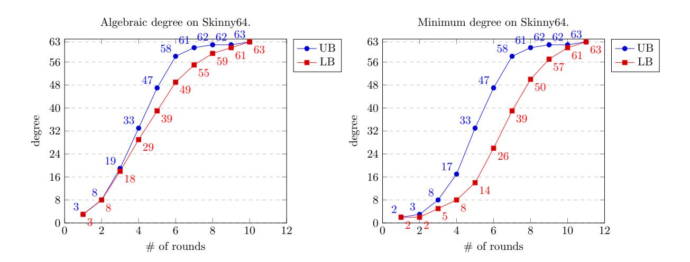

Figure 1. Algebraic degree and minimum degree on SKINNY64, where UB and LB denote upper bound and lower bound, respectively.

Our Results. In this paper we present – for the first time – non-trivial lower bounds on the degree and minimum degree of various block ciphers with the sole assumption of independent round-keys. More precisely, we assume that after each round a new round key is added to the full state.

We hereby focus in particular on the block ciphers that are used most frequently as building blocks in the ongoing NIST lightweight project<sup>3</sup>, namely GIFT-64, SKINNY64, and AES. Furthermore, we investigate PRESENT. Our results are summarized in Table 1. To give a concrete example of our results, consider the block cipher SKINNY64 [4]. We are able to show that 10 and 11 rounds are sufficient to get full, i.e., 63, degree and minimum degree, respectively. Together with the known upper bounds, we get a rather good view on the actual degree development of SKINNY64 with increasing number of rounds (see Fig. 1). Besides the degree and the minimum degree, we also elaborate on the appearance of all n possible monomials of maximal degree, i.e., degree n-1. While this is not captured by a natural notion of degree, it does capture large classes of integral attacks. With respect to this criterion, we also show that 13 rounds are enough for SKINNY64.

https://csrc.nist.gov/Projects/lightweight-cryptography

{3}------------------------------------------------

**Technical Contribution.** Our results are based on the concept of division property and require a non-negligible, but in all cases we consider, practical computational effort. They can be derived within a few hours on a single PC. All code required for our results will be made publicly available.

The main technical challenge in our work (and many previous works based on division property) is to keep the model solvable and the number of division trails in a reasonable range. For our purpose, we solve this by optimizing the division property of the key, a freedom that was (i) previously not considered and (ii) allows to speed-up our computations significantly.

Previous Works. This paper has strong ties with all the previous works related to division property. Division property is a cryptanalysis technique introduced at EUROCRYPT'15 by Todo [23], which was then further refined in several works [24,25]. Technically, the papers at EUROCRYPT'20 [13] is the most important previous work for us. We will give a more detailed review of previous works in Section 2 when also fixing our notation.

Outline We present our notation related to the division property in Section 2. We try to simplify and clarify some previous definitions and results. We hope that in particular readers without prior knowledge on division property might find it accessible. In Section 3 we provide a high-level overview of our results and how they were achieved. As mentioned above, the main technical contribution is the optimization for a suitable division-property for the key, which is explained in Section 4. Our applications and the detailed results for the ciphers studied are given in Section 5. Being the first paper to derive meaningful lower bounds on ciphers by relying only on independent round-keys, our work leaves many open questions and room for improvements. We elaborate on this in Section 6 concluding our work.

Finally we note that all our implementations are available at

https://github.com/LowerBoundsAlgDegree/LowerBoundsAlgDegree.

### 2 Notation and Preliminaries

Let us start by briefly fixing some basic notation. We denote by  $\mathbb{F}_2$  the finite field with two elements, basically a bit, and by  $\mathbb{F}_2^n$  the *n*-dimensional vector space over  $\mathbb{F}_2$ , i.e., the set of *n*-bit vectors with the XOR operation as the addition. For  $x, y \in \mathbb{F}_2^n$  we denote by  $\langle x, y \rangle = \sum_i x_i y_i$  the canonical inner product. For a function  $F: \mathbb{F}_2^n \to \mathbb{F}_2^m$  given as  $F(x) = (F^{(1)}(x), \dots, F^{(m)}(x))$  with  $F^{(i)}: \mathbb{F}_2^n \to \mathbb{F}_2$ , the  $F^{(i)}$  are referred to as the coordinate functions of F and any linear combination  $\langle \beta, F(x) \rangle$  of those as a component function of F. We use + to denote all kind of additions (of sets, vectors, polynomials, monomials) as it should be clear from context.

In this section we start by recalling the development of division property since its first introduction by Todo [22]. The technique has been proven very helpful in

{4}------------------------------------------------

many applications and led to a large variety of results. The notion of trails [26] has been an important technical improvement that itself already has undergone several iterations. We try to simplify notations and at the same time make some previous definitions and results more rigid and precise. The aim is to be self contained and accessible to readers without prior knowledge on division property. Before doing so, we briefly recapture the previous developments.

#### 2.1 Previous Works on Division Properties

This paper has strong ties with all the previous works related to division property and as such, we would like to precisely describe where our work fits and what are the precise relations and differences with the division property. Division property is a cryptanalysis technique introduced at EUROCRYPT'15 by Todo as a technique to study the parity of  $x^u$  [23]. This initial variant is by now referred to as the conventional division property (CDP). This was further refined to the bit-based division property (BDP) by Todo and Morii at FSE'16 [25]. The core idea of the division property is to evaluate whether the ANF of a block cipher contains some specific monomials. More precisely, given a monomial m in the plaintext variables, the BDP can essentially allows us to derive one of two possible results: either the ANF of a block cipher does not contain any multiple of the monomial m, or we simply do not know anything (i.e., we cannot prove the existence or non-existence of the monomial or its multiples). Another way to see the BDP is that, for a given set  $\mathbb{X}$ , it splits the space  $\mathbb{F}_2^n$  into two distinct parts, depending on the value of the sum  $s_u = \sum_{x \in \mathbb{X}} x^u, u \in \mathbb{F}_2^n$ :

- A set  $\mathbb{K} \subset \mathbb{F}_2^n$  such that for any  $u \in \mathbb{K}$ , we do not know the value of  $s_u$ .
- For the remaining  $u \in \mathbb{F}_2^n \setminus \mathbb{K}$ , we know that  $s_u = 0$ .

While this was already powerful enough to find new integral distinguishers (e.g. [22,24]), the *imperfect* nature of the division property means that some known integral distinguisher could not be explained using the division property. This was noticed by Todo and Morii in their FSE'16 paper, as a 15-round distinguisher over the block cipher SIMON [3] could not be explained with BDP. They thus extended the concept to *three-subset division property* (3SDP) to cover this distinguisher. Now, for a given monomial, the 3SDP can give us one of the following:

- The ANF does not contains any multiple of the monomial.
- The ANF contains exactly this monomial.
- We cannot prove neither existence nor non-existence of the monomials.

The term three-subset comes from the fact that we now split  $\mathbb{F}_2^n$  into three parts: one where we know that  $s_u = 0$ , one where we know that  $s_u = 1$  (aka, the  $\mathbb{L}$  set), and the results is unknown for the remaining u's (aka, the  $\mathbb{K}$  set). Again, there is still a loss of information and there are some cases where we do not get any information.

The main reason for this loss of information comes from the fact that previous techniques give results that are independent from the key used, hence the inability

{5}------------------------------------------------

to precisely compute (parts of) the ANF. This fact was noticed and exploited at EUROCRYPT'20 by Hao et al. [13], where they introduced the three-subset division property without unknown subset (3SDPwoU). Their idea was to remove the "unknown subset", splitting  $\mathbb{F}_2^n$  into two parts, either  $s_u = 0$  or  $s_u = 1$ , however the implication for this is that we can no longer ignore the key. While they applied this technique to stream ciphers, they mentioned that this technique might be used for block ciphers, but left as an open problem.

It is worth noting that this idea of splitting  $\mathbb{F}_2^n$  into two parts where either  $s_u = 0$  or  $s_u = 1$  has also been studied as another view of the division property by Boura and Canteaut at CRYPTO'16 [7] using the term parity set. However, they did not focus on actual algorithmic aspects. For our results, the focus on algorithmic aspects and in particular the notation of division trails is essential.

To summarize, originating with the division property, many variants such as BDP, 3SDP, and the parity set (which is essentially the same as the 3SDPwoU) have been proposed. After many algorithmic improvements for BDP and 3SDP, nowadays, it enables us to evaluate the most extreme variant, parity set, which allows to decide whether or not a specific monomial appears in the ANF.

#### 2.2 Division Properties and the ANF

Any function  $F: \mathbb{F}_2^n \to \mathbb{F}_2^n$  can be uniquely expressed with its algebraic normal form.

$$F(x) = \sum_{u} \lambda_u x^u$$

where  $\lambda_u \in \mathbb{F}_2^n$ . It is well known that the coefficients can be computed via the identity

$$\lambda_u = \sum_{x \le u} F(x) \tag{1}$$

where  $x \leq u$  if and only if  $x_i \leq u_i$  for all i where elements of  $\mathbb{F}_2$  are seen as integers.

We start by recalling the division property, more accurately the definition of parity set, as given in [7].

**Definition 1 (Parity Set).** Let  $\mathbb{X} \subseteq \mathbb{F}_2^n$  be a set. We define the parity set of  $\mathbb{X}$  as

$$\mathcal{U}(\mathbb{X}) := \left\{ u \in \mathbb{F}_2^n \text{ such that } \sum_{x \in \mathbb{X}} x^u = 1 \right\}$$

The power of the division property as introduced in [23] is that (i) it is often easier to trace the impact of a function on its parity set than on the set itself and (ii) the evolution of certain parity sets is related to the algebraic normal form of the functions involved.

Defining the addition of two subsets  $\mathbb{X}, \mathbb{Y} \subseteq F_2^n$  by

$$\mathbb{X} + \mathbb{Y} := (\mathbb{X} \cup \mathbb{Y}) \setminus (\mathbb{X} \cap \mathbb{Y})$$

{6}------------------------------------------------

the set of all subsets of  $\mathbb{F}_2^n$  becomes a binary vector space of dimension  $2^n$ . Note that this addition is isomorphic to adding the binary indicator vectors of the sets. Also note that if an element is contained both in  $\mathbb{X}$  and  $\mathbb{Y}$  is not contained in the sum.

From this perspective  $\mathcal{U}$  is a linear mapping and the division property can be seen as a change of basis. In particular for  $\mathbb{X}_i \subset \mathbb{F}_2^n$  it holds that

$$\mathcal{U}\left(\sum\mathbb{X}_i\right)=\sum\mathcal{U}\left(\mathbb{X}_i\right)$$

It was shown in [7] that there is a one to one correspondence between sets and its parity set, that is the mapping

$$\mathcal{U}: \mathbb{X} \mapsto \mathcal{U}(\mathbb{X})$$

is a bijection and actually its own inverse, i.e.,

$$\mathcal{U}(\mathcal{U}(X)) = X$$
.

Those properties follow from the linearity of  $\mathcal{U}$  and the following lemma. The proof is added for completeness and to get familiar with the notation.

**Lemma 1.** Let  $\mathcal{U}$  be the mapping defined above and  $\ell$  be an element in  $\mathbb{F}_2^n$ . Then

1. 
$$\mathcal{U}(\{\ell\}) = \{u \in \mathbb{F}_2^n \mid u \leq \ell\}$$
  
2.  $\mathcal{U}(\{x \in \mathbb{F}_2^n \mid x \leq \ell\}) = \{\ell\}$ 

*Proof.* For the first property, we note that  $x^u = 1$  if and only if  $u \leq x$ . Thus we get

$$\mathcal{U}(\{\ell\}) = \left\{ u \in \mathbb{F}_2^n \text{ such that } \sum_{x \in \{\ell\}} x^u = 1 \right\}$$
$$= \left\{ u \in \mathbb{F}_2^n \text{ such that } \ell^u = 1 \right\}$$
$$= \left\{ u \in \mathbb{F}_2^n \mid u \leq \ell \right\}$$

For the second property, we see that  $\sum_{x \in \mathbb{F}_2^n \mid x \leq \ell} x^u = 1$  if and only if  $u = \ell$ . Let  $A_u$  be the number of elements  $x \leq \ell$  such that  $x^u = 1$  we get

$$A_u = |\{x \le \ell \mid x^u = 1\}| = |\{x \le \ell \mid u \le x\}| = |\{x \in \mathbb{F}_2^n \mid u \le x \le \ell\}|$$

and it holds that  $A_u$  is odd if and only if  $\ell = u$ , which completes the proof.  $\square$ 

We next introduce the propagation of the division property and the notion of the division trail. More formally, as our focus is the parity set, its propagation is identical to the propagation of the so-called  $\mathbb{L}$  set in 3SDP introduced in [25]. Moreover, the division trail is identical to the three-subset division trail introduced in [13].

The division property provides the propagation rule for some basic operations, such as XOR or AND, and the propagation has been defined in this context as a

{7}------------------------------------------------

bottom-up approach. The propagation rule allows us to evaluate any ciphers without deep knowledge for underlying theory for the division property, and it is one of advantages as a cryptanalytic tool. On the other hand, for a mathematical definition of the propagation, a top-down approach, starting with a general function and deriving the propagation rules as concrete instances, is helpful.

**Definition 2 (Propagation).** Given  $F: \mathbb{F}_2^n \to \mathbb{F}_2^m$  and  $a \in \mathbb{F}_2^n, b \in \mathbb{F}_2^m$  we say that the division property a propagates to the division property b, denoted by

$$a \xrightarrow{F} b$$

if and only if

$$b \in \mathcal{U}(F(\mathcal{U}(\{a\})))$$

Here the image of a set X under F is defined as

$$F(\mathbb{X}) := \sum_{a \in \mathbb{X}} \{F(a)\},\,$$

that is again using the addition of sets as defined above.

The propagation is defined without specifying each concrete operation in Definition 2. For any application, Definition 2 will never be applied directly. Nevertheless, only using this definition reveals one important property of the propagation very simply. Given  $U_1 = \mathcal{U}(\mathbb{X})$ , for any function F,  $U_2 = \mathcal{U}(F(\mathbb{X}))$  is evaluated as

$$U_2 = \mathcal{U}(F(\mathbb{X})) = \sum_{x \in \mathbb{X}} \mathcal{U}(F(\{x\})) = \sum_{a \in \mathcal{U}(\mathbb{X})} \mathcal{U}(F(\mathcal{U}(\{a\}))) = \sum_{\substack{a \in U_1 \\ a \xrightarrow{F} b}} \{b\}.$$
 (2)

This shows that our definition fits to the intuitive meaning of propagation: In order to determine  $U_2$  after applying the function F, it is enough to consider what happens with individual elements of  $U_1$  to start with. Here again, we like to emphasize that the sum in Equation 2 is modulo two, that is, if an element appears an even number of times on the right side, it actually does not appear in  $U_2$ . Of course, to evaluate the propagation in real, we need to mention the concrete propagation  $a \xrightarrow{F} b$ , and we also give the following proposition, which allows to easily deduce the possible propagation given the ANF of a function.

**Proposition 1.** Let  $F: \mathbb{F}_2^n \to \mathbb{F}_2^m$  be defined as

$$F(x_1,...,x_n) = (y_1,...,y_m) = y$$

where  $y_i$  are multivariate polynomials over  $\mathbb{F}_2$  in the variables  $x_i$ . For  $a \in \mathbb{F}_2^n$  and  $b \in \mathbb{F}_2^m$ , it holds that  $a \xrightarrow{F} b$  if and only if  $y^b$  contains the monomial  $x^a$ .

*Proof.* By Definition 2, we have  $a \stackrel{F}{\to} b$  if and only if  $b \in \mathcal{U}(F(\mathcal{U}(\{a\})))$ . Using Lemma 1, we can see that

$$\mathbb{Y} := F(\mathcal{U}(\{a\})) = \{F(x) \mid x \leq a, x \in \mathbb{F}_2^n\}.$$

{8}------------------------------------------------

Hence  $b \in \mathcal{U}(\mathbb{Y})$  exactly means  $\sum_{x \leq a} F^b(x) = 1$ . Note that  $F^b$  is a Boolean function over the variables  $x_1, \ldots, x_n$  whose ANF is exactly  $y^b$ , that is

$$F^b(x) = \sum_{u \in \mathbb{F}_2^n} \lambda_u x^u = y^b.$$

Using the well known relation between a function and the coefficients of its ANF, having  $\sum_{x \leq a} F^b(x) = 1$  directly gives that  $\lambda_a = 1$ , i.e., the monomial  $x^a$  appears in the ANF of  $F^b$ , said ANF being exactly  $y^b$ .

We remark that all propagation rules already introduced in [25] are generated by assigning concrete function to F. For completeness we recall these propagation rules in Supplementary Material E.

Following previous work, we now generalize the definition above to the setting where F is actually given as the composition of many functions

$$F = F_R \circ \cdots \circ F_2 \circ F_1$$
.

**Definition 3 (Division Trail).** Given  $F: \mathbb{F}_2^n \to \mathbb{F}_2^n$  as

$$F = F_R \circ \cdots \circ F_2 \circ F_1$$

and  $a_0 \dots a_R \in \mathbb{F}_2^n$  we call  $(a_0, \dots, a_R)$  a division trail for the compositions of F into the  $F_i$  if and only if

$$\forall i \in \{1, \dots, R\}, a_{i-1} \xrightarrow{F_i} a_i.$$

We denote such a trail by

$$a_0 \xrightarrow{F_1} a_1 \xrightarrow{F_2} \cdots \xrightarrow{F_R} a_R.$$

Using the same considerations as in Equation 2, we can now state the main reason of why considering trails is useful

**Theorem 1.** Given  $F: \mathbb{F}_2^n \to \mathbb{F}_2^n$  as

$$F = F_R \circ \cdots \circ F_2 \circ F_1$$

and  $\mathbb{X} \subseteq \mathbb{F}_2^n$ . Then

$$\mathcal{U}(F(\mathbb{X})) = \sum_{\substack{a_0, \dots, a_R \\ a_0 \in \mathcal{U}(\mathbb{X}), a_0 \xrightarrow{F_1} a_1 \xrightarrow{F_2} \dots \xrightarrow{F_R} a_R}} \{a_R\}$$

The important link between the division property and the ANF is the following observations and is actually a special case of Proposition 1.

{9}------------------------------------------------

Corollary 1. Let  $F: \mathbb{F}_2^n \to \mathbb{F}_2^n$  be a function with algebraic normal form

$$F(x) = \sum_{u \in \mathbb{F}_2^n} \lambda_u x^u$$

where  $\lambda_u = (\lambda_u^{(1)}, \dots, \lambda_u^{(n)}) \in \mathbb{F}_2^n$ . Furthermore, let  $\mathbb{X}$  be the set such that  $\mathcal{U}(\mathbb{X}) = \{\ell\}$ . Then

$$\lambda_{\ell}^{(i)} = 1 \iff e_i \in \mathcal{U}(F(\mathbb{X}))$$

*Proof.* If  $\mathcal{U}(\mathbb{X}) = \{\ell\}$ , by Lemma 1 we have

$$\mathbb{X} = \{ x \in \mathbb{F}_2^n \mid x \leq \ell \}.$$

Now by Equation (1) we get

$$\lambda_{\ell}^{(i)} = \sum_{x \leq \ell} F^{(i)}(x) = \sum_{x \in \mathbb{X}} F^{(i)}(x)$$
$$= \sum_{x \in F(\mathbb{X})} x^{e_i} = \begin{cases} 1 & \text{if } e_i \in \mathcal{U}(F(\mathbb{X})) \\ 0 & \text{otherwise} \end{cases}$$

which concludes the proof.

Theorem 1 and Corollary 1 finally result in the following corollary.

Corollary 2. Let  $F: \mathbb{F}_2^n \to \mathbb{F}_2^n$  be a function with algebraic normal form

$$F(x) = \sum_{u \in \mathbb{F}_2^n} \lambda_u x^u$$

where  $\lambda_u = (\lambda_u^{(1)}, \dots, \lambda_u^{(n)}) \in \mathbb{F}_2^n$  and  $F = F_R \circ \dots \circ F_2 \circ F_1$ . Then  $\lambda_\ell^{(i)} = 1$  if and only if the number of trails

$$\ell \xrightarrow{F_1} a_1 \xrightarrow{F_2} \cdots \xrightarrow{F_R} e_i$$

is odd.

*Proof.* Follows immediately from the statements above.

This is what is actually solved using SAT solvers and/or mixed integer linear programming techniques. Before going into the details of the algorithmic approach, we explain why the case of a keyed function does not significantly change the perspective in our application in the next section.

{10}------------------------------------------------

## 3 High-Level Approach

Conceptually, there is no difference between key variables and input variables when it comes to division properties as used here and outlined in the previous section. It is only about splitting the set of variables into two (or potentially more) sets and changing the notation accordingly. Consider a function

$$E: \mathbb{F}_2^n \times \mathbb{F}_2^m \to \mathbb{F}_2^n$$
  
 $(x,k) \mapsto E(x,k)$ 

When thinking of E as a block cipher, we usually rephrase this as a family of functions indexed by k, i.e., we consider

$$E_k : \mathbb{F}_2^n \to \mathbb{F}_2^n$$
  
where  $E_k(x) = E(x, k)$ .

The algebraic normal form (ANF) of E and  $E_k$  are not identical, but related. Starting with the ANF of E expressed as

$$E(x,k) = \sum_{u \in \mathbb{F}_2^n, v \in \mathbb{F}_2^m} \lambda_{u,v} x^u k^v, \tag{3}$$

we get the ANF of  $E_k$  by rearranging terms as

$$E_k(x) = \sum_{u \in \mathbb{F}_2^n} \left( \sum_{v \in \mathbb{F}_2^m} \lambda_{u,v} k^v \right) x^u = \sum_{u \in \mathbb{F}_2^n} p_u(k) x^u,$$

where

$$p_u(k) = \sum_{v \in \mathbb{F}_2^m} \lambda_{u,v} k^v$$

are the key-dependent coefficients of the ANF of function  $E_k$ .

Note that the degree of E and  $E_k$ , which we already defined in Section 1 are usually different as

$$\deg(E) = \max_{u \in \mathbb{F}_2^n, v \in \mathbb{F}_2^m} \{ \operatorname{wt}(u) + \operatorname{wt}(v) \mid \lambda_{u,v} \neq 0 \}$$

while

$$\deg(E_k) = \max_{u \in \mathbb{F}_2^n} \{ \operatorname{wt}(u) \mid p_u(k) \neq 0 \}.$$

Here, clearly, we are interested in the later.

In order to lower bound the degree of  $E_k$  by some value d, we have to find a vector u of hamming weight d, such that  $p_u(k)$  is non-zero. For a given u, there are two basic approaches to do so.

{11}------------------------------------------------

Fixed Key. Conceptually, the easiest way to lower bound the degree of  $E_k$  is to simply choose a random key k and, using Corollary 2 for computing one ANF coefficient of large degree. If this is feasible for a random key and the corresponding coefficient is actually 1, the degree must be larger or equal than d. If, however, the corresponding coefficient is zero, nothing can be concluded and one might have to repeat either for a different key or a different coefficient, or both. The advantage of this approach is its conceptual simplicity and that it can take an arbitrary key-scheduling into account. The significant drawback is that this approach becomes quickly impossible in practice. We elaborate on our initial findings using this approach in Section 6.

Variable Key. Luckily, we can use another approach. Namely, in order to show that the degree of  $E_k$  is at least d, it is sufficient to identify a single  $u \in \mathbb{F}_2^n$  of Hamming weight d and an arbitrary  $v \in \mathbb{F}_2^m$  such that  $\lambda_{u,v} \neq 0$  (see Equation 3) as this implies  $p_u(k) \neq 0$ . While this approach might seem more difficult at first glance, computationally it is significantly easier, especially when independent round-keys are assumed.

By definition, the keyed function  $E_k$  has degree at least d if for one  $u \in \mathbb{F}_2^n$  of weight d and any  $v \in \mathbb{F}_2^m$  the coefficient vector

$$\lambda_{u,v} = (\lambda_{u,v}^{(1)}, \dots, \lambda_{u,v}^{(n)}) \in \mathbb{F}_2^n.$$

is non zero. So actually it is enough if, for one such u of weight d, an arbitrary v and any  $1 \le i \le n$  it holds that  $\lambda_{u,v}^{(i)} = 1$ .

#### 3.1 Minimum Degree

However, from an attacker perspective it is sufficient if there exists a single output bit of low degree. Thus, a stronger bound on the degree would potentially show that for all i there exist a u of weight d and an arbitrary v such that  $\lambda_{u,v}^{(i)} = 1$ . This would ensure that for each output bit there exists a key such that the degree of this output bit is at least d.

Again, this is not enough, as the attacker could equally look at any linear combination of output bits of her choice. The above result does not imply any bound on the degree of such linear combinations. Indeed, we would like to show that for each linear combination, there exists a key such that the degree of this linear combination is at least d. This is exactly captured in the definition of minimum degree.

**Definition 4.** The minimum degree of a function  $F: \mathbb{F}_2^n \to \mathbb{F}_2^n$  is defined as

$$minDeg(F) = \min_{\beta \in \mathbb{F}_2^n, \beta \neq 0} \deg\langle \beta, F \rangle$$

Now, while for the degree it was sufficient to identify a single suitable coefficient  $\lambda_{u,v}^{(i)}$  equal to one, things are more intricate here. There are, in principle,  $2^n - 1$  component functions  $\langle \beta, F \rangle$  to be studied. Indeed, considering a single (u, v) pair

{12}------------------------------------------------

and the corresponding  $\lambda_{u,v}$  coefficient is not sufficient, as choosing any  $\beta$  such that  $\langle \beta, \lambda_{u,v} \rangle = 0$  results in a component function that does not contain the monomial  $k^v x^u$  in its ANF. It is this canceling of high degree monomials that has to be excluded for lower bounding the minimum degree.

In order to achieve this it is sufficient (and actually necessary) to find a set

$$S = \{(u_1, v_1), \dots, (u_t, v_t)\}\$$

of pairs (u, v) of size  $t \geq n$  and compute the value of  $\lambda_{u,v}^{(i)}$  for all i and all  $(u, v) \in S$ . This will lead to a binary matrix

$$M_S(E_k) = \begin{pmatrix} \lambda_{u_1,v_1}^{(1)} \ \lambda_{u_2,v_2}^{(1)} \cdots \lambda_{u_t,v_t}^{(1)} \\ \lambda_{u_1,v_1}^{(2)} \ \lambda_{u_2,v_2}^{(2)} \cdots \lambda_{u_t,v_t}^{(2)} \\ \vdots \\ \lambda_{u_1,v_1}^{(n)} \ \lambda_{u_2,v_2}^{(n)} \cdots \lambda_{u_t,v_t}^{(n)} \end{pmatrix}.$$

What has to be excluded, in order to bound the minimum degree is that columns of this matrix can be combined to the all zero vector, as in this case all monomials  $k^{v_i}x^{u_i}$  cancel in the corresponding linear combination. Clearly, this is possible if and only if the columns are linear dependent. This observation is summarized in the following proposition.

**Proposition 2.** A keyed function  $E_k$  has minimum degree at least d if and only if there exist a set S such that the matrix  $M_S(E_k)$  has rank n and

$$d \le \min_{(u,v) \in S} \operatorname{wt}(u)$$

#### 3.2 Appearance of All High-Degree Monomials

Returning to the attacker perspective, it is clear that bounds on the minimum degree are more meaningful than bounds on the algebraic degree. However, it is also clear that even those are not enough to exclude the existence of integral attacks. In particular, even so the minimum degree of a function is n-1, it could be the case that a certain monomial  $x^u$  of degree n-1 never occurs in the ANF of the linear combination  $\langle \beta, E_k(x) \rangle$  of output bits. That is, a minimum degree of n-1 does not exclude that  $\langle \beta, \lambda_{u,v} \rangle = 0$  for a fixed u and all v.

In order to ensure that this does not happen we have to show that for each fixed u of weight n-1 there exist vectors  $v_i$  such that  $M_{S_u}(E_k)$  has full rank for

$$S_u = \{(u, v_1), \dots, (u, v_t)\}.$$

Here, we are (i) more restricted in the choice of the pairs in S as we always have to use the same fixed u and (ii) have to repeat the process n times, once for each u of weight n-1.

Interestingly, the appearance of all high-degree monomials excludes a large class of integral distinguishers. Namely, for a cipher where all high-degree monomials appear (for at least one key), there will not be integral distinguisher by fixing 

{13}------------------------------------------------

bits that work for all keys. This is a consequence of the following observation that separates the pre-whitening key from the remaining round keys.

Proposition 3. Let E<sup>k</sup> : F n <sup>2</sup> → F n 2 be a cipher with ANF

$$E_k(x) = \sum_{u \in \mathbb{F}_2^n} p_u(k) x^u$$

and consider a version of E<sup>k</sup> with an additional pre-whitening key k0, i.e.

$$E_{k,k_0}(x) := E_k(x + k_0)$$

with ANF

$$E_{k,k_0}(x) = \sum_{v \in \mathbb{F}_2^n} q_v(k,k_0) x^v$$

If, for all u of weight n − 1 the coefficient pu(k), is non-constant, it follows that qv(k, k0) is non-constant for all v of weight less than n.

Proof. We first express qv(k, k0) in terms of pu. We get

$$E_{k,k_0}(x) = E_k(x + k_0) = \sum_{u \in \mathbb{F}_2^n} p_u(k) (x + k_0)^u$$

$$= \sum_{u \in \mathbb{F}_2^n} p_u(k) \left( \sum_{v \le u} x^v k_0^{u \oplus v} \right) = \sum_{v \in \mathbb{F}_2^n} \left( \sum_{u \succeq v} p_u(k) k_0^{u \oplus v} \right) x^v$$

This shows that

$$q_v(k, k_0) = \sum_{u \succeq v} p_u(k) k_0^{u \oplus v}$$

Now, for any v of weight at most n − 1, there exists at least one u <sup>0</sup> v of weight n − 1 in the sum above. By the assumption on E<sup>k</sup> it holds that pu<sup>0</sup> (k) is not constant. Therefore, q<sup>v</sup> is not constant as a function in k and k0, which concludes the proof. ut

### 3.3 The Key Pattern

Computing the values of λ (i) u,v is certainly not practical for arbitrary choice of (u, v) and i. There is not a lot of freedom in the choice of u, especially not if we aim at showing the appearance of all high degree monomials. However, there is a huge freedom in the choice of v, that is in the key monomial k v that we consider.

It is exactly the careful selection of suitable v that has a major impact on the actual running time and finally allows us to obtain meaningful results in practical time. It is also here where assuming independent round-keys is needed. Consider that case of a key-alternating block cipher depicted below<sup>4</sup>

<sup>4</sup> Thanks to TikZ for Cryptographers [15]

{14}------------------------------------------------

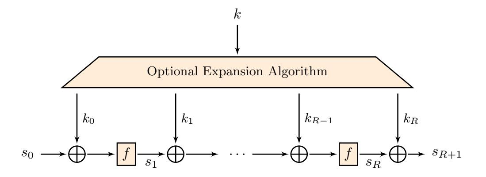

When considering independent round-keys, the key monomial  $k^v$  actually consists of

$$k^v = k_0^{v^{(0)}} k_1^{v^{(1)}} \dots k_R^{v^{(R)}}.$$

Here, we can select for each round-key  $k_i$  a suitable vector  $v^{(i)}$  freely.

Returning to Corollary 2 and the division property, recall that  $\lambda_{u,v}^{(i)} = 1$  if and only if the number of division trails  $(u,v) \to e_i$  is odd. The vector v and therefore its parts  $v = (v^{(0)}, \dots, v^{(R)})$  correspond to (parts of) the input division property. We will refer to v and its parts as the key-pattern. The number of trails, and therefore the computational effort, is highly dependent on this choice. This is the main technical challenge we solve, which is described in the following Section 4.

# 4 How to Search Input/Key/Output Patterns

As we already discussed above, we need to find u (called an *input pattern*) and  $(v_0, \ldots, v_R)$  (called a *key pattern*), in which the number of trails from  $(u, v_0, \ldots, v_R)$  to some unit vector  $e_i$  (called a *output pattern*) is odd and, equally important, efficiently computable. To do so, we will mainly rely on the use of automatic tools such as MILP and SAT. We recall how to modelize different operations in the supplementary material in Supplementary Material F.

Once we get such an input/key/output pattern, it is very easy to verify the lower bound of the degree using standard techniques. We simply enumerate all trails and check the parity of the number of trails<sup>5</sup>.

Therefore, the main problem that we need to solve is how to select suitable input/key/output patterns. In general, we search key patterns whose Hamming weight is as high as possible. The number of trails is highly related to the number of appearances of the same monomial when they are expanded without canceling in each round. Intuitively, we can expect such a high-degree monomial is unlikely to appear many times. Unfortunately, even if the key pattern is chosen with high weight, the number of trails tends to be even or extremely large when these patterns are chosen without care.

Parasite Sub-Trails. To understand the difficulty and our strategy to find proper input/key/output patterns, we introduce an example using SKINNY64.

<sup>&</sup>lt;sup>5</sup> We also provide a simple code to verify our results about lower bounds.

{15}------------------------------------------------

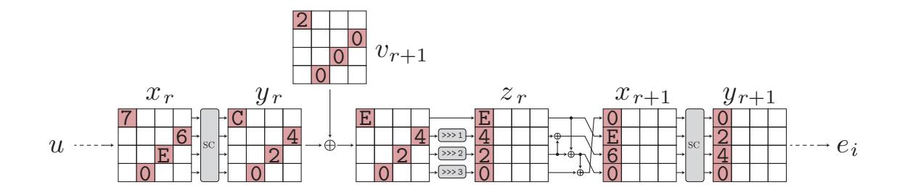

Figure 2. Extraction from the trail of SKINNY64

Assume that we want to guarantee that the lower bound of algebraic degree of R-round SKINNY64 is 63. Given an input/key/output pattern, let us assume that there is a trail that contains the trail shown in Fig. 2 somewhere in the middle as a sub-trail. This sub-trail only focuses on the so-called super S-box involving the 4th anti-diagonal S-boxes in the (r+1)th round and the 1st-column S-boxes in the (r+2)th round. A remarkable, and unfortunately very common, fact is that this sub-trail never yields an odd-number of trails because we always have the following two different sub-trails.

$$T1: 0x76E0 \xrightarrow{SC} 0xC420 \xrightarrow{ART(+0x2000)} 0xE420 \xrightarrow{MC} 0x0E60 \xrightarrow{SC} 0x0240$$

$$T2: 0x76E0 \xrightarrow{SC} 0x1420 \xrightarrow{ART(+0x2000)} 0x3420 \xrightarrow{MC} 0x0360 \xrightarrow{SC} 0x0240$$

The trail shown in Fig. 2 is T1, and we always have another trail T2. Like this, when the number of sub-trails is even under the fixed input, key, and output pattern of the sub-trail, we call it an *inconsistent sub-trail*. Moreover, inconsistent sub-trails are independent of other parts of the trail and might occur in several parts of trails simultaneously. Assuming that there are 10 inconsistent sub-trails, the number of the total trails is at least  $2^{10}$ . In other words, *inconsistent sub-trails increase the number of total trails exponentially*.

Heuristic Approach. It is therefore important to avoid trails containing inconsistent sub-trails. Instead of getting input/key/output pattern, the goal of the first step in our method is to find a trail, where all sub-trails relating to each super S-box are consistent, i.e., there is no inconsistent sub-trail as long as each super S-box is evaluated independently. Note that this goal is not sufficient for our original goal, and the number of total trails might still be even. Therefore, once we get such a trail, we extract the input/key/output pattern from the found trail, and check the total number of trails with this pattern.

We have several approaches to find such a trail. As we are actually going to search for these patterns and enumerate the number of trails using MILP or SAT solvers, the most straightforward approach is to generate a model to represent the propagation by each super S-box accurately. However, modeling a 16-bit keyed S-box has never been done before. Considering the difficulty to model even an 8-bit S-box, it is unlikely to be a successful path to follow.

Another approach is to use the well-known modeling technique, where the S-box and MixColumns are independently modeled, and exclude inconsistent

{16}------------------------------------------------

sub-trail in each super S-box only after detecting them in a trail<sup>6</sup> . This approach is promising, but the higher the number of rounds gets, the less efficient it is as the number of super S-boxes we need to check the consistency increases. Indeed, as far as we tried, this approach is not feasible to find proper patterns for 11-round SKINNY64.

The method that we actually used is a heuristic approach that builds the trail round by round. Let xr, yr, and z<sup>r</sup> be an intermediate values for the input of the (r + 1)th S-box layer, output of the (r + 1)th S-box layer, and input of the (r + 1)th MixColumns in each trail, respectively. Our main method consists of the following steps.

- 1. Given ei(= yR−1), determine (xR−2, vR−1), where the Hamming weight of xR−<sup>2</sup> and vR−<sup>1</sup> is as high as possible and the number of trails from xR−<sup>2</sup> to ei is odd and small (1 if possible).
- 2. Compute (xR−3, vR−2, yR−2), where the Hamming weight of xR−<sup>3</sup> and vR−<sup>2</sup> is as high as possible and the number of trails from xR−<sup>3</sup> to yR−<sup>2</sup> is odd (1 if possible). Then, check if the number of trails from xR−<sup>3</sup> to e<sup>i</sup> is odd (1 if possible) under (vR−2, vR−1).
- 3. Repeat the procedure above to Rmid rounds. This results in a key pattern (v<sup>R</sup>mid+1, . . . , vR−1), where the number of trails from x<sup>R</sup>mid to e<sup>i</sup> is odd and small (again, 1 in the best case).
- 4. Compute (v1, . . . , v<sup>R</sup>mid ) such that the number of trails from u(= x0) to y<sup>R</sup>mid is odd.

.

5. Compute the number of trails satisfying (u, v1, . . . , vR−1) → e<sup>i</sup>

Our method can be regarded as the iteration of the local optimization. As we already discussed in the beginning of this section, we can expect that the number of trails from pattern with high weight is small. The first three steps, called trail extension in our paper, are local optimization in this context from the last round. Note that these steps are neither a deterministic nor an exhaustive methods. In other words, the trail extension is randomly chosen from a set of optimal or semi-optimal choices. Sometimes, there is an unsuccessful trail extension, e.g., it requires too much time to extend the trail after a few rounds or we run into trails that cannot reach the input pattern u. The heuristic and randomized algorithm allows, in case we faces such unsuccessful trail extensions, to simply restart the process from the beginning.

As far as we observe some ciphers, unsuccessful trail extensions happens with higher probability as the trail approaches the first round. Therefore, after some Rmid rounds, we change our strategy, and switch to the more standard way of searching for (u, v1, . . . , v<sup>R</sup>mid ), e.g., Rmid = 5 or 6 is used in SKINNY64. More formally, we search trails from u to y<sup>R</sup>mid while excluding inconsistent sub-trails. Note that this is possible now because this trail has to cover less rounds. Once we find such a trail, we extract the key-patterns (u, v1, . . . , v<sup>R</sup>mid ) from the trail and check if the number of trails from (u, v1, . . . , v<sup>R</sup>mid ) to y<sup>R</sup>mid is odd. If so,

<sup>6</sup> When we use Gurobi MILP solver, we can easily implement this behavior by using callback functions.

{17}------------------------------------------------

we finally extract the entire input/key/output pattern and verify the number of trails satisfying  $(u, v_1, \ldots, v_{R-1}) \to e_i$ .

Our algorithm is not generic, and it only searches "the most likely spaces" at random. Therefore, it quickly finds the proper pattern only a few minutes sometimes, but sometimes, no pattern is found even if we spend one hour and more.

We like to stress again that, once we find input/key/output patterns whose number of trails is odd, verifying the final number of trails is easy and standard, see the supplementary material, in Supplementary Material D), for the verification code for GIFT as an example.

How to compute minimum-degree. The minimum degree is more important for cryptographers than the algebraic degree. To guarantee the lower bound of the minimum degree, we need to create patterns whose resulting matrix  $M_S(E_k)$  has full rank.

Our method allows us to get the input/key/output pattern, i.e., compute  $\lambda_{u,v}^{(i)}$  for the specific tuple (u, v, i). However, to construct this matrix, we need to know all bits of  $\lambda_{u,v}$ . And, the use of the input/key pattern for different output patterns is out of the original use of our method. Therefore, it might allow significantly many trails that we cannot enumerate them with practical time.

To solve this issue, we first restrict ourselves to use a non-zero key pattern  $v_{R-1}$  for the last-but one round during the trail extension. This is motivated by the observation that, usually, a single round function is not enough to mix the full state. Therefore it is obvious that the ANF of some output bits is independent of some key-bits  $k_r^{v_{R-1}}$ .

Equivalently, many output bits of  $\lambda_{u,v}$  are trivially 0, i.e., the number of trails is always 0. Thus, the matrix  $M_S(E_k)$  is a block diagonal matrix

$$M_S(E_k) = \begin{pmatrix} M_{S_1}(E_k) & 0 & \cdots & 0 \\ 0 & M_{S_2}(E_k) & \cdots & 0 \\ \vdots & \vdots & \ddots & \vdots \\ 0 & 0 & \cdots & M_{S_m}(E_k) \end{pmatrix}.$$

As such,  $M_S(E_k)$  has the full rank when  $M_{S_i}(E_k)$  has the full rank for all i. This technique allows us to generate input/key/output patterns for the full-rank matrix efficiently.

Even if we use non-zero  $v_{R-1}$ , we still need to get full-rank block matrices. Luckily, there is an important (algorithmic) improvement that we like to briefly mention here. In many cases, it is not needed to compute the entire set of entries of a matrix  $M_S(F)$  to conclude it has full rank. As an example, consider the matrix

$$M_S(F) = \begin{pmatrix} 1 & 0 & * \\ 0 & 1 & 0 \\ 0 & 0 & 1 \end{pmatrix}$$

{18}------------------------------------------------

where ∗ is an undetermined value. Then MS(F) has full rank, no matter what the value of ∗ actually is. Even so this observation is rather simple, it is often an important ingredient to save computational resources.

How to compute all high-degree monomials. Guaranteeing the appearance of all high-degree monomials is more important for cryptographers than minimum degree. Conceptually, it is not so difficult. We simply use a specific u in the 4th step instead of any u whose Hamming weight is n − 1 and guarantee the lower bound of the minimum degree. Then, we repeat this procedure for all us with Hamming weight n − 1.

How to compute lower bounds for intermediate rounds. While the most interesting result for cryptographers is to show the full algebraic degree and full minimum degree, it is also interesting to focus on the degree or minimum degree in the intermediate rounds and determine how the lower bounds increase.

In our paper, these lower bounds are computed by using the input/key/output pattern, which is originally generated to guarantee the full degree and minimum degree. For example, when we prove the lower bound of r rounds, we first enumerate all trails on this pattern, and extract xR−<sup>r</sup> whose number of trails (xR−r, vR−r+1, . . . , vR−1) → e<sup>i</sup> is odd. Let X (i) R−r be the set of all extracted values, and a lower bounds of the algebraic degree for r rounds is given by

$$\max_{i} \max_{u \in X_{R-r}^{(i)}} wt(u).$$

A more involved technique is needed for the minimum degree. We first construct the matrix MS(Ek) for R rounds, where for non-diagonal elements, we set 0 if there is no trail, and we set ∗ if there is trail. If this matrix has the full rank, we always have the full-rank matrix even when we focus on intermediate rounds. In this case, a lower bounds of the minimum degree for r rounds is given by

$$\min_{i} \max_{u \in X_{R-r}^{(i)}} wt(u).$$

How to compute upper bounds. While some work has been done previously to find upper bounds on the algebraic degree [8,6], we want to point out that we can easily compute such upper bounds using our MILP models, and our results in Section 5 show that the resulting upper bounds are quite precise, especially for the algebraic degree. Indeed, to prove an upper bound for R rounds and for the i-th coordinate function, we simply generate a model for R rounds, fix the output value of the trail to the unit vector e<sup>i</sup> and then simply ask the solver to maximize wt(u). This maximum value thus leads to an upper bound on the degree, since it is the maximum weight that u can have so that there is at least one trail. Then, once we collected an upper bound ub<sup>i</sup> for each coordinate function, we easily get an upper bound on the algebraic degree of the vectorial

{19}------------------------------------------------

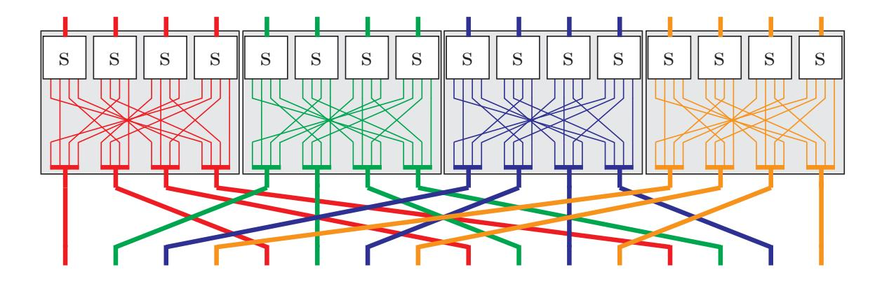

Figure 3. Round function of GIFT-64 using SSB-friendly description

function as max<sup>i</sup> ub<sup>i</sup> . To get an upper bound on the minimum degree, recall that the minimum degree is defined as the minimal algebraic degree of any linear combination of all coordinate functions. Thus, in particular, this minimum degree is at most equal to the minimal upper bound we have on each coordinate function, i.e., using the upper bounds on each coordinate function as before, we simply need to compute min<sup>i</sup> ub<sup>i</sup> .

## 5 Applications

Clearly, we want to point out that the result about the lower bounds do not depend on how we model our ciphers. That is, the parity of the number of trails must be the same as long as we create the correct model. However the number of trails itself highly depends on the way we model, e.g., the number is 0 for one model but it is 1,000,000 for another model. As enumerating many trails is a time consuming and difficult problem, we have to optimize the model.

For example, we could use only the COPY, XOR and AND operations to describe the propagation through the S-box. However this would lead to more trails than necessary, while directly modeling the propagation using the convex hull method as in [26] significantly reduces the induced number of trails.

We already mentioned earlier that we consider independent round-keys added to the full state. In particular for GIFT and SKINNY, the cipher we study are strictly speaking actually not GIFT and SKINNY. However, we stress that this is a rather natural assumption that is widely used for both design and cryptanalysis of block ciphers.

## 5.1 GIFT

GIFT is a lightweight block cipher published at CHES'17 by Banik et al. [2]. Two variants of this block cipher exists depending on the block length (either 64-bit or 128-bit) and use a 128-bit key in both case. Its round function and the Super S-boxes are depicted in Figure 3. Note that in the original design, the round key is added only to a part of the state.

{20}------------------------------------------------

Table 2. Propagation table for the S-box of GIFT

|   |       |   |       |   | 0 1 2 4 8 3 5 6 9 A C 7 B D E F |       |     |         |   |       |     |       |   |             |     |
|---|-------|---|-------|---|---------------------------------|-------|-----|---------|---|-------|-----|-------|---|-------------|-----|
|   | 0 x x |   |       |   |                                 |       |     |         |   |       |     |       |   |             |     |
| 1 |       |   | x x   |   | x                               |       |     |         |   | x     |     |       |   |             |     |
| 2 |       | x |       | x |                                 |       |     |         |   |       |     |       |   |             |     |
| 4 |       |   | x x x |   |                                 |       |     | x       |   |       |     |       |   |             |     |
| 8 |       |   | x x   |   |                                 |       |     |         |   |       |     |       |   |             |     |
| 3 |       |   | x x   |   |                                 |       |     |         |   |       | x x |       |   |             |     |
| 5 |       |   | x     |   |                                 |       | x x |         | x |       |     |       |   | x x x x x x |     |
| 6 |       |   |       |   |                                 | x     |     | x       |   |       |     |       |   |             |     |
| 9 |       |   |       | x |                                 |       | x   |         |   | x x x |     |       | x |             |     |
| A |       |   |       |   | x x x                           |       |     |         |   | x x   |     | x     |   |             |     |
| C |       |   |       |   |                                 |       |     | x x     |   |       |     |       |   |             |     |
| 7 |       |   |       |   |                                 |       | x   |         |   |       |     |       |   | x x x x x   |     |
| B |       |   |       |   |                                 |       |     | x       |   |       |     | x x x |   |             |     |
| D |       |   |       |   |                                 | x x x |     |         |   |       |     | x x   |   |             | x x |
| E |       |   |       | x |                                 |       |     | x x x x |   |       |     | x     |   |             |     |
| F |       |   |       |   |                                 |       |     |         |   |       |     |       |   |             | x   |

Modeling. The round function of GIFT-64 is very simple and only consist of an S-box layer and a bit permutation layer. We give the propagation table of this S-box in Table 2, namely, an x in row u and column v means that u S → v where S is the GIFT-64 S-box. For example, the column 0x1 corresponds to the monomials appearing in the ANF of the first output bit of the S-box. The linear inequalities required to modelize this table are given in the Supplementary Material I. The bit permutation is simply modelized by reordering the variables accordingly.

Algebraic degree. We applied our algorithm for GIFT-64 and obtained that the algebraic degree of all coordinate functions is maximal (i.e., 63) after 9 rounds. However, we can go even further and prove that 32 of the coordinate functions are of degree 63 after only 8 rounds. As such, the algebraic degree of GIFT-64 as a vectorial function is maximal after only 8 rounds. In Figure 4 on the left side, we give the lower and upper bounds for the algebraic degree of GIFT-64, and in Supplementary Material A.1 we give the detailed lower and upper bounds for each coordinate function. Note that we thus have two data-sets : one for 8 rounds and another one for 9 rounds. To get the curve for the lower bounds on algebraic degree, we simply "merged" the data-sets and extracted the best lower bound for each coordinate function and for each number of rounds. Thus this curve shows the best results we were able to get.

While the execution time can widely vary depending on a lot of factors, in practice our algorithm proved to be quite efficient when applied to GIFT-64. Indeed, to prove that each output bit is of maximal degree after 9 rounds as well as computing the lower bounds for a smaller number of rounds, we needed less than one hour on a standard laptop, and about 30 minutes to find all coordinate functions with algebraic degree 63 after 8 rounds (and again, also computing all lower bounds for less rounds).

{21}------------------------------------------------

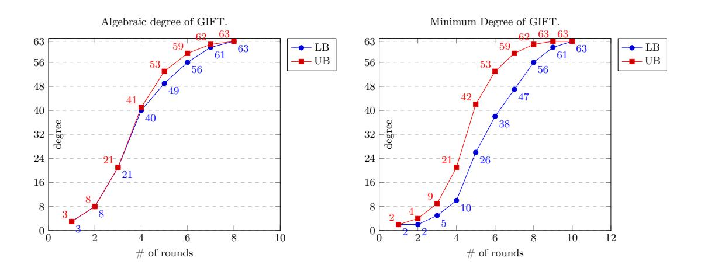

Figure 4. Algebraic degree and minimum degree for GIFT-64

Minimum degree. In about one hour of computation on a standard laptop, we were able to show that the minimum degree is maximal after 10 rounds. In Figure 4 on the right side we show the lower and upper bounds on the minimum degree for each number of rounds from 1 to 10.

All maximal degree monomials. As described in Section 3.2 we were able to show that *all* 63-degree monomials appear after 11 rounds for any linear combination of the output bits. This computation was a bit more expensive than the previous one, yet our results were obtained within about 64 hours.

#### **5.2** SKINNY64

SKINNY is a lightweight block cipher published at CRYPTO'16 by Beierle et al. [4]. SKINNY supports two different block lengths (either 64 bits or 128 bits). The round function adopts the so-called AES-like structure, where significantly lightweight S-box and MixColumns are used.

Please refer to Fig.2 for the figure of the round function of our variant of SKINNY64.

Modeling. We introduce how to create the model to enumerate trails. For the S-box, the method is the same as for GIFT, and the propagation table is shown in Supplementary Material G.1 Table 13. Therefore, here, we focus on MixColumns.

Naively, propagation through linear layers would be done with a combination of COPY and XOR propagations as in [13]. However, this leads to more trails that we need to count, which thus increase the overall time needed for our algorithm. Therefore, we use that MixColumns of SKINNY can be seen as the parallel application of several small linear S-boxes, denoted by L-box hereinafter. Formally, MixColumns is the multiplication over  $\mathbb{F}_{2^4}$ , but equivalently, we can see this operation over  $\mathbb{F}_2$ , where it is the multiplication with the following block

{22}------------------------------------------------

Table 3. Algebraic degree and minimum degree on SKINNY64

|        |    | 1R | 2R | 3R | 4R | 5R | 6R | 7R | 8R | 9R | 10R | 11R |
|--------|----|----|----|----|----|----|----|----|----|----|-----|-----|
| 1      | UB | 3  | 8  | 19 | 33 | 47 | 58 | 61 | 62 | 62 | 63  | 63  |
| degree | LB | 3  | 8  | 18 | 29 | 39 | 49 | 55 | 59 | 61 | 63  | -   |
| minDog | UB | 2  | 3  | 8  | 17 | 33 | 47 | 58 | 61 | 62 | 62  | 63  |
| minDeg | LB | 2  | 2  | 5  | 8  | 14 | 26 | 39 | 50 | 57 | 61  | 63  |

matrix over  $\mathbb{F}_2$ 

$$\begin{pmatrix} I_4 & 0 & I_4 & I_4 \\ I_4 & 0 & 0 & 0 \\ 0 & I_4 & I_4 & 0 \\ I_4 & 0 & I_4 & 0 \end{pmatrix},$$

where  $I_4$  is the identity matrix over  $\mathbb{F}_2$  of dimension 4. By carefully examining the structure of this matrix, we can actually notice that it can be written as the parallel application of 4 L-boxes, which is defined as

$$L(x_1, x_2, x_3, x_4) = (x_1 \oplus x_3 \oplus x_4, x_1, x_2 \oplus x_3, x_1 \oplus x_3),$$

Hence, instead of using the COPY and XOR operations, we consider that it is actually the parallel application of this L-box. Thus, the modelization for MixColumns is done in the same way as for S-boxes, and in Supplementary Material G.1 Table 14 we show the corresponding propagation table.

Algebraic degree. Before we discuss the algebraic degree of SKINNY, we introduce a column rotation equivalence. We now focus on SKINNY, where all round keys are independent and XORed with the full state. Then, the impact on the round constant is removed, and each column has the same algebraic normal form with different input. Overall, we remove the last ShiftRows and MixColumns, and the output bit is the output of the last S-box layer. Then, in the context of the division property, once we find a trail  $(u, v_0, \ldots, v_R) \to e_i$ , we always have a trail  $(u^{32\cdot i}, v_0^{32\cdot i}, \ldots, v_R^{32\cdot i}) \to e_{i+32\cdot i}$ , where  $u^{32\cdot i}$  is a value after rotating u by i columns. The column rotation equivalence enables us to see that it is enough to check the first column only.

We evaluated the upper bound of the algebraic degree for each coordinate function in the first column. The UB of degree in Table 3 shows the maximum upper bound among upper bounds for 16 coordinate functions. Please refer to Supplementary Material A.2 for each upper bound. The LB of degree in Table 3 shows the lower bounds, where patterns listed in Supplementary Material C.1 is used to achieve these results. These patterns are generated by using our systematic method.

In 10 rounds, the lower bound is the same as the upper bound. In other words, the full degree in 10 rounds is tight, and we can guarantee the upper bound of the algebraic degree is never less than 63 in 10-round SKINNY under our assumption.

{23}------------------------------------------------

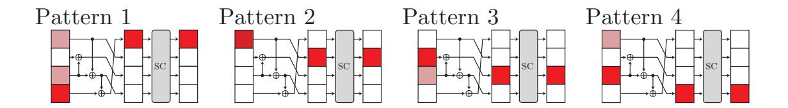

Figure 5. Deterministic trail extension for the last MixColumns and S-box

Minimum degree. The upper bound of the algebraic degree for bits in the 2nd row is 62 in 10 rounds. Therefore, 10 rounds are clearly not enough when we consider the full minimum degree. As we already discussed in Sect. 3.1, we need to construct 64 input/key patterns whose matrix MS(Ek) has the full rank.

To guarantee the lower bounds of the minimum degree, the method shown in Sect. 4 is used. In SKINNY64, when vR−<sup>2</sup> is non-zero, the resulting matrix becomes a block diagonal matrix, where each block is 16 × 16 matrix. Moreover, thanks to the column rotation equivalence, we always have input/key patterns such that each block matrix is identical. Therefore, only getting one full-rank 16 × 16 block matrix is enough to guarantee the lower bound of minimum degree.

Unfortunately, the use of the technique described in Sect. 4 is not sufficient to find patterns efficiently. We use another trick called a deterministic trail extension, where we restrict the trail extension for the last MixColumns and S-box such that it finds key patterns whose matrix is the full rank efficiently. Figure 5 summarizes our restriction, where the cell labeled deep red color must have non-zero value in the trail. We assume that taking the input of each pattern is necessary for the trail to exist. Then, taking Pattern 1 (resp. Pattern 3) implies that λ (i) u,v can be 1 only when i indicates bits in the 1st nibble (resp. 3rd nibble). Taking Pattern 2 allows non-zero λ (i) u,v for i which indicates bits in the 1st, 2nd, and 4th nibbles. Taking Pattern 4 allows non-zero λ (i) u,v for i which indicates bits in the 1st, 3rd, and 4th nibbles. In summary, we can expect the following matrix

$$M_{S_1}(E_k) = \begin{pmatrix} A & * & 0 & * \\ 0 & B & 0 & 0 \\ 0 & 0 & C & * \\ 0 & * & 0 & D \end{pmatrix},$$

where 0 is 4 × 4 zero matrix, and ∗ is an arbitrary 4 × 4 matrix. We can notice that this matrix is full rank if A, B, C, and D are full rank.

By using these techniques, we find 16 input/key patterns to provide the lower bound of the minimum degree on SKINNY64 (see minDeg in Table 3), where patterns listed in Supplementary Material C.2 are used to achieve these results. In 11 rounds, the lower bound is the same as the upper bound, thus having full minimum degree in 11 rounds is tight. In other words, we can guarantee the upper bound of the minimum degree is never less than 63 in 11-round SKINNY under our assumption.

{24}------------------------------------------------

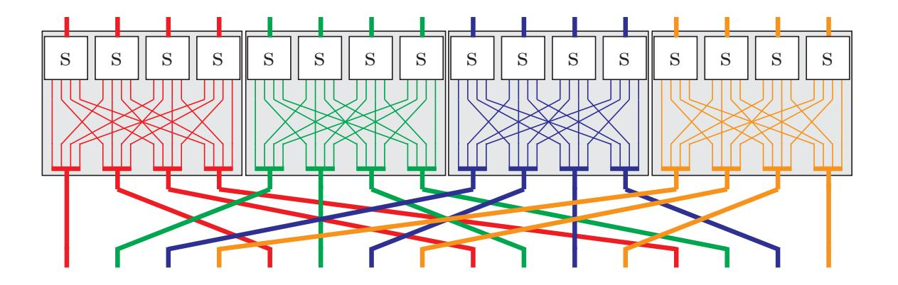

Figure 6. Round function of PRESENT using SSB-friendly description

All maximum-degree monomials. To guarantee the appearance of all maximumdegree monomials, much more computational power must be spent. The column rotation equivalence allows us to reduce the search space, but it is still 64 times the cost of the minimum degree. After spending almost one week of computations, we can get input/key patterns to prove the appearance of all maximumdegree monomials in 13-round SKINNY64. All input/key patterns are listed in https://github.com/LowerBoundsAlgDegree/LowerBoundsAlgDegree.

### 5.3 PRESENT

PRESENT is another lightweight block cipher published at CHES'07 [5], with a 64-bit block size and two variants depending on the key-length : either 80 bits or 128 bits. Its round function is very similar to the round function of GIFT and is also built using a 4-bit S-box and a bit permutation, see Figure 6.

Modeling. We give the propagation table for PRESENT's S-box in Supplementary Material G.2 Table 15, and the corresponding linear inequalities in Supplementary Material K. As for GIFT-64, the bit permutation can easily be modelized by reordering variables.

Algebraic degree. Using our algorithm, we were able to show that all output bits have an algebraic degree of 63 after 9 rounds in about nine hours, including the lower bounds for a smaller number of rounds. Even better, for 8 rounds, we were able to show that 54 out of all 64 coordinate functions are actually already of degree 63. We give the resulting lower and upper bounds for the algebraic degree of PRESENT on the left side of Figure 7. As for GIFT-64, these curves were obtained by taking the best bounds over all coordinate functions, and the detailed bounds for each coordinate function are given in the Supplementary Material A.3.

Minimum degree. Note that while directly using the PRESENT specification would still allow us to get some results for the minimum degree, we found out a

{25}------------------------------------------------

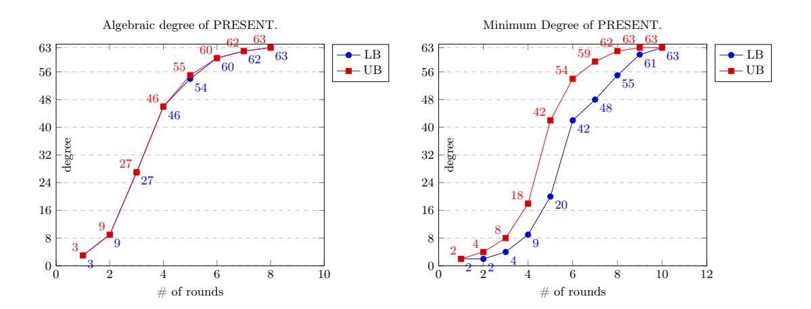

Figure 7. Algebraic degree and minimum degree for PRESENT

way to largely improve the speed of the search for this case. Similarly to SKINNY64, we used a deterministic trail extension for the last S-box layer. We give more details about this observation and then how we managed it in Supplementary Material J.

In short, we change the S-box in the last S-box layer to a linearly equivalent one S' (thus preserving the correctness of our results for the minimum degree) and add additional constraints to help finding "good" key patterns during the search. While these constraints could slightly restrict the search space, in practice it proved to be a very efficient trick to speed up the search and was enough to prove the full minimum degree over 10 rounds. The same trick is used for the all monomial property since it is essentially the same as for the minimum degree, only repeated several time for each possible input monomial. In the end, within about nine hours, we were able to show that the minimum degree is also maximal after 10 rounds using this trick. In Figure 7 on the right side, we give the lower and upper bounds for the minimum degree over 1 to 10 rounds.

All maximal degree monomials. Showing that all 63-degree monomials appear after 11 rounds for any linear combinations of output bits required quite a bit more computational power, however we were still able to show this result in about 17 days of computation.

#### **5.4 AES**

Despite many proposals of lightweight block ciphers, AES stays the most widely-used block cipher. The application to AES of our method is thus of great interest.

However, our method uses automatic tools such as MILP or SAT and such tools are not always powerful for block ciphers using 8-bit S-boxes like AES. As therefore expected, our method also has non-negligible limitation, and it is difficult to prove the full, i.e., 127, lower bound of algebraic degree. Yet, our method can still derive new and non-trivial result regarding the AES.

Modeling. We first construct linear inequalities to model the propagation table for the AES S-box, where we used the modeling technique shown in [1]. While

{26}------------------------------------------------

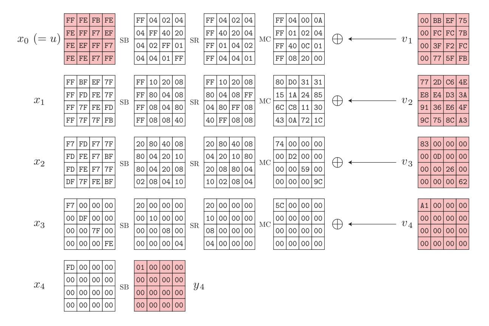

Figure 8. Trail on 5-round AES

a few dozens of linear inequalities are enough to model 4-bit S-boxes, 3,660 inequalities are required to model the AES S-box. Moreover, the model for MixColumns is also troublesome because the technique using L-boxes like SKINNY is not possible. The only choice is a naive method, i.e., we would rely on the COPY + XOR rules for the division property [25]. Unfortunately, this method requires 184, which is equal to the weight of the matrix over  $\mathbb{F}_2$ , temporary variables, and such temporary variables increase the number of trails. In particular, when the weight of the output pattern in MixColumns is large, the number of sub-trails exponentially increases even when we focus on one MixColumns.

Algebraic Degree. Due to the expensive modeling situation, proving full algebraic degree is unlikely to be possible. Nevertheless, this model still allows us to get non-trivial results. We exploit that the number of sub-trails can be restrained to a reasonable size when the weight of the output pattern in MixColumns is small. Namely, we extend the trail such that only such trails are possible.

Figure 8 shows one trail for 5-round AES. When the input/key/output pattern, shown in red, is fixed, the number of trails is odd. Moreover, we confirmed that the number of trails for reduced-number of rounds is odd, e.g., in 3-round AES, the number of trails  $(x_2, v_3, v_4) \rightarrow y_4$  is odd.

This result provides us some interesting and non-trivial results.

On 3-round AES, the input of this trail is 16 values with Hamming weight 7. In other words, the lower bound of the degree is  $16 \times 7 = 112$ . Considering well-known 3-round integral distinguisher exploits that the monomial with all bits in each byte is missing, this lower bound is tight.

{27}------------------------------------------------

From the 4-round trail, we can use the input, which includes 0xFF. Unfortunately, using many 0xFF implies the output of MixColumns with higher Hamming weight, and as we already discussed, the resulting number of trails increases dramatically. While we can have 12 0xFF potentially, we only extend the trail to 4 0xFF. Then, the lower bound of the degree is 116 in 4-round AES.

The first column in x<sup>1</sup> has 0xFFFFFFFF. When we use the naive COPY+XOR rules, there are many trails from 0xFFFFFFFF to 0xFFFFFFFF via MixColumns. However, this trail must be possible and this input (resp. output) cannot propagate to other output (resp. input). Therefore, we bypass only this propagation without using COPY+XOR rule. This technique allows us to construct x<sup>0</sup> in Fig. 8. One interesting observation is all diagonal elements take 0xFF, and well-known 4 round intergral distinguisher exploits that the monomial with all bits in diagonal elements is missing. Our result shows 5-round AES includes the monomial, where 84 bits are multiplied with the diagonal monomial.

While we can give non-trivial and large enough lower bound for 3-round and 4-round AES, the results are not satisfying. Many open questions are still left, e.g., how to prove the full degree, full minimum degree, the appearance of all high-degree monomials.

## 6 Conclusion

Cryptographers have so far failed to provide meaningful lower bounds on the degree of block cipher, and in this paper, we (partially) solve this long-lasting problem and give, for the first time, such lower bounds on a selection of block ciphers. Interestingly, we can now observe that the upper bounds are relatively tight in many cases. This was hoped for previously, but not clear at all before our work.

Obviously, there are some limitations and restrictions of our current work that, in our opinion, are good topics for future works. The main restriction is the applicability to other ciphers. For now, all ciphers studied so far needed some adjustment in the procedure to increase the efficiency and derive the results. It would be great if a unified and improved method could avoid those hand made adjustments. This restriction is inherently related to our heuristic search approach for the key-pattern. A better search, potentially based on new insights into how to choose the key-pattern in an optimal way, is an important topic for future research. Moreover, if we focus on the appearance of all maximal degree monomials, we still have a gap between the best integral distinguishers and our results. Thus, either our bounds or the attacks might be improved in the future. Finally, for now, computing good bounds for fixed key variants of the ciphers is not possibly with our ideas so far. This is in particular important for cryptographic permutations where we fail for now to argue about lower bounds for the degree. Only in the case of PRESENT, we were able to compute a non-trivial lower bound on the algebraic degree in the fixed key setting for a few bits for

{28}------------------------------------------------

10 rounds. Here, we counted the number of trails using a #SAT solver<sup>7</sup> [21]. Especially for other ciphers with a more complicated linear layer like SKINNY, we were not able to show a lower bound on any output bit.

### Acknowledgment

This work was partially funded by the DFG, German Research Foundation) under Germany´s Excellence Strategy - EXC 2092 CASA – 390781972 and the by the German Federal Ministry of Education and Research (BMBF, project iBlockchain – 16KIS0901K).

# References

- 1. Abdelkhalek, A., Sasaki, Y., Todo, Y., Tolba, M., Youssef, A.M.: MILP modeling for (large) s-boxes to optimize probability of differential characteristics. IACR Trans. Symmetric Cryptol. 2017(4), 99–129 (2017). https://doi.org/10.13154/tosc.v2017.i4.99-129, https://doi.org/10.13154/tosc. v2017.i4.99-129
- 2. Banik, S., Pandey, S.K., Peyrin, T., Sasaki, Y., Sim, S.M., Todo, Y.: GIFT: A small present - towards reaching the limit of lightweight encryption. In: Fischer, W., Homma, N. (eds.) CHES 2017. LNCS, vol. 10529, pp. 321–345. Springer (2017). https://doi.org/10.1007/978-3-319-66787-4\_16, https://doi.org/ 10.1007/978-3-319-66787-4\\_16
- 3. Beaulieu, R., Shors, D., Smith, J., Treatman-Clark, S., Weeks, B., Wingers, L.: The SIMON and SPECK families of lightweight block ciphers. IACR Cryptol. ePrint Arch. 2013, 404 (2013), http://eprint.iacr.org/2013/404
- 4. Beierle, C., Jean, J., Kölbl, S., Leander, G., Moradi, A., Peyrin, T., Sasaki, Y., Sasdrich, P., Sim, S.M.: The SKINNY family of block ciphers and its low-latency variant MANTIS. In: Robshaw, M., Katz, J. (eds.) CRYPTO 2016, Part II. LNCS, vol. 9815, pp. 123–153. Springer (2016). https://doi.org/10.1007/978-3-662-53008- 5\_5, https://doi.org/10.1007/978-3-662-53008-5\\_5
- 5. Bogdanov, A., Knudsen, L.R., Leander, G., Paar, C., Poschmann, A., Robshaw, M.J.B., Seurin, Y., Vikkelsoe, C.: PRESENT: an ultra-lightweight block cipher. In: Paillier, P., Verbauwhede, I. (eds.) CHES 2007. LNCS, vol. 4727, pp. 450–466. Springer (2007). https://doi.org/10.1007/978-3-540-74735-2\_31, https://doi.org/ 10.1007/978-3-540-74735-2\\_31
- 6. Boura, C., Canteaut, A.: On the influence of the algebraic degree of f-1 on the algebraic degree of G ◦ F. IEEE Trans. Inf. Theory 59(1), 691–702 (2013). https://doi.org/10.1109/TIT.2012.2214203, https://doi.org/10.1109/TIT.2012. 2214203
- 7. Boura, C., Canteaut, A.: Another view of the division property. In: Robshaw, M., Katz, J. (eds.) CRYPTO 2016, Part I. LNCS, vol. 9814, pp. 654–682. Springer (2016). https://doi.org/10.1007/978-3-662-53018-4\_24, https://doi.org/ 10.1007/978-3-662-53018-4\\_24

<sup>7</sup> A #SAT solver is optimized to count the number of solutions for a given Boolean formula.

{29}------------------------------------------------

- 8. Boura, C., Canteaut, A., Cannière, C.D.: Higher-order differential properties of Keccak and Luffa. In: Joux, A. (ed.) FSE 2011. LNCS, vol. 6733, pp. 252–269. Springer (2011). https://doi.org/10.1007/978-3-642-21702-9\_15, https://doi.org/ 10.1007/978-3-642-21702-9\\_15
- 9. Brayton, R.K., Hachtel, G.D., McMullen, C., Sangiovanni-Vincentelli, A.: Logic minimization algorithms for VLSI synthesis, vol. 2. Springer Science & Business Media (1984)
- 10. Carlet, C., Crama, Y., Hammer, P.L.: Vectorial boolean functions for cryptography. In: Crama, Y., Hammer, P.L. (eds.) Boolean Models and Methods in Mathematics, Computer Science, and Engineering, pp. 398–470. Cambridge University Press (2010). https://doi.org/10.1017/cbo9780511780448.012, https: //doi.org/10.1017/cbo9780511780448.012
- 11. Daemen, J., Knudsen, L.R., Rijmen, V.: The block cipher Square. In: Biham, E. (ed.) FSE '97. LNCS, vol. 1267, pp. 149–165. Springer (1997). https://doi.org/10.1007/BFb0052343, https://doi.org/10.1007/BFb0052343
- 12. Dinur, I., Shamir, A.: Cube attacks on tweakable black box polynomials. In: Joux, A. (ed.) EUROCRYPT 2009. LNCS, vol. 5479, pp. 278–299. Springer (2009). https://doi.org/10.1007/978-3-642-01001-9\_16, https://doi.org/ 10.1007/978-3-642-01001-9\\_16
- 13. Hao, Y., Leander, G., Meier, W., Todo, Y., Wang, Q.: Modeling for three-subset division property without unknown subset - improved cube attacks against Trivium and Grain-128AEAD. In: Canteaut, A., Ishai, Y. (eds.) EUROCRYPT 2020, Part I. LNCS, vol. 12105, pp. 466–495. Springer (2020). https://doi.org/10.1007/978-3- 030-45721-1\_17, https://doi.org/10.1007/978-3-030-45721-1\\_17
- 14. Hölldobler, S.: Van hau nguyen. an efficient encoding of the at-most-one constraint. Tech. rep., Tech. rep. 2013-04, Technische Universität Dresden, Germany (2013)
- 15. Jean, J.: TikZ for Cryptographers. https://www.iacr.org/authors/tikz/ (2016)
- 16. Knudsen, L.R., Wagner, D.A.: Integral cryptanalysis. In: Daemen, J., Rijmen, V. (eds.) FSE 2002. LNCS, vol. 2365, pp. 112–127. Springer (2002). https://doi.org/10.1007/3-540-45661-9\_9, https://doi.org/10.1007/ 3-540-45661-9\\_9
- 17. Lai, X.: Higher order derivatives and differential cryptanalysis. In: Communications and Cryptography. The Springer International Series in Engineering and Computer Science, vol. 276, pp. 227–233. Springer (1994)
- 18. McCluskey, E.J.: Minimization of boolean functions. The Bell System Technical Journal 35(6), 1417–1444 (1956)
- 19. Quine, W.V.: The problem of simplifying truth functions. The American mathematical monthly 59(8), 521–531 (1952)
- 20. Quine, W.V.: A way to simplify truth functions. The American Mathematical Monthly 62(9), 627–631 (1955)
- 21. Thurley, M.: sharpsat counting models with advanced component caching and implicit BCP. In: Biere, A., Gomes, C.P. (eds.) Theory and Applications of Satisfiability Testing - SAT 2006, 9th International Conference, Seattle, WA, USA, August 12-15, 2006, Proceedings. Lecture Notes in Computer Science, vol. 4121, pp. 424–429. Springer (2006). https://doi.org/10.1007/11814948\_38, https://doi.org/10.1007/11814948\\_38
- 22. Todo, Y.: Integral cryptanalysis on full MISTY1. In: Gennaro, R., Robshaw, M. (eds.) CRYPTO 2015, Part I. LNCS, vol. 9215, pp. 413–432. Springer (2015). https://doi.org/10.1007/978-3-662-47989-6\_20, https://doi.org/ 10.1007/978-3-662-47989-6\\_20

{30}------------------------------------------------

- 23. Todo, Y.: Structural evaluation by generalized integral property. In: Oswald, E., Fischlin, M. (eds.) EUROCRYPT 2015, Part I. LNCS, vol. 9056, pp. 287–314. Springer (2015). https://doi.org/10.1007/978-3-662-46800-5\_12, https://doi.org/ 10.1007/978-3-662-46800-5\\_12
- 24. Todo, Y.: Integral cryptanalysis on full MISTY1. J. Cryptology 30(3), 920–959 (2017). https://doi.org/10.1007/s00145-016-9240-x, https://doi.org/10.1007/ s00145-016-9240-x
- 25. Todo, Y., Morii, M.: Bit-based division property and application to Simon family. In: Peyrin, T. (ed.) FSE 2016. LNCS, vol. 9783, pp. 357–377. Springer (2016). https://doi.org/10.1007/978-3-662-52993-5\_18, https://doi.org/ 10.1007/978-3-662-52993-5\\_18
- 26. Xiang, Z., Zhang, W., Bao, Z., Lin, D.: Applying MILP method to searching integral distinguishers based on division property for 6 lightweight block ciphers. In: Cheon, J.H., Takagi, T. (eds.) ASIACRYPT 2016, Part I. LNCS, vol. 10031, pp. 648–678 (2016). https://doi.org/10.1007/978-3-662-53887-6\_24, https://doi. org/10.1007/978-3-662-53887-6\\_24

{31}------------------------------------------------

# Supplementary Material

## A Summary of All Results

## A.1 GIFT-64

We give the detailed results about the lower and upper bounds for the algebraic degree of each coordinate function for GIFT-64. Table 4 shows the upper bounds for the algebraic for up to 9 rounds, as it is the number of rounds required to reach an upper bound of 63 for each coordinate function. As we will see in the next tables, we were able to show that these upper bounds are actually tight in some cases (i.e., the lower bound is equal to the upper bound), especially for all cases where the maximal degree is 63.

As mentioned in Section 5.1, we were able to show that 32 out of the 64 coordinate functions are already of maximal degree after only 8 rounds. From the input/key patterns leading to this result, we were able to derive lower bounds on the algebraic degree of these 32 coordinate functions from 1 up to 8 rounds, which are given in Table 5.

To reach maximal degree for all coordinate function, we actually need to have at least 9 rounds. Again, from the input/key patterns used to get this results, we were able to derive lower bounds on the algebraic degree for a smaller number of rounds, which are shown in Table 6.

## A.2 SKINNY64

We summarize our results about lower bounds of algebraic degree and minimal degree for each coordinate function of SKINNY64. In each table, the index 0 means the LSB of bytes in the 1st row, and the index 15 means the MSB of bytes in the 4th row.

Table 7 shows the upper bounds of algebraic degree on all coordinate functions of SKINNY64. Note that we do not need to evaluate the other 48 bits thanks to the column rotation equivalence, i.e., an index i + 32j has the same degree as the index i.

On lower bounds, Table 8 shows the lower bounds of algebraic degree on all coordinate functions of SKINNY64 when the data data\_set\_skinny\_64\_degree in Supplementary Material C is used. The lower bound of the algebraic degree is defined as the maximum one of each round, and they are listed in LB of degree in Table 3.

For minimum degree, we need to use patterns whose resulting matrix has the full rank. Table 9 shows the lower bounds of algebraic degree on all coordinate functions of SKINNY64 when the data data\_set\_skinny\_64\_min in Supplementary Material C is used. The lower bound of the minimum degree is defined as the minimum one of each round, and they are listed in LB of minDeg in Table 3.

{32}------------------------------------------------

Table 4. Upper bounds of algebraic degrees of all coordinate functions of GIFT-64.

| index 1R 2R 3R 4R 5R 6R 7R 8R 9R |   |   |   |                      |                   |  |  | index 1R 2R 3R 4R 5R 6R 7R 8R 9R |   |   |   |                      |                   |  |  |
|----------------------------------|---|---|---|----------------------|-------------------|--|--|----------------------------------|---|---|---|----------------------|-------------------|--|--|
| 0                                | 2 | 4 | 9 |                      | 21 42 53 59 62 63 |  |  | 32                               | 2 | 4 | 9 |                      | 21 42 53 59 62 63 |  |  |
| 1                                | 2 | 5 |   | 12 28 46 56 60 62 63 |                   |  |  | 33                               | 2 | 5 |   | 12 28 46 56 60 62 63 |                   |  |  |
| 2                                | 3 | 8 |   | 21 41 53 59 62 63 63 |                   |  |  | 34                               | 3 | 8 |   | 21 41 53 59 62 63 63 |                   |  |  |
| 3                                | 3 | 8 |   | 20 38 52 59 61 63 63 |                   |  |  | 35                               | 3 | 8 |   | 20 38 52 59 61 63 63 |                   |  |  |
| 4                                | 2 | 4 | 9 |                      | 21 42 53 59 62 63 |  |  | 36                               | 2 | 4 | 9 |                      | 21 42 53 59 62 63 |  |  |
| 5                                | 2 | 5 |   | 12 28 46 56 60 62 63 |                   |  |  | 37                               | 2 | 5 |   | 12 28 46 56 60 62 63 |                   |  |  |
| 6                                | 3 | 8 |   | 21 41 53 59 62 63 63 |                   |  |  | 38                               | 3 | 8 |   | 21 41 53 59 62 63 63 |                   |  |  |
| 7                                | 3 | 8 |   | 20 38 52 59 61 63 63 |                   |  |  | 39                               | 3 | 8 |   | 20 38 52 59 61 63 63 |                   |  |  |
| 8                                | 2 | 4 | 9 |                      | 21 42 53 59 62 63 |  |  | 40                               | 2 | 4 | 9 |                      | 21 42 53 59 62 63 |  |  |
| 9                                | 2 | 5 |   | 12 28 46 56 60 62 63 |                   |  |  | 41                               | 2 | 5 |   | 12 28 46 56 60 62 63 |                   |  |  |
| 10                               | 3 | 8 |   | 21 41 53 59 62 63 63 |                   |  |  | 42                               | 3 | 8 |   | 21 41 53 59 62 63 63 |                   |  |  |
| 11                               | 3 | 8 |   | 20 38 52 59 61 63 63 |                   |  |  | 43                               | 3 | 8 |   | 20 38 52 59 61 63 63 |                   |  |  |
| 12                               | 2 | 4 | 9 |                      | 21 42 53 59 62 63 |  |  | 44                               | 2 | 4 | 9 |                      | 21 42 53 59 62 63 |  |  |
| 13                               | 2 | 5 |   | 12 28 46 56 60 62 63 |                   |  |  | 45                               | 2 | 5 |   | 12 28 46 56 60 62 63 |                   |  |  |
| 14                               | 3 | 8 |   | 21 41 53 59 62 63 63 |                   |  |  | 46                               | 3 | 8 |   | 21 41 53 59 62 63 63 |                   |  |  |
| 15                               | 3 | 8 |   | 20 38 52 59 61 63 63 |                   |  |  | 47                               | 3 | 8 |   | 20 38 52 59 61 63 63 |                   |  |  |
| 16                               | 2 | 4 | 9 |                      | 21 42 53 59 62 63 |  |  | 48                               | 2 | 4 | 9 |                      | 21 42 53 59 62 63 |  |  |
| 17                               | 2 | 5 |   | 12 28 46 56 60 62 63 |                   |  |  | 49                               | 2 | 5 |   | 12 28 46 56 60 62 63 |                   |  |  |
| 18                               | 3 | 8 |   | 21 41 53 59 62 63 63 |                   |  |  | 50                               | 3 | 8 |   | 21 41 53 59 62 63 63 |                   |  |  |
| 19                               | 3 | 8 |   | 20 38 52 59 61 63 63 |                   |  |  | 51                               | 3 | 8 |   | 20 38 52 59 61 63 63 |                   |  |  |
| 20                               | 2 | 4 | 9 |                      | 21 42 53 59 62 63 |  |  | 52                               | 2 | 4 | 9 |                      | 21 42 53 59 62 63 |  |  |
| 21                               | 2 | 5 |   | 12 28 46 56 60 62 63 |                   |  |  | 53                               | 2 | 5 |   | 12 28 46 56 60 62 63 |                   |  |  |
| 22                               | 3 | 8 |   | 21 41 53 59 62 63 63 |                   |  |  | 54                               | 3 | 8 |   | 21 41 53 59 62 63 63 |                   |  |  |
| 23                               | 3 | 8 |   | 20 38 52 59 61 63 63 |                   |  |  | 55                               | 3 | 8 |   | 20 38 52 59 61 63 63 |                   |  |  |
| 24                               | 2 | 4 | 9 |                      | 21 42 53 59 62 63 |  |  | 56                               | 2 | 4 | 9 |                      | 21 42 53 59 62 63 |  |  |
| 25                               | 2 | 5 |   | 12 28 46 56 60 62 63 |                   |  |  | 57                               | 2 | 5 |   | 12 28 46 56 60 62 63 |                   |  |  |
| 26                               | 3 | 8 |   | 21 41 53 59 62 63 63 |                   |  |  | 58                               | 3 | 8 |   | 21 41 53 59 62 63 63 |                   |  |  |
| 27                               | 3 | 8 |   | 20 38 52 59 61 63 63 |                   |  |  | 59                               | 3 | 8 |   | 20 38 52 59 61 63 63 |                   |  |  |
| 28                               | 2 | 4 | 9 |                      | 21 42 53 59 62 63 |  |  | 60                               | 2 | 4 | 9 |                      | 21 42 53 59 62 63 |  |  |
| 29                               | 2 | 5 |   | 12 28 46 56 60 62 63 |                   |  |  | 61                               | 2 | 5 |   | 12 28 46 56 60 62 63 |                   |  |  |
| 30                               | 3 | 8 |   | 21 41 53 59 62 63 63 |                   |  |  | 62                               | 3 | 8 |   | 21 41 53 59 62 63 63 |                   |  |  |
| 31                               | 3 | 8 |   | 20 38 52 59 61 63 63 |                   |  |  | 63                               | 3 | 8 |   | 20 38 52 59 61 63 63 |                   |  |  |

## A.3 PRESENT

As for the previous ciphers, we now give the detailed lower and upper bounds for the algebraic degree of each coordinate function of PRESENT. Table 10 gives the upper bounds for each coordinate function for up to 9 rounds which is again the minimal number of rounds such that we have an upper bound of 63 for each coordinate function. As for GIFT-64, these upper bounds are tight in some cases, and especially for all cases with maximal degree 63.

For 8 rounds of PRESENT, we proved that 54 out of the 64 coordinate functions are of maximal degree, and the resulting lower bounds are given in Table 11.

{33}------------------------------------------------

Table 5. Lower bounds of algebraic degrees of some coordinate functions of GIFT-64.

| index 1R 2R 3R 4R 5R 6R 7R 8R |   |   |  |  |                   |  | index 1R 2R 3R 4R 5R 6R 7R 8R |   |   |  |  |                   |  |
|-------------------------------|---|---|--|--|-------------------|--|-------------------------------|---|---|--|--|-------------------|--|
| 2                             | 3 | 8 |  |  | 19 40 49 56 61 63 |  | 34                            | 3 | 8 |  |  | 19 40 49 56 61 63 |  |
| 3                             | 3 | 8 |  |  | 18 35 47 56 61 63 |  | 35                            | 3 | 8 |  |  | 18 35 47 56 61 63 |  |
| 6                             | 3 | 8 |  |  | 20 34 49 56 61 63 |  | 38                            | 3 | 8 |  |  | 19 38 51 56 61 63 |  |
| 7                             | 3 | 8 |  |  | 18 35 47 56 61 63 |  | 39                            | 3 | 8 |  |  | 18 35 47 56 61 63 |  |
| 10                            | 3 | 8 |  |  | 20 40 49 56 61 63 |  | 42                            | 3 | 8 |  |  | 20 34 49 56 61 63 |  |
| 11                            | 3 | 8 |  |  | 18 35 47 56 61 63 |  | 43                            | 3 | 8 |  |  | 18 35 47 56 61 63 |  |
| 14                            | 3 | 8 |  |  | 19 36 49 56 61 63 |  | 46                            | 3 | 8 |  |  | 19 36 49 56 61 63 |  |
| 15                            | 3 | 8 |  |  | 18 35 47 56 61 63 |  | 47                            | 3 | 8 |  |  | 18 35 47 56 61 63 |  |
| 18                            | 3 | 8 |  |  | 20 34 49 56 61 63 |  | 50                            | 3 | 8 |  |  | 20 34 49 56 61 63 |  |
| 19                            | 3 | 8 |  |  | 18 35 47 56 61 63 |  | 51                            | 3 | 8 |  |  | 18 35 47 56 61 63 |  |
| 22                            | 3 | 8 |  |  | 19 38 51 56 61 63 |  | 54                            | 3 | 8 |  |  | 20 40 49 56 61 63 |  |
| 23                            | 3 | 8 |  |  | 18 35 47 56 61 63 |  | 55                            | 3 | 8 |  |  | 18 35 47 56 61 63 |  |
| 26                            | 3 | 8 |  |  | 20 34 49 56 61 63 |  | 58                            | 3 | 8 |  |  | 20 34 49 56 61 63 |  |
| 27                            | 3 | 8 |  |  | 18 35 47 56 61 63 |  | 59                            | 3 | 8 |  |  | 18 35 47 56 61 63 |  |
| 30                            | 3 | 8 |  |  | 19 40 49 56 61 63 |  | 62                            | 3 | 8 |  |  | 19 40 52 56 61 63 |  |
| 31                            | 3 | 8 |  |  | 18 35 47 56 61 63 |  | 63                            | 3 | 8 |  |  | 18 35 47 56 61 63 |  |

Again, as for GIFT-64, we need one more round to prove that all coordinate functions have an algebraic degree of 63, and the induced lower bounds are given in Table 12.

{34}------------------------------------------------

Table 6. Lower bounds of algebraic degrees of all coordinate functions of GIFT-64.

| index 1R 2R 3R 4R 5R 6R 7R 8R 9R |   |   |   |  |                      |  |
|----------------------------------|---|---|---|--|----------------------|--|
| 0                                | 2 | 3 | 8 |  | 18 36 52 56 61 63    |  |
| 1                                | 2 | 5 |   |  | 12 25 41 49 57 61 63 |  |
| 2                                | 3 | 8 |   |  | 21 36 46 51 56 61 63 |  |
| 3                                | 3 | 8 |   |  | 20 37 45 49 56 61 63 |  |
| 4                                | 2 | 3 | 8 |  | 20 36 50 56 61 63    |  |
| 5                                | 2 | 5 |   |  | 12 27 38 50 56 61 63 |  |
| 6                                | 3 | 8 |   |  | 21 36 46 52 57 61 63 |  |
| 7                                | 3 | 8 |   |  | 20 37 47 51 56 61 63 |  |
| 8                                | 2 | 3 | 8 |  | 18 40 50 56 61 63    |  |
| 9                                | 2 | 5 |   |  | 12 27 42 51 57 61 63 |  |
| 10                               | 3 | 8 |   |  | 20 40 51 52 58 61 63 |  |
| 11                               | 3 | 8 |   |  | 20 37 46 53 59 62 63 |  |
| 12                               | 2 | 3 | 8 |  | 20 36 50 56 61 63    |  |
| 13                               | 2 | 5 |   |  | 12 27 39 49 56 61 63 |  |
| 14                               | 3 | 8 |   |  | 20 40 50 52 58 61 63 |  |
| 15                               | 3 | 8 |   |  | 20 36 48 53 58 61 63 |  |
| 16                               | 1 | 3 | 8 |  | 19 40 52 56 61 63    |  |
| 17                               | 2 | 5 |   |  | 12 25 43 53 59 62 63 |  |
| 18                               | 3 | 8 |   |  | 20 40 48 55 59 62 63 |  |
| 19                               | 3 | 8 |   |  | 20 36 46 53 59 62 63 |  |
| 20                               | 2 | 4 | 7 |  | 18 36 47 56 61 63    |  |
| 21                               | 2 | 5 |   |  | 12 26 43 50 56 61 63 |  |
| 22                               | 3 | 8 |   |  | 20 40 48 55 59 62 63 |  |
| 23                               | 3 | 8 |   |  | 20 37 47 53 59 62 63 |  |
| 24                               | 2 | 3 | 8 |  | 18 40 50 56 61 63    |  |
| 25                               | 2 | 5 |   |  | 12 26 40 49 56 61 63 |  |
| 26                               | 3 | 8 |   |  | 21 36 46 51 56 61 63 |  |
| 27                               | 3 | 8 |   |  | 20 36 46 54 59 62 63 |  |
| 28                               | 2 | 4 | 7 |  | 18 36 47 56 61 63    |  |
| 29                               | 2 | 5 |   |  | 12 27 40 50 56 61 63 |  |
| 30                               | 3 | 8 |   |  | 20 40 48 54 60 62 63 |  |
| 31                               | 3 | 8 |   |  | 20 37 47 52 59 62 63 |  |

| index 1R 2R 3R 4R 5R 6R 7R 8R 9R |   |   |   |  |                      |  |  |
|----------------------------------|---|---|---|--|----------------------|--|--|
| 32                               | 1 | 3 | 8 |  | 19 40 51 56 61 63    |  |  |
| 33                               | 2 | 5 |   |  | 12 27 40 52 58 61 63 |  |  |
| 34                               | 3 | 8 |   |  | 20 38 48 54 60 62 63 |  |  |
| 35                               | 3 | 8 |   |  | 20 36 45 53 59 62 63 |  |  |
| 36                               | 2 | 3 | 8 |  | 18 39 51 56 61 63    |  |  |
| 37                               | 2 | 5 |   |  | 12 27 42 49 57 61 63 |  |  |
| 38                               | 3 | 8 |   |  | 20 37 44 53 59 62 63 |  |  |
| 39                               | 3 | 8 |   |  | 20 36 46 54 59 62 63 |  |  |
| 40                               | 2 | 3 | 8 |  | 18 39 51 56 61 63    |  |  |
| 41                               | 2 | 5 |   |  | 12 27 39 49 56 61 63 |  |  |
| 42                               | 3 | 8 |   |  | 21 35 45 53 59 62 63 |  |  |
| 43                               | 3 | 8 |   |  | 20 37 46 51 57 61 63 |  |  |
| 44                               | 2 | 3 | 8 |  | 18 36 52 56 61 63    |  |  |
| 45                               | 2 | 5 |   |  | 12 26 42 51 58 61 63 |  |  |
| 46                               | 3 | 8 |   |  | 20 37 47 53 59 62 63 |  |  |
| 47                               | 3 | 8 |   |  | 20 37 46 50 57 61 63 |  |  |
| 48                               | 2 | 3 | 8 |  | 18 38 48 56 61 63    |  |  |
| 49                               | 2 | 5 |   |  | 12 27 40 50 57 61 63 |  |  |
| 50                               | 3 | 8 |   |  | 20 38 46 53 59 62 63 |  |  |
| 51                               | 3 | 8 |   |  | 20 36 47 49 57 61 63 |  |  |
| 52                               | 1 | 3 | 8 |  | 19 40 49 56 61 63    |  |  |
| 53                               | 2 | 5 |   |  | 12 26 42 52 57 61 63 |  |  |
| 54                               | 3 | 8 |   |  | 20 38 48 51 57 61 63 |  |  |
| 55                               | 3 | 8 |   |  | 20 36 47 53 59 62 63 |  |  |
| 56                               | 1 | 3 | 8 |  | 19 40 49 56 61 63    |  |  |
| 57                               | 2 | 5 |   |  | 12 27 41 50 57 61 63 |  |  |
| 58                               | 3 | 8 |   |  | 20 40 49 56 59 62 63 |  |  |
| 59                               | 3 | 8 |   |  | 20 35 49 54 58 61 63 |  |  |
| 60                               | 1 | 3 | 8 |  | 19 40 51 56 61 63    |  |  |
| 61                               | 2 | 5 |   |  | 12 28 40 51 56 61 63 |  |  |
| 62                               | 3 | 8 |   |  | 20 40 49 53 59 62 63 |  |  |
| 63                               | 3 | 8 |   |  | 20 37 46 51 57 61 63 |  |  |

{35}------------------------------------------------

Table 7. Upper bounds of algebraic degrees on all coordinate functions of SKINNY64.

| index 1R 2R 3R 4R 5R 6R 7R 8R 9R 10R 11R |   |   |   |  |                      |  |    |    |
|------------------------------------------|---|---|---|--|----------------------|--|----|----|
| 0                                        | 3 | 8 |   |  | 19 33 47 58 61 62 62 |  | 63 | 63 |
| 1                                        | 3 | 7 |   |  | 16 31 45 57 61 62 62 |  | 63 | 63 |
| 2                                        | 2 | 5 |   |  | 12 26 40 52 59 61 62 |  | 63 | 63 |
| 3                                        | 2 | 4 | 9 |  | 21 38 50 58 61 62    |  | 63 | 63 |
| 4                                        | 3 | 3 | 8 |  | 19 33 47 58 61 62    |  | 62 | 63 |
| 5                                        | 3 | 3 | 8 |  | 19 33 47 58 61 62    |  | 62 | 63 |
| 6                                        | 2 | 3 | 8 |  | 19 33 47 58 61 62    |  | 62 | 63 |
| 7                                        | 2 | 3 | 8 |  | 19 33 47 58 61 62    |  | 62 | 63 |
| 8                                        | 3 | 6 | 9 |  | 17 34 49 58 61 62    |  | 63 | 63 |
| 9                                        | 3 | 6 | 9 |  | 17 34 49 58 61 62    |  | 63 | 63 |
| 10                                       | 2 | 5 | 9 |  | 17 34 49 58 61 62    |  | 63 | 63 |
| 11                                       | 2 | 4 | 8 |  | 17 33 49 58 61 62    |  | 63 | 63 |
| 12                                       | 3 | 6 |   |  | 14 25 38 51 58 61 62 |  | 63 | 63 |
| 13                                       | 3 | 6 |   |  | 14 24 38 51 58 61 62 |  | 63 | 63 |
| 14                                       | 2 | 5 |   |  | 12 23 37 51 58 61 62 |  | 63 | 63 |
| 15                                       | 2 | 4 | 9 |  | 19 33 49 58 61 62    |  | 63 | 63 |

Table 8. Lower bounds of algebraic degree on all coordinate functions of SKINNY64, where data\_set\_skinny\_64\_degree is used.

| index 1R 2R 3R 4R 5R 6R 7R 8R 9R 10R 11R |   |   |   |  |                      |  |    |    |
|------------------------------------------|---|---|---|--|----------------------|--|----|----|
| 0                                        | 3 | 8 |   |  | 18 29 38 49 55 59 61 |  | 63 |    |
| 1                                        | 3 | 7 |   |  | 16 27 39 48 52 58 61 |  | 63 |    |
| 2                                        | 2 | 5 |   |  | 10 22 35 46 49 57 61 |  | 63 |    |
| 3                                        | 2 | 4 | 9 |  | 21 34 45 50 56 61    |  | 63 |    |
| 4                                        | 3 | 3 | 8 |  | 18 29 40 47 53 57    |  | 61 | 63 |
| 5                                        | 3 | 3 | 7 |  | 16 27 40 49 54 57    |  | 61 | 63 |
| 6                                        | 2 | 3 | 7 |  | 16 27 39 49 52 57    |  | 61 | 63 |
| 7                                        | 2 | 2 | 5 |  | 12 24 37 47 50 57    |  | 61 | 63 |
| 8                                        | 3 | 6 | 9 |  | 15 26 42 51 57 61    |  | 63 |    |
| 9                                        | 3 | 5 | 8 |  | 15 28 41 50 54 58    |  | 61 | 63 |
| 10                                       | 2 | 5 | 8 |  | 15 27 41 49 53 58    |  | 61 | 63 |
| 11                                       | 2 | 4 | 7 |  | 13 24 39 45 52 58    |  | 61 | 63 |
| 12                                       | 3 | 6 |   |  | 13 20 32 44 49 53 58 |  | 61 | 63 |
| 13                                       | 3 | 5 |   |  | 12 21 34 43 51 56 59 |  | 62 | 63 |
| 14                                       | 2 | 5 |   |  | 12 20 32 42 47 54 57 |  | 61 | 63 |
| 15                                       | 2 | 4 | 9 |  | 18 28 42 48 53 57    |  | 61 | 63 |

{36}------------------------------------------------

Table 9. Lower bounds of algebraic degree on all coordinate functions of SKINNY64, where data\_set\_skinny\_64\_min is used.

| index 1R 2R 3R 4R 5R 6R 7R 8R 9R 10R 11R |   |   |   |   |                      |  |    |    |
|------------------------------------------|---|---|---|---|----------------------|--|----|----|
| 0                                        | 3 | 6 |   |   | 13 25 35 44 52 58 60 |  | 62 | 63 |
| 1                                        | 3 | 5 |   |   | 10 24 35 44 50 53 58 |  | 61 | 63 |
| 2                                        | 2 | 3 | 7 |   | 14 28 41 49 53 58    |  | 61 | 63 |
| 3                                        | 2 | 2 | 5 |   | 12 20 32 44 51 57    |  | 61 | 63 |
| 4                                        | 3 | 3 | 8 |   | 18 30 40 49 53 57    |  | 61 | 63 |
| 5                                        | 3 | 3 | 7 |   | 14 27 37 50 53 57    |  | 61 | 63 |
| 6                                        | 2 | 3 | 7 |   | 14 26 38 48 52 57    |  | 61 | 63 |
| 7                                        | 2 | 2 | 5 |   | 12 21 33 44 52 57    |  | 61 | 63 |
| 8                                        | 3 | 6 | 8 |   | 16 28 41 51 53 57    |  | 61 | 63 |
| 9                                        | 3 | 5 | 8 |   | 15 27 41 49 53 58    |  | 61 | 63 |
| 10                                       | 2 | 3 | 5 | 8 | 15 28 39 50 57       |  | 61 | 63 |
| 11                                       | 2 | 2 | 5 | 8 | 14 26 39 51 57       |  | 61 | 63 |
| 12                                       | 3 | 6 |   |   | 13 21 33 41 49 54 57 |  | 61 | 63 |
| 13                                       | 3 | 5 |   |   | 12 21 33 42 49 53 57 |  | 61 | 63 |
| 14                                       | 2 | 3 | 7 |   | 14 27 38 48 53 57    |  | 61 | 63 |
| 15                                       | 2 | 2 | 5 |   | 12 20 31 45 51 57    |  | 61 | 63 |

{37}------------------------------------------------

Table 10. Upper bounds of algebraic degrees of all coordinate functions of PRESENT.

| index 1R 2R 3R 4R 5R 6R 7R 8R 9R |   |   |   |  |  |                      |  |
|----------------------------------|---|---|---|--|--|----------------------|--|
| 0                                | 2 | 4 | 8 |  |  | 18 42 54 59 62 63    |  |
| 1                                | 3 | 6 |   |  |  | 12 22 48 56 61 62 63 |  |
| 2                                | 3 | 6 |   |  |  | 12 22 48 56 61 62 63 |  |
| 3                                | 3 | 6 |   |  |  | 12 22 48 56 61 62 63 |  |
| 4                                | 2 | 4 |   |  |  | 12 27 48 56 61 62 63 |  |
| 5                                | 3 | 6 |   |  |  | 18 33 49 57 61 63 63 |  |
| 6                                | 3 | 6 |   |  |  | 18 33 49 57 61 63 63 |  |
| 7                                | 3 | 6 |   |  |  | 18 33 49 57 61 63 63 |  |
| 8                                | 2 | 4 |   |  |  | 12 27 48 56 61 62 63 |  |
| 9                                | 3 | 6 |   |  |  | 18 33 49 57 61 63 63 |  |
| 10                               | 3 | 6 |   |  |  | 18 33 49 57 61 63 63 |  |
| 11                               | 3 | 6 |   |  |  | 18 33 49 57 61 63 63 |  |
| 12                               | 2 | 4 |   |  |  | 12 27 48 56 61 62 63 |  |
| 13                               | 3 | 6 |   |  |  | 18 33 49 57 61 63 63 |  |
| 14                               | 3 | 6 |   |  |  | 18 33 49 57 61 63 63 |  |
| 15                               | 3 | 6 |   |  |  | 18 33 49 57 61 63 63 |  |
| 16                               | 2 | 6 |   |  |  | 12 30 46 56 60 62 63 |  |
| 17                               | 3 | 9 |   |  |  | 18 36 50 59 61 63 63 |  |
| 18                               | 3 | 9 |   |  |  | 18 36 50 59 61 63 63 |  |
| 19                               | 3 | 9 |   |  |  | 18 36 50 59 61 63 63 |  |
| 20                               | 2 | 6 |   |  |  | 18 42 53 59 61 63 63 |  |
| 21                               | 3 | 9 |   |  |  | 27 46 55 60 62 63 63 |  |
| 22                               | 3 | 9 |   |  |  | 27 46 55 60 62 63 63 |  |
| 23                               | 3 | 9 |   |  |  | 27 46 55 60 62 63 63 |  |
| 24                               | 2 | 6 |   |  |  | 18 42 53 59 61 63 63 |  |
| 25                               | 3 | 9 |   |  |  | 27 46 55 60 62 63 63 |  |
| 26                               | 3 | 9 |   |  |  | 27 46 55 60 62 63 63 |  |
| 27                               | 3 | 9 |   |  |  | 27 46 55 60 62 63 63 |  |
| 28                               | 2 | 6 |   |  |  | 18 42 53 59 61 63 63 |  |
| 29                               | 3 | 9 |   |  |  | 27 46 55 60 62 63 63 |  |
| 30                               | 3 | 9 |   |  |  | 27 46 55 60 62 63 63 |  |
| 31                               | 3 | 9 |   |  |  | 27 46 55 60 62 63 63 |  |

| index 1R 2R 3R 4R 5R 6R 7R 8R 9R |   |   |  |                      |  |  |
|----------------------------------|---|---|--|----------------------|--|--|
| 32                               | 2 | 6 |  | 12 30 46 56 60 62 63 |  |  |
| 33                               | 3 | 9 |  | 18 36 50 59 61 63 63 |  |  |
| 34                               | 3 | 9 |  | 18 36 50 59 61 63 63 |  |  |
| 35                               | 3 | 9 |  | 18 36 50 59 61 63 63 |  |  |
| 36                               | 2 | 6 |  | 18 42 53 59 61 63 63 |  |  |
| 37                               | 3 | 9 |  | 27 44 54 60 62 63 63 |  |  |
| 38                               | 3 | 9 |  | 27 44 54 60 62 63 63 |  |  |
| 39                               | 3 | 9 |  | 27 44 54 60 62 63 63 |  |  |
| 40                               | 2 | 6 |  | 18 42 53 59 61 63 63 |  |  |
| 41                               | 3 | 9 |  | 27 44 54 60 62 63 63 |  |  |
| 42                               | 3 | 9 |  | 27 44 54 60 62 63 63 |  |  |
| 43                               | 3 | 9 |  | 27 44 54 60 62 63 63 |  |  |
| 44                               | 2 | 6 |  | 18 42 53 59 61 63 63 |  |  |
| 45                               | 3 | 9 |  | 27 44 54 60 62 63 63 |  |  |
| 46                               | 3 | 9 |  | 27 44 54 60 62 63 63 |  |  |
| 47                               | 3 | 9 |  | 27 44 54 60 62 63 63 |  |  |
| 48                               | 2 | 6 |  | 12 30 46 56 60 62 63 |  |  |
| 49                               | 3 | 9 |  | 18 36 50 59 61 63 63 |  |  |
| 50                               | 3 | 9 |  | 18 36 50 59 61 63 63 |  |  |
| 51                               | 3 | 9 |  | 18 36 50 59 61 63 63 |  |  |
| 52                               | 2 | 6 |  | 18 42 53 59 61 63 63 |  |  |
| 53                               | 3 | 9 |  | 27 46 55 60 62 63 63 |  |  |
| 54                               | 3 | 9 |  | 27 46 55 60 62 63 63 |  |  |
| 55                               | 3 | 9 |  | 27 46 55 60 62 63 63 |  |  |
| 56                               | 2 | 6 |  | 18 42 53 59 61 63 63 |  |  |
| 57                               | 3 | 9 |  | 27 46 55 60 62 63 63 |  |  |
| 58                               | 3 | 9 |  | 27 46 55 60 62 63 63 |  |  |
| 59                               | 3 | 9 |  | 27 46 55 60 62 63 63 |  |  |
| 60                               | 2 | 6 |  | 18 42 53 59 61 63 63 |  |  |
| 61                               | 3 | 9 |  | 27 46 55 60 62 63 63 |  |  |
| 62                               | 3 | 9 |  | 27 46 55 60 62 63 63 |  |  |
| 63                               | 3 | 9 |  | 27 46 55 60 62 63 63 |  |  |

{38}------------------------------------------------

Table 11. Lower bounds of algebraic degrees of some coordinate functions of PRESENT.

| index 1R 2R 3R 4R 5R 6R 7R 8R |   |   |                   |  |  | index 1R 2R 3R 4R 5R 6R 7R 8R |   |   |  |  |                   |  |
|-------------------------------|---|---|-------------------|--|--|-------------------------------|---|---|--|--|-------------------|--|
| 5                             | 3 | 5 | 15 28 48 55 61 63 |  |  | 36                            | 2 | 6 |  |  | 18 42 48 55 61 63 |  |
| 6                             | 3 | 4 | 12 30 47 55 61 63 |  |  | 37                            | 3 | 9 |  |  | 27 41 47 55 61 63 |  |
| 7                             | 3 | 5 | 15 30 48 56 61 63 |  |  | 38                            | 3 | 9 |  |  | 27 41 48 55 61 63 |  |
| 9                             | 3 | 4 | 12 30 47 55 61 63 |  |  | 39                            | 3 | 9 |  |  | 27 39 50 55 61 63 |  |
| 10                            | 3 | 4 | 12 30 47 55 61 63 |  |  | 40                            | 2 | 6 |  |  | 18 42 49 55 61 63 |  |
| 11                            | 3 | 5 | 15 28 48 55 61 63 |  |  | 41                            | 3 | 9 |  |  | 27 43 50 58 62 63 |  |
| 13                            | 3 | 4 | 12 26 47 55 61 63 |  |  | 42                            | 3 | 9 |  |  | 27 43 47 55 61 63 |  |
| 14                            | 3 | 4 | 12 30 48 55 61 63 |  |  | 43                            | 3 | 9 |  |  | 27 43 50 58 62 63 |  |
| 15                            | 3 | 5 | 15 31 48 55 61 63 |  |  | 44                            | 2 | 6 |  |  | 18 36 48 55 61 63 |  |
| 17                            | 3 | 9 | 14 30 46 55 61 63 |  |  | 45                            | 3 | 9 |  |  | 27 39 49 55 61 63 |  |
| 18                            | 3 | 9 | 14 30 46 55 61 63 |  |  | 46                            | 3 | 9 |  |  | 27 39 51 55 61 63 |  |
| 19                            | 3 | 9 | 14 30 46 55 61 63 |  |  | 47                            | 3 | 9 |  |  | 27 42 52 60 61 63 |  |
| 20                            | 2 | 6 | 18 42 49 55 61 63 |  |  | 49                            | 3 | 9 |  |  | 14 29 48 55 61 63 |  |
| 21                            | 3 | 9 | 27 42 50 58 62 63 |  |  | 50                            | 3 | 9 |  |  | 14 32 46 55 61 63 |  |
| 22                            | 3 | 9 | 27 43 52 60 61 63 |  |  | 51                            | 3 | 9 |  |  | 14 29 47 55 61 63 |  |
| 23                            | 3 | 9 | 27 46 50 58 62 63 |  |  | 52                            | 2 | 6 |  |  | 18 42 48 55 61 63 |  |
| 24                            | 2 | 6 | 18 41 47 55 61 63 |  |  | 53                            | 3 | 9 |  |  | 27 43 47 55 61 63 |  |
| 25                            | 3 | 9 | 27 44 52 60 61 63 |  |  | 54                            | 3 | 9 |  |  | 27 41 52 55 61 63 |  |
| 26                            | 3 | 9 | 27 44 53 55 61 63 |  |  | 55                            | 3 | 9 |  |  | 27 46 48 55 61 63 |  |
| 27                            | 3 | 9 | 27 44 49 55 61 63 |  |  | 56                            | 2 | 6 |  |  | 18 42 48 55 61 63 |  |
| 28                            | 2 | 6 | 18 42 48 55 61 63 |  |  | 57                            | 3 | 9 |  |  | 27 46 49 55 61 63 |  |
| 29                            | 3 | 9 | 27 43 48 55 61 63 |  |  | 58                            | 3 | 9 |  |  | 27 46 49 55 61 63 |  |
| 30                            | 3 | 9 | 27 44 52 55 61 63 |  |  | 59                            | 3 | 9 |  |  | 27 46 53 59 61 63 |  |
| 31                            | 3 | 9 | 27 44 48 55 61 63 |  |  | 60                            | 2 | 6 |  |  | 18 42 48 55 61 63 |  |
| 33                            | 3 | 9 | 14 29 47 55 61 63 |  |  | 61                            | 3 | 9 |  |  | 27 46 54 56 61 63 |  |
| 34                            | 3 | 9 | 14 29 46 55 61 63 |  |  | 62                            | 3 | 9 |  |  | 27 43 51 55 61 63 |  |
| 35                            | 3 | 9 | 14 32 46 55 61 63 |  |  | 63                            | 3 | 9 |  |  | 27 46 53 59 61 63 |  |

{39}------------------------------------------------

Table 12. Lower bounds of algebraic degrees of all coordinate functions of PRESENT.

| index 1R 2R 3R 4R 5R 6R 7R 8R 9R |   |   |   |  |  |                      |  |
|----------------------------------|---|---|---|--|--|----------------------|--|
| 0                                | 2 | 4 | 7 |  |  | 15 33 48 55 61 63    |  |
| 1                                | 3 | 6 |   |  |  | 11 15 33 48 55 61 63 |  |
| 2                                | 3 | 6 |   |  |  | 11 15 33 48 55 61 63 |  |
| 3                                | 3 | 6 |   |  |  | 11 15 33 48 55 61 63 |  |
| 4                                | 2 | 4 |   |  |  | 12 24 48 53 59 61 63 |  |
| 5                                | 3 | 6 |   |  |  | 18 23 42 46 55 61 63 |  |
| 6                                | 3 | 6 |   |  |  | 18 23 42 48 55 61 63 |  |
| 7                                | 3 | 6 |   |  |  | 18 24 45 49 55 61 63 |  |
| 8                                | 2 | 4 |   |  |  | 12 24 45 48 55 61 63 |  |
| 9                                | 3 | 6 |   |  |  | 18 24 48 53 59 61 63 |  |
| 10                               | 3 | 6 |   |  |  | 18 22 48 53 55 61 63 |  |
| 11                               | 3 | 5 |   |  |  | 15 29 48 56 58 62 63 |  |
| 12                               | 2 | 4 |   |  |  | 12 24 48 48 55 61 63 |  |
| 13                               | 3 | 6 |   |  |  | 18 23 48 48 55 61 63 |  |
| 14                               | 3 | 6 |   |  |  | 18 24 48 52 55 61 63 |  |
| 15                               | 3 | 6 |   |  |  | 18 23 48 52 58 62 63 |  |
| 16                               | 2 | 6 |   |  |  | 11 21 33 48 55 61 63 |  |
| 17                               | 3 | 9 |   |  |  | 17 27 33 48 55 61 63 |  |
| 18                               | 3 | 9 |   |  |  | 16 29 39 51 58 62 63 |  |
| 19                               | 3 | 9 |   |  |  | 17 21 31 47 55 61 63 |  |
| 20                               | 2 | 6 |   |  |  | 18 42 48 48 55 61 63 |  |
| 21                               | 3 | 9 |   |  |  | 27 46 48 53 59 61 63 |  |
| 22                               | 3 | 9 |   |  |  | 27 44 48 48 55 61 63 |  |
| 23                               | 3 | 9 |   |  |  | 27 43 48 50 58 62 63 |  |
| 24                               | 2 | 6 |   |  |  | 18 36 48 46 55 61 63 |  |
| 25                               | 3 | 9 |   |  |  | 27 44 47 48 55 61 63 |  |
| 26                               | 3 | 9 |   |  |  | 27 42 48 50 58 62 63 |  |
| 27                               | 3 | 9 |   |  |  | 27 42 43 48 55 61 63 |  |
| 28                               | 2 | 6 |   |  |  | 18 42 47 48 55 61 63 |  |
| 29                               | 3 | 9 |   |  |  | 27 45 48 49 55 61 63 |  |
| 30                               | 3 | 9 |   |  |  | 27 46 48 48 55 61 63 |  |
| 31                               | 3 | 9 |   |  |  | 27 43 46 49 55 61 63 |  |

| index 1R 2R 3R 4R 5R 6R 7R 8R 9R |   |   |  |  |                      |  |
|----------------------------------|---|---|--|--|----------------------|--|
|                                  |   |   |  |  |                      |  |
| 32                               | 2 | 6 |  |  | 10 24 39 49 55 61 63 |  |
| 33                               | 3 | 9 |  |  | 16 24 39 50 55 61 63 |  |
| 34                               | 3 | 9 |  |  | 16 26 37 50 58 62 63 |  |
| 35                               | 3 | 9 |  |  | 16 28 42 51 55 61 63 |  |
| 36                               | 2 | 6 |  |  | 18 42 48 50 58 62 63 |  |
| 37                               | 3 | 9 |  |  | 27 44 48 50 58 62 63 |  |
| 38                               | 3 | 9 |  |  | 27 36 44 50 55 61 63 |  |
| 39                               | 3 | 9 |  |  | 27 36 48 48 55 61 63 |  |
| 40                               | 2 | 6 |  |  | 18 42 47 51 55 61 63 |  |
| 41                               | 3 | 9 |  |  | 27 44 49 56 58 62 63 |  |
| 42                               | 3 | 9 |  |  | 27 42 48 51 55 61 63 |  |
| 43                               | 3 | 9 |  |  | 27 44 48 48 55 61 63 |  |
| 44                               | 2 | 6 |  |  | 18 36 47 48 55 61 63 |  |
| 45                               | 3 | 9 |  |  | 27 44 47 55 61 62 63 |  |
| 46                               | 3 | 9 |  |  | 27 39 48 52 55 61 63 |  |
| 47                               | 3 | 9 |  |  | 27 44 48 48 55 61 63 |  |
| 48                               | 2 | 6 |  |  | 11 27 33 48 55 61 63 |  |
| 49                               | 3 | 9 |  |  | 17 27 35 48 55 61 63 |  |
| 50                               | 3 | 9 |  |  | 17 25 35 48 55 61 63 |  |
| 51                               | 3 | 9 |  |  | 17 27 36 47 55 61 63 |  |
| 52                               | 2 | 6 |  |  | 18 42 48 53 59 61 63 |  |
| 53                               | 3 | 9 |  |  | 27 44 47 50 58 62 63 |  |
| 54                               | 3 | 9 |  |  | 27 39 48 48 55 61 63 |  |
| 55                               | 3 | 9 |  |  | 27 42 48 53 59 61 63 |  |
| 56                               | 2 | 6 |  |  | 18 39 52 55 61 62 63 |  |
| 57                               | 3 | 9 |  |  | 27 39 48 48 55 61 63 |  |
| 58                               | 3 | 9 |  |  | 27 43 48 48 55 61 63 |  |
| 59                               | 3 | 9 |  |  | 27 46 48 50 58 62 63 |  |
| 60                               | 2 | 6 |  |  | 18 42 45 48 55 61 63 |  |
| 61                               | 3 | 9 |  |  | 27 41 48 48 55 61 63 |  |
| 62                               | 3 | 9 |  |  | 27 36 46 48 55 61 63 |  |
| 63                               | 3 | 9 |  |  | 27 43 45 50 58 62 63 |  |
|                                  |   |   |  |  |                      |  |

{40}------------------------------------------------

## B Example of Our Heuristic Approach

To understand our heuristic approach, we demonstrate a concrete examples of the trail extension. As an example, let us focus on SKINNY64, and the goal is to guarantee the degree 63 in the MSB of the first nibble after 10 rounds. In other words, we want to find input pattern u and key pattern  $(v_1, \ldots, v_9)$ , where the number of trails satisfying

$$(u, v_1, \dots, v_9) \to y_9 = \begin{pmatrix} 1 & 0 & 0 & 0 \\ 0 & 0 & 0 & 0 \\ 0 & 0 & 0$$

is odd. The Hamming weight of u must be 63, and we first assign such an u. In this example, the following

$$u = \begin{pmatrix} F & F & F & F \\ F & F & F & E \\ F & F & F & F \end{pmatrix}$$

is used.

The first step is to determine  $(x_8, v_9)$ , where the Hamming weight of  $x_8$  and  $v_9$  is as high as possible and the number of trails from  $x_8$  to  $y_9$  is odd (1 if possible). Specifically, we create an MILP model to represent the division trail from u to  $y_9$  and first maximize the weight of  $x_8$  and then maximize the weight of  $v_9$ . Note that the optimality of this local maximization is not important, and this step is done to randomly pick one of proper (the weight of  $x_8$  and  $v_9$  is large) trail extensions. The following trail is an example of the first trail extension.

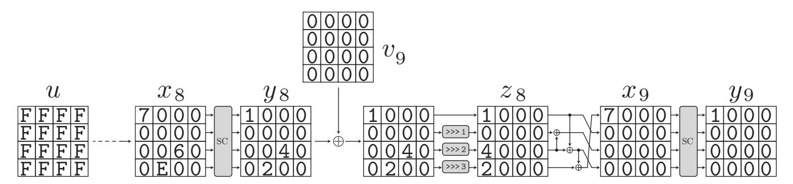

Then, the number of trail is only 1 when  $(x_8, v_9, y_9)$  is fixed.

The second step is to determine  $(x_7, v_8, y_8)$ , where the Hamming weight of  $x_7$  and  $v_8$  is as high as possible and the number of trails from  $x_7$  to  $y_8$  is odd (1 if possible). Then, we use  $x_8$  and  $y_8$  generated one step before, and the following trail is an example of the second trail extension.

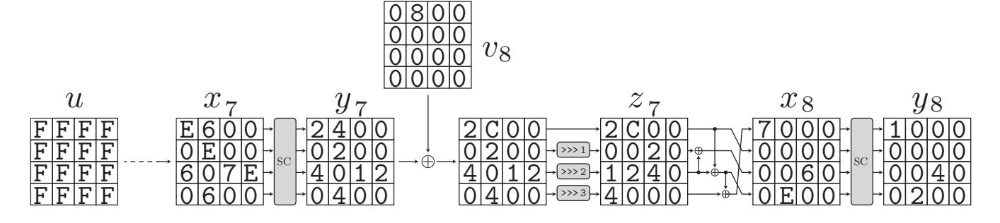

{41}------------------------------------------------

The number of trails from  $x_7$  to  $y_8$  with the key pattern  $v_8$  is only 1. Besides, the number of trails from  $x_7$  to  $y_9$  with the key pattern  $(v_8, v_9)$  is also 1.

We continue this procedure step by step, and the following trails are examples of the third and fourth trail extensions.

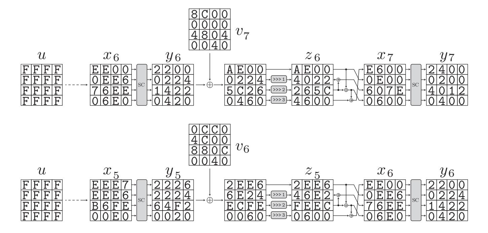

The number of trails in each step is only 1, and finally, the number of trails from  $x_5$  to  $y_9$  is 1 with the key pattern  $(v_6, v_7, v_8, v_9)$ .

Now, we have the pattern  $(x_5, v_6, v_7, v_8, v_9) \rightarrow y_9$  whose number of trails is 1. Since the Hamming weight of  $x_5$  is large enough, we change our strategy. Here, the key pattern  $(v_1, v_2, v_3, v_4)$  whose number of trails from u to  $y_5$  is odd is searched all at once.

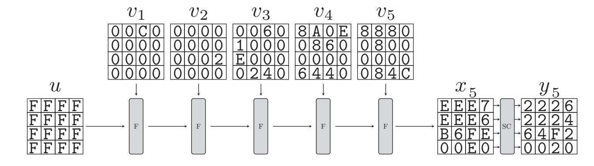

The number of trails from u to  $y_5$  with the key pattern  $(v_1, v_2, v_3, v_4, v_5)$  is 11.

We finally combine  $(v_1, \ldots, v_5)$  with  $(v_6, \ldots, v_9)$  and enumerate the number of trails from u to  $y_9$  with the key pattern  $(v_1, \ldots, v_9)$ . In this example, because using this  $x_5$  are necessary, the number of trails is still 11.

{42}------------------------------------------------

## C Input/Key/Output Pattern for SKINNY64

Here, we list all input/key/output patterns for SKINNY64. Thanks to the column rotation equivalence, 16 patterns are enough to list everything for algebraic degree and minimum degree. For others, please refer to

https://github.com/LowerBoundsAlgDegree/LowerBoundsAlgDegree to avoid listing too many patterns.

For SKINNY64, we think that the state is represented as

$$\begin{pmatrix} x_0 & x_4 & x_8 & x_{12} \\ x_1 & x_5 & x_9 & x_{13} \\ x_2 & x_6 & x_{10} & x_{14} \\ x_3 & x_7 & x_{11} & x_{15} \end{pmatrix}.$$

In the context of the division property, we focus on  $\prod_{i=0}^{15} x_i^{u_i}$ , and the input/key/output pattern is represented by 16 hexadecimal digits as

 $s_0s_1s_2s_3s_4s_5s_6s_7s_8s_9s_{10}s_{11}s_{12}s_{13}s_{14}s_{15}.$ 

## ${\bf C.1} \quad {\bf data\_set\_skinny\_64\_degree}$

```
: FFFFFFFFFFFFFFF
                                                            : FFFFFFFFFFFFFF
                                                                                         : FFFFFFFFFFFFFFF
                            in
                                                         in
                                                                                      in
in : FFFFFFFFFFFFFFF
                            k00 : 0000000000000000
                                                         k00 : 0000000000000000
                                                                                      k00 : 0000000000000000
k00 : 0000000000000000
                            k01 : 0002000000000000
                                                         k01 : 0000000000000000
                                                                                     k01 : 0820000000000000
k01 : 0460000000000000
                            k02 : 000000A40800E000
                                                         k02 : 0420000840000000
                                                                                     k02 : 000000000002C006
k02 : 0000040000000000
                            k03 : 8004C000808C0884
                                                         k03: 8000004008808008
                                                                                      k03
                                                                                          : C000800484860C68
k03: 80080000C4C40880
                            k04:
                                  CC00C4006004C088
                                                         k04: 4000000000000400
                                                                                      k04:
                                                                                            E4C0EC00800844E8
k04: 008000008000000C
                            k05
                                  0480CC00C4048080
                                                         k05
                                                             : 80800000000C000
                                                                                     k05
                                                                                           08048400400C8840
k05 : 08004080C00C4080
                            k06:
                                  0000C88000040440
                                                         k06:
                                                               0000600000400000
                                                                                      k06
                                                                                            0000C800000C4800
      0000C040004800C0
k06
                            k07
                                  0000400000000000
                                                         k07
                                                              000004000000C000
                                                                                      k07
                                                                                           0040500000800080
k07
   : 0000400000000000
                            k08:
                                  0000000000000000
                                                         k08 : 000000000000400
                                                                                      k08:
                                                                                            0040000000000000
k08
     0000000000000000
                            k09
                                  6000000000000000
                                                             : 0010000000000000
                                                                                     k09
                                                                                           0000000000400000
                                                         out
out : 1000000000000000
                            out : 0100000000000000
                                                                                      out : 000100000000000
                            in : FFFFFFFFFFFFFFF
                                                         in : FFFFFEFFFFFFFF
                                                                                      in : FFEFFFFFFFFFFF
in : FFFFFFFFFFFFFF
                            k00 : 0000000000000000
                                                         k00 : 0000000000000000
                                                                                     k00 : 0040000000000000
k00 : 0000000000000000
                            k01 : 0002000000000000
                                                         k01 : 000000000060000
                                                                                     k01 : 000000000040000
k01 : 000000000000024
                                                                                      k02
                                 : 0000086805006000
                                                             : 0000000C000008E0
                                                                                          : 0000600400000042
                            k02
                                                         k02
k02 : 0000040060080000
                            k03:
                                  8004C000800C0880
                                                         k03: 440806809000E004
                                                                                      k03:
                                                                                           C482020060000000
k03 : C008C0C008008000
                            k04
                                  CC00C4004008C008
                                                         k04
                                                             : C000408488CC5400
                                                                                      k04
                                                                                            800084840080E008
k04 : C40084004008C4CC
                            k05:
                                  0400C400C0044820
                                                         k05 : 8000C04404800000
                                                                                      k05:
                                                                                           0408C440400C8080
k05
    : 0440C400C004C800
                            k06
                                  0080004000000080
                                                         k06
                                                              000000000000C000
                                                                                      k06
                                                                                           0000C4800004C000
    : 0040808000040040
k06
                            k07
                                  0000000000000000
                                                         k07:
                                                               0000400000000800
                                                                                      k07
                                                                                            0000400000000840
      0000000000000000
k07
                            k08
                                  0000000000000000
                                                         k08
                                                             : 0000080000004000
                                                                                      k08
                                                                                           00000000000000000
k08
      0000000000000000
                            k09 : C000000000000000
                                                         k09 : 0000000000800000
                                                                                      k09:
                                                                                           80000000000000000
out
    : 2000000000000000
                            out: 0200000000000000
                                                         out: 0020000000000000
                                                                                     out: 0002000000000000
                            in : FFFFFFFFFFFFF
                                                         in : FEFFFFFFFFFFFF
                                                                                     in : FFFFFFFFFFFFFFF
in : FFFFFEFFFFFFF
                                                         k00 : 0000000000000000
                            k00 : 0000000000000000
                                                                                     k00 : 0000000000000000
   : 00000000000000000
k00
                            k01 : 0000000000000000000000000000000000
                                                         k01 : 0000004100000000
                                                                                     k01 : 0040000000000000
k01: 000000000020000
                            k02: 04600200C0000000
                                                                                      k02: 000002840A01A008
                                                         k02: 800200000040000
k02: 0000600000000080
                            k03 : C00880C00C08C000
                                                         k03: 04C06004800C64E0
                                                                                     k03: 00008000802C0084
k03: 848006808008800C
                            k04 : C0008400C008C4C8
                                                         k04: 48C8C00084008E0C
                                                                                     k04: 8680C40C8004C0C8
    : 04008440C0048800
k04
                            k05 : 04C0C4008004C800
                                                         k05 : 8000000400400C00
                                                                                     k05 : 0C04CC00C80C8080
k05 : 00400C0080400000
                            k06: 0000C08000040080
                                                         k06: 0000080000008000
                                                                                      k06: 0000C00000CC040
    : 0000080000000000
k06
                            k07 : 0000000000000000
                                                         k07 : 0000400000400000
                                                                                     k07 : 0040C00000000080
k07: 0000800000000000
                            k08: 0000000000000000
                                                         k08 : 0000080000004000
                                                                                     k08: 0000000000000000
k08
    : 0000000000000000
                            k09: 4000000000000000
                                                         k09 : 0000000000000000
                                                                                     k09 : 0000000000000000
out: 4000000000000000
                            out: 0400000000000000
                                                         out: 0040000000000000
                                                                                      out: 0004000000000000
                            in : FFFFFEFFFFFFF
                                                                                      in : FFFFFFFFFFFFFFF
                                                         in : FFFFFFFFFFFFFFF
in : FFFFFEFFFFFFFF
                                  00000000000000000
                                                               0000000000000000
                                                                                           0000000000000
k00
      0000000000000000
                            k01: 000000000020000
                                                         k01 : 0084000000000000
                                                                                      k01: 0080000000000000
k01:
      0000000000000000
                            k02: 0000600000000048
                                                                                      k02: 000004200000E000
                                                         k02: 0000040000088000
k02:
      0008800200000200
                                  C86800808004C008
                                                         k03 : C000800088040040
                                                                                           C00AE004C06A0802
                            k03
                                                                                      k03:
                                :
      8024048020004008
k03
                                                                                          : 04808600800E80E8
                                  040080804004C80C
                                                         k04: 04C0CC08C008C088
                            k04
                                                                                     k04
      0400000008040800
k04
                                  00408400400C0800
                                                               C000440088000400
                                                                                            000400004804C800
                            k05
                                                         k05
                                                                                      k05
                                                             :
k05
      00008000400800C0
                                  0000800000080000
                                                         k06
                                                               800000000000C000
                                                                                            0000C4000004C840
                            k06
                                                                                      k06
k06
      00000000000000000
                                                               0000000000000000
                                  0000000000000000
                                                                                            0000800000000000
                            k07
                                                         k07
                                                                                      k07
k07
    : 0000000000000000
                                 : 0000000000000000
                                                                                          : 0000000000000000
                            k08
                                                         k08 : 000000000008000
                                                                                      k08
k08 : 0000000000000000
                                  8000000000000000
                                                         k09 : 0000000000000000
                                                                                          : 0000000000000000
                            k09
                                                                                      k09
                                :
    : 800000000000000
out
                                                                                      out : 000800000000000
                            out : 0800000000000000
                                                         out : 0080000000000000
```

{43}------------------------------------------------

# $C.2 \quad data\_set\_skinny\_64\_min$

| NO                                                                                                                                                                                                                                                                                                                                                                                                                                                                                                                                                                                                                                                                                                                                                                                                                                                                                                                                                                                                                                                                                                                                                                                         | in : | FFFFFFFFFFFFFF     | in :  | FFFFFEFFFFFFFF    | in : FFFFFEFFFFFFFF    | in :  | FFFFFEFFFFFFFFF   |
|--------------------------------------------------------------------------------------------------------------------------------------------------------------------------------------------------------------------------------------------------------------------------------------------------------------------------------------------------------------------------------------------------------------------------------------------------------------------------------------------------------------------------------------------------------------------------------------------------------------------------------------------------------------------------------------------------------------------------------------------------------------------------------------------------------------------------------------------------------------------------------------------------------------------------------------------------------------------------------------------------------------------------------------------------------------------------------------------------------------------------------------------------------------------------------------------|------|--------------------|-------|-------------------|------------------------|-------|-------------------|
| k01 : 000000000000000         k01 : 0000000000000000         k01 : 0000000000000000000000000000000000                                                                                                                                                                                                                                                                                                                                                                                                                                                                                                                                                                                                                                                                                                                                                                                                                                                                                                                                                                                                                                                                                      | k00  | : 0000000800000000 | k00 : | 00000000000000000 | k00 : 0000000000000000 | k00 : | 00000000000000000 |
| k02 : 000000000000000         k02 : 00000000000000         k02 : 0000000000000         k02 : 0000000000000         k03 : 0000000000000         k03 : 6664665500000000         k03 : 6664665500000000         k03 : 6664665500000000         k03 : 6664665500000000         k03 : 6664665500000000         k03 : 66646655000000000         k04 : 00088104000000000         k04 : 00088104000000000000         k05 : 000000000000000000         k05 : 0000000000000000000000000000000000                                                                                                                                                                                                                                                                                                                                                                                                                                                                                                                                                                                                                                                                                                     |      |                    |       |                   |                        |       |                   |
| k03 :         00000004800400000000000000000000000000                                                                                                                                                                                                                                                                                                                                                                                                                                                                                                                                                                                                                                                                                                                                                                                                                                                                                                                                                                                                                                                                                                                                       |      |                    |       |                   |                        |       |                   |
| ROS : 84C04C4088044028                                                                                                                                                                                                                                                                                                                                                                                                                                                                                                                                                                                                                                                                                                                                                                                                                                                                                                                                                                                                                                                                                                                                                                     | k03  | : 0000000480040000 |       |                   |                        | k03 : | 802C04C000068004  |
| NOB                                                                                                                                                                                                                                                                                                                                                                                                                                                                                                                                                                                                                                                                                                                                                                                                                                                                                                                                                                                                                                                                                                                                                                                        | k04  | 8084800004080400   | k04 : | C0008C08C808C404  | k04 : 80008024C004E008 | k04 : | C0088A04C240CC0C  |
| NOT : 0000C00000040000                                                                                                                                                                                                                                                                                                                                                                                                                                                                                                                                                                                                                                                                                                                                                                                                                                                                                                                                                                                                                                                                                                                                                                     | k05  | 84C04C4088044028   | k05 : | 0CC00440C00CC840  | k05 : C800800444000800 | k05 : | 00C4CC00C8080080  |
| ROB                                                                                                                                                                                                                                                                                                                                                                                                                                                                                                                                                                                                                                                                                                                                                                                                                                                                                                                                                                                                                                                                                                                                                                                        | k06  | : 0400C880C0040000 | k06:  | 0000C040000400C0  | k06: 840000000008080   | k06 : | 0000C40000CC040   |
| ROP : 0000000000400000                                                                                                                                                                                                                                                                                                                                                                                                                                                                                                                                                                                                                                                                                                                                                                                                                                                                                                                                                                                                                                                                                                                                                                     | k07  | : 0000C00000040000 | k07 : | 0000400000000000  | k07 : 0000400000400000 | k07 : | 0040C00000000480  |
|                                                                                                                                                                                                                                                                                                                                                                                                                                                                                                                                                                                                                                                                                                                                                                                                                                                                                                                                                                                                                                                                                                                                                                                            | k08  | : 000040000000000  | k08 : | 0000000000000000  | k08 : 000008000006000  | k08 : | 0040000000000000  |
| Not   00000000000000                                                                                                                                                                                                                                                                                                                                                                                                                                                                                                                                                                                                                                                                                                                                                                                                                                                                                                                                                                                                                                                                                                                                                                       | k09  | : 0000000000400000 | k09 : | 6000000000000000  | k09 : 000000000000400  | k09 : | 4000000000000000  |
| Not   00000000000000                                                                                                                                                                                                                                                                                                                                                                                                                                                                                                                                                                                                                                                                                                                                                                                                                                                                                                                                                                                                                                                                                                                                                                       |      |                    |       |                   |                        |       |                   |
| NOT   004200000000000                                                                                                                                                                                                                                                                                                                                                                                                                                                                                                                                                                                                                                                                                                                                                                                                                                                                                                                                                                                                                                                                                                                                                                      | in : | : FFFFFFFFFFFFFF   | in :  | FFFFFEFFFFFFFF    | in : FEFFFFFFFFFFFF    | in :  | FFFFFEFFFFFFFFF   |
| ROZ                                                                                                                                                                                                                                                                                                                                                                                                                                                                                                                                                                                                                                                                                                                                                                                                                                                                                                                                                                                                                                                                                                                                                                                        | k00  | : 000000000000000  | k00 : | 0000000000000000  | k00 : 0000000000000000 | k00 : | 0000000000000000  |
| R03                                                                                                                                                                                                                                                                                                                                                                                                                                                                                                                                                                                                                                                                                                                                                                                                                                                                                                                                                                                                                                                                                                                                                                                        | k01  | : 0042000000000000 | k01 : | 0000000000040000  | k01 : 0000004100000000 | k01 : | 0000000000200000  |
| k04         :         88C8CEOOC008C004         k04         :         44C8C0084008ECC         k04         :         E000CC4888A04CCC           k05         :         C4C0C4008004C008         k05         :         08C08080080C40CC         k05         :         8000000400400CCO         k05         :         0400C400CC040C80C80C80C80C8           k06         :         0400C40000040840         k06         :         0400C400000000         k07         :         00004000008000         k07         :         00040400000000         k07         :         00040400000000         k07         :         000404000000000         k07         :         000404000000000         k07         :         00040000000000000         k08         :         00000000000000000         k08         :         00000000000000000         k08         :         000000000000000000000000000000000000                                                                                                                                                                                                                                                                                           | k02  | : 0000020008028002 | k02 : | 080880000000088   | k02 : 800200000040000  | k02 : | 0600E00400000280  |
| k05         C4C0C4008004C008         k05         08C08080008C40C0         k05         800000400400C00         k05         0400C400C040840         k06         0000C4000000000         k06         0000000000000         k05         0400C400C00408000         k06         00000000000000         k07         0000400000000000         k07         0000400000000000         k07         0000400000000000         k07         0000400000000000         k07         0000400000000000         k07         0000400000000000000         k08         000000000000000000000000000000000000                                                                                                                                                                                                                                                                                                                                                                                                                                                                                                                                                                                                         | k03  | E004E000A0E80404   | k03 : | C04808C88004C008  | k03 : 04C06004800C64E0 | k03 : | C0680084C000C001  |
| ROB                                                                                                                                                                                                                                                                                                                                                                                                                                                                                                                                                                                                                                                                                                                                                                                                                                                                                                                                                                                                                                                                                                                                                                                        | k04  | : 88C8CE00C008C004 | k04 : | 04008C044400C804  | k04 : 48C8C00084008E0C | k04 : | E000CC4888A04C0C  |
| k07 : 000000000000000         k07 : 00008000000000         k07 : 00004000000000         k08 : 000080000000000         k08 : 00008000000000         k08 : 00000000000000         k08 : 00000000000000         k08 : 00000000000000         k08 : 00000000000000         k09 : 00000000000000         k09 : 00000000000000         k09 : 00000000000000         k09 : 00000000000000         k09 : 00000000000000         k09 : 000000000000000         k09 : 000000000000000         k09 : 000000000000000         k09 : 000000000000000         k09 : 000000000000000         k09 : 0000000000000000000         k09 : 0000000000000000000000000000000000                                                                                                                                                                                                                                                                                                                                                                                                                                                                                                                                   |      |                    |       |                   |                        |       |                   |
| k08 :         000080000000000         k08 :         000000000000000         k08 :         00000000000000000         k08 :         000000000000000000           k09 :         000000000000000000000000000000000000                                                                                                                                                                                                                                                                                                                                                                                                                                                                                                                                                                                                                                                                                                                                                                                                                                                                                                                                                                          | k06  | : 0400C400C0040840 | k06 : | 0000C40000000000  | k06 : 0000080000008000 | k06 : | 00404080000CC040  |
| Roy   00000000000000000000000000000000000                                                                                                                                                                                                                                                                                                                                                                                                                                                                                                                                                                                                                                                                                                                                                                                                                                                                                                                                                                                                                                                                                                                                                  | k07  | : 00000000000000   | k07 : | 0000800000000000  | k07 : 000040000400000  | k07 : | 0000400000000840  |
| in : FFFFFFFFFFFFFFFFFFFFFFFFFFFFFFFFFFF                                                                                                                                                                                                                                                                                                                                                                                                                                                                                                                                                                                                                                                                                                                                                                                                                                                                                                                                                                                                                                                                                                                                                   | k08  | : 000080000000000  | k08 : | 000000000000000   | k08 : 0000080000004000 | k08 : | 0000000000000000  |
| k00         : 0000000000000000         k00         : 000000000000000         k01         : 0000000000000000         k01         : 0000000000000000         k01         : 0000000000000000         k01         : 0000000000000000         k01         : 0000000000000000         k01         : 0000000000000000         k01         : 00000000000000000         k01         : 000000000000000000         k01         : 00000000000000000         k01         : 00000000000000000         k01         : 00000000000000000         k01         : 00000000000000000         k01         : 00000000000000000         k01         : 00000000000000000         k01         : 00000000000000000         k01         : 0000000000000000         k01         : 0000000000000000         k02         : 00000000000000000         k02         : 0000000000000000         k03         : 000000000000000000000000000000000000                                                                                                                                                                                                                                                                            | k09  | : 000000000000000  | k09 : | C000000000000000  | k09 : 000000000000800  | k09 : | 8000000000000000  |
| k00         : 0000000000000000         k00         : 000000000000000         k01         : 0000000000000000         k01         : 0000000000000000         k01         : 0000000000000000         k01         : 0000000000000000         k01         : 0000000000000000         k01         : 0000000000000000         k01         : 00000000000000000         k01         : 000000000000000000         k01         : 00000000000000000         k01         : 00000000000000000         k01         : 00000000000000000         k01         : 00000000000000000         k01         : 00000000000000000         k01         : 00000000000000000         k01         : 00000000000000000         k02         : 0000000000000000         k02         : 0000000000000000         k02         : 00000000000000000         k03         : C00040000880000         k04         : 000004000000000         k04         : 04800000000000000000000000000000000000                                                                                                                                                                                                                                     |      |                    |       |                   |                        |       |                   |
| k01 :         000400000000000         k01 :         000400000000000         k01 :         0020000000000000           k02 :         0000004204080004         k02 :         0000002020288008         k02 :         00000002000000         k02 :         000000240008E008           k03 :         8006C0040360C02         k03 :         80048004C0280C88         k03 :         000080088008000         k03 :         C000400880C404C4           k04 :         A8C0E6080068008         k04 :         CCCCC4004000800C         k04 :         00200400C0008000         k04 :         C480C000C08800C           k05 :         0000800400C0400         k05 :         0C008400C00C408         k05 :         000040000880000         k06 :         000040000880000           k06 :         0000C0000000000         k06 :         000040000880000         k06 :         000040000880000         k06 :         000040000880000           k07 :         0000800000000000         k07 :         0000800000000000         k07 :         0000800000000000         k07 :         0000800000000000000           k07 :         0000800000000000000000000000000000000                                          |      |                    |       |                   |                        |       |                   |
| k02 :         0000004204080004         k02 :         0000002002088008         k02 :         0000000000000000         k02 :         00000024008E008           k03 :         8006C00040360C02         k03 :         80048004C0280C88         k03 :         0000800880008000         k03 :         C000400880C404C4           k04 :         A8C0E60800068008         k04 :         CCC0C4004000800C         k04 :         00200400C008000         k04 :         C480C000C008000           k05 :         0000800400C0400         k05 :         00008400C00C4080         k05 :         000040000880000         k05 :         000040000880000           k06 :         0000C00000000000         k06 :         000000000000000         k06 :         000040000880000         k06 :         000040000880000           k07 :         0000800000000000         k07 :         0000000000000000         k07 :         00000000000000         k07 :         000000000000000           k08 :         0000000000000000         k08 :         0000000000000000         k08 :         000000000000000         k08 :         0000000000000000000           k08 :         000000000000000000000000000000000000 |      |                    |       |                   |                        |       |                   |
| k03         : 8006C00040360C02         k03         : 80048004C0280C88         k03         : 0000800880008000         k03         : C000400880C404C4           k04         : A8C0E60800068008         k04         : CCC0C4004000800C         k04         : 00200400C008000         k04         : C480C000C008000C           k05         : 00008000400C0400         k05         : 0C008400C00C4080         k05         : 00004000080000         k05         : 04804800C40C0040           k06         : 0000000000000000         k06         : 0000400000000000         k05         : 04804800C40C0040           k07         : 00008000000000000         k06         : 000000000000000         k06         : 000000000000000           k08         : 0000000000000000         k07         : 000000000000000         k07         : 000000000000000           k08         : 0000000000000000         k08         : 000000000000000         k08         : 0000000000000000           k09         : 000000000000000000000000000000000000                                                                                                                                                          | k01  | : 000400000000000  | k01 : | 0004000000000000  | k01 : 0000000200000000 | k01 : | 0020000000000000  |
| k04       : A8C0E60800068008       k04       : CCC0C4004000800C       k04       : 00200400C0008000       k04       : C480C000C008000C         k05       : 00008000400C0400       k05       : 0C008400C00C4080       k05       : 00004000080000       k05       : 04804800C40C0040         k06       : 0000C00000000000       k06       : 000040000880000       k06       : 00800000000000       k06       : 00004000080000         k07       : 00008800000000000       k07       : 000000000000000       k07       : 000080000000000       k07       : 000080000000000         k08       : 0000000000000000       k08       : 000000000000000       k08       : 000000000000000       k08       : 000000000000000         k09       : 0000000000000000       k09       : 400000000000000       k09       : 000000000000000       k09       : 000000000000000         k01       : FFFFFEFFFFFFFFFFFFFFFFFFFFFFFFFFFFFFF                                                                                                                                                                                                                                                                     | k02  | : 0000004204080004 | k02 : | 0000002002088008  | k02 : 000000000200000  | k02 : | 000000240008E008  |
| k05         : 00008000400C0400         k05         : 0C008400C00C4080         k05         : 00004000080000         k05         : 04804800C40C0040           k06         : 0000C000000000000         k06         : 000040000880000         k06         : 000040000880000         k06         : 000040000800040           k07         : 000080000000000         k07         : 000000000000000         k07         : 000080000000000         k07         : 000080000000000           k08         : 000000000000000         k08         : 000000000000000         k08         : 00000000000000         k08         : 000000000000000           k09         : 000000000000000         k09         : 4000000000000000         k08         : 000000000000000000         k09         : 00000000000000000           k01         : FFFFFFFFFFFFFFFFFFFFFFFFFFFFFFFFFFFF                                                                                                                                                                                                                                                                                                                              |      |                    |       |                   |                        |       |                   |
| k06       : 0000C000000000000       k06       : 0000400008800000       k06       : 0080000000004000       k06       : 000040000880040         k07       : 0000800000000000       k07       : 00000000000000000       k07       : 0000000000000000       k07       : 000080000000000         k08       : 0000000000000000       k08       : 0000000000000000       k08       : 000000000000000       k08       : 000000000000000         k09       : 0000000000000000       k09       : 4000000000000000       k09       : 0000000000000000       k09       : 0000000000000000         in       : FFFFFFFFFFFFFFFFFFFFFFFFFFFFFFFFFFFF                                                                                                                                                                                                                                                                                                                                                                                                                                                                                                                                                      |      |                    |       |                   |                        |       |                   |
| k07 : 000080000000000         k07 : 000000000000000         k07 : 000000000000000         k07 : 0000800000000000           k08 : 0000000000000000         k08 : 000000000000000         k08 : 000000000000000         k08 : 000000000000000           k09 : 000000040000000         k09 : 40000000000000         k09 : 000000000000000         k09 : 000000000000000           in : FFFFFFFFFFFFFFFFFFFFFFFFFFFFFFFFFFF                                                                                                                                                                                                                                                                                                                                                                                                                                                                                                                                                                                                                                                                                                                                                                    |      |                    |       |                   |                        |       |                   |
| k08 :         000000000000000000         k08 :         0000000000000000         k08 :         000000000000000000         k08 :         0000000000000000000           k09 :         0000000040000000         k09 :         40000000000000000         k09 :         0000000000000000         k09 :         00000000000000000           in :         FFFFFFFFFFFFFFFFFFFFFFFFFFFFFFFFFFFF                                                                                                                                                                                                                                                                                                                                                                                                                                                                                                                                                                                                                                                                                                                                                                                                     |      |                    |       |                   |                        |       |                   |
| k09         :         000000040000000         k09         :         40000000000000000         k09         :         00000000000000000000         k09         :         000000000000000000000000000000000000                                                                                                                                                                                                                                                                                                                                                                                                                                                                                                                                                                                                                                                                                                                                                                                                                                                                                                                                                                                |      |                    |       |                   |                        |       |                   |
| in : FFFFFFFFFFFFFFFFFFFFFFFFFFFFFFFFFFF                                                                                                                                                                                                                                                                                                                                                                                                                                                                                                                                                                                                                                                                                                                                                                                                                                                                                                                                                                                                                                                                                                                                                   |      |                    |       |                   |                        |       |                   |
| k00 :       000000000000000000000000000000000000                                                                                                                                                                                                                                                                                                                                                                                                                                                                                                                                                                                                                                                                                                                                                                                                                                                                                                                                                                                                                                                                                                                                           | k09  | : 000000040000000  | k09 : | 4000000000000000  | k09 : 000000000000400  | k09 : | 0000000000400000  |
| k00 :       000000000000000000000000000000000000                                                                                                                                                                                                                                                                                                                                                                                                                                                                                                                                                                                                                                                                                                                                                                                                                                                                                                                                                                                                                                                                                                                                           |      |                    |       |                   |                        |       |                   |
| k01 :       0000000000020000       k01 :       000000000000000000000000000000000000                                                                                                                                                                                                                                                                                                                                                                                                                                                                                                                                                                                                                                                                                                                                                                                                                                                                                                                                                                                                                                                                                                        |      |                    |       |                   |                        |       |                   |
| k02       :       0000E000000000020       k02       :       0200020460080000       k02       :       E000000000200000       k02       :       00044000000000000         k03       :       8080080880048008       k03       :       8000800C00008004       k03       :       00000000820008000       k03       :       80400880884088         k04       :       04004000C8448000       k04       :       04008400804484C0       k04       :       00000000000000       k04       :       04008400404444000         k05       :       000020800004C040       k05       :       0000C40000088440       k05       :       000080000000000       k05       :       008088000084080         k06       :       00000000000000000       k06       :       0000000000000000       k06       :       004000000000000000000       k06       :       8000000000000000000000000000000000000                                                                                                                                                                                                                                                                                                             |      |                    |       |                   |                        |       |                   |
| k03       :       8080080880048008       k03       :       8000800000000000000000000000000000000                                                                                                                                                                                                                                                                                                                                                                                                                                                                                                                                                                                                                                                                                                                                                                                                                                                                                                                                                                                                                                                                                           |      |                    |       |                   |                        |       |                   |
| k04       :       04004000C8448000       k04       :       04008400804484C0       k04       :       000000000000000000000000000000000000                                                                                                                                                                                                                                                                                                                                                                                                                                                                                                                                                                                                                                                                                                                                                                                                                                                                                                                                                                                                                                                   |      |                    |       |                   |                        |       |                   |
| k05       : 000020800004C040       k05       : 0000C40000088440       k05       : 000080000000000       k05       : 0080808000084080         k06       : 0000C000000000000       k06       : 0000C00000000000       k06       : 004000000000000       k06       : 8000C0000000000         k07       : 000000000000000       k07       : 000040000000000       k07       : 00000000000000         k08       : 00000000000000       k08       : 00000000000000       k08       : 00000000000000                                                                                                                                                                                                                                                                                                                                                                                                                                                                                                                                                                                                                                                                                              |      |                    |       |                   |                        |       |                   |
| k06 :       000000000000000000000000000000000000                                                                                                                                                                                                                                                                                                                                                                                                                                                                                                                                                                                                                                                                                                                                                                                                                                                                                                                                                                                                                                                                                                                                           |      |                    |       |                   |                        |       |                   |
| k07 : 000000000000000       k07 : 0000000000000       k07 : 0000000000000       k07 : 000040000000400       k07 : 000000000000000         k08 : 00000000000000       k08 : 00000000000000       k08 : 000000000000000       k08 : 00000000000000                                                                                                                                                                                                                                                                                                                                                                                                                                                                                                                                                                                                                                                                                                                                                                                                                                                                                                                                           |      |                    |       |                   |                        |       |                   |
| k08: 00000000000000 k08: 00000000000000 k08: 0000000000                                                                                                                                                                                                                                                                                                                                                                                                                                                                                                                                                                                                                                                                                                                                                                                                                                                                                                                                                                                                                                                                                                                                    |      |                    |       |                   |                        |       |                   |
|                                                                                                                                                                                                                                                                                                                                                                                                                                                                                                                                                                                                                                                                                                                                                                                                                                                                                                                                                                                                                                                                                                                                                                                            |      |                    |       |                   |                        |       |                   |
| k09 : 000000080000000 k09 : 80000000000000 k09 : 000000000000800 k09 : 000000000080000                                                                                                                                                                                                                                                                                                                                                                                                                                                                                                                                                                                                                                                                                                                                                                                                                                                                                                                                                                                                                                                                                                     |      |                    |       |                   |                        |       |                   |
|                                                                                                                                                                                                                                                                                                                                                                                                                                                                                                                                                                                                                                                                                                                                                                                                                                                                                                                                                                                                                                                                                                                                                                                            | k09  | : 0000000800000000 | k09 : | 8000000000000000  | k09 : 0000000000000800 | k09 : | 0000000000800000  |

{44}------------------------------------------------

# D Example Source Code to Verify Our Result for GIFT using Gurobi C++ API

```
1 # include " gurobi_c ++. h"
 2 # include < vector >
 3
 4 using namespace std ;
 5
 6 // bit permutation of GIFT
 7 vector < int > BP = {
 8 0 ,17 ,34 ,51 ,48 ,1 ,18 ,35 ,32 ,49 ,2 ,19 ,16 ,33 ,50 ,3 ,
 9 4 ,21 ,38 ,55 ,52 ,5 ,22 ,39 ,36 ,53 ,6 ,23 ,20 ,37 ,54 ,7 ,
10 8 ,25 ,42 ,59 ,56 ,9 ,26 ,43 ,40 ,57 ,10 ,27 ,24 ,41 ,58 ,11 ,
11 12 ,29 ,46 ,63 ,60 ,13 ,30 ,47 ,44 ,61 ,14 ,31 ,28 ,45 ,62 ,15
12 };
13
14 // linear inequalities for GIFT Sbox with logic condition .
15 // let (x0 ,x1 ,x2 ,x3) --> (y0 ,y1 ,y2 ,y3)
16 // the first one means "x1 + x2 + (1 - x3) + y0 + y1 + y2 >= 1"
17 vector < vector < int >> table = {
18 {2 ,0 ,0 ,1 ,0 ,0 ,0 ,2} , {2 ,0 ,1 ,1 ,0 ,0 ,2 ,0} , {1 ,0 ,2 ,2 ,0 ,1 ,1 ,0} , {2 ,0 ,1 ,1 ,0 ,1 ,0 ,2} ,
19 {2 ,0 ,1 ,1 ,1 ,0 ,0 ,2} , {2 ,1 ,0 ,1 ,1 ,0 ,2 ,0} , {1 ,1 ,2 ,2 ,1 ,1 ,0 ,0} , {2 ,1 ,1 ,1 ,1 ,1 ,2 ,0} ,
20 {0 ,1 ,2 ,2 ,0 ,2 ,0 ,0} , {0 ,2 ,1 ,2 ,0 ,0 ,0 ,2} , {1 ,2 ,2 ,0 ,0 ,0 ,2 ,0} , {1 ,2 ,0 ,0 ,2 ,2 ,1 ,0} ,
21 {1 ,2 ,0 ,1 ,2 ,2 ,0 ,0} , {1 ,2 ,1 ,2 ,2 ,0 ,0 ,0} , {2 ,1 ,1 ,0 ,0 ,0 ,2 ,2} , {2 ,1 ,1 ,2 ,2 ,0 ,0 ,0} ,
22 {2 ,2 ,1 ,0 ,0 ,2 ,0 ,1} , {1 ,1 ,1 ,2 ,0 ,2 ,2 ,0} , {1 ,1 ,2 ,1 ,2 ,0 ,2 ,0} , {1 ,1 ,2 ,2 ,2 ,0 ,0 ,1} ,
23 {1 ,1 ,1 ,1 ,2 ,2 ,0 ,2} , {1 ,1 ,2 ,1 ,0 ,2 ,2 ,1} , {2 ,2 ,1 ,1 ,2 ,0 ,1 ,1} , {0 ,0 ,0 ,2 ,2 ,2 ,1 ,2} ,
24 {0 ,2 ,0 ,0 ,2 ,1 ,2 ,2} , {2 ,0 ,0 ,0 ,2 ,2 ,1 ,2} , {0 ,0 ,2 ,2 ,1 ,1 ,2 ,2} , {0 ,2 ,0 ,2 ,2 ,1 ,1 ,2} ,
25 {0 ,2 ,2 ,0 ,1 ,2 ,1 ,2} , {2 ,0 ,0 ,2 ,1 ,1 ,2 ,2} , {2 ,2 ,0 ,0 ,1 ,2 ,2 ,1} , {2 ,2 ,0 ,2 ,2 ,1 ,1 ,1} ,
26 {0 ,0 ,2 ,2 ,2 ,2 ,2 ,1} , {0 ,2 ,2 ,0 ,2 ,2 ,2 ,1} , {0 ,2 ,2 ,2 ,2 ,2 ,1 ,1}
27 };
28
29 // add linear constraints for Sbox to model
30 void sboxConstr ( GRBModel & model , vector < GRBVar > inVar , vector < GRBVar > outVar ) {
31
32 for ( int i = 0; i < table . size () ; i ++) {
33 GRBLinExpr tmp = 0;
34 for ( int j = 0; j < 4; j ++) {
35 if ( table [i ][ j] == 0)
36 tmp += inVar [j ];
37 else if ( table [i ][ j] == 1)
38 tmp += (1 - inVar [j ]) ;
39 }
40 for ( int j = 0; j < 4; j ++) {
41 if ( table [i ][4 + j] == 0)
42 tmp += outVar [j ];
43 else if ( table [i ][4 + j] == 1)
44 tmp += (1 - outVar [ j ]) ;
45 }
46 model . addConstr ( tmp >= 1) ;
47 }
48 }
49
50 // set each pattern
51 void setPattern ( GRBModel & model , vector < vector < GRBVar >> var , unsigned long long int v) {
52 for ( int i = 0; i < 64; i ++) {
53 if ((( v >> i ) & 1) == 1) {
54 model . addConstr ( var [ i / 4][ i % 4] == 1) ;
55 }
56 else {
57 model . addConstr ( var [ i / 4][ i % 4] == 0) ;
58 }
59 }
60 }
61
62 // main function
63 int main ( void ){
64
65 // rounds that we show the lower bound
66 int rounds = 9;
67
68 // input / key/ output pattern
69 unsigned long long int in = 0 xFFFFFFFFFFFEFFFF ;
70 vector < unsigned long long int > key = {
71 0 x0000000000000000 ,
72 0 x0000000000000000 ,
73 0 x8004000000041000 ,
74 0 x9204860410519C00 ,
75 0 x060D130120091011 ,
76 0 x6004000000000001 ,
77 0 x0000000000000000 ,
78 0 x0000000000000000
79 };
80 unsigned long long int out = 0 x8000000000000000 ;
81
82 // start gurobi
83 try {
84 // create the environment
```

{45}------------------------------------------------

```
85 GRBEnv env = GRBEnv () ;
 86
 87 // enumurate solutions up to 2000000000
 88 env . set ( GRB_IntParam_PoolSearchMode , 2) ;
 89 env . set ( GRB_IntParam_PoolSolutions , 2000000000) ;
 90 env . set ( GRB_DoubleParam_PoolGap , GRB_INFINITY );
 91
 92 // create the model
 93 GRBModel model = GRBModel ( env ) ;
 94
 95 // create variables
 96 vector < vector < vector < GRBVar >> > X ( rounds , vector < vector < GRBVar > >(16 , vector < GRBVar >(4) )) ;
 97 vector < vector < vector < GRBVar >> > Y ( rounds , vector < vector < GRBVar > >(16 , vector < GRBVar >(4) )) ;
 98 vector < vector < vector < GRBVar >> > K ( rounds - 1 , vector < vector < GRBVar > >(16 , vector < GRBVar >(4) )) ;
 99 for ( int r = 0; r < rounds ; r ++) {
100 for ( int i = 0; i < 16; i ++) {
101 for ( int j = 0; j < 4; j ++) {
102 X[r ][ i ][ j] = model . addVar (0 , 1, 0 , GRB_BINARY );
103 Y[r ][ i ][ j] = model . addVar (0 , 1, 0 , GRB_BINARY );
104 if (r < rounds - 1)
105 K[ r ][ i ][ j] = model . addVar (0 , 1, 0, GRB_BINARY );
106 }
107 }
108 }
109
110 // set pattern
111 setPattern ( model , X [0] , in ) ;
112 setPattern ( model , Y[ rounds - 1] , out );
113 for ( int r = 0; r < rounds - 1; r ++)
114 setPattern ( model , K[ r], key [ r ]) ;
115
116 // create constraints
117 for ( int r = 0; r < rounds - 1; r ++) {
118
119 // sbox
120 for ( int i = 0; i < 16; i ++)
121 sboxConstr ( model , X[ r ][ i ], Y[r ][ i ]) ;
122
123 // key xor and bit perm
124 for ( int i = 0; i < 64; i ++) {
125 int j = BP [ i ];
126 model . addConstr ( Y[r ][ i / 4][ i % 4] + K[r ][ j / 4][ j % 4] == X[r + 1][ j / 4][ j % 4]) ;
127 }
128
129 }
130
131 // last sbox
132 for ( int i = 0; i < 16; i ++)
133 sboxConstr ( model , X[ rounds - 1][ i], Y[ rounds - 1][ i ]) ;
134
135 // solve this model
136 model . optimize () ;
137
138 int solcount = model . get ( GRB_IntAttr_SolCount );
139 cout << " the ␣ number ␣ of ␣ trails ␣:␣" << solcount << endl ;
140
141 }
142 catch ( GRBException e) {
143 cerr << " Error ␣ code ␣= ␣" << e . getErrorCode () << endl ;
144 cerr << e . getMessage () << endl ;
145 }
146 catch (...) {
147 cerr << " Exception ␣ during ␣ optimization " << endl ;
148 }
149
150 return 0;
151 }
```

## E Propagation Rules

Here we first recall the propagation rules for the three basic operations, namely XOR, COPY and AND. Note that the proofs of these propagation rules mainly rely on Proposition 1.

Proposition 4 (XOR Propagation). Let F : F n → F<sup>2</sup> be defined as

$$F(x_1,\ldots,x_n)=x_1\oplus x_2\oplus\cdots\oplus x_n.$$

{46}------------------------------------------------

For  $a \in \mathbb{F}_2^n$  and  $b \in \mathbb{F}_2$ , it holds that  $a \stackrel{F}{\to} b$  if and only if

$$b = a_1 + a_2 + \dots + a_n$$

that is, at most one  $a_i$  can be equal to 1, which leads to b = 1 in that case, or  $a_i = 0, \forall i \in \{1, ..., n\}$ , which leads to b = 0.

Proof. By denoting y = F(x), if b = 0, then  $a \xrightarrow{F} b$  if and only if  $y^b = y^0 = 1$  contains the monomial  $x^a$ , thus leading to only one possible trail with  $a = (0, \ldots, 0)$  and it satisfies the relation above. On the other hand if b = 1, then  $a \xrightarrow{F} b$  if and only if  $y^b = y^1 = x_1 \oplus \cdots \oplus x_n$  contains the monomial  $x^a$ . As  $y^1$  contains each monomial of degree 1, the possible trails are  $a \xrightarrow{F} b$  where wt(a) = 1, which also satisfies the relation above.

Proposition 5 (XOR with a Constant Propagation). Let  $F : \mathbb{F}_2 \to \mathbb{F}_2$  be defined as

$$F(x) = x \oplus 1.$$

For  $a, b \in \mathbb{F}_2$ , it holds that  $a \stackrel{F}{\rightarrow} b$  if and only if

$$\begin{cases} b \in \{0, 1\} & \text{if } a = 0 \\ b = 1 & \text{if } a = 1 \end{cases}$$

*Proof.* By denoting y = F(x), if b = 0, then  $y^b = y^0 = 1$  and thus the only possible trail is  $0 \xrightarrow{F} 0$ . Otherwise if b = 1, then  $y^b = y^1 = x \oplus 1$  contains both  $x^1$  and  $x^0$ , thus the valid trails are  $0 \xrightarrow{F} 1$  and  $1 \xrightarrow{F} 1$ .

**Proposition 6 (COPY Propagation).** Let  $F : \mathbb{F}_2 \to \mathbb{F}_2^n$  be defined as

$$F(x) = (x, x, \dots, x).$$

For  $a \in \mathbb{F}_2$  and  $b \in \mathbb{F}_2^n$ , it holds that  $a \stackrel{F}{\rightarrow} b$  if and only if

$$a = b_1 \vee b_2 \vee \cdots \vee b_n$$

that is, a = 0 leads to  $b_i = 0, \forall i \in \{1, ..., n\}$ , otherwise there is at least one  $i \in \{1, ..., n\}$  such that  $b_i = 1$ .

Proof. By denoting y = F(x), if a = 0, then we need to know which  $b \in \mathbb{F}_2^n$  lead to  $y^b$  contains  $a^0 = 1$ , and we can easily see that the only solution is  $b = (0 \dots, 0)$ , which fits the relation above. Note that for any  $b \in \mathbb{F}_2^n$  such that  $wt(b) \geq 1$ , we have  $y^b = x$  as  $x^2 = x$ , and thus  $y^b$  for such a b always contains the monomial  $x^1 = x$ . Hence all trails  $1 \xrightarrow{F} b$  with  $wt(b) \geq 1$  are valid and fits the above relation.

{47}------------------------------------------------

**Proposition 7 (AND Propagation).** Let  $F : \mathbb{F}_2^n \to \mathbb{F}_2$  be defined as

$$F(x_1,\ldots,x_n)=x_1x_2\ldots x_n.$$

For  $a \in \mathbb{F}_2^n$  and  $b \in \mathbb{F}_2$ , it holds that  $a \stackrel{F}{\to} b$  if and only if

$$b = a_i, \forall i \in \{1, \ldots, n\}.$$

Proof. By denoting y = F(x), if b = 0 then again,  $y^b = 1$  and thus the only valid trail in that case is  $a \stackrel{F}{\to} 0$  with  $a = (0, \dots, 0)$ , thus we have  $b = a_i$  for all  $i \in \{1, \dots, n\}$ . If b = 1, then  $y^1$  only contains the monomial  $x_1 x_2 \dots x_n$ , thus the only possible trail is  $a \stackrel{F}{\to} 0$  with  $a = (1, \dots, 1)$ , and again  $b = a_i$  for all  $i \in \{1, \dots, n\}$ .

Finally, we also give the propagation rules for the SPLIT and CONCATE-NATE operations. These do not really need a modelization in either MILP or SAT, but rather show that we can modelize independent operations in parallel, much like how we can apply e.g., S-boxes in parallel over the state of a block cipher.

**Proposition 8 (SPLIT Propagation).** Let  $\mathbb{F}_2^{n+m} \to F : \mathbb{F}_2^n \times \mathbb{F}_2^m$  be defined as

$$F(x) = (y, z) = ((x_1, \dots, x_n), (x_{n+1}, \dots, x_{n+m}))$$

For  $a \in \mathbb{F}_2^{n+m}$ ,  $b \in \mathbb{F}_2^n$  and  $c \in \mathbb{F}_2^m$ , it holds that  $a \xrightarrow{F} (b, c)$  if and only if

$$a = (b_1, \ldots, b_n, c_1, \ldots, c_m).$$

**Proposition 9 (CONCATENATE Propagation).** Let  $F: \mathbb{F}_2^n \times \mathbb{F}_2^m \to \mathbb{F}_2^{n+m}$  be defined as

$$F(x,y) = x||y = (x_1, \dots, x_n, y_1, \dots, y_m)$$

For  $a \in \mathbb{F}_2^n$ ,  $b \in \mathbb{F}_2^m$  and  $c \in \mathbb{F}_2^{n+m}$ , it holds that  $(a,b) \xrightarrow{F} c$  if and only if

$$c = (a_1, \dots, a_n, b_1, \dots, b_m).$$

About the propagation through an S-box Note that CDP and BDP needed to consider the S-box as a whole (instead of its computational circuit) as they both lose information over time during the propagation, and thus considering the S-box as a table allowed to propagates more precisely. However in our case, we do not lose any information we propagating vectors. As such, we could in theory only use the above-mentioned operations to describe the propagation through an S-box. As we describe in Supplementary Material F, it is however much more efficient to propagate through an S-box with a table, i.e., using Proposition 1, as it lead to a much simpler MILP/SAT model and less trails as it avoid the use of the COPY operation.

{48}------------------------------------------------

# F Modelization of the Propagation Rules in MILP and SAT

We will describe here how to modelize the different propagation rules using either MILP or SAT. Note that the only rules that are not explicitely modelized here are the SPLIT and CONCATENATE rules, as they essentially just means that we can modelize independent operations in parallel. Moreover, most MILP modelizations are rather intuitive to get from the propagation rules and as such we omit their proof. Let us start with the most straightforward ones, namely AND, COPY and XOR with a constant.

Proposition 10 (Modelization for AND). Let F : F n <sup>2</sup> → F<sup>2</sup> be defined as

$$F(x_1,\ldots,x_n)=x_1x_2\ldots x_n.$$

To modelize a trail (a1, . . . , an) F → b in MILP, we can use the following constraints

$$\begin{cases} a_1, a_2, \dots, a_n, b \text{ are binary variables} \\ a_i = b, \ \forall i \in \{1, \dots, n\} \end{cases}$$

To modelize such a trail in SAT, we can use the following clauses

$$\begin{cases} b \vee \neg a_i, \ \forall i \in \{1, \dots, n\} \\ \neg b \vee a_i, \ \forall i \in \{1, \dots, n\} \end{cases}$$

Proof. We need to modelize b = a<sup>i</sup> , ∀i ∈ {1, . . . , n} using a CNF formula and it is well known that the translation of the propositional formula b ↔ a<sup>i</sup> can be expressed in CNF as

$$(a \vee \neg b) \wedge (\neg a \vee b).$$

Proposition 11 (Modelization for COPY). Let F : F n <sup>2</sup> → F<sup>2</sup> be defined as

ut

$$F(x) = (x, x, \dots, x).$$

To modelize a trail a F → (b1, . . . , bn), we can use the following constraints

$$\begin{cases} a, b_1, b_2, \dots, b_n & \text{are binary variables} \\ b_1 + b_2 + \dots + b_n \ge a \\ a \ge b_i, \ \forall i \in \{1, \dots, n\} \end{cases}$$

If the MILP solver support directly the use of the OR operation, e.g., Gurobi, we can directly use the constraint

$$a = b_1 \vee \cdots \vee b_n$$
.

To modelize such a trail in SAT, we can use the following clauses

$$\begin{cases} \neg a \lor b_1 \lor b_2 \lor \dots \lor b_n \\ a \lor \neg b_i, \ \forall i \in \{1, \dots, n\} \end{cases}$$

{49}------------------------------------------------

Proof. We essentially need to express the propositional formula a ↔ b<sup>1</sup> ∨ · · · ∨ b<sup>n</sup> into CNF. As in the previous proposition, this can be first translated into the formula

$$(\neg a \lor (b_1 \lor b_2 \lor \cdots \lor b_n)) \land (a \lor \neg (b_1 \lor b_2 \lor \cdots \lor b_n))$$

Using the De Morgan's and distribution laws, this is then translated into the CNF

$$(\neg a \lor b_1 \lor b_2 \lor \cdots \lor b_n) \land (a \lor \neg b_1) \land (a \lor \neg b_2) \land \cdots \land (a \lor \neg b_n).$$

Proposition 12 (Modelization for XOR with a Constant). Let F : F<sup>2</sup> → F<sup>2</sup> be defined as

ut

$$F(x) = x \oplus 1.$$

To modelize a trail a F → b, we can use the following constraints

$$\begin{cases} a, b \text{ are binary variables} \\ a \le b \end{cases}$$

To modelize such a trail in SAT, we can use the following clause

$$\neg a \lor b$$

Proof. As the only impossible trail is 1 F → 0, we only need to add a clause to remove this trail from the set of possible solutions. ut

## F.1 Modelization of S-boxes

As explained before, modelizing an S-box directly using its propagation table is more efficient than modelizing its computational circuit. We first describe how to modelize such a table in MILP, through an example, using the method proposed in [26]. We then describe the modelization technique used for SAT, which can also be used in MILP.

Example for MILP modelization for S-boxes We consider the following 3-bit S-box

$$S = [1, 3, 6, 5, 2, 4, 7, 0],$$

whose ANF is

$$y_1 = x_1x_2 + x_2 + x_3 + 1$$

$$y_2 = x_1 + x_2x_3 + x_2 + x_3$$

$$y_3 = x_1x_3 + x_2$$

{50}------------------------------------------------

By computing each product y b for all b ∈ F 3 <sup>2</sup> as described in Proposition 1, we get the following propagation table

$$000 \xrightarrow{S} \{000, 100\}$$

$$100 \xrightarrow{S} \{010, 110\}$$

$$010 \xrightarrow{S} \{100, 010, 001, 011\}$$

$$001 \xrightarrow{S} \{100, 010\}$$

$$110 \xrightarrow{S} \{100, 110, 101, 011\}$$

$$101 \xrightarrow{S} \{001, 110\}$$

$$011 \xrightarrow{S} \{010, 110, 101, 111\}$$

$$111 \xrightarrow{S} \{111\}$$

Thus, the set of vector over F 6 2 that we need to modelize is exactly

```
S = {000000, 000100, 100010, 100110, 010001, 010010, 010011, 010100, 001010, 001100,
     110011, 110100, 110101, 110110, 101001, 101110, 011010, 011101, 011110, 011111, 111111}.
```

The resulting H-representation of this set contains 49 linear constraints. However, using the greedy algorithm from [26], we can reduce this number to only 8 constraints, which are the following :

$$a_1, a_2, a_3, b_1, b_2, b_3$$
 are binary variables  $a_1 + a_2 + a_3 - b_1 - b_2 - b_3 \ge 0$   $-2a_1 - a_2 - a_3 + b_1 + b_3 + 2 \ge 0$   $-a_2 - a_3 + b_1 + 2b_2 + b_3 \ge 0$   $-a_1 - a_3 - b_1 + b_2 + 2 \ge 0$   $-a_1 - a_2 + b_2 - b_3 + 2 \ge 0$   $-a_3 + b_1 - b_2 - b_3 + 2 \ge 0$   $-a_2 - b_1 - b_2 + b_3 + 2 \ge 0$   $-a_1 - a_3 + b_1 + b_2 + 2b_3 \ge 0$ 

Thus in the end, for this specific S-box, we know that we have the trail (a1, a2, a3) S → (b1, b2, b3) if and only if (a1, a2, a3, b1, b2, b3) satisfy all the above constraints.

SAT Modelization for S-boxes To modelize an S-box in SAT, we essentially use the same technique as in [1]. Namely, contrary to the MILP case where we 

{51}------------------------------------------------

would generate the set of valid transitions, now we first generate the set  $\mathbb{S}^*$  of invalid transitions, that is

$$\mathbb{S}^* = \{(a_1, \dots, a_n, b_1, \dots, b_n) \text{ s.t. } (a_1, \dots, a_n) \xrightarrow{S} (b_1, \dots, b_n), a_i, b_i \in \mathbb{F}_2\}$$

For each element in  $\mathbb{S}^*$ , we then generate a clause removing this element from the possible solutions, which is built as follow. To remove a vector  $(x_1, \ldots, x_n)$  from the possible solutions, we use a clause built as

$$\bigvee_{x_i=0} \mathbf{x}_i \vee \bigvee_{x_i=1} \neg \mathbf{x}_i.$$

As the size of S\* can be quite large, this results in a high number of clauses. However, as in [1], we can use a boolean function minimization algorithm to reduce the number of clauses while still having the same set of feasible solution. The two main algorithms to do this are the Quine-McCluskey algorithm [18,19,20] which gives the minimal representation of such a set of clauses but has a high complexity, or the heuristic Espresso [9] which has a much lower complexity but does not necessarily gives the smallest representation. In practice, we use the Quine-McCluskey algorithm for 4-bit (or lower) S-boxes, and Espresso for bigger S-boxes.

#### F.2 Modelization of XOR

The modelization of XOR in MILP is rather straightforward and is given in the following proposition. However in SAT, it is a bit more intricate and as such we describe it separately afterward.

**Proposition 13 (MILP Modelization for XOR).** Let  $F : \mathbb{F}_2^n \to \mathbb{F}_2$  be defined as

$$F(x_1,\ldots,x_n)=x_1\oplus x_2\oplus\cdots\oplus x_n.$$

To modelize a trail  $(a_1, \ldots, a_n) \xrightarrow{F} b$ , we can use the following constraints

$$\begin{cases} a_1, a_2, \dots, a_n, b \text{ are binary variables} \\ a_1 + a_2 + \dots + a_n = b \end{cases}$$

**SAT Modelization for XOR with a Small Number of Variables.** To modelize a trail  $(a_1, \ldots, a_n) \xrightarrow{F} b$  where  $F(x_1, \ldots, x_n) = x_1 \oplus \cdots \oplus x_n$ , we can first notice that the following conditions are sufficient to respect the propagation rules given in Proposition 4:

- If  $a_i = 0$  for all  $i \in \{1, ..., n\}$ , then b = 0
- If any  $a_i$  is equal to  $1, i \in \{1, \ldots, n\}$ , then b = 1
- At most one  $a_i$  is equal to  $1, i \in \{1, ..., n\}$

{52}------------------------------------------------

We thus need to encode these conditions into a CNF formula. Using the usual encoding of  $x \Rightarrow y$  into  $\neg x \lor y$ , the first condition can easily be encoded with a single clause

$$a_1 \vee \cdots \vee a_n \vee \neg b$$
.

In the same way, the second condition is encoded with a set of clauses

$$\neg a_i \lor b, \ \forall i \in \{1, \dots, n\}.$$

Finally, the last condition is a very well known constraint in SAT encoding known as a At Most One (AMO) constraint. There are multiple ways of encoding such a relation, see e.g., [14], each of them being a trade-off between the number of clauses and additional variables (if any), as well as its efficiency when using different SAT solving techniques. In our implementation, we used the most widely known encoding (and also the simplest one) as it turned out to be efficient enough. This encoding is called pairwise encoding and works as follows. The goal is to encode that as soon as one variable is set to 1, then all the others must be set to 0, i.e., no pair of variables can be set to 1 at the same time. Thus, it leads to the following CNF formula

$$\bigwedge_{i=1}^{n-1} \bigwedge_{j=i+1}^{n} \neg a_i \lor \neg a_j$$

Overall, this way of encoding the XOR propagation requires

- One clause for the first condition
- -n clauses for the second condition
- $-\binom{n}{2}$  clauses for the third condition

As  $\binom{n}{2} \sim \mathcal{O}(n^2)$ , this means that the number of clauses is quadratic in the number of variables involved in the XOR, and can thus scale up quickly. Not that for our experiments, we did not need to modelize an XOR with more than 3 variables, and thus only used this encoding We will still give another way to encode the XOR propagation rule when the number of clauses generated by the pairwise encoding is prohibitive, at the cost of adding new variables.

**SAT Modelization for XOR with a Large Number of Variables.** If the previous method leads to too many clauses, we give the following way to reduce the number of clauses to 4(n-1), at the cost of adding n-1 variables. The idea is simply to consider an XOR with n variables as n-1 successive XOR, adding a variable for each intermediate result. We would thus need to encode the following sequence of operations

$$t_1 = a_1 \oplus a_2$$
  
 $t_{i+1} = t_i \oplus a_{i+2}, \ i \in \{1, \dots, n-3\}$   
 $b = t_{n-2} \oplus a_n$ 

Using the encoding described in the previous section, we then encode each XOR  $z = x \oplus y$  with the following CNF formula

$$(x \lor y \lor \neg z) \land (\neg x \lor z) \land (\neg y \lor z) \land (\neg x \lor \neg y)$$

{53}------------------------------------------------

## G Propagations Tables

## G.1 SKINNY64

Table 13. Propagation table for the S-box of SKINNY Table 14. Propagation table for the L-box of SKINNY

|   |     |   |     |     |           |     |     |   |     |     |     |   |   | 0 1 2 4 8 3 5 6 9 A C 7 B D E F |   |
|---|-----|---|-----|-----|-----------|-----|-----|---|-----|-----|-----|---|---|---------------------------------|---|
|   | 0 x |   |     |     | x x       |     |     |   |     | x   |     |   |   |                                 |   |
| 1 |     |   | x   |     | x         |     |     | x |     | x   |     |   |   |                                 |   |
| 2 |     | x |     | x   |           |     |     |   | x   | x   |     |   |   |                                 |   |
| 4 |     | x |     |     | x x       |     |     |   |     | x   |     |   |   |                                 |   |
| 8 |     |   |     |     | x x x x x |     |     |   |     | x   |     |   |   |                                 |   |
| 3 |     |   | x x |     |           |     |     |   | x x | x   |     |   |   |                                 |   |
| 5 |     | x |     |     |           |     |     | x |     | x x |     |   |   |                                 |   |
| 6 |     |   |     | x x |           |     |     |   | x   | x   |     |   |   |                                 |   |
| 9 |     | x |     |     |           | x   |     | x |     | x   |     |   |   |                                 |   |
| A |     |   | x x |     |           |     | x x |   | x   | x   |     |   |   |                                 |   |
| C |     |   | x   |     |           | x x |     |   |     | x   |     |   |   |                                 |   |
| 7 |     | x |     |     |           | x   |     | x |     | x   |     | x |   |                                 |   |
| B |     |   |     |     |           | x   |     | x |     |     |     |   | x |                                 |   |
| D |     |   |     |     |           | x   |     |   |     |     |     |   |   | x                               |   |
| E |     |   | x x |     |           |     |     |   | x x |     | x x |   |   |                                 |   |
| F |     |   |     |     |           |     |     |   |     |     |     |   |   |                                 | x |

|   |     |   |     |   |     |     |       |     |   |     | 0 1 2 4 8 3 5 6 9 A C 7 B D E F |     |       |     |       |     |
|---|-----|---|-----|---|-----|-----|-------|-----|---|-----|---------------------------------|-----|-------|-----|-------|-----|
|   | 0 x |   |     |   |     |     |       |     |   |     |                                 |     |       |     |       |     |
| 1 |     |   | x x |   |     | x x |       |     |   | x x |                                 |     | x     |     |       |     |
| 2 |     |   |     | x |     |     |       |     |   |     |                                 |     |       |     |       |     |
| 4 |     | x |     |   | x x |     | x     |     | x |     | x                               |     |       | x   |       |     |
| 8 |     | x |     |   |     |     |       |     |   |     |                                 |     |       |     |       |     |
| 3 |     |   |     |   |     |     |       | x x |   |     |                                 | x x |       |     | x x x |     |
| 5 |     |   |     |   |     |     | x x x |     |   |     | x x                             |     |       | x x |       |     |
| 6 |     |   |     |   |     |     | x     |     |   |     | x                               |     |       | x   |       |     |
| 9 |     |   |     |   |     | x   |       |     | x |     |                                 |     | x     |     |       |     |
| A |     |   |     |   |     |     | x     |     |   |     |                                 |     |       |     |       |     |
| C |     |   |     |   |     |     | x     |     | x |     |                                 |     |       | x   |       |     |
| 7 |     |   |     |   |     |     |       |     |   |     |                                 | x   |       |     |       | x x |
| B |     |   |     |   |     |     |       |     |   |     |                                 | x   |       | x   |       | x   |
| D |     |   |     |   |     |     |       |     |   |     |                                 |     | x x x |     |       |     |
| E |     |   |     |   |     |     |       |     |   |     |                                 |     |       | x   |       |     |
| F |     |   |     |   |     |     |       |     |   |     |                                 |     |       |     |       | x   |

# G.2 PRESENT

Table 15. Propagation table for the S-box of PRESENT Table 16. Propagation table for the S-box S 0

|   |     |   |   |       |           |     |       |             |     |         | 0 1 2 4 8 3 5 6 9 A C 7 B D E F |   |   |     |           |   |
|---|-----|---|---|-------|-----------|-----|-------|-------------|-----|---------|---------------------------------|---|---|-----|-----------|---|
|   | 0 x |   |   |       | x x       |     |       |             |     |         | x                               |   |   |     |           |   |
| 1 |     | x |   |       | x         |     | x     |             |     |         | x                               |   |   |     |           |   |
| 2 |     |   | x |       | x         |     |       | x           |     |         | x                               |   |   |     |           |   |
| 4 |     | x |   | x     |           |     |       |             | x   |         | x                               |   |   |     |           |   |
| 8 |     |   |   |       | x x x x x |     |       |             |     |         | x                               |   |   |     |           |   |
| 3 |     |   |   | x     |           |     |       | x x x x x x |     |         |                                 |   | x |     |           |   |
| 5 |     |   |   |       |           |     | x     |             | x   |         | x                               |   |   |     |           |   |
| 6 |     | x |   |       | x         |     |       |             |     | x x x x |                                 |   |   |     |           |   |
| 9 |     |   |   | x     |           |     | x x x |             |     | x       |                                 |   |   |     | x         |   |
| A |     |   |   | x x   |           |     | x     |             |     | x x     |                                 |   |   |     | x x x x x |   |
| C |     |   | x |       |           | x   |       |             | x   |         | x                               |   |   |     |           |   |
| 7 |     |   | x |       |           | x x |       |             | x x |         |                                 |   |   | x x |           |   |
| B |     |   |   |       | x x x x   |     |       | x           |     |         | x x x                           |   |   | x   |           | x |
| D |     |   |   | x x x |           |     |       |             |     | x x     |                                 | x |   |     | x         |   |
| E |     |   |   |       |           |     | x     |             |     |         |                                 |   |   |     | x x x x x |   |
| F |     |   |   |       |           |     |       |             |     |         |                                 |   |   |     |           | x |

|   |     |   |       |         |     |             |     |     |       |   |             |     |       |     | 0 1 2 4 8 3 5 6 9 A C 7 B D E F |   |
|---|-----|---|-------|---------|-----|-------------|-----|-----|-------|---|-------------|-----|-------|-----|---------------------------------|---|
|   | 0 x |   |       | x x     |     |             |     | x   |       |   |             |     |       |     |                                 |   |
| 1 |     | x |       |         |     |             | x x |     |       |   |             | x   |       |     |                                 |   |
| 2 |     |   |       |         | x   |             |     |     |       |   | x x         |     |       |     | x                               |   |
| 4 |     |   | x x x |         |     |             |     | x   |       |   |             |     |       |     |                                 |   |
| 8 |     |   |       | x x x x |     |             |     |     | x x   |   |             |     |       |     |                                 |   |
| 3 |     |   |       |         | x x |             |     | x x |       |   | x x x       |     |       |     | x                               |   |
| 5 |     |   |       |         |     |             | x x |     |       |   |             | x   |       |     |                                 |   |
| 6 |     | x |       |         |     |             |     |     |       |   | x x         |     |       |     | x                               |   |
| 9 |     |   |       |         |     | x x x x     |     |     | x     |   |             | x   |       |     |                                 |   |
| A |     |   |       |         |     | x x x x x x |     |     |       |   |             |     | x x x |     |                                 | x |
| C |     |   | x     |         |     |             |     |     | x x   |   | x           |     |       |     |                                 |   |
| 7 |     |   |       |         | x   |             |     |     | x x x |   |             | x   |       |     | x x                             |   |
| B |     |   |       | x       |     | x           |     |     |       | x |             |     |       | x x |                                 | x |
| D |     |   |       | x       |     | x           |     |     | x     |   |             | x x |       |     |                                 |   |
| E |     |   |       |         |     |             |     |     |       |   | x x x x x x |     |       | x   |                                 | x |
|   |     |   |       |         |     |             |     |     |       |   |             |     |       |     |                                 |   |
| F |     |   |       |         |     |             |     |     |       |   |             |     |       |     |                                 | x |

{54}------------------------------------------------

## H Removing a binary solution for an MILP model

For a given MILP model, let  $\mathbf{x} = (\mathbf{x}_1, \dots, \mathbf{x}_n)$  be some binary variables in this model and  $x = (x_1, \dots, x_n) \in \mathbb{F}_2^n$  be a possible solution for these variables. Note that the variables  $\mathbf{x}_i$  can be a subset of all binary variables of the model. We can remove *all* solutions where  $\mathbf{x}_i = x_i$  from the set of feasible solutions of the model with the single constraint

$$\sum_{x_i=0} x_i + \sum_{x_i=1} (1 - x_i) \ge 1.$$

The idea of this constraint is simply to say that any feasible solution must be at Hamming distance at least 1 from x, e.g., for a new solution x', there must exists at least one index i such that  $x'_i \neq x_i$ . Indeed, for a given solution x', it is easy to verify that the following holds

- If x' = x, then evaluating the constraint results in  $0 \ge 1$ , which is a violated constraint, thus we cannot get the solution x again.
- If there is at least one index i such that  $x_i = 0$  and  $x'_i = 1$ , then the term  $x_i$  will be evaluated to 1 for x', and as we sum only positive integer, the left-hand side of the constraint will be at least 1.
- Conversely, if there is at least one index i such that  $x_i = 1$  and  $x'_i = 0$ , the term  $(1 \mathbf{x}_i)$  will be evaluated to 1 for x', and again, the left-hand side of the constraint will thus be at least 1.

## I Linear Inequalities to Modelize GIFT S-box

The GIFT S-box is defined as follow

$$S = [1, a, 4, c, 6, f, 3, 9, 2, d, b, 7, 5, 0, 8, e]$$

To modelize all valid propagations  $(x_0, x_1, x_2, x_3) \xrightarrow{S} (y_0, y_1, y_2, y_3)$  where  $x_0$  (resp.  $y_0$ ) is the LSB of the input (resp. output), one can use the following linear

{55}------------------------------------------------

inequalities :

$$3 + 5x_0 + 4x_1 + 10x_2 + 4x_3 - 3y_0 - 6y_1 - 7y_2 - 2y_3 \ge 0$$

$$8 - 4x_0 - 5x_1 - 3x_2 - 3x_3 + y_0 + y_1 + 3y_2 + 2y_3 \ge 0$$

$$2x_0 + x_1 + x_2 + x_3 - y_2 - 2y_3 \ge 0$$

$$-2x_0 - x_1 - x_2 - 3x_3 + 3y_0 + 3y_1 + 5y_2 + 6y_3 \ge 0$$

$$5 + 4x_0 + 3x_2 + 2x_3 - 5y_0 - y_1 - 5y_2 - y_3 \ge 0$$

$$-x_1 - x_2 + x_3 + y_0 + y_1 + y_2 \ge 0$$

$$2 + 2x_0 + x_1 - x_2 - x_3 + y_0 + y_1 - y_2 - 2y_3 \ge 0$$

$$1 - x_0 + x_3 + y_0 - y_2 + y_3 \ge 0$$

$$23x_2 + 2x_3 - 2y_0 - y_1 - y_2 - y_3 \ge 0$$

$$1 + x_0 + x_1 - y_0 - y_1 \ge 0$$

$$3 - x_1 - x_3 + y_0 - y_2 - y_3 \ge 0$$

$$7 - 3x_0 - 2x_1 - 3x_2 - 2x_3 + 2y_0 - y_1 + y_2 + y_3 \ge 0$$

$$4 - x_0 - x_2 - x_3 - y_0 + y_1 - y_3 \ge 0$$

$$1 + x_1 + x_2 - y_0 - y_1 \ge 0$$

$$4 - 2x_0 - 2x_1 - x_2 - 2x_3 + y_1 + y_2 + y_3 \ge 0$$

$$1 + x_0 + 2x_2 + 2x_3 - y_0 - 2y_1 - y_2 \ge 0$$

$$4 - 2x_0 - x_1 - 3x_2 - x_3 - y_0 + 3y_1 + 3y_2 + 2y_3 \ge 0$$

$$1 - x_2 + x_3 + y_0 + y_2 - y_3 \ge 0$$

$$x_0 + x_1 + x_2 - y_2 \ge 0$$

$$x_1 + x_2 - x_3 + y_0 + y_1 + y_2 \ge 0$$

$$1 + 2x_0 + x_3 - y_0 - y_2 - y_3 \ge 0$$

# J Deterministic Trail Extension for the Minimum Degree in PRESENT.

As mentioned in Section 5.3, we were able to speed up the search to prove full minimum degree for PRESENT by using a linearly equivalent S-box for the last round. Indeed, by looking at the propagation table for the PRESENT S-box (see Table 15), it is natural to think that the computation for the minimum degree can be hard, as a lot of high degree monomials appear in multiple coordinate functions. We now give more details about this observation and then how we managed it.

Let us take a look at the propagation table for the PRESENT S-box, and especially, we are interested in three columns : 0x2, 0x4 and 0x8. These three columns essentially corresponds to the monomials appearing in, respectively, the

{56}------------------------------------------------

ANF of the second, third and fourth output bit of the S-box. As described in Section 3.1, to prove the minimum degree for the output bits of a given S-box, we need to find some input/key patterns such that the resulting matrix has full rank. With this idea in mind, consider now the last S-box layer, and without loss of generality, let us focus on the minimum degree of the first four bits (i.e., first S-box). Say we found an input and key pattern such that the number of trails to the fourth output bit of this S-box is odd, i.e., when the output value of this S-box is 0x8. Then according to our algorithm, and by examining the propagation table, it is very likely that the corresponding value at the input of this S-box is either 0x7, 0xB or 0xD as they have high weight. Now to build the matrix as in Section 3.1, we also need to count the number of trails using the same input pattern and key pattern for the other output bits of this S-box, and especially we need to do so for the second output bit (i.e., the output value is now 0x2). However, one can notice that 0x7, 0xB and 0xD are also valid input values for this output. Hence, the number of trails for the second output bit will likely be the same as for the fourth output bit since they have the same possible high weight inputs. Moreover, the same can happen for the third output bit (i.e., output value 0x4) as the input can be either 0xB or 0xD. Thus, it is very likely that any time we have an odd number of trails for one of the second, third or fourth output bits, we also have an odd number of trails for the other two output bits. This means that the matrix will be very likely to have a lot of columns as  $(*,1,1,1)^T$  or  $(*,1,0,1)^T$  and thus it could take a long time to reach full rank.

According to the previous observations, we decided to replace the S-box in the last S-box layer by a linearly equivalent one. Namely, if we denote by  $S(x_0, x_1, x_2, x_3) = (y_0, y_1, y_2, y_3)$ , were  $y_0$  is the LSB of the output of the S-box, then we use the S-box S' defined as  $S'(x_0, x_1, x_2, x_3) = (y_0, y_0 + y_1 + y_3, y_2, y_0 + y_2 + y_3)$  for the last S-box layer. By doing so, the propagation table becomes the one depicted in Supplementary Material G.2 Table 16, and the linear inequalities used to modelized this modified S-box are given in Supplementary Material L. Especially, it allows to get rid of the degree 3 monomials in the second output bit (column 0x2), and all but one degree 3 monomial in the fourth output bit (column 0x2), as we are considering the minimum degree (i.e., minimum degree for any linear combination), using this S-box does not change our results. This change alone allows to reduce the chances that the phenomenon described above happens during the search. To actually ensure that it does not happen, we apply the deterministic trail extension, which is introduced in SKINNY64, to the last S-box layer.

Namely for the MSB, we restrict the sub-trail as  $0x7 \xrightarrow{S} 0x8$  during the trail extension. As now only the fourth output bit contains the monomial given by 0x7, the above phenomenon should not happen and the resulting number of trails for the other output bits should be 0. Similarly for the other output bits, we restrict the sub-trail as  $0xB \xrightarrow{S} 0x4$  or  $0xD \xrightarrow{S} 0x4$  for the 2nd MSB,  $0xC \xrightarrow{S} 0x2$  for the 2nd LSB and  $0x6 \xrightarrow{S} 0x1$  for the LSB.

{57}------------------------------------------------

Using this linearly equivalent S-box as well as the deterministic trail extension we just described has proven to be a very efficient trikc and allowed us to get the results presented in Section 5.3.

# K Linear Inequalities to Modelize PRESENT S-box

The PRESENT S-box is defined as follow

$$S = [c, 5, 6, b, 9, 0, a, d, 3, e, f, 8, 4, 7, 1, 2]$$

To modelize all valid propagations (x0, x1, x2, x3) S → (y0, y1, y2, y3) where x<sup>0</sup> (resp. y0) is the LSB of the input (resp. output), one can use the following linear inequalities :

$$6 + 3x_0 + 6x_1 + x_2 + 7x_3 - 5y_0 - 8y_1 - 4y_2 - 2y_3 \ge 0$$

$$-2x_0 - x_1 - x_2 - 2x_3 + 2y_0 + 5y_1 + 5y_2 + 5y_3 \ge 0$$

$$11 - 2x_0 - 5x_1 - 5x_2 - 5x_3 + 2y_0 + y_1 + 2y_2 + y_3 \ge 0$$

$$4 + 3x_1 + x_2 - 3y_0 - y_1 - y_2 - 2y_3 \ge 0$$

$$3 + 2x_0 + x_2 + 4x_3 - 3y_0 - y_1 - 2y_2 - y_3 \ge 0$$

$$-2x_0 + x_1 + x_2 + x_3 + 2y_0 + y_2 + 2y_3 \ge 0$$

$$2 + 2x_0 + 2x_1 + x_3 - 3y_1 - y_2 - y_3 \ge 0$$

$$4 - x_0 - 2x_1 - 3x_2 + x_3 + y_0 + 3y_1 - y_2 + 2y_3 \ge 0$$

$$2 + x_0 + 2x_1 - x_2 - x_3 - y_0 + y_1 - y_2 + y_3 \ge 0$$

$$7 - 2x_0 - 2x_1 - x_2 + 2y_0 - y_1 - y_2 - 2y_3 \ge 0$$

$$x_1 - x_2 + x_3 + y_0 + y_2 = y_3 \ge 0$$

$$4 - x_0 - x_1 - x_3 - y_0 + y_2 - y_3 \ge 0$$

$$3 - x_0 + x_1 - x_3 + y_1 - y_2 - y_3 \ge 0$$

$$4 - x_0 - x_1 - x_3 + y_1 + y_2 + y_3 \ge 0$$

$$x_0 - x_1 + x_2 + x_3 + y_1 + y_2 + y_3 \ge 0$$

$$x_0 - x_1 + x_2 + x_3 + y_1 + y_2 + y_3 \ge 0$$

$$4 + x_0 - x_2 - 2x_3 + 2y_0 - y_1 - 2y_2 + 2y_3 \ge 0$$

$$4 - x_0 - x_2 - 2x_3 + 2y_0 - y_1 - 2y_2 + 2y_3 \ge 0$$

$$4 - x_0 - x_2 - 2x_3 + 2y_0 + 3y_1 + 3y_2 + 2y_3 \ge 0$$

$$4 - x_0 - x_2 - x_3 - y_0 - y_1 + y_2 \ge 0$$

$$4 - 2x_0 - x_1 - x_2 - 2x_3 + 2y_0 + 3y_1 + 3y_2 + 2y_3 \ge 0$$

$$4 - 2x_0 - x_1 - x_2 - x_3 - y_0 + y_1 + y_3 \ge 0$$

$$4 - 2x_0 - x_1 - x_2 - x_3 - y_0 - y_1 + y_2 \ge 0$$

$$4 - 2x_0 - x_1 - x_2 - x_3 - y_0 - y_1 + y_2 \ge 0$$

$$4 - 2x_0 - x_1 + x_2 + x_3 + y_0 + y_1 + 2y_2 + y_3 \ge 0$$

$$3 + 2x_0 + 3x_1 + x_2 + 2x_3 - y_0 - 4y_1 - 3y_3 \ge 0$$

$$2 - x_0 + x_1 + x_2 - x_3 + y_1 - y_3 \ge 0$$

$$1 + x_0 - x_1 + x_2 - x_3 + y_1 - y_3 \ge 0$$

$$2 - x_0 + x_1 + x_2 - x_3 + y_1 - y_3 \ge 0$$

$$1 + x_0 - x_1 + x_2 - x_3 + y_1 - y_3 \ge 0$$

$$2 - x_0 + x_1 + x_2 - x_3 + y_1 - y_3 \ge 0$$

$$2 - x_0 + x_1 + x_2 - x_3 + y_1 - y_3 \ge 0$$

$$2 - x_0 + x_1 + x_2 - x_3 + y_1 - y_3 \ge 0$$

$$2 - x_0 + x_1 + x_2 - x_3 + y_1 - y_3 \ge 0$$

$$2 - x_0 + x_1 + x_2 - x_3 + y_1 - y_3 \ge 0$$

$$2 - x_0 + x_1 + x_2 - x_3 + y_1 - y_3 \ge 0$$

$$2 - x_0 + x_1 + x_2 - x_3 + y_1 - y_3 \ge 0$$

$$2 - x_0 + x_1 + x_2 - x_3 + y_1 - y_3 \ge 0$$

$$2 - x_0 + x_1 + x_2 - x_3 + y_1 - y_3 \ge 0$$

$$2 - x_0 + x_1 + x_2 - x_3 + y_1 - y_3 \ge 0$$

{58}------------------------------------------------

# L Linear Inequalities to Modelize the Modified PRESENT S-box S'

The modified PRESENT S-box S' is defined as follow

$$S' = [6, 7, e, 3, 1, 0, 8, d, 9, 4, f, a, c, 5, b, 2]$$

To modelize all valid propagations  $(x_0, x_1, x_2, x_3) \xrightarrow{S'} (y_0, y_1, y_2, y_3)$  where  $x_0$  (resp.  $y_0$ ) is the LSB of the input (resp. output), one can use the following linear inequalities:

$$3 + 2x_1 + x_3 - y_0 - y_1 - y_2 - 3y_3 \ge 0$$

$$-2x_0 - x_1 - x_2 - 2x_3 + 2y_0 + 3y_1 + 5y_2 + 4y_3 \ge 0$$

$$1 + x_0 + x_2 + 2x_3 - 2y_0 - y_3 \ge 0$$

$$11 - 4x_0 - 5x_1 - 5x_2 - 4x_3 + y_0 + y_1 + 2y_2 + 3y_3 \ge 0$$

$$-x_0 + x_1 + x_3 + y_0 \ge 0$$

$$4 + x_0 + x_2 - 2x_3 + 2y_0 - y_1 - y_2 - 2y_3 \ge 0$$

$$x_0 - 2x_1 - x_2 + x_3 + 3y_0 + y_1 + y_2 + 2y_3 \ge 0$$

$$1 + x_0 + x_1 - y_0 - y_2 \ge 0$$

$$6 - 2x_0 - x_1 - 2x_3 + y_0 - 2y_1 - y_2 + y_3 \ge 0$$

$$2 + x_0 + 2x_3 - 2y_0 - y_1 - y_3 \ge 0$$

$$x_0 - 2x_2 - x_3 + 2y_0 + 3y_1 + 2y_2 + y_3 \ge 0$$

$$4 - 2x_0 - x_1 - x_2 - x_3 - y_0 + y_1 + y_3 \ge 0$$

$$1 + x_1 - y_1 - y_3 \ge 0$$

$$9 - 3x_0 - 3x_1 - x_2 - 2x_3 + 2y_0 + y_1 - y_2 - 2y_3 \ge 0$$

$$2 - x_0 - 2x_1 + x_2 - x_3 - y_0 + 3y_1 + 2y_2 + y_3 \ge 0$$

$$-x_0 - x_1 + x_3 + y_0 + 2y_2 + 2y_3 \ge 0$$

$$2 + x_0 - x_2 - y_0 - y_1 + y_2 \ge 0$$

$$1 + x_0 - x_1 + x_3 - y_2 + y_3 \ge 0$$

$$1 + x_0 - x_1 + x_3 - y_2 + y_3 \ge 0$$

$$1 + x_0 - x_1 + x_3 - y_2 + y_3 \ge 0$$

$$1 + x_0 - x_1 + x_3 - y_2 + y_3 \ge 0$$

$$1 + x_0 - x_1 + x_3 - y_2 + y_3 \ge 0$$

$$1 + x_0 - x_1 + x_3 - y_2 + y_3 \ge 0$$

$$1 + x_0 + x_1 - y_0 - y_1 \ge 0$$