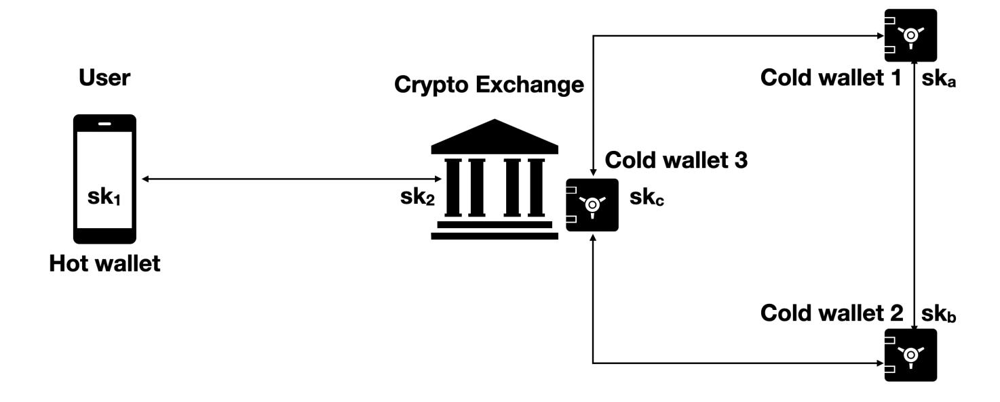

{0}------------------------------------------------

# Attacking Threshold Wallets∗

JP Aumasson†1 and Omer Shlomovits2

1Taurus Group, Switzerland 2ZenGo X, Israel

#### Abstract

Threshold wallets leverage threshold signature schemes (TSS) to distribute signing rights across multiple parties when issuing blockchain transactions. These provide greater assurance against insider fraud, and are sometimes seen as an alternative to methods using a trusted execution environment to issue the signature. This new class of applications motivated researchers to discover better protocols, entrepreneurs to create start-up companies, and large organizations to deploy TSS-based solutions. For example, the leading cryptocurrency exchange (in transaction volume) adopted TSS to protect some of its wallets.

Although the TSS concept is not new, this is the first time that so many TSS implementations are written and deployed in such a critical context, where all liquidity reserves could be lost in a minute if the crypto fails. Furthermore, TSS schemes are sometimes extended or tweaked to best adapt to their target use case—what could go wrong?

This paper, based on the authors' experience with building and analyzing TSS technology, describes three different attacks on TSS implementations used by leading organizations. Unlike security analyses of on-paper protocols, this work targets TSS as deployed in real applications, and exploits logical vulnerabilities enabled by the extra layers of complexity added by TSS software. The attacks have concrete applications, and could for example have been exploited to empty an organization's cold wallet (typically worth at least an 8-digit dollar figure). Indeed, one of our targets is the cold wallet system of the biggest cryptocurrency exchange (which has been fixed after our disclosure).

# 1 Introduction

Threshold signature schemes (TSS) enable a group of parties to collectively issue a signature without exposing the secret signing key. In a (t, n)-threshold scheme, t < n, there are n parties holding distinct key shares and any subset of t parties can issue a valid signature. Furthermore, in practice TSS is often augmented with distributed key generation (DKG) and reshare (refresh share, a.k.a. share rotation) protocols.

More than 30 years after Desmedt's introduced [\[Des87\]](#page-10-0) of the idea of threshold signing, and 15-20 years after significant progress in threshold signature construction [\[Sho00,](#page-11-0) [aK01,](#page-9-0) [MR01,](#page-11-1) [BLS04\]](#page-9-1), blockchain applications have sparked a renewed interested in threshold signing, with

∗This research was previously presented at Black Hat USA 2020 under the title Multiple Bugs in Multi-Party Computation: Breaking Cryptocurrency's Strongest Wallets.

†Part of this work was done while the author was with Kudelski Security.

{1}------------------------------------------------

a fair amount of research [\[BDN18,](#page-9-2) [GG18,](#page-10-1) [DKLas18,](#page-10-2) [DKLas19,](#page-10-3) [DKO](#page-10-4)+19, [GRSB19,](#page-11-2) [Cs19,](#page-10-5) [SA19,](#page-11-3) [CCL](#page-10-6)+19, [CCL](#page-10-7)+20, [KG20,](#page-11-4) [CMP20,](#page-10-8) [GG20b\]](#page-11-5) (and many more).

Being often motivated by blockchain applications, where the most common signing scheme (in transaction volume) in blockchain applications is ECDSA secp256k1, followed by Ed25519, recent works lead to more efficient threshold signing schemes for Schnorr-like signatures (such as EdDSA) and even ECDSA signatures. Some recent projects, including Ethereum 2, are using BLS signatures, which make TSS relatively easy to construct thanks to their aggregation properties.

TSS is indeed the main building block of threshold wallets, which distribute signing rights across multiple parties when issuing blockchain transactions. These parties typically combine systems controlled by different persons or teams, different software platforms, different cloud providers, different on-premise of cloud hardware module (such as cloud HSM services), in order to minimize the risks of insider fraud and external attacks. TSS is sometimes seen as an alternative to methods using a trusted execution environment to issue the signature, and the only way to significantly increase the security assurance when no TEE or dedicated hardware is available (though, as noted above, TSS is sometimes used in combination with HSMs).

Organizations with a need for high-assurance wallets are for example cryptocurrency exchanges and regulated financial organizations (banks tend to prefer self-hosted solutions in order to minimize the exposure of their activity to third parties, such as cloud providers), who often manage digital assets worth hundreds of millions of dollars. TSS and other multiparty computation-based solutions offer a viable technological building block to help protect these assets, although their complexity and alleged lack of maturity is sometimes pointed out. For example, the leading cryptocurrency exchange (in transaction volume) adopted TSS to protect some of its wallets. One of the attacks described in this paper actually targets this deployment.

This paper first describes an example of deployment and attack model found in practice, then presents three different attacks on TSS implementations used by leading organizations. Our attacks targets TSS as deployed in real applications, and exploit logical vulnerabilities enabled by the extra layers of complexity added by TSS software. The attacks have concrete applications, and could for example have been exploited to empty an organization's cold wallet (they have not, at least not by us). We conclude with recommendations to prevent similar problems.

All the attacks described have been disclosed, fixed, and our understanding is that the software in production has been updated as well.

# 2 Threshold Wallets in Practice

This section briefly describes a typical deployment architecture and the related threat model, in the context of a cryptocurrency exchange. This example is based on our observations, but omits a lot of details, and makes some assumptions on the exchange's funds pooling model (which varies from one exchange to another).

A cryptocurrency exchange runs an infrastructure to manage access to its liquidity (hot and cold wallets), and allows its user to perform various transactions, including operations via internal order books managed by a matching engine. Hot wallets retain a little part of the funds, be it "nostro" funds or customer funds for which the exchange acts as a custodian. Hot wallets are therefore less protected than cold wallets, be it procedurally and technologically. 

{2}------------------------------------------------

Cold wallets, in contrast, hold most of the funds and are sometimes fully airgapped, thus requiring a manual procedure to issue a transaction. Whether airgapped or not, cold wallet transactions usually require the approval of several teams or sites, and TSS is the tool of choice to perform it cryptographically.

An exchange would deploy TSS in order to avoid a single point of failure, whether this point would be fully virtual (pure software) or a TEE. By distributing trust, TSS addresses the risk of stolen funds, be it by an insider of an external attacker. TSS also partially addresses the risk of lost founds through loss of access to signing capabilities, and aims to reduce DoS risks. The risk of fund theft is also partially addressed during the key ceremony, or equivalent process, during which the key is established (for example via DKG) and back-ups are created and stored.

Figure 1: Example TSS deployment for hot and cold wallets.

Figure 1 illustrates two example deployments of TSS, as part of hot or cold wallets:

- Hot wallet with TSS: On the left hand, a user and the exchange have first run a two-party key generation protocol, resulting with the user getting a share sk1 and the exchange a share sk2. The user deposits funds to the address associated with the key and from that point can initiate orders. Each order comes with a signature generated by running a two-party signing protocol, and thus requires the validation of the exchange (for example by applying business rules, AML rules, and so on).
- Cold wallet with TSS: On the right hand, a 2-of-3 TSS scheme is deployed in order to ensure that any transaction issued from the cold wallet is approved from two authorized systems, from different locations and managed by different IT teams. Key shares have been previously generated via a distributed key generation protocol during a dedicated procedure with adequate oversight, during which recovery values have been created.

In both cases, the TSS protocol can be augmented with a share refresh mechanism (proactive security), to regularly update the value of the shares.

TSS must therefore defend against abuse from a user, and against a malicious exchange site, be it from an insider attacker or external compromise. The typical network adversarial model is usually realistic, we will therefore consider attackers that can intercept and modify transmitted data.

{3}------------------------------------------------

Internally, TSS uses cryptographic primitives and subprotocols that are relatively complex and uncommon in real-world applications: verifiable secret sharing (often Feldman's), homomorphic encryption (often Paillier's), commitments, and zero-knowledge proofs.

TSS protocols performs multiple rounds of interactive communication, where parties typically validate the correctness of each round. Indeed, assuming that an attacker can compromise any of the parties, a party cannot assume anything about the correctness of the messages received. This means that for any message sent, the sender needs to attach a proof that the message was computed according to the protocol. One common way of doing it is using zero-knowledge proofs, some of which are tailored to prove statements on particular messages in the protocol.

Finally, in addition to potential protocol attacks, TSS deployments may suffer from implementation flaws, be it logical bugs coming from a misimplementation of the protocol, or software flaws resulting for example from parsing bugs. The software used in real applications can be an in-house implementation, potentially relying on existing open-source code, or a commercial solution.

# 3 The Forget-And-Forgive Attack

### 3.1 The Target: Multi-Party Reshare

This attack targets the reshare protocol added to an implementation of the key generation and threshold signature from [\[GG18\]](#page-10-1).

Such key share refresh operation primarily aims to prevent an attacker to consecutively compromise all systems and ultimately recover the full private key The associated protocol would be run at regular time intervals, while maintaining access to the funds locked under the joint public key.

Interestingly, the reshare protocol implemented is not described in [\[GG18\]](#page-10-1), and we did not find in the literature any practical reshare protocol in the dishonest majority setting, which is the adversary model considered in [\[GG18\]](#page-10-1).

The protocol in the code is based on verifiable secret sharing (VSS), and it can be sketched as follows under a (t, n) threshold setting (note that after the protocol, n 0 parties hold the shares, where these new parties may be different from the old ones):

- 1. t+1 old parties transforms their Shamir-linear secret sharing into additive secret sharing sk = w1 + ... + wt+1 where sk is the distributed secret key, unknown to all, and wi is the secret share of sk that each old party P 0 i knows.
- 2. Each P 0 i samples a random polynomial, taking its degree zero coefficient to be wi .
- 3. Each P 0 i broadcasts commitment vector to the coefficients (as required by VSS).
- 4. Each P 0 i sends to each of the n 0 − 1 new parties a secret share sampled as a point on the random polynomial.
- 5. Each new party Pj verifies the secret shares using the VSS commitments and takes the sum of the secret shares to be its new secret.
- 6. The new parties check that the old public key equals the new public key.

{4}------------------------------------------------

7. If all checks passed the party erases the old secret share  $w_i$  and keeps only the new secret  $w'_i$ .

We note that new parties are also generating new Paillier keys and verify them, however this is less relevant to the attack.

#### 3.2 The Attack

The attack aims to prevent parties running the reshare protocol from holding valid shares (both from the old and new set), and therefore prevent them from collectively issue transactions, thereby locking the group of parties out of their wallet.

Under the adversary model considered by the paper and implementation, we are allowed to corrupt t out of the t+1 old parties running the protocol. For example, in a (3,5) threshold setup, our attack would corrupt three parties.

In the attack, a corrupted old party will send "bad" secret shares to some parties of the n' parties, and "good" secret shares to the others, where "good" means that it will pass the validation at step 5, and "bad" means that it won't. Non-corrupted parties will then act as follows, upon receiving the attacker's shares:

- The new parties that got "good" shares will continue the protocol and will finish it successfully, therefore overwriting their old secret share with a new one.
- The new parties that got "bad" secret shares will abort the protocol and will keep their old secret share.

Old secret shares and new secret shares combined are not additive shares of sk anymore, hence cannot be used to issue a signature. The attacker effectively deleted the secret shares for one of the subsets. On the implementation analyzed, the attack will work because participants will not check that all VSS verifications succeeded prior to erasing their local shares.

#### 3.3 Exploitation

The goal of an attacker could be to fully eliminate the capability to issue a transaction, by performing the attack on consecutive runs of the reshare protocol in a way that the honest parties cannot reach the required threshold. If the organization has insufficient back-up, the attacker could blackmail the exchange.

Note that the attack can be extended to the setting where no single party is corrupted, but where instead a network attacker corrupts carefully selected messages in order to iteratively minimize the capability to issue a valid signature. In the case of cold wallets, where transactions do not occur frequently, the attack might take some time to be detected, thereby allowing the attacker to corrupt multiple iterations of the reshare protocol in order to ultimately lock the organization out of its wallet.

#### 3.4 Mitigation

To prevent the attack, and more generally to prevent the associated class of attacks leveraging failed VSS validations, a "blame phase" must be introduced in the protocol in order to identify failures (accidental or malicious). This was observed in classical works on distributed key generation (see the "complaints" broadcast in [GJKR07, Fig.2]).

{5}------------------------------------------------

If the blame phase observes a dishonest majority, then there is not much to do besides aborting the protocol before rewriting the secret. Therefore the solution is to add another round of communication in which parties can ask the other honest parties to abort the protocol before deletion of the key material.

The maintainers who implemented the fix described it as follows: "a final round has been added to the re-sharing protocol where the new committee members send ACK messages to members of both the old and new committees. Each participant must receive ACK messages from n members of the new committee (excluding themselves) before they save any data to disk."

# 4 The Lather, Rinse, Repeat Attack

### 4.1 The Target: Two-Party Reshare

This attack targets an implementation of two-party ECDSA [\[Lin17\]](#page-11-7) aimed for commercial deployment and thus production usage. As in general TSS, a secure deployment of wallets with two-party signature requires period share refresh, for example after every transaction. This is conceptually similar to our first scenario (that of the Forget-and-Forgive attack), but the underlying protocol is different.

### 4.2 The Attack

The attack allows one of the two participants to extract information on the other participant's key share, and ultimately to sign transactions without involving the second party, thereby defeating the purpose of the protocol.

The vulnerability targets the following part of the reshare protocol, where the values updated are a party's Paillier keypair, and the other party's ciphertext encrypted the first party's key share using their Paillier public key. The steps are the following, between parties Alice (the prover, initially owning the share x1)and Bob (the verifier, owning x2):

- 1. Alice generates a new Paillier keypair
- 2. Alice sends a new ciphertext c 0 = Enc(x 0 1 ) under the new Paillier key, encrypting the new share x 0 1 = x1 + r, where x1 is the old share and r a random value.
- 3. Alice proves in zero knowledge to Bob that there is a linear relation between the value encrypted in the new ciphertext and the value encrypted in the old ciphertext, that is, Alice proves that c 0 = c ⊕ Enc(r), where c = Enc(x1) is a ciphertext of the old share under the old Paillier key.

The problem is in this last step, where Alice proves a statement about c 0 . The zero-knowledge proof implementated seems to be taken from [\[Bou00,](#page-9-3) Appendix A] (refering general forms in [\[CM99,](#page-10-9) [BT99\]](#page-9-4)), which notes the following about the two moduli n1 and n2: " Let n1 be a large composite number whose factorization is unknown by Alice and Bob, and n2 be another large number, prime or composite whose factorization is known or unknown by Alice."

In the implementation analyzed, however, Alice knows both factorizations of n1 (old n) and n2 (new n), and can leverage this to cheat: Alice can convince Bob that the new Paillier ciphertext is an encryption of any value chosen by the prover, which gives Alice an oracle to learn bits of x2.

{6}------------------------------------------------

After some experimentation with the code, we found the right constants to enable the attacker to transform to any  $x_1'$ . In a correct execution, the new secret share of Alice should have been  $x_1' = x_1 + r$ , where r is a result of a coin flip protocol. For our attack we augment the new secret share to be  $x_1'' = x_1' + k \cdot q$  such that  $|n_i| - q \le x_1 + k \cdot q < |n_i|$  where q is the curve's order.

After Bob homomorphically combines  $x_1''$  with its own rotated secret share  $x_2' = x_2 - r$ , the randomness r cancels out and we are left with a ciphertext that contains  $x_{12} = x_1 + x_2 + kq$ . As part of [Lin17] signing protocol, Bob sends this ciphertext to Alice who decrypts it and reduces it mod q operation. The decryption, done first, involves a mod  $n_i$  reduction, which under correct execution is guaranteed to not change the value (using the range proof we just bypassed). This gives us the following oracle:

- If  $x_2 < n_i kq x_1$ , the mod  $n_i$  will not change the decrypted value and the eventual signature verification will return true
- If  $x_2 > n_i kq x_1$ , the decrypted value will be changed due to a single mod  $n_i$  and the eventual signature verification will return false

This oracle gives Alice (the attacker) roughly one bit of  $x_2$ . To learn more information about  $x_2$  the reshare-sign pair of protocols must be run again. Since in each run the value  $n_i$  is changing, the oracle will give us a new equation on the value of  $x_2$ . To conduct the full attack, many such reshare-sign runs are required. Optimally, if each run leaks one new bit of information, the number of runs is the bit size of  $x_2$ .

#### 4.3 Exploitation

The exploitation scenario is quite straightforward: one of the two parties will gain privilege to sign without approval of the second after running sufficiently many rounds of reshare. We did not perform a detailed analysis of the expected number of attempts and of the optimal share recovery method, but these are clearly practical.

For example, in the case of of a hot wallet with approval rights shared between a user and an exchange (as in our example in §2), a compromised exchange could perform the attack in parallel against a multitude of users in order to steal all of users' funds without their approval, thereby circumventing the security guarantees promised by the two-party signing.

#### 4.4 Mitigation

Although a quick fix would be to implement some kind of rate limiting and error detection, a real fix must address the problem as its root, namely the protocol. We suggest to use the proof in [CGM16, §4.2] but with composite groups instead of prime ones. However, this will probably be less efficient than simply repeating the relevant steps from [Lin17] two-party protocol which is what the library maintainers resolved to as solution, changing drastically the reshare protocol. In the updated version, Alice and Bob run a coin flip to change their secret shares and repeat the zero knowledge proofs from two party Key Generation protocol. The performance of this new protocol is thus similar to the two party key generation, which is much slower than the initial reshare protocol.

{7}------------------------------------------------

# 5 The Golden Shoe Attack

### 5.1 The Target: MtA Share Conversion

This attack targets an implementation of the threshold ECDSA scheme from [\[GG18\]](#page-10-1), but a different one than the one attacked in §[3,](#page-3-0) and a different subprotocol.

The vulnerability lies in the share conversion subprotocol [\[GG18,](#page-10-1) §3], a two-party protocol that transforms secret multiplicative inputs to secret additive inputs. That is, if Alice holds a and Bob holds b such that the shared secret is x = ab mod q, the protocol determines α, β that satisfy α + β = x. This kind of protocol is commonly refered to "MtA" (multiplicative to additive) in specifications and implementations.

Furthermore, the MtA protocol requires zero-knowledge proofs [\[GG18,](#page-10-1) Ap.A], so that each party demonstrates the validity of its message. The attack description below reuses notations from that paper.

### 5.2 The Attack

#### 5.2.1 The Missing Validation

As part of the zero-knowledge proofs setup, each party (acting as verifier) must generate an auxiliary RSA modulus Ne and two random values h1, h2. These values must be publicly verifiable and tested, as the paper notes.

However, in the code, those values are not tested by the receiving party acting as the prover. This can be exploited to let a single party extract the secret shares of all other parties and effectively the full private key during a single threshold signature generation.

The values N, h e 1, h2 must satisfy to certain properties, as described in [\[FO97,](#page-10-11) §3] under "setup procedure" and in [\[MR01,](#page-11-1) SS6.2] under strong RSA. Some of the properties ensure the proof's soundness (verifier is motivated to choose them correctly), however there is one condition that is crucial to ensure zero knowledge. Quoting [\[MR01\]](#page-11-1):

Zero knowledge requires that discrete logs of h1, h2 relative to each other modulo Ne exist (i.e. that h1, h2 generate the same group).

Moreover, [\[GG18\]](#page-10-1) explicitly says that Ne, h1, h2 must be proven correct to the receiver.

However, when during key generation a party receives these values from other parties, not a single test is implemented. The receiving party simply trusts the tests done by the sender and saves the values in memory, which is kind of the same problem as client-side validation in web applications. A malicious sender can therefore send any Ne, h1, h2 she wants. Note that previous papers describe the tests/proofs to be made or assume these values are generated by a trusted third party.

#### 5.2.2 How the Attack Works

We now explain how to exploit the absence of proofs. We first note that in our attack the signing will not fail. In fact, it is extremely hard (impossible) to choose the values in a way that will fail signing.

We will focus on the first range proof [\[GG18,](#page-10-1) SSA.1] because this is the simplest. In this range proof, the receiver that got the spoofed N, h e 1, h2 is now the prover and the sender 

{8}------------------------------------------------

becomes the verifier. This proof is done for each pair of parties. Therefore a single verifier can repeat the attack with *all other signing parties*.

In the first step of the range proof, the prover computes  $z = h_1^m h_2^{\rho} \mod \widetilde{N}$  where m is the secret share of the prover and  $\rho$  is random number the prover generates. z is sent to the verifier. The prover basically send a Pedersen commitment in a group of unknown order. (See [LN18, SS6.2.4], which uses almost identical proof but describes it in terms of Pedersen commitments.).

If the values are proven to be chosen according to the protocol this is indeed a correct commitment and breaking it is hard as breaking discrete log. However, if we are allowed to choose  $\widetilde{N}$ ,  $h_1, h_2$  as we wish, we can make the commitment insecure. To simplify, we first set  $h_2 = 1$ . Now we are left with the following problem: You give an oracle the values a, n, which correspond to  $h_1, \widetilde{N}$ , and get a value b, corresponding to z, such that  $b = a^x \mod n$ . We need to find x (which is the secret share of the proving party).

The easiest way to solve that problem is to choose n to be very large such that  $a^x$  is computed over the integers. In that case by trial and error (checking  $a^y$  smaller than or larger than the given b for different values of y) we can recover the prover secret share in 256 trials.

A somewhat more complex solution (however, completely achievable) is to choose n to be a composite with small prime factors: Then we can use Polling-Hellman and field sieve algorithm on each factor (see [KL14, Ch.9]). This problem is extremely parallelizable. In fact, the breaking of Moscow voting system [GG20a] follows the same type of attack—computing discrete log for small primes.

#### 5.3 Exploitation

To exploit the attack in a realistic setting, an attacker must control at least one of the parties and can then perform the attack against each of the other participants. It can then recover shares of other parties and ultimately single-handedly issue unauthorized transactions.

Note that wallet systems of exchanges and other critical organizations, there are often several layers of defenses, including systems to filter unauthorized transactions. These may use address blacklist/whitelist systems, AML scoring, rules on metadata, etc. However, an attacker familiar with these may still circumvent the control mechanisms.

#### 5.4 Mitigation

The fix is simple:  $\widetilde{N}$ ,  $h_1$ ,  $h_2$  must be validated on the receiving end. For  $\widetilde{N}$ , the sender must attach a proof that  $\widetilde{N}$  is a valid RSA modulus from two safe primes. There are various ways to prove it, the latest is from [GRSB19] (see [LN18] on the recommended parameters to use). For  $h_1$ ,  $h_2$  there is a nice trick in [FO97]: pick  $h_1$  at random and  $h_2 = h_1^{\alpha}$  and prove to the receiver the knowledge of  $\alpha$  with respect to  $h_1$ ,  $h_2$ .

The affected software was patched by adding the required proofs, and users were required to upgrade their application. CVE-2020-12118 was assigned.

### 6 Recommendations

Relatively simple protocols establishing a secure channel, such as TLS and SSH, and implementations thereof, had many issues of variable severity, often discovered years after their

{9}------------------------------------------------

first deployment. It's therefore prudent to assume that complex multi-round protocols involving advanced primitives are not completely bug-free, be it in terms of protocol attacks or implementation vulnerabilities.

In order to minimize the risk, an organization creating and deploying such protocols may consider the following recommendations:

- Create implementations whose code closely follows the specifications on paper, refering to specific sections or lines via source code comments, and using similar notation and variable names. This facilitates validation, testing, and auditing of the code.
- Closely pay attention to all the constraints described in the paper, especially when it's about proofs of correctness. Sometimes such constraints are only loosely defined, and another paper is refered. Sometimes the constraints are implicit and considered "obvious" by the authors, or mentionned somewhere else in the paper.
- Identify any gaps between on-paper and real deployment, in terms of adversarial model, trust assumptions, communication synchronicity, and so on.
- Ensure that there are controls to validate proper execution of the protocol and correctness of the values received.
- Upon abort of the protocol, make sure that it gracefully fails and that no data is leaked (unlike in our second attack).
- Be careful when composing different protocols, either sequentially or as subprotocols
- When performing security audits, you may consider hiring different teams for the pure cryptographic/protocol aspects, and for the code safety. Prefer teams demonstrating concrete experience with the protocol to be audited, and ideally people who already wrote similar code.

# References

- [aK01] Ivan Damg˚ard and Maciej Koprowski. Practical threshold RSA signatures without a trusted dealer. In EUROCRYPT, 2001. [https://iacr.org/archive/](https://iacr.org/archive/eurocrypt2001/20450151.pdf) [eurocrypt2001/20450151.pdf](https://iacr.org/archive/eurocrypt2001/20450151.pdf).
- [BDN18] Dan Boneh, Manu Drijvers, and Gregory Neven. Compact multi-signatures for smaller blockchains. In ASIACRYPT, 2018.
- [BLS04] Dan Boneh, Ben Lynn, and Hovav Shacham. Short signatures from the Weil pairing. J. Cryptology, 17, 2004.
- [Bou00] Fabrice Boudot. Efficient proofs that a committed number lies in an interval. In EUROCRYPT, 2000. [https://www.iacr.org/archive/eurocrypt2000/1807/](https://www.iacr.org/archive/eurocrypt2000/1807/18070437-new.pdf) [18070437-new.pdf](https://www.iacr.org/archive/eurocrypt2000/1807/18070437-new.pdf).
- [BT99] Fabrice Boudot and Jacques Traor´e. Efficient publicly verifiable secret sharing schemes with fast or delayed recovery. In ICICS, 1999.

{10}------------------------------------------------

- [CCL+19] Guilhem Castagnos, Dario Catalano, Fabien Laguillaumie, Federico Savasta, and Ida Tucker. Two-party ECDSA from hash proof systems and efficient instantiations. Cryptology ePrint Archive, Report 2019/503, 2019. [https://eprint.](https://eprint.iacr.org/2019/503) [iacr.org/2019/503](https://eprint.iacr.org/2019/503).
- [CCL+20] Guilhem Castagnos, Dario Catalano, Fabien Laguillaumie, Federico Savasta, and Ida Tucker. Bandwidth-efficient threshold EC-DSA. Cryptology ePrint Archive, Report 2020/084, 2020. <https://eprint.iacr.org/2020/084>.
- [CGM16] Melissa Chase, Chaya Ganesh, and Payman Mohassel. Efficient zero-knowledge proof of algebraic and non-algebraic statements with applications to privacy preserving credentials. In CRYPTO, 2016.
- [CM99] Jan Camenisch and Markus Michels. Proving in zero-knowledge that a number is the product of two safe primes. In EUROCRYPT, 1999.
- [CMP20] Ran Canetti, Nikolaos Makriyannis, and Udi Peled. UC non-interactive, proactive, threshold ECDSA. Cryptology ePrint Archive, Report 2020/492, 2020. [https:](https://eprint.iacr.org/2020/492) [//eprint.iacr.org/2020/492](https://eprint.iacr.org/2020/492).
- [Cs19] Daniele Cozzo and Nigel P. smart. Sharing the LUOV: Threshold post-quantum signatures. Cryptology ePrint Archive, Report 2019/1060, 2019. [https://](https://eprint.iacr.org/2019/1060) [eprint.iacr.org/2019/1060](https://eprint.iacr.org/2019/1060).
- [Des87] Yvo Desmedt. Society and group oriented cryptography: A new concept. In CRYPTO, 1987.
- [DKLas18] Jack Doerner, Yashvanth Kondi, Eysa Lee, and abhi shelat. Secure two-party threshold ECDSA from ECDSA assumptions. Cryptology ePrint Archive, Report 2018/499, 2018. <https://eprint.iacr.org/2018/499>.
- [DKLas19] Jack Doerner, Yashvanth Kondi, Eysa Lee, and abhi shelat. Threshold ECDSA from ECDSA assumptions: The multiparty case. Cryptology ePrint Archive, Report 2019/523, 2019. <https://eprint.iacr.org/2019/523>.
- [DKO+19] Anders Dalskov, Marcel Keller, Claudio Orlandi, Kris Shrishak, and Haya Shulman. Securing DNSSEC keys via threshold ECDSA from generic MPC. Cryptology ePrint Archive, Report 2019/889, 2019. [https://eprint.iacr.org/2019/](https://eprint.iacr.org/2019/889) [889](https://eprint.iacr.org/2019/889).
- [FO97] Eiichiro Fujisaki and Tatsuaki Okamoto. Statistical zero knowledge protocols to prove modular polynomial relations. In CRYPTO, 1997.
- [GG18] Rosario Gennaro and Steven Goldfeder. Fast multiparty threshold ECDSA with fast trustless setup. In ACM SIGSAC Conference on Computer and Communications Security, 2018.
- [GG20a] Pierrick Gaudry and Alexander Golovnev. Breaking the encryption scheme of the Moscow internet voting system. In Joseph Bonneau and Nadia Heninger, editors, Financial Cryptography and Data Security, 2020.

{11}------------------------------------------------

- [GG20b] Rosario Gennaro and Steven Goldfeder. One round threshold ECDSA with identifiable abort. Cryptology ePrint Archive, Report 2020/540, 2020. [https:](https://eprint.iacr.org/2020/540) [//eprint.iacr.org/2020/540](https://eprint.iacr.org/2020/540).
- [GJKR07] Rosario Gennaro, Stanislaw Jarecki, Hugo Krawczyk, and Tal Rabin. Secure distributed key generation for discrete-log based cryptosystems. J. Cryptology, 20, 2007.
- [GRSB19] Sharon Goldberg, Leonid Reyzin, Omar Sagga, and Foteini Baldimtsi. Efficient noninteractive certification of RSA moduli and beyond. In ASIACRYPT, 2019.
- [KG20] Chelsea Komlo and Ian Goldberg. FROST: Flexible round-optimized Schnorr threshold signatures. Cryptology ePrint Archive, Report 2020/852, 2020. [https:](https://eprint.iacr.org/2020/852) [//eprint.iacr.org/2020/852](https://eprint.iacr.org/2020/852).
- [KL14] Jonathan Katz and Yehuda Lindell. Introduction to modern cryptography. CRC press, 2014.
- [Lin17] Yehuda Lindell. Fast secure two-party ECDSA signing. In CRYPTO, 2017.
- [LN18] Yehuda Lindell and Ariel Nof. Fast secure multiparty ECDSA with practical distributed key generation and applications to cryptocurrency custody. In ACM SIGSAC Conference on Computer and Communications Security, 2018.
- [MR01] Philip D. MacKenzie and Michael K. Reiter. Two-party generation of DSA signatures. In CRYPTO, 2001. [https://iacr.org/archive/crypto2001/21390136.](https://iacr.org/archive/crypto2001/21390136.pdf) [pdf](https://iacr.org/archive/crypto2001/21390136.pdf).
- [SA19] Nigel P. Smart and Younes Talibi Alaoui. Distributing any elliptic curve based protocol. Cryptology ePrint Archive, Report 2019/768, 2019. [https://eprint.](https://eprint.iacr.org/2019/768) [iacr.org/2019/768](https://eprint.iacr.org/2019/768).
- [Sho00] Victor Shoup. Practical threshold signatures. In EUROCRYPT, 2000. [https:](https://www.iacr.org/archive/eurocrypt2000/1807/18070209-new.pdf) [//www.iacr.org/archive/eurocrypt2000/1807/18070209-new.pdf](https://www.iacr.org/archive/eurocrypt2000/1807/18070209-new.pdf).