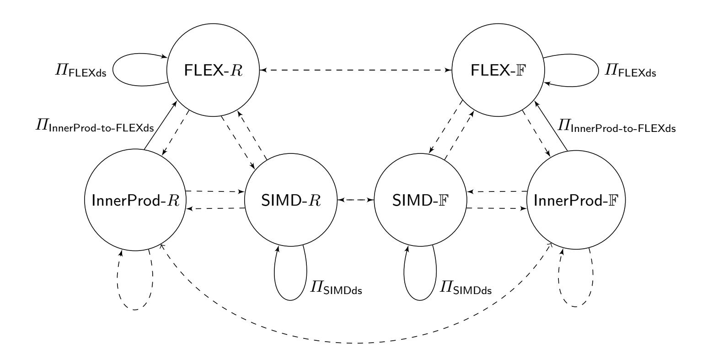
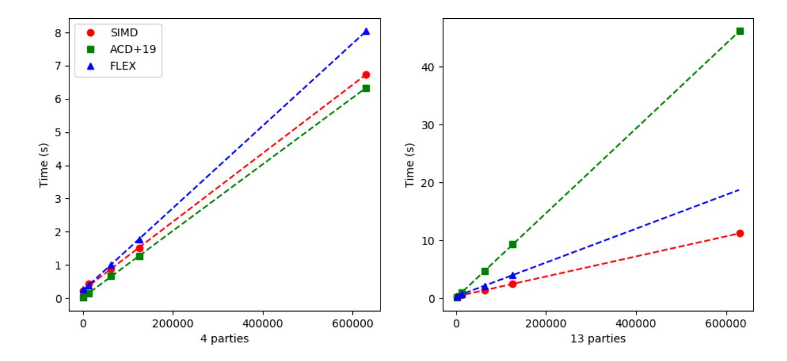
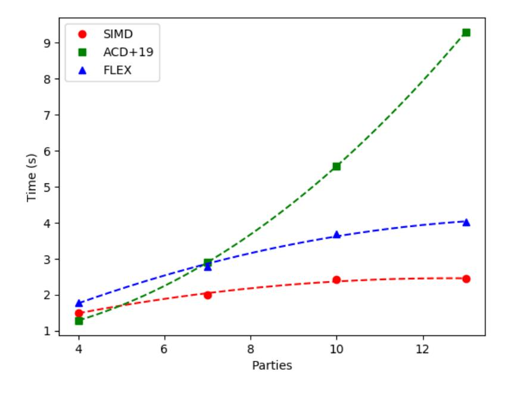
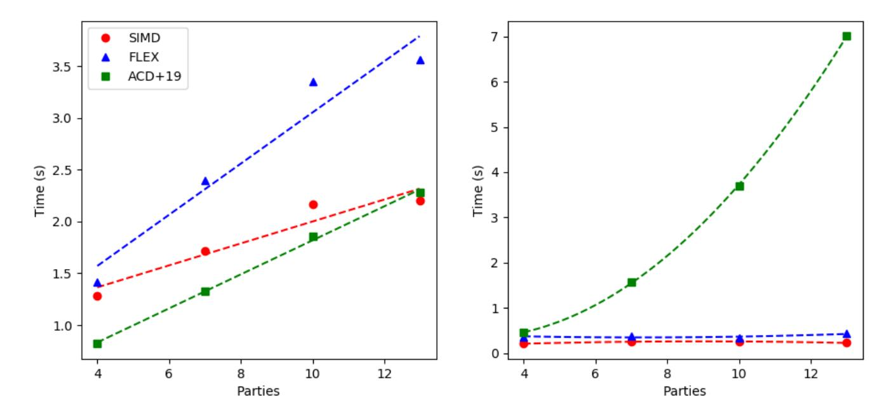

{0}------------------------------------------------

# Circuit Amortization Friendly Encodings and their Application to Statistically Secure Multiparty Computation

Anders Dalskov<sup>1</sup>, Eysa Lee<sup>2</sup>, and Eduardo Soria-Vazquez<sup>3</sup>

anderspkd@cs.au.dk, Aarhus University, Aarhus, Denmark.
 eysa@ccs.neu.edu, Northeastern University, Boston, United States.
 eduardo@cs.au.dk, Aarhus University, Aarhus, Denmark.

Abstract. At CRYPTO 2018, Cascudo et al. introduced Reverse Multiplication Friendly Embeddings (RMFEs). These are a mechanism to compute  $\delta$  parallel evaluations of the same arithmetic circuit over a field  $\mathbb{F}_q$  at the cost of a single evaluation of that circuit in  $\mathbb{F}_{q^d}$ , where  $\delta < d$ . Due to this inequality, RMFEs are a useful tool when protocols require to work over  $\mathbb{F}_{q^d}$  but one is only interested in computing over  $\mathbb{F}_q$ . In this work we introduce Circuit Amortization Friendly Encodings (CAFEs), which generalize RMFEs while having concrete efficiency in mind. For a Galois Ring  $R = GR(2^k, d)$ , CAFEs allow to compute certain circuits over  $\mathbb{Z}_{2^k}$  at the cost of a single secure multiplication in R. We present three CAFE instantiations, which we apply to the protocol for MPC over  $\mathbb{Z}_{2^k}$  via Galois Rings by Abspoel et al. (TCC 2019). Our protocols allow for efficient switching between the different CAFEs, as well as between computation over  $GR(2^k, d)$  and  $\mathbb{F}_{2^d}$  in a way that preserves the CAFE in both rings. This adaptability leads to efficiency gains for e.g. Machine Learning applications, which can be represented as highly parallel circuits over  $\mathbb{Z}_{2^k}$  followed by bit-wise operations. From an implementation of our techniques, we estimate that an SVM can be evaluated on 250 images in parallel up to  $\times 7$  more efficiently using our techniques, compared to the protocol from Abspoel et al. (TCC 2019).

### 1 Introduction

Secure Multi-Party Computation (MPC) protocols allow any n parties to compute any function on their secret data, while revealing nothing beyond the function's output. This is guaranteed even in the presence of an adversary  $\mathcal{A}$  who corrupts and coordinates up to t of the participants. The capabilities of  $\mathcal{A}$  determine the main limitations of MPC, as well as the most relevant techniques to construct such protocols.

One of the main distinctions is whether corrupted parties follow the protocol (but try to extract additional information from its execution) or if they arbitrarily deviate from it. The former is known as passive corruption, whereas the latter is active. Additionally,  $\mathcal{A}$  could have limited computational resources, or rather be unbounded. Finally, one of the most important aspects is whether corrupted parties constitute a minority (t < n/2) or not and, if so, whether t < n/3.

All practical protocols capable of resisting a computationally unbounded, active adversary are based in linear secret sharing schemes (LSSS), such as Shamir's LSSS [Sha79]. Most of them follow a "gate-by-gate" paradigm<sup>4</sup>, where a boolean (or arithmetic) circuit is computed on secret-shared inputs one gate at a time. As the secret sharing scheme is linear, addition gates can then be computed without interaction among the parties. Non-linear operations, such as multiplying two secrets together, are more complicated. In fact, for all known protocols in this setting which are able to compute any function efficiently, multiplication gates require running some interactive sub-protocol. If some preprocessed correlated randomness is assumed, this usually consists in "opening" (i.e. reconstructing to all parties) a linear combination of such randomness with either the inputs (e.g. when using Beaver triples [Bea92]) or the outputs (e.g. when using double-shares [BTH08]) of the multiplication gate. The protocol maintains the invariant that inputs and outputs of any processed gate are secret-shared in the same way, so that they can be combined and used as inputs to other gates.

Frequently, one is interested in computing functions which are naturally represented as either a boolean circuit or an arithmetic circuit over  $\mathbb{Z}_{2^k}$ . Nevertheless, be it in order to achieve some security parameter

<span id="page-0-0"></span><sup>&</sup>lt;sup>4</sup> A notable exception here are protocols based on lookup tables, such as those described in [Cou19] or [KOR<sup>+</sup>17].

{1}------------------------------------------------

| Name                                             | #Inputs (in $R$ ) | Expressiveness (as a $\mathbb{Z}_{2^k}$ -subcircuit)                                                                                                    |
|--------------------------------------------------|-------------------|---------------------------------------------------------------------------------------------------------------------------------------------------------|
| Naïve [ACD <sup>+</sup> 19]<br>InnerProd<br>SIMD | 2<br>2<br>2       | Circuits with 1 multiplication and 1 output. Inner products of length $\approx d/2$ . $\approx d^{0.6}$ parallel circuits w/ 1 mult. and 1 output each. |
| Naïve [ACD <sup>+</sup> 19]<br>FLEX              | $m \ m$           | Depth 1 circuit with $m$ multiplications and 1 output.<br>Depth 1 circuit with $m$ multiplications and $d$ outputs.                                     |

<span id="page-1-1"></span>**Table 1.** Encoding schemes. All rows assume a single "opening" in  $R = GR(2^k, d)$ .

[KOS16] or because the number of parties is bounded by the LSSS and the ring where computation takes place [Sha79,ACD<sup>+</sup>19], it is often required to "lift" the computation to a large enough extension ring. As a concrete example, when the goal is to evaluate a boolean circuit (resp. a circuit over  $\mathbb{Z}_{2^k}$ ) using Shamir-style MPC, the computation has to take place over  $\mathbb{F}_{2^d}$  (resp.  $GR(2^k, d)$ , the degree-d Galois extension of  $\mathbb{Z}_{2^k}$ ), where  $d = \log(n+1)$ . This incurs on a multiplicative overhead of d in communication and  $d^2$  in computation, where the latter can be asymptotically reduced to quasi-linear in d using FFT-style techniques.

Having the above in mind, the authors in [CCXY18] and [CRX19] introduced Reverse Multiplication Friendly Embeddings (RMFEs), which exploit the inherent overhead induced by the extension degree d as a mechanism to compute in parallel  $\delta < d$  copies of the boolean (resp.  $\mathbb{Z}_{2^k}$ ) circuit that was the original target. Namely, through RMFEs, a single multiplication in  $\mathbb{F}_{2^d}$  (resp.  $GR(2^k, d)$ ) translates into a component-wise multiplication in  $\mathbb{F}_2^{\delta}$  (resp.  $\mathbb{Z}_{2^k}^{\delta}$ ). Interested in asymptotic results, most of the RMFE constructions provided by the authors involved algebraic geometry tools<sup>5</sup>, whose concrete computational efficiency is unclear and for which the exact ratio  $\delta/d$  might only become interesting for very large values of d.

In this work we propose Circuit Amortization Friendly Encodings (CAFEs) as a generalization of the RMFE paradigm, where we compute certain subcircuits over  $\mathbb{Z}_{2^k}$  at the cost of a single multiplication in  $R = GR(2^k, d)$ . Furthermore, as the extension degree d is usually very small, we focus our attention on concrete rather than asymptotic efficiency and provide an implementation which experimentally validates our claims. We apply our techniques to the protocol for MPC over  $\mathbb{Z}_{2^k}$  via Galois Rings by Abspoel et al. [ACD<sup>+</sup>19], but we expect our framework to be useful for other protocols as well. Note that by setting k = 1 we obtain CAFEs for boolean circuits at the cost of a multiplication in  $\mathbb{F}_{2^d}$ .

The use of CAFEs allows us to match the efficiency improvements they provide with a "subcircuit-by-subcircuit" rather than "gate-by-gate" view of computation. Such view (and more general ones) is shared among many people programming MPC, who view LSSS-based protocols as a series of linear combinations and "openings" (secret reconstruction) rather than addition and multiplication gates. In Table 1 we show our three CAFE proposals, which allow computing commonly found subcircuits, and compare them with using the protocol by Abspoel et al. [ACD<sup>+</sup>19]. The RMFEs from [CRX19] can be seen as a different proposal for the Single Instruction Multiple Data (SIMD) CAFE.

From a more theoretical perspective, Circuit Amortization Friendly Encodings (and RMFEs in particular) constitute a partial answer to the question "what can we securely compute at the cost of one multiplication?", rather than the more usual "what is the cost of securely computing one multiplication?". This means, among other things, that our CAFEs can be naturally combined with packed secret sharing techniques such as [FY92].

Bit-wise operations. Our previous discussion focused on the matter of computing circuits over  $\mathbb{Z}_{2^k}$ . Many practical applications, however, make use of bit-wise operations in order to compute e.g. comparisons between integers. These operations can be emulated in  $\mathbb{Z}_{2^k}$  even when k > 1, but doing so loses the advantage of XOR being "for free": Whereas XOR is linear in  $\mathbb{Z}_2$ , it is not in  $\mathbb{Z}_{2^k}$ . In fact, for  $a, b \in \{0, 1\}$ , we have that  $a \text{ XOR } b = a + b - 2ab \mod 2^k$ , so XOR reduces to a multiplication in  $\mathbb{Z}_{2^k}$ , which requires communication.

<span id="page-1-0"></span><sup>&</sup>lt;sup>5</sup> As an exception, their most practical construction, given in [CCXY18] for boolean circuits, builds on polynomial interpolation.

{2}------------------------------------------------

A solution to this problem is the use of doubly-authenticated bits (daBits) [RW19], which are secret, random bits shared in two different algebraic structures. In our case, these structures are  $GR(2^k, d)$  and  $\mathbb{F}_{2^d}$ , where we further make use our CAFEs in order to compute sub-circuits over  $\mathbb{Z}_{2^k}$  and  $\mathbb{F}_2$ , respectively.

#### 1.1 Technical Overview and Contributions

The fact of being constantly switching between different algebraic structures  $(\mathbb{Z}_{2^k}, GR(2^k, d), \mathbb{F}_2)$  and  $\mathbb{F}_{2^d}$  in an actively secure way introduces several technical challenges in our protocols, as we do not want the costs introduced by these transformations to outweigh the benefit from using CAFEs. In order to deal with these, we devise efficient protocols for creating *correlated encoded randomness*.

Both for efficiency and simplicity of presentation, we restrict ourselves to the non-robust MPC scenario, where the adversary is able to abort the protocol after seeing its outputs. This way we avoid describing (now standard) player elimination techniques [BTH08,ACD<sup>+</sup>19], the absence of which allows us to introduce batch checking mechanisms for double-shares and daBits. Concretely, the use of our batch checking allows us to duplicate the throughput of correlated randomness production via hyper-invertible matrices [BTH08,BHKL18,CCXY18,ACD<sup>+</sup>19]. Furthermore, even when using hyper-invertible matrices over  $R = GR(2^k, d)$ , the batch check is compatible with the production of double-shares which are bound by  $\mathbb{Z}_{2^k}$ -linear relations, such as those required for our CAFEs.

To the best of our knowledge, this is the first time batch checking is applied to MPC protocols using hyper-invertible matrices, even in non-robust protocols such as [BHKL18]. We remark that our non-robust preprocessing protocols using this technique can still be used in the robust scenario in an *optimistic* way: Namely, if an abort is induced by the batch check failure, parties can switch to the slower, robust protocols. As no actual inputs to the MPC protocol have been provided yet, our optimistic variant remains both secure and robust.

We would like to highlight that our concrete CAFE constructions are mostly a clever combination of combinatorics, circuit randomization and multilinear algebra. The individual components are generally simple, which we see as a positive rather than a negative aspect of our work. Simple protocols usually lead to more efficient implementations, which is something we back with our experiments. Finally, we make a conscious effort to present our techniques in the most elementary way, so that they are as broadly accessible as possible within the community. In particular, we avoid using formal abstractions such as d-fold generalized linear secret sharing from [CCXY18], which are useful and we implicitly use, but we feel they could clog our presentation.

#### 2 Preliminaries

We use n to denote the number of parties, among which t < n/3 are corrupted. Denote by  $\mathcal{P} = \{\mathsf{P}_1, \ldots, \mathsf{P}_n\}$  the set of parties. We use boldface letters  $\mathbf{x}$  to denote vectors, for which we index their elements starting at 0, i.e., if  $\mathbf{x} \in R^{\delta}$ ,  $\mathbf{x} = (x_0, \ldots, x_{\delta-1})$ . If X is a set,  $x \leftarrow X$  denotes a uniform random sampling from X, the result of which is assigned to the variable x. Finally, [n] is used to denote the set  $\{0, \ldots, n-1\}$  and [a, b] with a < b to denote the set  $\{a, \ldots, b\}$ . Let  $\lambda$  be the statistical security parameter.

#### 2.1 Commutative Algebra

We briefly recall some previous results from commutative ring theory, as well as the background for Galois Rings we will need. In this subsection, R denotes a commutative ring with identity.

**Definition 1.** Let  $\alpha_0, \ldots, \alpha_{m-1} \in R$ . We call  $A = \{\alpha_0, \ldots, \alpha_{m-1}\}$  an exceptional set if and only if  $\alpha_i - \alpha_j \in R^*$  for all  $i, j \in [m]$  with  $i \neq j$ . We define the Lenstra constant of R to be the size of the biggest exceptional subset of R.

<span id="page-2-0"></span>The following is a generalization of the Schwartz-Zippel lemma which we will need throughout the paper.

{3}------------------------------------------------

**Lemma 1** ([BCPS18]). Let R be a commutative ring and  $f: R^n \to R$  be an n-variate non-zero polynomial. Let  $A \subseteq R$  be an exceptional set. Then

$$\Pr_{\mathbf{x} \leftarrow A^n} [f(\mathbf{x}) = 0] \le \frac{\deg f}{|A|}.$$

#### 2.2 Galois Rings

Galois Rings are the unique degree-d Galois extension of rings of the form  $\mathbb{Z}_{p^k}$ , where p is a prime. Whereas for k=1 such an extension yields the Galois Field  $\mathbb{F}_{p^d}$ , for k>1 Galois Rings contain zero-divisors, in particular the multiples of p. We will use the following, equivalent definition of Galois Rings, as it is better suited for our purposes.

<span id="page-3-0"></span>**Definition 2.** A Galois Ring is a ring of the form  $R = \mathbb{Z}_{p^k}[X]/(h(X))$  where p is a prime,  $k \geq 1$  and  $h(X) \in \mathbb{Z}_{p^k}[X]$  is a monic polynomial of degree  $d \geq 1$  such that its reduction modulo p yields an irreducible polynomial in  $\mathbb{F}_p[X]$ .

Once p, k and d has been fixed in Definition 2, any valid choice of  $h(X) \in \mathbb{Z}_{p^k}[X]$  will result in the same R, up to isomorphism. Hence, we shall denote such a ring as  $R = GR(p^k, d)$ .

The ring  $R = GR(p^k, d)$  is of characteristic  $p^k$  and all its ideals  $(p^i)$  form the chain

$$R \supset (p) \supset (p^2) \supset \cdots \supset (p^{k-1}) \supset (p^k) = 0.$$

Thus, for  $i \in [1, k]$  we can define the natural homomorphisms  $\pi_i : R \to R/(p^i)$  which are computed by "reducing modulo  $p^i$ ". Notice that  $R/(p^i) \cong GR(p^i, d)$ , so by computing the quotient of R with its unique maximal ideal (p) we will obtain the finite field  $\mathbb{F}_{p^d}$ . Furthermore, all non-units of R are nilpotent and they constitute (p). We will need the following lemma:

**Lemma 2.** The Lenstra constant of  $GR(p^k, d)$  is  $p^d$ .

In order to reason about Galois Ring elements and their arithmetic, we will sometimes describe them as it naturally follows from Definition 2. We will refer to such explicit description as the additive representation of a. More concretely, any element of  $a \in GR(p^k, d)$  can be described as

$$a = a_0 + a_1 \cdot \xi + \ldots + a_{d-1} \cdot \xi^{d-1}, \tag{1}$$

where  $a_i \in \mathbb{Z}_{p^k}$  and  $\xi$  is a root of h(X), i.e.  $GR(p^k, d) \cong \mathbb{Z}_{p^k}[\xi]$ .

Our work focuses in Galois Rings of the form  $R = GR(2^k, d)$ , hence of characteristic  $2^k$ , maximal ideal (2), Lenstra constant  $2^d$  and such that  $R/(2) \cong \mathbb{F}_{2^d}$ . Notice that in such case  $a \in R$  is a unit (i.e.  $a \notin (2)$ ) if and only if, given its additive representation, there is at least one  $i \in [d]$  such that  $a_i \equiv 1 \mod 2$ .

#### 2.3 Shamir's secret sharing over Galois Rings

Shamir's secret sharing scheme [Sha79] extends to any commutative ring with identity, as long as it contains an exceptional set of size at least n+1 [ACD<sup>+</sup>19]. Given the fact that the Lenstra constant of a Galois Ring  $R = GR(2^k, d)$  is  $2^d$ , we can construct Shamir's secret sharing for R if  $d \ge \log(n+1)$ . We provide the precise construction in  $\Pi_{\mathsf{Share}}(s,t)$  (Protocol 1).

<span id="page-3-1"></span>**Protocol 1.**  $\Pi_{\mathsf{Share}}(s,t)$  — Degree-t Shamir's LSSS over Galois Rings.

Let  $R = GR(2^k, d)$  be a Galois Ring such that  $\log(n+1) \le d$  and let  $A = \{\alpha_0, \alpha_1, \dots, \alpha_n\} \subset R$  be an exceptional set. Let  $\mathsf{P}_i$  be the Dealer of the secret, with input  $s \in R$ .

- 1.  $P_i$  samples a random degree-t polynomial  $p(X) \in R[X]$  such that  $p(\alpha_0) = s$ .
- 2.  $P_i$  defines its own share as  $p(\alpha_i)$  and sends  $p(\alpha_j)$  to  $P_j$  for all  $j \neq i$ .

Denote the output as  $\langle s \rangle_t^R = (p(\alpha_1), \dots, p(\alpha_n))$ , a "degree-t sharing" of s.

{4}------------------------------------------------

Since  $\{\alpha_i\}_{i=0}^n$  is an exceptional set, Lagrange interpolation can be used with t+1 points to interpolate p(X) and thus recover the secret. We denote the sharing of a value a as  $\langle a \rangle$ . Whenever there could be confusion about whether a is shared in one of two rings R or  $\tilde{R}$ , we will use  $\langle a \rangle^R$  and  $\langle a \rangle^{\tilde{R}}$  to avoid misunderstandings.

To run MPC using Shamir's scheme we also need the following protocols, which are standard and we provide in Appendix B.

- Private reconstruction  $\Pi_{\mathsf{rPriv}}(\mathsf{P}_i,s)$ : This reconstructs a Shamir secret shared value to a single party. This only requires every party apart from  $\mathsf{P}_i$  communicate a single element for a total of n-1 elements.
- Public reconstruction  $\Pi_{\mathsf{rPub}}(s_0, \ldots, s_{n-t-1})$ : This reconstructs n-t Shamir secret shared values simultaneously to all parties. To do so, parties privately reconstruct a single share to each party, followed by each party sending the reconstructed value to all other parties. This protocol requires communicating a total of  $2 \cdot n \cdot (n-1)$  elements.

### 2.4 Hyper-Invertible Matrices over Galois Rings

Hyper-Invertible Matrices (HIMs) were introduced in [BTH08] as a tool to generate secret correlated randomness in information-theoretic MPC. Their original description was limited to matrix whose entries are Finite Field elements, but HIMs naturally generalize to rings having big enough exceptional sets, as shown in [ACD<sup>+</sup>19].

**Definition 3.** Let M be a r-by-c matrix. We say that M is Hyper-Invertible if, for all  $A \subseteq [r]$ ,  $B \subseteq [c]$  with |A| = |B| > 0, the sub-matrix  $M_A^B$  is invertible, where  $M_A$  denotes the matrix consisting of the rows  $i \in A$  of M,  $M^B$  denotes the matrix consisting of the columns  $j \in B$  of M, and  $M_A^B = (M_A)^B$ .

For constructions of hyper-invertible matrices over Finite Fields and rings, we refer the reader to [BTH08] and [ACD<sup>+</sup>19].

The technical reason why hyper-invertible matrices are a powerful instrument in MPC is the following lemma from [BTH08].

**Lemma 3.** Let  $M \in R^{m \times m}$  be a hyper-invertible matrix, and let  $\mathbf{y} = M\mathbf{x}$ . Then, for all  $A, B \subseteq [m]$  with |A| + |B| = m, there exists a R-linear isomorphism  $\phi : R^m \to R^m$  such that  $\phi(\mathbf{x}_A, \mathbf{y}_B) = (\mathbf{x}_{\bar{A}}, \mathbf{y}_{\bar{B}})$ , where  $\bar{A} = [m] \setminus A$  and  $\bar{B} = [m] \setminus B$ .

Informally, it states that any combination of m inputs/outputs of the R-linear isomorphism induced by a square hyper-invertible matrix are uniquely determined by the remaining m inputs/outputs. This is key in enabling the "player elimination" mechanism, which relies in revealing each of 2t outputs to a different party. Player elimination enables, in turn, robust MPC.

<span id="page-4-0"></span>**Lemma 4.** Let  $P_1, \ldots, P_n$  be parties out of which at most t are corrupted. Let  $M \in R^{(n-t)\times n}$  be a hyper-invertible matrix. Let  $\mathbf{y} = M \cdot \mathbf{x}$ , where  $\mathbf{y} = (y_1, \ldots, y_{n-t})$ ,  $\mathbf{x} = (x_1, \ldots, x_n)$  and each  $x_i \in R$  is a secret, uniformly random input chosen by party  $P_i$ . No Adversary can distinguish any  $y_j \in R$  from uniformly random.

*Proof.* Let  $H \subset [1, n]$  be a set of indices corresponding to any n-t honest parties. We have that  $\boldsymbol{y} = M \cdot \boldsymbol{x} = M^H \cdot \boldsymbol{x}_H + M^{\bar{H}} \cdot \boldsymbol{x}_{\bar{H}}$ . Denote  $\boldsymbol{z}_H = M^H \cdot \boldsymbol{x}_H$ . As M is hyper-invertible,  $M^H$  and all its entries are invertible. Then, as  $\boldsymbol{x}_H$  consists only of secret, random values; we have that  $\boldsymbol{z}_H \in R^{n-t}$  is uniformly random. Thus, so is  $\boldsymbol{y} = (y_1, \dots, y_{n-t})$ .

### 3 Switching between Galois Rings and Galois Fields

Computation over  $\mathbb{Z}_{2^k}$ , while attractive for many applications, is not the best choice for operating on the level of bits. In fact, for many applications where  $\mathbb{Z}_{2^k}$  shines, such as machine learning, specialized conversion protocols are often employed to deal with certain computations that cannot easily be expressed as arithmetic

{5}------------------------------------------------

in  $\mathbb{Z}_{2^k}$ . For example, comparing two numbers a and b is equivalent to computing the result of the comparison 0 < a - b, which amounts to extracting the most significant bit of a - b (in two's complement, this bit is 1 if the result is negative, i.e., b > a and 0 otherwise). Common for many protocols for MSB extraction, is a need for a secret-shared representation of the bit-decomposition of a number. If we know  $v_0, \ldots, v_{k-1}$  such that  $v = \sum_{i=0}^{k-1} 2^i v_i$  then MSB extraction is easy. Obtaining secret-shares of  $v_0, \ldots, v_{k-1}$  given a secret-sharing of v can be done in the following way. Suppose we have k pairs of values  $(\langle b_i \rangle^{\mathbb{F}_{2^d}}, \langle b_i \rangle^R)$ ; that is, the same bit  $b_i$  secret-shared in R as well as in  $\mathbb{F}_{2^d}$ . First we open the value  $z = \langle v \rangle^R + \langle \sum_i 2^i b_i \rangle^R$  after which z is decomposed into bits. Notice that everyone now has a masked version of v + b in its bit representation (where  $b = \sum_{i=0}^{k-1} 2^i b_i$ ), as well as secret-shares of the bits of v can be obtained by computing a binary adder.

Efficiently generating tuples of the kind  $(\langle b_i \rangle^{\mathbb{F}_{2^d}}, \langle b_i \rangle^R)$  has been the topic of recent work such as [RW19], and more recently [EGK<sup>+</sup>20]. Both these works present a generic approach (i.e., generating bits for any two algebraic structures). We will instead focus on the specific case where the bits are shared over  $R = GR(2^k, d)$  and the residue field of R, that is  $\mathbb{F}_{2^d}$ .

#### 3.1 Details

Let  $\tilde{R} = GR(2^{\tilde{k}}, d)$  and  $R = GR(2^k, d)$  be two Galois Rings such that  $\tilde{k} > k$ . Let  $\pi_k : \tilde{R} \to R$  be the "reduction modulo  $2^k$ " map.

**Lemma 5.** Let  $\tilde{A} = \{\alpha_0, \ldots, \alpha_{m-1}\} \subset \tilde{R}$  be an exceptional set. Then  $A = \pi_k(\tilde{A}) = \{\pi_k(\alpha_0), \ldots, \pi_k(\alpha_{m-1})\}$  is an exceptional set in R.

*Proof.* For any  $\alpha_i, \alpha_j \in \tilde{A}$  such that  $\alpha_i \neq \alpha_j$ , let  $\beta_{i,j} \in \tilde{R}$  be the inverse of  $\alpha_i - \alpha_j \in \tilde{R}$ . We have the following equalities, all derived form the fact that  $\pi_k$  is an homomorphism:

$$\pi_k(\beta_{i,j}) \cdot (\pi_k(\alpha_i) - \pi_k(\alpha_j)) = \pi_k(\beta_{i,j}) \cdot \pi_k(\alpha_i - \alpha_j) = \pi_k(\beta_{i,j} \cdot (\alpha_i - \alpha_j))$$
$$= \pi_k(1_{\tilde{R}}) = 1_R.$$

Hence,  $A = \{\pi_k(\alpha_0), \dots, \pi_k(\alpha_{m-1})\} \subset R$  is an exceptional set.

<span id="page-5-0"></span>**Proposition 1.** The "reduction modulo  $2^k$ " map  $\pi_k : \tilde{R} \to R$  commutes with Shamir secret sharing. More precisely, given  $a \in \tilde{R}$  shared as  $\langle a \rangle^{\tilde{R}}$  using an exceptional set  $\tilde{A} \subset \tilde{R}$ , then

$$\pi_k(\langle a \rangle^{\tilde{R}}) = \langle \pi_k(a) \rangle^R,$$

where the shares of  $\langle \pi_k(a) \rangle^R$  use the exceptional set  $A = \pi_k(\tilde{A}) \subset R$  and they are computed by applying  $\pi_k$  to the shares of  $\langle a \rangle^{\tilde{R}}$ .

Proof. Let  $\tilde{p}(X) \in \tilde{R}[X]$  be the polynomial such that  $\langle a \rangle^{\tilde{R}} = (\tilde{p}(\alpha_1), \dots, \tilde{p}(\alpha_n))$  and denote  $p(X) = \pi_k(\tilde{p}(X)) \in R[X]$ . As  $\tilde{p}(X)$  is of degree at most m-1, so is p(X). Additionally, observe that  $\pi_k(\tilde{p}(\alpha_i)) = \pi_k(\tilde{p}(\pi_k(\alpha_i))) = p(\pi_k(\alpha_i))$ . As shown in [ACD<sup>+</sup>19, Theorem 3], which follows from the Chinese Remainder Theorem over rings, there is an isomorphism between  $p(X) \in R[X]$  and any m evaluations of p(X) at points of the same exceptional set  $A \subset R$ . We conclude that

$$\langle \pi_k(a) \rangle^R = (p(\pi_k(\alpha_1)), \dots, p(\pi_k(\alpha_n)))$$
$$= (\pi_k(\tilde{p}(\alpha_1)), \dots, \pi_k(\tilde{p}(\alpha_n))) = \pi_k(\langle a \rangle^{\tilde{R}}).$$

Notice that, as a corollary of the previous proposition, we have that for any  $\tilde{k} \geq 1$ ,  $\pi_1(\langle a \rangle^{\tilde{R}}) = \langle \pi_1(a) \rangle^{\mathbb{F}}$ , where  $\mathbb{F} = \mathbb{F}_{2^d}$  is the residue field of  $\tilde{R}$ .

{6}------------------------------------------------

#### 3.2 Double Authenticated Bits

In Section 4 we present concrete protocols for generating shares of random bits. Here we outline the general technique that we will be using.

With the properties of R outlined in the previous section, a pair of secret-shared bits—one in R and the other in  $\mathbb{F}_{2^d}$ —is easy to obtain: We first generate a secret shared bit  $\langle b \rangle^R$  in R and then use the observation in Proposition 1 to obtain  $\langle b \rangle^{\mathbb{F}_{2^d}}$  by simply having each party locally truncate their share of  $\langle b \rangle^R$  modulo 2.

It remains to discuss how to produce a random  $\langle b \rangle^R$ ,  $b \in \{0,1\}$ . For this, we will adapt the RandBit protocol from [DEF<sup>+</sup>19], which produces such values when  $R = \mathbb{Z}_{2^k}$ . We will make use of their following lemma when proving our protocols.

<span id="page-6-3"></span>**Lemma 6** ([**DEF**<sup>+</sup>**19**]). Let  $\ell > 2$ . If  $a \in \mathbb{Z}$  is such that  $a^2 \equiv 1 \mod 2^{\ell}$ , then a is congruent modulo  $2^{\ell}$  to one among  $\{1, -1, 2^{\ell-1} - 1, 2^{\ell-1} + 1\}$ .

### <span id="page-6-0"></span>4 Circuit Amortization Friendly Encodings

Given some private  $a_1, \ldots, a_m \in \mathbb{Z}_{2^k}$ , consider that we want to securely compute some circuit C taking them as inputs. In what we will call the *naïve* encoding (which is the approach in [ACD<sup>+</sup>19] and [ADEN19]), sharings of the inputs  $\langle a_1 \rangle_t, \ldots, \langle a_m \rangle_t$  would have to be produced by first embedding each  $a_i \in \mathbb{Z}_{2^k}$  into  $R = GR(2^k, d)$ , individually. Any multiplication gate in C would then be computed in the usual way, that is, given  $\langle a \rangle_t, \langle b \rangle_t$  and a double sharing  $(\langle r \rangle_t, \langle r \rangle_{2t})$ :

<span id="page-6-1"></span>**Protocol 2.**  $\Pi_{\text{online-ds}}$  — Standard Online use of double-shares.

- 1. Parties locally compute  $\langle c \rangle_{2t} = \langle a \rangle_t \cdot \langle b \rangle_t$ .
- 2. Publicly reconstruct  $\langle z \rangle = \langle c \rangle_{2t} \langle r \rangle_{2t}$ .
- 3. Compute  $\langle c \rangle_t = z + \langle r \rangle_t$ .

However, this approach makes no use of the extension degree of R, and as we previously outlined in Table 1, it would incur on more communication (and computation) than the encodings we are about to present.

By making explicit the act of encoding the  $\mathbb{Z}_{2^k}$  elements on which we want to compute into elements in R, we can generalize the above protocol in the following way. For a circuit C with  $2 \cdot \delta_1$  inputs,  $\delta_2$  outputs, and where  $\delta_2 \leq \delta_1$ , define two  $\mathbb{Z}_{2^k}$ -linear homomorphisms  $\mathsf{E}_{in} : (\mathbb{Z}_{2^k})^{\delta_1} \to R$  and  $\mathsf{E}_{out} : (\mathbb{Z}_{2^k})^{\delta_2} \to R$  satisfying

<span id="page-6-4"></span>
$$\mathsf{E}_{in}(\mathbf{a}) \cdot \mathsf{E}_{in}(\mathbf{b}) + \mathsf{E}_{out}(\mathbf{c}) = \mathsf{E}_{out}(C(\mathbf{a}, \mathbf{b}) + \mathbf{c}). \tag{2}$$

<span id="page-6-2"></span>Using  $E_{in}$  and  $E_{out}$ , Protocol 2 can be generalized as shown in Protocol 3:

**Protocol 3.**  $\Pi_{\mathsf{online-enc-ds}}$  — Online use of encoded double-shares.

- 1. Parties locally compute  $\langle \mathsf{E}_{in}(\boldsymbol{a}) \cdot \mathsf{E}_{in}(\boldsymbol{b}) \rangle_{2t} = \langle \mathsf{E}_{in}(\boldsymbol{a}) \rangle_t \cdot \langle \mathsf{E}_{in}(\boldsymbol{b}) \rangle_t$ .
- 2. Publicly reconstruct  $\langle \mathsf{E}_{out}(C(\boldsymbol{a},\boldsymbol{b})-\boldsymbol{r})\rangle_{2t} = \langle \mathsf{E}_{in}(\boldsymbol{a})\cdot\mathsf{E}_{in}(\boldsymbol{b})\rangle_{2t} \langle \mathsf{E}_{out}(\boldsymbol{r})\rangle_{2t}$ .
- 3. From  $\mathsf{E}_{out}(C(\boldsymbol{a},\boldsymbol{b})-\boldsymbol{r})$ , compute  $\mathsf{E}_{in}(C(\boldsymbol{a},\boldsymbol{b})-\boldsymbol{r})$ .
- 4. Finally, define  $\langle \mathsf{E}_{in}(C(\boldsymbol{a},\boldsymbol{b}))\rangle_t = \mathsf{E}_{in}(C(\boldsymbol{a},\boldsymbol{b})-\boldsymbol{r}) + \langle \mathsf{E}_{in}(\boldsymbol{r})\rangle_t$ .

{7}------------------------------------------------

Notice that by setting  $C(a,b) = a \cdot b$  and encodings  $\mathsf{E}_{in}(a) = \mathsf{E}_{out}(a) = a$  we get the naïve encoding and Protocol 2.

In the following, we present alternative definitions of  $\mathsf{E}_{in}$  and  $\mathsf{E}_{out}$  which work for the more expressive circuits from Table 1: In Section 4.2 we give what we call FLEX encoding, InnerProd encoding in Section 4.3, and finally SIMD encoding in Section 4.4. The main challenge will be to produce pairs  $(\langle \mathsf{E}_{out}(\mathbf{r}) \rangle_{2t}, \langle \mathsf{E}_{in}(\mathbf{r})_t \rangle)$  in an efficient manner. We also show how to produce random bits  $\langle b \rangle \in \{0,1\} \subset \mathbb{Z}_{2^k}$  compatible with each CAFE: For example, for the SIMD encoding we produce sharings of the form  $\langle \mathsf{E}_{out}(b) \rangle_t^R$ , where  $b = (b_0, \ldots, b_{\delta-1})$  and each  $b_i \leftarrow \{0,1\}$  independently. Each presentation is concluded with an analysis of the technique's efficiency and expressiveness. An overview of our CAFEs and how they relate to each other is given in Figure 1. By setting k = 1, we obtain the finite field equivalent of our protocols, but without exploiting the fact of being in a structure of characteristic two. Finally, note that, through the use of daBits, we can switch between values with a given encoding in  $GR(2^k, d)$  and their bit decomposition, using the same encoding, in  $\mathbb{F}_{2^d}$ 



<span id="page-7-0"></span>**Fig. 1.** Overview of how our Circuit Amortization Friendly Encodings relate to one another. The direction of an edge indicates the transformation from one type of encoding to another. Dashed lines indicate protocols which we do not explicitly provide constructions, but which are easy to build from the ones we give as sketched in Section 4.5.

We briefly note that parties must check if private secret-shared inputs in the online phase are correctly encoded and not arbitrary elements from R. In the naïve case, this corresponds to verifying that parties input  $\mathbb{Z}_{2^k}$  elements [ACD<sup>+</sup>19]. In our CAFEs, this can be done with the aid of preprocessing by making use of the fact that  $\mathsf{E}_{in}$ -encoded (resp.  $\mathsf{E}_{out}$ -encoded) values will constitute a  $\mathbb{Z}_{2^k}$ -module. In the offline phase, parties generate shares of random encodings. Then, in the online phase, to verify that some share is of the form  $\langle \mathsf{E}_{in}(\mathbf{a}) \rangle_t$ , parties can use a random share  $\langle \mathsf{E}_{in}(\mathbf{r}) \rangle_t$  to open and check that the sum  $\mathsf{E}_{in}(\mathbf{a}+\mathbf{r}) = \mathsf{E}_{in}(\mathbf{a}) + \mathsf{E}_{in}(\mathbf{r})$  is in the  $\mathbb{Z}_{2^k}$ -module defined by  $\mathsf{E}_{in}$ .

#### <span id="page-7-1"></span>4.1 Hyper-Invertible Matrices and $\mathbb{Z}_{2^k}$ -modules

Let  $\Phi_M: R^n \to R^{n-t}$  be the R-module homomorphism defined by multiplication with a hyper-invertible matrix  $M \in R^{(n-t)\times n}$ , i.e.  $\Phi_M(\boldsymbol{x}) = \boldsymbol{y}$ , where  $\boldsymbol{y} = M\boldsymbol{x}$ .  $\Phi_M$  is trivial to define, as all the elements of  $M, \boldsymbol{x}$ , and  $\boldsymbol{y}$  belong to the ring R. As the input and output encodings of CAFEs can be seen as some  $\mathbb{Z}_{2^k}$ -module N, we also need to define a  $\mathbb{Z}_{2^k}$ -module homomorphism from multiplication by  $M \in R^{(n-t)\times n}$  which preserves the properties of hyper-invertible matrices. We will denote such homomorphism by  $\Psi_M: (N^d)^n \to (N^d)^{n-t}$ .

{8}------------------------------------------------

As  $N^d$  is a  $\mathbb{Z}_{2^k}$ -module, we know how to multiply its elements with scalars from  $\mathbb{Z}_{2^k}$ . But how can we multiply the elements of  $N^d$  with scalars from R, the degree-d extension of  $\mathbb{Z}_{2^k}$ ? For the reader familiar with tensor products the answer is simple:  $N^d$  is isomorphic to  $R \otimes_{\mathbb{Z}_{2^k}} N$  as a  $\mathbb{Z}_{2^k}$ -module, but  $R \otimes_{\mathbb{Z}_{2^k}} N$  can also be seen as an R-module compatible with the  $\mathbb{Z}_{2^k}$ -module structure  $N^d$ . Aiming for a broader audience, our following exposition will refrain from using tensor products, giving instead explicit formulas to compute  $y = \Psi_M(x)$ . We refer those interested in a more systematic path towards the tensor product argument to the sections on interleaved generalized secret sharing schemes in [CCXY18], where all the mentions to vector spaces and finite fields can be replaced by modules and Galois Rings without any harm. The tensoring technique was also implicitly used by the authors of [ACD<sup>+</sup>19] when producing double-shares of  $\mathbb{Z}_{p^k}$  elements using matrices in  $(GR(p^k, d))^{n \times n}$ .

 $\mathbb{Z}_{2^k}$ -linear action of  $b \in R$  on  $N^d$ : Towards our goal of defining the  $\mathbb{Z}_{2^k}$ -module homomorphism  $\Psi_M$ :  $(N^d)^n \to (N^d)^{n-t}$ , let us start by looking at how the product between any  $a, b \in R$  is computed. If we express a in its additive representation,  $a = \sum_{\ell \in [d]} a_\ell \cdot \xi^\ell$ , multiplication by b can be seen as the  $\mathbb{Z}_{2^k}$ -module homomorphism  $\phi_b : \mathbb{Z}_{2^k}^d \to \mathbb{Z}_{2^k}^d$  which maps the coefficients of a's additive representation to those of  $c = \phi_b(a)$ . We can represent this by the following matrix-vector product:

<span id="page-8-1"></span><span id="page-8-0"></span>
$$\begin{bmatrix} c_0 \\ \vdots \\ c_{d-1} \end{bmatrix} = M_b \cdot \begin{bmatrix} a_0 \\ \vdots \\ a_{d-1} \end{bmatrix}$$
 (3)

where  $M_b \in \mathbb{Z}_{2^k}^{d \times d}$  is defined by  $\phi_b$ . More explicitly, we know that

$$c = b \cdot a = a_0 b_0 + \ldots + \left( \sum_{\substack{i,j \in [d], \\ i+j=\ell}} a_i b_j \right) \cdot \xi^{\ell} + \ldots + a_{d-1} b_{d-1} \cdot \xi^{2d-2}, \tag{4}$$

from which we reduce to the coefficients  $(c_0, \ldots, c_{d-1}) \in \mathbb{Z}_{2^k}^d$  of c's additive representation, according to the polynomial h(X) such that  $R = \mathbb{Z}_{2^k}[X]/(h(X))$ . Hence,  $M_b$  can be written as the following sum, where the first matrix is lower diagonal and  $H_b$  represents the reduction by the quotient polynomial in Equation (4):

$$M_b = \begin{bmatrix} b_0 \\ b_1 & b_0 \\ \vdots & \vdots & \ddots \\ b_{d-1} & b_{d-2} & \dots & b_0 \end{bmatrix} + H_b$$

As R is isomorphic  $\mathbb{Z}_{2^k}^d$ , what we have shown in Equation (3) is the  $\mathbb{Z}_{2^k}$ -linear action of "multiplying by b" on an element  $a \in N^d$  when  $N = \mathbb{Z}_{2^k}$ . Informally, we can simply substitute the  $a_i \in \mathbb{Z}_{2^k}$  coefficients in Equation (3) with  $a_i \in N$ , where N is a  $\mathbb{Z}_{2^k}$ -module. As each  $c_i$  would then be a  $\mathbb{Z}_{2^k}$ -linear combination of the  $a_i$ 's, we have that  $c_i \in N$ .

The  $\mathbb{Z}_{2^k}$ -module homomorphism  $\Psi_M: (N^d)^n \to (N^d)^{n-t}$ : Now, let  $M \in R^{(n-t)\times n}$  be a (hyper-invertible) matrix and  $\boldsymbol{x} = (x_1, \dots, x_n) \in R^n$ ,  $\boldsymbol{y} = (y_1, \dots, y_{n-t}) \in R^{n-t}$  be vectors such that  $\boldsymbol{y} = M\boldsymbol{x}$ . We then have that

$$y_i = m_{i,1} \cdot x_1 + \ldots + m_{i,n} \cdot x_n = \phi_{m_{i,1}}(x_1) + \ldots + \phi_{m_{i,n}}(x_n)$$

where  $(m_{i,1}, \ldots, m_{i,n}) \in \mathbb{R}^n$  is the *i*-th row of M and  $\phi_{m_{i,j}}$  is the "multiplication by  $m_{i,j}$ " map. Hence, if we represent  $x_j, y_i \in \mathbb{R}$  in their additive representations and each of the  $\mathbb{Z}_{2^k}$ -module homomorphisms  $\phi_{m_{i,j}}$  as in Equation (3), we obtain:

$$(y_{i,0},\ldots,y_{i,d-1})=M_{m_{i,1}}(x_{1,0},\ldots,x_{1,d-1})+\ldots+M_{m_{i,n}}(x_{n,0},\ldots,x_{n,d-1})$$

{9}------------------------------------------------

This leads to a "block-wise" view of the product of hyper-invertible matrices with elements from  $R^n \cong (\mathbb{Z}_{2^k}^d)^n$ , which we depict in Equation (5).

<span id="page-9-1"></span>
$$\begin{bmatrix}
y_{1,0} \\
\vdots \\
y_{1,d-1} \\
\vdots \\
y_{n-t,0} \\
\vdots \\
y_{n-t,d-1}
\end{bmatrix} = \begin{bmatrix}
M_{m_{1,1}} & \dots & M_{m_{1,n}} \\
\vdots & \ddots & \vdots \\
\vdots & \ddots & \vdots \\
M_{m_{n-t,1}} & \dots & M_{m_{n-t,n}}
\end{bmatrix} \cdot \begin{bmatrix}
x_{1,0} \\
\vdots \\
x_{1,d-1} \\
\vdots \\
\vdots \\
x_{n,0} \\
\vdots \\
x_{n,0} \\
\vdots \\
x_{n,d-1}
\end{bmatrix}$$
(5)

The same way we did in Equation (3), we can replace  $\boldsymbol{x} \in (\mathbb{Z}_{2^k}^d)^n, \boldsymbol{y} \in (\mathbb{Z}_{2^k}^d)^{n-t}$  with  $\boldsymbol{x} \in (N^d)^n, \boldsymbol{y} \in (N^d)^{n-t}$ . In other words, we can simply substitute each  $x_{i,\ell}, y_{j,\ell} \in \mathbb{Z}_{2^k}$  in Equation (5) with  $x_{i,\ell}, y_{j,\ell} \in N$ . This way, we have defined the  $\mathbb{Z}_{2^k}$ -module homomorphism  $\Psi_M : (N^d)^n \to (N^d)^{n-t}$ . When writing  $\boldsymbol{y} = \Psi_M(\boldsymbol{x})$  while specifying each  $x_{i,\ell}, y_{j,\ell} \in N$ , we will use semicolons to preserve the lines breaking up  $\boldsymbol{x} \in (N^d)^n$  and  $\boldsymbol{y} \in (N^d)^{n-t}$  into blocks of size d as in Equation (5).

Finally, the following lemma tells us that  $\Psi_M$  preserves the guarantees provided by Lemma 4.

<span id="page-9-3"></span>**Lemma 7.** Let  $R = GR(2^k, d)$  and let N be a  $\mathbb{Z}_{2^k}$ -module. Consider the same hypothesis as in Lemma 4 but with  $\mathbf{x} \in (R \otimes_{\mathbb{Z}_{2^k}} N)^n$  and  $\mathbf{y} \in (R \otimes_{\mathbb{Z}_{2^k}} N)^{n-t}$ , so that now  $x_i, y_j \in N^d$ . For  $j \in [1, n-t]$ , parse  $y_j = (y_{j,0}, \ldots, y_{j,d-1}) \in N^d$ . No Adversary can distinguish any  $y_{j,\ell} \in N$  from uniformly random.

Proof. Let  $H \subset [1,n]$  be a set of indices corresponding to any n-t honest parties. Express  $\boldsymbol{y} = M \cdot \boldsymbol{x} = M^H \cdot \boldsymbol{x}_H + M^{\bar{H}} \cdot \boldsymbol{x}_{\bar{H}}$  and denote  $\boldsymbol{z}_H = M^H \cdot \boldsymbol{x}_H$ . As M is hyper-invertible,  $M^H$  and all its entries are invertible. If we adopt the "block-wise" view from Equation (5), H is selecting among the pre-established size-d blocks and  $m_{i,j}$  being invertible translates into  $M_{m_{i,j}}$  being invertible. Due to this and the fact that  $\boldsymbol{x}_H \in (N^d)^{n-t}$  consist only of secret, random values, we have that  $\boldsymbol{z}_H \in (N^d)^{n-t}$  is uniformly random. Thus, so is  $\boldsymbol{y} \in (N^d)^{n-t}$ , which in turn implies that the values  $y_{j,\ell} \in N$  are i.i.d. uniformly random.

#### <span id="page-9-0"></span>4.2 FLEX Encodings

Given m secret-shared values encoded as in the naïve [ACD<sup>+</sup>19] setting, our FLEX encoding shows how to compute a circuit C with d outputs and multiplication depth one. Such a circuit could of course be computed in the naïve setting, using d openings in R; however we show how to compute it using only a single opening.

The encoding works as follows: During preprocessing, parties produce "double-shares" of the form  $(\langle r_0 \rangle_t, \langle r_1 \rangle_t, \ldots, \langle r_{d-1} \rangle_t, \langle r \rangle_{2t})$  where  $r = \sum_{i=0}^{d-1} r_i \cdot \xi^i$ . Given inputs  $\{\langle a_i \rangle_t\}_{i \in [m]}$ , parties compute  $C(\langle a_0 \rangle_t, \ldots, \langle a_{m-1} \rangle_t)$ . Let  $\langle z_j \rangle_{2t}$  for  $j \in [d]$  denote the resultant shares. To reduce the degree of these d shares, parties do the following:

- 1. Locally compute  $\langle z \rangle_{2t} = \sum_{i=0}^{d-1} \langle z_i \rangle_{2t} \cdot \xi^i$ .
- 2. Open  $\langle w \rangle_{2t} = \langle z \rangle_{2t} \langle r \rangle_{2t}$ .
- 3. Parse w in its additive form as  $w \equiv \sum_{i=0}^{d-1} w_i \cdot \xi^i$ .
- 4. Each party defines  $\langle z_j \rangle_t$  as  $\langle z_j \rangle_t := w_j + \langle r_j \rangle_t$  for  $j \in [d]$ .

<span id="page-9-2"></span>**Double share generation.** It remains to be shown how to generate a double-sharing for this encoding.  $\Pi_{\mathsf{FLEXds}}$  in Protocol 4 shows how to do so using Hyper-Invertible matrices. We remark that our protocol takes a different approach than previous work, in that we utilize the Hyper-Invertible matrices *only* for generating the double-sharings. By separating generation of the double-sharings from their checking, we produce double-shares much more efficiently than [ACD<sup>+</sup>19], as we can now batch check *all* the generated double-shares at once.

{10}------------------------------------------------

# **Protocol 4.** $\Pi_{\mathsf{FLEXds}}$ — Double-sharings for $\mathsf{FLEX}$ encoding.

Let  $M \in \mathbb{R}^{(n-t)\times n}$  be a Hyper-Invertible matrix and let  $\Psi_M : (N^d)^n \to (N^d)^{n-t}$  be as defined in Section 4.1 and depicted in Equation (5).

**Generate.** Parties produce a batch of  $d \cdot (n-t)$  random double-shares as follows:

- 1. For  $i \in [n]$ ,  $\ell \in [d]$ , each  $P_i$  samples at random  $s_{\ell}^i \in \mathbb{Z}_{2^k}$  and computes  $s^i = \sum_{\ell=0}^{d-1} s_{\ell}^i \cdot \xi^{\ell}$ . Call  $\Pi_{\mathsf{Share}}(s_{\ell}^i, t)$  and  $\Pi_{\mathsf{Share}}(s^i, 2t)$  to distribute  $\langle s_{\ell}^i \rangle_t$  and  $\langle s^i \rangle_{2t}$  shares to all parties in  $\mathcal{P}$ .
- 2. Parties compute  $(\langle r^1 \rangle_{2t}, \dots, \langle r^{(n-t)} \rangle_{2t}) = M \cdot (\langle s^1 \rangle_{2t}, \dots, \langle s^n \rangle_{2t})$ .
- 3. Parties compute:

$$(\langle r_0^1 \rangle, \dots, \langle r_{d-1}^1 \rangle; \dots; \langle r_0^{n-t} \rangle, \dots, \langle r_{d-1}^{n-t} \rangle)$$

$$= \Psi_M \left( \langle s_0^1 \rangle, \dots, \langle s_{d-1}^1 \rangle; \dots; \langle s_0^n \rangle, \dots, \langle s_{d-1}^n \rangle \right)$$

**Batch Check.** Let m be the number of batches generated in the previous step. Assume that m(n-t) > 0

- $\lambda$ . Throughout,  $j \in [m]$  identifies each batch.
- I.  $\mathbb{Z}_{2^k}$ -outputs: We check that each  $\langle r_{j,\ell}^i \rangle_t$  is a sharing of a  $\mathbb{Z}_{2^k}$  element.
  - 1. For each  $\langle r_{j,\ell}^i \rangle_t$  and  $\tau \in [\lambda]$ , call  $\chi_{j,\ell}^{i,\tau} \leftarrow \mathcal{F}_{\mathsf{rand}}(\{0,1\})$  to obtain a random bit.
  - 2. For each  $\tau \in [\lambda]$ , compute:

$$\langle x_{\tau} \rangle_t = \sum_{j=0}^{m-1} \sum_{i=1}^{n-t} \sum_{\ell=0}^{d-1} \chi_{j,\ell}^{i,\tau} \cdot \langle r_{j,\ell}^i \rangle_t.$$

- 3. Call  $\Pi_{\mathsf{rPub}}(x_0,\ldots,x_{\lambda-1})$ . If  $x_\tau \notin \mathbb{Z}_{2^k}$  for  $\tau \in [\lambda]$ , abort.
- 4. For  $\tau \in [\lambda]$  pick a tuple  $(i_{\tau}, j_{\tau}, \ell_{\tau}) \in ([m] \times [1, n-t] \times [d])$  such that  $\chi_{j_{\tau}, \ell_{\tau}}^{i_{\tau}, \tau} = 1$  and discard the shares  $\langle r_{j_{\tau}, 0}^{i_{\tau}} \rangle_{t}, \ldots, \langle r_{j_{\tau}, d-1}^{i_{\tau}} \rangle_{t}, \langle r_{j_{\tau}}^{i_{\tau}} \rangle_{2t}$ . These shares are considered as having acted like masks in the computation of  $\langle x_{\tau} \rangle_{t}$  as a linear combination.
- II. Equality: Next we check that each double-share satisfies  $\langle r_j^i \rangle_{2t} = \sum_{\ell=0}^{d-1} \langle r_{j,\ell}^i \rangle_t \cdot \xi^\ell$ . Let  $\bar{\lambda}$  such that  $\bar{\lambda}d > \lambda$ .
  - 1. For  $\tau \in [\bar{\lambda}], j \in [m]$  and  $i \in [1, n-t]$ . Call  $\chi_j^{i,\tau} \leftarrow \mathcal{F}_{\mathsf{rand}}(A)$ , where A is an exceptional set of R of length  $2^d$ .
  - 2. For  $\tau \in [\lambda]$ , compute:

$$\langle y_{\tau} \rangle_{2t} = \sum_{j=0}^{m-1} \sum_{i=1}^{n-t} \chi_j^{i,\tau} \cdot (\langle r_j^i \rangle_{2t} - \sum_{\ell=0}^{d-1} \langle r_{j,\ell}^i \rangle_t \cdot \xi^{\ell}).$$

Call  $\Pi_{\mathsf{rPub}}(y_0,\ldots,y_{\bar{\lambda}-1})$ . If  $y_{\tau}\neq 0$  for any  $\tau\in[\bar{\lambda}]$ , abort.

**Output.** Let  $D = \{(i_{\tau}, j_{\tau}) \mid \tau \in [\lambda]\}$  be a set of indices corresponding to the discarded values in Step I.4 of Batch Check. For  $(i, j) \in ([m] \times [1, n-t]) \setminus D$  output the double-shares  $\langle r_{j,0}^i \rangle_t, \ldots, \langle r_{j,d-1}^i \rangle_t, \langle r_j^i \rangle_{2t}$  as valid.

<span id="page-10-0"></span>**Theorem 1.**  $\Pi_{\mathsf{FLEXds}}$  in Protocol 4 securely produces a minimum of  $m \cdot (n-t) - \lambda$  valid double-sharings for the FLEX encoding.

*Proof.* Let  $\mathbb{A} \subset [1, n]$  denote the indices of the parties corrupted by  $\mathcal{A}$  and assume a non-aborting execution  $\Pi_{\mathsf{FLEXds}}$ . We do not care about the abort scenario, as in such case all double-shares are discarded and, furthermore, no private MPC inputs have been yet provided.

{11}------------------------------------------------

Correctness. In an honest protocol execution, it follows from the discussion in Section 4.1 that  $\Pi_{\mathsf{FLEXds}}$  produces double-shares of the right form. When  $\mathcal{A}$  deviates from the protocol, we need to look at what is implied by the non-aborting execution of **Batch Check**.

I.  $\mathbb{Z}_{2^k}$ -outputs: See each shared value  $\langle r_{j,\ell}^i \rangle_t$  in its unique additive representation, i.e.  $r_{j,\ell}^i = \sum_{\iota=0}^{d-1} r_{j,\ell,\iota}^i \cdot \xi^{\iota}$  where  $r_{j,\ell,\iota}^i \in \mathbb{Z}_{2^k}$ . What we want to prove is that  $\langle r_{j,\ell}^i \rangle_t = \langle r_{j,\ell,0}^i \rangle_t$  or, in other words, that  $r_{j,\ell,\iota}^i = 0$  for  $\iota \in [1, d-1]$ . For  $\tau \in [\lambda]$ , define also  $x_\tau = \sum_{\iota=0}^{d-1} x_{\tau,\iota} \cdot \xi^{\iota}$ . Then we have that:

$$x_{\tau,\iota} = \sum_{j=1}^{m} \sum_{i=1}^{n-t} \sum_{\ell=0}^{d-1} \chi_{j,\ell}^{i,\tau} \cdot r_{j,\ell,\iota}^{i}, \quad \iota \in \{1,\ldots,d-1\}.$$

Let  $M = m \cdot (n-t) \cdot d$ . We can look at  $x_{\tau,\iota}$  as the evaluation in  $\chi_{j,\ell}^{i,\tau}$  of an M-variate polynomial f of degree one with coefficients  $r_{j,\ell,\iota}^i \in \mathbb{Z}_{2^k}$ . Assume f is not the zero polynomial (i.e. that there exists any  $r_{j,\ell,\iota}^i \neq 0$ ). Then, by applying the Schwartz-Zippel Lemma (c.f. Lemma 1), as each variable is evaluated only in elements of the exceptional set  $A = \{0,1\} \subset \mathbb{Z}_{2^k}$ , we have that  $\Pr_{\chi^{\tau} \leftarrow \{0,1\}^M}[x_{\tau,\iota} = 0] = \Pr_{\chi^{\tau} \leftarrow \{0,1\}^M}[f(\chi^{\tau}) = 0] \leq 1/2$ . Let  $\chi = (\chi^1, \dots, \chi^{\lambda})$ . We conclude that for  $\iota \in \{1, \dots, d-1\}$ :

$$\Pr_{\boldsymbol{\chi} \leftarrow \{0,1\}^{M \cdot \lambda}} [x_{0,\iota} = \ldots = x_{\lambda,\iota} = 0] \le 2^{-\lambda}.$$

Applying a union bound, the previous equation implies that the Adversary can produce a  $r_{j,\ell}^i \notin \mathbb{Z}_{2^k}$  (i.e. a  $r_{j,\ell,\iota}^i \neq 0$  for  $\iota \neq 0$ ) with a success probability of at most  $(d-1) \cdot 2^{-\lambda}$ .

II. Equality: Let  $\tilde{m} = m \cdot (n-t) \cdot d$ . We apply the Schwartz-Zippel Lemma (c.f. Lemma 1), where each variable is evaluated only in elements of the exceptional set  $A \subset GR(2^k, d)$  of size  $|A| = 2^d$ . For  $\tau \in [\tilde{\lambda}]$ , we have that  $\Pr_{\boldsymbol{\chi}^{\tau} \leftarrow A^{\tilde{m}}}[y_{\tau} = 0] = \Pr_{\boldsymbol{\chi}^{\tau} \leftarrow A^{\tilde{m}}}[f(\boldsymbol{\chi}^{\tau}) = 0] \leq 2^{-d}$ . Let  $\boldsymbol{\chi} = (\boldsymbol{\chi}^1, \dots, \boldsymbol{\chi}^{\tilde{\lambda}})$ , we conclude:

$$\Pr_{\boldsymbol{\chi} \leftarrow A^{\tilde{m} \cdot \tilde{\lambda}}}[y_0 = \ldots = y_{\tilde{\lambda}} = 0] \le 2^{-\tilde{\lambda} \cdot d},$$

As  $\tilde{\lambda} \cdot d > \lambda$ , we are done.

Privacy. Let's first look at the **Generate** step. The Adversary knows at most t of the degree-2t inputs to which the hyper-invertible matrix M is applied, namely  $\{\langle s^i \rangle_{2t}\}_{i \in \mathbb{A}}$ . By Lemma 4, we know that the values  $\{\langle r^i \rangle_{2t}\}_{i \in [1,n]}$  are secret and uniformly random. For the degree-t sharings,  $\mathcal{A}$  know t blocks of inputs, namely  $\{\langle s^i_0 \rangle_t, \ldots, \langle s^i_{d-1} \rangle_t\}_{i \in \mathbb{A}}$ . By Lemma 7, we know that the values  $\{\langle r^i_\ell \rangle_t\}_{i \in [1,n], \ell \in [d]}$  are secret and i.i.d. uniformly random from  $\mathcal{A}$ 's perspective.

Finally, the outputs of **Batch Check** do not leak any information on the output  $\langle r \rangle$  values. This follows from the fact that  $y_{\tau} = 0$  and that each revealed  $x_{\tau}$  is one-time padded by the discarded  $\langle r \rangle$  values indexed by the set  $D = \{(i_{\tau}, j_{\tau}) \mid \tau \in [\lambda]\}$ .

Generation of random bits for FLEX encoding. In Protocol 5  $\Pi_{\mathsf{FLEXbits}}$ , we give an adaptation of the RandBit protocol of [DEF<sup>+</sup>19] to producing shares over R. Moreover, applying FLEX encoding enables us to produce batches of d random bits, compared to producing a single random bit if we were to only replace the arithmetic sharing with Shamir secret sharing over R.

<span id="page-11-0"></span>**Protocol 5.**  $\Pi_{\mathsf{FLEXbits}}$  — Random bits for the FLEX encoding.

Let  $\tilde{R} = GR(2^{k+2}, d)$ ,  $R = GR(2^k, d)$ . Parties produce m batches of d random bits as follows:

1. For  $j \in [m]$ ,  $\ell \in [d]$  parties produce shares  $\langle u_{j,\ell} \rangle_t^{\tilde{R}}$  of secret, random  $u_{j,\ell} \in \mathbb{Z}_{2^{k+2}}$ . This can be done as in the  $\Pi_{\mathsf{FLEXds}}$  (Protocol 4) by skipping steps related to the degree 2t sharings, including skipping Step II. of Batch Check.

{12}------------------------------------------------

- 2. Compute  $\langle a_{j,\ell} \rangle_t^{\tilde{R}} = 2 \cdot \langle u_{j,\ell} \rangle_t^{\tilde{R}} + 1$  and  $\langle (a_{j,\ell})^2 \rangle_{2t}^{\tilde{R}} = \langle a_{j,\ell} \rangle_t^{\tilde{R}} \cdot \langle a_{j,\ell} \rangle_t^{\tilde{R}}$ .
- 3. Compute  $\langle e_j \rangle_{2t}^{\tilde{R}} = \langle (a_{j,0})^2 \rangle_{2t}^{\tilde{R}} + \langle (a_{j,1})^2 \rangle_{2t}^{\tilde{R}} \cdot \xi + \dots + \langle (a_{j,d-1})^2 \rangle_{2t}^{\tilde{R}} \cdot \xi^{d-1}$ .
- 4. Call  $\Pi_{\mathsf{rPub}}$  to reconstruct  $e_j$  for all  $j \in [m]$  and parse each revealed value  $e_j$  in its additive form as  $e_j = e_{j,0} + e_{j,1} \cdot \xi + \dots + e_{j,d-1} \cdot \xi^{d-1}$
- 5. For  $j \in [m]$ ,  $\ell \in [d]$ , let  $c_{j,\ell}$  be the smallest square root modulo  $2^{k+2}$  of  $e_{j,\ell}$  and let  $c_{j,\ell}^{-1}$  be its inverse.
- 6. Each party computes  $\langle d_{j,\ell} \rangle_t^{\tilde{R}} = c_{j,\ell}^{-1} \cdot \langle a_{j,\ell} \rangle_t^{\tilde{R}} + 1$ .
- 7. Parties then divides their shares of  $d_{j,\ell}$  by 2. This division is well-defined, and we denote the result of this operation  $\langle \tilde{b}_{j,\ell} \rangle_t^{\tilde{R}}$ .
- 8. Parties output  $\langle b_{j,\ell} \rangle_t^R = \pi_k(\langle \tilde{b}_{j,\ell} \rangle_t^{\tilde{R}})$ .

**Proposition 2.**  $\Pi_{\mathsf{FLEXbits}}$  in Protocol 5 securely produces  $m \cdot d$  shares of random bits for the  $\mathsf{FLEX}$  encoding.

Proof. Our proof, as our protocol, is very similar to that of [DEF<sup>+</sup>19, Proposition IV.1]. We limit our discussion to correctness, as privacy follows from the properties of the secret sharing scheme. Observe that the coefficients  $e_{j,\ell} \in \mathbb{Z}_{2^{k+2}}$  of  $e_j$ 's additive representation are all odd integers, since  $a_{j,\ell} = 2 \cdot u_{j,\ell} + 1$ . Hence,  $c_{j,\ell}$  is also odd, which implies the existence of  $c_{j,\ell}^{-1}$ . Now, as both  $c_{j,\ell}^{-1}$  and  $a_{j,\ell}$  are square roots of  $e_{j,\ell}$ , we have that:

$$(c_{j,\ell}^{-1} \cdot a_{j,\ell})^2 \equiv c_{j,\ell}^{-2} \cdot a_{j,\ell}^2 \equiv e_{j,\ell}^{-1} \cdot e_{j,\ell} \equiv 1 \mod 2^{k+2}$$

Thus, by Lemma 6,  $c_{j,\ell}^{-1} \cdot a_{j,\ell} \equiv \pm 1 \mod 2^{k+1}$ . Moreover, 1 and -1 are as likely in this last congruence, since  $a_{j,\ell}$  is guaranteed to be a uniformly random odd value (because  $u_{j,\ell}$  is uniformly random) and  $c_{j,\ell}^{-1}$  is chosen in a unique, pre-established way. Hence,  $d_{j,\ell} = c_{j,\ell}^{-1} \cdot a_{j,\ell} + 1$  is congruent to a uniformly random value among  $\{0,2\}$  modulo  $2^{k+1}$ .

Finally, we need to argue about the "division by two" of  $d_{j,\ell}$ , which results in a  $\tilde{b}_{j,\ell}$  that is congruent (with the same probability) to either 0 or 1 modulo  $2^k$ . We perform such "division" by looking at the shares of  $\langle d_{j,\ell} \rangle^{\tilde{R}}$  as elements of  $\mathbb{Z}$ , so this operation is well-defined as long as each share of  $d_{j,\ell}$  is an even number. Notice that this is the case, since:

$$\langle d_{j,\ell} \rangle_t^{\tilde{R}} = c_{j,\ell}^{-1} \cdot (2 \cdot \langle u_{j,\ell} \rangle_t^{\tilde{R}} + 1) + 1 = 2 \cdot c_{j,\ell}^{-1} \cdot \langle u_{j,\ell} \rangle_t^{\tilde{R}} + (1 + c_{j,\ell}^{-1})$$

As  $c_{j,\ell}^{-1}$  is invertible in  $\mathbb{Z}_{2^{k+2}}$ , it is odd. Hence, an even public constant  $(1+c_{j,\ell}^{-1})$  is added to  $2 \cdot c_{j,\ell}^{-1} \cdot \langle u_{j,\ell} \rangle_t^{\tilde{R}}$ . As the shares of the latter value are clearly even (since they are the result of multiplying by an even public constant), we can conclude that all the shares of  $\langle d_{j,\ell} \rangle_t^{\tilde{R}}$  are even. Finally, observe that if we re-interpret the new divided shares of  $d_{j,\ell}$  as elements of  $\mathbb{Z}_{2^{k+1}}$ , it could be that their reconstruction is not an element among  $\{0,1\}$ , but rather among  $\{0,1,2^k,2^k+1\}$ . Hence, we need to compute  $\langle \pi_k(\tilde{b}_{j,\ell}) \rangle_t^R$ , which we can just do by computing  $\pi_k(\langle \tilde{b}_{j,\ell} \rangle^{\tilde{R}})$  as shown in Proposition 1.

**Analysis.** We now analyze the FLEX encoding. This works over naïve shares (i.e. by embedding  $\mathbb{Z}_{2^k}$  into  $GR(2^k, d)$ , as in [ACD<sup>+</sup>19]) and outputs naïve shares. Online, it can be used to compute any depth 1 circuit with any number of inputs and d outputs at the cost of opening a single element in R.

Double shares for the FLEX encoding can be precomputed in batches of  $d \cdot (n-t)$  with  $n \cdot d$  calls to  $\Pi_{\mathsf{Share}}(\cdot,t)$  and n calls to  $\Pi_{\mathsf{Share}}(\cdot,2t)$ . Checking these double shares requires  $(\lambda+\bar{\lambda})/(n-t)$  invocations of  $\Pi_{\mathsf{rPub}}$ . Notice the communication cost of the **Batch Check** step of  $\Pi_{\mathsf{FLEXds}}$  is independent of the number of shares being checked as long as  $m \cdot (n-t) > \lambda$ , where m is the number of batches of shares generated. The amortized communication cost is therefore approximately  $\frac{3(d+1)}{2}$  calls to  $\Pi_{\mathsf{Share}}$  per double-share.

 $\Pi_{\mathsf{FLEXds}}$  can be adapted to generate shares of random  $\mathbb{Z}_{2^k}$  elements by skipping steps related to degree-2t shares. Doing so yields batches of  $d \cdot (n-t)$  random shares with d calls to  $\Pi_{\mathsf{Share}}$ , and only requires  $\lambda/(n-t)$  calls to  $\Pi_{\mathsf{rPub}}$  for the **Batch Check**. Producing shares of  $\ell$  random bits in  $\Pi_{\mathsf{FLEXbits}}$  then only requires generating shares of  $\ell$  random  $\mathbb{Z}_{2^{k+2}}$  elements and  $\ell/(d \cdot (n-t))$  calls to  $\Pi_{\mathsf{rPub}}$ .

{13}------------------------------------------------

#### <span id="page-13-0"></span>4.3 InnerProd Encodings

Given sharings of the inputs, inner products can be computed with a single opening in our previous FLEX encoding, which incurs very little communication. Nevertheless, there are two major problems with such an approach: First, one still needs to individually share each of the elements in the input vectors. Second, the amount of multiplications to be computed is the same as in the naïve case.

In order to overcome such limitations, we introduce our InnerProd encoding technique. Let  $\delta$  be the encoding capacity of the encoding and consider the following two Galois Ring elements  $a, b \in R$  given in their additive representation:

<span id="page-13-1"></span>
$$a = a_0 + a_1 \cdot \xi + \dots + a_{\delta - 1} \cdot \xi^{\delta - 1},$$
  

$$b = b_{\delta - 1} \cdot \xi^{\delta} + b_{\delta - 2} \cdot \xi^{\delta + 1} + \dots + b_0 \cdot \xi^{2\delta - 1}.$$
(6)

Our goal is that, by computing  $c = a \cdot b$ , one can retrieve the value  $\sum_{i=0}^{\delta-1} a_i \cdot b_i$  as the coefficient associated to  $\xi^{2\delta-1}$  in c. In order to achieve this, we need to impose two restrictions on  $\delta$ . Let h(X) be the degree-d polynomial used to represent the Galois Ring, i.e.  $R = \mathbb{Z}_{2^k}[X]/(h(X))$ . Define  $\tilde{d}$  to be the degree of the second-highest monomial in h(X). The following bounds on  $\delta$  need to be imposed:

- 1.  $\delta < (d+1)/2$ . This is to ensure that b can be defined in Equation (6).
- 2.  $\delta < d d + 1$ . This is in order to avoid "wrap-around" terms to be added to the coefficient associated to  $\xi^{2\delta-1}$  in c.

More precisely, we define encodings  $\mathsf{E}^{inn}_{in,L}, \mathsf{E}^{inn}_{in,R}, \mathsf{E}^{inn}_{out}$  of  $\mathbf{a}, \mathbf{b} \in (\mathbb{Z}_{2^k})^{\delta}, c \in \mathbb{Z}_{2^k}$  as follows:

$$\begin{split} \mathsf{E}_{in,L}^{inn}(\boldsymbol{a}) &= a_0 + a_1 \cdot \xi + \dots + a_{\delta-1} \cdot \xi^{\delta-1}, \\ \mathsf{E}_{in,R}^{inn}(\boldsymbol{b}) &= b_{\delta-1} \cdot \xi^{\delta} + b_{\delta-2} \cdot \xi^{\delta+1} + \dots + b_0 \cdot \xi^{2\delta-1}, \\ \mathsf{E}_{out}^{inn}(c) &= c \cdot \xi^{2\delta-1} + \sum_{\ell \in [d], \ell \neq 2\delta-1} r_{\ell} \cdot \xi^{\ell}, \quad r_{\ell} \leftarrow \mathbb{Z}_{2^k}. \end{split}$$

**Double shares from InnerProd to FLEX** ( $\Pi_{\text{InnerProd-to-FLEXds}}$ ). The results of the InnerProd encoding can be easily converted into inputs of the FLEX encoding by producing double shares. For a randomly sampled  $r \leftarrow GR(2^k,d), r = \sum_{i=0}^{d-1} r_i \cdot \xi^i$ , these are of the form  $\langle r \rangle_{2t}, \langle r_{2\delta-1} \rangle_t$  or, what is the same,  $\langle \mathsf{E}_{out}^{inn}(r_{2\delta-1}) \rangle_{2t}, \langle r_{2\delta-1} \rangle_t$ . Thus, these double shares can be produced exactly as in  $\Pi_{\mathsf{FLEXds}}$  (Protocol 4) by ignoring d-1 of the degree-t shares.

Generation of random bits for InnerProd encoding. Random bits can be generated in exactly the same way as in the previous encoding (see  $\Pi_{\mathsf{FLEXbits}}$  Protocol 5). Nevertheless, those bits are not quite enough for values in the InnerProd encoding. In particular, they cannot be used as-is for masking a value encoded according to  $\mathsf{E}^{inn}_{out}$ . Let  $c = \mathsf{E}^{inn}_{in,L}(a) \cdot \mathsf{E}^{inn}_{in,R}(b)$ . If we write  $c = \sum_{i=0}^{d-1} c_i \cdot \xi^i$ , we have that  $c_{2\delta-1}$  has the result of the inner product between a and b, but the other components of c leak further information on the input vectors. Hence, when reconstructing c, we will need a single random mask r satisfying that  $r = \sum_{\ell \in [d], \ell \neq 2\delta-1} r_\ell \cdot \xi^\ell$ , i.e. ensuring that  $r_{2\delta-1} = 0$ . Such values can be produced using the same ideas as in  $\Pi_{\mathsf{FLEXds}}$  or, more efficiently as we only need to produce one such mask for each bit decomposition in the protocol, by adapting the RandEl protocol of [ACD+19].

Analysis. As input, InnerProd encoding takes two sharings encoded as described above. The output is an element of  $R \cong \mathbb{Z}_{2^k}^d$  with the inner product as its  $(2\delta-1)$ 'th coefficient. The online cost is a single opening in R, and the offline cost is the same as for FLEX encoding (since double-shares are produced with the same protocol). It is worth remarking here that one can compute inner products with naïve shares as well, at the same online communication cost. I.e., given naïve sharings  $\langle a_0 \rangle, \ldots, \langle a_{k-1} \rangle$  and  $\langle b_0 \rangle, \ldots, \langle b_{k-1} \rangle$  for some k, the inner product can be computed as  $\langle c \rangle = \sum_{i=0}^{k-1} \langle a_i \rangle \langle b_i \rangle$ , because addition does not increase the degree of a share. However, InnerProd encoding allows us to decrease local computation (in the online phase) by around a factor of d/2, which is significant as operations in R are non-trivial.

{14}------------------------------------------------

#### <span id="page-14-0"></span>4.4 SIMD Encodings

Our final encoding allows us to compute multiple circuits in parallel. Hence, we dub it SIMD, i.e., Single Instruction Multiple Data. Reverse Multiplication Friendly Embeddings (RMFEs), as introduced in [CCXY18,CRX19] (and recap in Appendix A), can also be seen as a SIMD encoding. On a technical level, the combinatorial problem behind our SIMD construction has been previously applied in the context of packing for homomorphic encryption [OSV20] and leakage-resilient MPC [BMN17].

Let  $\delta$  denote the encoding capacity, and let  $I = \{i_0, \ldots, i_{\delta-1}\}$  and  $J = \{j_0, \ldots, j_{\delta-1}\}$  be index sets. The sets I, J will describe in which positions of an element in R we will "store" encoded  $\mathbb{Z}_{2^k}$  elements. More precisely, we define two  $\mathbb{Z}_{2^k}$ -linear encodings  $\mathsf{E}_{in}^{\mathsf{SIMD}}$ ,  $\mathsf{E}_{out}^{\mathsf{SIMD}}$  of  $\mathbf{a} \in (\mathbb{Z}_{2^k})^{\delta}$  as follows:

$$\mathsf{E}_{in}^{\mathsf{SIMD}}(\mathbf{a}) = a_0 \cdot \xi^{i_0} + a_1 \cdot \xi^{i_1} + \dots + a_{\delta-1} \cdot \xi^{i_{\delta-1}},$$

$$\mathsf{E}_{out}^{\mathsf{SIMD}}(\mathbf{a}) = \sum_{k=0}^{\delta-1} a_k \cdot \xi^{j_k} + \sum_{\ell \in [d] \setminus J} r_\ell \cdot \xi^\ell, \quad r_\ell \leftarrow \mathbb{Z}_{2^k}$$

Regardless of how we choose I and J, we have that adding  $\mathsf{E}^{\mathsf{SIMD}}_{in}$ -encodings (resp.  $\mathsf{E}^{\mathsf{SIMD}}_{out}$ -encodings) results in an  $\mathsf{E}^{\mathsf{SIMD}}_{in}$ -encoding (rep.  $\mathsf{E}^{\mathsf{SIMD}}_{out}$ -encodings). Nevertheless, we further ask our encodings to satisfy the relation given by Equation (2). In particular, we want following equality to hold:

<span id="page-14-1"></span>
$$\mathsf{E}_{in}^{\mathsf{SIMD}}(\mathbf{a}) \cdot \mathsf{E}_{in}^{\mathsf{SIMD}}(\mathbf{b}) + \mathsf{E}_{out}^{\mathsf{SIMD}}(\mathbf{c}) = \mathsf{E}_{out}^{\mathsf{SIMD}}(\mathbf{a} * \mathbf{b} + \mathbf{c}) \tag{7}$$

where \* denotes the component-wise product. In order to achieve this, we need to introduce the following restrictions to the way the index sets are chosen.

- 1.  $j_{\ell} = 2 \cdot i_{\ell}$ . This implies that the product  $a_{\ell}b_{\ell}$  ends up in the degree  $j_{\ell}$  monomial.
- 2. For all  $i_{\ell} \in I$  we require that  $i_{\ell} < d/2$ , so that no wrap-around happens during reduction in R.
- 3. For all  $i_{\ell}, i_{\ell} \in I$  that are pairwise different, then  $i_{\ell} + i_{\ell} \notin J$ . This implies that cross products between  $a_{\ell}$  and  $b_{\ell}$  (and  $a_{\ell}$  and  $b_{\delta}$ ) do not end up on a monomial of J.

Under these restrictions, we obtain the following when multiplying  $\mathsf{E}_{in}^{\mathsf{SIMD}}(\boldsymbol{a})$  and  $\mathsf{E}_{in}^{\mathsf{SIMD}}(\boldsymbol{b})$ :

$$\begin{split} \mathsf{E}^{\mathsf{SIMD}}_{in}(\boldsymbol{a}) \cdot \mathsf{E}^{\mathsf{SIMD}}_{in}(\boldsymbol{b}) &= (a_0 \cdot \xi^{i_0} + \dots + a_{\delta-1} \cdot \xi^{i_{\delta-1}}) \cdot (b_0 \cdot \xi^{i_0} + \dots + b_{\delta-1} \cdot \xi^{i_{\delta-1}}) \\ &= \sum_{\ell \in [\delta]} \bigg( a_\ell b_\ell \cdot \xi^{j_\ell} + \sum_{\iota \in ([\delta] \setminus \{\ell\})} (a_\ell b_\iota + a_\iota b_\ell) \cdot \xi^{i_\ell + i_\iota} \bigg). \end{split}$$

Notice that this is different from  $\mathsf{E}^{\mathsf{SIMD}}_{out}(\mathbf{a} * \mathbf{b})$ , as the monomials of degree  $j \notin J$  have coefficients which have not been sampled independently and uniformly at random from  $\mathbb{Z}_{2^k}$ . Yet, we have that Equation (7) holds.

Turning our attention to  $\delta$ , asymptotically we have  $\delta \sim d^{0.6}$ , as pointed out by [OSV20]. However, for small values of d this allows for relatively large values of  $\delta$ . Taking into account that in Shamir secret sharing over Galois Rings (or small finite fields) we would have that  $d = O(\log n)$ , we get reasonable values for  $\delta$  despite the poor asymptotic. Table 2 provides some examples of the index sets defining  $\mathsf{E}_{in}^{\mathsf{SIMD}}$  and  $\mathsf{E}_{out}^{\mathsf{SIMD}}$  for different values of d.

| $\overline{d}$ | δ | I                   | J                     |
|----------------|---|---------------------|-----------------------|
| 3–6            | 2 | $\{0, 1\}$          | $\{0, 2\}$            |
| 7–8            | 3 | $\{0, 1, 3\}$       | $\{0, 2, 6\}$         |
| 9 - 16         | 4 | $\{0, 1, 3, 4\}$    | $\{0, 2, 6, 8\}$      |
| 17             | 5 | $\{0, 1, 3, 7, 8\}$ | $\{0, 2, 6, 14, 16\}$ |

<span id="page-14-2"></span>**Table 2.** Examples of I and J for different values of  $\overline{d}$ .

{15}------------------------------------------------

**Double share generation.** Protocol 6 shows how to generate double-shares for SIMD encoding. As in our previous protocols, this is a two-step process, where we first generate shares in batches and then we check for correctness all of them at once.

### <span id="page-15-0"></span>**Protocol 6.** $\Pi_{\mathsf{SIMDds}}$ — Double-sharings for SIMD encoding.

Let  $M \in R^{(n-t)\times n}$  be a Hyper-Invertible matrix and  $\delta$  the packing capability of R. Let  $\Psi_M: (N^d)^n \to \mathbb{R}$  $(N^d)^{n-t}$  be as defined in Section 4.1 (Equation (5)).

**Generate.** Parties produce a batch of  $d \cdot (n-t)$  random double-shares as follows:

- 1. For  $\ell \in [d]$ , each party  $\mathsf{P}_i$  samples  $\mathbf{s}^i_\ell \leftarrow (\mathbb{Z}_{2^k})^\delta$  and calls both  $\Pi_{\mathsf{Share}}(\mathsf{E}_{in}(\mathbf{s}^i_\ell),t)$  and  $\Pi_{\mathsf{Share}}(\mathsf{E}_{out}(\mathbf{s}^{\imath}_{\ell}), 2t).$
- 2. Parties apply  $\Psi_M$  to their degree-t and degree-2t shares in the same way:

$$(\langle \mathsf{E}_{in}(\mathbf{r}_0^1) \rangle, \dots, \langle \mathsf{E}_{in}(\mathbf{r}_{d-1}^1) \rangle; \dots; \langle \mathsf{E}_{in}(\mathbf{r}_0^{n-t}) \rangle, \dots, \langle \mathsf{E}_{in}(\mathbf{r}_{d-1}^{n-t}) \rangle)$$

$$= \Psi_M \left( \langle \mathsf{E}_{in}(\mathbf{s}_0^1) \rangle, \dots, \langle \mathsf{E}_{in}(\mathbf{s}_{d-1}^1) \rangle; \dots; \langle \mathsf{E}_{in}(\mathbf{s}_0^n) \rangle, \dots, \langle \mathsf{E}_{in}(\mathbf{s}_{d-1}^n) \rangle \right)$$

$$(\langle \mathsf{E}_{out}(\mathbf{r}_0^1) \rangle, \dots, \langle \mathsf{E}_{out}(\mathbf{r}_{d-1}^1) \rangle; \dots; \langle \mathsf{E}_{out}(\mathbf{r}_0^{n-t}) \rangle, \dots, \langle \mathsf{E}_{out}(\mathbf{r}_{d-1}^{n-t}) \rangle)$$

$$= \Psi_M \left( \langle \mathsf{E}_{out}(\mathbf{s}_0^1) \rangle, \dots, \langle \mathsf{E}_{out}(\mathbf{s}_{d-1}^1) \rangle; \dots; \langle \mathsf{E}_{out}(\mathbf{s}_0^n) \rangle, \dots, \langle \mathsf{E}_{out}(\mathbf{s}_{d-1}^n) \rangle \right)$$

**Batch Check.** Let m be the number of batches produced in the previous step. We need to check that the degree t and degree 2t shares are using their respective encodings (I and J). We also verify that both shares encode the same vector r. Throughout,  $j \in [m]$  identifies each batch.

- 1. For each  $\langle \mathsf{E}_{in}(\mathbf{r}_{j,\ell}^i) \rangle$ ,  $\langle \mathsf{E}_{out}(\mathbf{r}_{j,\ell}^i) \rangle$  and  $\tau \in [\lambda]$ , parties generate a random bit  $\chi_{j,\ell}^{i,\tau} \leftarrow \mathcal{F}_{\mathsf{rand}}(\{0,1\})$ .
- 2. For  $\tau \in [\lambda]$ , parties compute:

$$\langle x_{\tau} \rangle_{t} = \sum_{j=0}^{m-1} \sum_{i=1}^{n-t} \sum_{\ell=0}^{d-1} \chi_{j,\ell}^{i,\tau} \cdot \langle \mathsf{E}_{in}(\mathbf{r}_{j,\ell}^{i}) \rangle_{t} \quad \text{and} \quad \langle y_{\tau} \rangle_{2t} = \sum_{j=0}^{m-1} \sum_{i=1}^{n-t} \sum_{\ell=0}^{d-1} \chi_{j,\ell}^{i,\tau} \cdot \langle \mathsf{E}_{out}(\mathbf{r}_{j,\ell}^{i}) \rangle_{2t}$$

and call  $\Pi_{\mathsf{rPub}}$  to reconstruct both  $x_{\tau}, y_{\tau}$ .

- 3. If for any  $\tau \in [\lambda]$  parties observe either that
  - $x_{\tau}$  is not a *I*-encoding (i.e.  $x_{\tau} \notin Im(\mathsf{E}_{in})$ ), or  $\mathsf{E}_{in}^{-1}(x_{\tau}) \neq \mathsf{E}_{out}^{-1}(y_{\tau})$

then they abort.

4. For  $\tau \in [\lambda]$ , let  $(i_{\tau}, j_{\tau}, \ell_{\tau}) \in \{[m] \times [1, n-t] \times [d]\}$  be a triplet of indices such that  $\chi_{j_{\tau}, \ell_{\tau}}^{i_{\tau}, \tau} = 1$ . Define  $D = \{(i_{\tau}, j_{\tau}, \ell_{\tau}) \mid \tau \in [\lambda]\}.$ 

**Output.** For  $(i, j, \ell) \in \{[m] \times [1, n-t] \times [d]\} \setminus D$ , where D is defined on Step 4 of Batch Check, output the double sharings  $(\langle \mathsf{E}_{in}(\mathbf{r}_{j,\ell}^i) \rangle_t, \langle \mathsf{E}_{out}(\mathbf{r}_{j,\ell}^i) \rangle_{2t}).$ 

<span id="page-15-1"></span>**Theorem 2.**  $\Pi_{\mathsf{SIMDds}}$  in Protocol 6 securely produces  $m \cdot (n-t) \cdot d - \lambda$  valid double-sharings for the SIMD encoding.

*Proof.* Let  $\mathbb{A} \subset [1, n]$  denote the indices of the parties corrupted by  $\mathcal{A}$  and assume a non-aborting execution  $\Pi_{SIMDds}$ . We do not care about the abort scenario, as in such case all double-shares are discarded and, furthermore, no private MPC inputs have been yet provided.

Correctness. In an honest protocol execution, it follows from the discussion in Section 4.1 that  $\Pi_{SIMDds}$ produces double-shares of the right form. When  $\mathcal{A}$  deviates from the protocol, we need to look at what is implied by the non-aborting execution of **Batch Check**.

{16}------------------------------------------------

Denote by  $\langle r_{j,\ell}^i \rangle$  (resp.  $\langle \tilde{r}_{j,\ell}^i \rangle$ ) the output from **Generate** that in a fully honest execution would be  $\langle \mathsf{E}_{in}(r_{j,\ell}) \rangle_t$  (resp.  $\langle \mathsf{E}_{out}(r_{j,\ell}) \rangle_{2t}$ ). **Batch Check** has two goals. The first one is ensuring that  $\langle r_{j,\ell}^i \rangle$  (resp.  $\langle \tilde{r}_{j,\ell}^i \rangle$ ) is actually an  $\mathsf{E}_{in}$ -encoding (resp.  $\mathsf{E}_{out}$ -encoding). In particular, if we see each  $r_{j,\ell}^i \in R$  in its unique additive representation  $r_{j,\ell}^i = \sum_{\iota=0}^{d-1} r_{j,\ell,\iota}^i \cdot \xi^{\iota}$  (where  $r_{j,\ell,\iota}^i \in \mathbb{Z}_{2^k}$ ), we want to prove that  $\forall \iota \notin I$ ,  $r_{j,\ell,\iota}^i = 0$ . Applying the same reasoning as in the proof of the  $\mathbb{Z}_{2^k}$ -outputs step of  $\Pi_{\mathsf{FLEXds}}$  (see Theorem 1), we conclude from the Schwartz-Zippel Lemma that this happens with probability at most  $(d-|I|) \cdot 2^{-\lambda}$ .

Express  $\tilde{r}^i_{j,\ell}, x_{\tau}, y_{\tau}$  in their unique additive representations, i.e.  $\tilde{r}^i_{j,\ell} = \sum_{\iota=0}^{d-1} \tilde{r}^i_{j,\ell,\iota} \cdot \xi^{\iota}$  and similarly for the others. The second goal of **Batch Check** is proving that  $\forall \iota \in I, r^i_{j,\ell,\iota} = \tilde{r}^i_{j,\ell,2\iota}$ . Let  $M = m \cdot (n-t) \cdot d$ . We can look at  $f_{\tau,\iota} = x^i_{\tau,\iota} - y^i_{\tau,2\iota}$  as an M-variate linear polynomial, where the coefficients are  $r^i_{j,\ell,\iota} - \tilde{r}^i_{j,\ell,2\iota}$  and the variables are evaluated at  $\chi^{i,\tau}_{j,\ell} \in \{0,1\}$ . Once again, by the Schwartz-Zippel Lemma, we have that if  $f_{\tau,\iota}$  is not identically equal to zero, then  $\Pr_{\boldsymbol{\chi}^{\tau} \leftarrow A^M}[f_{\tau,\iota}(\boldsymbol{\chi}^{\tau}) = 0] \leq 1/2$ . Hence,  $\forall \iota \in I$ , if we let  $\boldsymbol{\chi} = (\boldsymbol{\chi}^1, \dots, \boldsymbol{\chi}^{\lambda})$ , then  $\Pr_{\boldsymbol{\chi} \leftarrow \{0,1\}^{M \cdot \lambda}}[f_{0,\iota} = \dots = f_{\lambda,\iota} = 0] \leq 2^{-\lambda}$ . Applying a union bound we can conclude that, if the test passes, it is at most with probability  $|I| \cdot 2^{-\lambda}$  that we do not have the same  $\boldsymbol{r}^i_{j,\ell}$  on the  $\mathsf{E}_{in}$  and the  $\mathsf{E}_{out}$  encodings.

Privacy. Let's first look at the **Generate** step. For the degree-t and the degree-2t shares, respectively, the Adversary knows at most t blocks of inputs, namely  $\{\langle \mathsf{E}_{in}(s_0^i)\rangle_t, \ldots, \langle \mathsf{E}_{in}(s_{d-1}^i)\rangle_t\}_{i\in\mathbb{A}}$  and  $\{\langle \mathsf{E}_{out}(s_0^i)\rangle_{2t}, \ldots, \langle \mathsf{E}_{out}(s_{d-1}^i)\rangle_{2t}\}_{i\in\mathbb{A}}$ . By Lemma 7, we know that the values  $\{\langle \mathsf{E}_{in}(r_\ell^i)\rangle_t, \langle \mathsf{E}_{out}(r_\ell^i)\rangle_{2t}\}_{i\in[1,n],\ell\in[d]}$  are secret and i.i.d. uniformly random from  $\mathcal{A}$ 's perspective.

Finally, the outputs of **Batch Check** do not leak any information on the output values. This follows from the fact that each revealed  $(x_{\tau}, y_{\tau})$  is one-time padded by the discarded values indexed by the set  $D = \{(i_{\tau}, j_{\tau}) \mid \tau \in [\lambda]\}.$ 

Random bit generation for SIMD. This section we give a way for producing shares of random bits for SIMD, but first we introduce an intermediate protocol for producing shares of  $\mathsf{E}^{\mathsf{SIMD}}_{out}(\mathbf{a})$ , where  $\mathbf{a} \in (\mathbb{Z}_{2^k})^{\delta}$  is some fixed, known vector. This is given in Protocol 7 as  $\Pi_{\mathsf{SIMDout}}$ .

At a high level,  $\Pi_{\mathsf{SIMDout}}$  works by having parties generate zero shares and offsetting these zero shares by  $\boldsymbol{a}$ . Producing shares of zero is done in the same manner as producing random  $\mathsf{E}^{\mathsf{SIMD}}_{out}$  shares in  $\Pi_{\mathsf{SIMDds}}$  by having parties instead use  $\mathbf{s} = \mathbf{0}$ . Batch checking also works in the same way as in  $\Pi_{\mathsf{SIMDds}}$ , with parties checking  $y_{\tau} = \mathsf{E}^{\mathsf{SIMD}}_{out}(\mathbf{0})$ . Proof of Proposition 3 follows the proof of Theorem 2.

#### <span id="page-16-0"></span>**Protocol 7.** $\Pi_{\mathsf{SIMDout}}$ — Producing $\langle \mathsf{E}_{out}(\boldsymbol{a}) \rangle$ for a fixed $\boldsymbol{a}$ .

Let  $M \in R^{(n-t)\times n}$  a Hyper-Invertible matrix and let  $\Psi_M : (N^d)^n \to (N^d)^{n-t}$  be as defined in Section 4.1 and depicted in Equation (5). Let  $\delta$  the packing capability of R. Denote by  $\mathbf{0}$  the all-zero vector of length  $\delta$  and parse the input  $\mathbf{a} \in \mathbb{Z}_{2^k}^{\delta}$  as  $\mathbf{a} = (a_0, \dots, a_{\delta-1})$ . Recall that  $\mathsf{E}_{out}$  is defined by  $J = \{j_0, \dots, j_{\delta-1}\}$ .

**Generate.** Parties produce a batch of  $d \cdot (n-t)$  random  $\mathsf{E}_{out}$ -sharings of zero as follows:

- 1. For  $\ell \in [d]$ , each  $\mathsf{P}_i$  samples  $z_{\ell}^i = \mathsf{E}_{out}(\mathbf{0})$  and calls  $\Pi_{\mathsf{Share}}(z_{\ell}^i, t)$ .
- 2. Parties apply  $\Psi_M$  to their shares in the following way:

$$(\langle Z_0^1 \rangle, \dots, \langle Z_{d-1}^1 \rangle, \dots, \langle Z_0^{n-t} \rangle, \dots, \langle Z_{d-1}^{n-t} \rangle)$$

$$= \Psi_M \left( \langle z_0^1 \rangle, \dots, \langle z_{d-1}^1 \rangle, \dots, \langle z_{d-1}^n \rangle, \dots, \langle z_{d-1}^n \rangle \right)$$

**Batch Check.** Let m be the number of batches produced in the previous step. For  $j \in [m], \ell \in [d]$  and  $i \in [1, n-t]$ , we need to verify that  $\langle Z_{j,\ell}^i \rangle = \mathsf{E}_{out}(\mathbf{0})$ .

1. For each  $\langle Z_{j,\ell}^i \rangle$  and  $\tau \in [\lambda]$ , parties sample  $\chi_{j,\ell}^{i,\tau} \leftarrow \mathcal{F}_{\mathsf{rand}}(\{0,1\})$ .

{17}------------------------------------------------

2. For  $\tau \in [\lambda]$ , parties compute:

$$\langle x_{\tau} \rangle = \sum_{j=0}^{m-1} \sum_{i=1}^{n-t} \sum_{\ell=0}^{d-1} \chi_{j,\ell}^{i,\tau} \cdot \langle Z_{j,\ell}^{i} \rangle$$

and call  $\Pi_{\mathsf{rPub}}$  to reconstruct  $x_{\tau}$ .

- 3. If for any  $\tau \in [\lambda]$  parties observe that  $\mathsf{E}_{out}^{-1}(x_{\tau}) \neq \mathbf{0}$ , they abort.
- 4. For  $\tau \in [\lambda]$ , let  $(i_{\tau}, j_{\tau}, \ell_{\tau}) \in \{[m] \times [1, n-t] \times [d]\}$  be a triplet of indices such that  $\chi_{j_{\tau}, \ell_{\tau}}^{i_{\tau}, \tau} = 1$ .

Define  $D = \{(i_{\tau}, j_{\tau}, \ell_{\tau}) \mid \tau \in [\lambda]\}$ . **Output.** Let  $A = \sum_{k=0}^{\delta-1} a_k \cdot X^{j_k}$ . For  $(i, j, \ell) \in \{[m] \times [1, n-t] \times [d]\} \setminus D$ , where D is defined on Step 4 of Batch Check, output the  $m \cdot (n-t) \cdot d - \lambda$  different sharings of  $\boldsymbol{a}$  as  $\langle \mathsf{E}_{out}(\boldsymbol{a}) \rangle = \langle Z^i_{j,\ell} \rangle + A$ .

<span id="page-17-0"></span>**Proposition 3.**  $\Pi_{\mathsf{SIMDout}}$  in Protocol 7 securely produces a minimum of  $m \cdot (n-t) \cdot d - \delta$  shares of a public value for the SIMD encoding.

 $\Pi_{\mathsf{SIMDbits}}$  in Protocol 8 gives a way of generating shares of the form  $\langle \mathsf{E}_{out}^{\mathsf{SIMD}}(\mathbf{b}) \rangle$ , where  $\mathbf{b} \leftarrow \{0,1\}^{\delta}$ . Similar to  $\Pi_{\mathsf{FLEXbits}}$ , this follows the outline of the RandBit protocol of [DEF<sup>+</sup>19]. The main differences are in Steps 3 and 6 where add  $\mathsf{E}_{out}^{\mathsf{SIMD}}$  shares of some publicly know values, which we produce using  $\Pi_{\mathsf{SIMDout}}$ . The reason for this is that elements in  $\mathsf{E}_{out}^{\mathsf{SIMD}}$  have uniformly random coefficients in the positions  $j \notin J$ . As the multiplication of two  $\mathsf{E}_{in}^{\mathsf{SIMD}}$  values introduces the result of some cross-products of the  $\mathbb{Z}_{2^k}$  encoded values in such positions, we need to add these secret sharings of  $\mathsf{E}^{\mathsf{SIMD}}_{out}(\mathbf{0})$  and  $\mathsf{E}^{\mathsf{SIMD}}_{out}(\mathbf{1})$  as a masking mechanism. By Equation (7), we obtain the displayed results.

#### <span id="page-17-1"></span>**Protocol 8.** $\Pi_{\mathsf{SIMDbits}}$ — Random bits for SIMD encoding.

Let  $\tilde{R} = GR(2^{k+2}, d)$ ,  $R = GR(2^k, d)$ , and  $\delta$  the packing capability of R. Denote **0** and **1** be the all-zero and all-one vectors of length  $\delta$ , respectively. For  $j \in [m]$ , parties produce  $\langle \mathsf{E}_{out}(\boldsymbol{b}_j) \rangle_t$ , where  $\boldsymbol{b}_j \leftarrow \{0,1\}^{\delta}$ as follows:

- 1. For  $j \in [m]$  parties produce shares  $\langle \mathsf{E}_{in}(\mathbf{u}_j) \rangle_t^{\tilde{R}}$  of secret, random  $\mathbf{u}_j = (u_{j,0}, \dots, u_{j,\delta-1}) \in (\mathbb{Z}_{2^{k+2}})^{\delta}$ . This can be done as in  $\Pi_{SIMDds}$  (Protocol 6) by skipping the generation of  $E_{out}$  values there and hence the computation of  $y_{\tau}$ .
- 2. Compute  $\langle \mathsf{E}_{in}(\mathbf{a}_j) \rangle_t^{\tilde{R}} = 2 \cdot \langle \mathsf{E}_{in}(\mathbf{u}_j) \rangle_t^{\tilde{R}} + \mathsf{E}_{in}(\mathbf{1}).$
- <span id="page-17-2"></span>3. Compute  $\langle \mathsf{E}_{out}(\mathbf{a}_j^2) \rangle_{2t}^{\tilde{R}} = \langle \mathsf{E}_{in}(\mathbf{a}_j) \rangle_t^{\tilde{R}} \cdot \langle \mathsf{E}_{in}(\mathbf{a}_j) \rangle_t^{\tilde{R}} + \langle \mathsf{E}_{out}(\mathbf{0}) \rangle_t^{\tilde{R}}$  where  $\langle \mathsf{E}_{out}(\mathbf{0}) \rangle_t^{\tilde{R}}$  is produced using Protocol 7.
- 4. Call  $\Pi_{\mathsf{rPub}}$  to reconstruct  $\langle \mathsf{E}_{out}(\mathbf{a}_j^2) \rangle_{2t}^{\tilde{R}}$  for all  $j \in [m]$  and parse the revealed  $\mathbf{a}_j^2$  as a vector  $(a_{j,0}^2,\ldots,a_{j,\delta-1}^2) \in (\mathbb{Z}_{2^{k+2}})^{\delta}.$
- 5. For  $\ell \in [\delta]$ , let  $c_{j,\ell}$  be the smallest root modulo  $2^{k+2}$  of  $a_{j,\ell}^2$  and let  $c_{j,\ell}^{-1}$  be its inverse. Write  $\mathbf{c}_{i}^{-1} = (c_{i,0}^{-1}, \dots, c_{i,\delta-1}^{-1}).$
- <span id="page-17-3"></span>6. Compute  $\langle \mathsf{E}_{out}(\mathbf{d}_j) \rangle_t^{\tilde{R}} = \mathsf{E}_{in}(\mathbf{c}_j^{-1}) \cdot \langle \mathsf{E}_{in}(\mathbf{a}_j) \rangle_t^{\tilde{R}} + \langle \mathsf{E}_{out}(\mathbf{1}) \rangle_t^{\tilde{R}}$ , where  $\langle \mathsf{E}_{out}(\mathbf{1}) \rangle_t^{\tilde{R}}$  is produced using Protocol 7.
- 7. Finally, each party divides their share of  $\langle \mathsf{E}_{out}(\mathbf{d}_i) \rangle_t^{\tilde{R}}$  by 2. We denote the result of this operation  $\langle \mathsf{E}_{out}(\boldsymbol{b}_j) \rangle_t^R$ , which is our final output.

**Proposition 4.**  $\Pi_{\mathsf{SIMDbits}}$  in Protocol 8 securely produces shares of  $m \cdot \delta$  random bits for the SIMD encoding, where  $\delta$  is the SIMD packing capacity of  $R = GR(2^k, d)$ .

{18}------------------------------------------------

**Analysis.** We now discuss the SIMD encoding. This encoding can compute in parallel  $\delta \approx d^{0.6}$  circuits, each having one multiplication and a single output.

Batches of  $d \cdot (n-t)$  double shares for SIMD encoding can be generated in the offline phase with  $2 \cdot d \cdot n$  calls to  $\Pi_{\mathsf{Share}}$ . Similar to the FLEX **Batch Check**, the communication cost of the **Batch Check** of SIMD double shares is independent of the number of batches produced. Checking m batches of double shares can be done with  $2 \cdot \lambda/(n-t)$  calls to  $\Pi_{\mathsf{rPub}}$ .

Producing  $d \cdot (n-t)$  shares of encodings (both fixed values or random) takes d calls to  $\Pi_{\mathsf{Share}}$ . The cost of the batch check in either of these cases takes  $\lambda/(n-t)$  calls to  $\Pi_{\mathsf{rPub}}$ . Producing m random bits takes m/(n-t) calls to  $\Pi_{\mathsf{Share}}$ ,  $(\lambda+m)/(n-t)$  calls to  $\Pi_{\mathsf{rPub}}$ , and  $2 \cdot m$  calls to  $\Pi_{\mathsf{SIMDout}}$ .

#### <span id="page-18-0"></span>4.5 Remaining CAFEs

We describe here how the remaining dashed lines in Figure 1 can be obtained by either combining or tweaking the encodings we presented thus far.

CAFE-R to/from CAFE-F. Moving to and from  $\mathbb{F}$  and R while maintaining the same encoding  $\mathsf{E}$  can be done using double authenticated bits [RW19]. More precisely, generate  $(\langle \mathsf{E}(\boldsymbol{r}) \rangle^R, \langle \mathsf{E}(\boldsymbol{r}_0) \rangle^{\mathbb{F}}, \dots, \langle \mathsf{E}(\boldsymbol{r}_{k-1}) \rangle^{\mathbb{F}})$  where  $\boldsymbol{r} \in \mathbb{Z}_{2^k}^{\delta}$  and  $\boldsymbol{r}_1, \dots, \boldsymbol{r}_{k-1}$  are vectors corresponding to the bit-decomposition of  $\boldsymbol{r}$  (i.e.,  $\boldsymbol{r} = \sum_{i=0}^{k-1} 2^i \boldsymbol{r}_i$ ). These can be produced for our CAFEs by first generating each  $\langle \mathsf{E}(\boldsymbol{r}_i) \rangle^R$  (i.e. as in Protocols 5 and 8), then computing  $\langle \mathsf{E}(\boldsymbol{r}) \rangle^R = \sum_{i=0}^{k-1} 2^i \langle \mathsf{E}(\boldsymbol{r}_i) \rangle^R$  and projecting  $\pi_1(\langle \mathsf{E}(\boldsymbol{r}_i) \rangle^R) = \langle \mathsf{E}(\boldsymbol{r}_i) \rangle^{\mathbb{F}}$  to the residue field as described in Proposition 1.

Given the above preprocessed material, a value  $\mathsf{E}(\boldsymbol{v}) \in R$  can then be converted to its corresponding encoded bit decomposition in  $\mathbb{F}$  as follows. Second and last, compute and open  $\langle \mathsf{E}(\boldsymbol{v}) + \mathsf{E}(\boldsymbol{r}) \rangle^R$ . Then, use the bits  $\langle \mathsf{E}(\boldsymbol{r}_i) \rangle^{\mathbb{F}}$  to remove the mask from the revealed value by computing a binary adder. Going from  $\mathbb{F}$  to R is a similar process: a value in  $\mathbb{F}$  (i.e., the encoding of several bits) is masked in  $\mathbb{F}$ , opened and unmasked in R. Similar to before, preprocess  $(\langle \mathsf{E}(\boldsymbol{r}_0) \rangle^R, \dots \langle \mathsf{E}(\boldsymbol{r}_{k-1}) \rangle^R, \langle \mathsf{E}(\boldsymbol{r}_0) \rangle^{\mathbb{F}}, \dots, \langle \mathsf{E}(\boldsymbol{r}_{k-1}) \rangle^{\mathbb{F}})$  and compute  $\mathsf{E}(\boldsymbol{w}_0), \dots, \mathsf{E}(\boldsymbol{w}_{k-1})$  where  $\langle \mathsf{E}(\boldsymbol{w}_i) \rangle = \langle \mathsf{E}(v_i) \rangle + \langle \mathsf{E}(\boldsymbol{r}_i) \rangle^{\mathbb{F}}$  (notice that addition here is XOR as we are working in  $\mathbb{F}$ ).  $\mathsf{E}(\boldsymbol{w}_i)$  is opened, and unmasked in R as  $\langle \mathsf{E}(\boldsymbol{v}_i) \rangle^R = \mathsf{E}(\boldsymbol{w}_i) + \langle \mathsf{E}(\boldsymbol{r}_i) \rangle^R - 2 \cdot \mathsf{E}(\boldsymbol{w}_i) \cdot \langle \mathsf{E}(\boldsymbol{r}_i) \rangle^R$ . The final value can then be obtained by computing a linear combination of the  $\boldsymbol{v}_i$ 's.

This easily works for any of our encodings, albeit with a small caveat for InnerProd. Specifically, because of the  $2 \cdot \mathsf{E}(\boldsymbol{w}_i) \cdot \langle \mathsf{E}(\boldsymbol{r}_i) \rangle^R$  term, we can only apply the conversion from InnerProd- $\mathbb{F}$  to and from InnerProd-R on vectors of length 1. (This is because the multiplication needed here does not give an entrywise multiplication between  $\boldsymbol{w}_i$  and  $\boldsymbol{r}_i$ , but rather computes an inner product.)

Switching between different CAFEs in the same ring (or field). The basic idea in this case is to produce double shares where the  $\mathsf{E}_{out}$  encoding corresponds to the "previous" CAFE and  $\mathsf{E}_{in}$  to the "new" CAFE. Notice that, in some cases, this might require combining multiple  $\mathsf{E}_{out}$  encodings into a single  $\mathsf{E}_{in}$  encoding: For example, taking two  $\mathbb{Z}_{2^k}$ -values from two  $\mathsf{E}_{out}^{inn}(\cdot)$  encodings and the remaining  $(\delta_{\mathsf{SIMD}}-2)$  ones from a  $\mathsf{E}_{out}^{\mathsf{FLEX}}(\cdot)$  encoding, to put them into a single  $\mathsf{E}_{in}^{\mathsf{SIMD}}(\cdot)$ . Generating double shares in these mixed scenarios can be done by tweaking our existing protocols, for which the underlying techniques are looking at CAFEs as  $\mathbb{Z}_{2^k}$ -modules, using the map  $\Psi_M: (N^d)^n \to (N^d)^{n-t}$  and invoking the generalized Schwartz-Zippel lemma (Lemma 1) in an appropriate way to check that (1) data is encoded correctly and (2) the random values in the input and output encodings are consistent.

### 5 Efficiency Analysis

We implemented  $\Pi_{\mathsf{FLEXds}}$  and  $\Pi_{\mathsf{SIMDds}}$  and compared them with a double-share generation protocol extracted from [ACD<sup>+</sup>19, Figure 2] as a baseline.<sup>6</sup> We provide various microbenchmarks for different stages of these

<span id="page-18-1"></span><sup>&</sup>lt;sup>6</sup> Although the protocol in [ACD<sup>+</sup>19] is used to generate sharings of random elements, it is trivial to modify it to generate double-shares to use for multiplication: The same random element is shared twice with degree t and 2t, and when the check is performed we additionally check that the opened shares are equal.

{19}------------------------------------------------

protocols, as well as our InnerProd encoding scheme. For each of these protocols, we are mainly interested in their throughput, but we also compare our approach with that of [ACD<sup>+</sup>19] for a specific circuit in Section 5.5.

#### 5.1 Experiment setup.

We set k = 64 and d = 4. With k = 64, all operations in  $\mathbb{Z}_{2^k}$  can take place on uint64<sub>-t</sub> types, and setting d = 4 lets us support up to 15 parties. Our Galois Ring is therefore  $GR(2^{64}, 4) = \mathbb{Z}_{2^{64}}[X]/(h(X))$  where  $h(X) = X^4 + X + 1$ . Our implementation was written in C++ and can be found at https://github.com/eysalee/cafe. Openmp was used in various places to speed up local computation.

Experiments were run on c5.9xlarge machines on a local network. Each machine is equipped with 36 cores, 76gb of memory, and are connected with a 10Gpbs network. The average rtt between machines is 0.29ms.

Everlasting/computational security. Our experiments constitute a prototype and hence are not a statistically secure implementation of our protocols. If we ignore the (obvious) fact that we do not use pure randomness in  $\Pi_{\mathsf{Share}}$ , we actually implement an everlasting version of our protocols [Unr13]. In more detail, our protocols are secure against adversaries that are computationally unlimited after the protocol execution. This stems from the fact that we implement  $\mathcal{F}_{\mathsf{rand}}$  in a computationally secure fashion, so that we can toss coins non-interactively once a PRG seed is sampled. Thus, our overall protocol is everlasting-secure, since we only require  $\mathcal{F}_{\mathsf{rand}}$  to be computationally unpredictable during the protocol execution, but once the randomness has already been sampled, an unbounded adversary breaking the PRG cannot harm the protocol.

#### 5.2 Experiments

We experimentally investigate the efficiency of the preprocessing protocols presented in Protocol 4 ( $\Pi_{\mathsf{FLEXds}}$ ) and Protocol 6 ( $\Pi_{\mathsf{SIMDds}}$ ) by comparing them against a double share procedure presented extracted from [ACD<sup>+</sup>19]. For each protocol, we measured the running time of the generation step as well as the batch check. For the protocol in [ACD<sup>+</sup>19], the generation step encompasses generating randomness, sending shares and evaluating the hyper-invertible matrices. The check step involves reconstructing 2t double-shares per batch and verifying that (1) the reconstructed tuple are  $\mathbb{Z}_{2^k}$  elements and (2) that the two shares are the shame (thus being a valid double share). We note that our implementation of [ACD<sup>+</sup>19] uses  $\Pi_{\mathsf{rPub}}$  rather than  $\Pi_{\mathsf{rPriv}}$ , making it somewhat sub-optimal. Nevertheless, we remark that the communication complexity of  $\Pi_{\mathsf{rPub}}$  is roughly just twice that of  $\Pi_{\mathsf{rPriv}}$ , and that the extra round in  $\Pi_{\mathsf{rPub}}$  will not affect much our reported numbers due to the low network latency. Hence, even with this quantitative inaccuracies, the qualitative results of our experiments remain the same.

We ran each protocol several times and took the average of the running time. Each protocol was run with n set to 4, 7, 10 and 13 parties (thus giving us thresholds 1, 2, 3 and 4). For each n we generated 1260, 12600, 63000, 126000 and 630000 double-shares.<sup>7</sup>

For our InnerProd encoding, we report on *local computation* times. Since generating double shares for this encoding is captured by the experiments pertaining to  $\Pi_{\mathsf{FLEXds}}$ , looking at the speedup in terms of local computation is more insightful.

Finally, we use our results to analytically obtain the running time of evaluating an SVM on 100 inputs in parallel. This is done both to get an intuition about the cost of our protocols in connection with a real application, as well as to showcase the functionality of our SIMD encoding.

<span id="page-19-0"></span><sup>&</sup>lt;sup>7</sup> A quirk in our implementation requires the number of double shares that are generated to be divisible by the different batch sizes.

{20}------------------------------------------------

### 5.3 Results

Figure [2](#page-20-0) shows running time for increasing number of double share generation for a fixed number of parties (4 and 13).[8](#page-20-1) Interestingly, we see that the na¨ıve double-share protocol of [\[ACD](#page-23-3)+19] is faster for a smaller number of parties. However, when the number of parties increase, our protocols are a lot more efficient.



<span id="page-20-0"></span>Fig. 2. Running time generating a varying number of shares for fixed number of parties.

We can further see this fact in Figure [3.](#page-20-2) Indeed, the running time of both our protocols increase only slightly when the number of parties increase. This demonstrates the benefit of the check we utilize, which does not depend on the number of parties, as opposed to the protocol in [\[ACD](#page-23-3)+19] which need to open 2t shares per batch. We note that the plots for our protocols should ideally follow a parabolic curve as well, but that it would increase at a much slower rate than the curve for [\[ACD](#page-23-3)+19]. We explain this difference by the relatively small number of data points as well as the fact that local computation is in many cases a dominant factor. We return to this point in the next section.



<span id="page-20-2"></span>Fig. 3. Varying the number of parties who generate 126k double-shares.

Finally, we consider the distribution of time spent when generating, respectively checking shares. Figure [4](#page-21-1) shows timings presented in Figure [3,](#page-20-2) but separated into the generation step and checking step.

<span id="page-20-1"></span><sup>8</sup> Our experiments lack a data point for FLEX in the case of 630k shares.

{21}------------------------------------------------



<span id="page-21-1"></span>Fig. 4. Running time for the generation (left) and check (right) step of double share protocols, for variable number of parties generating 126k double-shares.

We clearly see that the generation step of each protocol is not that different. On the other hand, the right graph in Figure [4](#page-21-1) clearly shows the benefit of the check step in our protocol. This graph also shows that we are not making an unfair comparison by having sub optimal protocol for [\[ACD](#page-23-3)+19]. Indeed, even if this protocol communicated half the number of bits, the general trend we see would still be present, and the extra round does not impact the result as the round-trip-time in our setup is less than 0.3ms

### 5.4 Micro benchmarks

We also run a number of micro-benchmarks. First, we look at the speedup by using our InnerProd encoding. Not surprisingly, we see a speedup approaching ×2. The table below shows local computation times of computing inner products of varying lengths (with the length denoted as multiplies of 100 000).

| Length                     | 0.1   | 1     | 10    | 100   | 500   |
|----------------------------|-------|-------|-------|-------|-------|
| Na¨ıve [ACD+19] (ns) 298.7 |       | 320.7 | 404.9 | 421.0 | 461.1 |
| InnerProd (ns)             | 207.2 | 104.0 | 289.5 | 350.5 | 347.1 |

We further perform timings of the local computation that is performed in the generation step of ΠFLEXds and ΠSIMDds, as this is where the majority of computation is spent. The table below provides some insight in this regard.

| # double-shares     | 1 260 | 12 600 | 63 000 | 126 000 | 630 000 |
|---------------------|-------|--------|--------|---------|---------|
| SIMD (s)            | 0.03  | 0.12   | 0.47   | 0.91    | 4.44    |
| FLEX (s)            | 0.05  | 0.13   | 0.51   | 0.99    | 4.87    |
| Na¨ıve [ACD+19] (s) | 0.01  | 0.07   | 0.31   | 0.61    | 3.00    |

We see a small difference in times between our protocols and the one in [\[ACD](#page-23-3)<sup>+</sup>19]; besides slight variations in programming style (which may affect compiler optimizations), the main difference comes from the added processing (e.g., encoding) of the random values that is needed in our protocols; something which does not exist in the protocol of [\[ACD](#page-23-3)<sup>+</sup>19].

#### <span id="page-21-0"></span>5.5 Extrapolation to practical applications

Finally, we examine the running time of evaluating an SVM using our SIMD encoding, and compare this with the protocol of [\[ACD](#page-23-3)<sup>+</sup>19]. To be concrete, we consider a linear SVM on a dataset of 3072 features and 

{22}------------------------------------------------

10 classes.<sup>9</sup> Thus, the function we wish to evaluate is  $f(\mathbf{x}) = \operatorname{argmax}_i(\mathbf{w}_i\mathbf{x} + b_i)$  where  $\mathbf{w}_i$  and  $b_i$  are the parameters of the model, and i denotes a class. This computation can be expressed as follows: Compute  $\mathbf{z} = \mathbf{W}\mathbf{x} + \mathbf{b}$ , where  $\mathbf{W}$  is a matrix with the vectors  $\mathbf{w}_i$  arranged in the rows.  $\mathbf{z}$  will be a  $10 \times k$  vector, where k denotes the number of images, and the remaining step is to find the index of the entry with the highest value, for which we can use the circuit in [KO02] which requires 1216 AND gates since we have 10 classes and 64 bit wide values. We present here two cost formulas that can be used to derive the number of double-shares required to evaluate an SVM on k images. How we arrive at these formulas is described in Appendix C:

```
Naïve case ([ACD+19]): C_0(k) = k(1216 + 2 \cdot 64 \cdot 10).
SIMD case: C_{\text{SIMD}}(k) = k/2(1216 + 2.5 \cdot 64 \cdot 10).
```

# 6 Optimizations

Hyper-invertible matrices are used throughout this work to efficiently generate secret correlated randomness. However, following the construction of hyper-invertible matrices from [BTH08] and [ACD<sup>+</sup>19], operating over a Galois Ring R requires the sum of the dimensions of the matrix not exceed the Lenstra constant of R. As an optimization, we show how hyper-invertible matrices in our protocols can instead be replaced by a weaker randomness extractor known as  $linear\ t$ -resilient functions [CGH<sup>+</sup>85].

#### 6.1 Linear t-resilient functions

A function is said to be t-resilient if it is uniformly distributed when t inputs are fixed and the remaining inputs are uniformly random. In other words, any t inputs to such a function give no information about the output, provided the remaining inputs are random.

We focus our attention to *linear t*-resilient functions, given by a matrix M.

**Definition 4.** Let M be a r-by-c matrix. A R-linear t-resilient function is a R-linear function given by  $\mathbf{x} \mapsto M \cdot \mathbf{x}$  such that, for any  $I \subseteq [c]$  of size  $t \leq c - r$ , the distribution of  $M\mathbf{x}$  is uniformly random in  $R^r$ , conditioned on  $\mathbf{x}_{[c]\setminus I}$  being uniformly random in  $R^{c-t}$ .

A simple construction for a linear t-resilient function is given in [CGH<sup>+</sup>85], which can be straightforwardly adapted to abstract commutative rings.

**Proposition 5** (*R*-linear *t*-resilient function). Let  $\alpha_0, \ldots, \alpha_{n-1}$  be an exceptional set in *R*. Define *M* to be a (n-t)-by-n Vandermonde matrix (i.e. where  $m_{i,j} = \alpha_j^i$  for  $i \in [1, n-t], j \in [n]$ ). The function defined by *M* is a *R*-linear *t*-resilient function.

Note that, as r = n - t, c = n, the previous construction is optimal with regards to the relation between r, c and t.

Let M be a matrix defining a R-linear t-resilient function, where  $R = GR(2^k, d)$ . As in Section 4.1, the action of multiplying an element  $\boldsymbol{x} \in (\mathbb{Z}_{2^k}^d)^n$  on the left by M can be described by Equation (5). Furthermore, substituting the hyper-invertible matrix in the hypothesis of Lemma 7 with the t-resilient M yields the same conclusions, as we restate below.

**Lemma 8.** Let  $R = GR(2^k, d)$  and let N be a  $\mathbb{Z}_{2^k}$ -module. Let  $P_1, \ldots, P_n$  be parties out of which at most t are corrupted. Let  $M \in R^{(n-t)\times n}$  be the matrix associated to a R-linear t-resilient function. Let  $\mathbf{y} = M \cdot \mathbf{x}$ , where  $\mathbf{y} = (y_1, \ldots, y_{n-t}) \in (R \otimes_{\mathbb{Z}_{2^k}} N)^{n-t}$ ,  $\mathbf{x} = (x_1, \ldots, x_n) \in (R \otimes_{\mathbb{Z}_{2^k}} N)^n$ , where each  $x_i \in N^d$  is a secret, uniformly random input chosen by party  $P_i$ . For  $j \in [1, n-t]$ , parse  $y_j = (y_{j,0}, \ldots, y_{j,d-1}) \in N^d$ . No Adversary can distinguish any  $y_{j,\ell} \in N$  from uniformly random.

*Proof.* Follows the same blueprint as the proof of Lemma 7.

<span id="page-22-0"></span><sup>&</sup>lt;sup>9</sup> This matches an SVM trained on the CIFAR10 image prediction problem.

{23}------------------------------------------------

Hence, throughout our paper, Hyper-Invertible Matrices can be replaced with R-linear t-resilient functions while achieving the same results, when the goal is either statistically or everlasting [\[Unr13\]](#page-24-9) security. This brings the advantage that, while HIMs following the constructions from [\[BTH08,](#page-23-1)[ACD](#page-23-3)+19] require an exceptional set containing at least r + c = 2n − t elements, t-resilient functions only require the exceptional set to be of size c = n. Thus, while HIMs require to work on a Galois Ring such that 2<sup>d</sup> ≥ 2n − t, using t-resilient functions adds no further impositions to the existing restriction of 2<sup>d</sup> ≥ n + 1 (that comes from building Shamir's secret sharing in a ring of characteristic 2<sup>k</sup> ).

On the other hand, if one wants to use CAFEs in the setting of perfectly secure MPC, our batch checking techniques have to be dropped and we need to stick to the techniques for producing double-shares (enhanced with the CAFEs) as in [\[BTH08](#page-23-1)[,ACD](#page-23-3)+19].

# Acknowledgements

We thank the Asiacrypt 2020 reviewers for their useful feedback and pointing us to the previous work by Block, Maji and Nguyen (similar to our SIMD encoding) as well as the optimization using t-resilient functions. Eduardo Soria-Vazquez was supported by the Carlsberg Foundation under the Semper Ardens Research Project CF18-112 (BCM). Anders Dalskov was supported by the Danish Independent Research Council under Grant-ID DFF-6108-00169 (FoCC). Eysa Lee was supported by the National Science Foundation grant 1646671 and Office of the Director of National Intelligence (ODNI), Intelligence Advanced Research Project Activity (IARPA) under contract number 2019-19-020700009 (ACHILLES).

# References

- <span id="page-23-3"></span>ACD<sup>+</sup>19. Mark Abspoel, Ronald Cramer, Ivan Damg˚ard, Daniel Escudero, and Chen Yuan. Efficient informationtheoretic secure multiparty computation over Z/p<sup>k</sup>Z via galois rings. In Dennis Hofheinz and Alon Rosen, editors, TCC 2019, Part I, volume 11891 of LNCS, pages 471–501. Springer, Heidelberg, December 2019.
- <span id="page-23-8"></span>ADEN19. Mark Abspoel, Anders Dalskov, Daniel Escudero, and Ariel Nof. An efficient passive-to-active compiler for honest-majority MPC over rings. Cryptology ePrint Archive, Report 2019/1298, 2019. [https://eprint.](https://eprint.iacr.org/2019/1298) [iacr.org/2019/1298](https://eprint.iacr.org/2019/1298).
- <span id="page-23-7"></span>BCPS18. Anurag Bishnoi, Pete L Clark, Aditya Potukuchi, and John R Schmitt. On zeros of a polynomial in a finite grid. Combinatorics, Probability and Computing, 27(3):310–333, 2018.
- <span id="page-23-0"></span>Bea92. Donald Beaver. Efficient multiparty protocols using circuit randomization. In Joan Feigenbaum, editor, CRYPTO'91, volume 576 of LNCS, pages 420–432. Springer, Heidelberg, August 1992.
- <span id="page-23-6"></span>BHKL18. Assi Barak, Martin Hirt, Lior Koskas, and Yehuda Lindell. An end-to-end system for large scale P2P MPC-as-a-service and low-bandwidth MPC for weak participants. In David Lie, Mohammad Mannan, Michael Backes, and XiaoFeng Wang, editors, ACM CCS 2018, pages 695–712. ACM Press, October 2018.
- <span id="page-23-9"></span>BMN17. Alexander R. Block, Hemanta K. Maji, and Hai H. Nguyen. Secure computation based on leaky correlations: High resilience setting. In Jonathan Katz and Hovav Shacham, editors, CRYPTO 2017, Part II, volume 10402 of LNCS, pages 3–32. Springer, Heidelberg, August 2017.
- <span id="page-23-1"></span>BTH08. Zuzana Beerliov´a-Trub´ıniov´a and Martin Hirt. Perfectly-secure MPC with linear communication complexity. In Ran Canetti, editor, TCC 2008, volume 4948 of LNCS, pages 213–230. Springer, Heidelberg, March 2008.
- <span id="page-23-4"></span>CCXY18. Ignacio Cascudo, Ronald Cramer, Chaoping Xing, and Chen Yuan. Amortized complexity of informationtheoretically secure MPC revisited. In Hovav Shacham and Alexandra Boldyreva, editors, CRYPTO 2018, Part III, volume 10993 of LNCS, pages 395–426. Springer, Heidelberg, August 2018.
- <span id="page-23-10"></span>CGH<sup>+</sup>85. Benny Chor, Oded Goldreich, Johan H˚astad, Joel Friedman, Steven Rudich, and Roman Smolensky. The bit extraction problem of t-resilient functions (preliminary version). In 26th FOCS, pages 396–407. IEEE Computer Society Press, October 1985.
- <span id="page-23-2"></span>Cou19. Geoffroy Couteau. A note on the communication complexity of multiparty computation in the correlated randomness model. In Yuval Ishai and Vincent Rijmen, editors, EUROCRYPT 2019, Part II, volume 11477 of LNCS, pages 473–503. Springer, Heidelberg, May 2019.
- <span id="page-23-5"></span>CRX19. Ronald Cramer, Matthieu Rambaud, and Chaoping Xing. Asymptotically-good arithmetic secret sharing over Z/p`Z with strong multiplication and its applications to efficient mpc. Cryptology ePrint Archive, Report 2019/832, 2019. <https://eprint.iacr.org/2019/832>.

{24}------------------------------------------------

- <span id="page-24-6"></span>DEF<sup>+</sup>19. Ivan Damg˚ard, Daniel Escudero, Tore Kasper Frederiksen, Marcel Keller, Peter Scholl, and Nikolaj Volgushev. New primitives for actively-secure MPC over rings with applications to private machine learning. In 2019 IEEE Symposium on Security and Privacy, pages 1102–1120. IEEE Computer Society Press, May 2019.
- <span id="page-24-5"></span>EGK<sup>+</sup>20. Daniel Escudero, Satrajit Ghosh, Marcel Keller, Rahul Rachuri, and Peter Scholl. Improved primitives for MPC over mixed arithmetic-binary circuits. In Daniele Micciancio and Thomas Ristenpart, editors, CRYPTO 2020, Part II, volume 12171 of LNCS, pages 823–852. Springer, Heidelberg, August 2020.
- <span id="page-24-3"></span>FY92. Matthew K. Franklin and Moti Yung. Communication complexity of secure computation (extended abstract). In 24th ACM STOC, pages 699–710. ACM Press, May 1992.
- <span id="page-24-10"></span>KO02. Kaoru Kurosawa and Wakaha Ogata. Bit-slice auction circuit. In Dieter Gollmann, G¨unter Karjoth, and Michael Waidner, editors, ESORICS 2002, volume 2502 of LNCS, pages 24–38. Springer, Heidelberg, October 2002.
- <span id="page-24-1"></span>KOR<sup>+</sup>17. Marcel Keller, Emmanuela Orsini, Dragos Rotaru, Peter Scholl, Eduardo Soria-Vazquez, and Srinivas Vivek. Faster secure multi-party computation of AES and DES using lookup tables. In Dieter Gollmann, Atsuko Miyaji, and Hiroaki Kikuchi, editors, ACNS 17, volume 10355 of LNCS, pages 229–249. Springer, Heidelberg, July 2017.
- <span id="page-24-2"></span>KOS16. Marcel Keller, Emmanuela Orsini, and Peter Scholl. MASCOT: Faster malicious arithmetic secure computation with oblivious transfer. In Edgar R. Weippl, Stefan Katzenbeisser, Christopher Kruegel, Andrew C. Myers, and Shai Halevi, editors, ACM CCS 2016, pages 830–842. ACM Press, October 2016.
- <span id="page-24-8"></span>OSV20. Emmanuela Orsini, Nigel P. Smart, and Frederik Vercauteren. Overdrive2k: Efficient secure MPC over Z2<sup>k</sup> from somewhat homomorphic encryption. In Stanislaw Jarecki, editor, CT-RSA 2020, volume 12006 of LNCS, pages 254–283. Springer, Heidelberg, February 2020.
- <span id="page-24-4"></span>RW19. Dragos Rotaru and Tim Wood. MArBled circuits: Mixing arithmetic and Boolean circuits with active security. In Feng Hao, Sushmita Ruj, and Sourav Sen Gupta, editors, INDOCRYPT 2019, volume 11898 of LNCS, pages 227–249. Springer, Heidelberg, December 2019.
- <span id="page-24-0"></span>Sha79. Adi Shamir. How to share a secret. Communications of the Association for Computing Machinery, 22(11):612–613, November 1979.
- <span id="page-24-9"></span>Unr13. Dominique Unruh. Everlasting multi-party computation. In Ran Canetti and Juan A. Garay, editors, CRYPTO 2013, Part II, volume 8043 of LNCS, pages 380–397. Springer, Heidelberg, August 2013.

# <span id="page-24-7"></span>A Reverse Multiplication Friendly Embeddings

Reverse Multiplication Friendly Embeddings (RMFEs) were proposed for Multi-Party Computation (MPC) over finite fields in [\[CCXY18\]](#page-23-4), and they were later extended to MPC over Galois Rings in [\[CRX19\]](#page-23-5). They can be seen as a way to construct a SIMD Circuit Amortization Friendly Encoding. We recall here their definition, adapted to our particular scenario and notation:

Definition 5. Let R = GR(2<sup>k</sup> , d) and let R˜ = GR(2<sup>k</sup> , ˜d) be a degree-m extension of R (i.e. ˜d = d · m). A pair (φ, ψ) is called a (δ, m)d-reverse multiplication friendly embedding (RMFE for short) if φ : R<sup>δ</sup> 7→ R˜ and ψ : R˜ 7→ R<sup>δ</sup> are two R-linear maps satisfying:

$$x * y = \psi(\phi(x) \cdot \phi(y))$$

for all x, y ∈ R<sup>δ</sup> , where ∗ denotes the component-wise product.

It is easy to see that, from the definition of RMFE, the map φ : R˜ 7→ R<sup>δ</sup> has to be injective. A simple RMFE from the interpolation-based construction given in [\[CCXY18,](#page-23-4) Lemma 4] can be built in the Galois Ring case.

<span id="page-24-11"></span>Lemma 9. Let 1 ≤ δ ≤ 2 <sup>d</sup> + 1. There exists a (δ, 2δ − 1)d-RMFE.

<span id="page-24-12"></span>Proof. This follows the same blueprint as [\[CCXY18,](#page-23-4) Lemma 4], replacing pairwise different elements from a finite field with elements from an exceptional set (hence, the upper bound depending on the Lenstra constant of R). ut 

{25}------------------------------------------------

**Lemma 10.** Let  $R = GR(2^k, d)$  be a Galois Ring,  $\hat{R} = GR(2^k, \tilde{d})$  a degree- $m_1$  extension of R and  $\tilde{R} = GR(2^k, \tilde{d} \cdot m_2)$ . Assume  $(\phi_1, \psi_1)$  is a  $(\delta_1, m_1)_d$ -RMFE (i.e.  $\phi_1 : R^{\delta_1} \mapsto \hat{R}$  and  $\psi_1 : \hat{R} \mapsto R^{\delta_1}$ ) and  $(\phi_2, \psi_2)$  is a  $(\delta_2, m_2)_{\tilde{d}}$ -RMFE (i.e.  $\phi_2 : \hat{R}^{\delta_2} \mapsto \tilde{R}$  and  $\psi_2 : \tilde{R} \mapsto \hat{R}^{\delta_2}$ ). Then

$$\phi: R^{\delta_1 \cdot \delta_2} \to \tilde{R}$$

$$(\boldsymbol{r}_1, \dots, \boldsymbol{r}_{\delta_2}) \mapsto \phi_2(\phi_1(\boldsymbol{r}_1), \dots, \phi_1(\boldsymbol{r}_{\delta_2}))$$

$$r \mapsto \psi_1 \circ \psi_2(r)$$

where  $\mathbf{r}_i \in R^{\delta_1}$ , constitute a  $(\delta_1 \cdot \delta_2, m_1 \cdot m_2)_d$ -RMFE.

*Proof.* Both  $\phi$  and  $\psi$  are R-linear. Express  $\boldsymbol{x} \in R^{\delta_1 \cdot \delta_2}$  as  $\boldsymbol{x} = (\boldsymbol{x}_1, \dots, \boldsymbol{x}_{\delta_2})$ , where  $\boldsymbol{x}_i \in R^{\delta_1}$ , and proceed analogously with  $\boldsymbol{y} \in R^{\delta_1 \cdot \delta_2}$ . Then we have that:

$$\psi(\phi(\boldsymbol{x}) \cdot \phi(\boldsymbol{y})) = \psi_1 \circ \psi_2 \big( \phi_2(\phi_1(\boldsymbol{x}_1), \dots, \phi_1(\boldsymbol{x}_{\delta_2})) \cdot \phi_2(\phi_1(\boldsymbol{y}_1), \dots, \phi_1(\boldsymbol{y}_{\delta_2})) \big)$$

$$= \psi_1 \big( (\phi_1(\boldsymbol{x}_1), \dots, \phi_1(\boldsymbol{x}_{\delta_2})) * (\phi_1(\boldsymbol{y}_1), \dots, \phi_1(\boldsymbol{y}_{\delta_2})) \big)$$

$$= \psi_1 \big( (\phi_1(\boldsymbol{x}_1) \cdot \phi_1(\boldsymbol{y}_1), \dots, \phi_1(\boldsymbol{x}_{\delta_2}) \cdot \phi_1(\boldsymbol{y}_{\delta_2})) \big)$$

$$= (\boldsymbol{x}_1 * \boldsymbol{y}_1, \dots, \boldsymbol{x}_{\delta_2} * \boldsymbol{y}_{\delta_2}) = \boldsymbol{x} * \boldsymbol{y}.$$

**Definition 6.** Let  $(\phi, \psi)$  be a RMFE obtained purely by combining the constructions from Lemma 9 and Lemma 10. We call  $(\phi, \psi)$  an interpolation-based RMFE.

Concrete parameters. One can build an interpolation-based RMFE by invoking Lemma 9 and then recursively applying Lemma 10 until arriving to a  $\tilde{R}$  big enough for Shamir-based MPC to take place.

We summarize the possible values of  $\delta$  below, given a fixed R. SIMD denotes our combinatorial construction from Section 4.4 and RMFE uses the aforementioned strategy of chaining RMFEs, starting with whichever is more convenient among  $(2,3)_1$  or  $(3,5)_1$ .

| d       | $\delta_{SIMD}$ | $\delta_{RMFE}$ |
|---------|-----------------|-----------------|
| 3–4     | 2               | 2               |
| 5-6     | 2               | 3               |
| 7-8     | 3               | 3               |
| 9-14    | 4               | 4               |
| 15 - 16 | 4               | 6               |
| 17      | 5               | 6               |
|         |                 |                 |

**Table 3.** Maximum value of  $\delta$  given that we need d such that  $GR(2^k, d)$  (notice this was called m instead of d in this appendix).

# <span id="page-25-0"></span>**B** Communication Efficient Protocols

We recall here a couple non-robust protocols for communication efficient share reconstruction from [BHKL18].  $\Pi_{\mathsf{rPriv}}$  (Protocol 9) reconstructs shares towards a single party, while  $\Pi_{\mathsf{rPub}}$  (Protocol 10) reconstructs a value towards all parties in  $\mathcal{P}$ . Notice that  $\Pi_{\mathsf{rPub}}$  reconstructs a batch of size n-t shares at a time.

<span id="page-25-1"></span>**Protocol 9.** Private reconstruction  $\Pi_{\mathsf{rPriv}}(\mathsf{P}_i,s)$ 

Let  $P_i$  be the party to receive output and  $\langle s \rangle$  the shares to be reconstructed.

{26}------------------------------------------------

- 1. Every P<sup>j</sup> sends their share s<sup>j</sup> of hsi to P<sup>i</sup> .
- 2. P<sup>i</sup> checks if there exists a degree t polynomial p(X) ∈ R[X] such that at least 2t + 1 of the received shares lie on it. If so, P<sup>i</sup> outputs p(α0). Otherwise P<sup>i</sup> aborts.

# <span id="page-26-1"></span>Protocol 10. Public reconstruction ΠrPub(s0, . . . , sn−t−1)

Let hs0i, . . . ,hsn−t−1i be shares to reconstructed and A = {α1, . . . , αn} an exceptional set.

- 1. For i = 1, . . . , n parties compute huii = hs0i + hs1i · α<sup>i</sup> + · · · + hsn−t−1i · α n−t−1 i .
- 2. Parties invoke ΠrPriv(P<sup>i</sup> , ui).
- 3. Every P<sup>i</sup> sends u<sup>i</sup> to every P<sup>j</sup> ∈ P.
- 4. Every P<sup>i</sup> uses (u0, . . . , un−1) to interpolate a degree n − t − 1 polynomial p. If they succeed, output the coefficients s0, . . . , sn−t−<sup>1</sup> of p(X). Otherwise abort.

# <span id="page-26-0"></span>C Cost formulas for SVM estimation

The following details how the cost formulas provided in Section [5.5](#page-21-0) were derived. For the sake of reference, the formulas are given here as well.

<span id="page-26-2"></span>
$$C_0(k) = k(1216 + 2 \cdot 64 \cdot 10),$$
 (8)

and

<span id="page-26-3"></span>
$$C_{SIMD}(k) = k/2(1216 + 2.5 \cdot 64 \cdot 10).$$
 (9)

Recall that k denotes the number of images. We work a matrix w of dimensions 10 × 3072 (the weights) and another x of dimensions 3072 × k (the images). Notice that for the SIMD case, the input matrix x has dimensions 3072 × (k/2) since we can encode two a feature of two images into a single entry. Both formulas are derived according to the following general princinple:

cost of conversion + cost of argmax.

Because we are working with an honest majority, we do not require any double shares for the matrix product itself. Indeed, parties can locally compute the matrix multiplication and then perform the conversion on the degree 2t shares. For the argmax, we need 1216 times the number of length 10 vectors (so k and k/2, respectively). What remains is to analyze the cost of the conversion, which we do next.

Na¨ıve case ([\[ACD](#page-23-3)<sup>+</sup>19] + [\[DEF](#page-24-6)<sup>+</sup>19]). First, to do a conversion from R = GR(2<sup>k</sup> , d) to F<sup>2</sup> <sup>d</sup> in the na¨ıve case, we need 64 times the size of the matrix multiplication, that is, 64 · 10 · k, random bits. To compute a random bit in the na¨ıve case, we use the RandEl protocol of [\[ACD](#page-23-3)<sup>+</sup>19] (and take timings from our benchmark section) as the RandBit protocol of [\[DEF](#page-24-6)<sup>+</sup>19] (recall that this protocol also forms the basis of our random bit protocols). Thus, with this approach, to generate a random bit, we need one random double share (to perform a doubling in the protocol of [\[DEF](#page-24-6)<sup>+</sup>19]) as well as a random share 2 random shares (one for the protocol in [\[DEF](#page-24-6)<sup>+</sup>19] and one for the protocol in [\[ACD](#page-23-3)<sup>+</sup>19]). We therefore estimate this to be 2 random double shares. Combining this estimation with the cost of the argmax, gives us the cost formula in [\(8\)](#page-26-2) as

$$1216 \cdot k + 64 \cdot 10 \cdot k \cdot 2 = k(1216 + 2 \cdot 64 \cdot 10).$$

{27}------------------------------------------------

SIMD case. Similar to above, we need 64 times the size of the matrix to be converted. In the SIMD case, this implies we need 64 · 10 · (k/2) random bits. Looking at Protocol [8,](#page-17-1) we see that it requires 1 multiplication as well as 3 random shares (1 for the protocol itself, and two random shares to generate hEout(0)i and hEout(1)i, cf, Protocol [7\)](#page-16-0). A similar estimation as above allows us to conclude that 2.5 double-shares are needed. Combining this estimation with the argmax gives the formula in [\(9\)](#page-26-3) as

$$1216 \cdot (k/2) + 64 \cdot 10 \cdot (k/2) \cdot 2.5 = k/2(1216 + 2.5 \cdot 64 \cdot 10).$$