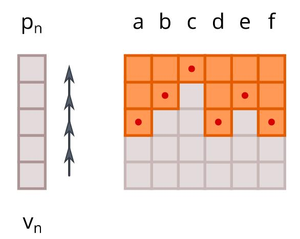
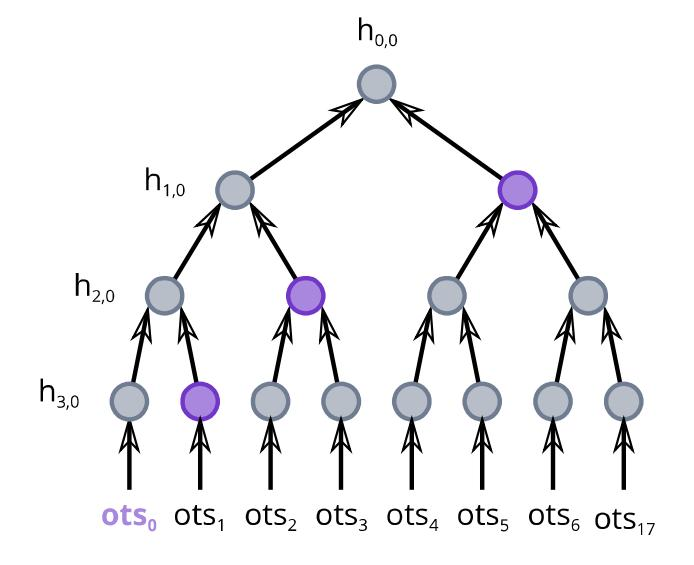
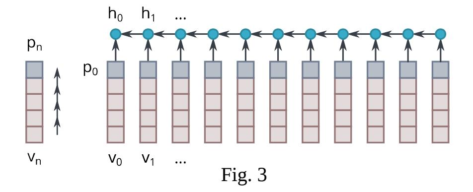
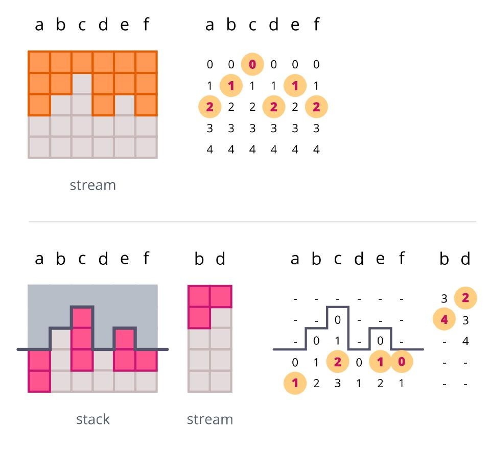
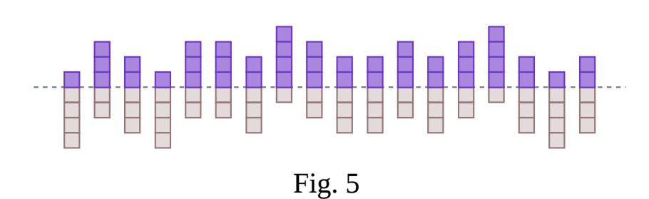
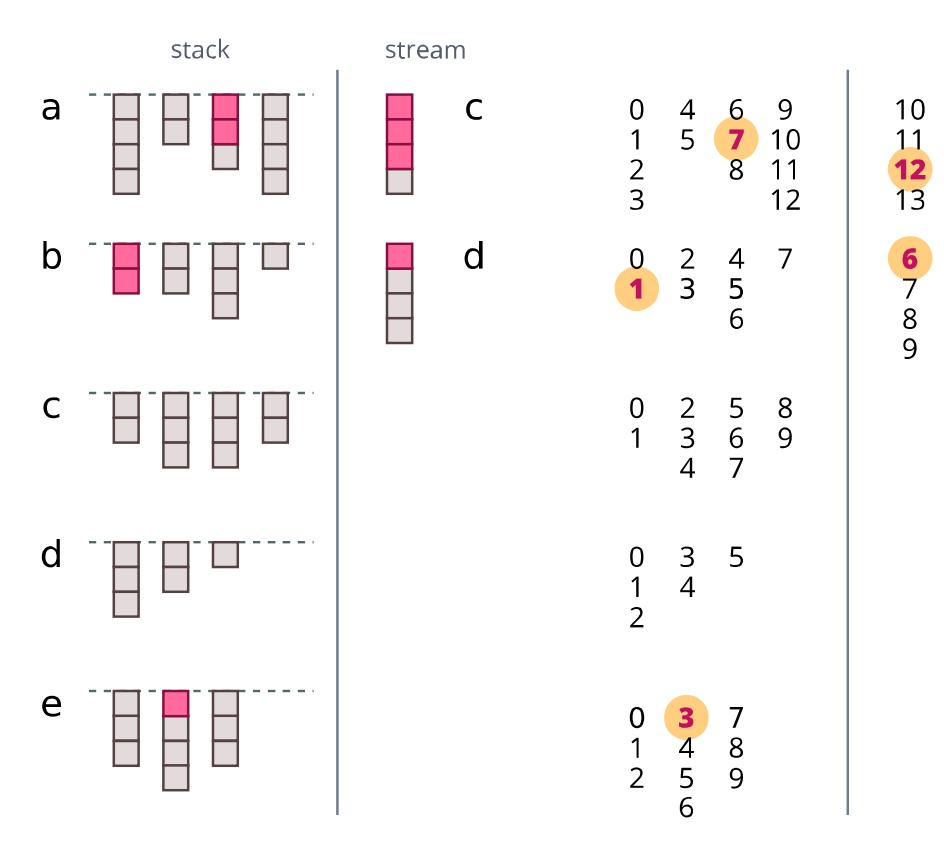
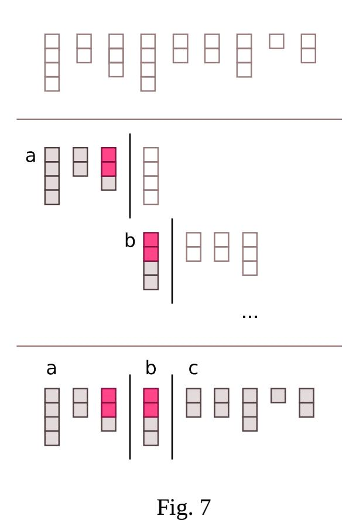
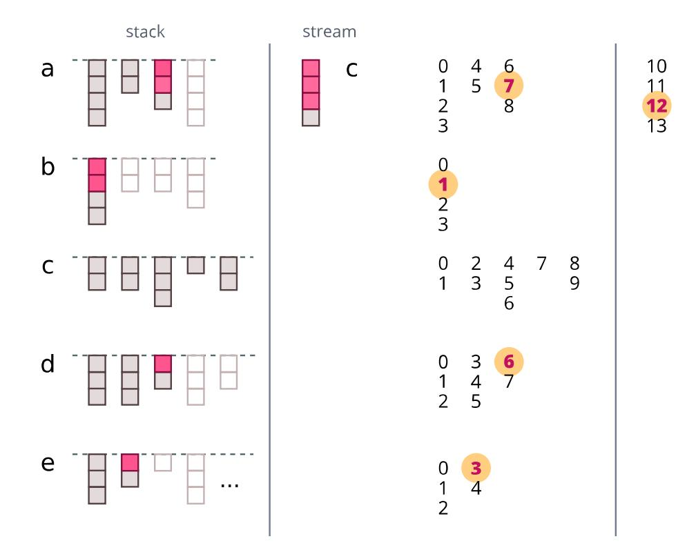
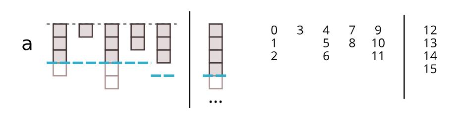
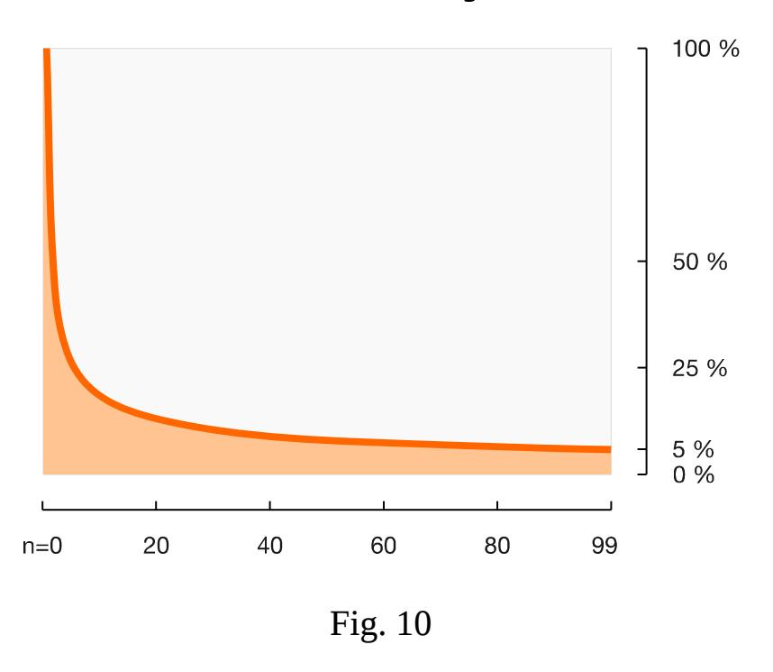

{0}------------------------------------------------

# Synced Hash-Based Signatures: Post-Quantum Authentication in a Blockchain

Santi J. Vives Maccallini [santi.x256@gmail.com](mailto:santi.x256@gmail.com)

*Abstract- A new post-quantum, hash-based signature (HBS) scheme is introduced. In known HBS, the size and cost of each signature increase as the number of messages one wishes to sign increase. In real-world applications, requiring large volumes of signatures, they can become impractical. This paper studies HBS in a blockchain, like bitcoin: a public, decentralized database. The proposed HBS scheme shows that, when all signatures are known, quite the opposite is possible: the signatures can become more efficient as the number of signatures grows. Authenticating large volumes of messages results less costly on average than authenticating only a few.*

*Index Terms—*post-quantum cryptography, hash-based signatures, authentication, blockchain.

# I. INTRODUCTION

The security of classical signatures -such as RSA, DSA, ECDSA, and Schnorr- relies both on the existence of a secure hash function, and the intractability of a problem such as the discrete logarithm. In contrast, hash-based signatures (HBS) rely only on the first. This property makes HBS resistant against quantum computers, capable of breaking the discrete logarithm using Shor's algorithm [1].

Despite their tighter security, hash-based signatures never reached widespread acceptance for practical reasons.

HBS transform a hash function into a one-time signature (OTS) scheme, only useful to authenticate one message per key. Then, the OTS is transformed into a many-times scheme (MTS), useful to sign an unlimited (or at least large) number of messages. In both, the difficulty of breaking a signature reduces to the problem of breaking the hash function they are built from.

In known MTS constructions, the size and cost of each signatures depends on the maximum number of signatures that can be authenticated from a single key: if a key is used to sign a million signatures, those signatures will be more costly and much larger than others from a key that can only sign ten. In applications that require the authentication of a large number of messages, the size and cost can grow to the point of being impractical.

This paper studies the generation of hash-based signatures in conjunction with a blockchain, like bitcoin. A blockchain is a public, decentralized, immutable database. Once inserted in a blockchain, signatures become public.

The proposed scheme shows that, when all signatures are known, it is possible to construct many-times signatures more efficient than the OTS they are built from, rather than less. A method is introduced to transform a one-time signature into an unlimited many-times scheme.

The size of each signature remains constant, and the verification cost decreases as the number of signatures grows.

# II. 2. BACKGROUND

# *A. One-Time Signatures*

Lamport proved a method to transform a hash function into a signature that is secure as long as each key is used only once [2].

The one-time signature (OTS) does not rely on the hardness of some arithmetic problem like the discrete logarithm, nor any other assumption. Breaking the OTS reduces to the problem of breaking the hash function it is build from. So, an OTS is secure as long as the hash function is secure.

 In practice, usually a keyed hash function is used (for example, an HMAC) to make each hash instance unique and increase the difficulty to an attacker [3].

There are many different one-time signature schemes. This paper will consider a broad family of signatures that includes Lamport [2], and Winternitz [4] as special cases.

The proposed scheme requires an OTS that uses a hash chain as its main building block (Fig. 1, left). To construct a chain, a hash function is applied a number of times over a value *vn* in the private key, until obtaining a value *pn* in the public key. A signature requires multiple chains, represented by each column in the illustration (Fig. 1, right).

{1}------------------------------------------------

Fig. 1

Generally, an OTS works as follows:

First, a private key is created. The key is an *L*-tuple, with each element chosen at random, with the same size in bits as the hash function output.

Then, to create the keys, Alice iterates the keyed hash function *z* times over each value in the private key. The result is the public key.

To sign a message, Alice maps a hash *m* of the message into a tuple *u*. The function that maps *m* into *u* depends on the OTS algorithm. Through this paper, *u* will be referred as the verification tuple. Each part in the verification tuple takes values in the range 0...z.

Alice computes a complementary signing tuple *y*, such that *y* and *u* add up to the *L*-tuple *(z, z, ...)*. With each value satisfying *yn = z - un*.

Alice iterates the hash function over each value in the private key, a number of times given by *y*. And publishes the result as the signature. The signature is represented by the dotted blocks in the illustration.

Then, to verify Bob completes the path from the signature to the top of the graph, iterating the hash function *u* times over each value in the signature. The signature is valid if the resulting hash outputs and the public key match.

In the example (Fig. 1), with *L=6* and *z=4, t*he tuple *u* is *(2, 1, 0, 2, 1, 2), a*nd the corresponding tuple *y* is *(2, 3, 4, 2, 3, 2)*. Where:

$$(2, 1, 0, 2, 1, 2) + (2, 3, 4, 2, 3, 2) = (4, 4, 4, 4, 4, 4)$$

*Security:*

Once a signature becomes public, all hashes going from the signature to the public key become public as well. They can be easily computed by applying the hash function.

For a OTS scheme to be secure against forgery, it means that those hashes must be insufficient to generate another signature. That condition restricts the set of tuples that can be valid within a scheme.

Applying the hash function allows to compute hashes that correspond to smaller *un* values, and their complementary larger *yn* values. Then, in every possible pair of valid *u* tuples, each tuple must have at least one part *un* that is greater than the same part in the other tuple. In other words:

> *If a verification tuple u corresponds to a valid signature, a second, distinct tuple u' with each u'n ≤ un does not (lemma 1).*

For example, if a tuple *(0, 1, 2, 3)* corresponds to a valid signature within a scheme, a second tuple *(0, 0, 2, 3)* cannot be valid, since all of its values can be computed from the first.

# *B. Many-Times Signatures*

Merkle proved that a one-time signature can be transformed into a many-times signature scheme [5]. To do so, he introduced the Merkle Tree

Fig. 2

To create the keys, Alice generates as many OTSs as messages she wishes to sign. The public keys of the OTSs are hashed and placed at the leaves of the tree. Then, all values are hashed in pairs until reaching the root of the tree at the top. The root is the many-times public key.

To sign a message, Alice chooses an unused OTS and makes public the hashes needed to authenticate the OTS to the root (the purple values in the figure).

There are later variants of the scheme (XMSS, and SPHINCS) [6] [8]. They are out of the scope of this paper, so they'll be commented briefly. In the variants, each OTS is used to authenticate the root of another tree. The process is repeated, forming and hypertree. An OTS from the final tree is 

{2}------------------------------------------------

then used to authenticate the actual message. There is no longer need to compute all the final OTSs when creating the keys. Thus it is possible to generate keys able to authenticate very large number of messages. But, by replacing simple hashes in the authentication path with intermediate OTSs, the schemes increase the size of each signature and its verification cost.

# *The Problem:*

The Merkle Tree itself has proven to be useful in lots of applications. But it never reached widespread use as a signature scheme.

In the Merkle signature and its variants, the size and cost depend on the number of signatures. As the number grows, the tree becomes larger. And, as a result, the size and cost of each signature increase as well. The signatures can get quite large, to the point of being impractical for most applications.

In addition, the signature is stateful. The signer needs to keep track of the number of messages he signs to avoid using an OTS more than once. A memory failure could make the signer reuse an OTS and degrade the security.

# *C. Blockchain*

Usually, the security of transactions relies on the assumption that a third party acting as a middleman (for example, a bank) is honest. Bitcoin [7] removes the need for a middleman. Rather than relying in people and institutions not misbehaving, the authenticity and correctest of the transactions are secured using a cryptographic construction.

To do so, the blockchain (or chain of blocks) is introduced: it is a timestamped, decentralized, and immutable database. Each block in the chain contains a set of signed messages combined in a Merkle Tree.

A blockchain, as a cryptographic primitive, ensures that anyone observing a block is observing the same information, without modifications nor omissions. Once included in the blockchain, anyone can observe the number of signatures generated from each key, and what those signatures are.

# III. A SIMPLE SYNCED SIGNATURE

This section explains the basics of how synced signatures work. First, how chains are created. Then, how those chains are used generate synced signatures in conjunction with a blockchain.

# *A. Stream*

To sign many messages, rather than creating a new set of chains for each signature, it would be better to have one large set of many chains. We will take a few as needed for each signature and prove they are members of the set.

Let's define a long but finite set of chains, as in figure 3, and hash each public key at the top, from right to left. Each hash value hn takes as input the public key below it *(pn)* and the hash value to the right *(hn+1)*. Will make public the leftmost hash h0.

A sequence of public keys *p0, p1, ..., pn* can be authenticated against *h0* by including the hash value *hn+1*. To verify the values, they must be hashed from right to left, the same way the stream was created, to compute the sequence *h'n*, *h'n-1*, *...*, *h'0*. The resulting value *h'0* must be checked against *h0*.

# *Extension:*

To obtain an unlimited number of signatures, it should be possible to extend the stream as needed. To do that, a new stream can be generated, and the previous one can be used to sign a message together with the leftmost *h'0* value of the new stream:

*sign (message || h'0 )*

# *B. Signing*

Let's start by generating the first signature, the same way as with the OTS (Fig. 4, top). First, let's map a message to its corresponding *u* tuple. Then, let's compute the corresponding tuple *y*. Using the first chains from the stream, let's iterate the hash function *y* times over the private key to compute the signature.

Figure 4, at the top, shows our first signature. In our example, *u=(2, 1, 0, 2, 1, 2)*. The illustration, to the left, shows the hashes that become public. To the right, the values from *u* that the chains encode.

{3}------------------------------------------------

Fig. 4

Then, the signature and the h*n* value must be published to the blockchain. Now is when things start to get a bit different.

For a one-time signature to remain secure, it is important that the hashes from one signature are never reused for another. This is usually achieved by discarding the chains from an OTS after its use.

But once the signature is inserted in a public blockchain something interesting happens. The hashes going from the signature to the public key are known to everyone now, and cannot be reused. The hashes at the bottom, from the private key to the preimage of the signature, remain unknown. Since everyone can observe in the blockchain which hashes are already used, the remaining unspent hashes can be safely used to authenticate a next signature.

Now, Let's generate a second signature, using the set of chains from the past signature (we'll call that set the stack), and new chains from the stream.

Let's assign the possible values in *un* to the unspent hashes in each chain from the stack, from top to bottom: *0, 1, ....* As shown in figure 3 at the bottom.

To generate the signature, let's make public the hashes that correspond to the tuple *u* from our second message. In our example, *u=(1, 4, 2, 2, 1, 0)*.

Since the number of unspent hashes in the stack is smaller than originally, some parts from *u* cannot be encoded by them. When a chain from the stack is insufficient to encode a part in u, the signer will need to take a new chain from the stream to encode the remaining values. From top to bottom, counting from where we left.

In our example, the unspent hashes in the stack can encode the following ranges of values:

a: *0...1, b: 0...2, c: 0...3, d: 0...1, e: 0...2, f: 0...1*

To finish, the signer will publish the hashes in the stack that correspond to values from our tuple *u*. Four values can be encoded from u:

$$u: (1, \varnothing, 2, \varnothing, 1, 0)$$

Two positions are missing (*b* and *d*). So, two extra chains from the stream are needed. Let's assign the new chains to the missing positions (letters) in order: the first chain to b, the second to d.

The chains from the stack at those positions encoded the values *0, 1, 2* and *0, 1* respectively. So, we'll assign the remaining values to the stream: *3, 4* to the first chain and *2, 3, 4* to the other. From top to bottom.

Let's append to the signature the hashes that correspond to the two remaining positions in *u* :

*u: ( , 4, , 2, , ) ∅ ∅ ∅ ∅*

Figure 3, at the bottom, show our second signature. To the left, the hashes that become public with our signature. To the right, the values from u encoded by the the stack and the the stream.

The resulting synced signature can be represented using three tuples: *ustack*, *ustream*, and *pos*:

 The first tuple *ustack* indicates the number of hash iterations to the first hashes in the signature, until obtaining the known values in the stack.

 The tuple *ustream* indicates the number of hash iterations to last hashes in the signature, until obtaining the values at the top of each chain in the stream.

 And *pos* indicates the positions of the used the chains in the stack.

In our example, the mapping from u to the synced signature is:

*u = (1, 4, 2, 2, 1, 0) → ustack, ustream, pos = (2, 3, 2, 1), (1, 0), (0, 2, 4, 5)*

 Notice in the figure that in the synced signature, the 0 (zero) value of the u tuple isn't encoded by the upper known hash. It is encoded by the hash below it instead (its preimage). We want the signer to prove in all cases he knows a new hash 

{4}------------------------------------------------

from the chain. When using the stream, that isn't necessary, since the hash at the top is unknown.

*Size:* The size of the signature is the same as before. But the size of public key has expanded. Since the new signature authenticates in part to the previous signature, that previous signature has become part of the public key.

*Cost:* If the values in the verification tuple u are random with uniform distribution, nearly half of those values will be encoded using the chains from the stack. And the other half will be encoded using chains from the stream. Verification will require nearly half the number of hash function iterations. Then, the synced signature will have the same length as the initial signature, but nearly half the expected verification cost.

# *C. Security*

Since the values in the u tuple are encoded from top to bottom (Fig. 3), the u values known from the synced signature are only useful to compute smaller u values.. So, the synced signature is secure as long as the original OTS is secure (from lemma 1, section 2.1).

In fact, the range of known values is smaller in the synced signature than in the original OTS.

The positions (letters) within the u tuple that the chains in the stream encode are determined by the used chains in the stack.

Since the length of the signature is constant, a fixed number of chains must be used. To modify those positions, an attacker would need to discard a known value and publish an additional, unused value from a different chain. Either from the stack or from the stream. In both cases, a forgery would require a value that is not known, and cannot be obtained without breaking the hash function. In other words:

> *If the signature consists of a fixed number of hashes, an attacker cannot replace values from chains at given positions (in the stack or the stream) to a different set of positions without breaking the hash function (lemma 2).*

# *Synced State:*

The signatures is stateful, but the the signer does not need to store the state. Signer and verifiers synchronize the state of the signature using the blockchain. By observing the blockchain, the signer and the verifiers can recover the number of signatures, the hash values that were spent and cannot be reused, and the hash values that remain unspent and can be used to authenticate a new message.

# IV. GENERALIZATION TO MANY SIGNATURES

Now, let's extended the scheme from two signatures to many. Each signature will be authenticate using the unspent values from all previous chains.

# *A. Stack*

Lets's create a stack, containing all chains with unspent values from previous signatures (Fig. 5).

Each chain has an spent part (in purple, above the line), that is already known and cannot be reused. And an unspent, unknown part, that ranges from the private key to the preimage of the last known hash. The chains are sorted in the stack in the same order they had in the stream.

After each signature, the chains that are completely spent will be discarded .

# *B. Signing*

As the number of signatures grows, there will be more chains in the stack. To make the signature more efficient, we want to use all of them to encode the u tuple. So, rather than encoding the values at a position (letter) from u using a single chain, we will split those values among multiple chains in the stack.

Fig. 6

{5}------------------------------------------------

Let's start by grouping the chains in the stack as evenly as possible. And let's assign each group to a position in the tuple *u*, indicated by a letter (Fig. 6, left). Each row in the figure contains a group of chains, and its letter.

Then, let's assign the possible values in the u tuple to the hashes in each group (Fig. 6, right). From top to bottom in each chain, and from the first chain in a group to the last. The same as before, we'll use the stream if needed to encode the remaining values.

In the example, a tuple *u=(7, 1, 12, 6, 3)* is mapped to the synced signature as follows:

$$u = (7, 1, 12, 6, 3) \rightarrow$$
  
ustack, ustream, pos = (2, 2, 1), (2, 0), (2, 4, 16)

# *C. Security*

The security follows the same principles as before:

From the values in the synced signature, and attacker could only compute smaller *u* tuple values. So, the signature is secure as long as the original OTS is secure (from lemma 1, section 2.1).

Like before, the letters that correspond to the chains in the stream are determined by the used chains in the stack. Since the number of hashes in the signature is fixed, an attacker cannot change the positions without breaking the hash function (from lemma 2, section 3.3).

# V. ADAPTIVE ENCODING

To encode the verification tuple *u*, the stack was split into groups, and used a single chain from each group.

As a result, there are combinations of chains that don't encode any message. For example, a signature taking values from two chains in the first row (at position *a*) has no meaning.

It would be better to use all possible combinations of chains, to maximize the number of distinct tuples the stack can encode. To achieve that, an adaptive method can be used, where the values assigned to each chain depend on the chain that was used before.

The method (Fig. 7) works as follow:

Suppose we want to encode a tuple with length Lu, and we have a stack with a number of chains *Lstack* .

To encode the first position in *u*, we'll use a number of chains *La* from the stack, given by:

$$L_a = ceiling (L_{stack} / L_u)$$

Let's assign the hashes in those *La* chains to encode the value from the u in the same way as before, using the stream if necessary.

Now, suppose a chained is used at position *n* in the stack, counting from zero. The following chains *(n+1, n+2, ...)* are not needed for this encoding. So, we will reuse them to encode the next value from *u*.

Let's recompute the number of remaining chains from the stack, and the remaining values to encode from the tuple *u*:

$$L'_{stack} = L_{stack} - (n + 1)$$
  
 $L'_{u} = L_{u} - 1$ 

Now, let's recompute *La*, using the same equation as before. We'll take the next *La* chains, starting from position *n* to encode the next value from *u*.

The procedure must be repeated until all values from *u* are encoded, as illustrated in figure 8.

The mapping in our example has become:

*u = (7, 1, 12, 6, 3) → ustack, ustream, pos = (2, 2, 1, 1), (2), (2, 3, 11, 13)*

{6}------------------------------------------------

Fig. 8

# *A. Security*

Now, the position of each used chain from the stack modifies the value the next chain encodes.

Since the length of the signature is constant, to modify the position an attacker would need to publish a value from a different chain, either from the stack or the stream. Like before, the attacker needs a value that is unknown, and cannot be obtained without breaking the hash function (from lemma 2, section 3.3).

# VI. BALANCED CHAINS

Fig. 9

When we assign the possible values from the *u* tuple to the hashes in the stack, it is possible that all values end up encoded in the first few chains. To minimize the cost of verification, they should be as evenly distributed as possible among the chains.

For that purpose, let's limit the amount assigned to each chain. Suppose we have *g* values to encode *(0...15)*. And *La+1* chains to encode them, *La* from the stack and an extra one from the stream if needed. We will limit the values a single chain can encode to:

$$limit = ceiling (g / (L_a + 1))$$

For example, if we have 16 values to encode *(0...15)*, 5 chains from the stack, and an extra chain from the stream, we will assign at most 3.

Since the number of unspent hashes in each chain is random, the number may also be smaller than ideal. So, rather than applying the same limit to all chains, we will recompute the limit for each. In our example, after assigning the first 3 values *(0, 1, 2)*, we'll update the number of remaining values and remaining chains, and we'll use the same equation to recompute the limit.

After assigning 3 values, we have 13 values and 4+1 chains remaining. The next limit becomes:

$$limit = ceiling (13 / (4 + 1)) = 3$$

We will repeat the procedure, until all values are assigned to the chains, as in table 1.

| Remaining | La+1 | Limit | Unspent | Assigned |
|-----------|------|-------|---------|----------|
| 16        | 5+1  | 3     | 4       | 3        |
| 14        | 4+1  | 3     | 1       | 1        |
| 13        | 3+1  | 3     | 5       | 3        |
| 10        | 2+1  | 3     | 2       | 2        |
| 8         | 1+1  | 4     | 3       | 3        |
| 5         | 0+1  | 4     | 16      | 4        |

Table 1

# VII. CALCULATIONS

We will estimate the cost of a synced many-times signature, and see how it compares against the OTS it is made of. A signer will use the scheme to sign a sequence of many messages m0, m1, m2, .... The initial, zeroth signature will have the same cost as the OTS. And each consecutive signature is expected to cost less than the signatures before.

We'll use *u* tuples with length *18* and each part in the range *0...212−1*. Those values were chosen to match a Winternitz OTS with parameters *bits=192* and *w=12.* 

We will run a large number of simulations and average the cost from all samples. to estimate to expected cost of each of the 100 signatures, from the 0th to the 99th. Figure 10 shows the results.

As the plot shows (Fig 10.), the cost reduction can be quite drastic: the 99th signature costs only 5.8% compared to the initial OTS.

{7}------------------------------------------------

VIII. COMPARISON TO OTHER SCHEMES

Table 2 shows the public key, and signatures sizes of the SPHINCS, and XMSSTM schemes for comparison (XMSSTM is an optimized variation of XMSS) [9]. The synced signature is 256-bit to match the others, with a Winternitz parameter *w=10*.

| Scheme      | Total messages  | Public key (bits) | Signature (bits) |
|-------------|-----------------|----------------------|---------------------|
| XMSSMT      | 10 2         | 544                  | 39 704              |
| XMSSMT      | 20 2         | 544                  | 44 840              |
| XMSSMT      | 60 2         | 544                  | 67 136              |
| Sphincs-256 | virt. unlimited | 8 448                | 328 000             |
| Synced-Wots | unlimited       | ≥ 512                | 7 424               |

Table 2

Notice that XMSSTM, and SPHINCS signatures grow in size as the maximum capacity of messages grows, while synced signatures remain short. For the synced signature, the size of the public key corresponds to the initial value: since synced signatures authenticate to past signatures, as more messages are signed and included in the blockchain, they became part of the public key.

# IX. FURTHER IMPROVEMENTS

# *A. Limited Stack*

We could impose a limit to the size of the stack, to prevent it from growing. To achieve that, we could trim the stack after each signature and keep a maximum number of chains: the last ones, or the ones with most unspent values.

# *B. A Smaller Blockchain*

As more signatures are added, many intermediate hashes from each chain are published. Those values can be easily computed by iterating the hash function over the known value at the bottom of the chain.

Each signature contains hashes from the stack, and from the stream. The ones from the stream increase the amount of information. The ones from the stack only update existing information, since older values in the same chain in the stack can be pruned and reconstructed from the newer one.

Then, a synced blockchain would require storing all messages, but only the hashes from the latest signatures. Most hash values from older signatures can be removed from the blockchain database, without any loss of information.

# X. CONCLUSIONS

Previously known hash-based, many-times schemes grow in size and cost as the number of needed signatures grows. This can make the signatures impractical in real-world applications.

This papers has shown that is possible to transform an OTS into a many-times signature that is more efficient than the OTS it is made of, rather than less.

The proposed scheme permits an unlimited number of signatures. The size of the signatures is constant, and the same as in the OTS. The verification cost starts the same as in the OTS and decreases with each new signature, becoming more and more efficient as the number of signatures grows.

# REFERENCES

- [1] Buchmann, Dahmen, and Szydlo. "Hash-based digital signature schemes," in "Post-Quantum Cryptography," 2009.
- [2] Leslie Lamport, "Constructing Digital Signatures from a One Way Function," 1979.
- [3] Buchmann, Dahmen, Ereth, and Hülsing, "On the security of the Winternitz one-time signature scheme ," 2011.
- [4] Ralph C. Merkle, "Secrecy, Authentication, and Public Key Systems," 1979.
- [5] Ralph C. Merkle, "A Certified Digital Signature," 1989.
- [6] Buchmann, Dahmen, and Hülsing, "XMSS -- A practical forward secure signature scheme based on minimal security assumptions," 2011.
- [7] Satoshi Nakamoto, "Bitcoin: A Peer-to-Peer Electronic Cash System," 2008.
- [8] Bernstein, Hopwood, Hülsing, Lange, Niederhagen, Papachristodoulou, Schneider, Schwabe, Wilcox-O'Hearn, "SPHINCS: practical stateless hash-based signatures," 2015.
- [9] Kampanakis, Fluhrer, "LMS vs XMSS: Comparison of two Hash-Based Signature Standards," 2017.