{0}------------------------------------------------

# Automated Enumeration of Block Cipher Differentials: An Optimized Branch-and-Bound GPU Framework

Wei-Zhu Yeoh, Je Sen Teh\*

School of Computer Sciences, Universiti Sains Malaysia

Jiageng Chen

School of Computer, Central China Normal University

#### **Abstract**

Block ciphers are prevalent in various security protocols used daily such as TLS, OpenPGP, and SSH. Their primary purpose is the protection of user data, both in transit and at rest. One of the de facto methods to evaluate block cipher security is differential cryptanalysis. Differential cryptanalysis observes the propagation of input patterns (input differences) through the cipher to produce output patterns (output differences). This probabilistic propagation is known as a differential; the identification of which is a measure of a block cipher's security margins. This paper introduces an optimized GPU-based branch-and-bound framework for differential search. We optimize search efficiency by parallelizing all branch-and-bound operations, completing the entire search on the GPU without communicating with the CPU. The meet-in-the-middle (MITM) approach is also adopted for further performance gains. We analyze the financial and computational costs of the proposed framework using Google Cloud VM to showcase its practicality. When optimized for performance, we can attain up to 90x speedup while saving up to 47% of the running cost as compared to a single CPU core. When optimized for cost, the proposed framework can save up to 83% of financial costs while retaining a speedup of up to 40x. As a proof of concept, the proposed framework was then applied on 128-bit TRIFLE-BC, 64-bit PRESENT, and 64-bit GIFT. Notably, we identified the best differentials for PRESENT (16 rounds) and 64-bit GIFT (13 rounds) to date, with estimated probabilities of 2<sup>-61.7964</sup> and 2<sup>-60.66</sup> respectively. Although the differential results for TRIFLE-BC were incremental, the proposed framework was able to construct differentials for 43 rounds that consisted of approximately 5.8x more individual trails than previous work, making it one of the most efficient approaches for larger block ciphers.

*Keywords:* Automatic search, block cipher, branch-and-bound, cryptanalysis, differential, differential cryptanalysis, GPU

### 1. Introduction

Block ciphers are important symmetric-key primitives that are used in various cryptographic applications such as Transport Layer Security (TLS) [1], OpenPGP [2], and SSH Transport Layer Protocol [3]. Due to the popularity of Internet of Things (IoT) devices, interest in the design and cryptanalysis of lightweight block ciphers is on the rise [4, 5]. In fact, the NIST standardization effort for lightweight cryptography is in its final round, with many submissions that are based on block ciphers [6]. Even with the existence of quantum computers, block ciphers are expected to remain secure with the selection of larger key or block sizes [7]. Differential cryptanalysis [8] is one of the foundations of symmetric-key security analysis that underpins many modern cryptanalytic approaches today. It is a powerful tool that exploits the propagation of input differences to construct statistical distinguishers that can be used to extract encryption keys. The resistance to differential cryptanalysis has become a de facto requirement for any modern block cipher [9][10][11]. The success of differential cryptanalysis relies on the identification of differential characteristics (trails) that occur with sufficiently high probabilities.

A differential denoted by  $\Delta X \stackrel{r}{\rightarrow} \Delta Y$  is commonly con-

A **differential** denoted by  $\Delta X \xrightarrow{r} \Delta Y$  is commonly constructed by propagating an input XOR difference,  $\Delta X = M_1 \oplus M_2$  through r rounds of a block cipher to obtain the final output difference,  $\Delta Y = C_1 \oplus C_2$ , where  $(M_i, C_i)$  represent distinct plaintext-ciphertext pairs. This propagation is probabilistic in nature due to the interactions between the secret key and internal nonlinear operations of the block cipher such as substitution boxes (S-boxes). If  $\Delta X \xrightarrow{r} \Delta Y$  holds true with high probability, it can be used as a statistical distinguisher for key-recovery attacks. This probability is known as the **differential probability** and is denoted as  $Pr(\Delta X \xrightarrow{r} \Delta Y)$ . The efficiency estimates for key-recovery attacks can be improved by taking into consideration the notion of differentials.

The propagation of an r-round differential can be represented by a string of intermediary differences,  $\delta_i$ . Each unique string of intermediary differences, starting from the same  $\Delta X$  and ending at the same  $\Delta Y$ , corresponds to a distinct difference propagation trail known as a **differential characteristic**. Thus,

\*Corresponding author

Email address: jesen\_teh@usm.my (Je Sen Teh)

Preprint submitted to Elsevier January 20, 2022

{1}------------------------------------------------

a differential can be seen as a cluster of individual differential characteristics. For example, two 3-round differential characteristics, <sup>∆</sup>*<sup>X</sup>* <sup>→</sup> <sup>δ</sup><sup>1</sup> <sup>→</sup> <sup>δ</sup><sup>2</sup> <sup>→</sup> <sup>∆</sup>*<sup>Y</sup>* and <sup>∆</sup>*<sup>X</sup>* <sup>→</sup> <sup>δ</sup><sup>3</sup> <sup>→</sup> <sup>δ</sup><sup>4</sup> <sup>→</sup> <sup>∆</sup>*<sup>Y</sup>* can be clustered to form a differential because they both share the same ∆*X* and ∆*Y*. For this example, the overall differential probability can then be obtained by summing up the individual differential probabilities for each characteristic, *Pr*(∆*X* → <sup>δ</sup><sup>1</sup> <sup>→</sup> <sup>δ</sup><sup>2</sup> <sup>→</sup> <sup>∆</sup>*Y*)<sup>+</sup> *Pr*(∆*<sup>X</sup>* <sup>→</sup> <sup>δ</sup><sup>3</sup> <sup>→</sup> <sup>δ</sup><sup>4</sup> <sup>→</sup> <sup>∆</sup>*Y*). Every differential characteristic added to a differential improves upon the differential's probability of occurrence. This idea was first introduced by Lai et al. based on the Markov cipher assumption that the rounds of an iterated cipher are independent or have independent round keys [\[12\]](#page-13-11). Despite this assumption, the probability estimate of the most probable differential will always exceed that of the most probable differential characteristic [\[13\]](#page-13-12). The construction of large differential clusters is a non-trivial process because the computational effort scales exponentially with respect to a cipher's block size and the number of rounds. Thus, if the process of enumerating characteristics can be made more efficient, more differential characteristics can be found in a shorter amount of time to improve the overall differential probability.

GPUs are an integral part of the high-performance computing (HPC) cluster, as evidenced by their appearance in computing clusters that make it into the Top 500 Supercomputer rankings [\[14\]](#page-13-13) based on computing power. As such, tapping into readily available GPU computational power for efficiency gains would greatly benefit cryptanalysts, especially for computationally intensive applications such as the identification of differentials. Although GPUs have already been utilized for other cryptography-related efforts such as hash collision attacks [\[15\]](#page-13-14), accelerating asymmetric cryptography [\[16\]](#page-13-15) and symmetric-key cryptography [\[17\]](#page-13-16), it is yet to be utilized efficiently for the differential search problem. Even though a GPU approach has been attempted in [\[18\]](#page-13-17), the differential search for a large number of rounds sees a dramatic drop in performance due to memory limitations.

# *1.1. Related Work*

Prior to the introduction of automated searching strategies, finding even a single differential characteristic was a time-consuming task. A cryptanalyst would have to trace the propagation of each individual difference and perform calculations to identify suitable differential characteristics for their attacks. Later, Matsui proposed the first automated searching strategy based on the branch-and-bound method (B&B) for differential and linear trails which was applied on the Data Encryption Standard (DES) [\[19\]](#page-14-0). The cryptanalyst's task is reduced to modeling differential behavior of the cipher in code, and the algorithm will automatically try and find the best differential characteristics based on certain requirements. Various enhancements were later made to the Matsui B&B algorithm, adapting it to various block ciphers and using different pruning criteria. In [\[20\]](#page-14-1), the B&B searching algorithm was adapted for ARX block ciphers by taking into account the differential property of addition operations. The meet-in-the-middle (MITM) approach described in [\[21\]](#page-14-2) trades off data complexity for improvements in terms

of time complexity. It splits the search into two halves, storing intermediary round information for the first half which is later matched with the outputs of the second half of the search. The searching strategy primarily uses the number of active S-boxes to guide the pruning process of the B&B algorithm. However, this approach does not scale well beyond a general 32-bit block cipher or a 64-bit Feistel block cipher due to memory limitations. In [\[18\]](#page-13-17), a GPU-based B&B differential search framework was proposed but had several shortcomings which include generalizability issues due to the specific choices of fixed parameters rather than variables for work assignments and the parallelization of only three out of four operations of the B&B process. There also exists a bottleneck due to memory bandwidth, leading to a noticeable drop in performance when carrying out the search for a larger number of rounds. More recently, a GPUbased branch-and-bound was used compute the full differential distribution for block size-reduced variants of PRESENT that range from 8 to 28 bits [\[22\]](#page-14-3). However, a straightforward approach was adopted where each thread is merely assigned an input difference to compute without accounting for other considerations. Each thread computes the difference propagation for one round and stores the result in an array whose size is equivalent to the number of differences (2*<sup>b</sup>* for a *b*-bit block cipher). Thus, this approach is infeasible for larger block sizes due to memory limitations. In addition, the distribution of different branch sizes for different input differences reduces the GPU efficiency due to branch divergence.

Alternatively, [\[23\]](#page-14-4) showed that mixed-integer linear programming (MILP) can be used to automate the search for differential characteristics. The proposed MILP approach identifies the minimum number of active S-boxes for a particular block cipher by solving relevant linear inequalities using an MILP solver. The MILP method was later extended by [\[24\]](#page-14-5) to enable the enumeration of differential or linear characteristics satisfying certain properties, which can then be used to form a differential or linear hull. However, the authors note that the MILP method is mostly applicable to lightweight ciphers as the solution for a MILP model for larger ciphers would consist of thousands of variables and constraints.

Similarly, SAT/SMT solvers have also been used to identify optimal differential characteristics or to automate the construction of differentials. This was first introduced in [\[25\]](#page-14-6) who used a SAT solver to enumerate different characteristics for Salsa20. They also showed that SAT solvers can be used to construct differentials with multiple characteristics. SMT solvers have been used to construct differentials for 64-bit block ciphers in [\[13\]](#page-13-12), requiring multiple hours on average depending on the target cipher. Recently, [\[26\]](#page-14-7) showed that SAT solvers can identify optimal (individual) differential characteristics within seconds but note that the search can be inefficient for long trails or large block/state sizes. The timing data provided clearly depicts that SAT solvers outperform MILP for such a task. The capability of their approach to cluster characteristics corresponding to a differential was not discussed. Also, as SAT solvers are inherently serial [\[13\]](#page-13-12), they cannot leverage advances in massively parallel architectures to obtain a speed-up.

General-purpose graphical processing unit (GPGPU) tech-

{2}------------------------------------------------

nology allows the use of GPU hardware to accelerate processes unrelated to graphic manipulation tasks. There exists various research work attempting to accelerate the B&B algorithm using GPUs [\[27,](#page-14-8) [28,](#page-14-9) [29\]](#page-14-10). In general, the GPU parallelization of the B&B algorithm is complex due to its irregular nature in terms of workload, control flow, and memory access [\[30,](#page-14-11) [31\]](#page-14-12). Previous work such as [\[27\]](#page-14-8) and [\[28\]](#page-14-9) only attempted to partially parallelize the operation of B&B. Parallelizing all four operations of the B&B algorithm as described in [\[31\]](#page-14-12) and [\[32\]](#page-14-13) alleviate branch irregularity using an integer-vector-matrix (IVM) structure. However, the IVM approach requires the intermediary solution to be coded in a square-like regular matrix structure for which the differential cluster search problem does not have an efficient representation.

## *1.2. Contribution*

In this paper, we propose an optimized B&B GPU framework[1](#page-2-0) for the automated search for block cipher differentials that overcomes prior performance bottlenecks. The work proposed in [\[18\]](#page-13-17) suffers from a critical memory bottleneck that limits its real-world application. We overcome this memory limitation by leveraging upon the cooperative group feature, enabling all the threads in the kernel to meet at a predefined segment of the code execution. This feature allows the GPU threads to perform a deeply recursive search that requires only a fixed amount of memory regardless of the number of branches for a particular level. This search is a hybrid of breadth-first and depth-first approaches.

The GPU framework can be applied to various block ciphers without sacrificing efficiency. When configured for optimal performance, the proposed framework can achieve a speedup of up to 90x while saving up to 47% of the running cost as compared to a single CPU core. If cost-saving is the goal, the proposed framework can be configured to save up to 83% of the running cost while retaining a speedup of up to 40x as compared to a single CPU core. When comparing the GPU-accelerated MITM approach to the traditional single-core CPU non-MITM approach, a speedup of 2292x is achieved, which significantly improves upon the results described in [\[18\]](#page-13-17) where a speedup of only 58x the original throughput was achieved due to the reliance on the active S-boxes count for an input difference, ∆*X*.

Efficiency is optimized through new work distribution and acquisition strategies, implicit partitioning via numbered branches indexing, and minimal communication among threads. Moreover, the framework utilizes a kernel grid-level synchronization mechanism to achieve efficient communication among threads and efficient GPU-based recursion. The proposed GPU framework only requires the initial input differences, ∆*X* and ∆*Y*, and can perform the search entirely in the GPU kernel. This leads to an additional advantage whereby the CPU and GPU can independently solve for different pairs of ∆*X* and ∆*Y* with minimal communication apart from generating the required difference

pairs. Therefore, the proposed GPU framework opens up the possibility of performing differential cluster search in heterogeneous CPU-GPU computing clusters which are quite prevalent. Unlike mathematical solvers, the proposed approach is also naturally scalable with respect to the available parallel computing architecture.

As a proof of concept, the proposed framework is used to search for improved differentials for multiple block ciphers which include 128-bit TRIFLE-BC [\[33\]](#page-14-14), 64-bit PRESENT [\[9\]](#page-13-8), and 64-bit GIFT [\[11\]](#page-13-10). These block ciphers were selected to highlight the capability of the framework to generalize across multiple block ciphers with different block sizes and designs. We improve upon the best-known differential probability for 16 round PRESENT from 2−62.<sup>13</sup> to 2−61.7964. We also improved upon the best-known differential probability for 13-round GIFT from 2−61.<sup>3135</sup> to 2−60.<sup>66</sup> by constructing a differential with approximately one million characteristics. Although no significant improvement to the differential probability for TRIFLE-BC was obtained, we showed that the proposed framework can efficiently enumerate a large number of characteristics even for a block size of 128 bits. Differentials with over 3 × 10<sup>6</sup> characteristics can be constructed for 43-round TRIFLE-BC, which is approximately 5.8x more than in [\[18\]](#page-13-17). However, we wish to note that these cryptanalytic findings are not the main focus of the work, but serve to demonstrate the generalizability and efficiency of the proposed framework.

# *1.3. Outline*

The remainder of this paper is structured as follows: Section II provides details on GPU architecture and NVIDIA GPGPU technology, CUDA. In Section III, a baseline serialized B&B algorithm for differential search is introduced. The GPU-accelerated framework and its performance evaluation are detailed in Section IV. In Section V, new differential results for selected block ciphers are provided. Section VI concludes the paper.

# 2. Preliminaries

## *2.1. GPU*

This subsection provides a basic introduction to graphics processing units (GPUs) for the benefit of readers who are unfamiliar with the area. GPUs are computing hardware designed for efficient graphical or image data processing in a parallelized and multithreaded environment. It is based on the single instruction, multiple threads (SIMT) execution model where multiple threads that reside within each processing unit execute common instructions in lock-step. In 2006, NVIDIA introduced the Compute Unified Device Architecture (CUDA) programming interface which enables the use of GPUs for generalpurpose computation unrelated to that of the graphical manipulation tasks. Over the years, GPUs have gained traction as hardware accelerators for specialized computation tasks such as machine learning [\[34\]](#page-14-15), protein sequence alignment [\[35\]](#page-14-16), and molecular dynamics simulation of thermal conductivities [\[36\]](#page-14-17).

<span id="page-2-0"></span><sup>1</sup>The source code of the framework is made publicly available for use at the following URL: [https://github.com/yeohweizhu/](https://github.com/yeohweizhu/gpu-differential-search-framework) [gpu-differential-search-framework](https://github.com/yeohweizhu/gpu-differential-search-framework)

{3}------------------------------------------------

Similar to the aforementioned tasks (which are all computationally intensive), the differential search process of differential cryptanalysis could benefit immensely from the acceleration provided by GPUs. An efficient GPU differential search framework can identify differentials that have a higher probability, which in turn leads to more efficient key-recovery attacks.

A host program residing in the CPU will assign tasks to CUDA threads that run on a separate physical device (GPU). We will be using the host and device terminology throughout the remainder of this paper. The relationship between the host and device code is illustrated in Figur[e1.](#page-3-0) From the figure, we can see that the serial host code executes on the CPU whereas the parallel device code executes on the GPU. In CUDA, a kernel is a unit function that will be executed by different CUDA threads in parallel. A kernel launch is composed of a single grid that holds up to 2<sup>31</sup> − 1 blocks, whereas each block can contain up to 2<sup>10</sup> threads.

<span id="page-3-0"></span>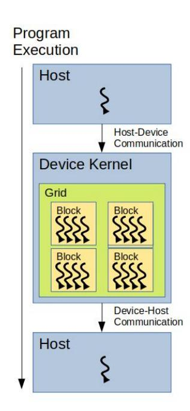

Figure 1: Heterogeneous programming architecture of a typical GPUaccelerated algorithm (Adapted from [\[37\]](#page-14-18)).

Once a kernel is loaded into the GPU and launched, idle streaming multiprocessors (SM) will be assigned a block to execute. A group of 32 block threads known as a warp is then executed simultaneously. Warp threads can only execute one common instruction at a particular time. If threads within the warp were to diverge in their instruction code due to the nature of conditional branching, each branch will then be executed in different warp cycles because of the distinct instruction code. Therefore, we need to minimize the use of conditional branches to maximize GPU performance. Also, the number of threads per block should be a multiple of 32 due to the warp's group size.

Various types of memory are accessible by CUDA threads during kernel execution. The GPU memory hierarchy is as shown in Figur[e2.](#page-3-1) Each thread has its own local memory that is inaccessible by other threads. Meanwhile, shared memory space is available for each thread within the same block. A simple barrier synchronization primitive for shared memory, syncthreads() is provided for achieving synchronization among thread blocks. Global memory, read-only constant memory, and

read-only texture memory are accessible by all threads within the grid. Global memory has the slowest access speed and is accessed via 32-, 64-, or 128-byte memory transactions. Constant memory is best suited for broadcasting whereby all threads of the same warp need access to the same memory address. Texture memory is optimized for 2D spatial locality [\[38\]](#page-14-19), yielding maximum throughput when threads of the same warp read or write to memory addresses that are adjacent to each other. The global, constant, and texture memory spaces are persistent across kernel launches by the same application. Therefore, the re-initialization of these memory spaces may need to be carried out as required by the program logic. As different memory types are better suited for different tasks, the memory access pattern of a CUDA program should be designed to take advantage of the different memory types in an effort to maximize memory throughput. This in turn improves the overall program efficiency.

<span id="page-3-1"></span>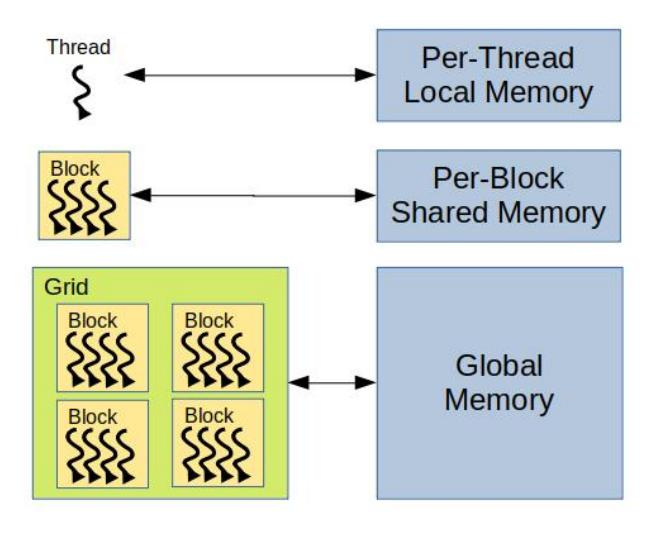

Figure 2: GPU memory hierarchy (Adapted from [\[37\]](#page-14-18)).

Host and device memory spaces are physically distinct and are, by default, not synchronized by CUDA. As such, device memory allocation and transfer have to be managed explicitly by the users during runtime. However, there exists a unified managed memory that provides a single coherent memory space that alleviates the complexity of manual memory management. However, the proposed framework opts for manual memory management for greater flexibility in memory usage.

The CUDA dynamic parallelism feature enables a parent grid to launch its kernels (known as child grids) during its execution which allows a CUDA-specific recursive solution to be programmed. These nested kernel launches allow a CUDA program to complete a series of tasks without relying on the CPU to launch additional kernels. Through appropriate utilization of dynamic parallelism, it is possible to reduce the frequency and magnitude of memory transfers required by a CUDA program, potentially overcoming memory bottlenecks. There is however a hard limit on the recursion depth that may render some recursive solutions infeasible.

In parallel computation, threads communicate with one another either implicitly or explicitly to protect data integrity. This thread collaboration requires some form of synchronization. Historically, CUDA provides block-level thread synchronization to allow communication between threads within the same block.

{4}------------------------------------------------

Other ways to achieve synchronization include implicit device synchronization by partitioning kernel launches or by utilizing built-in atomic functions to protect data integrity. In CUDA 9, NVIDIA introduced cooperative groups whereby partial or complete threads that reside within the same block or across multiple blocks could synchronize with one another to facilitate cooperation. Cooperative groups also have the ability to dictate grid or kernel level synchronization while a CUDA program is running. This feature allows a GPU kernel to compute B&B recursively, overcoming the recursion depth limitation imposed by dynamic parallelism. Hence, it is possible to model a slightly more complex data-parallel program to be executed by a GPU entirely but its performance will be difficult to optimize due to memory access patterns and thread divergence issues. The proposed framework opts for a grid-wise cooperative group to model the recursive nature of the B&B algorithm because of its flexibility to enforce grid-level, barrier-based synchronization.

#### <span id="page-4-1"></span>2.2. Serialized Differential Search

This subsection introduces the base algorithm that will be parallelized by the proposed GPU framework. It is a sequential algorithm based on an enhanced version of Matsui's B&B algorithm [19, 21]. This algorithm will be used as the baseline algorithm to analyze performance gains and cost reduction of the proposed GPU-based framework. Matsui's algorithm uses the best differential characteristic probability found so far,  $\overline{B_n}$  for a particular round n to prune branches and reduce the search space.  $\overline{B_n}$  is updated throughout the search. As  $\overline{B_n}$  approaches the best actual probability of the trail,  $B_n$ , the algorithm will approach its most efficient state.

The B&B algorithm consists of four operations: selection, branching, bounding, and pruning. Selection picks the next available node from a list of pending nodes to perform branching. Branching proceeds to decompose a parent node into child nodes whose costs are evaluated by the bounding operation. Pruning then eliminates nodes that fail the bounding operation, essentially filtering nodes that are not expected to produce desirable results. Thus, the search space can be reduced to a manageable size for large problem instances depending on how strict the bounding operation is.

A combination of the number of active S-boxes,  $AS_{BOUND}$  [39] and the differential probability threshold,  $P_{BOUND}$  [20] are used as the pruning rules in the proposed work. This specific combination facilitates greater pruning flexibility during the search while also effectively filters branches if configured correctly. In short, the serialized differential search algorithm is based on Matsui's B&B algorithm with the  $\overline{B_n}$  pruning criteria replaced with  $AS_{BOUND}$  and  $P_{BOUND}$ . This algorithm is described in Algorithm 1.

To construct differentials, the serialized searching algorithm first identifies a set of individual differential characteristics. For each of these differential characteristics, the new GPU-based framework described in the following section is used to identify additional characteristics that correspond to the same input and output differences, thus forming differentials with improved probability. This process is referred to as clustering.

<span id="page-4-0"></span>**Algorithm 1** Serialized differential cluster searching algorithm with constraints on the probability and number of active S-boxes.

1: **Input:** Input difference  $\Delta X$  and output difference  $\Delta Y$ .

```
2: Output: Probability Pr_c of \Delta X \rightarrow \Delta Y cluster.
 3: Adjustable Parameters:
        1. AS_{BOUND}: Maximum number of active S-boxes for
            \Delta Y.
        2. P_{BOUND}: Minimum probability of \Delta X \rightarrow \Delta Y.
        3. P_{AS}: Estimated probability of a nibble \Delta U \rightarrow \Delta V.
 4: procedure Cluster_SEARCH_ROUND_i (1 \le i < n)
 5:
         for each candidate \Delta Y_i do
               p_i \leftarrow \Pr(\Delta X_i, \Delta Y_i)
 6:
              AS_{i+1} \leftarrow W_{nibble}(\Delta Y_i)
 7:
              if AS_{i+1} \leq AS_{BOUND} then
 8:
                   p_{i+1} \leftarrow (P_{AS})^{AS_{i+1}}p_r \leftarrow (P_{AS})^{n-i-1}
 9:
10:
                   if [p_1, ..., p_i, p_{i+1}, p_r] \ge P_{BOUND} then
11:
                        call CLUSTER_SEARCH_ROUND_(i + 1)
12:
                   end if
13:
               end if
14:
         end for
15:
16: end procedure
17:
18: procedure cluster_search_round_n
         for each candidate \Delta Y_n do
19:
              if \Delta Y_n == \Delta Y then
20:
                   p_n \leftarrow \Pr(\Delta X_n, \Delta Y_n)
21:
                   P_c \leftarrow P_c + [p_1, ..., p_n]
22:
               end if
23:
          end for
24:
25: end procedure
```

## 2.3. Meet-in-the-Middle Enhancement of the Matsui Search

The MITM approach described in [39] is an effective method for improving the efficiency of the differential search. As the search space grows exponentially when the number of rounds increases, the search can be made more efficient by dividing it into two connecting halves, each with  $\alpha$  and  $\beta$  rounds. Searching  $\alpha$  and  $\beta$  separately has a lower computational cost as compared to searching the entire  $(\alpha + \beta)$  rounds. The MITM approach caches partial differential characteristics from one half and matches them to partial differential characteristics obtained from the other (which is computed in reverse/decryption). Thus, the MITM approach trades memory space for performance gain by partially eliminating redundant computation. A simple example is provided in Figures 3 and 4 for a 4-round search, assuming a fixed branch number of 3. We can see that without adopting a MITM approach, the number of branches will increase exponentially with the number of rounds, which in this example is  $3^r = 3^4 = 81$ . With MITM, the total number of branches is reduced to  $3^{0.5r} + 3^{0.5r} = 3^2 + 3^2 = 18$ .

{5}------------------------------------------------

<span id="page-5-0"></span>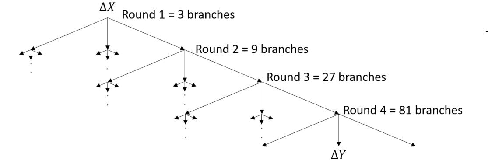

Figure 3: Simplified 4-round difference branching.

<span id="page-5-1"></span>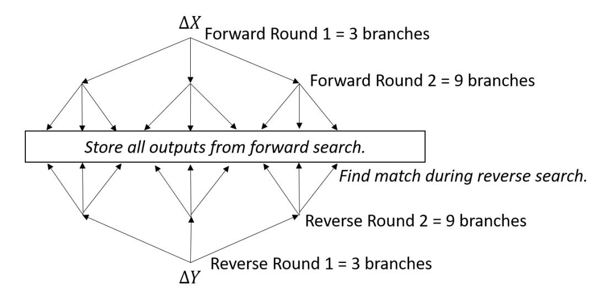

Figure 4: Simplified 4-round difference branching with meet-in-the-middle.

#### 3. GPU-Accelerated Framework for Differential Search

This section provides a generic framework for the differential search of block ciphers that leverages the parallel processing power of GPUs. The MITM technique is incorporated into the framework to further enhance search efficiency. We also take other factors into consideration when designing the framework such as the S-box dependency of differential distribution tables (DDT) and CUDA hardware resources of different GPU architectures. These considerations ensure that the proposed framework is applicable to a wide range of block ciphers and GPUs. In the following descriptions,  $\Delta U_n$  and  $\Delta V_n$  denote the  $n^{th}$  nibble of  $\Delta X$  and  $\Delta Y$  respectively. The size of each nibble is equivalent to the size of the S-box being used by the targeted cipher. Other frequently used symbols and variables are summarized in Table 1.

The general idea of the GPU-based search is as follows: The necessary information about the underlying initial input difference will be bootstrapped by the CPU portion and copied to the GPU's memory. Note that all subsequent data required by the search will be computed inside the GPU without having to rely on any further CPU computations. The proposed framework will then start off the clustering process by performing a breadth-first search until the pre-assigned memory limit is reached. The framework will suspend the search at the current level and proceed to the next level in the search tree. This process repeats until the bottom of the search tree is completely enumerated before backtracking and resuming the search at the previous level. This process repeats until the condition-based enumeration has been completed. Finally, the resulting differential probability and the cluster size can be read off the GPU memory.

Table 1: Notation Summary

<span id="page-5-2"></span>

| $\Delta X$                                          | Input difference                                                     |
|-----------------------------------------------------|----------------------------------------------------------------------|
| $\Delta X$                                          | Output difference                                                    |
| $\Delta U$                                          | •                                                                    |
|                                                     | Input difference of a 4-bit nibble                                   |
| $\Delta V$                                          | Output difference of a 4-bit nibble                                  |
| $\delta$                                            | Intermediate difference                                              |
| M                                                   | Message                                                              |
| C                                                   | Ciphertext                                                           |
| AS                                                  | Active S-box                                                         |
| $P_{BOUND}$                                         | Minimum probability of $\Delta X \rightarrow \Delta Y$ to be consid- |
|                                                     | ered                                                                 |
| $P_{AS}$                                            | Estimated probability of $\Delta U \rightarrow \Delta V$             |
| $P_c$                                               | Probability of the differential cluster                              |
| $W_{nibble}()$                                      | Function for calculating number of active S-                         |
|                                                     | boxes                                                                |
| NB                                                  | Number of available branches for the difference                      |
| T                                                   | Virtual thread                                                       |
| GT                                                  | GPU thread                                                           |
| I                                                   | Index for the branch of the difference                               |
| $\alpha$                                            | Forward round in MITM                                                |
| $\beta$                                             | Backward round in MITM                                               |
| $\mu$                                               | Subsection partition that constitutes the execu-                     |
| •                                                   | •                                                                    |
| M                                                   | -                                                                    |
| $\begin{array}{c} \alpha \ \beta \ \mu \end{array}$ | Forward round in MITM Backward round in MITM                         |

#### <span id="page-5-3"></span>3.1. Framework Description

## 3.1.1. Parallelization Model

All four operations (selection, branching, bounding, and pruning) involved in the B&B algorithm are fully parallelized in the proposed model. Parallelization of both bounding and pruning operations is achieved by processing the partial differential results obtained from the selection and branching operations within the same worker thread. The parallelization of the selection operation and its subsequent branching operation can be modeled to span across multiple input differences rather than just one difference (which was previously performed in [18]). Let  $NB_{\Delta X}$  be the number of differential trail branches for a particular input difference,  $\Delta X$ . The bundling of multiple  $\Delta X$  enables the parallelized selection and branching operations to leverage upon the aggregated problem space constituted by individual  $NB_{\Delta X}$ . This in turn maximizes the data-parallel processing capability of the GPU.

Let  $B(\Delta X_k^r)$ , where r is the round-number and k is the index position, denote the function that comprises of the branching, bounding, and pruning operations of B&B that produces the following round's branched partial differential characteristics,

$$\{\Delta X_{(\sum_{l=1}^{k-1} NB_{\Delta X_{l}^{r}})}^{r+1}, \Delta X_{(\sum_{l=1}^{k-1} NB_{\Delta X_{l}^{r}})+1}^{r+1}, \dots,$$

$$\Delta X_{(\sum_{l=1}^{k} NB_{\Delta X_{l}^{r}})-1}^{r+1}, \Delta X_{(\sum_{l=1}^{k} NB_{\Delta X_{l}^{r}})}^{r+1} \}.$$

$$(1)$$

Let  $D_n$  represent a set of differential characteristics after n rounds and  $B(D_n)$  represents the branching operation performed on the set. The complete set of branched differential characteristics,  $\mathbb{D}$  is defined as

{6}------------------------------------------------

$$\mathbb{D} = \{D_0, D_1, D_2, \dots, D_n\},\$$

$$D_0 = \{\Delta X_0\},\$$

$$D_1 = B(D_0),\$$

$$= \bigcup_{\forall \Delta X_k^r \in D_0} B(\Delta X_k^r),\$$

$$D_2 = B(D_1),\$$

$$= \bigcup_{\forall \Delta X_k^r \in D_1} B(\Delta X_k^r),\$$

$$\vdots$$

$$D_n = B(D_{n-1}).$$
(2)

Both work acquisition and distribution strategies factor in the selection of appropriate differential characteristics,  $\Delta X_k^r$  where k is the  $k^{th}$  differential characteristic in  $\mathbb{D}$  after r rounds. Next,

<span id="page-6-0"></span>
$$T_{i}((I_{1}, I_{2}, \dots, I_{AS}), k, r) = (\sum_{l=1}^{k-1} NB_{\Delta X_{l}^{r}}) + \sum_{j=1}^{AS} (I_{j} \times \prod_{n=0}^{j-1} NB_{\Delta U_{n}}[\Delta X_{k}^{r}]),$$
(3)

<span id="page-6-1"></span>
$$I_{n} = \frac{T_{i} - (\sum_{l=1}^{k-1} NB_{\Delta X_{l}^{r}})}{\prod_{j=0}^{n-1} NB_{\Delta U_{j}}[\Delta X_{k}^{r}]} \pmod{NB_{\Delta U_{n}}[\Delta X_{k}^{r}]}, \tag{4}$$

where  $NB_{\Delta U_0} = 1$  and the index sequence  $(I_1, I_2, ..., I_{AS})$ , are used to ensure that a thread,  $T_i$  is working on the correct branches of  $\Delta X_k^r$ , whereas  $NB_{\Delta U_n}[\Delta X_k^r]$  denotes the number of possible partial branches,  $\#\Delta V_n$  for  $\Delta U_n$  of the  $n^{th}$  active S-box of  $\Delta X_k^r$ .

Assuming that a GPU model has an infinite number of threads, parallelization of the B&B algorithm is achieved by first distributing tasks by computing Eq. 3. Meanwhile, threads acquire their tasks by computing the Eq. 4. Branching, bounding, and pruning are then executed sequentially, and the full parallelization of the algorithm is complete. The parallelization model described here resembles a typical breadth-first search. In practice, however, these threads are essentially virtual, whereby GPU threads are mapped to one or multiple virtual worker threads. The mapping of these threads is discussed in the following subsection.

## 3.1.2. Meet-in-the-Middle Approach

For a block size of 32 bits (or equivalently, half the block of a 64-bit Feistel cipher), it is possible to store all  $2^{32}$  possible differences that can be represented as a 32-bit data block. This amounts to  $\approx 4GB$  worth of differential characteristic information in 32-bit floating-point format which takes up to  $4 \times 8 = 32GB$  of memory space. For every additional bit of information that needs to be stored, the memory requirement is doubled. This memory requirement can exceed the capacity of RAM storage and require that the MITM intermediary results be written to secondary memory, i.e. hard disk drives. Nevertheless, storing 64 bits of information is infeasible for current memory storage solutions as a permutation of 64 bits requires

approximately 18 exabytes. The latency for manipulating such a tremendous amount of memory further exacerbates the issue.

In order to practically implement the MITM approach beyond 32 bits, we must reduce the storage requirement for differential characteristics. To achieve this, intermediary characteristics can be encoded using a cell-wise representation as

<span id="page-6-2"></span>
$$[Pos_{\Delta AV_i}, \Delta AV_i, Pos_{\Delta AV_{i+1}}, \Delta AV_{i+1}, \dots, Pos_{\Delta AV_{i+n}}, \Delta AV_{i+n}],$$

$$(5)$$

where  $\Delta AV_i$  is the  $i^{th}$  non-zero nibble, and  $Pos_{\Delta AV_i}$  represents the position of the aforementioned nibble. An illustration of Eq. 5 is given in Figure 5 for a differential characteristic with only 4 nibbles (16 bits). The encoding method will capture all possible permutations of an intermediate difference,  $\Delta Y_{\alpha}$  where  $0 \le AS_{\Delta Y_{\alpha}} \le \nu$ , where  $\nu$  is the limit to the number of active S-boxes for differences being stored in memory. The primary objective of this encoding method is to maximize  $\nu$  with respect to memory size. A visual memory space reference is provided in Figure 6 which depicts the number of active S-boxes and their corresponding number of permutations. Table 2 summarizes the recommended number of active S-boxes with respect to memory feasibility.

<span id="page-6-3"></span>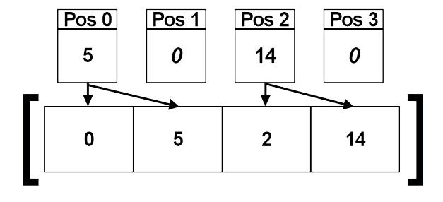

Figure 5: MITM encoding behaviour (Eq. 5) for 4 nibbles (16 bits).

<span id="page-6-4"></span>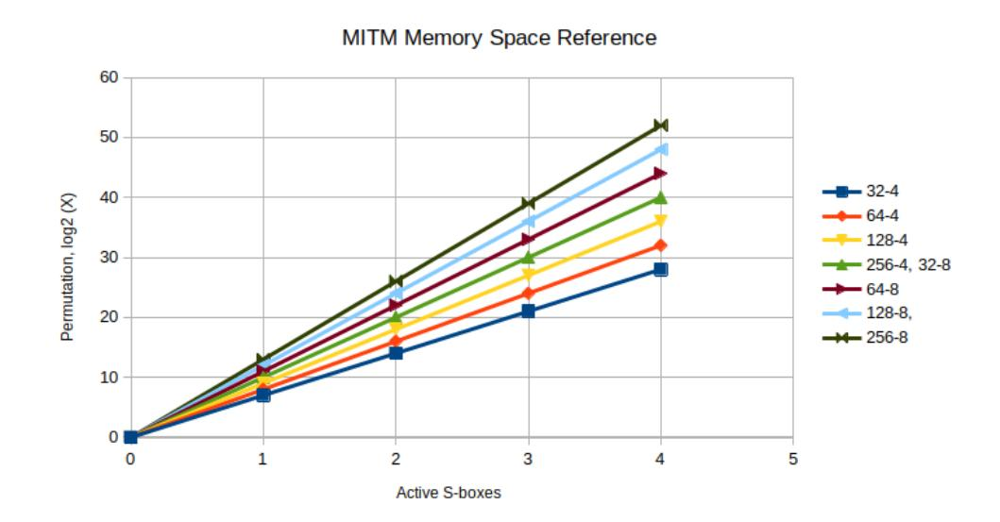

Figure 6: MITM encoding reference based on Eq. 5.

MITM starts by diving the search process into two, namely a forward (encryption)  $\alpha$ -round search and a backward (decryption)  $\beta$ -round search. The  $\alpha$ -round search is basically a standard differential characteristic search. However, the original evaluation of  $\Delta Y_{\alpha}$  during the  $\alpha^{th}$  (final) round is replaced with the cache accumulation of  $\Delta Y_{\alpha}$  and its corresponding probability. The cache is written to RAM using the encoding method described in Eq. 5 and stored for matching purposes.

{7}------------------------------------------------

<span id="page-7-0"></span>Table 2: Recommended  $AS_{\Delta Y_{\alpha}}$  configuration based on Eq. 5.

| Block Cipher Size (bit) | S-box Size (bit) | $AS_{\Delta Y_{\alpha}}$ |
|-------------------------|------------------|--------------------------|
| 32                      | 4                | FULL                     |
| 64                      | 4                | 3/4                      |
| 128                     | 4                | 3                        |
| 256                     | 4                | 3                        |
| 32                      | 8                | 3                        |
| 64                      | 8                | 3                        |
| 128                     | 8                | 2                        |
| 256                     | 8                | 2                        |

Meanwhile, the  $\beta$ -round backward search starts from the output difference,  $\Delta Y$  and works its way to the middle (meeting point). In other words, if  $\Delta X = \Delta X_0$  and  $\Delta Y = \Delta X_n$ , then  $\Delta X_{\alpha} = \Delta X_0$ ,  $\Delta X_{\beta} = \Delta X_n$ ,  $\Delta X_{\alpha}^1 = \Delta X_1$  and  $\Delta X_{\beta}^1 = \Delta X_{n-1}$ . The reverse search phase requires the use of an inverted DDT and permutation based on the targeted block cipher's design. During the  $\beta^{th}$  (final) round,  $\Delta Y_{\beta}$  is encoded using the aforementioned encoding method, then matched with intermediary characteristics stored in the cache. All matched trails improve the overall differential (cluster) probability,  $P_c$ . As the search is divided into two halves, the  $P_{BOUND}$  specified for MITM approach represents both the forward search probability bound,  $P_{BOUND_{\beta}}$  and backward search probability bound,  $P_{BOUND_{\beta}}$ .

#### 3.1.3. Proposed GPU Framework

The proposed parallelization model assumes that there is an infinite number of computing threads,  $T_s$  available to process  $B(D_r)$  for a particular round of differential characteristics, where  $|T_s| = |B(D_r)|$ . In practice, GPU hardware can only accommodate a finite number of threads in a kernel grid. The number of kernel grid threads can be defined as  $|GT_{grid}| =$  $\#\{GT_i: GT_i \in \text{kernel grid}\}\$ , which can be computed as  $|GT_{grid}| =$ thread\_block×block\_num. In the situation where  $|GT_{grid}| < |T_s|$ ,  $GT_{grid}$  has to partition the round differential branching operation,  $B(D_r)$  into equally divided sections known as  $\mu$ -sections where  $\mu = \{\mu_1, \mu_2, \dots, \mu_m\}$  such that  $|GT_{grid}| \times |\mu| \ge |T_s|$  and  $|\mu|$  is minimized. In the event where  $|GT_{grid}| > |T_s|$ , the unused threads will remain idle and wait for the rest of the grid to reach the same state. Only then will the next set of operations continue. Let  $\tau(GT_i)$  be a function that allocates a subset of virtual threads,  $T_r$  to each  $GT_i$ . The thread emulation of  $GT_{grid} = \{GT_1, GT_2, \dots, GT_n\}$  and its corresponding  $\mu$  distribution can be defined as

<span id="page-7-1"></span>
$$\tau(GT_i) = \{ T_{(i-1)|\mu|+1}, T_{(i-1)|\mu|+2}, \dots, T_{(i-1)|\mu|+|\mu|} \},$$

$$\mu_j = \bigcup_{i=1}^n \{ T_{(i-1)|\mu|+j} \},$$
(6)

$$\tau(GT_i) = \{T_i, T_{i+n}, T_{i+2n}, \dots, T_{i+(|\mu|-1)n}\},\$$

$$\mu_j = \bigcup_{i=1}^n \{T_{(j-1)n+i}\}.$$
(7)

<span id="page-7-2"></span>where  $n = |GT_{grid}|$ . Eq. 6 exploits the spatial locality of  $\Delta X_k^r$  required by individual threads to drastically reduce the number of steps required to find  $\Delta X_k^r$  for the remaining  $|\mu| - 1$  steps. Therefore, Eq. 6 is more preferable than Eq. 7 in this framework.

Storing all computational results of  $B(D_r)$  for a large number of  $|B(D_r)|$  in GPU memory is infeasible. To address this issue, we first partition the work units into  $\mu$  subsections,  $\{\mu_i, \mu_{i+1}, \ldots, \mu_{i+l}\}$  of  $B(D_r)$ . These subsections are executed in groups,  $M_k$  where  $M_k = \{\mu_i, \mu_{i+1}, \ldots, \mu_{i+l}\}$  and  $M = \{M_1, M_2, \ldots, M_q\}$ , where q is the number of recursion cycle needed by  $GT_{grid}$  to completely emulate  $T_i$  in a particular round and l is obtained by computing  $\frac{|T_s|}{|GT_{grid}|}$ . This partitioning strategy allows the framework to execute a specified number of  $\mu$  subsections as a group to reduce the overhead of recursion using the GPU's cooperative group feature. The search continues to operate recursively whereby the process of  $B(D_r) \rightarrow (D_{r+1})$  is repeated until  $B(D_s)$ , where s is the target round. The search then moves on to process the next M group from the previous rounds. The relationship between  $\mu$  and M is illustrated in Figure 7.

The aforementioned approach can be viewed as a hybridization of breadth-first and depth-first search. The algorithm starts off in a breadth-first search state which ends after processing an  $|M_k|$  number of  $\mu$  subsections. Then, the algorithm advances one level (depth-first state transition) and continues its breadth-first search strategy to process the first  $|M_k|$  number of  $\mu$  subsections of the current round. The process is repeated until the  $s^{th}$  round, where entire  $\mu$  subsections are computed back-to-back before returning to the  $(s-1)^{th}$ -round. The entire process is repeated in a recursive manner. The choice of  $|M_k|$  depends on GPU memory availability. In general, maximizing  $|M_k|$  (and consequently minimizing |M|) will maximize efficiency. Figure 8 illustrates the entire process.

<span id="page-7-3"></span>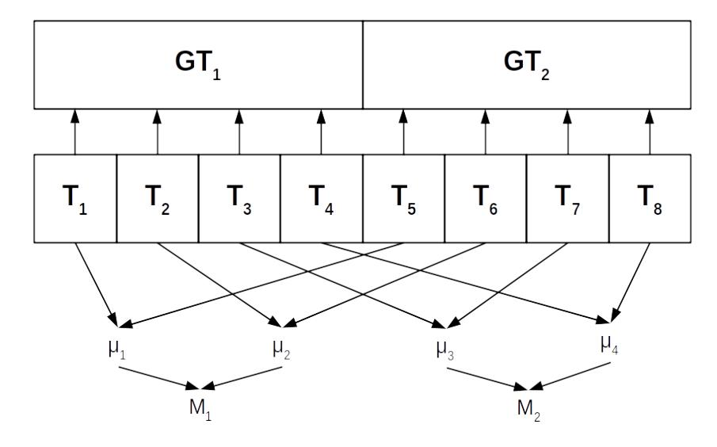

Figure 7: Relationship between  $\mu$  subsections and their corresponding groups M based on Eq. 6.

Eq. 6 requires knowledge of  $|\mu|$  in advance which can be calculated from  $|B(D_{r+1})|$ . For all  $\Delta X_k^{r+1}$ , it is necessary to accumulate  $NB_{\Delta X_k^{r+1}}$  during round r in order to calculate the relevant  $|B(D_{r+1})|$  for round r+1. Since the recursive branching for the next round is carried out for the  $M_k^{r+1}$  group of subsections, only the  $|B(M_k^{r+1})|$  group of subsections is required to be processed

{8}------------------------------------------------

<span id="page-8-0"></span>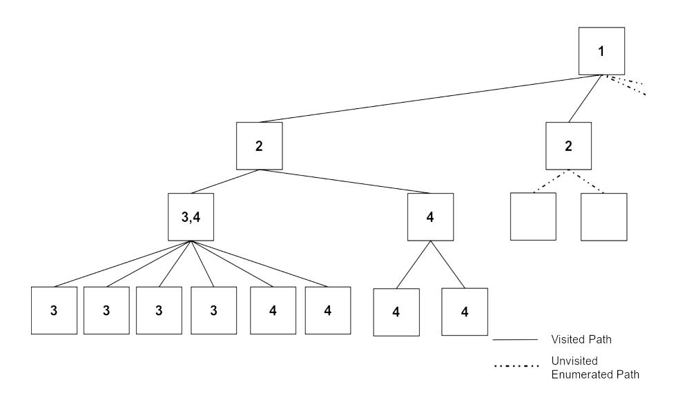

Figure 8: Hybridized breadth and depth-first search example, where  $|M_k| = 2$  and  $GT_i = 2$ .

before advancing each level. For this purpose, all threads within the same block utilize block-level shared memory to accumulate the branching number of  $\Delta X_k^{r+1}$  using the built-in block synchronization function  $atomic\_add(target, value)$ . Then, results accumulated from the block are assembled to form  $|B(D_{r+1})|$ .

Identification of  $\Delta X_k^r$  and its branches  $(I_1, I_2, \ldots, I_{AS})$  during  $B(D_r)$  is performed using a linear search strategy. The search is further divided into three discrete levels, grid-level, block-level, and thread level. The linear search is first executed at the grid level to locate the targeted block, followed by the targeted thread within the identified block, and finally  $\Delta X_k^r$  at the thread level. The GPU thread will omit pruned paths and keep a valid  $\Delta X_k^{r+1}$  counter to facilitate the linear search process. We have also experimented with binary search as an alternative to linear search but did not obtain significant performance improvements.

The cooperative group feature is utilized for its ability to enforce grid-wise synchronization as required by the kernel. Specifically, a grid synchronization barrier is placed immediately after accumulating  $|B(\Delta X_{block})|$  to ensure that it is ready to be referenced in the following round. The synchronization point also ensures the  $global\_has\_operation$  is properly loaded with the correct value, which is used to determine whether to proceed to the next or return to the previous round.

When designing the proposed framework, the limitations of GPU resources in terms of their shared memory capacity, max register count, and max thread count have been taken into consideration. High GPU utilization requires efficient planning on resource utilization to maximize occupancy. Max register count is reduced by optimizing the computation pattern or by forcefully spilling register memory onto local memory using \_\_launch\_bounds\_\_ as provided by CUDA. Frequently accessed data is stored in shared memory or constant memory to improve the latency when accessing the data. However, this cannot be done for larger datasets and needs to be addressed on a caseby-case basis. Despite the increased memory latency caused by the aforementioned techniques, the increase in the GPU occupancy leads to better overall performance for the framework. The simplified version of the complete GPU framework algorithm along with the incorporation of the MITM technique is given in Algorithms 2 and 3. A more detailed algorithm for the <span id="page-8-1"></span>**Algorithm 2** Generalized GPU-accelerated B&B differential search (CPU)

- 1: **Input:** Input difference  $\Delta X$  and output difference  $\Delta Y$ .
- 2: **Output:** Probability  $P_c$  of  $\Delta X \rightarrow \Delta Y$  cluster.
- 3: **procedure** cluster\_search( $\Delta X$ )
- 4: allocate device memory
- 5: setup device memory for round 1
- 6: call kernel CLUSTER\_SEARCH\_GPU\_ $\alpha$
- 7: reset device memory for round 1 and round 2
- setup device memory for round 1call kernel CLUSTER\_SEARCH\_GPU\_β
- 9: call kernel CLUSTER\_SEARCI 10: copy  $P_i$  from device to host
- 11:  $P_c \leftarrow (\sum_{i=1}^{T_{total}} P_i)$
- 12: end procedure

GPU kernel can be found in Appendix A.

#### 4. Performance evaluation

As a proof of concept, we apply the proposed framework described in Section 3.1 on three block ciphers, the 128-bit TRIFLE-BC, 64-bit PRESENT, and 64-bit GIFT. Efficiency and cost comparisons between the GPU framework and its CPU counterpart are performed based on the Google Cloud VM computing environment.

We configure the proposed GPU framework to utilize 1-dimensional blocks for the kernel. Since each block within a grid contains its own block threads, each thread is assigned a unique thread id based on its position in a given grid. This thread id assignment facilitates the process of work distribution and reduction. The number of threads per block (thread\_block) is fixed at 128, SPACE\_THREAD,  $|M_k|$  is fixed at 64 and the number of blocks is maximized. This configuration allows the non-MITM variant of the GPU-accelerated algorithm to achieve a 100% occupancy rate on the Tesla T4 GPU with 64 registers. Meanwhile, the MITM variant requires additional register spilling to achieve 100% occupancy. The permutation table is not loaded into shared memory as its size leads to occupancy reduction.

For the experiments to analyze the financial feasibility of the proposed GPU framework, we select the following parameters:

- $\bullet \ AS_{BOUND} = 4$
- $P_{BOUND_{offset}} = -21/-35$

For all characteristics that form a differential, the minimum probability bound used for the differential search can be calculated as

$$\min P_{char} = 2^{\log(P_{char_{best}}) + P_{BOUND_{offset}}}, \tag{8}$$

where  $P_{char_{best}}$  represents the best probability of a differential characteristic found so far by the serialized B&B algorithm for a given  $\Delta X \xrightarrow{r} \Delta Y$ . The time taken for each device to finish

{9}------------------------------------------------

<span id="page-9-0"></span>Algorithm 3 Simplified GPU-accelerated B&B differential search (kernel)

```
1: Input: Input Difference \Delta X.
 2: Output: Probabilities of \Delta Y that satisfy the searching con-
    strained is accumulated in thread_num amount of P_i.
 3: procedure cluster_search_GPU_(\alpha/\beta)
        while r >= 0 do
 4:
            for 1 to |M_k| do
 5:
                 //Selection, find the correct \Delta X_k^r
 6:
                 Select(thread_id, iter_count)
 7:
                 Branch, Bound, Prune (thread_id, \Delta X_k^r)
 8:
                 if r == last\_round then
 9:
                     if forward then
10:
                         Save to MITM cache array
11:
                     else
12:
                         Match from MITM cache array
13:
                         Save to final result array
14:
                     end if
15:
                 end if
16:
            end for
17:
            Update the state information
18:
            Decide: r \leftarrow r + 1, r \leftarrow r - 1 \text{ or } r \leftarrow r
19:
        end while
20:
21: end procedure
```

computing r rounds is recorded. The cost percentage is then calculated as

$$Cost = \frac{Cost_{device}}{Core Equivalence \times Cost_{ref}} \times 100\%, \qquad (9)$$

Core Equivalence, 
$$CE = \lceil \frac{\text{Time}_{\text{ref}}}{\text{Time}_{\text{device}}} \rceil$$
 (10)

where Cost<sub>ref</sub> refers to the cost of running the search using a reference (benchmark) device, a 3.1 GHz Intel Xeon CascadeLake processor core. For a fair cost comparison, the computational power for both the CPU and GPU experiments should be equal but this is not the case in reality. CPUs have fewer but more powerful computing cores than GPUs which may have up to hundreds of specialized cores. GPUs would then have higher computational power for a specific task such as the differential search as compared to CPUs. Thus, we adopt the notion of core equivalence to compare the cost between CPU and GPU versions of the search. By core equivalence, we are referring to the best-case scenario of running the parallelized CPU version of the differential search but linearly scaling the performance results so that it is as if we performed the experiment on a more powerful CPU (or multiple CPUs) with equivalent computing power as a GPU (albeit with no additional communication or computational overheads taken into consideration).

In other words, experiments were performed using both the proposed GPU framework and its CPU counterpart (described in Section 2.2), then the performance results of the CPU search were linearly scaled to match each GPU device's results. This then provides us with an approximation of the cost required for the CPU search to achieve similar performance as the GPU

search. For example, in Table 3, when performing the search for 5 rounds of TRIFLE-BC, Tesla T4 has a core equivalence of  $\frac{0.266}{0.020} \approx 14$ . To achieve a similar performance as the GPU search, we would need to run the CPU search using 14 Xeon CPUs, which has a cost of  $38.09 \times 14 = 533.26$  USD. Thus, running the GPU search on a Tesla T4 would only require  $\frac{255.50}{533.26} \approx$ 48% of the overall cost. Although core equivalence provides an idealistic performance of the CPU search, it implies that any performance gain from the GPU is actually higher than what is being reported. The benchmark experiments involve constructing a differential for a given block cipher, for a specific iterative differential characteristic where  $AS_{\Delta X} = 1$ ,  $AS_{\Delta X} = 2$ , and  $AS_{\Delta X}$  = 2. The same experiment is repeated for TRIFLE-BC, PRESENT, and GIFT. The run-time information is captured by averaging a total of 100 instances of clustering the same differential. The run-time captured includes the entirety of the algorithm (setup, running, and post-processing).

Note that the Google VM price structure is based on the us-central1 (Iowa) region's on-demand pricing in USD excluding any sustained use discounts<sup>2</sup>. The CascadeLake processors (provided by the C2 machine type) are only available in sets of 4 cores and 16GB memory. Thus, the cost is divided by 4 to obtain the equivalent price of a single CascadeLake processor and 4GB memory. Experimental results for the GPU-accelerated differential search without MITM are provided in Table 3, specifically for TRIFLE-BC. Experimental results for the complete GPU-accelerated differential search with MITM are provided in Tables 4, 5, and 6 for TRIFLE-BC, PRESENT and GIFT respectively. Note that RX in the tables refers to X rounds of the block cipher.

<span id="page-9-1"></span>Table 3: Cost comparison of the non-MITM search on TRIFLE-BC constrained by  $AS_{BOUND} = 4$  and  $P_{BOUND_{offset}} = -21$ .

| Device     | Time(s)                 | Cost/Month | CE | Cost% |  |  |
|------------|-------------------------|------------|----|-------|--|--|
| Xeon Casc  | Xeon CascadeLake 3.1GHz |            |    |       |  |  |
| - R5       | 0.266                   | 38.09      | 1  | 100   |  |  |
| - R10      | 19.271                  | 38.09      | 1  | 100   |  |  |
| - R15      | 151.117                 | 38.09      | 1  | 100   |  |  |
| - R20      | 916.963                 | 38.09      | 1  | 100   |  |  |
| Tesla T4   |                         |            |    |       |  |  |
| - R5       | 0.020                   | 255.50     | 14 | 48    |  |  |
| - R10      | 0.683                   | 255.50     | 29 | 23    |  |  |
| - R15      | 5.157                   | 255.50     | 30 | 22    |  |  |
| - R20      | 29.896                  | 255.50     | 31 | 22    |  |  |
| Tesla V100 |                         |            |    |       |  |  |
| - R5       | 0.005                   | 1810.40    | 54 | 88    |  |  |
| - R10      | 0.265                   | 1810.40    | 73 | 65    |  |  |
| - R15      | 2.084                   | 1810.40    | 73 | 65    |  |  |
| - R20      | 12.706                  | 1810.40    | 73 | 65    |  |  |

In terms of cost, we observe that both the MITM and non-MITM approaches have consistent results. A runtime cost reduction of up to 83% is observed for the GPU-accelerated B&B algorithm with MITM when using a Tesla T4 GPU unit. On the

<span id="page-9-2"></span><sup>&</sup>lt;sup>2</sup>Pricing: https://cloud.google.com/compute/all-pricing

{10}------------------------------------------------

<span id="page-10-0"></span>Table 4: Cost comparison of the MITM search on TRIFLE-BC constrained by  $AS_{Bound} = 4$  and  $P_{BOUND_{offset}} = -21$ .

| Device     | Time(s)        | Cost/Month | CE  | Cost% |  |  |
|------------|----------------|------------|-----|-------|--|--|
| Xeon Casc  | adeLake 3.1GHz |            |     |       |  |  |
| - R10      | 1.61           | 38.09      | 1   | 100   |  |  |
| - R20      | 30.588         | 38.09      | 1   | 100   |  |  |
| - R30      | 197.938        | 38.09      | 1   | 100   |  |  |
| - R40      | 1176.995       | 38.09      | 1   | 100   |  |  |
| Tesla T4   |                |            |     |       |  |  |
| - R10      | 0.045          | 255.50     | 36  | 19    |  |  |
| - R20      | 0.948          | 255.50     | 33  | 20    |  |  |
| - R30      | 6.400          | 255.50     | 31  | 22    |  |  |
| - R40      | 37.912         | 255.50     | 31  | 22    |  |  |
| Tesla V100 | Tesla V100     |            |     |       |  |  |
| - R10      | 0.015          | 1810.40    | 107 | 44    |  |  |
| - R20      | 0.400          | 1810.40    | 76  | 63    |  |  |
| - R30      | 2.973          | 1810.40    | 67  | 71    |  |  |
| - R40      | 18.295         | 1810.40    | 65  | 73    |  |  |

<span id="page-10-1"></span>Table 5: Cost comparison of the MITM search on PRESENT constrained by  $AS_{Bound} = 4$  and  $P_{BOUND_{offset}} = -35$ .

| Device                  | Time(s)    | Cost/Month | CE | Cost% |  |  |
|-------------------------|------------|------------|----|-------|--|--|
| Xeon CascadeLake 3.1GHz |            |            |    |       |  |  |
| - R4                    | 0.001      | 38.09      | 1  | 100   |  |  |
| - R8                    | 0.195      | 38.09      | 1  | 100   |  |  |
| - R16                   | 242.964    | 38.09      | 1  | 100   |  |  |
| Tesla T4                |            |            |    |       |  |  |
| - R4                    | 0.006      | 255.50     | 1  | 671   |  |  |
| - R8                    | 0.014      | 255.50     | 14 | 48    |  |  |
| - R16                   | 6.161      | 255.50     | 40 | 17    |  |  |
| Tesla V100              | Tesla V100 |            |    |       |  |  |
| - R4                    | 0.003      | 1810.40    | 1  | 4753  |  |  |
| - R8                    | 0.005      | 1810.40    | 39 | 122   |  |  |
| - R16                   | 3.140      | 1810.40    | 78 | 61    |  |  |

<span id="page-10-2"></span>Table 6: Cost comparison of the MITM search on GIFT constrained by  $AS_{Bound} = 4$  and  $P_{BOUND_{offset}} = -35$ .

| Device     | Time(s)                 | Cost/Month | CE | Cost% |  |  |
|------------|-------------------------|------------|----|-------|--|--|
| Xeon Casca | Xeon CascadeLake 3.1GHz |            |    |       |  |  |
| - R4       | 0.003                   | 38.09      | 1  | 100   |  |  |
| - R8       | 0.349                   | 38.09      | 1  | 100   |  |  |
| - R16      | 5898.510                | 38.09      | 1  | 100   |  |  |
| Tesla T4   |                         |            |    |       |  |  |
| - R4       | 0.007                   | 255.50     | 1  | 671   |  |  |
| - R8       | 0.020                   | 255.50     | 18 | 37    |  |  |
| - R16      | 156.113                 | 255.50     | 38 | 18    |  |  |
| Tesla V100 |                         |            |    |       |  |  |
| - R4       | 0.003                   | 1810.40    | 1  | 4753  |  |  |
| - R8       | 0.007                   | 1810.40    | 50 | 95    |  |  |
| - R16      | 65.994                  | 1810.40    | 90 | 53    |  |  |

other hand, the cost reduction when using the more powerful (albeit less cost-effective) Tesla V100 GPU achieves a cost reduction of up to 47%. The cost analysis suggests that the GPU

framework is more financially feasible for cloud-based implementations as compared to a regular CPU search. The costs saved from using the proposed GPU framework can be channeled towards more computing resources to conduct a larger scale differential search under a fixed budget.

In terms of performance, a speedup of 2292x is achieved for 20 rounds of TRIFLE-BC using the MITM GPU-accelerated method as compared to the non-MITM CPU method. This is a significant improvement over the previously proposed GPU approach described in [18] which only achieved a speedup of approximately 58x for 20 rounds of TRIFLE-BC when using a MITM GPU-accelerated method. As such, the current proposed GPU framework is approximately 4000% more efficient. When comparing the CPU and GPU implementations of the proposed framework with MITM, the GPU kernel can achieve a speedup of 90x on a high-performance Tesla V100 GPU while still delivering up to 40x on a lower-end Tesla T4 GPU. A similar performance boost can be observed in the non-MITM variant of the GPU framework as well. The performance boost obtained by using the proposed GPU framework leads to more efficient construction of larger differentials, leading to improved differential probability.

The results indicate that the proposed framework can achieve high throughput while being cost-effective, making it useful for cryptanalysts who wish to construct large differentials for statistical attacks. However, the proposed framework is ineffective when used to analyze fewer rounds (such as 4 rounds) because there are too few branches to fully leverage upon the parallel processing power of the GPU. With that said, differential cryptanalysis is typically performed for a large number of rounds, for which the proposed GPU framework is useful. The GPU-accelerated MITM approach is also more computationally feasible for 128-bit or larger block ciphers with a large number of rounds as compared to existing approaches such as MILP or SAT solvers.

#### 4.1. New differential results for existing block ciphers

We use the proposed framework to search for improved differentials for TRIFLE-BC, PRESENT, and GIFT, which are summarized in Tables 7, 8, and 9 respectively.  $AS_{BOUND}$  is set to 4 for all experiments to ensure that the search can complete within a practical amount of time.  $P_{BOUND_{\alpha}}$  and  $P_{BOUND_{\beta}}$  are varied for different block ciphers to account for their distinct differential characteristic distributions. Values for  $P_{BOUND_{offset}}$  fall in the range of [2, 27].

A differential for 13-round GIFT with a probability of  $2^{-60.66}$  has been identified, which is an improvement over the  $2^{-61.3135}$  found in [40]. For 16-round PRESENT, the search has identified a differential with the probability of  $2^{-61.7964}$  which is also an improvement over the  $2^{-62.13}$  differential in [41] and the  $2^{-62.27}$  differential in [21]. Thus, the proposed approach has identified the best differentials to date for 13-round GIFT and 16-round PRESENT. However, differentials for 43-round TRIFLE-BC could not be improved upon despite using more lenient searching bounds as compared to the  $2^{-126.931}$  obtained in [18]. Note that the differentials constructed using the pro-

{11}------------------------------------------------

<span id="page-11-0"></span>Table 7: Differential for 43-round TRIFLE-BC bounded by  $AS_{BOUND} = 4$ ,  $P_{BOUND_{\alpha}} = -87$  and  $P_{BOUND_{\beta}} = -84$ .

| $\Delta X$        | $\Delta Y$        | $P_c$          | # of Trails           |
|-------------------|-------------------|----------------|-----------------------|
| 000000000000b000  | 000000000100000   | $2^{-126.931}$ | $3.381 \times 10^6$   |
| 0000000000000000  | 00100000000000000 |                |                       |
| 0000000000000000  | 0000000200000002  | $2^{-126.931}$ | $3.325 \times 10^6$   |
| b0000000000000000 | 0000000000000000  |                |                       |
| 0000000000000000  | 0020000000200000  | $2^{-126.931}$ | $3.346 \times 10^6$   |
| 00070000000000000 | 0000000000000000  |                |                       |
| 0000000000000000  | 0000000000000000  | $2^{-126.995}$ | $2.501 \times 10^{6}$ |
| 00000b0000000000  | 0000040000000400  |                |                       |

<span id="page-11-1"></span>Table 8: Differential for 16-round PRESENT bounded by  $AS_{BOUND} = 4$ ,  $P_{BOUND_{\alpha}} = -62$  and  $P_{BOUND_{\beta}} = -62$ .

| $\Delta X$        | $\Delta Y$        | $P_c$          | # of Trails           |
|-------------------|-------------------|----------------|-----------------------|
| 000f00000000000f  | 0000050000000500  | $2^{-61.7964}$ | $4.00 \times 10^{10}$ |
| 0000000000001001  | 0404040400000000  | $2^{-62.1757}$ | $4.98 \times 10^{10}$ |
| 00070000000000007 | 00000500000000500 | $2^{-62.2031}$ | $4.62 \times 10^{10}$ |
| 0f00000000000f00  | 0000050000000500  | $2^{-62.5550}$ | $3.50\times10^{10}$   |

<span id="page-11-2"></span>Table 9: Differential for 13-round GIFT bounded by  $AS_{BOUND} = 4$ ,  $P_{BOUND_{\alpha}} = -75$  and  $P_{BOUND_{\beta}} = -75$ .

| $\Delta X$        | $\Delta Y$       | $P_c$          | # of Trails          |
|-------------------|------------------|----------------|----------------------|
| 0f0000000c000000  | 1010808040402020 | $2^{-60.6600}$ | $1.26 \times 10^{5}$ |
| 0c000000e00000000 | 2020101080805050 | $2^{-60.9556}$ | $2.31 \times 10^{5}$ |
| 0e0000000e0000000 | 0202010108080404 | $2^{-61.0341}$ | $2.32 \times 10^{5}$ |
| 0e00000060000000  | 4040202010108080 | $2^{-61.2720}$ | $4.27 \times 10^5$   |

<span id="page-11-3"></span>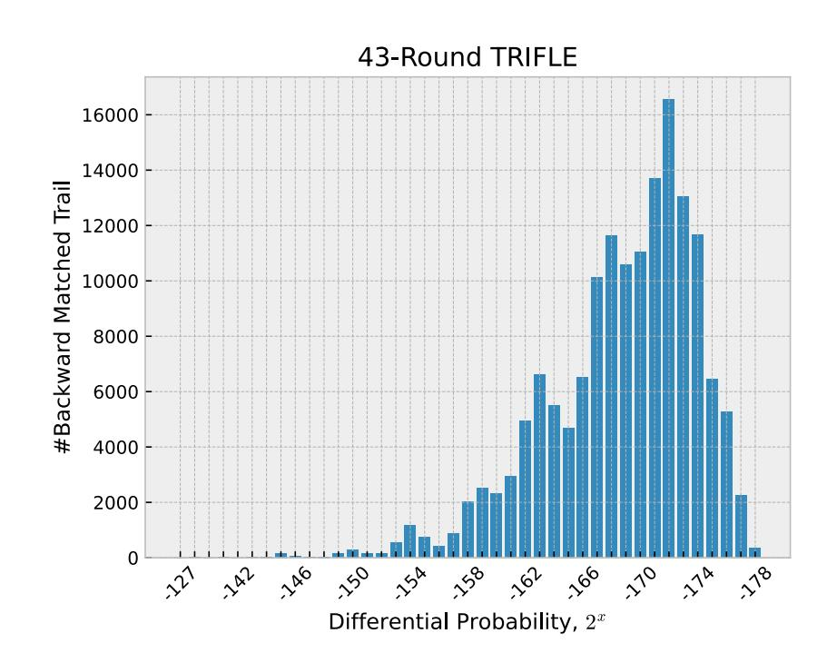

Figure 9: Differential characteristics distribution of the best differential found for 43-Round TRIFLE.

<span id="page-11-4"></span>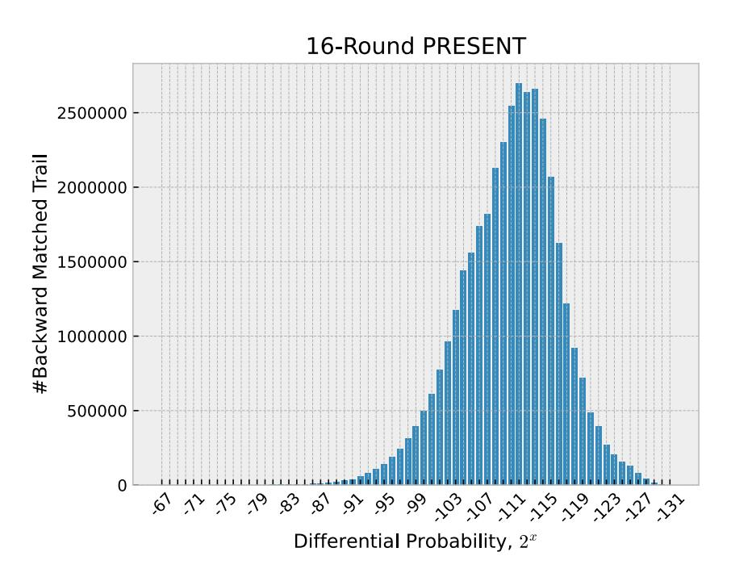

Figure 10: Differential characteristics distribution of the best differential found for 16-Round PRESENT.

posed framework consists of hundreds of thousands (GIFT) to billions (PRESENT) of individual characteristics.

Unfortunately, due to the inherent structure of MITM, it is infeasible to keep track of the exact partial characteristic probabilities and consequently the final characteristic probabilities that are required to assemble a complete differential characteristic distribution. In other words, the full differential distribution cannot be generated due to how the partial  $\alpha$  characteristics are condensed into an intermediary array. On the other hand, collecting data about the differential distribution via the

non-MITM method cannot be completed within a reasonable amount of time. Instead, a partial differential distribution can be constructed based solely on differential characteristics that have been matched during the reverse MITM matching phase. By adopting this approach, we generate the differential distributions of the best differentials for all three ciphers in Figs. 9, 10, and 11. Based on the Figure 9 and Figure 10, we can observe that the best differentials for both TRIFLE and PRESENT have an approximately normal distribution of differential characteristics. However, the peak of the distribution for TRIFLE is

{12}------------------------------------------------

<span id="page-12-0"></span>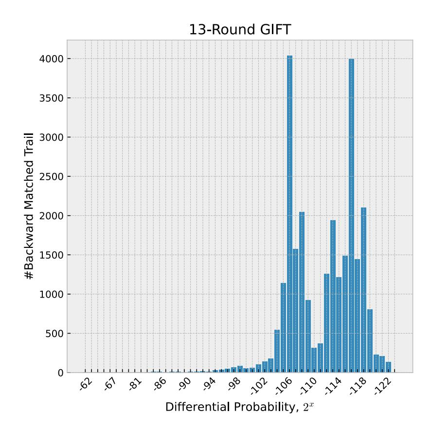

Figure 11: Differential characteristics distribution of the best differential found for 13-Round GIFT.

skewed towards the right, implying that most of the individual differential characteristics have smaller probabilities. This explains why the proposed framework was unable to significantly improve upon existing differential probabilities. Meanwhile, the best differential for GIFT seems to follow a more erratic distribution. This implies that the differential characteristics for GIFT are not as evenly distributed as PRESENT, leading to a bigger improvement in terms of differential probability when a larger differential is constructed.

## 4.2. Efficiency analysis

In the previous subsection, we pushed the differential search algorithm to its limit to construct the largest differential cluster possible within a practical amount of time. This produced the best differentials for PRESENT and GIFT to date. Next, we investigate the trade-off between efficiency and differential probability, focusing only on the clustering phase. After identifying an optimal differential characteristic, we experimented with various probability and S-box bounds while observing their effect on the overall differential probability, the number of trails, and execution time. Experimental results are illustrated in Figures 12a and 12b as well as Tables 10, 11 and 12.

Figure 12a shows the improvements in execution time when the probability bounds were tightened. When the probability bounds for both the first half,  $P_{BOUND_{\alpha}}$  and the second half,  $P_{BOUND_{\alpha}}$  of the MITM search went beyond the  $2^{-50}$  mark, the search completed within 1 second for all three ciphers. As expected, the decrease in execution time corresponds to a decrease in the number of trails within a differential cluster as shown in Figure 12b. We note that after the  $2^{-65}$  mark, no differential cluster could be constructed for TRIFLE-BC as the bounds were too strict. With a probability bound of  $2^{-40}$ , the cluster sizes for PRESENT and GIFT were approximately 81000 and 12 respectively.

Finally, efficiency analysis results with respect to the overall differential probability,  $P_C$  are tabulated in Tables 10, 11 and 12 for TRIFLE-BC, PRESENT and GIFT respectively. For both PRESENT and GIFT, we were still able to obtain differentials with higher probability than previous work in 14ms and 9ms respectively when  $P_{BOUND} = 2^{-40}$  and  $AS_{BOUND} = 3$ . For TRIFLE-BC, we found that using an S-box limit of  $AS_{BOUND} = 3$  rather than 4 would produce the same results in approximately 31s as opposed to 79s.

Based on these findings, we provide the following recommendations for future researchers who want to utilize the proposed algorithm in their cryptanalysis efforts:

- The use of  $AS_{BOUND} = 3$  and tighter  $P_{BOUND}$  is sufficient to produce usable findings within a matter of seconds. These settings can be used for preliminary experiments or rapid assessment of block cipher security.
- The use of  $AS_{BOUND} = 4$  and relaxed  $P_{BOUND}$  can be used to push the limits of the differential search after first identifying an optimal differential characteristic for clustering. These settings can be used when searching or constructing the best differential possible for key-recovery purposes.

<span id="page-12-1"></span>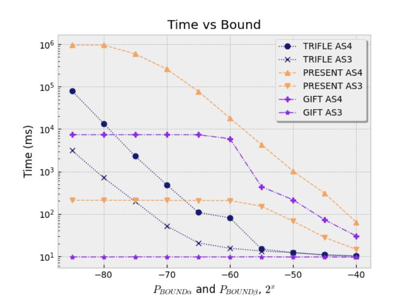

(a) Execution time vs probability bound

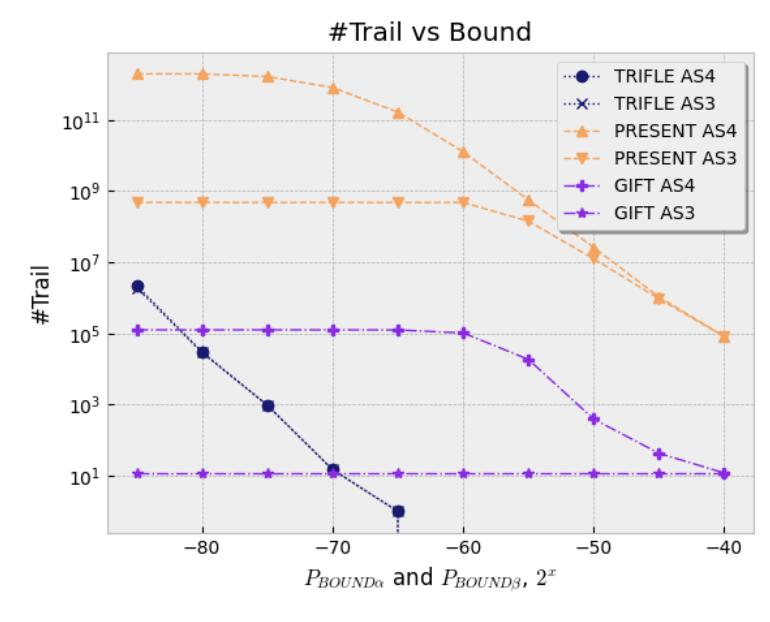

(b) Number of trails vs probability bound

Figure 12: Execution time, trail size and probability bound analysis

{13}------------------------------------------------

## 5. Conclusion

In this paper, we proposed a new GPU-accelerated branchand-bound framework for differential search. It is a highly efficient, automated approach for block cipher security evaluation. The proposed framework was optimized for GPU parallel processing to achieve a substantial speedup when constructing large differentials (differentials that consist of a large number of individual characteristics). Compared to existing GPU approaches, the proposed framework is more practical adaptable to different GPUs and block ciphers. When compared to the original CPU-based non-MITM search, the proposed framework achieves a speedup of approximately 2292x. We demonstrate its practicality by applying the proposed framework on three different block ciphers, 128-bit TRIFLE-BC, 64-bit PRESENT, and 64-bit GIFT. Experimental results indicate that the proposed GPU-accelerated algorithm can achieve up to a 90x speedup as compared to an equivalent single-core CPU algorithm. In terms of financial cost evaluated using Google Cloud VM, the proposed framework achieves savings of up to 83% when compared to a CPU setup with equivalent throughput. Therefore, the proposed GPU framework is both faster and cheaper than its CPU counterpart. The proposed framework can be used to effectively identify large differentials with higher differential probabilities, which can then be used in statistical-based attacks against existing block ciphers. In theory, the proposed framework also allows the utilization of existing CPU-GPU heterogeneous computing clusters as the entire search can be performed entirely on the GPU. Thus, a separate differential search can be conducted on the CPU without interference. As additional contributions, we have also identified the best differentials to date for 16-round PRESENT and 13-round GIFT, with differential probabilities of 2<sup>−</sup>61.<sup>7964</sup> and 2<sup>−</sup>60.<sup>66</sup> respectively. We also show that the proposed GPU search is practical for 128-bit block ciphers with a large number of rounds by constructing large differentials for 43 rounds of 128-bit TRIFLE-BC.

## Acknowledgment

This work is supported in part by the Ministry of Higher Education Malaysia through the Fundamental Research Grant Scheme with Project Code: FRGS/1/2019/ICT05/USM/02/1. It is also partially supported by the National Natural Science Foundation of China under Grant No. 61702212 and the Fundamental Research Funds for the Central Universities under Grant No. CCNU19TS017. The final authenticated version of the manuscript has been published in the Journal of Information Security and Applications and is available at [https:](https://doi.org/10.1016/j.jisa.2021.103087) [//doi.org/10.1016/j.jisa.2021.103087](https://doi.org/10.1016/j.jisa.2021.103087).

# References

- <span id="page-13-0"></span>[1] E. Rescorla, [The Transport Layer Security \(TLS\) Protocol Version 1.3,](https://www.rfc-editor.org/info/rfc8446) Tech. Rep. RFC8446 (Aug. 2018). [doi:10.17487/RFC8446](https://doi.org/10.17487/RFC8446). URL <https://www.rfc-editor.org/info/rfc8446>
- <span id="page-13-1"></span>[2] D. Shaw, [The Camellia Cipher in OpenPGP,](https://www.rfc-editor.org/info/rfc5581) Tech. Rep. RFC5581 (Jun. 2009). [doi:10.17487/rfc5581](https://doi.org/10.17487/rfc5581). URL <https://www.rfc-editor.org/info/rfc5581>

- <span id="page-13-2"></span>[3] T. Ylonen, C. Lonvick, [The Secure Shell \(SSH\) Transport Layer Protocol,](https://www.rfc-editor.org/info/rfc4253) Tech. Rep. RFC4253 (Jan. 2006). [doi:10.17487/rfc4253](https://doi.org/10.17487/rfc4253). URL <https://www.rfc-editor.org/info/rfc4253>
- <span id="page-13-3"></span>[4] B. J. Mohd, T. Hayajneh, A. V. Vasilakos, A survey on lightweight block ciphers for low-resource devices: Comparative study and open issues, Journal of Network and Computer Applications 58 (2015) 73–93. [doi:](https://doi.org/10.1016/j.jnca.2015.09.001) [10.1016/j.jnca.2015.09.001](https://doi.org/10.1016/j.jnca.2015.09.001).
- <span id="page-13-4"></span>[5] J. H. Kong, L.-M. Ang, K. P. Seng, A comprehensive survey of modern symmetric cryptographic solutions for resource constrained environments, Journal of Network and Computer Applications 49 (2015) 15–50. [doi:10.1016/j.jnca.2014.09.006](https://doi.org/10.1016/j.jnca.2014.09.006).
- <span id="page-13-5"></span>[6] NIST, [Submission Requirements and Evaluation Criteria for the](https://csrc.nist.gov/projects/lightweight-cryptography) [Lightweight Cryptography Standardization Process](https://csrc.nist.gov/projects/lightweight-cryptography) (Aug. 2018). URL [https://csrc.nist.gov/projects/](https://csrc.nist.gov/projects/lightweight-cryptography) [lightweight-cryptography](https://csrc.nist.gov/projects/lightweight-cryptography)
- <span id="page-13-6"></span>[7] D. J. Bernstein, J. Buchmann, E. Dahmen (Eds.), Post-Quantum Cryptography, Springer Berlin Heidelberg, 2009. [doi:10.1007/](https://doi.org/10.1007/978-3-540-88702-7) [978-3-540-88702-7](https://doi.org/10.1007/978-3-540-88702-7).
- <span id="page-13-7"></span>[8] E. Biham, A. Shamir, Diff[erential cryptanalysis of DES-like cryp](http://link.springer.com/10.1007/BF00630563)[tosystems,](http://link.springer.com/10.1007/BF00630563) Journal of Cryptology 4 (1) (1991) 3–72. [doi:10.1007/](https://doi.org/10.1007/BF00630563) [BF00630563](https://doi.org/10.1007/BF00630563). URL <http://link.springer.com/10.1007/BF00630563>
- <span id="page-13-8"></span>[9] A. Bogdanov, L. R. Knudsen, G. Leander, C. Paar, A. Poschmann, M. J. B. Robshaw, Y. Seurin, C. Vikkelsoe, [PRESENT: An Ultra-](http://link.springer.com/10.1007/978-3-540-74735-2_31)[Lightweight Block Cipher,](http://link.springer.com/10.1007/978-3-540-74735-2_31) in: P. Paillier, I. Verbauwhede (Eds.), Cryptographic Hardware and Embedded Systems - CHES 2007, Vol. 4727, Springer Berlin Heidelberg, Berlin, Heidelberg, 2007, pp. 450– 466. [doi:10.1007/978-3-540-74735-2\\_31](https://doi.org/10.1007/978-3-540-74735-2_31). URL [http://link.springer.com/10.1007/](http://link.springer.com/10.1007/978-3-540-74735-2_31) [978-3-540-74735-2\\_31](http://link.springer.com/10.1007/978-3-540-74735-2_31)
- <span id="page-13-9"></span>[10] J. Guo, T. Peyrin, A. Poschmann, M. Robshaw, The LED Block Cipher, Cryptographic Hardware and Embedded Systems – CHES 2011 (2011) 326–341.
- <span id="page-13-10"></span>[11] S. Banik, S. K. Pandey, T. Peyrin, Y. Sasaki, S. M. Sim, Y. Todo, [GIFT: A Small Present,](http://link.springer.com/10.1007/978-3-319-66787-4_16) in: W. Fischer, N. Homma (Eds.), Cryptographic Hardware and Embedded Systems – CHES 2017, Vol. 10529, Springer International Publishing, Cham, 2017, pp. 321–345. [doi:10.1007/978-3-319-66787-4\\_16](https://doi.org/10.1007/978-3-319-66787-4_16). URL [http://link.springer.com/10.1007/](http://link.springer.com/10.1007/978-3-319-66787-4_16) [978-3-319-66787-4\\_16](http://link.springer.com/10.1007/978-3-319-66787-4_16)
- <span id="page-13-11"></span>[12] X. Lai, J. L. Massey, S. Murphy, [Markov Ciphers and Di](http://link.springer.com/10.1007/3-540-46416-6_2)fferential Crypt[analysis,](http://link.springer.com/10.1007/3-540-46416-6_2) in: D. W. Davies (Ed.), Advances in Cryptology — EURO-CRYPT '91, Vol. 547, Springer Berlin Heidelberg, Berlin, Heidelberg, 1991, pp. 17–38. [doi:10.1007/3-540-46416-6\\_2](https://doi.org/10.1007/3-540-46416-6_2). URL [http://link.springer.com/10.1007/3-540-46416-6\\_2](http://link.springer.com/10.1007/3-540-46416-6_2)
- <span id="page-13-12"></span>[13] R. Ankele, S. Kolbl, Mind the gap - a closer look at the security of block ¨ ciphers against differential cryptanalysis, in: C. Cid, M. J. Jacobson Jr. (Eds.), Selected Areas in Cryptography – SAC 2018, Springer International Publishing, Cham, 2019, pp. 163–190.
- <span id="page-13-13"></span>[14] S. Erich, D. Jack, S. Horst, M. Martin, November 19 | [Top 500 Super](https://www.top500.org/lists/2019/11/)[computer](https://www.top500.org/lists/2019/11/) (Nov. 2019). URL <https://www.top500.org/lists/2019/11/>
- <span id="page-13-14"></span>[15] M. Stevens, P. Karpman, T. Peyrin, [Freestart Collision for Full SHA-1,](http://link.springer.com/10.1007/978-3-662-49890-3_18) in: M. Fischlin, J.-S. Coron (Eds.), Advances in Cryptology – EUROCRYPT 2016, Vol. 9665, Springer Berlin Heidelberg, Berlin, Heidelberg, 2016, pp. 459–483. [doi:10.1007/978-3-662-49890-3\\_18](https://doi.org/10.1007/978-3-662-49890-3_18). URL [http://link.springer.com/10.1007/](http://link.springer.com/10.1007/978-3-662-49890-3_18) [978-3-662-49890-3\\_18](http://link.springer.com/10.1007/978-3-662-49890-3_18)
- <span id="page-13-15"></span>[16] R. Szerwinski, T. Guneysu, [Exploiting the Power of GPUs for](http://link.springer.com/10.1007/978-3-540-85053-3_6) ¨ [Asymmetric Cryptography,](http://link.springer.com/10.1007/978-3-540-85053-3_6) in: E. Oswald, P. Rohatgi (Eds.), Cryptographic Hardware and Embedded Systems – CHES 2008, Vol. 5154, Springer Berlin Heidelberg, Berlin, Heidelberg, 2008, pp. 79–99. [doi:10.1007/978-3-540-85053-3\\_6](https://doi.org/10.1007/978-3-540-85053-3_6). URL [http://link.springer.com/10.1007/](http://link.springer.com/10.1007/978-3-540-85053-3_6) [978-3-540-85053-3\\_6](http://link.springer.com/10.1007/978-3-540-85053-3_6)
- <span id="page-13-16"></span>[17] S. A. Manavski, [CUDA Compatible GPU as an E](http://ieeexplore.ieee.org/document/4728256/)fficient Hardware Ac[celerator for AES Cryptography,](http://ieeexplore.ieee.org/document/4728256/) in: 2007 IEEE International Conference on Signal Processing and Communications, IEEE, Dubai, United Arab Emirates, 2007, pp. 65–68. [doi:10.1109/ICSPC.2007.4728256](https://doi.org/10.1109/ICSPC.2007.4728256). URL <http://ieeexplore.ieee.org/document/4728256/>
- <span id="page-13-17"></span>[18] W.-Z. Yeoh, J. S. Teh, J. Chen, [Automated Search for Block Cipher](http://link.springer.com/10.1007/978-3-030-55304-3_9)

{14}------------------------------------------------

- Diff[erentials: A GPU-Accelerated Branch-and-Bound Algorithm,](http://link.springer.com/10.1007/978-3-030-55304-3_9) in: J. K. Liu, H. Cui (Eds.), Information Security and Privacy, Vol. 12248, Springer International Publishing, Cham, 2020, pp. 160–179. [doi:10.1007/978-3-030-55304-3\\_9](https://doi.org/10.1007/978-3-030-55304-3_9).
- URL [http://link.springer.com/10.1007/](http://link.springer.com/10.1007/978-3-030-55304-3_9) [978-3-030-55304-3\\_9](http://link.springer.com/10.1007/978-3-030-55304-3_9)
- <span id="page-14-0"></span>[19] M. Matsui, [On correlation between the order of S-boxes and the strength](http://link.springer.com/10.1007/BFb0053451) [of DES,](http://link.springer.com/10.1007/BFb0053451) in: G. Goos, J. Hartmanis, J. van Leeuwen, A. De Santis (Eds.), Advances in Cryptology — EUROCRYPT'94, Vol. 950, Springer Berlin Heidelberg, Berlin, Heidelberg, 1995, pp. 366–375. [doi:10.1007/](https://doi.org/10.1007/BFb0053451) [BFb0053451](https://doi.org/10.1007/BFb0053451).
  - URL <http://link.springer.com/10.1007/BFb0053451>
- <span id="page-14-1"></span>[20] A. Biryukov, V. Velichkov, [Automatic Search for Di](http://link.springer.com/10.1007/978-3-319-04852-9_12)fferential Trails in [ARX Ciphers,](http://link.springer.com/10.1007/978-3-319-04852-9_12) in: D. Hutchison, T. Kanade, J. Kittler, J. M. Kleinberg, F. Mattern, J. C. Mitchell, M. Naor, O. Nierstrasz, C. Pandu Rangan, B. Steffen, M. Sudan, D. Terzopoulos, D. Tygar, M. Y. Vardi, G. Weikum, J. Benaloh (Eds.), Topics in Cryptology – CT-RSA 2014, Vol. 8366, Springer International Publishing, Cham, 2014, pp. 227–250. [doi:10.1007/978-3-319-04852-9\\_12](https://doi.org/10.1007/978-3-319-04852-9_12).
  - URL [http://link.springer.com/10.1007/](http://link.springer.com/10.1007/978-3-319-04852-9_12) [978-3-319-04852-9\\_12](http://link.springer.com/10.1007/978-3-319-04852-9_12)
- <span id="page-14-2"></span>[21] J. Chen, J. Teh, Z. Liu, C. Su, A. Samsudin, Y. Xiang, [Towards Accu](http://ieeexplore.ieee.org/document/7914659/)[rate Statistical Analysis of Security Margins: New Searching Strategies](http://ieeexplore.ieee.org/document/7914659/) for Diff[erential Attacks,](http://ieeexplore.ieee.org/document/7914659/) IEEE Transactions on Computers 66 (10) (2017) 1763–1777. [doi:10.1109/TC.2017.2699190](https://doi.org/10.1109/TC.2017.2699190).
- URL <http://ieeexplore.ieee.org/document/7914659/>
- <span id="page-14-3"></span>[22] Z. Chen, J. Chen, W. Meng, J. S. Teh, P. Li, B. Ren, Analysis of differential distribution of lightweight block cipher based on parallel processing on GPU, Journal of Information Security and Applications 55 (2020) 102565. [doi:10.1016/j.jisa.2020.102565](https://doi.org/10.1016/j.jisa.2020.102565).
- <span id="page-14-4"></span>[23] N. Mouha, Q. Wang, D. Gu, B. Preneel, Diff[erential and Linear Crypt](http://link.springer.com/10.1007/978-3-642-34704-7_5)[analysis Using Mixed-Integer Linear Programming,](http://link.springer.com/10.1007/978-3-642-34704-7_5) in: C.-K. Wu, M. Yung, D. Lin (Eds.), Information Security and Cryptology, Vol. 7537, Springer Berlin Heidelberg, Berlin, Heidelberg, 2012, pp. 57–76. [doi:10.1007/978-3-642-34704-7\\_5](https://doi.org/10.1007/978-3-642-34704-7_5). URL [http://link.springer.com/10.1007/](http://link.springer.com/10.1007/978-3-642-34704-7_5) [978-3-642-34704-7\\_5](http://link.springer.com/10.1007/978-3-642-34704-7_5)
- <span id="page-14-5"></span>[24] S. Siwei, H. Lei, W. Meiqin, W. Peng, Q. Kexin, M. Xiaoshuang, S. Danping, S. Ling, F. Kai, Towards Finding the Best Characteristics of Some Bit-oriented Block Ciphers and Automatic Enumeration of (Related-key) Differential and Linear Characteristics with Predefined Properties, Cryptology ePrint Archive, Report 2014/747 (2014).
- <span id="page-14-6"></span>[25] M. Nicky, P. Bart, [Towards Finding Optimal Di](https://eprint.iacr.org/2013/328)fferential Characteris[tics for ARX: Application to Salsa20,](https://eprint.iacr.org/2013/328) Cryptology ePrint Archive, Report 2013/328 (2013). URL <https://eprint.iacr.org/2013/328>
- <span id="page-14-7"></span>[26] L. Sun, W. Wang, M. Wang, Accelerating the search of differential and linear characteristics with the sat method, IACR Transactions on Symmetric Cryptology 1 (2021) 269–315, [https://eprint.iacr.org/2021/](https://eprint.iacr.org/2021/213) [213](https://eprint.iacr.org/2021/213). [doi:10.46586/tosc.v2021.i1.269-315](https://doi.org/10.46586/tosc.v2021.i1.269-315).
- <span id="page-14-8"></span>[27] A. Borisenko, M. Haidl, S. Gorlatch, [A GPU parallelization of](http://link.springer.com/10.1007/s11227-016-1784-x) [branch-and-bound for multiproduct batch plants optimization,](http://link.springer.com/10.1007/s11227-016-1784-x) The Journal of Supercomputing 73 (2) (2017) 639–651. [doi:10.1007/](https://doi.org/10.1007/s11227-016-1784-x) [s11227-016-1784-x](https://doi.org/10.1007/s11227-016-1784-x).
- <span id="page-14-9"></span>URL <http://link.springer.com/10.1007/s11227-016-1784-x> [28] N. Melab, I. Chakroun, M. Mezmaz, D. Tuyttens, [A GPU-accelerated](http://ieeexplore.ieee.org/document/6337851/) [Branch-and-Bound Algorithm for the Flow-Shop Scheduling Problem,](http://ieeexplore.ieee.org/document/6337851/) in: 2012 IEEE International Conference on Cluster Computing, IEEE, Beijing, China, 2012, pp. 10–17. [doi:10.1109/CLUSTER.2012.18](https://doi.org/10.1109/CLUSTER.2012.18). URL <http://ieeexplore.ieee.org/document/6337851/>
- <span id="page-14-10"></span>[29] M. E. Lalami, D. El-Baz, [GPU Implementation of the Branch and Bound](http://ieeexplore.ieee.org/document/6270853/) [Method for Knapsack Problems,](http://ieeexplore.ieee.org/document/6270853/) in: 2012 IEEE 26th International Parallel and Distributed Processing Symposium Workshops & PhD Forum, IEEE, Shanghai, China, 2012, pp. 1769–1777. [doi:10.1109/IPDPSW.](https://doi.org/10.1109/IPDPSW.2012.219) [2012.219](https://doi.org/10.1109/IPDPSW.2012.219).
  - URL <http://ieeexplore.ieee.org/document/6270853/>

[opre.42.6.1042](http://pubsonline.informs.org/doi/abs/10.1287/opre.42.6.1042)

<span id="page-14-11"></span>[30] B. Gendron, T. G. Crainic, [Parallel Branch-and-Branch Algorithms:](http://pubsonline.informs.org/doi/abs/10.1287/opre.42.6.1042) [Survey and Synthesis,](http://pubsonline.informs.org/doi/abs/10.1287/opre.42.6.1042) Operations Research 42 (6) (1994) 1042–1066. [doi:10.1287/opre.42.6.1042](https://doi.org/10.1287/opre.42.6.1042). URL [http://pubsonline.informs.org/doi/abs/10.1287/](http://pubsonline.informs.org/doi/abs/10.1287/opre.42.6.1042)

- <span id="page-14-12"></span>[31] J. Gmys, M. Mezmaz, N. Melab, D. Tuyttens, [A GPU-based](https://linkinghub.elsevier.com/retrieve/pii/S0167819116000387) [Branch-and-Bound algorithm using Integer–Vector–Matrix data](https://linkinghub.elsevier.com/retrieve/pii/S0167819116000387) [structure,](https://linkinghub.elsevier.com/retrieve/pii/S0167819116000387) Parallel Computing 59 (2016) 119–139. [doi:](https://doi.org/10.1016/j.parco.2016.01.008) [10.1016/j.parco.2016.01.008](https://doi.org/10.1016/j.parco.2016.01.008).
  - URL [https://linkinghub.elsevier.com/retrieve/pii/](https://linkinghub.elsevier.com/retrieve/pii/S0167819116000387) [S0167819116000387](https://linkinghub.elsevier.com/retrieve/pii/S0167819116000387)
- <span id="page-14-13"></span>[32] J. Gmys, M. Mezmaz, N. Melab, D. Tuyttens, [IVM-Based Work](http://link.springer.com/10.1007/978-3-319-32149-3_51) [Stealing for Parallel Branch-and-Bound on GPU,](http://link.springer.com/10.1007/978-3-319-32149-3_51) in: R. Wyrzykowski, E. Deelman, J. Dongarra, K. Karczewski, J. Kitowski, K. Wiatr (Eds.), Parallel Processing and Applied Mathematics, Vol. 9573, Springer International Publishing, Cham, 2016, pp. 548–558. [doi:10.1007/978-3-319-32149-3\\_51](https://doi.org/10.1007/978-3-319-32149-3_51). URL [http://link.springer.com/10.1007/](http://link.springer.com/10.1007/978-3-319-32149-3_51) [978-3-319-32149-3\\_51](http://link.springer.com/10.1007/978-3-319-32149-3_51)
- <span id="page-14-14"></span>[33] D. Nilanjan, G. Ashrujit, M. Debdeep, P. Sikhar, P. Stjepan, S. Rajat, [TRIFLE](https://csrc.nist.gov/CSRC/media/Projects/Lightweight-Cryptography/documents/round-1/spec-doc/trifle-spec.pdf) (Mar. 2019). URL [https://csrc.nist.gov/CSRC/media/Projects/](https://csrc.nist.gov/CSRC/media/Projects/Lightweight-Cryptography/documents/round-1/spec-doc/trifle-spec.pdf) [Lightweight-Cryptography/documents/round-1/spec-doc/](https://csrc.nist.gov/CSRC/media/Projects/Lightweight-Cryptography/documents/round-1/spec-doc/trifle-spec.pdf) [trifle-spec.pdf](https://csrc.nist.gov/CSRC/media/Projects/Lightweight-Cryptography/documents/round-1/spec-doc/trifle-spec.pdf)
- <span id="page-14-15"></span>[34] D. Steinkraus, I. Buck, P. Simard, [Using GPUs for machine learning al](http://ieeexplore.ieee.org/document/1575717/)[gorithms,](http://ieeexplore.ieee.org/document/1575717/) in: Eighth International Conference on Document Analysis and Recognition (ICDAR'05), IEEE, Seoul, South Korea, 2005, pp. 1115– 1120 Vol. 2. [doi:10.1109/ICDAR.2005.251](https://doi.org/10.1109/ICDAR.2005.251). URL <http://ieeexplore.ieee.org/document/1575717/>
- <span id="page-14-16"></span>[35] P. D. Vouzis, N. V. Sahinidis, [GPU-BLAST: using graphics processors](https://academic.oup.com/bioinformatics/article-lookup/doi/10.1093/bioinformatics/btq644) [to accelerate protein sequence alignment,](https://academic.oup.com/bioinformatics/article-lookup/doi/10.1093/bioinformatics/btq644) Bioinformatics 27 (2) (2011) 182–188. [doi:10.1093/bioinformatics/btq644](https://doi.org/10.1093/bioinformatics/btq644). URL [https://academic.oup.com/bioinformatics/](https://academic.oup.com/bioinformatics/article-lookup/doi/10.1093/bioinformatics/btq644) [article-lookup/doi/10.1093/bioinformatics/btq644](https://academic.oup.com/bioinformatics/article-lookup/doi/10.1093/bioinformatics/btq644)
- <span id="page-14-17"></span>[36] J. Yang, Y. Wang, Y. Chen, [GPU accelerated molecular dynamics](https://linkinghub.elsevier.com/retrieve/pii/S0021999106003172) [simulation of thermal conductivities,](https://linkinghub.elsevier.com/retrieve/pii/S0021999106003172) Journal of Computational Physics 221 (2) (2007) 799–804. [doi:10.1016/j.jcp.2006.06.039](https://doi.org/10.1016/j.jcp.2006.06.039). URL [https://linkinghub.elsevier.com/retrieve/pii/](https://linkinghub.elsevier.com/retrieve/pii/S0021999106003172) [S0021999106003172](https://linkinghub.elsevier.com/retrieve/pii/S0021999106003172)
- <span id="page-14-18"></span>[37] NVIDIA, [CUDA C Programming Guide Version 9.0](https://docs.nvidia.com/cuda/cuda-c-programming-guide/) (Oct. 2019). URL [https://docs.nvidia.com/cuda/](https://docs.nvidia.com/cuda/cuda-c-programming-guide/) [cuda-c-programming-guide/](https://docs.nvidia.com/cuda/cuda-c-programming-guide/)
- <span id="page-14-19"></span>[38] D. Padua (Ed.), [Encyclopedia of Parallel Computing,](http://link.springer.com/10.1007/978-0-387-09766-4) Springer US, Boston, MA, 2011. [doi:10.1007/978-0-387-09766-4](https://doi.org/10.1007/978-0-387-09766-4). URL <http://link.springer.com/10.1007/978-0-387-09766-4>
- <span id="page-14-20"></span>[39] J. Chen, A. Miyaji, C. Su, J. Teh, Improved Diff[erential Characteristic](http://ieeexplore.ieee.org/document/7371529/) [Searching Methods,](http://ieeexplore.ieee.org/document/7371529/) in: 2015 IEEE 2nd International Conference on Cyber Security and Cloud Computing, IEEE, New York, NY, USA, 2015, pp. 500–508. [doi:10.1109/CSCloud.2015.42](https://doi.org/10.1109/CSCloud.2015.42). URL <http://ieeexplore.ieee.org/document/7371529/>
- <span id="page-14-21"></span>[40] H. Chen, R. Zong, X. Dong, Improved Diff[erential Attacks on GIFT-64,](http://link.springer.com/10.1007/978-3-030-41579-2_26) in: J. Zhou, X. Luo, Q. Shen, Z. Xu (Eds.), Information and Communications Security, Vol. 11999, Springer International Publishing, Cham, 2020, pp. 447–462. [doi:10.1007/978-3-030-41579-2\\_26](https://doi.org/10.1007/978-3-030-41579-2_26). URL [http://link.springer.com/10.1007/](http://link.springer.com/10.1007/978-3-030-41579-2_26) [978-3-030-41579-2\\_26](http://link.springer.com/10.1007/978-3-030-41579-2_26)
- <span id="page-14-22"></span>[41] M. Wang, Y. Sun, E. Tischhauser, B. Preneel, [A Model for Structure At](http://link.springer.com/10.1007/978-3-642-34047-5_4)[tacks, with Applications to PRESENT and Serpent,](http://link.springer.com/10.1007/978-3-642-34047-5_4) in: A. Canteaut (Ed.), Fast Software Encryption, Vol. 7549, Springer Berlin Heidelberg, Berlin, Heidelberg, 2012, pp. 49–68. [doi:10.1007/978-3-642-34047-5\\_4](https://doi.org/10.1007/978-3-642-34047-5_4). URL [http://link.springer.com/10.1007/](http://link.springer.com/10.1007/978-3-642-34047-5_4) [978-3-642-34047-5\\_4](http://link.springer.com/10.1007/978-3-642-34047-5_4)

{15}------------------------------------------------

#### Appendix A - GPU Kernel Algorithm

```
\overline{\text{cond2}} \leftarrow |B(\Delta X_{block_v})| \neq 0
                                                                                             40:
Algorithm 4 GPU Kernel.
                                                                                                                         if cond1 \land cond2 then
                                                                                             41:
                                                                                                                              bsum -= |B(\Delta X_{block_n})|
 1: Input: Input Difference \Delta X.
                                                                                             42:
 2: Output: Probabilities of \Delta Y that satisfy the searching constrained
                                                                                                                              break
                                                                                             43:
     is accumulated in thread_num amount of P_i.
                                                                                                                         end if
                                                                                             44:
 3: Adjustable Parameters:
                                                                                                                         v \leftarrow v+1
                                                                                             45:
                                                                                                                     end for
                                                                                             46:
        1. AS_{BOUND}: Maximum of number of active s-boxes for \Delta Y.
                                                                                                                     block_ptr \leftarrow v
                                                                                             47:
        2. P_{BOUND}: Maximum probability of \Delta X \rightarrow \Delta Y.
                                                                                                                     bsum_t \leftarrow \sum_{v=0}^{thread\_ptr-1} |B(\Delta X_{thread_v})|
                                                                                             48:
        3. P_{AS}: Estimated probability of a nibble \Delta U \rightarrow \Delta V.
                                                                                                                     t_{t} \leftarrow block_ptr \times THREAD_BLOCK
                                                                                             49:
 4: Assumption:
                                                                                                                     if block_ptr == BLOCK_NUM then
                                                                                             50:
                                                                                                                          dx_ptr \leftarrow MAX_PATH_ROUND
                                                                                             51:
        1. Non-active nibble (s-boxes) will have a difference value of
            zero. Thus, an attempt to differentially substitute it will
                                                                                             52:
                                                                                                                     else
            yield 0 \rightarrow 0 with a probability of 1.
                                                                                             53:
                                                                                                                          //Find the correct thread
                                                                                                                          if init_block_ptr == block_ptr then
                                                                                             54:
 5: procedure CLUSTER_SEARCH_GPU_(\alpha/\beta)
                                                                                                                               bsum \leftarrow bsum_t
                                                                                             55:
 6:
         global memory: init \alpha/\beta permutation table
                                                                                                                          else
                                                                                             56:
 7:
         shared memory: init \alpha/\beta DDT, branch size table
                                                                       \triangleright GT_{grid} - 1
                                                                                             57:
                                                                                                                               //bsum remained unchanged
         thread_id_default \leftarrow (GT_i - 1)
 8:
         r \leftarrow 0
                                                                                                                               thread_ptr \leftarrow t_temp
 9:
                                                                                             58:
         dx_ptr \leftarrow 0
10:
                                                                                             59:
                                                                                                                          end if
         cur\_iter \leftarrow -1
11:
                                                                                                                          init_thread_ptr ← thread_ptr
                                                                                             60:
12:
         MAX\_PATH\_ROUND \leftarrow |GT_{grid}| \times |M_k|
                                                                                                                          v \leftarrow thread_ptr
                                                                                             61:
         while r \ge 0 do
13:
                                                                                                                          while True do
                                                                                                                                                       Guaranteed to find
                                                                                             62:
              if cur_iter == -1 then
14:
                                                                                                                               bsum += |B(\Delta X_{thread_v})|
                                                                                             63:
                  \text{cur\_iter} \leftarrow \lceil \frac{|B(D_r)|}{|GT_{grid}|} \rceil
15:
                                                                                 \triangleright |\mu|
                                                                                                                               cond1 \leftarrow cur\_thread\_id < bsum)
                                                                                             64:
                  //T_i pointer
16:
                                                                                                                               cond2 \leftarrow |B(\Delta X_{thread_v})| \neq 0
                                                                                             65:
                   cur_thread_id ← thread_id_default × cur_iter
17:
                                                                                                                               if cond1 \land cond2 then
                                                                                             66:
18:
              end if
                                                                                                                                    bsum -= |B(\Delta X_{block_v})|
                                                                                             67:
              has_operation \leftarrow False
19:
                                                                                                                                    break
                                                                                             68:
              //Valid \Delta X^{r+1} is saved at the front
20:
                                                                                                                               end if
              thread\_dx\_num \leftarrow 0
                                                                                             69:
21:
              thread_ptr \leftarrow \lfloor \frac{\mathrm{dx\_ptr}}{|M_k|} \rfloor
                                                                                                                               v \leftarrow v + 1
                                                                                             70:
22:
              block_ptr \leftarrow \frac{grid\_thread\_ptr}{THREAD\_BLOCK}
                                                                                             71:
                                                                                                                          end while
23:
                                                                                                                          thread_ptr \leftarrow v
              loop_limit \leftarrow (cur_iter < |M_k|? cur_iter : |M_k|)
                                                                                             72:
24:
              for cur_loop \leftarrow 1 to loop_limit do
25:
                                                                                             73:
                                                                                                                          //Find \Delta X_k^r
                  //Selection, find the correct \Delta X_{\text{dx,ptr}+1}^r
                                                                                                                         if init_thread_ptr == thread_ptr then bsum \leftarrow \sum_{\nu=0}^{dx_{-}ptr-1} |B(\Delta X_{\nu})|
26:
                                                                                             74:
                   if dx_ptr < MAX_PATH_ROUND then
27:
                                                                                             75:
                       nb_{temp} \leftarrow (\sum_{\nu=0}^{dx_{-ptr}} |B(\Delta X_{\nu})|)
28:
                                                                                             76:
                                                                                                                          else
                       if cur_thread_id < nb_temp then</pre>
29:
                                                                                                                               //bsum remained unchanged
                                                                                             77:
                            //Skip if dx_ptr does not need to change
30:
                                                                                                                               dx_ptr \leftarrow thread_ptr \times |M_k|
                                                                                             78:
31:
                            goto Branch_Bound_Pruning
                                                                                                                          end if
                                                                                             79:
                       end if
32:
                                                                                             80:
                                                                                                                          v \leftarrow dx_ptr
                       //Find the correct block
33:
                                                                                                                          while True do
                                                                                                                                                       Guaranteed to find
                                                                                             81:
                       bsum \leftarrow \sum_{v=0}^{block-ptr-1} |B(\Delta X_{block_v})|
34:
                                                                                                                               bsum += |B(\Delta X_v)|
                                                                                             82:
                       init\_block\_ptr \leftarrow block\_ptr
35:
                                                                                                                               if (cur_thread_id< bsum) then</pre>
                                                                                             83:
                       v \leftarrow block\_ptr
36:
                                                                                                                                    bsum -= |B(\Delta X_{block_v})|
37:
                       for v < BLOCK_NUM do
                                                                                             84:
38:
                            bsum += |B(\Delta X_{block_v})|
                                                                                                                                    break
                                                                                             85:
                            cond1 ← cur_thread_id < bsum
39:
                                                                                                                               end if
                                                                                             86:
                                                                                                                               v \leftarrow v + 1
                                                                                             87:
                                                                                                                          end while
```

88: 89:

90:

91:

92:

 $dx_ptr \leftarrow v$ 

//Selection of B&B done

end if

end if

{16}------------------------------------------------

| 93:          | //Branch, Bound and Pruning                                                                                                 |      |                                                                         |
|--------------|-----------------------------------------------------------------------------------------------------------------------------|------|-------------------------------------------------------------------------|
| 94:          | if dx_ptr < MAX_PATH_ROUND then                                                                                             |      |                                                                         |
| 95:          | has_operation $\leftarrow$ True                                                                                             | 146: | if $r \neq LAST_ROUND - 1$ then                                         |
| 96:          | $p_i \leftarrow \Pr(\Delta X^0 \to \Delta X^r_{dx\_ptr})$                                                                   | 147: | sum up thread's branch as thread_bsum                                   |
| 97:          | $vl \leftarrow cur\_thread\_id - \sum_{v=0}^{dx\_ptr-1}  B(\Delta X_v) $                                                    | 148: | $ B(\Delta X_{thread}) _{thread} + \text{thread\_bsum}$                 |
| 98:          | $div_vl \leftarrow 1$                                                                                                       | 149: | //atomic_add the following                                              |
| 99:          | //Branch to predetermined child node                                                                                        | 150: | $ B(\Delta X_{block_{blockIdx.x}}) _r \leftarrow \text{thread\_bsum}$   |
| 100:         | <b>for</b> each $\Delta AU_i$ from $\Delta X_{dx\_ptr}^r$ <b>do</b>                                                         | 151: | _syncthreads()                                                          |
| 101:         | $I_i \leftarrow \lfloor \text{vl/div\_vl} \rfloor mod NB_i$                                                                 | 152: | if threadIdx. $x == 0$ then                                             |
| 102:         | $\Delta AV_i \leftarrow \text{sorted DDT}[\Delta AU_i][I_i]$                                                                | 153: | //atomic_add the following                                              |
| 103:         | update $p_i$                                                                                                                | 154: | $ B(\Delta X_{block}) _r \leftarrow  B(\Delta X_{block_{block}ldx,x}) $ |
| 104:         | $\overrightarrow{\operatorname{div}_{-}}\operatorname{vl} \leftarrow \operatorname{div}_{-}\operatorname{vl} \times NB_{i}$ | 155: | end if                                                                  |
| 105:         | end for                                                                                                                     | 156: | end if                                                                  |
| 106:         | $not\_last\_round \leftarrow r \neq LAST\_ROUND - 1$                                                                        |      | //Prepare to advance,return, or terminate the round                     |
| 107:         | if $\alpha$ _SEARCH $\vee$ not_last_round then                                                                              | 157: | is_last_r $\leftarrow r == LAST_ROUND-1$                                |
| 108:         | Permutate $\Delta X_{dx\_ptr}^r$ into $\Delta X^{r+1}$                                                                      | 158: |                                                                         |
| 109:         | end if                                                                                                                      | 159: | $cond1 \leftarrow is\_last\_r \land cur\_iter == 0$                     |
| 110:         | if $r \neq \text{LAST\_ROUND} - 1$ then                                                                                     | 160: | cond2 ← ¬ global_has_operation                                          |
| 110.         | //Bounding and pruning                                                                                                      | 161: | if ¬ is_last_r ∧ global_has_operation then                              |
| 111:         | $AS_{\Delta X^{r+1}} \leftarrow W_{nibble}(\Delta X^{r+1})$                                                                 | 162: | //Advance a round                                                       |
| 112.         | if $AS_{\Delta X^{r+1}} \leftarrow W_{nibble}(\Delta X)$ $if AS_{\Delta X^{r+1}} \leq AS_{BOUND} \text{ then}$              | 163: | $iter\_store_r \leftarrow cur\_iter$                                    |
|              | $//\text{Est. Pr}(\Delta X^{r+1})$                                                                                          | 164: | $dx_ptr_store_r \leftarrow dx_ptr$                                      |
| 114:         | $p_{\Lambda X^{r+1}} \leftarrow (P_{AS})^{AS_{\Delta X^{r+1}}}$                                                             | 165: | $thread\_id\_store_r \leftarrow cur\_thread\_id$                        |
| 115:         | 1 ,                                                                                                                         | 166: | $r \leftarrow r + 1$                                                    |
| 116:         | //Est. Remaining $Pr(\Delta X)$                                                                                             | 167: | $dx_ptr \leftarrow 0$                                                   |
| 117:         | $p_r \leftarrow (P_{AS})^{\text{LAST\_ROUND}-r-2}$                                                                          | 168: | $cur_iter \leftarrow -1$ ▶ Indicate need initialization                 |
| 118:         | $p_{est} \leftarrow [p_{\Delta X^r}, p_{\Delta X^{r+1}}, p_r]$                                                              | 169: | //Reset atomic_add value "Next" round                                   |
| 119:         | if $p_{est} \geq P_{BOUND}$ then                                                                                            | 170: | $ B(\Delta X_{thread_{theadIdx,x}}) _r \leftarrow 0$                    |
| 120:         | $temp \leftarrow thread\_ptr \times  M_k $                                                                                  | 171: | $ B(\Delta X_{block_{blockIdx.x}}) _r \leftarrow 0$                     |
| 121:         | $loc \leftarrow temp + thread_dx_num$                                                                                       | 172: | $ B(\Delta X_{block}) _r \leftarrow 0$                                  |
| 122:         | $\Delta X_{loc}^{r+1} \leftarrow X^{r+1}$                                                                                   | 173: | else if cond1 ∨ cond2 then                                              |
| 123:         | inc(thread_dx_num)                                                                                                          | 174: | //Return to previous round                                              |
| 124:         | end if                                                                                                                      | 175: | while cur_iter $== 0$ do                                                |
| 125:         | end if                                                                                                                      | 176: | $r \leftarrow r - 1$                                                    |
| 126:         | //Invalid $\Delta X^{r+1}$ is ignored                                                                                       | 177: | if $r < 0$ then                                                         |
| 127:         | else                                                                                                                        | 178: | break                                                                   |
| 128:         | if $AS_{\Delta X^{r+1}} \leq AS_{MITM}$ then                                                                                | 179: | end if                                                                  |
| 129:         | if $\alpha$ _SEARCH then                                                                                                    | 180: | $cur\_iter \leftarrow iter\_store_r$                                    |
| 130:         | <b>atomic_add</b> $p_i$ to $P_{MITM}$                                                                                       | 180: | $dx_ptr \leftarrow dx_ptr_store_r$                                      |
| 131:         | else                                                                                                                        | 181: | $cur\_thread\_id \leftarrow thread\_id\_store_r$                        |
| 132:         | //BACKWARD_SEARCH                                                                                                           | 183: | //Reset atomic_add value "Next" round                                   |
| 133:         | $P_i \leftarrow P_i + P_{MITM} \times p_i$                                                                                  |      |                                                                         |
| 134:         | end if                                                                                                                      | 184: | $ B(\Delta X_{thread^{blockIdx.x}}) _r \leftarrow 0$                    |
| 135:         | end if                                                                                                                      | 185: | $ B(\Delta X_{block_{blockIdx.x}}) _r \leftarrow 0$                     |
| 136:         | end if                                                                                                                      | 186: | $ B(\Delta X_{block}) _r \leftarrow 0$                                  |
| 137:         | end if                                                                                                                      | 187: | end while                                                               |
| 137.         | cur_thread_id ← cur_thread_id + 1                                                                                           | 188: | else                                                                    |
| 136.<br>139: | end for                                                                                                                     | 189: | //Repeat last round if cur_iter ≠ 0                                     |
| 139:<br>140: | cur_thread_id ← cur_thread_id - 1                                                                                           | 190: | cur_thread_id ← cur_thread_id + 1                                       |
|              |                                                                                                                             | 191: | end if                                                                  |
| 141:         | cur_iter ← cur_iter - loop_limit                                                                                            | 192: | end while                                                               |
| 142:         | //Prepare relevant information                                                                                              | 193: | end procedure                                                           |
| 143:         | if thread_id_default == 0 then                                                                                              |      |                                                                         |
| 144:         | global_has_operation ← has_operation                                                                                        |      |                                                                         |
| 145:         | end if                                                                                                                      |      |                                                                         |

{17}------------------------------------------------

Table 10: Efficiency analysis for TRIFLE-BC

| P<br>c<br>(<br>log<br>2<br>)<br>-12<br>6.9<br>31<br>-<br>12 | Ti<br>me<br>(m<br>s)<br>31<br>23<br>7 | P<br>BO<br>UN<br>D<br>α/β<br>(<br>log<br>2<br>)<br>-85<br>- | AS<br>=<br>3    | P<br>c<br>(<br>log<br>2<br>)<br>-12<br>6.9<br>31<br>-<br>12 | Ti<br>me<br>(m<br>s)<br>79<br>84<br>6 | P<br>BO<br>UN<br>D<br>α/β<br>(<br>log<br>2<br>)<br>-85<br>- | AS<br>=<br>4    |
|-------------------------------------------------------------|---------------------------------------|-------------------------------------------------------------|-----------------|-------------------------------------------------------------|---------------------------------------|-------------------------------------------------------------|-----------------|
| 6.9<br>32                                                   | 14                                    | 80                                                          |                 | 6.9<br>32                                                   | 13<br>57<br>4                         | 80                                                          |                 |
| -<br>12<br>6.9<br>34                                        | 19<br>4                               | -<br>75                                                     |                 | -<br>12<br>6.9<br>34                                        | 2<br>29<br>5                          | -<br>75                                                     |                 |
| -<br>12<br>6.9<br>66                                        | 5<br>1                                | -<br>70                                                     |                 | -<br>12<br>6.9<br>66                                        | 4<br>83                               | -<br>70                                                     |                 |
| -<br>12<br>7                                                | 2<br>0                                | -<br>65                                                     | Re<br>su<br>lts | -<br>12<br>7                                                | 10<br>7                               | -<br>65                                                     | Re<br>su<br>lts |
| -                                                           | 15                                    | -<br>60                                                     |                 | -                                                           | 7<br>9                                | -<br>60                                                     |                 |
| -                                                           | 13                                    | -<br>55                                                     |                 | -                                                           | 14                                    | -<br>55                                                     |                 |
| -                                                           | 12                                    | -<br>50                                                     |                 | -                                                           | 12                                    | -<br>50                                                     |                 |
| -                                                           | 10                                    | -<br>45                                                     |                 | -                                                           | 10                                    | -<br>45                                                     |                 |
| -                                                           | 9                                     | -<br>40                                                     |                 | -                                                           | 10                                    | -<br>40                                                     |                 |

Table 11: Efficiency analysis for PRESENT

| P<br>c<br>(<br>log<br>2<br>) | P<br>BO<br>Ti<br>UN<br>me<br>D<br>α/β<br>(m<br>(<br>log<br>s)<br>2<br>) | AS<br>=<br>3    | P<br>c<br>(<br>log<br>2<br>) | Ti<br>me<br>(m<br>s) | P<br>BO<br>UN<br>D<br>α/β<br>(<br>log<br>2<br>) | AS<br>=<br>4    |
|------------------------------|-------------------------------------------------------------------------|-----------------|------------------------------|----------------------|-------------------------------------------------|-----------------|
| -6<br>1.8<br>14<br>7         | 20<br>-85<br>8                                                          |                 | -6<br>1.7<br>96<br>4         | 96<br>13<br>42       | -85                                             |                 |
| -<br>61<br>.81<br>47         | 2<br>-<br>80<br>08                                                      |                 | -<br>61<br>.79<br>64         | 9<br>61<br>36<br>5   | -<br>80                                         |                 |
| -<br>61<br>.81<br>47         | 2<br>-<br>75<br>07                                                      |                 | -<br>61<br>.79<br>64         | 5<br>94<br>22<br>2   | -<br>75                                         |                 |
| -<br>61<br>.81<br>47         | 2<br>-<br>70<br>07                                                      |                 | -<br>61<br>.79<br>64         | 2<br>60<br>50<br>3   | -<br>70                                         |                 |
| -<br>61<br>.81<br>47         | 2<br>-<br>65<br>05                                                      | Re<br>su<br>lts | -<br>61<br>.79<br>64         | 7<br>75<br>44        | -<br>65                                         | Re<br>su<br>lts |
| -<br>61<br>.81<br>47         | 2<br>-<br>60<br>05                                                      |                 | -<br>61<br>.79<br>65         | 18<br>17<br>6        | -<br>60                                         |                 |
| -<br>61<br>.81<br>47         | -<br>15<br>55<br>1                                                      |                 | -<br>61<br>.79<br>67         | 4<br>27<br>6         | -<br>55                                         |                 |
| -<br>61<br>.81<br>57         | -<br>6<br>50<br>6                                                       |                 | -<br>61<br>.79<br>89         | 10<br>13             | -<br>50                                         |                 |
| -<br>61<br>.82<br>8          | -<br>2<br>45<br>7                                                       |                 | -<br>61<br>.81<br>76         | 3<br>02              | -<br>45                                         |                 |
| -<br>61<br>.95<br>9          | -<br>14<br>40                                                           |                 | -<br>61<br>.95<br>74         | 6<br>3               | -<br>40                                         |                 |

Table 12: Efficiency analysis for GIFT

<span id="page-17-0"></span>

| c<br>(<br>log<br>2<br>) | P                | Ti<br>me<br>(m<br>s) | P<br>BO<br>UN<br>D<br>α/β<br>(<br>log<br>2<br>) | AS<br>=<br>3    | P<br>c<br>(<br>log<br>2<br>) | Ti<br>me<br>(m<br>s) | P<br>BO<br>UN<br>D<br>α/β<br>(<br>log<br>2<br>) | AS<br>=<br>4    |
|-------------------------|------------------|----------------------|-------------------------------------------------|-----------------|------------------------------|----------------------|-------------------------------------------------|-----------------|
|                         | -60<br>.66<br>01 | 9                    | -85                                             |                 | -60<br>.66                   | 73<br>55             | -85                                             |                 |
| -                       | 60<br>.66<br>01  | 9                    | -<br>80                                         |                 | -<br>60<br>.66               | 7<br>34<br>1         | -<br>80                                         |                 |
| -                       | 60<br>.66<br>01  | 9                    | -<br>75                                         |                 | -<br>60<br>.66               | 7<br>35<br>2         | -<br>75                                         |                 |
| -                       | 60<br>.66<br>01  | 9                    | -<br>70                                         |                 | -<br>60<br>.66               | 7<br>34<br>9         | -<br>70                                         |                 |
| -                       | 60<br>.66<br>01  | 9                    | -<br>65                                         | Re<br>su<br>lts | -<br>60<br>.66               | 7<br>33<br>7         | -<br>65                                         | Re<br>su<br>lts |
| -                       | 60<br>.66<br>01  | 9                    | -<br>60                                         |                 | -<br>60<br>.66               | 5<br>92<br>9         | -<br>60                                         |                 |
| -                       | 60<br>.66<br>01  | 9                    | -<br>55                                         |                 | -<br>60<br>.66               | 4<br>35              | -<br>55                                         |                 |
| -                       | 60<br>.66<br>01  | 9                    | -<br>50                                         |                 | -<br>60<br>.66               | 2<br>13              | -<br>50                                         |                 |
| -                       | 60<br>.66<br>01  | 9                    | -<br>45                                         |                 | -<br>60<br>.66<br>01         | 7<br>2               | -<br>45                                         |                 |
| -                       | 60<br>.66<br>01  | 9                    | -<br>40                                         |                 | -<br>60<br>.66<br>01         | 2<br>9               | -<br>40                                         |                 |