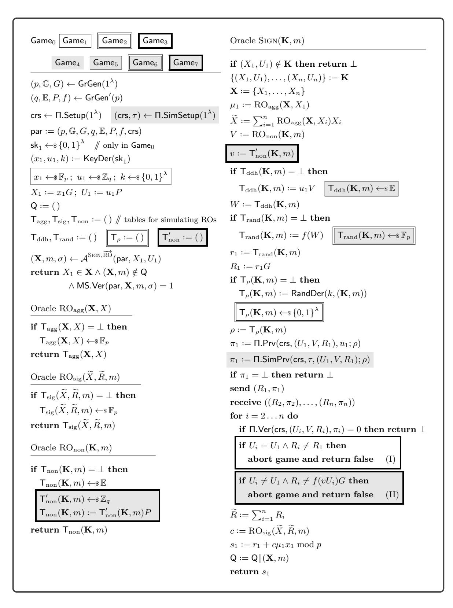

# **MuSig-DN: Schnorr Multi-Signatures with Verifiably Deterministic Nonces**

Jonas Nick<sup>1</sup> , Tim Ruffing<sup>1</sup> , Yannick Seurin<sup>2</sup> , and Pieter Wuille<sup>1</sup>

> <sup>1</sup> Blockstream jonas@n-ck.net crypto@timruffing.de pieter@wuille.net <sup>2</sup> ANSSI, Paris, France yannick.seurin@m4x.org

> > October 15, 2020

**Abstract.** MuSig is a multi-signature scheme for Schnorr signatures, which supports key aggregation and is secure in the plain public key model. Standard derandomization techniques for discrete logarithm-based signatures such as RFC 6979, which make the signing procedure immune to catastrophic failures in the randomness generation, are not applicable to multi-signatures as an attacker could trick an honest user into producing two different partial signatures with the same randomness, which would reveal the user's secret key.

In this paper, we propose a variant of MuSig in which signers generate their nonce deterministically as a pseudorandom function of the message and all signers' public keys and prove that they did so by providing a non-interactive zero-knowledge proof to their cosigners. The resulting scheme, which we call MuSig-DN, is the first Schnorr multi-signature scheme with deterministic signing. Therefore its signing protocol is robust against failures in the randomness generation as well as attacks trying to exploit the statefulness of the signing procedure, e.g., virtual machine rewinding attacks. As an additional benefit, a signing session in MuSig-DN requires only two rounds instead of three as required by all previous Schnorr multi-signatures including MuSig. To instantiate our construction, we identify a suitable algebraic pseudorandom function and provide an efficient implementation of this function as an arithmetic circuit. This makes it possible to realize MuSig-DN efficiently using zero-knowledge proof frameworks for arithmetic circuits which support inputs given in Pedersen commitments, e.g., Bulletproofs. We demonstrate the practicality of our technique by implementing it for the secp256k1 elliptic curve used in Bitcoin.

**Keywords:** digital signatures, multi-signatures, Schnorr signatures, MuSig, non-interactive zero-knowledge proofs, deterministic nonces

# **1 Introduction**

# **1.1 Background**

Multi-signatures. A multi-signature scheme [\[IN83\]](#page-26-0) allows a group of signers, each having their own secret/public key pair (sk*<sup>i</sup> ,* pk*<sup>i</sup>* ), to collaboratively compute a short signature *σ* on a common message *m*, ideally with a size independent of the number of the signers. This single signature can be verified given the message *m* and the set of public keys {pk<sup>1</sup> *, . . . ,* pk*n*}, convincing a verifier that every signer approved message *m*.

Multi-signature schemes require great caution to prevent *rogue-key attacks*, where the adversary, who is assumed to be able to choose its public key arbitrarily, computes it as a function of honest users' public keys, allowing it to produce forgeries easily. Many early multi-signature schemes succumbed to such rogue-key attacks [\[OO93,](#page-27-0) [LHL95,](#page-26-1) [Har94,](#page-26-2) [HMP95,](#page-26-3) [Lan96,](#page-26-4) [MH96,](#page-26-5) [OO99\]](#page-27-1). As rogue-key attacks typically imply that the adversary does not know the secret key associated to its maliciously computed public key, one method for preventing them is to assume the existence of certification authority (CA) and require users to prove knowledge of their secret keys during public key registration. This is usually formalized as the *knowledge of secret key* (KOSK) assumption [\[Bol03,](#page-25-0) [LOS](#page-26-6)+06, [RY07\]](#page-27-2): the security model captures this registration step by demanding that the adversary provides the secret key for any (adversarially chosen) public key involved in its forgery. However, existing standards for registration protocols do not mandate that CAs require proofs of knowledge, and some settings (typically, decentralized applications such as cryptocurrencies) even exclude CAs and public key infrastructures by design. Hence, it is highly preferable to design multi-signature schemes provably secure in the *plain public-key model*, meaning that participants can create their public keys locally without the need to register them with a CA or any other central party in order to participate in the protocol.

The very first multi-signature scheme provably secure in the plain public-key model [\[MOR01\]](#page-27-3) relies on a dedicated key generation phase run by all potential signers, after which the set of potential signers is necessarily static and known in advance to verifiers. A major step was made by Bellare and Neven [\[BN06\]](#page-25-1) who proposed the first scheme (later referred to as BN in this paper) provably secure in the plain public-key model and without a dedicated key setup protocol.

Key Aggregation. Motivated by the foreseen integration of Schnorr signatures [\[Sch91\]](#page-27-4) in Bitcoin [\[WNR20\]](#page-28-0), Maxwell *et al.* proposed MuSig [\[MPSW19\]](#page-27-5), a multi-signature protocol for Schnorr signatures provably secure in the plain public-key model. A prominent feature of this scheme (that BN [\[BN06\]](#page-25-1) was lacking) is *key aggregation*, meaning that the public keys of all cosigners can be aggregated into a single public key pkf. As a result, verifiers do not need to be given the explicit list of all participants' public keys anymore, and they can just use the aggregate key instead. In fact, verifiers do not even need to know that pk<sup>f</sup> is an aggregate key and that signatures for this key are jointly generated by multiple signers. This enhances the privacy of the signers and allows for a clean separation between simple Schnorr signature verification (understood by ordinary Bitcoin nodes as part of the consensus rules) and the more complex interactive multi-signature protocol (only supported by Bitcoin wallets that generate MuSig signatures), which moreover makes it easier to deploy modifications to the multi-signature protocol. While these advantages apply directly to the case that funds are jointly controlled by multiple parties, "Taproot" [\[WNT20\]](#page-28-1), an extension proposed to be integrated in Bitcoin

together with Schnorr signatures, applies the same advantages optimistically also to complex spending policies (colloquially referred to as *smart contracts*): in the common case that all involved parties are willing to cooperate, they can rely on a multi-signature without even revealing the existence of the smart contract, or even the involvement of more than one party, to the public.

The MuSig Scheme. Let us recall the Schnorr signature scheme. Given an (additively denoted) group  $\mathbb G$  of prime order p with generator G, a secret/public key pair is a pair  $(x,X)\in\mathbb F_p\times\mathbb G$  where X=xG. To sign a message m, the signer draws a nonce r uniformly at random in  $\mathbb F_p$ , computes R=rG,  $c=\mathsf{H}_{\mathrm{sig}}(X,R,m)$ , and  $s=r+cx \mod p$ , where  $\mathsf{H}_{\mathrm{sig}}$  is some hash function, and returns  $\sigma=(R,s)$ . A purported signature (R,s) for message m and public key X is valid iff  $sG=R+\mathsf{H}_{\mathrm{sig}}(X,R,m)X$ .

In MuSig, the aggregate key associated with a group of n signers, each holding a Schnorr key pair  $(x_i, X_i = x_i G)$ , is defined as  $\widetilde{X} = \sum_{i=1}^n \mu_i X_i$ , where  $\mu_i$  is a coefficient computed by hashing all participants' public keys as  $\mu_i = \mathsf{H}_{\mathrm{agg}}(\{X_1, \dots, X_n\}, X_i)$  for some hash function  $\mathsf{H}_{\mathrm{agg}}$ . In order to jointly sign some message m, each signer generates a partial nonce  $R_i = r_i G$  and sends it to the other signers. Then, each signer computes the aggregate nonce  $\widetilde{R} = \sum_{i=1}^n R_i$  and a partial signature  $s_i = r_i + c\mu_i x_i \mod p$  where  $c = \mathsf{H}_{\mathrm{sig}}(\widetilde{X}, \widetilde{R}, m)$  and sends  $s_i$  to other signers. The multi-signature is  $(\widetilde{R}, s)$  where  $s = \sum_{i=1}^n s_i$ . A multi-signature  $(\widetilde{R}, s)$  for message m and aggregate key  $\widetilde{X}$  can be verified exactly as a standard Schnorr signature.

Importantly, signers "commit" to their partial nonce by sending  $t_i := \mathsf{H}_{com}(R_i)$  in the initial communication round, where  $\mathsf{H}_{com}$  is a hash function. The first version of [MPSW19] omitted the commitment round (resulting in a 2-round protocol) but it was found by Drijvers et al. [DEF<sup>+</sup>19] that the corresponding security proof was flawed. Drijvers et al. further showed that omitting this commitment round makes the scheme vulnerable to sub-exponential attacks based on Wagner's algorithm for the generalized birthday problem [Wag02]. Maxwell et al. later revised [MPSW19] to provide a security proof for the 3-round version which includes the commitment round. See also [BDN18] for an independent security proof of 3-round MuSig.

DETERMINISTIC NONCES. Discrete logarithm-based signatures are well-known to be vulnerable to non-uniform generation of the nonce r [NS02, NS03], and there have been plenty of real-world vulnerabilities and attacks exploiting bad randomness in nonces [HDWH12, BHH+14, CEV14, Val14, BH19]. In particular, if the same nonce is used to sign two different messages, the secret key can immediately be computed from the two signatures. This can be prevented by using deterministic nonce generation, meaning the nonce r is computed by applying a pseudorandom function (PRF) keyed with some secret key k to the message m [Bar97, Wig97, MNPV99, Por13].<sup>3</sup> This method does not only protect against failures in the randomness generation (e.g., due to a improperly seeded system PRG) but also against rewinding attacks, in which the attacker tries to obtain signatures with the same nonce on two different messages by resetting the signing algorithm, which potentially runs in a virtual machine (VM) and precomputes the nonce before the message is determined. As a side benefit, deterministic nonce generation allows to easily test implementations of the signature algorithm in a black-box manner using test vectors.

<span id="page-2-0"></span><sup>&</sup>lt;sup>3</sup> In practice, one often sets  $k = \mathsf{sk}$  for keying the PRF, as specified for example in RFC 6979 [Por13], which uses an HMAC-based PRF.

However, as already noted by Maxwell et al. [MPSW19], deterministic nonce generation is not directly possible with existing multi-signature protocols based on Schnorr signatures such as MuSig. In fact, when one tries to apply the aforementioned standard method of generating nonces deterministically in order to improve their robustness against PRG failures and VM rewinding attacks, the security of these protocols breaks down entirely! Say Alice and Bob, holding respective keys  $(x_1, X_1)$  and  $(x_2, X_2)$ , want to compute a multi-signature on some message m. Alice computes  $r_1$  (say, as  $F_{x_1}(m)$  for some pseudorandom function F) and sends  $R_1 = r_1 G$  to Bob who responds with  $R_2 = r_2 G$ . Alice computes  $\widetilde{R} = R_1 + R_2$  and her partial signature  $s_1 = r_1 + c\mu_1 x_1 \mod p$  where  $c = \mathsf{H}_{\text{sig}}(\widetilde{X}, \widetilde{R}, m)$  and sends  $s_1$  to Bob. However, Bob chooses not to (or maybe cannot) produce his partial signature and the protocol aborts. Later, a new signing attempt takes place for the same message and Alice again sends  $R_1$ , but Bob responds with  $R'_2 \neq R_2$ . Alice computes  $\widetilde{R}' = R_1 + R'_2$  and  $s'_1 = r_1 + c'\mu_1 x_1 \mod p$  where  $c' = \mathsf{H}_{\text{sig}}(\widetilde{X}, \widetilde{R}', m)$  and sends  $s'_1$  to Bob. Bob (or any adversary that has eavesdropped the communications between Alice and Bob) can now compute Alice's secret key  $x_1 = (s_1 - s'_1)/(\mu_1 (c - c'))$ .

Hence, each signer must ensure that their secret nonce  $r_i$  changes unpredictably whenever  $c = \mathsf{H}_{\mathrm{sig}}(\widetilde{X}, \widetilde{R}, m)$  changes. Since  $\widetilde{R}$  is a function of all participants' nonces, this implies a circular dependency in the choice of values  $r_i$  as long as F is deterministic. The standard way to solve this problem is to add a counter to the input of the function F. To ensure that the same nonce  $r_1$  is never reused, this counter must only ever increase, and thus state must be kept not only during a protocol session but also between multiple protocol sessions. Implementing such an increase-only counter securely is notoriously hard and arguably not easier than implementing a secure pseudorandom number generator. Common pitfalls include the synchronization of multiple concurrently running signing sessions (on potentially multiple devices), the possibility to rewind VMs (potentially triggered by an attacker), and users rewinding the state of their system by restoring backups, e.g., by simply copying files, using disk imaging tools, or advanced VM solutions. In particular, cryptographic libraries lacking control over execution environments, which differ widely across operation systems and hardware, are faced with the difficulty of keeping a permanent state of the counter and typically would need to rely on the library user to keep the counter state in a proper way.

The aforementioned attack can easily be adapted to work for other multi-signature protocols based on Schnorr signatures when (ab)used with deterministic nonces, e.g., BN as well as the protocols by Boneh *et al.* [BDN18]. Moreover, introducing a KOSK assumption will not help to prevent the attack. As a result, there is currently no multi-signature scheme based on Schnorr signatures that can be implemented without access to secure randomness or state at signing time.

#### <span id="page-3-0"></span>1.2 Our Contribution

We propose a variant of the MuSig scheme called MuSig-DN (MuSig with Deterministic Nonces) that allows signers to generate nonces deterministically and without having to maintain state. To this end, signers compute their secret nonce  $r_i$  by applying a pseudorandom function F keyed with a secret key  $u_i$  (that we call nonce key) to the message and all participants' public keys. Then, they send their public nonce  $R_i = r_i G$  together with a non-interactive zero-knowledge (NIZK) proof that  $r_i$  was computed as specified. This NIZK proof can be checked by cosigners using a public key  $U_i$  (that we call host key) associated with secret nonce

key *u<sup>i</sup>* . This ensures that, given a set **K** of participants' public keys (where a public key now consists of both a standard Schnorr verification key *X<sup>i</sup>* = *xiG* and a host key *Ui*) and a message *m*, the nonce sent by each participant will be the same for any attempt to run the protocol on input (**K***, m*). If any signer tries to cheat by sending two different nonces, other participants will detect it (as by soundness of the NIZK proof, at least one of the two nonces will have an invalid proof) and abort the protocol before sending their partial signature. As opposed to the nonces which influence the challenge hash *c*, each signer can simply derandomize its NIZK proof securely via a PRF.

While the high-level intuition regarding the security of the scheme is clear, proving it formally for an arbitrary pseudorandom function *F* appears surprisingly subtle. Indeed, *F* must remain pseudorandom even when the host key *U* is known. A natural choice is to define *U* as a commitment to the nonce key *u*. Depending on the properties of the commitment scheme COM, one runs into the following complications:

If COM is perfectly hiding, then *F* obviously remains pseudorandom given *U*. However, since COM can only be computationally binding, an adversary could potentially send two distinct nonces with a valid proof without breaking soundness of the NIZK proof system. Since commitments are never explicitly opened during the protocol, there would be no way for a reduction to exploit this behavior to break the binding property of COM, unless the NIZK proof system is a *proof of knowledge* (PoK), allowing the reduction to extract two distinct openings *u* and *u* <sup>0</sup> of the same host key *U*.

If COM is instead perfectly binding, then for any protocol input (**K***, m*) and any host key *U*, there is at most one nonce *R* for which there exists a valid NIZK proof, as needed. However, then the commitment can only be computationally hiding, which in turn means that there is, in general, no guarantee that *F* is still pseudorandom given *U*.

Hence, if one wants to work at this level of abstraction, the price to pay is either the reliance on a stronger type of NIZK proofs (namely, PoKs) or the additional (and likely non-standard) *assumption* that *F* remains pseudorandom given a commitment to the secret key. We note that it is unclear if the most obvious and most efficient candidates of NIZK PoK systems, which are constructed using the Fiat-Shamir transform and whose extractability thus relies on rewinding techniques via the forking lemma, are at all usable in our setting. Since the main argument in the security proof of the multi-signature scheme relies on rewinding via the forking lemma as well, and the adversary is allowed to adaptively start a polynomial number of concurrent signing sessions, we expect to run into "exponential blow up" issues in the simulation as first discovered by Shoup and Gennaro [\[SG02\]](#page-27-10).

It might also be tempting to rely on a verifiable random function (VRF) [\[MRV99\]](#page-27-11), i.e., a PRF whose outputs can be publicly verified: given an output value together with a proof, anyone can check that the function was correctly evaluated on the corresponding input. However, note that the output of *F* is the secret nonce *r*, which is a scalar, whereas verifiers (i.e., cosigners) are given the public nonce *R* = *rG*. Hence, VRFs do not seem directly fit for our setting. What we need instead and what we will construct could rather be informally described as a "VRF in the scalar"[4](#page-4-0) , i.e., *r* is produced pseudorandomly but only *R* = *rG* is exposed. This strong requirement rules out even the VRF by Dodis and Yampolskiy [\[DY05\]](#page-26-9), which seems suitable at first glance because it outputs a group element VRF(sk*, x*) = (1*/*(sk + *x*))*G* such that only the evaluator of the VRF knows the discrete logarithm *r* = 1*/*(sk + *x*) of the group element.

<span id="page-4-0"></span><sup>4</sup> Or "VRF in the exponent" if one prefers multiplicative group notation.

However for this VRF, only the outputs (1/(sk + x))G are pseudorandom, whereas two scalars r = 1/(sk + x) and r' = 1/(sk + x') can be trivially distinguished from randomness.

In light of these observations, we opt to work at a lower level of abstraction and consider a specific way of constructing F that allows us to circumvent the aforementioned difficulties. In particular, we avoid introducing non-standard assumptions and we rely only on the soundness of the NIZK proofs (instead of their extractability).

The specific PRF we consider has a simple algebraic structure in order to allow for an efficient implementation in an arithmetic circuit. Let  $\mathbb{E}$  be a cyclic group (written additively) of order q with generator P, which may be different from the group  $\mathbb{G}$  on which the multisignature scheme is defined. Let further  $\mathsf{H}_{\mathrm{non}} \colon \{0,1\}^* \to \mathbb{E}$  be a hash function (where index 'non' reflects that it will be used for generating the nonce in the multi-signature scheme), and let  $f: \mathbb{E} \to \mathbb{F}_p$  be a sufficiently "regular" function (meaning that f(A) is close to uniform when A is uniformly distributed in  $\mathbb{E}$ ). Then F has key space  $\mathbb{Z}_q$  and message space  $\{0,1\}^*$  and for  $u \in \mathbb{Z}_q$  and  $z \in \{0,1\}^*$  it is defined as

<span id="page-5-0"></span>
$$F_u(z) := f(u\mathsf{H}_{\mathrm{non}}(z)). \tag{1}$$

It can easily be proved that the "core" construction  $(u, z) \mapsto u\mathsf{H}_{\mathrm{non}}(z)$  is pseudorandom under the decisional Diffie-Hellman (DDH) assumption in group  $\mathbb{E}$  (in the random oracle model for  $\mathsf{H}_{\mathrm{non}}$ ), even when U = uP is known. This PRF has been considered before in various contexts [DDP06, FZ13, PWH<sup>+</sup>17]. By regularity of f, F is also pseudorandom, and U can be used as host key "committing" to u.

Given a host key U, an input  $z \in \{0,1\}^*$  (which in the protocol will consist of an encoding of the list of all participants' verification and host keys and the message m to be signed), and a nonce R = rG, proving that R has been computed correctly means proving (using witness u) that U = uP and R = f(uV)G, where  $V = \mathsf{H}_{\mathrm{non}}(z)$ . In particular, note that  $\mathsf{H}_{\mathrm{non}}$  is "out of scope" of the statement being proved.

OBTAINING A 2-ROUND PROTOCOL. Switching to such an algebraic, ROM-based PRF has an interesting benefit: it allows us to obtain a 2-round protocol. Recall that in the first of the three communication rounds of MuSig, signers "commit" to their public nonce  $R_i$  by sending  $t_i := \mathsf{H}_{com}(R_i)$ . This step prevents any participant from controlling the aggregate nonce  $R = \sum R_i$ , and from a provable security point of view, allows the reduction to simulate the signing oracle, as we explain briefly now (see [BN06, BDN18, MPSW19] for details). The reduction algorithm, whose goal is to compute the discrete logarithm of some challenge  $X_1 \in \mathbb{G}$ , runs the adversary  $\mathcal{A}$  on input  $X_1$  as the honest user's public key, meaning that the goal of  $\mathcal{A}$ is to return a forged multi-signature involving  $X_1$ . The adversary can execute the signature protocol with the honest user by providing a message m and a multiset  $\mathbf{X} = \{X_1, X_2, \dots, X_n\}$ where  $X_2, \ldots, X_n$  are arbitrary public keys of purported cosigners. The reduction must simulate the honest signer without knowing the secret key corresponding to  $X_1$ . The standard strategy for this, assuming  $H_{sig}$  is modeled as a random oracle, is to draw the partial signature  $s_1$ and the "challenge" c uniformly at random, to let  $R_1 := s_1 G - c\mu_1 X_1$ , and to program  $\mathsf{H}_{\mathrm{sig}}(X,R,m) := c$ , where X and R are respectively the aggregate public key and the aggregate nonce for the instance of the protocol at hand. However, the reduction must be able to compute R and program  $H_{\text{sig}}$  before sending the honest user's nonce  $R_1$ . This is where the commitment round comes into play. For BN [BN06] and MuSig [BDN18, MPSW19], assuming H<sub>com</sub> is modeled as a random oracle, the reduction can retrieve the nonces that will be sent by the

adversary in the second communication round immediately after the first round (simply by looking at the queries made by the adversary to  $H_{com}$  that were answered with values  $t_i$ ), hence before sending  $R_1$ .

When moving to deterministic nonces computed with the function F defined in Eq. (1), we can forgo the commitment round and rely on a different strategy for computing  $\tilde{R}$  "in advance" using a trapdoor property of F. Namely, when the adversary starts the protocol with the honest signer, it must specify the host keys  $U_2 = u_2 P, \ldots, U_n = u_n P$  for the purported cosigners. In the random oracle model for  $H_{\text{non}}$ , the reduction can draw v uniformly at random and program  $H_{\text{non}}(z) := vP$ , where z consists of the list of all participants' verification keys and host keys and the message. Since  $u_i H_{\text{non}}(z) = u_i vP = vU_i$ , this allows the reduction to compute the nonces  $R_2, \ldots, R_n$  that will be sent by the adversary (and hence  $\tilde{R}$ ) without knowing the secret nonce keys associated with  $U_2, \ldots, U_n$  as  $R_i = f(vU_i)$ .

Note that the number of rounds of the protocol depends in fact on the initial knowledge of signers regarding public keys of their cosigners. If cosigners' verification keys  $X_i$  or host keys  $U_i$  are not known, then the protocol has three rounds as all  $X_i$ 's and  $U_i$ 's must be sent before the nonces can be computed by the signers.

PURIFY: AN EFFICIENT INSTANTIATION. It remains to find a suitable group  $\mathbb{E}$  and a NIZK proof system in which the two relations U=uP (in  $\mathbb{E}$ ) and R=f(uV)G (in  $\mathbb{G}$ ) can be proven efficiently. Our choice for  $\mathbb{E}$  relies on quadratic twists of elliptic curves, which are known to be useful for generating random bits from random curve points [Kal87]. Given the group order p of  $\mathbb{G}$ , let  $\mathbb{E}_1$  and  $\mathbb{E}_2$  be elliptic curves over  $\mathbb{F}_p$  and quadratic twists of each other with twisting factor  $d \neq 0$ , where d is a quadratic non-residue in  $\mathbb{F}_p$ . Then there is an elliptic curve  $\mathbb{E} \cong \mathbb{E}_1 \times \mathbb{E}_2$  over the quadratic extension field  $\mathbb{F}_{p^2} \cong \mathbb{F}_p(\sqrt{d})$  that admits a suitable regular function f given by  $f(W) = x_0$  for a non-zero point  $W = (x_0 + x_1\sqrt{d}, y_0 + y_1\sqrt{d})$  on  $\mathbb{E}$  [Gür05, FP07].

Since  $\mathbb{E} \cong \mathbb{E}_1 \times \mathbb{E}_2$ , we can perform the group arithmetic of  $\mathbb{E}$  in  $\mathbb{E}_1$  and  $\mathbb{E}_2$ , which in turn can be efficiently done in an arithmetic circuit over  $\mathbb{F}_p$ . By using a NIZK proof framework that natively supports secret input scalars  $s \in \mathbb{F}_p$  given in public "commitments"  $sG \in \mathbb{G}$  as inputs to the arithmetic circuit, e.g. Bulletproofs [BBB<sup>+</sup>18], we can avoid the very costly scalar multiplication  $f(uV) \cdot G$  in  $\mathbb{G}$ .

Since f is easy to compute, our main challenge in the implementation of F is to construct an arithmetic circuit for the two scalar multiplications uP and uV in  $\mathbb{E}$ . As P and  $V = \mathsf{H}_{\mathrm{non}}(z)$  are public, we can precompute values that only depend on P and V outside the circuit. By performing the scalar multiplications using a wNAF (windowed Non Adjacent Form) algorithm and further exploiting that the scalar is the same for both, we are able to obtain a circuit with just below  $8\lceil \log_2(p) \rceil$  multiplication gates.

With a concrete circuit of 2030 gates built for  $\mathbb{G}$  being the **secp256k1** elliptic curve as used in Bitcoin, creating a NIZK proof takes 943 ms and verifying it takes 61 ms using Bulletproofs (see Section 6.2).

We stress that NIZK proofs are only used during the signing protocol of MuSig-DN. In particular, since MuSig-DN outputs a normal Schnorr signature, verification of the signature including its performance is unaffected. In fact, signature verifiers cannot even tell that an interactive protocol was used to produce the signature.

#### <span id="page-7-3"></span>1.3 Purify Compared to Other PRFs

Our construction for F aims to strike a balance between security assumptions and proof efficiency. Since we would like to use NIZK proof frameworks that can natively handle computations in  $\mathbb{F}_p$ , the performance of the NIZK proof (for proving, and sometimes for verifying) is typically primarily a function of the number of multiplication gates necessary to represent the statement as an arithmetic circuit over  $\mathbb{F}_p$ .

If one does not care about the complexity of the statement, traditional symmetric-key constructions such as HMAC [BCK96] (as used in RFC 6979) or AES may be feasible instead. For example, if we assume that HMAC-SHA256 with key u is indistinguishable from random to an attacker who knows uP, it can be used as F directly. Unfortunately, these constructions are generally expensive to implement in arithmetic circuits. A circuit to verify HMAC-SHA256 requires 91559 multiplication gates, and even using unpadded SHA256 directly (one compression function invocation) takes 22493 gates. These numbers are per iteration: if p is close to a power of two, one iteration may be enough, but otherwise the circuit may need multiple iterations to get unbiased results.

Much better complexity can be achieved using symmetric-key PRFs that are specifically designed for efficiency in arithmetic circuits. Possible candidates include LowMC [ARS $^+$ 15], MiMC [AGR $^+$ 16, AGP $^+$ 19] and the Marvellous family [AAB $^+$ 19]. The latter includes the Rescue cipher, which would permit an F with a 288-gate verification circuit. However, these PRFs are relatively young and none of them have received a sufficient amount of scrutiny and cryptanalysis. Albrecht et al. [ACG $^+$ 19] conclude that these "block cipher designs for 'algebraic platforms' (...) may be particularly vulnerable to algebraic attacks", and call for further research from the cryptographic community.

Our approach is less efficient than the constructions from this class, as it needs 2030 gates at the 128-bit security level, but retains provable security under the well-understood DDH assumption in the random oracle model.

#### <span id="page-7-2"></span>2 Preliminaries

We let  $\mathbb{F}_p$  denote the field with p elements. The security parameter will be denoted  $\lambda$ . All algorithms are probabilistic unless stated otherwise. Given an algorithm  $A, y := A(x_1, \dots, x_n; \rho)$  means that y is the output of A when run on input  $x_1, \dots, x_n$  and randomness  $\rho$ . We let  $y \leftarrow A(x_1, \dots, x_n)$  denote the operation of sampling a random  $\rho$  and letting  $y := A(x_1, \dots, x_n; \rho)$  and we let  $[A(x_1, \dots, x_n)]$  denote the set of outputs returned with non-zero probability by A on inputs  $x_1, \dots, x_n$ . When A has oracle access to some function Oracle, we write  $y \leftarrow \mathcal{A}^{Oracle}(x_1, \dots, x_n)$ .

PROBABILITIES. The statistical distance (or total variation distance)  $\Delta(X, Y)$  between two random variables X and Y with range S is defined as

$$\Delta(X,Y) := \sum_{s \in S} \frac{1}{2} |\Pr[X = s] - \Pr[Y = s]|.$$

<span id="page-7-0"></span><sup>&</sup>lt;sup>5</sup> This assumes optimized circuits generated by jsnark [Kos15], which take advantage of the message being known to the verifier.

<span id="page-7-1"></span><sup>&</sup>lt;sup>6</sup> This assumes Rescue in sponge mode with parameters  $m=2, \alpha=5, N=24$ , and p equal to the secp256k1 order, as suggested by the Rescue designers in private communication for a 128-bit security level.

It is well-known that

$$\Delta(X, Y) = \max_{\mathcal{A}} \left| \Pr\left[ 1 \leftarrow \mathcal{A}(X) \right] - \Pr\left[ 1 \leftarrow \mathcal{A}(Y) \right] \right|,$$

where the maximum is taken over all (deterministic or probabilistic) algorithms (even computationally unbounded) taking some input in S and returning a bit b, where the probabilities are taken over the randomness of X or Y and  $\mathcal{A}$ 's randomness.

Given a random variable X and an integer  $n \geq 1$ , let  $X^{(n)} := (X_1, \ldots, X_n)$  denote the product distribution where the  $X_i$ 's are fully independent and distributed as X. We rely on the following well-known fact.

**Lemma 1.** Let X and Y be two random variables with range S and  $n \geq 1$ . Then

<span id="page-8-0"></span>
$$\Delta(X^{(n)}, Y^{(n)}) \le n \cdot \Delta(X, Y).$$

We refer the reader to Appendix A for a proof.

Let A and B be two finite non-empty sets. A function  $f: A \to B$  is said to be regular if any  $b \in B$  has the same number of pre-images by f; it is  $\varepsilon$ -regular if

$$\Delta(f(U_A), U_B) \le \varepsilon,$$

where  $U_A$ , resp.  $U_B$  follows the uniform distribution on A, resp. B.

SECURITY GAMES. A security game  $GAME_{par}(\lambda)$  indexed by a set of parameters par consists of a main procedure and a collection of oracle procedures. The main procedure, on input the security parameter  $\lambda$ , initializes variables and generates input on which an adversary  $\mathcal{A}$  is run. The adversary interacts with the game by calling oracles provided by the game and returns some output, based on which the game computes its own output b (usually a single bit), which we write  $b \leftarrow GAME_{par}^{\mathcal{A}}(\lambda)$ . When the game outputs the truth value of a predicate, we identify false with 0 and true with 1.

Let S be some set, which may depend on the security parameter  $\lambda$ . The random oracle model (ROM) [BR93] replaces a cryptographic hash function  $H: \{0,1\}^* \to S$  by a truly random function. In security games, the adversary is given access to an oracle RO which is implemented by lazy sampling: a lookup table T is initialized empty and queries x are answered as follows: if T(x) is not yet defined, a random  $y \leftarrow_{\$} S$  is sampled and stored as T(x) := y; then the oracle returns T(x).

PRNGs AND PRFs. Let  $G = (G_{\lambda} : \{0,1\}^{\lambda} \to Y_{\lambda})$  for some set  $Y_{\lambda}$  be a family of functions. G is a secure pseudorandom number generator (PRNG) if for any p.p.t. adversary  $\mathcal{A}$ ,

$$\mathsf{Adv}^{\mathrm{prng}}_{G,\mathcal{A}}(\lambda) := \left| \Pr[x \leftarrow_{\$} \{0,1\}^{\lambda} : 1 \leftarrow \mathcal{A}(G(x))] - \Pr[y \leftarrow_{\$} Y_{\lambda} : 1 \leftarrow \mathcal{A}(y)] \right| = \mathsf{negl}(\lambda) \,.$$

Let  $G = (G_{\lambda} : \{0,1\}^{\lambda} \times \{0,1\}^* \to Y_{\lambda})$  for some set  $Y_{\lambda}$  be a family of functions. G is a secure pseudorandom function (PRF) if for any p.p.t. adversary A,

$$\mathsf{Adv}^{\mathrm{prf}}_{G,\mathcal{A}}(\lambda) := \left| \Pr[k \leftarrow_{\$} \{0,1\}^{\lambda} : 1 \leftarrow \mathcal{A}^{G(k,\cdot)}(1^{\lambda})] - \Pr[1 \leftarrow \mathcal{A}^{\mathrm{RO}}(1^{\lambda})] \right| = \mathsf{negl}(\lambda) \,,$$

where RO is defined as in the previous paragraph with  $S = Y_{\lambda}$ .

We note that even though we describe our construction Purify as a PRF, we will not rely on the above PRF definition to formalize its security. While the function F in Purify is indeed a PRF, we will work at a lower level of abstraction in our security proofs. The above PRF definition will instead be necessary to capture the pseudorandomness of a helper function RandDer, which we use to derandomize NIZK proofs (see Section 4).

```
 \frac{\text{Game DL}_{\mathsf{GrGen}}^{\mathcal{A}}(\lambda)}{(p, \mathbb{G}, G) \leftarrow \mathsf{GrGen}(1^{\lambda})} \qquad \frac{\text{Game DDH-}b_{\mathsf{GrGen},\mathsf{GrGen}'}^{\mathcal{A}}(\lambda) \quad \text{$/\!\!/$} b \in \{0, 1\} \ }{(p, \mathbb{G}, G) \leftarrow \mathsf{GrGen}(1^{\lambda})} \qquad (p, \mathbb{G}, G) \leftarrow \mathsf{GrGen}(1^{\lambda}) \; ; \; (q, \mathbb{E}, P, f) \leftarrow \mathsf{GrGen}'(p) 
 x \leftarrow \$ \mathbb{F}_p \; ; \; X \coloneqq xG \qquad x, y, z \leftarrow \$ \mathbb{Z}_q 
 x' \leftarrow \mathcal{A}(p, \mathbb{G}, G, X) \qquad X \coloneqq xP \; ; \; Y \coloneqq yP \; ; \; Z_0 \coloneqq xyP \; ; \; Z_1 \coloneqq zP 
 \mathbf{return} \; (x' = x) \qquad b' \leftarrow \mathcal{A}(q, \mathbb{E}, P, X, Y, Z_b) 
 \mathbf{return} \; b'
```

<span id="page-9-0"></span>Fig. 1. The DL and DDH problems.

GROUPS. A group description is a triple  $\Gamma = (p, \mathbb{G}, G)$  where  $\mathbb{G}$  is an (additively denoted) cyclic group of order p and G is a generator of  $\mathbb{G}$ . A (prime-order) group generation algorithm is an algorithm GrGen which on input  $1^{\lambda}$  returns a group description  $(p, \mathbb{G}, G)$  where p is a  $\lambda$ -bit prime. Fix  $t \in \mathsf{poly}(\lambda)$  and  $\varepsilon = \mathsf{negl}(\lambda)$ . A  $(t, \varepsilon)$ -companion group generation algorithm is an algorithm GrGen' which on input a  $\lambda$ -bit prime p returns  $(q, \mathbb{E}, P, f)$  where  $(q, \mathbb{E}, P)$  is a group description (with q not necessarily prime) and  $f : \mathbb{E} \to \mathbb{F}_p$  is an  $\varepsilon(\lambda)$ -regular function computable in time at most  $t(\lambda)$ . We will require that the discrete logarithm (DL) problem is hard in  $\mathbb{G}$  and the decisional Diffie-Hellman (DDH) problem is hard in  $\mathbb{E}$ , as formalized below.

**Definition 1.** Let game DL be as defined in Fig. 1. The discrete logarithm problem is said hard w.r.t. GrGen if for any p.p.t. adversary A,

$$\mathsf{Adv}^{\mathrm{dl}}_{\mathsf{GrGen},\mathcal{A}}(\lambda) := \Pr\left[1 \leftarrow \mathrm{DL}^{\mathcal{A}}_{\mathsf{GrGen}}(\lambda)\right] = \mathsf{negl}(\lambda)\,.$$

Let games DDH-0 and DDH-1 be as defined in Fig. 1. The decisional Diffie-Hellman problem is said hard w.r.t. (GrGen, GrGen') if for any p.p.t. adversary  $\mathcal{A}$ ,

$$\begin{aligned} \mathsf{Adv}^{\mathrm{ddh}}_{\mathsf{GrGen},\mathsf{GrGen}',\mathcal{A}}(\lambda) &:= \left| \Pr \left[ 1 \leftarrow \mathrm{DDH}\text{-}0^{\mathcal{A}}_{\mathsf{GrGen},\mathsf{GrGen}'}(\lambda) \right] - \Pr \left[ 1 \leftarrow \mathrm{DDH}\text{-}1^{\mathcal{A}}_{\mathsf{GrGen},\mathsf{GrGen}'}(\lambda) \right] \right| \\ &= \mathsf{negl}\left(\lambda\right). \end{aligned}$$

NIZK PROOF SYSTEMS. Let R be an NP-relation. For  $(s,w) \in R$  we call s the statement and w the witness. Let  $L_R$  denote the language associated with R, i.e.,  $L_R := \{s : \exists w, (s,w) \in R\}$ . A non-interactive zero-knowledge (NIZK) proof system  $\Pi$  for R consists of the following three algorithms:

- crs  $\leftarrow$  Π.Setup(1<sup> $\lambda$ </sup>): the setup algorithm takes the security parameter and returns a common reference string (CRS) crs;
- $-\pi := \Pi.Prv(crs, s, w; \rho)$ : the prover algorithm takes as input a CRS crs, a pair  $(s, w) \in \mathbb{R}$ , and an explicit randomness argument  $\rho$  and returns a proof  $\pi$ ; it returns  $\bot$  if  $(s, w) \notin \mathbb{R}$
- $-b := \Pi.\mathsf{Ver}(\mathsf{crs}, s, \pi)$ : the (deterministic) verifier algorithm takes as input a CRS crs, a statement s, and a proof  $\pi$  and returns a bit  $b \in \{0, 1\}$ .

Proof system  $\Pi$  is *complete* if for every  $\lambda$  and every adversary  $\mathcal{A}$ ,

$$\Pr\left[ \frac{\mathsf{crs} \leftarrow \mathsf{\Pi}.\mathsf{Setup}(1^\lambda)\,;\; (s,w) \leftarrow \mathcal{A}(\mathsf{crs})\,;\; \pi \leftarrow \mathsf{\Pi}.\mathsf{Prv}(\mathsf{crs},s,w;\rho)\,:}{(s,w) \in \mathsf{R} \wedge \mathsf{\Pi}.\mathsf{Ver}(\mathsf{crs},s,\pi) = 0} \right] = 0.$$

```
\begin{array}{ll} \underline{\text{Game ZK-}b_{\mathsf{\Pi},\mathsf{R}}^{\mathcal{A}}(\lambda)} & \underline{\text{Oracle Prove}(s,w)} \\ \overline{\text{crs}_0 \leftarrow \mathsf{\Pi}.\mathsf{Setup}(1^{\lambda})} & \overline{\rho \leftarrow \$ \left\{0,1\right\}^{\lambda}} \\ \overline{\text{(crs}_1,\tau)} \leftarrow \overline{\mathsf{\Pi}.\mathsf{SimSetup}(1^{\lambda})} & \pi_0 := \overline{\mathsf{\Pi}.\mathsf{Prv}(\mathsf{crs}_0,s,w;\rho)} \\ b' \leftarrow \overline{\mathcal{A}}^{\mathsf{Prove}}(\mathsf{crs}_b) & \pi_1 \leftarrow \overline{\mathsf{\Pi}.\mathsf{SimPrv}(\mathsf{crs}_1,\tau,s)} \\ \mathbf{return} \ b' & \mathbf{return} \ \pi_b \end{array}
```

<span id="page-10-0"></span>**Fig. 2.** The zero-knowledge game for a proof system  $\Pi$ .

A proof system  $\Pi$  is *zero-knowledge* if proofs leak no information about the witness. We define a *simulator* for a proof system  $\Pi$  as a pair of algorithms:

- $-(crs, \tau) \leftarrow \Pi.SimSetup(1^{\lambda})$ : the simulated setup algorithm takes the security parameter and outputs a CRS together with a trapdoor  $\tau$ ;
- $-\pi^* \leftarrow \Pi.\mathsf{SimPrv}(\mathsf{crs}, \tau, s)$ : the simulated prover algorithm takes as input a CRS, a trapdoor  $\tau$ , and a statement s and outputs a simulated proof  $\pi^*$ .

**Definition 2 (Zero-knowledge).** Let games ZK-0 and ZK-1 be as defined in Fig. 2. A proof system  $\Pi$  for relation R is zero-knowledge if there exists a simulator ( $\Pi$ .SimSetup,  $\Pi$ .SimPrv) such that for any p.p.t. adversary A,

$$\mathsf{Adv}^{\mathrm{zk}}_{\Pi,\mathsf{R},\mathcal{A}}(\lambda) := \left| \Pr \left[ 1 \leftarrow \mathrm{ZK}\text{-}0^{\mathcal{A}}_{\Pi,\mathsf{R}}(\lambda) \right] - \Pr \left[ 1 \leftarrow \mathrm{ZK}\text{-}1^{\mathcal{A}}_{\Pi,\mathsf{R}}(\lambda) \right] \right| = \mathsf{negl}\left(\lambda\right).$$

Soundness requires that no p.p.t. adversary can produce a valid proof for a false statement except with negligible probability. Simulation-soundness is strictly stronger and requires that this holds even when the adversary has oracle access to the simulated prover.

**Definition 3 ((Simulation-)soundness).** Let games SND, resp. SS be defined as in Fig. 3. A proof system  $\Pi$  for relation R is sound, resp. simulation-sound w.r.t. simulator ( $\Pi$ .SimSetup,  $\Pi$ .SimPrv), if for any p.p.t. adversary A,

$$\begin{split} \operatorname{\mathsf{Adv}}^{\operatorname{snd}}_{\Pi,\mathsf{R},\mathcal{A}}(\lambda) &:= \operatorname{Pr}\left[1 \leftarrow \operatorname{SND}^{\mathcal{A}}_{\Pi,\mathsf{R}}(\lambda)\right] = \operatorname{\mathsf{negl}}(\lambda)\,, \\ \operatorname{\mathit{resp.}} & \operatorname{\mathsf{Adv}}^{\operatorname{ss}}_{\Pi,\mathsf{R},\mathcal{A}}(\lambda) &:= \operatorname{Pr}\left[1 \leftarrow \operatorname{SS}^{\mathcal{A}}_{\Pi,\mathsf{R}}(\lambda)\right] = \operatorname{\mathsf{negl}}(\lambda)\,. \end{split}$$

#### 3 Multi-Signature Schemes

#### 3.1 Syntax

A multi-signature scheme MS consists of these algorithms:

- $par \leftarrow MS.Setup(1^{\lambda})$ : the setup algorithm takes the security parameter and returns public parameters par;
- (sk, vk)  $\leftarrow$  MS.KeyGen(par): the key generation algorithm takes the public parameters and returns a *secret key* sk and a *verification key* vk;

```
 \begin{array}{c} \underline{\operatorname{Game}\; \mathrm{SND}^{\mathcal{A}}_{\Pi,\mathsf{R}}(\lambda)} \\ \\ \underline{\operatorname{crs} \leftarrow \Pi.\mathrm{Setup}(1^{\lambda})} \\ (s,\pi) \leftarrow \mathcal{A}(\mathsf{crs}) \\ \mathbf{return}\; s \notin L_{\mathsf{R}} \wedge \Pi.\mathrm{Ver}(\mathsf{crs},s,\pi) \\ \end{array} \begin{array}{c} \underline{\operatorname{Game}\; \mathrm{SS}^{\mathcal{A}}_{\Pi,\mathsf{R}}(\lambda)} \\ \\ (\mathsf{crs},\tau) \leftarrow \Pi.\mathrm{SimSetup}(1^{\lambda})\,;\;\; \mathsf{Q} := (\,) \\ (s,\pi) \leftarrow \mathcal{A}^{\mathrm{SimProve}}(\mathsf{crs}) \\ \mathbf{return}\; (s,\pi) \notin \mathsf{Q} \wedge s \notin L_{\mathsf{R}} \wedge \Pi.\mathrm{Ver}(\mathsf{crs},s,\pi) \\ \\ \underline{\mathrm{Oracle}\; \mathrm{SimProve}(s)} \\ \hline \pi \leftarrow \Pi.\mathrm{SimPrv}(\mathsf{crs},\tau,s) \\ \mathsf{Q} := \mathsf{Q} \| (s,\pi) \\ \mathbf{return}\; \pi \\ \end{array}
```

<span id="page-11-0"></span>**Fig. 3.** The soundness and simulation-soundness games for a proof system  $\Pi$ .

- $\sigma \leftarrow \langle \mathsf{MS.Sign}(\mathsf{par}, \mathbf{V}, m, \mathsf{sk}_1), \ldots, \mathsf{MS.Sign}(\mathsf{par}, \mathbf{V}, m, \mathsf{sk}_n) \rangle$  is an interactive protocol run by all the cosigners. Each signer runs the protocol on common inputs the public parameters  $\mathsf{par}$ , a message m, and a multiset  $\mathbf{V}$  of all participants' verification key  $\{\mathsf{vk}_i\}_{i=1}^n$  and on secret input its own secret key  $\mathsf{sk}_i$ ; each participant obtains a signature  $\sigma$  as common output;
- $-b \leftarrow \mathsf{MS.Ver}(\mathsf{par}, \mathbf{V}, m, \sigma)$ : the (deterministic) verification algorithm takes public parameters  $\mathsf{par}$ , a multiset  $\mathbf{V}$  of verification keys, a message m, and a signature  $\sigma$  and returns a bit  $b \in \{0,1\}$ .

CORRECTNESS. A multi-signature scheme is *correct* if for every  $\lambda$ , every message m, and every integer n,

```
\Pr \begin{bmatrix} \mathsf{par} \leftarrow \mathsf{MS.Setup}(1^\lambda) \\ (\mathsf{sk}_i, \mathsf{vk}_i) \leftarrow \mathsf{MS.KeyGen}(\mathsf{par}), \ i = 1 \dots n \, ; \ \mathbf{V} := \{\mathsf{vk}_i\}_{i=1}^n \\ \sigma \leftarrow \langle \mathsf{MS.Sign}(\mathsf{par}, \mathbf{V}, m, \mathsf{sk}_1), \dots, \mathsf{MS.Sign}(\mathsf{par}, \mathbf{V}, m, \mathsf{sk}_n) \rangle : b = 1 \\ b \leftarrow \mathsf{MS.Ver}(\mathsf{par}, \mathbf{V}, m, \sigma) \end{bmatrix}
```

is negligibly close to 1.

#### 3.2 Security

<span id="page-11-1"></span>The security model for a multi-signature scheme in the plain public-key model [BN06] requires, informally, that it be infeasible for an attacker to forge multi-signatures involving the verification key of at least one honest signer. The security game proceeds as follows. The game generates keys  $(sk_1, vk_1)$  for the honest signer. The adversary gets  $vk_1$  and can start and engage in (concurrent) instances of the signing protocol with the honest signer for arbitrary messages m and arbitrary multisets of verification keys  $\mathbf{V}$  such that  $vk_1 \in \mathbf{V}$ . Since we work in the plain public-key model, the adversary can choose other keys in  $\mathbf{V}$  arbitrarily, in particular it can copy  $vk_1$ . Eventually, it returns a multiset of verification keys  $\mathbf{V}$ , a message m, and a signature  $\sigma$ . The adversary wins if  $\sigma$  is a correct signature for  $(\mathbf{V}, m)$ ,  $vk_1 \in \mathbf{V}$ , and the adversary never started an instance of the signing protocol for the pair  $(\mathbf{V}, m)$ . Again, other verification keys in  $\mathbf{V}$  can be arbitrary (in particular,  $vk_1$  can appear multiple times).

```
\begin{array}{ll} \operatorname{Game} \; \operatorname{EUF-CMA}_{\mathsf{MS}}^{\mathcal{A}}(\lambda) & \operatorname{Oracle} \; \operatorname{Sign}(\mathbf{V},m) \\ \\ \operatorname{par} \; \leftarrow \; \operatorname{MS.Setup}(\lambda) & \text{if} \; \operatorname{vk}_1 \notin \mathbf{V} \; \text{then return} \; \bot \\ (\operatorname{sk}_1,\operatorname{vk}_1) \; \leftarrow \; \operatorname{MS.KeyGen}(\operatorname{par}) & \text{$/\!\!\!/} \; \operatorname{honest} \; \operatorname{signer} \; \operatorname{must} \; \operatorname{be} \; \operatorname{in} \; \operatorname{the} \; \operatorname{multiset} \\ \\ \text{$/\!\!\!/} \; \; \operatorname{honest} \; \operatorname{signer} \; \operatorname{has} \; \operatorname{index} \; '1' & \text{execute} \; \operatorname{MS.Sign}(\operatorname{par},\mathbf{V},m,\operatorname{sk}_1) \\ \\ \operatorname{Q} \; := \; () & \text{$/\!\!\!/} \; \; \operatorname{update} \; \operatorname{Q} \\ (\mathbf{V},m,\sigma) \; \leftarrow \; \mathcal{A}^{\operatorname{Sign}}(\operatorname{par},\operatorname{vk}_1) & \text{$\operatorname{Q} \; := \; \operatorname{Q} \| (\mathbf{V},m) \\ \\ \operatorname{return} \; \operatorname{vk}_1 \; \in \; \mathbf{V} \wedge (\mathbf{V},m) \notin \operatorname{Q} \wedge \operatorname{MS.Ver}(\operatorname{par},\mathbf{V},m,\sigma) = 1 \\ \end{array}
```

<span id="page-12-1"></span>Fig. 4. The EUF-CMA security game for a multi-signature scheme MS.

**Definition 4 (EUF-CMA).** Let game EUF-CMA be as defined in Fig. 4. A multi-signature scheme MS is existentially unforgeable under chosen-message attacks (EUF-CMA-secure) if for any p.p.t. adversary  $\mathcal{A}$ ,

$$\mathsf{Adv}^{\mathrm{euf\text{-}cma}}_{\mathsf{MS},\mathcal{A}}(\lambda) := \Pr\left[1 \leftarrow \mathrm{EUF\text{-}CMA}^{\mathcal{A}}_{\mathsf{MS}}(\lambda)\right] = \mathsf{negl}\left(\lambda\right).$$

# <span id="page-12-2"></span>3.3 Additional Security of Deterministic Signing

If the signing protocol MS.Sign is fully deterministic in its inputs par, V, m,  $sk_i$ , then EUF-CMA security implies security against additional attacks of practical relevance.

FAILURES IN RANDOMNESS GENERATION. A deterministic signing protocol is trivially unaffected by failures in external randomness sources, e.g., system PRGs, because it does not access such sources.

REWINDING ATTACKS. A deterministic signing protocol prevents state rewinding attacks. Observe that an EUF-CMA adversary who is given the additional capability of rewinding the honest signer in any chosen signing session to just before some chosen round j can be simulated by an ordinary EUF-CMA adversary that simply opens an additional second session with the honest user (on the same inputs) and replays rounds 1 to j-1 from the first session in the second session. Since the honest signer is fully deterministic, it will reach the same internal state in the second session just before round j as it did previously in the first session.

# <span id="page-12-0"></span>4 Description of MuSig-DN

In this section, we give a detailed description of the MuSig-DN scheme, which is a modification of MuSig to support deterministic nonce generation.

Let GrGen be a group generation algorithm and GrGen' be a  $(t, \varepsilon)$ -companion group generation algorithm for some  $t \in \mathsf{poly}(\lambda)$  and  $\varepsilon \in \mathsf{negl}(\lambda)$ . Given  $(p, \mathbb{G}, G) \in [\mathsf{GrGen}(1^{\lambda})]$  and  $(q, \mathbb{E}, P, f) \in [\mathsf{GrGen}'(p)]$ , let KeyDer be a PRNG with key space  $\{0, 1\}^{\lambda}$  and range  $\mathbb{F}_p \times \mathbb{Z}_q \times \{0, 1\}^{\lambda}$ , let KeyDer', KeyDer'', and KeyDer'' be the projections of KeyDer onto respectively its first, second and third output component, let RandDer be a PRF with key

space  $\{0,1\}^{\lambda}$ , input space  $\{0,1\}^{*}$ , and range  $\{0,1\}^{\lambda}$ , let  $\mathsf{H}_{\mathrm{agg}}$  and  $\mathsf{H}_{\mathrm{sig}}$  be hash functions from  $\{0,1\}^{*}$  to  $\mathbb{F}_{p}$  and  $\mathsf{H}_{\mathrm{non}}$  be a hash function from  $\{0,1\}^{*}$  to  $\mathbb{E}$ , and let  $\Pi$  be a NIZK proof system whose prover algorithm  $\Pi$ .Prv needs at most  $\lambda$  bits of randomness and which is zero-knowledge and simulation-sound for the relation

<span id="page-13-2"></span>
$$\mathsf{R} = \{ ((p, \mathbb{G}, G, q, \mathbb{E}, P, f, \mathcal{F}, U, V, R), u) : U, V \in \mathbb{E} \setminus \mathcal{F} \wedge U = uP \wedge R = f(uV)G \}, \tag{2}$$

where  $\mathcal{F}$  is a set of exceptional group elements negligibly small in  $\mathbb{E}$  on which the prover algorithm is allowed to fail. We will omit  $p, \mathbb{G}, G, q, \mathbb{E}, P, f, \mathcal{F}$  when they are clear from the context. Looking ahead, the set  $\mathcal{F}$  will allow us to construct a simpler and more efficient proof system, and the concrete set  $\mathcal{F}$  that we will use in our proof system is efficiently recognizable such that the verifier algorithm can trivially reject any statement with group elements in  $\mathcal{F}$  (see Sections 5 and 6).

We define the scheme  $MS := MuSig-DN[GrGen, GrGen', KeyDer, RandDer, \Pi, \mathcal{F}]$  as follows (see also Fig. 5 for a pure pseudocode description).

Setup. On input  $1^{\lambda}$ , the setup algorithm MS.Setup runs  $(p, \mathbb{G}, G) \leftarrow \mathsf{GrGen}(1^{\lambda}), (q, \mathbb{E}, P, f) \leftarrow \mathsf{GrGen}'(p)$ , and  $\mathsf{crs} \leftarrow \mathsf{\Pi}.\mathsf{Setup}(1^{\lambda})$  and  $\mathsf{returns} \; \mathsf{par} := (p, \mathbb{G}, G, q, \mathbb{E}, P, f, \mathsf{crs}).$ 

Key generation. On input  $\mathsf{par} = (p, \mathbb{G}, G, q, \mathbb{E}, P, f, \mathsf{crs})$ , the key generation algorithm MS.KeyGen draws a secret key  $\mathsf{sk} \leftarrow \mathsf{s} \{0,1\}^\lambda$  and computes  $x := \mathsf{KeyDer'}(\mathsf{sk})$  (called  $\mathit{signature key}$ ) and the verification key X := xG; it returns  $\mathsf{sk}$  and  $\mathsf{vk} := X$ .

Signing. Let  $\mathsf{sk}_1, x_1 = \mathsf{KeyDer'}(\mathsf{sk}_1)$ , and  $X_1 = x_1 G$  be respectively the secret key, the signature key, and the verification key of the local signer, let m be the message to sign, let  $X_2, \ldots, X_n$  be the verification keys of the other cosigners, and let  $\mathbf{X} := \{X_1, \ldots, X_n\}$  be the multiset of all participants' verification keys.<sup>7</sup> The signer first computes the aggregate key  $\widetilde{X}$  as follows:

$$\mu_i := \mathsf{H}_{\mathrm{agg}}(\mathbf{X}, X_i), \quad 1 \le i \le n$$
$$\widetilde{X} := \sum_{i=1}^n \mu_i X_i.$$

It computes its nonce key  $u_1 := \text{KeyDer}''(\mathsf{sk}_1)$  and the corresponding host key  $U_1 := u_1 P$  and sends  $U_1$  to all other cosigners. Upon reception of other signers host keys  $U_i$ ,  $2 \le i \le n$ , it computes  $V := \mathsf{H}_{\mathrm{non}}(\mathbf{K}, m)$  with multiset  $\mathbf{K} := \{(X_1, U_1), \dots, (X_n, U_n)\},^8$  it computes  $r_1 := f(u_1 V), R_1 := r_1 G$ , and  $k := \text{KeyDer}'''(\mathsf{sk}_1)$ , derives randomness  $\rho := \mathsf{RandDer}(k, (\mathbf{K}, m))$ , generates a NIZK proof

$$\pi_1 := \Pi. \mathsf{Prv}(\mathsf{crs}, (U_1, V, R_1), u_1; \rho),$$

and sends  $(R_1, \pi_1)$  to all other cosigners. Upon reception of pairs  $(R_i, \pi_i)$ ,  $2 \le i \le n$ , from other cosigners, the signer runs  $\Pi$ .Ver $(crs, (U_i, V, R_i), \pi_i)$  and aborts if any verification does not pass. Otherwise, it computes

$$\begin{split} \widetilde{R} &:= \sum_{i=1}^{n} R_i, \\ c &:= \mathsf{H}_{\mathrm{sig}}(\widetilde{X}, \widetilde{R}, m), \\ s_1 &:= r_1 + c\mu_1 x_1, \end{split}$$

<span id="page-13-0"></span><sup>&</sup>lt;sup>7</sup> Indices  $1, \ldots, n$  are local references to signers, and index 1 is w.l.o.g the index of the local signer.

<span id="page-13-1"></span><sup>&</sup>lt;sup>8</sup> We assume a canonical serialization of multisets, e.g., implemented by sorting and then serializing all elements.

```
\mathsf{MS}.\mathsf{Setup}(1^{\lambda})
                                                                                           MS.Sign(par, \mathbf{X}, m, sk_1)
(p, \mathbb{G}, G) \leftarrow \mathsf{GrGen}(1^{\lambda})
                                                                                           (p, \mathbb{G}, G, q, \mathbb{E}, P, f, \operatorname{crs}) := \operatorname{par}
(q, \mathbb{E}, P, f) \leftarrow \mathsf{GrGen}'(p)
                                                                                          x_1 := \text{KeyDer}'(\mathsf{sk}_1); \ X_1 := x_1 G
\mathsf{crs} \leftarrow \mathsf{\Pi}.\mathsf{Setup}(1^{\lambda})
                                                                                          if X_1 \notin \mathbf{X} then return \perp
                                                                                          \{X_1,\ldots,X_n\}:=\mathbf{X}
return par := (p, \mathbb{G}, G, q, \mathbb{E}, P, f, \text{crs})
                                                                                          \mu_1 := \mathsf{H}_{\mathrm{agg}}(\mathbf{X}, X_1)
MS.KeyGen(par)
                                                                                          \widetilde{X} := \sum_{i=1}^{n} \mathsf{H}_{\mathrm{agg}}(\mathbf{X}, X_i) X_i
                                                                                          u_1 := \mathsf{KeyDer}''(\mathsf{sk}_1); \ U_1 := u_1 P
(p, \mathbb{G}, G, q, \mathbb{E}, P, f, \mathsf{crs}) := \mathsf{par}
\mathsf{sk} \leftarrow \$ \{0,1\}^{\lambda}
                                                                                          send U_1; receive (U_2, \ldots, U_n)
x := \mathsf{KeyDer}'(\mathsf{sk}) \; ; \; X := xG
                                                                                          \mathbf{K} := \{(X_1, U_1), \dots, (X_n, U_n)\}\
                                                                                           V := \mathsf{H}_{\mathrm{non}}(\mathbf{K}, m)
vk := X
                                                                                           W := u_1 V \; ; \; r_1 := f(W) \; ; \; R_1 := r_1 G
return (sk, vk)
                                                                                          k := \mathsf{KeyDer}'''(\mathsf{sk}_1) \; ; \; \rho := \mathsf{RandDer}(k, (\mathbf{K}, m))
MS.Ver(par, \mathbf{X}, m, (\widetilde{R}, s))
                                                                                           \pi_1 := \Pi.\mathsf{Prv}(\mathsf{crs}, (U_1, V, R_1), u_1; \rho)
(p, \mathbb{G}, G, q, \mathbb{E}, P, f, \mathsf{crs}) := \mathsf{par}
                                                                                          if \pi_1 = \bot then return \bot
\{X_1,\ldots,X_n\}:=\mathbf{X}
                                                                                          send (R_1, \pi_1); receive ((R_2, \pi_2), \dots, (R_n, \pi_n))
\widetilde{X} := \sum_{i=1}^n \mathsf{H}_{\mathrm{agg}}(\mathbf{X}, X_i) X_i
                                                                                          for i = 2 \dots n do
                                                                                               if \Pi.Ver(crs, (U_i, V, R_i), \pi_i) = 0 then return \bot
c := \mathsf{H}_{\mathsf{sig}}(\widetilde{X}, \widetilde{R}, m)
                                                                                          \widetilde{R} := \sum_{i=1}^{n} R_i
return (sG = \widetilde{R} + c\widetilde{X})
                                                                                          c := \mathsf{H}_{\mathrm{sig}}(\widetilde{X}, \widetilde{R}, m)
                                                                                           s_1 := r_1 + c\mu_1 x_1
                                                                                          send s_1; receive (s_2, \ldots, s_n)
                                                                                          return (\widetilde{R}, \sum_{i=1}^{n} s_i)
```

<span id="page-14-0"></span>**Fig. 5.** The multi-signature scheme  $MS := MuSig-DN[GrGen, GrGen', KeyDer, RandDer, \Pi, \mathcal{F}].$ 

and sends  $s_1$  to all other cosigners. Finally, upon reception of  $s_2, \ldots, s_n$  from other cosigners, it computes  $s = \sum_{i=1}^n s_i$ . The signature is  $(\widetilde{R}, s)$ .

Verification. On input a multiset of verification keys  $\mathbf{X} = \{X_1, \dots, X_n\}$ , a message m, and a signature  $(\widetilde{R}, s)$ , the verification algorithm MS.Ver computes  $\mu_i := \mathsf{H}_{\mathrm{agg}}(\mathbf{X}, X_i)$  for  $1 \leq i \leq n$ ,  $\widetilde{X} := \sum_{i=1}^n \mu_i X_i$ ,  $c := \mathsf{H}_{\mathrm{sig}}(\widetilde{X}, \widetilde{R}, m)$  and returns 1 if  $sG = \widetilde{R} + c\widetilde{X}$  and 0 otherwise.

DETERMINISTIC SIGNING. The NIZK proof algorithm  $\Pi$ .Prv is in general probabilistic. To obtain a fully deterministic signing protocol, which is robust against failures of external randomness sources and secure against rewinding attacks (see Section 3.3), we derandomize not only the generation of the nonce  $r_1$  but also  $\Pi$ .Prv by deriving its randomness  $\rho$  using the PRF RandDer on the protocol inputs  $(\mathbf{K}, m)$ .

STATELESS SIGNING. Security against rewinding attacks implies that unforgeability is guaranteed even in the case that signers do not have a secure non-resettable storage for keeping state

between the rounds of a single signing session. However, MuSig-DN with its fully deterministic signing algorithm goes one step further: since all state in the signing protocol at a given point in time can be recomputed from the protocol inputs and the messages received thus far, some signers may be stateless, i.e., they do not need to keep state at all between the rounds of signing session, not even for correct functionality. Instead, it suffices that only one of the signers (or an untrusted third party) invokes the stateless signers by providing them with the public inputs and all previously sent messages from the cosigners. For example, if signer 1 is stateless, it is possible to ask it for its third-round message  $s_1$  by providing it with the public inputs  $m, \mathbf{X}$  and the previously sent messages  $((U_i), R_i, \pi_i))$ ,  $2 \le i \le n$  from the cosigners, and signer 1 can simply replay the first two rounds of the protocol internally to produce  $s_1$ .

TWO-ROUND SCHEME. In practice, the nonce/host key pair  $(u_1, U_1)$  can be computed at key generation time and  $U_1$  transmitted only once to other cosigners alongside the verification key  $X_1$ . The cosigners can then store the pair  $(X_1, U_1)$  as a long-term key. Then a signing session of our protocol needs effectively only two rounds.

The security of this optimization is justified by our security proof, which in fact considers a security game that passes  $U_1$  as an additional input to the adversary in the beginning of the game (see  $\mathsf{Game}_0$  in Appendix B).

PUBLIC KEYS. On the other hand, one cannot let the host key U be formally part of the verification key vk of a signer. This would allow an adversary to run the signing protocol on input  $(\{(X_1,U_1),(X_2,U_2)\},m)$ , thus getting a valid signature  $\sigma$ , and return as forgery a tuple  $(\{(X_1,U_1),(X_2,U_2')\},m,\sigma)$  where  $U_2'\neq U_2$ : since  $\sigma$  is valid for  $(\{(X_1,U_1),(X_2,U_2')\},m)$  but the protocol was never executed on input  $(\{(X_1,U_1),(X_2,U_2')\},m)$ , this would be a win according to Definition 4. This artificial problem could be solved by adapting the syntax and the security definition for multi-signature schemes; however, we preferred to abide by the standard definition.

On the Inputs to the Hash. Signers are supposed to compute their signature/verification key pair and their nonce/host key pair from the same secret key sk, so that when all signers are honest the multiset of verification keys X uniquely determines the multiset of verification/host key pairs K. Hence, one could wonder whether it is indeed necessary to hash K instead of X in  $H_{non}$ . However, assuming V is computed as  $V := H_{non}(X, m)$ , a dishonest signer could use two different host keys  $U_i$  and  $U'_i$  in two executions of the protocol with the same common input (X, m). This would result in the honest signer computing two partial signatures with the same nonce  $r_1$  for different aggregate nonces  $\widetilde{R}$  and  $\widetilde{R}'$ , hence leaking its signature key.

CORRECTNESS AND ROBUSTNESS. Correctness of the scheme follows from the completeness of the NIZK proof system and correctness of standard MuSig [MPSW19]. The only cases in which the signing protocol outputs  $\bot$  are that the NIZK prover algorithm outputs  $\bot$  or that some cosigner i sends an invalid NIZK proof  $\pi_i$ . Given a complete NIZK proof system, these cases correspond to the exceptional cases  $V \in \mathcal{F}$  or  $U_i \in \mathcal{F}$ . Since the set  $\mathcal{F}$  is negligibly small in  $\mathbb{E}$ , this happens with negligible probability when signers abide by the protocol.

Moreover, a useful property of the interactive signing protocol is that it is robust in the following sense: if a signing session fails (by returning either  $\bot$  or an invalid signature) due to some of the participants sending messages that do not adhere to the protocol specification, it

can be determined who is responsible for the failure (assuming that the network is reliable). By completeness of the NIZK proof system, a cosigner i sending an invalid NIZK proof  $\pi_i$  is disruptive except with negligible probability (in case V or  $U_i$  falls in  $\mathcal{F}$ ). If the signing protocol outputs an invalid signature, the disruptive cosigners can be identified by checking the equalities  $s_iG = R_i + cX_i$  individually for every  $2 \le i \le n$  as already possible in MuSig.

REDUCING THE NUMBER OF KEYS. In practice, it may be desirable to reuse a single nonce key across different signature keys in order to reduce the number of public host keys that signers need to store or retransmit if they are involved in many signing setups. Using a single nonce key for multiple signature keys is particularly natural when the host key and the signature keys are derived using a hierarchical deterministic Bitcoin wallet [Wui13, DFL19]. Similarly, it may be desirable to use multiple nonce keys with the same signature key, e.g., if the same signature key is stored on multiple devices. We believe that these usage modes do not affect the security of MuSig-DN, but we leave a formal treatment for future work.

SECURITY. We state the security of MuSig-DN in the following theorem whose proof can be found in Appendix B.

<span id="page-16-1"></span>**Theorem 1.** Let GrGen be a group generation algorithm for which the DL problem is hard and GrGen' be a  $(t,\varepsilon)$ -companion group generation algorithm for which the DDH problem is hard. Let KeyDer be a PRNG, RandDer a PRF, and  $\Pi$  be a zero-knowledge and simulation-sound NIZK proof system for relation R as defined in Eq. (2) for some set  $\mathcal{F}$ . Then the multi-signature scheme MS := MuSig-DN[GrGen, GrGen', KeyDer, RandDer,  $\Pi$ ,  $\mathcal{F}$ ] is EUF-CMA-secure in the random oracle model.

Precisely, for any p.p.t. adversary  $\mathcal{A}$  making at most  $q_h$  random oracle queries and initiating at most  $q_s$  instances of the signature protocol with the honest signer, there exist p.p.t. adversaries  $\mathcal{B}_{prng}$ ,  $\mathcal{B}_{prf}$ ,  $\mathcal{B}_{snd}$ ,  $\mathcal{B}_{zk}$ ,  $\mathcal{B}_{ss}$ ,  $\mathcal{B}_{dl}$ , and  $\mathcal{B}_{ddh}$  with

$$\begin{split} \mathsf{Adv}^{\mathrm{euf\text{-}cma}}_{\mathsf{MS},\mathcal{A}}(\lambda) &\leq (q_{\mathrm{h}} + q_{\mathrm{s}} + 1)^{3/4} \left(\mathsf{Adv}^{\mathrm{dl}}_{\mathsf{Gr}\mathsf{Gen},\mathcal{B}_{\mathrm{dl}}}(\lambda)\right)^{1/4} \\ &\quad + \mathsf{Adv}^{\mathrm{prng}}_{\mathsf{KeyDer},\mathcal{B}_{\mathrm{prng}}}(\lambda) + \mathsf{Adv}^{\mathrm{prf}}_{\mathsf{RandDer},\mathcal{B}_{\mathrm{prf}}}(\lambda) + \mathsf{Adv}^{\mathrm{snd}}_{\mathsf{\Pi},\mathcal{B}_{\mathrm{snd}}}(\lambda) + \mathsf{Adv}^{\mathrm{zk}}_{\mathsf{\Pi},\mathcal{B}_{\mathrm{sk}}}(\lambda) \\ &\quad + \mathsf{Adv}^{\mathrm{ddh}}_{\mathsf{Gr}\mathsf{Gen}',\mathcal{B}_{\mathrm{ddh}}}(\lambda) + \mathsf{Adv}^{\mathrm{ss}}_{\mathsf{\Pi},\mathcal{B}_{\mathrm{ss}}}(\lambda) + q_{\mathrm{s}}\varepsilon + \frac{(q_{\mathrm{h}} + q_{\mathrm{s}} + 1)^2}{2^{\lambda - 2}} + \frac{2}{2^{\lambda/4}}. \end{split}$$

# <span id="page-16-0"></span>5 Purify: A Pure Elliptic Curve PRF

In this section, we describe a suitable companion group generation algorithm  $\mathsf{GrGen}'$  (see Section 2) which, given a  $\lambda$ -bit prime p, returns a tuple  $(q, \mathbb{E}, P, f)$  where  $(q, \mathbb{E}, P)$  is a group description and  $f : \mathbb{E} \to \mathbb{F}_p$  is an  $\varepsilon(\lambda)$ -regular function for some  $\varepsilon \in \mathsf{negl}(\lambda)$ . We call our construction Purify because the consonants spell PRF and the secret parts of the computation are purely based on elliptic curves.

The construction makes use of randomness extractors that rely on the DDH problem over elliptic curves [Gür05, FP07]. Let p > 3 be prime. An elliptic curve in short Weierstrass form is a set of points

$$\mathbb{E} = \{(x,y) \in (\mathbb{F}_p)^2 : y^2 = x^3 + ax + b\} \cup \{0_{\mathbb{E}}\}$$

where a and b are elements of  $\mathbb{F}_p$  such that  $4a^3 + 27b^2 \neq 0$  and  $0_{\mathbb{E}}$  is the point at infinity. It is well-known that  $\mathbb{E}$  can be equipped with a group law with neutral element  $0_{\mathbb{E}}$ . Given an integer n, we let  $\mathbb{E}[n]$  denote the subgroup of n-torsion points, i.e.,  $\mathbb{E}[n] := \{P \in \mathbb{E} : nP = 0_{\mathbb{E}}\}$ .

Let  $d \neq 0$  be a quadratic non-residue in  $\mathbb{F}_p$ . The curve

$$\tilde{\mathbb{E}} = \{(x, y) \in (\mathbb{F}_p)^2 : y^2 = x^3 + ad^2x + bd^3\} \cup \{0_{\tilde{\mathbb{E}}}\}$$

is a quadratic twist of  $\mathbb{E}$ . Curves  $\mathbb{E}$  and  $\widetilde{\mathbb{E}}$  are not isomorphic over  $\mathbb{F}_p$  (unless b=0 and -1 is a quadratic non-residue in  $\mathbb{F}_p$ , in which case  $\mathbb{E}$  is supersingular) but they become isomorphic over the quadratic extension field  $\mathbb{F}_{p^2} \cong \mathbb{F}_p[X]/(X^2-d) \cong \mathbb{F}_p(\sqrt{d}) = \{u_0+u_1\sqrt{d}: (u_0,u_1)\in (\mathbb{F}_p)^2\}$ , the isomorphism being  $(x,y)\mapsto (dx,d\sqrt{d}y)$ .

The basic construction of  $\mathsf{GrGen}'$  is as follows: given p, select an elliptic curve  $\mathbb{E}$  over  $\mathbb{F}_{p^2} \cong \mathbb{F}_p(\sqrt{d})$  whose group of points is cyclic of order q together with a generator P and such that DDH is assumed to be hard over  $\mathbb{E}$  and define

$$f: \mathbb{E} \to \mathbb{F}_p$$
 
$$Q \mapsto \begin{cases} 0 & \text{if } Q = 0_{\mathbb{E}} \\ x_0 & \text{if } Q = (x_0 + x_1 \sqrt{d}, y_0 + y_1 \sqrt{d}). \end{cases}$$

Let  $U_p$  be the uniform distribution on  $\mathbb{F}_p$  and  $U_{\mathbb{E}}$  be the uniform distribution on  $\mathbb{E}$ . Farashahi and Pellikaan [FP07], improving on a result by Gürel [Gür05, Lemma 1], showed that  $U_p$  and  $f(U_{\mathbb{E}})$  are statistically close. More precisely, Corollary 3 by Farashahi and Pellikaan [FP07] states for p > 18 the bound

$$\Delta(U_p, f(U_{\mathbb{E}})) \le \frac{3}{\sqrt{p}} \le \frac{3\sqrt{2}}{2^{\lambda/2}}.$$

In other words, f is  $\varepsilon$ -regular for  $\varepsilon = 3\sqrt{2}/2^{\lambda/2}$ .

Our goal is to construct a PRF onto  $\mathbb{F}_p$  of the form

<span id="page-17-2"></span>
$$F_u(z) = f(u\mathsf{H}_{\mathrm{non}}(z)),\tag{3}$$

where  $u \in \mathbb{Z}_q$  is the key and  $\mathsf{H}_{\mathrm{non}} : \{0,1\}^* \to \mathbb{E}$  is a hash function. In order for this function to be both computable and verifiable against a public key U = uP by an arithmetic circuit with low multiplicative complexity, we restrict ourselves to specific curves constructed as follows:

- Fix a quadratic non-residue  $d \in \mathbb{F}_n^*$ .
- Find  $a, b \in \mathbb{F}_p$  such that:
  - the equation  $y^2 = x^3 + ax + b$  defines an elliptic curve  $\mathbb{E}_1$  over  $\mathbb{F}_p$  of prime order  $q_1$  in which DDH is assumed to be hard;
  - the equation  $y^2 = x^3 + ad^2x + bd^3$  defines an elliptic curve  $\mathbb{E}_2$  over  $\mathbb{F}_p$  (a quadratic twist of  $\mathbb{E}_1$ ) of prime order  $q_2 \neq q_1$ , in which DDH is assumed to be hard.

<span id="page-17-1"></span>**Lemma 2.** Consider the elliptic curve  $\mathbb{E} = \mathbb{E}_1(\mathbb{F}_{p^2})$ , defined by equation  $y^2 = x^3 + ax + b$  over  $\mathbb{F}_{p^2}$ . Then

(i)  $\mathbb{E}$  is isomorphic to the direct product  $\mathbb{E}_1 \times \mathbb{E}_2$  of  $\mathbb{E}_1$  and  $\mathbb{E}_2$ ; in particular, it is cyclic and has order  $q = q_1q_2$ ;

<span id="page-17-0"></span><sup>&</sup>lt;sup>9</sup> This means in particular that  $\mathbb{E}_1$  must have a large embedding degree.

(ii) there is an efficiently computable and invertible isomorphism  $\phi: \mathbb{E} \to \mathbb{E}_1 \times \mathbb{E}_2$ .

*Proof.* Let  $\mathbb{E}'$  be the curve defined by  $y^2 = x^3 + ad^2x + bd^3$  over  $\mathbb{F}_{p^2}$  and let  $\tau : \mathbb{E} \to \mathbb{E}'$  be the twisting isomorphism defined by  $\tau(x,y) = (dx,d\sqrt{d}y)$ . Let  $q_1 = p+1-t$  be the number of points of  $\mathbb{E}_1$ . Then  $\mathbb{E}_2$  has  $q_2 = p+1+t$  points and  $\mathbb{E}$  has  $p^2+1-(t^2-2q)=(p+1)^2-t^2=q_1q_2$  points.

Since  $q_1$  and  $q_2$  are coprime, let  $m_1$  and  $m_2$  be such that  $m_1q_1 + m_2q_2 = 1$ . Consider

$$\psi \colon \mathbb{E} \to \mathbb{E}[q_1] \times \mathbb{E}[q_2]$$

$$Q \mapsto (m_2 q_2 Q, m_1 q_1 Q).$$

Note that  $\mathbb{E}[q_1] = \mathbb{E}_1$  (as  $\mathbb{E}_1$  is a subgroup of  $\mathbb{E}[q_1]$  and  $\mathbb{E}[q_1]$  is a proper subgroup of  $\mathbb{E}$ ) and  $\mathbb{E}[q_2] = \tau^{-1}(\mathbb{E}_2)$  (as  $\tau^{-1}(\mathbb{E}_2)$  is a subgroup of  $\mathbb{E}[q_2]$  and  $\mathbb{E}[q_2]$  is a proper subgroup of  $\mathbb{E}$ ), which implies in particular that  $\#\mathbb{E}[q_1] = q_1$  and  $\#\mathbb{E}[q_2] = q_2$ . Hence,  $\psi$  is an efficiently computable isomorphism whose inverse, given by  $(R, S) \mapsto R + S$ , is also efficiently computable. Hence,  $\phi := \tau' \circ \psi$  where  $\tau' : \mathbb{E}[q_1] \times \mathbb{E}[q_2] \to \mathbb{E}_1 \times \mathbb{E}_2$  is defined by  $\tau'(R, S) = (R, \tau(S))$  is an efficiently computable and invertible isomorphism from  $\mathbb{E}$  to  $\mathbb{E}_1 \times \mathbb{E}_2$ . This proves (i) and (ii) (the fact that  $\mathbb{E}$  is cyclic follows from the Chinese Remainder Theorem).

Moreover, assuming DDH is hard in  $\mathbb{E}_1$  and  $\mathbb{E}_2$ , DDH is also hard in  $\mathbb{E}_1 \times \mathbb{E}_2$  with a tight reduction [GKR04a, Lemma 4], and since  $\phi$  is efficiently invertible, DDH is also hard in  $\mathbb{E}$ .

As a consequence, instead of working over  $\mathbb{E}$ , one can project the computation onto  $\mathbb{E}_1$  and  $\mathbb{E}_2$ , where the arithmetic is simpler, and then combine the two to obtain the final result. Let  $\mathsf{H}_1$  and  $\mathsf{H}_2$  be hash functions onto  $\mathbb{E}_1$  and  $\mathbb{E}_2$  respectively. Define a hash function  $\mathsf{H}_{non}$  onto  $\mathbb{E}$  as

<span id="page-18-1"></span>
$$\mathsf{H}_{\mathrm{non}}(z) := \phi^{-1}(\mathsf{H}_1(z), \mathsf{H}_2(z)).$$
 (4)

Using the definition of  $\phi$  given in the proof of Lemma 2, one can easily see that  $\mathsf{H}_{\mathrm{non}}(z) = \mathsf{H}_1(z) + \tau^{-1}(\mathsf{H}_2(z))$ , where  $\tau^{-1}(x,y) = (d^{-1}x,d^{-3/2}y)$ . Using the indifferentiability notion by Maurer *et al.* [MRH04], one can show that  $\mathsf{H}_{\mathrm{non}}$  "behaves" like a random oracle assuming  $\mathsf{H}_1$  and  $\mathsf{H}_2$  are random oracles. As the EUF-CMA security notion is a single-stage game [RSS11], this ensures that the proof of Theorem 1 (see Appendix B) carries over to MuSig-DN used with this construction (in the random oracle model for  $\mathsf{H}_1$  and  $\mathsf{H}_2$ ).

Claim.  $H_{non}$  as defined in (4) is indifferentiable [MRH04] from a random oracle onto  $\mathbb{E}$ .

*Proof.* This follows from the results of Brier *et al.* [BCI<sup>+</sup>10, Th. 1] by noting that  $z \mapsto (\mathsf{H}_1(z), \mathsf{H}_2(z))$  is a random oracle onto  $\mathbb{E}_1 \times \mathbb{E}_2$  and that an efficiently computable and invertible isomorphism is an admissible encoding [BCI<sup>+</sup>10, Def. 4].

We can now work out an explicit formula for  $F_u(z)$  in terms of multiplications in  $\mathbb{E}_1$  and  $\mathbb{E}_2$ , with F as defined in Eq. (3), and  $\mathsf{H}_{\mathrm{non}}$  as defined in Eq. (4):

$$F_u(z) = f(u\mathsf{H}_{\mathrm{non}}(z))$$
  
=  $f\left(u\phi^{-1}(\mathsf{H}_1(z),\mathsf{H}_2(z))\right)$ .

<span id="page-18-0"></span>For example, the functions  $H_1$  and  $H_2$  can be instantiated with the help of a counter and a hash function from  $\{0,1\}^*$  to  $\mathbb{F}_p$ . The counter is concatenated to the hash input and the hash output is interpreted as the x-coordinate of  $\mathbb{E}_1$  or  $\mathbb{E}_2$  respectively. If there is no corresponding y-coordinate, the counter is incremented and the process is repeated until a valid point is found. Since  $H_1$  and  $H_2$  only operate on public data there is no risk of leaking information through timing.

For  $u \in \mathbb{Z}_q$ , let  $u_1 = u \mod q_1$  and  $u_2 = u \mod q_2$ . Then

$$F_u(z) = f\left(\phi^{-1}(u_1\mathsf{H}_1(z), u_2\mathsf{H}_2(z))\right)$$
  
=  $f\left(u_1\mathsf{H}_1(z) + \tau^{-1}(u_2\mathsf{H}_2(z))\right)$ .

Letting  $u_1H_1(z) = (x_1, y_1)$  and  $u_2H_2(z) = (x_2, y_2)$ ,

$$F_u(z) = f\left((x_1, y_1) + \tau^{-1}\left((x_2, y_2)\right)\right)$$
  
=  $f\left((x_1, y_1) + (d^{-1}x_2, d^{-3/2}y_2)\right)$ .

Using the group law in  $\mathbb{E}$  to write the x-coordinate explicitly (see the final paragraph in Section 6.1 for an explicit formula),

$$F_u(z) = f\left(\left(\frac{d^{-3/2}y_2 - y_1}{d^{-1}x_2 - x_1}\right)^2 - x_1 - d^{-1}x_2, \dots\right)$$

$$= f\left(\left(\frac{y_1^2 + d^{-3}y_2^2 - 2d^{-2}\sqrt{dy_1y_2}}{(d^{-1}x_2 - x_1)^2} - x_1 - d^{-1}x_2, \dots\right)\right).$$

Evaluating f, which corresponds to dropping the y-coordinate and the  $\sqrt{d}$  component in the x-coordinate, we have

$$F_u(z) = \frac{y_1^2 + d^{-3}y_2^2}{(x_1 - d^{-1}x_2)^2} - x_1 - d^{-1}x_2,$$

By the  $\mathbb{E}_1$  and  $\mathbb{E}_2$  curve equations to substitute  $y_1^2$  and  $y_2^2$ ,

$$F_u(z) = \frac{x_1^3 + ax_1 + b + d^{-3}(x_2^3 + ad^2x_2 + d^3b)}{(x_1 - d^{-1}x_2)^2} - x_1 - d^{-1}x_2$$
$$= \frac{x_1^3 + ax_1 + b + (d^{-1}x_2)^3 + ad^{-1}x_2 + b}{(x_1 - d^{-1}x_2)^2} - x_1 - d^{-1}x_2.$$

Finally we obtain

$$F_u(z) = \frac{(x_1 + d^{-1}x_2)(a + x_1d^{-1}x_2) + 2b}{(x_1 - d^{-1}x_2)^2}.$$
 (5)

In other words, the PRF evaluation is a simple function of the x-coordinates of  $u_1H_1(z)$  and  $u_2H_2(z)$ .

This equation does not hold in the exceptional cases that  $u_1\mathsf{H}_1(z)=0_{\mathbb{E}_1}$  or  $u_2\mathsf{H}_2(z)=0_{\mathbb{E}_2}$ , which exactly correspond to U=uP or  $V=\mathsf{H}_{\mathrm{non}}(z)$  having order less than q. To avoid these cases when constructing a concrete NIZK proof system, we define the set  $\mathcal{F}\subseteq\mathbb{E}$  (see Section 4) as  $\mathcal{F}=\{P\in\mathbb{E}:q_1P=0_{\mathbb{E}}\vee q_2P=0_{\mathbb{E}}\}$ . Clearly  $\mathcal{F}$  is negligibly small in  $\mathbb{E}$ .

The  $\mathbb{E}$  group law used above only applies in case the summands are distinct and not each other's negation, so we must verify that is the case for  $(x_1, y_1)$  and  $\tau^{-1}((x_2, y_2))$ . Since they are in distinct subgroups  $\mathbb{E}[q_1]$  and  $\mathbb{E}[q_2]$  there is only a problem if both lie in the intersection of those subgroups. As  $q_1$  and  $q_2$  are coprime, that intersection is exactly  $\{0_{\mathbb{E}}\}$ , which is excluded by being a subset of  $\mathcal{F}$ .

### <span id="page-20-0"></span>6 Efficient NIZK

It remains to construct an efficient NIZK proof for the relation

$$\mathsf{R} = \{((p,\mathbb{G},G,q,\mathbb{E},P,f,\mathcal{F},U,V,R),u): U,V\in\mathbb{E}\setminus\mathcal{F}\,\wedge\,U = uP\,\wedge\,R = f(uV)G\}.$$

In this section, we describe an arithmetic circuit<sup>11</sup> over the field  $\mathbb{F}_p$  for this statement, where p is the group order of  $\mathbb{G}$ . Recall that the public points  $R \in \mathbb{G}$  and  $U \in \mathbb{E}$  are in different groups. By using a NIZK proof framework for arithmetic circuits that natively supports secret input scalars  $s \in \mathbb{F}_p$  given in public "commitments"  $sG \in \mathbb{G}$  as inputs to the circuit, we avoid the costly scalar multiplication  $f(uV) \cdot G$  in  $\mathbb{G}$ . Note that in the typical case  $\mathbb{G}$  is an elliptic curve group of order p and defined over a field  $\mathbb{F}_{p'}$  with  $p' \neq p$  such that this multiplication would be prohibitively expensive to implement in a circuit over the "wrong" field  $\mathbb{F}_p$ .

We optimize for a low number of multiplication gates in the circuit, which makes our technique compatible and efficient when used with NIZK proof frameworks for arithmetic circuit satisfiability meeting the aforementioned requirement of supporting inputs in commitments, e.g., Bulletproofs [BBB<sup>+</sup>18] and the recent framework by Lai, Malavolta and Ronge [LMR19].

This section gives a high-level description of our circuit, which has 2030 multiplication gates for a 256-bit curve. A full implementation of the circuit in Python is available [Wui19].

ELLIPTIC CURVE SELECTION. Arithmetic operations over elements in  $\mathbb{F}_p$  will be native to our circuit and thus very efficient. To make use of these native operations, we would like to work on elliptic curves  $\mathbb{E}_1$  and  $\mathbb{E}_2$  over the field  $\mathbb{F}_p$ , i.e., the coordinates of points on  $\mathbb{E}_1$  and  $\mathbb{E}_2$  are elements of  $\mathbb{F}_p$ . For typical choices of  $\mathbb{G}$  (and hence p) such as the **secp256k1** elliptic curve used in Bitcoin, it is feasible to find suitable curves  $\mathbb{E}_1$  and  $\mathbb{E}_2$  in few CPU days on a modern laptop using the SageMath computer algebra system [Sag19]. We make our code and curve parameters of  $\mathbb{E}_1$  and  $\mathbb{E}_2$  suitable for a few common choices available [Wui19].

For the sake of concreteness, we assume the secp256k1 curve in the remainder of this section. For this choice of  $\mathbb{G}$ , the group order is  $p=2^{256}-2^{32}-2^9-2^8-2^7-2^6-2^4-1$ , which we treat as negligibly close to  $2^{256}$ .

HANDLING EXCEPTIONAL POINTS. As our circuit relies on Eq. (5) to evaluate f, it is not prepared to handle the exceptional points in the set  $\mathcal{F}$ . However, since  $\mathcal{F}$  is efficiently recognizable, we can simply modify the prover and verifier algorithm of a given NIZK proof framework to immediately output  $\bot$  or 0, respectively, when run on an input with  $U \in \mathcal{F}$  or  $V \in \mathcal{F}$ .

#### <span id="page-20-1"></span>6.1 Construction of Arithmetic Circuit

HALF-RANGE POINT MULTIPLICATION. Given the x-coordinates of uP and uV, the function f can be computed with 4 multiplications using Eq. (5). Thus the main task of the circuit is to perform the two scalar multiplications uP and uV. We use a variant of a wNAF

<span id="page-20-2"></span><sup>&</sup>lt;sup>11</sup> An arithmetic circuit with n inputs over a field  $\mathbb{F}$  is a directed acyclic graph with n vertices of in-degree 0 labeled with variables  $x_1, \ldots, x_n$  taking values in  $\mathbb{F}$  and whose all other vertices have in-degree 2 and are labeled with one of the two arithmetic operations  $\{+, \times\}$ .

(windowed Non Adjacent Form) algorithm. In more detail, we represent *u* by a 255-bit string *k* = (*k*0*,* · · · *, k*254) ∈ {0*,* 1} <sup>255</sup> as

$$u = 8^{0}(1 + 2k_{0} + 4k_{1})(-1)^{k_{2}} + 8^{1}(1 + 2k_{3} + 4k_{4})(-1)^{k_{5}} + \cdots + 8^{83}(1 + 2k_{249} + 4k_{250})(-1)^{k_{251}} + (2^{252} + 2^{253}k_{252} + 2^{254}k_{253} + k_{254}).$$

It can be verified that *u* ∈ {1*, . . . ,* 2 <sup>255</sup>}. Since Eq. [\(5\)](#page-18-1) does not depend on the y-coordinate of *uV* , the "sign" of *u* is irrelevant and *p/*2 is just below 2 <sup>255</sup>, this range suffices for *u*. By multiplying the entire equation with an input point *Q* ∈ {*P, V* }, we obtain

$$uQ = 8^{0}(1 + 2k_{0} + 4k_{1})(-1)^{k_{2}}Q + 8^{1}(1 + 2k_{3} + 4k_{4})(-1)^{k_{5}}Q + \cdots + 8^{83}(1 + 2k_{249} + 4k_{250})(-1)^{k_{251}}Q + (2^{252} + 2^{253}k_{252} + 2^{254}k_{253} + k_{254})Q,$$

a recipe for computing *uQ*. Our resulting algorithm evaluates the sum of points on the righthand side from left to right. The summands in the first and second line can be precomputed multiples of *Q* of the form [−8 *i* · 7*Q,* −8 *i* · 5*Q,* −8 *i* · 3*Q,* −8 *i* ·*Q,* 8 *i* ·*Q,* 8 *i* · 3*Q,* 8 *i* · 5*Q,* 8 *i* · 7*Q*]; the lookup of these can be efficiently implemented as 2-bit lookups with an optional negation. The summands in the last line correspond to other precomputed multiples of points; the lookup of these can be implemented as 3-bit lookups.

A crucial property of this algorithm is that a point will never be added to itself or its negation when computing the sum from the left to the right. This follows from the observation that the absolute value of the coefficient of any summand is always greater than the sum of all coefficients in the previous summands. By avoiding these two special cases, we can work with an incomplete group law (see below).

Lookup Tables. We often need a circuit that implements a lookup in a constant table of 2 *m* values based on the value of *m* bits [\[HBHW19,](#page-26-17) Section A.3.3.9].

*One bit.* To implement the map {0 7→ *v*0*,* 1 7→ *v*1} based on the value of the bit *b*0, write the expression as *v*<sup>0</sup> + (*v*<sup>1</sup> − *v*0)*x*. This is a linear expression in *b*0, so no multiplications are needed.

*Two bits.* To implement the map {00 7→ *v*00*,* 10 7→ *v*10*,* 01 7→ *v*01*,* 11 7→ *v*11}, based on the value of the variables *b*<sup>0</sup> and *b*1, precompute *A* = *v*00, *B* = *v*<sup>10</sup> − *v*00, *C* = *v*<sup>01</sup> − *v*00, *D* = *v*<sup>00</sup> + *v*<sup>11</sup> − *v*<sup>01</sup> − *v*10. The lookup can then be written as *A* + *Bx* + *Cy* + *Dxy*. This requires one multiplication to find *b*0*b*1. When multiple lookups based on the same *b*<sup>0</sup> and *b*<sup>1</sup> are needed, this multiplication can be shared across all of them.

*Three bits.* To implement a map from 3 bits *b*0, *b*1, and *b*<sup>2</sup> to 8 values, precompute *A* = *v*000, *B* = *v*<sup>100</sup> − *v*000, *C* = *v*<sup>010</sup> − *v*000, *D* = *v*<sup>001</sup> − *v*000, *E* = *v*<sup>000</sup> + *v*<sup>110</sup> − *v*<sup>100</sup> − *v*010, *F* = *v*<sup>000</sup> + *v*<sup>101</sup> − *v*<sup>100</sup> − *v*001, *G* = *v*<sup>000</sup> + *v*<sup>011</sup> − *v*<sup>010</sup> − *v*001, *H* = *v*<sup>100</sup> + *v*<sup>010</sup> + *v*<sup>001</sup> + *v*<sup>111</sup> − *v*<sup>000</sup> −*v*<sup>110</sup> −*v*<sup>101</sup> −*v*011. The lookup can then be written as *A* + *Bb*<sup>0</sup> + *Cb*<sup>1</sup> + *Db*<sup>2</sup> + *Eb*0*b*<sup>1</sup> + *F b*0*b*<sup>2</sup> + *Gb*1*b*<sup>2</sup> + *Hb*0*b*1*b*2. This requires 4 multiplications; one for each of *b*0*b*1, *b*0*b*2, *b*1*b*2, and *b*0*b*1*b*2. Again these multiplications are shared across all lookups using the same input bits.

Precomputed Odd Multiples of Points. To construct a circuit that looks up the coordinates of one of [−8 *i* · 7*Q,* −8 *i* · 5*Q,* −8 *i* · 3*Q,* −8 *i* · *Q,* 8 *i* · *Q,* 8 *i* · 3*Q,* 8 *i* · 5*Q,* 8 *i* · 7*Q*] where *Q* ∈ {*P, V* }, using 3 input bits *b*0, *b*1, *b*<sup>2</sup> with just 2 multiplication gates, we start by constructing two instances of the two-bit lookup circuit from the previous paragraph; one for the x-coordinate of [8*<sup>i</sup>* · *Q,* 8 *i* · 3*Q,* 8 *i* · 5*Q,* 8 *i* · 7*Q*] and one for the y-coordinate of those same points. This consumes *b*<sup>0</sup> and *b*1, and needs one gate (as the product of the two bits only needs to be computed once). The bit *b*<sup>2</sup> is then used to optionally negate the y-coordinate. That costs another gate (*Y* = (2*z* − 1)*Y* 0 ), and extends the range to all 8 outputs.

Affine Elliptic Curve Point Addition. For point additions, it is often preferable to represent curve points in Jacobian coordinates because this largely avoids expensive modular divisions. However, when all we care about is verifying the validity of a given equation, modular division is just as expensive as a multiplication – it is just a multiplication where the role of the output is swapped with one of the inputs.

This makes the simpler, affine coordinates more appealing. If the input points are (*x*1*, y*1)*,*(*x*2*, y*2) and their sum is (*x*3*, y*3), then for *γ* = (*y*<sup>2</sup> − *y*1)*/*(*x*<sup>2</sup> − *x*1) we have

$$\gamma(x_2 - x_1) = (y_2 - y_1), \qquad x_3 = \gamma^2 - x_1 - x_2, \qquad y_3 = \gamma(x_1 - x_3) - y_1.$$

It requires 3 multiplication gates to verify these equations. Note that even if we ignore the point at infinity, these formulas do not form a complete group law: If the two input points are each other's negation, no satisfaction can be found. If the two points are equal, *γ*(*x*<sup>2</sup> − *x*1) = *y*<sup>2</sup> − *y*<sup>1</sup> will be valid for every value of *γ*. We stress that our circuit works securely with this incomplete group law as discussed above.

# <span id="page-22-0"></span>**6.2 Implementation and Performance Evaluation**

To evaluate the performance of Purify we generated the arithmetic circuit for G = secp256k1, and benchmarked it on a Bulletproofs implementation written in C. We make our code available [\[Wui19,](#page-28-7) [Nic20\]](#page-27-16). Besides the fact that it supports inputs given in commitments we choose Bulletproofs as proof system because its security is based only on the DL assumption in G, which we already require for the security of MuSig-DN. As a result, we do not introduce computational assumptions beyond the hardness of DDH on the curves E<sup>1</sup> and E2.

We ran the experiments on an Intel i7-7820HQ system pinned to 2*.*90 GHz using a single thread and using no more than 50 MB of memory. The implementation takes advantage of the secp256k1 endomorphism to speed up scalar multiplication, and leverages Bulletproofs' support for batch verification of multiple proofs (which can be used to verify the proofs of all cosigners in a single batch). For reference, verifying a Schnorr signature takes 58 µs on the same system. The results in Table [1](#page-23-0) show that MuSig-DN is practical on commodity hardware.

The proof size is 1124 bytes. Bulletproofs [\[BBB](#page-25-9)+18] enables a signer to create a single aggregate proof for multiple concurrent signing sessions, e.g., when signing multiple transactions with the same set of cosigners at the same time. This would further save bandwidth because the resulting aggregate proof is smaller than sending a separate proofs for every signing session. We have not implemented this optimization.

<span id="page-23-0"></span>**Table 1.** Running time of Bulletproofs with Purify arithmetic circuits for secp256k1, averaging over 50 runs.

| Algorithm        | Batch size | Time    |
|------------------|------------|---------|
| Prover (Π.Prv)   | -          | 943 ms  |
| Verifier (Π.Ver) | 1          | 50 ms   |
|                  | 2          | 61 ms   |
|                  | 10         | 143 ms  |
|                  | 100        | 1078 ms |

# **7 Further Applications**

We believe that our techniques are useful beyond the area of deterministic multi-signatures. In this section we describe further promising applications of Purify. We leave a formal treatment for future work.

Verifiable Encryption of Discrete Logarithms. A verifiable encryption scheme (VES) is a public-key encryption scheme in which a ciphertext for some encryption key *V* comes with a proof that (i) the ciphertext is indeed decryptable for anybody with the decryption key corresponding to *V* , and (ii) the resulting plaintext has some special property. Purify specifically applies to the verifiable encryption of a discrete logarithm, i.e., in our case property (ii) means that the resulting plaintext is a discrete logarithm of some given public group element *R*. The only VES we are aware of that supports this use case is by Camenisch and Shoup [\[CS03\]](#page-25-17) and is specific to discrete logarithms in finite fields and does not generalize to other groups such as elliptic curve groups.

We believe that our techniques imply a VES for discrete logarithms in any prime-order group G supported by our construction and in particular elliptic curve groups. Say *V* = *vP* ∈ E is the public encryption key. To encrypt the discrete logarithm *r* of public group element *R* = *rG* ∈ G to *V* , generate a random ephemeral scalar *u* of E, and output the ElGamal-style ciphertext (*U, c*) = (*uP, r* + *f*(*uV* )) together with a NIZK proof that there is a witness (*u, r*) such that

$$U = uP \wedge R = rG \wedge r = c - f(uV),$$

ignoring expectional cases. This statement corresponds to the correct decryption *r* = *c* − *f*(*vU*) = *c* − *f*(*uV* ). Observe that this statement is very similar to the proof statement used in MuSig-DN; the only difference is that the discrete logarithm of *R* is offset by an additional public input *c*.

A practical usage example in the context of cryptocurrencies is verifiable encryption to an escrow agent trusted by buyer and seller of a good [\[Zmn19\]](#page-28-8). In this scenario, the buyer (with verification key *A* = *aG*) does not trust the seller (with verification key *B* = *bG*) to ship the goods after receiving a payment in Bitcoin. Therefore, the buyer first sends the coins to some aggregate verification key *X*˜ jointly controlled by both parties (e.g., *X*˜ can be generated from *A* and *B* as in MuSig). Because the seller does not trust the buyer to finalize the payment honestly, the buyer uses VES to encrypt her secret key *a* to the escrow agent, and sends the resulting ciphertext together with the proof of correct encryption to the seller. After having verified the proof of correct encryption with respect to the verification key *A*, the seller delivers the good. If the buyer now refuses to cooperate with the seller to unlock the money and send

it to the seller, the seller can instead provide an out-of-band proof of the buyer's misbehavior to the escrow agent and request the decryption of the buyer's secret key *a*. The advantage of this particular protocol is that the escrow agent does not need to be involved (and does not even learn about the existence of the deal) in the common case that buyer and seller cooperate. Nevertheless, the seller can be sure that the escrow agent is indeed able to obtain *a* due to the use of VES.

Double-Authentication-Preventing Signatures. In a double-authentication-preventing signature (DAPS) scheme [\[PS14,](#page-27-17) [PS17\]](#page-27-18), signatures on messages are created with respect to an additional *subject* value. Signers are held accountable in the following sense: If a signer signs two different messages for the same subject, then the secret key can be computed from the two signatures.

This property is supposed to disincentivize signers from signing conflicting statements, i.e., certify two different public keys for the same individual (the subject). Even though initially proposed for public-key infrastructures, DAPS have been proposed to be used in the context of cryptocurrencies in *non-equivocation contracts* [\[RKS15\]](#page-27-19) where the secret key is also used as a key to access a cryptocurrency wallet. If the signer signs two conflicting statements, then everybody is able to steal (or burn the funds) of the misbehaving signer.

Recall that discrete logarithm-based signature schemes suffer from the property that reusing the same nonce *R* for two signatures on two different messages will expose the secret key. With this in mind, an obvious idea to construct DAPS is to turn this weakness into a feature and force the signer to derive the nonce *R* deterministically from some secret and the subject, such that signing two messages for the same subject will imply the use of the same *R* and thus exposure of the secret key. However, this seemingly simple approach so far has resisted all attempts to turn it into a concrete realization of DAPS. Derler, Ramacher, and Slamanig [\[DRS18\]](#page-26-18) explain the issues that arise when trying to use a VRF such as the one by Dodis and Yampolskiy [\[DY05\]](#page-26-9) and call the aforementioned idea a dead end, and all existing constructions of DAPS in the discrete logarithm setting [\[RKS15,](#page-27-19) [Poe18,](#page-27-20) [DRS18\]](#page-26-18) rely on different ideas. We conjecture that an approach that relies on Purify to derive *R* overcomes these difficulties, precisely because it provides a stronger pseudorandomness property than the Dodis-Yampolskiy PRF as discussed in Section [1.2.](#page-3-0)

# **Acknowledgments**

We thank Tomer Ashur, Siemen Dhooghe, and Alan Szepieniec for help with finding parameters for a comparison between Purify and Rescue (see Section [1.3\)](#page-7-3). We further thank Mihir Bellare, Greg Maxwell, Ruben Somsen, and the anonymous reviewers for their helpful comments and suggestions.

# **References**

- <span id="page-24-0"></span>[AAB<sup>+</sup>19] Abdelrahaman Aly, Tomer Ashur, Eli Ben-Sasson, Siemen Dhooghe, and Alan Szepieniec. Design of symmetric-key primitives for advanced cryptographic protocols. Cryptology ePrint Archive, Report 2019/426, 2019. [https://eprint.iacr.org/2019/426.](https://eprint.iacr.org/2019/426)
- <span id="page-24-1"></span>[ACG<sup>+</sup>19] Martin R. Albrecht, Carlos Cid, Lorenzo Grassi, Dmitry Khovratovich, Reinhard Lüftenegger, Christian Rechberger, and Markus Schofnegger. Algebraic cryptanalysis of STARK-friendly designs: Application to MARVELlous and MiMC. In Steven D. Galbraith and Shiho Moriai,

- editors, *ASIACRYPT 2019, Part III*, volume 11923 of *LNCS*, pages 371–397. Springer, Heidelberg, December 2019.
- <span id="page-25-13"></span>[AGP<sup>+</sup>19] Martin R. Albrecht, Lorenzo Grassi, Léo Perrin, Sebastian Ramacher, Christian Rechberger, Dragos Rotaru, Arnab Roy, and Markus Schofnegger. Feistel structures for MPC, and more. In Kazue Sako, Steve Schneider, and Peter Y. A. Ryan, editors, *ESORICS 2019, Part II*, volume 11736 of *LNCS*, pages 151–171. Springer, Heidelberg, September 2019.
- <span id="page-25-12"></span>[AGR<sup>+</sup>16] Martin R. Albrecht, Lorenzo Grassi, Christian Rechberger, Arnab Roy, and Tyge Tiessen. MiMC: Efficient encryption and cryptographic hashing with minimal multiplicative complexity. In Jung Hee Cheon and Tsuyoshi Takagi, editors, *ASIACRYPT 2016, Part I*, volume 10031 of *LNCS*, pages 191–219. Springer, Heidelberg, December 2016.
- <span id="page-25-11"></span>[ARS<sup>+</sup>15] Martin R. Albrecht, Christian Rechberger, Thomas Schneider, Tyge Tiessen, and Michael Zohner. Ciphers for MPC and FHE. In Elisabeth Oswald and Marc Fischlin, editors, *EUROCRYPT 2015, Part I*, volume 9056 of *LNCS*, pages 430–454. Springer, Heidelberg, April 2015.
- <span id="page-25-7"></span>[Bar97] George Barwood. Digital signatures using elliptic curves. Message posted to the sci.crypt mailing list, 1997. [http://groups.google.com/group/sci.crypt/msg/b28aba37180dd6c6.](http://groups.google.com/group/sci.crypt/msg/b28aba37180dd6c6)
- <span id="page-25-9"></span>[BBB<sup>+</sup>18] Benedikt Bünz, Jonathan Bootle, Dan Boneh, Andrew Poelstra, Pieter Wuille, and Greg Maxwell. Bulletproofs: Short proofs for confidential transactions and more. In *2018 IEEE Symposium on Security and Privacy*, pages 315–334. IEEE Computer Society Press, May 2018.
- <span id="page-25-16"></span>[BCI<sup>+</sup>10] Eric Brier, Jean-Sébastien Coron, Thomas Icart, David Madore, Hugues Randriam, and Mehdi Tibouchi. Efficient indifferentiable hashing into ordinary elliptic curves. In Tal Rabin, editor, *CRYPTO 2010*, volume 6223 of *LNCS*, pages 237–254. Springer, Heidelberg, August 2010.
- <span id="page-25-10"></span>[BCK96] Mihir Bellare, Ran Canetti, and Hugo Krawczyk. Keying hash functions for message authentication. In Neal Koblitz, editor, *CRYPTO'96*, volume 1109 of *LNCS*, pages 1–15. Springer, Heidelberg, August 1996.
- <span id="page-25-3"></span>[BDN18] Dan Boneh, Manu Drijvers, and Gregory Neven. Compact multi-signatures for smaller blockchains. In Thomas Peyrin and Steven Galbraith, editors, *ASIACRYPT 2018, Part II*, volume 11273 of *LNCS*, pages 435–464. Springer, Heidelberg, December 2018.
- <span id="page-25-6"></span>[BH19] Joachim Breitner and Nadia Heninger. Biased nonce sense: Lattice attacks against weak ECDSA signatures in cryptocurrencies. In Ian Goldberg and Tyler Moore, editors, *FC 2019*, volume 11598 of *LNCS*, pages 3–20. Springer, Heidelberg, February 2019.
- <span id="page-25-4"></span>[BHH<sup>+</sup>14] Joppe W. Bos, J. Alex Halderman, Nadia Heninger, Jonathan Moore, Michael Naehrig, and Eric Wustrow. Elliptic curve cryptography in practice. In Nicolas Christin and Reihaneh Safavi-Naini, editors, *FC 2014*, volume 8437 of *LNCS*, pages 157–175. Springer, Heidelberg, March 2014.
- <span id="page-25-1"></span>[BN06] Mihir Bellare and Gregory Neven. Multi-signatures in the plain public-key model and a general forking lemma. In Ari Juels, Rebecca N. Wright, and Sabrina De Capitani di Vimercati, editors, *ACM CCS 2006*, pages 390–399. ACM Press, October / November 2006.
- <span id="page-25-0"></span>[Bol03] Alexandra Boldyreva. Threshold signatures, multisignatures and blind signatures based on the gap-Diffie-Hellman-group signature scheme. In Yvo Desmedt, editor, *PKC 2003*, volume 2567 of *LNCS*, pages 31–46. Springer, Heidelberg, January 2003.
- <span id="page-25-14"></span>[BR93] Mihir Bellare and Phillip Rogaway. Random oracles are practical: A paradigm for designing efficient protocols. In Dorothy E. Denning, Raymond Pyle, Ravi Ganesan, Ravi S. Sandhu, and Victoria Ashby, editors, *ACM CCS 93*, pages 62–73. ACM Press, November 1993.
- <span id="page-25-5"></span>[CEV14] Nicolas T. Courtois, Pinar Emirdag, and Filippo Valsorda. Private key recovery combination attacks: On extreme fragility of popular bitcoin key management, wallet and cold storage solutions in presence of poor RNG events. Cryptology ePrint Archive, Report 2014/848, 2014. [http://eprint.iacr.org/2014/848.](http://eprint.iacr.org/2014/848)
- <span id="page-25-17"></span>[CS03] Jan Camenisch and Victor Shoup. Practical verifiable encryption and decryption of discrete logarithms. In Dan Boneh, editor, *CRYPTO 2003*, volume 2729 of *LNCS*, pages 126–144. Springer, Heidelberg, August 2003.
- <span id="page-25-8"></span>[DDP06] Ivan Damgård, Kasper Dupont, and Michael Østergaard Pedersen. Unclonable group identification. In Serge Vaudenay, editor, *EUROCRYPT 2006*, volume 4004 of *LNCS*, pages 555–572. Springer, Heidelberg, May / June 2006.
- <span id="page-25-2"></span>[DEF<sup>+</sup>19] Manu Drijvers, Kasra Edalatnejad, Bryan Ford, Eike Kiltz, Julian Loss, Gregory Neven, and Igors Stepanovs. On the security of two-round multi-signatures. In *2019 IEEE Symposium on Security and Privacy*, pages 1084–1101. IEEE Computer Society Press, May 2019.
- <span id="page-25-15"></span>[DFL19] Poulami Das, Sebastian Faust, and Julian Loss. A formal treatment of deterministic wallets. In Lorenzo Cavallaro, Johannes Kinder, XiaoFeng Wang, and Jonathan Katz, editors, *ACM CCS 2019*, pages 651–668. ACM Press, November 2019.

- <span id="page-26-18"></span>[DRS18] David Derler, Sebastian Ramacher, and Daniel Slamanig. Short double- and n-timesauthentication-preventing signatures from ECDSA and more. In *European Symposium on Security and Privacy - EuroS&P 2018*, pages 273–287. IEEE, 2018.
- <span id="page-26-9"></span>[DY05] Yevgeniy Dodis and Aleksandr Yampolskiy. A verifiable random function with short proofs and keys. In Serge Vaudenay, editor, *PKC 2005*, volume 3386 of *LNCS*, pages 416–431. Springer, Heidelberg, January 2005.
- <span id="page-26-13"></span>[FP07] Reza Rezaeian Farashahi and Ruud Pellikaan. The quadratic extension extractor for (hyper)elliptic curves in odd characteristic. In Claude Carlet and Berk Sunar, editors, *Arithmetic of Finite Fields, First International Workshop, WAIFI 2007*, volume 4547 of *LNCS*, pages 219–236. Springer, 2007.
- <span id="page-26-10"></span>[FZ13] Matthew K. Franklin and Haibin Zhang. Unique ring signatures: A practical construction. In Ahmad-Reza Sadeghi, editor, *FC 2013*, volume 7859 of *LNCS*, pages 162–170. Springer, Heidelberg, April 2013.
- <span id="page-26-15"></span>[GKR04a] Rosario Gennaro, Hugo Krawczyk, and Tal Rabin. Secure hashed Diffie-Hellman over Non-DDH groups. Cryptology ePrint Archive, Report 2004/099. Full version of [\[GKR04b\]](#page-26-19), 2004. [http://eprint.iacr.org/2004/099.](http://eprint.iacr.org/2004/099)
- <span id="page-26-19"></span>[GKR04b] Rosario Gennaro, Hugo Krawczyk, and Tal Rabin. Secure Hashed Diffie-Hellman over non-DDH groups. In Christian Cachin and Jan Camenisch, editors, *EUROCRYPT 2004*, volume 3027 of *LNCS*, pages 361–381. Springer, Heidelberg, May 2004.
- <span id="page-26-12"></span>[Gür05] Nicolas Gürel. Extracting bits from coordinates of a point of an elliptic curve. Cryptology ePrint Archive, Report 2005/324, 2005. [http://eprint.iacr.org/2005/324.](http://eprint.iacr.org/2005/324)
- <span id="page-26-2"></span>[Har94] Lein Harn. Group-oriented (*t, n*) threshold digital signature scheme and digital multisignature. *IEE Proceedings - Computers and Digital Techniques*, 141(5):307–313, 1994.
- <span id="page-26-17"></span>[HBHW19] Daira Hopwood, Sean Bowe, Taylor Hornby, and Nathan Wilcox. Zcash protocol specification, version 2019.0.8, 2019. [https://raw.githubusercontent.com/zcash/zips/master/protocol/protocol.](https://raw.githubusercontent.com/zcash/zips/master/protocol/protocol.pdf) [pdf.](https://raw.githubusercontent.com/zcash/zips/master/protocol/protocol.pdf)
- <span id="page-26-7"></span>[HDWH12] Nadia Heninger, Zakir Durumeric, Eric Wustrow, and J. Alex Halderman. Mining your ps and qs: Detection of widespread weak keys in network devices. In Tadayoshi Kohno, editor, *USENIX Security 2012*, pages 205–220. USENIX Association, August 2012.
- <span id="page-26-3"></span>[HMP95] Patrick Horster, Markus Michels, and Holger Petersen. Meta-multisignature schemes based on the discrete logarithm problem. In *IFIP/Sec '95*, IFIP Advances in Information and Communication Technology, pages 128–142. Springer, 1995.
- <span id="page-26-0"></span>[IN83] K. Itakura and K. Nakamura. A public-key cryptosystem suitable for digital multisignatures. *NEC Research and Development*, 71:1–8, 1983.
- <span id="page-26-11"></span>[Kal87] Burton S. Kaliski Jr. A pseudo-random bit generator based on elliptic logarithms. In Andrew M. Odlyzko, editor, *CRYPTO'86*, volume 263 of *LNCS*, pages 84–103. Springer, Heidelberg, August 1987.
- <span id="page-26-14"></span>[Kos15] Ahmed Kosba. jsnark: A java library for writing circuits/constraint systems for zk-snarks, 2015. [https://github.com/akosba/jsnark.](https://github.com/akosba/jsnark)
- <span id="page-26-4"></span>[Lan96] Susan K. Langford. Weakness in some threshold cryptosystems. In Neal Koblitz, editor, *CRYPTO'96*, volume 1109 of *LNCS*, pages 74–82. Springer, Heidelberg, August 1996.
- <span id="page-26-1"></span>[LHL95] Chuan-Ming Li, Tzonelih Hwang, and Narn-Yih Lee. Threshold-multisignature schemes where suspected forgery implies traceability of adversarial shareholders. In Alfredo De Santis, editor, *EUROCRYPT'94*, volume 950 of *LNCS*, pages 194–204. Springer, Heidelberg, May 1995.
- <span id="page-26-16"></span>[LMR19] Russell W. F. Lai, Giulio Malavolta, and Viktoria Ronge. Succinct arguments for bilinear group arithmetic: Practical structure-preserving cryptography. In Lorenzo Cavallaro, Johannes Kinder, XiaoFeng Wang, and Jonathan Katz, editors, *ACM CCS 2019*, pages 2057–2074. ACM Press, November 2019.
- <span id="page-26-6"></span>[LOS<sup>+</sup>06] Steve Lu, Rafail Ostrovsky, Amit Sahai, Hovav Shacham, and Brent Waters. Sequential aggregate signatures and multisignatures without random oracles. In Serge Vaudenay, editor, *EUROCRYPT 2006*, volume 4004 of *LNCS*, pages 465–485. Springer, Heidelberg, May / June 2006.
- <span id="page-26-5"></span>[MH96] Markus Michels and Patrick Horster. On the risk of disruption in several multiparty signature schemes. In Kwangjo Kim and Tsutomu Matsumoto, editors, *ASIACRYPT'96*, volume 1163 of *LNCS*, pages 334–345. Springer, Heidelberg, November 1996.
- <span id="page-26-8"></span>[MNPV99] David M'Raïhi, David Naccache, David Pointcheval, and Serge Vaudenay. Computational alternatives to random number generators. In Stafford E. Tavares and Henk Meijer, editors, *SAC 1998*, volume 1556 of *LNCS*, pages 72–80. Springer, Heidelberg, August 1999.

- <span id="page-27-3"></span>[MOR01] Silvio Micali, Kazuo Ohta, and Leonid Reyzin. Accountable-subgroup multisignatures: Extended abstract. In Michael K. Reiter and Pierangela Samarati, editors, *ACM CCS 2001*, pages 245–254. ACM Press, November 2001.
- <span id="page-27-5"></span>[MPSW19] Gregory Maxwell, Andrew Poelstra, Yannick Seurin, and Pieter Wuille. Simple Schnorr multisignatures with applications to Bitcoin. *Des. Codes Cryptogr.*, 87(9):2139–2164, 2019.
- <span id="page-27-13"></span>[MRH04] Ueli M. Maurer, Renato Renner, and Clemens Holenstein. Indifferentiability, impossibility results on reductions, and applications to the random oracle methodology. In Moni Naor, editor, *TCC 2004*, volume 2951 of *LNCS*, pages 21–39. Springer, Heidelberg, February 2004.
- <span id="page-27-11"></span>[MRV99] Silvio Micali, Michael O. Rabin, and Salil P. Vadhan. Verifiable random functions. In *40th FOCS*, pages 120–130. IEEE Computer Society Press, October 1999.
- <span id="page-27-16"></span>[Nic20] Jonas Nick. Purify benchmarks in the bulletproofs reference code, 2020. [https://github.com/](https://github.com/jonasnick/secp256k1-zkp/tree/bulletproof-musig-dn-benches) [jonasnick/secp256k1-zkp/tree/bulletproof-musig-dn-benches.](https://github.com/jonasnick/secp256k1-zkp/tree/bulletproof-musig-dn-benches)
- <span id="page-27-6"></span>[NS02] Phong Q. Nguyen and Igor Shparlinski. The insecurity of the digital signature algorithm with partially known nonces. *Journal of Cryptology*, 15(3):151–176, June 2002.
- <span id="page-27-7"></span>[NS03] Phong Q. Nguyen and Igor Shparlinski. The insecurity of the Elliptic Curve Digital Signature Algorithm with partially known nonces. *Des. Codes Cryptogr.*, 30(2):201–217, 2003.
- <span id="page-27-0"></span>[OO93] Kazuo Ohta and Tatsuaki Okamoto. A digital multisignature scheme based on the Fiat-Shamir scheme. In Hideki Imai, Ronald L. Rivest, and Tsutomu Matsumoto, editors, *ASIACRYPT'91*, volume 739 of *LNCS*, pages 139–148. Springer, Heidelberg, November 1993.
- <span id="page-27-1"></span>[OO99] Kazuo Ohta and Tatsuaki Okamoto. Multi-signature schemes secure against active insider attacks. *IEICE Transactions on Fundamentals of Electronics, Communications and Computer Science*, E82-A(1):21–31, 1999.
- <span id="page-27-20"></span>[Poe18] Bertram Poettering. Shorter double-authentication preventing signatures for small address spaces. In Antoine Joux, Abderrahmane Nitaj, and Tajjeeddine Rachidi, editors, *AFRICACRYPT 18*, volume 10831 of *LNCS*, pages 344–361. Springer, Heidelberg, May 2018.
- <span id="page-27-9"></span>[Por13] Thomas Pornin. Deterministic usage of the digital signature algorithm (DSA) and elliptic curve digital signature algorithm (ECDSA). RFC 6979, 2013. Available at [https://rfc-editor.org/rfc/](https://rfc-editor.org/rfc/rfc6979.txt) [rfc6979.txt.](https://rfc-editor.org/rfc/rfc6979.txt)
- <span id="page-27-21"></span>[PS00] David Pointcheval and Jacques Stern. Security arguments for digital signatures and blind signatures. *Journal of Cryptology*, 13(3):361–396, June 2000.
- <span id="page-27-17"></span>[PS14] Bertram Poettering and Douglas Stebila. Double-authentication-preventing signatures. In Miroslaw Kutylowski and Jaideep Vaidya, editors, *ESORICS 2014, Part I*, volume 8712 of *LNCS*, pages 436–453. Springer, Heidelberg, September 2014.
- <span id="page-27-18"></span>[PS17] Bertram Poettering and Douglas Stebila. Double-authentication-preventing signatures. *Int. J. Inf. Sec.*, 16(1):1–22, 2017.
- <span id="page-27-12"></span>[PWH<sup>+</sup>17] Dimitrios Papadopoulos, Duane Wessels, Shumon Huque, Moni Naor, Jan Včelák, Leonid Reyzin, and Sharon Goldberg. Making NSEC5 practical for DNSSEC. Cryptology ePrint Archive, Report 2017/099, 2017. [http://eprint.iacr.org/2017/099.](http://eprint.iacr.org/2017/099)
- <span id="page-27-19"></span>[RKS15] Tim Ruffing, Aniket Kate, and Dominique Schröder. Liar, liar, coins on fire!: Penalizing equivocation by loss of bitcoins. In Indrajit Ray, Ninghui Li, and Christopher Kruegel, editors, *ACM CCS 2015*, pages 219–230. ACM Press, October 2015.
- <span id="page-27-14"></span>[RSS11] Thomas Ristenpart, Hovav Shacham, and Thomas Shrimpton. Careful with composition: Limitations of the indifferentiability framework. In Kenneth G. Paterson, editor, *EUROCRYPT 2011*, volume 6632 of *LNCS*, pages 487–506. Springer, Heidelberg, May 2011.
- <span id="page-27-2"></span>[RY07] Thomas Ristenpart and Scott Yilek. The power of proofs-of-possession: Securing multiparty signatures against rogue-key attacks. In Moni Naor, editor, *EUROCRYPT 2007*, volume 4515 of *LNCS*, pages 228–245. Springer, Heidelberg, May 2007.
- <span id="page-27-15"></span>[Sag19] *SageMath, the Sage Mathematics Software System (Version 8.9)*, 2019. [https://www.sagemath.](https://www.sagemath.org) [org.](https://www.sagemath.org)
- <span id="page-27-4"></span>[Sch91] Claus-Peter Schnorr. Efficient signature generation by smart cards. *Journal of Cryptology*, 4(3):161–174, January 1991.
- <span id="page-27-10"></span>[SG02] Victor Shoup and Rosario Gennaro. Securing threshold cryptosystems against chosen ciphertext attack. *Journal of Cryptology*, 15(2):75–96, March 2002.
- <span id="page-27-8"></span>[Val14] Filippo Valsorda. Exploiting ECDSA failures in the Bitcoin blockchain. HITB Security Conference, 2014. See [https://conference.hitb.org/hitbsecconf2014kul/materials/D1T1%20-%](https://conference.hitb.org/hitbsecconf2014kul/materials/D1T1%20-%20Filippo%20Valsorda%20-%20Exploiting%20ECDSA%20Failures%20in%20the%20Bitcoin%20Blockchain.pdf) [20Filippo%20Valsorda%20-%20Exploiting%20ECDSA%20Failures%20in%20the%20Bitcoin%](https://conference.hitb.org/hitbsecconf2014kul/materials/D1T1%20-%20Filippo%20Valsorda%20-%20Exploiting%20ECDSA%20Failures%20in%20the%20Bitcoin%20Blockchain.pdf) [20Blockchain.pdf.](https://conference.hitb.org/hitbsecconf2014kul/materials/D1T1%20-%20Filippo%20Valsorda%20-%20Exploiting%20ECDSA%20Failures%20in%20the%20Bitcoin%20Blockchain.pdf)

<span id="page-28-2"></span>[Wag02] David Wagner. A generalized birthday problem. In Moti Yung, editor, *CRYPTO 2002*, volume 2442 of *LNCS*, pages 288–303. Springer, Heidelberg, August 2002.

<span id="page-28-3"></span>[Wig97] John Wigley. Removing need for rng in signatures. Message posted to the sci.crypt mailing list, 1997. http://groups.google.com/group/sci.crypt/msg/a6da45bcc8939a89.

<span id="page-28-0"></span>[WNR20] Pieter Wuille, Jonas Nick, and Tim Ruffing. Schnorr signatures for secp256k1. Bitcoin Improvement Proposal 340, 2020. See https://github.com/bitcoin/bips/blob/master/bip-0340.mediawiki.

<span id="page-28-1"></span>[WNT20] Pieter Wuille, Jonas Nick, and Anthony Towns. Taproot: Segwit version 1 output spending rules. Bitcoin Improvement Proposal 341, 2020. See https://github.com/bitcoin/bips/blob/master/bip-0341.mediawiki.

<span id="page-28-6"></span>[Wui13] Pieter Wuille. Hierarchical deterministic wallets. Bitcoin Improvement Proposal 32, 2013. See https://github.com/bitcoin/bips/blob/master/bip-0032.mediawiki.

<span id="page-28-7"></span>[Wui19] Pieter Wuille. Reference implementation of arithmetic circuit and curve selection code, 2019. https://github.com/sipa/purify.

<span id="page-28-8"></span>[Zmn19] ZmnSCPxj. Escrow over lightning?, 2019. https://lists.linuxfoundation.org/pipermail/lightning-dev/2019-June/002028.html.

# <span id="page-28-4"></span>A Proof of Lemma 1

We proceed by induction. The result obviously holds for n=1. Assuming that it holds for n-1, we prove that it holds for n. For  $s \in S$ , let  $\mu(s) := \Pr[X = s]$  and  $\nu(s) := \Pr[Y = s]$ . Then, we derive the induction step as follows.

$$\begin{split} 2\Delta(X^{(n)},Y^{(n)}) &= \sum_{(s_1,\dots,s_n)\in S^n} |\mu(s_1)\cdots\mu(s_n) - \nu(s_1)\cdots\nu(s_n)| \\ &= \sum_{(s_1,\dots,s_n)\in S^n} |\mu(s_1)\cdots\mu(s_n) - \mu(s_1)\cdots\mu(s_{n-1})\nu(s_n) \\ &\quad + \mu(s_1)\cdots\mu(s_{n-1})\nu(s_n) - \nu(s_1)\cdots\nu(s_n)| \\ &\leq \sum_{(s_1,\dots,s_n)\in S^n} \mu(s_1)\cdots\mu(s_{n-1})\cdot|\mu(s_n) - \nu(s_n)| \\ &\quad + \sum_{(s_1,\dots,s_n)\in S^n} \nu(s_n)\cdot|\mu(s_1)\cdots\mu(s_{n-1}) - \nu(s_1)\cdots\nu(s_{n-1})| \\ &= \sum_{\underbrace{(s_1,\dots,s_{n-1})\in S^{n-1}}} \mu(s_1)\cdots\mu(s_{n-1})\cdot\sum_{\underbrace{s_n\in S}} |\mu(s_n) - \nu(s_n)| \\ &\quad + \sum_{\underbrace{s_n\in S}} \nu(s_n)\cdot\sum_{\underbrace{(s_1,\dots,s_{n-1})\in S^{n-1}}} |\mu(s_1)\cdots\mu(s_{n-1}) - \nu(s_1)\cdots\nu(s_{n-1})| \\ &\quad \leq 2n\cdot\Delta(X,Y). \end{split}$$

#### <span id="page-28-5"></span>B Security Proof

In this section, we prove the security of MuSig-DN as stated in the following theorem that we recall from Section 4.

**Theorem 1.** Let GrGen be a group generation algorithm for which the DL problem is hard and GrGen' be a  $(t, \varepsilon)$ -companion group generation algorithm for which the DDH problem is hard. Let KeyDer be a PRNG, RandDer a PRF, and  $\Pi$  be a zero-knowledge and simulation-sound

NIZK proof system for relation R as defined in Eq. (2) for some set  $\mathcal{F}$ . Then the multi-signature scheme MS := MuSig-DN[GrGen, GrGen', KeyDer, RandDer,  $\Pi$ ,  $\mathcal{F}$ ] is EUF-CMA-secure in the random oracle model.

Precisely, for any p.p.t. adversary  $\mathcal{A}$  making at most  $q_h$  random oracle queries and initiating at most  $q_s$  instances of the signature protocol with the honest signer, there exist p.p.t. adversaries  $\mathcal{B}_{prng}$ ,  $\mathcal{B}_{prf}$ ,  $\mathcal{B}_{snd}$ ,  $\mathcal{B}_{zk}$ ,  $\mathcal{B}_{ss}$ ,  $\mathcal{B}_{dl}$ , and  $\mathcal{B}_{ddh}$  with

$$\begin{split} \mathsf{Adv}^{\mathrm{euf\text{-}cma}}_{\mathsf{MS},\mathcal{A}}(\lambda) &\leq (q_{\mathrm{h}} + q_{\mathrm{s}} + 1)^{3/4} \left(\mathsf{Adv}^{\mathrm{dl}}_{\mathsf{Gr\mathsf{Gen}},\mathcal{B}_{\mathrm{dl}}}(\lambda)\right)^{1/4} \\ &\quad + \mathsf{Adv}^{\mathrm{prng}}_{\mathsf{KeyDer},\mathcal{B}_{\mathrm{prng}}}(\lambda) + \mathsf{Adv}^{\mathrm{prf}}_{\mathsf{RandDer},\mathcal{B}_{\mathrm{prf}}}(\lambda) + \mathsf{Adv}^{\mathrm{snd}}_{\mathsf{\Pi},\mathcal{B}_{\mathrm{snd}}}(\lambda) + \mathsf{Adv}^{\mathrm{zk}}_{\mathsf{\Pi},\mathcal{B}_{\mathrm{zk}}}(\lambda) \\ &\quad + \mathsf{Adv}^{\mathrm{ddh}}_{\mathsf{Gr\mathsf{Gen}'},\mathcal{B}_{\mathrm{ddh}}}(\lambda) + \mathsf{Adv}^{\mathrm{ss}}_{\mathsf{\Pi},\mathcal{B}_{\mathrm{ss}}}(\lambda) + q_{\mathrm{s}}\varepsilon + \frac{(q_{\mathrm{h}} + q_{\mathrm{s}} + 1)^2}{2^{\lambda - 2}} + \frac{2}{2^{\lambda/4}}. \end{split}$$

We start with a brief overview of the proof (using the notation of Section 4). The general strategy is similar to the security proof of MuSig [MPSW19]: we describe a reduction to the DL problem which simulates the honest prover without knowledge of its secret key  $x_1$  and then extracts  $x_1$  from the forgery returned by the attacker. To this end, we use the Forking Lemma [PS00] twice: first to extract the discrete logarithm of the aggregate key involved in the forgery, and then to extract the discrete logarithm of the honest user's public key  $X_1$ . The main difference to the security proof of MuSig lies in how the signature oracle corresponding to the honest user is simulated. As usual with Schnorr signatures, the idea is to draw  $s_1, c \leftarrow_{\mathbb{F}} \mathbb{F}_p$ , to let  $R_1 := s_1 G - ca_1 X_1$ , and to program  $H_{\text{sig}}(\tilde{X}, \tilde{R}, m) := c$ . Then  $r_1 := s_1 - ca_1 x_1$  is uniformly random in  $\mathbb{F}_p$ , which under DDH and by the assumption that f is regular is indistinguishable from  $f(u_1 H_{\text{non}}(\mathbf{K}, m))$ . Moreover, since  $R_1$  is not generated as specified by the protocol, we switch to simulated NIZK proofs, which by the zero-knowledge property of the proof system are indistinguishable from normal proofs.

In order to be able to program  $\mathsf{H}_{\mathrm{sig}}$  adequately, the adversary must not have previously queried  $\mathsf{H}_{\mathrm{sig}}$  on input  $(\widetilde{X}, \widetilde{R}, m)$ . This implies that  $\mathsf{H}_{\mathrm{sig}}$  must be programmed before the reduction sends  $R_1$  to the adversary. The reduction programs  $\mathsf{H}_{\mathrm{non}}(\mathbf{K}, m) := vP$  for  $v \leftarrow_{\$} \mathbb{Z}_q$ , which allows to compute the nonces  $R_i$   $(i \geq 2)$  that will be sent by the adversary as  $R_i = f(vU_i)$  and hence to compute  $\widetilde{R}$  and program  $\mathsf{H}_{\mathrm{sig}}$  (more precisely, the adversary cannot send a nonce different from  $R_i$  unless it breaks simulation-soundness of  $\mathsf{\Pi}$ ).

Note that the adversary might copy the honest signer's host key and set  $U_i = U_1$ . This case must be handled before the switch to simulated proofs since afterwards, there are two possible nonces that the adversary could send and that would not allow to break simulation-soundness of  $\Pi$ : the (fake) nonce  $R_1$  sent by the reduction and the correct nonce  $f(u_1V)P$ . For host keys  $U_i \neq U_1$ , checking correctness of the nonce  $R_i$  sent by the adversary requires knowledge of the discrete logarithm of  $H_{\text{non}}(\mathbf{K}, m)$ . However, programming  $H_{\text{non}}(\mathbf{K}, m) := vP$  can only be done after the reduction step to DDH, hence after the switch to simulated proofs and random nonces, so that the two cases  $U_i = U_1$  and  $U_i \neq U_1$  must be handled separately.

*Proof.* Let  $MS := MuSig-DN[GrGen, GrGen', KeyDer, RandDer, <math>\Pi$ ,  $\mathcal{F}]$  and  $\mathcal{A}$  be an adversary against the EUF-CMA-security of MS. We proceed with a sequence of games whose formal definition can be found in Fig. 6 to Fig. 8. Since we work in the ROM, hash functions  $H_{agg}$ ,  $H_{sig}$ , and  $H_{non}$  are replaced with random oracles  $RO_{agg}$ ,  $RO_{sig}$ , and  $RO_{non}$  respectively. For brevity we let  $\overrightarrow{RO} := (RO_{agg}, RO_{sig}, RO_{non})$ .

Game<sub>0</sub>. This is the original unforgeability experiment of Definition 4 applied to MS where we made the following changes. First, the nonce/host key pair  $(u_1, U_1)$  for the honest user is computed during the initialization of the game and  $U_1$  is given as input to  $\mathcal{A}$ . Clearly, this is w.l.o.g as the first message sent by the honest user in a signing session is always  $U_1$ . Second, we omit the first round of the signing protocol where host keys are exchanged: instead, the adversary calls the signing oracle Sign on input  $(\mathbf{K}, m)$  where  $\mathbf{K}$  is a multiset of verification/host key pairs  $\{(X_1, U_1), \ldots, (X_n, U_n)\}$ , and the oracle returns  $\bot$  in case  $(X_1, U_1) \notin \mathbf{K}$ . Again, this is w.l.o.g. as this is equivalent to  $\mathcal{A}$  calling the signing oracle on input a multiset of verification keys  $\mathbf{X}$ , the oracle sending  $U_1$  if  $X_1 \in \mathbf{X}$  and  $\bot$  otherwise, and the adversary answering with  $U_2, \ldots, U_n$ . Finally, values W,  $r_1$ , and  $\rho$  computed by oracle Sign are stored in tables  $\mathsf{T}_{\rm ddh}$ ,  $\mathsf{T}_{\rm rand}$ , and  $\mathsf{T}_{\rho}$  respectively, so that they are not computed again if Sign is called twice or more on the same inputs  $(\mathbf{K}, m)$ . This is purely syntactical and will simplify game hops later. Hence, one has

$$\mathsf{Adv}_{\mathsf{MS}}^{\mathsf{game}_0}(\lambda) = \mathsf{Adv}_{\mathsf{MS}}^{\mathsf{euf\text{-}cma}}(\lambda).$$

<u>Game\_1</u>. In Game<sub>1</sub>, we draw  $x_1$ ,  $u_1$ , and k uniformly at random instead of drawing  $\mathsf{sk}_1$  and calling  $\mathsf{KeyDer}(\mathsf{sk}_1)$ . It is straightforward to construct an adversary  $\mathcal{B}_{prng}$  against the PRNG-security of  $\mathsf{KeyDer}$  which on input  $(x_1, u_1, k)$  simulates  $\mathsf{Game}_0$  if  $(x_1, u_1, k) = \mathsf{KeyDer}(\mathsf{sk}_1)$  and  $\mathsf{Game}_2$  if  $(x_1, u_1, k)$  is uniformly random. Hence,

$$\mathsf{Adv}^{\mathsf{game}_1}_{\mathsf{MS},\mathcal{A}}(\lambda) \geq \mathsf{Adv}^{\mathsf{game}_0}_{\mathsf{MS},\mathcal{A}}(\lambda) - \mathsf{Adv}^{\mathsf{prng}}_{\mathsf{KeyDer},\mathcal{B}_{\mathsf{prng}}}(\lambda).$$

<u>Game\_2</u>. In Game<sub>2</sub>, we draw  $\rho$  uniformly at random instead of calling RandDer $(k, (\mathbf{K}, m))$ , and store it in a table  $\mathsf{T}_{\rho}$  (this way, the same bitstring  $\rho$  is used if Sign $(\mathbf{K}, m)$  is called again). It is straightforward to construct an adversary  $\mathcal{B}_{\mathrm{prf}}$  against the PRF-security of RandDer which simulates  $\mathsf{Game_1}$  if  $\rho = \mathsf{RandDer}(k, (\mathbf{K}, m))$  and  $\mathsf{Game_2}$  if  $\rho$  is uniformly random. Hence,

$$\mathsf{Adv}^{\mathsf{game}_2}_{\mathsf{MS},\mathcal{A}}(\lambda) \geq \mathsf{Adv}^{\mathsf{game}_1}_{\mathsf{MS},\mathcal{A}}(\lambda) - \mathsf{Adv}^{\mathsf{prf}}_{\mathsf{RandDer},\mathcal{B}_{\mathsf{prf}}}(\lambda).$$

<u>Game</u><sub>3</sub>. In Game<sub>3</sub>, during a call to Sign( $\mathbf{K}, m$ ), we check whether the adversary copied the honest user's host key  $U_1$  and managed to return a nonce different from  $R_1$  yet with an accepting proof, and abort the game if this is the case. Since for a nonce  $R_i \neq R_1$ , the tuple  $(U_1, V, R_i)$  cannot be in the language, this breaks soundness of  $\Pi$ . More precisely, we construct an adversary  $\mathcal{B}_{\mathrm{snd}}$  for game  $\mathrm{SND}_{\Pi}$ . It receives  $\mathrm{crs} \leftarrow_{\$} \Pi.\mathrm{Setup}(1^{\lambda})$  and simulates  $\mathrm{Game}_3$ . If the game ends up at line (I),  $\mathcal{B}_{\mathrm{snd}}$  returns the corresponding tuple  $(U_1, V, R_i)$ , otherwise it aborts. Since  $\mathcal{B}_{\mathrm{snd}}$  wins game  $\mathrm{SND}_{\Pi}$  exactly when  $\mathrm{Game}_2$  returns  $\mathrm{true}$  but  $\mathrm{Game}_3$  does not, we have

$$\mathsf{Adv}_{\mathsf{MS},\mathcal{A}}^{\mathsf{game}_3}(\lambda) \geq \mathsf{Adv}_{\mathsf{MS},\mathcal{A}}^{\mathsf{game}_2}(\lambda) - \mathsf{Adv}_{\mathsf{\Pi},\mathcal{B}_{\mathrm{snd}}}^{\mathrm{snd}}(\lambda).$$

<u>Game\_4</u>. We define Game<sub>4</sub> from Game<sub>3</sub> by switching to simulated proofs. In the previous Game<sub>3</sub> we ensure that the same protocol inputs  $(\mathbf{K}, m)$  yield the same prover randomness  $\rho$  and in turn the same NIZK proof  $\pi_1$  by storing  $\rho$  in table  $\mathsf{T}_\rho$  and passing it as an explicit randomness argument to Π.Prv. To ensure that the same is true in  $\mathsf{Game_4}$ , we store and pass  $\rho$  as an explicit randomness argument to  $\mathsf{\Pi}.\mathsf{SimPrv}$  in  $\mathsf{Game_4}$  in an analogous manner.  $\mathsf{Game_4}$  is easily shown to be indistinguishable from  $\mathsf{Game_3}$  by constructing the following adversary  $\mathcal{B}_{\mathsf{zk}}$  for game  $\mathsf{ZK}_\Pi$ : it receives crs (which is either generated by  $\mathsf{\Pi}.\mathsf{Setup}$  or  $\mathsf{\Pi}.\mathsf{SimSetup}$ ) and simulates  $\mathsf{Game_3}/\mathsf{Game_4}$ , querying its oracle  $\mathsf{PROVE}((U_1, V, R_1), u_1)$  when producing a proof. It returns 1 if the game

returns **true** and 0 otherwise. Since  $\mathcal{B}_{zk}$  exactly simulates  $\mathsf{Game}_3$  or  $\mathsf{Game}_4$  depending on the random bit of the challenger of the  $\mathsf{ZK}_\Pi$  game, one has

$$\mathsf{Adv}^{\mathsf{game}_4}_{\mathsf{MS},\mathcal{A}}(\lambda) \geq \mathsf{Adv}^{\mathsf{game}_3}_{\mathsf{MS},\mathcal{A}}(\lambda) - \mathsf{Adv}^{\mathrm{zk}}_{\mathsf{\Pi},\mathcal{B}_{\mathrm{zk}}}(\lambda).$$

Game<sub>5</sub>. We define  $\mathsf{Game}_5$  as  $\mathsf{Game}_4$  except that during a call to  $\mathsf{SIGN}(\mathbf{K},m)$ , the group element W, which is computed as  $u_1V$  in  $\mathsf{Game}_4$ , is drawn uniformly at random and stored in a table  $\mathsf{T}_{\mathsf{ddh}}$  (this way, the same group element W is used if  $\mathsf{SIGN}(\mathbf{K},m)$  is called again). We construct an adversary  $\mathcal{B}_{\mathsf{ddh}}$  solving the DDH problem in  $\mathbb{E}$  as follows. On input a DDH instance  $(U_1,\bar{V},\bar{W})$ ,  $\mathcal{B}_{\mathsf{ddh}}$  simulates  $\mathsf{Game}_4/\mathsf{Game}_5$  as follows: it draws  $x_1 \leftarrow \mathsf{s} \mathbb{F}_p$ , computes  $X_1 := x_1 G$ , and runs  $\mathcal{A}$  on input  $(\mathsf{par}, X_1, U_1)$ . When an assignment to  $\mathsf{T}_{\mathsf{non}}(\mathbf{K}, m)$  occurs,  $\mathcal{B}_{\mathsf{ddh}}$  draws  $\alpha, \beta \leftarrow \mathsf{s} \mathbb{Z}_q$ , lets  $V := \alpha P + \beta \bar{V}$  and  $W := \alpha U_1 + \beta \bar{W}$ , and stores  $\mathsf{T}_{\mathsf{non}}(\mathbf{K}, m) := V$  and  $\mathsf{T}_{\mathsf{ddh}}(\mathbf{K}, m) := W$ . It returns 1 if  $\mathcal{A}$  wins the game and 0 otherwise. (Note that  $\mathcal{B}_{\mathsf{ddh}}$  does not need the discrete logarithm of  $U_1$  for simulating the game.)

We prove in Appendix D that the way  $\mathcal{B}_{\text{ddh}}$  re-randomizes  $\bar{V}$  and  $\bar{W}$  ensures that for each pair  $(\mathbf{K}, m)$ , (i)  $\mathsf{T}_{\text{non}}(\mathbf{K}, m)$  is uniformly random and (ii)  $(U_1, \mathsf{T}_{\text{non}}(\mathbf{K}, m), \mathsf{T}_{\text{ddh}}(\mathbf{K}, m))$  is a DDH tuple if  $(U_1, \bar{V}, \bar{W})$  is a DDH tuple, whereas  $\mathsf{T}_{\text{ddh}}(\mathbf{K}, m)$  is uniformly random if  $(U_1, \bar{V}, \bar{W})$  is a non-DDH tuple. Hence, when  $(U_1, \bar{V}, \bar{W})$  is a DDH tuple, then  $\mathcal{B}_{\text{ddh}}$  perfectly simulates  $\mathsf{Game}_4$ , whereas when  $(U_1, \bar{V}, \bar{W})$  is a non-DDH tuple, it perfectly simulates  $\mathsf{Game}_5$ . Consequently,

$$\mathsf{Adv}^{\mathsf{game}_5}_{\mathsf{MS},\mathcal{A}}(\lambda) \geq \mathsf{Adv}^{\mathsf{game}_4}_{\mathsf{MS},\mathcal{A}}(\lambda) - \mathsf{Adv}^{\mathsf{ddh}}_{\mathsf{GrGen}',\mathcal{B}_{\mathsf{ddh}}}(\lambda).$$

<u>Game</u><sub>6</sub>. In Game<sub>6</sub>, everything is similar to Game<sub>5</sub> except that the secret nonce  $r_1$ , which is computed as f(W) in Game<sub>5</sub>, is drawn uniformly at random in  $\mathbb{F}_p$ . Since W is uniform in Game<sub>5</sub>, by  $\varepsilon$ -uniformity of f and Lemma 1, we have

$$\mathsf{Adv}_{\mathsf{MS},\mathcal{A}}^{\mathsf{game}_6}(\lambda) \geq \mathsf{Adv}_{\mathsf{MS},\mathcal{A}}^{\mathsf{game}_5}(\lambda) - q_{\mathbf{s}}\varepsilon.$$

Game<sub>7</sub>. In Game<sub>7</sub>, we first change how queries to RO<sub>non</sub> are answered. Instead of drawing  $T_{\text{non}}(\mathbf{K}, m) \leftarrow_{\$} \mathbb{E}$ , we draw  $v \leftarrow_{\$} \mathbb{Z}_q$  and let  $T_{\text{non}}(\mathbf{K}, m) := vP$ . The value v is stored in an additional table  $T'_{\text{non}}$ . Clearly, this is a purely syntactic change. Moreover, we check that the nonces  $R_2, \ldots, R_n$  sent by the adversary (for host keys  $U_i \neq U_1$ ) have been computed correctly. The value  $v := T'_{\text{non}}(\mathbf{K}, m)$  is retrieved and the game checks that  $R_i = f(vU_i)G$ . If for some  $i \in \{2, \ldots, n\}$  the proof  $\pi_i$  was valid yet  $R_i \neq f(vU_i)G$ , the game aborts and returns false. We construct an adversary  $\mathcal{B}_{\text{ss}}$  against simulation-soundness of  $\Pi$  as follows. It receives  $\text{crs} \leftarrow_{\$} \Pi.\text{SimSetup}(\lambda)$  and has access to an oracle SIMPROVE. It simulates  $\text{Game}_7$ , querying SIMPROVE for simulating proofs for nonces  $R_1$ . If the game stops at line (II), then  $\mathcal{B}_{\text{ss}}$  returns the corresponding tuple  $(U_i, V, R_i)$ , otherwise it aborts. Since  $\mathcal{B}_{\text{ss}}$  wins game  $\text{SS}_{\Pi}$  exactly when  $\text{Game}_6$  returns true but  $\text{Game}_7$  does not, we have

$$\mathsf{Adv}_{\mathsf{MS},\mathcal{A}}^{\mathsf{game}_7}(\lambda) \geq \mathsf{Adv}_{\mathsf{MS},\mathcal{A}}^{\mathsf{game}_6}(\lambda) - \mathsf{Adv}_{\Pi,\mathcal{B}_{\mathrm{ss}}}^{\mathrm{ss}}(\lambda).$$

<u>Game</u><sub>8</sub>. In Game<sub>8</sub>, we compute the values  $R'_2, \ldots, R'_n$  of the nonces that we expect to receive from the adversary. This allows to deduce the aggregate nonce  $\widetilde{R}$ , the value  $c := \mathrm{RO}_{\mathrm{sig}}(\widetilde{X}, \widetilde{R}, m)$  and the partial signature  $s_1$  before sending  $(R_1, \pi_1)$ . Since both Game<sub>7</sub> and Game<sub>8</sub> abort in case the adversary sends a nonce  $R_i \neq R'_i$ , the two games are identical and hence

$$\mathsf{Adv}_{\mathsf{MS},\mathcal{A}}^{\mathsf{game}_8}(\lambda) = \mathsf{Adv}_{\mathsf{MS},\mathcal{A}}^{\mathsf{game}_7}(\lambda).$$

<u>Game\_9</u>. In Game<sub>9</sub>, we compute the partial signature  $s_1$  without the signing key  $x_1$  using the standard strategy to simulate Schnorr signatures in the ROM. Namely, we draw c and  $s_1$  randomly (storing  $(c, s_1)$  in place of  $r_1$  in  $\mathsf{T}_{\mathrm{rand}}$ ), define  $R_1 := s_1 G - c \mu_1 X_1$ , and program  $\mathsf{T}_{\mathrm{sig}}(\widetilde{X}, \widetilde{R}, m) := c$ , unless  $\mathsf{T}_{\mathrm{sig}}(\widetilde{X}, \widetilde{R}, m)$  has already been defined. Clearly,  $\mathsf{Game_8}$  and  $\mathsf{Game_9}$  are identical unless  $\mathsf{Game_9}$  returns false at line (III). For each query  $\mathsf{SIGN}(\mathbf{K}, m)$ ,  $R_1$  and hence  $\widetilde{R}$  is uniformly random in  $\mathbb G$  of size  $p \geq 2^{\lambda-1}$ , hence this happens with probability at most  $|\mathsf{T}_{\mathrm{sig}}|/2^{\lambda-1}$ . Since the size of  $\mathsf{T}_{\mathrm{sig}}$  is upper bounded by  $q_{\mathrm{h}} + q_{\mathrm{s}}$ , and since there are at most  $q_{\mathrm{s}}$  calls to  $\mathsf{SIGN}$ , one has

$$\mathsf{Adv}_{\mathsf{MS},\mathcal{A}}^{\mathsf{game}_9}(\lambda) \geq \mathsf{Adv}_{\mathsf{MS},\mathcal{A}}^{\mathsf{game}_8}(\lambda) - \frac{q_{\mathsf{s}}(q_{\mathsf{h}} + q_{\mathsf{s}})}{2^{\lambda - 1}}.$$

<u>Game\_{10</sub></u>. Our final game is  $\mathsf{Game}_{10}$ , where we exclude a bad event that would prevent the application of the Forking Lemma. Namely, for any multiset of keys  $\mathbf{X}$ , when a call  $\mathrm{RO}_{\mathrm{agg}}(\mathbf{X},X)$  first occurs for any  $X \in \mathbf{X}$ , we randomly assign  $\mathsf{T}_{\mathrm{agg}}(\mathbf{X},X')$  for all  $X' \in \mathbf{X}$  and compute the corresponding aggregate key. If it collides with a previous aggregate key or with the aggregate key of a non- $\bot$  entry in  $\mathsf{T}_{\mathrm{sig}}$ , the game abort and returns **false**. Clearly,  $\mathsf{Game}_9$  and  $\mathsf{Game}_{10}$  are identical unless  $\mathsf{Game}_{10}$  returns **false** at line (IV). Let us upper bound the probability that this happens. First, there are at most  $q_{\rm h} + q_{\rm s} + 1$  calls to  $\mathsf{RO}_{\mathrm{agg}}$  that might cause the game to return **false** (each query to  $\mathsf{SIGN}$  as well as the final call to  $\mathsf{MS.Ver}$  might incur up to N calls to  $\mathsf{RO}_{\mathrm{agg}}$ , but they are all for the same key set  $\mathbf{X}$ , hence only the first call can make the game return **false**). For each call,  $\widetilde{X}$  is uniformly random in  $\mathbb G$  of size  $p \geq 2^{\lambda-1}$ , hence the game returns **false** with probability at most ( $|\mathsf{AggKeys}| + |\mathsf{T}_{\mathrm{sig}}|$ )/ $2^{\lambda-1}$ . Since the size of  $\mathsf{AggKeys}$  and  $\mathsf{T}_{\mathrm{sig}}$  are both upper bounded by  $q_{\rm h} + q_{\rm s} + 1$ , one obtains

$$\mathsf{Adv}_{\mathsf{MS},\mathcal{A}}^{\mathsf{game}_{10}}(\lambda) \geq \mathsf{Adv}_{\mathsf{MS},\mathcal{A}}^{\mathsf{game}_9}(\lambda) - \frac{(q_{\mathrm{h}} + q_{\mathrm{s}} + 1)^2}{2^{\lambda - 1}}.$$

THE REDUCTION TO DL. Gathering all equations above yields

<span id="page-32-2"></span>
$$\mathsf{Adv}_{\mathsf{MS},\mathcal{A}}^{\mathsf{game}_{10}}(\lambda) \ge \mathsf{Adv}_{\mathsf{MS},\mathcal{A}}^{\mathsf{euf\text{-}cma}}(\lambda) - \delta \tag{6}$$

where

$$\begin{split} \delta := \mathsf{Adv}^{\mathrm{prng}}_{\mathsf{KeyDer},\mathcal{B}_{\mathrm{prng}}}(\lambda) + \mathsf{Adv}^{\mathrm{prf}}_{\mathsf{RandDer},\mathcal{B}_{\mathrm{prf}}}(\lambda) + \mathsf{Adv}^{\mathrm{snd}}_{\Pi,\mathcal{B}_{\mathrm{snd}}}(\lambda) + \mathsf{Adv}^{\mathrm{zk}}_{\Pi,\mathcal{B}_{\mathrm{zk}}}(\lambda) \\ + \mathsf{Adv}^{\mathrm{ddh}}_{\mathsf{GrGen}',\mathcal{B}_{\mathrm{ddh}}}(\lambda) + \mathsf{Adv}^{\mathrm{ss}}_{\Pi,\mathcal{B}_{\mathrm{ss}}}(\lambda) + q_{\mathrm{s}}\varepsilon + \frac{(q_{\mathrm{h}} + q_{\mathrm{s}} + 1)^2}{2^{\lambda - 2}}. \end{split}$$

At this point, we are ready to construct an algorithm solving the DL problem for GrGen. More precisely, we show that there exists an algorithm  $\mathcal{B}_{dl}$  such that

$$\mathsf{Adv}^{\mathrm{dl}}_{\mathsf{GrGen},\mathcal{B}_{\mathrm{dl}}}(\lambda) \geq \frac{\left(\mathsf{Adv}^{\mathsf{game}_{10}}_{\mathsf{MS},\mathcal{A}}(\lambda)\right)^4}{(q_h + q_s + 1)^3} - \frac{3}{2^{\lambda - 1}}.\tag{7}$$

The proof is very similar to the one for MuSig [MPSW19] and relies on a double application of the Forking Lemma [PS00]. It is detailed in Appendix C.

It is straightforward to check that all algorithms  $\mathcal{B}_x$  constructed during the proof are polynomial-time. Combining Eq. (6) and Eq. (7), one obtains the result.

<span id="page-32-0"></span> $<sup>^{12}</sup>$  Each signature query can incur at most one assignment in  $\mathsf{T}_{\rm sig}.$  The final verification query may also incur an assignment to  $\mathsf{T}_{\rm sig}$  but it can only happen once all queries to Sign have been made.

<span id="page-32-1"></span> $<sup>^{13}</sup>$  This corresponds to events BadColl and BadOrder in the original MuSig paper [MPSW19].



<span id="page-33-0"></span>**Fig. 6.** Games  $\mathsf{Game}_0$  to  $\mathsf{Game}_7$  used in the proof of Theorem 1. Algorithm MS.Ver is as defined in Fig. 5. Changes are incremental (e.g., boxed statements apply to  $\mathsf{Game}_2$  but also  $\mathsf{Game}_3, \ldots, \mathsf{Game}_7$ ).

```
Oracle Sign(\mathbf{K}, m) (Game<sub>8</sub>)
                                                                                    Oracle SIGN(\mathbf{K}, m) (Game<sub>9</sub>)
if (X_1, U_1) \notin \mathbf{K} then return \perp
                                                                                    if (X_1, U_1) \notin \mathbf{K} then return \perp
\{(X_1, U_1), \ldots, (X_n, U_n)\} := \mathbf{K}
                                                                                    \{(X_1, U_1), \ldots, (X_n, U_n)\} := \mathbf{K}
\mathbf{X} := \{X_1, \dots, X_n\}
                                                                                    \mathbf{X} := \{X_1, \dots, X_n\}
\mu_1 := \mathrm{RO}_{\mathrm{agg}}(\mathbf{X}, X_1)
                                                                                    \mu_1 := RO_{agg}(\mathbf{X}, X_1)
\widetilde{X} := \sum_{i=1}^{n} \mathrm{RO}_{\mathrm{agg}}(\mathbf{X}, X_i) X_i
                                                                                    \widetilde{X} := \sum_{i=1}^{n} \mathrm{RO}_{\mathrm{agg}}(\mathbf{X}, X_i) X_i
V := \mathrm{RO}_{\mathrm{non}}(\mathbf{K}, m)
                                                                                    V := RO_{non}(\mathbf{K}, m)
v := \mathsf{T}'_{\mathrm{non}}(\mathbf{K}, m)
                                                                                    v := \mathsf{T}'_{\mathrm{non}}(\mathbf{K}, m)
if \mathsf{T}_{\mathrm{rand}}(\mathbf{K}, m) = \bot then
                                                                                    if \mathsf{T}_{\mathrm{rand}}(\mathbf{K}, m) = \bot then
                                                                                       \mathsf{T}_{\mathrm{rand}}(\mathbf{K},m) \leftarrow (\mathbb{F}_n)^2
    \mathsf{T}_{\mathrm{rand}}(\mathbf{K},m) \leftarrow \mathbb{F}_p
                                                                                    (c, s_1) := \mathsf{T}_{\mathrm{rand}}(\mathbf{K}, m)
r_1 := \mathsf{T}_{\mathrm{rand}}(\mathbf{K}, m)
                                                                                    R_1 := s_1 G - c\mu_1 X_1
R_1 := r_1 G
                                                                                    if \mathsf{T}_{\rho}(\mathbf{K},m) = \bot then
if T_{\rho}(\mathbf{K}, m) = \bot then
                                                                                        \mathsf{T}_{\rho}(\mathbf{K},m) \leftarrow \$ \{0,1\}^{\lambda}
   \mathsf{T}_{\rho}(\mathbf{K},m) \leftarrow \$ \{0,1\}^{\lambda}
                                                                                    \rho := \mathsf{T}_{\rho}(\mathbf{K}, m)
\rho := \mathsf{T}_{\rho}(\mathbf{K}, m)
                                                                                    \pi_1 := \Pi.\mathsf{SimPrv}(\mathsf{crs}, \tau, (U_1, V, R_1); \rho)
\pi_1 := \Pi.\mathsf{SimPrv}(\mathsf{crs}, \tau, (U_1, V, R_1); \rho)
                                                                                    if \pi_1 = \bot then return \bot
if \pi_1 = \bot then return \bot
                                                                                    for i = 2 \dots n do
for i = 2 \dots n do
                                                                                        if U_i = U_1 then R'_i := R_1
   if U_i = U_1 then R'_i := R_1
                                                                                        else R'_i := f(vU_i)G
   else R'_i := f(vU_i)G
                                                                                    \widetilde{R} := R_1 + \sum_{i=2}^n R_i'
\widetilde{R} := R_1 + \sum_{i=2}^n R_i'
// inlining c := \mathrm{RO}_{\mathrm{sig}}(\widetilde{X}, \widetilde{R}, m)
                                                                                    if \mathsf{T}_{\mathsf{sig}}(\widetilde{X},\widetilde{R},m) = \bot then
if \mathsf{T}_{\mathsf{sig}}(\widetilde{X},\widetilde{R},m) = \bot then
   c \leftarrow \mathbb{F}_p
                                                                                        \mathsf{T}_{\mathsf{sig}}(\widetilde{X},\widetilde{R},m) := c
   \mathsf{T}_{\mathsf{sig}}(\widetilde{X},\widetilde{R},m) := c
                                                                                    else abort game and return false (III)
s_1 := r_1 + c\mu_1 x_1 \bmod p
send (R_1, \pi_1)
                                                                                    send (R_1, \pi_1)
                                                                                    receive ((R_2, \pi_2), \dots, (R_n, \pi_n))
receive ((R_2, \pi_2), \dots, (R_n, \pi_n))
                                                                                    for i = 2 \dots n do
for i=2\dots n do
                                                                                        if \Pi.Ver(crs, (U_i, V, R_i), \pi_i) = 0 then
   if \Pi.Ver(crs, (U_i, V, R_i), \pi_i) = 0 then
                                                                                            return \perp
        return \perp
                                                                                        if U_i = U_1 \wedge R_i \neq R_1 then
   if U_i = U_1 \wedge R_i \neq R_1 then
                                                                                            abort game and return false
        abort game and return false
                                                                                        if U_i \neq U_1 \land R_i \neq f(vU_i)G then
    if U_i \neq U_1 \land R_i \neq f(vU_i)G then
        abort game and return false
                                                                                            abort game and return false
                                                                                    Q := Q \| (\mathbf{X}, m)
Q := Q \| (\mathbf{X}, m)
                                                                                    return s_1
return s_1
```

Fig. 7. Games  $\mathsf{Game}_8$  and  $\mathsf{Game}_9$  used in the proof of Theorem 1. The main procedure and oracles  $\mathsf{RO}_{\mathsf{agg}}$ ,  $\mathsf{RO}_{\mathsf{sig}}$ , and  $\mathsf{RO}_{\mathsf{non}}$  are as in  $\mathsf{Game}_7$ . Changes from  $\mathsf{Game}_7$  to  $\mathsf{Game}_8$  and from  $\mathsf{Game}_8$  to  $\mathsf{Game}_9$  are highlighted.

```
\mathsf{Game}_{10}
                                                                                                                        Oracle Sign(\mathbf{K}, m)
(p, \mathbb{G}, G) \leftarrow \mathsf{GrGen}(1^{\lambda})
                                                                                                                        if (X_1, U_1) \notin \mathbf{K} then return \perp
(q, \mathbb{E}, P, f) \leftarrow \mathsf{GrGen}'(p)
                                                                                                                        \{(X_1, U_1), \dots, (X_n, U_n)\} := \mathbf{K}
(crs, \tau) \leftarrow \Pi.SimSetup(1^{\lambda})
                                                                                                                       \mathbf{X} := \{X_1, \dots, X_n\}
\mathsf{par} := (p, \mathbb{G}, G, q, \mathbb{E}, P, f, \mathsf{crs})
                                                                                                                       \mu_1 := \mathrm{RO}_{\mathrm{agg}}(\mathbf{X}, X_1)
                                                                                                                       \widetilde{X} := \sum_{i=1}^{n} \mathrm{RO}_{\mathrm{agg}}(\mathbf{X}, X_i) X_i
x_1 \leftarrow \mathbb{F}_p; u_1 \leftarrow \mathbb{Z}_q; k \leftarrow \mathbb{S}\{0,1\}^{\lambda}
X_1 := x_1 G; U_1 := u_1 P
                                                                                                                        V := \mathrm{RO}_{\mathrm{non}}(\mathbf{K}, m)
Q := (); AggKeys := ()
                                                                                                                       v := \mathsf{T}'_{\mathrm{non}}(\mathbf{K}, m)
T_{\rm agg}, T_{\rm sig}, T_{\rm non} := () // tables for simulating ROs
                                                                                                                       if \mathsf{T}_{\mathrm{rand}}(\mathbf{K}, m) = \bot then
\mathsf{T}_{\mathrm{rand}}, \mathsf{T}'_{\mathrm{non}}, \mathsf{T}_{\rho} := ()
                                                                                                                            \mathsf{T}_{\mathrm{rand}}(\mathbf{K},m) \leftarrow \$ (\mathbb{F}_p)^2
(\mathbf{X}, m, \sigma) \leftarrow \mathcal{A}^{\operatorname{Sign}, \overrightarrow{\mathrm{RO}}}(\mathsf{par}, X_1, U_1)
                                                                                                                        (c, s_1) := \mathsf{T}_{\mathrm{rand}}(\mathbf{K}, m)
                                                                                                                       R_1 := s_1G - c\mu_1X_1
return X_1 \in \mathbf{X} \wedge (\mathbf{X}, m) \notin \mathbf{Q} \wedge \mathsf{MS.Ver}(\mathsf{par}, \mathbf{X}, m, \sigma) = 1
                                                                                                                       if T_{\rho}(\mathbf{K}, m) = \bot then
Oracle RO_{agg}(\mathbf{X}, X)  // X, X_1 \in \mathbf{X} by assumption
                                                                                                                            \mathsf{T}_{\rho}(\mathbf{K},m) \leftarrow \$ \{0,1\}^{\lambda}
                                                                                                                       \rho := \mathsf{T}_{\rho}(\mathbf{K}, m)
if T_{agg}(\mathbf{X}, X) = \bot then
                                                                                                                        \pi_1 := \Pi.\mathsf{SimPrv}(\mathsf{crs}, \tau, (U_1, V, R_1); \rho)
    for X' \in \mathbf{X} \setminus \{X_1\} do \mathsf{T}_{agg}(\mathbf{X}, X') \leftarrow \mathfrak{F}_p
                                                                                                                        if \pi_1 = \bot then return \bot
    \mathsf{T}_{\mathrm{agg}}(\mathbf{X}, X_1) \leftarrow \mathfrak{F}_p
                                                                                                                       for i = 2 \dots n do
    \{X_1,\ldots,X_n\}:=\mathbf{X}
                                                                                                                            if U_i = U_1 then R'_i := R_1
    \widetilde{X} := \sum_{i=1}^{n} \mathrm{RO}_{\mathrm{agg}}(\mathbf{X}, X_i) X_i
                                                                                                                            else R'_i := f(vU_i)G
    if \widetilde{X} \in \mathsf{AggKeys} \vee \exists (\widetilde{R}, m) : \mathsf{T}_{\mathrm{sig}}(\widetilde{X}, \widetilde{R}, m) \neq \bot then
                                                                                                                       \widetilde{R} := R_1 + \sum_{i=2}^n R_i'
        abort game and return false (IV)
                                                                                                                       if \mathsf{T}_{\mathrm{sig}}(\widetilde{X},\widetilde{R},m) = \bot then
    \mathsf{AggKeys} := \mathsf{AggKeys} \| \widetilde{X}
                                                                                                                            \mathsf{T}_{\mathsf{sig}}(\widetilde{X},\widetilde{R},m) := c
return T_{agg}(\mathbf{X}, X)
                                                                                                                       else abort game and return false
Oracle RO_{sig}(\widetilde{X}, \widetilde{R}, m)
                                                                                                                       send (R_1, \pi_1)
                                                                                                                       receive ((R_2, \pi_2), \dots, (R_n, \pi_n))
if \mathsf{T}_{\mathrm{sig}}(\widetilde{X},\widetilde{R},m) = \bot then
                                                                                                                        for i = 2 \dots n do
    \mathsf{T}_{\mathsf{sig}}(\widetilde{X},\widetilde{R},m) \leftarrow \mathsf{s}\,\mathbb{F}_p
                                                                                                                            if \Pi.Ver(crs, (U_i, V, R_i), \pi_i) = 0 then
return \mathsf{T}_{\mathsf{sig}}(\widetilde{X},\widetilde{R},m)
                                                                                                                                 {\bf return} \perp
                                                                                                                            if U_i = U_1 \wedge R_i \neq R_1 then
Oracle RO_{non}(\mathbf{K}, m)
                                                                                                                                 abort game and return false
if \mathsf{T}_{\mathrm{non}}(\mathbf{K},m) = \bot then
                                                                                                                            if U_i \neq U_1 \land R_i \neq f(vU_i)G then
    \mathsf{T}'_{\mathrm{non}}(\mathbf{K},m) \leftarrow \mathbb{Z}_q
                                                                                                                                 abort game and return false
    \mathsf{T}_{\mathrm{non}}(\mathbf{K},m) := \mathsf{T}'_{\mathrm{non}}(\mathbf{K},m)P
                                                                                                                        Q := Q \| (\mathbf{X}, m)
return T_{non}(\mathbf{K}, m)
                                                                                                                        return s_1
```

<span id="page-35-0"></span>Fig. 8. Game Game<sub>10</sub> used in the proof of Theorem 1. Changes from Game<sub>9</sub> to Game<sub>10</sub> are highlighted.

#### <span id="page-36-0"></span>C Proof for the Reduction to DL

The construction of  $\mathcal{B}_{dl}$  relies on a generalization of the Forking Lemma [PS00] due to Bellare and Neven [BN06] that we recall below. Here we state a variant which is slightly adapted to our setting: it allows for an arbitrary set S as range of the random oracle (instead of a set of fixed-length bitstrings).

<span id="page-36-2"></span>**Lemma 3 (Generalized Forking Lemma [BN06]).** Fix an integer q. Let  $\mathcal{V}$  be a random-ized algorithm which takes as input some main input inp and elements  $h_1, \ldots, h_q$  in some finite set S and returns either a distinguished failure symbol  $\bot$  or a pair  $(i, \mathsf{out})$ , where  $i \in \{1, \ldots, q\}$  and out is some side output. The accepting probability of  $\mathcal{V}$ , denoted  $\mathsf{acc}(\mathcal{V})$ , is defined as the probability, over the random draw of inp (according to some well-understood distribution),  $h_1, \ldots, h_q \leftarrow S$ , and the random coins of  $\mathcal{V}$ , that  $\mathcal{V}$  returns a non- $\bot$  output. Consider algorithm Fork  $^{\mathcal{V}}$ , taking as input inp, described on Fig. 9. Let frk be the probability (over the draw of inp and the random coins of Fork  $^{\mathcal{V}}$ ) that Fork  $^{\mathcal{V}}$  returns a non- $\bot$  output. Then

$$\operatorname{frk} \geq \operatorname{acc}(\mathcal{V}) \left( \frac{\operatorname{acc}(\mathcal{V})}{q} - \frac{1}{|S|} \right).$$

Let  $q := q_h + q_s + 1$ . In order to construct  $\mathcal{B}_{dl}$  we define two wrapper algorithms  $\mathcal{V}$  and  $\mathcal{W}$  to which we will successively apply the forking lemma.

ALGORITHM  $\mathcal{V}$ . The first algorithm  $\mathcal{V}$  is defined in Fig. 10. It takes as input a main input  $\operatorname{inp}_{\mathcal{V}} = (p, \mathbb{G}, G, X^*, h_{\operatorname{agg},1}, \dots, h_{\operatorname{agg},q})$  and  $h_{\operatorname{sig},1}, \dots, h_{\operatorname{sig},q}$ , where  $(p, \mathbb{G}, G)$  is a group description,  $X^* \in \mathbb{G}$  is a uniformly random group element, and  $h_{\operatorname{agg},1}, \dots, h_{\operatorname{agg},q}$  as well as  $h_{\operatorname{sig},1}, \dots, h_{\operatorname{sig},q}$  are uniformly random elements of  $S = \mathbb{F}_p$  and simply runs  $\operatorname{\mathsf{Game}}_{10}^{\mathcal{A}}$  (cf. Fig. 8), except it sets  $X_1 := X^*$  and uses  $h_{\operatorname{agg},j}$  for the j-th assignment in  $\mathsf{T}_{\operatorname{agg}}$  for inputs of the form  $(\mathbf{X}, X_1)$  and  $h_{\operatorname{sig},j}$  for the j-th assignment in  $\mathsf{T}_{\operatorname{sig}}$ . If the game returns **false** then  $\mathcal{V}$  returns  $\bot$ . Otherwise, let  $(\mathbf{X}, m, \widetilde{R}, s)$  be the output of  $\mathcal{A}$  in the game, and let  $\{X_1, \dots, X_n\} := \mathbf{X}, \ \mu_i := \mathsf{T}_{\operatorname{agg}}(\mathbf{X}, X_i)$  for  $1 \leq i \leq n, \ \mu := (\mu_1, \dots, \mu_n)$ , and  $\widetilde{X} := \sum_{i=1}^n \mu_i X_i$ . Let also  $\hat{\jmath}_a$  and  $\hat{\jmath}_s$  be the indexes such that assignments  $\mathsf{T}_{\operatorname{agg}}(\mathbf{X}, X_1) := h_{\operatorname{agg},\hat{\jmath}_a}$  and  $\mathsf{T}_{\operatorname{sig}}(\widetilde{X}, \widetilde{R}, m) := h_{\operatorname{sig},\hat{\jmath}_s}$  occurred. Note that the execution of MS.Ver at the end of the game ensures that  $\mu$ ,  $\hat{\jmath}_a$ , and  $\hat{\jmath}_s$  are well-defined. Then

```
Algorithm Fork^{\mathcal{V}}(\mathsf{inp})

pick random coins \rho_{\mathcal{V}} for \mathcal{V}

h_1, \ldots, h_q \leftarrow S

\alpha := \mathcal{V}(\mathsf{inp}, h_1, \ldots, h_q; \rho_{\mathcal{V}})
\nif \alpha = \bot then return \bot else (i, \mathsf{out}) := \alpha

h'_i, \ldots, h'_q \leftarrow S

\alpha' := \mathcal{V}(\mathsf{inp}, h_1, \ldots, h_{i-1}, h'_i, \ldots, h'_q; \rho_{\mathcal{V}})
\nif \alpha' = \bot then return \bot else (i', \mathsf{out}') := \alpha'
\nif i = i' \land h_i \neq h'_i then return (\mathsf{out}, \mathsf{out}') else return \bot
```

<span id="page-36-1"></span>**Fig. 9.** The "forking" algorithm  $Fork^{\mathcal{V}}$  built from  $\mathcal{V}$ .

```
Algorithm \mathcal{V}(p, \mathbb{G}, G, X^*, h_{\text{agg},1}, \dots, h_{\text{agg},q}, h_{\text{sig},1}, \dots, h_{\text{sig},q})
                                                                                                                                            Oracle Sign(\mathbf{K}, m)
(q, \mathbb{E}, P, f) \leftarrow \mathsf{GrGen}'(p, \mathbb{G}, G); \; (\mathsf{crs}, \tau) \leftarrow \mathsf{\Pi}.\mathsf{SimSetup}(1^{\lambda})
                                                                                                                                           if (X_1, U_1) \notin \mathbf{K} then return \perp
\mathsf{par} := (p, \mathbb{G}, G, q, \mathbb{E}, P, f, \mathsf{crs})
                                                                                                                                           \{(X_1, U_1), \ldots, (X_n, U_n)\} := \mathbf{K}
X_1 := X^*; u_1 \leftarrow \mathbb{Z}_q; U_1 := u_1 P
                                                                                                                                           \mathbf{X} := \{X_1, \dots, X_n\}
Q := (); AggKeys := ()
                                                                                                                                           \mu_1 := \mathrm{RO}_{\mathrm{agg}}(\mathbf{X}, X_1)
                                                                                                                                           \widetilde{X} := \sum_{i=1}^{n} \mathrm{RO}_{\mathrm{agg}}(\mathbf{X}, X_i) X_i
\mathsf{T}_{\mathrm{agg}}, \mathsf{T}_{\mathrm{sig}}, \mathsf{T}_{\mathrm{non}}, \mathsf{T}_{\mathrm{rand}}, \mathsf{T}'_{\mathrm{non}}, \mathsf{T}_{\rho} \coloneqq ()
j_{\rm a} := 0; j_{\rm s} := 0 // counters for assignments in T_{\rm agg} and T_{\rm sig}
                                                                                                                                            V := \mathrm{RO}_{\mathrm{non}}(\mathbf{K}, m)
\mathsf{Ind}_{\mathrm{agg}} := (\,)\,\,;\,\, \mathsf{Ind}_{\mathrm{sig}} := (\,)\,\,\#\,\, \mathsf{tables}\,\,\mathsf{for}\,\,\mathsf{storing}\,\,\mathsf{indexes}
                                                                                                                                           v := \mathsf{T}'_{\mathrm{non}}(\mathbf{K}, m)
(\mathbf{X}, m, (\widetilde{R}, s)) \leftarrow \mathcal{A}^{\operatorname{Sign}, \overrightarrow{RO}}(\operatorname{par}, X_1, U_1)
                                                                                                                                           if \mathsf{T}_{\mathrm{rand}}(\mathbf{K}, m) = \bot then
                                                                                                                                                j_{\rm s} := j_{\rm s} + 1
if X_1 \in \mathbf{X} \wedge (\mathbf{X}, m) \notin \mathbf{Q} \wedge \mathsf{MS.Ver}(\mathsf{par}, \mathbf{X}, m, (\widetilde{R}, s)) = 1 then
                                                                                                                                                c := h_{\text{sig}, j_{\text{s}}}; \ s_1 \leftarrow \$ \mathbb{F}_p
    \{X_1,\ldots,X_n\}:=\mathbf{X}
                                                                                                                                                \mathsf{T}_{\mathrm{rand}}(\mathbf{K},m) := (c,s_1)
    for i = 1 \dots n do \mu_i := \mathsf{T}_{\mathrm{agg}}(\mathbf{X}, X_i)
                                                                                                                                            (c, s_1) := \mathsf{T}_{\mathrm{rand}}(\mathbf{K}, m)
    \mu := (\mu_1, \dots, \mu_n); \ \widetilde{X} := \sum_{i=1}^n \mu_i X_i
                                                                                                                                           R_1 := s_1 G - c \mu_1 X_1
    \hat{\jmath}_{\mathrm{a}} := \mathsf{Ind}_{\mathrm{agg}}(\mathbf{X}, X_1) \; ; \; \hat{\jmath}_{\mathrm{s}} := \mathsf{Ind}_{\mathrm{sig}}(\widetilde{X}, \widetilde{R}, m)
                                                                                                                                            \pi_1 := \Pi.\mathsf{SimPrv}(\mathsf{crs}, \tau, (U_1, V, R_1); \rho)
    \mathsf{out} := (h_{\mathrm{sig},\hat{\jmath}_\mathtt{s}},\hat{\jmath}_\mathtt{a},\mathbf{X},\boldsymbol{\mu},\widetilde{R},s)
                                                                                                                                            if \pi_1 = \bot then return \bot
    return (\hat{\jmath}_s, out)
                                                                                                                                            for i = 2 \dots n do
else return \perp
                                                                                                                                                if U_i = U_1 then R'_i := R_1
                                                                                                                                                else R'_i := f(vU_i)G
Oracle RO_{agg}(\mathbf{X}, X)
                                                 /\!\!/ X, X_1 \in \mathbf{X} by assumption
                                                                                                                                            \widetilde{R} := R_1 + \sum_{i=2}^n R_i'
                                                                                                                                            if \mathsf{T}_{\mathrm{sig}}(\widetilde{X},\widetilde{R},m) = \bot then
if T_{agg}(\mathbf{X}, X) = \bot then
    for X' \in \mathbf{X} \setminus \{X_1\} do \mathsf{T}_{\mathrm{agg}}(\mathbf{X}, X') \leftarrow \mathfrak{F}_p
                                                                                                                                                \mathsf{T}_{\mathsf{sig}}(\widetilde{X},\widetilde{R},m) := c
    j_{\mathbf{a}} := j_{\mathbf{a}} + 1
                                                                                                                                                \operatorname{Ind}_{\operatorname{sig}}(\widetilde{X}, \widetilde{R}, m) := j_{\operatorname{s}}
    \mathsf{T}_{\mathrm{agg}}(\mathbf{X}, X_1) := h_{\mathrm{agg}, j_{\mathrm{a}}}
                                                                                                                                            else abort algorithm and return \perp
    Ind_{agg}(\mathbf{X}, X_1) := j_a
                                                                                                                                            send (R_1, \pi_1)
    \{X_1,\ldots,X_n\}:=\mathbf{X}
                                                                                                                                            receive ((R_2, \pi_2), \dots, (R_n, \pi_n))
    \widetilde{X} := \sum_{i=1}^{n} \mathrm{RO}_{\mathrm{agg}}(\mathbf{X}, X_i) X_i
                                                                                                                                            for i = 2 \dots n do
                                                                                                                                                if \Pi.Ver(crs, (U_i, V, R_i), \pi_i) = 0 then
    if \widetilde{X} \in \mathsf{AggKeys} \vee \exists (\widetilde{R}, m) : \mathsf{T}_{\mathrm{sig}}(\widetilde{X}, \widetilde{R}, m) \neq \bot then
                                                                                                                                                     return \perp
          abort algorithm and return \perp
                                                                                                                                                if U_i = U_1 \wedge R_i \neq R_1 then
    \mathsf{AggKeys} := \mathsf{AggKeys} \| \widetilde{X}
                                                                                                                                                      abort algorithm and return \perp
return T_{agg}(\mathbf{X}, X)
                                                                                                                                                if U_i \neq U_1 \land R_i \neq f(vU_i)G then
Oracle RO_{sig}(\widetilde{X}, \widetilde{R}, m)
                                                                                                                                                      abort algorithm and return \perp
                                                                Oracle RO_{non}(\mathbf{K}, m)
                                                                                                                                            Q := Q || (\mathbf{X}, m)
                                                               if T_{non}(\mathbf{K}, m) = \bot then
if \mathsf{T}_{\mathrm{sig}}(\widetilde{X},\widetilde{R},m) = \bot then
                                                                                                                                            return s_1
                                                                    \mathsf{T}'_{\mathrm{non}}(\mathbf{K},m) \leftarrow \$ \mathbb{Z}_q
    j_{\rm s} := j_{\rm s} + 1
                                                                    \mathsf{T}_{\mathrm{non}}(\mathbf{K},m) := \mathsf{T}'_{\mathrm{non}}(\mathbf{K},m)P
    \mathsf{T}_{\mathrm{sig}}(\widetilde{X},\widetilde{R},m) := h_{\mathrm{sig},j_{\mathrm{s}}}
                                                                return T_{non}(\mathbf{K}, m)
    \operatorname{Ind}_{\operatorname{sig}}(\widetilde{X}, \widetilde{R}, m) := j_{\operatorname{s}}
return \mathsf{T}_{\mathrm{sig}}(\widetilde{X},\widetilde{R},m)
```

<span id="page-37-0"></span>**Fig. 10.** Wrapper algorithm  $\mathcal{V}$ . Changes to  $\mathsf{Game}_{10}$  are highlighted.

 $\mathcal{V}$  returns  $(\hat{\jmath}_s, \mathsf{out}_{\mathcal{V}})$  where  $\mathsf{out}_{\mathcal{V}} = (h_{\mathrm{sig}, \hat{\jmath}_s}, \hat{\jmath}_a, \mathbf{X}, \boldsymbol{\mu}, \widetilde{R}, s)$ . Clearly, the accepting probability of  $\mathcal{V}$  (as defined in Lemma 3) is

<span id="page-38-6"></span>
$$\mathsf{acc}(\mathcal{V}) = \mathsf{Adv}_{\mathsf{MS},\mathcal{A}}^{\mathsf{game}_{10}}(\lambda). \tag{8}$$

<span id="page-38-5"></span>Before defining the second algorithm  $\mathcal{W}$ , we prove a number of properties of  $\mathcal{V}$  and  $\mathsf{Fork}^{\mathcal{V}}$ .

**Lemma 4.** Consider a successful (i.e., not returning  $\perp$ ) execution

$$(\hat{\jmath}_{\mathrm{s}},(h_{\mathrm{sig}},\hat{\jmath}_{\mathrm{a}},\mathbf{X},\boldsymbol{\mu},\widetilde{R},s)) \leftarrow \mathcal{V}(p,\mathbb{G},G,X^*,h_{\mathrm{agg},1},\ldots,h_{\mathrm{agg},q},h_{\mathrm{sig},1},\ldots,h_{\mathrm{sig},q})$$

and let  $\{X_1,\ldots,X_n\} := \mathbf{X}$ ,  $(\mu_1,\ldots,\mu_n) := \boldsymbol{\mu}$ , and  $\widetilde{X} := \sum_{i=1}^n \mu_i X_i$ . Then the following properties hold:

- <span id="page-38-0"></span>(i)  $X^* \in \mathbf{X}$ ;
- <span id="page-38-1"></span>(ii)  $\mu_i = h_{\text{agg},\hat{j}_a}$  for any i such that  $X_i = X^*$ ;
- <span id="page-38-2"></span>(iii)  $sG = \widetilde{R} + h_{\text{sig}}\widetilde{X}$ .

Moreover, consider a successful execution

$$((h_{\mathrm{sig}},\hat{\jmath}_{\mathrm{a}},\mathbf{X},\boldsymbol{\mu},\widetilde{R},s),(h'_{\mathrm{sig}},\hat{\jmath}'_{\mathrm{a}},\mathbf{X}',\boldsymbol{\mu}',\widetilde{R}',s')) \leftarrow \mathsf{Fork}^{\mathcal{V}}(p,\mathbb{G},G,X^*,h_{\mathrm{agg},1},\ldots,h_{\mathrm{agg},q}).$$

Then one has

<span id="page-38-3"></span>(iv) 
$$h_{\text{sig}} \neq h'_{\text{sig}}$$
;

<span id="page-38-4"></span>(v) 
$$\hat{\jmath}_a = \hat{\jmath}'_a$$
,  $\mathbf{X} = \mathbf{X}'$ ,  $\boldsymbol{\mu} = \boldsymbol{\mu}'$ , and  $\widetilde{R} = \widetilde{R}'$ .

*Proof.* Property (i) follows from the fact that  $\mathcal{V}$  returns  $\bot$  in case  $X_1 = X^* \notin \mathbf{X}$ . Property (ii) follows easily by inspection of the code of Fig. 10. Property (iii) simply expresses the validity of the forgery returned by  $\mathcal{A}$  (as  $\mathcal{V}$  returns  $\bot$  if the forgery is invalid). Property (iv) follows directly from the definition of Fork  $^{\mathcal{V}}$  as it returns  $\bot$  if  $h_{\text{sig},\hat{\jmath}_s} = h'_{\text{sig},\hat{\imath}_s}$ .

It remains to prove property (v). Consider the first execution of  $\mathcal{V}$  run by  $\mathsf{Fork}^{\mathcal{V}}$ :

$$(\hat{\jmath}_{s}, (h_{\text{sig}}, \hat{\jmath}_{a}, \mathbf{X}, \boldsymbol{\mu}, \widetilde{R}, s)) \leftarrow \mathcal{V}(p, \mathbb{G}, G, X^*, h_{\text{agg},1}, \dots, h_{\text{agg},q}, h_{\text{sig},1}, \dots, h_{\text{sig},q}; \rho_{\mathcal{V}})$$

and let  $\{X_1,\ldots,X_n\} := \mathbf{X}, (\mu_1,\ldots,\mu_n) := \boldsymbol{\mu}, \text{ and } \tilde{X} := \sum_{i=1}^n \mu_i X_i$ . Let also m be the message for which  $\mathcal{A}$  returned its forgery (i.e.,  $\mathcal{A}$ 's output was  $(\mathbf{X},m,\tilde{R},s)$ ). We first show that  $\mathsf{T}_{\mathrm{sig}}(\tilde{X},\tilde{R},m)$  was necessarily assigned during a call to  $\mathsf{RO}_{\mathrm{sig}}$ . Note that  $\mathsf{T}_{\mathrm{sig}}(\tilde{X},\tilde{R},m)$  can only be assigned during a call to  $\mathsf{RO}_{\mathrm{sig}}$  or a call to  $\mathsf{Sign}$ . Assume towards contradiction that it is during a call  $\mathsf{Sign}(\hat{\mathbf{K}},m)$ , and let  $\hat{\mathbf{X}}$  be the multiset of verification keys corresponding to  $\hat{\mathbf{K}}$ . We distinguish two cases:

- 1. If  $\hat{\mathbf{X}} = \mathbf{X}$ , then  $(\mathbf{X}, m)$  would be appended to  $\mathbf{Q}$  at the end of the execution of Sign and consequently  $\mathcal{V}$  would return  $\perp$  after  $\mathcal{A}$  returns its forgery.
- 2. If  $\hat{\mathbf{X}} \neq \mathbf{X}$ , then, since the aggregate keys corresponding to  $\mathbf{X}$  and  $\hat{\mathbf{X}}$  are both equal to  $\tilde{X}$  (for  $\hat{\mathbf{X}}$  this follows from the assumption that  $\mathsf{T}_{\mathrm{sig}}(\tilde{X},\tilde{R},m)$  was assigned during the call  $\mathsf{Sign}(\hat{\mathbf{K}},m)$ ), necessarily  $\mathcal V$  would abort and return  $\bot$  during either the first call  $\mathsf{RO}_{\mathrm{agg}}(\mathbf{X},\cdot)$  (which occurs at the latest during the final call to  $\mathsf{MS.Ver}$ ) or the first call  $\mathsf{RO}_{\mathrm{agg}}(\hat{\mathbf{X}},\cdot)$  (which occurs at the latest during the call to  $\mathsf{Sign}(\hat{\mathbf{K}},m)$ ).

In both cases we reach a contradiction, which proves the claim. Consider now the second execution of  $\mathcal{V}$  run by  $\mathsf{Fork}^{\mathcal{V}}$ :

$$\begin{aligned} (\hat{\jmath}_{\mathrm{s}}, (h'_{\mathrm{sig}}, \hat{\jmath}'_{\mathrm{a}}, \mathbf{X}', \boldsymbol{\mu}', \widetilde{R}', s')) \\ &\leftarrow \mathcal{V}(p, \mathbb{G}, G, X^*, h_{\mathrm{agg}, 1}, \dots, h_{\mathrm{agg}, q}, h_{\mathrm{sig}, 1}, \dots, h_{\mathrm{sig}, \hat{\jmath}_{\mathrm{s}} - 1}, h'_{\mathrm{sig}, \hat{\jmath}_{\mathrm{s}}}, \dots, h'_{\mathrm{sig}, q}; \rho_{\mathcal{V}}) \end{aligned}$$

and let  $\{X'_1,\ldots,X'_n\}:=\mathbf{X}',\ (\mu'_1,\ldots,\mu'_n):=\boldsymbol{\mu}',\ \mathrm{and}\ \widetilde{X}':=\sum_{i=1}^n\mu'_iX'_i.$  By inspection, the two executions are identical up to the  $\hat{\jmath}_s$ -th assignment in  $\mathsf{T}_{\mathrm{sig}}$ : by definition of  $\hat{\jmath}_s$ , it is  $\mathsf{T}_{\mathrm{sig}}(\widetilde{X},\widetilde{R},m):=h_{\mathrm{sig},\hat{\jmath}_s}(=h_{\mathrm{sig}})$  in the first execution and  $\mathsf{T}_{\mathrm{sig}}(\widetilde{X}',\widetilde{R}',m'):=h'_{\mathrm{sig},\hat{\jmath}_s}(=h'_{\mathrm{sig}})$  in the second execution, where m' is the message for which  $\mathcal{A}$  returns its forgery in the second execution. Moreover, by the claim above this assignment occurs during a call  $\mathsf{RO}_{\mathrm{sig}}(\widetilde{X},\widetilde{R},m)$  in the first execution, resp.  $\mathsf{RO}_{\mathrm{sig}}(\widetilde{X}',\widetilde{R}',m')$  in the second execution. This implies that the arguments of the two calls are equal, which implies in particular that  $\widetilde{R}=\widetilde{R}'$  and  $\widetilde{X}=\widetilde{X}'$ .

Before proving other equalities, we show that in both executions, there is necessarily a call  $\mathrm{RO}_{\mathrm{agg}}(\mathbf{X},\cdot)$  and a call  $\mathrm{RO}_{\mathrm{agg}}(\mathbf{X}',\cdot)$  before the call  $\mathrm{RO}_{\mathrm{sig}}(\widetilde{X},\widetilde{R},m)$ . Indeed, if this were not the case, then necessarily  $\mathcal V$  would abort and return  $\bot$  in the first (resp., second) execution during the first call  $\mathrm{RO}_{\mathrm{agg}}(\mathbf{X},\cdot)$  (resp.,  $\mathrm{RO}_{\mathrm{agg}}(\mathbf{X}',\cdot)$ ) (which occurs at the latest during the final call to MS.Ver) since  $\mathsf{T}_{\mathrm{sig}}(\widetilde{X},\widetilde{R},m) \ne \bot$  at this moment.

This in turns implies that  $\mathbf{X} = \mathbf{X}'$ . Indeed, assume that  $\mathbf{X} \neq \mathbf{X}'$ . Since the aggregate keys corresponding to  $\mathbf{X}$  and  $\mathbf{X}'$  are both equal to  $\widetilde{X}$ , necessarily  $\mathcal{V}$  would abort and return  $\bot$  in both executions during the first call  $\mathrm{RO}_{\mathrm{agg}}(\mathbf{X},\cdot)$  or the first call  $\mathrm{RO}_{\mathrm{agg}}(\mathbf{X}',\cdot)$ , depending on which occurs first, since  $\widetilde{X} \in \mathsf{AggKeys}$ : a contradiction.

Finally, this also implies that  $\hat{\jmath}_a = \hat{\jmath}'_a$  and  $\mu = \mu'$  since both executions are identical until the assignment of  $\mathsf{T}_{\mathrm{sig}}(\widetilde{X}, \widetilde{R}, m)$ .

ALGORITHM  $\mathcal{W}$ . From  $\mathcal{V}$ , we define a second algorithm  $\mathcal{W}$  as follows. It takes as main input  $\mathsf{inp}_{\mathcal{W}} = (p, \mathbb{G}, G, X^*)$  and uniformly random elements  $h_{\mathsf{agg},1}, \ldots, h_{\mathsf{agg},q}$  of  $S = \mathbb{F}_p$  and runs  $\mathsf{Fork}^{\mathcal{V}}(p, \mathbb{G}, G, X^*, h_{\mathsf{agg},1}, \ldots, h_{\mathsf{agg},q})$ . If  $\mathsf{Fork}^{\mathcal{V}}$  returns  $\bot$  then  $\mathcal{W}$  returns  $\bot$  as well. Otherwise, let the output of  $\mathsf{Fork}^{\mathcal{V}}$  be  $((h_{\mathsf{sig}}, \hat{\jmath}_{\mathsf{a}}, \mathbf{X}, \boldsymbol{\mu}, \widetilde{R}, s), (h'_{\mathsf{sig}}, \hat{\jmath}_{\mathsf{a}}, \mathbf{X}, \boldsymbol{\mu}, \widetilde{R}, s'))$ , where we used Lemma 4 (v) to equate elements of the two outputs of  $\mathcal{V}$ , and let  $\{X_1, \ldots, X_n\} := \mathbf{X}, (\mu_1, \ldots, \mu_n) := \boldsymbol{\mu}$ , and  $\widetilde{X} := \sum_{i=1}^n \mu_i X_i$ . By Lemma 4 (iii), one has

$$sG = \tilde{R} + h_{\text{sig}}\tilde{X}$$
 and  $s'G = \tilde{R} + h'_{\text{sig}}\tilde{X}$ 

with  $h_{\text{sig}} \neq h'_{\text{sig}}$  by Lemma 4 (iv). Hence, W can compute the discrete logarithm  $\tilde{x}$  of  $\tilde{X}$  as

$$\tilde{x} := (s - s')(h_{\text{sig}} - h'_{\text{sig}})^{-1} \mod p.$$

Then W returns  $(\hat{\jmath}_a, \mathsf{out}_W)$  where  $\mathsf{out}_W = (h_{\mathrm{agg}, \hat{\jmath}_a}, \mathbf{X}, \boldsymbol{\mu}, \tilde{x})$ .

By Lemma 3 with  $S = \mathbb{F}_p$ , the accepting probability of  $\mathcal{W}$  satisfies

<span id="page-39-1"></span>
$$\operatorname{acc}(\mathcal{W}) \ge \frac{\operatorname{acc}(\mathcal{V})^2}{q} - \frac{\operatorname{acc}(\mathcal{V})}{|\mathbb{F}_p|} \ge \frac{\operatorname{acc}(\mathcal{V})^2}{q} - \frac{1}{2^{\lambda - 1}}. \tag{9}$$

<span id="page-39-0"></span>As for  $\mathcal{V}$ , we prove a number of properties regarding  $\mathcal{W}$  and  $\mathsf{Fork}^{\mathcal{W}}$ .

Lemma 5. Consider a successful execution

$$(\hat{\jmath}_{\mathrm{a}},(h_{\mathrm{agg}},\mathbf{X},\boldsymbol{\mu},\tilde{x})) \leftarrow \mathcal{W}(p,\mathbb{G},G,X^*,h_{\mathrm{agg},1},\ldots,h_{\mathrm{agg},q})$$

and let  $\{X_1,\ldots,X_n\}:=\mathbf{X},\;(\mu_1,\ldots,\mu_n):=\boldsymbol{\mu},\;\text{and}\;\widetilde{X}:=\sum_{i=1}^n\mu_iX_i.\;$  Then the following properties hold:

- <span id="page-40-0"></span>(i)  $X^* \in \mathbf{X}$ :
- <span id="page-40-1"></span>(ii)  $\mu_i = h_{agg}$  for any i such that  $X_i = X^*$ ;
- <span id="page-40-2"></span>(iii)  $X = \tilde{x}G$ .

Moreover, consider a successful execution

$$((h_{\mathrm{agg}}, \mathbf{X}, \boldsymbol{\mu}, \tilde{x}), (h_{\mathrm{agg}}', \mathbf{X}', \boldsymbol{\mu}', \tilde{x}')) \leftarrow \mathsf{Fork}^{\mathcal{W}}(p, \mathbb{G}, G, X^*)$$

and let  $\{X_1, \ldots, X_n\} := \mathbf{X}, (\mu_1, \ldots, \mu_n) := \boldsymbol{\mu}, \text{ and } (\mu'_1, \ldots, \mu'_{n'}) := \boldsymbol{\mu}'.$  Then one has

- <span id="page-40-4"></span><span id="page-40-3"></span>
- (iv)  $h_{\text{agg}} \neq h'_{\text{agg}}$ ; (v)  $\mathbf{X} = \mathbf{X}'$ , n = n', and  $\mu_i = \mu'_i$  for any i such that  $X_i \neq X^*$ .

*Proof.* Properties (i) and (ii) follow directly from the corresponding properties in Lemma 4, while property (iii) follows from the discussion above. Property (iv) follows directly from the definition of  $\mathsf{Fork}^{\mathcal{W}}$  as it returns  $\bot$  if  $h_{\mathrm{agg},\hat{\jmath}_{\mathrm{a}}} = h'_{\mathrm{agg},\hat{\jmath}_{\mathrm{a}}}$ .

To prove property (v), consider the two executions of  $\mathcal{W}$  run by  $\mathsf{Fork}^{\mathcal{W}}$ , which in turn run  $\mathcal{V}$  twice each. By inspection, the four executions are identical up to the  $\hat{j}_a$ -th assignment in  $\mathsf{T}_{\mathrm{agg}}$  of the form  $\mathsf{T}_{\mathrm{agg}}(\cdot,X^*)$ : in the first two executions it is  $\mathsf{T}_{\mathrm{agg}}(\mathbf{X},X^*):=h_{\mathrm{agg},\hat{\jmath}_{\mathrm{a}}}(=h_{\mathrm{agg}})$ and in the last two executions it is  $\mathsf{T}_{\rm agg}(\mathbf{X}',X^*) := h'_{\rm agg,\hat{\jmath}_a} (=h'_{\rm agg})$ . This  $\hat{\jmath}_a$ -th assignment might happen either because of a call to  $RO_{agg}$  or to  $RO_{sig}$  made by A or during the final call to MS.Ver. In all cases, the argument of the call are the same and it can easily be checked that this implies X = X'. Moreover, since  $n = |\mu| = |X|$  and  $n' = |\mu'| = |X'|$  this also implies n=n'. Finally, since all four executions are identical up to this  $\hat{\jmath}_a$ -th assignment and since all assignments  $\mathsf{T}_{\mathrm{agg}}(\mathbf{X}, X')$  for  $x' \neq X$  happen before, this implies that  $\mu_i = \mu_i'$  for any i such that  $X_i \neq X^*$ . 

REDUCTION  $\mathcal{B}_{dl}$ . Finally, we define  $\mathcal{B}_{dl}$ . On input  $(p, \mathbb{G}, G, X^*)$ , it runs Fork  $(p, \mathbb{G}, G, X^*)$ . If Fork returns  $\perp$  then  $\mathcal{B}_{dl}$  returns  $\perp$  as well. Otherwise, let  $((h_{agg}, \mathbf{X}, \boldsymbol{\mu}, \tilde{x}), (h'_{agg}, \mathbf{X}, \boldsymbol{\mu}', \tilde{x}'))$ be the output of  $\operatorname{\mathsf{Fork}}^{\mathcal{W}}$  and let  $\{X_1,\ldots,X_n\}:=\mathbf{X},\,(\mu_1,\ldots,\mu_n):=\boldsymbol{\mu},\,\text{and}\,\,(\mu'_1,\ldots,\mu'_n):=\boldsymbol{\mu}'$ (using Lemma 5 (v) to equate elements of the two outputs of  $\mathcal{W}$ ).

Let  $n^*$  be the number of times  $X^*$  appears in X. Then, by Lemma 5 (ii), (iii), and (v), one has

$$\tilde{x}G = \sum_{i=1}^{n} \mu_i X_i = n^* h_{\text{agg}} X^* + \sum_{i \in [n]: X_i \neq X^*} \mu_i X_i$$

$$\tilde{x}'G = \sum_{i=1}^{n} \mu_i' X_i = n^* h_{\text{agg}}' X^* + \sum_{i \in [n]: X_i \neq X^*} \mu_i X_i.$$

Since  $n^* \neq 0$  and  $h_{\text{agg}} \neq h'_{\text{agg}}$  by Lemma 5 (i) and (iv) respectively,  $\mathcal{B}_{\text{dl}}$  computes the discrete logarithm of  $X^*$  as

$$x^* = (\tilde{x} - \tilde{x}')(n^*)^{-1}(h_{\text{agg}} - h'_{\text{agg}})^{-1}.$$

By Lemma 3, Eq. (8), and Eq. (9), one has

$$\mathsf{Adv}^{\mathrm{dl}}_{\mathsf{GrGen},\mathcal{B}_{\mathrm{dl}}}(\lambda) \geq \frac{\mathsf{acc}(\mathcal{W})^2}{q} - \frac{\mathsf{acc}(\mathcal{W})}{2^{\lambda-1}} \geq \frac{\mathsf{acc}(\mathcal{V})^4}{q^3} - \frac{3}{2^{\lambda-1}} = \frac{\left(\mathsf{Adv}^{\mathsf{game}_{10}}_{\mathsf{MS},\mathcal{A}}(\lambda)\right)^4}{(q_{\mathrm{h}} + q_{\mathrm{s}} + 1)^3} - \frac{3}{2^{\lambda-1}},$$

which concludes the proof.

#### <span id="page-41-0"></span> $\mathbf{D}$ Rerandomization of DDH Instances

We prove the following result.

**Lemma 6.** Let  $(q, \mathbb{E}, P)$  be a group description. Let U = uP, V = vP, and W = wP be three group elements. Consider the three following ways of sampling a pair of group elements (V',W'):

<span id="page-41-1"></span>

<span id="page-41-2"></span>(ii) 
$$v' \leftarrow \mathbb{Z}_q$$
;  $V' := v'P$ ;  $W := uv'P$ ;

<span id="page-41-3"></span>(iii) 
$$v', w' \leftarrow \mathbb{Z}_q$$
;  $V' := v'P$ ;  $W' := w'P$ 

Then (i) and (ii) result in identically distributed pairs if w = uv and (i) and (iii) result in identically distributed pairs if  $w \neq uv$ .

*Proof.* When (V', W') is sampled according to (i), one has  $V' = (\alpha + \beta v)P$  and W' = $(\alpha u + \beta w)P$ . If w = uv, then  $W' = u(\alpha + \beta v)P$  and hence (i) and (ii) are equivalent since  $(\alpha + \beta v)$  is uniformly distributed. If  $w \neq uv$ , then the system

$$\begin{cases} \alpha + \beta v = v' \\ \alpha u + \beta w = w' \end{cases}$$

has a unique solution  $(\alpha, \beta) \in (\mathbb{F}_p)^2$  for any pair  $(v', w') \in (\mathbb{F}_p)^2$ , hence (i) and (iii) result in identically distributed pairs.