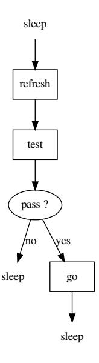
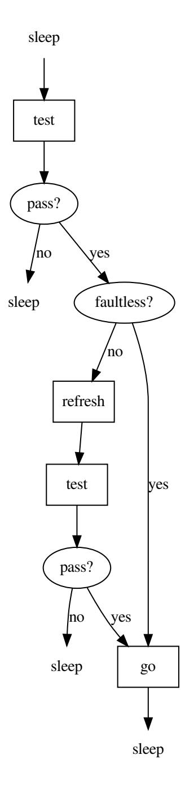

# Relaxed freshness in component authentication

### Frank.Schuhmacher@segrids.com

#### 2020-02-02

#### Abstract

We suggests a relaxed freshness paradigm for challenge-responseauthentication for each field of application where challenger and responder are tightly coupled and authentication takes place in a friendly environment. Replay attacks are not feasable under this premise, and freshness can be relaxed to relative freshness: no refresh is required as long as all previously tested responders were authentic. One field of application is anti-counterfeiting of electronic device components. The main contribution is a formal security proof of an authentication scheme with choked refresh. A practical implication is the lifetime increase of stored challenge-response-pairs. This is a considerable advantage for solutions based on hardware intrinsic security. For solutions based on symmetric keys, it opens the possibility to use challengeresponse-pairs instead of secret keys by the challenger – a cheap way to reduce the risk of key disclosure.

### Contents

| 1 |     | Introduction                             | 2  |
|---|-----|------------------------------------------|----|
| 2 |     | Formal first order authentication theory | 4  |
|   | 2.1 | Formal language I<br>                    | 4  |
|   | 2.2 | Freshness<br>                            | 4  |
|   | 2.3 | Main theorem                             | 7  |
|   | 2.4 | Formal language II<br>                   | 7  |
|   | 2.5 | Device behaviour<br>                     | 8  |
| 3 |     | Provable secure authentication           | 10 |
|   | 3.1 | Authentication with always refresh<br>   | 10 |
|   | 3.2 | Authentication with choked refresh       | 11 |
|   | 3.3 | Tear down attack                         | 13 |

## 1 Introduction

This article applies to challengers, such as mobile phones, banking terminals, or ECUs, which need to authenticate responders, such as batteries, smart cards, or sensors. Devices are always assumed authentic. Non-authentic responders will be called bad for short.

A challenger performs tests to verify the authenticity of an attached responder. It sometimes needs to refresh its test configuration<sup>1</sup> . Freshness shall improve the challenger's capacity to detect bad responders. In literature, see [1] or the overview in [2], a test configuration is "fresh" if it has never been applied to any responder. We need to refine the freshness definition and call a test absolutely fresh if it has never been applied to any responder before, releatively fresh if it has never been applied to a bad responder, faultless if it has never returned a fail, and faulty if it has already returned a fail.

A bad responder might still pass authentication tests up to a certain degree of freshness: If a bad authentication feature is chosen, a secret key was disclosed, or a random number doesn't do its job then a bad responder might even pass an absolutely fresh test of a challenger. In this case the authentication scheme is broken.

If the scheme is not broken, bad responders fail absolutely fresh tests (bfaf). Bad responders still might pass relative fresh tests if bad responders can sniff the communication between a challenger and an authentic responder and use the gained information in their own, or another bad responder's authentication by the same challenger later on (replay attack).

If bad responders fail absolutely fresh tests and are unable to gain any information about the communication between the challenger and authentic responders then bad responders will fail relatively fresh test (bfrf) as well. If this premise holds, a bad responder might still pass a faulty test: If for example a so-called SIMPL (Simulation Possible but Laborious, [3]) authentication feature is chosen instead of a strong authentication feature then a bad responder might fail in a first test but succeed in the same test if repeated later.

Under the same premise, if a strong authentication feauture is chosen,

<sup>1</sup>The term test configuration is used in a broad sense such that fully determines the challenger actions in a test. A test configuration can include a session key and a nonce, for example.

one might assume even that bad responders fail faulty tests (bffy). A neccesary condition is that after receiving a challenger specific challenge a bad responder or its agent will not be able to mimick the host in a connection with an authentic responder in order to gain the authentic response. In this case, freshness of a challenger is not required at all.

The main result of Section 2 is that bfrf is equivalent to "bad fail faultless" bffl. Hence there are exactly the four listed cases. They correspond to four formal assumtions:

- (1) ¬bfaf,
- (2) bfaf & ¬bfrf,
- (3) bfrf & ¬bffy,
- (4) bffy.

It is evident that in case ¬bfaf authentication is not possible. In case bfaf & ¬bfrf, the challenger must always do a refresh operation before each authentication test. In Section 3.1, we will formally prove security of responder authentication with always refresh for this case.

This will only be a warm-up for the case bfrf & ¬bffy. This is the most interesting case<sup>2</sup> , since it enables authentication with a relaxed freshness paradigm and solutions, where the challengers use a stored list of challengeresponse-pairs, instead of generating reference responses in realtime. In Section 3.2 we will specify an authentication scheme with choked refresh for this case and formally prove its security.

In case bffy authentication only requires a fixed, challenger specific test for each challenger, and that the challenger-to-test assignment is unpredicatable. It will not be further considered in this article.

All formal proofs in this article were carried out by the tool E-prover [5]. The results are practically relevant for three fields of application:

- a. Accessory Authentication: accessory and main device are tightly coupled and always under control of a user. Assume that the user himself is not a hacker. The attacker is a counterfeit accessory manufacturer, here.
- b. Embedded component authentication: this is similar to accessory authentication, if the challenger is a trusted main device and the responder is an embedded component directly wired with the main device.

<sup>2</sup>This case is the contrary of the Dolev–Yao model [4], where "the attacker carries the message".

A field of application is automotive, where the responder might be an actor or sensor.

c. Goods authentication: The responder is a tag attached to a good and the challenger is a dedicated reader. The attacker is the counterfeit manufacturer or deliverer.

### 2 Formal first order authentication theory

#### 2.1 Formal language I

Models in first order logic have a single data type. The data in our models will be events. An event is related to a dedicated challenger. Test events are also related to an attached responder.

We start with a formal language of only four 1-ary and two 2-ary relations: The 1-ary relations auth and bad indicate if an attached responder is authentic or not. The 1-ary relations pass and fail indicate if an attached responder passes or fails a test.

The 2-ary relation sametest indicates if a dedicated challenger has the same test configuration at two given events.

The 2-ary relation chron shall define a chronological order on the event set.

A full model is a history of events, and for each test event the indication if the tested responder is authentic or not, and if the test result is pass or fail.

#### 2.2 Freshness

In this article, sentences are printed in a FOF syntax [6]. The characters !, ?, ~ are used for quantifiers ∀, ∃ and the negation ¬. For readability and in contrast to eprover syntax, we don't use a closed form. For a translation to eprover syntax, please add a forall quantifier over all free variables in front of each formula.

Definition 1 introduces a 2-ary relation sync for synchronous events:

```
sync (X,Y) <=> ( chron (X,Y) & chron (Y,X) )
```

Axioms 1-2 shall state that chron is a weak order:

```
chron (X,Y) | chron (Y,X)
( chron (X,Y) & chron (Y, Z ) ) => chron (X, Z )
```

Axioms 3-5 state that sametest is an equivalence relation:

```
s am e t e s t (X,X)
( s am e t e s t (X,Y) & s am e t e s t (Y, Z ) ) => s am e t e s t (X, Z )
s am e t e s t (X,Y) => s am e t e s t (Y,X)
```

Definition 2 introduces a 2-ary relation testchron to indicate if the same test is executed at two chronological events:

```
t e s t c h r o n (X,Y) <=> ( s am e t e s t (X,Y) & chron (X,Y) )
```

Now, eprover is able to prove the Lemmas 1-3:

```
t e s t c h r o n (X,X)
```

```
( t e s t c h r o n (X,Y) & t e s t c h r o n (Y, Z ) ) => t e s t c h r o n (X, Z )
```

```
s am e t e s t (X,Y) => ( t e s t c h r o n (X,Y) | t e s t c h r o n (Y,X) )
```

Axiom 6 states that pass and fail are mutually exclusive:

```
f a i l (X) => ˜ p a s s (X)
```

Axiom 7 states that auth and bad are mutually exclusive:

```
auth (X) => ˜bad (X)
```

Axiom 8 states that authentic responders always pass:

```
auth (X) => p a s s (X)
```

Axiom 9 states that if a responder is present, the test result is either pass, or fail:

```
( auth (X) | bad (X) ) <=> ( p a s s (X) | f a i l (X) )
```

Definition 3 introduces the 1-ary relation test:

```
t e s t (X) <=> ( auth (X) | bad (X) )
```

In Section 2.5, test will be one out of four challenger operations whose starting points are the events in consideration. Definition 4 introduces the 1-ary relation refresh. A refresh is the birth of a test configuration:

```
r e f r e s h (X) <=> ! [ Y] : ( s am e t e s t (X,Y) => chron (X,Y) )
```

In Section 2.5, refresh will be one out of four challenger operations whose starting points are the events in consideration. Definition 5 introduces a predicate absfresh stating that the current test was never applied before:

```
a b s f r e s h (X) <=> ! [ Y] : ( ( s am e t e s t (X,Y) & t e s t (Y) ) => chron (X,Y) )
```

Definition 6 introduces a predicate relfresh to state that the the current test was not applied to a bad responder before:

```
r e l f r e s h (X) <=> ! [ Y] : ( ( s am e t e s t (X,Y) & bad (Y) ) => chron (X,Y) )
```

Note that in contrast to absfresh, this is is meta-property which cannot be verified by the challenger itself. The following Lemma 4 indicates an equivalent definition:

```
r e l f r e s h (X) <=> ! [ Y] : ( ( s am e t e s t (X,Y) & bad (Y) ) => t e s t c h r o n (X,Y) )
```

Definition 7 introduces the predicate faultless to indicate that the current test has never returned a fail:

```
f a u l t l e s s (X) <=> ! [ Y] : ( ( s am e t e s t (X,Y) & f a i l (Y) ) => chron (X,Y) )
```

Faultless is again a property the challenger itself is aware of. The following Lemma 5 indicates an equivalent definition:

```
f a u l t l e s s (X) <=> ! [ Y] : ( ( s am e t e s t (X,Y) & f a i l (Y) ) => t e s t c h r o n (X,Y) )
```

Eprover is able to prove as Lemmas 6-8 three implications between absfresh, relfresh, and faultless:

```
r e f r e s h (X) => a b s f r e s h (X)
a b s f r e s h (X) => r e l f r e s h (X)
r e l f r e s h (X) => f a u l t l e s s (X)
```

Definition 8 introduces the central "bad fail absolutely fresh" assumtion bfaf:

```
b f a f <=> ! [ X] : ( ( bad (X) & a b s f r e s h (X) ) => f a i l (X) )
```

Definition 9 introduces the "bad fail relatively fresh" assumption bfrf:

```
b f r f <=> ! [ X] : ( ( bad (X) & r e l f r e s h (X) ) => f a i l (X) )
```

Definition 10 introduces the "bad fail faultless" assumption bffl.

```
b f f l <=> ! [ X] : ( ( bad (X) & f a u l t l e s s (X) ) => f a i l (X) )
```

Eprover is able to prove Lemmas 9-10:

```
b f r f => b f a f
b f f l => b f r f
```

Axiom 10 states the existence of the time where the current test configuration was created by a refresh:

```
? [X ] : ( s am e t e s t (X,Y) & r e f r e s h (X) )
```

Axiom 11 states once a given test was absolutely fresh:

```
t e s t (Y) => ? [X ] : ( s am e t e s t (X,Y) & a b s f r e s h (X) & t e s t (X) )
```

Axiom 12 states that for a test of a bad responder, once the same test was applied to a bad responder but never to a bad responder before:

```
bad (Y) => ? [X ] : ( s am e t e s t (X,Y) & r e l f r e s h (X) & bad (X) )
```

Lemma 11 states that this time was in the past:

```
bad (Y) => ? [X ] : ( t e s t c h r o n (X,Y) & r e l f r e s h (X) & bad (X) )
```

#### 2.3 Main theorem

We derive as first formal theorem that bfrf and bffl are equivalent. To enable this derivation on a small laptop, we needed to derive first, the following sequence of Lemmas 12-18:

```
r e l f r e s h (Y) | ? [X ] : ( s am e t e s t (X,Y) & bad (X) & r e l f r e s h (X) )
r e l f r e s h (Y) | ? [X ] : ( t e s t c h r o n (X,Y) & bad (X) & r e l f r e s h (X) )
( bad (Y) & f a u l t l e s s (Y) ) => ( ( bad (Y) & r e l f r e s h (Y) ) |
                    ? [X ] : ( t e s t c h r o n (X,Y) & bad (X) & r e l f r e s h (X) ) )
( bad (Y) & f a u l t l e s s (Y) ) =>
                    ? [X ] : ( t e s t c h r o n (X,Y) & bad (X) & r e l f r e s h (X) )
( bad (Y) & f a u l t l e s s (Y) & b f r f ) => ? [X ] : ( t e s t c h r o n (X,Y) & f a i l (X) )
( bad (Y) & f a u l t l e s s (Y) & b f r f ) =>
                    ( f a i l (Y) | ? [X ] : ( X!=Y & t e s t c h r o n (X,Y) & f a i l (X) ) )
b f r f => b f f l
```

Theorem 1. It can be formally derived from Axioms 1-22 that:

```
b f r f <=> b f f l
```

It will turn out in Section 3.2 that the theorem is practically very useful.

#### 2.4 Formal language II

Definition of an authentication procedure is mainly the specification of the challenger behaviour: a challenger is most time in sleep mode and woken up from time to time by some external event to verify the authenticity of an attached responder by tests. Sometimes the challenger performs a refresh of its test configuration. If a responder passes all tests, the host executes a go function. If the responder fails a test, the challenger goes back to sleep.

Extend the formal language defined in Section 2.1 as follows: The 2-ary relation samechall indicates if the same challenger is involved in two given events.

The 1-ary relations sleep and go define two more challenger operations (in addition to the operations test and refresh that were introduced in Definitions 3 and 4).

The 1-ary function previous maps an event to the previous event of the same challenger.

Note that it is suitable to build models in such a way that, for each challenger, an initial sleep event is a fix point of the previous function.

### 2.5 Device behaviour

The following Axioms 13-15 state that the challenger actions are exactly sleep, refresh, test, and go:

```
s l e e p (X) <=> ˜ ( r e f r e s h (X) | t e s t (X) | go (X) )
r e f r e s h (X) <=> ˜ ( s l e e p (X) | t e s t (X) | go (X) )
t e s t (X) <=> ˜ ( s l e e p (X) | r e f r e s h (X) | go (X) )
```

Lemma 19 is an immediate consequence:

```
go (X) <=> ˜ ( s l e e p (X) | r e f r e s h (X) | t e s t (X) )
```

Axioms 16-18 state that samechall is an equivalence relation:

```
s am e c h all (X,X)
```

```
( s am e c h all (X,Y) & s am e c h all (Y, Z ) ) => s am e c h all (X, Z )
s am e c h all (X,Y) => s am e c h all (Y,X)
```

Axiom 19 is the requirement that test must be challenger specific:

```
s am e t e s t (X,Y) => s am e c h all (X,Y)
```

Definition 11 introduces a 2-ary relation challchron to indicate if the same challenger is involved in two chronological events:

```
c h all c h r o n (X,Y) <=> ( s am e c h all (X,Y) & chron (X,Y) )
```

Now, we can prove Lemmas 20-23:

```
t e s t c h r o n (X,Y) => c h all c h r o n (X,Y)
c h all c h r o n (X,X)
( c h all c h r o n (X,Y) & c h all c h r o n (Y, Z ) ) => c h all c h r o n (X, Z )
```

```
s am e c h all (X,Y) => ( c h all c h r o n (X,Y) | c h all c h r o n (Y,X) )
```

Axiom 20 requires a single event per challenger at a time:

```
( sync (X,Y) & s am e c h all (X,Y) ) => X=Y
```

Axiom 21 is the requirement that there is no re-incanation of a test configuration:

```
( c h all c h r o n (X,Y) & chron (Y, Z ) & s am e t e s t (X, Z ) ) =>
      s am e t e s t (X,Y)
```

We need two axioms on the previous function. Axiom 22 states that previous maps an event to a former event of the same challenger:

```
c h all c h r o n ( p r e vi o u s (X) ,X)
```

Axiom 23 states that previous means previous:

```
c h all c h r o n (X,Y) <=> (X=Y | c h all c h r o n (X, p r e vi o u s (Y) ) )
```

We can prove the following Lemmas 24-32:

```
c h all c h r o n (X,Y) => c h all c h r o n ( p r e vi o u s (X) , p r e vi o u s (Y) )
```

Note that the converse of the latter is false. Take as a counter example an event with X!=Y, challchron(Y,X), and previous(X)=previous(Y)=Y.

```
( c h all c h r o n (X,Y) & X!=Y) => c h all c h r o n (X, p r e vi o u s (Y) )
( c h all c h r o n ( p r e vi o u s (X) ,Y) & p r e vi o u s (X)!=Y) =>
      c h all c h r o n (X,Y)
( t e s t c h r o n (X,Y) & X!=Y) => c h all c h r o n (X, p r e vi o u s (Y) )
( t e s t c h r o n ( p r e vi o u s (X) ,Y) & p r e vi o u s (X)!=Y & s am e t e s t (X,Y) )
     => t e s t c h r o n (X,Y)
( s am e t e s t (X, p r e vi o u s (X) ) & a b s f r e s h ( p r e vi o u s (X) ) &
      ˜ t e s t ( p r e vi o u s (X) ) ) => a b s f r e s h (X)
```

Note that the latter requires the no-reincarnation axiom.

```
r e f r e s h (X) | s am e t e s t (X, p r e vi o u s (X) )
```

If the challenger was absolutely fresh at the previous event, and this was not a test, then it's still absolutely fresh:

```
( a b s f r e s h ( p r e vi o u s (X) ) & ˜ t e s t ( p r e vi o u s (X) ) ) => a b s f r e s h (X)
r e f r e s h ( p r e vi o u s (X) ) => ( a b s f r e s h ( p r e vi o u s (X) ) &
˜ t e s t ( p r e vi o u s (X) ) )
```

If the previous operation was a refresh, the challenger is absolutely fresh:

```
r e f r e s h ( p r e vi o u s (X) ) => a b s f r e s h (X)
```



Figure 1: Authentication with always refresh

### 3 Provable secure authentication

#### 3.1 Authentication with always refresh

Consider an authentication with "always refresh" as depicted in Figure 1. A challenger is most time in sleep mode. If woken up by some external event, first, it does a refresh, then it tests an attched responder, and starts its standard go function if the result is pass. If the test fails, the challenger goes back to sleep. After each go, the challenger goes back to sleep.

Definition 12 formalizes the security relevant aspect of this challenger specification as "authentication with always refresh" assumption awar:

```
awar <=> ! [ X] : ( go (X) =>
               ( p a s s ( p r e vi o u s (X) ) & r e f r e s h ( p r e vi o u s ( p r e vi o u s (X ) ) ) ) )
```

We now prove the Security of authentication with always refresh, required that bfaf (bad fail absolutely fresh) is true, see Section 1.

```
Derive from {Axiom1 . . . 23} ∪ {awar} ∪ {bfaf} the Lemmas 33-36:
r e f r e s h ( p r e vi o u s ( p r e vi o u s (X) ) ) => a b s f r e s h ( p r e vi o u s (X) )
( bad ( p r e vi o u s (X) ) & a b s f r e s h ( p r e vi o u s (X) ) ) => f a i l ( p r e vi o u s (X) )
```

```
( p a s s ( p r e vi o u s (X) ) & a b s f r e s h ( p r e vi o u s (X) ) ) => auth ( p r e vi o u s (X) )
( p a s s ( p r e vi o u s (X) ) & r e f r e s h ( p r e vi o u s ( p r e vi o u s (X) ) ) ) =>
      auth ( p r e vi o u s (X) )
```

Now, eprover is able to prove the security of the authentication scheme with always refresh:

Theorem 2. It can be formally derived from {Axiom1 . . . 23} ∪ {awar} ∪ {bfaf} that:

```
go (X) => auth ( p r e vi o u s (X) )
```

#### 3.2 Authentication with choked refresh

The authentication scheme of the previous section required an unlimited source of freshness. In this section, we optimize things to save freshness. This optimization is admitted if one can safely assume that bfrf (bad fail relative fresh) is true, see Secion 1. Recall that this assumption is reasonable if bfaf is true, and a bad responder will not be able to capture any information exchange between the challenger and an authentic responder and reuse the gained information in their own authentication later on.

Consider an authentication with "choked refresh" as depicted in Figure 2. A challenger is most time in sleep mode. If woken up by some external event, first, it tests the attached responder with an old test configuation. If the test fails, the challenger implicitly changes its state from "faultless" to "faulty", if it was faultless before, and goes back to sleep. This state change is not depicted in the diagram, and needs to be implemented savely, refer to Section 3.3 below. If the test passes, and the old test configuration was still faultless, the challenger starts its standard go function. If the old test configuration was not faultless, the challenger does a refresh and tests the attached responder again. If the test fails, the challenger implicitely updates its state as noted and goes back to sleep. If the test passes, the challenger starts its standard go function. After the go, the challenger goes back to sleep.

Definition 13 formalizes the security relevant aspect of this challenger specification as "authentication with choked refresh" assumption awcr:

```
awcr <=> ! [ X] : ( go (X) =>
     ( ( p a s s ( p r e vi o u s (X) ) & f a u l t l e s s ( p r e vi o u s (X) ) ) |
     ( p a s s ( p r e vi o u s (X) ) & r e f r e s h ( p r e vi o u s ( p r e vi o u s (X ) ) ) ) ) )
```



Figure 2: Authentication process with choked challenger update

We now prove the Security of authentication with choked refresh, required that bfrf is true. Derive from {Axiom 1 . . . 23} ∪ {awcr} ∪ {bfrf} the following Lemmas 37-38:

```
( bad ( p r e vi o u s (X) ) & f a u l t l e s s ( p r e vi o u s (X) ) ) => f a i l ( p r e vi o u s (X) )
( p a s s ( p r e vi o u s (X) ) & f a u l t l e s s ( p r e vi o u s (X) ) ) => auth ( p r e vi o u s (X) )
Finally, we derive the following theorem:
```

Theorem 3. It can be formally derived from {Axiom1 . . . 23} ∪ {awcr} ∪ {bfrf} that:

```
go (X) => auth ( p r e vi o u s (X) )
```

### 3.3 Tear down attack

We need to consider a challenger implementation in order to ensure the flow depicted in Figure 2 if tear-down attacks are a realistic threat: Assume that the responder is a the challenger's battery. Then, a bad responder might be able to first gain test information beeing tested itself, but stop the challenger before it update its "faultless flag" in non-volatile memory. This attack can be countered in a standard manner: Before each test, the challenger must first load its faultless flag in a volatile variable, clear the non-volatile "faultless flag" if it is set, and only overwrite the non-volatile flag by the volatile variable if the test passes.

#### 3.4 Offline CRP update

Assume that the challenger implements a stack of fresh challenge-resposepairs and that a refresh is a pop of a CRP from the stack. If the stack is low, the challenger might need to push fresh CRPs onto the stack. If the challenger has no connectivity to a CRP provider but is already connected to an authentic responder, it could randomly generate a challenge, misuse the authentic responder as response provider, and push this challenge-responsepaironto the stack. The new challenge-response pair is not absolutely fresh but only relatively fresh. The formal security proof of the scheme in Section 3.2 needs to be slightly modified to cover this offline CRP update. This is work in progress.

### References

[1] M. Burrows, M. Abadi, and R. Needham, "A logic of authentication," DEC System Research Center, Research Report 39, 1990.

- [2] G. M. Køien, "A brief survey of nonces and nonce usage," SECURWARE 2015 : The Ninth International Conference on Emerging Security Information, Systems and Technologies, 2015.
- [3] U. R¨uhrmair, "SIMPL systems as a keyless cryptographic security primitive," Cryptography and Security, 2011.
- [4] A. C. Dolev, D.; Yao, "On the security of public key protocols," IEEE Transactions on Information Theory, IT-29 (2): 198–208, 1983.
- [5] S. Schulz, "E 2.4 user manual," 2019. http://wwwlehre. dhbw-stuttgart.de/~sschulz/WORK/E\_DOWNLOAD/V\_2.4/eprover. pdf.
- [6] G. Sutcliffe, "The TPTP Problem Library and Associated Infrastructure. The FOF and CNF Parts, v3.5.0," Journal of Automated Reasoning, vol. 43, no. 4, pp. 337–362, 2009.