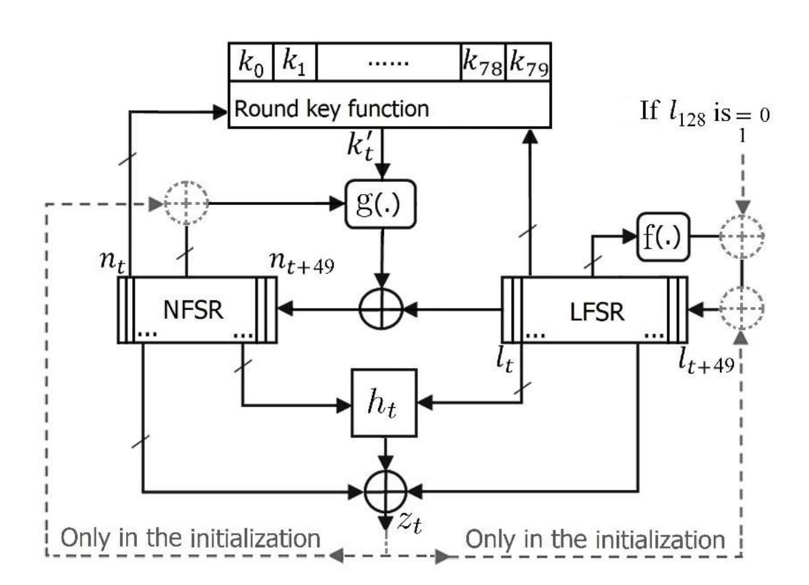

{0}------------------------------------------------

# A new idea in response to fast correlation attacks on small-state stream ciphers

Vahid Amin Ghafari and Fujiang Lin

School of Information Science and Technology, University of Science and Technology of China (USTC), Hefei, China, 230027, {vahidaming, linfj}@ustc.edu.cn

## Abstract

In the conference "Fast Software Encryption 2015", a new line of research was proposed by introducing the first small-state stream cipher (SSC). The goal was to design lightweight stream ciphers for hardware application by going beyond the rule that the internal state size must be at least twice the intended security level. Fast correlation attack (FCA) was successfully applied to all proposed SSCs which can be implemented by less than 1000 gate equivalents in hardware. It is possible to increase the security of stream ciphers against FCA by exploiting more complicated functions for the nonlinear feedback shift register and the output function, but we use lightweight functions to design the lightest SSC in the world while providing more security against FCA. Our proposed cipher provides 80-bit security against all types of Time-memory-data trade-off (TMDTO) attacks, while Lizard and Plantlet provide only 60-bit and 58-bit security against TMDTO distinguishing attacks, respectively. Our main contribution is to propose a lightweight round key function with a very long period that increases the security of SSCs against FCA.

Keywords: Stream cipher, Lightweight cipher, Hardware implementation, Cryptographic primitive

## Introduction

Internet of things (IoT), radio-frequency identification (RFID), and wireless sensor network (WSN) are instances of systems that require lightweight encryption. It is predicted there will be 100 billion IoT

{1}------------------------------------------------

connections by 2025. Every one of these connections requires End-to-End security with low power consumption. For example, smart meter reading should run on a single battery for over ten years [1].

Thus, many recent attempts have been made to design lightweight private key cryptography. In FSE 2015, a new idea was proposed, and based on it, a new line of research was created. The new idea was to use the key not only in the initialization of stream ciphers but also continuously for internal state updating. Doing so means that a designer can exploit the key as a section of the internal state. The new idea has a notable benefit when the key must be stored in a fixed memory for reuse by different IVs. The benefit is to design stream cipher with a smaller internal state (that called small-state stream cipher (SSC)) and, consequently, less power consumption.

Based on the SSC idea, a few lightweight stream ciphers have been proposed. The designed ciphers are lighter than conventional stream ciphers in hardware implementation, but they are vulnerable to certain known attacks. In this paper, we suggest Fruit-F, a modified version of the Fruit stream ciphers, that is lighter than other lightweight stream ciphers. We show that Fruit-F's security against time-memory-data trade-off (TMDTO) and fast correlation attacks (FCA) is better than previous SSCs. Notably, our synthesis using the Cadence Encounter(R) RTL Compiler (v12.10-s012\_1) showed that Fruit-F is lighter than other stream ciphers in terms of gate equivalents (GE, one GE is equal to the area size of a 2-way NAND gate) in ASIC hardware implementation1 . The results show that it is possible to implement Fruit-F in ASIC with 965 GE. The area sizes of Fruit-F and other lightweight stream ciphers are presented in Table 1. According to Table 2, it is expectable that the area size of Fruit-F is less than that of Plantlet in our results. For example, the **g** function of Fruit-F requires only nine 2-way XOR gates, while Plantlet requires 17. Moreover, the internal state of Fruit-F consists of 107 registers compared to 110 registers for Plantlet.

From another point of view, Fruit-F is better than other lightweight stream ciphers in constrained environments in terms of the initialization speed. Fruit-F, Plantlet, and Lizard ciphers require 128, 320, and 256 clocks for initialization, respectively. Fruit-F, in addition to faster initialization, needs less power for initialization, and this is desirable in constrained environments.

1 We compared stream ciphers based on GE because it is common in previous similar studies. For example, different stream ciphers are compared together in [2-7] based on GE. In addition, less GE means less power consumption.

{2}------------------------------------------------

Table 1. The area size of Fruit-F and some other lightweight stream ciphers in ASIC

| Cipher          | Area size (GE) | Platform     | Source   |
|-----------------|-------------------|--------------|----------|
| Grain-v1 [8]    | 1294              | 0.13 μm CMOS | [9]      |
| Lizard [3]   | 1161              | 0.18 μm CMOS | [3]      |
| Grain-v1 [8]    | 1268              | 0.18 μm CMOS | [3]      |
| Plantlet [5] | 928               | 0.18 μm CMOS | [5]      |
| Grain-v1 [8]    | 1162              | 0.18 μm CMOS | [5]      |
| Grain-v1 [8]    | 1270              | 0.18 μm CMOS | Our work |
| Lizard [3]   | 1218              | 0.18 μm CMOS | Our work |
| Plantlet [5] | 996               | 0.18 μm CMOS | Our work |
| Fruit-F         | 965               | 0.18 μm CMOS | Our work |

Throughput is 100 (Kb/s) for the clock frequency of 100 KHz

Table 2. The gate count comparison of the internal components of Fruit-F and Plantlet

|          | Fruit-F |                 | Plantlet [1] |    |                 |           |
|----------|---------|-----------------|-----------------|----|-----------------|-----------|
| Function | g       | and output ℎ | Round key       | g  | and output ℎ | Round key |
| XOR2     | 9       | 10              | 3               | 17 | 12              | 0         |
| NAND2    | 3       | 4               | 1               | 7  | 4               | 0         |
| NAND3    | 1       | 1               | 0               | 2  | 1               | 0         |
| NAND4    | 1       | 0               | 0               | 1  | 0               | 0         |

Two attacks were proposed against all SSCs: FCA and the TMDTO distinguishing attack. TMDTO distinguishing attacks have been successfully applied to Sprout, Plantlet, and Fruit-v2 [10]. The designer of Plantlet downplayed this type of attack, stating that: "we assume that distinguishing attacks might be possible but consider them only applicable to scenarios that are less relevant in the context of lightweight devices, e.g., encrypting long data streams" [5]. Nevertheless, Fruit-F provides full security against all types of TMDTO attacks.

In CRYPTO 2018, Todo et al. proposed FCA on Grain-128a, Grain-128, and Grain-v1 by a new algorithm [11]. Then, Wang et al. claimed that it is possible to apply FCA to Plantlet, Fruit-v2, and Fruit-802 [13]. Todo et al. proposed FCA on Fruit-80 and Plantlet in SAC 2019. They found that FCA can be successfully applied to Fruit-80 despite the limitation of the available data, but it not possible to apply FCA

2 In 2017, Zhang et al. proposed an FCA based on a weakness in the output function of Fruit-v0, but that attack is not applicable on the next versions of Fruit cipher [12].

{3}------------------------------------------------

successfully to Plantlet based on its data limitation [14]. Note that the data limitation of Fruit-80 comes from the size of its LFSR, but it is not available plausible reason for the data limitation of Plantlet [5].

In a simple correlation attack on an LFSR-based stream cipher (introduced in [15]), the bias between keystream bits and sequences of LFSR is considered. If the correct initial state of LFSR is guessed, the same bias is observed. Otherwise, if the wrong initial state is guessed, the bias between the keystream bits and sequences of LFSR is very small. In an FCA, many algorithms have been suggested for avoiding exhaustive search of the initial state of the LFSR.

There are two main differences between SSCs and other stream ciphers. The lengths of the internal states of SSCs are significantly smaller than those of other stream ciphers; for example, the length of the internal state of Fruit-80 [7] is 87 bits while it is 160 bits for Grain-v1 [8]. The second difference is involving key bits in NFSR updating and output function. In FCA on SSCs, the keystream must be used under constant round key bits. As the round key functions are periodic in SSCs, keystreams are sampled at a time interval equal to the period of the round key bits; thus, the round key bits are the same during sampling. In this situation, the constant round key bits influence only the bias direction, and it is simple to recover the involved round key bits by observing the bias direction (same as a linear attack on block ciphers). All key bits of Fruit-80 can be recovered with 2 77.8 time complexity and 2 64 data complexity by FCA [14].

The periods of round key bits are small in the previous SSCs. For example, the period of the round key bits in Fruit-80 [7] and Plantlet [5] are 128 and 80, respectively. As mentioned, FCA must be applied under constant round key bits, and the data complexity of FCA in SSCs generally increases by increasing the period of the round key functions [14]. Thus, one solution for strengthening SSCs against FCA is to increase the period of the round key function. Designers of SSCs could provide a long period for round key functions by using complicated round key functions, but this contradicts the main goal of SSCs, which is to design lightweight stream ciphers.

Our main contribution is to propose a lightweight round key function with a very long period that increases the security of SSCs against FCA. We propose a round key function whose domain is from LFSR and NFSR bits. If we choose some bits of both the LFSR and NFSR as variables of a round key function, the period of the function will be very long, and the resistance of SSC will increase against FCA. We use this idea to introduce a new member of the Fruit family [6, 16]. We introduce Fruit-F, whose keystreams will not be available under an assumption of constant round key bits for applying FCA.

Our new idea also increases security against FCA from another point of view. Some variables of the proposed round key function are from NFSR bits, and only LFSR bits are guessed during an FCA on SSCs. 

{4}------------------------------------------------

Thus, an attacker needs to guess both NFSR and LFSR bits to apply FCA to Fruit-F. This is necessary because the attacker must recover key bits from round key bits. The necessity of guessing NFSR bits increases the data and time complexity of FCA.

Also, we increased the length of LFSR and NFSR enough to achieve full security against all types of TMDTO attacks in our new design [17]. The increasing length of the LFSR and NFSR also makes SSCs more resistant against FCA.

The paper is organized as follows. The design of Fruit-F and its specification are presented, after which, the design criteria are discussed. Finally, we discuss that Fruit-F is resistant to known attacks.

## The design of Fruit-F

The internal state consists of a 50-bit LFSR ( , … , +49) and 50-bit NFSR ( , … , +49). A block diagram of Fruit-F is presented in Fig. 1. Fruit-F uses an 80-bit key (: (0, … , 79)) and 80-bit Initial Value (: (0, … , 79)). The maximum number of the keystream bits that can be produced per key is 2 22bits. This limit means that if Fruit-F produces more than 2 22 keystream bits under one key, it will be vulnerable against some attacks such as distinguishing attacks and FCA.

Fig. 1: The Block Diagram of Fruit-F

{5}------------------------------------------------

Now we explain each section in detail:

-Round key function: We set:

$$r = (l_{\mathsf{t+49}} l_{\mathsf{t+33}} n_t n_{\mathsf{t+44}})$$

$$p = (l_{t+41}l_{t+7}n_{t+49}n_{t+5}n_{t+20})$$

$$q = (l_{t+25}l_t n_{t+37} n_{t+13} n_{t+26})$$

We combine five bits of the key to obtain the round key bits in each clock as follows.

$$k'_{t} = k_{r} \oplus k_{(p+16)} \oplus k_{(q+48)} \oplus k_{(p+16)} \cdot k_{(q+48)}$$

**-g function**: The feedback function of the NFSR is as follows.

$$n_{t+50} = k'_t \oplus l_t \oplus n_t \oplus n_{t+11} \oplus n_{t+30} \oplus n_{t+16} \cdot n_{t+32} \oplus n_{t+25} \cdot n_{t+42} \oplus n_{t+4} \cdot n_{t+45} \oplus n_{t+7}$$
$$\cdot n_{t+20} \cdot n_{t+35} \oplus n_{t+40} \cdot n_{t+44} \cdot n_{t+47} \cdot n_{t+48}$$

-f function: The feedback function of the LFSR is as follows.

$$l_{t+50} = l_t \oplus l_{t+8} \oplus l_{t+16} \oplus l_{t+24} \oplus l_{t+34} \oplus l_{t+43}$$

- h function: This function produces a pre-output stream from the LFSR and NFSR states as follows.

$$h_t = l_{t+11} \cdot l_{t+37} \oplus l_{t+1} \cdot l_{t+19} \oplus n_{t+24} \cdot l_{t+28} \oplus n_{t+9} \cdot n_{t+49} \oplus n_{t+33} \cdot n_t \cdot l_{t+49}$$

**-Output function**: The output stream is produced by 7 bits from the NFSR, 1 bit from the LFSR, and output of *h* function as follows.

$$z_t = h_t \oplus n_{t+1} \oplus n_{t+17} \oplus n_{t+28} \oplus n_{t+41} \oplus n_{t+48} \oplus l_{t+45}$$

-Initialization of the cipher: In the initialization procedure, IV bits are loaded into the NFSR and LFSR from LSB to MSB ( $v_0$  to  $n_0$ ,  $v_1$  to  $n_1$ , ...,  $v_{49}$  to  $n_{49}$ ,  $v_{50}$  to  $l_0$ ,  $v_{51}$  to  $l_1$ , ...,  $v_{79}$  to  $l_{29}$ ). The other bits of the LFSR are set to ones and one zero ( $l_{30} = l_{31} = \cdots = l_{48} = 1$ ,  $l_{49} = 0$ ). The cipher is clocked 128 times, but before each clock, the output bits are fed to the NFSR and LFSR (as shown in Fig. 1).

Then, the output feedback in the LFSR and NFSR is disconnected, and if  $l_{128} = 0$ , the feedback function of the LFSR is XORed by one. If  $l_{128} = 1$ , the feedback function of the LFSR is not changed. The cipher can produce the first keystream bit in the next clock, i.e.,  $z_{128}$ .

## The design criteria

-Limitation for producing keystream: Fruit-F can produce up to  $2^{22}$  keystream bits per key;  $2^{22}$  bits can be produced under one IV (and one initialization) or up to  $2^{22}$  IV (and  $2^{22}$  initialization). This limitation was obtained from the proposed construction in [17], and it is sufficient for many applications in constrained environments. For example, low-power wide-area network (LPWAN) technology only supports

{6}------------------------------------------------

devices with low data rates. These devices include smart cities, personal IoT applications, smart grid, smart metering, logistics, industrial monitoring, agriculture, etc. If it is supposed that an IoT smart meter must send information once weekly, and 5000 bits must be encrypted every time, then Fruit-F can produce for 16 years keystream with a fixed key.

Another example is wildlife tracking, for which the device should work more than ten years on one battery. In this application, the data rate is very low and  $2^{22}$  keystream bits under a fixed key is sufficient. In most tracking systems, the data rate is very low, and the system only sends its location after receiving a special command [1]. For these reasons, we believe think Fruit-F's keystream limitation is practical; in fact, the  $2^{18}$  bits per key/IV limitation for the Lizard cipher is completely acceptable [3].

**-Round key function**: All bits of the key should equally participate in updating internal states, and the round key function should be lightweight in hardware. We propose a round key function whose period is very long compared to previous functions, and the long period increases the security against FCA. The round key bits of Fruit-F are obtained from 8 bits of the NFSR and 6 bits of the LFSR. The period of the LFSR is  $2^{50} - 1$  and the period of NFSR is multiple of  $2^{50} - 1$  [18]. Thus, the period of Fruit-F's round key function is at least  $2^{50} - 1$ . The period of the round key functions of Fruit-80 and Plantlet are 128 and 80, respectively.

**-g function**: This function should be lightweight (same as other functions) and provide suitable nonlinearity. Our Fruit-F's **g** function uses 16 variables of the NFSR (same as Fruit-80), while the **g** function of Plantlet uses 29 variables of the NFSR [5]. This shows that the **g** function of Fruit-F is lighter than that of Plantlet. If we suppose  $k'_t = 0$ , then the nonlinearity of Fruit-F's **g** function is  $2^3 \times 3760$  and its resiliency is 2.

-f function: The feedback polynomial of the LFSR is primitive and, therefore, the period of the produced sequence with a nonzero initial state is maximized. To prevent the LFSR from becoming all zero during state updating, we use a new idea. If  $l_{128} = 0$  after the output feedback in the LFSR is disconnected, the feedback function of the LFSR is XORed by one. Otherwise, if  $l_{128} = 1$ , the feedback function of the LFSR is not changed.

{7}------------------------------------------------

**-Output function**: The nonlinearity of the h function is 976 (same as Fruit-80). Six linear terms were added to increase the nonlinearity to  $2^6 \cdot 976 = 62464$ , and to give a function with resiliency of 5. The best linear approximation of the output function has six terms with the bias  $2^{-5.415}$ .

#### Resistance to known attacks

As discussed in the introduction section, two attacks have been proposed against all SSCs: FCA and the TMDTO distinguishing attack. Here, we discuss the security of Fruit-F against FCA and TMDTO attacks in more details.

-Fast Correlation Attack: An FCA was proposed for Grain-128a, Grain-128, and Grain-v1 by a new algorithm in CRYPTO 2018 [11]. Then, FCAs were proposed for SSCs for the first time by Wang et al. in 2019 [13]. Later, Todo et al. proposed an FCA against Fruit-80 and Plantlet in SAC 2019. They found that FCA can be successfully applied to Fruit-80, and it not possible to apply FCA to Plantlet because of its data limitation [14].

In a simple correlation attack on any LFSR-based stream cipher, the bias between the keystream bits and sequences of LFSR is considered. If there is a bias between the keystream bits and sequences of an LFSR, an attacker can guess the values of the LFSR independently from other components of the cipher. If the correct initial state of the LFSR is guessed, the same bias is observed. Otherwise, if the wrong initial state is guessed, the bias between the keystream bits and sequences of LFSR is very small. For FCA, many algorithms have been suggested to avoid an exhaustive search of the initial state of the LFSR and improve the attack.

In an FCA on SSCs, the keystream must be used under an assumption of constant round key bits. In this situation, the constant round key bits influence only the bias direction, and it is simple to recover the involved round keys by observing the bias direction (same as a linear attack on block ciphers). Thus, all key bits of Fruit-80 can be recovered with 277.8 time complexity and 264 data complexity by FCA [14].

As mentioned, FCA must be applied under constant round key bits, and the data complexity of FCA generally increases as the period of round key functions increases in SSCs. The round key bits of Fruit-F are obtained from 8 bits of the NFSR and 6 bits of the LFSR. The period of the LFSR is  $2^{50} - 1$  and the period of NFSR is multiple of  $2^{50} - 1$  [18]. Thus, the period of Fruit-F's round key function is is at least  $2^{50} - 1$ , and the FCA technique that works against Fruit-80 and Plantlet is unsuccessful on Fruit-F.

{8}------------------------------------------------

Our new idea also increases security against FCA from another point of view. Eight variables of the round key function of Fruit-F are from NFSR bits, and LFSR bits are only guessed during FCA. As three unknown bits of the key produce round key bits in every clock, an attacker also needs to guess the NFSR bits which produce round key bits (to find which bits of the key produce the round key bits). The NFSR bits are changed every clock, and so the attacker needs to guess eight new bits of the NFSR every clock. This is necessary because the attacker must recover key bits from round key bits. The requirement to guess the NFSR bits increases the data and time complexity of any FCA on Fruit-F. Also, we increased the length of the LFSR and NFSR in our new design compared to Fruit-80; thus, Fruit-F will be more resistant against FCA.

-Time-Memory-Data Trade-off Attack: It is well known that the conventional stream cipher is weak to this attack if its internal state size is not at least twice the security level. Because key bits continuously participate in updating the internal state in SSCs, key bits are considered to be part of the internal state. The Fruit-F design is based on the proposed construction of [17], and the maximum number of the keystream bits that can be produced per key is 222bits (under one IV or many IVs). There are 222 internal states with the same key bits. If an attacker saves half of the keystream bits (for a key) in a searchable table for Fruit-F, she can search for a collision between the remaining keystream bits and the keystream bits in the table to make a distinguishing attack. The probability that the attacker cannot find any collision is:

$$\left(1 - \frac{2^{22}/2}{2^{100}}\right)^{2^{22}/2} = \left(1 - \frac{1}{2^{79}}\right)^{2^{21}}$$

Note that there are  $2^{100}$  different internal states under a fixed key. The attacker repeats this process  $2^x$  times under different new key bits to achieve success. The probability of failure is

$$\left(1-\frac{1}{2^{79}}\right)^{2^{21+x}}$$

If  $79 \le 21 + x$ , the attacker can apply this distinguishing attack successfully. Thus, in this situation, x should be at least 58. However, this means that the data complexity of the attack is  $2^x \cdot 2^{22} = 2^{80}$ , and Fruit-F is resistant to this attack.

Note that this attack is based on that Fruit-F produces 222 keystream bits under one fixed key in more than one initialization (i.e., 222 keystream bits related to one key and different IVs). If Fruit-F produces 222 keystream bits in one initialization, this attack doesn't work on Fruit-F (because polynomial of LFSR is primitive and internal states never repeat during keystream production under a fixed key).

{9}------------------------------------------------

Fruit-F is the first SSC that is resistant against TMDTO distinguishing attacks, which are known to be effective against previous SSCs. TMDTO distinguishing attacks have been successfully applied to Sprout, Plantlet, and Fruit-v2 [10]. The designer of Plantlet downplayed this type of attack, stating that: "*we assume that distinguishing attacks might be possible but consider them only applicable to scenarios that are less relevant in the context of lightweight devices, e.g., encrypting long data streams*" [5]. Nevertheless, Fruit-F provides full security against all types of TMDTO attacks.

**-Algebraic Attack:** The pure algebraic attack was not successfully applied to the Grain-like structure because the degree of polynomials in the internal state of it grows very fast. A type of algebraic attack was applied to Sprout [19]. There is a weakness in the round key function of Sprout that the key bits are not involved in the internal state updating in half of the clocks.

In Fruit-F, key bits are involved in the internal state updating directly and its internal state is longer than that of Sprout. An attacker must guess all bits of LFSR and NFSR for extracting algebraic equations of output for more than 6 clocks in Fruit-F. These equations are based on ′ and the attacker can obtain one value for ′ in every clock. She cannot identify wrong guesses before 80 clocks of Fruit-F. In the next clocks, the attacker should try to find the correct internal state and key between 2 100 candidates. According to the round key function of Fruit-F, it is not possible for the attacker to obtain key bits before obtaining internal state bits. Thus, the computational complexity of this attack is higher than that of an exhaustive search attack.

**-Cube Attack:** A dynamic Cube attack was successfully applied to Grain-128 [20] because the degree of NFSR feedback was low, i.e. 2. The designers of Grain-128 updated the design by increasing the degree of NFSR feedback to 4 in Grain-128a [2]. Other types of Cube attacks (same as [21]) were proposed against Grain family members but those were not successful attacks.

The numbers of clocks in the initialization procedure of Grain-v1 and Grain-128a are 160 and 256 while the lengths of the internal states are 160 and 256 bits, respectively. Thus, 128 initial clocks can be suitable for the initialization of Fruit-F with 100 internal state bits while the degree of NFSR feedback in Fruit-F is the same as Grain-128a. A Cube attack was implemented with a Cube size of 32 bits against Fruit-F. The first bits of the keystreams for all possible values of 32 bits of the IV (while other bits of IV are zeros) were XORed, and the superpolys were not linear or constant over the key variables for 100 and 80 initial clocks. It follows from the discussion that Fruit-F is secure against all types of Cube attacks.

{10}------------------------------------------------

**-Weak Key-IVs:** Before introducing Fruit-v2, all Grain-like ciphers had weak key-IVs [22, 23]. It is possible for LFSRs to enter the all-zero state in all members of the Grain family and Sprout.

In this situation, as the feedback polynomial of the LFSRs are primitive, the LFSRs remain in the allzero state for all clocks, and NFSRs statistical properties become non-random. The periods of the ciphers are unknown, and the keystreams are only dependent on the NFSR bits, and the ciphers become vulnerable against various types of attacks.

As the internal states in SSCs are shorter than that of Grain family members, it is a considerable point in SSCs. We used a new idea in Fruit-F to prevent the all-zero state in the LFSR after initialization. This idea is to XOR the feedback function of the LFSR by one if 128 = 0 (i.e., after disconnecting the output feedback from the LFSR and NFSR). Therefore, there is no weak key-IV in Fruit-F.

**-Linear Approximation Attack:** Maximov applied a linear approximation attack to Grain-v0 [24]. He stated that if the feedback of NFSR and the output function are chosen with high nonlinearity and suitable resiliency, the Grain-like ciphers will be resistant to linear approximations attack. Fruit-F was designed with these criteria, as possible as lightweight functions, and a nonlinear round key function. The best linear approximation of the output is as follows with bias 2 −5.415 .

$$z_t = n_{t+1} \oplus n_{t+17} \oplus n_{t+28} \oplus n_{t+41} \oplus n_{t+48} \oplus l_{t+45}$$

The best linear approximation of the NFSR feedback function is as follows with bias 2 −4.6 if supposed ′ = 0.

$$n_{t+50} = l_t \oplus n_t \oplus n_{t+11} \oplus n_{t+30}$$

If an attacker shifts the linear approximation of the output and XORs the results; she can remove the NFSR bits between these two relations. Thereafter, she obtains the following relation with bias 2 −36.66 (by Piling-up lemma).

$$z_{t} \oplus z_{t+11} \oplus z_{t+30} \oplus z_{t+50} = l_{t+1} \oplus l_{t+17} \oplus l_{t+28} \oplus l_{t+41} \oplus l_{t+48} \oplus l_{t+45} \oplus l_{t+56} \oplus l_{t+75} \oplus l_{t+95}$$

Now, the attacker can obtain a relation only based on bits (by using feedback function of LFSR) with bias 2 −250.62 . As the bias is too small, thus Fruit-F is resistant to this attack.

**-Resynchronization Attack:** In the first glance, it seems that an attacker can produce two related keystream bits under the same key and similar IVs. For example, may a reader think that some bits of two keystrems are related under the same key and different IVs as follows:

$$IV: (v_0, v_1, \dots, v_{49}, v_{50}, v_{51}, \dots, v_{78}, v_{79}),$$

{11}------------------------------------------------

$$IV'$$
:  $(v_0 \oplus 1, v_1, \dots, v_{49}, v_{50} \oplus 1, v_{51}, \dots, v_{78}, v_{79})$ 

But, if the round key function is considered carefully, it is obvious that a difference in 0 and 0 impacts on the round key bits, and it is not possible for the attacker to follow changes in the keystrem bits after 128 clocks. It means that the same key and related IVs, cannot produce related keystrems.

Another scenario is that an attacker supposes there exist , and ,′ which the produced internal states after 128 initial clocks are the same except in 128. In this situation, according to the initialization of Fruit-F, LFSRs of two initializations will be the same in the next clock. As the values of round key bits depend on , the values of 177 will be unrelated in two internal states. The value of 177 impacts on the first bit of keystreams. Therefore, the firs bits of the keystream will be unrelated together. On the other hand, unlike conventional steam ciphers, it is not possible to backward clocks in SSCs under unknown key. Thus, Fruit-F is resistant to this attack scenario.

**-Guess and Determine Attack:** Due to the short LFSR and NFSR in SSCs and the weakness of Sprout against this attack [23], this attack is important. It is possible for an attacker to guesses all bits of the internal state in Sprout, and she can clock two times forward and one time backward (with unknown keys), and in each clock, she can decrease the wrong candidates of the internal state. In the next clocks, the attacker can decrease the wrong candidates of the internal state or obtain one bit of the key. We used +49 and in the output function to prevent producing keystream bits in the next and previous clocks under unknown keys. Fruit-F has 100 LFSR and NFSR bits while Sprout has 80 LFSR and NFSR bits.

The attacker can identify the half of wrong candidates of the internal state in the first clock of Fruit-F, but in the next clocks, the attacker should guess both key and internal state bits. It is not possible for the attacker to ignore key bits in forward clocks after the first clock. If +33 or +49 is zero, then it is not necessary for the attacker to guess the key bits in the first backward clock. After the first backward clock, it is compulsory for the attacker to guess key bits. If an attacker tries to produce only the first 6 bits of the keystream, she needs to guess all bits of the internal state in Fruit-F. Thus, Fruit-F is resistant to guess and determine attack.

{12}------------------------------------------------

## Conclusion

Stream ciphers were not in the spotlight of lightweight cryptography for hardware applications from 2009 to 2015. PRESENT [25] and KATAN/KTANTAN [26] were published as lightweight block ciphers with less than 1000 GE in 2009, and Sprout [4], the first SSC, was introduced in 2015. Since 2015, some SSCs have been proposed, but all of them were either vulnerable to TMDTO distinguishing attacks and FCA, or had hardware implementations requiring more than 1000 GE.

In this work, we propose a new round key function to strengthen SSCs against FCA. The suggested round key function is lightweight in hardware, and its period is at least as long as the period of the LFSR. Fruit-F can be implemented in less than 1000 GE. As well, it is the first SSC with 80-bit security against both TMDTO distinguishing attacks and key recovery attacks. Previously, Lizard [3] and Plantlet [5] provided significantly less than 80-bit security against TMDTO distinguishing attacks. Consequently, we can conclude that SSC design has matured through our introduction of Fruit-F.

## Acknowledgment

This work was supported by the CAS President's International Fellowship Initiative program (PIFI).

## References

- [1] U. Raza, P. Kulkarni, and M. Sooriyabandara, "Low power wide area networks: An overview," *IEEE Communications Surveys & Tutorials,* vol. 19, no. 2, pp. 855-873, 2017.
- [2] M. Ågren, M. Hell, T. Johansson, and W. Meier, "A new version of grain-128 with authentication," in *Symmetric Key Encryption Workshop*, 2011, vol. 2011.
- [3] M. Hamann, M. Krause, and W. Meier, "LIZARD–a lightweight stream cipher for power-constrained devices," *IACR Transactions on Symmetric Cryptology,* vol. 2017, no. 1, pp. 45-79, 2017.
- [4] F. Armknecht and V. Mikhalev, "On lightweight stream ciphers with shorter internal states," in *Leander, G. (ed.) Fast Software Encryption: 22nd International Workshop, FSE 2015, Istanbul, Turkey, March 8-11, 2015, Revised Selected Papers*, Springer, Berlin pp. 451-470, 2015.
- [5] V. Mikhalev, F. Armknecht, and C. Müller, "On ciphers that continuously access the non-volatile key," *IACR Transactions on Symmetric Cryptology* 2016, no. 2, pp. 52-79, 2017.
- [6] V. A. Ghafari, H. Hu, and Y. Chen, "Fruit-v2: ultra-lightweight stream cipher with shorter internal state," *IACR*  Cryptology ePrint Archive, Report 2016/355, 2016.
- [7] V. A. Ghafari and H. Hu, "Fruit-80: A Secure Ultra-Lightweight Stream Cipher for Constrained Environments," *Entropy,* vol. 20, no. 3, p. 180, 2018.
- [8] M. Hell, T. Johansson, and W. Meier, "Grain: a stream cipher for constrained environments," *International Journal of Wireless and Mobile Computing,* vol. 2, no. 1, pp. 86-93, 2007.
- [9] T. Good and M. Benaissa, "Hardware performance of eStream phase-III stream cipher candidates," in *State of the Art of Stream Ciphers Workshop (SASC 2008)*, pp. 163-173, 2008.

{13}------------------------------------------------

- [10] M. Hamann, M. Krause, W. Meier, and B. Zhang, "Design and analysis of small-state grain-like stream ciphers," *Cryptography and Communications,* vol. 10, no. 5, pp. 803-834, 2018.
- [11] Y. Todo, T. Isobe, W. Meier, K. Aoki, and B. Zhang, "Fast correlation attack revisited," in *Annual International Cryptology Conference* 2018, Springer, pp. 129-159, 2018.
- [12] B. Zhang, X. Gong, and W. Meier, "Fast Correlation Attacks on Grain-like Small State Stream Ciphers," *IACR Transactions on Symmetric Cryptology* 2017, no. 4, pp. 58-81, 2017.
- [13] S. Wang, M. Liu, D. Lin, and L. Ma, "Fast Correlation Attacks on Grain-like Small State Stream Ciphers and Cryptanalysis of Plantlet, Fruit-v2 and Fruit-80," *IACR* Cryptology ePrint Archive, Report 2019/763, 2019.
- [14] Y. Todo, W. Meier, and K. Aoki, "On the Data Limitation of Small-State Stream Ciphers: Correlation Attacks on Fruit-80 and Plantlet," in *International Conference on Selected Areas in Cryptography* 2019, Springer, pp. 365- 392, 2019.
- [15] T. Siegenthaler, "Decrypting a class of stream ciphers using ciphertext only," *IEEE Transactions on computers,*  vol. 1, no. C-34, pp. 81-85, 1985.
- [16] V. A. Ghafari, H. Hu, and M. alizadeh, "Necessary conditions for designing secure stream ciphers with the minimal internal states," *IACR* Cryptology ePrint Archive, Report 2017/765, 2017.
- [17] V. A. Ghafari, H. Hu, and F. Lin, "On designing secure small-state stream ciphers against time-memory-data tradeoff attacks," *IACR* Cryptology ePrint Archive, Report 2019/670, 2019.
- [18] H. Hu and G. Gong, "Periods on two kinds of nonlinear feedback shift registers with time varying feedback functions," *International Journal of Foundations of Computer Science,* vol. 22, no. 06, pp. 1317-1329, 2011.
- [19] S. Maitra, S. Sarkar, A. Baksi, and P. Dey, "Key Recovery from State Information of Sprout: Application to Cryptanalysis and Fault Attack," *IACR Cryptology ePrint Archive,* vol. 2015, p. 236, 2015.
- [20] I. Dinur and A. Shamir, "Breaking Grain-128 with dynamic cube attacks," in *International Workshop on Fast Software Encryption* 2011, Springer, pp. 167-187, 2011.
- [21] V. A. Ghafari and H. Hu, "A new chosen IV statistical distinguishing framework to attack symmetric ciphers, and its application to ACORN-v3 and Grain-128a," *Journal of Ambient Intelligence and Humanized Computing,*  vol. 10, no. 6, pp. 2393-2400, 2019.
- [22] H. Zhang and X. Wang, "Cryptanalysis of Stream Cipher Grain Family," *IACR* Cryptology ePrint Archive, Report 2009/109, 2009.
- [23] S. Banik, "Some results on Sprout," in *International Conference in Cryptology in India* 2015, Springer, pp. 124- 139, 2015.
- [24] A. Maximov, "Cryptanalysis of the Grain family of stream ciphers," in *Proceedings of the 2006 ACM Symposium on Information, computer and communications security*, ACM, pp. 283-288, 2006.
- [25] A. Bogdanov *et al.*, "PRESENT: An ultra-lightweight block cipher," in *International workshop on cryptographic hardware and embedded systems* 2007, Springer, pp. 450-466, 2007.
- [26] C. De Canniere, O. Dunkelman, and M. Knežević, "KATAN and KTANTAN—a family of small and efficient hardware-oriented block ciphers," in *International Workshop on Cryptographic Hardware and Embedded Systems* 2009, Springer, pp. 272-288, 2009.