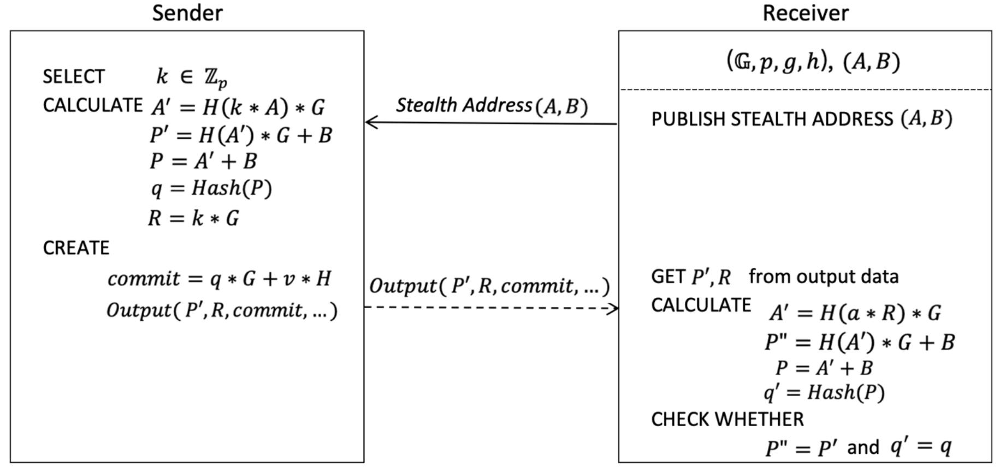

{0}------------------------------------------------

## **Mimblewimble Non-Interactive Transaction Scheme**

Gary Yu *gary.yu@gotts.tech*

Revised, Dec. 21, 2020

**Abstract.** I describe a non-interactive transaction scheme for Mimblewimble protocol, so as to overcome the usability issue of the Mimblewimble wallet. With the *Diffie–Hellman*, we can use an *Ephemeral Key* shared between the sender and the receiver, a public nonce is added to the output for that, removing the interactive cooperation procedure. And an additional *onetime public key* ′ is used to lock the output to make it only spendable for the receiver, i.e. the owner of ′. Furtherly, to keep Mimblewimble privacy character, the *Stealth Address* is used in this new transaction scheme.

**Keywords:** Mimblewimble, Stealth address, Bitcoin, Grin, Confidential transaction, Privacy

**License.** This work is released into the public domain.



**Fig.1** Mimblewimble non-interactive transaction scheme design.

### **1 Introduction**

**Mimblewimble.** In July 2016, someone called Tom Elvis Jedusor (Voldemort's French name in J.K. Rowling's Harry Potter book series) placed the original Mimblewimble white paper[MW16] on a bitcoin research channel, and then disappeared. Tom's white paper "Mimblewimble" (a tongue-tying curse used in "The Deathly Hallows") was a blockchain proposal that could theoretically increase privacy, scalability and fungibility. In January 2017, Andrew Poelstra, a mathematician at Blockstream, presented on this work at Stanford University's Blockchain Protocol Analysis and Security Engineering 2017 conference. And he wrote a paper[Poe16] to make precise Tom's original idea, and added further scaling improvements on it. Mimblewimble is a blockchain protocol with confidential transaction and obscured transaction graph, also it has the ability to merge transactions in transaction pool, or even merge them across blocks.

{1}------------------------------------------------

Because only UTXOs are kept, Mimblewimble blockchain data is much smaller than other chain types. For example, Bitcoin[Bit08] today there are about 646,300 blocks, total 300GB or so of data on the hard drive to validate everything. These data are about 560 million transactions and 68 million unspent nonconfidential outputs. Estimate how much space the number of transactions take on a Mimblewimble chain. Each unspent output is around 0.7KB for bulletproof[BBB16]. Each transaction kernel also adds about 100 bytes. The block headers are negligible. Add this together and get 104GB -- with a confidential transaction and obscured transaction graph!

**Grin.** At the end of 2016, Ignotus Peverell (name also comes from "Harry Potter", the original owner of the invisibility cloak, if you know the Harry Potter characters) started a GitHub project called Grin[Pev16]. Grin is the first project that implements a Mimblewimble blockchain to provide extremely good scalability, privacy and fungibility, by relying on strong elliptic curve cryptographic primitives. And it is a purely community driven project, just like Bitcoin.

**Interactive Transaction**. In Mimblewimble and Grin, a typical transaction with 1 input and 2 outputs is defined as:

$$(x_i * G + a_i * H) + (E' + s * G) = (x_c * G + a_c * H) + (x_r * G + a_r * H) + f * H$$
  
Where,

- $(x_i * G + a_i * H)$  is the input coin owned and selected by the sender.
- $(x_r * G + a_r * H)$  is the output coin created by the receiver.
- $(x_c * G + a_c * H)$  is the change coin created by the sender.
- $x_i$ ,  $x_c$ ,  $x_r$  are the private keys.
- $a_i$ ,  $a_c$ ,  $a_r$  are the transaction values, which is hidden in the bulletproof attached on each output commitment.
- f is the transaction fee, which is an open value in the transaction kernel.
- s is the *offset*, a random number selected by the sender.

The E' is called as "public excess" which is the signature public key of the transaction kernel and consists of:

$$E' = (x_c - x_i - s) * G + x_r * G$$

Where,

- $(x_c x_i s) * G$  is a public key which only sender knows the private key.
- $x_r * G$  is a public key which only receiver knows the private key.

To sign this transaction with E' as the public key, the Simpler Variants of MuSig[DCC19] interactive signature scheme is used, meaning both the sender and the receiver exchanges the public key and public nonce info, then executes a MuSig partial signature in both side, then either the sender or the receiver finally aggregate these two partial signatures to get a final joint Schnorr signature, which can be verified exactly as a standard Schnorr signature with respect to a single public key: E'.

The pros of this transaction scheme are impressively on the simplicity and the minimum size, which only needs one 2-of-2 Schnorr signature to authorize this spending, i.e. a 64-bytes signature info. But the cons are also extremely impressed at:

- The bad usability on the wallet implementation, mainly because of the interactive process.
- Slow, because of the cooperation time between payer and payee.

{2}------------------------------------------------

- The wallet security concern, because the receiver wallet must listen online to the payments and the private key must be used to receive.

Grin should have gotten much more adoption and be much more popular than today if it does not need an interactive transaction.

**My Contribution**. In this paper, I propose a new transaction scheme for Mimblewimble protocol, which is non-interactive so as to overcome above major weakness. With the Diffie– Hellman, we can use an *Ephemeral Key* shared between the sender and the receiver, a public nonce is added to the output for that, so as to remove the interactive cooperation process. And an additional *one-time public key* ′ is used to lock the output to make it only spendable for the owner of ′. The new data and ′ can be committed into the bulletproof to avoid the miner's modification. Furtherly, to keep Mimblewimble privacy character, the *Stealth Address*[Byt11, Sab13, Tod14, CM17, Yu20] is used in this new transaction scheme. All the cost of these new features is 130-bytes additional data (a public nonce , an *one-time public key* ′, and a signature) in each output, plus input signature. That is about 20% payload size increasing in a typical 1 input 2 outputs Mimblewimble transaction, which is about 1.6KB in the original Mimblewimble scheme.

### **2 Mimblewimble Non-Interactive Transaction Scheme**

For the easiness of description, the following abbreviations will be used for the remaining parts of this paper:

*IT - Interactive Transaction NIT - Non-Interactive Transaction OWO - Output w/o that and* ′ *ORP - Output w/ that and* ′ *OR - Output w/ that but w/o* ′

### **2.1 Non-Interactive Transaction Scheme Design**

# **2.1.1 Transaction Creation**

An *Output* in *NIT* is defined as {, , \$ ,, , }. Where,

- is the Pedersen commitment with ( ∗ + ∗ ).
- is the public nonce for *Stealth Address.*
- \$ is the one-time public key for the owner.
- is a Unix timestamp for the time of output creation. The receiver can invalid a received output if this is suspicious, refer to the replay attack discussed in §2.9.2 for the detail. And this is proposed to be encoded by a random factor (hidden in *bulletproof* together with value ), to avoid same appears in multiple *Outputs*.
- is the signature of message ℎ(||\$ ||), with as the signature public key. This signature is used as the spending coin ownership proof, refer to formula ② below for detail.
- is created by the blinding factor and the value , with a rewind nonce which can be calculated by and .

With and \$ attached in the output, we make it spendable only for someone who knows the private key of \$ .

A kernel in *NIT* is defined as {, ′, }.

{3}------------------------------------------------

#### Where,

- f is a public value for transaction fee.
- E' is named as public *excess*, it's the public key of the kernel signature.
- sig is the kernel signature for message  $\{f, etc.\}$ .

An *Input* here is defined as {*commit*, *sig*}. Where,

- commit is the Pedersen commitment with (x \* G + a \* H), linking to an unique unspent Output.
- sig is the signature of one-time public key P' for the spending Output, as the coin ownership proof which looks like a duplicate proof but mandatory for Rogue-Key attack described in §2.9.3.

The coin ownership proof is mainly provided by the *R* signature of the output, refer to formula 2 below for detail. The signature here in *Input* cannot be taken as a valid ownership proof, because it could be reused by anyone, if there's no randomness for the signing message here.

A typical transaction with 1 input and 2 outputs is defined as:

$$\begin{cases} (x_i * G + a_i * H) + (E' + s * G) = (x_c * G + a_c * H) + (q * G + a_r * H) + f * H \\ P'_i + (E' + s * G) = R_c + R_o \end{cases}$$

Where,

- $(x_i * G + a_i * H)$  is the commitment of input coin spending by the sender.
- $(q * G + a_r * H)$  is the commitment of output coin created by the sender.
- $(x_c * G + a_c * H)$  is the commitment of change coin created by the sender.
- $x_i$ ,  $x_c$  are the private keys of the sender.
- q is the *Ephemeral Key* shared between the sender and the receiver, which will be explained later.
- $a_i$ ,  $a_c$ ,  $a_r$  are the coin values, which is a hidden info in the bulletproof attached with each output commitment.
- f is the transaction fee, which is a transparent value in the transaction kernel.
- s is a random *offset* number selected by the sender.
- $R_o$  is the public nonce selected by sender randomly, which is used to calculate the *Ephemeral Key q*.
- $R_c$  is calculated by  $P'_i + (E' + s * G) R_o$ .
- $P'_i$  is the *one-time public key P'* of the spending output  $(x_i * G + a_i * H)$ .

The E' is named as "public excess" which is the signature public key of the transaction kernel and consists of:

$$E' = (q + x_c - x_i - s) * G$$

Where,

 $(q + x_c - x_i - s)$  is a private key which is used for kernel signature.

To sign this transaction with E' as the public key, the standard Schnorr signature scheme [WNR18] is used.

The related private key of  $R_c$  can be calculated as  $r_c = p_i' + (q + x_c - x_i) - r_o$ , where  $r_c, r_o, p_i'$  are the private keys of  $R_c, R_o, P_i'$ . With the formula ②, the output R is locked to avoid modified by the receiver; and with the R signature, the output P' is locked to avoid modified by the receiver. And the R signature is an implicit ownership proof for the spending coin.

{4}------------------------------------------------

Now, look at the *Ephemeral Key* , which is the core part of this non-interactive transaction scheme.

**Definitions**.

$$A' = H(k * A) * G \equiv H(a * R) * G$$

$$P' = H(A') * G + B$$

$$P = A' + B$$

$$q = H(P)$$

Where is a hash function, and (, ) is the concatenation of the *public view key* and the *public spend key* of the recipient's *Stealth Address*, which is designed to protect recipient privacy. is a secret nonce (a random number) selected by the sender and a related public nonce = ∗ is attached to the transaction output. Each output has a and a ′, i.e., The in above definition is the % in formula ② for payment output, or the " for change output. ′ is similar, refers to the %′ for payment output, or "′ for change output, in above 1 input 2 outputs transaction example.

Thanks to the Diffie–Hellman key exchange, i.e. the truth that ∗ ≡ ∗ , the recipient can also calculate this *Ephemeral Key* by , where is the recipient's *private view key* of .

The receiver checks every passing transaction (UTXO actually) with his/her private key (, ), picks the and ′ from the UTXO, computes \$ = ( ∗ ) ∗ and then \$ = (′ + ) and " = (′) ∗ + , collects the payments if \$ = by bulletproof rewinding and if " = ′.

With the sharing private key of , an auditor for example can also computes this \$ and " therefore is capable to view every incoming transaction for that recipient's *Stealth Address*.

The private key of ′:

$$p' = H(A') + b$$

Where \$ = ( ∗ ) ∗ and (, ) is the private keys of the recipient's *Stealth Address* and is the public nonce in the output data.

### **2.1.2 Cut-Through**

Since ≠ ′, the transaction cut-through does not work anymore because the existence of formula ②. This is the design by purpose. The cut-through makes the *NIT* scheme very difficult to provide a payment proof. It is much easier and instinct if we ensure a payment output always appear in the chain.

But the cut-through is one of the most beautiful features of Mimblewimble, which helps for scalability. To compensate this, we define a *TotalRmP* in the block header to accumulate all ( − \$ ) of spent outputs, so as to make the block cut-through still feasible in this *NIT* scheme, the maintain the same scalability as the original Mimblewimble.

### **2.1.3 Transaction Validation**

The validation logic includes but not limited the following items:

• Validate the sorting of inputs, outputs and kernels by their hashes.

{5}------------------------------------------------

- Verify all output range proofs.
- Verify all outputs  $R \neq P'$ .
- Verify all kernel signatures against the public excess E' and the message (fee, etc.).
- Verify the "sum" of formula  $\bigcirc$ 1, all input commitments plus all kernel excess E' and the offset, all output commitments plus fee.
- Verify the "sum" of formula ②, all input P' plus all kernel excess E' and the offset, all output R.

Block and chain validation are almost same as original Mimblewimble, except the block/chain validation of "sum" of formula ②. For non-archive node, all the spent outputs are pruned except those spent in recent blocks (within the horizon height). So, an additional validation with formula ③ is needed for block, and an additional validation with formula ④ is needed for chain state validation, when node is non-archive mode or a fast synced fresh installation:

$$\begin{cases} TotalRmP_{height-1} + SUM(R - P')_{spent\ at\ height} = TotalRmP_{height} \\ SUM(E')_{height} + TotalOffset_{height} = SUM(R)_{unspent\ at\ height} + TotalRmP_{height} \end{cases}$$

#### 2.2 Analysis on Security

#### 2.2.1 Transaction Confirmation

Transaction confirmation is a common concept in blockchain, which presents the truth that as blocks are buried deeper and deeper into the blockchain the transactions become harder and harder to change or remove, this gives rise of blockchain's *Irreversible Transactions*. And because of the possible forks of the chain, a best practice for a recipient is to wait enough block confirmations before he/she confirms the payment and deliver the products or service, for example waiting 6 block confirmations in Bitcoin or waiting 10 block confirmations in Grin.

For original Mimblewimble (interactive transaction scheme), the transaction confirmation is using the kernel instead of the output coin. But here with this non-interactive transaction scheme, it's able to follow the common confirmation rule, sticking to the UTXO confirmations, meaning the payment output must be unspent on the chain and have enough confirmations before someone confirms he/she receives the payment. The proposed implementation of wallet should use the output confirmation for this *NIT* scheme, instead of the kernel confirmation.

### 2.2.2 Transaction with Single Output

In this case, a typical transaction with 1 *Input* and 1 *Output* is defined as:

$$(x_i * G + a_i * H) + (E' + s * G) = (q * G + a_r * H) + f * H$$
  
 $P'_i + (E' + s * G) = R_o$ 

Where,

- 
$$E' = (q - x_i - s) * G$$
.  
-  $r_o = p'_i + (q - x_i)$   
-  $a_r = a_i - f$ 

 $R_o$  is not a random selection anymore like the example case of 2 *Inputs* 2 *Outputs* in §2.1.1, because there's no change *Output*. but it still has the randomness since the formula p' = H(A') + b including a hash function.

{6}------------------------------------------------

If the *Input* came from the same people as the receiver of this new transaction, for example this *Input* was a payment made by Bob to Alice, and now Alice is paying to Bob with it, then both Alice and Bob know the private !, and they both also know the private , and then they both know the private key of ′. Therefore, Bob is able to hack this transaction data with a modified kernel info, even he must still keep the same *Output* data (with same % and same %′) because he has to reuse the % signature made by Alice.

Conclusion: Creating a transaction with a single *Output* could be insecure in some cases, either you know what you're doing, or just forbid creating such transaction with single *Output* by a wallet default configuration.

### **2.3 Multiple Payments in One Transaction**

In original Mimblewimble, a transaction with multiple payments could look like this for example:

$$T_{12}$$
:  $I_1 + E_1 + E_2 = C_2 + O_1 + O_2$ 

This means there're at least one kernel for each payment output, two 2-of-2 aggregated signatures are needed for the payment to two receivers in the same transaction.

Instead, for payments to multiple receivers in this non-interactive transaction scheme, it becomes much more simple, for example a single transaction for that:

$$T: I_1 + E_1 = C_1 + O_1 + O_2$$

Only one kernel/signature is needed in above example. And this scheme can save 25% transaction fee for above example. For receivers, the fee of the original Mimblewimble needs 0.004 ∗ (2) coins, but the fee of this scheme only needs 0.004 ∗ ( + 1) coins. In addition, the latter is much easier to use.

## **2.4 The Change Output**

| Change<br>output/s format | Pros                            | Cons                        |
|---------------------------|---------------------------------|-----------------------------|
| in a NIT                  |                                 |                             |
| with �<br>&<br>�′         | Obscured Change<br>and Payment  | 130<br>bytes size increment |
| w/o �<br>&<br>�′          | Save 130-bytes for smaller size | Linkability between Input   |
|                           |                                 | and Change                  |

For the strict privacy, all the change output should use the same structure as the payment output, even it's possible to save 130-bytes payload by keeping the original simple format as {, }. Otherwise, it will leak a private information about which output is a change output.

### **2.5 The Migration**

The mixing of the native interactive transaction and the new non-interactive transaction scheme is possible but strongly not proposed, not only because of the complexity of the mixing, but also the privacy concern. All outputs data should have same data structure and they should looks no obvious difference between any output.

Therefore, for those existing Mimblewimble blockchains, a hard fork and a migration is proposed, to obsolete the interactive transaction and adopt the new non-interactive transaction 

{7}------------------------------------------------

scheme. All existing UTXOs can be kept as same as before, but all the new transaction outputs will use the new format.

### 2.6 The Mixing

Even not proposed, the mixing of the native interactive transaction and the new non-interactive transaction scheme is possible, but it needs a very careful design to consider all kinds of security concerns.

First of all, to support the mixing, an indicator has to be added to differentiate these output types. And the dedicated MMR for unspent *OWO* and *ORP* could be applied because of different output data size.

### 2.6.1 Spending ORP with NIT

This is the normal case described in §2.1 for NIT. All the outputs generated must be ORP.

### 2.6.2 Spending OWO with IT

This is the normal case of the original Mimblewimble transaction. All the outputs generated must be OWO.

#### 2.6.3 Spending ORP with IT

It's impossible to spend *ORP* with *IT* in practical, since an *ORP* need the *Output R* signature to be there for ownership proof. But a fake *IT* (because self-sending only here) is designed here to migrate an *ORP* as an *OWO*, for the possibility of using all available coins in *IT* scenario.

In this case, a typical migration transaction (1 *Input* 1 *Output*) for self-sending is defined as:

$$\begin{cases} (x_i * G + a_i * H) + (E' + s * G) = (x_r * G + a_r * H) + f * H \\ P'_i + (E' + s * G) = 0 \end{cases}$$

Where,

- 
$$x_r = x_i - p_i'$$
.  
-  $E' = (x_r - x_i - s) * G$ .

The example here is using one *Input*, the definition is similar for multiple *Inputs* case.

After this migration transaction, the unspent outputs in wallet become *OWOs*. To spend it, the normal case of spending *OWO* with *IT* is feasible.

## 2.6.4 Spending OWO with NIT

In this case, a typical transaction with 1 input and 2 outputs is defined as:  $\begin{cases} (x_i * G + a_i * H) + (E' + s * G) = (x_c * G + a_c * H) + (q * G + a_r * H) + f * H \\ (E' + s * G) = R_c + R_o \end{cases}$ 

Where,

{8}------------------------------------------------

```
- $ = ( + " − ! − ) ∗ .
- " = ( + " − !) − %
```

- % is selected by the sender randomly, as the private nonce of %.

All the outputs generated must be *ORP*.

The system migration discussed in §2.5 is also a typical use case of this, all the existing unspent outputs are *OWOs*.

## **2.7 Payment Proof**

Payment proof means a proof to the third party (normally an arbiter) to prove the payment was made, when someone sends money to a party who then disputes the payment was made. The payment proof in Bitcoin is simple since the recipient address is recorded in the chain and open to anyone, but for a blockchain which uses *stealth address*, the payment proof is not so straight.

For *NIT* with an output as {, , \$ ,, , }, a simple method is to use the secret nonce since only the sender knows this secret and can be found on the chain. Just provide a signature on a given message from the third party with this as the secret key.

In a payment proof with signature, the following info will be provided as the payment proof:

- 1. The transaction output, which can be used to get that corresponding public nonce ;
- 2. The transaction output MMR[Tod12] proof;
- 3. The receiver's address but please note the third party arbiter will also need to know this address to assert it all ties together;
- 4. A message from the third party and the corresponding signature from the sender. The signature can be verified with above as the public key.

The pros of this method are obviously the simplicity of proof construction. The cons are mainly on the reliability, meaning the sender is incapable to create the proof once the secret is lost, since this secret nonce is only stored in local wallet.

### **2.8 Special Application with Missing** ′

With ′ missing in the *output*, an interesting feature is feasible here with this *NIT* scheme, which makes the *output* spendable both for the sender and for the receiver, since both of them know that *Ephemeral Key* . With this feature, recovering funds sent to the wrong receiver is also easy. The developers can facilitate this feature to design some kinds of interesting applications.

For example, for the transaction among the trusted people such as family members, it will be able to recover funds if the receiver lose his/her key or forget wallet password. Another example is the airdrop in an early stage, if many years later some of those airdropped coins are still there unspent, it will be a very high probability that those airdropped receivers lost their keys, then the one who did that airdrop can recover those unspent airdrop coins. The 3rd example is the gift application, which enable the receiver to "reject" receiving, considering a Bitcoin wallet is unable to refuse receiving any payment.

A common ground of all these special applications is that the receiver will never require a payment proof, which is not available without a ′ there.

{9}------------------------------------------------

It's optional for the receiver to finalize such kind of payments, so as to transfer the funds into an output commitment which only he/she knows the blinding factor, i.e. creating a new transaction to send these received coins to him/her self.

To spend an OR w/o P' with a NIT, it's same as spending OWO with NIT. And spending an OR w/o P' with a IT is same as spending OWO with IT.

#### 2.9 Attacks

### 2.9.1 Leakage of the One-Time Key Difference

In case the sender makes two payments to the same receiver, the one-time public key P' difference between both payment outputs is known to the sender.

$$O_1$$
:  $P_1' = H(H(k_1 * A) * G) * G + B$   
 $O_2$ :  $P_2' = H(H(k_2 * A) * G) * G + B$   
 $=> P_1' - P_2'$  and the related secret  $p_1' - p_2'$  is known for the sender.

This is not an issue at all for us, since  $p_1'/p_2'$  must be known for spending  $O_1/O_2$ , considering the similar *Stealth Address* scheme has been used in Monero[Xmr13] for years. But it must be clear that any future application must not rely on this difference.

If want a fix for this leakage, a modified P' can be used here to add a multiply factor on B component, for example P' = H(A') \* G + H(commit) \* B. The cost of this modified P' is the calculation complexity increment.

#### 2.9.2 Replay Attack

Almost same as the replay attack found by Kurt[Kur20] in Grin forum for Mimblewimble *IT*, this attack also works for this *NIT*. Consider the simplest form of a replay: a transaction from Alice to Bob, with 1 *Input* and 1 *Output* is, and with 1 kernel:

$$(x_i * G + a_i * H) + (E' + s * G) = (q * G + a_r * H) + f * H$$
  
 $P'_i + (E' + s * G) = R_0$ 

A replay of this transaction happens when it appears on the chain for the  $2^{nd}$  time, say at height  $h_2$ , after an earlier occurrence at height  $h_1$ , with the assumptions that same kernel is allowed in the kernel MMR and the earlier output had been spent in between  $h_1$  and  $h_2$ , output  $(x_i * G + a_i * H)$  must be re-created.

At first glance this appears to be just giving free money to Bob. But the scenario described by John Tromp[Tro20] shows how this could be an attempt to defraud Bob.

To alleviate this problem, when the wallet notices a new output received is one it has received before since its last restore, it should invalid that receiving. But obviously the wallet records before its last restore is lost, this cannot guarantee the wallet not be fooled into accepting the replay as payment.

One of the feasible fix solutions of this problem is a consensus of forbidden duplicate kernels.

For this *NIT* only, there is another type of replay attack, the core idea is same, generating a new output which appeared on the chain before. Since the sender creates the output for the receiver in *NIT*, it's possible for a dishonest sender to create the same output as which he/she created before for the same receiver, to defraud the receiver's wallet.

{10}------------------------------------------------

$$q = H(H(k * A) * G + B)$$

The sender just need reuse the same k as before to get the same q, and with the same amount  $a_r$ , it's quite easy for the sender to construct the same output  $(q * G + a_r * H)$ , even with same R and P'. In this NIT case, forbidden duplicate kernels cannot fix the problem at all.

This is why a Unix timestamp t exists there in the output for this NIT scheme. The sender must ensure to pack a correct t to the output and sign it with R signature, otherwise, the receiver can invalid the received output if he/she find this t is suspicious, a friendly UI in wallet is easy to be designed to handle this.

#### 2.9.3 Rogue-Key Attack

In case spending 2 coins in 1 transaction with 2 outputs:

$$\begin{cases} (x_{i1} * G + a_{i1} * H) + (x_{i1} * G + a_{i1} * H) + (E' + s * G) = (x_c * G + a_c * H) \\ + (q * G + a_r * H) + f * H \end{cases}$$
(5)  
$$P'_{i1} + P'_{i2} + (E' + s * G) = R_c + R_o$$
(6)

If an attacker makes  $P'_{i2} = P''_{i2} - P'_{i1}$  so as to cancel  $P'_{i1}$ , then

$$r_c = p_{i2} + (e' + s) - r_c$$

 $r_c = p_{i2}^{"} + (e' + s) - r_o$  the attacker can sign with  $R_c$  w/o knowledge of  $p_{i1}'$ . The coin ownership proof is broken.

This is why we have a definition {commit, sig} for Input. Each Input must attach its own signature for  $P'_i$ , as the second proof for the coin ownership. This obviously increase the payload size of the transaction, and a little bit ugly since there're total 5 signatures in above transaction example (2 Inputs 2 Outputs, plus kernel). But so far this is the only way what I can think out to fix this rogue-key attack.

### 2.10 Recommendations for Future Research

This NIT scheme designs a P2PK(Pay to Public Key) style transaction, merged with Mimblewimble native transaction. The P2PK was first used in Bitcoin and it could be also feasible to integrate the P2SH(Pay to Script Hash) style payment, eventually to have the whole Bitcoin script in the Mimblewimble.

And further optimization on the payload size of this NIT scheme is still needed, considering a typical 1 *Input* 2 *Ouputs* transaction include 4 signatures, which is heavy and costly.

#### 2.11 Acknowledgements

I am grateful to John Tromp for his serious reviews on multiple iterations of those middle versions for this NIT scheme and his insightful comments on Mimblewimble soul and its security, especially the Rogue-Key attack, Replay attack, etc. And I am also thankful for David Burkett who found out the unsafety in the previous version of this paper.

Note: The previous version of this paper proposes an unsafe protocol. Refers to some of the review comments here <a href="https://github.com/gottstech/gotts/issues/59">https://github.com/gottstech/gotts/issues/59</a>.

#### Reference

{11}------------------------------------------------

| DCC19 | Gregory Maxwell, Andrew Poelstra, Yannick Seurin, Pieter Wuille. Simple       |
|-------|-------------------------------------------------------------------------------|
|       | Schnorr multi-signatures with applications to Bitcoin. Designs, Codes and     |
|       | Cryptography<br>volume<br>87,<br>pages2139–2164(2019).                        |
|       | https://doi.org/10.1007/s10623-019-00608-x                                    |
| BBB16 | Benedikt Bunz , Jonathan Bootle, Dan Boneh, Andrew Poelstra, Pieter Wuille,   |
|       | Greg Maxwell. Bulletproofs: Short Proofs for Confidential Transactions and    |
|       | More.<br>https://eprint.iacr.org/2017/1066.pdf                                |
| Byt11 | user 'bytecoin'. Untraceable transactions which can contain a secure message  |
|       | are inevitable. 2011. https://bitcointalk.org/index.php?topic=5965.0          |
| Sab13 | Nicolas van Saberhagen. CrypoNote v 2.0. 2013.                                |
|       | https://cryptonote.org/whitepaper.pdf                                         |
| Tod14 | Peter Todd. [Bitcoin-development] Stealth addresses.<br>2014. http://www.mail |
|       | archive.com/bitcoin-development@lists.sourceforge.net/msg03613.html           |
| CM17  | Nicolas T. Courtois, Rebekah Mercer. Stealth Address and Key Management       |
|       | Techniques in Blockchain Systems. In Proceedings of the 3rd International     |
|       | Conference on Information Systems Security and Privacy (ICISSP 2017),         |
|       | pages 559-566.                                                                |
| Yu20  | Gary Yu. Blockchain Stealth Address Schemes.                                  |
|       | https://eprint.iacr.org/2020/548.pdf                                          |
| Tod12 | Peter Todd. Merkle<br>Mountain<br>Range. 2012.                                |
|       | https://github.com/mimblewimble/grin/blob/master/doc/mmr.md                   |
| Bit08 | Satoshi Nakamoto. Bitcoin: A Peer-to-Peer Electronic Cash System, 2008.       |
|       | http://bitcoin.org/bitcoin.pdf                                                |
| WNR18 | Pieter Wuille, Jonas Nick, Tim Ruffing. Schnorr signatures for secp256k1,     |
|       | 2018. https://github.com/sipa/bips/blob/bip-schnorr/bip-schnorr.mediawiki     |
| MW16  | Tom Elvis Jedusor. Mimblewimble. 2016.                                        |
|       | https://github.com/mimblewimble/docs/wiki/Mimblewimble-origin                 |
| Poe16 | Andrew Poelstra. Mimblewimble.                                                |
|       | https://download.wpsoftware.net/bitcoin/wizardry/mimblewimble.pdf             |
| Pev16 | Ignotus Peverell. Introduction to Mimblewimble and Grin.                      |
|       | https://github.com/mimblewimble/grin/blob/master/doc/intro.md                 |
| Xmr13 | https://web.getmonero.org/resources/moneropedia/stealthaddress.html           |
| Kur20 | https://forum.grin.mw/t/enforcing-that-all-kernels-are-different-at-consensus |
|       | level/7368                                                                    |
| Tro20 | https://forum.grin.mw/t/replay-attacks-and-possible-mitigations/7415          |
|       |                                                                               |