{0}------------------------------------------------

# Machine-Learning assisted Side-Channel Attacks on RNS-based Elliptic Curve Implementations using Hybrid Feature Engineering

Naila Mukhtar<sup>1</sup> , Louiza Papachristodoulou<sup>2</sup> , Apostolos P. Fournaris<sup>3</sup> , Lejla Batina<sup>4</sup> , Yinan Kong<sup>1</sup>

- <sup>1</sup> School of Engineering, Macquarie University, Australia
- <sup>2</sup> Fontys University of Applied Sciences, The Netherlands,
  - 3 Industrial Systems Institute/R.C. ATHENA, Greece

Abstract. Side-channel attacks based on machine learning have recently been introduced to recover the secret information from software and hardware implementations of mathematically secure algorithms. Convolutional Neural Networks (CNNs) have proven to outperform the template attacks due to their ability of handling misalignment in the symmetric algorithms leakage data traces. However, one of the limitations of deep learning algorithms is the requirement of huge datasets for model training. For evaluation scenarios, where limited leakage trace instances are available, simple machine learning with the selection of proper feature engineering, data splitting, and validation techniques, can be more effective. Moreover, limited analysis exists for public-key algorithms, especially on non-traditional implementations like those using Residue Number System (RNS). Template attacks are successful on RNS-based Elliptic Curve Cryptography (ECC), only if the aligned portion is used in templates. In this study, we present a systematic methodology for the evaluation of ECC cryptosystems with and without countermeasures against machine learning side-channel attacks using two attack models. RNS-based ECC datasets have been evaluated using four machine learning classifiers and comparison is provided with existing state-of-the-art template attacks. Moreover, we analyze the impact of raw features and advanced hybrid feature engineering techniques, along with the effect of splitting ratio. We discuss the metrics and procedures that can be used for accurate classification on the imbalance datasets. The experimental results demonstrate that, for ECC RNS datasets, the efficiency of simple machine learning algorithms is better than the complex deep learning techniques when such datasets are not so huge.

Keywords: Elliptic Curve cryptography, Side-Channel Attacks, Machine Learning, Feature Engineering

<sup>4</sup> Institute for Computing and Information Sciences (ICIS), Radboud University, The Netherlands

{1}------------------------------------------------

# 1 Introduction

Side-channel attacks (SCA) constitute an ever evolving technique of recovering secret information from the exploitation of physical leakage that appears in cryptographic implementations (e.g. power consumption, electromagnetic emanations, timing, vibrations leakage (37; 19; 25)). From an information-theoretic point of view, profiled template attacks are one of the most powerful SCAs. The attacker in such attacks is assumed to have access not just to the target device, but also to an open copy of it for the profiling phase. Having control of the secret information, he creates a leakage profile that he can later use to retrieve an unknown secret (not under his control) from its collected leakage traces during a cryptographic operation (14). Recently, machine learning (ML) based side-channel attacks have been proposed, as direct extension of template attacks, extending the concept of leakage templates into trained ML models. These models can be used for secret information predictions, thus providing an interconnection between the SCA and ML research field (41; 27; 40). Furthermore, several researchers showed that machine learning and deep learning (DL) techniques, like Convolutional Neural Networks (CNNs) outperform traditional side-channel attacks since they are able to learn from misaligned data and, therefore, eliminate the need of pre-processing (12; 36). Picek et al. have evaluated the impact of various feature engineering techniques on profiled side-channel attacks on AES (46). Mukhtar et al. (43), have presented side-channel leakage evaluation on protected and unprotected ECC Always-double-and-add algorithm using machine learning classifiers and proposed to use signal properties as features. Zaid et al. in (53) have shown the insights for the selection of features while building an efficient CNN architecture for side-channel attacks. However, while CNNs can improve the performance and efficiency of the attacks, a huge amount of leakage traces are required for training such a model. Therefore, it can be discouraging for the attacker to use deep-learning techniques for SCA.

In the recent literature, there is a considerable amount of research works focused on ML and DL SCAs for symmetric-key algorithms. However, only few researchers have tumbled with the increased complexity and high number of samples in traces that exist in public-key cryptosystems (36; 51; 13) identifying the presence of a gap of attack analysis on public-key cryptographic algorithms. The few ML/DL based evaluation analysis that exists for public-key cryptography, do not yet consider the evaluation of cryptosystems under the presence of strong SCA countermeasures.

According to the no-free lunch theorem, no two datasets will show the same results for the same classifier (52). Thus, the ML analysis on SCAs provided for some symmetric-key implementations and even public-key cryptographic implementations (e.g. RSA) won't be of much use in other settings like ECC implementations. Additionally, the complexity of the ECC computations makes the well known ML analysis concerns of under-fitting and over-fitting, occuring due to bias and variance in data, very crucial. In fact, the machine might learn from data so well or so poorly, that it is unable to generalize on the unseen data, thus making the training accuracy deceiving. To cater these concerns, an opti

{2}------------------------------------------------

mal number of data traces need to be identified, proper data splitting strategy must be chosen, and appropriate feature engineering techniques must be administered. These activities, though, are hard to specify as the cryptographic computations become more elaborate and include strong SCA countermeasures. Thus, all the above issues highlight the need for a concrete methodology to analyze ECC implementation datasets for ML-based profiling SCAs especially when such implementations have dedicated, strong, SCA countermeasures.

Elliptic curve cryptographic primitives have been widely studied for the efficiency and SCA resistance. Therefore, many efficiency enhancement techniques and SCA countermeasures have been devised. Among them, several researchers have proposed using Residue Number System (RNS) arithmetic representation as a way of decreasing scalar multiplication computation delay (30; 42) by transforming all numbers to the RNS domain before performing finite field operations (6). In addition, RNS can be used for producing strong SCA countermeasures that can withstand simple and advanced SCAs (6) using the Leak Resistant Arithmetic (LRA) technique. Recently, a comprehensive study on RNS ECC implementations for Edwards Curves (44), using the Test Vector Leakage Assessment (TVLA) techniques (26), showed that the combination of traditional SCA countermeasures like Base Point randomization, scalar randomization etc. when combined with LRA based RNS countermeasures can considerably reduce information leakage. Also in (44) it was proven that profiled template attacks on RNS SCA protected implementation are partially successful (using location dependent and data dependent leakage attacks) thus implying that more powerful attacks may be able to compromise the RNS SCA countermeasures (44; 24).

In this paper, a concrete methodology for Machine Learning SCA resistance of RNS-based ECC cryptosystems is proposed, realized in practise and analyzed in depth using various ML model algorithms and feature engineering techniques in order to achieve optimal results. This study could serve as a guideline for RNS-based RSA implementations as well. The methodology is able to retrieve attack vulnerabilities even against noisy RNS-based implementations that include RNS and traditional SCA countermeasures. More specifically, we focus our evaluation plan on location dependent and data dependent leakage attacks (both with and without countermeasures). Our analysis includes several restrictions like misaligned and imbalanced datasets, as well as restricted number of traces. Furthermore, a comparison of attack models using four machine learning classifiers is made. We also discuss the criteria on the selection of optimized hyperparameters for each of the classifier. Once the optimally tuned model parameters are selected, then further feature engineering techniques are applied to analyze the attack performance with reduced number of features. In scenarios with limited number of samples in the datasets, data splitting ratio can be one of the attack performance affecting factors. Finally, we analyze the effect of three data splitting ratios on the overall attack performance. Analytically, the paper novelty is the following:

– A six stage methodology for launching a practical machine-learning based side-channel attack is proposed. Our analysis is based on assessing the SCA 

{3}------------------------------------------------

resistance of an RNS-based ECC implementation with and without countermeasures. For the first time in research literature, the effectiveness of a combination of RNS and traditional SCA countermeasures on an RNS ECC implementation against machine-learning based side-channel attacks is presented.

- Machine learning based side-channel attacks are presented for location and data dependent leakage models using four machine learning classifiers. For each classifier, hyperparameter tuning has been performed to extract the best-trained model for the underlying problem. Results are presented using standard machine-learning evaluation metrics. The implications of relying on the classification accuracy alone, in case of imbalance data, are also discussed.
- Various state-of-the-art hybrid feature engineering techniques, which have proven to offer performance improvement in other domains, are tested on side-channel leakage traces from RNS-based ECC implementations. Three hybrid feature engineering approaches are proposed in order to handle the complexity of public-key cryptographic trace. The impact of dimensionality reduction along with the filter and wrapper feature selection methods, is observed.
- This work also investigates the effect of data splitting and validation folds on the attack efficiency for RNS-ECC dataset.
- An RNS-based ECC implementation is one challenging dataset, due to the RNS operation intrinsic parallelism. For RNS-based implementations, existing traditional template attacks are successful only if the aligned portion of the traces is used for the attack. This limitation makes the attack difficult to launch. However, in this study, quantitative analysis is performed to analyze the success of the machine learning-based attack by using the full trace length and the aligned part for training the model.

The rest of the paper is organized as follows. Section 2 presents the classifiers used for evaluation along with the algorithm under attack. Section 3 explains the attack methodology along with other evaluation strategies and datasets used for evaluation. Section 4 presents the results on RNS-based ECC leakage datasets. Section 5 concludes the paper.

# 2 Preliminaries and Related Literature

#### 2.1 Potentials of RNS as Side-Channel Attack Countermeasure

The Residue Number System (RNS) is a non-positional arithmetic representation, where a number X is represented by a set of individual n moduli  $x_i$   $(X \to^{RNS} X : (x_1, x_2, ...x_n))$  of a given RNS basis  $\mathcal{B} : (m_1, m_2, ...m_n)$  as long as  $0 \le x < M$ , where  $M = \prod_{i=1}^n m_i$  is the RNS dynamic range and all  $m_i$  are pair-wise relatively prime. Each  $x_i$  can be derived from x by calculating  $x_i = \langle x \rangle_{m_i} = x \pmod{m_i}$ . Since it can effectively represent elements of cyclic groups or finite fields there is merit in adopting it in elliptic curve underlined

{4}------------------------------------------------

finite field operations. RNS hardware implementations of Montgomery multiplication for elliptic curves (4) and RSA (17) showed that RNS usage can increase scalar multiplication efficiency. Furthermore, RNS can be used to design SCA countermeasure as is observed in several research papers, for instance Bajard et al. in (6; 5), Guillermin (30), Fournaris et al. (22; 23). RNS parallel processing of finite field operations apart from speed offers also different representation of the elliptic curve points, which may reduce SCA leakage. Also, RNS is a non positional system (single bit change in an RNS number's moduli can lead to considerable changes in the binary representation of finite field element) which intrinsically increases noise in the computational process (42). Furthermore, in (6), the Leak Resistant Arithmetic (LRA) technique was proposed where it was proven that by creating a big pool of RNS basis moduli (at least 2 × n), then randomly choosing some of them to act as an RNS basis for representing finite field elements and a specific computation flow, randomly permuting this RNS basis, can be a potent SCA countermeasure. LRA has been applied to modular exponentiation designs in two ways, either by choosing a new base permutation once at the beginning of each scalar multiplication or by performing a random bases permutation once in each scalar multiplication round (23). In this paper, the second approach is adopted.

# 2.2 RNS-based ECC Scalar Multiplication

The ECC scalar multiplication algorithm evaluated in this paper is based on a variation of Montgomery Power Ladder (MPL) for Elliptic Curves on GF(p) (35). Algorithm 1 uses the LRA technique by choosing a random base γ<sup>i</sup> permutation and transforming all GF(p) elements in this permutation in each MPL round i. After the end of the round the algorithm chooses a different base point permutation for the next round. This RNS SCA countermeasure is enhanced with the base point V randomization technique using an initial random point R (24). All GF(p) multiplications used in EC point addition and doubling are done using the RNS Montgomery multiplication (6). Apart from the above countermeasures as proposed in (44), a RNS operation random sequence approach is also followed i.e. the individual moduli operation for each RNS addition, subtraction or multiplication are executed in a random sequence. Furthermore, scalar randomization is used as a countermeasure. This is based on the concept of computing random multiples r of the order of the curve #E instead of computing directly the scalar multiplication [e]P (i.e. one can compute the same point as [e + r#E]P). The bits of scalar e are masked using a different random value r at each SM execution. In order to evaluate the potential of the above countermeasures, four variants of the algorithm were implemented, with different countermeasures activated each time.

#### 2.3 Machine Learning Algorithms

In this paper, four different classifiers are used to create the trained ML-DL model of a Device Under Test (DUT) leakage information, Support Vector Ma-

{5}------------------------------------------------

### Algorithm 1: LRA SCA-FA Blinded MPL (21)

```
Input: V , R ∈ E(GF(p)), e = (et−1, et−2, ...e0)
   Output: e · V or random value (in case of faults)
 1 Choose random initial base permutation γt. ;
 2 Transform V, R to RNS format using γt permutation;
 3 R0 = R, R1 = R + V , R2 = −R ;
 4 Convert R0,R1,R2 to Montgomery format
 5 for i = t − 1 down to 0 do
 6 R2 = 2R2, performed in permutation γt ;
 7 Choose a random base permutation γi;
 8 Random Base Permutation Transformation from γi+1 to γi for R0 and R1 ;
 9 if ei = 1 then
10 R0 = R0 + R1 and R1 = 2R1 in permutation γi;
11 end
12 else
13 R1 = R0 + R1 and R0 = 2R0 in permutation γi;
14 end
15 Random Base Permutation Transformation from γi to γt for V ;
16 end
17 if (i, e not modified and R0 + V = R1) then
18 Random Base Permutation Transformation from γ0 to γt for R0;
19 return R0 + R2 in permutation γt ;
20 end
21 else
22 return random value
23 end
```

chine, Random Forest, Multi-Layer Perceptron and Convolutional Neural Networks. In this subsection, each classifier is described in brief, the parameters that were identified as important for profiling SCAs are specified and the basic classified benefits are presented.

Support Vector Machine (SVM) Support vector machines (SVMs) are one of the most popular algorithms used for classification problems in different application domains, including side-channel analysis (54; 31; 18). In SVM, n-dimensional data is separated using a hyperplane, by computing and adjusting the coefficients to find the maximum-margin hyperlane, which best separates the target classes. Often, real-world data is very complex and cannot be separated with a linear hyperplane. For learning hyperplanes in complex problems, the training instances or the support vectors are transformed into another dimension using kernels. There are three widely used SVM kernels; linear, radial and polynomial. To tune the kernels, hyperparameters like 'gamma' and cost 'C' play a vital role. Parameter 'C' acts as a regularization parameter in SVM and helps in adjusting the margin distance from the hyperplane. Thus, it controls the cost of misclassification. Parameter 'gamma' controls the spread of the Gaussian curve. Low values of 'C' reflect more variance and lower bias; however, higher 

{6}------------------------------------------------

values of 'C' show lower variance and higher bias. However, higher gamma leads to better accuracy but results in a biased model. To find an optimum value of 'C' and 'gamma', gridsearch or other optimization methods are applied.

Random Forest (RF) In Random forest (RF), data forest is formed by aggregating the collection of decision trees (11). The results of individual decision trees are combined together to predict the final class value. RF uses unpruned trees, avoids over-fitting by design, and reduces the bias error. Efficiently modeling using random forests, highly depends on the number of trees in the forest and the depth of each tree. These two parameters have been tuned for an efficient model in this study.

Multi-Layer Perceptron (MLP) Multi-Layer Perceptron (MLP) is a basic feed-forward artificial neural network that uses back-propagation for learning and consists of three layers: input layer, hidden layer, and a output layer (49). Input layer connects to the input feature variables and output layers returns back the predicted class value. To learn the patterns from the non-linear data, non-linear activation function is used. Due to the non-linear nature of sidechannel leakages, MLP appears to be the best choice, in order to recover secret information from learning patterns of the signals.

Convolutional Neural Network(CNN) Convolutional Neural Network (CNN) is a type of neural network which consists of convolutional layers, activation layers, flatten layer, and pooling layer. Convolutional layer performs convolution on the input features, using filters, to recognize the patterns in the data (39). The pooling layer is a non-linear layer, and its functionality is to reduce the spatial size and hence the parameters. Fully connected layers combine the features back, just like in MLP. There are certain hyperparameters related to each layer, which can be optimized for an efficient trained model. These parameters include learning rate, batch size, epochs, optimizers, activation functions, etc. In addition to these, there are a few model hyperparameters which can be used to design an efficient architecture. It should be noted that the purpose of this study is not to propose the architecture design of the convolutional neural network (CNN) but to analyze and test the existing proposed CNN design on the RNS-based ECC dataset. Therefore, the focus is on tuning the optimized hyperparameters rather than model hyperparameters.

#### 2.4 Feature Engineering Techniques

Features play a key role in accurate machine learning analysis. Sample values in a trace T represent the features. It is evident from previous research that more is not better when it comes to features in the training dataset. Feature reduction/extraction techniques have a distinct effect on the machine learning algorithms. Redundant features can give rise to over-fitting and hence result in an 

{7}------------------------------------------------

inaccurate analysis. To eliminate unnecessary data features, feature engineering techniques are used (10). There are three main benefits of performing feature engineering to select the most contributing features. It eliminates over-fitting problem, gives simple accurate model and improves computational efficiency.

Generally, machine learning model can be represented with the eq. 1, where F represents the feature matrix and w represents the weights learnt during learning steps that are used for predicting the class on unseen values.

$$y_i = w_0 + \sum_{j=1}^{F_n} F_{ij} w_j \tag{1}$$

The massive set of features can confuse the model during the learning process. In this paper, our goal is to reduce the large number of features and create an efficient, effective and accurate machine learning model for RNS ECC data. In all cases, number of features F<sup>m</sup> are selected from a pool of features Fn, where inequality (2) holds.

$$F_m < F_n \tag{2}$$

Feature Extraction In feature extraction techniques, a new feature dataset is formed based on the existing feature dataset. More precisely, the dimensionality of data is reduced. Based on the transformation method being used, feature extraction can be categorized into linear transformation and nonlinear transformation. Two of the well-known techniques for feature extraction are Principal Component Analysis (PCA) and Linear Discriminant Analysis (LDA). Principal Component Analysis is a statistical procedure to reduce the dimensionality of the data using orthogonal transformation, while retaining the maximum variance and internal structure of the sample (34). However, the subspace vectors in low dimensional space might not be optimal as PCA does not involve sample classes. LDA is a supervised learning dimensionality reduction technique, in which distance between mean of each class is maximized by projecting the input data to a linear subspace (8; 50). It helps in reducing the overlap between the target classes. PCA has been used for traditional side-channel leakage analysis and has also been used as a feature extraction in machine learning analysis (7; 28). However, the effect of dimensionality reduction on RNS-based ECC implementation datasets has not been analyzed.

Feature Selection In feature selection techniques, a new feature dataset is formed by selecting most contributing features from the existing features set. There are three main approaches for feature selection: filter, wrapper and embedded methods. In this study, feature datasets are formed using filter methods, wrapper methods and a hybrid approach based on both methods. In filter methods, intrinsic properties of the features are selected, based on the relevance, using uni-variate statistical analysis (33). Filter methods used in this study are Chi-Square Test (Chi2), Pearson's Correlation Coefficient (PCorr), Mutual Information (MI), F-test, and T-test. In wrapper methods, classifiers are used 

{8}------------------------------------------------

to measure the usefulness of the features using cross-validation. In this feature selection technique, optimal features are selected based on the algorithm performance by iteratively using a search algorithm (38). In this study, Recursive Feature Elimination using Random Forest (RFE-RF) and sequential Feature Selection using Random Forest (RF-Imp) are used.

# 3 Machine Learning based Evaluation Methodology for ECC RNS Scalar Multiplication

For an Elliptic Curve Cryptography(ECC)-based cryptosystem, the main target of SCAs is the scalar multiplication (SM), and more precisely in our case the scalar multiplication in Montgomery Powering Ladder (MPL). The RNS approach introduces significant differences in the finite field computation approach followed in each point operation (48) that impacts the side channel trace. Enhancing this approach, with traditional and RNS SCA countermeasures, makes possible SCA attacks as well as SCA assessment hard to implement. Based on the work of (44) profiling attacks are the only SCAs that can only partially compromise an SCA resistant RNS ECC SM implementation (using data-dependent and location-dependent template attacks). However, there is no indication if such RNS implementations (protected or unprotected) can withstand potent ML-based profiled SCAs. Thus, in this paper, the template attack approaches have been extended to utilize the pattern learning capability of the machine learning algorithms, in order to evaluate the amount of secret information that can be recovered. For recovering the secret key bit, the ML-based attack formulation leads to the binary classification problem. The need for a solid tailor-made methodology to access RNS ECC SM implementation stems from the unique characteristics of the SM under attack combined with the fact that ML models are adapted to the problem at hand. In this paper, such a concrete ML-based profiling SCA methodology is proposed and analyzed in detail. Initially, we collect leakage traces following specific attack scenarios that match possible leakage of the RNS ECC SM implementation. Then the collected raw data are aligned and cleared from noise using pre-processing and then are split into separate training and testing datasets. Both datasets are separately processed using feature engineering techniques. The reduced feature training dataset is used to train the machine learning model, and a reduced feature testing dataset is used to test the trained model for the recovery of the scalar key bits by predicting the key bit class. An overview of the complete methodology is given in Fig. 1. The methodology is split into the following six distinct stages:

1. Attack Scenario Specification: This constitutes the first stage of the methodology plan. In this stage the possible targets on the ECC RNS SM algorithm are identified. More specifically, as in all SM MPL variations, the most evident information leakage can be observed from the scalar bit depended sample difference when updating R<sup>0</sup> or R<sup>1</sup> storage areas and/or the scalar bit depended trace difference when point doubling operation is exe

{9}------------------------------------------------

cuted on R<sup>0</sup> or R1. Following the approach, carried in (44), two attack scenarios can be identified for ML SCAs: data-dependent attacks and locationdependent attacks. It should be pointed out that the RNS structure of all involved numbers (each number is split in several independent moduli) makes the power or EM variations due to different memory storage, more complex since the point coordinates are no longer single numbers to be handled by a big number software library (that may lead to R<sup>0</sup> or R<sup>1</sup> storage in contiguous memory blocks) but, on the contrary, small numbers that may be stored independently in memory.

- 2. Raw Trace Preprocessing Mechanism: The fact that RNS operations are performed as individual, autonomous moduli operations, thus triggering execution optimizations (parallel processing, pipelining etc.) along with the fact that the algorithm 1 RNS ECC SM implementation has several powerful SCA countermeasures and the fact that software implementations lead to noisy and misaligned traces, highlight the need for a trace preprocessing stage before using them for ML model training and profile attacking.
- 3. Data Splitting: At this stage, the preprocessed collected raw data are split into separate training and testing datasets. In side-channel data analysis, the available leakage data traces might be limited. Splitting data with 50-50 ratio might produce a very small training dataset. Insufficient training data traces might result in over-fitted or under-fitted model. On the other hand, having too little testing dataset might not evaluate the trained model correctly. A trade-off value is required to train and test the model. To cater for this real-world side-channel analysis limitation, at this state, the appropriate data splitting is studied and the impact of different data splitting ratios for training and testing data and deduce the best data split ratio is determined.
- 4. Feature Selection and Processing: Another important aspect of machine learning analysis is the features. Redundant features can lead to overfitting and curse of dimensionality, which ultimately results in an inaccurate model. At this stage, appropriate feature engineering techniques and feature processing combination models are proposed in order to choose the optimal features for ML model training. Also, a combination of feature processing models and designed experiments are proposed in order to test the proposed feature processing combination models.
- 5. ML Classification model training: At this stage, the ML classifier models are trained using an optimal set of parameters. The machine-learning algorithms, described in Sect. 2.3, are used at this stage i.e Support Vector Machines (SVM), Random Forest (RF), Multiplayer Perceptron (MLP) and Convolutional Neural Networks (CNN). The algorithms have been tuned to achieve the best performance.
- 6. Key Prediction: The final stage of the overall methodology is devoted to the usage of the ML trained models on the trace testing set in order to evaluate the SCA resistance of the RNS ECC SM implementation against ML profiling attacks.

{10}------------------------------------------------

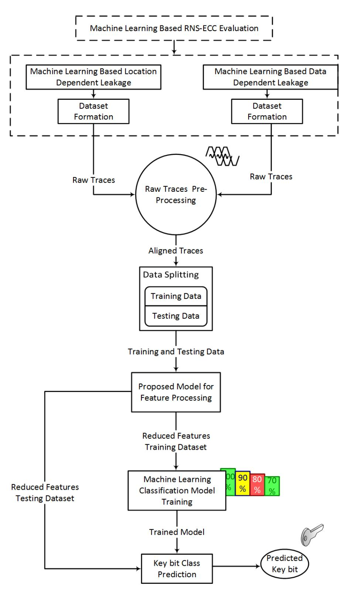

Fig. 1: Machine Learning based Evaluation Methodology for RNS-ECC

In the following subsections, the methodology stages are described in more detail. Also, we propose how each stage should be used in order to analyze and assess the ML-SCA resistance of algorithm 1 with and without the presence of countermeasures. The parameter settings used for the algorithm under study are mentioned in each stage.

#### 3.1 Trace Collection Experimental Setup

All trace Datasets for the following analysis are collected by executing algorithm 1 RNS-based ECC SM implementation (in two variants) on a BeagleBone Black that use an ARM Cortex A8 processor operating at 1GHz. Samples were col

{11}------------------------------------------------

lected using EMV Langer probe LF B-1, H Field (100KHz- 50MHz), and Lecroy Waverunner 8404M-MS with 2.5GS/sec sampling rate.

The ECC RNS SM algorithm 1 implementation was taken from a public repository (21) and was customized according to the requirement for data collection and attack scenario determined in the proposed methodology stages. For data collection and formatting, Matlab R2019 and Inspector 4.12 provided by Riscure was used (1). For machine learning analysis, a Python environment with Keras and Scikit learn libraries has been used (16). All features selection/extraction methods have been taken from Scikit learn (45) except T-test which was implemented in-house.

To meet computation extensive needs of machine learning algorithms, NCI (National Computational Infrastructure) Australia high-performance supercomputing server has been used (2).

#### 3.2 Attack Scenarios Specification

### Machine Learning based Data-dependent Leakage Analysis (MLDA)

In data-dependent attack scenario, the adversary can monitor the power or electromagnetic emission (EM) fluctuations due to the processing of a different value of the i−th scalar bit e<sup>i</sup> . This is reflected in processor instructions corresponding to line 9 of the ECC scalar multiplication algorithm (Alg. 1), where performed operations depend on the value of secret key bit e<sup>i</sup> resulting in registers R<sup>0</sup> and R<sup>1</sup> updated differently. R<sup>0</sup> contains the addition result and R<sup>1</sup> contains the doubling result if the scalar secret key bit e<sup>i</sup> = 1 and in reverse order if e<sup>i</sup> = 0 (R1: addition, R0: doubling). Since the data determine the register that is used and therefore causes the leakage, we refer to this analysis as "data-dependent leakage". Such data leakages should also be observable using protected scalar bit countermeasures if the scalar bits under attack are retrieved from a memory location in a clear view.

For the purpose of analysis, we have collected the leakages traces of the first few algorithm 1 rounds for a 233 − bit scalar. As explained, data leakage LD is labeled as '1' if the scalar e<sup>i</sup> ='1' and is labeled '0' otherwise in round i. Only one instruction was observed and 50k traces, each of 700 samples, were collected; out of which around 3k-7k were utilized after alignment in the other stages of the proposed methodology.

#### Machine Learning based Location-dependent Leakage Analysis (MLLA)

In location-dependent attack scenario, key-dependent instruction leakages are exploited, utilizing the storage structure information. More precisely, it is assumed that based on the storage content, the leakages for a particular operation will be distinguishable. It can be observed that in each round i of algorithm 1 only two operations have key-dependent instruction; that is, addition and doubling. Both operations are performed in the same order, irrespective of the value of the scalar key bit e<sup>i</sup> . However, the storage content differs according to the scalar bit value. The storage register R<sup>0</sup> is doubled when the scalar key bit is 

{12}------------------------------------------------

'0', otherwise R<sup>1</sup> is doubled. Based on the fact that there is no memory address randomization, we can exploit the vulnerability by collecting the leakage data for doubling operation. The data will be labeled and classified based on the content of storage registers R<sup>0</sup> and R1. Such memory access leakage has also been exploited for RNS-based RSA in (29). Papachristodoulou et al. in (44), have exploited a similar vulnerability for ECC SM by utilizing a small sample window of 451 samples (out of 3k samples per trace) for training and classification for template profiling SCAs. Identifying the specific samples for training purposes requires more in-depth knowledge of the underlying system and requires a lot of signal processing, which might be discouraging for the attacker. The work of Andrikos et al. performed location-based attacks using machine/deep learning but those were focused on accessing different SRAM locations and are not algorithmspecific (3). In our work, we have used the ML approach to classify the scalar key bit e<sup>i</sup> , exploiting the doubling operation leakage, by using the whole trace rather than the small sample portion of 451 samples. We have achieved similar results, which proves that the machine learning attack is realistic and practical from an attacker point of view. For the location-based analysis, we have labeled leakage data LD as '0' if R<sup>0</sup> is doubled and labeled LD as '1' if R<sup>1</sup> is doubled. We collected 50k traces (each of 3k samples long), out of which 14k traces are used after stage 2 (preprocessing) of the proposed methodology

Datasets For a detailed evaluation of an RNS ECC SM approach against the above two ML-based attack scenarios, all potential countermeasures that can be applied on the implementation should be evaluated using the proposed RNS ECC SM evaluation methodology. To achieve that, two implementation variants of the algorithm 1 SM can be identified for each ML attack scenario, one with all SCA countermeasures enabled (protected version) and one with all SCA countermeasures disabled (unprotected version). In line with the above rationale, for the evaluation of algorithm 1 the trace datasets of Table 1 can be identified, denoted and collected.

Table 1: Trace Dataset Categories

| Name                          | Countermeasures                                | Notation |
|-------------------------------|------------------------------------------------|----------|
| Protected Data Dependent      | RNS LRA technique, base point randomization,   | DDP      |
| Leakages                      | scalar randomization countermeasure and random |          |
|                               | RNS operation sequence                         |          |
| Unprotected<br>Data<br>Depen  | no countermeasure                              | DDUP     |
| dent Leakages                 |                                                |          |
| Protected Location Depen      | RNS LRA technique, base point randomization,   | DLP      |
| dent Leakages                 | scalar randomization countermeasure and random |          |
|                               | RNS operation sequence                         |          |
| Unprotected<br>Location<br>De | no countermeasure                              | DLUP     |
| pendent Leakages              |                                                |          |

{13}------------------------------------------------

#### 3.3 Raw Trace dataset Pre-processing

Trace Alignment Alignment plays an important role while using machine learning techniques especially on raw leakage samples. In raw leakage samples or row instances, each data point in a particular sample will be treated as a feature and then the feature columns are used to train the model. Having misaligned features might scatter the useful feature information all across the columns, hence making it difficult for the ML classifier to learn from the scattered haphazard data. Misalignment generally occurs due to the noise of the neighboring components in the device. However, in some cases, noise is intentionally induced to the system as a countermeasure to increase side-channel attack resistance. Executing a software implementation in an embedded system operating system (as is used in this paper experimental setup) will result in trace collection of noise that is unexpectedly added from the other processes of the operating system. Common signal processing technique can be used in order to reduce the noise like low pass or band pass filter. In the collected traces, the application of a low pass filter approach was chosen. Initially, the dominant frequencies are measured using Fast Fourier Transform (FFT), as shown in Fig. 2 and it is observed that the maximum energy lies between 0-300MHz, with the highest frequency at 1GHz. Based on the observation, a low-pass filter is applied and the resulting clear patterns are used for alignment.

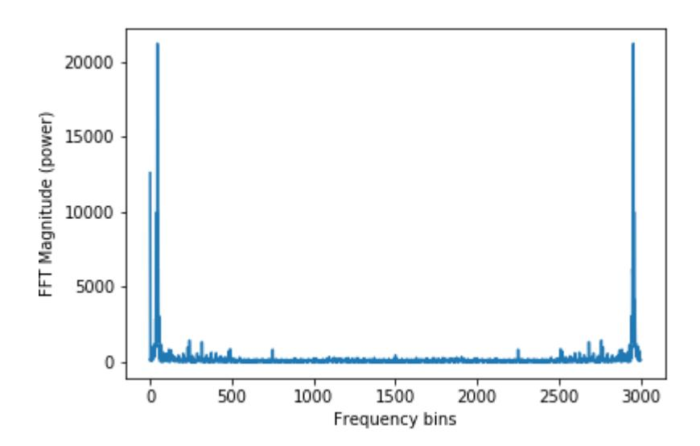

Fig. 2: Fast Fourier (FFT) of the leakage samples

Skewed or Imbalanced Datasets For a good performing trained model, it is imperative to have a balanced dataset. Skewed or imbalance dataset is the one in which the traces for one class label are more than the other. The trained model will be biased due to the dominating class and will not be able to classify the unseen data accurately. To emulate the problem of imbalance and observe its impact in the experimental process of the ECC RNS SM assessment, after traces where collected and aligned, we produced both balanced and unbalanced dataset outcomes. Datasets DD<sup>P</sup> , DDUP and DL<sup>P</sup> were almost balanced, having approximately 1050, 1500, and 3800 traces (for both 1's and 0's), respectively. 

{14}------------------------------------------------

These three datasets had ideal balanced data for modeling. However, dataset DLUP traces were collected to be highly skewed. i.e. the number of traces for class key bit '0' was higher compared to class key bit '1' (10150 and 42 traces respectively). To handle the skewness and minimize its impact, Synthetic Minority Oversampling Technique (SMOTE) was used as it outperformed for other cryptographic datasets (47). SMOTE synthesizes new instances for the minority class traces and balances the data (15).

#### 3.4 Data Splitting and Validation Strategy

Machine learning-based side-channel attacks are based on the template attack approach. In template attacks, two datasets are used; template and test datasets. The template dataset (pre-defined examples) is used to train the system, and then the test (unknown) dataset is used to evaluate the attack (14). Similarly, in ML SCAs, the leakage data set LD is divided into the training dataset, DT rain, which is used to train the machine learning model and the test DT est dataset. Unlike, template attacks, though, another dataset is introduced in ML analysis known as Validation DV al dataset. In this stage of the methodology, the above described dataset splitting and its role is analyzed below:

- DT rain dataset is used during the model fitting process and helps model learn the patterns from data.
- During the evaluation, DV al is used to fine-tune the model using model hyperparameters. The model never directly learns from the validation data, but it can occasionally see the data during the learning process. Hence it provides biased evaluation and changes the model structure based on the validation data results.
- DT est dataset is completely unknown to the system and is never used in the training process. DT est provides an unbiased evaluation of the model.

One of the important aspects in machine learning is to decide the dividing ratio of the training, validation, and testing sets. The bigger the dataset, the better the trained model will be. It becomes a huge problem, especially with the datasets having a small number of instances (traces). To evaluate the effect of data division on secret information recovery, in this paper, three proportions are tested. The ratios used for training and testing datasets are 90-10%, 80-20%, and 50-50%. Datasets are shuffled before splitting for spreading the instances in the space.

At this methodology stage analysis, we suggest in this paper, the use of k-fold cross-validation which is a resampling procedure used for evaluation of machine learning trained model. After the initial dataset split into two sets, i.e. training and testing, the training dataset is further split using k-fold validation scheme into training and validation. In this validation procedure, data samples are split into k groups. One group is a holdout or validation dataset and rest of the data is used for training the model. Model is fitted on the training group set and evaluated on the holdout/validation set. This ensures that the whole dataset 

{15}------------------------------------------------

undergoes a proper validation process. For the k-fold validation, 5 and 10 folds are the most recommended values as they neither give high variance nor high bias in the resulting validation error estimate (32). However, high number of validation folds can lead to increased training time. This processing time can be reduced by using an optimal number of folds, yet still achieving a reliable trained model. For our analysis, we have used three validation folds that is 3,5 and 10 to infer the best performance validation folds for RNS-ECC SM datasets.

# 3.5 Feature Processing and Engineering: Proposed Hybrid Approaches

In the ECC RNS SM evaluation methodology, the feature engineering techniques for feature selection and processing described in subsection 2.4 are adopted. In this stage, we propose an analysis approach to deduce the impact of feature selection/extraction techniques on the machine learning model for RNS-based ECC data classification in three different experimental setups. In the first experimental setup, feature engineering techniques are applied on raw data samples to reduce the number of features, and then the machine learning model is trained. In the second experiment, one of the filter methods is applied to get the highly ranked features, and then PCA is applied to transform the data dimensions.

Considering that the prominent characteristics of two or more feature extraction/selection techniques can be combined together to improve the learning performance and efficiency, at this stage of the evaluation analysis, we expand the previous paragraph feature engineering to propose a hybrid feature approach that can help in recognizing better features that contribute the most towards the accuracy in less time. In this research work, we propose and test the following three approaches for the experimental ECC RNS SM evaluation of algorithm 1.

- Approach A: In the first approach, features dataset is processed using the feature selection and extraction methods of subsection 2.4. Filter methods used for analysis are Ftest, T-test, Chi2, MI, P Corr, PCA, Recursive Feature Elimination using Random Forest (RFE-RF), and Feature selection using Random Forest (RF-Imp). There are F<sup>n</sup> total features for location-dependent leakages (MLLA) and data-dependent leakages (MLDA). Out of Fn, F<sup>m</sup> features are selected. The selected output features are directly given as input to the machine learning models for training.
- Approach B: In the second approach, features datasets are processed (Tier 1) using filter methods (Ftest, T-Test, Chi2, MI, P Corr), and the output features are further reduced (Tier 2) using PCA and LDA dimensionality reduction techniques. For Tier 1 feature selection, F<sup>m</sup> features are selected from F<sup>n</sup> pool of features, for both MLLA and MLDA. However, for Tier 2, F<sup>o</sup> PCA components (features) are selected from F<sup>m</sup> features dataset. For binary classification, LDA projects F<sup>m</sup> features onto one dimension.
- Approach C: In the third approach, features processed through filter methods are further reduced using recursive feature selection methods. Filter methods rank the features according to the relevance and then features are

{16}------------------------------------------------

further selected based on the classifier algorithm performance. For Tier 1, filter methods are applied to reduce features to F<sup>m</sup> from F<sup>n</sup> for both MLLA and MLDA. For Tier 2, features F<sup>m</sup> are further injected to wrapper RFE-RF and RF-Imp to select a subset of features containing F<sup>o</sup> features. The RFE-RF and RF-Imp methods recursively eliminate the redundant features which do not contribute towards classification.

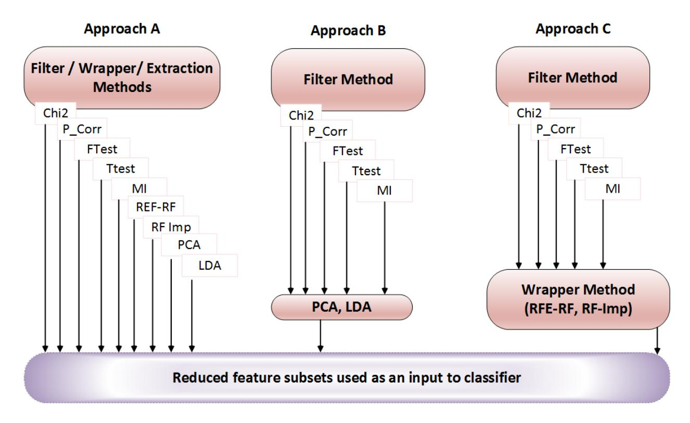

Fig. 3: Hybrid Feature Engineering Approaches

Our proposed approaches help in tackling the drawbacks of filter methods and wrapper methods. In filter methods, the target response class is not involved in the selection process. To involve the target class, the relevant uncorrelated features are selected using filter methods and are further reduced by recursively searching through the feature pool. In the experimental analysis, recursively selecting features out of 3k or 700 features is highly computationally expensive and involves redundant processing as most of the features do not contribute towards accuracy at all. This approach helps in eliminating the least correlated redundant feature and thus reducing the time required for recursive feature selection. The graphical description of the proposed approaches is presented in Fig. 3.

#### 3.6 ML Model Training: Parameter Tuning

At this stage of the ECC RNS SM evaluation methodology, the ML models are trained using the features selected from the hybrid feature extraction process. The four classification algorithms described in Sect. 2 are used to evaluate the effectiveness of the location-dependent and data-dependent attacks and also to evaluate the performance of the features subset, i.e. Support Vector Machines (SVM), Random Forest (RF), Multi-Layer Perceptron (MLP) and Convolutional neural network (CNN). There are certain parameters in each classifier algorithm, 

{17}------------------------------------------------

as mentioned in 2.3, that needs tuning. For the systematic evaluation of RNS-ECC SM, the hyperparameters are tuned using gridsearch to obtain the best possible trained model. The tuned hyperparameters are shown in the Table 2.

Table 2: Parameter tuning for SVM, RF, MLP and CNN

| Classifier | Parameter           | Value Range                   |
|------------|---------------------|-------------------------------|
|            | C                   | [0.1, 0.01, 0.5, 1.0 ]        |
| SVM        | gamma               | [1,10,30,40,50]               |
|            | kernel              | [Poly, Sigmoid, RBF]          |
|            | Learning Rate       | [0.001,0.0001]                |
| MLP        | Solver              | [adam, sgd]                   |
|            | Batch Size          | [32]                          |
|            | Activation Function | [tanh,relu,identity,logistic] |
|            | Epochs              | [200]                         |
| RF         | Trees Depth         | [5,10,20,30]                  |
|            | Number of Trees     | [10,50,100,200]               |
|            | Learning Rate       | [0.001,0.01,0.1, 0.5]         |
|            | Epochs              | [300]                         |
| CNN        | Activation function | [relu,selu,elu]               |
|            | Optimizer           | [Adam, Nadam, RMSprop,Adamax] |
|            | Init Mode           | [uniform, normal]             |
|            | Batch Size          | [32, 100, 400]                |

# 4 Results and Discussions

Manifesting the proposed methodology for the experimental process described in Sect. 3.1 for the ECC RNS SM implementation of algorithm 1 as described in the previous section, the performance of our proposed approach and its outcomesresults can be evaluated and analyzed. There are various evaluation metrics which can be used to evaluate the performance of machine learning models including Accuracy (Acc), Precision (specificity), Recall (sensitivity), F1 score, Receiver Operating Characteristics (ROC), and Area Under Curve (AUC). For binary classification problems on balanced dataset (as is our case), accuracy is sufficient evaluation metric. Accuracy is the ratio of correct predictions to the total number of predictions. Hence, it exhibits the reliability of the model in a practical real-world scenario on unseen data.

As described in Sect. 3.2, four datasets of protected and unprotected leakage traces are evaluated using four machine learning classifiers. It should be noted that the parameter settings used for experimental setup is also given in the end of each stage description in methodology (Sect. 3). In this section, the experimental results are presented for the proposed hybrid feature engineering techniques. The results are presented in four sections, for better understanding. Sect. 4.1 presents the classifier's performance on raw features, without applying any feature engineering, Sect. 4.2 presents results after applying feature engineering techniques as explained in Sect. 3.5 approach A, Sect. 4.3 exhibits comparison results for Sect. 3.5 approach A, B and C, and Sect. 4.4 depicts the affect of 

{18}------------------------------------------------

reduced validation folds and data splitting size. For the sets of experiments conducted in Sec. 4.1-4.3, the models are trained with the raw traces using four classifiers, for all four datasets. For comparative analysis with existing studies, analysis is divided into two sub-cases. In case a, machine learning analysis has been performed on the full length traces that is, all the trace samples (trace length 0-699 and 0-2999 for MLDA and MLLA, respectively) are used as features for training the model. However, in the case b, features dataset is reduced and only the aligned part of the traces (precisely, 550-900 for DD<sup>P</sup> , 1150-1950 for DDUP , 80-250 for DL<sup>P</sup> , 190-250 for DLUP ,) is used for training the models.

#### 4.1 Classifier's Performance on Raw features

Fig. 4a and 4b show the accuracy of the trained classifiers for the case a and case b, respectively. The plotted accuracy is achieved by tuning the hyperparameters as given in Table 2. Best selected parameters are also given in Table 3. It can be observed that for location-dependent attacks (MLLA) in case a, the secret can be recovered with 94-100% accuracy for protected and unprotected implementations. However, for data-dependent attacks (MLDA), the best accuracy, approximately 54%, is achieved with RF. It should be noted that SMOTE is applied before applying machine learning classifiers, to balance the datasets in some cases. In addition to accuracy, recall, precision, and F1 score has been closely monitored as well, which is less than 0.5 in case of CNN, but greater than 0.9 for other classifiers.

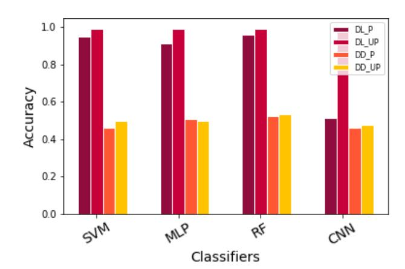

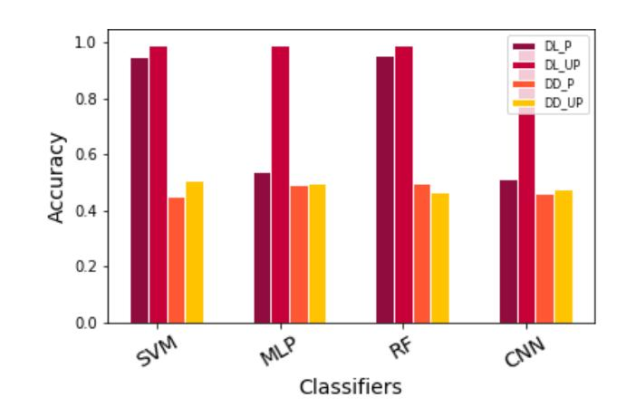

- (a) Trace Dataset with all samples (b) Trace Dataset with aligned reduced samples

Fig. 4: Accuracy of classifiers without feature processing

It has also been observed that the complex deep learning model (CNN) did not perform well for all the datasets, which was the expectation because datasets have a small number of traces. It is expected that with a huge dataset, the performance, using complex networks like CNN might improve, but the collection of the huge dataset and high computational cost, might be highly discouraging for the attacker. Scope of this study is to analyze the affect of limited size datasets with computationally efficient classifiers. It has also been noticed that a simple neural network like MLP gives good accuracy if complete trace length is used, 

{19}------------------------------------------------

however, it cannot classify the target key bit (accuracy around 53%) with the reduced trace length, in case b. This shows that an amount of useful information is contained in the unaligned portion of the trace as well.

Due to the inherent design capability of dealing with redundant features, in both SVM and RF, reducing the features per trace does not affect the classification accuracy. RF, by design, constructs unpruned trees and removes the unnecessary redundant features during the training process, hence produces an efficient model without using any feature engineering technique. In SVM, Radial Bias Function (RBF) kernel transforms the data and creates new features that are separable in high dimensional space so by design it retains the most contributing features and eliminates unnecessary ones. It appears that the RNS-ECC SM location-based leakage is linearly separable in higher dimension space. However, this is not the case with RNS-ECC SM data-dependent leakages.

To analyze the possibility of under-fitting and over-fitting, training, validation and testing accuracy, all are closely monitored in all cases. For SVM with RBF, it is observed that lower values of parameter 'C' and higher values of parameter 'gamma' provide the best results. The validation curve for gamma parameter tuning is given in Fig. 5. For RF, 50 and 100, trees along with varying tree depth of 5-20 present good results. For MLP, batch size 32, activation function 'relu' and optimizer 'adam' give the best results for MLLA analysis. However, for MLDA analysis, activation function 'tanh' and optimizer 'sgd' and 'adam' provide the best results for protected and unprotected leakage datasets, respectively.

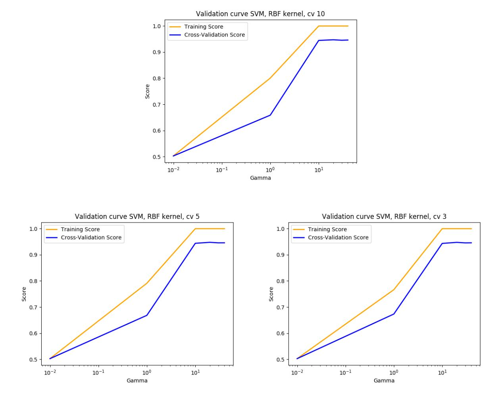

Fig. 5: Gamma Parameter Tuning

{20}------------------------------------------------

Table 3: Best parameters for SVM, RF, MLP and CNN

|      |     | DataSet Classifier Feature No | Parameters                                         |
|------|-----|-------------------------------|----------------------------------------------------|
|      | SVM | All                           | C: 1.0, gamma: 40, kernel: rbf                     |
| DLP  | MLP | All                           | activation: relu, batch_size: 32, solver:adam      |
|      | RF  | All                           | max_depth: 20, n estimators: 100                   |
|      | CNN | All                           | Act: Relu, Optimizer: Adam, Learning_Rate:0.001    |
|      | SVM | Reduced                       | C: 0.1, gamma: 40, kernel: poly                    |
|      | MLP | Reduced                       | activation: relu, 'batch_size: 32, solver: adam    |
|      | RF  | Reduced                       | max_depth: 30, n_estimators: 50                    |
|      | CNN | Reduced                       | Act: Relu, Optimizer: Adam, Learning Rate:0.001    |
| DLUP | SVM | All                           | C: 0.1, gamma: 1, kernel: rbf                      |
|      | MLP | All                           | activation: relu, batch_size: 32, solver: adam     |
|      | RF  | All                           | max_depth: 5, n estimators: 50                     |
|      | CNN | All                           | Act: Relu, Optimizer: Adam, Learning Rate:0.001    |
|      | SVM | Reduced                       | C: 0.01, gamma: 10, kernel: poly                   |
|      | MLP | Reduced                       | activation:relu, batch_size: 32, solver: adam      |
|      | RF  | Reduced                       | max_depth: 5, n_estimators: 10                     |
|      | CNN | Reduced                       | Act: Relu, Optimizer: Adam, Learning Rate:0.001    |
|      | SVM | All                           | C: 0.5, gamma: 50, kernel: rbf                     |
|      | MLP | All                           | activation: logistic, batch_size: 32, solver: sgd  |
|      | RF  | All                           | max_depth: 20, n estimators: 100                   |
|      | CNN | All                           | Act: Relu, Optimizer: Adam, Learning_Rate:0.001    |
| DDP  | SVM | Reduced                       | C: 0.5, gamma: 10, kernel: rbf                     |
|      | MLP | Reduced                       | activation: tanh, batch_size: 32, solver: adam     |
|      | RF  | Reduced                       | max_depth: 20, n_estimators: 10                    |
|      | CNN | Reduced                       | Act: Relu, Optimizer: Adam, Learning Rate:0.001    |
|      | SVM | All                           | C: 0.5, gamma: 1, kernel: sigmoid                  |
|      | MLP | All                           | activation: tanh, batch_size: 32, solver: sgd      |
| DDUP | RF  | All                           | max_depth: 20, n estimators: 100                   |
|      | CNN | All                           | Act: Relu, Optimizer: Adam, Learning Rate:0.001    |
|      | SVM | Reduced                       | C: 0.5, gamma: 1, kernel: rbf                      |
|      | MLP | Reduced                       | activation: logistic, batch_size: 32, solver: adam |
|      | RF  | Reduced                       | max_depth: 10, n_estimators: 10                    |
|      | CNN | Reduced                       | Act: Relu, Optimizer: Adam, Learning Rate:0.001    |

Given the above results, a comparison between ML analysis and the stateof-the-art template attack results (based on the perceived information (PI)) on ECC RNS SM implementation, can be made. For template attacks, PI utilizes practical leakages to estimate the Probability Density Function (PDF) of the algorithm 1 implementation. Steps explained in (20), are followed to estimate the PI of RNS implementation leakages from BeagleBone. First profiling traces are collected to estimate the leakage model and then PI is estimated for the actual test leakages from the chip. The leakage model is estimated based on profiling traces and then PI is estimated for the collected test traces. The estimation and assumption errors are calculated to evaluate the attacking model. It is observed that machine learning performs better than the template profiling attacks on the ECC RNS SM implementation datasets. For template attacks, the classification success rate for the location-based attacks is 87-99% for unprotected implemen

{21}------------------------------------------------

tation and for implementations with one countermeasures activated. When a combination of countermeasures is used, then this percentage falls to 70-83%. For machine learning analysis the classification accuracy is 95% and 99.5% for protected (DL<sup>P</sup> ) and unprotected (DLUP ) RNS-ECC SM implementations, respectively. In (44), template attack on RNS-ECC implementation is successful only if the specific sample window from each trace is selected for training. However, in machine learning-based side-channel attack, the model trained with the complete trace length gives equal or better results. Isolating and selecting the aligned part only for the training phase, might not be an easy task for an attacker thus making the template attack difficult. However, it is more convenient to train with the complete raw trace, which implies that machine learning attacks are less complex from an attacker perspective.

#### 4.2 Impact of Feature Engineering

In this section of experimental analysis, advance feature engineering techniques, based on wrapper and filter methods as explained in Sect. 3.5 approach A, are applied to analyze the impact of feature reduction on the trained model performance. F<sup>n</sup> = 50 features have been selected from the full length (having features F<sup>m</sup> = 3k and F<sup>m</sup> = 700 respectively) and reduced length (having varying numbers of features depending upon the aligned portion) traces, except T-test. For T-test threshold is set to 0.5 and the resultant 1299 features are selected for further analysis. Results for SVM trained model on RNS-ECC protected datasets (MLLA) are shown in Fig. 6.

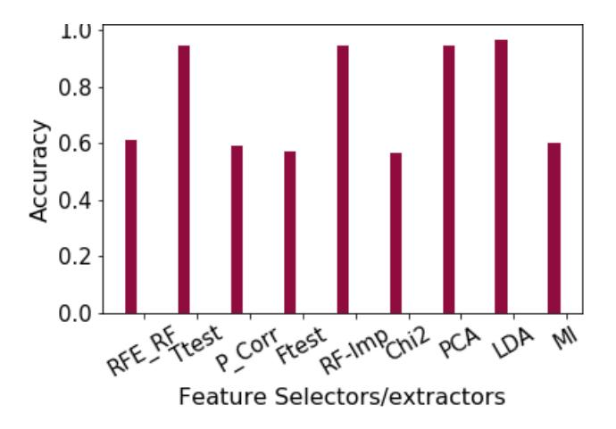

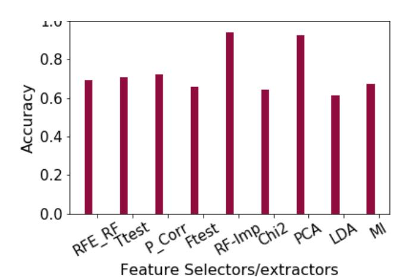

- (a) Trace Dataset with all samples (b) Trace Dataset with aligned reduced samples

Fig. 6: Performance comparison for MLLA using SVM with feature extraction/selection techniques

The purpose of applying feature engineering techniques is to find the optimal numbers of features for the bias-variance tradeoff. Variance in machine learning is the type of error that occurs due to the model's sensitivity to small fluctuations in the training dataset. High variance leads to over-fitting as the model might learn from the noise in the data. Bias, on the other hand, is the type of error that occurs due to erroneous assumptions in the learning algorithm. High 

{22}------------------------------------------------

bias leads to under-fitting as a model might miss relevant information between features and the target key class. Both the errors are inter-linked, minimizing one error will increase the other one. Neural nets (high capacity models) can lead to high variance problems as they might learn from the noise in the data. Regularization, early stopping, and drop-out has been used to avoid the problem in our evaluation. For RF, pruning deals with the above issues, so feature engineering is not required. However, for SVM finding an optimal number of features will improve the model's accuracy.

In the case of RNS-ECC datasets, there is a higher bias than a variance. When PCA is applied, the variance is increased thus bias is reduced. Usually, the variance is increased to a level so that the model doesn't overfit. The suitable variance threshold (with classification accuracy 100%) is achieved when a number of features are selected to be F<sup>m</sup> = 50 for PCA. For case a, model performance stays same or has improved by using Ttest, RF-Imp, PCA and LDA. For case b, improvement is observed for RF-Imp and PCA. However, performance decreases when analysis is performed after reducing features using LDA. LDA uses classifier and fails to extract the relevant features as some of the information, required to identify the relationship between the target class and the feature dataset, is lost while the traces are trimmed during alignment process.

# 4.3 Hybrid Feature Selection Techniques

In this section, comparative analysis is performed, based on the evaluation results of the hybrid approaches of the proposed methodology on MLLA, as explained in Sect. 3.5 approach B and C. For all hybrid methods, feature selection filter methods have been applied to reduce the bias in the input data by selecting the independent f<sup>n</sup> = 300 features from the complete pool of the features f<sup>m</sup> = 3k (MLLA) and f<sup>m</sup> = 700 (MLDA) and then only f<sup>o</sup> = 50 features are selected from the reduced pool of features using extraction techniques, for both case a and case b.

For case a ( Fig. 7a), T-test gives best results using approach A and B. Generally, the trend is seen that the combination of feature selection using filter method with the recursive feature elimination, reduces the model accuracy. One of the reasons could be that features are highly correlated with each other rather than with the target class. Approach 2 with PCA returns the accuracy greater than 80%. For Ftest, MI, and Chi2, there is an increase of 13-30% in the resultant accuracy using hybrid approach C. For case b, some of hybrid methods have shown improvement in accuracy as compared to the Fig. 4b.

## 4.4 Impact of Data Splitting Size

In this analysis phase, we have performed quantitative analysis, as described in Sect. 3.4. For analysis, out of the best performing feature selection techniques (having accuracy greater than 95%), we have chosen one randomly (i.e. PCA on protected dataset DD<sup>P</sup> ) to further investigate the impact of varying data

{23}------------------------------------------------

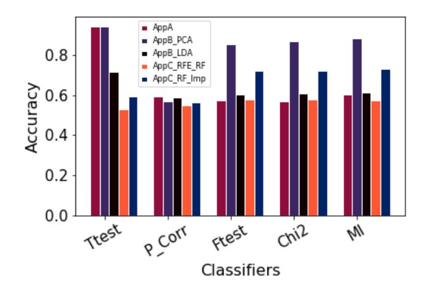

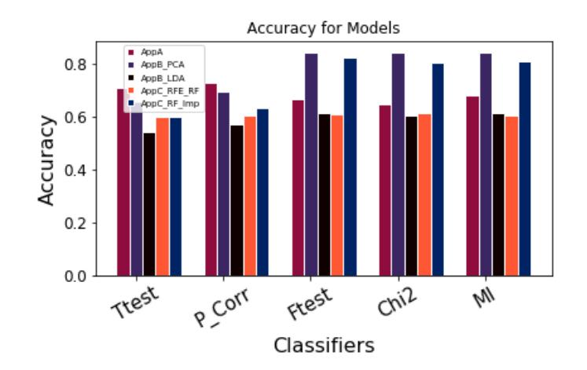

- (a) Trace Dataset with all samples (b) Trace Dataset with aligned reduced samples

Fig. 7: Performance comparison of hybrid feature processing approaches splitting ratios for RNS ECC Dataset. It can be seen that the best results are obtained with data splitting ratio of 90:10 for training and testing data.

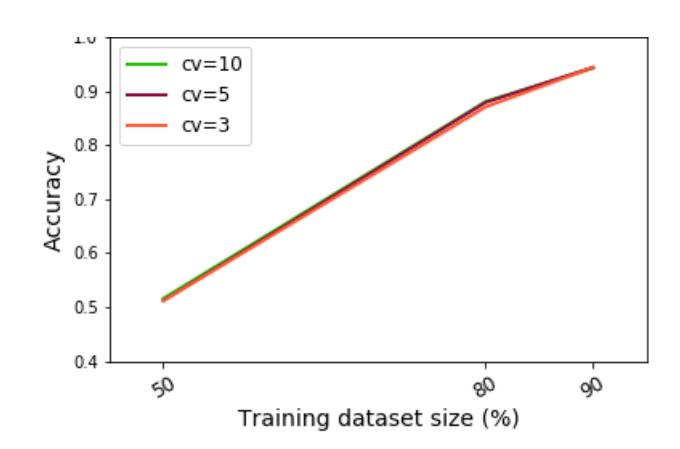

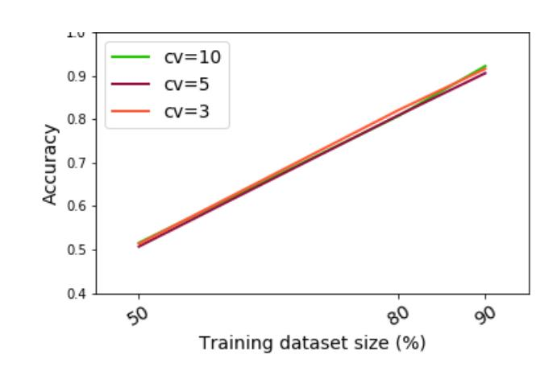

- (a) Trace Dataset with all samples (b) Trace Dataset with aligned samples only

Fig. 8: Impact of Data Splitting Size on Model Accuracy

In (9), for symmetric ciphers, in total 60,000 instances are used for training and testing, out of which 50,000 are for training and 10,000 are for testing. Expectantly, the huge set of traces is ideal for training with deep learning algorithms like CNN. However, the required training time in this case will be high too. In this study, we have evaluated the effect of having a small number of traces useful of key retrieval. We have seen that location dependent attack is successful in recovering the key with few traces in less time using validation folds as low as 3.

# 5 Conclusion

In this paper, we have presented the evaluation methodology of machine learningbased side-channel attacks on an elliptic curve RNS-based scalar multiplier implementation with and without RNS and traditional SCA countermeasures. Each 

{24}------------------------------------------------

stage of the methodology was described along with a practical experimental realization. A detailed analysis of the ECC RNS SM implementation proposed methodology results was also provided in four different phases of analysis. Comparison has been provided with the state-of-the-art template attacks on the RNS-ECC balanced and imbalanced datasets. It can be concluded that the machine learning-based side-channel attacks require less prepossessing and give better performance results for location-based profiling attacks, hence, leading to a time-efficient realistic attack scenario. The secret key can be recovered from unprotected and protected RNS ECC SM implementations, using location-based attack, with 99% and 95% accuracy, respectively.

The impact of advance feature engineering techniques has been analyzed using feature extraction and feature selection methods. Moreover, several hybrid approaches were also evaluated. It has been observed that PCA, LDA, T-test, RF-based feature selection provides improved accuracy results.

We have also evaluated the effect of training the model with the small dataset, that is dataset containing reduced aligned samples only, to classify RNS-ECC key bits using machine-learning based side-channel attacks. We have observed that for location based attacks, SVM and RF can successfully distinguish the scalar key bit with more than 95% accuracy for both full length and reduced length aligned trace datasets. Trace sample window does not affect the classification results using SVM and RF, due to their inherent characteristics of eliminating redundant features during the training process. However, MLP can distinguish and classify the scalar key bit correctly only if the full trace length dataset is used. If the reduced trace, based on the aligned part, is used for training an MLP network, then some useful information is lost during alignment process and the model fails to classify the scalar key bit. This reduces the complexity of the attack and increase the attack success rate in real world scenario. RNS-ECC implementations showed resistance against Machine-learning based data dependent attacks.

Machine-learning based side-channel attacks on PKC provide a realistic efficient attack scenario to recover the secret information as they require less preprocessing compared to template attacks on RNS ECC implementations.

{25}------------------------------------------------

# Bibliography

- [1] Inspector SCA tool. URL: hhttps://www.riscure.com/security-tools/978 inspector-sca/. Accessed: 2017-12-14.
- [2] National Computational Infrastructure Australia. URL: https://nci.org.au/our-services/supercomputing.
- [3] Christos Andrikos, Lejla Batina, Lukasz Chmielewski, Liran Lerman, Vasilios Mavroudis, Kostas Papagiannopoulos, Guilherme Perin, Giorgos Rassias, and Alberto Sonnino. Location, location, location: Revisiting modeling and exploitation for location-based side channel leakages. In Advances in Cryptology - ASIACRYPT 2019 - 25th International Conference on the Theory and Application of Cryptology and Information Security, Kobe, Japan, December 8-12, 2019, Proceedings, Part III, volume 11923 of Lecture Notes in Computer Science, pages 285–314. Springer, 2019. https://doi.org/10.1007/978-3-030-34618-8 10 doi:10.1007/978-3- 030-34618-8 10.
- [4] Jean-Claude Bajard, Sylvain Duquesne, and Nicolas Meloni. Combining Montgomery Ladder for Elliptic Curves defined over Fp and RNS Representation. In Research Report 06041, 2006.
- [5] Jean-Claude Bajard, Julien Eynard, and Filippo Gandino. Fault Detection in RNS Montgomery Modular Multiplication. In IEEE 21st Symp. on Comp. Arithmetic, pages 119–126. IEEE, April 2013. https://doi.org/10.1109/ARITH.2013.31 doi:10.1109/ARITH.2013.31.
- [6] Jean-Claude Bajard, Laurent Imbert, Pierre-Yvan Liardet, and Yannick Teglia. Leak Resistant Arithmetic. In Marc Joye and Jean-Jacques Quisquater, editors, Cryptographic Hardware and Embedded Systems - CHES, Lecture Notes in Computer Science, pages 62–75, 2004.
- [7] Lejla Batina, Jip Hogenboom, and Jasper G. J. van Woudenberg. Getting more from PCA: first results of using principal component analysis for extensive power analysis. In Orr Dunkelman, editor, Topics in Cryptology - CT-RSA 2012 - The Cryptographers' Track at the RSA Conference 2012, San Francisco, CA, USA, February 27 - March 2, 2012. Proceedings, volume 7178 of Lecture Notes in Computer Science, pages 383–397. Springer, 2012. URL: https://doi.org/10.1007/978-3-642-27954-6 24.
- [8] Peter Belhumeur, Joao Hespanha, and David Kriegman. Eigenfaces vs. fisherfaces: Recognition using class specific linear projection. IEEE Trans. Pattern Anal. Mach. Intell., 19:711–720, 07 1997. https://doi.org/10.1109/34.598228 doi:10.1109/34.598228.
- [9] Ryad Benadjila, Emmanuel Prouff, R´emi Strullu, Eleonora Cagli, and C´ecile Dumas. Deep learning for side-channel analysis and introduction to ASCAD database. Journal of Cryptographic Engineering, 11 2019. https://doi.org/10.1007/s13389-019-00220-8 doi:10.1007/s13389-019- 00220-8.

{26}------------------------------------------------

- [10] Avrim L. Blum and Pat Langley. Selection of relevant features and examples in machine learning. Artif. Intell., 97(1–2):245–271, December 1997. https://doi.org/10.1016/S0004-3702(97)00063-5 doi:10.1016/S0004- 3702(97)00063-5.
- [11] Leo Breiman. Random forests. Mach. Learn., 45(1):5–32, October 2001. https://doi.org/10.1023/A:1010933404324 doi:10.1023/A:1010933404324.
- [12] Eleonora Cagli, C´ecile Dumas, and Emmanuel Prouff. Convolutional Neural Networks with Data Augmentation Against Jitter-Based Countermeasures. pages 45–68, 08 2017. https://doi.org/10.1007/978-3-319-66787- 43doi : 10.1007/978 − 3 − 319 − 66787 − 43.
- [13] Mathieu Carbone, Vincent Conin, Marie-Angela Corn´elie, Fran¸cois Dassance, Guillaume Dufresne, C´ecile Dumas, Emmanuel Prouff, and Alexandre Venelli. Deep Learning to Evaluate Secure RSA Implementations. IACR Transactions on Cryptographic Hardware and Embedded Systems, 2019, Issue 2:132–161, 2019. URL: https://tches.iacr.org/index.php/TCHES/article/view/7388, https://doi.org/10.13154/tches.v2019.i2.132-161 doi:10.13154/tches.v2019.i2.132-161.
- [14] Suresh Chari, Josyula R. Rao, and Pankaj Rohatgi. Template attacks. In Burton S. Kaliski Jr., C¸ etin Kaya Ko¸c, and Christof Paar, editors, Cryptographic Hardware and Embedded Systems - CHES 2002, 4th International Workshop, Redwood Shores, CA, USA, August 13-15, 2002, Revised Papers, volume 2523 of Lecture Notes in Computer Science, pages 13– 28. Springer, 2002. https://doi.org/10.1007/3-540-36400-5 3 doi:10.1007/3- 540-36400-5 3.
- [15] Nitesh Chawla, Kevin Bowyer, Lawrence Hall, and W. Kegelmeyer. Smote: Synthetic minority over-sampling technique. J. Artif. Intell. Res. (JAIR), 16:321–357, 01 2002. https://doi.org/10.1613/jair.953 doi:10.1613/jair.953.
- [16] Fran¸cois Chollet et al. Keras. https://keras.io, 2015.
- [17] Mathieu Ciet, Michael Neve, Eric Peeters, and Jean-Jacques Quisquater. Parallel FPGA implementation of RSA with residue number systems - Can Side-channel threats be avoided?, booktitle = Extended version, Cryptology ePrint Archive, Report 2004/187, year = 2004,.
- [18] Corinna Cortes and Vladimir Vapnik. Support-vector networks. Mach. Learn., 20(3):273–297, September 1995. https://doi.org/10.1023/A:1022627411411 doi:10.1023/A:1022627411411.
- [19] E. De Mulder, S. B. Ors, B. Preneel, and I. Verbauwhede. Differen- ¨ tial Power and Electromagnetic Attacks on a FPGA Implementation of Elliptic Curve Cryptosystems. Comput. Electr. Eng., 33(5–6):367–382, September 2007. https://doi.org/10.1016/j.compeleceng.2007.05.009 doi:10.1016/j.compeleceng.2007.05.009.
- [20] Franccedil;ois Durvaux, Fran¸cois-Xavier Standaert, and Nicolas Veyrat-Charvillon. How to certify the leakage of a chip? In EUROCRYPT, pages 459–476. Springer, 2014. https://www.iacr.org/archive/eurocrypt2014/84410138/84410138.pdf.

{27}------------------------------------------------

- [21] Apostolos P. Fournaris. RNS LRA EC scalar Multiplier, 2018. https://github.com/afournaris/RNS LRA EC Scalar Multiplier.
- [22] Apostolos P. Fournaris, Nicolaos Klaoudatos, Nicolas Sklavos, and Christos Koulamas. Fault and Power Analysis Attack Resistant RNS based Edwards Curve Point Multiplication. In Proceedings of the 2nd Workshop on Cryptography and Security in Computing Systems, CS2 at HiPEAC 2015, Amsterdam, Netherlands, January 19-21, 2015, pages 43–46, 2015.
- [23] Apostolos P. Fournaris, Louiza Papachristodoulou, Lejla Batina, and Nicolaos Sklavos. Residue Number System as a side channel and fault injection attack countermeasure in elliptic curve cryptography. In 2016 International Conference on Design and Technology of Integrated Systems in Nanoscale Era (DTIS), pages 1–4, April 2016. https://doi.org/10.1109/DTIS.2016.7483807 doi:10.1109/DTIS.2016.7483807.
- [24] Apostolos P. Fournaris, Louiza Papachristodoulou, and Nicolas Sklavos. Secure and Efficient RNS Software Implementation for Elliptic Curve Cryptography. In 2017 IEEE Eur. Symp. Secur. Priv. Work., pages 86– 93. IEEE, apr 2017. URL: http://ieeexplore.ieee.org/document/7966976/, https://doi.org/10.1109/EuroSPW.2017.56 doi:10.1109/EuroSPW.2017.56.
- [25] Daniel Genkin, Adi Shamir, and Eran Tromer. RSA Key Extraction via Low-Bandwidth Acoustic Cryptanalysis. In Juan A. Garay and Rosario Gennaro, editors, Advances in Cryptology – CRYPTO 2014, pages 444–461, Berlin, Heidelberg, 2014. Springer Berlin Heidelberg.
- [26] Josh Jaffe Gilbert Goodwill, Benjamin Jun and Pankaj Rohatgi. A testing methodology for side channel resistance validation. NIST noninvasive attack testing workshop, 2011.
- [27] Richard Gilmore, Neil Hanley, and Maire O'Neill. Neural Network Based Attack on a Masked Implementation of AES. In 2015 IEEE International Symposium on Hardware Oriented Security and Trust (HOST), pages 106–11. Institute of Electrical and Electronics Engineers (IEEE), 5 2015. https://doi.org/10.1109/HST.2015.7140247 doi:10.1109/HST.2015.7140247.
- [28] Anupam Golder, Debayan Das, Josef Danial, Santosh Ghosh, Shreyas Sen, and Arijit Raychowdhury. Practical approaches toward deep-learning-based cross-device power side-channel attack. IEEE Transactions on Very Large Scale Integration (VLSI) Systems, 27:2720–2733, 2019.
- [29] Perin Guilherme, Laurent Imbert, Lionel Torres, and Philippe Maurine. Attacking randomized exponentiations using unsupervised learning. 04 2014. https://doi.org/10.1007/978-3-319-10175- 011doi : 10.1007/978 − 3 − 319 − 10175 − 011.
- [30] Nicolas Guillermin. A Coprocessor for Secure and High Speed Modular Arithmetic. IACR Cryptology ePrint Archive, 2011.
- [31] Gabriel Hospodar, Benedikt Gierlichs, Elke De Mulder, Ingrid Verbauwhede, and Joos Vandewalle. Machine learning in side-channel analysis: a first study. Journal of Cryptographic Engineering, 1(4):293, Oct 2011. https://doi.org/10.1007/s13389-011-0023-x doi:10.1007/s13389-011-0023-x.

{28}------------------------------------------------

- [32] Gareth James, Daniela Witten, Trevor Hastie, and Robert Tibshirani. An Introduction to Statistical Learning: With Applications in R. 08 2013.
- [33] George H. John, Ron Kohavi, and Karl Pfleger. Irrelevant features and the subset selection problem. In Proceedings of the Eleventh International Conference on International Conference on Machine Learning, ICML'94, page 121–129, San Francisco, CA, USA, 1994. Morgan Kaufmann Publishers Inc.
- [34] Ian Jolliffe. Principal Component Analysis, pages 1094–1096. Springer Berlin Heidelberg, Berlin, Heidelberg, 2011. https://doi.org/10.1007/978- 3-642-04898-2455doi : 10.1007/978 − 3 − 642 − 04898 − 2455.
- [35] Marc Joye and Sung-Ming Yen. The montgomery powering ladder. In Burton S. Kaliski Jr., C¸ etin Kaya Ko¸c, and Christof Paar, editors, Cryptographic Hardware and Embedded Systems - CHES 2002, 4th International Workshop, Redwood Shores, CA, USA, August 13-15, 2002, Revised Papers, volume 2523 of Lecture Notes in Computer Science, pages 291–302. Springer, 2002. https://doi.org/10.1007/3-540-36400-5 22 doi:10.1007/3-540-36400- 5 22.
- [36] Jaehun Kim, Stjepan Picek, Annelie Heuser, Shivam Bhasin, and Alan Hanjalic. Make Some Noise. Unleashing the Power of Convolutional Neural Networks for Profiled Side-channel Analysis. IACR Transactions on Cryptographic Hardware and Embedded Systems, 2019(3):148–179, May 2019. URL: https://tches.iacr.org/index.php/TCHES/article/view/8292, https://doi.org/10.13154/tches.v2019.i3.148-179 doi:10.13154/tches.v2019.i3.148-179.
- [37] Paul Kocher, Joshua Jaffe, and Benjamin Jun. Differential Power Analysis. In Michael Wiener, editor, Advances in Cryptology — CRYPTO' 99, pages 388–397, Berlin, Heidelberg, 1999. Springer Berlin Heidelberg.
- [38] Ron Kohavi and George H. John. Wrappers for feature subset selection. Artif. Intell., 97(1–2):273–324, December 1997. https://doi.org/10.1016/S0004-3702(97)00043-X doi:10.1016/S0004- 3702(97)00043-X.
- [39] Yann LeCun, Patrick Haffner, L´eon Bottou, and Yoshua Bengio. Object recognition with gradient-based learning. In Shape, Contour and Grouping in Computer Vision, page 319, Berlin, Heidelberg, 1999. Springer-Verlag.
- [40] Houssem Maghrebi, Thibault Portigliatti, and Emmanuel Prouff. Breaking cryptographic implementations using deep learning techniques. IACR Cryptology ePrint Archive, 2016:921, 2016. URL: http://eprint.iacr.org/2016/921.
- [41] Olivier Markowitch, Liran Lerman, and Gianluca Bontempi. Side channel attack: An approach based on machine learning. In Constructive Side-Channel Analysis and Secure Design, COSADE, 2011.
- [42] Paulo Martins and Leonel Sousa. The role of non-positional arithmetic on efficient emerging cryptographic algorithms. IEEE Access, 8:59533–59549, 2020.
- [43] Naila Mukhtar, Ali Mehrabi, Yinan Kong, and Ashiq Anjum. Machine-learning-based side-channel evaluation of elliptic-curve

{29}------------------------------------------------

- cryptographic fpga processor. Applied Sciences, 9:64, 12 2018. https://doi.org/10.3390/app9010064 doi:10.3390/app9010064.
- [44] Louiza Papachristodoulou, Apostolos P. Fournaris, Kostas Papagiannopoulos, and Lejla Batina. Practical evaluation of protected residue number system scalar multiplication. IACR Transactions on Cryptographic Hardware and Embedded Systems, 2019(1):259–282, Nov. 2018. URL: https://tches.iacr.org/index.php/TCHES/article/view/7341.
- [45] F. Pedregosa, G. Varoquaux, A. Gramfort, V. Michel, B. Thirion, O. Grisel, M. Blondel, P. Prettenhofer, R. Weiss, V. Dubourg, J. Vanderplas, A. Passos, D. Cournapeau, M. Brucher, M. Perrot, and E. Duchesnay. Scikitlearn: Machine learning in Python. Journal of Machine Learning Research, 12:2825–2830, 2011.
- [46] Stjepan Picek, Annelie Heuser, Alan Jovic, and Lejla Batina. A Systematic Evaluation of Profiling Through Focused Feature Selection. IEEE Transactions on Very Large Scale Integration (VLSI) Systems, 27:2802–2815, 2019.
- [47] Stjepan Picek, Annelie Heuser, Alan Jovic, Shivam Bhasin, and Francesco Regazzoni. The curse of class imbalance and conflicting metrics with machine learning for side-channel evaluations. IACR Trans. Cryptogr. Hardw. Embed. Syst., 2019(1):209– 237, 2019. https://doi.org/10.13154/tches.v2019.i1.209-237 doi:10.13154/tches.v2019.i1.209-237.
- [48] Dr. Dimitrios Schinianakis, Apostolos Fournaris, Harris Michail, Athanasios Kakarountas, and Thanos Stouraitis. An rns implementation of an elliptic curve point multiplier. Circuits and Systems I: Regular Papers, IEEE Transactions on, 56:1202 – 1213, 07 2009.
- [49] J¨urgen Schmidhuber. Deep learning in neural networks. Neural Netw., 61(C):85–117, January 2015. https://doi.org/10.1016/j.neunet.2014.09.003 doi:10.1016/j.neunet.2014.09.003.
- [50] D. L. Swets and J. J. Weng. Using discriminant eigenfeatures for image retrieval. IEEE Transactions on Pattern Analysis and Machine Intelligence, 18(8):831–836, 1996.
- [51] Leo Weissbart, Stjepan Picek, and Lejla Batina. One Trace Is All It Takes: Machine Learning-Based Side-Channel Attack on EdDSA. In Shivam Bhasin, Avi Mendelson, and Mridul Nandi, editors, Security, Privacy, and Applied Cryptography Engineering - 9th International Conference, SPACE 2019, Gandhinagar, India, December 3-7, 2019, Proceedings, volume 11947 of Lecture Notes in Computer Science, pages 86–105. Springer, 2019. https://doi.org/10.1007/978-3-030-35869-3 8 doi:10.1007/978-3-030-35869- 3 8.
- [52] David Wolpert. The supervised learning no-free-lunch theorems. 01 2001. https://doi.org/10.1007/978-1-4471-0123- 93doi : 10.1007/978 − 1 − 4471 − 0123 − 93.
- [53] Gabriel Zaid, Lilian Bossuet, Amaury Habrard, and Alexandre Venelli. Methodology for Efficient CNN Architectures in Profiling Attacks. IACR Transactions on Cryptographic Hardware and Embedded Systems, 2020(1):1–36, Nov. 2019.

{30}------------------------------------------------

- URL: https://tches.iacr.org/index.php/TCHES/article/view/8391, https://doi.org/10.13154/tches.v2020.i1.1-36 doi:10.13154/tches.v2020.i1.1- 36.
- [54] Z. Zeng, D. Gu, J. Liu, and Z. Guo. An Improved Side-Channel Attack Based on Support Vector Machine. In 2014 Tenth International Conference on Computational Intelligence and Security, pages 676–680, Nov 2014. https://doi.org/10.1109/CIS.2014.80 doi:10.1109/CIS.2014.80.