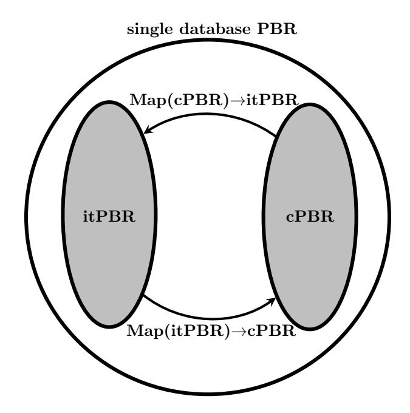
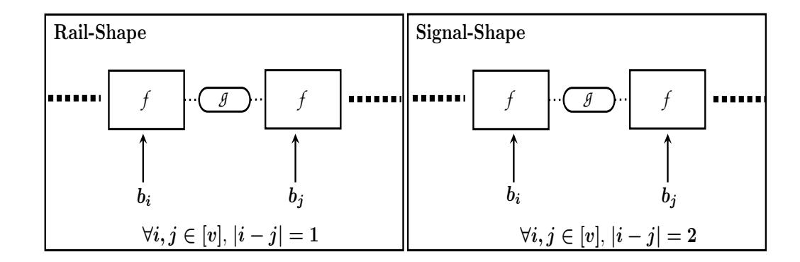
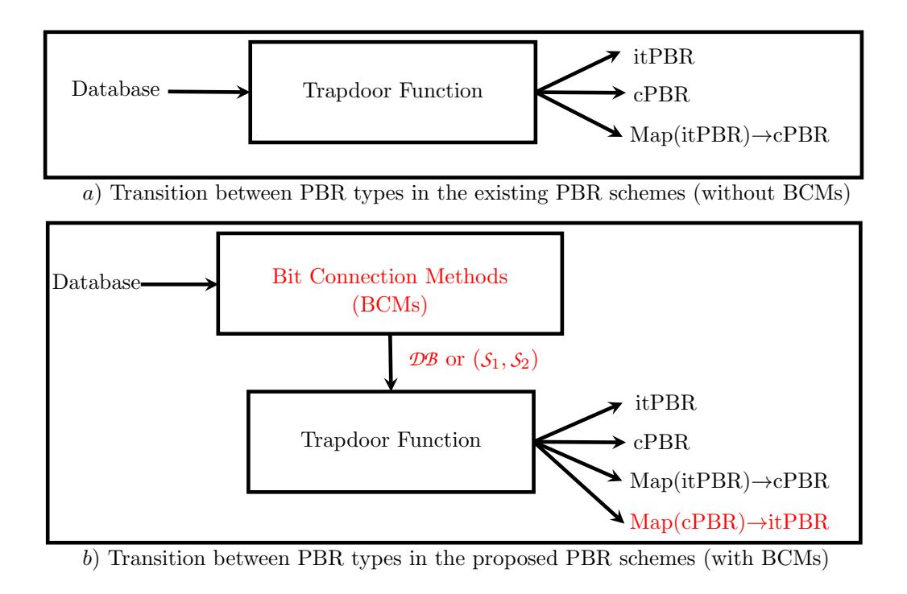
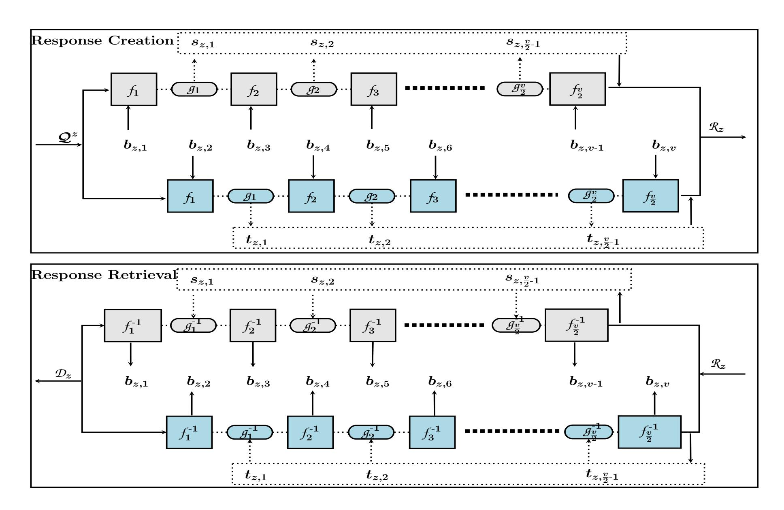
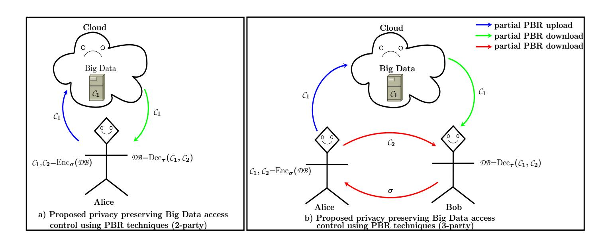

{0}------------------------------------------------

## Efficient Transformation Capabilities of Single Database Private Block Retrieval

Radhakrishna Bhat1,∗ and N R Sunitha2

1Department of Computer Science and Engineering, Manipal Institute of Technology, Manipal Academy of Higher Education Manipal, Karnataka, India - 576104 Email: rsb567@gmail.com 2 Department of Computer Science and Engineering, Siddaganga Institute of Technology, Visvesvaraya Technological University Tumkur, Karnataka, India - 572103 Email: nrsunithasit@gmail.com

#### Abstract

Private Information Retrieval (PIR) is one of the promising techniques to preserve user privacy in the presence of trusted-but-curious servers. The informationtheoretically private query construction assures the highest user privacy over curious and unbounded computation servers. Therefore, the need for information-theoretic private retrieval was fulfilled by various schemes in a variety of PIR settings. But, there is a lack of efficient encryption switching scheme which supports efficient switching between information-theoretic to/from computationally bounded PIRs. We propose a combination of new bit connection methods called rail-shape and signal-shape and new quadratic residuosity assumption based family of trapdoor functions for generic single database Private Block Retrieval (PBR). The main goal of this work is to show that the possibility of mapping from computationally bounded privacy to information-theoretic privacy or vice-versa in a single database setting using newly constructed bit connection and trapdoor function combinations. Notably, the proposed schemes are single round, memoryless and plain database schemes (at their basic constructions).

Keywords: Private information retrieval · Information-theoretic privacy · User privacy · Private Block Retrieval · Oblivious transfer · Probabilistic encryption

## 1 Introduction

The goal of any privacy critical applications is to preserve the underlying privacy (like user privacy or server privacy or data privacy) with guaranteed confidentiality primitive (i.e., information-theoretic).

{1}------------------------------------------------

Among all other user privacy-preserving techniques, Private Information Retrieval (PIR) is one of the prominent privacy-preserving techniques to preserve both user privacy and data privacy introduced by Chor et.al [9, 11]. The private information retrieval also called as special case of 1-out-of-n oblivious transfer involves two communicating parties: user and server in which user privately reads a single bit from server 's n bit database. The basic goal of Chor et.al [9, 11] was to provide the highest confidentiality to the user's interest (maybe index, pattern, graph moves etc.) for real-time privacy applications. Since then, comprehensive research has been carried out in several dimensions of PIR including relaxing the privacy level from information-theoretic to a computationally bounded setting, reducing communication and computation overhead, reducing the number of rounds and number of servers involved, extending to private write etc.

One of the natural extensions to PIR protocol is Private Block Retrieval (PBR) in which user privately reads v bit block (instead of a bit) from server's u block database. Based on the level of privacy, the PIR protocol is broadly divided into two groups: information-theoretic PIR and computationally bounded PIR as described below.

- − Information-theoretic PIR (itPIR): If the PIR protocol involves information-theoretically private queries with non-colluding replicated database server entities then such scheme is considered as informationtheoretic PIR (itPIR) in which the user privacy is preserved through the information-theoretically private queries. Several information-theoretic schemes [28, 7, 24, 23, 15, 16, 3, 2] and some PBR extensions [11, 4, 26, 14, 27, 12, 32, 18, 1] have concentrated on providing information-theoretic privacy using database replications.
- − Computationally bounded PIR (cPIR): If the PIR protocol involves a computationally bounded (or computationally intractable) database server entities then such scheme is considered as computationally bounded PIR (cPIR) in which the privacy is preserved based on the well-defined cryptographic intractability assumption(s). Most of the research work [21, 10, 5, 20, 29, 17] and [31, 22, 33, 25, 30, 8, 14, 27, 6, 19] on cPIR concentrated on using a single intractability assumption to preserve both user privacy and data privacy.

There are following major problems in the existing single database PBR schemes (including both itPBR and cPBR).

− Lack of sufficient itPIR approaches: More research focus was on the construction of an efficient cPBR instead of itPBR in a single database setting.

{2}------------------------------------------------

- This leads to the lack of information-theoretic privacy guarantee to the user in single database setting.
- − Lack of independency between user and data privacy: Most of the existing cPBR schemes use a single intractability assumption (such as Quadratic residuosity, Phi-hiding, Lattices, Composite residuosity etc) to preserve both user privacy and data privacy. If the curious party breaks the underlying intractability assumption then both the privacy concerns are easily compromised without extra effort. For instance, the single database PIR protocol constructed by Kushilevitz and Ostrovsky [21] rely on the wellknown intractability assumption called Quadratic Residuosity Assumption (QRA) to achieve both the user privacy (through the computationally intractable query inputs with quadratic residuosity properties) and the data privacy (through the quadratic residuosity ciphertexts). Note that compromising the QRA naturally reveals both privacy concerns (without extra effort). Therefore, there is a strong need of a generic scheme with efficient mapping from cPBR to itPBR in such a way that the underlying primitive of user privacy should also map from intractability assumption to information-theoretic privacy. Note that, Kushilevitz and Ostrovsky scheme does not support an efficient mapping cPBR to/from itPBR.
- − Lack of generic framework that fulfills the above needs: Due to the lack of generic PBR framework (which can be used as a generic framework for several privacy critical applications such as PBR, oblivious transfer, asymmetric encryption etc), there is a strong need of a generic PBR scheme that can efficiently transform between several PBR extensions like informationtheoretic PBR, computationally bounded PBR, oblivious transfer, asymmetric encryption etc.

With this thorough investigation, the natural question that arises is as follows.

Is it possible to construct a generic single database Private Block Retrieval framework with a reasonable performance that fulfills one or more privacy concerns (such as user privacy, data privacy, server privacy) of private block retrieval and oblivious transfer ?

Our Single Database Private Block Retrieval Solution: We have introduced a new bit connection and QRA based trapdoor functions for a single database PBR with the following results.

− New quadratic residuosity based single bit injective and lossy trapdoor functions.

{3}------------------------------------------------

- New bit connection methods (BCMs) called *rail-shape* and *signal-shape* to interconnect the proposed trapdoor functions with the aid of quadratic residuosity based injective trapdoor functions introduced by Freeman et.al [13].
- The appropriate combination of the proposed bit connection methods and trapdoor functions serve as a generic framework to map between several PBR extensions such as information-theoretic PBR, computationally bounded PBR, oblivious transfer, asymmetric encryption etc.
- New single database information-theoretic PBR (SitPBR) scheme using the combination of proposed bit connection methods and trapdoor functions in which the communication cost of the proposed scheme is  $\mathcal{O}(u(v-2)+2u\log N)$  and it's computation cost is  $\mathcal{O}(u(2v-2))$  where n=uv is the database size, u=rows, v=columns, and N is the RSA composite.
- New single database computationally bounded PBR (ScPBR) scheme in which the communication cost of the proposed scheme is  $\mathcal{O}(u(v-2)+2u\log N)$  and it's computation cost is  $\mathcal{O}(u(2v-2))$ .

#### 2 Preliminaries and Notations

Let [1,u] denotes taking all values from 1 to u and  $[u] \triangleq \{1,2,\cdots,u\}$  denotes taking any one value in the range from 1 to u. Let k denotes the security parameter,  $N \leftarrow \{0,1\}^k = PQ$  be the RSA composite modulus where  $P \equiv 3 \pmod{4}, Q \equiv 3 \pmod{4}, \mathbb{Z}_N^{+1}$  denotes the set of all elements with Jacobi Symbol  $(\mathcal{JS})$  1. Let  $Q_R$  and  $\overline{Q}_R$  denote the quadratic residue and quadratic non-residue sets with  $\mathcal{JS}=1$  respectively. Let  $\{a,b\}$  be a set consists of two components in which  $a \in \mathbb{Z}_N^{+1}$ , and  $b = \{i : i \in \{0,1\}\}$ .

Quadratic Residuosity Predicate (QRP):  $\forall x \in \mathbb{Z}_N^*$ ,

$$(QRP_{P,Q}(x) \text{ or } QRP(x)) = \begin{cases} 0 \text{ If } x \in Q_R \\ 1 \text{ If } x \in \overline{Q}_R \end{cases}$$
 (1)

Quadratic residuosity based lossy trapdoor function of Freeman et.al [13] (LTDF): For all  $\alpha \in \mathbb{Z}_N^*$ ,  $s \in \overline{Q}_R$  and  $r \in \mathbb{Z}_N^{-1}$ , the lossy trapdoor function  $\mathcal{T}: \mathbb{Z}_N^* \to \mathbb{Z}_N^*$  is  $\mathcal{T}=(\alpha^2 \cdot r^j \cdot s^h \equiv z \pmod{N})$  such that j is equal to 1 if  $\mathfrak{JS}(\alpha)$ =-1 otherwise j is equal to 0. The value of h is equal to 1 if  $\alpha > N/2$  otherwise h is equal to 0. The respective inverse function is  $\mathcal{T}^{-1}=(\sqrt{(z \cdot s^{-h}) \cdot r^{-j}} \equiv \alpha \pmod{N})$ . We use the alternative square root syntax as  $\mathcal{T}^{-1}=(\sqrt[jh]{z} \equiv \alpha \pmod{N})$ .

{4}------------------------------------------------

## 3 Combination of New Bit Connection Methods and Trapdoor Functions

We have introduced a novel combinations of the quadratic residuosity based trapdoor functions in Section 3.1 and the database bit connection methods in Section 3.2 that can be used as a generic framework for itPBR to/from cPBR transformations as shown in Fig.1. These combinations can assure many privacy concerns such as user privacy, data privacy and server privacy.

#### 3.1 A New Quadratic Residuosity based Trapdoor Functions

It is a newly constructed 7-tuple  $(\mathcal{I}, \mathcal{G}_0, \mathcal{G}_1, \mathcal{g}, \mathcal{g}^{-1}, f, f^{-1})$  consists of the following functions.

- Sampling an input ( $\mathcal{I}$ ): The algorithm  $\mathcal{I}$  receives the input  $1^k$  and produces the large RSA composite N=PQ where P and Q are large distinct primes with  $P \equiv Q \equiv 3 \pmod{4}$  or  $1 \pmod{4}$ . Then chooses an "identically distributed" random  $x \in \mathbb{Z}_N^{+1}$ . The input domain of the random input x is  $\mathbb{Z}_N^{+1}$ .
- Sampling a lossless injective function  $(\mathcal{G}_0)$ : On receiving the composite N, the algorithm  $\mathcal{G}_0$  chooses a random  $\mathcal{K}_1, \mathcal{K}_2 \in \mathbb{Z}_N^{+1}$  such that the quadratic residuosity predicate of  $\mathcal{K}_1$  and  $\mathcal{K}_2$  must be different (i.e.,  $\operatorname{QRP}(\mathcal{K}_1) \neq \operatorname{QRP}(\mathcal{K}_2)$ ). The function parameters are  $\sigma = (N, \mathcal{K}_1, \mathcal{K}_2)$  and the trapdoor/private key is  $\tau = (P, Q)$ . Now it is clear that the injective function is defined over the domain  $\mathbb{Z}_N^{+1}$ .
- Sampling a lossy trapdoor function  $(\mathcal{G}_1)$ : On receiving the composite N, the algorithm  $\mathcal{G}_1$  chooses a random  $\mathcal{K}_1, \mathcal{K}_2 \in \mathbb{Z}_N^{+1}$  such that the quadratic residuosity predicate of  $\mathcal{K}_1$  and  $\mathcal{K}_2$  must be equal (i.e.,  $QRP(\mathcal{K}_1)=QRP(\mathcal{K}_2)$ ).
- Evaluation of trapdoor function of [13] (g): The algorithm g receives the input x and produces "h" value of x (as described in quadratic residuosity based lossy trapdoor function [13]) as trapdoor bit as follows.

$$g(x) = x^2 \pmod{N}$$

$$= (x^2, h_x)$$
(2)

- Inversion of trapdoor function of [13] ( $g^{-1}$ ): Given the modular square  $x^2$  and "h" value of x, the algorithm  $g^{-1}$  obtains the input x as follows.

$$g^{-1}(x^2, h_x) = \sqrt[j_x=0, h_x]{x^2 \pmod{N}} = x$$
 (3)

{5}------------------------------------------------

Figure 1: A single database private block retrieval framework with itPBR to/from cPBR transformations

Figure 2: A new bit connection methods used to interconnect the proposed trapdoor functions

- Evaluation of lossless injective function (f): The algorithm f chooses a bit  $b \in \{0, 1\}$ . It then receives the function parameters, g(x) and evaluates the following.

$$f_{\sigma}(g(x), b) = \begin{cases} g(x) \cdot \mathcal{K}_{1} \pmod{N} & \text{If } b = 0\\ g(x) \cdot \mathcal{K}_{2} \pmod{N} & \text{If } b = 1 \end{cases} = y \tag{4}$$

- Inversion of lossless injective function ( $f^{-1}$ ): Given the function parameters, trapdoor  $\tau$ , trapdoor bit h and ciphertext y, the algorithm  $f^{-1}$  obtains both x and b as follows.

$$f_{\tau}^{-1}(y) = \begin{cases} b = 0 \text{ and } g^{-1}(y \cdot \mathcal{K}_{1}^{-1}, h_{x}) \text{ If } \operatorname{QRP}(\mathcal{K}_{1}) = \operatorname{QRP}(y) \\ b = 1 \text{ and } g^{-1}(y, \cdot \mathcal{K}_{2}^{-1}, h_{x}) \text{ If } \operatorname{QRP}(\mathcal{K}_{2}) = \operatorname{QRP}(y) \end{cases}$$

$$= (x, b)$$

$$(5)$$

where  $\mathcal{K}_1 \cdot \mathcal{K}_1^{-1} \equiv 1 \pmod{N}$  and  $\mathcal{K}_2 \cdot \mathcal{K}_2^{-1} \equiv 1 \pmod{N}$ .

## 3.2 A New Bit Connection Methods (BCMs)

We introduce new methods of interconnecting the database bits during PBR response creation on the server side as shown in Fig. 1. Based on the

{6}------------------------------------------------

Figure 3: Possible transformations in the existing and the proposed PBR schemes

interconnectivity of the database bits, we classify the newly introduced bit connection methods as *rail-shape* and *signal-shape* as shown in Fig. 2.

Let the database be  $\mathcal{DB} = \{b_1, b_2, \dots, b_v\}$ . Consider the following ordered subsets of  $\mathcal{DB}$ 

$$S_1 = \{b_i : i = i + 2, i \in [1, v-1]\}$$

$$S_2 = \{b_i : i = i + 2, i \in [2, v]\}$$
(6)

Note that if the absolute difference between any two database indices of the underlying set is 1 then such set is used for *rail-shape* connection and if the absolute difference between any two database indices of the underlying set is 2 then such set is used for *signal-shape* connection. Therefore, it is now intuitive that the set  $\mathcal{DB}$  is used for rail-shape connection and  $\mathcal{S}_1/\mathcal{S}_2$  are used for signal-shape connections.

Now, let's see the main advantage of using these BCMs in a single database PBR setting as follows.

- Most of the existing PBR schemes provide the whole database as input to their underlying trapdoor functions as shown in Fig. 3.a. Consequently, this method of providing a database to the underlying trapdoor function in PBR results in the following types of PBR: either itPBR or cPBR. Also, there should always be a chance of transforming from each itPBR scheme to its cPBR version (i.e., Map(itPBR)→cPBR). But, there is no chance of transforming from each cPBR scheme to its itPBR version (i.e., Map(cPBR)→itPBR).
- Introducing the unique bit connection methods (other than using the whole plaintext) is helpful to achieve Map(itPBR)→cPBR? Yes. It is possible to achieve both Map(itPBR)→cPBR and Map(cPBR)→itPBR using the

{7}------------------------------------------------

Figure 4: The block response creation (RC) and response retrieval (RR) algorithms of the proposed scheme

combination of BCMs and newly constructed trapdoor functions of Section 3.1 as shown in Fig. 3.b. Therefore, the combination of BCMs and newly constructed trapdoor functions serve as a framework to construct either itPBR or cPBR and thereby achieving Map(itPBR) $\rightarrow$ cPBR and Map(cPBR) $\rightarrow$ itPBR.

# 4 A New Single Database Information-Theoretic Private Block Retrieval Schemes (SitPBR)

In this section, we have introduced a new information-theoretic private block retrieval technique. At the abstract view, the proposed scheme is a 3-tuple (QG,RC,RR) involves two communicating parties: user and server in which user generates an information-theoretically private query from the input domain  $\mathbb{Z}_N^{+1}$  using QG algorithm and sends this query to server. On the other hand, using query and the database  $\mathcal{DB}$ , server generates the response using RC algorithm and sends back to user. Finally, user retrieves the intended block privately using RR algorithm. The detailed description of the proposed scheme is given as follows.

Let  $n=u\times v$  bit 2-dimensional matrix database with u rows and v columns

{8}------------------------------------------------

be  $\mathcal{DB} = \{\mathcal{D}_1, \mathcal{D}_2, ..., \mathcal{D}_u\}$  where  $\mathcal{D}_i = \{b_{i,1}, b_{i,2}, \cdots, b_{i,v}\}, i \in [u]$ . Each database block  $\mathcal{D}_i = (\mathcal{S}_2 \cup \mathcal{S}_1)$  is further viewed as two subsets  $\mathcal{S}_2$  and  $\mathcal{S}_1$  where  $\mathcal{S}_2 = \{b_{i,2}, b_{i,4}, b_{i,6}, ..., b_{i,v}\}$  and  $\mathcal{S}_1 = \{b_{i,1}, b_{i,3}, b_{i,5}, ..., b_{i,v-1}\}$ . The idea here is to use new bit connections using the subsets  $\mathcal{S}_2, \mathcal{S}_1$  and apply the recursive execution of the proposed trapdoor function of Section 3.1. The detailed description of the proposed algorithms is given as follow.

- Query Generation (QG): (user generates) Generate (public key, private key) pair from the query input domain  $\mathbb{Z}_N^{+1}$  as follows. Generate the public key  $\sigma = (N, \{\mathcal{K}_{z,1}, \mathcal{K}_{z,2} : z \in [1, u]\})$ , and the private key  $\tau = (P, Q)$  as described in the algorithm  $\mathcal{G}_0$ . Also, generate an "identically distributed" random  $x \in \mathbb{Z}_N^{+1}$  as described in the algorithm  $\mathcal{I}$ . Then, generate an information-theoretically private query  $\mathcal{Q} = (N, \{\mathcal{K}_{z,1}, \mathcal{K}_{z,2} : z \in [1, u]\}, x)$  where  $\mathcal{Q}^z$  represents the z-th block query with public key components  $(\mathcal{K}_{z,1}, \mathcal{K}_{z,2})$ .
- Response Creation (RC): (server generates) Using the information theoretic query  $\mathcal{Q}$  and the database  $\mathcal{DB}$ , generate the response by executing the following.

For all database block  $\mathcal{D}_z$ ,  $z \in [1, u]$ , using respective public key components  $\mathcal{K}_{z,1}, \mathcal{K}_{z,2}$ , execute the following recursive function  $f(g(\cdot), \cdot)$  as described in the algorithm f and obtain the intermediate ciphertext bits from each  $g(\cdot)$  (as described in the algorithm g) and two final ciphertexts as follows.

$$(y_{z,1}, \{s_{z,1}, s_{z,2}, \dots, s_{z,\frac{v}{2}-1}\}) = f_{\sigma}(g(f_{\sigma}(\cdot, b_{z,i-2})), b_{z,i})$$
and
$$(y_{z,2}, \{t_{z,1}, t_{z,2}, \dots, t_{z,\frac{v}{2}-1}\}) = f_{\sigma}(g(f_{\sigma}(\cdot, b_{z,j-2})), b_{z,j})$$

$$(7)$$

where  $i \in [v, 4], j \in [v-1, 3]$  and each  $f(g(\cdot), \cdot)$  is an injective function described in the algorithm f.

Finally, the database response would be  $\mathcal{R} = \{\mathcal{R}_z = \{(y_{z,1}, \{s_{z,1}, s_{z,2}, \dots, s_{z,\frac{v}{2}-1}\}), (y_{z,2}, \{t_{z,1}, t_{z,2}, \dots, t_{z,\frac{v}{2}-1}\})\}$ :  $y \in \mathbb{Z}_N^{+1}$ ,  $s, t \in \{0, 1\}\}$ . The pictorial representation of the block response creation process is given in Fig. 4.

- Response Retrieval (RR): (user generates) Using the response  $\mathcal{R}$  and the trapdoor  $\tau$ , retrieve the required block  $w \in [u]$  (generally single block) as follows.

$$\{b_{w,2}, b_{w,4}, b_{w,6}..., b_{w,v}\} = f_{\tau}^{-1}(\mathcal{J}^{-1}(f_{\tau}^{-1}(\cdot), s_{w,i}))$$
and
$$\{b_{w,1}, b_{w,3}, b_{w,5}..., b_{w,v-1}\} = f_{\tau}^{-1}(\mathcal{J}^{-1}(f_{\tau}^{-1}(\cdot), t_{w,i}))$$
(8)

{9}------------------------------------------------

Table 1: An illustrative example of the proposed scheme with two database blocks

|      | Response Creation (RC)                                                                                                     |                           |                                                          |                           |
|------|----------------------------------------------------------------------------------------------------------------------------|---------------------------|----------------------------------------------------------|---------------------------|
| Step | $\mathcal{D}_1$                                                                                                            |                           | $\mathcal{D}_2$                                          |                           |
|      | $S_2 = \{0,0,1,1\}$                                                                                                        | $S_1 = \{0,1,1,0\}$       | $S_2 = \{0,1,0,1\}$                                      | $S_1 = \{1,1,0,1\}$       |
| 1    | $f_1(40,0)=152$                                                                                                            | $f_1(40,0)=152$           | $f_1(40,0)=152$                                          | $f_1(40,1)=9$             |
| 2    | $g_2(152) = <35,0>$                                                                                                        | $g_2(152) = <35,0>$       | $g_2(152) = <35,0>$                                      | $g_2(9) = <81.0>$         |
| 3    | $f_2(35,0) = 133$                                                                                                          | $f_2(35,1) = 350$         | $f_2(35,1)=350$                                          | $f_2(81,1)=28$            |
| 4    | $g_3(133) = <94.0>$                                                                                                        | $g_3(350) = <117,1>$      | $g_3(350) = <117,1>$                                     | $g_3(28) = <2,0>$         |
| 5    | $f_3(94,1) = 158$                                                                                                          | $f_3(117,1)=388$          | $f_3(117,0)=210$                                         | $f_3(2,0)=164$            |
| 6    | $g_4(158) = <331,0>$                                                                                                       | $g_4(388) = <9,1>$        | $g_4(210) = <308,1>$                                     | $g_4(164) = <308,0>$      |
| 7    | $f_4(331,1) = 182$                                                                                                         | $f_4(9,0)=347$            | $f_4(308,1)=343$                                         | $f_4(308,1)=343$          |
|      | $(182, \{0,0,0\})$                                                                                                         | $(347, \{0,1,1\})$        | $(343, \{0,1,1\})$                                       | $(343, \{0,0,0\})$        |
|      | $\mathcal{R}_{1} = \{(182, \{0,0,0\}), (347, \{0,1,1\})\} \qquad \mathcal{R}_{2} = \{(343, \{0,1,1\}), (343, \{0,0,0\})\}$ |                           |                                                          | }),(343,{0,0,0})}         |
| Step | Response Retrieval (RR)                                                                                                    |                           |                                                          |                           |
|      | $\mathcal{R}_1 = \{(182, \{0,0,0\}), (347, \{0,1,1\})\}$                                                                   |                           | $\mathcal{R}_2 = \{(343, \{0,1,1\}), (343, \{0,0,0\})\}$ |                           |
| 1    | $f_4^{-1}(182) = <331,1>$                                                                                                  | $f_4^{-1}(347) = <9,0>$   | $f_4^{-1}(343) = <308,1>$                                | $f_4^{-1}(343) = <308,1>$ |
| 2    | $g_3^{-1}(331,0)=158$                                                                                                      | $g_3^{-1}(9,1)=388$       | $g_3^{-1}(308,1)=210$                                    | $g_3^{-1}(308,0)=164$     |
| 3    | $f_3^{-1}(158) = <94,1>$                                                                                                   | $f_3^{-1}(388) = <117,1>$ | $f_3^{-1}(210) = <117,0>$                                | $f_3^{-1}(164) = <2,0>$   |
| 4    | $g_2^{-1}(94,0){=}133$                                                                                                     | $g_2^{-1}(117,1)=350$     | $g_2^{-1}(117,1)=350$                                    | $g_2^{-1}(2,0)=28$        |
| 5    | $f_2^{-1}(133) = <35,0>$                                                                                                   | $f_2^{-1}(350) = <35,1>$  | $f_2^{-1}(350) = <35,1>$                                 | $f_2^{-1}(28) = <81,1>$   |
| 6    | $g_1^{-1}(35,0){=}152$                                                                                                     | $g_1^{-1}(35,0){=}152$    | $g_1^{-1}(35,0){=}152$                                   | $g_1^{-1}(81,0)=9$        |
| 7    | $f_1^{-1}(152) = <40.0>$                                                                                                   | $f_1^{-1}(152) = <40.0>$  | $f_1^{-1}(152) = <40.0>$                                 | $f_1^{-1}(9) = <40,0>$    |
|      | $S_2 = \{0,1,0,1\}$                                                                                                        | $S_1 = \{1,1,0,1\}$       | $S_2 = \{0,1,0,1\}$                                      | $S_1 = \{1,1,0,1\}$       |
|      | $\mathcal{D}_1$                                                                                                            |                           | $\mathcal{D}_2$                                          |                           |

where  $i \in [\frac{v}{2}-1, 1]$  and each  $f^{-1}(g^{-1}(\cdot), \cdot)$  is the inverse of the injective function described in Eq. 7. The pictorial representation of the response retrieval process is given in Fig. 4.

A Toy Example: Let P=23, Q=17 and  $N=(P \cdot Q)=391$ ,  $\mathcal{K}_1=82$ ,  $\mathcal{K}_2=10$ , x=40. Therefore the common query for both the blocks is  $Q=(391,\{82,10\},40)$ . Let a 2-dimensional two block matrix database be  $\mathcal{DB}=\{\{0,0,1,0,1,1,0,1\},\{1,0,1,1,0,0,1,1\}\}$  where  $|\mathcal{DB}|=n=16$ , u=2 and v=8. Therefore,  $\mathcal{D}_1=\{0,0,1,0,1,1,0,1\}$  and  $\mathcal{D}_2=\{1,0,1,1,0,0,1,1\}$ . Let us assume that the user is interested in the second block (i.e., w=2). Note that the entire database response must be downloaded to retrieve any block. The complete illustrative example is given in Table 1.

## 5 A New Single Database Computationally Bounded Private Block Retrieval Schemes (ScPBR)

In this section, we have introduced a new computationally bounded block retrieval technique using computationally intractable queries. The re

{10}------------------------------------------------

sponse creation and the response retrieval algorithms are same as the SitPBR scheme. The detailed description of the query generation algorithm is given as follows.

Generate (public key, private key) pair from the query input domain  $\mathbb{Z}_N^{+1}$  as follows. Let the user is interested in the database block  $\mathcal{D}_w$ ,  $w \in [u]$ . Generate the first set of public key components  $\{\mathcal{K}_{z,1},\mathcal{K}_{z,2}: \forall z \in [u], z \neq w\}$ , (from  $\mathcal{G}_0$  algorithm) such that  $\operatorname{QRP}(\mathcal{K}_{z,1}) \neq \operatorname{QRP}(\mathcal{K}_{z,2})$  and generate the second set of public key component pairs  $(\mathcal{K}_{w,1},\mathcal{K}_{w,2})$ ,  $w \in [u]$  and  $w \neq z$ , (from  $\mathcal{G}_1$  algorithm) such that  $\operatorname{QRP}(\mathcal{K}_{w,1}) = \operatorname{QRP}(\mathcal{K}_{w,2})$ . Note that these two sets of public key components are computationally intractable under quadratic residuosity assumption. The public key is  $\sigma = (N, \{\mathcal{K}_{i,1}, \mathcal{K}_{i,2}: i \in [1, u]\})$ , and private key is  $\tau = (P, Q)$ . Also, generate a random  $x \in \mathbb{Z}_N^{+1}$ . Then, generate a computationally intractable query  $\mathcal{Q} = (N, \{\mathcal{K}_{i,1}, \mathcal{K}_{i,2}: i \in [1, u]\}, x)$  where  $x \in \mathbb{Z}_N^{+1}$ ,  $\mathcal{Q}^i$  represents the *i*-th block query with public key components  $(\mathcal{K}_{i,1}, \mathcal{K}_{i,2})$ .

## 6 Transformation (or mapping) of SitPBR to/from ScPBR Without Affecting the Basic Setup

Most (not all) of the existing single database PBR schemes are concentrated on constructing single type of PBR either itPBR or cPBR. But, what if somebody wants to covert from one type to another without changing the basic setup? Essentially, there should be a framework of techniques that provides both types and the transformation mechanism between them.

In order to provide the above mentioned generic framework, we have proposed single database itPBR schemes in Section 4, single database cPBR in Section 5. Now, we describe the transformation of one type to another without changing the basic setup as follows.

The transformation of the proposed SitPBR to/from ScPBR depends upon the appropriate quadratic residuosity properties of the public key components. If so, how to choose the appropriate property public key components in the proposed PBR? Just look into the following descriptions to find the answer to this.

- Sampling function parameters for SitPBR ( $\mathcal{L}_0$ ): The algorithm  $\mathcal{L}_0$  chooses the *identically distributed* public key components  $\mathcal{K}_1, \mathcal{K}_2$  from  $\mathbb{Z}_N^{+1}$  such that  $QRP(\mathcal{K}_1) \neq QRP(\mathcal{K}_2)$  (as described in the algorithm  $\mathcal{G}_0$ ) during QG algorithm execution without altering the remaining algorithms.
- Sampling function parameters for ScPBR ( $\mathcal{L}_1$ ): The algorithm  $\mathcal{L}_1$

{11}------------------------------------------------

chooses both kinds of public key components from G0 and G1 algorithms during QG algorithm execution such that both kinds of components are computationally indistinguishable. Note that choosing these appropriate property public key components neither affects the remaining PBR algorithms nor effect the basic PBR setup.

- − Sampling function parameters for Map(SitPBR)→ScPBR (M0): In order to map from proposed SitPBR to ScPBR, just choose the appropriate public key components from L1 during QG algorithm execution and continue to execute the remaining PBR algorithms. Note that this mapping process is computationally indistinguishable.
- − Sampling function parameters for Map(ScPBR)→SitPBR (M1): In order to map from proposed ScPBR to SitPBR, just choose the appropriate public key components from L0 during QG algorithm execution and continue to execute the remaining PBR algorithms (as usual). Note that this mapping process is also computationally indistinguishable.

## 7 Performance Evaluation

Privacy: The proposed scheme of Section 4 always preserves the user privacy against the curious-server through the generation of informationtheoretically private queries. If Q1= (N,*K*1,*K*2,x1), Q2=(N,*K*3,*K*4,x2) are any two randomly generated queries in QG algorithm then the selection of public key components from the identically distributed domain for all database blocks always guarantees perfect user privacy i.e., the query components are randomly chosen from an identically distributed domain in such a way that the mutual information between any two queries is always zero and assures perfect privacy to the user.

The proposed scheme of Section 5 always preserves the user privacy against the curious-server through the generation of computationally bounded queries. If Q1= (N,*K*1,*K*2,x1), Q2=(N,*K*3,*K*4,x2) are any two randomly generated queries in QG algorithm then the computationally indistinguishable selection of public key components for all database blocks always guarantees computationally bounded user privacy. In other words, the quadratic residuosity properties of public-key components of Q1 and Q2 are computationally hidden from the curious server. The detailed privacy proofs are given in Appendix 10 and the detailed correctness proofs are given in Appendix 11.

Both the proposed schemes of Section 4 and Section 5 use quadratic residuosity assumption to preserve data privacy against intermediate adversary.

{12}------------------------------------------------

Figure 5: Proposed Privacy preserving Big Data access control models

Communication and Computation: In the proposed schemes of Section 4 and Section 5, user sends  $\mathcal{O}((2u+2)\cdot\log N)$  query bits to the server. The server sends  $\mathcal{O}(u(v-2)+2u\log N)$  response bits to the user where u is the row size of the database, v is the column size of the database, v is the composite modulus. Both the proposed schemes are single round PBR protocols use only one request-response cycle where user requests for a database block and server responds through the response. The execution of the RC algorithms of the Section 4 and Section 5 involve uv number of lossless trapdoor functions  $f(\cdot)$  and u(v-2) number of lossy trapdoor functions  $g(\cdot)$ . Each trapdoor function (either lossy or lossless) involves a single modular multiplication, the RC algorithm involves a total of u(2v-2) number of modular multiplications. On the other hand, the RR algorithms of Section 4 and Section 5 involve only (2v-2) number of modular multiplications plus (v-2) number of quadratic square roots to retrieve the required block.

## 8 Privacy Preserving Big Data Access Control

We will extend our work to introduce a novel privacy preserving access control model in Big Data information processing environment. The core idea is to store only the CCA secure ciphertext components of the proposed PBR schemes of Section 4 or Section 5 on the Big Data and download the stored information using one of the proposed PBR techniques in 2-party and 3-party scenarios as shown in Fig. 5.a and Fig. 5.b. This idea covers many privacy critical applications such as Healthcare, Patent and Stock search, Email, Social media, Private chat which cannot be handled by traditional Big Data information processing model alone.

In 2-party scenario, the proposed model consists of two communicating parties: Alice and Cloud in which Alice encrypts his/her data  $\mathcal{DB}$  using his/her own public key  $\sigma$  using RC algorithm and stores one of the cipher-

{13}------------------------------------------------

text components  $C_1 = \{(s_{z,1}, s_{z,2}, \dots, s_{z,\frac{v}{2}-1}), (t_{z,1}, t_{z,2}, \dots, t_{z,\frac{v}{2}-1})\}$ ,  $\forall z \in [1, u]$  on Cloud (which maintains Big Data storage and processing) and keeps other ciphertext components  $C_2 = (y_{z,1}, y_{z,2}), \forall z \in [1, u]$  with him/her. Whenever required, Alice directly downloads partial ciphertext component  $C_1$  from Cloud or downloads using the proposed schemes of Section 4 Section 5 and decrypts his/her data  $\mathcal{DB}$  using his/her own private key  $\tau$  using RR algorithm.

In 3-party scenario, the proposed model consists of three communicating parties: Alice, Bob and Cloud in which Alice encrypts his/her data using Bob's public key  $\sigma$  using RC algorithm and stores one of the ciphertext components  $\mathcal{C}_1 = \{(s_{z,1}, s_{z,2}, \cdots, s_{z,\frac{v}{2}-1}), (t_{z,1}, t_{z,2}, \cdots, t_{z,\frac{v}{2}-1})\}, \forall z \in [1, u] \text{ on } Cloud$  (which maintains Big Data storage and processing) and sends other ciphertext component  $\mathcal{C}_2 = (y_{z,1}, y_{z,2}), \forall z \in [1, u] \text{ to } Bob$ . Whenever required, Bob downloads a part of ciphertext components  $\mathcal{C}_2$  from Alice and downloads other ciphertext component  $\mathcal{C}_1$  from Cloud and decrypts Alice's data using his/her private key  $\tau$  using RR algorithm.

## 9 Conclusions and Open Problems

We have presented a new combination of trapdoor functions and bit connection methods to achieve a novel mapping single database information-theoretic and computationally bounded private block retrieval schemes and their transformations. Although, the proposed schemes show reasonable performance with the current state-of-art work, focusing on other dimensions such as scalable and fault-tolerant multi-server PBR scheme for practical privacy-preserving BigData access control applications is the future direction.

#### References

- [1] Karim Banawan and Sennur Ulukus. Multi-message private information retrieval: Capacity results and near-optimal schemes. *IEEE Transactions on Information Theory*, 64(10):6842–6862, 2018.
- [2] Amos Beimel, Yuval Ishai, and Eyal Kushilevitz. General constructions for information-theoretic private information retrieval. *Journal of Computer and System Sciences*, 71(2):213 247, 2005.
- [3] Amos Beimel and Yoav Stahl. Robust information-theoretic private information retrieval. Journal of Cryptology, 20(3):295–321, 2007.
- [4] Chor Benny, Gilboa Niv, and Naor Moni. Private information retrieval by keywords. Cryptology ePrint Archive, Report 1998/003, 1998. http://eprint.iacr.org/1998/003.
- [5] Christian Cachin, Silvio Micali, and Markus Stadler. Computationally private information retrieval with polylogarithmic communication. In *Proce. of 17th Theory and Application of Cryptographic Techniques*, EUROCRYPT'99, pages 402–414. Springer-Verlag, 1999.

{14}------------------------------------------------

- [6] Christian Cachin, Silvio Micali, and Markus Stadler. Computationally Private Information Retrieval with Polylogarithmic Communication, pages 402–414. Springer Berlin Heidelberg, 1999.
- [7] Amit Chakrabarti and Anna Shubina. Nearly private information retrieval. In MFCS 2007, pages 383–393, 2007.
- [8] Yan-Cheng Chang. Single Database Private Information Retrieval with Logarithmic Communication, pages 50–61. Springer, 2004.
- [9] B. Chor, O. Goldreich, E. Kushilevitz, and M. Sudan. Private information retrieval. In *Proc. of the 36th FOCS*, FOCS '95, pages 41–50. IEEE Computer Society, 1995.
- [10] Benny Chor and Niv Gilboa. Computationally private information retrieval (extended abstract). In *Proc. of 29th STOC*, STOC '97, pages 304–313. ACM, 1997.
- [11] Benny Chor, Eyal Kushilevitz, Oded Goldreich, and Madhu Sudan. Private information retrieval. J. ACM, 45(6):965–981, 1998.
- [12] Daniel Demmler, Amir Herzberg, and Thomas Schneider. Raid-pir: Practical multi-server pir. In *Proceedings of the 6th Edition of the ACM Workshop on Cloud Computing Security*, CCSW '14, pages 45–56, 2014.
- [13] David Mandell Freeman, Oded Goldreich, Eike Kiltz, Alon Rosen, and Gil Segev. More constructions of lossy and correlation-secure trapdoor functions. Cryptology ePrint Archive, Report 2009/590, 2009. http://eprint.iacr.org/2009/590.
- [14] Craig Gentry and Zulfikar Ramzan. Single-database private information retrieval with constant communication rate. In *Proc. of 32nd ICALP*, ICALP'05, pages 803–815. Springer-Verlag, 2005.
- [15] Yael Gertner, Yuval Ishai, Eyal Kushilevitz, and Tal Malkin. Protecting data privacy in private information retrieval schemes. In *STOC '98*, pages 151–160. ACM, 1998.
- [16] Ian Goldberg. Improving the robustness of private information retrieval. In *IEEE Symposium on Security and Privacy*, pages 131 148, 2007.
- [17] Jens Groth, Aggelos Kiayias, and Helger Lipmaa. Multi-query computationally-private information retrieval with constant communication rate. In *Proc. of 13th PKC*, PKC'10, pages 107–123. Springer-Verlag, 2010.
- [18] Ryan Henry. Polynomial batch codes for efficient it-pir. Cryptology ePrint Archive, Report 2016/598, 2016. https://eprint.iacr.org/2016/598.
- [19] Ryan Henry, Yizhou Huang, and Ian Goldberg. One (block) size fits all: Pir and spir with variable-length records via multi-block queries. 2013.
- [20] Yuval Ishai, Eyal Kushilevitz, Rafail Ostrovsky, and Amit Sahai. Cryptography from anonymity. In *Proc. of 47th FOCS*, FOCS '06, pages 239–248. IEEE Computer Society, 2006.
- [21] E. Kushilevitz and R. Ostrovsky. Replication is not needed: Single database, computationally-private information retrieval. In *Proc of 38th FOCS*, FOCS '97, pages 364—. IEEE Computer Society, 1997.
- [22] Eyal Kushilevitz and Rafail Ostrovsky. One-way trapdoor permutations are sufficient for non-trivial single-server private information retrieval. In *Proc. of 19th Theory and Application of Cryptographic Techniques*, EUROCRYPT'00, pages 104–121. Springer-Verlag, 2000.
- [23] Jianchang Lai, Yi Mu, Fuchun Guo, Peng Jiang, and Willy Susilo. Privacy-enhanced attribute-based private information retrieval. *Information Sciences*, 454-455:275–291, 2018.
- [24] Yueting Li, Yanxun Chang, Minquan Cheng, and Tao Feng. Multi-value private information retrieval with colluding databases via trace functions. *Information Sciences*, 543:426–436, 2021.
- [25] Zengpeng Li, Chunguang Ma, Ding Wang, and Gang Du. Toward single-server private information retrieval protocol via learning with errors. *Journal of Information Security and Applications*, 34:280–284, 2017.
- [26] Helger Lipmaa. An oblivious transfer protocol with log-squared communication. In Proc. of  $8^{th}$  ISC, ISC'05, pages 314–328. Springer-Verlag, 2005.
- [27] Helger Lipmaa. First cpir protocol with data-dependent computation. In *Proc. of 12th Information Security and Cryptology*, ICISC'09, pages 193–210. Springer-Verlag, 2010.

{15}------------------------------------------------

- [28] Tianren Liu and Vinod Vaikuntanathan. On basing private information retrieval on nphardness. In TCC 2016-A, pages 372–386, 2016.
- [29] Carlos AGUILAR MELCHOR and Philippe GABORIT. A lattice-based computationally-efficient private information retrieval protocol, 2007.
- [30] David Rebollo-Monedero, Jordi Forne, Agusti Solanas, and Antoni Martínez-Balleste. Private location-based information retrieval through user collaboration. *Computer Communications*, 33(6):762–774, 2010.
- [31] Jonathan Trostle and Andy Parrish. Efficient computationally private information retrieval from anonymity or trapdoor groups. In *Proc. of 13th ISC*, ISC'10, pages 114–128. Springer-Verlag, 2011.
- [32] Luqin Wang, Trishank Karthik Kuppusamy, Yong Liu, and Justin Cappos. A fast multi-server, multi-block private information retrieval protocol. In 2015 IEEE Global Communications Conference (GLOBECOM), pages 1–6, 2015.
- [33] Liang Zhao, Xingfeng Wang, and Xinyi Huang. Verifiable single-server private information retrieval from lie with binary errors. *Information Sciences*, 546:897–923, 2021.

{16}------------------------------------------------

## Appendix

Radhakrishna Bhat1,\* and N R Sunitha2

#### 10 Privacy Proof

**Theorem 1.** For all  $1 \le i < j \le v$  and for any two randomly generated block queries  $\mathcal{Q}_1^i$  and  $\mathcal{Q}_2^j$ ,

- If the queries are identically distributed, these queries are information theoretically private i.e, these queries do not leak any information about the database indices i,j forever (even though the server obtains unlimited computation power). This type of privacy is called as unconditional privacy.
- If the queries are computationally indistinguishable in polynomial time then these queries computationally private i.e., these queries do not leak any information about the database indices i,j in polynomial time. This type of privacy is called as conditional privacy.

*Proof.* Now, we prove above cases one by one. Let  $N \in \{0,1\}^k$ ,  $x \in \mathbb{Z}_N^{+1}$ . Case-1: Let  $z \in [1, u]$ . Let each pair of public key components  $\mathcal{K}_{z,1}$ ,  $\mathcal{K}_{z,2} \in \mathbb{Z}_N^{+1}$  and  $QRP(\mathcal{K}_{z,1}) \neq QRP(\mathcal{K}_{z,2})$ . Also, let the quadratic residuosity properties of  $\mathcal{K}_{z,1}$ ,  $\mathcal{K}_{z,2}$  are fixed (either  $\mathcal{K}_{z,1} \in Q_R$ ,  $\mathcal{K}_{z,2} \in \overline{Q}_R$  or  $\mathcal{K}_{z,1} \in \overline{Q}_R$ ,  $\mathcal{K}_{z,2} \in Q_R$ ).

Since the random generation public key components is *independent* of the block indices (instead depends only on number of blocks to generate that many number of public key components), the queries which contain these index independent public key components are also independent of the database index. Also, note that each  $\mathcal{K}_{z,1} \in Q_R$  is equally likely and each  $\mathcal{K}_{z,2} \in \overline{Q}_R$  is equally likely. Therefore, each  $\mathcal{K}_{z,1}$  and  $\mathcal{K}_{z,2}$  are *identically distributed* over  $Q_R$  and  $\overline{Q}_R$  respectively. Therefore each  $\mathcal{K}_{z,1}$  and  $\mathcal{K}_{z,2}$  are *independent and identically distributed* (i.i.d) respectively. The queries which consist of these i.i.d components are also independent and identically distributed.

{17}------------------------------------------------

For any two randomly generated i.i.d queries  $\mathcal{Q}_1^i = (\mathcal{K}_{i,1}, \mathcal{K}_{i,2}), \mathcal{Q}_2^j = (\mathcal{K}_{j,1}, \mathcal{K}_{j,2})$  and for all probability function  $\Pr[\cdot]$ , it is intuitive that

$$Pr(\mathcal{K}_{i,1}) = Pr(\mathcal{K}_{j,1})$$
  
 $Pr(\mathcal{K}_{i,2}) = Pr(\mathcal{K}_{i,2})$ 

Therefore, 
$$Pr(\mathcal{Q}_1^i) = Pr(\mathcal{Q}_1^j)$$
  
 $Pr(\mathcal{Q}_2^i) = Pr(\mathcal{Q}_2^j)$ 

Therefore, it is intuitive from the information-theoretic PIR definition of [10] that these types of i.i.d queries are information-theoretically private.

Case-2: Let  $z \in [1, u]$  except  $w \in [u]$ ,  $w \neq z$ . Let the public key components  $\mathcal{K}_{w,1}$ ,  $\mathcal{K}_{w,2} \in \mathbb{Z}_N^{+1}$ ,  $\operatorname{QRP}(\mathcal{K}_{w,1}) \neq \operatorname{QRP}(\mathcal{K}_{w,2})$  as described in the above case and each pair of public key components  $\mathcal{K}_{z,1}$ ,  $\mathcal{K}_{z,2} \in \mathbb{Z}_N^{+1}$ ,  $\operatorname{QRP}(\mathcal{K}_{z,1}) = \operatorname{QRP}(\mathcal{K}_{z,2})$ . Also, let the quadratic residuosity properties of  $\mathcal{K}_{z,1}$ ,  $\mathcal{K}_{z,2}$  are fixed (either  $\mathcal{K}_{z,1} \in Q_R, \mathcal{K}_{z,2} \in \overline{Q}_R$  or  $\mathcal{K}_{z,1} \in \overline{Q}_R, \mathcal{K}_{z,2} \in Q_R$ ). Let the quadratic residuosity properties of  $\mathcal{K}_{w,1}$ ,  $\mathcal{K}_{w,2}$  are also fixed (either  $\mathcal{K}_{w,1}, \mathcal{K}_{w,2} \in \overline{Q}_R$  or  $\mathcal{K}_{w,1}, \mathcal{K}_{w,2} \in \overline{Q}_R$ ).

For any two randomly generated queries  $\mathcal{Q}_1^z = (\mathcal{K}_{z,1}, \mathcal{K}_{z,2}), \mathcal{Q}_2^w = (\mathcal{K}_{w,1}, \mathcal{K}_{w,2})$  and for all probability function  $\Pr[\cdot]$ , it is intuitive that

$$|Pr(\mathcal{K}_{z,1}) - Pr(\mathcal{K}_{w,1})| \leq \text{QRA}$$
 or  $|Pr(\mathcal{K}_{z,2}) - Pr(\mathcal{K}_{w,2})| \leq \text{QRA}$  Therefore,  $|Pr(\mathcal{Q}_1^z) - Pr(\mathcal{Q}_1^w)| \leq \text{QRA}$  or  $|Pr(\mathcal{Q}_2^z) - Pr(\mathcal{Q}_2^w)| \leq \text{QRA}$ 

where QRA is the well-known quadratic residuosity assumption. Therefore, it is intuitive from the computationally bounded PIR definition of [10] that these types of queries are computationally private under quadratic residuosity assumption.  $\hfill\Box$ 

#### 11 Correctness Proof

**Theorem 2.** When the underlying standard quadratic residuosity based trapdoor function of Freeman et.al [13] is successfully invertible and the response bits  $\{t_{z,i}: z \in [1,u], i \in [v]\}$  and/or  $\{s_{z,i}: z \in [1,u], i \in [v]\}$  and the 

{18}------------------------------------------------

response ciphertexts  $\{y_{z,i} : z \in [1, u], i \in [2]\}$  sent from the server are unchanged during transmission, all the proposed injective PBR schemes always generate the required database block. Therefore,  $\forall z \in [u]$ , for all the RSA composite  $N \in \{0,1\}^k$ , for the database  $\mathcal{DB}$ ,

$$RR((\mathcal{R}, \tau) : \mathcal{R} \leftarrow RC(\mathcal{Q}, \mathcal{DB}, n, 1^k), (\mathcal{Q}, \tau) \stackrel{R}{\leftarrow} QG(1^k)) = \mathcal{D}_z$$

Proof. From Eq. 4, it is clear that each injective trapdoor function  $f_{\sigma}(\cdot)$  has unique solution. That means, for all the given ciphertext, the inverse trapdoor function  $f_{\tau}^{-1}(\cdot)$  always produces the unique plaintext. Providing ciphertext and respective response bit values, each  $g^{-1}(\cdot)$  of Eq. 3 always produces unique input. Therefore, given the response  $\mathcal{R}$  and private key P, Q, the recursive execution of  $f_{\tau}^{-1}(\cdot)$  and  $g^{-1}(\cdot)$  always produces the intended database block  $\mathcal{D}_z$ .