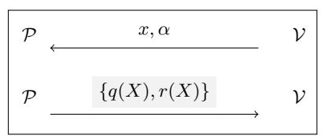
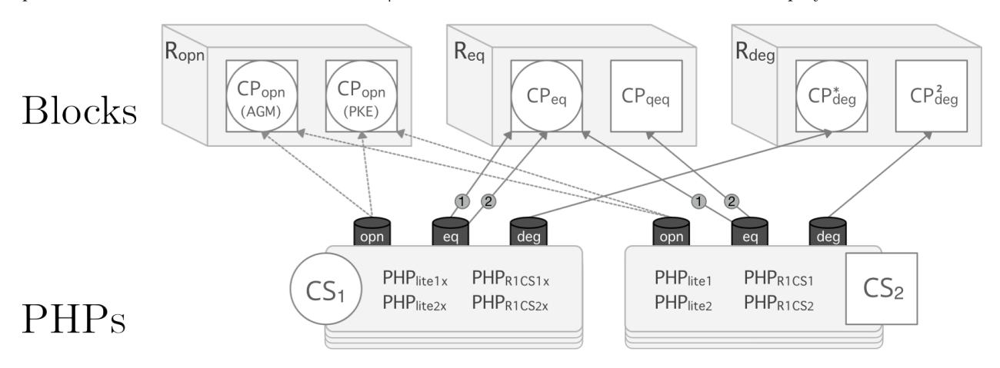
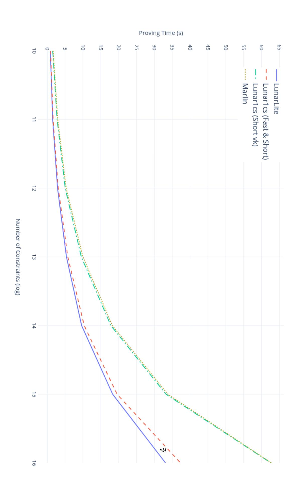

# Lunar: a Toolbox for More Efficient Universal and Updatable zkSNARKs and Commit-and-Prove Extensions

Matteo Campanelli<sup>1</sup> , Antonio Faonio<sup>2</sup> , Dario Fiore<sup>3</sup> , Anaïs Querol3,<sup>4</sup> , and Hadrián Rodríguez<sup>3</sup>

> <sup>1</sup> Aarhus University, Denmark matteo@cs.au.dk <sup>2</sup> EURECOM, Sophia Antipolis, France antonio.faonio@eurecom.fr 3 IMDEA Software Institute, Madrid, Spain {dario.fiore, anais.querol, hadrian.rodriguez}@imdea.org <sup>4</sup> Universidad Politécnica de Madrid, Spain

Abstract. We address the problem of constructing zkSNARKs whose SRS is universal—valid for all relations within a size-bound—and updatable—a dynamic set of participants can add secret randomness to it indefinitely thus increasing confidence in the setup. We investigate formal frameworks and techniques to design efficient universal updatable zkSNARKs with linear-size SRS and their commitand-prove variants.

We achieve a collection of zkSNARKs with different tradeoffs. One of our constructions achieves the smallest proof size and proving time compared to the state of art for proofs for arithmetic circuits. The language supported by this scheme is a variant of R1CS, called R1CS-lite, introduced by this work. Another of our constructions supports directly standard R1CS and improves on previous work achieving the fastest proving time for this type of constraint systems.

We achieve this result via the combination of different contributions: (1) a new algebraically-flavored variant of IOPs that we call Polynomial Holographic IOPs (PHPs), (2) a new compiler that combines our PHPs with commit-and-prove zkSNARKs for committed polynomials, (3) pairing-based realizations of these CP-SNARKs for polynomials, (4) constructions of PHPs for R1CS and R1CS-lite, (5) a variant of the compiler that yields a commit-and-prove universal zkSNARK.

Keywords: cryptographic protocols · zero knowledge · succinct arguments · polynomial commitments · commit-and-prove · universal SRS · IOP

# Table of Contents

| 1 |     | Introduction                                                      | 3  |
|---|-----|-------------------------------------------------------------------|----|
|   | 1.1 | Our Contribution                                                  | 4  |
|   | 1.2 | Other Related Work                                                | 8  |
|   | 1.3 | Outline                                                           | 9  |
| 2 |     | Basic Preliminaries                                               | 9  |
| 3 |     | Polynomial Holographic IOPs                                       | 10 |
|   | 3.1 | PHP Verifier Relation                                             | 12 |
|   | 3.2 | Compiling PHPs and AHPs into One Another                          | 13 |
| 4 |     | Our PHP Constructions                                             | 14 |
|   | 4.1 | Algebraic Preliminaries                                           | 14 |
|   | 4.2 | Rank-1 Constraint Systems                                         | 17 |
|   | 4.3 | Our PHPs for R1CS-lite                                            | 18 |
|   | 4.4 | Our PHP for R1CS                                                  | 29 |
| 5 |     | Preliminaries on Commitments and zkSNARKs                         | 36 |
|   | 5.1 | Commitment Schemes                                                | 36 |
|   | 5.2 | Preprocessing zkSNARKs with Universal and Specializable SRS       | 38 |
|   | 5.3 | Universal Commit-and-Prove SNARKs                                 | 39 |
| 6 |     | Our Compiler from PHPs to zkSNARKs with Universal SRS             | 41 |
|   |     |                                                                   |    |
|   | 6.1 | Building Blocks                                                   | 41 |
|   | 6.2 | Compiling to Universal Interactive Arguments                      | 42 |
| 7 |     | CP-SNARKs for Pairing-Based Polynomial Commitments                | 45 |
|   | 7.1 | Bilinear Groups and Assumptions                                   | 45 |
|   | 7.2 | The Commitment Schemes                                            | 46 |
|   | 7.3 | CP-SNARKs for Ropn<br>                                            | 47 |
|   | 7.4 | CP-SNARK for evaluation of a single polynomial                    | 49 |
|   | 7.5 | CP-SNARK for batch evaluation of many polynomials                 | 50 |
|   | 7.6 | CP-SNARK for Polynomial Equations                                 | 51 |
|   | 7.7 | CP-SNARK for CS2<br>for quadratic polynomial equations            | 53 |
|   | 7.8 | CP-SNARKs for degree of committed polynomials                     | 54 |
|   | 7.9 | A general-purpose CP-SNARK for Rphp<br>                           | 56 |
| 8 |     | Our Compiler for Universal Commit-and-Prove zkSNARKs              | 56 |
|   | 8.1 | Compiling to Commit-and-Prove Universal Interactive Arguments     | 56 |
|   | 8.2 | Pairing-Based Instantiations of our Building Blocks               | 57 |
| 9 |     | Instantiating Our Compiler: Our Universal zkSNARKs                | 64 |
|   | 9.1 | Available Options to Compile Our PHPs                             | 64 |
|   | 9.2 | Instantiating the PHPs with the appropriate zero-knowledge bounds | 65 |
|   | 9.3 | Our zkSNARKs                                                      | 66 |
|   | 9.4 | Our CP-SNARKs                                                     | 67 |
| A |     | Constraint Systems                                                | 72 |
|   | A.1 | Proof of Lemma 5                                                  | 72 |
|   | A.2 | Proof of Lemma 6                                                  | 73 |
|   | A.3 | Reduction to Arithmetic Circuit Satisfiability                    | 74 |
|   | A.4 | Comparing R1CS and R1CS-lite                                      | 75 |
| B |     | Our Protocol for Lincheck                                         | 76 |
|   | B.1 | Preliminaries                                                     | 76 |
|   | B.2 | An Holographic Protocol for Points of Sparse Matrices<br>         | 77 |
|   | B.3 | The linear check protocol                                         | 79 |

| C | Additional Material for Section 6                 | 81 |
|---|---------------------------------------------------|----|
|   | C.1<br>Universal Interactive Arguments in the SRS | 81 |
|   | C.2<br>Proof of Theorem 5                         | 83 |
|   | C.3<br>Proof of Theorem 15                        | 86 |
| D | Experimental Evaluation                           | 88 |

# <span id="page-2-0"></span>1 Introduction

A zero-knowledge proof system [\[37\]](#page-69-0) allows a prover to convince a verifier that a non-deterministic computation accepts without revealing more information than its input. In the last decade, there has been growing interest in zero-knowledge proof systems that additionally are succinct and non interactive [\[46,](#page-70-0) [53,](#page-70-1) [35,](#page-69-1) [14\]](#page-68-0), the socalled zkSNARKs. These are computationally-sound proof systems (arguments) that are succinct, in that their proofs are short and efficient to verify: the proof size and verification time should be constant or polylogarithmic in the length of the non-deterministic witness.

In circuit-based arguments for general computations the verifier must at least read the statement to be proven which includes both the description of the computation (i.e., the circuit) and its input (i.e., public input). But this is not succinct; by reading the whole circuit, the verifier runs linearly in the size of the computation. Preprocessing zkSNARKs try and work around this problem [\[38,](#page-69-2) [50,](#page-70-2) [34,](#page-69-3) [15\]](#page-68-1). Here the verifier generates a structured reference string (SRS) that depends on a certain circuit C; it does this once and for all. This SRS can be used later to verify an unbounded number of proofs for the computation of C. This is a succinct system: while the cost of SRS generation does depend on |C|, proof verification does not have to.

Works on subversion-resistance show that CRS can be generated by a verifier with no impact on security [\[1,](#page-68-2) [30,](#page-69-4) [5\]](#page-68-3). But contexts with many verifiers, e.g. blockchains, require a trusted party. Solutions that mitigate this problem (e.g. MPC secure against dishonest majority [\[9\]](#page-68-4)) are still expensive and often impractical as they should be carried out for each single computation[1](#page-2-1) C. To address this problem, Groth et al. [\[40\]](#page-69-5) introduced the model of universal and updatable SRS. An SRS is universal if it can be used to generate and verify proofs for all circuits of some bounded size; it is updatable if any user can add randomness to it and a sequence of updates makes it secure if at least one user acted honestly. Groth et al. [\[40\]](#page-69-5) proposed the first zkSNARK with a universal and updatable SRS. Their scheme, though, requires an SRS of size quadratic in the number of multiplication gates of the supported arithmetic circuits (and similar quadratic update/verification time).

Recent works [\[51,](#page-70-3) [23,](#page-69-6) [60,](#page-70-4) [33,](#page-69-7) [24,](#page-69-8) [26\]](#page-69-9) have improved on this result obtaining universal and updatable SRS whose size is linear in the largest supported circuit. In particular, the current Marlin [\[24\]](#page-69-8) and PLONK [\[33\]](#page-69-7) proof systems achieve a proving time concretely faster than that of Sonic [\[51\]](#page-70-3) while retaining constantsize proofs ([\[23,](#page-69-6) [60,](#page-70-4) [26\]](#page-69-9) have instead polylogarithmic-size proofs). We also mention the very recent works of Bünz, Fisch and Szepieniec [\[22\]](#page-69-10), and Chiesa, Ojha and Spooner [\[25\]](#page-69-11) that proposed zkSNARKs in the uniform random string (URS) model, that is implicitly universal and updatable; their constructions have a short URS and poly-logarithmic-size proofs. Yet another universal zkSNARK construction is that in [\[47\]](#page-70-5) which, despite its proofs of 4 group elements and comparable proving time, has an SRS which is not updatable.

Many of these efficient constructions (and the ones in this work) follow a similar blueprint to build zkSNARKs, which we now overview.

The current landscape of zkSNARKs with universal SRS. A known modular paradigm to build efficient cryptographic arguments [\[42,](#page-70-6) [43\]](#page-70-7) works in two distinct steps. First construct an information-theoretic protocol in an abstract model, e.g., interactive proofs [\[37\]](#page-69-0), standard or linear PCPs [\[15\]](#page-68-1), IOPs [\[54,](#page-70-8) [11\]](#page-68-5). Then apply a compiler that, taking an abstract protocol as input, transforms it into an efficient computationally sound argument via a cryptographic primitive. This approach has been successfully adopted to construct zkSNARKs with universal SRS in the recent works [\[33,](#page-69-7) [24,](#page-69-8) [22\]](#page-69-10), in which the information theoretic object

<span id="page-2-1"></span><sup>1</sup> These protocols [\[20,](#page-69-12) [19\]](#page-68-6) may take a few months, requiring coordination of a hundred users, each with at least one round of communication. As a further mitigation, one could generate an SRS for a universal circuit for computations up to size T, but this adds a multiplicative overhead of O(log T) which is often unacceptable.

is an algebraically-flavored variant of Interactive Oracle Proofs (IOPs), while the cryptographic primitive are polynomial commitments [45]. Through polynomial commitments, a prover can compress a polynomial p (as a message much shorter than all its concatenated coefficients) and can later open the commitment at evaluations of p, namely to convince a verifier that y = p(x) for public points x and y. In these IOP abstractions—called algebraic holographic proofs (AHP) in [24] and polynomial  $IOPs^2$  in [22]—a prover and a verifier interact, one providing oracle access to a set of polynomials and the other sending random challenges (if public-coin). At the end of the protocol the verifier asks for evaluations of these polynomials and decides to accept or reject based on the responses. The idealized low-degree protocols (ILDPs) abstraction of [33] proceeds similarly except that in the end the verifier asks to verify a set of polynomial identities over the oracles sent by the prover (which can be tested via evaluation on random points). To build a zkSNARK with universal SRS starting from AHPs/ILDPs we let the prover commit to the polynomials obtained from the AHP/ILDP prover, and then use the opening feature of polynomial commitments to respond to the evaluation queries in a sound way. As we detail later, our contribution revisits the aforementioned blueprint to construct universal zkSNARKs.

### <span id="page-3-0"></span>1.1 Our Contribution

In this work we propose Lunar, a *family* of new preprocessing zkSNARKs in the universal and updatable SRS model that have constant-size proofs and that improve on previous work [51, 33, 24] in terms of proof size and running time of the prover. Through our results we obtain a collection of zkSNARKs with different tradeoffs (see Table 4 in the Appendix for the full list).

In Table 1, we present a detailed efficiency comparison between prior work and the best representatives of our schemes, when using arithmetic circuit satisfiability as common benchmark. LunarLite has the smallest proof size (384 bytes over the 100-bits-secure curve BN128; 544 bytes over 128-bits-secure BLS12-381) and the lowest proving time compared to the state of art of universal zkSNARKs with constant-size proofs for arithmetic circuits. As we explain later, LunarLite uses a new arithmetization of arithmetic circuit satisfiability that we call R1CS-lite, quite similar to rank-1 constraint systems (R1CS). A precise comparison to PLONK depends on the circuit structure and how the number m of nonzero entries of R1CS-lite matrices depends on the number a of addition gates<sup>3</sup>; for instance, PLONK is faster for circuits with only multiplication gates, but LunarLite is faster when  $m \leq 3a$ .

If we focus the comparison on solutions that directly support R1CS looking at Table 2 (of which MARLIN [24] is the most performant among prior work), our scheme Lunar1cs (fast & short) offers the smallest SRS, the smallest proof and the fastest prover. This comes at the price of higher constants for the size of the (specialized) verification key and the verification time<sup>4</sup>. Lunar1cs (short vk) offers a tradeoff: it has smaller verification key and faster verification time than Lunar1cs (fast & short), but slightly larger proofs,  $3 \times 1$  larger SRS, and 5m more  $\mathbb{G}_1$ -exponentiations at proving time than Lunar1cs (fast & short). Even with this tradeoff, Lunar1cs (short vk) outperforms Marlin in all these measures. We implemented Lunar's building blocks and we confirm our observations experimentally (Appendix D).

Our main contribution to achieve this result is to revisit the aforementioned blueprint to construct universal zkSNARKs by proposing: (1) a new algebraically-flavored variant of IOPs, Polynomial Holographic IOPs (PHPs), and (2) a new compiler that builds universal zkSNARKs by using our PHPs together with commitand-prove zkSNARKs (CP-SNARKs) [23] for committed polynomials. Additional contributions include: (3) pairing-based realizations of these CP-SNARKs for polynomials, (4) constructions of PHPs for both R1CS and a novel simplified variant of it, (5) a variant of the compiler (2) that yields a commit-and-prove universal zkSNARK. The latter is the first general compiler from (algebraic) IOPs to commit-and-prove zkSNARKs.

<span id="page-3-1"></span><sup>&</sup>lt;sup>2</sup> Hereinafter we use AHP/PIOPs interchangeably whenever possible, as they are almost the same notion.

<span id="page-3-2"></span><sup>&</sup>lt;sup>3</sup> Applying the results in [17] one can get PLONK's proving time down to 8n + 8a, but our analysis still applies.

<span id="page-3-3"></span><sup>&</sup>lt;sup>4</sup> In practice this overhead is negligible. Lunar1cs (fast & short) takes 7 pairings to verify ( $\approx 35ms$ ); faster schemes, including some from this work, take 2 ( $\approx 10ms$ ).

<span id="page-4-0"></span>**Table 1.** Efficiency of universal and updatable *practical* zkSNARKs for arithmetic circuit satisfiability with constantsize proofs. n: number of multiplication gates; a: number of addition gates;  $m \ge n$ : number of nonzero entries in R1CS(-lite) matrices encoding the circuit;  $N, N^*, A$  and M: largest supported values for n, a+m, a and m respectively.

| zkSNARK       |                |        | size            | ;               |         |        | time                        |                             |                       |  |  |  |  |
|---------------|----------------|--------|-----------------|-----------------|---------|--------|-----------------------------|-----------------------------|-----------------------|--|--|--|--|
| ZKSINAILIX    |                | srs    | ek <sub>R</sub> | vk <sub>R</sub> | $ \pi $ | KeyGen | Derive                      | Prove                       | Verify                |  |  |  |  |
| Sonic         | $\mathbb{G}_1$ | 4N     | 36n             | _               | 20      | 4N     | 36n                         | 273n                        | 7 pairings            |  |  |  |  |
| [51]          | $\mathbb{G}_2$ | 4N     |                 | 3               |         | 4N     | _                           | _                           | r pairings            |  |  |  |  |
| [91]          | $\mathbb{F}$   | —      | _               |                 | 16      |        | $O(m \log m)$               | $O(m \log m)$               | $O(\ell\!+\!\log m)$  |  |  |  |  |
| Marlin        | $\mathbb{G}_1$ | 3M     | 3m              | 12              | 13      | 3M     | 12m                         | 14n+8m                      | 2 pairings            |  |  |  |  |
| [24]          | $\mathbb{G}_2$ | 2      |                 | 2               | —       |        | _                           |                             | 2 pairings            |  |  |  |  |
| [24]          | $\mathbb{F}$   | _      | _               | _               | 8       |        | $O(m \log m)$               | $O(m \log m)$               | $O(\ell\!+\!\log m)$  |  |  |  |  |
| PLONK         | $\mathbb{G}_1$ | $3N^*$ | 3n+3a           | 8               | 7       | $3N^*$ | 8n+8a                       | 11n+11a                     | 2 pairings            |  |  |  |  |
| (small proof) | $\mathbb{G}_2$ | 1      |                 | 1               | —       | 1      |                             |                             | 2 pairings            |  |  |  |  |
| [33]          | $\mathbb{F}$   | _      |                 |                 | 7       |        | $O((n\!+\!a)\log(n\!+\!a))$ | $O((n\!+\!a)\log(n\!+\!a))$ | $O(\ell + \log(n+a))$ |  |  |  |  |
| PLONK         | $\mathbb{G}_1$ | $N^*$  | n+a             | 8               | 9       | $N^*$  | 8n+8a                       | 9n+9a                       | 2 pairings            |  |  |  |  |
| (fast prover) | $\mathbb{G}_2$ | 1      |                 | 1               | —       | 1      | _                           |                             | 2 pairings            |  |  |  |  |
| [33]          | $\mathbb{F}$   |        |                 | _               | 7       |        | $O((n+a)\log(n+a))$         | $O((n\!+\!a)\log(n\!+\!a))$ | $O(\ell + \log(n+a))$ |  |  |  |  |
|               | $\mathbb{G}_1$ | M      | m               |                 | 10      | M      | _                           | 8n+3m                       | 7 pairings            |  |  |  |  |
| LunarLite     | $\mathbb{G}_2$ | M      | _               | 27              | —       | M      | 24m                         | _                           | 7 pairings            |  |  |  |  |
| (this work)   | $\mathbb{F}$   | _      | _               |                 | 2       |        | $O(m \log m)$               | $O(m \log m)$               | $O(\ell + \log m)$    |  |  |  |  |

<span id="page-4-1"></span>**Table 2.** Efficiency comparison of universal zkSNARKs for R1CS with constant-size proofs. n (resp. m) is the dimension (resp. the number of nonzero entries) of the R1CS matrices; N and M are the largest supported values for n and m respectively. Entries in gray correspond to this work.

| zkSNARK        |                |     | siz             | æ               |                    | ${\bf time}$ |               |               |                    |  |  |
|----------------|----------------|-----|-----------------|-----------------|--------------------|--------------|---------------|---------------|--------------------|--|--|
| ZKSIVATUK      |                | srs | ek <sub>R</sub> | vk <sub>R</sub> | $\overline{ \pi }$ | KeyGen       | Derive        | Prove         | Verify             |  |  |
| Marlin         | $\mathbb{G}_1$ | 3M  | 3m              | 12              | 13                 | 3M           | 12m           | 14n + 8m      | 2 pairings         |  |  |
| -              | $\mathbb{G}_2$ | 2   |                 | 2               |                    |              |               |               | z pannigs          |  |  |
| [24]           | $\mathbb{F}$   | _   |                 |                 | 8                  |              | $O(m \log m)$ | $O(m \log m)$ | $O(\ell + \log m)$ |  |  |
|                | $\mathbb{G}_1$ | M   | m               |                 | 11                 | M            |               | 9n+3m         | 7 pairings         |  |  |
| Lunar1cs       | $\mathbb{G}_2$ | M   |                 | 60              | —                  | M            | 57m           | _             | r pairings         |  |  |
| (fast & short) | $\mathbb{F}$   |     |                 |                 | 2                  |              | $O(m \log m)$ | $O(m \log m)$ | $O(\ell + \log m)$ |  |  |
|                | $\mathbb{G}_1$ | 3M  | 3m              | 12              | 12                 | 3M           | 12m           | 9n+8m         | 2 pairings         |  |  |
| Lunar1cs       | $\mathbb{G}_2$ | 1   |                 | 1               |                    | 1            | _             |               | 2 pairings         |  |  |
| (short vk)     | $\mathbb{F}$   |     |                 |                 | 5                  |              | $O(m \log m)$ | $O(m \log m)$ | $O(\ell + \log m)$ |  |  |

A CP-SNARK permits to verify a proof through a commitment to an input (rather than an input in the clear) that, crucially, we can reuse among proofs[5](#page-5-0) . Below we detail our contributions.

Polynomial Holographic IOPs (PHPs). Our PHPs generalize AHPs[6](#page-5-1) as well as ILDPs. A PHP consists of an interaction between a verifier and a prover sending oracle polynomials, followed by a decision phase in which the verifier outputs a set of polynomial identities to be checked on the prover's polynomials (such as a(X)b(X) − z · c(X) ?= 0, for oracle polynomials a, b, c and some scalar z), as well as a set of degree tests (e.g. deg(a(X)) < D). The PHP model is close to ILDPs, but the two differ with respect to zero-knowledge formalizations: while ILDPs lack one altogether, we introduce and formalize a fine-grained notion of zeroknowledge—called (b1, . . . , bn)-bounded zero-knowledge—where the verifier may learn up to b<sup>i</sup> evaluations of the i-th oracle polynomial. When compared to AHPs, PHP has, again, a more granular notion of zeroknowledge, as well as verification queries that are more expressive than mere polynomial evaluations.

As we shall discuss next, these two properties of PHPs—expressive verifier's queries and a highly flexible zero-knowledge notion—naturally capture more (and more efficient) strategies when compiling into a cryptographic argument (e.g., we can weaken the required hiding property of the polynomial commitments and the zero-knowledge of the CP-SNARKs used in our compiler).

From PHPs to zkSNARKs through another model of polynomial commitments. We describe how to compile a (public-coin) PHP into a zkSNARK. For AHPs and ILDPs [\[33,](#page-69-7) [24\]](#page-69-8), compilation works by letting the prover use polynomial commitments on the oracles and then open the commitments to the evaluations asked by the verifier. Our approach, though similar, has a key difference: a different formalization of polynomial commitments with a modular design.

Our notion of polynomial commitments is modular : rather than seeing them as a monolithic primitive—a tuple of algorithms for both commitment and proofs—we split them into two parts, i.e., a regular commitment scheme with polynomials as message space, and a collection of commit-and-prove SNARKs (CP-SNARKs) for proving relations over committed polynomials. We find several advantages in this approach.

As already argued in prior work on modular zkSNARKs through the commit-and-prove strategy [\[23,](#page-69-6) [13\]](#page-68-8), one benefit of this approach is separation of concerns: commitments are required to do one thing independently of the context (committing), whereas what we need to prove about them may depend on where we are applying them. For example, we often want to prove evaluation of committed polynomials: given a commitment c and points x, y, prove that y = p(x) and c opens to p. But to compile a PHP (or AHP/ILDP) we also need to be able to prove other properties about them, such as checking degree bounds or testing equations over committed polynomials. Because these properties—and the techniques to prove them are somehow independent from each other, we argue they should not be bundled under a bloated notion of polynomial commitment. Going one step further in this direction, we formalize commitment extractability as a proof of knowledge of opening of a polynomial commitment. This modular design allows us to describe an abstract compiler that assumes generic CP-SNARKs for the three aforementioned relations—proof of knowledge of opening, degree bounds and polynomial equations—and can yield zkSNARKs with different tradeoffs depending on how we instantiate them.

We also find additional benefits of the modular abstraction. First, a CP-SNARK for testing equations over committed polynomials more faithfully captures the goal of the PHP verifier (as well as the AHP verifier in virtually all known constructions). Second, we can allow for realizations of CP-SNARKs for equations over polynomials other than the standard one, which reduces the problem of (batched) polynomial evaluations via random point evaluation. As an application, we show a simple scheme for quadratic equations that can even have an empty proof (see below); our most efficient realizations exploit this fact.

<span id="page-5-0"></span><sup>5</sup> We compose CP-SNARKs as gadgets to modularly build complex schemes; as studied recently [\[23,](#page-69-6) [61\]](#page-70-10), they are generally useful in applications where we prove properties of committed values [\[41,](#page-69-13) [13\]](#page-68-8).

<span id="page-5-1"></span><sup>6</sup> PHPs generalize AHPs where the verifier is "algebraic" (see Section [3.2\)](#page-12-0). This encompasses all the schemes in [\[24\]](#page-69-8).

From PHPs to zkSNARKs: fine-grained leakage requirements. Our second contribution on the compiler is to minimize the requirements needed to achieve zero-knowledge. As we shall discuss later, this allows us to obtain more efficient zkSNARKs. A straightforward compiler from PHPs to zkSNARKs would require hiding polynomial commitments and zero-knowledge CP-SNARKs; we weaken both requirements. Instead of "fully" hiding commitments, our compiler requires only somewhat hiding commitments. This new property guarantees, for each committed polynomial, leakage of at most one evaluation on a random point. Instead of compiling through "full" zero-knowledge CP-SNARKs, our compiler requires only (b1, . . . , bn) leaky zero-knowledge CP-SNARKs. This new notion is weaker than zero-knowledge and states that the verifier may learn up to b<sup>i</sup> evaluations of the i-th committed polynomial.

We show that by using a somewhat-hiding commitment scheme and a (b1, . . . , bn)-leaky zero-knowledge CP-SNARK that can prove the checks of the PHP verifier, one can compile a PHP that is (b1+1, . . . , bn+1) bounded ZK into a fully-zero-knowledge succinct argument.

Although related ideas were used in constructions in previous works [\[33\]](#page-69-7), our contribution is to systematically formalize (as well as expand) the properties needed on different fronts: the PHP, the commitment scheme, the CP-SNARKs used as building blocks and the interaction among all these in the compiler.

Pairing-based CP-SNARKs for committed polynomials. We consider the basic commitment scheme for polynomials consisting of giving a "secret-point evaluation in the exponent" [\[38,](#page-69-2) [45\]](#page-70-9) and then show CP-SNARKs for various relations over that same commitment scheme. In particular, by using techniques from previous works [\[45,](#page-70-9) [33,](#page-69-7) [24\]](#page-69-8) we show CP-SNARKs for: proof of knowledge of an opening in the algebraic group model [\[31\]](#page-69-14) (which actually comes for free), polynomial evaluation, degree bounds, and polynomial equations. In addition to these, we propose a new CP-SNARK for proving opening of several commitments with a proof consisting of one single group element; the latter relies on the PKE assumption [\[38\]](#page-69-2) in the random oracle model. Also, we show that for a class of quadratic equations over committed polynomials (notably capturing some of the checks of our PHPs), we can obtain an optimized CP-SNARK in which the proof is empty as the verifier can test the relation using a pairing with the inputs (the inputs are commitments, i.e., group elements). This technique is reminiscent of the compiler from [\[15\]](#page-68-1) that relies on linear encodings with quadratic tests.

PHPs for constraint systems. We propose a variety of PHPs for the R1CS constraint system and for a simplified variant of it that we call R1CS-lite. In brief, R1CS-lite is defined by two matrices L, R and accepts a vector x if there is a w such that, for c = (1, x, w), L · c ◦ R · c = c. We show that R1CS-lite can express arithmetic circuit satisfiability with essentially the same complexity of R1CS, and its simpler form allows us to design slightly simpler PHPs. We believe this characterization of NP problems to be of independent interest.

Part of our techniques stem from those in Marlin [\[24\]](#page-69-8): we adopt their encoding of sparse matrices; also one of our main building blocks is the sumcheck protocol from Aurora of Ben-Sasson et. al. [\[10\]](#page-68-9). But in our PHPs we explore a different protocol that proves properties of sparse matrices and we introduce a refined efficient technique for zero-knowledge in a univariate sumcheck. In a nutshell, compared to [\[10\]](#page-68-9) we show how to choose the masking polynomial with a specific sparse distribution that has only a constant-time impact on the prover. This idea and analysis of this technique is possible thanks to our fine-grained ZK formalism for PHPs. By combining this basic skeleton with different techniques we can obtain PHPs with different tradeoffs (see Table [3\)](#page-17-2).

Commit-and-prove zkSNARKs from PHPs. We propose the first general compiler from an informationtheoretic object such as (algebraic) IOPs— and more in general PHPs—to Commit-and-Prove zkSNARKs[7](#page-6-0) . Recall that the latter is a SNARK where the verifier's input includes one (or several) reusable hiding commitment(s), i.e., to check that R(u1, . . . , u`) holds for a tuple of commitments (ˆc<sup>j</sup> )j∈[`] such that cˆ<sup>i</sup> opens

<span id="page-6-0"></span><sup>7</sup> Here we do not consider the alternative approach of explicitly proving in the PHP a relation augmented with commitment opening; this is often too expensive [\[23\]](#page-69-6).

to  $u_i$ . By reusable we mean that these commitments could be used in multiple proofs and with different proof systems since their commitment key is generated before the setup of the proof system. To obtain a CP-SNARK we cannot apply the committing methods for polynomials used in [33, 24]: these require a known bound on how many times we will evaluate the polynomials. This is analogous to knowing a bound on the number of proofs over those same committed polynomials, which may be unknown at commitment time. Therefore we apply more stringent requirements and assume these commitments to be full-fledged hiding rather than just somewhat-hiding.

To obtain our commit-and-prove compiler we adapt our compiler to zkSNARKs to include the following key idea: we prove a "link" between the committed witnesses  $(\mathfrak{u}_j)_{j\in[\ell]}$ —which open *hiding* commitments  $(\hat{c}_j)_{j\in[\ell]}$ —and the PHP polynomials  $(p_j)_{j\in[n]}$ —which open *somewhat-hiding* commitments  $(c_j)_{j\in[n]}$ . We design a specific CP-SNARK for this task,  $\mathsf{CP}_\mathsf{link}$ . Our construction works for pairing-based commitments and supports a wide class of linking relations which include those in our PHP constructions.

Simplifying a little bit, our techniques involve proving equality of images of distinct (committed) polynomials on distinct domains and they are of independent interest. In particular they can plausibly be adapted to compile other zkSNARKs with similar properties—e.g., Marlin or PLONK [24, 33]—into CP-SNARKs with commitments that can be reused among different proofs.

Efficient CP-SNARKs with a universal setup are strongly motivated by practical applications. One of them is *committing-ahead-of-time* [23, 12] in which we commit to a value possibly *before* we can predict what we are going to prove about it. A CP-SNARK with a universal SRS, like those in this work, can be a requirement in the context of committing-ahead-of-time: if the setting requires committing to data *before* knowing what properties to prove about them (which can happen on-demand), the same setting can benefit from an (unspecialized) SRS string available *before* knowing what to prove about the committed data.

Our work improves significantly on the efficiency of LegoUAC in [23], a highly modular CP-SNARK construction with universal setup for universal relations (and the only one in literature to the best of our knowledge). Our results are also complementary to those of [23] (in particular their *specialized* CP-SNARKs with universal setup) and to those of works on efficient composable CP-SNARKs on commitments in prime order groups, such as [13]: our universal CP-SNARK can be composed with the schemes in these works as they can all be derived from the same SRS, or with some of the transparent instantiations in [13].

# <span id="page-7-0"></span>1.2 Other Related Work

**SNARKs.** In this work we focus on practical zkSNARKs with a universal and updatable setup and constant-size proofs. Recent work builds on our formalizations to expand this area designing a fully algebraic framework for modular arguments [55]. Here we briefly survey other works that obtain universality through other approaches at the cost of a larger proof size.

Concurrent work in [48] proposes a new scheme with universal—but not updatable—SRS and an asymptotically linear prover (our prover is quasi-linear due to the use of FFT). By recursive composition they achieve an asymptotically  $O_{\lambda}(1)$ -size proof. In practice this is about  $9 \times$  larger than some of our proofs.

Spartan [56] obtains preprocessing arguments with a URS; it trades a transparent setup for larger arguments and less efficient verification, ranging from  $O(\log^2(n))$  to  $O(\sqrt{n})$ , depending on the instantiation.

Concurrent work in [49] extends Spartan techniques obtaining a linear-time prover. They obtain asymptotically constant-sized proofs through one step of recursive composition with Groth16 [39]; they do not discuss concrete proof sizes. This, however, yields a scheme with universal but not updatable setup. It would require an existing scheme with universal and updatable setup to achieve the latter; their work can thus be seen as complementary to ours.

Other works obtain universal SNARGS through a transparent setup and by exploiting the structure of the computation for succinctness. They mainly use two classes of techniques: hash-based vector commitments applied to oracle interactive proofs [6, 7, 8] or multivariate polynomial commitments and doubly-efficient interactive proofs [64, 63, 65, 58, 60, 62].

Fractal [25] achieves transparent zkSNARKs with recursive composition—the ability of a SNARG to prove computations involving prior SNARGs. Their work also uses an algebraically-flavored variant of interactive oracle proofs that they call *Reed-Solomon encoded holographic IOPs*.

Another line of work, e.g., [\[2,](#page-68-14) [10,](#page-68-9) [18,](#page-68-15) [21,](#page-69-16) [32\]](#page-69-17), obtains a restricted notion of succinctness with no preprocessing, a linear verifier and sublinear proof size.

CP-SNARKs. The recent work in ECLIPSE [\[3\]](#page-68-16) also presents a general compiler from information-theoretic objects to CP-SNARKs with a universal-updatable SRS. They instantiate their compiler with MARLIN, PLONK and Sonic [\[24,](#page-69-8) [33,](#page-69-7) [51\]](#page-70-3) obtain different efficiency than ours. While our verification grows only linearly in the number of committed inputs `, theirs grows with the total size of the committed witnesses (which may be ω(`)). It is hard to directly compare the proof sizes in our work and theirs since our proofs are O(`), while theirs grow logarithmically in the total size of the committed witness (their proofs are shorter for settings with many small committed inputs, for example). Other differences between the two works involve: commitment scheme, techniques and generality of the compiler. In [\[3\]](#page-68-16) inputs are committed with (vector) Pedersen, while we assume a KZG commitment to the polynomial interpolating the input. The different commitments schemes between the two works also determine different techniques in our "linking gadgets" (see also Section [8.2\)](#page-56-0): we use a pairing-based construction to show "shifts" of related polynomials, while they rely on compressed Σ-protocols [\[4\]](#page-68-17). Finally, while our compilers are similar in spirit and are both applicable to PHPs (although their formal description is only for AHPs), theirs is slightly less general as it assumes a "decomposition property" among the polynomials in the underlying PHP.

# <span id="page-8-0"></span>1.3 Outline

See Section [2](#page-8-1) for basic preliminaries. In Section [3](#page-9-0) we define PHPs and we describe our PHP constructions in Section [4.](#page-13-0) The reader will find some preliminaries on commitment schemes and zkSNARKs in Section [5](#page-35-0) Section [6](#page-40-0) describes our first compiler from PHPs to universal zkSNARKs. Section [7](#page-44-0) describes commitment schemes for polynomials and compatible CP-SNARKs that we use to instantiate our compilers. Section [8](#page-55-1) presents our second compiler from PHPs to universal commit-and-prove zkSNARKs, as well as additional building blocks and their instantiations with pairing based commitments. Concrete compilations for the family of Lunar zkSNARKs are in Section [9.](#page-63-0)

We refer the reader to the appendix for additional preliminaries, details on constraint systems, proofs, as well as our PHP for properties of sparse matrices.

# <span id="page-8-1"></span>2 Basic Preliminaries

We denote by λ ∈ N the security parameter, and by poly(λ) and negl(λ) the set of polynomial and negligible functions respectively. A function ε(λ) is said negligible – denoted ε(λ) ∈ negl(λ) – if ε(λ) vanishes faster than the inverse of any polynomial in λ. An adversary A is called efficient if A is a family {Aλ}λ∈<sup>N</sup> of nonuniform circuits of size poly(λ).

For a positive integer n ∈ N we let [n] := {1, . . . , n}. For a set S, |S| denotes its cardinality, and x ←\$ S denotes the process of selecting x uniformly at random over S. We write vectors and matrices in boldface font, e.g., v,V . So for a set S, v ∈ S <sup>n</sup> is a short-hand for the tuple (v1, . . . , vn). Given two vectors u and v we denote by u ◦ v their entry-wise (aka Hadamard) product.

We denote by F a finite field, by F[X] the ring of univariate polynomials in variable X, and by F<d[X] (resp. F<sup>≤</sup>d[X]) the set of polynomials in F[X] of degree less (resp. less or equal) than d.

Universal Relations. A universal relation R is a set of triples (R, x,w) where R is a relation, x ∈ D<sup>x</sup> is called the instance (or input), w ∈ D<sup>w</sup> the witness, and Dx, D<sup>w</sup> are domains that may depend on R. Given R, the corresponding universal language L(R) is the set {(R, x) : ∃w : (R, x,w) ∈ R}. For a size bound N ∈ N, R<sup>N</sup> denotes the subset of triples (R, x,w) in R such that R has size at most N, i.e. |R| ≤ N. In our work, we also write R(R, x,w) = 1 (resp. R(x,w) = 1) to denote (R, x,w) ∈ R (resp. (x,w) ∈ R).

When discussing schemes that prove statements on committed values we assume that D<sup>w</sup> can be split in two subdomains D<sup>u</sup> × Dω. Finally, we sometimes use an even more fine-grained specification of D<sup>u</sup> assuming we can split it over ` arbitrary domains (D<sup>1</sup> × · · · × D`) for some arity `.

# <span id="page-9-0"></span>3 Polynomial Holographic IOPs

In this section we define our notion of Polynomial Holographic IOPs (PHP). In a nutshell, a PHP is an interactive oracle proof (IOP) system that works for a family of universal relations  $\mathcal{R}$  that is specialized in two main ways. First, it is holographic, in the sense that the verifier has oracle access to the relation encoding, a set of oracle polynomials created by a trusted party, the holographic relation encoder (or simply, encoder)  $\mathcal{RE}$ . Second, it is algebraic in the sense that the system works over a finite field  $\mathbb{F}$ , the prover can at each round send to the verifier field elements or oracle polynomials, and the verifier queries are algebraic checks over these prover messages. For example the verifier can directly check polynomial identities such as  $p_1(X)p_2(X)p_3(X) + p_4(X) \stackrel{?}{=} 0$ .

Compared to the AHP notion of [24] and the polynomial IOP of [22], PHPs have the following differences: the prover can also send actual messages in addition to oracle polynomials, and the verifier queries are more expressive than polynomial evaluations. This richer syntax—as we shall see in Sections 6 and 9—gives us more flexibility when compiling into a cryptographic argument system. Our model is closer to the idealized polynomial protocols of [33] in terms of verifier's checks, but it adds to it the aforementioned general prover messages and a notion of zero-knowledge.

More formally, a Polynomial Holographic IOP is defined as follows.

<span id="page-9-1"></span>**Definition 1 (Polynomial Holographic IOP (PHP)).** Let  $\mathcal{F}$  be a family of finite fields and let  $\mathcal{R}$  be a universal relation. A Polynomial Holographic IOP over  $\mathcal{F}$  for  $\mathcal{R}$  is a tuple PHP =  $(r, n, m, d, n_e, \mathcal{RE}, \mathcal{P}, \mathcal{V})$  where  $r, n, m, d, n_e : \{0, 1\}^* \to \mathbb{N}$  are polynomial-time computable functions, and  $\mathcal{RE}, \mathcal{P}, \mathcal{V}$  are three algorithms for the encoder, prover and verifier respectively, that work as follows.

- Offline phase: The encoder  $\mathcal{RE}(\mathbb{F}, \mathbb{R})$  is executed on input a field  $\mathbb{F} \in \mathcal{F}$  and a relation description  $\mathbb{R}$ , and it returns  $\mathsf{n}(0)$  polynomials  $\{p_{0,j}\}_{j\in[\mathsf{n}(0)]}$  encoding the relation  $\mathbb{R}$ .
- **Online phase:** The prover  $\mathcal{P}(\mathbb{F}, R, x, w)$  and the verifier  $\mathcal{V}^{\mathcal{RE}(\mathbb{F}, R)}(\mathbb{F}, x)$  are executed for r(|R|) rounds; the prover has a tuple  $(R, x, w) \in \mathcal{R}$  and the verifier has an instance x and oracle access to the polynomials encoding R.
  - In the i-th round,  $\mathcal{V}$  sends a message  $\rho_i \in \mathbb{F}$  to the prover, and  $\mathcal{P}$  replies with m(i) messages  $\{\pi_{i,j} \in \mathbb{F}\}_{j \in [m(i)]}$ , and n(i) oracle polynomials  $\{p_{i,j} \in \mathbb{F}[X]\}_{j \in [n(i)]}$ , such that  $\deg(p_{i,j}) < \mathsf{d}(|\mathsf{R}|,i,j)$ .
- **Decision phase:** After the r(|R|)-th round, the verifier outputs two sets of algebraic checks of the following type.
  - <u>Degree checks:</u> to check a bound on the degree of the polynomials sent by the prover. More in detail, let  $n_p = \sum_{k=1}^{r(|R|)} n(k)$  and let  $(p_1, \ldots, p_{n_p})$  be the polynomials sent by  $\mathcal{P}$ . The verifier specifies a vector of integers  $\mathbf{d} \in \mathbb{N}^{n_p}$ , which is satisfied if and only if

$$\forall k \in [\mathsf{n_p}] : \deg(p_k) < d_k$$
.

• Polynomial checks: to check that certain polynomial identities hold between the oracle polynomials and the prover messages. More in detail, let  $n^* = \sum_{k=0}^{r(|R|)} n(k)$  and  $m^* = \sum_{k=1}^{r(|R|)} m(k)$ , and denote by  $(p_1, \ldots, p_{n^*})$  and  $(\pi_1, \ldots, \pi_{m^*})$  all the oracle polynomials (including the n(0) ones from the encoder) and all the messages sent by the prover. The verifier can specify a list of  $n_e$  tuples, each of the form  $(G, v_1, \ldots, v_{n^*})$ , where  $G \in \mathbb{F}[X, X_1, \ldots, X_{n^*}, Y_1, \ldots, Y_{m^*}]$  and every  $v_k \in \mathbb{F}[X]$ . Then a tuple  $(G, v_1, \ldots, v_{n^*})$  is satisfied if and only if  $F(X) \equiv 0$  where

$$F(X) := G(X, \{p_k(v_k(X))\}_{k \in [n^*]}, \{\pi_k\}_{k \in [m^*]})$$

The verifier accepts if and only if all the checks are satisfied.

Efficiency Measures. Given the functions r,d,n,m in the tuple PHP, one can derive some efficiency measures of the protocol PHP such as the total number of oracles sent by the encoder, n(0), by the prover  $n_p$ , by both in total,  $n^*$ ; or the number of prover messages  $m^*$ . In addition to these, we define below the following shorthands for two more measures of PHP, the degree D and the proof length I(|R|):

$$\mathsf{D} := \max_{\substack{\mathsf{R} \in \mathcal{R} \\ i \in [0, \mathsf{r}(|\mathsf{R}|)] \\ j \in [\mathsf{n}(i)]}} (\mathsf{d}(|\mathsf{R}|, i, j)), \qquad \mathsf{I}(|\mathsf{R}|) := \sum_{\substack{i \in [\mathsf{r}(|\mathsf{R}|)] \\ j \in [\mathsf{n}(i)]}} \mathsf{m}(i) + \mathsf{d}(|\mathsf{R}|, i, j).$$

PHP can satisfy completeness, (knowledge) soundness and zero-knowledge, defined as follows.

Completeness. A PHP is complete if for all  $\mathbb{F} \in \mathcal{F}$  and any satisfying triple  $(R, x, w) \in \mathcal{R}$ , the checks returned by  $\mathcal{V}^{\mathcal{RE}(\mathbb{F},R)}(\mathbb{F},x)$  after interacting with the honest prover  $\mathcal{P}(\mathbb{F},R,x,w)$ , are satisfied with probability 1.

Soundness. A PHP is  $\epsilon$ -sound if for every field  $\mathbb{F} \in \mathcal{F}$ , relation-instance tuple  $(R, x) \notin \mathcal{L}(\mathcal{R})$  and prover  $\mathcal{P}^*$  we have

$$\Pr[\langle \mathcal{P}^*, \mathcal{V}^{\mathcal{RE}(\mathbb{F}, \mathsf{R})}(\mathbb{F}, \mathsf{x}) \rangle = 1] \le \epsilon$$

Knowledge Soundness. A PHP is  $\epsilon$ -knowledge-sound if there exists a polynomial-time knowledge extractor  $\mathcal{E}$  such that for any prover  $\mathcal{P}^*$ , field  $\mathbb{F} \in \mathcal{F}$ , relation R, instance x and auxiliary input z:

$$\Pr\left[(\mathsf{R},\mathsf{x},\mathsf{w}) \in \mathsf{R} : \mathsf{w} \leftarrow \mathcal{E}^{\mathcal{P}^*}(\mathbb{F},\mathsf{R},\mathsf{x},z)\right] \geq \Pr[\langle \mathcal{P}^*(\mathbb{F},\mathsf{R},\mathsf{x},z), \mathcal{V}^{\mathcal{R}\mathcal{E}(\mathbb{F},\mathsf{R})}(\mathbb{F},\mathsf{x})\rangle = 1] - \epsilon$$

where  $\mathcal{E}$  has oracle access to  $\mathcal{P}^*$ , i.e., it can query the next message function of  $\mathcal{P}^*$  (and also rewind it) and obtain all the messages and polynomials returned by it.

Zero-Knowledge. A PHP is  $\epsilon$ -zero-knowledge if there exists a PPT simulator S such that for every field  $\mathbb{F} \in \mathcal{F}$ , every triple  $(R,x,w) \in \mathcal{R}$ , and every algorithm  $V^*$  the following random variables are within  $\epsilon$  statistical distance:

$$\mathsf{View}\big(\mathcal{P}(\mathbb{F},\mathsf{R},\mathsf{x},\mathsf{w})\ ,\mathcal{V}^*\big)\approx_{\epsilon}\mathsf{View}\big(\mathcal{S}^{\mathcal{V}^*}(\mathbb{F},\mathsf{R},\mathsf{x})\big)$$

where  $\mathsf{View}\big(\mathcal{P}(\mathbb{F},\mathsf{R},\mathsf{x},\mathsf{w})\ ,\mathcal{V}^*\big)$  consists of  $\mathcal{V}^*$ 's randomness,  $\mathcal{P}$ 's messages  $\pi_1,\ldots,\pi_{\mathsf{m}^*}$  (which do not include the oracles) and  $\mathcal{V}^*$ 's list of checks, while  $\mathsf{View}\big(\mathcal{S}^{\mathcal{V}^*}(\mathbb{F},\mathsf{R},\mathsf{x})\big)$  consists of  $\mathcal{V}^*$ 's randomness followed by  $\mathcal{S}$ 's output, obtained after having straightline access to  $\mathcal{V}^*$ , and  $\mathcal{V}^*$ 's list of checks.

In our PHP notion the use of prover's messages  $\pi_i$  is not strictly necessary as they could be replaced by (degree-0) polynomial oracles evaluated on 0 during the checks. However, having them explicitly is useful for the zero-knowledge definition: while messages are supposed not to leak information on the witness (i.e., they must be simulated), this does not hold for the oracles. Looking ahead to our compiler, this implies that one does not need to hide these messages from the verifier.

On the class of polynomial checks. In the definition above, the class of polynomial checks of the verifier is stated quite generally. For convenience, we note that this class includes low-degree polynomials like  $G(\{p_i(X)\}_i)$  (e.g.,  $p_1(X)p_2(X)p_3(X) + p_4(X)$ ), in which case each  $v_i(X) = X$ , polynomial evaluations  $p_i(x)$ , in which case  $v_i(X) = x$ , tests over  $\mathcal{P}$  messages, e.g.,  $p_i(x) - \pi_j$ , and combinations of all these.

**Public coin and non-adaptive queries.** A PHP is said to be *public coin* if each verifier message  $\rho_i$ , for i = 1, ..., r(|R|), is a random element over a prescribed set, and so is an additional value  $\rho_{r(|R|)+1}$  possibly used by the verifier to generate the final checks. A PHP is *non-adaptive* if all the verifier's checks can be fully determined from its inputs and randomness, and thus are independent of the prover's messages.

Since the PHP verifier's checks are also polynomials evaluated over the prover's messages, one may wonder if these are really independent. However, we note that, once having fixed the verifier's randomness (which is

independent of the prover's messages), these checks (i.e., the pairs of polynomials  $(G, \mathbf{v})$  and degrees  $\mathbf{d}$ ) can be fully determined. More formally, this means that the verifier  $\mathcal{V}(\mathbb{F}, \mathsf{x})$  can be written as the combination of two prover-independent algorithms: a probabilistic sampler  $S_{\mathcal{V}}(\mathbb{F}) \to \boldsymbol{\rho} := (\rho_1, \dots, \rho_{\mathsf{r}(\mathsf{R})+1})$  and a deterministic algorithm  $D_{\mathcal{V}}(\mathbb{F}, \mathsf{x}; \boldsymbol{\rho}) \to (\mathbf{d} \cup \{(G_j, \mathbf{v}_j)\}_{j \in [\mathsf{n_e}]})$ .

In our work, we only consider PHPs that are public coin and non-adaptive.

In the following we define two additional properties that can be satisfied by a PHP.

**Bounded Zero-Knowledge.** We define a zero-knowledge property for PHPs, which is useful for our compiler of Section 6. Intuitively, this property requires that zero-knowledge holds even if the view includes a bounded number of evaluations of certain oracle polynomials at given points. Since such evaluations may leak information about the witness, this property ensures that this is not the case.

For simplicity, we define this property for our scenario of interest only: for PHPs that are public-coin and with non-adaptive honest verifiers.

The notion below shall guarantee zero-knowledge against verifiers that follow the specification of the protocol (thus, they are honest) but that can also arbitrarily query the polynomials sent by the prover. However, as the polynomials evaluated in some specific points could leak bits of information of the witness, we define a notion of "admissible" evaluations.

We say that a list  $\mathcal{L} = \{(i_1, y_1), \dots\}$  is (b, C)-bounded where  $b \in \mathbb{N}^{n_p}$  and C is a PT algorithm if  $\forall i \in [n_p] : |\{(i, y) : (i, y) \in \mathcal{L}\}| \leq b_i$  and  $\forall (i, y) \in \mathcal{L} : C(i, y) = 1$ .

<span id="page-11-2"></span>**Definition 2** ((b, C)-**Zero-Knowledge**). We say that PHP is (b, C)-Zero-Knowledge if for every triple  $(R, x, w) \in \mathcal{R}$ , and every (b, C)-bounded list  $\mathcal{L}$ , the following random variables are within  $\epsilon$  statistical distance:

<span id="page-11-1"></span>
$$\left(\mathsf{View}\big(\mathcal{P}(\mathbb{F},\mathsf{R},\mathsf{x},\mathsf{w})\ ,\mathcal{V}\big),(p_i(y))_{(i,y)\in\mathcal{L}}\right)\approx_{\epsilon}\mathcal{S}(\mathbb{F},\mathsf{R},\mathsf{x},\mathcal{V}(\mathbb{F},\mathsf{x}),\mathcal{L}).$$

where  $p_1, \dots, p_{n_p}$  are the polynomials returned by the prover  $\mathcal{P}.$ 

Moreover, we say that PHP is honest-verifier zero-knowledge with query bound b (b-HVZK for short) if there exists a PT algorithm C such that PHP is (b, C)-ZK and for all  $i \in \mathbb{N}$  we have  $\Pr[C(i,y) = 0] \in \mathsf{negl}(\lambda)$  where y is uniformly sampled over  $\mathbb{F}$ .

Straight-line extractability. In our compiler to commit-and-prove zkSNARKs, we consider PHPs where the extractor for the knowledge soundness satisfies a stronger property usually denoted as *straight-line extractability* in the literature. Informally, we consider an extractor that upon input the polynomials returned by the prover during an interaction with the verifier outputs a valid witness. We formalize this property below:

Definition 3 (Knowledge Soundness for PHPs with straight-line extractor.). A PHP is  $\epsilon$ -knowledge-sound with straight-line extractor if there exists an extractor WitExtract such that for any prover  $\mathcal{P}^*$ , every field  $\mathbb{F} \in \mathcal{F}$ , relation R, and instance x:

$$\Pr\left[(\mathsf{R},\mathsf{x},\mathsf{WitExtract}((p_j)_{j\in[\mathsf{n_p}]}))\in\mathsf{R}\right]\geq\Pr[\langle\mathcal{P}^*,\mathcal{V}^{\mathcal{RE}(\mathbb{F},\mathsf{R})}(\mathbb{F},\mathsf{x})\rangle=1]-\epsilon$$

where  $(p_j)_{j\in[\mathsf{n_0}]}$  are the polynomials output by  $\mathcal{P}^*$  in an execution of  $\langle \mathcal{P}^*, \mathcal{V}^{\mathcal{RE}(\mathbb{F}, \mathbb{R})}(\mathbb{F}, \mathsf{x}) \rangle$ .

#### <span id="page-11-0"></span>3.1 PHP Verifier Relation

We formalize the definition of an NP relation that models the PHP verifier's decision phase. We shall use it in our compilers in Sections 6 and 8.

Let  $PHP = (r, n, m, d, n_e, \mathcal{RE}, \mathcal{P}, \mathcal{V})$  be a PHP protocol over a finite field family  $\mathcal{F}$  for a universal relation  $\mathcal{R}$ , where D is its maximal degree. We define  $\mathcal{R}_{php}$  as a family of polynomial-time relations that expresses the checks of  $\mathcal{V}$  over the oracle polynomials, which can be formally defined as follows.

Let  $n_p, n^* \in \mathbb{N}$  be two positive integers, and consider the following relations:

$$\begin{split} \mathsf{R}_{\mathsf{deg}}((d_k)_{k \in [\mathsf{n_p}]}, (p_k)_{k \in [\mathsf{n_p}]}) := & \bigwedge_{k \in [\mathsf{n_p}]} \mathsf{deg}(p_k) \overset{?}{\leq} d_k \\ \\ \mathsf{R}_{\mathsf{eq}}((G, \pmb{v}), (p_j)_{j \in [\mathsf{n^*}]}) := & G(X, (p_j(v_j(X)))_{j \in [\mathsf{n^*}]}) \overset{?}{\equiv} 0 \end{split}$$

where  $G \in \mathbb{F}[X, X_1, \dots, X_{n^*}]$  and  $\mathbf{v} = (v_1, \dots, v_{n^*}) \in \mathbb{F}[X]^{n^*}$ . For a PHP verifier that returns a polynomial check  $(G', \mathbf{v})$ ,  $\mathsf{R}_{\mathsf{eq}}$  expresses such check if one considers G as the partial evaluation of G' at  $(Y_1 = \pi_1, \dots, Y_{m^*} = \pi_{m^*})$ .  $\mathsf{R}_{\mathsf{deg}}$  instead expresses the degree checks of a PHP verifier.

Given two relations  $R_A \subset \mathcal{D}_x \times \mathcal{D}_w$  and  $R_B \subset \mathcal{D}'_x \times \mathcal{D}_w$  with a common domain  $\mathcal{D}_w$  for the witness, consider the product operation  $R_A \times R_B \subset \mathcal{D}_x \times \mathcal{D}'_x \times \mathcal{D}_w$  containing all the tuples  $(x_A, x_B, w)$  where  $(x_A, w) \in R_A$  and  $(x_B, w) \in R_B$ . For an integer  $n_e$ , let

$$R_{n^*,n_p,n_e} := R_{deg} \times \overbrace{R_{eq} \times \cdots \times R_{eq}}^{n_e \mathrm{\ times}}$$

Then we can define the family  $\mathcal{R}_{php}$  as

$$\mathcal{R}_{php} := \left\{ \mathsf{R}_{\mathsf{n}^*(|\mathsf{R}|),\mathsf{n}_{\mathsf{p}}(|\mathsf{R}|),\mathsf{n}_{\mathsf{e}}(|\mathsf{R}|)} : \mathsf{R} \in \mathcal{R} \right\}$$

where  $n^*(|R|) = \sum_{j=0}^{r(|R|)} n(j)$  and  $n_p(|R|) = \sum_{j=1}^{r(|R|)} n(j)$  are the number of total and prover oracle polynomials respectively, in an execution of PHP with relation  $R \in \mathcal{R}$ .

# <span id="page-12-0"></span>3.2 Compiling PHPs and AHPs into One Another

Here we discuss ways in which the formalisms of PHPs and AHPs are similar and how they can be compiled into each other straightforwardly. Recall that the main difference in the semantics of the two models is that a PHP supports more abstract queries that may not involve actual polynomial evaluations but only polynomial equations. One more difference is in the expressivity of verifiers' decision algorithms (see below).

In the remainder of this section we consider only public-coin AHPs and PHPs with non-adaptive queries. For AHPs, this implies that the last steps of verification can be expressed as a pair of algorithms: one outputs a tuple of queries for the polynomial oracles; the other algorithm, that we denote by  $\mathcal{V}_{AHP}$  decides whether to accept or reject and takes the oracle responses and the view of the verifier's randomness as input. We can structure the verifier in a public-coin PHP with non-adaptive queries in an analogous manner.

There is one main difference between the verifiers in the two models: the decision algorithm of a PHP,  $V_{PHP}$ , is completely "algebraic";  $V_{AHP}$  is an arbitrary algorithm. While  $V_{PHP}$  accepts if and only if all the degree-bounds and polynomial checks hold,  $V_{AHP}$  can (in principle) run any arbitrary subroutine internally. We remark, however, that all the AHP constructions in [24] and several of the polynomial IOPs described in [22] (i.e. Polynomial IOP Starks [7], Spartan [56] and Sonic univariate [51]) actually present a very specific structure: they can all be expressed as a set of randomized zero-tests of low-degree polynomials. We finally assume that the verifier accepts if and only if all tests pass and that all polynomials in a test are sampled on the same unique point. When compiling AHPs into PHPs below, we shall assume this restriction on  $V_{AHP}$ .

Some high-level observations about compilation follow. When compiling AHPs into PHPs, or viceversa, the offline stages and the public coins sent by the verifier are the same. In the compilers below we need to slightly modify the provers in the two models (that we denote respectively by  $\mathcal{P}_{AHP}$  and  $\mathcal{P}_{PHP}$ ) as well as the last steps of the verifiers. We need to take into account that the verifier in an AHP performs point-evaluation queries, whereas a PHP verifier does not. While all communication from  $\mathcal{P}_{PHP}$  consists in providing oracle access to some polynomial, in a PHP the prover can also send "messages", scalars whose distribution we require to simulate for zero-knowledge.

<span id="page-12-1"></span><sup>&</sup>lt;sup>8</sup> The final step in Marlin [24] can be expressed as a conjunction of checks of the type  $p_i(q_i, y_1, \ldots, y_{k_i}) = 0$ , where  $q_i$  is a point the verifier queried,  $y_i$ -s are oracle responses for the *i*-th query,  $p_i$  is some low-degree polynomial.

Compiling PHP  $\to$  AHP: The AHP prover  $\mathcal{P}_{AHP}$  sends the same oracle polynomials at the same round as  $\mathcal{P}_{PHP}$ . It also sends all messages (scalars) from  $\mathcal{P}_{PHP}$  at their respective rounds as degree-0 oracle polynomials. We let  $\mathcal{V}_{AHP}$  sample K random scalars  $(r_i)_{i \in [K]}$ , where K is the number of polynomial tests of  $\mathcal{V}_{PHP}$ . It then queries all the oracle polynomials in test i of  $\mathcal{V}_{PHP}$  on point  $r_i$ . Finally, for each of the polynomial checks i in the PHP it evaluates  $F(r_i)$  with F as defined in "Polynomial checks" in Definition 1 (at this point the verifier has all it needs to perform such a computation). It accepts if and only if all the evaluations equal 0.

Compiling AHP  $\rightarrow$  PHP: The PHP prover  $\mathcal{P}_{PHP}$  acts exactly as  $\mathcal{P}_{AHP}$  does by sending the same oracle polynomials at their respective rounds (it sends no scalar messages). We let  $\mathcal{V}_{PHP}$  perform the same test as  $\mathcal{V}_{AHP}$  and encode the queries of  $\mathcal{V}_{AHP}$  as constant polynomials  $v_j$ -s (see "Polynomial checks" in Definition 1) appropriately. More specifically, each of the polynomials  $v_j$ -s in test i are such that  $v_j(X) = r_i$  where  $r_i$  is the polynomial we are sampling in test i. The polynomial G for each test is the one derived from the  $\mathcal{V}_{AHP}$  in the natural way. We also let  $\mathcal{V}_{PHP}$  output an explicit degree check for each of the oracle polynomials.

# <span id="page-13-0"></span>4 Our PHP Constructions

In this section we present a collection of PHP constructions for two types of constraint systems: the by now standard rank-1 constraint systems [34] and an equally expressive variant we introduce in Section 4.3 called R1CS-lite. The two differ in the number of matrices used to represent a relation. While any relation for R1CS uses three matrices, instances of R1CS-lite use only two; the R1CS-lite matrices have roughly the same size as the ones in R1CS.

All the PHPs in this section derive from the same (implicit) bare-bone protocols: one for R1CS and another one for R1CS-lite. We then provide variants of these protocols differing in two dimensions: how we encode non-zero entries in matrices—the ones corresponding to the relation—and how low is the degree in the verifier's checks. In  $PHP_{lite1}$  (resp.  $PHP_{r1cs1}$ ), we encode non-zero entries of the matrices using one single mapping, while in  $PHP_{lite2}$  (resp.  $PHP_{r1cs2}$ ), each matrix carries its own mapping. In turn, we describe for each of these four constructions  $PHP_*$  a slight variant that uses fewer polynomials to represent the relation, that we refer to as  $PHP_{*x}$  (intuition: "the fewer polynomials"  $\approx$  "the higher the degree of the verifer checks"). Finally we provide one more construction called  $PHP_{r1cs3}$  that shows an interesting tradeoff between the complexity of the offline phase and the verifier workload.

#### <span id="page-13-1"></span>4.1 Algebraic Preliminaries

Vanishing and Lagrange Basis Polynomials. For any subset  $S \subseteq \mathbb{F}$  we denote by  $\mathcal{Z}_S(X) := \prod_{s \in S} (X - s)$  the vanishing polynomial of S, that is the unique monic polynomial of degree at most |S| that is zero on every point of S. Also, for any  $S \subseteq \mathbb{F}$  we denote by  $\mathcal{L}_s^S(X)$  the s-th Lagrange basis polynomial, which is the unique polynomial of degree at most |S| - 1 such that for any  $s' \in S$ 

$$\mathcal{L}_s^S(s') = \begin{cases} 1 & \text{if } s = s', \\ 0 & \text{otherwise.} \end{cases}$$

Multiplicative subgroups. In this paper we work with subsets of  $\mathbb{F}$  that are multiplicative subgroups. These have nice efficiency properties crucial for our results. If  $\mathbb{H} \subseteq \mathbb{F}$  is a multiplicative subgroup of order n, then its vanishing polynomial has a compact representation  $\mathcal{Z}_{\mathbb{H}}(X) = (X^{|\mathbb{H}|} - 1)$ . Similarly, [44, 57, 59] show that for such specific  $\mathbb{H}$  every Lagrange polynomial has the following compact representation  $\mathcal{L}^{\mathbb{H}}_{\eta}(X) = \frac{\eta}{|\mathbb{H}|} \cdot \frac{X^{|\mathbb{H}|} - 1}{X - \eta}$ . Both  $\mathcal{Z}_{\mathbb{H}}(X)$  and  $\mathcal{L}^{\mathbb{H}}_{\eta}(X)$  can be evaluated in  $O(\log n)$  field operations. When  $\mathbb{H}$  is clear from the context we just write  $\mathcal{Z}(X)$  instead of  $\mathcal{Z}_{\mathbb{H}}(X)$ .

We assume that  $\mathbb{H}$  comes with a bijection  $\phi_{\mathbb{H}} : \mathbb{H} \to [n]$  (e.g., using a canonical ordering of the elements of  $\mathbb{H}$ ). For more compact notation, we use elements of  $\mathbb{H}$  to index the entries of a matrix  $\mathbf{M} \in \mathbb{F}^{n \times n}$  (resp. vector  $\mathbf{v} \in \mathbb{F}^n$ , namely we use  $\mathbf{M}_{\eta,\eta'}$  (resp.  $\mathbf{v}_{\eta}$ ) to denote  $\mathbf{M}_{\phi_{\mathbb{H}}(\eta),\phi_{\mathbb{H}}(\eta')}$  (resp.  $\mathbf{v}_{\phi_{\mathbb{H}}(\eta)}$ ).

For a multiplicative subgroup  $\mathbb{H} \subseteq \mathbb{F}$  of order n and any vector  $\mathbf{v} \in \mathbb{F}^n$ , we denote by v(X) its interpolating polynomial in  $\mathbb{H}$ , which is the unique polynomial of degree at most  $|\mathbb{H}| - 1$  such that, for all  $\eta \in \mathbb{H}$ ,  $v(\eta) = \mathbf{v}_{\eta}$ . Note that v(X) can be computed from  $\mathbf{v}$  in time  $O(n \log n)$ .

**Lemma 1 (Polynomial Division).** Given a multiplicative subgroup  $\mathbb{H} \subset \mathbb{F}$  and polynomial  $p \in \mathbb{F}_{\leq d}[X]$  where  $d \geq n$ , there exist unique quotient and remainder polynomials  $q \in \mathbb{F}_{\leq d-|\mathbb{H}|}(X), r \in \mathbb{F}_{\leq |\mathbb{H}|-2}(X)$  and constant  $c \in \mathbb{F}$  such that  $p(X) = q(X) \cdot \mathcal{Z}_{\mathbb{H}}(X) + X \cdot r(X) + c$ . We denote by  $\mathsf{DivPoly}_{\mathbb{H}}$  the (efficient) procedure that computes these polynomials in  $O(d \log |\mathbb{H}|)$  time using polynomial long division.

<span id="page-14-0"></span>We use the following strategy from [10, 24] as the main tool to define a sumcheck protocol for univariate polyomials over multiplicative subgroups:

**Lemma 2** (Univariate Sumcheck). Let  $p \in \mathbb{F}_d[X]$  and multiplicative subgroup  $\mathbb{H} \subset \mathbb{F}$  of order  $|\mathbb{H}| = n$ ,

$$\sigma = \sum_{n \in \mathbb{H}} p(\eta) \iff \exists q, r : p(X) = q(X) \mathcal{Z}_{\mathbb{H}}(X) + Xr(X) + \frac{\sigma}{n} \ \textit{with} \ \deg(r) < n-1$$

*Proof.* We proceed by proving both directions of the above statement.

- ( $\Rightarrow$ ) Note that by Lemma  $\ref{lem:property}$ , p(X) can be uniquely defined as  $p(X) = q(X)\mathcal{Z}_{\mathbb{H}}(X) + Xr(X) + c$ . Then, proving the above claim is equivalent to proving that the constant term equals  $\frac{\sigma}{n}$ . Assuming  $\sigma = \sum_{\eta \in \mathbb{H}} p(\eta)$ , then  $\sigma = \sum_{\eta \in \mathbb{H}} (q(\eta)\mathcal{Z}_{\mathbb{H}}(\eta) + \eta \cdot r(\eta) + c)$ . Since  $\mathcal{Z}_{\mathbb{H}}(\eta) = 0$  for all  $\eta \in \mathbb{H}$ , the sumcheck above reduces to checking  $\sigma = \sum_{\eta \in \mathbb{H}} (\eta \cdot r(\eta)) + n \cdot c$ . Now by the zero sum lemma from the Aurora proof system [10][Remark 5.6], given any polynomial  $f \in \mathbb{F}_{< n}[X]$  and multiplicative subgroup  $\mathbb{H}$  of size n it holds that  $\sum_{\eta \in \mathbb{H}} f(\eta) = 0$  if and only if f(0) = 0. Then,  $\sum_{\eta \in \mathbb{H}} \eta \cdot r(\eta) = 0$  because  $r'(X) = X \cdot r(X)$  is a polynomial of degree less than n with constant term 0. This implies that  $c = \frac{\sigma}{n}$ .
- ( $\Leftarrow$ ) Assume polynomial p(X) can be expressed as  $q(X)\mathcal{Z}_{\mathbb{H}}(X)+Xr(X)+\frac{\sigma}{n}$ . Then, the sum of p(X) over the group  $\mathbb{H}$  is  $\sum_{\eta\in\mathbb{H}}q(\eta)\mathcal{Z}_{\mathbb{H}}(\eta)+\sum_{\eta\in\mathbb{H}}\eta\cdot r(\eta)+n\cdot\frac{\sigma}{n}$ . Using the same reasoning as above, this equation reduces to  $\sum_{\eta\in\mathbb{H}}p(\eta)=\sigma$ , which concludes the proof.

**Definition 4 (Masking Polynomial).** Given a subgroup  $\mathbb{H} \subset \mathbb{F}$  and an integer  $b \geq 1$ , we denote by  $\mathsf{Mask}^{\mathbb{H}}_{\mathsf{b}}(\cdot)$  a method which on input a polynomial  $p \in \mathbb{F}_{<|\mathbb{H}|}[X]$  returns a random polynomial  $p'(X) \in \mathbb{F}_{<|\mathbb{H}|+\mathsf{b}}[X]$  that agrees with p(X) on the points of the subgroup  $\mathbb{H}$ . This is essentially a shorthand for  $\mathsf{Mask}^{\mathbb{H}}_{\mathsf{b}}(p(X)) := p(X) + \mathcal{Z}_{\mathbb{H}}(X)\rho(X)$  for a randomly sampled  $\rho(X) \leftarrow \mathbb{F}_{<\mathsf{b}}[X]$ .

**Definition 5 (Bivariate Lagrange polynomial).** Given a multiplicative subgroup  $\mathbb{H} \subseteq \mathbb{F}$ , we define the bivariate Lagrange polynomial  $\Lambda_{\mathbb{H}}(X,Y) := \frac{\mathbb{Z}_{\mathbb{H}}(X) \cdot Y - X \cdot \mathbb{Z}_{\mathbb{H}}(Y)}{n \cdot (X-Y)}$ .

This polynomial has two properties that are interesting for our work. First, for all  $\eta \in \mathbb{H}$  it holds that  $\Lambda_{\mathbb{H}}(X,\eta) = \mathcal{L}_{\eta}^{\mathbb{H}}(X)$ . Second, its compact representation enables its evaluation in  $O(\log n)$  time.

The first property is a direct corollary of the following lemma.

**Lemma 3.** Let  $\mathbb{F}$  be a finite field and  $\mathbb{H} \subseteq \mathbb{F}$  a multiplicative subgroup. Then it holds  $\Lambda_{\mathbb{H}}(X,Y) = \sum_{\eta \in \mathbb{H}} \mathcal{L}_{\eta}^{\mathbb{H}}(X) \cdot \mathcal{L}_{\eta}^{\mathbb{H}}(Y)$ .

*Proof.* The claim is proven via the following transformations:

$$\begin{split} \sum_{\eta \in \mathbb{H}} \mathcal{L}^{\mathbb{H}}_{\eta}(X) \cdot \mathcal{L}^{\mathbb{H}}_{\eta}(Y) &= \sum_{\eta \in \mathbb{H}} \frac{\eta^{2}}{n^{2}} \frac{\mathcal{Z}_{\mathbb{H}}(X) \cdot \mathcal{Z}_{\mathbb{H}}(Y)}{(X - \eta)(Y - \eta)} = \frac{\mathcal{Z}_{\mathbb{H}}(X) \cdot \mathcal{Z}_{\mathbb{H}}(Y)}{X - Y} \sum_{\eta \in \mathbb{H}} \frac{\eta^{2}}{n^{2}} \frac{X - Y}{(X - \eta)(Y - \eta)} \\ &= \frac{\mathcal{Z}_{\mathbb{H}}(X) \cdot \mathcal{Z}_{\mathbb{H}}(Y)}{n \cdot (X - Y)} \sum_{\eta \in \mathbb{H}} \frac{\eta^{2}}{n} \left( \frac{X - \eta}{(X - \eta)(Y - \eta)} + \frac{X - Y - (X - \eta)}{(X - \eta)(Y - \eta)} \right) \\ &= \frac{\mathcal{Z}_{\mathbb{H}}(X) \cdot \mathcal{Z}_{\mathbb{H}}(Y)}{n \cdot (X - Y)} \sum_{\eta \in \mathbb{H}} \frac{\eta^{2}}{n} \left( \frac{1}{Y - \eta} - \frac{1}{X - \eta} \right) \\ &= \frac{1}{n \cdot (X - Y)} \left( \mathcal{Z}_{\mathbb{H}}(X) \sum_{\eta \in \mathbb{H}} \eta \cdot \mathcal{L}^{\mathbb{H}}_{\eta}(Y) - \mathcal{Z}_{\mathbb{H}}(Y) \sum_{\eta \in \mathbb{H}} \eta \cdot \mathcal{L}^{\mathbb{H}}_{\eta}(X) \right) \\ &= \frac{(\mathcal{Z}_{\mathbb{H}}(X) \cdot Y - \mathcal{Z}_{\mathbb{H}}(Y) \cdot X)}{n \cdot (X - Y)} \end{split}$$

In the last step we used the property that any polynomial p(X) of degree  $< |\mathbb{H}|$  can be written as  $\sum_{\eta \in \mathbb{H}} p(\eta) \cdot \mathcal{L}^{\mathbb{H}}_{\eta}(X)$ , which implies that  $X = \sum_{\eta \in \mathbb{H}} \eta \cdot \mathcal{L}^{\mathbb{H}}_{\eta}(X)$ .

Sparse Matrix Encodings For a matrix M we denote by ||M|| the number of its nonzero entries, which we call its density. We will occasionally use encodings for sparse matrices inspired by that of [24]. In brief, a sparse matrix M can be represented with three polynomials  $(\mathsf{val}_\mathsf{M}, \mathsf{row}_\mathsf{M}, \mathsf{col}_\mathsf{M})$ , where  $\mathsf{row}_\mathsf{M} : \mathbb{K} \to \mathbb{H}$  (resp.  $\mathsf{col}_\mathsf{M} : \mathbb{K} \to \mathbb{H}$ ) is the function such that  $\mathsf{row}_\mathsf{M}(\kappa)$  (resp.  $\mathsf{col}_\mathsf{M}(\kappa)$ ) is the row (resp. column) index of the  $\kappa$ -th nonzero entry of M, and  $\mathsf{val}_M : \mathbb{K} \to \mathbb{F}$  is the function that encodes the values of M in some arbitrary ordering.

<span id="page-15-1"></span>**Definition 6 (Sparse Matrix Encodings).** Let  $\mathbb{H}$  be a multiplicative subgroup of order n,  $\mathbf{M} \in \mathbb{F}^{n \times n}$  be a square matrix with elements in  $\mathbb{F}$ , and let  $\mathbb{K}$  be another multiplicative subgroup of  $\mathbb{F}$  whose order is at least  $\mathbb{F}$  the number of nonzero elements of  $\mathbf{M}$ , namely  $||\mathbf{M}|| \leq |\mathbb{K}|$ .

The sparse encoding of M is a triple  $(\mathsf{val}_\mathsf{M}, \mathsf{row}_\mathsf{M}, \mathsf{col}_\mathsf{M})$  of polynomials in  $\mathbb{F}_{<|\mathbb{K}|}[X]$  such that for all  $\kappa \in \mathbb{K}$ 

$$\mathsf{val}_{\mathsf{M}}(\kappa) = \boldsymbol{M}_{\mathsf{row}_{\mathsf{M}}(\kappa),\mathsf{col}_{\mathsf{M}}(\kappa)}$$

We define the matrix-encoding polynomial of M as the bivariate polynomial

<span id="page-15-2"></span>
$$V_M(X,Y) := \sum_{\kappa \in \mathbb{K}} \mathsf{val}_\mathsf{M}(\kappa) \cdot \mathcal{L}^{\mathbb{H}}_{\mathsf{row}_\mathsf{M}(\kappa)}(X) \cdot \mathcal{L}^{\mathbb{H}}_{\mathsf{col}_\mathsf{M}(\kappa)}(Y).$$

Note that the matrix-encoding polynomial of M is such that, for all  $\eta, \eta' \in \mathbb{H}$ ,  $V_M(\eta, \eta') = M_{\eta, \eta'}$ .

When the matrix is obvious from the context, we will not explicitly use the subscript M in these polynomials.

In the following lemma we show how a sparse encoding polynomial of a matrix M can be used to express linear transformations by M.

**Lemma 4 (Sparse Linear Encoding).** Let  $M \in \mathbb{F}^{n \times n}$  be a matrix with a sparse encoding polynomial  $V_M(X,Y)$  as per Definition 6. Let  $v, y \in \mathbb{F}^n$  be two vectors and v(X), y(X) be their interpolating polynomials over  $\mathbb{H}$ . Then  $y = M \cdot v$  if and only if  $y(X) = \sum_{n \in \mathbb{H}} v(n) \cdot V_M(X,n)$ .

<span id="page-15-0"></span><sup>&</sup>lt;sup>9</sup> In the best case, we will have  $|\mathbb{K}| = ||M||$ . But sometimes a subgroup of this size (being FFT-friendly as well) may not exist and we need to pad with dummy zero entries.

*Proof.* This can be seen via the following equality

$$\begin{split} \sum_{\eta,\eta'\in\mathbb{H}} \boldsymbol{M}_{\eta,\eta'} \cdot \boldsymbol{v}(\eta') \cdot \mathcal{L}^{\mathbb{H}}_{\eta}(X) &= \sum_{\kappa\in\mathbb{K}} \mathsf{val}_{M}(\kappa) \cdot \boldsymbol{v}(\mathsf{col}(\kappa)) \cdot \mathcal{L}^{\mathbb{H}}_{\mathsf{row}(\kappa)}(X) \\ &= \sum_{\kappa\in\mathbb{K}} \mathsf{val}_{M}(\kappa) \cdot \sum_{\eta\in\mathbb{H}} \boldsymbol{v}(\eta) \cdot \mathcal{L}^{\mathbb{H}}_{\mathsf{col}(\kappa)}(\eta) \cdot \mathcal{L}^{\mathbb{H}}_{\mathsf{row}(\kappa)}(X) \\ &= \sum_{\eta\in\mathbb{H}} \boldsymbol{v}(\eta) \cdot V_{M}(X,\eta) \end{split}$$

If  $\mathbf{y} = \mathbf{M} \cdot \mathbf{v}$  then its interpolation  $y(X) = \sum_{\eta \in \mathbb{H}} \mathbf{y}_{\eta} \cdot \mathcal{L}^{\mathbb{H}}_{\eta}(X)$  can be written  $y(X) = \sum_{\eta, \eta' \in \mathbb{H}} \mathbf{M}_{\eta, \eta'} \cdot v(\eta') \cdot \mathcal{L}^{\mathbb{H}}_{\eta}(X)$ , and thus the above equality shows the desired result. On other direction, if  $y(X) = \sum_{\eta \in \mathbb{H}} v(\eta) \cdot V_{M}(X, \eta)$  then by the above equality we have that for all  $\eta \in \mathbb{H}$  holds  $\mathbf{y}_{\eta} = \sum_{\eta' \in \mathbb{H}} \mathbf{M}_{\eta, \eta'} \cdot v(\eta')$ , i.e.,  $\mathbf{y} = \mathbf{M} \cdot \mathbf{v}$ .

<span id="page-16-2"></span>Joint Sparse Encodings for Multiple Matrices. Finally, when working with multiple matrices, it is sometimes convenient to use a sparse encoding that keeps track of entries that are nonzero in either of the matrices. This has the advantage of having a pair of col, row polynomials that is common to all matrices.

Here we show the case of two matrices L, R. This can be easily extended to more matrices. Let  $S = \{(\eta, \eta') \in \mathbb{H} \times \mathbb{H} : L_{\eta, \eta'} \neq 0 \lor R_{\eta, \eta'} \neq 0\}$  be the set of indices where either L or R are nonzero. Let  $\mathbb{K}$  be the minimal-size multiplicative subgroup of  $\mathbb{F}$  such that  $|\mathbb{K}| \geq |\mathcal{S}|$ , where  $|\mathcal{S}|$  is in the worst case ||L|| + ||R||. Then we can encode matrices L, R similarly to definition 6 by using the same polynomials  $\{\text{row}, \text{col}\}$  to keep track of the indices of their nonzero entries, and the polynomials  $\{\text{val}_L, \text{val}_R\}$  for their values. Namely, for any  $\kappa \in \mathbb{K}$ , the polynomials are defined such that  $\text{val}_L(\kappa) = L_{\text{row}(\kappa), \text{col}(\kappa)}$  and  $\text{val}_R(\kappa) = R_{\text{row}(\kappa), \text{col}(\kappa)}$ .

### <span id="page-16-0"></span>4.2 Rank-1 Constraint Systems

We recall the definition of the rank-1 constraint systems (R1CS) language. <sup>10</sup>

<span id="page-16-3"></span>**Definition 7 (R1CS).** Let  $\mathbb{F}$  be a finite field and  $n, m, \ell \in \mathbb{N}$  be positive integers. The universal relation  $\mathcal{R}_{R1CS}$  is the set of triples

$$(\mathsf{R},\mathsf{x},\mathsf{w}) := ((\mathbb{F},n,m,\ell,\boldsymbol{L},\boldsymbol{R},\boldsymbol{O}),\boldsymbol{x},\boldsymbol{w})$$

where  $L, R, O \in \mathbb{F}^{n \times n}$ ,  $\max\{||L||, ||R||, ||O||\} \le m$ ,  $x \in \mathbb{F}^{\ell-1}$ ,  $w \in \mathbb{F}^{n-\ell}$ , and for z := (1, x, w) it holds

$$(L \cdot z) \circ (R \cdot z) = O \cdot z$$

We now introduce a new language called R1CS-lite, which can be seen as a simplified version of R1CS with only two matrices. In brief, an R1CS-lite relation is defined by two matrices L, R and is satisfied if there exists a vector c such that  $(L \cdot c) \circ (R \cdot c) = c$ . We show that R1CS-lite is as expressive as R1CS as it can be used to express the language of arithmetic circuit satisfiability with essentially the same complexity as R1CS (see Appendix A.3). At the same time, though, the two-matrix form allows us to obtain PHP constructions (and resulting zkSNARKs) that are simpler and more efficient.

More formally, R1CS-lite is defined as follows.

**Definition 8 (R1CS-lite).** Let  $\mathbb{F}$  be a finite field and  $n, m \in \mathbb{N}$  be positive integers. The universal relation  $\mathcal{R}_{R1CS\text{-lite}}$  is the set of triples

<span id="page-16-4"></span>
$$(\mathsf{R},\mathsf{x},\mathsf{w}) := ((\mathbb{F},n,m,\ell,\{\boldsymbol{L},\boldsymbol{R}\}),\boldsymbol{x},\boldsymbol{w})$$

where  $\boldsymbol{L}, \boldsymbol{R} \in \mathbb{F}^{n \times n}$ ,  $\max\{||\boldsymbol{L}||, ||\boldsymbol{R}||\} \leq m$ , the first  $\ell$  rows of  $\boldsymbol{R}$  are  $(-1, 0, \dots, 0) \in \mathbb{F}^{1 \times n}$ ,  $\boldsymbol{x} \in \mathbb{F}^{\ell-1}$ ,  $\boldsymbol{w} \in \mathbb{F}^{n-\ell}$ , and for  $\boldsymbol{c} := (1, \boldsymbol{x}, \boldsymbol{w})$ , it holds

$$(Lc) \circ (Rc) = c$$

<span id="page-16-1"></span><sup>&</sup>lt;sup>10</sup> For simplicity of presentation, our definition uses square matrices.

Summary of our PHP constructions. In the following table, we provide a summary of our constructions for R1CS and R1CS-lite that are described in the next sections:

<span id="page-17-2"></span>Table 3. Comparison of our PHP constructions, all with relation encoder complexity  $O(m \log m)$ , prover complexity  $O(m \log m + n \log n)$  and verifier complexity  $O(\ell + \log m + \log n)$ . Here, n is the dimension of the square matrices. For simplicity of the table, we make the assumption that  $|\mathbb{K}| = m > 2n$ , which is true in many cases. We call  $|\pi| = 5n + 2m - 2\ell + 2b_a + 2b_b + 2b_s + 6b_q - 4$ , and  $|\pi'| = |\pi| + n - \ell + b_w + 7b_q$ . For the verifier checks, we denote by "deg" the number of degree checks that require a tight bound; the last two columns show the degree of the two polynomial checks where in the first one we have all  $v_i(X) = y$  and in the second one all  $v_i(X) = X$ .

| PHP                             | degree | $\frac{\text{oracles}}{\mathcal{RE} \ \mathcal{P}}$ |   | moggagag | proof         | proof $\mathcal{V}$ checks |                         |                                   |  |  |
|---------------------------------|--------|-----------------------------------------------------|---|----------|---------------|----------------------------|-------------------------|-----------------------------------|--|--|
| 1 111                           | degree |                                                     |   | messages | length        | deg c                      | $\log_{X,\{X_i\}}(G_1)$ | $\overline{deg_{X,\{X_i\}}(G_2)}$ |  |  |
| PHP <sub>lite1</sub> 4.3        | 2m     | 8                                                   | 7 | 1        | $ \pi  + 2m$  | 2                          | 2                       | 2                                 |  |  |
| $PHP_{lite1x}\ \mathrm{Rk.2}$   | 2m     | 5                                                   | 7 | 1        | $ \pi  + 2m$  | 2                          | 2                       | 3                                 |  |  |
| $PHP_{lite2}  4.3$              | m      | 24                                                  | 7 | 1        | $ \pi $       | 2                          | 2                       | 2                                 |  |  |
| $PHP_{lite2x}\ \mathrm{Rk.3}$   | m      | 16                                                  | 7 | 1        | $ \pi $       | 2                          | 2                       | 3                                 |  |  |
| PHP <sub>r1cs1</sub> 4.4        | 3m     | 9                                                   | 8 | 1        | $ \pi'  + 4m$ | 2                          | 2                       | 2                                 |  |  |
| $PHP_{r1cs1x} \; Rk.5$          | 3m     | 6                                                   | 8 | 1        | $ \pi'  + 4m$ | 2                          | 2                       | 3                                 |  |  |
| $PHP_{r1cs2}$ 4.4               | m      | 57                                                  | 8 | 1        | $ \pi' $      | 2                          | 2                       | 2                                 |  |  |
| $PHP_{r1cs2x} \; \mathrm{Rk.6}$ | m      | 42                                                  | 8 | 1        | $ \pi' $      | 2                          | 2                       | 3                                 |  |  |
| $PHP_{r1cs3}$ 4.4               | 3m     | 12                                                  | 8 | 1        | $ \pi' $      | 2                          | 2                       | 5                                 |  |  |

### <span id="page-17-0"></span>4.3 Our PHPs for R1CS-lite

In this section we describe a collection of PHPs for the R1CS-lite constraint system. Precisely, we give one main protocol and a few variants of it that offer various efficiency tradeoffs.

In all our constructions we use a variant of R1CS-lite in which we slightly expand the witness, and we express the witnesses and the check into polynomial form.

**Definition 9 (Polynomial R1CS-lite).** Let  $\mathbb{F}$  be a finite field and  $n, m \in \mathbb{N}$  be positive integers. We define the universal relation  $\mathcal{R}_{polyR1CS\text{-lite}}$  as the set of triples

<span id="page-17-4"></span>
$$((\mathbb{F}, n, m, \{L, R\}, \ell), x, (a'(X), b'(X)))$$

 $\begin{aligned} & \textit{where } \boldsymbol{L}, \boldsymbol{R} \in \mathbb{F}^{n \times n}, \; \max\{||\boldsymbol{L}||, ||\boldsymbol{R}||\} \leq m, \, \boldsymbol{x} \in \mathbb{F}^{\ell-1}, \; a'(X), b'(X) \in \mathbb{F}_{\leq n-\ell-1}[X], \; \textit{and such that } \boldsymbol{x}' = (1, \boldsymbol{x}), \\ & a(X) := \sum_{\eta \in \mathbb{L}} \boldsymbol{x'}_{\phi_{\mathbb{H}}(\eta)} \cdot \mathcal{L}^{\mathbb{H}}_{\eta}(X) + a'(X) \cdot \mathcal{Z}_{\mathbb{L}}(X) \; \textit{and } b(X) := 1 + b'(X) \cdot \mathcal{Z}_{\mathbb{L}}(X), \; \textit{it holds, over } \mathbb{F}[X, Z], \end{aligned}$ 

<span id="page-17-3"></span>
$$a(X) + Z \cdot b(X) + \sum_{\eta, \eta' \in \mathbb{H}} (\mathbf{L}_{\eta, \eta'} + Z \cdot \mathbf{R}_{\eta, \eta'}) \cdot a(\eta') \cdot b(\eta') \cdot \mathcal{L}_{\eta}^{\mathbb{H}}(X) = 0$$
 (1)

where  $\mathbb{L} := \{\phi_{\mathbb{H}}^{-1}(1), \dots, \phi_{\mathbb{H}}^{-1}(\ell)\}$  (not a group) and  $\mathcal{Z}_{\mathbb{L}}(X) := \prod_{\eta \in \mathbb{L}} (X - \eta)$ .

<span id="page-17-1"></span>The following lemma shows that the two relations are equivalent. For completeness, we give the proof in Appendix A.1.

Lemma 5.  $\mathcal{L}(\mathcal{R}_{R1CS-lite}) \equiv \mathcal{L}(\mathcal{R}_{polyR1CS-lite})$ .

<span id="page-18-0"></span>Our Main PHP for R1CS-lite We start by describing the main ideas of this PHP protocol, which we denote PHP<sub>lite1</sub>. The prover's goal is to convince the verifier that the polynomials a(X), b(X) satisfy equation (1).

To this end, the relation encoder  $\mathcal{RE}$  encodes the matrices L, R by using a joint sparse encoding, as discussed in section 4.1. This encoding consists of four polynomials  $(\mathsf{val}_L, \mathsf{val}_R, \mathsf{col}, \mathsf{row})$  in  $\mathbb{F}_{<|\mathbb{K}|}[X]$ . In this case we use a multiplicative subgroup  $\mathbb{K} \subseteq \mathbb{F}$  of minimal cardinality such that  $|\mathbb{K}| \geq 2m \geq ||L|| + ||R||$ .

By applying the sparse linear encoding of Lemma 4 to the matrices L and R and using the property of the bivariate Lagrange polynomial that  $\Lambda_{\mathbb{H}}(X,\eta) = \mathcal{L}^{\mathbb{H}}_{\eta}(X)$ , equation (1) can be expressed as

<span id="page-18-1"></span>
$$0 = a(X) + Z \cdot b(X) + \sum_{\eta \in \mathbb{H}} a(\eta) \cdot b(\eta) \cdot (V_L(X, \eta) + Z \cdot V_R(X, \eta))$$

$$= \sum_{\eta \in \mathbb{H}} (a(\eta) + Z \cdot b(\eta)) \cdot \Lambda_{\mathbb{H}}(X, \eta) + a(\eta) \cdot b(\eta) \cdot V_{LR}(X, \eta, Z) \in \mathbb{F}[X, Z]$$
(2)

where, exploiting the use of col, row common to  $L, R, V_{LR}(X, Y, Z)$  is:

$$V_{LR}(X,Y,Z) = V_L(X,Y) + Z \cdot V_R(X,Y) = \sum_{\kappa \in \mathbb{K}} (\mathsf{val}_L(\kappa) + Z \cdot \mathsf{val}_R(\kappa)) \cdot \mathcal{L}^{\mathbb{H}}_{\mathsf{row}(\kappa)}(X) \cdot \mathcal{L}^{\mathbb{H}}_{\mathsf{col}(\kappa)}(Y)$$

In order to show that a(X), b(X) satisfy equation (2), the verifier draws random points  $x, \alpha \leftarrow_{\$} \mathbb{F}$  that are used to "compress" the equation from  $\mathbb{F}[X, Z]$  to  $\mathbb{F}$ . Then, the prover's task becomes to show that

$$\sum_{\eta \in \mathbb{H}} (a(\eta) + \alpha \cdot b(\eta)) \cdot \Lambda_{\mathbb{H}}(x, \eta) + a(\eta) \cdot b(\eta) \cdot V_{LR}(x, \eta, \alpha) = 0$$

This is done via a univariate sumcheck over  $p(X) := (a(X) + \alpha \cdot b(X)) \cdot \Lambda_{\mathbb{H}}(x,X) + a(X) \cdot b(X) \cdot V_{LR}(x,X,\alpha)$ . However, since p(X) depends on the witness, we make the sumcheck zero-knowledge by doing it over p(X) + s(X) for a random polynomial s(X) sent by the prover in the first round. Although this resembles the zero-knowledge sumcheck technique of [10], we propose an optimized way to randomly sample a sparse s(X), which is sufficient for the bounded zero-knowledge of our PHP. So, for the sumcheck the prover sends two polynomials q(X), r(X) such that  $s(X) + p(X) = q(X) \cdot \mathcal{Z}_{\mathbb{H}}(X) + X \cdot r(X)$ . The verifier checks this equation by evaluating all the polynomials on a random point  $y \leftarrow \mathbb{F} \setminus \mathbb{H}$ . To do this, the verifier can compute on its own (in  $O(\log n)$  time) the polynomials  $A_{\mathbb{H}}(x,y), \mathcal{Z}_{\mathbb{H}}(y)$ , and query all the others, except for  $V_{LR}(x,y,\alpha)$ . For the latter the prover sends a candidate value  $\sigma$  and runs a univariate sumcheck to convince the verifier that  $\sigma = \sum_{\kappa \in \mathbb{K}} (\mathsf{val}_L(\kappa) + \alpha \cdot \mathsf{val}_R(\kappa)) \cdot \mathcal{L}^{\mathbb{H}}_{\mathsf{row}(\kappa)}(x) \cdot \mathcal{L}^{\mathbb{H}}_{\mathsf{col}(\kappa)}(y)$ .

In what follows we give a detailed description of the PHP protocol PHP<sub>lite1</sub>.

Offline phase  $\mathcal{RE}(\mathbb{F}, n, m, \{L, R\}, \ell)$ . The holographic relation encoder takes as input a description of the specific relation and outputs eight polynomials

$$\{\mathsf{col}(X),\mathsf{row}(X),\mathsf{cr}(X),\mathsf{col}'(X),\mathsf{row}'(X),\mathsf{cr}'(X),\mathsf{vcr}_L(X),\mathsf{vcr}_R(X)\}\in\mathbb{F}_{<|\mathbb{K}|}[X]$$

that are computed as follows. First, it finds the polynomials  $\{\mathsf{col},\mathsf{row},\mathsf{val}_L,\mathsf{val}_R\}$  described above such that for all  $\kappa \in \mathbb{K} \; \mathsf{val}_L(\kappa) = L_{\mathsf{row}(\kappa),\mathsf{col}(\kappa)}$  and  $\mathsf{val}_R(\kappa) = R_{\mathsf{row}(\kappa),\mathsf{col}(\kappa)}$ . Second, it computes:

$$\begin{split} \operatorname{cr}(X) &:= \sum_{\kappa \in \mathbb{K}} \operatorname{col}(\kappa) \cdot \operatorname{row}(\kappa) \cdot \mathcal{L}_{\kappa}^{\mathbb{K}}(X) \\ \left\{ \operatorname{vcr}_{M}(X) := \sum_{\kappa \in \mathbb{K}} \operatorname{val}_{M}(\kappa) \cdot \operatorname{cr}(\kappa) \cdot \mathcal{L}_{\kappa}^{\mathbb{K}}(X) \right\}_{M \in \{L,R\}} \end{split}$$

$$\operatorname{col}'(X) := X \cdot \operatorname{col}(X), \quad \operatorname{row}'(X) := X \cdot \operatorname{row}(X), \quad \operatorname{cr}'(X) := X \cdot \operatorname{cr}(X)$$

Essentially, the polynomials  $\operatorname{cr}(X), \operatorname{vcr}_L(X)$  and  $\operatorname{vcr}_R(X)$  are low-degree extensions of the polynomials  $\operatorname{col}(X) \cdot \operatorname{row}(X)$ ,  $\operatorname{val}_L(X) \cdot \operatorname{col}(X) \cdot \operatorname{row}(X)$  and  $\operatorname{val}_R(X) \cdot \operatorname{col}(X) \cdot \operatorname{row}(X)$  respectively, while  $\operatorname{col}'$ ,  $\operatorname{row}'$  and  $\operatorname{cr}'$ 

are a shifted version of col, row and cr respectively. The intuition behind expanding the sparse encoding of L, R in this way is to keep the polynomial checks of the verifier of the lowest possible degree. In particular we are interested in obtaining a PHP where  $\deg_{X,\{X_i\}}(G) \leq 2$  as it enables interesting instantiations of our compiler. As an example, by adding  $\operatorname{cr}(X)$  we can replace terms involving  $\operatorname{col}(X) \cdot \operatorname{row}(X)$  with  $\operatorname{cr}(X)$ . This shall become more clear when looking at the decision phase.

Online phase  $\langle \mathcal{P}\left((\mathbb{F}, n, m, \{\boldsymbol{L}, \boldsymbol{R}\}, \ell), \boldsymbol{x}, (a'(X), b'(X))\right), \mathcal{V}(\mathbb{F}, n, m, \boldsymbol{x}) \rangle$ .

### Round 1.

The prover samples two random polynomials

$$\mathcal{P} \xrightarrow{\{\hat{a}'(X), \hat{b'}(X), s(X)\}} \mathcal{V}$$

$$q_s(X) \leftarrow \mathbb{F}_{\mathsf{b}_s + \mathsf{b}_q - 1}[X], \quad r_s(X) \leftarrow \mathbb{F}_{\mathsf{b}_r + \mathsf{b}_q - 1}[X],$$

and sets  $s(X) := q_s(X) \cdot \mathcal{Z}_{\mathbb{H}}(X) + X \cdot r_s(X)$ . Note that, whenever  $b_r + b_q \le n$ , the pair  $q_s(X), r_s(X)$  is a unique decomposition of s(X), and also  $s(X) \in \mathbb{F}_{n+b_s+b_q-1}[X]$ .

 $\mathcal{P}$  sends to  $\mathcal{V}$ : s(X) and randomized versions of the witness polynomials  $\hat{a}'(X) \leftarrow \operatorname{sMask}_{\mathbf{b}_a + \mathbf{b}_q}^{\mathbb{H} \backslash \mathbb{L}}(a'(X)) \in \mathbb{F}_{\leq n - \ell + \mathbf{b}_b + \mathbf{b}_q - 1}[X]$  and  $\hat{b}'(X) \leftarrow \operatorname{sMask}_{\mathbf{b}_b + \mathbf{b}_q}^{\mathbb{H} \backslash \mathbb{L}}(b'(X)) \in \mathbb{F}_{\leq n - \ell + \mathbf{b}_b + \mathbf{b}_q - 1}[X]$ .

# Round 2.

The verifier sends two random points  $x, \alpha \leftarrow_{\$} \mathbb{F}$ .



The prover uses  $x, \alpha$  to "compress" the check of equation (1) over  $\mathbb{F}[X, Z]$  into a sumcheck  $\sum_{\eta \in \mathbb{H}} p(\eta) = 0$  over  $\mathbb{F}$  for the polynomial

$$p(X) := (\hat{a}(X) + \alpha \cdot \hat{b}(X)) \cdot \Lambda_{\mathbb{H}}(x, X) + \hat{a}(X) \cdot \hat{b}(X) \cdot V_{LR}(x, X, \alpha)$$

where, for x' = (1, x), we have

$$\begin{split} \hat{a}(X) &:= \hat{a}'(X) \cdot \mathcal{Z}_{\mathbb{L}}(X) + \sum_{\eta \in \mathbb{L}} \boldsymbol{x'}_{\phi_{\mathbb{H}}(\eta)} \cdot \mathcal{L}^{\mathbb{H}}_{\eta}(X) \, \in \mathbb{F}_{\leq n + \mathsf{b}_a + \mathsf{b}_q - 1}[X], \\ \hat{b}(X) &:= \hat{b}'(X) \cdot \mathcal{Z}_{\mathbb{L}}(X) + 1 \, \in \mathbb{F}_{\leq n + \mathsf{b}_h + \mathsf{b}_q - 1}[X], \end{split}$$

and  $\Lambda_{\mathbb{H}}(x,X) \in \mathbb{F}_{n-1}[X]$  is the minimal degree polynomial such that for all  $\eta \in \mathbb{H}$ :  $\Lambda_{\mathbb{H}}(x,\eta) = \mathcal{L}_{\eta}^{\mathbb{H}}(x)$ . Next,  $\mathcal{P}$  computes and sends polynomials  $q(X) \in \mathbb{F}_{\leq 2n+\mathsf{b}_a+\mathsf{b}_b+2\mathsf{b}_q-3}[X]$  and  $r(X) \in \mathbb{F}_{\leq n-2}[X]$  such that

$$s(X) + p(X) = q(X) \cdot Z_{\mathbb{H}}(X) + X \cdot r(X)$$

to prove the univariate sum check statement  $\sum_{\eta\in\mathbb{H}}s(\eta)+p(\eta)=0.$ 

Note that by construction  $\sum_{\eta \in \mathbb{H}} s(\eta) = 0$ , and its role here is to (sufficiently) randomize q(X), r(X) in such a way that their evaluations do not leak information about the witness (see the proof of bounded zero-knowledge in Theorem 2).

## Round 3.

The verifier sends a random point  $y \leftarrow_{\$} \mathbb{F} \setminus \mathbb{H}$ .

$$\begin{array}{cccc}
\mathcal{P} & & y & & \mathcal{V} \\
\mathcal{P} & & \sigma, & \{ q'(X), r'(X) \} & & & \mathcal{V}
\end{array}$$

The prover uses y to compute  $\sigma \leftarrow V_{LR}(x, y, \alpha)$  and then defines the degree-( $|\mathbb{K}| - 1$ ) polynomial

$$p'(X) := \sum_{\kappa \in \mathbb{K}} (\mathsf{val}_L(\kappa) + \alpha \cdot \mathsf{val}_R(\kappa)) \cdot \mathcal{L}^{\mathbb{H}}_{\mathsf{row}(\kappa)}(x) \cdot \mathcal{L}^{\mathbb{H}}_{\mathsf{col}(\kappa)}(y) \cdot \mathcal{L}^{\mathbb{K}}_{\kappa}(X)$$

The goal of the prover is to convince the verifier that

$$\begin{split} \sum_{\kappa \in \mathbb{K}} p'(\kappa) &= \sigma \\ \forall \kappa \in \mathbb{K} : p'(\kappa) &= (\mathsf{val}_L(\kappa) + \alpha \cdot \mathsf{val}_R(\kappa)) \cdot \mathcal{L}^{\mathbb{H}}_{\mathsf{row}(\kappa)}(x) \cdot \mathcal{L}^{\mathbb{H}}_{\mathsf{col}(\kappa)}(y) \end{split}$$

These two statements can be combined in such a way that  $\mathcal{P}$  does not need to send p'(X), which is implicitly known by the verifier since it depends only on the polynomials provided by the encoder.

For the first statement, since p'(X) is a polynomial with degree smaller than the size of the subgroup K. the univariate sum check lemma over  $(p'(X) - \frac{\sigma}{|\mathbb{K}|})$  reduces to proving that its constant coefficient is zero. This can be done by computing  $r'(X) \in \mathbb{F}_{\leq |\mathbb{K}|-2}[X]$  such that  $p'(X) = X \cdot r'(X) + \frac{\sigma}{|\mathbb{K}|}$ . For the second statement, note that by decomposition of the Lagrangians this is equivalent to:

$$\forall \ \kappa \in \mathbb{K} : n^2 \cdot p'(\kappa) \cdot (x - \mathsf{row}(\kappa)) \cdot (y - \mathsf{col}(\kappa)) = \left(\mathsf{val}_L(\kappa) + \alpha \cdot \mathsf{val}_R(\kappa)\right) \cdot \mathsf{row}(\kappa) \cdot \mathsf{col}(\kappa) \cdot \mathcal{Z}_{\mathbb{H}}(x) \cdot \mathcal{Z}_{\mathbb{H}}(y)$$

that, by using the definition of p'(X), can be written as

$$\forall \; \kappa \in \mathbb{K} : \left(\kappa \cdot r'(\kappa) + \frac{\sigma}{|\mathbb{K}|}\right) \cdot n^2 \cdot (xy + \operatorname{cr}(\kappa) - x \cdot \operatorname{col}(\kappa) - y \cdot \operatorname{row}(\kappa)) \\ - \left(\operatorname{vcr}_L(\kappa) + \alpha \cdot \operatorname{vcr}_R(\kappa)\right) \cdot \mathcal{Z}_{\,\mathbb{H}}(x) \cdot \mathcal{Z}_{\,\mathbb{H}}(y) = 0$$

Using the relation polynomials,  $\mathcal{P}$  can define the auxiliary polynomial

$$t(X) := \frac{\sigma}{|\mathbb{K}|} \cdot n^2 \cdot (xy + \operatorname{cr}(X) - x \cdot \operatorname{col}(X) - y \cdot \operatorname{row}(X)) + r'(X) \cdot n^2 \cdot (xy \cdot X + \operatorname{cr}'(X) - x \cdot \operatorname{col}'(X) - y \cdot \operatorname{row}'(X)) \\ - \left(\operatorname{vcr}_L(X) + \alpha \cdot \operatorname{vcr}_R(X)\right) \cdot \mathcal{Z}_{\mathbb{H}}(x) \cdot \mathcal{Z}_{\mathbb{H}}(y)$$

of degree  $\leq 2|\mathbb{K}|-2$ , that equals 0 on any  $\kappa \in \mathbb{K}$ . By the remainder theorem,

$$\forall \kappa \in \mathbb{K} : t(X) \equiv t(\kappa) \mod (X - \kappa) \iff t(X) \equiv 0 \mod Z_{\mathbb{K}}(X)$$

Thus  $\mathcal{P}$  can compute the following polynomial:

$$q'(X) := \frac{t(X)}{Z_{\mathbb{K}}(X)} \in \mathbb{F}_{\leq |\mathbb{K}| - 2}[X]$$

and sends  $\sigma$  and  $\{q'(X), r'(X)\}$  to  $\mathcal{V}$ .

Decision phase. The verifier outputs the following degree checks

<span id="page-20-0"></span>
$$\deg(\hat{a}'), \deg(\hat{b}'), \deg(s), \deg(q), \deg(q') \stackrel{?}{\leq} \mathsf{D}_{snd} \tag{3}$$

$$\deg(r) \stackrel{?}{\leq} n - 2 \tag{4}$$

<span id="page-20-1"></span>
$$\deg(r') \stackrel{?}{\leq} |\mathbb{K}| - 2 \tag{5}$$

and the following polynomial checks

$$s(y) + \left(\hat{a}'(y) \cdot \mathcal{Z}_{\mathbb{L}}(y) + \sum_{\eta \in \mathbb{L}} \mathbf{x'}_{\phi_{\mathbb{H}}(\eta)} \cdot \mathcal{L}_{\eta}^{\mathbb{H}}(y)\right) \cdot \left(\Lambda_{\mathbb{H}}(x, y) + (\hat{b}'(y) \cdot \mathcal{Z}_{\mathbb{L}}(y) + 1) \cdot \boldsymbol{\sigma}\right) + (\hat{b}'(y) \cdot \mathcal{Z}_{\mathbb{L}}(y) + 1) \cdot \alpha \cdot \Lambda_{\mathbb{H}}(x, y) - q(y) \mathcal{Z}_{\mathbb{H}}(y) - y r(y) \stackrel{?}{=} 0 \quad (6)$$

<span id="page-21-1"></span>
$$\frac{\sigma}{|\mathbb{K}|} \cdot n^2 \cdot (xy + \operatorname{cr}(X) - x \cdot \operatorname{col}(X) - y \cdot \operatorname{row}(X))$$

$$+ r'(X) \cdot n^2 \cdot (xy \cdot X + \operatorname{cr}'(X) - x \cdot \operatorname{col}'(X) - y \cdot \operatorname{row}'(X))$$

$$- \left( \operatorname{vcr}_L(X) + \alpha \cdot \operatorname{vcr}_R(X) \right) \cdot Z_{\mathbb{H}}(x) \cdot Z_{\mathbb{H}}(y) - q'(X) \cdot Z_{\mathbb{K}}(X) \stackrel{?}{=} 0$$
 (7)

where, we recall,  $\Lambda_{\mathbb{H}}(x,y) = \frac{Z_{\mathbb{H}}(x) \cdot y - x \cdot Z_{\mathbb{H}}(y)}{n \cdot (x-y)}$ . Above, we highlight the oracle polynomials in gray, the prover messages in blue, and the coefficients of the verifier's polynomial checks in red. This is to help seeing how the above checks fit the ones described in Definition 1.

In the first degree check,  $D_{snd}$  is an integer that can be chosen by the verifier and governs the soundness error as shown in Theorem 1. While for correctness we need  $D_{snd} \geq D-1$ , where D is the degree of the PHP (shown below), this bound does not need to be tight (i.e.,  $D_{snd} = D-1$ ) as is the case for the degree checks on r and r'. This observation has an impact on our compiler where, by choosing  $D_{snd}$  to be the maximal degree supported by the commitment scheme, one does not need to create a proof for degree checks of the form " $\leq D_{snd}$ ".

EFFICIENCY ANALYSIS We analyze the efficiency of the protocol PHP<sub>lite1</sub>.

**Relation encoder** It creates 8 polynomials, five of degree  $\leq |\mathbb{K}| - 1$  and three of degree  $\leq |\mathbb{K}|$ ; this is doable in time  $O(|\mathbb{K}|\log |\mathbb{K}|)$ .

**Degree** By looking at the polynomials of the highest degree sent by relation encoder and prover, one can see that  $D = \max\{2n + b_a + b_b + 2b_q - 3, n + b_s + b_q - 1, |\mathbb{K}|\}$ , whose result depends on the difference between  $|\mathbb{H}|$  and  $|\mathbb{K}|$  and the concrete values of  $b_a$ ,  $b_b$ ,  $b_q$ ,  $b_s$ . For example, when all these bounds are small constants (as in our use cases) and  $|\mathbb{K}| \geq 3|\mathbb{H}|$ , then  $D = |\mathbb{K}|$ .

**Proof length.** The prover sends one element of  $\mathbb{F}$  and 7 oracle polynomials. By inspection, the proof length is  $I(|\mathsf{R}|) = 6n + 2|\mathbb{K}| - 2\ell + 2\mathsf{b}_a + 2\mathsf{b}_b + \mathsf{b}_s + 5\mathsf{b}_q - 4$ . With a closer look at the shape of s(X), we have that the number of its nonzero coefficients is actually at most  $\mathsf{b}_s + 2\mathsf{b}_q + \max\{\mathsf{b}_s, \mathsf{b}_r\}$ , which gives us a proof length  $I(|\mathsf{R}|) = 5n + 2|\mathbb{K}| - 2\ell + 2\mathsf{b}_a + 2\mathsf{b}_b + 2\mathsf{b}_s + 6\mathsf{b}_q - 4$ .

**Prover complexity.** The total complexity is  $O(|\mathbb{K}|\log |\mathbb{K}| + |\mathbb{H}|\log |\mathbb{H}|)$ , which is justified as follows. The polynomials sent in the first round can be computed in time  $O(|\mathbb{H}|\log |\mathbb{H}|)$ .

In the second round, the less trivial step is computing  $V_{LR}(x, X, \alpha)$  which we claim doable in time  $O(|\mathbb{K}| + |\mathbb{H}| \log |\mathbb{H}|)$  as follows. First, one can precompute all  $\mathcal{L}^{\mathbb{H}}_{\mathsf{row}(\kappa)}(x)$  in time  $O(|\mathbb{H}| \log |\mathbb{H}|)$  since each of them can be computed in  $O(\log |\mathbb{H}|)$  time and there are at most  $|\mathbb{H}|$  of these terms (recall that row maps into  $\mathbb{H}$ ). Second, one can compute all the terms

$$\left\{V_{LR}(x,\eta,\alpha)\right\}_{\eta\in\mathbb{H}} = \left\{\sum_{\kappa\in\mathbb{K} \atop \operatorname{col}(\kappa)=\eta} \left(\operatorname{val}_L(\kappa) + \alpha\cdot\operatorname{val}_R(\kappa)\right)\cdot\mathcal{L}^{\mathbb{H}}_{\operatorname{row}(\kappa)}(x)\right\}_{\eta\in\mathbb{H}}$$

in time  $O(|\mathbb{K}|)$  (with  $O(|\mathbb{H}|)$  memory). This is possible by computing, for every  $\kappa \in \mathbb{K}$ , the term  $(\mathsf{val}_L(\kappa) + \alpha \cdot \mathsf{val}_R(\kappa)) \cdot \mathcal{L}^{\mathbb{H}}_{\mathsf{row}(\kappa)}(x)$ , which can be accumulated into the relevant variable  $V_{LR}(x, \eta, \alpha)$  such that  $\eta = \mathsf{col}(\kappa)$ . Finally,  $V_{LR}(x, X, \alpha)$  is computed by interpolating  $\{V_{LR}(x, \eta, \alpha)\}_{\eta \in \mathbb{H}}$  in time  $O(|\mathbb{H}|\log |\mathbb{H}|)$ .

Once having computed  $V_{LR}(x, X, \alpha)$ , the polynomials q(X) and r(X) can be obtained using polynomial long division in time  $O(|\mathbb{H}|\log |\mathbb{H}|)$ .

In round 3, one can compute p'(X) in time  $O(|\mathbb{K}|\log|\mathbb{K}|+|\mathbb{H}|\log|\mathbb{H}|)$  using ideas similar the ones above, while q'(X), r'(X) can be computed in time  $O(|\mathbb{K}|\log|\mathbb{K}|)$  using polynomial division.

Verifier complexity. This amounts to  $O(\ell + \log |\mathbb{H}| + \log |\mathbb{K}|)$  field operations, which are needed to construct the polynomial checks. In particular, notice that: computing evaluations of the vanishing polynomials in  $\mathbb{H}$  costs  $O(\log |\mathbb{H}|)$ ;  $\log |\mathbb{K}|$  stems from defining the integer  $|\mathbb{K}|$ ; and  $\ell$  is the cost needed to compute the "shifted polynomial" with the public input.

<span id="page-21-0"></span>SECURITY ANALYSIS

$$\begin{array}{c} \mathcal{P}\left((\mathbb{F},n,m,\{L,R\},\ell),x',(a'(X),b'(X))\right) \\ \mathcal{P}\left((\mathbb{F},n,m,\{L,R\},\ell),x',(a'(X),b'(X))\right) \\ \mathcal{P}\left((\mathbb{F},n,m,\{L,R\},\ell),x',(a'(X),b'(X))\right) \\ \mathcal{P}\left((\mathbb{F},n,m,\{L,R\},\ell),x',(a'(X),b'(X))\right) \\ \mathcal{P}\left((\mathbb{F},n,m,\{L,R\},\ell),x',(a'(X),b'(X))\right) \\ \mathcal{P}\left((\mathbb{F},n,m,\{L,R\},\ell),x',(a'(X),b'(X))\right) \\ \mathcal{P}\left((\mathbb{F},n,m,\{L,R\},\ell),x',(a'(X),k',k')\right) \\ \mathcal{P}\left((\mathbb{F},n,m,\{L,R\},\ell),x',(x',k'),x',(x',k')\right) \\ \mathcal{P}\left((\mathbb{F},n,m,\{L,R\},\ell),x',(x',k'),x',(x',k'),x',(x',k'),x',(x',k'),x',(x',k')\right) \\ \mathcal{P}\left((\mathbb{F},n,m,\{L,R\},\ell),x',(x',k'),x',(x',k'),x',(x',k'),x',(x',k'),x',(x',k'),x',(x',k'),x',(x',k'),x',(x',k'),x',(x',k'),x',(x',k'),x',(x',k'),x',(x',k'),x',(x',k'),x',(x',k'),x',(x',k'),x',(x',k'),x',(x',k'),x',(x',k'),x',(x',k'),x',(x',k'),x',(x',k'),x',(x',k'),x',(x',k'),x',(x',k'),x',(x',k'),x',(x',k'),x',(x',k'),x',(x',k'),x',(x',k'),x',(x',k'),x',(x',k'),x',(x',k'),x',(x',k'),x',(x',k'),x',(x',k'),x',(x',k'),x',(x',k'),x',(x',k'),x',(x',k'),x',(x',k'),x',(x',k'),x',(x',k'),x',(x',k'),x',(x',k'),x',(x',k'),x',(x',k'),x',(x',k'),x',(x',k'),x',(x',k'),x',(x',k'),x',(x',k'),x',(x',k'),x',(x',k'),x',(x',k'),x',(x',k'),x',(x',k'),x',(x',k'),x',(x',k'),x',(x',k'),x',(x',k'),x',(x',k'),x',(x',k'),x',(x',k'),x',(x',k'),x',(x',k'),x',(x',k'),x',(x',k'),x',(x',k'),x',(x',k'),x',(x',k'),x',(x',k'),x',(x',k'),x',(x',k'),x',(x',k'),x',(x',k'),x',(x',k'),x',(x',k'),x',(x',k'),x',(x',k'),x',(x',k'),x',(x',k'),x',(x',k'),x',(x',k'),x',(x',k'),x',(x',k'),x',(x',k'),x',(x',k'),x',(x',k'),x',(x',k'),x',(x',k'),x',(x',k'),x',(x',k'),x',(x',k'),x',(x',k'),x',(x',k'),x',(x',k'),x',(x',k'),x',(x',k'),x',(x',k'),x',(x',k'),x',(x',k'),x',(x',k'),x',(x',k'),x',(x',k'),x',(x',k'),x',(x',k'),x',(x',k'),x',(x',k'),x',(x',k'),x',(x',k'),x',(x',k'),x',(x',k'),x',(x',k'),x',(x',k'),x',(x',k'),x',(x',k'),x',(x',k'),x',(x',k'),x',(x',k'),x',(x',k'),x',(x',k'),x',(x',k'),x',(x',k'),x',(x',k'),x',(x',k'),x',(x',k'),x',(x',k'),x',(x',k'),x',(x',k'),x',(x',k'),x',(x',k'),x',(x',k'),x',(x',k'),x',(x',k'),x',(x',k'),x',(x',k'),x',(x',k'),x',(x',k',k'),x',(x',k'),x',(x',k'),x',(x',k'),x'$$

Fig. 1. Our PHP protocol PHP<sub>lite1</sub> for R1CS-lite.

Theorem 1 (Knowledge Soundness). The PHP protocol PHP<sub>lite1</sub> described in section 4.3 is  $\epsilon$ -sound with  $\epsilon = \frac{|\mathbb{H}|}{|\mathbb{F}|} + \frac{2D_{snd} + |\mathbb{H}|}{|\mathbb{F} \setminus \mathbb{H}|}$ , and 0-knowledge-sound. Furthermore, PHP<sub>lite1</sub> is straightline extractable (Definition

*Proof.* We begin by proving the soundness of this PHP, and then show its proof of knowledge property.

SOUNDNESS. Assume that for the given polynomial R1CS-lite relation  $R = (\mathbb{F}, n, m, \{L, R\}, \ell)$  and input xthere exists no witness a'(X), b'(X) that satisfies the equation (1) of Definition 9. Then by correctness of the relation encoder's polynomials, also there is no witness satisfying equation (2).

This means that for the polynomials  $\hat{a}'(X), \dot{b}'(X)$  sent by the prover in the first round it must be the case that

$$f(X,Z) = \sum_{\eta \in \mathbb{H}} (\hat{a}(\eta) + Z \cdot \hat{b}(\eta)) \cdot \Lambda_{\mathbb{H}}(X,\eta) + \hat{a}(\eta) \cdot \hat{b}(\eta) \cdot V_{LR}(X,\eta,Z) \neq 0 \text{ over } \mathbb{F}[X,Z].$$

where  $\hat{a}(X)$  and  $\hat{b}(X)$  are appropriately reconstructed as  $\hat{a}'(X) \cdot \mathcal{Z}_{\mathbb{L}}(X) + \sum_{\eta \in \mathbb{L}} \boldsymbol{x'}_{\phi_{\mathbb{H}}(\eta)} \cdot \mathcal{L}^{\mathbb{H}}_{\eta}(X)$  and  $\hat{b}'(X) \cdot \mathcal{L}^{\mathbb{H}}_{\eta}(X)$  $\mathcal{Z}_{\mathbb{L}}(X) + 1$  respectively.

Let s(X),  $\hat{a}'(X)$ ,  $\hat{b}'(X)$ , q(X), r(X), q'(X), r'(X) and  $\sigma$  be the polynomials and message sent by the prover  $\mathcal{P}^*$ , and  $x, \alpha, y$  be the verifier's messages. Let us recall that by the order of the messages in the protocol we have:  $s(X), \hat{a}'(X), b'(X)$  are independent of  $x, \alpha$ , and that  $\sigma, q(X), r(X)$  are independent of y.

By considering the polynomial check (7) and by the correctness of the relation encoder's polynomials we deduce that the polynomial  $p'(X) := \left(X \cdot r'(X) + \frac{\sigma}{|\mathbb{K}|}\right)$  is such that

$$\forall \; \kappa \in \mathbb{K} : p'(\kappa) = \left( \mathsf{vcr}_L(\kappa) + \alpha \cdot \mathsf{vcr}_R(\kappa) \right) \cdot \frac{\mathcal{Z}_{\mathbb{H}}(x) \cdot \mathcal{Z}_{\mathbb{H}}(y)}{n^2 (xy + \mathsf{cr}(\kappa) - x \cdot \mathsf{col}(\kappa) - y \cdot \mathsf{row}(\kappa))}$$

that is 
$$\forall \kappa \in \mathbb{K} : p'(\kappa) = (\mathsf{val}_L(\kappa) + \alpha \cdot \mathsf{val}_R(\kappa)) \cdot \mathcal{L}^{\mathbb{H}}_{\mathsf{row}(\kappa)}(x) \cdot \mathcal{L}^{\mathbb{H}}_{\mathsf{col}(\kappa)}(y)$$

Then, by considering the degree check (5) we have that  $r'(X) \in \mathbb{F}_{<|\mathbb{K}|-2}[X]$ , and thus p'(X) is a polynomial of degree  $\leq |\mathbb{K}| - 1$  with constant term  $\sigma/|\mathbb{K}|$ . Hence by Lemma 2, it holds  $\sigma = \sum_{\kappa \in \mathbb{K}} p'(\kappa)$ .

Putting this together with the definition of  $p'(\kappa)$  we obtain that  $\sigma = V_{LR}(x, y, \alpha)$ .

Next, since the polynomials s(X),  $\hat{a}(X)$ ,  $\hat{b}(X)$ , q(X), r(X),  $V_{LR}(x, X, \alpha)$  are independent of y, by Schwartz-Zippel we obtain that the polynomial check (6) (combined with the first degree check (3) and that  $\sigma =$  $V_{LR}(x,y,\alpha)$ ) implies that

$$s(X) + (\hat{a}(X) + \alpha \cdot \hat{b}(X)) \cdot \Lambda_{\mathbb{H}}(x, X) + \hat{a}(X) \cdot \hat{b}(X) \cdot V_{LR}(x, X, \alpha) = q(X) \cdot \mathcal{Z}_{\mathbb{H}}(X) + X \cdot r(X)$$

holds with probability  $\geq 1 - \frac{2\mathsf{D}_{snd} + |\mathbb{H}|}{|\mathbb{F} \setminus \mathbb{H}|}$  over the choice of y. The degree check (4) gives us that  $r(X) \in \mathbb{F}_{\leq n-2}[X]$  and thus by Lemma 2 we have that

$$\sum_{\eta \in \mathbb{H}} s(\eta) + f(x, \alpha) = \sum_{\eta \in \mathbb{H}} s(\eta) + (\hat{a}(\eta) + \alpha \cdot \hat{b}(\eta)) \cdot \Lambda_{\mathbb{H}}(x, \eta) + \hat{a}(\eta) \cdot \hat{b}(\eta) \cdot V_{LR}(x, \eta, \alpha) = 0$$

Let  $s^* = \sum_{\eta \in \mathbb{H}} s(\eta)$ . Since  $s^*$  and f(X, Z) are independent of  $x, \alpha$ , by the Schwartz-Zippel lemma, we have that, over the random choice of  $x, \alpha \leftarrow s \mathbb{F}$ ,  $\Pr[f(x, \alpha) + s^* = 0] \leq \frac{|\mathbb{H}|}{|\mathbb{F}|}$ 

Knowledge-Soundness. We define the extractor  $\mathcal{E}$ , which is simply the algorithm that runs the prover  $\mathcal{P}^*$  for the first round, obtains  $\hat{a}'(X)$ ,  $\hat{b}'(X)$ , and then reconstructs the non-randomized witness polynomials  $a'(X) = \sum_{\eta \in \mathbb{H}} \hat{a}'(\eta) \mathcal{L}_{\eta}^{\mathbb{H}}(X)$  and  $b'(X) = \sum_{\eta \in \mathbb{H}} \hat{b}'(\eta) \mathcal{L}_{\eta}^{\mathbb{H}}(X)$ . If the verifier accepts with probability greater than the soundness error  $\epsilon$  given above, then the polynomials

returned by  $\mathcal{E}$  must encode a valid witness.

<span id="page-23-0"></span>Finally, it is straightforward to see the straight-line extractability. The algorithm WitExtract is the one that takes the polynomials  $\hat{a}'(X), \hat{b}'(X)$ , and reconstructs the R1CS-lite witness by taking the product of their evaluations on the points of  $\mathbb{H} \setminus \mathbb{L}$  (see Appendix A.1).

**Theorem 2 (Zero-Knowledge).** The PHP PHP<sub>lite1</sub> described in section 4.3 is perfect zero-knowledge. Furthermore, it is perfect honest-verifier zero-knowledge with query bound  $b = (b_a, b_b, b_s, b_g, b_r, \infty, \infty)$ .

Proof. We begin by showing the perfect zero-knowledge. This turns out rather easily. In fact, in the PHP model we do not need to worry about the oracle polynomials, the prover in Section 4.3 sends only one (non-oracle) message,  $\sigma$ . This message, moreover, does not depend on the witness. More formally, we describe a simulator  $\mathcal{S}$  that on input the relation  $R = (\mathbb{F}, n, m, \{L, R\}, \ell)$  and the input x, and given oracle access to the verifier  $\mathcal{V}^*$ , proceeds as follows. It runs  $\mathcal{V}^*$  to obtain its random messages  $x, y, \alpha$  and its checks. Next, it computes  $\sigma = V_{LR}(x, y, \alpha)$ , and outputs  $\sigma$  followed by checks obtained from  $\mathcal{V}^*$ . It is easy to see that  $\mathsf{View}(\mathcal{S}^{\mathcal{V}^*}(\mathbb{F}, R, x))$  is identically distributed to  $\mathsf{View}(\mathcal{P}(\mathbb{F}, R, x, a'(X), b'(X))$ ,  $\mathcal{V}^*$ ).

Next, we prove b-HVZK for bounds  $b_a, b_b, b_s, b_q, b_r$  on the polynomials  $\hat{a}'(X), \hat{b}'(X), s(X), q(X), r(X)$  respectively, whereas for the polynomials q'(X), r'(X) we tolerate unbounded number of evaluations (this is trivial as these polynomials depend on public information only).

Let  $C(i, \gamma)$  be the algorithm that on any pair  $(i, \gamma)$  outputs 1 if and only if  $i \in \{1, ..., 7\}$  and  $\gamma \notin \mathbb{H}$ . For a  $\gamma \leftarrow \mathbb{F}$ , it holds  $\Pr[C(i, \gamma) = 0] = |\mathbb{H}|/|\mathbb{F}|$ , which is negligible for the choices of  $\mathbb{F}$  considered in this paper.

The simulator samples a random tape  $\rho$  for the honest verifier and runs its query sampler  $(x, y, \alpha) \leftarrow Q_{\mathcal{V}}(\rho)$  and its decision algorithm  $\{d, \{(G, v)\} \leftarrow D_{\mathcal{V}}(\mathbb{F}, x; \rho)$  to obtain its checks. Then, it simulates answers to polynomial evaluations as follows.

For every pair  $(i, \gamma)$  with  $i \in \{6, 7\}$  (i.e., for every query on q', r'), the simulator computes  $t_{i,\gamma} \leftarrow p_i(\gamma)$  honestly, which is trivial as these polynomials depend only on public information.

For every pair  $(i, \gamma) \in \mathcal{L}$  such that  $i \in [5] \setminus \{4\}$  (i.e., every query on  $\hat{a}', \hat{b}', s, r$ ), the simulator samples a random value  $t_{i,\gamma} \leftarrow \mathbb{F}$  and stores a tuple  $(i, \gamma, t_{i,\gamma})$  in a table T.

For every query  $(4, \gamma)$  it simulates the answer with the value  $t_{4,\gamma}$  computed as follows:

$$\begin{split} &t_{a,\gamma} \leftarrow t_{1,\gamma} \cdot \boldsymbol{Z}_{\mathbb{L}}(\gamma) + \sum_{\eta \in \mathbb{L}} \boldsymbol{x'}_{\phi_{\mathbb{H}}(\eta)} \cdot \boldsymbol{\mathcal{L}}_{\eta}^{\mathbb{H}}(\gamma) \\ &t_{b,\gamma} \leftarrow t_{2,\gamma} \cdot \boldsymbol{\mathcal{Z}}_{\mathbb{L}}(\gamma) + 1 \\ &t_{p,\gamma} \leftarrow (t_{a,\gamma} + \alpha \cdot t_{b,\gamma}) \cdot \boldsymbol{\Lambda}_{\mathbb{H}}(x,\gamma) + t_{a,\gamma} \cdot t_{b,\gamma} \cdot \boldsymbol{V}_{LR}(x,\gamma,\alpha) \\ &t_{4,\gamma} \leftarrow \frac{t_{p,\gamma} + t_{3,\gamma} - \gamma \cdot t_{5,\gamma}}{\boldsymbol{\mathcal{Z}}_{\mathbb{H}}(\gamma)} \end{split}$$

While doing the computations above, for j=1,2,3,5, if an entry  $(j,\gamma,t_{j,\gamma})$  already exists in T, then the corresponding value  $t_{j,\gamma}$  is used; otherwise a random  $t_{j,\gamma} \leftarrow_{\$} \mathbb{F}$  is sampled and a new entry  $(j,\gamma,t_{j,\gamma})$  is added to T.

S returns  $(\boldsymbol{\rho}, V_{LR}(x, y, \alpha), (\boldsymbol{d}, \{(G, \boldsymbol{v})\}), \{t_{i,\gamma}\}_{(i,\gamma) \in \mathcal{L}}).$ 

To conclude the proof, we argue that the distribution of S's output is identical to that of

$$(\mathsf{View}(\mathcal{P}(\mathbb{F},\mathsf{R},\boldsymbol{x},a',b')\ ,\mathcal{V}),(p_i(\gamma))_{(i,\gamma)\in\mathcal{L}})$$
.

By the  $(b_a + b_q)$ -wise (resp.  $(b_b + b_q)$ -wise) independence of the polynomial  $\hat{a}'(X)$  (resp.  $\hat{b}'(X)$ ) sampled by the honest prover (and using the fact that they are evaluated on  $\mathbb{F} \setminus \mathbb{H}$ ), we have that the set of simulated answers  $\{t_{1,\gamma}\}_{(1,\gamma)\in\mathcal{L}}$  (resp.  $\{t_{2,\gamma}\}_{(2,\gamma)\in\mathcal{L}}$ ) are identically distributed (we recall that these sets are of size  $b_a$  and  $b_b$  respectively) to those of the real prover.

For the remaining polynomials, let us recall that for the honest prover we have

$$p(X) = (\hat{a}(X) + \alpha \cdot \hat{b}(X)) \cdot \Lambda_{\mathbb{H}}(x, X) + \hat{a}(X) \cdot \hat{b}(X) \cdot V_{LR}(x, X, \alpha)$$
  
$$s(X) = q_s(X) \mathcal{Z}_{\mathbb{H}}(X) + X r_s(X)$$

where  $\mathbf{x}' = (1, \mathbf{x})$ ,  $\hat{a}(X) = \hat{a}'(X) \cdot \mathcal{Z}_{\mathbb{L}}(X) + \sum_{\eta \in \mathbb{L}} \mathbf{x}'_{\phi_{\mathbb{H}}(\eta)} \cdot \mathcal{L}^{\mathbb{H}}_{\eta}(X)$ ,  $\hat{b}(X) = \hat{b}'(X) \cdot \mathcal{Z}_{\mathbb{L}}(X) + 1$ , and  $q_s(X) \leftarrow_{\$} \mathbb{F}_{\mathsf{b}_s + \mathsf{b}_q}[X]$  and  $r_s(X) \leftarrow_{\$} \mathbb{F}_{\mathsf{b}_r + \mathsf{b}_q}[X]$ . Also, let us write  $p(X) = q_p(X)\mathcal{Z}_{\mathbb{H}}(X) + Xr_p(X)$  for the unique  $q_p(X), r_p(X)$  by polynomial division.

By the uniqueness of polynomials q(X) and  $r(X) \in \mathbb{F}_{\leq n-2}[X]$  such that  $s(X) + p(X) = q(X) \cdot \mathcal{Z}_{\mathbb{H}}(X) + X \cdot r(X)$ , we have that  $q(X) = q_p(X) + q_s(X)$  and  $r(X) = r_p(X) + r_s(X)$ .

By the  $(b_r + b_q)$ -wise independence of  $r_s(X)$  (and thus of r(X)) we obtain that the set of simulated answers  $\{t_{5,\gamma}\}_{(5,\gamma)\in\mathcal{L}}$  (whose cardinality is at most  $b_r$ ) are identically distributed to those,  $\{r(\gamma)\}_{(5,\gamma)\in\mathcal{L}}$ , of the real prover. Furthermore, by the  $(b_s + b_q)$ -wise independence of  $q_s(X)$  we obtain that the set of simulated answers  $\{t_{3,\gamma}\}_{(3,\gamma)\in\mathcal{L}}$  (whose cardinality is at most  $b_s$ ) are identically distributed to those,  $\{s(\gamma)\}_{(5,\gamma)\in\mathcal{L}}$ , of the real prover. In particular, for this we use that for  $\gamma \in \mathbb{F} \setminus \mathbb{H}$ , s(X) is  $(b_s + b_q)$ -wise independent even conditioned on  $r_s(X)$ .

To argue the correct distribution of the set of simulated answers  $\{t_{4,\gamma}\}_{(4,\gamma)\in\mathcal{L}}$ , we observe that the honest q(X) is determined by  $(p(X) + s(X) - Xr(X))/\mathcal{Z}_{\mathbb{H}}(X)$ , where p(X) is defined as above. In particular, an evaluation of  $q(\gamma)$  on  $\gamma \in \mathbb{F} \setminus \mathbb{H}$  can be obtained as  $(p(\gamma) + s(\gamma) - \gamma r(\gamma))/\mathcal{Z}_{\mathbb{H}}(\gamma)$ , thus using evaluations of  $\hat{a}'(\gamma)$ ,  $\hat{b}'(\gamma)$ ,  $s(\gamma)$ ,  $r(\gamma)$ , and evaluations of publicly available polynomials. This explains the simulation strategy of  $t_{4,\gamma}$  by  $\mathcal{S}$ , and these values are identically distributed to  $q(\gamma)$  as the polynomials  $\hat{a}'(X)$ ,  $\hat{b}'(X)$ , s(X), and r(X), each allows  $b_q$  more evaluations whose outputs are uniformly distributed.

<span id="page-25-2"></span>Remark 1 (On degree optimizations). From the proof of the above theorem it turns out that increasing the degrees of polynomials  $\hat{a}'$ ,  $\hat{b}'$ , s, r by  $b_q$  may be a too conservative choice. Indeed, additional information about these four polynomials is leaked only if an evaluation q(X) is revealed on a point  $\gamma$  on which these polynomials were not already evaluated. More precisely, if the list  $\mathcal{L}$  is such that the simulation of  $t_{4,\gamma}$  does not require sampling new values  $t_{j,\gamma}$ ,  $j \in \{1,2,3,5\}$ , then it is sufficient to have  $\hat{a}' \in \mathbb{F}_{\leq n+b_a}$ ,  $\hat{b}' \in \mathbb{F}_{\leq n+b_b}$ ,  $q_s \in \mathbb{F}_{\leq b_s}$ ,  $r_s \in \mathbb{F}_{\leq b_r}$ .

<span id="page-25-0"></span>Remark 2 (PHP<sub>lite1x</sub>: a variant with fewer relation polynomials). We present a variant of PHP<sub>lite1</sub>, that we call PHP<sub>lite1x</sub>, which has fewer relation polynomials. In particular, the  $\mathcal{RE}$  of PHP<sub>lite1x</sub> does not output col'(X), row'(X) and cr'(X), and the second polynomial check, of degree 3 with a public term X, becomes:

$$\frac{n^{2} \cdot \left(X \cdot r'(X) + \frac{\sigma}{|\mathbb{K}|}\right) \cdot \left(xy + \operatorname{cr}(X) - x \cdot \operatorname{col}(X) - y \cdot \operatorname{row}(X)\right)}{-\left(\operatorname{vcr}_{L}(X) + \alpha \cdot \operatorname{vcr}_{R}(X)\right) \cdot \mathcal{Z}_{\mathbb{H}}(x) \cdot \mathcal{Z}_{\mathbb{H}}(y) - q'(X) \cdot \mathcal{Z}_{\mathbb{K}}(X) \stackrel{?}{=} 0} \tag{8}$$

<span id="page-25-1"></span>A Variant with Separate Sparse Matrix Encodings We propose a variant of the PHP for R1CS-lite PHP<sub>lite1</sub> described in the previous section. We call this protocol PHP<sub>lite2</sub>. In PHP<sub>lite2</sub>, the matrices  $\{L, R\}$  are encoded in sparse form separately, namely without keeping track of common nonzero entries (see Definition 6). The main benefit of this choice is that in this case we can work with a subgroup  $\mathbb{K} \subset \mathbb{F}$  of minimal size such that  $|\mathbb{K}| \geq m$ , which is half the size of the one needed in PHP<sub>lite1</sub>.

Namely, L, R can be represented with the functions  $\{\mathsf{val}_M, \mathsf{row}_M, \mathsf{col}_M\}_{M \in \{L,R\}}$ . Here, for  $M = \{L,R\}$  and any  $\kappa \in \mathbb{K}$ ,  $\mathsf{val}_M(\kappa) = M_{\mathsf{row}_M(\kappa), \mathsf{col}_M(\kappa)}$ . We can use such sparse encoding of L and R to change the  $V_{LR}(X,Y,Z)$  polynomial in equation (2) into the following one

$$\begin{split} V_{LR}(X,Y,Z) &= V_L(X,Y) + Z \cdot V_R(X,Y) \\ &= \sum_{\kappa \in \mathbb{K}} \left( \mathsf{val}_L(\kappa) \cdot \mathcal{L}^{\mathbb{H}}_{\mathsf{row}_L(\kappa)}(X) \cdot \mathcal{L}^{\mathbb{H}}_{\mathsf{col}_L(\kappa)}(Y) + Z \cdot \mathsf{val}_R(\kappa) \cdot \mathcal{L}^{\mathbb{H}}_{\mathsf{row}_R(\kappa)}(X) \cdot \mathcal{L}^{\mathbb{H}}_{\mathsf{col}_R(\kappa)}(Y) \right) \end{split}$$

Then in this variant the prover's goal is to show that the polynomials sent in the first round satisfy the equation above. This variant proceeds almost identically to the one of section 4.3; the only differences are in the relation polynomials and the third round.

Offline phase  $\mathcal{RE}(\mathbb{F}, n, m, \{L, R\}, \ell)$ . The holographic relation encoder outputs 24 polynomials

$$\left\{\{\mathsf{vcr}_{M,i,j}(X)\}_{M\in\{L,R\},\{i,j\}\in\{0,1\}},\{\mathsf{cr}_{i,j}(X),\mathsf{cr}_{i,j}'(X)\}_{i,j\in\{0,1,2\}\land i\neq 2\neq j}\right\}\in\mathbb{F}_{\leq |\mathbb{K}|}[X]$$

that are computed as follows. First, it finds the polynomials {valL, colL,rowL, valR, colR,rowR} such that for all κ ∈ K valL(κ) = LrowL(κ),colL(κ) and valR(κ) = RrowR(κ),colR(κ) . Second, it computes:

$$\begin{split} \operatorname{vcr}_{L,0,0}(X) &:= & \sum_{\kappa \in \mathbb{K}} \operatorname{val}_L(\kappa) \cdot \operatorname{col}_L(\kappa) \cdot \operatorname{row}_L(\kappa) \cdot \operatorname{col}_R(\kappa) \cdot \operatorname{row}_R(\kappa) \cdot \mathcal{L}_\kappa^{\mathbb{K}}(X) \\ \operatorname{vcr}_{L,0,1}(X) &:= - \sum_{\kappa \in \mathbb{K}} \operatorname{val}_L(\kappa) \cdot \operatorname{col}_L(\kappa) \cdot \operatorname{row}_L(\kappa) \cdot \operatorname{row}_R(\kappa) \cdot \mathcal{L}_\kappa^{\mathbb{K}}(X) \\ \operatorname{vcr}_{L,1,0}(X) &:= - \sum_{\kappa \in \mathbb{K}} \operatorname{val}_L(\kappa) \cdot \operatorname{col}_L(\kappa) \cdot \operatorname{row}_L(\kappa) \cdot \operatorname{col}_R(\kappa) \cdot \mathcal{L}_\kappa^{\mathbb{K}}(X) \\ \operatorname{vcr}_{L,1,1}(X) &:= & \sum_{\kappa \in \mathbb{K}} \operatorname{val}_L(\kappa) \cdot \operatorname{col}_L(\kappa) \cdot \operatorname{row}_L(\kappa) \cdot \mathcal{L}_\kappa^{\mathbb{K}}(X) \end{split}$$

and analogously {vcrR,0,0, vcrR,0,1, vcrR,1,0, vcrR,1,1}. Third, it computes

$$\begin{split} \operatorname{cr}_{0,0}(X) &:= & \sum_{\kappa \in \mathbb{K}} \operatorname{col}_L(\kappa) \cdot \operatorname{row}_L(\kappa) \cdot \operatorname{col}_R(\kappa) \cdot \operatorname{row}_R(\kappa) \cdot \mathcal{L}_\kappa^{\mathbb{K}}(X) \\ \operatorname{cr}_{0,1}(X) &:= - \sum_{\kappa \in \mathbb{K}} \operatorname{row}_L(\kappa) \cdot (\operatorname{col}_L(\kappa) \cdot \operatorname{row}_R(\kappa) + \operatorname{col}_R(\kappa) \cdot \operatorname{row}_R(\kappa)) \cdot \mathcal{L}_\kappa^{\mathbb{K}}(X) \\ \operatorname{cr}_{1,0}(X) &:= - \sum_{\kappa \in \mathbb{K}} \operatorname{col}_L(\kappa) \cdot (\operatorname{col}_R(\kappa) \cdot \operatorname{row}_R(\kappa) + \operatorname{col}_R(\kappa) \cdot \operatorname{row}_L(\kappa)) \cdot \mathcal{L}_\kappa^{\mathbb{K}}(X) \\ \operatorname{cr}_{1,1}(X) &:= & \sum_{\kappa \in \mathbb{K}} (\operatorname{col}_L(\kappa) + \operatorname{col}_R(\kappa)) \cdot (\operatorname{row}_R(\kappa) + \operatorname{row}_L(\kappa)) \cdot \mathcal{L}_\kappa^{\mathbb{K}}(X) \\ \operatorname{cr}_{2,0}(X) &:= & \sum_{\kappa \in \mathbb{K}} \operatorname{col}_L(\kappa) \cdot \operatorname{col}_R(\kappa) \cdot \mathcal{L}_\kappa^{\mathbb{K}}(X) \\ \operatorname{cr}_{0,2}(X) &:= & \sum_{\kappa \in \mathbb{K}} \operatorname{row}_L(\kappa) \cdot \operatorname{row}_R(\kappa) \cdot \mathcal{L}_\kappa^{\mathbb{K}}(X) \\ \operatorname{cr}_{1,2}(X) &:= - \sum_{\kappa \in \mathbb{K}} (\operatorname{row}_L(\kappa) + \operatorname{row}_R(\kappa)) \cdot \mathcal{L}_\kappa^{\mathbb{K}}(X) \\ \operatorname{cr}_{2,1}(X) &:= - \sum_{\kappa \in \mathbb{K}} (\operatorname{col}_L(\kappa) + \operatorname{col}_R(\kappa)) \cdot \mathcal{L}_\kappa^{\mathbb{K}}(X) \end{split}$$

as well as {cr<sup>0</sup> i,j (X) := X · cri,j (X)}

Online phase hP ((F, n, m, {L, R}, `), x,(a 0 (X), b<sup>0</sup> (X))), V(F, n, m, x)i. Round 1 and 2 proceed identically to the PHP of section [4.3](#page-18-0) except for the different definition of the polynomial VLR.

Round 3 The verifier sends a random point y ←\$ F \ H. The prover uses y to compute σ ← VLR(x, y, α) and then defines the degree-(|K| − 1) polynomial

$$p'(X) := \sum_{\kappa \in \mathbb{K}} \left( \mathsf{val}_L(\kappa) \cdot \mathcal{L}^{\mathbb{H}}_{\mathsf{row}_L(\kappa)}(x) \cdot \mathcal{L}^{\mathbb{H}}_{\mathsf{col}_L(\kappa)}(y) + \alpha \cdot \mathsf{val}_R(\kappa) \cdot \mathcal{L}^{\mathbb{H}}_{\mathsf{row}_R(\kappa)}(x) \cdot \mathcal{L}^{\mathbb{H}}_{\mathsf{col}_R(\kappa)}(y) \right) \cdot \mathcal{L}^{\mathbb{K}}_{\kappa}(X)$$

The goal of the prover is to convince the verifier that

$$\begin{split} & \sum_{\kappa \in \mathbb{K}} p'(\kappa) = \sigma \\ \forall \kappa \in \mathbb{K} : p'(\kappa) = \mathsf{val}_L(\kappa) \cdot \mathcal{L}^{\mathbb{H}}_{\mathsf{row}_L(\kappa)}(x) \cdot \mathcal{L}^{\mathbb{H}}_{\mathsf{col}_L(\kappa)}(y) + \alpha \cdot \mathsf{val}_R(\kappa) \cdot \mathcal{L}^{\mathbb{H}}_{\mathsf{row}_R(\kappa)}(x) \cdot \mathcal{L}^{\mathbb{H}}_{\mathsf{col}_R(\kappa)}(y) \end{split}$$

and for this it computes

$$\begin{split} r'(X) &:= \frac{p'(X) - \sigma/|\mathbb{K}|}{X} \in \mathbb{F}_{\leq |\mathbb{K}| - 2}[X] \\ t(X) &= \frac{\sigma}{|\mathbb{K}|} \cdot n^2 \cdot \sum_{i,j \in [0,2]} x^i y^j \cdot \operatorname{cr}_{i,j}(X) + r'(X) \cdot n^2 \cdot \sum_{i,j \in [0,2]} x^i y^j \cdot \operatorname{cr}'_{i,j}(X) \\ &\qquad \qquad - \mathcal{Z}_{\mathbb{H}}(x) \cdot \mathcal{Z}_{\mathbb{H}}(y) \cdot \sum_{i,j \in [0,1]} x^i y^j \left( \operatorname{vcr}_{L,i,j}(X) + \alpha \cdot \operatorname{vcr}_{R,i,j}(X) \right) \end{split}$$

where  $\operatorname{\sf cr}_{2,2}(X) := 1$  and  $\operatorname{\sf cr}'_{2,2}(X) := X,$  defines polynomial

<span id="page-27-1"></span>
$$q'(X) := \frac{t(X)}{Z_{\mathbb{K}}(X)} \in \mathbb{F}_{\leq |\mathbb{K}|-2}[X]$$

and sends  $\{q'(X), r'(X)\}$  to  $\mathcal{V}$ .

Decision phase. The degree checks and first polynomial check stay the same, while the second polynomial check is as follows

$$\frac{\sigma}{|\mathbb{K}|} \cdot n^{2} \cdot \sum_{i,j \in [0,2]} x^{i} y^{j} \cdot \operatorname{cr}_{i,j}(X) + r'(X) \cdot n^{2} \cdot \sum_{i,j \in [0,2]} x^{i} y^{j} \cdot \operatorname{cr}'_{i,j}(X)$$

$$- \mathcal{Z}_{\mathbb{H}}(x) \cdot \mathcal{Z}_{\mathbb{H}}(y) \cdot \sum_{i,j \in [0,1]} x^{i} y^{j} \left( \operatorname{vcr}_{L,i,j}(X) + \alpha \cdot \operatorname{vcr}_{R,i,j}(X) \right) - q'(X) \cdot \mathcal{Z}_{\mathbb{K}}(X) \stackrel{?}{=} 0 \quad (9)$$

where  $cr_{2,2}(X) := 1$  and  $cr'_{2,2}(X) := X$ .

By construction of the relation polynomials, observe that the check of equation (9) is equivalent to checking

$$\begin{split} \left(X \cdot r'(X) + \frac{\sigma}{|\mathbb{K}|}\right) \cdot n^2 \cdot \prod_{M \in \{L,R\}} (x - \mathsf{row}_M(X)) \cdot (y - \mathsf{col}_M(X)) \\ - \mathcal{Z}_{\mathbb{H}}(x) \cdot \mathcal{Z}_{\mathbb{H}}(y) \cdot \left(\mathsf{val}_L(X)\mathsf{col}_L(X)\mathsf{row}_L(X)(x - \mathsf{row}_R(X))(y - \mathsf{col}_R(X)) \right. \\ \left. + \alpha \cdot \mathsf{val}_R(X)\mathsf{col}_R(X)\mathsf{row}_R(X)(x - \mathsf{row}_L(X))(y - \mathsf{col}_L(R)) \right) \stackrel{?}{=} 0 \bmod \mathcal{Z}_{\mathbb{K}}(X) \end{split}$$

Knowledge soundness and zero-knowledge of PHP<sub>lite2</sub> are essentially identical to those of PHP<sub>lite1</sub>. The only differences concern polynomials that are produced by the relation encoder and thus are correct by definition.

Efficiency analysis. The relation encoder creates 24 polynomials of degree  $\leq |\mathbb{K}|$ , doable in time  $O(|\mathbb{K}|\log |\mathbb{K}|)$ . If expressed as functions of  $|\mathbb{K}|$ , the degree, proof length, prover complexity and verifier complexity are the same as in section 4.3. The only notable difference is that in this construction, in which we use separate sparse encodings for the matrices L, R, we have  $|\mathbb{K}| \geq m$ , unlike in the previous construction where it was  $|\mathbb{K}| \geq 2m$ .

<span id="page-27-0"></span>Remark 3 (PHP<sub>lite2x</sub>: a variant with fewer relation polynomials). We present a variant of PHP<sub>lite2</sub>, that we call PHP<sub>lite2x</sub>, whose difference with the former is a reduced number of relation polynomials. In particular, the offline phase of PHP<sub>lite2x</sub> outputs 8 less polynomials  $\operatorname{cr}'_{i,j}(X)$ . Here the second polynomial check has degree 3, with a publicly computable term X:

$$\frac{n^{2} \cdot \left(X \cdot r'(X) + \frac{\sigma}{|\mathbb{K}|}\right) \cdot \sum_{i,j \in [0,2]} x^{i} y^{j} \cdot \operatorname{cr}_{i,j}(X)}{- \mathcal{Z}_{\mathbb{H}}(x) \cdot \mathcal{Z}_{\mathbb{H}}(y) \cdot \sum_{i,j \in [0,1]} x^{i} y^{j} \left(\operatorname{vcr}_{L,i,j}(X) + \alpha \cdot \operatorname{vcr}_{R,i,j}(X)\right) - q'(X) \cdot \mathcal{Z}_{\mathbb{K}}(X) \stackrel{?}{=} 0 \quad (10)}$$

### <span id="page-28-0"></span>4.4 Our PHP for R1CS

In this section we present our constructions of PHPs for R1CS. We give three constructions and two more variants that achieve different tradeoffs.

Recall that in R1CS we have a claim of the form  $(L \cdot z) \circ (R \cdot z) = O \cdot z$ . In all our constructions we consider an equivalence of the R1CS relation in which we express all the checks merged into polynomial format as follows.

<span id="page-28-4"></span>**Definition 10 (Polynomial R1CS).** Let  $\mathbb{F}$  be a finite field and  $n, m \in \mathbb{N}$  be positive integers. We define the universal relation  $\mathcal{R}_{polyR1CS}$  as the set of triples

$$((\mathbb{F}, n, m, \{\boldsymbol{L}, \boldsymbol{R}, \boldsymbol{O}\}, \ell), \boldsymbol{x}, (a(X), b(X), w(X)))$$

where  $\boldsymbol{L}, \boldsymbol{R}, \boldsymbol{O} \in \mathbb{F}^{n \times n}$ ,  $\max\{||\boldsymbol{L}||, ||\boldsymbol{R}||, ||\boldsymbol{O}||\} \leq m$ ,  $\boldsymbol{x} \in \mathbb{F}^{\ell-1}$ ,  $a(X), b(X) \in \mathbb{F}_{\leq n-1}[X]$ , and such that, for  $\boldsymbol{x}' = (1, \boldsymbol{x})$ ,  $w(X) := \sum_{\eta \in \mathbb{H} \setminus \mathbb{L}} \boldsymbol{w}_{\phi_{\mathbb{H}}(\eta)} \cdot \mathcal{L}^{\mathbb{H}}_{\eta}(X)$  and  $z(X) := \sum_{\eta \in \mathbb{L}} \boldsymbol{x}'_{\phi_{\mathbb{H}}(\eta)} \cdot \mathcal{L}^{\mathbb{H}}_{\eta}(X) + w(X) \cdot \boldsymbol{z}_{\mathbb{L}}(X)$  it holds

<span id="page-28-3"></span>
$$\sum_{\eta \in \mathbb{H}} \left( Z_L \cdot a(\eta) + Z_R \cdot b(\eta) - Z_O \cdot a(\eta)b(\eta) \right) \cdot \mathcal{L}_{\eta}^{\mathbb{H}}(X) + \sum_{\substack{\eta, \eta' \in \mathbb{H} \\ M \in \{L, R, O\}}} Z_M \cdot \boldsymbol{M}_{\eta, \eta'} \cdot z(\eta') \cdot \mathcal{L}_{\eta}^{\mathbb{H}}(X) = 0$$
 (11)

where  $\mathbb{L} := \{\phi_{\mathbb{H}}^{-1}(1), \dots, \phi_{\mathbb{H}}^{-1}(\ell)\}$  and the above is a polynomial over  $\mathbb{F}[X, Z_L, Z_R, Z_O]$ .

<span id="page-28-1"></span>The following simple lemma shows that the two relations are equivalent. For completeness, we give the proof in Appendix A.2.

Lemma 6.  $\mathcal{L}(\mathcal{R}_{R1CS}) \equiv \mathcal{L}(\mathcal{R}_{polyR1CS})$ .

<span id="page-28-2"></span>Our Main PHP for R1CS Here we present our first PHP for R1CS that we call PHP<sub>r1cs1</sub> and that uses a joint sparse encoding as stated in definition 7. The differences with PHP<sub>lite1</sub> are very subtle, and for this reason we only highlight the main keypoints and then show the full PHP in Figure 2.

Because  $\mathcal{R}_{polyR1CS}$  requires one more matrix than  $\mathcal{R}_{polyR1CS-lite}$ , we must modify the main equation accordingly. In particular, we define a new matrix encoding polynomial  $V_{LRO}$ . The holographic relation encoder of this PHP requires more polynomials than in PHP<sub>lite1</sub>, for the same reason. The protocol follows directly from these modifications, and the fact that the prover sends one more oracle,  $\hat{w}(X)$ , in the first round.

In this setting, we will need a multiplicative the subgroup be such that  $|\mathbb{K}| \geq ||M|| \leq 3m$  for any  $M \in \{L, R, O\}$ . The prover's goal is to convince the verifier that the polynomials a(X), b(X), z(X) satisfy equation (11), which can be expressed as

<span id="page-28-5"></span>
$$0 = \sum_{\eta \in \mathbb{H}} \left( Z_L \cdot a(\eta) + Z_R \cdot b(\eta) - Z_O \cdot a(\eta)b(\eta) \right) \Lambda_{\mathbb{H}}(X, \eta) + z(\eta) \cdot V_{LRO}(X, \eta, Z_L, Z_R, Z_O)$$
 (12)

where  $V_{LRO} \in \mathbb{F}[X, Y, Z_L, Z_R, Z_O]$  is the following polynomial

$$\begin{split} V_{LRO}(X,Y,Z_L,Z_R,Z_O) &= Z_L \cdot V_L(X,Y) + Z_R \cdot V_R(X,Y) + Z_O \cdot V_O(X,Y) \\ &= \sum_{\kappa \in \mathbb{K} \atop M \in \{L,R,O\}} Z_M \cdot \mathsf{val}_\mathsf{M}(\kappa) \cdot \mathcal{L}^{\mathbb{H}}_{\mathsf{row}(\kappa)}(X) \cdot \mathcal{L}^{\mathbb{H}}_{\mathsf{col}(\kappa)}(Y) \end{split}$$

Offline phase  $\mathcal{RE}(\mathbb{F}, n, m, \{\boldsymbol{L}, \boldsymbol{R}, \boldsymbol{O}\}, \ell)$ . The holographic relation encoder takes as input a description of the specific relation and outputs 9 polynomials

$$\left\{\mathsf{row}(X),\mathsf{col}(X),\mathsf{cr}(X),\mathsf{row}'(X),\mathsf{col}'(X),\mathsf{cr}'(X),\{\mathsf{vcr}_M(X)\}_{M\in\{L,R,O\}}\right\}\in\mathbb{F}_{\leq |\mathbb{K}|-1}[X]$$

$$\begin{split} &\mathcal{P} \Big( (\mathbb{F}, n, m, \{L, R, O\}, \ell), x', (a(X), b(X), w(X)) \Big) \qquad \mathcal{V}^{\mathsf{row,ed}, ex, \mathsf{row}', \mathsf{cot}', \mathsf{cot}', \mathsf{ver}_M)} \Big( \mathbb{F}, n, m, x' \Big) \\ &\operatorname{Sample random} \ q_* \leftarrow \mathbb{F}_{b_* + b_* - 1}[X], r_* \leftarrow \mathbb{F}_{b_* + b_* - 1}[X] \\ &\operatorname{Sat} \ s(X) \leftarrow q_*(X) \supseteq_{\mathbb{E}}(X) + Xr_*(X) \in \mathbb{F}_{\leq n + b_* + b_* - 1}[X] \\ &\operatorname{Sample random} \ \hat{a}, \hat{b}, \hat{w} \ \text{that agree with} \ a, b, w \ \text{on} \ \mathbb{H} \\ &\hat{a}(X) \leftarrow \operatorname{Mask}_{b_* + b_*}^{\mathbb{F}}(b(X)) \in \mathbb{F}_{\leq n + b_* + b_* - 1}[X] \\ &\hat{b}(X) \leftarrow \operatorname{Mask}_{b_* + b_*}^{\mathbb{F}}(b(X)) \in \mathbb{F}_{\leq n + b_* + b_* - 1}[X] \\ &\hat{v}(X) \leftarrow \operatorname{Mask}_{b_* + b_*}^{\mathbb{F}}(b(X)) \in \mathbb{F}_{\leq n + b_* + b_* - 1}[X] \\ &\hat{v}(X) \leftarrow \operatorname{Mask}_{b_* + b_*}^{\mathbb{F}}(b(X)) \in \mathbb{F}_{\leq n + b_* + b_* - 1}[X] \\ &\hat{v}(X) = x'(X) + \hat{w}(X) \cdot \mathcal{Z}_L(X) \in \mathbb{F}_{\leq n + b_* + b_* - 1}[X] \\ &\hat{v}(X) = x'(X) + \hat{w}(X) \cdot \mathcal{Z}_L(X) \in \mathbb{F}_{\leq n + b_* + b_* - 1}[X] \\ &\hat{v}(X) = x'(X) + \hat{w}(X) \cdot \mathcal{Z}_L(X) \in \mathbb{F}_{\leq n + b_* + b_* - 1}[X] \\ &\hat{v}(X) = x'(X) + \hat{w}(X) \cdot \mathcal{Z}_L(X) \in \mathbb{F}_{\leq n + b_* + b_* - 1}[X] \\ &\hat{v}(X) = x'(X) + \hat{w}(X) \cdot \mathcal{Z}_L(X) \in \mathbb{F}_{\leq n + b_* + b_* - 1}[X] \\ &\hat{v}(X) = x'(X) + \hat{w}(X) \cdot \mathcal{Z}_L(X) + \hat{w}(X) \cdot \hat{v}(X) = x'(X) \cdot \hat{v}(X) = x'(X) + \hat{v}(X) \cdot \hat{v}(X) = x'(X) + \hat{v}(X) \cdot \hat{v}(X) = x'(X) + \hat{v}(X) \cdot \hat{v}(X) = x'(X) + \hat{v}(X) \cdot \hat{v}(X) = x'(X) + \hat{v}(X) \cdot \hat{v}(X) + \hat{v}(X) + \hat{v}(X) \\ &\hat{v}(X) = x'(X) + \hat{v}(X) \cdot \hat{v}(X) + \hat{v}(X) \cdot \hat{v}(X) + \hat{v}(X) + \hat{v}(X) + \hat{v}(X) + \hat{v}(X) \\ &\hat{v}(X) + \hat{v}(X) \cdot \hat{v}(X) + \hat{v}(X) \cdot \hat{v}(X) + \hat{v}(X) + \hat{v}(X) \\ &\hat{v}(X) + \hat{v}(X) \cdot \hat{v}(X) \cdot \hat{v}(X) \cdot \hat{v}(X) + \hat{v}(X) \cdot \hat{v}(X) \\ &\hat{v}(X) \cdot \hat{v}(X) \cdot \hat{v}(X) \cdot \hat{v}(X) \cdot \hat{v}(X) \cdot \hat{v}(X) + \hat{v}(X) \\ &\hat{v}(X) \cdot \hat{v}(X) \cdot \hat{v}(X) \cdot \hat{v}(X) \cdot \hat{v}(X) \cdot \hat{v}(X) \\ &\hat{v}(X) \cdot \hat{v}(X) \cdot \hat{v}(X) \cdot \hat{v}(X) \cdot \hat{v}(X) \cdot \hat{v}(X) \\ &\hat{v}(X) \cdot \hat{v}(X) \cdot \hat{v}(X) \cdot \hat{v}(X) \cdot \hat{v}(X) \cdot \hat{v}(X) \\ &\hat{v}(X) \cdot \hat{v}(X) \cdot \hat{v}(X) \cdot \hat{v}(X) \cdot \hat{v}(X) \\ &\hat{v}(X) \cdot \hat{v}(X) \cdot \hat{v}(X) \cdot \hat{v}(X) \cdot \hat{v}(X) \cdot \hat{v}(X) \\ &\hat{v}(X) \cdot \hat{v}(X) \cdot \hat{v}(X) \cdot \hat{v}(X) \cdot \hat{v}(X) \cdot \hat{v}(X) \\ &\hat{v}(X) \cdot \hat{v}(X) \cdot \hat{v}(X) \cdot \hat{v}(X) \cdot \hat{v}(X) \cdot \hat{v}(X) \\ &\hat$$

<span id="page-29-0"></span>Fig. 2. Our PHP profited PHP<sub>r1cs1</sub> for R1CS.

Online phase  $\langle \mathcal{P}\left((\mathbb{F}, n, m, \{\boldsymbol{L}, \boldsymbol{R}, \boldsymbol{O}\}, \ell), \boldsymbol{x}, (a(X), b(X), w(X))\right), \mathcal{V}(\mathbb{F}, n, m, \boldsymbol{x}) \rangle$ . The online phase of  $\mathsf{PHP}_{\mathsf{rlcs1}}$  proceeds with the same round structure as in  $\mathsf{PHP}_{\mathsf{lite1}}$ . We refer the reader to Figure 2 for the full description of the protocol.

Efficiency Analysis We analyze the efficiency of our PHP protocol for R1CS with joint sparse encoding and  $|\mathbb{K}| \geq 3m$ .

**Relation encoder** It creates 9 polynomials, six of degree  $\leq |\mathbb{K}| - 1$  and the other three of degree  $\leq |\mathbb{K}|$ , doable in time  $O(|\mathbb{K}|\log |\mathbb{K}|)$ .

**Degree** By looking at the polynomials of the highest degree sent by indexer and prover, one can see that  $D = \max\{2n + \mathsf{b}_a + \mathsf{b}_b + 2\mathsf{b}_q - 3, n + \mathsf{b}_s + \mathsf{b}_q - 1, |\mathbb{K}|\}$ , which depends on the difference between  $|\mathbb{H}|$  and  $|\mathbb{K}|$ , and the concrete values of  $\mathsf{b}_a$ ,  $\mathsf{b}_b$ ,  $\mathsf{b}_q$ ,  $\mathsf{b}_s$ , which are small constants in our use cases. For example, when  $m \geq n$  (which holds for matrices that encode arithmetic circuits), then  $D = |\mathbb{K}|$ .

**Proof length.** The prover sends one element of  $\mathbb{F}$  and 8 oracle polynomials. By inspection, the proof length is  $I(R) = 7n + 2|\mathbb{K}| - \ell + 2b_a + 2b_b + b_w + b_s + 6b_q - 4$ . By the structure of s(X), we have that its number of nonzero coefficients is upperbounded by  $b_s + 2b_q + \max\{b_s, b_r\}$ , what gives us a proof length  $I(|R|) = 6n + 2|\mathbb{K}| - \ell + 2b_a + 2b_b + b_w + 2b_s + 7b_q - 4$ .

**Prover complexity.** Using ideas similar to the ones for R1CS-lite, the total complexity is  $O(|\mathbb{K}|\log |\mathbb{K}| + |\mathbb{H}|\log |\mathbb{H}|)$ .

**Verifier complexity.** Similarly to the PHP for R1CS-lite, this this amounts to  $O(\ell + \log |\mathbb{H}| + \log |\mathbb{K}|)$  field operations, which are needed to construct the polynomial checks.

SECURITY ANALYSIS

Theorem 3 (Knowledge Soundness). The PHP protocol PHP<sub>rlcs1</sub> described in section 4.4 is  $\epsilon$ -sound with  $\epsilon = \frac{2D_{snd} + |\mathbb{H}|}{|\mathbb{F} \setminus \mathbb{H}|} + \frac{|\mathbb{H}|}{|\mathbb{F}|}$ , and 0-knowledge sound.

*Proof.* First we prove the soundness of this PHP, and then show its proof of knowledge property.

Soundness. Given the polynomial R1CS relation  $R = (\mathbb{F}, n, m, \{L, R, O\}, \ell)$  and input x, assume there exists no witness a(X), b(X), w(X) that satisfies the equation (11) of Definition 10. Since the relation encoder's polynomials are generated honestly (and thus are correct), there is no witness satisfying the equivalent equation (12) either. Then, for whatever polynomials  $\hat{a}(X), \hat{b}(X), \hat{w}(X)$  sent by the prover  $\mathcal{P}^*$  in the first round, it must be the case that

$$f(X, Z_L, Z_R, Z_O) := \sum_{\eta \in \mathbb{H}} \left( Z_L \cdot \hat{a}(\eta) + Z_R \cdot \hat{b}(\eta) - Z_O \cdot \hat{a}(\eta) \hat{b}(\eta) \right) \Lambda_{\mathbb{H}}(X, \eta) + \hat{z}(\eta) \cdot V_{LRO}(X, \eta, Z_L, Z_R, Z_O) \neq 0$$

for properly reconstructed  $\hat{z}(X) := \sum_{\eta \in \mathbb{L}} \boldsymbol{x'}_{\phi_{\mathbb{H}}(\eta)} \cdot \mathcal{L}_{\eta}^{\mathbb{H}}(X) + \hat{w}(X) \cdot \boldsymbol{z}_{\mathbb{L}}(X).$ 

Let the protocol run as usual, then  $\hat{a}(X), \hat{b}(X), \hat{w}(X), s(X), q(X), r(X), q'(X), r'(X)$  and  $\sigma$  are the polynomials and message sent by  $\mathcal{P}^*$ , and  $x, \alpha_L, \alpha_R, \alpha_O, y$  are the messages from  $\mathcal{V}$ . Due to the order of the messages, we know that  $\hat{a}(X), \hat{b}(X), \hat{w}(X), s(X)$  are independent of answers  $x, \{\alpha_M\}$ , and  $\sigma, q(X), r(X)$  are independent of y.

Conditioned on the verifier accepting the proof, meaning that all degree and both polynomial checks are satisfied, we denote with bad<sub>1</sub> and bad<sub>2</sub> the events that the first and second polynomial checks hold when there exists no satisfying witness for the R1CS relation.

Given that the verifier accepted and the second polynomial check is deterministic,  $\Pr(\mathsf{bad}_2) = 0$ . This means that for all  $\kappa \in \mathbb{K}$ , the prover will find a polynomial p'(X) such that  $p'(\kappa) = \sum_{M \in \{L,R,O\}} \alpha_M \cdot \mathsf{val}_M(\kappa) \cdot \mathcal{L}^{\mathbb{H}}_{\mathsf{row}(\kappa)}(y)$ , as it does not depend on the witness. Considering the degree check on r'(X), we have that  $p'(X) := (X \cdot r'(X) + \frac{\sigma}{|\mathbb{K}|})$  is a polynomial of degree  $\leq |\mathbb{K}| - 1$  that sums to  $\sigma$  on  $\mathbb{K}$ . Putting all of this together and considering the definition of p'(X), we have that  $\sigma = V_{LRO}(x, y, \alpha_L, \alpha_R, \alpha_O)$ .

Next, since the polynomials  $\hat{a}(X)$ ,  $\hat{b}(X)$ ,  $\hat{w}(X)$ , g(X), g(X), f(X), f(X), f(X), f(X), f(X), f(X), f(X), f(X), f(X), f(X), f(X), f(X), f(X), f(X), f(X), f(X), f(X), f(X), f(X), f(X), f(X), f(X), f(X), f(X), f(X), f(X), f(X), f(X), f(X), f(X), f(X), f(X), f(X), f(X), f(X), f(X), f(X), f(X), f(X), f(X), f(X), f(X), f(X), f(X), f(X), f(X), f(X), f(X), f(X), f(X), f(X), f(X), f(X), f(X), f(X), f(X), f(X), f(X), f(X), f(X), f(X), f(X), f(X), f(X), f(X), f(X), f(X), f(X), f(X), f(X), f(X), f(X), f(X), f(X), f(X), f(X), f(X), f(X), f(X), f(X), f(X), f(X), f(X), f(X), f(X), f(X), f(X), f(X), f(X), f(X), f(X), f(X), f(X), f(X), f(X), f(X), f(X), f(X), f(X), f(X), f(X), f(X), f(X), f(X), f(X), f(X), f(X), f(X), f(X), f(X), f(X), f(X), f(X), f(X), f(X), f(X), f(X), f(X), f(X), f(X), f(X), f(X), f(X), f(X), f(X), f(X), f(X), f(X), f(X), f(X), f(X), f(X), f(X), f(X), f(X), f(X), f(X), f(X), f(X), f(X), f(X), f(X), f(X), f(X), f(X), f(X), f(X), f(X), f(X), f(X), f(X), f(X), f(X), f(X), f(X), f(X), f(X), f(X), f(X), f(X), f(X), f(X), f(X), f(X), f(X), f(X), f(X), f(X), f(X), f(X), f(X), f(X), f(X), f(X), f(X), f(X), f(X), f(X), f(X), f(X), f(X), f(X), f(X), f(X), f(X), f(X), f(X), f(X), f(X), f(X), f(X), f(X), f(X), f(X), f(X), f(X), f(X), f(X), f(X), f(X), f(X), f(X), f(X), f(X), f(X), f(X), f(X), f(X), f(X), f(X), f(X), f(X), f(X), f(X), f(X), f(X), f(X), f(X), f(X), f(X), f(X), f(X), f(X), f(X), f(X), f(X), f(X), f(X), f(X), f(X), f(X), f(X), f(X), f(X), f(X), f(X), f(X), f(X), f(X), f(X), f(X), f(X), f(X), f(X), f(X), f(X), of y, by the Schwartz-Zippel lemma we obtain that the first polynomial and degree checks imply that  $q(X)\mathcal{Z}_{\mathbb{H}}(X) + Xr(X) = s(X) + p(X)$  holds with probability  $\geq 1 - \frac{2\mathsf{D}_{snd} + |\mathbb{H}|}{|\mathbb{F} \setminus \mathbb{H}|}$  over the choice of  $y \in \mathbb{F} \setminus \mathbb{H}$ .

By the assumption on the nonexistence of a satisfying witness, the above equality can only hold when yhappens to be a root

$$s(y) + \left(\alpha_L \hat{a}(y) + \alpha_R \hat{b}(y) - \alpha_O \hat{a}(y)\hat{b}(y)\right) \Lambda_{\mathbb{H}}(x,y) + \hat{z}(y)V_{LRO}(x,y,\alpha_L,\alpha_R,\alpha_O) - q(y)\mathcal{Z}_{\mathbb{H}}(y) - yr(y) = 0,$$

which occurs with probability at most  $\Pr(bad_1) \leq \frac{2D_{\mathit{snd}} + |\mathbb{H}|}{|\mathbb{F} \setminus \mathbb{H}|}$ .

The remaining degree check gives us that  $r(X) \in \mathbb{F}_{\leq n-2}[X]$ , and thus by Lemma 2, we have that

$$\sum_{\eta \in \mathbb{H}} s(\eta) + f(x, \alpha_L, \alpha_R, \alpha_O) = 0$$

Let  $\varsigma = \sum_{\eta \in \mathbb{H}} s(\eta)$ , since  $\varsigma$  and  $f(X, Z_L, Z_R, Z_O)$  are independent of  $x, \{\alpha_M\}$ , by Schwartz-Zippel we have that  $\Pr[f(x, \alpha_L, \alpha_R, \alpha_O) + \varsigma = 0] \leq \frac{\mathbb{H}}{\mathbb{F}}$  over the choice of  $x, \{\alpha_M\} \leftarrow \mathbb{F}$ .

KNOWLEDGE SOUNDNESS. We define the extractor algorithm  $\mathcal{E}$  that runs the prover  $\mathcal{P}^*$  for the first round, obtains  $\hat{a}(X), b(X), \hat{w}(X)$ , and reconstructs the nonrandomized witness polynomials by interpolation as  $a(X) = \sum_{\eta \in \mathbb{H}} \hat{a}(\eta) \mathcal{L}_{\eta}^{\mathbb{H}}(X), b(X) = \sum_{\eta \in \mathbb{H}} \hat{b}(\eta) \mathcal{L}_{\eta}^{\mathbb{H}}(X), w(X) = \sum_{\eta \in \mathbb{H}} \hat{w}(\eta) \mathcal{L}_{\eta}^{\mathbb{H}}(X).$  If the verifier accepts with probability greater than the soundness error  $\epsilon$  given above, then the polynomials

returned by  $\mathcal{E}$  must encode a valid witness.

Finally, it is easy to see the straight-line extractability. The algorithm WitExtract is the one that takes the polynomial  $\hat{w}(X)$ , and reconstructs the R1CS witness  $\boldsymbol{w}$  by taking its evaluations on the points of  $\mathbb{H} \setminus \mathbb{L}$ —recall  $w(X) := \sum_{n \in \mathbb{H} \setminus \mathbb{L}} \boldsymbol{w}_{\phi_{\mathbb{H}}(\eta)} \cdot \mathcal{L}_{n}^{\mathbb{H}}(X)$ .

Theorem 4 (Zero-Knowledge). The PHP PHP<sub>rlss1</sub> described in section 4.4 is perfect zero-knowledge. Furthermore, it is perfect honest-verifier zero-knowledge with query bound  $b = (b_a, b_b, b_w, b_s, b_q, b_r, \infty, \infty)$ .

*Proof.* We begin by showing the perfect zero-knowledge. As this scheme lies on the PHP model, there is no need to worry about oracle polynomials. Thus, we set our focus on the single non-oracle message  $\sigma$  that the prover sends throughout the rounds, which by the way does not depend on the witness. More formally, we describe a simulator  $\mathcal{S}$  that on input the relation  $\mathsf{R} = (\mathbb{F}, n, m, \{\boldsymbol{L}, \boldsymbol{R}\}, \ell)$  and the input  $\boldsymbol{x}$ , and given oracle access to the verifier  $\mathcal{V}^*$ , proceeds as follows. It runs  $\mathcal{V}^*$  to obtain its random messages  $x, y, \alpha$  and its checks. Next, it computes  $\sigma = V_{LR}(x, y, \alpha_L, \alpha_R, \alpha_O)$ , and outputs  $\sigma$  followed by checks obtained from  $\mathcal{V}^*$ . Note that  $\mathsf{View}(\mathcal{S}^{\mathcal{V}^*}(\mathbb{F},\mathsf{R},\boldsymbol{x}))$  is identically distributed to  $\mathsf{View}(\mathcal{P}(\mathbb{F},\mathsf{R},\boldsymbol{x},a(X),b(X),w(X)),\mathcal{V}^*)$ .

Next, we prove b-HVZK for bounds  $b_a, b_b, b_w, b_s, b_q, b_r$  on the polynomials  $\hat{a}(X), \hat{b}(X), \hat{w}(X), s(X), s(X)$ q(X), r(X) respectively, whereas for the polynomials q'(X), r'(X) we tolerate unbounded number of evaluations (this is trivial as these polynomials depend on public information only).

Let  $C(i, \gamma)$  be the algorithm that on any pair  $(i, \gamma)$  outputs 1 if and only if  $i \in \{1, \ldots, 8\}$  and  $\gamma \notin \mathbb{H}$ . For a  $\gamma \leftarrow_{\$} \mathbb{F}$ , it holds  $\Pr[\mathsf{C}(i,\gamma)=0] = |\mathbb{H}|/|\mathbb{F}|$ , which is negligible for the choices of  $\mathbb{F}$  considered in this paper.

The simulator samples a random tape  $\rho$  for the honest verifier and runs  $Q_{\mathcal{V}}(\rho)$  to sample queries  $(x, y, \{\alpha_M\}_{M \in \{L,R,O\}})$ , and its decision algorithm  $\{d, \{(G, v)\} \leftarrow D_{\mathcal{V}}(\mathbb{F}, x; \rho)$  to obtain its checks. Then, it simulates answers to polynomial evaluations as follows.

For every pair  $(i, \gamma)$  with  $i \in \{7, 8\}$  (i.e., for every query on q', r'), the simulator computes  $t_{i,\gamma} \leftarrow p_i(\gamma)$ honestly, which is trivial as these polynomials depend only on public information.

For every pair  $(i, \gamma) \in \mathcal{L}$  such that  $i \in [6] \setminus \{5\}$  (i.e., every query on  $\hat{a}, \hat{b}, \hat{w}, s, r$ ), the simulator samples a random value  $t_{i,\gamma} \leftarrow_{\$} \mathbb{F}$  and stores a tuple  $(i,\gamma,t_{i,\gamma})$  in a table T.

For every query  $(5, \gamma)$  it simulates the answer with the value  $t_{5,\gamma}$  computed as follows:

$$\begin{split} & t_{z,\gamma} \leftarrow t_{3,\gamma} \cdot \mathcal{Z}_{\mathbb{L}}(\gamma) + \sum_{\eta \in \mathbb{L}} \boldsymbol{x'}_{\phi_{\mathbb{H}}(\eta)} \cdot \mathcal{L}_{\eta}^{\mathbb{H}}(\gamma) \\ & t_{p,\gamma} \leftarrow (\alpha_{L} \cdot t_{1,\gamma} + \alpha_{R} \cdot t_{2,\gamma} - \alpha_{O} \cdot t_{1,\gamma} \cdot t_{2,\gamma}) \cdot \boldsymbol{\Lambda}_{\mathbb{H}}(x,\gamma) + t_{z,\gamma} \cdot V_{\{L,R,O\}}(x,\gamma,\alpha_{L},\alpha_{R},\alpha_{O}) \\ & t_{5,\gamma} \leftarrow \frac{t_{p,\gamma} + t_{4,\gamma} - \gamma \cdot t_{6,\gamma}}{\mathcal{Z}_{\mathbb{H}}(\gamma)} \end{split}$$

While doing the computations above, for j=1,2,3,4,6, if an entry  $(j,\gamma,t_{j,\gamma})$  already exists in T, then the corresponding value  $t_{j,\gamma}$  is used; otherwise a random  $t_{j,\gamma} \leftarrow_{\mathbb{S}} \mathbb{F}$  is sampled and a new entry  $(j,\gamma,t_{j,\gamma})$  is added to T.

S returns  $(\boldsymbol{\rho}, V_{LR}(x, y, \alpha_L, \alpha_R, \alpha_O), (\boldsymbol{d}, \{(G, \boldsymbol{v})\}), \{t_{i,\gamma}\}_{(i,\gamma) \in \mathcal{L}}).$ 

To conclude the proof, we argue that the distribution of S's output is identical to that of

(View(
$$\mathcal{P}(\mathbb{F}, \mathsf{R}, \boldsymbol{x}, a, b, w), \mathcal{V}$$
),  $(p_i(\gamma))_{(i,\gamma)\in\mathcal{L}}$ ).

By the  $(b_a + b_q)$ -wise (resp.  $(b_b + b_q)$  and  $(b_w + b_q)$ -wise) independence of the polynomial  $\hat{a}(X)$  (resp.  $\hat{b}(X)$  and  $\hat{w}(X)$ ) sampled by the honest prover (and using the fact that they are evaluated on  $\mathbb{F} \setminus \mathbb{H}$ ), we have that the set of simulated answers  $\{t_{i,\gamma}\}_{i \in [3]:(i,\gamma) \in \mathcal{L}}$  are identically distributed (we recall that these sets are of size  $b_a$ ,  $b_b$  and  $b_w$  respectively) to those of the real prover.

For the remaining polynomials, let us recall that for the honest prover we have

$$p(X) = (\alpha_L \cdot \hat{a}(X) + \alpha_R \cdot \hat{b}(X) - \alpha_O \cdot \hat{a}(X) \cdot \hat{b}(X)) \cdot \Lambda_{\mathbb{H}}(x, X) + \hat{z}(X) \cdot V_{LRO}(x, X, \alpha_L, \alpha_R, \alpha_O)$$
  
$$s(X) = q_s(X) \mathcal{Z}_{\mathbb{H}}(X) + X r_s(X)$$

where  $\hat{z}(X) = \hat{w}(X) \cdot Z_{\mathbb{L}}(X) + \sum_{\eta \in \mathbb{L}} \boldsymbol{x'}_{\phi_{\mathbb{H}}(\eta)} \cdot \mathcal{L}^{\mathbb{H}}_{\eta}(X), q_{s}(X) \leftarrow \mathbb{F}_{\mathbf{b}_{s} + \mathbf{b}_{q}}[X] \text{ and } r_{s}(X) \leftarrow \mathbb{F}_{\mathbf{b}_{r} + \mathbf{b}_{q}}[X].$  Also, let us write  $p(X) = q_{p}(X)Z_{\mathbb{H}}(X) + Xr_{p}(X)$  for the unique  $q_{p}(X), r_{p}(X)$  by polynomial division.

By the uniqueness of polynomials q(X) and  $r(X) \in \mathbb{F}_{\leq n-2}[X]$  such that  $s(X) + p(X) = q(X) \cdot \mathcal{Z}_{\mathbb{H}}(X) + X \cdot r(X)$ , we have that  $q(X) = q_p(X) + q_s(X)$  and  $r(X) = r_p(X) + r_s(X)$ .

By the  $(b_r + b_q)$ -wise independence of  $r_s(X)$  (and thus of r(X)) we obtain that the set of simulated answers  $\{t_{6,\gamma}\}_{(6,\gamma)\in\mathcal{L}}$  (whose cardinality is at most  $b_r$ ) are identically distributed to those,  $\{r(\gamma)\}_{(6,\gamma)\in\mathcal{L}}$ , of the real prover. Furthermore, by the  $(b_s + b_q)$ -wise independence of  $q_s(X)$  we obtain that the set of simulated answers  $\{t_{4,\gamma}\}_{(4,\gamma)\in\mathcal{L}}$  (whose cardinality is at most  $b_s$ ) are identically distributed to those,  $\{s(\gamma)\}_{(4,\gamma)\in\mathcal{L}}$ , of the real prover. In particular, for this we use that for  $\gamma \in \mathbb{F} \setminus \mathbb{H}$ , s(X) is  $(b_s + b_q)$ -wise independent even conditioned on  $r_s(X)$ .

To argue the correct distribution of the set of simulated answers  $\{t_{5,\gamma}\}_{(5,\gamma)\in\mathcal{L}}$ , we observe that the honest q(X) is determined by  $(p(X)+s(X)-Xr(X))/\mathcal{Z}_{\mathbb{H}}(X)$ , where p(X) is defined as above. In particular, an evaluation of  $q(\gamma)$  on  $\gamma \in \mathbb{F} \setminus \mathbb{H}$  can be obtained as  $(p(\gamma)+s(\gamma)-\gamma r(\gamma))/\mathcal{Z}_{\mathbb{H}}(\gamma)$ , thus using evaluations of  $\hat{a}(\gamma)$ ,  $\hat{b}(\gamma)$ ,  $\hat{w}(\gamma)$ ,  $s(\gamma)$ ,  $r(\gamma)$ , and evaluations of publicly available polynomials. This explains the simulation strategy of  $t_{5,\gamma}$  by  $\mathcal{S}$ , and these values are identically distributed to  $q(\gamma)$  as the polynomials  $\hat{a}(X)$ ,  $\hat{b}(X)$ ,  $\hat{w}(X)$ , s(X), and r(X), each allows  $b_q$  more evaluations whose outputs are uniformly distributed.

<span id="page-32-1"></span>Remark 4 (On degree optimizations). From the proof of the above theorem it turns out that increasing the degrees of polynomials  $\hat{a}$ ,  $\hat{b}$ ,  $\hat{w}$ , s, r by  $b_q$  may be a too conservative choice. Indeed, additional information about these four polynomials is leaked only if an evaluation q(X) is revealed on a point  $\gamma$  on which these polynomials were not already evaluated. More precisely, if the list  $\mathcal{L}$  is such that the simulation of  $t_{5,\gamma}$  does not require sampling new values  $t_{j,\gamma}$ ,  $j \in \{1,2,3,4,6\}$ , then it is sufficient to have  $\hat{a} \in \mathbb{F}_{\leq n+b_a}$ ,  $\hat{b} \in \mathbb{F}_{\leq n+b_b}$ ,  $\hat{w} \in \mathbb{F}_{\leq b_s}$ ,  $r_s \in \mathbb{F}_{\leq b_r}$ .

<span id="page-32-0"></span>Remark 5 (On the number of relation polynomials). We present a variant of PHP<sub>r1cs1</sub>, that we call PHP<sub>r1cs1</sub>, whose difference with the former is a reduced number of relation polynomials. In particular, the offline phase

of  $\mathsf{PHP}_{\mathsf{rlcslx}}$  outputs three less polynomials  $\mathsf{col}'(X), \mathsf{row}'(X)$  and  $\mathsf{cr}'(X)$ . Here the second polynomial check has degree 3, with a publicly computable term X:

$$\frac{n^{2} \cdot \left(X \cdot r'(X) + \frac{\sigma}{|\mathbb{K}|}\right) \cdot \left(xy - x \cdot \text{col}(X) - y \cdot \text{row}(X) + \text{cr}(X)\right)}{-\mathcal{Z}_{\mathbb{H}}(x) \cdot \mathcal{Z}_{\mathbb{H}}(y) \cdot \sum_{M \in \{L, R, O\}} \alpha_{M} \cdot \text{vcr}_{M}(X) - q'(X) \cdot \mathcal{Z}_{\mathbb{K}}(X) \stackrel{?}{=} 0 \quad (13)$$

<span id="page-33-0"></span>A Variant with Separate Sparse Matrix Encodings Here we show a variant of our PHP for R1CS, in which the matrices  $\{L, R, O\}$  are encoded separately as in definition 6. We call this scheme PHP<sub>r1cs2</sub>.

We can use such sparse encoding of L, R and O to change the  $V_{LRO}(X, Y, Z_L, Z_R, Z_O)$  polynomial in equation (12) into the following one:

$$V_{LRO}(X,Y,Z_L,Z_R,Z_O) = \sum_{\substack{\kappa \in \mathbb{K} \\ M \in \{L,R,O\}}} Z_M \cdot \mathsf{val}_\mathsf{M}(\kappa) \cdot \mathcal{L}^{\mathbb{H}}_{\mathsf{row}_\mathsf{M}(\kappa)}(X) \cdot \mathcal{L}^{\mathbb{H}}_{\mathsf{col}_\mathsf{M}(\kappa)}(Y)$$

Then in this variant the prover's goal is to show that the polynomials sent in the first round satisfy the equation above. This variant proceeds almost identically to the one of section 4.4; the main differences are in the relation polynomials and the third round.

Offline phase  $\mathcal{RE}(\mathbb{F}, n, m, \{L, R, O\}, \ell)$ . The holographic relation encoder outputs 57 polynomials,

$$\begin{split} \left\{ \{ \mathsf{cr}_{i,j}(X) \}_{i,j \in [0,3] \land i \neq 3 \neq j}, \{ \mathsf{vcr}_{M,i,j}(X) \}_{M \in \{L,R,O\} \land i,j \in [0,2]} \right\} \in \mathbb{F}_{\leq |\mathbb{K}|-1}[X] \\ \left\{ \mathsf{cr}'_{i,j}(X) := X \cdot \mathsf{cr}_{i,j}(X) \right\}_{i,j \in [0,3] \land i \neq 3 \neq j} \in \mathbb{F}_{\leq |K|}[X] \end{split}$$

where  $\operatorname{cr}_{i,j}(X)$  and  $\operatorname{vcr}_{M,i,j}(X)$  are obtained by computing low-degree extensions of the polynomials that represent the coefficients accompanying the  $x^i \cdot y^j$  terms of the following polynomials, respectively:

$$\begin{split} &\prod_{M \in \{L,R,O\}} (x - \mathsf{row}_{\mathsf{M}}(X)) \cdot (y - \mathsf{col}_{\mathsf{M}}(X)) \\ &\sum_{M \in \{L,R,O\}} \mathsf{val}_{\mathsf{M}}(X) \cdot \mathsf{row}_{\mathsf{M}}(X) \cdot \mathsf{col}_{\mathsf{M}}(X) \cdot \prod_{M' \neq M} (x - \mathsf{row}_{\mathsf{M}'}(X)) \cdot (y - \mathsf{col}_{\mathsf{M}'}(X)) \end{split}$$

Similarly to PHP<sub>lite2</sub>, the goal of all these polynomials is to obtain a verifier polynomial check that has at most degree 2 in the oracle polynomials.

Online phase  $\langle \mathcal{P}((\mathbb{F}, n, m, \{\boldsymbol{L}, \boldsymbol{R}, \boldsymbol{O}\}, \ell), \boldsymbol{x}, (a(X), b(X), w(X))), \mathcal{V}(\mathbb{F}, n, m, \mathsf{x}) \rangle$ . Round 1 and 2 proceed identically to the PHP of section 4.4 except for the different definition of the polynomial  $V_{LRO}$ .

**Round 3** The verifier sends a random point  $y \leftarrow \mathbb{F}\backslash \mathbb{H}$ . The prover uses y to compute  $\sigma \leftarrow V_{LRO}(x, y, \alpha_L, \alpha_R, \alpha_O)$  and then defines the degree- $(|\mathbb{K}| - 1)$  polynomial

$$V_{LRO}(X,Y,Z_L,Z_R,Z_O) = \sum_{\kappa \in \mathbb{K} \atop M \in \{L,R,O\}} Z_M \cdot \mathsf{val}_\mathsf{M}(\kappa) \cdot \mathcal{L}^{\mathbb{H}}_{\mathsf{row}_\mathsf{M}(\kappa)}(X) \cdot \mathcal{L}^{\mathbb{H}}_{\mathsf{col}_\mathsf{M}(\kappa)}(Y)$$

The goal of the prover is to convince the verifier that  $\sum_{\kappa \in \mathbb{K}} p'(\kappa) = \sigma$  and for all  $\kappa \in \mathbb{K}$ 

$$p'(\kappa) = \sum_{M \in \{L,R,O\}} \alpha_M \mathrm{val}_{\mathsf{M}}(\kappa) \mathcal{L}^{\mathbb{H}}_{\mathsf{row}_{\mathsf{M}}(\kappa)}(x) \mathcal{L}^{\mathbb{H}}_{\mathsf{col}_{\mathsf{M}}(\kappa)}(y)$$

Note that by decomposition of the Lagrangians this is equivalent to

$$\begin{split} \forall \; \kappa \in \mathbb{K}: \quad n^2 p'(\kappa) \prod_{M \in \{L,R,O\}} &(x - \mathsf{row}_\mathsf{M}(\kappa))(y - \mathsf{col}_\mathsf{M}(\kappa)) - \\ &\mathcal{Z}_{\,\mathbb{H}}(x) \mathcal{Z}_{\,\mathbb{H}}(y) \sum_{M \in \{L,R,O\}} &\alpha_M \mathsf{val}_\mathsf{M}(\kappa) \mathsf{row}_\mathsf{M}(\kappa) \mathsf{col}_\mathsf{M}(\kappa) \prod_{M' \neq M} &(x - \mathsf{row}_\mathsf{M'}(\kappa))(y - \mathsf{col}_\mathsf{M'}(\kappa)) = 0 \end{split}$$

that by using 42 of the relation polynomials and  $cr_{3,3}(X) = 1$  can be rewritten as

$$\forall \; \kappa \in \mathbb{K} : n^2 p'(\kappa) \underset{i,j \in [0,3]}{\sum} x^i \cdot y^j \cdot \operatorname{cr}_{i,j}(\kappa) - \mathcal{Z}_{\mathbb{H}}(x) \cdot \mathcal{Z}_{\mathbb{H}}(y) \underset{k,j \in [0,2]}{\sum} \alpha_M \cdot x^i \cdot y^j \cdot \operatorname{vcr}_{M,i,j}(\kappa) = 0$$

Then,  $\mathcal P$  computes  $r'(X)=(p'(X)-\frac{\sigma}{|\mathbb K|})/X\in\mathbb F_{\leq |\mathbb K|-2}[X]$  and  $q'(X):=\frac{t(X)}{\mathcal Z_{\mathbb K}(X)}\in\mathbb F_{\leq |\mathbb K|-2}[X]$  with

$$t(X) = n^2 p'(X) \sum_{i,j \in [0,3]} x^i y^j \operatorname{cr}_{i,j}(X) - \mathcal{Z}_{\mathbb{H}}(x) \mathcal{Z}_{\mathbb{H}}(y) \sum_{\substack{i,j \in [0,2] \\ M \in ILR,O)}} \alpha_M x^i y^j \operatorname{vcr}_{M,i,j}(X) \in \mathbb{F}_{\leq 2|\mathbb{K}|-2}[X]$$

and sends  $\{q'(X), r'(X)\}$  to  $\mathcal{V}$ .

Decision phase. The degree checks and first polynomial check stay the same, while the second polynomial check using the 57 relation polynomials becomes the following

$$n^{2} \frac{\sigma}{|\mathbb{K}|} \sum_{i,j \in [0,3]} x^{i} y^{j} \operatorname{cr}_{i,j}(X) + n^{2} r'(X) \sum_{i,j \in [0,3]} x^{i} y^{j} \operatorname{cr}'_{i,j}(X)$$

$$- \mathcal{Z}_{\mathbb{H}}(x) \mathcal{Z}_{\mathbb{H}}(y) \sum_{\substack{i,j \in [0,2] \\ M \in \{L,R,O\}}} \alpha_{M} x^{i} y^{j} \operatorname{vcr}_{M,i,j}(X) - q'(X) \mathcal{Z}_{\mathbb{K}}(X) \stackrel{?}{=} 0$$

$$(14)$$

with  $cr_{3,3}(X) = 1$  and  $cr'_{3,3}(X) = X$ .

Efficiency analysis. In this variant where nonzero entries are treated separately  $|\mathbb{K}| \geq m$ , unlike in the previous construction where it was  $|\mathbb{K}| \geq 3m$ . The relation encoder creates 42 polynomials of degree  $\leq |\mathbb{K}| - 1$  and 15 of degree  $\leq |\mathbb{K}|$ , doable in time  $O(|\mathbb{K}|\log |\mathbb{K}|)$ . The degree, proof length, prover complexity and verifier complexity are the same as in section 4.4. To summarize, the degree is  $D = \max\{2n + b_a + b_b + 2b_q - 3, n + b_s + b_q - 1, |\mathbb{K}|\}$ , proof length is  $I(\mathbb{R}) \leq 6n + 2|\mathbb{K}| - \ell + 2b_a + 2b_b + b_w + 2b_s + 7b_q - 4$ , prover complexity is  $O(|\mathbb{K}|\log |\mathbb{K}| + |\mathbb{H}|\log |\mathbb{H}|)$ , while verifier's is  $O(\ell + \log |\mathbb{H}| + \log |\mathbb{K}|)$ .

<span id="page-34-0"></span>Remark 6 (On the number of relation polynomials). We present a variant of  $PHP_{r1cs2}$ , that we call  $PHP_{r1cs2x}$ , whose difference with the former is a reduced number of relation polynomials. In particular, the offline phase of  $PHP_{r1cs2x}$  outputs 15 less polynomials  $cr'_{i,j}(X)$ . Here the second polynomial check has degree 3, with a publicly computable term X:

$$\frac{n^2 \left(X \ r'(X) \ + \frac{\sigma}{|\mathbb{K}|}\right) \sum_{i,j \in [0,3]} x^i y^j \ \operatorname{cr}_{i,j}(X) \ - \underset{M \in \{L,R,O\}}{\mathbf{Z}_{\mathbb{H}}(x)} \underbrace{\mathbf{Z}_{\mathbb{H}}(y)} \sum_{\substack{i,j \in [0,2] \\ M \in \{L,R,O\}}} \alpha_M x^i y^j \ \operatorname{vcr}_{M,i,j}(X) \ - \ q'(X) \ \underset{\mathbb{Z}_{\mathbb{K}}(X)}{\mathbf{Z}_{\mathbb{K}}(X)} \stackrel{?}{=} 0(15)$$

<span id="page-34-1"></span>A Variant with Better Tradeoffs Here we show another variant of a PHP for R1CS that presents a tradeoff between the number of relation polynomials and the degree of the second polynomial check. We call it  $PHP_{r1cs3}$ , and it will follow the separate sparse encoding of definition 6.

We will proceed as in  $PHP_{r1cs2}$ , which also follows this encoding. The main differences we highlight are in the relation polynomials and the final round.

Offline phase  $\mathcal{RE}(\mathbb{F}, n, m, \{L, R, O\}, \ell)$ . The holographic relation encoder outputs 12 polynomials describing the matrices of the R1CS,

$$\{\mathsf{row}_\mathsf{M},\mathsf{col}_\mathsf{M},\mathsf{cr}_\mathsf{M},\mathsf{vcr}_\mathsf{M},\}_{M\in\{L,R,O\}}\in\mathbb{F}_{\leq |\mathbb{K}|-1}[X]$$

where 
$$\operatorname{cr}_{\mathsf{M}}(X) := \sum_{\kappa \in \mathbb{K}} \operatorname{col}_{\mathsf{M}}(\kappa) \cdot \operatorname{row}_{\mathsf{M}}(\kappa) \cdot \mathcal{L}_{\kappa}^{\mathbb{K}}(X)$$
 and  $\operatorname{vcr}_{\mathsf{M}}(X) := \sum_{\kappa \in \mathbb{K}} \operatorname{val}_{\mathsf{M}}(\kappa) \cdot \operatorname{col}_{\mathsf{M}}(\kappa) \cdot \operatorname{row}_{\mathsf{M}}(\kappa) \cdot \mathcal{L}_{\kappa}^{\mathbb{K}}(X)$ .

Online phase  $\langle \mathcal{P}((\mathbb{F}, n, m, \{\boldsymbol{L}, \boldsymbol{R}, \boldsymbol{O}\}, \ell), \boldsymbol{x}, (a(X), b(X), w(X))), \mathcal{V}(\mathbb{F}, n, m, \mathsf{x}) \rangle$ . Round 1 and 2 proceed identically to the PHP of section 4.4, using the same definition of polynomial  $V_{LRO}$ .

**Round 3** Here, the only difference comes when redefining the polynomial t(X) which is now defined over  $\mathbb{F}_{<7|\mathbb{K}|-7}[X]$ . This can be done using 9 relation polynomials as:

$$\begin{split} t(X) &:= n^2 \cdot p'(X) \prod_{M \in \{L,R,O\}} \left(x - \mathsf{row}_\mathsf{M}(X)\right) \left(y - \mathsf{col}_\mathsf{M}(X)\right) \\ &- \mathcal{Z}_{\mathbb{H}}(x) \mathcal{Z}_{\mathbb{H}}(y) \sum_{M \in \{L,R,O\}} \alpha_M \cdot \mathsf{val}_\mathsf{M}(X) \; \mathsf{col}_\mathsf{M}(X) \; \mathsf{row}_\mathsf{M}(X) \prod_{M' \neq M} \left(x - \mathsf{row}_\mathsf{M'}(X)\right) \left(y - \mathsf{col}_\mathsf{M'}(X)\right) \end{split}$$

Nonetheless, this option will lead to a polynomial degree check of degree 8, which is undesirable for the verifier. Instead, we can make use of the other relation polynomials to obtain an equivalent definition of t(X) with at most degree-5 checks:

$$\begin{split} t(X) &:= n^2 \cdot p'(X) \prod_{M \in \{L,R,O\}} \left( xy - y \mathsf{row}_\mathsf{M}(X) - x \mathsf{col}_\mathsf{M}(X) + \mathsf{cr}_\mathsf{M}(X) \right) \\ &- \mathcal{Z}_{\,\mathbb{H}}(x) \mathcal{Z}_{\,\mathbb{H}}(y) \sum_{M \in \{L,R,O\}} \alpha_M \cdot \mathsf{vcr}_\mathsf{M}(X) \prod_{M' \neq M} \left( xy - y \mathsf{row}_\mathsf{M'}(X) - x \mathsf{col}_\mathsf{M'}(X) + \mathsf{cr}_\mathsf{M'}(X) \right) \in \mathbb{F}_{\leq 4|\mathbb{K}|-4}[X] \end{split}$$

As usual, the prover will send  $\{q',r'\}$  to the verifier, such that  $r'(X)=(p'(X)-\frac{\sigma}{|\mathbb{K}|})/X\in\mathbb{F}_{\leq |\mathbb{K}|-2}[X]$  and  $q'(X):=\frac{t(X)}{\mathbb{Z}_{\mathbb{K}}(X)}\in\mathbb{F}_{\leq 3|\mathbb{K}|-4}[X].$ 

Decision phase. The degree checks and first polynomial check stay the same, while the second one becomes the following check using the 9 relation polynomials

$$-q'(X) \mathcal{Z}_{\mathbb{K}}(X) + n^{2} \left( X \cdot r'(X) + \frac{\sigma}{|\mathbb{K}|} \right) \prod_{M \in \{L,R,O\}} \left( xy - y \operatorname{row}_{M}(X) - x \operatorname{col}_{M}(X) + \operatorname{cr}_{M}(X) \right)$$

$$-\mathcal{Z}_{\mathbb{H}}(x) \mathcal{Z}_{\mathbb{H}}(y) \sum_{M \in \{L,R,O\}} \alpha_{M} \operatorname{vcr}_{M}(X) \prod_{M' \neq M} \left( xy - y \operatorname{row}_{M'}(X) - x \operatorname{col}_{M'}(X) + \operatorname{cr}_{M'}(X) \right) \stackrel{?}{=} 0 (16)$$

Efficiency analysis. In this variant where nonzero entries are treated separately,  $|\mathbb{K}| \geq m$  as well. The relation encoder creates 12 polynomials of degree  $\leq |\mathbb{K}| - 1$ , doable in time  $O(|\mathbb{K}| \log |\mathbb{K}|)$ . Note that the quotient polynomial sent in the third round has much larger degree now, which becomes  $D = \max(2n + b_a + b_b + 2b_q - 3, 3|\mathbb{K}| - 4)$ . The proof length, prover complexity and verifier complexity are the same as in section 4.4. To summarize, the proof length is  $I(\mathbb{R}) \leq 6n + 2|\mathbb{K}| - \ell + 2b_a + 2b_b + b_w + 2b_s + 7b_q - 4$ , prover complexity is  $O(|\mathbb{K}|\log |\mathbb{K}| + |\mathbb{H}|\log |\mathbb{H}|)$ , while verifier's is  $O(\ell + \log |\mathbb{H}| + \log |\mathbb{K}|)$ .

# <span id="page-35-0"></span>5 Preliminaries on Commitments and zkSNARKs

# <span id="page-35-1"></span>5.1 Commitment Schemes

In our work we use the notion of type-based commitments (Definition 11). Type-based commitments, introduced by Escala and Groth [28], are a generalization of regular commitments that unify several committing

methods into the same scheme. This capability can be useful when committing to values from different domains (e.g., elements from one of the bilinear groups  $\mathbb{G}_1, \mathbb{G}_2$ , as in the original motivation of [28]), or when creating commitments with different security properties (e.g., some that are hiding and some that are not). As done in [13], in this work we will exploit the formalism of type-based commitments to describe commit-and-prove zero-knowledge proofs that work with commitments of different types<sup>11</sup>.

More in detail, a type-based commitment scheme is a tuple of algorithms CS = (Setup, Commit, VerCom) that works as a commitment scheme with the difference that the Commit and VerCom algorithms take an extra input type that represents the type of c. All the possible types are included in the type space  $\mathcal{T}$ .

<span id="page-36-0"></span>**Definition 11 (Type-Based Commitment Schemes).** A type-based commitment scheme for a set of types  $\mathcal{T}$  and with message space  $\mathcal{M}$  is a tuple of algorithms  $\mathsf{CS} = (\mathsf{Setup}, \mathsf{Commit}, \mathsf{VerCom})$  that work as follows:

 $\mathsf{Setup}(1^{\lambda}) \to \mathsf{ck}$  takes the security parameter and outputs a commitment key  $\mathsf{ck}$ .

Commit(ck, type, m)  $\rightarrow$  (c, o): takes the commitment key ck, a type type  $\in \mathcal{T}$  and a message  $m \in \mathcal{M}$ , and outputs a commitment c and an opening o. We assume c contains information about its type, which we denote by  $\mathsf{type}(c)$ .

VerCom(ck, type, c, m, o)  $\rightarrow b$ : takes as input the commitment key ck, a type type  $\in \mathcal{T}$ , a commitment c, a message  $m \in \mathcal{M}$  and an opening o, and it accepts (b = 1) or rejects (b = 0). By default it outputs 0 if type(c)  $\neq$  type. Additionally we define VerCom(ck, c, f, o) that runs VerCom(ck, type(c), c, f, o).

CS satisfies correctness, type-typed binding and type-typed trapdoor-hiding properties defined below:

Correctness. For any  $\lambda \in \mathbb{N}$ , any commitment key  $\operatorname{ck} \leftarrow \operatorname{\mathsf{Setup}}(1^{\lambda})$ ,  $\mathit{type} \ \mathsf{type} \in \mathcal{T}$ ,  $\mathit{message} \ m \in \mathcal{M}$ , and for any honestly generated commitment-opening  $(c,o) \leftarrow \operatorname{\mathsf{Commit}}(\mathsf{ck},\mathsf{type},m)$ , we have that  $\operatorname{\mathsf{VerCom}}(\mathsf{ck},\mathsf{type},c,m,o) = 1$ ;

type-typed Binding. Let type  $\in \mathcal{T}$ , CS is type-typed (computationally) binding if for every (non-uniform) efficient adversary  $\mathcal{A}$  we have  $\Pr[\mathsf{Game}^{\mathsf{bind}}_{\mathcal{A}}(\lambda) = 1] = \mathsf{negl}(\lambda)$  where:

```
\begin{split} &\frac{\mathsf{Game}^{\mathsf{bind}}_{\mathcal{A}}(\lambda)}{\mathsf{ck} \leftarrow \mathsf{Setup}(1^{\lambda})} \\ &c, m, o, m', o' \leftarrow \mathcal{A}(\mathsf{ck}, \mathsf{type}, \mathsf{aux}_Z) \\ &\mathbf{return} \ \mathsf{VerCom}(\mathsf{ck}, \mathsf{type}, c, m, o) \stackrel{?}{=} 1 \land \mathsf{VerCom}(\mathsf{ck}, \mathsf{type}, c, m', o') \stackrel{?}{=} 1 \land m \neq m' \end{split}
```

We simply say that CS is binding if it is type-typed binding for any type  $\in \mathcal{T}$ .

type-typed Trapdoor-Hiding. There exist three algorithms  $(\mathsf{ck},\mathsf{td}) \leftarrow \mathcal{S}_{\mathsf{ck}}(1^{\lambda}), \ (c,st) \leftarrow \mathsf{TdCom}(\mathsf{td},\mathsf{type}) \ and \ o \leftarrow \mathsf{TdOpen}(\mathsf{td},st,\mathsf{type},c,m) \ such that: the distribution of the commitment key returned by <math>\mathcal{S}_{\mathsf{ck}}$  is perfectly/statistically close to the one of the key returned by  $\mathsf{Setup}$ ; for any  $m \in \mathcal{M}$ ,  $(c,o) \approx (c',o')$  where  $(c,o) \leftarrow \mathsf{Commit}(\mathsf{ck},m), \ (c',st) \leftarrow \mathsf{TdCom}(\mathsf{td},\mathsf{type}) \ and \ o' \leftarrow \mathsf{TdOpen}(\mathsf{td},st,\mathsf{type}c',m).$ 

<span id="page-36-2"></span>**Definition 12 (Succinct Commitments).** A commitment scheme CS is said succinct if there is a fixed polynomial that bounds the size of every commitment c returned by Commit; in particular |c| may be independent of the size of the message.

<span id="page-36-1"></span>Our notion of type-based commitments is analogous to that in [13] with one exception: we allow the same message space, e.g. the set of polynomials, to be associated with different types; we see a type as a way to device different sets of properties from a commitment scheme in a fine-grained manner.

# <span id="page-37-0"></span>5.2 Preprocessing zkSNARKs with Universal and Specializable SRS

In a recent work, Groth et al. [40] introduced the notion of (preprocessing) zkSNARKs with *specializable* universal structured reference string (SRS). In a nutshell, this notion formalizes the idea that key generation for  $R \in \mathcal{R}$  can be seen as the sequential combination of two steps: a first probabilistic algorithm that generates an SRS for the universal relation  $\mathcal{R}$  and a second deterministic algorithm that specializes this universal SRS into one for a specific R. We remark that by considering "universal relations"  $\mathcal{R}$  that contain a single R, and by having Derive as the identity function, one recovers the usual zkSNARK notion.

We consider families of relations parametrized by the output of a probabilistic algorithm  $\mathsf{ParGen}(1^\lambda) \to \mathsf{pp}$  that takes as input the security parameter and outputs a set of relation parameters  $\mathsf{pp}$ . The families also depend on a size bound N; we denote them as a tuple  $(\mathsf{ParGen}, \{\mathcal{R}_{\mathsf{pp},\mathsf{N}}\}_{\mathsf{pp}\in\{0,1\}^*,\mathsf{N}\in\mathbb{N}})$ . Occasionally, as in the definition of CP-SNARK, we will consider "simple" relation families  $\mathcal{R}$  parametrized only by a bound  $\mathsf{N} \in \mathbb{N}$ .

**Definition 13 (Universal zkSNARK).** A zkSNARK with specializable universal SRS (Definition ??) for a family of relations (ParGen,  $\{\mathcal{R}_{pp,N}\}_{pp\in\{0,1\}^*,N\in\mathbb{N}}$ ) is a tuple of algorithms  $\Pi=$  (KeyGen, Derive, Prove, Verify) that work as described below and that satisfy the notions of completeness, succinctness and knowledge-soundness defined below. If  $\Pi$  also satisfies zero-knowledge we call it a universal zkSNARK.

- $KeyGen(pp, N) \rightarrow (srs, td_k)$  is a probabilistic algorithm that takes as input the public parameters for the relation family and it outputs a srs := (ek, vk). We assume without loss of generality that srs contains pp output of ParGen.
- Derive(srs, R)  $\rightarrow$  (ek<sub>R</sub>, vk<sub>R</sub>) is a deterministic algorithm that takes as input an srs produced by KeyGen(pp, N), and a relation R  $\in \mathcal{R}_N$ , and outputs specialized keys srs<sub>R</sub> := (ek<sub>R</sub>, vk<sub>R</sub>).
- Prove(ek<sub>R</sub>, x, w)  $\rightarrow \pi$  takes a proving key ek<sub>R</sub> for a relation R, a statement x, and a witness w such that R(x, w) holds, and returns a proof  $\pi$ .
- Verify(vk<sub>R</sub>, x,  $\pi$ )  $\rightarrow$  b takes a verification key for a relation R, a statement x, and either accepts (b = 1) or rejects (b = 0) the proof  $\pi$ .

Completeness. For all  $pp \in Range(ParGen), N \in \mathbb{N}, R \in \mathcal{R}_{pp,N} \ and (x,w) \ such that R(x,w) = 1, it holds:$ 

$$\Pr \begin{bmatrix} (\mathsf{srs}, \mathsf{td_k}) \leftarrow \mathsf{KeyGen}(\mathsf{pp}, \mathsf{N}) \\ (\mathsf{ek_R}, \mathsf{vk_R}) \leftarrow \mathsf{Derive}(\mathsf{srs}, \mathsf{R}) \ : \ \mathsf{Verify}(\mathsf{vk_R}, \mathsf{x}, \pi) = 1 \\ \pi \leftarrow \mathsf{Prove}(\mathsf{ek_R}, \mathsf{x}, \mathsf{w}) \end{bmatrix} = 1$$

Succinctness. It is said succinct if the running time of Verify is  $poly(\lambda + |x| + \log |w|)$  and the proof size is  $poly(\lambda + \log |w|)$ .

Knowledge Soundness. Let  $N = \operatorname{poly}(\lambda)$ , we say  $\Pi$  has knowledge soundness for an auxiliary input distribution  $\mathcal{Z}$ , denoted  $\mathsf{KSND}(\mathcal{Z})$  for brevity, if for every (non-uniform) efficient adversary  $\mathcal{A}$  there exists a (non-uniform) efficient extractor  $\mathcal{E}$  such that  $\Pr[\mathsf{Game}_{\mathcal{Z},\mathcal{A},\mathcal{E}}^{\mathsf{KSND}}(\lambda) = 1] = \mathsf{negl}(\lambda)$ . We say that  $\Pi$  is knowledge-sound if there exists benign  $\mathcal{Z}$  such that  $\Pi$  is  $\mathsf{KSND}(\mathcal{Z})$ .

$$\begin{split} & \frac{\mathsf{Game}_{\mathcal{RG},\mathcal{Z},\mathcal{A},\mathcal{E}}^{\mathsf{KSND}}(\lambda) \to b}{\mathsf{pp} \leftarrow \mathsf{ParGen}(1^{\lambda})} \\ & (\mathsf{srs},\mathsf{td}_{\mathsf{k}}) \leftarrow \mathsf{KeyGen}(\mathsf{pp},\mathsf{N}) \\ & \mathsf{aux}_Z \leftarrow \mathcal{Z}(\mathsf{srs}) \\ & (\mathsf{R},\mathsf{x},\pi) \leftarrow \mathcal{A}(\mathsf{srs},\mathsf{aux}_Z) \\ & \mathsf{w} \leftarrow \mathcal{E}(\mathsf{srs},\mathsf{aux}_Z) \\ & \mathsf{vk}_\mathsf{R} \leftarrow \mathsf{Derive}(\mathsf{srs},\mathsf{R}) \\ & b = \mathsf{Verify}(\mathsf{vk}_\mathsf{R},\mathsf{x},\pi) \ \land \neg \mathsf{R}(\mathsf{x},\mathsf{w}) \end{split}$$

<span id="page-38-2"></span>Zero-Knowledge in SRS Model. We say  $\Pi$  is zero-knowledge if there exists a simulator S such that for all adversaries A, for all  $pp \in Range(ParGen)$ ,  $N \in \mathbb{N}$ , for all  $R \in \mathcal{R}_{pp,N}$ , and for all (x, w) such that R(x, w) = 1,

$$\begin{split} \Pr \begin{bmatrix} \mathsf{pp} \leftarrow \mathsf{Par}\mathsf{Gen}(1^\lambda) \\ (\mathsf{srs},\mathsf{td}_\mathsf{k}) \leftarrow \mathsf{Key}\mathsf{Gen}(\mathsf{pp},\mathsf{N}) \\ \mathsf{srs}_\mathsf{R} \leftarrow \mathsf{Derive}(\mathsf{srs},\mathsf{R}) \\ \pi \leftarrow \mathsf{Prove}(\mathsf{srs}_\mathsf{R},\mathsf{x},\mathsf{w}) \end{bmatrix} : \ \mathcal{A}(\mathsf{srs},\mathsf{td}_\mathsf{k},\mathsf{R},\mathsf{x},\mathsf{w},\pi) = 1 \\ \Pr \begin{bmatrix} \mathsf{pp} \leftarrow \mathsf{Par}\mathsf{Gen}(1^\lambda) \\ (\mathsf{srs},\mathsf{td}_\mathsf{k}) \leftarrow \mathsf{Key}\mathsf{Gen}(\mathsf{pp},\mathsf{N}) : \ \mathcal{A}(\mathsf{srs},\mathsf{td}_\mathsf{k},\mathsf{R},\mathsf{x},\mathsf{w},\pi) = 1 \\ \pi \leftarrow \mathcal{S}(\mathsf{td}_\mathsf{k},\mathsf{R},\mathsf{x}) \end{bmatrix} \end{split}$$

### <span id="page-38-0"></span>Universal Commit-and-Prove SNARKs

We adapt the notion of commit-and-prove SNARKs of [23] to universal relations.

<span id="page-38-1"></span>**Definition 14 (Universal CP-SNARKs).** Let  $\{\mathcal{R}_{\mathsf{N}}\}_{\mathsf{N}\in\mathbb{N}}$  be a simple family of relations  $\mathsf{R}$  over  $\mathcal{D}_{\mathsf{x}}\times$  $\mathcal{D}_{\mathsf{u}} \times \mathcal{D}_{\omega}$  such that  $\mathcal{D}_{\mathsf{u}}$  splits over  $\ell$  arbitrary domains  $(\mathcal{D}_1 \times \cdots \times \mathcal{D}_{\ell})$  for some arity parameter  $\ell \geq 1$ . Let CS = (Setup, Commit, VerCom) be a commitment scheme (as per Definition 11) whose input space  $\mathcal{D}$  is such that  $\mathcal{D}_i \subset \mathcal{D}$  for all  $i \in [\ell]$ . A universal commit and prove zkSNARK for CS and  $\{\mathcal{R}_N\}_{N \in \mathbb{N}}$  is a zkSNARK for a family of relations (ParGen = CS.Setup,  $\{\mathcal{R}_{\mathsf{ck},N}^{\mathsf{Com}}\}_{\mathsf{ck}\in\{0,1\}^*,N\in\mathbb{N}}$ ) such that:

- $\begin{array}{l} -\ \mathit{every}\ \mathsf{R}^{\mathsf{Com}}_{\mathsf{ck},\mathsf{N}} \in \mathcal{R}^{\mathsf{Com}}\ \mathit{is}\ \mathit{represented}\ \mathit{by}\ \mathit{a}\ \mathit{pair}\ (\mathsf{ck},\mathsf{R})\ \mathit{where}\ \mathsf{N} = \mathsf{poly}(\lambda),\ \mathsf{ck} \in \mathsf{Setup}(1^\lambda)\ \mathit{and}\ \mathsf{R} \in \mathcal{R}_\mathsf{N};\\ -\ \mathsf{R}^{\mathsf{Com}}_{\mathsf{ck},\mathsf{N}}\ \mathit{is}\ \mathit{over}\ \mathit{pairs}\ (\hat{\mathsf{x}},\hat{\mathsf{w}})\ \mathit{where}\ \mathit{the}\ \mathit{statement}\ \mathit{is}\ \hat{\mathsf{x}} := (\mathsf{x},(c_j)_{j\in[\ell]}) \in \mathcal{D}_\mathsf{x} \times \mathcal{C}^\ell,\ \mathit{the}\ \mathit{witness}\ \mathit{is}\ \hat{\mathsf{w}} :=\\ ((\mathsf{u}_j)_{j\in[\ell]},(o_j)_{j\in[\ell]},\omega) \in \mathcal{D}_1 \times \cdots \times \mathcal{D}_\ell \times \mathcal{O}^\ell \times \mathcal{D}_\omega,\ \mathit{and}\ \mathit{the}\ \mathit{relation}\ \mathsf{R}^{\mathsf{Com}}_{\mathsf{ck},\mathsf{N}}\ \mathit{holds}\ \mathit{if}\ \mathit{and}\ \mathit{only}\ \mathit{if} \end{array}$

$$\bigwedge\nolimits_{j\in[\ell]}\,\mathsf{VerCom}(\mathsf{ck},c_j,\mathsf{u}_j,o_j)=1\land\mathsf{R}(\mathsf{x},(\mathsf{u}_j)_{j\in[\ell]},\omega)=1$$

We denote a Universal CP-SNARK as a tuple of algorithms CP = (KeyGen, Derive, Prove, Verify). For ease of exposition, in our constructions we adopt the syntax for CP's algorithms defined below.

- $KeyGen(ck, N) \rightarrow srs := (ek, vk)$  generates the structured reference string.
- Derive(srs, R)  $\rightarrow$  vk<sub>R</sub> is a deterministic algorithm that takes as input a srs produced by KeyGen(ck, N), and a relation  $R \in \mathcal{R}_N$ .
- Prove(ek, x,  $(c_j)_{j \in [\ell]}$ ,  $(u_j)_{j \in [\ell]}$ ,  $(o_j)_{j \in [\ell]}$ ,  $(o_j)_{j \in [\ell]}$ ,  $(o_j)_{j \in [\ell]}$ ,  $(o_j)_{j \in [\ell]}$ ,  $(o_j)_{j \in [\ell]}$ ,  $(o_j)_{j \in [\ell]}$ ,  $(o_j)_{j \in [\ell]}$ ,  $(o_j)_{j \in [\ell]}$ ,  $(o_j)_{j \in [\ell]}$ ,  $(o_j)_{j \in [\ell]}$ ,  $(o_j)_{j \in [\ell]}$ ,  $(o_j)_{j \in [\ell]}$ ,  $(o_j)_{j \in [\ell]}$ ,  $(o_j)_{j \in [\ell]}$ ,  $(o_j)_{j \in [\ell]}$ ,  $(o_j)_{j \in [\ell]}$ ,  $(o_j)_{j \in [\ell]}$ ,  $(o_j)_{j \in [\ell]}$ ,  $(o_j)_{j \in [\ell]}$ ,  $(o_j)_{j \in [\ell]}$ ,  $(o_j)_{j \in [\ell]}$ ,  $(o_j)_{j \in [\ell]}$ ,  $(o_j)_{j \in [\ell]}$ ,  $(o_j)_{j \in [\ell]}$ ,  $(o_j)_{j \in [\ell]}$ ,  $(o_j)_{j \in [\ell]}$ ,  $(o_j)_{j \in [\ell]}$ ,  $(o_j)_{j \in [\ell]}$ ,  $(o_j)_{j \in [\ell]}$ ,  $(o_j)_{j \in [\ell]}$ ,  $(o_j)_{j \in [\ell]}$ ,  $(o_j)_{j \in [\ell]}$ ,  $(o_j)_{j \in [\ell]}$ ,  $(o_j)_{j \in [\ell]}$ ,  $(o_j)_{j \in [\ell]}$ ,  $(o_j)_{j \in [\ell]}$ ,  $(o_j)_{j \in [\ell]}$ ,  $(o_j)_{j \in [\ell]}$ ,  $(o_j)_{j \in [\ell]}$ ,  $(o_j)_{j \in [\ell]}$ ,  $(o_j)_{j \in [\ell]}$ ,  $(o_j)_{j \in [\ell]}$ ,  $(o_j)_{j \in [\ell]}$ ,  $(o_j)_{j \in [\ell]}$ ,  $(o_j)_{j \in [\ell]}$ ,  $(o_j)_{j \in [\ell]}$ ,  $(o_j)_{j \in [\ell]}$ ,  $(o_j)_{j \in [\ell]}$ ,  $(o_j)_{j \in [\ell]}$ ,  $(o_j)_{j \in [\ell]}$ ,  $(o_j)_{j \in [\ell]}$ ,  $(o_j)_{j \in [\ell]}$ ,  $(o_j)_{j \in [\ell]}$ ,  $(o_j)_{j \in [\ell]}$ ,  $(o_j)_{j \in [\ell]}$ ,  $(o_j)_{j \in [\ell]}$ ,  $(o_j)_{j \in [\ell]}$ ,  $(o_j)_{j \in [\ell]}$ ,  $(o_j)_{j \in [\ell]}$ ,  $(o_j)_{j \in [\ell]}$ ,  $(o_j)_{j \in [\ell]}$ ,  $(o_j)_{j \in [\ell]}$ ,  $(o_j)_{j \in [\ell]}$ ,  $(o_j)_{j \in [\ell]}$ ,  $(o_j)_{j \in [\ell]}$ ,  $(o_j)_{j \in [\ell]}$ ,  $(o_j)_{j \in [\ell]}$ ,  $(o_j)_{j \in [\ell]}$ ,  $(o_j)_{j \in [\ell]}$ ,  $(o_j)_{j \in [\ell]}$ ,  $(o_j)_{j \in [\ell]}$ ,  $(o_j)_{j \in [\ell]}$ ,  $(o_j)_{j \in [\ell]}$ ,  $(o_j)_{j \in [\ell]}$ ,  $(o_j)_{j \in [\ell]}$ ,  $(o_j)_{j \in [\ell]}$ ,  $(o_j)_{j \in [\ell]}$ ,  $(o_j)_{j \in [\ell]}$ ,  $(o_j)_{j \in [\ell]}$ ,  $(o_j)_{j \in [\ell]}$ ,  $(o_j)_{j \in [\ell]}$ ,  $(o_j)_{j \in [\ell]}$ ,  $(o_j)_{j \in [\ell]}$ ,  $(o_j)_{j \in [\ell]}$ ,  $(o_j)_{j \in [\ell]}$ ,  $(o_j)_{j \in [\ell]}$ ,  $(o_j)_{j \in [\ell]}$ ,  $(o_j)_{j \in [\ell]}$ ,  $(o_j)_{j \in [\ell]}$ ,  $(o_j)_{j \in [\ell]}$ ,  $(o_j)_{j \in [\ell]}$ ,  $(o_j)_{j \in [\ell]}$ ,  $(o_j)_{j \in [\ell]}$ ,  $(o_j)_{j \in [\ell]}$ ,  $(o_j)_{j \in [\ell]}$ ,  $(o_j)_{j \in [\ell]}$ ,  $(o_j)_{j \in [\ell]}$ ,  $(o_j)_{j \in [\ell]}$ ,  $(o_j)_{j \in [\ell]}$ ,  $(o_j)_{j \in [\ell]}$ ,  $(o_j)_{j \in [\ell]}$ ,  $(o_j)_{j \in [\ell]}$ ,  $(o_j)_{j \in [\ell]}$ ,  $(o_j)_{j \in [\ell]}$ ,  $(o_j)_{j \in [\ell]}$
- Verify( $vk_R$ , x,  $(c_i)_{i \in [\ell]}$ ,  $\pi$ )  $\rightarrow b \in \{0,1\}$  rejects or accepts the proof.

Type-restricted completeness. In the completeness notion of Universal CP-SNARKs (Definition 14), the CP-SNARK is required to work on commitments of any type. Here we define a weaker notion of completeness in which the CP-SNARK works only when certain witnesses are committed with a specific type. This is useful if we want to use a CP-SNARK that supports only a subset of the types of the commitment scheme. We give a few examples. Suppose the commitment scheme has two different types, type<sub>1</sub>, type<sub>2</sub>, and there exists a CP-SNARK that only works with commitments of type<sub>1</sub>. Alternatively, a CP-SNARK for a relation with  $\ell_1 + \ell_2$  committed witnesses could work only when the first  $\ell_1$  commitments are of type type<sub>1</sub> and the subsequent  $\ell_2$  commitments are of type  $\mathsf{type}_2$ . And clearly, more fine-grained combinations are possible. The following definition formalizes this completeness notion of CP-SNARKs:

**Definition 15.** Let  $\{\mathcal{R}_N\}_{N\in\mathbb{N}}$  be a family of relations R over  $\mathcal{D}_x\times\mathcal{D}_u\times\mathcal{D}_\omega$  such that  $\mathcal{D}_u=\mathcal{D}^\ell$  for  $\ell\in\mathbb{N}$ . Let CS be a commitment scheme with types set  $\mathcal{T}$  and message space  $\mathcal{D} \subseteq \mathcal{M}$  and let  $T \in \mathcal{T}^{\ell}$ .

 $A \ \textit{CP-SNARK scheme CP is $T$-restricted complete if for every $N \in \mathbb{N}$, $R \in \mathcal{R}_N$, $\mathsf{ck}$ and $((\mathsf{x},(c_j)_{j \in [\ell]}), \hat{\mathsf{w}})$ and $((\mathsf{x},(c_j)_{j \in [\ell]}), \hat{\mathsf{w}})$ are the substituted complete if $\ell$ and $\ell$ are the substituted complete if $\ell$ are the substituted complete if $\ell$ are the substituted complete if $\ell$ are the substituted complete if $\ell$ are the substituted complete if $\ell$ are the substituted complete if $\ell$ are the substituted complete if $\ell$ are the substituted complete if $\ell$ are the substituted complete if $\ell$ are the substituted complete if $\ell$ are the substituted complete if $\ell$ are the substituted complete if $\ell$ are the substituted complete if $\ell$ are the substituted complete if $\ell$ are the substituted complete if $\ell$ are the substituted complete if $\ell$ are the substituted complete if $\ell$ are the substituted complete if $\ell$ are the substituted complete if $\ell$ are the substituted complete if $\ell$ are the substituted complete if $\ell$ are the substituted complete if $\ell$ are the substituted complete if $\ell$ are the substituted complete if $\ell$ are the substituted complete if $\ell$ are the substituted complete if $\ell$ are the substituted complete if $\ell$ are the substituted complete if $\ell$ are the substituted complete if $\ell$ are the substituted complete if $\ell$ are the substituted complete if $\ell$ are the substituted complete if $\ell$ are the substituted complete if $\ell$ are the substituted complete if $\ell$ are the substituted complete if $\ell$ are the substituted complete if $\ell$ are the substituted complete if $\ell$ are the substituted complete if $\ell$ are the substituted complete if $\ell$ are the substituted complete if $\ell$ are the substituted complete if $\ell$ are the substituted complete if $\ell$ are the substituted complete if $\ell$ are the substituted complete if $\ell$ are the substituted complete if $\ell$ are the substituted complete if $\ell$ are the substituted complete if $\ell$ are the substituted complete if $\ell$ are the substituted complete if $\ell$ are the substituted complete if $\ell$ are the substituted c$  $such\ that\ \mathsf{R}^{\mathsf{Com}}_{\mathsf{ck},\mathsf{N}}((\mathsf{x},(c_j)_{j\in[\ell]}),\hat{\mathsf{w}}) = 1,\ \underline{and\ for\ all}\ \underline{j\in[\ell]}: \mathsf{type}(c_j) = \underline{T_j}\ it\ holds:$ 

$$\Pr\left[ \begin{array}{c} (\mathsf{ek},\mathsf{vk}) \leftarrow \mathsf{KeyGen}(\mathsf{ck},\mathsf{N}), \\ \pi \leftarrow \mathsf{Prove}(\mathsf{ek},\hat{\mathsf{x}},\hat{\mathsf{w}}) \end{array} : \mathsf{Verify}(\mathsf{Derive}(\mathsf{srs},\mathsf{R}),\hat{\mathsf{x}},\pi) = 1 \ \right] = 1$$

For  $\mathcal{T}' \subset \mathcal{T}^{\ell}$  we say that CP-SNARK scheme CP is  $\mathcal{T}'$ -restricted complete if for all  $T \in \mathcal{T}'$  it is T-restricted complete.

Commitment-only SRS. The following definition formalizes a property common to several schemes.

**Definition 16 (Commitment-only SRS).** We say that a universal CP-SNARK has a commitment-only SRS if the key generation algorithm is deterministic.

Notice that for universal CP-SNARK with commitment-only SRS the notion of zero-knowledge defined in Definition 13 is not achievable. In fact, formally speaking, the commitment key ck is part of the description of a relation; thus, the actual SRS of the CP-SNARK would be the empty string. However, the classical result of [36] shows that NIZK in the plain model exists only for trivial languages. Therefore we consider a weaker notion of zero-knowledge where the trapdoor necessary for simulation comes from the commitment key of CS.

<span id="page-39-2"></span>**Definition 17.** A universal CP-SNARK CP is trapdoor-commitment zero-knowledge in the SRS model for a family of universal relations  $\{\mathcal{R}_N\}_{N\in\mathbb{N}}$  if there exists a simulator  $\mathcal{S}$  such that for all adversaries  $\mathcal{A}$ ,  $N\in\mathbb{N}$ ,  $R\in\mathcal{R}_N$ ,  $(\mathsf{ck},\mathsf{td})\in\mathcal{S}_{\mathsf{ck}}(1^\lambda)$ , and  $\hat{x},\hat{w}$  such that  $\mathsf{R}^{\mathsf{Com}}_{\mathsf{ck},N}(\hat{x},\hat{w})=1$ :

<span id="page-39-1"></span>
$$\begin{split} \Pr\left[ \begin{aligned} &(\mathsf{srs},\mathsf{td}_{\mathsf{k}}) \leftarrow \mathsf{KeyGen}(\mathsf{ck},\mathsf{N}) \\ & \mathsf{srs}_{\mathsf{R}} \leftarrow \mathsf{Derive}(\mathsf{srs},\mathsf{R}) \; : \; \mathcal{A}(\mathsf{srs},\mathsf{td}_{\mathsf{k}},\mathsf{td},\mathsf{R},\mathsf{x},\mathsf{w},\pi) = 1 \\ & \pi \leftarrow \mathsf{Prove}(\mathsf{srs}_{\mathsf{R}},\mathsf{x},\mathsf{w}) \end{aligned} \right] \approx \\ & \Pr\left[ \begin{aligned} &(\mathsf{srs},\mathsf{td}_{\mathsf{k}}) \leftarrow \mathsf{KeyGen}(\mathsf{ck},\mathsf{N}) \\ & \pi \leftarrow \mathcal{S}(\mathsf{td}_{\mathsf{k}},\mathsf{td},\mathsf{R},\mathsf{x}) \end{aligned} \right] : \; \mathcal{A}(\mathsf{srs},\mathsf{td}_{\mathsf{k}},\mathsf{td},\mathsf{R},\mathsf{x},\mathsf{w},\pi) = 1 \end{aligned} \right] \end{split}$$

where 
$$\hat{\mathbf{x}} = (\mathbf{x}, (c_j)_{j \in [\ell]})$$
 and  $\hat{\mathbf{w}} = ((\mathbf{u}_j)_{j \in [\ell]}, (o_j)_{j \in [\ell]}, \omega)$ .

Lastly, when the CP-SNARK CP is for a family of relations  $\{\mathcal{R}_N\}_{N\in\mathbb{N}}$  and  $|\mathcal{R}_N|=1$  for all N then we omit the algorithm Derive and drop the adjective universal.

Knowledge Soundness with Partial Opening. Sometimes, we consider a more general notion of knowledge soundness for CP-SNARKs introduced by Benarroch et al. [13] named knowledge soundness with partial opening (Definition 18). The intuition is to consider adversaries that explicitly return a valid opening for a subset of the commitments that they return. This models scenarios in which these commitments are not extractable and trusted by the verifier.

<span id="page-39-0"></span>Definition 18 (Knowledge Soundness with Partial Opening). We say that  $\Pi$  has knowledge soundness with partial opening for a commitment scheme CS and an auxiliary input distribution  $\mathcal{Z}$ , denoted poKSND(CS,  $\mathcal{Z}$ ) for brevity, if for every (non-uniform) efficient adversary  $\mathcal{A}$  there exists a (non-uniform) efficient extractor  $\mathcal{E}$  such that  $\Pr[\mathsf{Game}_{\mathcal{Z},\mathcal{A},\mathcal{E}}^{\mathsf{poKSND}}(\lambda) = 1] = \mathsf{negl}(\lambda)$ , where the experiment is defined as follows.

$$\begin{split} & \frac{\mathsf{Game}_{\mathsf{CS},\mathcal{Z},\mathcal{A},\mathcal{E}}^{\mathsf{poKSND}} \to b}{\mathsf{ck} \leftarrow \mathsf{CS}.\mathsf{Setup}(1^{\lambda}); \quad (\mathsf{srs},\mathsf{td_k}) \leftarrow \mathsf{KeyGen}(\mathsf{ck},\mathsf{N}); \quad \mathsf{aux}_Z \leftarrow \mathcal{Z}(\mathsf{srs})} \\ & (\mathsf{R},\mathsf{x},(c_j)_{j\in[\ell]},(\mathsf{u}_j)_{j\in[\ell']},(o_j)_{j\in[\ell']},\pi) \leftarrow \mathcal{A}(\mathsf{srs},\mathsf{aux}_Z) \\ & ((\mathsf{u}_j)_{j\in[\ell]},(o_j)_{j\in[\ell]},\omega) \leftarrow \mathcal{E}(\mathsf{srs},\mathsf{aux}_Z) \\ & \mathsf{vk}_\mathsf{R} \leftarrow \mathsf{Derive}(\mathsf{srs},\mathsf{R}) \\ & b = \mathsf{Verify}(\mathsf{vk}_\mathsf{R},\mathsf{x},\pi) \ \land \neg \big(\bigwedge_{j\in[\ell]} \mathsf{VerCom}(\mathsf{ck},c_j,\mathsf{u}_j,o_j) \stackrel{?}{=} \land \mathsf{R}(\mathsf{x},(\mathsf{u}_j)_{j\in[\ell]},\omega) \big) \end{split}$$

# <span id="page-40-0"></span>6 Our Compiler from PHPs to zkSNARKs with Universal SRS

In this section we show how to compile PHPs into zkSNARKs. At a high level, we follow the known paradigm stemming from Kilian's work [46] (and the extension to non-interactive arguments by Micali [52]) in which the prover commits to the oracles, answers the verifier's queries generated using a random oracle and proves correctness of these answers.

We first introduce some required building blocks in Section 6.1 and then describe our compiler in two steps: in Section 6.2 we convert a PHP into a public coin interactive argument system in the structured reference string model (SRS)<sup>12</sup>, and then remove interaction through the Fiat-Shamir transform. The proofs of the theorems in this section can be found in Appendix C.

### <span id="page-40-1"></span>6.1 Building Blocks

In our compiler we make use of the following:

- a PHP protocol PHP over a finite field  $\mathbb{F}$ ;
- a commitment scheme CS for polynomials in  $\mathbb{F}[X]$ ;
- a CP-SNARK  $\mathsf{CP}_\mathsf{opn}$  proving knowledge of the committed polynomials;
- a CP-SNARK  $\mathsf{CP}_{\mathsf{php}}$  proving that the PHP verifier accepts, namely for the family of relations  $\mathcal{R}_{\mathsf{php}}$  defined in Section 3.1, which corresponds to the PHP verifier's degree and polynomial checks.

We now describe some of the properties we require from our commitment scheme for polynomials and from CP-SNARKs for them.

Commitments to Polynomials Recall that a PHP verifier has access to two sets of oracle polynomials: those from the relation encoder (which roughly describe the relation) and those from the prover (which should supposedly persuade the verifier to accept a public input x). During compilation, we shall commit to polynomials in both sets; we will require all these commitments to be binding, but not to fully hide any of these polynomials.

The commitments for the relation encoding polynomials—whose type we denote by rel—do not need to hide anything: they open to polynomials representing the relation, which is public information. The polynomial commitments of type rel have weaker requirements for one more reason. Besides not requiring them to be hiding, we will not require them to be extractable (i.e., we do not assume a CP-SNARK that has knowledge soundness for them, here is the reason to use the notion of knowledge soundness with partial opening).

Above, we ignored leakage when committing to relation encoding polynomials; we cannot do the same when committing to the polynomials from the PHP prover: they contain information about the witness. If we do not prevent *some* leakage we will lose zero-knowledge. At the same time we will show that we do not need full hiding for these polynomials either, just a relaxed property that may hold even for a deterministic commitment algorithm. We call this property *somewhat-hiding*—defined below— and denote its type by swh.

In the remainder of this section we will assume CS to be a polynomial commitment scheme; i.e., a commitment scheme (see Definition 11) in which the message space  $\mathcal{M}$  is  $\mathbb{F}_{\leq d}[X]$  for a finite field  $\mathbb{F} \in \mathcal{F}$  and an integer  $d \in \mathbb{N}$ . Without loss of generality we assume d to be an input parameter of Setup.

**Definition 19 (Somewhat-Hiding Polynomial Commitments).** Let CS = (Setup, Commit, VerCom) be a type-based commitment scheme for a class of polynomials  $\mathbb{F}_{\leq d}[X]$  and a class of types  $\mathcal{T}$ , and that works as in Definition 11, but where we allow Commit to be deterministic.

We say that CS is somewhat-hiding for type type if it satisfies the following property.

<span id="page-40-2"></span> $<sup>^{12}</sup>$  A straightforward extension of interactive arguments; see Section C.1 for a definition.

<span id="page-41-2"></span>type-typed Somewhat Hiding. There exist three algorithms  $(\mathsf{ck}, \mathsf{td} = (\mathsf{td}', s)) \leftarrow \mathcal{S}_{\mathsf{ck}}(s)$  where  $s \in \mathbb{F}$ ,  $(c, st) \leftarrow \mathsf{TdCom}(\mathsf{td}, \gamma)$  and  $o \leftarrow \mathsf{TdOpen}(\mathsf{td}, st, c, f)$  such that: (1) the distribution of the commitment key returned by  $\mathcal{S}_{\mathsf{ck}}$  with a uniformly random  $s \leftarrow_{\$} \mathbb{F}$  as input is identical to the one of the key returned by  $\mathsf{Setup}$ ; (2) for any  $f \in \mathbb{F}_{< d}[X]$ ,  $(c, o) \approx (c', o')$  where  $(c, o) \leftarrow \mathsf{Commit}(\mathsf{ck}, \mathsf{type}, f)$ ,  $(c', st) \leftarrow \mathsf{TdCom}(\mathsf{td}, f(s))$  and  $o' \leftarrow \mathsf{TdOpen}(\mathsf{td}, st, c', f)$ .

For our first compiler (Section 6.2) we assume CS to be a type-based commitment scheme with type set  $\mathcal{T} = \{\mathtt{rel}, \mathtt{swh}\}$  that is binding for all types and  $\mathtt{swh}$ -typed somewhat-hiding. We summarize this requirement in the following definition.

<span id="page-41-1"></span>**Definition 20 (Compiling Commitment Scheme).** Let CS = (Setup, Commit, VerCom) be a type-based commitment scheme for a class of polynomials  $\mathbb{F}_{< d}[X]$  and a class of types  $\mathcal{T} = \{rel, swh\}$ . We say CS is a compiling commitment scheme if it is  $\mathcal{T}$ -binding and swh-somewhat-hiding.

CP-SNARKs for CS. We assume that the commitment scheme CS is equipped with a CP-SNARK  $CP_{php} = (KeyGen_{php}, Prove_{php}, Verify_{php})$  for a relation family  $\mathcal{R}' \supseteq \mathcal{R}_{php}$  (we defined  $\mathcal{R}_{php}$  in Section 3.1), and with a CP-SNARK  $CP_{opn} = (KeyGen_{opn}, Prove_{opn}, Verify_{opn})$  for the (trivial) relation family  $\mathcal{R}_{opn} = \{\psi, (p_j)_{j \in [\ell]} : \ell \in \mathbb{N}\}$  whose instance is the empty string  $\psi$  and witnesses are tuples of polynomials. A CP-SNARK for  $\mathcal{R}_{opn}$  is essentially a proof of knowledge of the openings of  $\ell$  commitments.

Additionally we define a weaker zero-knowledge notion that is sufficient to be satisfied by the  $\mathsf{CP}_{\mathsf{php}}$  CP-SNARK in our compiler. This new property allows better efficiency and flexibility of the compiled protocols.

Leaky Zero-Knowledge. Intuitively, a CP-SNARK for relations over committed polynomials is leaky zero-knowledge if its proofs may leak information about a bounded number of evaluations of these polynomials. This is formalized by letting the zero-knowledge simulator have access to a list  $\{u_i(y)\}_i$  as a hint for the simulation of proofs. The formal definition follows.

**Definition 21.** A CP-SNARK CP is (b,C)-leaky zero-knowledge for a family of relations  $\{\mathcal{R}_N\}_{N\in\mathbb{N}}$  if there exists a simulator  $\mathcal{S}=(\mathcal{S}_{leak},\mathcal{S}_{prv})$  such that for all adversaries  $\mathcal{A}$ , for all  $N\in\mathbb{N}$ , for all  $R\in\mathcal{R}_N$ , the following two properties hold.

PROOF INDISTINGUISHABILITY. For all  $(\mathsf{ck},\mathsf{td}) \in \mathcal{S}_{\mathsf{ck}}(1^{\lambda})$ , for all  $\hat{\mathsf{x}},\hat{\mathsf{w}}$  where  $\hat{\mathsf{x}} = (\mathsf{x},(c_j)_{j\in[\ell]})$  and  $\hat{\mathsf{w}} = ((\mathsf{u}_j)_{j\in[\ell]},(o_j)_{j\in[\ell]},\omega)$  and such that  $\mathsf{R}^{\mathsf{Com}}_{\mathsf{ck},\mathsf{N}}(\hat{\mathsf{x}},\hat{\mathsf{w}}) = 1$ , for any  $\mathcal{L} \leftarrow \mathcal{S}_{\mathsf{leak}}(1^{\lambda},\mathsf{x})$  let  $Leak := \{(j,\mathsf{u}_j(x))\}_{(j,x)\in\mathcal{L}}:$ 

$$\begin{split} \Pr\left[ \begin{aligned} &(\mathsf{srs},\mathsf{td_k}) \leftarrow \mathsf{KeyGen}(\mathsf{ck},\mathsf{N}) \\ &\pi \leftarrow \mathsf{Prove}(\mathsf{Derive}(\mathsf{srs},\mathsf{R}),\hat{x},\hat{w}) \end{aligned} \right] : \ \mathcal{A}(\mathsf{srs},\mathsf{td_k},\mathsf{td},\mathsf{R},\hat{x},\hat{w},\pi) = 1 \\ \Pr\left[ \begin{aligned} &(\mathsf{srs},\mathsf{td_k}) \leftarrow \mathsf{KeyGen}(\mathsf{ck},\mathsf{N}) \\ &\pi \leftarrow \mathcal{S}(\mathsf{td_k},\mathsf{td},\mathsf{R},\hat{x},\mathit{Leak}) \end{aligned} \right] : \ \mathcal{A}(\mathsf{srs},\mathsf{td_k},\mathsf{td},\mathsf{R},\hat{x},\hat{w},\pi) = 1 \\ \end{split}$$

BOUNDED LEAKAGE. For any x, and any  $\mathcal{L} \leftarrow_s \mathcal{S}_{leak}(1^{\lambda}, x)$ , the list  $\mathcal{L}$  is (b, C)-bounded with overwhelming probability over the security parameter.

### <span id="page-41-0"></span>6.2 Compiling to Universal Interactive Arguments

We describe our compiled universal succinct interactive argument (UIA) system in the SRS model in Figure 3. A high-level description of UIA follows.

- At key-generation time we run the setup of the commitment scheme CS and generate keys for the auxiliary CP-SNARKs.
- When deriving a specialized SRS for a specific relation R we commit to all the polynomials returned by the relation encoder  $\mathcal{RE}(R)$ .

- The prover acts the same at every round except for the last. If we are not at the last round then it commits to the polynomials from the PHP prover  $\mathcal{P}$ , proves it knows their openings and propagates the rest of the messages from  $\mathcal{P}$ . At the last round it proves that the PHP verifier  $\mathcal{V}$  would accept. In order to do that it first runs the decision stage of  $\mathcal{V}$ , thus obtaining a vector of degree checks  $(d_j)_j$  and descriptions of polynomial equations  $(G_j, v_j)_j$ . It then partially evaluates the polynomials  $G_j$ -s on the prover's message and uses them—together with the other checks—to prove  $\mathcal{V}$  would accept.
- At every round that is not the last, the verifier simply propagates the messages from  $\mathcal{V}$ . At the last round, it obtains the checks from the decision stage of the PHP verifier. It then checks the prover's final PHP proof as well as all the opening proofs received throughout the interaction.

<span id="page-42-0"></span>**Theorem 5.** Let PHP =  $(r, n, m, d, n_e, \mathcal{RE}, \mathcal{P}, \mathcal{V})$  be a non-adaptive public-coin PHP over a finite field family  $\mathcal{F}$  and for a universal relation  $\mathcal{R}$ . Let CS be a compiling commitment scheme (Definition 20) equipped with CP-SNARKs  $\mathsf{CP}_{\mathsf{opn}}$  for  $\mathcal{R}_{\mathsf{opn}}$  and  $\mathsf{CP}_{\mathsf{php}}$  for  $\mathcal{R}_{\mathsf{php}}$ .

- The scheme  $\Pi = (\text{KeyGen}, \text{Derive}, \text{Prove}, \text{Verify})$  defined in Figure 3 is a zkSNARK with specializable universal SRS for the family of relations  $\mathcal{R}$ .
- If CP<sub>opn</sub> is TP-ZK, and, for a checker C, PHP (resp. CP<sub>php</sub>) is (b + 1, C)-bounded honest-verifier zero-knowledge (resp. (b, C)-leaky zero-knowledge) then Π is zero-knowledge in the SRS model.

<span id="page-42-1"></span>Remark 7 (On the completeness requirements). It is sufficient for  $\mathsf{CP}_{\mathsf{php}}$  to be T-restricted complete, with  $T = ((\mathtt{rel})^{\mathsf{n}(0)} \| (\mathtt{swh})^{\mathsf{n}_{\mathsf{p}}}) \in \mathcal{T}^{\mathsf{n}^*}$ , to obtain the completeness of  $\Pi$ .

Remark 8 (On updatable SRS). If the commitment key generated by Setup is updatable [40, 26], and  $\mathsf{CP}_{\mathsf{opn}}$  and  $\mathsf{CP}_{\mathsf{php}}$  have commitment-only SRS (see Definition 16) then the SRS of  $\Pi$  is updatable.

Remark 9 (Efficiency of the resulting zkSNARK). From the construction one can see that in  $\Pi$ :

- Derive outputs a specialized verification key that consists of n(0) commitments;
- the prover sends:  $m^*$  field elements,  $n_p$  commitments, r proofs of  $\mathsf{CP}_{\mathsf{opn}}$ , and one proof of  $\mathsf{CP}_{\mathsf{php}}$ ;
- the verifier's running time is that of the PHP verifier, plus the sum of running Verify<sub>opn</sub> and Verify<sub>php</sub> and r cryptographic hash function evaluations.

Combining the above observations with the succinctness of the commitment scheme CS (Definition 12) and of the CP-SNARKs  $\mathsf{CP}_{\mathsf{opn}}$  and  $\mathsf{CP}_{\mathsf{php}}$ , we obtain the succinctness of  $\mathcal{II}$ .

Intuition on Security Proof. We refer the reader to Appendix C for a formal proof of Theorem 5; here we provide an intuition. By the knowledge-soundness property of PHPs we know we can extract a valid witness from the interaction with a PHP prover. Let's call this extractor  $\mathcal{E}_{PHP}$  and let us assume the verifier accepts. The high-level idea is to simulate the interaction between  $\mathcal{E}_{PHP}$  and a PHP prover as follows: whenever  $\mathcal{E}_{PHP}$  queries a polynomial we run the extractor for  $CP_{opn}$  and respond with the corresponding polynomial (we are ignoring messages in this proof intuition). Call  $\tilde{w}$  the output of  $\mathcal{E}_{PHP}$  at the end of the interaction. If this is not a valid witness with high probability then we broke the assumption on knowledge-soundness of the PHP. To see why: consider the extractor for  $CP_{php}$ , if we run it on  $\pi_{php}$  then we can obtain polynomials that make the PHP verifier accept (if given oracle access to them). These polynomials must be identical to the ones we can extract through  $CP_{opn}$ , otherwise we could break binding. If  $\tilde{w}$  were not a valid witness then we could construct a PHP prover that makes the verifier accept but without being able to extract a valid witness from it breaking knowledge-soundness of the PHP.

We now provide an intuition about zero-knowledge; for simplicity we shall describe it as if the protocol involved a single committed polynomial. First, observe that we assume a PHP with b+1-bounded ZK—i.e., we can simulate interaction with an honest prover even after we have leaked b+1 evaluations of the polynomial. Since we assume a commitment scheme that is only somewhat-hiding (Definition 19), we are actually leaking one evaluation of the committed polynomial (in particular on a random point). We now

```
KeyGen(1λ
             , N) → (ek, vk)
  // Let D be the max degree of PHP (Definition 1)
  ck ← CS.Setup(1λ
                       , D)
  (ekopn, vkopn) ← KeyGenopn(ck)
  (ekphp, vkphp) ← KeyGenphp(ck)
  ek := (ck, ekphp, ekopn); vk := (vkphp, vkopn)
                                                                                         Derive(vk, R) → (ekR, vkR)
                                                                                            p0 ← RE(F, R)
                                                                                            (c0, o0) ←$ Commit(ck, rel, p0
                                                                                                                               )
                                                                                            vkR := 
                                                                                                     vk, c0

                                                                                            ekR := 
                                                                                                     ek, R, p0
                                                                                                               , o0

                            P(ekR, x,w, ρ¯1, . . . , ρ¯i) → π¯i
                               Let r := r(|R|)
                               if i ≤ r(|R|) then
                                 // Get polynomials and messages from PHP prover

                                   pi
                                     , πi

                                           ← P(F, R, x, w, ρ¯1, . . . , ρ¯i)
                                 (ci, oi) ← Commit(ck, swh, pi
                                                                   )
                                 πopn,i ← Proveopn(ekopn, ci, oi)
                                 π¯i := (ci, πi, πopn,i)
                               else
                                 // Get checks from PHP verifier
                                 ((dj )j∈[np]
                                             ,(Gj , vj )j∈[ne]) ← DV (F, x, ρ1, . . . , ρr+1)
                                 ˆxphp := 
                                           (dj )j∈[np]
                                                     ,(G
                                                          0
                                                          j
                                                           , vj )j∈[ne]

                                                                       ,
                                    where G
                                              0
                                              k partially evaluates Gk, i.e., for k ∈ [ne] :
                                       G
                                         0
                                         k(X,(Xj )j∈[n∗]) := Gk(X,(Xj )j∈[n∗]
                                                                                  ,(π1|| . . . ||πr))
                                 wˆphp := ((p0
                                               || . . . ||pr
                                                         ),(o0|| . . . ||or))
                                 πphp ← Provephp(ekphp, ˆxphp,(c0|| . . . ||cr), wˆphp)
                                 π¯r+1 := πphp
                            V(srs, vk, ˆx, π¯1, . . . , π¯i) → ρ¯i
                               if i ≤ r then
                                 ρi ← V(F, x, π1, . . . , πi−1)
                                 ρ¯i := ρi
                               else
                                 ˆxphp := 
                                           (dj )j∈[np]
                                                     ,(G
                                                          0
                                                          j
                                                           , vj )j∈[ne]

                                                                       ,
                                    where G
                                              0
                                              k partially evaluates Gk, i.e., for k ∈ [ne] :
                                       G
                                         0
                                         k(X,(Xj )j∈[n∗]) := Gk(X,(Xj )j∈[n∗]
                                                                                  ,(π1|| . . . ||πr))
                                 b ← Verifyphp(vkphp, ˆxphp,(c0|| . . . ||cr), πphp)
                                 b
                                   i ← Verifyopn(vkopn,(ci,j )j∈n(i), πi) for i ∈ [r]
                                 Accept iff 
                                               ∧i∈[r]b
                                                       i ∧ b
```

Above we use a shortcut notation for committing to whole vectors of polynomials in one go. That is, given a commitment type t and a vector of polynomials p of size m, above we write (c, o) ← Commit(ck, t, p) to mean that for each j ∈ [m] (c<sup>j</sup> , o<sup>j</sup> ) ← Commit(ck, t, p<sup>j</sup> ), c = (c1, . . . , cm) and o = (o1, . . . , om).

<span id="page-43-0"></span>Fig. 3. Compiler from PHP to UIA. 44

combine this fact with the ZK property we are assuming on the CP-SNARKs in the computer—b-leaky ZK— and this allows us to still simulate an interaction with an honest prover that is indistinguishable after further b leaked evaluations<sup>13</sup>.

# <span id="page-44-0"></span>7 CP-SNARKs for Pairing-Based Polynomial Commitments

In this section we present constructions of (type-based) commitment schemes for polynomials that work in bilinear groups, and a collection of CP-SNARKs for various relations over such committed polynomials. The commitment of a polynomial p is essentially the "evaluation in the exponent" of p in a secret point s, following the scheme of Groth [38] and Kate et al. [45].

We show various CP-SNARKs for various relations over polynomials committed using  $\mathsf{CS}_1$  or  $\mathsf{CS}_2$ ; more details on the CP-SNARKs follow. Our CP-SNARKs work over both commitment schemes unless explicitly stated otherwise.

- "I know p:c opens to p": two CP-SNARKs  $\mathsf{CP}_{\mathsf{opn}}$  for proof of knowledge of opening, secure respectively in the algebraic group model and under the  $\mathsf{mPKE}$  assumption (Section 7.3);
- "p(x) = y": a CP-SNARK for polynomial evaluation, CP<sub>eval,1</sub>, secure under the d-SDH assumption (Section 7.4). We then extend this CP-SNARK as CP<sub>eval</sub> to support batching—" $(p_i(x_i) = y_i)_{i \in [\ell]}$ "— in Section 7.5;
- a very general construction for a CP-SNARK for polynomial equations<sup>14</sup>, CP<sub>eq</sub>, relying mainly on CP<sub>opn</sub> and CP<sub>eval</sub> (Section 7.6);
- a CP-SNARK,  $\mathsf{CP}_{\mathsf{qeq}}$ , for quadratic polynomial equations<sup>15</sup> specific to commitment scheme  $\mathsf{CS}_2$  (Section 7.7); although less general than  $\mathsf{CP}_{\mathsf{eq}}$ ,  $\mathsf{CP}_{\mathsf{qeq}}$  is more efficient since its proof may simply be empty, while verification consists of some pairing checks over the commitments.
- "deg(p) ≤ d": two CP-SNARKs for degree bounds,  $\mathsf{CP}_{\mathsf{deg}}^{(\star)}$  and  $\mathsf{CP}_{\mathsf{deg}}^{(2)}$ , both secure if  $\mathsf{CP}_{\mathsf{opn}}$  and  $\mathsf{CP}_{\mathsf{eq}}^{\mathsf{eq}}$  are secure; while  $\mathsf{CP}_{\mathsf{deg}}^{(\star)}$  works over both commitment schemes,  $\mathsf{CP}_{\mathsf{deg}}^{(2)}$  works only over  $\mathsf{CS}_2$ ;
- a CP-SNARK CP<sub>link</sub>, a key ingredient in our compiler to universal CP-SNARKs, to link polynomial commitments of different types; see "Additional building blocks" 8.1 for further motivation.

### <span id="page-44-1"></span>7.1 Bilinear Groups and Assumptions

A bilinear group generator  $\mathsf{GenG}(1^\lambda)$  outputs  $\mathsf{bgp} := (q, \mathbb{G}_1, \mathbb{G}_2, \mathbb{G}_T, e)$ , where  $\mathbb{G}_1, \mathbb{G}_2, \mathbb{G}_T$  are additive groups of prime order q, and  $e : \mathbb{G}_1 \times \mathbb{G}_2 \to \mathbb{G}_T$  is an efficiently computable, non-degenerate, bilinear map. We focus Type-3 groups where it is assumed there is no efficiently computable isomorphism between  $\mathbb{G}_1$  and  $\mathbb{G}_2$ . We use the bracket notation of [29], i.e., for  $g \in \{1, 2, T\}$  and  $a \in \mathbb{Z}_q$ , we write  $[a]_g$  to denote  $a \cdot P_g \in \mathbb{G}_g$ , where  $P_s$  is a fixed generator of  $\mathbb{G}_g$ . From an element  $[a]_g \in \mathbb{G}_g$  and a scalar b it is possible to efficiently compute  $[ab] \in \mathbb{G}_g$ . Also, given elements  $[a]_1 \in \mathbb{G}_1$  and  $[b]_2 \in \mathbb{G}_2$ , one can efficiently compute  $[a \cdot b]_T$  by using the pairing  $e([a]_1, [b]_2)$ , that we compactly denote with  $[a]_1 \cdot [b]_2$ .

In our constructions we make use of the following assumptions over a group generator GenG.

Assumption 1 (d-Power Discrete Logarithm [50]) Given a degree bound  $d \in \mathbb{N}$ , the d-Power Discrete Logarithm (d-DLOG) assumption holds for a bilinear group generator GenG if for every efficient non-uniform adversary A the following probability is negligible in  $\lambda$ :

$$\Pr\left[s' = s: \frac{\mathsf{bgp} \leftarrow_{\$} \mathsf{GenG}(1^{\lambda}); \ s \leftarrow_{\$} \mathbb{Z}_q;}{s' \leftarrow \mathcal{A}(\mathsf{bgp}, \{[s^j]_1, [s^j]_2\}_{j \in [0,d]})}\right].$$

<span id="page-44-2"></span> $<sup>^{13}</sup>$  Polynomials that allow for unbounded ZK can even use leakier forms of commitments than somewhat-hiding ones.

<span id="page-44-3"></span><sup>&</sup>lt;sup>14</sup> An example of polynomial equations is  $a(X)b(X)c(X) - s \cdot d(X) = 0$ ).

<span id="page-44-4"></span> $<sup>^{15}</sup>$  Here "quadratic" means it supports products of at most two polynomials.

Assumption 2 (d-Strong Diffie-Hellman [16]) Given a degree bound  $d \in \mathbb{N}$ , the d-Strong Diffie-Hellman (d-SDH) assumption holds for a bilinear group generator GenG if for every efficient non-uniform adversary A the following probability is negligible in  $\lambda$ :

$$\Pr\left[C = [(s+c)^{-1}]_1: \frac{\mathsf{bgp} \leftarrow_{\$} \mathsf{GenG}(1^{\lambda}); \ s \leftarrow_{\$} \mathbb{Z}_q;}{(c,C) \leftarrow \mathcal{A}(\mathsf{bgp}, \{[s^j]_1, [s^j]_2\}_{j \in [0,d]})}\right].$$

We consider a slight variant of the Power Knowledge of the Exponent (PKE) Assumption of Groth [38]. This variant, also used in [24], considers an adversary (resp. an extractor) that outputs a vector of group elements (resp. of tuples of field elements), and is implied by the PKE assumption.

**Assumption 3 (mPKE)** The (multi-instance) Power Knowledge of Exponent (mPKE) assumption holds for a bilinear group generator GenG if for every efficient non-uniform adversary A and a degree bound  $d \in \mathbb{N}$  there exists an efficient extractor  $\mathcal{E}$  such that for any benign distribution  $\mathcal{Z}$  the following probability is negligible in  $\lambda$ :

$$\Pr \begin{bmatrix} \operatorname{bgp} \leftarrow \operatorname{s} \operatorname{GenG}(1^{\lambda}); \\ \operatorname{aux}_{Z} \leftarrow \mathcal{Z}(\operatorname{bgp}); \\ s, \gamma \leftarrow \operatorname{s} \mathbb{Z}_{q}; \\ c_{j} \neq \sum_{k} a_{k}^{(j)} s^{j} & \Sigma = \left( [s^{j}]_{1}, [s^{j}]_{2}, [\gamma s^{j}]_{1}, [\gamma]_{2} \right)_{j \in [0, d]}; \\ (c_{j})_{j \in [\ell']}, (d_{j})_{j \in [\ell']} \leftarrow \mathcal{A}(\operatorname{bgp}, \Sigma, \operatorname{aux}_{Z}); \\ (a^{(j)})_{j \in [\ell']} \leftarrow \mathcal{E}(\operatorname{bgp}, \Sigma, \operatorname{aux}_{Z}) \end{bmatrix}.$$

### <span id="page-45-0"></span>7.2 The Commitment Schemes

We show two type-based commitment schemes,  $\mathsf{CS}_1$  and  $\mathsf{CS}_2$ , with type set  $\{\mathtt{rel},\mathtt{swh}\}$  and for degree-d polynomials. We begin with an informal explanation of them.

In both schemes, ck contains encodings of powers of a secret point s, a commitment of type swh to a polynomial p(X) is a group element  $[p(s)]_1$ . The only difference between the two schemes being the commitments of type rel, which in  $CS_1$  are  $[p(s)]_1$  whereas in  $CS_2$  are  $[p(s)]_2$ . As we shall see in Section 7.7, the advantage of having some polynomials committed in  $\mathbb{G}_2$  is that one immediately gets a way to test quadratic equations over polynomials where each quadratic term involves exactly one polynomial of type rel. Both types of commitments are computationally binding under the power-discrete logarithm assumption [50]; we prove commitments of type swh to also be somewhat hiding.

Below we describe the commitment schemes in more detail. To keep the presentation compact, we describe them as a single scheme  $\mathsf{CS}_q$  parametrized by the following function, for  $g \in \{1,2\}$ ,

$$\mu_g(\mathsf{type}) = \left\{ \begin{aligned} g & \text{if type} = \mathtt{rel} \\ 1 & \text{if type} = \mathtt{swh} \end{aligned} \right.$$

The function essentially dictates in which group is a type-rel commitment. The algorithms (Setup, Commit, VerCom) of  $CS_q$  are defined as follows:

 $\mathsf{CS}_g.\mathsf{Setup}(1^\lambda,d)$ : run  $\mathsf{bgp} \leftarrow_{\$} \mathsf{GenG}(1^\lambda)$  to generate the bilinear groups description, set the message space to be  $\mathbb{F}_{\leq d}[X]$  where  $\mathbb{F} := \mathbb{Z}_q$ . Next, sample  $s \leftarrow_{\$} \mathbb{Z}_q$  uniformly at random, compute and output:

$$\mathsf{ck} = \begin{cases} \left( ([s^j]_1)_{j \in [0,d]}, [s]_2 \right) & \text{if } g = 1, \\ ([s^j]_1, [s^j]_2)_{j \in [0,d]} & \text{if } g = 2. \end{cases}$$

 $\mathsf{CS}_g.\mathsf{Commit}(\mathsf{ck},\mathsf{type},p) \to (c,o)$ : Let  $\hat{g} \leftarrow \mu_g(\mathsf{type})$ , and output the commitment  $c := [p(s)]_{\hat{g}}$  (the opening o is empty).<sup>16</sup>

<span id="page-45-1"></span> $<sup>\</sup>overline{^{16}}$  For this reason, all the CP-SNARKs given for this commitment scheme will omit o from the prover's inputs.

 $\mathsf{CS}_q.\mathsf{VerCom}(\mathsf{ck},\mathsf{type},c,p,o)$ : set  $\hat{g} \leftarrow \mu_q(\mathsf{type})$ , and check if  $c \stackrel{?}{=} p([s]_{\hat{q}})$ .

Remark 10. We note that in  $CS_1$ , the elements  $[1, s]_2$  are not needed to commit and verify openings, but they are useful to verify the correctness of ck (which is useful when generating ck in an updatable way).

In the following theorem we state the security of the scheme.

**Theorem 6.**  $CS_q$  is binding under the d-DLOG assumption for GenG, and perfectly somewhat-hiding.

*Proof.* Binding is essentially the same as in [38]. Assume the adversary produces two polynomials p and p' that evaluate to the same value on the point s. Then by finding the 0's of the polynomial p(X) - p'(X) we can find s and break the d-DLOG assumption.

For somewhat-hiding, we notice that the polynomial commitment scheme does not need any trapdoor opening information, thus the TdCom algorithm we define next sets st to be the empty string and there is no need for the TdOpen algorithm. We define algorithms  $S_{ck}$  and TdCom and show that the distributions produced by the algorithms are indistinguishable from the distributions produced by Setup and Commit:

```
\mathcal{S}_{\mathsf{ck}}(s) \to (\mathsf{ck}, \mathsf{td}): use s to compute \mathsf{ck} as in Setup and output \mathsf{ck} and \mathsf{td} = s. \mathsf{TdCom}(\mathsf{ck}, \mathsf{type}, p(s)) \to (c, st): let \mu_q(\mathsf{type}) = g and output [p(s)]_q.
```

Clearly for an uniformly random s the distributions of the outputs of  $\mathcal{S}_{\mathsf{ck}}$  and  $\mathsf{Setup}$  are identical.

# <span id="page-46-0"></span>7.3 CP-SNARKs for $\mathcal{R}_{opn}$

Here we present two CP-SNARKs for the commitment schemes  $\mathsf{CS}_1, \mathsf{CS}_2$  and the relation  $\mathcal{R}_{\mathsf{opn}}$  (which essentially provides a proof of knowledge of the committed polynomials). For our results, we are interested in proving this relation only over commitments of type  $\mathsf{swh}$ .

A CP-SNARK in the algebraic group model. The first CP-SNARK, CP<sup>AGM</sup><sub>opn</sub>, is actually a trivial scheme in which the proof is the empty string. Its knowledge-soundness, can be shown in the algebraic group model [31] where any adversary that returns a commitment is assumed to know coefficients which explain it as a linear combination of the public parameters, the ck. This is an observation already done in previous work, e.g., [33, 24]), and thus we omit the details of the analysis.

**Theorem 7.**  $\mathsf{CP}^{\mathsf{AGM}}_{\mathsf{opn}}$  is a CP-SNARK for  $\mathcal{R}_{\mathsf{opn}}$  over  $\mathsf{CS}_1$  (resp.  $\mathsf{CS}_2$ ) that is  $\mathsf{swh}^\ell$ -restricted complete, perfectly zero-knowledge and knowledge-sound in the algebraic group model.

A CP-SNARK under the mPKE assumption. The second CP-SNARK,  $\mathsf{CP}^\mathsf{PKE}_\mathsf{opn}$ , is novel and provides extractability based on the mPKE assumption and, when used on more than one commitment, on the random oracle heuristic. In a nutshell, this scheme uses the classical technique of giving as a proof a group element  $\pi_\mathsf{opn}$  such that  $\pi_\mathsf{opn} = \gamma \cdot c$  for some secret  $\gamma \in \mathbb{F}$ , and this  $\pi_\mathsf{opn}$  can be honestly computed by using the same linear combination used to compute c. What is new in our scheme is a way to batch this proof for  $\ell$  commitments in such a way that we have only one extra group element as a proof, instead of  $\ell$  elements.

```
\mathsf{CP}^{\mathsf{PKE}}_{\mathsf{opn}}.\mathsf{KeyGen}(\mathsf{ck}): parse \mathsf{ck} as (\mathsf{ck}_1,\mathsf{ck}_2) with \mathsf{ck}_1 \in \mathbb{G}_1^{d+1}, sample \gamma \leftarrow_{\$} \mathbb{F}, define \mathsf{ek} := (\mathsf{ck}, \gamma \cdot \mathsf{ck}_1) and \mathsf{vk} := [1, \gamma]_2, and return \mathsf{srs} := (\mathsf{ek}, \mathsf{vk}).
```

 $\mathsf{CP^{\mathsf{PKE}}_{\mathsf{opn}}.\mathsf{Prove}(\mathsf{ek},(c_j)_{j\in[\ell]},(p_j)_{j\in[\ell]}) \text{:} \quad \text{for } j\in[\ell] \text{ compute } \pi_j \leftarrow [\gamma \cdot p_j(s)]_1, \text{ next compute } (\rho_1,\ldots,\rho_\ell) \leftarrow \mathcal{H}((c_j)_{j\in[\ell]}) \text{ and output } \pi_{\mathsf{opn}} := \sum_j \rho_j \pi_j.$ 

<span id="page-46-1"></span> $\mathsf{CP^{\mathsf{PKE}}_{\mathsf{opn}}}.\mathsf{Verify}(\mathsf{vk},(c_j)_{j\in[\ell]},\pi_{\mathsf{opn}}) \text{:} \quad \text{compute } (\rho_1,\ldots,\rho_\ell) \leftarrow \mathcal{H}((c_j)_{j\in[\ell]}) \text{ and } c := \sum_j \rho_j c_j. \text{ Output 1 if and only if } e(c,[\gamma]_2) = e(\pi_{\mathsf{opn}},[1]_2).$ 

Remark 11 (On Updatable SRS generation). Note that the SRS of this CP-SNARK can be generated by having access to the commitment key (without need of knowing its trapdoor), and it is easy to see how it can be generated in an updatable fashion, and the correctness of every element can be efficiently checked using a pairing. Generating the SRS of  $\mathsf{CP}_\mathsf{opn}$  after the commitment key ck would however require an additional sequence of rounds in the SRS ceremony. Although this can be still useful when re-using an existing commitment key, it is annoying if the goal is to generate ck and the  $\mathsf{CP}_\mathsf{opn}$  SRS together. In the latter case, however, it is easy to see that they can be generated together with a single sequence of rounds in the ceremony, i.e., such that at every round the *i*-th participant outputs its version of  $(\mathsf{ck}, \gamma \cdot \mathsf{ck}_1)$ .

Efficiency. Key generation requires d+1 exponentiations in  $\mathbb{G}_1$  to generate  $\gamma \cdot \mathsf{ck}_1$ , and one in  $\mathbb{G}_2$  to compute  $[\gamma]_2$ . The prover can be implemented so as to require  $d^* \mathbb{G}_1$ -exponentiations and  $O(\ell \cdot d^*)$   $\mathbb{F}$ -operations, where  $d^* \max_{j \in [\ell]} \{ \mathsf{deg}(p_j) \}$ . This is done by computing  $p^*(X) \leftarrow \sum_j \rho_j p_j(X)$  and then  $\pi_{\mathsf{opn}} \leftarrow [\gamma \cdot p^*(s)]_1$ . Verification requires: 2 pairings,  $\ell \mathbb{G}_1$ -exponentiations, and one hash computation.

Security. In the following theorem we state the security of  $\mathsf{CP}^{\mathsf{PKE}}_{\mathsf{opn}}$ .

**Theorem 8.**  $\mathsf{CP}^{\mathsf{PKE}}_{\mathsf{opn}}$  is a CP-SNARK for  $\mathcal{R}_{\mathsf{opn}}$  over  $\mathsf{CS}_1$  (resp.  $\mathsf{CS}_2$ ) that is  $\mathsf{swh}^\ell$ -restricted complete, perfectly zero-knowledge and knowledge-sound under the mPKE assumption in the random oracle model.

*Proof.* Completeness is obvious. Zero-knowledge is also rather easy to see: a simulator that knows  $\gamma$  can perfectly simulate proofs without knowing the witness. Before proving knowledge soundness we recall an useful form of the Chernoff-Hoeffding bound [27].

**Lemma 7.** Let  $X := \sum_{i \in [n]} X_i$  where  $X_1, \dots, X_n$  are independently distributed in [0, 1]. Then for all t > 0:

$$\Pr[X < E[X] - t] \le 2^{-2t^2/n}$$

Let  $\mathcal{A}$  be an (non-uniform PT) adversary and  $\mathcal{Z}$  be an auxiliary input distribution such that for any  $\mathcal{E}$  the probability that  $\mathcal{A}$  outputs a statement  $(c_j)_{j\in[\ell]}$  and a valid proof  $\pi$  is  $\epsilon$  in the game  $\mathsf{Game}_{\mathcal{RG},\mathcal{Z},\mathcal{A},\mathcal{E}}^{\mathsf{KSND}}$  (where  $\mathcal{RG}$  is the dummy algorithm that outputs  $\mathcal{R}_{\mathsf{opn}}$ ). Moreover, let W be the event that the adversary outputs a valid statement-proof tuple. (Obviously,  $\mathsf{Pr}[W] = \epsilon$ .)

Consider the following adversary  $\mathcal{B}$  and auxiliary distribution  $\mathcal{Z}'$  against the mPKE assumption. The distribution  $\mathcal{Z}'(\Sigma)$  computes the structured reference string srs of  $\mathsf{CP}_{\mathsf{opn}}$  from  $\Sigma$ , runs  $\mathsf{aux}_Z \leftarrow \mathcal{Z}(\mathcal{R}_{\mathsf{opn}}, \mathsf{srs})$  and outputs  $\mathsf{srs}$ ,  $\mathsf{aux}_Z$ .

# Adversary $\mathcal{B}_{i,h}(\Sigma, (srs, aux_Z); \rho)$ :

- 1. Let  $K = 2\ell\epsilon^{-1}q(1+\lambda)$ , parse  $\rho = (h_k^{(j)})_{i < k \le q, j \in [K]}$  where  $h_k^{(j)} \in \mathbb{Z}_q^{\ell}$  and q is the maximum amount of random oracle queries made by an execution of  $\mathcal{A}$ .
- 2. Compute  $\mathsf{ck}$  from  $\Sigma$ , run  $\mathcal{A}(\mathcal{R}_{\mathsf{opn}}, \mathsf{ck}, \mathsf{srs}, \mathsf{aux}_Z)$  and answer the first i-1 queries of  $\mathcal{A}$  to the random oracle with the values  $\mathbf{h} = h_1, \ldots, h_{i-1}$ . Let st the state of  $\mathcal{A}$  just before the i-th queried is sent.
- <span id="page-47-0"></span>3. For  $j = 1 \dots K$  run the following:
- (a) Run  $\mathcal{A}$  feeding it with the value  $h_k^{(j)}$  at the k-th query. Let  $\hat{\mathbf{x}}_j, \mathbf{\pi}_j$  be the output of  $\mathcal{A}$  and let  $b_j \leftarrow \mathsf{Verify}(\mathsf{srs}, \hat{\mathbf{x}}_j, \mathbf{\pi}_j)$ .
- (b) Rewind  $\mathcal{A}$  to the state st.
- <span id="page-47-1"></span>4. Assert  $\sum_{j} b_{j} \geq \ell$ , let H be a subset of cardinality  $\ell$  of the indexes j such that  $b_{j} = 1$ , we define the square matrix M which columns are the vectors  $h_{i}^{(j)} \in \mathbb{Z}_{q}^{\ell}$  and  $j \in H$ .
- <span id="page-47-2"></span>5. Assert that M is full rank.
- <span id="page-47-3"></span>6. Assert that for all j, j' we have  $\hat{x}_j = \hat{x}_{j'}$ . If so parse them as  $(c_j)_{j \in [\ell]}$ .
- 7. Compute  $(d_i)_{i \in [\ell]} = (\pi_i)_{i \in H} M^{-1}$  and output  $(c_i)_{i \in [\ell]}, (d_i)_{i \in [\ell]}$ .

The adversary  $\mathcal{B}$  is parameterized by an index i and values  $h_1, \ldots, h_{1-1}$  where  $h_j \in \mathbb{Z}_q^{\ell}$ .

First we notice that if the adversary  $\mathcal{B}$  does not abort then it outputs values  $(c_j)_{j \in [\ell]}$  and  $(d_j)_{j \in [\ell]}$  such that for all  $j \in \ell$ :  $\gamma \cdot c_j = d_j$ . Indeed the verification in step 3a, for any j, we set  $b_j$  to 1 if and only if  $\gamma \cdot \sum_k h_{j,k} c_k = \pi_j$  where we parse  $h_i^{(j)} = x_{j,1}, \ldots, \rho_{j,\ell}$ , thus  $(\pi_j)_{j \in H} = (c_j)_{j \in [\ell]} \cdot M$ . We analyze the probability that  $\mathcal{B}$  does not abort. Let  $Q_j$  be the event that the adversary  $\mathcal{A}$  queries the

We analyze the probability that  $\mathcal{B}$  does not abort. Let  $Q_j$  be the event that the adversary  $\mathcal{A}$  queries the random oracle with  $(c_j)_{j\in [\ell]}$  (the output instance) at the j-th random oracle query. Let i be the index that maximizes the probability  $\Pr[W \wedge Q_i]$ . It is easy to see that  $\Pr[W \wedge Q_i] \geq \frac{\epsilon}{q}$ . Let h be the assignment of the first i-1 queries that maximize the probability  $\Pr[W \wedge Q_i]$ , by average argument, we notice that there must exist h such that, conditioned on the assignment  $\Pr[W \wedge Q_i|h] \geq \frac{\epsilon}{q}$ .

Given an assignment  $\mathsf{aux}_Z$ , we call it good if  $\Pr[W \wedge Q_i | h, \mathsf{aux}_Z] \geq \frac{\epsilon}{2q}$ . By a simple average argument we have that with probability  $\frac{1}{2}$  an output  $\mathsf{aux}_Z$  of  $\mathcal{Z}$  is good. Also we notice that if we fix h and  $\mathsf{aux}_Z$  then the random variables  $b_1, \ldots, b_K$  are independent and if  $\mathsf{aux}_Z$  is good then each of them has average greater or equal to  $\frac{\epsilon}{2q}$ , thus by the Chernoff-Hoeffding bound we have that:

$$\Pr[\sum_{j} b_{j} \geq \ell | \boldsymbol{h}, \mathsf{aux}_{Z}] \geq 1 - \mathsf{negl}(\lambda).$$

Thus the assertion in step 4 passes with overwhelming probability. We notice that the assertion in step 5 passes with overwhelming probability as the rows of M are random vectors in  $\mathbb{Z}_q^\ell$ , also the assertion in step 6 passes always cause fixing h and  $\mathsf{aux}_Z$  the i-th query of the adversary  $\mathcal{A}$  is deterministic function of srs. Putting all together the probability that  $\mathcal{B}$  does not abort is greater than  $\frac{1}{2} - \mathsf{negl}(\lambda)$ .

We are ready to define the extractor for the knowledge soundness experiment. Roughly speaking the extractor calls the extractor of  $\mathcal{B}$ , however the reduction  $\mathcal{B}$  is a *probabilistic* polynomial time algorithm. Thanks to the non-uniformity we can fix the randomness of  $\mathcal{B}$  to a string  $\rho$  that maximizes the probability of  $\mathcal{B}$  outputting valid tuples. Thus let  $\mathcal{B}'$  such non-uniform PT that runs  $\mathcal{B}$  with randomness set to  $\rho$ .

Let  $\mathcal{E}$  be the extractor of  $\mathcal{B}'$ , assumed to exist thanks to the mKEA assumption. The extractor outputs vectors  $\mathbf{a}^{(j)}$  for any  $j \in [\ell]$ . We let the extractor for  $\mathcal{A}$  simply run  $\mathcal{E}$  and output what it does. By the mPKE assumption, we have  $c_j = \sum_k a_k^{(j)} s^k$  (as otherwise  $\mathcal{B}$  would break the mPKE assumption).

Remark 12. (Efficiently composing  $CP_{opn}$  with other SNARKs) All of the CP-SNARKs in this section apply  $CP_{opn}$  to obtain extractability of the committed polynomials. More precisely, this is true only for polynomials of type swh; we assume the adversary always opens commitments of type rel. The proofs of the CP-SNARKs we present in this section are all of the form  $(\pi_{opn}, \pi)$  where the first part,  $\pi_{opn}$ , is a proof of knowledge of a valid opening for the commitments in input. A straightforward composition of these CP-SNARKs would incur in redundantly proving the knowledge of the openings of the same commitments; therefore, we do not use black-box composition: given a CP-SNARK CP = (KeyGen, Prove, Verify) we define the algorithms  $\overline{Prove}$  and  $\overline{Verify}$  respectively working just as Prove and Prove that they do not compute/verify the proof  $\pi_{opn}$ .

### <span id="page-48-0"></span>7.4 CP-SNARK for evaluation of a single polynomial

We define a CP-SNARK  $\mathsf{CP}_{\mathsf{eval},1}$  for the relation  $\mathsf{R}_{\mathsf{eval},1}((a,b),p) := p(a) \stackrel{?}{=} b$ , where p is committed as  $[p(s)]_1$ . Hence  $\mathsf{CP}_{\mathsf{eval},1}$  is complete for  $\mathsf{CS}_1$ , and  $\mathsf{swh}$ -restricted  $^{17}$  complete for  $\mathsf{CS}_2$ . This scheme is essentially the evaluation proof technique of [45] with an additional proof of knowledge.

 $\mathsf{KeyGen}_{\mathsf{eval1}}(\mathsf{ck}) \colon \text{ execute } (\mathsf{ek}_{\mathsf{opn}}, \mathsf{vk}_{\mathsf{opn}}) \leftarrow \mathsf{KeyGen}_{\mathsf{opn}}(\mathsf{ck}), \text{ parse } \mathsf{ck} \text{ as } ([s^j]_1, [s^j]_2)_{j \in [0,d]} \text{ define } \mathsf{ek} := (\mathsf{ck}, \mathsf{ek}_{\mathsf{opn}}) \\ \text{ and } \mathsf{vk} := ([1, s]_2, \mathsf{vk}_{\mathsf{opn}}), \text{ and } \text{ return } \mathsf{srs} := (\mathsf{ek}, \mathsf{vk}).$ 

 $\begin{aligned} & \mathsf{Prove}_{\mathsf{eval1}}(\mathsf{ek}, (a, b), c, p) \text{: } \mathsf{Compute a proof} \, \pi_{\mathsf{opn}} \leftarrow \mathsf{Prove}_{\mathsf{opn}}(\mathsf{ek}_{\mathsf{opn}}, c, p), \text{ the polynomial } w(X) \text{ such that } w(X) \cdot \\ & (X - a) \equiv p(X) - b \text{ set } \pi \leftarrow [w(s)]_1, \text{ and output } (\pi_{\mathsf{opn}}, \pi). \end{aligned}$ 

<span id="page-48-1"></span>An extension to support evaluations on rel-typed commitments in CS<sub>2</sub> is straightforward; it is omitted as it's not needed in our work.

```
Verify<sub>eval1</sub>(vk, (a, b), c, \pi): Parse \pi = (\pi_{opn}, [w]_1), and output 1 iff:
```

- 1.  $Verify_{opn}(vk_{opn}, c, \pi_{opn}) = 1$  and
- 2.  $e([w]_1, [s-a]_2) = e(c-[b]_1, [1]_2)$ .

Efficiency. We give efficiency ignoring the costs of  $\mathsf{CP}_{\mathsf{opn}}$ . Generating a proof requires  $\mathsf{deg}(p)$   $\mathbb{G}_1$ -exponentiations to compute  $\pi$  and  $O(\deg(p))$  F-operations to compute the polynomial w(X). Verification requires: 2 pairings.

<span id="page-49-1"></span>Security. In the following theorem we state the security of  $\mathsf{CP}_{\mathsf{eval},1}$ .

**Theorem 9.** If  $CP_{opn}$  is a swh-restricted CP-SNARK for  $\mathcal{R}_{opn}$  and the d-SDH assumption holds for GenG, then  $\mathsf{CP}_{\mathsf{eval},1}$  is a complete (resp. swh-restricted complete), knowledge sound, and trapdoor-commitment zeroknowledge CP-SNARK for R<sub>eval.1</sub> for CS<sub>1</sub> (resp. CS<sub>2</sub>). Moreover, if CP<sub>opn</sub> has commitment-only SRS then CP<sub>eval.1</sub> has commitment-only SRS.

*Proof.* The proof of completeness and knowledge soundness follow from previous works [45, 24] and is therefore omitted. To see trapdoor-commitment zero-knowledge, notice that with the trapdoor  $s \in \mathbb{Z}_q$  we can compute  $[w]_1 := (c - [b]_1)/(s - a)$ , moreover, we can simulate  $\pi_{\sf opn}$  using the simulator of  $\mathsf{CP}_{\sf opn}$ .

#### <span id="page-49-0"></span>7.5CP-SNARK for batch evaluation of many polynomials

We define a CP-SNARK  $CP_{eval}$  for the commitment schemes  $CS_1$ ,  $CS_2$  and the relation  $R_{eval}$  which is the Cartesian product of  $\ell \in \mathbb{N}$  instances of  $R_{\text{eval},1}$ . The  $CP_{\text{eval}}$  we propose is complete for  $CS_1$  and  $swh^{\ell}$ -restricted complete for CS<sub>2</sub>. This scheme is essentially a CP-SNARK version of the batched polynomial commitment evaluation technique in [33, 24].

The intuition for the construction is as follows. To prove that two polynomials p and p' committed to cand c' evaluate to b and b' on the point a, by linearity of the polynomials and classical batch argument we can simply show that a random linear combination  $p^* = \rho p + \rho' p'$  of p and p' evaluate to  $\rho b + \rho' b'$ . Notice that by the homomorphic property of the commitment scheme we can compute  $c^* = \rho c + \rho' c'$  which is a valid commitment of  $p^*$ . Generalizing, of the  $\ell$  points  $a_1, \ldots, a_\ell$  on which we want to evaluate the proofs, we gather the  $\ell^*$  distinct ones. For each of these we compute an evaluation proof by batching the polynomials together.

 $\mathsf{KeyGen}_{\mathsf{eval}}(\mathsf{ck})$ : this proceeds identically as the key generation of  $\mathsf{CP}_{\mathsf{eval},1}$ .

- $\begin{array}{l} \mathsf{Prove}_{\mathsf{eval}}(\mathsf{ek}, (a_j, b_j)_{j \in [\ell]}, (c_j)_{j \in [\ell]}, (p_j)_{j \in [\ell]}) \textbf{:} \\ 1. \ \, \mathsf{Let} \ \, W := \{j \in [\ell] : \mathsf{type}(c_j) = \mathsf{swh}\} \ \, \mathsf{be} \ \, \mathsf{the} \ \, \mathsf{set} \ \, \mathsf{of} \ \, \mathsf{indices} \ \, \mathsf{of} \ \, \mathsf{type\text{-swh}} \ \, \mathsf{commitments}. \ \, \mathsf{Compute} \ \, \pi_{\mathsf{opn}} \leftarrow \mathsf{opn} \ \, \mathsf{opn} \ \, \mathsf{opn} \ \, \mathsf{opn} \ \, \mathsf{opn} \ \, \mathsf{opn} \ \, \mathsf{opn} \ \, \mathsf{opn} \ \, \mathsf{opn} \ \, \mathsf{opn} \ \, \mathsf{opn} \ \, \mathsf{opn} \ \, \mathsf{opn} \ \, \mathsf{opn} \ \, \mathsf{opn} \ \, \mathsf{opn} \ \, \mathsf{opn} \ \, \mathsf{opn} \ \, \mathsf{opn} \ \, \mathsf{opn} \ \, \mathsf{opn} \ \, \mathsf{opn} \ \, \mathsf{opn} \ \, \mathsf{opn} \ \, \mathsf{opn} \ \, \mathsf{opn} \ \, \mathsf{opn} \ \, \mathsf{opn} \ \, \mathsf{opn} \ \, \mathsf{opn} \ \, \mathsf{opn} \ \, \mathsf{opn} \ \, \mathsf{opn} \ \, \mathsf{opn} \ \, \mathsf{opn} \ \, \mathsf{opn} \ \, \mathsf{opn} \ \, \mathsf{opn} \ \, \mathsf{opn} \ \, \mathsf{opn} \ \, \mathsf{opn} \ \, \mathsf{opn} \ \, \mathsf{opn} \ \, \mathsf{opn} \ \, \mathsf{opn} \ \, \mathsf{opn} \ \, \mathsf{opn} \ \, \mathsf{opn} \ \, \mathsf{opn} \ \, \mathsf{opn} \ \, \mathsf{opn} \ \, \mathsf{opn} \ \, \mathsf{opn} \ \, \mathsf{opn} \ \, \mathsf{opn} \ \, \mathsf{opn} \ \, \mathsf{opn} \ \, \mathsf{opn} \ \, \mathsf{opn} \ \, \mathsf{opn} \ \, \mathsf{opn} \ \, \mathsf{opn} \ \, \mathsf{opn} \ \, \mathsf{opn} \ \, \mathsf{opn} \ \, \mathsf{opn} \ \, \mathsf{opn} \ \, \mathsf{opn} \ \, \mathsf{opn} \ \, \mathsf{opn} \ \, \mathsf{opn} \ \, \mathsf{opn} \ \, \mathsf{opn} \ \, \mathsf{opn} \ \, \mathsf{opn} \ \, \mathsf{opn} \ \, \mathsf{opn} \ \, \mathsf{opn} \ \, \mathsf{opn} \ \, \mathsf{opn} \ \, \mathsf{opn} \ \, \mathsf{opn} \ \, \mathsf{opn} \ \, \mathsf{opn} \ \, \mathsf{opn} \ \, \mathsf{opn} \ \, \mathsf{opn} \ \, \mathsf{opn} \ \, \mathsf{opn} \ \, \mathsf{opn} \ \, \mathsf{opn} \ \, \mathsf{opn} \ \, \mathsf{opn} \ \, \mathsf{opn} \ \, \mathsf{opn} \ \, \mathsf{opn} \ \, \mathsf{opn} \ \, \mathsf{opn} \ \, \mathsf{opn} \ \, \mathsf{opn} \ \, \mathsf{opn} \ \, \mathsf{opn} \ \, \mathsf{opn} \ \, \mathsf{opn} \ \, \mathsf{opn} \ \, \mathsf{opn} \ \, \mathsf{opn} \ \, \mathsf{opn} \ \, \mathsf{opn} \ \, \mathsf{opn} \ \, \mathsf{opn} \ \, \mathsf{opn} \ \, \mathsf{opn} \ \, \mathsf{opn} \ \, \mathsf{opn} \ \, \mathsf{opn} \ \, \mathsf{opn} \ \, \mathsf{opn} \ \, \mathsf{opn} \ \, \mathsf{opn} \ \, \mathsf{opn} \ \, \mathsf{opn} \ \, \mathsf{opn} \ \, \mathsf{opn} \ \, \mathsf{opn} \ \, \mathsf{opn} \ \, \mathsf{opn} \ \, \mathsf{opn} \ \, \mathsf{opn} \ \, \mathsf{opn} \ \, \mathsf{opn} \ \, \mathsf{opn} \ \, \mathsf{opn} \ \, \mathsf{opn} \ \, \mathsf{opn} \ \, \mathsf{opn} \ \, \mathsf{opn} \ \, \mathsf{opn} \ \, \mathsf{opn} \ \, \mathsf{opn} \ \, \mathsf{opn} \ \, \mathsf{opn} \ \, \mathsf{opn} \ \, \mathsf{opn} \ \, \mathsf{opn} \ \, \mathsf{o$  $\mathsf{Prove}_{\mathsf{opn}}(\mathsf{ek}_{\mathsf{opn}}, (c_j)_{j \in W}, (p_j)_{j \in W});$
- 2. For  $j \in [\ell]$  set  $\rho_j \leftarrow \mathcal{H}(\hat{\mathbf{x}}||j)$  and let  $\{a_1^*, \dots, a_{\ell^*}^*\} = \{a_j\}_{j \in [\ell]}$  (repeated values are not counted), let  $P_1, \ldots, P_{\ell^*}$  be a partition of the set  $[\ell]$  such that  $P_k = \{j : a_j = a_k^*\};$
- 3. For  $k \in [\ell^*]$  compute  $c_k^* \leftarrow \sum_{j \in P_k} \rho_j \cdot c_j$ ,  $p_k^* = \sum_{j \in P_k} \rho_j \cdot p_j$ , and  $b_k^* = p_k^*(a_k^*)$ ; Compute  $\pi_k \leftarrow \overline{\mathsf{Prove}_{\mathsf{evall}}}(\mathsf{ek}, (a_k^*, b_k^*), c_k^*, p_k^*).$
- 4. Return  $\pi = (\pi_{\sf opn}, (\pi_j)_{j \in [\ell^*]}).$

 $\mathsf{Verify}_{\mathsf{eval}}(\mathsf{vk},(a_j,b_j)_{j\in[\ell]},(c_j)_{j\in[\ell]},\pi)$ : Compute W as described in the step 1 of the prover, and compute  $(\rho_j)_{j\in[\ell]}, (a_j^*)_{j\in[\ell^*]}, (c_j^*)_{j\in[\ell^*]} \text{ and } (P_j)_{j\in[\ell^*]} \text{ as described in steps 2 and 3 of the prover. Parse } \pi = (\pi_{\mathsf{opn}}, (\pi_j)_{j\in[\ell^*]}),$ and return 1 iff:

- 1. Verify<sub>opn</sub>(srs,  $(c_j)_{j \in W}$ ,  $\pi_{opn}$ ) = 1 and,
- 2. for all  $k \in [\ell^*]$  we have  $\overline{\mathsf{Verify}_{\mathsf{eval1}}}(\mathsf{vk}, (a_k^*, b_k^*), c_k^*, \pi_k) = 1$ .

Efficiency. We give efficiency ignoring the costs of  $\mathsf{CP}_{\mathsf{opn}}$ . Generating a proof requires  $\mathsf{deg}(p_k^*)$   $\mathbb{G}_1$ -exponentiations and  $O(\deg(p_k^*))$  F-operations to compute each  $\pi_k$ . Verification requires  $2\ell^*$  pairings, which can be reduced to a total of 2 using standard batching techniques.

Security. In the following theorem we state the security of CP<sub>eval</sub>.

**Theorem 10.** If  $\mathsf{CP}_{\mathsf{opn}}$  is a  $\mathsf{swh}^\ell$ -restricted  $\mathit{CP}\text{-}\mathit{SNARK}$  for  $\mathcal{R}_{\mathsf{opn}}$  and the d-SDH assumption holds for  $\mathsf{GenG}$ , then  $\mathsf{CP}_{\mathsf{eval}}$  is a  $\mathit{CP}\text{-}\mathit{SNARK}$  for  $\mathsf{CS}_1$  (resp.  $\mathsf{CS}_2$ ) that is: complete (resp.  $\mathsf{swh}^\ell$ -restricted complete), knowledge-sound (with partial opening of type-rel commitments) in the random oracle model, and trapdoor-commitment zero-knowledge in the SRS model. Moreover, if  $\mathsf{CP}_{\mathsf{opn}}$  has commitment-only SRS then  $\mathsf{CP}_{\mathsf{eval}}$  has commitment-only SRS.

*Proof* (*Proof* sketch). The proof of this theorem is an extension of the one of Theorem 9; we only provide a sketch. The main difference is in the knowledge soundness. First, notice that by Theorem 9 we have that each of the  $\ell^*$  polynomial evaluations is correct. The correctness of all the  $\ell$  evaluations then follows from a classical batching argument using the randomizers  $\rho_1, \ldots, \rho_\ell$ .

### <span id="page-50-0"></span>7.6 CP-SNARK for Polynomial Equations

We describe a CP-SNARK for polynomial equations that relies on the one for batched polynomial evaluations given in the previous section. This CP-SNARK is based on the optimizations proposed by [33].

Although the formal general treatment of our scheme has several technical details, its intuition is simple. At the high-level, we verify each polynomial equation by sampling a random point, exploiting the Schwartz-Zippel Lemma and reducing the problem to proving polynomial evaluation. For example, we pick random point u and then reduce proving a(X)b(X)c(X)+d(X)=0 to a(u)b(u)c(u)+d(u)=0. Then, for each monomial of degree d at least 2 in the polynomial equation, we recursively prove evaluation for a monomial of degree d-1. For example, assume monomial a(u)b(u)c(u) above equals value y, then we could reduce to  $y_ab(u)c(u)=y$  by providing  $y_a$  and relative proof to the verifier. We could then do this again for b by providing a proof that  $b(u)=y_b$ ,  $y_b$  and then reducing to  $y_ay_bc(u)=y$ . At this point we obtained a linear equation and we can use the approach of  $Prove_{eval}$ . In the example above we first started from a and then moved to b leaving c last, but clearly there are different recursion strategies. Some of them will be more efficient than others. Below, we abstracted away this aspect through minimal set S defined as in the pseudocode.

We define a class of CP-SNARKs for subsets of the relation  $R_{eq}$  (see Section 3.1). In particular, let C be a checker, we implicitly parameterize the CP-SNARK with the checker C. Consider the following relation:

$$\mathsf{R}_{\mathsf{eq},\mathsf{C}} = \left\{ (G^{(j)}, \boldsymbol{v}^{(j)})_{j \in [k]}, (p_j)_{j \in [\ell]} : \begin{array}{c} \forall i \in [\ell], x \in \mathbb{Z}_q : \mathsf{C}(i, v_i(x)) = 1 \land \\ \mathsf{R}_{\mathsf{eq}}((G, \boldsymbol{v}), (p_j)_{j \in [\ell]}) = 1 \end{array} \right\}$$

We define a (1, C)-leaky zero-knowledge CP-SNARK  $\mathsf{CP}_{\mathsf{eq}}$  for the commitment scheme  $\mathsf{CS}$  and the relation  $\mathsf{R}_{\mathsf{eq},\mathsf{C}}$ . Let  $\mathcal{H}$  be a random oracle from  $\{0,1\}^*$  to  $\mathbb{Z}_q$ .

$$\begin{split} \text{KeyGen}_{eq}(ck) \colon & \operatorname{execute} \ (ek_{opn}, vk_{opn}) \ \leftarrow \ \text{KeyGen}_{opn}(ck) \ \operatorname{and} \ (ek_{eval}, vk_{eval}) \ \leftarrow \ \text{KeyGen}_{eval}(ck) \ \operatorname{define} \ ek := \\ & (ek_{opn}, ek_{eval}) \ \operatorname{and} \ vk := (vk_{opn}, vk_{eval}), \ \operatorname{and} \ \operatorname{return} \ srs := (ek, vk). \end{split}$$

Prove<sub>eq</sub>(ek,  $(G, \mathbf{v}), (c_j)_{j \in [\ell]}, (p_j)_{j \in [\ell]}$ ): Execute the following steps.

- 1. Let  $W := \{j \in [\ell] : \mathsf{type}(c_j) = \mathsf{swh}\}$  be the set of indices of type-swh commitments. Compute  $\pi_{\mathsf{opn}} \leftarrow \mathsf{Prove}_{\mathsf{opn}}(\mathsf{ek}_{\mathsf{opn}}, (c_j)_{j \in W}, (p_j)_{j \in W});$
- 2. Let  $\hat{\mathbf{x}} := ((G^{(j)}, \mathbf{v}^{(j)})_{j \in [k]}, (c_j)_{j \in [\ell]})$  and set  $\rho \leftarrow \mathcal{H}(\hat{\mathbf{x}} \| \mathbf{\pi}_{\mathsf{opn}})$ . For any  $l \in [k]$  if  $\deg_X(G^{(l)}(X, v_1^{(l)}(X), \dots, v_\ell^{(l)}(X))) > 0$ , and, for  $j \in [\ell]$ , let  $a_j^{(l)} \leftarrow v_j^{(l)}(\rho)$ ,  $b_j^{(l)} = p_j(a_j^{(l)})$ ; otherwise, let  $a_j^{(l)} \leftarrow v_j^{(l)}(0)$  and  $b_j^{(l)} = p_j(a_j^{(l)})$ .
- 3. For any  $l \in [k]$  let  $\{a_{1,l}^*, \dots, a_{\ell^*,l}^*\} = \{a_j^{(l)}\}_{j \in [\ell]}$  (repeated values are not counted), let  $P_1^{(l)}, \dots, P_{\ell^*}^{(l)}$  be a partition of the set  $[\ell]$  such that  $P_t^{(l)} = \{j : a_j^{(l)} = a_{t,l}^*\}$ ;
- 4. Let S be the minimal subset of  $[\ell]$  such that (1) exists an index  $i^*$  such that  $\bar{S} = [\ell] \setminus S \subseteq P_{i^*}$ , (2) the polynomial  $G(x, X_1, \dots, X_\ell)$  has degree zero or one in the variables  $\{X_j\}_{j \in S}$ .
- 5. Let  $\sum_{j \in \bar{S}} l_j X_j + l_0$  be equivalent to the polynomial G with the variables  $(X_j)_{j \in S}$  assigned to the values  $(b_j)_{j \in S}$  and the variable X assigned to the value  $\rho$ .

- 6. Let  $a^* = a^*_{i^*}$ ,  $b^* = -l_0$ ,  $c^* = \sum_{j \in \bar{S}} l_j \cdot c_j$ ,  $p^* = \sum_{j \in \bar{S}} l_j \cdot p_j$ . Let  $\hat{\mathbf{x}}' = ((a_j, b_j, c_j)_{j \in S}, (a^*, b^*, c^*)))$ , namely  $\hat{\mathbf{x}}'$  is a vector of |S| + 1 instances of  $\mathsf{R}_{\mathsf{eval}}$ . Compute  $\pi_{\mathsf{eval}} \leftarrow \mathsf{Prove}_{\mathsf{eval}}(\mathsf{ek}_{\mathsf{eval}}, \hat{\mathbf{x}}', ((p_j)_{j \in S}, p^*, p_\ell))$
- 7. Output  $(\pi_{\mathsf{opn}}, \{b_j\}_{j \in S}, \pi_{\mathsf{eval}})$ .

Verify<sub>eq</sub>(vk,  $\hat{\mathbf{x}}$ ,  $\pi$ ): Parse  $\pi = (\pi_{\mathsf{opn}}, \{b_j\}_{j \in S}, \pi_{\mathsf{eval}})$ . Execute the steps 2,3, 4 and 5 of the prover (but do not compute the values  $(b_j)_{j \in [\ell]}$ , bur rather take  $(b_j)_{j \in [S]}$  from the proof). Also compute W as in step 1. Compute the commitment  $c^*$  as in step 6 of the prover, set  $a^* = a_i^*$  and  $b^* = -l_0$ . We observe that  $l_0$  can be computed efficiently since it depends only on the linear terms of G involving the values  $\{b_j\}_{j \in S}$  and the constant term of  $G(\rho, \ldots)$ .

Return 1 iff:

- 1. Verify<sub>opn</sub>( $\mathsf{vk}_{\mathsf{opn}}, (c_j)_{j \in [W]}, \pi_{\mathsf{opn}} = 1,$
- 2. Set  $\hat{x}'$  as in step 6 of the prover,  $\overline{\text{Verify}_{\text{eval}}}(\text{vk}_{\text{eval}}, \hat{x}', \pi_{\text{eval}}) = 1$  and,
- 3.  $\forall j \in [\ell] : \mathsf{C}(j, v_j(a_j)) = 1.$

Efficiency. We give efficiency ignoring the costs of  $\mathsf{CP}_{\mathsf{opn}}$ . Generating a proof requires generating a batched evaluation proof for |S|+1 committed polynomials (see previous section). Verification requires O(|G|)  $\mathbb{F}$ -operations for the partial evaluation of G and to recover the  $l_j$  coefficients, plus the cost of one batched evaluation verification (2 pairings).

Security. In the following theorem we state the security of  $\mathsf{CP}_{\mathsf{eq}}$ .

**Theorem 11.** Let  $\mathsf{CP}_\mathsf{opn}$  and  $\mathsf{CP}_\mathsf{eval}$  be  $\mathit{CP}\text{-}\mathit{SNARKs}$  over commitment scheme  $\mathsf{CS}$  for relations  $\mathcal{R}_\mathsf{opn}$  and  $\mathsf{R}_\mathsf{eval}$  respectively. Then  $\mathsf{CP}_\mathsf{eq}$  is a  $\mathit{CP}\text{-}\mathit{SNARK}$  over  $\mathsf{CS}$  that is knowledge-sound (with partial opening of type-rel commitments), and  $\mathsf{swh}\text{-}\mathit{typed}$   $(1,\mathsf{C})\text{-}\mathit{leaky}$  zero-knowledge. Moreover, if  $\mathsf{CP}_\mathsf{opn}$  and  $\mathsf{CP}_\mathsf{eval}$  have commitment-only  $\mathit{SRSs}$  then  $\mathsf{CP}_\mathsf{eval}$  has a commitment-only  $\mathit{SRS}$ .

<span id="page-51-0"></span>Before proving the theorem we make the following observation.

Remark 13 (On more fine-grained leakage). With a closer look, we observe that this scheme is actually (b, C)-leaky zero-knowledge, for a b such that  $b_i = 1$  if  $i \in S$  and  $b_i = 0$  otherwise. This is because evaluations of polynomials are revealed only if the index j is included in S.

*Proof.* Knowledge Soundness follows by the extractability of  $\mathsf{CP}_{\mathsf{opn}}$ , the Schwartz-Zippel Lemma and the knowledge soundness of  $\mathsf{CP}_{\mathsf{eval}}$ . In particular, it is enough to extract only from type-swh commitments as we only have to prove knowledge soundness with partial openings of type-rel commitments.

More in detail, for any benign relation sampler  $\mathcal{RG}_{\mathsf{Com}}$  and auxiliary input sampler  $\mathcal{Z}$  consider the adversary  $\mathcal{A}$  that outputs an instance  $\hat{\mathbf{x}} = (G, (v_j)_{j \in [\ell]}, (c_j)_{j \in [\ell]})$  and a proof  $\pi$ , along with polynomials  $p_j$  such that  $\mathsf{type}(c_j) = \mathsf{rel}$ . By the knowledge soundness of  $\mathsf{CP}_{\mathsf{opn}}$  we can extract polynomials  $(p_j)_{j \in [\ell]}$ . Moreover, since  $\rho = \mathcal{H}(\hat{\mathbf{x}} | \pi_{\mathsf{opn}})$  the value  $\rho$  is independent from the polynomials  $G, \mathbf{v}$  and  $(p_j)_{j \in [\ell]}$  and uniformly random over  $\mathbb{Z}_q$ . Thus applying the Schwartz-Zippel lemma, if the polynomial  $G'(X) := G(X, (p_j(v_j(X)))_{j \in [\ell]})$  evaluates to 0 on  $\rho$  then  $G'(X) \equiv 0$ . We conclude noticing that, by the knowledge soundness of  $\mathsf{CP}_{\mathsf{eval}}$  it holds that  $\forall j \in S : p_j(a_j) = b_j$  and  $\sum_{j \in \bar{S}} l_j p_j(a^*) = b^*$  thus  $G'(\rho) = 0$ .

We show that  $\mathsf{CP}_{\mathsf{eq}}$  is  $(1,\mathsf{C})$ -leaky zero-knowledge. Let  $\hat{\mathsf{x}}$  a valid instance of  $\mathsf{R}^{\mathsf{Com}}_{\mathsf{eq},\mathsf{C}}$ . Consider the simulator  $\mathcal{S}_{\mathsf{leak}}(\hat{\mathsf{x}})$  that computes  $a_j \leftarrow v_j(\mathcal{H}(\hat{\mathsf{x}} \| \pi_{\mathsf{opn}}))$  for  $j \in [\ell]$  and outputs the list  $\mathcal{L} = \{(j,a_j)\}_{j \in [\ell]}$ . By definition of  $\hat{\mathsf{x}}$  and by inspection of  $\mathcal{L}$ , the list  $\mathcal{L}$  is  $(1,\mathsf{C})$ -bounded. The simulator  $\mathcal{S}_{\mathsf{prv}}(\mathsf{td}_{\mathsf{k}},\hat{\mathsf{x}}, leak)$  simulates the proof  $\pi_{\mathsf{opn}}$ , then parses leak as  $(b_j)_{j \in [\ell]}$  where  $b_j = p_j(a_j)$ , letting  $\mathcal{S}_{\mathsf{prv}}'$  be simulator of  $\mathsf{CP}_{\mathsf{eval}}$  and  $\hat{\mathsf{x}}' = ((a_j,b_j,c_j)_{j \in \mathcal{S}},(a^*,b^*,c^*))$ , computes  $\pi' \leftarrow \mathcal{S}_{\mathsf{prv}}'(\mathsf{td}_{\mathsf{k}},\hat{\mathsf{x}}')$  and outputs  $(\pi_{\mathsf{opn}},\{b_j\}_{j \in \mathcal{S}},\pi_{\mathsf{poly}})$ .

The indistinguishability easily follows by the zero-knowledge of the proofs of  $\mathsf{CP}_\mathsf{eval}$  and of  $\mathsf{CP}_\mathsf{opn}$ .

# <span id="page-52-0"></span>7.7 CP-SNARK for CS<sub>2</sub> for quadratic polynomial equations

Let us consider the following relation in which G is an  $\ell$ -variate polynomial of degree 2:

$$\mathsf{R}_{\mathsf{qeq}}(G,(p_j)_{j\in[\ell]}) := G(p_1(X),\dots,p_{\ell}(X)) \stackrel{?}{=} 0$$

 $R_{qeq}$  is a simplification of  $R_{eq}$  in which the degree of G is restricted to 2, each  $v_j(X) = X$ , and we removed the first variable X.

Here we show a simple CP-SNARK for the commitment scheme  $\mathsf{CS}_2$  and the above relation  $\mathsf{R}_{\mathsf{qeq}}$ . This scheme is novel and to the best of our knowledge it did not appear in previous work. The techniques are inspired by the linear interactive proof compiler of [15].

The basic intuition is rather simple, when G satisfies the restriction above it is possible to homomorphically compute G over  $(p_1(s), \ldots, p_\ell(s))$  in the target group using pairings and the linear property of the commitments. Like for the previous scheme, our approach is based on Schwartz-Zippel. Only, this time we exploit the random point s hidden in the SRS of the commitment scheme for polynomial evaluation. Thus all the verifier needs to do is verify a pairing product for each of the monomials of the type a(X)b(X). For this to be possible, it needs to have each of the two polynomials a and b in two distinct groups. This is the case if they are committed through different types, i.e., one as type rel and the other as type swh. Otherwise, if they are both committed in the same group, we let the prover send one of the two polynomials committed in the "symmetric" group. Like in  $\mathsf{CP}_{\mathsf{eq}}$  we abstract the most efficient approach to do this through a minimal set, in this case set  $\mathcal J$  as defined in the pseudocode.

```
\mathsf{KeyGen}_{\mathsf{qeq}}(\mathsf{ck}) \colon \operatorname{execute} \ (\mathsf{ek}_{\mathsf{opn}}, \mathsf{vk}_{\mathsf{opn}}) \leftarrow \mathsf{KeyGen}_{\mathsf{opn}}(\mathsf{ck}) \ \operatorname{and} \ \operatorname{return} \ \mathsf{srs} := (\mathsf{ek}_{\mathsf{opn}}, \mathsf{vk}_{\mathsf{opn}}).
```

 $\mathsf{Prove}_{\mathsf{qeq}}(\mathsf{ek}, G, (c_j)_{j \in [\ell]}, (p_j)_{j \in [\ell]})$ : first, let  $W := \{j \in [\ell] : \mathsf{type}(c_j) = \mathsf{swh}\}$  be the set of indices of type-swh commitments, and compute  $\pi_{\mathsf{opn}} \leftarrow \mathsf{Prove}_{\mathsf{opn}}(\mathsf{ek}_{\mathsf{opn}}, (c_j)_{j \in W}, (p_j)_{j \in W})$ . Then proceed as follows:

- Consider the undirected graph where  $V = [\ell]$  and there is an edge  $\{i, j\}$  if  $\mathsf{type}(c_i) = \mathsf{type}(c_j)$  and the term  $(X_i \cdot X_j)$  is non zero in G.
- Let  $\mathcal{J}$  be the min-cut of such graph, namely the minimal set of nodes that cover all the edges of G.
- For any  $i \in \mathcal{J}$ :

```
\begin{array}{l} \text{if type}(c_j) = \mathtt{swh}, \text{ compute } c_j' = [p_j(s)]_2; \\ \text{if type}(c_j) = \mathtt{rel}, \text{ compute } c_j' = [p_j(s)]_1; \end{array}
```

If  $\mathsf{type}(c_j) = \mathsf{rel}$ , compute  $c_j = [p_j(s)]_1$ ; - Let  $\mathcal{C}' = \{c_j'\}_{j \in \mathcal{J}}$  and output  $\pi := (\pi_{\mathsf{opn}}, \mathcal{C}')$ .

Output  $\pi := (\pi_{\mathsf{opn}}, \mathcal{C}')$ .

Verify<sub>qeq</sub>(vk,  $\hat{\mathbf{x}}$ ,  $\pi$ ): parse  $\mathcal{C}' = \{c'_j\}_j$ . Reconstruct the set  $\mathcal{J}$  as in the prover algorithm, and return 1 if and only if all the following checks pass:

- 1.  $\mathsf{Verify}_{\mathsf{opn}}(\mathsf{vk}_{\mathsf{opn}},(c_j)_{j\in[W]},\pi_{\mathsf{opn}})=1,$  for W computed as in step 1 of the prover;
- 2. for all  $j \in \mathcal{J}$ , check  $e(c_j, [1]_2) = e([1]_1, c'_j)$  (if  $\mathsf{type}(c_j) = \mathsf{swh}$ ) or  $e(c'_j, [1]_2) = e([1]_1, c_j)$  (if  $\mathsf{type}(c_j) = \mathsf{rel}$ );
- 3.  $[\hat{G}((c'_j)_{j\in[\ell]}, (c'_j)_{j\in\mathcal{J}})]_T \stackrel{?}{=} [1]_T$ , where  $\hat{G}$  is a modified version of G where the computation of a quadratic term involving only  $c_j$  is performed as  $e(c_j, c'_j)$  (or  $e(c'_j, c_j)$ ).

Efficiency. Generating a proof requires  $|\mathcal{J}|$  operations of  $\mathbb{G}_1$  or  $\mathbb{G}_2$  to compute each  $c'_j$ . Verification requires  $2|\mathcal{J}|$  pairings in step 2 and t+1 pairings in step 3, where t is the number of quadratic terms in G. Here we ignored the cost of  $\mathsf{CP}_{\mathsf{opn}}$  as well as that to compute the min-cut  $\mathcal{J}$ ; in our applications this is trivial and can be given as a parameter.

Security. In the following theorem we state the security of  $\mathsf{CP}_{\mathsf{qeq}}$ .

**Theorem 12.** If  $\mathsf{CP}_\mathsf{opn}$  is a CP-SNARK for  $\mathcal{R}_\mathsf{opn}$  over  $\mathsf{CS}_2$  then  $\mathsf{CP}_\mathsf{qeq}$  is a complete, knowledge-sound (with partial opening of type-rel commitments) zero-knowledge CP-SNARK for  $\mathsf{R}_\mathsf{qeq}$  over  $\mathsf{CS}_2$  under the d-DLOG assumption for  $\mathsf{GenG}$ . Moreover, if  $\mathsf{CP}_\mathsf{opn}$  has a commitment-only SRS then  $\mathsf{CP}_\mathsf{qeq}$  has a commitment-only SRS.

*Proof (Proof Sketch)*. We define the extractor of  $\mathsf{CP}_{\mathsf{qeq}}$  to be the same as the  $\mathsf{CP}_{\mathsf{opn}}$  extractor. By the knowledge soundness of  $\mathsf{CP}_{\mathsf{opn}}$ , such extractor returns a tuple of polynomials  $(p_j)_{j \in [\ell]}$  such that for every  $j \in [\ell]$  it holds  $c_j = [p_j(s)]_{g_j}$  for the appropriate group  $g_j$ .

We want to bound the probability that for the extracted polynomials it holds  $G(p_1(X), \ldots, p_{\ell}(X)) \not\equiv 0$ (while the proof accepts). Let us define  $p^*(X) = G(p_1(X), \ldots, p_{\ell}(X))$ . Since the proof accepts we have  $p^*(s) = G(p_1(s), \dots, p_{\ell}(s)) = 0$ . Then we can factor  $p^*(X)$  to recover the root s, and thus break d-DLOG assumption.

# <span id="page-53-0"></span>CP-SNARKs for degree of committed polynomials

In this section we show two CP-SNARKs,  $\mathsf{CP}_{\mathsf{deg}}^{(\star)}$  and  $\mathsf{CP}_{\mathsf{deg}}^{(2)}$ , for proving a bound on the degree of committed polynomials, namely they work for the universal relation  $\mathcal{R}_{\mathsf{deg}}$  in which every  $\mathsf{R}_{\mathsf{deg}} \in \mathcal{R}_{\mathsf{deg}}$  consists of a vector  $(d_i)_{i \in [\ell]}$  of degrees, such that every  $d_i \in [d]$ , and the relation is satisfied if and only if  $\forall j : \deg(p_i) \leq d_i$ .

The basic idea of the schemes is the following. To prove that  $deg(p) \leq d^*$  one commits to the shifted polynomial  $p^*(X) = X^{d-d^*}p(X)$  and then proves that the polynomial equation  $X^{d-d^*} \cdot p(X) - p^*(X) = 0$ using a CP-SNARK for polynomial equations. This idea is extended in order to batch together these proofs for several polynomials.

The two schemes  $\mathsf{CP}_{\mathsf{deg}}^{(\star)}$  and  $\mathsf{CP}_{\mathsf{deg}}^{(2)}$  follow this approach with the only difference that  $\mathsf{CP}_{\mathsf{deg}}^{(2)}$  makes use of the optimized scheme  $\mathsf{CP}_{\mathsf{qeq}}$  for quadratic equations. Indeed,  $X^{d-d^*} \cdot p(X) - p^*(X) = 0$  can be seen as a quadratic equation in which the polynomial  $X^{d-d^*}$  can be committed in  $\mathbb{G}_2$  by the Derive algorithm.

Therefore we have that  $\mathsf{CP}_{\mathsf{deg}}^{(\star)}$  can work with both commitment schemes  $\mathsf{CS}_1$  and  $\mathsf{CS}_2$ , while  $\mathsf{CP}_{\mathsf{deg}}^{(2)}$  works with  $CS_2$  only. Both CP-SNARKs are  $swh^{\ell}$ -restricted complete.

Finally, we remark that in the CP-SNARKs below we assume that the degree bounds are always strictly less than the maximal degree d supported by the commitment key ck. In fact, for such d a proof for  $deg(p) \le d$ is for free.

**Scheme CP**<sub>deg</sub><sup>(\*)</sup> We define the CP-SNARK  $CP_{deg}^{(*)} = (KeyGen_{deg}, Prove_{deg}, Verify_{deg})$  as follows.

 $\mathsf{Key}\mathsf{Gen}_{\mathsf{deg}}(\mathsf{ck}) \colon \operatorname{execute} \ (\mathsf{ek}_{\mathsf{opn}}, \mathsf{vk}_{\mathsf{opn}}) \ \leftarrow \ \mathsf{Key}\mathsf{Gen}_{\mathsf{opn}}(\mathsf{ck}), \ \operatorname{execute} \ (\mathsf{ek}_{\mathsf{eq}}, \mathsf{vk}_{\mathsf{eq}}) \ \leftarrow \ \mathsf{Key}\mathsf{Gen}_{\mathsf{eq}}(\mathsf{ck}), \ \operatorname{define} \ \mathsf{ek} := \mathsf{ek}_{\mathsf{eq}}(\mathsf{ck})$  $(\mathsf{ck}, \mathsf{ek}_\mathsf{opn}, \mathsf{ek}_\mathsf{eq}) \text{ and } \mathsf{vk} := (\mathsf{vk}_\mathsf{opn}, \mathsf{vk}_\mathsf{eq}), \text{ and } \mathrm{return} \ \mathsf{srs} := (\mathsf{ek}, \mathsf{vk}).$ 

- $\begin{array}{l} \operatorname{Prove}_{\operatorname{deg}}(\operatorname{ek},(d_j)_{j\in[\ell]},(c_j)_{j\in[\ell]},(p_j)_{j\in[\ell]}) \textbf{:} \\ 1. \ \operatorname{Compute} \ \pi_{\operatorname{opn}} \leftarrow \operatorname{Prove}_{\operatorname{opn}}(\operatorname{srs},(c_j)_{j\in[\ell]},(p_j)_{j\in[\ell]}) \textbf{:} \end{array}$
- 2. Let  $\rho_1, \ldots, \rho_\ell \leftarrow \mathcal{H}((d_j)_{j \in [\ell]}, (c_j)_{j \in [\ell]}, \pi_{\mathsf{opn}})$ , let  $\{d_1^*, \ldots, d_{\ell^*}^*\} = \{d_j\}_{j \in [\ell]}$  (repeated values are not counted), and let  $P_1, \ldots, P_{\ell^*}$  be a partition of the set  $[\ell]$  such that  $P_k = \{j : d_j = d_k^*\};$ 3. For all  $i \in [\ell^*]$  let  $c_i' \leftarrow [p'(s)]_1 := [\sum_{j \in P_i} \rho_j \cdot p_j(s)]_1$  and  $c_i^* \leftarrow [p_i^*(s)]_1 := [s^{d-d_i^*} \cdot \sum_{j \in P_i} \rho_j \cdot p_j(s)]_1;$ 4. Compute  $\pi_{\mathsf{opn}}^* \leftarrow \mathsf{Prove}_{\mathsf{opn}}(\mathsf{srs}, (c_j^*)_{j \in [\ell^*]}, (p_j^*)_{j \in [\ell^*]}).$

- 5. For all  $i \in [\ell^*]$ , define  $G_i(X, X_i', X_i^*) = X^{d-d_i^*} \cdot X_i' X_i^*, v_1^{(i)}(X) = v_2^{(i)}(X) = X$ , and compute  $\pi_{eq} \leftarrow$  $\overline{\mathsf{Prove}}_{\mathsf{eq}}(\mathsf{ek}_{\mathsf{eq}}, (G_i, \boldsymbol{v}^{(i)})_{i \in [\ell^*]}, (c'_i, c^*_i)_{i \in [\ell^*]}, (p'_i, p^*_i)_{i \in [\ell^*]})$
- 6. Return  $(\pi_{\sf opn}, c_1^*, \dots, c_{\ell^*}^*, \pi_{\sf opn}^*, \pi_{\sf eq})$ .

 $\mathsf{Verify}_{\mathsf{deg}}(\mathsf{vk}, (d_j)_{j \in [\ell]}, (c_j)_{j \in [\ell]}, \pi) \colon \mathsf{Parse} \ \pi = (\pi_{\mathsf{opn}}, c_1^*, \dots, c_{\ell^*}^*, \pi_{\mathsf{opn}}^*, \pi_{\mathsf{eq}}), \ \mathsf{and} \ \mathsf{compute} \ \rho_1, \dots, \rho_\ell \ \mathsf{and} \ G_i, v^{(i)}$ as the prover does. Return 1 iff:

- 1. Verify<sub>opn</sub>( $\mathsf{vk}_{\mathsf{opn}}, (c_j)_{j \in [\ell]}, \pi_{\mathsf{opn}} = 1 \text{ and},$
- 2.  $\mathsf{Verify}_{\mathsf{opn}}(\mathsf{vk}_{\mathsf{opn}}, (c_j^*)_{j \in [\ell^*]}, \pi_{\mathsf{opn}}^*) = 1 \text{ and,}$ 3.  $\mathsf{Verify}_{\mathsf{eq}}(\mathsf{vk}_{\mathsf{eq}}, (G_i, v^{(i)})_{i \in [\ell^*]}, (c_i', c_i^*)_{i \in [\ell^*]}, \pi_{\mathsf{eq}}) = 1.$

Efficiency. Generating a proof requires  $\ell^* \cdot d^*$   $\mathbb{G}_1$ -exponentiations and  $O(\ell \cdot d^*)$   $\mathbb{F}$ -operations, where  $d^* = \ell^*$  $\max_{j \in [\ell]} \{ \deg(p_j) \}$ , the cost of generating two  $\mathsf{CP}_{\mathsf{opn}}$  proofs and one  $\mathsf{CP}_{\mathsf{eq}}$  proof. Verification requires verifying two  $\mathsf{CP}_{\mathsf{opn}}$  proofs and one  $\mathsf{CP}_{\mathsf{eq}}$  proof.

<span id="page-53-1"></span>Remark 14 (Optimization). When  $\mathsf{CP}_{\mathsf{deg}}^{(\star)}$  is used in a larger protocol that uses other invocations of  $\mathsf{CP}_{\mathsf{eq}}$ , we observe that these proofs can batched together (which in turn implies for example the use of the same random point, and of the same  $\mathsf{CP}_{\mathsf{eval}}$  proof).

Security. In the following theorem we state the security of  $\mathsf{CP}_{\mathsf{der}}^{(\star)}$ .

**Theorem 13.** If  $CP_{opn}$  is a CP-SNARK for  $\mathcal{R}_{opn}$  and  $CS_1$  (resp.  $CS_2$ ), and  $CP_{eq}$  is a CP-SNARK for  $\mathcal{R}_{eq}$ , then  $\mathsf{CP}_{\mathsf{deg}}^{(\star)}$  is a knowledge-sound and zero-knowledge CP-SNARK for  $\mathsf{CS}_1$  (resp.  $\mathsf{CS}_2$ ).

*Proof.* Let  $(p_j)_{j \in [\ell]}$  and  $(p_j^*)_{j \in [\ell^*]}$  be the polynomials extracted from  $\pi_{\mathsf{opn}}$  and  $\pi_{\mathsf{opn}}^*$  by the knowledge soundness of  $\mathsf{CP}_{\mathsf{opn}}$ . We notice that  $\rho_1, \ldots, \rho_\ell$  are uniformly random and independent of  $(p_j)_{j \in [\ell]}$ , since we can extract the polynomials before answering the random oracle query  $((c_j)_{j\in[\ell]}, \pi_{\mathsf{opn}})$ .

Thus with overwhelming probability, for every i the polynomial  $p_i(X) = \sum_{j \in P_i} \rho_j p_j(X)$  has degree equal to  $\max_{j \in P_i} \deg(p_j)$ . Suppose exists i such that  $p_i^*$  has degree bigger than  $d_i^*$ . Then for the same index i we have that  $X^{d-d_i^*}p_i'(X) - p_i^*(X) \neq 0$ . However, if this is the case, then we can build a reduction against the soundness of  $\mathsf{CP}_{\mathsf{eq}}$ .

Zero-knowledge is straightforward: the commitments  $c_1^*, \ldots, c_{\ell^*}^*$  are deterministic functions of the random oracle  $\mathcal{H}$ , the values  $(c_j)_{j \in [\ell]}$  and the trapdoor s, while the remaining proofs  $\pi_{\text{opn}}^*$  and  $\pi_{\text{eq}}$  can be generated by using the simulators of  $\mathsf{CP}_{\mathsf{opn}}$  and  $\mathsf{CP}_{\mathsf{eq}}$  respectively.

<span id="page-54-0"></span>Scheme  $\mathsf{CP}^{(2)}_{\mathsf{deg}}$ . We define the CP-SNARK  $\mathsf{CP}^{(2)}_{\mathsf{deg}} = (\mathsf{KeyGen}_{\mathsf{deg}}, \mathsf{Derive}_{\mathsf{deg}}, \mathsf{Prove}_{\mathsf{deg}}, \mathsf{Verify}_{\mathsf{deg}})$  as follows.

 $\mathsf{Key}\mathsf{Gen}_{\mathsf{deg}}(\mathsf{ck}) \colon \operatorname{execute} \ (\mathsf{ek}_{\mathsf{opn}}, \mathsf{vk}_{\mathsf{opn}}) \ \leftarrow \ \mathsf{Key}\mathsf{Gen}_{\mathsf{opn}}(\mathsf{ck}), \ \operatorname{execute} \ (\mathsf{ek}_{\mathsf{qeq}}, \mathsf{vk}_{\mathsf{qeq}}) \ \leftarrow \ \mathsf{Key}\mathsf{Gen}_{\mathsf{qeq}}(\mathsf{ck}), \ \operatorname{parse} \ \mathsf{ck} \ \operatorname{as}$  $([s^j]_1, [s^j]_2)_{j \in [0,d]}$  define  $\mathsf{ek} := (\mathsf{ck}, \mathsf{ek}_\mathsf{opn}, \mathsf{ek}_\mathsf{qeq})$  and  $\mathsf{vk} := (([s^j]_2)_{j \in [0,d]}, \mathsf{vk}_\mathsf{opn}, \mathsf{vk}_\mathsf{qeq})$ , and return  $\mathsf{srs} := (\mathsf{ck}, \mathsf{ek}_\mathsf{opn}, \mathsf{ek}_\mathsf{qeq})$ (ek, vk).

 $\mathsf{Derive}_{\mathsf{deg}}((d_j)_{j\in[\ell]})$  generates a verification key for the vector of degrees  $(d_j)_{j\in[\ell]}$  as follows. Let  $\{d_j\}_{j\in[\ell]}$  $:=\{d_1^*,\ldots,d_{\ell^*}^*\}$  (repeated values are not counted), and set  $\mathsf{vk}_d:=([s^{d-d_j^*}]_2)_{i\in[\ell^*]}$ .

- $\begin{array}{l} \mathsf{Prove}_{\mathsf{deg}}(\mathsf{ek}, (c_j)_{j \in [\ell]}, (p_j)_{j \in [\ell]}) \\ 1. \ \ \mathsf{Compute} \ \pi_{\mathsf{opn}} \leftarrow \mathsf{Prove}_{\mathsf{opn}}(\mathsf{srs}, (c_j)_{j \in [\ell]}, (p_j)_{j \in [\ell]}); \end{array}$
- 2. Let  $\rho_1, \ldots, \rho_\ell \leftarrow \mathcal{H}((d_j)_{j \in [\ell]}, (c_j)_{j \in [\ell]}, \pi_{\mathsf{opn}})$ , let  $\{d_1^*, \ldots, d_{\ell^*}^*\} = \{d_j\}_{j \in [\ell]}$  (repeated values are not counted), and let  $P_1, \ldots, P_{\ell^*}$  be a partition of the set  $[\ell]$  such that  $P_k = \{j : a_j = a_k^*\};$
- 3. For all  $i \in [\ell^*]$  let  $c_i' \leftarrow [p'(s)]_1 := [\sum_{j \in P_i} \rho_j \cdot p_j(s)]_1$  and  $c_i^* \leftarrow [p^*(s)]_1 := [s^{d-d_i^*} \cdot \sum_{j \in P_i} \rho_j \cdot p_j(s)]_1$ ;
- 4. Compute  $\pi_{\mathsf{opn}}^* \leftarrow \mathsf{Prove}_{\mathsf{opn}}(\mathsf{srs}, (c_j^*)_{j \in [\ell^*]}, (p_j^*)_{j \in [\ell^*]})$ .
- 5. For all  $i \in [\ell^*]$ , define  $G_i(\hat{X}_i, X_i', X_i^*) = \hat{X}_i \cdot X_i' X_i^*$ , and compute

$$\pi_{\mathsf{qeq}} \leftarrow \overline{\mathsf{Prove}}_{\mathsf{qeq}}(\mathsf{ek}_{\mathsf{eq}}, (G_i, \boldsymbol{v}^{(i)})_{i \in [\ell^*]}, ([s^{d-d_i^*}]_2, c_i', c_i^*)_{i \in [\ell^*]}, (X^{d-d_i^*}, p_i', p_i^*)_{i \in [\ell^*]})$$

6. Return  $(\pi_{\sf opn}, c_1^*, \dots, c_{\ell^*}^*, \pi_{\sf opn}^*, \pi_{\sf qeq})$ .

 $\mathsf{Verify}_{\mathsf{deg}}(\mathsf{vk}_{\boldsymbol{d}},(c_j)_{j\in[\ell]},\boldsymbol{\pi}) \text{: Parse } \boldsymbol{\pi} = (\boldsymbol{\pi}_{\mathsf{opn}},c_1^*,\ldots,c_{\ell^*}^*,\boldsymbol{\pi}_{\mathsf{opn}}^*,\boldsymbol{\pi}_{\mathsf{eq}}), \text{ and compute } \rho_1,\ldots,\rho_\ell \text{ and } G_i,\boldsymbol{v}^{(i)} \text{ as the property of the sum of } \boldsymbol{\sigma}_i$ prover does. Return 1 iff:

- 1. Verify<sub>opn</sub>( $\mathsf{vk}_{\mathsf{opn}}, (c_j)_{j \in [\ell]}, \pi_{\mathsf{opn}}$ ) = 1 and,
- 2. Verify<sub>opn</sub>( $\mathsf{vk}_{\mathsf{opn}}, (c_i^*)_{i \in [\ell^*]}, \pi_{\mathsf{opn}}^*$ ) = 1 and,
- $3. \ \ \mathsf{Verify}_{\mathsf{qeq}}(\mathsf{vk}_{\mathsf{eq}}, (G_i)_{i \in [\ell^*]}, ([s^{d-d_i^*}]_2, c_i', c_i^*)_{i \in [\ell^*]}, \pi_{\mathsf{eq}}) = 1.$

The security proof of  $\mathsf{CP}_{\mathsf{deg}}^{(2)}$  works essentially the same as that of  $\mathsf{CP}_{\mathsf{deg}}^{(\star)}$  and is therefore omitted.

**Theorem 14.** If  $\mathsf{CP}_{\mathsf{opn}}$  is a  $\mathit{CP}\text{-}\mathit{SNARK}$  for  $\mathcal{R}_{\mathsf{opn}}$  over  $\mathsf{CS}_2$ , and  $\mathsf{CP}_{\mathsf{eq}}$  is a  $\mathit{CP}\text{-}\mathit{SNARK}$  for  $\mathcal{R}_{\mathsf{eq}}$  over  $\mathsf{CS}_2$ , then  $CP_{deg}^{(2)}$  is a knowledge-sound and zero-knowledge CP-SNARK for  $R_{deg}$  over  $CS_2$ .

Efficiency. From the shape of all the quadratic polynomials  $G_i$  and the construction of  $\mathsf{CP}_{\mathsf{qeq}}$  in Section 7.7, we observe that the proof  $\pi_{qeq}$  is empty and it can be verified by checking, for every  $i \in [\ell^*]$ ,  $e(\sum_{j\in P_i}\rho_j c_j,[s^{d-d_i^*}]_2)=e(\pi_i,[1]_2)$ . The cost of generating the rest of the proof requires generating two  $\mathsf{CP}_{\mathsf{opn}}$  proofs,  $\ell^* \cdot d^* \ \mathbb{G}_1$ -exponentiations and  $O(\ell \cdot d^*) \ \mathbb{F}$ -operations, where  $d^* = \max_{j \in [\ell]} \{ \mathsf{deg}(p_j) \}$ . Verification additionally requires verification of two  $\mathsf{CP}_{\mathsf{opn}}$  proofs.

# <span id="page-55-0"></span>7.9 A general-purpose CP-SNARK for Rphp

Given the CP-SNARKs presented in the previous section, it is possible to construct CP-SNARKs for the commitment schemes CS1, CS<sup>2</sup> and for any PHP verifier checks, i.e., for the relation Rphp discussed in Section [3.1.](#page-11-0) Such a CP-SNARK CPphp can be obtained with three main building block CP-SNARKs: one for Ropn (see Section [7.3\)](#page-46-0), one for proving a bound on the degree of committed polynomials, and one for polynomial equations.

# <span id="page-55-1"></span>8 Our Compiler for Universal Commit-and-Prove zkSNARKs

In this section we show how to compile PHPs into CP-SNARKs. We present the compiler in Section [8.1.](#page-55-2) It can be instantiated with the same building blocks presented in the previous section, plus additional ones that we present in Section [8.2,](#page-56-0)

# <span id="page-55-2"></span>8.1 Compiling to Commit-and-Prove Universal Interactive Arguments

We show how to adapt the compiler of Section [6.2](#page-41-0) to produce a commit-and-prove succinct interactive argument in the SRS model.

Let PHP be a PHP protocol for a universal relation R such that for any triple (R, x,w) ∈ R, the witness splits into an ` + 1-tuple w := ((u<sup>j</sup> )j∈[`] , ω) ∈ D<sup>1</sup> × · · · × D` × Dω.

We show how to compile PHP to a commit-and-prove UIA for R in which prover and verifier take as inputs commitments c1, . . . , c` to u1, . . . , u` respectively. More in detail, UIA is a universal commit-and-prove argument for R and a type-based commitment scheme CS<sup>∗</sup> such that the commitments taken as input are of type lnk and satisfy full-fledged hiding. The reason to require these commitments to be hiding (instead of our weaker somewhat-hiding notion) is that these are supposed to be "regular" commitments that may be generated independently of this proof system and that, for a general application scenario, should hide messages even if they are re-used an unbounded number of times for different proofs.[18](#page-55-3) We summarize the requirements on CS<sup>∗</sup> in the following definition.

<span id="page-55-4"></span>Definition 22 (CP-Compiling Commitment Scheme). Let R be a universal relation such that for any (R, x,w) ∈ R, w := ((u<sup>j</sup> )j∈[`] , ω) ∈ D<sup>1</sup> × . . . D` × Dω. We say CS<sup>∗</sup> = (Setup, Commit, VerCom) is a CP-compiling commitment scheme if it is a type-based commitment scheme for a class of types T = {rel, swh, lnk}, such that:

- commitments of type rel and swh are for messages that are polynomials F<d[X] for a given bound d ∈ N;
- commitments of type lnk are for messages in D such that for all i ∈ [`], D<sup>i</sup> ⊆ D;
- it is T -binding;
- it is swh-somewhat-hiding and lnk-hiding.

Additional building blocks. Besides the requirements of Section [6.2,](#page-41-0) we additionally require from the CS<sup>∗</sup> and from PHP the following properties:

- 1. The PHP has a straight-line extractor (see Definition [3\)](#page-11-1). Specifically, there exists an efficient extractor WitExtract such that WitExtract((p<sup>j</sup> )j∈[<sup>n</sup> <sup>∗</sup>]) = w.
- 2. CS<sup>∗</sup> is equipped with a zero-knowledge CP-SNARK CPlink = (KeyGenlink, Provelink, VerProoflink) that can "link" a tuple of lnk-typed commitments (opening to (u<sup>j</sup> )j∈[`]) with a tuple of n <sup>∗</sup> swh-typed commitments. The linking relation should also enforce that the latter commitments open to polynomials that somehow contain a witness for a universal relation. Specifically, CPlink is a ({lnk} ` × (swh) n ∗ )-restricted complete ZK CP-SNARK for the universal relation Rlink parametrized by the algorithm WitExtract and by a PT decoding algorithm Decode:

$$\mathsf{R}_{\mathsf{link}}((\mathsf{u}_j)_{j\in[\ell]},(p_j)_{j\in[\mathsf{n}^*]},\omega) := \mathsf{WitExtract}((p_j)_{j\in[\mathsf{n}^*]}) \stackrel{?}{=} (\mathsf{Decode}((\mathsf{u}_j)_{j\in[\ell]}),\omega)$$

<span id="page-55-3"></span><sup>18</sup> Note this rules out the use of polynomial commitments with "bounded-use randomizers" such as the one in [\[45\]](#page-70-9).

We additionally require the Decode algorithm for a rather technical reason. Namely, the commitment scheme CS could encode the witness blocks  $u_i$  in different way, the decoding algorithm casts back to strings the encoding used by the commitment scheme CS.

The commit-and-prove compiler. Let  $UIA = (KeyGen, Derive, \mathbb{P}, \mathbb{V})$  be the interactive protocol for  $\mathcal{R}$  from the Figure 3. We show how we can make it commit-and-prove with some simple modifications.

In what follows, to distinguish the commitments (and the associated openings) taken as input by the protocol, from the commitments generated during the interaction, we denote the former ones with a hat.

Consider the interactive protocol that is the same as UIA but with the following modifications:

- The KeyGen algorithm does not sample a commitment key from CS.Setup but instead takes a commitment key ck of the CS\* commitment scheme as input.
- $\text{ The prover on input } \mathsf{ek}, \hat{\mathsf{x}} = (\mathsf{x}, (\hat{c}_j)_{j \in [\ell]}) \text{ and } \hat{\mathsf{w}} = ((\mathsf{u}_j)_{j \in [\ell]}, (\hat{o}_j)_{j \in [\ell]}, \omega), \text{ executes the same as } \mathbb{P}(\mathsf{vk}, \mathsf{x}, ((\mathsf{u}_j)_{j \in [\ell]}, \omega)).$
- At the last round the prover computes

$$\pi_{\mathsf{link}} \leftarrow \mathsf{Prove}_{\mathsf{link}}(\mathsf{ek}_{\mathsf{link}}, ((\hat{c}_j)_{j \in [\ell]}, (c_j)_{j \in [k]}), ((\mathsf{u}_j)_{j \in [\ell]}, (p_j)_{j \in [\mathsf{n_p}]}), ((\hat{o}_j)_{j \in [\ell]}, (o_j)_{j \in [\mathsf{n_p}]}), \omega)$$

- At the last round the verifier additionally checks  $b_{\mathsf{link}} \leftarrow \mathsf{Verify}_{\mathsf{link}}(\mathsf{vk}_{\mathsf{link}}, ((\hat{c}_j)_{j \in [\mathsf{n}_p]}), \pi_{\mathsf{link}}),$  and output 1 if all the CP-SNARK proofs verify.

<span id="page-56-1"></span>**Theorem 15.** Let PHP =  $(r, n, m, d, n_e, \mathcal{RE}, \mathcal{P}, \mathcal{V})$  be a non-adaptive public-coin PHP over  $\mathcal{F}$  and  $\mathcal{R}$ , let  $CS^*$  be a compiling commitment scheme as in Definition 22 equipped with CP-SNARKs  $CP_{opn}$  for  $\mathcal{R}_{opn}$ ,  $CP_{php}$  for a relation  $\mathcal{R}_{php}$ , and  $CP_{link}$  for  $R_{link}$ . Then we have:

- If PHP has straight-line extractability, then the scheme UIA defined above is a universal commit and prove interactive argument in the SRS model for  $\mathcal{R}'$  such that:

$$(\mathsf{R},\mathsf{x},(\mathsf{u}_j)_{j\in[\ell]},\omega)\in\mathcal{R}'\iff (\mathsf{R},\mathsf{x},\mathsf{Decode}((\mathsf{u}_j)_{j\in[\ell]}),\omega)\in\mathcal{R}.$$

- If, for a checker C, PHP (resp.  $CP_{php}$ ) is (b+1,C)-bounded honest-verifier zero knowledge (resp. trapdoor-commit (b,C)-leaky zero-knowledge), and both  $CP_{opn}$  and  $CP_{link}$  are trapdoor-commitment zero-knowledge, then UIA is trapdoor-commitment honest-verifier zero-knowledge.

Note that the analogous of Remark 7 holds for this theorem as well.

While a proof of Theorem 15 is in Appendix C, we provide an intuition for the case  $\ell=1$ . To prove knowledge soundness we should be able to extract  $(\hat{o}, \mathbf{u}, \omega)$ —valid CP-witnesses for the CP-version of R—from  $\hat{c}, \mathbf{x}$ . Let us assume that the verifier accepts. We can run the  $\mathsf{CP}_{\mathsf{link}}$  extractor and obtain  $\mathbf{u}, \hat{o}, \omega$  as well as a vector of polynomials  $\mathbf{p}$  with respective openings for the  $c_j$ -s. By knowledge soundness of  $\mathsf{CP}_{\mathsf{link}}$ ,  $\mathbf{u}, \omega$  as defined above extracted from the polynomials in  $\mathbf{p}$ . In turn, we can claim these polynomials encode valid witnesses for relation R because, if they didn't, we could obtain "valid" polynomials  $\mathbf{p}'$  by running the extractor of  $\mathsf{CP}_{\mathsf{php}}$ . These would also be valid openings to commitments  $\mathbf{c}$ . If the polynomials in  $\mathbf{p}'$  were distinct from the polynomials in  $\mathbf{p}$  then we would be able to break binding; therefore, polynomials in  $\mathbf{p}$  must be identical and encode witnesses for R. To prove zero-knowledge we extend the simulator from Theorem 5 by appending to its output that of the simulator of  $\mathsf{CP}_{\mathsf{link}}$  a zero-knowledge  $\mathsf{CP}$ -SNARK.

### <span id="page-56-0"></span>8.2 Pairing-Based Instantiations of our Building Blocks

Commitment Scheme We describe the polynomial commitment scheme  $CS^*$  which supports types lnk, swh, rel. The scheme is an extension of  $CS_g$  for  $g \in \{1, 2\}$ . The algorithms (Setup, Commit, VerCom) of  $CS_g^*$  are defined as follows:

Setup $(1^{\lambda},d)$ : run  $\operatorname{ck}' \leftarrow \operatorname{Setup}_g(1^{\lambda},d)$ , sample random  $\alpha \leftarrow \mathbb{F}$  and output  $\operatorname{ck} = \operatorname{ck}', [\alpha,\alpha s,\alpha s^2]_1$ . Commit $(\operatorname{ck},\operatorname{type},p) \to (c,o)$ : if  $\operatorname{type} \neq \operatorname{1nk}$  output the same as  $\operatorname{Commit}_g$ , else sample  $o \leftarrow \mathbb{F}$  and output  $[p(s) + \alpha \cdot o]_1$ .

 $\mathsf{VerCom}(\mathsf{ck},\mathsf{type},c,p,o)$ : if  $\mathsf{type} \neq \mathtt{lnk}$  output the same as  $\mathsf{VerCom}_g$ , else check if  $c \stackrel{?}{=} p([s]_1) + o[\alpha]_1$ .

Remark 15. Notice that the values  $[\alpha s, \alpha s^2]_1$  are not needed for hiding, however they are useful for the CP-SNARK for polynomial evaluation that we present next.

### Basic suite of CP-SNARKs for CS\*

CP-SNARK for  $\mathcal{R}_{opn}$ . As described in Section 7.3 we can obtain trivially a CP-SNARK in the AGM. A trivial extension of the construction  $\mathsf{CP}_{opn}^{\mathsf{PKE}}$  of Section 7.3 is also suitable for  $\mathsf{CS}^*$ . The only difference is that for the security analysis we need to rely on the following assumption:

**Assumption 4 (mmPKE)** The (multi-instance, multi-base) Power Knowledge of Exponent (mmPKE) assumption holds for a bilinear group generator GenG if for every efficient non-uniform adversary  $\mathcal{A}$  and degree bounds  $d_1, d_2 \in \mathbb{N}$  there exists an efficient extractor  $\mathcal{E}$  such that for any benign distribution  $\mathcal{Z}$  the following probability is negligible in  $\lambda$ :

$$\Pr \begin{bmatrix} \operatorname{bgp} \leftarrow_{s} \operatorname{GenG}(1^{\lambda}); & \operatorname{aux}_{Z} \leftarrow \mathcal{Z}(\operatorname{bgp}); \\ d_{j} = \gamma \cdot c_{j} \wedge & s, \alpha, \gamma \leftarrow_{s} \mathbb{Z}_{q}; \\ c_{j} \neq \sum_{k=0}^{d_{1}} a_{k}^{(j)} s^{j} + \alpha \sum_{k=0}^{d_{2}} b_{k}^{(j)} s^{j} & \Sigma = \begin{pmatrix} ([s^{j}]_{1}, [s^{j}]_{2}, [\gamma s^{j}]_{1}, [\gamma]_{2})_{j \in [d_{1}]} \\ ([\alpha s^{j}]_{1}, [\alpha s^{j}]_{2}, [\alpha \gamma s^{j}]_{1}, [\alpha \gamma s^{j}]_{2})_{j \in [d_{2}]} \end{pmatrix}; \\ (c_{j})_{j \in [\ell']}, (d_{j})_{j \in [\ell']} \leftarrow \mathcal{A}(\operatorname{bgp}, \Sigma, \operatorname{aux}_{Z}); \\ (\boldsymbol{a}^{(j)}, \boldsymbol{b}^{(j)})_{j \in [\ell']} \leftarrow \mathcal{E}(\operatorname{bgp}, \Sigma, \operatorname{aux}_{Z}) \end{bmatrix}$$

CP-SNARK for  $\mathsf{R}_{\mathsf{eval},1}$ . We define a zero-knowledge CP-SNARK  $\mathsf{CP}_{\mathsf{eval},1}$  for  $\mathsf{CS}_g^*$  and the relation  $\mathsf{R}_{\mathsf{eval},1}((a,b),p) := p(a) \stackrel{?}{=} b$ , where p is committed as  $[p(s) + \alpha \cdot o]_1$ .

Kate et al. [45] describe a method to do evaluation proofs for hiding polynomial commitments. In a nutshell, in their case a commitment to p is an element  $[p(s) + \alpha \cdot o(s)]_1$  where o is a random polynomial of degree  $\deg(p)$  (or degree b, if one aims to support at most b evaluation proofs) and the evaluation proof for a point a reveals o(a). This technique, however, cannot be seen as a full-fledged commit-and-prove zero-knowledge proof as one should know a priori how many evaluation proofs are generated for a given commitment. More technically, in the commit-and-prove framework, a simulator would only take as input a commitment and must simulate a proof which must be indistinguishable from a real one, independently of how many other proofs have been already (or will be) generated. It is also interesting to note that for a polynomial p of degree d giving more than d evaluations of p on distinct points reveal the polynomial; thus one may think that zero-knowledge would no longer be needed. However, there are some applications in which one can use a commitment in more than d evaluation proofs without necessarily revealing d evaluations of the committed polynomial. This is for example the case if one shows evaluations of linear combinations of various committed polynomials to known constant, e.g., proving that  $\rho_1 p_1(a) + \rho_2 p_2(a) = 0$ . In this case, the technique from [45] would leak information on the random polynomials  $o_1, o_2$  and would be usable a limited number of times.

Motivated by this problem, we propose a different technique for proving an unbounded number of evaluations of committed polynomials in zero-knowledge.

Let us provide a brief intuition of our technique. In our CP-SNARK the prover additionally computes a flh-typed commitment  $\tilde{c}$  to the 0 polynomial using fresh randomness, and then proves that (1)  $\tilde{c}$  indeed commits to the 0 polynomial, and (2) that the polynomial p committed in  $c+\tilde{c}$  evaluates to b on the point a. The idea is that in the step (2) the prover masks the opening material of c using the fresh opening material of  $\tilde{c}$ . In particular, the prover picks a degree-2 polynomial for the opening of  $\tilde{c}$  because we want to assure that the mask in (2) is uniformly random even given the value  $\tilde{c}$  and the leakage (one evaluation point) in step (1).

```
\begin{split} \mathsf{Key}\mathsf{Gen}_{\mathsf{eval1}}(\mathsf{ck}) \colon & \text{execute } (\mathsf{ek}_{\mathsf{opn}}, \mathsf{vk}_{\mathsf{opn}}) \leftarrow \mathsf{Key}\mathsf{Gen}_{\mathsf{opn}}(\mathsf{ck}), \, \text{parse } \mathsf{ck} \text{ as } ([s^j]_1, [s^j]_2)_{j \in [0,d]} \text{ define } \mathsf{ek} := (\mathsf{ck}, \mathsf{ek}_{\mathsf{opn}}) \\ & \text{and } \mathsf{vk} := ([1, s]_2, \mathsf{vk}_{\mathsf{opn}}), \, \text{and } \text{ return } \mathsf{srs} := (\mathsf{ek}, \mathsf{vk}). \end{split}
```

Prove<sub>eval1</sub>(ek, (a, b), c, p): Sample random degree-2 polynomial  $\tilde{o}(X)$  and set  $\tilde{c} = [\alpha \tilde{o}(s)]_1$ , compute a proof  $\pi_{\sf opn} \leftarrow \mathsf{Prove}_{\sf opn}(\mathsf{ek}_{\sf opn}, (c, \tilde{c}), (p, 0), (o, \tilde{o}))$ , and set  $(x) \leftarrow H(\hat{\mathbf{x}} \| \pi_{\sf opn} \| \tilde{c})$ :

1. Let  $y_1 \leftarrow \tilde{o}(x)$  and let  $w_1'(X)$  such that  $w_1'(X) \cdot (X - x) \equiv \tilde{o}(X) - y_1$ ;

```
2. Let y_2 \leftarrow o(a) + \tilde{o}(a) and let w(X), w_2'(X) such that w(X) \cdot (X - a) \equiv p(X) - b and w_2'(X) \cdot (X - a) \equiv o(X) + \tilde{o}(X) - y.

set \pi \leftarrow ([w_1'(s), w(s) + \alpha w_2'(s)]_1, y_1, y_2) and output (\pi_{\mathsf{opn}}, \pi).

Verify<sub>eval1</sub>(vk, (a, b), c, \pi): Parse \pi = (\pi_{\mathsf{opn}}, ([w', w)]_1, y_1, y_2)), and output 1 iff:

1. Verify<sub>opn</sub>(vk<sub>opn</sub>, c, \pi_{\mathsf{opn}}) = 1,

2. e([w']_1, [s - x]_2) = e(\tilde{c}, [1]_2) - [\alpha y_1]_T, and

3. e([w]_1, [s - a]_2) = e(c + \tilde{c}, [1]_2) - [b]_T - [\alpha y_2]_T.
```

**Theorem 16.** If  $\mathsf{CP}_{\mathsf{opn}}$  is a flh-restricted CP-SNARK for  $\mathcal{R}_{\mathsf{opn}}$  and the d-SDH assumption holds for  $\mathsf{GenG}$ , then  $\mathsf{CP}_{\mathsf{eval},1}$  is a complete, knowledge sound, and trapdoor-commitment zero-knowledge CP-SNARK for  $\mathsf{R}_{\mathsf{eval},1}$  for  $\mathsf{CS}^*$  Moreover, if  $\mathsf{CP}_{\mathsf{opn}}$  has commitment-only SRS then  $\mathsf{CP}_{\mathsf{eval},1}$  has commitment-only SRS.

*Proof.* The proof of knowledge soundness follow similar to [45, 24]. In particular, we notice that the second verification equation shows that  $\tilde{c}$  is indeed a polynomial commitment to 0, thus, by the homomorphic property of the commitment scheme we have that  $c+\tilde{c}$  is a commitment to p. Then the third equation shows that p(a) = b.

For zero-knowledge notice that  $\tilde{o}$  is random degree-2 polynomial thus even given the evaluation points  $\tilde{o}(x_1)$  and  $\tilde{o}(s)$  the evaluation  $\tilde{o}(a)$  is still uniformly random over  $\mathbb{F}$  and it can be used to mask the value o(a). We can simulate by sampling  $\tilde{c} \leftarrow \mathbb{G}_1$  and  $y_1, y_2 \leftarrow \mathbb{Z}_q^2$ , then set  $[w']_1 = (\tilde{c} - [\alpha]y_1)/(s - x)$  and  $[w]_1 = (c + \tilde{c} - [b]_1 - [\alpha]_1 y_2)/(s - a)$ .

CP-SNARK for  $R_{eval}$  and  $R_{eq}$ . Similar to Section 7.5 and Section 7.6, we can define the CP-SNARKs  $CP_{eval}$  and  $CP_{eq}$  for  $CS^*$ , indeed such constructions use  $CP_{eval,1}$  as a black-box thus we could easily instantiate lnk-restricted complete version of them using the  $CP_{eval,1}$  presented in the previous paragraph.

Efficiency. We give efficiency ignoring the costs of  $\mathsf{CP}_{\mathsf{opn}}$ . For  $\mathsf{CP}_{\mathsf{eval},1}$  generating a proof requires  $\mathsf{deg}(p) + 6$   $\mathbb{G}_1$ -exponentiations to compute  $\pi$  and  $O(\mathsf{deg}(p))$   $\mathbb{F}$ -operations to compute the polynomials  $w(X), w_1'(X), w_2'(X)$ , verification requires 4 pairings. For  $\mathsf{CP}_{\mathsf{eval}}$  generating a proof requires  $\ell^* \cdot (\mathsf{deg}(p_k^*) + 1)$   $\mathbb{G}_1$ -exponentiations and  $O(\ell^*\mathsf{deg}(p_k^*))$   $\mathbb{F}$ -operations, verification requires  $4\ell^*$  pairings, where we recall that  $\ell^*$  is computed as the cardinality of the set of all the evaluation points (in particular  $\ell^* \leq \ell$ ). For the counting for  $\mathsf{CP}_{\mathsf{eq}}$  we refer to Section 7.6.

CP-SNARK for Linking Commitments Finally, we propose instantiations for the CP<sub>link</sub> CP-SNARK that support our lnk-typed commitments and the WitExtract straight-line extractors of our PHPs. We also remark that the techniques used in this section can be applied—with the appropriate care—to other zkSNARKs based on polynomial oracles/commitments, such as PLONK and Marlin [33, 24].

The ideas in this section allow to obtain CP-SNARKs overcoming a limitation in our approach so far (which is also the basic approach in PLONK and Marlin): the commitments used to compile to the oracle polynomials cannot be reused. The reason for it is that, in order to reuse them in some other proofs, we would need to open additional evaluation points on them, but this would break zero-knowledge. We can go around that by linking the "throw-away" commitments used in the proof to the commitments we want to reuse. One of the challenges here is that the content of the reusable and throw-away polynomials, although related, does not match perfectly. For example, the latter is specific to the relation we are proving and to the rest of the input, while the former is not (it just represents "data" we are sharing among proofs).

The setting. Let us first consider the WitExtract algorithm of our PHPs for R1CS of Section 4.4; this simply uses one polynomial,  $\hat{w}(X)$ , and returns its evaluations on  $\mathbb{H}' := \mathbb{H} \setminus \mathbb{L}$ , i.e.,  $\boldsymbol{w} := (w(\phi_{\mathbb{H}}^{-1}(|\mathbf{x}| + 1)), \dots, w(\phi_{\mathbb{H}}^{-1}(n)))$ . Our goal is to support use cases in which one has commitments  $\hat{c}_j$  to vectors  $\mathbf{u}_j$  and wants to prove that  $\boldsymbol{w} = ((\mathbf{u}_j)_{j \in [\ell]}, \omega)$ .

We consider the following algebraic setting. Let  $\eta$  be the generator of  $\mathbb{H}$  so that  $\mathbb{H} = (\eta, \eta^2, \dots, \eta^n)$  and  $\mathbb{H} \setminus \mathbb{L}$  can be partitioned in ordered form as  $\mathbb{H}' = (W_1, \dots, W_{\ell+1})$ , where the sets  $W_1, \dots, W_\ell$  have the same

cardinality. We define V as a "prefix" of  $\mathbb{H}$ , i.,e.,  $V = \{\eta, \dots, \eta^{|V|}\}$ . Although lnk-typed commitments in CS\* are defined for polynomials, we assume a canonical encoding of a vector  $\mathbf{u}$  into a polynomial  $\hat{\mathbf{u}}(X)$  via interpolation in V. This means that the Decode algorithm corresponding to the linking relation is the one that outputs  $\hat{\mathbf{u}}_1(V), \dots, \hat{\mathbf{u}}_\ell(V)$ .

Breaking the linking problem in two parts. Once fixed the setting above, proving the linking between commitments  $(\hat{c}_j)_{j \in [\ell]}$  to  $(\hat{u}_j)_{j \in [\ell]}$  and a commitment c to  $\hat{w}$  requires to prove that there is a vector  $\omega$  such that

$$(\hat{\mathbf{u}}_1(V), \dots, \hat{\mathbf{u}}_{\ell}(V), \omega) = (\hat{w}(W_1), \dots, \hat{w}(W_{\ell}), \hat{w}(W_{\ell+1}))$$

We create a CP-SNARK for this language in two steps. First we show a scheme  $\mathsf{CP}^{(1)}_\mathsf{link}$  that proves

$$(\hat{\mathsf{u}}_1'(W_1), \dots, \hat{\mathsf{u}}_{\ell}'(W_{\ell}), \omega) = (\hat{w}(W_1), \dots, \hat{w}(W_{\ell}), \hat{w}(W_{\ell+1}))$$

for some freshly committed  $(\hat{\mathbf{u}}_j')_{j \in [\ell]}$ , and then a scheme  $\mathsf{CP}^{(2)}_{\mathsf{link}}$  that internally runs  $\mathsf{CP}^{(1)}_{\mathsf{link}}$  and additionally proves that for all  $j \in [\ell]$ , it holds  $\hat{\mathbf{u}}_j'(W_j) = \hat{\mathbf{u}}_j(V)$ . Thus, while  $\mathsf{CP}^{(1)}_{\mathsf{link}}$  exclusively proves a correspondence among the polynomials on the same domains  $W_j$ ,  $\mathsf{CP}^{(2)}_{\mathsf{link}}$  proves that (running  $\mathsf{CP}^{(1)}_{\mathsf{link}}$ ) plus a correspondence between the  $W_j$ -s and V.

Finally, at the end of the section, we discuss how to extend these results to support the WitExtract algorithm of our PHPs for R1CS-lite, in which the extractor uses two polynomials  $\hat{a}'(X), \hat{b}'(X)$  (instead of one) and computes the witness as  $\mathbf{w} := (\hat{a}'(\phi_{\mathbb{H}}^{-1}(\ell+1)) \cdot \hat{b}(\phi_{\mathbb{H}}^{-1}(\ell+1)), \dots, \hat{a}'(\phi_{\mathbb{H}}^{-1}(n) \cdot \hat{b}(\phi_{\mathbb{H}}^{-1}(\ell+1)))$ .

Scheme  $\mathsf{CP}^{(1)}_\mathsf{link}$ . We first show a scheme for tuple Decode, WitExtract where  $W_i = V_i$  for all  $i \in [\ell]$  and the sets are disjoint. In particular, we can consider universal CP-SNARK for  $\mathcal{R}_\mathsf{link}$  where each relation  $\mathsf{R}_\mathsf{link}$  in the family is defined by a list of sets  $(W_i)_{i \in [\ell]}$ .

We let  $\mathcal{Z}_i(X)$  be the vanishing polynomial on  $W_i$ , let  $\hat{\mathcal{Z}}_i(X) := \prod_{1 < j < i} \mathcal{Z}_j(X)$  (we set  $\hat{\mathcal{Z}}_1(X) \equiv 1$ ). Below we assume that there exists an index  $i^* \in [n^*]$  such that the  $p_{i^*}(\mathbb{H}) = \mathsf{WitExtract}((p_j)_{j \in [n^*]})$ . The intuition of our construction is to let the prover compute an (affine) decomposition of the polynomial  $p_{i^*}(X)$  using the basis  $\mathcal{Z}_1(X), \ldots, \mathcal{Z}_\ell(X)$ , and similarly compute an (affine) decomposition of the polynomial  $\hat{p}_j(X)$  using the base  $\mathcal{Z}_j(X)$ . If the statement holds then, for any i, the  $\mathcal{Z}_i(X)$ -coefficient of the decomposition of  $p_{i^*}$  and of the decomposition of  $\hat{p}_j$  are the same polynomials.

 $\mathsf{KeyGen}_{\mathsf{link}}^{(1)}(\mathsf{ck}) \text{: execute and output } (\mathsf{ek}_{\mathsf{opn}}, \mathsf{vk}_{\mathsf{opn}}) \leftarrow \mathsf{KeyGen}_{\mathsf{opn}}(\mathsf{ck}).$ 

 $\mathsf{Derive}_{\mathsf{link}}^{(1)}(\mathsf{srs},\mathsf{R}) \colon \mathsf{Parse} \; \mathsf{R} \; \mathsf{as} \; (W_j)_{j \in [\ell]} \; \mathsf{and} \; \mathsf{output} \; \mathsf{vk}_{\mathsf{R}} = ([\mathcal{Z}_i(s)]_2,[\hat{\mathcal{Z}}_i(s)]_2)_{j \in [\ell]}.$ 

Prove<sup>(1)</sup><sub>link</sub>(ek,  $((\hat{c}_j)_{j \in [\ell]}, (c_j)_{j \in [n^*]}), ((\mathsf{u}_j)_{j \in [\ell]}, (p_j)_{j \in [n^*]}), ((\hat{o}_j)_{j \in [\ell]}, (o_j)_{j \in [n^*]})$ :

1. For  $i \in [\ell]$  compute  $q_i(X), \mathsf{u}'_i(X)$  such that  $\mathsf{u}_i(X) \equiv q_i(X)\mathcal{Z}_i(X) + \mathsf{u}'_i(X)$ . Sample  $\gamma_i \leftarrow_{\mathbb{F}} \mathbb{F}$ , set  $o'_i = \mathcal{Z}_i(X)\gamma_i + o_i$  and

$$c'_{i} = [\mathbf{u}'_{i}(s) + \alpha o'_{i}(s)]_{1},$$
  $[d_{i}] = [q_{i}(s) - \alpha \gamma_{i}].$ 

2. Let  $p := p_{i*}$  and compute the polynomial q(X) such that

$$p(X) - \sum_{i \in [\ell]} \hat{\mathcal{Z}}_i(X) \cdot \mathsf{u}_i'(X) \equiv \hat{\mathcal{Z}}_{\,\ell+1}(X) \cdot q(X)$$

3. Sample  $\beta(X) = \beta_0 + X\beta_1$  random polynomial of degree 1 and set

$$[d]_1 \leftarrow [q(s) + \alpha\beta(s))]_1.$$

<span id="page-59-0"></span>We parse the evaluation of a polynomial p(W) on an ordered set W as a vector in  $\mathbb{F}^{|W|}$ .

4. Compute

$$\pi_{\mathsf{opn}} \leftarrow \mathsf{Prove}_{\mathsf{opn}} \left( \begin{matrix} \hat{\mathsf{x}} = \left( (\hat{c}_j)_{j \in [\ell]}, c_{i^*}, (c'_j)_{j \in [\ell]}, ([d_j]_1)_{j \in [\ell]}, [d]_1 \right), \\ \mathsf{ek}_{\mathsf{opn}}, \, \hat{\mathsf{w}} = \left( (\mathsf{u}_j)_{j \in [\ell]}, p, (\mathsf{u}'_j)_{j \in [\ell]}, (q_j)_{j \in [\ell]}, q), \\ ((\hat{o}_j)_{j \in [\ell]}, 0, (\beta_j)_{j \in [\ell]}, (\gamma_j)_{j \in [\ell]}, \beta \right) \end{matrix} \right)$$

(Namely, a proof for the opening for all the commitments to polynomials computed up to here and the all the commitments of the instance.)

- 5. Prove that indeed  $p(X) \sum_{i \in [\ell]} \hat{\mathcal{Z}}_i(X) \cdot \mathsf{u}_i'(X) \equiv \hat{\mathcal{Z}}_{\ell+1}(X) \cdot q(X)$  using random point evaluation. Specifically, let  $\tau = \left((\hat{c}_j)_{j \in [\ell]} \| (c_j)_{j \in [\mathsf{n}^*]} \| (c_j')_{j \in [\ell]} \| ([d_i]_1)_{i \in [\ell]} \| [d]_1 \| \pi_{\mathsf{opn}} \right)$ . Let  $x \leftarrow H(\tau)$  and let  $\tilde{o}(X) := -\beta(X)\hat{\mathcal{Z}}_{\ell+1}(X) \sum_j o_j' \hat{\mathcal{Z}}_j(X)$ , compute  $z = \tilde{o}(x)$ , let w(X) be the polynomial such that  $w(X) \cdot (X-x) \equiv \tilde{o}(X) z$ .
- 6. Output  $(\pi_{\mathsf{opn}}, (c_i')_{i \in [\ell]}, [(d_i)_{i \in [\ell]}, d, \alpha w(s)]_1, z)$ .

 $\mathsf{Verify}_{\mathsf{link}}^{(1)}(\mathsf{ck}, c, (\hat{c}_j)_{j \in [\ell]}, \pi) \colon \mathsf{Parse} \ \pi = (\pi_{\mathsf{opn}}, (c'_j)_{j \in [\ell]}, [(d_j)_{j \in [\ell]}, d, w]_1, z); \ \mathsf{then} \ \mathsf{output} \ 1 \ \mathsf{if} \ \mathsf{all} \ \mathsf{the} \ \mathsf{following} \ \mathsf{holds} :$ 

- 1. For  $j \in [\ell]$  check  $e(\hat{c}_j, [1]_2) = e([d_j]_1, [Z_i(s)]_2) + e(c'_i, [1]_2)$ .
- $2. \ \, \mathsf{Verify}_{\mathsf{opn}}(\mathsf{vk}_{\mathsf{opn}}, ((\hat{c}_j)_{j \in [\ell]}, c_{i^*}, (c'_j)_{j \in [\ell]}, ([d_j]_1)_{j \in [\ell]}, [d]_1), \pi_{\mathsf{opn}}) = 1,$
- 3.  $e([w]_1, [s-x]) = e(c, [1]_2) e([d]_1, [\hat{Z}_{\ell+1}(s)]_2) \sum_{i \in [\ell]} e(c_i', [\hat{Z}_i(s)]_2) [\alpha z]_T$ .

Efficiency of  $\mathsf{CP}^{(1)}_\mathsf{link}$ . This analysis ignores the costs of  $\mathsf{CP}_\mathsf{opn}$ . Generating a proof requires  $O(\ell|V|)$   $\mathbb{F}$ -operations, plus a total of  $n + \ell|V| + \ell$  exponentiations in  $\mathbb{G}_1$ . Proof size is  $2\ell + 2$  group elements ( $\mathbb{G}_1$ ) and one field element. Verification requires  $3\ell + 3$  pairings. A breakdown for the exponentiations of the prover follows:

- $-\ell|V|$  to commit to the  $c_i$ -s;
- $-\ell O(1)$  to commit to the  $d_i$ -s;
- $-n-\ell|V|$  for [d] (we commit to q, which is of maximum degree  $n-\ell|V|$ )
- $-\ell |V|$  to commit to w

Scheme  $\mathsf{CP}^{(2)}_\mathsf{link}$ . We show a scheme for tuple Decode, WitExtract where there exists a subset V of a subgroup  $\mathbb{H} = \langle \eta \rangle$  of  $\mathbb{F}$ , and let the values for  $j \in [\ell]$   $\theta_j = \eta^{j|V|+|\mathsf{x}|}$  (recall that in our PHPs for R1CS of Section 4.4, the polynomial  $\hat{w}$ , which "encodes" the witness, also contains the instance  $\mathsf{x}$ ) and set  $W_j = \theta_j \cdot V$ . (We can assume that  $\mathbb{H}$  is big enough so that  $W_j \neq W_{j'}$  for all j, j' where  $j \neq j'$ .)

The intuition is to first "shift" the polynomials  $u_j$  computing polynomials  $u_j'$  such that  $u_j(V) = u_j'(\theta_j \cdot V)$  and secondly to apply the CP-SNARK  $\mathsf{CP}^{(1)}_{\mathsf{link}}$ . To prove the soundness of the shifted polynomials we make black-box use of  $\mathsf{CP}_{\mathsf{eq}}$  from the previous section, however the scheme is only leaky zero-knowledge, thus to obtain zero-knowledge we additionally need to randomize the polynomials  $u_j'$ .

 $\begin{aligned} & \text{KeyGen}_{link}^{(2)}(ck) \text{: execute } (ek_{eval}, vk_{eval}) \leftarrow \text{KeyGen}_{eq}(ck) \text{ execute } (ek_{link}^{(1)}, vk_{link}^{(1)}) \leftarrow \overline{\text{KeyGen}}_{link}^{(1)}(ck) \text{ and return} \\ & \text{srs} := ((ek_{eq}, ek_{link}^{(1)}), (vk_{eq}, vk_{link}^{(1)})). \end{aligned}$ 

Derive<sub>link</sub><sup>(2)</sup>(srs, R): Parse R as  $V, (W_j)_{j \in [\ell]}$ , compute  $\mathsf{vk}_{\mathsf{R}}^{(1)} \leftarrow \mathsf{CP}_{\mathsf{link}}^{(1)}$ . Derive(srs, R), and output specialized key  $\mathsf{vk}_{\mathsf{R}} = (\mathsf{vk}_{\mathsf{R}}^{(1)}, ([\mathcal{Z}_i(s)]_1)_{j \in [\ell]})$ .

 $\mathsf{Prove}^{(2)}_{\mathsf{link}}(\mathsf{ek}, \hat{\mathsf{x}} = ((\hat{c}_j)_{j \in [\ell]}, (c_j)_{j \in [\mathsf{n}^*]}), ((\mathsf{u}_j)_{j \in [\ell]}, (p_j)_{j \in [\mathsf{n}^*]}), ((\hat{o}_j)_{j \in [\mathsf{n}^*]}); \\ \mathsf{1.7} \quad \mathsf{Prove}^{(2)}_{\mathsf{link}}(\mathsf{ek}, \hat{\mathsf{x}} = ((\hat{c}_j)_{j \in [\ell]}, (c_j)_{j \in [\mathsf{n}^*]}), ((\mathsf{u}_j)_{j \in [\ell]}, (p_j)_{j \in [\mathsf{n}^*]}); \\ \mathsf{1.7} \quad \mathsf{Prove}^{(2)}_{\mathsf{link}}(\mathsf{ek}, \hat{\mathsf{x}} = ((\hat{c}_j)_{j \in [\ell]}, (c_j)_{j \in [\mathsf{n}^*]}), ((\mathsf{u}_j)_{j \in [\mathsf{n}^*]}), ((\mathsf{u}_j)_{j \in [\mathsf{n}^*]}), ((\mathsf{u}_j)_{j \in [\mathsf{n}^*]}), ((\mathsf{u}_j)_{j \in [\mathsf{n}^*]}), ((\mathsf{u}_j)_{j \in [\mathsf{n}^*]}), ((\mathsf{u}_j)_{j \in [\mathsf{n}^*]}), ((\mathsf{u}_j)_{j \in [\mathsf{n}^*]}), ((\mathsf{u}_j)_{j \in [\mathsf{n}^*]}), ((\mathsf{u}_j)_{j \in [\mathsf{n}^*]}), ((\mathsf{u}_j)_{j \in [\mathsf{n}^*]}), ((\mathsf{u}_j)_{j \in [\mathsf{n}^*]}), ((\mathsf{u}_j)_{j \in [\mathsf{n}^*]}), ((\mathsf{u}_j)_{j \in [\mathsf{n}^*]}), ((\mathsf{u}_j)_{j \in [\mathsf{n}^*]}), ((\mathsf{u}_j)_{j \in [\mathsf{n}^*]}), ((\mathsf{u}_j)_{j \in [\mathsf{n}^*]}), ((\mathsf{u}_j)_{j \in [\mathsf{n}^*]}), ((\mathsf{u}_j)_{j \in [\mathsf{n}^*]}), ((\mathsf{u}_j)_{j \in [\mathsf{n}^*]}), ((\mathsf{u}_j)_{j \in [\mathsf{n}^*]}), ((\mathsf{u}_j)_{j \in [\mathsf{n}^*]}), ((\mathsf{u}_j)_{j \in [\mathsf{n}^*]}), ((\mathsf{u}_j)_{j \in [\mathsf{n}^*]}), ((\mathsf{u}_j)_{j \in [\mathsf{n}^*]}), ((\mathsf{u}_j)_{j \in [\mathsf{n}^*]}), ((\mathsf{u}_j)_{j \in [\mathsf{n}^*]}), ((\mathsf{u}_j)_{j \in [\mathsf{n}^*]}), ((\mathsf{u}_j)_{j \in [\mathsf{n}^*]}), ((\mathsf{u}_j)_{j \in [\mathsf{n}^*]}), ((\mathsf{u}_j)_{j \in [\mathsf{n}^*]}), ((\mathsf{u}_j)_{j \in [\mathsf{n}^*]}), ((\mathsf{u}_j)_{j \in [\mathsf{n}^*]}), ((\mathsf{u}_j)_{j \in [\mathsf{n}^*]}), ((\mathsf{u}_j)_{j \in [\mathsf{n}^*]}), ((\mathsf{u}_j)_{j \in [\mathsf{n}^*]}), ((\mathsf{u}_j)_{j \in [\mathsf{n}^*]}), ((\mathsf{u}_j)_{j \in [\mathsf{n}^*]}), ((\mathsf{u}_j)_{j \in [\mathsf{n}^*]}), ((\mathsf{u}_j)_{j \in [\mathsf{n}^*]}), ((\mathsf{u}_j)_{j \in [\mathsf{n}^*]}), ((\mathsf{u}_j)_{j \in [\mathsf{n}^*]}), ((\mathsf{u}_j)_{j \in [\mathsf{n}^*]}), ((\mathsf{u}_j)_{j \in [\mathsf{n}^*]}), ((\mathsf{u}_j)_{j \in [\mathsf{n}^*]}), ((\mathsf{u}_j)_{j \in [\mathsf{n}^*]}), ((\mathsf{u}_j)_{j \in [\mathsf{n}^*]}), ((\mathsf{u}_j)_{j \in [\mathsf{n}^*]}), ((\mathsf{u}_j)_{j \in [\mathsf{n}^*]}), ((\mathsf{u}_j)_{j \in [\mathsf{n}^*]}), ((\mathsf{u}_j)_{j \in [\mathsf{n}^*]}), ((\mathsf{u}_j)_{j \in [\mathsf{n}^*]}), ((\mathsf{u}_j)_{j \in [\mathsf{n}^*]}), ((\mathsf{u}_j)_{j \in [\mathsf{n}^*]}), ((\mathsf{u}_j)_{j \in [\mathsf{n}^*]}), ((\mathsf{u}_j)_{j \in [\mathsf{n}^*]}), ((\mathsf{u}_j)_{j \in [\mathsf{n}^*]}), ((\mathsf{u}_j)_{j \in [\mathsf{n}^*]}), ((\mathsf{u}_j)_{j \in [\mathsf{n}^*]}), ((\mathsf{u}_j)_{j \in [\mathsf{n}^*]}), ((\mathsf{u}_j)_{j \in [\mathsf{n}^*]}), ((\mathsf{u}_j)_{j \in [\mathsf{n}^*]}), (($ 

1. For any  $j \in [\ell]$  let:

$$\mathsf{u}_{i}'(X) = \mathsf{u}_{i}(X/\theta_{i}) + \mathcal{Z}_{V}(X/\theta_{i})\beta_{i}(X/\theta_{i}),$$

where  $\beta_j(X)$  is a uniformly random degree-2 polynomial in  $\mathbb{F}[X]$ . Set  $c'_j = [\mathsf{u}'_j(s)]_1$  for  $j \in [\ell]$ .

2. Prove that for  $j \in [\ell]$ ,  $u_j(X)$  and  $u'_j(\theta_j \cdot X)$  agree on V, namely, prove that  $u_j(X) - u'_j(\theta_j X) \equiv 0$  $\operatorname{mod} Z_V(X) \text{ using } \mathsf{CP}_{\mathsf{eq}}.$ Specifically, compute  $h_j(X)$  such that  $h_j(X) \mathcal{Z}_V(X) \equiv \mathsf{u}_j(X) - \mathsf{u}_j'(X\theta_j)$  and set  $\mathsf{h}_j = [h_j(s)]_1$  for  $j \in [\ell]$ ;

$$G_{j}(X, (X_{j})_{j \in [3\ell+1]}) = X_{i} - X_{2i} - X_{3i} \cdot X_{3\ell+1}$$
  $j \in [\ell],$   
$$v_{j}(X) = \begin{cases} X & j \in [\ell] \cup [2\ell+1, 3\ell] \\ \theta_{j}X & j \in [\ell+1, 2\ell] \end{cases}$$

and set  $v = (v_j)_{j \in [3\ell]}$ . Compute  $\pi_{eq}$  as the output of

$$\begin{split} \mathsf{Prove}_{\mathsf{eq}}((G_i, \boldsymbol{v})_{i \in [\ell]}, (\hat{c}_j)_{j \in [\ell]}, (c_j')_{j \in [\ell]}, (\mathsf{h}_j)_{j \in [\ell]}, \\ [Z_V(s)]_1, \; ((\mathsf{u}_j)_{j \in [\ell]}, (\mathsf{u}_j')_{j \in [\ell]}, (h_j)_{j \in [\ell]}), \; ((o_j)_{j \in [\ell]}, \boldsymbol{0})) \end{split}$$

- 3. Compute  $\pi \leftarrow \mathsf{CP}^{(1)}_{\mathsf{link}}.\overline{\mathsf{Prove}}(\mathsf{ek}^{(1)}_{\mathsf{link}},(([\mathsf{u}'_i(s)]_1)_{j\in[\ell]},(c_j)_{j\in[\mathsf{n}^*]}),((\mathsf{u}'_j)_{j\in[\ell]},(o_j)_{j\in[\mathsf{n}^*]}),0).$
- 4. Output  $\pi = ((c'_j)_{j \in [\ell]}, (h_j)_{j \in [\ell]}, \pi_{eq}, \pi_{link})$

 $\begin{aligned} & \mathsf{Verify}^{(2)}(\mathsf{vk}_{\mathsf{link}}, c, (\hat{c}_j)_{j \in [\ell]}, \pi) \text{: } \mathsf{Parse} \ \pi = ((c'_j)_{j \in [\ell]}, (\mathsf{h}_j)_{j \in [\ell]}, \pi_{\mathsf{eq}}, \pi_{\mathsf{link}}) \ \mathsf{output} \ 1 \ \mathsf{iff:} \\ & 1. \ \mathsf{Verify}_{\mathsf{eq}}(\mathsf{vk}_{\mathsf{eq}}, (G_i, \boldsymbol{v})_{i \in [\ell]}, (\hat{c}_j)_{j \in [\ell]}, (c'_j)_{j \in [\ell]}, (\mathsf{h}_j)_{j \in [\ell]}, [\mathcal{Z}_V(s)]_1, \ \pi_{\mathsf{eq}}) = 1. \end{aligned}$ 

- 2.  $\mathsf{CP}_{\mathsf{link}}^{(1)}.\overline{\mathsf{Verify}}(\mathsf{vk}_{\mathsf{link}}^{(1)},((c_i')_{i\in[\ell]},(c_i)_{i\in[\mathsf{n}^*]}),\pi_{\mathsf{link}})=1.$

Efficiency of  $CP_{link}^{(2)}$ . We ignore the costs of  $CP_{opn}$  in the efficiency analysis. For  $CP_{link}^{(2)}$  generating a proof requires the computation of  $\mathsf{CP}^{(1)}_\mathsf{link}$  and additionally  $2\ell$  multi-exponentiations with basis of size |V| and a proof for  $\mathsf{CP}_{\mathsf{eq}}$  that costs approximately 2 multi-exponentiations with basis of size |V|. In total the prover carries out  $n+3|V|(\ell+2)+\ell$ . The total proof size is  $4\ell+3$  group elements ( $\mathbb{G}_1$ ), plus one field element. We observe that the proof size goes down to  $4\ell + +2$  if we can batch the  $\mathsf{CP}_{\mathsf{eq}}$  proof with other  $\mathsf{CP}_{\mathsf{eq}}$  proofs used in the compiler, as we do in our resulting CP-SNARKs. The verifier complexity reduces to  $\ell + 4$  pairings (  $\ell + 3$  applying the batching techniques mentioned above).

Extension for the WitExtract of our PHPs for R1CS-lite. We discuss how to support the WitExtract algorithm of our PHPs for R1CS-lite. Let us recall that this algorithm uses the two polynomials a'(X), b'(X)and computes the witness as  $\boldsymbol{w} := (\hat{a'}(\phi_{\mathbb{H}}^{-1}(\ell+1)) \cdot \hat{b}(\phi_{\mathbb{H}}^{-1}(\ell+1)), \dots, \hat{a'}(\phi_{\mathbb{H}}^{-1}(n) \cdot \hat{b}(\phi_{\mathbb{H}}^{-1}(\ell+1))).$ 

Given the scheme  $\mathsf{CP}^{(2)}_\mathsf{link}$  described above, which supports the WitExtract algorithm for a single polynomial, we can obtain a scheme that supports the WitExtract of our PHPs for R1CS-lite with the following simple extension. The prover computes a commitment to a polynomial c'(X) such that  $\forall \eta \in \mathbb{H} : c'(\eta) = a'(\eta) \cdot b'(\eta)$ , proves that this is the case, and then runs the proving algorithm of  $\mathsf{CP}^{(2)}_\mathsf{link}$  for the single polynomial  $\hat{c}'(X)$ .

The proof for  $\forall \eta \in \mathbb{H} : \hat{c}'(\eta) = \hat{a}'(\eta) \cdot \hat{b}'(\eta)$  can be done by committing to the polynomial h(X) := $(\hat{a}'(X)\cdot\hat{b}'(X)-\hat{c}'(X))/\mathcal{Z}_{\mathbb{H}}(X)$  and then showing that  $h(X)\cdot\mathcal{Z}_{\mathbb{H}}(X)-\hat{a}'(X)\cdot\hat{b}'(X)+\hat{c}'(X)=0$ . The latter equation check can be added to the set of equations already proven in  $\mathsf{CP}^{(2)}_{\mathsf{link}}$  using  $\mathsf{CP}_{\mathsf{eq}}$ . The  $\mathsf{CP}^{(2)}_{\mathsf{link}}$ CP-SNARK with this extension requires: 2n more exponentiations in  $\mathbb{G}_1$  to commit to  $\hat{c}'(X)$  and h(X), two more commitments, and finally the cost of the evaluation proof used in CP<sub>eq</sub> gets increased: instead of 2 multi-exponentiations with basis of size |V|, it is one multi-exponentiation with basis of size |V| and another multi-exponentiation with basis of size n.

# Security of $CP_{link}^{(1)}$ .

**Theorem 17.** If  $CP_{opn}$  is a CP-SNARK for  $\mathcal{R}_{opn}$ , and  $CP_{deg}$  is a CP-SNARK for  $R_{deg}$ , then  $CP_{link}^{(1)}$  is  $\{swh, lnk\}^{\ell} \times (swh)^{n^*}$ -restricted complete, knowledge-sound, and zero-knowledge. Moreover, if  $\mathsf{CP}_{\mathsf{opn}}$  and  $\mathsf{CP}_{\mathsf{deg}}$  have commitment-only SRS then  $\mathsf{CP}_{\mathsf{eval},1}$  has a commitment-only SRS.

*Proof.* We start with completeness. The check in step 1 holds in fact:

$$\begin{split} e([d_j]_1, [\mathcal{Z}_i(s)]_2) + e(c_j', [1]_2) &= \\ &= [(q_i(s) + \alpha\beta_i)\mathcal{Z}_i(s) + \mathbf{u}'(s) - \alpha(\mathcal{Z}_i(s)\beta_i + o_i)]_T = \\ &= [q_i(s)\mathcal{Z}_i(s) + \mathbf{u}'(s) + \alpha o_i]_T = e([\hat{c}_i]_1, [1]_2) \end{split}$$

The check in step 2 of the verifier holds by the completeness of  $\mathsf{CP}_{\mathsf{opn}}$ . For the last check, notice the relation  $\mathsf{R}_{\mathsf{link}}$  can be expressed as  $\forall i \in [\ell] : p_{i^*}(W_i) = \mathsf{u}_i(W_i)$ . By the definition of the  $\mathsf{u}_i'(X)$  we have  $\mathsf{u}_i(W_i) = \mathsf{u}_i'(W_i)$  for  $i \in [\ell]$ . Moreover:

$$\begin{split} &e(c_{i^*},[1]_2) - e([d]_1,[\hat{\mathcal{Z}}_{\ell+1}(s)]_2) - \sum_{i \in [\ell]} e(c_i',[\hat{\mathcal{Z}}_i(s)]_2) - [\alpha z]_T \\ = &[p_{i^*}(s) - q(s)\hat{\mathcal{Z}}_{\ell+1}(s) - \sum_{i \in [\ell]} \hat{\mathcal{Z}}_i(s) \cdot \mathbf{u}_i'(s) + \alpha(o - \beta(s)\hat{\mathcal{Z}}_{\ell+1}(s) - \sum_j o_j\hat{\mathcal{Z}}_j(s) - \tilde{o}(x))]_T \\ = &\underbrace{[\alpha(\tilde{o}(s) - \tilde{o}(z))]_T = [\alpha w(s) \cdot (s - x)]_T = e([w]_1,[s - x]_2)}_{=(s,s)} \end{split}$$

Now we move to knowledge soundness.

Let  $d(X), o_d(X), p(X), o_p(X), (\mathsf{u}_j)_{j \in [\ell]}, (\hat{o}_j)_{j \in [\ell]}, (d_j, \mathsf{u}_j, \mathsf{u}_j', o_{\mathsf{d}_j}, o_{\mathsf{u}_j'}, o_{\mathsf{u}_j'})_{j \in [\ell]}$  be the output of the extractor of  $\mathsf{CP}_\mathsf{opn}$ . First we show that for any j and  $\eta \in W_i$  it musts be  $\mathsf{u}'(\eta) = \mathsf{u}(\eta)$ . In fact, suppose not, if  $o_{\mathsf{u}_j}(s) - o_{\mathsf{u}_j'}(s) - o_{q_j}(X)v_j(s) = 0$  then it musts be that  $P_j(X) := \mathsf{u}_j(X) - \mathsf{u}_j'(X) - q_j(X)\mathcal{Z}_j(X) \not\equiv 0$ , since the third equation of the verifier holds then s is a zero of the polynomial  $P_j$ . Thus we can break the d-DLOG assumption. The other case is when  $o_{\mathsf{u}_j}(s) - o_{\mathsf{u}_j'}(s) - o_{q_j}(s)v_j(s) \not= 0$ , in this we could sample s and on challenge the value  $[\alpha]_1$ , since the third equation of the verifier holds, we can compute the value  $\alpha$  as  $(\mathsf{u}_j(s) - \mathsf{u}_j'(s) - q_j(s)\mathcal{Z}_j(s))/(o_{\mathsf{u}_j}(s) - o_{\mathsf{u}_j'}(s) - o_{q_j}(s)\mathcal{Z}_j(s))$ .

Suppose  $\exists i, \eta : p_{i^*}(\eta) \neq \mathsf{u}_i(\eta) = \mathsf{u}_i'(\eta)$  and  $\eta \in W_i$ . We let:

$$P(X) := p(X) - \hat{Z}_{\ell+1}(X)d(X) - \sum_{j} \hat{Z}_{j}(X)\hat{p}_{j}(X)$$

Notice that the Eq. 3 of the verification algorithm implies that P(x) = 0 and x is uniformly random and independent of P(X) because x is sampled after the proof  $\pi_{\sf opn}$  is computed (and therefore the polynomial can be extracted before x is sampled). By the Swartz-Zippel lemma we have that  $P(X) \equiv 0$ . The proof that P(x) = 0 follows the same line of the proof of knowledge soundness of  $\mathsf{CP}_{\mathsf{eval},1}$ , therefore omitted. By our hypothesis, the polynomial P(X) on point  $\eta$  evaluates to  $p(\eta) - \hat{p}_i(\eta) \neq 0$ , which leads to a contradiction.

We now prove zero-knowledge. We can simulate  $\pi_{\sf opn}$  using the simulator of  $\mathsf{CP}_{\sf opn}$ , moreover, given the trapdoor s for any  $j \in [\ell]$  we can sample a random value  $r_j$  and set  $c'_j = [r_j]_1$  and set  $[q_j] = (\hat{c}_j - c'_j)/\mathcal{Z}_i(s)$  and we can sample  $d, z \leftarrow \mathbb{Z}_q$  and define  $[w]_1 = [\alpha \tilde{o}(s) - \tilde{o}(x)]_1/(s-x)$ .

We show this is indistinguishable from the real distribution with an hybrid argument. In the first hybrid we are additionally given the witness  $p, (\hat{p}_j)_{j \in [\ell]}, o, (\hat{o}_j)_{j \in [\ell]}$ . We compute the proofs  $\pi_{\mathsf{deg}}, \pi_{\mathsf{opn}}$  as the real prover would do and we compute the value q(s), which is deterministically defined given the witness, we sample d, z as in the simulator and then compute  $\beta_0, \beta_1$  such that:

$$\begin{cases} q(s) + \alpha(\beta + s\beta_1) = d \\ o - (\beta_0 + x\beta_1) - \sum_{i} \hat{\mathcal{Z}}_{j}(s)o_j = z \end{cases}$$

The group element  $[w]_1$  is computed as the simulator does. Notice the marginal distribution of  $\beta_0, \beta_1$  is the uniform distribution over  $\mathbb{Z}_q^2$ .

In the next hybrid we sample d, z at random, compute  $\beta(X) := \beta_0 + X\beta_1$  as described before, compute  $d' = q(s) + \alpha\beta(s)$  and  $z' = \tilde{o}(x)$  Compute  $[w]_1$  as in the simulator and output  $(\pi_{\sf opn}, \pi_{\sf deg}, [d', w]_1, z')$ . This hybrid is equivalent to the previous one in fact d' = d and z' = z.

In the last hybrid we compute the proof  $[w]_1$  in the same way the prover does. Notice that once fixed the witness and d', z' the value w is completely determined, thus the two hybrids are equivalent.

Security of  $\mathsf{CP}^{(2)}_\mathsf{link}$ . We will use the leaky-zero knowledge of  $\mathsf{CP}_\mathsf{eq}$ . Before stating the theorem we describe the checker C that upon input an index and a value  $c \in \mathbb{F}$  outputs 1 if and only if  $x \notin \mathbb{H}$ . Moreover, we require from  $\mathsf{CP}_\mathsf{eq}$  to be leaky zero-knowledge only for the input commitments  $(c'_j)_{j \in [\ell]}$ . As noted in Remark 13 this is the case for our  $\mathsf{CP}_\mathsf{eq}$ .

**Theorem 18.** If  $\mathsf{CP}_{\mathsf{eq}}$  is a CP-SNARK for  $\mathsf{R}_{\mathsf{eq}}$ , and  $\mathsf{CP}_{\mathsf{link}}^{(1)}$  is  $\mathsf{CP}-\mathsf{SNARK}$  for  $\mathsf{R}_{\mathsf{link}}$  then  $\mathsf{CP}_{\mathsf{link}}^{(2)}$  is  $(\mathtt{lnk})^\ell \times (\mathtt{swh})^{n^*}$ -restricted complete, knowledge-sound. Moreover if  $\mathsf{CP}_{\mathsf{eq}}$  is  $((0^\ell, 1^\ell, 0^\ell), \mathsf{C})$ -leaky zero-knowledge then  $\mathsf{CP}_{\mathsf{link}}^{(2)}$  is zero-knowledge. Moreover, if  $\mathsf{CP}_{\mathsf{link}}^{(1)}$  and  $\mathsf{CP}_{\mathsf{eq}}$  have commitment-only SRSs then  $\mathsf{CP}_{\mathsf{link}}^{(2)}$  has commitment-only SRS.

*Proof.* We start with completeness. Notice that by definition of  $\mathsf{u}_j'(X)$  for  $j \in [\ell]$ , we have that  $\mathsf{u}_j(V) = \mathsf{u}_j'(\theta_j \cdot V)$ . Thus, by definition of  $h_j(X)$  and by the completeness of  $\mathsf{CP}_{\mathsf{eq}}$  the first check of the verifier holds. By definition of WitExtract, for any  $j \in [\ell]$  the value  $\mathsf{u}_j'(\theta_j \cdot V)$  and  $p^*(\theta_j \cdot V)$  agree thus by the completeness of  $\mathsf{CP}_{\mathsf{link}}^{(1)}$  the third check of the verifier holds.

of  $\mathsf{CP}^{(1)}_\mathsf{link}$  the third check of the verifier holds. We prove knowledge soundness. From the extractor of  $\mathsf{CP}_\mathsf{eq}$  we can extract the polynomials  $(\hat{\mathsf{u}}_j)_{j \in [\ell]}$  with the opening material  $(\hat{o}_j)_{j \in [\ell]}$  such that  $\hat{\mathsf{u}}_j(V) = \mathsf{u}'_j(\theta_j V)$ . By the knowledge soundness of  $\mathsf{CP}^{(1)}_\mathsf{link}$  we have for all  $j \in [\ell]$ ,  $\mathsf{u}_j(V) = \mathsf{u}'_j(\theta_j V) = p^*(\theta_j V)$ .

Finally, we prove zero-knowledge. Let  $\mathcal{S}_{eq} = (\mathcal{S}_{leak}, \mathcal{S})$  be the simulator of  $\mathsf{CP}_{eq}$ . The simulator, for any  $j \in [\ell]$ , sample  $c_j'$ ,  $\mathsf{h}_j$  uniformly at random from  $\mathbb{G}_1$ . Then, let  $\hat{\mathsf{x}}_{eq} = (G_j, v)_{j \in [3\ell]}, ((\hat{c}_j)_{j \in [\ell]}, (c_j')_{j \in [\ell]}, (h_j)_{j \in [\ell]}, (h_j)_{j \in [\ell]}$ , it runs  $\mathcal{S}_{leak}(1^\lambda, \hat{\mathsf{x}}_{eq})$  of  $\mathsf{CS}_{eq}$  and obtains  $\{(j, x_j)\}_{j \in [\ell+1, 2\ell]}$ . It samples uniformly random value  $\mathsf{Leak} = (y_j)_{j \in [\ell+1, 2\ell]}$  and runs  $\mathcal{S}(\mathsf{td}, \hat{\mathsf{x}}_{eq}, \mathsf{Leak})$  obtaining  $\pi_{eq}$ . Then it simulates the proof  $\pi_{\mathsf{link}}^{(1)}$  using the simulator of  $\mathsf{CP}_{\mathsf{link}}^{(1)}$ .

Through an hybrid argument we can show that the proof is statistically close to a proof where for any  $j \in [\ell]$  the value  $c'_j$ ,  $h_j$  are computed as in the real proof and the value  $y_j$  is computed as  $u'(x_j)$ . Indeed, for any fixed polynomial  $u_j(X)$ , the following system of equations hold:

$$\begin{cases} \mathbf{u}_j'(s) = \mathbf{u}_j(s/\theta_j) + \mathcal{Z}_V(s/\theta_j) \cdot \beta_j(s/\theta_j) \\ h_j(s) = (\mathbf{u}(s) - \mathbf{u}'(\theta_j s))/\mathcal{Z}_V(s) = \beta_j(s) \\ y_j = \mathbf{u}_j(x_j/\theta_j) + \mathcal{Z}_V(x_j/\theta_j) \cdot \beta_j(x_j/\theta_j) \end{cases}$$

Recall that  $\beta_j(X)$  is an uniformly random degree-2 polynomial thus the tuple  $\beta_j(s/\theta_j), \beta_j(s), \beta_j(x_j/\theta_j)$  is uniformly random over  $\mathbb{F}^3$  with overwhelming probability (it is not when  $x_j/\theta_j \in \{s, s/\theta_j\}$  or when  $s \in V$ ). Therefore they are uniformly distributed as sampled by the simulator.

We can conclude the proof of zero-knowledge through another hybrid step where we switch the simulated proofs  $\pi_{link}^{(1)}$  and  $\pi_{eq}$  with real proof.

# <span id="page-63-0"></span>9 Instantiating Our Compiler: Our Universal zkSNARKs

We describe different options to obtain universal zkSNARKs in the SRS model by applying our compiler from Section 6 to our PHP constructions of Sections 4.3–4.4 and our CP-SNARKs for pairing-based polynomial commitments of Section 7. The results are a collection of zkSNARKs that offer different tradeoffs in terms of (mainly) SRS size, proof size, and verification time. Some preliminary experimental evaluations of our zkSNARKs are gathered in Appendix D.

### <span id="page-63-1"></span>9.1 Available Options to Compile Our PHPs

We discuss how to combine the aforementioned CP-SNARKs for committed polynomials to obtain CP-SNARKs for the  $\mathcal{R}_{php}$  relations corresponding to our PHPs. All our PHPs have a similar structure in which the verifier checks consist of one vector  $\boldsymbol{d}$  of degree checks, and two polynomial checks  $((G_1, \boldsymbol{v}_1), (G_2, \boldsymbol{v}_2))$ . Hence, for each PHP the corresponding relation  $\mathcal{R}_{php}$  can be obtained via the product of

$$\mathsf{R}_{\mathsf{deg}}((d_j)_{j \in [\mathsf{n_p}]}, (p_j)_{j \in [\mathsf{n}(0)+1, \mathsf{n}^*]}) \ \land \ \mathsf{R}_{\mathsf{eq}}((G_1', \boldsymbol{v}_1), (p_j)_{j \in [\mathsf{n}^*]}) \ \land \ \mathsf{R}_{\mathsf{eq}}((G_2', \boldsymbol{v}_2), (p_j)_{j \in [\mathsf{n}^*]})$$

Fig. 4. Different options to compile our PHPs. We mark compatibility with commitment schemes CS<sub>1</sub> and CS<sub>2</sub> respectively by a circle and a square (both shapes mean full compatibility). Dotted lines mean either option is possible. An index 1 or 2 for an arrow to  $R_{eq}$  denotes whether it refers to the first or second polynomial check.



where  $G'_i$  is the partial evaluation of  $G_i$  on the prover message  $\sigma$ .

In all the PHPs, in the first polynomial check the  $v_{1,j}(X)$  are constant polynomials (in particular, they all encode the same point, i.e.,  $\forall j: v_{1,j}(X) = y$ , while in the second check they are the identity, i.e.,  $\forall j: v_{2,j}(X) = X$ . Furthermore, in those PHPs where  $\deg_{X,\{X_i\}}(G_2) = 2$ , the second  $\mathsf{R}_{\mathsf{eq}}$  relation can be replaced by its specialization for quadratic equations.

Given the above considerations, we consider two main options for applying our compiler to our PHPs:

- $\begin{array}{l} \textbf{Commitment scheme } \mathsf{CS_{1}:} \text{ this is applied to } \mathsf{PHP}_{\mathsf{lite1x}}, \, \mathsf{PHP}_{\mathsf{lite2x}}, \, \mathsf{PHP}_{\mathsf{r1cs1x}}, \, \mathrm{and} \, \mathsf{PHP}_{\mathsf{r1cs2x}}. \\ \, \mathsf{For} \, \, \mathsf{CP}_{\mathsf{opn}}^{\mathsf{AGM}}, \, \mathsf{we can use either } \, \mathsf{CP}_{\mathsf{opn}}^{\mathsf{AGM}}, \, \mathsf{secure in the algebraic group model}, \, \mathsf{or} \, \, \mathsf{CP}_{\mathsf{opn}}^{\mathsf{PKE}} \, \, \mathsf{that relies on the} \\ \end{array}$ mPKE assumption (see Section 7.3).
- To prove the first and second polynomial checks we use (twice) CP<sub>eq</sub> of Section 7.6.

- To prove R<sub>deg</sub>, we use  $\mathsf{CP}^{(\star)}_{\mathsf{deg}}$  of Section 7.8, with the optimization of Remark 14. **Commitment scheme**  $\mathsf{CS}_2$ : this is applied to  $\mathsf{PHP}_{\mathsf{lite1}}$ ,  $\mathsf{PHP}_{\mathsf{lite2}}$ ,  $\mathsf{PHP}_{\mathsf{r1cs1}}$ , and  $\mathsf{PHP}_{\mathsf{r1cs2}}$ .

   For  $\mathsf{CP}_{\mathsf{opn}}$  we can use either  $\mathsf{CP}_{\mathsf{opn}}^{\mathsf{AGM}}$ , secure in the algebraic group model, or  $\mathsf{CP}_{\mathsf{opn}}^{\mathsf{PKE}}$  that relies on the mPKE assumption (see Section 7.3).
- To prove  $R_{deg}$ , we use  $CP_{deg}^{(2)}$  of Section 7.8
- To prove the first polynomial check we use  $\mathsf{CP}_{\mathsf{eq}}$  of Section 7.6.
- To prove the second polynomial check we use  $\mathsf{CP}_{\mathsf{qeq}}$  of Section 7.7.

### <span id="page-64-0"></span>Instantiating the PHPs with the appropriate zero-knowledge bounds

Our compiler accounts for using a CP-SNARK CP<sub>php</sub> that can be (b, C)-leaky-ZK, which in turn requires the PHP protocol to be (1 + b)-bounded ZK (see Theorem 5), where the +1 essentially comes from the fact that the commitment reveals one evaluation of each oracle polynomial.

Among the CP-SNARKs we propose to realize CP<sub>php</sub>, the only one that is leaky-ZK is the CP<sub>eq</sub> scheme of Section 7.6. Its leaky-ZK is due to the fact that the proof includes evaluations of those polynomials that end up in the set S used to optimize the proof size.

Note that this concern arises only when using it to prove the first polynomial check. Indeed, in all our schemes the second polynomial check involves only oracle polynomials that are not related to the witness, and thus for those polynomials the amount of leakage does not matter.

We discuss what is b for the b-leaky-ZK of  $\mathsf{CP}_{\mathsf{eq}}$  when it is used to prove the first polynomials checks in all our PHPs, and how such b impacts the instantiation of these PHPs.

PHPs for R1CS-lite. The first polynomial check is the same in both constructions, and for the sake of the relation  $R_{eq}$  the polynomial  $G'_1$  can be written as

$$G_1'(X_a, X_b, X_s, X_q, X_r) := X_a \cdot X_b \cdot g_{a,b} + X_a \cdot g_a + X_b \cdot g_b + X_q \cdot g_q + X_r \cdot g_r + X_s + g_0$$

and the goal is to prove that on a given y,  $G'_1((p_i(y))_{i \in [5]}) = 0$ , i.e.,

$$\hat{a}'(y)\hat{b}'(y) \cdot g_{a,b} + \hat{a}'(y) \cdot g_a + \hat{b}'(y) \cdot g_b + s(y) + q(y) \cdot g_q + r(y) \cdot g_r + g_0 \stackrel{?}{=} 0$$

To this end,  $\mathsf{CP}_{\mathsf{eq}}$  chooses a set S of size 1; for instance it reveals  $\hat{b}'(y)$  and nothing more. Thus,  $\mathsf{CP}_{\mathsf{eq}}$  for this polynomial check is  $\mathsf{b}$ -leaky-ZK with  $\mathsf{b} = (\mathsf{b}_a, \mathsf{b}_b, \mathsf{b}_s, \mathsf{b}_q, \mathsf{b}_r) = (0, 1, 0, 0, 0)$  (cf. Remark 13).

From Theorem 5, PHP<sub>lite1</sub> and PHP<sub>lite2</sub> need to be (1,2,1,1,1)-bounded ZK. Moreover, note that all the "+1" evaluations due to the commitment are all in the same point (the secret exponent s). This is relevant because, by Remark 1, we can optimize the degrees and instantiate PHP<sub>lite1</sub> and PHP<sub>lite2</sub> with  $\hat{a}' \in \mathbb{F}_{\leq n+1}[X]$ ,  $\hat{b}' \in \mathbb{F}_{\leq n+2}[X]$ ,  $q_s \in \mathbb{F}_{\leq 1}[X]$ ,  $r_s \in \mathbb{F}_{\leq 1}[X]$ .

PHPs for R1CS. All constructions share the same first polynomial check, which can be written as

$$G_1(X_a, X_b, X_w, X_s, X_a, X_r) := X_a \cdot X_b \cdot g_{a,b} + X_a \cdot g_a + X_b \cdot g_b + X_s + X_a \cdot g_a + X_r \cdot g_r + g_0$$

and whose goal is to prove that on a given y,  $G'_1((p_i(y))_{i \in [6]}) = 0$ , i.e.,

$$\hat{a}(y)\hat{b}(y)\cdot q_{a,b}+\hat{a}(y)\cdot q_a+\hat{b}(y)\cdot q_b+\hat{w}(y)\cdot q_w+s(y)+q(y)\cdot q_a+r(y)\cdot q_r+q_0\stackrel{?}{=}0$$

Similarly to the above,  $\mathsf{CP}_{\mathsf{eq}}$  chooses a set S of size 1, revealing only the evaluation of  $\hat{b}(y)$ . Thus,  $\mathsf{CP}_{\mathsf{eq}}$  for  $G_1$  is  $\mathsf{b}$ -leaky-ZK with  $\mathsf{b} = (\mathsf{b}_a, \mathsf{b}_b, \mathsf{b}_w, \mathsf{b}_s, \mathsf{b}_q, \mathsf{b}_r) = (0, 1, 0, 0, 0, 0)$ . Due to Theorem 5, these constructions need to be (1, 2, 1, 1, 1, 1)-bounded ZK, where the  $+\mathbf{1}$  evaluations correspond to the evaluation of the secret exponent of the commitments. Similarly to the previous case, the optimizations of Remark 4 apply to these PHPs as well.

### <span id="page-65-0"></span>9.3 Our zkSNARKs

In Table 4 we summarize the efficiency of the zkSNARKs schemes obtained through the different options to instantiate the compiler on all our PHPs (the table only shows the instantiation in the AGM model, see later for the differences when  $\mathsf{CP}_{\mathsf{opn}} = \mathsf{CP}_{\mathsf{opn}}^{\mathsf{PKE}}$ ). We comment how these measures are computed. The final numbers are obtained after considering the efficiency of the single CP-SNARKs from Section 7.

- The universal SRS srs is the commitment key instantiated using the maximal degree D of the given PHP, and the KeyGen cost is the cost of generating this commitment key. This follows from the fact that all the CP-SNARKs used in this instantiation are commitment-only.
- The verification key  $vk_R$  of the specialized SRS  $srs_R$  for an R1CS-lite (resp. R1CS) relation involving matrices of dimension n and density at most m includes rel-type commitments to the relation polynomials and the specialized SRSs for the CP-SNARKs. In our case, the latter only includes  $[s]_2$  used to verify a proof in  $CP_{eval}$ , and  $[s, s^{D-n+2}, s^{D-m+2}]_2$  used in the verification of  $CP_{deg}^{(2)}$  when using  $CS_2$ . The Derive complexity is the cost of generating these rel-type commitments.
- The proof includes one commitment per polynomial sent by the PHP prover, one  $CP_{opn}$  proof per PHP round, two  $CP_{deg}$  proofs, one  $CP_{eq}$  proof for the first polynomial check, and a proof for the second polynomial check, which is done using  $CP_{eq}$  for  $CS_1$  or using  $CP_{qeq}$  for  $CS_2$ . The cost of the prover is the sum of: the committing cost which corresponds to the PHP proof length (translated into  $\mathbb{G}_1$  exponentiations), the cost of generating the CP-SNARK proofs, and the PHP prover complexity (which are  $\mathbb{F}$  operations). Note that in the  $CS_2$  instantiation, the  $CP_{qeq}$  proof is empty since for every quadratic term of  $G'_2$  we have exactly one commitment in  $\mathbb{G}_1$  and another in  $\mathbb{G}_2$ .

- Verification involves running the PHP verifier,  $D_{\mathcal{V}}$ , and to run verification of the CP-SNARK proofs for  $\mathsf{CP}_{\mathsf{opn}}$ ,  $\mathsf{CP}_{\mathsf{deg}}$ ,  $\mathsf{CP}_{\mathsf{eq}}$  for the first polynomial check, and  $\mathsf{CP}_{\mathsf{eq}}$  (resp.  $\mathsf{CP}_{\mathsf{qeq}}$ ) for the second check in the  $\mathsf{CS}_1$  (resp.  $\mathsf{CS}_2$ ) instantiation. In our summary we only count the number of pairings, as this is the most expensive cost. Each proof of  $\mathsf{CP}_{\mathsf{opn}}$ ,  $\mathsf{CP}_{\mathsf{deg}}$  and  $\mathsf{CP}_{\mathsf{eq}}$  requires 2 pairings while a  $\mathsf{CP}_{\mathsf{qeq}}$  proof (for the G polynomial used in our case) needs 3 pairings. Several of these pairings have a common  $\mathbb{G}_2$  argument, and thus can be batched using standard techniques; the numbers in the table are the ones after batching.

In Table 1 we present a comparison between a selection of our schemes and previous work.

Instantiations under mPKE. For the versions of our zkSNARKs based on the mPKE assumption, i.e., instantiated with  $\mathsf{CP}_{\mathsf{opn}} = \mathsf{CP}_{\mathsf{opn}}^{\mathsf{PKE}}$ , the efficiency decreases as follows: SRS size is increased by D elements of  $\mathbb{G}_1$  and 1 element of  $\mathbb{G}_2$  (while remaining updatable by remark 11), proof size is increased by 4 elements of  $\mathbb{G}_1$ , the verifier needs 1 more pairing (after batching), and the prover needs l more exponentiations in  $\mathbb{G}_1$ , where l = 3n + 2m for  $\Pi_{\mathsf{lite2x}}^{(1)}, \Pi_{\mathsf{lite2}}^{(2)}, \Pi_{\mathsf{rlcs2x}}^{(1)}, \Pi_{\mathsf{rlcs2x}}^{(2)}, \Pi_{\mathsf{rlcs2x}}^{(2)}, \Pi_{\mathsf{rlcs2x}}^{(1)}, \Pi_{\mathsf{rlcs1x}}^{(2)}, \Pi_{\mathsf{rlcs1x}}^{(1)}, \Pi_{\mathsf{rlcs1x}}^{(2)}, \Pi_{\mathsf{rlcs1x}}^{(1)}, \Pi_{\mathsf{rlcs1x}}^{(2)}, \Pi_{\mathsf{rlcs1x}}^{(1)}, \Pi_{\mathsf{rlcs1x}}^{(2)}, \Pi_{\mathsf{rlcs1x}}^{(2)}, \Pi_{\mathsf{rlcs1x}}^{(2)}, \Pi_{\mathsf{rlcs1x}}^{(2)}, \Pi_{\mathsf{rlcs1x}}^{(2)}, \Pi_{\mathsf{rlcs1x}}^{(2)}, \Pi_{\mathsf{rlcs1x}}^{(2)}, \Pi_{\mathsf{rlcs1x}}^{(2)}, \Pi_{\mathsf{rlcs1x}}^{(2)}, \Pi_{\mathsf{rlcs1x}}^{(2)}, \Pi_{\mathsf{rlcs1x}}^{(2)}, \Pi_{\mathsf{rlcs1x}}^{(2)}, \Pi_{\mathsf{rlcs1x}}^{(2)}, \Pi_{\mathsf{rlcs1x}}^{(2)}, \Pi_{\mathsf{rlcs1x}}^{(2)}, \Pi_{\mathsf{rlcs1x}}^{(2)}, \Pi_{\mathsf{rlcs1x}}^{(2)}, \Pi_{\mathsf{rlcs1x}}^{(2)}, \Pi_{\mathsf{rlcs1x}}^{(2)}, \Pi_{\mathsf{rlcs1x}}^{(2)}, \Pi_{\mathsf{rlcs1x}}^{(2)}, \Pi_{\mathsf{rlcs1x}}^{(2)}, \Pi_{\mathsf{rlcs1x}}^{(2)}, \Pi_{\mathsf{rlcs1x}}^{(2)}, \Pi_{\mathsf{rlcs1x}}^{(2)}, \Pi_{\mathsf{rlcs1x}}^{(2)}, \Pi_{\mathsf{rlcs1x}}^{(2)}, \Pi_{\mathsf{rlcs1x}}^{(2)}, \Pi_{\mathsf{rlcs1x}}^{(2)}, \Pi_{\mathsf{rlcs1x}}^{(2)}, \Pi_{\mathsf{rlcs1x}}^{(2)}, \Pi_{\mathsf{rlcs1x}}^{(2)}, \Pi_{\mathsf{rlcs1x}}^{(2)}, \Pi_{\mathsf{rlcs1x}}^{(2)}, \Pi_{\mathsf{rlcs1x}}^{(2)}, \Pi_{\mathsf{rlcs1x}}^{(2)}, \Pi_{\mathsf{rlcs1x}}^{(2)}, \Pi_{\mathsf{rlcs1x}}^{(2)}, \Pi_{\mathsf{rlcs1x}}^{(2)}, \Pi_{\mathsf{rlcs1x}}^{(2)}, \Pi_{\mathsf{rlcs1x}}^{(2)}, \Pi_{\mathsf{rlcs1x}}^{(2)}, \Pi_{\mathsf{rlcs1x}}^{(2)}, \Pi_{\mathsf{rlcs1x}}^{(2)}, \Pi_{\mathsf{rlcs1x}}^{(2)}, \Pi_{\mathsf{rlcs1x}}^{(2)}, \Pi_{\mathsf{rlcs1x}}^{(2)}, \Pi_{\mathsf{rlcs1x}}^{(2)}, \Pi_{\mathsf{rlcs1x}}^{(2)}, \Pi_{\mathsf{rlcs1x}}^{(2)}, \Pi_{\mathsf{rlcs1x}}^{(2)}, \Pi_{\mathsf{rlcs1x}}^{(2)}, \Pi_{\mathsf{rlcs1x}}^{(2)}, \Pi_{\mathsf{rlcs1x}}^{(2)}, \Pi_{\mathsf{rlcs1x}}^{(2)}, \Pi_{\mathsf{rlcs1x}}^{(2)}, \Pi_{\mathsf{rlcs1x}}^{(2)}, \Pi_{\mathsf{rlcs1x}}^{(2)}, \Pi_{\mathsf{rlcs1x}}^{(2)}, \Pi_{\mathsf{rlcs1x}}^{(2)}, \Pi_{\mathsf{rlcs1x}}^{(2)}, \Pi_{\mathsf{rlcs1x}}^{$ 

It is worth noting that all our instantiations under the mPKE assumption are significantly more efficient than the instantiation of MARLIN [24] with the polynomial commitments based on mPKE. The latter would require 11 more elements of  $\mathbb{G}_1$  in the proof (1 per commitment), while the proving time requires 11n + 5m more exponentiations in  $\mathbb{G}_1$ .

### <span id="page-66-0"></span>9.4 Our CP-SNARKs

By using the commit-and-prove variant of our compiler described in Section 8.1, we obtain commit-and-prove variants of our zkSNARKs in Table 4. Below we discuss their efficiency.

Let us consider proving R1CS or R1CS-lite relations in which a portion of the witness vector w is committed. Assume there are l commitments,  $(\hat{c}_j)_{j \in [l]}$ , such that each  $\hat{c}_i$  commits to a vector of dimension v encoded in a low-degree extension  $u_i(X)$  of degree v-1. Also, we recall that according to our compiler, each CP-SNARK variant works the same as the corresponding zkSNARK except that it additionally runs the  $\mathsf{CP}^{(2)}_{\mathsf{lipk}}$  proof system.

In the case of the PHPs for R1CS, adding the  $\mathsf{CP}^{(2)}_{\mathsf{link}}$  proof requires in addition: n + v(3l + 2) + l exponentiations in  $\mathbb{G}_1$  for the prover, (4l + 2) elements of  $\mathbb{G}_1$  and one element of  $\mathbb{F}$  in the proof, and l + 3 pairings to the verifier.

In the case of the PHPs for R1CS-lite, adding the  $\mathsf{CP}^{(2)}_{\mathsf{link}}$  proof (with the modification to deal with the two polynomials) requires in addition: 4n + v(3l+1) + l exponentiations in  $\mathbb{G}_1$  for the prover, (4l+4) elements of  $\mathbb{G}_1$  and two elements of  $\mathbb{F}$  in the proof, and l+3 pairings to the verifier.

### Acknowledgements

This work has received funding in part from the European Research Council (ERC) under the European Union's Horizon 2020 research and innovation program under project PICOCRYPT (grant agreement No. 101001283), by the Spanish Government under projects SCUM (ref. RTI2018-102043-B-I00), CRYPTOEPIC (ref. EUR2019-103816), and SECURITAS (ref. RED2018-102321-T), by the Madrid Regional Government under project BLOQUES (ref. S2018/TCS-4339), and by research grants from Protocol Labs, and by Nomadic Labs and the Tezos Foundation. The first and second authors were at the IMDEA Software Institute while developing part of this work. Additionally, the project that gave rise to these results received the support of a fellowship from "la Caixa" Foundation (ID 100010434). The fellowship code is LCF/BQ/ES18/11670018.

<span id="page-67-0"></span>**Table 4.** Efficiency summary of our zkSNARKs with universal and updatable SRS in the AGM model (i.e., using  $\mathsf{CP}_\mathsf{opn} = \mathsf{CP}_\mathsf{opn}^\mathsf{AGM}$ ) for R1CS-lite and R1CS relations with  $n \times n$  matrices, each of density  $\leq m$ , and inputs of length  $\ell$ . For field operations, we simplified using that m = O(n). M is the largest value of m supported by the PHPs.

|              | DIID                                       | <u></u> | П                          |                               |                 | size            |                    |                |               | time                  |                    |   |
|--------------|--------------------------------------------|---------|----------------------------|-------------------------------|-----------------|-----------------|--------------------|----------------|---------------|-----------------------|--------------------|---|
| _            | PHP                                        | CS      | Π                          |                               | srs             | vk <sub>R</sub> | $\overline{ \pi }$ | KeyGen         | Derive        | Prove                 | Verify             |   |
|              | PHP <sub>lite1x</sub>                      | $CS_1$  | $\Pi_{lite1x}^{(1)}$       | $\mathbb{G}_1$ $\mathbb{G}_2$ | $\frac{2M}{1}$  | 5<br>1          | 11                 | $\frac{2M}{1}$ | 10m           | $8n+8m-2\ell$         | 2 pairings         |   |
|              |                                            |         | <sup>11</sup> lite1x       | $\mathbb{F}$                  | _               | _               | 3                  |                | $O(m \log m)$ | $O(m \log m)$         | $O(\ell + \log m)$ |   |
|              | PHP <sub>lite1</sub>                       |         | <b>(-)</b>                 | _                             | 2M              |                 | 10                 | 2M             | _             | $8n+6m-2\ell$         | 7 pairings         |   |
| re<br>te     | ౼                                          | $CS_2$  | $\varPi_{lite1}^{(2)}$     | $\mathbb{G}_2$                | 2M              | 11              | —                  | 2M             | 16m           |                       | 1 pairings         |   |
| R1CS-lite    | 퓹                                          |         |                            | $\mathbb{F}$                  |                 |                 | 2                  |                | $O(m \log m)$ | $O(m \log m)$         | $O(\ell + \log m)$ |   |
| 310          | $PHP_{lite2x}$                             |         |                            | $\mathbb{G}_1$                | M               | 16              | 11                 | M              | 16m           | $8n+4m-2\ell$         | 2 pairings         |   |
| Н            | Ei                                         | $CS_1$  | $\varPi_{lite2x}^{(1)}$    | $\mathbb{G}_2$                | 1               | 1               | —                  | 1              |               |                       | 2 pannigs          |   |
|              | PH                                         |         | intezx                     | $\mathbb{F}$                  |                 |                 | 3                  |                | $O(m\log m)$  | $O(m \log m)$         | $O(\ell + \log m)$ |   |
|              | PHP <sub>lite2</sub>                       | $CS_2$  | $\varHota_{lite2}^{(2)}$   | $\mathbb{G}_1$                | M               |                 | 10                 | M              | _             | $8n\!+\!3m\!-\!2\ell$ | 7 pairings         |   |
|              |                                            |         |                            | $\mathbb{G}_2$                | M               | 27              | —                  | M              | 24m           |                       | r pairings         |   |
|              | <u>a</u>                                   |         | (aka LunarLite)            | $\mathbb{F}$                  |                 |                 | 2                  |                | $O(m \log m)$ | $O(m \log m)$         | $O(\ell + \log m)$ |   |
|              | PHP <sub>r1cs1</sub> PHP <sub>r1cs1x</sub> | $CS_1$  | $\Pi_{rlcs1 \times}^{(1)}$ | $\mathbb{G}_1$                | 3M              | 6               | 12                 | 3M             | 18m           | $9n+12m-\ell$         | 2 pairings         |   |
|              |                                            |         |                            | $\mathbb{G}_2$                | 1               | 1               | —                  | 1              |               |                       | 2 pairings         |   |
|              |                                            |         |                            | $\mathbb{F}$                  |                 |                 | 3                  |                | $O(m\log m)$  | $O(m \log m)$         | $O(\ell + \log m)$ |   |
|              | cs1                                        | $CS_2$  | $\Pi_{rlcs1}^{(2)}$        | -                             | 3M              |                 | 11                 | 3M             | _             | $9n+9m-\ell$          | 7 pairings         |   |
|              | $\overline{\Gamma}_{1}$                    |         |                            | $\mathbb{G}_2$                | 3M              | 12              | —                  | 3M             | 27m           |                       | 1 pairings         |   |
| =            |                                            |         |                            | $\mathbb{F}$                  |                 |                 | 2                  |                | $O(m \log m)$ | $O(m \log m)$         | $O(\ell + \log m)$ |   |
| $\mathbf{S}$ | s2x                                        |         |                            |                               | $\mathbb{G}_1$  | M               | 42                 | 12             | M             | 42m                   | $9n+4m-\ell$       | 9 |
| R1CS         | -1 <sub>r</sub> 1                          | $CS_1$  | $H_{r1cs2x}^{(1)}$         | $\mathbb{G}_2$                | 1               | 1               |                    | 1              |               |                       | 2 pairings         |   |
|              | $PHP_{r1cs2x}$                             |         | 11032                      | $\mathbb{F}$                  |                 |                 | 3                  |                | $O(m \log m)$ | $O(m \log m)$         | $O(\ell + \log m)$ |   |
| _            | cs2                                        |         | $\varPi_{r1cs2}^{(2)}$     | $\mathbb{G}_1$                | M               |                 | 11                 | M              | _             | $9n+3m-\ell$          | 7 pairings         |   |
|              | $\overline{\P}_{T}$                        | $CS_2$  |                            | $\mathbb{G}_2$                | M               | 60              |                    | M              | 57m           |                       | <i>i</i> pairings  |   |
| _            | PHP <sub>r1cs2</sub>                       |         | fast & short)              | $\mathbb{F}$                  |                 |                 | 2                  |                | $O(m \log m)$ | $O(m \log m)$         | $O(\ell + \log m)$ |   |
|              | :53                                        |         | $\varPi_{r1cs3}^{(1)}$     | $\mathbb{G}_1$                | $\overline{3M}$ | 12              | 12                 | 3M             | 12m           | $9n+8m-\ell$          | 9                  |   |
|              | $P_{r_1}$                                  | $CS_1$  | (aka Lunar1cs              | $\mathbb{G}_2$                | 1               | 1               |                    | 1              |               |                       | 2 pairings         |   |
|              | PHP <sub>r1cs3</sub>                       |         | short vk)                  | $\mathbb{F}$                  |                 |                 | 5                  |                | $O(m \log m)$ | $O(m \log m)$         | $O(\ell + \log m)$ |   |

# References

- <span id="page-68-2"></span>1. Abdolmaleki, B., Baghery, K., Lipmaa, H., Zajac, M.: A Subversion-Resistant SNARK. In: Takagi, T., Peyrin, T. (eds.) ASIACRYPT 2017, Part III. LNCS, vol. 10626, pp. 3–33. Springer, Heidelberg (Dec 2017). [https://doi.org/10.1007/978-3-319-70700-6\\_1](https://doi.org/10.1007/978-3-319-70700-6_1)
- <span id="page-68-14"></span>2. Ames, S., Hazay, C., Ishai, Y., Venkitasubramaniam, M.: Ligero: Lightweight sublinear arguments without a trusted setup. In: Thuraisingham, B.M., Evans, D., Malkin, T., Xu, D. (eds.) ACM CCS 2017. pp. 2087–2104. ACM Press (Oct / Nov 2017).<https://doi.org/10.1145/3133956.3134104>
- <span id="page-68-16"></span>3. Aranha, D.F., Bennedsen, E.M., Campanelli, M., Ganesh, C., Orlandi, C., Takahashi, A.: Eclipse: Enhanced compiling method for pedersen-committed zksnark engines. Cryptology ePrint Archive, Report 2021/934 (2021), <https://ia.cr/2021/934>
- <span id="page-68-17"></span>4. Attema, T., Cramer, R.: Compressed Σ-protocol theory and practical application to plug & play secure algorithmics. In: Micciancio, D., Ristenpart, T. (eds.) CRYPTO 2020, Part III. LNCS, vol. 12172, pp. 513–543. Springer, Heidelberg (Aug 2020). [https://doi.org/10.1007/978-3-030-56877-1\\_18](https://doi.org/10.1007/978-3-030-56877-1_18)
- <span id="page-68-3"></span>5. Baghery, K.: Subversion-Resistant Simulation (Knowledge) Sound NIZKs. In: Albrecht, M. (ed.) 17th IMA International Conference on Cryptography and Coding. LNCS, vol. 11929, pp. 42–63. Springer, Heidelberg (Dec 2019). [https://doi.org/10.1007/978-3-030-35199-1\\_3](https://doi.org/10.1007/978-3-030-35199-1_3)
- <span id="page-68-11"></span>6. Ben-Sasson, E., Bentov, I., Chiesa, A., Gabizon, A., Genkin, D., Hamilis, M., Pergament, E., Riabzev, M., Silberstein, M., Tromer, E., Virza, M.: Computational integrity with a public random string from quasi-linear PCPs. In: Coron, J.S., Nielsen, J.B. (eds.) EUROCRYPT 2017, Part III. LNCS, vol. 10212, pp. 551–579. Springer, Heidelberg (Apr / May 2017). [https://doi.org/10.1007/978-3-319-56617-7\\_19](https://doi.org/10.1007/978-3-319-56617-7_19)
- <span id="page-68-12"></span>7. Ben-Sasson, E., Bentov, I., Horesh, Y., Riabzev, M.: Scalable zero knowledge with no trusted setup. In: Boldyreva, A., Micciancio, D. (eds.) CRYPTO 2019, Part III. LNCS, vol. 11694, pp. 701–732. Springer, Heidelberg (Aug 2019). [https://doi.org/10.1007/978-3-030-26954-8\\_23](https://doi.org/10.1007/978-3-030-26954-8_23)
- <span id="page-68-13"></span>8. Ben-Sasson, E., Chiesa, A., Goldberg, L., Gur, T., Riabzev, M., Spooner, N.: Linear-size constant-query IOPs for delegating computation. In: Hofheinz, D., Rosen, A. (eds.) TCC 2019, Part II. LNCS, vol. 11892, pp. 494–521. Springer, Heidelberg (Dec 2019). [https://doi.org/10.1007/978-3-030-36033-7\\_19](https://doi.org/10.1007/978-3-030-36033-7_19)
- <span id="page-68-4"></span>9. Ben-Sasson, E., Chiesa, A., Green, M., Tromer, E., Virza, M.: Secure sampling of public parameters for succinct zero knowledge proofs. In: 2015 IEEE Symposium on Security and Privacy. pp. 287–304. IEEE Computer Society Press (May 2015).<https://doi.org/10.1109/SP.2015.25>
- <span id="page-68-9"></span>10. Ben-Sasson, E., Chiesa, A., Riabzev, M., Spooner, N., Virza, M., Ward, N.P.: Aurora: Transparent succinct arguments for R1CS. In: Ishai, Y., Rijmen, V. (eds.) EUROCRYPT 2019, Part I. LNCS, vol. 11476, pp. 103–128. Springer, Heidelberg (May 2019). [https://doi.org/10.1007/978-3-030-17653-2\\_4](https://doi.org/10.1007/978-3-030-17653-2_4)
- <span id="page-68-5"></span>11. Ben-Sasson, E., Chiesa, A., Spooner, N.: Interactive oracle proofs. In: Hirt, M., Smith, A.D. (eds.) TCC 2016-B, Part II. LNCS, vol. 9986, pp. 31–60. Springer, Heidelberg (Oct / Nov 2016). [https://doi.org/10.1007/978-3-662-](https://doi.org/10.1007/978-3-662-53644-5_2) [53644-5\\_2](https://doi.org/10.1007/978-3-662-53644-5_2)
- <span id="page-68-10"></span>12. Benarroch, D., Campanelli, M., Fiore, D.: Commit-and-Prove Zero-Knowledge Proof Systems. ZKProof.org (2020), <https://docs.zkproof.org/standards/proposals>
- <span id="page-68-8"></span>13. Benarroch, D., Campanelli, M., Fiore, D., Gurkan, K., Kolonelos, D.: Zero-Knowledge Proofs for Set Membership: Efficient, Succinct, Modular. In: Financial Cryptography and Data Security (2021)
- <span id="page-68-0"></span>14. Bitansky, N., Canetti, R., Chiesa, A., Tromer, E.: From extractable collision resistance to succinct non-interactive arguments of knowledge, and back again. In: Goldwasser, S. (ed.) ITCS 2012. pp. 326–349. ACM (Jan 2012). <https://doi.org/10.1145/2090236.2090263>
- <span id="page-68-1"></span>15. Bitansky, N., Chiesa, A., Ishai, Y., Ostrovsky, R., Paneth, O.: Succinct non-interactive arguments via linear interactive proofs. In: Sahai, A. (ed.) TCC 2013. LNCS, vol. 7785, pp. 315–333. Springer, Heidelberg (Mar 2013). [https://doi.org/10.1007/978-3-642-36594-2\\_18](https://doi.org/10.1007/978-3-642-36594-2_18)
- <span id="page-68-18"></span>16. Boneh, D., Boyen, X.: Short signatures without random oracles. In: Cachin, C., Camenisch, J. (eds.) EURO-CRYPT 2004. LNCS, vol. 3027, pp. 56–73. Springer, Heidelberg (May 2004). [https://doi.org/10.1007/978-3-540-](https://doi.org/10.1007/978-3-540-24676-3_4) [24676-3\\_4](https://doi.org/10.1007/978-3-540-24676-3_4)
- <span id="page-68-7"></span>17. Boneh, D., Drake, J., Fisch, B., Gabizon, A.: Efficient polynomial commitment schemes for multiple points and polynomials. Cryptology ePrint Archive, Report 2020/081 (2020), <https://eprint.iacr.org/2020/081>
- <span id="page-68-15"></span>18. Bootle, J., Cerulli, A., Chaidos, P., Groth, J., Petit, C.: Efficient zero-knowledge arguments for arithmetic circuits in the discrete log setting. In: Fischlin, M., Coron, J.S. (eds.) EUROCRYPT 2016, Part II. LNCS, vol. 9666, pp. 327–357. Springer, Heidelberg (May 2016). [https://doi.org/10.1007/978-3-662-49896-5\\_12](https://doi.org/10.1007/978-3-662-49896-5_12)
- <span id="page-68-6"></span>19. Bowe, S., Gabizon, A., Green, M.D.: A multi-party protocol for constructing the public parameters of the pinocchio zk-SNARK. In: Zohar, A., Eyal, I., Teague, V., Clark, J., Bracciali, A., Pintore, F., Sala, M. (eds.) FC 2018 Workshops. LNCS, vol. 10958, pp. 64–77. Springer, Heidelberg (Mar 2019). [https://doi.org/10.1007/978-3-662-](https://doi.org/10.1007/978-3-662-58820-8_5) [58820-8\\_5](https://doi.org/10.1007/978-3-662-58820-8_5)

- <span id="page-69-12"></span>20. Bowe, S., Gabizon, A., Miers, I.: Scalable multi-party computation for zk-SNARK parameters in the random beacon model. Cryptology ePrint Archive, Report 2017/1050 (2017), <http://eprint.iacr.org/2017/1050>
- <span id="page-69-16"></span>21. Bünz, B., Bootle, J., Boneh, D., Poelstra, A., Wuille, P., Maxwell, G.: Bulletproofs: Short proofs for confidential transactions and more. In: 2018 IEEE Symposium on Security and Privacy. pp. 315–334. IEEE Computer Society Press (May 2018).<https://doi.org/10.1109/SP.2018.00020>
- <span id="page-69-10"></span>22. Bünz, B., Fisch, B., Szepieniec, A.: Transparent SNARKs from DARK compilers. In: Canteaut, A., Ishai, Y. (eds.) EUROCRYPT 2020, Part I. LNCS, vol. 12105, pp. 677–706. Springer, Heidelberg (May 2020). [https://doi.org/10.1007/978-3-030-45721-1\\_24](https://doi.org/10.1007/978-3-030-45721-1_24)
- <span id="page-69-6"></span>23. Campanelli, M., Fiore, D., Querol, A.: LegoSNARK: Modular design and composition of succinct zero-knowledge proofs. In: Cavallaro, L., Kinder, J., Wang, X., Katz, J. (eds.) ACM CCS 2019. pp. 2075–2092. ACM Press (Nov 2019).<https://doi.org/10.1145/3319535.3339820>
- <span id="page-69-8"></span>24. Chiesa, A., Hu, Y., Maller, M., Mishra, P., Vesely, N., Ward, N.P.: Marlin: Preprocessing zkSNARKs with universal and updatable SRS. In: Canteaut, A., Ishai, Y. (eds.) EUROCRYPT 2020, Part I. LNCS, vol. 12105, pp. 738–768. Springer, Heidelberg (May 2020). [https://doi.org/10.1007/978-3-030-45721-1\\_26](https://doi.org/10.1007/978-3-030-45721-1_26)
- <span id="page-69-11"></span>25. Chiesa, A., Ojha, D., Spooner, N.: Fractal: Post-quantum and transparent recursive proofs from holography. In: Canteaut, A., Ishai, Y. (eds.) EUROCRYPT 2020, Part I. LNCS, vol. 12105, pp. 769–793. Springer, Heidelberg (May 2020). [https://doi.org/10.1007/978-3-030-45721-1\\_27](https://doi.org/10.1007/978-3-030-45721-1_27)
- <span id="page-69-9"></span>26. Daza, V., Ràfols, C., Zacharakis, A.: Updateable inner product argument with logarithmic verifier and applications. In: Kiayias, A., Kohlweiss, M., Wallden, P., Zikas, V. (eds.) PKC 2020, Part I. LNCS, vol. 12110, pp. 527–557. Springer, Heidelberg (May 2020). [https://doi.org/10.1007/978-3-030-45374-9\\_18](https://doi.org/10.1007/978-3-030-45374-9_18)
- <span id="page-69-21"></span>27. Dubhashi, D.P., Panconesi, A.: Concentration of Measure for the Analysis of Randomized Algorithms. Cambridge University Press (2009), <http://www.cambridge.org/gb/knowledge/isbn/item2327542/>
- <span id="page-69-18"></span>28. Escala, A., Groth, J.: Fine-tuning Groth-Sahai proofs. In: Krawczyk, H. (ed.) PKC 2014. LNCS, vol. 8383, pp. 630–649. Springer, Heidelberg (Mar 2014). [https://doi.org/10.1007/978-3-642-54631-0\\_36](https://doi.org/10.1007/978-3-642-54631-0_36)
- <span id="page-69-20"></span>29. Escala, A., Herold, G., Kiltz, E., Ràfols, C., Villar, J.: An algebraic framework for Diffie-Hellman assumptions. In: Canetti, R., Garay, J.A. (eds.) CRYPTO 2013, Part II. LNCS, vol. 8043, pp. 129–147. Springer, Heidelberg (Aug 2013). [https://doi.org/10.1007/978-3-642-40084-1\\_8](https://doi.org/10.1007/978-3-642-40084-1_8)
- <span id="page-69-4"></span>30. Fuchsbauer, G.: Subversion-Zero-Knowledge SNARKs. In: Abdalla, M., Dahab, R. (eds.) PKC 2018, Part I. LNCS, vol. 10769, pp. 315–347. Springer, Heidelberg (Mar 2018). [https://doi.org/10.1007/978-3-319-76578-5\\_11](https://doi.org/10.1007/978-3-319-76578-5_11)
- <span id="page-69-14"></span>31. Fuchsbauer, G., Kiltz, E., Loss, J.: The algebraic group model and its applications. In: Shacham, H., Boldyreva, A. (eds.) CRYPTO 2018, Part II. LNCS, vol. 10992, pp. 33–62. Springer, Heidelberg (Aug 2018). [https://doi.org/10.1007/978-3-319-96881-0\\_2](https://doi.org/10.1007/978-3-319-96881-0_2)
- <span id="page-69-17"></span>32. Gabizon, A.: AuroraLight: Improved prover efficiency and SRS size in a sonic-like system. Cryptology ePrint Archive, Report 2019/601 (2019), <https://eprint.iacr.org/2019/601>
- <span id="page-69-7"></span>33. Gabizon, A., Williamson, Z.J., Ciobotaru, O.: PLONK: Permutations over lagrange-bases for oecumenical noninteractive arguments of knowledge. Cryptology ePrint Archive, Report 2019/953 (2019), [https://eprint.iacr.](https://eprint.iacr.org/2019/953) [org/2019/953](https://eprint.iacr.org/2019/953)
- <span id="page-69-3"></span>34. Gennaro, R., Gentry, C., Parno, B., Raykova, M.: Quadratic span programs and succinct NIZKs without PCPs. In: Johansson, T., Nguyen, P.Q. (eds.) EUROCRYPT 2013. LNCS, vol. 7881, pp. 626–645. Springer, Heidelberg (May 2013). [https://doi.org/10.1007/978-3-642-38348-9\\_37](https://doi.org/10.1007/978-3-642-38348-9_37)
- <span id="page-69-1"></span>35. Gentry, C., Wichs, D.: Separating succinct non-interactive arguments from all falsifiable assumptions. In: Fortnow, L., Vadhan, S.P. (eds.) 43rd ACM STOC. pp. 99–108. ACM Press (Jun 2011). <https://doi.org/10.1145/1993636.1993651>
- <span id="page-69-19"></span>36. Goldreich, O., Oren, Y.: Definitions and properties of zero-knowledge proof systems. Journal of Cryptology 7(1), 1–32 (Dec 1994).<https://doi.org/10.1007/BF00195207>
- <span id="page-69-0"></span>37. Goldwasser, S., Micali, S., Rackoff, C.: The knowledge complexity of interactive proof systems. SIAM Journal on Computing 18(1), 186–208 (1989)
- <span id="page-69-2"></span>38. Groth, J.: Short pairing-based non-interactive zero-knowledge arguments. In: Abe, M. (ed.) ASIACRYPT 2010. LNCS, vol. 6477, pp. 321–340. Springer, Heidelberg (Dec 2010). [https://doi.org/10.1007/978-3-642-17373-8\\_19](https://doi.org/10.1007/978-3-642-17373-8_19)
- <span id="page-69-15"></span>39. Groth, J.: On the size of pairing-based non-interactive arguments. In: Fischlin, M., Coron, J.S. (eds.) EUROCRYPT 2016, Part II. LNCS, vol. 9666, pp. 305–326. Springer, Heidelberg (May 2016). [https://doi.org/10.1007/978-3-662-49896-5\\_11](https://doi.org/10.1007/978-3-662-49896-5_11)
- <span id="page-69-5"></span>40. Groth, J., Kohlweiss, M., Maller, M., Meiklejohn, S., Miers, I.: Updatable and universal common reference strings with applications to zk-SNARKs. In: Shacham, H., Boldyreva, A. (eds.) CRYPTO 2018, Part III. LNCS, vol. 10993, pp. 698–728. Springer, Heidelberg (Aug 2018). [https://doi.org/10.1007/978-3-319-96878-0\\_24](https://doi.org/10.1007/978-3-319-96878-0_24)
- <span id="page-69-13"></span>41. Hopwood, D., Bowe, S., Hornby, T., Wilcox, N.: Zcash Protocol Specification. Tech. rep. 2016–1.10. Zerocoin Electric Coin Company, Tech. Rep. (2016)

- <span id="page-70-6"></span>42. Ishai, Y.: Efficient zero-knowledge proofs: A modular approach (2019), [https://simons.berkeley.edu/talks/](https://simons.berkeley.edu/talks/tbd-79) [tbd-79](https://simons.berkeley.edu/talks/tbd-79). Also see <https://zkproof.org/2020/08/12/information-theoretic-proof-systems/>
- <span id="page-70-7"></span>43. Ishai, Y.: Zero-Knowledge Proofs from Information-Theoretic Proof Systems - Part I. ZKProof.org, Blog entry (2020)
- <span id="page-70-19"></span>44. Ivanov, K.G., Saff, E.B.: Behavior of the Lagrange Interpolants in the Roots of Unity, pp. 81–87. Springer Berlin Heidelberg, Berlin, Heidelberg (1990). [https://doi.org/10.1007/BFb0087899,](https://doi.org/10.1007/BFb0087899) [https://doi.org/10.1007/](https://doi.org/10.1007/BFb0087899) [BFb0087899](https://doi.org/10.1007/BFb0087899)
- <span id="page-70-9"></span>45. Kate, A., Zaverucha, G.M., Goldberg, I.: Constant-size commitments to polynomials and their applications. In: Abe, M. (ed.) ASIACRYPT 2010. LNCS, vol. 6477, pp. 177–194. Springer, Heidelberg (Dec 2010). [https://doi.org/10.1007/978-3-642-17373-8\\_11](https://doi.org/10.1007/978-3-642-17373-8_11)
- <span id="page-70-0"></span>46. Kilian, J.: A note on efficient zero-knowledge proofs and arguments (extended abstract). In: 24th ACM STOC. pp. 723–732. ACM Press (May 1992).<https://doi.org/10.1145/129712.129782>
- <span id="page-70-5"></span>47. Kosba, A.E., Papadopoulos, D., Papamanthou, C., Song, D.: MIRAGE: Succinct arguments for randomized algorithms with applications to universal zk-SNARKs. In: Capkun, S., Roesner, F. (eds.) USENIX Security 2020. pp. 2129–2146. USENIX Association (Aug 2020)
- <span id="page-70-12"></span>48. Kothapalli, A., Masserova, E., Parno, B.: A direct construction for asymptotically optimal zkSNARKs. Cryptology ePrint Archive, Report 2020/1318 (2020), <https://eprint.iacr.org/2020/1318>
- <span id="page-70-14"></span>49. Lee, J., Setty, S., Thaler, J., Wahby, R.: Linear-time zero-knowledge SNARKs for R1CS. Cryptology ePrint Archive, Report 2021/030 (2021)
- <span id="page-70-2"></span>50. Lipmaa, H.: Progression-free sets and sublinear pairing-based non-interactive zero-knowledge arguments. In: Cramer, R. (ed.) TCC 2012. LNCS, vol. 7194, pp. 169–189. Springer, Heidelberg (Mar 2012). [https://doi.org/10.1007/978-3-642-28914-9\\_10](https://doi.org/10.1007/978-3-642-28914-9_10)
- <span id="page-70-3"></span>51. Maller, M., Bowe, S., Kohlweiss, M., Meiklejohn, S.: Sonic: Zero-knowledge SNARKs from linear-size universal and updatable structured reference strings. In: Cavallaro, L., Kinder, J., Wang, X., Katz, J. (eds.) ACM CCS 2019. pp. 2111–2128. ACM Press (Nov 2019).<https://doi.org/10.1145/3319535.3339817>
- <span id="page-70-22"></span>52. Micali, S.: CS proofs (extended abstracts). In: 35th FOCS. pp. 436–453. IEEE Computer Society Press (Nov 1994).<https://doi.org/10.1109/SFCS.1994.365746>
- <span id="page-70-1"></span>53. Micali, S.: Computationally sound proofs. SIAM Journal on Computing 30(4), 1253–1298 (2000). <https://doi.org/10.1137/S0097539795284959>
- <span id="page-70-8"></span>54. Reingold, O., Rothblum, G.N., Rothblum, R.D.: Constant-round interactive proofs for delegating computation. In: Wichs, D., Mansour, Y. (eds.) 48th ACM STOC. pp. 49–62. ACM Press (Jun 2016). <https://doi.org/10.1145/2897518.2897652>
- <span id="page-70-11"></span>55. Ràfols, C., Zapico, A.: An Algebraic Framework for Universal and Updatable SNARKs. Cryptology ePrint Archive, Report 2021/590 (2021), <https://eprint.iacr.org/2021/590>
- <span id="page-70-13"></span>56. Setty, S.: Spartan: Efficient and general-purpose zkSNARKs without trusted setup. In: Micciancio, D., Ristenpart, T. (eds.) CRYPTO 2020, Part III. LNCS, vol. 12172, pp. 704–737. Springer, Heidelberg (Aug 2020). [https://doi.org/10.1007/978-3-030-56877-1\\_25](https://doi.org/10.1007/978-3-030-56877-1_25)
- <span id="page-70-20"></span>57. Trefethen, L., Berrut, J.P.: Barycentric lagrange interpolation. SIAM Review 46(3), 501–517 (2004). <https://doi.org/10.1137/S0036144502417715>
- <span id="page-70-17"></span>58. Wahby, R.S., Tzialla, I., shelat, a., Thaler, J., Walfish, M.: Doubly-efficient zkSNARKs without trusted setup. In: 2018 IEEE Symposium on Security and Privacy. pp. 926–943. IEEE Computer Society Press (May 2018). <https://doi.org/10.1109/SP.2018.00060>
- <span id="page-70-21"></span>59. Wu, H., Zheng, W., Chiesa, A., Popa, R.A., Stoica, I.: DIZK: A distributed zero knowledge proof system. In: Enck, W., Felt, A.P. (eds.) USENIX Security 2018. pp. 675–692. USENIX Association (Aug 2018)
- <span id="page-70-4"></span>60. Xie, T., Zhang, J., Zhang, Y., Papamanthou, C., Song, D.: Libra: Succinct zero-knowledge proofs with optimal prover computation. In: Boldyreva, A., Micciancio, D. (eds.) CRYPTO 2019, Part III. LNCS, vol. 11694, pp. 733–764. Springer, Heidelberg (Aug 2019). [https://doi.org/10.1007/978-3-030-26954-8\\_24](https://doi.org/10.1007/978-3-030-26954-8_24)
- <span id="page-70-10"></span>61. Yamashita, K., Tibouchi, M., Abe, M.: On The Impossibility of NIZKs for Disjunctive Languages from Commitand-Prove NIZKs. IEEE Access (2021)
- <span id="page-70-18"></span>62. Zhang, J., Xie, T., Zhang, Y., Song, D.: Transparent polynomial delegation and its applications to zero knowledge proof. In: 2020 IEEE Symposium on Security and Privacy. pp. 859–876. IEEE Computer Society Press (May 2020). <https://doi.org/10.1109/SP40000.2020.00052>
- <span id="page-70-16"></span>63. Zhang, Y., Genkin, D., Katz, J., Papadopoulos, D., Papamanthou, C.: vSQL: Verifying arbitrary SQL queries over dynamic outsourced databases. In: 2017 IEEE Symposium on Security and Privacy. pp. 863–880. IEEE Computer Society Press (May 2017).<https://doi.org/10.1109/SP.2017.43>
- <span id="page-70-15"></span>64. Zhang, Y., Genkin, D., Katz, J., Papadopoulos, D., Papamanthou, C.: A Zero-Knowledge Version of vSQL. Cryptology ePrint Archive, Report 2017/1146 (2017), <https://eprint.iacr.org/2017/1146>

<span id="page-71-2"></span>65. Zhang, Y., Genkin, D., Katz, J., Papadopoulos, D., Papamanthou, C.: vRAM: Faster verifiable RAM with program-independent preprocessing. In: 2018 IEEE Symposium on Security and Privacy. pp. 908–925. IEEE Computer Society Press (May 2018).<https://doi.org/10.1109/SP.2018.00013>

# <span id="page-71-0"></span>A Constraint Systems

Below we define a less compact version of R1CS-lite (Definition [8\)](#page-16-4) in which satisfiability is expressed via three vectors and three checks. This form is sometimes more convenient to work with.

<span id="page-71-3"></span>Definition 23 (LongR1CS-lite). Let F be a finite field and n, m ∈ N be positive integers. The universal relation RLongR1CS-lite is the set of triples

$$(R, x, w) := ((F, n, m, \{L, R\}, \ell), x, (a', b', c'))$$

where L, R ∈ F <sup>n</sup>×n, max{||L||, ||R||} ≤ m, x ∈ F `−1 , a 0 , b 0 , c <sup>0</sup> ∈ F n−` , and for a := (1, x, a 0 ), b := (1, b 0 ), c := (1, x, c 0 ) it holds

$$\mathbf{a} \circ \mathbf{b} - \mathbf{c} = 0 \quad \wedge \quad \mathbf{a} + \mathbf{L} \cdot \mathbf{c} = 0 \quad \wedge \quad \mathbf{b} + \mathbf{R} \cdot \mathbf{c} = 0$$

<span id="page-71-4"></span>Lemma 8. Let R (resp. Rˆ) be a LongR1CS-lite (resp. R1CS-lite) relation with matrices {L, R}. Then for any x ∈ F `−1 , it holds x ∈ L(R) if and only if x ∈ L(Rˆ).

Proof. Case I: x ∈ L(R) ⇒ x ∈ L(Rˆ). Let (a 0 , b 0 , c 0 ) be a witness for x ∈ L(R). Then cˆ<sup>0</sup> := a <sup>0</sup>◦b 0 is a witness for x ∈ L(Rˆ). To see this, note that by LongR1CS-lite definition, we have that L ·(a ◦ b) ◦ R ·(a ◦ b) = a ◦ b, for a := (1, x, a 0 ) and b := (1, b 0 ). Finally, noticing that (1, x, cˆ<sup>0</sup>) = a ◦ b concludes this part of the proof.

Case II: x ∈ L(R) ⇐ x ∈ L(Rˆ). Let cˆ<sup>0</sup> be a witness for x ∈ L(Rˆ), namely for cˆ := (1, x, cˆ<sup>0</sup>) it holds cˆ = L · cˆ◦ R · cˆ.

Let a˜ := −L · cˆ, ˜b := −R · cˆ, and c 0 := cˆ<sup>0</sup> , and let a 0 , b <sup>0</sup> be the last n − ` rows of a˜ and ˜b respectively. By the satisfiability of R1CS-lite we have that

$$\begin{pmatrix} 1 \ x \ c' \end{pmatrix} = \hat{\bm{c}} = \bm{L} \cdot \hat{\bm{c}} \circ \bm{R} \cdot \hat{\bm{c}} = \tilde{\bm{a}} \circ \tilde{\bm{b}} = \begin{pmatrix} \bm{a''} \ \bm{a'} \end{pmatrix} \circ \begin{pmatrix} \bm{b''} \ \bm{b'} \end{pmatrix}$$

which implies that c <sup>0</sup> = a <sup>0</sup> ◦ b 0 , and thus for a := (1, x, a 0 ), b := (1, b 0 ), and c := (1, x, c 0 ), the Hadamard constraint of R1CS-lite must hold.

Finally, note that from the definition of the first ` rows of R it holds ˜b = (1, b 0 ), and thus a˜ = (1, x, a 0 ). Therefore, for a, b as above the linear constraints of R1CS-lite are also satisfied.

This concludes the proof that (a 0 , b 0 , c 0 ) is a satisfying witness for x ∈ L(R).

# <span id="page-71-1"></span>A.1 Proof of Lemma [5](#page-17-1)

Proof. We do the proof by showing equivalence with the LongR1CS-lite relation of definition [23;](#page-71-3) by lemma [8](#page-71-4) one can then obtain the proof.

First, we claim that equation [\(1\)](#page-17-3) is equivalent to

<span id="page-71-5"></span>
$$\forall \eta \in \mathbb{H} : a(\eta) + \sum_{\eta' \in \mathbb{H}} \mathbf{L}_{\eta, \eta'} \cdot a(\eta') \cdot b(\eta') = 0$$
(17)

$$\forall \eta \in \mathbb{H} : b(\eta) + \sum_{\eta' \in \mathbb{H}} \mathbf{R}_{\eta, \eta'} \cdot a(\eta') \cdot b(\eta') = 0$$
(18)

To see this, we observe that we can group the checks inside equations (17) (resp. (18)) by doing a linear combination with linearly independent polynomials  $\{\mathcal{L}^{\mathbb{H}}_{\eta}(X)\}_{\eta\in\mathbb{H}}$ ; then, these two equations can be merged into a single one by introducing a new random variable Z.

$$\begin{split} \sum_{\eta \in \mathbb{H}} a(\eta) \cdot \mathcal{L}^{\mathbb{H}}_{\eta}(X) + \sum_{\eta, \eta' \in \mathbb{H}} \mathbf{L}_{\eta, \eta'} \cdot a(\eta') \cdot b(\eta') \cdot \mathcal{L}^{\mathbb{H}}_{\eta}(X) &= 0 \in \mathbb{F}[X] \\ \sum_{\eta \in \mathbb{H}} b(\eta) \cdot \mathcal{L}^{\mathbb{H}}_{\eta}(X) + \sum_{\eta, \eta' \in \mathbb{H}} \mathbf{R}_{\eta, \eta'} \cdot a(\eta') \cdot b(\eta') \cdot \mathcal{L}^{\mathbb{H}}_{\eta}(X) &= 0 \in \mathbb{F}[X] \\ & \qquad \qquad \qquad \qquad \qquad \qquad \qquad \qquad \qquad \qquad \qquad \qquad \qquad \qquad \qquad \qquad \qquad \qquad$$

In one direction, given a satisfying witness  $(\boldsymbol{a'}, \boldsymbol{b'}, \boldsymbol{c'})$  for R1CS-lite, we can build polynomials a'(X), b'(X) that satisfy equations (17)–(18) by defining:  $\boldsymbol{a} := (1, \boldsymbol{x}, \boldsymbol{a'}), \ a(X) = \sum_{\eta \in \mathbb{H}} \boldsymbol{a}_{\phi_{\mathbb{H}}(\eta)} \cdot \mathcal{L}^{\mathbb{H}}_{\eta}(X) \in \mathbb{F}_{\leq n-1}[X]$  (and similarly for b(X) from  $\boldsymbol{b} = (\mathbf{1}, \boldsymbol{b'})$ ),  $a'(X) := (a(X) - \sum_{\eta \in \mathbb{L}} \boldsymbol{x'}_{\phi_{\mathbb{H}}(\eta)} \cdot \mathcal{L}^{\mathbb{H}}_{\eta}(X))/\mathcal{Z}_{\mathbb{L}}(X)$ , and  $b'(X) := (b(X) - 1)/\mathcal{Z}_{\mathbb{L}}(X)$ .

In the other direction, let a'(X), b'(X) be polynomials such that their extensions with the public input satisfy equations (17)–(18). Then, we build a witness  $(\boldsymbol{a'}, \boldsymbol{b'}, \boldsymbol{c'})$  for R1CS-lite by defining:  $\boldsymbol{b'} := (b(\phi_{\mathbb{H}}^{-1}(\ell+1)), \ldots, b(\phi_{\mathbb{H}}^{-1}(n)), \ \boldsymbol{a'} := (a'(\phi_{\mathbb{H}}^{-1}(\ell+1)), \ldots, a'(\phi_{\mathbb{H}}^{-1}(n)), \ \text{and} \ \boldsymbol{c'} := (a'(\phi_{\mathbb{H}}^{-1}(\ell+1)) \cdot b(\phi_{\mathbb{H}}^{-1}(\ell+1)))$ .

### <span id="page-72-0"></span>A.2 Proof of Lemma 6

*Proof.* Similarly to the proof above, we claim that equation (11) is equivalent to

<span id="page-72-1"></span>
$$\forall \eta \in \mathbb{H} : a(\eta) + \sum_{\eta' \in \mathbb{H}} L_{\eta, \eta'} \cdot z(\eta') = 0$$
(19)

$$\forall \eta \in \mathbb{H} : b(\eta) + \sum_{\eta' \in \mathbb{H}} \mathbf{R}_{\eta, \eta'} \cdot z(\eta') = 0$$
 (20)

$$\forall \eta \in \mathbb{H} : -a(\eta) \cdot b(\eta) + \sum_{\eta' \in \mathbb{H}} O_{\eta, \eta'} \cdot z(\eta') = 0$$
(21)

To see this, we observe that we can group the checks inside equations (19)–(21) by doing a linear combination with linearly independent polynomials  $\{\mathcal{L}^{\mathbb{H}}_{\eta}(X)\}_{\eta\in\mathbb{H}}$ ; then, these three equations can be merged into a single one by introducing new random variables  $Z_L, Z_R, Z_O$ .

$$\begin{split} \sum_{\eta \in \mathbb{H}} a(\eta) \cdot \mathcal{L}^{\mathbb{H}}_{\eta}(X) + \sum_{\eta, \eta' \in \mathbb{H}} \mathbf{L}_{\eta, \eta'} \cdot z(\eta') \cdot \mathcal{L}^{\mathbb{H}}_{\eta}(X) &= 0 \in \mathbb{F}[X] \\ \sum_{\eta \in \mathbb{H}} b(\eta) \cdot \mathcal{L}^{\mathbb{H}}_{\eta}(X) + \sum_{\eta, \eta' \in \mathbb{H}} \mathbf{R}_{\eta, \eta'} \cdot z(\eta') \cdot \mathcal{L}^{\mathbb{H}}_{\eta}(X) &= 0 \in \mathbb{F}[X] \\ - \sum_{\eta \in \mathbb{H}} a(\eta) \cdot b(\eta) \cdot \mathcal{L}^{\mathbb{H}}_{\eta}(X) + \sum_{\eta, \eta' \in \mathbb{H}} \mathbf{O}_{\eta, \eta'} \cdot z(\eta') \cdot \mathcal{L}^{\mathbb{H}}_{\eta}(X) &= 0 \in \mathbb{F}[X] \\ & \qquad \qquad \qquad \qquad \qquad \qquad \qquad \qquad \qquad \qquad \qquad \qquad \qquad \qquad \qquad \qquad \qquad \qquad$$

In one direction, given a satisfying witness  $\boldsymbol{w}$  for R1CS, we can build polynomials a(X), b(X), w(X) that satisfy equations (19)–(21): first, let  $\boldsymbol{a} = -\boldsymbol{L} \cdot \boldsymbol{z}$  and  $\boldsymbol{b} = -\boldsymbol{R} \cdot \boldsymbol{z}$  with  $\boldsymbol{z} = (1, \boldsymbol{x}, \boldsymbol{w})$ , second, define by interpolation  $a(X) = \sum_{\eta \in \mathbb{H}} \boldsymbol{a}_{\phi_{\mathbb{H}}(\eta)} \cdot \mathcal{L}^{\mathbb{H}}_{\eta}(X) \in \mathbb{F}_{\leq n-1}[X]$  and similarly b(X), and finally define  $z(X) := \sum_{\eta \in \mathbb{H}} \boldsymbol{x}'_{\phi_{\mathbb{H}}(\eta)} \cdot \mathcal{L}^{\mathbb{H}}_{\eta}(X) + \sum_{\eta \in \mathbb{H} \setminus \mathbb{L}} \boldsymbol{w}_{\phi_{\mathbb{H}}(\eta)} \cdot \mathcal{L}^{\mathbb{H}}_{\eta}(X) \cdot \boldsymbol{z}_{\mathbb{L}}(X)$ . In the other direction, let a(X), b(X), w(X) be such that they satisfy equations (19)–(21), for  $z(X) := \sum_{\eta \in \mathbb{H}} \boldsymbol{x}^{T} \cdot \boldsymbol{z}^{T} \cdot \boldsymbol{z}^{T} \cdot \boldsymbol{z}^{T} \cdot \boldsymbol{z}^{T} \cdot \boldsymbol{z}^{T} \cdot \boldsymbol{z}^{T} \cdot \boldsymbol{z}^{T} \cdot \boldsymbol{z}^{T} \cdot \boldsymbol{z}^{T} \cdot \boldsymbol{z}^{T} \cdot \boldsymbol{z}^{T} \cdot \boldsymbol{z}^{T} \cdot \boldsymbol{z}^{T} \cdot \boldsymbol{z}^{T} \cdot \boldsymbol{z}^{T} \cdot \boldsymbol{z}^{T} \cdot \boldsymbol{z}^{T} \cdot \boldsymbol{z}^{T} \cdot \boldsymbol{z}^{T} \cdot \boldsymbol{z}^{T} \cdot \boldsymbol{z}^{T} \cdot \boldsymbol{z}^{T} \cdot \boldsymbol{z}^{T} \cdot \boldsymbol{z}^{T} \cdot \boldsymbol{z}^{T} \cdot \boldsymbol{z}^{T} \cdot \boldsymbol{z}^{T} \cdot \boldsymbol{z}^{T} \cdot \boldsymbol{z}^{T} \cdot \boldsymbol{z}^{T} \cdot \boldsymbol{z}^{T} \cdot \boldsymbol{z}^{T} \cdot \boldsymbol{z}^{T} \cdot \boldsymbol{z}^{T} \cdot \boldsymbol{z}^{T} \cdot \boldsymbol{z}^{T} \cdot \boldsymbol{z}^{T} \cdot \boldsymbol{z}^{T} \cdot \boldsymbol{z}^{T} \cdot \boldsymbol{z}^{T} \cdot \boldsymbol{z}^{T} \cdot \boldsymbol{z}^{T} \cdot \boldsymbol{z}^{T} \cdot \boldsymbol{z}^{T} \cdot \boldsymbol{z}^{T} \cdot \boldsymbol{z}^{T} \cdot \boldsymbol{z}^{T} \cdot \boldsymbol{z}^{T} \cdot \boldsymbol{z}^{T} \cdot \boldsymbol{z}^{T} \cdot \boldsymbol{z}^{T} \cdot \boldsymbol{z}^{T} \cdot \boldsymbol{z}^{T} \cdot \boldsymbol{z}^{T} \cdot \boldsymbol{z}^{T} \cdot \boldsymbol{z}^{T} \cdot \boldsymbol{z}^{T} \cdot \boldsymbol{z}^{T} \cdot \boldsymbol{z}^{T} \cdot \boldsymbol{z}^{T} \cdot \boldsymbol{z}^{T} \cdot \boldsymbol{z}^{T} \cdot \boldsymbol{z}^{T} \cdot \boldsymbol{z}^{T} \cdot \boldsymbol{z}^{T} \cdot \boldsymbol{z}^{T} \cdot \boldsymbol{z}^{T} \cdot \boldsymbol{z}^{T} \cdot \boldsymbol{z}^{T} \cdot \boldsymbol{z}^{T} \cdot \boldsymbol{z}^{T} \cdot \boldsymbol{z}^{T} \cdot \boldsymbol{z}^{T} \cdot \boldsymbol{z}^{T} \cdot \boldsymbol{z}^{T} \cdot \boldsymbol{z}^{T} \cdot \boldsymbol{z}^{T} \cdot \boldsymbol{z}^{T} \cdot \boldsymbol{z}^{T} \cdot \boldsymbol{z}^{T} \cdot \boldsymbol{z}^{T} \cdot \boldsymbol{z}^{T} \cdot \boldsymbol{z}^{T} \cdot \boldsymbol{z}^{T} \cdot \boldsymbol{z}^{T} \cdot \boldsymbol{z}^{T} \cdot \boldsymbol{z}^{T} \cdot \boldsymbol{z}^{T} \cdot \boldsymbol{z}^{T} \cdot \boldsymbol{z}^{T} \cdot \boldsymbol{z}^{T} \cdot \boldsymbol{z}^{T} \cdot \boldsymbol{z}^{T} \cdot \boldsymbol{z}^{T} \cdot \boldsymbol{z}^{T} \cdot \boldsymbol{z}^{T} \cdot \boldsymbol{z}^{T} \cdot \boldsymbol{z}^{T} \cdot \boldsymbol{z}^{T} \cdot \boldsymbol{z}^{T} \cdot \boldsymbol{z}^{T} \cdot \boldsymbol{z}^{T} \cdot \boldsymbol{z}^{T} \cdot \boldsymbol{z}^{T} \cdot \boldsymbol{z}^{T} \cdot \boldsymbol{z}^{T} \cdot \boldsymbol{z}^{T} \cdot \boldsymbol{z}^{T} \cdot \boldsymbol{z}^{T} \cdot \boldsymbol{z}^{T} \cdot \boldsymbol{z}^{T} \cdot \boldsymbol{z}^{T} \cdot \boldsymbol{z}^{T} \cdot \boldsymbol{z}^{T} \cdot \boldsymbol{z}^{T} \cdot \boldsymbol{z}^{T} \cdot \boldsymbol{z}^{T} \cdot \boldsymbol{z}^{T} \cdot \boldsymbol{z}^{T} \cdot \boldsymbol{z}^{T} \cdot \boldsymbol{z}^{T} \cdot \boldsymbol{z}^{T} \cdot \boldsymbol{z}^{T} \cdot \boldsymbol{z}^{T} \cdot \boldsymbol{z}^{T} \cdot \boldsymbol{z}^{T} \cdot \boldsymbol$ 

In the other direction, let a(X), b(X), w(X) be such that they satisfy equations (19)–(21), for  $z(X) := \sum_{\eta \in \mathbb{L}} \boldsymbol{x'}_{\phi_{\mathbb{H}}(\eta)} \cdot \mathcal{L}_{\eta}^{\mathbb{H}}(X) + w(X) \cdot \mathcal{Z}_{\mathbb{L}}(X)$ . Then, we build a witness  $\boldsymbol{w}$  for R1CS by defining  $\boldsymbol{w} := (z(\phi_{\mathbb{H}}^{-1}(\ell+1)), \ldots, z(\phi_{\mathbb{H}}^{-1}(n)))$ .

# <span id="page-73-0"></span>A.3 Reduction to Arithmetic Circuit Satisfiability

Let us recall the arithmetic circuit satisfiability problem.

**Definition 24 (Arithmetic Circuit Satisfiability).** Let  $\mathbb{F}$  be a finite field. The universal arithmetic circuit satisfiability relation  $\mathcal{R}_{\mathcal{C}}$  is the set of triples  $(C, (\boldsymbol{x}, \boldsymbol{y}), \boldsymbol{w})$ , where  $C : \mathbb{F}^{\ell_{in}} \times \mathbb{F}^{\ell_{wit}} \to \mathbb{F}^{\ell_{out}}$  is an arithmetic circuit with  $\ell_{in}$  public inputs,  $\ell_{wit}$  private inputs, and  $\ell_{out}$  public outputs, such that  $C(\boldsymbol{x}, \boldsymbol{w}) = \boldsymbol{y}$ .

Gennaro et al. [34] proved how to encode arithmetic circuit satisfiability with a quadratic arithmetic program (which is the polynomial version of R1CS). We summarize below their result.

<span id="page-73-3"></span>**Theorem 19 ([34]).** Let  $C: \mathbb{F}^{\ell_{in}} \times \mathbb{F}^{\ell_{out}} \to \mathbb{F}^{\ell_{out}}$  be an arithmetic circuit with N multiplication gates. Then there exists an  $R1CS \ \boldsymbol{L}, \boldsymbol{R}, \boldsymbol{O} \in \mathbb{F}^{(N+\ell_{out})\times n}$  with  $n = \ell_{in} + \ell_{out} + N + 1$  such that for any  $\boldsymbol{x}, \exists \boldsymbol{w} : C(\boldsymbol{x}, \boldsymbol{w}) = \boldsymbol{y}$  if and only if  $\exists \boldsymbol{c'}$  that makes  $(1, \boldsymbol{x}, \boldsymbol{y})$  accepted by  $(\boldsymbol{L}, \boldsymbol{R}, \boldsymbol{O})$ .

<span id="page-73-4"></span>In the following theorem we show a similar method to encode arithmetic circuit satisfiability with R1CS-lite.

**Theorem 20.** Let  $C: \mathbb{F}^{\ell_{in}} \times \mathbb{F}^{\ell_{wit}} \to \mathbb{F}^{\ell_{out}}$  be an arithmetic circuit with N multiplication gates. Then there exists an R1CS-lite  $\{L, R\} \in \mathbb{F}^{n \times n}$  with  $\ell = \ell_{in} + \ell_{out} + 1$ ,  $n = \ell + N$ , such that for any x,  $\exists w : C(x, w) = y$  if and only if  $\exists w'$  that makes (1, x, y) accepted by  $\{L, R\}$ .

*Proof.* We do the proof by building matrices for the LongR1CS-lite relation. By the equivalence of R1CS-lite LongR1CS-lite shown in lemma 8, this shows a reduction to R1CS-lite.

Our goal is to define a, b, c and matrices L, R such that the satisfiability of C can be expressed as follows:

<span id="page-73-2"></span>
$$\begin{cases}
\mathbf{a} + \mathbf{L} \cdot \mathbf{c} = 0 \\
\mathbf{b} + \mathbf{R} \cdot \mathbf{c} = 0 \\
\mathbf{a} \circ \mathbf{b} = \mathbf{c}
\end{cases}$$
(22)

with a = (1, x, y, a'), b = (1, b') and c = (1, x, y, c').

Let us partition [n] into  $I_{\text{in}} = \{2, \dots, \ell_{\text{in}} + 1\}$ ,  $I_{\text{out}} = \{\ell_{\text{in}} + 2, \dots, \ell\}$ ,  $I_{\text{mid}} = \{\ell + 1, \dots, n\}$ .

Let us label all the multiplication gates of C with integers in  $I_{\text{mid}}$ , and for every such multiplication gate j let us denote by  $a_j, b_j$  and  $c_j$  its left input, right input and output respectively. Also recall that c contains the public input and output (including the constant 1) as a prefix. Then the consistency of every multiplication gate can be checked as:

$$\forall j \in I_{\text{mid}} : \begin{cases} a_j + \mathbf{L}_j \cdot \mathbf{c} = 0 \\ b_j + \mathbf{R}_j \cdot \mathbf{c} = 0 \\ a_j \cdot b_j - c_j = 0 \end{cases}$$

for appropriate row vectors  $L_j$ ,  $R_j$  which express the linear subcircuits for the left and input wires. More in detail, a multiplication gate is described<sup>20</sup> by a list of coefficients  $l_0, \ldots, l_k$  (the left inputs) and a list

<span id="page-73-1"></span>Formally an arithmetic circuit is made of 2-fan-in sum gates, 2-fan-in multiplication gates and multiplication by a constant gates, however, we can equivalently consider the gate described here.

of coefficients  $r_0, \ldots, r_{k'}$  (the right inputs) for values  $k, k' \in \mathbb{N}$  and computes the function that maps  $(x_1, \ldots, x_k, y_1, \ldots, y_{k'})$  to  $(\sum_i l_i x_i + l_0) \cdot (\sum_i r_i y_i + r_0)$ . Moreover, in the circuit C the inputs of the gate with label j are connected to the outputs of k + k' distinct gates with indexes  $j_1, \ldots, j_{k+k'}$ . The row vectors  $\mathbf{L}_j$  and  $\mathbf{R}_j$  are thus defined as:

$$\mathbf{L}_{j,i} := \begin{cases} -l_0 & \text{if } i = 1\\ -l_{\alpha} & \text{if } \exists \alpha : i = j_{\alpha},\\ 0 & \text{else} \end{cases} \qquad \mathbf{R}_{j,i} := \begin{cases} -r_0 & \text{if } i = 1\\ -r_{\alpha} & \text{if } \exists \alpha : i = j_{k+\alpha},\\ 0 & \text{else} \end{cases}.$$

Next, we add constraints for the public outputs:

$$\forall j \in I_{\text{out}} : \begin{cases} a_j + \mathbf{L}_j \cdot \mathbf{c} = 0 \\ b_j - c_1 = 0 \\ a_j \cdot b_j - c_j = 0 \end{cases}$$

The first and second constraints check correctness of outputs that are obtained from possible linear subcircuits on multiplication gates outputs, namely gates of the form  $\sum_i l_i x_i$  for constants  $l_1, \ldots, l_k$  and input variables  $x_1, \ldots, x_k$ . The row vectors  $\mathbf{L}_j$  for  $j \in I_{\text{out}}$  are thus defined as:

$$\boldsymbol{L}_{j,i} := \left\{ \begin{array}{ll} -l_{\alpha} & \text{if } \exists \alpha : i = j_{\alpha}, \\ 0 & \text{else} \end{array} \right..$$

Finally, recalling that  $\mathbf{a} = (1, \mathbf{x}, \mathbf{y}, \mathbf{a'})$ ,  $\mathbf{b} = (1, \mathbf{b'})$  and  $\mathbf{c} = (1, \mathbf{x}, \mathbf{y}, \mathbf{c'})$ , we can add the following (dummy) constraints for the public inputs:

$$\forall j \in \{1\} \cup I_{\text{in}} : \begin{cases} a_j - c_j = 0 \\ b_j - c_1 = 0 \\ a_j \cdot b_j - c_j = 0 \end{cases}$$

We conclude by showing how to define matrices L and R such that all the constraints above are compactly represented by the equations (22).

$$\boldsymbol{L} = \left(\begin{array}{ccc} -I_{\ell_{\rm in}+1} & | & \mathbf{0} \ L_{\ell_{\rm in}+2} & & \vdots \ \vdots & \vdots \ L_n \end{array}\right)$$

In order to define  $\mathbf{R}$ , we define auxiliary matrix  $\mathbf{E}$  as the  $\ell \times n$  matrix where each row is the unit vector  $\mathbf{e}_1 \in \mathbb{F}^n$ .

$$\bm{E} = \begin{pmatrix} 1 & \dots & 0 & \dots & 0 \\ & \vdots & \\ 1 & \dots & 0 & \dots & 0 \end{pmatrix}, \quad \bm{R} = \begin{pmatrix} -\bm{E} \\ \bm{R}_{\ell+1} & \vdots \\ \bm{E}_n \end{pmatrix}$$

### <span id="page-74-0"></span>A.4 Comparing R1CS and R1CS-lite

We compare the efficiency of the R1CS and R1CS-lite constraint systems that result from applying the results of theorems 19 and 20 to the same circuit C. Let  $\hat{\boldsymbol{L}}, \hat{\boldsymbol{R}}, \hat{\boldsymbol{O}}$  and  $\boldsymbol{L}, \boldsymbol{R}$  be the resulting R1CS and R1CS-lite matrices respectively.

From the theorems statements it s clear that R1CS matrices have  $\ell_{\rm in} + 1$  less rows than R1CS-lite ones.

Next, we analyze their densities. For ease of comparison, we show how the R1CS matrices are obtained. This works very similarly to the proof of our theorem 20 with a few differences at the end. For c = (1, x, y, c'), the satisfiability can be expressed as the following constraints

$$\begin{cases} \left\{ \begin{aligned} (\boldsymbol{L}' \cdot \boldsymbol{c}) \circ (\boldsymbol{R}' \cdot \boldsymbol{c}) = [\boldsymbol{0}_{N \times \ell} \mid \boldsymbol{I}] \cdot \boldsymbol{c} \ \boldsymbol{L}_{out} \cdot \boldsymbol{c} = \boldsymbol{0} \left\{ \begin{aligned} \boldsymbol{L}_{\ell+1} \ \vdots \ \boldsymbol{L}_{n} \end{aligned} \right. & \mathbf{R}' = \begin{pmatrix} \boldsymbol{R}_{\ell+1} \ \vdots \ \boldsymbol{R}_{n} \end{aligned} \right.$$

where the *i*-th row of  $L_{out}$  checks that the *i*-th output  $y_i$  is correctly obtained from a linear subcircuit with inputs from (1, x, c').

Then one can set

$$\hat{\bm{L}} = \begin{pmatrix} \bm{L}' \ \bm{L}_{out} \end{pmatrix}, \quad \hat{\bm{R}} = \begin{pmatrix} \bm{R}' \ (1,0,\dots0) \ \vdots \ (1,0,\dots0) \end{pmatrix}, \quad \hat{\bm{O}} = \begin{pmatrix} \bm{0} \mid \bm{I} \ \bm{0}_{\ell_{\text{out}} \times n} \end{pmatrix}$$

Let us now analyze their densities. For R1CS we have:

$$||\hat{L}|| = ||L'|| + ||L_{out}||, \quad ||\hat{R}|| = ||R'|| + \ell_{out}, \quad ||\hat{O}|| = N$$

whereas for R1CS-lite we have:

$$||L|| = ||L'|| + ||L_{out}|| + |I_{in}| + 1, \quad ||R|| = ||R'|| + \ell,$$

Basically, the two R1CS-lite matrices have each  $\ell_{\rm in} + 1$  more entries than their R1CS counterparts. If we consider the total size of the constraint system, we also have that

$$||L|| + ||R|| < ||\hat{L}|| + ||\hat{R}|| + ||\hat{O}||$$

holds as long as  $N > 2(\ell_{\text{in}} + 1)$ , which is likely to be the case.

# <span id="page-75-0"></span>B Our Protocol for Lincheck

In this section we describe a PHP for the following relation

$$f = Mq$$

where  $f, g \in \mathbb{F}^n$  and  $M \in \mathbb{F}^{n \times n}$  is a sparse matrix. This PHP is used as a building block for the constructions in Section 4.

# <span id="page-75-1"></span>**B.1** Preliminaries

The equation f = Mg can be rewritten as

$$\forall \eta \in \mathbb{H} \quad f(\eta) - \sum_{\eta'} M_{\eta, \eta'} \cdot g(\eta') = 0 \tag{23}$$

We can rewrite it equivalently as a linear combination through Lagrange polynomials:

$$\sum_{\eta} \mathcal{L}_{\eta}^{\mathbb{H}}(Y) \left( f(\eta) - \sum_{\eta'} M_{\eta,\eta'} \cdot g(\eta') \right) = 0 \tag{24}$$

that is

$$F(Y) = \sum_{\eta,\eta'} \mathcal{L}_{\eta}^{\mathbb{H}}(Y) M_{\eta,\eta'} g(\eta')$$
(25)

From here (we mark substitutions in blue):

$$F(Y) = \sum_{\substack{\eta,\eta'\\M_{\eta,\eta'} \neq 0}} \mathcal{L}_{\eta}^{\mathbb{H}}(Y) M_{\eta,\eta'} g(\eta')$$
(26)

$$= \sum_{\kappa \in \mathbb{K}} \operatorname{val}(\kappa) g(\operatorname{col}(\kappa)) \mathcal{L}^{\mathbb{H}}_{\operatorname{row}(\kappa)}(Y)$$
 (27)

$$= \sum_{\kappa \in \mathbb{K}} \operatorname{val}(\kappa) \Big( \sum_{\eta'} g(\eta') \mathcal{L}^{\mathbb{H}}_{\operatorname{col}(\kappa)}(\eta') \Big) \mathcal{L}^{\mathbb{H}}_{\operatorname{row}(\kappa)}(Y)$$
 (28)

$$= \sum_{\eta'} g(\eta') \left( \sum_{\kappa \in \mathbb{K}} \operatorname{val}(\kappa) \mathcal{L}^{\mathbb{H}}_{\operatorname{col}(\kappa)}(\eta') \mathcal{L}^{\mathbb{H}}_{\operatorname{row}(\kappa)}(Y) \right) \tag{29}$$

$$=\sum_{\eta'}g(\eta')V(\eta',Y)\tag{30}$$

$$=\sum_{\eta'}D(\eta',Y)\tag{31}$$

Thus we are defining:

$$F(Y) := \sum_{\eta} \mathcal{L}_{\eta}^{\mathbb{H}}(Y) f(\eta) \tag{32}$$

$$D(X,Y) := g(X)V(X,Y) \tag{33}$$

$$V(X,Y) := \sum_{\kappa \in \mathbb{K}} \operatorname{val}(\kappa) \mathcal{L}^{\mathbb{H}}_{\operatorname{col}(\kappa)}(X) \mathcal{L}^{\mathbb{H}}_{\operatorname{row}(\kappa)}(Y) \tag{34}$$

# A high-level view of the lincheck protocol:

- 1. Sumcheck. After sampling a random  $y_0$ , we carry out a sumcheck protocol on  $\sigma := F(y_0)$ . Specifically we check the claim  $\sigma = \sum_{\eta'} D'(\eta')$  where  $D'(X) := g(X)V(X, y_0)$ .
- 2. Check product of polynomials. As a step in the sumcheck protocol from the step before, we need to recursively check the structure of D'. We want to check that D' is of the form  $D'(X) = g(X)V(X, y_0)$ . In order to do this, we sample a random point x and recursively check a claim on g(x) (to which the verifier has oracle access) and on V(x,y) (for which we use the following step).
- 3. Check sparse matrix polynomial. The polynomial V encodes a sparse matrix. We use a specialized protocol for this type of claim, described later on in the following subsection.

#### <span id="page-76-0"></span>B.2 An Holographic Protocol for Points of Sparse Matrices

The new protocol we describe here is, together with sumcheck, the main ingredient for our lincheck. The protocol allows to verify that a polynomial  $\tilde{V}$  in input correctly "encodes" the point with indices  $(x^*, y^*)$  for a matrix encoded as described in Definition 6. We point out that the indices  $(x^*, y^*)$  do not necessarily have to be valid row/column position of the matrix (they are arbitrary field elements).

*Remark 16.* The approach below can be generalized to a different number of polynomial and different rational functions.

See Section 4.1 for background on this section. Consider a sparse matrix M and let (row, col, val) be its encoding (as by Definition 6) to which we assume the verifier has oracle access. Let  $x^*, y^*$  be any two points in the field  $\mathbb{F}$ . Let us define the polynomial  $\tilde{V}$  as

<span id="page-76-1"></span>
$$\tilde{V} := \sum_{\kappa \in \mathbb{K}} \operatorname{val}(\kappa) \mathcal{L}^{\mathbb{H}}_{\operatorname{col}(\kappa)}(x^*) \mathcal{L}^{\mathbb{H}}_{\operatorname{row}(\kappa)}(y^*)$$
(35)

We now define a protocol that, fixed a matrix and fixed  $x^*, y^*$  allows a verifier to check that  $\tilde{V}$  is correctly defined as in (35). Its analysis (efficiency and soundness) are analogous to those in Section 4.

Intuition By definition of V˜ , we know that

$$\tilde{V}(\kappa) = \mathsf{val}(\kappa) \mathcal{L}^{\mathbb{H}}_{\mathsf{col}(\kappa)}(x^*) \mathcal{L}^{\mathbb{H}}_{\mathsf{row}(\kappa)}(y^*) \text{ for every } \kappa \in \mathbb{K}$$

For every κ ∈ K we can write this as:

$$\tilde{V}(\kappa) = \mathsf{val}(\kappa) \frac{\mathsf{col}(\kappa)}{n} \cdot \frac{\mathcal{Z}_{\,\mathbb{H}}(x^*)}{x^* - \mathsf{col}(\kappa)} \cdot \frac{\mathsf{row}(\kappa)}{n} \cdot \frac{\mathcal{Z}_{\,\mathbb{H}}(y^*)}{y^* - \mathsf{row}(\kappa)}$$

where n := |H|. The latter is equivalent to

$$n^2 \tilde{V}(\kappa)(x^* - \operatorname{col}(\kappa))(y^* - \operatorname{row}(\kappa)) = \operatorname{val}(\kappa) \operatorname{col}(\kappa) \operatorname{row}(\kappa) \mathcal{Z}_{\mathbb{H}}(x^*) \mathcal{Z}_{\mathbb{H}}(y^*)$$

Let us define polynomial B as

$$B(X') := n^2 \tilde{V}(X')(x^* - \operatorname{col}(X'))(y^* - \operatorname{row}(X')) - \operatorname{val}(X')\operatorname{col}(X')\operatorname{row}(X')\mathcal{Z}_{\,\mathbb{H}}(x^*)\mathcal{Z}_{\,\mathbb{H}}(y^*)$$

and we observe that the above is equivalent to:

$$B(X') \equiv 0 \pmod{\mathcal{Z}_{\mathbb{K}}(X')}$$

In order to check this relation in the protocol, the prover can send π(X<sup>0</sup> ) := <sup>B</sup>(X<sup>0</sup> ) *Z* <sup>K</sup>(X0) and the verifier can check

$$\pi(y)\mathcal{Z}_{\mathbb{K}}(y) = B(y)$$

for a random point y.

# <span id="page-78-0"></span>B.3 The linear check protocol

$$\mathcal{P}(\mathbb{F},M,F,G) \qquad \qquad \mathcal{V}^{F,G,\mathsf{row},\mathsf{col},\mathsf{val}}(\mathbb{F}))$$

$$D' := \sum_{\eta \in \mathbb{H}} G(\eta)V(\eta,y_0)$$

$$(q',r') \leftarrow \mathsf{DivPoly}_{\mathbb{H}}(D',F(y_0))$$

$$Q',r' \qquad \qquad \qquad \qquad \qquad \qquad \qquad \qquad \qquad \qquad \qquad \qquad \qquad \qquad \qquad \qquad \qquad \qquad \qquad$$

Fig. 5. Online phase of our lincheck PHP.

Let 
$$\tilde{p}(X) := \frac{\sigma_V}{n} + X \tilde{r}(X)$$
.  
1)  $n^2 \tilde{p}(X)(x - \operatorname{col}(X))(y_0 - \operatorname{row}(X)) - Z_{\mathbb{H}}(x) Z_{\mathbb{H}}(y_0) \operatorname{val}(X) \operatorname{col}(X) \operatorname{row}(X) - \pi(X) Z_{\mathbb{K}}(X) \stackrel{?}{=} 0$   
2)  $G(X) \sigma_V - F(y_0)/n - q'(x) Z_{\mathbb{H}}(x) - x r'(x) \stackrel{?}{=} 0$ 

Fig. 6. Decision phase of our Lincheck PHP

# <span id="page-80-0"></span>C Additional Material for Section 6

# <span id="page-80-1"></span>C.1 Universal Interactive Arguments in the SRS.

<span id="page-80-2"></span>Definition 25 (Universal (Commit and Prove) Interactive Argument in the SRS model). A Universal Commit and Prove Interactive Argument in the SRS model (Universal CP-UIA) is a tuple UIA = (KeyGen, Derive,  $\bar{\mathcal{P}}, \bar{\mathcal{V}}$ ) of PT algorithms where all the algorithms work as in universal CP-SNARK (Definition 14) but where  $\bar{\mathcal{P}}$  and  $\bar{\mathcal{V}}$  form an interactive protocol. In particular:

- $-\bar{\mathcal{P}}(\mathsf{ek},\;\hat{\mathsf{x}}=(\mathsf{ck},\mathsf{x},(\hat{c}_j)_{j\in[\ell]}),\;\hat{\mathsf{w}}=((\mathsf{u}_j)_{j\in[\ell]},(o_j)_{j\in[\ell]},\omega)),\;\bar{\rho}_1,\ldots,\bar{\rho}_i)$ : the next-message function of  $\bar{\mathcal{P}}$  takes as input the evaluation key  $\mathsf{ek}$ , the instance  $\hat{\mathsf{x}}$ , the witness  $\hat{\mathsf{w}}$  and the first i-th messages  $\bar{\rho}_1,\ldots,\bar{\rho}_i$  from  $\bar{\mathcal{V}}$ .
- $-\bar{\mathcal{V}}(\mathsf{srs},\mathsf{vk},\hat{\mathsf{x}},\pi_1,\ldots,\pi_i)$ : the next-message function of  $\bar{\mathcal{V}}$  takes as input the verification key  $\mathsf{vk}$ , the instance  $\hat{\mathsf{x}}$  and the first i-th messages  $\pi_1,\ldots,\pi_i$  from the prover  $\bar{\mathcal{P}}$ .

At the last round of interaction the verifier outputs a decision bit b.

When  $\ell = 0$  we simply call it a Universal Interactive Argument in the SRS model (Universal UIA). Furthermore, we define the properties of knowledge-soundness as in Definition 14 and of trapdoor-commitment honest-verifier zero-knowledge similar to Definition 17. Specifically:

Knowledge Soundness. Let  $\mathcal{RG}$  be a relation generator and  $\mathcal{Z}$  an auxiliary input distribution, and let  $\mathcal{RG}_{\mathsf{Com}}$  as in Definition 14, UIA has knowledge soundness for  $\mathcal{RG}$  and  $\mathcal{Z}$ , denoted  $\mathsf{KSND}(\mathcal{RG},\mathcal{Z})$  for brevity, if for every (non-uniform) efficient adversary  $\mathcal{A} = (\mathcal{A}_0, \mathcal{A}_1)$  there exists a (non-uniform) efficient extractor  $\mathcal{E}$  such that  $\Pr[\mathsf{Game}_{\mathcal{RG},\mathcal{Z},\mathcal{A},\mathcal{E}}^{\mathsf{KSND}}(\lambda) = 1] = \mathsf{negl}$ . We say that  $\Pi$  is knowledge sound if there exist benign  $\mathcal{RG}$  and  $\mathcal{Z}$  such that  $\Pi$  is  $\mathsf{KSND}(\mathcal{RG},\mathcal{Z})$ .

$$\begin{split} &\frac{\mathsf{Game}_{\mathcal{RG},\mathcal{Z},\mathcal{A},\mathcal{E}}^{\mathsf{KSND}}(\lambda) \to b}{((\mathsf{ck},\mathsf{R}),\mathsf{aux}_R) \leftarrow \mathcal{RG}_{\mathsf{Com}}(1^\lambda) \ \ ; \ \ \mathsf{srs} := (\mathsf{ek},\mathsf{vk}) \leftarrow \mathsf{KeyGen}(\mathsf{ck},\mathsf{R}) \ \ ; \ \ \mathsf{aux}_Z \leftarrow \mathcal{Z}(\mathsf{R},\mathsf{aux}_R,\mathsf{srs})} \\ &\left(\mathsf{R},\hat{\mathsf{x}} = (\mathsf{x},(c_j)_{j\in[\ell]}),st\right) \leftarrow \ \mathcal{A}_0(\mathsf{R},\mathsf{ck},\mathsf{srs},\mathsf{aux}_R,\mathsf{aux}_Z) \ \ ; \ \ (\tau,b') \leftarrow \langle \mathcal{A}_1(st),\bar{\mathcal{V}}(\mathsf{Derive}(\mathsf{vk},\mathsf{R}),\mathsf{x},(c_j)_{j\in[\ell]})\rangle \\ &\hat{\mathsf{w}} = ((\mathsf{u}_j)_{j\in[\ell]},(o_j)_{j\in[\ell]},\omega) \leftarrow \ \mathcal{E}(\mathsf{R},\mathsf{srs},\mathsf{aux}_R,\mathsf{aux}_Z) \ \ ; \ \ \mathbf{return} \ \ b = b' \land \neg \mathsf{R}_{\mathsf{ck},\mathsf{N}}^{\mathsf{Com}}(\hat{\mathsf{x}},\hat{\mathsf{w}}) \end{split}$$

Trapdoor-commitment honest-verifier zero-knowledge. A CP-UIA scheme UIA is trapdoor-commit honest-verifer zero-knowledge in the SRS model for a family of universal relations  $\{\mathcal{R}_N\}_{N\in\mathbb{N}}$  if there exists a simulator  $\mathcal{S}$  such that for all adversaries  $\mathcal{A}$ , for all  $N\in\mathbb{N}$ , for all  $R\in\mathcal{R}_N$ , for all  $(\mathsf{ck},\mathsf{td})\in\mathcal{S}_{\mathsf{ck}}(1^\lambda)$ , and for all  $(\mathsf{x},\mathsf{w})$  such that  $R(\mathsf{x},\mathsf{w})=1$ :

$$\begin{split} \Pr\left[ \begin{array}{c} (\mathsf{srs},\mathsf{td}_\mathsf{k}) \leftarrow \mathsf{KeyGen}(\mathsf{ck},\mathsf{N}) \\ & \mathsf{srs}_\mathsf{R} \leftarrow \mathsf{Derive}(\mathsf{srs},\mathsf{R}) \ : \ \mathcal{A}(\mathsf{srs},\mathsf{td}_\mathsf{k},\mathsf{td},\mathsf{R},\mathsf{x},\mathsf{w},\tau) = 1 \\ (\tau,b) \leftarrow \langle \mathbb{P}(\mathsf{ek},\hat{\mathsf{x}},\hat{\mathsf{w}}), \mathbb{V}(\mathsf{vk},\hat{\mathsf{x}}) \rangle \\ & \Pr\left[ \begin{array}{c} (\mathsf{srs},\mathsf{td}_\mathsf{k}) \leftarrow \mathsf{KeyGen}(\mathsf{ck},\mathsf{N}) \\ \tau \leftarrow \mathcal{S}(\mathsf{td}_\mathsf{k},\mathsf{td},\mathsf{R},\mathsf{x}) \end{array} \right] \\ & \times \left[ \begin{array}{c} (\mathsf{srs},\mathsf{td}_\mathsf{k}) \leftarrow \mathsf{KeyGen}(\mathsf{ck},\mathsf{N}) \\ \end{array} \right] \\ & \times \left[ \begin{array}{c} (\mathsf{srs},\mathsf{td}_\mathsf{k}) \leftarrow \mathsf{KeyGen}(\mathsf{ck},\mathsf{N}) \\ \end{array} \right] \\ & \times \left[ \begin{array}{c} (\mathsf{srs},\mathsf{td}_\mathsf{k}) \leftarrow \mathsf{KeyGen}(\mathsf{ck},\mathsf{N}) \\ \end{array} \right] \\ & \times \left[ \begin{array}{c} (\mathsf{srs},\mathsf{td}_\mathsf{k}) \leftarrow \mathsf{KeyGen}(\mathsf{ck},\mathsf{N}) \\ \end{array} \right] \\ & \times \left[ \begin{array}{c} (\mathsf{srs},\mathsf{td}_\mathsf{k}) \leftarrow \mathsf{KeyGen}(\mathsf{ck},\mathsf{N}) \\ \end{array} \right] \\ & \times \left[ \begin{array}{c} (\mathsf{srs},\mathsf{td}_\mathsf{k}) \leftarrow \mathsf{KeyGen}(\mathsf{ck},\mathsf{N}) \\ \end{array} \right] \\ & \times \left[ \begin{array}{c} (\mathsf{srs},\mathsf{td}_\mathsf{k}) \leftarrow \mathsf{KeyGen}(\mathsf{ck},\mathsf{N}) \\ \end{array} \right] \\ & \times \left[ \begin{array}{c} (\mathsf{srs},\mathsf{td}_\mathsf{k}) \leftarrow \mathsf{KeyGen}(\mathsf{ck},\mathsf{N}) \\ \end{array} \right] \\ & \times \left[ \begin{array}{c} (\mathsf{srs},\mathsf{td}_\mathsf{k}) \leftarrow \mathsf{KeyGen}(\mathsf{ck},\mathsf{N}) \\ \end{array} \right] \\ & \times \left[ \begin{array}{c} (\mathsf{srs},\mathsf{td}_\mathsf{k}) \leftarrow \mathsf{KeyGen}(\mathsf{ck},\mathsf{N}) \\ \end{array} \right] \\ & \times \left[ \begin{array}{c} (\mathsf{srs},\mathsf{td}_\mathsf{k}) \leftarrow \mathsf{KeyGen}(\mathsf{ck},\mathsf{N}) \\ \end{array} \right] \\ & \times \left[ \begin{array}{c} (\mathsf{srs},\mathsf{td}_\mathsf{k}) \leftarrow \mathsf{KeyGen}(\mathsf{ck},\mathsf{N}) \\ \end{array} \right] \\ & \times \left[ \begin{array}{c} (\mathsf{srs},\mathsf{td}_\mathsf{k}) \leftarrow \mathsf{KeyGen}(\mathsf{ck},\mathsf{N}) \\ \end{array} \right] \\ & \times \left[ \begin{array}{c} (\mathsf{srs},\mathsf{td}_\mathsf{k}) \leftarrow \mathsf{KeyGen}(\mathsf{ck},\mathsf{N}) \\ \end{array} \right] \\ & \times \left[ \begin{array}{c} (\mathsf{srs},\mathsf{td}_\mathsf{k}) \leftarrow \mathsf{KeyGen}(\mathsf{ck},\mathsf{N}) \\ \end{array} \right] \\ & \times \left[ \begin{array}{c} (\mathsf{srs},\mathsf{td}_\mathsf{k}) \leftarrow \mathsf{KeyGen}(\mathsf{ck},\mathsf{N}) \\ \end{array} \right] \\ & \times \left[ \begin{array}{c} (\mathsf{srs},\mathsf{td}_\mathsf{k}) \leftarrow \mathsf{KeyGen}(\mathsf{ck},\mathsf{N}) \\ \end{array} \right] \\ & \times \left[ \begin{array}{c} (\mathsf{srs},\mathsf{td}_\mathsf{k}) \leftarrow \mathsf{KeyGen}(\mathsf{ck},\mathsf{N}) \\ \end{array} \right] \\ & \times \left[ \begin{array}{c} (\mathsf{srs},\mathsf{td}_\mathsf{k}) \leftarrow \mathsf{KeyGen}(\mathsf{ck},\mathsf{N}) \\ \end{array} \right] \\ & \times \left[ \begin{array}{c} (\mathsf{srs},\mathsf{td}_\mathsf{k}) \leftarrow \mathsf{KeyGen}(\mathsf{ck},\mathsf{N}) \\ \end{array} \right] \\ & \times \left[ \begin{array}{c} (\mathsf{srs},\mathsf{td}_\mathsf{k}) \leftarrow \mathsf{KeyGen}(\mathsf{ck},\mathsf{N}) \\ \end{array} \right] \\ & \times \left[ \begin{array}{c} (\mathsf{srs},\mathsf{td}_\mathsf{k}) \leftarrow \mathsf{KeyGen}(\mathsf{ck},\mathsf{N}) \\ \end{array} \right] \\ & \times \left[ \begin{array}{c} (\mathsf{srs},\mathsf{td}_\mathsf{k}) \leftarrow \mathsf{KeyGen}(\mathsf{ck},\mathsf{N}) \\ \end{array} \right] \\ & \times \left[ \begin{array}{c} (\mathsf{srs},\mathsf{td}) \leftarrow \mathsf{KeyGen}(\mathsf{ck},\mathsf{N}) \\ \end{array} \right] \\ & \times \left[ \begin{array}{c} (\mathsf{srs},\mathsf{td}) \leftarrow \mathsf{KeyGen}(\mathsf{ck},\mathsf{N}) \\ \end{array} \right] \\ & \times \left[ \begin{array}{c} (\mathsf{srs},\mathsf{td}) \leftarrow \mathsf{KeyGen}(\mathsf{ck},\mathsf{N}) \\ \end{array} \right] \\ & \times \left[ \begin{array}{c} (\mathsf{srs},\mathsf{td}) \leftarrow \mathsf{KeyGen}(\mathsf{ck},\mathsf{N})$$

where recall that  $\hat{\mathbf{x}} = (\mathbf{x}, (c_j)_{j \in [\ell]})$  and  $\hat{\mathbf{w}} = ((\mathbf{u}_j)_{j \in [\ell]}, (o_j)_{j \in [\ell]}, \omega)$ .

Succinctness. We say that a public-coin CP-UIA scheme UIA is succinct if, for any input  $x \in \{0,1\}^n$ , both its total communication complexity (the sum of the length of all prover's messages) and the runtime of  $\overline{V}$  are at most poly-logarithmic in n.

```
H0(1λ
       , E
          ∗
           )
pp ← ParGen(1λ
                  ) ; srs := (ek, vk) ← KeyGen(pp, N) ; auxZ ← Z(srs) ;

 R, x, st
          ← A0(srs, auxZ ) ; (τ, b) ← hA1(st), V(Derive(vk, R), xi ;
w ← E∗
        (srs, auxZ ) ;
bE ← R(x, ω) ; bW ← b
H1(1λ
        , E
           ∗
            )
pp ← ParGen(1λ
                  ) ; srs := (ek, vk) ← KeyGen(pp, N) ; auxZ ← Z(srs) ;

 R, x, st
          ← A0(srs, auxZ ) ; (τ, b) ← hA1(st), V(Derive(vk, R), xi ;
 (p
   0
   j
    , o
       0
       j )j∈[n∗] ← Ephp(Rphp, ck, vkphp, aux
                                            PHP
                                            Z ) ;
 bV ←
        ^
       k∈ne

             Gk(X, {p
                       0
                       j (vk,j (X))}j∈[n∗]
                                         , {πj}j∈[m∗]) ≡ 0

                                                             ∧
                                                                 ^
                                                                j∈[n∗]

                                                                       deg(p
                                                                             0
                                                                             j ) ≤ dj

                                                                                      ∧
                                                                                          ^
                                                                                         j∈[n∗]
                                                                                               VerCom(ck, cj , p
                                                                                                                0
                                                                                                                j
                                                                                                                 , o
                                                                                                                    0
                                                                                                                    j ) ;
w ← E∗
         (srs, auxZ ) ;
bE ← R(x, ω) ; bW ← b ∧ bV ;
H2(1λ
       , E
          ∗
           )
pp ← ParGen(1λ
                  ) ; srs := (ek, vk) ← KeyGen(pp, N) ; auxZ ← Z(srs) ;

 R, x, st
          ← A0(srs, auxZ ) ; (τ, b) ← hA1(st), V(Derive(vk, R), xi ;
(p
  0
  j
   , o
     0
     j )j∈[n∗] ← Ephp(Rphp, ck, vkphp, aux
                                          PHP
                                          Z ) ;
bV ←
      ^
     k∈ne

           Gk(X, {p
                     0
                     j (vk,j (X))}j∈[n∗]
                                        , {πj}j∈[m∗]) ≡ 0

                                                            ∧
                                                               ^
                                                              j∈[n∗]

                                                                     deg(p
                                                                           0
                                                                           j ) ≤ dj

                                                                                     ∧
                                                                                        ^
                                                                                       j∈[n∗]
                                                                                             VerCom(ck, cj , p
                                                                                                               0
                                                                                                               j
                                                                                                                , o
                                                                                                                  0
                                                                                                                  j ) ;
for i ∈ [r] : (pi,j , oi,j )j∈[n(i)] ← E0
                                    j (ekopn, auxZ ) ; b
                                                        i
                                                        V ←
                                                                ^
                                                              j∈[n(i)]
                                                                     VerCom(ck, ci,j , pi,j , oi,j )
w ← E∗
        (srs, auxZ ) ;
bE ← R(x, ω) ; bW ← b ∧ bV ∧ (∧ib
                                         i
                                         V ) ;
 H3(1λ
         , E
            ∗
             )
 pp ← ParGen(1λ
                   ) ; srs := (ek, vk) ← KeyGen(pp, N) ; auxZ ← Z(srs) ;

  R, x, st
           ← A0(srs, auxZ ) ; (τ, b) ← hA1(st), V(Derive(vk, R), xi ;
 (p
   0
   j
    , o
       0
       j )j∈[n∗] ← Ephp(Rphp, ck, vkphp, aux
                                            PHP
                                            Z ) ;
 bV ←
        ^
       k∈ne

             Gk(X, {p
                       0
                       j (vk,j (X))}j∈[n∗]
                                         , {πj}j∈[m∗]) ≡ 0

                                                             ∧
                                                                 ^
                                                                j∈[n∗]

                                                                       deg(p
                                                                             0
                                                                             j ) ≤ dj

                                                                                      ∧
                                                                                          ^
                                                                                         j∈[n∗]
                                                                                               VerCom(ck, cj , p
                                                                                                                0
                                                                                                                j
                                                                                                                 , o
                                                                                                                    0
                                                                                                                    j ) ;
 for i ∈ [r] : (pi,j , oi,j )j∈[n(i)] ← E0
                                     j (ck, auxR, auxZ ) ; b
                                                            i
                                                            V ←
                                                                    ^
                                                                  j∈[n(i)]
                                                                         VerCom(ck, ci,j , pi,j , oi,j )
  let (pj )j∈[n∗]
                 := (pi,j )i∈[r],j∈[n(i)] ; bCS ← ∀j : p
                                                        0
                                                        j = pj ;
 w ← E∗
          (R,srs, auxR, auxZ ) ;
 bE ← R(x, ω) ; bW ← b ∧ bV ∧ (∧ib
                                          i
                                          V ) ∧ bCS ;
```

<span id="page-81-0"></span>Fig. 7. Hybrid Experiments for Proof of Theorem [5](#page-42-0)

### <span id="page-82-0"></span>C.2 Proof of Theorem 5

Knowledge Soundness. Let  $\mathcal{Z}$  be a benign auxiliary input distribution and let  $\mathcal{A} = (\mathcal{A}_0, \mathcal{A}_1)$  be a non-uniform PT adversary for the knowledge soundness game described in Definition 25. In Figure 7 we describe a sequence of hybrid experiments, the experiments are parameterized by an algorithm  $\mathcal{E}^*$  that they run internally.

Consider the hybrid  $\mathbf{H}_0(1^{\lambda}, \mathcal{E}^*)$ . Let  $b_W^j$  (resp.  $b_E^j$ ) be the event of the flag  $b_W$  (resp.  $b_E$ ) being true in the hybrid experiment  $\mathbf{H}_j$ . Formally the events should be parameterized by the extractor  $\mathcal{E}^*$  that the hybrid is running. However, it is clear that the variable  $b_W^j$  does not depend on the specific of  $\mathcal{E}^*$ , thus for a cleaner presentation we omit it. On the other hand  $b_E^j$  depends on  $\mathcal{E}^*$ , thus when needed we will refer to  $b_E^j[\mathcal{E}^*]$  to specify that the event is parameterized by the extractor  $\mathcal{E}^*$ . By a simple derivation:

<span id="page-82-1"></span>
$$\Pr\left[\mathsf{Game}_{\mathcal{Z},\mathcal{A},\mathcal{E}^*}^{\mathsf{KSND}}\right] \leq \Pr\left[b_W^0\right] - \Pr\left[b_E^0[\mathcal{E}^*]\right].$$

Let  $\mathbf{H}_1(1^{\lambda}, \mathcal{E}^*)$  be the same as  $\mathbf{H}_0$  but where the variable  $b_W$  is computed differently. Specifically, let  $\mathcal{E}_{\mathsf{php}}$  be the extractor for the CP-SNARK  $\mathsf{CP}_{\mathsf{php}}$  and the adversary  $\mathcal{A}_{\mathsf{php}}$  that runs the same as the adversary  $\mathcal{A}_{\mathsf{bup}}$  but that simply outputs the proof  $\pi_{\mathsf{php}}$ , the openings  $(p_j)_{j \in [\mathsf{n}(0)]}, (o_j)_{j \in [\mathsf{n}(0)]}$  for the rel-typed commitments and the relative statement. Formally, the adversary  $\mathcal{A}_{\mathsf{php}}$  receives in input  $\mathcal{R}_{\mathsf{php}}$ ,  $\mathsf{ck}$ ,  $\mathsf{vk}_{\mathsf{php}}$  and  $\mathsf{aux}_Z^{\mathsf{PHP}} := \mathsf{aux}_Z, \mathsf{vk}_{\mathsf{opn}}$ .

Let  $\epsilon_{php}$  be the knowledge soundness error (with partial opening) of the CP-SNARK CP<sub>php</sub>

Lemma 9. 
$$\Pr[b_W^0] \leq \Pr[b_W^1] + \epsilon_{\mathsf{PHP}}$$

Proof. Notice that  $\Pr[b_W^0] - \Pr[b_W^1] = \Pr[b_V = 0]$ . In particular, as described in the definition of the hybrid, the adversary  $\mathcal{A}_{\mathsf{php}}$  on input the state st runs an execution of the universal argument between  $\mathcal{A}_1$  and the honest verifier and then outputs  $((i_j, d_j)_{j \in [\mathsf{n}_{\mathsf{p}}]}, (G_j, v_j)_{j \in [\mathsf{n}_{\mathsf{e}}]}), (c_j)_{j \in [\mathsf{n}^*]})$  and the proof  $\pi_{\mathsf{php}}$ . Since b = 1 then it means that the proof  $\pi_{\mathsf{php}}$  is valid, but  $b_V = 0$ , i.e., the extractor does not output a valid witness.

Let  $\mathbf{H}_2(1^{\lambda}, \mathcal{E}^*)$  be the same as  $\mathbf{H}_1$  but where the variable  $b_W$  is computed differently. Specifically, let  $\mathcal{E}'_i$  be the extractor for the adversary  $\mathcal{A}^i$  that runs the same as the adversary  $\mathcal{A}$  but that simply outputs the  $(c_{i,j})_{j \in [n(i)]}, \pi_{\mathsf{opn},i}$ .

Let  $\epsilon_{opn}$  be the knowledge soundness error of the CP-SNARK  $\mathsf{CP}_{opn}$ .

Lemma 10. 
$$\Pr[b_W^1] \leq \Pr[b_W^2] + \mathbf{r} \cdot \epsilon_{\mathsf{opn}}$$

Proof. Similarly to the previous lemma,  $\Pr[b_W^1] - \Pr[b_W^2] = \Pr[b_W^1 \wedge \exists i : b_V^i = 0] \le \mathsf{r} \cdot \max_i \Pr[b_W^1 \wedge b_V^i = 0] \le \mathsf{r} \cdot \epsilon_{\mathsf{opn}}$ . Since b = 1 then it means that  $\mathsf{Verify}_{\mathsf{opn}}(\mathsf{vk}_{\mathsf{opn}}, (c_{i,j})_{j \in \mathsf{n}(i)}, \pi_{\mathsf{opn},i}) = 1$ , but  $b_V^i = 0$  thus the extractor does not extract valid openings the commitments.

Let  $\mathbf{H}_3(1^{\lambda}, \mathcal{E}^*)$  be the same as  $\mathbf{H}_2$  but where the variable  $b_W$  is computed differently. Specifically, we check that the extractions of the CP-SNARKs agree. Let  $\epsilon_{CS}$  be the advantage against the binding of CS.

Lemma 11. 
$$\Pr[b_W^2] \leq \Pr[b_W^3] + \epsilon_{CS}$$

*Proof.* Notice that  $\Pr[b_W^2] \leq \Pr[b_W^3] + \Pr[b_{\mathsf{CS}} = 0]$ . We reduce to the binding of CS. In particular consider the adversary that runs  $\mathbf{H}_3$  and if  $b_C = 0$  it outputs the values  $(p_j, o_j, p'_j, o'_j)$  for the index j that make  $b_{\mathsf{CS}} = 0$ . Thus  $\Pr[b_{\mathsf{CS}} = 0] \leq \epsilon_{\mathsf{CS}}$ .

Consider the following PPT sampler algorithm:

<span id="page-82-2"></span>
$$\begin{split} & \underline{ \text{Sampler } \mathcal{D}(1^{\lambda}) \text{:}} \\ & \text{pp} \leftarrow \mathsf{ParGen}(1^{\lambda}) \;\; ; \;\; \mathsf{srs} := (\mathsf{ek}, \mathsf{vk}) \leftarrow \mathsf{KeyGen}(\mathsf{pp}, \mathsf{N}) \;\; ; \;\; \mathsf{aux}_Z \leftarrow \mathcal{Z}(\mathsf{srs}) \;\; ; \\ & (\mathsf{R}, \mathsf{x}, st) \leftarrow \mathcal{A}_0(\mathsf{srs}, \mathsf{aux}_Z) \;\; ; \;\; \mathsf{aux}_Z' := (\mathsf{srs}, \mathsf{aux}_Z) \;\; ; \;\; \mathbf{return} \;\; (\mathsf{R}, \mathsf{x}, \mathsf{aux}_Z') \end{split}$$

**Lemma 12.** There exists a prover  $\mathcal{P}^*$  for the protocol PHP such that

<span id="page-83-0"></span>
$$\Pr[\langle \mathcal{P}^*(\mathbb{F}, \mathsf{R}, \mathsf{x}, z), \mathcal{V}^{\mathcal{RE}(\mathbb{F}, \mathsf{R})}(\mathbb{F}, \mathsf{x}) \rangle = 1 : (\mathsf{R}, \mathsf{x}, \mathsf{aux}_Z') \leftarrow \mathcal{D}(1^{\lambda})] = \Pr[b_W^3]$$
(36)

*Proof.* We define the prover  $\mathcal{P}^*$ . For any i, j, let  $ind(i, j) := \sum_{i' < i} \mathsf{n}^*(i') + j$  and let  $ind^{-1}$  its inverse in the domain  $[\mathsf{n}^*]$ . Namely, the function ind re-indexes the j-th polynomial sent at the i-th round as the ind(i, j)-th polynomial sent by the prover.

```
\begin{split} & \frac{\operatorname{Prover} \mathcal{P}^*(\mathsf{R}, \mathsf{x}, \mathsf{aux}_Z', \rho_1, \dots, \rho_i)) \colon}{(\mathsf{R}, \mathsf{x}, st) \leftarrow \mathcal{A}_0(\mathsf{aux}_Z') \;\;;} \\ & \text{if } i = \mathsf{r} + 1 \; \mathbf{then} \;\; \colon \\ & (c_{i,j})_{j \in [\mathsf{n}(i)]}, \{\pi_{i,j}\}_{j \in [\mathsf{r}(i)]}, \pi_{\mathsf{php}} \leftarrow \mathcal{A}_1(st, \rho_1, \dots, \rho_{\mathsf{r}}) \;\;;} \\ & \hat{\mathsf{x}}_{\mathsf{PHP}} := \left((i_j, d_j)_{j \in [\mathsf{n}_{\mathsf{p}}]}, (G_j', v_j)_{j \in [\mathsf{n}_{\mathsf{e}}]}, (c_j)_{j \in [\mathsf{n}^{*}]}\right) \;\;;} \\ & \text{if Verify}_{\mathsf{php}}(\mathsf{vk}_{\mathsf{php}}, \hat{\mathsf{x}}_{\mathsf{PHP}}, \pi) = 0 \; \mathbf{then} \; \mathbf{return} \; \bot \;\;;} \\ & (p_k', o_k')_{k \in [\mathsf{n}^{*}]} \leftarrow \mathcal{E}_{\mathsf{php}}(\mathcal{R}_{\mathsf{php}}, \mathsf{ck}, \mathsf{srs}, \mathsf{aux}_Z) \;\;;} \\ & \text{for } k \in [\mathsf{n}^{*}] \; \mathbf{let} \; p_{i,j} := p_{ind^{-1}(k)}' \;\;;} \\ & \text{if } \exists i, j : p_{i,j}' \neq p_{i,j} \; \mathbf{then} \; \mathbf{return} \; \bot \;\;; \\ & \mathbf{else} \; : \\ & (c_{i,j})_{j \in [\mathsf{n}(i)]}, \{\pi_{i,j}\}_{j \in [\mathsf{r}(i)]}, \pi_j \leftarrow \mathcal{A}_1(st, \rho_1, \dots, \rho_i)) \;\;;} \\ & \text{if Verify}_{\mathsf{opn}}(\mathsf{vk}_{\mathsf{php}}, , \pi_j) = 0 \; \mathbf{then} \; \mathbf{return} \; \bot \;\;; \\ & (p_{i,j}, o_{i,j})_{j \in [\mathsf{n}(i)]} \leftarrow \mathcal{E}_j'(\mathsf{ek}_{\mathsf{opn}}, \mathsf{aux}_Z) \\ & \text{if } \exists j : \mathsf{VerCom}(\mathsf{ck}, c_{i,j}, p_{i,j}, o_{i,j}) = 0 \; \mathbf{then} \; \mathbf{return} \; \bot \;\;; \\ & \mathbf{return} \; (p_{i,j})_{j \in [\mathsf{n}(i)]}, \{\pi_{i,j}\}_{j \in [\mathsf{r}(i)]} \;\;; \\ \end{split}
```

By inspection, if  $\mathcal{P}^*$  does not output  $\bot$  then the output of  $\mathcal{P}^*$  is computed exactly the same as  $\mathcal{A}$  does. Moreover, the prover  $\mathcal{P}^*$  outputs  $\bot$  only when either the verification of the  $\mathsf{CP}_{\mathsf{opn}}$  fails (if round  $i \le \mathsf{r}$ ) or the verification of the  $\mathsf{CP}_{\mathsf{php}}$  fails (if last round) or exists index j s.t.  $\mathsf{VerCom}(\mathsf{ck}, c_{i,j}, p_{i,j}, o_{i,j}) = 0$  or the binding property of  $\mathsf{CS}$  is violated. Notice that if  $b_W^3$  holds then none of the previous events can happen.

Notice that we can rewrite the Eq. (36) as:

$$\mathbb{E}_{(\mathsf{R},\mathsf{x},\mathsf{aux}_Z') \, \hookleftarrow \! \$ \, \mathcal{D}(1^\lambda)} \left[ \Pr[\langle \mathcal{P}^*(\mathbb{F},\mathsf{R},\mathsf{x},z), \mathcal{V}^{\mathcal{RE}(\mathbb{F},\mathsf{R})}(\mathbb{F},\mathsf{x}) \rangle = 1] \right] = \Pr[b_W^3]$$

Thus by applying the knowledge soundness of PHP there exists an extractor  $\mathcal{E}$ :

$$\mathbb{E}_{(\mathsf{R},\mathsf{x},\mathsf{aux}_Z')} \leftrightarrow \mathcal{D}(1^\lambda) \left[ \Pr[\mathcal{E}^{\mathcal{P}^*}(\mathsf{R},\mathsf{x},\mathsf{aux}_Z')] + \epsilon_{\mathsf{PHP}} \right] \geq \Pr[b_W^3]$$

Equivalently we can rewrite the equation above:

$$\Pr[\mathcal{E}^{\mathcal{P}^*}(\mathsf{R},\mathsf{x},\mathsf{aux}_Z'):(\mathsf{R},\mathsf{x},\mathsf{aux}_Z') \leftarrow_{\$} \mathcal{D}(1^\lambda)] + \epsilon_{\mathsf{PHP}} \geq \Pr[b_W^3].$$

Finally, we define the extractor  $\mathsf{Ext}^* := \mathsf{Ext}^{\mathcal{P}^*}$ . It is easy to see that:

$$\Pr[\mathsf{Ext}^{\mathcal{P}^*}(\mathsf{R},\mathsf{x},\mathsf{aux}_Z'):(\mathsf{R},\mathsf{x},\mathsf{aux}_Z') \leftarrow_{\$} \mathcal{D}(1^\lambda)] = \Pr\left[b_E^0\left[\mathcal{E}^*\right]\right]$$

The equation above holds by definition of  $\mathcal{D}$  and  $\mathcal{E}^*$ . Thus we can conclude:

$$\begin{split} \Pr\left[\mathsf{Game}_{\mathcal{Z},\mathcal{A},\mathcal{E}^*}^{\mathsf{KSND}}\right] &\leq \Pr[b_W^0] - \Pr[b_E^0] \; \leq \; \Pr[b_W^3] - \Pr[b_E^0] + N \cdot \epsilon_{\mathsf{snark}} + (\mathsf{n}^* + 1)\epsilon_{\mathsf{CS}} \\ &\leq \epsilon_{\mathsf{PHP}} + N \cdot \epsilon_{\mathsf{snark}} + (\mathsf{n}^* + 1)\epsilon_{\mathsf{CS}}. \end{split}$$

Zero Knowledge. We now prove that under the condition of the statement of the theorem the UIA is trapdoor commitment honest-verifier zero-knowledge.

Let C and  $S_{PHP}$  be the checker and the simulator for the claimed (C,  $b_{PHP}$ )-bounded zero-knowledge of PHP. Let  $\mathcal{S} = (\mathcal{S}'_{leak}, \mathcal{S}_{prv}')$  be the simulator of  $\mathsf{CP}_{\mathsf{php}}$ . Let  $\mathcal{S}''$  be the simulator of  $\mathsf{CP}_{\mathsf{opn}}$ . Consider the simulator  $S_{UIA} = (S_{kg}, S_{prv})$ :

 $\frac{\mathrm{Simulator}\;\mathcal{S}_{kg}(ck,td_{ck},N):}{1.\;\;\mathrm{Sample}\;\mathsf{ek}_{opn},\mathsf{vk}_{opn},\mathsf{td}_k^{opn}} \leftarrow_{\$} \mathcal{S}_{kg}{''}(ck,td_{ck})\;\mathrm{and\;output}\;\mathsf{ek}_{php},\mathsf{vk}_{php},\mathsf{td}_k^{php}\;\mathrm{and\;output}\;\mathsf{vk} = \mathsf{ck},\mathsf{ek}_{opn},\mathsf{ek}_{php}$ and vk = ck,  $vk_{opn}$ ,  $vk_{php}$  and  $td_k := td_k^{opn}$ ,  $td_k^{php}$ ,  $td_{ck}$ .

# Simulator $S_{prv}(td_k, R, x)$ :

- $\overline{1.}$  Init Phase. Let r := r(|R|). Run the honest verifier on input  $vk_R$  and x, obtain a sequence of messages  $\rho_1, \ldots, \rho_{r+1}$  and the constraints  $((G_j, v_j))_{j \in [n_n]}, (i_j, d_j)_{j \in [n_n]}$ . Set  $\bar{\rho} := (\rho_j)_{j \in [r+1]}$ . Parse the trapdoor  $\mathsf{td}_{\mathsf{k}}$  as  $(\mathsf{td}_{\mathsf{k}}^{\mathsf{opn}}, \mathsf{td}_{\mathsf{k}}^{\mathsf{php}}, \mathsf{td}, s)$  where  $s \in \mathbb{F}$ .
- 2. **Define Leakage.** Let  $\mathcal{L}' \leftarrow \mathcal{S}'_{leak}(\hat{\mathbf{x}}_{PHP})$ , Let  $\mathcal{L} := \mathcal{L}' \cup \{(i,s) : i \in [\mathsf{n}^*]\}$ . Assert that  $\mathsf{C}(i,x)$  for all  $(i,x)\in\mathcal{L};$
- 3. Create Transcript. Compute the following:
- (a) Run the simulator  $\mathcal{S}_{PHP}(\mathbb{F}, \mathsf{R}, \mathsf{x}, \mathcal{L})$  and obtain a simulated transcript  $\tilde{\tau} = (\pi_1, \rho_1, \dots, \pi_r, \rho_r)$ , and a set of simulated evaluated points  $\{\tilde{p}_i(y):(i,y)\in\mathcal{L}\};$
- (b) For  $j \in [n^*]$  compute the simulated commitment: set  $\tilde{c}_i, st_i \leftarrow \mathsf{TdCom}(\mathsf{td}_k, \tilde{p}_i(s))$ ;
- (c) Let  $leak' := (\tilde{p}_i(y))_{(i,y) \in \mathcal{L}}$  and let  $\hat{\mathbf{x}}_{\mathsf{PHP}} := ((i_j, d_j)_{j \in [\mathsf{n}_\mathsf{p}]}, (G'_j, v_j)_{j \in [\mathsf{n}_\mathsf{e}]}, (c_j)_{j \in [\mathsf{n}^*]})$ , compute the  $\mathrm{simulated} \ \mathrm{proof} \ \widetilde{\pi_{php}} \leftarrow \mathcal{S}_{prv}{'}(\mathsf{td}_k^{php}, \hat{x}_{PHP}, \mathit{leak'});$
- (d) For  $i \in [r]$  compute the simulated proof  $\widetilde{\pi_{\mathsf{opn},i}} \leftarrow \mathcal{S}''(\mathsf{td}^{\mathsf{opn}}_{\mathsf{k}}, (c_{i,j})_{j \in \mathsf{r}(i)});$ Output the full transcript re-ordered according to the specification of the protocol.

We consider a sequence of hybrid experiments. The first hybrid  $\mathbf{H}_0$  receives in input the trapdoor  $\mathsf{td}_k$ , the specific relation R, the input x and the witness w, runs the same steps of simulator  $\mathcal{S}_{prv}$  defined above, and outputs the full view including the evaluation points.

The next hybrid  $\mathbf{H}_1$  runs the same as  $\mathbf{H}_0$  but instead of running  $\mathcal{S}_{\mathsf{PHP}}$  at step 3, it runs the real protocol between  $\mathcal{P}$  and  $\mathcal{V}$  and computes the evaluation points using the polynomial oracles output by  $\mathcal{P}$ .

**Lemma 13.** For all ck, R, x, w and for any adversary A:

$$|\Pr[\mathcal{A}(\mathsf{srs}, \mathbf{H}_0(\mathsf{td}_k, \mathsf{R}, \mathsf{x}, \mathsf{w})) = 1] - |\Pr[\mathcal{A}(\mathsf{srs}, \mathbf{H}_1(\mathsf{td}_k, \mathsf{R}, \mathsf{x}, \mathsf{w})) = 1]| \in \mathsf{negl}(\lambda)$$

*Proof.* Notice that if the assertion in step 2 does not hold the two hybrids are equivalent. Thus we can assume the assertion holds, in this case the list  $\mathcal{L}$  is  $(C, b + \mu(t))$ -bounded. The proof of the lemma follows straightforwardly from the  $(C, b + \mu(t))$ -bounded zero-knowledge of PHP.

The next hybrid  $\mathbf{H}_2$  is the same as  $\mathbf{H}_1$  but the assertion in step 2 is not executed.

**Lemma 14.** For all ck, R, x, w and for any adversary A:

$$|\Pr[\mathcal{A}(\mathsf{srs}, \mathbf{H}_1(\mathsf{td}_k, \mathsf{R}, \mathsf{x}, \mathsf{w})) = 1] - |\Pr[\mathcal{A}(\mathsf{srs}, \mathbf{H}_2(\mathsf{td}_k, \mathsf{R}, \mathsf{x}, \mathsf{w})) = 1]| \in \mathsf{negl}(\lambda)$$

*Proof.* The two hybrids diverge if there is tuple  $(i,x) \in \mathcal{L}$  such that C(i,x) = 0. Notice that, by our assumption on C (Definition 2), a tuple (i,s) does not pass the checker with negligible probability (since the trapdoor element s is chosen uniformly at random). Moreover, by the bounded leakage property of the (b,C)-leaky zero knowledge of  $\mathsf{CP}_{\mathsf{php}},$  a tuple in  $\mathcal L$  does not pass the check with negligible probability. We can conclude applying union bound.

The next hybrid  $\mathbf{H}_3$  is the same as  $\mathbf{H}_2$  but the commitments are computed as in the real protocol, specifically for any i, j where i > 1 we compute  $c_{i,j}, o_{i,j} \leftarrow \mathsf{Commit}(\mathsf{ck}, \mathsf{swh}, p_{i,j})$ .

**Lemma 15.** For all ck, R, x, w and for any adversary A:

$$|\Pr[\mathcal{A}(\mathsf{srs}, \mathbf{H}_2(\mathsf{td}_k, \mathsf{R}, \mathsf{x}, \mathsf{w})) = 1] - |\Pr[\mathcal{A}(\mathsf{srs}, \mathbf{H}_3(\mathsf{td}_k, \mathsf{R}, \mathsf{x}, \mathsf{w})) = 1]| \in \mathsf{negl}(\lambda)$$

The lemma easily follows by the swh-typed somewhat-hiding property of CS.

The next hybird  $\mathbf{H}_4$  is the same as  $\mathbf{H}_3$  but at step (c), the proof is computed with the algorithm  $\mathsf{Prove}_{\mathsf{php}}$  and the polynomial oracles  $p_1, \ldots, p_{\mathsf{n}^*}$ .

**Lemma 16.** For all  $ck, td_k, R, x, w$  and for any adversary  $\mathcal{A}$ :

$$|\Pr[\mathcal{A}(\mathsf{srs}, \mathbf{H}_3(\mathsf{td}_k, \mathsf{R}, \mathsf{x}, \mathsf{w})) = 1] - |\Pr[\mathcal{A}(\mathsf{srs}, \mathbf{H}_4(\mathsf{td}_k, \mathsf{R}, \mathsf{x}, \mathsf{w})) = 1]| \in \mathsf{negl}(\lambda)$$

The lemma easily follows by the leaky zero-knowledge of the CP-SNARK  $\mathsf{CP}_{\mathsf{php}}$ .

The next hybird  $\mathbf{H}_5$  is the same as  $\mathbf{H}_4$  but at step (d), for any round  $i \in [r]$ , the proofs are computed with the algorithm  $\mathsf{Prove}_{\mathsf{opn}}$  and the polynomial oracles  $p_{i,j}$ .

**Lemma 17.** For all  $ck, td_k, R, x, w$  and for any adversary A:

$$|\Pr[\mathcal{A}(\mathsf{srs}, \mathbf{H}_4(\mathsf{td}_k, \mathsf{R}, \mathsf{x}, \mathsf{w})) = 1] - |\Pr[\mathcal{A}(\mathsf{srs}, \mathbf{H}_5(\mathsf{td}_k, \mathsf{R}, \mathsf{x}, \mathsf{w})) = 1]| \in \mathsf{negl}(\lambda)$$

The lemma easily follows by the zero-knowledge of the CP-SNARK CP<sub>opn</sub>.

# <span id="page-85-0"></span>C.3 Proof of Theorem 15

The proof of zero-knowledge is almost the same as in the proof of Thm. 5, for knowledge soundness there are some differences that we highlight next.

Consider the hybrid  $\mathbf{H}_3$  as in the proof of Thm. 5 and the event  $b_W$ . For clarity we rewrite the hybrid below. The only difference with the hybrid from Thm. 5 is that they hybrid below does not run the extractor  $\mathcal{E}^*$  since we are interested only in the event  $b_W$ .

```
\begin{aligned} & \underbrace{\mathbf{H}_{3}(1^{\wedge})} \\ & \mathrm{pp} \leftarrow \mathrm{ParGen}(1^{\lambda}) \; \; ; \; \; \mathrm{ck} \leftarrow \mathrm{CS}^{*}.\mathrm{Setup}(\mathrm{pp}) \; \; ; \; \; \mathrm{srs} := (\mathrm{ek}, \mathrm{vk}) \leftarrow \mathrm{KeyGen}(\mathrm{pp}, \mathrm{ck}, \mathsf{N}) \; \; ; \; \; \mathrm{aux}_{Z} \leftarrow \mathcal{Z}(\mathrm{srs}) \; \; ; \\ & (\mathrm{R}, \hat{\mathbf{x}} = (\mathrm{x}, (c_{j})_{j \in [\ell]}), st) \leftarrow \mathcal{A}_{0}(\mathrm{srs}, \mathrm{aux}_{Z}) \; \; ; \; \; \; \; \; \; \; \; \; \; \; \; \; \; \; \;
```

Consider the hybrid  $\mathbf{H}_4$  which is the same of  $\mathbf{H}_3$  but additionally check that the linking relation holds. Recall that for a PHP has a straight-line extractor WitExtract.

Let  $\mathcal{E}_{link}$  be the extractor for the CP-SNARK for the adversary  $\mathcal{A}_{link}$  that runs the same as the adversary  $\mathcal{A}_{link}$  but that simply outputs the proof  $\pi_{link}$  and the statement  $((\hat{c}_j)_{j \in [\ell]}, (c_j)_{j \in [n^*]})$ . Formally, the adversary  $\mathcal{A}_{link}$  receives in input  $R_{link}$ , ck,  $srs_{link}$  and  $aux_Z^{link}$  where  $aux_Z^{link}$  contains all the other values, namely the elements of srs different than  $srs_{link}$ , and  $n_e$  and R. In particular:

# $\mathbf{H}_4(1^{\lambda})$

```
\begin{split} & \operatorname{pp} \leftarrow \operatorname{ParGen}(1^{\lambda}) \ ; \ \operatorname{ck} \leftarrow \operatorname{Setup}(\operatorname{pp}) \ ; \ \operatorname{srs} := (\operatorname{ek},\operatorname{vk}) \leftarrow \operatorname{KeyGen}(\operatorname{pp},\operatorname{ck},\operatorname{N}) \ ; \ \operatorname{aux}_Z \leftarrow \mathcal{Z}(\operatorname{srs}) \ ; \\ & (\operatorname{R},\hat{\mathbf{x}} = (\mathbf{x},(c_j)_{j \in [\ell]}),\operatorname{st}) \leftarrow \mathcal{A}_0(\operatorname{srs},\operatorname{aux}_Z) \ ; \ (\tau,b) \leftarrow \langle \mathcal{A}_1(\operatorname{st}),\mathbb{V}(\operatorname{Derive}(\operatorname{vk},\operatorname{R}),\mathbf{x},(c_j)_{j \in [\ell]}) \rangle \ ; \\ & ((\operatorname{u}_j)_{j \in [\ell]},(\hat{o}_j)_{j \in [\ell]},\ (p_j'')_{j \in [\operatorname{n}^*]},(o_j'')_{j \in [\operatorname{n}^*]}) \leftarrow \mathcal{E}_{\operatorname{link}}(\operatorname{R}_{\operatorname{link}},\operatorname{ck},\operatorname{srs}_{\operatorname{link}},\operatorname{aux}_Z^{\operatorname{link}}) \ ; \\ & (\operatorname{u}_j)_{j \in [\ell]},(\operatorname{u}_j)_{j \in [\operatorname{n}^*]},(o_j'')_{j \in [\operatorname{n}^*]}) \ ; \\ & (\operatorname{u}_j)_{j \in [\operatorname{n}^*]} \leftarrow \operatorname{WitExtract}((p_j'')_{j \in [\operatorname{n}^*]}) \ ; \\ & (\operatorname{u}_j)_{j \in [\operatorname{n}^*]} \leftarrow \operatorname{WitExtract}((p_j'')_{j \in [\operatorname{n}^*]}) \ ; \\ & (\operatorname{u}_j)_{j \in [\operatorname{n}^*]} \leftarrow \operatorname{WitExtract}((p_j'')_{j \in [\operatorname{n}^*]}) \ ; \\ & (\operatorname{u}_j)_{j \in [\operatorname{n}^*]} \leftarrow \operatorname{WitExtract}((p_j'')_{j \in [\operatorname{n}^*]}) \ ; \\ & (\operatorname{u}_j)_{j \in [\operatorname{n}^*]} \leftarrow \operatorname{WitExtract}((p_j'')_{j \in [\operatorname{n}^*]}) \ ; \\ & (\operatorname{u}_j)_{j \in [\operatorname{n}^*]} \leftarrow \operatorname{WitExtract}((p_j'')_{j \in [\operatorname{n}^*]}) \ ; \\ & (\operatorname{u}_j)_{j \in [\operatorname{n}^*]} \leftarrow \operatorname{WitExtract}((p_j'')_{j \in [\operatorname{n}^*]}) \ ; \\ & (\operatorname{u}_j)_{j \in [\operatorname{n}^*]} \leftarrow \operatorname{WitExtract}((p_j'')_{j \in [\operatorname{n}^*]}) \ ; \\ & (\operatorname{u}_j)_{j \in [\operatorname{n}^*]} \leftarrow \operatorname{WitExtract}((p_j'')_{j \in [\operatorname{n}^*]}) \ ; \\ & (\operatorname{u}_j)_{j \in [\operatorname{n}^*]} \ ; \\ & (\operatorname{u}_j)_{j \in [\operatorname{n}^*]} \leftarrow \operatorname{WitExtract}((p_j'')_{j \in [\operatorname{n}^*]}) \ ; \\ & (\operatorname{u}_j)_{j \in [\operatorname{n}^*]} \ ; \\ & (\operatorname{u}_j)_{j \in [\operatorname{n}^*]} \ ; \\ & (\operatorname{u}_j)_{j \in [\operatorname{n}^*]} \ ; \\ & (\operatorname{u}_j)_{j \in [\operatorname{n}^*]} \ ; \\ & (\operatorname{u}_j)_{j \in [\operatorname{n}^*]} \ ; \\ & (\operatorname{u}_j)_{j \in [\operatorname{n}^*]} \ ; \\ & (\operatorname{u}_j)_{j \in [\operatorname{n}^*]} \ ; \\ & (\operatorname{u}_j)_{j \in [\operatorname{n}^*]} \ ; \\ & (\operatorname{u}_j)_{j \in [\operatorname{n}^*]} \ ; \\ & (\operatorname{u}_j)_{j \in [\operatorname{n}^*]} \ ; \\ & (\operatorname{u}_j)_{j \in [\operatorname{n}^*]} \ ; \\ & (\operatorname{u}_j)_{j \in [\operatorname{n}^*]} \ ; \\ & (\operatorname{u}_j)_{j \in [\operatorname{n}^*]} \ ; \\ & (\operatorname{u}_j)_{j \in [\operatorname{n}^*]} \ ; \\ & (\operatorname{u}_j)_{j \in [\operatorname{n}^*]} \ ; \\ & (\operatorname{u}_j)_{j \in [\operatorname{n}^*]} \ ; \\ & (\operatorname{u}_j)_{j \in [\operatorname{n}^*]} \ ; \\ & (\operatorname{u}_j)_{j \in [\operatorname{n}^*]} \ ; \\ & (\operatorname{u}_j)_{j \in [\operatorname{n}^*]} \ ; \\ & (\operatorname{u}_j)_{j \in [\operatorname{n}^*]} \ ; \\ & (\operatorname{u}_j)_{j \in [\operatorname{n}^*]} \ ; \\ & (\operatorname{u}_j)_{j \in [\operatorname{n}^*]} \ ; \\ & (\operatorname{u}_j)_{j \in [\operatorname{n}^*]}
```

Let  $\epsilon_{\text{snark}}^{\text{link}}$  be the knowledge soundness error of  $\mathsf{CP}_{\mathsf{link}}$ .

Lemma 18. 
$$\Pr[b_W^4] \leq \Pr[b_W^3] + \epsilon_{\mathsf{snark}}^{\mathsf{link}} + \epsilon_{\mathsf{CS}}.$$

The proof follows almost identically to Lemma 9 and Lemma 11, specifically we can reduce to the knowledge soundness of  $\mathsf{CP}_\mathsf{link}$  or the binding property of  $\mathsf{CS}$ , the proof of the lemma is therefore omitted. Consider the following PPT sampler algorithm:

```
\begin{split} & \underline{\mathbf{Sampler}\ \mathcal{D}(1^{\lambda})} \colon \\ & \mathsf{pp} \leftarrow \mathsf{ParGen}(1^{\lambda}) \ ; \ \mathsf{ck} \leftarrow \mathsf{Setup}(\mathsf{pp}) \ ; \ \mathsf{srs} := (\mathsf{ek}, \mathsf{vk}) \leftarrow \mathsf{KeyGen}(\mathsf{pp}, \mathsf{ck}, \mathsf{N}) \ ; \ \mathsf{aux}_Z \leftarrow \mathcal{Z}(\mathsf{srs}) \ ; \\ & (\mathsf{R}, \mathsf{x}, st) \leftarrow \ \mathcal{A}_0(\mathsf{R}, \mathsf{ck}, \mathsf{srs}, \mathsf{aux}_R, \mathsf{aux}_Z) \ ; \ \mathsf{aux}_Z' := (\mathsf{R}, \mathsf{ck}, \mathsf{srs}, \mathsf{aux}_R, \mathsf{aux}_Z) \ ; \ \mathbf{return}\ (\mathsf{R}, \mathsf{x}, \mathsf{aux}_Z') \end{split}
```

Similarly to the proof of Thm. 5.

**Lemma 19.** There exists a prover  $\mathcal{P}^*$  such that

$$\Pr[\langle \mathcal{P}^*(\mathbb{F}, \mathsf{R}, \mathsf{x}, z), \mathcal{V}^{\mathcal{RE}(\mathbb{F}, \mathsf{R})}(\mathbb{F}, \mathsf{x}) \rangle = 1 : (\mathsf{R}, \mathsf{x}, \mathsf{aux}_Z') \leftarrow \mathcal{D}(1^{\lambda})] = \Pr[b_W^4]$$
(37)

We define  $\mathcal{P}^*$  to be the prover that emulates  $\mathbf{H}_4$  almost identically as done in Thm. 5, the proof follows similarly thus is omitted. By the knowledge soundness of the PHP with straight-line extractor we have that

$$\Pr[(\mathsf{R},\mathsf{x},\mathsf{WitExtract}((p_j)_{j\in [\mathsf{n}^*]})) \in \mathsf{R}: (\mathsf{R},\mathsf{x},\mathsf{aux}_Z') \leftarrow \!\!\! {}^{\mathrm{s}} \mathcal{D}(1^\lambda)] + \epsilon_{\mathsf{PHP}} \geq \Pr[b_W^4].$$

We are ready to define the extractor  $\mathcal{E}^*$ . Let  $\mathcal{E}^*(R, srs, aux_R, aux_Z)$  be the algorithm that:

1. computes 
$$((\hat{p}_j)_{j \in [\ell]}, (\hat{o}_j)_{j \in [\ell]}, (p_j)_{j \in [\mathsf{n}^*]}, (o_j)_{j \in [\mathsf{n}^*]}) \leftarrow \mathcal{E}_{\mathsf{link}}(\mathsf{R}_{\mathsf{link}}, \mathsf{ck}, \mathsf{srs}_{\mathsf{link}}, \mathsf{aux}_R, \mathsf{aux}_Z^{\mathsf{link}});$$
2. outputs  $((\hat{p}_j)_{j \in [\ell]}, (\hat{o}_j)_{j \in [\ell]}, \mathsf{WitExtract}((p_j)_{j \in [\mathsf{n}^*]})).$ 

Assuming that  $b_W^4$  is true then we have  $(p_j)_{j\in[\mathsf{n}^*]}=(p_j'')_{j\in[\mathsf{n}^*]}$  in  $\mathbf{H}_4$  (thus by definition of the extractor the polynomial extracted by  $\mathcal{E}_{\mathsf{link}}$  are the same as the one sent by  $\mathcal{P}^*$ ) and that for any j the opening  $\hat{o}_j$  is a valid opening for the polynomial  $\hat{p}_j$ , moreover by straight-line extractability we have that  $\mathsf{WitExtract}((p_j)_{j\in[\mathsf{n}^*]})$  is a valid witness.

| Scheme                  |     | π  (BN128)  π  (BLS12-381) |
|-------------------------|-----|----------------------------|
| Marlin                  | 672 | 880                        |
| PLONK (small proof)     | 448 | 560                        |
| PLONK (fast prover)     | 512 | 656                        |
| LunarLite               | 384 | 544                        |
| Lunar1cs (fast & short) | 416 | 592                        |
| Lunar1cs (short vk)     | 544 | 736                        |

<span id="page-87-1"></span>Fig. 8. Comparison of proof sizes, in bytes, among our schemes (last three rows) and previous work.

# <span id="page-87-0"></span>D Experimental Evaluation

Proof size. Figure [8](#page-87-1) compares concrete proof sizes of our schemes with those in previous work. LunarLite shows a gain in proof size of approximately 15% (over curve BN128) when compared to the smallest argument in PLONK.

Proving time. Our experimental evaluation for proving running times is summarized in Figure [9.](#page-88-0) We have implemented both our commitment schemes and compiler's building blocks in a Rust library. We plan to release our code, which we are currently extending to include a domain-specific language (embedded in Rust) to define algebraically-flavored information-theoretic protocols and automatically compile them into zkSNARKs with universal SRS.

We evaluate our systems on relations with different constraints size n. Results are summarized in Figure [9.](#page-88-0) We assume each matrix in the system of constraints (of type R1CS-lite for LunarLite, R1CS for the other schemes) to have a number of non-zero elements approximately equal to 3n. This ratio is representative, for example, of the relation for Merkle Tree opening with SHA256.

We choose to compare only to Marlin and not to PLONK—currently one of the most efficient argument systems with universal SRS—because, as also observed in [\[33\]](#page-69-7), PLONK uses different basic measures than Marlin and Lunar, due to the different constraint systems. This makes a concrete comparison less straightforward.

Although still preliminary, these experimental results confirm that some of our schemes can provide concrete practical benefits, in particular constructions LunarLite and Lunar1cs (fast & short). Although Lunar1cs (short vk) has better constants than Marlin on paper, it runs with virtually the same performance. This may be due to our preliminary implementation, still not as optimized as the one in Marlin's codebase. We plan to investigate this as future work.

# Additional details on evaluation

We ran all benchmarks on CPU i7-5500U with 7.5GiB of RAM, running at 2.40 GHz. We do not implement our Lunar\* schemes as full systems, although we plan to. The cryptographic components (committing and CP-SNARKs) work as described and on the parameter sizes reported in our compiler; we skip the inner workings of the information-theoretic components by simulating its polynomials from appropriate distributions. For a fair comparison we modify the code for Marlin in an analogous way, measuring only the sum of the cryptographic components and skipping field operations.

This evaluation is likely to be faithful as our PHPs and Marlin's AHP have field operations of very similar nature. Because our PHPs perform fewer of them compared to Marlin, we expect the overhead of field operations in the Lunar\* scheme to be even lower.

<span id="page-88-0"></span>