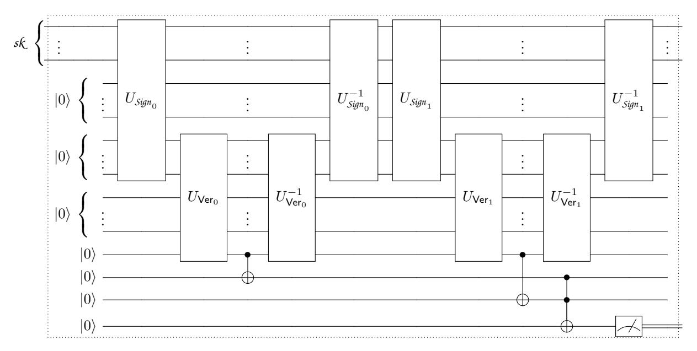

Note: There is a bug in our proof of security for one-shot signatures relative to the classical oracle, pointed out to us by James Bartusek. The issue is in our use of Theorem [3](#page-11-0) in proving the collision-resistance of our construction (Theorem [4\)](#page-13-0). Theorem [3](#page-11-0) applies only to sparse oracles (which is crucial to its proof), whereas our application is a non-sparse oracle. Thus bug seems fundamental, and likely cannot be fixed without new ideas. This does not indicate any actual attack on our construction, which still remains plausibly secure. It also does not affect any of our applications of one-shot signatures. We leave the paper unchanged including the faulty proof of security for future reference.

# One-shot Signatures and Applications to Hybrid Quantum/Classical Authentication

Ryan Amos<sup>∗</sup><sup>1</sup> , Marios Georgiou†<sup>2</sup> , Aggelos Kiayias‡<sup>3</sup> , and Mark Zhandry§<sup>4</sup>

1,4Department of Computer Science, Princeton University Department of Computer Science, City University of New York University of Edinburgh & IOHK, UK NTT Research

#### Abstract

We define the notion of one-shot signatures, which are signatures where any secret key can be used to sign only a single message, and then self-destructs. While such signatures are of course impossible classically, we construct one-shot signatures using quantum no-cloning. In particular, we show that such signatures exist relative to a classical oracle, which we can then heuristically obfuscate using known indistinguishability obfuscation schemes.

We show that one-shot signatures have numerous applications for hybrid quantum/classical cryptographic tasks, where all communication is required to be classical, but local quantum operations are allowed. Applications include one-time signature tokens, quantum money with classical communication, decentralized blockchain-less cryptocurrency, signature schemes with unclonable secret keys, noninteractive certifiable min-entropy, and more. We thus position one-shot signatures as a powerful new building block for novel quantum cryptographic protocols.

### Contents

| 1 | Introduction                                             | 3  |
|---|----------------------------------------------------------|----|
|   | 1.1<br>Motivating Example: Signature Tokens              | 4  |
|   | 1.2<br>Our Results                                       | 6  |
|   | 1.3<br>Related Literature<br>                            | 9  |
|   | 1.4<br>Notation                                          | 10 |
| 2 | Equivocal Collision Resistant Hash Functions             | 10 |
|   | 2.1<br>Construction relative to a classical oracle<br>   | 11 |
|   | 2.2<br>Collision Resistance<br>                          | 12 |
|   | 2.3<br>Equivocality                                      | 15 |
| 3 | One-shot Chameleon Hash Functions                        | 16 |
|   | 3.1<br>Uniformity<br>                                    | 18 |
|   | 3.2<br>Signature Delegation                              | 18 |
| 4 | One-shot Signatures and Budget Signatures                | 20 |
|   | 4.1<br>From One-Shot Signatures to Budget Signatures<br> | 21 |

<sup>∗</sup>rbamos@cs.princeton.edu

<sup>†</sup>mgeorgiou@gradcenter.cuny.edu

<sup>‡</sup>akiayias@inf.ed.ac.uk

<sup>§</sup>mzhandry@gmail.com

| 5 | Quantum Lightning and Quantum Money                           | 22 |
|---|---------------------------------------------------------------|----|
|   | 5.1<br>Construction<br>                                       | 22 |
|   | 5.2<br>Primitive Smart Contracts                              | 23 |
|   | 5.3<br>Improvements                                           | 24 |
|   | 5.4<br>Decentralized Cryptocurrency                           | 24 |
| 6 | Ordered Signatures and Applications                           | 25 |
|   | 6.1<br>Construction<br>                                       | 26 |
|   | 6.2<br>Key Evolving Signatures and Proof of Stake Blockchains | 26 |
|   | 6.3<br>Provably Secret Signing Keys<br>                       | 27 |
|   | 6.4<br>From Ordered Signatures to Delayed Signatures          | 28 |
| 7 | Non-Interactive Proof of Quantumness and Min-Entropy          | 30 |
|   | 7.1<br>Proofs of Quantumness<br>                              | 30 |
|   | 7.2<br>Certifiable Min-Entropy<br>                            | 30 |
| 8 | Acknowledgements                                              | 31 |

# <span id="page-2-0"></span>1 Introduction

Quantum computing and quantum information promise to reshape the cryptographic landscape. In the near term, quantum computers will be able to break much of the cryptography currently used today [\[Sho97\]](#page-33-0), with the field of post-quantum cryptography developing new alternative protocols. On the other hand, quantum cryptography will leverage quantum communication to open new possibilities such as informationtheoretically secure key agreement [\[BB84\]](#page-31-0), physically unclonable money [\[Wie83\]](#page-33-1), and more.

Yet, even in a world full of quantum computers, classical cryptosystems and communication will still play a fundamental role. The unclonability of quantum data, for example, means that tasks such as backing up a quantum hard drive or forwarding a quantum email (while still keeping the original) will be impossible. Even in a world where quantum computing is commonplace, it may be infeasible to run a quantum computer in many computing environments, such as mobile or embedded devices. It may also be some time before our communication infrastructure is updated to support the transfer of quantum data; besides, most data users will care about is still classical, so it may seem as overkill to use quantum information to send such data. With classical communication, however, most of the exciting developments from quantum cryptography become unusable. This then leads to the following natural question:

> When exchanging only classical information, can local quantum computing still offer advantages over purely classical systems.

In some cases, the answer is certainly negative. For example, information-theoretic key agreement [\[BB84\]](#page-31-0) is impossible with classical communication, even if local quantum operations are allowed. Indeed, in quantum key distribution, security is only obtained because the honest parties can detect if the adversary is eavesdropping; on the other hand, with classical communication, the adversary can listen to the communication undetected. Another related example is information-theoretic key recycling [\[OH05,](#page-33-2) [DPS05,](#page-32-0) [GYZ17\]](#page-32-1).

Hybrid quantum/classical cryptography. On the other hand, in an emerging field that we will call hybrid quantum/classical cryptography — or hybrid quantum cryptography for short — it has been shown that local quantum operations can yield an advantage in some settings. Recent work has shown how to attain certifiable randomness expansion [\[BCM](#page-31-1)<sup>+</sup>18], which enables a classical client, for whom generating true randomness is a notoriously difficult task, to verifiably outsource the generation of random bits to a quantum computer, which can generate random bits easily. This task is closely related to the goal of quantum supremacy — demonstrating that quantum computers can solve certain problems faster than classical computers — which has recently gained much attention. Certifiable randomness has also been extended to certifying arbitrary outsourced quantum operations, again using only a classical client [\[Mah18\]](#page-33-3).

Given the importance of classical communication in a quantum world, we anticipate such hybrid protocols to complement post-quantum and quantum cryptography and become a third pillar of active research at the intersection of cryptography and quantum computing. Our goal in this work is therefore to provide new foundational tools for this emerging area and develop novel applications.

### <span id="page-3-0"></span>1.1 Motivating Example: Signature Tokens

Consider the task of signature delegation: Alice wishes to allow Bob to sign a single message on her behalf. Alice could just give Bob her secret key, but this would allow Bob to sign any number of messages. Alice instead wants to give Bob enough information to ensure that Bob can subsequently sign a single arbitrary message, without any further action on Alice's part. Crucially, we want the message to only be decided after Alice hands this information to Bob.

Of course, this task is impossible in a purely classical world, as Bob can re-use whatever information he learned from Alice to sign any number of messages. One could hope that Alice could provide Bob with a quantum signing token, which self-destructs after signing a message. By quantum no-cloning — which says that general unknown quantum states cannot be copied — Bob cannot copy the token, and therefore can only sign a single message. Indeed, Ben-David and Sattath [\[BDS16\]](#page-31-2) show that such quantum signing tokens are possible by building on ideas for public key quantum money [\[AC12\]](#page-30-1).

No-cloning with only classical communication? But what if we insist on classical communication between Alice and Bob[1](#page-3-1) ? How can we leverage the power of no-cloning, when any information Alice sends to Bob can be copied unrestrictedly? It would seem that if Bob can derive a signing token from their communication, he can simply copy the communication transcript to derive as many distinct signing tokens as he would like.

The issue is actually very general, and is potentially problematic in any hybrid quantum protocol. After all, quantum no-cloning and related concepts can be seen as the foundation for essentially all of the novel features in quantum protocols. But now, what if we insist on only classical communication, relegating all quantum operations to local computation? This means that any application of no-cloning applies to states that the adversary constructed entirely on his own. How can we guarantee no-cloning, if the adversary controls the entire process used to generate the state in the first place? Why can't the adversary just run the same process twice, generating two copies?

Perhaps surprisingly, we will demonstrate that with a single classical back-and-forth between Alice and Bob, Alice can send Bob a single-use quantum signature token. In doing so, we demonstrate how to overcome the difficulty outlined above and leverage no-cloning in a setting where all communication is classical.

A Toy Example. How is this possible? To illustrate how classical communication might be combined with local no-cloning, we recall a basic scenario described by Zhandry [\[Zha19\]](#page-33-4), which also underlies the recent developments in certifiable randomness/quantum computation [\[BCM](#page-31-1)+18, [Mah18\]](#page-33-3). Let H be a many-to-one hash function that is collision-resistant against quantum attacks. First, generate a uniform superposition of inputs. Next, compute the hash H in superposition and measure the result, obtaining a value y. The original state collapses to the superposition |ψyi of all pre-images x of y.

Using the above procedure, it is easy to sample states |ψyi. However, at the same time it is impossible to sample two copies of the same |ψyi, assuming the collision-resistance of H. Indeed, assume toward contradiction that it were possible to generate two identical copies of |ψyi. Then simply measure both copies; each measurement will likely yield a different x, resulting in two distinct values mapping to the same y, a contradiction.

A First Attempt. As a first attempt at a signature delegation protocol, we have Bob sample a pair (|ψyi, y), and send the classical value y to Alice. Alice then signs y using some standard post-quantum signature scheme, sending the resulting signature σ back to Bob. The result is that, with only classical communication between Alice and Bob, Bob has arrived at a value (|ψyi, y, σ) that he cannot clone (due to the collision resistance of H), nor can he sample on his own (due to needing Alice's signature on y).

<span id="page-3-1"></span><sup>1</sup>We will not even allow shared entanglement, which could be used in teleportation.

Of course, we have to also describe how (|ψyi, y, σ) can be used to sign a single message, but not two. For general hash functions H, there is likely no meaningful way to accomplish this. For example, if the hash function is collapsing [\[Unr16a\]](#page-33-5), then having |ψyi is essentially no more useful than having a single classical pre-image x. But of course a classical pre-image x cannot be used as a one-time signing token, since it can be copied. Recent evidence suggests that typical post-quantum hash functions are likely collapsing [\[Unr16a,](#page-33-5) [LZ19\]](#page-33-6).

Toward a solution, we observe that our protocol so far bears resemblance to the chameleon signatures of Krawczyk and Rabin [\[KR00\]](#page-32-2). Here, H is replaced with a special type of hash function, called a chameleon hash. In such a hash function, Bob knows a trapdoor T which allows him to "open" the hash y to any message m<sup>0</sup> of his choosing. In particular, given y and any message m<sup>0</sup> , Bob can find an r 0 such that H(m<sup>0</sup> , r<sup>0</sup> ) = y.

We immediately see that chameleon hashing provides a partial solution to signature tokens. Indeed, Bob can choose the hashing key H together with a secret trapdoor T, and send Alice any hash y, which Alice then signs using her signing key. To sign a message m, Bob can then use the trapdoor to open y to any message m, computing an r such that H(m, r) = y. Finally, Bob can then output (m, r, y, σ) as the signature on m. The recipient will verify Alice's signature on y and that H(m, r) = y.

This certainly works for delegating signatures. It is also mimics how signing authority is delegated in practice, where instead of signing a hash, Alice would sign the a public key for Bob's signature scheme. But this standard delegation mechanism of course cannot provide the one-time property we are looking for, as it is purely classical. Indeed, unforgeability relies on the collision resistance of H, which means Bob can break unforgeability using his trapdoor. In particular, Bob can re-use his trapdoor as many times as he wishes, opening y to any number of messages of his choice.

Our Solution: one-shot chameleon hashing. To remedy this issue, we imagine that Bob has a variant of chameleon hash functions, where any given trapdoor can be used only a single time. Specifically, we want that the hash function remains collision resistant even to Bob. In more detail, we define a one-shot chameleon hash function as a hash function H with the following property: it is possible to first sample a hash y together with a one-time quantum trapdoor |Ti. Then, after seeing a message m, it is possible to use the trapdoor |Ti to sample r such that H(m, r) = y. Importantly, anyone can sample a y, |Ti pair, and H is collision resistant to everyone. This implies that once |Ti is used to compute r, it must self-destruct, preventing further openings. This in particular implies that |Ti cannot be classical, else it could be copied as many times as Bob would like.

Notice that all communication — namely y and σ — is classical. We also stress that we want H to be a classical function. As such, Bob's quantum operations are entirely local. What's more, Bob is the only party that is running a quantum computer; Alice can be purely classical.

Generalization: one-shot signatures. We can even abstract the protocol above slightly, to work with a more general object called one-shot signatures. Here, anyone with a quantum computer can sample a classical public key pk, together with quantum secret key |ski. Given |ski and a message m, it is possible to compute a classical signature r on m. Then anyone, knowing just the public key, can verify signatures. For security, we require that it is infeasible to compute a tuple (pk, m0, r0, m1, r1) such that m<sup>0</sup> 6= m1, and r<sup>0</sup> and r<sup>1</sup> are valid signatures of m0, m<sup>1</sup> respectively, with respect to the public key pk. We see that one-shot chameleon hashing is just a special case of one-shot signatures where verification simply evaluates H(m, r), and checks that the result is pk.

Remark 1. Note that one-time signatures — signatures whose security is only guaranteed when used to sign a single message — are well known classically [\[Lam79\]](#page-33-7), and can be built from the simplest tools in cryptography, namely one-way functions. For one-time signatures, the signer should sign only a single message, else they risk revealing their secret key. However, with one-time signatures, there is nothing actually preventing the signer from signing two or more messages, if they decide it is advantageous to do so. With a one-shot signature, in contrast, no matter what the signer does or what security he is willing to give up, he can only ever sign a single message. This difference is the crucial feature of one-shot signatures.

At this point, it should be unobvious that one-shot signatures can even exist. After all, one-shot signatures can be seen as an extremely strong variant of the quantum no-cloning theorem. The original no-cloning theorem dealt with truly unknown quantum states, which were useless to anyone who did not know the states, and therefore for whom no-cloning applied. Public key quantum money [\[Aar09\]](#page-30-2) can be seen as a strengthening, where no-cloning still holds even for parties that have the ability to verify the state. Even this verifiable version of no-cloning has been notoriously difficult to achieve. Quantum lightning is then a further strengthening, where no-cloning holds even for parties that devised the original state themselves; the only existing construction is that of Zhandry [\[Zha19\]](#page-33-4), which is based on new ad hoc hardness assumptions.

One-shot signatures can then be interpreted as yet a further strengthening of quantum lightning where the un-clonable state has been endowed with the ability to sign a message. Given the difficulty in even achieving the weaker forms of no-cloning, it is natural to wonder whether one-shot signatures are even possible.

### <span id="page-5-0"></span>1.2 Our Results

In this work, we explore applications similar to the above, where local quantum operations yield surprising new protocols with classical communication. Our central building blocks will be one-shot signatures and one-shot chameleon hash functions. Our results are as follows:

One-shot signatures and one-shot chameleon hashing (Sections [2,](#page-9-1)[3,](#page-15-0)[4\)](#page-19-0). As our first contribution, we give formal definitions for one-shot signatures and one-shot chameleon hashing.

We also construct one-shot chameleon hashing, and hence one-shot signatures. We observe that prior work essentially constructs this object [\[ARU14\]](#page-31-3), but only relative to a quantum oracle[2](#page-5-1) , and there is no known way to instantiate the oracle. We improve on this by demonstrating a classical oracle (but queryable in superposition) relative to which we can build one-shot chameleon hashing and signatures. Even finding a plausible classical oracle to build one-shot chameleon hashing exists is highly non-trivial. Our main idea is to start from a hash function which is periodic. Such a function is certainly not collision resistant against quantum attacks due to quantum period finding, but at least it is straightforward to show that it gives rise to the chameleon property we need. We then recursively divide the set of pre-images of each output into another periodic function. Importantly, we choose different periods for each set of pre-images to avoid the overall function becoming periodic. In fact, we perform this recursive division several times, each time using a different period for each set of pre-images. We demonstrate that this recursive structure nevertheless preserves the chameleon property. We prove that our one-shot chameleon hashing is collision resistant relative to this oracle using a modification of the polynomial method. Our classical oracle can then heuristically be obfuscated using post-quantum indistinguishability obfuscation (e.g. [\[BGMZ18\]](#page-31-4)) to yield a plausible construction in the common reference string model.

Signature delegation. We then turn to applications. Many of our applications can be seen as applications of our signature delegation mechanism above. We demonstrate that our signature delegation protocol works, and can easily be delegated multiple times, with Bob delegating to Charlie, who delegates to Dana, etc. The overall signature is the entire signature chain from Alice to the final signer.

Budget Signatures (Section [4\)](#page-19-0). We can also delegate to pairs of public keys. Such delegation allows us, for example, to construct budget signatures. Here, when signing a message, we specify a budget b > 0. Each public key will come with a total budget B, and the security property is that Bob can sign any number of messages, so long as the total budget remains less than B.

In our scheme, the public key for a total budget B will simply be the pair (pk, B) where pk is the public key for a one-shot signature. To sign a message m with budget b at most the total budget B, simply sign m using the one-shot secret key, using up the secret key. Alternatively, one can delegate to two budget signature public keys pk<sup>0</sup> , pk<sup>1</sup> with budgets B0, B<sup>1</sup> respectively, where B<sup>0</sup> + B<sup>1</sup> ≤ B. To do so, simply sign the concatenation of the two public keys. Those budget signatures can then be recursively used to sign with budgets B0, B1. When verifying the signature relative to pk<sup>0</sup> , additionally verify the signature on pk<sup>0</sup> , pk<sup>1</sup> relative to pk, as well as that B<sup>0</sup> + B<sup>1</sup> ≤ B. Since we know pk<sup>0</sup> can only sign with budget up to B<sup>0</sup> and pk<sup>1</sup> can only sign with budget up to B1, this verification guarantees pk can only sign with budget total budget up to B<sup>0</sup> + B<sup>1</sup> ≤ B. In typical usage, we imagine that to sign a message with budget b, we will first invoke

<span id="page-5-1"></span><sup>2</sup>That is, an oracle which performs a quantum operation on its input state.

this delegation with B<sup>0</sup> = b and B<sup>1</sup> = B − b, and then sign m with respect to pk<sup>0</sup> , using the secret key in the process. Further messages are signed with respect to pk<sup>1</sup> .

Remark 2. We note that with our delegation scheme, the size of signatures grows with the depth of the delegation. For our budget signatures, this is potentially problematic if large numbers of messages, and hence delegations, are expected, as it implies a large secret key and signature size. Similar limitations hold for many of our protocols below based on our delegation mechanism. In this work, we will for the most part ignore this issue. However, we observe that by using a (post-quantum) succinct non-interactive argument of knowledge (SNARK) (e.g. [\[COS19\]](#page-32-3)), one can prove knowledge of the long signature chain using a short digest. This allows our budget signature scheme to have short signatures. Of course, in order to generate the SNARK, one must remember the signature chain, and therefore the secret key must still be large. By using a recursively composable SNARK, which allows for proving statements that include the SNARK verifier, we can also compress the secret key of our scheme, by only ever remembering a SNARK of the signature chain. We note that it is common to conjecture that SNARKs can be recursively composed for a polynomial number of times [\[BSCTV14,](#page-31-5) [Lab17\]](#page-33-8), and a similar idea has been used to build cryptocurrency with a constant-sized blockchain [\[Lab17\]](#page-33-8). Recursively composable SNARKs can also be used in our other delegation-based protocols to compress key/signature sizes.

Quantum money with classical communication (Section [5\)](#page-21-0). One-shot signatures readily yield public key quantum money, where the mint has a public key that allows anyone to verify. Basically, the quantum signing key |ski for a one-shot signature serves as the quantum money state.

Using our signature delegation mechanism, we show how to send quantum money using only classical messages. The mint's public key will be the public key for a classical post-quantum signature scheme. To mint a banknote with value V , the mint simply creates a secret key/public key pair (|ski, pk) for a one-shot signature scheme, and signs the pair (pk, V ) using it's classical signature scheme to get signature σ. Sending the note to someone simply invokes our delegation procedure. By combining with our budget signatures, our quantum money scheme is also infinitely divisible, unlike existing constructions.

Decentralized blockchain-less cryptocurrency (Section [5.4\)](#page-23-1). One-shot signatures also immediately give rise to quantum lightning, yielding the first construction with provable security relative to a classical oracle. As explained by Zhandry [\[Zha19\]](#page-33-4), by combining with a suitable proof of work, quantum lightning gives a decentralized cryptocurrency, where the double-spend problem is solved using no-cloning as opposed to a blockchain. Zhandry's scheme, however, requires quantum communication.

We combine our delegation scheme with proofs of work to give blockchain-less cryptocurrency using only classical communication. The basic idea is that, to mint a new note, the miner generates a secret key/public key pair for a one-shot signature scheme. Then the miner uses the public key as the challenge in a proof of work. The completed proof of work and the key pair constitute the note. Spending the note just involves our delegation mechanism, except that for the first transaction, the miner appends the proof of work to the message he signs. This construction can be seen also to offer the first embodiment of a "reusable proof of work" [\[Fin04\]](#page-32-4) that does not rely on a hardware assumption.

Ordered Signatures (Section [6\)](#page-24-0). Here, when signing a message, one also specifies a tag t. The signing key allows for signing any message, but the requirement is that messages can only be signed in order of increasing t. That is, once a message is signed at tag t0, it then becomes impossible to sign a message at a "past" tag t<sup>1</sup> < t0.

Our construction is very simple: the public key will be the public key for a one-shot signature scheme. To sign a message at tag t, simply construct a new one-shot signature public key/secret key pair (pk, |ski), and delegate to the new public key. When signing to delegate, sign the entire public key/tag/message triple. |ski becomes the new secret key, and the signature consists of the entire signature chain from the original public key to the latest public key. To verify, simply verify the signature chain, as well as verify that the tags in the chain occur in increasing order. The idea is that, by the one-shot security of our signatures, the only way to produce a new signature is to append to the signature chain. Therefore, once an adversary produces a signature at tag t0, he has committed to all the signatures he will produce at tags t<sup>1</sup> < t0. If he tries to sign a different message at t1, this will constitute a fork in the chain, violating the one-shot security property.

Ordered signatures allow one to provably destroy their signing key by signing a dummy message at time ∞. Or one can at provably update their key by dividing time into epochs, and signing a dummy message at the end of an epoch to update to the next epoch.

Key-Evolving Signatures and Proof-of-Stake Blockchains (Section [6.2\)](#page-25-1). Ordered signatures provide a first instantiation of key-evolving signatures in the erasure model. A key-evolving signature (KES), (see e.g., [\[Fra06\]](#page-32-5)) enables key updates at regular intervals (or per message) so that a key exposure incident at a certain time cannot compromise the unforgeability of past periods. Instantiating KES classically is only possible assuming erasures, i.e., that the party is capable of erasing its old private state after the update. Applying ordered it is possible to obtain a KES in the non-erasure model, i.e., the setting where the adversary may have access to past states.

This observation circumvents a standard model impossibility result and resolves an open question in Proof-of-Stake (PoS) blockchain protocols, [\[BGK](#page-31-6)+18, [CM19\]](#page-31-7), regarding their security in the non-erasure model: in these protocols, in order to solve the problem of "long range attacks" (see e.g., [\[But14,](#page-31-8) [GKR18\]](#page-32-6)). key-evolving signatures are utilized to ensure that corruption of past keys cannot provide any advantage to an attacker that corrupts old keys that used to be associated with a large percentage of stake but have since been depleted. In the classical non-erasure model such corruption leads to a long range attack that can break consistency (see e.g., [\[DPS19\]](#page-32-7) where this is stated as a formal impossibility). Basing the proof-of-stake operation on an ordered signature eliminates this attack vector and facilitates a secure PoS blockchain in the non-erasure model.

Single-signer Signatures (Section [6.3\)](#page-26-0). Here, the secret key is subject to quantum no-cloning, meaning that at any time, only a single user is capable of signing with respect to a given public key. Our ordered signatures readily give such single-signer signatures, by simply having the tag t be a counter, incremented with each signature. Security is proved as follows: toward contradiction, if one could split a secret key into two states such that each state is independently capable of signing, then it is impossible to guarantee any order between the signatures produced by each state, breaking the underlying ordered signature.

Of course, this signing capability can be transferred by sending over the quantum secret key; our signatures can also easily be transferred with only classical communication, again using our delegation mechanism.

We observe that single-signer signatures can be seen as yet a further strengthening of quantum nocloning. Whereas one-shot signatures endow the unclonable state with the functionality of signing messages, the functionality can only be used a single time before the state self-destructs. Single-signer signatures instead give the unclonable state the perpetual ability to sign an unlimited number of messages, but this ability cannot be split amongst two parties.

Delay Signatures (Section [6.4\)](#page-27-0). Adding proofs of sequential work (PoSW) to our ordered signature construction, we obtain what we call delay signatures, where the signer must wait a certain amount of time between signing messages.

As a potential application we imagine combining delay signatures with our quantum money scheme. The result is that the mint can only mint new currency at a certain rate. This would prevent an untrusted government from paying debts by simply minting unlimited money.

Proofs of quantumness (Section [7.1\)](#page-29-1). One-shot signatures easily give rise to a proof of quantumness: to prove quantumness, generate a public key for a one-shot signature scheme, and send it to the verifier. The verifier then chooses and sends back a random message. Respond with a signature on the message. A simple rewinding argument shows that any classical adversary that passes verification can be used to sign two messages with respect to the same public key, violating one-shot security.

Interestingly, our proofs of quantumnes are public coin, meaning soundness holds even if the verifier's random coins are public. Such protocols can be made non-interactive using the Fiat-Shamir heuristic. Prior protocols [\[BCM](#page-31-1)<sup>+</sup>18] are interactive and secret coin, and there is no obvious way to turn them into non-interactive protocols.

Certifiable Randomness (Section [7.2\)](#page-29-2). Our proofs of quantumness also immediately give rise certifiable min-entropy, which is again public coin and can be made non-interactive with Fiat-Shamir. Again, prior protocols required multiple rounds[3](#page-8-1) .

### <span id="page-8-0"></span>1.3 Related Literature

Comparing our primitives with classical primitives. Most of the cryptographic notions in this work can be thought of as "one-shot" versions of existing classical cryptographic primitives. One-shot chameleon hash functions generalize the classic equivalent introduced by Krawczyk and Rabin [\[KR00\]](#page-32-2). Our one-shot signatures are the one-shot analogue of one-time signatures by Lamport [\[Lam79\]](#page-33-7) in the sense that one not only is unwilling to generate a second signature but also he is unable to. Our chain of delegations, our quantum money scheme and our ordered signatures use components from the Naor-Yung paradigm for building full-blown signatures out of one-time signatures [\[NY89\]](#page-33-9) and our budget signatures shares similarities with Merkle signatures [\[Mer89\]](#page-33-10).

Quantum Query Complexity. Our query complexity lower bound uses elements from Ambainis's adversary method [\[Amb02\]](#page-31-9), as well as techniques for building public-key quantum money by Aaronson and Christiano [\[AC12\]](#page-30-1) and tokens for digital signatures by Ben-David and Sattath [\[BDS16\]](#page-31-2). Our construction of equivocal hash functions relative to a classical oracle extends the pick-one trick by Ambainis et al. [\[ARU14\]](#page-31-3) and implies the existence of quantum lightning by Zhandry [\[Zha19\]](#page-33-4). Interestingly, unlike previous results, our collision resistance lower bound is not based on the polynomial method [\[BBC](#page-31-10)+01]. The polynomial method works well in proving indistinguishability between oracles but little can be done when it comes to search problems. Indeed, proving that a function is collision resistant through indistinguishability from injective functions immediately implies that it is collapsing!

Collapsing Hash Functions. The construction of equivocal hash functions from standard assumptions is a highly non-trivial task as shown by a line of works. Unruh [\[Unr16b\]](#page-33-11) introduced the notion of collapsing hash functions and proved that the random oracle is collapsing. Since then, several works have proven that numerous collision resistant hash functions from standard assumptions are collapsing [\[Unr16a,](#page-33-5) [CBH](#page-31-11)+18, [LZ19\]](#page-33-6) and thus not equivocal.

Cryptocurrencies. Our decentralized cryptocurrency construction and its extensions share similarities with blockchain constructions such as Bitcoin's mining using proof of work [N+[08\]](#page-33-12) as well as Ethereum's concept of smart contracts [\[W](#page-33-13)+14]. Mining in the quantum world has also gained attention in the recent years. Although Grover's algorithm can be used to obtain a quadratic speed-up over classical computers for the problem of finding pre-images that map to small hashes in the random oracle model (see e.g., [\[CGK](#page-31-12)+19]), Aggarwal et al. [\[ABL](#page-30-3)+17] have proven that there exist hash-functions with smaller than quadratic speed-up.

Quantum Money. Quantum money, first introduced by Wiesner [\[Wie83\]](#page-33-1), has received a lot of attention the past decade with numerous results in the secret-key setting, where the bank must be involved in verification. Gavinsky [\[Gav12\]](#page-32-8) has proven that quantum money where the coins are minimally entangled is possible in this setting. Radian and Sattath [\[RS19\]](#page-33-14) recently created a secret key quantum money scheme where the minting algorithm is also classical; they called this notion semi-quantum money. However, for their protocol, spending the money still involves sending a quantum state, and verification requires the mint. Farhi et al. [\[FGH](#page-32-9)<sup>+</sup>10] have shown that public-key quantum money where the verification is a projective measurement onto a 1-dimensional subspace is impossible without high entanglement. As a result, since one-shot signatures imply such a quantum money definition, secret keys have to be highly entangled.

<span id="page-8-1"></span><sup>3</sup>Though the prior protocols are able to achieve (statistically close to) uniform randomness. In contrast, as explained by Zhandry [\[Zha19\]](#page-33-4), any non-interactive protocol can never achieve uniform randomness. Our protocol achieves super-logarithmic min-entropy.

One-time Memories. Signature delegation can be thought of as the authentication analogue of decryption delegation, known in the literature as one-time memories, introduced by Goldwasser et al. [\[GKR08\]](#page-32-10). These are memories that allow one to extract a single secret out of them. Unlike signature delegation, one-time memories are impossible even in the quantum world, and even relative to a (quantum) oracle. This is because extraction is a deterministic process and, hence, the information-disturbance tradeoff principle implies that such an extraction does not collapse a quantum state.

Proof of Quantumness. Private coin proofs of quantumness out of standard post-quantum assumptions have already been proposed in the literature. Brakerski et al. [\[BCM](#page-31-1)+18] have proven that under the LWE assumption, there is a private coin interactive protocol for proof of quantumness.

Multi-device protocols. As a precursor to the more recent hybrid quantum protocols, Colbeck [\[Col09\]](#page-31-13) proposed a setting where a classical experimenter interacts with multiple potentially untrustworthy quantum devices, with the guarantee that the devices cannot communicate. As in our protocols, all interaction is classical. However, Colbeck's protocol, in addition to requiring multiple non-communicating devices, inherently relies on the quantum devices having pre-shared entanglement in order to operate. Therefore, the quantum part of the protocol is not truly local.

### <span id="page-9-0"></span>1.4 Notation

Below we will use calligraphic font to represent quantum algorithms (e.g. *Alg* ) and calligraphic font and/or the bracket notation for (mixed) quantum states (e.g. *sk* for a quantum secret key or |ψi). We will use standard math or sans serif font to represent classical algorithms (e.g. A or Alg) and classical variables (e.g. x for a classical one-letter variable or pk for a classical public key). A function f : Z → R <sup>+</sup> is called negligible if f(n) = o(n −c ) for any constant c. We denote by x ← S the random variable x generated by sampling uniformly at random from the set S. Similarly, we denote by x ← D the random variable x generated by sampling according to the distribution D.

Common Reference String Model. As is the case with quantum lightning [\[Zha19\]](#page-33-4), a common reference string is necessary for most of the primitives we describe in this work. This is for the same reason we require a common reference string in collision resistant hash functions: for a fixed function there always exists an adversary that knows a collision. In the definitions below we assume that this common string is drawn uniformly at random. This is the ideal scenario and does not require any public parameters generator. In some cases, for example when the common reference string describes an obfuscated algorithm, a parameters generator may be necessary. In this case, this generator may hide a secret trapdoor which it destroys after publishing the common reference string.

# <span id="page-9-1"></span>2 Equivocal Collision Resistant Hash Functions

In this section we define the new notion of equivocal collision-resistant hash functions and we give a construction relative to a classical oracle.

Definition 1 (Equivocal Hash-Functions). An equivocal hash function family is a triple of algorithms (*Gen*, Eval, *Equiv*) with the following syntax:

*Gen*(crs) : (h, *sk* , p) takes as input a common reference string crs and returns a hash value h, a quantum secret key *sk* and a description of a predicate p.

Eval(crs, x) : h takes as input a crs and a pre-image x and outputs a hash value h.

*Equiv*(*sk* , b) : x takes as input a quantum secret key *sk* and a bit b and returns a pre-image x.

Correctness requires that the following holds with overwhelming probability. If (h, *sk* , p) ← *Gen*(crs) then for any bit b, it holds that Eval(crs, x) = h and p(x) = b, where x ← *Equiv*(*sk* , b).

The above definition states that a quantum algorithm  $(Gen, \mathcal{E}quiv)$  can sample an image h, a secret "inversion" quantum key  $\mathfrak{sk}$  as well as a predicate p as a polynomial size circuit, and later on, given any bit b, it can use this key to find a pre-image x of h such that p(x) = b. It is important to notice that if we also require collision resistance, then quantumness is necessary. If the secret key were classical, then by running  $\mathcal{E}quiv$  twice with b=0 and b=1 we could find a collision. In the quantum case, running  $\mathcal{E}quiv$  can make  $\mathfrak{sk}$  collapse and thus impossible to reuse.

**Theorem 1.** There exists an equivocal collision resistant hash function relative to a classical oracle.

In section 2.1 we define our scheme relative to a classical oracle. In sections 2.2 and 2.3 we prove the collision resistant and the equivocal property respectively.

**Levels of Security of Hash Functions.** Here we aim to compare different notions of security of hash functions. We study the following three definitions of a hash function H in order of increasing security:

- 1. Collision resistant: no efficient adversary can come up with  $x_0, x_1$  such that  $H(x_0) = H(x_1)$ .
- 2. Unequivocal: no efficient adversary can come up with an image h and a predicate p and later on, given a bit b, find a pre-image x such that H(x) = h and p(x) = b.
- 3. Collapsing: no efficient adversary can distinguish the following oracles:
  - MeasureOutput( $\sum_{x} a_x |x\rangle$ ): Given the quantum state  $\sum_{x} a_x |x\rangle$  apply H on superposition to get the state  $\sum_{x} a_x |x\rangle |H(x)\rangle$ . Then measure the second register to get  $|\psi_0\rangle \propto \sum_{x:H(x)=h} a_x |x\rangle |y\rangle$  and return  $|\psi_0\rangle$ .
  - MeasureInput( $\sum_x a_x |x\rangle$ ): Given the quantum state  $\sum_x a_x |x\rangle$ , measure it to get a random x and return  $|\psi_1\rangle = |x\rangle |H(x)\rangle$ .

It is easy to see that (3) implies (2) and (2) implies (1). Indeed, if one is able to find a collision x, x' such that  $x_i \neq x_i'$  for some i, then by picking the predicate  $p(x) = x_i$ , one can break the unequivocal property. Moreover, if one can find an image h that later they can invert at will, then it can distinguish  $|\psi_0\rangle$  from  $|\psi_1\rangle$ , since  $|\psi_1\rangle = |x\rangle |H(x)\rangle$  already fixes a pre-image x such that p(x) = b and thus cannot be used to find x' such that p(x') = 1 - b.

Zhandry [Zha19] shows that a hash function that is (1) but not (3) gives quantum lightning. Here, we show that a hash function that is (1) but not (2) has even more applications.

In the process of coming up with an equivocal collision resistant hash function in the plain model, we note that it is enough to come up with a function that breaks the unequivocal property with an inverse polynomial probability. Given such a function H, we can easily boost to high success probability by running it independently n times. In particular, the function  $H^n(x_1,\ldots,x_n)=(H(x_1),\ldots,H(x_n))$  is equivocal according to our definition. Let A be an adversary that breaks property (2). By running n times A we get values  $h_1,\ldots,h_n$  and predicates  $p_1,\ldots,p_n$ . We define our predicate  $p(x_1,\ldots,x_n)$  as the majority of  $p_i(x_i)$ . To equivocate to a bit b, we simply equivocate each individual hash to b. By invoking the Chernoff bound and choosing n large enough, we are guaranteed that we get a pre-image  $x=x_1,\ldots,x_n$  such that p(x)=b with overwhelming probability.

An interesting question that arises is whether (2) implies (3); namely, can we use a distinguisher against the collapsing property to build an inverter that equivocates? Although searching solutions looks like a harder task than just distinguishing two different states, the above implications are not excluded.

#### <span id="page-10-0"></span>2.1 Construction relative to a classical oracle

In this section we define our function family relative to a classical oracle. The oracle is a combination of two oracles  $H, H^{\perp}$  where H is the evaluation oracle and  $H^{\perp}$  is used to achieve equivocality. In our construction, the space of n-bit inputs is partitioned into  $2^{n/2}$  affine spaces of dimension n/2. The oracle H assigns a distinct output to each space. Applying H to a uniform superposition and measuring yields a uniform superposition over one of the affine subspaces. To achieve the equivocal property, a second oracle  $H^{\perp}$  is provided, which tests for membership in the spaces orthogonal to the affine spaces in H.

Before defining our construction we introduce some terminology. For the *n*-dimensional space  $\mathbb{F}_2^n$ , a *d*-ordered affine partition  $P = (A_y)_{y \in \{0,1\}^{n-d}}$  is a list of  $2^{n-d}$  pairwise disjoint affine subspaces of dimension *d*. For an affine subspace *A*, we denote  $A^{\perp}$  the orthogonal complement of the linear subspace corresponding to *A*.

**Definition 2** (Affine partition function). Let  $P = (A_y)_{y \in \{0,1\}^{n/2}}$  be an n/2-ordered affine partition. An affine partition function  $(H_P, H_P^{\perp})$  is defined as:

- $H_P: \mathbb{F}_2^n \to \{0,1\}^{n/2}$  such that  $H_P(x) = y$  if and only if  $x \in A_y$ ,
- $H_P^{\perp}: \mathbb{F}_2^n \times \{0,1\}^{n/2} \to \{0,1\}$  such that  $H_P^{\perp}(x,y) = 1$  if and only if  $x \in A_y^{\perp}$ .

In other words, our function is parameterized by an ordered partition of the whole n-dimensional input space into affine subpsaces, each containing  $2^{n/2}$  points such that all points in the same subspace  $A_y$  map to the same value y. Our claim is that there exists an affine partition that requires exponentially many queries to find a collision.

<span id="page-11-4"></span>**Theorem 2.** There is an affine ordered partition  $P = (A_y)_{y \in \{0,1\}^{n/2}}$  such that  $H_P$  is an equivocal collision resistant hash function relative to the oracle  $(H_P, H_P^{\perp})$ .

Notice that the above theorem claims worst-case hardness. We prove the two parts of this theorem in the following two subsections. In subsection 2.2 we prove our query complexity lower bound for collisions and in subsection 2.3 we prove equivocality.

### <span id="page-11-1"></span>2.2 Collision Resistance

Our collision resistance lower bound uses a modification of the inner-product adversary method [Amb02, AC12] and follows the lines of [BDS16]. We devise a relation between hard-to-distinguish partitions and we prove that any algorithm that finds a collision must end up in states such that their average inner product (over the relation) is a constant away from 1. The relation is picked in such a way that the average inner product cannot decrease by more than an exponentially small amount in each query.

We will use the following generalization of Ambainis's [Amb02] basic adversary method. It combines the inner product adversary method by Aaronson and Christiano [AC12] with Lemma 18 by Ben-David and Sattath [BDS16].

<span id="page-11-0"></span>**Theorem 3** (Adversary method for search problems). Let  $S \subset \{0,1\}^N$  be a set of inputs of size N,  $q: S \to T$  be a search problem and let  $R \subset S \times S$  be a symmetric relation between inputs. For any  $x \in S$ , let  $R_x = \{y \in S : (x,y) \in R\}$ . If

- <span id="page-11-2"></span>1. (Hard-to-distinguish (x,y) pairs). For every x appearing in R and every  $i: x_i = 0$ ,  $\Pr_{y \leftarrow R_x}[y_i = 1] \le \varepsilon$ ,
- <span id="page-11-3"></span>2. (Distinguishing solutions s). For every x appearing in R and every  $s: s \in q(x)$ ,  $\Pr_{y \leftarrow R_x}[s \in q(y)] \le c$ ,

then any quantum algorithm that solves q with an inverse polynomial in  $\log N$  probability must make at least  $\Omega\left(\frac{1-\sqrt{c}-d}{\sqrt{\varepsilon}}\right)$  queries to the input, where d is a negligible function in  $\log N$ .

Proof. Consider an input  $x \in \{0,1\}^N$  and suppose that an algorithm A makes T queries; i.e.,  $A = U_T O_x U_{T-1} O_x \cdots U_1 O_x U_0$ , where  $U_1, \ldots, U_T$  are arbitrary unitary transformations independent of x and  $O_x |i\rangle = (-1)^{x_i} |i\rangle$ . Let  $|\phi_t^x\rangle, |\psi_t^x\rangle$  be the states of the algorithm before after the t'th query to  $O_x$ . In the beginning  $|\psi_1^x\rangle$  is the same for all x since A has not made any query to  $O_x$ . The final state of the algorithm is  $|\phi_T^x\rangle$ .

Consider the progress measure  $p_t = \mathrm{E}_{(x,y)\leftarrow R}\left[|\langle \phi_t^x|\phi_t^y\rangle|\right]$  and observe that  $p_1=1$ . We will prove that condition 1 implies that a single query cannot decrease the progress measure too much and condition 2 implies that anyone that finds a solution with good probability after T queries should end up having a progress  $p_T$  at least a constant less than 1.

We begin by proving that  $p_{t-1} - p_t \le 4\sqrt{\varepsilon}$ . The proof in a more general setting, where the oracles can be reflections across subspaces, first appeared in [AC12] but we include it here for completeness.

Write

$$\left|\phi_{t}^{x}\right\rangle = \sum_{i\in[N]}\alpha_{t,i}^{x}\left|i\right\rangle \left|\phi_{t,i}^{x}\right\rangle$$

where P i∈[N] α x t,i 2 = 1 and notice that

$$\left\langle \phi_{t}^{x} \middle| \phi_{t}^{y} \right\rangle = \sum_{i \in [N]} \overline{\alpha_{t,i}^{x}} \alpha_{t,i}^{y} \left\langle \phi_{t,i}^{x} \middle| \phi_{t,i}^{y} \right\rangle.$$

After we query O<sup>x</sup> our new state becomes

$$\left|\psi_{t}^{x}\right\rangle = \sum_{i:x_{i}=0}\alpha_{t,i}^{x}\left|i\right\rangle\left|\phi_{t,i}^{x}\right\rangle - \sum_{i:x_{i}=1}\alpha_{t,i}^{x}\left|i\right\rangle\left|\phi_{t,i}^{x}\right\rangle$$

and thus

$$\langle \phi_t^x | \phi_t^y \rangle - \langle \psi_t^x | \psi_t^y \rangle = 2 \sum_{i: x_i \neq y_i} \overline{\alpha_{t,i}^x} \alpha_{t,i}^y \left\langle \phi_{t,i}^x \middle| \phi_{t,i}^y \right\rangle.$$

Moreover, by the triangle inequality, we have that

$$\begin{aligned} |\langle \phi_t^x | \phi_t^y \rangle| - |\langle \psi_t^x | \psi_t^y \rangle| &\leq |\langle \phi_t^x | \phi_t^y \rangle - \langle \psi_t^x | \psi_t^y \rangle| \\ &\leq 2 \sum_{i: x_i \neq y_i} |\alpha_{t,i}^x | |\alpha_{t,i}^y| \end{aligned}$$

<span id="page-12-0"></span>Lemma 1 (Small progress [\[AC12\]](#page-30-1)). If for every x appearing in R and every i : x<sup>i</sup> = 0, Pry←R<sup>x</sup> [y<sup>i</sup> = 1] ≤ ε, then pt−<sup>1</sup> − p<sup>t</sup> ≤ 4 √ ε.

Proof. By taking expectations, we get

$$\begin{split} p_{t-1} - p_t &= \underset{(x,y) \leftarrow R}{\mathbb{E}} \left[ |\langle \phi_t^x | \phi_t^y \rangle| \right] - \underset{(x,y) \leftarrow R}{\mathbb{E}} \left[ |\langle \psi_t^x | \psi_t^y \rangle| \right] \\ &\leq \underset{(x,y) \leftarrow R}{\mathbb{E}} \left[ |\langle \phi_t^x | \phi_t^y \rangle - \langle \psi_t^x | \psi_t^y \rangle| \right] \\ &\leq 2 \underset{(x,y) \leftarrow R}{\mathbb{E}} \left[ \sum_{i: x_i \neq y_i} \left| \alpha_{t,i}^x \right| \left| \alpha_{t,i}^y \right| \right] \\ &= 4 \underset{(x,y) \leftarrow R}{\mathbb{E}} \left[ \sum_{i: x_i = 0, y_i = 1} \left| \alpha_{t,i}^x \right| \left| \alpha_{t,i}^y \right| \right] \\ &\leq 2 \sqrt{1/\varepsilon} \underset{(x,y) \leftarrow R}{\mathbb{E}} \left[ \sum_{i: x_i = 0, y_i = 1} \left| \alpha_{t,i}^x \right|^2 \right] + 2 \sqrt{\varepsilon} \underset{(x,y) \leftarrow R}{\mathbb{E}} \left[ \sum_{i: x_i = 0, y_i = 1} \left| \alpha_{t,i}^y \right|^2 \right] \\ &= 2 \sqrt{1/\varepsilon} \underset{x}{\max} \underset{y \leftarrow R_x}{\mathbb{E}} \left[ \sum_{i: x_i = 0, y_i = 1} \left| \alpha_{t,i}^x \right|^2 \right] + 2 \sqrt{\varepsilon} \underset{(x,y) \in R}{\max} \underset{i: x_i = 0, y_i = 1}{\sum} \left| \alpha_{t,i}^y \right|^2 \\ &\leq 2 \sqrt{1/\varepsilon} \underset{x}{\max} \varepsilon + 2 \sqrt{\varepsilon} \\ &= 4 \sqrt{\varepsilon}, \end{split}$$

where the 5th lines comes from Jensen's inequality and the 8th line comes from the fact that

$$\max_{x} \mathop{\mathbf{E}}_{y \leftarrow R_{x}} \left[ \sum_{i: x_{i} = 0, y_{i} = 1} \left| \alpha_{t, i}^{x} \right|^{2} \right] \leq \max_{x, i: x_{i} = 0} \mathop{\mathbf{Pr}}_{y \leftarrow R_{x}} [y_{i} = 1] \leq \varepsilon$$

We continue by showing that any algorithm that finds a solution with constant probability should achieve  $p_T$  that is a constant away from 1. The following Lemma is a trivial generalization of Lemma 18 by Ben-David and Sattath [BDS16].

<span id="page-13-1"></span>**Lemma 2.** Let R be a symmetric relation between inputs  $x \in \{0,1\}^N$  and let  $q:\{0,1\}^N \to \{0,1\}^{O(\log N)}$ be a search problem. Suppose that an algorithm computes q with probability at least 1-d after T queries. If  $\max_{x,s\in q(x)} \Pr_{y\leftarrow R_x}[s\in q(y)] \le c$ , then

$$p_T \le \sqrt{c} + 2\sqrt{d}$$
.

*Proof.* We decompose the final state of the algorithm  $|\phi_T^*\rangle = |\phi^x\rangle$  into correct and wrong outputs:

$$|\phi^x\rangle = |G^x\rangle + |B^x\rangle$$

where  $|G^x\rangle = \sum_{s \in P(x)} a_s^x |\psi_s^x\rangle |s\rangle$ ,  $|B^x\rangle = \sum_{s \notin P(x)} a_s^x |\psi_s^x\rangle |s\rangle$  and  $|B^x\rangle |\leq \sqrt{d}$ . The absolute value of the inner product between any two states corresponding to inputs x, y is

$$\begin{split} |\langle \phi^x | \phi^y \rangle| &\leq |\langle \phi^x | G^y \rangle| + \sqrt{d} \\ &\leq |\langle G^x | G^y \rangle| + \sqrt{d} \\ &\leq \sum_{s \in P(x) \cap P(y)} |a_s^x| |a_s^y| + 2\sqrt{d}. \end{split}$$

By the same analysis as above, we get

$$\mathbb{E}_{(x,y)\leftarrow R}\left[\sum_{s\in P(x)\cap P(y)} |a_s^x||a_s^y|\right] \le \max_{x,s\in P(x)} \sqrt{\Pr_{y\leftarrow R_x}[s\in P(y)]} \\ \le \sqrt{c},$$

and therefore that

$$\mathop{\mathbf{E}}_{(x,y)\leftarrow R}[|\langle \phi^x | \phi^y \rangle|] \le \sqrt{c} + 2\sqrt{d}$$

By combining the above lemmata 1 and 2, we conclude that any algorithm that finds a solution with probability at least 1-d, has to make at least  $\Omega\left(\frac{1-\sqrt{c}-2\sqrt{d}}{\sqrt{\varepsilon}}\right)$  queries to the input.

It remains to show that any algorithm that succeeds with probability at least 1/p(n), where  $n = \log N$ , for some polynomial p, can be turned into an algorithm that succeeds with probability close to 1. Indeed, by running our algorithm p(n)q(n) times, where q(n) is a polynomial, we get a winning probability of  $1-(1-1/p(n))^{p(n)q(n)}\approx 1-e^{-q(n)}$  which is exponentially close to 1. Notice that the repetition reduces the lower bound by a polynomial factor of p(n)q(n). This concludes the proof of theorem 3.

Equipped with theorem 3, we can derive the first part of theorem 2; i.e., the existence of a partition that is collision resistant.

<span id="page-13-0"></span>**Theorem 4.** There is an affine ordered partition  $P = (A_y)_{y \in \{0,1\}^{n/2}}$  such that  $H_P$  is a collision resistant hash function relative to the oracle  $(H_P, H_P^{\perp})$ .

Proof. In our case,  $S = \Sigma^{\mathbb{F}_2^n} \times \{0,1\}^{\mathbb{F}_2^n \times 2^{n/2}}$ , where  $\Sigma = \{0,1\}^{n/2}$  is the range of  $H_P$ ,  $T = \mathbb{F}_2^n \times \mathbb{F}_2^n$  and the search problem is defined as  $\operatorname{col}(H_P, H_P^{\perp}) = \{(a,b) : H_P(a) = H_P(b) \land a \neq b\}$ .

Define the relation R such that  $((H_P, H_P^{\perp}), (H_Q, H_Q^{\perp})) \in R$  if and only if for each  $y \in \{0,1\}^{n/2}$ ,  $\dim(A_y^P \cap A_y^P) = \{(a,b) : H_P(a) = H_P(b) \land a \neq b\}$ .

 $A_y^Q = n/2 - 1$ , where  $P = (A_y^P)_{y \in \{0,1\}^{n/2}}$ . Fix an image y and a point  $p \in A_y^P$ . It holds that

$$\Pr_{Q \leftarrow R_P}[p \in A_y^Q] = \frac{\left|A_y^P \backslash A_y^Q\right|}{\left|\mathbb{F}_2^n \backslash A_y^P\right|} = \frac{2^{n/2-1}}{2^n - 2^{n/2}} \leq \frac{1}{2^{n/2}},$$

and, therefore,  $\varepsilon=1/2^{n/2}$ . Moreover, any collision  $p\neq q\in A_y^P$  forms a one-dimensional affine subspace  $C=\{p,q\}\leq A_y^P$ . We can see that the probability  $\Pr_{q\leftarrow R_P}[C\leq A_y^Q]$  equals to the probability that  $\{0,q+p\}$  belongs to the linear subspace  $A_y^Q+p$ . We have that

$$\Pr_{Q \leftarrow R_P}[C \le A_y^Q] = \Pr_{Q \leftarrow R_P}[\{0, p+q\} \le A_y^Q + p] = \frac{\binom{n/2-1}{n/2-2}_2}{\binom{n/2}{n/2-1}_2} = \frac{2^{n/2-1}-1}{2^{n/2}-1} \le \frac{1}{2},$$

where  $\binom{n}{k}_q = \prod_{i=0}^{k-1} \frac{1-q^{n-i}}{1-q^{k-i}}$  is the Gaussian binomial coefficient that counts the number of k-dimensional linear subspaces in  $\mathbb{F}_q^n$ . Therefore, we get that c=1/2.

By invoking theorem 3 with  $\varepsilon = 1/2^{n/2}$  and c = 1/2, we get that any algorithm that finds a collision with an inverse polynomial probability has to make  $\Omega\left(2^{n/4}(.29 - d(n))\right)$  queries, where d is negligible.

### <span id="page-14-0"></span>2.3 Equivocality

In this subsection we prove the equivocal property. In short, Gen samples a uniform superposition of preimages of a random image y by evaluating the oracle on the superposition of all elements in the domain and measuring the output register. Equiv runs a fixed-point Grover's search using the orthogonal oracle.

We define our algorithms Gen, Equiv as follows. Gen first prepares the uniform superposition over all inputs  $|\phi\rangle = 2^{-n/2} \sum_{x \in \mathbb{F}_2^n} |x\rangle$ , then evaluates the oracle to get the state  $|\psi\rangle = 2^{-n/2} \sum_x |x\rangle |H_P(x)\rangle$  and finally measures the second register and gets  $|A_y\rangle = 2^{-n/4} \sum_{x \in A_y} |x\rangle |y\rangle$  for a uniformly random y.  $|A_y\rangle$  corresponds to the secret quantum key sk and y is the corresponding image. Now, given sk and any bit b, the goal of Equiv is to find a pre-image  $x \in A_y$  such that  $x_1$ , the first bit of x, equals b.

Of course, for such an algorithm to work correctly it should be the case that  $A_y$  contains both x's that start with 0 and x's that start with 1. Since our complexity lower bound is for a worst case partition, it could be the case that all x's in the same affine subspace start with the same bit. To overcome this, we note that if  $(H_P, H_P^{\perp})$  is an affine partition function that is collision resistant, then for any full-rank linear transformation f, the function  $(H_{P'}, H_{P'}^{\perp})$ , where  $P' = (A'_y)_{y \in \{0,1\}^{n/2}}$  and  $A'_y = \{f(x) : x \in A_y\}$  is also a collision resistant affine partition function. By applying a random linear transformation f, we retrieve a random affine subspace A. As long as one of the basis vectors in the corresponding linear subspace has 1 in its first coordinate, half of the elements in the linear subspace will start with 0. The probability that a random subspace does not have a vector starting with 1 is  $2^{-n/2}$  since it has to be the case that none of the n/2 basis vectors starts with 1.

**Theorem 5** (Equivocality). There is an affine ordered partition P such that  $H_P$  is an equivocal collision resistant hash function relative to the oracle  $(H_P, H_P^{\perp})$ .

*Proof.* Fix a P such that  $H_P$  is collision resistant and apply a random full-rank linear transformation on it. It suffices to show that given  $|A_y\rangle$  and y as well as access to the oracle  $H_P^{\perp}$ , we can find an x such that  $x \in A_y$  and  $x_1$ , the first bit of x, starts with the bit of our choice. Let  $A_{y,b} = \{x \in A_y : x_1 = b\}$  and notice that  $A_{y,0}$  is an affine subspace parallel to  $A_{y,1}$ . We first condition on  $|A_{y,0}| = |A_{y,1}|$  since the probability of the event not happening is negligible. Our goal now is to run Grover's search algorithm in order to transform our state  $|A_y\rangle$  into the state  $|A_{y,b}\rangle$ .

We would like to implement the following two oracles:

- 1.  $O_b = 2 \sum_{x:x_1=b} |x\rangle\langle x| I$  and
- 2.  $U_y = 2 |A_y\rangle\langle A_y| I = F\left(2 |A_y^{\perp}\rangle\langle A_y^{\perp}| I\right) F$ , where F is the quantum Fourier Transform over  $\mathbb{F}_2^n$  which is equivalent to the n-qubit Hadamard gate.

The oracle  $O_b$  can be implemented locally by running on superposition a classical function that accepts inputs that start with b and rejects otherwise. However, notice that in our case we do not have access to the quantum oracle  $2\left|A_y^{\perp}\right\rangle\langle A_y^{\perp}\right|-I$  but instead to the classical oracle  $H_P^{\perp}(\cdot,y)=2\sum_{x\in A_y^{\perp}}|x\rangle\langle x|-I$  that accepts all vectors in the orthogonal subspace and not just their uniform superposition. We claim that this

oracle is enough to implement Grover's algorithm. To see this, notice that Grover's algorithm runs on the 2-dimensional subspace spanned by  $|A_{y,0}\rangle$ ,  $|A_{y,1}\rangle$ . It is therefore, enough to implement an oracle that accepts the state  $|+\rangle = |A_y\rangle = \frac{1}{\sqrt{2}}(|A_{y,0}\rangle + |A_{y,1}\rangle)$  and rejects the state  $|-\rangle = \frac{1}{\sqrt{2}}(|A_{y,0}\rangle - |A_{y,1}\rangle)$ . Let  $A_y = S_y + t$  for some translation t. Moreover let  $A_{y,0} = S_{y,0} + a$  and  $A_{y,1} = S_{y,0} + b$  such that  $a_1 + b_1 = 1$  since both are translations of the same linear subpspace and their first bit differs. We have:

$$FH_P^{\perp}(\cdot,y)F \mid + \rangle = FH_P^{\perp}(\cdot,y) \frac{1}{2^{n/4}} \sum_{x \in A_y^{\perp}} (-1)^{tx} \mid x \rangle$$
$$= F \frac{1}{2^{n/4}} \sum_{x \in A_y^{\perp}} (-1)^{tx} \mid x \rangle$$
$$= \mid + \rangle$$

and

$$\begin{split} FH_P^{\perp}(\cdot,y)F \left| - \right\rangle &= FH_P^{\perp}(\cdot,y) \frac{1}{\sqrt{2}} (F \left| A_{y,0} \right\rangle - F \left| A_{y,1} \right\rangle) \\ &= FH_P^{\perp}(\cdot,y) \frac{1}{2^{(n+3)/4}} \left( \sum_{x \in A_{y,0}^{\perp}} (-1)^{xa} \left| x \right\rangle - \sum_{x \in A_{y,0}^{\perp}} (-1)^{xb} \left| x \right\rangle \right) \\ &= FH_P^{\perp}(\cdot,y) \frac{1}{2^{(n+3)/4}} \left( \sum_{x \in A_{y,0}^{\perp} \setminus A_y^{\perp}} (-1)^{x(a+b)} \left| x \right\rangle \right) \\ &= F \frac{1}{2^{(n+3)/4}} \left( \sum_{x \in A_{y,0}^{\perp} \setminus A_y^{\perp}} - (-1)^{x(a+b)} \left| x \right\rangle \right) \\ &= - \left| - \right\rangle \end{split}$$

Moreover, since we know the number of pre-images that start with the desired bit, we can calculate the exact number of iterations in order to find a correct solution with probability 1.  $\Box$ 

### <span id="page-15-0"></span>3 One-shot Chameleon Hash Functions

Before we define our notion of one-shot chameleon hash functions, we recall the original definition of chameleon hashing. A chameleon hash function consists of three classical algorithms  $\mathsf{Gen}, \mathsf{Eval}, \mathsf{Inv}$  such that  $\mathsf{Gen}(1^n):(\mathsf{pk},\mathsf{sk})$  outputs a public key  $\mathsf{pk}$  and a secret key  $\mathsf{sk}, \mathsf{Eval}(\mathsf{pk},x,r):h$  takes an input x, randomness r and a public key  $\mathsf{pk}$  and output a hash value h and  $\mathsf{Inv}(\mathsf{sk},h,x):r$  takes a secret trapdoor key  $\mathsf{sk}, \mathsf{a}$  hash value h and input x and outputs randomness r such that  $\mathsf{Eval}(x,r,\mathsf{pk})=h$ . The chameleon hash function is collision resistant if for any polynomial time algorithm A, there is a negligible function  $\varepsilon$  such that

$$\Pr\left[\mathsf{Eval}(\mathsf{pk}, x_0, r_0) = \mathsf{Eval}(\mathsf{pk}, x_1, r_1) \middle| \begin{array}{c} (\mathsf{pk}, \mathsf{sk}) \leftarrow \mathsf{Gen}(1^n) \\ \{(x_0, r_0), (x_1, r_1)\} \leftarrow \mathcal{A}(\mathsf{pk}) \end{array} \right] \leq \varepsilon(n)$$

In our setting, we have the following modifications. First, we require a family of hash functions, indexed by a common reference string crs. This is to deal with trivial adversaries that always know a collision of a hash function. Second, we would like the image h to be sampled together with a quantum inversion key sk, which can be used later, to find randomness r for any input x. Formally, we have

**Definition 3** (One-Shot Chameleon Hash Functions). A one-shot chameleon hash function is a tuple of algorithms (Gen, Eval, Inv) with the following syntax:

Gen(crs):(h,sk) takes as input a common reference string crs and outputs a hash value h together with a quantum secret key sk,

 $\mathsf{Eval}(\mathsf{crs},x,r): h \ takes \ as \ input \ a \ common \ reference \ string \ \mathsf{crs}, \ an \ input \ x \ and \ randomness \ r \ and \ outputs \ a \ hash \ h,$ 

Inv(sk,x): r takes as input a secret key sk and an x and outputs randomness r.

**Correctness.** The following holds with overwhelming probability over crs and the randomness of Gen and Inv. If  $(h, sk) \leftarrow \text{Gen}(\text{crs})$  then for any input x, we have Eval(crs, x, Inv(sk, x)) = h.

Collision Resistance. For any polynomial quantum adversary A, there is a negligible function  $\varepsilon$  such that

$$\Pr\left[\mathsf{Eval}(\mathsf{crs}, x_0, r_0) = \mathsf{Eval}(\mathsf{crs}, x_1, r_1) \middle| \begin{array}{c} \mathsf{crs} \leftarrow \{0, 1\}^n \\ \{(x_0, r_0), (x_1, r_1)\} \leftarrow \mathcal{A}(\mathsf{crs}) \end{array} \right] \leq \varepsilon(n).$$

**Theorem 6.** One-shot chameleon hash functions exist if and only if equivocal collision-resistant hash functions exist.

*Proof.* The only if part is straightforward by setting the input length |x| = 1 to be a single bit and defining the predicate as p(x,r) = x. For the opposite direction, we first define our chameleon hash function (Gen, Eval, Inv) for messages of one bit. Let (E.Gen, E.Eval, E.Equiv) be an equivocal CRHF. Define

Gen(crs): Run 
$$(h', sk, p) \leftarrow E.$$
Gen(crs), set  $h = (h', p, 0)$  and return  $(h, sk)$ .

Eval(crs, 
$$(p, b), r$$
): Return  $(E.Eval(crs, r), p, p(r) \oplus b)$ 

$$Inv(sk, (p, b))$$
: Run  $r \leftarrow E.\textit{Equiv}(sk, b)$  and return  $r$ 

For correctness, we have that

$$\begin{aligned} \mathsf{Eval}(\mathsf{crs},(p,b),\mathit{Inv}(\mathit{sk},(p,b))) &= \mathsf{Eval}(\mathsf{crs},(p,b),E.\mathit{Equiv}(\mathit{sk},b)) \\ &= \mathsf{Eval}(\mathsf{crs},(p,b),r) & \text{such that } p(r) = b \\ &= (E.\mathsf{Eval}(\mathsf{crs},r),p,p(r) \oplus p(r)) \\ &= (h,p,0) & \text{such that } E.\mathsf{Eval}(\mathsf{crs},r) = h. \end{aligned}$$

Hence, correctness is implied by the correctness of the equivocal CRHF.

For security, suppose there exists an algorithm  $\mathcal{A}$  and non-negligible function e such that

$$\begin{split} \Pr[\mathcal{A} \text{ wins}] &= \Pr[\mathsf{Eval}(\mathsf{crs}, (p_0, b_0), r_0) = \mathsf{Eval}(\mathsf{crs}, (p_1, b_1), r_1)] \\ &= \Pr[(E.\mathsf{Eval}(\mathsf{crs}, r_0), p_0, p_0(r_0) \oplus b_0) = (E.\mathsf{Eval}(\mathsf{crs}, r_1), p_1, p_1(r_1) \oplus b_1)] \\ &= \Pr[E.\mathsf{Eval}(\mathsf{crs}, r_0) = E.\mathsf{Eval}(\mathsf{crs}, r_1) \wedge r_0 \neq r_1], \end{split}$$

where the probability is over crs and  $\{(p_0, b_0, r_0), (p_1, b_1, r_1)\} \leftarrow \mathcal{A}(\mathsf{crs})$ . Then an adversary  $E.\mathcal{A}(\mathsf{crs})$  who just runs  $\{(p_0, b_0, r_0), (p_1, b_1, r_1)\} \leftarrow \mathcal{A}(\mathsf{crs})$  and returns  $(r_0, r_1)$  can also find a collision in the equivocal hash function with probability e(n).

Using parallel repetition, we can get one-shot chameleon hash functions for longer messages.  $\Box$ 

k-shot Chameleon Hashing. In the k-shot version, we can use our secret key sk to invert a hash value, k but not k+1 times. Formally, we require that the inversion algorithm outputs an updated secret key sk' together with r.

**Definition 4** (k-shot Chameleon Hash Functions). A k-shot chameleon hash function is a tuple of algorithms (Gen, Eval, Inv) with the following syntax:

Gen(crs):(h,sk) takes as input a common reference string crs and outputs a hash value h together with a quantum secret key sk,

Eval(crs, x, r): h takes as input a common reference string crs, an input x and randomness r and outputs a hash h,

Inv(h, sk, x) : (r, sk') takes as input an image h, a secret key sk and an x and outputs randomness r and an updated secret key sk'.

**Correctness.** The following holds with overwhelming probability over crs and the randomness of Gen and Inv. If  $(h, sk_0) \leftarrow \text{Gen}(\text{crs})$  then for any k inputs  $x_1, \ldots, x_k$ , we have  $\text{Eval}(\text{crs}, x_i, r_i) = h$ , where  $(r_i, sk_i) \leftarrow \text{Inv}(h, sk_{i-1}, x_i)$ .

(k+1)-Collision Resistance. For any polynomial quantum adversary  $\mathcal{A}$ , there is a negligible function  $\varepsilon$  such that

 $\Pr\left[\forall i \in [k+1], \mathsf{Eval}(\mathsf{crs}, x_i, r_i) = h \middle| \begin{array}{c} \mathsf{crs} \leftarrow \{0, 1\}^n \\ (h, \{(x_i, r_i)\}_{i \in [k+1]}) \leftarrow \mathcal{A}(\mathsf{crs}) \end{array} \right] \leq \varepsilon(n)$ 

We can use one-shot chameleon hash functions to build k-shot ones. The idea is to use parallel repetition and output k images. Then, to invert we pick at random one of them and we use the corresponding secret key to invert it. Continuing this way, we can invert all k of them until we exhaust our secret keys.

**Lemma 3.** k-shot chameleon hash functions exist if and only if one-shot chameleon hash functions exist.

*Proof.* The only-if part is straightforward by taking k = 1. We focus on the if part. Let (Gen', Eval', Inv') be a one-shot chameleon hash function. We define our k-shot (Gen, Eval, Inv) as:

$$Gen(crs)$$
: For  $i \in [k]$ , run  $(h_i, sk_i) \leftarrow Gen'(crs)$ . Set  $h = \{h_i\}_{i \in [k]}$ ,  $sk = (sk_i)_{i \in [k]}$  and output  $(h, sk)$ .

Eval(crs, x, r): Parse r = (r', h), where h is a set of k - 1 images. Compute  $h_i = \text{Eval}'(\text{crs}, x, r')$ , output  $h \cup \{h_i\}$ .

$$Inv(h, sk, x)$$
: Parse  $sk = (sk_i)_{i \in S}$ . Pick a random  $j \leftarrow S$  and run  $r' \leftarrow Inv'(sk_j, x)$ . Set  $r = (r', h \setminus \{h_j\})$ , where  $h_j = \text{Eval}'(\text{crs}, x, r')$  and  $sk' = (sk_i)_{i \in S \setminus \{j\}}$ . Output  $(r, sk')$ .

Correctness is straightforward from the correctness of the underlying one-shot chameleon hash function. To argue security, suppose that there is an adversary  $\mathcal A$  that returns  $(h,\{(x_i,r_i)\}_{i\in[k+1]})$  such that  $\mathsf{Eval}(\mathsf{crs},x_i,r_i)=h$  for all i, where |h|=k. Let  $r_i=(r_i',h_i)$  and notice that  $|h_i\cap h|=k-1$ , for all i. By the pigeonhole principle, there exist  $i\neq j$ , such that  $h_i=h_j$  and  $\mathsf{Eval}'(\mathsf{crs},x_i,r_i')=\mathsf{Eval}'(\mathsf{crs},x_j,r_j')$  and thus the pair  $((x_i,r_i'),(x_j,r_j'))$  is a collision to the one-shot chameleon hash function.

#### <span id="page-17-0"></span>3.1 Uniformity

In some cases it may be a desirable property from a one-shot chameleon hash function, to be hard to distinguish between a uniform r and an r generated through the inversion algorithm. In our signature delegation scheme below, this property guarantees that the receiver of a signature cannot distinguish if the signature was generated by the delegator or the delegatee. Formally, we would like the following:

**Definition 5** (Uniformity). For any input x, it holds that  $(\text{Eval}(\text{crs}, x, r), r) \equiv (h, \text{Inv}(sk, x))$ , where crs, r are picked uniformly at random and  $(h, sk) \leftarrow \text{Gen}(\text{crs})$ .

For our function to be uniform, we impose some additional sufficient properties from our equivocal hash function. We require that  $E.\mathit{Gen}$  returns a uniformly random h in the range of the function and always outputs a fixed predicate p that is satisfied with probability q, for a uniformly random r. Moreover,  $E.\mathit{Inv}$  returns a uniformly random r such that p(r) = b. Theses properties, are satisfied by our construction, though it may not be the case in general. Such equivocal hash-functions, where the predicate is fixed can be thought of as the one-shot version of claw-free functions by Goldwasser et al. [GMR84]. Now in the construction of chameleon hash functions from equivocal hash functions, the  $\mathit{Gen}$  algorithm additionally picks a random bit b' which is 1 with probability q and returns (h', p, b') as the hash value. The inversion algorithm  $\mathit{Inv}(s\&, (p, b))$  returns  $E.\mathit{Equiv}(s\&, b \oplus b')$ .

### <span id="page-17-1"></span>3.2 Signature Delegation

As illustrated in the introduction, one-shot signatures give rise to delegation of authentication where Alice can delegate Bob to sign a single message. The idea is to use the hash-then-sign paradigm [BR96] where in our case, the hash will be a one-shot chameleon hash.

Let  $S' = (\mathsf{Gen}', \mathsf{Sign}', \mathsf{Ver}')$  be a standard signature scheme with existential unforgeability under chosen message attacks (EUF-CMA) and let  $C = (\mathsf{Gen}, \mathsf{Eval}, \mathsf{Inv})$  be a one-shot chameleon hash function. We define a signature scheme  $S = (\mathsf{Gen}, \mathsf{Sign}, \mathsf{Ver})$  as:

```
\mathsf{Gen}(1^n) : \mathsf{Run}\ (\mathsf{pk}, \mathsf{sk}) \leftarrow \mathsf{Gen}'(1^n) \ \text{and output}\ (\mathsf{pk}, \mathsf{sk}).
\mathsf{Sign}(\mathsf{crs}, \mathsf{sk}, m) : \mathsf{Pick}\ \mathsf{a}\ \mathsf{random}\ r\ \mathsf{and}\ \mathsf{compute}\ h \leftarrow \mathsf{Eval}(\mathsf{crs}, m, r)\ \mathsf{and}\ \sigma \leftarrow \mathsf{Sign}'(\mathsf{sk}, h).\ \mathsf{Return}\ (\sigma, r).
\mathsf{Ver}(\mathsf{crs}, \mathsf{pk}, m, (\sigma, r)) : \mathsf{Compute}\ h \leftarrow \mathsf{Eval}(\mathsf{crs}, m, r)\ \mathsf{and}\ \mathsf{return}\ \mathsf{Ver}'(\mathsf{pk}, h, \sigma).
```

It is easy to see that the correctness of S is implied by the correctness of S' and C. Moreover, S is EUF-CMA as long as S is also EUF-CMA and C is secure. Indeed if an adversary could create a new signature after querying a signing oracle, then one could use this adversary to break either the one-shot chameleon hashing or the original signature S'.

**Delegation.** Now suppose that Alice, who owns a classical computer, possesses a key pair (pk, sk) for S and she wishes to delegate Bob to sign a single message. To do this, Alice and Bob run the following 2-message protocol.

```
Bob runs (h, sk) \leftarrow Gen(crs) and sends h to Alice.
Alice runs \sigma \leftarrow Sign'(sk, h) and sends \sigma to Bob.
```

Now Bob possesses a quantum key sk that he can use together with  $\sigma$  to sign any message m of his choice. To do this, Bob runs  $r \leftarrow Inv(sk, m)$  and returns  $(\sigma, r)$  as the signature of m. By the correctness of S' and C we get that Bob's signature is accepted by Ver. Moreover, if a malicious Bob could come up with more than k signatures after running the above protocol k times, then he could also break S or C.

It is worth to note that here Alice does not need to have any quantum powers to sign a message. It is only the delegation that requires quantumness and only Bob needs to be quantum. Moreover, if C is uniform then we get the additional property that one cannot distinguish a signature created by Alice from a signature created by Bob.

Chain of delegations. Consider the scenario where Alice has delegated to Bob to sign k messages but Bob wishes to delegate  $l \le k$  of them to Charlie. Then Bob and Charlie can run in turn the above protocol where now Bob will use his l secret keys to invert Charlie's l hash values.

Several optimizations can be applied to the above protocol. Setting uniformity aside, a different way for Alice to delegate Bob k signatures, would be to sign the message (k,h) where h is Bob's hash value in the above protocol. Now Bob can use a modification of the Naor-Yung paradigm [NY89] for creating full-blown signatures out of one-time signatures as follows. He first runs  $(h', sk') \leftarrow \text{Gen}(\text{crs})$ . Then, to sign a message m, he runs  $r \leftarrow \text{Inv}(sk, (m, h'))$  and the signature will now be  $(\sigma, m, h)$ . Iteratively, Bob can use sk' for a new message. To verify, one checks that all signatures in the chain are valid and that the total length of the chain is at most k. Similarly, Bob can decide to delegate to Charlie  $l \leq k$  of his signatures using the same protocol.

Remark 3. A reader familiar with cryptocurrencies such as Bitcoin can see an immediate similarity between signature delegation and blockchains. Indeed, a chain of delegations can be seen as a blockchain where each block contains a single signature and violating security implies a fork in this chain. This similarity becomes more apparent in section 5, where we also show how one can create quantum money using only classical communication as well as smart contracts.

Remark 4. A different name for the above construction would be blind signatures, hence addressing an open problem problem posed by Ben-David and Sattath [BDS16]. Moreover, we get the additional property that Bob can decide later which message he wants to sign. Notice that in a classical world this would be impossible since Bob could use his signing key multiple times. Therefore, it is necessary in all classical blind signature schemes that Bob commits to the message he wants to sign by masking it and sending it to Alice for a signature.

### <span id="page-19-0"></span>4 One-shot Signatures and Budget Signatures

A one-shot signature scheme has the property that no one can create a public key together with two valid signatures.

**Definition 6** (One-Shot Signatures). A one-shot signature scheme is a tuple of algorithms (Gen, Sign, Ver) with the following syntax:

Gen(crs): (pk, sk) takes a common reference string crs and outputs a classical public key pk and a quantum secret key sk.

 $Sign(sk, m) : \sigma$  takes a secret key sk and a message m and outputs a signature  $\sigma$ .

 $Ver(crs, pk, m, \sigma) : b \ takes \ a \ common \ reference \ string \ crs, \ a \ public \ key \ pk, \ a \ message \ m \ and \ a \ signature \ \sigma \ and \ outputs \ a \ bit \ b.$ 

**Correctness.** If  $(pk, sk) \leftarrow Gen(crs)$  then Ver(crs, pk, m, Sign(sk, m)) = 1 for any message m with overwhelming probability.

**Security.** For any quantum polynomial time algorithm  $\mathcal{A}$  there is a negligible function  $\varepsilon$  such that

$$\Pr\left[\begin{array}{c|c} \mathsf{Ver}(\mathsf{crs},\mathsf{pk},m_0,\sigma_0) = 1 \\ \mathsf{Ver}(\mathsf{crs},\mathsf{pk},m_1,\sigma_1) = 1 \end{array} \middle| \begin{array}{c} \mathsf{crs} \leftarrow \{0,1\}^n \\ (\mathsf{pk},\{(m_0,\sigma_0),(m_1,\sigma_1)\}) \leftarrow \mathcal{A}(\mathsf{crs}) \end{array}\right] \leq \varepsilon(n)$$

One-shot chameleon hashing gives a direct way to build one-shot signatures

**Theorem 7.** One-shot signatures exist if one-shot chameleon hash functions exist.

Proof. Let (C.Gen, C.Eval, C.Inv) be a one-shot chameleon hash function. We define our signature scheme (Gen, Sign, Ver) as follows. Gen(crs) runs  $(h, sk) \leftarrow C.Gen(crs)$  and returns pk = h as the public key and sk as the secret key. Sign(sk, m) runs  $r \leftarrow C.Inv(sk, m)$  and returns  $\sigma = r$  as the signature.  $Ver(crs, pk, m, \sigma)$  runs  $h' = C.Eval(crs, m, \sigma)$  and accepts only if h' = pk. Correctness and security are implied immediately from the correctness and the security of the underlying chameleon hash function.

One-shot signatures are a specific case of a more flexible notion which we call budget signatures. In a budget signature scheme, a public key has an initial budget  $\beta$  and each signature has a cost  $c \leq \beta$ . One can use their secret key to sign messages until the budget is exhausted. Security requires than no adversary can come up with signatures whose total cost exceeds the budget.

**Definition 7** (Budget Signatures). A budget signature scheme is a tuple of algorithms (Gen, Sign, Ver) with the following syntax:

 $Gen(crs, \beta): (pk, sk)$  takes a common reference string crs and a budget  $\beta$  and outputs a classical public key pk with budget pk.budget and a quantum secret key sk with budget sk.budget.

 $Sign(sk, m, c): (sk', \sigma) \ takes \ a \ secret \ key \ sk, \ a \ message \ m \ and \ a \ cost \ c > 0 \ and \ outputs \ an \ updated \ secret \ key \ sk' \ and \ a \ signature \ \sigma.$ 

 $Ver(crs, pk, m, \sigma, c)$ : b takes a common reference string crs, a public key pk, a message m, a signature  $\sigma$  and a cost c and outputs a bit b.

Correctness. The following hold with overwhelming probability. If  $(pk, sk) \leftarrow Gen(crs, \beta)$ , then  $pk.budget = sk.budget = \beta$ . Moreover, if  $sk.budget \geq c$  and  $(sk', \sigma) \leftarrow Sign(sk, m, c)$  then  $Ver(crs, pk, m, \sigma, c) = 1$  and sk'.budget = sk.budget - c.

**Security.** For any quantum polynomial time algorithm A there is a negligible function  $\varepsilon$  such that

$$\Pr\left[\begin{array}{c|c} \forall i, \mathsf{Ver}(\mathsf{crs}, \mathsf{pk}, m_i, \sigma_i, c_i) = 1 \\ \sum_i c_i > \mathsf{pk}.\mathsf{budget} \end{array} \middle| \begin{array}{c} \mathsf{crs} \leftarrow \{0, 1\}^n \\ (\mathsf{pk}, \{(m_i, \sigma_i, c_i)\}) \leftarrow \mathcal{A}(\mathsf{crs}) \end{array} \right] \leq \varepsilon(n)$$

It is easy to see that by modifying Ver to additionally check whether pk.budget = c, we immediately get one-shot signatures.

### <span id="page-20-0"></span>4.1 From One-Shot Signatures to Budget Signatures

We get budget signatures from one-shot signatures by applying a variant of the Merkle signature scheme [Mer89]. Our public key will be the pair  $(pk, \beta)$  where pk is an one-shot signature public key and  $\beta$  is the initial budget. To sign a message m with a signature of cost c, we first pick two pairs  $(pk_c, sk_c) \leftarrow Gen(crs)$  and  $(pk_{\beta-c}, sk_{\beta-c}) \leftarrow Gen(crs)$  and we generate  $\sigma = Sign(sk, (pk_c, c, pk_{\beta-c}, \beta-c))$ . This signature indicates that c budget has been given to  $pk_c$  and the rest to  $pk_{\beta-c}$ . We then derive  $\sigma = Sign(sk_c, m)$  and we return  $(pk_c, pk_{\beta-c}, \sigma)$  as the signature of m. To verify the signature, we also need to verify that the budgets of the two keys sum to  $\beta$ .

The secret key data structure. The secret key sk is a binary tree T whose nodes N contain 3 attributes:

- N.pk: the public key of the node,
- $N.\beta$ : the budget of the node,
- N.sk or  $N.\sigma$ : a quantum secret key or a signature. A node is always initiated with a quantum secret key of a one-shot signature. When the secret key is used to sign a message, the key is replaced by the signature. A node that has not used its secret key yet is "on", whereas a node that has used its key and already has a signature is "off".

The tree maintains the following invariances. Let  $N_i$  be a non-leaf node. Then,

- $N_i$  is off and  $N_i$ . $\sigma$  is the signature of the tuple  $(N_{i0}.\mathsf{pk}, N_{i0}.\beta, N_{i1}.\mathsf{pk}, N_{i1}.\beta)$ , where  $N_{i0}, N_{i1}$  are its two children.
- $N_i.\beta = N_{i0}.\beta + N_{i1}.\beta$ .

Intuitively, the node  $N_i$  that is on can delegate its budget  $N_i.\beta$  to its two children and turn off. Therefore, if a node is on, then it necessarily is a leaf. However, there may exist leaves that are off. The budget of the secret key, sk.budget is defined to be the sum of the budgets of its on nodes.

An on node  $N_i$  can be modified in two ways: either by signing a message m or by generating two new leaves underneath it.

Let (Gen', Sign', Ver') be an one-shot signature scheme. Our budget signature scheme (Gen, Sign, Ver) is defined as follows:

 $\mathcal{G}en(\operatorname{crs},\beta)$ : Generate  $(\operatorname{pk}',sk')\leftarrow\mathcal{G}en'(\operatorname{crs})$ . Create a tree sk whose root node is N such that  $N.\operatorname{pk}=\operatorname{pk}',N.\beta=\beta,N.sk=sk'$ . Create  $\operatorname{pk}=(\operatorname{pk}',\beta)$  and return  $(\operatorname{pk},sk)$ . The budget of  $\operatorname{pk}$  is defined as  $\operatorname{pk.budget}=\beta$ .

Sign(sk, m, c) first identifies a set S of leaves in sk whose budgets sum to c. In this process a leaf  $N_i$  may have to be extended by adding two children underneath it, maintaining the invariance. There can be different ways to implement this extension, but we leave this as part of the implementation.

Then for each leaf  $N \in S$ , generate  $\sigma' = Sign'(N.sk, m)$  and set  $N.\sigma = \sigma$ . The signature  $\sigma$  of m is the subtree obtained from sk by traversing the paths from the root to the leaves in S and as well as the public keys and the budgets of their siblings. The new secret key sk' is the modified tree.

Ver(crs, (pk',  $\beta$ ), m,  $\sigma$ , c): Parse  $\sigma$  as a tree with root R and verify that R.pk = pk' and R. $\beta = \beta$ . Then for every non-leaf  $N_i \in \sigma$ :

- 1. Verify that  $Ver'(crs, N_i.pk, (N_{i0}.pk, N_{i0}.\beta, N_{i1}.pk, N_{i1}.\beta), N_i.\sigma) = 1$ .
- 2. Verify that  $N_i.\beta = N_{i0}.\beta + N_{i1}.\beta$ .

Moreover, initialize s=0 and for every leaf  $N_i \in \sigma$ :

- 1. Verify that  $Ver'(crs, N_i.pk, m, N_i.\sigma) = 1$ .
- 2.  $s = s + N_i . \beta$ .

Last, verify that  $s \geq c$ .

**Theorem 8.** Suppose that (Gen', Sign', Ver') is a correct and secure one-shot signature scheme. Then (Gen, Sign, Ver) is a correct and secure budget signature scheme.

*Proof.* For correctness, since the initial sk is a tree with just the root, we have that  $pk.budget = sk.budget = \beta$ . Moreover, extending a node with two children does not modify the total budget; the budget is distributed between its children. Last, the leaves that were on and signed the message and whose total budget was c now turned off and thus we get that sk'.budget = sk.budget - c.

For security, suppose that an adversary is able to come up with a public key pk as well as a set  $\{(m_i, \sigma_i, c_i)\}$ , such that the total cost exceeds pk.budget and all signatures are accepted. Moreover, since  $(\mathcal{G}en', \mathcal{S}ign', \mathsf{Ver'})$  is a one-shot signature, it follows that all signatures  $\sigma_i$  are subtrees of a single tree T and that the sum of the budgets of its leaves exceeds pk.budget. Therefore, it follows that there exist siblings  $N_{i0}, N_{i1}$  such that  $N_{i.}\beta < N_{i0}.\beta + N_{i1}.\beta$ , reaching a contradiction.

### <span id="page-21-0"></span>5 Quantum Lightning and Quantum Money

**Definition 8** (Quantum Money with Classical Communication). A quantum money scheme with classical communication is a pair of interactive quantum algorithms  $(S, \mathcal{R})$  as well as a generation algorithm Gen with the following syntax:

Gen(crs): (pk, coin) takes as input a common string crs and outputs a quantum coin coin and a public  $key \ pk$ .

 $\langle \mathcal{S}(\textit{coin}), \mathcal{R}(\textit{crs}, \mathsf{pk}) \rangle_{\mathcal{R}} : (\textit{coin}', b) \text{ is a classical protocol between } \mathcal{S} \text{ and } \mathcal{R} \text{ where at the end } \mathcal{R} \text{ outputs a quantum coin coin'} \text{ and a bit } b.$ 

To simplify notation we define two functions Coin, Ver with the following property: Coin(crs, pk, coin) = coin' and Ver(crs, pk, coin) = b if and only if  $\langle S(coin), R(crs, pk) \rangle_{R} = (coin', b)$ .

**Correctness.** If  $(coin, pk) \leftarrow Gen(crs)$  then Ver(crs, pk, coin) = 1 with overwhelming probability. Moreover, if Ver(crs, pk, coin) = 1 then Ver(crs, pk, Coin(crs, pk, coin)) = 1 with overwhelming probability.

**Security.** For an adversary  $\mathcal{B}$  with input state s interacting with two honest receivers in an arbitrary way, let  $\langle \mathcal{B}(s), \mathcal{R}^2(\mathsf{crs}, \mathsf{pk}) \rangle_{\mathcal{R}^2}$  be the two outputs bits of the two receivers. For any polynomial time quantum adversaries  $\mathcal{A}, \mathcal{B}$ , there is a negligible function  $\varepsilon$  such that

$$\Pr\left[\left\langle \mathcal{B}(s), \mathcal{R}^2(\mathsf{crs}, \mathsf{pk}) \right\rangle_{\mathcal{R}^2} = (1,1) \middle| \begin{array}{c} \mathsf{crs} \leftarrow \{0,1\}^n \\ (\mathsf{pk}, s) \leftarrow \mathcal{A}(\mathsf{crs}) \end{array}\right] \leq \varepsilon(n)$$

Notice that the above definition generalizes the notion of quantum money. Indeed, if we allow quantum communication in the above protocol, then we can essentially get a single message protocol where the sender sends the coin to the receiver. Moreover, notice that interaction is necessary for sending a coin through a classical channel. Otherwise, one could simply copy the classical information and send it to multiple recipients.

### <span id="page-21-1"></span>5.1 Construction

We use our signature delegation mechanism to build our quantum money scheme. Intuitively, our coin will consist of a list of pairs  $(\mathsf{pk}_1, \sigma_1), \ldots, (\mathsf{pk}_{n-1}, \sigma_{n-1})$  together with the pair  $(\mathsf{pk}_n, s k_n)$ . To send our coin to someone, we first receive from them a new public key  $\mathsf{pk}_{n+1}$ . We then use our quantum secret key to generate a signature  $\sigma_{n+1} \leftarrow \mathit{Sign}(s k_{n+1}, \mathsf{pk}_{n+1})$  and we send the list  $(\mathsf{pk}_1, \sigma_1), \ldots, (\mathsf{pk}_n, \sigma_n)$ . To verify, the receiver checks that  $\mathsf{pk}_1 = \mathsf{pk}$  and that all signatures in the list are valid.

Let (Gen, Sign, Ver) be a one-shot signature. We define our quantum money scheme  $(Gen', S, \mathcal{R})$  as follows.

$$Gen'(crs)$$
: run  $(pk, sk) \leftarrow Gen(crs)$ . Set  $coin = (pk, sk)$  and return  $(pk, coin)$ .

 $\mathcal{S}(\textit{coin})$ : Parse  $\textit{coin} = [(\mathsf{pk}_i, \sigma_i)]_{i \in [k-1]}, (\mathsf{pk}_k, \textit{sk}_k)$ . Receive  $\mathsf{pk}$  from  $\mathcal{R}$ . Generate  $\sigma_k \leftarrow \textit{Sign}(\textit{sk}_k, \mathsf{pk})$  and send  $[(\mathsf{pk}_i, \sigma_i)]_{i \in [k]}$  to  $\mathcal{R}$ .

 $\mathcal{R}(\mathsf{crs},\mathsf{pk}')$ : Generate  $(\mathsf{pk},sk) \leftarrow \mathsf{Gen}(\mathsf{crs})$  and send  $\mathsf{pk}$  to  $\mathcal{S}$ . Receive  $[(\mathsf{pk}_i,\sigma_i)]_{i\in[k]}$  from  $\mathcal{S}$ . If  $\mathsf{pk}_1=\mathsf{pk}'$  and  $\mathsf{Ver}(\mathsf{crs},\mathsf{pk}_i,\mathsf{pk}_{i+1},\sigma_i)=1$  for all  $i\in[k-1]$ , where  $\mathsf{pk}_k=\mathsf{pk}$ , then set b=1. Else b=0. Set  $\mathsf{coin}=[(\mathsf{pk}_i,\sigma_i)]_{i\in[k]},(\mathsf{pk},sk)$ . Return  $(\mathsf{coin},b)$ .

Clearly the above scheme is correct. For security, suppose there is an adversary that can interact with two honest receivers and can convince them with respect to the same public key pk. This implies that the receivers sent  $pk_{k+1}$ ,  $pk'_{k+1}$  such that  $pk_{k+1} \neq pk'_{k+1}$  with overwhelming probability and the adversary replied with classical messages  $[(pk_i, \sigma_i)]_{i \in [k]}$ ,  $[(pk'_i, \sigma'_i)]_{i \in [k']}$ , such that  $pk_1 = pk'_1 = pk$  and all signatures are valid. Therefore, there exists an  $i \in [k-1]$  such that  $pk_i = pk'_i$  but  $pk_{i+1} \neq pk'_{i+1}$ . Thus, the adversary has been able to create two signatures for the same public key, breaking the security of one-shot signatures. In the blockchain terminology, the adversary has been able to come up with a fork in the chain of signatures.

Full scheme and value of a coin. The above definition and construction are a "mini-scheme" version of a quantum money scheme, and the most essential tool in building quantum money. As shown in [AC12], a trusted mint can then use a classical post-quantum signature scheme to sign the public key of the coin. Using our budget signatures we can get additional flexibility from our quantum money scheme. Now the mint instead of signing pk, it can sign the pair (pk, V) to mint a coin of value V. We can then view such a coin as a budget signature with total budget V. One can spend any fraction of V by simply signing the receivers' public keys with different costs.

### <span id="page-22-0"></span>5.2 Primitive Smart Contracts

Our quantum money scheme gives us some flexibility in building smart contracts.

Threshold coins. Imagine a scenario where a party owns a very valuable coin and is worried that the secret key of this coin may leak. A way to protect against such a vulnerability is to create a multi-signature smart contract consisting of n public keys as well as a threshold  $k \leq n$  and signing this contract using the secret key of the coin. Then for this coin to be spent, k signatures have to be presented all of which signing the recipient's new public key. By requiring k > n/2 we can guarantee that this coin cannot be sent to two different recipients.

Coin Flipping. Consider a simple coin flipping protocol between Alice and Bob, where the winner gets the other party's coin. To do that, Alice first picks a random bit  $b_A$  and commits to it using a hash function H and randomness  $r_A$ . She retrieves a commitment  $c_A$ . She then creates a new key pair using the one-shot signature  $(pk_A, sk_A) \leftarrow Gen(crs)$ . Bob does the same thing creating a pair  $(pk_B, sk_B) \leftarrow Gen(crs)$  as well as a commitment  $c_B$  for a random bit  $b_B$  and he sends  $pk_B$  and  $c_B$  to Alice. Alice then uses her coin to sign the contract  $(pk_A, pk_B, c_A, c_B)$  retrieving a signature  $\sigma$  which she sends to Bob. Intuitively, this contract claims that if  $b_A \oplus b_B = 0$  then  $pk_A$  is the valid owner of the coin and if  $b_A \oplus b_B = 1$  the  $pk_B$  is the valid owner of the coin. Subsequently, both parties decommit their bits and the winner now possesses the secret key that can spend the coin. Importantly, the hash function H used for commitment should be unequivocal. Of course, the above contract does not guarantee fairness since Bob may decide to not reveal after seeing Alice's bit. Nonetheless, there is no direct incentive for Bob to not reveal if he knows upfront that he did not win. Compare this with an equivalent smart contract on the blockchain where the revealing message also requires a small transaction fee in order to be included in the blockchain that Bob may be unwilling to pay.

More generally, quantum money with classical communication give rise to smart contracts where one can efficiently verify that it is computationally infeasible to make the contract send more money than what it was initiated with. This is easily enforced in a blockchain based smart contract since one can easily check the balance of a contract at any given time. In our case, since all computations are local, this property should be efficiently verified by the code of the contract. Crucially, a contract that manages to trick such a verification procedure could completely devastate the quantum money scheme.

### <span id="page-23-0"></span>5.3 Improvements

Succinctness. In our construction, the size of the coin, the communication complexity as well as the complexity of its verification increases linearly with the number of times it is transferred. This is an undesirable property that we do not see in a scheme with quantum communication. By using succinct non-interactive arguments of knowledge (SNARKs) we can keep these quantities non-increasing. The idea is to compress a list of length 2 of the form  $(pk_1, \sigma_1), (pk_2, \sigma_2)$  into a proof  $\pi$  that proves that we know such a list that starts with  $pk_1$  and ends with a signature on a public key  $pk_3$ . Moreover, we would like to be able to compose such proofs; given a proof  $\pi_n$  that there is a list that starts with  $pk_1$  and ends with a signature on our public key  $pk_n$  and given a signature  $\sigma_n$  such that  $Ver(crs, pk_n, pk_{n+1}, \sigma_n) = 1$ , we can generate a proof  $\pi_{n+1}$  that we know a key  $pk_n$  as well as proof  $\pi_n$  and signature  $\sigma_n$  with the above properties.

Anonymity. SNARKs alone do not necessarily hide the elements in the chain, thus potentially leaking information regarding the keys that used to own the coin. In an ideal scenario, we would like all banknotes to behave like actual coins that are indistinguishable from each other. For such a notion to make sense we should turn to a full blown scheme instead of a mini-scheme. Here we have several banknotes that are all signed by the mint. The requirement is that no adversary who sends to an honest receiver two valid coins and gets back at random one of the two, should be able to distinguish which of the two coins he received. By additionally requiring zero-knowledge from our SNARKs we can achieve such a notion.

### <span id="page-23-1"></span>5.4 Decentralized Cryptocurrency

As already argued by Zhandry [Zha19], there is a way of getting decentralized blockchain-less cryptocurrencies by combining quantum lightning with proofs of work.

**Definition 9** (Quantum Lightning [Zha19]). A quantum lightning is a pair of algorithms (Gen, Ver) such that

Gen(crs): (pk, bolt) takes as input a crs and outputs a public key pk and a quantum state bolt.

Ver(crs, (pk, bolt)): b takes as inputs a crs, a public key pk and a quantum state bolt and outputs a bit b.

**Correctness.** Ver(crs, Gen(crs)) = 1 with overwhelming probability over crs and the randomness of Gen, Ver.

**Security.** For any polynomial quantum adversary A, there is a negligible function  $\varepsilon$  such that

$$\Pr\left[\begin{array}{c|c} \textit{Ver}(\mathsf{crs},(\mathsf{pk},\textit{bolt}_0)) = 1 & \mathsf{crs} \leftarrow \{0,1\}^n \\ \textit{Ver}(\mathsf{crs},(\mathsf{pk},\textit{bolt}_1)) = 1 & (\mathsf{pk},\textit{bolt}_0,\textit{bolt}_1) \leftarrow \mathcal{A}(\mathsf{crs}) \end{array}\right] \leq \varepsilon(n),$$

where  $bolt_0$ ,  $bolt_1$  can potentially be entangled.

It is easy to see that one-shot signatures are a generalization of quantum lightning. Indeed, the secret key sk of a one-shot signature can be used as a bolt. To verify the bolt, we just need to pick two messages  $m_0 \neq m_1$  and then sign the first but without measuring in the end. Then run the verification algorithm to verify that the signature is valid. If this is the case, measuring the output bit will not disturb the state and thus we can rewind, sign the second message, again without measuring and subsequently, verify the signature. Finally, we rewind again to retrieve the initial sk. Schematically, the quantum circuit of the verification appears in figure 1.

The idea behind building a decentralized cryptocurrency out of quantum lightning is to consider a bolt (pk, bolt) valid only if H(pk) (or just pk) is small; e.g. starting with at least k zeros. Thus, a user will have to spend a considerable amount of computational power in order to come up with such a bolt. However, using quantum lightning we can only transfer a coin quantumly. By replacing quantum lightning with one-shot signatures we can achieve a cryptocurrency that can also be transferred classically. Indeed, the only difference between a full blown quantum money scheme from a decentralized cryptocurrency scheme is the way we verify the first public key  $pk_1$  in the list of public-key, signature pairs: in a quantum money scheme we



<span id="page-24-1"></span>Figure 1: Quantum lightning from one-shot signatures. The verification algorithm. Here  $U_A$  corresponds to the unitary operator implementing the algorithm A without any final measurement. Moreover,  $Sign_b$  and  $Ver_b$  correspond to signing the bit b and verifying the signature of the bit b, respectively.

want a signature of  $\mathsf{pk}_1$  under the mint's public key, whereas in a decentralized cryptocurrency we want that  $\mathsf{pk}_1$  is considerably small. Arguably, as explained by Zhandry [Zha19], such a decentralized cryptocurrency would suffer from huge inflation as technology improves.

## <span id="page-24-0"></span>6 Ordered Signatures and Applications

In an ordered signature scheme, every message is signed with respect to a tag t. Unlikely one-shot signatures, we will allow the signer to sign any number of messages with associated tags. However, security sill insist that the tags signed must be in *increasing* order. That is, once the signer signs a message relative to tag t, it will become impossible to sign a message relative to a tag t' < t.

We will model security as follows. Consider a signing adversary S and a receiver adversary R. Here, S will send valid message/tag/signature  $(m, t, \sigma)$  triples to R. At the end of the interaction, R outputs a bit S.

We will consider a special class of adversaries, called *ordered signers*, which only outputs signed messages where the tags are in increasing order. To formalize the fact that an adversary can sign a message and keep it for later, we have S additionally interacts with a database D, where:

- D stores triples  $(m, t, \sigma)$ . D is initially empty.
- S has arbitrary read access to D.
- S can write a triple to D only if (1) the signature is valid, and (2) the tag t is larger than any tag already present in D.
- S can only send messages to R if they are in D.

**Definition 10** (Ordered Signatures). An ordered signature scheme is a tuple of algorithms (Gen, Sign, Ver) with the following syntax:

Gen(crs): (pk, sk) takes a common reference string crs and outputs a classical public key pk and a quantum secret key sk.

 $Sign(sk, m, t) : (sk', \sigma)$  takes a secret key sk, a message m, and tag t, and outputs an updated secret key sk' and a signature  $\sigma$ .

 $Ver(crs, pk, m, t, \sigma)$ : b takes a common reference string crs, a public key pk, a message m, a tag t, and a signature  $\sigma$  and outputs a bit b.

**Correctness.** For any sequence of message/tag pairs  $(m_1, t_1), \ldots, (m_n, t_n)$  such that  $t_1 < \cdots < t_n$ , the following hold with overwhelming probability. Let  $(\mathsf{pk}, \mathsf{sk}_0) \leftarrow \mathsf{Gen}(\mathsf{crs})$ . Then for  $i = 1, \ldots, n$ , let  $(\mathsf{sk}_i, \sigma_i) \leftarrow \mathsf{Sign}(\mathsf{sk}_{i-1}, m_i, t_i)$ . Then we have that  $\mathsf{Ver}(\mathsf{crs}, \mathsf{pk}, m_i, t_i, \sigma) = 1$  for all i.

**Security.** For any quantum polynomial time signing adversary S and any quantum polynomial time receiver adversary R, there is an ordered signing adversary S' such that R has negligible advantage in distinguishing S from S'.

#### <span id="page-25-0"></span>6.1 Construction

We construct our ordered signatures using a chain of keys and signatures, similar to signature delegation. A signature includes the entire chain, and we leave open the problem of creating more succinct signatures, for example using composable SNARKs.

Let  $\perp$  be a special message to denote no message was used. Let (Gen', Sign', Ver') be a one-shot signature.

Gen(crs): Let  $(pk, sk) \leftarrow Gen'(crs)$ . Then let  $C = \langle (pk, -\infty, \bot, \bot) \rangle$  be an list of length 1. Then output (pk, (C, sk)).

Sign((C, sk), m, t): Generate  $(pk', sk') \leftarrow Gen'(crs)$ . Then let  $\sigma \leftarrow Sign'(sk, (pk', m, t))$ . Let  $C = C||(pk', t, m, \sigma)$ . Then output ((C, sk'), C).

 $\mathsf{Ver}(\mathsf{crs},\mathsf{pk},m,t,C):$  Check that for all  $i\in[|C|]$ ,  $\mathsf{Ver}'(\mathsf{crs},C_{i-1}.\mathsf{pk},(C_i.\mathsf{pk},C_i.m,C_i.t),C_i.\sigma)=1$  and  $C_{i-1}.t< C_i.t.$  Moreover, check that  $C_0.\mathsf{pk}=\mathsf{pk}$  and  $C_{|C|-1}.t=t.$  If all checks pass, output 1. Otherwise, output 0.

Correctness is immediate from the correctness of one shot signatures.

To show security, consider any polynomial time signing adversary S. We create an ordered simulating adversary S' as follows. For any message m it receives from  $\mathcal{R}$ , it forwards it to S. When S returns a triple (m, t, C) which, by assumption passes the verification algorithm, S' acts as follows. It parses C as a list of signatures, where every prefix  $C_{[1,k]}$  is a signature of the message  $C_{k+1}.m$  with tag  $C_{k+1}.t$ . It then stores in the database D all triples  $(C_{k+1}.m, C_{k+1}.t, C_{[1,k]})$  that it is allowed to, in order of increasing tags. Of course, it may be the case that S' is not allowed to store some of these triples because their tags are smaller than the largest tag in D. Finally, S' forwards (m, t, C) to  $\mathcal{R}$  if it appears in D.

Now, suppose that  $\mathcal{R}$  can distinguish  $\mathcal{S}$  from  $\mathcal{S}'$ . This implies that at some round during the interaction between  $\mathcal{S}'$  and  $\mathcal{R}$  the triple (m,t,C) could not be found in the database because the database's largest tag was already t'>t. We claim that at this point there is a break in the one-shot signature. Let (m',t',C') be the triple with the largest tag t' in D at that point and notice that C is not a prefix of C' since otherwise, it would appear in the database D. Therefore, since both C,C' share the same public key as their first element, there must exist signatures  $\sigma_i,\sigma_i'$  such that both of them verify under the same public key  $\mathsf{pk}_{i-1}$ .

### <span id="page-25-1"></span>6.2 Key Evolving Signatures and Proof of Stake Blockchains

We first recall the definition of key-evolving signatures. There are a few variants; for simplicity we will focus on the simplest variant which is called forward-secure signatures, (for a summary of related definitions, see [MOY04]). A forward-secure signatures is comprised of four algorithms, (Gen, Upd, Sign, Ver)

The algorithm Gen produces  $\mathsf{sk}_0$ , while the update function  $\mathsf{Upd}(\mathsf{sk}_i) : \mathsf{sk}_{i+1}$ , for any  $i \geq 0$  transitions the key to the next period. The unforgeability property of a forward-secure signature postulates that a complete key-exposure at period  $i \geq 0$  maintains the unforgeability of messages in any period i' < i.

Constructing a forward-secure signature scheme given an ordered signature (Gen', Sign', Ver') is described below. Note we assume, without loss of generality, that 0 belongs to the message space of the signing algorithm Sign'.

Gen(crs): given the common reference string crs, it runs Gen'(crs) to obtain the classical public key pk' and the quantum secret key sk'. Subsequently it sets pk = pk' and sk = (sk', 0, 0).

Sign(sk, m): it parses sk = (sk', i, j), it runs Sign'(sk', m, (i, j+1)) to obtain the updated secret key sk'' and the signature  $\sigma'$ . Subsequently it updates the forward-secure secret-key to sk = (sk'', i, j+1) and returns the signature  $\sigma = (\sigma', i, j+1)$ .

Upd(sk): it parses sk = (sk', i, j), it runs Sign'(sk', 0, (i+1, 0)) to obtain the updated secret key sk'' and the signature  $\sigma'$ . Subsequently it updates the forward-secure secret-key to sk = (sk'', i+1, 0).

 $\mathsf{Ver}(\mathsf{crs},\mathsf{pk},m,i,\sigma)$ : it parses  $\sigma=(\sigma',i',j')$  and returns  $\mathsf{Ver}'(\mathsf{crs},\mathsf{pk},m,i',j',\sigma')=1$  and i=i', where  $\mathsf{Ver}'$  validates the lexicographic ordering over the pairs (i,j).

**Theorem 9.** The forward-secure signature (Gen, Upd, Sign, Ver) defined above is unforgeable as long as the underlying (Gen', Sign', Ver') is a secure ordered signature.

*Proof.* The proof follows easily from the lexicographic ordering over the pairs (i,j) and the security of the underlying signature. In particular consider any compromise at epoch i and the issue of an additional message associated with tag (i',j) for i' < i in the underlying ordered signature. Given that tag (i,0) > (i',j) is already signed (as the security experiment has advanced to epoch i) we obtain directly an attack against the underlying ordered signature.

Based on the above, the application of ordered signatures in the Proof-of-Stake (PoS) blockchain setting follows relatively simply. In a PoS protocol, participants that maintain the blockchain issue protocol messages (e.g., blocks of transactions) that are signed by a signature key associated to the account of the issuer. The signature is connected to the particular round of the protocol execution and this is an essential part of verification. Security in PoS protocols is argued, among other conditions, under an assumption on the total stake controlled by the adversary [CM19, KRDO16, BGK<sup>+</sup>18]. In a long range attack, see e.g., [But14, GKR18, the adversary corrupts an old address that used to possess a high amount of stake, but at the current point of the execution its stake is depleted or is much less than the bound imposed on the adversary. Subsequently, the adversary, who now controls a high amount of stake at some past point of the execution, takes advantage of way the PoS protocol operates to simulate a "fake" but otherwise legitimate protocol execution that leads to failure of consistency in the view of a participant that joins the protocol execution at that moment. To mitigate this attack PoS systems either introduce setup assumptions [KRDO16, DPS19], or require secure erasures [CM19, BGK<sup>+</sup>18] and employ some type of key-evolving signature. Solving this problem in the erasure model, where it is impossible to erase past protocol states and these become available when a participant is corrupted by the adversary, is deemed impossible (cf. [DPS19] for a formalisation of this impossibility statement). It is easy to see that using an ordered signature key as part of the public-key of each participant in the PoS system and then using the current round as the tag in the underlying ordered signature would easily solve the problem and circumvent the impossibility. A corruption of an account at a round r, would still make it infeasible to reissue a signature with a tag t' < t and hence produce an alternative protocol execution is infeasible under the security of the underlying ordered signature.

### <span id="page-26-0"></span>6.3 Provably Secret Signing Keys

In this section we aim to create a signature scheme where the signing key is provably unique; i.e., there is an efficient way to convince ourselves that our secret key has not leaked or, put differently, as long as we can sign messages no one else can. Such a powerful primitive is clearly impossible classically since one can clone a classical state. One can view such a primitive as a much stronger version of the no-cloning theorem. The no-cloning theorem by itself implies that one cannot clone an unknown state but nothing is stated about how useful such a state is. Moving to public-key quantum money, the no-cloning is strengthened by claiming that one cannot clone a quantum state even if there is an efficient way to verify this state. Here we take this idea one step further proving that one cannot clone a quantum state even if it actually has some useful functionality; in particular, it is a signing key.

In fact, here we are proving something even stronger; namely, that two isolated adversaries cannot sign messages that verify with the same public key. This holds even if the adversaries come up with "weird"

states that do not correspond to valid signing keys and even if the adversaries manage to sign messages without using the official signing algorithm.

Informally, we require that no adversary can come up with a public key together with two states such that both states can be used to sign "unpredictable" messages. Here, the notion of unpredictability requires special attention. For example, an adversary might have computed a signature some time in the past and present it as a new one. We prevent such a scenario by introducing an adversarially chosen, yet highentropy distribution on the messages. An adversary wins if they can sign messages that we sample from this distribution. Formally, we have:

**Definition 11** (Single Signer Security). A signature scheme (Gen, Sign, Ver) is single signer secure if for any quantum polynomial time adversaries  $\mathcal{A}, \mathcal{A}_0, \mathcal{A}_1$ , and for any efficiently sampleable distributions  $D_0, D_1$  with super-logarithmic min-entropy over the message space, there is a negligible function  $\varepsilon$  such that

$$\Pr\left[\begin{array}{c} \operatorname{Ver}(\mathsf{crs},\mathsf{pk},m_0,\sigma_0) = 1\\ \operatorname{Ver}(\mathsf{crs},\mathsf{pk},m_1,\sigma_1) = 1 \end{array} \middle| \begin{array}{c} \mathsf{crs} \leftarrow \{0,1\}^n\\ (\mathsf{pk},s k_0,s k_1) \leftarrow \mathcal{A}(\mathsf{crs})\\ m_0 \leftarrow D_0\\ m_1 \leftarrow D_1\\ \sigma_0 \leftarrow \mathcal{A}_0(s k_0,m_0)\\ \sigma_1 \leftarrow \mathcal{A}_1(s k_1,m_1) \end{array} \right] \leq \varepsilon(n),$$

where  $sk_0$ ,  $sk_1$  can potentially be entangled.

The above definition aims to capture a particular type of attacks that we call splitting attacks. In such an attack, one may try to split a secret key into two secret keys that potentially sign different sets of messages; for example  $sk_0$  may sign messages that begin with 0 and  $sk_1$  may sign messages that begin with 1.

**Theorem 10** (Ordered Signatures to Single Signers). Single signer signatures exist if ordered signatures exist.

*Proof.* Let O = (Gen', Sign', Eval') be an ordered signature scheme. Our single signer scheme (Gen, Sign, Ver) is defined as follows:

```
Gen(crs): Run (pk, sk'_0) \leftarrow Gen'(crs). Set sk_0 = (sk'_0, 0) and output (pk, sk'_0).
```

$$\textit{Sign}(sk_i, m) : \text{Parse } sk_i = (sk_i', t). \text{ Run } (\sigma', sk_{i+1}') \leftarrow \textit{Sign}'(sk_i', m, t). \text{ Set } \sigma = (\sigma', t) \text{ and } sk_{i+1} = (sk_{i+1}', t+1). \text{ Output } (\sigma, sk_{i+1}).$$

 $\mathsf{Ver}(\mathsf{crs}, m, \sigma) : \mathsf{Parse}\ \sigma = (\sigma', t) \text{ and output } \mathsf{Ver}'(\mathsf{crs}, \mathsf{pk}, m, t, \sigma).$ 

Now suppose that there are adversaries  $\mathcal{A}, \mathcal{A}_0, \mathcal{A}_1$  and distributions  $D_0, D_1$ , such that the above probability is non-negligible.  $\mathcal{A}'(\mathsf{crs})$  first runs  $\mathcal{A}(\mathsf{crs})$  retrieving a public key pk and quantum states  $s k_0, s k_1$ . It then samples  $m_0 \leftarrow D_0$  and retrieves  $\sigma_0 \leftarrow \mathcal{A}_0(s k_0, m_0)$ . Subsequently, it samples  $m_1 \leftarrow D_1$  and retrieves  $\sigma_1 \leftarrow \mathcal{A}_1(s k_1, m_1)$ . Let  $t_0, t_1$  be the tags of  $\sigma_0, \sigma_1$  respectively. Since  $D_1$  has high entropy and O is an ordered signature scheme, it follows that  $\Pr[t_1 \leq t_0]$  is negligible. Moreover, since  $\mathcal{A}_0$  and  $\mathcal{A}_1$  are independent,  $\mathcal{A}'$  could first run  $\mathcal{A}_1$  and subsequently  $\mathcal{A}_0$  in which case  $\mathcal{A}'$  breaks security of ordered signatures with non-negligible probability.

### <span id="page-27-0"></span>6.4 From Ordered Signatures to Delayed Signatures

**Definition 12** ( $\delta$ -Delay Signatures). A delay signature scheme is a tuple of algorithms (Gen, Sign, Ver) with the following syntax:

Gen(crs): (pk, sk) takes a common reference string crs and outputs a classical public key pk and a quantum secret key sk.

 $Sign(sk, m, rd, fd) : (sk', \sigma)$  takes a secret key sk, a message m, a reverse delay rd, and a forward delay fd and outputs an updated secret key sk' and a signature  $\sigma$ .

 $Ver(crs, pk, m, rd, fd, \sigma)$ : b takes a common reference string crs, a public key pk, a message m, a reverse delay rd, and a forward delay fd and a signature  $\sigma$  and outputs a bit b.

**Correctness.** For any sequence of messages  $(m_1, \mathsf{rd}_1, \mathsf{fd}_1), \ldots, (m_n, \mathsf{rd}_n, \mathsf{fd}_n)$ , the following holds with overwhelming probability. Let  $(\mathsf{pk}, \mathsf{sk}_0) \leftarrow \mathsf{Gen}(\mathsf{crs})$ . Then for  $i \in [n]$ , let  $(\mathsf{sk}_i, \sigma_i) \leftarrow \mathsf{Sign}(\mathsf{sk}_{i-1}, m_i, \mathsf{rd}_i, \mathsf{fd}_i)$ . Then we have that  $\mathsf{Ver}(\mathsf{crs}, \mathsf{pk}, m_i, \mathsf{rd}_i, \mathsf{fd}_i, \sigma) = 1$  for all i.

 $\delta$ -**Delay.** For any wall-clock time delta T, any pair of delays  $(\mathsf{rd}_1, \mathsf{fd}_1), (\mathsf{rd}_2, \mathsf{fd}_2)$ , any efficiently sampleable distributions  $D_0, D_1$  with super-logarithmic min-entropy over the message space, and any quantum polynomial time adversaries  $\mathcal{A} = (\mathcal{A}_1, \mathcal{A}_2, \mathcal{A}_3)$ , there is a negligible function  $\varepsilon$  such that when the wall-clock time delta between the start of  $\mathcal{A}_2$  and the completion of  $\mathcal{A}_3$  is at most  $(1 - \delta)T$ ,

$$\Pr\left[\begin{array}{c|c} \operatorname{Crs} \leftarrow \{0,1\}^n \\ \operatorname{Ver}(\operatorname{crs},\operatorname{pk},m_0,\operatorname{rd}_0,\operatorname{fd}_0,\sigma_0) = 1 \\ \operatorname{Ver}(\operatorname{crs},\operatorname{pk},m_1,\operatorname{rd}_1,\operatorname{fd}_1,\sigma_1) = 1 \end{array} \right| \begin{array}{c} \operatorname{crs} \leftarrow \{0,1\}^n \\ (\operatorname{pk},s k_0) \leftarrow \mathcal{A}_1(\operatorname{crs}) \\ m_0 \leftarrow D_0 \\ m_1 \leftarrow D_1 \\ \sigma_0 \leftarrow \mathcal{A}_2(s k_0,m_0,\operatorname{rd}_0,\operatorname{fd}_0) \\ \sigma_1 \leftarrow \mathcal{A}_3(s k_1,m_1,\operatorname{rd}_1,\operatorname{fd}_1) \end{array}\right] \leq \varepsilon(n),$$

We build our delay signatures on ordered signatures and the incremental proof of sequential work of Dottling et al. [DLM19]. Dottling et al.'s work is not proven secure against a quantum adversary, we conjecture that a classical incremental proof of sequential work satisfying their definition could exist against quantum adversaries. We denote the ordered signature algorithms as prefixed with Ord. We denote the incremental proof of sequential work algorithms as prefixed with lpsw.

We additionally need for our construction a subroutine StartSeqWork, which takes a message and starts sequential work in the background; a subroutine SeqWork, which takes a message, proof, and accumulated time and performs sequential work; and a minimum delay quanta  $\Delta$ . We construct the algorithms as follows:

 $\mathcal{G}en(\mathsf{crs}): \mathrm{Let}\ (\mathsf{pk}_1, sk_1) \leftarrow \mathsf{Ord}.\mathcal{G}en(\mathsf{crs}).$  Output  $(\mathsf{pk}_1, (sk_1, 1)).$  Start  $\mathsf{StartSeqWork}(\mathsf{pk}_1)$  in the background.

 $\mathit{Sign}(s\&, m, \mathsf{rd}, \mathsf{fd}):$  Let  $(s\&, c) \leftarrow s\&.$  Let  $\mathsf{fd}'$  be the fd parameter from the previous call to  $\mathit{Sign}$ , or 0 if c=1. If a call has not been made to SeqWork with  $T \geq \max(\mathsf{rd}, \mathsf{fd}')$ , wait until such a call has been made. Halt SeqWork, and let  $\chi, T, \pi$  be the parameters for the first call such that  $T \geq \max(\mathsf{rd}, \mathsf{fd}')$ . Let  $(s\&', \sigma_c) \leftarrow \mathsf{Ord}.\mathit{Sign}(s\&, (m, \mathsf{rd}, \mathsf{fd}, \chi, T, \pi), c)$ . Let  $\sigma$  be the list of c tuples. Each tuple i contains the  $\sigma_i$  value from the corresponding prior execution of  $\mathit{Sign}$ , and contains the respective  $(m_i, \mathsf{rd}_i, \mathsf{fd}_i, \chi_i, T_i, \pi_i)$  values corresponding to that execution's input to  $\mathit{Sign}$ . Output  $((s\&', c+1), \sigma)$ . Start  $\mathsf{StartSeqWork}((m, \pi))$  in the background.

 $\mathsf{Ver}(\mathsf{crs},\mathsf{pk},m,\mathsf{rd},\mathsf{fd},\sigma): \mathsf{Let}\ c = |\sigma|.\ \mathsf{Verify}\ \mathsf{Ord}.\mathsf{Ver}(\mathsf{pk},m,c,\sigma_c) = 1.\ \mathsf{Verify}\ \mathsf{that}\ \mathsf{for}\ \mathsf{each}\ i \in [1\dots c],$   $\mathsf{lpsw}.\mathsf{Ver}(\chi_i,T_i,\pi_i) = 1.\ \mathsf{Verify}\ \mathsf{that}\ \chi_1 = \mathsf{pk}\ \mathsf{and}\ T_1 \geq \mathsf{rd}_1.\ \mathsf{Verify}\ \mathsf{that}\ \chi_i = (m_{i-1},\pi_{i-1})\ \mathsf{and}\ T_i \geq \mathsf{max}(\mathsf{rd}_i,\mathsf{fd}_{i-1})\ \mathsf{for}\ i \in [2\dots c].\ \mathsf{If}\ \mathsf{all}\ \mathsf{checks}\ \mathsf{verify}\ \mathsf{to}\ \mathsf{true}\ \mathsf{output}\ 1,\ \mathsf{otherwise}\ \mathsf{output}\ 0.$ 

 $\mathsf{StartSeqWork}(\chi) : \mathsf{Let} \ \pi \leftarrow \mathsf{Ipsw.Prove}(\chi, \Delta). \ \mathsf{Run} \ \mathsf{SeqWork}(m, \Delta, \pi).$ 

SeqWork $(\chi, T, \pi)$ : Record the parameters in a way accessible to Sign. Let  $\pi' \leftarrow \mathsf{Ipsw.Inc}(\chi, T, \Delta, \pi)$ . Run SeqWork $(\chi, T + \Delta, \pi')$ 

Correctness is immediate from the ordered signature definition. Note that if  $T = \max(\mathsf{rd}_i, \mathsf{fd}_{i-1})$ , an honest prover will require  $\left\lceil \frac{T}{\Lambda} \right\rceil \Delta$  time to complete signature i.

To show the  $\delta$ -Delay property, consider an adversary who is able to produce two signatures within wall-clock time  $T < (1-\delta) \max(\mathsf{rd}_1, \mathsf{fd}_0)$ . Because the proof of sequential work in  $\sigma_1$  relies on the message  $m_0$ , the proof could not have been started before  $\mathcal{A}_1$  learned of  $m_0$ . Because  $\mathcal{A}_1$  outputs a signature  $m_0$  before  $\mathcal{A}_2$  is given  $m_1$ , and because the list of signatures is append-only and unique by the security of ordered signatures, the list of signatures output by  $A_2$  must contain the signature on  $m_0$ . Because proofs of sequential work are verified, by the soundness property of incremental proofs of sequential work, the signature immediately following the signature on  $m_0$  must have included a proof of sequential work taking at least  $\mathsf{fd}_0$  time, and the signature of  $m_1$  must have included a proof of sequential work taking at least  $\mathsf{rd}_1$  time. These signatures need not be distinct. If the  $\alpha$  parameter from the incremental proof of sequential work is defined appropriately relative to  $\delta$ , then the probability the adversary succeeded on both checks is negligible.

### <span id="page-29-0"></span>7 Non-Interactive Proof of Quantumness and Min-Entropy

In this section we show that one-shot signatures can be used to create public-coin interactive proofs of quantumness and min-entropy. Although the constructions are fairly simple, we include them here together with their definitions for completeness.

### <span id="page-29-1"></span>7.1 Proofs of Quantumness

For interactive (possibly quantum) algorithms P, V, let  $\langle P, V \rangle$  be the output of V after interacting with P.

**Definition 13.** A public-coin interactive proof of quantumness is a pair of interactive algorithms  $(\mathcal{P}, V)$ , where  $\mathcal{P}$  is quantum and V is classical.  $\mathcal{P}$  and V run a classical multi-round protocol in which, at each round, Ver picks a random message  $m \leftarrow \{0,1\}^n$  and sends it to  $\mathcal{P}$ .

**Correctness.**  $\langle \mathcal{P}(\mathsf{crs}), \mathsf{V}(\mathsf{crs}) \rangle = 1$  with overwhelming probability over  $\mathsf{crs}$  and the randomness of  $\mathcal{P}$ .

**Security.** For any classical polynomial time adversary  $P^*$ , there is a negligible function  $\varepsilon$  such that

$$\Pr\left[\langle P^*(\mathsf{crs}), \mathsf{V}(\mathsf{crs})\rangle = 1 \middle| \mathsf{crs} \leftarrow \{0, 1\}^n \right] \le \varepsilon(n).$$

**Theorem 11.** A 3-message public-coin interactive proof of quantumness exists if one-shot signatures exist.

Proof.  $\mathcal{P}(\mathsf{crs})$  runs  $(\mathsf{pk}, \mathsf{sk}) \leftarrow \mathcal{G}en(\mathsf{crs})$  and sends  $\mathsf{pk}$  to  $\mathsf{V}$ .  $\mathsf{V}(\mathsf{crs})$  picks a random message  $m \leftarrow \{0,1\}^n$  and sends it to  $\mathcal{P}$ . Subsequently,  $\mathcal{P}$  generates  $\sigma \leftarrow \mathcal{S}ign(\mathsf{sk}, m)$  and sends it to  $\mathsf{V}$ . Finally,  $\mathsf{V}$  runs  $b \leftarrow \mathsf{Ver}(\mathsf{crs}, m, \sigma)$  and accepts if b = 1. Correctness is straightforward from the correctness of the one-shot signature scheme. For security, assume that there exists a classical prover  $P^*$  that can convince  $\mathsf{V}$  with non-negligible probability. We will create an adversary  $\mathcal{A}$  against the one-shot signature.  $\mathcal{A}(\mathsf{crs})$  first runs  $P^*(\mathsf{crs})$  and gets a public key  $\mathsf{pk}$ . It then picks at random a message  $m_0$  and asks from  $P^*$  to sign it retrieving a signature  $\sigma_0$ . Since the adversary is classical,  $\mathcal{A}$  can rewind  $P^*$  and ask from  $P^*$  to sign a second random message  $m_1$  with respect to  $\mathsf{pk}$ , retrieving a signature  $\sigma_1$ . By a standard forking lemma, it follows that both signatures will be valid with non-negligible probability.

To turn the above protocol into non-interactive it is sufficient to invoke the classical Fiat-Shamir transformation [FS87].

**Theorem 12.** A publicly verifiable non-interactive proof of quantumness exists in the random oracle model if one-shot signatures exist.

### <span id="page-29-2"></span>7.2 Certifiable Min-Entropy

Similarly to a proof of quantumness, a proof of min-entropy is a protocol between a prover and a verifier at the end of which, the verifier outputs a string r of n bits together with a bit b. Correctness requires that at the end of the protocol the entropy of r is n. Security states that if the verifier accepts (b = 1) then r has to have super-logarithmic min-entropy. For a random variable r of n bits, the min-entropy of r is defined as  $H_{\min}(r) = -\log \max_{x \in \{0,1\}^n} \Pr[x = r]$ .

**Definition 14.** A public-coin interactive proof of min-entropy is a pair of interactive algorithms  $(\mathcal{P}, V)$ , where  $\mathcal{P}$  is quantum and V is classical.  $\mathcal{P}$  and V run a classical multi-round protocol in which, at each round, Ver picks a random message  $m \leftarrow \{0,1\}^n$  and sends it to  $\mathcal{P}$ .

**Correctness.**  $\langle \mathcal{P}(\mathsf{crs}), \mathsf{V}(\mathsf{crs}) \rangle = (1, r)$  and  $H_{\min}(r) = n$  with overwhelming probability over  $\mathsf{crs}$  and the randomness of  $\mathcal{P}$ .

**Security.** For any quantum polynomial time adversary  $\mathcal{P}^*$  and for any polynomial p, there is a negligible function  $\varepsilon$  such that

$$\Pr\left[\begin{array}{c|c} \langle \mathcal{P}^*(\mathsf{crs}), \mathsf{V}(\mathsf{crs}) \rangle = (1,r) \\ H_{\min}(r) \leq \log p(n) \end{array} \middle| \mathsf{crs} \leftarrow \{0,1\}^n \right] \leq \varepsilon(n).$$

<span id="page-30-4"></span>**Theorem 13.** A 3-message public-coin interactive proof of min-entropy exists if one-shot signatures exist.

*Proof.* The protocol is identical to the protocol above with the only difference being that the verifier V together with the bit b, also outputs the public key pk as the randomness r. If a malicious prover could convince V of an r with logarithmic entropy, then by running this adversary polynomially many times with independently random challenge messages every time, then we would be able to sign two messages with respect to the same public key, hence breaking the one-shot signature.

Combining theorem 13 with the following lemma proved independently by Liu and Zhandry [LZ19] and Don et al. [DFMS19], we get a non-interactive proof of min-entropy in the quantum random oracle model. Here we quote Theorem 2 from [DFM20] which improves over [DFMS19] in that it does not incur a constant additive factor in the inequality (see below). We also rename the variables for consistency with this work.

<span id="page-30-5"></span>**Lemma 4** (Quantum Fiat-Shamir Transformation [DFM20]). There is a polynomial p and a simulator  $S_0$ ,  $S_1$  such that for any quantum algorithm  $\mathcal A$  with quantum oracle access to a random function  $\mathcal H$  making q queries, for any  $pk_0$  and any (possibly quantum) algorithm  $\mathcal V$ , it holds that

$$\Pr\left[\begin{array}{c|c} \mathsf{pk} = \mathsf{pk}_0 & \left( \mathsf{pk}, s \not k \right) \leftarrow \mathcal{S}_0^{\mathcal{A}}(1^n) \\ \mathcal{V}(\mathsf{pk}, m, \sigma) = 1 & m \leftarrow \{0, 1\}^n \\ \sigma \leftarrow \mathcal{S}_1^{\mathcal{A}}(s \not k, m) \end{array}\right] \geq \frac{1}{p(q)} \Pr\left[\begin{array}{c|c} \mathsf{pk} = \mathsf{pk}_0 \\ \mathcal{V}(\mathsf{pk}, m, \sigma) = 1 \end{array} \middle| \begin{array}{c} H \leftarrow \{\{0, 1\}^n \rightarrow \{0, 1\}^n\} \\ (\mathsf{pk}, \sigma) \leftarrow \mathcal{A}^H(1^n) \\ m = H(\mathsf{pk}) \end{array}\right].$$

**Theorem 14.** A publicly verifiable non-interactive proof of min-entropy exists in the random oracle model if one-shot signatures exist.

Proof sketch. The construction is an application of the Fiat-Shamir paradigm where the prover  $\mathcal{P}$ , instead of asking from V for a random message m, it computes locally  $m = H(\mathsf{pk})$  where H is a random oracle. Finally, he uses s k to generate a signature on m and sends the pair  $(\mathsf{pk}, \sigma)$  to V who verifies that  $\mathsf{Ver}(\mathsf{crs}, \mathsf{pk}, H(\mathsf{pk}), \sigma) = 1$ . By invoking lemma 4, if there exists a polynomial p' and a non-interactive adversary  $\mathcal A$  that can output  $\mathsf{pk}, \sigma$  such that  $\mathsf{Ver}(\mathsf{crs}, \mathsf{pk}, H(\mathsf{pk}), \sigma) = 1$  and  $H_{\min}(\mathsf{pk}) \leq \log p'(n)$  with non-negligible probability, then there exists an interactive simulator  $\mathcal S$  that can convince  $\mathsf V$  with respect to a random message m with probability  $\varepsilon(n)/p(q)$ .

# <span id="page-30-0"></span>8 Acknowledgements

We thank the anonymous reviewers for their helpful remarks and comments. The second author is supported by the National Science Foundation (NSF), under Grant 40D03-00-01. The third author was partly supported by EU Project No. 780477, PRIVILEDGE and EU Project No. 780108, FENTEC. The fourth author is supported by an NSF CAREER award.

### References

- <span id="page-30-2"></span>[Aar09] Scott Aaronson. Quantum copy-protection and quantum money. In *Proceedings of the 2009 24th Annual IEEE Conference on Computational Complexity*, CCC '09, pages 229–242, Washington, DC, USA, 2009. IEEE Computer Society.
- <span id="page-30-3"></span>[ABL<sup>+</sup>17] Divesh Aggarwal, Gavin K Brennen, Troy Lee, Miklos Santha, and Marco Tomamichel. Quantum attacks on bitcoin, and how to protect against them. arXiv preprint arXiv:1710.10377, 2017.
- <span id="page-30-1"></span>[AC12] Scott Aaronson and Paul Christiano. Quantum money from hidden subspaces. In *Proceedings* of the forty-fourth annual ACM symposium on Theory of computing, pages 41–60. ACM, 2012.

- <span id="page-31-9"></span>[Amb02] Andris Ambainis. Quantum lower bounds by quantum arguments. Journal of Computer and System Sciences, 64(4):750–767, 2002.
- <span id="page-31-3"></span>[ARU14] Andris Ambainis, Ansis Rosmanis, and Dominique Unruh. Quantum attacks on classical proof systems: The hardness of quantum rewinding. In 2014 IEEE 55th Annual Symposium on Foundations of Computer Science, pages 474–483. IEEE, 2014.
- <span id="page-31-0"></span>[BB84] Charles H. Bennett and Gilles Brassard. Quantum cryptography: Public key distribution and coin tossing. In Proceedings of IEEE International Conference on Computers, Systems and Signal Processing, 1984.
- <span id="page-31-10"></span>[BBC+01] Robert Beals, Harry Buhrman, Richard Cleve, Michele Mosca, and Ronald De Wolf. Quantum lower bounds by polynomials. Journal of the ACM (JACM), 48(4):778–797, 2001.
- <span id="page-31-1"></span>[BCM+18] Zvika Brakerski, Paul Christiano, Urmila Mahadev, Umesh Vazirani, and Thomas Vidick. A cryptographic test of quantumness and certifiable randomness from a single quantum device. In 2018 IEEE 59th Annual Symposium on Foundations of Computer Science (FOCS), pages 320–331. IEEE, 2018.
- <span id="page-31-2"></span>[BDS16] Shalev Ben-David and Or Sattath. Quantum tokens for digital signatures. arXiv preprint arXiv:1609.09047, 2016.
- <span id="page-31-6"></span>[BGK+18] Christian Badertscher, Peter Gazi, Aggelos Kiayias, Alexander Russell, and Vassilis Zikas. Ouroboros genesis: Composable proof-of-stake blockchains with dynamic availability. In David Lie, Mohammad Mannan, Michael Backes, and XiaoFeng Wang, editors, Proceedings of the 2018 ACM SIGSAC Conference on Computer and Communications Security, CCS 2018, Toronto, ON, Canada, October 15-19, 2018, pages 913–930. ACM, 2018.
- <span id="page-31-4"></span>[BGMZ18] James Bartusek, Jiaxin Guan, Fermi Ma, and Mark Zhandry. Return of ggh15: Provable security against zeroizing attacks. In Amos Beimel and Stefan Dziembowski, editors, Theory of Cryptography, pages 544–574, Cham, 2018. Springer International Publishing.
- <span id="page-31-14"></span>[BR96] Mihir Bellare and Phillip Rogaway. The exact security of digital signatures-how to sign with rsa and rabin. In International Conference on the Theory and Applications of Cryptographic Techniques, pages 399–416. Springer, 1996.
- <span id="page-31-5"></span>[BSCTV14] Eli Ben-Sasson, Alessandro Chiesa, Eran Tromer, and Madars Virza. Scalable zero knowledge via cycles of elliptic curves. In Juan A. Garay and Rosario Gennaro, editors, Advances in Cryptology – CRYPTO 2014, pages 276–294, Berlin, Heidelberg, 2014. Springer Berlin Heidelberg.
- <span id="page-31-8"></span>[But14] Vitalik Buterin. Long-range attacks: The serious problem with adaptive proof of work. [https://blog.ethereum.org/2014/05/15/](https://blog.ethereum.org/2014/05/15/long-range-attacks-the-serious-problem-with-adaptive-proof-of-work/) [long-range-attacks-the-serious-problem-with-adaptive-proof-of-work/](https://blog.ethereum.org/2014/05/15/long-range-attacks-the-serious-problem-with-adaptive-proof-of-work/), 2014.
- <span id="page-31-11"></span>[CBH<sup>+</sup>18] Jan Czajkowski, Leon Groot Bruinderink, Andreas H¨ulsing, Christian Schaffner, and Dominique Unruh. Post-quantum security of the sponge construction. In International Conference on Post-Quantum Cryptography, pages 185–204. Springer, 2018.
- <span id="page-31-12"></span>[CGK<sup>+</sup>19] Alexandru Cojocaru, Juan A. Garay, Aggelos Kiayias, Fang Song, and Petros Wallden. The bitcoin backbone protocol against quantum adversaries. IACR Cryptology ePrint Archive, 2019:1150, 2019.
- <span id="page-31-7"></span>[CM19] Jing Chen and Silvio Micali. Algorand: A secure and efficient distributed ledger. Theor. Comput. Sci., 777:155–183, 2019.
- <span id="page-31-13"></span>[Col09] Roger Colbeck. Quantum and relativistic protocols for secure multi-party computation. arXiv preprint arXiv:0911.3814, 2009.

- <span id="page-32-3"></span>[COS19] Alessandro Chiesa, Dev Ojha, and Nicholas Spooner. Fractal: Post-quantum and transparent recursive proofs from holography. Cryptology ePrint Archive, Report 2019/1076, 2019. [https:](https://eprint.iacr.org/2019/1076) [//eprint.iacr.org/2019/1076](https://eprint.iacr.org/2019/1076).
- <span id="page-32-15"></span>[DFM20] Jelle Don, Serge Fehr, and Christian Majenz. The measure-and-reprogram technique 2.0: Multiround fiat-shamir and more. arXiv preprint arXiv:2003.05207, 2020.
- <span id="page-32-14"></span>[DFMS19] Jelle Don, Serge Fehr, Christian Majenz, and Christian Schaffner. Security of the fiat-shamir transformation in the quantum random-oracle model. In Alexandra Boldyreva and Daniele Micciancio, editors, Advances in Cryptology – CRYPTO 2019, pages 356–383, Cham, 2019. Springer International Publishing.
- <span id="page-32-12"></span>[DLM19] Nico D¨ottling, Russell WF Lai, and Giulio Malavolta. Incremental proofs of sequential work. In Annual International Conference on the Theory and Applications of Cryptographic Techniques, pages 292–323. Springer, 2019.
- <span id="page-32-0"></span>[DPS05] Ivan Damg˚ard, Thomas Brochmann Pedersen, and Louis Salvail. A quantum cipher with near optimal key-recycling. In Proceedings of the 25th Annual International Conference on Advances in Cryptology, CRYPTO'05, pages 494–510, Berlin, Heidelberg, 2005. Springer-Verlag.
- <span id="page-32-7"></span>[DPS19] Phil Daian, Rafael Pass, and Elaine Shi. Snow white: Robustly reconfigurable consensus and applications to provably secure proof of stake. In Ian Goldberg and Tyler Moore, editors, Financial Cryptography and Data Security - 23rd International Conference, FC 2019, Frigate Bay, St. Kitts and Nevis, February 18-22, 2019, Revised Selected Papers, volume 11598 of Lecture Notes in Computer Science, pages 23–41. Springer, 2019.
- <span id="page-32-9"></span>[FGH+10] Edward Farhi, David Gosset, Avinatan Hassidim, Andrew Lutomirski, Daniel Nagaj, and Peter Shor. Quantum state restoration and single-copy tomography for ground states of hamiltonians. Physical review letters, 105(19):190503, 2010.
- <span id="page-32-4"></span>[Fin04] Hal Finney. Reusable proofs of work. [https://web.archive.org/web/20071222072154/http:](https://web.archive.org/web/20071222072154/http://rpow.net/) [//rpow.net/](https://web.archive.org/web/20071222072154/http://rpow.net/), 2004.
- <span id="page-32-5"></span>[Fra06] Matt Franklin. A survey of key evolving cryptosystems. Int. J. Security and Networks, 1(1/2), 2006.
- <span id="page-32-13"></span>[FS87] Amos Fiat and Adi Shamir. How to prove yourself: Practical solutions to identification and signature problems. In Advances in Cryptology—CRYPTO'86, pages 186–194. Springer, 1987.
- <span id="page-32-8"></span>[Gav12] Dmitry Gavinsky. Quantum money with classical verification. In 2012 IEEE 27th Conference on Computational Complexity, pages 42–52. IEEE, 2012.
- <span id="page-32-10"></span>[GKR08] Shafi Goldwasser, Yael Tauman Kalai, and Guy N Rothblum. One-time programs. In Annual International Cryptology Conference, pages 39–56. Springer, 2008.
- <span id="page-32-6"></span>[GKR18] Peter Gazi, Aggelos Kiayias, and Alexander Russell. Stake-bleeding attacks on proof-of-stake blockchains. In Crypto Valley Conference on Blockchain Technology, CVCBT 2018, Zug, Switzerland, June 20-22, 2018, pages 85–92. IEEE, 2018.
- <span id="page-32-11"></span>[GMR84] Shafi Goldwasser, Silvio Micali, and Ronald L Rivest. A" paradoxical" solution to the signature problem. In 25th Annual Symposium onFoundations of Computer Science, 1984., pages 441–448. Citeseer, 1984.
- <span id="page-32-1"></span>[GYZ17] Sumegha Garg, Henry Yuen, and Mark Zhandry. New security notions and feasibility results for authentication of quantum data. In Jonathan Katz and Hovav Shacham, editors, Advances in Cryptology – CRYPTO 2017, pages 342–371, Cham, 2017. Springer International Publishing.
- <span id="page-32-2"></span>[KR00] Hugo Mario Krawczyk and Tal D Rabin. Chameleon hashing and signatures, August 22 2000. US Patent 6,108,783.

- <span id="page-33-16"></span>[KRDO16] Aggelos Kiayias, Alexander Russell, Bernardo David, and Roman Oliynykov. Ouroboros: A provably secure proof-of-stake blockchain protocol. Cryptology ePrint Archive, Report 2016/889, 2016. <http://eprint.iacr.org/2016/889>.
- <span id="page-33-8"></span>[Lab17] O(1) Labs. Coda cryptocurrency, 2017. <https://codaprotocol.com/>.
- <span id="page-33-7"></span>[Lam79] Leslie Lamport. Constructing digital signatures from a one-way function. Technical report, Technical Report CSL-98, SRI International Palo Alto, 1979.
- <span id="page-33-6"></span>[LZ19] Qipeng Liu and Mark Zhandry. Revisiting post-quantum fiat-shamir. In CRYPTO, 2019.
- <span id="page-33-3"></span>[Mah18] Urmila Mahadev. Classical verification of quantum computations. In 2018 IEEE 59th Annual Symposium on Foundations of Computer Science (FOCS), 2018.
- <span id="page-33-10"></span>[Mer89] Ralph C Merkle. A certified digital signature. In Conference on the Theory and Application of Cryptology, pages 218–238. Springer, 1989.
- <span id="page-33-15"></span>[MOY04] Tal Malkin, Satoshi Obana, and Moti Yung. The hierarchy of key evolving signatures and a characterization of proxy signatures. In Christian Cachin and Jan Camenisch, editors, Advances in Cryptology - EUROCRYPT 2004, International Conference on the Theory and Applications of Cryptographic Techniques, Interlaken, Switzerland, May 2-6, 2004, Proceedings, volume 3027 of Lecture Notes in Computer Science, pages 306–322. Springer, 2004.
- <span id="page-33-12"></span>[N+08] Satoshi Nakamoto et al. Bitcoin: A peer-to-peer electronic cash system. 2008.
- <span id="page-33-9"></span>[NY89] Moni Naor and Moti Yung. Universal one-way hash functions and their cryptographic applications. In Proceedings of the twenty-first annual ACM symposium on Theory of computing, pages 33–43. ACM, 1989.
- <span id="page-33-2"></span>[OH05] Jonathan Oppenheim and Micha l Horodecki. How to reuse a one-time pad and other notes on authentication, encryption, and protection of quantum information. Physical Review A, 72(4):042309, 2005.
- <span id="page-33-14"></span>[RS19] Roy Radian and OR Sattath. Semi-quantum money. In Proceedings of the 1st ACM Conference on Advances in Financial Technologies, pages 132–146. ACM, 2019.
- <span id="page-33-0"></span>[Sho97] Peter W. Shor. Polynomial-time algorithms for prime factorization and discrete logarithms on a quantum computer. SIAM J. Comput., 26(5):1484–1509, October 1997.
- <span id="page-33-5"></span>[Unr16a] Dominique Unruh. Collapse-binding quantum commitments without random oracles. In International Conference on the Theory and Application of Cryptology and Information Security, pages 166–195. Springer, 2016.
- <span id="page-33-11"></span>[Unr16b] Dominique Unruh. Computationally binding quantum commitments. In Annual International Conference on the Theory and Applications of Cryptographic Techniques, pages 497–527. Springer, 2016.
- <span id="page-33-13"></span>[W<sup>+</sup>14] Gavin Wood et al. Ethereum: A secure decentralised generalised transaction ledger. Ethereum project yellow paper, 151(2014):1–32, 2014.
- <span id="page-33-1"></span>[Wie83] Stephen Wiesner. Conjugate coding. ACM Sigact News, 15(1):78–88, 1983.
- <span id="page-33-4"></span>[Zha19] Mark Zhandry. Quantum lightning never strikes the same state twice. In Annual International Conference on the Theory and Applications of Cryptographic Techniques, pages 408–438. Springer, 2019.