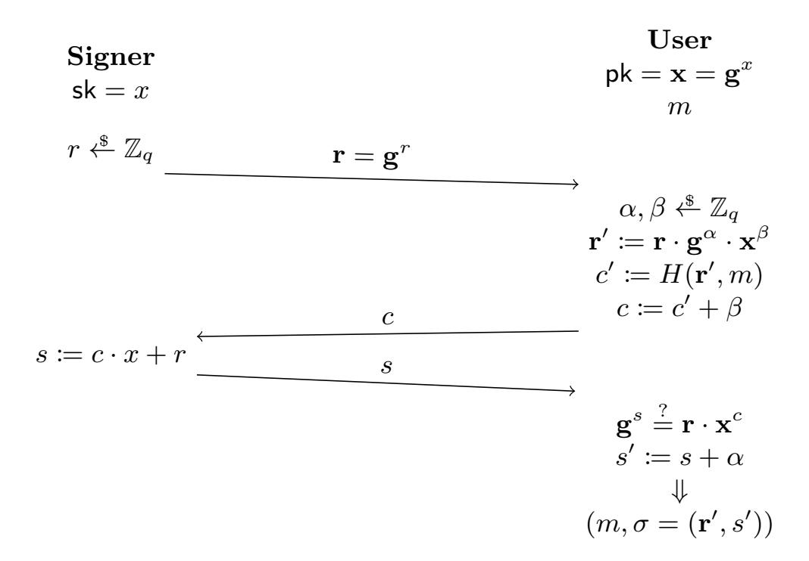
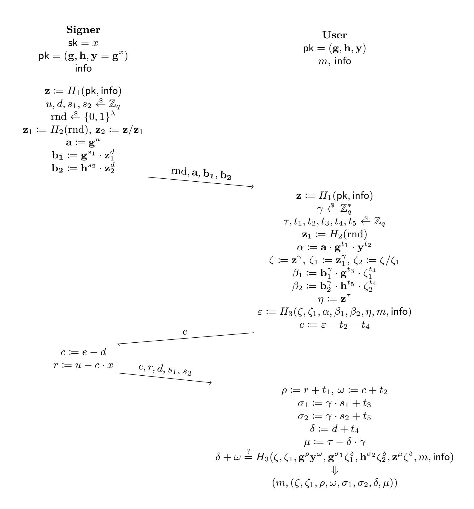

{0}------------------------------------------------

## On Pairing-Free Blind Signature Schemes in the Algebraic Group Model?

Julia Kastner [1](https://orcid.org/0000-0002-8879-8226)??, Julian Loss2? ? ?, and Jiayu X[u](https://orcid.org/0000-0002-0881-9980) 3†

1 Department of Computer Science, ETH Zurich, Zurich, Switzerland julia.kastner@inf.ethz.ch

2 CISPA Helmholtz Center for Information Security, Saarbr¨ucken, Germany lossjulian@gmail.com

3 Algorand, Boston, MA, USA, jiayux@uci.edu

Abstract Studying the security and efficiency of blind signatures is an important goal for privacy sensitive applications. In particular, for largescale settings (e.g., cryptocurrency tumblers), it is important for schemes to scale well with the number of users in the system. Unfortunately, all practical schemes either 1) rely on (very strong) number theoretic hardness assumptions and/or computationally expensive pairing operations over bilinear groups, or 2) support only a polylogarithmic number of concurrent (i.e., arbitrarily interleaved) signing sessions per public key. In this work, we revisit the security of two pairing-free blind signature schemes in the Algebraic Group Model (AGM) + Random Oracle Model (ROM). Concretely,

- 1. We consider the security of Abe's scheme (EUROCRYPT '01), which is known to have a flawed proof in the plain ROM. We adapt the scheme to allow a partially blind variant and give a proof of the new scheme under the discrete logarithm assumption in the AGM+ROM, even for (polynomially many) concurrent signing sessions.
- 2. We then prove that the popular blind Schnorr scheme is secure under the one-more discrete logarithm assumption if the signatures are issued sequentially. While the work of Fuchsbauer et al. (EURO-CRYPT '20) proves the security of the blind Schnorr scheme for concurrent signing sessions in the AGM+ROM, its underlying assumption, ROS, is proven false by Benhamouda et al. (EUROCRYPT '21) when more than polylogarithmically many signatures are issued. Given the recent progress, we present the first security analysis of the blind Schnorr scheme in the slightly weaker sequential setting. We also show that our security proof reduces from the weakest possible assumption, with respect to known reduction techniques.

? This is the full version of the paper with the same title at PKC 2022

?? Supported by ERC Project PREP-CRYPTO 724307

? ? ? Work done while at University of Maryland

† Work done while at George Mason University

{1}------------------------------------------------

## 1 Introduction

Blind signatures, first introduced by Chaum [\[Cha82\]](#page-30-0), are a fundamental cryptographic building block. They find use in many privacy sensitive applications such as anonymous credentials, eCash, and eVoting. Informally, a blind signature scheme is a interactive protocol between a user and a signer. Here, the signer holds a secret key sk and the user holds the corresponding public key pk. The goal of the interaction is for the user to learn a signature σ on a message m of its choice such that σ can efficiently be verified using pk. The protocol should ensure two properties [\[JLO97\]](#page-31-0): (1) One-More-Unforgeability: if the protocol is run ` times, the user should not be able to create ` + 1 or more valid signatures (2) Blindness: the signer cannot link the transcripts of protocol runs to the signatures that they created. In particular, it does not learn the messages that it signs. In a practical setting, signer and user might however want a more relaxed property to include some shared information, e.g. a date when the signature was issued or an expiration date. To this end, Abe and Fujisaki [\[AF96\]](#page-28-0) introduced Partial Blindness which guarantees that signatures with the same shared information, the so-called tag, are unlinkable to protocol runs using this tag.

In spite of decades of study, the security guarantees of practical blind and partially blind signature schemes remain unsatisfactory. Practical constructions rely on strong number-theoretic hardness assumptions and/or computationally expensive pairing operations over bilinear groups [\[Bol03;](#page-29-0) [Bel+03;](#page-29-1) [Oka06;](#page-32-0) [GG14;](#page-31-1) [FHS15\]](#page-30-1). Other constructions rely on weaker assumptions (and no pairings) but allow only for a very small (polylogarithmic) number of signatures to be issued per public key [\[PS96;](#page-32-1) [PS97;](#page-32-2) [AO00;](#page-29-2) [PS00;](#page-32-3) [HKL19;](#page-31-2) [Pap+19;](#page-32-4) [BE+20;](#page-29-3) [Hau+20\]](#page-31-3). The reason for this is that the homomorphic structure of these schemes gives rise to the so-called ROS attack (Random inhomogenities in Overdetermined System of equations) when sufficiently many sessions of the scheme are executed concurrently (i.e., if session can be interleaved arbitrarily). Shortly after its discovery by Schnorr [\[Sch01\]](#page-32-5), Wagner [\[Wag02\]](#page-33-0) showed how to carry out the ROS attack in sub-exponential time against the Schnorr and Okamoto-Schnorr [\[Oka93\]](#page-32-6) blind signature schemes.[4](#page-1-0) A recent result of Benhamouda et al. [\[Ben+21\]](#page-29-4) improved the parameters of Wagner's attack, presenting the first polynomial-time attack (assuming that polylogarithmically many signing sessions can be opened concurrently).

#### 1.1 Our Results

In this work, we revisit the security properties of two classic blind signature schemes which do not rely on pairings: Schnorr's blind signature scheme [\[Sch90;](#page-33-1) [Bra94\]](#page-30-2) and Abe's blind signature scheme [\[Abe01\]](#page-28-1). Neither of these schemes have

4 Although the attack can be formulated for all the aforementioned blind signature schemes, the algebraic structure in the latter two schemes gives rise to an efficient attack.

{2}------------------------------------------------

meaningful security guarantees if the number of concurrent signing sessions is beyond polylogarithmic (in fact, Abe's blind signature scheme has no security proof at all in a non-generic model of computation). Given the popularity of these schemes, we believe that a reassessment of their security properties is long overdue. We give a summary of our results below.

Abe's Scheme. In the first part of our work, we study the concurrent security properties of Abe's blind signature scheme. This scheme was initially proven secure under the DL assumption in the ROM (with blindness holding computationally under the DDH assumption). However, a later work by Abe and Ohkubo[\[OA03\]](#page-31-4) pointed out that the original proof contained a flaw and gave a security proof in the generic group model (GGM)+ROM instead. We generalize Abe's scheme to the partially blind setting and prove security of our new scheme in the more realistic AGM+ROM under the DL assumption. (We note that Abe's scheme can be obtained as a special case of our new scheme and thus our proof of security thus applies also to Abe's original scheme). As the work of Abe and Ohkubo is not publicly available, our proof is inspired by Abe's original proof and does not follow the blue print of a 'GGM-style proof.' Instead, we give a more general (and involved) proof that uses the AGM to avoid the rewinding step that causes the problem in Abe's proof. Apart from generalizing Abe's scheme to the partially blind setting, avoiding rewinding has the benefit that our reduction is tight, allowing for relatively practical parameter sizes. We stress that our reduction allows for the scheme to be proven secure with concurrent signing sessions and for polynomially many signatures per tag.

Schnorr's Scheme. In the second part of our work, we focus on the security of Schnorr's blind signature scheme. As we have already explained, the security of this scheme is completely broken in the concurrent setting for reasonable parameters. In spite of this, the Schnorr scheme continues to be one of the most popular blind signatures due to its simplicity and its efficiency. Hence, it is an important open question to settle what type of security this scheme actually does achieve (if any).

We show that the blind Schnorr signature scheme is secure in the algebraic group model (AGM) [\[FKL18\]](#page-30-3) + random oracle model (ROM) [\[BR93\]](#page-30-4) if signing sessions are sequential, i.e., if the i-th session is always completed before the (i + 1)-st session is opened.

In more detail, under the above model assumptions, the blind Schnorr signature scheme is secure against `-sequential one-more-unforgeability (`-SEQ-OMUF) under the `-one-more discrete logarithm (`-OMDL) assumption. This is true even when polynomially many signatures are issued for the same public key pk. We remark that security under sequential signing sessions is still a very meaningful security guarantee and has been explored in prior works (see below). Namely, sequentiality of sessions is easy to ensure (from the signer's perspective) at the expense of some efficiency.

Our result improves upon that of Fuchsbauer et al. [\[FPS20\]](#page-30-5), which proves that the scheme is secure under the OMDL+ROS assumption (when run concurrently). While the ROS problem is known to be information theoretically 

{3}------------------------------------------------

hard as long as the number of concurrent signing sessions is polylogarithmic, the recent work of Benhamouda et al. [\[Ben+21\]](#page-29-4) shows a polynomial-time attack for super-polylogarithmically many concurrent signing sessions. Therefore, the blind Schnorr scheme is concurrently secure (in the AGM+ROM) if and only if the signer issues at most polylogarithmically many signatures.

Negative Result (Schnorr). As OMDL is a relatively strong assumption (in fact, [\[BFL20\]](#page-29-5) showed it is strictly stronger than q-discrete logarithm for known reduction approaches), a natural question is whether it is actually necessary for proving Schnorr's scheme secure. We answer this question by showing that our reduction for blind Schnorr signatures in the AGM+ROM is optimal in the sense that it is not possible to reduce `-SEQ-OMUF from (` − 1)-OMDL (or OMDL with any lower dimension).

We use the meta-reduction technique [\[Cor02\]](#page-30-6) to rule out reductions in a very strong sense: we show that any algebraic reduction that reduces `-SEQ-OMUF from (` − 1)-OMDL in the AGM+ROM, can be turned into an efficient solver against (` − 1)-OMDL. Our result complements that of Baldimtsi and Lysyanskaya [\[BL13b\]](#page-29-6), which also rules out a certain class of reductions for the blind Schnorr scheme. Concretely, they show that reductions that program the random oracle in a certain predictable way, can be turned into an efficient solver against the underlying hardness assumption. While their approach restricts the type of random oracle programming that the reduction may do, ours allows for arbitrary programming, but restricts the reduction to be algebraic. On the other hand, our (algebraic) reductions may themselves work in the AGM, which further strengthens our result.

#### 1.2 Related Work and Discussion

We have already mentioned several works that study the security of blind signatures in the concurrent signer model. In the sequential model, the work of Baldimtsi and Lysyanskaya [\[BL13a\]](#page-29-7) proves that an enhanced version of Abe's scheme is secure under DL. Pointcheval and Katz et al. [\[Poi98;](#page-32-7) [KLR21\]](#page-31-5) give a transformations that apply (among others) to the blind Schnorr and Okamoto-Schnorr scheme. The resulting schemes remain secure even in the concurrent setting, but require communication that grows linear in the number of signatures that have been issued. In terms of practical parameters, these schemes are also significantly less efficient than the schemes we consider here. Fuchsbauer et al. [\[FPS20\]](#page-30-5) gave a (concurrently secure) scheme under the OMDL and modified ROS assumption in the AGM+ROM. The latter assumption asserts the conjectured hardness of an (apparently harder) version of the ROS problem, even given unbounded computing power. Nicolosi et al. [\[Nic+03\]](#page-31-6) use a similar strategy to ours (i.e., by restricting concurrency) to prove security of a proactive two-party signature scheme. Interestingly, they encounter similar issues as we do in our work, if concurrent session are permitted. Drijvers et al. [\[Dri+19\]](#page-30-7) show how a ROS based attack can be applied in the context of multi-signatures (and how it can be overcome at the cost of some efficiency). Finally, various constructions 

{4}------------------------------------------------

of blind signatures in the standard model exist (e.g., [\[Fis06;](#page-30-8) [Gar+11\]](#page-31-7)), but are usually not considered practical.

The Algebraic Group Model. [\[FKL18\]](#page-30-3) introduced the algebraic group model (AGM) as a formal model to analyze group based cryptosystems. Previous works had considered algebraic algorithms, for example [\[BV98;](#page-30-9) [PV05\]](#page-32-8). In the AGM, any adversary must output an explanation of how it computed its output group elements from the group elements in its input. Since its introduction, the AGM has been readily adopted [\[FPS20;](#page-30-5) [BFL20;](#page-29-5) [AB21;](#page-28-2) [NRS21;](#page-31-8) [GT21\]](#page-31-9) and has served as a useful tool to prove the security of schemes that would be too difficult to analyze in the plain model. [\[RS20\]](#page-32-9) have furthermore extended the AGM to decisional assumptions.

While the AGM is a weakening of the GGM, proofs in the AGM are inherently different from the GGM in the sense that they are reductions from one problem to another instead of showing information-theoretic hardness. From a qualitative point of view, proofs in the AGM provide a weaker form of security than proofs in the plain model, but a much stronger one than proofs in the GGM. The recent work of Agrikola et al. [\[AHK20\]](#page-29-8) shows that some results from the AGM can be transferred to the standard model using strong but falsifiable assumptions. This suggests that proofs in the AGM indeed hold some meaning for the plain model.

Another benefit of AGM proofs (over GGM proofs) is that they offer more insight into how secure a scheme actually is when deployed in real-world applications, as we explain in the following. In the GGM, a proof consists of establishing bounds on the runtime/success probabilities of an adversary attacking a particular signature scheme. These bounds often look similar for different schemes from an asymptotic point of view. Because of this, they do not give much insight into what computational assumptions are needed for the scheme to remain secure when run in the real world. By comparison, AGM proofs are by means of reduction from a computational assumption and thus can be used to assess the real-world disparities between two schemes that 'look equally secure' in the GGM. As a concrete example, our work gives a security proof for Abe's scheme under the discrete logarithm assumption. By comparison, we show that proving Schnorr's scheme secure (even under sequential signing sessions) requires the much stronger OMDL assumption. Arguably, this makes Abe's scheme the more attractive choice (along with allowing for concurrent sessions) for real world systems. This insight could not have been gained from proving these schemes secure in the GGM.

Open Questions. Our work leaves open the question of what can be proven about both the Abe and Schnorr blind signature schemes in the random oracle model only. Interestingly, the already mentioned work of Baldimtsi and Lysyanskaya [\[BL13b\]](#page-29-6) rules out a security proof for the blind Schnorr scheme using standard reduction techniques even in the sequential signing model. Namely, their result excludes such a reduction from a computational hardness assumption even if the signer just issues a single signature (which trivially restricts the sessions to being sequential). Another interesting direction for future work could be a more fine-grained security analysis (in the AGM+ROM) of the Schnorr 

{5}------------------------------------------------

scheme in a less restrictive signing model that allows for a low degree of concurrency. Namely, the ROS attack requires a polylogarithmic number of signing sessions to be open at the same time. Thus, it might be possible to prove the security of the scheme if, say, up to a constant number of signing sessions may be interleaved at any given point in time. Regarding Abe's scheme, there might yet be a glimmer of hope that the original proof can be salvaged (i.e., without requiring the AGM).

#### 1.3 Organization

We first recall some preliminaries in section 2. In section 3 we introduce our adaption of Abe's scheme to the partially blind setting. We provide a proof of partial blindness under DDH in section 3.1 as well as a proof of one-more-unforgeability in section 3.2. We then provide the proof of sequential security of blind Schnorr signatures in the AGM in section 4 and show that this result is optimal in the number of OMDL-queries in section 4.1.

**Acknowledgements.** We would like to thank Chenzhi Zhu and Stefano Tessaro for pointing out a flaw in a previous version of Claim 5. We would further like to thank the anonymous reviewers for their helpful feedback.

#### 2 Preliminaries

#### 2.1 Notation and Security Games

**Notation.** For positive integer n, we write [n] for  $\{1,\ldots,n\}$ . We write  $x_j$  for the j-th entry of vector  $\overrightarrow{x}$  and write  $x \overset{\$}{\leftarrow} \mathcal{X}$  to denote that x is drawn uniformly at random from set  $\mathcal{X}$ . We denote the security parameter with  $\lambda$ .

Security Games. We use the standard notion of (prose-based) security games [BR04; Sh004] to present our proofs. We denote the binary output of a game  $\mathbf{G}$  with an adversary  $\mathbf{A}$  as  $\mathbf{G}^{\mathsf{A}}$  and say that  $\mathbf{A}$  wins  $\mathbf{G}$  if  $\mathbf{G}^{\mathsf{A}} = 1$ .

#### 2.2 The Algebraic Group Model

In the following, let pp be public parameters that describe a group  $\mathbb{G}$  of prime order q with generator  $\mathbf{g}$ . (We assume for simplicity that pp also includes the security parameter  $\lambda$ .) We denote the neutral element by  $\epsilon$  and write all other group elements in bold face. We further write  $\mathbb{Z}_q$  for  $\mathbb{Z}/q\mathbb{Z}$ .

**Definition 1 (Algebraic Algorithm).** We say that an algorithm A is algebraic if, for any group element  $\mathbf{y} \in \mathbb{G}$  that it outputs, it also outputs a list of algebraic coefficients  $\overrightarrow{z} \in \mathbb{Z}_q^t$ , i.e.,

$$(\mathbf{y}, \overrightarrow{z}) \stackrel{\$}{\leftarrow} \mathsf{A}(\overrightarrow{\mathbf{x}})$$

{6}------------------------------------------------

such that

$$\mathbf{y} = \prod \mathbf{x}_i^{z_i}$$

We denote this representation as  $[\mathbf{y}]_{\overrightarrow{\mathbf{x}}}$ . For an adversary A that has access to oracles during its runtime, we impose the above restriction to all group elements that it outputs to an oracle. Similarly, all group elements that A receives through oracle interactions are treated as inputs to A; hence, such group elements become part of  $\overrightarrow{\mathbf{x}}$  when A outputs group elements (and hence algebraic coefficients) at a later point.

In the algebraic group model (AGM), all algorithms are treated as algebraic algorithms. Moreover, we define the *running time* of an algorithm A in the AGM as the *number of group operations* that A performs.

#### 2.3 Hardness Assumptions

We introduce the two main hardness assumptions that we will use in the subsequent sections. As before, we will tacitly assume that some public parameters pp are known and describe a group  $\mathbb{G}$  of prime order q with generator  $\mathbf{g}$ .

**Definition 2 (Discrete Logarithm Problem (DLP)).** For an algorithm A, we define the game **DLP** as follows:

**Setup.** Sample  $x \stackrel{\$}{\leftarrow} \mathbb{Z}_q$  and run  $\mathsf{A}$  on input  $\mathsf{g}, \mathsf{U} \coloneqq \mathsf{g}^x$ .

Output Determination. When A outputs x', return 1 if  $\mathbf{g}^{x'} = \mathbf{U}$ . Otherwise, return 0.

We define the advantage of A in **DLP** as

$$\mathsf{Adv}^{\mathbf{DLP}}_\mathsf{A} \coloneqq \Pr \left[ \mathbf{DLP}^\mathsf{A} = 1 \right].$$

**Definition 3 (One-More-Discrete Logarithm Problem (OMDL)).** For a stateful algorithm A and a positive integer  $\ell$ , we define the game  $\ell$ -OMDL as follows:

**Setup.** Initialize  $C = \emptyset$ . Run A on input  $\mathbf{g}$ .

Online Phase. A is given access to the following oracles:

Oracle chal takes no input and samples a group element  $\mathbf{y} \stackrel{\$}{\leftarrow} \mathbb{G}$ . It sets  $C := C \cup \{\mathbf{y}\}$  and returns  $\mathbf{y}$ .

Oracle dlog takes as input a group element  $\mathbf{y}$ . It returns dlog $_{\mathbf{g}}$   $\mathbf{y}$ . We assume that dlog can be queried at most  $\ell$  many times.

Output Determination. When A outputs  $(\mathbf{y}_i, x_i)_{i=1}^{\ell+1}$ , return 1 if for all  $i \in [\ell+1]$ :  $\mathbf{y}_i \in C$ ,  $\mathbf{g}^{x_i} = \mathbf{y}_i$ , and  $y_i \neq y_j$  for all  $j \neq i$ . Otherwise, return 0.

We define the advantage of A in  $\ell$ -OMDL as

$$\mathsf{Adv}_{\mathsf{A},\ell}^{\mathbf{OMDL}} \coloneqq \Pr\left[\ell\text{-}\mathbf{OMDL}^{\mathsf{A}} = 1\right].$$

{7}------------------------------------------------

**Definition 4 (Decsional Diffie-Hellman Problem (DDH)).** For an algorithm A we define the game **DDH** as follows:

Setup. Sample  $x, y, z \stackrel{\$}{\leftarrow} \mathbb{Z}_q$  and  $b \stackrel{\$}{\leftarrow} \{0, 1\}$ . Run A on input  $(\mathbf{g}, \mathbf{g}^x, \mathbf{g}^y, \mathbf{g}^{xy+bz})$ Output determination. When A outputs b', return 1 if b = b' and 0 otherwise.

We define the advantage of A in **DDH** as

$$\mathsf{Adv}^{\mathbf{DDH}}_\mathsf{A} \coloneqq \left| \Pr[\mathbf{DDH}^\mathsf{A} = 1] - \frac{1}{2} \right|.$$

#### 2.4 (Partially) Blind Signature Schemes

In this section, we introduce the syntax and security definitions of partially blind (three-move) signature schemes [HKL19]. We note that a fully blind signature scheme is a special case of a partially blind signature scheme where there is only one tag info, the empty string. We will refer to schemes where the tag is always the empty string as *blind signature schemes*.

**Definition 5 (Three-Move Partially Blind Signature Scheme).** A three-move partially blind signature scheme is a tuple of algorithms  $BS = (KeyGen, Sign := (Sign_1, Sign_2), User := (User_1, User_2), Verify)$  with the following behaviour.

- The randomized key generation algorithm KeyGen takes as input parameters pp, and outputs a public key pk and a secret key sk. We assume for convenience that pk contains pp and sk contains pk.
- The signing algorithm  $Sign := (Sign_1, Sign_2)$  is split into two algorithms:
  - The randomized algorithm  $\mathsf{Sign}_1$  takes as input a secret key  $\mathsf{sk}$  and a tag info and outputs a commitment C as well as a state  $\mathsf{st}_S$ .
  - The deterministic algorithm  $Sign_2$  takes as input a secret key sk, a state  $st_S$ , and a challenge e. It outputs a response R.
- The user algorithm  $User := (User_1, User_2)$  is split into two algorithms:
  - The randomized algorithm  $User_1$  takes as input a public key pk, a message m, a tag info and a commitment C. It outputs a challenge e and a state  $st_U$ .
  - The deterministic algorithm  $User_2$  takes as input a public key pk, a state  $st_U$ , and a response R. It outputs a signature  $\sigma$  or  $\bot$ .
- The deterministic verifier algorithm Verify takes as input a public key pk, a signature  $\sigma$ , and a message m and a tag info. It outputs either 1 (accept) or 0 (reject).

**Definition 6 (Correcntess).** We say that a partially blind signature scheme BS = (KeyGen, Sign, User, Verify) is correct if for all messages m, all tags info the following holds:

$$\Pr \begin{bmatrix} (\mathsf{pk}, \mathsf{sk}) \xleftarrow{\$} \mathsf{KeyGen}(\mathsf{pp}) \\ (C, \mathsf{st}_S) \xleftarrow{\$} \mathsf{Sign}_1(\mathsf{sk}, \mathsf{info}) \\ \mathsf{Verify}(\mathsf{pk}, \mathsf{sig}, m, \mathsf{info}) = 1 \colon (e, \mathsf{st}_U) \xleftarrow{\$} \mathsf{User}_1(\mathsf{pk}, m, \mathsf{info}, C) \\ R \xleftarrow{\$} \mathsf{Sign}_2(\mathsf{sk}, \mathsf{st}_S, e) \\ \sigma \xleftarrow{\$} \mathsf{User}_2(\mathsf{pk}, \mathsf{st}_U, R) \end{bmatrix} = 1$$

{8}------------------------------------------------

**Definition 7 (Partial blindness under chosen keys).** We define partial blindness of a three-move partially blind signature scheme BS against an adversary M via the following game:

**Setup.** Sample  $b \stackrel{\$}{\leftarrow} \{0,1\}$  and run M on input pp.

Online Phase. When M outputs messages  $\tilde{m}_0$  and  $\tilde{m}_1$ ,  $\inf_{0}$  and  $\inf_{0}$ , and a public key pk, check if pk is a valid5 public key, and  $\inf_{0}$  =  $\inf_{0}$ . If so, assign  $m_0 := \tilde{m}_b$ ,  $\inf_{0} := \inf_{0}$ ,  $m_1 := \tilde{m}_{1-b}$ , and  $\inf_{0} := \inf_{0}$ . If pk is not a valid public key or  $\inf_{0} \neq \inf_{0}$ , abort and output 0. M is given access to oracles  $\operatorname{User}_1$ ,  $\operatorname{User}_2$ , which behave as follows.

**Oracle User1:** On input a bit b', and a commitment C, if the session b' is not yet open, the game marks session b' as open and generates a state and challenge as  $(\mathsf{st}_{b'}, e) \overset{\$}{\leftarrow} \mathsf{BS.User}_1(\mathsf{pk}, m_{b'}, C, \mathsf{info}_{b'})$ . It returns e to the adversary. Otherwise, it returns  $\bot$ .

Oracle User2: On input a response R and a bit b', if the session b' is open, the game creates the signature  $\operatorname{sig}_{b'}$  as  $\operatorname{sig}_{b'} := \operatorname{BS.User}_2(\operatorname{pk}, \operatorname{st}_{b'}, R)$  to obtain a signature  $\operatorname{sig}_{b'}$ . It marks session b' as closed and outputs  $\operatorname{sig}_{b'}$ . If both sessions are closed and produced signatures, the oracle outputs the two signatures  $\operatorname{sig}_0$ ,  $\operatorname{sig}_1$  to the adversary.

Output Determination. If both sessions are closed and produced signatures, return 1 if the adversary outputs a bit  $b^*$  s.t.  $b^* = b$ . Otherwise, return 0.

We define the advantage of M in game BLINDBS as

$$\mathsf{Adv}_\mathsf{M}^{\mathbf{BLIND},\mathsf{BS}} \coloneqq \left| \Pr \left[ \mathbf{BLIND}^\mathsf{M} = 1 \right] - \frac{1}{2} \right|.$$

Definition 8 ( $\ell$ -(Sequential-)One-More-Unforgeability ( $\ell$ -(SEQ-)OMUF)). For a stateful algorithm A, a three-move partially blind signature scheme BS, and a positive integer  $\ell$ , we define the game  $\ell$ -OMUFBS ( $\ell$ -SEQ-OMUFBS) as follows:

**Setup.** Sample (pk, sk)  $\Leftarrow$  BS.KeyGen(pp) and run A on input (pk, pp). **Online Phase.** A is given access to the oracles  $\mathbf{Sign}_1$  and  $\mathbf{Sign}_2$  that behave as follows.

Oracle Sign1: On input info, it samples a fresh session identifier id (If sequential, it checks if  $session_{id-1} = open$  and  $returns \perp if$  yes). If info has not been requested before, it initializes a counter  $\ell_{closed,info} := 0$ . It sets  $session_{id} := open$  and generates ( $C_{id}, st_{id}$ )  $\stackrel{\$}{\leftarrow}$  BS.Sign1(sk, info). Then it returns  $C_{id}$  and id.

&lt;sup>5 We include this in case the scheme permits such a check - for example, one can think of schemes where the public key consists of group elements, in which case a user may be able to check that the public key consists of valid encodings of group elements. Another example of such a check is in the original version of Abe's scheme [Abe01] where  $\mathbf{z} = H_1(\mathbf{g}, \mathbf{h}, \mathbf{y})$  which a user may check.

{9}------------------------------------------------

Oracle Sign2: If  $\sum_{\mathsf{info}} \ell_{\mathsf{closed},\mathsf{info}} < \ell$ , Sign2 takes as input a challenge e and a session identifier id. If  $\mathsf{session_{id}} \neq \mathsf{open}$ , it returns  $\perp$ . Otherwise, it sets  $\ell_{\mathsf{closed},\mathsf{info}} \coloneqq \ell_{\mathsf{closed},\mathsf{info}} + 1$  and  $\mathsf{session_{id}} \coloneqq \mathsf{closed}$ . Then it generates the response R via  $R \overset{\$}{\leftarrow} \mathsf{BS}.\mathsf{Sign}_2(\mathsf{sk},\mathsf{st_{id}},e)$  and returns R.

Output Determination. When A outputs tuples  $(m_1, \sigma_1, \mathsf{info}_1), \ldots, (m_k, \sigma_k, \mathsf{info}_k),$  return 1 if there exists a tag  $\mathsf{info}$  such that  $|\{(m_i, \sigma_i, \mathsf{info}_i) | \mathsf{info}_i = \mathsf{info}\}| \geq \ell_{\mathsf{closed}, \mathsf{info}} + 1$  (where by convention  $\ell_{\mathsf{closed}, \mathsf{info}} \coloneqq 0$  for any  $\mathsf{info}$  that has not been requested to the signing oracles) and for all  $i \in [k]$ : BS.  $\mathsf{Verify}(\mathsf{pk}, \sigma_i, m_i, \mathsf{info}_i) = 1$  and  $(m_i, \sigma_i, \mathsf{info}_i) \neq (m_j, \sigma_j, \mathsf{info}_j)$  for all  $j \neq i$ . Otherwise, return 0.

We define the advantage of A in OMUFBS as

$$\mathsf{Adv}_{\mathsf{A},\mathsf{BS},\ell}^{\mathbf{OMUF}} \coloneqq \Pr\left[\ell\text{-}\mathbf{OMUF}_\mathsf{BS}^\mathsf{A} = 1\right].$$

And, respectively for SEQ-OMUFBS

$$\mathsf{Adv}_{\mathsf{A},\mathsf{BS},\ell}^{\mathbf{SEQ}\text{-}\mathbf{OMUF}} \coloneqq \Pr\left[\ell\text{-}\mathbf{SEQ}\text{-}\mathbf{OMUF}_\mathsf{BS}^\mathsf{A} = 1\right].$$

# 3 Adaption of Abe's blind Signature Scheme to allow partial blindness

We begin by describing an adaption of Abe's blind signature scheme BSA [Abe01] to the partially blind setting. A figure depicting an interaction between signer and user can be found in Figure 2 in Appendix D. Let again  $\mathbb{G}$  be a group of order q with generator  $\mathbf{g}$  described by public parameters  $\mathsf{pp}$ . Let  $H_1: \{0,1\}^* \to \mathbb{G} \setminus \{\epsilon\}$ ,  $H_2: \{0,1\}^* \to \mathbb{G} \setminus \{\epsilon\}$ ,  $H_3: \{0,1\}^* \to \mathbb{Z}_q$  be hash functions.

- KeyGen: On input pp, KeyGen samples  $\mathbf{h} \stackrel{\$}{\leftarrow} \mathbb{G}$ ,  $x \stackrel{\$}{\leftarrow} \mathbb{Z}_q$  and sets  $\mathbf{y} \coloneqq \mathbf{g}^x$ . It sets  $\mathsf{sk} \coloneqq x$ ,  $\mathsf{pk} \coloneqq (\mathbf{g}, \mathbf{h}, \mathbf{y})$  and returns  $(\mathsf{sk}, \mathsf{pk})$ .
- Sign1: On input sk, info, Sign1 samples rnd  $\stackrel{\$}{\leftarrow} \{0,1\}^{\lambda}$  and  $u,d,s_1,s_2 \stackrel{\$}{\leftarrow} \mathbb{Z}_q$ . It computes  $\mathbf{z} := H_1(\mathsf{pk},\mathsf{info}), \ \mathbf{z}_1 := H_2(\mathsf{rnd}), \ \mathbf{z}_2 := \mathbf{z}/\mathbf{z}_1, \ \mathbf{a} := \mathbf{g}^u, \ \mathbf{b_1} := \mathbf{g}^{s_1} \cdot \mathbf{z}_1^d, \ \mathbf{b_2} := \mathbf{h}^{s_2} \cdot \mathbf{z}_2^d$ . It returns a commitment  $(\mathsf{rnd}, \mathbf{a}, \mathbf{b_1}, \mathbf{b_2})$  and a state  $\mathsf{st}_S = (u,d,s_1,s_2,\mathsf{info})$ .
- $\mathsf{Sign}_2$ : On input a secret key  $\mathsf{sk}$ , a challenge e, and  $\mathsf{state}\,\mathsf{st}_S = (u, d, s_1, s_2, \mathsf{info})$ ,  $\mathsf{Sign}_2$  computes  $c \coloneqq e d \mod q, r \coloneqq u c \cdot \mathsf{sk} \mod q$  and returns the response  $(c, d, r, s_1, s_2)$ .
- User1: On input a public key pk and a commitment (rnd,  $\mathbf{a}$ ,  $\mathbf{b_1}$ ,  $\mathbf{b_2}$ ), a tag info, and message m, User1 does the following. It samples  $\gamma \stackrel{\$}{=} \mathbb{Z}_q^*$  and  $\tau, t_1, t_2, t_3, t_4, t_5 \stackrel{\$}{=} \mathbb{Z}_q$ . Then, it computes  $\mathbf{z} \coloneqq H_1(\mathsf{pk}, \mathsf{info})$ ,  $\mathbf{z}_1 \coloneqq H_2(\mathsf{rnd})$ ,  $\alpha \coloneqq \mathbf{a} \cdot \mathbf{g}^{t_1} \cdot \mathbf{y}^{t_2}$ ,  $\zeta \coloneqq \mathbf{z}^{\gamma}$ ,  $\zeta_1 \coloneqq \mathbf{z}_1^{\gamma}$ ,  $\zeta_2 \coloneqq \zeta/\zeta_1$ . Next, it sets  $\beta_1 \coloneqq \mathbf{b}_1^{\gamma} \cdot \mathbf{g}^{t_3} \cdot \zeta_1^{t_4}$ ,  $\beta_2 \coloneqq \mathbf{b}_2^{\gamma} \cdot \mathbf{h}^{t_5} \cdot \zeta_2^{t_4}$ ,  $\eta \coloneqq \mathbf{z}^{\tau}$ , and  $\varepsilon \coloneqq H_3(\zeta, \zeta_1, \alpha, \beta_1, \beta_2, \eta, m, \mathsf{info})$ . Finally, it computes a challenge  $e \coloneqq \varepsilon t_2 t_4 \mod q$ , the state  $St_U \coloneqq (\gamma, \tau, t_1, t_2, t_3, t_4, t_5, m)$  and returns  $e, St_U$ .
- User2: On input a public key pk, a response  $(c, d, r, s_1, s_2)$  and a state  $(\gamma, \tau, t_1, t_2, t_3, t_4, t_5, m)$ , User2 first computes  $\rho \coloneqq r + t_1$ ,  $\omega \coloneqq c + t_2$ ,  $\sigma_1 \coloneqq \gamma \cdot s_1 + t_3$ ,  $\sigma_2 \coloneqq \gamma \cdot s_2 + t_5$ , and  $\delta \coloneqq d + t_4$ . Then, it computes  $\mu \coloneqq \tau \delta \cdot \gamma$

{10}------------------------------------------------

- and  $\varepsilon := H_3(\zeta, \zeta_1, \mathbf{g}^{\rho} \mathbf{y}^{\omega}, \mathbf{g}^{\sigma_1} \zeta_1^{\delta}, \mathbf{h}^{\sigma_2} \zeta_2^{\delta}, \mathbf{z}^{\mu} \zeta^{\delta}, m)$ . It returns the signature  $\sigma := (\zeta, \zeta_1, \rho, \omega, \sigma_1, \sigma_2, \delta, \mu)$  if  $\delta + \omega = \varepsilon$ ; otherwise, it returns  $\perp$ .6
- Verify: On input a public key pk, a signature  $(\zeta, \zeta_1, \rho, \omega, \sigma_1, \sigma_2, \delta, \mu)$  and a message m, Verify computes first  $\mathbf{z} := H_1(\mathsf{pk}, \mathsf{info})$  and then  $\varepsilon := H_3(\zeta, \zeta_1, \mathbf{g}^{\rho} \mathbf{y}^{\omega}, \mathbf{g}^{\sigma_1} \zeta_1^{\delta}, \mathbf{h}^{\sigma_2} \zeta_2^{\delta}, \mathbf{z}^{\mu} \zeta^{\delta}, m, \mathsf{info})$ . It returns 1 if  $\delta + \omega = \varepsilon$ ; otherwise, it returns 0.

We note that the only change we made to Abe's scheme is that in our variant, the **z** part of the public key is derived as a hash of **pk** and a tag info instead of as a hash of the other elements of the public key. It is easy to see that by using an empty info this yields the original scheme and thus our proofs about the adapted scheme also apply to the original.

We note that Abe refers to  $\mathbf{z}, \mathbf{z}_1, \zeta, \zeta_1$  as the tags of a signing session or signature. However, as we are considering partial blindness, we will refer to them as the *linking components*. By [Abe01], the original scheme is computationally blind under the Decisional Diffie-Hellman assumption. For completeness, we provide a detailed proof of the partial computational blindness of our variant in section 3.1.

#### 3.1 Partial Blindness of the adapted Abe scheme

We provide a formal proof of partial blindness under chosen keys for the Abe blind signature scheme. Abe [Abe01] proved the scheme to be blind for keys selected by the challenger.

**Lemma 1.** Under the decisional Diffie-Hellman assumption in G, Abe's blind signature scheme BSA is computationally blind in the random oracle model.

*Proof.* We use similar techniques as [BL13a].

**Game G1** The first game is identical to the blindness game from Definition 7 for Abe's blind signature scheme.

**Setup.**  $G_1$  samples  $b \stackrel{\$}{\leftarrow} \{0,1\}$ .

Simulation of oracle  $H_1$ .  $G_1$  simulates  $H_1$  by lazy sampling of group elements.

Online Phase. When M outputs a public key  $(\mathbf{g}, \mathbf{y}, \mathbf{h})$  and messages  $\tilde{m}_0$  and  $\tilde{m}_1$ , and tags info0, info1,  $\mathbf{G_1}$  verifies info0 = info1 assigns  $m_0 = \tilde{m}_b$  and  $m_1 = \tilde{m}_{b-1}$ 

Oracle User1. works the same as described in Definition 7

Oracle User2. works the same as described in Definition 7

Simulation of  $H_2$ .  $H_2$  is simulated through lazy sampling

Simulation of  $H_3$ .  $H_3$  is simulated through lazy sampling

Output determination. as described in Definition 7

&lt;sup>6 We note that the check for  $\varepsilon = \omega + \delta$  implicitly checks that c + d = e as well as  $\mathbf{a} = \mathbf{y}^c \mathbf{g}^r$ ,  $\mathbf{b}_1 = \mathbf{z}_1^d \mathbf{g}^{s_1}$ ,  $\mathbf{b}_2 = \mathbf{z}_2^d \mathbf{h}^{s_2}$ , i.e. it checks that the output of Sign – 2 was valid.

{11}------------------------------------------------

The second game replaces the signature for  $m_0$  by a signature that is independent of the run with the signer.

**Game G2** The second game generates the signature on  $m_0$  independently of the corresponding signing session.

**Setup.**  $G_2$  samples  $b \stackrel{\$}{\leftarrow} \{0,1\}$ .

Simulation of oracle  $H_1$ .  $G_2$  simulates  $H_1$  by lazy sampling of group elements.

Online Phase. When M outputs a public key  $(\mathbf{g}, \mathbf{y}, \mathbf{h})$  and messages  $\tilde{m}_0$  and  $\tilde{m}_1$  and  $\inf_{0}$ ,  $\inf_{0}$ ,  $\inf_{0}$ ,  $\underbrace{\mathbf{G}_2}$  verifies that the key is well-formed and that  $\inf_{0}$  =  $\inf_{0}$  and aborts with output 0 if this check fails. It further assigns  $m_0 = \tilde{m}_b$  and  $m_1 = \tilde{m}_{b-1}$  as well as  $\inf_{0}$  =  $\inf_{0}$  and  $\inf_{0}$  =  $\inf_{0}$ .

**Oracle User1.** For message  $m_1$ , the oracle behaves the same as in  $\mathbf{G_1}$ . For message  $m_0$ , it checks that session 0 is not open yet and opens session 0. Then the game picks  $\delta, \omega, \sigma_1, \sigma_2, \rho, \mu$  uniformly at random from  $\mathbb{Z}_q$ . It further draws two random group elements  $\zeta$  and  $\zeta_1$  and sets  $\zeta_2 := \zeta/\zeta_1$ . It then sets  $H_3(\mathbf{y}^{\omega} \cdot \mathbf{g}^{\rho}, \zeta_1^{\delta} \cdot \mathbf{g}^{\sigma_1}, \zeta_2^{\delta} \cdot \mathbf{h}^{\sigma_2}, \zeta^{\delta} \cdot \mathbf{z}^{\mu}, m_0, \mathsf{info}_0) := \delta + \omega$ . It draws  $e \overset{\$}{\leftarrow} \mathbb{Z}_q$  uniformly at random and returns e as a challenge to the adversary.

Oracle User2. For message  $m_1$ , the oracle behaves the same as in  $\mathbf{G_1}$ . For message  $m_0$ , on input  $c, d, r, s_1, s_2$ , the game does the following checks7: e = d + c,  $\mathbf{a_0} = \mathbf{g}^r \cdot \mathbf{y}^c$ ,  $\mathbf{b_{1,0}} = \mathbf{g}^{s_1} \cdot \mathbf{z}_{1,0}^d$ ,  $\mathbf{b_{2,0}} = \mathbf{h}^{s_2} \cdot \mathbf{z}_{2,0}^d$ . It considers the produced signature to be the one generated in User1.

Simulation of  $H_2$ .  $H_2$  is simulated through lazy sampling

Simulation of  $H_3$ . For values not programmed in  $User_1$ ,  $G_2$  simulates  $H_3$  via lazy sampling

Output determination. as described in Definition 7

Claim 1. The advantage of an adversary B to tell the difference between  $\mathbf{G_1}$  and  $\mathbf{G_2}$  is  $\mathsf{Adv}_\mathsf{B}^{\mathbf{G_1},\mathbf{G_2}} = \left| \Pr \left[ \mathbf{G_1}^\mathsf{B} = 1 \right] - \Pr \left[ \mathbf{G_2}^\mathsf{B} = 1 \right] \right| \leq \mathsf{Adv}_\mathsf{B'}^{\mathbf{DDH}}$ .

Proof. We provide a reduction B' that receives a random-generator DDH challenge  $(\mathbf{W}, \mathbf{X}, \mathbf{Y}, \mathbf{Z})$  and simulates either  $\mathbf{G_1}$  or  $\mathbf{G_2}$  to the adversary. During the first phase of the online phase, the reduction programs the random oracle  $H_1$  to return values  $\mathbf{W}^{f_i}$   $f_i \in \mathbb{Z}_q$ . For simulation of  $H_2$ , the reduction chooses exponents  $g_i \stackrel{\$}{\leftarrow} \mathbb{Z}_q$  and returns values  $\mathbf{X}^{g_i}$ , yielding uniformly random values from the group  $\mathbb{G}$ . In  $\mathbf{User}_1$  for  $m_0$ , when the adversary sends the commitment which contains a random string rnd to be queried to the oracle  $H_2$ , the reduction identifies the  $g = g_i$  that was used as the random exponent for  $\mathbf{z}_1 = \mathbf{X}^g$ . Denote further by f the  $f_i$  used for generation of  $\mathbf{z} = H_1(\mathsf{pk}, \mathsf{info}_1)$ . It sets  $\zeta = \mathbf{Y}^f$  and  $\zeta_1 = \mathbf{Z}^{f \cdot g}$ . The reduction then proceeds to generate a signature by programming the random oracle  $H_3$  as described in  $\mathbf{G_2}$ . For  $m_1$ , the reduction participates honestly in the signing protocol. In  $\mathbf{User}_2$ , for  $m_0$ , the reduction checks that

We note that these checks need to be done explicitly here, as they are no longer implicitly performed through checking that  $\varepsilon = \omega + \delta$ ,

{12}------------------------------------------------

the adversary produces a valid signing transcript as described in  $G_2$ . If both interactions yield valid signatures (i.e. the adversary produced a valid transcript for  $m_0$  and a valid signature for  $m_1$ ), the reduction outputs both signatures, otherwise  $\bot$ . If the adversary outputs it was playing game  $G_1$ , the reduction outputs 0, otherwise it outputs 1.

We argue that if the challenge is a Diffie-Hellman tuple, the reduction simulates  $G_1$  perfectly. For a tuple  $W, W^a, W^b, W^{ab}$ , the tuple  $\mathbf{z} = W^f, \mathbf{z}_1 = W^{a \cdot f \cdot \frac{g}{f}}, \zeta = W^{b \cdot f}, \zeta_1 = W^{a \cdot b \cdot f \cdot g}$  is a valid Diffie-Hellman tuple w.r.t generator  $W^f$ . Furthermore, the user tags  $\zeta$  and  $\zeta_1$  can be computed from  $\mathbf{z}$  and  $\mathbf{z}_1$  using blinding factor  $\gamma = b$ . Furthermore, for any  $c, d, r, s_1, s_2$  and signature components  $\omega, \delta, \rho, \sigma_1, \sigma_2, \mu$  there are unique choices of  $t_1 = \rho - r, t_2 = \omega - c, t_3 = \sigma_1 - \gamma \cdot s_1, t_4 = \delta - d, t_5 = \sigma_2 - \gamma \cdot s_2, \tau = \mu + \delta \cdot \gamma$  that explain the signature in combination with the transcript. Thus, the produced combination of signature and transcript is identically distributed as an honestly generated signature.

If the challenge is not a Diffie-Hellman tuple, then the reduction simulates  $G_2$  perfectly as the linking components  $\zeta_i, \zeta_{1,i}$  look like random group elements and the reduction computes the same steps as  $G_2$  to generate the signatures and its outputs to the adversary.

We describe the final game  $G_3$  where both signatures are independent from the runs with the signer.

Game G3

**Setup.**  $G_3$  samples  $b \stackrel{\$}{\leftarrow} \{0,1\}$ .

Simulation of oracle  $H_1$ .  $G_3$  simulates  $H_1$  by lazy sampling of group elements.

Online Phase. When M outputs a public key  $(\mathbf{g}, \mathbf{y}, \mathbf{h})$  and messages  $\tilde{m}_0$  and  $\tilde{m}_1$ ,  $\mathbf{G_3}$  verifies that the key is well-formed and checks that  $\inf_0 = \inf_0$  and aborts with output 0 if this check fails. It further assigns  $m_0 = \tilde{m}_b$  and  $m_1 = \tilde{m}_{b-1}$ 

Oracle User1. For session b', the game checks that session b' is not open yet and opens session b'. It sets  $\mathbf{z} := H_1(\mathsf{info})$ . Then the game picks  $\delta, \omega, \sigma_1, \sigma_2, \rho, \mu$  uniformly at random from  $\mathbb{Z}_q$ . It further draws two random group elements  $\zeta$  and  $\zeta_1$  and sets  $\zeta_2 := \zeta/\zeta_1$ . It then sets  $H_3(\mathbf{y}^{\omega} \cdot \mathbf{g}^{\rho}, \zeta_1^{\delta} \cdot \mathbf{g}^{\sigma_1}, \zeta_2^{\delta} \cdot \mathbf{h}^{\sigma_2}, \zeta^{\delta} \cdot \mathbf{z}^{\mu}, m_{b'}, \mathsf{info}_{b'}) := \delta + \omega$ . It draws  $e \in \mathbb{Z}_q$  uniformly at random and returns e as a challenge to the adversary.

Oracle User2. For both sessions (denoted by i = 0, 1), on input  $c_i, d_i, r_i, s_{1,i}, s_{2,i}$ , the game does the following checks:  $e_i = d_i + c_i$ ,  $\mathbf{a}_i = \mathbf{g}^{r_i} \cdot \mathbf{y}^{c_i}$ ,  $\mathbf{b}_{1,i} = \mathbf{g}^{s_{1,i}} \cdot \mathbf{z}_{1,i}^{d_i}$ ,  $\mathbf{b}_{2,i} = \mathbf{h}^{s_{2,i}} \cdot \mathbf{z}_{2,i}^{d_i}$ . It considers the output signature to be the one generated for this session in User1.

**Simulation of**  $H_2$ .  $H_2$  is simulated through lazy sampling

Simulation of  $H_3$ . For values not programmed in  $\mathbf{User}_1$ ,  $\mathbf{G_2}$  simulates  $H_3$  via lazy sampling

Output determination. as described in Definition 7

Claim 2. The advantage of an adversary B to tell the difference between  $\mathbf{G_1}$  and  $\mathbf{G_2}$  is  $\mathsf{Adv}_{\mathsf{B'''}}^{\mathbf{G_2},\mathbf{G_3}} = \Pr\left[\mathbf{G_2}^{\mathsf{B'''}} = 1\right] - \Pr\left[\mathbf{G_3}^{\mathsf{B'''}} = 1\right] \leq \mathsf{Adv}_{\mathsf{B''}}^{\mathbf{DDH}}$ .

{13}------------------------------------------------

*Proof.* Follows along the same lines as Claim 1, embedding the **DDH** challenge in the signature for  $m_1$  this time.

In game  $G_3$ , the adversary cannot win, as both signatures are completely independent from the two runs. As game  $G_3$  needs to program the random oracle  $H_3$  twice to generate the signatures (this fails with probability at most  $\frac{2q_h}{q^4 \cdot 2^{|m_0|}}$ , i.e. if the adversary has made the exact same requests before), we get the following overall advantage of

$$\mathsf{Adv}_{\mathsf{M}}^{\mathbf{BLIND}_{\mathsf{BSA}}} = \frac{2 \cdot q_h}{q^4 \cdot 2^{|m_0|}} + \mathsf{Adv}_{\mathsf{B}'}^{\mathbf{DDH}} + \mathsf{Adv}_{\mathsf{B}''}^{\mathbf{DDH}}$$

#### 3.2 One-More-Unforgeability

In the following, we provide a proof for the one-more-unforgeability. Similar to [Abe01] we do this in two steps. First, we show that it is infeasible for an adversary to generate a signature that does not use a tag that corresponds to a closed signing session. (Note that the scheme is only computationally blind, and an unbounded algorithm can link signatures and sessions since  $(\mathbf{z}, \mathbf{z}_1, \zeta, \zeta_1)$  forms a DDH tuple. We call such tuples *linking components*, and refer to  $\mathbf{z}, \mathbf{z}_1$  as "signer-side" and  $\zeta, \zeta_1$  as "user-side".) This corresponds to Abe's restrictive blinding lemma. Then, as the main theorem, we show that it is also infeasible for an adversary to win  $\ell$ -OMUF by providing two signatures corresponding to the same closed signing session.

Our techniques. The main idea for both the lemma and the theorem is to use the algebraic representations of the group elements submitted to the random oracle  $H_3$  in combination with the corresponding signature to compute the discrete logarithm of either y or h or in the tags z. This fails either when the adversary has not made a hash query for the signature in question, or when the representation of the hash query does not contain more information than the signature, i.e., the exponents in the representation already match the signature. We show that both of these cases only occur with a negligible probability. We simulate the protocol in two different ways. One way is to use the secret key x like an honest signer and try to extract the discrete logarithm of **h** or one of the **z**. The other way is to program the random oracles  $H_1$  and  $H_2$  so that the reduction can use the discrete logarithms of  $\mathbf{z}, \mathbf{z}_1, \mathbf{z}_2$  to simulate the other side of the OR-proof for extraction of the secret key. We also use the programming of the random oracles to efficiently identify which signature is the "forgery". This, in combination with not having to run the protocol twice for forking, renders a tight proof.

Comparison to the original standard model proof by Abe [Abe01]. We briefly recall that similar to our proof, the original proof also shows the restrictive blinding lemma first, which, shows that an adversary that wins the **OMUF** game and at the same time produces a signature where  $\operatorname{dlog}_{\zeta} \zeta_1 \neq \operatorname{dlog}_{\mathbf{z}} \mathbf{z}_{1,i}$  for

{14}------------------------------------------------

all sessions i, can be used to solve the discrete logarithm problem. The proof uses the forking technique, i.e. it rewinds the adversary to obtain a second set of signatures with different hash responses to H3. The original proof of the restrictive blinding lemma also uses two signers, one that embeds in y and signs using the z-side witness, another that embeds in h and signs using the secret key x. These two signers are indistinguishable for a single run, however, two forking runs using the same witness reveal the witness being used internally. In particular, a forking pair of runs using the secret key x to sign, cannot be reproduced by a signer that does not know the x-side witness. Therefore, the distribution of signatures obtained from forking runs, in particular the components δ and ω may depend on which witness was used internally. We note that for example in 'honestly generated' signatures (i.e. when the adversary followed the User1 and User2 algorithms to generate signatures), the a pair of signatures at the forking hash query reveals exactly the same witness as the signer used to sign while forking, so it is not clear why a similar thing may not also hold for 'dishonestly generated' signatures.

As our reduction for the restrictive blinding lemma works in the AGM, we can avoid the rewinding step. The adversary submits representations of all the group elements contained in a hash query, which gives the reduction information that would otherwise be obtained from the previous run. As the scheme is perfectly witness indistinguishable, the representations submitted by the adversary are independent of the witness used internally. We show in Claim [5,](#page-16-0) that even a so-called reduced representation that does use factors that are only determined after all signing sessions were closed, is likely to reveal enough information for the reduction to be able to solve the discrete logarithm problem.

The Restrictive Blinding Lemma. We first provide a reduction for the restrictive blinding lemma in the AGM + ROM. We therefore define the game `-RB-OMUFBSA as follows:

Setup: Sample keys via (sk = x, pk = (g, h, y)) ←\$ BSA.KeyGen(pp).

Online Phase: M is given access to oracles Sign1 , Sign2 that emulate the behavior of the honest signer in BSA. It is allowed to arbitrarily many calls to Sign1 and allowed to make ` queries to Sign2 . In addition, it is given access to random oracles H1, H2, H3. Let `info denote the number of interactions that M completes with oracle Sign2 in this phase for each tag info.

Output Determination: When M outputs a list L of tuples (m1,sig1 , info1), . . . , (mk,sigk , infok), proceed as follows:

- If the list contains a tuple (m,sig, info) s.t. Verify(pk, m,sig, info) = 0, or does not contain `info + 1 pairwise-distinct tuples for some tag info, return 0.
- Let zj , z1,j denote the values of z and z1 used in the j-th invocation of Sign1 . If there exists (m,sig, info) ∈ L with signature components ζ 6= ζ1 (equivalently, ζ2 6= ), s.t. for all j with H1(pk, info) = zj whose sessions were closed with an invocation of Sign2 , ζ dlogzj z1,j 6= ζ1, then

{15}------------------------------------------------

return 1. Otherwise, return 0. We call the first signature in L with these mismatched linking components the *special signature*.

Define  $Adv_{M,\ell,BSA}^{\mathbf{RB-OMUF}} := \Pr[\ell\text{-}\mathbf{RB-OMUF}_{BSA}^{\mathsf{M}} = 1]$ . We show that an algebraic forger M that wins  $\ell\text{-}\mathbf{RB-OMUF}_{BSA}$  can be used to solve the discrete logarithm problem. This reduction is tight and does not require rewinding of the adversary.

Lemma 2 (Restrictive Blinding, see Lemma 3 in [Abe01]). Let M be an algebraic algorithm that runs in time  $t_{\mathsf{M}}$ , makes at most  $\ell$  queries to oracle  $\mathsf{Sign}_2$  in  $\mathsf{RB}\text{-}\mathsf{OMUF}_{\mathsf{BSA}}$  and at most (total)  $q_h$  queries to  $H_1, H_2, H_3$ . Then, in the random oracle model, there exists an algorithm B s.t.

$$\begin{split} \mathsf{Adv}_\mathsf{B}^\mathbf{DLP} \geq & \frac{1}{2} \mathsf{Adv}_{\mathsf{M},\ell,\mathsf{BSA}}^\mathbf{RB\text{-}OMUF} - \frac{\ell+1}{2q} \\ & - (\frac{3q_h}{q} + \mathsf{Adv}_{\mathsf{R}_1}^{\mathsf{dlog}} + \mathsf{Adv}_{\mathsf{R}_2}^{\mathsf{dlog}} + \mathsf{Adv}_{\mathsf{R}_3}^{\mathsf{dlog}} + \mathsf{Adv}_{\mathsf{R}_4}^{\mathsf{dlog}}) \end{split}$$

*Proof.* Let M be as in the lemma statement. As before, we assume w.l.o.g. that M makes exactly  $\ell$  queries to  $\mathsf{Sign}_2$  and outputs a list of  $\ell+1$  tuples. The proof goes by a series of games, which we describe below.

Game  $G_0$ . This is  $\ell$ -RB-OMUFBSA.

Game  $G_1$ . To define  $G_1$ , we first define the following event  $E_1$ .  $E_1$  happens if M returns a list L of  $\ell+1$  valid signatures on distinct messages  $m_1, ..., m_\ell$  and there exists  $(m, \operatorname{sig}, \operatorname{info}) = (m, (\zeta, \zeta_1, \rho, \omega, \sigma_1, \sigma_2, \delta, \mu), \operatorname{info}) \in L$  s.t. for all j whose sessions were closed with an invocation of  $\operatorname{Sign}_2$ ,  $\zeta^{\operatorname{dlog}_{\mathbf{z}_j} \mathbf{z}_{1,j}} \neq \zeta_1 \wedge \zeta_2 \neq \epsilon$  and M did not make a query of the form  $H_3(\zeta, \zeta_1, \mathbf{g}^{\rho} \mathbf{y}^{\omega}, \mathbf{g}^{\sigma_1} \zeta_1^{\delta}, \mathbf{h}^{\sigma_2} \zeta_2^{\delta}, \mathbf{z}^{\mu} \zeta^{\delta}, m, \operatorname{info})$ . In the following, we refer to the first tuple  $(m, \operatorname{sig}, \operatorname{info}) \in L$  as the special tuple for convenience.  $G_1$  is identical to game  $G_0$ , except that it aborts when  $E_1$  happens.

Claim 3. 
$$\Pr[E_1] = \frac{\ell+1}{q}$$

*Proof.* The only way for an adversary to succeed without querying  $H_3$  for the signature is by guessing the hash value  $\varepsilon = \omega + \delta$ . Since there are  $\ell + 1$  valid signatures in L, the probability of guessing  $\varepsilon$  correctly for one of them is  $\frac{\ell+1}{q}$ .

By the claim, we have that  $Adv_M^{\mathbf{G_1}} \ge Adv_M^{\mathbf{G_0}} - \frac{\ell+1}{q}$ .

**Game G2**. Game **G2** is identical to **G1**, except that it keeps track of the algebraic representations of group elements submitted to  $H_3$  by M and aborts if a certain event  $E_2$  happens. In the following, we define the event  $E_2$  which depends on these representations.

**Simplifying Notations.** For each query to  $H_3$ , the adversary M submits a set of group elements  $\zeta, \zeta_1, \alpha, \beta_1, \beta_2, \eta$  along with a message m and info.

As M is algebraic, it also provides a representation of these group elements to the basis of elements  $\mathbf{g}, \mathbf{h}, \mathbf{y}, \overrightarrow{\mathbf{z}}, \overrightarrow{\mathbf{a}}, \overrightarrow{\mathbf{b}_1}, \overrightarrow{\mathbf{b}_2}, \overrightarrow{\mathbf{z}_1}$  that it has previously obtained via

{16}------------------------------------------------

calls to  $H_1$ ,  $H_2$ ,  $\mathbf{Sign}_1$ , or  $\mathbf{Sign}_2$ . We note that by programming the oracles  $H_1$  and  $H_2$  the reduction knows a representation of its responses  $\mathbf{z}_i$  and  $\mathbf{z}_{1,i}$ . Any element  $\mathbf{a}$ ,  $\mathbf{b}_1$ ,  $\mathbf{b}_2$  that was returned as reply to a query to  $\mathbf{Sign}_1$  can be represented as  $\mathbf{a} = \mathbf{y}^c \cdot \mathbf{g}^r$ ,  $\mathbf{b}_1 = \mathbf{z}_1^d \cdot \mathbf{g}^{s_1}$ ,  $\mathbf{b}_2 = \mathbf{z}_2^d \cdot \mathbf{h}^{s_2}$ . Here,  $\mathbf{z}_1, \mathbf{z}_2 = \mathbf{z}/\mathbf{z}_1$  correspond to the call  $H_2(\text{rnd})$  made as part of answering this query to  $\mathbf{Sign}_1$ . This allows us to convert any representation provided by  $\mathbf{M}$  into a reduced representation in the (simpler) basis  $\mathbf{g}$ ,  $\mathbf{h}$ ,  $\mathbf{y}$ . For a group element  $\mathbf{o}$ , we denote this reduced representation by  $[\mathbf{o}]_{\overrightarrow{I}}$  and its components as  $g_{[\mathbf{o}]_{\overrightarrow{I}}}$ ,  $h_{[\mathbf{o}]_{\overrightarrow{I}}}$ ,  $y_{[\mathbf{o}]_{\overrightarrow{I}}}$ , respectively, where  $\overrightarrow{I} := (\mathbf{g}, \mathbf{h}, \mathbf{y})$ . If  $\mathbf{M}$  wins, we denote the special message/signature pair in its winning output as  $(m, \inf_{\mathbf{o}}, (\zeta, \zeta_1, \rho, \omega, \sigma_1, \sigma_2, \delta, \mu))$ . The algebraic coefficients of this tuple define the following integers which we call "preliminary values":

$$\omega' \coloneqq y_{[\alpha]_{\overrightarrow{\uparrow}}}$$

$$\delta' \coloneqq \frac{g_{[\beta_2]_{\overrightarrow{\uparrow}}} + x \cdot y_{[\beta_2]_{\overrightarrow{\uparrow}}}}{x \cdot y_{[\zeta_2]_{\overrightarrow{\uparrow}}} + g_{[\zeta_2]_{\overrightarrow{\uparrow}}}}$$

$$\delta'' \coloneqq \frac{h_{[\beta_1]_{\overrightarrow{\uparrow}}}}{h_{[\zeta_1]_{\overrightarrow{\uparrow}}}}, \delta''' \coloneqq \frac{h_{[\eta]_{\overrightarrow{\uparrow}}}}{h_{[\zeta]_{\overrightarrow{\uparrow}}}}.$$

We further define the following non-exclusive boolean variables that describe when which of the above values is actually well-defined:

$$C_{0} \coloneqq (\omega' \neq \omega) \qquad C_{1} \coloneqq (\omega' = \omega) \wedge (x \cdot y_{[\zeta_{2}]_{\overrightarrow{I}}} + g_{[\zeta_{2}]_{\overrightarrow{I}}} \neq 0)$$

$$C_{2} \coloneqq (\omega' = \omega) \wedge (h_{[\zeta_{1}]_{\overrightarrow{I}}} \neq 0) \qquad C_{3} \coloneqq (\omega' = \omega) \wedge (h_{[\zeta]_{\overrightarrow{I}}} \neq 0)$$

Claim 4.  $\bigvee_i C_i = 1$ .

Proof. Since  $\mathbf{G_2^M} = 1 \Rightarrow \zeta_2 \neq \epsilon$ , it follows that  $x \cdot y_{[\zeta_2]_{\overrightarrow{\gamma}}} + g_{[\zeta_2]_{\overrightarrow{\gamma}}}$  and  $h_{[\zeta_2]_{\overrightarrow{\gamma}}}$  cannot both be 0 when  $\mathbf{G_2^M} = 1$ . Therefore, either  $x \cdot y_{[\zeta_2]_{\overrightarrow{\gamma}}} + g_{[\zeta_2]_{\overrightarrow{\gamma}}} \neq 0$  or  $h_{[\zeta_2]_{\overrightarrow{\gamma}}} \neq 0$ . Moreover, since  $[\zeta_2]_{\overrightarrow{\gamma}} = [\zeta]_{\overrightarrow{\gamma}} - [\zeta_1]_{\overrightarrow{\gamma}}$ , either  $h_{[\zeta_1]_{\overrightarrow{\gamma}}} \neq 0$  or  $h_{[\zeta_2]_{\overrightarrow{\gamma}}} \neq 0$ , whenever  $h_{[\zeta_2]_{\overrightarrow{\gamma}}} \neq 0$ . Therefore,  $(h_{[\zeta_1]_{\overrightarrow{\gamma}}} \neq 0 \lor h_{[\zeta]_{\overrightarrow{\gamma}}} \neq 0 \lor x \cdot y_{[\zeta_2]_{\overrightarrow{\gamma}}} + g_{[\zeta_2]_{\overrightarrow{\gamma}}} \neq 0) = 1$  and thus  $C_1 \lor C_2 \lor C_3 = (\omega' = \omega)$ . The lemma follows immediately.

We now define  $E_2$  as the following event:  $\omega' = \omega$ , and for any of  $\delta', \delta'', \delta'''$ , as long as its denominator is not 0 (i.e., it is well-defined), then it is equal to  $\delta$ . That is,

$$E_2 := (C_0 = 0) \land (C_1 = 0 \lor (C_1 = 1 \land (\delta' = \delta)))$$
$$\land (C_2 = 0 \lor (C_2 = 1 \land (\delta'' = \delta))) \land (C_3 = 0 \lor (C_3 = 1 \land (\delta''' = \delta))).$$

$$Claim 5. \Pr[E_2] \leq \frac{3q_h}{q} + \mathsf{Adv}^{\mathrm{dlog}}_{\mathsf{R}_1} + \mathsf{Adv}^{\mathrm{dlog}}_{\mathsf{R}_2} + \mathsf{Adv}^{\mathrm{dlog}}_{\mathsf{R}_3} + \mathsf{Adv}^{\mathrm{dlog}}_{\mathsf{R}_4}$$

The proof for this claim can be found in appendix B. By the claim,  $Adv_{M}^{G_{2}} \ge Adv_{M}^{G_{1}} - \frac{3q_{h}}{q}$ .

{17}------------------------------------------------

In the following, we explain how the reduction can simulate game  $G_2$  to the adversary M and win the discrete logarithm game.

**Simulation of**  $H_1, H_2, H_3$ . We begin by describing how  $S_0, S_1$  simulate the random oracles  $H_1, H_2, H_3$ . These simulations are common to both  $S_\iota$  and are performed in the straightforward way using lazy sampling. We assume that the oracles keep respective lists  $L_i$  for bookkeeping, where  $L_i$  stores input/output pairs. More specifically.

- $H_1$  and  $H_2$ : on each fresh input  $\xi$ ,  $H_i$  samples  $v \stackrel{\$}{\leftarrow} \mathbb{Z}_q$  and returns  $\mathbf{g}^v$ . It stores  $(\xi, \mathbf{g}^v, v)$  in  $L_i$ .
- $-H_3$ : on each fresh input  $(\xi,\cdot)$ ,  $H_3$  samples  $\varepsilon \stackrel{\$}{\leftarrow} \mathbb{Z}_q$  and returns  $\varepsilon$ . It stores  $(\xi, \overrightarrow{rep}, \varepsilon)$  in  $L_i$ .
- On repeated inputs  $H_i$  returns whatever it returned the first time that  $\xi$  was queried.

Scheduling of Signing Sessions. We assume that each  $S_i$  internally schedules sessions with the oracles  $Sign_1$  and  $Sign_2$  as required by  $G_2$ . This can be easily implemented by using a fresh session identifier for each new session.

Extracting Equations from Forgery. Suppose that M wins game  $G_2$ , i.e.,  $G_2^{\mathsf{M}} = 1$ . Recall that in this case, M produces a one-more forgery of at least  $\ell + 1$  valid signatures, after having completed at most  $\ell$  sessions with oracle  $\mathbf{Sign}_2$ . In addition, we have required that one of the returned tuples  $(m, \mathsf{info}, \mathsf{sig})$  be special, i.e., that  $\zeta^{\mathsf{dlog}_{\mathbf{z}_j} \mathbf{z}_{1,j}} \neq \zeta_1$  for all  $\mathbf{z}_j$  and  $\mathbf{z}_{1,j}$  (where again  $\mathbf{z}_j$  and  $\mathbf{z}_{1,j}$  corresponds to the value of  $\mathbf{z}$  and  $\mathbf{z}_1$ , respectively, derived during the j-th interaction with oracle  $\mathbf{Sign}_1$ ).

From the verification equation of the special signature  $(m, \mathsf{info}, \mathsf{sig})$ , one obtains the equations  $\alpha = \mathbf{g}^{\rho} \cdot \mathbf{y}^{\omega}$ ,  $\beta_1 = \zeta_1^{\delta} \cdot \mathbf{g}^{\sigma_1}$ ,  $\beta_2 = \zeta_2^{\delta} \cdot \mathbf{h}^{\sigma_2}$ ,  $\eta = \mathbf{z}_j^{\mu} \cdot \zeta^{\delta}$ . Denoting  $w_{0,j} := \mathsf{dlog} \, \mathbf{z}_j$ ,  $w := \mathsf{dlog} \, \mathbf{h}$ , we obtain the reduced equations

$$g_{[\alpha]} + x \cdot y_{[\alpha]} + w \cdot h_{[\alpha]} = \rho + x \cdot \omega \tag{1}$$

$$g_{[\beta_1]_{\overrightarrow{\gamma}}} + x \cdot y_{[\beta_1]_{\overrightarrow{\gamma}}} + w \cdot h_{[\beta_1]_{\overrightarrow{\gamma}}} = (g_{[\zeta_1]_{\overrightarrow{\gamma}}} + w \cdot h_{[\zeta_1]_{\overrightarrow{\gamma}}} + x \cdot y_{[\zeta_1]_{\overrightarrow{\gamma}}}) \cdot \delta + \sigma_1 \qquad (2)$$

$$g_{\left[\beta_{2}\right]_{\overrightarrow{I}}} + x \cdot y_{\left[\beta_{2}\right]_{\overrightarrow{I}}} + w \cdot h_{\left[\beta_{2}\right]_{\overrightarrow{I}}} = \left(g_{\left[\zeta_{2}\right]_{\overrightarrow{I}}} + w \cdot h_{\left[\zeta_{2}\right]_{\overrightarrow{I}}} + x \cdot y_{\left[\zeta_{2}\right]_{\overrightarrow{I}}}\right) \cdot \delta + \sigma_{2} \cdot w \tag{3}$$

$$g_{[\eta]_{\overrightarrow{\gamma}}} + w \cdot h_{[\eta]_{\overrightarrow{\gamma}}} + x \cdot y_{[\eta]_{\overrightarrow{\gamma}}} = w_{0,j} \cdot \mu + (g_{[\zeta]_{\overrightarrow{\gamma}}} + w \cdot h_{[\zeta]_{\overrightarrow{\gamma}}} + x \cdot y_{[\zeta]_{\overrightarrow{\gamma}}}) \cdot \delta. \tag{4}$$

We continue by describing simulators  $S_0$  which covers case  $C_0$ , and  $S_1$  which covers  $C_1, C_2, C_3$ . As we will see, the values  $c, r, d, s_1, s_2$  inside a signature issued as part of a signing query are all known to  $S_i$ . Together with the above observations, it is easy for each simulator to convert a query to  $H_3$  into reduced representation. Moreover, the winning tuple in M's output can be identified through knowledge of the logarithms of all  $\mathbf{z}_i$  and all  $\mathbf{z}_{1,i}$  efficiently.

Case  $C_0 = 1$ . We describe simulator  $S_0$ , which simulates  $G_2$  using w. On input a discrete logarithm instance  $U := g^x$ , it behaves as follows:

**Setup:**  $S_0$  samples  $w \stackrel{\$}{\leftarrow} \mathbb{Z}_q$  and computes the public key  $\mathsf{pk}$  as  $\mathsf{pk} \coloneqq (\mathsf{g}, \mathsf{h} \coloneqq \mathsf{g}^w, \mathsf{y} \coloneqq \mathsf{U})$ , which implicitly sets  $\mathsf{sk} \coloneqq x$ .

{18}------------------------------------------------

Online Phase.  $S_0$  runs M on input pp, pk and simulates the oracles  $\mathbf{Sign}_1$ ,  $\mathbf{Sign}_2$  as described below. In addition, it simulates the oracles  $H_1, H_2, H_3$  as outlined above.

Queries to Sign1. When M queries Sign1(info) to open session sid,  $S_0$  checks in  $L_1$  if pk, info has been previously requested from  $H_1$  and if yes sets  $w_{0,\text{sid}}$  accordingly, otherwise samples  $w_{0,\text{sid}}$  and programs  $H_1(\text{pk}, \text{info}) := \mathbf{g}^{w_{0,j}}$ . It samples  $\text{rnd}_{\text{sid}} \overset{\$}{\leftarrow} \{0,1\}^{\lambda}$  and sets  $\mathbf{z}_{1,\text{sid}} := \mathbf{g}^{w_{1,\text{sid}}} = H_2(\text{rnd}_{\text{sid}})$ , which places the tuple  $(\text{rnd}_{\text{sid}}, \mathbf{z}_{1,\text{sid}}, w_{1,\text{sid}})$  into  $L_2$ . It then sets  $\mathbf{z}_{2,\text{sid}} := \mathbf{z}_{\text{sid}}/\mathbf{z}_{1,\text{sid}}$ ,  $w_{2,\text{sid}} := \frac{w_{0,\text{sid}} - w_{1,\text{sid}}}{w}$ ,  $c_{\text{sid}}, r_{\text{sid}}, u_{1,\text{sid}}, u_{2,\text{sid}} \overset{\$}{\leftarrow} \mathbb{Z}_q$ ,  $\mathbf{a}_{\text{sid}} := \mathbf{y}^{c_{\text{sid}}} \cdot \mathbf{g}^{r_{\text{sid}}}$ ,  $\mathbf{b}_{1,\text{sid}} := \mathbf{g}^{u_{1,\text{sid}}}$ ,  $\mathbf{b}_{2,\text{sid}} := \mathbf{h}^{u_{2,\text{sid}}}$  and returns  $\mathbf{a}_{\text{sid}}$ ,  $\mathbf{b}_{1,\text{sid}}$ ,  $\mathbf{b}_{2,\text{sid}}$ .

Queries to Sign2. When M queries Sign2(sid,  $e_{\text{sid}}$ ),  $S_0$  sets  $d_{\text{sid}} := e_{\text{sid}} - c_{\text{sid}}$ ,  $s_{1,\text{sid}} := u_{1,\text{sid}} - d_{\text{sid}} \cdot w_{1,\text{sid}}$ ,  $s_{2,\text{sid}} := u_{2,\text{sid}} - d_{\text{sid}} \cdot w_{2,\text{sid}}$  and returns  $c_{\text{sid}}$ ,  $d_{\text{sid}}$ ,  $r_{\text{sid}}$ ,  $s_{1,\text{sid}}$ ,  $s_{2,\text{sid}}$ .

It is straightforward to verify that the above simulation of  $G_2$  is perfect.

Solving the DLP instance. When M returns  $\ell+1$  message signature pairs,  $S_0$  identifies the special signature using the exponents stored in  $L_2$ . It retrieves the corresponding hash query to  $H_3$  from  $L_3$  together with representations of  $\alpha, \beta_1, \beta_2, \eta$ .  $S_0$  uses Eq. (1) and the fact that  $C_0 = 1 \Leftrightarrow \omega \neq y_{[\alpha]_{\overrightarrow{I}}}$ , to (efficiently) compute and output the value x as  $x = (\rho - g_{[\alpha]_{\overrightarrow{I}}} - w \cdot h_{[\alpha]_{\overrightarrow{I}}})/(y_{[\alpha]_{\overrightarrow{I}}} - \omega)$ . (In case  $C_0 = 0$ , or there is no hash query corresponding to the special signature, it aborts.)

If  $C_0 = 1$ , then  $S_0$ 's simulation of  $\mathbf{G_2}$  is perfect.

Case  $C_0 = 0$  We describe simulator  $S_1$ , which simulates  $G_2$  using x. On input a discrete logarithm instance  $\mathbf{U} := \mathbf{g}^w$ , it behaves as follows.

**Setup.**  $S_1$  samples  $x \stackrel{\$}{\leftarrow} \mathbb{Z}_q$ . It sets  $\mathsf{pk} \coloneqq (\mathbf{g}, \mathbf{h} \coloneqq \mathbf{U}, \mathbf{y} \coloneqq \mathbf{g}^x)$ ,  $\mathsf{sk} \coloneqq x$ .

Online Phase.  $S_1$  runs M on input pp, pk and simulates the oracles  $\mathbf{Sign}_1$ ,  $\mathbf{Sign}_2$  as described below. In addition, it simulates the oracles  $H_1, H_2, H_3$  as outlined above.

Queries to Sign1. When M queries Sign1(info) to open session sid,  $S_1$  checks if info was requested to  $H_1$  already and if so sets  $w_{0,j}$  accordingly, otherwise it samples  $w_{0,j} \stackrel{\$}{\leftarrow} \mathbb{Z}_q$  and sets  $H_1(\mathsf{pk},\mathsf{info}) \coloneqq w_{0,j}$ . It then samples  $\mathrm{rnd}_{\mathrm{sid}} \stackrel{\$}{\leftarrow} \{0,1\}^{\lambda}$  and sets  $\mathbf{z}_{1,\mathrm{sid}} \coloneqq \mathbf{g}^{w_{1,\mathrm{sid}}} = H_2(\mathrm{rnd}_{\mathrm{sid}})$  (hence  $w_{1,\mathrm{sid}}$  is known to  $S_1$  from programming  $H_2$ ). It then samples  $u_{\mathrm{sid}}, d_{\mathrm{sid}}, s_{1,\mathrm{sid}}, s_{2,\mathrm{sid}} \stackrel{\$}{\leftarrow} \mathbb{Z}_q$  and sets  $\mathbf{a}_{\mathrm{sid}} \coloneqq \mathbf{g}^{u_{\mathrm{sid}}}, \mathbf{b}_{1,\mathrm{sid}} \coloneqq \mathbf{g}^{s_{1,\mathrm{sid}}} \cdot \mathbf{z}_{1,\mathrm{sid}}^{d_{\mathrm{sid}}},$   $\mathbf{b}_{2,\mathrm{sid}} \coloneqq \mathbf{h}^{s_{2,\mathrm{sid}}} \cdot \mathbf{z}_{2,\mathrm{sid}}^{d_{\mathrm{sid}}}$  and returns  $\mathbf{a}_{\mathrm{sid}}, \mathbf{b}_{1,\mathrm{sid}}, \mathbf{b}_{2,\mathrm{sid}}$ .

Queries to Sign2. When M queries Sign2 on input (sid,  $e_{\text{sid}}$ ),  $S_1$  sets  $e_{\text{sid}} := e_{\text{sid}} - d_{\text{sid}}$ ,  $r_{\text{sid}} := u_{\text{sid}} - c_{\text{sid}} \cdot x$  and returns  $e_{\text{sid}} \cdot s_{\text{sid}}$ ,  $e_{\text{sid}} \cdot s_{\text{sid}}$ ,  $s_{\text{sid}} \cdot s_{\text{sid}}$ ,  $s_{\text{sid}} \cdot s_{\text{sid}}$ ,  $s_{\text{sid}} \cdot s_{\text{sid}}$ ,  $s_{\text{sid}} \cdot s_{\text{sid}}$ ,  $s_{\text{sid}} \cdot s_{\text{sid}}$ ,  $s_{\text{sid}} \cdot s_{\text{sid}} \cdot s_{\text{sid}}$ ,  $s_{\text{sid}} \cdot s_{\text{sid}} \cdot s_{\text{sid}} \cdot s_{\text{sid}}$ ,  $s_{\text{sid}} \cdot s_{\text{sid}} \cdot s_{\text{sid}} \cdot s_{\text{sid}} \cdot s_{\text{sid}} \cdot s_{\text{sid}} \cdot s_{\text{sid}} \cdot s_{\text{sid}} \cdot s_{\text{sid}} \cdot s_{\text{sid}} \cdot s_{\text{sid}} \cdot s_{\text{sid}} \cdot s_{\text{sid}} \cdot s_{\text{sid}} \cdot s_{\text{sid}} \cdot s_{\text{sid}} \cdot s_{\text{sid}} \cdot s_{\text{sid}} \cdot s_{\text{sid}} \cdot s_{\text{sid}} \cdot s_{\text{sid}} \cdot s_{\text{sid}} \cdot s_{\text{sid}} \cdot s_{\text{sid}} \cdot s_{\text{sid}} \cdot s_{\text{sid}} \cdot s_{\text{sid}} \cdot s_{\text{sid}} \cdot s_{\text{sid}} \cdot s_{\text{sid}} \cdot s_{\text{sid}} \cdot s_{\text{sid}} \cdot s_{\text{sid}} \cdot s_{\text{sid}} \cdot s_{\text{sid}} \cdot s_{\text{sid}} \cdot s_{\text{sid}} \cdot s_{\text{sid}} \cdot s_{\text{sid}} \cdot s_{\text{sid}} \cdot s_{\text{sid}} \cdot s_{\text{sid}} \cdot s_{\text{sid}} \cdot s_{\text{sid}} \cdot s_{\text{sid}} \cdot s_{\text{sid}} \cdot s_{\text{sid}} \cdot s_{\text{sid}} \cdot s_{\text{sid}} \cdot s_{\text{sid}} \cdot s_{\text{sid}} \cdot s_{\text{sid}} \cdot s_{\text{sid}} \cdot s_{\text{sid}} \cdot s_{\text{sid}} \cdot s_{\text{sid}} \cdot s_{\text{sid}} \cdot s_{\text{sid}} \cdot s_{\text{sid}} \cdot s_{\text{sid}} \cdot s_{\text{sid}} \cdot s_{\text{sid}} \cdot s_{\text{sid}} \cdot s_{\text{sid}} \cdot s_{\text{sid}} \cdot s_{\text{sid}} \cdot s_{\text{sid}} \cdot s_{\text{sid}} \cdot s_{\text{sid}} \cdot s_{\text{sid}} \cdot s_{\text{sid}} \cdot s_{\text{sid}} \cdot s_{\text{sid}} \cdot s_{\text{sid}} \cdot s_{\text{sid}} \cdot s_{\text{sid}} \cdot s_{\text{sid}} \cdot s_{\text{sid}} \cdot s_{\text{sid}} \cdot s_{\text{sid}} \cdot s_{\text{sid}} \cdot s_{\text{sid}} \cdot s_{\text{sid}} \cdot s_{\text{sid}} \cdot s_{\text{sid}} \cdot s_{\text{sid}} \cdot s_{\text{sid}} \cdot s_{\text{sid}} \cdot s_{\text{sid}} \cdot s_{\text{sid}} \cdot s_{\text{sid}} \cdot s_{\text{sid}} \cdot s_{\text{sid}} \cdot s_{\text{sid}} \cdot s_{\text{sid}} \cdot s_{\text{sid}} \cdot s_{\text{sid}} \cdot s_{\text{sid}} \cdot s_{\text{sid}} \cdot s_{\text{sid}} \cdot s_{\text{sid}} \cdot s_{\text{sid}} \cdot s_{\text{sid}} \cdot s_{\text{sid}} \cdot s_{\text{sid}} \cdot s_{\text{sid}} \cdot s_{\text{sid}} \cdot s_{\text{sid}} \cdot s_{\text{sid}} \cdot s_{\text{sid}} \cdot s_{\text{sid}} \cdot s_{\text{sid}} \cdot s_{\text{sid}} \cdot s_{\text{sid}} \cdot s_{\text{sid}} \cdot s_{\text{sid}} \cdot s_{\text{sid}} \cdot s_{\text{sid}} \cdot s_{\text{sid}} \cdot s_{\text{sid}} \cdot s_{\text{sid}} \cdot s_{\text{sid$ 

**Solving the DLP instance.** When M returns  $\ell+1$  message signature pairs,  $S_1$  identifies the special signature using the exponents stored in  $L_2$ . It retrieves the corresponding hash query to  $H_3$  from  $L_3$  together with representations of  $\alpha, \beta_1, \beta_2, \eta$ . If there is no hash query to  $H_3$  corresponding to the special signature, it aborts. Since  $C_0 = 0$  it holds that  $C_1 = 1 \vee C_2 = 1 \vee C_3 = 1$ .  $S_1$  uses one of the following extraction strategies.

{19}------------------------------------------------

If  $C_1 = 1$ :  $S_1$  uses Eq. (3) and the fact that  $C_1 = 1 \Rightarrow (x \cdot y_{\lceil \zeta_2 \rceil_{\overrightarrow{I}}} + g_{\lceil \zeta_2 \rceil_{\overrightarrow{I}}} \neq 0)$ , to (efficiently) compute and output the value w as follows.  $S_1$  first computes  $\delta'$  as  $\delta' := (g_{\lceil \beta_2 \rceil_{\overrightarrow{I}}} + x \cdot y_{\lceil \beta_2 \rceil_{\overrightarrow{I}}})/(x \cdot y_{\lceil \zeta_2 \rceil_{\overrightarrow{I}}} + g_{\lceil \zeta_2 \rceil_{\overrightarrow{I}}})$ , which gives the equality

$$\delta' \cdot (g_{[\zeta_2]_{\overrightarrow{I}}} + x \cdot y_{[\zeta_2]_{\overrightarrow{I}}}) + w \cdot h_{[\beta_2]_{\overrightarrow{I}}} = g_{[\beta_2]_{\overrightarrow{I}}} + x \cdot y_{[\beta_2]_{\overrightarrow{I}}} + w \cdot h_{[\beta_2]_{\overrightarrow{I}}}.$$
 (5)

Eqs. (5) and (3) yield

$$\delta' \cdot (g_{[\zeta_2]_{\overrightarrow{I}}} + x \cdot y_{[\zeta_2]_{\overrightarrow{I}}}) + w \cdot h_{[\beta_2]_{\overrightarrow{I}}} = g_{[\beta_2]_{\overrightarrow{I}}} + x \cdot y_{[\beta_2]_{\overrightarrow{I}}} + w \cdot h_{[\beta_2]_{\overrightarrow{I}}}$$
$$= \delta \cdot (g_{[\zeta_2]_{\overrightarrow{I}}} + x \cdot y_{[\zeta_2]_{\overrightarrow{I}}} + w \cdot h_{[\zeta_2]_{\overrightarrow{I}}}) + \sigma_2 \cdot w.$$

If  $h_{[\beta_2]_{\overrightarrow{\uparrow}}} - \delta \cdot h_{[\zeta_2]_{\overrightarrow{\uparrow}}} - \sigma_2 \neq 0$ ,  $S_1$  outputs  $w = ((\delta - \delta') \cdot (g_{[\zeta_2]_{\overrightarrow{\uparrow}}} + x \cdot h_{[\zeta_2]_{\overrightarrow{\uparrow}}})) / (h_{[\beta_2]_{\overrightarrow{\uparrow}}} - \delta \cdot h_{[\zeta_2]_{\overrightarrow{\uparrow}}} - \sigma_2)$ . We prove the following claim.

Claim 6. 
$$h_{[\beta_2]_{\overrightarrow{\gamma}}} - \delta \cdot h_{[\zeta_2]_{\overrightarrow{\gamma}}} - \sigma_2 \neq 0$$
.

*Proof.* Since  $C_1 = 1$  and event  $E_2$  does not happen (since otherwise  $\mathbf{G_2^M} = 0$ ), we know that  $\delta \neq \delta'$ . Hence, it suffices to show that if  $\delta \neq \delta'$ , then  $h_{[\beta_2]_{\overrightarrow{I}}} - \delta + h_{[\zeta_2]_{\overrightarrow{I}}} - \sigma_2 \neq 0$ . Due to Eq. (3) we get

$$\delta' \cdot (g_{\left[\zeta_{2}\right]_{\overrightarrow{I}}} + x \cdot y_{\left[\zeta_{2}\right]_{\overrightarrow{I}}}) + w \cdot h_{\left[\beta_{2}\right]_{\overrightarrow{I}}} = \delta \cdot (g_{\left[\zeta_{2}\right]_{\overrightarrow{I}}} + x \cdot y_{\left[\zeta_{2}\right]_{\overrightarrow{I}}} + w \cdot h_{\left[\zeta_{2}\right]_{\overrightarrow{I}}}) + \sigma_{2} \cdot w$$

$$= \delta \cdot (g_{\left[\zeta_{2}\right]_{\overrightarrow{I}}} + x \cdot y_{\left[\zeta_{2}\right]_{\overrightarrow{I}}}) + w \cdot h_{\left[\beta_{2}\right]_{\overrightarrow{I}}},$$

which yields  $(\delta' - \delta) \cdot (g_{[\zeta_2]_{\overrightarrow{\uparrow}}} + x \cdot y_{[\zeta_2]_{\overrightarrow{\uparrow}}}) = 0$ . Since  $C_1 = 1$ , we have  $g_{[\zeta_2]_{\overrightarrow{\uparrow}}} + x \cdot y_{[\zeta_2]_{\overrightarrow{\uparrow}}} \neq 0$ , which contradicts the assumption that  $\delta' \neq \delta$ .

It is easily verified that whenever  $C_1 = 1$ ,  $S_1$ 's simulation of  $G_2$  is perfect.

If  $C_1 = 0$  and  $C_2 = 1$ :  $S_1$  uses Eq. (2) and the fact that  $C_2 = 1 \Leftrightarrow (\omega = y_{[\alpha]_{\overrightarrow{I}}}) \wedge (h_{[\zeta_1]_{\overrightarrow{I}}} \neq 0)$ , to compute and output the discrete logarithm w of the instance **U** as follows.  $S_1$  first computes  $\delta'' := \frac{h_{[\beta_1]_{\overrightarrow{I}}}}{h_{[\zeta_1]_{\overrightarrow{I}}}}$  which leads to the equality

$$\delta'' \cdot w \cdot h_{[\zeta_1]_{\overrightarrow{\gamma}}} + g_{[\beta_1]_{\overrightarrow{\gamma}}} + x \cdot y_{[\beta_1]_{\overrightarrow{\gamma}}} = g_{[\beta_1]_{\overrightarrow{\gamma}}} + x \cdot y_{[\beta_1]_{\overrightarrow{\gamma}}} + w \cdot h_{[\beta_1]_{\overrightarrow{\gamma}}}. \tag{6}$$

Eqs. (6) and (2) yield

$$\delta'' \cdot w \cdot h_{[\zeta_1]_{\overrightarrow{I}}} + g_{[\beta_1]_{\overrightarrow{I}}} + x \cdot y_{[\beta_1]_{\overrightarrow{I}}} = g_{[\beta_1]_{\overrightarrow{I}}} + x \cdot y_{[\beta_1]_{\overrightarrow{I}}} + w \cdot h_{[\beta_1]_{\overrightarrow{I}}}$$
$$= (g_{[\zeta_1]_{\overrightarrow{I}}} + w \cdot h_{[\zeta_1]_{\overrightarrow{I}}} + x \cdot y_{[\zeta_1]_{\overrightarrow{I}}}) \cdot \delta + \sigma_1.$$

By the same argument as in the previous case,  $\delta \neq \delta''$ , and  $S_1$  can compute and output w as  $w = (\delta \cdot (g_{[\zeta_1]_{\overrightarrow{\uparrow}}} + x \cdot y_{[\zeta_1]_{\overrightarrow{\uparrow}}}) + \sigma_1 - g_{[\beta_1]_{\overrightarrow{\uparrow}}} + x \cdot y_{[\beta_1]_{\overrightarrow{\uparrow}}}) / ((\delta - \delta'') \cdot h_{[\zeta_1]_{\overrightarrow{\uparrow}}})$ , as  $C_2 = 1$  implies that  $h_{[\zeta_1]_{\overrightarrow{\uparrow}}} \neq 0$ . Moreover,  $S_1$ 's simulation of  $\mathbf{G_2}$  is perfect if  $C_2 = 1$  holds.

If  $C_1 = C_2 = 0$  and  $C_3 = 1$ : In this case,  $S_1$  uses Eq. (4) and the fact that  $C_3 = 1 \Leftrightarrow (\omega = y_{[\alpha]_{\overrightarrow{I}}}) \land (h_{[\zeta]_{\overrightarrow{I}}} \neq 0)$ , to compute and output the discrete logarithm w

{20}------------------------------------------------

of the instance **U** as we described below.  $S_1$  computes  $\delta''' := h_{[\eta]_{\overrightarrow{I}}}/h_{[\zeta]_{\overrightarrow{I}}}$ , leading to

$$\delta''' \cdot w \cdot h_{[\zeta]_{\overrightarrow{\uparrow}}} + g_{[\eta]_{\overrightarrow{\uparrow}}} + x \cdot y_{[\eta]_{\overrightarrow{\uparrow}}} = g_{[\eta]_{\overrightarrow{\uparrow}}} + x \cdot y_{[\eta]_{\overrightarrow{\uparrow}}} + w \cdot h_{[\eta]_{\overrightarrow{\uparrow}}}. \tag{7}$$

Equations (4) and (7) imply that

$$\delta''' \cdot w \cdot h_{[\zeta]_{\overrightarrow{I}}} + g_{[\eta]_{\overrightarrow{I}}} + x \cdot y_{[\eta]_{\overrightarrow{I}}} = g_{[\eta]_{\overrightarrow{I}}} + x \cdot y_{[\eta]_{\overrightarrow{I}}} + w \cdot h_{[\eta]_{\overrightarrow{I}}}$$
$$= w_0 \cdot \mu + (g_{[\zeta]_{\overrightarrow{I}}} + w \cdot h_{[\zeta]_{\overrightarrow{I}}} + x \cdot y_{[\zeta]_{\overrightarrow{I}}}) \cdot \delta.$$

As in the previous cases,  $\delta \neq \delta'''$ , so  $S_1$  can output w by computing  $w = (\delta \cdot (g_{[\zeta]_{\overrightarrow{\uparrow}}} + x \cdot y_{[\zeta]_{\overrightarrow{\uparrow}}}) + \mu \cdot w_0 - (g_{[\eta]_{\overrightarrow{\uparrow}}} + x \cdot y_{[\eta]_{\overrightarrow{\uparrow}}})) / ((\delta''' - \delta) \cdot h_{[\zeta]_{\overrightarrow{\uparrow}}})$ , since  $h_{[\zeta]_{\overrightarrow{\uparrow}}} \neq 0$  due to  $C_3 = 1$ . Moreover,  $S_1$ 's simulation of  $\mathbf{G_2}$  is perfect if  $C_3 = 1$  holds. Since

both simulators provide a perfect simulation (in their respective cases) and cover all cases that can happen whenever  $\mathbf{G_2^M}=1$ , B can run the correct simulator to extract the discrete logarithm with advantage  $\mathsf{Adv_B^{DLP}} \geq \mathsf{Adv_M^{G_2}}/2$ . Moreover, we have  $\mathsf{Adv_M^{G_2}} \geq \mathsf{Adv_M^{G_1}} - (\frac{3q_h}{q} + \mathsf{Adv_{R_1}^{dlog}} + \mathsf{Adv_{R_2}^{dlog}} + \mathsf{Adv_{R_3}^{dlog}} + \mathsf{Adv_{R_4}^{dlog}}) \geq \mathsf{Adv_M^{G_0}} - (\frac{3q_h}{q} + \mathsf{Adv_{R_1}^{dlog}} + \mathsf{Adv_{R_3}^{dlog}} + \mathsf{Adv_{R_4}^{dlog}}) - \frac{\ell+1}{q}$ . Hence,  $t_\mathsf{B} \approx t_\mathsf{M}$  and

$$\begin{split} \mathsf{Adv}_\mathsf{B}^\mathbf{DLP} \geq & \frac{1}{2} \mathsf{Adv}_{\mathsf{M},\ell,\mathsf{BSA}}^\mathbf{RB\text{-}OMUF} - \frac{\ell+1}{2q} \\ & - (\frac{3q_h}{q} + \mathsf{Adv}_{\mathsf{R}_1}^{\mathrm{dlog}} + \mathsf{Adv}_{\mathsf{R}_2}^{\mathrm{dlog}} + \mathsf{Adv}_{\mathsf{R}_3}^{\mathrm{dlog}} + \mathsf{Adv}_{\mathsf{R}_4}^{\mathrm{dlog}}) \end{split}$$

**The Main Theorem** In the following, we show that Abe's blind signature scheme has full one-more-unforgeability. We make use of the restrictive blinding lemma to identify the forged signature.

**Theorem 1.** Let M be an algebraic algorithm that runs in time  $t_M$ , makes at most  $\ell$  queries to oracle  $\mathbf{Sign}_2$  in  $\ell$ -OMUFBSA and at most (total)  $q_h$  queries to  $H_1, H_2, H_3$ . Then, in the random oracle model, there exists an algorithm B such that

$$\begin{aligned} \mathsf{Adv}_\mathsf{B}^{\mathbf{DLP}} \geq & \frac{1}{4} \mathsf{Adv}_{\mathsf{M},\ell,\mathsf{BSA}}^{\mathbf{OMUF}} - \frac{3q_h}{q} - \mathsf{Adv}_{\mathsf{R}_1}^{\mathbf{DLP}} - \mathsf{Adv}_{\mathsf{R}_2}^{\mathbf{DLP}} - \mathsf{Adv}_{\mathsf{R}_3}^{\mathbf{DLP}} \\ & - (\mathsf{Adv}_{\mathsf{R}_1'}^{\mathbf{DLP}} + \mathsf{Adv}_{\mathsf{R}_2'}^{\mathbf{DLP}} + \mathsf{Adv}_{\mathsf{R}_3'}^{\mathbf{DLP}} + \mathsf{Adv}_{\mathsf{R}_4'}^{\mathbf{DLP}}) \end{aligned}$$

*Proof.* The proof is similar to the proof of lemma 2. We give a brief overview, the full proof can be found in appendix C.

The reduction embeds the discrete logarithm challenge in either  $\mathbf{y}$  or all the  $\mathbf{z}_j$  and  $\mathbf{z}_{1,j}$  by programming the random oracle  $H_1$  and  $H_2$ . I.e. on input of a discrete logarithm challenge  $\mathbf{U}$ , the reduction sets either  $\mathbf{y} = \mathbf{U}$  and generates  $\mathbf{z}_j, \mathbf{z}_{1,j}, \mathbf{h}$  with known discrete logarithms to base  $\mathbf{g}^{v_i}$  for randomly chosen  $v_i \stackrel{\$}{\leftarrow} \mathbb{Z}_q$ , or

{21}------------------------------------------------

the reduction sets  $\mathbf{y} = \mathbf{g}^x$  for known  $x \overset{\$}{\leftarrow} \mathbb{Z}_q$ ,  $\mathbf{h} := \mathbf{g}^v$  for a known  $v \in \mathbb{Z}_q$ , and generates all  $\mathbf{z}_j$ ,  $\mathbf{z}_{1,j}$  as  $\mathbf{U}^{v_i}$  for  $v_i \overset{\$}{\leftarrow} \mathbb{Z}_q$ . This allows the reduction to either generate signatures using its knowledge of the discrete logarithms of  $\mathbf{z}_j$ ,  $\mathbf{z}_{1,j}$ , and  $\mathbf{h}$ , or its knowledge of the secret key x. Due to lemma 2 we can assume that there is one session that produces two signatures. As the responses for  $H_2$  have been programmed, this session can be identified and a representation of all group elements to  $\mathbf{g}, \mathbf{y}, \mathbf{z}_j, \mathbf{z}_{1,j}$  is known to the reduction. Similar to the proof of lemma 2 the algebraic representations of the group elements submitted in hash queries to  $H_3$  can be used to compute preliminary  $\omega'$  and  $\delta', \delta'', \delta'''$  for both of the special signatures belonging to the same session. As at least one of the signatures was not created through a run of the honest signing protocol, using similar arguments as for the special signature in lemma 2, thus the witness can be computed by the reduction which yields the statement.

## 4 Sequential Unforgeability of Schnorr's Blind Signature Scheme

In this section we show that Schnorr's blind signature scheme satisfies sequential one-more unforgeability under the one-more DL assumption in the AGM. We first recall Schnorr's blind signature scheme BSS below. A figure depicting an interaction can be found in Appendix D in Appendix D.8 Let  $H: \{0,1\}^* \to \mathbb{Z}_q$  be a hash function.

- KeyGen: On input pp, KeyGen samples  $x \stackrel{\$}{\leftarrow} \mathbb{Z}_q$  and sets  $\mathbf{x} \coloneqq \mathbf{g}^x$ . It sets  $\mathsf{sk} \coloneqq x, \mathsf{pk} \coloneqq \mathbf{x}$  and returns  $(\mathsf{sk}, \mathsf{pk})$ .
- $\operatorname{Sign}_1$ : On input sk,  $\operatorname{Sign}_1$  samples  $r \stackrel{\$}{\leftarrow} \mathbb{Z}_q$  and returns the commitment  $\mathbf{r} := \mathbf{g}^r$  and the state  $St_S := r$ .
- $\operatorname{\mathsf{Sign}}_2$ : On input a secret key  $\operatorname{\mathsf{sk}}$ , a state  $St_S = r$  and a challenge c,  $\operatorname{\mathsf{Sign}}_2$  computes  $s \coloneqq c \cdot \operatorname{\mathsf{sk}} + r \mod q$  and returns the response s.
- User1: On input a public key pk, a commitment  $\mathbf{r}$ , and a message m, User1 does the following. It samples first samples  $\alpha, \beta \stackrel{\$}{\leftarrow} \mathbb{Z}_q$ . Then, it computes  $\mathbf{r}' := \mathbf{r} \cdot \mathbf{g}^{\alpha} \cdot \mathsf{pk}^{\beta}$  and  $c' := H(\mathbf{r}', m), c := c' + \beta \mod q$ . It returns the challenge c and the state  $St_U := (\mathbf{r}, c, \alpha, \beta, m)$ .
- User2: On input a public key  $\mathsf{pk}$ , a state  $St_U = (\mathbf{r}, c, \alpha, \beta, m)$ , and a response s, User2 first checks if  $\mathbf{g}^s = \mathbf{r} \cdot \mathbf{x}^c$  and returns  $\bot$  if not. Otherwise, it computes  $\mathbf{r}' := \mathbf{r} \cdot \mathbf{g}^{\alpha} \cdot \mathsf{pk}^{\beta}$  and  $s' := s + \alpha$  and returns the signature  $\sigma := (\mathbf{r}', s')$ .
- Verify: On input a public key  $\mathsf{pk}$ , a signature  $\sigma = (\mathbf{r}', s')$  and a message m, Verify computes  $c' \coloneqq H(\mathbf{r}', m)$  and checks whether  $g^{s'} = \mathbf{r}' \cdot \mathsf{pk}^{c'}$ . If so, it returns 1; otherwise, it returns 0.

&lt;sup>8 We use different letters to denote the variables in the scheme than what we used in the previous section. Our choices are in line with the standard notation for this scheme.

{22}------------------------------------------------

**Theorem 2.** Let M be an algebraic adversary that runs in time  $t_M$ , makes at most  $\ell$  queries to  $\mathbf{Sign}_2$  in  $\ell$ - $\mathbf{SEQ}$ - $\mathbf{OMUF}_{\mathsf{BSS}}$ , and at most  $q_h$  random oracle queries to H. Then there exists an adversary B such that

$$\mathsf{Adv}_{\mathsf{B},\ell}^{\mathbf{OMDL}} \geq \mathsf{Adv}_{\mathsf{M},\ell,\mathsf{BSS}}^{\mathbf{SEQ\text{-}OMUF}} - \frac{q_h^2 + q_h + 2}{2q},$$

and B runs in time  $t_{\mathsf{B}} = t_{\mathsf{M}} + O(\ell + q_h)$ .

We briefly explain the proof idea. Many of the ideas and notations are reused from [FPS20]; we include them for completeness. Since M can query  $\mathbf{Sign}_2$  a total of  $\ell$  times, it is allowed to open  $\ell+1$  sessions and close the first  $\ell$  of them (the last session is never closed). Let  $\mathbf{x}$  be the public key, and  $\mathbf{r}_1, \ldots, \mathbf{r}_{\ell+1}$  be the group elements returned by  $\mathbf{Sign}_1$ . Let  $(m_1^*, (\mathbf{r}_1^*, s_1^*)), \ldots, (m_{\ell+1}^*, (\mathbf{r}_{\ell+1}^*, s_{\ell+1}^*))$  be M's final outputs, i.e.,  $(\mathbf{r}_i^*, s_i^*)$  (where  $i \in [\ell+1]$ ) is M's forgery on message  $m_i^*$ . Since M is algebraic, it also outputs  $\mathbf{r}_i^*$ 's algebraic representation  $(\gamma_i^*, \xi_i^*, \rho_{i,1}^*, \ldots, \rho_{i,\ell+1}^*)$  based on  $\mathbf{g}, \mathbf{x}, \mathbf{r}_1, \ldots, \mathbf{r}_{\ell+1}$ , i.e.,

$$\mathbf{r}_i^* = \mathbf{g}^{\gamma_i^*} \cdot \mathbf{x}^{\xi_i^*} \cdot \prod_{j=1}^{\ell} \mathbf{r}_j^{\rho_{i,j}^*} \cdot \mathbf{r}_{\ell+1}^{\rho_{i,\ell+1}^*} = \mathbf{g}^{\gamma_i^* + \rho_{i,\ell+1}^* r_{\ell+1}} \cdot \mathbf{x}^{\xi_i^*} \cdot \prod_{j=1}^{\ell} \mathbf{r}_j^{\rho_{i,j}^*}$$

(where  $r_{\ell+1} = \text{dlog } \mathbf{r}_{\ell+1}$ ). Suppose M wins  $\ell$ -SEQ-OMUFBSS, i.e.,  $(\mathbf{r}_i^*, s_i^*)$  is a valid forgery on message  $m_i^*$  and we have that

$$\mathbf{g}^{s_i^*} = \mathbf{r}_i^* \cdot \mathbf{x}^{c_i^*}, \tag{8}$$

where  $c_i^* = H(\mathbf{r}_i^*, m_i^*)$ , for all  $i \in [\ell + 1]$ . The two equations above combined yield

$$\mathbf{x}^{c_i^* + \xi_i^*} \cdot \prod_{j=1}^{\ell} \mathbf{r}_j^{\rho_{i,j}^*} = \mathbf{g}^{s_i^* - \gamma_i^* - \rho_{i,\ell+1}^* r_{\ell+1}}.$$
 (9)

The reduction to  $\ell$ -OMDL, B, works as follows. B queries its challenge oracle  $\ell + 1$  times to obtain  $\mathbf{x}, \mathbf{r}_1, \dots, \mathbf{r}_{\ell}$ , samples  $r_{\ell+1} \stackrel{\$}{\leftarrow} \mathbb{Z}_q$  and sets  $\mathbf{r}_{\ell+1} \leftarrow \mathbf{g}^{r_{\ell+1}}$ , and simulates  $\mathbf{Sign}_1()$  by returning  $\mathbf{r}_i$ . To simulate  $\mathbf{Sign}_2(c_j)$  queries, B queries its **dlog** oracle and returns  $s_j \coloneqq \operatorname{dlog}(\mathbf{r}_j \cdot \mathbf{x}^{c_j})$ . Substituting the definition of  $s_j$  into Eq. (9), we get

$$\mathbf{x}^{c_i^* + \xi_i^* - \sum_{j=1}^{\ell} \rho_{i,j}^* c_j} = \mathbf{g}^{s_i^* - \gamma_i^* - \sum_{j=1}^{\ell} \rho_{i,j}^* s_j - \rho_{i,\ell+1}^* r_{\ell+1}}$$

which can be used to compute  $x = \operatorname{dlog} \mathbf{x}$  as long as  $\chi_i = c_i^* + \xi_i^* - \sum_{j=1}^{\ell} \rho_{i,j}^* c_j \neq 0$  for some i

Now we need to upper bound the probability that  $\chi_i = 0$  for all  $i = 1, ..., \ell + 1$ . Recall that in [FPS20], this is reduced to the  $\ell$ -ROS problem (which can be solved in polynomial time when  $\ell \geq \lambda$ , as shown in the recent work of [Ben+21]). Here, since we are in the sequential setting where the adversary must close one session before opening another, we can make a statistical argument instead.

{23}------------------------------------------------

For each message/forgery pair  $(m_i^*, (\mathbf{r}_i^*, s_i^*))$ , there is a corresponding random oracle query  $H(\mathbf{r}_i^*, m_i^*)$ . (If M does not make such a query, then  $\Pr[\chi_i = 0] =$ 1/q.) Call this query the *i-th special query*. Any special query is made during a session which is eventually closed (i.e., between M's j-th  $\mathbf{Sign}_1$  query and j-th  $\mathbf{Sign}_2$  query for some  $j \in |\ell|$ , or between two sessions (including before the first session), or during the last session which is never closed. If there is any special query (say the i-th) made between two sessions or during the last session, then it is not hard to see that all coefficients in  $\chi_i$ 's expression, except  $c_i^*$ , are fixed when M makes its i-th special query. On the other hand,  $c_i^*$  is a uniformly random integer in  $\mathbb{Z}_q$ . Therefore,  $\Pr[\chi_i = 0] = 1/q$  for a single  $H(\mathbf{r}_i^*, m_i^*)$  query. Otherwise, i.e., if all special queries are made during some session which is eventually closed, since there are  $\ell$  such sessions and  $\ell+1$  special queries, there is at least one session (say the  $j_0$ -th) with at least two special queries (say the i-th and (i+1)-th) during it. At the time when M makes its (i+1)-th special query, i.e., when  $c_{i+1}^*$  is chosen at random from  $\mathbb{Z}_q$ , all coefficients in both  $\chi_i$  and  $\chi_{i+1}$ 's expression, except  $c_{i+1}^*$  and  $c_{j_0}$ , are fixed. Therefore, at this time whether M can come up with a  $c_{j_0}$  s.t.  $\chi_i = \chi_{i+1} = 0$  is already determined, and it depends on the random choice of  $c_{i+1}^*$ . It can be shown (see the full proof) that there is at most one  $c_{i+1}^*$  s.t. the linear system  $\chi_i = \chi_{i+1} = 0$  (with unknown  $c_{j_0}$ ) has a solution; therefore,  $\Pr[\chi_i = \chi_{i+1} = 0] \leq 1/q$  for a single pair of  $H(\mathbf{r}_i^*, m_i^*)$ and  $H(\mathbf{r}_{i+1}^*, m_{i+1}^*)$  queries.9

*Proof.* Let M be as in the theorem statement. Without loss of generality, we assume that M makes exactly  $\ell+1$  many  $\mathbf{Sign}_1()$  and exactly  $\ell$  many  $\mathbf{Sign}_2$  queries, and returns exactly  $\ell+1$  valid signatures  $(\mathbf{r}_1^*, s_1^*), \ldots, (\mathbf{r}_{\ell+1}^*, s_{\ell+1}^*)$  of messages  $m_1^*, \ldots, m_{\ell+1}^*$ . We further assume that pairs  $(m_1^*, \mathbf{r}_1^*), \ldots, (m_{\ell+1}^*, \mathbf{r}_{\ell+1}^*)$  are all distinct; otherwise M could not win  $\ell$ -**SEQ-OMUF**BSS as we prove in the following simple claim.

Claim 7. The pairs  $(m_i^*, \mathbf{r}_i^*), \ldots, (m_j^*, \mathbf{r}_j^*)$  are pairwise distinct for all  $i, j \in [\ell + 1]$ .

Proof. Suppose  $(m_i^*, \mathbf{r}_i^*) = (m_j^*, \mathbf{r}_j^*)$  for  $i \neq j \in [\ell + 1]$ . If  $s_i^* = s_j^*$  then M outputs two identical message/signature pairs, violating the winning condition. Otherwise it cannot be the case that both  $(\mathbf{r}_i^*, s_i^*)$  and  $(\mathbf{r}_i^*, s_j^*)$  are both valid signatures of  $m_i^*$ , since given  $m_i^*$  and  $\mathbf{r}_i^*$ ,  $s_i^*$  as in the valid signature is uniquely defined (as in Eq. (8)).

Let  $\mathbf{x}$  be the public key,  $\mathbf{r}_1, \dots, \mathbf{r}_{\ell+1}$  be the group elements returned by  $\mathbf{Sign}_1$ , and  $\mathsf{M}$ 's  $\mathbf{Sign}_2$  queries be  $\mathbf{Sign}_2(c_1), \dots, \mathbf{Sign}_2(c_\ell)$ . The proof goes by a sequence

&lt;sup>9 We remark that this is essentially the 1-ROS problem, which is statistically hard.

Since the security game is sequential OMUF, and M can make at most  $\ell$  many  $\mathbf{Sign}_2$  queries, this implies that M can make at most  $\ell+1$  many  $\mathbf{Sign}_1$  queries. Obviously, any adversary who makes less than  $\ell+1$  many  $\mathbf{Sign}_1$  queries, or less than  $\ell$  many  $\mathbf{Sign}_2$  queries, or returns more than  $\ell+1$  valid signatures, can be turned into an adversary who makes exactly  $\ell+1$  many  $\mathbf{Sign}_1$  and exactly  $\ell$  many  $\mathbf{Sign}_2$  queries, and returns exactly  $\ell+1$  valid signatures, with the same advantage and roughly the same running time.

{24}------------------------------------------------

of games, which we describe below. For convenience, we set  $\mathsf{Adv}_\mathsf{M}^{\mathbf{G_i}} := \Pr[\mathbf{G_i^\mathsf{M}} = 1]$ .

**Game G0.** This is the  $\ell$ -SEQ-OMUF game. We have that

$$\mathsf{Adv}_\mathsf{M}^{\mathbf{G_0}} = \mathsf{Adv}_{\mathsf{M},\ell,\mathsf{BSS}}^{\mathbf{SEQ\text{-}OMUF}}.$$

Game  $G_1$ . In  $G_1$  we make the following change. When M returns its final outputs  $(m_1^*, (\mathbf{r}_1^*, s_1^*)), \ldots, (m_{\ell+1}^*, (\mathbf{r}_{\ell+1}^*, s_{\ell+1}^*))$ , together with  $\mathbf{r}_i^*$ 's algebraic representation  $(\gamma_i^*, \xi_i^*, \rho_{i,1}^*, \ldots, \rho_{i,\ell+1}^*)$  based on  $\mathbf{g}, \mathbf{x}, \mathbf{r}_1, \ldots, \mathbf{r}_{\ell+1}$ , for each  $i \in [\ell+1]$  for which  $H(\mathbf{r}_i^*, m_i^*)$  is undefined, we emulate a query  $c_i^* \coloneqq H(\mathbf{r}_i^*, m_i^*)$  via lazy sampling. (If M has not seen a certain  $\mathbf{r}_j$  when outputting  $\mathbf{r}_i^*$ , then the game naturally sets  $\rho_{i,j}^* = 0$ , as M is not allowed to use  $\mathbf{r}_j$  as a base.) After that, we define  $\chi_i \coloneqq c_i^* + \xi_i^* - \sum_{j=1}^{\ell} \rho_{i,j}^* c_j$ , and abort if  $\chi_i = 0$  for all i. (Note that  $\rho_{i,\ell+1}^*$  does not appear in the definition of  $\chi_i$ .)

 $\mathbf{G_1}$  and  $\mathbf{G_0}$  are identical unless  $\chi_i = 0$  for all  $i \in [\ell + 1]$ . Call this event E.

Claim 8. 
$$\Pr[E] \leq \frac{q_h^2 + q_h + 2}{2q}$$

*Proof.* If M does not query  $H(\mathbf{r}_i^*, m_i^*)$  for some i, then  $c_i^*$  is a uniformly random element of  $\mathbb{Z}_q$  in M's view, so  $\Pr[\chi_i = 0] = 1/q$ .

Next we assume that M queries  $H(\mathbf{r}_i^*, m_i^*)$  for all i; call such query the i-th special query. Since  $(m_i^*, \mathbf{r}_i^*)$  pairs are all distinct,  $c_i^* = H(\mathbf{r}_i^*, m_i^*)$  is a uniformly random element in  $\mathbb{Z}_q$  (independent of everything else) when M makes the i-th special query. Also,  $\mathbf{r}_i^*$ 's algebraic representation  $(\gamma_i^*, \xi_i^*, \rho_{i,1}^*, \dots, \rho_{i,\ell+1}^*)$  is already determined when M makes its i-th special query. Any special query is made either during a session which is eventually closed (i.e., between M's j-th  $\mathbf{Sign}_1$  query and j-th  $\mathbf{Sign}_2$  query for some  $j \in [\ell]$ ), or between two sessions (including before the first session), or during the last session which is never closed (i.e., after M's  $(\ell+1)$ -th  $\mathbf{Sign}_1$  query). We consider these cases separately:

Case  $C_1$ . Suppose that there is any special query (say the *i*-th) made (a) between two sessions (including before the first session); say the i-th special query is made after the  $j_0$ -th  $\mathbf{Sign}_2$  query and before the  $(j_0+1)$ -th  $\mathbf{Sign}_1$  query, or (b) after the  $(\ell+1)$ -th  $\mathbf{Sign}_1$  query. Consider the time when M makes its *i*-th special query  $H(\mathbf{r}_i^*, m_i^*)$ . In case (a), at this point all group elements M has seen are  $\mathbf{g}, \mathbf{x}, \mathbf{r}_1, \dots, \mathbf{r}_{j_0}$ , so  $\rho_{i,j_0+1}^* = \dots = \rho_{i,\ell}^* = 0$ ; furthermore, the algebraic coefficients (for  $\mathbf{r}_i^*$ )  $\xi_i^*, \rho_{i,1}^*, \dots, \rho_{i,j_0}^*$  are all fixed. Finally,  $c_j$  (where  $j \in [j_0]$ ) is fixed when M makes its j-th  $\tilde{\mathbf{Sign}}_2$  query, which happens before M's i-th special query. Similarly, in case (b), at this point the algebraic coefficients (for  $\mathbf{r}_i^*$ )  $\xi_i^*, \rho_{i,1}^*, \dots, \rho_{i,\ell+1}^*$  are all fixed, and  $c_1, \dots, c_\ell$  are fixed when M makes its  $\ell$ -th  $\mathbf{Sign}_2$  query, which happens before M's i-th special query. This means that in both cases (a) and (b), all coefficients in  $\chi_i$ 's expression, except  $c_i^*$ , are fixed when M makes its i-th special query. On the other hand,  $c_i^*$  is a uniformly random element in  $\mathbb{Z}_q$ . Therefore,  $\Pr[\chi_i = c_i^* + \xi_i^* - \sum_{j=1}^{j_0} \rho_{i,j}^* c_j = 0] = \frac{1}{q}$ , for a single  $H(\mathbf{r}_i^*, m_i^*)$  query. Since M makes  $q_h$  random oracle queries in total, we have that  $\Pr[\chi_i = 0 \land C_1] \leq \frac{q_h}{q}$ , and hence  $\Pr[E \land C_1] \leq \frac{q_h}{q}$ .

{25}------------------------------------------------

Case  $C_2$ . Suppose that all special queries are made during some session which is eventually closed. Since there are  $\ell$  such sessions and  $\ell+1$  special queries, there is at least one session with at least two special queries during it; say the i-th and (i+1)-th special queries are made during the  $j_0$ -th session. Consider the time when M makes its (i+1)-st special query. At this point all group elements M has seen are  $\mathbf{g}, \mathbf{x}, \mathbf{r}_1, \ldots, \mathbf{r}_{j_0}$ , so  $\rho_{i,j_0+1}^* = \ldots = \rho_{i,\ell}^* = 0$ ; furthermore, the algebraic coefficients (for  $\mathbf{r}_i^*$  and  $\mathbf{r}_{i+1}^*$ )  $\xi_i^*, \rho_{i,1}^*, \ldots, \rho_{i,j_0}^*, \xi_{i+1}^*, \rho_{i+1,1}^*, \ldots, \rho_{i+1,j_0}^*$  are all fixed. The output of M's i-th special query  $c_i^*$  is also fixed right after M makes its i-th special query, which happens before M's (i+1)-th special query. Finally,  $c_j$  (where  $j \in [j_0-1]$ ) is fixed when M makes its j-th  $\mathbf{Sign}_2$  query, which again happens before M's (i+1)-th special query. (This is because M's (i+1)-th special query is made during the  $j_0$ -th session, which is started after the j-th session is closed.) This means that all coefficients in  $\chi_i$  and  $\chi_{i+1}$ 's expressions, except  $c_{j_0}$  and  $c_{i+1}^*$ , are fixed when M makes its (i+1)-th special query.

Next consider the time when M makes its  $j_0$ -th  $\mathbf{Sign}_2$  query (i.e., when the  $j_0$ -th session is closed). At this point  $c_{i+1}^*$  is also fixed, so the only coefficient in  $\chi_i$  and  $\chi_{i+1}$ 's expressions which is not fixed is  $c_{j_0}$  (to be chosen by M). In sum, the last coefficient fixed is  $c_{j_0}$  (chosen by M), and the second last coefficient fixed is  $c_{i+1}^*$  (uniformly random in  $\mathbb{Z}_q$ ).

Consider the linear system with unknown  $c_{j_0}$ 

$$\begin{cases} \chi_i = c_i^* + \xi_i^* - \sum_{j=1}^{j_0} \rho_{i,j}^* c_j = 0, \\ \chi_{i+1} = c_{i+1}^* + \xi_{i+1}^* - \sum_{j=1}^{j_0} \rho_{i+1,j}^* c_j = 0. \end{cases}$$
(10)

Denote 
$$A:=\begin{pmatrix} \rho_{i,j_0}^* & c_i^*+\xi_i^*-\sum_{j=1}^{j_0-1}\rho_{i,j}^*c_j\\ \rho_{i+1,j_0}^* & c_{i+1}^*+\xi_{i+1}^*-\sum_{j=1}^{j_0-1}\rho_{i+1,j}^*c_j \end{pmatrix}$$
 and  $B:=\begin{pmatrix} \rho_{i,j_0}^*\\ \rho_{i+1,j_0}^* \end{pmatrix}$  the augmented matrix and coefficient matrix, respectively, of (10). We first note that if  $\rho_{i,j_0}^*=\rho_{i+1,j_0}^*=0$  all factors in eq. (10) are fixed when M makes his query. Thus, the probability that  $\chi_i=\chi_{i+1}=0$  is at most  $\frac{1}{q}$  over the choice of  $c_i^*$  and  $c_{i+1}^*$ . In the following we assume that  $\rho_{i,j_0}^*\neq 0$  or  $\rho_{i+1,j_0}^*\neq 0$ . Then

$$\Pr[\chi_{i} = \chi_{i+1} = 0] = \Pr[c_{j_{0}} \text{ is the solution of } (10)] \leq \Pr[(10) \text{ has a solution}]$$

$$= \Pr[\operatorname{rank}(A) = \operatorname{rank}(B)] \leq \Pr[\operatorname{rank}(A) \leq 1] = \Pr[\det(A) = 0]$$

$$= \Pr\left[ \rho_{i,j_{0}}^{*} c_{i+1}^{*} + \rho_{i,j_{0}}^{*} (\xi_{i+1}^{*} - \sum_{j=1}^{j_{0}-1} \rho_{i+1,j}^{*} c_{j}) \right] = \frac{1}{q},$$

for a single pair of  $H(\mathbf{r}_i^*, m_i^*)$  and  $H(\mathbf{r}_{i+1}^*, m_{i+1}^*)$  queries. (The last equation is true because when M makes its (i+1)-th special query,  $c_{i+1}^*$  is a uniformly random element of  $\mathbb{Z}_q$ , and all other coefficients are fixed.) Since M makes  $q_h$  random oracle queries in total, we have that  $\Pr[\chi_i = \chi_{i+1} = 0 \land C_2] \leq \frac{\binom{q_h}{2}}{q}$ , and hence  $\Pr[E \land C_2] \leq \frac{\binom{q_h}{2}}{q}$ .

{26}------------------------------------------------

In sum, we have that (let case  $C_0$  be "M does not make the *i*-th special query for some  $i \in [\ell + 1]$ ")

$$\Pr[E] = \Pr[E \wedge C_0] + \Pr[E \wedge C_1] + \Pr[E \wedge C_2]$$

$$\leq \frac{1}{q} + \frac{q_h}{q} + \frac{\binom{q_h}{2}}{q} = \frac{q_h^2 + q_h + 2}{2q}.$$

By the claim,  $Adv_{M}^{G_1} \leq Adv_{M}^{G_0} - \frac{q_h^2 + q_h + 2}{2a}$ 

Reduction to  $\ell$ -OMDL. We now upper bound  $\mathsf{Adv}^{\mathbf{G}_1}_\mathsf{M}$  via a reduction B from  $\ell$ -OMDL. B runs on input  $(\mathbb{G}, \mathbf{g}, q)$ , and is given oracle access to **chal** and **dlog**. B first queries  $\mathbf{x} \coloneqq \mathbf{chal}()$  and runs  $\mathsf{M}(\mathbb{G}, \mathbf{g}, q, \mathbf{x})$ . B runs the code of  $\mathbf{G}_1$  except that (1) on  $\mathsf{M}$ 's j-th  $\mathbf{Sign}_1$  query  $(j \in [\ell])$ , B returns  $\mathbf{r}_j \coloneqq \mathbf{chal}()$ ; (2) on  $\mathsf{M}$ 's j-th  $\mathbf{Sign}_2$  query, B returns  $s_j \coloneqq \mathbf{dlog}(\mathbf{g}, \mathbf{r}_j \cdot \mathbf{x}^{c_j})$ . (B answers  $\mathsf{M}$ 's  $(\ell+1)$ -th  $\mathbf{Sign}_1$  query just as in  $\mathbf{G}_1$ , i.e., by sampling  $r_{\ell+1} \overset{\$}{\leftarrow} \mathbb{Z}_q$  and returning  $\mathbf{r}_{\ell+1} \coloneqq \mathbf{g}^{r_{\ell+1}}$ .) Finally, when  $\mathsf{M}$  returns its final outputs, if there exists an  $i \in [\ell+1]$  s.t.  $\chi_i \neq 0$ , B computes

$$x := \frac{s_i^* - \gamma_i^* - \sum_{j=1}^{\ell} \rho_{i,j}^* s_j - \rho_{i,\ell+1}^* r_{\ell+1}}{\chi_i}$$

and

$$r_j \coloneqq s_j - c_j x,$$

and outputs  $(x, r_1, \ldots, r_\ell)$ . (If  $\chi_i = 0$  for all i, B aborts.)

Clearly, B runs in time  $t_M + O(\ell + q_h)$ . We claim that B wins  $\ell$ -OMDL if M wins  $G_1$ . Since M is algebraic, we have that

$$\mathbf{r}_i^* = \mathbf{g}^{\gamma_i^*} \cdot \mathbf{x}^{\xi_i^*} \cdot \prod_{j=1}^{\ell} \mathbf{r}_j^{\rho_{i,j}^*} \cdot \mathbf{r}_{\ell+1}^{\rho_{i,\ell+1}^*} = \mathbf{g}^{\gamma_i^* + \rho_{i,\ell+1}^* r_{\ell+1}} \cdot \mathbf{x}^{\xi_i^*} \cdot \prod_{j=1}^{\ell} \mathbf{r}_j^{\rho_{i,j}^*}.$$

On the other hand, since M wins  $G_1$ , i.e.,  $(\mathbf{r}_i^*, s_i^*)$  is a valid forgery on message  $m_i^*$ , we have that

$$\mathbf{g}^{s_i^*} = \mathbf{r}_i^* \cdot \mathbf{x}^{c_i^*}.$$

The two equations above combined yield

$$\mathbf{x}^{c_i^* + \xi_i^*} \cdot \prod_{j=1}^{\ell} \mathbf{r}_j^{\rho_{i,j}^*} = \mathbf{g}^{s_i^* - \gamma_i^* - \rho_{i,\ell+1}^* r_{\ell+1}}.$$
 (11)

By definition of  $s_j$ , we have that

$$\mathbf{r}_j = \frac{\mathbf{g}^{s_j}}{\mathbf{x}^{c_j}},\tag{12}$$

substituting (12) into (11), we get

$$\mathbf{x}^{\chi_i} = \mathbf{x}^{c_i^* + \xi_i^* - \sum_{j=1}^{\ell} \rho_{i,j}^* c_j} = \mathbf{g}^{s_i^* - \gamma_i^* - \sum_{j=1}^{\ell} \rho_{i,j}^* s_j - \rho_{i,\ell+1}^* r_{\ell+1}},$$

{27}------------------------------------------------

so  $x = \operatorname{dlog} \mathbf{x}$ . By (12) again,  $r_j = \operatorname{dlog} \mathbf{r}_j$ . This means that B wins  $\ell$ -OMDL. We have that

$$\mathsf{Adv}_{\mathsf{B},\ell}^{\mathbf{OMDL}} = \mathsf{Adv}_{\mathsf{M}}^{\mathbf{G}_1}.$$

We conclude that

$$\mathsf{Adv}_{\mathsf{B},\ell}^{\mathbf{OMDL}} \geq \mathsf{Adv}_{\mathsf{M},\ell,\mathsf{BSS}}^{\mathbf{SEQ\text{-}OMUF}} - \frac{q_h^2 + q_h + 2}{2q},$$

completing the proof.

#### 4.1 Optimality of Our Reduction

In this section, we show an impossibility result which states (roughly) that reducing  $\ell$ -sequential one-more unforgeability of Schnorr's blind signature scheme from  $\ell$ -OMDL (as shown in section 4) is the best one can hope for. Concretely, we show that any algebraic reduction B that solves  $(\ell-1)$ -OMDL when provided with black-box access to a successful algebraic forger A in  $\ell$ -SEQ-OMUFBSS, can be turned into an efficient adversary M against  $(\ell-1)$ -OMDL.

Algebraic Black Boxes. We consider a type of algebraic adversary that, apart from providing algebraic representations for each of its output group elements to the reduction, does not provide any further access (beyond black-box access). In particular, the reduction does not get access to the code of the adversary. This notion was previously put forth and used by Bauer et al. [BFL20].

**Theorem 3.** 11 Let B be an algebraic reduction that satisfies the following: if algorithm A is an algebraic black-box algorithm that runs in time tA then

$$\mathsf{Adv}_{\mathsf{B},\ell-1}^{\mathbf{OMDL}} = \epsilon_{\mathsf{B}} \left( \mathsf{Adv}_{\mathsf{A},\ell,\mathsf{BSS}}^{\mathbf{SEQ\text{-}OMUF}} \right)$$

and B runs in time  $t_B(t_A)$ . (Here,  $\epsilon_B$  and  $t_B$  are functions in the success probability and running time of A). Then there exists an algorithm M (the meta-reduction) such that

$$\mathsf{Adv}_{\mathsf{M},\ell-1}^{\mathbf{OMDL}} \ge \epsilon_{\mathsf{B}} \left( \left( 1 - \frac{1}{q} \right)^{\ell} \right)$$

and M runs in time  $t_{\mathsf{M}} = t_{\mathsf{B}}(O(\ell^3))$ .

**Proof Idea.** We give a brief overview of the proof here, the detailed proof can be found in Appendix A. We employ the meta-reduction technique [Cor02]. Our meta-reduction provides the reduction with interfaces from the one-more discrete logarithm game as well as an algebraic black box forger for blind Schnorr signatures. It plays the OMDL game itself and forwards all oracle queries and responses, thereby providing the reduction with the interfaces of an OMDL challenger. The meta-reduction (in the role of the forger) first opens and closes all

This theorem even holds for a weaker version of  $\ell$ -SEQ-OMUFBSS where the adversary A is required to output signatures for  $\ell + 1$  distinct messages.

{28}------------------------------------------------

signing sessions before it makes its first hash query. We note that up to this point the only outputs made by the meta-reduction in the role of the forger have been uniformly random queries to the Sign2 oracle provided by the reduction, and thus independent of the algebraic representations output by the meta-reduction during the process. It then uses the algebraic representations output by the reduction as well as the responses from Sign2 to compute the secret key through means of linear algebra. The meta-reduction then starts making queries to the random oracle provided by the reduction and generating signatures, providing the discrete logarithm of its random commitments as a representation. Thus, all representations as well as all queries made by the reduction are independent from the algebraic representations that the reduction provides to the meta-reduction but not a to a real adversary. When the meta-reduction has output its signatures to the reduction, the reduction solves the OMDL challenge. The meta-reduction at this point only forwards the solution to its own OMDL challenger and wins whenever the reduction wins.

Doesn't this also contradict Section [3?](#page-9-0) One may ask if it is possible to apply a similar meta-reduction technique to Abe's blind signature scheme or our partially blind variant, which would contradict our result from Section [3.](#page-9-0) However, this is not possible as the algebraic representations output by the reduction break the witness-indistinguishability of the scheme. The meta-reduction would only be able to compute the witness used by the reduction. Thus, the combination of representations provided by the adversary and signatures provided by the adversary would be dependent on the algebraic representations provided by the reduction.

## References

- [AB21] Handan Kilin¸c Alper and Jeffrey Burdges. 'Two-Round Trip Schnorr Multi-signatures via Delinearized Witnesses'. In: CRYPTO 2021, Part I. Ed. by Tal Malkin and Chris Peikert. Vol. 12825. LNCS. Virtual Event: Springer, Heidelberg, Aug. 2021, pp. 157–188. doi: [10.1007/978-3-030-84242-0\\_7](https://doi.org/10.1007/978-3-030-84242-0_7) (cit. on p. [5\)](#page-4-0).
- [Abe01] Masayuki Abe. 'A Secure Three-Move Blind Signature Scheme for Polynomially Many Signatures'. In: EUROCRYPT 2001. Ed. by Birgit Pfitzmann. Vol. 2045. LNCS. Springer, Heidelberg, May 2001, pp. 136–151. doi: [10.1007/3-540-44987-6\\_9](https://doi.org/10.1007/3-540-44987-6_9) (cit. on pp. [2,](#page-1-1) [9–](#page-8-1)[11,](#page-10-2) [14,](#page-13-1) [16\)](#page-15-1).
- [AF96] Masayuki Abe and Eiichiro Fujisaki. 'How to Date Blind Signatures'. In: ASIACRYPT'96. Ed. by Kwangjo Kim and Tsutomu Matsumoto. Vol. 1163. LNCS. Springer, Heidelberg, Nov. 1996, pp. 244– 251. doi: [10.1007/BFb0034851](https://doi.org/10.1007/BFb0034851) (cit. on p. [2\)](#page-1-1).

{29}------------------------------------------------

- [AHK20] Thomas Agrikola, Dennis Hofheinz and Julia Kastner. 'On Instantiating the Algebraic Group Model from Falsifiable Assumptions'. In: EUROCRYPT 2020, Part II. Ed. by Anne Canteaut and Yuval Ishai. Vol. 12106. LNCS. Springer, Heidelberg, May 2020, pp. 96– 126. doi: [10.1007/978-3-030-45724-2\\_4](https://doi.org/10.1007/978-3-030-45724-2_4) (cit. on p. [5\)](#page-4-0).
- [AO00] Masayuki Abe and Tatsuaki Okamoto. 'Provably Secure Partially Blind Signatures'. In: CRYPTO 2000. Ed. by Mihir Bellare. Vol. 1880. LNCS. Springer, Heidelberg, Aug. 2000, pp. 271–286. doi: [10.1007/](https://doi.org/10.1007/3-540-44598-6_17) [3-540-44598-6\\_17](https://doi.org/10.1007/3-540-44598-6_17) (cit. on p. [2\)](#page-1-1).
- [BE+20] Samuel Bouaziz-Ermann, S´ebastien Canard, Gautier Eberhart, Guillaume Kaim, Adeline Roux-Langlois and Jacques Traor´e. Latticebased (Partially) Blind Signature without Restart. Cryptology ePrint Archive, Report 2020/260. <https://eprint.iacr.org/2020/260>. 2020 (cit. on p. [2\)](#page-1-1).
- [Bel+03] Mihir Bellare, Chanathip Namprempre, David Pointcheval and Michael Semanko. 'The One-More-RSA-Inversion Problems and the Security of Chaum's Blind Signature Scheme'. In: Journal of Cryptology 16.3 (June 2003), pp. 185–215. doi: [10 . 1007 / s00145 - 002 -](https://doi.org/10.1007/s00145-002-0120-1) [0120-1](https://doi.org/10.1007/s00145-002-0120-1) (cit. on p. [2\)](#page-1-1).
- [Ben+21] Fabrice Benhamouda, Tancr`ede Lepoint, Julian Loss, Michele Orr`u and Mariana Raykova. 'On the (in)security of ROS'. In: EURO-CRYPT 2021, Part I. Ed. by Anne Canteaut and Fran¸cois-Xavier Standaert. Vol. 12696. LNCS. Springer, Heidelberg, Oct. 2021, pp. 33– 53. doi: [10.1007/978-3-030-77870-5\\_2](https://doi.org/10.1007/978-3-030-77870-5_2) (cit. on pp. [2,](#page-1-1) [4,](#page-3-0) [23\)](#page-22-2).
- [BFL20] Balthazar Bauer, Georg Fuchsbauer and Julian Loss. 'A Classification of Computational Assumptions in the Algebraic Group Model'. In: CRYPTO 2020, Part II. Ed. by Daniele Micciancio and Thomas Ristenpart. Vol. 12171. LNCS. Springer, Heidelberg, Aug. 2020, pp. 121– 151. doi: [10.1007/978-3-030-56880-1\\_5](https://doi.org/10.1007/978-3-030-56880-1_5) (cit. on pp. [4,](#page-3-0) [5,](#page-4-0) [28\)](#page-27-2).
- [BL13a] Foteini Baldimtsi and Anna Lysyanskaya. 'Anonymous credentials light'. In: ACM CCS 2013. Ed. by Ahmad-Reza Sadeghi, Virgil D. Gligor and Moti Yung. ACM Press, Nov. 2013, pp. 1087–1098. doi: [10.1145/2508859.2516687](https://doi.org/10.1145/2508859.2516687) (cit. on pp. [4,](#page-3-0) [11\)](#page-10-2).
- [BL13b] Foteini Baldimtsi and Anna Lysyanskaya. 'On the Security of One-Witness Blind Signature Schemes'. In: ASIACRYPT 2013, Part II. Ed. by Kazue Sako and Palash Sarkar. Vol. 8270. LNCS. Springer, Heidelberg, Dec. 2013, pp. 82–99. doi: [10.1007/978-3-642-42045-](https://doi.org/10.1007/978-3-642-42045-0_5) [0\\_5](https://doi.org/10.1007/978-3-642-42045-0_5) (cit. on pp. [4,](#page-3-0) [5\)](#page-4-0).
- [Bol03] Alexandra Boldyreva. 'Threshold Signatures, Multisignatures and Blind Signatures Based on the Gap-Diffie-Hellman-Group Signature Scheme'. In: PKC 2003. Ed. by Yvo Desmedt. Vol. 2567. LNCS. Springer, Heidelberg, Jan. 2003, pp. 31–46. doi: [10.1007/3- 540-](https://doi.org/10.1007/3-540-36288-6_3) [36288-6\\_3](https://doi.org/10.1007/3-540-36288-6_3) (cit. on p. [2\)](#page-1-1).
- [BR04] Mihir Bellare and Phillip Rogaway. Code-Based Game-Playing Proofs and the Security of Triple Encryption. Cryptology ePrint Archive,

{30}------------------------------------------------

- Report 2004/331. <https://eprint.iacr.org/2004/331>. 2004 (cit. on p. [6\)](#page-5-1).
- [BR93] Mihir Bellare and Phillip Rogaway. 'Random Oracles are Practical: A Paradigm for Designing Efficient Protocols'. In: ACM CCS 93. Ed. by Dorothy E. Denning, Raymond Pyle, Ravi Ganesan, Ravi S. Sandhu and Victoria Ashby. ACM Press, Nov. 1993, pp. 62–73. doi: [10.1145/168588.168596](https://doi.org/10.1145/168588.168596) (cit. on p. [3\)](#page-2-0).
- [Bra94] Stefan Brands. 'Untraceable Off-line Cash in Wallets with Observers (Extended Abstract)'. In: CRYPTO'93. Ed. by Douglas R. Stinson. Vol. 773. LNCS. Springer, Heidelberg, Aug. 1994, pp. 302–318. doi: [10.1007/3-540-48329-2\\_26](https://doi.org/10.1007/3-540-48329-2_26) (cit. on p. [2\)](#page-1-1).
- [BV98] Dan Boneh and Ramarathnam Venkatesan. 'Breaking RSA May Not Be Equivalent to Factoring'. In: EUROCRYPT'98. Ed. by Kaisa Nyberg. Vol. 1403. LNCS. Springer, Heidelberg, 1998, pp. 59–71. doi: [10.1007/BFb0054117](https://doi.org/10.1007/BFb0054117) (cit. on p. [5\)](#page-4-0).
- [Cha82] David Chaum. 'Blind Signatures for Untraceable Payments'. In: CRYPTO'82. Ed. by David Chaum, Ronald L. Rivest and Alan T. Sherman. Plenum Press, New York, USA, 1982, pp. 199–203 (cit. on p. [2\)](#page-1-1).
- [Cor02] Jean-S´ebastien Coron. 'Optimal Security Proofs for PSS and Other Signature Schemes'. In: EUROCRYPT 2002. Ed. by Lars R. Knudsen. Vol. 2332. LNCS. Springer, Heidelberg, 2002, pp. 272–287. doi: [10.1007/3-540-46035-7\\_18](https://doi.org/10.1007/3-540-46035-7_18) (cit. on pp. [4,](#page-3-0) [28\)](#page-27-2).
- [Dri+19] Manu Drijvers, Kasra Edalatnejad, Bryan Ford, Eike Kiltz, Julian Loss, Gregory Neven and Igors Stepanovs. 'On the Security of Two-Round Multi-Signatures'. In: 2019 IEEE Symposium on Security and Privacy. IEEE Computer Society Press, May 2019, pp. 1084–1101. doi: [10.1109/SP.2019.00050](https://doi.org/10.1109/SP.2019.00050) (cit. on p. [4\)](#page-3-0).
- [FHS15] Georg Fuchsbauer, Christian Hanser and Daniel Slamanig. 'Practical Round-Optimal Blind Signatures in the Standard Model'. In: CRYPTO 2015, Part II. Ed. by Rosario Gennaro and Matthew J. B. Robshaw. Vol. 9216. LNCS. Springer, Heidelberg, Aug. 2015, pp. 233–253. doi: [10.1007/978-3-662-48000-7\\_12](https://doi.org/10.1007/978-3-662-48000-7_12) (cit. on p. [2\)](#page-1-1).
- [Fis06] Marc Fischlin. 'Round-Optimal Composable Blind Signatures in the Common Reference String Model'. In: CRYPTO 2006. Ed. by Cynthia Dwork. Vol. 4117. LNCS. Springer, Heidelberg, Aug. 2006, pp. 60– 77. doi: [10.1007/11818175\\_4](https://doi.org/10.1007/11818175_4) (cit. on p. [5\)](#page-4-0).
- [FKL18] Georg Fuchsbauer, Eike Kiltz and Julian Loss. 'The Algebraic Group Model and its Applications'. In: CRYPTO 2018, Part II. Ed. by Hovav Shacham and Alexandra Boldyreva. Vol. 10992. LNCS. Springer, Heidelberg, Aug. 2018, pp. 33–62. doi: [10.1007/978-3-319-96881-](https://doi.org/10.1007/978-3-319-96881-0_2) [0\\_2](https://doi.org/10.1007/978-3-319-96881-0_2) (cit. on pp. [3,](#page-2-0) [5\)](#page-4-0).
- [FPS20] Georg Fuchsbauer, Antoine Plouviez and Yannick Seurin. 'Blind Schnorr Signatures and Signed ElGamal Encryption in the Algebraic Group Model'. In: EUROCRYPT 2020, Part II. Ed. by Anne Canteaut and Yuval Ishai. Vol. 12106. LNCS. Springer, Heidelberg,

{31}------------------------------------------------

- May 2020, pp. 63–95. doi: [10.1007/978-3-030-45724-2\\_3](https://doi.org/10.1007/978-3-030-45724-2_3) (cit. on pp. [3](#page-2-0)[–5,](#page-4-0) [23\)](#page-22-2).
- [Gar+11] Sanjam Garg, Vanishree Rao, Amit Sahai, Dominique Schr¨oder and Dominique Unruh. 'Round Optimal Blind Signatures'. In: CRYPTO 2011. Ed. by Phillip Rogaway. Vol. 6841. LNCS. Springer, Heidelberg, Aug. 2011, pp. 630–648. doi: [10.1007/978-3-642-22792-9\\_36](https://doi.org/10.1007/978-3-642-22792-9_36) (cit. on p. [5\)](#page-4-0).
- [GG14] Sanjam Garg and Divya Gupta. 'Efficient Round Optimal Blind Signatures'. In: EUROCRYPT 2014. Ed. by Phong Q. Nguyen and Elisabeth Oswald. Vol. 8441. LNCS. Springer, Heidelberg, May 2014, pp. 477–495. doi: [10.1007/978-3-642-55220-5\\_27](https://doi.org/10.1007/978-3-642-55220-5_27) (cit. on p. [2\)](#page-1-1).
- [GT21] Ashrujit Ghoshal and Stefano Tessaro. 'Tight State-Restoration Soundness in the Algebraic Group Model'. In: CRYPTO 2021, Part III. Ed. by Tal Malkin and Chris Peikert. Vol. 12827. LNCS. Virtual Event: Springer, Heidelberg, Aug. 2021, pp. 64–93. doi: [10.1007/978-3-](https://doi.org/10.1007/978-3-030-84252-9_3) [030-84252-9\\_3](https://doi.org/10.1007/978-3-030-84252-9_3) (cit. on p. [5\)](#page-4-0).
- [Hau+20] Eduard Hauck, Eike Kiltz, Julian Loss and Ngoc Khanh Nguyen. 'Lattice-Based Blind Signatures, Revisited'. In: CRYPTO 2020, Part II. Ed. by Daniele Micciancio and Thomas Ristenpart. Vol. 12171. LNCS. Springer, Heidelberg, Aug. 2020, pp. 500–529. doi: [10.1007/978-](https://doi.org/10.1007/978-3-030-56880-1_18) [3-030-56880-1\\_18](https://doi.org/10.1007/978-3-030-56880-1_18) (cit. on p. [2\)](#page-1-1).
- [HKL19] Eduard Hauck, Eike Kiltz and Julian Loss. 'A Modular Treatment of Blind Signatures from Identification Schemes'. In: EUROCRYPT 2019, Part III. Ed. by Yuval Ishai and Vincent Rijmen. Vol. 11478. LNCS. Springer, Heidelberg, May 2019, pp. 345–375. doi: [10.1007/978-3-](https://doi.org/10.1007/978-3-030-17659-4_12) [030-17659-4\\_12](https://doi.org/10.1007/978-3-030-17659-4_12) (cit. on pp. [2,](#page-1-1) [8\)](#page-7-1).
- [JLO97] Ari Juels, Michael Luby and Rafail Ostrovsky. 'Security of Blind Digital Signatures (Extended Abstract)'. In: CRYPTO'97. Ed. by Burton S. Kaliski Jr. Vol. 1294. LNCS. Springer, Heidelberg, Aug. 1997, pp. 150–164. doi: [10.1007/BFb0052233](https://doi.org/10.1007/BFb0052233) (cit. on p. [2\)](#page-1-1).
- [KLR21] Jonathan Katz, Julian Loss and Michael Rosenberg. Boosting the Security of Blind Signature Schemes. ASIACRYPT 2021, to appear. <https://eprint.iacr.org/2021/806>. 2021 (cit. on p. [4\)](#page-3-0).
- [Nic+03] Antonio Nicolosi, Maxwell N. Krohn, Yevgeniy Dodis and David Mazi`eres. 'Proactive Two-Party Signatures for User Authentication'. In: NDSS 2003. The Internet Society, Feb. 2003 (cit. on p. [4\)](#page-3-0).
- [NRS21] Jonas Nick, Tim Ruffing and Yannick Seurin. 'MuSig2: Simple Two-Round Schnorr Multi-signatures'. In: CRYPTO 2021, Part I. Ed. by Tal Malkin and Chris Peikert. Vol. 12825. LNCS. Virtual Event: Springer, Heidelberg, Aug. 2021, pp. 189–221. doi: [10.1007/978-](https://doi.org/10.1007/978-3-030-84242-0_8) [3-030-84242-0\\_8](https://doi.org/10.1007/978-3-030-84242-0_8) (cit. on p. [5\)](#page-4-0).
- [OA03] Miyako Ohkubo and Masayuki Abe. Security of Some Three-move Blind Signature Schemes Reconsidered. The 2003 Symposium on Cryptography and Information Security. Hamamatsu,Japan, 2003 (cit. on p. [3\)](#page-2-0).

{32}------------------------------------------------

- [Oka06] Tatsuaki Okamoto. 'Efficient Blind and Partially Blind Signatures Without Random Oracles'. In: TCC 2006. Ed. by Shai Halevi and Tal Rabin. Vol. 3876. LNCS. Springer, Heidelberg, Mar. 2006, pp. 80–99. doi: [10.1007/11681878\\_5](https://doi.org/10.1007/11681878_5) (cit. on p. [2\)](#page-1-1).
- [Oka93] Tatsuaki Okamoto. 'Provably Secure and Practical Identification Schemes and Corresponding Signature Schemes'. In: CRYPTO'92. Ed. by Ernest F. Brickell. Vol. 740. LNCS. Springer, Heidelberg, Aug. 1993, pp. 31–53. doi: [10.1007/3- 540- 48071- 4\\_3](https://doi.org/10.1007/3-540-48071-4_3) (cit. on p. [2\)](#page-1-1).
- [Pap+19] Dimitrios Papachristoudis, Dimitrios Hristu-Varsakelis, Foteini Baldimtsi and George Stephanides. 'Leakage-resilient lattice-based partially blind signatures'. In: IET Information Security 13.6 (2019), pp. 670– 684. doi: [https://doi.org/10.1049/iet-ifs.2019.0156](https://doi.org/https://doi.org/10.1049/iet-ifs.2019.0156) (cit. on p. [2\)](#page-1-1).
- [Poi98] David Pointcheval. 'Strengthened Security for Blind Signatures'. In: EUROCRYPT'98. Ed. by Kaisa Nyberg. Vol. 1403. LNCS. Springer, Heidelberg, 1998, pp. 391–405. doi: [10.1007/BFb0054141](https://doi.org/10.1007/BFb0054141) (cit. on p. [4\)](#page-3-0).
- [PS00] David Pointcheval and Jacques Stern. 'Security Arguments for Digital Signatures and Blind Signatures'. In: Journal of Cryptology 13.3 (June 2000), pp. 361–396. doi: [10.1007/s001450010003](https://doi.org/10.1007/s001450010003) (cit. on p. [2\)](#page-1-1).
- [PS96] David Pointcheval and Jacques Stern. 'Provably Secure Blind Signature Schemes'. In: ASIACRYPT'96. Ed. by Kwangjo Kim and Tsutomu Matsumoto. Vol. 1163. LNCS. Springer, Heidelberg, Nov. 1996, pp. 252–265. doi: [10.1007/BFb0034852](https://doi.org/10.1007/BFb0034852) (cit. on p. [2\)](#page-1-1).
- [PS97] David Pointcheval and Jacques Stern. 'New Blind Signatures Equivalent to Factorization (Extended Abstract)'. In: ACM CCS 97. Ed. by Richard Graveman, Philippe A. Janson, Clifford Neuman and Li Gong. ACM Press, Apr. 1997, pp. 92–99. doi: [10.1145/266420.](https://doi.org/10.1145/266420.266440) [266440](https://doi.org/10.1145/266420.266440) (cit. on p. [2\)](#page-1-1).
- [PV05] Pascal Paillier and Damien Vergnaud. 'Discrete-Log-Based Signatures May Not Be Equivalent to Discrete Log'. In: ASIACRYPT 2005. Ed. by Bimal K. Roy. Vol. 3788. LNCS. Springer, Heidelberg, Dec. 2005, pp. 1–20. doi: [10.1007/11593447\\_1](https://doi.org/10.1007/11593447_1) (cit. on p. [5\)](#page-4-0).
- [RS20] Lior Rotem and Gil Segev. 'Algebraic Distinguishers: From Discrete Logarithms to Decisional Uber Assumptions'. In: TCC 2020, Part III. Ed. by Rafael Pass and Krzysztof Pietrzak. Vol. 12552. LNCS. Springer, Heidelberg, Nov. 2020, pp. 366–389. doi: [10.1007/](https://doi.org/10.1007/978-3-030-64381-2_13) [978-3-030-64381-2\\_13](https://doi.org/10.1007/978-3-030-64381-2_13) (cit. on p. [5\)](#page-4-0).
- [Sch01] Claus-Peter Schnorr. 'Security of Blind Discrete Log Signatures against Interactive Attacks'. In: ICICS 01. Ed. by Sihan Qing, Tatsuaki Okamoto and Jianying Zhou. Vol. 2229. LNCS. Springer, Heidelberg, Nov. 2001, pp. 1–12 (cit. on p. [2\)](#page-1-1).

{33}------------------------------------------------

- [Sch90] Claus-Peter Schnorr. 'Efficient Identification and Signatures for Smart Cards'. In: CRYPTO'89. Ed. by Gilles Brassard. Vol. 435. LNCS. Springer, Heidelberg, Aug. 1990, pp. 239–252. doi: [10 . 1007 / 0 -](https://doi.org/10.1007/0-387-34805-0_22) [387-34805-0\\_22](https://doi.org/10.1007/0-387-34805-0_22) (cit. on p. [2\)](#page-1-1).
- [Sho04] Victor Shoup. Sequences of games: a tool for taming complexity in security proofs. Cryptology ePrint Archive, Report 2004/332. [https:](https://eprint.iacr.org/2004/332) [//eprint.iacr.org/2004/332](https://eprint.iacr.org/2004/332). 2004 (cit. on p. [6\)](#page-5-1).
- [Wag02] David Wagner. 'A Generalized Birthday Problem'. In: CRYPTO 2002. Ed. by Moti Yung. Vol. 2442. LNCS. Springer, Heidelberg, Aug. 2002, pp. 288–303. doi: [10.1007/3-540-45708-9\\_19](https://doi.org/10.1007/3-540-45708-9_19) (cit. on p. [2\)](#page-1-1).

{34}------------------------------------------------

## Supplementary Material

#### A Proof of Theorem 3

We give the full proof of theorem 3 below.

**Theorem 3.** 12 Let B be an algebraic reduction that satisfies the following: if algorithm A is an algebraic black-box algorithm that runs in time  $t_A$  then

$$\mathsf{Adv}_{\mathsf{B},\ell-1}^{\mathbf{OMDL}} = \epsilon_{\mathsf{B}} \left( \mathsf{Adv}_{\mathsf{A},\ell,\mathsf{BSS}}^{\mathbf{SEQ\text{-}OMUF}} \right)$$

and B runs in time  $t_B(t_A)$ . (Here,  $\epsilon_B$  and  $t_B$  are functions in the success probability and running time of A). Then there exists an algorithm M (the meta-reduction) such that

$$\mathsf{Adv}_{\mathsf{M},\ell-1}^{\mathbf{OMDL}} \geq \epsilon_{\mathsf{B}} \left( \left( 1 - \frac{1}{q} \right)^{\ell} \right)$$

and M runs in time  $t_{\mathsf{M}} = t_{\mathsf{B}}(O(\ell^3))$ .

*Proof.* The meta-reduction M needs to provide the oracles from  $(\ell - 1)$ -OMDL as well as simulate an adversary A playing the  $\ell$ -SEQ-OMUF.

Interactions with  $(\ell-1)$ -OMDL. M forwards all queries to the oracles **dlog** and **chal** made by B to the corresponding oracles provided by the interface of its own game  $(\ell-1)$ -OMDL. We denote the *i*th challenge value returned by **chal** in  $(\ell-1)$ -OMDL with  $\mathbf{U}_i$ .

**Public key.** When B outputs a public key  $\mathbf{x}$ , M obtains its algebraic representation  $\overrightarrow{z_0}$  such that

$$\mathbf{x} = \mathbf{g}^{z_{0,0}} \cdot \prod_{i=1}^\ell \mathbf{U}_i^{z_{0,i}}.$$

**Signing sessions.** To simulate the behaviour of an adversary in signing sessions  $j=1,\ldots,\ell$  of  $\ell$ -SEQ-OMUF, M does as follows. It first queries  $\mathbf{r}_j\leftarrow\mathbf{Sign}_1()$  (as a query to B made by an algebraic forger), and obtains  $\mathbf{r}_j$ 's algebraic representation  $\overrightarrow{z_j}$  such that

$$\mathbf{r}_j = \mathbf{g}^{z_{j,0}} \cdot \prod_{i=1}^\ell \mathbf{U}_i^{z_{j,i}}.$$

Then M picks  $c_j \stackrel{\$}{\leftarrow} \mathbb{Z}_q$  and queries  $s_j := \mathbf{Sign}_2(c_j)$ . M knows that

$$\mathbf{g}^{s_j} = \mathbf{r}_j \cdot \mathbf{x}^{c_j}.$$

If the above equation does not hold, M aborts. This is consistent with a real adversary A as then the verification equation does not hold.

This theorem even holds for a weaker version of  $\ell$ -SEQ-OMUFBSS where the adversary A is required to output signatures for  $\ell + 1$  distinct messages.

{35}------------------------------------------------

Obtaining the secret key. Combining all equations above, M obtains a linear system of  $\ell$  equations

$$s_{j} - c_{j} \cdot \underbrace{\left(z_{0,0} + \sum_{i=1}^{\ell} z_{0,i} \cdot \operatorname{dlog} \mathbf{U}_{i}\right)}_{x = \operatorname{dlog} \mathbf{x}} = \underbrace{z_{j,0} + \sum_{i=1}^{\ell} z_{j,i} \cdot \operatorname{dlog} \mathbf{U}_{i}}_{\operatorname{dlog} \mathbf{r}_{j}} \tag{*}$$

for  $j=1,\ldots,\ell$ . We will show below that either (1) with probability at least  $(1-\frac{1}{q})^{\ell}$  this linear system yields a solution for dlog  $\mathbf{U}_i$   $(i=1,\ldots,\ell)$ , or (2) M can compute the secret key  $x=\operatorname{dlog}\mathbf{x}$  without solving dlog  $\mathbf{U}_i$ . In case (1), M can compute  $x=z_{0,0}+\sum_{i=1}^{\ell}\operatorname{dlog}\mathbf{U_i}^{z_{0,i}}$ .

Either way, M now knows the secret key x with probability at least  $(1 - \frac{1}{q})^{\ell}$ , conditioned on B being able to answer all signing queries.

Forging signatures. After obtaining x, M runs the standard Schnorr signing protocol  $\ell+1$  times. Concretely, for  $k=1,\ldots\ell+1$ , M picks random distinct  $m_k \overset{\$}{\leftarrow} \{0,1\}^{\lambda}$  and  $r_k \overset{\$}{\leftarrow} \mathbb{Z}_q$ , computes  $\mathbf{r}'_k = \mathbf{g}^{r_k}$ , and queries  $H(\mathbf{r}'_k, m_k)$  (using  $r_k$  the algebraic representation of  $\mathbf{r}'_k$ ). Then M computes  $s_k := r_k + x \cdot H(\mathbf{r}'_k, m_k)$  and outputs  $(m_1, (\mathbf{r}'_1, s_1)), \ldots, (m_{\ell+1}, (\mathbf{r}'_{\ell+1}, s_{\ell+1}))$  to B.

**Solving OMDL.** Once B outputs the final outputs (supposed to be dlog  $\mathbf{U}_i$  for  $i=1,\ldots,\ell$ ), M forwards them to its own challenger. We note that this step is necessary because M may not have received all of dlog  $\mathbf{U}_1,\ldots,\mathrm{dlog}\,\mathbf{U}_\ell$  in the "obtaining the secret key" step.

Analysis of success probability. We now analyze the linear system (\*) in step 'obtaining the secret key' (recall that the unknowns are  $dlog U_1, \ldots, dlog U_\ell$ ). Its augmented matrix is

$$A = \begin{pmatrix} (-c_1 \cdot z_{0,1} - z_{1,1}) \cdots (-c_1 \cdot z_{0,\ell} - z_{1,\ell}) \middle| z_{1,0} - s_1 + c_1 \cdot z_{0,0} \\ \vdots \\ (-c_{\ell} \cdot z_{0,1} - z_{\ell,1}) \cdots (-c_{\ell} \cdot z_{0,\ell} - z_{\ell,\ell}) \middle| z_{\ell,0} - s_{\ell} + c_{\ell} \cdot z_{0,0} \end{pmatrix}$$

Claim 9. If the first j-1 rows of A are linearly independent, then either (1) the j-th row is linearly independent of the previous rows with probability at least  $1-\frac{1}{q}$  (over the choice of  $c_j$ ), or (2) M can compute the secret key x from the j-th row. (In the case of j=1 or 2, a single vector is linearly independent iff it is non-zero.)

Proof. Suppose that the first j-1 rows of A are linearly independent. The algebraic representation  $\overrightarrow{z_j}$  of  $\mathbf{r}_j$  is provided by the reduction B, and the algebraic representation  $\overrightarrow{z_0}$  of  $\mathbf{x}$  has been provided by B at the beginning of the game. As  $\ell$ -SEQ-OMUF is played in a sequential manner, in session j, all parameters in the first j-1 rows of A (and thus their corresponding equations) are known to both B and M. We want to analyze for which possible choices of  $c_j$  the j-th row of A can be linearly expressed by the first j-1 rows. This is equivalent to asking for which parameters  $d_1, \ldots, d_{j-1}, c_j$  it is possible, for any  $i \in [j]$ , to express

{36}------------------------------------------------

 $(-c_j \cdot z_{0,i} - z_{j,i})$  as  $d_1 \cdot (-c_1 \cdot z_{0,i} - z_{1,i}) + \dots + d_{j-1} \cdot (-c_{j-1} \cdot z_{0,i} - z_{j-1,i})$ . Thus, we are led to analyze the following linear system with unknowns  $d_1, \dots, d_{j-1}, c_j$  (where we only consider the left-hand side of the matrix A):

$$\begin{pmatrix}
(-c_{1} \cdot z_{0,1} - z_{1,1}) \dots \cdot (-c_{j-1} \cdot z_{0,1} - z_{j-1,1}) z_{0,1} \\
\vdots \\
(-c_{1} \cdot z_{0,\ell} - z_{1,\ell}) \dots \cdot (-c_{j-1} \cdot z_{0,\ell} - z_{j-1,\ell}) z_{0,\ell}
\end{pmatrix} \cdot \begin{pmatrix}
d_{1} \\
\vdots \\
d_{j-1} \\
c_{j}
\end{pmatrix} = \begin{pmatrix}
-z_{j,1} \\
\vdots \\
-z_{j,\ell}
\end{pmatrix}$$
(\*\*)

There are three possibilities:

- (\*\*) has no solution. In this case, for any possible choice of  $c_j$ , the j-th row of A is linearly independent of the first j-1 rows.
- (\*\*) has a solution and the kernel is trivial. In this case, there is exactly one  $c_j$  such that the j-th row of A is not linearly independent of the first j-1 rows. Note however, that the coefficient matrix in (\*\*) is independent and fixed before M returns  $c_j$  to B. Therefore, the probability that the j-th row of A is linearly independent of the first j-1 rows is  $1-\frac{1}{q}$ .
- (\*\*) has a solution and the kernel has dimension 1. We argue that in this case the meta-reduction M can compute the secret key x. M first solves (\*\*) and puts  $c_j$  as the variable term; that is, the values for  $d_i$  are expressed dependent on  $c_j$ . Fixing any  $c_j \in \mathbb{Z}_q$ , M can thus compute the corresponding  $d_1, \ldots, d_{j-1}$  (which are uniquely defined). Plugging this back into (\*) yields that

$$z_{j,0} - s_j + c_j \cdot z_{0,0} = \sum_{i=1}^{j-1} d_i \cdot (z_{i,0} - s_i + c_i \cdot z_{0,0}),$$

so M can compute

$$s_j = -\sum_{i=1}^{j-1} d_i \cdot (z_{i,0} - s_i + c_i \cdot z_{0,0}) + z_{j,0} + c_j \cdot z_{0,0}.$$

M can thus choose two arbitrary  $c_j, c'_j \in \mathbb{Z}_q$  with  $c_j \neq c'_j$ . It sends  $c_j$  as a challenge to B and obtains  $s_j$ . (It does this only in order to close the current session with B). It computes  $s'_j$  for  $c'_j$  according to the above formula. It obtains

$$s_j - x \cdot c_j = s'_j - x \cdot c'_j = \operatorname{dlog} \mathbf{r}_j,$$

hence  $x = \frac{s_j - s'_j}{c_j - c'_j}$ .

Given the claim, we analyze the probability that M is able to compute the secret key x. Let  $E_j$  be the event that the first j rows of A are linearly independent or that the meta-reduction can compute the secret key after round j by

{37}------------------------------------------------

means of case three. We have that

 $\Pr\left[\mathsf{M} \text{ can compute } x\right] \geq \Pr\left[E_{\ell}\right]$ 

$$= \Pr \begin{bmatrix} \ell\text{-th row lies outside the span} & f \text{ the previous rows} \\ & \vee & \wedge E_{\ell-1} \end{bmatrix}$$

$$= \Pr \begin{bmatrix} \ell\text{-th row lies outside the span} & ext{of the previous rows} \\ & \vee & ext{of the previous rows} \end{bmatrix} E_{\ell-1} \cdot \Pr [E_{\ell-1}]$$

$$\geq \left(1 - \frac{1}{q}\right) \cdot \Pr [E_{\ell-1}] \geq \ldots \geq \left(1 - \frac{1}{q}\right)^{\ell-1} \cdot \Pr_{c_1 \overset{\$}{\leftarrow} \mathbb{Z}_q} [E_1]$$

$$= \left(1 - \frac{1}{q}\right)^{\ell-1} \cdot \Pr_{c_1 \overset{\$}{\leftarrow} \mathbb{Z}_q} [\exists i \colon -c_1 \cdot z_{0,1} - z_{1,i} \neq 0]$$

$$\geq \left(1 - \frac{1}{q}\right)^{\ell}$$

$$\geq \left(1 - \frac{1}{q}\right)^{\ell}$$

We thus obtain that M simulates a successful algebraic adversary in  $\ell$ -SEQ-OMUFBSS to B with probability at least  $(1-\frac{1}{q})^{\ell}$  over the choice of  $c_1, \ldots, c_{\ell}$ . Furthermore, M wins  $(\ell-1)$ -OMDL whenever B wins  $(\ell-1)$ -OMDL. Since B solves  $(\ell-1)$ -OMDL with probability  $\epsilon_{\mathsf{B}}\left(\mathsf{Adv}_{\mathsf{A},\ell,\mathsf{BSS}}^{\mathsf{SEQ-OMUF}}\right)$  for any adversary algebraic black box adversary A against  $\ell$ -SEQ-OMUFBSS, M has advantage

$$\mathsf{Adv}_{\mathsf{M},\ell-1}^{\mathbf{OMDL}} = \epsilon_{\mathsf{B}} \left( \left( 1 - \frac{1}{q} \right)^{\ell} \right)$$

Running Time. M needs to solve the linear system of equations A or the system of equations given in Claim 9. This takes time  $O(\ell^3)$ , for example using Gaussian elimination. The signatures (in case M is successful in computing the secret key) can be generated in time  $O(\ell)$ . Thus the running time of M for signature generation is  $O(\ell^3)$ . For a reduction B that takes time  $t_B(t_A)$  where  $t_A$  is the running time of an adversary, M thus takes time  $t_B(O(\ell^3))$ .

#### B Proof of Claim 5

**Proof strategy.** We give a brief overview over our proof strategy. The main idea is that if  $E_2$  happens, the adversary M must influence the reduced representation of the group elements that are hashed for the special signature after it has seen the hash value  $\varepsilon$ . In particular, this corresponds to changing the  $\mathbf{y}$  and  $\mathbf{h}$  components of group elements in the special signature by adapting  $\mathsf{Sign}_2$  queries to the hash value. It is easy to see that responses to  $\mathsf{Sign}_2$  queries only affect the

{38}------------------------------------------------

reduced representation if group elements from that particular session have been used in the representation. We further note that the relevant group elements from each session i are  $\mathbf{a}_i$  and  $\mathbf{b}_{2,i}$ , as  $\mathbf{a}_i$  contains a  $\mathbf{y}$  component and  $\mathbf{b}_{2,i}$  contains an  $\mathbf{h}$  component that is affected by the choice of  $e_i$  (and thus the choices of  $c_i$  and  $d_i$ ).

To provoke the event  $E_2$ , the adversary M needs to make sure that the preliminary values  $\omega'$  and any of  $\delta'$ ,  $\delta''$ ,  $\delta'''$  (if defined) add up to the corresponding hash value. We first show via a statistical argument that if there is a session where only the **z**-side components or only the **y**-side components are used (i.e., a session i where  $\mathbf{a}_i$  is used in the representation but  $\mathbf{b}_{2,i}$  is not, or vice versa), M has a low probability of causing  $E_2$  to happen. This corresponds to cases 1 and 2. We further make the observation in case 3 that if any of  $\delta'$ ,  $\delta''$ ,  $\delta'''$  is undefined, but the numerator in their definition is non-zero, the signatures give away the discrete logarithm of  $\mathbf{h}$  which can be used by a reduction. This is a helpful observation that we can use in other cases. We then observe that occurrence of  $\mathbf{b}_{2,i}$  in the representations of  $\zeta$ ,  $\zeta_1$  makes M completely oblivious to the denominators of the fractions that define  $\delta'$ ,  $\delta''$ ,  $\delta'''$  and so it only has a low chance of influencing these values in a way that provokes  $E_2$  — this corresponds to case 4. It remains to consider the cases that  $\mathbf{b}_{2,i}$  occurs in  $\beta_1$ ,  $\beta_2$ ,  $\eta$ . The cases for  $\beta_1$ ,  $\eta$  are very similar to each other and we consider them in case 5.

The remaining case is that  $\beta_2$  has a non-zero  $\mathbf{b}_{2,i}$  exponent (case 6). In this case, we essentially want to argue that M needs to either behave like an honest user (i.e. not produce a signature with mismatched linking components), see case 6.2.4, or to know the discrete logarithm of  $\mathbf{z}, \mathbf{z}_{1,i}, \mathbf{z}_{2,i}$  to compute the  $\mathbf{z}$ -side part of the proof. To this end, we consider the representations of  $\zeta, \zeta_1, \zeta_2$  in a more fine-grained manner. First, we observe that if the representation of  $\zeta_2$  is unequal to  $\mathbf{z}_{2,i}$  raised to some exponent, an adversary that produces the event  $E_2$ must know the discrete logarithm of  $\mathbf{z}_{2,i}$  (see case 6.1). We then distinguish subcases of the case that the representation of  $\zeta_2$  is a multiple of  $\mathbf{z}_{2,i}$  in case 6.2. We consider a more fine-grained representation of  $\zeta$  and  $\zeta_1$  to the base of  $\mathbf{g}, \mathbf{z}, \mathbf{z}_{1,\iota}$ . We first show that  $\zeta$  and  $\zeta_1$  cannot have a non-zero **g** component in case 6.2.1. We then consider the occurrence of  $\mathbf{z}_{1,\iota}$  in  $\zeta$  and rule it out using case 6.2.2.1 in case 6.2.2.2. This leaves that the representation of  $\zeta$  consists entirely of a **z** component, whereas the representation of  $\zeta_1$  may contain a **z** and a **z**1, $\iota$  component. We then rule out the case that  $\zeta_1$  contains a **z** component in case 6.2.3. After we have ruled this out, the only remaining option is that  $\zeta$  is comprised entirely of  $\mathbf{z}$ ,  $\zeta_1$  entirely of  $\mathbf{z}_{1,\iota}$  and seeing that we assumed  $\zeta_2$  is comprised entirely of  $\mathbf{z}_{2,\iota}$ , we get to case 6.2.4 where the signature in question does not fulfill the special signature property.

*Proof.* Denote by n the number of open signing sessions at the time the  $H_3$  query for the special signature is made, that are eventually closed before the adversary M outputs its list of signatures. For these sessions, let  $\mathbf{a}_1, \ldots, \mathbf{a}_n, \mathbf{b}_{1,1}, \ldots, \mathbf{b}_{1,n}$  and  $\mathbf{b}_{2,1}, \ldots, \mathbf{b}_{2,n}$  be the group elements returned by the algorithm  $\mathsf{Sign}_1$ . For sessions that are opened but never closed, we consider the representations of

{39}------------------------------------------------

 $\mathbf{a}_i, \mathbf{b}_{1,i}, \mathbf{b}_{2,i}$  to be fixed as the internal representation that was computed during the  $\mathsf{Sign}_1$  call.

Note that by the time the hash query is made, the factors  $d_1, ..., d_n, c_1, ..., c_n$  corresponding to the open signing session are information-theoretically hidden to the M.

We recall that for session i, the call  $\mathsf{Sign}_2(e_i)$  reveals the decompositions  $\mathbf{a}_i = \mathbf{y}^{c_i} \cdot \mathbf{g}^{r_i}$ ,  $\mathbf{b}_{1,i} = \mathbf{z}_{1,i}^{d_i} \cdot \mathbf{g}^{s_{1,i}}$  and  $\mathbf{b}_{2,i} = \mathbf{z}_{2,i}^{d_i} \cdot \mathbf{h}^{s_{2,i}}$  to  $\mathsf{M}$ .

We want to upper bound the probability that after M has closed the signing sessions (and thus the representations of all  $\mathbf{a}_i, \mathbf{b}_{1,i}, \mathbf{b}_{2,i}$  are known), the preliminary  $\omega'$  and  $\delta', \delta'', \delta'''$  are equal to the real  $\omega$  and  $\delta$ , respectively.

We note that if two or more of  $\delta'$ ,  $\delta''$ ,  $\delta'''$  are defined, and at least two of them are unequal, then  $E_2$  does not happen. In the following, we therefore assume that whenever two or more of  $\delta'$ ,  $\delta''$ ,  $\delta'''$  are defined, all of them are equal.

Denote by  $\overline{a_i}$  the exponent of  $\mathbf{a}_i$  in the representation of  $\alpha$ , and  $\overline{b_{2,i}}(\mathbf{o})$  the exponent of  $\mathbf{b}_{2,i}$  in the representation of group element  $\mathbf{o}$ . We make the following case distinction:

Case 1: there exists a session i such that  $\overline{a_i} \neq 0$  and  $\overline{b_{2,i}}(\beta_1) = \overline{b_{2,i}}(\beta_2) = \overline{b_{2,i}}(\gamma) = \overline{b_{2,i}}(\zeta_1) = \overline{b_{2,i}}(\zeta) = 0$ :

We only consider the case that  $\delta' \neq \bot$ ; the cases for  $\delta''$  and  $\delta'''$  follow in an analogous fashion. Note that  $\omega'$  depends on the value of  $c_i$ , since  $\omega' = y_{[\alpha_i]}$ and  $\alpha_i$  contains the factor  $\mathbf{a}_i^{\overline{a_i}} = \mathbf{y}^{\overline{a_i} \cdot c_i} \cdot \mathbf{g}^{\overline{a_i} \cdot r_i}$  and changes if  $c_i$  were to change (in fact, each distinct  $c_i$  is mapped to a different  $\omega'$  when everything else, except  $d_i$ , is fixed). However, as we assumed that  $\overline{b_{2,i}}(\beta_2) = \overline{b_{2,i}}(\zeta_2) = 0$  (note that  $\overline{b_{2,i}}(\zeta_2)$  is implied by  $\overline{b_{2,i}}(\zeta_1) = \overline{b_{2,i}}(\zeta) = 0$ , the value of  $\delta'$  is identical regardless of the choice of  $c_i$ . To see this, consider a hypothetical version of the game in which  $\mathbf{z}_{1,i}, \mathbf{z}_{2,i}$  are internally computed by raising  $\mathbf{g}$  to a random exponent. Then, the reduced expressions of  $\mathbf{b}_{1,i} = \mathbf{z}_{1,i}^{d_i} \cdot \mathbf{g}^{s_{1,i}}, \mathbf{b}_{2,i} = \mathbf{z}_{2,i}^{d_i} \cdot \mathbf{h}^{s_{2,i}}$  correspond to  $\mathbf{b}_{1,i} = \mathbf{g}^{\operatorname{dlog}_{\mathbf{g}} \mathbf{z}_{1,i} \cdot d_i + s_{1,i}}$  and  $\mathbf{b}_{2,i} = \mathbf{g}^{\operatorname{dlog}_{\mathbf{g}} \mathbf{z}_{2,i} \cdot d_i} \cdot \mathbf{h}^{s_{2,i}}$ . Note that out of all possible group elements that contribute to  $\beta_2$ , only  $\mathbf{b}_{2,i}$  simultaneously depends on  $\mathbf{g}$ ,  $d_i$  and  $\mathbf{h}$  when expressing this element in the reduced form (whereas the reduced expression of  $\mathbf{b}_{1,i}$  only depends on  $\mathbf{g}$  and  $d_i$ ). Hence, given that the adversary M's view is fixed, out of all the group elements that M uses to compute  $\beta_2$ , changing  $d_i$  only affects the exponents of **g** and **h** inside the element  $\mathbf{b}_{2,i}$ . On the other hand changing  $d_i$  does not affect the exponent of  $\mathbf{g}$  in the reduced representation of  $\mathbf{b}_{1,i}$ , as  $\mathbf{b}_{1,i}$  is fixed; hence, so is the exponent of **g** in  $\mathbf{b}_{1,i}$ 's reduced representation. Since we have assumed that  $b_{2,i}(\beta_2) = 0$ ,  $\delta' = \frac{g_{[\beta_2]}}{x \cdot y_{[\zeta_2]}} + x \cdot y_{[\beta_2]}$  is unaffected by these changes and hence does not depend on  $d_i$ .

Then, since  $c_i$  and  $d_i$  are information-theoretically hidden from M before it makes a  $\operatorname{Sign}_2$  query to close session i, the probability that  $\omega' + \delta' = \varepsilon$  is at most  $\frac{1}{q}$  for a single  $\varepsilon$ . Note that if  $E_2$  happens and  $\delta' \neq \bot$ , then  $\omega' + \delta' = \omega + \delta = \varepsilon$ , so its probability is also at most  $\frac{1}{q}$  for a single  $\varepsilon$ . As M can obtain  $q_h$  possible  $\varepsilon$  values, the overall probability that  $E_2$  happens and  $\delta' \neq \bot$  is at most  $\frac{q_h}{q}$ . Adding up the three subcases for  $\delta', \delta'', \delta'''$ , we have that  $\Pr[E_2] \leq \frac{3q_h}{q}$  in this case.

{40}------------------------------------------------

In the following, we assume that for all sessions i, either  $\overline{a_i} = 0$  or at least one of the values  $\overline{b_{2,i}}(\beta_1), \overline{b_{2,i}}(\beta_2), \overline{b_{2,i}}(\eta), \overline{b_{2,i}}(\zeta_1), \overline{b_{2,i}}(\zeta)$  is not zero. Intuitively, this means that if the **y**-side of a session was used in the representation, then the **z**-side must also be used.

Case 2: there exists a session i such that  $\overline{a_i} = 0$  and  $((\overline{b_{2,i}}(\beta_1) \neq 0 \lor \overline{b_{2,i}}(\zeta_1) \neq 0) \land \delta'' \neq \bot) \lor ((\overline{b_{2,i}}(\eta) \neq 0 \lor \overline{b_{2,i}}(\zeta) \neq 0) \land \delta''' \neq \bot) \lor ((\overline{b_{2,i}}(\beta_2) \neq 0 \lor \overline{b_{2,i}}(\zeta_2) \neq 0) \land \delta' \neq \bot)$ :

In this case, the value of  $\omega'$  is identical regardless of the choice of  $c_i$  whereas the values of the defined  $\delta', \delta'', \delta'''$  are sensitive to changes in  $d_i$ . By a similar argument as in case 1,  $E_2$  occurs in this case with probability at most  $\frac{3q_h}{a}$ .

In the following, we assume that  $\overline{a_i} = 0$  implies that  $\delta' = \bot$  whenever  $(\overline{b_{2,i}}(\beta_2) \neq 0 \lor \overline{b_{2,i}}(\zeta_2) \neq 0)$ , that  $\delta'' = \bot$  whenever  $(\overline{b_{2,i}}(\beta_1) \neq 0 \lor \overline{b_{2,i}}(\zeta_1) \neq 0)$ , and that  $\delta''' = \bot$  whenever  $(\overline{b_{2,i}}(\eta) \neq 0 \lor \overline{b_{2,i}}(\zeta) \neq 0)$ , i.e. whenever the **z**-side of a session was used in the representation, the **y**-side must also be used.

Case 3: 
$$(h_{[\zeta]_{\overrightarrow{I}}} = 0 \wedge h_{[\eta]_{\overrightarrow{I}}} \neq 0) \vee (h_{[\zeta_1]_{\overrightarrow{I}}} = 0 \wedge h_{[\beta_1]_{\overrightarrow{I}}} \neq 0) \vee (g_{[\zeta_2]_{\overrightarrow{I}}} + x \cdot y_{[\zeta_2]_{\overrightarrow{I}}} = 0 \wedge g_{[\beta_2]_{\overrightarrow{I}}} + x \cdot y_{[\beta_2]_{\overrightarrow{I}}} \neq 0)$$
:

That is, at least one of the values  $\delta', \delta'', \delta'''$  is undefined (i.e., its denominator is zero), but the corresponding numerator is non-zero. We sketch a reduction  $R_1$  that solves the discrete logarithm problem.  $R_1$  embeds the discrete logarithm challenge in  $\mathbf{h}$  and uses the  $\mathbf{y}$ -side witness x to generate signatures. It samples  $\mathbf{z}, \mathbf{z}_{1,1}, \ldots, \mathbf{z}_{1,n}$  and responses to  $H_1, H_2$  at random (in particular,  $\mathbf{z} = \mathbf{g}^{w_0}$ ), with known discrete logarithms to base  $\mathbf{g}$ . When the case described above occurs, the reduction  $R_1$  can compute  $\operatorname{dlog}_{\mathbf{g}} \mathbf{h}$  from the signature.  $R_1$  first checks which of the subcases occurs. Suppose the subcase of  $\delta'''$  occurs, i.e.,  $h_{[\zeta]_{\overrightarrow{\gamma}}} = 0$  and  $h_{[\eta]_{\overrightarrow{\gamma}}} \neq 0$ . Recall that from the verification equation, we have

$$\mathbf{z}^{\mu} \cdot \zeta^{\delta} = \eta$$

and thus

$$\mu \cdot w_0 + \delta \cdot (g_{[\zeta]_{\overrightarrow{\gamma}}} + x \cdot y_{[\zeta]_{\overrightarrow{\gamma}}}) = g_{[\eta]_{\overrightarrow{\gamma}}} + x \cdot y_{[\eta]_{\overrightarrow{\gamma}}} + \operatorname{dlog}_{\mathbf{g}} \mathbf{h} \cdot h_{[\eta]_{\overrightarrow{\gamma}}}$$

(note that we omitted  $h_{[\zeta]_{\overrightarrow{\uparrow}}}$  from the representation of  $\zeta$ , as  $h_{[\zeta]_{\overrightarrow{\uparrow}}} = 0$ ). This equation can be solved for  $\operatorname{dlog}_{\mathbf{g}} \mathbf{h}$  when  $h_{[\eta]_{\overrightarrow{\uparrow}}} \neq 0$ . For the other two subcases of  $\delta'$  and  $\delta''$ ,  $\mathsf{R}_1$  can derive a similar equation that allows it to compute  $\operatorname{dlog}_{\mathbf{g}} \mathbf{h}$ .

We therefore assume in the following that whenever  $\delta'$ ,  $\delta''$  or  $\delta'''$  are undefined, the corresponding numerator, i.e.,  $x \cdot y_{[\beta_2]_{\overrightarrow{I}}} + g_{[\beta_2]_{\overrightarrow{I}}}$ ,  $h_{[\beta_1]_{\overrightarrow{I}}}$ , or  $h_{[\eta]_{\overrightarrow{I}}}$ , is 0.

Let  $\iota$  be the session that is closed last among the sessions that are open at the time of the hash query for the special signature, and for which at least one of the elements  $\mathbf{a}_{\iota}$ ,  $\mathbf{b}_{1,\iota}$ ,  $\mathbf{b}_{2,\iota}$  appears with a non-zero exponent in a representation of a group element submitted as part of the hash query made for the special signature. Note that we ruled out the above cases for all sessions that are open at this time, so in particular these cases do not occur for session  $\iota$ .

Case 4: 
$$\overline{b_{2,\iota}}(\zeta) \neq 0 \vee \overline{b_{2,\iota}}(\zeta_1) \neq 0 \vee \overline{b_{2,\iota}}(\zeta_2) \neq 0$$
:

We first show that in this case, with probability at most  $\frac{3q_h}{q}$  over the choice of  $d_{\iota}$ ,  $h_{[\zeta]_{\overrightarrow{I}}} = 0$ , or  $h_{[\zeta_1]_{\overrightarrow{I}}} = 0$ , or  $g_{[\zeta_2]_{\overrightarrow{I}}} + x \cdot y_{[\zeta_2]_{\overrightarrow{I}}} = 0$ . To see this, fix all

{41}------------------------------------------------

factors  $c_j, d_j, r_j, s_{1,j}, s_{2,j}$  with  $j \neq \iota$  (note that as session  $\iota$  is the last session closed, all of these values are already known to M by the time it closes session  $\iota$ ). We consider the case of  $\zeta$  (the cases of  $\zeta_1, \zeta_2$  work analogously). After the hash query for the special signature, the representation of  $\zeta$  w.r.t. the input elements is fixed. More specifically,  $\overline{b_{2,\iota}}(\zeta)$  is fixed. However, before closing the session  $\iota$ , the factors  $d_{\iota}$  and  $c_{\iota}$  are information-theoretically hidden to M. As  $h_{[\zeta]_{\overrightarrow{f}}}$  contains a component  $\overline{b_{2,\iota}}(\zeta) \cdot s_{2,\iota}$  (recall that  $\mathbf{b}_{2,\iota} = \mathbf{z}_{2,\iota}^{d_{\iota}} \cdot \mathbf{h}^{s_{2,\iota}}$ ), with probability at most  $\frac{1}{q}$  over the choice of  $d_{\iota}$  (and thus  $s_{2,\iota}$ ),  $h_{[\zeta]_{\overrightarrow{f}}} = 0$ .

In the following, we assume that none of  $h_{[\zeta]}$ ,  $h_{[\zeta_1]}$ , and  $g_{[\zeta_2]} + x \cdot y_{[\zeta_2]}$  is 0.

Recall that  $\overline{a_{\iota}}$  is the exponent of  $\mathbf{a}_{\iota}$  in the representation of  $\alpha$ . After closing all sessions, the value  $e_{\iota}$  and thus also  $d_{\iota} = e_{\iota} - c_{\iota}$  is known. This in turn fixes  $\delta', \delta'', \delta'''$  and  $\omega'$ . We now consider the sensitivity of  $\omega'$  and the defined  $\delta', \delta'', \delta'''$  to different choices of  $c_{\iota}, d_{\iota}$ .

Specifically, if we replace  $c_{\iota}$  by  $c_{\iota} + v$  for some  $v \in \mathbb{Z}_q$ , we need to replace  $d_{\iota}$  by  $d_{\iota} - v$  as  $e_{\iota} = c_{\iota} + d_{\iota}$  is fixed. For simplicity of the proof, we consider the case of v = 1. Assume, fixing all other values output by the signer,  $c_{\iota}$  is replaced by  $c_{\iota} + 1$  and  $d_{\iota}$  is replaced by  $d_{\iota} - 1$ . Then there is a new  $\omega'$  (denote by  $\overline{\omega'}$ ) with  $\overline{\omega'} = \omega' + \overline{a_{\iota}}$  (to see this, recall that  $\mathbf{a}_{\iota} = \mathbf{y}^{c_{\iota}} \cdot \mathbf{g}^{r_{\iota}} = \mathbf{y}^{c_{\iota}+1} \cdot \mathbf{g}^{r_{\iota}-x}$ , and thus  $y_{[\alpha]_{\overrightarrow{I}}} = \omega'$  is increased by  $1 \cdot \overline{a_{\iota}}$ ) Assume wlog that  $\delta''$  is defined,the case of  $\delta'''$  works analogously. Let  $\overline{\delta''}$  be the value of  $\overline{\delta''}$  that is derived when we decrease  $d_{\iota}$  by 1. It is easy to see that in order for  $\overline{\omega'} + \overline{\delta''} = \varepsilon$ , we need  $\overline{\delta''} = \delta'' - \overline{a_{\iota}}$ .

Plugging in the definitions of  $\delta''$  and  $\overline{\delta''}$  into the equation  $\overline{\delta} = \delta'' - \overline{a_{\iota}}$ , we get

$$\frac{h_{[\beta_1]_{\overrightarrow{\uparrow}}} - \overline{b_{2,\iota}}(\beta_1) \cdot \operatorname{dlog}_{\mathbf{h}} \mathbf{z}_{2,\iota}}{h_{[\zeta_1]_{\overrightarrow{\uparrow}}} - \overline{b_{2,\iota}}(\zeta_1) \cdot \operatorname{dlog}_{\mathbf{h}} \mathbf{z}_{2,\iota}} = \frac{h_{[\beta_1]_{\overrightarrow{\uparrow}}}}{h_{[\zeta_1]_{\overrightarrow{\uparrow}}}} - \overline{a_{\iota}},$$

and thus

$$\overline{a_{\iota}} \cdot h_{\left[\zeta_{1}\right]_{\overrightarrow{I}}} = \left(\overline{a_{\iota}} \cdot \overline{b_{2,\iota}}(\zeta_{1}) + \overline{b_{2,\iota}}(\beta_{1}) - \overline{b_{2,\iota}}(\zeta_{1}) \cdot \frac{h_{\left[\beta_{1}\right]_{\overrightarrow{I}}}}{h_{\left[\zeta_{1}\right]_{\overrightarrow{I}}}}\right) \cdot \operatorname{dlog}_{\mathbf{h}} \mathbf{z}_{2,i}.$$

Note that the case that  $\overline{a_{\iota}} = 0$  has been ruled out in case 2, as we assumed that  $\delta''$  is defined, (i.e.  $h_{[\zeta_1]_{\overrightarrow{I}}} \neq 0$ ) and  $\overline{b_{2,\iota}}(\zeta_1) \neq 0$ . Therefore,  $\overline{a_{\iota}} \cdot h_{[\zeta_1]_{\overrightarrow{I}}} \neq 0$ , and thus

$$\overline{a_{\iota}} \cdot \overline{b_{2,\iota}}(\zeta_1) + \overline{b_{2,\iota}}(\beta_1) - \overline{b_{2,\iota}}(\zeta_1) \cdot \frac{h_{[\beta_1]_{\overrightarrow{I}}}}{h_{[\zeta_1]_{\overrightarrow{I}}}} \neq 0.$$

We now extend the reduction  $R_1$  from case 3 that solves the discrete logarithm problem. Recall that  $R_1$  embeds the discrete logarithm challenge in  $\mathbf{h}$  and simulates the RB-OMUF game to the adversary M.  $R_1$  computes

$$\operatorname{dlog}_{\mathbf{h}} \mathbf{z}_{2,\iota} = \frac{\overline{a_{\iota}} \cdot h_{[\zeta_{1}]_{\overrightarrow{I}}}}{\overline{a_{\iota}} \cdot \overline{b_{2,\iota}}(\zeta_{1}) + \overline{b_{2,\iota}}(\beta_{1}) - \overline{b_{2,\iota}}(\zeta_{1}) \cdot \frac{h_{[\beta_{1}]_{\overrightarrow{I}}}}{h_{[\zeta_{1}]_{\overrightarrow{I}}}}},$$

{42}------------------------------------------------

and given M's algebraic decomposition of  $\mathbf{z}_{2,\iota}$ ,  $\mathrm{dlog}_{\mathbf{g}} \, \mathbf{z}_{2,\iota}$ ,  $\mathsf{R}_1$  can further compute

$$\operatorname{dlog}_{\mathbf{g}} \mathbf{h} = \frac{\operatorname{dlog}_{\mathbf{h}} \mathbf{z}_{2,\iota}}{\operatorname{dlog}_{\mathbf{g}} \mathbf{z}_{2,\iota}}$$

(where we assume that  $\mathbf{z}_{2,\iota} \neq \epsilon$ , as this occurs only with probability  $\frac{\ell}{q}$  over the choice of the random oracle responses of  $H_2$ ). Summing up, we conclude that  $\Pr[E_2] \leq \mathsf{Adv}_{\mathsf{R}_1}^{\mathbf{DLP}} + \frac{3q_h + \ell}{q}$  in this case.

We have therefore now ruled out the cases that  $\zeta, \zeta_1, \zeta_2$  contain  $\mathbf{b}_{2,\iota}$  in their representation. It remains to consider how changes in  $d_{\iota}$  affect  $\delta', \delta'', \delta'''$  through affecting the reduced representations of  $\beta_2, \beta_1, \eta$ .

Case 5: 
$$\overline{b_{2,\iota}}(\zeta) = \overline{b_{2,\iota}}(\zeta_1) = \overline{b_{2,\iota}}(\zeta_2) = 0 \wedge (\overline{b_{2,\iota}}(\eta) \neq 0 \vee \overline{b_{2,\iota}}(\beta_1) \neq 0)$$
:

Using a similar argument to case 4, with probability at most  $\frac{1}{q}$  over the choice of  $d_{\iota}$ ,  $h_{[\eta]_{\overrightarrow{I}}} = 0$  (resp.  $h_{[\beta_1]_{\overrightarrow{I}}} = 0$ ). In case 3 we have already ruled out the possibility that  $h_{[\zeta]_{\overrightarrow{I}}} = 0 \wedge h_{[\eta]_{\overrightarrow{I}}} \neq 0$  (resp.  $h_{[\zeta_1]_{\overrightarrow{I}}} = 0 \wedge h_{[\beta_1]_{\overrightarrow{I}}} \neq 0$ ), so  $h_{[\zeta]_{\overrightarrow{I}}} \neq 0$  (resp.  $h_{[\zeta_1]_{\overrightarrow{I}}} \neq 0$ ). In this case, reduction  $R_1$  can solve for dlogg  $\mathbf{h}$  as described in case 4. Therefore,  $\Pr[E_2] \leq \mathsf{Adv}_{\mathsf{R}_1}^{\mathbf{DLP}} + \frac{\ell}{q}$ .

We note that the cases analyzed above cover all situations in which a change of  $d_{\iota}$  can affect a defined  $\delta', \delta''$ , or  $\delta'''$ , apart from the case that  $\overline{b_{2,\iota}}(\beta_2) \neq 0$ .

It remains to look into the following case:

Case 6: 
$$\overline{b_{2,\iota}}(\zeta) = \overline{b_{2,\iota}}(\zeta_1) = \overline{b_{2,\iota}}(\zeta_2) = 0 \wedge \overline{b_{2,\iota}}(\beta_2) \neq 0$$
:

Consider again what happens to  $\delta'$  if we change  $d_{\iota}$  by 1. By definition of  $\delta'$ , we obtain that

$$\overline{a_{\iota}} = \frac{g_{[\beta_{2}]_{\overrightarrow{I}}} + x \cdot y_{[\beta_{2}]_{\overrightarrow{I}}}}{g_{[\zeta_{2}]_{\overrightarrow{I}}} + y_{[\zeta_{2}]_{\overrightarrow{I}}}} - \frac{g_{[\beta_{2}]_{\overrightarrow{I}}} + x \cdot y_{[\beta_{2}]_{\overrightarrow{I}}} - \overline{b_{2,\iota}}(\beta_{2}) \cdot \operatorname{dlog}_{\mathbf{g}} \mathbf{z}_{2,\iota}}{g_{[\zeta_{2}]_{\overrightarrow{I}}} + y_{[\zeta_{2}]_{\overrightarrow{I}}}}$$

$$= \frac{\overline{b_{2,\iota}}(\beta_{2}) \cdot \operatorname{dlog}_{\mathbf{g}} \mathbf{z}_{2,\iota}}{g_{[\zeta_{2}]_{\overrightarrow{I}}} + y_{[\zeta_{2}]_{\overrightarrow{I}}}}.$$

(If  $\delta'$  is undefined, we do not need to consider its behaviour with respect to  $d_{\iota}$ ; recall that in particular we required that  $\overline{b_{2,\iota}}(\zeta_2) = 0$  in this case and thus  $\delta'$  cannot become defined as  $d_{\iota}$  varies, since  $g_{[\zeta_2]_{\overrightarrow{I}}} + x \cdot y_{[\zeta_2]_{\overrightarrow{I}}}$  is not affected by changes in  $d_{\iota}$ .)

For every group element in M's output, we now compute its representation w.r.t. a new set of basis  $\mathbf{g}, \mathbf{z}, \mathbf{z}_{1,\iota}$  where we use that  $\mathbf{z}_{2,\iota} = \mathbf{z}/\mathbf{z}_{1,\iota}$ . For group elements  $\mathbf{m}$  and  $\mathbf{o}$ , let  $ex_{\mathbf{m}}(\mathbf{o})$  be the exponent of  $\mathbf{m}$  in the representation of  $\mathbf{o}$ .

{43}------------------------------------------------

We define the following components:

$$z_{[\mathbf{o}]_{\mathbf{g},\mathbf{z},\mathbf{z}_{1}}} = ex_{\mathbf{z}}(\mathbf{o}) + \sum_{i=j}^{\ell} ex_{\mathbf{b}_{2,j}}(\mathbf{o}) \cdot d_{j}$$

$$z_{[\mathbf{o}]_{\mathbf{g},\mathbf{z},\mathbf{z}_{1}}} = \sum_{j=1}^{\ell} ex_{\mathbf{z}_{1,j}}(\mathbf{o}) \cdot \operatorname{dlog}_{\mathbf{z}_{1,i}} \mathbf{z}_{1,j} + \sum_{j=1}^{\ell} ex_{\mathbf{b}_{1,j}}(\mathbf{o}) \cdot \operatorname{dlog}_{\mathbf{z}_{1,i}} \mathbf{z}_{1,j} \cdot d_{j} - \sum_{i=1}^{\ell} ex_{\mathbf{b}_{2,j}}(\mathbf{o}) \cdot \operatorname{dlog}_{\mathbf{z}_{1,i}} \mathbf{z}_{1,j} \cdot d_{j}$$

$$g_{[\mathbf{o}]_{\mathbf{g},\mathbf{z},\mathbf{z}_{1}}} = ex_{\mathbf{g}}(\mathbf{o}) + x \cdot ex_{\mathbf{y}}(\mathbf{o}) + ex_{\mathbf{h}}(\mathbf{o}) \cdot \operatorname{dlog}_{\mathbf{g}} \mathbf{h} + \sum_{j=1}^{\ell} ex_{\mathbf{a}_{j}}(\mathbf{o}) \cdot (r_{j} + x \cdot c_{j})$$

$$+ \sum_{j=1}^{\ell} ex_{\mathbf{b}_{1,j}}(\mathbf{o}) \cdot s_{1,j} + \sum_{j=1}^{\ell} ex_{\mathbf{b}_{2,j}}(\mathbf{o}) \cdot s_{2,j} \cdot \operatorname{dlog}_{\mathbf{g}} \mathbf{h}.$$

Intuitively, we consider here that  $\mathbf{z}_{1,i}$  and  $\mathbf{z}$  are contained in  $\mathbf{b}_{1,i}$  and  $\mathbf{b}_{2,i}$ , and for compactness we lump in everything that does not contain  $\mathbf{z}$  or  $\mathbf{z}_{1,i}$  together in the  $\mathbf{g}$ -component.

We now make a subcase distinction over the representations of  $\zeta$ ,  $\zeta_1$  w.r.t. bases  $\mathbf{g}, \mathbf{z}, \mathbf{z}_{1,\iota}$ . Noting that the representation of  $\zeta_2$  is computed from the representations of  $\zeta$ ,  $\zeta_1$ , we begin with the subcase that M provides representations such that the reduced representation of  $\zeta_2$  is not  $\mathbf{z}_{2,\iota}^k$  for some  $k \in \mathbb{Z}_q$ .

Case 6.1:  $g_{[\zeta_2]_{\mathbf{g},\mathbf{z},\mathbf{z}_1}} \neq 0 \lor z_{[\zeta_2]_{\mathbf{g},\mathbf{z},\mathbf{z}_1}} \neq -z1_{[\zeta_2]_{\mathbf{g},\mathbf{z},\mathbf{z}_1}}$ : Equivalently, the representation of  $\zeta_2$  is unequal to  $\mathbf{z}_{2,\iota}^k$  for some k.

Consider a reduction  $R_2$  that embeds a discrete logarithm challenge in  $\mathbf{z}_{2,\iota}$  (or rather in all  $\mathbf{z}_{2,i}$  as  $\mathbf{z}_{2,i} = \mathbf{U} \cdot \mathbf{g}^{v_i}$  for  $v_i \overset{\$}{\leftarrow} \mathbb{Z}_q$ ) and signs using the  $\mathbf{y}$ side witness. Recall that  $\overline{a_{\iota}} = \frac{\overline{b_{2,\iota}}(\beta_2) \cdot \operatorname{dlog}_{\mathbf{g}} \mathbf{z}_{2,\iota}}{g_{\lceil \zeta_2 \rceil_{\overrightarrow{I}}} + y_{\lceil \zeta_2 \rceil_{\overrightarrow{I}}}}$ , so  $R_2$  can solve for  $\operatorname{dlog}_{\mathbf{g}} \mathbf{z}_{2,\iota}$  accordingly. Therefore,  $\Pr[E_2] \leq \operatorname{Adv}_{R_2}^{\operatorname{dlog}}$  in this subcase.

We now turn to the case that  $\zeta_2$  was computed as  $\mathbf{z}_{2,\iota}^k$ , and consider various options for the representations of  $\zeta$  and  $\zeta_1$ . The goal is to come to the conclusion that in order to provoke  $E_2$ , the adversary M needs to compute  $\zeta, \zeta_1$  like an honest user would, i.e., in such a way that they match the linking components  $\mathbf{z}, \zeta_{1,\iota}$  — which is a contradiction to M winning the restrictive blinding game.

Case 6.2: There exists 
$$k \in \mathbb{Z}_q$$
 such that  $g_{[\zeta_{2,\iota}]_{\mathbf{g},\mathbf{z},\mathbf{z}_1}} = 0$ ,  $z_{[\zeta_2]_{\mathbf{g},\mathbf{z},\mathbf{z}_1}} = k$  and  $z1_{[\zeta_1]_{\mathbf{g},\mathbf{z},\mathbf{z}_1}} = -k$ : This yields  $\zeta_2 = \mathbf{z}_{2,\iota}^k$ , as  $\mathbf{z}_{2,\iota} = \mathbf{z}/\mathbf{z}_{1,\iota}$ .

We first rule out the case that M leaves a **g** component in  $\zeta_1$ , by constructing a reduction  $R_3$  that embeds the discrete logarithm challenge as  $\operatorname{dlog}_{\mathbf{z}} \mathbf{z}_{1,\iota}$ .

Case 6.2.1:  $g_{[\zeta_1]_{\mathbf{g},\mathbf{z},\mathbf{z}_1}} \neq 0$ : As we assumed that  $g_{[\zeta_2]_{\mathbf{g},\mathbf{z},\mathbf{z}_1}} = 0$ , it follows from  $g_{[\zeta_1]_{\mathbf{g},\mathbf{z},\mathbf{z}_1}} + g_{[\zeta_2]_{\mathbf{g},\mathbf{z},\mathbf{z}_1}} = g_{[\zeta]_{\mathbf{g},\mathbf{z},\mathbf{z}_1}}$  that  $g_{[\zeta]_{\mathbf{g},\mathbf{z},\mathbf{z}_1}} = g_{[\zeta_1]_{\mathbf{g},\mathbf{z},\mathbf{z}_1}} \neq 0$ . We construct a reduction  $R_3$  that embeds the discrete logarithm challenge as  $\operatorname{dlog}_{\mathbf{z}} \mathbf{z}_{1,\iota}$ . We define  $\delta_{\eta} \coloneqq \frac{g(\eta)}{g(\zeta)}$ , and consider the behaviour of  $\delta_{\eta}$  when c and d are replaced by c+1 and d-1. Noting that we can assume that  $\overline{b_{2,\iota}}(\eta) = 0$  (otherwise, if  $h_{[\zeta]_{\overrightarrow{\gamma}}} = 0$  with probability  $1 - \frac{1}{q}$  over the choice of  $d_{\iota}$ , case 3 occurs, and if

{44}------------------------------------------------

 $h_{[\zeta]} \neq 0$  case 5 occurs as then  $\delta'''$  is defined and  $\overline{b_{2,\iota}}(\eta) \neq 0$ ) we only need to consider the exponent of  $\mathbf{b}_{1,\iota}$  in the representation of  $\eta$ . We get

$$\overline{a_{\iota}} = \frac{g_{[\eta]_{\mathbf{g}, \mathbf{z}, \mathbf{z}_{1}}} + \overline{b_{1}}(\eta) \operatorname{dlog}_{\mathbf{g}} \mathbf{z} \cdot \operatorname{dlog}_{\mathbf{z}} \mathbf{z}_{1, \iota}}{g_{[\zeta]_{\mathbf{g}, \mathbf{z}, \mathbf{z}_{1}}} + \overline{b_{1}}(\zeta) \cdot \operatorname{dlog}_{\mathbf{g}} \mathbf{z} \cdot \operatorname{dlog}_{\mathbf{z}} \mathbf{z}_{1, \iota}} - \frac{g_{[\eta]_{\mathbf{g}, \mathbf{z}, \mathbf{z}_{1}}}}{g_{[\zeta]_{\mathbf{g}, \mathbf{z}, \mathbf{z}_{1}}}}$$

from the difference of the values of  $\delta_{\eta}$  when choosing two  $d_{\iota}$  that differ by 1. Similar to case 4, this allows for solving for  $\operatorname{dlog}_{\mathbf{g}} \mathbf{z} \cdot \operatorname{dlog}_{\mathbf{z}} \mathbf{z}_{1,\iota}$ . It thus holds that in this case the event  $E_2$  is bounded with probability  $\mathsf{Adv}_{\mathsf{R}_3}^{\mathsf{dlog}} + \frac{q_h}{q}$ . Case 6.2.2:  $g_{[\zeta_1]_{\mathbf{g},\mathbf{z},\mathbf{z}_1}} = 0$ : Then also  $g_{[\zeta]_{\mathbf{g},\mathbf{z},\mathbf{z}_1}} = 0$ . That is, the representa-

tion of  $\zeta_1$  is of the form  $\mathbf{z}^{z_{[\zeta_1]_{\mathbf{g},\mathbf{z},\mathbf{z}_1}}} \mathbf{z}_{1,\iota}^{z_{1[\zeta_1]_{\mathbf{g},\mathbf{z},\mathbf{z}_1}}}$ . We consider the case  $z1_{[\zeta_1]_{\mathbf{g},\mathbf{z},\mathbf{z}_1}} \neq$  $-z1_{\left[\zeta_{2}\right]_{\mathbf{g},\mathbf{z},\mathbf{z}_{1}}}$ . If  $z1_{\left[\zeta_{1}\right]_{\mathbf{g},\mathbf{z},\mathbf{z}_{1}}}=-z1_{\left[\zeta_{2}\right]_{\mathbf{g},\mathbf{z},\mathbf{z}_{1}}}$ , then the linking components match, contradicting our assumption that M wins the RB-OMUF game. Therefore, we only need to consider the case that  $z1_{[\zeta_1]_{\mathbf{g},\mathbf{z},\mathbf{z}_1}} \neq -z1_{[\zeta_2]_{\mathbf{g},\mathbf{z},\mathbf{z}_1}}$ , i.e.,  $z1_{[\zeta]_{\mathbf{g},\mathbf{z},\mathbf{z}_1}} =$  $z1_{[\zeta_1]_{\mathbf{g},\mathbf{z},\mathbf{z}_1}} + z1_{[\zeta_2]_{\mathbf{g},\mathbf{z},\mathbf{z}_1}} \neq 0$ . We define another preliminary value

$$\delta_{\eta,\mathbf{z}_{1,\iota}} = \frac{z_{1,\iota}(\eta)}{z_{1,\iota}(\zeta)}.$$

Consider the following subcases:

Case 6.2.2.1:  $\overline{b_{1,\iota}}(\eta) \neq 0$ : In this case, with probability  $1 - \frac{1}{q}$ ,  $g_{[\eta]_{\mathbf{g},\mathbf{z},\mathbf{z}_1}} \neq 0$ .

Then a reduction  $R_4$  that embeds the discrete logarithm challenge in  $\mathbf{z}$ , can sign with the y-side witness and sample  $\mathbf{z}_{1,i}$  as  $\mathbf{z}^{v_i}$  for  $v_i \stackrel{\$}{\leftarrow} \mathbb{Z}_q$ , and can solve for  $d\log_{\mathbf{g}} \mathbf{z}$  as in case 3, since we assumed that  $\zeta$  has no **g**-component. We therefore rule out the case that  $\overline{b_{1,\iota}}(\eta) \neq 0$ . Therefore,  $\Pr[E_2] \leq \mathsf{Adv}_{\mathsf{R}_1}^{\mathbf{DLP}} + \frac{q_h}{q}$  in this subcase.

Case 6.2.2.2:  $\overline{b_{1,\iota}}(\eta) = 0 \wedge z 1_{[\zeta]_{\mathbf{g},\mathbf{z},\mathbf{z}_1}} \neq 0$ : Note that we ruled out  $\overline{b_{2,\iota}}(\eta) \neq 0$ 

before (see case 5). Thus,  $\delta_{\eta,\mathbf{z}_{1,\iota}}$  remains the same regardless of the choice of  $d_{\iota}$ . In this subcase, the reduction  $R_4$  can solve for  $\operatorname{dlog}_{\mathbf{g}} \mathbf{z}$  similar to the reduction in case 1, with probability  $(1-\frac{q_h}{q})$  in that case once it sees the resulting signature.

Having excluded these two cases, we assume in the following that  $g_{[\zeta_1]_{\mathbf{g},\mathbf{z},\mathbf{z}_1}} =$ 0 and  $z1_{[\zeta]_{\mathbf{g},\mathbf{z},\mathbf{z}_1}} = 0$ . It remains to be seen that  $\zeta_1$  does not contain a **z** component. Case 6.2.3:  $z1_{[\zeta_1]_{g,z,z_1}} = -z1_{[\zeta_2]_{g,z,z_1}} \wedge z_{[\zeta_1]_{g,z,z_1}} \neq 0 \wedge g_{[\zeta_1]_{g,z,z_1}} = 0$ : We con-

sider again the reduction R4. Define another preliminary value  $\delta_{\beta_1} = \frac{z_{[\beta_1]_{\mathbf{g},\mathbf{z},\mathbf{z}_1}}}{z_{[\zeta_1]_{\mathbf{g},\mathbf{z},\mathbf{z}_1}}}$ .

We note that we have covered the case that  $\overline{b_{2,\iota}}(\beta_1) \neq 0$  in case 5 and thus,  $z_{[\beta_1]_{\mathbf{g},\mathbf{z},\mathbf{z}_1}}$  remains the same regardless of the choice of  $d_{\iota}$ . This is because  $d_{\iota}$  only appears in the internal decomposition of  $\mathbf{b}_{1,\iota} = \mathbf{z}_{1,\iota}^{d_{\iota}} \mathbf{g}^{s_{1,\iota}}$  and  $\mathbf{b}_{2,\iota} = \mathbf{z}_{2,\iota}^{d_{\iota}} \mathbf{h}^{s_{2,\iota}}$ . The same holds for  $z_{[\zeta_2]_{\mathbf{g},\mathbf{z},\mathbf{z}_1}}$ , as we have already covered the case that  $\overline{b_{2,\iota}}(\zeta_1) \neq 0$ in case 4. Thus, the probability that  $\omega' + \delta_{\beta_1} = \varepsilon$  is at most  $\frac{1}{q}$  over the choice of  $d_{\iota}$  and therefore the reduction  $R_4$  can extract the discrete logarithm in this case with probability  $\frac{1}{2}$ . Therefore,  $\Pr[E_2] \leq 2\mathsf{Adv}_{\mathsf{R}_1}^{\mathbf{DLP}}$  in this subcase.

{45}------------------------------------------------

The remaining case is that the linking components match those of session  $\iota$ : Case 6.2.4:  $z1_{[\zeta_1]_{\mathbf{g},\mathbf{z},\mathbf{z}_1}} = -z1_{[\zeta_2]_{\mathbf{g},\mathbf{z},\mathbf{z}_1}} = z_{[\zeta_2]_{\mathbf{g},\mathbf{z},\mathbf{z}_1}} \wedge z_{[\zeta_1]_{\mathbf{g},\mathbf{z},\mathbf{z}_1}} = 0 \wedge g_{[\zeta_1]_{\mathbf{g},\mathbf{z},\mathbf{z}_1}} = 0 \wedge g_{[\zeta_1]_{\mathbf{g},\mathbf{z},\mathbf{z}_1}} = 0 \wedge g_{[\zeta_2]_{\mathbf{g},\mathbf{z},\mathbf{z}_1}} = 0 \wedge g_{[\zeta_2]_{\mathbf{g},\mathbf{z},\mathbf{z}_1}} = z1_{[\zeta_1]_{\mathbf{g},\mathbf{z},\mathbf{z}_1}}, \text{ i.e., there exists } k \text{ such that } \zeta = \mathbf{z}^k \text{ and } \zeta_1 = \mathbf{z}^k_{1,\iota}.$  This contradicts the assumption that the linking components are mismatched in the special signature.

We note that some of the reductions embed the discrete logarithm challenge in the  $\mathbf{z}_{1,i}$  or  $\mathbf{z}_{2,i}$ . Thus, when trying to solve for the discrete logarithm, they need to try all signatures with the corresponding last closed session. This can be done in time  $O(\ell)$  and thus the reduction is still tight.

#### C Proof of Theorem 1

In the following, we show that our modification of Abe's blind signature scheme has full one-more-unforgeability. We make use of the restrictive blinding lemma to identify the forged signature. We recall the theorem:

**Theorem 1.** Let M be an algebraic algorithm that runs in time  $t_M$ , makes at most  $\ell$  queries to oracle  $\mathbf{Sign}_2$  in  $\ell$ -OMUFBSA and at most (total)  $q_h$  queries to  $H_1, H_2, H_3$ . Then, in the random oracle model, there exists an algorithm B such that

$$\begin{split} \mathsf{Adv}_\mathsf{B}^{\mathbf{DLP}} \geq & \frac{1}{4} \mathsf{Adv}_{\mathsf{M},\ell,\mathsf{BSA}}^{\mathbf{OMUF}} - \frac{3q_h}{q} - \mathsf{Adv}_{\mathsf{R}_1}^{\mathbf{DLP}} - \mathsf{Adv}_{\mathsf{R}_2}^{\mathbf{DLP}} - \mathsf{Adv}_{\mathsf{R}_3}^{\mathbf{DLP}} \\ & - (\mathsf{Adv}_{\mathsf{R}_1'}^{\mathbf{DLP}} + \mathsf{Adv}_{\mathsf{R}_2'}^{\mathbf{DLP}} + \mathsf{Adv}_{\mathsf{R}_2'}^{\mathbf{DLP}} + \mathsf{Adv}_{\mathsf{R}_4'}^{\mathbf{DLP}}) \end{split}$$

*Proof.* Let M be as in the lemma statement. As before, we assume w.l.o.g. that for any tag info M makes exactly  $\ell_{\texttt{closed}, \mathsf{info}}$  queries to  $\mathbf{Sign}_2$  and returns a list of  $\ell_{\texttt{closed}, \mathsf{info}} + 1$  tuples. The proof goes by a series of games, which we describe below.

**Game G0.** This is the original  $\ell$ -OMUFBSA game.

Game  $G_1$ . This game is identical to  $G_0$ , except that it aborts if M returns a pair  $(m, \text{sig}, \overline{\text{info}}) = (m, (\zeta, \zeta_1, \rho, \omega, \sigma_1, \sigma_2, \delta, \mu), \overline{\text{info}}) \in L$  (where  $\overline{\text{info}}$  is the tag with  $|\{(m, \text{sig}, \text{info}) | \text{info} = \overline{\text{info}}\}| \geq \ell_{\text{closed}, \text{info}} + 1 \}$ s.t. for all j with  $\mathbf{z}_j = H_1(\text{pk}, \overline{\text{info}})$  corresponding to a session that was previously closed via an interaction with  $\mathbf{Sign}_2$  (i.e., a session from which M learned a signature), we have:  $\zeta^{\text{dlog}_{\mathbf{z}_j} \mathbf{z}_{1,j}} \neq \zeta_1 \wedge \zeta_2 \neq \epsilon$ . We denote this abort event by  $E_1$ . Due to Lemma 2, an adversary that outputs such a signature can be used to solve the discrete logarithm problem. We state this in the following claim:

Claim 10. There exists an algorithm  $B_{rb}$  such that  $\Pr[E_1] \leq \mathsf{Adv}_{\mathsf{B}_{rb}}^{\mathbf{DLP}}$  and  $B_{rb}$  runs in time  $B_{rb} \approx t_{\mathsf{M}}$ .

*Proof.* Here,  $\mathsf{B}_{\mathrm{rb}}$  is the reduction algorithm from Lemma 2. The claim follows from the lemma.

{46}------------------------------------------------

Thus, if M wins  $G_1$ , there must exist two signatures  $\operatorname{sig}$ ,  $\operatorname{sig}'$  s.t.  $\operatorname{dlog}_{\zeta} \zeta_1 = \operatorname{dlog}_{\zeta'} \zeta_1'$ , i.e., the two pairs  $\zeta, \zeta_1$  and  $\zeta', \zeta_1'$  were derived from the same pair  $\mathbf{z}, \mathbf{z}_1$ . Analogous to Lemma 2, we call these two signatures the *special signatures*. Game  $G_2$ . This game is identical to  $G_1$  except that it aborts if M did not make both of the hash queries to  $H_3$  that correspond to the two special signatures. We denote this event as  $E_2$ .

Claim 11.  $\Pr[E_2] \leq \frac{\ell+1}{q}$ 

Proof. Analogous to Claim 3.

**Game G3.** This game is the same as  $G_2$  but analogously to  $G_2$  in Lemma 2, it has an additional abort event  $E_3$  depending on the representation of the group elements submitted to the hash oracle  $H_3$ . In the following we explain some preliminaries for this condition.

Simplifying notations and assumptions. As in the proof of Lemma 2, the reduction obtains representations of all group elements output by the adversary because the adversary is algebraic. Through the lists  $L_1, L_2$  and its own computation of the elements output by  $\mathbf{Sign}_1$ , it knows a representation of all input group elements to the basis  $\mathbf{g}, \mathbf{y}, \mathbf{z}_0$  where  $\mathbf{z}_0$  is a generator of the group that is used to derive all  $\mathbf{z}_j$ , and can thus compute a reduced representation to basis  $\mathbf{g}, \mathbf{y}, \mathbf{z}_0$  for all output group elements of the adversary. We denote its components for a group element  $\mathbf{o}$  as  $g_{[\mathbf{o}]_{\overrightarrow{K}}}, y_{[\mathbf{o}]_{\overrightarrow{K}}}, z_{[\mathbf{o}]_{\overrightarrow{K}}}$ . To make this notation compact we define  $\overrightarrow{K} := (\mathbf{g}, \mathbf{y}, \mathbf{z}_0)$ .

We further define the following values:

$$\delta' \coloneqq \frac{g_{[\eta]_{\overrightarrow{K}}} + y_{[\eta]_{\overrightarrow{K}}} \cdot x}{g_{[\zeta]_{\overrightarrow{K}}} + y_{[\zeta]_{\overrightarrow{K}}} \cdot x}, \delta'' \coloneqq \frac{z_{[\beta_1]_{\overrightarrow{K}}}}{z_{[\zeta_1]_{\overrightarrow{K}}}}, \delta''' \coloneqq \frac{z_{[\beta_2]_{\overrightarrow{K}}}}{z_{[\zeta_2]_{\overrightarrow{K}}}},$$

and describe the following cases in which at least one of the above variables is defined:

Equations to extract the discrete logarithm. When M queries  $H_3$  it also submits a representation of all group elements contained in the query. Given that M wins  $G_3$ , the two special signatures exist and for both of them, these queries to  $H_3$  were indeed made (otherwise the abort events  $E_1$  or  $E_2$  happen and M does not win  $G_3$ ). We denote the group elements submitted to the random oracle for special signature  $i \in \{1,2\}$  in these queries by  $\alpha_i, \beta_{1,i}, \beta_{2,i}, \eta_i$  and consider below their algebraic coefficients. More concretely, we consider the following four (non-exclusive) cases for each of two special signatures:

$$-C_{0,i} := (\omega_i \neq y_{[\alpha_i]_{\overrightarrow{K}}})$$

$$-C_{1,i} := (\omega_i = y_{[\alpha_i]_{\overrightarrow{K}}} \wedge g_{[\zeta_i]_{\overrightarrow{K}}} + x \cdot y_{[\zeta_i]_{\overrightarrow{K}}} \neq 0)$$

$$-C_{2,i} := (\omega_i = y_{[\alpha_i]_{\overrightarrow{K}}} \wedge z_{[\zeta_{1,i}]_{\overrightarrow{K}}} \neq 0)$$

$$-C_{3,i} := (\omega_i = y_{[\alpha_i]_{\overrightarrow{K}}} \wedge z_{[\zeta_{2,i}]_{\overrightarrow{K}}} \neq 0)$$

Claim 12.  $\bigvee_{j} C_{j,i} = 1 \text{ for } i \in \{1, 2\}$ 

{47}------------------------------------------------

Proof. For simplicity, we omit the index i. Since for a valid signature, none of the components  $\zeta, \zeta_1, \zeta_2$  can be the neutral element  $\epsilon$ , it must be the case that  $g_{[\zeta]_{\overrightarrow{K}}} + y_{[\zeta]_{\overrightarrow{K}}} \cdot x \neq 0$  or  $z_{[\zeta]_{\overrightarrow{K}}} \neq 0$ . In other words, if  $g_{[\zeta]_{\overrightarrow{K}}} + x \cdot y_{[\zeta]_{\overrightarrow{K}}} = 0$ , then  $z_{[\zeta]_{\overrightarrow{K}}} \neq 0$ . As  $[\zeta_2]_{\overrightarrow{K}} = [\zeta]_{\overrightarrow{K}} - [\zeta_1]_K$ , this means that  $z_{[\zeta_1]_{\overrightarrow{K}}} \neq 0$  or  $z_{[\zeta_2]_{\overrightarrow{K}}} \neq 0$ . Hence if  $C_0 = 0$ , then  $C_1 = 1 \lor C_2 = 1 \lor C_3 = 1$  must be true.

Let  $\varepsilon_1, \varepsilon_2$  be the random oracle outputs of the two special signatures and let  $\alpha_i, \beta_{1,i}, \beta_{2,i}, \eta_i$  denote the group elements submitted to  $H_3$  to obtain  $\varepsilon_1, \varepsilon_2$  (recall that in  $\mathbf{G_3}$ , these queries are always made if  $\mathbf{G_3^M} = 1$ ). Moreover, let  $\delta'_i, \delta''_i, \delta'''_i, y_{[\alpha_i]_{\overrightarrow{K}}}$  denote the values computed from the corresponding algebraic representations. We define the abort events  $E_3 := E_{3,1} \wedge E_{3,2}$  where

$$E_{3,i} := \neg (C_{0,i} = 1) \land (\neg (C_{1,i} = 1) \lor (C_{1,i} = 1 \land (\delta'_i = \delta_i)))$$

$$\land (\neg (C_{2,i} = 1) \lor (C_{2,i} = 1 \land (\delta''_i = \delta_i)))$$

$$\land (\neg (C_{3,i} = 1) \lor (C_{3,i} = 1 \land (\delta'''_i = \delta_i))).$$

Claim 13. 
$$\Pr[E_3] = \frac{3q_h}{q} + \mathsf{Adv}_{\mathsf{R}_1}^{\mathbf{DLP}} + \mathsf{Adv}_{\mathsf{R}_2}^{\mathbf{DLP}} + \mathsf{Adv}_{\mathsf{R}_3}^{\mathbf{DLP}}.$$

*Proof.* Similar to the proof of Claim 5, we employ a case distinction depending on the representations of the group elements in the hash queries of the special signatures. We give a brief overview over the strategy: First, we make the observation that if the representations are not multiples of each other, a reduction can extract the discrete logarithm of z in case 1. This will be useful later on as it allows us to make assumptions about the representations. Analogous to Claim 5 we also observe that a reduction can extract if a  $\delta', \delta'', \delta'''$  is undefined but has a non-zero numerator in case 2. Again, similar to Claim 5, we note that if  $\mathbf{a}_i$  affects  $\omega'$ , then  $\mathbf{b}_{1,i}$  and  $\mathbf{b}_{2,i}$  must affect  $\delta', \delta'', \delta'''$  in cases 3 to 5. We also consider the opposite direction, i.e. that  $\mathbf{a}_i$  does not affect  $\omega'$  but  $\mathbf{b}_{1,i}, \mathbf{b}_{2,i}$  affect  $\delta', \delta'', \delta'''$  in cases 6 to 8. In cases 9 to 11, we consider the case that the **z** component of  $\zeta_{1,i}$ ,  $\zeta_{2,j}$ , or  $\zeta_j$  is affected by  $d_i$  - this corresponds to case 4 in Claim 5. It remains to consider how a change in  $d_i$  affects the components of  $\beta_1, \beta_2$ , and  $\eta$  and thus the values of  $\delta', \delta'', \delta'''$ . We do this by actually looking into the representations of  $\zeta$ and  $\zeta_1$  to see that the adversary must behave somewhat 'honestly', or otherwise solve a hard problem. To this end, we first rule out that  $\delta' \neq \bot$  in case 12 - this yields that in the reduced representation,  $\zeta$  consists only of a **z** component. We then again have to consider a more fine-grained reduced representation where the **z** part is split into **z** and  $z_1$ . This allows us to see in cases 13 and 14 that in fact, the representations of  $\zeta_i$  and  $\zeta_{1,i}$  must be like an honest user would compute these group elements. Next, we consider the representations of the group elements  $\beta_1, \beta_2, \eta$  - the goal is to show that for the special signatures, in order to provoke  $E_3$ , the adversary needs to have computed these group elements like an honest user would. To this end, we first rule out the occurrence of  $\mathbf{b}_{2,i}$  in the representation of  $\beta_1$  (note that an honest user would only use  $\mathbf{b}_{2,i}$  in  $\beta_2$ ) in case 15 or that  $\mathbf{b}_{1,i}$  occurs in  $\beta_2$  in case 16. It then remains to rule out that the 

{48}------------------------------------------------

adversary may provoke  $E_3$  using group elements from another session. We do this in cases 17 and 18.

The last remaining case is that the adversary's representations conform to what an honest user would do. We show that in this case, provoking  $E_3$  solves the 1-ROS problem which we do at the end of our case distinction.

Case 1:  $z_{[\zeta_1]_{\overrightarrow{K}}}/z_{[\zeta]_{\overrightarrow{K}}} \neq (g_{[\zeta_1]_{\overrightarrow{K}}} + x \cdot y_{[\zeta_1]_{\overrightarrow{K}}})/(g_{[\zeta]_{\overrightarrow{K}}} + x \cdot y_{[\zeta]_{\overrightarrow{K}}})$  for either of the special signatures: We use the convention that  $z_{[\zeta_1]_{\overrightarrow{K}}}/z_{[\zeta]_{\overrightarrow{K}}} = (g_{[\zeta_1]_{\overrightarrow{K}}} + x \cdot y_{[\zeta_1]_{\overrightarrow{K}}})/(g_{[\zeta_1]_{\overrightarrow{K}}} + x \cdot y_{[\zeta_1]_{\overrightarrow{K}}})$  in the case that either side of the equation becomes  $\frac{0}{0}$ , but inequality holds if one side is defined whereas the other side is undefined and not  $\frac{0}{0}$ .

Using that  $\zeta_1 = \zeta^{\operatorname{dlog}_{\mathbf{z}} \mathbf{z}_{1,i}}$ , we get that  $\operatorname{dlog}_{\mathbf{z}} \mathbf{z}_{1,i} \cdot (z_{[\zeta]_{\overrightarrow{K}}} \cdot \operatorname{dlog}_{\mathbf{g}} \mathbf{z}) + g_{[\zeta]_{\overrightarrow{K}}} + x \cdot y_{[\zeta_1]_{\overrightarrow{K}}}$ .

 $y_{[\zeta]_{\overrightarrow{K}}}) = z_{[\zeta_1]_{\overrightarrow{K}}} \cdot \operatorname{dlog}_{\mathbf{g}} \mathbf{z} + g_{[\zeta_1]_{\overrightarrow{K}}} + x \cdot y_{[\zeta_1]_{\overrightarrow{K}}}.$ We employ a reduction  $\mathsf{R}_1$  that embeds the discrete logarithm challenge in  $\mathbf{z}$ , generates  $\mathbf{z}_{1,i}$  values as  $\mathbf{z}^{v_i}$  for known  $v_i \stackrel{\$}{\leftarrow} \mathbb{Z}_q$ , and signs using the  $\mathbf{y}$ -side witness. If the above case occurs, the reduction solves the equation for  $\operatorname{dlog}_{\mathbf{g}} \mathbf{z}$ . The probability of this case is therefore bounded by  $\operatorname{Adv}_{\mathsf{R}_1}^{\mathbf{DLP}}$ .

We now want to consider the probability that  $\omega' + \delta' = \omega' + \delta'' = \omega' + \delta''' = \varepsilon$  for both of the special signatures.

We denote by  $\overline{a_i}(\alpha_j)$  the exponent of  $\mathbf{a}_i$  in the representation of  $\alpha_j$ . Furthermore, for a group element  $\mathbf{c}$  we denote by  $\overline{b_{2,i}}(\mathbf{c})$  the exponent of  $\mathbf{b}_{2,i}$  in the representation of  $\mathbf{c}$ . Similarly, we denote by  $\overline{b_{1,i}}(\mathbf{c})$  the exponent of  $\mathbf{b}_{1,i}$  in the representation of  $\mathbf{c}$ .

Case 2:  $z_{[\zeta_1]_{\overrightarrow{K}}} = 0 \wedge z_{[\beta_1]_{\overrightarrow{K}}} \neq 0 \vee z_{[\zeta_2]_{\overrightarrow{K}}} = 0 \wedge z_{[\beta_2]_{\overrightarrow{K}}} \neq 0 \vee (g_{[\zeta]_{\overrightarrow{K}}} + x \cdot y_{[\zeta]_{\overrightarrow{K}}} = 0 \wedge g_{[\eta]_{\overrightarrow{K}}} + x \cdot y_{[\eta]_{\overrightarrow{K}}} \neq 0)$ : In this case, similar to case 3 in the proof of Claim 5, the reduction  $R_1$  described above can solve for  $dlog_{\mathbf{g}} \mathbf{z}$  from the signatures. The probability of  $E_3$  in this case is therefore bounded by  $Adv_{R_1}^{\mathbf{DLP}}$ . We exclude this case in the following.

Case 3: there exists a session i and a special signature j such that  $\overline{a_i}(\alpha_j) \neq 0 \land (\overline{b_{1,i}}(\beta_{1,j}) \operatorname{dlog}_{\mathbf{z}} \mathbf{z}_{1,i} + \overline{b_{2,i}}(\beta_{1,j}) \cdot (1 - \operatorname{dlog}_{\mathbf{z}} \mathbf{z}_{1,i}) = 0 \land \overline{b_{1,i}}(\zeta_{1,j}) \cdot \operatorname{dlog}_{\mathbf{z}} \mathbf{z}_{1,i} + \overline{b_{2,i}}(\zeta_{1,j}) \cdot (1 - \operatorname{dlog}_{\mathbf{z}} \mathbf{z}_{1,i}) = 0 \land z_{[\zeta_1]_{\overrightarrow{K}}} \neq 0$  In this case,  $\omega'$  is sensitive to changes in  $c_i, d_i$ , whereas  $\delta'' \neq \bot$  and  $\delta''$  is not sensitive to these changes. Thus, the probability for  $\omega' + \delta'' = \varepsilon$  is  $\frac{1}{q}$ . Summing over all hash queries yields the upper bound  $\frac{q_h}{q}$ .

Case 4: there exists a session i and a special signature j such that  $\overline{a_i}(\alpha_j) \neq 0 \land (\overline{b_{1,i}}(\beta_{2,j}) \operatorname{dlog}_{\mathbf{z}} \mathbf{z}_{1,i} + \overline{b_{2,i}}(\beta_{1,j}) \cdot (1 - \operatorname{dlog}_{\mathbf{z}} \mathbf{z}_{1,i}) = 0 \land \overline{b_{1,i}}(\zeta_{2,j}) \cdot \operatorname{dlog}_{\mathbf{z}} \mathbf{z}_{1,i} + \overline{b_{2,i}}(\zeta_{2,j}) \cdot (1 - \operatorname{dlog}_{\mathbf{z}} \mathbf{z}_{1,i}) = 0 \land z_{[\zeta_1]_{\overrightarrow{K}}} \neq 0$ : Analogous to case 3. This bounds  $E_3$  by  $\frac{q_h}{q}$ .

Case 5: there exists a session i and special signature j such that  $\overline{a_i}(\alpha_j) \neq 0 \land g_{[\zeta_j]_{\overrightarrow{K}}} + x \cdot y_{[\zeta_j]_{\overrightarrow{K}}} \neq 0 \land (\overline{b_{1,i}}(\eta_j) = 0 \land \overline{b_{2,i}}(\eta_j) = 0)$ : In this case  $\omega'_j$  is sensitive to changes in  $c_i, d_i$  whereas  $\delta'_j$  is not. Analogous to cases 3 and 4. This bounds  $E_3$  by  $\frac{q_h}{q}$ .

Case 6: there exists a session i and a special signature j such that  $\overline{a_i}(\alpha_j) = 0 \wedge (\overline{b_{1,i}}(\beta_{1,j}) \operatorname{dlog}_{\mathbf{z}} \mathbf{z}_{1,i} + \overline{b_{2,i}}(\beta_{1,j}) \cdot (1 - \operatorname{dlog}_{\mathbf{z}} \mathbf{z}_{1,i}) = 0 \wedge \overline{b_{1,i}}(\zeta_{1,j}) \cdot$ 

{49}------------------------------------------------

 $\operatorname{dlog}_{\mathbf{z}} \mathbf{z}_{1,i} + \overline{b_{2,i}}(\zeta_{1,j}) \cdot (1 - \operatorname{dlog}_{\mathbf{z}} \mathbf{z}_{1,i}) \neq 0 \wedge z_{[\zeta_1]_{\overrightarrow{K}}} \neq 0$ ) In this case,  $\omega'$  is sensitive to changes in  $c_i, d_i$ , whereas  $\delta'' \neq \bot$  and  $\delta''$  is not sensitive to these changes. Thus, the probability for  $\omega' + \delta'' = \varepsilon$  is  $\frac{1}{q}$ . Summing over all hash queries yields the upper bound  $\frac{q_h}{q}$ .

Case 7: there exists a session i and a special signature j such that  $\overline{a_i}(\alpha_j) = 0 \wedge (\overline{b_{1,i}}(\beta_{2,j}) \operatorname{dlog}_{\mathbf{z}} \mathbf{z}_{1,i} + \overline{b_{2,i}}(\beta_{1,j}) \cdot (1 - \operatorname{dlog}_{\mathbf{z}} \mathbf{z}_{1,i}) \neq 0 \wedge \overline{b_{1,i}}(\zeta_{2,j}) \cdot \operatorname{dlog}_{\mathbf{z}} \mathbf{z}_{1,i} + \overline{b_{2,i}}(\zeta_{2,j}) \cdot (1 - \operatorname{dlog}_{\mathbf{z}} \mathbf{z}_{1,i}) \neq 0 \wedge z_{[\zeta_{2,j}]_{\overrightarrow{K}}} \neq 0$ : Analogous to case 6. This bounds  $E_3$  by  $\frac{q_h}{q}$ .

Case 8: there exists a session i and special signature j such that  $\overline{a_i}(\alpha_j) = 0 \wedge g_{[\zeta_j]_{\overrightarrow{K}}} + x \cdot y_{[\zeta_j]_{\overrightarrow{K}}} \neq 0 \wedge (\overline{b_{1,i}}(\eta_j) \neq 0 \vee \overline{b_{2,i}}(\eta_j) \neq 0)$ : In this case  $\omega'_j$  is sensitive to changes in  $c_i, d_i$  whereas  $\delta'_j$  is not. Analogous to cases 6 and 7. This bounds  $E_3$  by  $\frac{q_h}{q}$ .

Case 9:  $\overline{b_{1,i}}(\zeta_{1,j}) \cdot \operatorname{dlog}_{\mathbf{z}} \mathbf{z}_{1,i} + \overline{b_{2,i}}(\zeta_{1,j}) \cdot (1 - \operatorname{dlog}_{\mathbf{z}} \mathbf{z}_{1,i}) \neq 0$  In this case,  $z_{[\zeta_{1,j}]_{\overrightarrow{K}}} = 0$  occurs with probability at most  $\frac{1}{q}$ . Furthermore, assuming  $\omega' + \delta'' = \varepsilon$  regardless of  $c_i, d_i$  it must hold that

$$\overline{a_i} = \frac{z_{[\beta_{1,j}]_{\overrightarrow{K}}} + \overline{b_{1,i}}(\beta_{1,j}) \cdot \operatorname{dlog}_{\mathbf{z}} \mathbf{z}_{1,i} + \overline{b_{2,i}}(\beta_{1,j}) \cdot (1 - \operatorname{dlog}_{\mathbf{z}} \mathbf{z}_{1,i})}{z_{[\zeta_{1,j}]_{\overrightarrow{K}}} + \overline{b_{1,i}}(\zeta_{1,j}) \cdot \operatorname{dlog}_{\mathbf{z}} \mathbf{z}_{1,i} + \overline{b_{2,i}}(\zeta_{1,i}) \cdot (1 - \operatorname{dlog}_{\mathbf{z}} \mathbf{z}_{1,i})} - \frac{z_{[\beta_{1,j}]_{\overrightarrow{K}}}}{z_{[\zeta_{1,j}]_{\overrightarrow{K}}}}.$$

Case 9.1:  $z_{[\beta_{1,j}]_{\overrightarrow{K}}} = d_i \cdot (\overline{b_{1,i}}(\beta_{1,j}) \cdot \operatorname{dlog}_{\mathbf{z}} \mathbf{z}_{1,i} + \overline{b_{2,i}}(\beta_{1,j}) \cdot (1 - \operatorname{dlog}_{\mathbf{z}} \mathbf{z}_{1,i}))$  and  $z_{[\zeta_{1,j}]_{\overrightarrow{K}}} = d_i \cdot (\overline{b_{1,i}}(\zeta_{1,j}) \cdot \operatorname{dlog}_{\mathbf{z}} \mathbf{z}_{1,i} + \overline{b_{2,i}}(\zeta_{1,i}) \cdot (1 - \operatorname{dlog}_{\mathbf{z}} \mathbf{z}_{1,i}))$ . In this case, it holds that  $\delta_j''$  is identical regardless of the value of  $d_i$  and thus the analysis from case 3 can be applied to obtain a probability of at most  $\frac{q_h}{q}$  for  $E_2$ .

Case 9.2: Otherwise As  $d_i$  is information-theoretically hidden from the adversary at the time of querying the RO  $H_3$ , this only holds with probability  $\frac{1}{q}$  over the choice of  $d_i$ . Summing over all hash queries yields a bound of  $\frac{q_h}{q}$ .

Case 10:  $\overline{b_{1,i}}(\zeta_{2,j}) \cdot \operatorname{dlog}_{\mathbf{z}} \mathbf{z}_{1,i} + \overline{b_{2,i}}(\zeta_{2,j}) \cdot (1 - \operatorname{dlog}_{\mathbf{z}} \mathbf{z}_{1,i}) \neq 0$  Analogous to case 9. The probability that  $E_3$  happens in this case is at most  $\frac{q_h}{q}$ .

Case 11:  $\overline{b_{1,i}}(\zeta_j) \neq 0$  or  $\overline{b_{2,i}}(\zeta_j) \neq 0$ : We distinguish two subcases:

Case 11.1:  $\overline{b_{1,i}}(\zeta_j) \cdot \operatorname{dlog} \mathbf{z} \cdot \operatorname{dlog}_{\mathbf{z}} \mathbf{z}_{1,i} + \overline{b_{2,i}}(\zeta_j) \cdot \operatorname{dlog} \mathbf{z} \cdot (1 - \operatorname{dlog}_{\mathbf{z}} \mathbf{z}_{1,i}) = 0$ . It then holds that either  $\overline{b_{1,i}}(\zeta_j) \cdot \operatorname{dlog}_{\mathbf{z}} \mathbf{z}_{1,i} + \overline{b_{2,i}}(\zeta_j) \cdot (1 - \operatorname{dlog}_{\mathbf{z}} \mathbf{z}_{1,i}) = 0$ , in which case a reduction  $\mathsf{R}_2$  embedding in  $\mathbf{z}_{1,i}$  can solve for  $\operatorname{dlog}_{\mathbf{z}} \mathbf{z}_{1,i}$  (the reduction can embed in all  $\mathbf{z}_{1,i}$  by choosing  $\operatorname{dlog}_{\mathbf{g}} \mathbf{z}$  and then setting  $\mathbf{z}_{1,i} = (\mathbf{U} \cdot \mathbf{g}^{v_i})^{\operatorname{dlog}_{\mathbf{g}} \mathbf{z}}$ ), or otherwise  $\operatorname{dlog}_{\mathbf{g}} \mathbf{z} = 0$  which we excluded in the definition of  $H_1$ . This bounds the probability of  $E_3$  by  $\operatorname{Adv}_{\mathsf{R}_2}^{\mathbf{DLP}}$ .

Case 11.2:  $g_{[\zeta_j]_{\overrightarrow{K}}} + x \cdot y_{[\zeta_j]_{\overrightarrow{K}}}$  changes depending on  $d_i$ . Similarly to the above cases the probability for having  $\delta'$  change in the same intervals as  $\omega'$  is at most  $\frac{1}{q}$ . Summing over all hash queries yields a bound of  $\frac{q_h}{q}$ .

Case 12:  $\delta' \neq \bot$ : Assume that  $\omega' + \delta' = \varepsilon_j$  holds. We consider how a change from  $c_i$  to  $c'_i = c_i + 1$  and  $d_i$  to  $d'_i = d_i - 1$  affects  $\omega'$  and  $\delta'$ . We note that  $\omega'$  changes to  $\omega' + \overline{a_i}(\alpha_j)$ . Assuming that after the change the equation still holds,

{50}------------------------------------------------

and plugging in the formula for  $\delta'$  and the decompositions of  $\mathbf{b}_{1,i}$  and  $\mathbf{b}_{2,i}$ , we get the following:

$$\overline{a_i}(\alpha_j) = \frac{\operatorname{dlog}_{\mathbf{z}} \mathbf{z}_{1,i} \cdot \operatorname{dlog} \mathbf{z} \cdot \overline{b_{1,i}}(\eta_j) + \operatorname{dlog} \mathbf{z}(1 - \operatorname{dlog}_{\mathbf{z}} \mathbf{z}_{1,i}) \cdot \overline{b_{2,i}}(\eta_j)}{g_{[\zeta_j]_{\overrightarrow{R}}} + x \cdot y_{[\zeta_j]_{\overrightarrow{R}}}}$$

This equation can be solved for dlog  $\mathbf{z}$  by reduction  $\mathsf{R}_1$ . This bounds the probability of  $E_3$  in this case by  $\mathsf{Adv}_{\mathsf{R}_1}^{\mathbf{DLP}}$ .

We thus in the following assume that  $\delta' = \bot$ , i.e.  $g_{[\zeta_j]_{\overrightarrow{k'}}} + x \cdot y_{[\zeta_j]_{\overrightarrow{k'}}} = 0$ .

By case 1, this also yields that  $g_{[\zeta_{1,j}]_{\overrightarrow{K}}} + x \cdot y_{[\zeta_{1,j}]_{\overrightarrow{K}}} = g_{[\zeta_{2,j}]_{\overrightarrow{K}}} + x \cdot y_{[\zeta_{2,j}]_{\overrightarrow{K}}} = 0.$ 

We assume in the following that whenever  $\delta' = \bot$ ,  $g_{[\eta]_{\vec{K}}} + x \cdot y_{[\eta]_{\vec{K}}} = 0$ , whenever  $\delta'' = \bot$ ,  $z_{[\beta_1]_{\vec{K}}} = 0$ , and whenever  $\delta''' = \bot$ ,  $z_{[\beta_2]_{\vec{K}}} = 0$ .

We consider a refined reduced representation where the  $z_{[\zeta]_{\overrightarrow{K}}}$  is split into  $\mathbf{z}$  and  $\mathbf{z}_{1,i}$  with  $\mathbf{z}_{1,i} = \mathbf{z}^{\operatorname{dlog}_{\mathbf{z}} \mathbf{z}_{1,i}}$  and  $\mathbf{z}_{2,i} = \mathbf{z}^{1-\operatorname{dlog}_{\mathbf{z}} \mathbf{z}_{2,i}}$  (this also transfers to the decompositions of  $\mathbf{b}_{1,i}$  and  $\mathbf{b}_{2,i}$ ).

Case 13:  $[\zeta]_{\mathbf{g},\mathbf{y},\mathbf{z},\mathbf{z}_{1,i}} = \mathbf{z}^k \mathbf{z}_{1,i}^l$  with  $l \neq 0$  We consider reduction  $\mathsf{R}_2$ . It computes

a preliminary  $\delta_{\eta, \mathbf{z}_{1,i}} = \frac{z_{1,i}(\eta)}{l}$  where  $z_{1,i}(\eta)$  is the exponent of  $\mathbf{z}_{1,i}$  in the representation of  $\eta$ . We note that if in the final signature  $\delta_{\eta, \mathbf{z}_{1,i}} \neq \delta$ , the reduction can compute the discrete logarithm  $\mathbf{z}_{1,i}$ .

As we assumed that  $\delta' = \bot$  (otherwise refer to case 12), we also assume that  $\overline{b_{1,i}}(\eta) \operatorname{diog}_{\mathbf{z}} \mathbf{z}_{1,i} + \overline{b_{2,i}}(\eta) \cdot (1 - \operatorname{dlog}_{\mathbf{z}} \mathbf{z}_{1,i}) = 0$  as otherwise, with probability  $1 - \frac{q_h}{q}$ ,  $g_{[\eta]_{\overrightarrow{K}}} \neq 0$  and by case 2 a reduction can solve for  $\operatorname{dlog}_{\mathbf{z}} \mathbf{z}$ .

Thus, the preliminary  $\delta_{\eta,\mathbf{z}_{1,i}}$  is identical over all choices of  $d_i$ , and thus, the probability that  $\omega' + \delta_{\eta,\mathbf{z}_{1,i}} = \varepsilon$  is  $\frac{q_h}{q}$ . Therefore, the probability for  $E_3$  in this case is at most  $\mathsf{Adv}^{\mathbf{DLP}}_{\mathsf{R}} + \frac{q_h}{q}$ .

In the following we asume that l = 0, i.e.  $[\zeta]_{\mathbf{g}, \mathbf{y}, \mathbf{z}, \mathbf{z}_{1,i}} = \mathbf{z}^k$ .

Case 14:  $[\zeta_{1,j}]_{\mathbf{g},\mathbf{y},\mathbf{z},\mathbf{z}_{1,i}} = \mathbf{z}^{k_1}\mathbf{z}_{1,i}^{l_1}$  with  $k_1 \neq 0$ : Knowing that the special

signature matches  $\mathbf{z}, \mathbf{z}_{1,i}$ , we get the following equation:  $\zeta_{1,j} = \mathbf{z}^{k_1} \cdot \mathbf{z}_{1,i}^{l_1} = \mathbf{z}_{1,i}^{k}$  where k is known from the representation of  $\zeta_j$ . If  $k_1 \neq 0$ , a reduction embedding in  $\mathbf{z}_{1,i}$  can compute  $\mathrm{dlog}_{\mathbf{z}} \mathbf{z}_{1,i}$ , which upper bounds the probability of this case to  $\mathsf{Adv}_{\mathsf{R}_2}^{\mathbf{DLP}}$ .

We thus assume in the following that  $[\zeta_{1,j}]_{\mathbf{g},\mathbf{y},\mathbf{z},\mathbf{z}_{1,i}} = \mathbf{z}_{1,i}^k$ .

Case 15:  $\overline{b_{2,i}}(\beta_1) \neq 0$ : We look into  $\delta''$  and how it is affected by a change in  $d_i$  - this yields the following equation:

$$\frac{\overline{b_{1,i}}(\beta_{1,j}) \cdot \operatorname{dlog}_{\mathbf{z}} \mathbf{z}_{1,i} + \overline{b_{2,i}}(\beta_{1,j})(1 - \operatorname{dlog}_{\mathbf{z}} \mathbf{z}_{1,i})}{k \cdot \operatorname{dlog}_{\mathbf{z}} \mathbf{z}_{1,i}} = \overline{a_i}(\alpha_j)$$

This can be solved for  $\operatorname{dlog}_{\mathbf{z}} \mathbf{z}_{1,i}$  if  $\overline{b_{2,i}}(\beta_{1,j}) \neq 0$ . Thus, the reduction  $\mathsf{R}_2$  that embeds its discrete logarithm challenge in  $\mathbf{z}_{1,i}$  can win in this case. The probability of  $E_3$  is therefore bounded by  $\mathsf{Adv}_{\mathsf{R}_2}^{\mathbf{DLP}}$ .

Case 16:  $\overline{b_{1,i}}(\beta_{2,j}) \neq 0$ : We look into  $\delta'''$  and how it is affected by a change in

{51}------------------------------------------------

 $d_i$  - this yields the following equation

$$\frac{\overline{b_{1,i}}(\beta_{2,j}) \cdot (1 - \operatorname{dlog}_{\mathbf{z}} \mathbf{z}_{1,i}) + \overline{b_{2,i}}(\beta_{2,j}) \operatorname{dlog}_{\mathbf{z}} \mathbf{z}_{1,i}}{k \cdot (1 - \operatorname{dlog}_{\mathbf{z}} \mathbf{z}_{1,i})} = \overline{a_i}(\alpha_j)$$

which can be solved for  $\operatorname{dlog}_{\mathbf{z}} \mathbf{z}_{1,i}$  by reduction  $\mathsf{R}_2$ . This bounds the probability of  $E_3$  in this case by  $\mathsf{Adv}_{\mathsf{R}_2}^{\mathbf{DLP}}$ .

Case 17: there exists  $i' \neq i$  such that  $\overline{b_{1,i}}(\beta_{1,j}) \cdot \operatorname{dlog}_{\mathbf{z}} \mathbf{z}_{1,i'} + \overline{b_{2,i}}(\beta_{1,j}) \cdot (1 - \operatorname{dlog}_{\mathbf{z}} \mathbf{z}_{1,i'}) \neq 0 \vee \overline{b_{1,i}}(\beta_{2,j}) \cdot \operatorname{dlog}_{\mathbf{z}} \mathbf{z}_{1,i'} + \overline{b_{2,i}}(\beta_{2,j}) \cdot (1 - \operatorname{dlog}_{\mathbf{z}} \mathbf{z}_{1,i'}) \neq 0$  In this case, we note that if a reduction  $\mathsf{R}_3$  embeds the discrete logarithm challenge in  $\mathbf{z}_{1,i'}$ , it can solve for  $\operatorname{dlog}_{\mathbf{z}} \mathbf{z}_{1,i'}$  using a similar strategy as in the case that  $\delta''$  or  $\delta'''$  are undefined.

Case 18: there exists  $i' \neq i$  such that  $\overline{b_{1,i}}(\beta_{1,j}) \cdot \operatorname{dlog}_{\mathbf{z}} \mathbf{z}_{1,i'} + \overline{b_{2,i}}(\beta_{1,j}) \cdot (1 - \operatorname{dlog}_{\mathbf{z}} \mathbf{z}_{1,i'}) = 0 \wedge \overline{b_{1,i}}(\beta_{1,j}) \neq 0 \vee \overline{b_{1,i}}(\beta_{2,j}) \cdot \operatorname{dlog}_{\mathbf{z}} \mathbf{z}_{1,i'} + \overline{b_{2,i}}(\beta_{2,j}) \cdot (1 - \operatorname{dlog}_{\mathbf{z}} \mathbf{z}_{1,i'}) = 0 \wedge \overline{b_{1,i}}(\beta_{2,j}) \neq 0$ : Wlog we show the case for  $\beta_{1,j}$ , the case of  $\beta_{2,j}$  works the same. Let  $\mathsf{R}_3$  be a reduction embedding in  $\mathbf{z}_{1,i'}$ . This reduction solves the following equation:  $\overline{b_{1,i}}(\beta_{1,j}) \cdot \operatorname{dlog}_{\mathbf{z}} \mathbf{z}_{1,i'} + \overline{b_{2,i}}(\beta_{1,j}) \cdot (1 - \operatorname{dlog}_{\mathbf{z}} \mathbf{z}_{1,i'}) = 0$  for  $\operatorname{dlog}_{\mathbf{z}} \mathbf{z}_{1,i'}$  which it can do as we assumed that  $\overline{b_{1,i}}(\beta_{1,j}) \neq 0$ .

We thus obtain that the representations of the special signatures are both generated 'honestly', i.e. the representations match what a real user would do.

In particular, combining cases 3 to 5, 17 and 18 we get that in both special signatures j, j', there is only one session i such that  $\overline{a_i}(\alpha_i) \neq 0$ ,  $\overline{a_i}(\alpha_{j'}) \neq 0$ .

Assuming that none of the above cases occur, and we are running reduction  $R_1$  that embedded its discrete log challenge in  $\mathbf{z}$ . In particular, we now consider that the preliminary  $\delta''$ ,  $\delta'''$  are defined and equal, i.e.  $\delta''_j = \delta'''_j$  and  $\delta''_{j'} = \delta'''_{j'}$ .

This yields a variant of the 1-ROS problem which is information-theoretically hard. Namely, in order to obtain  $\delta''_j + \omega'_j = \varepsilon_j$  and  $\delta''_{j'} + \omega_{j'} = \varepsilon_{j'}$ , the adversary needs to find  $e_i$  such that  $c_i = e_i - d_i$  has the following properties:

$$\varepsilon_j = c_i + y_{\left[\alpha_j \cdot \mathbf{a}_i^{-\overline{a_i}(\alpha_j)}\right]_{\overrightarrow{k}}} + \delta_j'' \tag{13}$$

$$\varepsilon_{j'} = c_i + y_{\left[\alpha_{j'} \cdot \mathbf{a}_i^{-\overline{a_i}(\alpha_{j'})}\right]_{\overrightarrow{K}}} + \delta_{j'}'' \tag{14}$$

This has a solution with probability at most  $\frac{1}{q}$  over the choice of  $\varepsilon_j, \varepsilon_{j'}$ .

In the following, we describe how a reduction algorithm  $\mathsf{B}'$  can simulate  $\mathsf{G}_3$  to  $\mathsf{M}$  and use the obtained representations of the two special signatures to solve the discrete logarithm problem.

Because M is allowed to use any group element in its input as part of the algebraic representation, it is again necessary for the reduction to program the random oracles  $H_1$ ,  $H_2$  so that it can compute the reduced representation for all input elements of the adversary. The reduction will embed its discrete logarithm challenge in either  $\mathbf{y}$  or  $\mathbf{z}$  and then try to compute the discrete logarithm from the algebraic representation submitted when originally querying the hash oracle

{52}------------------------------------------------

and from the corresponding signature. We describe two simulators  $S_0$ ,  $S_1$  that simulate the  $\mathbf{G_3}$  to an adversary.  $S_0$  answers the signing queries by simulating using the discrete logarithms of  $\mathbf{z}$ ,  $\mathbf{z}_{1,i}$ ,  $\mathbf{z}_{2,i}$  and tries to compute the discrete logarithm of  $\mathbf{y}$  from the representation of the group element  $\alpha$  submitted as part of the queries to  $H_3$ .  $S_1$  answers signing queries using the discrete logarithm x of  $\mathbf{y}$ . Depending on the algebraic representation of  $\zeta$ ,  $\zeta_1$ ,  $\zeta_2$ , it has different strategies for extracting  $w_0$  of  $\mathbf{z}$ .

Implementation of the hash oracles  $H_1, H_2, H_3$ . All simulators implement the hash oracles  $H_1, H_2, H_3$  in almost the same way, namely by lazy sampling similar to the implementations in the proof of Lemma 2. However, the responses to  $H_2$  are sampled with respect to  $\mathbf{z}_0$  and  $S_1$  hardcodes its discrete logarithm challenge at the appropriate place to be returned by  $H_1$  in the tag keys. We describe the implementation in the following.

- $H_1$ : at the beginning of the game  $H_1$  sets  $\mathbf{z}_0 \coloneqq \mathbf{g}^{v_0}$  On a fresh input  $\xi$ ,  $H_1$  samples  $v \stackrel{\$}{\leftarrow} \mathbb{Z}_q$  and returns  $\mathbf{z}_0^v$ . It stores  $(\xi, \mathbf{z}_0^v, v)$  in  $L_1$ .
  - For  $S_1$ : before the first call to  $H_1$ ,  $S_1$  sets  $\mathbf{z}_0 \coloneqq \mathbf{U}$ .
- $H_2$ : on a fresh input  $\xi$ ,  $H_2$  samples  $v \stackrel{\$}{\leftarrow} \mathbb{Z}_q$  and returns  $\mathbf{z}_0^v$ . It stores  $(\xi, \mathbf{z}^v, v)$  in  $L_2$ .
- $H_3$ : on a fresh input  $(\xi, \overrightarrow{\text{rep}})$ ,  $H_3$  samples  $\varepsilon \stackrel{\$}{\leftarrow} \mathbb{Z}_q$  and returns  $\varepsilon$ . It stores  $(\xi, \overrightarrow{\text{rep}}, \varepsilon)$  in  $L_3$ .

Scheduling of signing sessions. As before, all simulators use unique session identifiers sid to match corresponding oracle calls to  $\mathbf{Sign}_1$  and  $\mathbf{Sign}_2$ .

Identification of the forgery. If M wins  $G_3$ , the special signatures can easily be identified through the list  $L_2$  used by oracle  $H_2$ , since the simulators know the discrete logarithms of the values  $\mathbf{z}_{1,i}$  and  $\mathbf{z}_j$  to base  $\mathbf{z}_0$ . Thus, the simulators can identify j s.t.  $\zeta_{1,i} = \zeta_i^{\mathrm{dlog}_{\mathbf{z}_j} \mathbf{z}_{1,j}}$  for  $i \in \{1,2\}$ . In the following, we denote  $\mathrm{dlog}\,\mathbf{z}_0$  as  $w_0$ ,  $\mathrm{dlog}\,\mathbf{z}_j$  as  $w_j$ ,  $\mathrm{dlog}\,\mathbf{y}$  as x, and  $\mathrm{dlog}\,\mathbf{h}$  as w. For simplicity and legibility, we restrict ourselves to describing the cases for the first of the two special signatures and assume that the event  $E_{3,1}$  has not happend. Hence, in the following, we have omitted the index i=1. For every simulator below, we remark that we can describe an analogous simulator that attempts extraction on the second special signature, i.e., for i=2 and where  $E_{3,2}$  has not happened.

Case  $C_0 = 1$ . We describe the simulator  $S_0$ . This simulator embeds the discrete logarithm challenge in  $\mathbf{y}$  and uses knowledge of  $w_0, w_j, w_{1,j}, w_{2,j}$  to generate its signatures.

- **Setup** For **DLP** challenge **U**,  $S_0$  samples  $w \stackrel{\$}{\leftarrow} \mathbb{Z}_q$  and sets  $\mathbf{h} \coloneqq \mathbf{g}^w$ , and  $\mathbf{y} \coloneqq \mathbf{U}$ . It initializes all random oracle query lists as  $L_1, L_2, L_3 \coloneqq \emptyset$  and the session id counter with sid = 0.
- Online phase The public key  $pk := (\mathbf{g}, \mathbf{h}, \mathbf{y})$  is given to the adversary. The simulator responds to oracle calls to  $H_1, H_2, H_3$  as described before and to signing queries as follows.

{53}------------------------------------------------

Queries to Sign1 on input info  $S_0$  increases the session id counter, sets  $\mathbf{z}_{\text{sid}} = H_1(\mathsf{pk},\mathsf{info})$ , and samples  $c_{\text{sid}}$ ,  $r_{\text{sid}}$ ,  $u_{1,\text{sid}}$ ,  $u_{2,\text{sid}} \stackrel{\$}{\leftarrow} \mathbb{Z}_q$ . It sets  $\mathbf{a}_{\text{sid}} \coloneqq \mathbf{y}^{c_{\text{sid}}} \cdot \mathbf{g}^{r_{\text{sid}}}$ ,  $\mathbf{b}_{1,\text{sid}} \coloneqq \mathbf{g}^{u_{1,\text{sid}}}$  and  $\mathbf{b}_{2,\text{sid}} \coloneqq \mathbf{h}^{u_{2,\text{sid}}}$ . Furthermore it samples  $\operatorname{rnd}_{\text{sid}} \stackrel{\$}{\leftarrow} \{0,1\}^{\lambda}$  and calls the oracle  $H_2$  on it to define  $\mathbf{z}_{1,\text{sid}}$ . It outputs  $\operatorname{sid}$ ,  $\mathbf{a}_{\text{sid}}$ ,  $\mathbf{b}_{2,\text{sid}}$ ,  $\mathbf{rnd}_{\text{sid}}$  as the response.

Queries to Sign2 On input  $e_{\rm sid}$ , sid,  $S_0$  retrieves the variables for the session marked by sid and computes  $d_{\rm sid} := e_{\rm sid} - c_{\rm sid}$ . It retrieves  $w_{1,\rm sid} := ({\rm dlog}_{\mathbf{z}_0} \, \mathbf{z}_1) \cdot w_0$  through  $L_2$  as well as  $w_{2,\rm sid} := \frac{w_j - w_{1,\rm sid}}{w}$ . It computes  $s_{1,\rm sid} := u_{1,\rm sid} - d \cdot w_{1,\rm sid}$  and  $s_{2,\rm sid} := u_{1,\rm sid} - d \cdot w_{2,\rm sid}$  and returns  $c_{\rm sid}$ ,  $d_{\rm sid}$ ,  $r_{\rm sid}$ ,  $s_{1,\rm sid}$ ,  $s_{2,\rm sid}$  to the adversary.

It is straightforward to see that the above simulation of  $G_3$  is perfect if  $C_0$  holds.

**Solving the DLP instance.** If  $C_0 = 0$ ,  $S_0$  aborts. Otherwise, it looks up the two special signatures and their reduced algebraic representations. Since  $C_0 = 1$ ,  $S_0$  can compute the discrete logarithm x of y as

$$x = \frac{g_{[\alpha]_{\overrightarrow{K}}} + w_0 \cdot z_{[\alpha]_{\overrightarrow{K}}} - \rho}{\omega - y_{[\alpha]_{\overrightarrow{K}}}}.$$

The simulator  $S_1$  embeds the **DLP** challenge as  $\mathbf{z}_0$ . It can thus answer the signing queries using the secret key x as in the original scheme. For a tight proof in the AGM, our techniques differ from Abe's proof technique (which embedded the challenge in one of the  $\mathbf{z}_1$ ). We describe the simulator  $S_1$  in the following.

**Setup.** For **DLP** challenge **U**, the simulator samples  $x, w \notin \mathbb{Z}_q$  and sets  $\mathbf{y} := \mathbf{g}^x$  and  $\mathbf{h} := \mathbf{g}^w$ . It initializes all random oracle lists  $L_1, L_2, L_3 := \emptyset$  and then programs the random oracle  $H_1$  to return  $\mathbf{z} = \mathbf{U}$  on input  $(\mathsf{pp}, \mathbf{g}, \mathbf{h}, \mathbf{y})$ . It initializes the session counter sid  $\coloneqq 0$ .

Online phase The simulator starts the adversary on input  $pk = (\mathbf{g}, \mathbf{h}, \mathbf{y}, \mathbf{z})$ . It responds to hash queries to  $H_1, H_2, H_3$  as above and to signing queries as follows:

Queries to Sign1. On input info $S_1$  increases the session counter and samples  $u_{\rm sid},\ d_{\rm sid},\ s_{1,\rm sid},\ s_{2,\rm sid} \stackrel{\$}{\leftarrow} \mathbb{Z}_q$  and  ${\rm rnd_{sid}} \stackrel{\$}{\leftarrow} \{0,1\}^{\lambda}$  to query  $\mathbf{z}_{1,\rm sid} \coloneqq H_2({\rm rnd_{sid}})$ . It defines  $\mathbf{a}_{\rm sid} \coloneqq \mathbf{g}^{u_{\rm sid}},\ \mathbf{b}_{1,\rm sid} \coloneqq \mathbf{z}_{1,\rm sid}^{d_{\rm sid}} \cdot \mathbf{g}^{s_{1,\rm sid}}$  and  $\mathbf{b}_{2,\rm sid} \coloneqq \mathbf{z}_{2,\rm sid}^{d_{\rm sid}} \cdot \mathbf{h}^{s_{2,\rm sid}}$ . It returns  ${\rm sid},\ \mathbf{a}_{\rm sid},\ \mathbf{b}_{1,\rm sid},\ \mathbf{b}_{2,\rm sid},\ {\rm rnd_{sid}}$  to the adversary.

Queries to Sign2. On input sid,  $e_{\text{sid}}$ ,  $S_1$  retrieves the exponents used the first signing query of session sid and computes  $c_{\text{sid}} := e_{\text{sid}} - d_{\text{sid}}$ . It then further computes  $r_{\text{sid}} := u_{\text{sid}} - c_{\text{sid}} \cdot x$  and returns  $c_{\text{sid}}$ ,  $d_{\text{sid}}$ ,  $r_{\text{sid}}$ ,  $s_{1,\text{sid}}$ ,  $s_{2,\text{sid}}$ .

**Solving DLP.** If  $C_1 = C_2 = C_3 = 0$ ,  $S_1$  aborts. Otherwise it computes the discrete logarithm of **U** as follows: If  $C_1 = 1$ : If  $g_{[\zeta]_{\overrightarrow{K}}} + x \cdot y_{[\zeta]_{\overrightarrow{K}}} \neq 0$  we use

$$\delta' = \frac{g_{[\eta]_{\overrightarrow{K}}} + x \cdot y_{[\eta]_{\overrightarrow{K}}}}{g_{[\zeta]_{\overrightarrow{K}}} + x \cdot y_{[\zeta]_{\overrightarrow{K}}}}$$

Claim 14.  $z_{[\eta]_{\overrightarrow{K}}} - \delta \cdot z_{[\zeta]_{\overrightarrow{K}}} - \mu \neq 0.$ 

{54}------------------------------------------------

*Proof.* The proof works analogous to the proof of Claim 6.

By the claim,  $S_1$  can then solve for  $w_0$  as

$$w_0 := \frac{(\delta - \delta') \cdot (g_{[\zeta]_{\overrightarrow{K}}} + x \cdot y_{[\zeta]_{\overrightarrow{K}}})}{z_{[\eta]_{\overrightarrow{K}}} - \delta \cdot z_{[\zeta]_{\overrightarrow{K}}} - \mu}.$$

If  $C_1 = 0$  but  $C_2 = 1$ : We know that in this case,

$$\delta''' = \frac{z_{[\beta_2]_{\overrightarrow{K}}}}{z_{[\zeta_2]_{\overrightarrow{k'}}}}$$

is well-defined and  $\delta \neq \delta'''$ .

$$w_0 := \frac{g_{\left[\beta_1\right]_{\overrightarrow{K}}} + x \cdot y_{\left[\beta_1\right]_{\overrightarrow{K}}} - \delta \cdot \left(g_{\left[\zeta_1\right]_{\overrightarrow{K}}} + x \cdot y_{\left[\zeta_1\right]_{\overrightarrow{K}}}\right) - \sigma_1}{\left(\delta - \delta''\right) \cdot z_{\left[\zeta_1\right]_{\overrightarrow{K}}}}$$

If 
$$C_1 = C_2 = 0$$
 but  $C_3 = 1$ 

$$w_{0} = \frac{g_{[\beta_{2}]_{\overrightarrow{K}}} + x \cdot y_{[\beta_{2}]_{\overrightarrow{K}}} - \delta \cdot (g_{[\zeta_{2}]_{\overrightarrow{K}}} + x \cdot y_{[\zeta_{2}]_{\overrightarrow{K}}}) - \sigma_{2} \cdot w}{(\delta - \delta''') \cdot z_{[\zeta_{2}]_{\overrightarrow{K}}}}$$

Calculation of success probability. All simulators above give a perfect simulation of game  $G_3$  in their respective cases. The overall reduction algorithm B flips a coin. On heads, it samples one of the 2 simulators at random and runs it. On tails, it instead internally runs  $B_{\rm rb}$  from lemma 2. The reduction runs in time

$$t_{\rm B} \approx t_{\rm M}$$

and has advantage

$$\begin{split} \mathsf{Adv}_\mathsf{B}^{\mathbf{DLP}} & \geq \frac{\mathsf{Adv}_\mathsf{M}^{\mathbf{G3}}}{2 \cdot 2} + \frac{\mathsf{Adv}_\mathsf{B_{rb}}^{\mathbf{DLP}}}{2} \geq \frac{\mathsf{Adv}_\mathsf{M}^{\mathbf{G2}} - \frac{3q_h}{q} - \mathsf{Adv}_\mathsf{R_1}^{\mathbf{DLP}} - \mathsf{Adv}_\mathsf{R_2}^{\mathbf{DLP}} - \mathsf{Adv}_\mathsf{R_3}^{\mathbf{DLP}}}{2} + \frac{\mathsf{Adv}_\mathsf{B_{rb}}^{\mathbf{DLP}}}{2} \\ & \geq \frac{\mathsf{Adv}_\mathsf{M}^{\mathbf{G1}} - \frac{\ell+1}{q} - \frac{3q_h}{q} - \mathsf{Adv}_\mathsf{R_1}^{\mathbf{DLP}} + \mathsf{Adv}_\mathsf{R_2}^{\mathbf{DLP}} - \mathsf{Adv}_\mathsf{R_3}^{\mathbf{DLP}}}{2} + \frac{\mathsf{Adv}_\mathsf{B_{rb}}^{\mathbf{DLP}}}{2} \\ & \geq \frac{\mathsf{Adv}_\mathsf{M}^{\mathbf{G0}} - \mathsf{Adv}_\mathsf{M}^{\mathbf{RB-OMUF}} - \frac{4 \cdot q_h}{q} - \mathsf{Adv}_\mathsf{R_1}^{\mathbf{DLP}} + \mathsf{Adv}_\mathsf{R_2}^{\mathbf{DLP}} - \mathsf{Adv}_\mathsf{R_3}^{\mathbf{DLP}} - \mathsf{Adv}_\mathsf{R_3}^{\mathbf{DLP}}}{2} \\ & \geq \frac{\mathsf{Adv}_\mathsf{M}^{\mathbf{G0}} - \mathsf{Adv}_\mathsf{M}^{\mathbf{RB-OMUF}} - \frac{4 \cdot q_h}{q} - \mathsf{Adv}_\mathsf{R_1}^{\mathbf{DLP}} - \mathsf{Adv}_\mathsf{R_2}^{\mathbf{DLP}} - \mathsf{Adv}_\mathsf{R_3}^{\mathbf{DLP}}}{2} \\ & \geq \frac{\mathsf{Adv}_\mathsf{M}^{\mathbf{C3}} - \mathsf{Adv}_\mathsf{M}^{\mathbf{RB-OMUF}} - \frac{4 \cdot q_h}{q} - \mathsf{Adv}_\mathsf{R_1}^{\mathbf{DLP}} - \mathsf{Adv}_\mathsf{R_2}^{\mathbf{DLP}} - \mathsf{Adv}_\mathsf{R_3}^{\mathbf{DLP}}}{2} \\ & + \frac{\frac{1}{2}\mathsf{Adv}_\mathsf{M}^{\mathbf{RB-OMUF}} - \frac{\ell+1}{2q} - (\frac{3q_h}{q} + \mathsf{Adv}_\mathsf{R_1}^{\mathbf{DLP}} + \mathsf{Adv}_\mathsf{R_2}^{\mathbf{DLP}} + \mathsf{Adv}_\mathsf{R_3}^{\mathbf{DLP}} + \mathsf{Adv}_\mathsf{R_3}^{\mathbf{DLP}} + \mathsf{Adv}_\mathsf{R_3}^{\mathbf{DLP}})}{2} \end{split}$$

and the total advantage of B is

$$\begin{aligned} \mathsf{Adv}_\mathsf{B}^{\mathbf{DLP}} \geq & \frac{1}{4} \mathsf{Adv}_{\mathsf{M},\ell,\mathsf{BSA}}^{\mathbf{OMUF}} - \frac{3q_h}{q} - \mathsf{Adv}_{\mathsf{R}_1}^{\mathbf{DLP}} - \mathsf{Adv}_{\mathsf{R}_2}^{\mathbf{DLP}} - \mathsf{Adv}_{\mathsf{R}_3}^{\mathbf{DLP}} \\ & - (\mathsf{Adv}_{\mathsf{R}_1'}^{\mathbf{DLP}} + \mathsf{Adv}_{\mathsf{R}_2'}^{\mathbf{DLP}} + \mathsf{Adv}_{\mathsf{R}_3'}^{\mathbf{DLP}} + \mathsf{Adv}_{\mathsf{R}_4'}^{\mathbf{DLP}}) \end{aligned}$$

{55}------------------------------------------------

## D Figures of Interactions between signer and user for Schnorr's and Abe's schemes

Here you can find two communication diagrams of the blind signature schemes discussed in the main body.

Figure 1. Interaction between Signer and User for BSS

{56}------------------------------------------------

Figure 2. Interaction between Signer and User for the partially blind version of BSA