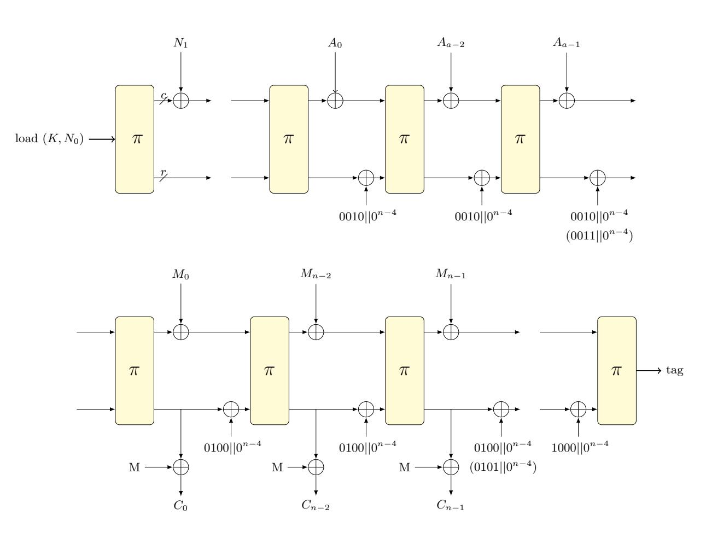
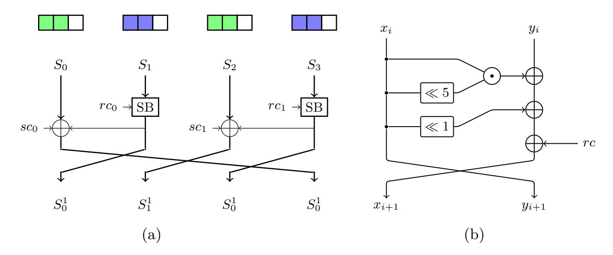
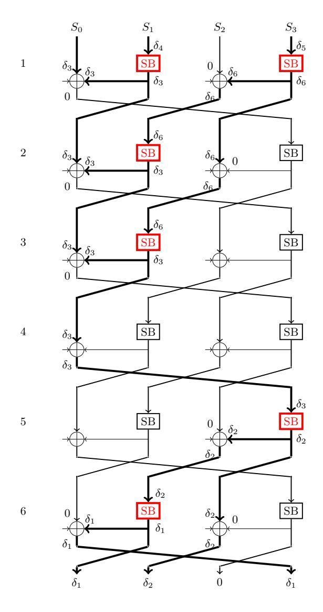
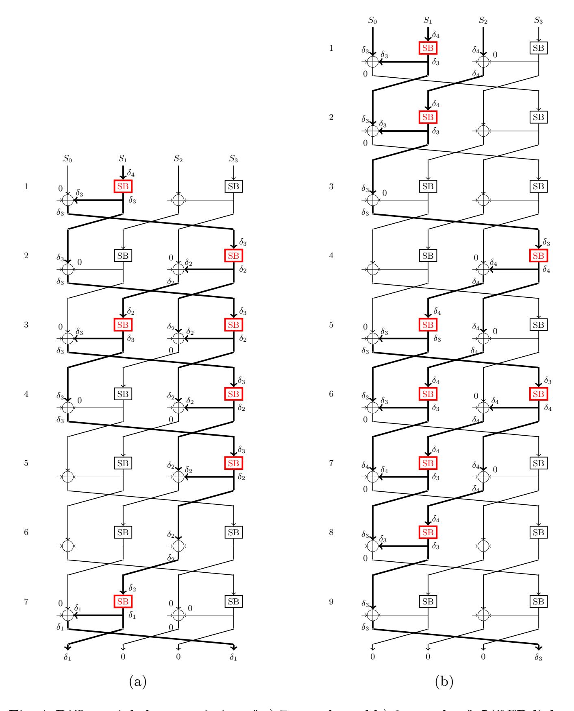
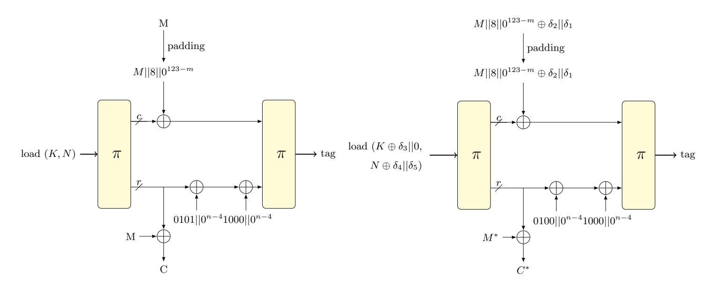
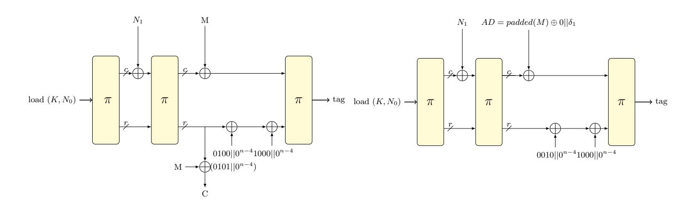

{0}------------------------------------------------

# Cryptanalysis of the permutation based algorithm SpoC

Liliya Kraleva, Raluca Posteuca, and Vincent Rijmen imec-COSIC, KU Leuven, Leuven, Belgium

Abstract. In this paper we present an analysis of the SpoC cipher, a second round candidate of the NIST Lightweight Crypto Standardization process. First we present a differential analysis on the sLiSCP-light permutation, a core element of SpoC. Then we propose a series of attacks on both versions of SpoC, namely round-reduced differential tag forgery and message recovery attacks, as well as a time-memory tradeoff key-recovery attack on the full round version of Spoc-64. Finally, we present an observation regarding the constants used in the sLiSCP-light permutation. To the best of our knowledge, this paper represents the first third-party analysis on both SpoC cipher and the sLiSCP-light permutation.

Keywords: SpoC · sLiSCP permutation · lightweight · differential cryptanalysis · TMTO attack · NIST lightweight competition · lwc

# 1 Introduction

The majority of the current standards in symmetric cryptography were initially designed for desktop and server environments. The increasing development of technology in the area of constrained environments (RFID tags, industrial controllers, sensor nodes, smart cards) requires the design of new, lightweight primitives. For this reason, NIST organised a competition aiming at standardizing a portfolio of lightweight algorithms, targeting authenticated encryption with associated data (AEAD) ciphers and hash functions. Currently the competition is at the second round with 32 out of 56 candidates left. The candidates of the NIST Lightweight Competition [\[NIS19\]](#page-20-0) need to satisfy certain criteria for performance and have a level of security of at least 112 bits.

In order to contribute to the public research efforts in analysing the candidates of the on-going second round, we focused on the SpoC cipher, a permutation based AEAD. In this paper we present the results of a security research on both versions of SpoC, namely SpoC-64 and SpoC-128. We analyse the sLiSCPlight permutation used in the algorithm, as well as the structural behaviours of SpoC-64.

# 1.1 Our contribution

In this paper we present differential characteristics for round reduced versions of both sLiSCP-light-[256] and sLiSCP-light-[192]. For the former a 6 out of 

{1}------------------------------------------------

18 rounds characteristic is given with probability 2−106.<sup>14</sup> and for the latter a 7 round and 9 (out of 18) round characteristics with probabilities 2−108.<sup>2</sup> and 2−110.<sup>84</sup> respectively are presented. Based on the described characteristic, we introduce selective tag forgery attacks for both versions of round-reduced SpoC and a message recovery attack on 9-round SpoC-64. Additionally, a keyrecovery attack is introduced for the full round version of SpoC-64, based on a time-memory trade-off approach. [Table 1](#page-1-0) summarizes our attacks and their complexities.

<span id="page-1-0"></span>Table 1: All attacks on SpoC. We underline that the data complexity of the key-recovery attack corresponds to the success probability 2−<sup>15</sup>

| Attack                      | steps of π | data          | time            | memory section |     |
|-----------------------------|------------|---------------|-----------------|----------------|-----|
| Tag forgery on SpoC-128     | 6          | 106.14 2<br>2 | 107.14∗         | -              | 4.2 |
| Tag forgery on SpoC-64      | 7          | 108.2<br>2    | ∗<br>109.2<br>2 | -              | 4.3 |
| Message recovery on SpoC-64 | 9          | 110.84 2<br>2 | 109.84∗∗        | -              | 4.4 |
| Key recovery on SpoC-64     | all        | 67<br>2       | 110<br>2        | 110∗∗∗<br>2    | 5   |

<sup>∗</sup> SBox computations, ∗∗ table look ups, ∗∗∗ table entries

The security claims of SpoC are not violated and there is no nonce misuse in our attacks. The tag forgery attacks additionally assume related keys. To the best of our knowledge, this is the first research that analyses the security of the sLiSCP-light permutation and the first published results on SpoC.

#### 1.2 Structure

The paper is structured as follows: In [section 2](#page-1-1) we briefly introduce the tools used in our research, the SpoC cipher and the sLiSCP-light permutation. In [section 3](#page-6-0) we present round-reduced differential characteristics of both versions of the sLiSCP-light permutation. Section [4](#page-10-0) introduces tag-forgery and message recovery attacks on the SpoC cipher parameterized with round-reduced sLiSCPlight permutations, while in [section 5](#page-15-1) is introduced a TMTO key-recovery attack on full Spoc-64. Section [6](#page-18-0) presents an observation regarding the generation algorithm of the sLiSCP-light constants. Finally, the last section concludes the paper.

# <span id="page-1-1"></span>2 Preliminaries

This section gives some essential aspects of differential cryptanalysis and how to estimate the differential probability. Additionally, the algorithms of SpoC and sLiSCP-light are presented.

{2}------------------------------------------------

#### 2.1 Differential cryptanalysis

Differential cryptanalysis is one of the most powerful and used cryptanalysis techniques against symmetric primitives. Proposed by Biham and Shamir [\[BS90\]](#page-20-1), this approach was introduced as the first attack that fully breaks the DES algorithm [\[NIS79\]](#page-20-2). This attack has been largely analysed and further developed, leading to attacks like Truncated differentials [\[Knu94\]](#page-20-3), the Boomerang attack [\[Wag99\]](#page-21-0) or Impossible differentials [\[BBS99\]](#page-20-4).

A differential characteristic over n rounds of an iterated cipher is defined as the sequence of intermediate differences (a = a1, a<sup>2</sup> . . . a<sup>n</sup> = b), where each (a<sup>i</sup> , ai+1) represents the input and output difference of one round. Assuming that the rounds are independent and the keys are uniformly distributed, then the Expected Differential Probability (EDP) of a characteristic is computed by multiplying the single rounds' probabilities.

$$EDP(a_1, a_2, \dots a_n) = \prod_{i=1}^{n} DP(a_{i-1}, a_i),$$

where DP represents the differential probability for one round. For simplicity, in this paper we also use the notion of weight of a differential characteristic, instead of probability, computed as the absolute value of the log<sup>2</sup> of the probability.

In practice, only the input and output differences can be observed without considering the intermediate differences. We define the set of all differential characteristics with input difference a and output difference b as a differential (a, b). The probability of a differential (a, b) is computed as the sum of the probabilities of all differential characteristics contained by it and is thus a hard problem. Therefore, the probability of the optimal characteristic serves as a lower bound for the probability of the differential.

# 2.2 SAT solvers

Nowadays, the security against differential cryptanalysis of ARX ciphers is analysed using automated tools such as SAT (Booolean Satisfability) or MILP (Mixed -Integer Linear Programming) solvers.

A SAT solver determines whether a boolean formula is satisfiable. Many operations like modular addition, rotation and XOR can be written as simple equations and easily translated to boolean expressions. For ARX ciphers several automatic search tools have been developed, see for example [\[Ste14,](#page-21-1) [MP13,](#page-20-5) [Ran17\]](#page-20-6). We chose to use the ARXpy tool [\[Ran17\]](#page-20-6), because of its easy to use implementation, complete documentation and open-source code. We use an improved version ARXpy0.2, which will be published soon.

#### <span id="page-2-0"></span>2.3 Specifications of SpoC

SpoC, or Sponge with masked Capacity [\[AGH](#page-20-7)<sup>+</sup>19], is a permutation based mode of operation for authenticated encryption. Since it is a sponge construction, its 

{3}------------------------------------------------

b-bit state is divided into rate and capacity bits with r the size of the rate and c = b - r the size of the capacity. The authors introduced a masked capacity part with size r, representing the blocks in which the message and AD are added.

Two main versions are defined, namely SpoC-64\_sLiSCP-light-[192] and SpoC-128\_sLiSCP-light-[256], where 64 and 128 represent the corresponding size of the rate bits and sLiSCP-light-[] is the permutation used. Throughout this paper we refer to each of the SpoC versions as SpoC-r, while the permutation is also denoted by  $\pi$ . The key and nonce sizes of both versions are 128 bits. The following table describes the bit size of the parameters of both versions:

| Instance                    | state b | rate $r$ | tag t | SB size | rounds $u$ | steps $s$ |
|-----------------------------|---------|----------|-------|---------|------------|-----------|
| SpoC-64_sLiSCP-light-[192]  | 192     | 64       | 64    | 48      | 6          | 18        |
| SpoC-128_sLiSCP-light-[256] | 256     | 128      | 128   | 64      | 8          | 18        |

The state of SpoC is divided into 4 subblocks  $(S_0||S_1||S_2||S_3)$  with equal length, where || defines the concatenation. The encryption process of SpoC contains the *Initialization*, Associated Data Processing, Plaintext Processing and Tag Processing phases and is shown in Figure 1.

<span id="page-3-0"></span>

Fig. 1: Schematic diagram of the different phases used in the SpoC cipher. The shown initialization is for SpoC-64. Note that the state is divided in two parts, the capacity (the upper part) and the rate (the lower part).

**Initialization.** This is the only step that is different for the two versions of SpoC. For SpoC-128, this process consists only of loading the key  $K = K_0 || K_1$ 

{4}------------------------------------------------

and nonce N = N0||N<sup>1</sup> to the state into the odd and even numbered subblocks respectively. That is, S1[j] ← K0[j], S3[j] ← K1[j], S0[j] ← N0[j], S2[j] ← N1[j], where 0 < j < 7 and X[j] represents the j th byte of the block X. All capacity bits are considered as masked.

In SpoC-64 the state is smaller, while the sizes of the key and nonce are unchanged. First, K and N<sup>0</sup> are loaded to the state and then the permutation sliSCP-light-[192] is applied. Finally, N<sup>1</sup> is added to the masked capacity bits. The rate part is represented by the first 4 bytes of subblocks S<sup>0</sup> and S<sup>2</sup> and is where N<sup>0</sup> is loaded, while the key is loaded to the rest of the state.

AD and Message processing. This two phases are very similar. The blocks of AD, respectively message, are absorbed into the state and after each block a control signal (also referred to as a constant) is added. Finally, π is applied to the state. The added constant depends on both the phase and the length of the block. For the AD processing phase, the added constant is 0010 for a full block and 0011 for a partial (last) block. Respectively, for the message processing phase, 0100 is added for a full block and 0101 for a partial block.

In both AD and message processing phases, in the case of an incomplete last block, a padding function is applied. We denote this by padding(M) = M||1||0 mc−n−1 for a block M of length n < mc, where m<sup>c</sup> is the length of a full block (which is, in fact, the length of the masked capacity part).

Tag processing. The control signal in this phase is set to 1000 and is added right after the control signal of the previous phase. Then π is applied and the tag is extracted from S<sup>1</sup> and S<sup>3</sup> of the output state.

Note, that if there is null AD (respectively, null message), the corresponding phase is entirely omitted. We denote with (AD, M) an associated data and message pair and with "" an empty instance of either of them. For example, ("", M) denotes an input pair having null associated data.

#### 2.4 Specifications of sLiSCP-light

sLiSCP-light-[b] is a permutation that operates on a b-bit state, where b equals 192 or 256, and is defined by repeating a step function s times. The state is divided into four 2m-bit subblocks (S i 0 ||S i 1 ||S i 2 ||S i 3 ), with 0 < i < s − 1 the step number and m being equal to 24 or 32. We denote a zero subblock as 0 <sup>2</sup><sup>m</sup> or simply 0, where the number of zero bits is clear from the context. The following 3 transformations are performed: SubstituteSubblocks(SSb), AddStepconstants(ASc), and MixSubblocks(MSb). An ilustration is shown in [Figure 2a.](#page-5-0)

The SSb transformation is a partial substitution layer, in which a non-linear operation is applied to half of the state - in subblocks S<sup>1</sup> and S3. The nonlinear operation, or the SBox, is represented by an u-round iterated unkeyed Simeck-2m block cipher [\[YZS](#page-21-2)<sup>+</sup>15].

The Simeck SBox used in the description of the permutation is depicted in [Figure 2b.](#page-5-0) For an input (x<sup>i</sup> , yi) of the i th round, the output is

$$R(x_{i+1}, y_{i+1}) = (y_i \oplus f(x_i) \oplus rc, x_i),$$

{5}------------------------------------------------

<span id="page-5-0"></span>

Fig. 2: The sLiSCP-light step function is shown in (a). On top, the blue blocks represent masked capacity bits and the green represent the rate bits for SpoC-64. (b) represents one round of the Simeck cipher, used as SB.

where  $f(x) = (x \odot (x \ll 5) \oplus (x \ll 1))$  and rc represents a constant computed using the sLiSCP-light's round constants  $rc_i$ .

The ASc layer is also applied to half of the state as the step constants  $sc_1^i$  and  $sc_2^i$  are applied to subblocks  $S_0^i$  and  $S_2^i$  respectively. Table 2 lists all round and step constants used in sLiSCP-light.

Table 2 Round and step constants for sLiSCP-light-[192]:

<span id="page-5-1"></span>

|      | 1                                                         | e i                                                     |  |  |  |  |
|------|-----------------------------------------------------------|---------------------------------------------------------|--|--|--|--|
| step | $\mathbf{i} = (rc_0^i, rc_1^i)$                           | $(sc_0^i,sc_1^i)$                                       |  |  |  |  |
| 0-5  | (7,27), (4,34), (6,2e), (25,19), (17,35), (1c,f)          | (8, 29), (c, 1d), (a, 33), (2f, 2a), (38, 1f), (24, 10) |  |  |  |  |
| 6-1  | 1 (12, 8), (3b, c), (26, a), (15, 2f), (3f, 38), (20, 24) | (36, 18), (d, 14), (2b, 1e), (3e, 31), (1, 9), (21, 2d) |  |  |  |  |
| 12-1 | 7(30, 36), (28, d), (3c, 2b), (22, 3e), (13, 1), (1a, 21) | (11, 1b), (39, 16), (5, 3d), (27, 3), (34, 2), (2e, 23) |  |  |  |  |

# Round and step constants for sLiSCP-light-[256]:

| step i | $(rc_0^i,rc_1^i)$                                         | $(sc_0^i, sc_1^i)$                                         |  |  |  |  |
|--------|-----------------------------------------------------------|------------------------------------------------------------|--|--|--|--|
| 0-5    | (f, 47), (4, b2), (43, b5), (f1, 37), (44, 96), (73, ee)  | (8, 64), (86, 6b), (e2, 6f), (89, 2c), (e6, dd), (ca, 99)  |  |  |  |  |
| 6-11   | (e5, 4c), (b, f5), (47, 7), (b2, 82), (b5, a1), (37, 78)  | (17, ea), (8e, 0f), (64, 04), (6b, 43), (6f, f1), (2c, 44) |  |  |  |  |
| 12-17  | (96, a2), (ee, b9), (4c, f2), (f5, 85), (7, 23), (82, d9) | (dd, 73), (99, e5), (ea, 0b), (0f, 47), (04, b2), (43, b5) |  |  |  |  |

The reader can refer to [AGH<sup>+</sup>19] or [ARH<sup>+</sup>18] for more details regarding the description of SpoC and the sLiSCP-light permutation.

#### 2.5 Security claims and the impact of our attacks

In the original paper, the authors of SpoC introduced the security claims in different manners. In this paper, we refer to the security claims described in Table 3.1 from [AGH $^+$ 19], since we consider this to be the most restrictive. Our interpretation of this table is that the best attack on either version of SpoC uses at most  $2^{50}$  data encrypted under the same key and has a time complexity of at

{6}------------------------------------------------

most  $2^{112}$ . Furthermore, the attack, aiming at either breaking the confidentiality or the integrity of the cipher, has a success probability of at least  $2^{-16}$ .

On the first sight, the data complexity of all the attacks presented in this paper is higher than  $2^{50}$ . However, in all of our differential-based attacks, we consider that each plaintext is encrypted under a different key, respecting the constraint that no more than  $2^{50}$  data encrypted under the same key is used. In the online phase of the key-recovery attack the adversary intercepts messages encrypted by an honest user, therefore the data limit is automatically satisfied.

The impact of our attacks. Since all of our differential-based attacks are applied to round-reduced versions of SpoC, we consider that they do not have an impact on the security of the SpoC cipher. Nonetheless, we consider this work relevant because it presents an analysis on the SpoC cipher and on the sLiSCP-light permutation that improves the knowledge about the security of both.

Regarding our key-recovery attack, since we were able to apply a generic Time-Memory Trade-Off on the full SpoC-64, we consider that there might be some undesirable properties inducing vulnerabilities in the mode of operation of SpoC.

# <span id="page-6-0"></span>3 Differential cryptanalysis on sLiSCP-light

In this section we present several characteristics for both versions of the sLiSCP-light permutation. Our characteristics are constructed by imposing specific constraints on the input and output differences in order to be further used in a series of attacks on SpoC. First, the details for our 6 round characteristic on sLiSCP-light-[256] are presented, then 2 different characteristics over 7 and 9 rounds of sLiSCP-light-[192] are shown.

#### 3.1 Characteristics on sLiSCP-light-[256]

In order to construct this 6 rounds characteristic of sLiSCP-light-[256] we impose a constraint only on the output difference and thus we construct it backwards. We fix the output difference in the first and third subblocks to  $\Delta S_0^6 = \delta_1$  and  $\Delta S_2^6 = 0$ . In fact, those are the positions of the rate bits when applied to SpoC. The purpose and value of  $\delta_1$  is discussed in section 4. The output difference in subblocks  $S_1^6$  and  $S_3^6$  is irrelevant for our attacks, thus can take any value. However, in order to decrease the number of active Sboxes, we choose  $\Delta S_1^6 = \delta_2$  and  $\Delta S_3^6 = \delta_1$ , where  $\delta_2$  is a possible input difference for the Sbox that leads to  $\delta_1$ . In this case, the characteristic has only one active Sbox in each of the last two rounds and none in the  $4^{th}$  one.

As it can be seen in Figure 3, for 6 rounds of the permutation we have 6 active Sboxes with the following transitions:

$$\delta_5 \xrightarrow{SB} \delta_6 \xrightarrow{SB} \delta_3 \xrightarrow{SB} \delta_2 \xrightarrow{SB} \delta_1, \ \delta_4 \xrightarrow{SB} \delta_3.$$

{7}------------------------------------------------

<span id="page-7-0"></span>

Fig. 3: The active SBoxes for 6 rounds of sLiSCP-[256] with the difference propagation

The resulted characteristic has the input difference  $\delta_3||\delta_4||0^{64}||\delta_5$  and the output difference  $\delta_1||\delta_2||0^{64}||\delta_1$ , therefore, by fixing the input and the output of the characteristic we actually fix the differences from  $\delta_1$  to  $\delta_5$ . However, the difference  $\delta_6$  can take multiple values, as long as it is a valid output difference for the input difference  $\delta_5$  and is a valid input difference for the output difference  $\delta_3$ . In the case of our characteristic we take  $\delta_6 = \delta_4$ .

To choose the differences  $\delta_i$  we used the automatic search tool ArxPy [Ran17]. By fixing  $\delta_1$  to one of the possible values described in section 4, we constructed a tree of differences. The nodes of this tree represent all possible input differences returned by ArxPy, having weight less than the optimal one plus 3.

After choosing the appropriate differences, the weight of each transition was empirically verified using  $2^{30}$  data. In order to obtain the final weight of the characteristic all weights of the SBox transitions were added up. Our best differential characteristics and their corresponding weights are listed in Table 3. The best weight that we found for 6 rounds of the permutation is 106.14.

Note that the optimal characteristic over one SBox (8 rounds of Simeck) has weight 18. This is proven in [LLW17] and verified by us with the ArxPy tool. The empirical differential probability of 8 rounds of Simeck has slightly lower

{8}------------------------------------------------

or higher weight than the optimal characteristic, which is expected due to the differential effect and the independency assumptions.

#### <span id="page-8-1"></span>3.2 sLiSCP-light[192]

In this section we present 2 characteristics, one over 7 rounds and one over 9 rounds of sLiSCP-light-[192]. They are constructed in a similar way as the characteristic described in the previous subsection. The requirements of the desired differences in the input and output bit positions are different, since the constraints imposed by our attack scenarios are different.

**7-round characteristic.** The constraints of our 7-round characteristic fix the nonzero input difference to  $S_1^0$  and  $S_3^0$ , while the output difference is  $S_0^7 = \delta_1$  and  $S_2^7 = 0^{48}$ . The difference in  $S_1^7$  and  $S_3^7$  is chosen for convenience, to reduce the number of active SBoxes. Therefore, our characteristic has 7 active Sboxes, as shown in Figure 4a. The described characteristic has input and output differences  $(0^{48}||\delta_4||0^{48}||0^{48}|\to \delta_1||0^{48}||\delta_1)$ , with

$$\delta_4 \xrightarrow{SB} \delta_3 \xrightarrow{SB} \delta_2 \xrightarrow{SB} \delta_1, \quad \delta_2 \xrightarrow{SB} \delta_3.$$

From Figure 4a we can see that the iterative transition  $\delta_3 \xrightarrow{SB} \delta_2$  happens 4 times, while  $\delta_2 \xrightarrow{SB} \delta_3$  appears only once. The exact values are chosen to minimize the weight of  $\delta_3 \xrightarrow{SB} \delta_2$ . Our best probability of  $2^{-108.2}$  happens for

$$\delta_1 = 0x7000000000000, \delta_2 = 0x500001800000,$$
  
 $\delta_3 = 0x100000200000, \delta_4 = 0x100001100000.$ 

with weights

$$\delta_4 \xrightarrow{17} \delta_3 \xrightarrow{11,3} \delta_2 \xrightarrow{23.1} \delta_1, \quad \delta_2 \xrightarrow{22.9} \delta_3.$$

Note that the optimal characteristic over one SBox (6 rounds of Simeck) has weight 12, as verified with the ArxPy tool.

<span id="page-8-0"></span>Table 3: The best characteristics we found for sLiSCP-[256] are shown in this table. For simplicity the 64-bit differences are presented in hexadecimal and separated in two halves and the ".." denote 3 zero bytes. The values above the arrows represent the weight of each transition's differential.

| $\delta_5$                   | $\delta_4 = \delta_6$        | $\delta_3$               | $\delta_2$                                         | $\delta_1$ | w      |
|------------------------------|------------------------------|--------------------------|----------------------------------------------------|------------|--------|
| $10, 10 \xrightarrow{17.69}$ | $11, 00 \xrightarrow{17.69}$ | 10, 00                   | $\xrightarrow{17.69}$ 11, 00 $\xrightarrow{17.69}$ | 10, 00     | 106.14 |
| $10, 00 \xrightarrow{17.69}$ | $11, 00 \xrightarrow{17.69}$ | $10, 00 \stackrel{1}{-}$ | $\xrightarrow{17.69}$ 11, 00 $\xrightarrow{17.69}$ | 10, 00     | 106.14 |
| $10, 02 \xrightarrow{18.69}$ | $11, 00 \xrightarrow{17.69}$ | $10, 00^{-1}$            | $\xrightarrow{17.69}$ 11, 00 $\xrightarrow{17.69}$ | 10, 00     | 107.14 |
| $00, 20 \xrightarrow{18.30}$ | $00, 22 \xrightarrow{18.30}$ | $00, 20^{-1}$            | $\xrightarrow{18.30}$ 00, 22 $\xrightarrow{18.90}$ | 60, 00     | 110.4  |

{9}------------------------------------------------

<span id="page-9-0"></span>

Fig. 4: Differential characteristics of a) 7 rounds and b) 9 rounds of sLiSCP-light-  $\left[192\right]$ 

{10}------------------------------------------------

**9 round characteristic.** For this characteristic we fix the non-zero output difference to  $S_1^9$  and  $S_3^9$ . More precisely, in the first 4 bytes of the subblocks, which correspond to the masked capacity bits in SpoC.

In order to design this characteristic we used an iterative transition  $\delta_3 \xrightarrow{SB} \delta_4 \xrightarrow{SB} \delta_3$ . The input and output differences of our characteristic are  $(\delta_3||\delta_4||\delta_4||0^{48})$  and  $(0^{48}||0^{48}||\delta_3)$ , respectively.

As seen in Figure 4b, the characteristic has 8 active SBoxes with  $\delta_3 \xrightarrow{SB} \delta_4$  appearing 6 times and  $\delta_4 \xrightarrow{SB} \delta_3$  two times. Our best probability of  $2^{-108.5}$  holds for the differences  $\delta_3 = 0x000a0000400$  and  $\delta_4 = 0x000a00001000$  with weights

$$\delta_3 \xrightarrow{22.34} \delta_4 \xrightarrow{10.65} \delta_3$$
.

# <span id="page-10-0"></span>4 Differential attacks on SpoC-128 and SpoC-64

In this section we present a series of attacks based on the differential characteristics introduced in the previous section. More precisely, we design tagforgery attacks based on the 6-round characteristic of sLiSCP-light-[256] and the 7-round characteristic of sLiSCP-light-[192]. The 9-round characteristic of sLiSCP-light[192] is used to design a message-recovery attack.

#### 4.1 Tag forgery attacks

As stated in Section 2.3, in order to distinguish between different phases of the encryption process, the authors of SpoC used a 4-bit control signal. The values of these 4 bits depend on the current phase, but also on whether the inputs (associated data or plaintext) are padded or not. Moreover, if the associated data or the plaintext is null, the corresponding phase is disregarded.

Our approach is based on identifying and exploiting scenarios in which different types of inputs lead to similar internal states.

Take, for example, the scenario where one uses SpoC-64 or SpoC-128 to encrypt two one-block plaintexts: an incomplete block M and a complete block  $M^* = padding(M)$ , using, in both cases, the same associated data and the same (key, nonce) pair. Take into account that, at the end of the plaintext addition phase, just before generating the tag, the difference between the corresponding internal states is given by the difference between the corresponding 4-bit control signals, i.e.  $0001||0^{n-4}$ . In the plaintext processing phase of the first case, the 0101 control signal is used, while in the second case 0100 is used. The difference between the used constants we denote by  $\delta_1$  and it represents the convenient difference that we can cancel locally.

The difference  $\delta_1$ . Depending on the scenario, we identified three possible values for the control signals' difference  $\delta_1$ , as follows:

1.  $\delta_1 = 0001||0^{n-4} = 0100||0^{n-4} \oplus 0101||0^{n-4}$ This value can be obtained in the case when we encrypt the plaintexts M and  $M^*$  described above, using the same (key, nonce) pair and the same AD.

{11}------------------------------------------------

- 2.  $\delta_1 = 0110||0^{n-4} = 0100||0^{n-4} \oplus 0010||0^{n-4}$ This value can be obtained when we encrypt ("", M) and (M, ""). More precisely, in the first case we use a null AD, while in the second case we use a null plaintext. The former encryption consist of initialization, message processing phase and finalization, whereas the latter has AD processing phase instead of message processing. It will produce no ciphertext, however the
- 3.  $\delta_1 = 0111|0^{n-4} = 0101||0^{n-4} \oplus 0010||0^{n-4}$ This value can be obtained when we encrypt the pairs ("", M) and (AD, ""), where the length of M is less than the length of a full block and AD = padding(M).

tags of the two would be the same. Hence we can forge the verification of

In order to achieve a tag forgery, we designed differential characteristics such that, after the plaintext processing phase, the difference between the corresponding control signals is cancelled by the output difference of the characteristic. Since this results in the same internal states, the corresponding tags will collide.

We underline the fact that the control signal bits are influencing the difference on the rate part of the internal state. The target characteristic might also have active bits in the capacity part, these being canceled through a difference between the two plaintexts. Therefore, we aim at finding characteristics having the output difference of the form  $(\delta, \lambda, 0, \gamma)$ , where  $\delta$  is the difference between the constants, while the differences  $\lambda$  and  $\gamma$  can be cancelled through the plaintext block difference. In our experiments, in order to optimize the number of active Sboxes, we imposed the additional constraint that  $\delta = \gamma$ . In section 3 we presented the best characteristics that we found, suitable for our approach, on 6-round sLiSCP-256 and on 7-round sLiSCP-192. Using these characteristics and the approach presented above, we designed tag forgery attack on reduced versions of both Spoc-64 and Spoc-128.

Since the complexity of our round-reduced characteristics are close to the security bound, we chose the input parameters such that the difference propagates through only one permutation.

#### <span id="page-11-0"></span>4.2 Tag forgery attack on SpoC-128

associated data.

After we have fixed our characteristic, we can proceed to the attack. Note that, in the case of SpoC-128, the initialization phase is represented only by the loading of the (key, nonce) pair into the internal state. Since there is only one sLiSCP-light application before the ciphertext generation, our tag forgery attack on SpoC-128 follows the related-key related-nonce scenario. According to our 6-round characteristic, we use inputs such that the key difference is  $(\delta_3||0)$ , while the nonce difference is  $(\delta_4||\delta_5)$ . Moreover, since our best characteristic uses  $\delta_1 = 0x1||0^{124}$ , the setup of this attack assumes the use of null associated data, a plaintext  $M = M_1||M_2$  having the size less than 128 bits and a plaintext  $M^* = padding(M) \oplus \delta_2||\delta_1 = M_1^*||M_2^*$  encrypted under related-key related-nonce pairs. As we mentioned before, by injecting a difference in the plaintexts we cancel the

{12}------------------------------------------------

capacity difference after the permutation. The encryption processes are described in Figure 5.

<span id="page-12-0"></span>

Fig. 5: The encryption of an incomplete and a full block of plaintexts, using related-key related-nonce inputs and null associated data

Note that, if our differential characteristic holds, then the following equations also hold with probability 1:

$$M_1^* = M_1 \oplus \delta_2,$$
  
 $S_0^{6*} = S_0^6 \oplus \delta_1,$   
 $S_2^{6*} = S_2^6,$   
 $C^* = M_1^* \oplus S_0^{6*} || M_2^* \oplus S_2^{6*}.$ 

Therefore,  $C^* = (C_1||C_2) \oplus (\delta_2 \oplus \delta_1||\delta_1)$ .

More precisely, the ciphertext-tag pair  $(C^*, \tau)$  would then be valid under  $(K \oplus \Delta_K, N \oplus \Delta_N) = (K \oplus \delta_4 || \delta_5, N \oplus \delta_3 || 0)$  with the probability of the characteristic. The pseudocode of this attack is presented in Algorithm 1.

Since the rate part of the internal state is used for the encryption, by knowing both the plaintext and the ciphertext we can recover the rate part of each internal state used in the plaintext processing phase. In the case of our approach we use this observation to decrease the data complexity of our attack, by filtering the ciphertexts obtained in the first step.

The data complexity of this attack, computed as the number of encryptions and decryptions required, is  $(P_{R_6} + 1) \cdot P_{R_1 \to R_5} = (2^{17.69} + 1) \cdot 2^{88.45} = 2^{106.14} + 2^{88.45}$ , where  $R_i$  represents the  $i^{th}$  sLiSCP step. The time complexity, computed as the number of offline SBox computations, is  $2 \cdot P_{R_6} \cdot P_{R_1 \to R_5} = 2^{107.14}$ .

**Improved attack.** We can improve the complexity of the attack by using multiple differential characteristics that have the same output difference, i.e. equal  $\delta_1$ s and  $\delta_2$ s. Suppose that we have d differential characteristics such that

{13}------------------------------------------------

### Algorithm 1: The tag forgery attack on Spoc-128

```
Encryption Obtain (C = C_1C_2, \tau), the encryption of ("", M) under arbitrary (K, N);

Compute S_0^6S_2^6 = padding(M) \oplus C;\nif SB^{-1}(S_0^6) \oplus SB^{-1}(S_0^6 \oplus \delta_1) == \delta_2 then

Decryption Ask for P, the decryption of (C_1 \oplus \delta_2 \oplus \delta_1 || C_2 \oplus \delta_1, \tau) under (K \oplus \delta_4 || \delta_5, N \oplus \delta_3 || 0);\nif P \neq \bot then

P = ("", M^*);\nelse

go to Encryption;\nend
\nelse

go to Encryption;\nend
```

<span id="page-13-1"></span>
$$\begin{array}{cccccccccccccccccccccccccccccccccccc$$

where each characteristic has the probability  $p_i$ , i = 1, ..., d.

The attack follows the lines of Algorithm 1, where instead of asking for the decryption under a fixed (key, nonce) pair, we use every  $(K \oplus \Delta_K^i, N \oplus \Delta_N^i)$  pair. For our improved attack the time and data complexities can improve with at most a factor of  $log_2d$ , when all the characteristics have the same probability.

By using 10 different characteristics that we found that have  $\delta_1 = 1..0, 0..0$  and  $\delta_2 = 1..1, 0..0$ , the complexity is improved by a factor of  $2^{1.82}$ , the time complexity being around  $2^{105.32}$ , while the data complexity decreases to approximately  $2^{104.32} + 2^{86.63}$ .

**Time-Memory trade-off.** The time complexity of our attack can be improved by using a time-memory trade-off approach. In this case the attack will also imply an offline phase, as follows: for all possible values of  $S_0^6$  we verify if  $SB^{-1}(S_0^6) \oplus SB^{-1}(S_0^6 \oplus \delta_1) == \delta_2$ . If the condition holds, we store the corresponding value of  $S_0^6$  in the sorted list  $list_{S_0^6}$ .

The complexity of this phase is  $2^{64}$  SBox computations. In this case, instead of verifying the specified condition, it will be verified if  $S_0^6 \in list_{S_0^6}$ . The time complexity of each query will be  $log_2(\#list_{S_0^6})$  operations, while the memory complexity will be less than  $2^{64}$  (negligible compared to the data complexity).

#### <span id="page-13-0"></span>4.3 Tag forgery attack on SpoC-64

The main idea of the attack is similar to the one presented in subsection 4.2, some modifications being imposed due to the different loading phase of SpoC-64.

{14}------------------------------------------------

This attack is based on the 7-round characteristic presented in subsection 3.2. Since our characteristic covers only one permutation, in this scenario we have one more constraint on the input differences. More precisely, the setup of our attack assumes the use of related  $N_1$ s, while the key and the nonce  $N_0$  are equal. The input difference is given by the difference between the corresponding  $N_1$ s, while the output difference respects the constraints from subsection 4.2. Since  $N_1$  is added to the masked capacity bits, note that the difference needs to have active bits only in the masked capacity part.

Moreover, for the 7-round characteristic on sLiSCP-light-192 we used  $\delta_1 = 0111||0^{n-4}$ , therefore the setup of our attack is the one presented in Figure 6.

<span id="page-14-0"></span>

Fig. 6: The two processes of SpoC-64 used by our approach. Note that the second XORed constant is imposed by the beginning of the tag generation phase.

We state that, while the encryption of the message ("", M) will return a (ciphertext, tag) pair, the encryption of the pair (AD,"") results in a null ciphertext and a tag. Therefore, assuming the 7-round characteristic holds, the ciphertext-tag pair ("",  $\tau$ ) is valid under  $(K, N_0||(N_1 \oplus \Delta_N)) = (K, N_0||(N_1 \oplus \delta_4||0))$  with probability 1.

The tag forgery attack on SpoC-64 is very similar to the one described in Algorithm 1. The distinction is given by the input difference of the characteristic which impacts the decryption (key, nonce) pair. More precisely, only the nonce  $N_1$  is different.

The data complexity of this attack, computed as the number of encryptions and decryptions required, is  $(P_{R_7}+1)\cdot P_{R_1\to R_6}=(2^{23.1}+1)\cdot 2^{85.1}=2^{108.2}+2^{85.1}$ . The time complexity, computed as the number of offline Sbox computations, is  $2\cdot P_{R_7}\cdot P_{R_1\to R_6}=2^{109.2}$ .

Even though the required amount of data is higher than the size of the tag space, we consider that our attack is meaningful since the authors of SpoC claim security of 112 bits for both confidentiality and integrity.

**Time-Memory trade-off.** By following the same time-memory trade-off approach presented in subsection 4.2, we can improve the time complexity of our attack. The complexity of the offline phase is also  $2^{64}$  SBox computations. Thus, the time complexity of each query will be  $log_2(\#list_{S_0^7})$  operations, while

{15}------------------------------------------------

the memory complexity will be less than 2<sup>64</sup> (negligible compared to the data complexity).

#### <span id="page-15-0"></span>4.4 Message recovery attack on SpoC-64

In this section we present a message recovery attack on Spoc-64 based on a differential cryptanalysis approach. This attack exploits the fact that the initialization phase is not a bijective function, since the input is 256 bits and the internal state is 192 bits. The analysis aims at constructing (key, nonce) pairs that lead to the same internal state after the initialization. Thus, we designed the 9-round differential characteristic on sLiSCP-light-[192] presented in [section 3.](#page-6-0) More precisely, the constraint of our characteristic is that the output difference only affects the capacity part, this difference being canceled by a difference between the corresponding N1's. Therefore our approach uses a key-related nonce-related scenario.

By using our 9-round characteristic on a round-reduced scenario, the internal states after the initialization collide. Therefore, the encryption of the same plaintext under different (key, nonce) pairs lead to identical ciphertexts and tags. Moreover, if we encrypt two messages with the same l first blocks, the corresponding l ciphertext blocks will also be the same.

We used this approach to design a related-key related-nonce attack on SpoC-64. The attack works as follows:

- 1. With a key-nonce pair (K, N) we ask for the encryption of an arbitrary, unknown plaintext M, using the associated data AD; we obtain the ciphertexttag pair (C, τ );
- 2. We ask for the decryption of (C, τ ) under (K ⊕ ∆K, N ⊕ ∆<sup>N</sup> ) and using the initial AD;
- 3. If the tag verification holds, we obtain the plaintext M<sup>0</sup> . If M<sup>0</sup> is a readable text, then M<sup>0</sup> = M and the message is recovered.

We specify M<sup>0</sup> being readable, since there is always a probability that tags collide. As stated in [section 3,](#page-6-0) the probability of our 9-round characteristic is 2 <sup>−</sup>109.84. Since the data complexity defines the number of encryptions and decryptions, in our case the data complexity is 2110.84, while the time complexity is bounded by the data complexity.

The existence of related-key related-nonce pairs that lead to a collision on the internal state can be compared to the case of the nonce misuse scenario. In both cases, the same internal state, obtained after the initialization phase, is used more than once. Therefore, there is no distinction, with respect to the ciphertext and tag, between encrypting twice with the same (key, nonce) pair and encrypting with related-key related-nonce pairs that collide after the initialization phase.

# <span id="page-15-1"></span>5 Key-recovery attack on SpoC-64

In this section we generalise the approach described in [subsection 4.4,](#page-15-0) by defining the notion of class-equivalence over the space of all (key, nonce) pairs. We then 

{16}------------------------------------------------

present a time-memory trade-off attack based on the class-equivalence that leads to the recovery of the secret key K.

Equivalence in the set of (key, nonce) pairs.

Definition 1. The (key, nonce) pairs (K<sup>1</sup> , N<sup>1</sup> ) and (K<sup>2</sup> , N<sup>2</sup> ) are said to be in the same equivalence class (or simply equivalent) if the corresponding internal states, after the initialization phase, are equal.

The number of equivalence classes is given by the number of all possible internal states of SpoC-64, namely 2192. For each fixed internal state, one can consider all values of N<sup>1</sup> and can compute the associated (K, N0) pairs by applying the inverse of the permutation. Therefore, each equivalence class is formed by 2<sup>64</sup> (key, nonce) pairs.

Note that the encryption of the same message under equivalent (key, nonce) pairs results in equal ciphertexts and tags. Moreover, the decryption and tag verification of a (ciphertext, tag) pair can successfully be performed under any (key, nonce) pair belonging to the same equivalence class.

The key-recovery attack. Our attack consists of two phases: an offline and an online phase. In the offline phase, the adversary generates a table containing 2 <sup>110</sup> entries. Each entry contains a (K, N0||N1) pair and the ciphertexts and tag obtained by applying SpoC-64 on a well chosen plaintext M, under the (K, N0||N1) pair and a null AD.

The (key, nonce) pairs are generated such that they belong to different equivalence classes. More precisely, 2<sup>110</sup> different internal states are generated by the adversary. For each state an arbitrary N<sup>1</sup> is chosen and, by XORing it to the internal state and by applying the inverse of the permutation, the (K, N0) pair is computed. Using each (K, N0||N1) pair, the adversary encrypts, using SpoC-64, a common short message M. Note that, in practice, depending on the nature of a correspondence, messages usually start with the same words or letters. For example, e-mails normally start with "Dear (\*name\*)," or "Hello (\*name\*),". By making this assumption, we choose a plaintext M to be a regularly used word or phrase of length l blocks. In our research we make the assumption that the full 18-round sLiSCP-light behaves as a random permutation, thus no particular properties can be observed. Therefore, we claim that l = 3 is the number of blocks of ciphertext that uniquely defines the equivalence class of the (K, N0||N1) pairs.

We consider the encryption function of SpoC-64, defined using a fixed plaintext and considering as the input state the result of the initialization phase. On one hand, in order to have uniqueness, this function has to be injective. Therefore, since the length of the internal state is 192 bits and the length of one block of ciphertext is 64 bits, the minimum value of l is 3. On the other hand, by writing the system of bit-level equations of the targeted function, for l blocks of ciphertext we obtain 64 × l equations using 192 variables. If this system does not have an unique solution for l = 3, it means that the resulted equations are not independent, thus there are some particular properties of the sLiSCP-light permutations that could be further extended to an attack.

The pseudocode of the offline phase is presented in Algorithm [2.](#page-17-0)

{17}------------------------------------------------

# Algorithm 2: Offline phase

```
list = null ;
choose M;
while list.length < 2
                     110 do
   sample internal state;
   sample N1;
   compute (K, N0) = π
                          −1
                            (internal state ⊕ N1) ;
   encrypt (C, τ ) = SpoC-64(K, N0||N1, "", M) ;
   list.Add(K, N0||N1, C)
end
Result: list populated with 2110 entries
```

<span id="page-17-0"></span>Note that π <sup>−</sup><sup>1</sup> denotes the inverse of the full sLiSCP-light-[192] permutation. The resulted list is sorted with respect to the ciphertexts, using a hash table. The memory complexity of this phase is 2<sup>110</sup> table entries, while the time complexity is 2<sup>110</sup> SpoC-64 encryptions. Note that the steps of an encryption are not performed sequentially. Since the first step is to sample the internal state, the encryption can be performed without the initialization phase, while the initialization phase is performed backwards, by computing a (key, nonce) pair corresponding to a fixed internal state. Thus, by assuming that the permutation function and the inverse of the permutation function are equivalent time-wise, the time complexity of our offline phase is 2<sup>110</sup> encryptions.

In the online phase the adversary intercepts the (ciphertext, tag) pairs encrypted by a valid user. For simplicity, we assume that the valid user used null associated data. We discuss in a paragraph below the case where the associated data is not null. For every intercepted ciphertext, the adversary verifies if the first l blocks belong to the table computed in the offline phase. Since a string of l blocks uniquely defines the equivalence class, a match means that the valid user encrypted the plaintext under a (key, nonce) pair that is in the same equivalence class with the pair (K, N0||N1) extracted from the precomputed table. Moreover, the adversary can easily compute the internal state obtained after the initialization phase, using the (K, N0||N1). Since the nonce N<sup>1</sup> is public, it can XOR N<sup>1</sup> to the internal state and, by applying the reverse of the permutation, the adversary can compute the user's key.

In the case where the valid user chooses a non-empty value for the associated data, the key-recovery works as follows:

- 1. The adversary verifies if the first l blocks of the ciphertext belongs to the table;
- 2. When a match is found, the adversary reverse the associated data addition phase; this action is allowed, since AD is a public value;
- 3. On the obtained internal state, the adversary XOR the N<sup>1</sup> and apply the inverse of the permutation.

Therefore, the adversary gains full control over the encryption of the valid user, being able to decrypt all the past and future communication in which the 

{18}------------------------------------------------

valid user used the recovered key. Moreover, the adversary gains the ability of impersonating the valid user, being able to generate (ciphertext, tag) pairs using the secret key of the valid user.

Since the adversary can control  $2^{110}$  equivalence classes, through the precomputed table, the probability that an intercepted message belongs to the precomputed table is  $2^{110-192} = 2^{-82}$ . Thus, if the adversary intercepts  $2^{67}$  (ciphertext, tag) pairs, the success probability of this attack is  $2^{-15}$ , twice the probability claimed by the authors of SpoC. By increasing the amount of intercepted data, the success probability of the attack also increases. For example, if the adversary intercepts  $2^{82}$  messages, the success probability of the attack is 1.

The data complexity of the online phase is represented by the number of required online encryptions. So, for a success probability of  $2^{-15}$ , the data complexity of the online phase is  $2^{67}$ . Since the precomputed table is a sorted hash table, the search of a ciphertext has a time complexity of O(1). Thus, the time complexity of the online phase is  $2^{67}$  table lookups. For comparison, an exhaustive search attack with the same success probability of  $2^{15}$  would require  $2^{113}$  data. Note that even though the online phase of the attack can be performed many times (e.g. the attack targets two or more valid users), the offline phase of the attack is only performed once. Thus, the time complexity of the offline phase can be overlooked in any application of the attack, except for the first one. Therefore, every other instance of the attack has a total time complexity of  $2^{67}$ .

We emphasize that the setup of our attack respects the constraints imposed in the security claims made by the authors. Even if the data intercepted has a size larger than  $2^{50}$ , the plaintexts were computed by an honest party, respecting the author's constraints (for example, using different (key, nonce) pairs on every encryption). Note that our attack recovers only one of the secret keys used by the valid user.

### <span id="page-18-0"></span>6 Other observations

While analyzing the sLiSCP-light-256 permutation we noticed a particular property of both the round and the step constants. More precisely, using the notations introduced in [AGH<sup>+</sup>19], we noticed that

$$rc_0^i = rc_1^{i+8}, \forall i \in \{0, ...10\}$$

and

$$sc_0^i = sc_1^{i+8}, \forall i \in \{0, ...10\}$$

The design rationale behind the generation of these constants is described in [ARH<sup>+</sup>17]. The constants are computed using an LFSR with length 7 and the primitive polynomial  $x^7 + x + 1$ . The initial state of the LFSR is filled with seven bits of 1.

For the computation of the round constants, the LFSR runs continuously for  $18 \times 2 \times 8$  steps. The first 16 bits of the returning string are: 1111111000000100.

{19}------------------------------------------------

The constants  $rc_0^0$  and  $rc_1^0$  are computed by 2-decimation. More precisely, the bits of  $rc_0^0$  are the bits in odd positions of the string above while the bits of  $rc_1^0$  are the bits from the even positions, both of them being read in an little-endian manner. Thus,  $rc_0^0 = 00001111 = 0xF$  and  $rc_1^0 = 01000111 = 0x47$ .

Since the primitive polynomial has degree 7, it's period is  $2^7 - 1 = 127$ . Therefore, the  $127 + n^{th}$  bit will be equal to the  $n^{th}$  generated bit. In particular, the bits of  $rc_1^{8+n}$  are equal to the bits of  $rc_0^n$ .

A similar approach is used for the computation of the step constants. In this case, after loading the initial state of the LFSR with seven bits of 1, 14 steps are performed (discarding the outputed bits). Then the same procedure is applied, thus, the same observation is also valid for the step constants.

The round and step constants of the sLiSCP-light-192 permutation are computed by a similar manner. But since both the constants and the LFSR length is 6, the 2-decimation does not influence the distribution of the bits through the constants.

Note that the authors of the sLiSCP permutation claim that each 8-bit constant is different.

# 7 Conclusion and future work

Our work analyzes the SpoC cipher, a second round candidate of NIST Lightweight competition, and the permutation sLiSCP-light which represents one core component of the SpoC cipher. For both versions of SpoC, namely SpoC-128 and SpoC-64, we propose characteristics covering round-reduced versions of the permutation. We then use these characteristics to design tag-forgery and message-recovery attacks on SpoC parameterized with round-reduced versions of the sLiSCP-light permutation. Furthermore, by using an TMTO approach, we designed a key-recovery attack on SpoC-64. A summary of our results is depicted in Table 1. To the best of our knowledge this is the first paper analysing both the SpoC algorithm and the sLiSCP-light permutation.

The work we presented can be extended in several directions. For example, it would be interesting to analyse both the SpoC cipher and the sLiSCP-light permutation using other techniques. It also remains to be investigated if or how our observations regarding the round and step constants can be exploited. Further research should also consider investigating the impact of our characteristics to other ciphers based on the sLiSCP-light permutation.

{20}------------------------------------------------

# Bibliography

- <span id="page-20-7"></span>[AGH+19] Riham AlTawy, Guang Gong, Morgan He, Ashwin Jha, Kalikinkar Mandal, Mridul Nandi, and Raghvendra Rohit. SpoC:An Authenticated Cipher Submission to the NIST LWC Competition. 2019. [https://csrc.nist.gov/CSRC/media/](https://csrc.nist.gov/CSRC/media/Projects/lightweight-cryptography/documents/round-2/spec-doc-rnd2/spoc-spec-round2.pdf) [Projects/lightweight-cryptography/documents/round-2/](https://csrc.nist.gov/CSRC/media/Projects/lightweight-cryptography/documents/round-2/spec-doc-rnd2/spoc-spec-round2.pdf) [spec-doc-rnd2/spoc-spec-round2.pdf](https://csrc.nist.gov/CSRC/media/Projects/lightweight-cryptography/documents/round-2/spec-doc-rnd2/spoc-spec-round2.pdf).
- <span id="page-20-10"></span>[ARH+17] Riham AlTawy, Raghvendra Rohit, Morgan He, Kalikinkar Mandal, Gangqiang Yang, and Guang Gong. sLiSCP: Simeck-Based Permutations for Lightweight Sponge Cryptographic Primitives. In Selected Areas in Cryptography - SAC 2017 - 24th International Conference, Ottawa, ON, Canada, August 16-18, 2017, Revised Selected Papers, volume 10719 of Lecture Notes in Computer Science, pages 129–150. Springer, 2017.
- <span id="page-20-9"></span><span id="page-20-8"></span><span id="page-20-6"></span><span id="page-20-5"></span><span id="page-20-4"></span><span id="page-20-3"></span><span id="page-20-2"></span><span id="page-20-1"></span><span id="page-20-0"></span>[ARH+18] Riham AlTawy, Raghvendra Rohit, Morgan He, Kalikinkar Mandal, Gangqiang Yang, and Guang Gong. SLISCP-light: Towards Hardware Optimized Sponge-specific Cryptographic Permutations. ACM Trans. Embedded Comput. Syst., 17(4):81:1–81:26, 2018.
  - [BBS99] Eli Biham, Alex Biryukov, and Adi Shamir. Cryptanalysis of Skipjack Reduced to 31 Rounds Using Impossible Differentials. In EURO-CRYPT, volume 1592 of Lecture Notes in Computer Science, pages 12–23. Springer, 1999.
    - [BS90] Eli Biham and Adi Shamir. Differential Cryptanalysis of DES-like Cryptosystems. In Advances in Cryptology - CRYPTO '90, 10th Annual International Cryptology Conference, Santa Barbara, California, USA, August 11-15, 1990, Proceedings, volume 537 of Lecture Notes in Computer Science, pages 2–21. Springer, 1990.
  - [Knu94] Lars R. Knudsen. Truncated and Higher Order Differentials. In FSE, volume 1008 of Lecture Notes in Computer Science, pages 196–211. Springer, 1994.
  - [LLW17] Zhengbin Liu, Yongqiang Li, and Mingsheng Wang. Optimal Differential Trails in SIMON-like Ciphers. IACR Trans. Symmetric Cryptol., 2017(1):358–379, 2017.
  - [MP13] Nicky Mouha and Bart Preneel. Towards finding optimal differential characteristics for ARX: Application to Salsa20. Cryptology ePrint Archive, Report 2013/328, 2013. [https://eprint.iacr.org/2013/](https://eprint.iacr.org/2013/328) [328](https://eprint.iacr.org/2013/328).
  - [NIS79] NIST. FIPS-46: Data Encryption Standard (DES). 1979. [http:](http://csrc.nist.gov/publications/fips/fips46-3/fips46-3.pdf) [//csrc.nist.gov/publications/fips/fips46-3/fips46-3.pdf](http://csrc.nist.gov/publications/fips/fips46-3/fips46-3.pdf).
  - [NIS19] NIST. Lightweight Cryptography Competition, 2019. [https://](https://csrc.nist.gov/projects/lightweight-cryptography) [csrc.nist.gov/projects/lightweight-cryptography](https://csrc.nist.gov/projects/lightweight-cryptography).
  - [Ran17] Adri´an Ranea. An easy to use tool for Rotational-XOR Cryptanalysis of ARX Block Ciphers, 2017. <https://github.com/ranea/ArxPy>.

{21}------------------------------------------------

- <span id="page-21-1"></span>[Ste14] Stefan K¨olbl. CryptoSMT: An easy to use tool for cryptanalysis of symmetric primitives, 2014. [https://github.com/kste/](https://github.com/kste/cryptosmt) [cryptosmt](https://github.com/kste/cryptosmt).
- <span id="page-21-0"></span>[Wag99] David A. Wagner. The Boomerang Attack. In FSE, volume 1636 of Lecture Notes in Computer Science, pages 156–170. Springer, 1999.
- <span id="page-21-2"></span>[YZS+15] Gangqiang Yang, Bo Zhu, Valentin Suder, Mark D. Aagaard, and Guang Gong. The Simeck Family of Lightweight Block Ciphers. IACR Cryptology ePrint Archive, 2015:612, 2015.