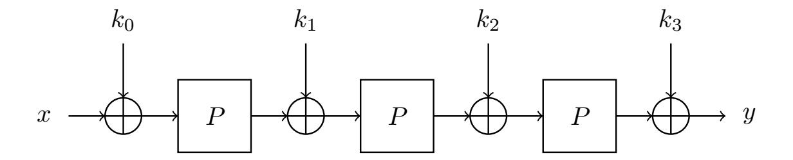
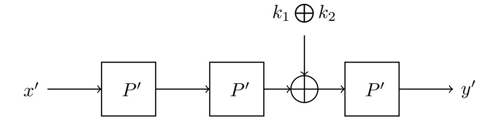
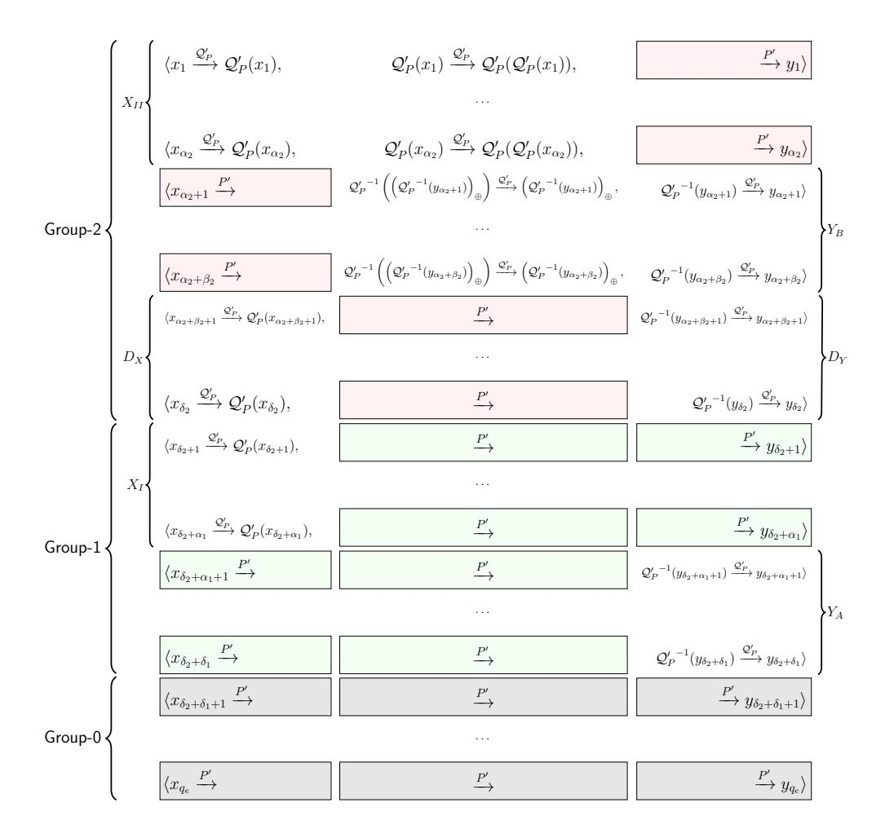

{0}------------------------------------------------

# Tight Security Analysis of 3-Round Key-Alternating Cipher with A Single Permutation

Yusai Wu\* , Liqing Yu\* , Zhenfu Cao\*†‡() , and Xiaolei Dong\*

\* Shanghai Key Laboratory of Trustworthy Computing, East China Normal University, Shanghai, China {yusaiwu,lqyups}@126.com, {zfcao,dong-xl}@sei.ecnu.edu.cn †Cyberspace Security Research Center, Peng Cheng Laboratory, Shenzhen, China ‡Shanghai Institute of Intelligent Science and Technology, Tongji University, China

#### Abstract

The tight security bound of the Key-Alternating Cipher (KAC) construction whose round permutations are independent from each other has been well studied. Then a natural question is how the security bound will change when we use fewer permutations in a KAC construction. In CRYPTO 2014, Chen et al. proved that 2-round KAC with a single permutation (2KACSP) has the same security level as the classic one (i.e., 2-round KAC). But we still know little about the security bound of incompletely-independent KAC constructions with more than 2 rounds. In this paper,we will show that a similar result also holds for 3-round case. More concretely, we prove that 3-round KAC with a single permutation (3KACSP) is secure up to Θ(2 <sup>3</sup><sup>n</sup> <sup>4</sup> ) queries, which also caps the security of 3-round KAC. To avoid the cumbersome graphical illustration used in Chen et al.'s work, a new representation is introduced to characterize the underlying combinatorial problem. Benefited from it, we can handle the knotty dependence in a modular way, and also show a plausible way to study the security of rKACSP. Technically, we abstract a type of problems capturing the intrinsic randomness of rKACSP construction, and then propose a high-level framework to handle such problems. Furthermore, our proof techniques show some evidence that for any r, rKACSP has the same security level as the classic r-round KAC in random permutation model.

Keywords: KAC, KACSP, Dependence, Provable Security, Indistinguishability, Random Permutation Model

# Contents

| 1                                           |     | Introduction                               | 1 |
|---------------------------------------------|-----|--------------------------------------------|---|
| 2<br>Preliminaries                          |     |                                            |   |
|                                             | 2.1 | Basic Notations                            | 4 |
|                                             | 2.2 | Indistinguishability Framework<br>         | 4 |
|                                             | 2.3 | The H-Coefficient Method                   | 5 |
|                                             | 2.4 | A Useful Lemma<br>                         | 6 |
| 3<br>The Main Result and New Representation |     |                                            | 6 |
|                                             | 3.1 | 3-Round KAC with A Single Permutation<br>  | 6 |
|                                             | 3.2 | Statement of the Result and Discussion<br> | 6 |
|                                             | 3.3 | New Representation<br>                     | 7 |

{1}------------------------------------------------

| 4 |     | Proof of Theorem 1                           | 10 |
|---|-----|----------------------------------------------|----|
|   | 4.1 | Transcripts and p(τ )<br>                    | 11 |
|   |     | 4.1.1<br>A Conceptual Transformation         | 11 |
|   |     | 4.1.2<br>Illustration of p(τ<br>)<br>0       | 12 |
|   |     | 4.1.3<br>Intuition on Good Transcripts       | 14 |
|   | 4.2 | Two Technical Lemmas<br>                     | 15 |
|   | 4.3 | Concluding the Proof of Theorem 1            | 16 |
|   |     |                                              |    |
| 5 |     | A Type of Combinatorial Problem              | 16 |
|   | 5.1 | Counting Framework                           | 16 |
|   | 5.2 | The Key Subproblem in 2KACSP                 | 17 |
|   | 5.3 | The Key Subproblem in 3KACSP                 | 21 |
|   |     |                                              |    |
| 6 |     | Proof of Lemma 3                             | 26 |
|   | 6.1 | Subproblem Related to E2<br>                 | 27 |
|   | 6.2 | Subproblem Related to E11<br>                | 27 |
|   |     | 6.2.1<br>Modeling the Problem                | 28 |
|   |     | Constructing Cores<br>6.2.2                  | 28 |
|   |     | Counting Cores<br>6.2.3                      | 28 |
|   |     | 6.2.4<br>Obtaining the Lower Bound           | 30 |
|   |     | Extra Discussion About RoC (W )<br>6.2.5<br> | 32 |
|   | 6.3 | Subproblem Related to E12<br>                | 32 |
|   |     | 6.3.1<br>Modeling the Problem                | 32 |
|   |     | Constructing Cores<br>6.3.2                  | 33 |
|   |     | Counting Cores<br>6.3.3                      | 33 |
|   |     | 6.3.4<br>Obtaining the Lower Bound           | 35 |
|   | 6.4 | Subproblem Related to E0<br>                 | 36 |
|   |     | 6.4.1<br>Modeling the Problem                | 36 |
|   |     | Constructing Cores<br>6.4.2                  | 37 |
|   |     | Counting Cores<br>6.4.3                      | 38 |
|   |     | 6.4.4<br>Obtaining the Lower Bound           | 43 |
|   | 6.5 | Concluding the Proof of Lemma 3<br>          | 45 |
|   |     |                                              |    |
| 7 |     | Proof of Lemma 4                             | 45 |
| 8 |     | Conclusion and Discussion                    | 47 |
|   |     | References                                   | 48 |
| A |     | Summary of Notations                         | 51 |
| B |     | Proof of Lemma 9                             | 52 |
|   |     |                                              |    |
| C |     | Omitted Calculation in Section 6.4.4.        | 56 |
|   | C.1 | The Lower Bound of (85)<br>                  | 56 |
|   | C.2 | The Lower Bound of Minor Terms<br>           | 57 |
|   | C.3 | The Lower Bound of Major Term                | 58 |
|   |     |                                              |    |
| D |     | Proof of Lemma 10                            | 60 |

{2}------------------------------------------------

### <span id="page-2-0"></span>1 Introduction

For a practical secret key cipher, people definitely want to know the exact security it provides. Cryptanalysis and provable-security analysis try to answer this question from two opposite directions, respectively. Specifically, cryptanalysis tries to show the practical "upper bound" of security by finding an attack as efficient as possible. Since there is no prior knowledge showing where the destination is, it is very hard to judge whether a more efficient attack exists. On the contrary, provable-security analysis can give a "lower bound" of the security from a theoretical perspective. In other words, provable-security analysis often aims to interpret the intrinsic security of a cryptographic construction (of a secret key cipher) in an abstract level. Generally, the construction of a practical cipher will be abstracted into a reasonable model with certain assumptions (e.g., the underlying primitives are random functions/permutations and independent from each other). Under those assumptions, we try to prove that the abstract construction is immune to all (known or unknown) attacks executed by an adversary with specific abilities. Then the provable-security results provide some heuristic support for the underlying design-criteria of the cipher, since the practical underlying primitives do not satisfy the assumptions in general.

As aforementioned, the provable-security results are closely related to the abstract assumptions. If the assumptions are closer to the actual implementations, then the corresponding results will be more persuasive. For example, most of the existing work reduces the security of SPN block ciphers to the classic KAC construction (see Eq.(2)), in which the underlying round permutations as well as the round keys are random and independent from each other. Unfortunately, most KAC-based practical ciphers use the same round function and generate the round keys from a shorter master-key (i.e., the underlying round permutations and round keys are not independent from each other at all). Thus, there is still a big gap between the existing provable-security results and the practical ciphers.

Opposite to the KAC construction with independent round permutations and round keys (i.e., the classic KAC construction), we refer to the one whose round permutations or round keys are not independent from each other as incompletely-independent KAC or KAC with dependence. It is well known that r-round KAC is  $\Theta(2^{\frac{r}{r+1}n})$ -secure in the random permutation model[CS14, HT16]. To characterize the actual SPN block ciphers, we should abstract a natural KAC construction (with dependence) satisfying two requirements: all the round permutations are same and the round keys are generated from a shorter master-key by a certain deterministic algorithm. Hence, the ultimate question is whether there exists such a r-round incompletely-independent KAC construction which can still achieve  $\Theta(2^{\frac{r}{r+1}n})$ -security. In other words, we want to know whether the required randomness of KAC construction can be minimized without a significant loss of security.

Up to now, people know little about the incompletely-independent KAC constructions (even with very small number of rounds), since it becomes much more complicated when either the underlying round permutations or round keys are no longer independent. To our knowledge, the best work about the KAC with dependence was given by Chen et al.[CLL+18]. They proved that several types of 2-round KAC with dependence have almost the same security level as 2-round KAC construction. However, it is still open about the security of incompletely-independent KAC with more than 2 rounds in provable-security setting.

In this paper, we initiate the study on the incompletely-independent KAC with more than 2 rounds. Here, we mainly focus on a special class of KAC, in which all the round permutations are the same and the round keys are still independent from each other, and refer to it as KACSP construction. Given a permutation  $P: \{0,1\}^n \to \{0,1\}^n$ , as well as r+1 round keys  $k_0, \ldots, k_r$ , the r-round KACSP construction  $rKACSP[P; k_0, \ldots, k_r]$  maps a message  $x \in \{0,1\}^n$  to

<span id="page-2-1"></span>
$$k_r \oplus P(k_{r-1} \oplus P(\cdots P(x \oplus k_0) \cdots)).$$
 (1)

Before turning into the results, we review the related existing work on classic KAC and KAC with dependence, respectively.

RESULTS ON CLASSIC KAC. KAC construction is the generalization of the Even-Mansour construction [EM97] over multiple rounds. As one of the most popular ways to construct a practical cipher, the KAC construction captures the high-level structure of many SPN block ciphers, such as AES [DR02],

{3}------------------------------------------------

PRESENT [BKL<sup>+</sup>07], LED [GPPR11] and so on. Thus there exist a number of papers aiming to investigate the security of this construction [EM97, BKL<sup>+</sup>12, DKS12, LPS12, Ste12, ABD<sup>+</sup>13, CLL<sup>+</sup>14, CS14, CS15, HT16, DSST17, CLL<sup>+</sup>18]. Given r permutations  $P_1, \ldots, P_r$ :  $\{0,1\}^n \to \{0,1\}^n$ , as well as r+1 round keys  $k_0, \ldots, k_r$ , the r-round KAC construction rKAC[ $P_1, \ldots, P_r$ ;  $k_0, \ldots, k_r$ ] maps a message  $x \in \{0,1\}^n$  to

<span id="page-3-0"></span> $k_r \oplus P_r \Big( k_{r-1} \oplus P_{r-1} \Big( \cdots P_1 (x \oplus k_0) \cdots \Big) \Big).$  (2)

In the random permutation model, it was proved by Even and Mansour [EM97] that an adversary needs roughly  $2^{\frac{n}{2}}$  queries to distinguish the 1-round KAC construction from a true random permutation. Their bound was matched by a distinguishing attack [Dae91] which needs about  $2^{\frac{n}{2}}$  queries in total. Many years later, Bogdanov et al. [BKL+12] proved that r-round KAC is secure up to  $2^{\frac{2n}{3}}$  queries and the result is tight for r=2. Besides, they also conjectured that the security for r-round KAC should be  $2^{\frac{rn}{r+1}}$  because of a simple generic attack. After that, Steinberger [Ste12] improved the bound to  $2^{\frac{3n}{4}}$  queries for  $r \geq 3$  by modifying the way to upper bound the statistical distance between two product distributions. In the same year, Lampe et al. [LPS12] used coupling techniques to show that  $2^{\frac{rn}{r+1}}$  queries and  $2^{\frac{rn}{r+2}}$  queries are needed for any nonadaptive and any adaptive adversary, respectively. The first asymptotically tight bound was proved by Chen et al. [CS14] through an elegant path-counting lemma. Recently, Hoang and Tessaro [HT16] refined the H-coefficient technique (named as the expectation method) and gave the first exact bound of KAC construction. At this point, the security bound of the classic KAC construction is solved perfectly.

RESULTS ON KAC WITH DEPENDENCE. The development in the field of incompletely-independent KAC is much slower, since it usually becomes very involved when the underlying components are no longer independent from each other. Dunkelman et al. [DKS12] initiated the study of minimizing 1-round KAC construction, and showed that several strictly simpler variants provide the same level of security. After that, the best work was given by Chen et al. [CLL+14, CLL+18] in CRYPTO 2014. They proved that several types of incompletely-independent 2-round KAC have almost the same security level as the classic one. The result even holds when only a single permutation and a n-bit master-key are used, where n is the length of a plaintext/ciphertext. In their work, a generalized sum-capture theorem<sup>1</sup> is used to upper bound the probability of bad transcripts. And the probability calculation related to good transcripts is reduced to a combinatorial problem. Using the similar techniques, Cogliati and Seurin [CS18] obtained the security bound of the single-permutation encrypted Davies-Meyer construction. Nevertheless, their work is still limited in the scope of 2-round constructions.

Recently, Dai et al. [DSST17] proved that the 5-round KAC with a non-idealized key-schedule is indifferentiable from an ideal cipher. The model employed in their work is however orthogonal to ours and hence the result is not directly comparable.

<u>DIFFICULTIES.</u> The security analysis of rKACSP is far more complicated than the classic KAC construction, since it intrinsically is an optimization problem. That is, we should fully utilize the randomness of the single random permutation P as much as possible. Obviously, it requires us to understand the underlying combinatorial problem very well. And from the formal proof, we will see that it is a very huge challenge to design the assignments of P which should balance all the related subproblems simultaneously.

<u>Our Contributions</u>. In this paper, we initiate the study on the incompletely-independent KAC with more than 2 rounds and give a tight security bound of 3KACSP construction. Our contributions are conceptually novel and mainly two-fold:

1. We prove the tight security bound  $\Theta(2^{\frac{3n}{4}})$  queries of 3KACSP, which is an open problem (proposed in [CLL<sup>+</sup>18]) for incompletely-independent KAC with more than 2 rounds. That is, we can use

$$\mu(A) = \max_{\substack{U,V \subseteq \mathbb{Z}_2^n \\ |U| = |V| = q}} |\{(a,u,v) \in A \times U \times V : a = u \oplus v\}|$$

is close to the expected value  $q^3/N$ . In the extended version of [CLL<sup>+</sup>18], the set A can be produced by a set of query-answer pairs, and an automorphism transformation is also allowed.

<span id="page-3-1"></span><sup>&</sup>lt;sup>1</sup>Informally, the type of sum-capture theorems state that when choosing a random subset A of  $\mathbb{Z}_2^n$  of size q, the value

{4}------------------------------------------------

only one instead of three distinct permutations to construct 3-round KAC without a significant loss of security. Notably, our proof framework is general and theoretically workable for any rKACSP. Following the ideas of analyzing 3KACSP, we strongly believe that rKACSP is also  $\Theta(2^{\frac{r}{r+1}n})$ -secure in random permutation model, provided that the input/output size n is sufficiently large.

2. We develop a lot of general techniques to handle the dependence. Firstly, a new representation (see Section 3.3) is introduced to circumvent the cumbersome graphical illustration used in [CLL+18]. Benefited from it, we can handle the underlying combinatorial problem in a natural and intuitive way. Secondly, we abstract a type of combinatorial problems (i.e., Problem 1) capturing the intrinsic randomness of rKACSP, and also propose a high-level framework (see Section 5.1) to solve such problems. To instantiate the framework, we introduce some useful notions such as Core, target-path, shared-edge, and so on (see Section 3.3). Combining with the methods for constructing multiple shared-edges, we solve successfully the key problem in 3KACSP (see Section 5.3). At last, we also develop some new tricks (see Section 6) which are crucial in analyzing rKACSP ( $r \ge 3$ ). Such tricks are not needed in 2KACSP, since it is relatively simple and does not have much dependence to handle.

It is rather surprising that the randomness of a single random permutation can provide such high level of security. From our proof, we can know an important reason is that, the information obtained by adversary is actually not so much. For instance, assume that n is big enough and an adversary can make  $\Theta(2^{\frac{3n}{4}})$  queries to the random permutation, then the ratio of known points (i.e., roughly  $2^{-\frac{n}{4}}$ ) is still very small. Furthermore, our work means a lot more than simply from 2 to 3, and we now show something new compared to Chen et al.'s work.

- 1. It is the first time to convert the analysis of rKACSP into a type of combinatorial problems, thus we can study the higher-round constructions in a modular way. To solve such problems, we propose a general counting framework, and also successfully instantiate it for a 3-round case which is much more involved than the 2-round cases.
- 2. An important discovery is that we can adapt the tricks used in 2KACSP to solve the corresponding subproblems in 3KACSP, by designing proper assigning-strategy and RoCs(Range of Candidates, see Notation 5). We believe that the similar properties also hold in the analysis of general rKACSP.
- 3. A very big challenge in  $r\text{KACSP}(r \geq 3)$  is to combine all the subproblems together into a desired bound. We do not need to consider that problem in the case of 2KACSP, since there is only one 2-round case in it. As a result, we develop some useful techniques to handle the dependence between the subproblems. Particularly, the key-points as shown at the beginning of Section 6 are also essential in  $r\text{KACSP}(r \geq 4)$ .

Combining all above findings together, we point out that a plausible way to analyze rKACSP is by induction, and what's left is only to solve a single r-round case of Problem 1. That is, we actually reduce an extremely complex (maybe intractable) problem into a single combinatorial problem, which can be solved by our framework theoretically. From the view of induction, Chen et al. [CLL+18] proved the basis step, while we have done largely the non-trivial work of the inductive step. Besides the conceptually important results, the new notions and ideas used in our proof are rather general and not limited in the rKACSP setting. We hope that they can be applied to analyze more different cryptographic constructions with dependence.

Other Related Work. The security of KAC construction in the random permutation model is very closely related to the security of XC (Xor Cascades) construction in the ideal cipher model. Gaži [Gaz13] and Gaži et al. [GLS+15] showed a relatively slack relationship through an adversarial reduction and Markov's Inequality. Based on the point-wise proximity of the KAC construction, Hoang and Tessaro [HT16] gave a much tighter transcript-centric reduction. In addition, they also pointed out that if the point-wise proximity of (incompletely-independent) KAC construction is non-decreasing and superadditive, then we can also establish the point-wise proximity for its corresponding XC construction in multi-user setting.

Plain cascades (PC) is another one of the most efficient ways for blockcipher key-length extension. Both of PC and XC have received a lot of attention till now [KR01, BR06, GM09, GT12, Gaz13, Lee13,

{5}------------------------------------------------

DS14, GLS<sup>+</sup>15, MS15, HT16, HT17]. Particularly, Minaud and Seurin [MS15] considered the security of cascading a block cipher with the same key (i.e., the multiple encipher keys are not independent from each other) in a block-box way. In a sense, it can also be viewed as a cryptographic construction with dependence.

READING GUIDE. We start in Section 2 by setting the basic notations, giving the necessary background on the H-coefficient technique, and showing some helpful lemmas. In Section 3, we state the main result of this paper and introduce the new representation used throughout the paper. After that, the main result is proved in Section 4 where we also illustrate the underlying combinatorial problem and give two technical lemmas. The core part is Section 5, where we propose the general framework and also show the high-level technical routes to handle the key subproblems in 3KACSP. Completing all the technical specifics, Section 6 and Section 7 prove the aforementioned two technical lemmas, respectively. At last, we conclude and give some extra discussion in Section 8.

# <span id="page-5-0"></span>2 Preliminaries

### <span id="page-5-1"></span>2.1 Basic Notations

In this paper, we use capital letters such as  $A, B, \ldots$  to denote sets. If A is a finite set, then |A| denotes the cardinality of A, and  $\overline{A}$  denotes the complement of A in the universal set (which will be clear from the context). Specially, we use  $A \sqcup B$  denote the disjoint union of two disjoint sets A and B. For a finite set S, we let  $x \leftarrow_{\$} S$  denote the uniform sampling from S and assigning the value to x. Let A and B be two sets such that |A| = |B|, then we denote  $Bjt(A \to B)$  as the set of all bijections from A to B. If g and h are two well-defined bijections, then let  $g \circ h(x) = h(g(x))$ . Fix an integer  $n \ge 1$ , let  $N = 2^n$ ,  $I_n = \{0,1\}^n$ , and  $\mathcal{P}_n$  be the set of all permutations on  $\{0,1\}^n$ , respectively. If two integers s, t satisfy  $1 \le s \le t$ , then we will write  $(t)_s = t(t-1) \cdots (t-s+1)$  and  $(t)_0 = 1$  by convention.

Given  $Q = \{(x_1, y_1), \dots, (x_q, y_q)\}$ , where the  $x_i$ 's (resp.  $y_i$ 's) are pairwise distinct n-bit strings, as well as a permutation  $P \in \mathcal{P}_n$ , we say that the permutation P extends the set Q, denoting  $P \vdash Q$ , if  $P(x_i) = y_i$  for  $i = 1, \dots, q$ . Let  $X = \{x \in I_n : (x, y) \in Q\}$  and  $Y = \{y \in I_n : (x, y) \in Q\}$ . We call X and Y respectively the domain and range of the set Q.

**Definition 1** ( $\mathcal{Q}'$  is strongly-disjoint with  $\mathcal{Q}$ ). Let  $\mathcal{Q} = \{(x_1, y_1), \dots, (x_m, y_m)\}$  and  $\mathcal{Q}' = \{(x'_1, y'_1), \dots, (x'_n, y'_n)\}$ . We denote X, Y, X', Y' as the domains and ranges of  $\mathcal{Q}$  and  $\mathcal{Q}'$ , respectively. Then we say that  $\mathcal{Q}'$  is strongly-disjoint with  $\mathcal{Q}$  if  $X \cap X' = \emptyset$  and  $Y \cap Y' = \emptyset$ , and denote it as  $\mathcal{Q}' \perp \mathcal{Q}$ .

We will often use the following simple fact: given  $\mathcal{Q}$  of size q and  $\mathcal{Q}'$  of size q' whose respective domains X and X' and respective ranges Y and Y'. If  $\mathcal{Q}' \perp \mathcal{Q}$ , then it has

<span id="page-5-3"></span>
$$\Pr[P \leftarrow_{\$} \mathcal{P}_n : P \vdash \mathcal{Q}' | P \vdash \mathcal{Q}] = \frac{1}{(N-q)_{q'}}.$$
 (3)

### <span id="page-5-2"></span>2.2 Indistinguishability Framework

We will focus on the provable-security analysis of block ciphers in random permutation model, which allows the adversary to get access to the underlying primitives of the block ciphers. Consider the rKACSP construction (see Eq.(1)), a distinguisher  $\mathcal{D}$  can interact with a set of 2 permutation oracles on n bits that we denote as  $(P_O, P_I)$ . There are two worlds in terms of the instantiations of the 2 permutation oracles. If P is a random permutation and the round keys  $\mathbf{K} = (k_0, \ldots, k_r)$  are randomly chosen from  $I_{(r+1)n}$ , we refer to (rKACSP $[P; \mathbf{K}], P)$  as the "real" world. If E is a random permutation independent from P, we refer to (E, P) as the "ideal" world. We usually refer to the first permutation  $P_O$  (instantiated by PKACSP $[P; \mathbf{K}]$  or E) as the outer permutation, and to permutation  $P_I$  (instantiated by P) as the inner permutation. Given a certain number of the queries to the 2 permutation oracles, the distinguisher  $\mathcal{D}$  should distinguish whether the "real" world or the "ideal" world it is interacting with. The distinguisher  $\mathcal{D}$  is adaptive such that it can query both sides of each permutation oracle, and also can choose the next query based on the query results it received. There is no computational limit on the distinguisher, thus we can assume wlog that the distinguisher is deterministic (with a priori query which maximizes its

{6}------------------------------------------------

advantage) and never makes redundant queries (which means that it never repeats a query, nor makes a query  $P_i(x)$  for  $i \in \{I, O\}$ , if it receives x as an answer of a previous query  $P_i^{-1}(y)$ , or vice-versa).

The distinguishing advantage of the adversary  $\mathcal{D}$  is defined as

<span id="page-6-1"></span>
$$Adv(\mathcal{D}) = \left| \Pr[\mathcal{D}^{r\text{KACSP}[P;\mathbf{K}],P} = 1] - \Pr[\mathcal{D}^{E,P} = 1] \right|, \tag{4}$$

where the first probability is taken over the random choice of P and K, and the second probability is taken over the random choice of P and E.  $\mathcal{D}^{(\cdot)}$  denotes that  $\mathcal{D}$  can make both forward and backward queries to each permutation oracle according to the random permutation model described before.

For non-negative integers  $q_e$  and  $q_p$ , we define the insecurity of rKACSP against any adaptive distinguisher (even with unbounded computational source) who can make at most  $q_e$  queries to the outer permutation oracle (i.e.,  $P_O$ ) and  $q_p$  queries to the inner permutation oracle (i.e.,  $P_I$ ) as

$$Adv_{r\text{KACSP}}^{cca}(q_e, q_p) = \max_{\mathcal{D}} Adv(\mathcal{D}),$$
 (5)

where the maximum is taken over all distinguishers  $\mathcal{D}$  making exactly  $q_e$  queries to the outer permutation oracle and  $q_p$  queries to the inner permutation oracle.

### <span id="page-6-0"></span>2.3 The H-Coefficient Method

H-coefficient method [Pat08, CS14] is a powerful framework to upper bound the advantage of  $\mathcal{D}$  and has been used to prove a number of results. We record all interactions between the adaptive distinguisher  $\mathcal{D}$  and the oracles as an ordered list of queries which is also called a transcript. Each query in a transcript has the form of (i, b, z, z'), where  $i \in \{I, O\}$  represents which permutation oracle being queried, b is a bit indicating whether this is a forward or backward query, z is the value queried and z' is the corresponding answer. For a fixed distinguisher  $\mathcal{D}$ , a transcript is called attainable if exists a tuple of permutations  $(P_O, P_I) \in \mathcal{P}_n^2$  such that the interactions among  $\mathcal{D}$  and  $(P_O, P_I)$  yield the transcript. Recall that the distinguisher  $\mathcal{D}$  is deterministic and makes no redundant queries, thus we can convert a transcript into 2 following lists of directionless queries without loss of information

$$Q_E = \{(x_1, y_1), \dots, (x_{q_e}, y_{q_e})\},$$
  
$$Q_P = \{(u_1, v_1), \dots, (u_{q_n}, v_{q_n})\}.$$

We can reconstruct the transcript exactly through the 2 lists, since  $\mathcal{D}$  is deterministic and each of its next action is determined by the previous oracle answers (which can be known from those lists) it has received. A formal characterization of distinguisher can be found in [Mau02]. As a side note, the 2 lists contain implicitly the description of the deterministic distinguisher/algorithm  $\mathcal{D}$ . Therefore, the above two representations of an attainable transcript are equivalent with regard to a fixed deterministic distinguisher  $\mathcal{D}$ . Based on Eq.(4), our goal is to know the values of the two probabilities. It can be verified that the first probability (i.e., the one related to the "real" world) is only determined by the number of coins which can produce the above 2 directionless lists, and the probability is irrelevant to the order of each query in the original transcript. Thus, it seems that the adaptivity of  $\mathcal{D}$  is "dropped" (More details can be found in [CS14]). Through this conceptual transition, upper bounding the advantage of  $\mathcal{D}$  is often reduced to certain probability problems. That is why the H-coefficient method works well in lots of provable-security problems, especially for an information-theoretic and adaptive adversary.

As what [CS14, CLL+18] did, we will also be generous with the distinguisher  $\mathcal{D}$  by giving it the actual key  $K = (k_0, \ldots, k_r)$  when it is interacting with the "real" world or a dummy key  $K \leftarrow_{\$} I_{(r+1)n}$  when it is interacting with the "ideal" world at the end of its interaction. This treatment is reasonable since it will only increase the advantage of  $\mathcal{D}$ . Hence, a transcript  $\tau$  we consider actually is a tuple  $(\mathcal{Q}_E, \mathcal{Q}_P, K)$ . We refer to  $\hat{\tau} = (\mathcal{Q}_E, \mathcal{Q}_P)$  as the permutation transcript of  $\tau$  and say that a transcript  $\tau$  is attainable if its corresponding permutation transcript  $\hat{\tau}$  is attainable. Let  $\mathcal{T}$  denote the set of attainable transcripts. We denote  $T_{re}$ , resp.  $T_{id}$ , as the probability distribution of the transcript  $\tau$  induced by the "real" world, resp. the "ideal" world. It should be pointed out that the two probability distributions depend on the distinguisher  $\mathcal{D}$ , since its description is embedded in the conversion between the aforementioned two representations. And we also use the same notation to denote the random variable distributed according to each distribution.

{7}------------------------------------------------

The H-coefficient method has lots of variants. In this paper, we will employ the standard "good versus bad" paradigm. More concretely, the set of attainable transcripts  $\mathcal{T}$  is partitioned into a set of "good" transcripts  $\mathcal{T}_1$  such that the probability to obtain some  $\tau \in \mathcal{T}_1$  are close in the "real" world and in the "ideal" world, and a set of "bad" transcripts  $\mathcal{T}_2$  such that the probability to obtain any  $\tau \in \mathcal{T}_2$  is small in the "ideal" world. Finally, a well-known H-coefficient-type lemma is given as follows.

<span id="page-7-6"></span>**Lemma 1** (Lemma 1 of [CLL<sup>+</sup>18]). Fix a distinguisher  $\mathcal{D}$ . Let  $\mathcal{T} = \mathcal{T}_1 \sqcup \mathcal{T}_2$  be a partition of the set of attainable transcripts. Assume that there exists  $\varepsilon_1$  such that for any  $\tau \in \mathcal{T}_1$ , one has

$$\frac{\Pr[T_{re} = \tau]}{\Pr[T_{id} = \tau]} \ge 1 - \varepsilon_1,$$

and that there exists  $\varepsilon_2$  such that  $\Pr[T_{id} \in \mathcal{T}_2] \leq \varepsilon_2$ . Then  $Adv(\mathcal{D}) \leq \varepsilon_1 + \varepsilon_2$ .

### <span id="page-7-0"></span>2.4 A Useful Lemma

<span id="page-7-5"></span>**Lemma 2** (3KACSP version, Lemma 2 of [CLL<sup>+</sup>18]). Let  $\tau = (\mathcal{Q}_E, \mathcal{Q}_P, \mathbf{K} = (k_0, k_1, k_2, k_3)) \in \mathcal{T}$  be an attainable transcript. Let  $p(\tau) = \Pr[P \leftarrow_{\$} \mathcal{P}_n : 3KACSP[P; \mathbf{K}] \vdash \mathcal{Q}_E \mid P \vdash \mathcal{Q}_P]$ . Then

$$\frac{\Pr[T_{re} = \tau]}{\Pr[T_{id} = \tau]} = (N)_{q_e} \cdot p(\tau).$$

Following Lemma 2, it is reduced to lower-bounding  $p(\tau)$  if we want to determine the value of  $\varepsilon_1$  in Lemma 1. In brief,  $p(\tau)$  is the probability that  $3KACSP[P; \mathbf{K}]$  extends  $\mathcal{Q}_E$  when P is a random permutation extending  $\mathcal{Q}_P$ .

# <span id="page-7-1"></span>3 The Main Result and New Representation

### <span id="page-7-2"></span>3.1 3-Round KAC with A Single Permutation

Let n be a positive integer, and let  $P: I_n \to I_n$  be a permutation on  $I_n$ . On input  $x \in I_n$  and round keys  $\mathbf{K} = (k_0, k_1, k_2, k_3) \in I_{4n}$ , the block cipher 3KACSP returns  $y = P(P(P(x \oplus k_0) \oplus k_1) \oplus k_2) \oplus k_3$ . See Fig.1 for an illustration of the construction of 3KACSP.

<span id="page-7-7"></span>

Figure 1: Illustration of 3KACSP

### <span id="page-7-3"></span>3.2 Statement of the Result and Discussion

Since 3KACSP is a special case of 3-round KAC construction, its security is also capped by a distinguishing attack with  $O(2^{\frac{3n}{4}})$  queries. We will show that the bound is tight by establishing the following theorem, which gives an asymptotical security bound of 3KACSP. Following the main theorem, we also give some comments. The proof of Theorem 1 can be found in Section 4, where we also illustrate the underlying combinatorial problem and give two technical lemmas.

<span id="page-7-4"></span>**Theorem 1** (Security Bound of 3KACSP). Consider the 3KACSP construction, in which the underlying round permutation P is uniformly random sampled from  $\mathcal{P}_n$  and the round keys  $\mathbf{K} = (k_0, k_1, k_2, k_3)$  are uniformly random sampled from  $I_{4n}$ . Assume that  $n \geq 32$  is sufficiently large,  $\frac{28(q_e)^2}{N} \leq q_p \leq \frac{q_e}{5}$  and  $2q_p + 5q_e \leq \frac{N}{2}$ , then for any  $6 \leq t \leq \frac{N^{1/2}}{8}$ , the following upper bound holds:

$$Adv_{3\text{KACSP}}^{cca}(q_e, q_p) \le 98t \cdot \left(\frac{q_e}{N^{3/4}}\right) + 10t^2 \cdot \left(\frac{q_e}{N}\right) + \zeta(q_e), \text{ where } \zeta(q_e) = \begin{cases} \frac{32}{t^2}, & \text{if } q_e \le \frac{t}{6}N^{1/2} \\ \frac{9N}{q_e^2}, & \text{if } q_e \ge \frac{7t}{6}N^{1/2} \end{cases}$$

{8}------------------------------------------------

OBTAINING A CONCRETE UPPER BOUND. Due to the special form of error term  $\zeta(q_e)$ , a single constant t cannot optimize the bound for all  $q_e$ 's simultaneously. The above result gives an upper bound for a range of  $q_e$ 's once t is chosen, thus different constants t will give different upper bounds for a fixed  $q_e$ . That is, for each  $q_e$ , we can make the error term  $\zeta(q_e)$  be arbitrarily small by choosing a proper t, as long as the n is big enough. In general, we prefer to choose a small t to obtain the bound, since the first two terms in it are proportional to t. As an explanatory example, we next will show how to choose the constant t, assume that the threshold value of  $\zeta(q_e)$  is set to 0.01.

Firstly, we should determine the range of  $q_e$ 's which are suitable for the minimum t=6. It is easy to verify that, for the range of big  $q_e \geq 30N^{1/2}$ , it must has  $\zeta(q_e) \leq 0.01$ , since  $\zeta(q_e) = \frac{9N}{q_e^2}$  for  $q_e \geq 7N^{1/2}$  (when setting t=6). But for a small  $q_e$  it needs a larger t, since we will use the function  $\zeta(q_e) = \frac{32}{t^2}$  to obtain a desired  $\zeta(q_e)$ . For simplicity, we can set t=60 for each  $q_e \leq 10N^{1/2}$ , because it has  $\zeta(q_e) = \frac{32}{60^2} < 0.01$ . Now what's left is to choose a proper t for covering the remain range of  $10N^{1/2} < q_e < 30N^{1/2}$ . Using again the function  $\zeta(q_e) = \frac{32}{t^2}$ , we can crudely set t=180, which implies that  $\zeta(q_e) = \frac{32}{180^2} < 0.001$  for all  $q_e \leq 30N^{1/2}$ . As a side note, a slightly better choice is to choose t=6c for  $q_e = cN^{1/2}$ , where 10 < c < 30.

From the above process, we obtain a concrete upper bound as follows.

$$Adv_{3\text{KACSP}}^{cca}(q_e, q_p) \le \begin{cases} 588 \left(\frac{q_e}{N^{3/4}}\right) + 360 \left(\frac{q_e}{N}\right) + 0.01, & \text{for } q_e \ge 30N^{1/2} \\ 17640 \left(\frac{q_e}{N^{3/4}}\right) + 324000 \left(\frac{q_e}{N}\right) + 0.001, & \text{for } 10N^{1/2} < q_e < 30N^{1/2} \\ 5880 \left(\frac{q_e}{N^{3/4}}\right) + 36000 \left(\frac{q_e}{N}\right) + 0.01, & \text{for } q_e \le 10N^{1/2} \end{cases}$$
(Set  $t = 60$ )

It is easy to see that t=6 is available for almost all of the  $q_e$ 's (i.e., except the fraction of  $\frac{30}{N^{1/2}}$ ). That is, the bound  $Adv \leq 588 \left(\frac{q_e}{N^{3/4}}\right) + 360 \left(\frac{q_e}{N}\right) + \frac{9N}{q_e^2}$  is suitable for almost  $q_e$ 's. We also stress here that Theorem 1 is an asymptotical result (for sufficiently large n) and we are not focusing on optimizing parameters. The point is that it actually shows that  $\Omega(N^{3/4})$  queries are needed to obtain a significant advantage against 3KACSP. Combining with the well-known matching attack, we conclude that the 3KACSP construction is  $\Theta(2^{\frac{3n}{4}})$ -secure.

From now on, we assume wlog that  $q_p, q_e \leq N^{3/4}$  since the bound is trivial otherwise. Thus, we will always use the fact that  $(\frac{q_e}{N^{3/4}})^m \leq \frac{q_e}{N^{3/4}}$  (where m is a positive integer) to simplify the results during our calculation.

DISCUSSION ABOUT THE RESULT. It should be pointed out that the deviation term  $\zeta(q_e)$  and the assumption on  $q_p$  in Theorem 1 are artifacts of our proof, and have no effect on the final result.

- 1. The  $\zeta(q_e)$  is simply caused by the inaccuracy of Chebyshev's Inequality (i.e., Lemma 7), rather than our proof methods nor the intrinsic flaws of 3KACSP. It is well-known that Chebyshev's Inequality is rather coarse and there must exist a more accurate tail-inequality (e.g., Chenoff Bound). The  $\zeta(q_e)$  and t will disappear, as long as a bit more accurate tail-inequality is applied during the computation of Eq.(95). That is, just by replacing with a better tail-inequality, our proof techniques actually can obtain a concrete bound such like  $Adv \leq 98\left(\frac{q_e}{N^{3/4}}\right) + 10\left(\frac{q_e}{N}\right)$ , i.e., t=1 and  $\zeta(q_e)=0$  in Theorem 1. But to our knowledge, there is no explicit expression of the moment generating function for a hypergeometric distribution, hence we now have no idea how to obtain a Chernoff-Type bound.
- 2. The assumption on  $q_e$  and  $q_p$  is determined by the assigning-strategy and all the RoCs (there are dozens in total) designed in the formal proof. It means that a better choice corresponds to a weaker assumption. Theoretically, there exist choices which can eliminate the assumption without changing our proof framework. However, optimizing such a choice is rather unrealistic, since it is extremely hard to find even one feasible solution (as provided in our formal proof).

In a word, our results and proof techniques are strongly enough to show that 3KACSP is  $\Theta(N^{3/4})$ -secure in random permutation model.

# <span id="page-8-0"></span>3.3 New Representation

In this subsection, we will propose a new representation which will be used throughout the paper. The representation improves our understanding of the underlying combinatorial problem, and is very helpful

{9}------------------------------------------------

to handle the dependence caused by the single permutation.

At first, we should give some intuition to prove the main result, and understand better the problem to be solved. Following Lemma 1, our task is reduced to upper-bound the values of  $\varepsilon_1$  and  $\varepsilon_2$ , respectively. In general, upper-bounding the value of  $\varepsilon_2$  will not be too hard, since the probability distribution in "ideal" world is simple. Determining  $\varepsilon_1$  is a tough task, and Lemma 2 shows that it is equivalent to lower-bounding the value of  $(N)_{q_e} \cdot p(\tau)$ , where the transcript  $\tau$  could be any "good" transcript. Thus, we should make clear what the value of  $p(\tau)$  means.

A GENERAL PROBABILITY MODEL. In fact,  $p(\tau)$  is simply a special case of a general probability model, whose formal definition is given as follows.

<span id="page-9-1"></span>**Definition 2** (A General Probability Model). Let  $\varphi[\cdot]: \mathcal{P}_n \to \mathcal{P}_n$  be a block-cipher construction invoking one permutation  $P \in \mathcal{P}_n$ . Fix an attainable transcript  $\tau = (\mathcal{Q}_E, \mathcal{Q}_P, \mathbf{K})$ , where  $\mathcal{Q}_E$  and  $\mathcal{Q}_P$  are the lists of directionless queries of the outer and inner permutation oracle, respectively. Then, for the fixed transcript  $\tau$ , what is the value of

$$\widetilde{p}(\tau) = \Pr[P \leftarrow_{\$} \mathcal{P}_n : \varphi[P] \vdash \mathcal{Q}_E \mid P \vdash \mathcal{Q}_P]. \tag{6}$$

It should be pointed out that the block-cipher construction  $\varphi[\cdot]$  only depends on the permutation P, since the distinguisher  $\mathcal{D}$  will get the key K used in the block-cipher after finishing all queries but before making a decision. Thus, the calculation of each value of  $\varphi[P](x)$  is totally determined by the permutation P. In addition, it should be clear that  $\varphi[P]$  is also a permutation after P is sampled. From the above statement, we can know that  $\widetilde{p}(\tau)$  is determined by the number of P's such that  $P \vdash \mathcal{Q}_P$  and makes  $\varphi[P](x_i) = y_i$  hold for each pair  $(x_i, y_i) \in \mathcal{Q}_E$ .

To understand above problem better, we can consider it in a more vivid way. Here we only give a tiny example, since it can be easily generalized to a complex one. Instantiate the  $\tilde{p}(\tau)$  as follows, let P denote a permutation on  $\mathcal{Z}_5 = \{0, 1, 2, 3, 4\}$  and  $\varphi[P] = P(P(x) \boxplus 1)$ , where  $\boxplus$  represents the modulo-5 addition, as well as  $\mathcal{Q}_E = \{(0, 2), (3, 0)\}$  and  $\mathcal{Q}_P = \{(1, 1)\}$ . We can view each element in  $\mathcal{Z}_5$  as a location, and the set  $\mathcal{Q}_E$  as  $|\mathcal{Q}_E|$  persons' source-destination pairs. Thus, we can imagine that one person named Alice is in location 0 now and she wants to go to the location 2, while the other person Bob in location 3 wants to go to the location 0. But their moving rules are fixed in advance by the construction  $\varphi[\cdot]$ , and what they can do is only to negotiate on the assignments of permutation P (whose one point has been fixed by  $\mathcal{Q}_P$ , i.e., P(1) = 1). Once all points of the permutation P are determined, then both of Alice and Bob will move two steps according to P and stop at a certain location. For example, Alice will reach the location P(0) after the first step. Before the second step, she will be forced to go to the location  $P(0) \boxplus 1$ , and after that P will again designate the location (i.e.,  $P(P(0) \boxplus 1)$ ) she finally moves to. Similarly, the movement of Bob follows the same rules except the source (i.e., location 3) is different. At last, we want to know how many different P's making both of Alice and Bob stop exactly at their destinations (i.e., location 2 and location 0), respectively.

NEW REPRESENTATION. Based on the above conceptual conversion, we introduce a new representation (similar to the terminology in graph theory) to characterize the  $\tilde{p}(\tau)$ . From our proof, it can be found that this new representation is natural to capture the intrinsic combinatorial problem, and the complicated graphical illustration used in [CLL<sup>+</sup>18] can also be avoided. Furthermore, it provides a relatively intuitive perspective to handle the knotty dependence, and also points out a plausible way to the general rKACSP case. More specifically, the new representation consists of several definitions.

<span id="page-9-0"></span>**Definition 3** (Directed-Edge). Let A denote a set and  $a, b \in A$ . If a permutation  $\Psi$  on A maps a to b, then we denote it as  $a \xrightarrow{\Psi} b$  and say that there is a  $\Psi$ -directed-edge (or simply directed-edge if  $\Psi$  is clear from the context) from a to b. We also use  $a \xrightarrow{\Psi} b$  to denote the ordered query-answer pair (a, b) of the permutation oracle  $\Psi$ . That is, if we make queries  $\Psi(a)$  (resp.  $\Psi^{-1}(b)$ ), then b (resp. a) will be the answer.

For a directed-edge  $\mathbf{a} \xrightarrow{\Psi} \mathbf{b}$ , we refer to  $\mathbf{a}$  as the **previous-point** of  $\mathbf{b}$  under  $\Psi$ , and to  $\mathbf{b}$  as the **next-point** of  $\mathbf{a}$  under  $\Psi$ , respectively. Naturally, the notation  $\mathbf{a} \xrightarrow{\Psi} \mathbf{means}$  that the next-point of  $\mathbf{a}$  under  $\Psi$  is undefined, and the notation  $\xrightarrow{\Psi} \mathbf{b}$  means that the previous-point of  $\mathbf{b}$  under  $\Psi$  is undefined.

{10}------------------------------------------------

Definition 3 aims to view the binary relation under a permutation as a set of directed-edges. Consider a permutation  $P \in \mathcal{P}_n$ , the list of directionless queries  $\mathcal{Q}_P = \{(u_1, v_1), \dots, (u_q, v_q)\}$  can be written as the set of P-directed-edges  $\{u_1 \xrightarrow{P} v_1, \dots, u_q \xrightarrow{P} v_q\}$ . From now on, we will not distinguish the two representations.

<span id="page-10-1"></span>**Definition 4** (Directed-Path and Core). Define the block-cipher construction  $\varphi[\cdot]: \mathcal{P}_n \to \mathcal{P}_n$ , the lists of directionless queries  $\mathcal{Q}_E$  and  $\mathcal{Q}_P$  as in Definition 2.

For a specific  $P \in \mathcal{P}_n$  and a string  $\mathbf{a} \in I_n$ , the steps related to P in the calculation of  $\varphi[P](\mathbf{a})$  can be denoted as a chain of P-directed-edges and has the form of  $\langle f(\mathbf{a}) \xrightarrow{P} \mathbf{a}_1, \ldots, \mathbf{a}_m \xrightarrow{P} g^{-1}(\varphi[P](\mathbf{a})) \rangle$ , where  $f(\cdot)$  and  $g(\cdot)$  are invertible operations before the first invocation of P and after the last invocation of P in the construction  $\varphi[\cdot]$ , respectively. We refer to such a chain as a  $(\mathbf{a}, \varphi[P](\mathbf{a}), \varphi[P])$ -directed-path, where  $\mathbf{a}$  and  $\varphi[P](\mathbf{a})$  are called as the source and destination of the directed-path, respectively. We may simply say a directed-path for convenience, if all things are clear from the context.

Let  $Q_E = \{(x_1, y_1), \dots, (x_q, y_q)\}$ , where  $x_i$ 's (resp.  $y_i$ 's) are pairwise distinct n-bit strings. We say a permutation  $P \in \mathcal{P}_n$  is  $\varphi[\cdot]$ -correct with respect to  $Q_E$ , if  $\varphi[P] \vdash Q_E$ . That is, the  $\varphi[P]$ -directed-path starting from  $x_i$  must end at  $y_i$  (i.e.,  $y_i = \varphi[P](x_i)$ ) for a correct permutation P, where  $i = 1, \dots, q$ . We refer to the set of P-directed-edges used in above q directed-paths as a  $\varphi[P]$ -Core with respect to  $Q_E$ , and denote it as  $\mathsf{Core}(\varphi[P] \vdash Q_E)$ . In addition, we use the notation  $\mathsf{Core}(\varphi[\cdot] \vdash Q_E)$  to denote a certain  $\varphi[P]$ -Core in general. And we may simply say a  $\mathsf{Core}$  for convenience, if  $\varphi[\cdot]$  and  $Q_E$  are clear from the context.

Definition 4 aims to highlight the steps related to P when calculating the value of  $\varphi[P](a)$ . In fact, the form of a directed-path is only determined by the construction  $\varphi[\cdot]$ .<sup>3</sup> That is, each  $((*,*),\varphi[P])$ -directed-path consists of m P-directed-edges, where m is the invoking number of P in the construction  $\varphi[\cdot]$ . Thus, we often use the notation  $\varphi[\cdot]$ -directed-path to denote a directed-path of the form in general. In addition, the calculation steps independent of P (e.g., the operations  $f(\cdot)$  and  $g(\cdot)$  in Def.4) are always omitted, since we only care about the assignments of P. Of course, those omitted steps can still be inferred from the directed-path since they are deterministic. For instance, the calculation of  $P(P(x) \boxplus 1) = y$  can be denoted as the directed-path  $\langle x \xrightarrow{P} P(x), P(x) \boxplus 1 \xrightarrow{P} y \rangle$ , in which the step from P(x) to  $P(x) \boxplus 1$  is omitted but can still be known from it. Next, we will give an explanatory example for the above definitions.

**Example 1.** Let P denote a permutation on  $\mathcal{Z}_5 = \{0, 1, 2, 3, 4\}$ , as well as  $\mathcal{Q}_E = \{(0, 4), (1, 0)\}$ ,  $\mathcal{Q}_P = \emptyset$  and  $\varphi[P](x) = P(P(x) \boxplus 1)$ , where  $\boxplus$  represents the modulo-5 addition.

Case 1: If  $P = \{0 \xrightarrow{P} 1, 1 \xrightarrow{P} 2, 2 \xrightarrow{P} 3, 3 \xrightarrow{P} 4, 4 \xrightarrow{P} 0\}$ , then all directed-paths constructed by  $\varphi[P]$  are  $\langle 0 \xrightarrow{P} 1, 2 \xrightarrow{P} 3 \rangle$ ,  $\langle 1 \xrightarrow{P} 2, 3 \xrightarrow{P} 4 \rangle$ ,  $\langle 2 \xrightarrow{P} 3, 4 \xrightarrow{P} 0 \rangle$ ,  $\langle 3 \xrightarrow{P} 4, 0 \xrightarrow{P} 1 \rangle$ , and  $\langle 4 \xrightarrow{P} 0, 1 \xrightarrow{P} 2 \rangle$ . That is, the permutation  $\varphi[P]$  maps 0 to 3, 1 to 4, 2 to 0, 3 to 1 and 4 to 2, respectively. Obviously, the P is not  $\varphi[\cdot]$ -correct with respect to  $Q_E$ , since the  $\varphi[P]$ -directed-path  $\langle 0 \xrightarrow{P} 1, 2 \xrightarrow{P} 3 \rangle$  leads 0 to 3 which is inconsistent with the source-destination pair  $(0,4) \in Q_E$ .

Case 2: If  $P = \{0 \xrightarrow{P} 2, 1 \xrightarrow{P} 1, 2 \xrightarrow{P} 0, 3 \xrightarrow{P} 4, 4 \xrightarrow{P} 3\}$ , then we have  $\varphi[P] \vdash \mathcal{Q}_E$  because the directed-paths  $\langle 0 \xrightarrow{P} 2, 3 \xrightarrow{P} 4 \rangle$  and  $\langle 1 \xrightarrow{P} 1, 2 \xrightarrow{P} 0 \rangle$  lead 0 to 4 and 1 to 0, respectively. Also, we can know that  $\mathsf{Core}(P) = \{0 \xrightarrow{P} 2, 1 \xrightarrow{P} 1, 2 \xrightarrow{P} 0, 3 \xrightarrow{P} 4\}$ , and thus  $|\mathsf{Core}(P)| = 4$ .

Case 3: If  $P = \{0 \xrightarrow{P} 3, 1 \xrightarrow{P} 0, 2 \xrightarrow{P} 1, 3 \xrightarrow{P} 2, 4 \xrightarrow{P} 4\}$ , then it is easily to verify that  $\varphi[P] \vdash \mathcal{Q}_E$ , as well as  $\mathsf{Core}(P) = \{0 \xrightarrow{P} 3, 1 \xrightarrow{P} 0, 4 \xrightarrow{P} 4\}$  and  $|\mathsf{Core}(P)| = 3$ .

Case 4: Similarly, if  $P = \{0 \xrightarrow{P} 0, 1 \xrightarrow{P} 4, 2 \xrightarrow{P} 1, 3 \xrightarrow{P} 2, 4 \xrightarrow{P} 3\}$ , then  $\varphi[P] \vdash \mathcal{Q}_E$ . Furthermore, it has  $\mathsf{Core}(P) = \{0 \xrightarrow{P} 0, 1 \xrightarrow{P} 4\}$  and  $|\mathsf{Core}(P)| = 2$ .

<u>Statement.</u> For convenience, we will simply use the terms edge and path instead of directed-edge and directed-path, respectively. In addition, if  $x_{\alpha}^{\beta}$  denotes the source of a path (where  $\alpha$  and  $\beta$  are some symbols), then the notation  $y_{\alpha}^{\beta}$  always denotes the corresponding destination of the path and vice-versa, and the correspondence can be easily inferred from the context.

<span id="page-10-0"></span><sup>&</sup>lt;sup>2</sup>In this paper,  $f(\cdot)$  and  $g(\cdot)$  are often the identity functions.

<span id="page-10-2"></span><sup>&</sup>lt;sup>3</sup>Recall that the adversary can obtain the keys after the querying phase in our proof setting.

{11}------------------------------------------------

We have known that a path can be used to denote a complete calculation given the construction, source and P. In fact, we often confront an incomplete path whose source and destination are fixed, provided that the permutation P is partially defined.<sup>4</sup> Namely, there are some edges missing in such a path. Particularly, we most interest in a special form of incomplete path which is called target-path.

<span id="page-11-4"></span>**Definition 5** (Target-Path). Assume that P is partially defined, then a  $((a,b),\varphi[P])$ -target-path is a  $\varphi[\cdot]$ -path in which all the inner-nodes are undefined while the source a and the destination b are fixed. Thus, a target-path always has the form of a

$$\langle \mathsf{a} \xrightarrow{P} , \xrightarrow{P} , \cdots , \xrightarrow{P} , \xrightarrow{P} \mathsf{b} \rangle.$$

In essence, the proof of main result is reduced to the task of completing a group of target-paths (i.e., Problem 1). That is why we refer to such type of paths as target-paths. In general, it is convenient to consider a group of (target-)paths having the same form. Then, the notion of *shared-edge* can also be introduced naturally.

<span id="page-11-3"></span>**Definition 6** (Group of Paths and Shared-Edge). Fix a permutation P, which can be partially defined. We call the paths  $((x_1, y_1), \varphi[P])$ -path, ...,  $((x_q, y_q), \varphi[P])$ -path as a group of  $\varphi[\cdot]$ -paths, and denote it as  $(Q_E, \varphi[P])$ -paths, where  $Q_E = \{(x_1, y_1), \ldots, (x_q, y_q)\}$  is the set of source-destination pairs. Also, we may simply use the notation  $Q_E$ -paths if  $\varphi[P]$  is clear from the context.

Similarly, we call the target-paths  $((a_1, b_1), \varphi[P])$ -target-path, ...,  $((a_q, b_q), \varphi[P])$ -target-path as a group of  $\varphi[\cdot]$ -target-paths, and denote it as  $(Q, \varphi[P])$ -target-paths, where  $Q = \{(a_1, b_1), \ldots, (a_q, b_q)\}$  is the set of source-destination pairs.

If an edge is used in at least 2 different paths, then we refer to it as a **shared-edge**.

From now on, we can use Definition 6 to denote a group of (target-)paths conveniently. And it should be pointed out that the *shared-edge* is a key primitive in our proof, though the concept is rather simple and natural. Moreover, the notion of *partial-P* will be useful, since *P* is often partially defined.

**Definition 7** (Partial-P and Partially-Sample). Let P be a permutation on  $I_n$ , and let A be a subset of  $I_n$ . Then we refer to the set of edges  $\{x_i \xrightarrow{P} P(x_i) : x_i \in A\}$  as the **partial-P** from A to P(A).

Let S and T be two sets of elements whose next-points and previous-points are undefined under P, respectively. If |S| = |T|, then we can sample randomly a bijection  $f \leftarrow_{\$} Bjt(S \to T)$  and define  $x \xrightarrow{P} f(x)$  for each  $x \in S$ . We refer to the above process as **sample partial-P randomly** from S to T, or P is partially-sampled randomly from S to T.

It should be pointed out that a partial-P is a subset of P, and also a set of P-edges. Now let's reconsider the sampling  $P \leftarrow_{\$} \mathcal{P}_n$  conditioned on  $P \vdash \mathcal{Q}_P$ , where  $\mathcal{Q}_P = \{u_1 \xrightarrow{P} v_1, \dots, u_q \xrightarrow{P} v_q\}$ . If we denote  $S = I_n \setminus \{u_1, \dots, u_q\}$  and  $T = I_n \setminus \{v_1, \dots, v_q\}$ , then the above sampling is equivalent to sample partial-P randomly from S to T. Furthermore, it is natural to view  $\mathcal{Q}_P$  as the priori information of P. That is, we can fix the q edges of  $\mathcal{Q}_P$  in advance, and then sample partial-P randomly from S to T.

### <span id="page-11-0"></span>4 Proof of Theorem 1

In this section, we will use the standard H-Coefficient method (i.e., Lemma 1) to prove our main result. That is, all attainable transcripts  $\mathcal{T}$  should be partitioned into two disjoint parts: a set of "good" transcripts denoted as  $\mathcal{T}_1$  and a set of "bad" transcripts denoted as  $\mathcal{T}_2$ . Determining the partition is often a subtle task, since it is intrinsically a trade-off between  $\varepsilon_1$  and  $\varepsilon_2$ . If we add more conditions on good transcripts to make they have better property (i.e., with smaller  $\varepsilon_1$ ), then the set of bad transcripts becomes larger accordingly (i.e.,  $\varepsilon_2$  becomes larger), or vice-versa.

Intuitively, the chance to obtain any  $\tau \in \mathcal{T}_1$  in "real" world should be very close to the chance in "ideal" world, and it should be very rare to obtain any  $\tau \in \mathcal{T}_2$  in the "ideal" world. For an attainable

<span id="page-11-1"></span><sup>4</sup>Informally, we say a permutation P is partially defined, if the correspondence of some points are undefined.

<span id="page-11-2"></span><sup>&</sup>lt;sup>5</sup>For simplicity, we assume here that the operations  $f(\cdot)$  and  $g(\cdot)$  in construction  $\varphi[\cdot]$  are both identity functions.

{12}------------------------------------------------

transcript  $\tau = (Q_E, Q_P, \mathbf{K} = (k_0, k_1, k_2, k_3))$ , we know that (from Lemma 2) the quotient of  $\Pr[T_{re} = \tau]$  and  $\Pr[T_{id} = \tau]$  is determined by the value of

$$p(\tau) = \Pr[P \leftarrow_{\$} \mathcal{P}_n : 3KACSP[P; \mathbf{K}] \vdash \mathcal{Q}_E \mid P \vdash \mathcal{Q}_P]. \tag{7}$$

That is, a transcript  $\tau$  is whether "good" or not, can be determined by the value of  $p(\tau)$ .

Therefore, we firstly illustrate the meaning of  $p(\tau)$  through our new representation, and then give the definition of "bad"/"good" transcripts. In fact, it is also a good example to show that the knotty dependence can be sorted out if we use a proper representation. At the end of this section, we will prove Theorem 1 directly by combining two technical lemmas together.

### <span id="page-12-0"></span>4.1 Transcripts and $p(\tau)$

In this subsection, we firstly expound the meaning of  $p(\tau)$  for a fixed transcript  $\tau$ . Based on that, the intuitive criteria for identifying "good" transcripts can be proposed. To reduce the complexity of notations, we now rewrite the  $p(\tau)$  into another equivalent form.

#### <span id="page-12-1"></span>4.1.1 A Conceptual Transformation

For an attainable transcript  $\tau = (\mathcal{Q}_E, \mathcal{Q}_P, \mathbf{K})$ , we modify the inner permutation P and its permutation transcript  $\hat{\tau} = (\mathcal{Q}_E, \mathcal{Q}_P)$  as follows:

$$P' = P \oplus k_1,$$

$$Q'_E = \{(x \oplus k_0, y \oplus k_1 \oplus k_3) : (x, y) \in \mathcal{Q}_E\},$$

$$Q'_P = \{(u, v \oplus k_1) : (u, v) \in \mathcal{Q}_P\}.$$

Let

$$X = \{x' \in I_n : (x', y') \in \mathcal{Q}'_E\}, \quad Y = \{y' \in I_n : (x', y') \in \mathcal{Q}'_E\},$$
  
$$U = \{u' \in I_n : (u', v') \in \mathcal{Q}'_P\}, \quad V = \{v' \in I_n : (u', v') \in \mathcal{Q}'_P\}$$

denote the domains and the ranges of  $\mathcal{Q}'_E$  and  $\mathcal{Q}'_P$ , respectively. Thus,  $|\mathcal{Q}_E| = |\mathcal{Q}'_E| = |X| = |Y| = q_e$ , and  $|\mathcal{Q}_P| = |\mathcal{Q}'_P| = |U| = |V| = q_p$ .

Accordingly, we also transform the 3KACSP construction into the 3KACSP' construction (as shown in Fig.2), i.e.,  $P' \circ P' \circ (\oplus k_1 \oplus k_2) \circ P'$ . The above modification is reasonable, since we show the actual key used in 3KACSP after the distinguisher  $\mathcal{D}$  finishing the query phase (i.e., after obtaining  $\mathcal{Q}_E$  and  $\mathcal{Q}_P$ ). Thus, it is simply a conceptual transformation and only the notations should be changed. That is, we can consider that the distinguisher  $\mathcal{D}$  is querying the outer permutation and inner permutation oracles instantiated by 3KACSP' and P', respectively. Then the resulting transcript is  $\tau' = (\mathcal{Q}'_E, \mathcal{Q}'_P, \mathbf{K})$ . From now on, we will not distinguish the transcripts  $\tau$  and  $\tau'$ , since they can transform from each other easily. Thus, we have

<span id="page-12-4"></span>
$$p(\tau) = p(\tau') = \Pr[P' \leftarrow_{\$} \mathcal{P}_n : 3KACSP'[P'; \mathbf{K}] \vdash \mathcal{Q}'_E | P' \vdash \mathcal{Q}'_P]. \tag{8}$$



<span id="page-12-3"></span>Figure 2: 3KACSP': A Conceptual Transformation of 3KACSP

<span id="page-12-2"></span>**Notation 1** (Abbreviation). Let A be a set of n-bit strings, and a be an element of A. From now on, we will abbreviate the expression  $a \oplus k_1 \oplus k_2$  as  $a_{\oplus}$  for convenience. Similarly, we also denote that  $A_{\oplus} = \{a_{\oplus} : a \in A\}$ .

{13}------------------------------------------------

### **4.1.2** Illustration of $p(\tau')$

In this subsection, we aim to show the underlying combinatorial problem of  $p(\tau')$  intuitively. Fix arbitrarily a transcript  $\tau' = (\mathcal{Q}'_E, \mathcal{Q}'_P, \mathbf{K})$ , the event  $3KACSP'[P'; \mathbf{K}] \vdash \mathcal{Q}'_E$  means that for each pair  $(x', y') \in \mathcal{Q}'_E$ , the 3KACSP'-path starting from x' ends exactly at y'. A complete 3KACSP'-path consists of 3P'-edges, and has the form of

$$\langle x' \xrightarrow{P'} *_1, *_1 \xrightarrow{P'} *_2, (*_2)_{\oplus} \xrightarrow{P'} y' \rangle,$$
 (9)

where  $*_1$  and  $*_2$  are the 2 *inner-nodes* should be assigned.

Before turning into the value of  $p(\tau')$ , we consider a simpler case that  $\mathcal{Q}'_P = \emptyset$  as first. Since no edge of the  $\mathcal{Q}'_E$ -paths has been fixed in advance, our task is simply to complete all the  $(\mathcal{Q}'_E, 3KACSP')$ -target-paths, by sampling P' uniformly random from  $\mathcal{P}_n$ . In fact, we will see that it is exactly the Problem 1 instantiated by  $\varphi[P'] = P' \circ P'_{\oplus} \circ P'$ ,  $\mathcal{Q}_1 = \mathcal{Q}'_E$ ,  $\mathcal{Q}_2 = \emptyset$ , and can be solved directly by a general framework<sup>6</sup>.

Unfortunately, it becomes much more complex when  $Q'_P \neq \emptyset$ , since some 3KACSP'-target-paths will be "damaged". More specifically, a path will turn into "some other construction"-target-path, when some edges in it are fixed by  $Q'_P$ . We now give some intuition about those paths. Assume that  $q_e$  and  $q_p$  are  $O(N^{3/4})$  and K is uniformly random sampled from  $I_{4n}$ , then there are at most 4 types of paths. On average, there are O(1) paths containing 3 fixed edges. Similarly, we know that there exist  $O(N^{1/4})$  (resp.  $O(N^{1/2})$ ) paths whose 2 edges (resp. 1 edge) are fixed in advance. And there are  $O(N^{3/4})$  paths containing no fixed edge (i.e., they are 3KACSP'-target-paths). It can be found that the circumstances are more involved than before, since the constructions of missing-edges are no longer uniform. In other words, there may exist several different constructions of target-paths to be completed. Thus, we should analyze each of the constructions and complete them in turns.

In fact, we judge a transcript  $\tau'$  is whether "good" or not, according to the  $\mathcal{Q}'_E$ -paths and the edges fixed by  $\mathcal{Q}'_P$ . Firstly, a transcript will be classified into the set of "bad" transcripts, if there exists some  $\mathcal{Q}'_E$ -path containing 3 fixed edges. Otherwise, we should further study the circumstances of paths and fixed edges determined by the transcript. More specifically, for such a transcript, we can classify the  $q_e$  paths between  $\mathcal{Q}'_E$  into three groups (see Fig.3 as an illustration) according to the number of fixed edges.



<span id="page-13-1"></span>Figure 3: Illustration of the Missing-Edges in  $\mathcal{Q}'_E$ -Paths

<span id="page-13-0"></span><sup>&</sup>lt;sup>6</sup>The framework and the technical route can be found in Section 5.1 and 5.3, respectively.

{14}------------------------------------------------

- ▶ Group-2. The paths containing 2 fixed edges belong to Group-2. More specifically, there are 3 subcases of such paths according to the position of fixed edges. Recall that U and V denote the domain and range of  $\mathcal{Q}'_P$ , respectively.
- Group-2.1: The paths whose first two edges are fixed. That is, Group-2.1 consists of the paths starting from the subset  $X_{II} \subset X$ , where

$$X_{II} \subset U \bigwedge \mathcal{Q}'_{P}(X_{II}) \subset U \bigwedge \left(\mathcal{Q}'_{P}(\mathcal{Q}'_{P}(X_{II}))\right)_{\oplus} \cap U = \emptyset$$
  
$$\iff \forall x \in X_{II}, \exists w_{1}, w_{2}, s.t. (x, w_{1}), (w_{1}, w_{2}) \in \mathcal{Q}'_{P} \wedge (w_{2})_{\oplus} \notin U.$$

- Group-2.2: The paths whose last two edges are fixed. That is, Group-2.2 consists of the paths ending at the subset  $Y_B \subset Y$ , where

$$Y_{B} \subset V \bigwedge \left( \mathcal{Q'}_{P}^{-1}(Y_{B}) \right)_{\oplus} \subset V \bigwedge \mathcal{Q'}_{P}^{-1} \left( \left( \mathcal{Q'}_{P}^{-1}(Y_{B}) \right)_{\oplus} \right) \cap V = \emptyset$$
  
$$\iff \forall y \in Y_{B}, \exists \ w_{1}, w_{2}, \ s.t. \ (w_{1}, w_{2}), \left( (w_{2})_{\oplus}, y \right) \in \mathcal{Q'}_{P} \land w_{1} \notin V.$$

- Group-2.3: The paths whose first and third edges are fixed. That is, Group-2.3 consists of the paths starting from the subset  $D_X \subset X$  to the corresponding  $D_Y = \mathcal{Q}'_E(D_X) \subset Y$ , where

$$D_X \subset U \bigwedge D_Y \subset V \bigwedge (\mathcal{Q}'_P(D_X)) \cap U = \emptyset \bigwedge ((\mathcal{Q}'_P)^{-1}(D_Y))_{\oplus} \cap V = \emptyset$$
  
$$\iff \forall x \in D_X, \exists w_1, w_2, s.t. (x, w_1), (w_2, \mathcal{Q}'_E(x)) \in \mathcal{Q}'_P \wedge w_1 \notin U \wedge (w_2)_{\oplus} \notin V.$$

<span id="page-14-1"></span>**Notation 2** (Group-2). We denote  $|X_{II}| = \alpha_2$ ,  $|Y_B| = \beta_2$ ,  $|D_X| = |D_Y| = \gamma_2$ , and  $\delta_2 = \alpha_2 + \beta_2 + \gamma_2$ . Thus, Group-2 contains  $\delta_2$  paths in total, where  $\alpha_2$  paths belong to Group-2.1,  $\beta_2$  paths belong to Group-2.2 and the other  $\gamma_2$  paths belong to Group-2.3. For convenience, we assume wlog that  $X_{II} = \{x_1, \ldots, x_{\alpha_2}\}$ ,  $Y_B = \{y_{\alpha_2+1}, \ldots, y_{\alpha_2+\beta_2}\}$ ,  $D_X = \{x_{\alpha_2+\beta_2+1}, \ldots, x_{\delta_2}\}$  and  $D_Y = \{y_{\alpha_2+\beta_2+1}, \ldots, y_{\delta_2}\}$ .

- ▶ Group-1. The paths containing 1 fixed edge belong to Group-1. More specifically, there are 2 subcases of such paths according to the position of fixed edge. Recall that U and V denote the domain and range of  $\mathcal{Q}'_P$ , respectively.
- Group-1.1: The paths whose first edge is fixed. That is, Group-1.1 consists of the paths starting from the subset  $X_I \subset X$ , where

$$X_I \subset U \bigwedge \mathcal{Q}'_P(X_I) \cap U = \emptyset$$
  
$$\iff \forall x \in X_I, \exists w_1, s.t. (x, w_1) \in \mathcal{Q}'_P \land w_1 \notin U.$$

- Group-1.2: The paths whose third edge is fixed. That is, Group-1.2 consists of the paths ending at the subset  $Y_A \subset Y$ , where

$$Y_A \subset V \bigwedge \left( \mathcal{Q'}_P^{-1}(Y_A) \right)_{\oplus} \cap V = \emptyset$$
  
$$\iff \forall y \in Y_A, \exists \ w_1, \ s.t. \ (w_1, y) \in \mathcal{Q'}_P \land (w_1)_{\oplus} \notin V.$$

<span id="page-14-2"></span>**Notation 3** (Group-1). We denote  $|X_I| = \alpha_1$ ,  $|Y_A| = \beta_1$  and  $\delta_1 = \alpha_1 + \beta_1$ . Namely, Group-1 contains  $\delta_1$  paths in total, where  $\alpha_1$  paths belong to Group-1.1 and the other  $\beta_1$  paths belong to Group-1.2. For convenience, we assume wlog that  $X_I = \{x_{\delta_2+1}, \ldots, x_{\delta_2+\alpha_1}\}$  and  $Y_A = \{y_{\delta_2+\alpha_1+1}, \ldots, y_{\delta_2+\delta_1}\}$ .

▶ **Group-0.** Each path belongs to Group-0 contains no fixed edge.

<span id="page-14-0"></span>**Notation 4** (Group-0). We denote  $\delta_0 = q_e - \delta_2 - \delta_1$ . Thus, Group-0 contains  $\delta_0$  paths in total. Let  $X_0$  and  $Y_0$  denote the sets of sources and destinations of Group-0, respectively. For convenience, we assume wlog that  $X_0 = \{x_i : \delta_2 + \delta_1 + 1 \le i \le q_e\}$  and  $Y_0 = \{y_i : \delta_2 + \delta_1 + 1 \le i \le q_e\}$ .

{15}------------------------------------------------

For a fixed transcript  $\tau'$ , its circumstances of  $\mathcal{Q}'_E$ -paths and fixed edges can be illustrated as Fig.3, where the missing-edges are the ones marked with a colored square. At this point, it is clear that  $p(\tau')$  (see Eq.(8)) represents the probability that, all missing-edges are filled by sampling P' uniformly random from the set of permutations extending  $\mathcal{Q}'_P$ . Furthermore, the above problem becomes more straightforward if we use the notion of target-path (see Def.5).

#### <span id="page-15-4"></span>**Definition 8** (Structure of Missing-Edges).

Let  $E_2$  denote the event that the  $\delta_2$  paths of Group-2 are completed (i.e., the  $\delta_2$  missing-edges in Group-2 are filled).

Let  $E_{11}$  denote the event that the  $(\mathcal{Q}'_{E_{11}}, \varphi_{11}[\cdot])$ -target-paths are completed (i.e., the  $2\alpha_1$  missing-edges in Group-1.1 are filled), where  $\mathcal{Q}'_{E_{11}} = \{(\mathcal{Q}'_P(x_i), \mathcal{Q}'_E(x_i)) : x_i \in X_I\}$  and  $\varphi_{11}[P'] = P'_{\oplus} \circ P'$ .

Let  $E_{12}$  denote the event that the  $(\mathcal{Q}'_{E_{12}}, \varphi_{12}[\cdot])$ -target-paths are completed (i.e., the  $2\beta_1$  missing-edges in Group-1.2 are filled), where  $\mathcal{Q}'_{E_{12}} = \{(\mathcal{Q}'_{E}^{-1}(y_i), \mathcal{Q}'_{P}^{-1}(y_i)) : y_i \in Y_A\}$  and  $\varphi_{12}[P'] = P' \circ P'_{\oplus}$ .

Let  $E_0$  denote the event that the  $(\mathcal{Q}'_{E_0}, \varphi_0[\cdot])$ -target-paths are completed (i.e., the  $3\delta_0$  missing-edges in Group-0 are filled), where  $\mathcal{Q}'_{E_0} = \{(x_i, y_i) : x_i \in X_0\}$  and  $\varphi_0[P'] = P' \circ P'_{\oplus} \circ P'$ .

Immediately, we can know that

<span id="page-15-3"></span>
$$p(\tau') = \Pr[P' \leftarrow_{\$} \mathcal{P}_n : E_2 \land E_{11} \land E_{12} \land E_0 | P' \vdash \mathcal{Q}_P']. \tag{10}$$

Obviously, lower-bounding the value of  $p(\tau')$  is reduced to several subproblems which can be applied directly with the counting framework (proposed in Section 5.1). For a "good" transcript, we can successfully obtain an appropriate lower bound for each subproblem.<sup>7</sup>

#### <span id="page-15-0"></span>4.1.3 Intuition on Good Transcripts

In this subsection, we aim to show intuitively what properties a "good" transcript should satisfy. From the formal proof, it will be seen that each attainable permutation transcript  $\hat{\tau}$  can be extended to a "good" transcript by adding a "good" key K. Thus, it is equivalent to study the properties of "good" keys for a fixed permutation transcript  $\hat{\tau}$ .

<span id="page-15-2"></span>**Definition 9** (Good Transcripts and Good Keys, Informal Version). Fix arbitrarily a permutation transcript  $\widehat{\tau} = (\mathcal{Q}_E, \mathcal{Q}_P)$ . If the extended transcript  $\tau' = (\mathcal{Q}_E', \mathcal{Q}_P', \mathbf{K})$  satisfies all the conditions (C.1)–(C.9), then we say the  $\tau = (\mathcal{Q}_E, \mathcal{Q}_P, \mathbf{K})$  is a "good" transcript and the  $\mathbf{K}$  is a "good" key for  $\widehat{\tau}$ . Otherwise, we say the  $\tau$  is a "bad" transcript and the  $\mathbf{K}$  is a "bad" key for  $\widehat{\tau}$ .

- (C.1) There is no  $Q'_E$ -path containing 3 fixed edges.
- (C.2) There are not too many  $Q'_E$ -paths belong to Group-2 or Group-1.
- (C.3) The missing-edges involved in  $E_2$  (i.e., the missing-edges in Group-2) have no conflict from each other.
- (C.4) When handling the target-paths of event  $E_{11}$ , there are not too many elements related to the sources and destinations having previous-points or next-points.
- (C.5) When handling the target-paths of event  $E_{11}$ , there are not too many sources equal to some value related to the destinations.
- (C.6) When handling the target-paths of event  $E_{12}$ , there are not too many elements related to the sources and destinations having previous-points or next-points.
- (C.7) When handling the target-paths of event  $E_{12}$ , there are not too many sources equal to some value related to the destinations.
- (C.8) When handling the target-paths of event  $E_0$ , there are not too many elements related to the sources and destinations having previous-points or next-points.

<span id="page-15-1"></span><sup>&</sup>lt;sup>7</sup>In fact, as shown in proof sketch of Lemma 3, we will handle each subproblem with an additional restriction.

{16}------------------------------------------------

(C.9) When handling the target-paths of event  $E_0$ , there are not too many sources equal to some value related to the destinations.

Definition 9 aims to give the intuition about the "good" keys for a permutation transcript. The rigorous definition needs a lot of new notations, and is deferred to the Definition 13. It should be pointed out that the conditions for "good" keys are not designed only for the "real" world. In fact, all discussion in Section 4.1 depends only on the relation between permutation transcript  $\hat{\tau}$  and K (which is dummy in the "ideal" world), and is irrelevant to which world we consider.

### <span id="page-16-0"></span>4.2 Two Technical Lemmas

In this subsection, we give two technical lemmas to upper-bound the values of  $\varepsilon_1$  and  $\varepsilon_2$  in Lemma 1, respectively. More specifically, Lemma 3 considers arbitrarily an attainable permutation transcript  $\widehat{\tau}$ , and lower-bounds the value of  $\Pr[T_{re} = (\widehat{\tau}, \mathbf{K})] / (\Pr[T_{id} = (\widehat{\tau}, \mathbf{K})]$  for any "good" key  $\mathbf{K}$ . This is the major task in our formal proof. And Lemma 4 upper-bounds the value of  $\Pr[\mathbf{K} \text{ is bad for } \widehat{\tau}]$  in "ideal" world, where  $\widehat{\tau}$  can be any attainable permutation transcript.

<span id="page-16-1"></span>**Lemma 3.** Consider the 3KACSP construction, and fix arbitrarily an attainable permutation transcript  $\widehat{\tau} = (\mathcal{Q}_E, \mathcal{Q}_P)$ , where  $|\mathcal{Q}_E| = q_e$  and  $|\mathcal{Q}_P| = q_p$ . Assume that  $n \geq 32$ ,  $6 \leq t \leq \frac{N^{1/2}}{8}$ ,  $\frac{28(q_e)^2}{N} \leq q_p \leq \frac{q_e}{5}$  and  $2q_p + 5q_e \leq \frac{N}{2}$ . Following the Definition 9 and Definition 13, if  $\mathbf{K}$  is a good key for  $\widehat{\tau}$ , then we have the bound

$$\frac{\Pr[T_{re} = (\widehat{\tau}, \boldsymbol{K})]}{\Pr[T_{id} = (\widehat{\tau}, \boldsymbol{K})]} \ge 1 - 97t \cdot \left(\frac{q_e}{N^{3/4}}\right) - 10t^2 \cdot \left(\frac{q_e}{N}\right) - \zeta(q_e).$$

OUTLINE OF THE PROOF. From Lemma 2 and the equation (10), we know that

$$\frac{\Pr[T_{re} = (\widehat{\tau}, \boldsymbol{K})]}{\Pr[T_{id} = (\widehat{\tau}, \boldsymbol{K})]} = (N)_{q_e} \cdot \Pr[P' \leftarrow_{\$} \mathcal{P}_n : E_2 \wedge E_{11} \wedge E_{12} \wedge E_0 | P' \vdash \mathcal{Q}_P'] 
\geq (N)_{q_e} \cdot \Pr[P' \leftarrow_{\$} \mathcal{P}_n : E_2 \wedge \widetilde{E}_{11} \wedge \widetilde{E}_{12} \wedge \widetilde{E}_0 | P' \vdash \mathcal{Q}_P'] 
= (N)_{q_e} 
\times \Pr[P' \leftarrow_{\$} \mathcal{P}_n : E_2 | P' \vdash \mathcal{Q}_P']$$
(11)

<span id="page-16-4"></span><span id="page-16-3"></span>
$$\times \Pr[P' \leftarrow_{\$} \mathcal{P}_n : \widetilde{E_{11}} | P' \vdash \mathcal{Q}_P' \land E_2] \tag{12}$$

<span id="page-16-6"></span>
$$\times \Pr[P' \leftarrow_{\$} \mathcal{P}_n : \widetilde{E_{12}} | P' \vdash \mathcal{Q}'_P \land E_2 \land \widetilde{E_{11}}]$$
(13)

<span id="page-16-5"></span>
$$\times \Pr[P' \leftarrow_{\$} \mathcal{P}_n : \widetilde{E_0} | P' \vdash \mathcal{Q}'_P \land E_2 \land \widetilde{E_{11}} \land \widetilde{E_{12}}], \tag{14}$$

where  $\widetilde{E_{11}}$  denotes the event  $E_{11} \bigwedge |\mathsf{Core}(\varphi_{11}[P'] \vdash \mathcal{Q}'_{E_{11}})| \geq (2 - \frac{1}{N^{1/4}})\alpha_1$ ,  $\widetilde{E_{12}}$  denotes the event  $E_{12} \bigwedge |\mathsf{Core}(\varphi_{12}[P'] \vdash \mathcal{Q}'_{E_{12}})| \geq (2 - \frac{1}{N^{1/4}})\beta_1$ , and  $\widetilde{E_0}$  denotes the event  $E_0 \bigwedge |\mathsf{Core}(\varphi_0[P'] \vdash \mathcal{Q}'_{E_0})| \geq (3 - \frac{2t}{N^{1/2}})\delta_0$ .

We will see that it is easy to calculate the value of (11) when K is a "good" key for  $\hat{\tau}$ . Hence what's left is to lower-bound the values of (12)–(14) for any "good" transcript, respectively. Intrinsically, the 3 probabilities belong to the same type of combinatorial problems (i.e., the Problem 1). That means we can view equations (12)–(14) as a 2-round, 2-round and 3-round instantiation of Problem 1, respectively. Interestingly, we find that the techniques used in [CLL+18] can be tailored to obtain desired values of the 2-round cases. Nonetheless, our 2-round cases are more involved and there are some new non-trivial tasks should be solved. Furthermore, the 3-round case is a whole new challenge, and is much more difficult than the 2-round ones. To handle it, we introduce a general framework in Section 5, where we also give the high-level technical route.

However, knowing how to solve (11)–(14) individually is still far from enough. It is a very big challenge to combine all the lower bounds together to obtain an appropriate result, since those subproblems affect each other by sharing the same resource of permutation P. There are numerous technical specifics should be handled, and we defer the formal proof of Lemma 3 to Section 6.

<span id="page-16-2"></span>**Lemma 4.** Consider the "ideal" world, and fix arbitrarily an attainable permutation transcript  $\widehat{\tau} = (\mathcal{Q}_E, \mathcal{Q}_P)$ , where  $|\mathcal{Q}_E| = q_e$  and  $|\mathcal{Q}_P| = q_p$ . Following the Definition 9 and Definition 13, if  $q_p \leq \frac{q_e}{5}$ , then it has

$$\Pr[\mathbf{K} \leftarrow_{\$} I_{4n} : \mathbf{K} \text{ is bad for } \widehat{\tau}] \leq 6 \cdot \left(\frac{q_e}{N^{3/4}}\right).$$

{17}------------------------------------------------

The formal proof of Lemma 4 can be found in Section 7.

### <span id="page-17-0"></span>4.3 Concluding the Proof of Theorem 1

At this point,we are ready to complete the proof of Theorem 1. It can be inferred that  $\varepsilon_1 = 97t \cdot \left(\frac{q_e}{N^{3/4}}\right) + 10t^2 \cdot \left(\frac{q_e}{N}\right) + \zeta(q_e)$  and  $\varepsilon_2 = 6 \cdot \left(\frac{q_e}{N^{3/4}}\right)$  from Lemma 3 and Lemma 4, respectively. Following the H coefficient method and Lemma 1, we finally obtain

$$Adv_{3\text{KACSP}}^{cca}(q_e, q_p) \leq \varepsilon_1 + \varepsilon_2$$

$$\leq 97t \cdot \left(\frac{q_e}{N^{3/4}}\right) + 10t^2 \cdot \left(\frac{q_e}{N}\right) + \zeta(q_e) + 6 \cdot \left(\frac{q_e}{N^{3/4}}\right)$$

$$\leq 98t \cdot \left(\frac{q_e}{N^{3/4}}\right) + 10t^2 \cdot \left(\frac{q_e}{N}\right) + \zeta(q_e),$$

<span id="page-17-1"></span>where we use the fact that  $t \geq 6$  for the last inequality.

# 5 A Type of Combinatorial Problem

It is known that the proof of Lemma 3 can be reduced to several subproblems having a similar form. In fact, the analysis of rKACSP can also be reduced to the same type of problems. That is a key perspective to simplify the task of studying the security of rKACSP.

In this section, we will only study how to solve such type of problems individually, while the tricks of balancing all the subproblems are deferred to the formal proof. More specifically, a general framework which can theoretically solve such problems is proposed.

First of all, the general definition of aforementioned problems is given as follows.

<span id="page-17-3"></span>**Problem 1** (Completing A Group of Target-Paths). Consider a group of  $(\mathcal{Q}_1, \varphi[\cdot])$ -target-paths, where  $\mathcal{Q}_1$  is the set of source-destination pairs. Let  $\mathcal{Q}_2$  denote the set of fixed edges, and it has  $\mathcal{Q}_1 \perp \mathcal{Q}_2$ . Then, how to lower-bound the value of

<span id="page-17-4"></span>
$$p = \Pr[P \leftarrow_{\$} \mathcal{P}_n : \varphi[P] \vdash \mathcal{Q}_1 | P \vdash \mathcal{Q}_2]. \tag{15}$$

It should be pointed out that each target-path in the group has the same construction, and hence the same number of missing-edges. This number of missing-edges is the principal character of Problem 1. In addition, we do not care about the specific values of the source-destination pairs in  $Q_1$ , as long as they satisfy some "good" properties and  $Q_1 \perp Q_2$ . More importantly, our work shows some evidence that, the problems with the same number of missing-edges can be solved by similar techniques.

We will propose a general framework to solve Problem 1 at first, and then give the technical routes to handling the specific problems. As a warm-up, we apply the new framework to analyze the key subproblem in 2KACSP. Compared to Chen et al's ad-hoc work, our techniques stand in a higher level and unearth something more intrinsic. Fortunately, the tricks used in 2KACSP can be adapted to solve the problems with 2 missing-edges. However, it becomes much more difficult when turning into the Problem 1 with 3 missing-edges. It turns out that out framework still works and this fact exactly shows the soundness of our techniques. In a very high level, our method is reduced to constructing a certain number of shared-edges by assigning inner-nodes.

**Statement.** For simplicity, we assume that all edges defined in this section are well-defined and compatible from each other.

### <span id="page-17-2"></span>5.1 Counting Framework

In this subsection, we will study how to handle the Problem 1 with at least 2 missing-edges, since the case of 1 missing-edge is trivial. More specifically, a counting framework will be proposed based on the notions of Core (see Definition 4) and shared-edge (see Definition 6). Before that, we will give some intuition about the framework.

{18}------------------------------------------------

INTUITION. Let U and V denote the domain and range of  $\mathcal{Q}_2$ , respectively. Then, the sets  $S = I_n \setminus U$  and  $T = I_n \setminus V$  denote the sets of the strings whose next-points and previous-point are undefined, respectively. In fact, we will only use the edges from S to T to complete all the target-paths. Namely, the Cores we construct must be strongly-disjoint with  $\mathcal{Q}_2$ . The reason why we can still construct enough Cores is that, the number of known edges (i.e.,  $|\mathcal{Q}_2|$ ) is relatively rather small. For example,  $|\mathcal{Q}_P| = O(N^{3/4})$  is far more smaller than N (i.e., roughly 1 out of  $N^{1/4}$ ) when n is big enough.

Let  $\mathcal{P}_C = \{P \in \mathcal{P}_n : \varphi[P] \vdash \mathcal{Q}_1 \land P \vdash \mathcal{Q}_2\}$  denote the set of all correct permutations extending  $\mathcal{Q}_2$ , and  $\mathcal{C} = \{\widetilde{C} : \widetilde{C} \perp \mathcal{Q}_2 \land \exists P \in \mathcal{P}_C \text{ s.t. } \widetilde{C} = \mathsf{Core}(\varphi[P] \vdash \mathcal{Q}_1)\}$  denote the set of all possible Cores strongly-disjoint with  $\mathcal{Q}_2$ . From the definition, we know that each correct permutation  $P \in \mathcal{P}_C$  must determine a  $\mathsf{Core}(\varphi[P] \vdash \mathcal{Q}_1)$ . On the other side, for a specific  $\widetilde{C} \in \mathcal{C}$ , there exist exactly  $(N - |\mathcal{Q}_2| - |\widetilde{C}|)!$  different correct permutations  $P \in \mathcal{P}_C$  such that  $\mathsf{Core}(\varphi[P] \vdash \mathcal{Q}_1) = \widetilde{C}$ . That is because such P must contain the  $|\mathcal{Q}_2|$  edges fixed in  $\mathcal{Q}_2$  and the  $|\widetilde{C}|$  edges fixed in  $\widetilde{C}$ , while the rest of edges can be defined freely. We can know that the above  $(|\mathcal{Q}_2| + |\widetilde{C}|)$  edges are distinct and have no conflict, since it has  $\widetilde{C} \perp \mathcal{Q}_2$ . Additionally, it is easy to know that the size of the sample space is equal to  $(N - |\mathcal{Q}_2|)!$ , thus we have

$$(15) = \frac{|\mathcal{P}_{C}|}{(N - |\mathcal{Q}_{2}|)!}$$

$$\geq \frac{\sum_{\widetilde{C} \in \mathcal{C}} \left| \left\{ P \in \mathcal{P}_{C} : \operatorname{Core}(\varphi[P] \vdash \mathcal{Q}_{1}) = \widetilde{C} \right\} \right|}{(N - |\mathcal{Q}_{2}|)!}$$

$$= \frac{\sum_{\widetilde{C} \in \mathcal{C}} (N - |\mathcal{Q}_{2}| - |\widetilde{C}|)!}{(N - |\mathcal{Q}_{2}|)!}$$

$$= \frac{\sum_{m} \sum_{\widetilde{C} \in \mathcal{C}: |\widetilde{C}| = m} (N - |\mathcal{Q}_{2}| - m)!}{(N - |\mathcal{Q}_{2}|)!}$$

$$= \sum_{m} \frac{\left| \left\{ \widetilde{C} \in \mathcal{C}: |\widetilde{C}| = m \right\} \right|}{(N - |\mathcal{Q}_{2}|)_{m}}.$$

$$(16)$$

<span id="page-18-1"></span>Intrinsically, we classify the correct permutations according to the cardinality of the corresponding Core. In fact, we only interest in the Cores strongly-disjoint with  $Q_2$ , since they are easier to be counted. From equation (16), it is known that the value of p can be lower-bounded, if we can count the number of Cores with a specific cardinality and also know how to sum all the related terms up.

THE COUNTING FRAMEWORK. Based on the above intuition, a 4-step counting framework is proposed in Fig.4. Roughly, the first 3 steps aim to lower-bound the number of Cores with a specific cardinality, and the last step will handle the calculation of a summation. As shown in Fig.4, our first task is to instantiate the Problem 1 with specific parameters (i.e., Step 1). Then, we should propose an appropriate assigning strategy for constructing a specific number of shared-edges, and hence obtain the Cores with the specific cardinality (i.e., Step 2). Also, we should count the number of possible assignments which can be constructed from the above strategy (i.e., Step 3). Thus, we actually establish a lower bound for the number of Cores with a specific cardinality. At last, we should calculate a summation to obtain the final result (i.e., Step 4).

#### <span id="page-18-0"></span>5.2 The Key Subproblem in 2KACSP

In this subsection, we revisit the key subproblem in 2KACSP through the counting framework. For brevity, we will only give the technical route and show how the counting framework works. At first, we abstract the key subproblem in 2KACSP as follows.

<span id="page-18-2"></span>**Problem 2** (A Problem with 2 Missing-Edges). Let  $\mathcal{Q}_E = \{(x_1, y_1), \dots, (x_q, y_q)\}$  be the set of source-destination pairs of  $\varphi_1[\cdot]$ -target-paths, and  $\mathcal{Q}_P = \{(u_1, v_1), \dots, (u_p, v_p)\}$  be the set of known edges, where  $\varphi_1[P] = P \circ P$  and  $\mathcal{Q}_P \perp \mathcal{Q}_E$ . Then, how to lower-bound the value of

<span id="page-18-3"></span>
$$p_1 = \Pr[P \leftarrow_{\$} \mathcal{P}_n : \varphi_1[P] \vdash \mathcal{Q}_E[P \vdash \mathcal{Q}_P]. \tag{17}$$

{19}------------------------------------------------

Step 1: Modeling the problem

Determine the group of target-paths

Determine the set of fixed edges

Step 2: Constructing Cores

Study the method(s) for constructing 1 shared-edge

Propose an assigning strategy for multiple shared-edges

Study the underlying samplings

Study the underlying samplings

Determine each range of candidates (RoC)

Use an appropriate tail inequality

Use an appropriate combinatorial inequality

<span id="page-19-0"></span>Figure 4: Illustration of the Counting Framework

MODELING THE PROBLEM. Following the counting framework in Fig.4, our first task is to make clear the group of target-paths (including the construction and source-destination pairs) and the set of fixed edges. Obviously, Problem 2 is exactly the Problem 1 instantiated by  $\varphi[\cdot] = \varphi_1[\cdot]$ ,  $Q_1 = Q_E$  and  $Q_2 = Q_P$ . We denote X and Y as the domain and range of  $Q_E$ , respectively. And let  $S = I_n \setminus \{u_1, \ldots, u_p\}$  and  $T = I_n \setminus \{v_1, \ldots, v_p\}$  denote the sets of strings whose next-points and previous-points are undefined, respectively. Then, it has |S| = |T| = N - p.

As shown in (18), there is only 1 inner-node (i.e.,  $*_i$ ) to be assigned in each  $(\mathcal{Q}_E, \varphi_1[\cdot])$ -target-path. Since a well-defined assignment of all the inner-nodes (i.e., the tuple of  $(*_1, \ldots, *_q)$ ) is equivalent to a  $\mathsf{Core}(\varphi_1[\cdot] \vdash \mathcal{Q}_E)$ , we will not distinguish them from now on. Moreover, we will count the number of assignments of all the inner-nodes, to lower-bound the value of (17).

<span id="page-19-1"></span>
$$(\mathcal{Q}_{E}, \varphi_{1}[\cdot])\text{-target-paths} \begin{cases} \langle x_{1} \xrightarrow{P} *_{1}, *_{1} \xrightarrow{P} y_{1} \rangle \\ \dots \\ \langle x_{q} \xrightarrow{P} *_{q}, *_{q} \xrightarrow{P} y_{q} \rangle \end{cases}$$

$$(18)$$

Constructing Cores. In essence, constructing Cores with a specific cardinality is equivalent to constructing a specific number of shared-edges. Our goal is to construct Cores with 2q - k edges, where k is a variable of positive integers. It means that k shared-edges (each of them is used exactly in 2 paths) should be constructed. Naturally, we will study the assigning method for constructing 1 such shared-edge at first, and then generalize it to k shared-edges. In addition, we also need to know how to construct the edges, which are used exclusively in only 1 target-path (i.e., the ones are not shared-edges).

<span id="page-19-2"></span>**Definition 10** (Exclusive-Element). We say an inner-node is assigned by an **exclusive-element**, if it not creates any new shared-edge at this moment. In this paper, we always use a notation related to w (e.g.,  $w_i$ ) to denote an exclusive-element.

Consider the  $(\mathcal{Q}_E, \varphi_1[\cdot])$ -target-paths in (18), we will only focus on the shared-edges involved exactly in 2 paths (i.e., each such shared-edge will save 1 edge). The *key property* we used is that, a shared-edge is established once an inner-node is assigned by an element from X or Y. Therefore, for constructing such a shared-edge, we choose a target-path at first, and then assign a proper value (i.e., from X or Y) to its inner-node. Then the chosen value from either X or Y determines the other target-path sharing an edge with the former one. To distinguish them, we refer to the later determined target-path as a negative-path (denoted as  $path^-$ ), since it is determined passively by the assigning. Accordingly, we call the former target-path as a positive-path (denoted as  $path^+$ ).

{20}------------------------------------------------

Next, we will further interpret the above process for 1 shared-edge, and then propose an assigning strategy for constructing k shared-edges. According to the position of shared-edge in  $path^-$ , there are 2 cases as follows.

- Case 1: Fix a target-path from x to y as the  $path^+$  at first. If we assign  $\ddot{x} \in X$  as its inner-node (i.e., the one with box), then the target-path from  $\ddot{x}$  to  $\ddot{y}$  becomes the corresponding  $path^-$  whose first edge (i.e., the bold one) is the shared-edge. That is, the inner-node (i.e., the one with underline) in the  $path^-$  must be assigned by y. As a result, we obtain a Type<sup>a</sup> sharing-gadget (as shown in (19)) containing 2 paths, 1 shared-edge and 0 exclusive-elements. And we refer to the 2 paths as a Type<sup>a</sup>- $path^+$  and a Type<sup>a</sup>- $path^-$ , respectively.

<span id="page-20-1"></span>
$$\operatorname{Type}^{a} \begin{cases} \langle x \xrightarrow{P} \boxed{\ddot{x}}, \ \ddot{\boldsymbol{x}} \xrightarrow{P} \boldsymbol{y} \rangle & (path^{+}) \\ \langle \ddot{\boldsymbol{x}} \xrightarrow{P} \underline{\boldsymbol{y}}, \ \ y \xrightarrow{P} \ddot{\boldsymbol{y}} \rangle & (path^{-}) \end{cases} \tag{19}$$

- Case 2: Fix a target-path from x to y as the  $path^+$  at first. If we assign  $\ddot{y} \in Y$  as its inner-node (i.e., the one with box), then the target-path from  $\ddot{x}$  to  $\ddot{y}$  becomes the corresponding  $path^-$  whose second edge (i.e., the bold one) is the shared-edge. That is, the inner-node (i.e., the one with underline) in the  $path^-$  must be assigned by x. As a result, we obtain a Type<sup>b</sup> sharing-gadget (as shown in (20)) containing 2 paths, 1 shared-edge and 0 exclusive-elements. And we refer to the 2 paths as a Type<sup>b</sup>- $path^+$  and a Type<sup>b</sup>- $path^-$ , respectively.

<span id="page-20-2"></span>
$$\operatorname{Type}^{b} \begin{cases} \langle \boldsymbol{x} \xrightarrow{\boldsymbol{P}} \left[ \boldsymbol{\ddot{y}} \right], \ \boldsymbol{\ddot{y}} \xrightarrow{P} y \rangle & (path^{+}) \\ \langle \boldsymbol{\ddot{x}} \xrightarrow{P} \underline{\boldsymbol{x}}, \quad \boldsymbol{x} \xrightarrow{\boldsymbol{P}} \boldsymbol{\ddot{y}} \rangle & (path^{-}) \end{cases}$$
(20)

At this point, we have known how to construct a shared-edge by assigning, and it can be naturally generalized to construct k shared-edges. The assigning strategy for constructing a Core with 2q - k edges is very simple and given in Fig.5. Obviously, the Step 1 establishes k shared-edges, and Step 2 produces no shared-edge. It should be pointed out that the k paths<sup>-</sup> are determined by the inner-nodes of paths<sup>+</sup>. That is, the k paths<sup>+</sup> with their inner-nodes totally determine the 2k paths involved in Step 1. As a side note, it also works if we choose a Type<sup>b</sup>-path<sup>-</sup> instead of Type<sup>a</sup>-path<sup>-</sup> for each path<sup>+</sup>.

### **Assigning Strategy:**

- -Step 1 Choose k proper target-paths as the  $paths^+$ , and then choose k proper elements from X as their inner-nodes, respectively. Namely, we choose a Type<sup>a</sup>- $path^-$  for each of the k  $paths^+$ .
- -Step 2 Assign in turn each undefined inner-node with an exclusive-element.

<span id="page-20-3"></span>Figure 5: Assigning Strategy for Constructing a  $\mathsf{Core}(\varphi_1[\cdot] \vdash \mathcal{Q}_E)$  with 2q - k Edges

<u>Counting Cores.</u> Intrinsically, the assigning strategy consists of several samplings such as the k  $paths^+$ , k  $paths^-$ , and so on. To lower-bound the number of Cores constructed by Fig.5, we should know how many elements can be chosen for each sampling. The notations will become rather cumbersome when we turn into the case of k shared-edges. For convenience, we use RoC (i.e., Notation 5) to denote the range of candidates of a sampling, and a compact notation (i.e., Notation 6) to denote a group of edges.

<span id="page-20-0"></span>**Notation 5** (Range of Candidates). Let A denote a finite set to be sampled, then we write RoC(A) as a set of elements which can be chosen into A.

<span id="page-20-4"></span>**Notation 6** (Group of Edges). The set or bijection to be sampled is marked with a superscript (i), which represents the sampling order. Let A and B be two sampled sets such that |A| = |B|, and f be a sampled bijection f from A to B. We use colored notation  $A^{(\cdot)} \xrightarrow{f^{(\cdot)}} B^{(\cdot)}$  to denote the |A| edges

{21}------------------------------------------------

 $\{a \xrightarrow{P} f(a) : a \in A\}$ , which are determined directly from the above 3 samplings. In addition, the black notation  $A \Longrightarrow B$  means that the edges from A to B, are determined indirectly by the samplings and the completeness of target-paths.

Using the above Notation 6, we can illustrate the underlying samplings in Fig. 5 as follows.

Part 1 
$$\begin{cases} \langle X_{1}^{(1)} \stackrel{f^{(3)}}{\Longrightarrow} \ddot{X}_{1}^{(2)}, \ \ddot{X}_{1} \Longrightarrow Y_{1} \rangle & (\mathbf{k} \text{ Type}^{a}\text{-}paths^{+}) \\ \langle \ddot{X}_{1} \Longrightarrow Y_{1}, \quad Y_{1} \Longrightarrow \ddot{Y}_{1} \rangle & (\mathbf{k} \text{ Type}^{a}\text{-}paths^{-}) \end{cases}$$
Part 2 
$$\begin{cases} \langle \hat{X} \stackrel{g^{(5)}}{\Longrightarrow} W^{(4)}, \quad W \Longrightarrow \hat{Y} \rangle, \text{ where } \hat{X} = X \setminus (X_{1} \sqcup \ddot{X}_{1}) & (\mathbf{q} - 2\mathbf{k} \text{ target-paths}) \end{cases}$$

<span id="page-21-0"></span>Figure 6: Illustration of Constructing a  $\mathsf{Core}(\varphi_1[\cdot] \vdash \mathcal{Q}_E)$  with 2q - k Edges

As shown in Fig.6, a Core with 2q - k edges can be obtained by 5 samplings. The first 3 samplings correspond to the Step 1 in Fig.5. Namely,  $X_1^{(1)} \xrightarrow{f^{(3)}} \ddot{X}_1^{(2)}$  actually determines the k paths<sup>+</sup> and each of their inner-nodes. From the discussion about Fig.5, we know that the k paths<sup>+</sup> with their inner-nodes totally determine the 2k paths in Part 1. Similarly, the last 2 samplings correspond to the Step 2 in Fig.5. Namely,  $\hat{X} \xrightarrow{g^{(5)}} W^{(4)}$  fixes each inner-node of the target-paths in Part 2. At last, the rest of edges (i.e., the black ones) are determined uniquely by the above 5 samplings and the completeness of target-paths. For clarity, we use a simple example of Part 1 to show how Notation 6 works.

**Example 2.** Assume that k = 3, and we choose that  $X_1 = \{x_1, x_2, x_3\}$ ,  $\ddot{X}_1 = \{\ddot{x}_1, \ddot{x}_2, \ddot{x}_3\}$ , as well as  $f(x_i) = \ddot{x}_{4-i}$ , where i = 1, 2, 3. Then, the 3  $paths^+$  and 3  $paths^-$  in Part 1 can be completed as follows.

$$\operatorname{Part} \ 1 \begin{cases} \langle x_1 \overset{P}{\longrightarrow} \ddot{x}_3, & \ddot{x}_3 \overset{P}{\longrightarrow} y_1 \rangle \\ \langle x_2 \overset{P}{\longrightarrow} \ddot{x}_2, & \ddot{x}_2 \overset{P}{\longrightarrow} y_2 \rangle \\ \langle x_3 \overset{P}{\longrightarrow} \ddot{x}_1, & \ddot{x}_1 \overset{P}{\longrightarrow} y_3 \rangle \\ \langle \ddot{x}_1 \overset{P}{\longrightarrow} y_3, & y_3 \overset{P}{\longrightarrow} \ddot{y}_3 \rangle \\ \langle \ddot{x}_2 \overset{P}{\longrightarrow} y_2, & y_2 \overset{P}{\longrightarrow} \ddot{y}_2 \rangle \\ \langle \ddot{x}_3 \overset{P}{\longrightarrow} y_1, & y_1 \overset{P}{\longrightarrow} \ddot{y}_3 \rangle \end{cases} \xrightarrow{\operatorname{An assignment}} \operatorname{Part} \ 1 \begin{cases} \langle X_1^{(1)} \overset{f^{(3)}}{\longrightarrow} \ddot{X}_1^{(2)}, & \ddot{X}_1 \Longrightarrow Y_1 \rangle \\ \langle \ddot{X}_1 & \Longrightarrow Y_1, & Y_1 \Longrightarrow \ddot{Y}_1 \rangle \end{cases}$$

That is, we determine directly the edges of  $X_1^{(1)} \stackrel{f^{(3)}}{\Longrightarrow} \ddot{X}_1^{(2)}$  once the  $X_1$ ,  $\ddot{X}_1$  and f are sampled. And then the edges of  $\ddot{X}_1 \Longrightarrow Y_1$  and  $Y_1 \Longrightarrow \ddot{Y}_1$  can also be determined uniquely by the completeness of the target-paths.

Now, we will give more details about the assigning implied in Fig.6, and analyze the restrictions on each RoC. We here only give the main restriction since it captures the essence, and only more minor specifics are needed in the formal proof.

- (1)  $\blacktriangleright$  Choose arbitrarily k distinct elements from  $RoC(X_1) \subset X$  as  $X_1$ . The main restriction on  $X_1$  is  $y_i \in S \cap T$  for all  $x_i \in X_1$ , since the next-points and previous-points of  $Y_1$  should be undefined. For convenience, we denote wlog that  $X_1 = \{x_1, \ldots, x_k\}$ .
- (2)  $\blacktriangleright$  Choose arbitrarily k distinct elements from  $RoC(\ddot{X}_1) \subset X \setminus X_1$  as  $\ddot{X}_1$ . The main restriction on  $\ddot{X}_1$  is  $x_i \in S \cap T$  for all  $x_i \in \ddot{X}_1$ , since the next-points and previous-points of  $\ddot{X}_1$  should be undefined. For convenience, we denote wlog that  $\ddot{X}_1 = \{\ddot{x}_1, \dots, \ddot{x}_k\}$ .
- (3)  $\blacktriangleright$  Choose arbitrarily a permutation f on  $\{1, \ldots, k\}$ .

Based on the chosen  $X_1$ ,  $\ddot{X}_1$  and f, we define firstly the k edges (i.e.,  $X_1^{(1)} \stackrel{f^{(3)}}{\Longrightarrow} \ddot{X}_1^{(2)}$ ) as  $x_i \stackrel{P}{\to} \ddot{x}_{f(i)}$ , where  $i = 1, \ldots, k$ . To complete the 2k target-paths in Part 1, we define the other 2k edges (i.e.,  $\ddot{X}_1 \Longrightarrow Y_1$  and  $Y_1 \Longrightarrow \ddot{Y}_1$ ) as  $\ddot{x}_{f(i)} \stackrel{P}{\to} y_i$  and  $y_i \stackrel{P}{\to} \ddot{y}_{f(i)}$ , where  $i = 1, \ldots, k$ .

{22}------------------------------------------------

- (4)  $\blacktriangleright$  Choose arbitrarily q-2k distinct elements from RoC(W) as W. The main restriction on W is  $W \subset (S \cap T) \setminus X \setminus Y$ , since the next-points and previous-points of W should be undefined, as well as all the elements in W are exclusive-elements. For convenience, we denote wlog that  $W = \{w_1, \ldots, w_{q-2k}\}$ .
- (5)  $\blacktriangleright$  Choose arbitrarily a permutation g on  $\{1, \ldots, q-2k\}$ .

Based on the chosen  $X_1$  and  $\ddot{X}_1$ , it has  $\hat{X} = X \setminus (X_1 \sqcup \ddot{X}_1)$  and we denote wlog that  $\hat{X} = \{\widehat{x}_1, \dots, \widehat{x}_{q-2k}\}$ . Based on the chosen W and g, we define firstly the q-2k edges (i.e.,  $\hat{X} \stackrel{g^{(5)}}{\Longrightarrow} W^{(4)}$ ) as  $\widehat{x}_j \stackrel{P}{\to} w_{g(j)}$ , where  $j=1,\dots,q-2k$ . To complete the q-2k target-paths in Part 2, the other q-2k edges (i.e.,  $W \Longrightarrow \widehat{Y}$ ) should be defined as  $w_{g(j)} \stackrel{P}{\to} \widehat{y}_j$ , where  $j=1,\dots,q-2k$ .

It is clear that each assignment obtained from the above procedure determines a  $Core(\varphi_1[\cdot] \vdash Q_E)$  with 2q - k edges. Thus, the number of assignments we can obtained from Fig.6, depends on each size of the chosen RoCs. That is, we have

$$\#\mathsf{Cores}_{2q-k} \ge \underbrace{\binom{|RoC(X_1)|}{k}}_{\text{number of (1)}} \cdot \underbrace{\binom{|RoC(\ddot{X}_1)|}{k}}_{\text{number of (2)}} \cdot \underbrace{\frac{k!}{q-2k}}_{\text{number of (3)}} \cdot \underbrace{\binom{|RoC(W)|}{q-2k}}_{\text{number of (4)}} \cdot \underbrace{\frac{(q-2k)!}{q-2k}}_{\text{number of (5)}} = \underbrace{\frac{(|RoC(X_1)|)_k \cdot (|RoC(\ddot{X}_1)|)_k \cdot (|RoC(W)|)_{q-2k}}{k!}}_{k!}, \tag{21}$$

where  $\#\mathsf{Cores}_{2q-k}$  denotes the number of  $\mathsf{Core}(\varphi_1[\cdot] \vdash \mathcal{Q}_E)$  with 2q - k edges.

OBTAINING THE LOWER BOUND. At this point, we are ready to calculate a lower bound of (17). Since |S| = |T| = N - p, and from the equations (16) and (21), we finally obtain that

$$p_{1} \geq \sum_{k} \frac{(|RoC(X_{1})|)_{k} \cdot (|RoC(X_{1})|)_{k} \cdot (|RoC(W)|)_{q-2k}}{k! \cdot (N-p)_{2q-k}}$$

$$\geq \sum_{0 \leq k \leq M} \frac{(|RoC(X_{1})|)_{k} \cdot (|RoC(X_{1})|)_{k} \cdot (|RoC(W)|)_{q-2k}}{k! \cdot (N-p)_{2q-k}}$$

$$= \sum_{0 \leq k \leq M} Hyp_{N,a,b}(k) \qquad \underbrace{\text{(Major Terms)}}_{\text{Use Lemma 6 to obtain a proper lower bound independent of } k}_{\text{Use Lemma 6 to obtain a proper lower bound independent of } k} \qquad \underbrace{\text{(Minor Terms)}}_{\text{Obtain directly a proper lower bound independent of } k}$$

where  $Hyp_{N,a,b}$  is a hypergeometric distribution random variable. As shown above, a tail inequality (i.e., Lemma 5) and a combinatorial inequality (i.e., Lemma 6) will be used during the calculation.

<span id="page-22-2"></span>**Lemma 5** (Markov's Inequality). Let X be a non-negative random variable and  $\lambda$  be a non-negative real number. Then

<span id="page-22-1"></span>
$$\Pr[X \ge \lambda] \le \frac{\mathbf{E}(X)}{\lambda}$$

<span id="page-22-3"></span>**Lemma 6** (Lemma 3 of [CLL<sup>+</sup>18]). Let N, a, b, c, d be positive integers such that c+d=2b and  $2a+2b \leq N$ . Then

$$\frac{(N)_a(N-2b)_a}{(N-c)_a(N-d)_a} \ge 1 - \frac{4ab^2}{N^2}.$$
 (22)

### <span id="page-22-0"></span>5.3 The Key Subproblem in 3KACSP

It is known that the proof of 3KACSP needs to handle 4 subproblems according to the 4 events in Definition 8, respectively. Interestingly, the subproblems related to  $E_{11}$  and  $E_{12}$  are the instantaitions of Problem 1 with 2 missing-edges, and can be solved by the techniques used in Section 5.2. Thus, the new challenge is to handle the subproblem related to event  $E_0$ . In this subsection, we aim to show the high-level technical route to handle the Problem 1 with 3 missing-edges, and the details are deferred to the formal proof (ref. Section 6.4). At first, we abstract the key subproblem related to  $E_0$  as follows.

{23}------------------------------------------------

<span id="page-23-0"></span>**Problem 3** (A Problem with 3 Missing-Edges). Let  $Q_E = \{(x_1, y_1), \dots, (x_q, y_q)\}$  be the set of source-destination pairs of  $\varphi_2[\cdot]$ -target-paths, and  $Q_P = \{(u_1, v_1), \dots, (u_p, v_p)\}$  be the set of known edges, where  $\varphi_2[P] = P \circ P_{\oplus} \circ P$  and  $Q_P \perp Q_E$ . Then, how to lower-bound the value of

<span id="page-23-2"></span><span id="page-23-1"></span>
$$p_2 = \Pr[P \leftarrow_{\$} \mathcal{P}_n : \varphi_2[P] \vdash \mathcal{Q}_E[P \vdash \mathcal{Q}_P]. \tag{23}$$

MODELING THE PROBLEM. Following the counting framework in Fig.4, our first task is also to make clear the group of target-paths (including the construction and source-destination pairs) and the set of fixed edges. Obviously, Problem 3 is exactly the Problem 1 instantiated by  $\varphi[\cdot] = \varphi_2[\cdot]$ ,  $Q_1 = Q_E$  and  $Q_2 = Q_P$ . We denote X and Y as the domain and range of  $Q_E$ , respectively. And let  $S = I_n \setminus \{u_1, \ldots, u_p\}$  and  $T = I_n \setminus \{v_1, \ldots, v_p\}$  denote the sets of strings whose next-points and previous-points are undefined, respectively. Then, it has |S| = |T| = N - p.

As shown in (24), there are 2 inner-nodes (i.e.,  $*_{i,1}$  and  $*_{i,2}$ ) to be assigned in each  $(\mathcal{Q}_E, \varphi_2[\cdot])$ -target-path. We refer to the 2 inner-nodes in such a target-path as  $1^{st}$ -inner-node and  $2^{nd}$ -inner-node, respectively. Since a well-defined assignment of all the inner-nodes (i.e., the tuple of  $(*_{1,1}, *_{1,2}, \ldots, *_{q,1}, *_{q,2})$ ) is equivalent to a  $\mathsf{Core}(\varphi_2[\cdot] \vdash \mathcal{Q}_E)$ , we will not distinguish them from now on. Moreover, we will count the number of assignments of all the inner-nodes, to lower-bound the value of (23).

$$(\mathcal{Q}_{E}, \varphi_{2}[\cdot])\text{-target-paths} \begin{cases} \langle x_{1} \xrightarrow{P} *_{1,1}, *_{1,1} \xrightarrow{P} *_{1,2}, (*_{1,2})_{\oplus} \xrightarrow{P} y_{1} \rangle \\ \dots \\ \langle x_{q} \xrightarrow{P} *_{q,1}, *_{q,1} \xrightarrow{P} *_{q,2}, (*_{q,2})_{\oplus} \xrightarrow{P} y_{q} \rangle \end{cases}$$

$$(24)$$

Constructing Cores. In essence, constructing Cores with a specific cardinality is equivalent to constructing a specific number of shared-edges. Our goal is to construct Cores with 3q - k - h edges, where k and h are variables of positive integers. It means that k + h shared-edges (each of them is used exactly in 2 paths) should be constructed. Naturally, we study 2 assigning methods for constructing such shared-edges at first, and then use them to save k edges and h edges, respectively. Similar to Section 5.2, we will also use the notion of exclusive-elements defined in Def.10.

Consider the  $(\mathcal{Q}_E, \varphi_2[\cdot])$ -target-paths in (24), we will only focus on the shared-edge involved exactly in 2 paths (i.e., each such shared-edge will save 1 edge). It is easy to verify that a shared-edge is established once a  $1^{st}$ -inner-node is assigned by an element from X or Y. Similarly, a shared-edge is also established once a  $2^{nd}$ -inner-node is assigned by an element from  $X_{\oplus}$  or Y. Therefore, for constructing a shared-edge, we choose a target-path at first, and then assign a proper value to its  $1^{st}$ -inner-node or  $2^{nd}$ -inner-node. In either case, the chosen value determines the other path sharing an edge with the former one. To distinguish them, we refer to the later determined target-path as a negative-path (denoted as  $path^-$ ), since it is determined passively by the assigning. Accordingly, we call the former path as a positive-path (denoted as  $path^+$ ).

Next, we will further interpret the above process. Since both of the 2 inner-nodes can be used to establish shared-edges, we discuss the 2 cases separately. At first, we will show how to construct shared-edges by assigning  $1^{st}$ -inner-nodes.

- ▶ 1<sup>st</sup>-Inner-Node. In fact, we will construct exactly 1 shared-edge for each  $path^+$ . That is, the  $2^{nd}$ -inner-node of a  $path^+$  must be assigned by an exclusive-element. According to the position of the shared-edge(s) in  $path^-$ , there are 3 cases as follows.
- Case 1: Fix a target-path from x to y as the  $path^+$  at first. If we assign  $\ddot{x} \in X$  as its  $1^{st}$ -inner-node (i.e., the one with box), then the target-path from  $\ddot{x}$  to  $\ddot{y}$  becomes the corresponding  $path^-$  whose first edge (i.e., the bold one) is the shared-edge. That is, the  $1^{st}$ -inner-node (i.e., the underline one) in  $path^-$  must be the same exclusive-element (i.e., w) as the  $2^{nd}$ -inner-node in  $path^+$ . Additionally, if  $\ddot{y}$  is not assigned to the  $1^{st}$  nor  $2^{nd}$  inner-node of any target-path, then we can assign an exclusive-element (i.e.,  $\widetilde{w}$ ) to the  $2^{nd}$ -inner-node of  $path^-$ . As a result, we obtain a Type<sup>1a</sup> sharing-gadget (as shown in (25)) containing 2 paths, 1 shared-edge and 2 exclusive-elements. And we refer to the 2 paths as a Type<sup>1a</sup>- $path^+$  and a Type<sup>1a</sup>- $path^-$ , respectively.

<span id="page-23-3"></span>Type<sup>1a</sup> 
$$\begin{cases} \langle x \xrightarrow{P} \boxed{\ddot{x}}, \ \ddot{\boldsymbol{x}} \xrightarrow{P} \boldsymbol{w}, \ w_{\oplus} \xrightarrow{P} y \rangle & (path^{+}) \\ \langle \ddot{\boldsymbol{x}} \xrightarrow{P} \underline{\boldsymbol{w}}, \ w \xrightarrow{P} \widetilde{w}, \ \widetilde{w}_{\oplus} \xrightarrow{P} \ddot{y} \rangle & (path^{-}) \end{cases}$$
(25)

{24}------------------------------------------------

- Case 2: Fix a target-path from x to y as the  $path^+$  at first. If we assign  $\ddot{y} \in Y$  as its  $1^{st}$ -inner-node (i.e., the one with box), then the target-path from  $\ddot{x}$  to  $\ddot{y}$  becomes the corresponding  $path^-$  whose third edge (i.e., the bold one) is the shared-edge. That is, the  $2^{nd}$ -inner-node (i.e., the underline one) in  $path^-$  must be assigned by  $x_{\oplus}$ . Additionally, if  $\ddot{x}$  is not assigned to the  $1^{st}$ -inner-node of any target-path, then we can assign an exclusive-element (i.e.,  $\widetilde{w}$ ) to the  $1^{st}$ -inner-node of  $path^-$ . As a result, we obtain a Type<sup>1b</sup> sharing-gadget (as shown in (26)) containing 2 paths, 1 shared-edge and 2 exclusive-elements. And we refer to the 2 paths as a Type<sup>1b</sup>- $path^+$  and a Type<sup>1b</sup>- $path^-$ , respectively.

<span id="page-24-0"></span>
$$\operatorname{Type}^{1b} \begin{cases} \langle \boldsymbol{x} \xrightarrow{\boldsymbol{P}} \left[ \boldsymbol{\ddot{y}} \right], \ \boldsymbol{\ddot{y}} \xrightarrow{P} \boldsymbol{w}, \ \boldsymbol{w}_{\oplus} \xrightarrow{P} \boldsymbol{y} \rangle & (path^{+}) \\ \langle \boldsymbol{\ddot{x}} \xrightarrow{P} \boldsymbol{\widetilde{w}}, \ \boldsymbol{\widetilde{w}} \xrightarrow{P} \boldsymbol{x}_{\oplus}, \ \boldsymbol{x} \xrightarrow{\boldsymbol{P}} \boldsymbol{\ddot{y}} \rangle & (path^{-}) \end{cases} \tag{26}$$

- Case 3: Interestingly, a  $path^-$  can share edges with 2 different  $paths^+$  simultaneously. Fix the target-path from  $x_1$  to  $y_1$  as  $path_1^+$ , and fix the target-path from  $x_2$  to  $y_2$  as  $path_2^+$ . If we assign  $\ddot{x}$  (resp.  $\ddot{y}$ ) as the  $1^{st}$ -inner-node of  $path_1^+$  (resp.  $path_2^+$ ) (i.e., the ones with box), then the target-path from  $\ddot{x}$  to  $\ddot{y}$  becomes the  $path^-$  of  $path_1^+$  and  $path_2^+$  simultaneously. That is, the  $1^{st}$ -inner-node in  $path^-$  must be assigned by  $(x_2)_{\oplus}$ . As a result, we obtain a Type<sup>1c</sup> sharing-gadget (as shown in (27)) containing 3 paths, 2 shared-edge and 2 exclusive-elements. And we refer to the 3 paths as a Type<sup>1c</sup>- $path_1^+$ , a Type<sup>1c</sup>- $path_2^+$  and a Type<sup>1c</sup>- $path_2^-$ , respectively.

$$\operatorname{Type}^{1c} \begin{cases}
\langle x_1 \xrightarrow{P} \boxed{\ddot{x}}, \ \ddot{\boldsymbol{x}} \xrightarrow{P} \boldsymbol{w}, & w_{\oplus} \xrightarrow{P} y_1 \rangle & (path_1^+) \\
\langle \boldsymbol{x_2} \xrightarrow{P} \boxed{\ddot{\boldsymbol{y}}}, \ \ddot{\boldsymbol{y}} \xrightarrow{P} \widetilde{\boldsymbol{w}}, & \widetilde{w_{\oplus}} \xrightarrow{P} y_2 \rangle & (path_2^+) \\
\langle \ddot{\boldsymbol{x}} \xrightarrow{P} \underline{\boldsymbol{w}}, & w \xrightarrow{P} (x_2)_{\oplus}, \ \boldsymbol{x_2} \xrightarrow{P} \ddot{\boldsymbol{y}} \rangle & (path^-)
\end{cases} \tag{27}$$

At this point, we have known how to construct a shared-edge for a  $path^+$  by assigning its  $1^{st}$ -inner-node. Naturally, we can establish k such shared-edges if k  $paths^+$  are considered. It is easy to verify that the following Method 1 actually establishes k shared-edges for the involved  $paths^+$  and  $paths^-$ .

#### Method 1 for constructing k shared-edges:

- -Step 1 Choose k proper target-paths as the  $paths^+$ , and then choose k proper elements from  $X \cup Y$  as their  $1^{st}$ -inner-nodes, respectively. Namely, we choose a  $\text{Type}^{1a}/\text{Type}^{1b}/\text{Type}^{1c}$ - $path^-$  for each of the k  $paths^+$ .
- -Step 2 For the  $paths^+$  and  $paths^-$  determined in Step 1, we assign in turn each undefined inner-node with an exclusive-element.

Compared to Fig.5, Method 1 allows the  $paths^-$  to be a mixture of Type<sup>1a</sup>-, Type<sup>1b</sup>- and Type<sup>1c</sup>- $paths^-$ . This is a  $key\ point$  to obtain an appropriate lower bound in our proof, since it roughly double the RoC for  $paths^-$  (i.e., roughly from X to  $X \cup Y$ ). It should be pointed out that the number of  $paths^-$  is determined by the  $1^{st}$ -inner-nodes of the  $k\ paths^+$ , and is not necessarily equal to k. In a sense, the  $k\ paths^+$  with their  $1^{st}$ -inner-nodes determine almost "everything" about the involved  $paths^+$  and  $paths^-$ .

▶  $2^{nd}$ -Inner-Node. It is similar to construct a shared-edge by assigning the  $2^{nd}$ -inner-node of a  $path^+$ . We will also construct exactly 1 shared-edge for each  $path^+$ . That is, the  $1^{st}$ -inner-node of a  $path^+$  must be assigned by an exclusive-element. According to the position of the shared-edge(s) in  $path^-$ , there are 3 cases as follows.

<span id="page-24-1"></span>

- Case 1: Fix a path from x to y as the  $path^+$  at first. If we assign  $\ddot{x}_{\oplus} \in X_{\oplus}$  as its  $2^{nd}$ -inner-node (i.e., the one with box), then the target-path from  $\ddot{x}$  to  $\ddot{y}$  becomes the corresponding  $path^-$  whose

23

{25}------------------------------------------------

first edge (i.e., the bold one) is the shared-edge. That is, the  $1^{st}$ -inner-node (i.e., the underline one) in  $path^-$  must be assigned by y. Additionally, if  $\ddot{y}$  is not assigned to the  $1^{st}$ - nor  $2^{nd}$ - inner-node of any target-path, then we can assign an exclusive-element (i.e.,  $\tilde{w}$ ) to the  $2^{nd}$ -inner-node of  $path^-$ . As a result, we obtain a Type<sup>2a</sup> sharing-gadget (as shown in (28)) containing 2 paths, 1 shared-edge and 2 exclusive-elements. And we refer to the 2 paths as a Type<sup>2a</sup>- $path^+$  and a Type<sup>2a</sup>- $path^-$ , respectively.

<span id="page-25-0"></span>
$$\operatorname{Type}^{2a} \left\{ \langle x \xrightarrow{P} w, w \xrightarrow{P} \boxed{\ddot{x}_{\oplus}}, \overset{\mathbf{\ddot{x}}}{\longrightarrow} \mathbf{y} \rangle \quad (path^{+}) \right. \\
\left. \langle \ddot{\mathbf{x}} \xrightarrow{P} \underline{\mathbf{y}}, y \xrightarrow{P} \widetilde{w}, \widetilde{w}_{\oplus} \xrightarrow{P} \ddot{y} \rangle \quad (path^{-}) \right.$$
(28)

- Case 2: Fix a path from x to y as the  $path^+$  at first. If we assign a  $\ddot{y} \in Y$  as its  $2^{nd}$ -inner-node (i.e., the boxed one), then the target-path from  $\ddot{x}$  to  $\ddot{y}$  becomes the corresponding  $path^-$  whose third edge (i.e., the bold one) is the shared-edge. That is, the  $2^{nd}$ -inner-node (i.e., the underline one) in  $path^-$  must be assigned by the value (i.e.,  $w_{\oplus}$ ) related to the  $1^{st}$ -inner-node in  $path^+$ . Additionally, if  $\ddot{x}$  is not assigned to the  $1^{st}$ -inner-node of any target-path and  $\ddot{x}_{\oplus}$  is not assigned to the  $2^{nd}$ -inner-node of any target-path, then we can assign an exclusive-element (i.e.,  $\widetilde{w}$ ) to the  $1^{st}$ -inner-node of  $path^-$ . As a result, we obtain a Type<sup>2b</sup> sharing-gadget (as shown in (29)) containing 2 paths, 1 shared-edge and 2 exclusive-elements. And we refer to the 2 paths as a Type<sup>2b</sup>- $path^+$  and a Type<sup>2b</sup>- $path^-$ , respectively.

<span id="page-25-1"></span>
$$\operatorname{Type}^{2b} \begin{cases} \langle x \xrightarrow{P} w, \ \boldsymbol{w} \xrightarrow{P} \left[ \ddot{\boldsymbol{y}} \right], \ \ddot{y}_{\oplus} \xrightarrow{P} y \rangle & (path^{+}) \\ \langle \ddot{x} \xrightarrow{P} \widetilde{w}, \ \widetilde{w} \xrightarrow{P} w_{\oplus}, \ \boldsymbol{w} \xrightarrow{P} \ddot{\boldsymbol{y}} \rangle & (path^{-}) \end{cases}$$
(29)

- Case 3: Similarly, a  $path^-$  can share edges with 2 different  $paths^+$  simultaneously. Fix the target-path from  $x_1$  to  $y_1$  as  $path_1^+$ , and fix the target-path from  $x_2$  to  $y_2$  as  $path_2^+$ . If we assign  $\ddot{x}_{\oplus}$  (resp.  $\ddot{y}$ ) as the  $2^{nd}$ -inner-node of  $path_1^+$  (resp.  $path_2^+$ ) (i.e., the boxed ones), then the target-path from  $\ddot{x}$  to  $\ddot{y}$  becomes the  $path^-$  of  $path_1^+$  and  $path_2^+$  simultaneously. That is, the  $1^{st}$ -inner-node in  $path^-$  must be assigned by  $y_1$ , and the  $2^{nd}$ -inner-node in  $path^-$  must be assigned by the value (i.e.,  $\widetilde{w}_{\oplus}$ ) related to the  $1^{st}$ -inner-node in  $path_1^+$ . As a result, we obtain a Type<sup>2c</sup> sharing-gadget (as shown in (30)) containing 3 paths, 2 shared-edge and 2 exclusive-elements. And we refer to the 3 paths as a Type<sup>2c</sup>- $path_1^+$ , a Type<sup>2c</sup>- $path_2^+$  and a Type<sup>2c</sup>- $path_1^-$ , respectively.

<span id="page-25-2"></span>
$$\operatorname{Type}^{2c} \begin{cases}
\langle x_1 \xrightarrow{P} w, \quad w \xrightarrow{P} \boxed{\ddot{x}_{\oplus}}, \quad \ddot{x} \xrightarrow{P} y_1 \rangle & (path_1^+) \\
\langle x_2 \xrightarrow{P} \widetilde{w}, \quad \widetilde{w} \xrightarrow{P} \boxed{\ddot{y}}, \quad (\ddot{y})_{\oplus} \xrightarrow{P} y_2 \rangle & (path_2^+) \\
\langle \ddot{x} \xrightarrow{P} \underline{y_1}, \quad y_1 \xrightarrow{P} \underline{\widetilde{w}_{\oplus}}, \quad \widetilde{w} \xrightarrow{P} \ddot{y} \rangle & (path^-)
\end{cases} \tag{30}$$

At this point, we have known how to construct a shared-edge for a  $path^+$  by assigning its  $2^{nd}$ -inner-node. Naturally, we can establish h such shared-edges if h  $paths^+$  are considered. It is easy to verify that the following Method 2 actually establishes h shared-edges for the involved  $paths^+$  and  $paths^-$ .

### Method 2 for constructing h shared-edges:

- -Step 1 Choose h proper target-paths as the  $paths^+$ , and then choose h proper elements from  $X_{\oplus} \cup Y$  as their  $2^{nd}$ -inner-nodes, respectively. Namely, we choose a Type<sup>2a</sup>/Type<sup>2b</sup>/Type<sup>2c</sup>- $path^-$  for each of the h  $paths^+$ .
- -Step 2 For the paths<sup>+</sup> and paths<sup>-</sup> determined in Step 1, we assign in turn each undefined inner-node with an exclusive-element.

Similarly, the number of  $paths^-$  is determined by the  $2^{nd}$ -inner-nodes of the h  $paths^+$ , and is not necessarily equal to h. In a sense, the h  $paths^+$  with their  $2^{nd}$ -inner-nodes determine almost "everything" about the involved  $paths^+$  and  $paths^-$ .

{26}------------------------------------------------

### **Assigning Strategy:**

- -Step 1 Choose k proper target-paths as the  $paths^+$ , and then choose k proper elements from  $X \cup Y$  as their  $1^{st}$ -inner-nodes, respectively.
- -Step 2 Apart from the paths involved in Step 1, we choose h proper target-paths as the  $paths^+$ , and then choose h proper elements from  $X_{\oplus} \cup Y$  as their  $2^{nd}$ -inner-nodes, respectively.
- -Step 3 Assign in turn each undefined inner-node with an exclusive-element.

<span id="page-26-1"></span>Figure 7: Assigning Strategy for Constructing a  $\mathsf{Core}(\varphi_2[\cdot] \vdash \mathcal{Q}_E)$  with 3q - k - h Edges

Combing the Method 1 and Method 2, we propose the assigning strategy for constructing a Core with 3q - k - h edges. As shown in Fig.7, Step 1 (resp. Step 2) establishes k (resp. h) shared-edges, and Step 3 produces no shared-edge. In brief, we fix k  $paths^+$  and their  $1^{st}$ -inner-nodes firstly, and then fix h  $paths^+$  and their  $2^{nd}$ -inner-nodes. At last, we assign all the undefined inner-nodes with proper exclusive-elements.

Counting Cores. Similar to Section 5.2, the assigning strategy consists of several samplings. To lower-bound the number of Cores constructed by Fig.7, we should determine the size of each RoC. The analysis techniques we used are similar to the ones used in Section 5.2. The details are deferred to the formal proof (see Section 6.4.3), since it takes a lot of space, and some extra information related to other sub-problems should also be considered. Assume that we finally obtain the lower bound of the number of Cores with 3q - k - h edges (see the equation (84)) as follows.

$$\#\mathsf{Cores}_{3q-k-h} \ge LB(k,h),\tag{31}$$

<span id="page-26-2"></span>

where  $\#\mathsf{Cores}_{3q-k-h}$  denotes the number of Cores with 3q-k-h edges, and LB(k,h) is a function of k and h.

CALCULATING THE LOWER BOUND. At this point, we are ready to calculate a lower bound of (23). Since |S| = |T| = N - p, and from the equations (16) and (31), we finally obtain that

$$p_2 \geq \sum_{k,h} \frac{LB(k,h)}{(N-p)_{3q-k-h}}$$

$$\geq \sum_{\substack{0 \leq k \leq M \\ 0 \leq h \leq M}} \frac{LB(k,h)}{(N-p)_{3q-k-h}}$$

$$= \sum_{\substack{0 \leq k \leq M \\ 0 \leq h \leq M}} MHyp_{N,a,b,c}(k,h)$$
Use Lemma 8 to obtain a proper lower bound independent of k and h

Use Lemma 8 to obtain a proper lower bound independent of k and h

where  $MHyp_{N,a,b,c}$  is a multivariate hypergeometric distribution random variable. Similar to Section 5.2, a tail inequality (i.e., Lemma 7) and a combinatorial inequality (i.e., Lemma 8) will be used during the calculation.

<span id="page-26-0"></span>**Lemma 7** (Chebyshev's Inequality). Let  $X \sim Hyp_{N,a,b}$  be a hypergeometric distribution random variable, that is,  $\Pr[X = k] = \frac{\binom{b}{k}\binom{N-b}{a-k}}{\binom{N}{a}} = \frac{(a)_k(b)_k(N-b)_{a-k}}{k!(N)_a}$ . Then we have

$$\Pr[X > \lambda] \le \frac{ab(N-a)(N-b)}{(\lambda N - ab)^2 (N-1)}.$$
(32)

{27}------------------------------------------------

*Proof.* Firstly, it has

$$\Pr[X > \lambda] = \Pr\Big[ (X - \mathbf{E}[X]) > (\lambda - \mathbf{E}[X]) \Big]$$

$$\leq \Pr\Big[ |X - \mathbf{E}[X]| > |\lambda - \mathbf{E}[X]| \Big]$$

$$= \Pr\Big[ (X - \mathbf{E}[X])^2 > (\lambda - \mathbf{E}[X])^2 \Big]$$

$$\leq \frac{\mathbf{E}\Big[ (X - \mathbf{E}[X])^2 \Big]}{(\lambda - \mathbf{E}[X])^2}$$

$$= \frac{\mathbf{Var}(X)}{(\lambda - \mathbf{E}[X])^2},$$

where for the last inequality we used Markov's Inequality. Substituting  $\mathbf{E}[X] = \frac{ab}{N}$  and  $\mathbf{Var}(X) = \frac{ab(N-a)(N-b)}{N^2(N-1)}$ , then it completes the proof.

<span id="page-27-1"></span>**Lemma 8.** Let N, a, b, c, d be positive integers such that c + d = 2b and  $2a + 2b \le N$ . Then

$$\frac{(N)_a (N - 2b)_a}{(N - c)_a (N - d)_a} \times \frac{(N - \frac{b}{2})_a}{(N - b)_a} \ge 1 - \frac{8ab^3}{N^3}.$$
 (33)

*Proof.* Assume wlog that  $c \geq d$ , thus  $c \geq b$  also holds. Then:

$$\frac{(N)_{a} (N-2b)_{a}}{(N-c)_{a} (N-d)_{a}} \times \frac{(N-\frac{b}{2})_{a}}{(N-b)_{a}}$$

$$= \frac{(N)_{a} (N-2b)_{a} (N-\frac{b}{2})_{a}}{((N-b)_{a})^{3}} \times \frac{((N-b)_{a})^{2}}{(N-c)_{a} (N-d)_{a}}$$

$$= \prod_{i=N-a-b+1}^{N-b} \frac{(i+b)(i-b)(i+\frac{b}{2})}{i^{3}} \times \prod_{i=N-a-b+1}^{N-b} \underbrace{\frac{i^{2}}{(i-(c-b))(i+(c-b))}}_{>1}$$

$$\geq \prod_{i=N-a-b+1}^{N-b} \left(1-\frac{b^{3}}{i^{3}}\right) \qquad \qquad \text{Since } (i+b)(i-b)(i+\frac{b}{2}) \geq i^{3}-b^{3}$$

$$\geq \left(1-\frac{b^{3}}{(N-a-b+1)^{3}}\right)^{a}$$

$$\geq 1-\frac{8ab^{3}}{N^{3}}. \qquad \qquad \text{Use the assumption } a+b \leq \frac{N}{2}$$

# <span id="page-27-0"></span>6 Proof of Lemma 3

This section is devoted to prove the most challenging Lemma 3. Following the outline of proof, the next 4 subsections will solve the 4 probabilities (i.e., equations (11)–(14)), respectively. In Section 5, we have given the technical route of each subproblem, and what's left is to complete all the technical specifics. The knotty dependence caused by single permutation links each part together, and it is a very non-trivial task to balance all the subproblems simultaneously. Roughly to say, all edges we can used to complete paths, are taken from the same "pool" (i.e., the randomness of P). That means the assignment of one edge will affect the assignments of all the other edges. In particular, it is a subtle work to design each RoC, since even very small deviation may lead to failure.

In a high level, there are several key points to combine all the subproblems together to obtain a desired result.

{28}------------------------------------------------

- 1. When considering each of the above 4 probabilities, the number of fixed edges is small compared to either of the number of target-paths to be completed and the number of undefined points of P, provided that the n is big enough.
- 2. The lower bound of the subproblem with more missing-edges has more space to adjust. For example, the first term in (86) can be  $\frac{1}{(N-\delta_1)_{\delta_0}}$  rather than  $\frac{1}{(N)_{\delta_0}}$ , is very important to obtain the appropriate bound. By comparison, we have not found a way to relax the first term in either (52) or (69).

<span id="page-28-0"></span>**Statement.** The formal proof depends on heavy notations, thus we give a summary in Appendix A for convenience of the reader.

### 6.1 Subproblem Related to $E_2$

In this subsection, we aim to calculate the value of equation (11). For convenience, we restate the goal probability as follows,

<span id="page-28-2"></span>
$$\Pr[P' \leftarrow_{\$} \mathcal{P}_n : E_2 | P' \vdash \mathcal{Q}_P']. \tag{34}$$

Clearly, it is equivalent to count the number of assignments of P' completing the  $\delta_2$  paths of Group-2, in which each path contains only 1 missing-edge. Thus, we should determine the properties that P' needs to satisfy.

As an example, let's consider the path from  $x_1$  to  $y_1$  (in Fig.3) with the form of

$$\langle x_1 \xrightarrow{\mathcal{Q}'_P} \mathcal{Q}'_P(x_1), \mathcal{Q}'_P(x_1) \xrightarrow{\mathcal{Q}'_P} \mathcal{Q}'_P(\mathcal{Q}'_P(x_1)), \xrightarrow{P'} y_1 \rangle.$$

It is easy to know that P' should map  $\left(\mathcal{Q}'_P(\mathcal{Q}'_P(x_1))\right)_{\oplus}$  to  $y_1$  for completing the path. Namely, the edge  $\left(\mathcal{Q}'_P(\mathcal{Q}'_P(x_1))\right)_{\oplus} \xrightarrow{P'} y_1$  should be contained in P'. Similarly, each path in Group-2 determines 1 new edge for P', and we denote the set of all those edges as

$$\Xi(E_2) = \begin{cases}
\left(\mathcal{Q}_P'(\mathcal{Q}_P'(x_1))\right)_{\oplus} \xrightarrow{P'} y_1, & \dots, & \left(\mathcal{Q}_P'(\mathcal{Q}_P'(x_{\alpha_2}))\right)_{\oplus} \xrightarrow{P'} y_{\alpha_2}, \\
x_{\alpha_2+1} \xrightarrow{P'} \mathcal{Q}_P'^{-1}\left(\left(\mathcal{Q}_P'^{-1}(y_{\alpha_2+1})\right)_{\oplus}\right), & \dots, & x_{\alpha_2+\beta_2} \xrightarrow{P'} \mathcal{Q}_P'^{-1}\left(\left(\mathcal{Q}_P'^{-1}(y_{\alpha_2+\beta_2})\right)_{\oplus}\right), \\
\mathcal{Q}_P'(x_{\alpha_2+\beta_2+1}) \xrightarrow{P'} \left(\mathcal{Q}_P'^{-1}(y_{\alpha_2+\beta_2+1})\right)_{\oplus}, & \dots, & \mathcal{Q}_P'(x_{\delta_2}) \xrightarrow{P'} \left(\mathcal{Q}_P'^{-1}(y_{\delta_2})\right)_{\oplus}
\end{cases}.$$

From the property (C.3) in Definition 9 or the definition of BadK<sub>3</sub> in Definition 13, we know that for a "good" transcript, all the edges in  $\Xi_(E_2)$  are well-defined and mutually distinct, as well as  $\Xi_(E_2) \perp \mathcal{Q}'_P$ . Let

<span id="page-28-3"></span>
$$U_{2} = \left(\mathcal{Q}'_{P}(\mathcal{Q}'_{P}(X_{II}))\right)_{\oplus} \sqcup \mathcal{Q}'_{E}^{-1}(Y_{B}) \sqcup \mathcal{Q}'_{P}(D_{X}),$$

$$V_{2} = \mathcal{Q}'_{E}(X_{II}) \sqcup \mathcal{Q}'_{P}^{-1}\left(\left(\mathcal{Q}'_{P}^{-1}(Y_{B})\right)_{\oplus}\right) \sqcup \left(\mathcal{Q}'_{P}^{-1}(D_{Y})\right)_{\oplus}$$

denote the domain and range of  $\Xi(E_2)$ , respectively. Then,  $|\Xi(E_2)| = |U_2| = |V_2| = \delta_2$  and we can easily verify that  $E_2$  occurs iff  $P' \vdash \Xi(E_2)$ . Thus, we finally obtain that

$$\Pr[P' \leftarrow_{\$} \mathcal{P}_n : E_2 | P' \vdash \mathcal{Q}'_P]$$

$$= \Pr[P' \leftarrow_{\$} \mathcal{P}_n : P' \vdash \Xi(E_2) | P' \vdash \mathcal{Q}'_P]$$

$$= \frac{1}{(N - q_p)_{\delta_2}},$$
(35)

<span id="page-28-1"></span>where we use the simple fact (3) for the last equation.

# 6.2 Subproblem Related to $E_{11}$

In this subsection, we aim to lower-bound the value of equation (12). Recall that  $E_{11}$  simply denotes the event that the  $2\alpha_1$  missing-edges in  $(\mathcal{Q}'_{E_{11}}, \varphi_{11}[\cdot])$ -target-paths are filled. In fact, we will fill those

{29}------------------------------------------------

missing-edges using at least  $2\alpha_1 - M_{11}$  different edges, where  $M_{11} = \frac{\alpha_1}{N^{1/4}}$  is a constant determined by the transcript. For convenience, we restate the goal probability as follows,

<span id="page-29-4"></span>
$$\Pr[P' \leftarrow_{\$} \mathcal{P}_n : \widetilde{E_{11}} | P' \vdash \mathcal{Q}'_P \land E_2], \tag{36}$$

where  $\widetilde{E_{11}}$  denotes the event that  $E_{11} \wedge |\mathsf{Core}(\varphi_{11}[P'] \vdash \mathcal{Q}'_{E_{11}})| \geq 2\alpha_1 - M_{11}$ .

Obviously, lower-bounding the above probability is an instantiation of Problem 1 and the counting framework can be applied on it. Interestingly, the techniques similar to the ones used in Section 5.2, can work here to obtain an appropriate bound.

#### <span id="page-29-0"></span>6.2.1 Modeling the Problem

From Definition 8, we know that  $\mathcal{Q}'_{E_{11}} = \{ (\mathcal{Q}'_P(x_i), \mathcal{Q}'_E(x_i)) : x_i \in X_I \}$  and  $\varphi_{11}[P'] = P'_{\oplus} \circ P'$ . Let C and D denote the domain and range of  $\mathcal{Q}'_{E_{11}}$ , respectively. Then, it has  $|\mathcal{Q}'_{E_{11}}| = |C| = |D| = \alpha_1$ . For simplicity, we denote wlog that  $C = \{c_1, \dots, c_{\alpha_1}\}$  and  $D = \{d_1, \dots, d_{\alpha_1}\}$ , where  $d_i = \mathcal{Q}'_{E_{11}}(c_i)$  for all  $c_i \in C$ . Thus, the  $(\mathcal{Q}'_{E_{11}}, \varphi_{11}[\cdot])$ -target-paths can be illustrated as (37), and there is 1 undefined inner-node (i.e.,  $*_i$ ) in each of them.

<span id="page-29-3"></span>
$$\left(\mathcal{Q}'_{E_{11}}, \varphi_{11}[\cdot]\right) - \text{target-paths} \begin{cases} \langle c_1 & \stackrel{P}{\longrightarrow} *_1, & (*_1)_{\oplus} & \stackrel{P}{\longrightarrow} & d_1 \rangle \\ & \dots & \\ \langle c_{\alpha_1} & \stackrel{P}{\longrightarrow} *_{\alpha_1}, & (*_{\alpha_1})_{\oplus} & \stackrel{P}{\longrightarrow} & d_{\alpha_1} \rangle \end{cases}$$
(37)

Next, we should determine the set of fixed edges, especially its cardinality. From Section 6.1, it is known that the event  $E_2$  occurs is equivalent to fixing the edges of  $\Xi(E_2)$ . That is,  $\mathcal{Q}'_{P_{11}} = \mathcal{Q}'_P \sqcup \Xi(E_2)$  is the set of fixed edges at this moment. We denote  $U_{11} = U \sqcup U_2$  and  $V_{11} = V \sqcup V_2$  as the domain and range of  $\mathcal{Q}'_{P_{11}}$ , respectively. It is easy to know that  $|\mathcal{Q}'_{P_{11}}| = |U_{11}| = |V_{11}| = q_p + \delta_2$ . In addition, we use  $S_{11} = I_n \setminus U_{11}$  and  $T_{11} = I_n \setminus V_{11}$  to denote the sets of strings whose next-points and previous-points are undefined, respectively. Obviously,  $|S_{11}| = |T_{11}| = N - q_p - \delta_2$ .

At this point, it is clear that lower-bounding the value of (36) is exactly the Problem 1 instantiated by  $\varphi[\cdot] = \varphi_{11}[\cdot]$ ,  $Q_1 = Q'_{E_{11}}$  and  $Q_2 = Q'_{P_{11}}$ . Thus, we know that  $|Q_1| = \alpha_1$  and  $|Q_2| = q_p + \delta_2$ .

#### <span id="page-29-1"></span>6.2.2 Constructing Cores

In this subsection, we aim to design an assigning strategy for constructing the  $\mathsf{Cores}(\varphi_{11}[\cdot] \vdash \mathcal{Q}'_{E_{11}})$  with  $2\alpha_1 - k$  edges, where  $0 \le k \le M_{11}$ .

Similar to the target-paths discussed in Section 5.2, each  $\varphi_{11}[\cdot]$ -target-path contains 2 missing-edges and 1 inner-node. Thus, the method of constructing 1 shared-edge by assigning the inner-node is almost the same and omitted here. Now, we will give directly the assigning strategy as follows.

#### **Assigning Strategy:**

- -Step 1 Choose k proper target-paths in (37) as the  $paths^+$ , and then choose k proper elements from D as their inner-nodes, respectively.
- -Step 2 Assign in turn each undefined inner-node in (37) with an exclusive-element.

<span id="page-29-5"></span>Figure 8: Assigning Strategy for Constructing a  $\mathsf{Core}(\varphi_{11}[\cdot] \vdash \mathcal{Q}'_{E_{11}})$  with  $2\alpha_1 - k$  Edges

#### <span id="page-29-2"></span>6.2.3 Counting Cores

In this subsection, we aim to lower-bound the number of Cores which can be constructed by the assigning strategy as shown in Fig.8. Similar to Section 5.2, we will also use the Notation 6 to illustrate the underlying samplings.

{30}------------------------------------------------

Part 1 
$$\begin{cases} \langle \boldsymbol{C_1^{(1)}} \stackrel{\boldsymbol{f^{(3)}}}{\Longrightarrow} \ddot{\boldsymbol{D}_1^{(2)}}, \ (\ddot{D}_1)_{\oplus} \Longrightarrow \ D_1 \rangle & (\boldsymbol{k} \ paths^+) \\ \langle \ddot{C}_1 \Longrightarrow (C_1)_{\oplus}, \quad \boldsymbol{C_1} \Longrightarrow \ddot{\boldsymbol{D}_1} \rangle & (\boldsymbol{k} \ paths^-) \end{cases}$$
Part 2 
$$\begin{cases} \langle \widehat{\boldsymbol{C}} \stackrel{\boldsymbol{g^{(5)}}}{\Longrightarrow} W^{(4)}, \ W_{\oplus} \Longrightarrow \widehat{D} \rangle, \text{ where } \widehat{\boldsymbol{C}} = \boldsymbol{C} \setminus (C_1 \sqcup \ddot{C}_1) & (\boldsymbol{\alpha_1} - 2\boldsymbol{k} \text{ target-paths}) \end{cases}$$

<span id="page-30-0"></span>Figure 9: Illustration of Constructing a  $\mathsf{Core}(\varphi_{11}[\cdot] \vdash \mathcal{Q}'_{E_{11}})$  with  $2\alpha_1 - k$  Edges

<u>Procedure of Assigning.</u> We now expound on the procedure of assigning implied in Fig.9, as well as our choice for each RoC.

(1)  $\blacktriangleright$  Choose arbitrarily k distinct elements from  $Z_{11} \subset C$  as  $C_1$ , where

<span id="page-30-1"></span>
$$Z_{11} = \{c_i \in C | c_i \in (T_{11})_{\oplus} \bigwedge d_i \in (S_{11})_{\oplus} \bigwedge c_i \notin D_{\oplus} \bigwedge d_i \notin C_{\oplus} \}$$

$$= C \setminus (C \setminus (T_{11})_{\oplus}) \setminus \{c_i \in C : d_i \notin (S_{11})_{\oplus} \} \setminus (C \cap D_{\oplus}) \setminus \{c_i \in C : d_i \in C_{\oplus} \}.$$

$$(38)$$

That is, we choose  $Z_{11}$  as the  $RoC(C_1)$ . For convenience, we denote wlog that  $C_1 = \{c_1, \ldots, c_k\}$ .

(2)  $\blacktriangleright$  Choose arbitrarily k distinct elements from  $Z_{11} \setminus C_1$  as  $\ddot{C}_1$ . That is, we choose  $Z_{11} \setminus C_1$  as the  $RoC(\ddot{C}_1)$ . For convenience, we denote wlog that  $\ddot{C}_1 = \{\ddot{c}_1, \ldots, \ddot{c}_k\}$ .

Actually, the elements of  $Z_{11}$  satisfy all the restrictions on  $C_1$  and  $\ddot{C}_1$  (the restrictions are implied in Fig.9), so that both of them can be chosen from  $Z_{11}$ . The main restrictions on  $C_1$  and  $\ddot{C}_1$  are  $C_1 \subset (T_{11})_{\oplus}$  and  $\ddot{D}_1 \subset (S_{11})_{\oplus}$ , respectively. Additionally, we do not want to cause any conflict in Part 1, and hence require that  $(C_1)_{\oplus} \cap (D_1 \sqcup \ddot{D}_1) = \emptyset$  and  $(\ddot{D}_1)_{\oplus} \cap (C_1 \sqcup \ddot{C}_1) = \emptyset$ .

(3)  $\blacktriangleright$  Choose arbitrarily a permutation f on  $\{1, \ldots, k\}$ .

Based on the chosen  $C_1$ ,  $\ddot{C}_1$  and f, we define firstly the k edges (i.e.,  $C_1^{(1)} \xrightarrow{f^{(3)}} \ddot{D}_1^{(2)}$ ) as  $c_i \xrightarrow{P} \ddot{d}_{f(i)}$ , where i = 1, ..., k. To complete the 2k target-paths in Part 1, we define the other 2k edges (i.e.,  $(\ddot{D}_1)_{\oplus} \Longrightarrow D_1$  and  $\ddot{C}_1 \Longrightarrow (C_1)_{\oplus}$ ) as  $(\ddot{d}_{f(i)})_{\oplus} \xrightarrow{P} d_i$  and  $\ddot{c}_{f(i)} \xrightarrow{P} (c_i)_{\oplus}$ , where i = 1, ..., k.

(4)  $\blacktriangleright$  Choose arbitrarily  $\alpha_1 - 2k$  distinct elements from RoC(W) as W, where

<span id="page-30-2"></span>
$$RoC(W) = ((S_{11})_{\oplus} \cap T_{11}) \setminus C_{\oplus} \setminus D \setminus (\mathcal{Q}_E'^{-1}(Y_A))_{\oplus} \setminus (\mathcal{Q}_P'^{-1}(Y_A))_{\oplus} \setminus ((X_0)_{\oplus} \cap Y_0). \tag{39}$$

For convenience, we denote wlog that  $W = \{w_1, \dots, w_{\alpha_1 - 2k}\}.$ 

The main restriction on W is  $W \subset ((S_{11})_{\oplus} \cap T_{11}) \setminus C_{\oplus} \setminus D$ , since the next-points of  $W_{\oplus}$  and the previous-points of W should be undefined, as well as all the elements of W are exclusive-elements. In addition, we require that  $W \cap ((\mathcal{Q}'_E^{-1}(Y_A))_{\oplus} \cup (\mathcal{Q}'_P^{-1}(Y_A))_{\oplus}) = \emptyset$ , so that every assignment of W will not change any path in Group-1.2. The reason of the requirement  $RoC(W) \cap ((X_0)_{\oplus} \cap Y_0) = \emptyset$  is deferred to Section 6.2.5.

(5)  $\blacktriangleright$  Choose arbitrarily a permutation g on  $\{1, \ldots, \alpha_1 - 2k\}$ .

Based on the chosen  $C_1$  and  $\ddot{C}_1$ , it has  $\widehat{C} = C \setminus (C_1 \sqcup \ddot{C}_1)$  and we denote wlog that  $\widehat{C} = \{\widehat{c}_1, \dots, \widehat{c}_{\alpha_1 - 2k}\}$ . Based on the chosen W and g, we define firstly the  $\alpha_1 - 2k$  edges (i.e.,  $\widehat{C} \stackrel{g^{(5)}}{\Longrightarrow} W^{(4)}$ ) as  $\widehat{c}_j \stackrel{P}{\to} w_{g(j)}$ , where  $j = 1, \dots, \alpha_1 - 2k$ . To complete the  $\alpha_1 - 2k$  target-paths in Part 2, the other  $\alpha_1 - 2k$  edges (i.e.,  $W_{\oplus} \Longrightarrow \widehat{D}$ ) should be defined as  $(w_{g(j)})_{\oplus} \stackrel{P}{\to} \widehat{d}_j$ , where  $j = 1, \dots, \alpha_1 - 2k$ .

Cardinalities of the RoCs. It is clear that each assignment obtained from the above procedure determines a  $Core(\varphi_{11}[\cdot] \vdash \mathcal{Q}'_{E_{11}})$  with  $2\alpha_1 - k$  edges. Thus, the number of assignments we can obtained from Fig.9 depends on each size of the RoCs. We now lower-bound each cardinality of the RoCs that are chosen above.

{31}------------------------------------------------

<span id="page-31-6"></span>Notation 7. Let  $q_{11} = |Z_{11}|$  and  $M_{11} = \frac{\alpha_1}{N^{1/4}}$ .

From the definitions of BadK<sub>i</sub> (i = 4, 5, 9) in Definition 13, we know that for a "good" transcript, it has  $|C \setminus (T_{11})_{\oplus}|$ ,  $|D \setminus (S_{11})_{\oplus}|$ ,  $|C \cap D_{\oplus}| \leq M_{11}$  and  $|(X_0)_{\oplus} \cap Y_0| \leq M_0$ , where  $M_{11} = \frac{\alpha_1}{N^{1/4}}$  and  $M_0 = \frac{\delta_0}{N^{1/4}}$  are constants determined by the transcript. Combining with the definition of  $Z_{11}$ , i.e., (38), then it has

$$|RoC(C_1)| = q_{11} \ge |C| - |C \setminus (T_{11})_{\oplus}| - |D \setminus (S_{11})_{\oplus}| - 2|C \cap D_{\oplus}|$$

$$\ge \alpha_1 - 4M_{11}, \tag{40}$$

$$|RoC(\ddot{C}_1)| = q_{11} - k.$$
 (41)

In addition, it should be ensured that  $q_{11} \ge 2M_{11}$ , since 2k different elements are chosen from  $Z_{11}$  and  $0 \le k \le M_{11}$ . From the assumption  $n \ge 32$ , we know that it actually holds.

<span id="page-31-4"></span>Also, it is easy to know that

$$|RoC(W)| = |((S_{11})_{\oplus} \cap T_{11}) \setminus C_{\oplus} \setminus D \setminus (\mathcal{Q}'_{E}^{-1}(Y_{A}))_{\oplus} \setminus (\mathcal{Q}'_{P}^{-1}(Y_{A}))_{\oplus} \setminus ((X_{0})_{\oplus} \cap Y_{0})|$$

$$\geq N - |\overline{(S_{11})_{\oplus}}| - |\overline{T_{11}}| - |C_{\oplus}| - |D| - |(\mathcal{Q}'_{E}^{-1}(Y_{A}))_{\oplus}| - |(\mathcal{Q}'_{P}^{-1}(Y_{A}))_{\oplus}| - |(X_{0})_{\oplus} \cap Y_{0}|$$

$$\geq N - 2(q_{p} + \delta_{2}) - 2\alpha_{1} - 2\beta_{1} - M_{0}.$$

$$(42)$$

<span id="page-31-1"></span>Now, it is clear that the number of  $\mathsf{Cores}(\varphi_{11}[\cdot] \vdash \mathcal{Q}'_{E_{11}})$  with  $2\alpha_1 - k$  edges is at least

$$\#\mathsf{Cores}_{2\alpha_{1}-k} \geq \underbrace{\binom{|RoC(C_{1})|}{k}}_{\text{number of (1)}} \cdot \underbrace{\binom{|RoC(C_{1})|}{k}}_{\text{number of (2)}} \cdot \underbrace{\binom{|RoC(W)|}{\alpha_{1}-2k}}_{\text{number of (3)}} \cdot \underbrace{\binom{|RoC(W)|}{\alpha_{1}-2k}}_{\text{number of (4)}} \cdot \underbrace{\binom{|\alpha_{1}-2k|}{\alpha_{1}-2k}}_{\text{number of (5)}} \cdot \underbrace{\binom{|\alpha_{1}-2k|}{\alpha_{1}-2k}}_{\text{number of (4)}} \cdot \underbrace{\binom{|\alpha_{1}-2k|}{\alpha_{1}-2k}}_{\text{number of (5)}} \cdot \underbrace{\binom{|\alpha_{1}-2k|}{\alpha_{1}-2k}}_{\text{number of (4)}} \cdot \underbrace{\binom{|\alpha_{1}-2k|}{\alpha_{1}-2k}}_{\text{number of (4)}} \cdot \underbrace{\binom{|\alpha_{1}-2k|}{\alpha_{1}-2k}}_{\text{number of (5)}} \cdot \underbrace{\binom{|\alpha_{1}-2k|}{\alpha_{1}-2k}}_{\text{number of (4)}} \cdot \underbrace{\binom{|\alpha_{1}-2k|}{\alpha_{1}-2k}}_{\text{number of (5)}} \cdot \underbrace{\binom{|\alpha_{1}-2k|}{\alpha_{1}-2k}}_{\text{number of (4)}} \cdot \underbrace{\binom{|\alpha_{1}-2k|}{\alpha_{1}-2k}}_{\text{number of (5)}} \cdot \underbrace{\binom{|\alpha_{1}-2k|}{\alpha_{1}-2k}}_{\text{number of (4)}} \cdot \underbrace{\binom{|\alpha_{1}-2k|}{\alpha_{1}-2k}}_{\text{number of (5)}} \cdot \underbrace{\binom{|\alpha_{1}-2k|}{\alpha_{1}-2k}}_{\text{number of (5)}} \cdot \underbrace{\binom{|\alpha_{1}-2k|}{\alpha_{1}-2k}}_{\text{number of (5)}} \cdot \underbrace{\binom{|\alpha_{1}-2k|}{\alpha_{1}-2k}}_{\text{number of (5)}} \cdot \underbrace{\binom{|\alpha_{1}-2k|}{\alpha_{1}-2k}}_{\text{number of (5)}} \cdot \underbrace{\binom{|\alpha_{1}-2k|}{\alpha_{1}-2k}}_{\text{number of (5)}} \cdot \underbrace{\binom{|\alpha_{1}-2k|}{\alpha_{1}-2k}}_{\text{number of (5)}} \cdot \underbrace{\binom{|\alpha_{1}-2k|}{\alpha_{1}-2k}}_{\text{number of (5)}} \cdot \underbrace{\binom{|\alpha_{1}-2k|}{\alpha_{1}-2k}}_{\text{number of (5)}} \cdot \underbrace{\binom{|\alpha_{1}-2k|}{\alpha_{1}-2k}}_{\text{number of (5)}} \cdot \underbrace{\binom{|\alpha_{1}-2k|}{\alpha_{1}-2k}}_{\text{number of (5)}} \cdot \underbrace{\binom{|\alpha_{1}-2k|}{\alpha_{1}-2k}}_{\text{number of (5)}} \cdot \underbrace{\binom{|\alpha_{1}-2k|}{\alpha_{1}-2k}}_{\text{number of (5)}} \cdot \underbrace{\binom{|\alpha_{1}-2k|}{\alpha_{1}-2k}}_{\text{number of (5)}} \cdot \underbrace{\binom{|\alpha_{1}-2k|}{\alpha_{1}-2k}}_{\text{number of (5)}} \cdot \underbrace{\binom{|\alpha_{1}-2k|}{\alpha_{1}-2k}}_{\text{number of (5)}} \cdot \underbrace{\binom{|\alpha_{1}-2k|}{\alpha_{1}-2k}}_{\text{number of (5)}} \cdot \underbrace{\binom{|\alpha_{1}-2k|}{\alpha_{1}-2k}}_{\text{number of (5)}} \cdot \underbrace{\binom{|\alpha_{1}-2k|}{\alpha_{1}-2k}}_{\text{number of (5)}} \cdot \underbrace{\binom{|\alpha_{1}-2k|}{\alpha_{1}-2k}}_{\text{number of (5)}} \cdot \underbrace{\binom{|\alpha_{1}-2k|}{\alpha_{1}-2k}}_{\text{number of (5)}} \cdot \underbrace{\binom{|\alpha_{1}-2k|}{\alpha_{1}-2k}}_{\text{number of (5)}} \cdot \underbrace{\binom{|\alpha_{1}-2k|}{\alpha_{1}-2k}}_{\text{number of (5)}} \cdot \underbrace{\binom{|\alpha_{1}-2k|}{\alpha_{1}-2k}}_{\text{number of (5)}} \cdot \underbrace{\binom{|\alpha_{1}-2k|}{\alpha_{1}-2k}}_{\text{number of (5)}} \cdot \underbrace{\binom{|\alpha_{1}-2k|}{\alpha_{1}-2k}}_{\text{number of (5)}} \cdot \underbrace{\binom{|\alpha_{1}-2k|}{\alpha_{1}-2k}}_{\text{number of (5)}} \cdot \underbrace{\binom{|\alpha_{1}-2k|}{\alpha_$$

<span id="page-31-0"></span>where  $\#\mathsf{Cores}_{2\alpha_1-k}$  denotes the number of  $\mathsf{Cores}(\varphi_{11}[\cdot] \vdash \mathcal{Q}'_{E_{11}})$  with  $2\alpha_1 - k$  edges.

#### 6.2.4 Obtaining the Lower Bound

At this point, we are ready to calculate a lower bound of (36). Since  $|Q_2| = q_p + \delta_2$ , and from the equations (16) and (43), we finally obtain that

$$\Pr[P' \leftarrow_{\$} \mathcal{P}_{n} : \widetilde{E}_{11} | P' \vdash \mathcal{Q}'_{P} \land E_{2}]$$

$$\geq \sum_{0 \leq k \leq M_{11}} \frac{(q_{11})_{2k} \cdot (N - 2\theta - 2\alpha_{1} - 2\beta_{1} - M_{0})_{\alpha_{1} - 2k}}{k! \cdot (N - \theta)_{2\alpha_{1} - k}} \qquad \text{Let } \theta = q_{p} + \delta_{2}$$

$$= \frac{1}{(N)_{\alpha_{1}}} \times \sum_{0 \leq k \leq M_{11}} \frac{(q_{11})_{2k} \cdot (N - 2\theta - 2\alpha_{1} - 2\beta_{1} - M_{0})_{\alpha_{1} - 2k} \cdot (N)_{\alpha_{1}}}{k! \cdot (N - \theta)_{2\alpha_{1} - k}}$$

$$= \frac{1}{(N)_{\alpha_{1}}} \times \sum_{0 \leq k \leq M_{11}} \frac{(q_{11})_{2k} \cdot (N - 2\theta - 2\alpha_{1} - 2\beta_{1} - M_{0})_{\alpha_{1} - 2k} \cdot (N)_{\alpha_{1}}}{k! \cdot (N - \theta)_{2\alpha_{1} - k}}$$

$$\times \underbrace{\frac{k!(N - \theta)_{\alpha_{1}}}{(\alpha_{1})_{k}(\alpha_{1})_{k}(N - \theta - \alpha_{1})_{\alpha_{1} - k}}}_{=1} \times \operatorname{Hyp}_{N - \theta, \alpha_{1}, \alpha_{1}}(k)} \qquad \operatorname{Hyp}_{N, a, b}(k) = \frac{\binom{b}{k}\binom{N - b}{a - k}}{\binom{N}{a}}$$

$$= \frac{1}{(N)_{\alpha_1}} \times \sum_{0 \le k \le M_{11}} \operatorname{Hyp}_{N-\theta,\alpha_1,\alpha_1}(k) \tag{44}$$

<span id="page-31-5"></span><span id="page-31-2"></span>
$$\times \frac{(q_{11})_{2k}}{(\alpha_1)_k(\alpha_1)_k} \tag{45}$$

<span id="page-31-3"></span>
$$\times \frac{\left(N - 2\theta - 2\alpha_1 - 2\beta_1 - M_0\right)_{\alpha_1 - 2k}}{\left(N - 2\theta - 2\alpha_1\right)_{\alpha_1 - 2k}} \tag{46}$$

{32}------------------------------------------------

<span id="page-32-3"></span><span id="page-32-2"></span>
$$\times \underbrace{\frac{(N)_{\alpha_1} (N - 2\theta - 2\alpha_1)_{\alpha_1 - 2k}}{(N - \theta - \alpha_1)_{\alpha_1 - k} (N - \theta - \alpha_1)_{\alpha_1 - k}}_{\text{Major Term}}.$$
(47)

We now lower-bound respectively the equations (45), (46) and (47) independently of k. From the assumption  $2q_p + 5q_e \leq \frac{N}{2}$ , and the properties of a "good" transcript (i.e.,  $\delta_2 \leq \frac{3q_e}{N^{1/2}}$  and  $\alpha_1 \leq \frac{q_e}{N^{1/4}}$ ), it is easy to know that  $N - 2\theta - 3\alpha_1 = N - 2(q_p + \delta_2) - 3\alpha_1 \geq \frac{N}{2}$ . Recalling the equation (40), we have

$$(45) \ge \frac{(\alpha_1 - 4M_{11})_{2k}}{(\alpha_1)^{2k}} = \prod_{i=0}^{2k-1} \frac{\alpha_1 - 4M_{11} - i}{\alpha_1} \ge \left(1 - \frac{6M_{11}}{\alpha_1}\right)^{2k} \ge 1 - \frac{12M_{11}^2}{\alpha_1},$$
 (48)

$$\frac{(46)}{1} = \prod_{i=0}^{\alpha_1 - 2k - 1} \left( 1 - \frac{2\beta_1 + M_0}{N - 2\theta - 2\alpha_1 - i} \right) \ge \prod_{i=0}^{\alpha_1 - 2k - 1} \left( 1 - \frac{2\beta_1 + M_0}{N - 2\theta - 3\alpha_1} \right) \ge \prod_{i=0}^{\alpha_1 - 2k - 1} \left( 1 - \frac{4\beta_1 + 2M_0}{N} \right) \\
\ge \left( 1 - \frac{4\beta_1 + 2M_0}{N} \right)^{\alpha_1} \ge 1 - \frac{4\alpha_1\beta_1 + 2\alpha_1M_0}{N}, \tag{49}$$

and

$$(47) = \frac{(N)_{\alpha_1} (N - 2\theta - 2\alpha_1)_{\alpha_1}}{(N - \theta - \alpha_1)_{\alpha_1} (N - \theta - \alpha_1)_{\alpha_1}} \times \underbrace{\frac{\left((N - \theta - 2\alpha_1 + k)_k\right)^2}{(N - 2\theta - 3\alpha_1 + 2k)_{2k}}}_{\geq 1} \geq 1 - \frac{4\alpha_1(\theta + \alpha_1)^2}{N^2}, \tag{50}$$

<span id="page-32-4"></span>where we applied Lemma 6 with  $a = \alpha_1$ ,  $b = c = d = \theta + \alpha_1$ . Consider the equation (44), it has

$$(44) \ge \frac{1}{(N)_{\alpha_1}} \times \left(1 - \sum_{k > M_{11}} \operatorname{Hyp}_{N - \theta, \alpha_1, \alpha_1}(k)\right) \ge \frac{1}{(N)_{\alpha_1}} \times \left(1 - \frac{{\alpha_1}^2}{M_{11}(N - \theta)}\right), \tag{51}$$

where the second inequality holds by using Lemma 5.

Combining equations (48)–(51), we obtain that

$$(36) \geq \frac{1}{(N)_{\alpha_1}} \times \left(1 - \frac{12M_{11}^2}{\alpha_1} - \frac{4\alpha_1\beta_1 + 2\alpha_1M_0}{N} - \frac{4\alpha_1(\theta + \alpha_1)^2}{N^2} - \frac{{\alpha_1}^2}{M_{11}(N - \theta)}\right).$$

From the properties of a "good" transcript, it has  $\delta_0 = q_e - \delta_2 - \delta_1 \leq q_e$ ,  $\alpha_1, \beta_1 \leq \frac{q_e}{N^{1/4}}$  and  $\delta_2 = \alpha_2 + \beta_2 + \gamma_2 \leq \frac{3q_e}{N^{1/2}}$ . Combining the assumption  $2q_p + 5q_e \leq \frac{N}{2}$  and  $5q_p \leq q_e$ , we can know that  $q_p + \delta_2 \leq \frac{N}{2}$  and  $q_p + \delta_2 + \alpha_1 \leq q_e$ . Substituting  $M_0 = \frac{\delta_0}{N^{1/4}}$ ,  $M_{11} = \frac{\alpha_1}{N^{1/4}}$  and  $\theta = q_p + \delta_2$  into the above equation, we finally obtain that

$$(36) \geq \frac{1}{(N)_{\alpha_{1}}} \times \left(1 - \frac{12\alpha_{1}}{N^{1/2}} - \frac{4\alpha_{1}\beta_{1}}{N} - \frac{2\alpha_{1}\delta_{0}}{N^{5/4}} - \frac{4\alpha_{1}(q_{p} + \delta_{2} + \alpha_{1})^{2}}{N^{2}} - \frac{\alpha_{1}N^{1/4}}{N - (q_{p} + \delta_{2})}\right)$$

$$\geq \frac{1}{(N)_{\alpha_{1}}} \times \left(1 - \frac{12\alpha_{1}}{N^{1/2}} - \frac{4\alpha_{1}\beta_{1}}{N} - \frac{2\alpha_{1}\delta_{0}}{N^{5/4}} - \frac{4\alpha_{1}q_{e}^{2}}{N^{2}} - \frac{2\alpha_{1}}{N^{3/4}}\right)$$

$$\geq \frac{1}{(N)_{\alpha_{1}}} \times \left(1 - 12 \cdot \left(\frac{q_{e}}{N^{3/4}}\right) - 4 \cdot \left(\frac{q_{e}}{N^{3/4}}\right)^{2} - 2 \cdot \left(\frac{q_{e}}{N^{3/4}}\right)^{2} - 4 \cdot \left(\frac{q_{e}}{N^{3/4}}\right)^{3} - 2 \cdot \left(\frac{q_{e}}{N}\right)\right)$$

$$\geq \frac{1}{(N)_{\alpha_{1}}} \times \left(1 - 22 \cdot \left(\frac{q_{e}}{N^{3/4}}\right) - 2 \cdot \left(\frac{q_{e}}{N}\right)\right), \tag{52}$$

<span id="page-32-1"></span><span id="page-32-0"></span>where the second inequality holds because of  $N-(q_p+\delta_2)\geq \frac{N}{2}$  and  $q_p+\delta_2+\alpha_1\leq q_e$ , and we use the fact  $\left(\frac{q_e}{N^{3/4}}\right)^2, \left(\frac{q_e}{N^{3/4}}\right)^3\leq \left(\frac{q_e}{N^{3/4}}\right)$  for the last inequality.

{33}------------------------------------------------

#### 6.2.5 Extra Discussion About RoC(W)

Recalling the definition of RoC(W), i.e., (39), we select the elements of W from the set  $((S_{11})_{\oplus} \cap T_{11}) \setminus C_{\oplus} \setminus D \setminus (\mathcal{Q}'_E^{-1}(Y_A))_{\oplus} \setminus ((X_0)_{\oplus} \cap Y_0)$ . It means that there exist assignments of W changing the paths in Group-0. Recall that  $X_0$  and  $Y_0$  denote the sets of sources and destinations of the paths in Group-0 (see Notation 4), respectively. Then, an assignment of W changes 1 paths in Group-0, once there exists 1 element  $w_i \in W$  from either  $(X_0)_{\oplus}$  or  $Y_0$ . The requirement  $RoC(W) \cap ((X_0)_{\oplus} \cap Y_0) = \emptyset$  ensures that there is no element in W changing 2 paths of Group-0 simultaneously.

The paths of Group-0 can be viewed as  $\varphi_0[\cdot]$ -target-paths (see Definition 8). As a result, if the assignment of W contains  $s_1$  elements from  $(X_0)_{\oplus}$  and  $s_2$  elements from  $Y_0$ , then  $s_1 \varphi_0[\cdot]$ -target-paths turn into  $\varphi_{11}[\cdot]$ -target-paths and  $s_2 \varphi_0[\cdot]$ -target-paths turn into  $\varphi_{12}[\cdot]$ -target-paths. That is, the  $\delta_0 \varphi_0[\cdot]$ -target-paths of Group-0 (denoted as  $\mathcal{G}_0$ ) become  $s_1 \varphi_{11}[\cdot]$ -target-paths,  $s_2 \varphi_{12}[\cdot]$ -target-paths and  $(\delta_0 - s_1 - s_2) \varphi_0[\cdot]$ -target-paths (denoted as  $\mathcal{G}'_0$ ).

Obviously, the probability of completing  $\mathcal{G}_0$  must be smaller than the probability of completing  $\mathcal{G}'_0$ , since it is easier to complete a target-path with 2 missing-edges than the one with 3 missing-edges when the available sources are the same. Thus, for any assignment of the W, we consider that there are still  $\delta_0 \varphi_0[\cdot]$ -target-paths to be completed, since it will only decrease the final result. Recall that the value of Problem 1 depends only on the number of target-paths, and is irrelevant to what specific values of the source-destination pairs are. Therefore, we can consider wlog that the paths in Group-0 remain unchanged.

### <span id="page-33-0"></span>6.3 Subproblem Related to $E_{12}$

**Statement.** This procedure is very similar to what we did in Section 6.2, thus the reader can skip this subsection without much loss.

In this subsection, we aim to lower-bound the value of equation (13). Recall that  $E_{12}$  simply denotes the event that the  $2\beta_1$  missing-edges in  $(\mathcal{Q}'_{E_{12}}, \varphi_{12}[\cdot])$ -target-paths are filled. In fact, we will fill those missing-edges using at least  $2\beta_1 - M_{12}$  different edges, where  $M_{12} = \frac{\beta_1}{N^{1/4}}$  is a constant determined by the transcript. For convenience, we restate the goal probability as follows,

<span id="page-33-3"></span>
$$\Pr[P' \leftarrow_{\$} \mathcal{P}_n : \widetilde{E_{12}} | P' \vdash \mathcal{Q}'_P \land E_2 \land \widetilde{E_{11}}], \tag{53}$$

where  $\widetilde{E_{12}}$  denotes the event that  $E_{12} \wedge |\mathsf{Core}(\varphi_{12}[P'] \vdash \mathcal{Q}'_{E_{12}})| \geq 2\beta_1 - M_{12}$ .

Similarly, lower-bounding the above probability is also an instantiation of Problem 1 and the counting framework can be applied on it.

#### <span id="page-33-1"></span>6.3.1 Modeling the Problem

From Definition 8, we know that  $\mathcal{Q}'_{E_{12}} = \{(\mathcal{Q}'_E^{-1}(y_i), \mathcal{Q}'_P^{-1}(y_i)) : y_i \in Y_A\}$  and  $\varphi_{12}[P'] = P' \circ P'_{\oplus}$ . Let G and H denote the domain and range of  $\mathcal{Q}'_{E_{12}}$ , respectively. Then, it has  $|\mathcal{Q}'_{E_{12}}| = |G| = |H| = \beta_1$ . For simplicity, we denote wlog that  $G = \{g_1, \dots, g_{\beta_1}\}$  and  $H = \{h_1, \dots, h_{\beta_1}\}$ , where  $h_i = \mathcal{Q}'_{E_{12}}(g_i)$  for all  $g_i \in G$ . Thus, the  $(\mathcal{Q}'_{E_{12}}, \varphi_{12}[\cdot])$ -target-paths can be illustrated as (54), and there is 1 undefined inner-node (i.e.,  $*_i$ ) in each of them.

<span id="page-33-2"></span>
$$\left(\mathcal{Q}'_{E_{12}}, \varphi_{12}[\cdot]\right) \text{-target-paths} \begin{cases} \langle g_1 & \xrightarrow{P} *_1, & *_1 & \xrightarrow{P} & (h_1)_{\oplus} \rangle \\ & \dots & \\ \langle g_{\alpha_1} & \xrightarrow{P} *_{\beta_1}, & *_{\beta_1} & \xrightarrow{P} & (h_{\beta_1})_{\oplus} \rangle \end{cases}$$
(54)

Next, we also should determine the set of fixed edges, especially its cardinality. Since it has  $P' \vdash Q'_P \land E_2 \land E_{11}$ , then  $Q'_{P_{12}} = Q'_{P_{11}} \sqcup \mathsf{Core}(\varphi_{11}[\cdot] \vdash Q'_{E_{11}})$  is the set of fixed edges at this moment, where  $2\alpha_1 - M_{11} \leq |\mathsf{Core}(\varphi_{11}[\cdot] \vdash Q'_{E_{11}})| \leq 2\alpha_1$ . We denote  $U_{12}$  and  $V_{12}$  as the domain and range of  $Q'_{P_{12}}$ , respectively. And it is easy to know that  $q_p + \delta_2 + 2\alpha_1 - M_{11} \leq |Q'_{P_{12}}| \leq q_p + \delta_2 + 2\alpha_1$ . In addition, we use  $S_{12} = I_n \setminus U_{12}$  and  $T_{12} = I_n \setminus V_{12}$  to denote the sets of strings whose next-points and previouspoints are undefined, respectively. Obviously,  $N - q_p - \delta_2 - 2\alpha_1 \leq |S_{12}| = |T_{12}| \leq N - q_p - \delta_2 - 2\alpha_1 + M_{11}$ .

{34}------------------------------------------------

At this point, it is clear that lower-bounding the value of (53) is exactly the Problem 1 instantiated by  $\varphi[\cdot] = \varphi_{12}[\cdot]$ ,  $Q_1 = Q'_{E_{12}}$  and  $Q_2 = Q'_{P_{12}}$ . Thus, we know that  $|Q_1| = \beta_1$  and  $q_p + \delta_2 + 2\alpha_1 - M_{11} \le |Q_2| \le q_p + \delta_2 + 2\alpha_1$ .

#### <span id="page-34-0"></span>6.3.2 Constructing Cores

In this subsection, we aim to design an assigning strategy for constructing the  $\mathsf{Cores}(\varphi_{12}[\cdot] \vdash \mathcal{Q}'_{E_{12}})$  with  $2\beta_1 - k$  edges, where  $0 \le k \le M_{12}$ .

Similar to the target-paths discussed in Section 5.2, each  $\varphi_{12}[\cdot]$ -target-path contains 2 missing-edges and 1 inner-node. Thus, the method of constructing 1 shared-edge by assigning the inner-node is almost the same and omitted here. Now, we will give directly the assigning strategy as follows.

### **Assigning Strategy:**

- -Step 1 Choose k proper target-paths in (54) as the  $paths^+$ , and then choose k proper elements from G as their inner-nodes, respectively.
- -Step 2 Assign in turn each undefined inner-node in (54) with an exclusive-element.

<span id="page-34-2"></span>Figure 10: Assigning Strategy for Constructing a  $\mathsf{Core}(\varphi_{12}[\cdot] \vdash \mathcal{Q}'_{E_{12}})$  with  $2\beta_1 - k$  Edges

#### <span id="page-34-1"></span>6.3.3 Counting Cores

In this subsection, we aim to lower-bound the number of Cores which can be constructed by the assigning strategy as shown in Fig.10. Similar to Section 5.2, we will also use the Notation 6 to illustrate the underlying samplings.

Part 1 
$$\begin{cases} \langle G_1^{(1)} \stackrel{f^{(3)}}{\Longrightarrow} \ddot{G}_1^{(2)}, & \ddot{G}_1 \Longrightarrow (H_1)_{\oplus} \rangle \\ \langle \ddot{G}_1 \Longrightarrow (H_1)_{\oplus}, (H_1)_{\oplus} \Longrightarrow (\ddot{H}_1)_{\oplus} \rangle & (k \ paths^+) \\ (k \ paths^-) \end{cases}$$
Part 2 
$$\begin{cases} \langle \widehat{G} \stackrel{g^{(5)}}{\Longrightarrow} W^{(4)}, W \Longrightarrow \widehat{H}_{\oplus} \rangle, \text{ where } \widehat{G} = G \setminus (G_1 \sqcup \ddot{G}_1) & (\beta_1 - 2k \text{ target-paths}) \end{cases}$$

<span id="page-34-3"></span>Figure 11: Illustration of Constructing a  $\mathsf{Core}(\varphi_{12}[\cdot] \vdash \mathcal{Q}'_{E_{12}})$  with  $2\beta_1 - k$  Edges

<u>Procedure of Assigning.</u> We now expound on the procedure of assigning implied in Fig.11, as well as our choice for each RoC.

(1)  $\blacktriangleright$  Choose arbitrarily k distinct elements from  $Z_{12} \subset G$  as  $G_1$ , where

<span id="page-34-4"></span>
$$Z_{12} = \{g_i \in G | g_i \in T_{12} \bigwedge h_i \in (S_{12})_{\oplus} \bigwedge g_i \notin H_{\oplus} \bigwedge (h_i)_{\oplus} \notin G\}$$

$$= G \setminus (G \setminus T_{12}) \setminus \{g_i \in G : h_i \notin (S_{12})_{\oplus}\} \setminus (G \cap H_{\oplus}) \setminus \{g_i \in G : (h_i)_{\oplus} \in G\}.$$

$$(55)$$

That is, we choose  $Z_{12}$  as the  $RoC(G_1)$ . For convenience, we denote wlog that  $G_1 = \{g_1, \ldots, g_k\}$ .

(2)  $\blacktriangleright$  Choose arbitrarily k distinct elements from  $Z_{12} \setminus G_1$  as  $\ddot{G}_1$ . That is, we choose  $Z_{12} \setminus G_1$  as the  $RoC(\ddot{G}_1)$ . For convenience, we denote wlog that  $\ddot{G}_1 = \{\ddot{g}_1, \dots, \ddot{g}_k\}$ .

Actually, the elements of  $Z_{12}$  satisfy all the restrictions on  $G_1$  and  $\ddot{G}_1$  (the restrictions are implied in Fig.11), so that both of them can be chosen from  $Z_{12}$ . The main restrictions on  $G_1$  and  $\ddot{G}_1$  are  $(H_1)_{\oplus} \subset S_{12}$  and  $\ddot{G}_1 \subset T_{12}$ , respectively. Additionally, we do not want to cause any conflict in Part 1, and hence require that  $(H_1)_{\oplus} \cap (G_1 \sqcup \ddot{G}_1) = \emptyset$  and  $\ddot{G}_1 \cap ((H_1)_{\oplus} \sqcup (\ddot{H}_1)_{\oplus}) = \emptyset$ .

(3)  $\blacktriangleright$  Choose arbitrarily a permutation f on  $\{1, \ldots, k\}$ .

{35}------------------------------------------------

Based on the chosen  $G_1$ ,  $\ddot{G}_1$  and f, we define firstly the k edges (i.e.,  $G_1^{(1)} \stackrel{f^{(3)}}{\Longrightarrow} \ddot{G}_1^{(2)}$ ) as  $g_i \stackrel{P}{\to} \ddot{g}_{f(i)}$ , where  $i = 1, \ldots, k$ . To complete the 2k target-paths in Part 1, we define the other 2k edges (i.e.,  $\ddot{G}_1 \Longrightarrow (H_1)_{\oplus}$  and  $(H_1)_{\oplus} \Longrightarrow (\ddot{H}_1)_{\oplus}$ ) as  $\ddot{g}_{f(i)} \stackrel{P}{\to} (h_i)_{\oplus}$  and  $(h_i)_{\oplus} \stackrel{P}{\to} (\ddot{h}_{f(i)})_{\oplus}$ , where  $i = 1, \ldots, k$ .

(4)  $\blacktriangleright$  Choose arbitrarily  $\beta_1 - 2k$  distinct elements from RoC(W) as W, where

$$RoC(W) = (S_{12} \cap T_{12}) \setminus G \setminus H_{\oplus} \setminus (X_0 \cap Y_0). \tag{56}$$

For convenience, we denote wlog that  $W = \{w_1, \dots, w_{\beta_1 - 2k}\}.$ 

The main restriction on W is  $W \subset (S_{12} \cap T_{12}) \setminus G \setminus H_{\oplus}$ , since the next-points and the previous-points of W should be undefined, as well as all the elements of W are exclusive-elements. And the analysis of the requirement  $RoC(W) \cap (X_0 \cap Y_0) = \emptyset$  is similar to Section 6.2 and omitted here.

(5)  $\blacktriangleright$  Choose arbitrarily a permutation g on  $\{1, \ldots, \beta_1 - 2k\}$ .

Based on the chosen  $G_1$  and  $\ddot{G}_1$ , it has  $\hat{G} = G \setminus (G_1 \sqcup \ddot{G}_1)$  and we denote wlog that  $\hat{G} = \{\hat{g}_1, \dots, \hat{g}_{\beta_1 - 2k}\}$ . Based on the chosen W and g, we define firstly the  $\beta_1 - 2k$  edges (i.e.,  $\hat{G} \stackrel{g^{(5)}}{\Longrightarrow} W^{(4)}$ ) as  $\hat{g}_j \stackrel{P}{\to} w_{g(j)}$ , where  $j = 1, \dots, \beta_1 - 2k$ . To complete the  $\beta_1 - 2k$  target-paths in Part 2, the other  $\beta_1 - 2k$  edges (i.e.,  $W \Longrightarrow \hat{H}_{\oplus}$ ) should be defined as  $w_{g(j)} \stackrel{P}{\to} (\hat{h}_j)_{\oplus}$ , where  $j = 1, \dots, \beta_1 - 2k$ .

Cardinalities of the RoCs. It is clear that each assignment obtained from the above procedure determines a  $Core(\varphi_{12}[\cdot] \vdash \mathcal{Q}'_{E_{12}})$  with  $2\beta_1 - k$  edges. Thus, the number of assignments we can obtained from Fig.11 depends on each size of the RoCs. We now lower-bound each cardinality of the RoCs that are chosen above.

<span id="page-35-3"></span>**Notation 8.** Let  $q_{12} = |Z_{12}|$  and  $M_{12} = \frac{\beta_1}{N^{1/4}}$ .

From the definitions of BadK<sub>i</sub> (i = 6, 7, 9) in Definition 13, we know that for a "good" transcript, it has  $|G \setminus T_{12}|$ ,  $|H \setminus (S_{12})_{\oplus}|$ ,  $|G \cap H_{\oplus}| \leq M_{12}$  and  $|X_0 \cap Y_0| \leq M_0$ , where  $M_{12} = \frac{\beta_1}{N^{1/2}}$  and  $M_0 = \frac{\delta_0}{N^{1/4}}$  are constants determined by the transcript. Combining with the definition of  $Z_{12}$ , i.e., (55), then it has

$$|RoC(G_1)| = q_{12} \ge |G| - |G \setminus T_{12}| - |H \setminus (S_{12})_{\oplus}| - 2|G \cap H_{\oplus}|$$
  
 
$$\ge \beta_1 - 4M_{12}, \tag{57}$$

$$|RoC(\ddot{G}_1)| = q_{12} - k.$$
 (58)

In addition, it should be ensured that  $q_{12} \ge 2M_{12}$ , since 2k different elements are chosen from  $Z_{12}$  and  $0 \le k \le M_{12}$ . From the assumption  $n \ge 32$ , we know that it actually holds.

<span id="page-35-2"></span>Also, it is easy to know that

$$|RoC(W)| = |(S_{12} \cap T_{12}) \setminus G \setminus H_{\oplus} \setminus (X_0 \cap Y_0)|$$

$$\geq N - |\overline{S_{12}}| - |\overline{T_{12}}| - |G| - |H_{\oplus}| - |X_0 \cap Y_0|$$

$$\geq N - 2(q_p + \delta_2 + 2\alpha_1) - 2\beta_1 - M_0.$$
(59)

<span id="page-35-1"></span>Now, it is clear that the number of  $\mathsf{Cores}(\varphi_{12}[\cdot] \vdash \mathcal{Q}'_{E_{12}})$  with  $2\beta_1 - k$  edges is at least

$$\#\mathsf{Cores}_{2\beta_{1}-k} \geq \underbrace{\binom{|RoC(G_{1})|}{k}}_{\mathsf{number of (1)}} \cdot \underbrace{\binom{|RoC(G_{1})|}{k}}_{\mathsf{number of (2)}} \cdot \underbrace{\frac{k!}{\beta_{1}-2k}}_{\mathsf{number of (3)}} \cdot \underbrace{\binom{|RoC(W)|}{\beta_{1}-2k}}_{\mathsf{number of (4)}} \cdot \underbrace{\frac{(\beta_{1}-2k)!}{\beta_{1}-2k}}_{\mathsf{number of (5)}} \cdot \underbrace{\frac{(q_{12})_{2k} \cdot \left(N-2(q_{p}+\delta_{2}+2\alpha_{1})-2\beta_{1}-M_{0}\right)_{\beta_{1}-2k}}{k!}}_{\mathsf{R}}, \tag{60}$$

<span id="page-35-0"></span>where  $\#\mathsf{Cores}_{2\beta_1-k}$  denotes the number of  $\mathsf{Cores}(\varphi_{12}[\cdot] \vdash \mathcal{Q}'_{E_{12}})$  with  $2\beta_1 - k$  edges.

{36}------------------------------------------------

#### 6.3.4 Obtaining the Lower Bound

At this point, we are ready to calculate a lower bound of (53). Since  $q_p + \delta_2 + 2\alpha_1 - M_{11} \le |Q_2| \le q_p + \delta_2 + 2\alpha_1$ , and from the equations (16) and (60), we finally obtain that

$$\Pr[P' \leftarrow_{\$} \mathcal{P}_{n} : \widetilde{E_{12}} | P' \vdash \mathcal{Q}'_{P} \land E_{2} \land \widetilde{E_{11}}]$$

$$\geq \sum_{0 \leq k \leq M_{12}} \frac{(q_{12})_{2k} \cdot (N - 2\theta - 2\beta_{1} - M_{0})_{\beta_{1} - 2k}}{k! \cdot (N - \theta + M_{11})_{2\beta_{1} - k}} \qquad \text{Let } \theta = q_{p} + \delta_{2} + 2\alpha_{1}$$

$$= \frac{1}{(N)_{\beta_{1}}} \times \sum_{0 \leq k \leq M_{12}} \frac{(q_{12})_{2k} \cdot (N - 2\theta - 2\beta_{1})_{\beta_{1} - 2k} \cdot (N)_{\beta_{1}}}{k! \cdot (N - \theta)_{2\beta_{1} - k}} \times \frac{(N - \theta)_{2\beta_{1} - k} \cdot (N - 2\theta - 2\beta_{1} - M_{0})_{\beta_{1} - 2k}}{(N - \theta + M_{11})_{2\beta_{1} - k} \cdot (N - 2\theta - 2\beta_{1})_{\beta_{1} - 2k}}$$

$$= \frac{1}{(N)_{\beta_{1}}} \times \sum_{0 \leq k \leq M_{12}} \frac{(q_{12})_{2k} \cdot (N - 2\theta - 2\beta_{1})_{\beta_{1} - 2k} \cdot (N)_{\beta_{1}}}{k! \cdot (N - \theta)_{2\beta_{1} - k}} \times \frac{(N - \theta)_{2\beta_{1} - k} \cdot (N - 2\theta - 2\beta_{1} - M_{0})_{\beta_{1} - 2k}}{(N - \theta + M_{11})_{2\beta_{1} - k} \cdot (N - 2\theta - 2\beta_{1})_{\beta_{1} - 2k}}$$

$$\times \underbrace{\frac{k!(N - \theta)_{\beta_{1}}}{(\beta_{1})_{k}(\beta_{1})_{k}(N - \theta - \beta_{1})_{\beta_{1} - k}}}_{=1} \times \operatorname{Hyp}_{N - \theta, \beta_{1}, \beta_{1}}(k)}$$

$$= \frac{1}{(N)_{\beta_1}} \times \sum_{0 < k < M_{12}} \text{Hyp}_{N-\theta, \beta_1, \beta_1}(k)$$
 (61)

<span id="page-36-3"></span><span id="page-36-0"></span>
$$\times \frac{(q_{12})_{2k}}{(\beta_1)_k(\beta_1)_k} \tag{62}$$

<span id="page-36-1"></span>
$$\times \frac{(N-\theta)_{2\beta_{1}-k} \cdot (N-2\theta-2\beta_{1}-M_{0})_{\beta_{1}-2k}}{(N-\theta+M_{11})_{2\beta_{1}-k} \cdot (N-2\theta-2\beta_{1})_{\beta_{1}-2k}}$$
(63)

<span id="page-36-4"></span><span id="page-36-2"></span>
$$\times \underbrace{\frac{(N)_{\beta_1} \left(N - 2\theta - 2\beta_1\right)_{\beta_1 - 2k}}{\left(N - \theta - \beta_1\right)_{\beta_1 - k} \left(N - \theta - \beta_1\right)_{\beta_1 - k}}_{\text{Major Term}}.$$
(64)

We now lower-bound respectively the equations (62), (63) and (64) independently of k. From the assumption  $2q_p + 5q_e \leq \frac{N}{2}$ , and the properties of a "good" transcript (i.e.,  $\delta_2 \leq \frac{3q_e}{N^{1/2}}$  and  $\alpha_1, \beta_1 \leq \frac{q_e}{N^{1/4}}$ ), it is easy to know that  $N - 2\theta - 3\beta_1 = N - 2(q_p + \delta_2 + 2\alpha_1) - 3\beta_1 \geq \frac{N}{2}$ . Recalling the equation (57), we have

$$(62) \ge \frac{(\beta_1 - 4M_{12})_{2k}}{(\beta_1)^{2k}} = \prod_{i=0}^{2k-1} \frac{\beta_1 - 4M_{12} - i}{\beta_1} \ge \left(1 - \frac{6M_{12}}{\beta_1}\right)^{2k} \ge 1 - \frac{12M_{12}^2}{\beta_1},$$
 (65)

$$\frac{(63)}{1} = \prod_{i=0}^{2\beta_{1}-k-1} \left(1 - \frac{M_{11}}{N-\theta + M_{11}-i}\right) \times \prod_{j=0}^{\beta_{1}-2k-1} \left(1 - \frac{M_{0}}{N-2\theta - 2\beta_{1}-i}\right) \\
\geq \prod_{i=0}^{2\beta_{1}-k-1} \left(1 - \frac{M_{11}}{N-\theta - 2\beta_{1}}\right) \times \prod_{j=0}^{\beta_{1}-2k-1} \left(1 - \frac{M_{0}}{N-2\theta - 3\beta_{1}}\right) \\
\geq \prod_{i=0}^{2\beta_{1}-k-1} \left(1 - \frac{2M_{11}}{N}\right) \times \prod_{j=0}^{\beta_{1}-2k-1} \left(1 - \frac{2M_{0}}{N}\right) \\
\geq \left(1 - \frac{2M_{11}}{N}\right)^{2\beta_{1}} \times \left(1 - \frac{2M_{0}}{N}\right)^{\beta_{1}} \\
\geq 1 - \frac{\beta_{1}(4M_{11} + 2M_{0})}{N}, \tag{66}$$

{37}------------------------------------------------

and

$$(64) = \frac{(N)_{\beta_1} (N - 2\theta - 2\beta_1)_{\beta_1}}{(N - \theta - \beta_1)_{\beta_1} (N - \theta - \beta_1)_{\beta_1}} \times \underbrace{\frac{((N - \theta - 2\beta_1 + k)_k)^2}{(N - 2\theta - 3\beta_1 + 2k)_{2k}}}_{>1} \ge 1 - \frac{4\beta_1 (\theta + \beta_1)^2}{N^2}, \tag{67}$$

<span id="page-37-3"></span>where we applied Lemma 6 with  $a = \beta_1$ ,  $b = c = d = \theta + \beta_1$ . Consider the equation (61), it has

$$(61) \ge \frac{1}{(N)_{\beta_1}} \times \left(1 - \sum_{k > M_{12}} \operatorname{Hyp}_{N-\theta, \beta_1, \beta_1}(k)\right) \ge \frac{1}{(N)_{\beta_1}} \times \left(1 - \frac{{\beta_1}^2}{M_{12}(N-\theta)}\right), \tag{68}$$

where the second inequality holds by using Lemma 5.

Combining equations (65)–(68), we obtain that

$$(53) \ge \frac{1}{(N)_{\beta_1}} \times \left(1 - \frac{12M_{12}^2}{\beta_1} - \frac{\beta_1(4M_{11} + 2M_0)}{N} - \frac{4\beta_1(\theta + \beta_1)^2}{N^2} - \frac{{\beta_1}^2}{M_{12}(N - \theta)}\right).$$

From the properties of a "good" transcript, it has  $\delta_0 = q_e - \delta_2 - \delta_1 \leq q_e$ ,  $\alpha_1, \beta_1 \leq \frac{q_e}{N^{1/4}}$  and  $\delta_2 = \alpha_2 + \beta_2 + \gamma_2 \leq \frac{3q_e}{N^{1/2}}$ . Combining the assumption  $2q_p + 5q_e \leq \frac{N}{2}$  and  $5q_p \leq q_e$ , we can know that  $q_p + \delta_2 + 2\alpha_1 \leq \frac{N}{2}$  and  $q_p + \delta_2 + 2\alpha_1 + \beta_1 \leq q_e$ . Substituting  $M_0 = \frac{\delta_0}{N^{1/4}}$ ,  $M_{11} = \frac{\alpha_1}{N^{1/4}}$ ,  $M_{12} = \frac{\beta_1}{N^{1/4}}$  and  $\theta = q_p + \delta_2 + 2\alpha_1$  into the above equation, we finally obtain that

$$(53) \geq \frac{1}{(N)_{\beta_{1}}} \times \left(1 - \frac{12\beta_{1}}{N^{1/2}} - \frac{4\alpha_{1}\beta_{1}}{N^{5/4}} - \frac{2\beta_{1}\delta_{0}}{N^{5/4}} - \frac{4\beta_{1}(q_{p} + \delta_{2} + 2\alpha_{1} + \beta_{1})^{2}}{N^{2}} - \frac{\beta_{1}N^{1/4}}{N - (q_{p} + \delta_{2} + 2\alpha_{1})}\right)$$

$$\geq \frac{1}{(N)_{\beta_{1}}} \times \left(1 - \frac{12\beta_{1}}{N^{1/2}} - \frac{4\alpha_{1}\beta_{1}}{N^{5/4}} - \frac{2\beta_{1}q_{e}}{N^{5/4}} - \frac{4\beta_{1}q_{e}^{2}}{N^{2}} - \frac{2\beta_{1}}{N^{3/4}}\right)$$

$$\geq \frac{1}{(N)_{\beta_{1}}} \times \left(1 - 12 \cdot \left(\frac{q_{e}}{N^{3/4}}\right) - 4 \cdot \left(\frac{q_{e}}{N^{7/8}}\right)^{2} - 2 \cdot \left(\frac{q_{e}}{N^{3/4}}\right)^{2} - 4 \cdot \left(\frac{q_{e}}{N^{3/4}}\right)^{3} - 2 \cdot \left(\frac{q_{e}}{N}\right)\right)$$

$$\geq \frac{1}{(N)_{\beta_{1}}} \times \left(1 - 22 \cdot \left(\frac{q_{e}}{N^{3/4}}\right) - 2 \cdot \left(\frac{q_{e}}{N}\right)\right), \tag{69}$$

where the second inequality holds because of  $N - (q_p + \delta_2 + 2\alpha_1) \ge \frac{N}{2}$  and  $q_p + \delta_2 + 2\alpha_1 + \beta_1 \le q_e$ , and we use the fact  $\left(\frac{q_e}{N^{7/8}}\right)^2$ ,  $\left(\frac{q_e}{N^{3/4}}\right)^3$ ,  $\left(\frac{q_e}{N^{3/4}}\right)^3$  for the last inequality.

### <span id="page-37-0"></span>6.4 Subproblem Related to $E_0$

In this subsection, we aim to lower-bound the value of equation (14). Recall that  $E_0$  simply denotes the event that  $3\delta_0$  missing-edges in  $(\mathcal{Q}'_{E_0}, \varphi_0[\cdot])$ -target-paths are filled. In fact, we will fill those missing-edges using at least  $3\delta_0 - 2M$  different edges, where  $M = \frac{t\delta_0}{N^{1/2}}$  is a constant determined by the transcript and t is a constant satisfying  $6 \le t \le \frac{N^{1/2}}{8}$ . For convenience, we restate the goal probability as follows,

<span id="page-37-4"></span><span id="page-37-2"></span>
$$\Pr[P' \leftarrow_{\$} \mathcal{P}_n : \widetilde{E_0} | P' \vdash \mathcal{Q}_P' \land E_2 \land \widetilde{E_{11}} \land \widetilde{E_{12}}], \tag{70}$$

where  $\widetilde{E_0}$  denotes the event that  $E_0 \bigwedge |\mathsf{Core}(\varphi_0[P'] \vdash \mathcal{Q}'_{E_0})| \geq 3\delta_0 - 2M$ .

As before, lower-bounding the above probability is also an instantiation of Problem 1, and we will see that the counting framework still works in this new challenge.

### <span id="page-37-1"></span>6.4.1 Modeling the Problem

From Definition 8, we know that  $\mathcal{Q}'_{E_0} = \{(x_i, \mathcal{Q}'_E(x_i)) : x_i \in X_0\}$  and  $\varphi_0[P'] = P' \circ P'_{\oplus} \circ P'$ . The sets  $X_0$  and  $Y_0$  denote the domain and range of  $\mathcal{Q}'_{E_0}$ , respectively. Then, it has  $|\mathcal{Q}'_{E_0}| = |X_0| = |Y_0| = \delta_0$ .

{38}------------------------------------------------

For simplicity, we denote wlog that  $X_0 = \{x'_1, \dots, x'_{\delta_0}\}$  and  $Y_0 = \{y'_1, \dots, y'_{\delta_0}\}$ , where  $y'_i = \mathcal{Q}'_{E_0}(x'_i)$  for all  $x'_i \in X_0$ . Thus, the  $(\mathcal{Q}'_{E_0}, \varphi_0[\cdot])$ -target-paths can be illustrated as (71), and there are 2 undefined inner-nodes (i.e.,  $*_{i,1}, *_{i,2}$ ) to be assigned in each of them.

<span id="page-38-2"></span>
$$\left(\mathcal{Q}'_{E_0}, \varphi_0[\cdot]\right) - \text{target-paths} \begin{cases}
\langle x'_1 \xrightarrow{P} *_{1,1}, *_{1,1} \xrightarrow{P} *_{1,2}, (*_{1,2})_{\oplus} \xrightarrow{P} y'_1 \rangle \\
& \dots \\
\langle x'_{\delta_0} \xrightarrow{P} *_{\delta_0,1}, *_{\delta_0,1} \xrightarrow{P} *_{\delta_0,2}, (*_{\delta_0,2})_{\oplus} \xrightarrow{P} y'_{\delta_0} \rangle
\end{cases}$$
(71)

Next, we should determine the set of fixed edges, especially its cardinality. Since it has  $P' \vdash \mathcal{Q}'_P \land E_2 \land \widetilde{E_{11}} \land \widetilde{E_{12}}$ , then  $\mathcal{Q}'_{P_0} = \mathcal{Q}'_{P_{11}} \sqcup \mathsf{Core}(\varphi_{11}[\cdot] \vdash \mathcal{Q}'_{E_{11}}) \sqcup \mathsf{Core}(\varphi_{12}[\cdot] \vdash \mathcal{Q}'_{E_{12}})$  is the set of fixed edges at this moment, where  $2\alpha_1 - M_{11} \leq |\mathsf{Core}(\varphi_{11}[\cdot] \vdash \mathcal{Q}'_{E_{11}})| \leq 2\alpha_1$  and  $2\beta_1 - M_{12} \leq |\mathsf{Core}(\varphi_{12}[\cdot] \vdash \mathcal{Q}'_{E_{12}})| \leq 2\beta_1$ . We denote  $U_0$  and  $V_0$  as the domain and range of  $\mathcal{Q}'_{P_0}$ , respectively.

<span id="page-38-4"></span>**Notation 9.** Let  $q_0^* = q_p + \delta_2 + 2\delta_1$ .

It is easy to know that  $q_0^* - M_{11} - M_{12} \le |\mathcal{Q}'_{P_0}| \le q_0^*$ . In addition, we use  $S_0 = I_n \setminus U_0$  and  $T_0 = I_n \setminus V_0$  to denote the sets of strings whose next-points and previous-points are undefined, respectively. Obviously,  $N - q_0^* \le |S_0| = |T_0| \le N - q_0^* + M_{11} + M_{12}$ .

At this point, it is clear that lower-bounding the value of (70) is exactly the Problem 1 instantiated by  $\varphi[\cdot] = \varphi_0[\cdot]$ ,  $Q_1 = Q'_{E_0}$  and  $Q_2 = Q'_{P_0}$ . Thus, we know that  $|Q_1| = \delta_0$  and  $q_0^* - M_{11} - M_{12} \le |Q_2| \le q_0^*$ .

#### <span id="page-38-0"></span>6.4.2 Constructing Cores

In this subsection, we aim to design an assigning strategy for constructing the  $\mathsf{Cores}(\varphi_0[\cdot] \vdash \mathcal{Q}'_{E_0})$  with  $3\delta_0 - k - h$  edges, where  $0 \le k, h \le M$ .

In Section 5.3, we have studied the methods for constructing shared-edges and also proposed an assigning strategy. For convenience of the reader, we restate the assigning strategy in Fig.12.

#### **Assigning Strategy:**

-Step 1 Choose k proper target-paths in (71) as the  $paths^+$ , and then choose k proper elements from  $X_0 \cup Y_0$  as their  $1^{st}$ -inner-nodes, respectively.

We denote  $\ddot{\Lambda}_1$  as the set of above  $1^{st}$ -inner-nodes, thus  $\ddot{\Lambda}_1 \subset (X_0 \cup Y_0)$  and  $|\ddot{\Lambda}_1| = k$ . Also, let  $X_1$  denote the set of sources of the k  $paths^+$ , and let  $\ddot{X}_1$  denote the set of sources of the  $paths^-$  determined by  $\ddot{\Lambda}_1$ . Following Notation 6, the process of Step 1 can be denoted as  $X_1^{(1)} \stackrel{f^{(3)}}{\Longrightarrow} \ddot{\Lambda}_1^{(2)}$ .

-Step 2 Apart from the paths involved in Step 1, we choose h proper target-paths in (71) as the  $paths^+$ , and then choose h proper elements from  $(X_0)_{\oplus} \cup Y_0$  as their  $2^{nd}$ -inner-nodes, respectively.

We denote  $\ddot{\Lambda}_2$  as the set of above  $2^{nd}$ -inner-nodes, thus  $\ddot{\Lambda}_2 \subset ((X_0)_{\oplus} \cup Y_0)$  and  $|\ddot{\Lambda}_2| = h$ . Also, let  $Y_2$  denote the set of destinations of the  $paths^+$ , and let  $\ddot{Y}_2$  denote the set of destinations of the  $paths^-$  determined by  $\ddot{\Lambda}_2$ . Following Notation 6, the process of Step 2 can be denoted as  $(\ddot{\Lambda}_2^{(5)})_{\oplus} \stackrel{g^{(6)}}{\Longrightarrow} Y_2^{(4)}$ .

-Step 3 We assign in turn each undefined inner-node in (71) with an exclusive-element.

<span id="page-38-3"></span><span id="page-38-1"></span>Figure 12: Assigning Strategy for Constructing a  $\mathsf{Core}(\varphi_0[\cdot] \vdash \mathcal{Q}'_{E_0})$  with  $3\delta_0 - k - h$  Edges

{39}------------------------------------------------

#### 6.4.3 Counting Cores

In this subsection, we aim to lower-bound the number of Cores which can be constructed by the assigning strategy as shown in Fig.12. The analysis is much more complex than before, since the sample strategy in Step 3 depends on the circumstances of the results of Step 1 and Step 2. More specifically, the structure of the undefined inner-nodes in Step 3, is determined by the structures of  $\ddot{\Lambda}_1$  and  $\ddot{\Lambda}_2$ . Note that each  $path^+$  in  $X_1$  must be a Type<sup>1a</sup>/Type<sup>1b</sup>/Type<sup>1c</sup>- $path^+$ , and each  $path^-$  in  $\ddot{X}_1$  must be a Type<sup>1a</sup>/Type<sup>1b</sup>/Type<sup>1c</sup>- $path^-$ . Similarly, each  $path^+$  in  $Y_2$  must be a Type<sup>2a</sup>/Type<sup>2b</sup>/Type<sup>2c</sup>- $path^+$ , and each  $path^-$  in  $\ddot{Y}_2$  must be a Type<sup>2a</sup>/Type<sup>2b</sup>/Type<sup>2c</sup>- $path^-$ .

Obviously, the  $paths^+$  and  $paths^-$  constructed in Step 1 (resp. Step 2) consist of Type<sup>1a</sup>, Type<sup>1b</sup> and Type<sup>1c</sup> sharing-gadgets (resp. Type<sup>2a</sup>, Type<sup>2b</sup> and Type<sup>2c</sup> sharing-gadgets). To character their structures more clear, we classify each element of  $\ddot{\Lambda}_1$  and  $\ddot{\Lambda}_2$  according to the type of sharing-gadget it belongs to. And it will be seen that the structures of  $\ddot{\Lambda}_1$  (resp.  $\ddot{\Lambda}_2$ ) determine the structure of the sharing-gadgets constructed in Step 1 (resp. Step 2), hence the structure of the undefined inner-nodes involved in Step 3.

**Definition 11** (Structure of  $\ddot{\Lambda}_1$ ). Let's consider the sets  $X_1$ ,  $\ddot{X}_1$  and  $\ddot{\Lambda}_1$  defined in Fig.12. According to whether  $x'_i$  and  $y'_i$  are both chosen into  $\ddot{\Lambda}_1$  at Step 1, the elements of  $\ddot{\Lambda}_1$  can be classified into 3 types.

- $x'_i \in \ddot{\Lambda}_1$  is called a  $Type^{1a}$ -member, if  $y'_i \notin \ddot{\Lambda}_1$ . That is,  $x'_i$  is chosen as the  $1^{st}$ -inner-node of 1 path<sup>+</sup> in Step 1, but  $y'_i$  is not. Obviously, if the  $1^{st}$ -inner-node of a path<sup>+</sup> is a  $Type^{1a}$ -member, then the 2 involved paths form a  $Type^{1a}$  sharing-gadget, i.e., (25). Consider the paths involved in Step 1, we denote  $(X_1)_{[1a]}$  as the set of the sources of  $Type^{1a}$ -paths<sup>+</sup>, and  $(\ddot{X}_1)_{[1a]}$  as the set of the sources of  $Type^{1a}$ -paths<sup>-</sup>, respectively.
- $y'_i \in \ddot{\Lambda}_1$  is called a  $Type^{1b}$ -member, if  $x'_i \notin \ddot{\Lambda}_1$ . That is,  $y'_i$  is chosen as the  $1^{st}$ -inner-node of 1 path<sup>+</sup> in Step 1, but  $x'_i$  is not. Obviously, if the  $1^{st}$ -inner-node of a path<sup>+</sup> is a  $Type^{1b}$ -member, then the 2 involved paths form a  $Type^{1b}$  sharing-gadget, i.e., (26). Consider the paths involved in Step 1, we denote  $(X_1)_{[1b]}$  as the set of the sources of  $Type^{1b}$ -paths<sup>+</sup>, and  $(\ddot{X}_1)_{[1b]}$  as the set of the sources of  $Type^{1b}$ -paths<sup>-</sup>, respectively.
- $(x'_i, y'_i)$  is called a **pair of Type<sup>1c</sup>-members**, if  $x'_i, y'_i \in \ddot{\Lambda}_1$ . That is, both of  $x'_i$  and  $y'_i$  are chosen as the 1<sup>st</sup>-inner-nodes of paths<sup>+</sup> in Step 1. Obviously, if the 1<sup>st</sup>-inner-nodes of 2 paths<sup>+</sup> form a pair of Type<sup>1c</sup>-members, then the 3 involved paths form a Type<sup>1c</sup> sharing-gadget, i.e., (27). Consider the paths involved in Step 1, we denote  $(\mathbf{X_1})_{[1\mathbf{c},\mathbf{1}]}$  as the set of the sources of Type<sup>1c</sup>-paths<sup>+</sup><sub>1</sub>,  $(\mathbf{X_1})_{[1\mathbf{c},\mathbf{2}]}$  as the set of the sources of Type<sup>1c</sup>-paths<sup>-</sup>, respectively.

Recall that  $\ddot{\Lambda}_1 \subset (X_0 \cup Y_0)$ , then it has  $X_1 = (X_1)_{[1a]} \cup (X_1)_{[1b]} \cup (X_1)_{[1c,1]} \cup (X_1)_{[1c,2]}$  and  $\ddot{X}_1 = (\ddot{X}_1)_{[1a]} \cup (\ddot{X}_1)_{[1b]} \cup (\ddot{X}_1)_{[1c]}$ . It is known that  $|\ddot{\Lambda}_1| = k$ , and we denote  $\mathbf{k}_{[1a]}$ ,  $\mathbf{k}_{[1b]}$  and  $\mathbf{k}_{[1c]}$  as the number of Type<sup>1a</sup>-members, Type<sup>1b</sup>-members and pairs of Type<sup>1c</sup>-members in  $\ddot{\Lambda}_1$ , respectively. Then we know that the paths<sup>+</sup> and paths<sup>-</sup> constructed in Step 1 consist of  $k_{[1a]}$  Type<sup>1a</sup> sharing-gadgets,  $k_{[1b]}$  Type<sup>1b</sup> sharing-gadgets and  $k_{[1c]}$  Type<sup>1c</sup> sharing-gadgets. Immediately, it has

$$k = k_{[1a]} + k_{[1b]} + 2k_{[1c]},$$

$$|(X_1)_{[1a]}| = |(\ddot{X}_1)_{[1a]}| = k_{[1a]},$$

$$|(X_1)_{[1b]}| = |(\ddot{X}_1)_{[1b]}| = k_{[1b]},$$

$$|(X_1)_{[1c,1]}| = |(X_1)_{[1c,2]}| = |(\ddot{X}_1)_{[1c]}| = k_{[1c]},$$

$$|X_1| = |\ddot{A}_1| = k \text{ and } |\ddot{X}_1| = k - k_{[1c]}.$$

**Definition 12** (Structure of  $\ddot{\Lambda}_2$ ). Let's consider the sets  $Y_2$ ,  $\ddot{Y}_2$  and  $\ddot{\Lambda}_2$  defined in Fig.12. According to whether  $(x_i')_{\oplus}$  and  $y_i'$  are both chosen into  $\ddot{\Lambda}_2$  at Step 2, the elements of  $\ddot{\Lambda}_2$  can be classified into 3 types.

•  $(x_i')_{\oplus} \in \ddot{\Lambda}_2$  is called a  $Type^{2a}$ -member, if  $y_i' \notin \ddot{\Lambda}_2$ . That is,  $(x_i')_{\oplus}$  is chosen as the  $2^{nd}$ -inner-node of 1 path<sup>+</sup> in Step 2, but  $y_i'$  is not. Obviously, if the  $2^{nd}$ -inner-node of a path<sup>+</sup> is a  $Type^{2a}$ -member, then the 2 involved paths form a  $Type^{2a}$  sharing-gadget, i.e., (28). Consider the paths involved in Step 2, we denote  $(Y_2)_{[2a]}$  as the set of the destinations of  $Type^{2a}$ -paths<sup>+</sup>, and  $(\ddot{Y}_2)_{[2a]}$  as the set of destinations of  $Type^{2a}$ -paths<sup>-</sup>, respectively.

{40}------------------------------------------------

- $y'_i \in \ddot{\Lambda}_2$  is called a  $Type^{2b}$ -member, if  $(x'_i)_{\oplus} \notin \ddot{\Lambda}_2$ . That is,  $y'_i$  is chosen as the  $2^{nd}$ -inner-node of 1 path<sup>+</sup> in Step 2, but  $(x'_i)_{\oplus}$  is not. Obviously, if the  $2^{nd}$ -inner-node of a path<sup>+</sup> is a  $Type^{2b}$ -member, then the 2 involved paths form a  $Type^{2b}$  sharing-gadget, i.e., (29). Consider the paths involved in Step 2, we denote  $(Y_2)_{[2b]}$  as the set of destinations of  $Type^{2b}$ -paths<sup>+</sup>, and  $(\ddot{Y}_2)_{[2b]}$  as the set of destinations of  $Type^{2b}$ -paths<sup>-</sup>, respectively.
- $((x_i')_{\oplus}, y_i')$  is called a **pair of Type<sup>2c</sup>-members**, if  $(x_i')_{\oplus}, y_i' \in \ddot{\Lambda}_2$ . That is, both of  $(x_i')_{\oplus}$  and  $y_i'$  are chosen as the  $2^{nd}$ -inner-nodes of paths<sup>+</sup> in Step 2. Obviously, if the  $2^{nd}$ -inner-nodes of 2 paths<sup>+</sup> form a pair of Type<sup>2c</sup>-members, then the 3 involved paths form a Type<sup>2c</sup> sharing-gadget, i.e., (30). Consider the paths involved in Step 2, we denote  $(Y_2)_{[2c,1]}$  as the set of destinations of  $Type^{2c}$ -paths<sup>+</sup>,  $(Y_2)_{[2c,2]}$  as the set of destinations of  $Type^{2c}$ -paths<sup>+</sup>, and  $(\ddot{Y}_2)_{[2c]}$  as the set of destinations of  $Type^{2c}$ -paths<sup>-</sup>, respectively.

Recall that  $\ddot{\Lambda}_2 \subset ((X_0)_{\oplus} \cup Y_0)$ , then it has  $Y_2 = (Y_2)_{[2a]} \cup (Y_2)_{[2b]} \cup (Y_2)_{[2c,1]} \cup (Y_2)_{[2c,2]}$  and  $\ddot{Y}_2 = (\ddot{Y}_2)_{[2a]} \cup (\ddot{Y}_2)_{[2b]} \cup (\ddot{Y}_2)_{[2c]}$ . It is known that  $|\ddot{\Lambda}_2| = h$ , then we denote  $h_{[2a]}$ ,  $h_{[2b]}$  and  $h_{[2c]}$  as the number of  $Type^{2a}$ -members,  $Type^{2b}$ -members and pairs of  $Type^{2c}$ -members, respectively. Then we know that the paths<sup>+</sup> and paths<sup>-</sup> constructed in Step 2 consist of  $h_{[2a]}$   $Type^{2a}$  sharing-gadgets,  $h_{[2b]}$   $Type^{2b}$  sharing-gadgets and  $h_{[2c]}$   $Type^{2c}$  sharing-gadgets. Immediately, it has

$$h = h_{[2a]} + h_{[2b]} + 2h_{[2c]},$$

$$|(Y_2)_{[2a]}| = |(\ddot{Y}_2)_{[2a]}| = h_{[2a]},$$

$$|(Y_2)_{[2b]}| = |(\ddot{Y}_2)_{[2b]}| = h_{[2b]},$$

$$|(Y_2)_{[2c,1]}| = |(Y_2)_{[2c,2]}| = |(\ddot{Y}_2)_{[2c]}| = h_{[2c]},$$

$$|Y_2| = |\ddot{\Lambda}_2| = h \text{ and } |\ddot{Y}_2| = h - h_{[2c]}.$$

To see it more clear, we next give an explanatory example.

**Example 3.** This example aims to show that, the structure of the k+h edges constructed by Step 1 and Step 2, determines the assigning strategy in Step 3. For simplicity, we here instantiate that  $\mathcal{Q}'_{E_0} = \{(x'_i, y'_i) : 1 \leq i \leq 7\}, k = 3, h = 0, \text{ and the analysis of general case is very similar.}$ 

- Case 1: Choose the paths from  $x'_1, x'_2, x'_3$  as the 3  $paths^+$ . Namely, it has  $X_1 = \{x'_1, x'_2, x'_3\}$ . We then assign  $x'_4, x'_5, x'_6$  as the next-points of  $x'_1, x'_2, x'_3$ , respectively. Namely, it has  $\ddot{A}_1 = \{x'_4, x'_5, x'_6\}$ ,  $k_{[1a]} = 3$  and  $k_{[1b]} = k_{[1c]} = 0$ . It means that the paths from  $x'_4, x'_5, x'_6$  are chosen as the corresponding  $paths^-$ . Namely, it has  $\ddot{X}_1 = \{x'_4, x'_5, x'_6\}$  and  $|\ddot{X}_1| = 3$ . Obviously, the paths involved in Step 1 consist of 3 Type<sup>1a</sup> sharing-gadgets. As a result, Step 3 should assign 3 pairs of inner-nodes in Type<sup>1a</sup> sharing-gadgets (i.e.,  $w_i, \widetilde{w}_i$  for i = 1, 2, 3), and 2 inner-nodes (i.e.,  $w_4, w_5$ ) in the path containing no shared-edge.

Paths involved in Step 1 
$$\begin{cases} \langle x_{1}' \xrightarrow{P} x_{4}', x_{4}' \xrightarrow{P} w_{1}, (w_{1})_{\oplus} \xrightarrow{P} y_{1}' \rangle \\ \langle x_{2}' \xrightarrow{P} x_{5}', x_{5}' \xrightarrow{P} w_{2}, (w_{2})_{\oplus} \xrightarrow{P} y_{2}' \rangle \\ \langle x_{3}' \xrightarrow{P} x_{6}', x_{6}' \xrightarrow{P} w_{3}, (w_{3})_{\oplus} \xrightarrow{P} y_{3}' \rangle \\ \langle x_{4}' \xrightarrow{P} w_{1}, w_{1} \xrightarrow{P} \widetilde{w}_{1}, (\widetilde{w}_{1})_{\oplus} \xrightarrow{P} y_{4}' \rangle \\ \langle x_{5}' \xrightarrow{P} w_{2}, w_{2} \xrightarrow{P} \widetilde{w}_{2}, (\widetilde{w}_{2})_{\oplus} \xrightarrow{P} y_{5}' \rangle \\ \langle x_{6}' \xrightarrow{P} w_{3}, w_{3} \xrightarrow{P} \widetilde{w}_{3}, (\widetilde{w}_{3})_{\oplus} \xrightarrow{P} y_{6}' \rangle \end{cases}$$

$$\langle x_{7}' \xrightarrow{P} w_{4}, w_{4} \xrightarrow{P} w_{5}, (w_{5})_{\oplus} \xrightarrow{P} y_{7}' \rangle$$

- Case 2: Choose the paths from  $x'_1, x'_2, x'_3$  as the 3  $paths^+$ . Namely, it has  $X_1 = \{x'_1, x'_2, x'_3\}$ . We then assign  $y'_4, x'_5, x'_6$  as the next-points of  $x'_1, x'_2, x'_3$ , respectively. Namely, it has  $\ddot{A}_1 = \{y'_4, x'_5, x'_6\}$ ,  $k_{[1a]} = 2$ ,  $k_{[1b]} = 1$  and  $k_{[1c]} = 0$ . It means that the paths from  $x'_4, x'_5, x'_6$  are chosen as the corresponding  $paths^-$ . Namely, it has  $\ddot{X}_1 = \{x'_4, x'_5, x'_6\}$  and  $|\ddot{X}_1| = 3$ . Obviously, the paths involved in Step 1 consist of 2 Type<sup>1a</sup> sharing-gadgets and 1 Type<sup>1b</sup> sharing-gadget. As a result, Step 3 should assign 2 pairs of

{41}------------------------------------------------

inner-nodes in Type<sup>1a</sup> sharing-gadgets (i.e.,  $w_i$ ,  $\widetilde{w}_i$  for i = 1, 2), and 1 pair of inner-nodes in Type<sup>1b</sup> sharing-gadget (i.e.,  $w_3$ ,  $\widetilde{w}_3$ ), and 2 inner-nodes (i.e.,  $w_4$ ,  $w_5$ ) in the path containing no shared-edge.

$$\text{Paths involved} \begin{cases} \langle \boldsymbol{x}_{2}' \xrightarrow{P} \boldsymbol{x}_{5}', \quad \boldsymbol{x}_{5}' \xrightarrow{P} \boldsymbol{w}_{1}, \quad (\boldsymbol{w}_{1})_{\oplus} \xrightarrow{P} \boldsymbol{y}_{2}' \rangle \\ \langle \boldsymbol{x}_{3}' \xrightarrow{P} \boldsymbol{x}_{6}', \quad \boldsymbol{x}_{6}' \xrightarrow{P} \boldsymbol{w}_{2}, \quad (\boldsymbol{w}_{2})_{\oplus} \xrightarrow{P} \boldsymbol{y}_{3}' \rangle \\ \langle \boldsymbol{x}_{5}' \xrightarrow{P} \boldsymbol{w}_{1}, \quad \boldsymbol{w}_{1} \xrightarrow{P} \widetilde{\boldsymbol{w}}_{1}, \quad (\widetilde{\boldsymbol{w}}_{1})_{\oplus} \xrightarrow{P} \boldsymbol{y}_{5}' \rangle \\ \langle \boldsymbol{x}_{6}' \xrightarrow{P} \boldsymbol{w}_{2}, \quad \boldsymbol{w}_{2} \xrightarrow{P} \widetilde{\boldsymbol{w}}_{2}, \quad (\widetilde{\boldsymbol{w}}_{2})_{\oplus} \xrightarrow{P} \boldsymbol{y}_{6}' \rangle \end{cases}$$

$$\text{sharing-gadgets} \Rightarrow \begin{cases} (X_{1})_{[1a]} = \{\boldsymbol{x}_{2}', \boldsymbol{x}_{3}'\} \\ (\ddot{X}_{1})_{[1a]} = \{\boldsymbol{x}_{5}', \boldsymbol{x}_{6}'\} \\ \langle \boldsymbol{x}_{1}' \xrightarrow{P} \boldsymbol{y}_{4}', \quad \boldsymbol{y}_{4}' \xrightarrow{P} \boldsymbol{w}_{3}, \quad (\boldsymbol{w}_{3})_{\oplus} \xrightarrow{P} \boldsymbol{y}_{1}' \rangle \\ \langle \boldsymbol{x}_{1}' \xrightarrow{P} \boldsymbol{w}_{4}, \quad \boldsymbol{w}_{4} \xrightarrow{P} \boldsymbol{w}_{5}, \quad (\boldsymbol{w}_{5})_{\oplus} \xrightarrow{P} \boldsymbol{y}_{7}' \rangle \end{cases}$$

$$\text{sharing-gadget} \Rightarrow \begin{cases} (X_{1})_{[1b]} = \{\boldsymbol{x}_{1}'\} \\ (\ddot{X}_{1})_{[1b]} = \{\boldsymbol{x}_{4}'\} \end{cases}$$

$$\langle \boldsymbol{x}_{7}' \xrightarrow{P} \boldsymbol{w}_{4}, \quad \boldsymbol{w}_{4} \xrightarrow{P} \boldsymbol{w}_{5}, \quad (\boldsymbol{w}_{5})_{\oplus} \xrightarrow{P} \boldsymbol{y}_{7}' \rangle$$

From Case 1 and Case 2, it can be known that different  $\ddot{\Lambda}_1$  can determine the same  $\ddot{X}_1$ .

- Case 3: Choose the paths from  $x'_2, x'_3, x'_4$  as the 3  $paths^+$ . Namely, it has  $X_1 = \{x'_2, x'_3, x'_4\}$ . We then assign  $x'_5, y'_7, x'_6$  as the next-points of  $x'_2, x'_3, x'_4$ , respectively. Namely, it has  $\ddot{A}_1 = \{x'_5, x'_6, y'_7\}$ ,  $k_{[1a]} = 2$ ,  $k_{[1b]} = 1$  and  $k_{[1c]} = 0$ . It means that the paths from  $x'_5, x'_7, x'_6$  are chosen as the corresponding  $paths^-$ . Namely, it has  $\ddot{X}_1 = \{x'_5, x'_6, x'_7\}$  and  $|\ddot{X}_1| = 3$ . Obviously, the paths involved in Step 1 consist of 2 Type<sup>1a</sup> sharing-gadgets and 1 Type<sup>1b</sup> sharing-gadget. As a result, Step 3 should assign 2 pairs of inner-nodes in Type<sup>1a</sup> sharing-gadgets (i.e.,  $w_i, \widetilde{w}_i$  for i = 1, 2), and 1 pair of inner-nodes in Type<sup>1b</sup> sharing-gadget (i.e.,  $w_3, \widetilde{w}_3$ ), and 2 inner-nodes (i.e.,  $w_4, w_5$ ) in the path containing no shared-edge.

$$\text{Paths involved} \begin{cases} \left\langle \boldsymbol{x_2'} & \overset{P}{\rightarrow} \boldsymbol{x_5'}, & \boldsymbol{x_5'} & \overset{P}{\rightarrow} \boldsymbol{w_1}, & (w_1)_{\oplus} & \overset{P}{\rightarrow} \boldsymbol{y_2'} \right\rangle \\ \left\langle \boldsymbol{x_4'} & \overset{P}{\rightarrow} \boldsymbol{x_6'}, & \boldsymbol{x_6'} & \overset{P}{\rightarrow} \boldsymbol{w_2}, & (w_2)_{\oplus} & \overset{P}{\rightarrow} \boldsymbol{y_4'} \right\rangle \\ \left\langle \boldsymbol{x_5'} & \overset{P}{\rightarrow} \boldsymbol{w_1}, & w_1 & \overset{P}{\rightarrow} \widetilde{w_1}, & (\widetilde{w_1})_{\oplus} & \overset{P}{\rightarrow} \boldsymbol{y_5'} \right\rangle \\ \left\langle \boldsymbol{x_6'} & \overset{P}{\rightarrow} \boldsymbol{w_2}, & w_2 & \overset{P}{\rightarrow} \widetilde{w_2}, & (\widetilde{w_2})_{\oplus} & \overset{P}{\rightarrow} \boldsymbol{y_5'} \right\rangle \\ \left\langle \boldsymbol{x_3'} & \overset{P}{\rightarrow} \boldsymbol{y_7'}, & \boldsymbol{y_7'} & \overset{P}{\rightarrow} \boldsymbol{w_3}, & (w_3)_{\oplus} & \overset{P}{\rightarrow} \boldsymbol{y_3'} \right\rangle \\ \left\langle \boldsymbol{x_7'} & \overset{P}{\rightarrow} \widetilde{w_3}, & \widetilde{w_3} & \overset{P}{\rightarrow} (\boldsymbol{x_3'})_{\oplus}, & \boldsymbol{x_3'} & \overset{P}{\rightarrow} \boldsymbol{y_7'} \right\rangle \end{cases}$$

From Case 2 and Case 3, it can be known that different  $X_1$  and  $\ddot{\Lambda}_1$  can determine the same structure of the paths involved in Step 1. Actually, the values of  $k_{[1a]}$ ,  $k_{[1b]}$  and  $k_{[1c]}$  determine the structure of the paths involved in Step 1.

- Case 4: Choose the paths from  $x'_1, x'_2, x'_3$  as the 3  $paths^+$ . Namely, it has  $X_1 = \{x'_1, x'_2, x'_3\}$ . We then assign  $x'_4, y'_4, x'_6$  as the next-points of  $x'_1, x'_2, x'_3$ , respectively. Namely, it has  $\ddot{\Lambda}_1 = \{x'_4, y'_4, x'_6\}$ ,  $k_{[1a]} = k_{[1c]} = 1$  and  $k_{[1b]} = 0$ . It means that the paths from  $x'_4, x'_6$  are chosen as the corresponding  $paths^-$ . Namely, it has  $\ddot{X}_1 = \{x'_4, x'_6\}$  and  $|\ddot{X}_1| = 2 = 3 - k_{[1c]}$ . Obviously, the paths involved in Step 1 consist of 1 Type<sup>1a</sup> sharing-gadget and 1 Type<sup>1c</sup> sharing-gadget. As a result, Step 3 should assign 1 pairs of inner-node in Type<sup>1a</sup> sharing-gadget (i.e.,  $w_1, \widetilde{w}_1$ ), and 1 pair of inner-nodes in Type<sup>1c</sup> sharing-gadget

{42}------------------------------------------------

(i.e.,  $w_2, \widetilde{w}_2$ ), and 4 inner-nodes (i.e.,  $w_3, w_4, w_5, w_6$ ) in the paths containing no shared-edge.

Paths involved in Step 1 
$$\begin{cases} \langle \boldsymbol{x}_{3}' & \stackrel{P}{\rightarrow} \boldsymbol{x}_{6}', \quad \boldsymbol{x}_{6}' & \stackrel{P}{\rightarrow} \boldsymbol{w}_{1}, \quad (w_{1})_{\oplus} \stackrel{P}{\rightarrow} \boldsymbol{y}_{3}' \rangle \\ \langle \boldsymbol{x}_{6}' & \stackrel{P}{\rightarrow} \boldsymbol{w}_{1}, \quad w_{1} \stackrel{P}{\rightarrow} \widetilde{w}_{1}, \quad (\widetilde{w}_{1})_{\oplus} \stackrel{P}{\rightarrow} \boldsymbol{y}_{6}' \rangle \end{cases} \end{cases} \xrightarrow{1 \text{ Type}^{1a}} \Rightarrow \begin{cases} (X_{1})_{[1a]} = \{x_{3}'\} \\ (\ddot{X}_{1})_{[1a]} = \{x_{6}'\} \end{cases}$$
Paths involved 
$$\begin{cases} \langle \boldsymbol{x}_{1}' & \stackrel{P}{\rightarrow} \boldsymbol{w}_{1}, \quad w_{1} \stackrel{P}{\rightarrow} \widetilde{w}_{1}, \quad (\widetilde{w}_{1})_{\oplus} \stackrel{P}{\rightarrow} \boldsymbol{y}_{1}' \rangle \\ \langle \boldsymbol{x}_{1}' & \stackrel{P}{\rightarrow} \boldsymbol{x}_{4}', \quad \boldsymbol{x}_{4}' & \stackrel{P}{\rightarrow} \boldsymbol{w}_{2}, \quad (w_{2})_{\oplus} \stackrel{P}{\rightarrow} \boldsymbol{y}_{1}' \rangle \\ \langle \boldsymbol{x}_{2}' & \stackrel{P}{\rightarrow} \boldsymbol{y}_{4}', \quad \boldsymbol{y}_{4}' & \stackrel{P}{\rightarrow} \widetilde{w}_{2}, \quad (\widetilde{w}_{2})_{\oplus} \stackrel{P}{\rightarrow} \boldsymbol{y}_{2}' \rangle \\ \langle \boldsymbol{x}_{2}' & \stackrel{P}{\rightarrow} \boldsymbol{w}_{2}, \quad w_{2} \stackrel{P}{\rightarrow} (\boldsymbol{x}_{2}')_{\oplus}, \quad \boldsymbol{x}_{2}' & \stackrel{P}{\rightarrow} \boldsymbol{y}_{4}' \rangle \end{cases} \xrightarrow{1 \text{ Type}^{1c}} \Rightarrow \begin{cases} (X_{1})_{[1c,1]} = \{x_{1}'\} \\ (X_{1})_{[1c,2]} = \{x_{2}'\} \\ (\ddot{X}_{1})_{[1c]} = \{x_{4}'\} \end{cases}$$

$$\langle \boldsymbol{x}_{2}' & \stackrel{P}{\rightarrow} \boldsymbol{w}_{3}, \quad \boldsymbol{w}_{3} \stackrel{P}{\rightarrow} \boldsymbol{w}_{4}, \quad (\boldsymbol{w}_{4})_{\oplus} \stackrel{P}{\rightarrow} \boldsymbol{y}_{5}' \rangle$$

$$\langle \boldsymbol{x}_{1}' & \stackrel{P}{\rightarrow} \boldsymbol{w}_{5}, \quad \boldsymbol{w}_{5} \stackrel{P}{\rightarrow} \boldsymbol{w}_{6}, \quad (\boldsymbol{w}_{6})_{\oplus} \stackrel{P}{\rightarrow} \boldsymbol{y}_{7}' \rangle$$

From Case 4, we can see that  $|\ddot{X}_1|$  depends on the value of  $k_{[1c]}$ .

It is easy to verify that in each of the above 4 cases, 3 shared-edges are constructed and there are 8 inner-nodes to be assigned with exclusive-elements. Furthermore, we can know that the structure of the undefined inner-nodes in Step 3 depends on the values of  $k_{[1a]}, k_{[1b]}, k_{[1c]}$ . Similarly, it is easy to know that the structure of the undefined inner-nodes in Step 3 also depends on the values of  $h_{[2a]}, h_{[2b]}, h_{[2c]}$ , if  $h \neq 0$ .  $\square$ 

**Procedure of Assigning.** We have known that the sample strategy in Step 3 depends on the values of  $k_{[1a]}, k_{[1b]}, k_{[1c]}$  which are determined in Step 1, as well as the values of  $h_{[2a]}, h_{[2b]}, h_{[2c]}$  which are determined in Step 2. Thus, we analyze Step 1 and Step 2 in Fig.12 firstly, and then the Step 3.

Consider the Step 1 and Step 2, we will choose all elements of the sets  $X_1$ ,  $\ddot{A}_1$ ,  $Y_2$  and  $\ddot{A}_2$  according to the same  $RoC \subset X_0$ . That is, the elements of RoC should satisfy all restrictions implied by the above 4 sets. It is a routine task to determine the restrictions as what we did in previous sections, and therefore we omit the details here. We can see that the following set  $Z_0 \subset X_0$  actually satisfies all the restrictions.

$$Z_{0} = \{x_{i} \in X_{0} : x_{i} \in T_{0} \bigwedge x_{i} \in (T_{0})_{\oplus} \bigwedge x_{i} \notin Y_{0} \bigwedge (x_{i})_{\oplus} \notin Y_{0} \bigwedge y_{i} \in S_{0} \bigwedge y_{i} \in (S_{0})_{\oplus} \bigwedge y_{i} \notin X_{0} \bigwedge y_{i} \notin (X_{0})_{\oplus} \}$$

$$= X_{0} \setminus (X_{0} \setminus T_{0}) \setminus (X_{0} \setminus (T_{0})_{\oplus}) \setminus (X_{0} \cap Y_{0}) \setminus ((X_{0})_{\oplus} \cap Y_{0})$$

$$\setminus \{x_{i} \in X_{0} : y_{i} \notin S_{0}\} \setminus \{x_{i} \in X_{0} : y_{i} \notin (S_{0})_{\oplus}\} \setminus \{x_{i} \in X_{0} : y_{i} \in X_{0}\} \setminus \{x_{i} \in X_{0} : y_{i} \in (X_{0})_{\oplus}\}$$

$$(72)$$

(1)  $\blacktriangleright$  Choose arbitrarily k distinct elements from  $RoC(X_1)$  as  $X_1$ , where

<span id="page-42-0"></span>
$$RoC(X_1) = Z_0. (73)$$

(2)  $\blacktriangleright$  Choose arbitrarily k distinct elements from  $RoC(\ddot{\Lambda}_1)$  as  $\ddot{\Lambda}_1$ , where

$$RoC(\ddot{\Lambda}_1) = (Z_0 \setminus X_1) \sqcup \mathcal{Q}'_{E_0}(Z_0 \setminus X_1). \tag{74}$$

Let  $X_1$  denote the set of sources of  $paths^-$  determined by  $\Lambda_1$ .

(3)  $\blacktriangleright$  Choose arbitrarily a bijection f from  $Bjt(X_1 \to \ddot{\Lambda}_1)$ .

Based on the chosen  $X_1$ ,  $\ddot{\Lambda}_1$  and f, we define the k edges in Step 1 (i.e.,  $X_1^{(1)} \stackrel{f^{(3)}}{\Longrightarrow} \ddot{\Lambda}_1^{(2)}$ ) as  $x_i' \stackrel{P}{\to} f(x_i')$  for all  $x_i' \in X_1$ .

 $\triangleright$  Procedure of Step 2:  $(\ddot{\Lambda}_2^{(5)})_{\oplus} \stackrel{g^{(6)}}{\Longrightarrow} Y_2^{(4)}$ 

(4)  $\blacktriangleright$  Choose arbitrarily h distinct elements from  $RoC(Y_2)$  as  $Y_2$ , where

$$RoC(Y_2) = \mathcal{Q}'_{E_0}(Z_0 \setminus X_1 \setminus \ddot{X}_1). \tag{75}$$

{43}------------------------------------------------

(5)  $\blacktriangleright$  Choose arbitrarily h distinct elements from  $RoC(\ddot{\Lambda}_2)$  as  $\ddot{\Lambda}_2$ , where

$$RoC(\ddot{\Lambda}_2) = (Z_0 \setminus X_1 \setminus \ddot{X}_1 \setminus X_2)_{\oplus} \sqcup \mathcal{Q}'_{E_0}(Z_0 \setminus X_1 \setminus \ddot{X}_1 \setminus X_2). \tag{76}$$

Let  $\ddot{Y}_2$  denote the set of destinations of  $paths^-$  determined by  $\ddot{\Lambda}_2$ .

(6)  $\blacktriangleright$  Choose arbitrarily a bijection g from  $Bjt((\ddot{\Lambda}_2)_{\oplus} \to Y_2)$ .

Based on the chosen  $Y_2$ ,  $\ddot{\Lambda}_2$  and g, we define the h edges in Step 2 (i.e.,  $(\ddot{\Lambda}_2^{(5)})_{\oplus} \xrightarrow{g^{(6)}} Y_2^{(4)}$ ) as  $g^{-1}(y_i') \xrightarrow{P} y_i'$  for all  $y_i' \in Y_2$ .

<u>▶ Procedure of Step 3:</u> All the undefined inner-nodes in (71) are determined after executing the Step 1 and Step 2, then Step 3 will assign in turn each of them with an exclusive-element.

Cardinalities of the RoCs. Now, we should lower-bound the number of Cores with  $3\delta_0 - k - h$  edges. As previous subproblems, the number depends mainly on the sizes of RoCs we chosen, and we will takes two steps to determine it. At first, we lower-bound the number of possibilities for executing Step 1 and Step 2. After that, we will give a uniform lower bound of the number of assignments in Step 3 (i.e., the Lemma 9).

<span id="page-43-3"></span>**Notation 10.** Let  $q_0 = |Z_0|$ ,  $M_0 = \frac{\delta_0}{N^{1/4}}$  and  $M = \frac{t\delta_0}{N^{1/2}}$ .

From the definitions of BadK<sub>i</sub> (i = 8, 9) in Definition 13, we know that for a "good" transcript, it has  $|X_0 \setminus T_0|, |X_0 \setminus (T_0)_{\oplus}|, |Y_0 \setminus S_0|, |Y_0 \setminus (S_0)_{\oplus}|, |X_0 \cap Y_0|, |(X_0)_{\oplus} \cap Y_0| \leq M_0$ , where  $M_0 = \frac{\delta_0}{N^{1/4}}$  is a constant determined by the transcript. Combining with the definition of  $Z_0$ , i.e., (72), then it has

$$|RoC(X_1)| = q_0 \ge |X_0| - |X_0 \setminus T_0| - |X_0 \setminus (T_0)_{\oplus}| - |Y_0 \setminus S_0| - |Y_0 \setminus (S_0)_{\oplus}| - 2|X_0 \cap Y_0| - 2|(X_0)_{\oplus} \cap Y_0| \\ \ge \delta_0 - 8M_0, \tag{77}$$

$$|RoC(\ddot{\Lambda}_1)| = 2(q_0 - k), \tag{78}$$

$$|RoC(Y_2)| \ge q_0 - 2k, \tag{79}$$

$$|RoC(\ddot{\Lambda}_2)| \ge 2(q_0 - 2k - h). \tag{80}$$

In addition, it should be ensured that  $q_0 \geq 4M$ , since there are may 4M different elements be chosen from  $Z_0$ . From the assumption  $n \geq 32$  and  $t \leq \frac{N^{1/2}}{8}$ , we know that it actually holds. At this point, it is clear that the number of possibilities (i.e., k edges of  $X_1^{(1)} \xrightarrow{f^{(3)}} \ddot{\Lambda}_1^{(2)}$  and h edges of  $(\ddot{\Lambda}_2^{(5)})_{\oplus} \xrightarrow{g^{(6)}} Y_2^{(4)}$ ) that can be constructed in Step 1 and Step 2 is at least

<span id="page-43-4"></span><span id="page-43-2"></span><span id="page-43-1"></span>
$$\underbrace{\begin{pmatrix} |RoC(X_{1})| \\ k \end{pmatrix}}_{\text{number of (1)}} \cdot \underbrace{\begin{pmatrix} |RoC(\ddot{\Lambda}_{1})| \\ k \end{pmatrix}}_{\text{number of (2)}} \cdot \underbrace{\begin{pmatrix} |RoC(Y_{2})| \\ h \end{pmatrix}}_{\text{number of (4)}} \cdot \underbrace{\begin{pmatrix} |RoC(\ddot{\Lambda}_{2})| \\ h \end{pmatrix}}_{\text{number of (5)}} \cdot \underbrace{\begin{pmatrix} |RoC(\ddot{\Lambda}_{2})| \\ h \end{pmatrix}}_{\text{number of (5)}} \cdot \underbrace{\begin{pmatrix} |RoC(\ddot{\Lambda}_{2})| \\ h \end{pmatrix}}_{\text{number of (5)}} \cdot \underbrace{\begin{pmatrix} |RoC(\ddot{\Lambda}_{2})| \\ h \end{pmatrix}}_{\text{number of (5)}} \cdot \underbrace{\begin{pmatrix} |RoC(\ddot{\Lambda}_{2})| \\ h \end{pmatrix}}_{\text{number of (5)}} \cdot \underbrace{\begin{pmatrix} |RoC(\ddot{\Lambda}_{2})| \\ h \end{pmatrix}}_{\text{number of (5)}} \cdot \underbrace{\begin{pmatrix} |RoC(\ddot{\Lambda}_{2})| \\ h \end{pmatrix}}_{\text{number of (6)}} \cdot \underbrace{\begin{pmatrix} |RoC(\ddot{\Lambda}_{2})| \\ h \end{pmatrix}}_{\text{number of (5)}} \cdot \underbrace{\begin{pmatrix} |RoC(\ddot{\Lambda}_{2})| \\ h \end{pmatrix}}_{\text{number of (5)}} \cdot \underbrace{\begin{pmatrix} |RoC(\ddot{\Lambda}_{2})| \\ h \end{pmatrix}}_{\text{number of (6)}} \cdot \underbrace{\begin{pmatrix} |RoC(\ddot{\Lambda}_{2})| \\ h \end{pmatrix}}_{\text{number of (5)}} \cdot \underbrace{\begin{pmatrix} |RoC(\ddot{\Lambda}_{2})| \\ h \end{pmatrix}}_{\text{number of (5)}} \cdot \underbrace{\begin{pmatrix} |RoC(\ddot{\Lambda}_{2})| \\ h \end{pmatrix}}_{\text{number of (6)}} \cdot \underbrace{\begin{pmatrix} |RoC(\ddot{\Lambda}_{2})| \\ h \end{pmatrix}}_{\text{number of (5)}} \cdot \underbrace{\begin{pmatrix} |RoC(\ddot{\Lambda}_{2})| \\ h \end{pmatrix}}_{\text{number of (6)}} \cdot \underbrace{\begin{pmatrix} |RoC(\ddot{\Lambda}_{2})| \\ h \end{pmatrix}}_{\text{number of (5)}} \cdot \underbrace{\begin{pmatrix} |RoC(\ddot{\Lambda}_{2})| \\ h \end{pmatrix}}_{\text{number of (5)}} \cdot \underbrace{\begin{pmatrix} |RoC(\ddot{\Lambda}_{2})| \\ h \end{pmatrix}}_{\text{number of (5)}} \cdot \underbrace{\begin{pmatrix} |RoC(\ddot{\Lambda}_{2})| \\ h \end{pmatrix}}_{\text{number of (5)}} \cdot \underbrace{\begin{pmatrix} |RoC(\ddot{\Lambda}_{2})| \\ h \end{pmatrix}}_{\text{number of (5)}} \cdot \underbrace{\begin{pmatrix} |RoC(\ddot{\Lambda}_{2})| \\ h \end{pmatrix}}_{\text{number of (5)}} \cdot \underbrace{\begin{pmatrix} |RoC(\ddot{\Lambda}_{2})| \\ h \end{pmatrix}}_{\text{number of (6)}} \cdot \underbrace{\begin{pmatrix} |RoC(\ddot{\Lambda}_{2})| \\ h \end{pmatrix}}_{\text{number of (5)}} \cdot \underbrace{\begin{pmatrix} |RoC(\ddot{\Lambda}_{2})| \\ h \end{pmatrix}}_{\text{number of (6)}} \cdot \underbrace{\begin{pmatrix} |RoC(\ddot{\Lambda}_{2})| \\ h \end{pmatrix}}_{\text{number of (6)}} \cdot \underbrace{\begin{pmatrix} |RoC(\ddot{\Lambda}_{2})| \\ h \end{pmatrix}}_{\text{number of (6)}} \cdot \underbrace{\begin{pmatrix} |RoC(\ddot{\Lambda}_{2})| \\ h \end{pmatrix}}_{\text{number of (6)}} \cdot \underbrace{\begin{pmatrix} |RoC(\ddot{\Lambda}_{2})| \\ h \end{pmatrix}}_{\text{number of (6)}} \cdot \underbrace{\begin{pmatrix} |RoC(\ddot{\Lambda}_{2})| \\ h \end{pmatrix}}_{\text{number of (6)}} \cdot \underbrace{\begin{pmatrix} |RoC(\ddot{\Lambda}_{2})| \\ h \end{pmatrix}}_{\text{number of (6)}} \cdot \underbrace{\begin{pmatrix} |RoC(\ddot{\Lambda}_{2})| \\ h \end{pmatrix}}_{\text{number of (6)}} \cdot \underbrace{\begin{pmatrix} |RoC(\ddot{\Lambda}_{2})| \\ h \end{pmatrix}}_{\text{number of (6)}} \cdot \underbrace{\begin{pmatrix} |RoC(\ddot{\Lambda}_{2})| \\ h \end{pmatrix}}_{\text{number of (6)}} \cdot \underbrace{\begin{pmatrix} |RoC(\ddot{\Lambda}_{2})| \\ h \end{pmatrix}}_{\text{number of (6)}} \cdot \underbrace{\begin{pmatrix} |RoC(\ddot{\Lambda}_{2})| \\ h \end{pmatrix}}_{\text{number of (6)}} \cdot \underbrace{\begin{pmatrix} |RoC(\ddot{\Lambda}_{2})| \\ h \end{pmatrix}}_{\text{number of (6)}} \cdot \underbrace{\begin{pmatrix} |RoC(\ddot{\Lambda}_{2})| \\ h \end{pmatrix}}_{\text{number of (6)}} \cdot \underbrace{\begin{pmatrix} |RoC(\ddot{\Lambda}_{2})| \\ h \end{pmatrix}}_{\text{number of (6)}} \cdot \underbrace{\begin{pmatrix} |RoC(\ddot{\Lambda}_{2})| \\ h \end{pmatrix}}_{\text{number of (6)}} \cdot \underbrace{\begin{pmatrix} |RoC(\ddot{\Lambda}_{2})| \\ h \end{pmatrix}}_{\text{num$$

<span id="page-43-0"></span>**Lemma 9** (A Uniform Lower Bound of Step 3). For any k + h edges constructed by Step 1 and Step 2, the number of assignments in Step 3 is at least

$$(N - 2q_0^* - 2\delta_0 - 7k - 7h)_{\delta_0 - 2k - 2h} \cdot (N - 2q_0^* - 4\delta_0 - 4k - 4h)_{\delta_0 - 2k - 2h} \cdot (N - 2q_0^* - 5\delta_0 - 2k - 2h)_{2k + 2h}.$$
(82)

(Proof Sketch). After the k + h edges in Step 1 and Step 2 are fixed, we can assign the undefined innernodes by 3 phases. More specifically, we firstly complete the paths involved in Step 1, then the paths involved in Step 2, and lastly the rest of target-paths. To lower-bound the number of assignments, we need to determine the RoC for each undefined inner-nodes as usual.

Since we only consider the exclusive-elements, the task is easy though heavy notations are needed. To choose an exclusive-element for an undefined inner-node, we should firstly ensure that the candidates can

{44}------------------------------------------------

be assigned to this position and produce no new shared-edge (i.e., which is called the *Major Restriction*). In addition, we should also ensure that the new constructed edges have no conflict with the existing ones at this moment.

Moreover, a very simple fact is frequently used to obtain a lower bound independent of the specific edges fixed by Step 1 and Step 2. That is,

<span id="page-44-2"></span><span id="page-44-1"></span>
$$(a)_{s_1} \cdot (b)_{s_2} \ge (\min\{a, b\})_{s_1 + s_2}, \tag{83}$$

where  $a, b, s_1$  and  $s_2$  are positive integers. The details of this proof can be found in Appendix B.

At this point, it is clear that the number of  $\mathsf{Cores}(\varphi_0[\cdot] \vdash \mathcal{Q}'_{E_0})$  with  $3\delta_0 - k - h$  edges is at least

$$\#\mathsf{Cores}_{3\delta_{0}-k-h} \geq (81) \cdot (82) 
= \frac{(q_{0})_{k} \cdot (2q_{0} - 2k)_{k} \cdot (N - 2q_{0}^{*} - 5\delta_{0} - 2k - 2h)_{2k}}{k!} 
\times \frac{(q_{0} - 2k)_{h} \cdot (2q_{0} - 4k - 2h)_{h} \cdot (N - 2q_{0}^{*} - 5\delta_{0} - 4k - 2h)_{2h}}{h!} 
\times (N - 2q_{0}^{*} - 2\delta_{0} - 7k - 7h)_{\delta_{0}-2k-2h} \cdot (N - 2q_{0}^{*} - 4\delta_{0} - 4k - 4h)_{\delta_{0}-2k-2h}, \tag{84}$$

<span id="page-44-0"></span>where  $\#\mathsf{Cores}_{3\delta_0-k-h}$  denotes the number of  $\mathsf{Cores}(\varphi_0[\cdot] \vdash \mathcal{Q}'_{E_0})$  with  $3\delta_0 - k - h$  edges.

#### 6.4.4 Obtaining the Lower Bound

#### Notation 11. Let

$$MHyp_{N,a,b,c}(k,h) = \frac{\binom{b}{k}\binom{c}{h}\binom{N-b-c}{a-k-h}}{\binom{N}{a}} = \frac{(a)_{k+h} \cdot (b)_k \cdot (c)_h \cdot (N-b-c)_{a-k-h}}{k! \cdot h! \cdot (N)_a}$$

denote the multivariate hypergeometric distribution.

At this point, we are ready to calculate a lower bound of (70). Since  $q_0^* - M_{11} - M_{12} \le |Q_2| \le q_0^*$ , and from the equations (16) and (84), we finally obtain that

$$\Pr[P' \leftarrow_{\$} \mathcal{P}_{n} : \widetilde{E_{0}} | P' \vdash \mathcal{Q}'_{P} \wedge E_{2} \wedge \widetilde{E_{11}} \wedge \widetilde{E_{12}}] \\
\geq \sum_{\substack{0 \leq k \leq M \\ 0 \leq h \leq M}} \frac{(N - 2q_{0}^{*} - 2\delta_{0} - 7k - 7h)_{\delta_{0} - 2k - 2h} \cdot (N - 2q_{0}^{*} - 4\delta_{0} - 4k - 4h)_{\delta_{0} - 2k - 2h}}{(N - q_{0}^{*} + M_{11} + M_{12})_{3\delta_{0} - k - h}} \\
\times \frac{(q_{0})_{k} \cdot (2q_{0} - 2k)_{k} \cdot (N - 2q_{0}^{*} - 5\delta_{0} - 2k - 2h)_{2k}}{k!} \\
\times \frac{(q_{0} - 2k)_{h} \cdot (2q_{0} - 4k - 2h)_{h} \cdot (N - 2q_{0}^{*} - 5\delta_{0} - 4k - 2h)_{2h}}{h!}$$

$$= \frac{1}{(N-\delta_{1})_{\delta_{0}}} \times \sum_{\substack{0 \leq k \leq M \\ 0 \leq h \leq M}} \frac{(N-2q_{0}^{*}-2\delta_{0}-7k-7h)_{\delta_{0}-2k-2h} \cdot (N-2q_{0}^{*}-4\delta_{0}-4k-4h)_{\delta_{0}-2k-2h}}{(N-q_{0}^{*})_{3\delta_{0}-k-h}} \times \frac{(q_{0})_{k} \cdot (2q_{0}-2k)_{k} \cdot (N-2q_{0}^{*}-5\delta_{0}-2k-2h)_{2k}}{k!} \times \frac{(q_{0}-2k)_{h} \cdot (2q_{0}-4k-2h)_{h} \cdot (N-2q_{0}^{*}-5\delta_{0}-4k-2h)_{2h}}{k!}$$

{45}------------------------------------------------

<span id="page-45-0"></span>
$$\times \frac{(N - q_0^*)_{3\delta_0 - k - h}}{(N - q_0^* + M_{11} + M_{12})_{3\delta_0 - k - h}} \times (N - \delta_1)_{\delta_0}$$

$$\times \underbrace{\frac{k! \cdot h! \cdot (N - 2q_0^*)_{2\delta_0}}{(\delta_0)_k \cdot (\delta_0)_h \cdot (2\delta_0)_{k + h} \cdot (N - 2q_0^* - 2\delta_0)_{2\delta_0 - k - h}}}_{=1} \times \text{MHyp}_{N - 2q_0^*, 2\delta_0, \delta_0, \delta_0}(k, h)$$

$$= \frac{1}{(N-\delta_{1})\delta_{0}} \times \sum_{\substack{0 \leq k \leq M \\ 0 \leq h \leq M}} \operatorname{MHyp}_{N-2q_{0}^{*},2\delta_{0},\delta_{0}}(k,h) \tag{85}$$

$$\begin{cases}
\times \frac{(q_{0})_{k} \cdot (2q_{0}-2k)_{k} \cdot (q_{0}-2k)_{h} \cdot (2q_{0}-4k-2h)_{h}}{(\delta_{0})_{k} \cdot (\delta_{0})_{h} \cdot (2\delta_{0})_{k+h}} \\
\times \frac{(N-2q_{0}^{*}-5\delta_{0}-2k-2h)_{2k} \cdot (N-q_{0}^{*}-3\delta_{0}+k+h)_{k} \cdot (N-2q_{0}^{*}-4\delta_{0}+k+h)_{k}}{(N-2q_{0}^{*}-3\delta_{0}-5k-5h)_{2k} \cdot (N-2q_{0}^{*}-5\delta_{0}-2k-2h)_{2k}} \\
\times \frac{(N-2q_{0}^{*}-5\delta_{0}-4k-2h)_{2h} \cdot (N-q_{0}^{*}-3\delta_{0}+h)_{h} \cdot (N-2q_{0}^{*}-4\delta_{0}+h)_{h}}{(N-2q_{0}^{*}-3\delta_{0}-7k-5h)_{2h} \cdot (N-2q_{0}^{*}-5\delta_{0}-4k-2h)_{2h}} \\
\times \frac{(N-q_{0}^{*})_{3\delta_{0}-k-h}}{(N-q_{0}^{*}+M_{11}+M_{12})_{3\delta_{0}-k-h}} \\
\text{Major Term} \left\{ \times \frac{(N-2q_{0}^{*})_{2\delta_{0}} \cdot (N-\delta_{1})_{\delta_{0}} \cdot (N-2q_{0}^{*}-2\delta_{0}-7k-7h)_{\delta_{0}} \cdot (N-2q_{0}^{*}-4\delta_{0}-4k-4h)_{\delta_{0}}}{(N-q_{0}^{*})_{3\delta_{0}} \cdot (N-2q_{0}^{*}-2\delta_{0})_{2\delta_{0}}} \right. \end{cases}$$

From the Appendix C.1–C.3, we can know that

$$(85) \ge \frac{1}{(N - \delta_1)_{\delta_0}} \times \left(1 - \zeta(q_e)\right),$$
Minor Terms 
$$\ge 1 - \frac{32M_0M + 9M^2}{\delta_0} - \frac{\delta_0(6M_{11} + 6M_{12} + 8M)}{N},$$
Major Term 
$$\ge 1 - \frac{44\delta_0M}{N} - \frac{8\delta_0\left(q_0^* + \frac{\delta_0}{2}\right)^3}{N^3}.$$

Thus, it has

$$(70) \ge \frac{1}{(N-\delta_1)_{\delta_0}} \times \left(1 - \frac{32M_0M + 9M^2}{\delta_0} - \frac{\delta_0(6M_{11} + 6M_{12} + 8M)}{N} - \frac{44\delta_0M}{N} - \frac{8\delta_0\left(q_0^* + \frac{\delta_0}{2}\right)^3}{N^3} - \zeta(q_e)\right).$$

From the properties of a "good" transcript, it has  $\alpha_1, \beta_1 \leq \frac{q_e}{N^{1/4}}$  and  $\delta_2 = \alpha_2 + \beta_2 + \gamma_2 \leq \frac{3q_e}{N^{1/2}}$ . Combining the assumption  $2q_p + 5q_e \leq \frac{N}{2}$  and  $5q_p \leq q_e$ , we can know that  $q_0^* + \frac{\delta_0}{2} \leq q_e$ , where  $\delta_0 = q_e - \delta_2 - \delta_1$  and  $q_0^* = q_p + \delta_2 + 2\delta_1$ . Substituting  $M_{11} = \frac{\alpha_1}{N^{1/4}}$ ,  $M_{12} = \frac{\beta_1}{N^{1/4}}$ ,  $M_0 = \frac{\delta_0}{N^{1/4}}$  and  $M = \frac{t\delta_0}{N^{1/2}}$  into the above equation, we finally obtain that

$$(70) = \frac{1}{(N - \delta_{1})\delta_{0}} \times \left(1 - \frac{32t\delta_{0}}{N^{3/4}} - \frac{9t^{2}\delta_{0}}{N} - \frac{6\alpha_{1}\delta_{0}}{N^{5/4}} - \frac{6\beta_{1}\delta_{0}}{N^{5/4}} - \frac{8t(\delta_{0})^{2}}{N^{3/2}} - \frac{44t(\delta_{0})^{2}}{N^{3/2}} - \frac{8\delta_{0}\left(q_{0}^{*} + \frac{\delta_{0}}{2}\right)^{3}}{N^{3}} - \zeta(q_{e})\right)$$

$$\geq \frac{1}{(N - \delta_{1})\delta_{0}} \times \left(1 - \frac{32tq_{e}}{N^{3/4}} - \frac{9t^{2}q_{e}}{N} - \frac{6(q_{e})^{2}}{N^{3/2}} - \frac{6(q_{e})^{2}}{N^{3/2}} - \frac{52t(q_{e})^{2}}{N^{3/2}} - \frac{8(q_{e})^{4}}{N^{3}} - \zeta(q_{e})\right)$$

$$\geq \frac{1}{(N - \delta_{1})\delta_{0}} \times \left(1 - \frac{32tq_{e}}{N^{3/4}} - \frac{9t^{2}q_{e}}{N} - \frac{12q_{e}}{N^{3/4}} - \frac{52tq_{e}}{N^{3/4}} - \frac{8q_{e}}{N^{3/4}} - \zeta(q_{e})\right) \quad \text{Since } \left(\frac{q_{e}}{N^{3/4}}\right)^{2}, \left(\frac{q_{e}}{N^{3/4}}\right)^{4} \leq \frac{q_{e}}{N^{3/4}}$$

{46}------------------------------------------------

<span id="page-46-2"></span>
$$\geq \frac{1}{(N-\delta_1)_{\delta_0}} \times \left(1 - 88t \cdot \left(\frac{q_e}{N^{3/4}}\right) - 9t^2 \cdot \left(\frac{q_e}{N}\right) - \zeta(q_e)\right).$$
 Since  $t \geq 6$  (86)

### <span id="page-46-0"></span>6.5 Concluding the Proof of Lemma 3

From the equation (10), we know that

$$p(\tau) = p(\tau') = \Pr[P' \leftarrow_{\$} \mathcal{P}_n : E_2 \wedge E_{11} \wedge E_{12} \wedge E_0 | P' \vdash \mathcal{Q}'_P]$$

$$\geq \Pr[P' \leftarrow_{\$} \mathcal{P}_n : E_2 \wedge \widetilde{E}_{11} \wedge \widetilde{E}_{12} \wedge \widetilde{E}_0 | P' \vdash \mathcal{Q}'_P]$$

$$= (34) \cdot (36) \cdot (53) \cdot (70)$$

$$\geq (35) \cdot (52) \cdot (69) \cdot (86)$$

Combining with the Lemma 2, we can conclude that for any fixed  $\hat{\tau} = (Q_E, Q_P)$  with a "good" key K, it has

<span id="page-46-3"></span>
$$\frac{\Pr[T_{re} = (\widehat{\tau}, \boldsymbol{K})]}{\Pr[T_{id} = (\widehat{\tau}, \boldsymbol{K})]} = (N)_{q_e} \cdot p(\tau)$$

$$\geq (N)_{q_e} \cdot (35) \cdot (52) \cdot (69) \cdot (86)$$

$$\geq \frac{(N)_{q_e}}{(N - q_p)_{\delta_2} \cdot (N)_{\alpha_1} \cdot (N)_{\beta_1} \cdot (N - \delta_1)_{\delta_0}}$$

$$\times \left(1 - 44 \cdot \left(\frac{q_e}{N^{3/4}}\right) - 4 \cdot \left(\frac{q_e}{N}\right) - 88t \cdot \left(\frac{q_e}{N^{3/4}}\right) - 9t^2 \cdot \left(\frac{q_e}{N}\right) - \zeta(q_e)\right). \tag{88}$$

Recall that  $\delta_1 = \alpha_1 + \beta_1$  and  $q_e = \delta_2 + \delta_1 + \delta_0$ , then the value of (87) can be lower-bounded as follows.

$$(87) = \frac{1}{(N - q_p)_{\delta_2}} \times \frac{(N - \alpha_1)_{\beta_1}}{(N)_{\beta_1}} \times \frac{(N - \alpha_1)_{q_e - \alpha_1}}{(N - \alpha_1)_{\beta_1}} \times \frac{1}{(N - \delta_1)_{q_e - \delta_2 - \delta_1}}$$

$$= \frac{1}{(N - q_p)_{\delta_2}} \times \frac{(N - \alpha_1)_{\beta_1}}{(N)_{\beta_1}} \times \frac{(N - \delta_1)_{q_e - \delta_1}}{(N - \delta_1)_{q_e - \delta_2 - \delta_1}}$$

$$= \frac{(N - q_e)_{\delta_2}}{(N - q_p)_{\delta_2}} \times \frac{(N - \alpha_1)_{\beta_1}}{(N)_{\beta_1}}$$

$$= \prod_{i=0}^{\delta_2 - 1} \left(1 - \frac{q_e - q_p}{N - q_p - i}\right) \times \prod_{j=0}^{\beta_1 - 1} \left(1 - \frac{\alpha_1}{N - j}\right)$$

$$\geq \prod_{i=0}^{\delta_2 - 1} \left(1 - \frac{2q_e}{N}\right) \times \prod_{j=0}^{\beta_1 - 1} \left(1 - \frac{2\alpha_1}{N}\right)$$

$$\geq 1 - \frac{2q_e\delta_2}{N} - \frac{2\alpha_1\beta_1}{N}$$

$$\geq 1 - 8 \cdot \left(\frac{q_e}{N^{3/4}}\right).$$

Finally, we have the bound

$$\frac{\Pr[T_{re} = (\widehat{\tau}, \mathbf{K})]}{\Pr[T_{id} = (\widehat{\tau}, \mathbf{K})]} \ge 1 - 8 \cdot \left(\frac{q_e}{N^{3/4}}\right) - 44 \cdot \left(\frac{q_e}{N^{3/4}}\right) - 4 \cdot \left(\frac{q_e}{N}\right) - 88t \cdot \left(\frac{q_e}{N^{3/4}}\right) - 9t^2 \cdot \left(\frac{q_e}{N}\right) - \zeta(q_e)$$

$$\ge 1 - 97t \cdot \left(\frac{q_e}{N^{3/4}}\right) - 10t^2 \cdot \left(\frac{q_e}{N}\right) - \zeta(q_e), \qquad \qquad \text{Since } t \ge 6$$

<span id="page-46-1"></span>which completes the proof of Lemma 3.

### 7 Proof of Lemma 4

This section aims to give the rigorous definition of "good"/"bad" transcripts, as well as the proof of Lemma 4. More specifically, we will lower-bound the probability of "bad" transcripts in "ideal" world (i.e., the value of  $\varepsilon_2$ ). Corresponding to the intuition of "good" transcripts (see Definition 9), we also classify the "bad" keys into 9 cases. Here is the formal definition.

{47}------------------------------------------------

<span id="page-47-1"></span>**Definition 13** (Bad/Good Keys). Fix arbitrarily a permutation transcript  $\widehat{\tau} = (\mathcal{Q}_E, \mathcal{Q}_P)$ . We say that  $\mathbf{K}$  is a "bad" key for  $\widehat{\tau}$ , if for the corresponding transcript  $\tau' = (\mathcal{Q}'_E, \mathcal{Q}'_P, \mathbf{K})$ , it has

$$K \in \text{BadK} = \bigcup_{1 \le i \le 9} \text{BadK}_i.$$

Otherwise, the **K** is a "good" key for  $\hat{\tau}$ . More specifically, the definitions of BadK<sub>i</sub>  $(1 \le i \le 9)$  are given as follows.

 $K \in \text{BadK}_1 \iff \text{There exists a } \mathcal{Q}'_E\text{-path containing 3 fixed edges.}$ 

$$K \in \text{BadK}_2 \iff \alpha_2 > \frac{q_e}{N^{1/2}} \bigvee \beta_2 > \frac{q_e}{N^{1/2}} \bigvee \gamma_2 > \frac{q_e}{N^{1/2}} \bigvee \alpha_1 > \frac{q_e}{N^{1/4}} \bigvee \beta_1 > \frac{q_e}{N^{1/4}}$$

$$K \in \text{BadK}_3 \iff U, \left(\mathcal{Q}'_P(\mathcal{Q}'_P(X_{II}))\right)_{\oplus}, \mathcal{Q}'_E^{-1}(Y_B) \text{ and } \mathcal{Q}'_P(D_X) \text{ are not pariwise disjoint}$$

$$\bigvee V$$
,  $\mathcal{Q}'_E(X_{II})$ ,  $\mathcal{Q}'_P^{-1}\Big(\big(\mathcal{Q}'_P^{-1}(Y_B)\big)_{\oplus}\Big)$  and  $\big(\mathcal{Q}'_P^{-1}(D_Y)\big)_{\oplus}$  are not pairwise disjoint

$$\mathbf{K} \in \operatorname{BadK}_4 \iff |C \setminus (T_{11})_{\oplus}| > M_{11} \bigvee |D \setminus (S_{11})_{\oplus}| > M_{11} \text{ when } \alpha_2, \beta_2, \gamma_2 \leq \frac{q_e}{N^{1/2}} \text{ and } \alpha_1, \beta_1 \leq \frac{q_e}{N^{1/4}}$$

$$K \in \text{BadK}_5 \iff |C \cap D_{\oplus}| > M_{11} \text{ when } \alpha_2, \beta_2, \gamma_2 \leq \frac{q_e}{N^{1/2}} \text{ and } \alpha_1, \beta_1 \leq \frac{q_e}{N^{1/4}}$$

$$\mathbf{K} \in \operatorname{BadK}_6 \iff |G \setminus T_{12}| > M_{12} \bigvee |H \setminus (S_{12})_{\oplus}| > M_{12} \text{ when } \alpha_2, \beta_2, \gamma_2 \leq \frac{q_e}{N^{1/2}} \text{ and } \alpha_1, \beta_1 \leq \frac{q_e}{N^{1/4}}$$

$$K \in \text{BadK}_7 \iff |G \cap H_{\oplus}| > M_{12} \text{ when } \alpha_2, \beta_2, \gamma_2 \leq \frac{q_e}{N^{1/2}} \text{ and } \alpha_1, \beta_1 \leq \frac{q_e}{N^{1/4}}$$

$$\boldsymbol{K} \in \operatorname{BadK}_{8} \iff |X_{0} \setminus T_{0}| > M_{0} \bigvee |X_{0} \setminus (T_{0})_{\oplus}| > M_{0} \bigvee |Y_{0} \setminus S_{0}| > M_{0} \bigvee |Y_{0} \setminus (S_{0})_{\oplus}| > M_{0}$$
when  $\alpha_{2}, \beta_{2}, \gamma_{2} \leq \frac{q_{e}}{N^{1/2}}$  and  $\alpha_{1}, \beta_{1} \leq \frac{q_{e}}{N^{1/4}}$ 

$$\boldsymbol{K} \in \operatorname{BadK}_9 \iff |X_0 \cap Y_0| > M_0 \ \bigvee \ |(X_0)_{\oplus} \cap Y_0| > M_0 \text{ when } \alpha_2, \beta_2, \gamma_2 \leq \frac{q_e}{N^{1/2}} \text{ and } \alpha_1, \beta_1 \leq \frac{q_e}{N^{1/4}}$$

In Definition 9, we have mentioned that the definition of "good"/"bad" keys is according to the relation between  $\hat{\tau}$  and K, and is irrelevant to which world we consider. The definitions of  $\operatorname{BadK}_i$  ( $1 \le i \le 3$ ) are intuitive, and the other definitions are also easy to understand. For example,  $|C \setminus (T_{11})_{\oplus}| > M_{11}$  means that at least 1 out of  $N^{1/4}$  of the elements in  $C_{\oplus}$  having previous-points, and  $|C \cap D_{\oplus}| > M_{11}$  means that at least 1 out of  $N^{1/4}$  of the elements in C are also contained in  $D_{\oplus}$ . Our goal is to calculate the probability, thus we only interest in the cardinalities of  $S_i$  nad  $T_i$ , and do not care what the specific elements they contain. Actually, it turns out that the probability would be negligible as long as the sizes of  $S_i$  and  $T_i$  are not too small (see the formal proof in Appendix D), where  $i \in \{11, 12, 0\}$ .

For the convenience of the reader, we restate Lemma 4 as follows.

<span id="page-47-0"></span>**Lemma 10.** Consider the "ideal" world, and fix arbitrarily an attainable permutation transcript  $\widehat{\tau} = (Q_E, Q_P)$ , where  $|Q_E| = q_e$  and  $|Q_P| = q_p$ . If  $\mathbf{K} = (k_0, k_1, k_2, k_3)$  is uniformly random sampled from  $I_{4n}$ , then we have the bound

$$\Pr[\mathbf{K} \in \text{BadK}] \le 6 \cdot \left(\frac{q_e}{N^{3/4}}\right).$$

(Proof Skectch). Due to the round keys K are random and independent, the proof is not very hard. From the Appendix D, we can know that

$$\Pr[\mathbf{K} \in \text{BadK}_{1}] \leq \frac{2q_{e}(q_{p})^{3}}{N^{3}}, \qquad \Pr[\mathbf{K} \in \text{BadK}_{2}] \leq \frac{3(q_{p})^{2}}{N^{3/2}} + \frac{2q_{p}}{N^{3/4}}, \\
\Pr[\mathbf{K} \in \text{BadK}_{3}] \leq \frac{6q_{e}(q_{p})^{3}}{N^{3}} + \frac{6(q_{e})^{2}(q_{p})^{4}}{N^{5}}, \\
\Pr[\mathbf{K} \in \text{BadK}_{4}] \leq \frac{2(q_{p} + \delta_{2})}{N^{3/4}}, \qquad \Pr[\mathbf{K} \in \text{BadK}_{5}] \leq \frac{\alpha_{1}}{N^{3/4}}, \\
\Pr[\mathbf{K} \in \text{BadK}_{6}] \leq \frac{2(q_{p} + \delta_{2} + 2\alpha_{1})}{N^{3/4}}, \qquad \Pr[\mathbf{K} \in \text{BadK}_{7}] \leq \frac{\beta_{1}}{N^{3/4}}, \\
\Pr[\mathbf{K} \in \text{BadK}_{8}] \leq \frac{4q_{0}^{*}}{N^{3/4}}, \qquad \Pr[\mathbf{K} \in \text{BadK}_{9}] \leq \frac{2\delta_{0}}{N^{3/4}}.$$

{48}------------------------------------------------

Summing all of them up, it has

$$\Pr[\mathbf{K} \in \text{BadK}] \le \frac{8q_e(q_p)^3}{N^3} + \frac{3(q_p)^2}{N^{3/2}} + \frac{6(q_e)^2(q_p)^4}{N^5} + \frac{2\delta_0 + 4q_0^* + 6q_p + 4\delta_2 + 5\alpha_1 + \beta_1}{N^{3/4}}.$$

Based on the definitions of BadK<sub>i</sub> ( $4 \le i \le 9$ ), it has  $\alpha_1, \beta_1 \le \frac{q_e}{N^{1/4}}$  and  $\delta_2 = \alpha_2 + \beta_2 + \gamma_2 \le \frac{3q_e}{N^{1/2}}$ , then we have  $6\delta_2 + 7\delta_1 + 4\alpha_1 \le q_e$ . From the assumption  $q_p \le \frac{q_e}{5}$ , and substituting  $\delta_0 = q_e - \delta_2 - \delta_1$ ,  $q_0^* = q_p + \delta_2 + 2\delta_1$ ,  $\delta_1 = \alpha_1 + \beta_1$  into the above equation, we finally obtain that

$$\Pr[\mathbf{K} \in \text{BadK}] \leq \frac{8(q_e)^4}{125N^3} + \frac{3(q_e)^2}{25N^{3/2}} + \frac{6(q_e)^6}{625N^5} + \frac{2q_e + 10q_p + 6\delta_2 + 7\delta_1 + 4\alpha_1}{N^{3/4}}$$

$$\leq \left(\frac{q_e}{N^{3/4}}\right) + \frac{2q_e + 2q_e + q_e}{N^{3/4}}$$

$$= 6 \cdot \left(\frac{q_e}{N^{3/4}}\right).$$
Since  $\left(\frac{q_e}{N^{3/4}}\right)^2, \left(\frac{q_e}{N^{3/4}}\right)^4, \left(\frac{q_e}{N^{5/6}}\right)^6 \leq \left(\frac{q_e}{N^{3/4}}\right)$ 

$$= 6 \cdot \left(\frac{q_e}{N^{3/4}}\right).$$

# <span id="page-48-0"></span>8 Conclusion and Discussion

The practical block-ciphers often iterate the same round function and use a key-schedule algorithm to produce round-keys, while there are a few theoretical results supporting such designing philosophy. Particularly, only a little provable-security work considers the dependence between components, since it always becomes very complicated.

In this paper, we study a family of KAC construction with dependence, and finally prove that 3KACSP construction has the same security level as the classic 3KAC construction. It means that the randomness of one random permutation and a random 4n-bit string is enough to make the 3KAC construction achieve the ideal security. To our knowledge, it is the first time to obtain a tight bound about an incompletely-independent KAC construction with more than 2 rounds.

Besides the tight security analysis of 3KACSP, our most valuable contributions are the insights into the general rKACSP. Before our work, there is no proof method handling the knotty dependence in a high level. Compared to Chen et al.'s techniques, ours are more general and highly modular so that they can be easily generalized. More concretely, we abstract a type of combinatorial problems capturing the intrinsic randomness of rKACSP construction. To solve such problems, we also propose a general counting framework and successfully apply it to the cases with 2 and 3 missing-edges. Following the proof ideas in this work, we give some intuition on the analysis of rKACSP.

Intuition on rKACSP. Intuitively, when handling a "good" transcript, the paths between  $Q_E$  can be classified into r groups according to the number of fixed edges. Similar to 3KACSP, we denote the Group-i as the group of paths whose i edges are fixed by  $Q_P$ , where  $0 \le i \le r-1$ . The subproblem of completing the paths in Group-i can be instantiated by Problem 1 with r-i missing-edges. Inspired by the analysis of 3KACSP, the tricks used in (r-i)KACSP can be tailored to solve the corresponding subproblems related to Group-i, where  $1 \le i \le r-2$ . By induction, what's left is only to solve a single r-round instance of Problem 1. Our counting framework, as well as the notions of shared-edges and assigning strategy can still work, but the circumstances of analysis would be very complicated.

To our conjecture, rKACSP construction is also  $\Theta(2^{\frac{r}{r+1}n})$ -secure in the random permutation model, which is a well-known result for classic rKAC construction.

<span id="page-48-1"></span>**Conjecture 1.** Consider the rKACSP construction (see Eq.(1)), if P is a random permutation, as well as the round keys  $\mathbf{K} = (k_0, \dots, k_r)$  are random and independent from each other, then rKACSP is  $\Theta(2^{\frac{r}{r+1}n})$ -secure in the random permutation model.

In fact, the bottleneck of pushing our work to higher-round case is simply the computational power. Following our ideas, the technical roadmap for analyzing rKACSP is rather clear, and one can solve it given sufficient energy. Honestly, we consider that the complexity of proof specifics will increase very fast (maybe exponentially) so that the proof may not be explicitly written out, but we strongly believe that Conjecture 1 is intrinsically correct. If the conjecture is true, then it is exactly a powerful support for

{49}------------------------------------------------

the aforementioned broadly-used designing philosophy. Moreover, the proof complexity may just reveal the reason why there often exist gaps between the practical and theoretical results.

Open Problems. Currently, our results only apply when the round keys are random and independent from each other. Thus, it is unknown that whether we can reduce the randomness of round keys without a significant loss of security. Another challenging open problem is of course to generalize our results to larger number of rounds. In addition, the new representation and counting framework are rather generic, therefore we hope that they can be used in more scenarios.

### Acknowledgements

This work has been submitted to several conferences successively, we would like to thank all the anonymous reviewers for their valuable comments which helped to improve the presentation of this paper.

This work was supported in part by the National Natural Science Foundation of China (Grant No.61632012 and 61672239), in part by the Peng Cheng Laboratory Project of Guangdong Province (Grant No. PCL2018KP004), and in part by "the Fundamental Research Funds for the Central Universities".

# References

- <span id="page-49-4"></span>[ABD+13] Elena Andreeva, Andrey Bogdanov, Yevgeniy Dodis, Bart Mennink, and John P. Steinberger. On the indifferentiability of key-alternating ciphers. In Advances in Cryptology - CRYPTO 2013 - 33rd Annual Cryptology Conference, Santa Barbara, CA, USA, August 18-22, 2013. Proceedings, Part I, pages 531–550, 2013. [https://doi.org/10.1007/978-3-642-40041-4](https://doi.org/10.1007/978-3-642-40041-4_29) 29.
- <span id="page-49-2"></span>[BKL<sup>+</sup>07] Andrey Bogdanov, Lars R. Knudsen, Gregor Leander, Christof Paar, Axel Poschmann, Matthew J. B. Robshaw, Yannick Seurin, and C. Vikkelsoe. PRESENT: an ultra-lightweight block cipher. In Cryptographic Hardware and Embedded Systems - CHES 2007, 9th International Workshop, Vienna, Austria, September 10-13, 2007, Proceedings, pages 450–466, 2007. [https://doi.org/10.1007/978-3-540-74735-2](https://doi.org/10.1007/978-3-540-74735-2_31) 31.
- <span id="page-49-3"></span>[BKL<sup>+</sup>12] Andrey Bogdanov, Lars R. Knudsen, Gregor Leander, Fran¸cois-Xavier Standaert, John P. Steinberger, and Elmar Tischhauser. Key-alternating ciphers in a provable setting: Encryption using a small number of public permutations - (extended abstract). In Advances in Cryptology - EUROCRYPT 2012 - 31st Annual International Conference on the Theory and Applications of Cryptographic Techniques, Cambridge, UK, April 15-19, 2012. Proceedings, pages 45–62, 2012. [https://doi.org/10.1007/978-3-642-29011-4](https://doi.org/10.1007/978-3-642-29011-4_5) 5.
- <span id="page-49-6"></span>[BR06] Mihir Bellare and Phillip Rogaway. The security of triple encryption and a framework for codebased game-playing proofs. In Advances in Cryptology - EUROCRYPT 2006, 25th Annual International Conference on the Theory and Applications of Cryptographic Techniques, St. Petersburg, Russia, May 28 - June 1, 2006, Proceedings, pages 409–426, 2006. [https://doi.](https://doi.org/10.1007/11761679_25) [org/10.1007/11761679](https://doi.org/10.1007/11761679_25) 25.
- <span id="page-49-5"></span>[CLL<sup>+</sup>14] Shan Chen, Rodolphe Lampe, Jooyoung Lee, Yannick Seurin, and John P. Steinberger. Minimizing the two-round even-mansour cipher. In Advances in Cryptology - CRYPTO 2014 - 34th Annual Cryptology Conference, Santa Barbara, CA, USA, August 17-21, 2014, Proceedings, Part I, pages 39–56, 2014. [https://doi.org/10.1007/978-3-662-44371-2](https://doi.org/10.1007/978-3-662-44371-2_3) 3.
- <span id="page-49-1"></span>[CLL<sup>+</sup>18] Shan Chen, Rodolphe Lampe, Jooyoung Lee, Yannick Seurin, and John P. Steinberger. Minimizing the two-round even-mansour cipher. J. Cryptology, 31(4):1064–1119, 2018. [https://doi.org/10.1007/s00145-018-9295-y.](https://doi.org/10.1007/s00145-018-9295-y)
- <span id="page-49-0"></span>[CS14] Shan Chen and John P. Steinberger. Tight security bounds for key-alternating ciphers. In Advances in Cryptology - EUROCRYPT 2014 - 33rd Annual International Conference on the Theory and Applications of Cryptographic Techniques, Copenhagen, Denmark, May 11-15, 2014. Proceedings, pages 327–350, 2014. [https://doi.org/10.1007/978-3-642-55220-5](https://doi.org/10.1007/978-3-642-55220-5_19) 19.

{50}------------------------------------------------

- <span id="page-50-4"></span>[CS15] Benoit Cogliati and Yannick Seurin. On the provable security of the iterated even-mansour cipher against related-key and chosen-key attacks. In Advances in Cryptology - EUROCRYPT 2015 - 34th Annual International Conference on the Theory and Applications of Cryptographic Techniques, Sofia, Bulgaria, April 26-30, 2015, Proceedings, Part I, pages 584–613, 2015. [https://doi.org/10.1007/978-3-662-46800-5](https://doi.org/10.1007/978-3-662-46800-5_23) 23.
- <span id="page-50-7"></span>[CS18] Benoˆıt Cogliati and Yannick Seurin. Analysis of the single-permutation encrypted daviesmeyer construction. Des. Codes Cryptography, 86(12):2703–2723, 2018. [https://doi.org/10.](https://doi.org/10.1007/s10623-018-0470-9) [1007/s10623-018-0470-9.](https://doi.org/10.1007/s10623-018-0470-9)
- <span id="page-50-6"></span>[Dae91] Joan Daemen. Limitations of the even-mansour construction. In Advances in Cryptology - ASIACRYPT '91, International Conference on the Theory and Applications of Cryptology, Fujiyoshida, Japan, November 11-14, 1991, Proceedings, pages 495–498, 1991. [https://doi.](https://doi.org/10.1007/3-540-57332-1_46) [org/10.1007/3-540-57332-1](https://doi.org/10.1007/3-540-57332-1_46) 46.
- <span id="page-50-3"></span>[DKS12] Orr Dunkelman, Nathan Keller, and Adi Shamir. Minimalism in cryptography: The evenmansour scheme revisited. In Advances in Cryptology - EUROCRYPT 2012 - 31st Annual International Conference on the Theory and Applications of Cryptographic Techniques, Cambridge, UK, April 15-19, 2012. Proceedings, pages 336–354, 2012. [https://doi.org/10.1007/](https://doi.org/10.1007/978-3-642-29011-4_21) [978-3-642-29011-4](https://doi.org/10.1007/978-3-642-29011-4_21) 21.
- <span id="page-50-1"></span>[DR02] Joan Daemen and Vincent Rijmen. The Design of Rijndael: AES - The Advanced Encryption Standard. Information Security and Cryptography. Springer, 2002. [https://doi.org/10.1007/](https://doi.org/10.1007/978-3-662-04722-4) [978-3-662-04722-4.](https://doi.org/10.1007/978-3-662-04722-4)
- <span id="page-50-12"></span>[DS14] Yuanxi Dai and John P. Steinberger. Tight security bounds for multiple encryption. IACR Cryptology ePrint Archive, 2014:96, 2014. [http://eprint.iacr.org/2014/096.](http://eprint.iacr.org/2014/096)
- <span id="page-50-5"></span>[DSST17] Yuanxi Dai, Yannick Seurin, John P. Steinberger, and Aishwarya Thiruvengadam. Indifferentiability of iterated even-mansour ciphers with non-idealized key-schedules: Five rounds are necessary and sufficient. In Advances in Cryptology - CRYPTO 2017 - 37th Annual International Cryptology Conference, Santa Barbara, CA, USA, August 20-24, 2017, Proceedings, Part III, pages 524–555, 2017. [https://doi.org/10.1007/978-3-319-63697-9](https://doi.org/10.1007/978-3-319-63697-9_18) 18.
- <span id="page-50-0"></span>[EM97] Shimon Even and Yishay Mansour. A construction of a cipher from a single pseudorandom permutation. J. Cryptology, 10(3):151–162, 1997. [https://doi.org/10.1007/s001459900025.](https://doi.org/10.1007/s001459900025)
- <span id="page-50-8"></span>[Gaz13] Peter Gazi. Plain versus randomized cascading-based key-length extension for block ciphers. In Advances in Cryptology - CRYPTO 2013 - 33rd Annual Cryptology Conference, Santa Barbara, CA, USA, August 18-22, 2013. Proceedings, Part I, pages 551–570, 2013. [https:](https://doi.org/10.1007/978-3-642-40041-4_30) [//doi.org/10.1007/978-3-642-40041-4](https://doi.org/10.1007/978-3-642-40041-4_30) 30.
- <span id="page-50-9"></span>[GLS<sup>+</sup>15] Peter Gazi, Jooyoung Lee, Yannick Seurin, John P. Steinberger, and Stefano Tessaro. Relaxing full-codebook security: A refined analysis of key-length extension schemes. In Fast Software Encryption - 22nd International Workshop, FSE 2015, Istanbul, Turkey, March 8-11, 2015, Revised Selected Papers, pages 319–341, 2015. [https://doi.org/10.1007/978-3-662-48116-5](https://doi.org/10.1007/978-3-662-48116-5_16) 16.
- <span id="page-50-10"></span>[GM09] Peter Gazi and Ueli M. Maurer. Cascade encryption revisited. In Advances in Cryptology - ASIACRYPT 2009, 15th International Conference on the Theory and Application of Cryptology and Information Security, Tokyo, Japan, December 6-10, 2009. Proceedings, pages 37–51, 2009. [https://doi.org/10.1007/978-3-642-10366-7](https://doi.org/10.1007/978-3-642-10366-7_3) 3.
- <span id="page-50-2"></span>[GPPR11] Jian Guo, Thomas Peyrin, Axel Poschmann, and Matthew J. B. Robshaw. The LED block cipher. In Cryptographic Hardware and Embedded Systems - CHES 2011 - 13th International Workshop, Nara, Japan, September 28 - October 1, 2011. Proceedings, pages 326–341, 2011. [https://doi.org/10.1007/978-3-642-23951-9](https://doi.org/10.1007/978-3-642-23951-9_22) 22.
- <span id="page-50-11"></span>[GT12] Peter Gazi and Stefano Tessaro. Efficient and optimally secure key-length extension for block ciphers via randomized cascading. In Advances in Cryptology - EUROCRYPT 2012 - 31st Annual International Conference on the Theory and Applications of Cryptographic

{51}------------------------------------------------

- Techniques, Cambridge, UK, April 15-19, 2012. Proceedings, pages 63–80, 2012. [https://doi.](https://doi.org/10.1007/978-3-642-29011-4_6) [org/10.1007/978-3-642-29011-4](https://doi.org/10.1007/978-3-642-29011-4_6) 6.
- <span id="page-51-0"></span>[HT16] Viet Tung Hoang and Stefano Tessaro. Key-alternating ciphers and key-length extension: Exact bounds and multi-user security. In Advances in Cryptology - CRYPTO 2016 - 36th Annual International Cryptology Conference, Santa Barbara, CA, USA, August 14-18, 2016, Proceedings, Part I, pages 3–32, 2016. [https://doi.org/10.1007/978-3-662-53018-4](https://doi.org/10.1007/978-3-662-53018-4_1) 1.
- <span id="page-51-6"></span>[HT17] Viet Tung Hoang and Stefano Tessaro. The multi-user security of double encryption. In Advances in Cryptology - EUROCRYPT 2017 - 36th Annual International Conference on the Theory and Applications of Cryptographic Techniques, Paris, France, April 30 - May 4, 2017, Proceedings, Part II, pages 381–411, 2017. [https://doi.org/10.1007/978-3-319-56614-6](https://doi.org/10.1007/978-3-319-56614-6_13) 13.
- <span id="page-51-3"></span>[KR01] Joe Kilian and Phillip Rogaway. How to protect DES against exhaustive key search (an analysis of DESX). J. Cryptology, 14(1):17–35, 2001. [https://doi.org/10.1007/s001450010015.](https://doi.org/10.1007/s001450010015)
- <span id="page-51-4"></span>[Lee13] Jooyoung Lee. Towards key-length extension with optimal security: Cascade encryption and xor-cascade encryption. In Advances in Cryptology - EUROCRYPT 2013, 32nd Annual International Conference on the Theory and Applications of Cryptographic Techniques, Athens, Greece, May 26-30, 2013. Proceedings, pages 405–425, 2013. [https://doi.org/10.1007/](https://doi.org/10.1007/978-3-642-38348-9_25) [978-3-642-38348-9](https://doi.org/10.1007/978-3-642-38348-9_25) 25.
- <span id="page-51-1"></span>[LPS12] Rodolphe Lampe, Jacques Patarin, and Yannick Seurin. An asymptotically tight security analysis of the iterated even-mansour cipher. In Advances in Cryptology - ASIACRYPT 2012 - 18th International Conference on the Theory and Application of Cryptology and Information Security, Beijing, China, December 2-6, 2012. Proceedings, pages 278–295, 2012. [https://doi.](https://doi.org/10.1007/978-3-642-34961-4_18) [org/10.1007/978-3-642-34961-4](https://doi.org/10.1007/978-3-642-34961-4_18) 18.
- <span id="page-51-8"></span>[Mau02] Ueli M. Maurer. Indistinguishability of random systems. In Advances in Cryptology - EU-ROCRYPT 2002, International Conference on the Theory and Applications of Cryptographic Techniques, Amsterdam, The Netherlands, April 28 - May 2, 2002, Proceedings, pages 110– 132, 2002. [https://doi.org/10.1007/3-540-46035-7](https://doi.org/10.1007/3-540-46035-7_8) 8.
- <span id="page-51-5"></span>[MS15] Brice Minaud and Yannick Seurin. The iterated random permutation problem with applications to cascade encryption. In Advances in Cryptology - CRYPTO 2015 - 35th Annual Cryptology Conference, Santa Barbara, CA, USA, August 16-20, 2015, Proceedings, Part I, pages 351–367, 2015. [https://doi.org/10.1007/978-3-662-47989-6](https://doi.org/10.1007/978-3-662-47989-6_17) 17.
- <span id="page-51-7"></span>[Pat08] Jacques Patarin. The "coefficients h" technique. In Selected Areas in Cryptography, 15th International Workshop, SAC 2008, Sackville, New Brunswick, Canada, August 14-15, Revised Selected Papers, pages 328–345, 2008. [https://doi.org/10.1007/978-3-642-04159-4](https://doi.org/10.1007/978-3-642-04159-4_21) 21.
- <span id="page-51-2"></span>[Ste12] John P. Steinberger. Improved security bounds for key-alternating ciphers via hellinger distance. IACR Cryptology ePrint Archive, 2012:481, 2012. [http://eprint.iacr.org/2012/481.](http://eprint.iacr.org/2012/481)

{52}------------------------------------------------

# <span id="page-52-0"></span>A Summary of Notations

Our proof depends on heavy notations, thus we give a summary of the important notations for convenience of the reader.

# Notations about the transcripts:

```
q_e = |\mathcal{Q}_E| = |\mathcal{Q}'_E|
q_p = |\mathcal{Q}_P| = |\mathcal{Q}'_P|

\alpha_2: the number of paths belonging to Group-2.1 (see Notation 2)
\beta_2: the number of paths belonging to Group-2.2 (see Notation 2)
\gamma_2: the number of paths belonging to Group-2.3 (see Notation 2)
\delta_2 = \alpha_2 + \beta_2 + \gamma_2: the number of paths belonging to Group-2 (see Notation 2)

\alpha_1: the number of paths belonging to Group-1.1 (see Notation 3)
\beta_1: the number of paths belonging to Group-1.2 (see Notation 3)
\delta_1 = \alpha_1 + \beta_1: the number of paths belonging to Group-1 (see Notation 3)
\delta_0 = q_e - \delta_2 - \delta_1: the number of paths belonging to Group-0 (see Notation 4)
```

### Notations about the subproblem related to $E_{11}$ :

```
\varphi_{11}[P'] = P'_{\oplus} \circ P': the construction of the target-paths related to E_{11} (see Definition 8 and Section 6.2.1)

Q'_{E_{11}}: the source-destination pairs of the target-paths related to E_{11} (see Definition 8 and Section 6.2.1)

C = Q'_P(X_I): the domain of Q'_{E_{11}} (see Section 6.2.1)

D = Q'_E(X_I): the range of Q'_{E_{11}} (see Section 6.2.1)

|Q'_{E_{11}}| = |C| = |D| = \alpha_1 (see Section 6.2.1)

S_{11}: the set of n-bit strings whose next-points are undefined when considering the subproblem related to E_{11} (see Section 6.2.1)

T_{11}: the set of n-bit strings whose previous-points are undefined when considering the subproblem related to E_{11} (see Section 6.2.1)

|S_{11}| = |T_{11}| = N - q_p - \delta_2 (see Section 6.2.1)

M_{11} = \frac{\alpha_1}{N^{1/4}}: a constant determined by the transcript (see Notation 7)

Z_{11}: the range of candidates for C_1 (see equation (38))

q_{11} = |Z_{11}| (see Notation 7)
```

### Notations about the subproblem related to $E_{12}$ :

```
\varphi_{12}[P'] = P' \circ P'_{\oplus}
: the construction of the target-paths related to E_{12} (see Definition 8 and Section 6.3.1) 
\mathcal{Q}'_{E_{12}}
: the source-destination pairs of the target-paths related to E_{12} (see Definition 8 and Section 6.3.1)
```

{53}------------------------------------------------

```
G=\mathcal{Q'}_E^{-1}(Y_A): the domain of \mathcal{Q'}_{E_{12}} (see Section 6.3.1) H=\mathcal{Q'}_P^{-1}(Y_A): the range of \mathcal{Q'}_{E_{12}} (see Section 6.3.1) |\mathcal{Q'}_{E_{12}}|=|G|=|H|=\beta_1 (see Section 6.3.1) |\mathcal{Q'}_{E_{12}}|=|G|=|H|=\beta_1 (see Section 6.3.1) S_{12}: the set of n-bit strings whose next-points are undefined when considering the subproblem related to E_{12} (see Section 6.3.1) T_{12}: the set of n-bit strings whose previous-points are undefined when considering the subproblem related to E_{12} (see Section 6.3.1) N-q_p-\delta_2-2\alpha_1\leq |S_{12}|=|T_{12}|\leq N-q_p-\delta_2-2\alpha_1+M_{11} (see Section 6.3.1) M_{12}=\frac{\beta_1}{N^{1/4}}: a constant determined by the transcript (see Notation 8) Z_{12}: the range of candidates for G_1 (see equation (55)) q_{12}=|Z_{12}| (see Notation 8)
```

### Notations about the subproblem related to $E_0$ :

```
\varphi_0[P'] = P' \circ P'_{\oplus} \circ P': the construction of the target-paths related to E_0 (see Definition 8 and
Section 6.4.1)
\mathcal{Q}'_{E_0}: the source-destination pairs of the target-paths related to E_0 (see Definition 8 and Section
6.4.1)
X_0: the domain of \mathcal{Q}'_{E_0} (see Section 6.4.1)
Y_0: the range of \mathcal{Q}'_{E_0} (see Section 6.4.1)
|\mathcal{Q}'_{E_0}| = |X_0| = |Y_0| = \delta_0 (see Section 6.4.1)
S_0: the set of n-bit strings whose next-points are undefined when considering the sub-
problem related to E_0 (see Section 6.4.1)
T_0: the set of n-bit strings whose previous-points are undefined when considering the subproblem
related to E_0 (see Section 6.4.1)
q_0^* = q_p + \delta_2 + 2\delta_1 \text{ (see Notation 9)}
N - q_0^* \le |S_0| = |T_0| \le N - q_0^* + M_{11} + M_{12} (see Section 6.4.1)
M_0 = \frac{\delta_0}{N^{1/4}}: a constant determined by the transcript (see Notation 10)
M = \frac{t\delta_0}{N^{1/2}}: a constant determined by the transcript (see Notation 10)
Z_0: the range of candidates for X_1 (see equation (72))
q_0 = |Z_0| (see Notation 10)
```

# <span id="page-53-0"></span>B Proof of Lemma 9

*Proof.* After the k + h edges in Step 1 and Step 2 are fixed, Step 3 should assign in turn each undefined inner-node with an exclusive-element. In brief, we will complete firstly the paths involved in Step 1, then the paths involved in Step 2, and lastly the rest of target-paths.

<u>Phase 1.</u> In this phase, we will complete the paths involved in Step 1 (i.e., determine all the edges except the ones fixed by Step 1) by assigning the undefined inner-nodes in them. The underlying samplings (i.e., the blue ones) are shown in Fig.13, where the red edges are the ones fixed by Step 1.

{54}------------------------------------------------

Paths involved in Step 1 
$$\begin{cases} \langle (X_1)_{[1a]} \stackrel{f}{\Longrightarrow} (\ddot{X}_1)_{[1a]}, (\ddot{X}_1)_{[1a]} \stackrel{\phi_1^{(9)}}{\Longrightarrow} W_1^{(7)}, & (W_1)_{\oplus} \Longrightarrow (Y_1)_{[1a]} \rangle \\ \langle (\ddot{X}_1)_{[1a]} \Longrightarrow W_1, & W_1 \stackrel{\phi_2^{(10)}}{\Longrightarrow} \widetilde{W}_1^{(8)}, & (\widetilde{W}_1)_{\oplus} \Longrightarrow (\ddot{Y}_1)_{[1a]} \rangle \end{cases} k_{[1a]} & \text{sharing-gadgets} \end{cases}$$

$$\begin{cases} \langle (\ddot{X}_1)_{[1a]} \Longrightarrow W_1, & W_1 \stackrel{\phi_2^{(10)}}{\Longrightarrow} \widetilde{W}_1^{(8)}, & (\widetilde{W}_1)_{\oplus} \Longrightarrow (\ddot{Y}_1)_{[1a]} \rangle \\ \langle (X_1)_{[1b]} \stackrel{f}{\Longrightarrow} (\ddot{Y}_1)_{[1b]}, & (\ddot{Y}_1)_{[1b]} \stackrel{\phi_3^{(13)}}{\Longrightarrow} W_2^{(11)}, & (W_2)_{\oplus} \Longrightarrow (Y_1)_{[1b]} \rangle \\ \langle (\ddot{X}_1)_{[1b]} \stackrel{\phi_4^{(14)}}{\Longrightarrow} \widetilde{W}_2^{(12)}, & \widetilde{W}_2 \Longrightarrow ((X_1)_{[1b]})_{\oplus}, & (X_1)_{[1b]} \Longrightarrow (\ddot{Y}_1)_{[1b]} \rangle \end{cases} k_{[1a]} & \text{Type}^{1b} \\ \text{sharing-gadgets} \end{cases}$$

$$\begin{cases} \langle (X_1)_{[1b]} \stackrel{f}{\Longrightarrow} (\ddot{X}_1)_{[1c]}, & (\ddot{X}_1)_{[1c]} \stackrel{\phi_5^{(17)}}{\Longrightarrow} W_3^{(15)}, & (W_3)_{\oplus} \Longrightarrow (Y_1)_{[1c,1]} \rangle \\ \langle (X_1)_{[1c,2]} \stackrel{f}{\Longrightarrow} (\ddot{Y}_1)_{[1c]}, & (\ddot{Y}_1)_{[1c]} \stackrel{\phi_6^{(18)}}{\Longrightarrow} \widetilde{W}_3^{(16)}, & (\widetilde{W}_3)_{\oplus} \Longrightarrow (Y_1)_{[1c,2]} \rangle \\ \langle (\ddot{X}_1)_{[1c]} \Longrightarrow W_3, & W_3 \Longrightarrow ((X_1)_{[1c,2]})_{\oplus}, & (X_1)_{[1c,2]} \Longrightarrow (\ddot{Y}_1)_{[1c]} \end{cases} \end{cases} k_{[1a]} & \text{Type}^{1a}$$

$$k_{[1a]} & \text{Type}^{1a}$$

$$k_{[1a]} & \text{Type}^{1a}$$

$$k_{[1b]} & \text{Type}^{1b}$$

$$k_{[1b]} & \text{Type}^{1b}$$

$$k_{[1b]} & \text{Type}^{1b}$$

$$k_{[1b]} & \text{Type}^{1b}$$

$$k_{[1b]} & \text{Type}^{1b}$$

$$k_{[1b]} & \text{Type}^{1b}$$

$$k_{[1b]} & \text{Type}^{1b}$$

$$k_{[1b]} & \text{Type}^{1b}$$

$$k_{[1b]} & \text{Type}^{1b}$$

$$k_{[1b]} & \text{Type}^{1b}$$

$$k_{[1b]} & \text{Type}^{1b}$$

$$k_{[1b]} & \text{Type}^{1b}$$

$$k_{[1b]} & \text{Type}^{1b}$$

$$k_{[1b]} & \text{Type}^{1b}$$

$$k_{[1b]} & \text{Type}^{1b}$$

$$k_{[1b]} & \text{Type}^{1b}$$

$$k_{[1b]} & \text{Type}^{1b}$$

$$k_{[1b]} & \text{Type}^{1b}$$

$$k_{[1b]} & \text{Type}^{1b}$$

$$k_{[1b]} & \text{Type}^{1b}$$

$$k_{[1b]} & \text{Type}^{1b}$$

$$k_{[1b]} & \text{Type}^{1b}$$

$$k_{[1b]} & \text{Type}^{1b}$$

$$k_{[1b]} & \text{Type}^{1b}$$

$$k_{[1b]} & \text{Type}^{1b}$$

$$k_{[1b]} & \text{Type}^{1b}$$

$$k_{[1b]} & \text{Type}^{1b}$$

$$k_{[1b]} & \text{Type}^{1b}$$

$$k_{[1b]} & \text{Type}^{1b}$$

$$k_{[1b]} & \text{Type}^{1b}$$

$$k_{[1b]} & \text{Type}^{1b}$$

$$k_{[1b]} & \text{Type}^{1b}$$

$$k_{[1b]} & \text{Type}^{1b}$$

$$k_{[1b]} & \text{Type}^{1b}$$

<span id="page-54-0"></span>Figure 13: Illustration of the Samplings (i.e., the blue ones) for Completing the Paths Involved in Step 1

(7)  $\blacktriangleright$  Choose arbitrarily  $k_{[1a]}$  distinct elements from  $RoC(W_1)$  as  $W_1$ , where

$$RoC(W_1) = \underbrace{(S_0 \cap T_0 \cap (S_0)_{\oplus}) \setminus X_0 \setminus (X_0)_{\oplus} \setminus Y_0}_{\text{Major Restriction}}.$$

Then, it has  $|RoC(W_1)| \ge N - 3q_0^* - 3\delta_0$ .

(8)  $\blacktriangleright$  Choose arbitrarily  $k_{[1a]}$  distinct elements from  $RoC(\widetilde{W}_1)$  as  $\widetilde{W}_1$ , where

$$RoC(\widetilde{W}_1) = \underbrace{((S_0)_{\oplus} \cap T_0) \setminus (X_0)_{\oplus} \setminus Y_0}_{\text{Major Restriction}} \setminus X_0 \setminus W_1 \setminus (W_1)_{\oplus}.$$

Then, it has  $|RoC(\widetilde{W}_1)| \ge N - 2q_0^* - 3\delta_0 - 2k_{[1a]}$ .

- (9)  $\blacktriangleright$  Choose arbitrarily a bijection  $\phi_1$  from  $Bjt((\ddot{X}_1)_{[1a]} \to W_1)$
- (10)  $\blacktriangleright$  Choose arbitrarily a bijection  $\phi_2$  from  $Bjt(W_1 \to \widetilde{W}_1)$ .

Based on the chosen  $W_1$ ,  $\widetilde{W}_1$ ,  $\phi_1$  and  $\phi_2$ , it is easy to determine all the edges (except the red ones fixed by Step 1) of  $k_{[1a]}$  Type<sup>1a</sup> sharing-gadgets as follows. That is, for all  $x'_i \in (\ddot{X}_1)_{[1a]}$ , we define that

$$x'_i \xrightarrow{P'} \phi_1(x'_i), \qquad (\phi_1(x'_i))_{\oplus} \xrightarrow{P'} \mathcal{Q}'_{E_0}(f^{-1}(x'_i)),$$
  
 $\phi_1(x'_i) \xrightarrow{P'} \phi_2(\phi_1(x'_i)), \quad (\phi_2(\phi_1(x'_i)))_{\oplus} \xrightarrow{P'} y'_i.$ 

**Statement.** For simplicity, we will only give the RoC from now on and no longer write out the defined edges as above, since the correspondence are rather obvious.

(11)  $\blacktriangleright$  Choose arbitrarily  $k_{[1b]}$  distinct elements from  $RoC(W_2)$  as  $W_2$ , where

$$RoC(W_2) = \underbrace{((S_0)_{\oplus} \cap T_0) \setminus (X_0)_{\oplus} \setminus Y_0}_{\text{Major Restriction}} \setminus W_1 \setminus (W_1)_{\oplus} \setminus \widetilde{W}_1.$$

Then, it has  $|RoC(W_2)| \ge N - 2q_0^* - 2\delta_0 - 3k_{[1a]}$ .

(12)  $\blacktriangleright$  Choose arbitrarily  $k_{[1b]}$  distinct elements from  $RoC(\widetilde{W}_2)$  as  $\widetilde{W}_2$ , where

$$RoC(\widetilde{W}_{2}) = \underbrace{(S_{0} \cap T_{0}) \setminus X_{0} \setminus Y_{0}}_{\text{Major Restriction}} \setminus W_{1} \setminus (W_{1})_{\oplus} \setminus \widetilde{W}_{1} \setminus (\widetilde{W}_{1})_{\oplus} \setminus W_{2} \setminus (W_{2})_{\oplus}.$$

Then, it has  $|RoC(\widetilde{W}_2)| \ge N - 2q_0^* - 2\delta_0 - 4k_{[1a]} - 2k_{[1b]}$ .

{55}------------------------------------------------

- (13)  $\blacktriangleright$  Choose arbitrarily a bijection  $\phi_3$  from  $Bjt((\ddot{Y}_1)_{[1b]} \to W_2)$ .
- (14)  $\blacktriangleright$  Choose arbitrarily a bijection  $\phi_4$  from  $Bjt(\ddot{X}_1)_{[1b]} \to \widetilde{W}_2$ ).
- (15)  $\blacktriangleright$  Choose arbitrarily  $k_{[1c]}$  distinct elements from  $RoC(W_3)$  as  $W_3$ , where

$$RoC(W_3) = \underbrace{(S_0 \cap (S_0)_{\oplus} \cap T_0) \setminus X_0 \setminus (X_0)_{\oplus} \setminus Y_0}_{\text{Major Restriction}} \setminus W_1 \setminus (W_1)_{\oplus} \setminus \widetilde{W}_1 \setminus (\widetilde{W}_1)_{\oplus} \setminus W_2 \setminus (W_2)_{\oplus} \setminus \widetilde{W}_2 \setminus (\widetilde{W}_2)_{\oplus}.$$

Then, it has  $|RoC(W_3)| \ge N - 3q_0^* - 3\delta_0 - 4k_{[1a]} - 4k_{[1b]}$ .

(16)  $\blacktriangleright$  Choose arbitrarily  $k_{[1c]}$  distinct elements from  $RoC(\widetilde{W}_3)$  as  $\widetilde{W}_3$ , where

<span id="page-55-1"></span>
$$RoC(\widetilde{W}_3) = \underbrace{((S_0)_{\oplus} \cap T_0) \setminus (X_0)_{\oplus} \setminus Y_0}_{\text{Major Restriction}} \setminus W_1 \setminus \widetilde{W}_1 \setminus W_2 \setminus \widetilde{W}_2 \setminus (\widetilde{W}_2)_{\oplus} \setminus W_3 \setminus (W_3)_{\oplus}.$$

Then, it has  $|RoC(\widetilde{W}_3)| \ge N - 2q_0^* - 2\delta_0 - 2k_{[1a]} - 3k_{[1b]} - 2k_{[1c]}$ .

- (17)  $\blacktriangleright$  Choose arbitrarily a bijection  $\phi_5$  from  $Bjt((\ddot{X}_1)_{[1c]} \to W_3)$ .
- (18)  $\blacktriangleright$  Choose arbitrarily a bijection  $\phi_6$  from  $Bjt((\ddot{Y}_1)_{[1c]} \to \widetilde{W}_3)$ .

At this point, we can know that the number of assignments of Phase 1 is at least

$$(|RoC(W_{1})|)_{k_{[1a]}} \cdot (|RoC(W_{2})|)_{k_{[1b]}} \cdot (|RoC(W_{3})|)_{k_{[1c]}} \cdot (|RoC(\widetilde{W}_{1})|)_{k_{[1a]}} \cdot (|RoC(\widetilde{W}_{2})|)_{k_{[1b]}} \cdot (|RoC(\widetilde{W}_{3})|)_{k_{[1c]}}$$

$$\geq (|RoC(W_{3})|)_{2k-2k_{[1c]}}$$

$$\geq (N-3q_{0}^{*}-3\delta_{0}-4k_{[1a]}-4k_{[1b]})_{2k-2k_{[1c]}}$$

$$\geq (N-3q_{0}^{*}-3\delta_{0}-4k)_{2k-2k_{[1c]}},$$
(89)

where we used the simple fact (83) several times for the first inequality.

<u>Note.</u> In fact, it is not necessary to analyze every RoC as above if only the final result is needed, since we can directly judge that the value of  $|RoC(W_3)|$  is minimal.

Phase 2. In this phase, we will complete the paths involved in Step 2 (i.e., determine all the edges except the ones fixed by Step 2) by assigning the undefined inner-nodes in them. The underlying samplings (i.e., the blue ones) are shown in Fig.14, where the red edges are the ones fixed by Step 2.

Paths involved in Step 2 
$$\begin{cases} \langle (X_2)_{[2a]} \stackrel{\phi_7^{(21)}}{\Longrightarrow} W_4^{(19)}, W_4 \Longrightarrow ((\ddot{X}_2)_{[2a]})_{\oplus}, (\ddot{X}_2)_{[2a]} \stackrel{g}{\Longrightarrow} (Y_2)_{[2a]} \rangle \\ \langle (\ddot{X}_2)_{[2a]} \stackrel{g}{\Longrightarrow} (Y_2)_{[2a]}, (Y_2)_{[2a]} \stackrel{\phi_8^{(22)}}{\Longrightarrow} \widetilde{W}_4^{(20)}, \ (\widetilde{W}_4)_{\oplus} \Longrightarrow \ (\ddot{Y}_2)_{[2a]} \rangle \end{cases} k_{[2a]} \text{ Type}^{2a} \\ \text{sharing-gadgets} \end{cases}$$
Paths involved in Step 2 
$$\begin{cases} \langle (\ddot{X}_2)_{[2b]} \stackrel{\phi_9^{(25)}}{\Longrightarrow} W_5^{(23)}, W_5 \Longrightarrow (\ddot{Y}_2)_{[2b]}, \ ((\ddot{Y}_2)_{[2b]})_{\oplus} \stackrel{g}{\Longrightarrow} (Y_2)_{[2b]} \rangle \\ \langle (\ddot{X}_2)_{[2b]} \stackrel{\phi_9^{(25)}}{\Longrightarrow} \widetilde{W}_5, \ \widetilde{W}_5^{(24)} \stackrel{\phi_{10}^{(26)}}{\Longrightarrow} (W_5)_{\oplus}, \ W_5 \Longrightarrow (\ddot{Y}_2)_{[2b]} \rangle \end{cases} k_{[2b]} \text{ Type}^{2b} \\ \text{sharing-gadgets} \end{cases}$$

$$\langle (X_2)_{[2c]} \stackrel{\phi_{11}^{(20)}}{\Longrightarrow} W_6^{(27)}, W_6 \Longrightarrow ((\ddot{X}_2)_{[2c]})_{\oplus}, (\ddot{X}_2)_{[2c]} \stackrel{g}{\Longrightarrow} (Y_2)_{[2c,1]} \rangle \\ \langle (X_2)_{[2c]} \stackrel{\phi_{130}^{(30)}}{\Longrightarrow} \widetilde{W}_6^{(28)}, \widetilde{W}_6 \Longrightarrow (\ddot{Y}_2)_{[2c]}, \ ((\ddot{Y}_2)_{[2c]})_{\oplus} \stackrel{g}{\Longrightarrow} (Y_2)_{[2c,2]} \rangle \\ \langle (\ddot{X}_2)_{[2c]} \stackrel{g}{\Longrightarrow} (Y_2)_{[2c,1]}, \ (Y_2)_{[2c,1]} \Longrightarrow (\widetilde{W}_6)_{\oplus}, \ \widetilde{W}_6 \Longrightarrow (\ddot{Y}_2)_{[2c]} \rangle \end{cases}$$

<span id="page-55-0"></span>Figure 14: Illustration of the Samplings (i.e., the blue ones) for Completing the Paths Involved in Step 2

{56}------------------------------------------------

The analysis is very similar to the Phase 1, and therefore we omit it here. It is not hard to judge that the value of  $|RoC(\widetilde{W}_6)|$  would be minimal. Thus, the number of assignments of Phase 2 is at least

$$(|RoC(W_{4})|)_{h_{[2a]}} \cdot (|RoC(W_{5})|)_{h_{[2b]}} \cdot (|RoC(W_{6})|)_{h_{[2c]}} \cdot (|RoC(\widetilde{W}_{4})|)_{h_{[2a]}} \cdot (|RoC(\widetilde{W}_{5})|)_{h_{[2b]}} \cdot (|RoC(\widetilde{W}_{6})|)_{h_{[2c]}}$$

$$\geq (|RoC(\widetilde{W}_{6})|)_{2h-2h_{[2c]}}$$

$$\geq (N-3q_{0}^{*}-3\delta_{0}-2k-4h_{[2a]}-4h_{[2b]}-2h_{[2c]})_{2h-2h_{[2c]}}$$

$$\geq (N-3q_{0}^{*}-3\delta_{0}-2k-4h)_{2h-2h_{[2c]}},$$

$$(90)$$

where we used the simple fact (83) several times for the first inequality.

<u>Phase 3.</u> In this phase, we will complete all the paths containing no shared-edge (i.e., the target-paths not involved in Step 1 and Step 2) by assigning the undefined inner-nodes in them. More specifically, the underlying samplings (i.e., the blue ones) are shown as follows.

$$\langle \widehat{X}_0 \xrightarrow{\phi_{13}^{(33)}} W_7, W_7^{(31)} \xrightarrow{\phi_{14}^{(34)}} W_8^{(32)}, (W_8)_{\oplus} \Longrightarrow \widehat{Y}_0 \rangle, \text{ where } \widehat{X}_0 = X_0 \setminus (X_1 \sqcup \ddot{X}_1 \sqcup X_2 \sqcup \ddot{X}_2)$$

It is easy to know that  $|\widehat{X}_0| = |\widehat{Y}_0| = \delta_0 - 2k - 2h + k_{[1c]} + h_{[2c]}$ . Let  $\mathcal{E}$  denote the set of all the edges constructed in Step 1, Step 2, Phase 1 and Phase 2. And let  $\mathcal{E}_D$  and  $\mathcal{E}_R$  denote the domain and range of  $\mathcal{E}$ , respectively. Then, it has  $|\mathcal{E}| = |\mathcal{E}_D| = |\mathcal{E}_R| \leq 5k + 5h$ . At this point, we let  $S_0' = S_0 \setminus \mathcal{E}_D$  and  $T_0' = T_0 \setminus \mathcal{E}_R$  denote the sets of strings whose next-points and previous-points are undefined, respectively. Then it is easy to know that  $|S_0'| = |T_0'| \geq N - q_0^* - 5k - 5h$ .

(31)  $\blacktriangleright$  Choose arbitrarily  $\delta_0 - 2k - 2h + k_{[1c]} + h_{[2c]}$  distinct elements from  $RoC(W_7)$  as  $W_7$ , where

<span id="page-56-2"></span><span id="page-56-0"></span>
$$RoC(W_7) = (S_0' \cap T_0') \setminus \widehat{X}_0 \setminus \widehat{Y}_0.$$

Then, it has

$$|RoC(W_7)| \ge N - 2q_0^* - 10k - 10h - 2(\delta_0 - 2k - 2h + k_{[1c]} + h_{[2c]})$$

$$= N - 2q_0^* - 2\delta_0 - 6k - 6h - 2k_{[1c]} - 2h_{[2c]}$$

$$\ge N - 2q_0^* - 2\delta_0 - 7k - 7h.$$
(91)

(32)  $\blacktriangleright$  Choose arbitrarily  $\delta_0 - 2k - 2h + k_{[1c]} + h_{[2c]}$  distinct elements from  $RoC(W_8)$  as  $W_8$ , where

<span id="page-56-4"></span><span id="page-56-3"></span><span id="page-56-1"></span>
$$RoC(W_8) = ((S_0')_{\oplus} \cap T_0') \setminus (\widehat{X}_0)_{\oplus} \setminus \widehat{Y}_0 \setminus W_7 \setminus (W_7)_{\oplus}.$$

Then, it has

$$|RoC(W_8)| \ge N - 2q_0^* - 10k - 10h - 4(\delta_0 - 2k - 2h + k_{[1c]} + h_{[2c]})$$

$$= N - 2q_0^* - 4\delta_0 - 2k - 2h - 4k_{[1c]} - 4h_{[2c]}$$

$$\ge N - 2q_0^* - 4\delta_0 - 4k - 4h.$$
(92)

- (33)  $\blacktriangleright$  Choose arbitrarily a bijection  $\phi_{13}$  from  $Bjt(\widehat{X}_0 \to W_7)$ .
- (34)  $\blacktriangleright$  Choose arbitrarily a bijection  $\phi_{14}$  from  $Bjt(W_7 \to W_8)$ .

From the (91) and (92), we know that the number of assignments of Phase 3 is at least

$$(N - 2q_0^* - 2\delta_0 - 7k - 7h)_{\delta_0 - 2k - 2h + k_{[1c]} + h_{[2c]}} \cdot (N - 2q_0^* - 4\delta_0 - 4k - 4h)_{\delta_0 - 2k - 2h + k_{[1c]} + h_{[2c]}}$$

$$= (N - 2q_0^* - 2\delta_0 - 7k - 7h)_{\delta_0 - 2k - 2h} (N - 2q_0^* - 3\delta_0 - 5k - 5h)_{k_{[1c]} + h_{[2c]}}$$

$$\times (N - 2q_0^* - 4\delta_0 - 4k - 4h)_{\delta_0 - 2k - 2h} (N - 2q_0^* - 5\delta_0 - 2k - 2h)_{k_{[1c]} + h_{[2c]}}$$

$$\geq (N - 2q_0^* - 2\delta_0 - 7k - 7h)_{\delta_0 - 2k - 2h} \cdot (N - 2q_0^* - 4\delta_0 - 4k - 4h)_{\delta_0 - 2k - 2h}$$

$$\times (N - 2q_0^* - 5\delta_0 - 2k - 2h)_{2k_{[1c]} + 2h_{[2c]}}, \tag{93}$$

{57}------------------------------------------------

where the last inequality holds due to the simple fact (83) and  $\delta_0 \geq 3M = \frac{3t\delta_0}{N^{1/2}}$ 

THE FINAL RESULT. Combining the equations (89), (90), (93) and (94), we finally obtain that the number of assignments of Step 3 is at least

$$(89) \cdot (90) \cdot (93) \cdot (94)$$

$$\geq (93) \cdot (N - 2q_0^* - 5\delta_0 - 2k - 2h)_{2k+2h}$$

$$= (N - 2q_0^* - 2\delta_0 - 7k - 7h)_{\delta_0 - 2k - 2h} \cdot (N - 2q_0^* - 4\delta_0 - 4k - 4h)_{\delta_0 - 2k - 2h} \cdot (N - 2q_0^* - 5\delta_0 - 2k - 2h)_{2k+2h},$$
where the inequality holds due to the simple fact (83) and  $2\delta_0 \geq q_0^* + 2M$ .

# <span id="page-57-0"></span>C Omitted Calculation in Section 6.4.4.

### <span id="page-57-1"></span>C.1 The Lower Bound of (85)

At first, it is easy to know that  $2q_0^* + 1 \leq \frac{N}{2}$  from the assumption  $2q_p + 5q_e \leq \frac{N}{2}$ , then we have

$$(85) = \frac{1}{(N - \delta_{1})\delta_{0}} \times \sum_{\substack{0 \le k \le M \\ 0 \le h \le M}} MHyp_{N - 2q_{0}^{*}, 2\delta_{0}, \delta_{0}}(k, h)$$

$$\geq \frac{1}{(N - \delta_{1})\delta_{0}} \times \left(1 - \sum_{\substack{k \ge M \\ 0 \le h \le \infty}} MHyp_{N - 2q_{0}^{*}, 2\delta_{0}, \delta_{0}}(k, h) - \sum_{\substack{0 \le k \le \infty \\ h > M}} MHyp_{N - 2q_{0}^{*}, 2\delta_{0}, \delta_{0}}(k, h) - \sum_{\substack{0 \le k \le \infty \\ h > M}} MHyp_{N - 2q_{0}^{*}, 2\delta_{0}, \delta_{0}}(k, h)\right)$$

$$= \frac{1}{(N - \delta_{1})\delta_{0}} \times \left(1 - \sum_{k \ge M} Hyp_{N - 2q_{0}^{*}, 2\delta_{0}, \delta_{0}}(k) - \sum_{k \ge M} Hyp_{N - 2q_{0}^{*}, 2\delta_{0}, \delta_{0}}(h)\right)$$

$$\geq 1 - 2 \times \frac{2\delta_{0}^{2}(N - 2q_{0}^{*} - \delta_{0})(N - 2q_{0}^{*} - 2\delta_{0})}{\left(M(N - 2q_{0}^{*}) - 2\delta_{0}^{2}\right)^{2}(N - 2q_{0}^{*} - 1)}$$
Use the Lemma 7
$$\geq 1 - \frac{4\delta_{0}^{2}N^{2}}{\left(M(N - 2q_{0}^{*}) - 2\delta_{0}^{2}\right)^{2} \cdot \frac{N}{2}}$$

$$= 1 - \frac{8\delta_{0}^{2}N}{\left(M(N - 2q_{0}^{*}) - 2\delta_{0}^{2}\right)^{2}}.$$
(95)

Substituting  $M = \frac{t\delta_0}{N^{1/2}}$  into the above equation, it has

$$(95) = 1 - \frac{8\delta_0^2 N}{\left(\frac{t\delta_0}{N^{1/2}} \cdot (N - 2q_0^*) - 2\delta_0^2\right)^2} = 1 - \frac{8N}{\left(tN^{1/2} - \left(\frac{2tq_0^*}{N^{1/2}} + 2\delta_0\right)\right)^2}.$$
(96)

For all  $n \geq 32$  and  $6 \leq t \leq \frac{N^{1/2}}{8}$ , we know that

<span id="page-57-3"></span><span id="page-57-2"></span>
$$q_0^* = q_p + \delta_2 + 2\delta_1 \le q_e \left(\frac{1}{7} + \frac{3}{N^{1/2}} + \frac{4}{N^{1/4}}\right) \le \frac{q_e}{6},$$

$$\delta_0 = q_e - \delta_2 - \delta_1 \ge q_e \left(1 - \frac{3}{N^{1/2}} - \frac{2}{N^{1/4}}\right) \ge \frac{19q_e}{20},$$
and 
$$\frac{2tq_0^*}{N^{1/2}} \le \frac{tq_e}{3N^{1/2}} \le \delta_0.$$

According to the value of  $q_e$ , there are 2 cases as follows.

(1) For  $q_e \leq \frac{t}{6}N^{1/2}$ . It is easy to see that  $\frac{2tq_0^*}{N^{1/2}} + 2\delta_0 \leq 3\delta_0 \leq 3q_e \leq \frac{t}{2}N^{1/2}$ . Thus, it has

$$(96) \ge 1 - \frac{8N}{(tN^{1/2} - \frac{t}{2}N^{1/2})^2} \ge 1 - \frac{32}{t^2}.$$

{58}------------------------------------------------

(2) For  $q_e \ge \frac{7t}{6}N^{1/2}$ . It is not hard to verify that  $\delta_0 \ge \frac{19q_e}{20} \ge tN^{1/2}$ , then we have  $\left(\frac{2tq_0^*}{N^{1/2}} + 2\delta_0\right) - tN^{1/2} \ge \delta_0$ . Thus, it has

$$(96) \ge 1 - \frac{8N}{{\delta_0}^2} \ge 1 - \frac{9N}{{q_e}^2}$$
, where the last inequality holds because of  ${\delta_0}^2 \ge \frac{8}{9}{q_e}^2$  for  $n \ge 32$ .

From the above discussion, we finally obtain that

$$(85) \ge \frac{1}{(N - \delta_1)_{\delta_0}} \times \left(1 - \zeta(q_e)\right), \text{ where } \zeta(q_e) = \begin{cases} \frac{32}{t^2}, & \text{if } q_e \le \frac{t}{6}N^{1/2} \\ \frac{9N}{q_e^2}, & \text{if } q_e \ge \frac{7t}{6}N^{1/2} \end{cases}$$

### <span id="page-58-0"></span>C.2 The Lower Bound of Minor Terms

The First Term. From the equation (77), we know that  $q_0 \geq \delta_0 - 8M_0$ . Then, it has

$$\frac{(q_0)_k \cdot (2q_0 - 2k)_k \cdot (q_0 - 2k)_h \cdot (2q_0 - 4k - 2h)_h}{(\delta_0)_k \cdot (\delta_0)_h \cdot (2\delta_0)_{k+h}} \\
\geq \frac{(\delta_0 - 8M_0)_k \cdot (2\delta_0 - 16M_0 - 2k)_k \cdot (\delta_0 - 8M_0 - 2k)_h \cdot (2\delta_0 - 16M_0 - 4k - 2h)_h}{(\delta_0)^{k+h} \cdot (2\delta_0)^{k+h}} \\
\geq \prod_{i=0}^{k-1} \frac{\delta_0 - 8M_0 - i}{\delta_0} \cdot \frac{2\delta_0 - 16M_0 - 2M - i}{2\delta_0} \times \prod_{j=0}^{h-1} \frac{\delta_0 - 8M_0 - 2M - j}{\delta_0} \cdot \frac{2\delta_0 - 16M_0 - 6M - j}{2\delta_0} \\
\geq \prod_{i=0}^{k-1} \left(1 - \frac{8M_0 + M}{\delta_0}\right) \left(1 - \frac{16M_0 + 3M}{2\delta_0}\right) \times \prod_{j=0}^{h-1} \left(1 - \frac{8M_0 + 3M}{\delta_0}\right) \left(1 - \frac{16M_0 + 7M}{2\delta_0}\right) \\
\geq \left(1 - \frac{8M_0 + M}{\delta_0}\right)^M \cdot \left(1 - \frac{16M_0 + 3M}{2\delta_0}\right)^M \cdot \left(1 - \frac{8M_0 + 3M}{\delta_0}\right)^M \cdot \left(1 - \frac{16M_0 + 7M}{2\delta_0}\right)^M \\
\geq \left(1 - \frac{8M_0 M + M^2}{\delta_0}\right) \cdot \left(1 - \frac{16M_0 M + 3M^2}{2\delta_0}\right) \cdot \left(1 - \frac{8M_0 M + 3M^2}{\delta_0}\right) \cdot \left(1 - \frac{16M_0 M + 7M^2}{2\delta_0}\right) \\
\geq 1 - \frac{32M_0 M + 9M^2}{\delta_0}. \tag{97}$$

<span id="page-58-1"></span>The Second Term. From the assumption  $2q_p + 5q_e \leq \frac{N}{2}$ , it is easy to know that

$$2q_0^* + 3\delta_0 + 12M$$

$$= 2(q_p + \delta_2 + 2\delta_1) + 3(q_e - \delta_2 - \delta_1) + 12M$$

$$= 2q_p + 3q_e - \delta_2 + \delta_1 + \frac{12tq_e}{N^{1/2}}$$

$$\leq 2q_p + 5q_e \leq \frac{N}{2}.$$

Then, we have

$$\frac{(N-2q_0^*-5\delta_0-2k-2h)_{2k}\cdot(N-q_0^*-3\delta_0+k+h)_k\cdot(N-2q_0^*-4\delta_0+k+h)_k}{(N-2q_0^*-3\delta_0-5k-5h)_{2k}\cdot(N-2q_0^*-5\delta_0-2k-2h)_{2k}}$$

$$\geq \frac{(N-2q_0^*-4\delta_0+k+h)_{2k}}{(N-2q_0^*-3\delta_0-5k-5h)_{2k}}$$
Use the simple fact (83)
$$=\prod_{i=0}^{2k-1}\left(1-\frac{\delta_0-k-h}{N-2q_0^*-3\delta_0-5k-5h-i}\right)$$

$$\geq \prod_{i=0}^{2k-1}\left(1-\frac{\delta_0}{N-2q_0^*-3\delta_0-12M}\right)$$

$$\geq \prod_{i=0}^{2k-1}\left(1-\frac{2\delta_0}{N}\right)$$
Since  $2q_0^*+3\delta_0+12M\leq \frac{N}{2}$ 

{59}------------------------------------------------

<span id="page-59-2"></span>
$$\geq 1 - \frac{4\delta_0 M}{N}.\tag{98}$$

THE THIRD TERM. From the assumption  $2q_p + 5q_e \leq \frac{N}{2}$ , it is easy to know that  $2q_0^* + 3\delta_0 + 14M \leq \frac{N}{2}$ . Then, we have

$$\frac{(N - 2q_0^* - 5\delta_0 - 4k - 2h)_{2h} \cdot (N - q_0^* - 3\delta_0 + h)_h \cdot (N - 2q_0^* - 4\delta_0 + h)_h}{(N - 2q_0^* - 3\delta_0 - 7k - 5h)_{2h} \cdot (N - 2q_0^* - 5\delta_0 - 4k - 2h)_{2h}}$$

$$\geq \frac{(N - 2q_0^* - 4\delta_0 + h)_{2h}}{(N - 2q_0^* - 3\delta_0 - 7k - 5h)_{2h}}$$
Use the simple fact (83)
$$= \prod_{i=0}^{2h-1} \left(1 - \frac{\delta_0 - 7k - 6h}{N - 2q_0^* - 3\delta_0 - 7k - 5h - i}\right)$$

$$\geq \prod_{i=0}^{2h-1} \left(1 - \frac{\delta_0}{N - 2q_0^* - 3\delta_0 - 14M}\right)$$

$$\geq \prod_{i=0}^{2h-1} \left(1 - \frac{\delta_0}{N - 2q_0^* - 3\delta_0 - 14M}\right)$$
Since  $2q_0^* + 3\delta_0 + 14M \leq \frac{N}{2}$ 

$$\geq 1 - \frac{4\delta_0 M}{N}.$$
(99)

<span id="page-59-3"></span>THE FOURTH TERM. From the assumption  $2q_p + 5q_e \leq \frac{N}{2}$ , it is easy to know that  $q_0^* + 3\delta_0 \leq \frac{N}{2}$ . Then, we have

<span id="page-59-1"></span>
$$\frac{\left(N - q_0^*\right)_{3\delta_0 - k - h}}{\left(N - q_0^* + M_{11} + M_{12}\right)_{3\delta_0 - k - h}} \ge 1 - \frac{6\delta_0(M_{11} + M_{12})}{N}.\tag{100}$$

THE FINAL RESULT. Combining the equations (97)–(100), we finally obtain that

Minor Terms 
$$\geq (97) \cdot (98) \cdot (99) \cdot (100)$$
  
 $\geq 1 - \frac{32M_0M + 9M^2}{\delta_0} - \frac{4\delta_0M}{N} - \frac{4\delta_0M}{N} - \frac{6\delta_0(M_{11} + M_{12})}{N}$   
 $= 1 - \frac{32M_0M + 9M^2}{\delta_0} - \frac{\delta_0(6M_{11} + 6M_{12} + 8M)}{N}$ .

#### <span id="page-59-0"></span>C.3 The Lower Bound of Major Term

<span id="page-59-4"></span>
$$\operatorname{Major Term} = \frac{\left(N - 2q_{0}^{*}\right)_{2\delta_{0}} \cdot (N - \delta_{1})_{\delta_{0}} \cdot (N - 2q_{0}^{*} - 2\delta_{0} - 7k - 7h)_{\delta_{0}} \cdot (N - 2q_{0}^{*} - 4\delta_{0} - 4k - 4h)_{\delta_{0}}}{\left(N - q_{0}^{*}\right)_{3\delta_{0}} \cdot (N - 2q_{0}^{*} - 2\delta_{0})_{2\delta_{0}}} \\
= \frac{\left(N - 2q_{0}^{*} - 2\delta_{0} - 7k - 7h\right)_{\delta_{0}} \cdot (N - 2q_{0}^{*} - 4\delta_{0} - 4k - 4h)_{\delta_{0}}}{\left(N - 2q_{0}^{*} - 2\delta_{0}\right)_{\delta_{0}} \cdot (N - 2q_{0}^{*} - 4\delta_{0})_{\delta_{0}}} \\
\times \frac{\left(N - 2q_{0}^{*}\right)_{2\delta_{0}} \cdot (N - \delta_{1})_{\delta_{0}} \cdot (N - 2q_{0}^{*} - 2\delta_{0})_{\delta_{0}} \cdot (N - 2q_{0}^{*} - 4\delta_{0})_{\delta_{0}}}{\left(N - q_{0}^{*}\right)_{3\delta_{0}} \cdot (N - 2q_{0}^{*} - 2\delta_{0})_{2\delta_{0}}} \tag{102}$$

<span id="page-59-5"></span>The Lower Bound of (101). From the assumption  $2q_p + 5q_e \leq \frac{N}{2}$ , we know that  $2q_0^* + 5\delta_0 \leq \frac{N}{2}$ . Then, it has

$$(101) = \prod_{i=0}^{\delta_0 - 1} \left( 1 - \frac{7k + 7h}{N - 2q_0^* - 2\delta_0 - i} \right) \times \prod_{j=0}^{\delta_0 - 1} \left( 1 - \frac{4k + 4h}{N - 2q_0^* - 4\delta_0 - j} \right)$$

$$\geq \prod_{i=0}^{\delta_0 - 1} \left( 1 - \frac{14M}{N - 2q_0^* - 3\delta_0} \right) \times \prod_{j=0}^{\delta_0 - 1} \left( 1 - \frac{8M}{N - 2q_0^* - 5\delta_0} \right)$$

{60}------------------------------------------------

<span id="page-60-0"></span>
$$\geq \left(1 - \frac{28M}{N}\right)^{\delta_0} \times \left(1 - \frac{16M}{N}\right)^{\delta_0}$$

$$\geq 1 - \frac{44\delta_0 M}{N}.$$
(103)

The Lower Bound of (102).

$$(102) = \frac{(N - \delta_{1})_{\delta_{0}} \cdot (N - 2q_{0}^{*} - 4\delta_{0})_{\delta_{0}} \cdot (N - 2q_{0}^{*})_{\delta_{0}} \cdot (N - 2q_{0}^{*} - \delta_{0})_{\delta_{0}}}{(N - q_{0}^{*})_{3\delta_{0}}(N - 2q_{0}^{*} - 3\delta_{0})_{\delta_{0}}}$$

$$= \frac{(N)_{\delta_{0}}(N - 2q_{0}^{*} - \delta_{0})_{\delta_{0}}}{(N - q_{0}^{*})_{\delta_{0}}(N - q_{0}^{*} - \delta_{0})_{\delta_{0}}} \times \frac{(N - \delta_{1})_{\delta_{0}} \cdot (N - 2q_{0}^{*} - 4\delta_{0})_{\delta_{0}} \cdot (N - 2q_{0}^{*})_{\delta_{0}}}{(N)_{\delta_{0}} \cdot (N - 2q_{0}^{*} - 3\delta_{0})_{\delta_{0}} \cdot (N - q_{0}^{*} - 2\delta_{0})_{\delta_{0}}}$$

$$\geq \frac{(N)_{\delta_{0}}(N - 2q_{0}^{*} - \delta_{0})_{\delta_{0}}}{(N - q_{0}^{*} - \delta_{0})_{\delta_{0}}} \times \frac{(N - \frac{q_{0}^{*}}{2} - \frac{\delta_{0}}{4})_{\delta_{0}}}{(N - q_{0}^{*} - \frac{\delta_{0}}{2})_{\delta_{0}}}$$

$$\geq 1 - \frac{8\delta_{0}\left(q_{0}^{*} + \frac{\delta_{0}}{2}\right)^{3}}{N^{3}}, \tag{104}$$

where we applied Lemma 8 with  $a = \delta_0$ ,  $b = q_0^* + \frac{\delta_0}{2}$ ,  $c = q_0^*$ ,  $d = q_0^* + \delta_0$  and the assumption  $2q_p + 5q_e \leq \frac{N}{2}$  to obtain the last inequality.

THE FINAL RESULT. From the equations (103) and (105), we finally obtain that

<span id="page-60-2"></span><span id="page-60-1"></span>Major Term 
$$\geq 1 - \frac{44\delta_0 M}{N} - \frac{8\delta_0 \left(q_0^* + \frac{\delta_0}{2}\right)^3}{N^3}.$$

Now what's left is to verify the inequality (104). Recall that  $\delta_0 = q_e - \delta_2 - \delta_1$  and  $q_0^* = q_p + \delta_2 + 2\delta_1$ , hence we can know that  $\frac{28(\delta_0)^2}{N} \leq q_0^* \leq \frac{\delta_0}{4}$  from the assumption  $\frac{28(q_e)^2}{N} \leq q_p \leq \frac{q_e}{5}$ . The left part holds directly from the definition, and the right part can be obtained as follows.

$$4q_0^* \leq \delta_0$$

$$\iff 4(q_p + \delta_2 + 2\delta_1) \leq q_e - \delta_2 - \delta_1$$

$$\iff 4q_p \leq q_e - 5\delta_2 - 9\delta_1$$

$$\iff 4q_p \leq q_e \left(1 - \frac{15}{N^{1/2}} - \frac{18}{N^{1/4}}\right)$$

$$\iff 5q_p \leq q_e$$
Since  $\delta_2 = \alpha_2 + \beta_2 + \gamma_2 \leq \frac{3q_e}{N^{1/2}}, \delta_1 = \alpha_1 + \beta_1 \leq \frac{2q_e}{N^{1/4}}$ 

$$\iff 5q_p \leq q_e$$
Since  $n \geq 32$  implies that  $\frac{15}{N^{1/2}} + \frac{18}{N^{1/4}} \leq \frac{1}{5}$ 

**Verifying** (104). Our goal is to prove that

$$\frac{(N - \delta_1)_{\delta_0}(N - 2q_0^* - 4\delta_0)_{\delta_0}(N - 2q_0^*)_{\delta_0}}{(N)_{\delta_0}(N - 2q_0^* - 3\delta_0)_{\delta_0}(N - q_0^* - 2\delta_0)_{\delta_0}} \ge \frac{(N - \frac{q_0}{2} - \frac{\delta_0}{4})_{\delta_0}}{(N - q_0^* - \frac{\delta_0}{2})_{\delta_0}}$$

$$\iff \prod_{i=N-\delta_0+1}^{N} \frac{(i - \delta_1)(i - 2q_0^* - 4\delta_0)(i - 2q_0^*)}{i(i - 2q_0^* - 3\delta_0)(i - q_0^* - 2\delta_0)} \ge \prod_{i=N-\delta_0+1}^{N} \frac{i - \frac{q_0^*}{2} - \frac{\delta_0}{4}}{i - q_0^* - \frac{\delta_0}{2}}$$

For instead, we will prove that for each  $\frac{N}{2} \leq N - \delta_0 + 1 \leq i \leq N$ , it has

<span id="page-60-3"></span>
$$\frac{(i-\delta_1)(i-2q_0^*-4\delta_0)(i-2q_0^*)}{i(i-2q_0^*-3\delta_0)(i-q_0^*-2\delta_0)} \ge \frac{i-\frac{q_0^*}{2}-\frac{\delta_0}{4}}{i-q_0^*-\frac{\delta_0}{2}}$$

$$\iff (i-\delta_1)(i-2q_0^*-4\delta_0)(i-2q_0^*)\left(i-q_0^*-\frac{\delta_0}{2}\right) \ge i(i-2q_0^*-3\delta_0)(i-q_0^*-2\delta_0)\left(i-\frac{q_0^*}{2}-\frac{\delta_0}{4}\right)$$

$$\iff a_3 \cdot i^3 + a_2 \cdot i^2 + a_1 \cdot i + a_0 \ge 0,$$
(106)

{61}------------------------------------------------

where 
$$a_3 = \frac{3}{4}\delta_0 - \frac{3}{2}q_0^* - \delta_1 \ge q_0^*$$
, Since  $\delta_0 \ge 4q_0^*$  and  $\delta_1 \le \frac{q_0^*}{2}$   $a_2 = \frac{9}{2}(q_0^*)^2 - \frac{21}{4}(\delta_0)^2 + 5q_0^*\delta_1 + \frac{19}{2}q_0^*\delta_0 + \frac{9}{2}\delta_0\delta_1 > -\frac{21}{4}(\delta_0)^2 > -6(\delta_0)^2$ ,  $a_1 = -3(q_0^*)^3 - 6(q_0^*)^2\delta_0 - 8(q_0^*)^2\delta_1 - 14q_0^*\delta_0\delta_1 - 2(\delta_0)^2\delta_1 + \frac{3}{4}q_0^*(\delta_0)^2 + \frac{3}{2}(\delta_0)^3$   $\ge -3(q_0^*)^3 - 6(q_0^*)^2\delta_0 - 8(q_0^*)^2\delta_1 - 14q_0^*\delta_0\delta_1 - 2(\delta_0)^2\delta_1$  Since  $q_0^* \le \frac{\delta_0}{4}$   $a_0 > 0$ .

At last, we should verify that the equation (107) actually holds under the assumption  $\frac{28(\delta_0)^2}{N} \leq q_0^* \leq \frac{\delta_0}{4}$ .

$$a_{3} \cdot i^{3} + a_{2} \cdot i^{2} + a_{1} \cdot i + a_{0}$$

$$\geq q_{0}^{*} \cdot i^{3} - 6(\delta_{0})^{2} \cdot i^{2} - 7(\delta_{0})^{3} \cdot i + a_{0}$$

$$= i \cdot \left(q_{0}^{*} \cdot i^{2} - 6(\delta_{0})^{2} \cdot i - 7(\delta_{0})^{3}\right) + a_{0}$$

$$\geq i \cdot \left(q_{0}^{*} \cdot \frac{N^{2}}{4} - 6(\delta_{0})^{2} \cdot N - 7(\delta_{0})^{3}\right) + a_{0}$$

$$\geq i \cdot \left(q_{0}^{*} \cdot \frac{N^{2}}{4} - 7(\delta_{0})^{2} \cdot N\right) + a_{0}$$
Since  $\delta_{0} \leq q_{e} \leq \frac{N}{8}$ 

$$\geq 0$$
Since  $q_{0}^{*} \geq \frac{28(\delta_{0})^{2}}{N}$  and  $a_{0} > 0$ 

### <span id="page-61-0"></span>D Proof of Lemma 10

*Proof.* In this section, we will give the upper bound of each case of BadK<sub>i</sub>, where  $1 \le i \le 9$ . At first, we should restate the fact that  $\mathcal{Q}'_E = \{(x \oplus k_0, y \oplus k_1 \oplus k_3) : (x, y) \in \mathcal{Q}_E\}$  and  $\mathcal{Q}'_P = \{(u, v \oplus k_1) : (u, v) \in \mathcal{Q}_P\}$ .

#### ▶ The Upper Bound of $Pr[K \in BadK_1]$ .

It is easy to know that there are 2 subcases and we have  $\Pr[\mathbf{K} \in \text{BadK}_1] \leq \sum_{1 \leq j \leq 2} \Pr[\mathbf{K} \in \text{BadK}_{1,j}]$ , where

$$\boldsymbol{K} \in \operatorname{BadK}_{1,1} \iff \exists \ (x',y') \in \mathcal{Q}_E', \exists \ (u_1',v_1'), (u_2',v_2'), (u_3',v_3') \in \mathcal{Q}_P'$$

$$\operatorname{such that} \ x' = u_1' \ \bigwedge \ v_1' = u_2' \ \bigwedge \ (v_2')_{\oplus} = u_3'$$

$$\iff \exists \ (x,y) \in \mathcal{Q}_E, \exists \ (u_1,v_1), (u_2,v_2), (u_3,v_3) \in \mathcal{Q}_P$$

$$\operatorname{such that} \ x \oplus k_0 = u_1 \ \bigwedge \ v_1 \oplus k_1 = u_2 \ \bigwedge \ v_2 = u_3 \oplus k_2$$

$$\boldsymbol{K} \in \operatorname{BadK}_{1,2} \iff \exists \ (x',y') \in \mathcal{Q}_E', \exists \ (u_1',v_1'), (u_2',v_2'), (u_3',v_3') \in \mathcal{Q}_P'$$

$$\operatorname{such that} \ y' = v_1' \ \bigwedge \ (u_1')_{\oplus} = v_2' \ \bigwedge \ u_2' = v_3'$$

$$\iff \exists \ (x,y) \in \mathcal{Q}_E, \exists \ (u_1,v_1), (u_2,v_2), (u_3,v_3) \in \mathcal{Q}_P$$

$$\operatorname{such that} \ y \oplus k_3 = v_1 \ \bigwedge \ u_1 \oplus k_2 = v_2 \ \bigwedge \ u_2 = v_3 \oplus k_1$$

Since

$$\Pr[\mathbf{K} \in \operatorname{BadK}_{1,1}] \le \frac{|\mathcal{Q}_E| \cdot |\mathcal{Q}_P| \cdot |\mathcal{Q}_P| \cdot |\mathcal{Q}_P|}{N^3} \le \frac{q_e(q_p)^3}{N^3},$$

$$\Pr[\mathbf{K} \in \operatorname{BadK}_{1,2}] \le \frac{|\mathcal{Q}_E| \cdot |\mathcal{Q}_P| \cdot |\mathcal{Q}_P| \cdot |\mathcal{Q}_P|}{N^3} \le \frac{q_e(q_p)^3}{N^3},$$

then we have  $\Pr[\mathbf{K} \in \text{BadK}_1] \leq \frac{2q_e(q_p)^3}{N^3}$ .

{62}------------------------------------------------

### ▶ The Upper Bound of $Pr[K \in BadK_2]$ .

Following the union bound, we can know that  $\Pr[\mathbf{K} \in \text{BadK}_2] \leq \sum_{1 \leq j \leq 5} \Pr[\mathbf{K} \in \text{BadK}_{2,j}]$ , where

$$\mathbf{K} \in \operatorname{BadK}_{2,1} \iff \alpha_2 > \frac{q_e}{N^{1/2}}, \mathbf{K} \in \operatorname{BadK}_{2,2} \iff \beta_2 > \frac{q_e}{N^{1/2}}, \mathbf{K} \in \operatorname{BadK}_{2,3} \iff \gamma_2 > \frac{q_e}{N^{1/2}}, \mathbf{K} \in \operatorname{BadK}_{2,4} \iff \alpha_1 > \frac{q_e}{N^{1/4}}, \mathbf{K} \in \operatorname{BadK}_{2,5} \iff \beta_1 > \frac{q_e}{N^{1/4}}.$$

We will only give the details of lower-bounding  $\Pr[\mathbf{K} \in \text{BadK}_{2,1}]$ , and the other cases are very similar.

$$\mathbf{K} \in \text{BadK}_{2,1} \iff \alpha_{2} > \frac{q_{e}}{N^{1/2}} 
\iff \left| \left\{ \left( (x'_{1}, y'_{1}), (u'_{1}, v'_{1}), (u'_{2}, v'_{2}) \right) \in \mathcal{Q}'_{E} \times \mathcal{Q}'_{P} \times \mathcal{Q}'_{P} : x'_{1} = u'_{1} \wedge v'_{1} = u'_{2} \right\} \right| > \frac{q_{e}}{N^{1/2}} 
\iff \left| \left\{ \left( (x_{1}, y_{1}), (u_{1}, v_{1}), (u_{2}, v_{2}) \right) \in \mathcal{Q}_{E} \times \mathcal{Q}_{P} \times \mathcal{Q}_{P} : x_{1} \oplus k_{0} = u_{1} \wedge v_{1} \oplus k_{1} = u_{2} \right\} \right| > \frac{q_{e}}{N^{1/2}},$$

Then, it is easy to know that

$$\Pr[\mathbf{K} \in \text{BadK}_{2,1}] \le \frac{|\mathcal{Q}_E| \cdot |\mathcal{Q}_P| \cdot |\mathcal{Q}_P|}{\frac{q_e}{N^{1/2}}} \times \frac{1}{N^2} = \frac{q_e \times q_p \times q_p \times N^{1/2}}{q_e \times N^2} = \frac{(q_p)^2}{N^{3/2}}.$$

Similarly, we can know that

$$\Pr[\mathbf{K} \in \text{BadK}_{2,2}] \le \frac{(q_p)^2}{N^{3/2}}, \quad \Pr[\mathbf{K} \in \text{BadK}_{2,3}] \le \frac{(q_p)^2}{N^{3/2}},$$
  
 $\Pr[\mathbf{K} \in \text{BadK}_{2,4}] \le \frac{q_p}{N^{3/4}}, \quad \Pr[\mathbf{K} \in \text{BadK}_{2,5}] \le \frac{q_p}{N^{3/4}}.$ 

And we finally obtain that  $\Pr[\mathbf{K} \in \text{BadK}_2] \leq \frac{3(q_p)^2}{N^{3/2}} + \frac{2q_p}{N^{3/4}}$ .

### ▶ The Upper Bound of $Pr[K \in BadK_3]$ .

Following the union bound, we can know that  $\Pr[\mathbf{K} \in \text{BadK}_3] \leq \sum_{1 \leq j \leq 12} \Pr[\mathbf{K} \in \text{BadK}_{3,j}]$ , where

$$\mathbf{K} \in \operatorname{BadK}_{3,1} \iff U \text{ is not disjoint from } \left( \mathcal{Q}'_P (\mathcal{Q}'_P (X_{II})) \right)_{\oplus},$$

$$K \in \operatorname{BadK}_{3,2} \iff U \text{ is not disjoint from } \mathcal{Q}_E'^{-1}(Y_B),$$

$$K \in \text{BadK}_{3,3} \iff U \text{ is not disjoint from } \mathcal{Q}'_P(D_X),$$

$$\mathbf{K} \in \operatorname{BadK}_{3,4} \iff \left(\mathcal{Q}'_P(\mathcal{Q}'_P(X_{II}))\right)_{\oplus} \text{ is not disjoint from } \mathcal{Q}'_E^{-1}(Y_B),$$

$$\mathbf{K} \in \operatorname{BadK}_{3,5} \iff \left(\mathcal{Q}'_P(\mathcal{Q}'_P(X_{II}))\right)_{\oplus}$$
 is not disjoint from  $\mathcal{Q}'_P(D_X)$ ,

$$\mathbf{K} \in \operatorname{BadK}_{3,6} \iff \mathcal{Q}_E'^{-1}(Y_B) \text{ is not disjoint from } \mathcal{Q}_P'(D_X),$$

$$K \in \operatorname{BadK}_{3,7} \iff V \text{ is not disjoint from } \mathcal{Q}'_E(X_{II}),$$

$$K \in \operatorname{BadK}_{3,8} \iff V \text{ is not disjoint from } {\mathcal{Q}'_P}^{-1}\Big(\big({\mathcal{Q}'_P}^{-1}(Y_B)\big)_{\oplus}\Big),$$

$$K \in \operatorname{BadK}_{3,9} \iff V \text{ is not disjoint from } (\mathcal{Q}_P'^{-1}(D_Y))_{\oplus},$$

$$\mathbf{K} \in \operatorname{BadK}_{3,10} \iff \mathcal{Q}'_E(X_{II}) \text{ is not disjoint from } \mathcal{Q}'_P^{-1}\Big(\big(\mathcal{Q}'_P^{-1}(Y_B)\big)_{\oplus}\Big),$$

$$\mathbf{K} \in \operatorname{BadK}_{3,11} \iff \mathcal{Q}'_E(X_{II}) \text{ is not disjoint from } \left(\mathcal{Q}'_P^{-1}(D_Y)\right)_{\oplus},$$

$$\mathbf{K} \in \operatorname{BadK}_{3,12} \iff \mathcal{Q}_P'^{-1}\Big(\big(\mathcal{Q}_P'^{-1}(Y_B)\big)_{\oplus}\Big) \text{ is not disjoint from } \big(\mathcal{Q}_P'^{-1}(D_Y)\big)_{\oplus}.$$

We will only give the details of lower-bounding  $\Pr[K \in \text{BadK}_{3,1}]$ , and the other cases are very similar.

$$\mathbf{K} \in \operatorname{BadK}_{3,1} \implies \exists (x', y') \in \mathcal{Q}'_E, \exists (\widetilde{u}', \widetilde{v}'), (u'_1, v'_1), (u'_2, v'_2) \in \mathcal{Q}'_P$$

{63}------------------------------------------------

such that 
$$x' = u'_1 \bigwedge v'_1 = u'_2 \bigwedge (v'_2)_{\oplus} = \widetilde{u}'$$
  
 $\iff \exists (x, y) \in \mathcal{Q}_E, \exists (\widetilde{u}, \widetilde{v}), (u_1, v_1), (u_2, v_2) \in \mathcal{Q}_P$   
such that  $x \oplus k_0 = u_1 \bigwedge v_1 \oplus k_1 = u_2 \bigwedge v_2 = \widetilde{u} \oplus k_2$ 

It is easy to know that

$$\Pr[\mathbf{K} \in \text{BadK}_{3,j}] \le \frac{q_e(q_p)^3}{N^3}$$
, where  $j = 1, 2, 3, 7, 8, 9$ .

$$\Pr[\mathbf{K} \in \text{BadK}_{3,j}] \le \frac{(q_e)^2 (q_p)^4}{N^5}$$
, where  $j = 4, 5, 6, 10, 11, 12$ .

Finally, we obtain that  $\Pr[\mathbf{K} \in \text{BadK}_3] \leq \frac{6q_e(q_p)^3}{N^3} + \frac{6(q_e)^2(q_p)^4}{N^5}$ .

### ▶ The Upper Bound of $Pr[K \in BadK_4]$ .

Following the union bound, we can know that  $\Pr[\mathbf{K} \in \text{BadK}_4] \leq \sum_{1 \leq j \leq 2} \Pr[\mathbf{K} \in \text{BadK}_{4,j}]$ , where

$$\mathbf{K} \in \operatorname{BadK}_{4,1} \iff |C \setminus (T_{11})_{\oplus}| > M_{11} \iff |C \cap (\overline{T_{11}})_{\oplus}| > M_{11},$$

$$K \in \operatorname{BadK}_{4,2} \iff |D \setminus (S_{11})_{\oplus}| > M_{11} \iff |D \cap (\overline{S_{11}})_{\oplus}| > M_{11}$$

Recall that  $|C| = |D| = \alpha_1$  and  $|S_{11}| = |T_{11}| = N - q_p - \delta_2$ , then it is easy to know

$$\Pr[\mathbf{K} \in \text{BadK}_{4,1}] \le \frac{|C| \cdot |(\overline{T_{11}})_{\oplus}|}{M_{11}} \times \frac{1}{N} = \frac{\alpha_1 \cdot (q_p + \delta_2)}{\frac{\alpha_1}{N^{1/4}}} \times \frac{1}{N} = \frac{q_p + \delta_2}{N^{3/4}},$$

$$\Pr[\mathbf{K} \in \text{BadK}_{4,2}] \le \frac{|D| \cdot |(\overline{S_{11}})_{\oplus}|}{M_{11}} \times \frac{1}{N} = \frac{\alpha_1 \cdot (q_p + \delta_2)}{\frac{\alpha_1}{N^{1/4}}} \times \frac{1}{N} = \frac{q_p + \delta_2}{N^{3/4}}.$$

Finally, we obtain that  $\Pr[\mathbf{K} \in \text{BadK}_4] \leq \frac{2(q_p + \delta_2)}{N^{3/4}}$ .

#### ▶ The Upper Bound of $Pr[K \in BadK_5]$ .

$$\Pr[\boldsymbol{K} \in \operatorname{BadK}_5] \leq \frac{|C| \cdot |D_{\oplus}|}{M_{11}} \times \frac{1}{N} = \frac{\alpha_1 \cdot \alpha_1}{\frac{\alpha_1}{N^{1/4}}} \times \frac{1}{N} = \frac{\alpha_1}{N^{3/4}}.$$

#### ▶ The Upper Bound of $Pr[K \in BadK_6]$ .

Following the union bound, we can know that  $\Pr[\mathbf{K} \in \text{BadK}_6] \leq \sum_{1 \leq j \leq 2} \Pr[\mathbf{K} \in \text{BadK}_{6,j}]$ , where

$$K \in \operatorname{BadK}_{6,1} \iff |G \setminus T_{12}| > M_{11} \iff |G \cap \overline{T_{12}}| > M_{12},$$

$$K \in \operatorname{BadK}_{6,2} \iff |H \setminus (S_{12})_{\oplus}| > M_{12} \iff |H \cap (\overline{S_{12}})_{\oplus}| > M_{12}$$

Recall that  $|G| = |H| = \beta_1$  and  $N - (q_p + \delta_2 + 2\alpha_1) \le |S_{12}| = |T_{12}| \le N - (q_p + \delta_2 + 2\alpha_1) + M_{11}$ , then it is easy to know

$$\Pr[\mathbf{K} \in \text{BadK}_{6,1}] \le \frac{|G| \cdot |\overline{T_{12}}|}{M_{12}} \times \frac{1}{N} = \frac{\beta_1 \cdot (q_p + \delta_2 + 2\alpha_1)}{\frac{\beta_1}{N^{1/4}}} \times \frac{1}{N} = \frac{q_p + \delta_2 + 2\alpha_1}{N^{3/4}},$$

$$\Pr[\mathbf{K} \in \text{BadK}_{6,2}] \le \frac{|H| \cdot |(\overline{S_{12}})_{\oplus}|}{M_{12}} \times \frac{1}{N} = \frac{\beta_1 \cdot (q_p + \delta_2 + 2\alpha_1)}{\frac{\beta_1}{N^{1/4}}} \times \frac{1}{N} = \frac{q_p + \delta_2 + 2\alpha_1}{N^{3/4}}.$$

Finally, we obtain that  $\Pr[\mathbf{K} \in \text{BadK}_6] \leq \frac{2(q_p + \delta_2 + 2\alpha_1)}{N^{3/4}}$ .

#### ▶ The Upper Bound of $Pr[K \in BadK_7]$ .

$$\Pr[\mathbf{K} \in \text{BadK}_7] \le \frac{|G| \cdot |H_{\oplus}|}{M_{12}} \times \frac{1}{N} = \frac{\beta_1 \cdot \beta_1}{\frac{\beta_1}{N^{1/4}}} \times \frac{1}{N} = \frac{\beta_1}{N^{3/4}}.$$

{64}------------------------------------------------

### ▶ The Upper Bound of $Pr[K \in BadK_8]$ .

Following the union bound, we can know that  $\Pr[\mathbf{K} \in \text{BadK}_8] \leq \sum_{1 \leq j \leq 4} \Pr[\mathbf{K} \in \text{BadK}_{8,j}]$ , where

$$\mathbf{K} \in \operatorname{BadK}_{8,1} \iff |X_0 \setminus T_0| > M_0 \iff |X_0 \cap \overline{T_0}| > M_0,$$

$$\mathbf{K} \in \operatorname{BadK}_{8,2} \iff |X_0 \setminus (T_0)_{\oplus}| > M_0 \iff |X_0 \cap (\overline{T_0})_{\oplus}| > M_0,$$

$$\mathbf{K} \in \operatorname{BadK}_{8,3} \iff |Y_0 \setminus S_0| > M_0 \iff |Y_0 \cap \overline{S_0}| > M_0,$$

$$\mathbf{K} \in \operatorname{BadK}_{8,4} \iff |Y_0 \setminus (S_0)_{\oplus}| > M_0 \iff |Y_0 \cap (\overline{S_0})_{\oplus}| > M_0.$$

Recall that  $|X_0| = |Y_0| = \delta_0$  and  $N - q_0^* \le |S_0| = |T_0| \le N - q_0^* + M_{11} + M_{12}$ , then it is easy to know

$$\Pr[\mathbf{K} \in \text{BadK}_{8,1}] \le \frac{|X_0| \cdot |\overline{T_0}|}{M_0} \times \frac{1}{N} \le \frac{\delta_0 \cdot q_0^*}{\frac{\delta_0}{N^{1/4}}} \times \frac{1}{N} = \frac{q_0^*}{N^{3/4}},$$

$$\Pr[\mathbf{K} \in \text{BadK}_{8,2}] \le \frac{|X_0| \cdot |(\overline{T_0})_{\oplus}|}{M_0} \times \frac{1}{N} \le \frac{\delta_0 \cdot q_0^*}{\frac{\delta_0}{N^{1/4}}} \times \frac{1}{N} = \frac{q_0^*}{N^{3/4}},$$

$$\Pr[\mathbf{K} \in \text{BadK}_{8,3}] \le \frac{|Y_0| \cdot |\overline{S_0}|}{M_0} \times \frac{1}{N} \le \frac{\delta_0 \cdot q_0^*}{\frac{\delta_0}{N^{1/4}}} \times \frac{1}{N} = \frac{q_0^*}{N^{3/4}},$$

$$\Pr[\mathbf{K} \in \text{BadK}_{8,4}] \le \frac{|Y_0| \cdot |(\overline{S_0})_{\oplus}|}{M_0} \times \frac{1}{N} \le \frac{\delta_0 \cdot q_0^*}{\frac{\delta_0}{N^{1/4}}} \times \frac{1}{N} = \frac{q_0^*}{N^{3/4}},$$

Finally, we obtain that  $\Pr[\mathbf{K} \in \text{BadK}_8] \leq \frac{4q_0^*}{N^{3/4}}$ .

### ▶ The Upper Bound of $Pr[K \in BadK_9]$ .

Following the union bound, we can know that  $\Pr[\mathbf{K} \in \text{BadK}_9] \leq \sum_{1 \leq j \leq 2} \Pr[\mathbf{K} \in \text{BadK}_{9,j}]$ , where

$$K \in \text{BadK}_{9,1} \iff |X_0 \cap Y_0| > M_0,$$

$$K \in \operatorname{BadK}_{9,2} \iff |(X_0)_{\oplus} \cap Y_0| > M_0.$$

Since

$$\Pr[\mathbf{K} \in \text{BadK}_{9,1}] \le \frac{|X_0| \cdot |Y_0|}{M_0} \times \frac{1}{N} = \frac{\delta_0 \cdot \delta_0}{\frac{\delta_0}{N^{1/4}}} \times \frac{1}{N} = \frac{\delta_0}{N^{3/4}},$$

$$\Pr[\mathbf{K} \in \text{BadK}_{9,2}] \le \frac{|(X_0)_{\oplus}| \cdot |Y_0|}{M_0} \times \frac{1}{N} = \frac{\delta_0 \cdot \delta_0}{\frac{\delta_0}{N^{1/4}}} \times \frac{1}{N} = \frac{\delta_0}{N^{3/4}},$$

then we obtain that  $\Pr[\mathbf{K} \in \text{BadK}_9] \leq \frac{2\delta_0}{N^{3/4}}$ .