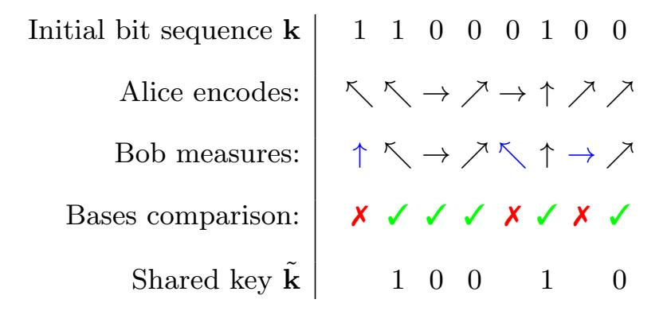
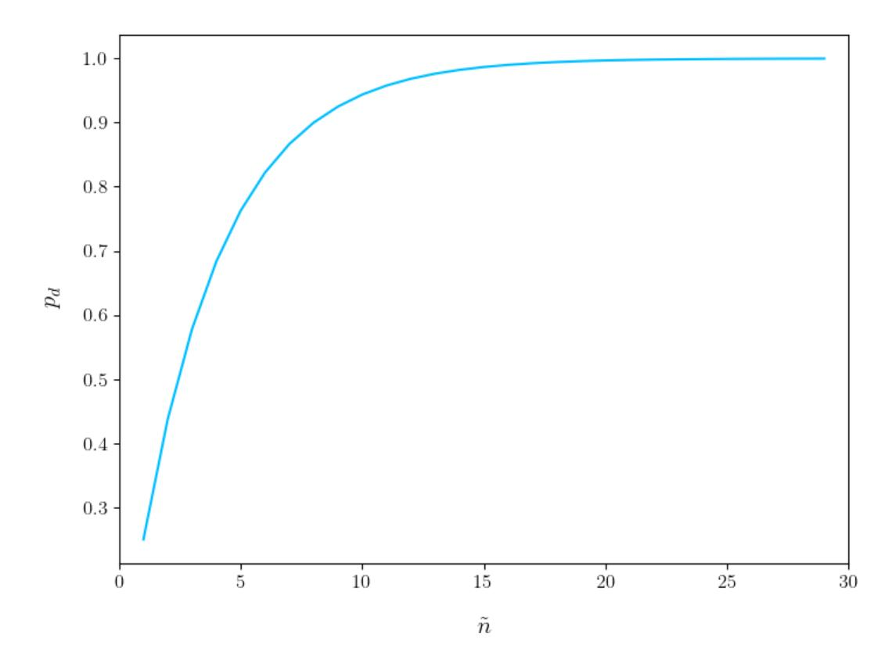
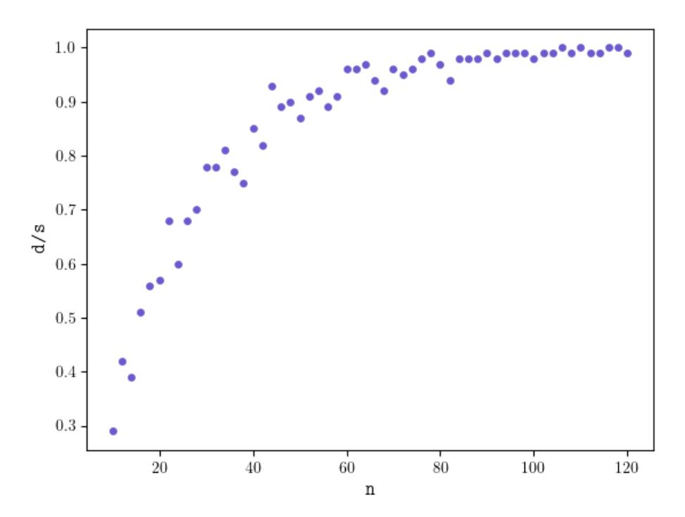

{0}------------------------------------------------

# A Scalable Simulation of the BB84 Protocol Involving Eavesdropping

Mihai-Zicu Mina1[0000−0002−9793−9203] and Emil Simion2[0000−0003−0561−3474]

<sup>1</sup> Faculty of Automatic Control and Computers, University POLITEHNICA of Bucharest, 060042 Bucharest, Romania

mihai zicu.mina@stud.acs.upb.ro

<sup>2</sup> Center for Research and Training in Innovative Techniques of Applied Mathematics in Engineering, University POLITEHNICA of Bucharest, 060042 Bucharest, Romania emil.simion@upb.ro

Abstract. In this article we present the BB84 quantum key distribution scheme from two perspectives. First, we provide a theoretical discussion of the steps Alice and Bob take to reach a shared secret using this protocol, while an eavesdropper Eve is either involved or not. Then, we offer and discuss two distinct implementations that simulate BB84 using IBM's Qiskit framework, the first being an exercise solved during the "IBM Quantum Challenge" event in early May 2020, while the other was developed independently to showcase the intercept-resend attack strategy in detail. We note the latter's scalability and increased output verbosity, which allow for a statistical analysis to determine the probability of detecting the act of eavesdropping.

Keywords: Quantum key distribution · BB84 · Intercept-resend attack · Qiskit · Simulation

# 1 Introduction

The process of establishing a shared key is an essential operation in modern cryptographic tasks and the distribution of such key between the communicating parties can be ensured by using the Diffie-Hellman protocol or RSA. However, the underlying security of these schemes is conditioned by the intractability of certain mathematical problems, an aspect that advanced quantum computers can overcome. We would need another approach to the key sharing problem, one that is provably secure. Fortunately, quantum theory offers a solution that fits this criterion, quantum key distribution (QKD). The inherent features of quantum information make quantum key distribution secure from an information-theoretic perspective [\[7,](#page-18-0)[13](#page-18-1)[,12\]](#page-18-2). However, flaws in practical implementations could be exploited by attackers. The downside of quantum key distribution is represented precisely by such challenges in its practical deployment. The first QKD protocol is BB84 [\[2\]](#page-17-0), devised in 1984 and first implemented in 1989 over 32 cm [\[3\]](#page-18-3), a modest achievement in terms of distribution distance that has been impressively exceeded ever since [\[15,](#page-18-4)[11](#page-18-5)[,4,](#page-18-6)[5\]](#page-18-7).

{1}------------------------------------------------

We take a closer look at the core idea behind this scheme by discussing the operations performed by parties when an eavesdropper is absent and then when tampering indeed occurs, which is of practical interest. For the second case, we analyze the intercept-resend attack to which the intruder Ever resorts in her attempt to acquire information. We give two examples to illustrate those cases and emphasize the statistical aspect regarding Alice and Bob's chances to detect Eve. We then present two Qiskit simulations of the protocol, an exercise from the "IBM Quantum Challenge" and a separate program that executes the scheme with any number of qubits and details relevant information about each party's actions and the factors that lead to the conclusion.

# 2 BB84 protocol

The first quantum key distribution protocol was pioneered by Charles Bennett and Gilles Brassard in 1984 and it exploits the uncertainty principle, which essentially states that measuring one property of a quantum state will introduce an indeterminacy in another property. Using BB84, Alice and Bob can arrive at a shared key, which they can use afterwards with a symmetric encryption scheme, such as a one-time pad. The original formulation of the protocol uses photons as qubits, the information being encoded in their polarization. We will start our discussion of the protocol with the case that doesn't involve any eavesdropping.

### 2.1 No eavesdropping

Initially, Alice randomly generates an n-bit string k, from which the shared key will be eventually derived. The protocol requires that she and Bob agree on two distinct encodings of a classical bit using a qubit. For example, 0 can be encoded by a photon that is polarized horizontally (→) and at an angle of 45◦ (%), while 1 is then encoded by photon polarized vertically (↑) and at an angle of 135◦ (-). Thus, we have two bases in which a photon can be prepared in order to represent one bit of information. The rectilinear basis is given by {|→i, |↑i}, while the diagonal basis is {|%i, |-i}. They are conjugate bases, because a measurement of a state from one of the basis performed in the other basis is equally likely to return either state. In other words, an element from one basis is a uniform superposition of the elements from the other basis. These bases are in fact "practical" representations of the computational and Hadamard basis. Thus, the encodings for the protocol are the following.

$$R: \quad 0 \mapsto | \rightarrow \rangle, \quad 1 \mapsto | \uparrow \rangle, \qquad D: \quad 0 \mapsto | \nearrow \rangle, \quad 1 \mapsto | \nwarrow \rangle$$

After agreeing on which bases are to be used, Alice generates again a random sequence of n bits a, where each bit a<sup>i</sup> in turn indicates the basis she will choose for encoding the i-th qubit. Both parties must again establish a convention here, for example a<sup>i</sup> = 0 means that the corresponding qubit will be prepared in the rectilinear basis. After encoding each bit k<sup>i</sup> into a qubit, Alice sends the 

{2}------------------------------------------------

photon to Bob, who then measures in his own basis. Since he doesn't know what basis was chosen by Alice, Bob randomly picks a basis for measuring the i-th qubit. According to the previous convention for denoting the basis, his choice is given by a bit b<sup>i</sup> . Therefore, the bases he chooses for the total n qubits that are transmitted constitute another bit sequence b.

Given the uncertainty revolving around Bob's measurements, the next step for the parties is to publicly announce the bases each of them picked, information stored in bitstrings a and b. Following this phase, bit k<sup>i</sup> will be kept as valid only if Alice and Bob's choices coincided, i.e. a<sup>i</sup> = b<sup>i</sup> . The new bitstring k˜ composed of all these k<sup>i</sup> is the shared key. Of course, Bob could obtain the correct state even though he chose the wrong basis, but this only happens probabilistically. On average, he chooses right 50% of the time, making the length of k˜ half the length of the initial k.

To illustrate an example, we consider the following sequences and then examine [Table 1.](#page-2-0)

$$\mathbf{k} = 11000100, \quad \mathbf{a} = 11010011, \quad \mathbf{b} = 01011001$$

<span id="page-2-0"></span>Table 1: Example of BB84 protocol without eavesdropping



When Bob performs his measurement, the result is colored blue to indicate that it is probabilistic. As it can be noticed, out of all three wrong guesses he took, the first and last states he observes are indeed the correct encodings of the bits in the rectangular basis, but he only owes this to chance. In the end, they arrive at a 5-bit shared key.

### 2.2 Intercept-resend attack

It is natural to ask how the derivation of the key is impacted by the presence of an eavesdropper Eve. The type of attack we consider for this case is called intercept-resend, a strategy that implies capturing the photons, measuring them and then sending them to Bob, their intended recipient. Once she intercepts a photon, Eve cannot do anything more than just pick a random basis in which to

{3}------------------------------------------------

#### 4 Mihai-Zicu Mina and Emil Simion

measure it, as Bob does. Inevitably, her action will alter the state of the qubit. It is noteworthy that she has to resort to this kind of technique because she has to send the photons to Bob, otherwise she would compromise her presence. Ideally, she would copy each qubit and wait for the transmission to end in order to find out the bases used by Alice and Bob, so she could know the correct ones. Unfortunately for her, copying arbitrary qubits is forbidden by the no-cloning theorem [\[14](#page-18-8)[,6\]](#page-18-9), a fundamental result that sets quantum information apart from the basic idea of copying bits, which we take for granted.

Before looking at another example that involves Eve this time, it is important to identify several scenarios that are possible when she is present. Specifically, we analyze how the correlation between Alice's basis and Eve's basis determines what Bob will measure on his side.

Eve chooses the wrong basis: e<sup>i</sup> = a<sup>i</sup> −→ qubit is altered.

Bob chooses correctly: b<sup>i</sup> = a<sup>i</sup> −→ Eve introduces error with 50% probability.

Bob chooses incorrectly: b<sup>i</sup> = a<sup>i</sup> −→ random outcome, Eve is undetected.

Eve chooses the correct basis: e<sup>i</sup> = a<sup>i</sup> −→ qubit is unaltered.

Bob chooses correctly: b<sup>i</sup> = a<sup>i</sup> −→ Eve is undetected and has one bit of the key.

Bob chooses incorrectly: b<sup>i</sup> = a<sup>i</sup> −→ random outcome, Eve is undetected.

These possibilities reveal that for each transmitted qubit, there is 75% probability that Eve's action goes undetected. The remaining 25% probability is due to Bob's correct choice when Eve chooses incorrectly: he obtains the wrong state from his basis and therefore decodes the wrong bit. Considering that Alice's and Bob's sequences of bits do not match exactly in such situation, they take an additional step to test against eavesdropping. They decide to select a subset of the remaining bits and compare them. If they don't match, they know for sure that Eve interfered. Of course, there is a compromise between the number of bits they want to "sacrifice" to discover Eve with a high probability and the length of the shared key, which decreases as they discard those bits that were compared.

[Table 2](#page-4-0) shows an example. Sequences k<sup>A</sup> and k<sup>B</sup> belonging to Alice and Bob respectively are "distilled" from the initial k. Eve's bases are represented by e.

k<sup>A</sup> = 11000100, a = 11010011, b = 01011001, e = 10001001

{4}------------------------------------------------

<span id="page-4-0"></span>Table 2: Example of BB84 protocol with eavesdropping

| Initial bit sequence k  | 1 | 1 | 0               | 0 | 0 | 1 | 0 | 0 |
|-------------------------|---|---|-----------------|---|---|---|---|---|
| Alice encodes:          |   |   | → % → ↑ % %     |   |   |   |   |   |
| Eve measures:           |   |   | - ↑ → → % ↑ → % |   |   |   |   |   |
| Bob measures:           |   |   | ↑ % → % % ↑ → % |   |   |   |   |   |
| Bases comparison:       | ✗ | ✓ | ✓               | ✓ | ✗ | ✓ | ✗ | ✓ |
| Alice's bit sequence kA |   | 1 | 0               | 0 |   | 1 |   | 0 |
| Eve's information:      | 1 |   | 0               |   |   | 1 |   | 0 |
| Eve introduces error?   |   |   | N Y N N N N N N |   |   |   |   |   |
| Bob's bit sequence kB   |   | 0 | 0               | 0 |   | 1 |   | 0 |

From Eve's choices we notice that she guessed correctly four out of eight times, thus gaining information about four bits from the initial bit sequence. She introduces an error in the second bit, making Bob decode 0 instead of 1. The example illustrates the idea of this attack, but it is rather impractical because the length of k is short. In a real scenario, Alice and Bob would need to compare many bits from k<sup>A</sup> and kB, which are about n/2 bits long on average. If they choose to compare one bit from their respective strings, the probability of them being the same is 0.75. For a selection of ˜n bits, the probability of having all of them match represents Eve's chance of evading detection, which decreases exponentially with n˜. Therefore, the probability of detection p<sup>d</sup> that Alice and Bob wish to have above a confident threshold is given by

$$p_d = 1 - p_e = 1 - \left(\frac{3}{4}\right)^{\tilde{n}}, \quad \tilde{n} < \frac{n}{2}.$$

For example, ˜n = 20 determines p<sup>e</sup> ≈ 32 × 10<sup>−</sup><sup>4</sup> , making the probability of finding the eavesdropper p<sup>d</sup> ≈ 0.997. The dependence of this probability on the number of compared bits is depicted in [Figure 1.](#page-5-0)

{5}------------------------------------------------

<span id="page-5-0"></span>

Fig. 1: Probability of detecting Eve increases with ˜n

### 2.3 "IBM Quantum Challenge"

In May 2020, IBM celebrated the fourth anniversary of their Quantum Experience cloud platform by organizing an event called "IBM Quantum Challenge" [\[8\]](#page-18-10). It lasted from May 4 to May 8, inviting users of the platform to solve four exercises using the Qiskit framework [\[1\]](#page-17-1). Among the topics of the exercises was a simulation of the BB84 protocol [\[9\]](#page-18-11), whose co-designer Charles H. Bennett is an IBM Fellow. The implementation considers n = 100 bits and the goal sought by Alice and Bob is to obtain a shared key that is later used to encrypt a message using a one-time pad scheme. There is no eavesdropping and the user is given Bob's role of performing the following operations:

- measure each qubit sent by Alice;
- compare bases with Alice and extract the 50-bit key;
- decrypt Alice's 200-bit message by concatenating the key with itself;
- decode Alice's binary message that "disguises" a message in Morse code:

```
0 character separator
  1 .
 00 letter separator
 11 -
000 word separator
```

– discover the original message.

The source code for the completed exercise is given in [Listing 1.](#page-9-0) Considering its dependence on several dedicated modules, the webpage of the repository [\[10\]](#page-18-12) should be visited for instructions on how to get the program running properly. 

{6}------------------------------------------------

Variables alice bases and bob bases are binary strings that represent parameters a and b we used thus far, respectively. Their bits match exactly 50 times, thus determining the 50-bit shared key

# k˜ = 10000010001110010011101001010000110000110011100000.

Alice then uses this key with a one-time pad to encrypt a 200-bit message p, whose ciphertext can be found in the source code (variable m). Since the key is much shorter than the plaintext, she pads the key with itself three more times until it reaches 200 bits. Of course, the security of the scheme is weakened because of this practice, but that is not the focus of the exercise.

$$\mathbf{m} = \mathbf{p} \oplus 4\mathbf{\tilde{k}}$$

Bob undoes the operation to find the plaintext, which is further decoded into a Morse code sequence, according to the previous mappings.

$$\mathbf{p}_M = .$$
-..-..-............................

Based on a dictionary that maps the letters of the Latin alphabet, digits and other characters to symbols of the Morse code, the intelligible message is found to be a nice reward "key" to a dedicated webpage, as pictured in [Figure 2.](#page-6-0)

$$\mathbf{p}_L = \text{reddit.com/r/may4quantum}$$

<span id="page-6-0"></span>

Fig. 2: A snapshot of the webpage to which users are taken after finding the solution

### 2.4 Simulation with eavesdropping

The implementation of the protocol for the proposed exercise used a module given by IBM specifically for the purpose of the event, providing already defined functions for certain operations. We now present a distinct implementation that was written from scratch, taking into account the intercept-resend attack we discussed earlier. As mentioned in the source code found in [Listing 2,](#page-11-0) we choose the length of k by passing the value as argument to the script, which is stored in variable n. For convenience and practical significance, this number should be 

{7}------------------------------------------------

large enough. Several functions are defined, some representing subcircuits, while others test the choices the parties made for their bases. One function actually implements a simple quantum random number generator, which can be used to substitute that functionality from the random module. Running the program will output information about the bases that were chosen by Alice, Eve and Bob, when their choices coincided (Y), the bits obtained after measurements and whether some of them are correct by chance (R). The errors introduced by Eve are also highlighted (!), while Alice and Bob choose a subset of their presumably correct key bits to test for eavesdropping. In order to simulate their agreement, the lists of bits are randomly sampled using the same seed. The size of this selection can be specified and a conclusion message is displayed at the end. If they discover that the compared bits don't match, they abort and start the protocol over again. This is very likely to happen, based on the previous analysis. However, when they choose to compare few bits, Eve's presence may remain successfully hidden.

The output of an execution for n = 100 is given in [Figure 4.](#page-16-0) We notice that bases chosen by Bob and Eve agree with those picked by Alice for roughly half the qubits. In 23 instances, Eve chose the wrong basis, while Bob's choice agreed with Alice's, making him decode a random bit, as the qubit state was changed by Eve's measurement. Still, he randomly got the right bit 12 times out of those 23, leaving 11 unmatched bits that confirm Eve's presence. She can only hope that the random subset of bits Alice and Bob decide to compare will not contain any of those, otherwise her tampering will be revealed. As per the authors' suggestion in [\[2\]](#page-17-0), the length of the subset is set to the integer part of a third of the length of the bit sequences filtered by Alice and Bob following the public disclosure of their bases. Since these sequences have 49 bits in this example, our parties compare 16 randomly selected bits and find 5 disagreements, which is the signal that makes them abort and restart the procedure.

Finally, we wish to validate the previous relation that determines the probability of detecting Eve based on the number of sacrificed bits. We keep the length of the random selection at the same value

$$\tilde{n} = \left| \frac{|\mathbf{k}_A|}{3} \right| = \left| \frac{|\mathbf{k}_B|}{3} \right| \approx \left\lfloor \frac{n}{6} \right\rfloor$$

and choose a smaller number of qubits, n = 40, which determines 1−pn˜ ≈ 0.822. We use the script in [Listing 3](#page-15-0) to simulate the protocol s = 100 times for n = 40, in order to find out how many times Eve has evaded detection. As the results in [Figure 5](#page-16-1) indicate, eavesdropping goes unnoticed s - d = 18 times, such that Alice and Bob have a chance of d/s = 0.82 to catch Eve, as expected. Certainly, given that the actions performed by parties yield random outcomes, this probability varies between runs, but it remains close to the theoretical result. We can go further and analyze how this probability increases indeed with the number of bits that Alice and Bob compare. The plot we intend to observe is actually an indirect relation between those two parameters, since the number of bits selected to be compared is exactly or close to a third of the number of qubits n we are using as argument to run the simulation. To acquire the necessary data, 

{8}------------------------------------------------

we ran 100 simulations for each even value of n between 10 and 120. The graph that resulted following this experiment is displayed in [Figure 3](#page-8-0) and we notice that it resembles the smooth one from [Figure 1.](#page-5-0)

<span id="page-8-0"></span>

Fig. 3: The statistical chance d/s of detecting Eve increases with n, which is roughly six times the number of bits they end up comparing

# 3 Conclusion

Quantum key distribution has emerged as a promising direction within the field of quantum information science and it has repeteadly broken new ground as quantum technologies continue to advance at a remarkable pace. Here we have focused on the BB84 protocol, the early result that revealed the fundamental implications of quantum information on cryptography. Throughout this article, we presented the operational aspects of the protocol when a type of eavesdropping happens or not, with some examples alongside the theoretical discussion, and we provided two implementations of it using Qiskit, the quantum computing framework from IBM. The first program represents a solved exercise that was part of the "IBM Quantum Challenge" held in May 2020, while the second one is a scalable simulation we developed to show how the intercept-resend attack impacts Alice and Bob's plan to establish a shared key. In order to demonstrate how the BB84 protocol can be successfully used to reach a common secret, we conducted experiments to determine the chances Alice and Bob have to detect Eve and how her presence can be discovered with a very high degree of certainty when enough bits from the soon-to-be key are spared.

{9}------------------------------------------------

# A Qiskit implementations

### <span id="page-9-0"></span>A.1 "IBM Quantum Challenge"

Listing 1: QKD exercise from "IBM Quantum Challenge"

```
1 %matplotlib inline
2
3 # Importing standard Qiskit libraries
4 import random
5 from qiskit import execute, Aer, IBMQ
6 from qiskit.tools.jupyter import *
7 from qiskit.visualization import *
8 from may4_challenge.ex3 import alice_prepare_qubit, check_bits, check_key, check_decrypted,
     ,→ show_message
9
10 # Configuring account
11 provider = IBMQ.load_account()
12 backend = provider.get_backend('ibmq_qasm_simulator') # with this simulator it wouldn't
     ,→ work \
13
14 # Initial setup
15 random.seed(84) # do not change this seed, otherwise you will get a different key
16
17 # This is your 'random' bit string that determines your bases
18 numqubits = 100
19 bob_bases = str('{0:0100b}'.format(random.getrandbits(numqubits)))
20
21 def bb84():
22 print('Bob\'s bases:', bob_bases)
23
24 # Now Alice will send her bits one by one...
25 all_qubit_circuits = []
26 for qubit_index in range(numqubits):
27
28 # This is Alice creating the qubit
29 thisqubit_circuit = alice_prepare_qubit(qubit_index)
30
31 # This is Bob finishing the protocol below
32 bob_measure_qubit(bob_bases, qubit_index, thisqubit_circuit)
33
34 # We collect all these circuits and put them in an array
35 all_qubit_circuits.append(thisqubit_circuit)
36
37 # Now execute all the circuits for each qubit
38 results = execute(all_qubit_circuits, backend=backend, shots=1).result()
39
40 # And combine the results
41 bits = ''
42 for qubit_index in range(numqubits):
43 bits += [measurement for measurement in results.get_counts(qubit_index)][0]
44
45 return bits
46
47 # Here is your task
48 def bob_measure_qubit(bob_bases, qubit_index, qubit_circuit):
49 if int(bob_bases[qubit_index]) == 1:
50 qubit_circuit.h(0)
51 qubit_circuit.measure(0,0)
52
53 bits = bb84()
54 print('Bob\'s bits: ', bits)
55 check_bits(bits)
56
57 #=== KEY EXTRACTION ===#
58
```

{10}------------------------------------------------

```
59 alice_bases = '10000000000100011111110011011001010001111101001101'\
60 '11111000110000011000001001100011100111010010000110' # Alice's bases bits
61
62 key = ''
63
64 for i in range(numqubits):
65 if alice_bases[i] == bob_bases[i]:
66 key += bits[i]
67
68 check_key(key)
69
70 #=== MESSAGE DECRYPTION ===#
71
72 m = '00110110101000111010000011000100000010000110001011'\
73 '10110111100111111110001111100011100101011010111010'\
74 '11101000111010100101111111001010000110100110110110'\
75 '11101111010111000101111111001010101001100101111011' # encrypted message
76
77 key = 4*key
78 decrypted = ''
79
80 for i in range(len(m)):
81 s = int(m[i]) + int(key[i])
82 decrypted += str(s % 2)
83
84 check_decrypted(decrypted)
85
86 #=== MESSAGE DECODING ===#
87
88 symbols = []
89 i = 0
90 while i < len(decrypted)-1:
91 if decrypted[i] + decrypted[i+1] == "11":
92 symbols.append("11")
93 i = i+2
94 elif decrypted[i] + decrypted[i+1] == "00":
95 symbols.append("00")
96 i = i+2
97 else:
98 symbols.append(decrypted[i])
99 i = i+1
100
101 d = {'1':'.', '11':'-', '0':'', '00':2*' ', '000':3*' '}
102 morse_message = [d[i] for i in symbols]
103 morse_message = ''.join(morse_message).split(" ")
104
105 MORSE_CODE_DICT = { 'a':'.-', 'b':'-...',
106 'c':'-.-.', 'd':'-..', 'e':'.',
107 'f':'..-.', 'g':'--.', 'h':'....',
108 'i':'..', 'j':'.---', 'k':'-.-',
109 'l':'.-..', 'm':'--', 'n':'-.',
110 'o':'---', 'p':'.--.', 'q':'--.-',
111 'r':'.-.', 's':'...', 't':'-',
112 'u':'..-', 'v':'...-', 'w':'.--',
113 'x':'-..-', 'y':'-.--', 'z':'--..',
114 '1':'.----', '2':'..---', '3':'...--',
115 '4':'....-', '5':'.....', '6':'-....',
116 '7':'--...', '8':'---..', '9':'----.',
117 '0':'-----', ', ':'--..--', '.':'.-.-.-',
118 '?':'..--..', '/':'-..-.', '-':'-....-',
119 '(':'-.--.', ')':'-.--.-'}
120
121 keys = list(MORSE_CODE_DICT.keys())
122 values = list(MORSE_CODE_DICT.values())
123 solution = []
124
125 for c in morse_message:
126 if c in values:
```

{11}------------------------------------------------

```
127 index = values.index(c)
128 solution.append(keys[index])
129
130 solution = ''.join(solution)
131
132 show_message(solution)
```

### <span id="page-11-0"></span>A.2 Simulation of intercept-resend attack

Listing 2: BB84 protocol with eavesdropping

```
1 #!/usr/bin/python
2
3 #=============================================
4 # BB84 PROTOCOL WITH EAVESDROPPING
5 # USAGE: ./bb84_eavesdropping.py <num_qubits>
6 #=============================================
7 from sys import argv, exit
8 from qiskit import *
9 from random import randrange, seed, sample
10
11 # local simulation
12 backend = Aer.get_backend('qasm_simulator')
13
14 #=============================================
15 #=== FUNCTION DEFINITIONS #===================
16
17 # n-bit binary representation of integer
18 def bst(n,s):
19 return str(bin(s)[2:].rjust(n,'0'))
20
21 # generate n-bit string from measurement on n qubits
22 def qrng(n):
23 qc = QuantumCircuit(n,n)
24 for i in range(n):
25 qc.h(i)
26 qc.measure(list(range(n)),list(range(n)))
27 result = execute(qc,backend,shots=1).result()
28 bits = list(result.get_counts().keys())[0]
29 bits = ''.join(list(reversed(bits)))
30 return bits
31
32 # qubit encodings in specified bases
33 def encode_qubits(n,k,a):
34 qc = QuantumCircuit(n,n)
35 for i in range(n):
36 if a[i] == '0':
37 if k[i] == '1':
38 qc.x(i)
39 else:
40 if k[i] == '0':
41 qc.h(i)
42 else:
43 qc.x(i)
44 qc.h(i)
45 qc.barrier()
46 return qc
47
48 # capture qubits, measure and send to Bob
49 def intercept_resend(qc,e):
50 backend = Aer.get_backend('qasm_simulator')
51 l = len(e)
52
53 for i in range(l):
```

{12}------------------------------------------------

```
54 if e[i] == '1':
55 qc.h(i)
56
57 qc.measure(list(range(l)),list(range(l)))
58 result = execute(qc,backend,shots=1).result()
59 bits = list(result.get_counts().keys())[0]
60 bits = ''.join(list(reversed(bits)))
61
62 qc.reset(list(range(l)))
63
64 for i in range(l):
65 if e[i] == '0':
66 if bits[i] == '1':
67 qc.x(i)
68 else:
69 if bits[i] == '0':
70 qc.h(i)
71 else:
72 qc.x(i)
73 qc.h(i)
74
75 qc.barrier()
76 return [qc,bits]
77
78 # qubit measurements in specified bases
79 def bob_measurement(qc,b):
80 backend = Aer.get_backend('qasm_simulator')
81 l = len(b)
82
83
84 for i in range(l):
85 if b[i] == '1':
86 qc.h(i)
87
88 qc.measure(list(range(l)),list(range(l)))
89 result = execute(qc,backend,shots=1).result()
90 bits = list(result.get_counts().keys())[0]
91
92 bits = ''.join(list(reversed(bits)))
93
94
95 qc.barrier()
96 return [qc,bits]
97
98
99 # check where bases matched
100 def check_bases(b1,b2):
101 check = ''
102 matches = 0
103 for i in range(len(b1)):
104 if b1[i] == b2[i]:
105 check += "Y"
106 matches += 1
107 else:
108 check += "-"
109 return [check,matches]
110
111 # check where measurement bits matched
112 def check_bits(b1,b2,bck):
113 check = ''
114 for i in range(len(b1)):
115 if b1[i] == b2[i] and bck[i] == 'Y':
116 check += 'Y'
117 elif b1[i] == b2[i] and bck[i] != 'Y':
118 check += 'R'
119 elif b1[i] != b2[i] and bck[i] == 'Y':
120 check += '!'
121 elif b1[i] != b2[i] and bck[i] != 'Y':
```

{13}------------------------------------------------

```
122 check += '-'
123 return check
124
125
126 #=============================================
127 #=== INITIAL PARAMETER #======================
128
129 if len(argv) != 2:
130 print("USAGE: " + argv[0] + " <num_qubits>")
131 exit(1)
132 else:
133 n = argv[1]
134 try:
135 # size of quantum and classical registers
136 n = int(n)
137
138 if n < 5:
139 print("[!] Number of qubits should be at least 5.")
140 exit(1)
141
142 except ValueError:
143 print("[!] Argument must be an integer.")
144 exit(1)
145
146 print("\nAlice prepares " + str(n) + " qubits.\n")
147
148 N = 2**n
149
150 #=============================================
151 #=== BIT SEQUENCE AND BASES #=================
152 #seed(81)
153 #alice_bits = bst(n,randrange(N))
154 alice_bits = qrng(n)
155
156 #seed(147)
157 #a = bst(n,randrange(N))
158 a = qrng(n)
159
160 #seed(875)
161 #e = bst(n,randrange(N))
162 e = qrng(n)
163
164 #seed(316)
165 #b = bst(n,randrange(N))
166 b = qrng(n)
167
168 #=============================================
169
170 bb84 = QuantumCircuit(n,n)
171 bb84 += encode_qubits(n,alice_bits,a)
172
173 bb84, eve_bits = intercept_resend(bb84,e)
174 ae_bases, ae_matches = check_bases(a,e)
175 ae_bits = check_bits(alice_bits,eve_bits,ae_bases)
176
177 bb84, bob_bits = bob_measurement(bb84,b)
178 eb_bases, eb_matches = check_bases(e,b)
179 eb_bits = check_bits(eve_bits,bob_bits,eb_bases)
180
181 ab_bases, ab_matches = check_bases(a,b)
182 ab_bits = check_bits(alice_bits,bob_bits,ab_bases)
183
184 altered_qubits = 0
185 err_num = 0
186 err_str = ''
187 key = ''
188 ka = ''
189 ke = ''
```

{14}------------------------------------------------

```
190 kb = ''
191
192 for i in range(n):
193 if ae_bases[i] != 'Y' and ab_bases[i] == 'Y':
194 altered_qubits += 1
195 if ab_bases[i] == 'Y':
196 ka += alice_bits[i]
197 kb += bob_bits[i]
198 if ae_bases[i] == 'Y':
199 ke += eve_bits[i]
200 if ab_bits[i] == '!':
201 err_num += 1
202
203 err_str = ''.join(['!' if ka[i] != kb[i] else ' ' for i in range(len(ka))])
204
205 print("Alice's bases: " + a)
206 print("Eve's bases: " + e)
207 print("A-E bases: " + ae_bases)
208 print("")
209 print("Eve guessed correctly " + str(ae_matches) + " times.")
210 print("")
211 print("Alice's bits: " + alice_bits)
212 print("Eve's bits: " + eve_bits)
213 print("A-E bits: " + ae_bits)
214 print("")
215
216 print("Eve's bases: " + e)
217 print("Bob's bases: " + b)
218 print("E-B bases: " + eb_bases)
219 print("")
220 print("Eve and Bob chose the same basis " + str(eb_matches) + " times.")
221 print("")
222 print("Eve's bits: " + eve_bits)
223 print("Bob's bits: " + bob_bits)
224 print("E-B bits: " + eb_bits)
225 print("")
226
227 print((len("Alice's bases: ") + n)*'=')
228 print("")
229
230 print("A-B bases: " + ab_bases)
231 print("Alice's bits: " + alice_bits)
232 print("Bob's bits: " + bob_bits)
233 print("A-B bits: " + ab_bits)
234 print("")
235 print("Bob guessed correctly " + str(ab_matches) + " times.")
236 print("Eve altered " + str(altered_qubits) + " qubits (she chose wrong and Bob chose
      ,→ right).")
237 print("Eve got lucky " + str(altered_qubits - err_num) + " times (Bob measured the right
      ,→ state by chance).")
238
239 print("")
240 print("Alice's remaining bits: " + ka)
241 print("Error positions: " + err_str)
242 print("Bob's remaining bits: " + kb)
243 print("Number of errors: " + str(err_num))
244 print("")
245 print("Eve's information: " + ke)
246 print("")
247
248 selection_size = int(ab_matches/3)
249
250 seed(63)
251 selection_alice = [list(pair) for pair in sample(list(enumerate(ka)),selection_size)]
252 indices_alice = [pair[0] for pair in selection_alice]
253 substring_alice = ''.join([pair[1] for pair in selection_alice])
254
255 seed(63)
```

{15}------------------------------------------------

```
256 selection_bob = [list(pair) for pair in sample(list(enumerate(kb)),selection_size)]
257 indices_bob = [pair[0] for pair in selection_bob]
258 substring_bob = ''.join([pair[1] for pair in selection_bob])
259
260 print("Alice and Bob compare " + str(selection_size) + " of the " + str(ab_matches) + "
      ,→ bits.")
261 print("Alice's substring: " + substring_alice)
262 print("Bob's substring: " + substring_bob)
263
264 err_found = 0
265
266 for i in range(len(substring_alice)):
267 if substring_alice[i] != substring_bob[i]:
268 err_found += 1
269
270 if err_found > 0:
271 conclusion = "They find " + str(err_found) + " error(s) and realize that Eve
         ,→ interfered. "
272 conclusion += "They abort and start over.\n"
273 else:
274 conclusion = "Their selections match and Eve is not detected."
275 ka = list(ka)
276 kb = list(kb)
277 for pos in list(reversed(sorted(indices_alice))):
278 ka.pop(pos)
279 kb.pop(pos)
280 ka = ''.join(ka)
281 kb = ''.join(kb)
282 conclusion += "\nTheir " + str(ab_matches-len(substring_alice)) + "-bit shared key is "
         ,→ + ka + ".\n"
283
284 print(conclusion)
```

<span id="page-15-0"></span>Listing 3: Multiple executions of the protocol to find the probability of catching Eve

```
1 #!/bin/bash
2
3 #====================================================================
4 # BB84 PROTOCOL WITH EAVESDROPPING - determine chance of catching Eve
5 # USAGE: ./bb84_detections.sh <num_qubits> <num_executions>
6 #====================================================================
7
8 [ $# -ne 2 ] && { echo "[!] USAGE: $0 <num_qubits> <num_executions>"; exit 1; }
9
10 [ $1 -ge 5 ] 2> /dev/null && n=$1 || { echo "[!] Number of qubits should be at least 5";
     ,→ exit 1; }
11 [ $2 -ge 1 ] 2> /dev/null && s=$2 || { echo "[!] Number of executions should be at least
     ,→ 1"; exit 1; }
12
13 echo -e "\nRunning $s simulation(s) with $n qubits to find out the number of undetected
     ,→ interferences..."
14
15 d=$(for i in $(seq 1 $s); do ./bb84_eavesdropping.py $n; done | grep 'abort' | wc -l)
16 p=$(echo "$d/$s" | bc -l)
17
18 printf "Eve managed to get away with her tampering in $[$s-$d] instance(s), leaving Alice
     ,→ and Bob with a %.2f chance of catching her.\n\n" "$p"
```

{16}------------------------------------------------

Fig. 4: An output example for n = 100

Fig. 5: Finding the probability of detecting Eve after 100 runs for n = 40

{17}------------------------------------------------

# References

- <span id="page-17-1"></span>1. Abraham, H., AduOffei, Akhalwaya, I.Y., Aleksandrowicz, G., Alexander, T., Alexandrowics, G., Arbel, E., Asfaw, A., Azaustre, C., AzizNgoueya, Barkoutsos, P., Barron, G., Bello, L., Ben-Haim, Y., Bevenius, D., Bishop, L.S., Bolos, S., Bosch, S., Bravyi, S., Bucher, D., Burov, A., Cabrera, F., Calpin, P., Capelluto, L., Carballo, J., Carrascal, G., Chen, A., Chen, C.F., Chen, R., Chow, J.M., Claus, C., Clauss, C., Cross, A.J., Cross, A.W., Cross, S., Cruz-Benito, J., Culver, C., C´orcoles-Gonzales, A.D., Dague, S., Dandachi, T.E., Dartiailh, M., DavideFrr, Davila, A.R., Dekusar, A., Ding, D., Doi, J., Drechsler, E., Drew, Dumitrescu, E., Dumon, K., Duran, I., EL-Safty, K., Eastman, E., Eendebak, P., Egger, D., Everitt, M., Fern´andez, P.M., Ferrera, A.H., Frisch, A., Fuhrer, A., GEORGE, M., Gacon, J., Gadi, Gago, B.G., Gambella, C., Gambetta, J.M., Gammanpila, A., Garcia, L., Garion, S., Gilliam, A., Gomez-Mosquera, J., de la Puente Gonz´alez, S., Gorzinski, J., Gould, I., Greenberg, D., Grinko, D., Guan, W., Gunnels, J.A., Haglund, M., Haide, I., Hamamura, I., Havlicek, V., Hellmers, J., Herok, L., Hillmich, S., Horii, H., Howington, C., Hu, S., Hu, W., Imai, H., Imamichi, T., Ishizaki, K., Iten, R., Itoko, T., JamesSeaward, Javadi, A., Javadi-Abhari, A., Jessica, Johns, K., Kachmann, T., Kanazawa, N., Kang-Bae, Karazeev, A., Kassebaum, P., King, S., Knabberjoe, Kovyrshin, A., Krishnakumar, R., Krishnan, V., Krsulich, K., Kus, G., LaRose, R., Lambert, R., Latone, J., Lawrence, S., Liu, D., Liu, P., Maeng, Y., Malyshev, A., Marecek, J., Marques, M., Mathews, D., Matsuo, A., McClure, D.T., McGarry, C., McKay, D., McPherson, D., Meesala, S., Mevissen, M., Mezzacapo, A., Midha, R., Minev, Z., Mitchell, A., Moll, N., Mooring, M.D., Morales, R., Moran, N., MrF, Murali, P., M¨uggenburg, J., Nadlinger, D., Nakanishi, K., Nannicini, G., Nation, P., Navarro, E., Naveh, Y., Neagle, S.W., Neuweiler, P., Niroula, P., Norlen, H., O'Riordan, L.J., Ogunbayo, O., Ollitrault, P., Oud, S., Padilha, D., Paik, H., Perriello, S., Phan, A., Piro, F., Pistoia, M., Pozas-iKerstjens, A., Prutyanov, V., Puzzuoli, D., P´erez, J., Quintiii, Raymond, R., Redondo, R.M.C., Reuter, M., Rice, J., Rodr´ıguez, D.M., RohithKarur, Rossmannek, M., Ryu, M., SAPV, T., SamFerracin, Sandberg, M., Sargsyan, H., Sathaye, N., Schmitt, B., Schnabel, C., Schoenfeld, Z., Scholten, T.L., Schoute, E., Schwarm, J., Sertage, I.F., Setia, K., Shammah, N., Shi, Y., Silva, A., Simonetto, A., Singstock, N., Siraichi, Y., Sitdikov, I., Sivarajah, S., Sletfjerding, M.B., Smolin, J.A., Soeken, M., Sokolov, I.O., SooluThomas, Steenken, D., Stypulkoski, M., Suen, J., Sun, S., Sung, K.J., Takahashi, H., Tavernelli, I., Taylor, C., Taylour, P., Thomas, S., Tillet, M., Tod, M., de la Torre, E., Trabing, K., Treinish, M., TrishaPe, Turner, W., Vaknin, Y., Valcarce, C.R., Varchon, F., Vazquez, A.C., Vogt-Lee, D., Vuillot, C., Weaver, J., Wieczorek, R., Wildstrom, J.A., Wille, R., Winston, E., Woehr, J.J., Woerner, S., Woo, R., Wood, C.J., Wood, R., Wood, S., Wood, S., Wootton, J., Yeralin, D., Young, R., Yu, J., Zachow, C., Zdanski, L., Zoufal, C., Zoufalc, a matsuo, adekusar drl, azulehner, bcamorrison, brandhsn, chlorophyll zz, dan1pal, dime10, drholmie, elfrocampeador, faisaldebouni, fanizzamarco, gadial, gruu, jliu45, kanejess, klinvill, kurarrr, lerongil, ma5x, merav aharoni, michelle4654, ordmoj, sethmerkel, strickroman, sumitpuri, tigerjack, toural, vvilpas, welien, willhbang, yang.luh, yelojakit, yotamvakninibm: Qiskit: An open-source framework for quantum computing (2019). <https://doi.org/10.5281/zenodo.2562110>
- <span id="page-17-0"></span>2. Bennett, C.H., Brassard, G.: Quantum cryptography: Public key distribution and coin tossing. In: Proceedings of IEEE International Conference on Computers, Systems, and Signal Processing. pp. 175–179 (12 1984)

{18}------------------------------------------------

- <span id="page-18-3"></span>3. Bennett, C.H., Brassard, G.: Experimental quantum cryptography: The dawn of a new era for quantum cryptography: The experimental prototype is working]. SIGACT News 20(4), 78—-80 (11 1989). [https://doi.org/10.1145/74074.74087,](https://doi.org/10.1145/74074.74087) <https://doi.org/10.1145/74074.74087>
- <span id="page-18-6"></span>4. Boaron, A., Boso, G., Rusca, D., Vulliez, C., Autebert, C., Caloz, M., Perrenoud, M., Gras, G., Bussi`eres, F., Li, M.J., Nolan, D., Martin, A., Zbinden, H.: Secure quantum key distribution over 421 km of optical fiber. Phys. Rev. Lett. 121, 190502 (Nov 2018). [https://doi.org/10.1103/PhysRevLett.121.190502,](https://doi.org/10.1103/PhysRevLett.121.190502) <https://link.aps.org/doi/10.1103/PhysRevLett.121.190502>
- <span id="page-18-7"></span>5. Chen, J.P., Zhang, C., Liu, Y., Jiang, C., Zhang, W., Hu, X.L., Guan, J.Y., Yu, Z.W., Xu, H., Lin, J., Li, M.J., Chen, H., Li, H., You, L., Wang, Z., Wang, X.B., Zhang, Q., Pan, J.W.: Sending-or-not-sending with independent lasers: Secure twin-field quantum key distribution over 509 km. Phys. Rev. Lett. 124, 070501 (Feb 2020). [https://doi.org/10.1103/PhysRevLett.124.070501,](https://doi.org/10.1103/PhysRevLett.124.070501) [https:](https://link.aps.org/doi/10.1103/PhysRevLett.124.070501) [//link.aps.org/doi/10.1103/PhysRevLett.124.070501](https://link.aps.org/doi/10.1103/PhysRevLett.124.070501)
- <span id="page-18-9"></span>6. Dieks, D.: Communication by epr devices. Physics Letters A 92(6), 271 – 272 (1982). [https://doi.org/https://doi.org/10.1016/0375-9601\(82\)90084-6,](https://doi.org/https://doi.org/10.1016/0375-9601(82)90084-6) [http:](http://www.sciencedirect.com/science/article/pii/0375960182900846) [//www.sciencedirect.com/science/article/pii/0375960182900846](http://www.sciencedirect.com/science/article/pii/0375960182900846)
- <span id="page-18-0"></span>7. Hughes, R.J., Alde, D.M., Dyer, P., Luther, G.G., Morgan, G.L., Schauer, M.: Quantum cryptography. Contemporary Physics 36(3), 149–163 (1995). [https://doi.org/10.1080/00107519508222149,](https://doi.org/10.1080/00107519508222149) [https://doi.org/10.1080/](https://doi.org/10.1080/00107519508222149) [00107519508222149](https://doi.org/10.1080/00107519508222149)
- <span id="page-18-10"></span>8. <https://www.ibm.com/blogs/research/2020/04/ibm-quantum-challenge/>
- <span id="page-18-11"></span>9. [https://github.com/qiskit-community/may4](https://github.com/qiskit-community/may4_challenge_exercises/blob/master/ex03/Challenge3_BB84.ipynb) challenge exercises/blob/master/ [ex03/Challenge3](https://github.com/qiskit-community/may4_challenge_exercises/blob/master/ex03/Challenge3_BB84.ipynb) BB84.ipynb
- <span id="page-18-12"></span>10. [https://github.com/qiskit-community/may4](https://github.com/qiskit-community/may4_challenge_exercises) challenge exercises
- <span id="page-18-5"></span>11. Liao, S.K., Cai, W.Q., Liu, W.Y., Zhang, L., Li, Y., Ren, J.G., Yin, J., Shen, Q., Cao, Y., Li, Z.P., et al.: Satellite-to-ground quantum key distribution. Nature 549(7670), 43–47 (2017)
- <span id="page-18-2"></span>12. Renner, R., Gisin, N., Kraus, B.: Information-theoretic security proof for quantum-key-distribution protocols. Phys. Rev. A 72, 012332 (07 2005). [https://doi.org/10.1103/PhysRevA.72.012332,](https://doi.org/10.1103/PhysRevA.72.012332) [https://link.aps.org/doi/10.1103/](https://link.aps.org/doi/10.1103/PhysRevA.72.012332) [PhysRevA.72.012332](https://link.aps.org/doi/10.1103/PhysRevA.72.012332)
- <span id="page-18-1"></span>13. Shor, P.W., Preskill, J.: Simple proof of security of the bb84 quantum key distribution protocol. Phys. Rev. Lett. 85, 441–444 (07 2000). [https://doi.org/10.1103/PhysRevLett.85.441,](https://doi.org/10.1103/PhysRevLett.85.441) [https://link.aps.org/doi/10.1103/](https://link.aps.org/doi/10.1103/PhysRevLett.85.441) [PhysRevLett.85.441](https://link.aps.org/doi/10.1103/PhysRevLett.85.441)
- <span id="page-18-8"></span>14. Wootters, W.K., Zurek, W.H.: A single quantum cannot be cloned. Nature 299(5886), 802–803 (1982)
- <span id="page-18-4"></span>15. Yin, H.L., Chen, T.Y., Yu, Z.W., Liu, H., You, L.X., Zhou, Y.H., Chen, S.J., Mao, Y., Huang, M.Q., Zhang, W.J., Chen, H., Li, M.J., Nolan, D., Zhou, F., Jiang, X., Wang, Z., Zhang, Q., Wang, X.B., Pan, J.W.: Measurement-deviceindependent quantum key distribution over a 404 km optical fiber. Phys. Rev. Lett. 117, 190501 (Nov 2016). [https://doi.org/10.1103/PhysRevLett.117.190501,](https://doi.org/10.1103/PhysRevLett.117.190501) <https://link.aps.org/doi/10.1103/PhysRevLett.117.190501>