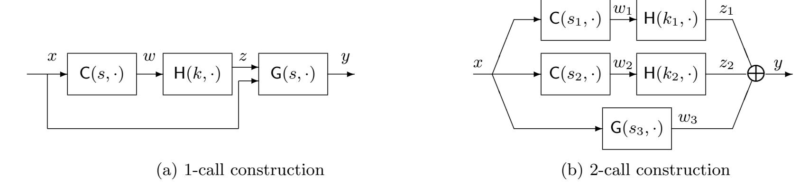

{0}------------------------------------------------

# On the Query Complexity of Constructing PRFs from Non-adaptive PRFs?

Pratik Soni<sup>1</sup> and Stefano Tessaro<sup>2</sup>

<sup>1</sup> University of California, Santa Barbara, USA pratik soni@cs.ucsb.edu <sup>2</sup> Paul G. Allen School of Computer Science & Engineering University of Washington, Seattle, USA tessaro@cs.washington.edu

Abstract. This paper studies constructions of pseudorandom functions (PRFs) from non-adaptive PRFs (naPRFs), i.e., PRFs which are secure only against distinguishers issuing all of their queries at once.

Berman and Haitner (Journal of Cryptology, '15) gave a one-call construction which, however, is not hardness preserving – to obtain a secure PRF (against polynomial-time distinguishers), they need to rely on a naPRF secure against superpolynomial-time distinguishers; in contrast, all known hardness-preserving constructions require ω(1) calls. This leaves open the question of whether a stronger superpolynomial-time assumption is necessary for one-call (or constant-call) approaches. Here, we show that a large class of one-call constructions (which in particular includes the one of Berman and Haitner) cannot be proved to be a secure PRF under a black-box reduction to the (polynomial-time) naPRF security of the underlying function.

Our result complements existing impossibility results (Myers, EUROCRYPT '04; Pietrzak, CRYPTO '05) ruling out natural specific approaches, such as parallel and sequential composition. Furthermore, we show that our techniques extend to rule out a natural class of constructions making parallel but arbitrary number of calls which in particular includes parallel composition and the two-call, cuckoohashing based construction of Berman et al. (Journal of Cryptology, '19).

Keywords: Pseudorandom functions, black-box separations, foundations.

## 1 Introduction

We study the problem of building a pseudorandom function (PRF) which resists adaptive attackers from a non-adaptive PRF (naPRF), i.e., a PRF which is only secure against adversaries choosing their inputs non-adaptively at once. This problem has attracted substantial amounts of interest (see e.g. [\[Mye04](#page-34-0)[,MP04,](#page-34-1)[Pie06,](#page-34-2)[Pie05](#page-34-3)[,MPR07,](#page-34-4)[CLO10,](#page-33-0)[BH15,](#page-33-1)[BHKN19\]](#page-33-2)) – indeed, a naPRF may initially be easier to devise than a full-fledged PRF.[3](#page-0-0) However, to date, the complexity of the best possible transformation remains unknown,[4](#page-0-1) and natural approaches such as sequential and parallel composition have been proved to fail.

The main contribution of this paper is a proof that highly-efficient black-box naPRF-to-PRF transformations are unlikely to exist: We rule out a large class of one-call constructions with respect to hardness-preserving black-box security proofs. Here, hardness preserving means that the transformation preserves security against PPT adversaries. As we argue below, understanding one-call

<sup>?</sup> A preliminary version of this work appears in the 12th Conference on Security and Cryptography for Networks, SCN 2020 which is available at [https://doi.org/10.1007/978-3-030-57990-6\\_27](https://doi.org/10.1007/978-3-030-57990-6_27). This is the full version.

<span id="page-0-0"></span><sup>3</sup> See [\[AR16\]](#page-33-3) for a concrete example.

<span id="page-0-1"></span><sup>4</sup> Note that as naPRFs imply one-way functions and PRGs, and thus in turn also PRFs, such transformations are always possible.

{1}------------------------------------------------

constructions is a challenging first step towards understanding the overall problem. This in particular shows that previous work by Berman and Haitner (BH) [\[BH15\]](#page-33-1), giving a one-call construction relying on complexity leveraging in the security proof, is best possible. Also, it is consistent with the fact that all hardness-preserving transformations make ω(1) calls.

We also extend our result to a class of multi-call parallel constructions, and prove that these, too, do not transform a naPRF into a PRF. This result can be seen as a generalization of Myers [\[Mye04\]](#page-34-0) black-box separation for the parallel composition.

We elaborate on this below, but first give some more context. An overview of our results is given in Table [1.](#page-3-0)

From non-adaptive to adaptive security. The problem of building PRFs from naPRFs is well-understood in the information-theoretic case, i.e., attackers are only bounded in query complexity (but not in their running time). Here, simple constructions are sufficient (e.g., sequential and parallel composition). This was first proved by Vaudenay [\[Vau03\]](#page-34-5), and also follows as the application of general composition theorems [\[MP04,](#page-34-1)[MPR07\]](#page-34-4).

However, negative results have shown that such simple approaches fail in the computational regime, both with respect to black-box reductions [\[Mye04\]](#page-34-0), as well as without any proof restriction, but assuming DDH holds [\[Pie05\]](#page-34-3). Later, it was also shown [\[Pie06\]](#page-34-2) that public-key assumptions are necessary for counter-examples. This already suggests that the computational setting is harder, but note that these results only cover specific constructions. Here, we aim for more general impossibility, and this presents several additional challenges – in fact, already for one-call constructions, which are the main focus of this work.

From naPRFs to PRFs: Prior works. The most efficient known transformations can be cast in terms of the same two steps: (1) we use a naPRF H (say, in the following, with n-bit seeds, inputs, and outputs) to build a PRF with a "small" domain, i.e., the strings of length ` = ω(log λ); (2) the domain of the resulting PRF is extended without extra calls by using (almost) universal hashing – this is often referred to as "Levin's trick", and is also reminiscent of universal-hashing based MACs [\[WC81,](#page-34-6)[Sti92\]](#page-34-7).[5](#page-1-0)

There are two ways to accomplish step (1):

- Cascading. A first, folkore approach (which is hardness-preserving) is via a variant of the cascade construction [\[BCK96\]](#page-33-4). For a fixed polynomial p = p(λ), we first fix distinct n-bit strings z1, . . . , zp. Now, let ` = d log p for some d = ω(1), and think of an `-bit input x as a vector x = (x1, . . . , xd) ∈ [p] d . Then, the output with seed k is yd, where

$$y_0 = k$$
,  $y_i = H(y_{i-1}, z_{x_i})$  for all  $i = 1, ..., d$ .

This is a secure PRF as long as H is a secure PRF on the domain {z1, . . . , zp}, and since p is a fixed polynomial, it is enough that H is a naPRF for p-query distinguishers that query all of z1, . . . z<sup>p</sup> at once.

- The BH approach. The core idea of the BH construction can be cast as the fact that every sufficiently secure naPRF secure against (t = O(2` ))-time distinguishers, where ` = ω(log λ), is already an adaptively secure PRF for polynomial-time distinguishers, as long as we only query a (fixed) subset of the domain of size 2` . (This follows by a straightforward reduction which

<span id="page-1-0"></span><sup>5</sup> We stress that this approach inherently relies on an asymptotic view targeting PPT security, which we take in this paper – if we are interested in concrete security, the best we can hope for is 2`/<sup>2</sup> security, and thus we may need even more calls to the underlying naPRF.

{2}------------------------------------------------

queries all of these points beforehand.) I.e., we can then obtain an adaptively secure PRF with `-bit domain as F(k, x) = H(k, xk0 n−` ). Note that it is necessary to fix a super-polynomial t a-priori, since the construction depends on t and we want security for all polynomial-time distinguishers.

Main result. This still leaves open the question whether the BH construction is secure only assuming H to be secure against PPT adversaries. Here, we consider the general class of constructions of the form

$$\mathsf{F}((s,k),x) = y$$
, where  $w = \mathsf{C}(s,x)$ ,  $z = \mathsf{H}(k,w)$ ,  $y = \mathsf{G}(s,x,z)$ ,

where C is an arbitrary (seeded) pre-processing function from n bits to n bits.[6](#page-2-0) In particular, the BH construction takes this form. We show that there exists no (fully) black-box reduction to show PRF security assuming H is a naPRF.

This class in fact includes all possible constructions which do not manipulate the seed k of the underlying naPRF. As our main result, we show an oracle with respect to which (1) naPRFs exist, but (2) the above construction is insecure, provided C satisfies a mild combinatorial property and the output length of G is lower bounded by a small constant. This implies the impossibility of providing a fully-BB reduction of security for such a construction to the (polynomial-time) security of H as a naPRF.

The combinatorial condition is that for some constant c = O(1), the function C satisfies a notion we refer to as c-universal, which means that for any choice of c distinct n-bit strings x1, . . . , xc, and a random seed s, the values C(s, x1), . . . , C(s, xc) are unlikely to be all equal. While this condition appears inherent using traditional security proofs (which often requires the input to H to be "fresh"), it is not clear how to prove it is necessary for any post-processing function G.

However, we can drop this condition for some special cases. For example, when G simply outputs (part of) z, then we see that if C is not 2-universal, then we can break PRF security of the construction directly, provided the output length is ω(log λ). There are cases where however our result does not completely rule out construction – it is possible that C is not 2-universal and we can achieve security nonetheless when the naPRF has a single-bit output. We give a more detailed technical overview in Section [2.](#page-3-1)

Multi-call constructions. We also extend the techniques to prove our main result on one-call constructions to a restricted class of parallel κ-call constructions that output, on input x,

$$y = \mathsf{G}(s_{\kappa+1}, x) \oplus \bigoplus_{i \in [\kappa]} \mathsf{H}(k_i, \mathsf{C}(s_i, x))$$

where C is a c-universal pre-processing function, whereas G can be arbitrary. This family includes e.g. the Cuckoo-Hashing based construction from [\[BHKN19\]](#page-33-2). This result can be seen as a generalization of the work of Myers [\[Mye04\]](#page-34-0), which studies the special case without any pre-processing. In Section [8.2,](#page-31-0) we also give examples of multi-call constructions which cannot be excluded by our technique.

<span id="page-2-0"></span><sup>6</sup> The choice of an n-bit input for C is arbitrary here, because for any domain length ` = ω(log n), we can modify C to make the domain n bits, either by appending 0`−<sup>n</sup> to the input if ` > n, or by using universal hashing as described above if ` < n.

{3}------------------------------------------------

<span id="page-3-0"></span>

| Construction       | Evaluation $y = F((s, k), x)$                                              | Rule out for any $c = O(1)$          | Section     |
|--------------------|----------------------------------------------------------------------------|--------------------------------------|-------------|
| $F^{H}[C,G]$       | y = G(s, x, z) where                                                       | C is $c$ -universal, any $r$         | Section 4   |
|                    | w=C(s,x); z=H(k,w)                                                         | any $m \ge \log(8ce)$                |             |
| $F^H[C,g]$         | y = g(x, w, z) where                                                       | any $C$ , $g$ and $r$                | Section 7.1 |
|                    | w=C(s,x); z=H(k,w)                                                         | any $m \ge (n+r)/c + \omega(\log n)$ |             |
| F <sup>H</sup> [C] | $y = H(k,C(s,x))[1,\ldots,m]$                                              | any C                                | Section 7.2 |
|                    |                                                                            | any $m, r = \omega(\log n)$          |             |
| $F^H[\kappa,C,G]$  | $y = G(s_{\kappa+1}, x) \oplus \bigoplus_{i=1}^{\kappa} H(k_i, C(s_i, x))$ | C is $c-universal$                   | Section 8   |
|                    |                                                                            | any $\kappa, r, G$                   |             |

Table 1: We rule out fully black-box constructions of PRF F from n bits to m bits of the form described in first and second column from a naPRF H from n bits to r bits, whenever the conditions in the third column are true for some constant  $c \geq 2$ . C is a (keyed) function family from n bits to n bits and g is a function from 2n + r bits to m bits. For first row, G is a function family from n + r bits to m bits and G is a family from n bits for the last row.

IMPOSSIBILITY FOR GENERAL REDUCTIONS. One may wonder whether the results claimed in this paper can be extended to rule out general reductions, e.g., from polynomial hardness of DDH, following the paradigm of Pietrzak [Pie05]. But this is far from clear as the techniques due to Pietrzak are tailored to the specific case of sequential and parallel composition whereas we want to rule out more general constructions.

<u>A PERSPECTIVE</u>. We believe the question of assessing how efficiently we can obtain a PRF from a non-adaptive object like a naPRF to be among the most fascinating ones in classical cryptography (although perhaps somewhat overlooked). Constructions are easy in retrospect, and, like in many other instances, seemingly very hard to improve, yet proving that they are indeed best possible appears to be out of reach.

This in particular justifies the perhaps limited-looking scope of our results – we hope to provide evidence that ruling out even a subclass of one-call constructions is a challenging problem *and* substantial progress. It would be of course desirable to provide impossibility for *all* constant-query constructions – a statement we conjecture to be true. However, we believe this to remain a challenging open question. Our work can be seen as one among a large body of results that provide lower bounds on the efficiency of black-box constructions, e.g. [HS12,BMG07,GT00,GGK03,BJP11,Vio05,MV11].

### <span id="page-3-1"></span>2 Technical Overview

The study of black-box separations for cryptographic primitives was initiated by the seminal paper of Impagliazzo and Rudich [IR90] which provided a framework (later formalized by [RTV04]) to provide such results. Impagliazzo and Rudich observed that fully black-box constructions relativize w.r.t. any oracle and hence to rule out fully black-box constructions it suffices to show the existence of an oracle relative to which there exists a naPRF H but F<sup>H</sup>[C, G] is not a PRF. Furthermore, Gertner, Malkin and Reingold [GMR01] observed that the oracle can depend on the construction F. Our result will be of this flavor.

In the rest of this section, we give a brief overview of our main result (stated as Theorem 2 in the body). For the sake of this overview, we will only focus on a special case of the construction F –

{4}------------------------------------------------

a composition of a pre-processing function C and the naPRF H, and rule out F as a fully black-box construction whenever C is an almost-universal function.

1-CALL PRE-PROCESSING CONSTRUCTION  $\mathsf{F}^{(\cdot)}[\mathsf{C}]$ . Let  $\mathsf{H}$  be some function family from n bits to m bits with n-bit keys and let  $\mathsf{C}$  be function family from n bits to n bits with  $\sigma$ -bit seeds. We consider the function family  $\mathsf{F}^\mathsf{H}[\mathsf{C}]$  from n bits to m bits that makes oracle calls to  $\mathsf{H}$  and takes the following form,

$$\mathsf{F}((s,k),x) = \mathsf{H}(k,\mathsf{C}(s,x)) \ .$$

**Theorem (Informal)**. For any almost-universal C, there exists an oracle (O, R) relative to which there exists a naPRF H such that  $F^{H}[C]$  is not a PRF.

Although the approach of providing oracles has been the focus of many black-box separations [Sim98,IR89,GT00,GGK03], Myers [Mye04] was the first to apply such techniques in the context of ruling out fully black-box constructions of PRFs from naPRFs, albeit, for restricted forms of constructions. We borrow ideas from Myers [Mye04] to design our oracle, but the general nature of our result brings in a number of challenges as we discuss below. Following [Mye04,Sim98] we will allow our oracles to make random choices (and hence we give a distribution of oracles) and show that the theorem holds except with negligible probability which suffices to guarantee the existence of an oracle (in the uniform setting).

ORACLE (O, R) AND NAPRF H. For simplicity of presentation, we will present the oracle as a pair (O,R) instead of a single oracle. The oracle O embeds a natural information-theoretically secure PRF. More formally, for every  $n \in \mathbb{N}$  and for every  $k \in [2^n]$ ,  $O(1^n, k, \cdot)$  is implemented by a function from Funcs(n,r) sampled uniformly and independently at random (with replacement). Relative to O there exists a natural naPRF H where for every  $k \in \{0,1\}^n$  and  $x \in \{0,1\}^n$ ,

$$\mathsf{H}^\mathsf{O}(k,x) = \mathsf{O}(k,x) \ .$$

We emphasize that H is a naPRF relative to O.

The oracle R is designed to provide a trivial way to break F. While it is easy to come up with such an oracle, we need to ensure that only adversaries making adaptive queries (to F) be able to use R to break the PRF-security of F. For this, we decompose R into  $(R_1, R_2, R_3)$  where  $R_1$  (takes no inputs and) returns sufficiently many (say l) random challenges  $x_1, \ldots, x_l$  (in the domain of F),  $R_2$  takes  $y_1, \ldots, y_l$  (in the range of F) as inputs and returns more random challenges  $x_{l+1}, \ldots, x_{2l}$ , and  $R_3$  accepts  $y_{l+1}, \ldots, y_{2l}$  as inputs and returns 1 iff there exists a key (s, k) such that  $y_i = F((s, k), x_i)$  for all  $i \in [2l]$ . Note that like  $R_1$ ,  $R_2$  also provides random challenges but, additionally, forces an adversary to commit to responses  $y_1, \ldots, y_l$  for challenges  $x_1, \ldots, x_l$  issued by  $R_1$ . This property of R will be crucial to show the naPRF security of H relative to both O and R.

F<sup>H</sup>[C] IS NOT A PRF RELATIVE TO (O,R). R provides a trivial way for an adaptive adversary to break F. An adversary  $A^f$  relative to (O,R) can provide  $y_i = f(x_i)$  to  $R_3$  for challenges  $x_i$  (issued by  $R_1$  and  $R_2$ ) by adaptively querying f. When  $f = F((s,k),\cdot)$  for some randomly sampled (s,k), R clearly outputs 1. In the random world (when  $f \leftarrow Funcs(n,r)$ ), R outputs 1 if for the randomly chosen n-bit strings  $y_i$ 's there exists some (s,k) for which  $F((s,k),x_i) = y_i$  for all i. Since there are only  $2^{\sigma+n}$  such (s,k)'s in F, the probability of this happening is upper bounded by  $2^{\sigma+n}/2^{2ml}$ , which is negligible for sufficiently large l. Therefore, A breaks F relative to (O,R).

{5}------------------------------------------------

H REMAINS NAPRF RELATIVE TO (O,R)? To conclude the theorem, we need to show that the above construction of H remains naPRF relative to (O,R). Unfortunately, despite the adaptive nature of R, this is not true in general. Consider the following universal family C for which for some  $s^{\text{bad}}$  we have,

$$\mathsf{C}(s^{\mathsf{bad}}, x) = \begin{cases} 0^n & \mathsf{lsb}(x) = 0 \ , \\ 1^n & \mathsf{lsb}(x) = 1 \ . \end{cases}$$

And for all  $s \neq s^{\mathsf{bad}}$ ,  $\mathsf{C}(s,\cdot)$  is a permutation. Now consider the following non-adaptive adversary  $A^{\mathsf{na}}$  relative to  $(\mathsf{O},\mathsf{R})$  which breaks  $\mathsf{H}$  and makes only two non-adaptive queries to the challenge oracle h.  $A^{\mathsf{na}}$  first queries h on  $Q = \{0^n, 1^n\}$  and then computes  $y_i = \mathsf{F}^h(s^{\mathsf{bad}}, x_i)$  for any adaptive challenges  $x_i$ 's provided by  $\mathsf{R}_1, \mathsf{R}_2$ , where the construction  $\mathsf{F}^h(s,\cdot)$  replaces the calls to  $\mathsf{H}$  in  $\mathsf{F}^\mathsf{H}(s,\cdot)$  with calls to h. Recall that  $\mathsf{R}_3$  returns 1 if it finds any (s,k) such that  $y_i = \mathsf{F}((s,k),x_i)$ . In the real world  $h = \mathsf{H}(k,\cdot)$  and therefore  $\mathsf{R}_3$  returns 1 as for  $(s^{\mathsf{bad}},k), \mathsf{F}((s^{\mathsf{bad}},k),x_i) = y_i$ . However, the probability that  $\mathsf{R}_3$  returns 1 when h is a randomly sampled function can be upper bounded by the probability that there exists some  $k \in \{0,1\}^n$  such that  $\mathsf{H}(k,x) = h(x)$  for  $x \in \{0^n,1^n\}$ . Since there are at most  $2^n$  k's and h is a random function, the above happens only with probability  $2^n/2^{2n}$  which is negligible and hence  $\mathsf{R}_3$  returns 0, thereby breaking  $\mathsf{H}$ . This highlights an important bug in the design of the oracle  $\mathsf{R}$  – it allows for a non-adaptive adversary  $A^{\mathsf{na}}$  to use it effectively in breaking the naPRF-security of  $\mathsf{H}$  by exploiting weaknesses in the pre-processing function family  $\mathsf{C}$ .

ORACLE R REVISITED. The issue with the previous oracle was that R accepts a seed  $s^{\mathsf{bad}}$  for which a non-adaptive adversary  $A^{\mathsf{na}}$  can make few (polynomially many) queries (let Q be this set of queries) to its oracle h and compute the entire function  $\mathsf{F}^h(s^{\mathsf{bad}},\cdot)$ , thereby provoking  $\mathsf{R}_3$  to output 1 in the real world. We ask  $\mathsf{R}_3$  to ignore "bad" seeds. A seed s is  $\beta$ -good if for every w in the range of  $\mathsf{C}(s,\cdot)$   $\mathsf{Pr}_x[\mathsf{C}(s,x)=w] \leq \beta$ . Let  $\beta$  be some negligible function (we will explain how to set this later), we modify  $\mathsf{R}_3$  to return 1 iff it finds some (s,k) where s is  $\beta$ -good. A consequence of this is that for any polynomially sized Q and any s that is  $\beta$ -good, it is only with negligible probability that  $\mathsf{C}(s,x) \in Q$  for a random x.

SECURITY OF H REVISITED. For simplicity let us assume that  $R_1$  and  $R_2$  just output one random challenge each (i.e., l=1). Let  $x_1$  and  $x_2$  be those random challenges. Let us fix some s that is  $\beta$ -good. Let  $w_i = C(s, x_i)$ . We are interested in  $A^{na}$  that trigger  $R_3$  to output 1 for this fixed seed. Any  $A^{na}$  has two choices: either (1) make its queries to h after learning  $x_1$  but before learning  $x_2$  or (2) make queries after learning  $x_2$  (after committing to  $y_1$ ). Let Q be the set of queries  $A^{na}$  made to h. In case (1) since  $x_2$  is sampled randomly and s is  $\beta$ -good,  $C(s, x_2) \notin Q$ . To succeed,  $A^{na}$  now needs to correctly guess the  $y_2 = h(C(s, x_2))$  which happens with prob.  $2^{-m}$  as h is random. In case (2) to succeed,  $A^{na}$  can just hope that  $h(C(s, x_1)) = y_1$  which also happens with prob.,  $2^{-m}$  as h is random. Therefore, it is only with prob.  $2^{-m}$  that  $A^{na}$  can trigger  $R_3$  to output 1 for a fixed  $\beta$ -good seed s. Instead of sampling one challenges each, if  $R_i$ 's had sampled tuples  $X_1 = (x_1, \ldots, x_l)$  and  $X_2 = (x_{l+1}, \ldots, x_{2l})$  then in (1) we can show that, except with probability  $(\beta q)^{l/2}$ , at least l/2 of the  $C(s, X_2[i])$ 's fall outside Q leading to the probability of success of  $A^{na}$  to drop to  $2^{-ml/2}$ , and in (2) the probability of success instead drops to  $2^{-ml}$ . Therefore, a union bound over all  $\beta$ -good seeds would show  $A^{na}$  fails in triggering  $R_3$  to output 1 (for  $l = \omega(\sigma)$ ). In other words, by sampling tuples

<span id="page-5-0"></span>We emphasize that the non-adaptivity restriction on the adversary is only on the challenge oracle in the naPRF-security game. It can query the oracle (O, R) adaptively.

{6}------------------------------------------------

 $X_1, X_2$  and considering only  $\beta$ -good seeds, R has now rendered itself useless to a non-adaptive adversary allowing us to reduce the naPRF-security of H relative to (O, R) to naPRF-security of H relative to only O. One issue that still needs to be addressed is to ensure that the new R continues to allow to break F. This is where the universality is crucial. We show that a randomly sampled s is indeed  $\beta$ -good for an appropriate  $\beta$ .

Comparison to [Mye04]. Our oracles are similar to Myers [Mye04] except that they are significantly more complicated. Myers rules out arbitrary number of parallel compositions of H. In its simplest form (2-call case) Myers construction can be viewed in terms of our preprocessing function  $F^{H}[C]$  where C = H and hence C is also implemented from C. Therefore, in the non-adaptive security proof, the adversary has very little information about the structure of C. This is unlike our case where it was the structure of C, more importantly, the existence of a single "bad" seed that allowed  $A^{na}$  to break C relative to trivial attempts of designing C.

EXTENDING TO OUR GENERAL ONE-CALL RESULT. Although the preprocessing case captures our core ideas, ruling it out is considerably simpler than our more general construction. An important property that the construction enjoys is that for every x, s, y the probability that  $F^f(s, x) = y$  for a random f is  $2^{-m}$ . We refer to such constructions are "unbiased". When moving on to constructions with post-processing, such guarantees are not readily available making the proof difficult. In addition, working with weaker notion of c-universality for c > 2 brings in additional challenges. We detail our formal proof in Section 4.

ON RULING OUT TWO- OR MORE CALL CONSTRUCTIONS. The main result of this work is ruling out a large class of constructions as a PRF, that make only one call to an underlying naPRF. A natural question is to understand whether such separations can be proved for constructions making two calls or more generally O(1) number of calls. We devote Section 8 for this. More specifically, (1) In Section 8.1 we show that our techniques from the 1-call case can be lifted to rule out a specific 2-call construction (even its generalization to arbitrary number of calls). We note that Berman et al. [BHKN19] studied a (non-black-box<sup>8</sup>) variant to construct a PRF from a naPRF. (2) The oracle (O, R) used to rule out one-call constructions admits natural extensions to constructions that make more than one call, we describe in Section 8.2 two explicit constructions making two-calls and four-calls respectively which also allow a non-adaptive adversary to break the underlying naPRF relative to (O, R). With these examples we hope to highlight that a general result that rules out all O(1)-call constructions will require new techniques or at least new oracle designs.

## 3 Preliminaries

For  $n, m \in \mathbb{N}$ , Funcs(n, m) denotes the set of all functions  $\{0, 1\}^n \to \{0, 1\}^m$ . By [n] we denote the set  $\{1, \ldots, n\}$ . By  $d \stackrel{\$}{\leftarrow} D$  we denote the process of sampling a random element from some finite set D and assigning it to d. For  $l \in \mathbb{N}$ ,  $(d_1, \ldots, d_l) \stackrel{\$}{\leftarrow} (D)^l$  and  $(d_1, \ldots, d_l) \stackrel{\$}{\leftarrow} (D)^{[l]}$  denote the process of sampling l elements from D where each  $d_i$  is sampled independently and uniformly from D with and without replacement, respectively. For  $l, p \in \mathbb{N}$  and  $f \in \text{Funcs}(n, m)$ ,  $K = (x_1, \ldots, x_l)$  denotes an ordered tuple where  $x_1, \ldots, x_l \in \{0, 1\}^n$  and X[i] denotes the i-th element in the tuple. f(X) denotes the ordered tuple  $(f(x_1), \ldots, f(x_l))$ . For  $K = (x_1, \ldots, x_l)$  and  $K = (x_1, \ldots, x_l)$  by  $K = (x_1, \ldots, x_l)$  we denote  $K = (x_1, \ldots, x_l, x_l, \ldots, x_l)$ . We use capital letters to denote both tuples and sets, our usage

<span id="page-6-0"></span><sup>&</sup>lt;sup>8</sup> the construction depends on the security of the underlying primitives

{7}------------------------------------------------

will be clear from the context. A function  $\alpha : \mathbb{N} \to \mathbb{R}_{\geq 0}$  is negligible if for every  $c \in \mathbb{N}$ , there exists  $n_0$  such that  $\alpha(n) \leq n^{-c}$  for all  $n \geq n_0$ .

Function Families. For polynomially bounded functions  $m, \sigma : \mathbb{N} \to \mathbb{N}$ , a function family  $\mathsf{F} = (\mathsf{F}.\mathsf{Kg},\mathsf{F}.\mathsf{Eval})$  from n bits to m bits with  $\sigma$ -bit keys/seeds consists of two polynomial-time algorithms – the key (or seed) generation algorithm  $\mathsf{F}.\mathsf{Kg}$  and the evaluation algorithm  $\mathsf{F}.\mathsf{Eval}$ . In particular,  $\mathsf{F}.\mathsf{Kg}$  is a randomized algorithm that on input the security parameter  $1^n$  returns a key k sampled uniformly from  $\{0,1\}^{\sigma(n)}$ .  $\mathsf{F}.\mathsf{Eval}$  is a deterministic algorithm that takes three inputs:  $1^n$ , key  $k \in \{0,1\}^{\sigma(n)}$  and query  $x \in \{0,1\}^n$  and returns an m(n)-bit string  $y = \mathsf{F}.\mathsf{Eval}(1^n,k,x)$ . We generally write  $\mathsf{F}(1^n,k,\cdot) = \mathsf{F}.\mathsf{Eval}(1^n,k,\cdot)$  and even drop the first input (i.e.,  $1^n$ ) of both  $\mathsf{Kg}$  and  $\mathsf{Eval}$  for ease of notation. By  $f \stackrel{\$}{\leftarrow} \mathsf{F}$  we denote the process of sampling  $k \stackrel{\$}{\leftarrow} \mathsf{F}.\mathsf{Kg}$  and assigning  $f = \mathsf{F}(k,\cdot)$ . Oracle Function Families. In this work, we consider function families  $\mathsf{F}$  where  $\mathsf{F}.\mathsf{Kg}$  and  $\mathsf{F}.\mathsf{Eval}$ 

ORACLE FUNCTION FAMILIES. In this work, we consider function families  $\vdash$  where  $\vdash$ .Kg and  $\vdash$ .Eval can make queries to another function family modeled as an oracle  $\vdash$ O. We refer to such families as oracle function families and denote it by  $\vdash$ F(·) and by  $\vdash$ FO when the underlying oracle is  $\vdash$ O. By  $\vdash$ F(·)[C] we denote function family  $\vdash$ F having access to the entire description of the function family  $\vdash$ C.

<u>Universal Function Families</u>. Below we define a generalization of the well-known notion of almost  $\alpha$ -universal hash function family.

**Definition 1** For polynomially bounded functions  $m, \sigma$ , let C be a function family from n bits to m bits with  $\sigma$ -bit seeds,  $\alpha$  be some function from  $\mathbb{N}$  to  $\mathbb{R}_{\geq 0}$ , and  $c \in \mathbb{N}$ . We say that C is  $(\alpha, c)$ -universal family if for all  $n \in \mathbb{N}$ , every  $X \in (\{0,1\}^n)^{[c]}$ ,

$$\Pr_{s \overset{\$}{\leftarrow} \mathsf{C.Kg}(1^n)}[\mathsf{C}(s,X[1]) = \mathsf{C}(s,X[2]) = \ldots = \mathsf{C}(s,X[c])] \leq \alpha(n) \ .$$

We retrieve the standard notion of almost  $\alpha$ -universal hash function family when c=2. Whenever  $\alpha$  is a negligible function, we refer to C as a c-universal function family. We emphasize that the reader should not confuse our notion of c-universality with the notion of c-wise independent hashing.

#### 3.1 (Non-) Adaptive Pseudo-random Functions Relative to Oracles

In this work, we consider pseudo-randomness of function families relative to an oracle which we define next.

**Definition 2** Let m be a polynomially bounded function over  $\mathbb{N}$  and  $\mathbb{O}$  be some oracle. Let  $\mathsf{F}^{(\cdot)}$  be an oracle function family from n bits to m bits. For probabilistic polynomial-time (PPT) distinguisher A, let

$$\mathsf{Adv}^{\mathsf{rel-prf}}_{A,\mathsf{F},\mathsf{O}}(n) = \left| \Pr_{f \overset{\$}{\leftarrow} \mathsf{F}} [A^{f^{\mathsf{O}},\mathsf{O}}(1^n) = 1] - \Pr_{g \overset{\$}{\leftarrow} \mathsf{Funcs}(n,m(n))} [A^{g,\mathsf{O}}(1^n) = 1] \right| \; ,$$

where probability is also taken over the random coins of A.

We say that  $\mathsf{F}^{(\cdot)}$  is a pseudo-random function (PRF) relative to oracle O if for all PPT distinguishers  $A \ \mathsf{Adv}_{A,\mathsf{F},\mathsf{O}}^{\mathsf{rel}-\mathsf{prf}}(1^n)$  is negligible in n.  $\mathsf{F}^{(\cdot)}$  is a non-adaptive PRF (naPRF) relative to O if the above is true for all PPT distinguishers that only make non-adaptive queries to the challenge oracle f/g.

{8}------------------------------------------------

In naPRF definition, we require that A only make non-adaptive queries to the challenge oracle f /g and can query O adaptively. In the absence of the oracle O we recover the standard notions of PRFs and naPRFs. Although as stated the oracle O is deterministic, in this work we will consider randomized oracles O and the above probabilities is taken also over the random choices made by O.

### 3.2 Black-Box Separations

The study of black-box separations for cryptographic primitives was initiated by the seminal paper of Impagliazzo and Rudich [\[IR90\]](#page-34-12) which provided a framework (later formalized by [\[RTV04\]](#page-34-13)) to provide such results. They observed that fully black-box constructions relativize w.r.t. any oracle and hence to rule out fully black-box constructions it suffices to show the existence of an oracle relative to which there exists a naPRF H but F <sup>H</sup>[C, G] is not a PRF. Furthermore, Gertner, Malkin and Reingold [\[GMR01\]](#page-34-14) observed that the oracle can depend on the construction F.

<span id="page-8-1"></span>Theorem 1 ([\[GMR01\]](#page-34-14)). An oracle function family F (·) is not a fully BB construction of a PRF from naPRF if there exists an oracle O and an oracle function family H (·) such that H <sup>O</sup> is a naPRF relative to O but F <sup>H</sup> is not a PRF relative to O.

When restricting to uniform adversaries (which is the focus of this work) it is sufficient to exhibit a oracle that makes random choices (or a distribution of oracles) and show that Theorem [1](#page-8-1) holds except with negligible probability. This is the approach adopted in all previous works on black-box separations. We formally state this as the following Proposition.

<span id="page-8-2"></span>Proposition 1. An oracle function family F (·) is not a fully BB construction of a PRF from naPRF if there exists a randomized oracle O and an oracle function family H (·) such that H <sup>O</sup> is a naPRF relative to O but F <sup>H</sup> is not a PRF.

Theorem [1](#page-8-1) for the uniform setting follows from Proposition [1](#page-8-2) by relying on the Borel-Cantelli Lemma and on the countability of the family of uniform Turing machines. All results in this work will be of the flavor of Proposition [1.](#page-8-2) Establishing Proposition [1](#page-8-2) w.r.t. non-uniform adversaries may not be sufficient to lift BB separations to the non-uniform model due to the uncountability of non-uniform Turing Machines. We leave it to future work to lift our results to the non-uniform setting, following ideas from [\[BLN09,](#page-33-8)[GT00\]](#page-34-9).

## <span id="page-8-0"></span>4 Main Result

In Section [4.1](#page-8-3) we formally describe the class of one-call constructions to which our separation result applies. Then in Section [4.2](#page-9-0) we state our main result and provide its proof's overview in Section [4.3.](#page-10-1)

### <span id="page-8-3"></span>4.1 General 1-call Construction

Let σ, r, m be any polynomially bounded functions. Let C be a function family from n bits to n bits with σ-bit seeds, let H be a function family on n bits to r bits with n-bit seeds and let G be a function family from n + r bits to m bits with σ-bit seeds. Consider the family F <sup>H</sup>[C, G] (depicted in Figure [1a\)](#page-9-1) from n bits to m bits with σ+n-bit seeds such that for every n ∈ N, F.Kg(1<sup>n</sup> ) outputs

{9}------------------------------------------------

<span id="page-9-1"></span>

Fig. 1: (a) General 1-call construction  $\mathsf{F}^\mathsf{H}[\mathsf{C},\mathsf{G}]$  where  $\mathsf{C}$  (resp.,  $\mathsf{G}$ ) is a family from n bits (resp., n+r bits) to n bits (resp., m bits) with  $\sigma$ -bit keys and  $\mathsf{H}$  is a function family from n bits to r bits with n-bit keys. Figure shows the evaluation of  $\mathsf{F}$  on input x and key (s,k) where s is the key for both  $\mathsf{C}$  and  $\mathsf{G}$  and k is key for  $\mathsf{H}$ . (b) Two-call construction  $\mathsf{F}^\mathsf{H}[\mathsf{C},\mathsf{G}]$  where  $\mathsf{C}$  (resp.,  $\mathsf{G}$ ) is a family from n bits (resp., n bits) to n bits (resp., m bits) with  $\sigma$ -bit keys and  $\mathsf{H}$  is a function family from n bits to m bits with n-bit keys. Figure shows the evaluation of  $\mathsf{F}$  on input x and key (s,k) where  $s=(s_1,s_2,s_3)$  and  $k=(k_1,k_2)$  is key for  $\mathsf{H}$ .

(s,k) where s and k are randomly chosen  $\sigma(n)$ -bit seeds for both C and G, and n-bit key for H respectively. The evaluation of F on  $x \in \{0,1\}^n$  proceeds as follows,

<span id="page-9-2"></span>
$$y = \mathsf{F}^{\mathsf{H}}((s,k),x) = \mathsf{G}(s,x,z) \text{ where } z = \mathsf{H}(k,\mathsf{C}(s,x)) \ . \tag{1}$$

Remark 1. Note that the function families C and G in Equation (1) share the same seed s. This, in fact, is a generalization of the case when C and G have independent seeds  $s_1$  and  $s_2$  respectively – for every such C and G we can construct families C' and G' which share the same seed  $s = (s_1, s_2)$ ,

$$C'(s = (s_1, s_2), \cdot) = C(s_1, \cdot) ; G'(s = (s_1, s_2), \cdot, \cdot) = G(s_2, \cdot, \cdot) .$$

Furthermore, as G and C share the same seed s, G can compute w = C(s, x) from its inputs (s, x, z) and hence w.l.o.g. we do not feed w as an input to G.

Remark 2. The choice of the input length of C is arbitrary as any C mapping  $l = \omega(\log n)$ -bit strings to n-bit strings can be converted into C' which maps n-bit strings to n-bit strings by padding  $0^{l-n}$  to the input whenever  $l \geq n$  and pre-processing the input via a universal hash family from n bits to l bits whenever l < n. Furthermore, the resulting family C' is c-universal hash family whenever C is c-universal for any  $c \geq 2$ .

The construction in Equation (1) covers all one-call constructions which do not modify the key of the naPRF. In particular, it also covers the Berman-Haitner [BH15] construction – one recovers the BH construction from F[C, G] by letting C be a universal hash family and letting G(s, (x, z)) = z.

#### <span id="page-9-0"></span>4.2 Main Theorem

Below we state our main theorem which provides an oracle relative to which a naPRF H exists but the construction  $F^H[C,G]$  is not a PRF as long as C is universal function family. This in turn implies that F cannot be a fully black-box construction of a PRF from a naPRF.

{10}------------------------------------------------

Theorem 2 (Main Theorem). Let c = O(1) and r, σ, m be any polynomially bounded functions such that m ≥ log(8ce). Let C be a c-universal family from n bits to n bits. Then, for every F (·) [C, G] (as in Equation [1\)](#page-9-2) from n bits to m bits there exists a randomized oracle (O, R) such that,[9](#page-10-2)

- 1. There exists an oracle function family H (·) from n bits to r bits with n-bit keys that is a naPRF relative to (O, R).
- <span id="page-10-0"></span>2. F <sup>H</sup>[C, G] is not a PRF relative to (O, R).

Removing the c-universality assumption. Theorem [2](#page-10-0) holds for every constant c, allowing us to show black-box separations for increasingly weaker assumptions on C. However, to completely resolve the question, one would wish to remove the assumption altogether. This is far from simple: The naive approach is to argue that likely collisions in the non-universal family C can be turned into a distinguishing attack on F. But it is not clear how to argue this generically as the post-processing family G can potentially resolve collisions in C.

Nevertheless, we can remove the c-universality assumption on C altogether for two important subclasses of F[C, G]: (1) A special case of F[C, g] (second row in Table [1\)](#page-3-0), where G consists of a single function g (i.e., independent of any seed material) and (2) A special case of F[C] (third row in Table [1\)](#page-3-0) where G is a family that on input (s, x, z) just outputs z. At a very high level, note that for the construction F[C], collisions in C lead to collisions in F, however such collisions occur for a random function only with negligible probability when the output length satisfies m = ω(log n). Therefore, an adversary that knows collisions in C can trivially break the PRF security of F. For the construction F[C, g] one needs to go a step further and analyze the entropy of the output (F(x1), . . . , F(xc)) for inputs x<sup>i</sup> 's for which collisions under C are likely. We can show a distinguishing attack whenever m = Ω(n). We defer the formal proofs to the full version.

Overall, we believe removing c-universality from Theorem [2](#page-10-0) for all one-call constructions is closely related to the long-standing open problem in symmetric-key cryptography of proving security beyond the birthday barrier for the composition of a non-universal hash family and a short-output PRF. The challenge is that collisions in the hash function may still be less likely than actual output collisions when the range is small. We believe removing the c-universality assumption is unlikely to happen without making progress on this open question, and we believe that the answer depends on a more fine-grained understanding of the combinatorics of C.

## <span id="page-10-1"></span>4.3 Proof Overview of Theorem [2](#page-10-0)

We prove Theorem [2](#page-10-0) in two parts: First, in Proposition [2](#page-11-0) we provide an oracle for constructions F[C, G] that satisfies a structural property – "unbiasedness" (define next) and provide an oracle for "biased" constructions in Proposition [3.](#page-11-1)

(1 − δ)-unbiased F (·) [C, G]. Before we formally define the structural property of "(1−δ)-unbiasedness" of F it would be helpful to consider the following definition.

Definition 3 For the function family G, for some n ∈ N, let x ∈ {0, 1} n , s ∈ {0, 1} <sup>σ</sup>(n) and y ∈ {0, 1} m(n) , we say that y is 1/2-bad w.r.t. (s, x) if Pr z [y = G(s, x, z)] > 1/2 , otherwise y is 1/2-good w.r.t. (s, x).

<span id="page-10-2"></span><sup>9</sup> For simplicity we present our oracle as a pair (O, R).

{11}------------------------------------------------

If for some pair (s, x) there exists a 1/2-bad y then the output of F (on input x and seed s) will be biased towards y even if H is a truly random function family. We call F as unbiased if at least (1 − δ) fraction of the outputs y's will be 1/2-good for some δ < 1.

<span id="page-11-3"></span>Definition 4 ((1 − δ)-unbiased) For any functions r, m, σ, let C be a family from n bits to n bits and G be a family from n+r bits to m bits. Then for δ ≤ 1 we say that F (·) [C, G] is (1−δ)-unbiased if for all polynomials l = ω(σ)/δ there exists some negligible function ν(·) such that

$$\Pr_{X,s,f} \left[ |\{i: Y[i] \ is \ 1/2 \text{-}bad \ w.r.t. \ (s,X[i])\}\}| \geq \delta \cdot l \right] \leq \nu(n) \ ,$$

for every n ∈ N where Y [i] = F f (s, X[i]), s \$← {0, 1} σ(n) , f \$ ← Funcs(n, r(n)) and X \$ ← ({0, 1} n ) [l(n)] . Otherwise, we call F (·) [C, G] as δ-biased.

<span id="page-11-0"></span>We state Proposition [2](#page-11-0) (proof in Section [5\)](#page-11-2) which handles unbiased F's.

Proposition 2. Let c = O(1) and r, m, σ be any polynomially bounded functions. Let C be a cuniversal family from n bits to n bits with σ-bit seeds and G be a family from n + r bits to m bits with σ-bit seeds such that F (·) [C, G] is 1 − 1 4c -unbiased. Then, there exists a randomized oracle (O, R) such that there exists an oracle function family H (·) from n bits to r bits with n-bit keys that is a naPRF relative to (O, R) but F <sup>H</sup>[C, G] is not a PRF relative to (O, R).

Next, we state our Proposition [3](#page-11-1) (proof in Appendix [B\)](#page-36-0) which relies on F being biased.

<span id="page-11-1"></span>Proposition 3. Let c = O(1) and let r, σ, m be polynomially bounded functions such that m ≥ log(2ce). For every F (·) [C, G] from n bits to m bits, if F (·) [C, G] is 1/c-biased then there exists a randomized oracle (O, R) such that there exists an oracle function family H (·) from n bits to r bits with n-bit keys that is a naPRF relative to (O, R) but F <sup>H</sup>[C, G] is not a PRF relative to (O, R).

Remark 3. Note that Proposition [2](#page-11-0) rules out F for any output length m (even m = 1). However, we can only prove Proposition [3](#page-11-1) when m ≥ log(2ce) for some constant c. For this reason Theorem [2](#page-10-0) requires m ≥ log(2ce). It is an important open question to extend our results for smaller m's.

Proof of Theorem [2.](#page-10-0) Given Propositions [2](#page-11-0) and [3,](#page-11-1) Theorem [2](#page-10-0) follows immediately by analyzing the following two cases: (1) If F (·) [C, G] is <sup>1</sup> 4c -biased then Theorem [2](#page-10-0) follows from Proposition [3](#page-11-1) with parameter 4c (instead of c), and (2) If F (·) [C, G] is 1 − 1 4c -unbiased then Theorem [2](#page-10-0) follows from Proposition [2.](#page-11-0) ut

## <span id="page-11-2"></span>5 Proof of Proposition [2](#page-11-0)

First, in Section [5.1](#page-12-0) we establish some preliminary notation necessary to describe our oracles (O, R) and the naPRF family H (which are defined in Section [5.2\)](#page-12-1). Then, in Section [5.3](#page-14-0) we argue the insecurity of F relative to (O, R) and in Section [5.4](#page-14-1) we argue that H is a naPRF relative to (O, R).

{12}------------------------------------------------

#### <span id="page-12-0"></span>5.1 Preliminary Notation for Defining (O, R)

First, we observe an important property of c-universal function families called  $(\beta, \delta)$ -sparseness.

**Definition 5** (s is  $\beta$ -sparse) Let C be a family from n bits to n bits with  $\sigma$ -bit seeds. For  $n \in \mathbb{N}$ ,  $\beta \leq 1$ , we say that  $s \in \{0,1\}^{\sigma(n)}$  is  $\beta$ -sparse if  $\Pr_x[\mathsf{C}(s,x) = w] \leq \beta$  for every  $w \in \{0,1\}^n$ .

**Definition 6** (C is  $(\beta, \delta)$ -sparse) Let C be a function family from n bits to n bits. For functions  $\beta$  and  $\delta$  we say that C is  $(\beta, \delta)$ -sparse if  $\Pr[s \ not \ \beta(n)$ -sparse  $] \leq \delta(n)$  for all  $n \in \mathbb{N}$  over the random choice of  $s \xleftarrow{\$} \mathsf{C.Kg.}$ 

<span id="page-12-2"></span>**Lemma 1.** For any c = O(1), any  $(\alpha, c)$ -universal function family C from n bits to n bits is also  $(\beta, \delta)$ -sparse for  $\beta = \max(\alpha^{1/2c}, \frac{2c}{2^n})$ ,  $\delta = 2^{c-1}\sqrt{\alpha}$ . Furthermore,  $\beta$  and  $\delta$  are both negligible for c = O(1) and negligible  $\alpha$ .

The following lemma show that a universal family is sparse (proof in Appendix A.1).

For the rest of this section let us fix some  $(\alpha, c)$ -universal function family C from n bits to n bits with  $\sigma$ -bit seeds, some n+r bit to m bit function family G with  $\sigma$ -bit seeds such that  $\mathsf{F}=\mathsf{F}[\mathsf{C},\mathsf{G}]$  is a (1-1/4c)-unbiased function family (as in the statement of Proposition 2). Furthermore, for  $(\alpha, c)$  let  $\beta, \delta$  be functions (as defined by Lemma 1) such that C is  $(\beta, \delta)$ -sparse. For C and F we define two sets of "good" seeds namely  $\mathsf{Good}_\mathsf{C}$  and  $\mathsf{Good}_\mathsf{F}$  necessary to describe  $(\mathsf{O}, \mathsf{R})$ .

THE SET  $\mathsf{Good}_{\mathsf{C}}(\beta, X)$ . For some tuple  $X \in (\{0,1\}^n)^l$ , the set  $\mathsf{Good}_{\mathsf{C}}(\beta, X)$  is a set of  $\beta$ -sparse seeds for which there are no c-way collisions among  $\mathsf{C}(s, X[i])$ 's. To match the usage of  $\mathsf{Good}_{\mathsf{C}}$  later in the proof, we define  $\mathsf{Good}_{\mathsf{C}}(\beta, X)$  for  $X = X_1 | |X_2|$  where each  $X_i$ 's are l-length tuples.

<span id="page-12-3"></span>**Definition 7** For  $n, l \in \mathbb{N}$ ,  $\beta \leq 1$ ,  $X = X_1 | |X_2 \in (\{0,1\}^n)^{[2l]}$  where  $X_i \in (\{0,1\}^n)^{[l]}$ , let  $\mathsf{Good}_{\mathsf{C}}(\beta, X)$  denote the set of all  $s \in \{0,1\}^\sigma$  such that s is  $\beta$ -sparse and there are no c-way collisions in  $\mathsf{C}(s,X)$  – for every  $I \subseteq [2l]$  fof size c there exists  $i,j \in I$  such that  $\mathsf{C}(s,X[i]) \neq \mathsf{C}(s,X[j])$  where we are viewing  $\mathsf{C}(s,X)$  as a set instead of the tuples.

The set  $Good_F(\beta, X, Y)$ . Here we extend the definition of "good" seeds relative to the outputs Y. Recall that F is (1 - 1/4c)-unbiased and so for some sufficiently large l we expect at most 1/4c fraction of the Y[i]'s to be 1/2-bad.  $Good_F$  is the set of seeds that are in  $Good_C$  for which 1/4c fraction of the Y[i]'s are 1/2-bad.

<span id="page-12-5"></span>**Definition 8** For X as in Def. 7 and  $Y \in (\{0,1\}^n)^{2l}$ , let  $\mathsf{Good}_{\mathsf{F}}(\beta, X, Y)$  denote the set of seeds  $s \in \{0,1\}^{\sigma}$  such that  $s \in \mathsf{Good}_{\mathsf{C}}(\beta, X)$  and  $|\{i: Y[i] \text{ is } 1/2\text{-bad } w.r.t. \ (s, X[i])\}| \leq 2l/4c = l/2c.^{10}$ 

# <span id="page-12-1"></span>5.2 Oracles (0,R) and $H^0$

Recall that we are designing (O, R) for constructions  $\mathsf{F}^{(\cdot)}[\mathsf{C},\mathsf{G}]$  where C is  $(\alpha,c)$ -universal and also  $(\beta,\delta)$ -sparse (as observed in Lemma 1), and  $\mathsf{F}^{(\cdot)}[\mathsf{C},\mathsf{G}]$  is (1-1/4c)-unbiased for some c=O(1) and negligible  $\alpha$ . Let us, furthermore, fix some sufficiently large  $l=\omega(\sigma+n)$ . Next, we describe our oracles (O, R) which will depend on the families C, G, F and parameters  $\beta,c,l$ .

<span id="page-12-4"></span>Note that we have 2l/4c because our X, Y are tuples of 2l length tuples.

{13}------------------------------------------------

```
Proc. isValid(1^n, t, X, Y)
Oracle R_1(1^n):
                                                                                                                        \overline{\mathbf{if}\ X\notin (\{0,1\}^n)^{[t]}\ \mathbf{then}\ \ \mathbf{return}\ 0}
\textbf{if} \ T_1^n = \bot \ \textbf{then} \ \ T_1^n \xleftarrow{\$} (\{0,1\}^n)^{[l(n)]}
                                                                                                                        if Y \notin (\{0,1\}^m)^t then return 0
return T_1^n
                                                                                                                        return 1
Oracle R_2(1^n, X, Y):
                                                                                                                        Adversary A^{(O,R),f}(1^n):
if \neg isValid(1^n, l, X, Y) then return 1
                                                                                                                        \overline{X_1 \leftarrow \mathsf{R}_1(1^n)}
if X \neq T_1^n then return \perp
                                                                                                                        Y_1 \leftarrow f(X_1)
if T_2^n[Y] = \bot then T_2^n[Y] \stackrel{\$}{\leftarrow} (\{0,1\}^n \setminus T_1^n)^{[l(n)]}
                                                                                                                        X_2 \leftarrow \mathsf{R}_2(1^n, X_1, Y_1)
return T_2^n[Y]
                                                                                                                        Y_2 \leftarrow f(X_2)
                                                                                                                        if R_3(1^n, X_1||X_2, Y_1||Y_2) = 1 then
Oracle R_3(1^n, X = X_1 || X_2, Y = Y_1 || Y_2):
                                                                                                                             return 1
if \neg isValid(1^n, 2l, X, Y) then return \bot
                                                                                                                        return 0
if X_1 \neq T_1^n \vee X_2 \neq T_2^n[Y_1] then return \perp
if \exists (s,k) \in \mathsf{Good}_{\mathsf{F}}(\beta,X,Y) \times \{0,1\}^n:
        \mathsf{F}^{\mathsf{H}^{\mathsf{O}}}[\mathsf{C},\mathsf{G}]((s,k),X) = Y \ \mathbf{then} \ \mathbf{return} \ 1
return \perp
```

Fig. 2: Description of oracle R and adaptive adversary A that breaks the security of F relative to (O, R).

<span id="page-13-1"></span>ORACLE O AND  $H^{O}$ . Oracle O embeds an information theoretically secure PRF. That is, for every  $n \in \mathbb{N}$  and every  $k \in \{0,1\}^n$ ,  $O(1^n,k,\cdot)$  is implemented by a function from  $\mathsf{Funcs}(n,r)$  which is sampled uniformly and independently at random with replacement. Relative to such an oracle there exists a naPRF  $H^{O}$  from n bits to r bits with n-bit keys.  $\mathsf{H.Kg}(1^n)$  returns a randomly chosen key  $k \in \{0,1\}^n$  and  $\mathsf{H}^{O}(k,x) = \mathsf{O}(k,x)$  for every key  $k \in \{0,1\}^n$  and input x.

ORACLE R. We decompose R into three oracles  $(R_1, R_2, R_3)$  as described in Fig 2.

Oracle  $R_1$ : Oracle  $R_1$  for every  $n \in \mathbb{N}$  samples an l(n) length tuple  $T_1^n$  of n-bit strings without replacement. It accepts as input the security parameter  $1^n$  and outputs the corresponding  $T_1^n$ .

Oracle  $R_2$ : Oracle  $R_2$  works identically to the oracle  $R_1$  except that it takes as inputs the security parameter  $1^n$ , and tuples  $X \in (\{0,1\}^n)^{[l(n)]}$  and  $Y \in (\{0,1\}^n)^{l(n)}$  and returns a random l(n)-length tuple of n-bit strings  $(T_2^n[Y]$  in Figure 2) iff  $X = T_1^n$ . The tuple  $T_2^n[Y]$  is sampled without replacement from  $\{0,1\}^n \setminus T_1^n$ . We should think of  $R_1$  as providing the first challenge tuple  $X_1 = T_1^n$  and  $R_2$  as providing the second, "adaptive" challenge tuple  $X_2 = T_2^n[Y_1]$  after receiving the response  $Y_1$  for the first challenge  $X_1$ .

Oracle  $R_3$ :  $R_1$  and  $R_2$  are just fancy random string generators and provide no way to break the security of F as both these oracles are in fact independent of F. The responsibility of ensuring that one can break F is on  $R_3$ . More precisely,  $R_3$  accepts as queries a tuple  $(X = X_1 || X_2, Y = Y_1 || Y_2)$  outputs 1 iff it finds some key (s, k) for F which maps X to Y where  $k \in \{0, 1\}^n$  and  $s \in \mathsf{Good}_{F}(\beta, X, Y)$  and it is also required that  $X_1 = R_1(1^n) = T_1^n$  and  $X_2 = R_2(1^n, X_1, Y_1) = T_2^n[Y_1]$ .

This completes the description of R. Note that R depends on the entire description of oracle O in addition to the function families C and G and the parameters  $l, \beta$ . For notational convenience, we will drop the superscript n from  $T_i^n$  and the input  $1^n$  from all oracles. Next, in Section 5.3 we establish the insecurity of F as a PRF and in Section 5.4 the security of H as a naPRF relative to (O, R) which put together will conclude the proof of Proposition 2.

{14}------------------------------------------------

### <span id="page-14-0"></span>5.3 F is not a PRF relative to (O, R)

<span id="page-14-2"></span>Relative to the oracle (O, R) there exists a trivial uniform adversary A(O,R),f which uses adaptive access to the challenge oracle f to compute Y<sup>i</sup> = f(Xi) for X1, X<sup>2</sup> provided by R. In Lemma [2](#page-14-2) we show that A indeed breaks the PRF security of F. The proof is detailed in Appendix [A.2.](#page-35-0)

Lemma 2 (F is insecure relative to (O, R)). For A described in Figure [2](#page-13-0) there exists a nonnegligible function ε such that, Advrel−prf A,F,(O,R) (n) ≥ ε(n).

### <span id="page-14-1"></span>5.4 H is a naPRF relative to (O, R)

In this section, we establish the non-adaptive security of H relative to (O, R) by reducing it to the non-adaptive security of H relative to only O. That is, for every A relative to (O, R) making only non-adaptive queries to its challenge oracle f but adaptive queries to O and R, we construct an adversary B relative to only O that also only makes non-adaptive queries to its challenge oracle f and is just as successful as A in the non-adaptive security game of H. The adversary BO,f internally runs A(O,R),f and answers all of its queries to O and f by forwarding to its own oracles. For the queries to R, B attempts to simulate the oracle R internally for A. Recall that R is decomposed into three oracles (R1, R2, R3) where R<sup>1</sup> and R<sup>2</sup> just output random l-length tuples of n-bit strings and hence are easy to simulate. The challenge is to simulate the oracle R3, which depends on the entire description of O, with only oracle access to O. Nevertheless, we show that B can still simulate R<sup>3</sup> queries correctly. We emphasize that the non-adaptive query restriction on A is only w.r.t. querying f. It can query (O, R) adaptively.

<span id="page-14-3"></span>Lemma 3 (H is a naPRF relative to (O, R)). For any non-adaptive adversary A that makes at most q ≤ 2 n/2 to its oracles we have for every n ∈ N, Advrel−naprf A,H,(O,R) (n) ≤ 2q · ε + 2q <sup>2</sup><sup>n</sup> where

$$\varepsilon = \frac{(q+1)2^{\sigma}}{2^t} + \frac{2^{\sigma+n}}{2^{t(c+1)}} + \frac{6q}{2^n} + q \ 2^{\sigma} \ \binom{l}{l/2} \ (2\beta q)^{l/2} \ ; \ t = \frac{l}{2c(c-1)} \ .$$

Note that since l = ω(σ + n) and β is negligible, the advantage of A for any polynomial q is negligible. This, with Lemma [2](#page-14-2) concludes Proposition [2'](#page-11-0)s proof.

Remark 4. Although for concreteness we state A's advantage for q ≤ 2 n/2 , note that for the advantage to be negligible we require q < 1/2β. Therefore, we can only prove non-adaptive security of H (in an asymptotic sense) only when q < 1/2β. We note that an adversary A making q ≥ 1/β queries can, indeed, break the non-adaptive security of H. This is because, the range of function C(s, ·) for any β-sparse s has at least <sup>1</sup> β elements and hence an A can just query the challenge oracle f on the entire range of C(s, ·) and force R<sup>3</sup> to return 1 when f \$ ← H(this is the same attack as described in Section [2\)](#page-3-1). This is how we avoid the 1-call non-security preserving proof of Berman and Haitner [\[BH15\]](#page-33-1). More precisely, they establish PRF security of their construction assuming the naPRF is secure against q = β −1 -queries for some negligible β.

{15}------------------------------------------------

```
Game G0, G1:
foreach k ∈ {0, 1}
                  n do
  πk
     $← Funcs(n, m)
k
 ∗ $← {0, 1}
           n
b
 $← A(O,R),f
return b
Oracle R3(X = X1||X2, Y = Y1||Y2): //Game G0
if ¬isValid(2l, X, Y ) then return ⊥
if X1 6= T1 ∨ X2 6= T2[Y1] then return ⊥
if ∃(s, k) ∈ GoodF(β, X, Y ) × {0, 1}
                                   n :
     F
      H[C, G]((s, k), X) = Y then return 1
return ⊥
Oracle R3(X = X1||X2, Y = Y1||Y2): //Game G1
if ¬isValid(2l, X, Y ) then return ⊥
if X1 6= T1 ∨ X2 6= T2[Y1] then return ⊥
if ∃(s, k) ∈ GoodF(β, X, Y ) × Q :
     F
      H[C, G]((s, k), X) = Y then return 1
return ⊥
                                                                             Oracle R1():
                                                                             if T1 = ⊥ then T1
                                                                                                 $← ({0, 1}
                                                                                                           n)
                                                                                                             [l]
                                                                             return T1
                                                                             Oracle R2(X, Y ):
                                                                             if ¬isValid(1n, l, X, Y ) then return 1
                                                                             if X 6= T1 then return ⊥
                                                                             if T2[Y ] = ⊥ then
                                                                                T2[Y ]
                                                                                      $← ({0, 1}
                                                                                                n \ T1)
                                                                                                       [l(n)]
                                                                             return T2[Y ]
                                                                             Oracle O(k, x):
                                                                             Q ← Q ∪ {k}
                                                                             return πk(x)
                                                                             Oracle f(x):
                                                                             y ← πk∗ (x)
                                                                             return y
```

Fig. 3: Games G<sup>0</sup> and G<sup>1</sup> used in the proof of naPRF security of H relative to (O, R). The only difference is the implementation of the R<sup>3</sup> oracle – in G<sup>0</sup> the R<sup>3</sup> oracle while answering its queries considers all k ∈ {0, 1} <sup>n</sup> while in G<sup>1</sup> it only considers k ∈ Q. The isValid procedure (omitted here) is as described in Fig. [2.](#page-13-0)

Proof of Lemma [3.](#page-14-3) Fix some computationally unbounded adversary A making q queries and also some n ∈ N. Let us assume w.l.o.g. that A makes q distinct queries to its oracles and is deterministic. We will proceed via a sequence of games and then appropriately describe the adversary B relative to O.

Game G<sup>0</sup> is identical to the real-world of the non-adaptive game for H except that G<sup>0</sup> maintains a set Q of all keys k for which A had issued an O-query on (k, x) for some x. The code for G<sup>0</sup> is shown in Figure [3.](#page-15-0) This is just a syntactic change, therefore Pr[G0] = Pr O,R,f \$←F [A(O,R),f = 1].

Recall that any R<sup>3</sup> query (X = X1||X2, Y = Y1||Y2) in G<sup>0</sup> returns 1 iff it finds a key (s, k) for F such that F((s, k), X) = Y where k ∈ {0, 1} <sup>n</sup> and s ∈ GoodF(β, X, Y ). Such an R<sup>3</sup> seems too generous in providing help to A. This is because it also considers k's for which A has not made an (k, ·) query to O, or equivalently k /∈ Q, to determine its answer. Since for each k, O<sup>k</sup> (implemented by the function π<sup>k</sup> in Fig [3\)](#page-15-0) behaves as a random function independent of other k 0 's it is unlikely that A has any information about O<sup>k</sup> for any k /∈ Q. Hence A's queries to R<sup>3</sup> should only depend on k ∈ Q. Carrying this intuition we move to the game G<sup>1</sup> where R<sup>3</sup> only considers k ∈ Q as opposed to k ∈ {0, 1} n .

Games G<sup>0</sup> and G<sup>1</sup> are close: To give an intuition of why G<sup>0</sup> and G<sup>1</sup> are close, let us assume that A only makes one R<sup>3</sup> query and furthermore is its last query. It is easy to see that the games remain identical until the R<sup>3</sup> query. Let the query be on some (X = X1||X2, Y = Y1||Y2). Furthermore, let us assume that X<sup>1</sup> = R1(1<sup>n</sup> ) and X<sup>2</sup> = R2(X1, Y1) as otherwise R<sup>3</sup> outputs ⊥ in both G<sup>0</sup> and G1, hence identical responses. Now, the output of the R<sup>3</sup> query in G<sup>0</sup> differs from that in G<sup>1</sup> if there exists some k /∈ Q and some s ∈ GoodF(β, X, Y ) such that F((s, k), X) = Y . Fix one such k /∈ Q 

{16}------------------------------------------------

and some  $s \in \mathsf{Good}_{\mathsf{F}}(\beta, X, Y)$ . The probability that  $\mathsf{R}_3$  in  $\mathsf{G}_1$  errs by ignoring this (s, k) can be upper bounded by the probability that over the choice of  $\mathsf{O}_k$  (a random function) that for each  $i \in [l]$ , we have  $Y_1[i] = \mathsf{F}^{\mathsf{O}_k}(s, X_1[i])$ . Let  $W_1[i] = \mathsf{C}(s, X_1[i])$  for all  $i \in [l]$ . Since,  $s \in \mathsf{Good}_{\mathsf{F}}(\beta, X, Y)$  (Definition 8) we know that there exists at least l/(c-1) distinct  $W_1[i]$ 's as  $|\mathsf{C}(s, X_1)| > l/(c-1)$ . Furthermore, we know that for  $Y = Y_1||Y_2$  at most l/2c of the Y[i]'s are 1/2-bad w.r.t. (s, X[i]). Therefore, we can safely conclude that there exists a subset  $I_s \subseteq [l]$  of size at least l/(c-1) - l/2c such that for every  $i \neq j \in I_s$ , we have

- 1.  $W_1[i] \neq W_1[j]$ , where recall that  $W_1 = \mathsf{C}(s, X_1)$
- 2.  $Y_1[i]$  is 1/2-good w.r.t.  $(s, X_1[i])$ .

Furthermore, none of the  $W_1[i]$  have been queried before and hence  $Z_1[i] = O(k, W_1[i])$  are random independent strings. Therefore, the probability that

$$\Pr_{\mathsf{O}_k}[\forall i \in I_s : \mathsf{F}^{\mathsf{O}_k}(s, X_1[i]) = Y_1[i]] \leq \Pr_{\mathsf{O}_k}[\forall i \in I_s : \mathsf{G}(s, X_1[i], Z_1[i]) = Y_1[i]] \leq \frac{1}{2^t} ,$$

where  $t = |I_s| \ge \frac{(c+1)\cdot l}{2c(c-1)} = \Omega(l)$  as c = O(1). Taking the union bound over all  $\sigma$ -bit s's and n-bit k's we can show that the probability that  $\mathsf{G}_1$  errs on the first  $\mathsf{R}_3$  query is negligible. In other words,  $\mathsf{G}_1$  can safely ignore  $k \notin Q$  and this is because if for some X and Y and some s if A has not already determined that  $\mathsf{F}((s,k),X) = Y$  then the probability that it is indeed the case is small. We will use this fact a number of times in the proof. Let us make this formal.

**Definition 9** We say that a set  $Q \subseteq \{0,1\}^n \times \{0,1\}^m$  is a (n,m)-query-set if for every w there exists at most one y such that  $(w,y) \in Q$ . Furthermore, let Query(Q) define the set of queries, that is,  $Query(Q) = \{w : \exists y \ s.t. \ (w,y) \in Q\}$ .

<span id="page-16-1"></span>**Lemma 4.** For  $n, l, t \in \mathbb{N}$ , consider  $X \in (\{0,1\}^n)^{[l]}$ ,  $Y \in (\{0,1\}^m)^l$  and let  $Q \subseteq \{0,1\}^n \times \{0,1\}^m$  be an (n,m)-query set. Let s be such that there exists  $I_s \subseteq [l]$  of size t such that  $\forall i \neq j \in I_s$  the following holds: (1)  $\mathsf{C}(s,X[i]) \neq \mathsf{C}(s,X[j])$ , (2)  $\mathsf{C}(s,X[i]) \notin \mathsf{Query}(Q)$ , and (3) Y[i] are 1/2-good w.r.t. (s,X[i]). Then,

$$\Pr_{g \overset{\$}\leftarrow \operatorname{Funcs}(n,m)|Q}[\mathsf{F}^g(s,X) = Y] \leq 2^{-t} \ ,$$

where  $g \stackrel{\$}{\leftarrow} \operatorname{Funcs}(n,m)|Q$  is the process of sampling a function uniformly at random from  $\operatorname{Funcs}(n,m)$  such that for every  $(w,y) \in Q$  we have g(w) = y.

But is bounding the above probability for  $k \notin Q$  enough to show that  $\mathsf{G}_0$  and  $\mathsf{G}_1$  close? Recall that A has access to the oracle f which internally calls  $\mathsf{O}_{k^*}$  (where  $k^*$  is the random key sampled by the games to implement f. That is,  $f = \mathsf{O}_{k^*}$ ). It could very well be that  $k^* \notin Q$  but that hardly ensures that A has made no queries to  $\mathsf{O}$  on  $(k^*,\cdot)$ . In fact if A manages to find some s such that  $\mathsf{F}^f(s,X)=Y$  then  $\mathsf{R}_3$  queries answered in  $\mathsf{G}_1$  are necessarily incorrect. For this to happen, A needs to find some s such that  $\mathsf{F}^f(s,X_1)=Y_1$  and  $\mathsf{F}^f(s,X_2)=Y_2$ . This is where the iterative nature of  $\mathsf{R}_1,\mathsf{R}_2$  is supremely crucial which ensures that A learns  $X_2$  after committing to  $Y_1$  (i.e., after querying  $\mathsf{R}_2$  on  $(X_1,Y_1)$ ). Since A only makes non-adaptive queries to f it is either in one of the following cases: (1) Issues all f queries after committing to  $Y_1$  or (2) Issues all f queries

<span id="page-16-0"></span><sup>&</sup>lt;sup>11</sup> Recall that y is 1/2-good w.r.t. (s, x) if  $\Pr_z[\mathsf{G}(s, x, z) = y] \le 1/2$ .

{17}------------------------------------------------

before learning  $X_2$ . In (1) A succeeds only if the challenge oracle f agrees with  $Y_1$  on all of  $X_1$  (for some  $s \in \mathsf{Good}_{\mathsf{C}}(\beta, X)$ ) which is unlikely by a discussion we made in the context of handling  $k \notin Q$  and in (2) A succeeds only if  $\mathsf{C}(s, X_2)$  falls inside the set of f queries it had issued. Fortunately, such an event is also unlikely for s that is  $\beta$ -sparse and randomly sampled  $X_2$ . In both cases, for every  $s \in \mathsf{Good}_{\mathsf{C}}(\beta, X)$  the conditions of Lemma 4 are satisfied for some  $t = \Theta(l)$ . The full proof is in Section 6.

<span id="page-17-1"></span>**Lemma 5.** For t = l/(2c(c-1)),

$$|\Pr[\mathsf{G}_0] - \Pr[\mathsf{G}_1]| < q \cdot \left( \frac{(q+1)2^{\sigma}}{2^t} + \frac{2^{\sigma+n}}{2^{t(c+1)}} + \frac{6q}{2^n} + q \ 2^{\sigma} \ \binom{l}{l/2} \ (2\beta q)^{l/2} \right) \ .$$

Next, we consider a similar transition from the game  $H_0$  (identical to the random world of the naPRF security game of H) to a game  $H_1$  where  $R_3$  queries are answered only by considering  $k \in Q$  as done in  $G_1$ . By a similar analysis(more details in Section 6.3),

**Lemma 6.** For t == l/(2c(c-1)),

<span id="page-17-2"></span>
$$|\Pr[\mathsf{H}_0] - \Pr[\mathsf{H}_1]| < q \cdot \left(\frac{(q+1)2^{\sigma}}{2^t} + \frac{2^{\sigma+n}}{2^{t(c+1)}} + \frac{6q}{2^n} + q \ 2^{\sigma} \ \binom{l}{l/2} \ (2\beta q)^{l/2} \right) \ .$$

Now, we are set to describe our adversary B relative to O. Note that in both  $G_1$  and  $H_1$  the  $R_3$  queries only depend on  $k \in Q$ . Consider the following adversary B which is relative to O and has non-adaptive access to the challenge oracle f. It internally runs A and answers its queries to O and f by forwarding them to its own oracles. It internally simulates  $R_1$  and  $R_2$  and to simulate  $R_3$  we allow B to learn the entire description of  $O_k$  whenever the first query to  $O_k$  is made by A. Such a B can then perfectly simulate the game  $G_1$  (resp.,  $H_1$ ) for A. Therefore, we have argued that,

<span id="page-17-3"></span>
$$\Pr[\mathsf{G}_1] = \Pr_{\mathsf{O}, k^* \overset{\$}{\leftarrow} \{0,1\}^n} [B^{\mathsf{O}, f = \mathsf{H}_{k^*}^{\mathsf{O}}} = 1] \; ; \Pr[\mathsf{H}_1] = \Pr_{\mathsf{O}, f \overset{\$}{\leftarrow} \mathsf{Funcs}(n, m)} [B^{\mathsf{O}, f} = 1] \; . \tag{2}$$

The final step is to invoke the security of H relative to O. For this, we consider an extended version of the security game of H relative to O where for every (k, x) query to O instead of just getting O(k, x) the adversary B gets the entire description of  $O_k$  – we refer to such queries as "advanced" queries. Note that B makes exactly q "advanced" queries and also only makes non-adaptive queries to f. Then, we claim the following whose proof follows from standard techniques,

<span id="page-17-4"></span>
$$\left| \Pr_{\mathsf{O},k^* \overset{\$}{\leftarrow} \{0,1\}^n} [B^{\mathsf{O},f = \mathsf{H}_{k^*}^O} = 1] - \Pr_{\mathsf{O},f \overset{\$}{\leftarrow} \mathsf{Funcs}(n,r)} [B^{\mathsf{O},f} = 1] \right| \le \frac{2q}{2^n} . \tag{3}$$

Combining Lemmas 5, 6 with Equations 2,3 concludes the proof of Lemma 3. Next, we discuss the proofs of Lemma 5 and Lemma 6 in Section 6.  $\hfill\Box$ 

### <span id="page-17-0"></span>6 Proofs of Lemma 5 and Lemma 6

We will first focus on showing Lemma 5. The proof of Lemma 6 is similar and we discuss it in Section 6.3.

{18}------------------------------------------------

<u>Proof of Lemma 5.</u> To show the indistinguishability of  $G_0$  and  $G_1$  we consider for every  $i \in \{0, \ldots, q\}$  an intermediate game  $G^i$  where any queries to  $R_3$  within the first i queries are answered as in  $G_1$  (i.e., by just considering  $k \in Q$ ), while the rest of the  $R_3$  queries are answered as done in  $G_0$  (which consider all  $k \in \{0,1\}^n$ ). Note that  $G^0$  is identical to  $G_0$  and  $G^q$  to  $G_1$ . Therefore,

$$|\Pr[\mathsf{G}_0] - \Pr[\mathsf{G}_1]| \le \sum_{i \in \{0, \dots, q-1\}} |\Pr[\mathsf{G}^i] - \Pr[\mathsf{G}^{i+1}]| .$$
 (4)

Let us fix some  $i \in \{0, ..., q-1\}$  and consider  $G^i$  and  $G^{i+1}$ . The first point of difference between  $G^i$  and  $G^{i+1}$  is the i+1-st query. Furthermore, if the i+1-st query is to any oracle other than  $R_3$  then both games remain identical as queries to oracles other than  $R_3$  are handled identically throughout both games. Therefore, w.l.o.g. we assume that the i+1-st query in both games is to  $R_3$ . Given this, we introduce two games  $\hat{G}^i$  and  $\hat{G}^{i+1}$  for  $G^i$  and  $G^{i+1}$  respectively (Figure 4).

Description of Game  $\hat{\mathsf{G}}^i$ : Game  $\hat{\mathsf{G}}^i$  is identical to the game  $\mathsf{G}^i$  except that the oracles  $\mathsf{O}$  and f are implemented via lazy sampling until the i+1-st query.

More precisely, for the first i queries: (1) For any query to O on (k, x) which is the first query to  $O_k$  (i.e.,  $k \notin Q$ ), a random function is sampled from Funcs(n, m) and assigned to  $\pi_k$ . The game also inserts k in the set Q. The response for this query and any future query x on  $O_k$  is replied with  $\pi_k(x)$ . (2) For any query to f on x, if  $k^* \notin Q$  the response is a uniformly random value  $y \stackrel{\$}{\leftarrow} \{0,1\}^m$  otherwise the response is  $y = \pi_{k^*}(x)$ .

The oracles f and  $O_{k^*}$  are correlated and hence the function  $\pi_{k^*}$  in (1) is sampled to be consistent with the set  $Q_f$ . We denote this by  $\pi_{k^*} \stackrel{\$}{\leftarrow} \mathsf{Funcs}(n,m)|Q_f$  in Figure 4. Furthermore, the game maintains the queries/responses to  $O_{k^*}$  in the set  $Q_{k^*}$  and queries/responses to f in a different set  $Q_f$ .

By the assumption on A's behavior, we know that the i+1-st query is to  $R_3$ . Since this query to  $R_3$  (in  $G^i$ ) depends on all  $k \in \{0,1\}^n$  (even the ones not in the set Q) the game at the beginning of this call to  $R_3$  completes the description of the oracles O and f. That is, it first samples functions  $\pi_k$  for all  $k \notin Q \cup \{k^*\}$  inside the subroutine CompleteO and completes the description of f (equivalently,  $O_{k^*}$ ) inside Completef. Now, the response for this i+1-st query is 1 if there exists some  $k \in \{0,1\}^n$  and some  $s \in Good_F(\beta, X, Y)$  such that F((s, k), X) = Y. Otherwise,  $R_3$  returns  $\bot$ . It is clear that this  $R_3$  query is computed as in  $G^i$ . In the process,  $\hat{G}^i$  sets two bad flags  $bad_1$  and  $bad_2$  where  $bad_1$  is set if there exists some  $k \notin Q$  for which F((s, k), X) = Y, and  $bad_2$  is set if the same is true for  $k = k^*$ . The game  $\hat{G}^i$  is only syntactically different from  $G^i$ , therefore

<span id="page-18-0"></span>
$$\Pr[\mathsf{G}^i] = \Pr[\hat{\mathsf{G}}^i] \ . \tag{5}$$

Description of Game  $\hat{\mathsf{G}}^{i+1}$ : Game  $\hat{\mathsf{G}}^{i+1}$  is identical to that of  $\hat{\mathsf{G}}^{i}$  except that in the i+1-st query,  $\mathsf{R}_3$  responds with 1 iff there exists some  $k \in Q$  such that  $\mathsf{F}((s,k),X) = Y$ . This is identical to how this query to  $\mathsf{R}_3$  is handled in  $\mathsf{G}^{i+1}$ . The game  $\hat{\mathsf{G}}^{i+1}$  is also a syntactic variant of  $\mathsf{G}^{i+1}$ , therefore

<span id="page-18-1"></span>
$$\Pr[\mathsf{G}^{i+1}] = \Pr[\hat{\mathsf{G}}^{i+1}] , \qquad (6)$$

Furthermore, the games  $\hat{\mathsf{G}}^i$  and  $\hat{\mathsf{G}}^{i+1}$  are identical until either of the bad flags are set in  $\hat{\mathsf{G}}^i$ . By the fundamental lemma of game playing we have,

<span id="page-18-2"></span>
$$|\Pr[\hat{\mathsf{G}}^i] - \Pr[\hat{\mathsf{G}}^{i+1}]| \le \Pr[\mathsf{bad in } \hat{\mathsf{G}}^i] . \tag{7}$$

{19}------------------------------------------------

```
Game Gˆ
         i
           , Gˆ
             i+1
                 :
bad1, bad2, done ← false; c ← 0
k
 ∗ $← {0, 1}
           n
b
 $← AO,R,f
return b
Proc. R3(X = X1||X2, Y = Y1||Y2):
c ← c + 1; b ← 0
if c ≤ i then
   if ¬isValid(2l, X, Y ) then return ⊥
   if X1 6= T1 ∨ X2 6= T2[Y1] then return ⊥
   if ∃(s, k) ∈ GoodF(β, X, Y ) × Q : F((s, k), X) = Y then
     return 1
   return ⊥
elseif c = i + 1 then
   if ¬isValid(2l, X, Y ) ∨ X1 6= T1 ∨ X2 6= T2[Y1] then
     CompleteO(); Completef()
     done ← true
     return ⊥
   if ∃(s, k) ∈ GoodF(β, X, Y ) × Q :
          F((s, k), X) = Y then b ← 1
   CompleteO()
   if ∃(s, k) ∈ GoodF(β, X, Y ) × (Qc \ {k
                                         ∗}) :
          F((s, k), X) = Y then
     bad1 ← true; b ← 1
   Completef()
   if ∃s ∈ GoodF(β, X, Y ) : F
                             f
                               (s, X) = Y then
     bad2 ← true; b ← 1
   done ← true
   if b = 1 then return 1
   return ⊥
else
   if ¬isValid(2l, X, Y ) then return ⊥
   if X1 6= T1 ∨ X2 6= T2[Y1] then return ⊥
   if ∃(s, k) ∈ GoodF(β, X, Y ) × {0, 1}
                                       n :
          F((s, k), X) = Y then return 1
   return ⊥
                                                                              Proc. R1(1):
                                                                              c ← c + 1
                                                                              if T1 = ⊥ then
                                                                                 T1
                                                                                    $← ({0, 1}
                                                                                              n)
                                                                                                [l]
                                                                              return T1
                                                                              Proc. R2(X, Y ):
                                                                              c ← c + 1
                                                                              if ¬isValid(1n, l, X, Y ) then return 1
                                                                              if X 6= T1 then return ⊥
                                                                              if T2[Y ] = ⊥ then
                                                                                 T2[Y ]
                                                                                        $← ({0, 1}
                                                                                                 n \ T1)
                                                                                                        [l(n)]
                                                                              return T2[Y ]
                                                                              Proc. O(k, x):
                                                                              c ← c + 1
                                                                              if ¬done ∧ k /∈ Q then
                                                                                  if k = k
                                                                                           ∗ then
                                                                                     πk∗
                                                                                         $← Funcs(n, m)|Qf
                                                                                  else πk
                                                                                           $← Funcs(n, m)
                                                                              Q ← Q ∪ {k}
                                                                              return πk(x)
                                                                              Proc. CompleteO():
                                                                              foreach k /∈ Q ∪ {k
                                                                                                  ∗} do
                                                                                 πk
                                                                                    $← Funcs(n, m)
                                                                              return 1
                                                                              Proc. Completef():
                                                                              if k
                                                                                  ∗ ∈/ Q then
                                                                                 πk∗
                                                                                      $← Funcs(n, m)|Qf
                                                                              return 1
                                                                              Proc. f(x):
                                                                              c ← c + 1
                                                                              if ¬done ∧ k
                                                                                           ∗ ∈/ Q then
                                                                                    y
                                                                                     $← {0, 1}m
                                                                              else y ← πk∗ (x)
                                                                              Qf ← Qf ∪ {(x, y)}
                                                                              return y
```

Fig. 4: Intermediate Games used in the proof of non-adaptive security of H relative to (O, R).

{20}------------------------------------------------

Next, we bound the probability of bad being set in Gˆ i in Lemma [7.](#page-20-0)

Lemma 7. For every i ∈ {0, . . . , q},

<span id="page-20-0"></span>
$$\Pr[\mathsf{bad}\ is\ set\ in\ \hat{\mathsf{G}}^i] \leq \frac{(q+1)2^{\sigma}}{2^t} + \frac{2^{\sigma+n}}{2^{t(c+1)}} + \frac{6q}{2^n} + q\ 2^{\sigma}\ \binom{l}{l/2}\ (2\beta q)^{l/2}\ .$$

Before we prove Lemma [7,](#page-20-0) we note that Lemma [5](#page-17-1) follows directly by combining Lemma [7](#page-20-0) and Equation [\(5\)](#page-18-0), Equation [\(6\)](#page-18-1) and Equation [\(7\)](#page-18-2).

The rest of this section is devoted to proving Lemma [7:](#page-20-0) Let us fix some i ∈ {0, . . . , q}. Note that bad is set in Gˆ i if either of bad<sup>1</sup> or bad<sup>2</sup> is set. While the analysis of bad<sup>1</sup> is straightforward, some care needs to be taken while bounding bad2. In Section [6.1](#page-20-1) we define some bad events on which we will condition on to bound the probability of setting bad = bad<sup>1</sup> ∨ bad<sup>2</sup> in Section [6.2.](#page-21-0)

#### <span id="page-20-1"></span>6.1 Bad Events in Gˆ i

In this section we define bad events and bound the probability of these events occurring in Gˆ i .

The first event is BadO which captures the event that A makes a direct query to O(k ∗ , ·) within its first i queries. Conditioned on ¬BadO the queries/responses to f and O are independent.

Definition 10 The event BadO occurs in Gˆ i if within the first i queries, there exists an O(k, ·) query such that f = Ok. In other words, BadO occurs if there exists a O(k ∗ , ·) query within the first i queries.

The second event is BadR which captures the event that after all parallel queries to f have been made, a future R<sup>2</sup> query results in an X<sup>2</sup> for which more than l/2 of the C(s, X2[i])'s fall inside the set queried Q<sup>f</sup> , enabling A to compute the F f (s, X2[i]).

Definition 11 The event BadR occurs in Gˆ i if within the first i queries, immediately after an assignment T2[Y1] \$ ← ({0, 1} <sup>n</sup> \ T1) [l] there exists some s such that the following holds for Q = Q<sup>k</sup> <sup>∗</sup> ∪ Q<sup>f</sup> ,

- 1. s is β-sparse.
- 2. there exists some I<sup>s</sup> ⊆ [l] of size at least l/2 such that for every i ∈ Is,

$$C(s, T_2[Y_1][i]) \in Query(Q)$$
,

where by Query(Q) = {w : (w, y) ∈ Q}.

Informally, Badf captures the event that after all parallel queries to f have been made, for a prior R<sup>2</sup> query on (X1, Y1) there exists some seed s (e.g., for which no c-way collisions occur) for which more than l/2 of the C(s, X1[i])'s fall inside the query set Q<sup>f</sup> and furthermore for all such i's we have F f (s, X1[i]) = Y1[i]. A direct consequence of showing that Badf doesn't occur allows us to focus on seeds s for which at least l/2 of the C(s, X1[i])'s do not belong to Q<sup>f</sup> . This will be helpful in later bounding the probability of setting bad2.

{21}------------------------------------------------

**Definition 12** The event Badf occurs in  $\hat{\mathsf{G}}^i$  within the first i queries, if immediately after all parallel queries to f there exist some  $Y_1$  such that  $T_2[Y_1] \neq \bot$  and s such that the following hold for  $Q = Q_f \cup Q_{k^*}$ ,

- 1. there are no c-way collisions in  $C(s, T_1)$ .<sup>12</sup>
- 2. for  $I_s = \{i \in [l] : C(s, X_1[i]) \in Query(Q)\}, we have |I_s| \ge l/2.$
- 3.  $|\{i: Y_1[i] \text{ is } 1/2\text{-bad } w.r.t. (s, T_1[i])\}| \leq l/2c.$  13
- 4. for every  $i \in I_s$ ,

<span id="page-21-6"></span><span id="page-21-3"></span>
$$G(s, T_1[i], z) = Y_1[i],$$
 (8)

where  $(\mathsf{C}(s,T_1[i]),z)\in Q$ .

<span id="page-21-4"></span>**Definition 13** The event Bad happens in  $\hat{\mathsf{G}}^i$  if the event BadO  $\vee$  BadR  $\vee$  Badf happens.

Next, we bound the probability of the event Bad happening.

#### Claim 1

$$\Pr[\mathsf{Bad}] \leq \frac{6q}{2^n} + q \cdot \frac{2^\sigma}{2^t} + q \ 2^\sigma \ \binom{l}{l/2} \ (2\beta \cdot q)^{l/2} \quad where \ t = \frac{l}{2c(c-1)} \ .$$

At a high level the proof of Claim 1 proceeds in two steps - (1) bounding the probability of each of the three bad events BadO, Badf and BadR happening, and (2) doing a simple union bound. The formal proof can be found in Section 6.4.

# <span id="page-21-0"></span>6.2 Bounding bad in $\hat{G}^i$

In this section, we bound the probability of flags  $\mathsf{bad}_1$  and  $\mathsf{bad}_2$  getting set in the game  $\hat{\mathsf{G}}^i$  (see Lemma 7). We will be conditioning on  $\neg \mathsf{Bad}$  event (Definition 13). Recall that each of  $\mathsf{bad}_1$  and  $\mathsf{bad}_2$  are set only when the i+1-st query is made, furthermore this query is to  $\mathsf{R}_3$ . Let us assume that this i+1-st query is on  $(X=X_1||X_2,Y=Y_1||Y_2)$ . If  $\mathsf{isValid}(X_1,Y_1,X_2,Y_2)$  is false then conditioned on this the probability of setting  $\mathsf{bad}$  is zero. So, w.l.o.g. assume that  $\mathsf{isValid}(X_1,Y_1,X_2,Y_2)$  is indeed true. This means that  $X_1=T_1$  and  $T_2[Y_1]\neq \bot$ . In fact,  $T_2[Y_1]=X_2$ . Since,  $T_2[Y_1]\neq \bot$ , this means that prior to this query to  $\mathsf{R}_3$  there was a query to  $\mathsf{R}_2$  on  $(X_1,Y_1)$  which is when the value  $T_2[Y_1]$  was defined. Let us assume that this was some j-th query where j < i. Using the above notation we next bound the probability of  $\mathsf{bad}_1$  being set.

<span id="page-21-5"></span>Claim 2 
$$\Pr[\mathsf{bad}_1] \leq \frac{2^{\sigma+n}}{2^{t\cdot(c+1)}}$$
 , where  $t = \frac{l}{2c(c-1)}$  .

*Proof.* By the description of Game  $\hat{\mathsf{G}}^i$ , we note that  $\mathsf{bad}_1$  is set only if for the query  $(X = X_1 | | X_2, Y = Y_1 | | Y_2)$  to  $\mathsf{R}_3$ , the set Q and  $k^*$ , there exists some  $s \in \mathsf{Good}_{\mathsf{F}}(\beta, X, Y)$  and  $k \in Q^{\mathsf{c}} \setminus \{k^*\}$ , such that  $\mathsf{F}((s,k),X) = Y$  where  $Q^{\mathsf{c}}$  is the set complement of Q. That is,

$$\Pr[\mathsf{bad}_1] \le \Pr[\exists s \in \mathsf{Good}_{\mathsf{F}}(\beta, X, Y), k \in Q^{\mathsf{c}} \setminus \{k^*\} : \mathsf{F}((s, k), X) = Y]$$

$$\le \Pr[\exists s \in \mathsf{Good}_{\mathsf{F}}(\beta, X, Y), k \in Q^{\mathsf{c}} \setminus \{k^*\} : \mathsf{F}((s, k), X_1) = Y_1] ,$$

$$(9)$$

<span id="page-21-1"></span><sup>&</sup>lt;sup>12</sup> Recall that  $R_3$  ignores seeds s for which there are c-way collisions in  $C(s, T_1)$ .

<span id="page-21-2"></span>Recall that R<sub>3</sub> ignores pairs  $(s, Y = Y_1||\cdot)$  for which there are more than l/2c bad  $Y_1[i]$ 's.

{22}------------------------------------------------

where we use the fact that probability that  $F((s,k),X_1) = Y_1$  upperbounds the probability of F((s,k),X) = Y.

Let us fix some such  $k \in Q^{\mathsf{c}} \setminus \{k^*\}$  and some  $s \in \mathsf{Good}_{\mathsf{F}}(\beta, X, Y)$ . Since for such k, the CompleteO subroutine sampled a uniform function  $\pi_k$ ,

<span id="page-22-0"></span>
$$\Pr_{\pi_k}[\mathsf{F}^{\pi_k}(s, X_1) = Y_1] \le \Pr_{\pi_k}[\forall i \in [l] : \mathsf{F}^{\pi_k}(s, X_1[i]) = Y_1[i]] , \qquad (10)$$

Since  $s \in \mathsf{Good}_{\mathsf{F}}(\beta, X, Y)$  we know that there exists some subset  $I_s \subseteq [l]$  of size l/(c-1) - l/2c where for every  $i \neq j \in I_s$ , we have

- 1.  $C(s, X_1[i]) \neq C(s, X_1[j])$
- 2.  $Y_1[i]$  is 1/2-good w.r.t.  $(s, X_1[i])$

Furthermore, no queries to  $O_k$  have been made, therefore none of the  $C(s, X_1[i])$  have been queried yet. Therefore, we can bound the probability in Equation 10 by a simple application of Lemma 4 by  $\frac{1}{2^t}$  where  $t = \frac{l}{2c(c-1)} \cdot (c+1)$ . The final bound follows by a union bound over all such  $2^n$  k's and  $2^{\sigma}$  s's.

Next, we bound the probability of  $bad_2$  being set conditioned  $\neg Bad$ .

<span id="page-22-2"></span>Claim 3 
$$\Pr[\mathsf{bad}_2|\neg\mathsf{Bad}] \leq \frac{2^{\sigma}}{2^t}$$
, where  $t = \frac{l}{2c(c-1)}$ .

*Proof.* By the description of Game  $\hat{\mathsf{G}}^i$ , we note that  $\mathsf{bad}_2$  is set only if for the query  $(X = X_1 | | X_2, Y = Y_1 | | Y_2)$  there exists some  $s \in \mathsf{Good}_{\mathsf{F}}(\beta, X, Y)$  and such that  $\mathsf{F}^f((s, k), X) = Y$ . Here, we will condition on  $\neg \mathsf{Bad}$ . Since  $\mathsf{BadO}$  doesn't happen, the responses to the oracle f and  $\mathsf{O}$  are independent.

Recall that the  $R_2$  query corresponding to this  $R_3$  query was for some  $j \leq i$ . Let us assume that A makes exactly p distinct queries to f. Since A only has non-adaptive access to f, it makes all its queries to f at once. Let us assume the p distinct queries are the t-th, t+1-th, ..., (t+p-1)-th queries. Now there are two cases to consider here depending on the ordering of  $R_2$  and f queries. The first case is when j < t, that is, the  $R_2$  query was made earlier than the first f query and the second case is that j > t + p - 1.

- Case (a) j < t: We condition on  $\neg \mathsf{Badf}$ . Since the event  $\mathsf{Badf}$  doesn't happen we only need to focus on  $s \in \mathsf{Good}_\mathsf{F}(\beta, X, Y)$  for which at most l/2 of all the l many  $\mathsf{C}(s, X_1[i])$  were queried to f. Fix one such s. We make three observations for this s (1) at least l/2 of the l many  $\mathsf{C}(s, X_1[i])$  are not yet queried to f, (2) since there are no c way collisions in  $\mathsf{C}(s, X_1)$ , at least l/2(c-1) of the l many  $\mathsf{C}(s, X_1[i])$ 's are distinct, and (3) there are at most l/2c  $Y_1[i]$ 's that are 1/2-bad w.r.t.  $(s, X_1[i])$  (by definition of s). Combining (1), (2) and (3), we have that there exists  $I_s \subseteq [l]$  of size at least l/2(c-1) l/2c such that for all  $i \neq j \in I_s$ ,
  - 1.  $C(s, X_1[i]) \neq C(s, X_1[j])$
  - 2.  $\mathsf{C}(s,X_1[i]) \notin \mathsf{Query}(Q_f)$
  - 3.  $Y_1[i]$ 's are 1/2-good w.r.t.  $(s, X_1[i])$ .

Then the bound follows from a simple application of Lemma 4 with parameter  $t = \frac{l}{2c(c-1)}$ . Taking union bound over all such s, we have that,

<span id="page-22-1"></span>
$$\Pr[\mathsf{bad}_2 \land j < t | \neg \mathsf{Bad}] \le \frac{2^{\sigma}}{2^t} \ , \tag{11}$$

where  $t = \frac{l}{2c(c-1)}$ .

{23}------------------------------------------------

- Case (b) j > t + p − 1: We now condition on ¬BadR. Let us fix some s ∈ GoodF(β, X, Y ). Since the event BadR didn't happen we know that for every β-sparse s (and hence every s ∈ GoodF(β, X, Y )) at least l/2 of the C(s, X2[i])'s are not in the set Query(Q<sup>f</sup> ). Then by the same argument as done in Case (a) when j < t, we note that there exists a set I<sup>s</sup> of size l/2(c − 1) − l/2c such that for all i 6= j ∈ Is,
  - 1. C(s, X2[i]) 6= C(s, X2[j])
  - 2. C(s, X2[i]) ∈/ Query(Q<sup>f</sup> )
  - 3. Y2[i]'s are 1/2-good w.r.t. (s, X2[i]).

Then the bound follows from a simple application of Lemma [4](#page-16-1) with parameter t = l <sup>2</sup>c(c−1) . Taking union bound over all such s, we have that,

<span id="page-23-2"></span>
$$\Pr[\mathsf{bad}_2 \land j > t + p - 1 | \neg \mathsf{Bad}] \le \frac{2^{\sigma}}{2^t} \ , \tag{12}$$

where t = l <sup>2</sup>c(c−1) .

Since Case (a) and Case (b) are exclusive, from Equation [\(11\)](#page-22-1) and Equation [\(12\)](#page-23-2) we have,

$$\Pr[\mathsf{bad}_2|\neg\mathsf{Bad}] \le \frac{2^\sigma}{2^t} \ , \tag{13}$$

where t = l <sup>2</sup>c(c−1) .

Finally, we arrive at the probability of bad being set by combining Claim [1,](#page-21-3)Claim [2](#page-21-5) and Claim [3,](#page-22-2)

$$\begin{split} \Pr[\mathsf{bad}] & \leq \Pr[\mathsf{bad}_1] + \Pr[\mathsf{bad}_2] \leq \Pr[\mathsf{bad}_1] + \Pr[\mathsf{bad}_2|\neg\mathsf{Bad}] + \Pr[\mathsf{Bad}] \\ & \leq \frac{2^{\sigma+n}}{2^{t(c+1)}} + \frac{2^{\sigma}}{2^t} + \frac{6q}{2^n} + q \cdot \frac{2^{\sigma}}{2^t} + q \, \begin{pmatrix} l \\ l/2 \end{pmatrix} \, (2\beta \cdot q)^{l/2} \;, \end{split}$$

where t = l <sup>2</sup>c(c−1) . This concludes the proof of Lemma [7.](#page-20-0) ut

### <span id="page-23-0"></span>6.3 Proof of Lemma [6](#page-17-2)

The proof is identical to the proof of Lemma [5.](#page-17-1) More precisely we consider a sequence of hybrids H i except that there is no dependence between the oracles f and O as in case of G i . The indistinguishability of neighboring games H <sup>i</sup> and H <sup>i</sup>+1 by bounding the probability of bad flag being set in H i computed identically to the probability of bad being set in G i (discussed in Lemma [7\)](#page-20-0). The only difference is that in the case of H i the event BadO happens with probability zero as there is no k ∗ such that f = O(k ∗ , ·). The rest of the analysis is identical to Lemma [7.](#page-20-0) We skip the formal proof.

## <span id="page-23-1"></span>6.4 Proof of Claim [1](#page-21-3)

We bound the probability of the event Bad by first individually bounding the probabilities of each of the three bad events BadO, Badf and BadR defined in Section [6.1,](#page-20-1) and then applying a simple union bound.

<span id="page-23-3"></span>Claim 4 Pr[BadO] ≤ 2q <sup>2</sup><sup>n</sup> . 

{24}------------------------------------------------

Proof. First note that R<sup>1</sup> and R<sup>2</sup> are independent of oracles f and O, and responses by R<sup>3</sup> within the first i queries only depend on k ∈ Q. Therefore querying the oracle R = (R1, R2, R3) gives no more information to A about k ∗ than it already has from its queries to (f, O). Therefore, the probability of querying the oracle O on key k ∗ in the j + 1-st query is no better than <sup>1</sup> 2n−j . Using this, the probability of the event BadO happening can be upper bounded by Pi−<sup>1</sup> j=0 1 2n−j (i.e., union bound over all q queries). Finally note that as i ≤ q << 2 n/2 , the later can be upper bounded by 2i/2 n .

Next, we proceed to bound the probabilities of events BadR and Badf. Here we will be conditioning on ¬BadO which ensures that no queries to O on key k <sup>∗</sup> are made, that is, Q<sup>k</sup> <sup>∗</sup> = φ. This, furthermore ensures that (a) responses by oracles f and O are independent of each other, and (2) allows us to view Q = Q<sup>f</sup> in the definitions of BadR (Definition [16\)](#page-43-0) and Badf (Definition [12\)](#page-21-6).

<span id="page-24-0"></span>
$$\mathbf{Claim} \ \mathbf{5} \ \Pr[\mathsf{BadR}|\neg \mathsf{BadO}] \leq q \ 2^{\sigma} \ \binom{l}{l/2} \ (2\beta \cdot q)^{l/2} \quad .$$

Proof. Recall that the event BadR occurs in Gˆ i if within the first i queries, immediately after an assignment T2[Y1] \$ ← ({0, 1} <sup>n</sup> \ T1) [l] (happens during an R2(T1, Y1) query), there exists some s such that the following holds for Q = Q<sup>k</sup> <sup>∗</sup> ∪ Q<sup>f</sup> ,

- 1. s is β-sparse.
- 2. there exists some I<sup>s</sup> ⊆ [l] of size at least l/2 such that for every i ∈ Is,

$$\mathsf{C}(s,T_2[Y_1][i]) \in \mathsf{Query}(Q) \; ,$$

where by 
$$Query(Q) = \{w : (w, y) \in Q\}.$$

To bound BadR, we will condition on ¬BadO which ensures that Q<sup>k</sup> <sup>∗</sup> = φ and hence Q = Q<sup>f</sup> in the definition of BadR. If Q<sup>f</sup> = φ within the first i queries then the set Q is also empty, conditioned on which the probability of BadR occurring is 0. So, w.l.o.g. let us assume that Q = Q<sup>f</sup> 6= φ. This means some queries to f were made within the first i queries. In fact, since A has only non-adaptive access and the i + 1-st query is to R3, A must then have made all its queries to f within the first i queries. Let j-th query be the first query to f for some 0 < j ≤ i. Let us assume that there are p ≤ q distinct queries to f. Then j + p − 1-th query is the last query to f. We denote the set of queries made to f with Query(Q<sup>f</sup> ).

Now, let us consider some R<sup>2</sup> query made after these f queries. Let the query be on some (X1, Y1). Let us furthermore assume that X<sup>2</sup> is the response of this R<sup>2</sup> query, that is, X<sup>2</sup> = R2(X1, Y1). If X<sup>1</sup> 6= T<sup>1</sup> or if isValid(X1, Y1) 6= 1 then X<sup>2</sup> = ⊥ and conditioned on the probability of BadR occurring is zero. Let us, w.l.o.g. assume that X<sup>1</sup> and Y<sup>1</sup> are indeed as necessary then X<sup>2</sup> = T2[Y1] is a l-length tuple of n-bit strings. Since A only makes distinct queries, it must be that X<sup>2</sup> = T2[Y1] was freshly sampled at random. The event BadR occurs for such an R<sup>2</sup> query if for the freshly chosen, random tuple X<sup>2</sup> there exists some seed s that is β-sparse for which there exists I<sup>s</sup> ⊆ [l] of size l/2 such that for all i ∈ Is, we have

$$\mathsf{C}(s,X_2[i]) \in \mathsf{Query}(Q)$$
.

Let us fix one such s that is β-sparse. We are interested in the following,

$$\Pr_{X_2} \left[ \begin{smallmatrix} \exists I_s \subseteq [l] \\ |I_s| = l/2 \end{smallmatrix} : \forall i \in I_s, \mathsf{C}_s(X_2[i]) \in \mathsf{Query}(Q) \right] \ .$$

{25}------------------------------------------------

Let us furthermore fix some arbitrary subset  $I_s = [l]$  of size l/2.

By definition of  $\beta$ -sparseness, we know that for every  $w \in \mathsf{Query}(Q_f)$  the number of pre-images under s is at most  $\beta \cdot 2^n$ . Therefore, the number of pre-images of  $\mathsf{Query}(Q_f)$  under s is at most  $\beta \cdot p \cdot 2^n$ . Therefore, for the above fixed  $I_s$ ,

$$\Pr_{X_2}[\forall i \in I_s : \mathsf{C}_s(X_2[i]) \in \mathsf{Query}(Q)] \leq \prod_{i=0}^{l/2-1} \frac{\beta \cdot p2^n - i}{2^n - (3l/2 + i)} \;,$$

where recall that  $X_2$  is sampled with replacement from  $\{0,1\}^n \setminus T_1$ . Since  $2l < 2^{n/2}$ ,

$$\prod_{i=0}^{l/2-1} \frac{\beta \cdot p2^n - i}{2^n - (3l/2 + i)} \le \left(\frac{\beta \cdot p2^n}{2^n - (2l-1)}\right)^{l/2} \le (2\beta p)^{l/2} .$$

Therefore,

$$\Pr_{X_2}[\forall i \in I_s : \mathsf{C}_s(X_2[i]) \in \mathsf{Query}(Q)] \le (2\beta p)^{l/2} \ .$$

The final bound follows by taking a union bound over all  $\binom{l}{l/2}$  number of subsets of [l] of size l/2, over all  $2^{\sigma}$  s's and over all q queries to  $R_2$ .

<span id="page-25-0"></span>Claim 6 
$$\Pr[\mathsf{Badf}|\neg\mathsf{BadO}] \leq \frac{q\cdot 2^{\sigma}}{2^t}$$
, where  $t = \frac{l}{2c(c-1)}$ .

The idea of the proof is pretty similar to the Proof of Lemma 4 presented in the discussion.

*Proof.* Throughout the proof we will condition on BadO not happening which implies  $Q_{k^*} = \phi$ . We divide the proof into two cases depending on when queries f were made.

- Case A: No queries to f were made within the first i queries (i.e.,  $Q_f = \phi$ ). Then, the probability of Badf is 0 (by Definition 12).
- Case B: Let us now consider the case f was queried within the first i queries. Since A has only non-adaptive access to f it must make all its queries to f before this i + 1-th query to  $R_3$ . Let us assume that A makes  $p \leq q$  distinct queries to f and denote this set of queries by  $\operatorname{Query}(Q_f)$ . Let us fix some query to  $R_2$  on  $Y_1$  that occurs before the first query to f and fix some f that satisfies the following conditions:
  - 1.  $T_2[Y_1] \neq \bot$ .
  - 2. there are no c-way collisions in  $C(s, T_1)$ .
  - 3. for  $I_s = \{i \in [l] : \mathsf{C}(s, X_1[i]) \in \mathsf{Query}(Q_f)\}$ , we have  $|I_s| \ge l/2$ .
  - 4.  $|\{i: Y_1[i] \text{ is } 1/2\text{-bad w.r.t. } (s, T_1[i])\}| \le l/2c.$

Badf occurs for the pair  $(Y_1, s)$  iff for all  $i \in I_s$  the responses  $Z_1[i] = f(W_1[i])$  were such that  $G(s, T_1[i], Z_1[i]) = Y_1[i]$ . We are interested in computing the probability of this happening. Recall that, since there are no c-way collisions in  $C(s, T_1[i])$  it must be that are at least l/(c-1) distinct elements in  $C(s, T_1[i])$ . Furthermore, it must be that there are at least l/2(c-1) distinct elements among  $W_1$ 's restricted to the set  $I_s$ . That is,

$$|\{W_1[i]: \forall i \in I_s\}| > l/2(c-1)$$
.

Next, there are at most l/2c i's in [l] for which  $Y_1[i]$  is 1/2-bad (by assumption on  $Y_1$  and s). Therefore, we can safely conclude that there exists a subset  $J_s \subseteq [l]$  of size at least l/2(c-1)-l/2c such that for every  $i \neq j \in J_s$ , we have

{26}------------------------------------------------

- 1.  $W_1[i] \neq W_1[j]$ .
- 2.  $Y_1[i]$  is 1/2-good w.r.t.  $(s, T_1[i])$ .

Since we are conditioning on  $\neg \mathsf{BadO}$ , we know that no queries to f (or  $\mathsf{O}_k^*$ ) have be made earlier. Therefore,  $Z_1[i] = f(\mathsf{C}(s, T_1[i]))$  for all  $i \in J_s$  are sampled at random. So the probability of  $\mathsf{Badf}$  happening for the fixed  $(s, Y_1)$  can be upper bounded by the probability that over the random choice of  $Z_1[i]$ 's, we have  $\mathsf{F}^f(s, X_1[i]) = Y_1[i]$ . This can be upper bounded by  $\frac{1}{2^t}$  where  $t = |J_s| \ge l/2(c-1) - l/2c = \frac{l}{2c(c-1)}$ .

Now, for every such  $Y_1$  there exists some  $R_2$  query on  $(\cdot, Y_1)$ . Therefore, there are at most q such  $Y_1$ 's. Final bound follows by taking union bound over all  $2^{\sigma}$  s's' and q such  $Y_1$ 's.

PROOF OF CLAIM 1. Finally, we are ready to bound the probability of Bad. Note that,

$$\begin{split} \Pr[\mathsf{Bad}] & \leq \Pr[\mathsf{BadO} \vee \mathsf{BadR} \vee \mathsf{Badf}] \;, \\ & \leq 3 \cdot \Pr[\mathsf{BadO}] + \Pr[\mathsf{Badf}|\neg \mathsf{BadO}] + \Pr[\mathsf{BadR}|\neg \mathsf{BadO}] \;, \\ & \leq \frac{6q}{2^n} + q \cdot \frac{2^\sigma}{2^t} + q \; 2^\sigma \binom{l}{l/2} \; (2\beta \cdot q)^{l/2} \;, \; \text{where} \; t = \frac{l}{2c(c-1)} \;, \end{split}$$

where inequalities follow from Claim 4, Claim 5, Claim 6.

### 7 Removing c-universality Assumption on C for Specific 1-call Constructions

In this section we study two special cases of the construction  $F^{(\cdot)}[C,G]$  and rule out  $F^{(\cdot)}$  as a fully black-box construction of a PRF from a naPRF for any C.

#### <span id="page-26-0"></span>7.1 1-call Constructions with Post-processing with a Fixed Function

In this section, we study the first special case of the construction  $F^{(\cdot)}[C,G]$ . We begin by describing the construction formally and then provide the black-box separation.

Construction  $\mathsf{F}^\mathsf{H}[\mathsf{C},g]$ . Let  $\sigma,r,m$  be any polynomially bounded functions. Let  $\mathsf{C}$  be a function family from n bits to n bits with  $\sigma$ -bit seeds, let  $\mathsf{H}$  be a function family on n bits to r bits with n-bit seeds and let g be a function from 2n+r bits to m bits with  $\sigma$ -bit seeds. Consider the family  $\mathsf{F}^\mathsf{H}[\mathsf{C},g]$  from n bits to m bits with  $\sigma+n$ -bit seeds such that  $\mathsf{F}.\mathsf{Kg}$  outputs (s,k) where s is a random  $\sigma$ -bit seed for  $\mathsf{C}$ . And the evaluation for  $\mathsf{F}$  on x proceeds as follows,

<span id="page-26-2"></span>
$$y = \mathsf{F}^{\mathsf{H}}((s,k),x) = g(x,w,z) \text{ where } w = \mathsf{C}(s,x) \; ; \; z = \mathsf{H}(k,w) \; .$$
 (14)

Note that  $\mathsf{F}^\mathsf{H}[\mathsf{C},g]$  is a special case of the construction  $\mathsf{F}^\mathsf{H}[\mathsf{C},\mathsf{G}]$  from Section 4 as for every g there exists a family  $\mathsf{G}$  where  $\mathsf{G}(s,x,z)$  can simulate g(x,w,z) as  $\mathsf{G}$  can compute  $w=\mathsf{C}(s,x)$  with its seed.

<span id="page-26-1"></span>Theorem 3 rules out F[C, g] as a fully black-box construction of a PRF from a naPRF for every C and g.

**Theorem 3.** Let  $r, \sigma, m$  be any polynomially bounded functions such that  $m = \Omega(n+r)$ . Then for every oracle function family  $\mathsf{F}^{(\cdot)}[\mathsf{C},g]$  (defined in Equation 14) there exists an oracle  $(\mathsf{O},\mathsf{R})$  relative to which naPRF H exists but  $\mathsf{F}^{\mathsf{H}}[\mathsf{C},g]$  is not a PRF.

{27}------------------------------------------------

*Proof.* Towards proving Theorem 3, let  $c \ge 2$  be the smallest constant such that  $m \ge (n+r)/c + \omega(\log n)$ . Note that such a c exists as  $m = \Omega(n+r)$ . Theorem 3 follows from the following two cases,

- Case (a) C is c-universal: Here, Theorem 2 provides us with the relevant oracles (note that  $m \ge \log(8ce)$  as  $m = \Omega(n+r)$ ) implying Theorem 3 for c-universal C's.
- Case (b) C is not c-universal: In Lemma 8 we present the necessary oracles to handle this case. This concludes the proof of Theorem 3.

<span id="page-27-0"></span>**Lemma 8.** Let c = O(1) and  $r, \sigma, m$  be any polynomially bounded functions such that  $m \ge (n + r)/c + \omega(\log n)$ . Then for every function family  $\mathsf{F}^{(\cdot)}[\mathsf{C},g]$  (defined in Equation 14) where  $\mathsf{C}$  is not c-universal there exists an oracle  $(\mathsf{O},\mathsf{R})$  relative to which naPRF  $\mathsf{H}$  exists but  $\mathsf{F}^\mathsf{H}[\mathsf{C},g]$  is not a PRF.

*Proof.* Since C is not c-universal, there exists some non-negligible function  $\varepsilon$  such that for every  $n \in \mathbb{N}$  there exists distinct  $x_1, \ldots, x_c \in \{0, 1\}^n$ ,

$$\Pr_{s}[\mathsf{C}(s,x_1) = \ldots = \mathsf{C}(s,x_c)] \ge \varepsilon(n) \ .$$

Let us fix some n. Let  $x_1, \ldots, x_c$  be the corresponding distinct inputs for which collisions are likely. Now, under a random s not only do they share the same  $w = C(s, x_i)$  but for any function H and any k, they also share the same  $z = H(k, w) = H(k, C(s, x_i))$ . Now, we consider the set  $\mathcal{Y}_g$  of all possible outputs  $(y_1, \ldots, y_l)$ 

$$\mathcal{Y}_q = \{(y_1, \dots, y_k) : \exists (w, z) \text{ s.t. } g(x_i, w, z) = y_i \forall i \in [3] \}$$
.

Clearly,  $|\mathcal{Y}_g| \leq 2^{n+r}$ . However, the  $(y_1, \ldots, y_k)$  where  $y_i = f(x_i)$  when f is a random function from n-bits to m-bits come from a set of size  $2^{mc}$ . We exploit this fact to build an oracle  $(\mathsf{O}, \mathsf{R})$  relative to which a secure naPRF H exists but  $\mathsf{F}^\mathsf{H}[\mathsf{C}, g]$  is not a PRF.

Oracle R. The oracle R is decomposed into two oracles  $(R_1, R_2)$  such that  $R_1$  on input  $1^n$  provides strings  $(x_1, \ldots, x_c)$  which collide under C with non-negligible probability  $\varepsilon$ . The oracle  $R_2$  just accepts a tuple of c inputs  $(x_1, \ldots, x_c)$  and c outputs  $(y_1, \ldots, y_c)$  and returns 1 iff there exist some (w, z) such that  $g(x_i, w, z) = y_i$  for all  $i \in [c]$ .

Oracle O and H<sup>O</sup>. The oracle O and H<sup>O</sup> are identical to the ones described in Section 5.2.

F is not a PRF relative to (O, R). Consider a uniform adversary A that first queries  $R_1$  to receive likely collisions  $x_1, \ldots, x_c$  of C. Then, it computes  $y_i = f(x_i)$  by making queries to its challenge oracle f and outputs whatever  $R_2$  for  $((x_1, \ldots, x_c), (y_1, \ldots, y_c))$ . When A is interacting with  $f \stackrel{\$}{\leftarrow} F$ , oracle  $R_2$  outputs 1 with probability  $\varepsilon$ . But, as discussed above,  $R_2$  outputs 1 with probability at most  $2^{n+r}/2^{mc}$  when  $f \stackrel{\$}{\leftarrow} Funcs(n,m)$ . Since,  $m \geq (n+r)/c + \omega(\log n)$ , we know  $R_2$  outputs 1 when f is random only with negligible probability. Hence, A achieves non-negligible advantage in breaking F.

H is naPRF relative to (O, R). Recall that R is independent of O and furthermore can be computed by a computationally unbounded adversary. Therefore, as done in the Proof of Proposition 3 we can reduce the naPRF security of H relative to (O, R) to naPRF security of H relative to O. This concludes the proof of Lemma 8.

{28}------------------------------------------------

### <span id="page-28-0"></span>7.2 1-call Constructions with Only Pre-processing

In this section, we study the most basic one-call construction which is a composition of preprocessing function C with the naPRF H. We begin by describing the construction formally and then provide the black-box separation.

Construction F <sup>H</sup>[C]. Let σ, r, m be any polynomially bounded functions. Let C be a function family from n bits to n bits with σ-bit seeds, let H be a function family on n bits to m bits with n-bit keys. Consider the family F <sup>H</sup>[C] from n bits to m bits with σ + n-bit seeds such that F.Kg outputs (s, k) where s is a random σ-bit seed for C. And the evaluation for F on x proceeds as follows,

<span id="page-28-3"></span>
$$y = F((s,k),x) = H(k,C(s,x))[1,\ldots,m]$$
 (15)

<span id="page-28-1"></span>Theorem [4](#page-28-1) rules out F[C, g] as a fully black-box construction of a PRF from a naPRF for every C and g.

Theorem 4. Let σ, m be any polynomially bounded functions such that m = ω(log n). Then for every oracle function family F (·) [C, g] (defined in Equation [14\)](#page-26-2) there exists an oracle (O, R) relative to which naPRF H exists but F <sup>H</sup>[C, g] is not a PRF.

Proof. Theorem [4](#page-28-1) follows from the following two cases –

- Case (a) C is 2-universal: Here, Theorem [2](#page-10-0) provides us with the relevant oracles (note that m ≥ log(16e) as m = ω(log n)) implying Theorem [4](#page-28-1) for C's which are 2-universal.
- Case (b) C is not 2-universal: Here, it is clear that collisions in C lead to collisions in F[C]. That is, if for inputs x<sup>1</sup> 6= x<sup>2</sup> and some non-negligible function ε, C(s, x1) = C(s, x2) with probability ε then F((s, k), x1) = F((s, k), x2) also with probability ε over the choice of (s, k). However, such collisions happen only with negligible probability for a random function whenever m = ω(log n). Therefore, an adversary that receives collisions in C (as non-uniform advice) can break the PRF security of F. But, to show the separation in our case (uniform security), one needs to exhibit a uniform adversary that breaks F. We make the adversary uniform by designing an oracle that provides collisions in C. We handle this case explicitly in Lemma [9.](#page-28-2)

This concludes the proof of Theorem [4.](#page-28-1)

<span id="page-28-2"></span>Lemma 9. Let σ, m be polynomially bounded functions such that m = ω(log n). Then for every oracle function family F (·) [C] (defined in Equation [15\)](#page-28-3) where C is not 2-universal there exists an oracle (O, R) relative to which naPRF H exists but F <sup>H</sup>[C, g] is not a PRF.

Proof. Since C is not 2-universal, there exists some non-negligible function ε such that for every n ∈ N there exists x<sup>1</sup> 6= x<sup>2</sup> ∈ {0, 1} n ,

$$\Pr_{s}[\mathsf{C}(s,x_1) = \mathsf{C}(s,x_2)] \ge \varepsilon(n) \ .$$

We exploit this fact to build an oracle (O, R) relative to which naPRF H exists while F[C] is not a PRF.

Oracle R. The oracle R on input 1<sup>n</sup> provides strings (x1, x2) which collide under C with nonnegligible probability ε.

Oracle O and H <sup>O</sup>. The oracle O and H <sup>O</sup> are identical to the ones described in Section [5.2.](#page-12-1) 

{29}------------------------------------------------

F is not a PRF relative to (O, R). Consider a uniform adversary A that first queries R to receive likely collisions x1, x<sup>2</sup> of C. Then, it computes y<sup>i</sup> = f(xi) by making queries to its challenge oracle f and outputs 1 iff y<sup>1</sup> = y2. When f \$ ← F, A outputs 1 with probability ε but A outputs 1 only with negligible probability when f \$ ← Funcs(n, m), thereby achieving a non-negligible advantage in breaking the PRF-security of F.

H is naPRF relative to (O, R). Recall that R is independent of O and furthermore can be computed by a computationally unbounded adversary. Therefore, as done in the Proof of Proposition [3](#page-11-1) we can reduce the naPRF security of H relative to (O, R) to naPRF security of H relative to O. This concludes the proof of Lemma [9.](#page-28-2)

## <span id="page-29-0"></span>8 Multiple-call Constructions

We devote this section to study multiple call constructions. First, in Section [8.1,](#page-29-1) we lift our techniques from Section [4](#page-8-0) to a specific 2-call construction (and its generalization to arbitrary calls). This result is a generalization of [\[Mye04\]](#page-34-0) which only rules our arbitrary parallel composition of naPRFs as a PRF. In Section [8.2](#page-31-0) we provide examples of constructions making two- and four-calls which cannot be ruled out using our techniques. While it is unlikely that these constructions will admit a security proof, we want to highlight that ruling them out will require new techniques (or at least new designs of separation oracles).

### <span id="page-29-1"></span>8.1 Ruling out Two-call Cuckoo-hashing based Construction

Let σ, m be polynomially bounded functions, C (resp., G) be a function family from n bits to n bits (resp., m bits) with σ-bit seeds, and let H be a function family on n bits to m bits with n-bit seeds. Consider the family F <sup>H</sup>[C, G] (Figure [1b\)](#page-9-1) from n bits to m bits with (3σ + 2n)-bit seeds such that for every n ∈ N, F.Kg(1<sup>n</sup> ) outputs (s, k) where s \$ ← {0, 1} σ(n) 3 and k \$ ← ({0, 1} n ) 2 . The evaluation of F on x ∈ {0, 1} <sup>n</sup> with s = (s1, s2, s3) and k = (k1, k2) is,

<span id="page-29-2"></span>
$$y = \mathsf{F}^{\mathsf{H}}((\boldsymbol{s}, \boldsymbol{k}), x) = \mathsf{H}(k_1, \mathsf{C}(s_1, x)) \oplus \mathsf{H}(k_2, \mathsf{C}(s_2, x)) \oplus \mathsf{G}(s_3, x) . \tag{16}$$

We note that the construction in Equation [\(16\)](#page-29-2) covers the cuckoo-hashing based naPRF to PRF construction [\[BHKN19\]](#page-33-2) – one recovers their construction by letting C and G be hash function family with sufficient independence. Informally, they showed that for every polynomial time computable function t, if C and G are O(log t(n))-wise independent and H is a naPRF secure for adversaries making at most t queries, then F is a PRF for adversaries making at most t/4 queries.[14](#page-29-3)

Below we state our result which provides an oracle relative to which there exists an naPRF H such that F (in Equation [\(16\)](#page-29-2)) is not a PRF as long as C is a 2-universal hash function family. This in turn implies that F cannot be a fully black-box construction of a PRF from a naPRF.

<span id="page-29-4"></span>Theorem 5. Let σ, m be polynomially bounded functions, C be a 2-universal family from n bits to n bits and G be a function family from n bits to m bits. Then, for F (·) [C, G] (Equation [\(16\)](#page-29-2)) from n bits to m bits there exists a randomized oracle (O, R) and an oracle function family H (·) from n bits to m bits with n-bit keys such that H (·) is a naPRF relative to (O, R) but F <sup>H</sup>[C, G] is not a PRF.

<span id="page-29-3"></span><sup>14</sup> they require the range of C to be restricted to the first 4t(n) elements of {0, 1} n

{30}------------------------------------------------

Before we move on to proving Theorem [5,](#page-29-4) some remarks are in order. First, we emphasize that our result rules out any output length m (even m = 1). Secondly, the proof of security from [\[BHKN19\]](#page-33-2) requires C to be a O(log n)-wise independent function family, the later implies our notion of 2-universality. However, we here rule out F as a construction of a PRF which, at first, seems to be contradictory to [\[BHKN19\]](#page-33-2). Here, we emphasize that our focus is on fully-black-box constructions (which are meant to work for any secure naPRF H) whereas the construction [\[BHKN19\]](#page-33-2) depends on the purported security of the underlying naPRF H and hence is not fully-black-box. Thirdly, we emphasize that Theorem [5](#page-29-4) readily extends to the case when C is assumed to only be c-universal for some constant c > 2 - making much weaker assumptions on C and hence resulting in a stronger negative result. We here choose to focus on the case of c = 2 for simplicity.

Finally, the construction in Section [8.1](#page-29-1) is a specific case of the following κ(n)-call function family F (·) <sup>κ</sup> [C, G] which takes as seed (s, k) where s ∈ ({0, 1} σ ) [κ+1] and k ∈ ({0, 1} n ) [κ] and on input x ∈ {0, 1} n evaluates to y ∈ {0, 1} <sup>m</sup> where

<span id="page-30-0"></span>
$$y = \mathsf{F}_{\kappa}^{\mathsf{H}}((\boldsymbol{s}, \boldsymbol{k}), x) = \mathsf{G}(s_{\kappa+1}, x) \oplus \bigoplus_{i \in [\kappa(n)]} \mathsf{H}(k_i, \mathsf{C}(s_i, x)) . \tag{17}$$

We note that Theorem [5](#page-29-4) also extends to rule out F (·) <sup>κ</sup> for every polynomially bounded, polynomialtime computable function κ. We state the theorem but only prove the case for κ = 2 for simplicitly or equivalently Theorem [5.](#page-29-4)

<span id="page-30-1"></span>Theorem 6. Let σ, m, κ be polynomially bounded functions and c ≥ 2. Let C be a c-universal family from n bits to n bits with σ-bit seeds, and G be any function family from n bits to m bits with σ-bit seeds. Then, for F (·) [C, G] (as in Equation [17\)](#page-30-0) from n bits to m bits there exists a randomized oracle (O, R) and an oracle function family H (·) from n bits to m bits with n-bit keys such that H (·) is a naPRF relative to (O, R) but F <sup>H</sup>[C, G] is not a PRF relative to (O, R).

On proofs of Theorem [5](#page-29-4) and Theorem [6.](#page-30-1) The proof of Theorem [5](#page-29-4) closely follows that of Proposition [2.](#page-11-0) At a high level the main challenge in proving Theorem [5](#page-29-4) is to show that O remains a secure naPRF relative to (O, R). Recall that a non-adaptive adversary A can break naPRF challenge oracle f relative (O, R) if it can predict the output of F on challenges X = X1||X<sup>2</sup> issued by R under some (s, k) where either (a) k = (·, f) or (b) k = (f, ·). Because of non-adaptive access to f and iterative nature of R, A is forced to make all its queries to f either after committing to Y<sup>1</sup> (potential outputs for X1) or before learning X2. Irrespective of which is the case, A (to trigger case (a)) needs to hope that for sufficiently large set I ⊆ [|X|]: ∀i ∈ I where X[i] is a fresh query to f we have

$$f(\mathsf{C}(s_1,X[i])) = \mathsf{G}(s_3,X[i]) \oplus \mathsf{H}(k,\mathsf{C}(s_2,X[i])) \oplus Y[i] \ .$$

Restricting R to only consider "good" seeds s<sup>1</sup> ensures that enough of C(s1, X[i])'s are distinct and since f is randomly sampled for fresh queries, the above happens with exponentially small probability. Case (b) is symmetrical. The proof of Theorem [5](#page-29-4) is detailed in Appendix [C.](#page-39-0)

The general case of κ-calls (Theorem [6\)](#page-30-1) is a syntactic generalization of the proof of Theorem [5:](#page-29-4) the oracle (O, R) is a straightforward extension of the ones used to show Theorem [5.](#page-29-4) Here as well it is crucial to show that it is hard for an adversary A having only non-adaptive access to the challenge oracle f in the naPRF game to find some (s, k) such that F((s, k), X) = Y where for k = (k1, . . . , kκ) there exists some i ∈ [κ] for which k<sup>i</sup> = f for. This requires us to union bound over κ many cases instead of just two cases (case (a) and (b)) for the two-call case. Setting l = |X| large enough suffices to cover the union bound.

{31}------------------------------------------------

#### <span id="page-31-0"></span>8.2 Challenges to Ruling out General O(1)-call Constructions

In this section, we describe two constructions which make more than one call to the underlying naPRF, for which natural extensions of the oracle from Section 5.2 allow to break both PRF- and naPRF-security. While it is unlikely that these constructions will admit a security proof, we want to highlight that ruling them out will require new techniques (or at least new designs of separation oracles). This also provides some justification to the limited-looking scope of our results. We provide a two-call and a four-call construction in this section.

<span id="page-31-1"></span>**Two-call Combiner Construction** Let H be a function family on n-bit seeds mapping n bits to n bits. Consider the following two-call construction  $F_2[H]$  on 2n-bit seeds mapping n-bits to n-bits: For every  $(k_1, k_2) \in \{0, 1\}^n \times \{0, 1\}^n$  and every  $x \in \{0, 1\}^n$ ,

$$F_2((k_1, k_2), x) = H(k_1, x) \oplus H(k_2, b^n)$$

where b = x[0]. This construction can be seen as the parallel (i.e., xor) composition of the one-call, pre-processing-only construction (Section 2) with itself, albeit with different pre-processing functions for each call. A peculiar property of the construction  $F_2$  is that the second call to H (on key  $k_2$ ) is either on input  $0^n$  or  $1^n$  even when the inputs x for  $F_2$  are n-bit strings. We show how a non-adaptive adversary can exploit this property to break the naPRF-security of H relative to a natural extension of (O, R) from Section 5.2.

ORACLE (O, R). Recall the oracle (O, R) from Section 5.2 where O embeds an information-theoretically secure naPRF, and  $R_1$  and  $R_2$  provide adaptive challenges (inputs in the domain of F). The idea behind having  $R_1$  and  $R_2$  was to disallow non-adaptive adversaries from being able to successfully use  $R_3$  to break pseudo-randomness. The oracle  $R_3$  on inputs tuple of challenges  $X = X_1 || X_2$  (issued by  $R_1$  and  $R_2$ ) and tuple  $Y = Y_1 || Y_2$  returns 1 iff there exist some key for the construction that maps X to Y. We extend the oracle (O, R) in the most natural way to the above two-call construction  $F_2$  (formal code in Figure 5). We claim that relative to (O, R) there exists a natural adaptive adversary that breaks the PRF-security of  $F_2$ . We just focus on showing that naPRF-security of H breaks down relative to (O, R).

NAPRF-SECURITY OF  $\mathsf{H}$  RELATIVE TO  $(\mathsf{O},\mathsf{R}).$  Recall that in the naPRF-security-game for  $\mathsf{H}$  relative to (O, R), an adversary  $A^{(O,R,h)}$  can make adaptive queries to (O, R) but only non-adaptive queries to the challenge oracle h where h is sampled uniformly from either Funcs(n, n) or  $H^O$ . Consider the case when  $h \stackrel{\$}{\leftarrow} H$ , that is, there exists some  $k^* \in \{0,1\}^n$  such that  $h(\cdot) = H(k^*, \cdot)$ . To be able to use R successfully, A would need to compute the outputs  $Y = Y_1 || Y_2$  (under  $F_2$ ) for adaptive challenges  $X = X_1 || X_2$  (issued by R) by mimicking one of the two calls in  $F_2$  using h, while only having non-adaptive access to h. This, in fact, is possible due to the peculiar property of the construction  $F_2$  described above, let us explain. A can obtain  $h(0^n)$  and  $h(1^n)$  (non-adaptive queries are sufficient). Then for some  $k_1$  of its choice, A can compute the outputs  $Y = \mathsf{F}_2((k_1, k^*), X)$ for adaptively chosen challenges X. For this it requires adaptive access to  $O(k_1,\cdot)$  but only nonadaptive access to h. The oracle  $R_3$  always returns 1 for such Y computed by A. However, note that when  $h \stackrel{\$}{\leftarrow} \mathsf{Funcs}(n,n)$  the above strategy of computing Y would result in  $\mathsf{R}_3$  outputting 1 only when  $h(b^n) = O(k, b^n)$  for both  $b \in \{0, 1\}$  and some  $k \in \{0, 1\}^n$ . For a particular k, this happens with probability  $1/2^{2n}$  (over the randomness of sampling  $O_k$ ), by a union bound over  $2^n$  possible k's we can show that  $R_3$  returns 1 with only  $1/2^n$  probability, ensuring A can break the non-adaptive security of H.

{32}------------------------------------------------

```
Oracle R_1(1^n):
                                                                                                                  Oracle R_2(1^n, X, Y):
                                                                                                                  if \neg isValid(1^n, l, X, Y) then return 1
\textbf{if}\ T_1^n = \bot\ \textbf{then}\ T_1^n \xleftarrow{\$} (\{0,1\}^n)^{[l(n)]}
                                                                                                                 if X \neq T_1^n then return \perp
return T_1^n
                                                                                                                 if T_2^n[Y] = \bot then T_2^n[Y] \stackrel{\$}{\leftarrow} (\{0,1\}^n \setminus T_1^n)^{[l(n)]}
                                                                                                                  \mathbf{return}\ T_2^n[Y]
Oracle R_3(1^n, X = X_1 || X_2, Y = Y_1 || Y_2):
if \neg isValid(1^n, 2l, X, Y) then return \bot
                                                                                                                  Proc. isValid(1^n, t, X, Y)
if X_1 \neq T_1^n \vee X_2 \neq T_2^n[Y_1] then return \perp
if \exists (k_1, k_2) \in \{0, 1\}^n \times \{0, 1\}^n:
                                                                                                                  if X \notin (\{0,1\}^n)^{[t]} then return 0
        \mathsf{F}_{2}^{\mathsf{H}^{\mathsf{O}}}((k_{1},k_{2}),X) = Y \; \mathbf{then} \; \; \mathbf{return} \; 1
                                                                                                                  if Y \notin (\{0,1\}^n)^t then return 0
                                                                                                                  return 1
return \perp
```

Fig. 5: Description of oracle R for the two-call construction  $F_2$  in Section 8.2. Oracles  $R_1$  and  $R_2$  samples random n-bit tuples without replacement from  $\{0,1\}^n$ , the subroutine isValid performs sanity checks on the lengths of its inputs X and Y and the oracle  $R_3$  returns 1 if it finds a pair  $(k_1, k_2)$  that maps X to Y under F.  $T_1$  and  $T_2$  are internal data-structures maintained by R for book-keeping.

We note that the non-adaptive attack described above is very similar to the one mentioned in Section 2 for the one-call pre-processing-only construction F[C, H] = H(k, C(s, x)). The major difference is that for pre-processing-only construction, the attack was possible because of the existence of negligible fraction of "bad seeds" in an actually universal hash family C. But, here the second call can be viewed as being pre-processed by a non-universal family  $C^*(s,x) = x[0]$ , for which all seeds are "bad". We note that the one-call construction with  $C^*$  can trivially be ruled out but for the two-call case such trivial approach does not seem to help.

Four-call Construction In this section, we present a general family of constructions for which our natural extensions of (O, R) from Section 5.2 would fail to provide separations. At a high level, take any  $(q \ge 2)$ -call construction F where all the q calls to H are on independent and uniform chosen keys  $(k_1, \ldots, k_q)$ , sampled as part of the key for the construction. Now, construct a family  $\tilde{F}$  that makes 2q-calls where the additional q calls are used to first generate the q keys  $(k_1, \ldots, k_q)$  from a short key k on some a-priori fixed inputs, e.g.,  $k_i = H(k, i)$ . We show that this allows a non-adaptive adversary to break the non-adaptive security of H relative to a natural extension of the oracle from Section 5.2 to the 2q-call construction. For simplicitly we only describe the construction for q = 2, i.e., a four-call construction.

Let H be a function family on n-bit seeds mapping n bits to n bits. Let F[H] be any two-call construction on  $\sigma + 2n$ -bit seeds mapping n bits to n bits, where the two calls to H are on independent keys  $(k_1, k_2)$  sampled during key generation.

Consider the following four-call construction  $\mathsf{F}[\mathsf{H}]$  on  $\sigma + n$ -bit seeds mapping n bits to n bits such that for all  $(s,k) \in \{0,1\}^{\sigma} \times \{0,1\}^{n}$  and  $x \in \{0,1\}^{n}$ ,

$$\tilde{\mathsf{F}}((s,k),x) = \mathsf{F}((s,k_1,k_2),x) ,$$

where  $k_i = H(k, i)$ .

As in the two-call case, we show that a certain property of the construction  $\tilde{\mathsf{F}}$  allows a non-adaptive adversary to break H relative to natural generalizations of the oracle  $(\mathsf{O},\mathsf{R})$  from Section 5.2. At a high level, a non-adaptive adversary  $A^{(\mathsf{O},\mathsf{R},h)}$  can use its challenge oracle h to compute

{33}------------------------------------------------

k<sup>1</sup> = h(1) and k<sup>2</sup> = h(2) using only non-adaptive queries. Then for some randomly chosen s, A can compute Y = F((s, k1, k2), X) for any adaptive challenges X using adaptive access to O(k1, ·) and O(k2, ·). When h \$ ← H, A outputs 1 with probability 1 as there exists some k ∗ such that H(k ∗ , ·) = h for which Y computed by A equals F˜(s, k<sup>∗</sup> )(X). However, when h \$ ← Funcs(n, n) the probability that A outputs 1 can be upper bounded by the probability that there exists some k for which h(i) = O(k, i) for i ∈ [2]. As seen in the two-call case this probability can be upper bounded by 1/2 <sup>n</sup> which implies that A breaks the naPRF-security of H. The main ideas are similar to the two-call case and we skip describing the oracles and the non-adaptive adversary more formally here.

In conclusion, the constructions described in this section highlight that the natural class of oracles R that break the adaptive security of the construction (e.g., F<sup>2</sup> or F˜) by finding keys consistent to some tuple (X, Y ) of input and output pairs, in some cases allow even non-adaptive adversaries to, additionally, break the underlying naPRF H. This provides some insight into why ruling out constructions that make more than one call construction is significantly more challenging. We believe tackling the general case of ruling out all O(1) calls constructions will, at the minimum, require a new approach for designing separations oracles which perhaps will need to be significantly different from natural approaches known in the literature.

Acknowledgements. This work was partially supported by NSF grants CNS-1719146, CNS-1553758 (CAREER), and by a Sloan Research Fellowship. Pratik Soni was additionally supported by NSF grants CNS-1528178, CNS-1929901, CNS-1936825 (CAREER), the Defense Advanced Research Projects Agency (DARPA) and Army Research Office (ARO) under Contract No. W911NF-15-C-0236, and a subcontract No. 2017-002 through Galois. The views and conclusions contained in this document are those of the authors and should not be interpreted as the official policies, either expressed or implied, of the Defense Advanced Research Projects Agency or the US Government.

## References

- <span id="page-33-3"></span>AR16. Benny Applebaum and Pavel Raykov. Fast pseudorandom functions based on expander graphs. In TCC 2016-B, Part I, LNCS, pages 27–56. Springer, Heidelberg, November 2016.
- <span id="page-33-4"></span>BCK96. Mihir Bellare, Ran Canetti, and Hugo Krawczyk. Pseudorandom functions revisited: The cascade construction and its concrete security. In 37th FOCS, pages 514–523. IEEE Computer Society Press, October 1996.
- <span id="page-33-1"></span>BH15. Itay Berman and Iftach Haitner. From non-adaptive to adaptive pseudorandom functions. Journal of Cryptology, 28(2):297–311, April 2015.
- <span id="page-33-2"></span>BHKN19. Itay Berman, Iftach Haitner, Ilan Komargodski, and Moni Naor. Hardness-preserving reductions via cuckoo hashing. Journal of Cryptology, 32(2):361–392, 2019.
- <span id="page-33-7"></span>BJP11. Josh Bronson, Ali Juma, and Periklis A. Papakonstantinou. Limits on the stretch of non-adaptive constructions of pseudo-random generators. In Yuval Ishai, editor, TCC 2011, volume 6597 of LNCS, pages 504–521. Springer, Heidelberg, March 2011.
- <span id="page-33-8"></span>BLN09. Ahto Buldas, Sven Laur, and Margus Niitsoo. Oracle separation in the non-uniform model. In Josef Pieprzyk and Fangguo Zhang, editors, ProvSec 2009, volume 5848 of LNCS, pages 230–244. Springer, Heidelberg, November 2009.
- <span id="page-33-5"></span>BMG07. Boaz Barak and Mohammad Mahmoody-Ghidary. Lower bounds on signatures from symmetric primitives. In 48th FOCS, pages 680–688. IEEE Computer Society Press, October 2007.
- <span id="page-33-0"></span>CLO10. Chongwon Cho, Chen-Kuei Lee, and Rafail Ostrovsky. Equivalence of uniform key agreement and composition insecurity. In Tal Rabin, editor, CRYPTO 2010, volume 6223 of LNCS, pages 447–464. Springer, Heidelberg, August 2010.
- <span id="page-33-6"></span>GGK03. Rosario Gennaro, Yael Gertner, and Jonathan Katz. Lower bounds on the efficiency of encryption and digital signature schemes. In 35th ACM STOC, pages 417–425. ACM Press, June 2003.

{34}------------------------------------------------

- <span id="page-34-14"></span>GMR01. Yael Gertner, Tal Malkin, and Omer Reingold. On the impossibility of basing trapdoor functions on trapdoor predicates. In 42nd FOCS, pages 126–135. IEEE Computer Society Press, October 2001.
- <span id="page-34-9"></span>GT00. Rosario Gennaro and Luca Trevisan. Lower bounds on the efficiency of generic cryptographic constructions. In 41st FOCS, pages 305–313. IEEE Computer Society Press, November 2000.
- <span id="page-34-8"></span>HS12. Thomas Holenstein and Makrand Sinha. Constructing a pseudorandom generator requires an almost linear number of calls. In 53rd FOCS, pages 698–707. IEEE Computer Society Press, October 2012.
- <span id="page-34-16"></span>IR89. Russell Impagliazzo and Steven Rudich. Limits on the provable consequences of one-way permutations. In 21st ACM STOC, pages 44–61. ACM Press, May 1989.
- <span id="page-34-12"></span>IR90. Russell Impagliazzo and Steven Rudich. Limits on the provable consequences of one-way permutations. In Shafi Goldwasser, editor, CRYPTO'88, volume 403 of LNCS, pages 8–26. Springer, Heidelberg, August 1990.
- <span id="page-34-1"></span>MP04. Ueli M. Maurer and Krzysztof Pietrzak. Composition of random systems: When two weak make one strong. In Moni Naor, editor, TCC 2004, volume 2951 of LNCS, pages 410–427. Springer, Heidelberg, February 2004.
- <span id="page-34-4"></span>MPR07. Ueli M. Maurer, Krzysztof Pietrzak, and Renato Renner. Indistinguishability amplification. In Alfred Menezes, editor, CRYPTO 2007, volume 4622 of LNCS, pages 130–149. Springer, Heidelberg, August 2007.
- <span id="page-34-11"></span>MV11. Eric Miles and Emanuele Viola. On the complexity of non-adaptively increasing the stretch of pseudorandom generators. In Yuval Ishai, editor, TCC 2011, volume 6597 of LNCS, pages 522–539. Springer, Heidelberg, March 2011.
- <span id="page-34-0"></span>Mye04. Steven Myers. Black-box composition does not imply adaptive security. In Christian Cachin and Jan Camenisch, editors, EUROCRYPT 2004, volume 3027 of LNCS, pages 189–206. Springer, Heidelberg, May 2004.
- <span id="page-34-3"></span>Pie05. Krzysztof Pietrzak. Composition does not imply adaptive security. In Victor Shoup, editor, CRYPTO 2005, volume 3621 of LNCS, pages 55–65. Springer, Heidelberg, August 2005.
- <span id="page-34-2"></span>Pie06. Krzysztof Pietrzak. Composition implies adaptive security in minicrypt. In Serge Vaudenay, editor, EUROCRYPT 2006, volume 4004 of LNCS, pages 328–338. Springer, Heidelberg, May / June 2006.
- <span id="page-34-13"></span>RTV04. Omer Reingold, Luca Trevisan, and Salil P. Vadhan. Notions of reducibility between cryptographic primitives. In Moni Naor, editor, TCC 2004, volume 2951 of LNCS, pages 1–20. Springer, Heidelberg, February 2004.
- <span id="page-34-15"></span>Sim98. Daniel R. Simon. Finding collisions on a one-way street: Can secure hash functions be based on general assumptions? In Kaisa Nyberg, editor, EUROCRYPT'98, volume 1403 of LNCS, pages 334–345. Springer, Heidelberg, May / June 1998.
- <span id="page-34-7"></span>Sti92. Douglas R. Stinson. Universal hashing and authentication codes. In Joan Feigenbaum, editor, CRYPTO'91, volume 576 of LNCS, pages 74–85. Springer, Heidelberg, August 1992.
- <span id="page-34-5"></span>Vau03. Serge Vaudenay. Decorrelation: A theory for block cipher security. Journal of Cryptology, 16(4):249–286, September 2003.
- <span id="page-34-10"></span>Vio05. Emanuele Viola. On constructing parallel pseudorandom generators from one-way functions. Cryptology ePrint Archive, Report 2005/159, 2005. <http://eprint.iacr.org/2005/159>.
- <span id="page-34-6"></span>WC81. Mark N. Wegman and Larry Carter. New hash functions and their use in authentication and set equality. Journal of Computer and System Sciences, 22:265–279, 1981.

## A Proofs from Section [5](#page-11-2)

### <span id="page-34-17"></span>A.1 Proof of Lemma [1](#page-12-2)

Clearly, β and δ are negligible whenever α is negligible and c = O(1). Now suppose for contradiction that for the above defined β and δ,

$$\Pr_s[s \text{ is not } \beta\text{-sparse}] > \delta .$$

That is, with probability at least δ for the randomly sampled s there exists some w<sup>s</sup> with more than β · 2 <sup>n</sup> pre-images under Cs. We sample c inputs x<sup>i</sup> at random without replacement and compute the probability that all map to C(s, xi) = ws.

{35}------------------------------------------------

With probability at least  $\beta$  the first input  $x_1$  will be mapped to  $w_s$ , with probability at least  $\frac{\beta \cdot 2^n - 1}{2^n - 1}$  the second input  $x_2$  will be mapped to  $w_s$  and so on. That is,

$$\Pr_{x_1, \dots, x_c, s} [\forall i \in [c] : \mathsf{C}(s, x_i) = w_s] > \delta \cdot \prod_{i=1}^c \frac{\beta \cdot 2^n - (i-1)}{2^n - (i-1)}$$

Since,  $\beta = \max(\alpha^{1/2c}, 2c/2^n)$ , each of the numerator  $\beta 2^n - (i-1)$  is lower bounded by  $\beta 2^n/2$ . The denominators  $2^n - (i-1)$  are upper bounded by  $2^n$ . Therefore,

$$\Pr_{x_1,\dots,x_c,s}[\forall i \in [c] : \mathsf{C}(s,x_i) = w_s] > \delta \cdot \left(\frac{\beta \cdot 2^n}{2 \cdot 2^n}\right)^c \ge \delta \cdot \frac{\beta^c}{2^{c-1}} ,$$

We know that  $\delta \frac{\beta^c}{2^{c-1}} \geq \alpha$ . Therefore what we have shown is that,

$$\Pr_{x_1,\ldots,x_c,s}[\mathsf{C}(s,x_1),\ldots,\mathsf{C}(s,x_c)] > \alpha ,$$

then by averaging we know that there must exist some distinct  $x_1, \ldots, x_c$  for which,

$$\Pr_{s}[\mathsf{C}(s,x_1),\ldots,\mathsf{C}(s,x_c)] > \alpha ,$$

which contradicts the  $(\alpha, c)$ -universality of C.

#### <span id="page-35-0"></span>A.2 Proof of Lemma 2

Before we describe the proof of Lemma 2, we write down the following simple but useful claim. Informally, it states that for every tuple X, most seeds s of C are "good" in the sense of Definition 7.

<span id="page-35-1"></span>Claim 7 For  $n, l \in \mathbb{N}$  and any  $X = X_1 | |X_2 \in (\{0, 1\}^n)^{[2l]}$  where each  $X_i$  are of l-length tuples,

$$\Pr_s[s \notin \mathsf{Good}_C(\beta, X)] \le \delta + \alpha \cdot \binom{2l}{c} ,$$

where  $\beta, \delta$  are as defined in Lemma 1.

Remark 5. We remark that the right hand side in Claim 7 is negligible only when c = O(1) and this is why our results are restricted to c = O(1).

Proof sketch of Claim 7. From Definition 7, we know that  $s \notin \mathsf{Good}_C(\beta, X)$  if either s is not  $\beta$ sparse or s leads to c-way collisions among X. The probability of former was analyzed in Lemma 1
and the later follows directly from union bound and  $(\alpha, c)$ -universality of  $\mathsf{C}$ .

Now we are set to prove Lemma 2.

Proof of Lemma 2. Let us fix some  $n \in \mathbb{N}$ . Let the inputs received by A from  $R_1$  and  $R_2$  be  $X_1$  and  $X_2$  respectively and let  $Y_1 = f(X_1)$  and  $Y_2 = f(X_2)$  where f is the challenge oracle given to A.

First, consider the real world where A is interacting with  $f \stackrel{\$}{\leftarrow} \mathsf{F}$  (or implicitly  $f = \mathsf{F}((s^*, k^*), \cdot)$  for randomly chosen  $(s^*, k^*)$ ). Here, A will output 1 whenever  $\mathsf{R}_3$  outputs 1. For any  $X = X_1 || X_2$  and  $Y = Y_1 || Y_2$ ,  $\mathsf{R}_3$  outputs 1 if there exists (s, k) such that (1)  $\mathsf{F}((s, k), X) = Y$  and (2)  $s \in \mathsf{Good}_{\mathsf{F}}(\beta, X, Y)$ . Clearly,  $(s^*, k^*)$  satisfies the condition (1). Now, let us upper bound the probability

{36}------------------------------------------------

that  $s^* \notin \mathsf{Good}_{\mathsf{F}}(\beta, X, Y)$ . From Definition 8 we know that  $s^* \notin \mathsf{Good}_{\mathsf{F}}(\beta, X, Y)$  if either (a)  $s^* \notin \mathsf{Good}_{\mathsf{C}}(\beta, X)$  or if (b) the number of Y[i]'s that are 1/2-bad w.r.t. (s, X[i]) are more than l/2c. We first analyze (a). We can clearly bound the probability that  $s^* \notin \mathsf{Good}_{\mathsf{C}}(\beta, X)$  using Claim 7. However, note that X in Claim 7 needs to be fixed before sampling  $s^*$  but in our case  $X = X_1 || X_2$  are adaptively sampled. This is not an issue because our  $X_i$ 's are random and sampled independently which allows us to alternatively view the experiment as first sampling  $X_1, X_2$  and then sampling  $s^*$  independently of them. Next, we analyze part (b). Recall that  $\mathsf{F}$  is (1-1/4c)-unbiased. Therefore for l (which is set to be  $\omega(\sigma+n)$ ) we know that there exist some negligible function  $\alpha'$  such that the probability that for  $Y = \mathsf{F}((s^*,k),X)$  there are more than l/2c Y[i]'s that are 1/2-bad w.r.t. (s,X[i]) is at most  $\alpha'$  (note that it is l/2c because |X|=2l). Therefore, combining cases (a) and (b) (and Claim 7),

<span id="page-36-1"></span>
$$\Pr[s^* \notin \mathsf{Good}_{\mathsf{F}}(\beta, X, Y)] \le 2^{c-1} \sqrt{\alpha(n)} + \alpha \cdot \binom{2l(n)}{c} + \alpha' \ . \tag{18}$$

Now, we consider the case that A is interacting with  $f \stackrel{\$}{\leftarrow} \mathsf{Funcs}(n,m)$ . The probability that  $\mathsf{R}_3$  outputs 1 on  $(X = X_1 || X_2, Y = Y_1 || Y_2)$  is clearly upper bounded by the probability that there exists some (s,k) such that  $\mathsf{F}((s,k),X_1) = Y_1$ . For  $X_1$ , consider the set  $\mathcal{Y} = \{\mathsf{F}((s,k),X_1) : (s,k) \in \{0,1\}^{\sigma+\kappa}\}$ . Clearly, size of  $\mathcal{Y}$  is upper bounded by  $2^{\sigma+n}$ . Since  $X_1$  is sampled without replacement (hence all  $X_1[i]$ 's are distinct) and hence for  $Y_1 = f(X_1)$ , we can view each of the  $Y_1[i]$ 's to be sampled independently at random. Therefore, we can bound the required probability as the probability as

<span id="page-36-2"></span>
$$\Pr_{Y \stackrel{\$}{\leftarrow} (\{0,1\}^n)^l} [Y \in \mathcal{Y}] < \frac{2^{\sigma+n}}{2^{ml}} . \tag{19}$$

Combining Equation 18 and 19, we have

$$\mathsf{Adv}^{\mathsf{rel-prf}}_{A,\mathsf{F},(\mathsf{O},\mathsf{R})}(n) \geq 1 - 2^{c-1} \sqrt{\alpha(n)} - \alpha \cdot \binom{2l(n)}{c} - \alpha' - \frac{2^{\sigma+n}}{2^{ml}} \; .$$

Since, c = O(1),  $l = \omega(\sigma + n)$  is a polynomial, and  $\alpha$  and  $\alpha'$  are negligible functions, we can conclude that  $\mathsf{Adv}^{\mathsf{rel-prf}}_{A,\mathsf{F},(\mathsf{O},\mathsf{R})}(n)$  as stated above is non-negligible.

### <span id="page-36-0"></span>B Proof of Proposition 3

Let us fix some functions  $r, m, \sigma$  and some 1/c-biased function family  $\mathsf{F}[\mathsf{C}, \mathsf{G}]$  (as in the statement of Proposition 3). Since,  $\mathsf{F}$  is 1/c-biased, we know by Definition 4 that there exists some sufficiently large polynomial  $l = \omega(\sigma)$  and some non-negligible function  $\varepsilon_l$  such that for all  $n \in \mathbb{N}$ ,

$$\Pr_{X,s,f} [|\{i: Y[i] \text{ is } 1/2\text{-bad w.r.t. } (s, X[i])\}\}| \ge l/c] \ge \varepsilon_l(n) . \tag{20}$$

Let us fix one such l and  $\varepsilon_l$ . In the rest of this section we prove Proposition 3 as follows: First in Section B.1 we provide our oracles (O, R) (that depends on F[C, G] and parameters l, c) and function family  $H^O$ . Then in Section B.2 we show that F is not a PRF relative to (O, R) and finally in Section B.3 we discuss the non-adaptive PRF security of H relative to (O, R).

{37}------------------------------------------------

# <span id="page-37-0"></span>B.1 Oracle (O, R) and H<sup>O</sup>

Oracle O and the function family H <sup>O</sup> are identical to the ones defined in Section [5.2.](#page-12-1)

The oracle R is decomposed into (R1, R2), where R<sup>1</sup> returns X \$ ← ({0, 1} n ) [l] . The oracle R<sup>2</sup> accepts an l-length tuple (X[i], Y [i]) where X[i]'s are distinct n-bit strings and Y [i]'s are m-bit strings (possibly not distinct). R<sup>2</sup> returns 1 iff it finds some seed s and set I<sup>s</sup> ⊆ [l] of size l/c such that Y [i]'s are 1/2-bad w.r.t. (s, X[i]) for all i ∈ Is. We give the formal description of R in Fig. [6.](#page-37-2) This completes the description of our oracles.

Remark 6. On first look it might seem that the oracle R<sup>1</sup> is not necessary. Indeed, an adversary that can receive the parameter l as non-uniform advice should be able to simulate R<sup>1</sup> perfectly. However, we are in the regime of uniform security where adversaries cannot receive non-uniform advice. We solve this issue by designing an oracle R<sup>1</sup> that provides l to a uniform adversary upon query.

```
Oracle R1():
X
   $
  ← ({0, 1}
             n
              )
               [l]
return X
                                     Oracle R2(X, Y ):
                                     if ∃s s.t. |{i : Y [i] is 1/2-bad w.r.t. (s, X[i])}| ≥ l/c then
                                         return 1
                                     return ⊥
```

Fig. 6: The oracle R for Section [B.](#page-36-0)

# <span id="page-37-1"></span>B.2 F is not a PRF relative to (O, R)

First let us prove the following useful claim that captures the probability that R's outputs 1 when Y [i]'s are outputs of a random function.

<span id="page-37-3"></span>Claim 8 For any n, l ∈ N, any X ∈ ({0, 1} n ) [l] ,

$$\Pr_{Y}[\exists s: |\{i: Y[i] \ is \ 1/2\text{-}bad \ w.r.t. \ (s, X[i])\}| > l/c] \leq \binom{l}{l/c} \cdot \frac{2^{\sigma}}{2^{ml/c}} \ ,$$

where Y \$ ← ({0, 1} m) l .

Proof. Let us fix some s and some I<sup>s</sup> ⊆ [l] of size l/c. We are interested in the probability that,

$$\Pr_{Y[1],\dots,Y[l]}[\forall i \in I_s: Y[i] \text{ is } 1/2\text{-bad w.r.t. } (s,X[i]) ],$$

For any (s, X[i]) there can be at most one ys,X[i] which is 1/2-bad. That is, there is at most one ys,X[i] for which,

$$\Pr_{z}[\mathsf{G}(s,X[i],z) = y_{s,X[i]}] > 1/2$$
 .

Now the probability that a randomly sampled Y [i] equals ys,X[i] is at most 1/2 <sup>m</sup>. Therefore,

$$\Pr_{Y[1],...,Y[l]} [\forall i \in I_s : Y[i] \text{ is } 1/2\text{-bad w.r.t. } (s,X[i]) ] \leq \left(\frac{1}{2^m}\right)^{l/c} .$$

The proof follows from a union bound over all 2<sup>σ</sup> seeds s and l l/c subsets Is. 

{38}------------------------------------------------

Next, we show that relative to  $(\mathsf{O},\mathsf{R})$  the construction  $\mathsf{F}^\mathsf{H}[\mathsf{C},\mathsf{G}]$  is not secure.

<span id="page-38-2"></span>**Lemma 10** (F is insecure relative to (O, R)). There exists a PPT adversary A relative to (O, R) and a non-negligible function  $\varepsilon$  such that for every  $n \in \mathbb{N}$ ,

$$\mathsf{Adv}^{\mathsf{rel-prf}}_{A,\mathsf{F},(\mathsf{O},\mathsf{R})}(n) \geq \varepsilon(n)$$
 .

*Proof.* First, we define the adversary A and then argue that it achieves a non-negligible advantage. A relative to (O, R) proceeds by querying  $R_1$  to receive  $X \stackrel{\$}{\leftarrow} (\{0, 1\}^n)^{[l]}$  and then queries its challenge oracle f to compute Y = f(X). A then queries  $R_2(X, Y)$  and outputs whatever  $R_2$  outputs.

Now, let us first consider the case when A is interacting with  $f = \mathsf{F}^\mathsf{H}((s,k),\cdot)$  for some randomly chosen s and k. Recall that  $\mathsf{H}_k(\cdot) = \mathsf{O}(k,\cdot)$  is sampled randomly from  $\mathsf{Funcs}(n,r)$  and hence has the same distribution as the  $f \stackrel{\$}{\leftarrow} \mathsf{Funcs}(n,r)$ . Since,  $\mathsf{F}$  is 1/c-biased there exists some s with probability  $\varepsilon_l$  (this was defined at the beginning of Appendix B) for which at least l/c of the Y[i]'s are 1/2-bad w.r.t. (s,X[i]). Therefore,  $\mathsf{R}_2$  returns 1 with probability at least  $\varepsilon_l$  in this case.

Now consider the case when A is interacting with  $f 
leftharpoonup^{\$} Funcs(n, m)$ . Since X[i]'s are distinct, the corresponding  $Y[1] = f(X[1]), \ldots, Y[l] = f(X[l])$  are l randomly chosen n-bit strings. Then by Claim 8 the probability that  $R_2$  returns 1 is at most  $\binom{l}{l/c} \cdot \frac{2^{\sigma}}{2^{ml/c}}$ . Since,  $\binom{n}{c} \leq (en/c)^c$ , we can upperbound  $\binom{l}{l/c}$  by  $ce^{l/c}$ . Therefore, probability that  $R_2$  outputs 1 in this case can be upper bounded by  $2^{\sigma} \cdot (ce/2^m)^{l/c}$ . Since  $2^m \geq 2ce$  and  $l = \omega(\sigma)$  and c = O(1),  $R_2$  returns 1 in this case only with negligible probability.

Therefore, combining both cases we conclude that A achieves a non-negligible advantage in breaking F relative to (O, R).

#### <span id="page-38-0"></span>B.3 H is naPRF relative to (0, R).

Next we show that relative to (O, R), H remains a naPRF. Note that the oracle R is completely independent of the oracle O, and hence also independent of H. This allows us to reduce the non-adaptive security of H relative to (O, R) to the non-adaptive security of H relative to O. That is, for every non-adaptive PPT adversary A relative to (O, R) participating in the naPRF-security of H, we can construct a non-adaptive computationally unbounded adversary B relative to only O. B, with l hardwired, internally runs A and answers A's queries to oracles O and h by forwarding to its own oracle (O, h) while perfectly simulating the oracle R for A. This is possible because R can be computed by an unbounded adversary. Next, note that if A makes q queries to its oracles then B also makes only q queries to its oracles. We claim (without proof) that adversary B making at most q queries to its oracle achieves advantage at most  $2q/2^n$  in the naPRF security game of H relative to only O, which clearly upperbounds the advantage of A in the naPRF security of H relative to (O, R).

<span id="page-38-1"></span>**Lemma 11.** For any adversary A making q polynomially bounded queries to its oracles where it only makes non-adaptive queries to h, for every  $n \in \mathbb{N}$ ,

$$\mathsf{Adv}^{\mathsf{rel-naprf}}_{A,\mathsf{H},(\mathsf{O},\mathsf{R})} \leq \frac{2q(n)}{2^n} \ .$$

Combining Lemma 11 and Lemma 10 concludes the proof of Proposition 3.

{39}------------------------------------------------

```
Oracle R_1(1^n):
                                                                                                                                Oracle R_3(1^n, X = X_1 || X_2, Y = Y_1 || Y_2):
 \begin{array}{ll} \textbf{if} \ T_1^n = \bot \ \textbf{then} \ \ T_1^n \xleftarrow{\$} (\{0,1\}^n)^{[l(n)]} \\ \textbf{return} \ T_1^n \end{array} 
                                                                                                                               if \neg isValid(1^n, 2l, X, Y) then return \bot
                                                                                                                               if X_1 \neq T_1^n \vee X_2 \neq T_2^n[Y_1] then return \perp
                                                                                                                               if \exists (\boldsymbol{s}, \boldsymbol{k}) \in \mathsf{Good}_{\mathsf{F}}(X) \times (\{0, 1\}^n)^{[2]}:
                                                                                                                                        \mathsf{F}^{\mathsf{H}^{\mathsf{O}}}[\mathsf{C},\mathsf{G}]((s,k),X) = Y \text{ then return } 1
Oracle R_2(1^n, X, Y):
                                                                                                                               {\bf return} \perp
if \neg isValid(1^n, l, X, Y) then return 1
if X \neq T_1^n then return \perp
                                                                                                                               Proc. isValid(1^n, t, X, Y)
if T_2^n[Y] = \bot then T_2^n[Y] \stackrel{\$}{\leftarrow} (\{0,1\}^n \setminus T_1^n)^{[l(n)]}
                                                                                                                               if X \notin (\{0,1\}^n)^{[t]} then return 0
return T_2^n[Y]
                                                                                                                               if Y \notin (\{0,1\}^m)^t then return 0
                                                                                                                                return 1
```

Fig. 7: Description of oracle R where  $R_1$  and  $R_2$  samples random n-bit tuples without replacement from  $\{0,1\}^n$ , the subroutine is Valid performs sanity checks on the lengths of its inputs X and Y and the oracle  $R_3$  returns 1 if it finds an appropriate (s, k) that maps X to Y.

### <span id="page-39-0"></span>C Proof of Theorem 5

The oracles (O, R) and the proof follows the same skeleton as that of Proposition 2. Working with the assumption of C that is 2-universal (as opposed to c > 2-universality in Proposition 2) simplifies notation (e.g., the notion of  $Good_F(\beta, X, Y)$ ) and even proofs. However the two calls to the naPRF H requires more care when analysing bad events in proving the naPRF security of H relative to (O, R). We emphasize that we focus on the case when C is 2-universal for simplicity and the theorem extends to any C that is c-universal for constant c > 2.

For the rest of this section, let us fix some  $(\alpha, 2)$ -universal function families C and G from appropriate domain, range and seed-length as defined in Theorem 5. Furthermore, for  $(\alpha, 2)$  let  $\beta, \delta$  be functions (as defined by Lemma 1) such that C is  $(\beta, \delta)$ -sparse. First, let us define sets of "good" seeds  $Good_C$  and  $Good_F$  necessary to describe our oracles.

**Definition 14** For some  $n, l \in \mathbb{N}, X = X_1 | | X_2 \in (\{0, 1\}^n)^{[2l]}$  where  $X_i \in (\{0, 1\}^n)^{[l]}$ , let  $\mathsf{Good}_{\mathsf{C}}(X)$  denote the set of all  $s \in \{0, 1\}^{\sigma}$  such that

```
1. s is \beta-sparse,
```

<span id="page-39-1"></span>2. there are no collisions in C(s,X) – for every  $i,j \in [2l]$  we have  $C(s,X[i]) \neq C(s,X[j])$ .

Furthermore,  $\mathsf{Good}_{\mathsf{F}}(X) \subseteq (\{0,1\}^{\sigma})^{[3]}$  is the set of all  $\mathbf{s} = (s_1, s_2, s_3)$  such that  $s_1 \neq s_2 \in \mathsf{Good}_{\mathsf{C}}(X)$ .

ORACLES (O, R) AND NAPRF H<sup>O</sup> Oracles O and R = (R<sub>1</sub>, R<sub>2</sub>, R<sub>3</sub>), and the naPRF H<sup>O</sup> are essentially identical to the ones defined in Section 5.2 except two difference in R<sub>3</sub> – (1) R<sub>3</sub> needs to adapted to be consistent with the two-call construction F as in Equation (16) and (2) R<sub>3</sub> in Section 5.2 considered seeds  $s \in \mathsf{Good}_{\mathsf{F}}(\beta, X, Y)$  whereas here we will consider  $s \in \mathsf{Good}_{\mathsf{F}}(X)$  as defined in Definition 14. We describe the oracle R formally in Figure 7.

To prove Theorem 5, we need to show (1) F is not a PRF relative to (O, R) and (2) H remains a naPRF relative to (O, R). We discuss them next.

<span id="page-39-3"></span>F IS NOT A PRF RELATIVE TO (O, R) The trivial uniform attacker described in section 5.3 extends in a natural way to break the PRF-security of F relative to (O, R). We just state the lemma below and skip its proof.

{40}------------------------------------------------

**Lemma 12.** For sufficiently large  $l = \omega(\sigma + n)$ , there exists an adversary A such that and a non-negligible function  $\varepsilon$  such that,

$$\mathsf{Adv}^{\mathsf{rel-prf}}_{A,\mathsf{F},(\mathsf{O},\mathsf{R})}(n) \geq \varepsilon(n)$$
 .

#### C.1 H is a naPRF relative to (0, R)

At a high level, we reduce the naPRF security of H relative to (O, R) to its naPRF security relative to only O. More formally,

<span id="page-40-0"></span>**Lemma 13** (H is a naPRF relative to (O,R)). For any non-adaptive adversary A that makes at most  $q \leq 2^{n/2}$  to its oracles we have for every  $n \in \mathbb{N}$ ,  $Adv_{A,H,(O,R)}^{\mathsf{rel-naprf}}(n) \leq 2q \cdot \varepsilon + \frac{2q}{2^n}$  where

$$\varepsilon = \frac{2^{3\sigma+n}}{2^{lm/2}} \cdot \left(2q+2+\frac{2^n}{2^{lm/2}}\right) + \frac{6q}{2^n} + q \ 2^{\sigma} \ \binom{l}{l/2} \ (2\beta \cdot q)^{l/2} \ .$$

Note that since  $l = \omega(\sigma + n)$  and  $\beta$  is negligible, the advantage of A for any polynomial q is negligible. This, along with Lemma 12 then concludes the proof of Theorem 5.

Proof of Lemma 13. Let us fix some computationally unbounded adversary A making q queries. Let us furthermore fix some  $n \in \mathbb{N}$ . Furthermore, let us assume w.l.o.g. that A makes q distinct queries to its oracles and is deterministic. The proof goes through a similar set of hybrids  $\mathsf{G}_0 = \hat{\mathsf{G}}^0, ..., \mathsf{G}_1 = \hat{\mathsf{G}}^q$  as defined in Section 5.4 and Section 6. The main difference is in how to show that the neighbouring hybrids  $\hat{\mathsf{G}}^i$  and  $\hat{\mathsf{G}}^{i+1}$  are indistinguishable and more specifically in bounding the probability of a bad flag getting set in  $\hat{\mathsf{G}}^i$ . This is the core of the proof and is showed in Claim 11. However, for completeness, we will redefine the hybrids and the relevant lemmas below.

Game  $G_0$  is identical to the real-world of the non-adaptive game for H except that  $G_0$  maintains a set Q of all keys k for which A had issued an O-query on (k, x) for some x. This is just a syntactic change, therefore  $\Pr[G_0] = \Pr_{Q,R,f} \{A^{(Q,R),f} = 1\}$ .

Game  $G_1$  is identical to  $G_0$  except that while answering  $R_3$  queries in  $G_1$  we only consider  $(s, \mathbf{k} = (k_0, k_1))$  where  $\mathbf{s} \in \mathsf{Good}_{\mathsf{F}}(X)$  and importantly  $k_0 \neq k_1 \in Q$ . We use the shorthand  $\mathbf{k} \in Q^{[2]}$  to denote that  $\mathbf{k} = (k_0, k_1)$  is such that  $k_0 \neq k_1 \in Q$ . Then the following lemma claims that  $G_0$  and  $G_1$  are indeed close (we provide a proof shortly).

#### <span id="page-40-1"></span>Claim 9

$$|\Pr[\mathsf{G}_0] - \Pr[\mathsf{G}_1]| < q \cdot \left(\frac{2^{3\sigma + n}}{2^{lm/2}} \cdot \left(2q + 2 + \frac{2^n}{2^{lm/2}}\right) + \frac{6q}{2^n} + q \ 2^{\sigma} \ \binom{l}{l/2} \ (2\beta \cdot q)^{l/2}\right) \ .$$

<span id="page-40-2"></span>Next, we consider a similar transition from the game  $H_0$  (identical to the random world of the non-adaptive security game of H) to a game  $H_1$  where  $R_3$  queries are answered only by considering  $\mathbf{k} = (k_0, k_1)$  where  $k_0 \neq k_1 \in Q$  as done in  $G_1$ . By almost a similar analysis the following follows:

{41}------------------------------------------------

#### Claim 10

$$|\Pr[\mathsf{H}_0] - \Pr[\mathsf{H}_1]| < q \cdot \left(\frac{2^{3\sigma + n}}{2^{lm/2}} \cdot \left(2q + 2 + \frac{2^n}{2^{lm/2}}\right) + \frac{6q}{2^n} + q \ 2^{\sigma} \ \binom{l}{l/2} \ (2\beta \cdot q)^{l/2}\right) \ .$$

Then, by a similar argument as done in Section 5.4 we claim that

<span id="page-41-0"></span>
$$|\Pr[\mathsf{G}_1] - \Pr[\mathsf{H}_1]| < 2q/2^n \ .$$
 (21)

Then combining Claim 9, Claim 10 and Equation (21) implies Lemma 13. Next, the rest of this section is devoted to showing Claim 9. The proof of Claim 10 follows along the same lines.

<u>Proof of Claim 9</u> To show the indistinguishability of  $G_0$  and  $G_1$  we consider for every  $i \in \{0, \ldots, q\}$  an intermediate game  $G^i$  where any queries to  $R_3$  within the first i queries are answered as in  $G_1$  (i.e., by just considering  $k \in Q^{[2]}$ ), while the rest of the  $R_3$  queries are answered as done in  $G_0$  (which consider all  $k \in (\{0,1\}^n)^{[2]}$ ). Note that  $G^0$  is identical to  $G_0$  and  $G^q$  to  $G_1$ . Therefore,

$$|\Pr[\mathsf{G}_0] - \Pr[\mathsf{G}_1]| \le \sum_{i \in \{0, \dots, q-1\}} |\Pr[\mathsf{G}^i] - \Pr[\mathsf{G}^{i+1}]| .$$
 (22)

Let us fix some  $i \in \{0, ..., q-1\}$  and consider  $G^i$  and  $G^{i+1}$ . The first point of difference between  $G^i$  and  $G^{i+1}$  is the i+1-st query. Furthermore, if the i+1-st query is to any oracle other than  $R_3$  then both games remain identical as queries to oracles other than  $R_3$  are handled identically throughout both games. Therefore, w.l.o.g. we assume that the i+1-st query in both games is to  $R_3$ . Given this, we introduce two games  $\hat{G}^i$  and  $\hat{G}^{i+1}$  for  $G^i$  and  $G^{i+1}$  respectively (Figure 8).

Description of Game  $\hat{\mathsf{G}}^i$ : Game  $\hat{\mathsf{G}}^i$  is identical to the game  $\mathsf{G}^i$  except that the oracles  $\mathsf{O}$  and f are implemented via lazy sampling until the i+1-st query.

More precisely, for the first i queries: (1) For any query to O on (k, x) which is the first query to  $O_k$  (i.e.,  $k \notin Q$ ), a random function is sampled from Funcs(n, m) and assigned to  $\pi_k$ . The game also inserts k in the set Q. The response for this query and any future query x on  $O_k$  is replied with  $\pi_k(x)$ . (2) For any query to f on x, if  $k^* \notin Q$  the response is a uniformly random value  $y \stackrel{\$}{\leftarrow} \{0,1\}^m$  otherwise the response is  $y = \pi_{k^*}(x)$ .

The oracles f and  $O_{k^*}$  are correlated and hence the function  $\pi_{k^*}$  in (1) is sampled to be consistent with the set  $Q_f$ . We denote this by  $\pi_{k^*} \stackrel{\$}{\leftarrow} \mathsf{Funcs}(n,m)|Q_f$  in Figure 8. Furthermore, the game maintains the queries/responses to  $O_{k^*}$  in the set  $Q_{k^*}$  and queries/responses to f in a different set  $Q_f$ .

By the assumption on A's behavior, we know that the i+1-st query is to  $R_3$ . Since this query to  $R_3$  (in  $G^i$ ) depends on all  $k \in \{0,1\}^n$  (even the ones not in the set Q) the game at the beginning of this call to  $R_3$  completes the description of the oracles O and f. That is, it first samples functions  $\pi_k$  for all  $k \notin Q \cup \{k^*\}$  inside the subroutine CompleteO and completes the description of f (equivalently,  $O_{k^*}$ ) inside Completef.

Now, the response for this i + 1-st query is 1 if there exists some  $\mathbf{k} \in (\{0,1\}^n)^{[2]}$  and some  $\mathbf{s} \in \mathsf{Good}_{\mathsf{F}}(X)$  such that  $\mathsf{F}((\mathbf{s},\mathbf{k}),X) = Y$ . Otherwise,  $\mathsf{R}_3$  returns  $\bot$ . It is clear that this  $\mathsf{R}_3$  query is computed as in  $\mathsf{G}^i$ . In the process,  $\hat{\mathsf{G}}^i$  sets two bad flags  $\mathsf{bad}_1$  and  $\mathsf{bad}_2$  where  $\mathsf{bad}_1$  is set if there exists some  $\mathbf{k} = (k_0, k_1)$  such that either of  $k_0$  or  $k_1$  are not in Q but still  $\mathsf{F}((\mathbf{s}, k), X) = Y$ . The flag

{42}------------------------------------------------

```
,\hat{\mathsf{G}}^{i+1}:
            \hat{\mathsf{G}}^i
Game
                                                                                                                                    Proc. R_1(1):
                                                                                                                                    c \leftarrow c + 1
\mathsf{bad}_1, \mathsf{bad}_2, \mathsf{done} \leftarrow \mathsf{false}; c \leftarrow 0
                                                                                                                                    if T_1 = \bot then
k^* \stackrel{\$}{\leftarrow} \{0,1\}^n
                                                                                                                                         T_1 \stackrel{\$}{\leftarrow} (\{0,1\}^n)^{[l]}
b \stackrel{\$}{\leftarrow} A^{O,R,f}
                                                                                                                                    return T_1
return b
                                                                                                                                    Proc. R_2(X,Y):
Proc. R_3(X = X_1 || X_2, Y = Y_1 || Y_2):
                                                                                                                                    c \leftarrow c + 1
c \leftarrow c + 1; b \leftarrow 0
                                                                                                                                    if \neg isValid(1^n, l, X, Y) then return 1
if c \leq i then
                                                                                                                                    if X \neq T_1 then return \perp
     if \neg isValid(2l, X, Y) then return \bot
                                                                                                                                   if T_2[Y] = \bot then
     if X_1 \neq T_1 \vee X_2 \neq T_2[Y_1] then return \perp
                                                                                                                                         T_2[Y] \stackrel{\$}{\leftarrow} (\{0,1\}^n \setminus T_1)^{[l(n)]}
     if \exists (\boldsymbol{s}, \boldsymbol{k}) \in \mathsf{Good}_{\mathsf{F}}(X) \times Q^{[2]} : \mathsf{F}((\boldsymbol{s}, \boldsymbol{k}), X) = Y then
                                                                                                                                    return T_2[Y]
         return 1
     {\bf return}\ \boldsymbol{\perp}
                                                                                                                                    Proc. O(k, x):
                                                                                                                                    \overline{c \leftarrow c + 1}
elseif c = i + 1 then
                                                                                                                                    if \neg done \land k \notin Q then
     if \neg \mathsf{isValid}(2l, X, Y) \lor X_1 \neq T_1 \lor X_2 \neq T_2[Y_1] then
                                                                                                                                           if k = k^* then
         CompleteO(); Completef()
                                                                                                                                              \pi_{k^*} \stackrel{\mathfrak{D}}{\leftarrow} \mathsf{Funcs}(n,m)|Q_f|
         \mathsf{done} \leftarrow \mathsf{true}
                                                                                                                                          else \pi_k \stackrel{\$}{\leftarrow} \mathsf{Funcs}(n,m)
         return \perp
                                                                                                                                    Q \leftarrow Q \cup \{k\}
     if \exists (s, k) \in \mathsf{Good}_{\mathsf{F}}(X) \times Q^{[2]}:
                                                                                                                                    return \pi_k(x)
                 F((s, k), X) = Y then b \leftarrow 1
                                                                                                                                    Proc. CompleteO():
     CompleteO()
                                                                                                                                    foreach k \notin Q \cup \{k^*\} do
     if \exists s \in \mathsf{Good}_{\mathsf{F}}(X), k \in Q^{\mathsf{c}} \setminus \{k^*\}, k' \neq k \in \{0,1\}^n \setminus \{k^*\}:
                                                                                                                                         \pi_k \stackrel{\$}{\leftarrow} \mathsf{Funcs}(n,m)
                 F((s, (k, k')), X) = Y \vee F((s, (k', k)), X) = Y then
                                                                                                                                    return 1
         \mathsf{bad}_1 \leftarrow \mathsf{true}; \mid b \leftarrow 1
                                                                                                                                    Proc. Completef():
     Completef()
                                                                                                                                = if k^* \notin Q then
       if \exists s \in \mathsf{Good}_{\mathsf{F}}(X), k \in \{0,1\}^n \setminus \{k^*\} : \mathsf{F}(s,(k,f),X)
                                                                                                                                         \pi_{k^*} \stackrel{\$}{\leftarrow} \mathsf{Funcs}(n,m)|Q_f|
Y \vee \mathsf{F}(\boldsymbol{s},(f,k),X) = Y then
                                                                                                                                    return 1
         \mathsf{bad}_2 \leftarrow \mathsf{true}; \mid b \leftarrow 1
                                                                                                                                    Proc. f(x):
     \mathsf{done} \leftarrow \mathsf{true}
                                                                                                                                    c \leftarrow c + 1
     if b = 1 then return 1
                                                                                                                                    if \neg done \wedge k^* \notin Q then
     {\bf return}\ \boldsymbol{\perp}
                                                                                                                                             y \stackrel{\$}{\leftarrow} \{0,1\}^m
else
                                                                                                                                    else y \leftarrow \pi_{k^*}(x)
     if \neg isValid(2l, X, Y) then return \bot
                                                                                                                                    Q_f \leftarrow Q_f \cup \{(x,y)\}
     if X_1 \neq T_1 \vee X_2 \neq T_2[Y_1] then return \perp
                                                                                                                                    return y
     if \exists (\boldsymbol{s}, \boldsymbol{k}) \in \mathsf{Good}_{\mathsf{F}}(X) \times (\{0, 1\}^n)^{[2]}:
                 F((s, k), X) = Y then return 1
     {\bf return}\ \bot
```

Fig. 8: Intermediate Games used in the proof of non-adaptive security of  $\mathsf{H}$  relative to  $(\mathsf{O},\mathsf{R})$  for the cuckoo hashing construction.

{43}------------------------------------------------

bad<sup>2</sup> is set if F((s, k), X) = Y holds and k <sup>∗</sup> ∈ {k0, k1}. The game Gˆ i is only syntactically different from G i , therefore

<span id="page-43-2"></span>
$$\Pr[\mathsf{G}^i] = \Pr[\hat{\mathsf{G}}^i] \ . \tag{23}$$

Description of Game Gˆ i+1 : Game Gˆ <sup>i</sup>+1 is identical to that of Gˆ i except that in the i+ 1-st query, R<sup>3</sup> responds with 1 iff there exists some k ∈ Q[2] such that F((s, k), X) = Y . This is identical to how this query to R<sup>3</sup> is handled in G <sup>i</sup>+1. The game Gˆ <sup>i</sup>+1 is also a syntactic variant of <sup>G</sup> <sup>i</sup>+1, therefore

<span id="page-43-3"></span><span id="page-43-1"></span>
$$\Pr[\mathsf{G}^{i+1}] = \Pr[\hat{\mathsf{G}}^{i+1}] , \qquad (24)$$

Furthermore, the games Gˆ i and Gˆ <sup>i</sup>+1 are identical until either of the bad flags are set in Gˆ i . By the fundamental lemma of game playing we have,

<span id="page-43-4"></span>
$$|\Pr[\hat{\mathsf{G}}^i] - \Pr[\hat{\mathsf{G}}^{i+1}]| \le \Pr[\mathsf{bad} \text{ in } \hat{\mathsf{G}}^i]$$
. (25)

Next, we bound the probability of bad being set in Gˆ i in Claim [11.](#page-43-1)

Claim 11 For every i ∈ {0, . . . , q},

$$\Pr[\mathsf{bad}\ gets\ set\ in\ \hat{\mathsf{G}}^i] \leq \frac{2^{3\sigma+n}}{2^{lm/2}} \cdot \left(2q+2+\frac{2^n}{2^{lm/2}}\right) + \frac{6q}{2^n} + q\ 2^{\sigma}\ \binom{l}{l/2}\ (2\beta \cdot q)^{l/2}\ .$$

Before we prove Claim [11,](#page-43-1) we note that Claim [9](#page-40-1) follows directly by combining Claim [11](#page-43-1) and Equation [\(23\)](#page-43-2), Equation [\(24\)](#page-43-3) and Equation [\(25\)](#page-43-4).

### C.2 Proof of Claim [11](#page-43-1)

Rest of this section is devoted to showing Claim [11.](#page-43-1) First, we will define some bad events that will be useful in bounding probability of bad.

Bad Events in Gˆ i The bad events BadO and BadR essentially are defined in section [6.1.](#page-20-1) We include the definitions below for completeness.

Definition 15 The event BadO occurs in Gˆ i if within the first i queries, there exists an O(k, ·) query such that f = Ok. In other words, BadO occurs if there exists a O(k ∗ , ·) query within the first i queries.

<span id="page-43-0"></span>Definition 16 The event BadR occurs in Gˆ i if within the first i queries, immediately after an assignment T2[Y1] \$ ← ({0, 1} <sup>n</sup> \ T1) [l] there exists some s ∈ {0, 1} σ such that the following holds for Q = Q<sup>k</sup> <sup>∗</sup> ∪ Q<sup>f</sup> ,

- 1. s is β-sparse.
- 2. there exists some I<sup>s</sup> ⊆ [l] of size at least l/2 such that for every i ∈ Is,

$$C(s, T_2[Y_1][i]) \in Query(Q)$$
,

where by Query(Q) = {w : (w, y) ∈ Q}.

{44}------------------------------------------------

The event Badf is the only major change when compared to the proof of Proposition [2.](#page-11-0) Informally, Badf captures the event that after all parallel queries to f have been made, for a prior R<sup>2</sup> query on (X1, Y1) there exists some seed s for which more than l/2 of the C(s<sup>j</sup> , X1[i])'s fall inside the query set Q<sup>f</sup> and furthermore for all such i's we have F((s, k), X1[i]) = Y1[i] where either k = (f, ·) or k = (·, f). Note that the definition of Badf here can be seen as a generalization of the definition of Badf from section [6](#page-17-0) to the two-call case.

Definition 17 The event Badf occurs in Gˆ i within the first i-queries, if immediately after all (parallel) queries to f, there exists Y<sup>1</sup> such that T2[Y1] 6= ⊥, some s = (s1, s2, s3) ∈ ({0, 1} σ ) [3] , some k ∈ {0, 1} n such that Q<sup>k</sup> 6= φ such that either of the following events Badf<sup>1</sup> or Badf<sup>2</sup> hold for Q = Q<sup>f</sup> ∪ Q<sup>k</sup> ∗ ,

- 1. Badf<sup>1</sup> holds iff all of the following hold:
  - there are no collisions in C(s1, T1),
  - for I = {i ∈ [l] : C(s1, T1[i]) ∈ Query(Q)}, |I| ≥ l/2,
  - for W<sup>1</sup> = C(s1, T1), W<sup>2</sup> = C(s2, T1), W<sup>3</sup> = G(s3, T1) and every i ∈ I we have

$$f(W_1[i]) = Y_1[i] \oplus W_3[i] \oplus O(k, W_2[i])$$
.

- <span id="page-44-2"></span>2. Badf<sup>2</sup> holds iff all the following hold:
  - there are no collisions in C(s2, T1),
  - for I = {i ∈ [l] : C(s2, T1[i]) ∈ Query(Q)}, |I| ≥ l/2,
  - for W<sup>1</sup> = C(s2, T1), W<sup>2</sup> = C(s2, T1), W<sup>3</sup> = G(s3, T1) and every i ∈ I we have

$$f(W_2[i]) = Y_1[i] \oplus W_3[i] \oplus O(k, W_1[i])$$
.

where by f(x) = y we actually mean to check whether (x, y) ∈ Q<sup>f</sup> .

<span id="page-44-1"></span>Definition 18 The event Bad happens in Gˆ i if the event BadO ∨ BadR ∨ Badf happens.

As before, we will bound the probability of the event Bad by first individually bounding the probabilities of each of the three bad events BadO, Badf and BadR defined above, and then applying a simple union bound. Note that Badf is the only event among BadO, BadR, Badf that differs from the ones defined in section [6.](#page-17-0) So, here we only prove bound the probability of Badf happening in Gˆ i . For this, we will condition on the event ¬BadO. Formally,

<span id="page-44-0"></span>Claim 12 
$$\Pr[\mathsf{Badf}|\neg\mathsf{BadO}] \leq \frac{2q\cdot 2^{3\sigma+n}}{2^{lm/2}}$$

Proof. Recall that Badf occurs for some fixed Y<sup>1</sup> and s = (s1, s2, s3), k (and fixing of the entire function table Ok) if either Badf<sup>1</sup> or Badf<sup>2</sup> occur. We here focus on bounding the probability of Badf<sup>1</sup> occuring, the analysis for Badf<sup>2</sup> is symmetrical.

Furthermore, let us fix some Y1, s, k that satisifes the following:

.

- 1. T2[Y1] 6= ⊥.
- 2. there are no collisions in C(s1, T1).
- 3. for I = {i ∈ [l] : C(s, X1[i]) ∈ Query(Q<sup>f</sup> )}, we have |I| ≥ l/2.

{45}------------------------------------------------

Furthermore, let  $W_1 = C(s_1, T_1)$ ,  $W_2 = C(s_2, T_2)$  and  $W_3 = G(s_3, T_3)$ . Since the entire function table for  $O_k$  is defined, we let  $Z_2 = O(k, W_2)$ . Recall that  $\mathsf{Badf}_1$  occurs for such a tuple  $(Y_1, s, k)$  iff for every  $i \in I$ ,

<span id="page-45-1"></span>
$$f(W_1[i]) = Y_1[i] \oplus W_3[i] \oplus Z_2[i]$$
 (26)

As there are no collisions in  $C(s_1, T_1)$ , all  $W_1[i]$ 's are distinct. Furthermore, f is sampled uniformly at random on every point. Therefore, the probability that  $\mathsf{Badf}_1$  occurs for this fixing  $(Y_1, \boldsymbol{s}, k)$  is at most  $\frac{1}{2^{lm/2}}$ . Similarly, the probability that  $\mathsf{Badf}_2$  occurs for this  $(Y_1, \boldsymbol{s}, k)$  is at most  $\frac{1}{2^{lm/2}}$ . Finally, the probability that  $\mathsf{Badf}$  occurs for this  $(Y_1, \boldsymbol{s}, k)$  is at most  $\frac{2}{2^{lm/2}}$ . Then the lemma follows for a union bound over all choices of  $Y_1, \boldsymbol{s}, k$ .

Next, we bound the probability of the event Bad happening.

### Claim 13

$$\Pr[\mathsf{Bad}] \le \frac{6q}{2^n} + \frac{2q \cdot 2^{3\sigma + n}}{2^{lm/2}} + q \ 2^{\sigma} \ \binom{l}{l/2} \ (2\beta \cdot q)^{l/2} \ .$$

The above claim follows from a simple union bound and Claim 12, Claim 4 and Claim 5.

Next, we are ready to bound the probability of setting  $\mathsf{bad}_1$  and  $\mathsf{bad}_2$  respectively. The proof follows along the same lines as those of Claim 2 and Claim 3. We detail the proofs in Appendix C.3 and just state the statement here.

<span id="page-45-2"></span>Claim 14 
$$\Pr[\mathsf{bad}_1] \leq 2 \cdot \frac{2^{3\sigma+2n}}{2^{lm}}$$

<span id="page-45-3"></span>
$$\textbf{Claim 15} \text{ Pr}[\mathsf{bad}_2|\neg\mathsf{Bad}] \leq 2 \frac{2^{3\sigma+n}}{2^{lm/2}}$$
 .

Finally, we arrive at the probability of bad being set by combining Claim 13, Claim 14 and Claim 15,

$$\begin{split} \Pr[\mathsf{bad}] & \leq \Pr[\mathsf{bad}_1] + \Pr[\mathsf{bad}_2] \leq \Pr[\mathsf{bad}_1] + \Pr[\mathsf{bad}_2|\neg \mathsf{Bad}] + \Pr[\mathsf{Bad}] \\ & \leq \frac{2^{3\sigma + 2n}}{2^{lm}} + 2\frac{2^{3\sigma + n}}{2^{lm/2}} + \frac{6q}{2^n} + \frac{2q \cdot 2^{3\sigma + n}}{2^{lm/2}} + q \ 2^{\sigma} \ \binom{l}{l/2} \ (2\beta \cdot q)^{l/2} \\ & \leq \frac{2^{3\sigma + n}}{2^{lm/2}} \cdot \left(2q + 2 + \frac{2^n}{2^{lm/2}}\right) + \frac{6q}{2^n} + q \ 2^{\sigma} \ \binom{l}{l/2} \ (2\beta \cdot q)^{l/2} \ . \end{split}$$

This concludes the proof of Claim 11. We only need to prove Claim 14 and Claim 15 which is done in the next section.

#### <span id="page-45-0"></span>C.3 Bounding bad - Proofs of Claim 14, Claim 15

We are now ready to bound the probability of flags bad<sub>1</sub> and bad<sub>2</sub> getting set in the game  $\hat{\mathsf{G}}^i$  (see Figure 8). We will be conditioning on  $\neg \mathsf{Bad}$  event (see Definition 18). Recall that each of bad<sub>1</sub> and bad<sub>2</sub> are set only when the i+1-st query is made, furthermore this query is to R<sub>3</sub>. Let us assume that this i+1-st query is on  $(X=X_1||X_2,Y=Y_1||Y_2)$ . If isValid $(X_1,Y_1,X_2,Y_2)$  is false then conditioned on this the probability of setting bad is zero. So, w.l.o.g. assume that isValid $(X_1,Y_1,X_2,Y_2)$  is indeed true. This means that  $X_1=T_1$  and  $T_2[Y_1] \neq \bot$ . In fact,  $T_2[Y_1]=X_2$ . Since,  $T_2[Y_1] \neq \bot$ , this means that prior to this query to R<sub>3</sub> there was a query to R<sub>2</sub> on  $(X_1,Y_1)$  which is when the value  $T_2[Y_1]$  was defined. Let us assume that this was some j-th query where j < i. Using the above notation we next bound the probability of bad<sub>1</sub> being set.

{46}------------------------------------------------

#### Proof of Claim 14

*Proof.* By the description of  $\hat{\mathsf{G}}^i$ ,  $\mathsf{bad}_1$  is set only if for some  $\mathsf{R}_3$ -query on  $(X = X_1 || X_2, Y = Y_1 || Y_2)$ , the set Q and  $k^*$  there exists some  $s \in \mathsf{Good}_{\mathsf{F}}(X)$ ,  $k \in Q^{\mathsf{c}} \setminus \{k^*\}$  and some  $k' \neq k \in \{0,1\}^n \setminus \{k^*\}$  such that either (a)  $\mathsf{F}((s,(k,k')),X) = Y$  or (b)  $\mathsf{F}((s,(k',k)),X) = Y$ . We bound the probability of case (a) happening, that of case (b) is similar.

Analysis of Case (a): Let us fix some  $s \in \mathsf{Good}_{\mathsf{F}}(X)$ ,  $k \in Q^{\mathsf{c}} \setminus \{k^*\}$ ,  $k' \neq k \in \{0,1\}^n \setminus \{k^*\}$ . Let  $\mathsf{bad}_{s,k,k'}$  be the event that  $\mathsf{F}(s,(k,k'),X_1) = Y_1$ . To bound the probability that  $\mathsf{F}(s,(k,k'),X) = Y$ , it is sufficient to bound  $\mathsf{Pr}[\mathsf{bad}_{s,k,k'}]$  over the random choice of sampling the function table for  $\mathsf{O}_k$ .

Let,  $W_1 = \mathsf{C}(s_1, X_1)$ ,  $W_2 = \mathsf{C}(s_2, X_1)$  and  $W_3 = \mathsf{G}(s_3, X_1)$ . Furthermore, let us fix the entire description of  $O_{k'}$  which defines  $Z_2 = \mathsf{O}(k', W_2)$ . Let  $Z_1[j] = Y_1[j] \oplus W_3[j] \oplus Z_2[j]$  for all  $j \in [l]$ . Then,

$$\Pr[\mathsf{bad}_{\boldsymbol{s},k,k'}] \leq \Pr\left[\forall j \in [l] : \mathsf{O}(k,W_1[j]) = Z_1[j]\right] \ .$$

Since  $s \in \mathsf{Good}_{\mathsf{F}}(X)$ , we have that  $s_1 \in \mathsf{Good}_{\mathsf{C}}(X)$ . This, furthermore, implies that there are no collisions in  $\mathsf{C}(s_1, X_1)$ . Therefore,  $W_1$  is a set of distinct elements. Finally, since  $k \notin Q$  and CompleteO subroutine samples a uniformly random function  $\pi_k$  for such a k, we have

$$\begin{split} \Pr[\mathsf{bad}_{\boldsymbol{s},k,k'}] \leq & \Pr_{\pi_k} \left[ \forall j \in [l] : \pi_k(W_1[j]) = Z_1[j] \right] \\ \leq & \frac{1}{2^{lm}} \; . \end{split}$$

Therefore, the probability that  $\mathsf{bad}_1$  because of case (a) happening follows by union bound over all  $2^{3\sigma}$  choices of s and at most  $2^{2n}$  choices of (k, k'). The analysis of Case (b) is symmetrical, and the lemma follows by a union bound.

#### PROOF OF CLAIM 15

*Proof.* By the description of Game  $\hat{\mathsf{G}}^i$ , we note that  $\mathsf{bad}_2$  is set only if for the query  $(X = X_1 | | X_2, Y = Y_1 | | Y_2)$  there exists some  $s \in \mathsf{Good}_{\mathsf{F}}(X)$  and some  $k \in \{0,1\}^n \setminus \{k^*\}$  such that either (1)  $\mathsf{F}((s,(f,k)),X) = Y$  or (2)  $\mathsf{F}((s,(k,f)),X) = Y$ . Next, we just focus on bounding the probability of  $\mathsf{bad}_2$  being set due to case (1) happening. The analysis for case (2) is symmetrical.

Analysis of Case (1): Here, we will condition on  $\neg \mathsf{Bad}$ . Since  $\mathsf{BadO}$  doesn't happen, the responses to the oracle f and  $\mathsf{O}$  are independent. Next, recall that the  $\mathsf{R}_2$  query corresponding to this  $\mathsf{R}_3$  query was for some  $j \leq i$ . Let us assume that A makes exactly p distinct queries to f. Since A only has non-adaptive access to f, it makes all its queries to f at once. Let us assume the p distinct queries are the t-th, t+1-th, ..., (t+p-1)-th queries. Now there are two sub-cases to consider here depending on the ordering of  $\mathsf{R}_2$  and f queries. The first sub-case is when j < t, that is, the  $R_2$  query was made earlier than the first f query and the second case is that j > t + p - 1.

- Subcase (1.a) - j < t: We condition on ¬Badf. Since the event Badf doesn't occur, we only need to focus on  $s \in \mathsf{Good}_{\mathsf{F}}(X)$  for which

$$|\{i \in [l] : \mathsf{F}((s,(f,k)), X_1[i]) = Y_1[i]\}| < l/2.$$

Therefore, it is sufficient to focus on  $s \in \mathsf{Good}_{\mathsf{F}}(X)$  for which at least l/2 of all the l many  $\mathsf{C}(s_1, X_1[i])$  were not queried to f. Fix one such s. Furthermore, as  $s_1 \in \mathsf{Good}_C(X)$ , all  $\mathsf{C}(s, X_1[i])$ 's are distinct. Therefore, we have that there exists  $I \subseteq [l]$  of size at least l/2 such that for all  $i \neq j \in I$ ,

{47}------------------------------------------------

- 1. C(s1, X1[i]) 6= C(s1, X1[j])
- 2. C(s1, X1[i]) ∈/ Query(Q<sup>f</sup> )

Next, let us fix some k ∈ {0, 1} <sup>n</sup> \ {k <sup>∗</sup>} and furthermore assume that O<sup>k</sup> is completely defined. Let W<sup>1</sup> = C(s1, X1), W<sup>2</sup> = C(s2, X1) and W<sup>3</sup> = G(s3, X1). Since O<sup>k</sup> is completely defined and we are in case (1), let us define Z<sup>2</sup> = O(k, W2). Furthermore, let Z1[i] = Y1[i] ⊕ Z2[i] ⊕ W3[i] for all i ∈ [l]. Therefore, the probability that bad<sup>2</sup> due to subcase (1.a) happening for this choice of s and k is upperbounded by

$$\Pr\left[\forall i \in I_s : f(W_1[i]) = Z_1[i]\right] \le \frac{1}{2^{lm/2}}$$
.

The later is because for all i ∈ I we have W1[i] ∈/ Query(Q<sup>f</sup> ) and f is sampled uniformly at random at undefined points. Then, probability that bad<sup>2</sup> is set due to subcase 1.a happening follows by a union bound over all choices of s and k, that is,

<span id="page-47-0"></span>
$$\Pr[\mathsf{bad}_2 \land \mathsf{Subcase} \ 1.a \ \mathsf{happening} | \neg \mathsf{Bad}] \le \frac{2^{3\sigma + n}}{2^{lm/2}} \ .$$
 (27)

- Subcase (1.b) j > t + p − 1: We now condition on ¬BadR. Let us fix some s ∈ GoodF(X). Since the event BadR didn't happen we know that for every s ∈ GoodF(X)) at least l/2 of the C(s1, X2[i])'s are not in the set Query(Q<sup>f</sup> ). Then by the same argument as done in subcase (1.a) when j < t, we note that there exists a set I of size l/2 such that for all i 6= j ∈ I,
  - 1. C(s1, X2[i]) 6= C(s1, X2[j])
  - 2. C(s1, X2[i]) ∈/ Query(Q<sup>f</sup> )

By almost a similar analysis like subcase (1.a), we have

<span id="page-47-1"></span>
$$\Pr[\mathsf{bad}_2 \land \mathsf{Subcase} \ 1.b \ \mathsf{happening} | \neg \mathsf{Bad}] \le \frac{2^{3\sigma + n}}{2^{lm/2}} \ .$$
 (28)

Furthermore, since subcases (1.a) and Case (1.b) are exclusive, from Equation [\(27\)](#page-47-0) and Equation [\(28\)](#page-47-1) we have,

$$\Pr[\mathsf{bad}_2 \land \mathsf{Case}\ (1)\ \mathsf{happening}|\neg\mathsf{Bad}] \le \frac{2^{3\sigma+n}}{2^{lm/2}}\ .$$
 (29)

The analysis of Case (2) is identical and lemma follows by a union bound. ut

Proof of Theorem [6.](#page-30-1) The proof follows along the same lines as that of Theorem [5](#page-29-4) except three differences: (1) To account for c > 2-universality the definition of Good<sup>F</sup> (Definition [14\)](#page-39-1) is extended in the same spirit as in Definition [8.](#page-12-5) The oracle R<sup>3</sup> is also updated to be consistent with this new definition of GoodF. (2) The definition of Badf (Definition [17\)](#page-44-2) is now updated to take into account κ-calls instead of just two-calls. Bounding the probability that Badf occurs then follows from a simple union bound over all κ-calls. (3) The definition of bad (see Figure [8\)](#page-42-0) and bounding the probability of bad (Appendix [C.3\)](#page-45-0) being set readily extend to the κ-call case. Overall, by setting l (the size of the challenges) to be a sufficiently large polynomial we can show that H is a naPRF and F is not a PRF relative to (O, R) concluding the proof of Theorem [6.](#page-30-1) ut