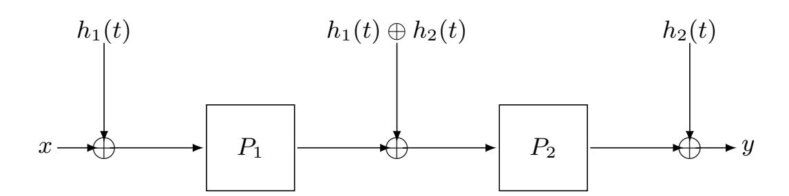
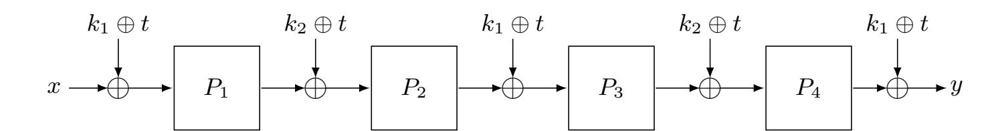
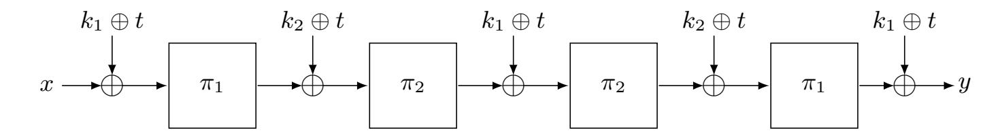

{0}------------------------------------------------

# Minimizing the Two-Round Tweakable Even-Mansour Cipher ?

Avijit Dutta

Institute for Advancing Intelligence, TCG-CREST, Kolkata. avirocks.dutta13@gmail.com

Abstract. In CRYPTO 2015, Cogliati et al. have proposed one-round tweakable Even-Mansour (1-TEM) cipher constructed out of a single nbit public permutation π and a uniform and almost XOR-universal hash function H as (k, t, x) 7→ Hk(t) ⊕ π(Hk(t) ⊕ x), where t is the tweak, and x is the n-bit message. Authors have shown that its two-round extension, which we refer to as 2-TEM, obtained by cascading 2-independent instances of the construction gives 2n/3-bit security and r-round cascading gives rn/r+2-bit security. In ASIACRYPT 2015, Cogliati and Seurin have shown that four-round tweakable Even-Mansour cipher, which we refer to as 4-TEM, constructed out of four independent n-bit permutations π1, π2, π3, π4 and two independent n-bit keys k1, k2, defined as

$$k_1 \oplus t \oplus \pi_4(k_2 \oplus t \oplus \pi_3(k_1 \oplus t \oplus \pi_2(k_2 \oplus t \oplus \pi_1(k_1 \oplus t \oplus x)))),$$

is secure upto 22n/3 adversarial queries. In this paper, we have shown that if we replace two independent permutations of 2-TEM (Cogliati et al., CRYPTO 2015) with a single n-bit public permutation, then the resultant construction still guarrantees security upto 22n/3 adversarial queries. Using the results derived therein, we also show that replacing the permutation (π4, π3) with (π1, π2) in the above equation preserves security upto 22n/3 adversarial queries.

Keywords: Tweakable Block Cipher, Key Alternating Cipher, Tweakable Even-Mansour Cipher, H-Coefficient

## 1 Introduction

Block Cipher and Tweakable Block Cipher. A block cipher is a fundamental cryptographic primitive and a workhorse in symmetric key cryptography. A block cipher E : K × M → M with key space K and message space M is a family of permutations over M indexed by key k ∈ K. A tweakable block cipher (TBC) is similar to a block cipher except that it takes an additional public input parameter t, called tweak. The signature of a tweakable block cipher is Ee : K × T × M → M with key space K, tweak space T and message space M such that for each k ∈ K and each tweak t ∈ T , m 7→ Ee(k, t, m) is a permutation

? ©This is the full version of the article accepted in IACR-ASIACRYPT 2020.

{1}------------------------------------------------

over M. A block cipher is different from a tweakable block cipher in the sense that for each key k, the former is a permutation over M whereas the latter is a family of permutations over M indexed by t ∈ T . The purpose of introducing tweak was to bring the inherent variability in the cipher in about the same way a nonce or an IV brings variability in a block cipher based encryption mode. After a rigorous formalization of tweakable block ciphers by Liskov, Rivest and Wagner [24], it has recently become one of the fundamental symmetric key primitives and has been found to be used in multiple applications like message authentication codes [31, 25, 8], length preserving tweakable enciphering mode [17, 18, 39, 12], online ciphers [36, 1, 19] and various authenticated encryption modes [24, 25, 33]. Offering higher security guarrantee is one of the reasons that various cryptographic modes of operations are now build on top of a tweakable block cipher than conventional block ciphers [25, 33, 8].

Before the formalization of TBC by Liskov et al. [24], there were few tweakable block ciphers which were designed from scratch. For example, block ciphers like Hasty Pudding cipher [37], Mercy cipher [11], Threefish (which is used in Skein hash function [14]) natively supports tweaks. Along with the formalization of the primitive, Liskov et al. [24] also proposed two generic constructions of a TBC out of a conventional block cipher in a black-box fashion and proved their birthday bound security, i.e., when the adversary is allowed to make roughly 2 n/2 queries to the encryption or decryption oracle, where n is the block size of the block cipher. Since then, desigining TBC in a black-box mode (i.e., build from a standard block cipher) has become one of the main avenues of symmetric key research [35, 28, 4]. Recently, a number of beyond birthday bound secure constructions build on top of block ciphers have also been emerged [29, 22, 26, 23]. Security of all these constructions have been proven in the standard model (i.e., assuming that the underlying block cipher is a pseudorandom permutation), except for constructions proposed in [26, 23] that were analyzed in the ideal cipher model.

However, in the black box mode of TBC design, where changing the tweak enforces to change the key of the underlying block cipher [29], are tend to be avoided for efficiency reasons, as re-keying a block cipher is often a costly operation. Hence, most of the existing proposals of designing a TBC out of a block cipher have the property that changing the tweak should not alter the key of the block cipher. In this regard, LRW1 and LRW2, proposed by Liskov et al. [24], are two such examples of birthday bound secure TBC which are build on top of a conventional block cipher and do not have the re-keying issue. Later on, Lendecker et al. [22] proposed a beyond birthday bound secure TBC designed on top of a block cipher by just simply cascading two independent instances of LRW2 construction. Authors of [22] have shown that cascaded LRW2 (CLRW2) is secure against any adaptive adversary that makes roughly at most 22n/3 encryption and decryption queries 1 This line of research was later extended by Lampe

1 Later, a flaw in the security proof was found in the original paper of Lendecker et al. [22], which was fixed by Procter [34]. However, a different way of fixing the proof was proposed by Landecker et al. in the revised version of [22].

{2}------------------------------------------------

and Seurin [21], who showed rn/r + 2-bit security by cascading r-independent LRW2 instances and they conjectured a tight rn/r + 1-bit security. Later on, Mennink [27] showed 3n/4-bit tight security bound on CLRW2. However, Mennink's analysis is based on 4-wise independent almost-xor universal (axu) hash function and each tweak value should occur for at most 2n/4 times. These nontrivial bottlenecks are lifted in a recent work of Jha and Nandi [20].

TBC design from lower level primitives. There have been several proposals of designing beyond the birthday bound TBC on top of a block cipher [22, 23, 26]. But unfortunately none of the them seem to be truly practical [9]. Thus, in an another line of work, researchers study how to build TBC from some lower level primitives like public permutations instead from a conventional block cipher. This was undertaken by Goldenberg et al. [15], who showed how to incorporate tweak in a feistel based cipher. This was later extended to generalized feistel ciphers by Iwata and Mitsuda [30]. In parallel to feistel based ciphers, a similar study was undertaken for iterated Even-Mansour (IEM) cipher [3, 6], a super class of popular SPN based networks. An r-round iterated Even-Mansour cipher based on a tuple of r independent permutations (π1, . . . , πr) and a tuple of r + 1 independent keys (k0, . . . , kr) is defined as follows: for x ∈ {0, 1} n,

$$\mathsf{IEM}_{\mathbf{k}}^{\boldsymbol{\pi}}(x) = k_r \oplus \pi_r(k_{r-1} \oplus \pi_{r-1}(\dots \pi_2(k_1 \oplus \pi_1(k_0 \oplus x))\dots)).$$

Similar to the feistel based designs, it is a natural quest to investigate how to incorporate tweaks in IEM cipher. In other words, how to mix the tweak and the key in an IEM cipher. We generally refer to this cipher as Tweakable Even-Mansour (TEM) cipher.

To address the question of incorporating tweaks in an IEM cipher, Cogliati and Seurin [10] and independently Farshim and Proecter [13] analyzed the simple case with n-bit key and n-bit tweak and showed that one can simply xor the tweak and the key in each round of IEM cipher to get a secure tweakable block cipher. However, they showed that such an approach gives no security for one and two rounds. Moreover, they had proved birthday bound security for three rounds and in fact, due to a result by Bellare and Kohno [2], it can be seen that xoring an n-bit tweak with an n-bit key in each round of IEM construction does not give security beyond the birthday bound. Therefore, to achieve beyond the birthday bound security, we should go for a complex mixing functions of tweak and key. Even if the function is linear, it should prevent the TBC construction from being of the form E(k ⊕ t, m) for some block cipher E with n-bit key and n-bit tweak.

Beyond Birthday Bound TEM. Designing beyond the birthday bound secure TEM was first undertaken by Cogliati et al. [7]. They used almost-xor universal hash functions as mixing functions of key and tweak as shown in Fig. 1.1. In particular, the mixing function is of the form Hki (t), where ki the key and t is the tweak.

Cogliati et al. have shown that one round TEM with non-linear mixing function gives n/2-bit security and 2-round gives 2n/3-bit security. In general, they also gave a non-tight asymptotic security bound on r-round TEM with rn/r + 2-bit

{3}------------------------------------------------

#### 4 Avijit Dutta

Fig. 1.1. 2-round tweakable Even-Mansour cipher with non-linear tweak and key mixing [7]. h1, h2 are two independent almost-xor universal hash functions.

security. Out of a particular relevance in this paper, we refer to Cogliati et al.'s 2-round TEM with non-linear mixing function as 2-TEM.

However, implementing an axu hash function might be costly [9]. For example multiplication based hashing [38] is a classic example of an axu hash function and implementing field multiplication is practically not efficient. Thus, a linear mixing function of key and tweak is always preferrable over a non-linear one. Therefore, one would ask for whether it is possible to design a beyond birthday bound secure TEM with linear mixing function. In this regard, Cogliati and Seurin (CS) [9] have showed that with 2n-bit keys and an n-bit tweak, one can realize a beyond the birthday bound secure TEM by simply xoring the key and the tweak in an alternating fashion in a 4-round IEM cipher (in the way as LED-128 [16] is designed) as depicted in Fig. 1.2. Again, out of a particular relevance in this paper, we refer to this construction as 4-TEM.

Fig. 1.2. 4-round tweakable Even-Mansour cipher with linear tweak and key mixing function [9]. k1, k2 are two independently sampled n-bit keys, t is an n-bit tweak and P1, P2, P3, P4 are independent n-bit public random permutations.

CS [9] have shown that 4-TEM gives 2n/3-bit security. However, realizing a beyond birthday bound secure TEM with n-bit tweak and n-bit key is open till date.

We would like to mention here that all the existing beyond birthday bound secure TEM constructions use independent permutations. Iterated Even-Mansour (resp. Tweakable Even-Mansour) cipher stands as a theoretical model for formally arguing the security of SPN based block ciphers (resp. tweakable block ciphers). However, almost every constructions following SPN paradigm fix a permutation P and keeps iterating it for multiple times to generate the output. Thus, the theoretical abstractions for SPN based tweakable block ciphers where independent round permutations are used, deviates from practical instantiations. 

{4}------------------------------------------------

Hence, it is natural to study the security of the TEM ciphers using a single permutation. In this regard, Chen et al. [5] studied the beyond birthday bound security of single permutation based two-round iterated Even-Mansour cipher. Hence, it is natural to investigate whether we can design a single permutation based TEM cipher that achieves beyond the birthday bound security.

Our Contribution. Inspired from the work of Chen et al. [5], we study the security of single permutation based 2-TEM cipher. In particular, we study the security of 2-TEM, as depicted in Fig. 1.1, where P1 = P2 = π, π is an n-bit public random permutation. We show that single permutation based 2-TEM construction is secure against all adversaries that make roughly 22n/3 queries. As a second part of the contribution, we have also reduced the number of permutations from four to two in 4-TEM and show that the resulting construction is secure against any adversaries that make roughly 22n/3 queries. In particular, we study the beyond birthday bound secrurity of 4-TEM as depicted in Fig. 1.2, where P1 = P4 = π1 and P2 = P3 = π2, π1 and π2 are two independent n-bit public random permutations.

Fig. 1.3. 4-round tweakable Even-Mansour cipher with linear tweak and key mixing function. k1, k2 are two independently sampled n-bit keys, t is an n-bit tweak and π1 and π2 are independent n-bit public random permutations.

However, we would like to mention here that for both of our contributions, we have not reduced the number of independent keys used in the construction, i.e., for 2-TEM, we require two independent hash keys and for 4-TEM we require two independent n-bit keys. A natural open problem is to investigate that whether one can reduce the number of keys of the construction as well without degrading the security.

## 2 Preliminaries

Basic Notations. For a set X , x ←\$ X denotes that x is sampled uniformly at random from X and is independent to all other random variables defined so far. For any natural number q, [q] denotes the set {1, . . . , q}. We denote an empty set as φ. We say two sets X and Y are disjoint if X ∩ Y = φ. We denote their union as X t Y (which we refer to as disjoint union). Let X = (X1, . . . , Xs) be a finite collection of finite sets. We say X is a disjoint collection if for each j 6= j 0 ∈ [s], Xj and Xj 0 are disjoint. The size of X, denoted as |X| = |X1| + . . . + |Xs|. For a disjoint collection X = (X1, . . . , Xs, Xs+1), we write X \ Xs to denote 

{5}------------------------------------------------

the collection  $(\mathcal{X}_1, \ldots, \mathcal{X}_s)$ . For two disjoint collections  $\mathfrak{X} = (\mathcal{X}_1, \ldots, \mathcal{X}_s)$  and  $\mathfrak{Y} = (\mathcal{Y}_1, \ldots, \mathcal{Y}_{s'})$ , we say  $\mathfrak{X}$  is inter disjoint with  $\mathfrak{Y}$  if for all  $j \in [s], j' \in [s'], \mathcal{X}_j$  is disjoint with  $\mathcal{Y}_{j'}$ . If  $\mathfrak{X}$  is inter disjoint with  $\mathfrak{Y}$ , then we denote their union as  $\mathfrak{X} \sqcup \mathfrak{Y}$ . Moreover,  $|\mathfrak{X} \sqcup \mathfrak{Y}| = |\mathfrak{X}| + |\mathfrak{Y}|$ . For a set  $\mathcal{S}$  and for a finite disjoint collection of finite sets  $\mathfrak{X} = (\mathcal{X}_1, \ldots, \mathcal{X}_s)$ , we write  $\mathcal{S} \setminus \mathfrak{X}$  to denote  $\mathcal{S} \setminus (\mathcal{X}_1 \sqcup \ldots \sqcup \mathcal{X}_s)$ . For a tuple  $\widetilde{x} = (x_1, x_2, \ldots, x_q)$ , where each  $x_i \in \mathcal{S}$  for some finite set  $\mathcal{S}$ ,  $\delta_{\widetilde{x}}(x)$  denotes the number of times  $x \in \mathcal{S}$  appears in the tuple  $\widetilde{x}$ .

For any natural number n,  $\{0,1\}^n$  denotes the set of all binary strings of length n. We denote  $|\{0,1\}^n|$  as  $N=2^n$  througout the paper. For integers  $1 \leq b \leq a$ ,  $(a)_b$  denotes  $a(a-1)\ldots(a-b+1)$ , where  $(a)_0=1$  by convention. We denote the set of all n-bit permutations  $\pi$  as  $\mathcal{P}_n$ . Let  $\mathcal{Z}_1=(z_1^1,\ldots,z_q^1)$  and  $\mathcal{Z}_2=(z_1^2,\ldots,z_q^2)$  be two finite tuples of length q such that for each  $i \in [q], z_i^1, z_i^2 \in \{0,1\}^n$ . We say an n bit permutation  $\pi \in \mathcal{P}_n$  maps  $\mathcal{Z}_1$  to  $\mathcal{Z}_2$ , denoted as  $\mathcal{Z}_1 \stackrel{\pi}{\mapsto} \mathcal{Z}_2$ , if for all  $i \in [q], \pi(z_i^1) = z_i^2$ . We say  $\mathcal{Z}_1$  is permutation compatible to  $\mathcal{Z}_2$  if there exists at least one  $\pi \in \mathcal{P}_n$  such that  $\mathcal{Z}_1 \stackrel{\pi}{\mapsto} \mathcal{Z}_2$ .

For a given tuple of ordered pairs  $Q = ((x_1, y_1), \dots, (x_q, y_q))$ , where each  $x_i$  are pairwise distinct n-bit strings and each  $y_i$  are pairwise distinct n bit strings, we define the following two sets:  $Dom(Q) = \{x_i \in \{0,1\}^n : (x_i, y_i) \in Q\}$  and  $\mathsf{Ran}(\mathcal{Q}) = \{y_i \in \{0,1\}^n : (x_i, y_i) \in \mathcal{Q}\}. \text{ Clearly, } |\mathsf{Dom}(\mathcal{Q})| = |\mathsf{Ran}(\mathcal{Q})| = q. \text{ We}$ say that an n-bit permutation  $\pi \in \mathcal{P}_n$  extends  $\mathcal{Q}$ , which we denote as  $\pi \mapsto \mathcal{Q}$ , if for all  $i \in [q], \pi(x_i) = y_i$ . We say that  $\mathcal{Q}$  is extendable if there exists at least one  $\pi \in \mathcal{P}_n$  such that  $\pi \mapsto \mathcal{Q}$ . One can naturally generalize this extendable notion for more than one tuple of ordered pairs. Let  $\mathcal{Q} = (\mathcal{Q}_1, \dots, \mathcal{Q}_s)$  such that for each  $j \in [s]$ ,  $Q_j$  is defined as  $Q_j = ((x_1^j, y_1^j), \dots, (x_{q_j}^j, y_{q_j}^j))$ , where each  $x_i^j$  are pairwise distinct n-bit strings and each  $y_i^j$  are pairwise distinct n-bit strings. Now, for each  $j \in [s]$ , we define the following two sets:  $\mathsf{Dom}(\mathcal{Q}_i) =$  $\{x_i^j:(x_i^j,y_i^j)\in\mathcal{Q}_j\}$  and  $\mathsf{Ran}(\mathcal{Q}_j)=\{y_i^j:(x_i^j,y_i^j)\in\mathcal{Q}_j\}$ . Clearly, for each  $j \in [s], |\mathsf{Dom}(\mathcal{Q}_j)| = |\mathsf{Ran}(\mathcal{Q}_j)| = q_j.$  We say that an *n*-bit permutation  $\pi \in \mathcal{P}_n$ extends  $\widetilde{\mathcal{Q}}$ , which we denote as  $\pi \mapsto \widetilde{\mathcal{Q}}$ , if for all  $j \in [s], \pi \mapsto \mathcal{Q}_j$ . For the sake of notational simplicity, we will be using the following: if for all  $j \neq j' \in [s]$ ,  $\mathsf{Dom}(\mathcal{Q}_i)$  is disjoint with  $\mathsf{Dom}(\mathcal{Q}_{i'})$  and  $\mathsf{Ran}(\mathcal{Q}_i)$  is disjoint with  $\mathsf{Ran}(\mathcal{Q}_{i'})$ , then  $\mathfrak{X} = (\mathsf{Dom}(\mathcal{Q}_1), \dots, \mathsf{Dom}(\mathcal{Q}_s))$  and  $\mathfrak{Y} = (\mathsf{Ran}(\mathcal{Q}_1), \dots, \mathsf{Ran}(\mathcal{Q}_s))$  becomes two disjoint collection of finite sets and in that case, as an alternative notation of  $\pi \mapsto \mathcal{Q}$ , we write  $\mathfrak{X} \stackrel{\pi}{\mapsto} \mathfrak{Y}$ . If  $\mathcal{S} = \{s_1, \ldots, s_q\} \subseteq \{0, 1\}^n$  and  $\mathcal{D} = \{d_1, \ldots, d_q\} \subseteq \{0, 1\}^n$  $\{0,1\}^n$  are two finite sets of equal cardinality, then we write  $(\mathcal{S},\mathcal{D})$  to denote the sequence of ordered pairs:  $((s_1, d_1), \ldots, (s_q, d_q))$ .

#### 2.1 A Simple Result on Probability

Having set up the basic notations, in this section, we state two simple yet useful probability results that we will be frequently using while proving the security of the construction.

**Proposition 1.** Let  $\widetilde{Q} = (Q_1, \dots, Q_{s+1})$  be an s+1 tuple of ordered pairs such that for  $j \in [s+1]$ ,  $Q_j$  is defined as  $Q_j = ((x_1^j, y_1^j), \dots, (x_{q_j}^j, y_{q_j}^j))$ . Moreover,

{6}------------------------------------------------

for each  $j, j' \in [s+1]$ ,  $\mathsf{Dom}(\mathcal{Q}_j) \cap \mathsf{Dom}(\mathcal{Q}_{j'}) = \phi$  and  $\mathsf{Ran}(\mathcal{Q}_j) \cap \mathsf{Ran}(\mathcal{Q}_{j'}) = \phi$ . Therefore,  $\mathfrak{X} = (\mathsf{Dom}(\mathcal{Q}_1), \ldots, \mathsf{Dom}(\mathcal{Q}_{s+1}))$  and  $\mathfrak{Y} = (\mathsf{Ran}(\mathcal{Q}_1), \ldots, \mathsf{Ran}(\mathcal{Q}_{s+1}))$ be two disjoint collection of finite sets such that for each  $j \in [s+1]$ ,  $|\mathsf{Dom}(\mathcal{Q}_j)| = |\mathsf{Ran}(\mathcal{Q}_j)| = q_j$ . Then, we have

$$\Pr[\pi \leftarrow_{\$} \mathcal{P}_n : \mathfrak{X} \backslash \mathsf{Dom}(\mathcal{Q}_{s+1}) \overset{\pi}{\mapsto} \mathfrak{Y} \backslash \mathsf{Ran}(\mathcal{Q}_{s+1}) \mid \pi \mapsto \mathcal{Q}_{s+1}] = \frac{1}{(N - q_{s+1})_{q_1 + \ldots + q_s}}.$$

By setting s = 1 in the above proposition gives the following simple corollary:

Corollary 1. For two sets  $Q_1$  and  $Q_2$ , where  $Q_1 = ((x_1^1, y_1^1), \dots, (x_{q_1}^1, y_{q_1}^1))$  of cardinality  $q_1$  and  $Q_2 = ((x_1^2, y_1^2), \dots, (x_{q_2}^2, y_{q_2}^2))$  of cardinality  $q_2$ , such that  $\mathsf{Dom}(Q_1) \cap \mathsf{Dom}(Q_2) = \phi$  and  $\mathsf{Ran}(Q_1) \cap \mathsf{Ran}(Q_2) = \phi$ . Then, we have

$$\Pr[\pi \leftarrow_{\$} \mathcal{P}_n : \pi \mapsto \mathcal{Q}_1 \mid \pi \mapsto \mathcal{Q}_2] = \frac{1}{(N - q_2)_{q_1}}.$$

#### 2.2 Security Definition

In this section, we recall the security definition of tweakable block ciphers, almost xor universal hash function and tweakable Even Mansour cipher.

TWEAKABLE BLOCK CIPHERS. A tweakable block cipher (TBC) with key space  $\mathcal{K}$ , tweak space  $\mathcal{T}$  and domain  $\mathcal{X}$  is a mapping  $\widetilde{\mathsf{E}}:\mathcal{K}\times\mathcal{T}\times\mathcal{X}\to\mathcal{X}$  such that for all key  $k\in\mathcal{K}$  and all tweak  $t\in\mathcal{T},\,x\mapsto\widetilde{\mathsf{E}}(k,t,x)$  is a permutation of  $\mathcal{X}$ . We denote  $\mathsf{TBC}(\mathcal{K},\mathcal{T},\mathcal{X})$  the set of all tweakable block ciphers with tweak space  $\mathcal{T}$  and message space  $\mathcal{X}$ . A tweakable permutation with tweak space  $\mathcal{T}$  and domain  $\mathcal{X}$  is a mapping  $\widetilde{\pi}:\mathcal{T}\times\mathcal{X}\to\mathcal{X}$  such that for all tweak  $t\in\mathcal{T},\,x\mapsto\widetilde{\pi}(t,x)$  is a permutation of  $\mathcal{X}$ . We write  $\mathsf{TP}(\mathcal{T},n)$  denotes the set of all tweakable permutations with tweak space  $\mathcal{T}$  and and n-bit messages.

AXU, UNIVERSAL AND ALMOST REGULAR HASH FUNCTION. Let  $\mathcal{K}_h$  and  $\mathcal{X}$  be two non-empty finite sets and H be a keyed function  $H: \mathcal{K}_h \times \mathcal{X} \to \{0,1\}^n$ . Then, (i) H is said to be an  $\epsilon$ -almost xor universal hash function if for any distinct  $x, x' \in \mathcal{X}$  and for any  $\Delta \in \{0,1\}^n$ ,

$$\Pr\left[k_h \leftarrow_{\$} \mathcal{K}_h : \mathsf{H}_{k_h}(x) \oplus \mathsf{H}_{k_h}(x') = \Delta\right] < \epsilon.$$

H is said to be an  $\epsilon$ -almost regular hash function if for any  $x \in \mathcal{X}$  and for any  $\Delta \in \{0,1\}^n$ ,

$$\Pr\left[k_h \leftarrow_{\$} \mathcal{K}_h : \mathsf{H}_{k_h}(x) = \Delta\right] \leq \epsilon.$$

TWEAKABLE EVEN-MANSOUR. We first fix some integer  $n, r \geq 1$ . Let  $\mathcal{K}$  and  $\mathcal{T}$  be two non-empty finite sets and let  $\Psi = (\Psi_0, \dots, \Psi_r)$  be r + 1-tuple of functions from  $\mathcal{K} \times \mathcal{T}$  to  $\{0,1\}^n$ . Then, an r-round tweakable Even-Mansour cipher  $\mathsf{TEM}[n,r,\Psi]$ , constructed from a r-tuple of n-bit independent permutations  $\boldsymbol{\pi} = (\pi_1, \dots, \pi_r)$ , specifies a tweakble block cipher, with key space  $\mathcal{K}$ , tweak

{7}------------------------------------------------

space  $\mathcal{T}$  and message space  $\{0,1\}^n$ , denoted as  $\mathsf{TEM}^{\boldsymbol{\pi}}$  that maps a key  $\mathbf{k}$ , tweak  $\mathbf{t}$  and a plaintext  $x \in \{0,1\}^n$  to the ciphertext defined as:

$$\mathsf{TEM}^{\boldsymbol{\pi}}(\mathbf{k}, \mathbf{t}, x) = \Psi_r(\mathbf{k}, \mathbf{t}) \oplus \pi_r(\dots \pi_2(\Psi_1(\mathbf{k}, \mathbf{t}) \oplus \pi_1(\Psi_0(\mathbf{k}, \mathbf{t}) \oplus x))\dots). \tag{1}$$

Note that, 2-TEM is a special class of Eqn. (1) where r=2,  $\mathbf{k}=(k_1,k_2)$  and  $\Psi_0(\mathbf{k},t)=\mathsf{H}_{k_1}(t),\Psi_1(\mathbf{k},t)=\mathsf{H}_{k_1}(t)\oplus\mathsf{H}_{k_2}(t)$  and  $\Psi_2(\mathbf{k},t)=\mathsf{H}_{k_2}(t)$ , where  $\mathsf{H}=\{\mathsf{H}_{k_h}\}_{k_h\in\mathcal{K}_h}$  is a family of almost-xor universal and almost-regular hash functions that maps elements from  $\mathcal{T}$  to  $\{0,1\}^n$ . Similarly, 4-TEM is a special class of Eqn. (1) where r=4,  $\mathbf{k}=(k_1,k_2)$  and  $\Psi_0(\mathbf{k},t)=k_1\oplus t,\Psi_2(\mathbf{k},t)=k_2\oplus t,\Psi_3(\mathbf{k},t)=k_1\oplus t,\Psi_4(\mathbf{k},t)=k_2\oplus t$  and  $\Psi_5(\mathbf{k},t)=k_1\oplus t$ .

<u>Security Definition of TEM.</u> We study the indistinguishability of r-round tweakable Even-Mansour construction  $\mathsf{TEM}[n, r, \mathsf{H}]$  in the random permutation model where we consider an adaptive distinguisher A that interacts with a tuple of r+1 oracles  $(\mathcal{O}, \boldsymbol{\pi})$ , where  $\mathcal{O}$  is a tweakable permutations with tweak space  $\mathcal{T}$  and message space  $\{0,1\}^n$  and  $\boldsymbol{\pi}=(\pi_1,\ldots,\pi_r)$  are n-bit public random permutations. The goal of the distinguisher is to distinguish between the following two worlds: in the real world it interacts with the oracle  $(\mathsf{TEM}^{\pi}_{\mathbf{k}}, \pi)$ , where the key **k** is sampled uniformly at random from some finite key space  $\mathcal{K}$ . In the ideal world, it interacts with  $(\widetilde{\pi}_0, \boldsymbol{\pi})$ , where  $\widetilde{\pi}_0$  is uniformly sampled from  $\mathsf{TP}(\mathcal{T}, n)$ and  $\pi$  is a tuple of n-bit public random permutations independent of  $\widetilde{\pi}_0$ . We refer  $\mathsf{TEM}_{\mathbf{k}}^{\boldsymbol{\pi}}/\widetilde{\pi}_0$  as the construction oracle and  $\boldsymbol{\pi}$  as the primitive oracles. We assume that A is not only adaptive, but is also bi-directional (i.e., it can make forward and inverse queries to its oracle). Moreover, A is also allowed to query the primitive oracles in an interleave fashion with the construction oracle queries. We define the strong tweakable pseduo-random permutation (stprp) advantage of  $\mathsf{TEM}[n, r, \Psi]$  as

$$\mathbf{Adv}_{\mathsf{TEM}}^{\mathsf{tsprp}}(\mathsf{A}) \stackrel{\Delta}{=} | \Pr[\mathsf{A}^{(\mathsf{TEM}_{\mathbf{k}}^{\boldsymbol{\pi}}, \boldsymbol{\pi})} \Rightarrow 1] - \Pr[\mathsf{A}^{(\widetilde{\pi}_0, \boldsymbol{\pi})} \Rightarrow 1] |, \tag{2}$$

where  $A^{\mathcal{O}} \Rightarrow 1$  denotes the event that A outputs 1 after interacting with the oracle  $\mathcal{O}$ . The first probability in Eqn. (2) is defined over the randomness of  $\mathbf{k}$  and  $\boldsymbol{\pi}$ , whereas the second probability is defined over the randomness of  $\widetilde{\pi}_0$  and  $\boldsymbol{\pi}$ . In the rest of the paper we assume that A is computationally unbounded and hence a deterministic distinguisher. We call such a distinguisher as *information theoretic* distinguisher. We also assume that A does not repeat queries and never makes pointless queries 2. As we study the security analysis of single permutation variant of 2-TEM and two independent permutations variant of 4-TEM, from now onwards, we concentrate on only these two constructions.

#### 2.3 H-Coefficient Technique

H-Coefficient technique [32, 6] is an important tool to upper bound the statistical distance between the answers of two interactive systems and is typically used to

&lt;sup>2 Queries whose answer can be deduced from previous query-responses.

{8}------------------------------------------------

prove the information theoretic pseudo randomness of constructions. We discuss this result in the light of tweakable Even-Mansour cipher. Let us consider an information theoretic deterministic distinguisher A with access to the following tuple of oracles: in the real world it interacts with  $(\mathsf{TEM}^{\boldsymbol{\pi}}_{\mathbf{k}}, \boldsymbol{\pi})$  and in the ideal world it interacts with  $(\widetilde{\pi}_0, \boldsymbol{\pi})$ . After this interaction is over, A outputs a decision bit. The collection of all queries and responses that is made to and from the oracle during the interaction of A with  $\mathcal{O}$ , is summarized in a transcript  $(\tau_c, \tau_p)$ , where  $\tau_c$  is the transcript that summarizes the interaction with construction oracle and  $\tau_p$  summarizes the interaction with primitive oracles. More formally,  $\tau_c =$  $\{(t_1, x_1, y_1), \dots, (t_q, x_q, y_q)\}$  is the set of all construction queries and responses and  $\tau_p = \{(u_1, v_1), \dots, (u_p, v_p)\}\$  is the set of all primitive queries and responses, where A makes q construction queries and p primitive queries. Since A is bidirectional, A can make either forward construction query (t,x) and receives response y or can make inverse construction query (t, y) and receives response x. Similarly, for primitive query A can either make forward query u to its primitive  $\pi$  and receives response y or can make inverse query v to  $\pi^{-1}$  and receives response u. Since, we assume that A never makes pointless queries, none of the transcripts contain any duplicate elements. We also assume that A repeats tweaks in the construction query. Hence, we assume that there are  $\mu$  distinct tweaks  $(t_1, t_2, \ldots, t_{\mu})$  in the set of construction queries and  $q_i$  denotes the number of construction queries with i-th tweak such that

$$\sum_{i=1}^{\mu} q_i = q.$$

We modify the experiment by releasing internal information to A after it has finished the interaction but has not output yet the decision bit. In the real world, we reveal the key  $\mathbf{k}$  which is used in the construction and in the ideal world, we sample a dummy key  $\mathbf{k}$  uniformly at random from the keyspace and reveal it to the distinguisher. In all the following, the complete transcript is  $(\tau_c, \tau_p, \mathbf{k})$ . Note that, the modified experiment only makes the distinguisher more powerful and hence the distinguishing advantage of  $\mathbf{A}$  in this experiment is no way less than its distinguishing advantage in the former one.

Let  $D_{re}$  (resp.  $D_{id}$ ) denotes the random variable representing the real world and the ideal world transcript respectively. The probability of realizing a transcript  $(\tau_c, \tau_p, \mathbf{k})$  in the ideal (resp. real) world is called *ideal (resp. real) interpolation probability*. A transcript  $(\tau_c, \tau_p, \mathbf{k})$  is said to be *attainable* with respect to A if its ideal interpolation probability is non zero. We denote the set of all such attainable transcripts by  $\Theta$ . Following these notations, we state the main theorem of H-Coefficient Technique as follows.

Theorem 1 (H-Coefficient Technique). Let  $\Theta = \Theta_g \sqcup \Theta_b$  be some partition of the set of attainable transcripts. Suppose there exists  $\epsilon_{\rm ratio} \geq 0$  such that for any  $\tau = (\tau_c, \tau_p, \mathbf{k}) \in \Theta_g$ ,

$$\frac{\mathsf{p}_{\rm re}(\tau)}{\mathsf{p}_{\rm id}(\tau)} \stackrel{\Delta}{=} \frac{\Pr[\mathsf{D}_{\rm re} = \tau]}{\Pr[\mathsf{D}_{\rm id} = \tau]} \ge 1 - \epsilon_{\rm ratio},$$

{9}------------------------------------------------

and there exists  $\epsilon_{\rm bad} \geq 0$  such that  $\Pr[\mathsf{D}_{\rm id} \in \Theta_{\rm b}] \leq \epsilon_{\rm bad}$ . Then,

$$\mathbf{Adv}_{\mathsf{TFM}}^{\mathsf{tsprp}}(\mathsf{A}) \le \epsilon_{\mathsf{ratio}} + \epsilon_{\mathsf{bad}}.$$
 (3)

Having explained the H-Coefficient technique in the view of our construction, we now state the following result from [7,9]

**Lemma 1.** Let  $\tau = (\tau_c, \tau_p, \mathbf{k}) \in \Theta$  be an attainable transcript. Let  $\mathsf{p}(\tau) \stackrel{\Delta}{=} \Pr[\pi \leftarrow_{\$} \mathcal{P}_n : \mathsf{TEM}^{\pi}_{\mathbf{k}} \mapsto \tau_c \mid \pi \mapsto \tau_p]$ . Then, we have

$$\frac{\mathsf{p}_{\text{re}}(\tau)}{\mathsf{p}_{\text{id}}(\tau)} = \mathsf{p}(\tau) \cdot \prod_{i=1}^{\mu} (N)_{q_i}$$

Therefore, to apply Theorem 1, for a properly defined good transcript  $\tau$ , we need to compare  $\mathbf{p}(\tau)$  and  $\prod_{i=1}^{\mu} (N)_{q_i}$ .

#### 2.4 Sum Capture Lemma

In this section, we state an important probabilitatic result, dubbed as *sum capture lemma*. In the following, we state two variants of the sum-capture lemma. The first variant will be used in the security proof of single permutation variant of 2-TEM and the other variant will be used in the security proof of two independent permutations variant of 4-TEM.

Sum-Capture Lemma-Variant I. We use the sum capture lemma by Chen et al. [5]. Informally, the result states that for a random subset S of  $\{0,1\}^n$  of size  $q_0$  and for any two arbitrary subsets A and B of  $\{0,1\}^n$ , the size of the set

$$\mu(\mathcal{S}, \mathcal{A}, \mathcal{B}) \stackrel{\Delta}{=} |\{(s, a, b) \in \mathcal{S} \times \mathcal{A} \times \mathcal{B} : s = a \oplus b\}|,$$

is at most  $q_0|\mathcal{A}||\mathcal{B}|/N$ , except with negligible probabilty.

**Lemma 2 (Sum-Capture Lemma).** Let  $n, q_0 \in \mathbb{N}$  such that  $9n \leq q_0 \leq N/2$ . Let S be a random subset of  $\{0,1\}^n$  of size  $q_0$ . Then, for any two subsets A and B of  $\{0,1\}^n$ , we have

$$\Pr[\exists \mathcal{A}, \mathcal{B} : \mu(\mathcal{S}, \mathcal{A}, \mathcal{B}) \ge \frac{q_0|\mathcal{A}||\mathcal{B}|}{N} + \frac{2q_0^2\sqrt{|\mathcal{A}||\mathcal{B}|}}{N} + 3\sqrt{nq_0|\mathcal{A}||\mathcal{B}|}] \le \frac{2}{N}, \quad (4)$$

where the randomness is defined over the set S.

Sum-Capture Lemma-Variant II. We use the sum capture lemma by Cogliati et al. [9], which is dubbed as  $Extended\ Sum-Capture\ Lemma$  [9]. Informally, the result states that for a fixed automorphism  $\Phi$  and a probabilistic adversary A, the size of the set

$$\mu(\mathcal{Q}, \mathcal{U}, \mathcal{V}) \stackrel{\Delta}{=} |\{ \big( (t, x, y), u, v \big) \in \mathcal{Q} \times \mathcal{U} \times \mathcal{V} : x \oplus u = \Phi(y \oplus v) \}|,$$

is at most  $q|\mathcal{U}||\mathcal{V}|/N$ , except with negligible probabilty, where the set  $\mathcal{Q} = \{(t_1, x_1, y_1), \dots, (t_q, x_q, y_q)\}$  denotes the interaction of A with an uniform random tweakable permutation  $\tilde{\pi}$ .

{10}------------------------------------------------

Lemma 3 (Extended Sum-Capture Lemma). Let  $\Phi$  be a fixed automorphism and  $\mathcal{T}$  be a fixed non-empty finite set. Let  $\widetilde{\pi}$  be a uniform tweakable random permutation in  $\mathsf{TP}(\mathcal{T}, n)$  and  $\mathsf{A}$  be some probabilistic adversary that makes two sided adaptive queries to  $\widetilde{\pi}$ . Let  $\mathcal{Q} = \{(t_1, x_1, y_1), \ldots, (t_q, x_q, y_q)\}$  be the transcript of the interaction of  $\mathsf{A}$  with  $\widetilde{\pi}$  and for any two subsets  $\mathcal{U} \subseteq \{0, 1\}^n, \mathcal{V} \subseteq \{0, 1\}^n$ , let us define

$$\mu(\mathcal{Q}, \mathcal{U}, \mathcal{V}) \stackrel{\Delta}{=} |\{((t, x, y), u, v) \in \mathcal{Q} \times \mathcal{U} \times \mathcal{V} : x \oplus u = \Phi(y \oplus v)\}|.$$

Then, for  $9n \le q \le N/2$ , we have

$$\Pr[\exists \mathcal{U}, \mathcal{V} : \mu(\mathcal{Q}, \mathcal{U}, \mathcal{V}) \ge \frac{q|\mathcal{U}||\mathcal{V}|}{N} + \frac{2q^2\sqrt{|\mathcal{U}||\mathcal{V}|}}{N} + 3\sqrt{nq|\mathcal{U}||\mathcal{V}|}] \le \frac{2}{N}, \quad (5)$$

where the randomness is defined over the set Q and the random coin of A.

When we apply Lemma 3 in our security analysis, we consider the automorphism  $\Phi$  to be an identity function.

## 3 BBB Security of Single Permutation Variant of 2-TEM

#### 3.1 Security Statement

In this section, we state the security result of single permutation based 2-TEM cipher. Let H be a family of  $\epsilon$ -almost-xor universal and  $\epsilon$ -almost-regular hash functions that maps elements from tweak space  $\mathcal{T}$  to  $\{0,1\}^n$ . Then, single permutation based 2-TEM is defined as

$$2\text{-TEM}^{\pi}_{h_1,h_2}(t,x) = \pi(\pi(x \oplus h_1(t)) \oplus h_1(t) \oplus h_2(t)) \oplus h_2(t) = y,$$

where  $\pi \in \mathcal{P}_n$  is an *n*-bit public random permutation,  $(h_1, h_2) \leftarrow_{\$} \mathsf{H}^2$  are two independently sampled hash functions,  $t \in \mathcal{T}$  is the tweak and  $x \in \{0, 1\}^n$  is the plaintext. For convenience, we refer the single permutation based 2-TEM construction as 2-TEM+. The main result of this section is to prove the following:

**Theorem 2.** Let A be any adaptive deterministic distinguisher that makes q many construction queries with  $\mu$  distinct tweaks and p many primitive queries in both the forward and the backward directions. Let H be an  $\epsilon$ -almost-xor universal and  $\epsilon$ -almost regular hash function that maps elements from tweak space  $\mathcal{T}$  to  $\{0,1\}^n$ . Then,

$$\begin{aligned} \mathbf{Adv}_{\text{2-TEM}^+}^{\text{tsprp}}(\mathsf{A}) & \leq \left(\frac{3qp^2}{N^2} + \frac{2pq^2}{N^2} + \frac{5q^3}{3N^2} + \frac{6p\sqrt{q}}{N} + \frac{11q^{3/2}}{N} + \frac{14q}{N^{2/3}} + \frac{38q^2}{N^{4/3}} + \frac{6q}{N} \right) \\ & + \frac{4q(p + 6\sqrt{q} + 3q)^2}{N^2} + \frac{24\sqrt{nq}}{N^{1/3}} + \frac{48\sqrt{q}}{N^{1/3}} \right). \end{aligned}$$

{11}------------------------------------------------

In particular, if the almost-xor universal and the almost-regular advantage of H is roughly  $2^{-n}$ , then one can see that 2-TEM+ is secure roughly upto  $2^{2n/3}$  adversarial queries.

In the rest of the section we prove Theorem 2. Our security proof relies on H-Coefficient technique. As a result, the first step of our proof would be to identify bad transcripts and upper bound their probability in the ideal world. Followed by this, we will show that for a good transcript  $\tau$ , its real interpolation probability is very close to its ideal interpolation probability.

#### 3.2 Definition and Probability of Bad Transcripts

In this section, we define and bound the probability of bad transcripts in the ideal world. For a transcript  $\tau = (\tau_c, \tau_p, k_1, k_2)$ , we define  $U = \mathsf{Dom}(\tau_p)$ , the domain of primitive queries and  $V = \mathsf{Ran}(\tau_p)$ , the range of primitive queries. Moreover, for a pair of keys  $(k_1, k_2)$  and for any  $t \in \mathcal{T}$ , we write  $h_1(t)$  to denote  $\mathsf{H}_{k_1}(t)$  and  $h_2(t)$  to denote  $\mathsf{H}_{k_2}(t)$ . For a transcript  $\tau = (\tau_c, \tau_p, k_1, k_2)$ , we associate the following parameters:

$$\alpha_1 \stackrel{\Delta}{=} |\{(t, x, y) \in \tau_c : x \oplus h_1(t) \in U\}|$$

$$\alpha_2 \stackrel{\Delta}{=} |\{(t, x, y) \in \tau_c : y \oplus h_2(t) \in V\}|$$

$$\beta_1 \stackrel{\Delta}{=} |\{(t, x, y) \neq (t', x', y') \in \tau_c : x \oplus h_1(t) = x' \oplus h_1(t')\}|$$

$$\beta_2 \stackrel{\Delta}{=} |\{(t, x, y) \neq (t', x', y') \in \tau_c : y \oplus h_2(t) = y' \oplus h_2(t')\}|$$

**Definition 1 (Bad Transcript).** An attainable transcript  $\tau' = (\tau_c, \tau_p, k_1, k_2)$  is called a **bad** transcript if any one of the following condition holds:

- B.1:  $\exists i \in [q], j, j' \in [p] \text{ such that } x_i \oplus h_1(t_i) = u_j, y_i \oplus h_2(t_i) = v_{j'}.$
- B.2:  $\exists i \in [q], j, j' \in [p] \text{ such that } x_i \oplus h_1(t_i) = u_j, v_j \oplus h_1(t_i) \oplus h_2(t_i) = u_{j'}.$
- B.3:  $\exists i \in [q], j, j' \in [p]$  such that  $y_i \oplus h_2(t_i) = v_j, u_j \oplus h_1(t_i) \oplus h_2(t_i) = v_{j'}$ .
- B.4:  $\exists i, i' \in [q], j \in [p]$  such that  $x_i \oplus h_1(t_i) = u_j, v_j \oplus h_1(t_i) \oplus h_2(t_i) = x_{i'} \oplus h_1(t_{i'})$ .
- B.5:  $\exists i, i' \in [q], j \in [p]$  such that  $y_i \oplus h_2(t_i) = v_j, u_j \oplus h_1(t_i) \oplus h_2(t_i) = y_{i'} \oplus h_2(t_{i'})$ .
- B.6:  $\exists i, i' \in [q], j \in [p]$  such that  $x_i \oplus h_1(t_i) = u_i, y_i \oplus h_2(t_i) = y_{i'} \oplus h_2(t_{i'})$ .
- B.7:  $\exists i, i' \in [q], j \in [p] \text{ such that } y_i \oplus h_2(t_i) = v_j, x_i \oplus h_1(t_i) = x_{i'} \oplus h_1(t_{i'}).$
- B.8:  $\exists i, i' \in [q]$  such that  $x_i \oplus h_1(t_i) = x_{i'} \oplus h_1(t_{i'}), h_1(t_i) \oplus h_2(t_i) = h_1(t_{i'}) \oplus h_2(t_{i'}).$
- B.9:  $\exists i, i' \in [q]$  such that  $y_i \oplus h_2(t_i) = y_{i'} \oplus h_2(t_{i'}), h_1(t_i) \oplus h_2(t_i) = h_1(t_{i'}) \oplus h_2(t_{i'}).$
- B.10:  $\exists i,i',i'' \in [q]$  such that  $x_i \oplus h_1(t_i) = x_{i'} \oplus h_1(t_{i'}), y_i \oplus h_2(t_i) = y_{i''} \oplus h_2(t_{i''}).$
- B.11:  $\exists i, i' \in [q], j, j' \in [p]$  such that  $x_i \oplus h_1(t_i) = u_j, x_{i'} \oplus h_1(t_{i'}) = u_{j'}, v_j \oplus h_1(t_i) \oplus h_2(t_i) = v_{j'} \oplus h_1(t_{i'}) \oplus h_2(t_{i'}).$
- B.12:  $\exists i, i' \in [q], j, j' \in [p]$  such that  $y_i \oplus h_2(t_i) = v_j, y_{i'} \oplus h_2(t_{i'}) = v_{j'}, u_j \oplus h_1(t_i) \oplus h_2(t_i) = u_{j'} \oplus h_1(t_{i'}) \oplus h_2(t_{i'}).$

{12}------------------------------------------------

- B.13:  $\mathcal{D} \stackrel{\Delta}{=} |\{(t_i, x_i, y_i), (t_j, x_j, y_j), (t_k, x_k, y_k) \in \tau_c : y_i \oplus h_2(t_i) \oplus h_2(t_j) = t_j \}$  $|x_k \oplus h_1(t_k) \oplus h_1(t_j)\}| \ge 3q^3/N + 3q\sqrt{nq}$
- B.14:  $\alpha_1 \ge \sqrt{q}$
- B.15:  $\alpha_2 \geq \sqrt{q}$ . B.16:  $\beta_1 \geq \sqrt{q} \vee \beta_2 \geq \sqrt{q}$ .

Recall that, we denote  $\Theta_b$  (resp.  $\Theta_g$ ) the set of bad (resp. good) transcripts. We bound the probability of bad transcripts in the ideal world as follows.

**Lemma 4 (Bad Lemma).** Let  $\tau = (\tau_c, \tau_p, k_1, k_2)$  be any attainable transcript. Let  $D_{id}$  and  $\Theta_{b}$  be defined as above. Then

$$\Pr[\mathsf{D}_{\mathrm{id}} \in \Theta_{\mathrm{b}}] \le \epsilon_{\mathrm{bad}} = \frac{3qp^2}{N^2} + \frac{2pq^2}{N^2} + \frac{3q^2}{2N^2} + \frac{q^3}{6N^2} + \frac{2p\sqrt{q}}{N} + \frac{q}{N} + \frac{q^{3/2}}{N}.$$

**Proof.** Let  $\tau = (\tau_c, \tau_p, k_1, k_2)$  be any attainable transcript. Recall that, in the ideal world  $k_1$  and  $k_2$  are drawn uniformly at random from the keyspace. Using the union bound, we have

$$\Pr[\mathsf{D}_{\mathrm{id}} \in \Theta_{\mathrm{b}}] \leq \underbrace{\left(\sum_{\substack{i=1,\\i\neq 4,5,13}}^{16} \Pr[\mathsf{B}.\mathsf{i}]\right) + \underbrace{\left(\Pr[\mathsf{B}.\mathsf{4}] + \Pr[\mathsf{B}.\mathsf{5}] + \Pr[\mathsf{B}.\mathsf{13}]\right)}_{\mathsf{B}}. \tag{6}$$

We bound part (A) in exactly the similar way as done in [7]. We defer the calculation of this part in Supplementary Material 8. However, ahead of calculation, we have

$$\mathsf{A} \le \frac{3qp^2}{N^2} + \frac{3q^2}{2N^2} + \frac{q^3}{6N^2} + \frac{2p\sqrt{q}}{N} + \frac{q+2}{N} + \frac{q^{3/2}}{N}. \tag{7}$$

To bound part (B) in the following, we begin with event B.4 and B.5 as follows: BOUNDING B.4 AND B.5. We consider the event B.4. For a fixed  $(t_i, x_i, y_i) \neq$  $(t_{i'}, x_{i'}, y_{i'}) \in \tau_c$  and for a fixed  $(u_j, v_j) \in \tau_p$ , one has by the regularity of H and  $h_1$  and  $h_2$  are drawn independent to each other,

$$\Pr[h_1(t_i) = x_i \oplus u_j, h_2(t_i) = v_j \oplus h_1(t_i) \oplus x_{i'} \oplus h_1(t_{i'})] \le \frac{1}{N^2}.$$

By summing over all possible choices of  $(t_i, x_i, y_i), (t_{i'}, x_{i'}, y_{i'}) \in \tau_c, (u_j, v_j) \in \tau_p$ we have

$$\Pr[\mathsf{B.4}] \le \frac{pq^2}{2N^2}.\tag{8}$$

Similarly, for B.5 one obtains,

$$\Pr[\mathsf{B.5}] \le \frac{pq^2}{2N^2}.\tag{9}$$

BOUNDING B.13. For bounding B.13, we introduce the following sets:  $\mathcal{H}_1$  $\{x \oplus h_1(t) : (t, x, y) \in \tau_c\}$  and  $\mathcal{H}_2 = \{y \oplus h_2(t) : (t, x, y) \in \tau_c\}$  and  $\mathcal{H}_3 = \{y \oplus h_2(t) : (t, x, y) \in \tau_c\}$  $\{h_1(t) \oplus h_2(t) : (t, x, y) \in \tau_c\}$ . Then,

$$|\mathcal{D}| = |\{(h_3, h_1, h_2)\} \in \mathcal{H}_3 \times \mathcal{H}_1 \times \mathcal{H}_2 : h_3 = h_1 \oplus h_2\}|.$$

{13}------------------------------------------------

Therefore, to bound the probability of the event B.13, it is enough to bound the probability of the following event:

$$\mathsf{E} \stackrel{\Delta}{=} |\{ \left(h_3, h_2, h_1\right) \in \mathcal{H}_3 \times \mathcal{H}_1 \times \mathcal{H}_2 : h_3 = h_1 \oplus h_2 \}| \geq \frac{3q^3}{N} + 3q\sqrt{nq}.$$

From Lemma 2, the probability of event E is bounded above by 2/N. Hence,

$$\Pr[\mathsf{B.13}] \le \frac{2}{N}.\tag{10}$$

From Eqn. (6)-Eqn. (10), the result follows. ut

#### 3.3 Analysis of Good Transcripts

In this section, we state that for a good transcript τ = (τc, τp, k1, k2) such that τc has µ distinct tweaks, realizing τ is almost as likely in the real world as in the ideal world. More formally,

Lemma 5 (Good Lemma). Let τ = (τc, τp, k1, k2) ∈ Θg be a good transcript such that τc has µ distinct tweaks. Let Dre and Did be defined as above. Then,

$$\frac{\Pr[\mathsf{D}_{\rm re} = \tau]}{\Pr[\mathsf{D}_{\rm id} = \tau]} \ge 1 - \left(\frac{4p\sqrt{q}}{N} + \frac{10q^{3/2}}{N} + \frac{14q}{N^{2/3}} + \frac{4q(p + 6\sqrt{q} + 3q)^2}{N^2} + \frac{38q^2}{N^{4/3}} + \frac{5q}{N^4} + \frac{24\sqrt{nq}}{N^{1/3}} + \frac{48\sqrt{q}}{N^{1/3}}\right).$$

Proof of this lemma is the most difficult part of the paper. Hence, we devote the following seperate section for proving it. Therefore, by applying H-Coefficient technique (i.e., Theorem 1) with Lemma 4 and Lemma 5, the result follows. ut

## 4 Proof of Good Lemma

In this section, we prove that for a good transcript τ = (τc, τp, k1, k2), realizing it in the real world is as likely as realizing it in the ideal world. Note that, we have shown in Lemma 1 that to compute the ratio of real to ideal interpolation probability for a good transcript τ , one needs to compare

$$\mathsf{p}(\tau) \stackrel{\Delta}{=} \Pr[\pi \leftarrow_{\$} \mathcal{P}_n : 2\text{-}\mathsf{TEM}_{k_1,k_2}^{+\boldsymbol{\pi}} \mapsto \tau_c \mid \pi \mapsto \tau_p]$$

with (N)q1 ·(N)q2 . . .(N)qµ , where recall that µ is the distinct number of tweaks (t1, . . . , tµ) and qi is the number of times tweak ti appears in the construction queries τc ∈ τ . Therefore, it is enough to establish a lower bound of p(τ ).

{14}------------------------------------------------

#### 4.1 Establishing Lower bound on $p(\tau)$

First of all, recall that U is the set of all domain points of primitive queries and V is the set of all range points of it. For a good transcript  $(\tau_c, \tau_p, k_1, k_2)$ , we define the following two sets:  $\mathfrak{I} = \{x_i \oplus h_1(t_i) : (t_i, x_i, y_i) \in \tau_c\}$  and  $\mathfrak{D} = \{y_i \oplus h_2(t_i) : (t_i, x_i, y_i) \in \tau_c\}$ . Since,  $\tau$  is a good transcript, we can partition the set of construction queries  $\tau_c \in \tau$  into a finite number of disjoint groups as follows:

(a) 
$$\mathcal{Q}_U \stackrel{\Delta}{=} \{(t, x, y) \in \tau_c : x \oplus h_1(t) \in U\}, (b) \mathcal{Q}_V \stackrel{\Delta}{=} \{(t, x, y) \in \tau_c : y \oplus h_2(t) \in V\}$$

(c) 
$$\mathcal{Q}_X \stackrel{\Delta}{=} \{(t, x, y) \in \tau_c : \delta_{\mathfrak{I}}(x \oplus h_1(t)) > 1, x \oplus h_1(t) \notin U\}$$

(d) 
$$\mathcal{Q}_{Y} \stackrel{\Delta}{=} \{(t, x, y) \in \tau_{c} : \delta_{\Omega}(y \oplus h_{2}(t)) > 1, y \oplus h_{2}(t) \notin V\}$$

(e) 
$$Q_0 \stackrel{\Delta}{=} \{(t, x, y) \in \tau_c : \delta_{\mathfrak{I}}(x \oplus h_1(t)) = \delta_{\mathfrak{D}}(y \oplus h_2(t)) = 1, x \oplus h_1(t) \notin U, y \oplus h_2(t) \notin V\}$$

Having defined the sets, we now claim that the sets are disjoint and iney exhaust the entire set of attainable good transcripts.

**Proposition 2.** Let  $\tau = (\tau_c, \tau_p, k_1, k_2) \in \Theta_g$  be a good transcript. Then the sets  $(\mathcal{Q}_U, \mathcal{Q}_V, \mathcal{Q}_X, \mathcal{Q}_Y, \mathcal{Q}_0)$  are pairwise disjoint.

**Proof.** First of all, according to the definition of the sets,  $Q_U \cap Q_X = \phi$ ,  $Q_U \cap Q_0 = \phi$ ,  $Q_V \cap Q_V = \phi$ ,  $Q_V \cap Q_0 = \phi$ . Moreover,  $Q_X \cap Q_0 = \phi$ ,  $Q_Y \cap Q_0 = \phi$ . Now,  $Q_U \cap Q_V = \phi$ , othwerise bad condition B.1 would be satisfied. Similarly,  $Q_U \cap Q_V = \phi$  (resp.  $Q_V \cap Q_X = \phi$ ), othwerise bad condition B.6 (resp. B.7) would be satisfied. Moreover,  $Q_X \cap Q_Y = \phi$  othwerise bad condition B.10 would be satisfied. Moreover, it is easy to see that a good transcript  $\tau$  belongs to exactly one of these five sets.

Note that, since  $\tau$  is a good transcript, we have,

$$\alpha_1 \stackrel{\Delta}{=} |\mathcal{Q}_U| \le \sqrt{q}, \ \alpha_2 \stackrel{\Delta}{=} |\mathcal{Q}_V| \le \sqrt{q}.$$

Let  $\mathsf{E}_U$  denotes the event 2- $\mathsf{TEM}_{k_1,k_2}^{+\pi} \mapsto \mathcal{Q}_U$ . Similarly,  $\mathsf{E}_V$  denotes the event 2- $\mathsf{TEM}_{k_1,k_2}^{+\pi} \mapsto \mathcal{Q}_U$ ,  $\mathsf{E}_X$  denotes the event 2- $\mathsf{TEM}_{k_1,k_2}^{+\pi} \mapsto \mathcal{Q}_X$ ,  $\mathsf{E}_Y$  denotes the event 2- $\mathsf{TEM}_{k_1,k_2}^{+\pi} \mapsto \mathcal{Q}_Y$  and finally,  $\mathsf{E}_0$  denotes the event 2- $\mathsf{TEM}_{k_1,k_2}^{+\pi} \mapsto \mathcal{Q}_0$ . Now, it is easy to see that

$$p(\tau) = \Pr[\mathsf{E}_{U} \wedge \mathsf{E}_{V} \wedge \mathsf{E}_{X} \wedge \mathsf{E}_{Y} \wedge \mathsf{E}_{0} \mid \pi \mapsto \tau_{p}]$$

$$= \underbrace{\Pr[\mathsf{E}_{U} \wedge \mathsf{E}_{V} \mid \pi \mapsto \tau_{p}]}_{\mathsf{p}_{1}(\tau)} \cdot \underbrace{\Pr[\mathsf{E}_{X} \wedge \mathsf{E}_{Y} \wedge \mathsf{E}_{0} \mid \mathsf{E}_{U} \wedge \mathsf{E}_{V} \wedge \pi \mapsto \tau_{p}]}_{\mathsf{p}_{2}(\tau)}$$
(11)

Thus, it is enough to establish a good lower bound on  $p_1(\tau)$  and  $p_2(\tau)$  for a good transcript  $\tau$ .

{15}------------------------------------------------

### 4.2 Lower Bound of $p_1(\tau)$

To lower bound  $p_1(\tau)$ , we define the following sets:

$$\mathcal{S}_1 \stackrel{\Delta}{=} \{x \oplus h_1(t) : (t, x, y) \in \mathcal{Q}_U\}, \quad \mathcal{S}_2 \stackrel{\Delta}{=} \{x \oplus h_1(t) : (t, x, y) \in \mathcal{Q}_V\}$$
$$\mathcal{D}_1 \stackrel{\Delta}{=} \{y \oplus h_2(t) : (t, x, y) \in \mathcal{Q}_U\}, \quad \mathcal{D}_2 \stackrel{\Delta}{=} \{y \oplus h_2(t) : (t, x, y) \in \mathcal{Q}_V\}$$

Note that,  $|\mathcal{S}_1| = \alpha_1$  and  $|\mathcal{D}_2| = \alpha_2$ . Moreover,  $\mathcal{S}_1 \subseteq U$ ,  $\mathcal{D}_2 \subseteq V$ . Without loss of generality, let us assume that  $x_i \oplus h_1(t_i) = u_i$  for  $(t_i, x_i, y_i) \in \mathcal{Q}_U$  and similarly,  $y_i \oplus h_2(t_i) = v_i$  for  $(t_i, x_i, y_i) \in \mathcal{Q}_V$ . Now, we define two additional sets:

$$\mathcal{X}_1 \stackrel{\Delta}{=} \{ v_1 \oplus h_1(t_1) \oplus h_2(t_1), \dots, v_{\alpha_1} \oplus h_1(t_{\alpha_1}) \oplus h_2(t_{\alpha_1}) \}$$
$$\mathcal{X}_2 \stackrel{\Delta}{=} \{ u_1 \oplus h_1(t_1) \oplus h_2(t_1), \dots, u_{\alpha_2} \oplus h_1(t_{\alpha_2}) \oplus h_2(t_{\alpha_2}) \}$$

In the following we state that every element of  $\mathcal{D}_1$  is distinct and does not collide with any primitive query output. Similarly, every element of  $\mathcal{S}_2$  is distinct and does not collide with any primitive query input.

**Proposition 3.** Every element of  $\mathcal{D}_1$  is distinct and does not collide with any primitive query output. Similarly, every element of  $\mathcal{S}_2$  is distinct and does not collide with any primitive query input.

Proof of this proposition is postponed to Supplementary Material 7. However, the above result says that  $|\mathcal{D}_1| = \alpha_1$  and  $|\mathcal{S}_2| = \alpha_2$ . Now, we have the following proposition which states that every element of  $\mathcal{X}_1$  and  $\mathcal{X}_2$  are istinct and  $\mathcal{X}_1$  is pairwise disjoint with  $\mathcal{S}_1$  and  $\mathcal{S}_2$ . Similarly, every element of  $\mathcal{X}_2$  is distinct and pairiwise disjoint with  $\mathcal{D}_1$  and  $\mathcal{D}_2$ .

**Proposition 4.** Every element of  $\mathcal{X}_1$  is distinct and  $\mathcal{X}_1 \cap \mathcal{S}_1 = \phi, \mathcal{X}_1 \cap \mathcal{S}_2 = \phi$ . Moreover, every element of  $\mathcal{X}_2$  is distinct and  $\mathcal{X}_2 \cap \mathcal{D}_1 = \phi, \mathcal{X}_2 \cap \mathcal{D}_2 = \phi$ .

We postpone the proof of this proposition to Supplementary Material 7. Now, from Proposition 3 and Proposition 4, we have  $|\mathcal{S}_1| = |\mathcal{X}_1| = |\mathcal{D}_1| = \alpha_1$  and  $|\mathcal{S}_2| = |\mathcal{X}_2| = |\mathcal{D}_2| = \alpha_2$ . Also recall that |U| = |V| = p. Now, we consider the following two sequences:

$$\mathcal{X}_1 \mathcal{D}_1 \stackrel{\Delta}{=} \big( (v_i \oplus h_1(t_i) \oplus h_2(t_i), y_i \oplus h_2(t_i))_i : v_i \oplus h_1(t_i) \oplus h_2(t_i) \in \mathcal{X}_1, y_i \oplus h_2(t_i) \in \mathcal{D}_1 \big).$$

$$\mathcal{S}_2 \mathcal{X}_2 \stackrel{\Delta}{=} \big( (x_i \oplus h_1(t_i), u_i \oplus h_1(t_i) \oplus h_2(t_i))_i : x_i \oplus h_1(t_i) \in \mathcal{S}_2, u_i \oplus h_1(t_i) \oplus h_2(t_i) \in \mathcal{X}_2 \big).$$

From Proposition 3 and Proposition 4, it follows that the domain of  $\mathcal{X}_1\mathcal{D}_1$  is disjoint with the domain of  $\mathcal{S}_2\mathcal{X}_2$ . Moreover, they are individually disjoint with U. Similarly, the range of  $\mathcal{X}_1\mathcal{D}_1$  is disjoint with the range of  $\mathcal{S}_2\mathcal{X}_2$ . Moreover, they are individually disjoint with V. Therefore, we have  $\mathfrak{X} = (U, \mathcal{X}_1, \mathcal{S}_2)$  and  $\mathfrak{Y} = (V, \mathcal{D}_1, \mathcal{X}_2)$  are disjoint collections. Thus, from Proposition 2 one has,

$$\mathsf{p}_1(\tau) \stackrel{\Delta}{=} \Pr[\pi \leftarrow_{\$} \mathcal{P}_n : \mathfrak{X} \setminus U \stackrel{\pi}{\mapsto} \mathfrak{Y} \setminus V \mid \pi \mapsto \tau_p] = \frac{1}{(N-p)_{\alpha_1 + \alpha_2}}. \tag{12}$$

{16}------------------------------------------------

#### 4.3 Lower Bound on $p_2(\tau)$

In the last section, we have seen that  $\pi$  has been fixed on  $\alpha_1 + \alpha_2$  input-output (apart from p input-output primitive pairs). Moreover, the collection of input and output sets of  $\pi$  that have been explored in the last section is  $\mathfrak{X} = (U, \mathcal{X}_1, \mathcal{S}_2)$  and  $\mathfrak{Y} = (V, \mathcal{D}_1, \mathcal{X}_2)$ . Now, to bound  $\mathfrak{p}_2(\tau)$  for  $\tau$ , we first define few sets:

$$\mathcal{S}_1' \stackrel{\Delta}{=} \{x \oplus h_1(t) : (t, x, y) \in \mathcal{Q}_X\}, \quad \mathcal{S}_2' \stackrel{\Delta}{=} \{x \oplus h_1(t) : (t, x, y) \in \mathcal{Q}_Y\}.$$

$$\mathcal{D}_1' \stackrel{\Delta}{=} \{y \oplus h_2(t) : (t, x, y) \in \mathcal{Q}_X\}, \quad \mathcal{D}_2' \stackrel{\Delta}{=} \{y \oplus h_2(t) : (t, x, y) \in \mathcal{Q}_Y\}.$$

Let  $\alpha'_1 = |\mathcal{S}'_1|$ ,  $\alpha'_2 = |\mathcal{D}'_1|$ . Moreover,  $\alpha''_1 = |\mathcal{S}'_2|$ ,  $\alpha''_2 = |\mathcal{D}'_2|$ . Let us enumerate the set  $\mathcal{S}'_1$  and  $\mathcal{D}'_2$  as follows:  $\mathcal{S}'_1 = \{s'_{1,1}, \ldots, s'_{1,\alpha'_1}\}$  and  $\mathcal{D}'_2 = \{d''_{2,1}, \ldots, d''_{2,\alpha''_2}\}$ . Our goal is to construct the set  $P(\mathcal{S}'_1)$ ,  $P^{-1}(\mathcal{D}'_1)$ ,  $P(\mathcal{S}'_2)$  and  $P^{-1}(\mathcal{D}'_2)$ , where

$$P(\mathcal{S}_1') \stackrel{\Delta}{=} \{ \pi(x \oplus h_1(t)) : x \oplus h_1(t) \in \mathcal{S}_1' \}.$$
$$P^{-1}(\mathcal{D}_1') \stackrel{\Delta}{=} \{ \pi^{-1}(y \oplus h_2(t)) : y \oplus h_2(t) \in \mathcal{D}_1' \}.$$

Similarly, the set  $P(S'_2)$  and  $P^{-1}(\mathcal{D}'_2)$  are defined. It is to be noted that initially these sets are undefined as the permutation is not sampled yet. Recall that,  $\beta_1$  refers to the number of input-collding pair of construction queries and  $\beta_2$  refers to the number of output-colliding pair of construction queries. Therefore, we can write,

$$\beta_1 = \sum_{\substack{x \in \{0,1\}^n : \\ \delta_{\mathfrak{I}}(x) > 1}} \delta_{\mathfrak{I}}(x), \quad \beta_2 = \sum_{\substack{x \in \{0,1\}^n : \\ \delta_{\mathfrak{D}}(x) > 1}} \delta_{\mathfrak{D}}(x),$$

where recall that  $\mathfrak{I} = \{x \oplus h_1(t) : (t, x, y) \in \tau_c\}$  and  $\mathfrak{O} = \{y \oplus h_2(t) : (t, x, y) \in \tau_c\}$ . Moreover, we have the following bound on  $\alpha'_1$ .

$$\alpha_1' \le \sum_{\substack{x \in \{0,1\}^n: \\ \delta_{\mathfrak{I}}(x) > 1}} 1 \le \sum_{\substack{x \in \{0,1\}^n: \\ \delta_{\mathfrak{I}}(x) > 1}} \frac{\delta_{\mathfrak{I}}(x)}{2} = \frac{\beta_1}{2} \le \frac{\sqrt{q}}{2}.$$

Similarly, one can derive  $\alpha_2'' \leq \beta_2/2 \leq \sqrt{q}/2$ . Now, we consider the elements of  $\mathcal{D}_1'$ . We claim that each element of  $\mathcal{D}_1'$  is distinct. This is because if two of them collides then that would satisfy condition B.10. This gives us the following upper bound on  $\alpha_2'$ , which is derived as follows:

$$\alpha_2' \le \sum_{i=1}^{\alpha_1'} \delta_{\mathfrak{I}}(s_{1,i}') \le \sum_{\substack{x \in \{0,1\}^n: \\ \delta_{\mathfrak{I}}(x) > 1}} \delta_{\mathfrak{I}}(x) = \beta_1 \le \sqrt{q}.$$

By a similar reasoning, one can derive  $\alpha_1'' \leq \beta_2 \leq \sqrt{q}$ . Moreover, since, each element of  $\mathcal{D}_1'$  is distinct,  $\alpha_1' = |\mathcal{Q}_X|$ . Similarly, as each element of  $\mathcal{S}_2'$  is distinct,  $\alpha_2'' = |\mathcal{Q}_Y|$ . Now, to lower bound  $p_2(\tau)$ , we need to define two more additional sets as follows:

$$\mathcal{U} \stackrel{\Delta}{=} \{x \oplus h_1(t) : (t, x, y) \in \mathcal{Q}_0\}, \quad \mathcal{V} \stackrel{\Delta}{=} \{y \oplus h_2(t) : (t, x, y) \in \mathcal{Q}_0\}.$$

{17}------------------------------------------------

Since,  $(Q_U, Q_V, Q_X, Q_Y, Q_0)$  forms a partition of a good construction query transcript  $\tau_c$ , it is obvious that

$$q' \stackrel{\Delta}{=} |Q_0| = q - (|Q_U| + |Q_V| + |Q_X| + |Q_Y|) = q - (\alpha_1 + \alpha_2 + \alpha_1'' + \alpha_2).$$

Thus, we have  $q' = |\mathcal{U}| = |\mathcal{V}|$ . Let us enumerate the set  $\mathcal{U}$  and  $\mathcal{V}$  as follows:  $\mathcal{U} = \{\widetilde{u}_{1,i,j} : 1 \leq i \leq \mu, 1 \leq j \leq q'_i\}$  and  $\mathcal{V} = \{\widetilde{v}_{2,i,j} : 1 \leq i \leq \mu, 1 \leq j \leq q'_i\}$ , where recall that  $\mu$  is the distinct number of tweaks  $(t_1, \ldots, t_{\mu})$  and  $q'_i$  is the number of construction queries  $(t, x, y) \in \mathcal{Q}_0$  with tweak value  $t_i$ . Besides constructing  $P(\mathcal{S}'_1), P(\mathcal{S}'_2), P^{-1}(\mathcal{D}'_1)$  and  $P^{-1}(\mathcal{D}'_2)$ , we also construct two additional sets:

$$P(\mathcal{U}) \stackrel{\Delta}{=} \{ \pi(x \oplus h_1(t)) : (t, x, y) \in \mathcal{Q}_0 \}.$$
$$P^{-1}(\mathcal{V}) \stackrel{\Delta}{=} \{ \pi^{-1}(y \oplus h_2(t)) : (t, x, y) \in \mathcal{Q}_0 \}.$$

Let  $\mathfrak{X}^+ = (\mathcal{S}'_1, \mathcal{S}'_2, \mathcal{U})$  and  $\mathfrak{Y}^+ = (\mathcal{D}'_1, \mathcal{D}'_2, \mathcal{V})$ . Now, we state in the following two propositions that  $\mathfrak{X}^+$  is a disjoint collection and it is inter disjoint with  $\mathfrak{X}$ . Moreover,  $\mathfrak{Y}^+$  is a disjoint collection and it is inter disjoint with  $\mathfrak{Y}$ . We postpone the proof of these two propositions in Supplementary Material 7.

**Proposition 5.**  $\mathfrak{X}^+$  is a disjoint collection and it is inter disjoint with  $\mathfrak{X}$ . Moreover,  $\mathfrak{Y}^+$  is a disjoint collection and it is inter disjoint with  $\mathfrak{Y}$ .

From Proposition 5,  $\mathfrak{X}^+$  is inter disjoint with  $\mathfrak{X}$  and  $\mathfrak{Y}^+$  is inter disjoint with  $\mathfrak{Y}$ . Thus, we have  $\mathfrak{X}^{++} = \mathfrak{X}^+ \sqcup \mathfrak{X}$  and  $\mathfrak{Y}^{++} = \mathfrak{Y}^+ \sqcup \mathfrak{Y}$ . It is easy to see that,

$$\Delta_1 \stackrel{\Delta}{=} |\mathfrak{X}^{++}| = p + q' + \alpha_1 + \alpha_2 + \alpha_1' + \alpha_1''$$
$$\Delta_2 \stackrel{\Delta}{=} |\mathfrak{Y}^{++}| = p + q' + \alpha_1 + \alpha_2 + \alpha_2' + \alpha_2''$$

Our Goal: Now, our goal is to construct the set  $P(S'_1)$ ,  $P(S'_2)$ ,  $P(\mathcal{U})$  and  $P^{-1}(\mathcal{D}'_1)$ ,  $P^{-1}(\mathcal{D}'_2)$  and  $P^{-1}(\mathcal{V})$  in such a way so that

- 1.  $(\mathcal{S}'_1, P(\mathcal{S}'_1))$  becomes extendable
- 2.  $(S'_2, P(S'_2))$  becomes extendable
- 3.  $(\mathcal{U}, P(\mathcal{U}))$  becomes extendable

Similarly,

- 1.  $(P^{-1}(\mathcal{D}_1), \mathcal{D}_1)$  becomes extendable
- 2.  $(P^{-1}(\mathcal{D}_2'), \mathcal{D}_2')$  becomes extendable
- 3.  $(P^{-1}(\mathcal{V}), \mathcal{V})$  becomes extendable

Note that the elements of  $P(\mathcal{S}'_1)$  uniquely determines the elements of  $P^{-1}(\mathcal{D}'_1)$ , elements of  $P^{-1}(\mathcal{D}'_2)$  uniquely determines the elements of  $P(\mathcal{S}'_2)$  and elements of  $P(\mathcal{U})$  uniquely determines the elements of  $P^{-1}(\mathcal{V})$ . Hence, we sample the elements of  $P(\mathcal{S}'_1)$  in such a way so that it preserves the permutation compatibility between  $\mathcal{S}'_1$  and  $P(\mathcal{S}'_1)$  and between  $P^{-1}(\mathcal{D}'_1)$  and  $\mathcal{D}'_1$ . Similarly, we sample the elements of  $P^{-1}(\mathcal{D}'_2)$  in such a way so that it preserves the permutation compatibility between  $\mathcal{D}'_2$  and  $P^{-1}(\mathcal{D}'_2)$  and between  $\mathcal{S}'_2$  and  $P(\mathcal{S}'_2)$ . Finally, we sample

{18}------------------------------------------------

the elements of  $P(\mathcal{U})$  in such a way so that it preserves the permutation compatibility between  $\mathcal{U}$  and  $P(\mathcal{U})$  and between  $\mathcal{V}$  and  $P^{-1}(\mathcal{V})$ . To this end, we define the following sets: for each  $u, v \in \{0, 1\}^n$ ,

$$\mathcal{X}_u = \{(t, x, y) \in \tau_c : x \oplus h_1(t) = u\}$$
$$\mathcal{Y}_v = \{(t, x, y) \in \tau_c : y \oplus h_2(t) = v\}$$

STEP-I: CONSTRUCT SET  $P(S'_1)$  AND  $P^{-1}(\mathcal{D}'_1)$ . Let  $\mathcal{N}_1$  be the number of tuple of distinct values  $(v'_{1,1},\ldots,v'_{1,\alpha'_1})$  in  $\{0,1\}^n\setminus\mathfrak{Y}^{++}$  such that it satisfies the following two conditions:

- for each  $i \in [\alpha'_1]$  and for each  $(t, x, y) \in \mathcal{X}_{s'_{1,i}}, v'_{1,i} \oplus h_1(t) \oplus h_2(t) \notin \mathfrak{X}^{++}$
- for each  $i \in [\alpha'_1]$ , for each  $(t, x, y) \in \mathcal{X}_{s'_{1,i}}$ , for each j < i and for each  $(t', x', y') \in \mathcal{X}_{s'_{1,i}}$ ,  $v'_{1,i} \oplus h_1(t) \oplus h_2(t) \neq v'_{1,j} \oplus h_1(t') \oplus h_2(t')$

Let  $\mathcal{Z}_1$  be the set of all tuple of distinct values  $(v'_{1,1}, \ldots, v'_{1,\alpha'_1})$  in  $\{0,1\}^n \setminus \mathfrak{Y}^{++}$  that satisfies the above two conditions. Note that,  $|\{0,1\}^n \setminus \mathfrak{Y}^{++}| = (N - (p + q' + \alpha_1 + \alpha_2 + \alpha'_2 + \alpha''_2))$ . Moreover, the first condition excludes at most  $(p + q' + \alpha_1 + \alpha_2 + \alpha'_1 + \alpha''_1)|\mathcal{X}_{s'_{1,i}}|$  values for  $v'_{1,i}$  and the last condition excludes at most  $|\mathcal{X}_{s'_{1,i}}| \cdot (|\mathcal{X}_{s'_{1,i}}| + \ldots + |\mathcal{X}_{s'_{1,i-1}}|) \leq \alpha'_2 \cdot |\mathcal{X}_{s'_{1,i}}|$  values for  $v'_{1,i}$ . Thus, one has

$$|\mathcal{Z}_1| = \mathcal{N}_1 \ge \prod_{i=0}^{\alpha_1'-1} \left( N - \Delta_2 - i - (\Delta_1 + \alpha_2') |\mathcal{X}_{s_{1,i+1}'}| \right). \tag{13}$$

We set  $P(S'_1) = \{v'_{1,1}, \dots, v'_{1,\alpha'_1}\}$  and  $P^{-1}(\mathcal{D}'_1) = \{v'_{1,i} \oplus h_1(t) \oplus h_2(t) : i \in [\alpha'_1], (t, x, y) \in \mathcal{X}_{s'_{1,i}}\}$ . Note that such assignment makes  $(S'_1, P(S'_1))$  extendable and  $(P^{-1}(\mathcal{D}'_1), \mathcal{D}'_1)$  extendable. It is easy to see that  $P(S'_1)$  is disjoint with each set of  $\mathfrak{Y}^{++}$  and  $P^{-1}(\mathcal{D}'_1)$  is disjoint with each set of  $\mathfrak{X}^{++}$ . Thus, we have,  $\mathfrak{X}^{3+} = \mathfrak{X}^{++} \sqcup P^{-1}(\mathcal{D}'_1)$  and  $\mathfrak{Y}^{3+} = \mathfrak{Y}^{++} \sqcup P(S'_1)$ . Moreover,  $\Delta_3 \stackrel{\triangle}{=} |\mathfrak{X}^{3+}| = \Delta_1 + \alpha'_2$  and  $\Delta_4 \stackrel{\triangle}{=} |\mathfrak{Y}^{3+}| = \Delta_2 + \alpha'_1$ .

STEP-II: CONSTRUCT SET  $P(S_2')$  AND  $P^{-1}(\mathcal{D}_2')$ . Let  $\mathcal{N}_2$  be the number of tuple of distinct values  $(u_{2,1}'', \dots, u_{2,\alpha_2''}'')$  in  $\{0,1\}^n \setminus \mathfrak{X}^{3+}$  such that it satisfies the following two conditions:

- for each  $i \in [\alpha_2'']$  and each  $(t, x, y) \in \mathcal{Y}_{d_{2,i}''}$ ,  $u_{2,i}'' \oplus h_1(t) \oplus h_2(t) \notin \mathfrak{Y}^{3+}$
- for each  $i \in [\alpha_2'']$ , for each  $(t, x, y) \in \mathcal{Y}_{d_{2,i}'}$ , for each j < i and for each  $(t', x', y') \in \mathcal{Y}_{d_{1,j}''}$ ,  $u_{1,i}'' \oplus h_1(t) \oplus h_2(t) \neq u_{1,j}'' \oplus h_1(t') \oplus h_2(t')$

Let  $\mathcal{Z}_2$  be the set of all tuple of distinct values  $(u''_{2,1}, \ldots, u''_{2,\alpha'_2})$  in  $\{0,1\}^n \setminus \mathfrak{X}^{3+}$  that satisfies the above two conditions. Note that,  $|\{0,1\}^n \setminus \mathfrak{X}^{3+}| = (N - (\Delta_1 + \alpha'_2))$ . Moreover, the first condition excludes at most  $(\Delta_2 + \alpha'_1)|\mathcal{Y}_{d''_{2,i}}|$  values for  $u''_{2,i}$  and the last condition excludes at most  $|\mathcal{Y}_{d''_{2,i}}| \cdot (|\mathcal{Y}_{d''_{2,i}}| + \ldots + |\mathcal{Y}_{d''_{2,i-1}}|) \leq \alpha''_1 \cdot |\mathcal{Y}_{d''_{2,i}}|$  values for  $u''_{2,i}$ . Thus, one has

$$|\mathcal{Z}_2| = \mathcal{N}_2 \ge \prod_{i=0}^{\alpha_2''-1} \left( N - \Delta_3 - i - (\Delta_4 + \alpha_1'') |\mathcal{Y}_{d_{2,i+1}''}| \right). \tag{14}$$

{19}------------------------------------------------

We set  $P^{-1}(\mathcal{D}'_2) = \{u''_{2,1}, \dots, u''_{2,\alpha''_2}\}$  and  $P(\mathcal{S}'_2) = \{u''_{2,i} \oplus h_1(t) \oplus h_2(t) : i \in [\alpha''_2], (t, x, y) \in \mathcal{Y}_{d''_{2,i}}\}$ . Note that such assignment makes  $(\mathcal{S}'_2, P(\mathcal{S}'_2))$  extendable and  $(\mathcal{D}'_2, P^{-1}(\mathcal{D}'_2))$  extendable.

It is easy to see that  $P(S_2')$  is disjoint with each set of  $\mathfrak{Y}^{3+}$  and  $P^{-1}(\mathcal{D}_2')$  is disjoint with each set of  $\mathfrak{X}^{3+}$ . Thus, we have,  $\mathfrak{X}^{4+} = \mathfrak{X}^{3+} \sqcup P^{-1}(\mathcal{D}_2')$  and  $\mathfrak{Y}^{4+} = \mathfrak{Y}^{3+} \sqcup P(S_2')$ . Moreover,  $\Delta \stackrel{\triangle}{=} |\mathfrak{X}^{4+}| = \Delta_3 + \alpha_2'' = \Delta_4 + \alpha_1'' = |\mathfrak{Y}^{4+}|$ . Let  $\mathfrak{X}_0 = \mathfrak{X}^{+4} \setminus \mathcal{U}$  and  $\mathfrak{Y}_0 = \mathfrak{Y}^{+4} \setminus \mathcal{U}$ . For a fixed choice of elements from  $\mathcal{Z}_1$  and  $\mathcal{Z}_2$ , we have,

$$\widehat{\mathbf{p}} = \Pr[\pi \leftarrow_{\$} \mathcal{P}_n : \mathfrak{X}_0 \setminus \mathfrak{X} \stackrel{\pi}{\mapsto} \mathfrak{Y}_0 \setminus \mathfrak{Y} \mid \mathfrak{X} \stackrel{\pi}{\mapsto} \mathfrak{Y}] = \frac{1}{(N - (p + \alpha_1 + \alpha_2))_{\Delta'}}, \quad (15)$$

where  $\Delta' = \Delta - (p + q' + \alpha_1 + \alpha_2)$ . Now, we come to the last step in the construction of sets, i.e., we construct set  $P(\mathcal{U})$  and  $P^{-1}(\mathcal{V})$ .

STEP-III: CONSTRUCT SET  $P(\mathcal{U})$  AND  $P^{-1}(\mathcal{V})$ . Recall that  $q' = q - (\alpha_1 + \alpha_2 + \alpha_1'' + \alpha_2')$ . Let us consider the following parameter:

$$M = \frac{q'}{N^{1/3}}$$

such that q' - 3M = q'/2, which holds true for  $n \ge 9$ . Let  $p' = (p + \alpha_1 + \alpha_2 + \alpha_1' + \alpha_2' + \alpha_1'' + \alpha_2'')$  and  $q'' = q' - 2\alpha$  for some  $\alpha$  such that  $0 \le \alpha \le M$ . We know that  $(q_1 + \ldots + q_\mu) = q$ . Now, for each  $i \in [\mu]$ , we define  $q_i''$  and  $q_i'$  such that  $q_i'' \le q_i' \le q_i$  and

$$\sum_{i=1}^{\mu} q'_i = q', \quad \sum_{i=1}^{\mu} q''_i = q'', \quad q''_i = q'_i - \theta_i, \quad \text{for some } \theta_i, 1 \le i \le \mu$$

Let  $\mathcal{Z}_0$  be the tuple of distinct values that makes  $(\mathcal{U}, P(\mathcal{U}))$  extendable and  $(P^{-1}(\mathcal{V}), \mathcal{V})$  extendable. Let  $\mathcal{N}_0$  be the number of such tuples. Then, we have the following result:

**Lemma 6.** Let  $\mathcal{N}_0, p', q', q''_i, \alpha, M$  be defined as above. Moreover,  $\mu$  is the distinct number of tweaks appearing in the construction query transcript. Then,

$$\mathcal{N}_0 \ge \sum_{0 \le \alpha \le M} \frac{(q')_{2\alpha}}{\alpha!} \cdot (1 - \epsilon_0) \cdot \prod_{i=1}^{\mu} \left( N - 2p' - 2q' - 2\alpha - 2 \sum_{k=1}^{i-1} q_k'' \right)_{q_i''},$$

where  $\epsilon_0 = 4q/N^{2/3} + 24q^2/N^{4/3} + 24\sqrt{nq}/N^{1/3} + 48\sqrt{q}/N^{1/3}$ . Moreover,  $P(\mathcal{U})$  is disjoint with each set of  $\mathfrak{Y}^{4+}$ ,  $P^{-1}(\mathcal{V})$  is disjoint with each set of  $\mathfrak{X}^{4+}$ . Even more, the number of input-ouput pairs on which a random permutation  $\pi$  becomes fixed to map  $\mathcal{U}$  to  $P(\mathcal{U})$  and  $P^{-1}(\mathcal{V})$  to  $\mathcal{V}$  is  $3\alpha + 2q''$ 

Note that, the number of way of choosing the tuple looks different than that of  $\mathcal{N}_1$  and  $\mathcal{N}_2$  (which looks alike). This is because, we are allowing collisions between  $P(\mathcal{U})$  and  $\mathcal{U}$ . In other words, if  $P(\mathcal{U}) \cap \mathcal{U} = \phi$ , then we end up with

{20}------------------------------------------------

birthday bound term. Due to this enforcement of collision, the counting of the set  $\mathcal{Z}_0$  becomes involved and hence we postpone the proof of the lemma in Supplementary Material 9.

From Lemma 6 and Eqn. (15) and for a fixed choice of elements from  $\mathcal{Z}_0$ ,  $\mathcal{Z}_1$  and  $\mathcal{Z}_2$ , we have,

$$\widehat{\mathsf{p}}_{2} = \Pr[\pi \leftarrow_{\$} \mathcal{P}_{n} : \mathfrak{X}_{0} \setminus \mathfrak{X} \stackrel{\pi}{\mapsto} \mathfrak{Y}_{0} \setminus \mathfrak{Y} \bigwedge \pi \mapsto (\mathcal{U}, P(\mathcal{U})) \bigwedge \pi \mapsto (P^{-1}(\mathcal{V}), \mathcal{V}) \mid \mathfrak{X} \stackrel{\pi}{\mapsto} \mathfrak{Y}]$$

$$= \frac{1}{(N - p - \alpha_{1} - \alpha_{2})_{\Delta' + 3\alpha + 2g''}}$$
(16)

From Eqn. (13), Eqn. (14), Eqn. (16) and Lemma 6, we have,

$$p_2(\tau) = \mathcal{N}_0 \cdot \mathcal{N}_1 \cdot \mathcal{N}_2 \cdot \frac{1}{(N - p - \alpha_1 - \alpha_2)_{\Delta' + 3\alpha + 2q''}}, \tag{17}$$

where  $\Delta' = \Delta - (p + q' + \alpha_1 + \alpha_2)$ .

#### 4.4 Final Step of the Proof

In this section we finalize the proof by combining the results derived in section 4.2 and section 4.3. We once again recall here the following parameters:

$$\Delta_{1} = p + q' + \alpha_{1} + \alpha_{2} + \alpha'_{1} + \alpha''_{1} 
\Delta_{2} = p + q' + \alpha_{1} + \alpha_{2} + \alpha'_{2} + \alpha''_{2} 
\Delta_{3} = p + q' + \alpha_{1} + \alpha_{2} + \alpha'_{1} + \alpha''_{1} + \alpha'_{2} s 
\Delta_{4} = p + q' + \alpha_{1} + \alpha_{2} + \alpha'_{2} + \alpha''_{2} + \alpha''_{1} 
\Delta = p + q' + \alpha_{1} + \alpha_{2} + \alpha'_{1} + \alpha''_{1} + \alpha'_{2} + \alpha''_{2}$$

Moreover, we would like to recall that  $\alpha_1' \leq \sqrt{q}$ ,  $\alpha_2' \leq \sqrt{q}$ ,  $\alpha_1'' \leq \sqrt{q}$  and  $\alpha_2'' \leq \sqrt{q}$ . Now, from Eqn. (11), Eqn. (12) and Eqn. (17), we have

$$\begin{split} \mathbf{p}(\tau) \cdot \prod_{i=1}^{\mu} (N)_{q_i} &= \mathcal{N}_0 \cdot \mathcal{N}_1 \cdot \mathcal{N}_2 \cdot \frac{\prod_{i=1}^{\mu} (N)_{q_i}}{(N-p)_{\Delta+3\alpha+2q''-p-q'}} \\ &= \underbrace{\frac{\mathcal{N}_1}{(N-p)_{\alpha_1'}}}_{\mathbb{N}_1} \cdot \underbrace{\frac{\mathcal{N}_2}{(N-p-\alpha_1')_{\alpha_2''}}}_{\mathbb{N}_2} \cdot \underbrace{\frac{\mathcal{N}_0 \cdot \prod_{i=1}^{\mu} (N)_{q_i}}{(N-p-\alpha_1'-\alpha_2'')_{\alpha_1+\alpha_2+\alpha_1''+\alpha_2'+3\alpha+2q''}}_{\mathbb{N}_0} \end{split}$$

Ahead of the calculation, we have

$$\mathbb{N}_1 \ge \left(1 - \left(\frac{2p\sqrt{q}}{N} + \frac{3q^{3/2}}{N} + \frac{3q}{N}\right)\right) \tag{18}$$

$$\mathbb{N}_2 \ge \left(1 - \left(\frac{2p\sqrt{q}}{N} + \frac{3q^{3/2}}{N} + \frac{2q}{N}\right)\right)$$
 (19)

$$N_0 \ge \left(1 - \frac{4q^{3/2}}{N} - \frac{10q}{N^{2/3}} - \frac{4q(p + 6\sqrt{q} + 3q)^2}{N^2} - \frac{14q^2}{N^{4/3}} - \epsilon_0\right). \tag{20}$$

{21}------------------------------------------------

where  $\epsilon_0 = 4q/N^{2/3} + 24q^2/N^{4/3} + 24\sqrt{nq}/N^{1/3} + 48\sqrt{q}/N^{1/3}$ . Derivation of these bounds can be found in Supplementary Material 10. Finally, from Eqn. (18), Eqn. (19) and Eqn. (20), we have

$$\frac{\mathsf{p}(\tau)}{1/\prod\limits_{i=1}^{\mu}(N)_{q_i}} \geq \left(1 - \underbrace{\left(\frac{4p\sqrt{q}}{N} + \frac{10q^{3/2}}{N} + \frac{10q}{N^{2/3}} + \frac{4q(p+6\sqrt{q}+3q)^2}{N^2} + \frac{14q^2}{N^{4/3}} + \frac{5q}{N}\right)}_{\epsilon_1} - \epsilon_0\right)$$

Therefore, for a good transcript  $\tau$  and from Lemma 1 and Lemma 6, we have

$$\frac{\mathsf{p}_{\rm re}(\tau)}{\mathsf{p}_{\rm id}(\tau)} \ge 1 - \left(\frac{4p\sqrt{q}}{N} + \frac{10q^{3/2}}{N} + \frac{14q}{N^{2/3}} + \frac{4q(p + 6\sqrt{q} + 3q)^2}{N^2} + \frac{38q^2}{N^{4/3}} + \frac{5q}{N} + \frac{24\sqrt{nq}}{N^{1/3}} + \frac{48\sqrt{q}}{N^{1/3}}\right).$$

This proves Lemma 5.

## 5 BBB Security of Two Permutations Variant of 4-TEM

#### 5.1 Security Statement

In this section, we state the security result of two permutation based 4-TEM construction. Let  $k_1, k_2 \leftarrow_{\$} \{0, 1\}^n$  be two independently chosen random *n*-bit keys. Then, the two permutations variant of 4-TEM is defined as

$$\mathsf{4-TEM}_{k_1,k_2}^{\pi_1,\pi_2}(t,x) = k_1 \oplus t \oplus \pi_1(k_2 \oplus t \oplus \pi_2(k_1 \oplus t \oplus \pi_2(k_2 \oplus t \oplus \pi_1(k_1 \oplus t \oplus x)))),$$

where  $\pi_1, \pi_2 \in \mathcal{P}_n$  be two independently sampled *n*-bit public random permutations,  $k_1 \leftarrow_{\$} \{0,1\}^n$ ,  $k_2 \leftarrow_{\$} \{0,1\}^n$  be two independently sampled *n*-bit key,  $t \in \{0,1\}^n$  is the tweak and  $x \in \{0,1\}^n$  is the plaintext. For convenience, we refer the two permutations based 4-TEM construction as 4-TEM+. The main result of this section is to prove the following:

**Theorem 3.** Let A be any adaptive deterministic distinguisher that makes q many construction queries with  $\mu$  distinct tweaks and p many primitive queries in both the forward and the backward directions. Then,

$$\mathbf{Adv}_{\mathsf{4-TEM}^+}^{\mathrm{tsprp}}(\mathsf{A}) \leq \left(\frac{3qp^2}{N^2} + \frac{31pq^2}{N^2} + \frac{21p\sqrt{q}}{N} + \frac{31q^{3/2} + 2p^{3/2})}{N} + \frac{3p\sqrt{nq} + 2}{N} + \frac{14q}{N^{2/3}} + \frac{4q(p + 6\sqrt{q} + 3q)^2}{N^2} + \frac{38q^2}{N^{4/3}} + \frac{5q}{N} + \frac{24\sqrt{nq}}{N^{1/3}} + \frac{48\sqrt{q}}{N^{1/3}} + \frac{4q\sqrt{p}}{N} + \frac{4q^3}{N^2}\right).$$

#### 5.2 Definition and Probability of Bad Transcripts

For a transcript  $\tau = (\tau_c, \tau_{p_1}, \tau_{p_1}, k_1, k_2)$ , we define  $U^{(b)} = \mathsf{Dom}(\tau_{p_b}) = \{u^{(b)} \in \{0, 1\}^n : (u^{(b)}, v^{(b)}) \in \tau_{p_b}\}$ , the domain of primitive queries and  $V^{(b)} = \mathsf{Ran}(\tau_{p_b}) = \mathsf{Ran}(\tau_{p_b})$ 

{22}------------------------------------------------

 $\{v^{(b)} \in \{0,1\}^n : (u^{(b)}, v^{(b)}) \in \tau_{p_b}\}$ , the range of primitive queries for  $b \in \{1,2\}$ . For a transcript  $\tau = (\tau_c, \tau_{p_1}, \tau_{p_1}, k_1, k_2)$ , we associate the following parameters:

$$\nu_{1} \stackrel{\triangle}{=} |\{(t, x, y), (u^{(1)}, v^{(1)})\} \in \tau_{c} \times \tau_{p_{1}} : k_{1} = x \oplus t \oplus u^{(1)}\}| 
\nu_{2} \stackrel{\triangle}{=} |\{(t, x, y), (u^{(2)}, v^{(2)})\} \in \tau_{c} \times \tau_{p_{2}} : k_{1} = u^{(2)} \oplus v^{(2)} \oplus t\}| 
\nu_{3} \stackrel{\triangle}{=} |\{(t, x, y), (u^{(2)}, v^{(2)})\} \in \tau_{c} \times \tau_{p_{2}} : k_{1} \oplus k_{2} = x \oplus v^{(2)}\}| 
\nu_{3} \stackrel{\triangle}{=} |\{(t, x, y), (u^{(2)}, v^{(2)})\} \in \tau_{c} \times \tau_{p_{2}} : k_{1} \oplus k_{2} = y \oplus u^{(2)}\}| 
\nu_{4} \stackrel{\triangle}{=} |\{(t, x, y), (u^{(1)}, v^{(1)})\} \in \tau_{c} \times \tau_{p_{1}} : k_{1} = y \oplus t \oplus u^{(1)}\}| 
\nu_{5} \stackrel{\triangle}{=} |\{(t, x, y), (t', x', y'), (u^{(2)}, v^{(2)})\} \in (\tau_{c})^{2} \times \tau_{p_{2}} : k_{1} \oplus k_{2} = x \oplus t \oplus v^{(2)} \oplus t'\}|$$

Moreover, we also have

$$\nu_{5}' \stackrel{\triangle}{=} |\{ ((t, x, y), (t', x', y'), (u^{(2)}, v^{(2)})) \in (\tau_{c})^{2} \times \tau_{p_{2}} : k_{1} \oplus k_{2} = y \oplus t \oplus u^{(2)} \oplus t' \} |$$

$$\nu_{2,3} \stackrel{\triangle}{=} |\{ ((t, x, y), (u^{(2)}, v^{(2)}), (u'^{(2)}, v'^{(2)})) \in \tau_{c} \times (\tau_{p_{2}})^{2} : k_{1} = u^{(2)} \oplus v'^{(2)} \oplus t \} |$$

$$\nu_{6} \stackrel{\triangle}{=} |\{ ((t, x, y), (t', x', y'), (u^{(1)}, v^{(1)}), (u^{(2)}, v^{(2)})) \in (\tau_{c})^{2} \times \tau_{p_{1}} \times \tau_{p_{2}} :$$

$$x \oplus k_{1} \oplus t = u^{(1)}, v^{(1)} \oplus v^{(2)} \oplus t \oplus t' = k_{1} \oplus k_{2} \} |$$

$$\nu_{7} \stackrel{\triangle}{=} |\{ ((u^{(2)}, v^{(2)}), (u'^{(2)}, v'^{(2)})) \in (\tau_{p_{2}})^{2} : (u^{(2)}, v^{(2)}) \neq (u'^{(2)}, v'^{(2)}) \} |$$

$$u^{(2)} \oplus v^{(2)} = u'^{(2)} \oplus v'^{(2)} \} |$$

**Definition 2 (Bad Transcript).** An attainable transcript  $\tau' = (\tau_c, \tau_{p_1}, \tau_{p_2}, k_1, k_2)$  is called a **bad** transcript if any one of the following condition holds:

- B.1:  $\exists i \in [q], j, j' \in [p] \text{ such that } k_1 \oplus t_i = x_i \oplus u_j^{(1)} = y_i \oplus v_{j'}^{(1)}.$
- B.2:  $\exists i \in [q], j, j' \in [p] \ such \ that \ x_i \oplus k_1 \oplus t_i = u_j^{(1)}, v_j^{(1)} \oplus k_2 \oplus t_i = u_{j'}^{(2)}.$
- B.3:  $\exists i \in [q], j, j' \in [p] \text{ such that } y_i \oplus k_1 \oplus t_i = v_j^{(1)}, u_j^{(1)} \oplus k_2 \oplus t_i = v_{j'}^{(2)}.$
- B.4:  $\nu_1 \ge \sqrt{q}$ .
- B.5:  $\nu_2 \ge \sqrt{q}$ .
- B.6: $\nu_3 \ge \sqrt{q}$ .
- B.7:  $\nu_3' \ge \sqrt{q}$
- B.8:  $\nu_4 \ge \sqrt{q}$ .
- B.9:  $\nu_5 \ge p\sqrt{q}$ .
- B.10:  $\nu_5' \ge p\sqrt{q}$ .
- B.11:  $\nu_{2,3} \ge p\sqrt{q}$
- B.12:  $\nu_6 \ge p\sqrt{q}$ .
- B.13:  $\nu_7 \ge \sqrt{p}$ .

Recall that, we denote  $\Theta_b$  (resp.  $\Theta_g$ ) the set of bad (resp. good) transcripts. Then we have the following result:

**Lemma 7 (Bad Lemma).** Let  $\tau = (\tau_c, \tau_{p_1}, \tau_{p_2}, k_1, k_2)$  be any attainable transcript. Let  $\mathsf{D}_{\mathrm{id}}$  and  $\Theta_{\mathrm{b}}$  be defined as above. Then

$$\Pr[\mathsf{D}_{\mathrm{id}} \in \Theta_{\mathrm{b}}] \le \epsilon_{\mathrm{bad}} = \frac{3qp^2}{N^2} + \frac{3pq^2}{N^2} + \frac{5p\sqrt{q}}{N} + \frac{2(q^{3/2} + p^{3/2})}{N} + \frac{3p\sqrt{nq} + 2}{N}.$$

Proof of this lemma is deferred to Supplementary Material 11.

{23}------------------------------------------------

### 5.3 Analysis of Good Transcripts

In this section, we state that for a good transcript  $\tau = (\tau_c, \tau_{p_1}, \tau_{p_2}, k_1, k_2)$  such that  $\tau_c$  has  $\mu$  distinct tweaks, realizing  $\tau$  is almost as likely in the real world as in the ideal world. More formally,

**Lemma 8 (Good Lemma).** Let  $\tau = (\tau_c, \tau_{p_1}, \tau_{p_2}, k_1, k_2) \in \Theta_g$  be a good transcript such that  $\tau_c$  has  $\mu$  distinct tweaks. Let  $\mathsf{D_{re}}$  and  $\mathsf{D_{id}}$  be defined as above. Then,

$$\begin{split} \frac{\Pr[\mathsf{D}_{\mathrm{re}} = \tau]}{\Pr[\mathsf{D}_{\mathrm{id}} = \tau]} \geq 1 - \left(\frac{16p\sqrt{q}}{N} + \frac{29q^{3/2}}{N} + \frac{14q}{N^{2/3}} + \frac{4q(p + 6\sqrt{q} + 3q)^2}{N^2} + \frac{38q^2}{N^{4/3}} + \frac{5q}{N} + \frac{24\sqrt{nq}}{N^{1/3}} + \frac{48\sqrt{q}}{N^{1/3}} + \frac{28pq^2}{N^2} + \frac{4q\sqrt{p}}{N} + \frac{4q^3}{N^2}\right). \end{split}$$

By the grace of Lemma 1, we need to compute the following: for a good transcript  $\tau = (\tau_c, \tau_{p_1}, \tau_{p_2}, k_1, k_2)$ ,

$$p(\tau) \stackrel{\Delta}{=} \Pr[(\pi_1, \pi_2) \leftarrow_{\$} (\mathcal{P}_n)^2 : 4\text{-TEM}_{k_1, k_2}^{+\pi_1, \pi_2} \mapsto \tau_c \mid \pi_1 \mapsto \tau_{p_1}, \pi_2 \mapsto \tau_{p_2}]. \quad (21)$$

The proof proceeds in two steps: in the first step we will lower bound that a randomly sampled permutation  $\pi_1$  satisfy some good condition (definition is given below). Then, assuming  $\pi_1$  is good, we will lower bound over the choice of  $\pi_2$ , 4-TEM $_{k_1,k_2}^{+\pi_1,\pi_2} \mapsto \tau_c$ . For the second step, we will directly appeal to the result developed for 2-TEM $^+$  in previous sections.

**Definition 3.** A permutation  $\pi_1 \in \mathcal{P}_n$  such that  $\pi_1 \mapsto \tau_{p_1}$  is said to be bad if it satisfies at least one of the following conditions:

- C.1:  $\exists i \in [q], j, j' \in [p]$  such that  $\pi_1(x_i \oplus k_1 \oplus t_i) \oplus k_2 \oplus t_i = u_j^{(2)}, \pi_1^{-1}(y_i \oplus k_1 \oplus t_i) \oplus k_2 \oplus t_i = v_{j'}^{(2)}$ .
- C.2:  $\exists i \in [q], j, j' \in [p]$  such that  $\pi_1(x_i \oplus k_1 \oplus t_i) \oplus k_2 \oplus t_i = u_j^{(2)}, v_j^{(2)} \oplus k_1 \oplus t_i = u_{j'}^{(2)}$ .
- C.3:  $\exists i \in [q], j, j' \in [p]$  such that  $\pi_1^{-1}(y_i \oplus k_1 \oplus t_i) \oplus k_2 \oplus t_i = v_j^{(2)}, u_j^{(2)} \oplus k_1 \oplus t_i = v_{j'}^{(2)}$ .
- C.4:  $\exists i, i' \in [q], j \in [p] \text{ such that } \pi_1(x_i \oplus k_1 \oplus t_i) \oplus k_2 \oplus t_i = u_j^{(2)}, v_j^{(2)} \oplus k_1 \oplus t_i = \pi_1(x_{i'} \oplus k_1 \oplus t_{i'}) \oplus k_2 \oplus t_{i'}.$
- C.5:  $\exists i, i' \in [q], j \in [p]$  such that  $\pi_1(y_i \oplus k_1 \oplus t_i) \oplus k_2 \oplus t_i = v_j^{(2)}, u_j^{(2)} \oplus k_1 \oplus t_i = \pi_1^{-1}(y_{i'} \oplus k_1 \oplus t_{i'}) \oplus k_2 \oplus t_{i'}$ .
- C.6:  $\exists i, i' \in [q], j \in [p]$  such that  $\pi_1(x_i \oplus k_1 \oplus t_i) \oplus k_2 \oplus t_i = u_j^{(2)}, \pi_1^{-1}(y_i \oplus k_1 \oplus t_i) \oplus t_i = \pi_1^{-1}(y_{i'} \oplus k_1 \oplus t_{i'}) \oplus t_{i'}$ .
- C.7:  $\exists i, i' \in [q], j \in [p] \text{ such that } \pi_1^{-1}(y_i \oplus k_1 \oplus t_i) \oplus k_2 \oplus t_i = v_j^{(2)}, \pi_1(x_i \oplus k_1 \oplus t_i) \oplus t_i = \pi_1(x_{i'} \oplus k_1 \oplus t_{i'}) \oplus t_{i'}.$

{24}------------------------------------------------

- C.8:  $\exists i, i' \in [q] \text{ such that } \pi_1(x_i \oplus k_1 \oplus t_i) \oplus t_i = \pi_1(x_{i'} \oplus k_1 \oplus t_{i'}) \oplus t_{i'}, t_i = t_{i'}.$
- C.9:  $\exists i, i' \in [q] \text{ such that } \pi_1^{-1}(y_i \oplus k_1 \oplus t_i) \oplus t_i = \pi_1^{-1}(y_{i'} \oplus k_1 \oplus t_{i'}) \oplus t_{i'}, t_i = t_{i'}.$
- C.10:  $\exists i, i', i'' \in [q] \text{ such that } \pi_1(x_i \oplus k_1 \oplus t_i) \oplus t_i = \pi_1(x_{i'} \oplus k_1 \oplus t_{i'}) \oplus t_{i'}, \pi_1^{-1}(y_i \oplus k_1 \oplus t_i) \oplus t_i = \pi_1^{-1}(y_{i''} \oplus k_1 \oplus t_{i''}) \oplus t_{i''}.$
- C.11:  $\exists i, i' \in [q], j, j' \in [p]$  such that  $\pi_1(x_i \oplus k_1 \oplus t_i) \oplus k_2 \oplus t_i = u_j^{(2)}, pi_1(x_{i'} \oplus k_1 \oplus t_{i'}) \oplus k_2 \oplus t_{i'} = u_{j'}^{(2)}, v_j^{(2)} \oplus t_i = v_{j'}^{(2)} \oplus t_{i'}.$
- C.12:  $\exists i, i' \in [q], j, j' \in [p]$  such that  $\pi_1^{-1}(y_i \oplus k_1 \oplus t_i) \oplus k_2 \oplus t_i = v_j^{(2)}, \pi_1^{-1}(y_{i'} \oplus k_1 \oplus t_{i'}) \oplus k_2 \oplus t_{i'} = v_{j'}^{(2)}, u_j^{(2)} \oplus t_i = u_{j'}^{(2)} \oplus t_{i'}.$
- C.13:  $\mathcal{D} \stackrel{\Delta}{=} |\{(t_i, x_i, y_i), (t_j, x_j, y_j), (t_k, x_k, y_k) \in \tau_c : \pi_1^{-1}(y_i \oplus k_1 \oplus t_i) \oplus k_2 \oplus t_i \oplus k_1 \oplus t_j = \pi_1(x_k \oplus k_1 \oplus t_k) \oplus k_2 \oplus t_k \oplus k_1 \oplus t_j\}| \ge 3q^3/N + 3q\sqrt{nq}.$
- C.14:  $\alpha_1 \stackrel{\Delta}{=} |\{(t, x, y), (u^{(2)}, v^{(2)})\}| \in \tau_c \times \tau_{p_2} : \pi_1(x \oplus k_1 \oplus t) \oplus k_2 \oplus t = u^{(2)}\}| \geq \sqrt{q}.$
- C.15:  $\alpha_2 \stackrel{\Delta}{=} |\{(t, x, y), (u^{(2)}, v^{(2)})\} \in \tau_c \times \tau_{p_2} : \pi_1^{-1}(y \oplus k_1 \oplus t) \oplus k_2 \oplus t = v^{(2)}\}| \geq \sqrt{q}.$
- C.16:  $\beta_1 \stackrel{\Delta}{=} |\{(t, x, y), (t', x', y')\} \in (\tau_c)^2 : (t, x, y) \neq (t', x', y'), \pi_1(x \oplus k_1 \oplus t) \oplus t = \pi_1(x' \oplus k_1 \oplus t') \oplus t'\}| \geq \sqrt{q}.$
- C.17:  $\beta_2 \stackrel{\triangle}{=} |\{(t, x, y), (t', x', y')\} \in (\tau_c)^2 : (t, x, y) \neq (t', x', y'), \pi_1^{-1}(y \oplus k_1 \oplus t) \oplus t = \pi_1^{-1}(y' \oplus k_1 \oplus t') \oplus t'\}| \geq \sqrt{q}.$

Let  $\mathcal{P}_b$  be the set of all permutations  $\pi_1$  such that  $\pi_1 \mapsto \tau_{p_1}$  and satisfies at least one of the above events. Let  $\mathcal{P}_g = \mathcal{P}_n \setminus \mathcal{P}_b$ . Then, we have the following lemma

**Lemma 9.** Let  $\mathcal{P}_b$  be the set of bad permutations  $\pi_1$  such that  $\pi_1 \mapsto \tau_{p_1}$ . Then,

$$\Pr[\pi_1 \leftarrow_{\$} \mathcal{P}_n : \pi_1 \in \mathcal{P}_b] \le \frac{28pq^2}{N^2} + \frac{12p\sqrt{q}}{N} + \frac{19q^{3/2}}{N} + \frac{4q\sqrt{p}}{N} + \frac{4q^3}{N^2}.$$

We defer the proof of the lemma to Supplementary Material 12. Having stated the result, we now move to the second step of the proof.

SECOND STEP OF THE PROOF. We fix a permutation  $\pi_1 \in \mathcal{P}_n$  that satisfies  $\pi_1 \mapsto \tau_{p_1}$ . Then, we define a new query transcript and denote the following:

$$\widetilde{\tau}_c \stackrel{\Delta}{=} \{ (t, \pi_1(x \oplus t \oplus k_1), \pi_1^{-1}(y \oplus t \oplus k_1) : (t, x, y) \in \tau_c \}.$$

$$\widetilde{\mathsf{p}}(\tau, \pi_1) \stackrel{\Delta}{=} \Pr[\pi_2 \leftarrow_{\$} \mathcal{P}_n : \mathsf{4-TEM}_{k_1, k_2}^{+\pi_2} \mapsto \widetilde{\tau}_c \mid \pi_2 \mapsto \tau_{p_2}].$$

Once  $\pi_1$  is fixed, 4-TEM $_{k_1,k_2}^{+\pi_1,\pi_2} \mapsto \tau_c$  is equivalent to 4-TEM $_{k_1,k_2}^{+\pi_2} \mapsto \widetilde{\tau}_c$ . Therefore, following Lemma 5 of [9], we have for a good transcript  $\tau$ ,

$$\frac{\Pr[\mathsf{D}_{\mathrm{re}} = \tau]}{\Pr[\mathsf{D}_{\mathrm{id}} = \tau]} \ge \sum_{\pi_1 \in \mathcal{P}_g} \frac{\widetilde{\mathsf{p}}(\tau, \pi_1)}{(N - p)! \prod_{i=1}^{\mu} 1/(N)_{q_i}},\tag{22}$$

{25}------------------------------------------------

where recall that  $q_i$  is the number of construction queries in  $\tau_c$  with tweak value  $t_i$ . Moreover, note that the query transcripts  $\tau' = (\tau_c, \tau_{p_2})$  satisfies exactly the conditions defining a good transcript as per Defn. 1. Moreover, for a good permutation  $\pi_1$ , the ratio  $\widetilde{p}(\tau, \pi_1) / \prod_{i=1}^{\mu} 1/(N)_{q_i}$  is exactly the ratio of the probabilities to get  $\tau'$  in the real and in the ideal world. Hence, we can apply Lemma 5 to yield

$$\frac{\widetilde{p}(\tau, \pi_1)}{\prod\limits_{i=1}^{\mu} 1/(N)_{q_i}} \ge 1 - \left(\frac{4p\sqrt{q}}{N} + \frac{10q^{3/2}}{N} + \frac{14q}{N^{2/3}} + \frac{4q(p + 6\sqrt{q} + 3q)^2}{N^2} + \frac{38q^2}{N^{4/3}} + \frac{5q}{N} + \frac{24\sqrt{nq}}{N^{1/3}} + \frac{48\sqrt{q}}{N^{1/3}}\right).$$
(23)

FINALIZING THE PROOF. Let

$$\epsilon = \frac{4p\sqrt{q}}{N} + \frac{10q^{3/2}}{N} + \frac{14q}{N^{2/3}} + \frac{4q(p + 6\sqrt{q} + 3q)^2}{N^2} + \frac{38q^2}{N^{4/3}} + \frac{5q}{N} + \frac{24\sqrt{nq}}{N^{1/3}} + \frac{48\sqrt{q}}{N^{1/3}}.$$

$$\epsilon_0 = \frac{28pq^2}{N^2} + \frac{12p\sqrt{q}}{N} + \frac{19q^{3/2}}{N} + \frac{4q\sqrt{p}}{N} + \frac{4q^3}{N^2}.$$

From Eqn. (22) and Eqn. (23), we have

$$\frac{\Pr[\mathsf{D}_{re} = \tau]}{\Pr[\mathsf{D}_{id} = \tau]} \ge \left(1 - \epsilon\right) \sum_{\pi_1 \in \mathcal{P}_g} \frac{1}{(N - p)!} = \left(1 - \epsilon\right) \cdot \Pr[\pi_1 \in \mathcal{P}_g]$$

$$= \left(1 - \epsilon\right) \cdot \left(1 - \Pr[\pi_1 \in \mathcal{P}_b]\right) \stackrel{(1)}{\ge} \left(1 - \epsilon\right) \cdot \left(1 - \epsilon_0\right)$$

$$\ge \left(1 - \epsilon - \epsilon_0\right),$$

where (1) follows from Lemma 9. By substituting the value of  $\epsilon_0$  and  $\epsilon$ , the result follows.

## 6 Conclusion

This work shows that single permutation based 2-TEM and two-independent permutations based 4-TEM are beyond birthday bound secure TEM. As already mentioned that it would be interesting to investigate the security of 2-TEM+ and 4-TEM+ with reduced number of keys. We also conjecture that single permutation based 4-TEM (i.e., make all permutations of 4-TEM identical) is also beyond the birthday bound secure, but we currently we do not know how to prove its security.

**Acknowledgement:** This work has been done in Indian Institute of Technology, Kharagpur.

{26}------------------------------------------------

## References

- 1. Elena Andreeva, Andrey Bogdanov, Atul Luykx, Bart Mennink, Elmar Tischhauser, and Kan Yasuda. Parallelizable and authenticated online ciphers. In Kazue Sako and Palash Sarkar, editors, Advances in Cryptology - ASIACRYPT 2013 - 19th International Conference on the Theory and Application of Cryptology and Information Security, Bengaluru, India, December 1-5, 2013, Proceedings, Part I, volume 8269 of Lecture Notes in Computer Science, pages 424–443. Springer, 2013.
- 2. Mihir Bellare and Tadayoshi Kohno. A theoretical treatment of related-key attacks: Rka-prps, rka-prfs, and applications. In Eli Biham, editor, Advances in Cryptology - EUROCRYPT 2003, International Conference on the Theory and Applications of Cryptographic Techniques, Warsaw, Poland, May 4-8, 2003, Proceedings, volume 2656 of Lecture Notes in Computer Science, pages 491–506. Springer, 2003.
- 3. Andrey Bogdanov, Lars R. Knudsen, Gregor Leander, Fran¸cois-Xavier Standaert, John P. Steinberger, and Elmar Tischhauser. Key-alternating ciphers in a provable setting: Encryption using a small number of public permutations - (extended abstract). In David Pointcheval and Thomas Johansson, editors, Advances in Cryptology - EUROCRYPT 2012 - 31st Annual International Conference on the Theory and Applications of Cryptographic Techniques, Cambridge, UK, April 15-19, 2012. Proceedings, volume 7237 of Lecture Notes in Computer Science, pages 45–62. Springer, 2012.
- 4. Debrup Chakraborty and Palash Sarkar. A general construction of tweakable block ciphers and different modes of operations. In Helger Lipmaa, Moti Yung, and Dongdai Lin, editors, Information Security and Cryptology, Second SKLOIS Conference, Inscrypt 2006, Beijing, China, November 29 - December 1, 2006, Proceedings, volume 4318 of Lecture Notes in Computer Science, pages 88–102. Springer, 2006.
- 5. Shan Chen, Rodolphe Lampe, Jooyoung Lee, Yannick Seurin, and John P. Steinberger. Minimizing the two-round even-mansour cipher. In CRYPTO 2014. Proceedings, Part I, pages 39–56, 2014.
- 6. Shan Chen and John P. Steinberger. Tight security bounds for key-alternating ciphers. In Phong Q. Nguyen and Elisabeth Oswald, editors, Advances in Cryptology - EUROCRYPT 2014 - 33rd Annual International Conference on the Theory and Applications of Cryptographic Techniques, Copenhagen, Denmark, May 11- 15, 2014. Proceedings, volume 8441 of Lecture Notes in Computer Science, pages 327–350. Springer, 2014.
- 7. Benoit Cogliati, Rodolphe Lampe, and Yannick Seurin. Tweaking even-mansour ciphers. In Rosario Gennaro and Matthew Robshaw, editors, Advances in Cryptology - CRYPTO 2015 - 35th Annual Cryptology Conference, Santa Barbara, CA, USA, August 16-20, 2015, Proceedings, Part I, volume 9215 of Lecture Notes in Computer Science, pages 189–208. Springer, 2015.
- 8. Benoˆıt Cogliati, Jooyoung Lee, and Yannick Seurin. New constructions of macs from (tweakable) block ciphers. IACR Trans. Symmetric Cryptol., 2017(2):27–58, 2017.
- 9. Benoˆıt Cogliati and Yannick Seurin. Beyond-birthday-bound security for tweakable even-mansour ciphers with linear tweak and key mixing. In Tetsu Iwata and Jung Hee Cheon, editors, Advances in Cryptology - ASIACRYPT 2015 - 21st International Conference on the Theory and Application of Cryptology and Information Security, Auckland, New Zealand, November 29 - December 3, 2015, Proceedings, Part II, volume 9453 of Lecture Notes in Computer Science, pages 134–158. Springer, 2015.

{27}------------------------------------------------

- 10. Benoit Cogliati and Yannick Seurin. On the provable security of the iterated evenmansour cipher against related-key and chosen-key attacks. In Elisabeth Oswald and Marc Fischlin, editors, Advances in Cryptology - EUROCRYPT 2015 - 34th Annual International Conference on the Theory and Applications of Cryptographic Techniques, Sofia, Bulgaria, April 26-30, 2015, Proceedings, Part I, volume 9056 of Lecture Notes in Computer Science, pages 584–613. Springer, 2015.
- 11. Paul Crowley. Mercy: A fast large block cipher for disk sector encryption. In Fast Software Encryption, 7th International Workshop, FSE 2000, New York, NY, USA, April 10-12, 2000, Proceedings, pages 49–63, 2000.
- 12. Avijit Dutta and Mridul Nandi. Tweakable HCTR: A BBB secure tweakable enciphering scheme. In Debrup Chakraborty and Tetsu Iwata, editors, Progress in Cryptology - INDOCRYPT 2018 - 19th International Conference on Cryptology in India, New Delhi, India, December 9-12, 2018, Proceedings, volume 11356 of Lecture Notes in Computer Science, pages 47–69. Springer, 2018.
- 13. Pooya Farshim and Gordon Procter. The related-key security of iterated evenmansour ciphers. In Gregor Leander, editor, Fast Software Encryption - 22nd International Workshop, FSE 2015, Istanbul, Turkey, March 8-11, 2015, Revised Selected Papers, volume 9054 of Lecture Notes in Computer Science, pages 342–363. Springer, 2015.
- 14. Niels Ferguson, Stefan Lucks, Bruce Schneier, Doug Whiting, Mihir Bellare, Tadayoshi Kohno, Jon Callas, and Jesse Walker. The skein hash function family. SHA3 Submission to NIST (Round 3), 2010.
- 15. David Goldenberg, Susan Hohenberger, Moses D. Liskov, Elizabeth Crump Schwartz, and Hakan Seyalioglu. On tweaking luby-rackoff blockciphers. In Kaoru Kurosawa, editor, Advances in Cryptology - ASIACRYPT 2007, 13th International Conference on the Theory and Application of Cryptology and Information Security, Kuching, Malaysia, December 2-6, 2007, Proceedings, volume 4833 of Lecture Notes in Computer Science, pages 342–356. Springer, 2007.
- 16. Jian Guo, Thomas Peyrin, Axel Poschmann, and Matthew J. B. Robshaw. The LED block cipher. IACR Cryptology ePrint Archive, 2012:600, 2012.
- 17. Shai Halevi and Phillip Rogaway. A tweakable enciphering mode. In Advances in Cryptology - CRYPTO 2003, 23rd Annual International Cryptology Conference, Santa Barbara, California, USA, August 17-21, 2003, Proceedings, pages 482–499, 2003.
- 18. Shai Halevi and Phillip Rogaway. A parallelizable enciphering mode. In Topics in Cryptology - CT-RSA 2004, The Cryptographers' Track at the RSA Conference 2004, San Francisco, CA, USA, February 23-27, 2004, Proceedings, pages 292–304, 2004.
- 19. Ashwin Jha and Mridul Nandi. On rate-1 and beyond-the-birthday bound secure online ciphers using tweakable block ciphers. Cryptogr. Commun., 10(5):731–753, 2018.
- 20. Ashwin Jha and Mridul Nandi. Tight security of cascaded LRW2. IACR Cryptol. ePrint Arch., 2019:1495, 2019.
- 21. Rodolphe Lampe and Yannick Seurin. Tweakable blockciphers with asymptotically optimal security. In Fast Software Encryption - 20th International Workshop, FSE 2013, Singapore, March 11-13, 2013. Revised Selected Papers, pages 133–151, 2013.
- 22. Will Landecker, Thomas Shrimpton, and R. Seth Terashima. Tweakable blockciphers with beyond birthday-bound security. In Advances in Cryptology - CRYPTO 2012 - 32nd Annual Cryptology Conference, Santa Barbara, CA, USA, August 19- 23, 2012. Proceedings, pages 14–30, 2012.

{28}------------------------------------------------

- 23. ByeongHak Lee and Jooyoung Lee. Tweakable block ciphers secure beyond the birthday bound in the ideal cipher model. In Thomas Peyrin and Steven D. Galbraith, editors, Advances in Cryptology - ASIACRYPT 2018 - 24th International Conference on the Theory and Application of Cryptology and Information Security, Brisbane, QLD, Australia, December 2-6, 2018, Proceedings, Part I, volume 11272 of Lecture Notes in Computer Science, pages 305–335. Springer, 2018.
- 24. Moses Liskov, Ronald L. Rivest, and David Wagner. Tweakable block ciphers. In CRYPTO 2002, pages 31–46, 2002.
- 25. Eik List and Mridul Nandi. Revisiting full-prf-secure PMAC and using it for beyond-birthday authenticated encryption. In Helena Handschuh, editor, Topics in Cryptology - CT-RSA 2017 - The Cryptographers' Track at the RSA Conference 2017, San Francisco, CA, USA, February 14-17, 2017, Proceedings, volume 10159 of Lecture Notes in Computer Science, pages 258–274. Springer, 2017.
- 26. Bart Mennink. Optimally secure tweakable blockciphers. In Gregor Leander, editor, Fast Software Encryption - 22nd International Workshop, FSE 2015, Istanbul, Turkey, March 8-11, 2015, Revised Selected Papers, volume 9054 of Lecture Notes in Computer Science, pages 428–448. Springer, 2015.
- 27. Bart Mennink. Towards tight security of cascaded LRW2. In Amos Beimel and Stefan Dziembowski, editors, Theory of Cryptography - 16th International Conference, TCC 2018, Panaji, India, November 11-14, 2018, Proceedings, Part II, volume 11240 of Lecture Notes in Computer Science, pages 192–222. Springer, 2018.
- 28. Kazuhiko Minematsu. Improved security analysis of XEX and LRW modes. In Eli Biham and Amr M. Youssef, editors, Selected Areas in Cryptography, 13th International Workshop, SAC 2006, Montreal, Canada, August 17-18, 2006 Revised Selected Papers, volume 4356 of Lecture Notes in Computer Science, pages 96–113. Springer, 2006.
- 29. Kazuhiko Minematsu. Beyond-birthday-bound security based on tweakable block cipher. In Orr Dunkelman, editor, Fast Software Encryption, 16th International Workshop, FSE 2009, Leuven, Belgium, February 22-25, 2009, Revised Selected Papers, volume 5665 of Lecture Notes in Computer Science, pages 308–326. Springer, 2009.
- 30. Atsushi Mitsuda and Tetsu Iwata. Tweakable pseudorandom permutation from generalized feistel structure. In Joonsang Baek, Feng Bao, Kefei Chen, and Xuejia Lai, editors, Provable Security, Second International Conference, ProvSec 2008, Shanghai, China, October 30 - November 1, 2008. Proceedings, volume 5324 of Lecture Notes in Computer Science, pages 22–37. Springer, 2008.
- 31. Yusuke Naito. Full prf-secure message authentication code based on tweakable block cipher. In Man Ho Au and Atsuko Miyaji, editors, Provable Security - 9th International Conference, ProvSec 2015, Kanazawa, Japan, November 24-26, 2015, Proceedings, volume 9451 of Lecture Notes in Computer Science, pages 167–182. Springer, 2015.
- 32. Jacques Patarin. The "coefficients h" technique. In Selected Areas in Cryptography, 15th International Workshop, SAC 2008, Sackville, New Brunswick, Canada, August 14-15, Revised Selected Papers, pages 328–345, 2008.
- 33. Thomas Peyrin and Yannick Seurin. Counter-in-tweak: Authenticated encryption modes for tweakable block ciphers. In Advances in Cryptology - CRYPTO 2016 - 36th Annual International Cryptology Conference, Santa Barbara, CA, USA, August 14-18, 2016, Proceedings, Part I, pages 33–63, 2016.
- 34. Gordon Procter. A note on the CLRW2 tweakable block cipher construction. IACR Cryptol. ePrint Arch., 2014:111, 2014.

{29}------------------------------------------------

- 35. Phillip Rogaway. Efficient instantiations of tweakable blockciphers and refinements to modes OCB and PMAC. In Advances in Cryptology - ASIACRYPT 2004, 10th International Conference on the Theory and Application of Cryptology and Information Security, Jeju Island, Korea, December 5-9, 2004, Proceedings, pages 16–31, 2004.
- 36. Phillip Rogaway and Haibin Zhang. Online ciphers from tweakable blockciphers. In Aggelos Kiayias, editor, Topics in Cryptology - CT-RSA 2011 - The Cryptographers' Track at the RSA Conference 2011, San Francisco, CA, USA, February 14-18, 2011. Proceedings, volume 6558 of Lecture Notes in Computer Science, pages 237–249. Springer, 2011.
- 37. R.Schroeppel. The hasty pudding cipher.
- 38. Palash Sarkar. A New Multi-Linear Universal Hash Family. Des. Codes Cryptography, 69(3):351–367, 2013.
- 39. Peng Wang, Dengguo Feng, and Wenling Wu. HCTR: A variable-input-length enciphering mode. In Information Security and Cryptology, First SKLOIS Conference, CISC 2005, Beijing, China, December 15-17, 2005, Proceedings, pages 175–188, 2005.

## Supplementary Material

## 7 Proofs of Leftover Propositions

Proposition 3. Every element of D1 is distinct and does not collide with any primitive query output. Similarly, every element of S2 is distinct and does not collide with any primitive query input.

Proof. Distinct property of D1 follows from ¬B.6. Moreover, if any elements of D1 collides with any primitive query output then it would satisfy condition B.1. This says that D1 ∩ V = φ ⇒ D1 ∩ D2 = φ and hence |D1| = α1.

By similar reasoning, we claim that every element of S2 is unique (otherwise satisfies condition B.7) and does not collide with any primitive query input (otherwise satifies condition B.1). Hence, S2 ∩ U = φ ⇒ S2 ∩ S1 = φ and hence |S2| = α2. ut

Proposition 4. Every element of X1 is distinct and X1 ∩ S1 = φ, X1 ∩ S2 = φ. Moreover, every element of X2 is distinct and X2 ∩ D1 = φ, X2 ∩ D2 = φ.

Proof. For the sake of contradiction, let us assume that vi ⊕ h1(ti) ⊕ h2(ti) = vj ⊕h1(tj )⊕h2(tj ) for some vi⊕h1(ti)⊕h2(ti), vj ⊕h1(tj )⊕h2(tj ) ∈ X1. But this implies the condition B.11 to hold, which implies that τ is not a good transcript. Thus, every element of X1 is distinct. Moreover, none of the elements of X1 collides with any primitive query input, othwerwise it would satisfy condition B.2. This implies that X1 ∩ S1 = φ. Moreover, X1 ∩ S2 = φ which follows due to ¬B.4. Thus, we have, X1 ∩ U = φ ⇒ X1 ∩ S1 = φ and X1 ∩ S2 = φ. Hence, |X1| = α1.

For the second part of the proof, for the sake of contradiction, let us assume that ui⊕h1(ti)⊕h2(ti) = uj ⊕h1(tj )⊕h2(tj ) for some ui⊕h1(ti)⊕h2(ti), uj ⊕h1(tj )⊕ h2(tj ) ∈ X2. But this implies the condition B.12 to hold, which implies that τ is 

{30}------------------------------------------------

not a good transcript. Thus, every element of  $\mathcal{X}_2$  is distinct. Moreover, none of the elements of  $\mathcal{X}_2$  collides with any primitive query output, otherwise it would satisfy condition B.3. This implies that  $\mathcal{X}_2 \cap \mathcal{D}_2 = \phi$ . Moreover,  $\mathcal{X}_2 \cap \mathcal{D}_2 = \phi$  which follows due to  $\neg B.5$ . Thus, we have,  $\mathcal{X}_2 \cap V = \phi \Rightarrow \mathcal{X}_2 \cap \mathcal{D}_1 = \phi$  and  $\mathcal{X}_2 \cap \mathcal{D}_2 = \phi$ . Hence,  $|\mathcal{X}_2| = \alpha_2$ .

**Proposition 5.**  $\mathfrak{X}^+$  is a disjoint collection and it is inter disjoint with  $\mathfrak{X}$ . Moreover,  $\mathfrak{Y}^+$  is a disjoint collection and it is inter disjoint with  $\mathfrak{Y}$ .

**Proof.**  $S'_1 \cap S'_2 = \phi$  follows from  $\neg B.10$ . Moreover,  $S'_1 \cap \mathcal{U} = \phi$  follows from the definition of  $\mathcal{U}$ . Similarly,  $S'_2 \cap \mathcal{U} = \phi$ . This proves that  $\mathfrak{X}^+$  is a disjoint collection. To prove the second part, recall that  $\mathfrak{X} = \{U, \mathcal{X}_1, \mathcal{S}_2\}$ .  $S'_1 \cap U = \phi$  follows trivially from the definition of  $S'_1$  which implies that  $S'_1 \cap S_1 = \phi$ . We also have  $S'_1 \cap \mathcal{X}_1 = \phi$ . Otherwise condition B.4 would be satisfied.  $S'_1 \cap S_2 = \phi$  follows from  $\neg B.7$ .

Similarly,  $S_2' \cap U = \phi$  otherwise condition B.6 would be satisfied. This also implies that  $S_2' \cap S_1 = \phi$ .  $S_2' \cap S_2 = \phi$  follows trivially from the definition of  $S_2'$  and  $S_2' \cap \mathcal{X}_1 = \phi$  follows from  $\neg B.4$ 

 $\mathcal{U} \cap \mathcal{U} = \phi$  follows from definition of  $\mathcal{U}$  which also implies  $\mathcal{U} \cap \mathcal{S}_1 = \phi$ .  $\mathcal{U} \cap \mathcal{X}_1 = \phi$  follows from  $\neg B.4$ .  $\mathcal{U} \cap \mathcal{S}_2 = \phi$  follows from the definition of  $\mathcal{U}$ . This proves the second part of the proposition.

For the third part of the proof,  $\mathcal{D}'_1 \cap \mathcal{D}'_2 = \phi$  follows from  $\neg B.10$ . Moreover,  $\mathcal{D}'_1 \cap \mathcal{V} = \phi$  follows from the definition of  $\mathcal{V}$ . Similarly,  $\mathcal{D}'_2 \cap \mathcal{V} = \phi$ . This proves the first part of the proposition.

To prove the last part, recall that  $\mathfrak{Y} = \{V, \mathcal{D}_1, \mathcal{X}_2\}$ .  $\mathcal{D}'_1 \cap V = \phi$  follows from  $\neg B.7$  which implies that  $\mathcal{D}'_1 \cap \mathcal{D}_2 = \phi$ . We also have  $\mathcal{D}'_1 \cap \mathcal{D}_1 = \phi$  which follows trivially from the definition.  $\mathcal{D}'_1 \cap \mathcal{X}_2 = \phi$  follows from  $\neg B.5$ .

Moreover,  $\mathcal{D}'_2 \cap V = \phi$  follows from the definition of  $\mathcal{D}'_2$  which implies that  $\mathcal{D}'_2 \cap \mathcal{D}_2 = \phi$ . We also have  $\mathcal{D}'_2 \cap \mathcal{D}_1 = \phi$  which follows from  $\neg B.6$ .  $\mathcal{D}'_2 \cap \mathcal{X}_2 = \phi$  follows from  $\neg B.5$ .

 $\mathcal{V} \cap V = \phi$  follows from the definition of  $\mathcal{V}$  which implies that  $\mathcal{V} \cap \mathcal{D}_2 = \phi$ . Due to the definition of  $\mathcal{V}$ ,  $\mathcal{V} \cap \mathcal{D}_1 = \phi$ . Moreover,  $\mathcal{V} \cap \mathcal{X}_2 = \phi$  follows from  $\neg \mathsf{B.5}$ . This proves that  $\mathfrak{Y}^+$  is inter disjoint with  $\mathfrak{Y}$ .

## 8 Bounding Remaining Bad Events for 2-TEM+

In this section, we bound part (A). More formally, we show that

$$\S: A \le \frac{3qp^2}{N^2} + \frac{3q^2}{2N^2} + \frac{q^3}{6N^2} + \frac{2p\sqrt{q}}{N} + \frac{q+2}{N} + \frac{q^{3/2}}{N}.$$

BOUNDING B.1, B.2 AND B.3. We consider the event B.1. For a fixed  $(t_i, x_i, y_i) \in \tau_c$  and for a fixed  $(u_j, v_j), (u_{j'}, v_{j'}) \in \tau_p$ , one has by the regularity of H and  $h_1$  and  $h_2$  are drawn independent to each other,

$$\Pr[h_1(t_i) = x_i \oplus u_j, h_2(t_i) = y_i \oplus v_{j'}] \le \frac{1}{N^2}.$$

{31}------------------------------------------------

By summing over all possible choices of (ti , xi , yi) ∈ τc,(uj , vj ),(uj 0 , vj 0 ) ∈ τp, we have

$$\Pr[\mathsf{B.1}] \le \frac{qp^2}{N^2}.\tag{24}$$

Similarly, for B.2 and B.3 by the regularity of H and h1 and h2 are drawn independent to each other, one has

$$\Pr[\mathsf{B.2}] \le \frac{qp^2}{N^2}, \ \Pr[\mathsf{B.3}] \le \frac{qp^2}{N^2}.$$
 (25)

Bounding B.6 and B.7. We consider the event B.6. For a fixed (ti , xi , yi) 6= (ti 0 , xi 0 , yi 0 ) ∈ τc and for a fixed (uj , vj ) ∈ τp, one has by the regularity and the almost xor universal property of H and h1 and h2 are drawn independent to each other,

$$\Pr[h_1(t_i) = x_i \oplus u_j, h_2(t_i) \oplus h_2(t_{i'}) = y_i \oplus y_{i'}] \le \frac{1}{N^2}.$$

Note that, if ti = ti 0 , the probability would have been zero as we have assumed that A is a pointless distinguihser. Therefore, by summing over all possible choices of (ti , xi , yi),(ti 0 , xi 0 , yi 0 ) ∈ τc,(uj , vj ) ∈ τp, we have

$$\Pr[\mathsf{B.6}] \le \frac{pq^2}{2N^2}.\tag{26}$$

Similarly, for B.7 one obtains,

$$\Pr[\mathsf{B.7}] \le \frac{pq^2}{2N^2}.\tag{27}$$

Bounding B.8 and B.9. We consider the event B.8. For a fixed (ti , xi , yi) 6= (ti 0 , xi 0 , yi 0 ) ∈ τc, one has by the almost xor universal property of H and h1 and h2 are drawn independent to each other,

$$\Pr[h_1(t_i) \oplus h_1(t_{i'}) = x_i \oplus x_{i'}, h_2(t_i) \oplus h_2(t_{i'}) = h_1(t_i) \oplus h_1(t_{i'})] \le \frac{1}{N^2}.$$

Note that, if ti = ti 0 , the probability would have been zero as we have assumed that A is a pointless distinguisher. Therefore, by summing over all possible choices of (ti , xi , yi),(ti 0 , xi 0 , yi 0 ) ∈ τc, we have

$$\Pr[\mathsf{B.8}] \le \frac{q^2}{2N^2}.\tag{28}$$

Similarly, for B.9 one obtains,

$$\Pr[\mathsf{B.9}] \le \frac{q^2}{2N^2}.\tag{29}$$

Bounding B.10. For a fixed (ti , xi , yi),(ti 0 , xi 0 , yi 0 ),(ti 00 , xi 00 , yi 00 ) ∈ τc, one has by the almost xor universal property of H and h1 and h2 are drawn independent to each other,

$$\Pr[h_1(t_i) \oplus h_1(t_{i'}) = x_i \oplus x_{i'}, h_2(t_i) \oplus h_2(t_{i''}) = y_i \oplus y_{i''}] \le \frac{1}{N^2}.$$

{32}------------------------------------------------

Note that, if ti = ti 0 or ti = ti 00 , the probability would have been zero as we have assumed that A is a pointless distinguisher. However, ti 0 could be equal to ti 00 . In that case, by summing over all possible choices of (ti , xi , yi),(ti 0 , xi 0 , yi 0 ) ∈ τc, we have

$$\Pr[\mathsf{B.10}] \le \frac{q^2}{2N^2}.$$
 (30)

However, if ti 0 6= ti 00 , then by summing over all possible choices of (ti , xi , yi), (ti 0 , xi 0 , yi 0 ),(ti 00 , xi 00 , yi 00 ) ∈ τc, we have

$$\Pr[\mathsf{B.10}] \le \frac{q^3}{6N^2}.$$
 (31)

Therefore, by combining the probability of the two events, we have

$$\Pr[\mathsf{B.10}] \le \frac{q^3}{6N^2} + \frac{q^2}{2N^2}.\tag{32}$$

Bounding B.11 ∨ B.14. In this case, we bound the union of B.11 and B.14. Thus, we have

$$\Pr[B.11 \lor B.14] = \Pr[B.14] + \Pr[B.11 \setminus B.14]. \tag{33}$$

Let Iij be a indicator random variable that takes the value 1 if xi⊕h1(ti) = uj for some (ti , xi , yi) ∈ τc and (uj , vj ) ∈ τp. Otherwise, it takes the value 0. Therefore,

$$\alpha_1 = \sum_{i=1}^q \sum_{j=1}^p \mathbb{I}_{i,j}.$$

By the linearity of expectation, we have

$$\mathbb{E}[\alpha_1] = \sum_{i=1}^q \sum_{j=1}^p \mathbb{E}[\mathbb{I}_{i,j}] = \sum_{i=1}^q \sum_{j=1}^p \Pr[x_i \oplus h_1(t_i) = u_j] \le \frac{qp}{N},$$
(34)

where the last inequality follows due to the almost regularity of H. Therefore, by applying Markov's inequality, we have

$$\Pr[\mathsf{B.14}] = \Pr[\alpha_1 \ge \sqrt{q}] \le \frac{\mathbb{E}[\alpha_1]}{\sqrt{q}} \le \frac{p\sqrt{q}}{N}. \tag{35}$$

Now to bound the probability of the event B.11\B.14, we have at most q/2 pairs of ((i, j),(i 0 , j0 )) such that xi ⊕h1(ti) = uj and xi 0 ⊕h1(ti 0 ) = uj 0 . For each such pairs, one has

$$\Pr[h_2(t_i) \oplus h_2(t_{i'}) = v_j \oplus v_{j'} \oplus h_1(t_i) \oplus h_1(t_{i'})] \le \frac{1}{N},$$

where the last inquality follows due to the almost xor universal property of H. Therefore, by summing over all possible choices of (ti , xi , yi),(ti 0 , xi 0 , yi 0 ) ∈ τc and (uj , vj ),(uj 0 , vj 0 ) ∈ τp, we have

$$\Pr[\mathsf{B.11} \setminus \mathsf{B.14}] \le \frac{q}{2N}.\tag{36}$$

{33}------------------------------------------------

By combining Eqn. (35), Eqn. (36) and Eqn. (33) we have

$$\Pr[\mathsf{B.11} \vee \mathsf{B.14}] \le \frac{p\sqrt{q}}{N} + \frac{q}{2N}.\tag{37}$$

Bounding B.12 ∨ B.15. In this case, we bound the union of B.12 and B.15. Thus, we have

$$\Pr[B.12 \lor B.15] \le \Pr[B.15] + \Pr[B.12 \setminus B.15].$$
 (38)

Using the similar argument, one has

$$\Pr[\mathsf{B.15}] \le \frac{p\sqrt{q}}{N}, \ \Pr[\mathsf{B.12} \setminus \mathsf{B.15}] \le \frac{q}{2N}. \tag{39}$$

By combining Eqn. (39) and Eqn. (38), we have

$$\Pr[\mathsf{B.12} \lor \mathsf{B.15}] \le \frac{p\sqrt{q}}{N} + \frac{q}{2N}.\tag{40}$$

Bounding B.16. First we consider the event β1 ≥ √q. For this, let Iii0 be a indicator random variable that takes the value 1 if xi ⊕ h1(ti) = xi 0 ⊕ h1(ti 0 ) for some (ti , xi , yi) 6= (ti 0 , xi 0 , yi 0 ) ∈ τc. Otherwise, it takes the value 0. Therefore,

$$\beta_1 = \sum_{i \neq i'}^q \mathbb{I}_{i,i'}.$$

By the linearity of expectation, we have

$$\mathbb{E}[\beta_1] = \sum_{i \neq i'}^q \mathbb{E}[\mathbb{I}_{i,i'}] = \sum_{i \neq i'}^q \Pr[h_1(t_i) \oplus h_1(t_{i'}) = x_i \oplus x_{i'}] \le \frac{q^2}{2N}, \quad (41)$$

where the last inequality follows due to the almost xor universal property of H. Moreover, if ti = ti 0 , then the probability would have been zero as we have assumed that the distinguisher A is pointless. Therefore, by applying the Markov's inequality, we have

$$\Pr[\beta_1 \ge \sqrt{q}] \le \frac{\mathbb{E}[\beta_1]}{\sqrt{q}} \le \frac{q^{3/2}}{2N}.$$
 (42)

Similarly, one obtains,

$$\Pr[\beta_2 \ge \sqrt{q}] \le \frac{\mathbb{E}[\beta_1]}{\sqrt{q}} \le \frac{q^{3/2}}{2N}.$$
 (43)

Therefore, by combining Eqn. (42) and Eqn. (43), one has

$$\Pr[\mathsf{B.16}] \le \frac{q^{3/2}}{N}.\tag{44}$$

Therefore, by combining Eqn. (24)-Eqn. (44), the inequality (§) follows. ut

{34}------------------------------------------------

#### 9 Proof of Lemma 6

Recall that q' is the number of construction queries that are not involved in any input or output collisions. Moreover, none of them collides with the input or output of any primitive query. Formally,  $q' = |\mathfrak{Q}_0|$  and hence,  $q' = |\mathcal{U}| = |\mathcal{V}|$  where recall that,

$$\mathcal{U} = \{ x \oplus h_1(t) : (t, x, y) \in \mathfrak{Q}_0 \}$$
$$\mathcal{V} = \{ y \oplus h_2(t) : (t, x, y) \in \mathfrak{Q}_0 \}$$

Recall that  $\mathcal{Z}_0$  is the set of all tuples of distinct values  $(v''_{1,1}, \ldots, v''_{1,q'})$  that we are about to sample from a particular set in such a way that preserves the permutation comptability between  $\mathcal{U}$  and  $P(\mathcal{U})$  and between  $P^{-1}(\mathcal{V})$  and  $\mathcal{V}$ . One such obvious way to preserve the permutation compatibility is to sample each  $v''_{1,i}$  from  $\{0,1\}^n \setminus \mathfrak{Y}^{4+}$  such that it satisfies the following two conditions:

- for each  $i \in [q'], v''_{1,i} \oplus h_1(t_i) \oplus h_2(t_i) \notin \mathfrak{X}^{4+}$
- for each  $i \in [q']$  and for each  $j < i, v''_{1,i} \oplus h_1(t_i) \oplus h_2(t_i) \neq v''_{1,i} \oplus h_1(t_j) \oplus h_2(t_j)$

However, such a way of sampling generate a birthday bound term in the counting of  $\mathcal{Z}_0$ . The reason for arising birthday bound term is that we are not allowing any collision. Therefore, to get rid of the birthday bound term, we have to allow some collisions. To be precise, we have to allow that sampled output  $v''_{1,i}$  collides with some  $y_j \oplus h_2(t_j)$  or  $v''_{1,i} \oplus h_1(t_i) \oplus h_2(t_i)$  collides with some  $x_j \oplus h_1(t_j)$ . However, such collisions generate an obvious dependency: if for some  $i \in [q']$ ,  $v''_{1,i} \oplus h_1(t_i) \oplus h_2(t_i) = x_j \oplus h_1(t_j)$  for some  $j \in [q']$  such that  $j \neq i$ , then we cannot sample  $v''_{1,j}$  as

$$v_{1,j}^{\prime\prime}=y_i\oplus h_2(t_i).$$

Similarly, if for some  $i \in [q']$ ,  $v''_{1,i} = y_j \oplus h_2(t_j)$  for some  $j \in [q']$  such that  $j \neq i$ , then we cannot sample  $v''_{1,j}$  as

$$v_{1,i}'' \oplus h_1(t_i) \oplus h_2(t_i) = x_i \oplus h_1(t_i).$$

As we will see now, it will be sufficient to consider permutations  $\pi$  such that  $pi(x \oplus h_1(t)) \oplus h_1(t) \oplus h_2(t) = x' \oplus h_1(t')$  for  $\alpha$  pairs of queries ((t, x, y), (t', x', y')), for some sufficiently large  $\alpha$ . However, we must have to ensure that the choice of these  $\alpha$  pairs do not create constraints incopatible with any queries in the transcript. To this end, we define *good pairs* of queries.

Let  $S = \{((\sigma_1, \xi_1), (\sigma'_1, \xi'_1)), \dots, ((\sigma_{\alpha}, \xi_{\alpha}), (\sigma'_{\alpha}, \xi'_{\alpha}))\}$  be some unordered set of ordered pairs, where

$$\sigma_i = x_i \oplus h_1(t_i), \ \xi_i = y_i \oplus h_2(t_i), \ (t_i, x_i, y_i) \in \mathfrak{Q}_0.$$

Similarly,  $\sigma'_i$  and  $\xi'_i$  are defined.

**Definition 4.**  $S = \{((\sigma_1, \xi_1), (\sigma'_1, \xi'_1)), \dots, ((\sigma_{\alpha}, \xi_{\alpha}), (\sigma'_{\alpha}, \xi'_{\alpha}))\}$  is said to be good if it satisfies the following conditions:

{35}------------------------------------------------

- 1. for  $i \in [\alpha]$ ,  $y_i \oplus h_2(t_i) \oplus h_1(t_i') \oplus h_2(t_i') \notin \mathfrak{X}_0 \cup \mathcal{U}$
- 2. for  $i \in [\alpha]$ ,  $x_i \oplus h_1(t_i) \oplus h_1(t'_i) \oplus h_2(t'_i) \notin \mathfrak{Y}_0 \cup \mathcal{V}$
- 3.  $y_i \oplus h_2(t_i) \oplus h_1(t_i') \oplus h_2(t_i') \neq y_j \oplus h_2(t_j) \oplus h_1(t_j') \oplus h_2(t_j')$  for each j < i
- 4.  $x_i \oplus h_1(t_i) \oplus h_1(t_i') \oplus h_2(t_i') \neq x_j \oplus h_1(t_j) \oplus h_1(t_j') \oplus h_2(t_j')$  for each j < i

A little though unleashes the fact that  $\pi(x_i \oplus h_1(t_i)) \oplus h_1(t_i) \oplus h_2(t_i) = x_i' \oplus h_1(t_i')$  for each  $i \in [\alpha]$ . This equality gives rises to another equality:  $\pi(x_i' \oplus h_1(t_i')) = y_i \oplus h_2(t_i)$ . However, we do not want  $\pi(x_i' \oplus h_1(t_i')) \oplus h_1(t_i') \oplus h_2(t_i')$  to collide with any other  $x_i'' \oplus h_1(t_i'')$  or any other inputs of primitive queries. Thus, we have our first constraint in the definition of good  $\mathcal{S}$ . Similarly, we do not want  $x_i \oplus h_1(t_i) \oplus h_1(t_i') \oplus h_2(t_i')$  to collide with any other  $y_i'' \oplus h_2(t_i'')$  or any other outputs of primitive queries. Since, every output  $y_i \oplus h_2(t_i) \in \mathcal{V}$  is distinct, we want  $\pi(x_i' \oplus h_1(t_i')) \oplus h_1(t_i') \oplus h_2(t_i') = y_i \oplus h_2(t_i) \oplus h_1(t_i') \oplus h_2(t_i')$  should be distinct. Similar reasoning holds for the distinctness of  $x_i \oplus h_1(t_i) \oplus h_1(t_i') \oplus h_2(t_i')$ .

Now, we have the following lemma which states that the number of good unordered set of ordered pairs S is close to  $(q')_{2\alpha}/\alpha!$ . More formally,

**Lemma 10.** Let  $\alpha$  be an integer such that  $0 \le \alpha \le M$ , where  $M = q/N^{1/3}$ . Then, the number of good sets S of  $\alpha$  pairs of non-colliding queries is at least

$$\mathcal{N}_{\mathcal{S}}(\alpha) \ge \frac{(q')_{2\alpha}}{\alpha!} \left( 1 - \frac{4q}{N^{2/3}} - \frac{24q^2}{N^{4/3}} - \frac{24\sqrt{nq}}{N^{1/3}} - \frac{48\sqrt{q}}{N^{1/3}} \right).$$

**Proof.** It is easy to see that among the q'(q'-1) possible pairs of queries, at most  $2\gamma(\tau)$  of them do not satisfy the first two conditions of Defn. 4. We lower bound  $\mathcal{N}_{\mathcal{S}}(\alpha)$  as follows:

- we can choose  $((\sigma_1, \xi_1), (\sigma'_1, \xi'_1))$  among at least  $q'(q'-1) 2\gamma(\tau) 2p'$  possibilities.
- once we choose  $((\sigma_1, \xi_1), (\sigma'_1, \xi'_1))$ , we can choose  $(\sigma'_2, \xi'_2)$  freely from the remaining (q'-2) possibilities. Then, we choose  $(\sigma_2, \xi_2)$  which must be different from  $(\sigma_1, \xi_1), (\sigma'_1, \xi'_1)$  and  $(\sigma'_2, \xi'_2)$ . Moreover, it should be such that

$$\sigma_2 \neq \sigma_1 \oplus h_1(t_1') \oplus h_2(t_1') \oplus h_1(t_2') \oplus h_2(t_2')$$
  
$$\xi_2 \neq \xi_1 \oplus h_1(t_1') \oplus h_2(t_1') \oplus h_1(t_2') \oplus h_2(t_2')$$

in order to satisfy the last two conditions of Defn. 4 which removes at most two possibilities. Hence, there are at least (q'-5) possibilities for  $(\sigma_2, \xi_2)$ . After the removal of at most  $2\gamma(\tau) + 2p'$  pairs of queries not satisfying the first two conditions of the definition, there remains at least  $(q'-2)(q'-5) - 2\gamma(\tau) - 2p'$  possibilities for the pair  $((\sigma_2, \xi_2), (\sigma'_2, \xi'_2))$ .

- After choosing i-1 pairs  $((\sigma_1,\xi_1),(\sigma'_1,\xi'_1)),\ldots,((\sigma_{i-1},\xi_{i-1}),(\sigma'_{i-1},\xi'_{i-1}))$ , there are at least  $(q'-2i)(q'-4i-1)-2\gamma(\tau)-2p'$  choices remain for  $((\sigma_i,\xi_i),(\sigma'_i,\xi'_i))$ .

{36}------------------------------------------------

Since we consider unordered set of pairs, we have,

$$\mathcal{N}_{\mathcal{S}}(\alpha) \ge \frac{1}{\alpha!} \prod_{i=0}^{\alpha-1} \left( (q'-2i)(q'-4i-1) - 2\gamma(\tau) - 2p' \right).$$

Then we do a simple algebraic calculation as follows:

$$\mathcal{N}_{\mathcal{S}}(\alpha) \geq \frac{(q')_{2\alpha}}{\alpha!} \prod_{i=0}^{\alpha-1} \frac{\left( (q'-2i)(q'-4i-1) - 2\gamma(\tau) - 2p' \right)}{(q'-2i)(q'-2i-1)}$$

$$\geq \frac{(q')_{2\alpha}}{\alpha!} \prod_{i=0}^{\alpha-1} \left( 1 - \frac{2iq'-4i^2 + 2\gamma(\tau) + 2p'}{(q'-2i)(q'-2i-1)} \right)$$

$$\stackrel{(1)}{\geq} \frac{(q')_{2\alpha}}{\alpha!} \prod_{i=0}^{\alpha-1} \left( 1 - \frac{2iq' + 2\gamma(\tau) + 2p'}{(q'-2M)^2} \right)$$

$$\stackrel{(2)}{\geq} \frac{(q')_{2\alpha}}{\alpha!} \left( 1 - \frac{q'M^2 + 2\gamma(\tau)M + 2p'M}{(q'-2M)^2} \right)$$

$$\stackrel{(3)}{\geq} \frac{(q')_{2\alpha}}{\alpha!} \left( 1 - \frac{qM^2 + 2\gamma(\tau)M + 2p'M}{(q-3M)^2} \right)$$

$$\stackrel{(4)}{\geq} \frac{(q')_{2\alpha}}{\alpha!} \left( 1 - \frac{4qM^2 + 8\gamma(\tau)M + 8p'M}{q^2} \right)$$

$$\stackrel{(5)}{\geq} \frac{(q')_{2\alpha}}{\alpha!} \left( 1 - \frac{4q}{N^{2/3}} - \frac{24q^2}{N^{4/3}} - \frac{24\sqrt{nq}}{N^{1/3}} - \frac{48\sqrt{q}}{N^{1/3}} \right).$$

where (1) and (2) follows as  $i \leq \alpha \leq M$ . (3) follows as  $q' \leq q$ . (4) follows as  $q - 3M \geq q/2$ . Finally, (5) follows due to  $\gamma(\tau) \leq 3q^3/N + 3q\sqrt{nq}$  and  $p' \leq 6\sqrt{q}$ . 

Now, we fix an integer  $\alpha$  with  $0 \leq \alpha \leq M$  and some good set of  $\alpha$  pairs of non-colliding queries:

$$\mathcal{S} = \{ ((\sigma_1, \xi_1), (\sigma'_1, \xi'_1)), \dots, ((\sigma_\alpha, \xi_\alpha), (\sigma'_\alpha, \xi'_\alpha)) \}.$$

Note that a permutation  $\pi$  maps  $\mathcal{U}$  to  $P(\mathcal{U})$  and  $P^{-1}(\mathcal{V})$  to  $\mathcal{V}$  for  $2\alpha$  queries if it satisfies the following equalities:

$$i \in [\alpha] : \begin{cases} \pi(\sigma_i) = \sigma_i \oplus h_1(t_i') \oplus h_2(t_i') \\ \pi(\sigma_i') = \xi_i \\ \pi(\xi_i \oplus h_1(t_i') \oplus h_2(t_i')) = \xi_i'. \end{cases}$$

Note that, the above assignment is satisfiable in the sense that all the input outputs of the permutations  $\pi$  are distinct and hence compatible by the virtue of the last two conditions of Defn. 4. Thus,  $\pi$  is fixed on total  $3\alpha$  input-output pairs.

{37}------------------------------------------------

Now, we consider a fixed  $\alpha$  with  $0 \le \alpha \le M$ . Let  $\mathcal{S}$  be a fixed good set, where  $\mathcal{S} = \{ ((\sigma_1, \xi_1), (\sigma'_1, \xi'_1)), \dots, ((\sigma_\alpha, \xi_\alpha), (\sigma'_\alpha, \xi'_\alpha)) \}.$  Based on  $\mathcal{S}$ , we partition  $\mathcal{U}$ and  $\mathcal{V}$  as follows:

$$\mathcal{U}_1 \stackrel{\Delta}{=} \{x_1 \oplus h_1(t_1), x_1' \oplus h_1(t_1'), \dots, x_\alpha \oplus h_1(t_\alpha), x_\alpha' \oplus h_1(t_\alpha')\}, \ \mathcal{U}_2 = \mathcal{U} \setminus \mathcal{U}_1$$
$$\mathcal{V}_1 \stackrel{\Delta}{=} \{y_1 \oplus h_2(t_1), y_1' \oplus h_2(t_1'), \dots, y_\alpha \oplus h_2(t_\alpha), y_\alpha' \oplus h_2(t_\alpha')\}, \ \mathcal{V}_2 = \mathcal{V} \setminus \mathcal{V}_1$$

Moreover, based on S, we introduce two additional sets:  $\mathcal{B}_1$  and  $\mathcal{B}_2$  where

$$\mathcal{B}_1 \stackrel{\Delta}{=} \{ \xi_1 \oplus h_1(t_1') \oplus h_2(t_1'), \dots, \xi_\alpha \oplus h_1(t_\alpha') \oplus h_2(t_\alpha') \}$$
$$\mathcal{B}_2 \stackrel{\Delta}{=} \{ \sigma_1 \oplus h_1(t_1') \oplus h_2(t_1'), \dots, \sigma_\alpha \oplus h_1(t_\alpha') \oplus h_2(t_\alpha') \}$$

Note that,  $|\mathcal{U}_2| = |\mathcal{V}_2| = q' - 2\alpha$ , which we denote as q'' and  $|\mathcal{B}_1| = |\mathcal{B}_2| = \alpha$ . Now, we have to sample the outputs for the remaining q'' construction queries in  $\mathfrak{Q}_0$ . In particular, we will construct the set  $P(\mathcal{U}_2)$  and  $P^{-1}(\mathcal{V}_2)$ . We would like to recall that  $q_i''$  be the number of construction queries out of q'' whose tweak value is  $t_i$ . It is obvious that  $q_i'' \leq q_i' \leq q_i$  for each  $i \in [\mu]$ . Let  $(v_{1,i,j}'')_{1 \leq i \leq \mu, 1 \leq j \leq q_i''}$ be the tuple of distinct values in  $\{0,1\}^n \setminus (\mathfrak{Y}^{4+} \sqcup \mathcal{B}_2)$  such that it satisfies the following two conditions:

- for each  $i \in [\mu], j \in [q_i''], v_{1,i,j}'' \oplus h_1(t_i) \oplus h_2(t_i) \notin \mathfrak{X}^{4+} \sqcup \mathcal{B}_1$  for each  $i \in [\mu]$ , for each  $j \in [q_i''] \ v_{1,i,j}'' \oplus h_1(t_i) \oplus h_2(t_i)$  is distinct from any value  $v_{1,k,l}'' \oplus h_1(t_k) \oplus h_2(t_k)$  for k < i and  $l \in [q_k'']$ .

Let  $\mathcal{Z}_0(\alpha)$  be the set of all tuple of distinct values  $(v''_{1,1},\ldots,v''_{1,\alpha''})$  in  $\{0,1\}^n\setminus$  $\mathfrak{Y}^{4+} \sqcup \mathcal{B}_2$  that satisfies the above two conditions and let  $\mathcal{N}_0(\alpha)$  be the cardinality of  $\mathcal{Z}_0(\alpha)$ . Moreover,  $|\{0,1\}^n \setminus (\mathfrak{Y}^{4+} \sqcup \mathcal{B}_2)| = (N - (p' + q' + \alpha))$ . Similarly,  $|\mathfrak{X}^{4+} \sqcup \mathcal{B}_1| = p' + q' + \alpha$ . Moreover, the first condition excludes at most  $p' + q' + \alpha$ values for  $v''_{1,i,j}$  and the last condition excludes at most

- $\sum_{k=1}^{i-1} q_k''$  values as for each  $i, j, v_{1,i,j}'' \oplus h_1(t_i) \oplus h_2(t_i)$  is distinct from any value  $v_{1,k,l}^{"} \oplus h_1(t_k) \oplus h_2(t_k), k < i \text{ and } l \in [q_k'']$
- $\sum_{k=1}^{n} q_k'' + j 1$  values as for each  $i, j, v_{1,i,j}''$  must also be chosen distinct from  $\sum_{k=1}^{n-1} q_k'' + j - 1$  previous values.

Thus, one has

$$|\mathcal{Z}_{0}(\alpha)| = \mathcal{N}_{0}(\alpha) \ge \prod_{i=1}^{\mu} \prod_{j=0}^{q_{i}^{\prime\prime}-1} \left(N - 2p' - 2q' - 2\alpha - 2\sum_{k=1}^{i-1} q_{k}^{\prime\prime} - j\right)$$

$$\ge \prod_{i=1}^{\mu} \left(N - 2p' - 2q' - 2\alpha - 2\sum_{k=1}^{i-1} q_{k}^{\prime\prime}\right)_{q_{i}^{\prime\prime}} \tag{45}$$

{38}------------------------------------------------

We set  $P(\mathcal{U}_2) = \{v_{1,i,j}'' : i \in [\mu], j \in [q_i'']\}$  and  $P^{-1}(\mathcal{V}_2) = \{v_{1,i,j}'' \oplus h_1(t_i) \oplus h_2(t_i) : i \in [\mu], j \in [q_i'']\}$ . Note that such assignment preserves the permutation compatibility between  $\mathcal{U}_2$  and  $P(\mathcal{U}_2)$  and the permutation compatibility between  $\mathcal{V}_2$  and  $P^{-1}(\mathcal{V}_2)$ . We would like to note here that the as  $\mathcal{S}$  is good,  $\mathcal{B}_1$  is disjoint with all sets of  $\mathfrak{Y}^{4+}$  and  $\mathcal{B}_2$  is disjoint with all sets of  $\mathfrak{X}^{4+}$ . Moreover, it is easy to see that  $P(\mathcal{U}_2)$  is disjoint from all sets of  $\mathfrak{Y}^{4+} \sqcup \mathcal{B}_1$  and  $P(\mathcal{V}_2)$  is disjoint from all sets of  $\mathfrak{X}^{4+} \sqcup \mathcal{B}_2$ . Thus, we can set

$$P(\mathcal{U}) = P(\mathcal{U}_2) \sqcup \mathcal{B}_1$$
$$P^{-1}(\mathcal{V}) = P^{-1}(\mathcal{V}_2) \sqcup \mathcal{B}_2$$

This guarantees that  $P(\mathcal{U})$  is disjoint with all sets of  $\mathfrak{Y}^{4+}$  and  $P^{-1}(\mathcal{V})$  is disjoint with all sets of  $\mathfrak{X}^{4+}$ . By varying over all possible choices of good sets of all possible  $\alpha$  pairs of non-colliding queries, where  $0 \le \alpha \le M$ , we have from Lemma 10 and Eqn. (45) the following:

$$\mathcal{N}_{0} = \sum_{0 \leq \alpha \leq M} \mathcal{N}_{\mathcal{S}}(\alpha) \cdot \mathcal{N}_{0}(\alpha)$$

$$\geq \sum_{0 \leq \alpha \leq M} \frac{(q')_{2\alpha}}{\alpha!} \left(1 - \epsilon_{0}\right) \cdot \prod_{i=1}^{\mu} \left(N - 2p' - 2q' - 2\alpha - 2\sum_{k=1}^{i-1} q_{k}''\right)_{q_{i}''},$$

where  $\epsilon_0 = 4q/N^{2/3} + 24q^2/N^{4/3} + 24\sqrt{nq}/N^{1/3} + 48\sqrt{q}/N^{1/3}$ . This proves the first part of the lemma.

We have already argued that  $P(\mathcal{U})$  is disjoint with all sets of  $\mathfrak{Y}^{4+}$  and  $P^{-1}(\mathcal{V})$  is disjoint with all sets of  $\mathfrak{X}^{4+}$ . This proves the second part of the lemma. We have explained that  $\pi$  is fixed on  $3\alpha$  input-output pairs for  $\alpha$  pairs of queries. For the remaining  $q'' = q' - 2\alpha$  queries,  $\pi$  is fixed on 2q'' input-output pairs. Thus, all total  $\pi$  is fixed on  $3\alpha + 2q''$  input-output pairs. This proves the third part of the lemma.

#### 10 Bounding Terms

Before we bound the terms, we state some important results which will be used in the calculations done in this section. We begin with an algebraic inequality, proof of which can be found in [5].

**Lemma 11.** Let  $N, a_1, a_2, a_3$  be positive integers such that  $a_1 + a_2 \leq N/2$  and  $a_1 + a_3 \leq N/2$ . Then,

$$\frac{(N)_{a_1}(N - a_2 - a_3)_{a_1}}{(N - a_2)_{a_1}(N - a_3)_{a_1}} \ge 1 - \frac{4a_1a_2a_3}{N^2}.$$

HYPERGEOMETRIC DISTRIBUTION. Let S be a set of elements of cardinality N such that it has g good elements. Let X be a random variable that counts the

{39}------------------------------------------------

number of elements selected from g good elements when s samples are drawn from S in without replacement manner. Then, we say that X follows the hypergeometric distribution with parameter N, s and g, denoted as  $X \sim \mathsf{Hyp}_{N,s,g}$ , if

$$\Pr[\mathsf{X} = \alpha] = \frac{\binom{g}{\alpha} \cdot \binom{N-g}{s-\alpha}}{\binom{N}{s}} = \frac{(s)_{\alpha}(g)_{\alpha}(N-g)_{s-\alpha}}{\alpha!(N)_{s}},$$

where  $0 \le \alpha \le g$ . It is easy to see that the mean of hypergeometric distribution is  $\mathbb{E}[X] = sg/N$ .

### Step-I: Bounding $\mathbb{N}_1$ .

$$\frac{\mathcal{N}_{1}}{(N-p)_{\alpha'_{1}}} \geq \prod_{i=0}^{\alpha'_{1}-1} \left( 1 - \frac{q' - \alpha''_{1} + \alpha''_{2} + (p+q'+\alpha'_{1})|\mathcal{X}_{s'_{1,i}}|}{N-p-i} \right) 
\geq \prod_{i=0}^{\alpha'_{1}-1} \left( 1 - \frac{(p+q'+\alpha'_{1})|\mathcal{X}_{s'_{1,i}}|}{N-p-\alpha'_{1}} - \frac{q'+\alpha''_{2}}{N-p-\alpha'_{1}} \right) 
\stackrel{(1)}{\geq} \left( 1 - \frac{2(p+q'+\alpha'_{1})\sum_{i=0}^{\alpha'_{1}-1}|\mathcal{X}_{s'_{1,i}}|}{N} - \frac{2(q'+\alpha''_{2})\alpha'_{1}}{N} \right) 
\stackrel{(2)}{\geq} \left( 1 - \frac{2(p+q'+\alpha'_{1})\alpha'_{2}}{N} - \frac{2(q'+\alpha''_{2})\alpha'_{1}}{N} \right) 
\stackrel{(3)}{\geq} \left( 1 - \left( \frac{2p\sqrt{q}}{N} + \frac{3q^{3/2}}{N} + \frac{3q}{N} \right) \right)$$
(46)

where (1) follows due to the assumption  $p+\alpha_1' \leq N/2$ . (2) follows as  $\sum_{i=0}^{\alpha_1'-1} |\mathcal{X}_{s_{1,i}'}| \leq \alpha_2'$  and (3) follows as  $\alpha_1' \leq \sqrt{q}, \alpha_2' \leq \sqrt{q}, \alpha_1'' \leq \sqrt{q}, \alpha_2'' \leq \sqrt{q}$  and  $q' \leq q$ .

{40}------------------------------------------------

STEP-II: BOUNDING  $\mathbb{N}_2$ .

$$\frac{\mathcal{N}_{2}}{(N-p-\alpha'_{1})_{\alpha''_{2}}} \geq \prod_{i=0}^{\alpha''_{2}-1} \left( 1 - \frac{q' + (p+q'+\alpha'_{1}+\alpha''_{2})|\mathcal{Y}_{d''_{2,i}}|}{N-p-\alpha'_{1}-i} \right) \\
\geq \prod_{i=0}^{\alpha''_{2}-1} \left( 1 - \frac{(p+q'+\alpha'_{1}+\alpha''_{2})|\mathcal{Y}_{d''_{2,i}}|}{N-p-\alpha'_{1}-\alpha''_{2}} - \frac{q'}{N-p-\alpha'_{1}-\alpha''_{2}} \right) \\
\stackrel{(4)}{\geq} \left( 1 - \frac{2(p+q'+\alpha'_{1}+\alpha''_{2})\sum_{i=0}^{\alpha''_{2}-1}|\mathcal{Y}_{d''_{2,i}}|}{N} - \frac{2q'\alpha''_{2}}{N} \right) \\
\stackrel{(5)}{\geq} \left( 1 - \frac{2(p+q'+\alpha'_{1}+\alpha''_{2})\alpha''_{1}}{N} - \frac{2q'\alpha''_{2}}{N} \right) \\
\stackrel{(6)}{\geq} \left( 1 - \left( \frac{2p\sqrt{q}}{N} + \frac{3q^{3/2}}{N} + \frac{2q}{N} \right) \right) \tag{47}$$

where (4) follows due to the assumption  $p + \alpha'_1 + \alpha''_2 \leq N/2$ . (5) follows as  $\sum_{i=0}^{\alpha''_2-1} |\mathcal{Y}_{d''_{2,i}}| \leq \alpha''_1 \text{ and (6) follows as } \alpha'_1 \leq \sqrt{q}, \alpha''_2 \leq \sqrt{q}, \alpha''_1 \leq \sqrt{q}, \alpha''_2 \leq \sqrt{q} \text{ and } q' \leq q.$ 

STEP-III: BOUNDING  $\mathbb{N}_0$ . Let  $\Delta'' = \alpha_1 + \alpha_2 + \alpha_1'' + \alpha_2' + 3\alpha + 2q''$ . Then, we have

$$\frac{\mathcal{N}_{0} \cdot \prod_{i=1}^{\mu} (N)_{q_{i}}}{(N-p-\alpha'_{1}-\alpha''_{2})_{\Delta''}} = \frac{\mathcal{N}_{0} \cdot \prod_{i=1}^{\mu} (N)_{q_{i}} \cdot \prod_{i=1}^{\mu} (N)_{q'_{i}}}{\prod_{i=1}^{\mu} (N)_{q'_{i}} \cdot (N-p-\alpha'_{1}-\alpha''_{2})_{\Delta''}}$$

$$= \underbrace{\frac{\prod_{i=1}^{\mu} (N)_{q_{i}}}{\prod_{i=1}^{\mu} (N)_{q'_{i}} \cdot (N-p-\alpha'_{1}-\alpha''_{2})_{\widehat{\Delta''}}}}_{\mathbb{B}} \cdot \underbrace{\frac{\mathcal{N}_{0} \cdot \prod_{i=1}^{\mu} (N)_{q'_{i}}}{(N-p')_{3\alpha+2q''}}}_{\mathbb{B}}$$

where  $\widehat{\Delta''} = \alpha_1 + \alpha_2 + \alpha_1'' + \alpha_2'$ ,  $p' = p + \alpha_1' + \alpha_2'' + \widehat{\Delta''}$ . Note that,  $\widehat{\Delta''} = q - q'$ . Now, we separately bound  $\mathbb{A}$  and  $\mathbb{B}$  as follows:

#### Bounding $\mathbb{A}$ .

$$\mathbb{A} = \frac{\prod_{i=1}^{\mu} (N - q_i')_{q_i - q_i'}}{(N - p - \alpha_1' - \alpha_2'')_{q - q_i'}} \stackrel{(7)}{\geq} \frac{(N - q')^{\sum_{i=1}^{\mu} (q_i - q_i')}}{N^{q - q'}} \stackrel{(8)}{=} \left(\frac{N - q'}{N}\right)^{q - q'} \stackrel{(9)}{\geq} \left(1 - \frac{4q^{3/2}}{N}\right)$$

where (7) follows from the fact  $q' \leq q$ . (8) follows due to  $\sum_{i=1}^{\mu} q'_i = q'$  and  $\sum_{i=1}^{\mu} q_i = q$ . Moreover, (9) follows due to  $q - q' = \alpha_1 + \alpha_2 + \alpha_1'' + \alpha_2' \leq 4\sqrt{q}$  as  $\alpha_1, \alpha_2, \alpha_1'', \alpha_2' \leq 4\sqrt{q}$  

{41}------------------------------------------------

 $\sqrt{q}$ . Therefore,

$$\mathbb{A} \ge \left(1 - \frac{4q^{3/2}}{N}\right). \tag{48}$$

### Bounding $\mathbb{B}$ .

$$\mathbb{B} \stackrel{(10)}{=} \sum_{\alpha=0}^{M} \underbrace{\prod_{i=1}^{\mu} (N-2p'-2q'-2\alpha-2\sum_{k=1}^{i-1} q_k'')_{q_i''} \cdot (q')_{2\alpha} \cdot \prod_{i=1}^{\mu} (N)_{q_i'}}_{\alpha! \cdot (N-p')_{q'+\alpha+q''}} \left(1-\epsilon_0\right)$$

$$= \sum_{\alpha=0}^{M} \underbrace{\frac{(q')_{2\alpha}}{(q')_{\alpha}(q')_{\alpha}}}_{\mathbb{B}.1} \cdot \underbrace{\prod_{i=1}^{\mu} (N)_{q_i'} \cdot \prod_{i=1}^{\mu} (N-2p'-2q'-2\alpha-2\sum_{k=1}^{i-1} q_k'')_{q_i''}}_{\mathbb{B}.2} \cdot \left(1-\epsilon_0\right) \cdot \mathsf{Hyp}_{N-p',q',q'}(\alpha) \cdot \underbrace{\frac{(N-p'-q')_{q''+2\alpha}}{(N-p'-2q')_{q''+\alpha}}}_{\mathbb{B}.3}$$

where (10) follows from the fact  $q'' = q' - 2\alpha$  and thus,  $q' + \alpha + q'' = 3\alpha + 2q''$ . Now, we bound  $\mathbb{B}.1$  and  $\mathbb{B}.2 \times \mathbb{B}.3$  separately as follows:

**Bounding**  $\mathbb{B}.1$ : For any  $\alpha$  with  $0 \le \alpha \le M$ , we have

$$\mathbb{B}.1 = \frac{(q')_{2\alpha}}{(q')_{\alpha}(q')_{\alpha}} \ge \frac{(q'-2M)^{2\alpha}}{(q')^{2\alpha}} \ge \left(1 - \frac{4\alpha M}{q'}\right)$$

$$\stackrel{(11)}{\ge} \left(1 - \frac{8M^2}{q}\right) \ge \left(1 - \frac{8q}{N^{2/3}}\right). \tag{49}$$

where (11) follows due to the inequality q' - 3M = q'/2.

**Bounding**  $\mathbb{B}.2 \times \mathbb{B}.3$  For any  $\alpha$  with  $0 \le \alpha \le M$ , we have

$$\mathbb{B}.2 \times \mathbb{B}.3 = \frac{\prod_{i=1}^{\mu} (N)_{q_i''} \cdot \prod_{i=1}^{\mu} (N - 2p' - 2q' - 2\alpha - 2\sum_{k=1}^{i-1} q_k'')_{q_i''}}{(N - p')_{q' + \alpha + q''} \cdot (N - p' - 2q')_{q'' + \alpha}} \cdot (N - p' - q')_{q'' + 2\alpha}$$
$$\cdot \prod_{i=1}^{\mu} (N - q_i'')_{\theta_i}$$
(50)

Now, by simplifying the term  $(N-p')_{q'+\alpha+q''}$  and  $(N-p'-2q')_{q''+\alpha}$ , we have

$$(1). (N - p')_{q' + \alpha + q''} = (N - p')_{\alpha} \cdot \prod_{i=1}^{\mu} (N - p' - \alpha - \sum_{k=1}^{i-1} q''_k)_{q''_i} \cdot (N - p' - \alpha' - q'')_{q'}$$

(2). 
$$(N - p' - 2q')_{q'' + \alpha} = (N - p' - 2q')_{\alpha} \cdot \prod_{i=1}^{\mu} (N - p' - 2q' - \alpha - \sum_{k=1}^{i-1} q''_k)_{q''_i}$$

{42}------------------------------------------------

After substituting (1) and (2) to Eqn. (50), we have

$$\mathbb{B}.2 \times \mathbb{B}.3 = \mathbb{R} \times \mathbb{S} \tag{51}$$

where we have,

$$\mathbb{R} \stackrel{\Delta}{=} \prod_{i=1}^{\mu} \left( \frac{(N)_{q_i''} \cdot (N - 2p' - 2q' - 2\alpha - 2(q_1'' + \dots + q_{i-1}'')_{q_i''}}{(N - p' - \alpha - (q_1'' + \dots + q_{i-1}''))_{q_i''} \cdot (N - p' - 2q' - \alpha - (q_1'' + \dots + q_{i-1}''))_{q_i''}} \right)$$

$$\mathbb{S} \stackrel{\triangle}{=} \left( \frac{(N - p' - q')_{q'' + 2\alpha} \cdot \prod_{i=1}^{\mu} (N - q_i'')_{\theta_i}}{(N - p')_{\alpha} \cdot (N - p' - \alpha - q'')_{q'} \cdot (N - p' - 2q')_{\alpha}} \right)$$

**Step-I: Bounding**  $\mathbb{R}$ . For each  $i = 1, \ldots, m$ , we set  $a_1 = q_i'', a_2 = p' + \alpha + \sum_{k=1}^{i-1} q_k''$ 

and  $a_3 = p' + 2q' + \alpha + \sum_{k=1}^{i-1} q_k''$ . Then by applying Lemma 11, we have

$$\mathbb{R} \stackrel{(12)}{\geq} \prod_{i=1}^{\mu} \left( 1 - \frac{4q_i''(p'+3q')^2}{N^2} \right) \stackrel{(13)}{\geq} \left( 1 - \frac{4q''(p'+3q')^2}{N^2} \right) \stackrel{(14)}{\geq} \left( 1 - \frac{4q(p+6\sqrt{q}+3q)^2}{N^2} \right)$$

where (12) follows due to  $a_2 \leq p' + \alpha + q'' = p' + q' - \alpha \leq p' + q'$  and  $a_3 \leq p' + \alpha + q'' + 2q' = p' + 3q' - \alpha \leq p' + 3q'$ . (13) follows due to  $q_i'' \leq q''$  and (14) follows due to  $q'', q' \leq q$  and  $p' = p + \alpha_1 + \alpha_2 + \alpha_1' + \alpha_2' + \alpha_1' + \alpha_2'' \leq p + 6\sqrt{q}$  as  $\alpha_1, \alpha_2, \alpha_1', \alpha_2', \alpha_1'', \alpha_2'' \leq \sqrt{q}$ .

**Step-II: Bounding**  $\mathbb{S}$ . For each i = 1, ..., m, we have

$$\mathbb{S} = \frac{(N - p' - q')_{q'' + 2\alpha} \cdot \prod_{i=1}^{\mu} (N - q''_i)_{\theta_i}}{(N - p')_{\alpha} \cdot (N - p' - \alpha - q'')_{q'} \cdot (N - p' - 2q')_{\alpha}}$$

$$= \underbrace{\frac{(N - p' - q')_{\alpha}}{(N - p' - 2q')_{\alpha}} \cdot \underbrace{\frac{(N - p' - q' - \alpha)_{\alpha}}{(N - p')_{\alpha}} \cdot \underbrace{\frac{(N - p' - q' - 2\alpha)_{q''} \cdot \prod_{i=1}^{\mu} (N - q''_i)_{\theta_i}}{(N - p' - \alpha - q'')_{q'' + 2\alpha}}}_{\mathbb{S}.1}$$

**Bounding** S.1. For each i = 1, ..., m, we have

$$\mathbb{S}.1 = \prod_{i=0}^{\alpha-1} \left( 1 - \frac{q' + \alpha}{N - p' - i} \right) \ge \prod_{i=0}^{\alpha-1} \left( 1 - \frac{q' + \alpha}{N - p' - \alpha} \right) \stackrel{(15)}{\ge} \left( 1 - \frac{2(q' + \alpha)\alpha}{N} \right)$$

$$\stackrel{(16)}{\ge} \left( 1 - \frac{4q\alpha}{N} \right) \stackrel{(17)}{\ge} \left( 1 - \frac{4q^2}{N^{4/3}} \right)$$
(52)

where (15) follows due to  $p' + \alpha \le N/2$ , (16) follows as  $q', \alpha \le q$  and (17) follows due to  $\alpha \le M (= q/N^{1/3})$ .

{43}------------------------------------------------

**Bounding** S.2. For each i = 1, ..., m, we have

$$\mathbb{S}.2 = \underbrace{\frac{(N - p' - q' - 2\alpha)_{q''}}{(N - p' - \alpha - q'')_{q''}}}_{\mathbb{S}.2.1} \cdot \underbrace{\frac{\prod_{i=1}^{\mu} (N - q_i'')_{\theta_i}}{(N - p' - \alpha - 2q'')_{\theta_1 + \dots + \theta_{\mu}}}_{\mathbb{S}.2.2}}$$
(53)

where the last product term follows due to  $q_i'' = q_i' - \theta_i$ ,  $(q_1'' + \ldots + q_{\mu}'') = q''$ ,  $(q_1' + \ldots + q_{\mu}') = q'$  and finally  $q'' = q' - 2\alpha$ , which renders that  $(\theta_1 + \ldots + \theta_{\mu}) = 2\alpha$ . Now, we separately bound S.2.1 and S.2.2 as follows:

**Bounding** S.2.1. For each i = 1, ..., m, we have

$$\mathbb{S}.2.1 = \prod_{i=0}^{q''-1} \left( 1 - \frac{\alpha + q' - q''}{N - p' - \alpha - q'' - i} \right) \stackrel{(18)}{\ge} \prod_{i=0}^{q''-1} \left( 1 - \frac{3\alpha}{N - p' - \alpha - 2q''} \right)$$

$$\stackrel{(19)}{\ge} \prod_{i=0}^{q''-1} \left( 1 - \frac{6\alpha}{N} \right) \ge \left( 1 - \frac{6q''\alpha}{N} \right) \stackrel{(20)}{\ge} \left( 1 - \frac{6q^2}{N^{4/3}} \right)$$

$$(54)$$

where (18) follows due to  $q' - q'' = 2\alpha$ , (19) follows as  $p' + \alpha + 2q'' \le N/2$  and (20) follows due to  $\alpha \le M (= q/N^{1/3})$ .

**Bounding** S.2.2. For each i = 1, ..., m, we have

$$\mathbb{S}.2.2 = \prod_{i=1}^{\mu} \frac{(N - q_i'')_{\theta_i}}{\left(N - p' - \alpha - 2q'' - (\theta_1 + \dots + \theta_{i-1})\right)_{\theta_i}}$$

$$= \prod_{i=1}^{\mu} \prod_{i=0}^{\theta_i - 1} \left(1 - \frac{q_i'' - p' - \alpha - 2q'' - (\theta_1 + \dots + \theta_{i-1})}{N - p' - \alpha - 2q'' - (\theta_1 + \dots + \theta_{i-1}) - i}\right)$$

$$= \prod_{i=1}^{\mu} \prod_{i=0}^{\theta_i - 1} \left(1 - \frac{q_i'' - (p' + \alpha + 2q'' + (\theta_1 + \dots + \theta_{i-1}))}{N - p' - \alpha - 2q'' - (\theta_1 + \dots + \theta_{i-1}) - i}\right)$$

$$\stackrel{(21)}{\geq} \prod_{i=1}^{\mu} \prod_{i=0}^{\theta_i - 1} \left(1 - \frac{2q_i''}{N}\right) \geq \prod_{i=1}^{\mu} \left(1 - \frac{2q_i''\theta_i}{N}\right) \stackrel{(22)}{\geq} \prod_{i=1}^{\mu} \left(1 - \frac{2q'''\theta_i}{N}\right)$$

$$\stackrel{(23)}{\geq} \left(1 - \frac{4\alpha q''}{N}\right) \stackrel{(24)}{\geq} \left(1 - \frac{4\alpha q}{N}\right) \stackrel{(25)}{\geq} \left(1 - \frac{4q^2}{N^{4/3}}\right) \quad (55)$$

where (21) follows due to  $p' + \alpha + 2q'' + (\theta_1 + \ldots + \theta_i) \leq N/2$ , (22) follows as  $q_i'' \leq q''$ , (23) follows as  $\theta_1 + \ldots + \theta_\mu = 2\alpha$ , (24) follows as  $q'' \leq q$  and (25) follows due to  $\alpha \leq M (= q/N^{1/3})$ .

{44}------------------------------------------------

From Eqn. (53), Eqn. (54) and Eqn. (55), we have

$$S.2 \ge \left(1 - \frac{6q^2}{N^{4/3}}\right) \left(1 - \frac{4q^2}{N^{4/3}}\right) \tag{56}$$

Since S ≥ S.1 · S.2, therefore, from Eqn. (52), Eqn. (56) and from the lower bound of R, we have

$$\mathbb{R} \ge \left(1 - \frac{4q(p + 6\sqrt{q} + 3q)^2}{N^2}\right), \quad \mathbb{S} \ge \left(1 - \frac{6q^2}{N^{4/3}}\right) \left(1 - \frac{4q^2}{N^{4/3}}\right)^2. \tag{57}$$

Therefore, from Eqn. (49), Eqn. (51) and Eqn. (57), we have

$$\mathbb{B} \ge \left(1 - \frac{8q}{N^{2/3}} - \frac{4q(p + 6\sqrt{q} + 3q)^2}{N^2} - \frac{14q^2}{N^{4/3}} - \epsilon_0\right) \sum_{0 \le \alpha \le M} \mathsf{Hyp}_{N - p', q', q'}(\alpha) \tag{58}$$

Recall that, if X is a random variable that follows the hypergeometric distribution with parameter N, s, g then E[X] = sg/N. Now, we have

$$\sum_{0 \leq \alpha \leq M} \mathsf{Hyp}_{N-p',q',q'}(\alpha) = 1 - \sum_{\alpha \geq M} \mathsf{Hyp}_{N-p',q',q'}(\alpha) \geq \left(1 - \frac{\mathbb{E}[\mathsf{Hyp}_{N-p',q'q'}]}{M}\right) \\
\geq \left(1 - \frac{q'^2}{M(N-p')}\right) \geq \left(1 - \frac{2q}{N^{2/3}}\right) \tag{59}$$

Therefore, from Eqn. (58) and Eqn. (59), we have

$$\mathbb{B} \ge \left(1 - \frac{10q}{N^{2/3}} - \frac{4q(p + 6\sqrt{q} + 3q)^2}{N^2} - \frac{14q^2}{N^{4/3}} - \epsilon_0\right) \tag{60}$$

Therefore, from Eqn. (48) and Eqn. (60), we have

$$\frac{\mathcal{N}_0 \cdot \prod_{i=1}^{\mu} (N)_{q_i}}{(N - p - \alpha_1' - \alpha_2'')_{\Delta''}} \ge \left(1 - \frac{4q^{3/2}}{N} - \frac{10q}{N^{2/3}} - \frac{4q(p + 6\sqrt{q} + 3q)^2}{N^2} - \frac{14q^2}{N^{4/3}} - \epsilon_0\right) \tag{61}$$

## 11 Proof of Lemma 7

In this section we individually bound the probabilities of each event identified in Defn. 2. Let τ = (τc, τp1 , τp2 , k1, k2) be any attainable transcript. Recall that, in the ideal world k1 and k2 are drawn uniformly at random from the keyspace. Using the union bound, we have

$$\Pr[\mathsf{D}_{\mathrm{id}} \in \Theta_{\mathrm{b}}] \le \sum_{i=1}^{13} \Pr[\mathsf{B}.\mathsf{i}]. \tag{62}$$

{45}------------------------------------------------

BOUNDING B.1. Let  $\mathcal{K}_b$  be the set of keys such that there exists  $(t_i, x_i, y_i) \in \tau_c$ ,  $u_j^{(1)} \in U^{(1)}, v_{j'}^{(1)} \in V^{(1)}$  such that  $k_1 \oplus t_i = x_i \oplus u_j^{(1)} = y_i \oplus v_{j'}^{(1)}$ . Since  $k_1$  is sampled uniformly at random, one has for any fixed constant C,

$$\Pr[\mathsf{B}.1] \le \Pr[|\mathcal{K}_b| > C] + \frac{C}{N} \tag{63}$$

Moreover, let

$$\mu(\tau_c, U^{(1)}, V^{(1)}) = |\{((t, x, y), u^{(1)}, v^{(1)}) \in \tau_c \times U^{(1)} \times V^{(1)} : x \oplus u^{(1)} = y \oplus v^{(1)}\}|.$$

Then, clearly one has  $|\mathcal{K}_b| \leq \mu(\tau_c, U^{(1)}, V^{(1)})$ . Now, if we set  $C = qp^2/N + 2pq^2/N + 3p\sqrt{nq}$ , then, from Lemma 3 and Eqn. (63), we have

$$\Pr[\mathsf{B.1}] \le \frac{qp^2}{N^2} + \frac{2pq^2}{N^2} + \frac{3p\sqrt{nq}}{N} + \frac{2}{N}.\tag{64}$$

BOUNDING B.2 AND B.3. We consider bounding the event B.2. For a fixed  $(t_i, x_i, y_i) \in \tau_c$  and for a fixed  $(u_j^{(1)}, v_j^{(1)}) \in \tau_{p_1}, (u_{j'}^{(2)}, v_{j'}^{(2)}) \in \tau_{p_2}$ , one has by the independence of  $k_1$  and  $k_2$ ,

$$\Pr[k_1 = x_i \oplus t_i \oplus u_j^{(1)}, k_2 = v_j^{(1)} \oplus t_i \oplus u_{j'}^{(2)}] \le \frac{1}{N^2}.$$

By summing over all possible choices of  $(t_i, x_i, y_i) \in \tau_c, (u_j^{(1)}, v_j^{(1)}) \in \tau_{p_1}, (u_{j'}^{(2)}, v_{j'}^{(2)}) \in tau_{p_2}$ , we have

$$\Pr[\mathsf{B.2}] \le \frac{qp^2}{N^2}.\tag{65}$$

Similar argument holds for B.3 and hence,

$$\Pr[\mathsf{B.3}] \le \frac{qp^2}{N^2}.\tag{66}$$

BOUNDING B.4 AND, B.5. Let  $\mathbb{I}_{ij}$  be a indicator random variable that takes the value 1 if  $x_i \oplus k_1 \oplus t_i = u_j^{(1)}$  for some  $(t_i, x_i, y_i) \in \tau_c, (u_j^{(1)}, v_j^{(1)}) \in \tau_{p_1}$ . Otherwise, it takes the value 0. Therefore,

$$\nu_1 = \sum_{i=1}^{q} \sum_{j=1}^{p} \mathbb{I}_{i,j}.$$

By the linearity of expectation, we have

$$\mathbb{E}[\nu_1] = \sum_{i=1}^q \sum_{j=1}^p \mathbb{E}[\mathbb{I}_{i,j}] = \sum_{i=1}^q \sum_{j=1}^p \Pr[x_i \oplus k_1 \oplus t_i = u_j^{(1)}] \le \frac{qp}{N},$$

where the last inequality follows due to the uniform sampling of  $k_1$ . Therefore, by applying markov inequality, we have

$$\Pr[\mathsf{B.4}] = \Pr[\nu_1 \ge \sqrt{q}] \le \frac{\mathbb{E}[\nu_1]}{\sqrt{q}} \le \frac{p\sqrt{q}}{N}.$$
 (67)

{46}------------------------------------------------

Similar argument holds for bounding B.5. Therefore,

$$\Pr[\mathsf{B.5}] \le \frac{p\sqrt{q}}{N}.\tag{68}$$

Bounding B.6, B.7 and B.8. We consider bounding B.6. Let Iij be a indicator random variable that takes the value 1 if xi ⊕v (2) j = k1 ⊕k2 for some (ti , xi , yi) ∈ τc,(u (2) j , v (2) j ) ∈ τp2 . Otherwise, it takes the value 0. Therefore,

$$\nu_3 = \sum_{i=1}^q \sum_{j=1}^p \mathbb{I}_{ij}.$$

By the linearity of expectation, we have

$$\mathbb{E}[\nu_3] = \sum_{i=1}^q \sum_{j=1}^p \mathbb{E}[\mathbb{I}_{ij}] = \sum_{i=1}^q \sum_{j=1}^p \Pr[x_i \oplus v_j^{(2)} = k_1 \oplus k_2] \le \frac{qp}{N},$$

where the last inequality follows due to the uniform sampling of k1. Therefore, by applying Markov's inequality, we have

$$\Pr[\mathsf{B.6}] = \Pr[\nu_3 \ge \sqrt{q}] \le \frac{\mathbb{E}[\nu_3]}{\sqrt{q}} \le \frac{p\sqrt{q}}{N}.$$
 (69)

Similar argument holds for bounding B.7 and B.8. Therefore,

$$\Pr[\mathsf{B.7}] \le \frac{p\sqrt{q}}{N}, \ \Pr[\mathsf{B.8}] \le \frac{p\sqrt{q}}{N}. \tag{70}$$

Bounding B.9 and B.10. We first consider the event B.9. Let Iijk be a indicator random variable that takes the value 1 if k1 ⊕ k2 = xi ⊕ ti ⊕ tj ⊕ v (2) k for some (ti , xi , yi),(tj , xj , yj ) ∈ τc,(u (2) k , v (2) k ) ∈ τp2 . Otherwise, it takes the value 0. Therefore,

$$\nu_5 = \sum_{i=1}^q \sum_{j=1}^q \sum_{k=1}^p \mathbb{I}_{ijk}.$$

By the linearity of expectation, we have

$$\mathbb{E}[\nu_5] = \sum_{i=1}^q \sum_{j=1}^q \sum_{k=1}^p \mathbb{E}[\mathbb{I}_{ijk}] = \sum_{i=1}^q \sum_{j=1}^q \sum_{k=1}^p \Pr[k_1 \oplus k_2 = x_i \oplus t_i \oplus t_j \oplus v_k^{(2)}] \le \frac{pq^2}{N},$$

where the last inequality follows due to the uniform and independent sampling of k1 and k2. Therefore, by applying markov inequality, we have

$$\Pr[\mathsf{B.9}] = \Pr[\nu_5 \ge p\sqrt{q}] \le \frac{\mathbb{E}[\nu_5]}{p\sqrt{q}} \le \frac{q^{3/2}}{N}. \tag{71}$$

{47}------------------------------------------------

Similar argument holds for bounding B.10. Therefore,

$$\Pr[\mathsf{B.10}] \le \frac{q^{3/2}}{N}.$$
 (72)

BOUNDING B.11. We consider the event B.11. Let  $\mathbb{I}_{ijk}$  be a indicator random variable that takes the value 1 if  $k_1 = u_j^{(2)} \oplus v_k^{(2)} \oplus t_i$  for some  $(t_i, x_i, y_i) \in \tau_c$ ,  $(u_i^{(2)}, v_i^{(2)})$ ,  $(u_j^{(2)}, v_j^{(2)}) \in \tau_{p_2}$ . Otherwise, it takes the value 0. Therefore,

$$\nu_{2,3} = \sum_{i=1}^{q} \sum_{j=1}^{p} \sum_{k=1}^{p} \mathbb{I}_{ijk}.$$

By the linearity of expectation, we have

$$\mathbb{E}[\nu_{2,3}] = \sum_{i=1}^{q} \sum_{j=1}^{p} \sum_{k=1}^{p} \mathbb{E}[\mathbb{I}_{ijk}] = \sum_{i=1}^{q} \sum_{j=1}^{p} \sum_{k=1}^{p} \Pr[k_1 = u_j^{(2)} \oplus v_k^{(2)} \oplus t_i] \le \frac{qp^2}{N}, \quad (73)$$

where the last inequality follows due to the uniform sampling of  $k_1$ . Therefore, by applying Markov's inequality, we have

$$\Pr[\mathsf{B.11}] = \Pr[\nu_{2,3} \ge p\sqrt{q}] \le \frac{\mathbb{E}[\nu_{2,3}]}{p\sqrt{q}} \le \frac{p\sqrt{q}}{N}. \tag{74}$$

BOUNDING B.12. We consider the event B.12. Let  $\mathbb{I}_{ijkl}$  be a indicator random variable that takes the value 1 if  $x_i \oplus k_1 \oplus t_i = u_k^{(1)}, v_k^{(1)} \oplus v_l^{(2)} \oplus t_i \oplus t_j = k_1 \oplus k_2$  for some  $(t_i, x_i, y_i), (t_j, x_j, y_j) \in \tau_c, (u_k^{(2)}, v_k^{(2)}), (u_l^{(2)}, v_l^{(2)}) \in \tau_{p_2}$ . Otherwise, it takes the value 0. Therefore,

$$\nu_6 = \sum_{i=1}^q \sum_{j=1}^q \sum_{k=1}^p \sum_{l=1}^p \mathbb{I}_{ijk}.$$

By the linearity of expectation, we have

$$\mathbb{E}[\nu_6] = \sum_{i=1}^q \sum_{j=1}^q \sum_{k=1}^p \sum_{l=1}^p \Pr[x_i \oplus k_1 \oplus t_i = u_k^{(1)}, v_k^{(1)} \oplus v_l^{(2)} \oplus t_i \oplus t_j = k_1 \oplus k_2] \le \frac{q^2 p^2}{N^2},$$
(75)

where the last inequality follows due to the uniform and independent sampling of  $k_1, k_2$ . Therefore, by applying Markov's inequality, we have

$$\Pr[\mathsf{B.12}] = \Pr[\nu_6 \ge p\sqrt{q}] \le \frac{\mathbb{E}[\nu_6]}{p\sqrt{q}} \le \frac{pq^{3/2}}{N^2} \le \frac{pq^2}{N^2}. \tag{76}$$

BOUNDING B.13 Let  $\mathbb{I}_{ij}$  be an indicator random variable that takes the value 1 if there exists  $i \neq j \in [p_2]$  such that  $u_i^{(2)} \oplus v_i^{(2)} = u_j^{(2)} \oplus v_j^{(2)}$  for some  $(u_i^{(2)}, v_i^{(2)}), (u_j^{(2)}, v_j^{(2)}) \in \tau_{p_2}$ . Otherwise, it takes the value 0. Therefore,

$$\nu_7 = \sum_{i=1}^{p_2} \sum_{j=1}^{p_2} \mathbb{I}_{ij}.$$

{48}------------------------------------------------

By the linearity of expectation, we have

$$\mathbb{E}[\nu_7] = \sum_{i=1}^{p_2} \sum_{j=1}^{p_2} \Pr[u_i^{(2)} \oplus v_i^{(2)} = u_j^{(2)} \oplus v_j^{(2)}] \le \frac{p(p-1)}{N-p} \le \frac{2p^2}{N}, \text{ assuming } p \le N/2.$$
(77)

The last inequality follows due to the following fact: consider i-th and j-th query and without loss of generality, let us assume that i < j. Now, if the j-th query is a forward query, then  $v_j^{(2)}$  is uniformly distributed over a set of size N - j + 1. Similarly, if the j-th query is an inverse query, then  $u_j^{(2)}$  is uniformly distributed over a set of size N - j + 1. Therefore, the probability that  $u_i^{(2)} \oplus v_i^{(2)} = u_j^{(2)} \oplus v_j^{(2)}$  is at most 1/N - p. Therefore, by applying Markov's inequality, we have

$$\Pr[\mathsf{B.13}] = \Pr[\nu_7 \ge \sqrt{p}] \le \frac{\mathbb{E}[\nu_7]}{\sqrt{p}} \le \frac{2p^{3/2}}{N}.$$
 (78)

The lemma follows by combining Eqn. (62), Eqn. (64)-Eqn. (78).

### 12 Proof of Lemma 9

In this section we individually bound the probability of each events identified in Defn. 3.

BOUNDING C.1: We bound this event in two separate cases. First of all, we fix some  $(t_i, x_i, y_i) \in \tau_c, u_j^{(2)} \in U^{(2)}$  and  $v_{j'}^{(2)} \in V^{(2)}$ . Now, it is easy to see that  $x_i \oplus k_1 \oplus t_i \notin U^{(1)}$  (otherwise it would satisfy condition B.2 of Defn. 2) or  $y_i \oplus k_1 \oplus t_i \notin V^{(1)}$  (otherwise it would satisfy condition B.3 of Defn. 2). We rewrite the event in the following way:

$$\begin{cases} \pi_1(x_i \oplus k_1 \oplus t_i) = u_j^{(2)} \oplus k_2 \oplus t_i \\ \pi_1(v_{i'}^{(2)} \oplus k_1 \oplus t_i) = y_i \oplus k_1 \oplus t_i \end{cases}$$

Now, there can be two cases: (i)  $x_i \oplus k_1 \oplus t_i \neq v_{j'}^{(2)} \oplus k_2 \oplus t_i$  or (ii)  $x_i \oplus k_1 \oplus t_i = v_{j'}^{(2)} \oplus k_2 \oplus t_i$ . For the first case, the probability would be either zero (if  $u_j^{(2)} \oplus k_2 \oplus t_i = y_i \oplus k_1 \oplus t_i$ ), otherwise upper bounded by  $1/(N-p)_2 \leq 4/N^2$  (assuming  $p+1 \leq N/2$ ). Therefore, by varying over all possible choice of indices, we have

$$\Pr[\mathsf{C.1}] \le \frac{4qp^2}{N^2}.\tag{79}$$

For the second case, the probability would be  $1/(N-p) \leq 2/N$ , but in that case, the number of choices of  $(t_i, x_i, y_i), (u_{j'}^{(2)}, v_{j'}^{(2)})$  is at most  $\sqrt{q}$  (otherwise it would satisy condition B.6 of Defn. 2). Moreover, the number of choices for  $(u_j^{(2)}, v_j^{(2)})$  is at most p. Thus, by varying over all possible choice of indices, we have

$$\Pr[\mathsf{C.1}] \le \frac{2p\sqrt{q}}{N}.\tag{80}$$

{49}------------------------------------------------

Therefore, from Eqn. (79) and Eqn. (80), we have

$$\Pr[\mathsf{C.1}] \le \frac{4pq^2}{N^2} + \frac{2p\sqrt{q}}{N}.$$
 (81)

BOUNDING C.2 AND C.3: Bounding these two events can be found in [9]. By following the result of [9], we have

$$\Pr[\mathsf{C.2}] \le \frac{2p\sqrt{q}}{N}, \ \Pr[\mathsf{C.3}] \le \frac{2p\sqrt{q}}{N}. \tag{82}$$

BOUNDING C.4 AND C.5: We consider bounding the event C.4. First of all, we fix some  $(t_i, x_i, y_i), (t_{i'}, x_{i'}, y_{i'}) \in \tau_c, (u_j^{(2)}, v_j^{(2)}) \in \tau_{p_2}$ . Now, it is easy to see that  $x_i \oplus k_1 \oplus t_i \notin U^{(1)}$  (otherwise it would satisfy condition B.2 of Defn. 2). We rewrite the event in the following way:

$$\begin{cases} \pi_1(x_i \oplus k_1 \oplus t_i) = u_j^{(2)} \oplus k_2 \oplus t_i \\ \pi_1(x_{i'} \oplus k_1 \oplus t_{i'}) = v_j^{(2)} \oplus k_1 \oplus t_i \oplus k_2 \oplus t_{i'} \end{cases}$$

Now, there can be two cases: (i)  $x_i \oplus t_i \neq x_{i'} \oplus t_{i'}$  or (ii)  $x_i \oplus t_i = x_{i'} \oplus t_{i'}$ . For analyzing the first case, we again have two subcases:

1. if  $x_{i'} \oplus k_1 \oplus t_{i'} \notin U^{(1)}$ , then the probability would be bounded by  $1/(N-p)_2 \le 4/N^2$  (assuming  $p+1 \le N/2$ ). By varying over all possible choices of indices, we have

$$\Pr[\mathsf{C.4}] \le \frac{4pq^2}{N^2}.$$

2. if  $x_{i'} \oplus k_1 \oplus t_{i'} = u_{j'}^{(1)}$  for some  $(u_{j'}^{(1)}, v_{j'}^{(1)}) \in \tau_{p_1}$ , then the probability would be bounded by 1/N. In that case there would be at most  $p\sqrt{q}$  choices for  $(t_i, x_i, y_i), (t_{i'}, x_{i'}, y_{i'}) \in \tau_c, (u_j^{(2)}, v_j^{(2)}) \in \tau_{p_2}$  and  $(u_{j'}^{(1)}, v_{j'}^{(1)}) \in \tau_{p_1}$  (otherwise it would satisfy condition B.12 of Defn. 2). Thus, by varying over all possible choices of indices, we have

$$\Pr[\mathsf{C.4}] \le \frac{p\sqrt{q}}{N}.$$

By combining the above two, we have

$$\Pr[\mathsf{C.4}] \le \frac{4pq^2}{N^2} + \frac{p\sqrt{q}}{N} \tag{83}$$

To analyze the second case, the probability would be either zero, if  $u_j^{(2)} \oplus k_2 \oplus t_i \neq v_j^{(2)} \oplus k_1 \oplus t_i \oplus k_2 \oplus t_{i'}$ , otherwise upper bounded by 1/N. But in this case, the number of possible choices of  $(t_{i'}, x_{i'}, y_{i'}) \in \tau_c, (u_j^{(2)}, v_j^{(2)}) \in \tau_{p_2}$  is at most  $\sqrt{q}$  (otherwise it would satisfy condition B.5 of Defn. 2) and the number of possible choices of  $(t_i, x_i, y_i) \in \tau_c$  is at most q. Therefore, by varying over all possible choice of indices, we have

$$\Pr[\mathsf{C.4}] \le \frac{q^{3/2}}{N}.\tag{84}$$

{50}------------------------------------------------

Therefore, from Eqn. (83) and Eqn. (84), we have

$$\Pr[\mathsf{C.4}] \le \frac{4pq^2}{N^2} + \frac{p\sqrt{q}}{N} + \frac{q^{3/2}}{N}.\tag{85}$$

Similar argument holds for bounding C.5 and hence, we have

$$\Pr[\mathsf{C.5}] \le \frac{4pq^2}{N^2} + \frac{p\sqrt{q}}{N} + \frac{q^{3/2}}{N}.\tag{86}$$

BOUNDING C.6 AND C.7: We consider bounding the event C.7. First of all, we fix some  $(t_i, x_i, y_i), (t_{i'}, x_{i'}, y_{i'}) \in \tau_c, (u_j^{(2)}, v_j^{(2)}) \in \tau_{p_2}$ . Now, it is easy to see that  $y_i \oplus k_1 \oplus t_i \notin V^{(1)}$  (otherwise it would satisfy condition B.3 of Defn. 2). We rewrite the event in the following way:

$$\begin{cases} \pi_1(v_j^{(2)} \oplus k_2 \oplus t_i) = y_i \oplus k_1 \oplus t_i \\ \pi_1(x_i \oplus k_1 \oplus t_i) \oplus \pi_1(x_{i'} \oplus k_1 \oplus t_{i'}) = t_i \oplus t_{i'} \end{cases}$$

Now, note that  $t_i \neq t_{i'}$ , otherwise the probability would have been zero as the adversary is assumed not to make trivial queries. Therefore,  $t_i \neq t_{i'}$ . Now, there can be three cases: (i)  $x_i \oplus k_1 \oplus t_i = v_j^{(2)} \oplus k_2 \oplus t_i$  or (ii)  $x_{i'} \oplus k_1 \oplus t_{i'} = v_j^{(2)} \oplus k_2 \oplus t_i$  or (iii)  $x_i \oplus k_1 \oplus t_i \neq v_j^{(2)} \oplus k_2 \oplus t_i$  and  $x_{i'} \oplus k_1 \oplus t_{i'} = v_j^{(2)} \oplus k_2 \oplus t_i$ . For analyzing the first case, the probability would be bounded above by 1/N and the number of possible choices of  $(t_i, x_i, y_i) \in \tau_c$ ,  $(u_j^{(2)}, v_j^{(2)}) \in \tau_{p_2}$  is at most  $\sqrt{q}$  (otherwise it would satisfy condition B.6 of Defn. 2). Moreover, number of possible choices of  $(t_{i'}, x_{i'}, y_{i'})$  is at most q. Therefore, by varying over all possible choices of indices, we have

$$\Pr[\mathsf{C.7}] \le \frac{q^{3/2}}{N} \tag{87}$$

For second case, again the probability would be bounded above by 1/N. But in this case, the number of possible choices of  $(t_i, x_i, y_i), (t_{i'}, x_{i'}, y_{i'}) \in \tau_c, (u_j^{(2)}, v_j^{(2)}) \in \tau_{p_2}$  is at most  $p\sqrt{q}$  (otherwise it would satisfy condition B.9 of Defn. 2). Therefore, by varying over all possible choices of indices, we have

$$\Pr[\mathsf{C.7}] \le \frac{q^{3/2}}{N} \tag{88}$$

For third case, the probability would be bounded above by  $1/(N-p)_2 \le 4/N^2$  (assuming  $p+1 \le N/2$ ). By varying over all possible choices of indices, we have

$$\Pr[\mathsf{C.7}] \le \frac{4pq^2}{N^2} \tag{89}$$

Therefore, from Eqn. (87), Eqn. (88) and Eqn. (89), we have

$$\Pr[\mathsf{C.7}] \le \frac{4pq^2}{N^2} + \frac{2q^{3/2}}{N}.\tag{90}$$

{51}------------------------------------------------

Similar argument holds for bounding C.6 and hence, we have

$$\Pr[\mathsf{C.6}] \le \frac{4pq^2}{N^2} + \frac{2q^{3/2}}{N}.\tag{91}$$

BOUNDING C.8 AND C.9: Bounding these two events can be found in [9]. By following the result of [9], we have

$$\Pr[\mathsf{C.8}] = \Pr[\mathsf{C.9}] = 0.$$
 (92)

BOUNDING C.10. We first fix  $(t_i, x_i, y_i), (t_{i'}, x_{i'}, y_{i'}), (t_{i''}, x_{i''}, y_{i''}) \in \tau_c$  such that  $(t_i, x_i, y_i)$  is distinct from  $(t_{i'}, x_{i'}, y_{i'})$  and  $(t_{i''}, x_{i''}, y_{i''})$ . Now, note that if  $x_i \oplus k_1 \oplus t_i = x_{i'} \oplus k_1 \oplus t_{i'}$  or  $y_i \oplus k_1 \oplus t_i = y_{i''} \oplus k_1 \oplus t_{i''}$ , then the probability would have been zero. Therefore, we assume that none of the equalities hold. Now, we consider three cases: (a) if  $x_i \oplus k_1 \oplus t_i \in U^{(1)}$ , then  $y_i \oplus k_1 \oplus t_i \notin V^{(1)}$  (otherwise it would satisfy condition B.1 of Defn. 2). Therefore, the probability of the event

$$\pi_1^{-1}(y_i \oplus k_1 \oplus t_i) \oplus t_i = \pi^{-1}(y_{i''} \oplus k_1 \oplus t_{i''}) \oplus t_{i''}$$

is at most  $1/(N-p) \leq 2/N$  (assuming  $p \leq N/2$ ). This is because if  $y_{i''} \oplus k_1 \oplus t_{i''} \in V^{(1)}$  then the probability would be zero if  $\pi_1^{-1}(y_{i''}oplusk_1 \oplus t_{i''}) \oplus k_1 \oplus t_{i''} \in U^{(1)}$ , otherwise the probability would be 1/N-p. If  $y_{i''} \oplus k_1 \oplus t_{i''} \notin V^{(1)}$  then the probability would be 1/(N-p-1). The number of possible choices of  $(t_i, x_i, y_i) \in \tau_c$  is at most  $\sqrt{q}$  (otherwise it would satisfy condition B.4 of Defn. 2) and the number of possible choices of  $(t_{i''}, x_{i''}, y_{i''})$  is at most q. Therefore, by varying over all possible choices of indices, we have

$$\Pr[\mathsf{C.10}] \le \frac{2q^{3/2}}{N} \tag{93}$$

The second case where  $y_i \oplus k_1 \oplus t_i \in V^{(1)}$  can be argued similarly and hence, we have

$$\Pr[\mathsf{C.10}] \le \frac{2q^{3/2}}{N} \tag{94}$$

For the third case where  $x_i \oplus k_1 \oplus t_i \in U^{(1)}$  and  $y_i \oplus k_1 \oplus t_i \in V^{(1)}$ , the probability would be bounded above by  $1/(N-p-2q)_2 \le 4/N^2$  (assuming  $p+2q+1 \le N/2$ ). By summing over all possible choices of indices, we have

$$\Pr[\mathsf{C.10}] \le \frac{4q^3}{N^2} \tag{95}$$

Therefore, from Eqn. (93), Eqn. (94) and Eqn. (95), we have

$$\Pr[\mathsf{C.10}] \le \frac{4q^3}{N^2} + \frac{4q^{3/2}}{N} \tag{96}$$

BOUNDING C.11 AND C.12: Bounding these two events can be found in [9]. By following the result of [9], we have

$$\Pr[\mathsf{C.11}] \le \frac{4pq^2}{N} + \frac{2q\sqrt{p}}{N}, \ \Pr[\mathsf{C.12}] \le \frac{4pq^2}{N} + \frac{2q\sqrt{p}}{N}.$$
 (97)

{52}------------------------------------------------

Bounding C.13. Bounding C.13 is equivalent to bound the event

$$|\{(t_i, x_i, y_i), (t_k, x_k, y_k) \in \tau_c : \pi_1(x_k \oplus k_1 \oplus t_k) \oplus t_k = \pi_1^{-1}(y_i \oplus k_1 \oplus t_i) \oplus t_i\}| \ge C,$$

where C = 3q 3/N + 3q √nq. We fix some (ti , xi , yi),(tk, xk, yk) ∈ τc. Note that for a fixed (ti , xi , yi),(tk, xk, yk) ∈ τc, the probability of the event

$$\pi_1(x_k \oplus k_1 \oplus t_k) \oplus \pi_1^{-1}(y_i \oplus k_1 \oplus t_i) = t_k \oplus t_i$$

is bounded above by 1/(N − q) ≤ 2/N (assuming q ≤ N/2). Now, by varying over all possible choices of indices, we have

$$\sum_{i=1}^{q} \sum_{k=1}^{q} \Pr[\pi_1(x_k \oplus k_1 \oplus t_k) \oplus t_k = \pi_1^{-1}(y_i \oplus k_1 \oplus t_i) \oplus t_i] \le \frac{q^2}{N}.$$
 (98)

Therefore, by applying Markov inequality, we have

$$\Pr[\mathsf{C.13}] \le \frac{q^2}{N(3q^3/N + 3q\sqrt{nq})} \le \frac{q^{3/2}}{N},\tag{99}$$

where the last inequality follows from 3q 3+N(3q 3/2√ n− √q) ≥ 0 for any positive integer q.

Bounding C.14, C.15, C.16 and C.17: Bounding these events can be found in [9]. By following the result of [9], we have

$$\Pr[\mathsf{C}.14] \le \frac{2p\sqrt{q}}{N}, \ \Pr[\mathsf{C}.15] \le \frac{2p\sqrt{q}}{N}$$

$$\Pr[\mathsf{C}.16] \le \frac{4q^{3/2}}{N}, \ \Pr[\mathsf{C}.17] \le \frac{4q^{3/2}}{N}$$
(100)