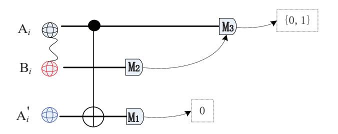

{0}------------------------------------------------

# **Unconditionally secure quantum bit commitment: Revised**

Ming-Xing Luo1 and Xiaojun Wang2

- 1. Information Security and National Computing Grid Laboratory, Southwest Jiaotong University, Chengdu 610031, China
- 2. School of Electronic Engineering, Dublin City University, Dublin 9, Ireland mxluo@home.swjtu.edu.cn, xiaojun.wang@dcu.ie

**Abstract.** Bit commitment is a primitive task of many cryptographic tasks. It has been proved that the unconditionally secure quantum bit commitment is impossible from Mayers-Lo-Chau No-go theorem. A variant of quantum bit commitment requires cheat sensible for both parties. Another results shows that these no-go theorem can be evaded using the non-relativistic transmission or Minkowski causality. Our goal in this paper is to revise unconditionally secure quantum bit commitment. We firstly propose new quantum bit commitment using distributed settings and quantum entanglement which is used to overcome Mayers-Lo-Chau No-go Theorems. The present protocol is perfectly concealing, perfectly binding, and cheating sensible in asymptotic model against entanglementbased attack and splitting attack from quantum networks. It is then extended to commit secret bits against eavesdroppers. We further propose two new applications. One is to commit qubit states. The other is to commit unitary circuits. These new schemes are useful for committing several primitives including sampling models, random sources, and Boolean functions in cryptographic protocols.

# **1 Introduction**

Bit commitment as a basic cryptographic task has been applied in various problems. A bit commitment protocol consists of two parties, the committer and receiver. A committer, Alice, commits a bit *x* to the receiver who cannot recover the value of *x* before unveiling it. In the unveiling stage, Alice sends some classical or quantum information to Bob who can then unveil the committed bit. In ideal settings, the goal of a commitment protocol is to guarantee that Bob recovers *x* exactly which is initially committed by Alice (not changed after the commitment stage), i.e., the perfectly binding. Moreover, Alice should also ensure that Bob can learn no information about the committed bit before it being unveiled, i.e., the perfectly concealing.

Intuitively, a classical bit commitment protocol may be easily followed. The committer can put the committed bit in the box which is locked using a unique key. Any receiver can get no information because he/she cannot open the box without key. In the unveiling stage, receiver can verify the committed bit by 

{1}------------------------------------------------

opening the box with the received key. However, this protocol is only secure when the box is unconditionally secure one-way system. Otherwise, Bob can break the box with unlimited computation power. So far, it is believes that there is no unconditionally secure bit commitment against the attackers with unlimited computation powers.

Different from classical cryptography, quantum cryptography makes use of quantum superposition states. One typical example is to construct key distribution protocol using four nonorthogonal states [7], or entanglement [20]. Quantum key distribution provides the first nontrivial application of quantum superposition states for unconditionally secure cryptographic goal, which has not been completed in classical cryptography. Hence, Brassard, et al. hope to invent a similar quantum protocol for committing a secret bit [9]. Unfortunately, their protocol is insecure from the no-go results of Mayers [40] and Lo and Chau [36], which state that any concealing bit commitment protocol is argued to be necessarily non-binding. These no-go theorems still hold when both players are restricted by superselection rules.

Our goal is to revise the quantum bit commit by using distributed quantum entanglement. As usual in quantum cryptography, we present the protocol in ideal assumptions of perfect state preparations, transmissions and measurements. This poses no important problem here: all the protocols remain secure in the presence of errors up to a negligible threshold. All the protocols are secure in realistic implementations with negligible noises.

### **1.1 Our contributions**

**Quantum bit commitment** We propose an unconditionally secure quantum bit commitments using two-way quantum channel or one-way quantum channel. These protocols are perfectly binding and perfectly concealing and cheat sensible.

1. We propose a quantum bit commitment (**QBC1**). We use Einstein-Podolsky-Rosen (EPR) states and Greenberger-Horne-Zeilinger (GHZ) states to design quantum bit commitment. Informally, committer and receiver use four tripartite entangled states to encode one bit. Two orthogonal entangled states are used for committing each value of one bit. We should carefully overcome Mayers-Lo-Chau No-go Theorems [40, 36] which forbid unconditionally secure quantum bit commitment originated from B-B84 scheme [7]. On one hand, committer should firstly conceal the committed bits against leaking the committed bit to receiver, i.e., committer guarantees the reduced density matrix of the systems owned by receiver is invariant for *x* = 0 and *x* = 1. On the other hand, receiver should bind the committed bit after completing the committing steps against cheating of committer in the unveiling stage. This is more difficult from Mayers-Lo-Chau No-go Theorems [40, 36]. We use a random distributed quantum entanglement before the unveiling stage. The system owned by committer can be regarded as *a quantum key* while the systems of receiver can be viewed as *a quantum lock* for binding the committed bit. It is also implementable in one-way manner.

{2}------------------------------------------------

2. We propose a private quantum bit commitment (**QBC2**). In practical applications, committer wants to commit privacy messages to a special receiver without leaking any information to potential adversary. In **QBC2**, committer and receiver can build secure quantum channel by testing the violation of CHSH inequality [14], and then share a random key. Here, two parties complete a quantum bit commitment assisted by quantum teleportation [8] and one-time pad [50]. This protocol is finally extended for one-way quantum channel from committer to receiver. They are different from device-independent bit commitments [44, 3] with nonzero cheating probability.

**Quantum qubit commitment** Assume that committer Alice wants to commit one qubit to receiver. We propose two kinds of quantum qubit commitment (**QQC**) based on **QBC1** and **QBC2** using quantum privacy channel [5]. These protocols are perfectly binding and perfectly concealing and cheat sensible.

- 3. We propose a quantum qubit commitment (**QQC1**). Based on **QBC1**, we design a protocol to commit a qubit state chosen from specific set. In **QQC1**, committer hides a qubit by encoding with a secret key which is then committed using **QBC1**. Its security depends on the security of **QBC1** and new encoding [5].**QQC1** provides the first secure quantum qubit commitment which disproves recent no-go theorem [41]. This protocol can be easily extended to multi-qubit states or one-way quantum channel.
- 4. We propose a private quantum qubit commitment (**QQC2**). Assume that committer wants to commit privacy qubits to a special receiver even if there is potential adversary. Similar to **QBC2**, the CHSH test [14] is used to build quantum channel, which is then used for distributing random key [20] and transferring qubits [8]. **QBC2** is cheating sensible [50]. It is finally extended for one-way quantum channel from committer to receiver.

**Quantum circuit commitment** Assume that Alice commits one circuit to receiver Bob. Generally, one cannot transfer a quantum circuit to another. We use another method by committing its outputs defined by the circuit *U* and specific inputs. We propose two kinds of schemes for based on **QQC1** and **QQC2**. These protocols are perfectly binding and perfectly concealing and cheat sensible.

5. We propose a quantum circuit commitment (**QCC1**). In **QCC1**, committer uses a random pure state as input going into a unitary circuit. Similar to **QQC1**, committer uses random encoding to conceal the output states. Moreover, the secret key is committed using **QBC1**. The security of QCC1 is based on the privacy quantum channel [5], QQC1 and statistical discrimination of two unitary operations [2]. **QCC1** provides the first secure quantum circuit commitment. This protocol can be easily extended for committing *n*-qubit unitary operations or Boolean functions even for one-way quantum channel.

{3}------------------------------------------------

6. We propose a private quantum circuit commitment (QCC2). Similar QQC2, we design cheating sensible commitment against potential adversary. The main idea is similar to QQC2 except for an additional encoding of quantum circuit. The security is based on the CHSH test [14], random key [20], teleportation [8], and one-time pad. This protocol is cheating sensible for both legal parties, and adversary.

# 1.2 Applications

Commit a sampling model. Sampling as a statistical method provides statistical inferences about specific problems. Random sampling as a special model has been widely used in lattice-based cryptography [39, 24, 35]. The present schemes can be used to commit specific sampling model.

- The first is Gaussian sampling for signature [39, 24, 35]. committer may use an efficient and parallel Gaussian sampler to generate sample series, which are then committed by committer and receiver using an extension of **QBC1**, or **QBC2** which provides a private commitment against leaking information. Here, receiver may use classical method to verify randomness and specific distribution from the committed samples.
- The second is quantum Boson sampling model [1]  $\mathcal{B}$  for solving permanent problem of matrix as #P-complete problem [49], which may be used for analogue speech scramblers [6] or anonymous (t, w)-threshold scheme [46]. Alice can commit sampling machine to receiver Bob using **QBC1** or **QBC2**. The verification is completed by polynomial-time approximation algorithm [30].
- The third is for recommender systems applied in Internet and E-commerce. From a sampling model [47] we can generate samples from a rank-k approximation of recommendation systems in polynomial time. Combining with homomorphic encryption [22], the new model provides an efficient private recommendation systems or private computations using **QBC1** or **QBC2**.

Commit a random source. Random sources are elementary primitives for cryptographic schemes. **QQC1** and **QQC2** are useful for committing a specific random source.

- One example is uniform distribution over a discrete set  $\{a_1, \dots, a_n\}$ , which can be encoded into a superposition state  $|\phi\rangle = \frac{1}{\sqrt{n}} \sum_{i=1}^{n} |i\rangle$ . Alice can commit  $|\phi\rangle$  using an extension of **QQC1** or **QQC2**. Different from sampling model, this scheme sends a random source to receiver.
- Another example is Gaussian source S for lattice-based cryptography [39, 24, 35]. All the samples may be limited to the finite interval  $[0, \tau \sigma_S]$  with a positive tail-cut factor  $\tau$  for practical scenarios. committer can use coherent entanglement [51] to complete committing continuous Gaussian source with extensions of **QQC1** or **QQC2**.

{4}------------------------------------------------

**Commit functionality**. Cryptographic functionality includes most of primitives such as encryption, authentication, signature, delegation computation and privacy computation [22]. **QCC1** and **QCC2** are useful for committing a cryptographic functionality.

- **–** This first is oracle function. Suppose that Alice hopes to commit an oracle function **O** to Bob. This is generally difficult for any oracles. Two parties may focus on special oracles which should be distinguished statistically using polynomial resources. One method is to commit its graphic set *G* = *{*(*x,* **O**(*x*))*}* using **QBC1** for discrete inputs *x ∈ {*0*,* 1*} n*, or **QQC1** for continuous inputs. Another method is to represent an oracle **O**(*x*)) by a Boolean function *F* [13]. This may be committed by using **QCC1** or **QCC2**.
- **–** Second is quantum solver which is a quantum circuit or quantum model for solving special problem. An interesting quantum solver may be built on Shor's algorithm [45] or Grover's algorithm [26]. These quantum solvers can be represented by proper unitary transformations *U ∈ SU*(2*n*). committer may use an extension of **QCC1** or **QCC2** for committing unitary operations. Interesting, this can be regarded as a different case of delegation computation using homomorphic encryption [22]. These schemes are different from zeroknowledge proof [12] which leaks no information for any receiver.

# **1.3 Related works**

Several recent papers discussed similar issues. In view of the no-go results, there are various constructions under reasonable constraints. Kent [31] shows that relativistic signalling constraints may facilitate secure bit commitment. In cheatsensitive bit commitment protocols [4, 29], both players may have the chance to cheat, however, their fraud may be detected by the adversary [27]. Building on Kent's original proposal [32], the tradeoff between the bindingness and concealment has recently been investigated [10]. Other researchers change to build bit commitment protocols with practical relativistic security [37], partial security with cheating probabilities [32, 15, 16], computational security [18], classical security without communication [11, 17], asymptotical security [27], deviceindependent security [44]. Meanwhile, the Mayers-Lo-Chau no-go theorem is not general enough to exclude all conceivable quantum bit commitment protocols.

Although our schemes are generally presented as committing one bit, there is no technique limit to generalize into commit bit string. The second improvement of quantum resources should be interesting. Another is interesting applications of quantum bit commit, quantum qubit commit or quantum circuit commit. We summarize the mentioned variants of quantum commitment in Table 1. We view our work as an initial step and hope further fundamental investigations of noisy scenarios or imperfect scenarios or cryptographic applications inspired by quantum commitment.

There are lots of open problems. First, is there a secure quantum bit commitment without distributed storage before the unveiling stage? Second, are

{5}------------------------------------------------

**Table 1.** The security result of present quantum bit commitments using entanglement. PS denotes perfectly security including perfectly concealing and binding. PP denotes perfectly privacy against eavesdropper. RS denotes relativistic security. SS denotes statistical security. CS denotes computational security. PPS means that at least one party has a non-negligible cheating probability.

|                                      | PP | RS | SS | CS | PPS |
|--------------------------------------|----|----|----|----|-----|
| [18]                                 | -  | -  | -  |    | -   |
| [4, 29, 32]                          | -  | -  | -  | _  |     |
| [31, 29, 33, 37]                     | -  |    | -  | -  | -   |
| [44, 15, 16, 3]                      |    | -  | -  | -  | -   |
| QBC1, QQC1, QCC1 QBC2, QQC2, QCC2 |    | -  | -  | -  | -   |
| QBC2,QCC2,QCC2                       | -  |    | -  | -  | -   |

unconditionally secure quantum one-way functions necessary for the construction of quantum bit commitment when there is no distributed storage of entanglement? Recent results show that there are quantum bit commitment with unconditionally concealing and computationally binding from any quantum one-way permutation [18]. Third, can we construct quantum bit commitment with other reasonable scenarios?

# 2 Preliminary

#### 2.1 Quantum ingredients

Denote a d-dimensional Hilbert space by  $\mathbb{H}_d$ . A quantum pure state  $|\phi\rangle$  is vector in  $\mathbb{H}_d$  with unit norm. The density matrix of  $|\phi\rangle$ , i.e.,  $\rho_{\phi} = |\phi\rangle\langle\phi|$ , is a positive semi-definitive matrix. An ensemble of pure states  $\{|\phi_i\rangle\}_{i=1}^m$  is represented by the positive semi-definitive matrix of  $\rho = \sum_{i=1}^m p_i \rho_{\phi_i}$ , where  $p_i$  denotes the probability of  $|\phi_i\rangle$ . In what follows, we denote Hilbert space of the system A by  $\mathbb{H}_A$  if its dimension is not considered.

Denote  $\{|0\rangle, |1\rangle\}$  as the computational basis of  $\mathbb{H}_2$ . Another one is rectilinear basis of  $\{|+\rangle, |-\rangle\}$  with  $|\pm\rangle = \frac{1}{\sqrt{2}}(|0\rangle \pm |1\rangle)$ . For multiple qubits, there are entangled states that can not be decomposed into the product of single qubit states. One example is EPR state [21] in Hilbert space  $\mathbb{H}_2 \otimes \mathbb{H}_2$  defined as

$$|EPR\rangle = \frac{1}{\sqrt{2}}(|0,0\rangle + |1,1\rangle) \tag{1}$$

Another entanglement is tripartite GHZ state [23] in Hilbert space  $\mathbb{H}_2 \otimes \mathbb{H}_2 \otimes \mathbb{H}_2$  which is defined as

$$|GHZ\rangle_{ABC} = \frac{1}{\sqrt{2}}(|0,0,0\rangle + |1,1,1\rangle)_{ABC}$$
 (2)

A projection measurement of quantum state in Hilbert space  $\mathbb{H}_n$  is described by a set of n projection operators  $\{\mathbf{M}_i\}_{i=1}^n$ , where  $\mathbf{M}_i$ s satisfy  $\sum_{i=1}^n \mathbf{M}_i = 1$  with the identity operator 1.

{6}------------------------------------------------

For qubit space  $\mathbb{H}_2$ , Pauli operators  $\sigma_x, \sigma_y, \sigma_z$  and Hadamard transformation H have matrix representatives as follows

$$\sigma_x = \begin{pmatrix} 0 & 1 \\ 1 & 0 \end{pmatrix}, \sigma_y = \begin{pmatrix} 0 & -i \\ i & 0 \end{pmatrix}, \sigma_z = \begin{pmatrix} 1 & 0 \\ 0 & -1 \end{pmatrix}, H = \frac{1}{\sqrt{2}} \begin{pmatrix} 1 & 1 \\ 1 & -1 \end{pmatrix}$$
(3)

For two-qubit gates, the controlled not (CNOT) gate is given by CNOT=diag( $1, \sigma_x$ ).

### 2.2 CHSH inequality

Quantum entanglement may result in interesting statistics that cannot be described with classical physics. Here, we use CHSH inequality [14] given by

$$\langle \mathbf{A}_0 \mathbf{B}_0 \rangle + \langle \mathbf{A}_0 \mathbf{B}_1 \rangle + \langle \mathbf{A}_1 \mathbf{B}_0 \rangle - \langle \mathbf{A}_1 \mathbf{B}_1 \rangle \le 2$$
 (4)

for two parties sharing a hidden variable in classical scenarios, where  $\mathbf{A}_x$  and  $\mathbf{B}_y$  are measurements with outputs in the set  $\{\pm 1\}$  which are conditional on inputs  $x, y \in \{0, 1\}, \langle \mathbf{A}_x \mathbf{B}_y \rangle$  (named as correlators) denotes the average outcomes given by  $\langle \mathbf{A}_x \mathbf{B}_y \rangle = \sum_{a,b=\pm 1} abP(a,b|x,y)$ , P(a,b|x,y) denotes the joint probability distribution for two outputs  $a, b \in \{1, -1\}$  conditional on two inputs  $x, y \in \{0, 1\}$ , which may depend on some hidden variable [14]. In quantum scenarios, for each round of experiment Alice and Bob share an EPR state  $|EPR\rangle$ . Alice performs local measurement using observable  $\mathbf{A}_x \in \{\sigma_z, \sigma_x\}$  while Bob performs local measurement using observable  $\mathbf{A}_x \in \{\sigma_z, \sigma_x\}$  on their shared qubit. The expect of quantum observable  $\mathbf{A}_x$  and  $\mathbf{B}_y$  is given by  $\langle \mathbf{A}_x \mathbf{B}_y \rangle = \text{tr}[\mathbf{A}_x \otimes \mathbf{B}_y | EPR \rangle \langle EPR |]$ . Hence, two parties can get

$$\langle \mathbf{A}_0 \mathbf{B}_0 \rangle + \langle \mathbf{A}_0 \mathbf{B}_1 \rangle + \langle \mathbf{A}_1 \mathbf{B}_0 \rangle - \langle \mathbf{A}_1 \mathbf{B}_1 \rangle = 2\sqrt{2}$$
 (5)

which violates the inenquality (4). This means that the quantum correlations derived from local measurements on EPR state is incompatible with any classical correlations from shared randomness [14].

#### 2.3 Quantum teleportation

EPR state as an interesting resource is useful for transmitting an unknown qubit faithfully [8]. The protocol is assisted with local operations and classical communication (LOCC). Assume that Alice and Bob share one EPR pair  $|EPR\rangle_{AB}$  prior to transmission, where Alice has qubit A and Bob has qubit B. Alice wants to transmit an unknown qubit  $A_0$  in the state  $|\chi\rangle$  to Bob. Alice firstly performs a joint measurement on  $A_0$  and A and broadcasts outcomes. Bob then performs a unitary operation on B (depending on measurement outcomes) to recover  $|\chi\rangle_B$ . The success probability is unit. Any adversary can only eavesdrop measurement outcomes, which have no information related to qubit  $A_0$ . This provides an unconditionally secure transmission of quantum states assisted by classical communication and secure quantum channel.

{7}------------------------------------------------

*Theorem 1 (Quantum no-communication theorem) [25]. It is impossible for one observer, by making a measurement of a subsystem of the total state, to communicate information to another observer during measurement of an entangled quantum state*.

The quantum no-communication theorem [25] implies that one can not transfer information faster than the speed of light through the quantum measurement process even if two parties share an entanglement.

# **3 Quantum bit commitment**

In this section, we propose two quantum bit commit (QBC) protocols using EPR state [21], GHZ state [23] and noiseless quantum channels.

*Definition 1. A QBC is perfectly binding if committer cannot change the reduced density matrix of particles owned by receiver after committing, i.e.,*

$$\rho^{Com:x} = \rho^{Unv:x} \tag{6}$$

*where ρ Com*:*x (or ρ Unv*:*x ) denotes the reduced density matrix of particles own by receiver in the committing stage (or the unveiling stage).*

*Definition 2. A QBC is perfectly concealing if receiver cannot learn any useful information before the unveiling stage, i.e.*,

$$\rho^x = \rho^{x \oplus 1} \tag{7}$$

*where ρ x denotes the reduced density matrix of particles owned by receiver for committing the bit x ∈ {*0*,* 1*} and ⊕ denote plus with modular 2.*

In ideal scenarios, QBC should be perfectly binding and perfectly concealing. Another weaker variant of QBC is cheat sensible [4, 29].

*Definition 3. A QBC is cheat sensible if any cheating strategy of each party can be detected by the other with a non negligible probability, i.e.*,

(i) *Committer cannot change the committed bit x into x ′ after the commitment stage without being detected by receiver, i.e.*,

$$\Pr[Succ_{\mathsf{commiter}}(x \to x') | commit_{\mathsf{commiter}}(x)] < \mathsf{nelg}(\epsilon) \tag{8}$$

*where nelg*(*ϵ*) *is a negligible constant depending on some parameter ϵ.*

(ii) *Receiver cannot learn any useful information of x before it being unveiled without being detected by committer, i.e.*,

$$\Pr[Succ_{\mathsf{receiver}}(I(x; x') > \mathsf{nelg}(\epsilon)) | commit_{\mathsf{commiter}}(x)] < \mathsf{nelg}(\epsilon) \tag{9}$$

*where I*(*x*; *x ′* ) *denotes Shannon mutual information of variables x and x ′ (obtained by receiver) [42].*

The assumptions of our protocols are as follows.

A1. Alice and Bob have unlimited quantum ability including quantum computer.

{8}------------------------------------------------

- A2. Alice is honest for committing  $x \in \{0, 1\}$  in the committing stage while she may be not in the unveiling stage.
- A3. Bob may learn the information of the committed bit x before unveiling.
- A4. Both the classical and quantum channels are noiseless.

A1 implies that both parties have abilities to perform quantum operations such as preparing, storing or measuring states. From A2, Alice is not allowed to commit a wrong bit x' which is finally unveiled as the right bit x. The fake commitment is useless because Bob finally convinced the right bit. We do not consider this cheating. From A3, Alice hides x perfectly. Otherwise, Bob may recover it before the unveiling stage. A4 is used to show that all the evaluations are performed without noise.

#### 3.1 Quantum bit commitment with two-way quantum channel

We present a new scheme using distributed particles to realize concealing and binding tasks. The detail is shown in **QBC1**. Different from recent GHZ paradox-based protocol [44], all the measurements are performed by receiver. Another difference is from the preparations of quantum entanglement by receiver. From these differences, we can use qubit as quantum locking key. This allows an unconditionally secure quantum bit commitment.

### QBC1

# Commitment

- 1. Bob prepares an EPR state  $|EPR\rangle_{AB}$ , and sends the qubit A to Alice.
- 2. After receiving A Alice performs the following operations.
  - 2.1 Alice performs CNOT A and an auxiliary qubit  $A_0$  in the state  $|0\rangle_{A_0}$ .
  - 2.2 Alice randomly chooses one bit  $r \in \{0, 1\}$  according to uniform distribution, and performs qubit operation  $H^x \sigma_x^r$  on A.
  - 2.3 Alice sends A to Bob.

#### Unveiling

- 3. In the unveiling stage, two parties perform the following operations.
  - 3.1 Alice sends the qubit  $A_0$  and bits  $\{x, r\}$  to Bob.
  - 3.2 Bob performs  $\sigma_x^r H^x$  on A. He performs measurement on  $A_0, A$  and B under the basis  $\{|\Phi_0\rangle = \frac{1}{\sqrt{2}}(|0,0,0\rangle + |1,1,1\rangle), |\Phi_1\rangle = \frac{1}{\sqrt{2}}(|0,1,0\rangle + |1,0,1\rangle),$   $\mathbb{1} |\Phi_0\rangle\langle\Phi_0| |\Phi_1\rangle\langle\Phi_1|\}.$  The commitment is right if and only if he obtains  $\{|\Phi_0\rangle, |\Phi_1\rangle\}$  with unit probability.

Correctness-Take x=0 as an example. The total state of  $A_0$ , A and B is changed from  $|0\rangle_{A_0}|EPR\rangle_{AB}$  into  $|\Phi_0\rangle$  if r=0, or  $|\Phi_1\rangle$  if r=1.  $|\Phi_0\rangle$  and  $|\Phi_1\rangle$  are orthogonal states. Hence, Bob can convince x=0 from the measurement from step 3.2 in the unveiling stage. Similar result holds for x=1.

{9}------------------------------------------------

#### 3.2 Security analysis

Similar to the analysis of Mayer-Lo-Chau no-go theorem [40, 36], the security of **QBC1** includes two parts. One is perfectly concealing. The other is perfectly binding. Similar to quantum key distribution [7], it is generally impossible for constructing a perfectly secure bit commitment. Here, we consider asymptotically perfect security [7], which means that **QBC1** can be arbitrarily close to perfectly concealing and perfectly binding when n is large enough.

Theorem 2. QBC1 is perfectly concealing if committer is honest.

*Proof.* Assume that Alice honestly implements all operations in the committing stage. From step 2.2, the correspondence between the committed bit x and total system  $|\Phi_{x,r}\rangle$  of Alice and Bob is given by

$$C: x = 0 \mapsto \{ |\Phi_{00}\rangle_{A_0AB} = |\Phi_0\rangle, |\Phi_{01}\rangle_{A_0AB} = |\Phi_1\rangle \}$$

$$x = 1 \mapsto \{ |\Phi_{10}\rangle_{A_0AB}, |\Phi_{11}\rangle_{A_0AB} \}$$

$$(10)$$

where  $|\Phi_{10}\rangle = \frac{1}{\sqrt{2}}(|0,+,0\rangle + |1,-,1\rangle)$ ,  $|\Phi_{11}\rangle = \frac{1}{\sqrt{2}}(|0,-,0\rangle + |1,+,1\rangle)$ , and C denotes committing in step 2. The density matrices of A and B is given by  $\rho_{AB} = \frac{1}{4}\mathbb{1}$  for x = 0 or x = 1. Bob cannot distinguish A and B before unveiling. Similar result holds for other inputs in Appendix A.

**QBC1** will be implemented in parallel with n EPR states. Bob can get the same committed bit with unit probability. Hence, Alice can realize asymptotically perfectly concealing when n is large enough.  $\square$ 

Theorem 3. QBC1 is perfectly binding if receiver is honest.

*Proof.* The binding is actually essential drawback in previous schemes [9]. In Mayer-Lo-Chau No-go theorem [40, 36], the main drawback is from final system after committing. In **QBC1**, there are four final states given in Eq.(10). From Schmidt decomposition the local basis of B in Eq.(10) cannot be changed by Alice after committing. In what follows, we complete the proof with two methods.

**Proof based on Theorem 1** [25]. The proof is completed by contradiction. Take  $|\Phi_{00}\rangle$  as an example. Suppose that Alice wants to unveil x=1 but committing x=0. Assume that Alice can successfully change  $|\Phi_{00}\rangle$  into  $|\Phi_{10}\rangle$  in the unveiling stage. There is a unitary operation  $U_{A'A_0}$  on  $A_0$  and axillary system A' in the state  $|0\rangle$  satisfying:

$$(U_{A'A_0} \otimes \mathbb{1}_{AB})|0\rangle_{A'}|\Phi_{00}\rangle_{A_0AB} = |\psi\rangle_{A'}|\Phi_{10}\rangle_{A_0AB} \tag{11}$$

where  $|\psi\rangle_{A'}$  is any normalized state.

From Eq.(11), we construct a communication protocol. Alice and Bob share n copies of  $|\Phi_{00}\rangle_{A_0AB}$ , where Alice has  $A_0$  and Bob owns A and B in each copy. Alice performs nothing for transmitting the bit y=0 while she performs the local operation  $U_{A'A_0}$  on the system A' in the state  $|0\rangle$  and  $A_0$  if y=1. Bob performs measurement on A and B with projection operators  $\{\mathbf{P}_{i_0i_1}=|i_0,i_1\rangle\langle i_0,i_1|,i_0,i_1=0,1\}$ . He gets a probability distribution

$$\Pr(i_0 i_1 = 00) = \Pr(i_0 i_1 = 11) = \frac{1}{2}$$
(12)

{10}------------------------------------------------

for *|Φ*00*⟩*, or the other probability distribution as

$$\Pr(i_0 i_1 = 00) = \Pr(i_0 i_1 = 01) = \Pr(i_0 i_1 = 10) = \Pr(i_0 i_1 = 11) = \frac{1}{4} \quad (13)$$

for *|Φ*10*⟩*. This means that Bob can recover one bit *y* by distinguishing the output distribution. Note that the present communication protocol do not require any communication between Alice and Bob. This contradicts to Theorem 1 [25]. Hence, there is no local operation *UA′A*0 for Alice satisfying Eq.(11).

Similarly, Alice cannot use any local operations to change the state in *{|Φ*00*⟩, |Φ*01*⟩}* into any one in *{|Φ*10*⟩, |Φ*11*⟩}*, and conversely. Another proof is based on stabilizer of GHZ state given in Appendix B.

We have proved the binding security using two different methods. Actually, this is insufficient. The main reason is that there are three qubits owned by two parties. Alice may transmit a different qubit *A′* (not the qubit *A*) in the step 1, and keeps the qubits *A* and *A*0. And then, Alice use local operations to get a joint state *|Φi*0*i*1 *⟩A*0*A′B* in Eq.(10) in the unveiling stage. This splitting attack is analysed in Appendix C.

### *Theorem 4.* **QBC1** *is cheating sensible*.

*Proof*. Firstly, Bob can detect Alice's cheating in the unveiling stage if Alice wants to change the committed bit. Alice should ensure the binding for Bob before the committed bit being unveiled. Any local operations performed by Alice will then disturb the global states in the unveiling stage. On the other hand, any local unitary operations do not change the reduced density matrices of particle owned by Bob. Hence, Alice has to perform the local measurement to forge the committed bit or change the committed bit after step 2. However, the failure probability will result in a nonzero detecting probability. Otherwise, Alice has committed the wrong bit in the commitment stage (see Appendix D).

Another cheating is from Bob who may prepare a fake state in step 1 or performs local measurement after step 2 to recover the committed bit. To detect this cheating, Alice may require Bob to send two qubits *A* and *B* to her. And then, She implements step 3.2 because she knows *{x, r}*. The proof is similar to Appendix D. Another method is to test GHZ paradox [23, 44]. Hence, QBC 1 is cheating sensible. This completes the proof.

### **3.3 Quantum bit commitment using one-way quantum channel**

If Alice prepares a GHZ state *|Φ*00*⟩* in step 1, **QBC1** do not require quantum channel from Bob to Alice. This provides an implementation with one-way quantum channel. The proof of perfectly concealing is similar to Theorem 2. However, perfectly concealing is different from Theorem 2 because all the quantum states are prepared by Alice, see Appendix E. Although all quantum states are prepared by committer, receiver can detect the cheating operations of committer. The main technique is from distributed scenarios in step 2.

Now, consider the detection to Bob's cheating for recovering the committed bit by performing local measurement after step 2. Since the present protocol 

{11}------------------------------------------------

uses one-way quantum channel from Alice to Bob, Bob cannot send the qubits A and B to Alice for detecting. One possible solution is to test GHZ paradox [23, 44], where all the final states  $|\Phi_{01}\rangle$ s are locally equivalent to GHZ state [23]. It means that **QBC1** is cheating sensible from Definition 3 in one-way manner.

### 4 Private quantum bit commitment

In Sec.3, we propose two ideal quantum bit commitments. The committed bit is transmitted in an open channel. This leaves chance for an eavesdropper [3]. We here present a private quantum bit commitment. The main idea is as follows. Two parties build secure quantum channel based on CHSH inequality [14]. These channels are used to teleport qubits securely [8] and distribute key [20]. Finally, Alice can send the committed bit by using one-time pad [50].

### 4.1 Two-way quantum channel

Assume that Alice commits bit string  $x_1 \cdots x_\ell$  to Bob secretly. We present private qubit commitment as **QBC2**.

#### QBC2

#### 1. Building secure quantum channels

- 1.1 Bob prepares 2n EPR states  $\bigotimes_{i=1}^{2n} |EPR\rangle_{A_iB_i}$ , and sends  $A_i$ 's to Alice.
- 1.2 Bob randomly chooses a qubit subset  $\{B_{i_1}, \dots, B_{i_m}\}$  with  $i_m \approx \sqrt{n}$ . He performs measurement with observable  $\mathbf{B}_{\hat{y}}$  chosen from  $\{\frac{1}{\sqrt{2}}(\sigma_z \pm \sigma_x)\}$  with uniform distribution. He broadcasts bit string  $i_1 \cdots i_m$ .
- 1.3 Alice performs measurements on  $A_{i_1}, \dots, A_{i_m}$  using observable  $\mathbf{A}_{\hat{x}}$  chosen from  $\{\sigma_z, \sigma_x\}$  with uniform probability. If their outcomes satisfy

$$\langle \mathbf{A}_0 \mathbf{B}_0 \rangle + \langle \mathbf{A}_0 \mathbf{B}_1 \rangle + \langle \mathbf{A}_1 \mathbf{B}_0 \rangle - \langle \mathbf{A}_1 \mathbf{B}_1 \rangle < 2\sqrt{2} - \mathsf{negl}(\epsilon)$$
 (14)

they stop the commitment. Otherwise, they continues the protocol.

#### 2. (Commitment)

- 2.1 Encode  $x_i$  as step 2.1 in **QBC1** using  $|EPR\rangle_{A_iB_i}$  and an axillary qubit  $C_i$ .
- 2.2 Alice teleports  $A_i$  to Bob [8].

#### 3. (Unveiling)

- 3.1 Alice and Bob share a random bit string  $k_1 \cdots k_s$  by using quantum key distribution [20].
- 3.2 Alice teleports  $C_i$  to Bob [8].
- 3.3 Alice generates a signature  $y_1 \cdots y_t$  [50]. She gets cyphertext  $c_1 \cdots c_{t+\ell}$  with  $c_i = x_i \oplus k_i$  for  $i \leq \ell$  and  $c_j = y_{j-\ell} \oplus k_j$  for  $j > \ell$ . Finally, she sends  $c_1 \cdots c_{t+\ell}$  to Bob.
- 3.4 Bob recovers  $x_1 \cdots x_\ell y_1 \cdots y_t$  using the shared keys. He detects adversary by verifying signature  $y_1 \cdots y_\ell$  [50]. If there is no adversary, Bob can convince  $x_i$  using step 2.2 of **QBC1**,  $i = 1, \dots, \ell$ .

{12}------------------------------------------------

The correctness of **QBC2** is easily followed from **QBC1**, quantum teleportation, and one-time pad.

The security analysis of **QBC2** is based on **QBC1**, CHSH test [14] and quantum teleportation [8].

Theorem 5. **QBC2** is perfectly concealing, perfectly binding, and cheating sensible.

*Proof.* The proofs of perfectly concealing, perfectly binding and cheating sensible of committer and receiver are similar to the proofs of **QBC1** in Sec.3. In what follows, we only need to prove that **QBC2** is cheating sensible against attackers from outside if committer and receiver are honest.

There are three facts. First, step 1 is used to distribute EPR states from Bob to Alice. Denote quantum observable of committer and receiver as  $\mathbf{A}_{\hat{x}=0} = \sigma_z$ ,  $\mathbf{A}_{\hat{x}=1} = \sigma_x$ ,  $\mathbf{B}_{\hat{y}=0} = \frac{1}{\sqrt{2}}(\sigma_z + \sigma_x)$ , and  $\mathbf{B}_{\hat{y}=1} = \frac{1}{\sqrt{2}}(\sigma_z - \sigma_x)$ . Suppose that an EPR state is changed into

$$|\hat{\Phi}\rangle_{A_iB_i} = \frac{1}{\sqrt{2}}(|\phi_0\rangle|0\rangle + |\phi_1\rangle|1\rangle) \tag{15}$$

by an eavesdropper, where  $\{|\phi_0\rangle = \cos\theta|0\rangle + e^{i\phi}\sin\theta|1\rangle, |\phi_1\rangle = \cos\theta|1\rangle - e^{-i\phi}\sin\theta|0\rangle\}$  are orthogonal, and  $\theta, \phi \in [0, \pi]$ . From Eq.(15), it implies that

$$\langle \mathbf{A}_0 \mathbf{B}_0 \rangle + \langle \mathbf{A}_0 \mathbf{B}_1 \rangle + \langle \mathbf{A}_1 \mathbf{B}_0 \rangle - \langle \mathbf{A}_1 \mathbf{B}_1 \rangle = 2\sqrt{2}(\cos \theta^2 - \cos \phi^2 \sin \theta^2)$$

$$< 2\sqrt{2} - c$$
(16)

when  $c > \mathsf{nelg}(\epsilon)$  (if  $\theta \ge \mathsf{nelg}(\sqrt{\epsilon})$ ). Hence, two honest parties can detect attacker by testing the CHSH inequality (4) using violation threshold of  $2\sqrt{2} - \mathsf{negl}(\epsilon)$ . Similar proof holds if attacker changes EPR state into tripartite mixed state.

Secondly, in step 2.2 Alice teleports  $A_i$  to Bob [8]. If the quantum channel is secure from step 1, Bob can recover a faithful state with unit probability. The transmission is unconditionally secure because Alice only sends measurement outcomes in open channel, which has no information related to the transmitted qubit. Similar results hold for  $C_i$ s in step 3.2. This means that Bob can get  $B_i$ s and  $C_i$ s securely.

Third, after step 2, assume that Alice and Bob have shared lots of EPR states. Two parties can share a random bit string using shared EPR states [20]. This scheme can be further constructed in a device-independent manner [19]. The shared key is then be used to transmit the committed bit string  $x_1 \cdots x_\ell$  using universally hash function [50] and one-time pad in step 3.3. These two cryptosystems are unconditionally secure. Moreover, the random bit string  $r_1 \cdots r_\ell$  are independent of  $x_i$ s. Bob can get all committed bits  $x_i$ s securely. This completes the proof.  $\square$ 

**QBC2** can be implemented with one-way quantum channel from Alice to Bob if Alice can distribute bits honestly.

{13}------------------------------------------------

### 5 Quantum qubit commitment

In this section, our goal is to commit one qubit under the assumptions A1-A4. Assume that committer Alice commits quantum state chosen from a specific set to receiver Bob.

Definition 4. The state set  $\mathbb{S}$  is polynomially distinguishable if for any two states  $|\phi\rangle, |\psi\rangle \in \mathbb{S}$ , they satisfy

$$d(|\psi\rangle, |\phi\rangle) = |\langle\psi|\phi\rangle|^2 < 1 - c \tag{17}$$

where c is some constant satisfying  $c > \mathsf{nelg}(\epsilon)$ .

Definition 4 is reasonable because it is interesting to transmit polynomially copies of quantum states in cryptographic applications. Especially, one can distinguish all the states in  $\mathbb{S}$  using polynomially copies from the equality of  $d(|\psi\rangle^{\otimes poly(n)}, |\phi\rangle^{\otimes poly(n)}) = poly(n, d(|\psi\rangle, |\phi\rangle))$  using state tomography [28], where n denotes the dimension of states in  $\mathbb{S}$ . One example is orthogonal state set  $\mathbb{S} = \{|i\rangle\}$ . Another example is given by

$$S = \{\cos \theta_1 | 0\rangle + \sin \theta_1 | 1\rangle, \cdots, \cos \theta_n | 0\rangle + \sin \theta_n | 1\rangle \}$$
 (18)

where  $\theta_i$ s satisfy  $|\theta_i - \theta_j| > c$  and  $\theta_i \in [0, \frac{\pi}{2}]$ .

Similar to Definitions 1-3, we can define perfectly concealing, perfectly binding and cheating sensible for qubit commitment. Different from quantum bit commitment,  $\mathbb{S}$  can be any subset of Hilbert space. In this case, it should be very careful because committer may hide any negligible error into final states.

### 5.1 Two-way quantum channel

In this section, we propose a quantum protocol for committing a qubit from polynomially distinguishable set. Especially, take S in Eq.(18) for example. Similar scheme may be extended for multi-qubit states. The main idea is to use quantum privacy channel [5].

Theorem 6. **QQC1** is perfectly concealing, perfectly binding, and cheating sensible.

*Proof.* We firstly consider perfectly concealing for Alice. It is easy to get the following equality [5]:

$$\frac{1}{2} \sum_{a=0}^{1} \sigma_a |\phi_i\rangle_A \langle\phi_i|\sigma_a^{\dagger} = \frac{1}{2} \mathbb{1}_A \tag{19}$$

for any state  $|\phi_i\rangle_A \in \mathbb{S}$ . This provides perfectly concealing of qubit similar to Definition 2. From the analysis of **QBC1**, Bob cannot recover any information of the bit a before unveiling. From Eq.(19) the density matrix of A is invariant for  $|\phi_i\rangle_A \in \mathbb{S}$ . **QQC1** is perfectly concealing for committing qubit A.

Now, we prove perfectly binding for Bob. From the analysis of **QBC1**, Alice cannot change the committed bit a in the unveiling stage. In what follows, we

{14}------------------------------------------------

### **QQC1**

### **Commitment**

- 1. Bob prepares EPR state *|EP R⟩A*0*B*0 , and sends qubit *A*0 to committer Alice.
- 2. After receiving *A*0 Alice performs the following operations.
  - 2.1 Alice chooses the committed particle *A* in the state *|ϕi⟩ ∈* S, and chooses a random bit *a ∈ {*0*,* 1*}* with uniform distribution. She performs *σa* on *A*, where *σ*0 = 1 and *σ*1 = *σy*.
  - 2.2 Alice implements step 2 in **QBC1** for encoding *a* using one axillary qubit *A ′* 0 and a random bit *r ∈ {*0*,* 1*}*.
  - 2.3 Alice sends *A, A*0 to Bob.

### **Unveiling**

- 3. In the unveiling stage, two parties perform the following operations.
  - 3.1 Alice sends qubit *A ′* 0 and classical messages *{a, r}* to Bob.
  - 3.2 (Convincing private key) Bob implement step 3 in **QBC1** to convince *a*.
  - 3.3 (Convincing qubit) Bob performs *σa* on *A* to recover *|ϕi⟩*. Bob can verify *|ϕi⟩* using state tomography [28] with a negligible error if there are multiple copies being transmitted in one-shot manner. Otherwise, it is wrong.

prove that Alice cannot change the committed state in the unveiling stage. For simplicity, suppose that Alice wants to change the committed state *|ϕ*1*⟩A* into *|ϕ*2*⟩A* in the unveiling stage. Generally, assume that Alice prepares an entangled state with an axillary particle *A′* in the state *|*0*⟩* as follows

$$|\Phi\rangle_{A'A} = \sum_{i=1}^{2} \sqrt{p_i} |\phi_i\rangle_A |\psi_i\rangle_{A'}$$
 (20)

where *{p*1*, p*2*}* is a probability distribution, and *{|ψ*1*⟩A′ , |ψ*2*⟩A′}* are orthogonal states. After a random Pauli matrix being performed on *A*, from Eq.(20) the reduced density matrix of *A* is given by

$$\rho_A = \operatorname{tr}_{A'}\left[\sum_{a=0}^{1} (\mathbb{1} \otimes \sigma_a) |\Phi\rangle_{A'A} \langle \Phi | (\mathbb{1} \otimes \sigma_a^{\dagger}) \right] = \frac{1}{2} \mathbb{1}$$
 (21)

Alice can ensure perfectly concealing if she performs qubit operation chosen from *{*1*, σy}* with uniform distribution. In the unveiling stage, Alice performs local measurement on *A′* under the basis *{|ψ*1*⟩A′ , |ψ*2*⟩A′}*. If Alice gets *|ψ*1*⟩A′* , the qubit *A* owned in Bob collapses into the committed state *|ϕ*1*⟩A*. Otherwise, *A* will collapse into a worry state *|ϕ*2*⟩A* with probability *p*2, i.e., Pr[*|ϕ*2*⟩A*] = *p*2. Moreover, Alice cannot change the encoding key *a* into *a ′* = 1 *⊕ a* from Theorem 3. So, Alice has to send the encoding key *a* in step 3 in **QQC1**. Bob can detect qubit *A* under the basis *{|ϕ*1*⟩, |ϕ ⊥* 1 *⟩}*, where *|ϕ ⊥* 1 *⟩* denotes the orthogonal state of *|ϕ*1*⟩A* = sin *θ*1*|*0*⟩ −* cos *θ*1*|*1*⟩*. Bob gets measurement outcome *|ϕ ⊥* 1 *⟩A* with probability Pr[*|ϕ ⊥* 1 *⟩A*] = sin(*θ*1 *− θ*2) 2 . The total probability that Bob gets 

{15}------------------------------------------------

measurement outcome *|ϕ ⊥* 1 *⟩A* is given by

$$\Pr_{total}[|\phi_1^{\perp}\rangle_A] = p_2 \sin(\theta_1 - \theta_2)^2 \neq 0$$
 (22)

from *p*2 *̸*= 0. Hence, from Definition 1, **QQC1** is perfectly binding.

The cheating sensible of receiver in **QQC1** is similar to **QBC1**. For committer, a specific cheating strategy may be implemented for changing the committed state in S. The proof is similar to perfectly binding. From Eq.(22), it follows that Pr*total*[*|ϕ ⊥* 1 *⟩A*] *<* nelg(*ϵ*) for successfully cheating by Alice. We get that *p*2 *<* nelg(*ϵ*), i.e., Alice can cheat successfully with only a negligible probability. From Definition 3, **QQC1** is cheating sensible.

### **5.2 Private quantum qubit commitment**

In this subsection, we build private quantum qubit commitment against eavesdroppers. The main idea is to use CHSH inequality [14], quantum teleportation [8] and one-time pad.

### **QQC2**

- 1. **Building secure quantum channels** Alice and Bob implement step 1 in **QBC1**.
- 2. (**Commitment**) Alice and Bob implement step 2 in **QQC1**.
- 3. (**Unveiling**)
  - 3.1 Alice and Bob implement step 3 in **QBC1**.
  - 3.2 Alice and Bob implement step 3 in **QQC1**.

**QQC2** uses two-way quantum channels. The correctness is easily followed from **QBC1** and **QQC1**. Different from **QQC1** and **QQC2**, two parties use the CHSH test [14] to detect attacker in a device-independent manner [19]. Otherwise, they stop the protocol. And then, the EPR states may be used for distributing keys securely [20] with small fractions of pre-shared bits for classical authentications [50]. In commitment stage, the classical encoding information of committer will be encrypted by using one-time pad. The qubits will be teleported [8] without leakage of any information. Similar analysis holds for **QQC2** in a one-way manner.

*Theorem 7.* **QQC2** *is perfectly concealing, perfectly binding, and cheating sensible*.

# **6 Quantum circuit commitment**

In this section, our goal is to commit one circuit under the assumptions A1- A4. Assume that committer Alice commits a circuit *U* chosen from a finite circuit 

{16}------------------------------------------------

set  $\mathbb{U}$  to receiver Bob. For a classical scenarios,  $\mathcal{U}$  may be any Boolean function  $\mathcal{F}_c: \{0,1\}^n \to \{0,1\}^m$ . If  $\mathcal{F}$  is injective, it may be completed by committing the graph of  $\mathcal{F}_c$ . Otherwise, we can complete it as follows. Firstly, Alice encrypts the specific circuit using a shared key to get a bit string  $x_1 \cdots x_s$ , which is further committed. In quantum scenarios, Alice may commit a unitary transformation with matrix representation  $U \in SU(2^n)$ , where  $SU(2^n)$  denotes the unitary group on the Hilbert space  $\mathbb{H}_2^{\otimes n}$ .

Suppose that there is a device in which one of two unitaries  $\mathcal{U}_1$  or  $\mathcal{U}_2$  is applied with uniform probability, when a state  $\rho$  goes into the device. The optimal discrimination between the final states  $\mathcal{U}_1\rho\mathcal{U}_1^{\dagger}$  and  $\mathcal{U}_2\rho\mathcal{U}_2^{\dagger}$  is useful for determining  $\mathcal{U}_i$ . From the convexity of mixed state, the minimum-error discrimination of  $\mathcal{U}_1$  and  $\mathcal{U}_2$  depends on pure states as inputs, which is given by [2]:

$$p_{succ}[\mathcal{U}_1, \mathcal{U}_2] = \frac{1}{2} + \frac{1}{4} \max_{\rho} \|\mathcal{U}_1 \rho \mathcal{U}_1^{\dagger} - \mathcal{U}_2 \rho \mathcal{U}_2^{\dagger}\|_1$$
$$= 1 - \frac{1}{2} \min_{|\phi\rangle} d(\mathcal{U}_1 |\phi\rangle, \mathcal{U}_2 |\phi\rangle)$$
(23)

where  $\|\cdot\|_1$  denotes the trace norm of hermitian operators, i.e.,  $\|A\|_1 = \operatorname{tr}\sqrt{A^{\dagger}A}$ . Definition 5. The circuit set of  $\mathbb{U} \subseteq SU(2)$  is polynomially distinguishable if for any two circuits  $\mathcal{U}_1, \mathcal{U}_2 \in \mathbb{U}$  and one state  $|\phi\rangle \in \mathbb{H}_2$ , they satisfy

$$d(\mathcal{U}_1|\phi\rangle, \mathcal{U}_2|\phi\rangle) = |\langle\phi|\mathcal{U}_1^{\dagger}\mathcal{U}_2|\phi\rangle|^2 < 1 - c \tag{24}$$

where c is some constant satisfying  $c > \mathsf{nelg}(\epsilon)$ .

From Eqs.(23) and (24), the minimum-error discrimination of all unitary operations in  $\mathbb{U}$  is given by

$$p_{succ}[\mathbb{U}] = \min_{\mathcal{U}_1, \mathcal{U}_2 \in \mathbb{U}} \left(1 - \frac{1}{2} \min_{|\phi\rangle} d(\mathcal{U}_1 |\phi\rangle, \mathcal{U}_2 |\phi\rangle)\right) > \frac{1}{2} + \frac{c}{2}$$
 (25)

Any two unitary operations in  $\mathbb{U}$  can then be discriminated [28] using polynomially copies of input states from  $d((\mathcal{U}_1|\phi\rangle)^{\otimes \mathsf{poly}(n)}, (\mathcal{U}_2|\phi\rangle)^{\otimes \mathsf{poly}(n)}) = \mathsf{poly}(n, d(\mathcal{U}_1|\phi\rangle, \mathcal{U}_2|\phi\rangle))$ , where n denotes rank of  $\mathcal{U}_i$ . One example is orthogonal state set for orthogonal transformation O(n). Another example is given by

$$\mathbb{U} = \left\{ \mathcal{U}_i = \begin{pmatrix} \cos \theta_j & \sin \theta_j e^{\sqrt{-1}\theta_j} \\ -e^{-\sqrt{-1}\theta_j} \sin \theta_j & \cos \theta_j \end{pmatrix} \right\}$$
 (26)

where  $\theta_i$ s satisfy  $|\theta_i - \theta_j| > c$  with  $c > \mathsf{nelg}(\epsilon)$  and  $\theta_i \in [0, \frac{\pi}{2}]$ , and  $\theta_j \in [0, \pi]$ . U in Eq.(26) satisfies the inequality (25).

Proposition 1. For  $\mathbb{U}$  defined in Eq. (26), we have

$$p_{succ}[\mathbb{U}] > \frac{1}{2} + \frac{c}{2} \tag{27}$$

Similar to Definitions 1-3 for quantum bit commitment, we can define perfectly binding, perfectly concealing and cheat sensible for committing a circuit in  $\mathbb{U}$ . The goal of circuit commitment is to ensure that Alice has committed a specific circuit.

{17}------------------------------------------------

#### 6.1 Two-way quantum channel

In this section, we propose a quantum protocol for committing a unitary circuit defined in Eq.(26). This is reasonable when the quantum gate is obtained from one device with different evolution times. It may be extended for multiqubit circuits. The main idea is similar to quantum qubit commitment using quantum privacy channel [5] and quantum bit commitment in Sec.3.

From Definition 5, Alice takes orthogonal states  $\{|0\rangle, |1\rangle\}$  as inputs and gets

$$|\phi_{j}\rangle = \mathcal{U}_{j}(|0\rangle) = \cos\theta_{j}|0\rangle + \sin\theta_{j}e^{\sqrt{-1}\vartheta_{j}}|1\rangle,$$
  

$$|\phi_{j}^{\perp}\rangle = \mathcal{U}_{j}(|1\rangle) = \sin\theta_{j}|0\rangle - e^{\sqrt{-1}\vartheta_{j}}\cos\theta_{j}|1\rangle$$
(28)

for  $\mathcal{U}_j \in \mathbb{U}$ .  $|\phi_j\rangle$  and  $|\phi_j^{\perp}\rangle$  are orthogonal. Alice only needs to commit  $|\phi_j\rangle$  and  $|\phi_j^{\perp}\rangle$  simultaneously for verifying the circuit  $\mathcal{U}_j$ .

### QCC1

#### Commitment

- 1. Bob prepares EPR states  $\bigotimes_{i=1}^{2n} |EPR\rangle_{A_iB_i}$  with  $|EPR\rangle_{A_iB_i} = \frac{1}{\sqrt{2}}(|0,0\rangle + |1,1\rangle)$  or  $\frac{1}{\sqrt{2}}(|0,+\rangle + |1,-\rangle)$  with equal probability, and sends qubits  $A_1, \dots, A_{2n}$  to Alice.
- 2. After receiving  $A_i$ 's Alice performs the following operations.
  - 2.1 Alice performs CNOT gate on the qubit  $A_i$  and one axillary qubit  $A'_i$  in the state  $|0\rangle$ ,  $i = 1, \dots, n$ .
  - 2.2 Alice chooses a circuit  $U_j \in \mathbb{U}$  and input qubits  $A_1, \dots, A_n$ .
  - 2.3 Alice implements step 2.1 in **QQC1** on  $A_i$ ,  $i = 1, \dots, n$ .
  - 2.4 Alice implements step 2 in **QBC1** for committing  $a_i$  using one axillary qubit  $A_i''$ , random bit  $r_i \in \{0,1\}$  and  $|EPR\rangle_{A_{n+i}B_{n+i}}$ ,  $i=1,\cdots,n$ .
  - 2.5 Alice sends the qubits  $A_1, \dots, A_{2n}$  to Bob, and keeps other qubits.

#### Unveiling

- 3. In the unveiling stage, two parties perform the following operations.
  - 3.1 Alice sends all qubits  $A'_i$  and  $A''_j$ , and bit stings  $a_1 \cdots a_n$ ,  $r_1 \cdots r_n$  to Bob.
  - 3.2 Bob implements step 3 in **QBC1** to convince  $a_i$  using  $r_i$  and  $A_i'', A_{n+i}$ , and  $B_{n+i}$  with  $i = 1, \dots, n$ .
  - 3.3 Bob convinces circuit  $\mathcal{U}_i$  using  $A'_i, A_i, B_i$ s, as shown in Fig.1.

The correctness of **QCC1** is from the following facts. First is the correctness of the private key  $a_1 \cdots a_n$  from **QBC1**. Second is from the output state after step 2. In fact, take  $|EPR\rangle_{A_iB_i} = \frac{1}{\sqrt{2}}(|0,0\rangle + |1,1\rangle)$  as an example. The total state will be changed into

$$|\Phi_j\rangle_{A_i A_i' B_i} = \frac{1}{\sqrt{2}}(|\phi_j\rangle_{A_i}|0,0\rangle_{A_i' B_i} + |\phi_j^{\perp}\rangle_{A_i}|1,1\rangle_{A_i' B_i})$$
 (29)

And then, Alice uses a random encoding in step 2.3 to get a joint state  $(\sigma_{a_i} \otimes \mathbb{1}_{A_i'B_i})|\Phi_j\rangle_{A_iA_i'B_i}$ . Finally, Alice uses **QBC1** to commit the private key  $a_i$ . Third

{18}------------------------------------------------

Fig. 1. (Color online) Convincing circuit in QCC1. Here,  $\mathbf{M}_2 = \{|0\rangle, |1\rangle\}$  or  $\{|\pm\rangle\}$  depends on input states, and  $\mathbf{M}_3 = \{|\phi_j\rangle, |\phi_j^{\perp}\rangle\}$  or the preparation basis) depending on the measurement outcome of  $B_i$ .

one is as shown in Fig.1. Bob firstly disentangles the qubit  $A'_i$  using CNOT gate on the qubits  $A_i$  and  $A'_i$ , to get

$$|\widehat{EPR}\rangle_{A_iB_i} = \frac{1}{\sqrt{2}}(|\phi_j\rangle_{A_i}|0\rangle_{B_i} + |\phi_j^{\perp}\rangle_{A_i}|1\rangle_{B_i})$$
(30)

where  $|\phi_j\rangle$  and  $|\phi_j^{\perp}\rangle$  are defined in Eq.(28). And then, he measures the qubit  $B_i$  under the preparation basis  $\mathbf{M}_1 = \{|0\rangle, |1\rangle\}$  (or  $\{|+\rangle, |+\rangle\}$ ). If the committed circuit is  $\mathcal{U}_j$ , Bob gets  $|\phi_j\rangle$  and  $|\phi_j^{\perp}\rangle$  with equal probability from Eq.(30). Bob can verify circuit  $\mathcal{U}_j$  by deterministically discriminating  $|\phi_j\rangle$  and  $|\phi_j^{\perp}\rangle$  using projection measurement. Similar result holds for other inputs.

Theorem 8. **QCC1** is perfectly concealing, perfectly binding and cheating sensible.

*Proof.* The perfectly concealing is similar to **QQC1**. Specially, from Eq.(29) we get

$$\rho_{A_i B_i} = \operatorname{tr}_{A_i'} \left( \frac{1}{2} \sum_{a_i = 0}^{1} (\sigma_{a_i} \otimes \mathbb{1}_{A_i'} \otimes \mathbb{1}_{B_i}) | \Phi_j \rangle \langle \Phi_j | (\sigma_a^{\dagger} \otimes \otimes \mathbb{1}_{A_i'} \otimes \mathbb{1}_{B_i}) \right)$$

$$= \frac{1}{4} \mathbb{1}_{A_i'} \otimes \mathbb{1}_{B_i}$$
(31)

for a given input  $|EPR\rangle_{A_iB_i} = \frac{1}{\sqrt{2}}(|0,0\rangle + |1,1\rangle)$  and any circuit  $\mathcal{U}_j \in \mathbb{U}$ . Similar result holds for the other input state. This implies perfectly concealing a circuit in  $\mathbb{U}$  similar to Definition 2 [5].

Now, we prove perfectly binding. From Theorem 3, Alice cannot change the committed bit string  $a_i$ 's in the unveiling stage. It means that  $a_i$ 's are perfectly binding. Moreover, similar to proof of Theorem 3, Alice shares one triparticle entanglement with Bob before the unveiling stage. She cannot use entanglement-based cheating [40, 36] to change her committed state in the unveiling stage. Hence, **QCC1** is perfectly binding.

Similar to proof of Theorem 4, it is easy to prove that **QCC1** is cheating sensible for receiver when committer implements step 3. Another way is to test GHZ paradox [23, 44] by two parties. It may be more difficult for committer, who may cheat for committing the bit string  $a_1 \cdots a_n$  or qubits  $A_1, \cdots, A_n$ .

{19}------------------------------------------------

Note that  $a_1 \cdots a_n$  are committed using **QBC1**, which is cheating sensible for committer from Theorem 4. Moreover, similar to Appendix B, the joint state of  $|\Phi_j\rangle_{A_iA_i'B_i}$  will be changed into

$$\rho_{A_i A_i' B_i} = (1 - \varepsilon) |\Phi_i\rangle_{A_i A_i' B_i} \langle \Phi_i| + \varepsilon \rho_{noise}$$
(32)

when committer implements any entanglement-based cheating, where  $\rho_{noise}$  denotes the noisy state derived from Alice's cheating and satisfies  $\operatorname{tr}(\rho_{noise}|\Phi_j\rangle\langle\Phi_j|)=0$ , and  $\varepsilon$  depends polynomially on cheating probability  $p_c$ , i.e.,  $\varepsilon=\operatorname{poly}(p_c)$ . From step 3, Bob can verify  $|\Phi_j\rangle$  with probability  $1-\varepsilon$ . The failure probability depends polynomially on the cheating probability, i.e.,  $\operatorname{Pr}[\operatorname{Reject}|\Phi_j\rangle]=\operatorname{poly}(p_c)$ . It implies that  $\operatorname{Pr}[\operatorname{Reject}|\Phi_j\rangle]>\operatorname{nelg}(\varepsilon)$  if  $p_c>\operatorname{nelg}(\varepsilon)$ . Hence, Alice cannot cheat successfully with a non negligible probability while Bob cannot detect it with a negligible probability. So, **QCC1** is cheating sensible for committer similar to Definition 3.  $\square$ 

**QCC1** can also be implemented with the one-way quantum channel from Bob to Alice.

#### 6.2 Private quantum circuit commitment

In this subsection, we build private quantum circuit commitment against information leakage to eavesdroppers.

# QCC2

- 1. Alice and Bob implement step 1 in **QBC1** for building secure quantum channels.
- 2. (Commitment) Alice and Bob implement step 2 in QCC1.
- 3. (Unveiling)
  - 3.1 Alice and Bob implement step 3 in **QBC1**.
  - 3.2 Alice and Bob implement step 3 in **QCC1**.

The correctness is followed from **QBC1** and **QCC1**. Two parties use the CHSH test [14] in step 1 to detect potential attackers in a device-independent manner [19]. Otherwise, they stop the protocol. And then, similar to **QBC'** the entanglement-based quantum key distribution [20] will be used for distributing random key. In commitment stage, the classical encoding information of committer will be encrypted by using one-time pad [50]. Quantum teleportation [8] will be used to transfer the qubits without leaking any information. The security analysis of **QCC2** is similar to Theorem 5.

Theorem 9. **QCC2** is perfectly concealing, perfectly binding and cheating sensible.

{20}------------------------------------------------

# **7 Discussion**

Bit commitment is an interesting problem once thought unsolvable [40, 36]. Our goal here is to propose several quantum bit commitment schemes **QBC1** to guarantee strong levels of security for both committer and receiver without eavesdroppers. Comparing with the non-relativistic security [32, 33], the present schemes provide unconditional security with distributed entanglement. In addition, the entanglement allows to construct bit commitment **QBC2** in a deviceindependent manner against any potential eavesdroppers. These schemes are useful committing quantum states or quantum circuits in a specific discrete set. Our schemes highlight interesting cryptographic application of quantum entanglement: no (non-relativistic) classical or non-entanglement protocol can guarantee such security.

Interestingly, for the two-way quantum channel, **QBC1** provides a possibility to overcome the entanglement-based cheating of committer. This is impossible for previous quantum bit commitment with single states [40, 36, 33], which cannot prevent committer from committing quantum superposition of bits. She can simply input a superposition *|*0*⟩* + *|*1*⟩* into a quantum computer programmed to implement two relevant quantum measurement interactions for inputs *|*0*⟩* and *|*1*⟩*. Unfortunately, the superposition cheating strategy is useful for one-way quantum channel, where any local measurements by commiter will result in random entangled states.

The present commit schemes allow for small errors in all quantum operations and quantum measurements. The key is that all the errors have negligible effect on the final measurement probability. This means that as far as the errors are small the verification of committed bit (qubits, or circuit) in the last step is also asymptotically perfect. It is sufficient for Bob to test whether Alice's declared outcomes are statistically consistent with the measurement outcome corresponding to the committed bit (qubits, circuit) or not. Another practical extensions are bit string, multi-qubit states, or multi-qubit circuits. Our goal in this paper is to propose unconditionally secure quantum commitment regardless of resources and ability for each party. Similar to quantum key distribution [7, 20], this kind of secret bit commitment may be self interesting in cryptographic applications. We hope these improvements will stimulate further interest in the theoretical and practical implementation of cryptographic quantum protocols.

# **8 Acknowledgements**

This work was supported by the National Natural Science Foundation of China (Nos.61772437,61702427), Sichuan Youth Science and Technique Foundation (No.2017JQ0048), Fundamental Research Funds for the Central Universities (No.2682014CX095), Horizon 2020 project INPUT, and EU ICT COST CryptoAction (No.IC1306).

{21}------------------------------------------------

# **References**

- 1. S. Aaronson, A. Arkhipov, The computational complexity of linear optics, *S-TOC'11: Proceedings of the forty-third annual ACM symposium on Theory of computing*, ACM, 2011, pp.333-342.
- 2. A. Ac´ın, Statistical distinguishability between unitary operations. *Phys. Rev. Lett.*, vol. 87, 2001, pp.177901.
- 3. N. Aharon, S. Massar, S. Pironio, J. Silman, Device-independent bit commitment based on the CHSH Inequality, *New J. Phys.*, vol. 18, 2016, pp. 025014.
- 4. D. Aharonov, A. Ta-Shma, U. Vazirani, A. Yao, Quantum bit escrow, *Proceedings of the 32nd ACM Symposium on Theory of Computing*, ACM, New York, 2000, pp. 705.
- 5. A. Ambainis, M. Mosca, A. Tapp, R. de Wolf, Private quantum channel, *IEEE Symposium on Foundations of Computer Science (FOCS)*, 2000, pp. 547-553.
- 6. H. J. Beker, Analog speech security systems, In: Beth T. (eds) *Cryptography. EU-ROCRYPT 1982*, Springer, Berlin, Heidelberg, LNCS, vol 149, 1982, pp.130-146.
- 7. C. H. Bennett, G. Brassard, Quantum Cryptography: Public Key Distribution and Coin Tossing, *Proceedings of IEEE International Conference on Computers, Systems, and Signal Processing*, Bangalore, India, 1984, pp. 175-179.
- 8. C. Bennett, Brassard G., C. Crepeau, R. Jozsa, A. Peres, and W. Wootters, Teleporting an unknown quantum state via dual classical and Einstein-Podolsky-Rosen channels, *Phys. Rev. Lett.*, vol. 70, 1993, pp. 1895-1899.
- 9. G. Brassard, C. Cr´epeau, R. Jozsa, D. Langlois, A quantum bit commitment scheme provably unbreakable by both parties, *Proceedings of the 34th Annual IEEE Symposium on the Foundations of Computer Science*, IEEE Computer Society Press, Los Alamitos, 1993, pp. 362.
- 10. H. Buhrman, M. Christandl, P. Hayden, H. K. Lo, S. Wehner, Security of quantum bit string commitment depends on the information measure, *Phys. Rev. Lett.*, vol. 97, 2006, pp. 250501.
- 11. M. BenOr, S. Goldwasser, J. Kilian, and A. Widgerson, Multi-prover interactive proofs: how to remove intractability, *In STOC'88: Proceedings of the twentieth annual ACM symposium on Theory of computing*, New York, USA, 1988, pp. 113- 131.
- 12. M. Blum, How to prove a theorem so no one else can claim it. In: *Proceedings of the International Congress of Mathematicians*, vol. 1, p. 2 (1986).
- 13. Y. Crama and P. L. Hammer, *Boolean Functions: Theory, Algorithms, and Applications*, Cambridge University Press, Cambridge, 2011.
- 14. J. F. Clauser, M. A. Horne, A. Shimony, and R. A. Holt, Proposed experiment to test local hidden-variable theories, *Phys. Rev. Lett.*, vol. 23, 1969, pp. 880-884.
- 15. A. Chailloux and I. Kerenidis, Optimal bounds for quantum bit commitment, *Proceedings of the 2011 IEEE 52nd Annual Symposium on Foundations of Computer Science*, 2011, pp. 354-362.
- 16. A. Chailloux & I. Kerenidis, Physical limitations of quantum cryptographic primitives or optimal bounds for quantum coin flipping and bit commitment, *SIAM J. Computing*, vol. 46. no. 5, 2017, pp.1647-1677.
- 17. C. Cr´epeau, L. Salvail, J.-R. Simard, and A. Tapp, Two provers in isolation, *Advances in Cryptology-ASIACRYPT 2011: Proceedings*, Seoul, South Korea, December 4-8, 2011, pp. 407-430.
- 18. P. Dumais, D. Mayers, and L. Salvail, Perfectly concealing quantum bit commitment from any quantum one-way permutation, In: *Advances in Cryptology-EUROCRYPT 2000: Proceedings*, LNCS, vol. 1807, Springer, 2000, pp. 300-315.

{22}------------------------------------------------

- 19. D. Mayers & A. Yao, Quantum cryptography with imperfect apparatus. *In Proc. 39th Annual Symposium on Foundations of Computer Science*, IEEE, 1998, pp. 503-509.
- 20. A. K. Ekert, Quantum Cryptography Based on Bell's Theorem, *Phys. Rev. Lett*., vol. 67, 1991, pp. 661.
- 21. A. Einstein, B. Podolsky, N. Rosen, Can quantum-mechanical description of physical reality be considered complete? *Phys. Rev.*, vol. 47, 1935, pp. 777-780.
- 22. C. Gentry, Fully homomorphic encryption using ideal lattices, Symposium on the theory of computing, *STOC'09: Proceedings of the forty-first annual ACM symposium on Theory of computing*, ACM, 2009, pp. 169-178.
- 23. D. M. Greenberger, M. A. Horne, and A. Zeilinger, *in Bell's Theorem, Quantum Theory and Conceptions of the Universe*, edited by M. Kafatos, Kluwer, Dordrecht, 1989, pp. 69-72.
- 24. N. Genise and D. Micciancio, Faster gaussian sampling for trapdoor lattices with arbitrary modulus, In: Nielsen J., Rijmen V. (eds) *Advances in Cryptology-EUROCRYPT 2018*, Springer, Cham., LNCS, vol.10820, 2018, pp 174-203.
- 25. G. C. Ghirardi, A. Rimini and T. Weber, A general argument against superluminal transmission through the quantum mechanical measurement process, *Lett. Nuovo Cim.*, vol. 27, 1980, pp.263.
- 26. L. K. Grover, Quantum computers can search rapidly by using almost any transformation, *Phys. Rev. Lett.*, vol. 80, 1998, pp. 4329-4332.
- 27. G. P. He, Security bound of cheat sensitive quantum bit commitment, *Sci. Rep.*, vol. 5, no. 1, 2015, pp. 9398.
- 28. J. Haah, A. W. Harrow, Z. Ji, X. Wu, and N. Yu, Sample-optimal tomography of quantum states, *IEEE Trans. Information Theory*, vol. 63, 2017, 5628-5641 (2017).
- 29. L. Hardy and A. Kent, Cheat sensitive quantum bit commitment, *Phys. Rev. Lett.*, vol. 92, 2004, pp. 157901.
- 30. M. Jerrum, A. Sinclair, and E. Vigoda, A Polynomial-time approximation algorithm for the permanent of a matrix with nonnegative entries, *STOC 2001: Proceedings of the 33rd ACM Symposium on the Theory of Computing*, ACM, New York, 2001, pp. 712-721.
- 31. A. Kent, Unconditionally secure bit commitment, *Phys. Rev. Lett.*, vol. 83, 1999, pp. 1447.
- 32. A. Kent, Quantum bit string commitment, *Phys. Rev. Lett.*, vol. 90, 2003, pp. 237901.
- 33. A. Kent, Unconditionally secure bit commitment by transmitting measurement outcomes, *Phys. Rev. Lett.*, vol. 109, 2012, pp. 130501.
- 34. T. Kraft, S. Designolle, C. Ritz, N. Brunner, O. G¨uhne, M. Huber, Quantum entanglement in the triangle network, arXiv:2002.03970, 2020.
- 35. A. Karmakar, S. S. Roy, F. Vercauteren, and I. Verbauwhede, Pushing the speed limit of constant-time discrete gaussian sampling. A case study on Falcon, *DAC'19: Proceedings of the 56th Annual Design Automation Conference 2019*, no. 88, 2019, pp. 1-6.
- 36. H. K. Lo and H. F. Chau, Is quantum bit commitment really possible? *Phys. Rev. Lett.*, vol. 78, 1997, pp. 3410.
- 37. T. Lunghi, J. Kaniewski, F. Bussieres, R. Houlmann, M. Tomamichel, S. Wehner, and H. Zbinden, Practical relativistic bit commitment, *Phys. Rev. Lett.*, vol. 115, 2015, pp. 030502.
- 38. M. X. Luo, New genuine multipartite entanglement, arxiv:2003.07153, 2020.

{23}------------------------------------------------

- 39. V. Lyubashevsky, Lattice-based identification schemes secure under active attacks. In: *PKC 2008: 11th International Conference on Theory and Practice of Public Key Cryptography*, Barcelona, Spain, LNCS, vol. 4939, 2008, pp. 162-179.
- 40. D. Mayers, Unconditionally secure quantum bit commitment is impossible, *Phys. Rev. Lett.*, vol. 78, 1997, pp. 3414.
- 41. K. Modi, A. K. Pati, A. S. De, and U. Sen, Masking quantum information is impossible, *Phys. Rev. Lett.*, vol. 120, 2018, pp. 230501.
- 42. M. A. Nielsen and I. L. Chuang, Quantum Computation and Quantum Information, Cambridge University Press, Cambridge, 2000.
- 43. M. Navascues, E. Wolfe, D. Rosset, A. Pozas-Kerstjens, Genuine network multipartite entanglement, arXiv:2002.02773, 2020.
- 44. J. Silman, A. Chailloux, N. Aharon, I. Kerenidis, S. Pironio, and S. Massar, Fully distrustful quantum bit commitment and coin flipping, *Phys. Rev. Lett.*, vol. 106, 2011, pp. 220501.
- 45. P. W. Shor, Algorithms for quantum computation: discrete logarithms and factoring, *Proceedings 35th Annual Symposium on Foundations of Computer Science*, Santa Fe, NM, USA, 1994, pp. 124-134,
- 46. D. R. Stinson & S. A. Vanstone, A combinatorial approach to threshold schemes, SIAM J. Discrete Mathematics, vol. 1, 1988, pp. 230-236.
- 47. E. Tang, A quantum-inspired classical algorithm for recommendation systems, S-TOC 2019: Proceedings of the 51st Annual ACM SIGACT Symposium on Theory of Computing, ACM, 2019, pp.217-228.
- 48. G. Tóth, and O. Gühne, Entanglement detection in the stabilizer formalism, *Phys. Rev. A*, vol. 72, 2005, pp. 022340.
- 49. L. G. Valiant. The complexity of computing the permanent, *Theoretical Comput. Sci.*, vol. 8, no. 2, 1979, pp.189-201.
- 50. M. N. Wegman and J. L. Carter, New hash functions and their use in authentication and set equality, *Journal of Computer and System Sciences*, vol. 22, 1981, pp. 265-279.
- 51. C. Weedbrook, S. Pirandola, R. Garcia-Patron, N. J. Cerf, T. C. Ralph, J. H. Shapiro, and S. Lloyd, Gaussian Quantum Information, *Rev. Mod. Phys.*, vol. 84, 2012, pp. 621.

# Appendix A: Proof based on stabilizers of GHZ state

Take  $|\Phi_{00}\rangle$  as an example. After the committing operations,  $|\Phi_{00}\rangle$  can be equivalently regarded as a tripartite entanglement. Alice owns the qubit  $A_0$ , Bob1 has the qubit A and Bob2 has the qubit B, where the receiver Bob is divided into Bob1 and Bob2. Assume that there is a local unitary U satisfying Eq.(11) (similar proof holds for  $|\Phi_{11}\rangle$ ). Since the qubits  $A_0$  and B are symmetric in  $|\Phi_{10}\rangle_{A_0AB}$ , it follows that

$$(\mathbb{1}_{A_0A} \otimes U_{A'B}^{-1})|\psi\rangle_{A'}|\Phi_{10}\rangle_{A_0AB} = |0\rangle_{A'}|\Phi_{00}\rangle_{A_0AB}$$
(33)

From Eqs.(11) and (33) we get that

$$(U_{A'A_0} \otimes \mathbb{1}_A \otimes U_{A'B}^{-1})|0\rangle_{A'}|\Phi_{00}\rangle = |0\rangle_{A'}|\Phi_{00}\rangle_{A_0AB}$$
(34)

where  $U_{A'B}^{-1}$  denotes the inverse of U and is performed on the joint system of A' and B. The matrix of  $U_{A'A_0} \otimes \mathbb{1}_A \otimes U_{A'B}^{-1}$  is a stabilizer of  $|0\rangle_{A'}|\Phi_{00}\rangle_{A_0AB}$ ,

{24}------------------------------------------------

i.e.,  $|0\rangle_{A'}|\Phi_{00}\rangle_{A_0AB}$  is invariant under the unitary operation  $U_{A'A_0}\otimes \mathbb{1}_A\otimes U_{A'B}^{-1}$ . However, it is known that all stabilizers of  $|\Phi_{00}\rangle_{A_0AB}$  [48] are

$$S_1(|\Phi_{00}\rangle) = \sigma_x \otimes \sigma_x \otimes \sigma_x,$$
  

$$S_2(|\Phi_{00}\rangle) \in \{\sigma_z \otimes \sigma_z \otimes \mathbb{1}, \sigma_z \otimes \mathbb{1} \otimes \sigma_z, \mathbb{1} \otimes \sigma_z \otimes \sigma_z\}$$
(35)

Hence, from Eqs.(34) and (35) we get that  $U = R \otimes \sigma_z$  or U = CNOT, where R denotes any unitary rotation on the system A'. This contradicts to Eq.(11). Hence, Alice cannot change the committed bit in the unveiling stage, i.e., cheating for Bob. **QBC1** achieves the perfectly binding.

# Appendix B: Cheating inputs by semihonest Bob

Assume that Alice is honest, i.e., she implements all procedures in the committing stage. Here, we assume that Bob is semihonest in the sense that Bob may prepare a general state (not an EPR state in Step 1)

$$|\Psi\rangle_{AB} = \sqrt{\lambda}|\phi_0\rangle_A|\psi_0\rangle_B + \sqrt{1-\lambda}|\phi_1\rangle_A|\psi_1\rangle_B \tag{36}$$

where  $\{|\phi_0\rangle_A, |\phi_1\rangle_A\}$  and  $\{|\psi_0\rangle_B, |\psi_1\rangle_B\}$  are both orthogonal states, and  $\lambda \in [0,1]$ . For the following discussions, suppose that  $|\phi_i\rangle = \alpha_{i0}|0\rangle + \alpha_{i1}|1\rangle$  and  $|\psi_i\rangle = \beta_{i0}|0\rangle + \beta_{i1}|1\rangle$ , where  $\alpha_{ij}, \beta_{ij}$  are normalized constants satisfying  $\alpha_{i0}^2 + \alpha_{i1}^2 = \beta_{i0}^2 + \beta_{i1}^2 = 1$  for i = 0, 1. It is easy to prove that the density matrix of A and B is given by

$$\rho_{AB} = \mathbb{1} \otimes (|\hat{\psi}_0\rangle\langle\hat{\psi}_0| + |\hat{\psi}_1\rangle\langle\hat{\psi}_1|) \tag{37}$$

for x = 0, where  $|\hat{\psi}_i\rangle$  are defined by  $|\hat{\psi}_0\rangle = \sqrt{\lambda}\alpha_{00}|\psi_0\rangle + \sqrt{1-\lambda}\alpha_{10}|\psi_1\rangle$  and  $|\hat{\psi}_1\rangle = \sqrt{\lambda}\alpha_{01}|\psi_0\rangle + \sqrt{1-\lambda}\alpha_{11}|\psi_1\rangle$  (up to a normalization constant). Similarly, for x = 1, we get

$$\rho_{AB}' = \mathbb{1} \otimes (|\hat{\psi}_0\rangle \langle \hat{\psi}_0| + |\hat{\psi}_1\rangle \langle \hat{\psi}_1|) \tag{38}$$

This means that the density matrix of A and B owned by Bob is invariant for any  $\lambda$  and  $|\psi_i\rangle, |\phi_i\rangle$  from the equality of  $\rho_{AB} = \rho'_{AB}$ . Hence, the present commit protocol is perfectly concealing.

### Appendix C: Splitting cheating by Alice

Assume that there is a splitting cheating strategy for Alice, i.e., a local unitary operation  $U_{AA_0A_c}$  on the joint system of  $A, A_0$  and  $A_c$  such that

$$(U_{AA_0A_c} \otimes \mathbb{1}_{A'B})|0\rangle_{A_c}|\phi^{x,r}\rangle_{AA_0A'B} = |\Phi_{i_0i_1}\rangle_{A_0A'B}|\psi^{x,r}\rangle_{AA_c}$$
(39)

where  $A_c$  is an axillary system in the state  $|0\rangle$  initially, and  $|\phi^{x,r}\rangle_{AA_0A'B}$  denotes the initial states prepared by Alice and Bob in step 2. Consider Schmidt decomposition of  $|\phi^{x,r}\rangle_{AA_0A'B}$  as

$$|\phi^{x,r}\rangle_{AA_0A'B} = \sum_{i_0i_1} \sqrt{\lambda_{i_0i_1}} |\psi_{i_0i_1}^{x,r}\rangle_{AA_0} |\varphi_{i_0i_1}^{x,r}\rangle_{A'B}$$
(40)

{25}------------------------------------------------

where  $\lambda_{i_0i_1}$  are Schmidt coefficients,  $\{|\psi_{i_0i_1}^{x,r}\rangle_{AA_0}\}_{i_0i_1=00}^{11}$  and  $\{|\varphi_{i_0i_1}^{x,r}\rangle_{A'B}\}_{i_0i_1=00}^{11}$  are both orthogonal states for each pair of x and r.

Note that the local operation  $U_{AA_0A_c}$  cannot change the local basis of the particles A' and B after step 2. From Eq.(40), it means that

$$\{|\varphi_{i_0i_1}^{x,r}\rangle_{A'B}\} \in \{\{|0,0\rangle,|1,1\rangle\},\{|0,1\rangle,|1,0\rangle\},\{|+,0\rangle,|-,1\rangle\},\{|+,1\rangle,|-,0\rangle\} (41)$$

This implies that Alice has committed x=0 if  $\{|\varphi_{i_0i_1}^{x,r}\rangle_{A'B}\}\in\{\{|0,0\rangle,|1,1\rangle\},$   $\{|0,1\rangle,|1,0\rangle\}\}$ , or x=1 if  $\{|\varphi_{i_0i_1}^{x,r}\rangle_{A'B}\}\in\{\{|+,0\rangle,|-,1\rangle\},\{|+,1\rangle,|-,0\rangle\}\}$  in step 2. Alice has not changed the committed bit in the unveiling stage.

Another case is as follows. A' is unentangled with A in step 2. In the unveiling stage, Alice wants to generate a tripartite entanglement defined in Eq.(10). Assume that A' and B are in the state  $|\phi^{x,r}\rangle_{A'B}$ , and  $A_0$  and A are in the state  $|\varphi^{x,r}\rangle_{A_0A}$ . Suppose that Alice can successfully cheat. There is an axillary system  $A_c$  in the state  $|0\rangle$  and local unitary transformation  $U_{A_0AA_c}^{x,r}$  on  $A_0$ , A and  $A_c$  such that

$$(U_{A_0AA_a}^{x,r} \otimes \mathbb{1}_{A'B})|\varphi^{x,r}\rangle_{A_0A}|0\rangle_{A_c}|\phi^{x,r}\rangle_{A'B} = |\Phi_{i_0i_1}\rangle_{A_0A'B}|\psi^{x,r}\rangle_{AA_c}$$
(42)

where  $|\psi^{x,r}\rangle_{AA_c}$  is an arbitrary normalized state. Since all states in Eq.(10) are equivalent to GHZ state under local operations  $H_A^x$  on the qubit A. From Eq.(42), we get that

$$(U_{A_0AA_c}^{x,r} \otimes H_{A'}^x \otimes \mathbb{1}_B)|\varphi^{x,r}\rangle_{A_0A}|0\rangle_{A_c}|\phi^{x,r}\rangle_{A'B} = |\Phi\rangle_{A_0A'B}|\psi^{x,r}\rangle_{AA_c}$$
(43)

where  $|\Phi\rangle_{A_0A'B} = \frac{1}{\sqrt{2}}(|0,0,0\rangle + |1,1,1\rangle)$ . This contracts to recent result [43, 34, 38], which states tripartite GHZ state cannot be locally generated by preforming local operations on any multisource quantum network consisting of bipartite entangled states. Hence, the splitting cheating dose not hold for Alice in **QBC1**.

# Appendix D: Cheating sensible

From Eqs.(10)) assume that there are local operations  $\hat{U}_{x,r}$  on the systems  $A', A_0$  and  $A_1$  performed by Alice such that

$$(\hat{U}_{0,r} \otimes \mathbb{1}_{AB})|\Omega_{0,r}\rangle|0\rangle_{A_{1}} = a_{r}|\varphi_{00}^{r}\rangle_{A'}|\Phi_{10}\rangle_{A_{0}AB}|0\rangle_{A_{1}} + \sqrt{1 - a_{r}^{2} - \epsilon^{2}}|\varphi_{01}^{r}\rangle_{A'}|\Phi_{11}\rangle_{A_{0}AB}|0\rangle_{A_{1}} + \epsilon|\varphi^{r}\rangle_{A'}|\Phi_{0}\rangle_{A_{0}AB}|1\rangle_{A_{1}}$$

$$(44)$$

for x = 0 and  $r \in \{0, 1\}$ , and

$$(\hat{U}_{1,r} \otimes \mathbb{1}_{AB})|\Omega_{1,r}\rangle|0\rangle_{A_1} = b_r|\varphi_{10}^r\rangle_{A'}|\Phi_{00}\rangle_{A_0AB}|0\rangle_{A_1} + \sqrt{1 - b_r^2 - \epsilon^2}|\varphi_{11}^r\rangle_{A'}|\Phi_{01}\rangle_{A_0AB}|0\rangle_{A_1} + \epsilon|\hat{\varphi}^r\rangle_{A'}|\Phi_{1}\rangle_{A_0AB}|1\rangle_{A_1}$$

$$(45)$$

where  $A_1$  is an axillary system,  $\epsilon^2$  denotes the failure probability for changing the input states  $|\Omega_{x,r}\rangle$  into desired superposition of  $|\Phi_{\overline{x}0}\rangle$  and  $|\Phi_{\overline{x}1}\rangle$  and  $|\Phi_{\overline{x}1}\rangle$  and  $|\Phi_{\overline{x}1}\rangle$  and  $|\Phi_{\overline{x}1}\rangle$  and  $|\Phi_{\overline{x}1}\rangle$  and  $|\Phi_{\overline{x}1}\rangle$  and  $|\Phi_{\overline{x}1}\rangle$  and  $|\Phi_{\overline{x}1}\rangle$  and  $|\Phi_{\overline{x}1}\rangle$  and  $|\Phi_{\overline{x}1}\rangle$  and  $|\Phi_{\overline{x}1}\rangle$  and  $|\Phi_{\overline{x}1}\rangle$  and  $|\Phi_{\overline{x}1}\rangle$  and  $|\Phi_{\overline{x}1}\rangle$  and  $|\Phi_{\overline{x}1}\rangle$ 

{26}------------------------------------------------

 $\{|\varphi_{00}^r\rangle_{A'}, |\varphi_{01}^r\rangle_{A'}\}$  and  $\{|\varphi_{10}^r\rangle_{A'}, |\varphi_{11}^r\rangle_{A'}\}$  are both orthogonal states of A' for each r.  $|\varphi^r\rangle_{A'}|\Phi_0\rangle_{A_0AB}$  and  $|\hat{\varphi}^r\rangle_{A'}|\Phi_1\rangle_{A_0AB}$  are failure states that can be deleted by the projection measurement and post-selection, i.e., Alice is failure if she gets outcome  $|0\rangle$  after she measures the axillary system  $A_1$  under the basis  $\{|0\rangle, |1\rangle\}$ . Otherwise, she is success. Similar to the ideal case in Sec.3.2, these local operations should be performed after step 1 and before step 2.1.

In what follows, we prove that there does not exist completely positive operator transformation  $\hat{U}_{x,r}$  satisfying Eqs.(44) and (45). Since  $\hat{U}_{x,r}$ s are performed on A',  $A_0$  and  $A_1$ , the density matrix of A and B are invariant. So, from Eqs.(44) and (10) we get that

$$\rho_{AB}^{x=0} = \operatorname{Tr}_{A'A_0A_1} [(\hat{U}_{0,r} \otimes \mathbb{1}_{AB}) | \Omega_{0,r} \rangle \langle \Omega_{0,r} | (\hat{U}_{0,r}^{\dagger} \otimes \mathbb{1}_{AB})] 
= a_r^2 (|00\rangle \langle 00| + |11\rangle \langle 11|) + (1 - a_r^2 - \epsilon^2) (|01\rangle \langle 01| + |10\rangle \langle 10|) 
+ \epsilon^2 \operatorname{Tr}_{A_0} [|\Phi_0\rangle_{A_0AB} \langle \Phi_0|]$$
(46)

Similarly, from Eqs.(45) and (10) we get that

$$\rho_{AB}^{x=1} = \operatorname{Tr}_{A_0 AB}[(U_{1,r} \otimes \mathbb{1}_{AB}) | \Omega_{1,r} \rangle \langle \Omega_{1,r} | (\hat{U}_{1,r}^{\dagger} \otimes \mathbb{1}_{AB})] 
= b_r^2(|+,0\rangle \langle +,0| + |-,1\rangle \langle -,1|) + (1-b_r^2)(|-,0\rangle \langle -,0| + |+,1\rangle \langle +,1|) 
+ \varepsilon^2 \operatorname{Tr}_{A_0}[|\Phi_1\rangle_{A_0 AB} \langle \Phi_1|]$$
(47)

From Eqs. (46) and (47), we get

$$|a_r^2 - b_r^2| \le \epsilon^2 \tag{48}$$

$$a_r = \frac{1}{\sqrt{2}} + O(\epsilon), b_r = \frac{1}{\sqrt{2}} + O(\epsilon) \tag{49}$$

for any r, where  $\epsilon$  is negligible positive constant.

Now, from Eqs.(10) and (44) and (49), we get that

$$(\hat{U}_{0,r} \otimes \mathbb{1}_{AB}) |\Omega_{0,r}\rangle |0\rangle_{A_1} = |\Delta_{00}\rangle_{A'A_0A_1}|+,0\rangle_{AB} + |\Delta_{01}\rangle_{A'A_0A_1}|-,1\rangle_{AB} + |\Delta_{10}\rangle_{A'A_0A_1}|-,0\rangle_{AB} + |\Delta_{11}\rangle_{A'A_0A_1}|+,1\rangle_{AB}(50)$$

where we have used the decomposition of  $|\Phi_1\rangle_{A_0AB} = \gamma_{00}|\hat{\varphi}_{00}^r\rangle_{A_0}|+,0\rangle_{AB} + \gamma_{01}|\hat{\varphi}_{01}^r\rangle_{A_0}|-,1\rangle_{AB}+\gamma_{10}|\hat{\varphi}_{10}^r\rangle_{A_0}|+,1\rangle_{AB}+\gamma_{11}|\hat{\varphi}_{11}^r\rangle_{A_0}|-,0\rangle_{AB}$ , and  $|\Delta_{i_0i_1}\rangle_{A'A_0A_1}$  are defined by

$$|\Delta_{00}\rangle_{A'A_0A_1} = a_r |\varphi_{00}^r\rangle_{A'} |00\rangle_{A_0A_1} + \epsilon \gamma_{00} |\varphi^r\rangle_{A'} |\hat{\varphi}_{00}^r\rangle_{A_0} |1\rangle_{A_1}$$

$$|\Delta_{01}\rangle_{A'A_0A_1} = a_r |\varphi_{00}^r\rangle_{A'} |10\rangle_{A_0A_1} + \epsilon \gamma_{01} |\varphi^r\rangle_{A'} |\hat{\varphi}_{01}^r\rangle_{A_0} |1\rangle_{A_1}$$

$$|\Delta_{10}\rangle_{A'A_0A_1} = (a_r + O(\varepsilon)) |\varphi_{01}^r\rangle_{A'} |00\rangle_{A_0A_1} + \epsilon \gamma_{10} |\varphi^r\rangle_{A'} |\hat{\varphi}_{10}^r\rangle_{A_0} |1\rangle_{A_1}$$

$$|\Delta_{11}\rangle_{A'A_0A_1} = (a_r + O(\epsilon)) |\varphi_{01}^r\rangle_{A'} |10\rangle_{A_0A_1} + \epsilon \gamma_{11} |\varphi^r\rangle_{A'} |\hat{\varphi}_{11}^r\rangle_{A_0} |1\rangle_{A_1}$$
(51)

Note that  $\{|\pm,0\rangle, |\pm,1\rangle\}$  are orthogonal. For any two different states  $|\Delta_{i_0i_1}\rangle$  and  $|\Delta_{j_0j_1}\rangle$ , from Eq.(48) it is easy to prove that

$$|\langle \Delta_{i_0 i_1} | \Delta_{j_0 j_1} \rangle|^2 = O(\epsilon^2) \tag{52}$$

{27}------------------------------------------------

for a negligible  $\epsilon > 0$ . It means that the state in Eq.(50) can be regarded as a Schmidt decomposition of  $a_r |\varphi_{00}^r\rangle_{A'} |\Phi_{10}\rangle_{A_0AB} |0\rangle_{A_1} + \sqrt{1 - a_r^2 - \epsilon^2} |\varphi_{01}^r\rangle_{A'} |\Phi_{11}\rangle_{A_0AB} |0\rangle_{A_1}$  with a small perturbation  $\epsilon |\varphi^r\rangle_{A'} |\Phi_0\rangle_{A_0AB} |1\rangle_{A_1}$ . Specially, from Eqs.(50)-(52) we get the Schmidt decomposition as

$$\begin{split} (\hat{U}_{0,r} \otimes \mathbb{1}_{AB}) |\Omega_{0,r}\rangle |0\rangle_{A_{1}} &= (a_{r} + O(\epsilon)) |\hat{\Delta}_{00}\rangle_{A'A_{0}A_{1}} (|+,0\rangle + O(\epsilon)|\chi_{00}\rangle)_{AB} \\ &+ (a_{r} + O(\epsilon)) |\hat{\Delta}_{01}\rangle_{A'A_{0}A_{1}} (|-,1\rangle + O(\epsilon)|\chi_{01}\rangle)_{AB} \\ &+ (a_{r} + O(\epsilon)) |\hat{\Delta}_{10}\rangle_{A'A_{0}A_{1}} (|-,0\rangle + O(\epsilon)|\chi_{10}\rangle)_{AB} \\ &+ (a_{r} + O(\epsilon)) |\hat{\Delta}_{11}\rangle_{A'A_{0}A_{1}} (|+,1\rangle + O(\epsilon)|\chi_{11}\rangle)_{A} \not \in 3 \end{split}$$

where  $|\hat{\Delta}_{i_0i_1}\rangle_{A'A_0A_1}$  is a normalized pure state that is closed to  $|\Delta_{i_0i_1}\rangle$ , i.e.,  $|\langle\hat{\Delta}_{i_0i_1}|\Delta_{i_0i_1}\rangle|^2 = O(\epsilon^2)$ , and  $\{|\chi_{i_0i_1}\rangle\}_{i_0i_1=00}^{11}$  are general normalized states.

Note that the density matrix of the qubits A and B is invariant (before the quantum measurement) under the local operation  $\hat{U}_{0,r}$  on the systems  $A', A_0$  and  $A_1$ . From Eq.(56), we get that  $|p_i(0,r)| = \frac{1}{\sqrt{2}} + O(\epsilon)$  for all is and

$$|\phi_{i}^{0,r}\rangle_{AB} \in \left\{ \frac{1}{\sqrt{\alpha_{00}^{2} + O(\epsilon^{2})}} (\alpha_{00}|+,0\rangle + O(\epsilon)|\chi_{00}\rangle), \frac{1}{\sqrt{\alpha_{11}^{2} + O(\epsilon^{2})}} (\alpha_{11}|-,1\rangle + O(\epsilon)|\chi_{01}\rangle), \frac{1}{\sqrt{\alpha_{10}^{2} + O(\epsilon^{2})}} (\alpha_{10}|-,0\rangle + O(\epsilon)|\chi_{10}\rangle), \frac{1}{\sqrt{\alpha_{01}^{2} + O(\epsilon^{2})}} (\alpha_{01}|+,1\rangle + O(\epsilon)|\chi_{11}\rangle) \right\}$$

$$(54)$$

which can be regarded as committing x = 1 with a small fraction of noise, where  $\alpha_{i_0 i_1}$ s are normalization constants.

Similarly, from Eqs.(10) and (45), we get  $|p_i(1,r)| = \frac{1}{\sqrt{2}} + O(\epsilon)$  for all i and

$$|\phi_{i}^{1,r}\rangle_{AB} \in \left\{ \frac{1}{\sqrt{\beta_{00}^{2} + O(\epsilon^{2})}} (\beta_{00}|00\rangle + O(\epsilon)|\hat{\chi}_{00}\rangle), \frac{1}{\sqrt{\beta_{11}^{2} + O(\epsilon^{2})}} (\beta_{11}|11\rangle + O(\epsilon)|\hat{\chi}_{01}\rangle), \frac{1}{\sqrt{\beta_{10}^{2} + O(\epsilon^{2})}} (\beta_{10}|10\rangle + O(\epsilon)|\hat{\chi}_{10}\rangle), \frac{1}{\sqrt{\beta_{01}^{2} + O(\epsilon^{2})}} (\beta_{01}|01\rangle + O(\epsilon)|\hat{\chi}_{11}\rangle) \right\}$$

$$(55)$$

which can be regarded as committing x = 0 with a small noise, where  $\beta_{i_0 i_1}$ s are normalization constants. Hence, from Eqs.(10) and (54)-(55), Alice have firstly prepared wrong states, i.e., Alice has not implemented the committing step. This contradicts to the assumption of Alice A2.

{28}------------------------------------------------

# Appendix E: Perfectly concealing with one-way channel

In this section, assume **QBC1** is implemented by using one-way quantum channel from Alice to Bob. The only cheating for Alice will be completed in the unveiling stage. Assume that Alice uses an axillary system A'. From the Schmidt decomposition, the total system of A',  $A_0$ , A and B in step 1 is given by

$$|\Omega_{x,r}\rangle_{A'A_0AB} = \sum_{i=0}^{3} \sqrt{p_i(x,r)} |\psi_i^{x,r}\rangle_{A'A_0} |\phi_i^{x,r}\rangle_{AB}$$
 (56)

Here,  $\{|\psi_i^{x,r}\rangle_{A'A_0}, i=0,\cdots,3\}$  and  $\{|\phi_i^{x,r}\rangle_{AB}, i=0,\cdots,3\}$  are orthogonal states,  $\{p_i(x,r), i=0,\cdots,3\}$  is a probability distribution for each pair of (x,r).

To conceal x, Alice should ensure that the density matrix of A and B is maximally mixed for different x before step 2.1, i.e.,

$$\rho_{AB}^{x=0} = \rho_{AB}^{x=1} = \frac{1}{4} \mathbb{1}_{AB} \tag{57}$$

Now, Alice wants to cheat Bob in the unveiling stage. From Eq.(10), assume that there are local operations  $U_x$  on A' and  $A_0$  such that

$$(U_0 \otimes \mathbb{1}_{AB})|\Omega_{0,r}\rangle = a_r|\varphi_{00}^r\rangle_{A'}|\Phi_{10}\rangle_{A_0AB} + \sqrt{1 - a_r^2}|\varphi_{01}^r\rangle_{A'}|\Phi_{11}\rangle_{A_0AB} \quad (58)$$

for x = 0 and r = 0, 1, and

$$(U_1 \otimes \mathbb{1}_{AB})|\Omega_{1,r}\rangle = b_r|\varphi_{10}^r\rangle_{A'}|\Phi_{00}\rangle_{A_0AB} + \sqrt{1 - b_r^2}|\varphi_{11}^r\rangle_{A'}|\Phi_{01}\rangle_{A_0AB} \quad (59)$$

where  $\{|\varphi_{00}^r\rangle_{A'}, |\varphi_{01}^r\rangle_{A'}\}$  and  $\{|\varphi_{10}^r\rangle_{A'}, |\varphi_{11}^r\rangle_{A'}\}$  are orthogonal states for each r. In what follows, it is sufficient to consider pure states after the local operations. The density matrix A and B is invariant under local operation  $U_x$  on A' and  $A_0$ . From Eqs.(58) and (10), we get that

$$\rho_{AB}^{x=0} = b_r^2(|+,0\rangle\langle+,0|+|-,1\rangle\langle-,1|) + (1-b_r^2)(|-,0\rangle\langle-,0|+|+,1\rangle\langle+,1|)(60)$$

Similarly, from Eqs. (59) and (10) we get that

$$\rho_{AB}^{x=1} = a_r^2(|00\rangle\langle 00| + |11\rangle\langle 11|) + (1 - a_r^2)(|01\rangle\langle 01| + |10\rangle\langle 10|) \tag{61}$$

From Eqs. (57), (60) and (61), we get

$$a_r^2 = b_r^2 = \frac{1}{2} \tag{62}$$

for any r. Moreover, from Eqs. (10), (58) and (62), we get that

$$\begin{split} (U_0 \otimes \mathbb{1}_{AB}) |\Omega_{0,r}\rangle &= \frac{1}{\sqrt{2}} |\varphi^r_{00}\rangle_{A_0} |0\rangle_{A'}|+, 0\rangle_{AB} + \frac{1}{\sqrt{2}} |\varphi^r_{00}\rangle_{A_0} |1\rangle_{A'}|-, 1\rangle_{AB} \\ &+ \frac{1}{\sqrt{2}} |\varphi^r_{01}\rangle_{A_0} |0\rangle_{A'}|-, 0\rangle_{AB} + \frac{1}{\sqrt{2}} |\varphi^r_{01}\rangle_{A_0} |1\rangle_{A'}|+, 1\rangle_{AB} \tag{63} \end{split}$$

{29}------------------------------------------------

for  $a_r = b_r = \frac{1}{\sqrt{2}}$ . Similar results hold for other cases of  $a_r, b_r$ . The state in Eq.(63) is the Schmidt decomposition of specific bipartite state because  $\{|\varphi_{00}^r\rangle_{A_0}|0\rangle_{A'}$ ,  $|\varphi_{00}^r\rangle_{A_0}|1\rangle_{A'}$ ,  $|\varphi_{01}^r\rangle_{A_0}|0\rangle_{A'}$ ,  $|\varphi_{01}^r\rangle_{A_0}|1\rangle_{A'}$  and  $\{|\pm,0\rangle,|\pm,1\rangle\}$  are both orthogonal states. The density matrix of A and B are invariant (before the quantum measurement) under local operation  $U_0$  on A' and  $A_0$ . From Eqs.(56) and (63), we get that  $|p_i(0,r)| = \frac{1}{\sqrt{2}}$  for all i's and

$$\{|\phi_i^{0,r}\rangle_{AB}, i = 0, \cdots, 3\} = \{|+,0\rangle, |-,0\rangle, |+,1\rangle, |-,1\rangle\}$$
 (64)

which can be regarded as the commitment of x = 1.

Similarly, we can prove that  $|p_i(1,r)| = \frac{1}{\sqrt{2}}$  for all is

$$\{|\phi_i^{1,r}\rangle_{AB}, i = 0, \cdots, 3\} = \{|0,0\rangle, |0,1\rangle, |1,0\rangle, |1,1\rangle\}$$
 (65)

which can be regarded as the commitment of x = 0. Hence, from Eqs.(10), (64) and (65), Alice commits a wrong bit in the commitment stage, i.e., Alice has not implemented the committing operation honestly. This contradicts to the assumption A2 of Alice. This completes the proof.