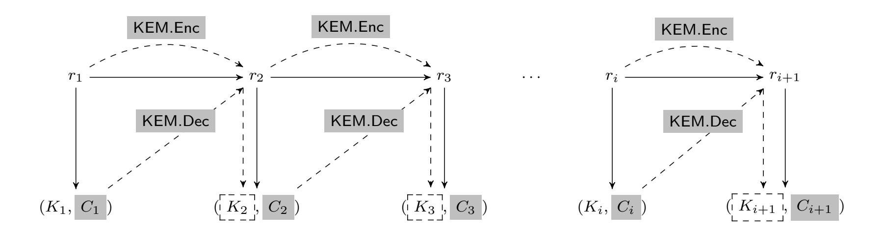
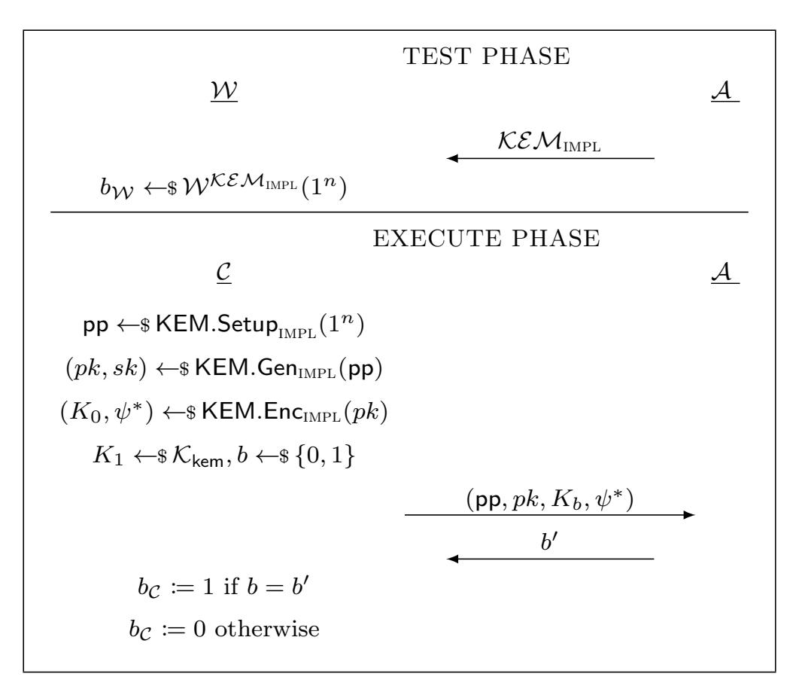
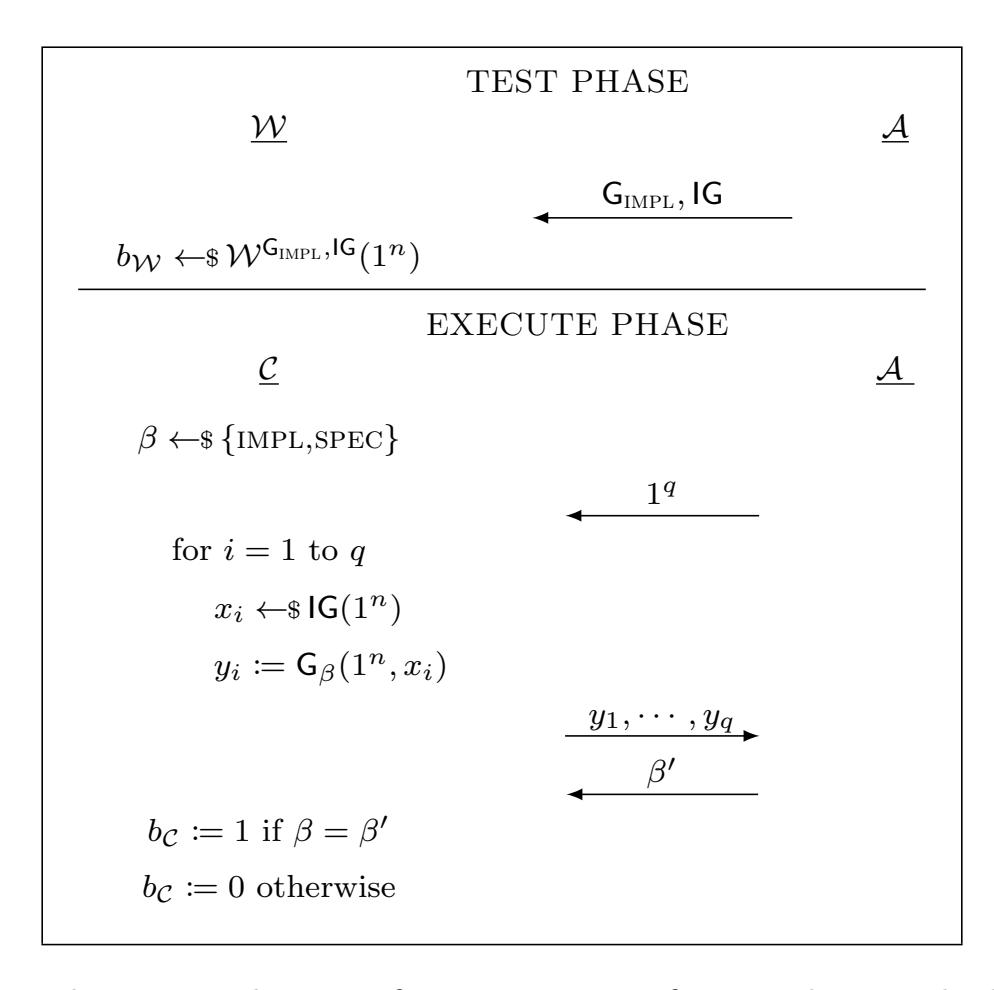
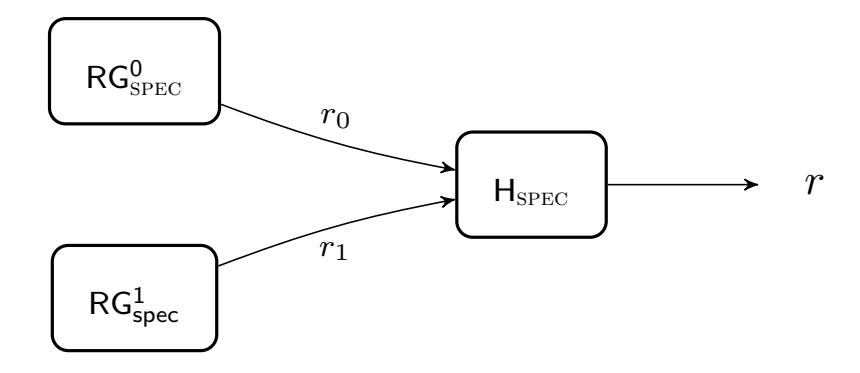
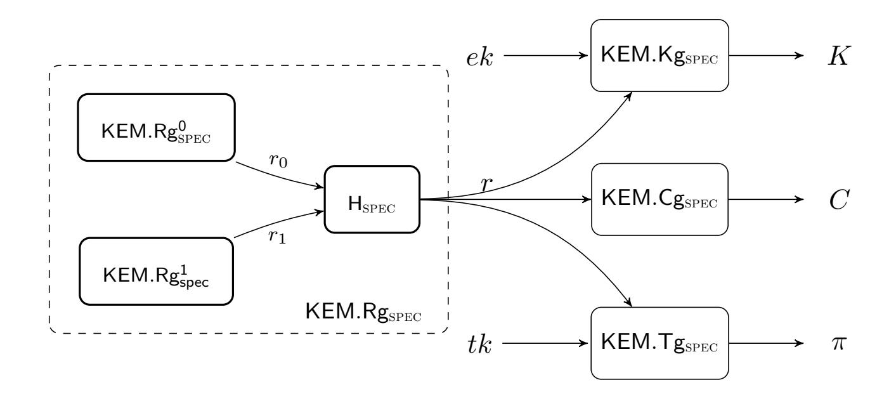

{0}------------------------------------------------

<span id="page-0-0"></span>A preliminary version of this paper appears in Advances in Cryptology - ASIACRYPT 2020. This is the full version.

# Subvert KEM to Break DEM: Practical Algorithm-Substitution Attacks on Public-Key Encryption

Rongmao Chen <sup>∗</sup>

Xinyi Huang †

Moti Yung ‡

chromao@nudt.edu.cn

xyhuang@fjnu.edu.cn

moti@cs.columbia.edu

September 8, 2020

### Abstract

Motivated by the currently widespread concern about mass surveillance of encrypted communications, Bellare et al. introduced at CRYPTO 2014 the notion of Algorithm-Substitution Attack (ASA) where the legitimate encryption algorithm is replaced by a subverted one that aims to undetectably exfiltrate the secret key via ciphertexts. Practically implementable ASAs on various cryptographic primitives (Bellare et al., CRYPTO'14 & ACM CCS'15; Ateniese et al., ACM CCS'15; Berndt and Li´skiewicz, ACM CCS'17) have been constructed and analyzed, leaking the secret key successfully. Nevertheless, in spite of much progress, the practical impact of ASAs (formulated originally for symmetric key cryptography) on public-key (PKE) encryption operations remains unclear, primarily since the encryption operation of PKE does not involve the secret key, and also previously known ASAs become relatively inefficient for leaking the plaintext due to the logarithmic upper bound of exfiltration rate (Berndt and Li´skiewicz, ACM CCS'17).

In this work, we formulate a practical ASA on PKE encryption algorithm which, perhaps surprisingly, turns out to be much more efficient and robust than existing ones, showing that ASAs on PKE schemes are far more effective and dangerous than previously believed. We mainly target PKE of hybrid encryption which is the most prevalent way to employ PKE in the literature and in practice. The main strategy of our ASA is to subvert the underlying key encapsulation mechanism (KEM) so that the session key encapsulated could be efficiently extracted, which, in turn, breaks the data encapsulation mechanism (DEM) enabling us to learn the plaintext itself. Concretely, our non-black-box yet quite general attack enables recovering the plaintext from only two successive ciphertexts and minimally depends on a short state of previous internal randomness. A widely used class of KEMs is shown to be subvertible by our powerful attack.

Our attack relies on a novel identification and formalization of certain properties that yield practical ASAs on KEMs. More broadly, it points at and may shed some light on exploring structural weaknesses of other "composed cryptographic primitives," which may make them susceptible to more dangerous ASAs with effectiveness that surpasses the known logarithmic upper bound (i.e., reviewing composition as an attack enabler).

<sup>∗</sup>National University of Defense Technology. Part of this work was done while visiting COSIC in KU Leuven.

<sup>†</sup>Fujian Provincial Key Laboratory of Network Security and Cryptology, College of Mathematics and Informatics, Fujian Normal University, China

<sup>‡</sup>Columbia University & Google

{1}------------------------------------------------

## Contents

| 1 | Introduction                                                         | 2  |
|---|----------------------------------------------------------------------|----|
|   | 1.1<br>Algorithm-Substitution Attacks<br>                            | 2  |
|   | 1.2<br>Our Results<br>                                               | 4  |
| 2 | Preliminaries                                                        | 7  |
|   | 2.1<br>Entropy Smoothing Hash Functions<br>                          | 7  |
|   | 2.2<br>Key Encapsulation Mechanism (KEM)<br>                         | 7  |
| 3 | Asymmetric ASA Model for KEMs                                        | 8  |
|   | 3.1<br>Asymmetric ASA on KEMs<br>                                    | 8  |
|   | 3.2<br>Session Key Recovery<br>                                      | 9  |
|   | 3.3<br>Undetectability<br>                                           | 10 |
| 4 | Mounting ASAs on KEMs                                                | 11 |
|   | 4.1<br>A Module-Level Syntax of KEM<br>                              | 11 |
|   | 4.2<br>Our Non-Black-Box ASA on KEMs<br>                             | 12 |
|   | 4.3<br>Formal Analysis<br>                                           | 14 |
| 5 | Instantiations                                                       | 19 |
|   | 5.1<br>KEMs from Hash Proof Systems<br>                              | 19 |
|   | 5.2<br>Concrete KEMs<br>                                             | 21 |
| 6 | Discussions on Countermeasures                                       | 23 |
|   | 6.1<br>Abandoning Randomized Algorithms<br>                          | 23 |
|   | 6.2<br>Permitting Randomized Algorithms with Further Assumptions<br> | 24 |
| 7 | Conclusions                                                          | 25 |
| A | Omitted Definitions, Proof and Instantiations                        | 28 |
|   | A.1<br>Hash Proof System<br>                                         | 28 |
|   | A.2<br>Proof of Theorem 4<br>                                        | 28 |
|   | A.3<br>Instantiating HPSs from Graded Rings<br>                      | 29 |
| B | Constructing Subversion-Resistant KEMs                               | 30 |
|   | B.1<br>Subversion-resistant KEMs in the Cliptographic Model<br>      | 30 |
|   | B.2<br>Further Discussions on other Approaches<br>                   | 34 |
| C | ASA on Hybrid Encryption                                             | 36 |

{2}------------------------------------------------

## <span id="page-2-0"></span>1 Introduction

Provable security provides strong guarantees for deploying cryptographic tools in the real world to achieve security goals. Nevertheless, it has been shown that even provably secure cryptosystems might be problematic in practice. Such a security gap—between the ideal and the real world—lies in the fact that the robustness of provable security closely depends on the adopted adversarial model which, however, often makes idealized assumptions that are not always fulfilled in actual implementations.

An implicit and common assumption—in typical adversarial models for provable security is that cryptographic algorithms should behave in the way specified by their specifications. In the real world, unfortunately, such an assumption may turn out to be invalid due to a variety of reasons such as software/hardware bugs and even malicious tampering attacks. In particular, attackers (manufacturers and supply-chain intermediaries), in reality, may be able to modify the algorithm implementation so that the subverted one remains indistinguishable—in blackbox testing—from the specification, while leaking private information (e.g., secret keys) during its subsequent runs. The threat was originally identified as kleptography by Young and Yung [\[35,](#page-27-0) [36\]](#page-27-1) over two decades ago, while the Snowden revelations of actual deployments of such attacks (in 2013) attracted renewed attention of the research community [\[7,](#page-25-0) [6,](#page-25-1) [3,](#page-25-2) [17,](#page-26-0) [5,](#page-25-3) [29,](#page-27-2) [18,](#page-26-1) [12,](#page-26-2) [20,](#page-26-3) [32,](#page-27-3) [9,](#page-26-4) [10,](#page-26-5) [28,](#page-27-4) [33,](#page-27-5) [34,](#page-27-6) [21,](#page-26-6) [4,](#page-25-4) [13\]](#page-26-7).

## <span id="page-2-1"></span>1.1 Algorithm-Substitution Attacks

In Crypto 2014, Bellare, Paterson, and Rogaway [\[7\]](#page-25-0) initiated the formal study of algorithmsubstitution attack (ASA), which was defined broadly, against symmetric encryption. In the ASA model, the encryption algorithm is replaced by an altered version created by the adversary. Such a substitution is said to be undetectable if the detector—who knows the secret key cannot differentiate subverted ciphertexts from legitimate ones. The subversion goal of an ASA adversary is to gain the ability to recover the secret key from (sequential) subverted ciphertexts. Concretely, [\[7\]](#page-25-0) proposed actual substitution attacks against certain symmetric encryption schemes.

Subsequently, Degabriele, Farshim and Poettering [\[17\]](#page-26-0) further justified Bellare et al.'s ASA model [\[7\]](#page-25-0) from an increased practical perspective, and redefined the security notion by relaxing the assumption that any subverted ciphertext produced by the altered algorithm should be decryptable. Bellare, Jaeger and Kane [\[6\]](#page-25-1) strengthened the undetectability notion of [\[7\]](#page-25-0) by considering stronger detectors which are able to adaptively feed the encryption code with some specified inputs and see all outputs written to memory, including the current state of the encryption code. They then designed stateless ASAs against all randomized symmetric encryption schemes. In [\[3\]](#page-25-2), Ateniese, Magri and Venturi extended the ASA model and studied signature schemes in the setting of fully-adaptive and continuous subversion. Berndt and Li´skiewicz [\[9\]](#page-26-4), in turn, rigorously investigated the relationship between ASAs and steganography—a well-known concept of hiding information in unsuspicious communication. By modeling encryption schemes as steganographic channels, they showed that successful ASAs correspond to secure stegosystems on the channels and vice versa. This indicates a general result that there exist universal ASAs—work with no knowledge on the internal implementation of the underlying cryptographic primitive—for any cryptographic algorithm with sufficiently large min-entropy, and in fact almost all known ASAs [\[7,](#page-25-0) [6,](#page-25-1) [3\]](#page-25-2) are universal ASAs.

In this work, we turn to another fundamental cryptographic primitives, i.e., public-key encryption (PKE), aiming at better understanding the impact of ASAs on PKE systems. Indeed, Bellare, Paterson and Rogaway mentioned in [\[7\]](#page-25-0) that:

{3}------------------------------------------------

"...one can consider subversion for public-key schemes or for other cryptographic goals, like key exchange. There are possibilities for algorithms-substitution attacks (ASAs) in all these settings...the extensions to cover additional schemes is an obvious and important target for future research."

At first glance, the general result by Berndt and Li´skiewicz [\[9\]](#page-26-4) has already illustrated the feasibility of ASAs on randomized PKE algorithms, and, further, a concrete attack was indeed exhibited on the CPA-secure PKE by Russell et al. [\[33\]](#page-27-5) (where their main result was a concrete architectural setting and construction to prevent such attacks). However, as we will explain below, the impact of such univerisal ASAs on PKE encryption algorithm turns out to be much weaker (i.e., much less efficient) than those on symmetric encryption [\[7,](#page-25-0) [6\]](#page-25-1). We concentrate in this work on subverting the system via the content of its ciphertexts.

Limited efficiency and impact of previously known ASAs on PKE. It is proved that the exfiltration rate of universal ASAs—the number of embedded bits per ciphertext—suffers a logarithmic upper bound[\[9\]](#page-26-4). Concretely, for the case of encryption schemes, no universal and consistent ASA is able to embed more than log(κ) (κ is the key length) bits of information into a single ciphertext in the random oracle model. Although this upper bound is somewhat limited, it does not significantly weaken the impact of universal ASAs on secret-key algorithms [\[7,](#page-25-0) [6,](#page-25-1) [3\]](#page-25-2), since given sufficient ciphertexts—or sufficient signatures in the case of signature schemes—the adversary can extract the whole secret key, and afterwards can completely break the security of these algorithms, as long as the underlying secret key remains unchanged. However, when it comes to the case of PKE, the impact of universal ASAs turns out to be quite impractical as the encryption procedure of PKE has only access to the public key, and thus it is impossible to leak the secret key via subverting the PKE encryption algorithm itself (via the ciphertexts). Hence, as we see it, the best possible goal for ASAs on PKE encryption procedure is to recover plaintexts. For legitimate users, this seems somewhat positive as different from the (fixed) secret key, the plaintext is usually much longer, and thus the adversary needs to collect much more ciphertexts—due to the logarithmic upper bound of universal ASAs—to recover the whole plaintext successfully. Note that although gaining one-bit information of plaintext suffices for the adversary to win the indistinguishibility-based security game (e.g., IND-CPA), such a bitby-bit recovery of plaintext is rather inefficient and thus not desirable from the point of view of the adversary, especially given the fact that plaintexts are usually fresh across various encryption sessions in reality.

Concrete examples. We apply Bellare et al.'s ASAs [\[7,](#page-25-0) [6\]](#page-25-1) to PKE to give a more intuitive picture. Precisely, the biased ciphertext attack [\[7\]](#page-25-0)—using rejection sampling of randomness could be also mounted on PKE and it has been indeed proposed by Russell et al. [\[33\]](#page-27-5) to leak the plaintext bit from the subverted PKE ciphertext. However, such an attack could only leak one bit of information per subverted ciphertext, and thus fully recovering a plaintext would (at least) require as many ciphertexts as the length of a plaintext. This concretely shows that existing ASAs are relatively inefficient on PKE. Moreover, such an attack is stateful with a large state, as it needs to maintain a global counter that represents which bit(s) of the plaintext it is trying to exfiltrate in each run. This weakens the robustness of attacks in practice as it depends on a state related to a long system history, in order to successfully leak the whole plaintext of PKE encryption. Note also that the strong ASA proposed in [\[6\]](#page-25-1)—although being stateless—turns out to be much less efficient on PKE due to the application of the coupon collector's problem.

Our concrete question: efficient and robust ASAs on PKE? The aforementioned observations and the importance of better understanding of the impact of ASAs, motivated us to consider the following question:

{4}------------------------------------------------

Are there ASAs that could be efficiently mounted on a wide range of PKE schemes and only have much limited (i.e., constant length) dependency on the system history?

In particular, we mainly consider the possibility of practical ASAs on PKE that enable the plaintext recovery with a constant number—independent of the plaintext length—of ciphertexts while only depending on a short system history. Generally, a stateful attack is more robust if its state depends on just a small history. For example, in the backdoored Dual EC DRBG (Dual Elliptic Curve Deterministic Random Bit Generator)[\[11\]](#page-26-8), an attack which apparently was successfully employed, there is a dependency on prior public randomness and learning the current seed. Nevertheless, it turned out to be deployed and the limited dependency does not weaken its impacts on practical systems. This is mainly due to the fact that an implementation of pseudo-random generators (PRGs), in fact, needs to maintain some states and the state of generators always persists for a while at least in systems (hence, some limited dependency on the past is natural, whereas long history dependency is not that typical and creates more complicated state management).

Remark: Young and Yung's Kleptography [\[35,](#page-27-0) [36,](#page-27-1) [37\]](#page-27-7). In the line of kleptography, subversions of PKE have been studied (primarily of key generation procedures of PKE) by Young and Yung [\[35,](#page-27-0) [36,](#page-27-1) [37\]](#page-27-7). They introduced the notion of secretly embedded trapdoor with universal protection (SETUP) mechanism, which enables the attacker to exclusively and efficiently recover the user private information. Young and Yung showed how SETUP can be embedded in several concrete cryptosystems including RSA, ElGamal key generation and Diffie-Hellman key exchange [\[35,](#page-27-0) [36,](#page-27-1) [37\]](#page-27-7). Our motivation may be viewed as a modern take on Young and Yung's kleptographic attacks on PKE key generation, but in the ASA model against the encryption operation itself, and particularly we ask: to what extent their type of attacks may be extended to cover PKE encryption algorithms (and composed methods like hybrid encryption) more generally?

## <span id="page-4-0"></span>1.2 Our Results

In this work, we provide an affirmative answer to the above question by proposing a practical ASA that is generically applicable to a wide range of PKE schemes, demonstrating that ASAs on PKE could be much more dangerous than previously thought. Our idea is initially inspired by the observation that almost all primary PKE constructions adopt the hybrid encryption: a public key cryptosystem (the key encapsulation mechanism or KEM) is used to encapsulate the so-called session key which is subsequently used to encrypt the plaintext by a symmetric encryption algorithm (the data encapsulation mechanism or DEM). Specifically, we turn to consider the possibility of substituting the underlying KEM stealthily so that the attacker is able to recover the session key to break the DEM (and thereafter recover the plaintext). The idea behind such an attack strategy is somewhat intuitive as compared with the plaintext that might be of arbitrary length, the session key is usually much shorter and thus easier to recover. However, this does not immediately gain much efficiency improvement in subverting PKE encryption, mainly due to the fact that the underlying KEM produces fresh session keys in between various encryption invocations. Hence, we further explore the feasibility of efficient ASA on KEMs that could successfully recover a session key from a constant number of ciphertexts. Given the logarithmic upper bound of universal ASAs [\[9\]](#page-26-4), we turn to study the possibility of non-black-box yet still general ASAs.

To the end, due to the successful dentification of a general structural weakness in existing KEM constructions, we manage to mount a much more efficient ASA on KEMs that could recover a session key from only two successive ciphertexts, which means that the state required by the attack is much smaller than the generic one. In fact, the state relation (as we will discuss 

{5}------------------------------------------------

below) in our proposed ASA is similar to that of the well-known Dual EC DRBG attack, and thus it is similar to typical state cryptosystems keep in operation, which indicates that the attack is very robust in actual systems.

Our proposed attack relies on the novel identification of non-black-box yet general enough properties that yield practical ASAs on KEMs. Also, it is a fundamental property that turns out to be conceptually easy to explain after we formulate the non-black-box assumption. However, we remark that the exact formulations and analysis are challenging. In particular, we are able to prove that the attack works only assuming that the underlying KEM satisfies some special properties, and we formally define them, rigorously showing a wide range of KEMs suffering from our ASA. This new finding explains why the attack was not considered before, even though the rationale behind our attack (as briefly shown below) was implicitly informally already hinted about if one considers the cases given in [\[35\]](#page-27-0). In fact, our attack could be regarded as a general extension of Young and Yung's kleptographic attacks in the ASA model against the modern encryption procedures of PKE schemes. More broadly, our work may shed some light on further exploring the non-black-box but quite general structural weaknesses of other composed cryptographic primitives (which the KEM/ DEM paradigm is an example of), that may make them susceptible to more efficient and effective ASAs that surpass the logarithmic upper bound of universal ASAs [\[9\]](#page-26-4).

Our contributions. To summarize, we make the following contributions.

- 1. We formalize an asymmetric ASA model for KEMs. Compared with previous works that mainly studied symmetric ASAs [\[7,](#page-25-0) [6,](#page-25-1) [3,](#page-25-2) [17\]](#page-26-0), in this work we consider a stronger setting where revealing the hard-wired subversion key does not provide users with the same cryptographic capabilities as the subverter.
- 2. We redefine the KEM syntax in a module level with two new properties—namely universal decryptability and key-pseudo-randomness—that are vital to our proposed ASA. We then introduce a generic ASA and rigorously prove its session-key-recoverability and undetectability in our ASA model.
- 3. We show that our attack works on a wide range of KEMs including the generic construction from hash proof system [\[27,](#page-27-8) [23\]](#page-27-9); and concrete KEMs derived from popular PKE schemes such as the Cramer-Shoup scheme [\[15\]](#page-26-9), the Kurosawa-Desmedt scheme [\[27\]](#page-27-8), and the Hofheinz-Kiltz scheme [\[23\]](#page-27-9).

Below we further elaborate on the results presented in this work.

Asymmetric ASA model. We start with briefly introducing the adopted ASA model in our work. Current ASA models [\[7,](#page-25-0) [6,](#page-25-1) [3,](#page-25-2) [17,](#page-26-0) [9\]](#page-26-4) are in the symmetric setting where the subversion key hard-wired in the (subverted) algorithm is the same with the one used for secret key recovery. Such a symmetric setting would enable anyone who reverse-engineers the subversion key from the subverted algorithm to have the same cryptographic ability as the subverter. In this work, we turn to the asymmetric ASA setting advocated by kleptograhic attacks [\[36\]](#page-27-1), and we carefully formalize an asymmetric ASA model specifically for KEMs. In our model, the subverted KEM contains the public subversion key while the corresponding secret subversion key is only known to the subverter. The session key recovery requires the secret subversion key and thus the attacking ability is exclusive to the subverter (and is not acquired by reverse engineering the subverted device). Also, we further enhance the notion of undetectability in the sense that the detector is allowed to know the public subversion key in the detection game. We note that in [\[7\]](#page-25-0), an asymmetric ASA model is also discussed in the context of symmetric encryption, whereas

{6}------------------------------------------------



Figure 1: The sketch map of our ASA on (simplfied) KEMs. The dashed line at the top represents that in the subverted encapsulation algorithm, ri+1 is derived from r<sup>i</sup> (i starts with "1") via running the legitimate algorithm KEM.Enc. The dashed diagonal line indicates that the attacker recovers ri+1 (and Ki+1) from C<sup>i</sup> via running KEM.Dec.

<span id="page-6-0"></span>all the proposed ASAs are symmetric. In fact, as we will show later, the asymmetric setting essentially enables our proposed effective ASAs.

A sketch map of our ASA (simplified version). We now informally describe our identified non-black-box structural weakness in existing KEM constructions and show how it enables our efficient attack. We remark that here we only take the case of simplified KEM as an example to illustrate our basic idea. For more details and formal analysis we refer the reader to Section [4.2](#page-12-0) where we present our ASA on more general KEMs. We first roughly recall the syntax of (simplified) KEM. Informally, a KEM is defined by a tuple of algorithms (KEM.Setup, KEM.Gen, KEM.Enc, KEM.Dec). The key generation algorithm KEM.Gen generates the public/secret key pair (pk, sk). The encapsulation algorithm KEM.Enc takes as input pk and output the session key K with the key ciphertext C. The decapsulation algorithm KEM.Dec uses sk to decrypt C for computing K. Our proposed ASA is essentially inspired by the observation that many popular KEM constructions, in fact, produce "public-key-independent" ciphertexts which only depend on the internal random coins generated by KEM.Enc while is independent of the public key. Consequently, such kind of key ciphertexts are "decryptable" with any key pair honestly generated by KEM.Gen (formalized as universal decryptability in our work). Relying on this fact, we manage to mount a substitution attack on KEM.Enc via manipulating the internal random coin. Specifically, the subverter runs the legitimate algorithm KEM.Gen—with the public parameter—to generate the subversion key pair (psk, ssk) of which psk is hard-wired in the subverted KEM.Enc (denoted by ASA.Enc in our ASA model), while ssk is exclusively held by the subverter. Note that KEM.Enc would be run repeatedly in an ongoing encryption procedure of PKE and let r<sup>i</sup> denote the random coin generated by KEM.Enc in its i-th invocation. Ideally, it is expected that random coins from different invocations are generated independently. However, in our designed ASA.Enc, as roughly depicted in Fig. [1,](#page-6-0) the random coin ri+1 is actually derived via KEM.Enc taking psk and r<sup>i</sup> (maintained as an internal state) as inputs. Consequently, due to the universal decryptability of KEM, the subverter is able to recompute ri+1 (and thereafter recover the session key Ki+1) by running KEM.Dec to decrypt C<sup>i</sup> using ssk. In this way, our attack enables the subverter to recover the session key of a subverted ciphertext with the help of the previous subverted ciphertext.

On the robustness of our stateful attacks. As pointed out by Bellare et al. [\[6\]](#page-25-1), stateful ASAs may become detectable upon the system reboot (e.g., resetting the state). However, we argue below that the state in our attack is practically acceptable, and our attack could still be very robust and meaningful in cryptographic implementation practices nowadays. The

{7}------------------------------------------------

state relation (i.e., only the previous randomness) in our proposed ASA is similar to that of Dual EC DRBG, and is much more limited than the stateful ASA on symmetric encryption [7], which needs to maintain a global counter that represents which bit(s) of the secret is trying to exfiltrate in each run. More broadly, modern cryptosystems in the cloud services are implemented typically in secure hardware modules that are rented to cloud customers. This has become a popular configuration in recent years. It is inconceivable that such service cannot be temporarily non-volatile and stateful. Even if it happens or all relevant tools are reinitiated at system initiation, our attack persists since we do not really need a state depending on the entire system history, but only the randomness generated in the previous session. Therefore, we categorically see no practical weakness with our configuration, primarily in view of modern secure hardware modules as cryptographic implementations, and the successful large scale attack on Dual EC DRBG [11].

## <span id="page-7-0"></span>2 Preliminaries

**Notations.** For any randomized algorithm  $\mathcal{F}$ ,  $y \coloneqq \mathcal{F}(x;r)$  denotes the output of  $\mathcal{F}$  on the fixed randomness r and  $y \leftarrow_{\$} \mathcal{F}(x)$  denotes the random output of  $\mathcal{F}$ . We write  $\mathcal{A}^{\mathcal{O}_1,\mathcal{O}_2,\cdots}(x,y,\cdots)$  to indicate that  $\mathcal{A}$  is an algorithm with inputs  $x,y,\cdots$  and access to oracle  $\mathcal{O}_1,\mathcal{O}_2,\cdots$ . Let  $z \leftarrow A^{\mathcal{O}_1,\mathcal{O}_2,\cdots}(x,y,\cdots)$  denote the outputs of running  $\mathcal{A}$  with inputs  $(x,y,\cdots)$  and access to oracles  $\mathcal{O}_1,\mathcal{O}_2,\cdots$ .

#### <span id="page-7-1"></span>2.1 Entropy Smoothing Hash Functions

Let  $\mathcal{H} = \{H_{\hat{k}}\}_{\hat{k} \in \hat{\mathcal{K}}}$  ( $\hat{\mathcal{K}}$  is the key space) be a family of keyed hash functions, where every function  $H_{\hat{k}}$  maps an element of group X to another element of group Y. Let  $\mathcal{D}$  be a PPT algorithm that takes as input an element of  $\hat{\mathcal{K}}$ , and an element from Y, and outputs a bit. The ES-advantage of  $\mathcal{D}$  is defined as

$$\mathsf{Adv}^{\mathsf{es}}_{\mathcal{H},\mathcal{D}}(n) \;\; \coloneqq \;\; |\Pr\left[\mathcal{D}(\hat{k},H_{\hat{k}}(x)) = 1 | \hat{k} \leftarrow \$\hat{\mathcal{K}}, x \leftarrow \$X\right] - \Pr\left[\mathcal{D}(\hat{k},y) = 1 | \hat{k} \leftarrow \$\hat{\mathcal{K}}, y \leftarrow \$Y\right] |.$$

We say  $\mathcal{H}$  is  $\epsilon_{es}(n)$ -entropy smoothing if for any PPT algorithm  $\mathcal{D}$ ,  $\mathsf{Adv}_{\mathcal{H},\mathcal{D}}^{\mathsf{es}}(n) \leq \epsilon_{\mathsf{es}}(n)$ . It has been shown in [19] that the CBC-MAC, HMAC and Merkle-Damgård constructions meet the above definition on certain conditions.

#### <span id="page-7-2"></span>2.2 Key Encapsulation Mechanism (KEM)

**Syntax.** A key encapsulation mechanism  $\mathcal{KEM}$  consists of algorithms (KEM.Setup, KEM.Gen, KEM.Enc, KEM.Dec) which are formally defined as below.

- KEM.Setup(1<sup>n</sup>). Takes as input the security parameter  $n \in \mathbb{N}$  and outputs the public parameter pp. We assume pp is taken by all other algorithms as input (except of KEM.Gen where it is explicitly given).
- KEM.Gen(pp). Takes as input pp, and outputs the key pair (pk, sk).
- KEM.Enc(pk). Takes as input the public key pk, and outputs  $(K, \psi)$  where K is the session key and  $\psi$  is the ciphertext.
- KEM.Dec $(sk, \psi)$ . Takes as input the secret key sk and the ciphertext  $\psi$ , and outputs the session key K or  $\bot$ .

{8}------------------------------------------------

**Correctness.** Let  $\mathcal{KEM} = (\mathsf{KEM.Setup}, \, \mathsf{KEM.Gen}, \, \mathsf{KEM.Enc}, \, \mathsf{KEM.Dec})$  be a KEM. We say  $\mathcal{KEM}$  satisfies correctness if for any  $n \in \mathbb{N}$ , for any  $\mathsf{pp} \leftarrow_{\$} \mathsf{KEM.Setup}(1^n)$ , for any  $(pk, sk) \leftarrow_{\$} \mathsf{KEM.Gen}(\mathsf{pp})$ , we have  $\mathsf{KEM.Dec}(sk, \psi) = K$  where  $(K, \psi) \leftarrow_{\$} \mathsf{KEM.Enc}(pk)$ .

**Security.** Let  $\mathcal{KEM} = (KEM.Setup, KEM.Gen, KEM.Enc, KEM.Dec)$  be a KEM. We say  $\mathcal{KEM}$  is IND-CCA-secure if for any PPT adversary  $\mathcal{A}$ ,

$$\mathsf{Adv}^{\mathsf{cca}}_{\mathsf{kem},\mathcal{A}}(n) \coloneqq \left[ \Pr \left[ \begin{array}{c} \mathsf{pp} \leftarrow_{\$} \mathsf{KEM.Setup}(1^n) \\ (pk,sk) \leftarrow_{\$} \mathsf{KEM.Gen}(\mathsf{pp}) \\ b = b' : \quad (K_0,\psi^*) \leftarrow_{\$} \mathsf{KEM.Enc}(pk) \\ K_1 \leftarrow_{\$} \mathcal{K}_{\mathsf{kem}}, b \leftarrow_{\$} \{0,1\} \\ b' \leftarrow \mathcal{A}^{\mathcal{O}_{\mathsf{Dec}}(\cdot)}(pk,K_b,\psi^*) \end{array} \right] - \frac{1}{2} \le \mathsf{negl}(n) \,,$$

where  $\mathcal{K}_{\mathsf{kem}}$  is the key space of  $\mathcal{KEM}$ , and  $\mathcal{O}_{\mathsf{Dec}}$  is a decryption oracle that on input any ciphertext  $\psi$ , returns  $K := \mathsf{KEM.Dec}(sk, \psi)$  on the condition that  $\psi \neq \psi^*$ . As a weak security definition, we say  $\mathcal{KEM}$  is IND-CPA-secure if in the above definition, the adversary is restricted not to query  $\mathcal{O}_{\mathsf{Dec}}$ .

## <span id="page-8-0"></span>3 Asymmetric ASA Model for KEMs

In this section, we extend the notion of ASA model by Bellare *et al.* [7] to the asymmetric setting for KEMs. We remark that we mainly consider substitution attacks against the encapsulation algorithm while assuming that the key generation and decapsulation algorithm are not subverted. It is worth noting that via subverting the decapsulation algorithm it is possible to exfiltrate decapsulation key. Particularly, in a recent work [1], Armour and Poettering demonstrated the feasibility of exfiltrating secret keys by subverting the decryption algorithm of AEAD.

### <span id="page-8-1"></span>3.1 Asymmetric ASA on KEMs

An ASA on KEM is that in the real-world implementation, the attacker replaces the legitimate algorithm KEM.Enc by a subverted one denoted by ASA.Enc, which hard-wires some auxiliary information chosen by the subverter. The goal of subverter is to break the security of the subverted KEM. The algorithm ASA.Enc could be arbitrary. Particularly, the randomness space in ASA.Enc could be different from that of KEM.Enc, and the subverted ciphertext space is not necessarily equal to the valid ciphertext space of KEM.Enc<sup>1</sup>. Also, ASA.Enc may be *stateful* by maintaining some internal state, even in the case that KEM.Enc is not.

**Syntax.** Let  $\mathcal{KEM} = (\mathsf{KEM.Setup}, \mathsf{KEM.Gen}, \mathsf{KEM.Enc}, \mathsf{KEM.Dec})$  be a KEM which generates  $\mathsf{pp} \leftarrow_{\$} \mathsf{KEM.Setup}(1^n)$  and  $(pk, sk) \leftarrow_{\$} \mathsf{KEM.Gen}(\mathsf{pp})$ . An asymmetric ASA on  $\mathcal{KEM}$  is denoted by  $\mathcal{ASA} = (\mathsf{ASA.Gen}, \mathsf{ASA.Enc}, \mathsf{ASA.Rec})$ .

•  $(psk, ssk) \leftarrow ASA.Gen(pp)$ . The subversion key generation algorithm takes as input pp, and outputs the subversion key pair (psk, ssk). This algorithm is run by the subverter. The public subversion key psk is hard-wired in the subverted algorithm while the secret subversion key ssk is hold by the attacker.

<span id="page-8-2"></span><sup>&</sup>lt;sup>1</sup>For example, the subverted algorithm ASA.Enc may directly output the key as its ciphertext.

{9}------------------------------------------------

- (K, ψ) ←\$ ASA.Enc(pk, psk, τ ). The subverted encapsulation algorithm takes as input pk, psk, and the (possible) internal state τ , outputs (K, ψ) and updates the state τ (if exists). This algorithm is created by the subverter and run by the legitimate user. The state τ is never revealed to the outside.
- K ←\$ ASA.Rec(pk, ssk, ψ, Φψ). The key recovery algorithm takes as input pk, ssk, ψ and an associated ciphertext set Φψ, and outputs K or ⊥. This algorithm is run by the subverter to recover the session key K encapsulated in ψ.

Remark. The algorithm ASA.Rec is run by the subverter to "decrypt" the subverted ciphertext ψ—output by ASA.Enc—using the secret subversion key ssk that is associated with psk hard-wired in ASA.Enc. However, due to the information-theoretic reasons, it might be impossible for the subverter to recover the key given the subverted ciphertext only. Therefore, we generally assume that the subverter needs some associated ciphertexts (e.g., a tuple of previous ciphertexts) to successfully run ASA.Rec. More details are provided in Section [4.2.](#page-12-0)

Below we define the notion of decryptability which says that the subverted ciphertext produced by ASA.Enc—is still decryptable to the legitimate receiver. In fact, decryptability could be viewed as the basic form of undetectability notion defined in Section [3.3.](#page-10-0)

Definition 3.1 (Decryptability). Let ASA = (ASA.Gen, ASA.Enc, ASA.Rec) be an ASA on KEM = (KEM.Setup, KEM.Gen,KEM.Enc, KEM.Dec). We say ASA preserves decryptability for KEM if for any n ∈ N, any pp ←\$KEM.Setup(1<sup>n</sup> ), and any (pk, sk) ←\$KEM.Gen(pp), for any (psk, ssk) ←\$ ASA.Gen(pp), and all state τ ∈ {0, 1} ∗ ,

$$\Pr[\mathsf{Dec}(sk,\psi) \neq K : (K,\psi) \leftarrow_{\$} \mathsf{ASA}.\mathsf{Enc}(pk,psk,\tau)] \leq \mathsf{negl}(n),$$

where the probability is taken over the randomness of algorithm ASA.Enc.

## <span id="page-9-0"></span>3.2 Session Key Recovery

Generally, the goal of the subverter is to gain some advantages in attacking the scheme. In the ASA model for symmetric encryption and signature schemes, the notion of key recovery is defined as a strong goal [\[6,](#page-25-1) [3\]](#page-25-2). However, for KEMs, the encapsulation algorithm has no access to the secret (decapsulation) key and thus it is impossible to exfiltrate the long-term secret of a subverted encapsulation algorithm. Alternatively, we define another notion which captures the ability of the subverter—who has the secret subversion key ssk—to recover the session key from the subverted ciphertext. In the following definition, we let Γ denote the internal state space of ASA.

Definition 3.2 (Session-Key-Recoverability). Let ASA = (ASA.Gen, ASA.Enc, ASA.Rec) be an ASA on KEM = (KEM.Setup, KEM.Gen,KEM.Enc, KEM.Dec). We say that ASA is session-key-recoverable if for any n ∈ N, any pp ←\$ KEM.Setup(1<sup>n</sup> ), and any (pk, sk) ←\$KEM.Gen(pp), for any (psk, ssk) ←\$ ASA.Gen(pp), and any τ ∈ Γ,

$$\Pr[\mathsf{ASA}.\mathsf{Rec}(pk,ssk,\psi,\Phi_{\psi}) \neq K: (K,\psi) \leftarrow_{\$} \mathsf{ASA}.\mathsf{Enc}(pk,psk,\tau)] \leq \mathsf{negl}(n) \,.$$

Here we implicitly assume that for every state τ ∈ Γ, the subverted ciphertext ψ and the associated ciphertext set Φ<sup>ψ</sup> exist, i.e., Φ<sup>ψ</sup> 6= ∅.

{10}------------------------------------------------

### <span id="page-10-0"></span>3.3 Undetectability

The notion of undetectability denotes the inability of ordinary users to tell whether the ciphertext is produced by a subverted encapsulation algorithm ASA. Enc or the legitimate encapsulation algorithm KEM. Enc. Different from conventional security games, here the challenger is the subverter who aims to subvert the encapsulation algorithm without being detected, while the detector (denoted by  $\mathcal{U}$ ) is the legitimate user who aims to detect the subversion via a black-box access to the algorithm.

Note that our undetectability notion does not cover all possible detection strategies in the real world, such as comparing the (possibly subverted) code execution time with that of a legitimate code. In fact, as argued by Bellare *et al.* [6], it is impossible for an ASA to evade all forms of detection and there is usually a tradeoff between detection effort and attack success.

<span id="page-10-1"></span>**Definition 3.3** (Secret Undetectability). Let  $\mathcal{ASA} = (\mathsf{ASA}.\mathsf{Gen}, \mathsf{ASA}.\mathsf{Enc}, \mathsf{ASA}.\mathsf{Rec})$  be an ASA on  $\mathcal{KEM} = (\mathsf{KEM}.\mathsf{Setup}, \mathsf{KEM}.\mathsf{Gen}, \mathsf{KEM}.\mathsf{Enc}, \mathsf{KEM}.\mathsf{Dec})$ . For a user  $\mathcal{U}$ , we define the advantage function

$$\mathsf{Adv}_{\mathsf{asa},\mathcal{U}}^{u\text{-}\mathsf{det}}(n) \coloneqq \left[ \mathsf{Pr} \left[ \begin{array}{c} \mathsf{pp} \leftarrow_{\$} \mathsf{KEM.Setup}(1^n) \\ \{(pk_\ell, sk_\ell)\}_{\ell=1}^u \leftarrow_{\$} \mathsf{KEM.Gen}(\mathsf{pp}) \\ b = b' : \ (psk, ssk) \leftarrow_{\$} \mathsf{ASA.Gen}(\mathsf{pp}) \\ \tau \coloneqq \varepsilon, \, b \leftarrow_{\$} \{0, 1\} \\ b' \leftarrow \mathcal{U}^{\mathcal{O}_{\mathsf{Enc}}} \left( \{(pk_\ell, sk_\ell)\}_{\ell=1}^u, psk \right) \end{array} \right] - \frac{1}{2} \right],$$

where  $\mathcal{O}_{\mathsf{Enc}}$  is an encapsulation oracle that for each query of input  $pk_{\ell}(\ell \in [1, u])$  by user  $\mathcal{U}$ , returns  $(K, \psi)$  which are generated depending on the bit b:

- if b = 1,  $(K, \psi) \leftarrow \text{$\mathsf{SKEM}.Enc}(pk_{\ell})$ ;
- if b = 0,  $(K, \psi) \leftarrow ASA$ .  $Enc(pk_{\ell}, psk, \tau)$ .

We say  $\mathcal{ASA}$  is **secretly**  $(u, q, \epsilon)$ -undetectable w.r.t.  $\mathcal{KEM}$  if for all PPT users  $\mathcal{U}$  that make  $q \in \mathbb{N}$  queries with  $u \in \mathbb{N}$  key pairs,  $\mathsf{Adv}^{u\text{-det}}_{\mathsf{asa},\mathcal{U}}(n) \leq \epsilon$ .

Alternatively, we say  $\mathcal{ASA}$  is publicly  $(u, q, \epsilon)$ -undetectable w.r.t.  $\mathcal{KEM}$  if in the above definition of advantage function, user  $\mathcal{U}$  is only provided with pk but not sk. Such an undetectability notion may still make sense in the real world as when the user is the encryptor, it may only know the public key. Nevertheless, since that secret undetectability clearly implies public undetectability, we only consider secret undetectability for ASAs on KEMs in this work.

Strong undetectability. The notion of strong undetectability was introduced by Bellare et al. [6] for the case of subverting symmetric encryption. In the definition of strong undetectability, the challenger also returns the state to the user. This mainly considers a strong detection where the detector may be able to see all outputs written to the memory of the machine when the subverted code is running. Meeting such a strong notion naturally limits the ASA to be stateless otherwise it would be detectable to the user. We remark that our proposed ASA on KEM in this work is stateful and thus does not satisfy strong undetectability. However, in contrast to the stateful ASAs [7] which need a global counter indicating what happens in each round, the state in our attack is much more limited. Particularly, similar to the case of stateful Dual EC[11]—also most PRGs—our attack only depends on the previous randomness. Therefore, we insist that the state we need is practically acceptable, and our attack is robust and meaningful.

{11}------------------------------------------------

| KEM.Gen(pp)            | KEM.Enc(pk)            | KEM.Dec(sk, ψ = (C, π))       |
|------------------------|------------------------|-------------------------------|
| (ek, dk) ←\$KEM.Ek(pp) | r ←\$KEM.Rg(pp)        | K0<br>:= KEM.Kd(dk, C)        |
| (tk, vk) ←\$KEM.Tk(pp) | K := KEM.Kg(ek, r)     | 0<br>:= KEM.Vf(vk, C)<br>π    |
| pk := (ek, tk)         | C := KEM.Cg(r)         | 0 =<br>π then K := K0<br>If π |
| sk := (dk, vk)         | π := KEM.Tg(tk, r)     | Else K := ⊥                   |
| Return (pk, sk)        | Return (K, ψ = (C, π)) | Return K                      |

<span id="page-11-2"></span>Figure 2: Module-level Syntax of KEM. The boxed algorithms are optional.

Multi-user undetectability. Here we only consider the case of a single user in Definition [3.3](#page-10-1) for simplicity. One could extend our notion to the more general setting of multi-user. Precisely, in the undetectability definition for the multi-user setting, user U also receives multiple key pairs from the challenger and is allowed to make polynomially many queries to ν identical encapsulation oracles independently and adaptively (ν denotes the user number).

Remark. Compared with the undetectability notion [\[7,](#page-25-0) [6,](#page-25-1) [3\]](#page-25-2), the challenger in our definition additionally provides the user with the subversion key hard-wired in the subverted algorithm. From this aspect, our notion is stronger than the symmetric ASA where the hard-wired subversion key is not allowed to be revealed to the user. In fact, any ASA meeting our undetectability notion implicitly implies that revealing the hard-wired subversion key does not provide users with the same cryptographic capabilities as the subverter.

## <span id="page-11-0"></span>4 Mounting ASAs on KEMs

We present an ASA on KEMs that enables the subverter to recover the session key efficiently while the attack is undetectable to the user. We first revisit the KEM syntax in the module level so that it has some notational advantages in describing our proposed ASA. New properties with respect to the module-level KEM are then explicitly defined for the formal analysis of the proposed attack.

## <span id="page-11-1"></span>4.1 A Module-Level Syntax of KEM

The module-level KEM syntax is mainly depicted in Fig. [2.](#page-11-2)

- pp ← KEM.Setup(1<sup>n</sup> ). Takes as input the security parameter n ∈ N and outputs the public parameter pp which includes the descriptions of the session key space Kkem and the randomness space Rkem.
- (pk = (ek, tk), sk = (dk, vk)) ← KEM.Gen(pp). Takes as input the public parameter and runs the following sub-algorithms.
  - (ek, dk) ← KEM.Ek(pp). The encapsulation key generation algorithm generates the key pair (ek, dk) for key encapsulation and decapsulation.
  - (tk, vk) ← KEM.Tk(pp). The tag key generation algorithm generates the key pair (tk, vk) for tag generation and verification. This algorithm is usually required only for KEM of strong security, e.g., IND-CCA security.
- (K, ψ = (C, π)) ← KEM.Enc(pk). Takes as input the public key and runs the following sub-algorithms.

{12}------------------------------------------------

- r ← KEM.Rg(pp). The randomness generation algorithm picks r ←\$ Rkem.
- K ← KEM.Kg(ek, r). The encapsulated key generation algorithm takes as input ek and randomness r, and outputs key K.
- C ← KEM.Cg(r). The key ciphertext generation algorithm takes as input randomness r, and outputs key ciphertext C.
- π ← KEM.Tg(tk, r). The tag generation algorithm takes as input tk and r, and outputs the ciphertext tag π.
- K/⊥ ← KEM.Dec (sk, ψ = (C, π)). Takes as input the secret key and the ciphertext, and runs the following sub-algorithms.
  - K ← KEM.Kd(dk, C). The ciphertext decapsulation algorithm takes as input dk and C, and outputs key K.
  - π <sup>0</sup> ← KEM.Vf(vk, C) . The tag re-generation algorithm takes as input vk and C, and outputs tag π 0 .

The key K is finally output if π <sup>0</sup> = π. Otherwise, ⊥ is output.

Remark. Our syntax mainly covers KEMs of the following features. First, the generation of key ciphertext (KEM.Cg) is independent of the public key. Although this is quite general for most KEM constructions, it fails to cover KEMs that require public key for ciphertext generation. For example, the lattice-based KEM in [\[30\]](#page-27-10) produces ciphertexts depending on the encapsulation key and thus it is not captured by our framework. Second, the separation of ciphertext and tag clearly indicates explicit-rejection KEMs, i.e., all inconsistent ciphertexts get immediately rejected by the decapsulation algorithm. Although explicit-rejection variants are generally popular, some special setting requires implicit-rejection KEMs, where inconsistent ciphertexts yield one uniform key and hence will be rejected by the authentication module of the encryption scheme. Concrete examples could be found in [\[23\]](#page-27-9). Nevertheless, in Section [5.2,](#page-21-0) we show that our defined KEM framework already covers many known KEM constructions derived from popular schemes, such as the Cramer-Shoup scheme[\[15\]](#page-26-9), the Kurosawa-Desmedt scheme[\[27\]](#page-27-8), and the Hofheinz-Kiltz scheme[\[23\]](#page-27-9).

## <span id="page-12-0"></span>4.2 Our Non-Black-Box ASA on KEMs

Following the above module-level syntax, we first identify and formalize two new non-black-box properties for KEMs, which essentially enable our extremely efficient ASA against KEMs.

Non-black-box properties formulations. Our notions, namely universal decryptability and key-pseudo-randomness, are actually met by all known KEMs that could be interpreted using our module-level syntax. Here we explicitly define them as they are vital to our proposed ASA.

The first non-black-box assumption, i.e., universal decryptability, says that any key ciphertext C output by KEM.Cg is decryptable via KEM.Kd with any dk output by KEM.Ek.

Definition 4.1 (Universal Decryptability). Let KEM = (KEM.Setup, KEM.Gen, KEM.Enc, KEM.Dec) be a KEM defined in Fig. [2.](#page-11-2) We say KEM is universally decryptable if for any n ∈ N, pp ←\$KEM.Setup(1<sup>n</sup> ), for any r ←\$KEM.Rg(pp) and C := KEM.Cg(r), we have

$$\mathsf{KEM}.\mathsf{Kd}(dk,C) = \mathsf{KEM}.\mathsf{Kg}(ek,r)$$

holds for any (ek, dk) ←\$KEM.Ek(pp).

{13}------------------------------------------------

The second notion, i.e., key-pseudo-randomness, indicates that the key produced by KEM.Kg is computationally indistinguishable from a random key.

<span id="page-13-0"></span>**Definition 4.2** (Key-Pseudo-Randomness). Let  $\mathcal{KEM} = (\mathsf{KEM.Setup}, \, \mathsf{KEM.Gen}, \, \mathsf{KEM.Enc}, \, \mathsf{KEM.Dec})$  be a KEM as defined in Fig. 2. We say  $\mathcal{KEM}$  is  $\epsilon_{\mathsf{prk}}$ -key-pseudo-random if for any PPT adversary  $\mathcal{A}$ , we have

$$\mathsf{Adv}^{\mathsf{prk}}_{\mathsf{kem},\mathcal{A}}(n) \coloneqq \begin{bmatrix} \mathsf{pp} \leftarrow_{\$} \mathsf{KEM.Setup}(1^n) \\ r \leftarrow_{\$} \mathsf{KEM.Rg}(\mathsf{pp}) \\ C \coloneqq \mathsf{KEM.Cg}(r) \\ b = b' : (ek, dk) \leftarrow_{\$} \mathsf{KEM.Ek}(\mathsf{pp}) \\ b \leftarrow_{\$} \{0, 1\}, K_0 \leftarrow_{\$} \mathcal{K}_{\mathsf{kem}} \\ K_1 \coloneqq \mathsf{KEM.Kg}(ek, r) \\ b' \leftarrow \mathcal{A}(ek, K_b, C) \end{bmatrix} - \frac{1}{2} \le \epsilon_{\mathsf{prk}}.$$

REMARK. One may note that for those KEMs that are only IND-CPA-secure (i.e., no tag generation/verification is involved in key encapsulation/decapsulation), our formalized notions of universal decryptability and key-pseudo-randomness are actually the typical properties of "perfect correctness" and "IND-CPA security" respectively for KEMs that follows the above module-level syntax. Here we explicitly redefine them for generality consideration since we are also interested in exploring effective ASAs on IND-CCA-secure KEMs.

The proposed attack. We now describe our proposed (asymmetric) ASA. Let  $\mathcal{KEM} = (\mathsf{KEM}.\mathsf{Setup}, \, \mathsf{KEM}.\mathsf{Gen}, \, \mathsf{KEM}.\mathsf{Enc}, \, \mathsf{KEM}.\mathsf{Dec})$  be a KEM. Consider a sequential execution of KEM.Enc. Suppose  $\mathsf{pp} \leftarrow_{\$} \mathsf{KEM}.\mathsf{Setup}(1^n)$  and

$$(pk = (ek, tk), sk = (dk, vk)) \leftarrow s KEM.Gen(pp).$$

Let  $(K_i, \psi_i = (C_i, \pi_i))$  denote the output of the *i*-th execution of KEM.Enc, for which the internal randomness is denoted as  $r_i \leftarrow_{\$} \mathsf{KEM.Rg}(\mathsf{pp})$ . That is,  $K_i \coloneqq \mathsf{KEM.Kg}(ek, r_i), C_i \coloneqq \mathsf{KEM.Cg}(r_i)$ , and  $\pi_i \coloneqq \mathsf{KEM.Tg}(tk, r_i)$ .

Our ASA on  $\mathcal{KEM}$  is depicted in Fig. 3. Below are more details.

Subversion Key Generation (ASA.Gen). The subversion key generation algorithm runs (psk, ssk)  $\leftarrow$ s KEM.Ek(pp). Note that psk is hard-wired in the subverted key encapsulation algorithm ASA.Enc while ssk is kept by the subverter. Our ASA also makes use of a family of keyed hash function  $\mathcal{H} := \{H_{\hat{k}}\}_{\hat{k} \in \hat{\mathcal{K}}}$ , where each  $H_{\hat{k}}$  maps  $\mathcal{K}_{\text{kem}}$  to  $\mathcal{R}_{\text{kem}}$  (both  $\mathcal{K}_{\text{kem}}$  and  $\mathcal{R}_{\text{kem}}$  are defined by pp). Therefore, the hash function key  $\hat{k}$  is also hard-wired in the subverted algorithm ASA.Enc.

Subverted Encapsulation (ASA.Enc). As depicted in the right of Fig. 3, the subverted encapsulation algorithm ASA.Enc takes the public key pk, the hard-wired key psk and the internal state  $\tau$  as input. The initial value of  $\tau$  is set as  $\tau \coloneqq \varepsilon$ . Then for the i-th execution ( $i \ge 1$ ), ASA.Enc executes the same as KEM.Enc does except of:

- For algorithm KEM.Enc, the randomness  $r_i$  is generated via running KEM.Rg to sample  $r_i \leftarrow_{\$} \mathcal{R}_{\mathsf{kem}}$  uniformly.
- For algorithm ASA.Enc, if  $\tau = \varepsilon$ , the randomness  $r_i$  is generated via running KEM.Rg; otherwise,  $r_i$  is generated via firstly running  $t := \text{KEM.Kg}(psk, \tau)$  and then computing  $r_i := H_{\hat{k}}(t)$ . The internal state  $\tau$  is then updated to  $r_i$ .

{14}------------------------------------------------

```
ASA.Gen(pp)
  (psk, ssk) ←$KEM.Ek(pp)
  Return (psk, ssk)
ASA.Rec(pk, ssk, Ci
                   , Ci-1) /*i > 1*/
  t := KEM.Kd(ssk, Ci-1)
  ri
    := Hkˆ(t)
  Ki
     := KEM.Kg(ek, ri)
  Return Ki
                                           ASA.Enc(pk, psk, τ ) /*i-th execution*/
                                             If τ = ε then
                                                 ri ←$KEM.Rg(pp)
                                             Else
                                                  t := KEM.Kg(psk, τ )
                                                  ri
                                                    := Hkˆ(t)
                                             Ki
                                                 := KEM.Kg(ek, ri)
                                             Ci
                                                 := KEM.Cg(ri)
                                             πi
                                                := KEM.Tg(tk, ri)
                                              τ := ri
                                             Return (Ki
                                                         , ψi = (Ci
                                                                   , πi))
```

<span id="page-14-1"></span>Figure 3: The generic ASA on KEMs. The grey background highlights the difference between ASA.Enc and KEM.Enc.

The generation of ciphertext C<sup>i</sup> and the session key K<sup>i</sup> still follow the legitimate procedure, i.e., by running algorithm KEM.Cg and KEM.Kg respectively.

Session Key Recovery (ASA.Rec). The left down part of Fig. [3](#page-14-1) depicts the encapsulated key recovery algorithm ASA.Rec run by the subverter. To recover the session key encapsulated in the subverted ciphertext C<sup>i</sup> (i > 1), the subverter first uses ssk to decrypt the ciphertext Ci-1 to recover t and then computes r<sup>i</sup> , based on which the key Ki—encapsulated in Ci—could be trivially computed. It is worth noting that the subverted ciphertext C<sup>i</sup> is in fact not used in the running of ASA.Rec to recover the underlying key K<sup>i</sup> . The core idea of the session key recovery is to recover the randomness r<sup>i</sup> by using ssk to decapsulate Ci-1 which is actually the associated ciphertext of C<sup>i</sup> .

## <span id="page-14-0"></span>4.3 Formal Analysis

Let KEM = (KEM.Setup, KEM.Gen, KEM.Enc,KEM.Dec) be a KEM and ASA = (ASA.Gen, ASA.Enc, ASA.Rec) be an ASA on KEM described in Fig. [3.](#page-14-1) Then we have the following results.

Theorem 4.1. The ASA depicted in Fig. [3](#page-14-1) preserves the decryptability of KEM.

Proof. This clearly holds as ASA.Enc is the same as the original algorithm KEM.Enc except of the internal randomness generation. Particularly, the generation of ciphertext and key essentially remain unchanged in ASA.Enc.

Theorem 4.2. The ASA depicted in Fig. [3](#page-14-1) is session-key-recoverable if KEM is universally decryptable.

Proof. Note that the notion of session-key-recoverability is defined for the subverted ciphertext ψ which has the associated ciphertexts Φ, i.e., Φ<sup>ψ</sup> 6= ∅. That is, here we consider the session-key-recoverability for all subverted ciphertext C<sup>i</sup> where i ≥ 2. By the fact that KEM is universally decryptable, we have that KEM.Kd(ssk, Ci-1) = KEM.Kg(psk, ri-1) holds for all ri-1 ∈ Rkem (i ≥ 2) and Ci-1 := KEM.Cg(ri-1), and for all (psk, ssk) ←\$KEM.Ek. Note that the randomness recovered in ASA.Rec equals to that from ASA.Enc. Therefore, we have

{15}------------------------------------------------

```
Game G0(n)
      pp ←$KEM.Setup(1n)
      {(pk`, sk`)}
                 u
                 `=1 ←$KEM.Gen(pp), (psk, ssk) ←$KEM.Ek(pp)
      τ := ε, b ←$ {0, 1}, b
                          0 ← AOEnc ({(pk`, sk`)}
                                                 u
                                                 `=1 , psk)
      Return (b = b
                    0
                    )
OEnc (pk` = (ek`, tk`))
      If (b = 1) then
        (K, ψ) ←$KEM.Enc(pk`)
      Else
        If τ = ε then
          r ←$KEM.Rg(pp)
        Else
          t := KEM.Kg(psk, τ )
          r := Hkˆ(t)
        K := KEM.Kg(ek`, r), C := KEM.Cg(r), π := KEM.Tg(tk`, r)
        τ := r, ψ := (C, π)
      Return (K, ψ)
```

<span id="page-15-1"></span>Figure 4: Games G<sup>0</sup> in the proof of Theorem [4.3](#page-15-0)

ASA.Rec(pk, ssk, C<sup>i</sup> , Ci-1) = K<sup>i</sup> for any (pk, sk) ←\$KEM.Gen and any (K<sup>i</sup> , ψ<sup>i</sup> = (C<sup>i</sup> , πi)) ←\$ ASA.Enc(pk, psk, ri-1).

<span id="page-15-0"></span>Theorem 4.3. Assume KEM is prk(n)-key-pseudo-random and H is es(n)-entropy smoothing, then our ASA depicted in Fig. [3](#page-14-1) satisfies (u, q, )-undetectability where q is the query number by the adversary in the detection game and

$$\epsilon \le (q-1)(\epsilon_{\mathsf{prk}}(n) + \epsilon_{\mathsf{es}}(n)).$$

Proof. We prove this theorem via a sequence of games. Suppose that the adversary A makes q queries in total to the oracle OEnc in the security game. We define a game sequence: {G0, G1,1, G1,2, G2,1, G2,2, · · · , Gq-1,1, Gq-1,2}. G<sup>0</sup> is the real game and depicted in Fig. [4](#page-15-1) while {G1,1, G1,2, G2,1, G2,2, · · · , Gq-1,1, Gq-1,2} are described in Fig. [5.](#page-16-0) Note that in the following illustrations, we also let G0,<sup>2</sup> denote the game G<sup>0</sup> for the consideration of notational consistency. Let Adv<sup>x</sup> be the advantage function with respect to A in Game Gx. Below we provide more details of G0, Gj−1,<sup>1</sup> and Gj−1,<sup>2</sup> for all j ∈ [2, q]. Note that in all games Gj−1,<sup>1</sup> and Gj−1,<sup>2</sup> (j ∈ [2, q]), an internal counter i (initialized to 0) is set for the encapsulation oracle and increments upon each query by the adversary.

• Game G<sup>0</sup> (i.e., G0,2): This game is the real game and thus we have

$$\mathsf{Adv}^{u\text{-det}}_{\mathsf{asa},\mathcal{U}}(n) = \mathsf{Adv}_0.$$

{16}------------------------------------------------

```
Game Gj-1,1(n), Gj-1,2(n) (j ∈ [2, q])
      pp ←$KEM.Setup(1n)
      {(pk`, sk`)}
                 u
                 `=1 ←$KEM.Gen(pp)
      (psk, ssk) ←$KEM.Ek(pp),τ := ε, i := 0
      b ←$ {0, 1}, b
                   0 ← AOEnc ({(pk`, sk`)}
                                          u
                                          `=1 , psk)
      Return (b = b
                    0
                    )
OEnc (pk` = (ek`, tk`))
      i := i + 1
      If (b = 1) then
        (K, ψ) ←$KEM.Enc(pk`)
      Else
        If i < j then
          r ←$KEM.Rg(pp)
        Else
          If i = j then
             t ←$ Kkem, r := Hkˆ(t)
              r ←$KEM.Rg(pp)
          Else
             t := KEM.Kg(psk, τ ), r := Hkˆ(t)
        K := KEM.Kg(ek`, r), C := KEM.Cg(r), π := KEM.Tg(tk`, r)
        τ := r, ψ := (C, π)
      Return (K, ψ)
```

<span id="page-16-0"></span>Figure 5: Games G1,1, G1,2, G2,1, G2,2, · · · , Gq-1,1, Gq-1,<sup>2</sup> in the proof of Theorem [4.3.](#page-15-0) Game Gj-1,<sup>2</sup> contains the corresponding boxed statements, but game Gj-1,<sup>1</sup> does not.

- Game Gj-1,<sup>1</sup> is identical to Gj-2,<sup>2</sup> except that for the case of b = 0, to generate the response for the j-th query of A, the challenger picks t ←\$ Kkem instead of computing t := KEM.Kg(psk, τ ). We claim that from the view of A, Gj-1,<sup>1</sup> is indistinguishable from Gj-2,<sup>2</sup> if KEM is key-pseudo-random. That is, |Advj-2,<sup>2</sup> − Advj-1,1| ≤ prk(n). See Lemma [4.4](#page-16-1) for more details.
- Game Gj-1,<sup>2</sup> is identical to Gj-1,<sup>1</sup> except that for the case of b = 0, to generate the response for the j-th query of A,r is derived by r ←\$KEM.Rg(pp) (i.e., r ←\$ Rkem) instead of r := Hkˆ(t). We claim that from the view of A, Gj-1,<sup>2</sup> is indistinguishable from Gj-1,<sup>1</sup> if H is entropy smoothing. That is, |Advj-1,<sup>2</sup> − Advj-1,1| ≤ es(n). See Lemma [4.5](#page-18-0) for more details.

<span id="page-16-1"></span>**Lemma 4.4** (
$$\mathbf{G}_{j-1,1} \approx_c \mathbf{G}_{j-2,2}$$
). For all  $j \in [2,q]$  and all PPT adversary  $\mathcal{A}$ , 
$$|\mathsf{Adv}_{j-2,2} - \mathsf{Adv}_{j-1,1}| \leq \epsilon_{\mathsf{prk}}(n).$$

{17}------------------------------------------------

```
{\cal B}_{i\text{-}1}({\sf pp}^*,ek^*,K^*,C^*)
             \mathsf{pp} \coloneqq \mathsf{pp}^*, \, psk \coloneqq ek^*, \, \tau \coloneqq \varepsilon, i \coloneqq 0, \, \{(pk_\ell, sk_\ell)\}_{\ell=1}^u \, \leftarrow_{\!\!\!\$} \mathsf{KEM.Gen}(\mathsf{pp})
             b \leftarrow \$ \{0,1\}, b' \leftarrow \mathcal{A}^{\mathcal{O}_{\mathsf{Enc}}^{\mathsf{sim}}} \left( \{(pk_{\ell}, sk_{\ell})\}_{\ell=1}^{u}, psk \right)
             Return (b = b')
\mathcal{O}_{\mathsf{Enc}}^{\mathsf{sim}}\left(pk_{\ell}=\left(ek_{\ell},tk_{\ell}\right)\right)
             i \coloneqq i + 1
             If (b=1) then
                  (K, \psi) \leftarrow \mathsf{s} \mathsf{KEM}.\mathsf{Enc}(pk_\ell)
             Else
                  If i = (j-1) then
                       C := C^*, K := \mathsf{KEM}.\mathsf{Kd}(dk_\ell, C^*)
                       \pi := \mathsf{KEM.Vf}(C^*, vk_\ell), \ \psi := (C, \pi)
                  Else
                       If i < (j-1) then
                            r \leftarrow s \mathsf{KEM.Rg}(\mathsf{pp})
                        Else
                            If i = j then
                                 t \coloneqq K^*, r \coloneqq H_{\hat{k}}(t)
                             Else
                                 t \coloneqq \mathsf{KEM}.\mathsf{Kg}(psk,\tau), r \coloneqq H_{\hat{\iota}}(t)
                       K \coloneqq \mathsf{KEM}.\mathsf{Kg}(ek_\ell,r), \ C \coloneqq \mathsf{KEM}.\mathsf{Cg}(r), \ \pi \coloneqq \mathsf{KEM}.\mathsf{Tg}(tk,r)
                       \tau \coloneqq r, \ \psi \coloneqq (C, \pi)
             Return (K, \psi)
```

<span id="page-17-0"></span>Figure 6: Adversary  $\mathcal{B}$  attacking the key-pseudo-randomness of  $\mathcal{KEM}$  in the proof of Lemma 4.4.

*Proof.* To prove this transition, we construct an adversary  $\mathcal{B}_{j-1}$  attacking the property of key-pseudo-randomness of  $\mathcal{KEM}$ . Suppose that  $\mathcal{B}_{j-1}$  receives  $(pp^*, ek^*, K^*, C^*)$  from the challenger in the game defined in Definition 4.2. Its goal is to tell whether  $K^*$  is the key encapsulated in  $C^*$  or a random value.

 $\mathcal{B}_{j-1}$  then simulates the detection game to interact with  $\mathcal{A}$  via the procedure depicted in Fig. 6.  $\mathcal{B}_{j-1}$  first sets  $psk = ek^*$  as the public subversion key and simulates the encapsulation oracle (denoted by  $O_{\mathsf{Enc}}^{\mathsf{sim}}$ ) for  $\mathcal{A}$ . Precisely, if b = 0, for each query with input  $pk_{\ell} = (ek_{\ell}, tk_{\ell})$ ,  $O_{\mathsf{Enc}}^{\mathsf{sim}}$  performs depending on the internal counter i as follows.

- CASE 1: i = (j-1).  $\mathcal{B}_{j-1}$  sets  $C = C^*$ , computes  $K := \mathsf{KEM}.\mathsf{Kd}(dk_\ell, C^*)$  and  $\pi := \mathsf{KEM}.\mathsf{Vf}(C^*, vk_\ell)$ , and returns  $(K, C, \pi)$ .
- CASE 2: i < (j-1).  $\mathcal{B}_{j-1}$  runs the algorithm KEM.Enc, i.e., KEM.Rg, KEM.Cg and KEM.Tg sequentially, updates  $\tau$  and returns the output.
- CASE 3: i = j.  $\mathcal{B}_{j-1}$  sets  $t = K^*$ , computes  $r := H_{\hat{k}}(t)$ ,  $K := \mathsf{KEM.Kg}(ek_{\ell}, r)$ , C :=

{18}------------------------------------------------

```
\mathcal{D}_{j\text{-}1}(\hat{k},y^*)
              pp \leftarrow s KEM.Setup(1^n)
             \{(pk_{\ell}, sk_{\ell})\}_{\ell=1}^u \leftarrow \text{$\mathsf{SKEM.Gen}(\mathsf{pp})$}, (psk, ssk) \leftarrow \text{$\mathsf{SKEM.Ek}(\mathsf{pp})$}
             \tau \coloneqq \varepsilon, \ i \coloneqq 0, \ b \leftarrow \$\{0,1\}, \ b' \leftarrow \mathcal{A}^{\mathcal{O}_{\mathsf{Enc}}^{\mathsf{sim}}}\left(\{(pk_{\ell}, sk_{\ell})\}_{\ell=1}^{u}, psk\right)
             Return (b = b')
\underline{\mathcal{O}_{\mathsf{Enc}}^{\mathsf{sim}}\left(pk_{\ell}=(ek_{\ell},tk_{\ell})\right)}
             i \coloneqq i + 1
             If (b=1) then
                  (K,\psi) \leftarrow \mathsf{s} \mathsf{KEM}.\mathsf{Enc}(pk_\ell)
              Else
                   If i < j then
                        r \leftarrow s \mathsf{KEM.Rg}(\mathsf{pp})
                   Else
                        If i = j then
                             r := y^*
                        Else
                             t \coloneqq \mathsf{KEM}.\mathsf{Kg}(psk,\tau), \ r \coloneqq H_{\hat{k}}(t)
                   K \coloneqq \mathsf{KEM}.\mathsf{Kg}(ek_\ell,r), \ C \coloneqq \mathsf{KEM}.\mathsf{Cg}(r), \ \pi \coloneqq \mathsf{KEM}.\mathsf{Tg}(tk_\ell,r)
                   \tau \coloneqq r, \ \psi \coloneqq (C, \pi)
            Return (K, \psi)
```

<span id="page-18-1"></span>Figure 7: Adversary  $\mathcal{D}$  attacking the entropy smoothing hash function  $H_{\hat{k}}$  in the proof of Lemma 4.5.

 $\mathsf{KEM.Cg}(r)$  and  $\pi \coloneqq \mathsf{KEM.Tg}(tk_{\ell}, r)$ , updates  $\tau$  and returns  $(K, C, \pi)$ .

• CASE 4: i > j.  $\mathcal{B}_{j-1}$  sets  $t := \mathsf{KEM.Kg}(psk, \tau)$ , computes  $r := H_{\hat{k}}(t)$ , runs  $K := \mathsf{KEM.Kg}(ek_{\ell}, r)$ ,  $C := \mathsf{KEM.Cg}(r)$  and  $\pi := \mathsf{KEM.Tg}(tk_{\ell}, r)$ , updates  $\tau$  and returns  $(K, C, \pi)$ .

Finally,  $\mathcal{B}_{j-1}$  outputs 1 if  $\mathcal{A}$  outputs b' = b otherwise outputs 0.

One could note that if  $K^*$  is the key encapsulated in  $C^*$ , then the game simulated by  $\mathcal{B}_{j-1}$  is exactly the game  $\mathbf{G}_{j-2,2}$  from the view of  $\mathcal{A}$ . Otherwise, the simulated game is  $\mathbf{G}_{j-1,1}$  from the view of  $\mathcal{A}$ . Therefore, we have  $|\mathsf{Adv}_{j-2,2} - \mathsf{Adv}_{j-1,1}| \leq \epsilon_{\mathsf{prk}}(n)$ .

<span id="page-18-0"></span>**Lemma 4.5** (
$$\mathbf{G}_{j-1,2} \approx_c \mathbf{G}_{j-1,1}$$
). For all  $j \in [2,q]$  and all PPT adversary  $\mathcal{A}$ ,

$$|\mathsf{Adv}_{i-1,1} - \mathsf{Adv}_{i-1,2}| \le \epsilon_{\mathsf{es}}(n).$$

*Proof.* To prove this transition, we construct an adversary  $\mathcal{D}_{j-1}$  attacking the entropy smoothing hash function  $H_{\hat{k}}: \mathcal{K}_{\mathsf{kem}} \to \mathcal{R}_{\mathsf{kem}}$ . Suppose that  $\mathcal{D}_{j-1}$  receives  $(\hat{k}, y^*)$  from the challenger. Its goal is to tell whether  $y^* = H_{\hat{k}}(x)$  where  $x \leftarrow \mathcal{K}_{\mathsf{kem}}$ , or  $y^* \leftarrow \mathcal{K}_{\mathsf{kem}}$ .

 $\mathcal{D}_{j-1}$  then simulates the detection game to interact with  $\mathcal{A}$  via the procedure depicted in Fig. 7.  $\mathcal{D}_{j-1}$  simulates the encapsulation oracle (denoted by  $O_{\mathsf{Enc}}^{\mathsf{sim}}$ ) for  $\mathcal{A}$ . Precisely, if b=0, for

{19}------------------------------------------------

each query with input  $pk_{\ell} = (ek_{\ell}, tk_{\ell})$ ,  $O_{\mathsf{Enc}}^{\mathsf{sim}}$  performs depending on the internal counter i as follows.

- CASE 1: i < j.  $\mathcal{D}_{j-1}$  runs the algorithm KEM.Enc, i.e., runs KEM.Rg, KEM.Cg and KEM.Tg sequentially, updates  $\tau$  and returns the output.
- CASE 2: i = j.  $\mathcal{D}_{j-1}$  sets  $r := y^*$ , runs  $K := \mathsf{KEM.Kg}(ek_\ell, r)$ ,  $C := \mathsf{KEM.Cg}(r)$  and  $\pi := \mathsf{KEM.Tg}(tk_\ell, r)$ , updates  $\tau$  and returns  $(K, C, \pi)$ .
- CASE 3: i > j.  $\mathcal{D}_{j-1}$  sets  $t \coloneqq \mathsf{KEM}.\mathsf{Kg}(psk,\tau)$ , computes  $r \coloneqq H_{\hat{k}}(t)$ , runs  $K \coloneqq \mathsf{KEM}.\mathsf{Kg}(ek_{\ell},r)$ ,  $C \coloneqq \mathsf{KEM}.\mathsf{Cg}(r)$  and  $\pi \coloneqq \mathsf{KEM}.\mathsf{Tg}(tk_{\ell},r)$ , updates  $\tau$  and returns  $(K,C,\pi)$ .

Finally,  $\mathcal{D}_{j-1}$  outputs 1 if  $\mathcal{A}$  outputs b' = b otherwise outputs 0.

One could note that from the view of  $\mathcal{A}$ , if  $y^* = H_{\hat{k}}(x)$  where  $x \leftarrow_{\$} \mathcal{K}_{\mathsf{kem}}$ , then the game simulated by  $\mathcal{D}_{j-1}$  is exactly the game  $\mathbf{G}_{j-1,1}$ . Otherwise, the simulated game is  $\mathbf{G}_{j-1,2}$ . Hence, we have  $|\mathsf{Adv}_{j-1,2} - \mathsf{Adv}_{j-1,1}| \leq \epsilon_{\mathsf{es}}(n)$ .

**Summary.** Note that in GAME  $G_{q-1,2}$ , for all queries to  $\mathcal{O}_{\mathsf{Enc}}$ , the challenger always runs the algorithm KEM.Enc to generate the response and thus the view of the detector  $\mathcal{A}$  actually does not depend on the chosen bit b. Therefore,

$$\mathsf{Adv}_{q-1,2} \leq \mathsf{negl}(n)$$
.

Putting all the above together, we have

$$\begin{array}{lll} \mathsf{Adv}^{u\text{-}\mathsf{det}}_{\mathsf{asa},\mathcal{U}}(n) & = & \mathsf{Adv}_0 \\ & = & |\mathsf{Adv}_0 - \mathsf{Adv}_{1,1} + \mathsf{Adv}_{1,1} - \mathsf{Adv}_{1,2} + \mathsf{Adv}_{1,2} - \mathsf{Adv}_{2,1} + \cdots \\ & & + \mathsf{Adv}_{q\text{-}2,2} - \mathsf{Adv}_{q\text{-}1,1} + \mathsf{Adv}_{q\text{-}1,1} - \mathsf{Adv}_{q\text{-}1,2} + \mathsf{Adv}_{q\text{-}1,2}| \\ & \leq & |\mathsf{Adv}_0 - \mathsf{Adv}_{1,1}| + |\mathsf{Adv}_{1,1} - \mathsf{Adv}_{1,2}| + |\mathsf{Adv}_{1,2} - \mathsf{Adv}_{2,1}| + \cdots \\ & & + |\mathsf{Adv}_{q\text{-}2,2} - \mathsf{Adv}_{q\text{-}1,1}| + |\mathsf{Adv}_{q\text{-}1,1} - \mathsf{Adv}_{q\text{-}1,2}| + \mathsf{Adv}_{q\text{-}1,2}| \\ & \leq & (q-1)(\epsilon_{\mathsf{prk}}(n) + \epsilon_{\mathsf{es}}(n)). \end{array}$$

This completes the proof of Theorem 4.3.

## <span id="page-19-0"></span>5 Instantiations

In this section, we describe some popular KEM constructions that are subvertible to our proposed subversion.

### <span id="page-19-1"></span>5.1 KEMs from Hash Proof Systems

The notion of hash proof systems (HPS) [15] was firstly introduced by Cramer and Shoup to generalize their PKE schemes [14].

**Syntax of HPS.** Let  $\mathcal{X}, Y$  be sets and  $\mathcal{L} \subset X$  be a language. Let  $\Lambda_{hk} : \mathcal{X} \to Y$  be a hash function indexed with  $hk \in \mathcal{HK}$  where  $\mathcal{HK}$  is a set. We say a hash function  $\Lambda_{hk}$  is projective if there exists a projection  $\varphi : \mathcal{HK} \to \mathcal{HP}$  such that, (1) for every  $x \in \mathcal{L}$ , the value of  $\Lambda_{hk}(x)$  is uniquely determined by  $\varphi(hk)$  and x; and (2) for any  $x \in \mathcal{X} \setminus \mathcal{L}$ , it is infeasible to compute  $\Lambda_{hk}(x)$  from  $\varphi(hk)$  and x. Formally, a hash proof system  $\mathcal{HPS}$  consists of (HPS.Setup, HPS.Gen, HPS.Pub, HPS.Priv):

{20}------------------------------------------------

- HPS.Setup(1<sup>n</sup> ). The parameter generation algorithm takes as input 1<sup>n</sup> , and outputs pp = (X , Y,L, HK, HP,Λ(·) : X → Y, ϕ : HK → HP).
- HPS.Gen(pp). The key generation algorithm takes as input pp. It outputs the secret hashing key hk ←\$ HK and the public key hp := ϕ(hk) ∈ HP.
- HPS.Pub(hp, x, w). The public evaluation algorithm takes as input hp = ϕ(hk), a language element x ∈ L with the witness w of the fact that x ∈ L. It outputs the hash value y = Λhk(x).
- HPS.Priv(hk, x). The private evaluation algorithm takes as input hk, an element x ∈ X . It outputs the hash value y = Λhk(x).

It is generally assumed that one could efficiently sample elements from X . In this work, for sampling x ∈ L, we explicitly define the following algorithms.

- HPS.Wit(pp). The witness sampling algorithm takes as input pp. It outputs a witness w as w ←\$ W where W is the witness space included in pp.
- HPS.Ele(w). The language element generation algorithm takes as input w. It outputs the language element x ∈ L.

Note that here we require the language element generation only takes as input the witness (and public parameter) and mainly consider the HPS where the projection key is independent from the language element, which is also known as KV-type HPS [\[25\]](#page-27-11).

Correctness. For all pp ←\$ HPS.Setup, all (hk, hp) ←\$ HPS.Gen, all w ←\$ HPS.Wit(pp) and x := HPS.Ele(w), it holds that HPS.Pub(hp, x, w) = Λhk(x) = HPS.Priv(hk, x).

Subset Membership Problem. We say the subset membership problem is hard in HPS if it is computationally hard to distinguish a random element L from a random element from X \ L. A formal definition appears in Appendix A.1.

Computational Smoothness. We say HPS satisfies computational smoothness if the hash value of a random element from X \L looks random to an adversary only knowing the projection key. A formal definition appears in Appendix A.1.

KEMs from HPS [\[27,](#page-27-8) [23\]](#page-27-9). Kurosawa and Desmedt [\[27\]](#page-27-8) proposed a generic KEM based on HPS. Their paradigm is later explicitly given by Hofheinz and Kiltz in [\[23\]](#page-27-9). Let HPS = (HPS.Setup, HPS.Gen, HPS.Pub, HPS.Priv, HPS.Wit, HPS.Ele) be an HPS. The constructed KEM KEM = (KEM.Setup, KEM.Gen, KEM.Enc,KEM.Dec) is as follows.

- KEM.Setup(1<sup>n</sup> ). Run pp ←\$ HPS.Setup(1<sup>n</sup> ), output the public parameter pp.
- KEM.Gen(pp). Run (hk, hp) ←\$ HPS.Gen(pp), set ek := hp, dk := hk, output (pk = ek, sk = dk).
- KEM.Enc(pk). Run the following sub-algorithms.
  - KEM.Rg(pp) : Run w ←\$ HPS.Wit(pp), and return r := w;
  - KEM.Cg(r) : Run x := HPS.Ele(r), and return C := x;
  - KEM.Kg(ek, r) : Run y := HPS.Pub(ek, C, r), and return K := y.

Output (K, C).

• KEM.Dec(sk, C). Run y := HPS.Priv(dk, C), output K := y.

{21}------------------------------------------------

For their generic construction, we have the following result.

**Theorem 5.1.** The above generic construction KEM is universally decryptable and key-pseudorandom if HPS is of computational smoothness and the subset membership problem is hard in HPS.

We defer the detailed proof and instantiations to Appendix A.2 and A.3.

## <span id="page-21-0"></span>5.2 Concrete KEMs

Below we present some known KEM constructions that are subvertible by our ASA.

Cramer-Shoup KEMs [15]. In [15], Cramer and Shoup designed a hybrid encryption framework based on KEMs and provided instantiations based on various hardness assumptions.

<u>The DDH-Based</u>. Let  $\mathbb{G}$  be a cyclic group of prime order p, and  $g_1, g_2$  are generators of  $\mathbb{G}$ . Fig. 8 shows the DDH-based KEM proposed in [15]. The public parameter is  $pp = (\mathbb{G}, p, g_1, g_2)$ . The key space  $\mathcal{K}_{\mathsf{kem}}$  is  $\mathbb{G}$  and the randomness space  $\mathcal{R}_{\mathsf{kem}}$  is  $\mathbb{Z}_p^*$ .  $H : \mathbb{G}^2 \to \mathbb{Z}_p^*$  is a collision resistant hash function.

| KEN                                                                                                 |              | К                             | KEM.Dec   |                                        |                              |                           |                                                                  |
|-----------------------------------------------------------------------------------------------------|--------------|-------------------------------|-----------|----------------------------------------|------------------------------|---------------------------|------------------------------------------------------------------|
| KEM.Ek                                                                                              | KEM.Tk       | KEM.Rg                        | KEM.Kg    | KEM.Cg                                 | KEM.Tg                       | KEM.Kd                    | KEM.Vf                                                           |
| $(x_1, x_2) \leftarrow \$$ $\mathbb{Z}_p^2;$ $h = g_1^{x_1} g_2^{x_2};$ $ek = h;$ $dk = (x_1, x_2)$ | tk = (c, d); | $r \leftarrow \mathbb{Z}_p^*$ | $K = h^r$ | $C = (u_1, u_2)$<br>= $(g_1^r, g_2^r)$ | $t = H(C);$ $\pi = (cd^t)^r$ | $K = u_1^{x_1} u_2^{x_2}$ | $t = H(C);$ $\pi' = u_1^{y_1 + z_1 t}$ $\cdot u_2^{y_2 + z_2 t}$ |

<span id="page-21-1"></span>Figure 8: The DDH-Based KEM from Cramer-Shoup Encryption Scheme [15]

| KEM.                                                                                             | KEM.Enc                                                                                                                                                            |                                                       |           |           | KEM.Dec                      |           |                               |
|--------------------------------------------------------------------------------------------------|--------------------------------------------------------------------------------------------------------------------------------------------------------------------|-------------------------------------------------------|-----------|-----------|------------------------------|-----------|-------------------------------|
| KEM.Ek                                                                                           | KEM.Ek KEM.Tk                                                                                                                                                      |                                                       | KEM.Kg    | KEM.Cg    | KEM.Tg                       | KEM.Kd    | KEM.Vf                        |
| $x \leftarrow \$$ $\left\{0, \cdots, \lfloor N^2/2 \rfloor\right\};$ $h = g^x;$ $ek = h; dk = x$ | $y \leftarrow \$ \{0, \cdots, \lfloor N^2/2 \rfloor \};$ $z \leftarrow \$ \{0, \cdots, \lfloor N^2/2 \rfloor \};$ $c = g^y; d = g^z;$ $tk = (c, d);$ $vk = (y, z)$ | $r \leftarrow \$ \{0, \cdots, \lfloor N/2 \rfloor \}$ | $K = h^r$ | $C = g^r$ | $t = H(C);$ $\pi = (cd^t)^r$ | $K = C^x$ | $t = H(C);$ $\pi' = C^{y+zt}$ |

<span id="page-21-2"></span>Figure 9: The DCR-Based KEM from Cramer-Shoup Encryption Scheme [15]

<u>The DCR-Based</u>. Let p, q, p', q' denote distinct odd primes with p = 2p' + 1 and q = 2q' + 1. Let N = pq and N' = p'q'. The group  $\mathbb{Z}_{N^2}^* = \mathbb{G}_N \cdot \mathbb{G}_{N'} \cdot \mathbb{G}_2 \cdot \mathbb{G}$  where each group  $\mathbb{G}_{\rho}$  is a cyclic group of order  $\rho$ , and  $\mathbb{G}$  is the subgroup of  $\mathbb{Z}_{N^2}^*$  generated by  $(-1 \mod N^2)$ . Let  $\eta \leftarrow \mathbb{Z}_{N^2}^*$  

{22}------------------------------------------------

and  $g = -\eta^{2N}$ . Fig. 9 shows the DCR-based KEM proposed in [15]. The public parameter is pp = (N, g). The key space  $\mathcal{K}_{\mathsf{kem}}$  is  $\mathbb{Z}_{N^2}^*$  and the randomness space  $\mathcal{R}_{\mathsf{kem}}$  is  $\{0, \cdots, \lfloor N/2 \rfloor\}$ .  $H : \mathbb{Z}_{N^2}^* \to \mathcal{R}_{\mathsf{kem}}$  is a target collision resistant hash function.

The QR-Based. Let p, q, p', q' be distinct odd primes with p = 2p' + 1 and q = 2q' + 1. Let N = pq and N' = p'q'. Group  $\mathbb{Z}_N^* = \mathbb{G}_{N'} \cdot \mathbb{G}_2 \cdot \mathbb{G}$  where each group  $\mathbb{G}_\rho$  is a cyclic group of order  $\rho$ , and  $\mathbb{G}$  is the subgroup of  $\mathbb{Z}_N^*$  generated by  $(-1 \mod N)$ . Let  $\eta \leftarrow_{\$} \mathbb{Z}_N^*$  and  $g = \eta^2$ . Fig. 10 describes the QR-based KEM proposed in [15]. The public parameter is  $pp = (N, g, k, \hat{k})$ . The key space  $\mathcal{K}_{\text{kem}}$  is  $(\mathbb{Z}_N^*)^k$  and the randomness space  $\mathcal{R}_{\text{kem}}$  is  $\{0, \dots, \lfloor N/4 \rfloor\}$ . Let  $\Omega = \{0, \dots, \lfloor N/2 \rfloor\}$ .  $H : \mathbb{Z}_N^* \to \{0, 1\}$  is an efficiently computable injective map.

| KEM.Gen                                                                                                  |                                                                                                                                                                                                                        |                                                          | KEM                                                              | KEM.Dec   |                                                                                                                           |                                                                    |                                                                                                                                    |
|----------------------------------------------------------------------------------------------------------|------------------------------------------------------------------------------------------------------------------------------------------------------------------------------------------------------------------------|----------------------------------------------------------|------------------------------------------------------------------|-----------|---------------------------------------------------------------------------------------------------------------------------|--------------------------------------------------------------------|------------------------------------------------------------------------------------------------------------------------------------|
| KEM.Ek                                                                                                   | KEM.Tk                                                                                                                                                                                                                 | KEM.Rg                                                   | KEM.Kg                                                           | KEM.Cg    | KEM.Tg                                                                                                                    | KEM.Kd                                                             | KEM.Vf                                                                                                                             |
| $\mathbf{x} \leftarrow \$ \Omega^k;$ $\mathbf{h} = g^{\mathbf{x}};$ $ek = \mathbf{h};$ $dk = \mathbf{x}$ | $\mathbf{y} \leftarrow \$ \Omega^{\hat{k}}$ $\mathbf{z} \leftarrow \$ \Omega^{\hat{k}}$ $\mathbf{c} = g^{\mathbf{y}};$ $\mathbf{d} = g^{\mathbf{z}};$ $tk = (\mathbf{c}, \mathbf{d});$ $vk = (\mathbf{y}, \mathbf{z})$ | $r \leftarrow \$ \{0, \\ \cdots, \lfloor N/4 \rfloor \}$ | $\forall i \in [1, k]:$ $K_i = h_i^r;$ $K = \{K_1, \dots, K_k\}$ | $C = g^r$ | $t = H(C);$ $\forall i \in [1, \hat{k}] :$ $\pi_i = c_i^r \cdot d_i^{t \cdot r};$ $\pi = \{\pi_1, \dots, \pi_{\hat{k}}\}$ | $\forall i \in [1, k]:$ $K_i = C^{x_i};$ $K = \{K_1, \dots, K_k\}$ | $t = H(C);$ $\forall i \in [1, \hat{k}] :$ $\pi'_i = C^{y_i} \cdot C^{t \cdot z_i};$ $\pi' = \{\pi'_1,$ $\cdots, \pi'_{\hat{k}}\}$ |

<span id="page-22-0"></span>Figure 10: The QR-Based KEM from Cramer-Shoup Encryption Scheme [15].  $\mathbf{x} = \{x_1, \dots, x_k\}, \mathbf{h} = \{h_1, \dots, h_k\}, \mathbf{y} = \{y_1, \dots, y_{\hat{k}}\}, \mathbf{z} = \{z_1, \dots, z_{\hat{k}}\}, \mathbf{c} = \{c_1, \dots, c_{\hat{k}}\}, \mathbf{d} = \{d_1, \dots, d_{\hat{k}}\}.$ 

| KEM.Gen                                         |        |                                                          | KEM.E                                   | KEM.Dec                                                                        |        |                                   |        |
|-------------------------------------------------|--------|----------------------------------------------------------|-----------------------------------------|--------------------------------------------------------------------------------|--------|-----------------------------------|--------|
| KEM.Ek                                          | KEM.Tk | KEM.Rg                                                   | KEM.Kg                                  | KEM.Cg                                                                         | KEM.Tg | KEM.Kd                            | KEM.Vf |
| $(z,\hat{z}) \leftarrow \$ (\mathbb{Z}_p^*)^2;$ |        |                                                          |                                         |                                                                                |        |                                   |        |
| $\forall i \in [1, k]:$                         |        |                                                          |                                         | $C = (u_1, \dots, u_k, u)$                                                     |        |                                   |        |
| $(x_i, y_i) \leftarrow \$ (\mathbb{Z}_p^*)^2;$  |        | $\forall i \in [1 \ h]$ .                                | t = H(C);                               | $\cdots, u_k, u$                                                               |        | t = H(C)                          |        |
| $h_i = g_i^{x_i} \hat{g}^z;$                    | -      | $\forall i \in [1, k]:$ $r_i \leftarrow \mathbb{Z}_p^*;$ | K =                                     | $=(g_1^{r_1},\cdots,$                                                          | -      |                                   | -      |
| $\hat{h}_i = g_i^{y_i} \hat{g}^{\hat{z}};$      |        |                                                          | $\prod_{i=1}^k (h_i^t \hat{h}_i)^{r_i}$ | $\left \begin{array}{c}g_k^{r_k},\\ \hat{g}^{r_1+\dots+r_k}\end{array}\right $ |        | $\prod_{i=1}^k u_i^{x_i t + y_i}$ |        |
| $ek = (\mathbf{h}, \hat{\mathbf{h}});$          |        |                                                          |                                         | $\hat{g}^{r_1+\cdots+r_k}$                                                     |        |                                   |        |
| $dk = (\mathbf{x}, \mathbf{y}, z, \hat{z})$     |        |                                                          |                                         |                                                                                |        |                                   |        |

<span id="page-22-1"></span>Figure 11: Generalized Kurosawa-Desmedt KEM based on k-Linear Assumption [27, 23].  $\mathbf{x} = \{x_1, \dots, x_k\}, \mathbf{y} = \{y_1, \dots, y_k\}, \mathbf{h} = \{h_1, \dots, h_k\}, \hat{\mathbf{h}} = \{\hat{h}_1, \dots, \hat{h}_k\}\}$ 

**Kurosawa-Desmedt KEM** [27]. In [27], Kurosawa and Desmedt designed a KEM that is not CCA-secure whereas the resulting hybrid encryption scheme is CCA secure. In [23], Hofheinz and Kiltz generalized the Kurosawa-Desmedt KEM to be based on the k-linear assumption. Here we show the generalized Kurosawa-Desmedt KEM in its implicit-rejection variant. Let  $\mathbb{G}$  be a cyclic group of prime order p, and  $g_1, \dots, g_k, \hat{g}$  are randomly chosen generators of  $\mathbb{G}$ . Fig. 11 depicts the generalized Kurosawa-Desmedt KEM based on k-linear assumption. The public parameter is  $pp = (\mathbb{G}, p, k, g_1, \dots, g_k, \hat{g})$ . The key space  $\mathcal{K}_{\text{kem}}$  is  $\mathbb{G}$  and the randomness space  $\mathcal{R}_{\text{kem}}$  is  $\mathbb{Z}_p^k$ .  $H: \mathbb{G}^{k+1} \to \mathbb{Z}_p^*$  is a target collision resistant hash function. Note that DDH

{23}------------------------------------------------

| KEM.Gen        |                             | KEM.Enc           |            |            |                    | KEM.Dec |                |
|----------------|-----------------------------|-------------------|------------|------------|--------------------|---------|----------------|
| KEM.Ek         | KEM.Tk                      | KEM.Rg            | KEM.Kg     | KEM.Cg     | KEM.Tg             | KEM.Kd  | KEM.Vf         |
| x ←\$ Zp;      | (y, z) ←\$ Z<br>2<br>;<br>p |                   |            |            | t = H(C);          |         | t = H(C);      |
| x;<br>h = g    | y; d = g<br>z<br>c = g<br>; | r ←\$ Z<br>∗<br>p | r<br>K = h | r<br>C = g | π = (cdt<br>r<br>) | K = Cx  | 0 = Cy+zt<br>π |
| ek = h; dk = x | tk = (c, d), vk = (y, z)    |                   |            |            |                    |         |                |

<span id="page-23-2"></span>Figure 12: Hofheinz-Kiltz KEM based on k-Linear Assumption [\[23\]](#page-27-9)

assumption is equivalent to the 1-linear assumption, and the scheme instantiated with k = 1 precisely reproduces the Kurosawa-Desmedt KEM[\[27\]](#page-27-8).

Hofheinz-Kiltz KEMs[\[23\]](#page-27-9). In [\[23\]](#page-27-9), Hofheinz and Kiltz formalized a new notion of CCCA (constrained chosen-ciphertext security) security for KEM and designed a new CCCA-secure KEM from the DDH assumption. As depicted by Fig. [12,](#page-23-2) the construction (the public parameter is pp = (G, p, g)) is almost the same as the DDH-based one by Cramer and Shoup [\[15\]](#page-26-9) except that the ciphertext consists of only one group element. Therefore, the DDH-based KEM by Hofheinz and Kiltz is also subvertible by our ASA.

Remark. In [\[24\]](#page-27-12), Hofheinz and Kiltz generalized their DDH-based KEM to the k-linear based one. We remark that their k-linear version is not subvertible by our ASA as all the group generators must be parts of the public key and thus the public subversion key cannot be generated before the public key is generated by the user. Moreover, an implicit-rejection variant of the above DDH-based KEM (Fig. [12\)](#page-23-2) is also proposed in [\[24\]](#page-27-12), we claim that it is not subvertible to our ASA either as the key ciphertext depends on the public key and thus is not of universal decryptability. For more details we refer the reader to [\[24\]](#page-27-12).

## <span id="page-23-0"></span>6 Discussions on Countermeasures

In this section, we mainly discuss how to design KEMs secure against ASAs. Indeed, as we have discussed previously, there exist several KEMs that are not subvertible by our ASA [\[24,](#page-27-12) [30\]](#page-27-10). Nevertheless, we generally consider the security of KEMs against a wider range of possible subversion attacks in the real world. Since almost all known ASAs are mainly due to the free choice of randomness in the cryptographic algorithm, current defense approaches could be roughly classified as two types, depending on whether the randomness is permitted.

## <span id="page-23-1"></span>6.1 Abandoning Randomized Algorithms

Some prior works [\[7,](#page-25-0) [6,](#page-25-1) [3,](#page-25-2) [5,](#page-25-3) [17\]](#page-26-0) have suggested to use deterministic schemes that produce unique output (e.g., unique ciphertext for encryption). For such schemes, any subversion attack could be detected via comparing the output of the (possibly) subverted algorithm with the expected output of the legitimate one at running time. The notion of unique-ciphertext publickey encryption has been proposed by Bellare and Hoang [\[5\]](#page-25-3) as a useful primitive to resist undetectable subversion attacks. Unfortunately, although abandoning randomized algorithms could well resist subversions, it naturally makes some desirable security notions unachievable. In particular, it is a common wisdom that the conventional IND-CPA security is impossible for deterministic encryption.

{24}------------------------------------------------

## <span id="page-24-0"></span>6.2 Permitting Randomized Algorithms with Further Assumptions

Some other approaches permitting randomized algorithms have been proposed to defeat subversions. Note that it is generally impossible for randomized algorithms to resist subversion attacks without making further assumptions (regarding trusted component assumptions and architectural requirements). Indeed, all current generic approaches that permit randomized algorithms require various assumptions. Here we mainly introduce three generic techniques using which one could possibly secure KEM against subversion. Note that all these defensive techniques rely on different assumptions and thus are generally incomparable.

- (1) Split-program methodology [\[32,](#page-27-3) [33,](#page-27-5) [34,](#page-27-6) [13,](#page-26-7) [2\]](#page-25-6). The split-program methodology is introduced by Russell et al.[\[32,](#page-27-3) [33\]](#page-27-5) where an algorithm is decomposed into several functional components that are executed independently (as in threshold cryptography or multiparty computation elements is often assumed, and as can be implemented based on well isolated enclaves architecturally). It mainly relies on a so-called watchdog that is trustworthy for detecting subversions of each individual component of the randomized algorithm. Particularly, in the split-program model, the adversary is required to supply implementations of all components to the watchdog who has the specification of these components. The watchdog 's goal is to test whether the (possibly subverted) implementation of each individual component is compliant with the specification via black-box testing. The split-program methodology is generally applicable for every randomized algorithm and has nice properties in resisting the complete subversion including subverted key generation. Note that Russell et al.'s PKE construction [\[33\]](#page-27-5) trivially implies an IND-CPA-secure KEM with subversion resilience in the offline watchdog model. However, it remains unknown how to achieve stronger security (e.g., IND-CCA security) for KEMs in the subversion setting.
- (2) Cryptographic reverse firewall [\[29,](#page-27-2) [12,](#page-26-2) [20\]](#page-26-3). Cryptographic reverse firewall was firstly introduced by Mironov and Stephens-Davidowitz [\[29\]](#page-27-2) to secure arbitrary two-party protocol that are run on possibly subverted machines. The reverse firewall model requires an on-line external party to re-randomize all incoming/outgoing communication of the randomized algorithm. This model is quite powerful in the sense that it could secure the fully black-box use of (possibly subverted) algorithms without complex detection mechanisms. However, it requires a source of trusted randomness, and may not be readily applicable to every existing protocol as it requires some "re-randomizable" structure of the cryptographic scheme. In [\[20\]](#page-26-3), Dodis et al. showed how to design secure message transmission protocols on corrupted machines. Their CPA-secure rerandomizable PKE trivially implies IND-CPA-secure KEMs with reverse firewalls. However, as pointed out by Dodis et al., such a construction usually requires the computation of public-key operations on the entire plaintext and thus is inefficient.
- (3) Self-guarding mechanism [\[21\]](#page-26-6). The self-guarding mechanism, introduced by Fischlin and Mazaheri [\[21\]](#page-26-6), assumes the existence of a good initial phase when the randomized algorithm is not subverted. It could be viewed as an alternative approach to reverse firewall, but does not depend on external parties and applies more smoothly to some primitives like symmetric encryption. The core idea is to use samples gathered from its underlying primitives during their good initial phase in addition to basic operations to resist subversion attacks that are later on mounted on the primitives. That is, self-guarding mechanism mainly counter subversion attacks that are triggered to wake up at a later point in time. Here we roughly discuss how to construct self-guarding KEMs. Once a set of fresh samples are gathered at the good initial phase, for each output (K, ψ) of the possibly subverted encapsulation algorithm, a sample (K\$ , ψ\$ ) is first randomly chosen (and deleted) from the set, and then K\$ is used to mask ψ while ψ\$ is appended to the updated ciphertext. To decapsulate the key K, K\$ is first recovered to remove the mask in the ciphertext and thereafter the recovered ciphertext is decrypted. Note that the security of

{25}------------------------------------------------

KEM in this setting is inherently bounded by the number of samples collected during the good initial phase.

Note that in [\[22\]](#page-26-12), Giacon et al. introduced the notion of KEM combiners as an approach to garner trust from different KEM constructions instead of relying on a single one. We remark that their proposed combiners could be potentially used to restore security against subversion attacks by assuming at least one of the underlying KEMs is not subverted. Further, there are several other approaches for protecting specific primitives against subversions, e.g., anonymous attestation protocols by Camenisch et al. [\[10\]](#page-26-5), and backdoored pseudorandom generators by Dodis et al. [\[18\]](#page-26-1).

Acknowledgement. We would like to thank all anonymous reviewers for their valuable comments. Part of this work was done while Rongmao Chen was visiting COSIC in KU Leuven, Belgium. Rongmao Chen is supported in part by the National Natural Science Foundation of China (Grant No. 61702541 and Grant No. 61872087), and the Young Elite Scientists Sponsorship Program by China Association for Science and Technology. Xinyi Huang is supported in part by the National Natural Science Foundation of China (Grant No. 61822202).

## References

- <span id="page-25-5"></span>[1] Armour, M., Poettering, B.: Subverting decryption in AEAD. In: 17th IMA International Conference on Cryptography and Coding. pp. 22–41. LNCS, Springer, Heidelberg (Dec 2019). https://doi.org/10.1007/978-3-030-35199-1 2
- <span id="page-25-6"></span>[2] Ateniese, G., Francati, D., Magri, B., Venturi, D.: Public immunization against complete subversion without random oracles. In: ACNS 19. pp. 465–485. LNCS, Springer, Heidelberg (2019). https://doi.org/10.1007/978-3-030-21568-2 23
- <span id="page-25-2"></span>[3] Ateniese, G., Magri, B., Venturi, D.: Subversion-resilient signature schemes. In: Ray, I., Li, N., Kruegel:, C. (eds.) ACM CCS 15. pp. 364–375. ACM Press (Oct 2015). https://doi.org/10.1145/2810103.2813635
- <span id="page-25-4"></span>[4] Auerbach, B., Bellare, M., Kiltz, E.: Public-key encryption resistant to parameter subversion and its realization from efficiently-embeddable groups. In: Abdalla, M., Dahab, R. (eds.) PKC 2018, Part I. LNCS, vol. 10769, pp. 348–377. Springer, Heidelberg (Mar 2018). https://doi.org/10.1007/978-3- 319-76578-5 12
- <span id="page-25-3"></span>[5] Bellare, M., Hoang, V.T.: Resisting randomness subversion: Fast deterministic and hedged public-key encryption in the standard model. In: Oswald, E., Fischlin, M. (eds.) EURO-CRYPT 2015, Part II. LNCS, vol. 9057, pp. 627–656. Springer, Heidelberg (Apr 2015). https://doi.org/10.1007/978-3-662-46803-6 21
- <span id="page-25-1"></span>[6] Bellare, M., Jaeger, J., Kane, D.: Mass-surveillance without the state: Strongly undetectable algorithm-substitution attacks. In: Ray, I., Li, N., Kruegel:, C. (eds.) ACM CCS 15. pp. 1431– 1440. ACM Press (Oct 2015). https://doi.org/10.1145/2810103.2813681
- <span id="page-25-0"></span>[7] Bellare, M., Paterson, K.G., Rogaway, P.: Security of symmetric encryption against mass surveillance. In: Garay, J.A., Gennaro, R. (eds.) CRYPTO 2014, Part I. LNCS, vol. 8616, pp. 1–19. Springer, Heidelberg (Aug 2014). https://doi.org/10.1007/978-3-662-44371-2 1
- <span id="page-25-7"></span>[8] Benhamouda, F., Blazy, O., Chevalier, C., Pointcheval, D., Vergnaud, D.: New techniques for SPHFs and efficient one-round PAKE protocols. In: Canetti, R., Garay, J.A. (eds.) CRYPTO 2013, Part I. LNCS, vol. 8042, pp. 449–475. Springer, Heidelberg (Aug 2013). https://doi.org/10.1007/978-3-642- 40041-4 25

{26}------------------------------------------------

- <span id="page-26-4"></span>[9] Berndt, S., Liskiewicz, M.: Algorithm substitution attacks from a steganographic perspective. In: Thuraisingham, B.M., Evans, D., Malkin, T., Xu, D. (eds.) ACM CCS 17. pp. 1649–1660. ACM Press (Oct / Nov 2017). https://doi.org/10.1145/3133956.3133981
- <span id="page-26-5"></span>[10] Camenisch, J., Drijvers, M., Lehmann, A.: Anonymous attestation with subverted TPMs. In: Katz, J., Shacham, H. (eds.) CRYPTO 2017, Part III. LNCS, vol. 10403, pp. 427–461. Springer, Heidelberg (Aug 2017). https://doi.org/10.1007/978-3-319-63697-9 15
- <span id="page-26-8"></span>[11] Checkoway, S., Niederhagen, R., Everspaugh, A., Green, M., Lange, T., Ristenpart, T., Bernstein, D.J., Maskiewicz, J., Shacham, H., Fredrikson, M.: On the practical exploitability of dual EC in TLS implementations. pp. 319–335 (2014)
- <span id="page-26-2"></span>[12] Chen, R., Mu, Y., Yang, G., Susilo, W., Guo, F., Zhang, M.: Cryptographic reverse firewall via malleable smooth projective hash functions. In: Cheon, J.H., Takagi, T. (eds.) ASI-ACRYPT 2016, Part I. LNCS, vol. 10031, pp. 844–876. Springer, Heidelberg (Dec 2016). https://doi.org/10.1007/978-3-662-53887-6 31
- <span id="page-26-7"></span>[13] Chow, S.S.M., Russell, A., Tang, Q., Yung, M., Zhao, Y., Zhou, H.S.: Let a non-barking watchdog bite: Cliptographic signatures with an offline watchdog. In: PKC 2019, Part I. pp. 221–251. LNCS, Springer, Heidelberg (2019). https://doi.org/10.1007/978-3-030-17253-4 8
- <span id="page-26-11"></span>[14] Cramer, R., Shoup, V.: A practical public key cryptosystem provably secure against adaptive chosen ciphertext attack. In: Krawczyk, H. (ed.) CRYPTO'98. LNCS, vol. 1462, pp. 13–25. Springer, Heidelberg (Aug 1998). https://doi.org/10.1007/BFb0055717
- <span id="page-26-9"></span>[15] Cramer, R., Shoup, V.: Universal hash proofs and a paradigm for adaptive chosen ciphertext secure public-key encryption. In: Knudsen, L.R. (ed.) EUROCRYPT 2002. LNCS, vol. 2332, pp. 45–64. Springer, Heidelberg (Apr / May 2002). https://doi.org/10.1007/3-540-46035-7 4
- <span id="page-26-13"></span>[16] Cramer, R., Shoup, V.: Design and analysis of practical public-key encryption schemes secure against adaptive chosen ciphertext attack. SIAM Journal on Computing 33(1), 167–226 (2003)
- <span id="page-26-0"></span>[17] Degabriele, J.P., Farshim, P., Poettering, B.: A more cautious approach to security against mass surveillance. In: Leander, G. (ed.) FSE 2015. LNCS, vol. 9054, pp. 579–598. Springer, Heidelberg (Mar 2015). https://doi.org/10.1007/978-3-662-48116-5 28
- <span id="page-26-1"></span>[18] Dodis, Y., Ganesh, C., Golovnev, A., Juels, A., Ristenpart, T.: A formal treatment of backdoored pseudorandom generators. In: Oswald, E., Fischlin, M. (eds.) EUROCRYPT 2015, Part I. LNCS, vol. 9056, pp. 101–126. Springer, Heidelberg (Apr 2015). https://doi.org/10.1007/978-3-662-46800- 5 5
- <span id="page-26-10"></span>[19] Dodis, Y., Gennaro, R., H˚astad, J., Krawczyk, H., Rabin, T.: Randomness extraction and key derivation using the CBC, cascade and HMAC modes. In: Franklin, M. (ed.) CRYPTO 2004. LNCS, vol. 3152, pp. 494–510. Springer, Heidelberg (Aug 2004). https://doi.org/10.1007/978-3-540-28628- 8 30
- <span id="page-26-3"></span>[20] Dodis, Y., Mironov, I., Stephens-Davidowitz, N.: Message transmission with reverse firewalls secure communication on corrupted machines. In: Robshaw, M., Katz, J. (eds.) CRYPTO 2016, Part I. LNCS, vol. 9814, pp. 341–372. Springer, Heidelberg (Aug 2016). https://doi.org/10.1007/978- 3-662-53018-4 13
- <span id="page-26-6"></span>[21] Fischlin, M., Mazaheri, S.: Self-guarding cryptographic protocols against algorithm substitution attacks. In: 31st IEEE Computer Security Foundations Symposium, CSF 2018, Oxford, United Kingdom, July 9-12, 2018. pp. 76–90 (2018). https://doi.org/10.1109/CSF.2018.00013
- <span id="page-26-12"></span>[22] Giacon, F., Heuer, F., Poettering, B.: KEM combiners. In: Abdalla, M., Dahab, R. (eds.) PKC 2018, Part I. LNCS, vol. 10769, pp. 190–218. Springer, Heidelberg (Mar 2018). https://doi.org/10.1007/978-3-319-76578-5 7

{27}------------------------------------------------

- <span id="page-27-9"></span>[23] Hofheinz, D., Kiltz, E.: Secure hybrid encryption from weakened key encapsulation. In: Menezes, A. (ed.) CRYPTO 2007. LNCS, vol. 4622, pp. 553–571. Springer, Heidelberg (Aug 2007). https://doi.org/10.1007/978-3-540-74143-5 31
- <span id="page-27-12"></span>[24] Hofheinz, D., Kiltz, E.: Secure hybrid encryption from weakened key encapsulation. Cryptology ePrint Archive, Report 2007/288 (2007), <http://eprint.iacr.org/2007/288>
- <span id="page-27-11"></span>[25] Katz, J., Vaikuntanathan, V.: Round-optimal password-based authenticated key exchange. In: Ishai, Y. (ed.) TCC 2011. LNCS, vol. 6597, pp. 293–310. Springer, Heidelberg (Mar 2011). https://doi.org/10.1007/978-3-642-19571-6 18
- <span id="page-27-13"></span>[26] Kiltz, E., Pietrzak, K., Stam, M., Yung, M.: A new randomness extraction paradigm for hybrid encryption. In: Joux, A. (ed.) EUROCRYPT 2009. LNCS, vol. 5479, pp. 590–609. Springer, Heidelberg (Apr 2009). https://doi.org/10.1007/978-3-642-01001-9 34
- <span id="page-27-8"></span>[27] Kurosawa, K., Desmedt, Y.: A new paradigm of hybrid encryption scheme. In: Franklin, M. (ed.) CRYPTO 2004. LNCS, vol. 3152, pp. 426–442. Springer, Heidelberg (Aug 2004). https://doi.org/10.1007/978-3-540-28628-8 26
- <span id="page-27-4"></span>[28] Kwant, R., Lange, T., Thissen, K.: Lattice klepto - turning post-quantum crypto against itself. In: Adams, C., Camenisch, J. (eds.) SAC 2017. LNCS, vol. 10719, pp. 336–354. Springer, Heidelberg (Aug 2017). https://doi.org/10.1007/978-3-319-72565-9 17
- <span id="page-27-2"></span>[29] Mironov, I., Stephens-Davidowitz, N.: Cryptographic reverse firewalls. In: Oswald, E., Fischlin, M. (eds.) EUROCRYPT 2015, Part II. LNCS, vol. 9057, pp. 657–686. Springer, Heidelberg (Apr 2015). https://doi.org/10.1007/978-3-662-46803-6 22
- <span id="page-27-10"></span>[30] Peikert, C.: Lattice cryptography for the internet. In: Mosca, M. (ed.) Post-Quantum Cryptography - 6th International Workshop, PQCrypto 2014. pp. 197–219. Springer, Heidelberg (Oct 2014). https://doi.org/10.1007/978-3-319-11659-4 12
- <span id="page-27-14"></span>[31] Prabhakaran, M., Rosulek, M.: Rerandomizable RCCA encryption. In: Menezes, A. (ed.) CRYPTO 2007. LNCS, vol. 4622, pp. 517–534. Springer, Heidelberg (Aug 2007). https://doi.org/10.1007/978-3-540-74143-5 29
- <span id="page-27-3"></span>[32] Russell, A., Tang, Q., Yung, M., Zhou, H.S.: Cliptography: Clipping the power of kleptographic attacks. In: Cheon, J.H., Takagi, T. (eds.) ASIACRYPT 2016, Part II. LNCS, vol. 10032, pp. 34–64. Springer, Heidelberg (Dec 2016). https://doi.org/10.1007/978-3-662-53890-6 2
- <span id="page-27-5"></span>[33] Russell, A., Tang, Q., Yung, M., Zhou, H.S.: Generic semantic security against a kleptographic adversary. In: Thuraisingham, B.M., Evans, D., Malkin, T., Xu, D. (eds.) ACM CCS 17. pp. 907– 922. ACM Press (Oct / Nov 2017). https://doi.org/10.1145/3133956.3133993
- <span id="page-27-6"></span>[34] Russell, A., Tang, Q., Yung, M., Zhou, H.S.: Correcting subverted random oracles. In: Shacham, H., Boldyreva, A. (eds.) CRYPTO 2018, Part II. LNCS, vol. 10992, pp. 241–271. Springer, Heidelberg (Aug 2018). https://doi.org/10.1007/978-3-319-96881-0 9
- <span id="page-27-0"></span>[35] Young, A., Yung, M.: The dark side of "black-box" cryptography, or: Should we trust capstone? In: Koblitz, N. (ed.) CRYPTO'96. LNCS, vol. 1109, pp. 89–103. Springer, Heidelberg (Aug 1996). https://doi.org/10.1007/3-540-68697-5 8
- <span id="page-27-1"></span>[36] Young, A., Yung, M.: Kleptography: Using cryptography against cryptography. In: Fumy, W. (ed.) EUROCRYPT'97. LNCS, vol. 1233, pp. 62–74. Springer, Heidelberg (May 1997). https://doi.org/10.1007/3-540-69053-0 6
- <span id="page-27-7"></span>[37] Young, A., Yung, M.: The prevalence of kleptographic attacks on discrete-log based cryptosystems. In: Kaliski Jr., B.S. (ed.) CRYPTO'97. LNCS, vol. 1294, pp. 264–276. Springer, Heidelberg (Aug 1997). https://doi.org/10.1007/BFb0052241

{28}------------------------------------------------

## <span id="page-28-0"></span>A Omitted Definitions, Proof and Instantiations

#### <span id="page-28-1"></span>A.1 Hash Proof System

(1). <u>Subset membership problem</u>. We say the subset membership problem is hard in  $\mathcal{HPS}$  if it is computationally hard to distinguish a random element  $\mathcal{L}$  from a random element from  $\mathcal{X} \setminus \mathcal{L}$ . Formally, for any PPT algorithm  $\mathcal{A}$ ,

$$\begin{split} \mathsf{Adv}^{\mathsf{smp}}_{\mathsf{hps},\mathcal{A}}(n) & \coloneqq & |\Pr[\mathcal{A}(\mathcal{X},L,x) = 1 | x \leftarrow \!\!\!\!\! \$\,\mathcal{L}] \, - \\ & \Pr[\mathcal{A}(\mathcal{X},L,x) = 1 | x \leftarrow \!\!\!\!\! \$\,\mathcal{X} \setminus \mathcal{L}] \, | \leq \mathsf{negl}(n) \, . \end{split}$$

(2). <u>Computational smoothness</u>. We say  $\mathcal{HPS}$  is of computational smoothness if the hash value of a random element from  $\mathcal{X} \setminus \mathcal{L}$  looks random to an adversary only knowing the projection key. Formally, for any PPT algorithm  $\mathcal{A}$ , its advantage  $\mathsf{Adv}^{\mathsf{smooth}}_{\mathsf{hps},\mathcal{A}}(n)$  defined as below is negligible.

$$\mathsf{Adv}^{\mathsf{smooth}}_{\mathsf{hps},\mathcal{A}}(n) \coloneqq \left[ \mathsf{Pr} \left[ \begin{array}{c} \mathsf{pp} \leftarrow \mathsf{\$} \, \mathsf{HPS}. \mathsf{Setup}(1^n); \\ (hp,hk) \leftarrow \mathsf{\$} \, \mathsf{HPS}. \mathsf{Gen}(\mathsf{pp}); \\ b' = b: & x \leftarrow \mathsf{\$} \, \mathcal{X} \setminus \mathcal{L}; b \leftarrow \mathsf{\$} \, \{0,1\}; \\ y_0 \leftarrow \mathsf{\$} \, \mathcal{Y}; \\ y_1 \coloneqq \mathsf{HPS}. \mathsf{Priv}(hk,x); \\ b' \leftarrow \mathcal{A}(\mathsf{pp},hp,x,y_b) \end{array} \right] - \frac{1}{2} \right].$$

#### <span id="page-28-2"></span>A.2 Proof of Theorem 4

**Theorem 4** The generic construction of KEM depicted in section 5.1 is universally decryptable and key-pseudo-random if HPS is computationally smooth and the subset membership problem is hard in HPS.

*Proof.* The property of universal decryptability clearly holds due to the projection property of  $\mathcal{HPS}$ . We now prove the key-pseudo-randomness via games:  $\{\mathbf{G}_0, \mathbf{G}_1, \mathbf{G}_2, \mathbf{G}_3\}$ . Let  $\mathsf{Adv}_x$  be the advantage of  $\mathcal{A}$  in Game  $\mathbf{G}_x$ . Below we provide more details of each game.

- Game  $G_0$ : This is the real game and thus  $Adv_{kem,\mathcal{A}}^{prk}(n) = Adv_0$ .
- GAME  $G_1$ : Same as  $G_0$  except that the challenger computes  $K_1 := \mathsf{KEM}.\mathsf{Kd}(dk,C)$  instead of computing  $K_1 := \mathsf{KEM}.\mathsf{Kg}(ek,r)$ . One can see that from the view of the adversary,  $G_1$  is identical to  $G_0$  due to the property of universal decryptability. Therefore, we have  $\mathsf{Adv}_1 = \mathsf{Adv}_0$ .
- GAME  $G_2$ : Same as  $G_1$  except that the challenger chooses  $C \leftarrow_{\$} \mathcal{X} \setminus \mathcal{L}$ . One can see that from the view of the adversary,  $G_2$  is indistinguishable from  $G_1$  due to the hard subset membership problem in  $\mathcal{HPS}$ . Therefore, we have  $|\mathsf{Adv}_2 \mathsf{Adv}_1| \leq \mathsf{Adv}_{\mathsf{hps}.\mathcal{A}}^{\mathsf{smp}}(n)$ .
- GAME  $G_3$ : Same as  $G_2$  except that the challenger chooses  $K_1 \leftarrow_{\$} \mathcal{K}_{\mathsf{kem}}$  instead of computing  $K_1 := \mathsf{KEM}.\mathsf{Kd}(dk,C)$ . Below we show that a distinguisher between both games could be turned into an attacker  $\mathcal{A}'$  against the smoothness of  $\mathcal{KEM}$ . Precisely, when  $\mathcal{A}'$  receives  $(\mathsf{pp}, hp, x^*, y^*)$  from its challenger, it sets ek := hp, C := x and  $K_1 := y^*$ . One can note that if  $y^* := \mathsf{HPS}.\mathsf{Priv}(hk, x^*)$ , then the simulation is  $\mathsf{GAME}\ G_2$ , otherwise it is  $\mathsf{GAME}\ G_3$ . This yields  $|\mathsf{Adv}_3 \mathsf{Adv}_2| \le \mathsf{Adv}_{\mathsf{hps},\mathcal{A}}^{\mathsf{smooth}}(n)$ .

{29}------------------------------------------------

In GAME  $G_3$ , the view of the adversary actually does not depend on the chosen bit b and thus we have  $Adv_3 = 0$ . Putting all the above together,

$$\begin{array}{lll} \mathsf{Adv}^{\mathsf{prk}}_{\mathsf{kem},\mathcal{A}}(n) & = & \mathsf{Adv}_0 \\ \\ & = & |\mathsf{Adv}_0 - \mathsf{Adv}_1 + \mathsf{Adv}_1 - \mathsf{Adv}_2 + \mathsf{Adv}_2 - \mathsf{Adv}_3 + \mathsf{Adv}_3| \\ \\ & \leq & |\mathsf{Adv}_0 - \mathsf{Adv}_1| + |\mathsf{Adv}_1 - \mathsf{Adv}_2| + |\mathsf{Adv}_2 - \mathsf{Adv}_3| + \mathsf{Adv}_3 \\ \\ & \leq & \mathsf{Adv}^{\mathsf{smp}}_{\mathsf{hps},\mathcal{A}}(n) + \mathsf{Adv}^{\mathsf{smooth}}_{\mathsf{hps},\mathcal{A}}(n). \end{array}$$

This completes the proof of the theorem.

## <span id="page-29-0"></span>A.3 Instantiating HPSs from Graded Rings

In [8], Benhamouda et al. introduced a generic framework for HPSs using the notion of graded rings, which is a common formalization for cyclic groups, bilinear groups, and even multilinear groups. We show that under some conditions, by instantiating HPS from the notion of graded rings by Benhamouda et al. [8], the resulted KEM are subvertible by our proposed ASA. We first recall the notion of graded rings-based HPS introduced in [8]. Let the notation  $\oplus$  and  $\odot$  correspond to the addition operation and the multiplication operation, respectively. For a language  $\mathcal L$  which is specified by the parameter aux, suppose there exist two positive integers m and n, a function  $\Gamma: \mathcal X \longmapsto \mathbb G^{m \times n}$  (for generating the element basis) and a function  $\Theta_{\text{aux}}: \mathcal X \longmapsto \mathbb G^{1 \times n}$ , such that for any  $x \in \mathcal X$ ,

$$(x \in \mathcal{L}) \iff (\exists \lambda \in \mathbb{Z}_p^{1 \times m} \text{ s.t.}, \ \Theta_{\mathsf{aux}}(x) = \lambda \odot \Gamma(x)).$$

That is,  $x \in \mathcal{L}$  if and only if  $\Theta_{\mathsf{aux}}(x)$  is a linear combination of the rows in  $\Gamma(x)$ . Here we assume that given the witness w of the membership  $x \in \mathcal{L}$ , one can efficiently compute the linear combination  $\lambda$ . For an element x, the hashing key/projection key hk/hp in an HPS is  $hk := \alpha = (\alpha_1, \dots, \alpha_n)^\mathsf{T} \leftarrow_{\$} \mathbb{Z}_p^n$ ,  $hp := \gamma(x) = \Gamma(x) \odot \alpha \in \mathbb{G}^k$  The hash value for an element x is HPS.Priv $(hk, x) := \Theta_{\mathsf{aux}}(x) \odot \alpha$ , and HPS.Pub $(hp, x, w) := \lambda \odot \gamma(x)$ . Intuitively, if  $x \in \mathcal{L}$  with  $\lambda$ , then we have,

$$\mathsf{HPS.Priv}(hk,x) = \Theta_{\mathsf{aux}}(x) \odot \boldsymbol{\alpha} = \boldsymbol{\lambda} \odot \Gamma(x) \odot \boldsymbol{\alpha} = \mathsf{HPS.Pub}(hp,x,w).$$

This guarantees the correctness of the HPS. As for the (computational) smoothness property, we can see that for any element  $x \notin \mathcal{L}$  and a projection key  $hp = \gamma(x) = \Gamma(x) \odot \alpha$ , the vector  $\Theta_{\mathsf{aux}}(x)$  is not in the linear span of  $\Gamma(x)$ , and thus its hash value  $y = \mathsf{HPS.Priv}(hk, x) = \Theta_{\mathsf{aux}}(x) \odot \alpha$  is independent from  $hp = \Gamma(x) \odot \alpha$ . One can note that if the function  $\Gamma: \mathcal{X} \longmapsto \mathbb{G}^{m \times n}$  is a constant function, the corresponding HPS is of KV-HPS type. Therefore, we have the following theorem (the proof is intuitive and thus we omit it).

**Theorem A.1.** The generic construction of KEM depicted in Section 5.1 is universally decryptable and key-pseudo-random if the underlying HPS is a KV-HPS type HPS based on graded rings.

**A Simple Example.** We illustrate this framework for the DDH language. Let  $g_1, g_2$  be two generators of a cyclic group  $\mathbb G$  of prime order p. Let  $\mathcal X = \mathbb G^{1\times 2}$  and  $\mathcal L = \{(u_1,u_2) \mid r \in \mathbb Z_p, \quad \text{s.t.}, \ u_1 = g_1^r, u_2 = g_2^r\}$ . For any  $x = (u_1,u_2) \in \mathcal L$ ,  $\Theta_{\mathsf{aux}}(x) = x$ ,  $\Gamma(x) = (g_1,g_2)$  and the witness for  $x \in \mathcal L$  is w = r and here  $\lambda = w = r$ . The hashing key is  $hk = \alpha = (\alpha_1,\alpha_2)^\mathsf{T} \leftarrow \mathbb Z_p^2$  and the projection key is  $hp = \gamma(x) = \Gamma(x) \odot \alpha = g_1^{\alpha_1} g_2^{\alpha_2} \in \mathbb G$ . Then,

$$\begin{aligned} \mathsf{HPS.Priv}(hk,x) &= \Theta_{\mathsf{aux}}(x) \odot \pmb{\alpha} = (u_1,u_2) \odot (\alpha_1,\alpha_2)^\mathsf{T} = u_1^{\alpha_1} u_2^{\alpha_2}, \\ \mathsf{HPS.Pub}(hp,x,w=r) &= \pmb{\lambda} \odot \pmb{\gamma}(x) = r \odot (g_1^{\alpha_1} g_2^{\alpha_2}) = (g_1^{\alpha_1} g_2^{\alpha_2})^r. \end{aligned}$$

{30}------------------------------------------------

## <span id="page-30-0"></span>B Constructing Subversion-Resistant KEMs

In this part, we provide more discussions on constructing secure KEMs against ASAs.

## <span id="page-30-1"></span>B.1 Subversion-resistant KEMs in the Cliptographic Model

In [\[32,](#page-27-3) [33\]](#page-27-5), Russell et al. initiated the study of cliptography that aims at designing a broad class of cryptographic tools secure against subversion attacks, including one-way-permutations, pseudorandom generators, signature schemes and IND-CPA-secure encryption schemes.

The cliptographic model (in brief). In the cliptographic model, the adversary first supplies the implementation of all algorithms of the cryptographic scheme to a trust party called watchdog who has the corresponding specification of all algorithms. The watchdog tests whether the (possibly subverted) implementation of each algorithm is compliant with the specification via black-box testing. A cryptographic scheme is said to be subversion-resistant, if

- either there exists a watchdog that could detect the subversion of algorithms with nonnegligible probability;
- or the security of the cryptographic scheme is preserved even in the face of component implementations being subverted.

That is, for a cryptographic scheme secure in the cliptographic model, if all algorithm implementations pass the testing of watchdog, the composed scheme should preserve its security.



<span id="page-30-2"></span>Figure 13: The cliptographic game for key encapsulation mechanism.

Below we provide a formal security definition of subversion-resistant KEMs in the cliptographic model, more precisely, in the offline watchdog model where the watchdog has the weakest power (without access to the online transcript of the scheme execution). In the following, for an algorithm (or component) F, we let Fspec denote its specification and Fimpl denote its implementation (supplied by the adversary).

Definition B.1 (Subversion-resistant KEM in the offline watchdog model). A key encapsulation mechanism with specification KEMspec = (KEM.Setupspec, KEM.Genspec,KEM.Encspec, KEM.Decspec) is subversion-resistant in the offline watchdog model if there is a PPT watchdog W so that, for any PPT adversary A playing the game described in Figure [13,](#page-30-2) either 

{31}------------------------------------------------

 $Adv_{\mathcal{A}}(n)$  is negligible, or,  $Det_{\mathcal{A},\mathcal{W}}(n)$  is non-negligible,

where  $\mathsf{Adv}_{\mathcal{A}}(n) = |\Pr[b_{\mathcal{C}} = 1] - 1/2|$  denotes the advantage of adversary  $\mathcal{A}$  in the security experiment, and,  $\mathsf{Det}_{\mathcal{W},\mathcal{A}}(n) = |\Pr[\mathcal{W}^{\mathcal{KEM}_{\text{IMPL}}}(1^n) = 1] - \Pr[\mathcal{W}^{\mathcal{KEM}_{\text{SPEC}}}(1^n) = 1]|$  denotes the detection advantage of watchdog in the test phase.

The split-program methodology. To eliminate the general steganographic channels on randomized algorithms, Russell et al. [32, 33] proposed a non-black-box design model, namely split-program methodology. The main idea of such an approach is to further split each algorithm of the specification into several components. In the cliptographic game, each component of the implementation is exposed to the watchdog for testing while the fully functional implementation via a trusted amalgamation by the challenger is used in the security game with the adversary. By using such a decomposition-and-amalgamation approach, Russell et al. [33] showed that it is possible to generically destroy steganographic channels, leading to subversion-resistant cryptography (in the cliptographic model) without abandoning randomized algorithms. As we will show later, Russell et al.'s general approach could be also applied for designing subversion-resistant KEMs. Below we first introduce their general results, followed by our construction of subversion-resistant KEM.



<span id="page-31-0"></span>Figure 14: The general stego-freeness game for randomized algorithms.

**Definition B.2** (stego-freeness [33]). We say a randomized algorithm G is stego-free if there is a PPT watchdog W so that, for any PPT adversary A playing the game described in Figure 14, either

$$\mathsf{Adv}_{\mathcal{A}}(n)$$
 is negligible, or,  $\mathsf{Det}_{\mathcal{A},\mathcal{W}}(n)$  is non-negligible,

where  $\mathsf{Adv}_{\mathcal{A}}(n) = |\Pr[b_{\mathcal{C}} = 1] - 1/2|$  denotes the advantage of adversary  $\mathcal{A}$  in the security experiment, and,  $\mathsf{Det}_{\mathcal{W},\mathcal{A}}(n) = |\Pr[\mathcal{W}^{\mathsf{G}_{\text{IMPL}},\mathsf{IG}}(1^n) = 1] - \Pr[\mathcal{W}^{\mathsf{G}_{\text{SPEC}},\mathsf{IG}}(1^n) = 1]|$  denotes the detection advantage of watchdog in the test phase.

Following the above defintion, Russell et al. [33] proposed a stego-free specification of randomness generation via double splitting as depicted in Figure. 15. Concretely, the specificiation

{32}------------------------------------------------

<span id="page-32-0"></span>

Figure 15: A stego-free specification for randomness generation.

 $\mathsf{RG}_{\mathsf{SPEC}}$  is decomposed into two randomized algorithms  $\mathsf{RG}_{\mathsf{SPEC}}^0$  and  $\mathsf{RG}_{\mathsf{SPEC}}^1$  of which the outputs are combined using a hash function  $\mathsf{H}_{\mathsf{spec}}$ . In practice, this could be simply realized by letting the user run  $\mathsf{RG}_{\mathsf{IMPL}}$  twice independently to generate two randomness  $r_0$  and  $r_1$ , and pass them to  $\mathsf{H}_{\mathsf{IMPL}}$  which finally outputs  $r \coloneqq \mathsf{H}_{\mathsf{spec}}(r_0, r_1)$ . Since now the final output is not fully determined by either randomness, one could see that if the hash function  $\mathsf{H}_{\mathsf{spec}}$  is modeled as a random oracle and the output of  $\mathsf{RG}_{\mathsf{IMPL}}$  has certain entropy (this could be guaranteed by the watchdog through testing), the output of  $\mathsf{RG}_{\mathsf{SPEC}}$  would look random to the attacker even it subverts  $\mathsf{RG}_{\mathsf{IMPL}}$  and  $\mathsf{H}_{\mathsf{IMPL}}$  that are undetectable to the watchdog. Formally, for the randomness generation depicted in Figure. 15, Russell  $\mathit{et al.}$  [33] proved the following result.

<span id="page-32-1"></span>**Theorem B.1** ([33]). Consider randomness generation specification  $\mathsf{RG}_{\mathsf{SPEC}} \coloneqq (\mathsf{RG}_{\mathsf{SPEC}}^0, \mathsf{RG}_{\mathsf{SPEC}}^1, \mathsf{H}_{\mathsf{SPEC}})$  as described in Figure 15:

- $\mathsf{RG}^0_{\mathrm{SPEC}}$  and  $\mathsf{RG}^1_{\mathrm{SPEC}}$ , given  $1^n$ , output uniformly random strings of length  $\lambda(n)$ ;
- $H_{SPEC}$  is a hash function so that  $H_{SPEC}(w)$  has length |w|/2;
- the specification for  $RG_{SPEC}(1^n)$  is the trusted composition:

$$\mathsf{H}_{\mathrm{SPEC}}(\mathsf{RG}^0_{\mathrm{SPEC}}(1^n),\mathsf{RG}^1_{\mathrm{SPEC}}(1^n))$$

Then the specification is stego-free if  $H_{\mathrm{SPEC}}$  is modeled as a random oracle.

More generally, Russell et al. [33] showed how to construct a stego-free specification for any randomized algorithm with a public input distribution. Consider a randomized algorithm G which uses  $\lambda(n)$  random bits for input of length n. Let (RG, dG) denote the specification of G, where  $RG(1^n)$  produces  $\lambda(n)$  uniformly random bits and dG(r,x) is a deterministic algorithm so that for every x, the output distribution of G(x) is identical to that of  $dG(RG(1^n), x)$ . Then, by using the above stego-free sepcification of randomness generation (i.e., Figure 15), we have the following result.

<span id="page-32-2"></span>**Theorem B.2** ([33]). For any randomized algorithm G, consider the specification  $G_{\rm SPEC} := (RG_{\rm SPEC}, dG_{\rm SPEC})$  where  $RG_{\rm SPEC}$  generates  $\lambda(n)$  bits of uniform randomness and  $dG_{\rm SPEC}$  is deterministic. Let  $RG_{\rm SPEC} := (RG_{\rm SPEC}^0, RG_{\rm SPEC}^1, H_{\rm SPEC})$  as depicted in Figure 15, then  $G_{\rm SPEC}$  is stego-free with a trusted amalgamation if  $H_{\rm SPEC}$  is modeled as a random oracle.

The above theorem is implied by Theorem B.1 and the following lemma which was formalized in [32]. Basically, this lemma says that for any deterministic algorithm, an offline watchdog can ensure it is consistent with its specification with an overwhelming probability when the inputs are sampled from a public distribution.

{33}------------------------------------------------



<span id="page-33-0"></span>Figure 16: KEM in the cryptographic model

<span id="page-33-1"></span>**Lemma B.3** ([32]). Consider  $\Pi_{\text{IMPL}} := (\mathsf{F}^1_{\text{IMPL}}, \cdots, \mathsf{F}^k_{\text{IMPL}})$ , an adversarial implementation of a specification  $\Pi_{\text{SPEC}} := (\mathsf{F}^1_{\text{SPEC}}, \cdots, \mathsf{F}^k_{\text{SPEC}})$ , where  $\mathsf{F}^1, \cdots, \mathsf{F}^k$  are deterministic algorithms. Additionally, for each security parameter n, public input distributions  $\mathsf{X}^1_n, \cdots, \mathsf{X}^k_n$  are defined respectively. If  $\exists j \in [k], \Pr[\mathsf{F}^j_{\text{IMPL}}(x) \neq \mathsf{F}^j_{\text{SPEC}}(x) : x \leftarrow_{\$} \mathsf{X}^j_n]$  is  $\delta$ , then this can be detected by a PPT offline watchdog with probability at least  $\delta$ .

Construction of subversion-resistant KEMs. We are now ready to describe our construction of subversion-resistant KEMs. Given the previous results by Russell *et al.*[32, 33], the construction is quite intuitive. Essentially, it mainly adopts the above general structure of stego-free specification for randomized algorithms. Here we provide more details. We remark that here we only consider the subversion of encapsulation algorithm while assume that the key generation and decapsulation algorithms are honest implemented. In fact, as shown in [32, 33], one can also achieve subversion-resistant key generation by adopting a similar strategy.

As depicted by Figure 16, the specification of encapsulation algorithm is:

$$\mathsf{KEM}.\mathsf{Enc}_{\mathrm{SPEC}} = (\mathsf{KEM}.\mathsf{Rg}_{\mathrm{SPEC}}, \mathsf{KEM}.\mathsf{Kg}_{\mathrm{SPEC}}, \mathsf{KEM}.\mathsf{Cg}_{\mathrm{SPEC}}, \mathsf{KEM}.\mathsf{Tg}_{\mathrm{SPEC}}).$$

where  $\mathsf{KEM}.\mathsf{Rg}^0_{\mathsf{SPEC}} \coloneqq (\mathsf{KEM}.\mathsf{Rg}^0_{\mathsf{SPEC}},\,\mathsf{KEM}.\mathsf{Rg}^1_{\mathsf{SPEC}},\,\mathsf{H}_{\mathsf{SPEC}})$  as described in Figure 16. Note that  $\mathsf{KEM}.\mathsf{Rg}_{\mathsf{SPEC}}$  is randomized while others are all deterministic. Therefore, by Theorem B.2, we have that  $\mathsf{KEM}.\mathsf{Enc}_{\mathsf{SPEC}}$  is stego-free. Formally, we have the following result.

**Theorem B.4.** The KEM specification  $\mathcal{KEM}_{\mathrm{SPEC}} = (\mathsf{KEM.Setup}_{\mathrm{SPEC}}, \mathsf{KEM.Gen}_{\mathrm{SPEC}}, \mathsf{KEM.Enc}_{\mathrm{SPEC}}, \mathsf{KEM.Enc}_{\mathrm{SPEC}}, \mathsf{KEM.Enc}_{\mathrm{SPEC}}, \mathsf{KEM.Enc}_{\mathrm{SPEC}}, \mathsf{KEM.Enc}_{\mathrm{SPEC}}, \mathsf{KEM.Enc}_{\mathrm{SPEC}}, \mathsf{KEM.Enc}_{\mathrm{SPEC}}, \mathsf{KEM.Enc}_{\mathrm{SPEC}}, \mathsf{KEM.Enc}_{\mathrm{SPEC}}, \mathsf{KEM.Enc}_{\mathrm{SPEC}}, \mathsf{KEM.Enc}_{\mathrm{SPEC}}, \mathsf{KEM.Enc}_{\mathrm{SPEC}}, \mathsf{KEM.Enc}_{\mathrm{SPEC}}, \mathsf{KEM.Enc}_{\mathrm{SPEC}}, \mathsf{KEM.Enc}_{\mathrm{SPEC}}, \mathsf{KEM.Enc}_{\mathrm{SPEC}}, \mathsf{KEM.Enc}_{\mathrm{SPEC}}, \mathsf{KEM.Enc}_{\mathrm{SPEC}}, \mathsf{KEM.Enc}_{\mathrm{SPEC}}, \mathsf{KEM.Enc}_{\mathrm{SPEC}}, \mathsf{KEM.Enc}_{\mathrm{SPEC}}, \mathsf{KEM.Enc}_{\mathrm{SPEC}}, \mathsf{KEM.Enc}_{\mathrm{SPEC}}, \mathsf{KEM.Enc}_{\mathrm{SPEC}}, \mathsf{KEM.Enc}_{\mathrm{SPEC}}, \mathsf{KEM.Enc}_{\mathrm{SPEC}}, \mathsf{KEM.Enc}_{\mathrm{SPEC}}, \mathsf{KEM.Enc}_{\mathrm{SPEC}}, \mathsf{KEM.Enc}_{\mathrm{SPEC}}, \mathsf{KEM.Enc}_{\mathrm{SPEC}}, \mathsf{KEM.Enc}_{\mathrm{SPEC}}, \mathsf{KEM.Enc}_{\mathrm{SPEC}}, \mathsf{KEM.Enc}_{\mathrm{SPEC}}, \mathsf{KEM.Enc}_{\mathrm{SPEC}}, \mathsf{KEM.Enc}_{\mathrm{SPEC}}, \mathsf{KEM.Enc}_{\mathrm{SPEC}}, \mathsf{KEM.Enc}_{\mathrm{SPEC}}, \mathsf{KEM.Enc}_{\mathrm{SPEC}}, \mathsf{KEM.Enc}_{\mathrm{SPEC}}, \mathsf{KEM.Enc}_{\mathrm{SPEC}}, \mathsf{KEM.Enc}_{\mathrm{SPEC}}, \mathsf{KEM.Enc}_{\mathrm{SPEC}}, \mathsf{KEM.Enc}_{\mathrm{SPEC}}, \mathsf{KEM.Enc}_{\mathrm{SPEC}}, \mathsf{KEM.Enc}_{\mathrm{SPEC}}, \mathsf{KEM.Enc}_{\mathrm{SPEC}}, \mathsf{KEM.Enc}_{\mathrm{SPEC}}, \mathsf{KEM.Enc}_{\mathrm{SPEC}}, \mathsf{KEM.Enc}_{\mathrm{SPEC}}, \mathsf{KEM.Enc}_{\mathrm{SPEC}}, \mathsf{KEM.Enc}_{\mathrm{SPEC}}, \mathsf{KEM.Enc}_{\mathrm{SPEC}}, \mathsf{KEM.Enc}_{\mathrm{SPEC}}, \mathsf{KEM.Enc}_{\mathrm{SPEC}}, \mathsf{KEM.Enc}_{\mathrm{SPEC}}, \mathsf{KEM.Enc}_{\mathrm{SPEC}}, \mathsf{KEM.Enc}_{\mathrm{SPEC}}, \mathsf{KEM.Enc}_{\mathrm{SPEC}}, \mathsf{KEM.Enc}_{\mathrm{SPEC}}, \mathsf{KEM.Enc}_{\mathrm{SPEC}}, \mathsf{KEM.Enc}_{\mathrm{SPEC}}, \mathsf{KEM.Enc}_{\mathrm{SPEC}}, \mathsf{KEM.Enc}_{\mathrm{SPEC}}, \mathsf{KEM.Enc}_{\mathrm{SPEC}}, \mathsf{KEM.Enc}_{\mathrm{SPEC}}, \mathsf{KEM.Enc}_{\mathrm{SPEC}}, \mathsf{KEM.Enc}_{\mathrm{SPEC}}, \mathsf{KEM.Enc}_{\mathrm{SPEC}}, \mathsf{KEM.Enc}_{\mathrm{SPEC}}, \mathsf{KEM.Enc}_{\mathrm{SPEC}}, \mathsf{KEM.Enc}_{\mathrm{SPEC}}, \mathsf{KEM.Enc}_{\mathrm{SPEC}}, \mathsf{KEM.Enc}_{\mathrm{SPEC}}, \mathsf{KEM.Enc}_{\mathrm{SPEC}}, \mathsf{KEM.Enc}_{\mathrm{SPEC}}, \mathsf{KEM.Enc}_{\mathrm{SPEC}}, \mathsf{KEM.Enc}_{\mathrm{SPEC}}, \mathsf{KEM.Enc}_{\mathrm{SPEC}}, \mathsf{KEM.Enc}_{\mathrm{SPEC}}, \mathsf{KEM.Enc}_{\mathrm{SPEC}}, \mathsf{KEM.Enc}_{\mathrm{SPEC}}, \mathsf{KEM.Enc}_{\mathrm{SPEC}}, \mathsf{KEM.Enc}_{\mathrm{SPEC}}, \mathsf{KEM.Enc}_{\mathrm{SPEC}}, \mathsf{KEM.Enc}_{\mathrm{SPEC}}, \mathsf{KEM.Enc}_{\mathrm{SPEC}}, \mathsf{KEM.Enc}_{\mathrm{SPEC}}, \mathsf{KEM.Enc}_{\mathrm{SPEC}}, \mathsf{KEM$ 

Security Analysis. According to Theorem B.1 and Lemma B.3, the watchdog could guarantee that  $\mathsf{KEM}.\mathsf{Rg}_{\mathsf{SPEC}}$  is stego-free and that  $\mathsf{KEM}.\mathsf{Kg}_{\mathsf{SPEC}}$ ,  $\mathsf{KEM}.\mathsf{Cg}_{\mathsf{SPEC}}$ ,  $\mathsf{KEM}.\mathsf{Tg}_{\mathsf{SPEC}}$  are consistent with their corresponding specification on inputs from  $\mathsf{KEM}.\mathsf{Ek}_{\mathsf{IMPL}} \times \mathsf{KEM}.\mathsf{Rg}_{\mathsf{IMPL}}$ ,  $\mathsf{KEM}.\mathsf{Rg}_{\mathsf{IMPL}}$  and  $\mathsf{KEM}.\mathsf{Tk}_{\mathsf{IMPL}} \times \mathsf{KEM}.\mathsf{Rg}_{\mathsf{IMPL}}$  are not subverted). Below we sketch the game sequence for security proof and analysis the negligible difference between each game transition.

- Game-0 is the original game as depicted in Figure. 13 with a trusted amalgamation.
- Game-1 is the same as Game-0 except KEM.Setup<sub>IMPL</sub> is replaced with KEM.Setup<sub>SPEC</sub>.

{34}------------------------------------------------

- Game-2 is the same as Game-1 except that KEM.Genimpl is replaced with KEM.Genspec.
- Game-3 is the same as Game-2 except that KEM.Encimpl is replaced with KEM.Encspec.

The difference between Game-0 and Game-1, Game-1 and Game-2 is trivially negligible since KEM.Setupimpl and KEM.Genimpl are honest (and thus stego-free). According to Theorem [B.2,](#page-32-2) KEM.Encspec is stego-free, due to the fact that KEM.Rgspec is stego-free and that KEM.Kgspec, KEM.Cgspec and KEM.Tgspec are all consistent with specifications (conditioned on the watchdog testing). Thus, we have that Game-2 and Game-3 are indistinguishable. It is easy to see that all algorithms in Game-3 are faithfully implemented and thus the subversion resistance of the underlying KEM holds.

## <span id="page-34-0"></span>B.2 Further Discussions on other Approaches

Cryptographic reverse firewall (CRF). The concept of CRF was firstly introduced by Mironov and Stephens-Davidowitz [\[29\]](#page-27-2) to secure arbitrary two-party protocol that are run on possibly subverted machines. Specifically, consider a cryptographic protocol run between two parties namely Alice and Bob. A CRF for Alice is an autonomous intermediary that locates between Alice and the outside world, and modifies the incoming and outgoing messages of Alice's machine. The goal of such a treatment is that a protocol equipped with the CRF can provide meaningful security for Alice even when the implementation of Alice's machine is subverted. A CRF is expected to meet several desirable properties. Roughly, a CRF for Alice in this message transmission protocol is expected to achieve the following three properties.

- The first basic one is that the CRF should preserve the functionality of a legitimate protocol, i.e., the output of Bob should still match Alice's input message;
- The CRF should preserve the security of the protocol, i.e., the protocol equipped with Alice's CRF should be still secure even when Alice's machine implementation is subverted;
- The third property is regarding the subversion resistance and formalized as exfiltration resistance in [\[29\]](#page-27-2), which mainly says that for the transcript output by (possibly subverted) Alice, it should be indistinguishable from a legitimate transcript after it is sanitized by the CRF.

Dodis et al.'s results [\[20\]](#page-26-3). In [\[20\]](#page-26-3), Dodis et al. showed how to design secure message transmission protocols on corrupted machines. The main idea is to design reverse firewalls for the underlying encryption schemes which is required to be of "re-randomizable" structure. It is worth noting that their construction for CPA-secure rerandomizable PKE trivially implies reverse firewalls for IND-CPA-secure KEMs. Unfortunately, as pointed out by Dodis et al., such construction usually requires the computation of public-key operations on the entire plaintext and thus is inefficient. The adoption of hybrid encryption (which is the main target of our attack) cannot solve this problem as the subverted encryption algorithm could choose a "bad" key that either is known to the adversary or makes the resulting ciphertext distribution unbiased. To defend such an attack, the reverse firewall should be able to the rerandomize the key and correspondingly the ciphertext to maintain its decryptability. However, as shown by Dodis et al. [\[20\]](#page-26-3), such schemes turn out to be not faster than PKE. More details are please referred to the discussions by Dodis et al. in [\[20\]](#page-26-3). Therefore, we say that reverse firewalls are not well applicable to KEMs (and thus hybrid encryption) in practice.

Self-guarding KEMs with bounded security. Noting that the reverse firewall approach is only applicable for schemes of "re-randomizable" structure, Fischlin and Mazaheri [\[21\]](#page-26-6) put

{35}------------------------------------------------

forward the notion of self-guarding mechanism as an alternative defense approach. The core idea is to use *samples* gathered from its underlying primitives during their good initial phase in addition to basic operations to resist subversion attacks that are later on mounted on the primitives. That is, self-guarding mechanism only counter subversion attacks that are triggered to wake up at a later point in time, e.g., due to the software update. Note that its security is inherently bounded by the number of samples collected during the good initial phase.

We first briefly introduce the self-guarding symmetric encryption scheme by Fischlin and Mazaheri [21]. In their construction, the subversion of the encryption is thwarted by using a random message to rerandomize the (possibly subverted) ciphertext and appending the encryption of the random message so that the receiver could first recover the random message to remove the mask of the ciphertext for further decryption. To resist subversion, the random message and its corresponding encryption should be gathered before the encryption algorithm is subverted (i.e., during the good initial phase) otherwise the rerandomized ciphertext may still contain potential leakage. One may note that the self-guarding mechanism and the reverse firewall model share the same spirit of sanitizing transcript using some fresh information. The main difference between them is that the self-guarding mechanism gathers the fresh during the good initial phase of the underlying primitive while the reverse firewall requires a trusted random source run by itself. In this sense, we argue that the self-guarding scheme could be viewed as a variant of reverse firewall which has better applicability for some concrete primitives.

| $\overline{KEM^{sg}.Gen(pp)}$                                      | $KEM^{sg}.Enc(pk,\Omega)$                          | $\overline{KEM^{sg}.Dec(sk,(\psi^{sg},\psi_{\$}))}$ |  |
|--------------------------------------------------------------------|----------------------------------------------------|-----------------------------------------------------|--|
| $(pk,sk) \leftarrow \hspace{-0.1cm} \texttt{\texttt{KEM.Gen}}(pp)$ | $(K,\psi) \leftarrow s  KEM.Enc(pk)$               | $K_\$\coloneqq KEM.Dec(sk,\psi_\$)$                 |  |
| Return $(pk, sk)$                                                  | $(K_\$,\psi_\$) \leftarrow \$ \Omega$              | $\psi\coloneqq \psi^{sg}\oplus K_{\$}$              |  |
|                                                                    | $\Omega\coloneqq\Omega\setminus\{(K_\$,\psi_\$)\}$ | $K \coloneqq KEM.Dec(sk,\psi)$                      |  |
|                                                                    | $\psi^{\sf sg}\coloneqq \psi\oplus K_\$$           | Return $K$                                          |  |
|                                                                    | Return $(K, (\psi^{sg}, \psi_{\$}))$               |                                                     |  |

<span id="page-35-0"></span>Figure 17: The construction of self-guarding KEM (informal)

Below we discuss how to construct self-guarding KEMs. Our approach is inspired by the above self-guarding symmetric encryptions scheme in [21]. Consider a KEM  $\mathcal{KEM}$  =  $(\mathsf{KEM}.\mathsf{Setup},\ \mathsf{KEM}.\mathsf{Gen},\mathsf{KEM}.\mathsf{Enc},\ \mathsf{KEM}.\mathsf{Dec}).\ \ \mathrm{Denote\ its\ self-guarding\ scheme\ as}\ \mathcal{KEM}^{\mathsf{sg}} =$  $(KEM^{sg}.Setup, KEM^{sg}.Gen, KEM^{sg}.Enc, KEM^{sg}.Dec).$ Fig. 17 depicts  $\mathcal{KEM}^{sg}.$  The algorithm  $\mathsf{KEM^{sg}}.\mathsf{Gen} \text{ is actually } (pk,sk) \leftarrow_{\$} \mathsf{KEM}.\mathsf{Gen}(\mathsf{pp}). \text{ Let } \Omega \coloneqq \{(K_{\$,i},\psi_{\$,i})\}_{i=1}^N \ (N=\mathsf{poly}(n)) \text{ de-}$ note a set of fresh samples gathered when  $\mathcal{KEM}$  has not been subverted, i.e, any  $(K_{\$}, \psi_{\$}) \in \Omega$ is generated by the genuine algorithm KEM.Enc. Both KEM<sup>sg</sup>.Setup and KEM<sup>sg</sup>.Gen are the same as the original ones. For the self-guarding encapsulation algorithm KEM<sup>sg</sup>.Enc, for each output  $(K, \psi)$  by the possibly subverted KEM.Enc, a sample  $(K_{\$}, \psi_{\$})$  is first randomly chosen (and deleted from  $\Omega$ ), and then  $K_{\$}$  is used to mask  $\psi$  while  $\psi_{\$}$  is appended to the updated ciphertext. Note that here for simplicity, we assume the length of ciphertext is the same as that of an encapsulated key. For the case of different lengths, one could use a common padding to expand the ciphertext and/or use multiple  $K_{\$}$  to make them have equal length. To decapsulate the key  $K, K_{\$}$  is first recovered to remove the mask in the ciphertext and thereafter the recovered ciphertext is decrypted. The correctness of  $\mathcal{KEM}^{sg}$  is clear and the subversion resistance could be guaranteed by a similar analysis for self-guarding symmetric encryption scheme given in |21|.

{36}------------------------------------------------

## <span id="page-36-0"></span>C ASA on Hybrid Encryption

A PKE scheme PKE consists of (PKE.Setup, PKE.Gen, PKE.Enc, PKE.Dec) which are defined as follows: PKE.Setup takes as input the security parameter n ∈ N, and outputs the public parameter pp. The key generation algorithm PKE.Gen takes as input the public parameter pp, and outputs the public/secret key pair (pk, sk). To encrypt a message m, the algorithm PKE.Enc takes as input the public key pk and a message m, and outputs the ciphertext C. The decryption algorithm PKE.Dec takes as input the secret key sk and the ciphertext C, and outputs the plaintext m or ⊥. It is required that for all n ∈ N, pp ←\$ PKE.Setup(1<sup>n</sup> ) and all (pk, sk) ←\$ PKE.Gen(pp), for any message m ∈ M (M denotes the message space), and C ←\$ PKE.Enc(pk, m), we have PKE.Dec(sk, C) = m.

Hybrid encryption. Hybrid encryption was firstly introduced by Cramer and Shoup for constructing practical PKE schemes of security against adaptive chosen ciphertext attack [\[16\]](#page-26-13). In a nutshell, a hybrid encryption scheme uses a KEM to produce a key which plays as the encryption key of a symmetric-key encryption scheme for encrypting message. Generally, this hybrid approach supports the encryption of unrestricted message and significantly improves the practicality of encryption schemes. It was later proved that a secure—not necessarily IND-CCA-secure—KEM, combined with an appropriately secure symmetric-key encryption scheme, yields a hybrid encryption scheme which is of IND-CCA security [\[27,](#page-27-8) [23\]](#page-27-9).

Let KEM = (KEM.Setup,KEM.Gen,KEM.Enc, KEM.Dec) be a KEM and let SKE = (SKE.Enc, SKE.Dec) be a symmetric-key encryption scheme. We assume that the two schemes are compatible in the sense that for all n ∈ N, for all pp output by KEM.Setup(1<sup>n</sup> ), the key space of KEM is the same as that of SKE. The resulting hybrid encryption scheme PKE = (PKE.Setup, PKE.Gen, PKE.Enc, PKE.Dec) is depicted in Fig. [18.](#page-36-1) Note that PKE.Setup is pp ←\$ KEM.Setup(1<sup>n</sup> ). PKE.Dec outputs ⊥ if either KEM.Dec or SKE.Dec returns ⊥. The running of PKE.Gen is (pk, sk) ←\$KEM.Gen(pp).

| PKE.Gen(pp)             | PKE.Enc(pk, M)         | PKE.Dec(sk, CT = (ψ, Cm)) |
|-------------------------|------------------------|---------------------------|
| (pk, sk) ←\$KEM.Gen(pp) | (K, ψ) ←\$KEM.Enc(pk)  | K := KEM.Dec(sk, ψ)       |
| Return (pk, sk)         | := SKE.Enc(K, M)<br>Cm | M := SKE.Dec(K, Cm)       |
|                         | Return CT = (ψ, Cm)    | Return M or ⊥             |

<span id="page-36-1"></span>Figure 18: KEM-based hybrid encryption

ASA on hybrid encryption. Assuming that the underlying KEM in Fig. [18](#page-36-1) is subvertible by our proposed attack, below we briefly describe how a hybrid encryption could be subverted so that the adversary could recover the message without using the valid decryption key.

• Subverted Encryption. To subvert the encryption algorithm PKE.Enc shown in Fig. [18,](#page-36-1) the plaintext replace the encapsulation part (i.e., KEM.Enc) by a subverted one ASA.Enc which works as depicted in Fig. [3.](#page-14-1) Particularly, algorithm ASA.Enc is embedded with a public subversion key and maintains an internal state—the randomness used during the last invocation of the encryption algorithm. It is easy to note that such a subversion well preserves the decryptability of the original encryption scheme and is undetectable to legitimate users who choose all input messages and obtain all corresponding ciphertexts. Here we omit the models and formal analysis due to the space limitation.

{37}------------------------------------------------

• Plaintext Recovery. Given two sequential ciphertexts  $CT = (\psi, C_m)$  and  $CT' = (\psi', C'_m)$  (i.e., CT is the last ciphertext output by the subverted encryption algorithm before CT'), to recover the plaintext from  $C'_m$ , the subverter who holds the secret subversion key could first recover the encryption key encapsulated in  $\psi'$  via running ASA.Rec as depicted in Fig. 3 and then decrypt  $C'_m$  via SKE.Dec. The algorithm ASA.Rec takes as input the ciphertext  $\psi$  and the secret subversion key, and outputs the key underlying  $\psi'$ .

Concrete subvertible PKE schemes. Below we list some known PKE schemes that are subvertible by the subversion described above: (1) PKE schemes (i.e., DDH-based, DCR-based and QR-based) proposed in [15]; (2) two DDH-based encryption schemes and the QR-based encryption scheme proposed in [26];(3)the rerandomizable RCCA-secure encryption scheme proposed in [31]; and (4) the Kurosawa-Desmedt hybrid encryption scheme [27] and its improved variant [23].