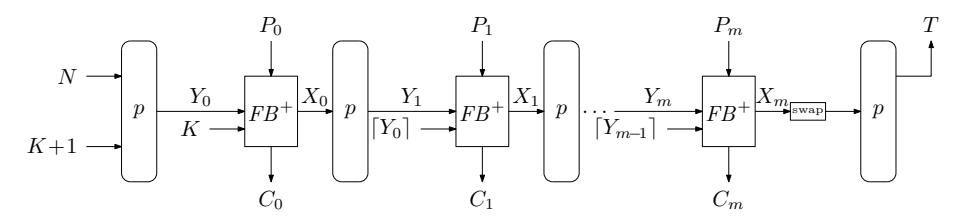

# Practical Forgeries for ORANGE

Christoph Dobrauniga,<sup>∗</sup> , Florian Mendel<sup>b</sup> , Bart Mennink<sup>a</sup>

*<sup>a</sup>Radboud University, Toernooiveld 212, 6525 EC Nijmegen, The Netherlands b Infineon Technologies AG, Neubiberg, Germany*

### **Abstract**

We analyze the authenticated encryption algorithm of ORANGE, a submission to the NIST lightweight cryptography standardization process. We show that it is practically possible to craft forgeries out of two observed transmitted messages that encrypt the same plaintext. The authors of ORANGE have confirmed the attack, and they discuss a fix for this attack in their second-round submission of ORANGE to the NIST lightweight cryptography competition.

*Keywords:* authenticated encryption, symmetric cryptography, cryptanalysis, NIST lightweight, ORANGE

# **1. Introduction**

In symmetric cryptography, competitions play an essential role in converging towards good standards. In the past, competitions held by the US National Institute of Standards and Technology (NIST) resulted in cryptographic primitives and algorithms that became de facto a world-wide standard, e.g., the AES [\[1,](#page-3-0) [2\]](#page-3-1) and SHA-3 [\[3,](#page-4-0) [4\]](#page-4-1). The newest competition in this field is the NIST lightweight cryptography standardization process [\[5\]](#page-4-2), which aims to bring forward standards for authenticated encryption schemes that perform well on resource-constrained devices. With 56 candidates entering the first round, the pool of candidates is very diverse, and hence, comparison between them is not straightforward. However, the one thing that all candidates have in common is that they have to be appropriately secure. Therefore, in order to achieve that only excellent and reliable candidates get standardized, as much cryptanalysis as possible is needed.

In this work, we contribute to this effort by providing an analysis of the candidate called ORANGE [\[6\]](#page-4-3), or to be more precise, the authenticated encryption algorithm contained in this proposal: ORANGE-Zest. ORANGE-Zest is a permutation-based design. It is inspired by the duplex construction [\[7\]](#page-4-4), but differs in the fact that it uses the full *b*-bit state output by the permutation for plaintext/ciphertext processing. As the duplex construction does not support

<sup>∗</sup>Corresponding author

this, the authors have proposed modifications to that mode in order to accommodate this change. In the case of ORANGE-Zest, half of the state of the previous permutation call is used when processing the data of the current one.

Whenever changes to well-established structures are made, it is easy to overlook details that might lead to powerful attacks. In the case of ORANGE-Zest, such a detail was, indeed, missed. If ORANGE-Zest is evaluated on a message without associated data, for the first message block there is no such thing as "the previous permutation call" and the absorbing of the message has a special structure. In particular, the bottom part of the state is independent of the nonce. The other half of the state is known to an attacker who knows the message and it can be modified with the ciphertext. Hence, an attacker can change it to a value of its choice. We will use this knowledge to show a practical forgery that an attacker can make by just observing two encryptions of the same message block.

We first reported our findings on the NIST mailing list after the list of second-round candidates was announced. As ORANGE moved on to the second round, the authors could respond to the attack in an updated design document. In their second-round design document [8], the authors acknowledge our findings and discuss a modified algorithm of ORANGE-Zest that would fix our attack. However, since NIST did not allow design changes for the second round, the original version of ORANGE-Zest is still specified in the second-round submission.

#### 2. ORANGE-Zest

We provide a short summary of the details of ORANGE-Zest needed to understand our attack. We refer to the design document [6] for a full specification. In Figure 1, we show the working principles of ORANGE-Zest in the absence of associated data.



<span id="page-1-0"></span>Figure 1: Encryption of in absence of associated data.

We consider a permutation of width b bits. First, the b-bit state is initialized with a concatenation of the nonce N and the key K plus one. Then, the permutation is applied to the state to get  $Y_0$ . The function  $FB^+$  takes as input the state  $Y_0$ , the secret key K, and the b-bit plaintext block  $P_0$ . It updates the state to  $X_0$  and creates a b-bit ciphertext block  $C_0$ . Then, the permutation p is applied on the state  $X_0$ , and the next plaintext block  $P_1$  is absorbed. It is important to note that only starting from the second plaintext block  $FB^+$  takes

as input the state  $Y_i$ , plaintext block  $P_i$ , and half of the previous state  $Y_{i-1}$  instead of the key K. If all plaintext blocks are absorbed, the tag T is created.

```
Algorithm 1 Description of FB^+(Y_i, \lceil Y_{i-1} \rceil, P_i) for a full plaintext block
```

```
Require: state Y_i,
half of previous state \lceil Y_{i-1} \rceil,
plaintext block P_i

Ensure: ciphertext block C_i,
\nupdated state X_i

(Y_i^b, Y_i^t) \leftarrow Y_i
Y_i^b \leftarrow \alpha^{\delta_M} Y_i^b
Z_i \leftarrow (Y_i^b \oplus \alpha \lceil Y_{i-1} \rceil) \| (Y_i^t \ll 1)
C_i \leftarrow Z_i \oplus P_i
X_i \leftarrow C_i \oplus (Y_i^b \| Y_i^t)
return (C_i, X_i)
```

Next, we inspect the behavior of  $FB^+$  in Algorithm 1. The keystream  $Z_i$  is created by first splitting the state into two halves. One half of the state is transformed by xoring half of the state of the previous processing multiplied by  $\alpha$ . The other half is just rotated by one. The value  $\delta_M$  equals 0,1,2 for an intermediate block, incomplete last block, or complete last block, respectively. We stress that, if no associated data is present, for an initial plaintext block  $P_0$  the value  $Y_{-1}$  is defined as the secret key K (see also Figure 1). The ciphertext block is just the xor of the plaintext block with the keystream. Then, the ciphertext block is absorbed into the state to form  $X_i$ .

## 3. Attack

As mentioned, our attack is a forgery attack that targets ORANGE-Zest if there is no associated data. First, let us have a look at the state  $X_0$  that is created in this case.

An Observation. In the absence of associated data,  $FB^+$  takes the secret key K as input as shown in Figure 1. Then, half of the keystream is computed as  $Z_i^b = \alpha^{\delta_M} Y_i^b \oplus \alpha K$  and the other half is  $Z_i^t = Y_i^t \ll 1$ . If we now take a look at the updated state halves, we get

$$\begin{split} X_i^b &= \alpha^{\delta_M} Y_i^b \oplus P_i^b \oplus \alpha^{\delta_M} Y_i^b \oplus \alpha K = P_i^b \oplus \alpha K \,, \\ X_i^t &= P_i^t \oplus (Y_i^t \lll 1) \oplus Y_i^t \,. \end{split}$$

We see that the bottom half  $X_i^b$  is independent of the nonce and constant if the respective half of the message block is constant, while the top half  $X_i^t$  is known to an attacker that knows  $P_i^t$ . Hence, we can do the following forgery attack.

The Forgery. Assume we observe two transcripts of a single-block ciphertext  $(N, P_0, C_0, T)$  and  $(N', P'_0, C'_0, T')$ , where  $P_0 = P'_0$ . Then, we can craft a forgery in the following manner. First, we calculate

$$W^t = (C_0^t \oplus C_0'^t) \gg 1 = ((Y_0^t \ll 1) \oplus P_0 \oplus (Y_0'^t \ll 1) \oplus P_0') \gg 1 = Y_0^t \oplus Y_0'^t.$$

After that, we can compute

$$C_0^{\prime\prime\prime t} = W^t \oplus C_0^t = Y_0^t \oplus Y_0^{\prime t} \oplus (Y_0^t \lll 1) \oplus P_0.$$

Then, the transcript  $(N', C_0'^b || C_0''^t, T)$  gives then a valid forgery.

Correctness of Forgery. We will show that above forgery is valid. To do so, we will show that the state  $X_0''$  of our forgery equals  $X_0$  and hence, will result in tag T. Since we use nonce N', after the first permutation call we end up with state  $Y_0'$ . For one halve of the state, we absorb  $C_0'^b$  into  $\alpha^{\delta_M} Y_0'^b$ , which gives us  $X_0''^b = \alpha^{\delta_M} Y_0'^b \oplus \alpha^{\delta_M} Y_0'^b \oplus \alpha K \oplus P_0'^b = \alpha K \oplus P_0'^b$ , which is the same as  $X_0^b$ , since we required  $P_0^b = P_0'^b$ . For the other half, we absorb  $C_0''^t$  into  $Y_0'^t$ . Here, we then get

$$X_0^{\prime\prime\prime t} = C_0^{\prime\prime\prime t} \oplus Y_0^{\prime t} = Y_0^t \oplus Y_0^{\prime t} \oplus (Y_0^t \ll 1) \oplus P_0 \oplus Y_0^{\prime t} = Y_0^t \oplus (Y_0^t \ll 1) \oplus P_0,$$

which equals  $X_0^t$ . Hence, the state of the forgery  $X_0''$  before the last permutation call equals to  $X_0$  and thus, the tag value T is the same in both cases.

## 4. Conclusion

In this paper, we have shown a practical forgery attack on ORANGE-Zest. In the second-round version of their submission document [8], the authors acknowledge our attack and provide a fix against it. This is done by not fixing the input of  $FB^+$  to K in the absence of associated data. Instead, the scheme is modified so that a secret nonce-dependent value is fed into  $FB^+$  instead of K.

ACKNOWLEDGMENTS. Christoph Dobraunig is supported by the Austrian Science Fund (FWF): J 4277-N38. Bart Mennink is supported by a postdoctoral fellowship from the Netherlands Organisation for Scientific Research (NWO) under Veni grant 016. Veni. 173.017.

#### References

- <span id="page-3-0"></span>[1] National Institute of Standards and Technology, FIPS PUB 197: Specification for the ADVANCED ENCRYPTION STANDARD (AES), Federal Information Processing Standards Publication 197 (November 2001).
- <span id="page-3-1"></span>[2] J. Daemen, V. Rijmen, The Design of Rijndael: AES – The Advanced Encryption Standard, Information Security and Cryptography, Springer, 2002. doi:10.1007/978-3-662-04722-4.

- <span id="page-4-0"></span>[3] National Institute of Standards and Technology, FIPS PUB 202: SHA-3 Standard: Permutation-Based Hash and Extendable-Output Functions, Federal Information Processing Standards Publication 202, U.S. Department of Commerce (August 2015).
- <span id="page-4-1"></span>[4] G. Bertoni, J. Daemen, M. Peeters, G. Van Assche, The Keccak SHA-3 submission (Version 3.0), [http://keccak.noekeon.org/Keccak-submissi](http://keccak.noekeon.org/Keccak-submission-3.pdf) [on-3.pdf](http://keccak.noekeon.org/Keccak-submission-3.pdf) (2011).
- <span id="page-4-2"></span>[5] National Institute of Standards and Technology, Submission requirements and evaluation criteria for the lightweight cryptography standardization process, [https://csrc.nist.gov/CSRC/media/Projects/Lightweight-](https://csrc.nist.gov/CSRC/media/Projects/Lightweight-Cryptography/documents/final-lwc-submission-requirements-august2018.pdf)[Cryptography/documents/final-lwc-submission-requirements-augus](https://csrc.nist.gov/CSRC/media/Projects/Lightweight-Cryptography/documents/final-lwc-submission-requirements-august2018.pdf) [t2018.pdf](https://csrc.nist.gov/CSRC/media/Projects/Lightweight-Cryptography/documents/final-lwc-submission-requirements-august2018.pdf) (2018).
- <span id="page-4-3"></span>[6] B. Chakraborty, M. Nandi, Orange, NIST Round 1 Candidate, [https://csrc](https://csrc.nist.gov/Projects/Lightweight-Cryptography/Round-1-Candidates) [.nist.gov/Projects/Lightweight-Cryptography/Round-1-Candidates](https://csrc.nist.gov/Projects/Lightweight-Cryptography/Round-1-Candidates) (March 2019).
- <span id="page-4-4"></span>[7] G. Bertoni, J. Daemen, M. Peeters, G. Van Assche, [Duplexing the sponge:](https://doi.org/10.1007/978-3-642-28496-0_19) [Single-pass authenticated encryption and other applications,](https://doi.org/10.1007/978-3-642-28496-0_19) in: A. Miri, S. Vaudenay (Eds.), SAC 2011, Vol. 7118 of LNCS, Springer, 2011, pp. 320– 337. [doi:10.1007/978-3-642-28496-0](http://dx.doi.org/10.1007/978-3-642-28496-0_19)\\_19. URL [https://doi.org/10.1007/978-3-642-28496-0\\_19](https://doi.org/10.1007/978-3-642-28496-0_19)
- <span id="page-4-5"></span>[8] B. Chakraborty, M. Nandi, Orange, NIST Round 2 Candidate, [https://csrc](https://csrc.nist.gov/Projects/Lightweight-Cryptography/Round-2-Candidates) [.nist.gov/Projects/Lightweight-Cryptography/Round-2-Candidates](https://csrc.nist.gov/Projects/Lightweight-Cryptography/Round-2-Candidates) (September 2019).