{0}------------------------------------------------

# Twisted-PHS: Using the Product Formula to Solve Approx-SVP in Ideal Lattices?

Olivier Bernard [1](https://orcid.org/0000-0002-3410-3134),2 and Adeline Roux-Langlois [1](https://orcid.org/0000-0003-0617-9606)

1 Univ Rennes, CNRS, IRISA, France [olivier.bernard@normalesup.org, adeline.roux-langlois@irisa.fr](mailto:olivier.bernard@normalesup.org;adeline.roux-langlois@irisa.fr) 2 Thales, Gennevilliers, France

Abstract. Approx-SVP is a well-known hard problem on lattices, which asks to find short vectors on a given lattice, but its variant restricted to ideal lattices (which correspond to ideals of the ring of integers OK of a number field K) is still not fully understood. For a long time, the best known algorithm to solve this problem on ideal lattices was the same as for arbitrary lattice. But recently, a series of works tends to show that solving this problem could be easier in ideal lattices than in arbitrary ones, in particular in the quantum setting.

Our main contribution is to propose a new "Twisted" version of the PHS (by Pellet-Mary, Hanrot and Stehl´e 2019) algorithm, that we call Twisted-PHS. As a minor contribution, we also propose several improvements of the PHS algorithm. On the theoretical side, we prove that our Twisted-PHS algorithm reaches the same asymptotic trade-off between runtime and approximation factor as the original PHS algorithm. On the practical side though, we provide a full implementation of our algorithm which suggests that much better approximation factors are achieved, and that the given lattice bases are a lot more orthogonal than the ones used in PHS. This is the first time to our knowledge that this type of algorithm is completely implemented and tested for fields of degrees up to 60.

Keywords: Ideal lattices, Approx-SVP, S-unit attacks, Twisted-PHS algorithm

# 1 Introduction

Lattice-based cryptography is one of the most promising post-quantum solution to build cryptographic constructions, as shown by the large number of latticebased submissions to the recent NIST post-quantum competition. Among those submissions, and the other recent more advanced constructions, several hard problems are used to build the security proofs, such as the Learning With Errors (LWE) problem [\[Reg05\]](#page-42-0), its ring [\[SSTX09,](#page-42-1)[LPR10\]](#page-41-0) or module [\[LS15\]](#page-41-1) variants (respectively Ring-LWE and Module-LWE) or the NTRU problem [\[HPS98\]](#page-41-2). In

? © IACR 2020. This paper is an extended version of the article published in the Proceedings of ASIACRYPT 2020, Part II, LNCS 12492, Springer, which is available at [https://doi.org/10.1007/978-3-030-64834-3\\_12](https://doi.org/10.1007/978-3-030-64834-3_12).

{1}------------------------------------------------

particular the Ring variant of the Learning With Errors problem is widely used as it seems to allow a nice trade-off between security and efficiency. Indeed, it is defined in a ring, usually  $R = \mathbb{Z}/\langle x^n + 1 \rangle$  for n a power of 2, whose structure allows constructions having a much better efficiency than if based on unstructured problems like LWE. Concerning its hardness, there exists quantum worst-case to average case reductions [SSTX09,LPR10,PRS17] from the approx Shortest Vector Problem on ideal-lattices (Approx-id-SvP) to the Ring-LWE problem.

Approx-SvP is a well-known hard problem on lattices, which asks to find short vectors on a given lattice, but its variant restricted to ideal lattices (corresponding to ideals of the ring of integers R of a number field K) is still not fully understood. For a long time, the best known algorithm to solve this problem on ideal lattices was the same as for arbitrary lattices. The best trade-off in this case is given by Schnorr's hierarchy [Sch87], which allows to reach an approximation factor  $2^{\tilde{O}(n^{\alpha})}$  in time  $2^{\tilde{O}(n^{1-\alpha})}$ , for  $\alpha \in (0,1)$ , using the BKZ algorithm. But recently, a series of works [CGS14,EHKS14,BS16,CDPR16,CDW17,DPW19,PHS19a] tends to show that solving this problem could be easier in ideal lattices than in arbitrary ones, in particular in the quantum setting.

Hardness of Approx-SVP on ideal lattices. This series of works starts with a claimed result |CGS14| of a quantum polynomial-time attack against a scheme named Soliloquy, which solves the Approx-SVP problem on a principal ideal lattice. The algorithm has two steps: the first one is solving the Principal Ideal Problem (PIP), and finds a generator of the ideal, the second one is solving a Closest-Vector Problem (CVP) in the log-unit lattice to find the shortest generator of the ideal. On one hand, the results of EHKS14,BS16 on describing a quantum algorithm to compute class groups and then solve PIP in arbitrary degree number fields allow to have a quantum polynomial-time algorithm for the first step. On the other hand, a work by Cramer et al. |CDPR16| provides a full proof of the correctness of the algorithm described by |CGS14|, and then concludes that there exists a polynomial-time quantum algorithm which solve Approx-SVP on ideal lattices for an approximation factor  $2^{\tilde{O}(\sqrt{n})}$ . In 2017, Cramer, Ducas and Wesolowski [CDW17] show how to use the Stickelberger lattice to generalize this result to any ideal lattice in prime power cyclotomic fields. The practical impact of their result was evaluated by the authors of |DPW19| by running extensive simulations. They conclude that the CDW algorithm should beat BKZ-300 for cyclotomic fields of degree larger than 24000.

In parallel, Pellet-Mary, Hanrot and Stehlé [PHS19a] proposed an extended version of [CDPR16,CDW17] which is now proven for any number fields K. The main feature of their algorithm, that we call PHS, is to use an exponential amount of preprocessing, depending only on K, in order to efficiently combine the two principal resolution steps of [CDW17], namely the CPMP (Close Principal Multiple Problem) and the SGP (Shortest Generator Problem). Combining these two steps in a single CVP instance provides some guarantee that the output of the CPMP solver has a generator which is "not much larger" than its shortest non-zero vector. Hence, the PHS algorithm in a number field K of degree n and discriminant  $\Delta_K$  is split in two phases, given  $\omega \in [0, 1/2]$ :

{2}------------------------------------------------

- 1. The preprocessing phase builds a specific lattice, depending only on the field K, together with some hint allowing to efficiently solve Approx-CVP instances. This phase runs in time  $2^{\tilde{O}(\log|\Delta_K|)}$  and outputs a hint  $\mathcal{V}$  of bit-size  $2^{\tilde{O}(\log^{1-2\omega}|\Delta_K|)}$ .
- 2. The query phase reduces each Approx-id-SVP challenge to an Approx-CVP instance in this fixed lattice. It takes as inputs any ideal of  $\mathcal{O}_K$ , whose algebraic norm has bit-size bounded by  $2^{\text{poly}(\log|\Delta_K|)}$ , the hint  $\mathcal{V}$ , and runs in time  $2^{\tilde{O}(\log^{1-2\omega}|\Delta_K|)} + T_{\text{Su}}(K)$ . It outputs a non-zero element x of the ideal which solves Approx-SVP with an approximation factor  $2^{\tilde{O}(\log^{\omega+1}|\Delta_K|/n)}$ .

The term  $T_{Su}(K)$  denotes the running time for computing S-unit groups which can then be used to compute class groups, unit groups, and class group discrete logarithms [BS16]. In the quantum world,  $T_{Su}(K) = \tilde{O}(\ln|\Delta_K|)$  is polynomial, as shown in [BS16], building upon [EHKS14]. In the classical world, it remains subexponential in  $\ln|\Delta_K|$ , i.e.  $T_{Su}(K) = \exp \tilde{O}(\ln^{\alpha}|\Delta_K|)$ , where  $\alpha = 1/2$  for prime power cyclotomic fields [BEF+17], and  $\alpha = 2/3$  in the general case [BF14], being recently lowered to 3/5 by Gélin [Gél17].

Forgetting about the preprocessing cost, the query phase beats the traditional Schnorr's hierarchy [Sch87] when  $\log |\Delta_K| \leq \tilde{O}(n^{1+\varepsilon})$  with  $\varepsilon = 1/3$  in the quantum case, and  $\varepsilon = 1/11$  in the classical case [PHS19a, Fig. 5.3]. It should be noted however that these bounds on the discriminant are not uniform as the approximation factor varies, e.g. for an approximation factor set to  $2^{\sqrt{n}}$ , the time complexity of the PHS algorithm asymptotically beats Schnorr's hierarchy only in the quantum case and only for  $\varepsilon \leq 1/6$ .

Our contribution. Our main contribution is to propose a new "twisted" version of the PHS [PHS19a] algorithm, that we call Twisted-PHS. As a minor contribution, we also propose several improvements of the PHS algorithm, in a optimized version described in §3.3. On the theoretical side, we prove that our Twisted-PHS algorithm reaches the same asymptotic trade-off between runtime and approximation factor as the original PHS algorithm, using the same CVP solver with preprocessing hint by Laarhoven [Laa16].

On the practical side though, we provide a full implementation of our algorithm, which suggests that much better approximation factors are achieved and that the given lattice bases are much more orthogonal than the ones used in [PHS19a]. To our knowledge, this is the first time that this type of algorithm is completely implemented and tested for fields of degrees up to 60. As a point of comparison, experiments of [PHS19a] constructed the log-S-unit lattice for cyclotomic fields of degrees at most 24, all but the last two being principal [PHS19a, Fig. 4.1]. We shall also mention the extensive simulations performed by [DPW19] using the Stickelberger lattice in prime power cyclotomic fields. Adapting these results to our construction is not immediate, as we need explicit S-units to compute our lattice. This is left for future work.

We explain our experiments in §5, where we evaluate three algorithms instantiated with the same practical CVP oracle: the original PHS algorithm with the lattice implemented in [PHS19b]; our optimized version Opt-PHS (§3.3), and

{3}------------------------------------------------

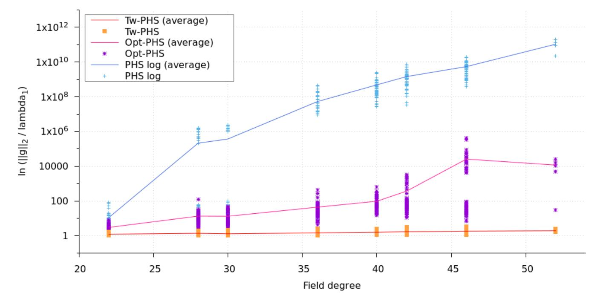

Fig. 1.1 – Approximation factors reached by Tw-PHS, Opt-PHS and PHS for cyclotomic fields of conductors 23, 29, 31, 37, 41, 43, 47 and 53 (in log scale).

our new twisted variant Tw-PHS (§4). We target two families of number fields, namely non-principal cyclotomic fields  $\mathbb{Q}(\zeta_m)$  of prime conductors  $m \in [23, 71]$ , and NTRU Prime fields  $\mathbb{Q}(z_q)$  where  $z_q$  is a root of  $x^q - x - 1$ , for  $q \in [23, 47]$  prime. These correspond to the range of what is feasible in a reasonable amount of time in a classical setting. For cyclotomic fields, we managed to compute S-units up to  $\mathbb{Q}(\zeta_{71})$  for all factor bases, and all log-S-unit lattice variants up to  $\mathbb{Q}(\zeta_{61})$ . For NTRU Prime fields, we managed all computations up to  $\mathbb{Q}(z_{47})$ .

**Experiments.** We chose to perform three experiments to test the performances of our Twisted-PHS algorithm, and to compare it with the two other algorithms:

- We first evaluate the geometric characteristics of the lattice output by the preprocessing phase: the root Hermite factor  $\delta_0$ , the orthogonality defect  $\delta$ , and the average vector basis angle  $\theta_{\text{avg}}$ , as described in details in §2.6. The last one seems difficult to interpret as it gives similar results in all cases, but the two other seem to show that the lattice output by Twisted-PHS is of better quality than in the two other cases. It shows significantly better root Hermite factor and orthogonality defect than any other lattice.
- For our second experiment, we evaluate the Gram-Schmidt log norms of each produced lattice. We propose two comparisons, the first one is before and after BKZ reduction to see the evolution of the norms in each case: it shows that the two curves are almost identical for Twisted-PHS but not for the other PHS variants. The second one is between the lattices output by the different algorithms, after BKZ reduction. The experiments emphasises that the decrease of the log norms seems much smaller in the twisted case than in the two other. Those two observations seem to corroborate the fact that the Twisted-PHS lattice is already quite orthogonal.
- Finally, we implemented all three algorithms from end to end and used them on numerous challenges to estimate their practically achieved approximation

{4}------------------------------------------------

factors. This is to our knowledge the first time that these types of algorithms are completely run on concrete examples. The results of the experiments, shown in Fig. 1.1, suggest that the approximation factor reached by our algorithm increases very slowly with the dimension, in a way that could reveal subexponential or even better. We think that this last feature would be particularly interesting to prove.

**Technical overview.** We first quickly recall the principle of the PHS algorithm described in PHS19a, which is split in two phases. The first phase consists in building a lattice that depends only on the number field K and allowing to express any Approx-id-SVP instance in K as an Approx-CVP instance in the lattice. This preprocessing chooses a factor base FB, and builds an associated lattice consisting in the diagonal concatenation of some log-unit related lattice and the lattice of relations in the class group  $Cl_K$  between ideals of FB, with explicit generators. It then computes a hint of constrained size for the lattice to facilitate forthcoming Approx-CVP queries. Concretely, they suggest to use Laarhoven's algorithm [Laa16], which for any  $\omega \in [0, 1/2]$  outputs a hint  $\mathcal{V}$  of bitsize bounded by  $2^{\tilde{O}(\log^{1-2\omega}|\Delta_K|)}$  that allows to deliver answers for approximation factors  $\tilde{O}(\log |\Delta_K|^{\omega})$  in time bounded by the bit-size of  $\mathcal{V}$  [Laa16, Cor. 1–2]. The second phase reduces the resolution of Approx-id-SVP to a single call to an Approx-CVP oracle in the lattice output by the preprocessing phase, for any challenge ideal  $\mathfrak{b}$  in the maximal order of K. The main idea of this reduction is to multiply the principal ideal output by the ClDL of b on FB by ideals in FB until a "better" principal ideal is reached, i.e. having a short generator.

Our first contribution is to propose three improvements of the PHS algorithm. The first one consists in expliciting a candidate for the isometry used in the first preprocessing phase to build the lattice, and to use its geometric properties to derive a smaller lattice dimension, while still guaranteeing the same proven approximation factor. The last two respectively modify the composition of the factor base and the definition of the target vector in a way that significantly improves the approximation factor experimentally achieved by the second phase of the algorithm. Although these improvements do not modify the core of PHS algorithm and have no impact on the asymptotics, they nevertheless are of importance in practice, as shown by our experiments in §5.

We now explain our main contribution, called Twisted-PHS, which is based on the PHS algorithm. As in PHS algorithm, our algorithm relies on the so-called log-S-unit lattice with respect to a collection FB of prime ideals, called the factor base. This lattice captures local informations on FB, not only on (infinite) embeddings, to reduce a close principal multiple of a target ideal  $\mathfrak b$  to a principal ideal containing  $\mathfrak b$  which is guaranteed to have a somehow short generator. The main feature of our algorithm is to use the *Product Formula* to describe this log-S-unit lattice. This induces two major changes in PHS algorithm:

1. The first one is twisting the  $\mathfrak{p}$ -adic valuations by  $\ln \mathcal{N}(\mathfrak{p})$ , giving weight to the fact that using a relation increasing the valuations at big norm ideals costs more than a relation involving smaller norm ideals.

{5}------------------------------------------------

2. The second one is projecting the target directly inside the log-S-unit lattice and not only into the unit log-lattice corresponding to fundamental units.

Actually, the way our twisted version uses S-units with respect to FB to reduce the solution of the ClDL problem can be viewed as a natural generalization of the way classical algorithms reduce principal ideal generators using regular units.

Adding weights  $\ln \mathcal{N}(\mathfrak{p})$  to integer valuations at any prime ideal  $\mathfrak{p}$  intuitively allows to make a more relevant combination of the S-units we use to reduce the output of the ClDL, quantifying the fact that increasing valuations at big norm prime ideals costs more than increasing valuations at small norm prime ideals. Besides, the product formula induces the possibility to project elements on the whole log-S-unit lattice instead of projecting only on the subspace corresponding to the log-unit lattice. As a consequence, it maintains inside the lattice the size and the algebraic norm logarithm of the S-units. At the end, the CVP solver in this alternative lattice combines more efficiently the goal of minimizing the algebraic norm for the CPMP while still guaranteeing a small size for the SGP solution in the obtained principal multiple.

In §4, we describe two versions of our Twisted-PHS algorithm. The first one, composed by  $\mathcal{A}_{\text{tw-pcmp}}^{\text{(Laa)}}$  and  $\mathcal{A}_{\text{tw-query}}^{\text{(Laa)}}$  is proven to reach the same asymptotic trade-off between runtime and approximation factor as the original PHS algorithm, using the same CVP solver with preprocessing hint by Laarhoven. In practice, we propose two alternative algorithms  $\mathcal{A}_{\text{tw-pcmp}}^{\text{(bkz)}}$  and  $\mathcal{A}_{\text{tw-query}}^{\text{(np)}}$  with the following differences. Algorithm  $\mathcal{A}_{\text{tw-pcmp}}^{\text{(bkz)}}$  performs a minimal reduction step of the lattice as sole lattice preprocessing to smooth the input basis. Algorithm  $\mathcal{A}_{\text{tw-query}}^{\text{(np)}}$  resorts to Babai's Nearest Plane algorithm for the CVP solver role. Experimental evidence in §5 suggest that these algorithms perform remarkably well, because the twisted description of the log-S-unit lattice seems much more orthogonal than expected. Proving this property would remove, in a quantum setting, the only part that is not polynomial in  $\ln |\mathcal{\Delta}_K|$ .

# 2 Preliminaries

Notations. A vector is designated by a bold letter  $\mathbf{v}$ , its *i*-th coordinate by  $v_i$  and its  $\ell_p$ -norm,  $p \in \mathbb{N}^* \cup \{\infty\}$ , by  $\|\mathbf{v}\|_p$ . As a special case, the *n*-dimensional vector whose coefficients are all 1's is written  $\mathbf{1}_n$ . All matrices will be given using row vectors,  $\mathcal{D}_{\mathbf{v}}$  is the diagonal matrix with coefficients  $v_i$  on the diagonal,  $I_n$  is the identity and  $\mathbf{1}_{n \times n}$  denotes the square matrix of dimension n filled with 1's.

### 2.1 Number fields, ideals and class groups

In this paper, K always denotes a number field of degree n over  $\mathbb{Q}$  and  $\mathcal{O}_K$  its maximal order. The algebraic trace and norm of  $\alpha \in K$ , resp. denoted by  $\operatorname{Tr}(\alpha)$  and  $\mathcal{N}(\alpha)$ , are defined as the trace and determinant of the endomorphism  $x \mapsto \alpha x$  of K, viewed as a  $\mathbb{Q}$ -vector space. The discriminant of K is written  $\Delta_K$  and can be defined, for any  $\mathbb{Z}$ -basis  $\omega_1, \ldots, \omega_n$  of  $\mathcal{O}_K$ , as  $\det(\operatorname{Tr}(\omega_i \omega_j))_{i,j}$ . Most complexities of number theoretic algorithms depend on  $\ln |\Delta_K|$ .

{6}------------------------------------------------

The fractional ideals of K are designated by gothic letters, like  $\mathfrak{b}$ , and form a multiplicative group  $\mathcal{I}_K$ . The class group  $\operatorname{Cl}_K$  of K is the quotient group of  $\mathcal{I}_K$  with its subgroup of principal ideals  $\mathcal{P}_K \stackrel{\text{def}}{:=} \{\langle \alpha \rangle, \text{ for all } \alpha \in K\}$ . The class group is a finite group, whose order  $h_K$  is called the class number of K. For any ideal  $\mathfrak{b} \in \mathcal{I}_K$ , the class of  $\mathfrak{b}$  in  $\operatorname{Cl}_K$  is denoted by  $[\mathfrak{b}]$ .

We will specifically target two families of number fields, widely used in cryptography [Pei16]: cyclotomic fields  $\mathbb{Q}(\zeta_m)$ , where  $\zeta_m$  is a primitive m-th root of unity, and NTRU Prime [BCLV17] fields  $\mathbb{Q}(z_q)$ , where  $z_q$  is a root of  $x^q - x - 1$  for q prime. Both families have discriminants of order  $n^n$ . More exactly, for cyclotomic fields  $\mathcal{O}_{\mathbb{Q}(\zeta_m)} = \mathbb{Z}[\zeta_m]$ , so we have [Was97, Pr. 2.7]:

$$\Delta_{\mathbb{Q}(\zeta_m)} = (-1)^{\varphi(m)/2} \frac{m^{\varphi(m)}}{\prod_{p|m} p^{\varphi(m)/(p-1)}}.$$
(2.1)

For NTRU Prime fields, the situation is marginally more involved, as  $\mathbb{Z}[z_q]$  is maximal if and only if its discriminant  $D_0 = q^q - (q-1)^{q-1}$  [Swa62, Th. 2] is squarefree [Kom75, Th. 4]:

$$\Delta_{\mathbb{Q}(z_q)} = \prod_{p|D_0} p^{v_p(D_0) \bmod 2}, \quad \text{where } p^{v_p(D_0)} \text{ divides exactly } D_0.$$
 (2.2)

Note however that there is strong evidence that such  $D_0$ 's are generically square-free, say with probability roughly 0.99 [BMT15, Conj. 1.1]. Actually, we checked that the conductor of  $\mathbb{Z}[z_q]$  is not divisible by any of the first  $10^6$  primes for all  $q \leq 1000$  outside the set  $\{257, 487\}$ , for which  $59^2 \mid D_0$ .

### 2.2 The product formula

Let  $(r_1, r_2)$  be the signature of K with  $n = r_1 + 2r_2$ . The real embeddings of K are numbered from  $\sigma_1$  to  $\sigma_{r_1}$ , whereas the complex embeddings come in pairs  $(\sigma_j, \overline{\sigma}_j)$  for  $j \in [r_1 + 1, r_2]$ . Each embedding  $\sigma$  of K into  $\mathbb{C}$  induces an archimedean absolute value  $|\cdot|_{\sigma}$  on K, such that for  $\alpha \in K$ ,  $|\alpha|_{\sigma} = |\sigma(\alpha)|$ ; two complex conjugate embeddings yield the same absolute value. Thus, it is common to identify the set  $S_{\infty}$  of infinite places of K with the embeddings of K into  $\mathbb{C}$  up to conjugation, so that  $S_{\infty} = \{\sigma_1, \ldots, \sigma_{r_1}, \sigma_{r_1+1}, \ldots, \sigma_{r_1+r_2}\}$ . The completion of K with respect to the absolute value induced by an infinite place  $\sigma \in S_{\infty}$  is denoted by  $K_{\sigma}$ ; it is  $\mathbb{R}$  (resp.  $\mathbb{C}$ ) for real places (resp. complex places).

Likewise, let  $\mathfrak{p}$  be a prime ideal of  $\mathcal{O}_K$  above  $p \in \mathbb{Z}$  of residue degree f. For  $\alpha \in K$ , the largest power of  $\mathfrak{p}$  that divides  $\langle \alpha \rangle$  is called the valuation of  $\alpha$  at  $\mathfrak{p}$ , and denoted by  $v_{\mathfrak{p}}(\alpha)$ ; this defines a non-archimedean absolute value  $|\cdot|_{\mathfrak{p}}$  on K such that  $|\alpha|_{\mathfrak{p}} = p^{-v_{\mathfrak{p}}(\alpha)}$ . This absolute value can also be viewed as induced by any of the f embeddings of K into its  $\mathfrak{p}$ -adic completion  $K_{\mathfrak{p}} \subseteq \mathbb{C}_p$ , which is an extension of  $\mathbb{Q}_p$  of degree f. Hence, the set  $\mathcal{S}_0$  of finite places of K is specified by the infinite set of prime ideals of  $\mathcal{O}_K$ , and Ostrowski's theorem for number fields ([Con, Th. 3], [Nar04, Th. 3.3]) states that all non archimedean absolute values on K are obtained in this way, up to equivalence.

{7}------------------------------------------------

Probably the most interesting thing is that these absolute values are tied together by the following product formula ([Con, Th. 4], [Nar04, Th. 3.5]):

$$\prod_{\sigma \in \mathcal{S}_{\infty}} |\alpha|_{\sigma}^{[K_{\sigma}:\mathbb{R}]} \cdot \prod_{\mathfrak{p} \in \mathcal{S}_{0} \supset p\mathbb{Z}} |\alpha|_{\mathfrak{p}}^{[K_{\mathfrak{p}}:\mathbb{Q}_{p}]} \left( = |\mathcal{N}(\alpha)| \cdot \prod_{\mathfrak{p} \in \mathcal{S}_{0}} \mathcal{N}(\mathfrak{p})^{-v_{\mathfrak{p}}(\alpha)} \right) = 1.$$
 (2.3)

As all but finitely many of the  $|\alpha|_v$ 's, for  $v \in \mathcal{S}_{\infty} \cup \mathcal{S}_0$ , are 1, their product is really a finite product. Note that the  $\mathcal{S}_{\infty}$  part is  $|\mathcal{N}(\alpha)|$ , and each term of the  $\mathcal{S}_0$  part can be written as  $\mathcal{N}(\mathfrak{p})^{-v_{\mathfrak{p}}(\alpha)}$ . This formula is actually a natural generalization to number fields of the innocuous looking product formula for  $r \in \mathbb{Q}$ , written as:  $|r| \cdot \prod_{p \text{ prime}} p^{-v_p(r)} = 1$ .

### 2.3 Unit groups

Let  $\mathcal{O}_K^{\times}$  be the multiplicative group of units of  $\mathcal{O}_K$ , i.e. the group of all elements of  $\mathcal{O}_K$  of algebraic norm  $\pm 1$ , and let  $\mu(\mathcal{O}_K^{\times})$  be its torsion subgroup of roots of unity of K. Classically, the logarithmic embedding from K to  $\mathbb{R}^{r_1+r_2}$  is defined as  $[\operatorname{Coh93}, \operatorname{Def. 4.9.6}]$ :  $\operatorname{Log}_{\infty} \alpha = ([K_{\sigma} : \mathbb{R}] \cdot \ln|\sigma(\alpha)|)_{\sigma \in \mathcal{S}_{\infty}}$ . The sum of the coordinates of  $\operatorname{Log}_{\infty} \alpha$  is precisely  $\ln|\mathcal{N}(\alpha)|$ , so that  $\operatorname{Log}_{\infty} \mathcal{O}_K^{\times}$  lies in the trace zero hyperplane  $\mathbb{R}_0^{r_1+r_2} = \{\mathbf{y} \in \mathbb{R}^{r_1+r_2} : \sum_i y_i = 0\}$ .

Dirichlet's unit theorem [Nar04, Th. 3.13] states that  $\mathcal{O}_K^{\times}$  is a finitely generated abelian group of rank  $\nu = r_1 + r_2 - 1$ . Further, its image  $\operatorname{Log}_{\infty} \mathcal{O}_K^{\times}$  under the logarithmic embedding is a lattice, called the *log-unit lattice*, which spans  $\mathbb{R}_0^{r_1+r_2}$ : there exist fundamental torsion-free elements  $\varepsilon_1, \ldots, \varepsilon_{\nu} \in \mathcal{O}_K^{\times}$  such that:

$$\mathcal{O}_K^{\times} \simeq \mu(\mathcal{O}_K^{\times}) \times \varepsilon_1^{\mathbb{Z}} \times \dots \times \varepsilon_{\nu}^{\mathbb{Z}}.$$
 (2.4)

Let  $\Lambda_K = (\operatorname{Log}_{\infty} \varepsilon_i)_{1 \leq i \leq \nu}$  be any  $\mathbb{Z}$ -basis of  $\operatorname{Log}_{\infty} \mathcal{O}_K^{\times}$ . The regulator of K, written  $R_K$ , quantifies the density of the unit group in K. It is defined as the absolute value of the determinant of  $\Lambda_K^{(j)}$ , where  $\Lambda_K^{(j)}$  is the submatrix of  $\Lambda_K$  without the j-th coordinate, for any  $j \in [1, r_1 + r_2]$ . The volume of  $\operatorname{Log}_{\infty} \mathcal{O}_K^{\times}$ ,  $\sqrt{\det(\Lambda_K \Lambda_K^T)}$ , is tied to  $R_K$  by the following classical formula [Neu99, Pr. I.7.5]:

$$\operatorname{Vol}(\operatorname{Log}_{\infty} \mathcal{O}_{K}^{\times}) = \sqrt{1+\nu} \cdot R_{K}. \tag{2.5}$$

On the S-unit group. The S-unit group generalizes the unit group  $\mathcal{O}_K^{\times}$  by allowing inverses of elements whose valuations are non zero exactly over a chosen finite set of primes of  $\mathcal{S}_0$ . Let  $\mathrm{FB} = \{\mathfrak{p}_1, \ldots, \mathfrak{p}_k\}$  be such a factor basis, and let  $\mathcal{O}_{K,\mathrm{FB}}^{\times}$  denote the S-unit group of K with respect to FB. Formally, we have  $\mathcal{O}_{K,\mathrm{FB}}^{\times} = \{\alpha \in K : \exists e_1, \ldots, e_k \in \mathbb{Z}, \langle \alpha \rangle = \prod \mathfrak{p}_j^{e_j} \}$ . Similarly, it is possible to define a S-logarithmic embedding [Nar04, §3, p.98] from K to  $\mathbb{R}^{r_1+r_2+k}$ :

$$\operatorname{Log}_{\infty,\operatorname{FB}} \alpha = \left( \left[ K_v : \mathbb{Q}_v \right] \cdot \ln|\alpha|_v \right)_{v \in \mathcal{S}_{\infty} \cup \operatorname{FB}} = \left( \operatorname{Log}_{\infty} \alpha, \left\{ -v_{\mathfrak{p}}(\alpha) \cdot \ln \mathcal{N}(\mathfrak{p}) \right\}_{\mathfrak{p} \in \operatorname{FB}} \right). \tag{2.6}$$

From the product formula (2.3), we see that the image of  $\mathcal{O}_{K,\mathrm{FB}}^{\times}$  lies in the trace zero hyperplane of  $\mathbb{R}^{r_1+r_2+k}$ . This fact is used to prove the following theorem:

{8}------------------------------------------------

Theorem 2.1 (Dirichlet-Chevalley-Hasse [Nar04, Th. III.3.12]). The S-unit group is a finitely generated abelian group of rank  $\sharp S_{\infty} + \sharp FB-1$ . Further, the image  $\operatorname{Log}_{\infty,FB}(\mathcal{O}_{K,FB}^{\times}/\mu(\mathcal{O}_{K}^{\times}))$  is a lattice which spans the  $(\nu+k)$ -dimensional hyperplane  $\mathbb{R}_{0}^{r_{1}+r_{2}+k} = \{\mathbf{y} \in \mathbb{R}^{r_{1}+r_{2}+k} : \sum_{i} y_{i} = 0\}$ . In other words, there exist fundamental torsion-free S-units  $\eta_{1}, \ldots, \eta_{k} \in \mathcal{O}_{K,FB}^{\times}$  such that:

$$\mathcal{O}_{K,\mathrm{FB}}^{\times} \simeq \mu(\mathcal{O}_{K}^{\times}) \times \varepsilon_{1}^{\mathbb{Z}} \times \cdots \times \varepsilon_{\nu}^{\mathbb{Z}} \times \eta_{1}^{\mathbb{Z}} \times \cdots \times \eta_{k}^{\mathbb{Z}}.$$

Let  $\Lambda_{K,\mathrm{FB}} = (\{\mathrm{Log}_{\infty,\mathrm{FB}} \, \varepsilon_i\}, \{\mathrm{Log}_{\infty,\mathrm{FB}} \, \eta_j\})$  be a row basis of  $\mathrm{Log}_{\infty,\mathrm{FB}} \, \mathcal{O}_{K,\mathrm{FB}}^{\times}$ , which will be called the log-S-unit lattice. Using that  $\mathrm{Log}_{\infty,\mathrm{FB}} \, \varepsilon_i$  is uniformly zero on coordinates corresponding to finite places, the shape of  $\Lambda_{K,\mathrm{FB}}$  is:

$$\Lambda_{K,\text{FB}} \stackrel{\text{def}}{:=} \begin{bmatrix}
\Lambda_{K} & 0 \\
\hline
\text{Log}_{\infty} \eta_{1} \\
\vdots \\
\hline
\text{Log}_{\infty} \eta_{k}
\end{bmatrix} . (2.7)$$

Similarly, Th. 2.1 allows to define the S-regulator  $R_{K,FB}$  of K w.r.t. FB as the absolute value of any of the  $(r_1+r_2+k)$  minors of  $\Lambda_{K,FB}$ . The value of  $R_{K,FB}$  is given by the following proposition:

**Proposition 2.2.** Let  $h_K^{\text{(FB)}}$  the cardinal of the subgroup  $\text{Cl}_K^{\text{(FB)}}$  of  $\text{Cl}_K$  generated by classes of ideals in FB. Then, the S-regulator  $R_{K,\text{FB}}$  writes as:

$$R_{K,\mathrm{FB}} = h_K^{(\mathrm{FB})} R_K \prod_{\mathfrak{p} \in \mathrm{FB}} \ln \mathcal{N}(\mathfrak{p}).$$

Proof. Remark that  $R_{K,FB}$  is the determinant (e.g.) of the submatrix  $\Lambda_{K,FB}^{(r_1+r_2)}$  where the  $(r_1+r_2)$ -th column is removed, so is the product of  $\det \Lambda_K^{(r_1+r_2)} = R_K$  and of the determinant of the (unchanged) square bottom right part of  $\Lambda_{K,FB}$ . By definition of  $\mathcal{O}_{K,FB}^{\times}$ , the matrix  $(-v_{\mathfrak{p}_j}(\eta_i))_{i,j}$  generates the lattice of all relations in  $\mathrm{Cl}_K$  between ideals of FB, i.e. is the kernel of the following map:

$$\mathfrak{f}_{\mathrm{FB}}: (e_1, \dots, e_k) \in \mathbb{Z}^k \longmapsto \prod_j [\mathfrak{p}_j]^{e_j} \in \mathrm{Cl}_K,$$

whose image is precisely  $\operatorname{Cl}_K^{(\operatorname{FB})}$ . Thus,  $\det(\ker \mathfrak{f}_{\operatorname{FB}})$  is  $h_K^{(\operatorname{FB})} = \sharp (\mathbb{Z}^k / \ker \mathfrak{f}_{\operatorname{FB}})$ , and twisting each column by  $\ln \mathcal{N}(\mathfrak{p})$  for  $\mathfrak{p} \in \operatorname{FB}$  yields the result.

We stress that the S-regulator could not be consistently defined anymore if these twistings by the  $\ln \mathcal{N}(\mathfrak{p})$ 's were removed, as in this case, the property that all columns sum to 0 disappears. Finally, the volume of the log-S-unit lattice is tied to  $R_{K,\mathrm{FB}}$  by the following:

$$\operatorname{Vol}\left(\operatorname{Log}_{\infty,\operatorname{FB}}\mathcal{O}_{K,\operatorname{FB}}^{\times}\right) = \sqrt{1+\nu+k} \cdot h_{K}^{(\operatorname{FB})} R_{K} \prod_{\mathfrak{p} \in \operatorname{FB}} \ln \mathcal{N}(\mathfrak{p}). \tag{2.8}$$

{9}------------------------------------------------

Using flat logarithmic embeddings. We also define a *flat* logarithmic embedding from K to  $\mathbb{R}^{r_1+2r_2}$ , as in [PHS19a,BDPW20], and defined as follows:

$$\overline{\operatorname{Log}}_{\infty} \alpha = \left( \left\{ \ln |\sigma_i(\alpha)| \right\}_{i \in [1, r_1]}, \left\{ \ln |\sigma_{r_1 + j}(\alpha)|, \ln |\overline{\sigma}_{r_1 + j}(\alpha)| \right\}_{j \in [1, r_2]} \right). \tag{2.9}$$

As for  $j \in [1, r_2]$ ,  $|\alpha|_{\sigma_{r_1+j}} = |\alpha|_{\overline{\sigma}_{r_1+j}}$ ,  $\overline{\operatorname{Log}}_{\infty} K$  spans the  $(r_1 + r_2)$ -dimensional space  $\mathcal{L}_0 = \{ \mathbf{y} \in \mathbb{R}^n : y_{r_1+2j-1} = y_{r_1+2j}, j \in [1, r_2] \}$ . Similarly, we define a flat S-logarithmic embedding from K to  $\mathcal{L} = \mathcal{L}_0 \times \mathbb{R}^k$  by:

$$\overline{\operatorname{Log}}_{\infty,\operatorname{FB}} \alpha = \left(\overline{\operatorname{Log}}_{\infty} \alpha, \left\{ -v_{\mathfrak{p}}(\alpha) \cdot \ln \mathcal{N}(\mathfrak{p}) \right\}_{\mathfrak{p} \in \operatorname{FB}} \right). \tag{2.10}$$

For convenience, we denote by  $H_0$  (resp. H) the span of the log-unit (resp. log-S-unit) lattice under these flat embeddings, i.e.  $H_0 = \mathcal{L}_0 \cap \mathbb{R}_0^n$  and  $H = \mathcal{L} \cap \mathbb{R}_0^{n+k}$ .

The flat embeddings impact the volume of the log-unit and log-S-unit lattices given in Eqs. (2.5) and (2.8). It is given in following proposition, which generalizes [BDPW20, Lem. A.1]:

**Proposition 2.3.** Under the flat S-logarithmic embedding, the log-S-unit lattice has volume:

$$\operatorname{Vol}(\overline{\operatorname{Log}}_{\infty,\operatorname{FB}}\mathcal{O}_{K,\operatorname{FB}}^{\times}) = \sqrt{n+k} \cdot 2^{-r_2/2} \cdot h_K^{(\operatorname{FB})} R_K \prod_{\mathfrak{p} \in \operatorname{FB}} \ln \mathcal{N}(\mathfrak{p}).$$

Using an empty factor basis, this implies  $\operatorname{Vol}(\overline{\operatorname{Log}}_{\infty} \mathcal{O}_{K}^{\times}) = \sqrt{n} \cdot 2^{-r_{2}/2} \cdot R_{K}$ .

*Proof.* Let  $\widetilde{\Lambda}_{K,\mathrm{FB}}$  be a row basis of  $\overline{\mathrm{Log}}_{\infty,\mathrm{FB}} \mathcal{O}_{K,\mathrm{FB}}^{\times}$ , whose shape is the same as  $\Lambda_{K,\mathrm{FB}}$  in Eq. (2.7) except that  $\overline{\mathrm{Log}}_{\infty}$  is systematically used instead of  $\mathrm{Log}_{\infty}$ . The proof explicits the transition matrix from the truncated matrix  $\Lambda_{K,\mathrm{FB}}^{(\nu+k)}$ , whose determinant is  $R_{K,\mathrm{FB}}$ , to  $\widetilde{\Lambda}_{K,\mathrm{FB}}$ , and computes its volume.

Let  $P = (I_{\nu+k} || -\mathbf{1}_{\nu+k})$  be such that  $\Lambda_{K,\mathrm{FB}} = \Lambda_{K,\mathrm{FB}}^{(r_1+r_2+k)} \cdot P$ . Obtaining  $\widetilde{\Lambda}_{K,\mathrm{FB}}$  from  $\Lambda_{K,\mathrm{FB}}$  requires to halve and expand the coordinates corresponding to complex places, all other coordinates staying identical. Let F be the transition matrix verifying  $\widetilde{\Lambda}_{K,\mathrm{FB}} = \Lambda_{K,\mathrm{FB}} \cdot F$ , i.e. the block diagonal matrix with three blocks:  $I_{r_1}$ , the  $(r_2 \times 2r_2)$  block of vectors  $(\ldots, 1/2, 1/2, \ldots)$ , and  $I_k$ . Then  $\widetilde{\Lambda}_{K,\mathrm{FB}} = \Lambda_{K,\mathrm{FB}}^{(r_1+r_2+k)} \cdot (PF)$ . For  $k \geq 1$ , or k = 0 and  $r_2 = 0$ , (PF) writes as  $(F_{-1} || -\mathbf{1}_{\nu+k})$ , where  $F_{-1}$  is F without its last column and its last row. We compute:

$$(PF)(PF)^{\mathrm{T}} = \mathbf{1}_{(\nu+k)\times(\nu+k)} + \mathcal{D}_{(\mathbf{1}_{r_1}\|(1/2)\cdot\mathbf{1}_{r_2}\|\mathbf{1}_{k-1})}.$$

Using Lem. A.1 to obtain that the determinant of this matrix is  $(n+k)2^{-r_2}$  completes the proof, except in the case  $k=0, r_2>0$ . In this specific case, (PF) writes as the first (n-2) columns of  $F_{-1}$ , concatenated twice with  $(-1/2) \cdot \mathbf{1}_{\nu}$ , so that  $(PF)(PF)^{\mathrm{T}} = \frac{1}{2} \cdot (\mathbf{1}_{\nu \times \nu} + \mathcal{D}_{(2 \cdot \mathbf{1}_{r_1} \parallel \mathbf{1}_{r_2-1})})$ . This last matrix has volume  $n \cdot 2^{-r_2}$  as expected.

{10}------------------------------------------------

#### 2.4 Number theoretic bounds

This section presents several number theoretic bounds, which are useful to evaluate the complexity and correctness of the algorithms of this paper. All given bounds rely on the *Generalized Riemann Hypothesis* (GRH).

Analytic class number formula. The residue  $\kappa_K = \lim_{s\to 1} (s-1)\zeta_K(s)$  is linked to  $h_K R_K$  through the so-called analytic class number formula [Neu99, Cor. 5.11(ii)], which states that  $\kappa_K = \frac{2^{r_1}(2\pi)^{r_2}R_K h_K}{\omega_K \sqrt{|\Delta_K|}}$ , where  $\omega_K = \sharp \mu(\mathcal{O}_K^{\times})$ . Actually, computing  $\kappa_K$  is much easier than computing directly  $h_K$  or  $R_K$  (see e.g. [BF15]) and is generally performed as a first step towards these quantities. The best currently known explicit bound is [Lou00, Th. 1]  $\kappa_K \leq \left(\frac{e \ln|\Delta_K|}{2(n-1)}\right)^{n-1}$ . It implies the following upper bound on  $h_K R_K$ , as precisely shown in [BDPW20, Lem. 2.3], which can then be used to control the volume of the log-S-unit lattice:

$$\ln\left(\sqrt{\frac{n}{2^{r_2}}} \cdot h_K R_K\right) \le \frac{1}{2} \ln|\Delta_K| + n \ln|\ln|\Delta_K| + n(1 - \ln n). \tag{2.11}$$

Class Group Generators. An important characteristic of the chosen factor bases in this paper is to generate  $Cl_K$ . It is hence useful to bound both  $h_K$  and the norms of the generating prime ideals. Note that, as for any finite group, any non redundant generating set of  $Cl_K$  must have at most  $\log h_K$  elements. Not much is generically known about the class number, so that the analytic estimation above is traditionally used to obtain  $h_K \leq \tilde{O}(\sqrt{|\Delta_K|})$ . Let  $\mathfrak{p}_{\max}$  be any prime ideal of maximum norm inside a generating set of  $Cl_K$  which has the smallest possible maximum norm. Bach proved that [Bac90, Th. 4]:

$$\mathcal{N}(\mathfrak{p}_{\text{max}}) \le 12 \ln^2 |\Delta_K|. \tag{2.12}$$

In practice though, this upper bound on the ratio  $t_K \stackrel{\text{def}}{:=} \mathcal{N}(\mathfrak{p}_{\text{max}})/\ln^2|\Delta_K| \leq 12$  is much too large. Experimental evidence suggest that  $t_K > 0.7$  only occurs in pathological cases [BDF08, §6], and as noted in [BDF08, p.1186], "it even looks plausible that the average value of  $\mathcal{N}(\mathfrak{p}_{max})$  as the discriminant of K increases is  $O(\ln|\Delta_K|)^{1+\varepsilon}$  for any  $\varepsilon > 0$ ".

**Prime Ideal Theorem.** In order to constitute sufficiently large sets of prime ideals of polynomially bounded norms, it is useful to know the density of prime ideals in K. This is the object of the *Prime Ideal Theorem*, also known as the *Chebotarev Density Theorem*, which essentially states that prime ideals have more or less the same asymptotic behaviour as prime numbers.

Let  $\pi_K(x) = \sharp \{ \mathfrak{p} : \mathfrak{p} \text{ prime ideal}, \mathcal{N}(\mathfrak{p}) \leq x \}$ , and  $\vartheta_K(x) = \sum_{\mathcal{N}(\mathfrak{p}) \leq x} \ln \mathcal{N}(\mathfrak{p})$ . In [Lan03, Subsect. II.4-5], Landau proved the following asymptotic equivalences:

$$\pi_K(x) \sim_{x \to \infty} \int_2^x \frac{dt}{\ln t}, \quad \text{and} \quad \vartheta_K(x) \sim_{x \to \infty} x.$$
 (2.13)

{11}------------------------------------------------

The general rough intuition is that each prime  $p \in \mathbb{Z}$  yields on average one prime ideal in K of norm p. Of course, this global behaviour is not valid locally: for instance in cyclotomic fields  $\mathbb{Q}(\zeta_m)$ , ideals of prime norm p come in batches of  $\varphi(m)$  elements for primes  $p \equiv 1 \mod m$ , whose density is by Dirichlet's arithmetic progression theorem about  $1/\varphi(m)$ .

Unfortunately, whereas even for reasonably small bounds these asymptotic estimations yield astonishingly good results in practice, only effective versions are rigorously applicable.

Theorem 2.4 (Explicit Prime Ideal Theorem [GM16, Cor. 1.4]). Under  $GRH, \forall x \geq 3$ :

$$\left| \pi_K(x) - \pi_K(3) - \int_3^x \frac{dt}{\ln t} \right| \le \sqrt{x} \cdot \left[ c_1(x) \cdot \ln|\Delta_K| + c_2(x) \cdot n \ln x + c_3(x) \right],$$

with 
$$c_1(x) = \left(\frac{1}{2\pi} - \frac{\ln \ln x}{\pi \ln x} + \frac{5.8}{\ln x}\right)$$
,  $c_2(x) = \left(\frac{1}{8\pi} - \frac{\ln \ln x}{2\pi \ln x} + \frac{3.6}{\ln x}\right)$ ,  $c_3(x) = \left(0.3 + \frac{14}{\log x}\right)$ .

This can be used to show that a polynomial bound in  $\ln |\Delta_K|$  yields sufficiently many prime ideals, like in [PHS19a, Cor. 2.9]. A precise version of that statement is given in [BDPW20, Lem. A.3]: for  $x \ge \max\{(12 \ln |\Delta_K| + 8n + 28)^4, 3 \cdot 10^{11}\}$ ,  $\pi_K(x) \ge \frac{x}{2 \ln x}$ . Note how frightening looks the condition on x.

### 2.5 Algorithmic number theory

In this paper, the most useful number theoretic algorithms are S-unit group related computations. More precisely, Biasse and Song proved [BS16] that computing S-unit groups for well chosen factor bases yields class groups, unit groups and class group discrete logarithms. The running time of these S-unit group related computations is denoted by  $T_{Su}(K)$ . Under the GRH:

- in the quantum world,  $T_{Su}(K) = \tilde{O}(\ln|\Delta_K|)$  is polynomial, as shown in [BS16], building upon [EHKS14];
- in the classical world, it remains subexponential in  $\ln |\Delta_K|$ , i.e.  $T_{Su}(K) = \exp \tilde{O}(\ln^{\alpha} |\Delta_K|)$  where  $\alpha = 1/2$  for prime power cyclotomic fields [BEF+17],  $\alpha = 2/3$  in the general case [BF14], recently lowered to 3/5 by Gélin [Gél17].

For our exposition, the most important problem to be considered is probably the Class Group Discrete Logarithm Problem (ClDL). Solving this problem remains the major bottleneck in the classical query complexity of the algorithms proposed in [CDW17,PHS19a].

Problem 2.5 (Class Group Discrete Logarithm (ClDL) [BS16]). Given a set FB of prime ideals generating a subgroup  $\operatorname{Cl}_K^{(\operatorname{FB})}$  of  $\operatorname{Cl}_K$ , and a fractional ideal  $\mathfrak b$  st.  $[\mathfrak b] \in \operatorname{Cl}_K^{(\operatorname{FB})}$ , output  $\alpha \in K$  and  $v_i \in \mathbb Z$  st.  $\langle \alpha \rangle = \mathfrak b \cdot \prod_{\mathfrak p_i \in \operatorname{FB}} \mathfrak p_i^{v_i}$ .

This definition slightly differs from the one used in [CDW17, §3], as we also require an explicit generator for the trivial class. Indeed, this element is a byproduct of the reduction from ClDL to some S-units computation, as explicited in

{12}------------------------------------------------

[CDW17, §B]. It is also worth noting that the *Principal Ideal Problem* (PIP), i.e. that asks for a generator of  $\mathfrak{b}$  if it exists, is encompassed in this definition of the ClDL problem, using FB =  $\emptyset$  [BS16, Alg. 2].

The following two problems are used in [CDPR16,CDW17] and we recall them for completeness. The resolution of SGP can be reduced to a closest vector problem in the log-unit lattice, as is folklore in computational number theory.

Problem 2.6 (Close Principal Multiple Problem (CPMP) [CDW17, §2.2]). Given a fractional ideal  $\mathfrak{b}$ , output a "reasonably small" integral ideal  $\mathfrak{c}$  such that  $[\mathfrak{c}] = [\mathfrak{b}]^{-1}$ .

**Problem 2.7 (Shortest Generator Problem (SGP)).** Given  $\mathfrak{a} = \langle \alpha \rangle$ , principal ideal generated by some  $\alpha \in K$ , find the shortest  $\alpha' \in \mathfrak{a}$  such that  $\mathfrak{a} = \langle \alpha' \rangle$ .

#### 2.6 Lattices geometry and hard problems

Let L be a lattice. For any  $p \in \mathbb{N}^* \cup \{\infty\}$  and  $1 \leq i \leq \dim L$ , the i-th minimum  $\lambda_i^{(p)}(L)$  of L for the  $\ell_p$ -norm is the minimum radius r > 0 such that  $\{\mathbf{v} \in L : \|\mathbf{v}\|_p \leq r\}$  has rank i [NV10, Def. 2.13]. For any  $\mathbf{t}$  in the span of L, the distance between  $\mathbf{t}$  and L is  $\mathrm{dist}_p(\mathbf{t}, L) = \inf_{\mathbf{v} \in L} \|\mathbf{t} - \mathbf{v}\|_p$ , and the covering radius of L w.r.t.  $\ell_p$ -norm is  $\mu_p(L) = \sup_{\mathbf{t} \in L \otimes \mathbb{R}} \mathrm{dist}_p(\mathbf{t}, L)$ . For the euclidean norm, we omit p = 2 most of the time.

A fractional ideal  $\mathfrak{b}$  of K can be seen, under the canonical embedding, as a full rank lattice in  $\mathbb{R}^n$ , called an *ideal lattice*, of volume  $\sqrt{|\Delta_K|} \cdot \mathcal{N}(\mathfrak{b})$ . The arithmetic-geometric mean inequality, using that  $|\mathcal{N}(\alpha)| \geq \mathcal{N}(\mathfrak{b})$  for all  $\alpha \in \mathfrak{b}$ , and the Minkowski's inequality [NV10, Th. 2.4] imply:

$$\mathcal{N}(\mathfrak{b})^{1/n} \le \lambda_1^{(\infty)}(\mathfrak{b}) \le \sqrt{|\Delta_K|}^{1/n} \mathcal{N}(\mathfrak{b})^{1/n} \tag{2.14}$$

$$\sqrt{n} \cdot \mathcal{N}(\mathfrak{b})^{1/n} \le \lambda_1^{(2)}(\mathfrak{b}) \le \sqrt{n} \cdot \sqrt{|\Delta_K|}^{1/n} \mathcal{N}(\mathfrak{b})^{1/n}$$
 (2.15)

More precisely,  $\lambda_1(\mathfrak{b}) \leq (1+o(1))\sqrt{2n/\pi e} \cdot \operatorname{Vol}^{1/n}(\mathfrak{b})$ , and the Gaussian Heuristic for full rank random lattices [NV10, Def. 2.8] predicts  $\lambda_1(\mathfrak{b}) \approx \sqrt{n/2\pi e} \cdot \operatorname{Vol}^{1/n}(\mathfrak{b})$  on average. In the case of ideal lattices, this yields a pretty good estimation of the shortness of vectors, even if  $\lambda_1(\mathfrak{b})$  is not known precisely.

We will consider the following algorithmic lattice problems. Both problems can be readily restricted to ideal lattices under the labels Approx-id-SVP and Approx-id-CVP.

Problem 2.8 (Approximate Shortest Vector Problem (Approx-SVP) [NV10, Pb. 2.2]). Given a lattice L and an approximation factor  $\gamma \geq 1$ , find a vector  $\mathbf{v} \in L$  such that  $\|\mathbf{v}\| \leq \gamma \cdot \lambda_1(L)$ .

Problem 2.9 (Approximate Closest Vector Problem (Approx-CVP) [NV10, Pb. 2.5]). Given a lattice L, a target  $\mathbf{t} \in L \otimes \mathbb{R}$  and an approximation factor  $\gamma \geq 1$ , find a vector  $\mathbf{v} \in L$  such that  $\|\mathbf{t} - \mathbf{v}\| \leq \gamma \cdot \text{dist}(\mathbf{t}, L)$ .

{13}------------------------------------------------

Actually, it will be more convenient to work with a slightly modified version of Approx-CVP, where the output is required to be at distance absolutely bounded by some B, independently of the target distance to the lattice. By abuse of terminology, we still call this variant Approx-CVP.

Evaluating the quality of a lattice basis. Let  $B = (\mathbf{b}_1, \dots, \mathbf{b}_n)$  be a basis of a full rank n-dimensional lattice L, and let the Gram-Schmidt Orthogonalization of B be  $GSO(B) = (\mathbf{b}_1^*, \dots, \mathbf{b}_n^*)$ . Approximation algorithms usually attempt to compute a good basis of the given lattice, i.e. whose vectors are as short and as orthogonal as possible. These lattice reduction algorithms, such as LLL [LLL82] or BKZ [CN11], try to limit the decrease of the Gram-Schmidt norms  $\|\mathbf{b}_i^*\|$ : intuitively, a wide gap in this sequence reveals that  $\mathbf{b}_i$  is far from orthogonal to  $\langle \mathbf{b}_1, \dots, \mathbf{b}_{i-1} \rangle$ . Evaluating the quality of a lattice basis is actually a tricky task that depends partly on the targeted problem (see e.g. [Xu13]). We will use the following geometric metrics:

1. the root-Hermite factor  $\delta_0$  is widely used to measure the performance of lattice reduction algorithms [NS06,GN08,CN11], especially for solving SVP-like problems:

$$\delta_0^n(B) = \frac{\|\mathbf{b}_1\|}{\text{Vol}^{1/n} L}.$$
 (2.16)

Experimental evidence suggest that on average, LLL achieves  $\delta_0^{\text{LLL}} \approx 1.02$  [NS06,GN08] and BKZ with block size b yields  $\delta_0^{\text{BKZ}_b} \approx \left(\frac{b}{2\pi e}(\pi b)^{1/b}\right)^{1/(2b-2)}$  for  $b \geq 50$  [Che13,CN11].

2. the normalized orthogonality defect  $\delta$  [MG02, Def. 7.5] captures the global quality of the basis, not just of the first vector, and is especially useful for CVP-like problems e.g. if the lattice possesses abnormally short vectors:

$$\delta^n(B) = \frac{\prod_{i=1}^n \|\mathbf{b}_i\|}{\operatorname{Vol} L}.$$
 (2.17)

For purely orthogonal bases  $\delta=1$ , and by Minkowski's second theorem [NV10, Th. 2.5], its smallest possible value is  $\left(\prod_i \lambda_i(L)/\operatorname{Vol} L\right)^{1/n} \leq \sqrt{1+\frac{n}{4}}$ .

3. the minimum vector basis angle, defined as [Xu13, Eq. (15)]:

$$\theta_{\min}(B) = \min_{1 \le i < j \le n} \min \left\{ \theta_{ij}, \pi - \theta_{ij} \right\} \text{ for } \theta_{ij} = \frac{\arccos \langle \mathbf{b}_i, \mathbf{b}_j \rangle}{\|\mathbf{b}_i\| \|\mathbf{b}_j\|}.$$
 (2.18)

We propose to consider also the mean vector basis angle  $\theta_{avg}(B)$ , which averages over all min $\{\theta_{ij}, \pi - \theta_{ij}\}$ .

# 3 The PHS algorithm

This section describes the PHS algorithm for solving Approx-id-SvP, as introduced by Pellet-Mary, Hanrot and Stehlé in [PHS19a], and discusses several improvements. The PHS algorithm extends the techniques from [CDPR16,CDW17] to any number field K and is split in two phases:

{14}------------------------------------------------

- 1. the preprocessing phase  $\mathcal{A}_{pre-proc}$ , described in §3.1, builds a specific lattice together with some hint allowing to efficiently solve Approx-CVP instances;
- 2. the query phase  $\mathcal{A}_{query}$ , detailed in §3.2, reduces each Approx-id-SVP challenge to an Approx-CVP instance in this fixed lattice.

More precisely, under the GRH and several heuristic assumptions detailed in [PHS19a, H. 1–6], they prove the following theorem:

**Theorem 3.1** ([PHS19a, Th. 1.1]). Let  $\omega \in [0, 1/2]$  and K be a number field of degree n and discriminant  $\Delta_K$  with a known basis of  $\mathcal{O}_K$ . Under some conjectures and heuristics, there exist two algorithms  $\mathcal{A}_{\mathsf{pre-proc}}$  and  $\mathcal{A}_{\mathsf{query}}$  such that:

- Algorithm  $\mathcal{A}_{\text{pre-proc}}$  takes as input  $\mathcal{O}_K$ , runs in time  $2^{\tilde{O}(\log|\Delta_K|)}$  and outputs a hint  $\mathcal{V}$  of bit-size  $2^{\tilde{O}(\log^{1-2\omega}|\Delta_K|)}$ ;
- Algorithm  $\mathcal{A}_{query}$  takes as inputs any ideal  $\mathfrak{b}$  of  $\mathcal{O}_K$ , whose algebraic norm has bit-size bounded by  $2^{\text{poly}(\log|\Delta_K|)}$ , and the hint  $\mathcal{V}$  output by  $\mathcal{A}_{pre-proc}$ , runs in time  $2^{\tilde{O}(\log^{1-2\omega}|\Delta_K|)} + T_{Su}(K)$ , and outputs a non-zero element  $x \in \mathfrak{b}$  such that  $||x||_2 \leq 2^{\tilde{O}(\log^{\omega+1}|\Delta_K|/n)} \cdot \lambda_1(\mathfrak{b})$ .

We start by describing the preprocessing phase  $\mathcal{A}_{pre-proc}$  in §3.1, then the query phase  $\mathcal{A}_{query}$  in §3.2, and recall the proof of Th. 3.1 in detail. We thereafter discuss several algorithmic and theoretic minor improvements in §3.3.

#### 3.1 Preprocessing of the number field

From a number field K and a size parameter  $\omega \in [0, 1/2]$ , the preprocessing phase consists in building and preparing a lattice  $L_{\mathsf{phs}}$  that depends only on the number field K and allows to express any Approx-id-SVP instance in K as an Approx-CVP instance in  $L_{\mathsf{phs}}$ . The most significant part of this preprocessing is devoted to the computation of a hint of constrained size that can be used to facilitate those forthcoming Approx-CVP queries.

We first define the lattice which is used in [PHS19a], discuss how the authors derive its dimension from volume considerations, and then expose the full preprocessing algorithm.

**Definition of the lattice**  $L_{phs}$ . Let FB =  $\{\mathfrak{p}_1, \ldots, \mathfrak{p}_k\}$  be a set of prime ideals generating the class group  $\operatorname{Cl}_K$ . The lattice  $L_{phs}$  proposed in [PHS19a, §3.1] consists in the diagonal concatenation of some log-unit related lattice and the lattice of relations in  $\operatorname{Cl}_K$  between ideals of FB, with explicit generators. Formally, it is generated by the  $(\nu + k)$  rows of the following square matrix:

$$B_{Lphs} \stackrel{\text{def}}{:=} \begin{bmatrix} c \cdot B_{\Lambda} & 0 \\ \hline c \cdot f_{H_0}(\mathbf{h}_{\eta_1}^{(0)}) \\ \vdots \\ c \cdot f_{H_0}(\mathbf{h}_{\eta_k}^{(0)}) \end{bmatrix}, \quad (3.1)$$

{15}------------------------------------------------

- where  $f_{H_0}$  is an isometry from  $H_0 \subset \mathbb{R}^n$  to  $\mathbb{R}^{\nu}$ , where  $H_0$  is the intersection of the span  $\mathcal{L}_0$  of  $\overline{\operatorname{Log}}_{\infty} \mathcal{O}_K$ , i.e.  $\mathcal{L}_0 = \{ \mathbf{y} \in \mathbb{R}^n : y_{r_1+2i-1} = y_{r_1+2i}, i \in [\![1, r_2]\!] \}$ , and of the trace zero hyperplane  $\mathbb{R}_0^n = \mathbf{1}_n^{\perp}$ ;
- the matrix  $B_{\Lambda}$  is a row basis of  $f_{H_0}(\overline{\operatorname{Log}}_{\infty} \mathcal{O}_K^{\times});$
- the bottom right part of  $B_{Lphs}$  generates the lattice of all relations in  $\operatorname{Cl}_K$  between ideals of FB, i.e. is the kernel of  $\mathfrak{f}_{FB}: (e_1,\ldots,e_k) \in \mathbb{Z}^k \mapsto \prod_i [\mathfrak{p}_i]^{e_i};$
- each row basis vector  $\mathbf{v}_i = (v_{i1}, \dots, v_{ik})$  of ker  $\mathfrak{f}_{FB}$  is associated to  $\eta_i \in K$  such that  $\langle \eta_i \rangle \cdot \prod_j \mathfrak{p}_j^{v_{ij}} = \mathcal{O}_K$ , thus  $v_{ij} = -v_{\mathfrak{p}_j}(\eta_i)$ , and  $\mathbf{h}_{\eta_i}^{(0)} = \pi_{H_0}(\overline{\text{Log}}_{\infty} \eta_i)$ , where  $\pi_{H_0}$  is the projection on  $H_0$  in  $\mathbb{R}^n$ ;
- c is a scaling parameter whose value depends on  $f_{H_0}$  (set later to  $n^{3/2}/k$ ).

Note that this definition differs from the one given in [PHS19a,  $\S 3.1$ ] by a sign change in the last k coordinates. This is a purely editorial detail allowing to use the same convention through the exposition of the algorithm and its proof.

The condition that the factor base generates  $Cl_K$  guarantees that for any challenge ideal there exists a solution to the ClDL on FB. It can be relaxed to some extent to generate only a small index subgroup of  $Cl_K$  like in [CDW17].

The isometry  $f_{H_0}$  happens to play an important role in the proof of  $\mathcal{A}_{\text{query}}$ . It forces the introduction of the scaling factor c, whose value is non-negligible and indirectly implies the use of a larger factor base. Note that this isometry is not explicitly defined in [PHS19a], whereas the associated code [PHS19b] uses a pruning strategy which removes the  $r_2+1$  coordinates corresponding to the conjugates of complex places plus an arbitrary one. We stress that this implemented pruning strategy could negatively impact the quality of the Approx-CVP solver, as it hides potentially huge size variations of the S-units on the removed coordinate. That's the reason why we thoroughly study in §3.3 a candidate isometry for  $f_{H_0}$  that also induces lower values for c. Furthermore, note that the projection on  $H_0$  removes out of the picture the logarithm of the algebraic norms of the (non-regular) S-units; hence, it seems that this partial information prevents  $L_{\text{phs}}$  from optimally achieving its initial goal of minimizing the algebraic norm for the CPMP while guaranteeing a SGP solution of small length. Our new algorithm, detailed in §4, aims in particular at fixing these flaws.

Finally, we aggregate the material present in [PHS19a, fn. 3, Lem. 3.1] to propose a simpler and more concise way to define  $L_{phs}$ ; using the same notations as above, let  $\varphi_{phs}$  be the following map from K to  $\mathbb{R}^{\nu} \times \mathbb{Z}^{k}$ :

$$\varphi_{\mathsf{phs}}(\alpha) = \left(c \cdot f_{H_0} \circ \pi_{H_0}(\overline{\operatorname{Log}}_{\infty} \alpha), \left\{-v_{\mathfrak{p}_i}(\alpha)\right\}_{1 < i < k}\right). \tag{3.2}$$

Then,  $L_{\text{phs}}$  can be seen as the full-rank lattice generated by the images under  $\varphi_{\text{phs}}$  of the fundamental elements generating the S-unit group  $\mathcal{O}_{K,\text{FB}}^{\times}$ , as given by Th. 2.1. It is easy to see that both definitions coincide: for regular units  $\varepsilon \in \mathcal{O}_{K}^{\times}$ , all finite valuations are zero, so is the last part of  $\varphi_{\text{phs}}(\varepsilon)$ , and  $\pi_{H_0}(\overline{\text{Log}}_{\infty}\varepsilon) = \overline{\text{Log}}_{\infty}\varepsilon$ . Using the homomorphism properties of  $\varphi_{\text{phs}}$  on K, namely  $\varphi_{\text{phs}}(\alpha\alpha') = \varphi_{\text{phs}}(\alpha) + \varphi_{\text{phs}}(\alpha')$  and  $\forall \lambda \in \mathbb{Z}$ ,  $\varphi_{\text{phs}}(\alpha^{\lambda}) = \lambda \cdot \varphi_{\text{phs}}(\alpha)$ , proving that each element of  $L_{\text{phs}}$  corresponds to an element of  $\mathcal{O}_{K,\text{FB}}^{\times}$  [PHS19a, Lem. 3.1] becomes tautological. Further, we stress that  $\varphi_{\text{phs}}$  is injective on  $\mathcal{O}_{K,\text{FB}}^{\times}/\mu(\mathcal{O}_{K}^{\times})$  and therefore defines an isomorphism between  $\mathcal{O}_{K,\text{FB}}^{\times}/\mu(\mathcal{O}_{K}^{\times})$  and  $L_{\text{phs}}$ .

{16}------------------------------------------------

Volume of  $L_{\text{phs}}$  and cardinality of FB. It remains to derive an explicit value for the cardinality k of the factor base FB; in [PHS19a, §4.1], this is done by considering the smallest k such that the root volume  $\operatorname{Vol}^{1/(\nu+k)}L_{\text{phs}}$  is at most constant. By Minkowski's inequality, this quantity bounds the first minimum in  $\ell_{\infty}$ -norm, and under the heuristic that  $L_{\text{phs}}$  behaves like a random lattice [PHS19a, H.4], it also controls the  $\ell_{\infty}$ -norm covering radius  $\mu_{\infty}(L_{\text{phs}})$ .

First, we evaluate the volume of  $L_{phs}$ , which writes as  $c^{\nu} \cdot \det B_{\Lambda} \cdot \det(\ker \mathfrak{f}_{FB})$  by definition of  $B_{Lphs}$ . The determinant of  $\ker \mathfrak{f}_{FB}$  is  $h_K = \sharp (\mathbb{Z}^k / \ker \mathfrak{f}_{FB})$ . On the other hand, remark that  $B_{\Lambda}$  is the image under  $f_{H_0}$  of a basis of  $\overline{\operatorname{Log}}_{\infty} \mathcal{O}_K^{\times}$ , whose volume is  $\sqrt{n} \cdot 2^{-r_2/2} \cdot R_K$  by Pr. 2.3. Finally, the isometry  $f_{H_0}$  stabilizes  $\mathcal{L}_0 \cap \mathbb{R}_0^n$ , thus preserves the volume of  $B_{\Lambda}$ ; hence, we get:

$$\operatorname{Vol} L_{\mathsf{phs}} = c^{\nu} \cdot \frac{\sqrt{n}}{2^{r_2/2}} \cdot h_K R_K. \tag{3.3}$$

Note that [PHS19a] gives an asymptotic bound on Vol  $L_{phs}$ , whereas Eq. (3.3) is exact. The idea is then to choose k such that  $\operatorname{Vol}^{1/(\nu+k)} = O(1)$ , e.g. taking  $(\nu+k) = \ln \operatorname{Vol} L_{phs}$ . Using the number-theoretic bound given by Eq. (2.11), and using the fact that c will be later set to  $n^{3/2}/k$ ,  $\operatorname{Vol} L_{phs}$  is asymptotically bounded by  $\exp \tilde{O}(\ln |\Delta_K| + n \ln \ln |\Delta_K|)$ ; therefore,  $(\nu + k)$  can be set to:

$$\nu + k = \max\{\nu + \log h_K, \ln|\Delta_K| + n \ln|\alpha_K|\}. \tag{3.4}$$

The  $\log h_K$  part is there as a sufficient but not necessary condition ensuring that  $\operatorname{Cl}_K$  can be generated by  $k \geq \log h_K$  ideals [PHS19a, Lem. 2.7]. As  $h_K \leq \tilde{O}(\sqrt{|\Delta_K|})$ , we remark that the second term dominates, so the maximum in the above formula can be ignored; in the associated code [PHS19b],  $(k + \nu)$  is explicitly set to  $\lfloor \ln |\Delta_K| \rfloor$ . We stress that in practice the dimension of  $L_{\text{phs}}$  is quite sensitive to small changes in the value of c or the targeted root volume. We refer to §3.3 for more details and examples.

**Preprocessing algorithm.** Algorithm 3.1 details the complete preprocessing procedure that, from a number field and some precomputation size parameter, chooses a factor base FB, builds the associated matrix  $B_{Lphs}$ , and processes  $L_{phs}$  in order to facilitate Approx-CVP queries.

The dimension k of the factor base and the scaling factor c are set in step 1 as in the published code [PHS19b]. Steps 2 and 3 are a concise version of [PHS19a, Alg. 3.1, st. 1–5]; it basically enlarges a generating set of  $\operatorname{Cl}_K$  of size  $k' \leq \log h_K$  by picking (k-k') random prime ideals of bounded norms. The crucial point is to invoke the prime ideal theorem to show that taking a bound which is polynomial in k and  $\log |\Delta_K|$  [PHS19a, Cor. 2.10] is actually sufficient.

The last step consists in preprocessing  $L_{\text{phs}}$  in order to solve Approx-CVP instances efficiently. As noted in [PHS19a, p.6], the problem is easy without any constraint on the size of the output hint. To guarantee a hint size that is not exceeding the query phase time, they suggest to use Laarhoven's algorithm [Laa16], which outputs a hint  $\mathcal{V}$  of bit-size bounded by  $2^{\tilde{O}((\nu+k)^{1-2\omega})}$ , i.e.  $2^{\tilde{O}(\log^{1-2\omega}|\Delta_K|)}$ 

{17}------------------------------------------------

#  $\overline{\textbf{Algorithm 3.1}}$ PHS Preprocessing $\mathcal{A}_{\mathsf{pre-proc}}$

**Input:** A number field K of degree n and a parameter  $\omega \in [0, 1/2]$ .

**Output:** The basis  $B_{Lphs}$  with the preimages  $\mathcal{O}_{K,FB}^{\times}$  of its rows, and Laarhoven's hint  $\mathcal{V}(L_{phs})$ .

- 1: Set  $k = (|\ln|\Delta_K|| - \nu)$  and  $c = (n^{3/2}/k)$ .
- 2: Compute  $Cl_K = \langle [\mathfrak{p}_1], \ldots, [\mathfrak{p}_{k'}] \rangle$ , with  $k' \leq \log h_K$ .
- 3: Randomly extend  $\{\mathfrak{p}_1,\ldots,\mathfrak{p}_{k'}\}$  by prime ideals of bounded norm to get FB =  $\{\mathfrak{p}_1,\ldots,\mathfrak{p}_k\}$ .
- 4: Compute fundamental elements  $\varepsilon_1, \ldots, \varepsilon_{\nu}, \eta_1, \ldots, \eta_k$  of  $\mathcal{O}_{K,\mathrm{FB}}^{\times}$  as in Th. 2.1.
- 5: Create the matrix  $B_{Lphs}$  whose rows are  $\varphi_{phs}(\varepsilon_1), \ldots, \varphi_{phs}(\eta_k)$  as defined in Eq. (3.1).
- 6: Use Laarhoven's algorithm to compute a hint  $\mathcal{V} = \mathcal{V}(L_{\mathsf{phs}})$  of size  $2^{\tilde{O}(\log^{1-2\omega}|\Delta_K|)}$ .
- 7: **return**  $(\mathcal{O}_{K,\mathrm{FB}}^{\times}, B_{L\mathsf{phs}}, \mathcal{V}(L_{\mathsf{phs}})).$

using  $(\nu + k) = \tilde{O}(\log |\Delta_K|)$ , allowing to deliver the answer for approximation factors  $(\nu + k)^{\omega}$  in time bounded by the bit-size of  $\mathcal{V}$  [Laa16, Cor. 1–2].

Proof of the first part of Th. 3.1. Costly steps of Alg. 3.1 are steps 2, 4 and 6 that compute  $Cl_K$ ,  $\mathcal{O}_{K,\mathrm{FB}}^{\times}$  and the hint  $\mathcal{V}(L_{\mathsf{phs}})$ . The former two are S-unit group related computations that cost  $T_{\mathsf{Su}}(K) \leq 2^{\tilde{O}(\log^{2/3}|\Delta_K|)}$  each; the latter runs independently of  $\omega$  in time  $2^{O(\nu+k)} = 2^{\tilde{O}(\log|\Delta_K|)}$ . Note that in a quantum setting, only Laarhoven's algorithm is not polynomial in n; in a classical setting, it remains the dominating exponential part.

#### 3.2 Query phase: solving id-SVP using the preprocessing

This section describes the query phase  $\mathcal{A}_{\mathsf{query}}$  of PHS algorithm; for any challenge ideal  $\mathfrak{b} \subseteq K$  having a polynomial description in  $\log |\mathcal{\Delta}_K|$ , it reduces the resolution of Approx-id-SVP in  $\mathfrak{b}$  to a single call to an Approx-CVP oracle in  $L_{\mathsf{phs}}$  as output by the preprocessing phase.

The main idea of this reduction is to multiply the principal ideal output by the ClDL of  $\mathfrak b$  on FB by ideals in FB until a "better" principal ideal is reached, i.e. having a short generator. In  $L_{\mathsf{phs}}$ , it translates into adding vectors of  $L_{\mathsf{phs}}$  to some target vector derived from  $\mathfrak b$  until the result is short, hence into solving a CVP instance. This is formalized in Alg. 3.2, which rewrites [PHS19a, Alg. 3.2] to take into account our change of conventions in the definition of  $L_{\mathsf{phs}}$  and the choice of Laarhoven's algorithm as the Approx-CVP oracle [Laa16, §4.2].

Note that the output of the CIDL in step 1 is a S-unit if and only if  $\mathfrak{b}$  is only divisible by prime ideals in the factor base. Each exponent  $v_i$  can be expressed as  $v_i = v_{\mathfrak{p}_i}(\alpha) - v_{\mathfrak{p}_i}(\mathfrak{b})$ . Then, the target defined in step 2 can be viewed as a drifted by  $\beta$  image of  $\alpha$  in  $L_{\mathsf{phs}}$ ; using the formalism we introduced in Eq. (3.2), it writes simply as  $\mathbf{t} = \varphi_{\mathsf{phs}}(\alpha) + \mathbf{b}_{\mathsf{phs}}$ , where  $\mathbf{b}_{\mathsf{phs}} = (0, \dots, 0, \beta, \dots, \beta)$  is non zero only on the k last coordinates. We stress that the role of  $\mathbf{b}_{\mathsf{phs}}$  in the definition of the target serves a unique purpose: guarantee that  $\alpha/s \in \mathfrak{b}$ . In practice, this is not an anecdotic condition, and choosing carefully  $\beta$  has a significant impact on the length of the output, as we will see in §3.3.

{18}------------------------------------------------

# Algorithm 3.2 PHS Query $A_{query}$

Input: A challenge  $\mathfrak{b}$ ,  $\mathcal{A}_{\mathsf{pre-proc}}(K,\omega) = (\mathcal{O}_{K,\mathrm{FB}}^{\times}, B_{L\mathsf{phs}}, \mathcal{V})$ , and  $\beta > 0$  st. for any  $\mathbf{t}$ , the Approx-CvP oracle using  $\mathcal{V}(L_{\mathsf{phs}})$  outputs  $\mathbf{w} \in L_{\mathsf{phs}}$  with  $\|\mathbf{t} - \mathbf{w}\|_{\infty} \leq \beta$ .

Output: A short element  $x \in \mathfrak{b} \setminus \{0\}$ .

- 1: Solve the ClDL for  $\mathfrak{b}$  on FB, i.e. find  $\alpha \in K$  st.  $\langle \alpha \rangle = \mathfrak{b} \cdot \prod_{\mathfrak{p}_i \in FB} \mathfrak{p}_i^{v_i}$ .
- 2: Define the target as  $\mathbf{t} = \left(c \cdot f_{H_0} \circ \pi_{H_0}(\overline{\operatorname{Log}}_{\infty} \alpha), \left\{-v_i + \beta\right\}_{1 < i < k}\right)$ .
- 3: Use the Approx-CVP solver with  $\mathcal{V}(L_{\mathsf{phs}})$  to output  $\mathbf{w} \in L_{\mathsf{phs}}$  st.  $||\mathbf{t} - \mathbf{w}||_{\infty} \leq \beta$ .
- 4: Compute  $s = \varphi_{\mathsf{phs}}^{-1}(\mathbf{w}) \in \mathcal{O}_{K,\mathrm{FB}}^{\times}$ , using the preimages of  $B_{L\mathsf{phs}}$  rows.
- 5: **return**  $\alpha/s$ .

The rest of this section is devoted to recall the proof of correctness, quality and running time of Alg. 3.2. These make an extensive use of the following log-unit structure lemma, which is classical and freely used e.g. in [CDPR16, §6.1]:

**Lemma 3.2** ([PHS19a, Lem. 2.11–12]). Define  $\mathbf{h}_{\alpha}^{(0)} \stackrel{\text{def}}{:=} \pi_{H_0}(\overline{\operatorname{Log}}_{\infty} \alpha)$ , for any  $\alpha \in K$ . Then  $\overline{\operatorname{Log}}_{\infty} \alpha = \mathbf{h}_{\alpha}^{(0)} + \frac{\ln|\mathcal{N}(\alpha)|}{n} \cdot \mathbf{1}_n$ . Further, the length of  $\alpha$  is bounded by:

$$\|\alpha\|_2 \leq \sqrt{n} \cdot |\mathcal{N}(\alpha)|^{1/n} \cdot \exp\|\mathbf{h}_{\alpha}^{(0)}\|_{\infty} \leq \sqrt{n} \cdot |\mathcal{N}(\alpha)|^{1/n} \cdot \exp\|\mathbf{h}_{\alpha}^{(0)}\|_2.$$

Proof. Recall that  $\mathbb{R}_0^n = \mathbf{1}_n^{\perp}$  and  $\overline{\operatorname{Log}}_{\infty} \alpha \in \mathcal{L}_0$ , hence  $\overline{\operatorname{Log}}_{\infty} \alpha$  decomposes as  $\pi_{H_0}(\overline{\operatorname{Log}}_{\infty} \alpha) + a \cdot \mathbf{1}_n$ , with  $a = \langle \overline{\operatorname{Log}}_{\infty} \alpha, \mathbf{1}_n \rangle / \|\mathbf{1}_n\|_2^2 = \ln |\mathcal{N}(\alpha)| / n$ , by definition of the projection on  $\mathbb{R}_0^n$ . Moreover, generically we have  $\|\alpha\|_2 \leq \sqrt{n} \cdot \|\alpha\|_{\infty}$ ; using the above decomposition coordinate-wise, the j-th coordinate of  $\overline{\operatorname{Log}}_{\infty} \alpha$  writes  $(\overline{\operatorname{Log}}_{\infty} \alpha)_j = (\mathbf{h}_{\alpha}^{(0)})_j + \frac{\ln |\mathcal{N}(\alpha)|}{n}$  and therefore:

$$\|\alpha\|_{\infty} = \max_{\sigma \in \mathcal{S}_{\infty}} |\sigma(\alpha)| = \exp\max_{\sigma \in \mathcal{S}_{\infty}} \ln|\sigma(\alpha)| \le \exp\left[\frac{\ln|\mathcal{N}(\alpha)|}{n} + \max_{1 \le j \le n} \left(\mathbf{h}_{\alpha}^{(0)}\right)_{j}\right].$$

Using 
$$\max_j (\mathbf{h}_{\alpha}^{(0)})_j \leq \|\mathbf{h}_{\alpha}^{(0)}\|_{\infty}$$
 and  $\|\mathbf{h}_{\alpha}^{(0)}\|_{\infty} \leq \|\mathbf{h}_{\alpha}^{(0)}\|_2$  concludes.

Notice how well the  $\ell_{\infty}$ -norm apparently behaves with respect to the logarithm embedding. We stress however that logarithms of small infinite valuations can become large negatives, so  $\|\mathbf{h}_{\alpha}^{(0)}\|_{\infty}$  could be really far from  $\max_{1 \leq j \leq n} (\mathbf{h}_{\alpha}^{(0)})_{j}$ . This bounding method also somehow hides the fact that complex valuations count twice in the final euclidean norm.

**Theorem 3.3 ([PHS19a, Th. 3.3]).** Given access to an Approx-CVP oracle that, on any input, outputs  $\mathbf{w} \in L_{\mathsf{phs}}$  at infinity distance at most  $\beta$ , algorithm  $\mathcal{A}_{\mathsf{query}}$  computes  $x \in \mathfrak{b} \setminus \{0\}$  such that:

$$||x||_2 \le \sqrt{n} \cdot \mathcal{N}(\mathfrak{b})^{1/n} \cdot \exp\left[O\left(\frac{\beta \cdot k \cdot \ln \ln |\Delta_K|}{n}\right)\right].$$

*Proof.* Let  $w_i = v_{\mathfrak{p}_i}(s)$ , so that  $\mathbf{w} = \varphi_{\mathsf{phs}}(s) = (c \cdot f_{H_0}(\mathbf{h}_s^{(0)}), \{-w_i\}_{1 \leq i \leq k})$ . The first step is to prove correctness, i.e. that  $x = (\alpha/s)$  is indeed in  $\mathfrak{b} \setminus \{0\}$ .

{19}------------------------------------------------

By definition, we have  $\langle s \rangle = \prod_{\mathfrak{p}_i \in \mathrm{FB}} \mathfrak{p}_i^{w_i}$ , thus:  $\langle \alpha/s \rangle = \mathfrak{b} \cdot \prod_{\mathfrak{p}_i \in \mathrm{FB}} \mathfrak{p}_i^{v_i - w_i}$ . As  $\|\mathbf{t} - \mathbf{w}\|_{\infty} \leq \beta$ , for each i we have  $|w_i - v_i + \beta| \leq \beta$ , hence  $0 \leq v_i - w_i \leq 2\beta$ .

The second step is to bound the  $\ell_2$ -norm of the output using Lem. 3.2. Hence, it is necessary to bound  $|\mathcal{N}(\alpha/s)|$  and  $\|\mathbf{h}_{\alpha/s}^{(0)}\|_{\infty}$ . Bounding the former uses again that  $0 \leq v_i - w_i \leq 2\beta$ , as well as the fact that the maximal norm  $\mathcal{N}(\mathfrak{p}_{\max})$  of FB is bounded by Bach's bound  $O(\ln^2|\Delta_K|)$ :

$$|\mathcal{N}(\alpha/s)|^{1/n} \leq \mathcal{N}(\mathfrak{b})^{1/n} \cdot \mathcal{N}(\mathfrak{p}_{\max})^{\sum_{i} (v_i - w_i)/n} \leq \mathcal{N}(\mathfrak{b})^{1/n} \cdot \exp\left[O\left(\frac{\beta \cdot k \cdot \ln \ln |\Delta_K|}{n}\right)\right].$$

For the latter,  $\|\mathbf{h}_{\alpha/s}^{(0)}\|_{\infty} \leq \|\mathbf{h}_{\alpha/s}^{(0)}\|_{2} = \|f_{H_{0}}(\mathbf{h}_{\alpha}^{(0)} - \mathbf{h}_{s}^{(0)})\|_{2} \leq \sqrt{n}/c \cdot \|\mathbf{t} - \mathbf{w}\|_{\infty} \leq \sqrt{n}\beta/c$ . The value of c should then be set so that this bound is not greater than the previous  $\frac{\beta \cdot k \cdot \ln \ln |\Delta_{K}|}{n}$ . Taking  $c = \frac{n^{3/2}}{k}$  as in [PHS19a] is sufficient.

Before proving the second part of Th. 3.1, we remark that, taking the least possible values derived in §3.1 for  $k = \ln |\Delta_K| \gtrsim n \ln n$  and  $\mu_{\infty}(L_{\mathsf{phs}}) \approx 1$ , and also assuming a perfect CVP solver in infinity norm for  $\beta = \mu_{\infty}(L_{\mathsf{phs}})$ , Th. 3.3 can at best only assess for a subexponential  $n^{\ln n}$  approximation factor; polynomial approximation factors are not provably reached.

Proof of the second part of Th. 3.1. It breaks down to plugging  $k = \tilde{O}(\ln|\Delta_K|)$  and a value for  $\beta$  into Th. 3.3. In [PHS19a, §4.2], deriving this  $\beta$  relies on several heuristics [PHS19a, H. 4–6] implying that  $\mu_2(L_{\text{phs}}) = O(\sqrt{\nu + k})$ , and that on average  $\|\mathbf{v}\|_{\infty} \leq \frac{\ln \nu + k}{\sqrt{\nu + k}} \cdot \|\mathbf{v}\|_2$ . The Approx-CVP solver from Laarhoven's algorithm using  $\mathcal{V}(L_{\text{phs}})$  outputs a lattice vector at euclidean distance which is at most  $O((\nu + k)^{\omega} \cdot \mu_2(L_{\text{phs}}))$ . Using the above heuristics, the infinity distance of the output is therefore  $\tilde{O}((\nu + k)^{\omega}) = \tilde{O}(\ln^{\omega}|\Delta_K|)$ , giving the claimed bound.

As for the running time of Alg. 3.2, it is essentially determined by those of steps 1 and 3. Solving the ClDL problem requires to compute S-units for an extended factor basis containing FB and prime factors of  $\mathfrak{b}$ , hence costs  $T_{Su}(K)$ . Note that in a quantum setting,  $T_{Su}(K)$  is polynomial, but in a classical world it remains subexponential in the discriminant; furthermore, since it depends on the challenge, this cost cannot be mitigated by some preprocessing effort. On the other hand, solving Approx-CVP with Laarhoven's algorithm runs in time bounded by  $2^{\tilde{O}(\log^{1-2\omega}|\Delta_K|)}$ , the size of V. Finally, the total run time of  $\mathcal{A}_{query}$  is bounded by  $2^{\tilde{O}(\log^{1-2\omega}|\Delta_K|)} + T_{Su}(K)$ .

#### 3.3 Optimizing PHS parameters

In this section, we propose three improvements of the PHS algorithm. The first one consists in expliciting a candidate for  $f_{H_0}$  and using its geometric properties to derive a smaller lattice dimension, while still guaranteeing the same proven approximation factor. The last two respectively modify the composition of the factor base and the definition of the target vector in a way that drastically improves the approximation factor experimentally achieved by  $\mathcal{A}_{query}$ .

{20}------------------------------------------------

Although these improvements do not modify the core of PHS algorithm and have no impact on the asymptotics, they nevertheless are of importance in practice, as we will see in §5.

Expliciting the isometry: towards smaller factor bases. We exhibit explicitly a candidate for the isometry  $f_{H_0}$  going from  $H_0 = \mathbb{R}_0^n \cap \mathcal{L}_0 \subseteq \mathbb{R}^n$  to  $\mathbb{R}^{\nu}$  and evaluate its effect on the infinity norm; it allows to lower the value of c in the proof of Th. 3.3 from  $n\sqrt{n}/k$  to  $n(1+\ln n)/k$ , which in turn implies using a smaller factor base for the same proven approximation factor. We define the isometry  $f_{H_0}$  as the linear map represented by  $\overline{\text{GSO}}^{\text{T}}(M_{H_0})$ , with:

$$M_{H_0} \stackrel{\text{def}}{:=} \left( \begin{array}{c} & \nu + 1 \\ \hline -1 & 1 \\ & -1 & 1 \\ & & \ddots & \ddots \\ & & & -1 & 1 \end{array} \right) \cdot \left( \begin{array}{c} r_1 & 2r_2 \\ \hline I_{r_1} & & & \\ \hline & \frac{1}{2} & \frac{1}{2} \\ & & & \frac{1}{2} & \frac{1}{2} \\ & & & & \ddots & \\ \hline & & & & \frac{1}{2} & \frac{1}{2} \end{array} \right). \quad (3.5)$$

Actually,  $M_{H_0}$  is simply a basis of  $\mathbb{R}_0^n \cap \mathcal{L}_0$  in  $\mathbb{R}^n$ , constituted of vectors that are orthogonal to  $\mathbf{1}_n$  and to each of the  $r_2$  independent vectors  $\mathbf{v}_j$ ,  $j \in [1, r_2]$ , that sends any  $\mathbf{y} \in \mathcal{L}_0$  to  $\mathbf{0}$  by substracting  $y_{r_1+2j}$  from its copy  $y_{r_1+2j-1}$  and forgetting every other coordinate.

**Proposition 3.4.** Let  $f_{H_0}$  be the isometry represented by  $\overline{\text{GSO}}^{\mathrm{T}}(M_{H_0})$ . Then:

$$\forall \mathbf{h} \in H_0, \qquad \|\mathbf{h}\|_{\infty} \le (1 + \ln n) \cdot \|f_{H_0}(\mathbf{h})\|_{\infty},$$
$$\|f_{H_0}(\mathbf{h})\|_{\infty} \le 2\sqrt{2} \cdot \|\mathbf{h}\|_{\infty}.$$

Proof. Let  $\mathbf{h} \in \mathbb{R}_0^n \cap \mathcal{L}_0$ , and  $\mathbf{v} = f_{H_0}(\mathbf{h}) \in \mathbb{R}^{\nu}$ . We prove the trivially equivalent result  $||f_{H_0}^{-1}(\mathbf{v})||_{\infty} \leq (1 + \ln n) \cdot ||\mathbf{v}||_{\infty}$ . By definition,  $f_{H_0}^{-1}(\mathbf{v}) = \mathbf{v} \cdot \overline{\text{GSO}}(M_{H_0})$ , hence bounding the  $\ell_1$ -norm of each column of  $\overline{\text{GSO}}(M_{H_0})$  by  $(1 + \ln n)$  yields the first inequality. Similarly, bounding the  $\ell_1$ -norm of each row of  $\overline{\text{GSO}}(M_{H_0})$  by  $2\sqrt{2}$  proves the second.

Let  $\mathbf{b}_1, \ldots, \mathbf{b}_{\nu}$  be the row vectors of  $M_{H_0}$ ; the Gram-Schmidt orthogonalization (resp. orthonormalization) vectors of  $M_{H_0}$  are denoted by  $\mathbf{b}_i^{\star}$  (resp.  $\overline{\mathbf{b}}_i^{\star}$ ). Because of the particular structure of  $M_{H_0}$ ,  $\overline{\mathbf{b}}_{i+1}^{\star}$  only depends on  $\mathbf{b}_{i+1}$  and  $\mathbf{b}_i^{\star}$ . Then, a simple induction shows that:

$$\begin{cases} \forall i \in [1, r_1 - 1]: & \overline{\mathbf{b}}_i^{\star} = \left(-\frac{1}{\sqrt{i(i+1)}}, \dots, \sqrt{\frac{i}{i+1}}, 0, \dots\right), \\ \forall j \in [0, r_2 - 1], i = r_1 + 2j: & \overline{\mathbf{b}}_{r_1 + j}^{\star} = \left(-\frac{\sqrt{2}}{\sqrt{i(i+2)}}, \dots, \frac{\sqrt{i}}{\sqrt{2(i+2)}}, \frac{\sqrt{i}}{\sqrt{2(i+2)}}, 0, \dots\right), \end{cases}$$

where in each configuration the first i coordinates are equal, and zeroes pad to dimension n. Bounding each  $\|\overline{\mathbf{b}}_{i}^{\star}\|_{1}$  by  $2\sqrt{2}$  is trivial from these formulas,

{21}------------------------------------------------

proving the second inequality. Let  $\mathbf{c}_{1}, \ldots, \mathbf{c}_{n}$  be the columns of  $\overline{\mathrm{GSO}}(M_{H_{0}})$ . We claim that  $\|\mathbf{c}_{n}\|_{1} \leq \|\mathbf{c}_{n-1}\|_{1} \leq \cdots \leq \|\mathbf{c}_{1}\|_{1}$ . Indeed,  $\|\mathbf{c}_{1}\|_{1} = \|\mathbf{c}_{2}\|_{1}$ , and for all  $i \geq 2$ ,  $\|\mathbf{c}_{i}\|_{1} - \|\mathbf{c}_{i+1}\|_{1} = |(\overline{\mathbf{b}}_{i-1}^{\star})_{i}| + |(\overline{\mathbf{b}}_{i}^{\star})_{i}| - |(\overline{\mathbf{b}}_{i}^{\star})_{i+1}| \geq 0$ . Using  $\sqrt{\frac{1}{i(i+1)}} < \frac{1}{i}$  and  $\sqrt{\frac{2}{i(i+2)}} \leq \frac{1}{\sqrt{2}} \left(\frac{1}{i} + \frac{1}{i+1}\right)$  yields  $\|\mathbf{c}_{1}\|_{1} \leq \sum_{i=1}^{n-1} \frac{1}{i} \leq 1 + \ln(n-1)$ .

As a consequence, we can directly inject the result into the proof of Th. 3.3 to bound  $\|\mathbf{h}_{\alpha/s}^{(0)}\|_{\infty}$  by  $(1+\ln n)/c \cdot \|\mathbf{t}-\mathbf{w}\|_{\infty} \leq (1+\ln n)\beta/c$  instead of  $\sqrt{n}\beta/c$ . We also use the following refined practical bound on the algebraic norm of  $\alpha/s$ . Indeed, when conducting experiments, FB is known and there is no need to suffer from Bach's generic bound for  $\mathcal{N}(\mathfrak{p}_{\text{max}})$ :

$$|\mathcal{N}(\alpha/s)|^{1/n} \le \mathcal{N}(\mathfrak{b})^{1/n} \cdot \prod_{\mathfrak{p}_i \in FB} \mathcal{N}(\mathfrak{p}_i)^{(v_i - w_i)/n} \le \mathcal{N}(\mathfrak{b})^{1/n} \cdot \exp\left[\frac{2\beta \cdot \sum_{\mathfrak{p} \in FB} \ln \mathcal{N}(\mathfrak{p})}{n}\right].$$
(3.6)

Then, as a smaller value of c implies a smaller volume of  $L_{phs}$  hence a smaller factor base, it should be chosen as the smallest st. the former bound  $(1+\ln n)\beta/c$  on  $\|\mathbf{h}_{\alpha/s}^{(0)}\|_{\infty}$  is below the above  $\frac{2\beta \cdot \sum_{\mathfrak{p} \in \mathrm{FB}} \ln \mathcal{N}(\mathfrak{p})}{n}$ , which implies  $c \geq \frac{(1+\ln n)n}{\sum_{\mathfrak{p} \in \mathrm{FB}} \ln \mathcal{N}(\mathfrak{p})}$ . Nevertheless, as there is no reason to artificially increase the bound on  $\|\mathbf{h}_{\alpha/s}^{(0)}\|_{\infty}$  using c < 1 when the other already dominates, we should also ensure  $c \geq 1$ . This finally leads us to choose:

$$c = \max\left(1, \frac{(1+\ln n)n}{\sum_{\mathfrak{p}\in\mathrm{FB}}\ln\mathcal{N}(\mathfrak{p})}\right). \tag{3.7}$$

To quantify the gain obtained by this new value of c, we computed factor base dimensions in different settings for two families of number fields: Tab. 3.1 deals with non-principal cyclotomic fields  $\mathbb{Q}(\zeta_m)$  of prime conductors  $m \in [23,71]$ ; Tab. 3.2 handles NTRU Prime fields  $\mathbb{Q}(z_q)$ , where  $z_q$  is a root of  $x^q - x - 1$ , for q prime in [23,61]. These correspond to the range of explicit computations feasible within a limited amount of time. By contrast, experiments reported in [PHS19a, Fig. 4.1] were limited to cyclotomic fields of degree at most 24, most of them being principal. For each field, we compare the expected factor base dimensions in four situations: first, for completeness we use Eq. (3.4), taken from [PHS19a, §4.1]; then we report the value used by [PHS19b], i.e.  $k = \lfloor \ln |\Delta_K| \rfloor - \nu$ , and provide the resulting root volume Vol1/(\nu+k)  $L_{\text{phs}}$  corresponding to  $c = \frac{n^{3/2}}{k}$  for reference. Finally, we target this reference root volume using  $c = \frac{(1+\ln n)n}{k}$  on one hand, hence mimicking the proof of Th. 3.3, and using our recommended value given by Eq. (3.7) on the other hand.

The last experiment, dealing with Eq. (3.7), simulates all factor bases of cardinality k by taking the k prime ideals of smallest norms. This choice might not be directly suitable for a factor base, as it gives no theoretical insurance to generate  $\operatorname{Cl}_K$ . Nevertheless, in all experiments the obtained k is well above  $\log h_K$ , the maximum number of generators of  $\operatorname{Cl}_K$  [PHS19a, Lem. 2.7], so that replacing some of these ideals by bigger norm representatives of missing classes until the

{22}------------------------------------------------

set generates ClK would only reduce the value of c by increasing P p∈FB ln N (p). Thus, the given factor base dimensions remain in any case an upper bound of the correct dimension.

| m  | 1/(ν+k) ln V | Eq. (3.4) | 3/2 c = n /k | (1+ln n)n c = | c = max  (1+ln n)n 1, P |
|----|-----------------|-----------|--------------------|------------------|----------------------------------|
|    | [PHS19b]        | [PHS19a]  | [PHS19b]           | k                | ln N(p)                          |
| 23 | 0.292           | 147       | 55                 | 53               | 34                               |
| 29 | 0.305           | 204       | 77                 | 72               | 50                               |
| 31 | 0.304           | 223       | 85                 | 79               | 55                               |
| 37 | 0.314           | 283       | 109                | 100              | 72                               |
| 41 | 0.323           | 324       | 125                | 114              | 84                               |
| 43 | 0.323           | 345       | 134                | 121              | 91                               |
| 47 | 0.327           | 388       | 151                | 136              | 103                              |
| 53 | 0.336           | 453       | 177                | 158              | 122                              |
| 59 | 0.341           | 520       | 204                | 181              | 141                              |
| 61 | 0.343           | 543       | 213                | 189              | 148                              |
| 67 | 0.348           | 611       | 241                | 212              | 168                              |
| 71 | 0.350           | 658       | 260                | 228              | 182                              |

Table 3.1 – Values of k for K = Q(ζm): using Eq. [\(3.4\)](#page-16-1); using Eq. [\(3.3\)](#page-16-0) with same root volume target V 1/(ν+k) as in [\[PHS19b\]](#page-42-4) and given values of c.

| q  | 1/(ν+k) ln V [PHS19b] | Eq. (3.4) [PHS19a] | 3/2 c = n /k [PHS19b] | (1+ln n)n c = k | c = max  (1+ln n)n 1, P ln N(p) |
|----|-----------------------------|-----------------------|--------------------------------|-----------------------|---------------------------------------------|
| 23 | 0.264                       | 159                   | 61                             | 58                    | 37                                          |
| 29 | 0.285                       | 216                   | 83                             | 77                    | 52                                          |
| 31 | 0.289                       | 236                   | 91                             | 84                    | 58                                          |
| 37 | 0.299                       | 296                   | 115                            | 105                   | 75                                          |
| 41 | 0.306                       | 338                   | 132                            | 119                   | 88                                          |
| 43 | 0.313                       | 359                   | 140                            | 126                   | 93                                          |
| 47 | 0.320                       | 402                   | 157                            | 141                   | 106                                         |
| 53 | 0.325                       | 467                   | 184                            | 164                   | 125                                         |
| 59 | 0.335                       | 535                   | 211                            | 187                   | 145                                         |
| 61 | 0.334                       | 557                   | 220                            | 194                   | 151                                         |

Table 3.2 – Values of k for K = Q(zq): using Eq. [\(3.4\)](#page-16-1); using Eq. [\(3.3\)](#page-16-0) with same root volume target V 1/(ν+k) as in [\[PHS19b\]](#page-42-4) and given values of c.

To end this section, we remark that there might exist better `∞-norm preserving isometries than GSO(MH0 ) T; nevertheless, as the value of c derived from Eq. [\(3.7\)](#page-21-0) is already equal to 1 most of the time, we cannot expect a substantial gain from this. Furthermore, it should be stressed that the complexity of known lattice reduction algorithms only depends on the rank of the lattice, and not on the ambient space dimension, so that this isometry can be removed in practice. It however serves the theoretical purpose of being able to transpose Minkowski's inequalities and heuristics on covering radii that are valid only for full-rank lattices.

{23}------------------------------------------------

Lowering the factor base weight. Second, we suggest choosing the k elements of the factor base as the k prime ideals of least possible norm, instead of randomly picking them up to some polynomial bound. As shown by Eq. [\(3.6\)](#page-21-1), this incidentally lowers the approximation factor, which depends on Q p∈FB N (p).

Formally, this only modifies step [3](#page-17-4) of Alg. [3.1](#page-17-1) as follows. Let p1, . . . , pk0 be a generating set of ClK, with k 0 ≤ log hK, as obtained by the previous step [2.](#page-17-3) As in Alg. [3.1,](#page-17-1) using the prime ideal theorem yields that we can choose some bound B polynomial in k and log|∆K| such that the set of prime ideals of norm bounded by B contains at least k elements. Then, we order this set by increasing norms, choosing an arbitrary permutation for isonorm ideals, and remove ideals that were already present in p1, . . . , pk0 . It remains to extract the first (k −k 0 ) elements to obtain our factor base.

There is one issue to consider, namely adapting the justification of [\[PHS19a,](#page-41-4) H. 4], relying on Lphs being a "somehow random" lattice to derive that µ∞(Lphs) is close to λ (∞) 1 (Lphs). We argue that in practice (as discussed with more details for H. [4.8](#page-32-0) in §[4.2\)](#page-29-0), it is always possible to empirically upper bound the infinity covering radius of Lphs to verify that this heuristic holds. For example, as described in [\[PHS19a,](#page-41-4) §4.1]: take sufficiently many random samples ti in the span of Lphs from a continuous Gaussian distribution of sufficiently large deviation; solve Approx-Cvp for the `2-norm for each of them to obtain vectors wi ∈ Lphs close to ti ; finally, majorate µ∞(Lphs) by maxikti − wik∞. Then, if the expected heuristic behaviour is too far from this estimate, we could still replace one ideal of FB by an ideal of bigger norm and iterate the process.

Minimizing the target drift. Our last suggested improvement modifies the definition of the target vector to take into account the fact that valuations at prime ideals are integers. Hence, the condition enforcing α/s ∈ b, which was written as ∀p ∈ FB, vp(α) − vp(s) ≥ 0, can be replaced by the equivalent requirement that ∀p ∈ FB, vp(α) − vp(s) > −1. Intuitively, this reduces the valuations at prime ideals of the output element by one on average, hence lowering the approximation factor bound in Eq. [\(3.6\)](#page-21-1). Formally, using the notations of Alg. [3.2,](#page-18-0) we only modify the definition of the target t in step [2](#page-18-2) of Alg. [3.2.](#page-18-0) For any 0 < ε < 1, let βe = (β − 1 + ε) and let bephs = (0, . . . , 0, β, . . . , e βe) with non zero values only on the k last coordinates. The modified target is defined as:

$$\widetilde{\mathbf{t}} = \varphi_{\mathsf{phs}}(\alpha) + \widetilde{\mathbf{b}}_{\mathsf{phs}} = \left( c \cdot f_{H_0} \circ \pi_{H_0} \left( \overline{\operatorname{Log}}_{\infty} \alpha \right), \left\{ -v_i + \widetilde{\beta} \right\}_{1 \le i \le k} \right). \tag{3.8}$$

The remaining steps of Alg. [3.2](#page-18-0) stay unchanged. We have to prove that the output is still correct, i.e. that α/s ∈ b, where w = ϕphs(s) ∈ Lphs verifies ket − wk∞ ≤ β. This is done in the following Pr. [3.5,](#page-24-1) which adapts Th. [3.3](#page-18-4) to benefit from all the improvements of this section.

Though this adjustment might seem insignificant at first sight, we stress that the induced gain is of order Q p∈FB N (p) 1/n, which is roughly subexponential in n, and that its impact is very noticeable experimentally. In fact, the quality of the output is so sensitive to this βe that we implemented a dichotomic strategy 

{24}------------------------------------------------

to find, for each challenge  $\mathfrak{b}$ , the smallest possible translation  $\widetilde{\beta}$  that must be applied to  $\varphi_{\mathsf{phs}}(\alpha)$  to ensure  $(\alpha/s) \in \mathfrak{b}$ .

**Proposition 3.5.** Given access to an Approx-CVP oracle that, on any input, output  $\mathbf{w} \in L_{phs}$  at infinity distance at most  $\beta$ , the modified algorithm  $\mathcal{A}_{query}$  using the isometry  $f_{H_0}$  defined in Eq. (3.5), the value c defined in Eq. (3.7), and for any  $0 < \varepsilon < 1$ , the modified target  $\tilde{\mathbf{t}}$  defined in Eq. (3.8), computes  $x \in \mathfrak{b} \setminus \{0\}$  such that:

$$||x||_2 \le \sqrt{n} \cdot \mathcal{N}(\mathfrak{b})^{1/n} \cdot \exp\left[\frac{(\beta + \lfloor 2\beta - 1 \rfloor) \cdot \sum_{\mathfrak{p} \in \mathrm{FB}} \ln \mathcal{N}(\mathfrak{p})}{n}\right].$$

Proof. As in the proof of Th. 3.3, let  $\mathbf{w} = \varphi_{\mathsf{phs}}(s) = (c \cdot f_{H_0}(\mathbf{h}_s^{(0)}), \{-w_i\}_{1 \leq i \leq k})$ , with  $w_i = v_{\mathfrak{p}_i}(s)$ , be such that  $\|\widetilde{\mathbf{t}} - \mathbf{w}\|_{\infty} \leq \beta$ . The main point is proving that  $x = (\alpha/s) \in \mathfrak{b}$ . Recall that  $\langle \alpha/s \rangle = \mathfrak{b} \cdot \prod_{\mathfrak{p}_i \in \mathrm{FB}} \mathfrak{p}_i^{v_i - w_i}$ . As  $\|\widetilde{\mathbf{t}} - \mathbf{w}\|_{\infty} \leq \beta$ , for each i we have  $-1 + \varepsilon \leq v_i - w_i \leq 2\beta - 1 + \varepsilon$ . Using that  $v_i, w_i$  are in  $\mathbb{Z}$  and  $\varepsilon > 0$  implies  $0 \leq v_i - w_i \leq |2\beta - 1|$ , hence  $x \in \mathfrak{b} \setminus \{0\}$ .

The  $\ell_2$ -norm of x is upper bounded using again Lem. 3.2. The previous discussion also shows  $|\mathcal{N}(\alpha/s)|^{1/n} \leq \mathcal{N}(\mathfrak{b})^{1/n} \cdot \exp\left(\frac{\lfloor 2\beta - 1 \rfloor \cdot \sum_{\mathfrak{p} \in \mathrm{FB}} \ln \mathcal{N}(\mathfrak{p})}{n}\right)$ . Using the isometry properties given by Pr. 3.4, we obtain  $\|\mathbf{h}_{\alpha/s}^{(0)}\|_{\infty} \leq (1 + \ln n)\beta/c$ , and using  $c \geq \frac{(1+\ln n)n}{\sum_{\mathfrak{p} \in \mathrm{FB}} \ln \mathcal{N}(\mathfrak{p})}$  as implied by Eq. (3.7) finally yields the result.  $\square$ 

# 4 Twisted-PHS algorithm

Our main contribution is to propose a twisted version of the PHS algorithm. The main idea consists in using the natural description of the log-S-unit lattice given in Eq. (2.7) and deduced from the product formula in Eq. (2.3). This basically adds weights to each  $\mathfrak{p}$ -adic valuation, which has several valuable consequences.

On the theoretical side, we prove that our Twisted-PHS algorithm reaches the same asymptotic trade-off between runtime and approximation factor as the original PHS algorithm, using the same CVP solver with preprocessing hint by Laarhoven. Formally, under the GRH and heuristics:

**Theorem 4.1.** Let  $\omega \in [0, 1/2]$  and K be a number field of degree n and discriminant  $\Delta_K$ . Assume that a basis of  $\mathcal{O}_K$  is known. Under GRH and heuristics H. 4.8 and 4.9, there exist two algorithms  $\mathcal{A}_{\mathsf{tw-pcmp}}^{(Laa)}$  and  $\mathcal{A}_{\mathsf{tw-query}}^{(Laa)}$  such that:

- Algorithm  $\mathcal{A}_{\mathsf{tw-pcmp}}^{(Laa)}$  takes as input  $\mathcal{O}_K$ , runs in time  $2^{\tilde{O}(\log|\Delta_K|)}$  and outputs a hint  $\mathcal{V}$  of bit-size  $2^{\tilde{O}(\log^{1-2\omega}|\Delta_K|)}$ ;
- Algorithm  $\mathcal{A}_{\mathsf{tw-query}}^{(Laa)}$  takes as inputs any ideal  $\mathfrak{b}$  of  $\mathcal{O}_K$ , whose algebraic norm has bit-size bounded by  $2^{\text{poly}(\log|\Delta_K|)}$ , and the hint  $\mathcal{V}$  output by  $\mathcal{A}_{\mathsf{tw-pcmp}}^{(Laa)}$ , runs in time  $2^{\tilde{O}(\log^{1-2\omega}|\Delta_K|)} + \mathrm{T}_{\mathsf{Su}}(K)$ , and outputs a non-zero element  $x \in \mathfrak{b}$  such that  $\|x\|_2 \leq 2^{\tilde{O}(\log^{\omega+1}|\Delta_K|/n)} \cdot \lambda_1(\mathfrak{b})$ .

On the practical side though, experimental evidence given in §5 suggest that we achieve much better approximation factors than expected, and that the given lattice bases are a lot more orthogonal than the ones used in [PHS19a].

{25}------------------------------------------------

#### 4.1 Preprocessing of the number field

As for the PHS algorithm, the preprocessing phase consists, from a number field K and a size parameter  $\omega \in [0, 1/2]$ , in building and preparing a lattice  $L_{\mathsf{tw}}$  that depends only on the number field and allows to express any Approx-id-SVP instance in K as an Approx-CVP instance in  $L_{\mathsf{tw}}$ .

Theoretically, the only difference between the original PHS preprocessing and ours resides in the lattice definition and in the factor base elaboration. Its most significant part still consists in computing a hint of constrained size to facilitate forthcoming Approx-CVP queries. In practice though, we replace this hint computation by merely a few rounds of BKZ with small block size (see §5). In a quantum setting this removes the only part that is not polynomial in  $\ln |\Delta_K|$ , and in a classical setting avoids the dominating exponential part.

Defining the lattice  $L_{tw}$ : a full-rank version of the log-S-unit lattice. Let  $FB = \{\mathfrak{p}_1, \ldots, \mathfrak{p}_k\}$  be a set of prime ideals generating the class group  $Cl_K$ . The lattice  $L_{tw}$  used by our Twisted-PHS algorithm is basically the log-S-unit lattice  $\overline{Log}_{\infty,FB} \mathcal{O}_{K,FB}^{\times}$  w.r.t. FB under the flat logarithmic embedding, to which we apply an isometric transformation to obtain a full-rank lattice in  $\mathbb{R}^{\nu+k}$ .

Formally,  $L_{\mathsf{tw}}$  is defined as the lattice generated by the images of the fundamental elements generating the S-unit group  $\mathcal{O}_{K,\mathrm{FB}}^{\times}$ , as given by Th. 2.1, under the following map  $\varphi_{\mathsf{tw}}$  from K to  $\mathbb{R}^{\nu+k}$ :

$$\varphi_{\mathsf{tw}}(\alpha) = f_H \circ \pi_H(\overline{\mathsf{Log}}_{\infty, \mathsf{FB}} \alpha), \tag{4.1}$$

- where  $f_H$  is an isometry from  $H \subset \mathbb{R}^{n+k}$  to  $\mathbb{R}^{\nu+k}$ , with H the intersection of the trace zero hyperplane  $\mathbb{R}_0^{n+k} = \mathbf{1}_{n+k}^{\perp}$ , and of the span of  $\overline{\operatorname{Log}}_{\infty,\operatorname{FB}} \mathcal{O}_{K,\operatorname{FB}}^{\times}$ , i.e.  $\mathcal{L} = \{ \mathbf{y} \in \mathbb{R}^{n+k} : y_{r_1+2i-1} = y_{r_1+2i}, i \in [1, r_2] \};$
- $-\pi_H$  is the projection on H, in particular it is the identity on the S-unit group. This map naturally inherits from the homomorphism properties of  $\overline{\text{Log}}_{\infty,\text{FB}}$ , i.e.  $\varphi_{\mathsf{tw}}(\alpha\alpha') = \varphi_{\mathsf{tw}}(\alpha) + \varphi_{\mathsf{tw}}(\alpha')$  and  $\forall \lambda \in \mathbb{Z}, \ \varphi_{\mathsf{tw}}(\alpha^{\lambda}) = \lambda \cdot \varphi_{\mathsf{tw}}(\alpha)$ , and also defines an isomorphism between  $\mathcal{O}_{K,\text{FB}}^{\times}/\mu(\mathcal{O}_{K}^{\times})$  and  $L_{\mathsf{tw}}$ .

The isometry  $f_H$  must be carefully chosen in order to control its effect on the  $\ell_{\infty}$ -norm. Nevertheless, it should be seen as a technicality allowing to work with tools designed for full-rank lattices. Formally, let  $f_H$  be the linear map represented by  $\overline{\text{GSO}}^{\text{T}}(M_H)$ , which denotes the transpose of the Gram-Schmidt orthonormalization of the following matrix:

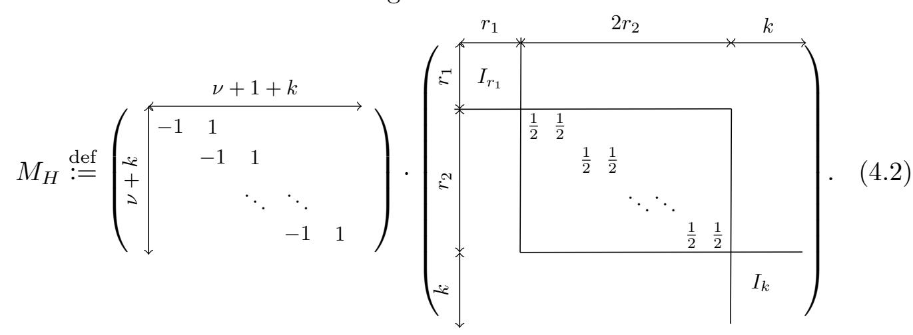

{26}------------------------------------------------

Actually,  $M_H$  is a basis of  $H = \mathbb{R}_0^{n+k} \cap \mathcal{L}$  in  $\mathbb{R}^{n+k}$ , constituted of vectors that are orthogonal to  $\mathbf{1}_{n+k}$  and to each of the  $r_2$  independent vectors  $\mathbf{v}_j, j \in [1, r_2]$  that sends any  $\mathbf{y} \in \mathcal{L}$  to  $\mathbf{0}$  by substracting  $y_{r_1+2j}$  from its copy  $y_{r_1+2j-1}$  and forgetting every other coordinate. Hence, graphically, a row basis of  $L_{\mathsf{tw}}$  is:

$$B_{L\mathsf{tw}} \stackrel{\text{def}}{:=} \begin{bmatrix} \widetilde{\Lambda}_{K} & 0 \\ \hline \overline{\operatorname{Log}}_{\infty} \eta_{1} \\ \vdots \\ \overline{\operatorname{Log}}_{\infty} \eta_{k} \end{bmatrix} \cdot \overline{\operatorname{GSO}}^{\mathrm{T}}(M_{H}), \qquad (4.3)$$

where the first part is the basis  $\widetilde{\Lambda}_{K,\mathrm{FB}}$  of  $\overline{\mathrm{Log}}_{\infty,\mathrm{FB}} \mathcal{O}_{K,\mathrm{FB}}^{\times}$  defined in §2.3.

Volume of  $L_{tw}$  and optimal factor base choice. First, we evaluate the volume of  $L_{tw} = f_H(\overline{\text{Log}}_{\infty,\text{FB}} \mathcal{O}_{K,\text{FB}}^{\times})$ . As the isometry  $f_H$  stabilizes the span of the log-S-unit lattice, it preserves its volume, which is given by Pr. 2.3. Using that ideal classes of FB generate the class group, hence  $h_K^{(\text{FB})} = h_K$ , yields:

$$\operatorname{Vol} L_{\mathsf{tw}} = \sqrt{n+k} \cdot 2^{-r_2/2} \cdot h_K R_K \prod_{1 \le i \le k} \ln \mathcal{N}(\mathfrak{p}_i). \tag{4.4}$$

Certainly, the volume of  $L_{tw}$  is growing with the log norms of the factor base prime ideals, but a remarkable property is that this growth is at first slower than the lattice density increase induced by the bigger dimension. The meaning of this is that we can enlarge the factor base to densify our lattice up to an optimal point, after which including new ideals becomes counter-productive.

Formally, let  $V_{k'}$  denote the *reduced* volume  $\operatorname{Vol}^{1/(\nu+k')} L_{\mathsf{tw}}$  for a factor base of size  $k' \geq k_0$ , where  $k_0$  is the number of generators of  $\operatorname{Cl}_K$ . We have:

$$V_{k'+1} = V_{k'} \cdot \left(\sqrt{1 + \frac{1}{n+k'}} \cdot \frac{\ln \mathcal{N}(\mathfrak{p}_{k'+1})}{V_{k'}}\right)^{1/(\nu+k'+1)}.$$
 (4.5)

This shows that  $V_{k'+1} < V_{k'}$  is equivalent to  $\ln \mathcal{N}(\mathfrak{p}_{k'+1}) < V_{k'} / \sqrt{1 + \frac{1}{n+k'}}$ . Using this property, Alg. 4.1 outputs a factor base maximizing the density of  $L_{\mathsf{tw}}$ .

First, for a fixed factor base of size k, we compare the reduced volume  $V_k$  of  $L_{\mathsf{tw}}$  with the reduced volume of  $L_{\mathsf{phs}}$ , denoted  $V_{\mathsf{phs}} \stackrel{\text{not}}{:=} \left(\sqrt{\frac{n}{2^{r_2}}} \cdot h_K R_K\right)^{1/(\nu+k)}$ .

# Lemma 4.2.

$$\frac{V_k}{V_{\textit{phs}}} \leq \frac{e^{1/ne}}{k} \cdot \sum_{\mathfrak{p} \in \mathrm{FB}} \ln \mathcal{N}(\mathfrak{p}).$$

This means that the gap between the reduced volume of the twisted lattice and the reduced volume of the untwisted lattice evolves roughly as the arithmetic mean of the  $\ln \mathcal{N}(\mathfrak{p})$ . We stress that this bound is valid for any k.

{27}------------------------------------------------

#### **Algorithm 4.1** Tw-PHS Factor Base Choice $A_{tw-FB}$

**Input:** A number field K of degree n.

**Output:** An optimal factor base FB generating  $Cl_K$  that minimizes  $Vol^{1/(\nu+k)} L_{tw}$ .

- 1: Compute  $Cl_K = \langle [\mathfrak{q}_1], \ldots, [\mathfrak{q}_{k_0}] \rangle$ , with  $k_0 \leq \log h_K$ .
- 2: Compute  $\mathcal{P}(B) = \{\mathfrak{p}_i : \mathcal{N}(\mathfrak{p}_i) \leq B\} \setminus \{\mathfrak{q}_1, \dots, \mathfrak{q}_{k_0}\}$  ordered by increasing norms, where B is chosen st.  $\pi_K(B) = \text{poly}(\ln|\Delta_K|) \geq k_0$ .
- 3:  $FB \leftarrow \{\mathfrak{q}_1, \dots, \mathfrak{q}_{k_0}\}.$
- $4:\ i \leftarrow 0.$
- 5: while  $\ln \mathcal{N}(\mathfrak{p}_{i+1}) < V_{k_0+i} / \sqrt{1 + \frac{1}{n+k_0+i}} \ \mathbf{do}$
- 6: Add  $\mathfrak{p}_{i+1}$  to FB.
- 7:  $i \leftarrow i + 1$ .
- 8: end while
- 9: return FB.

*Proof.* The quotient  $V_k/V_{\text{phs}}$  is  $\left(\sqrt{\frac{n+k}{n}}\prod\ln\mathcal{N}(\mathfrak{p})\right)^{1/(\nu+k)}$ . The square root power is bounded by  $\left(\frac{n+k}{n}\right)^{1/(n+k)}$ , as  $\frac{1}{\nu+k}<\frac{2}{n+k}$ , which reaches when k+n=ne its maximum value  $e^{1/ne}$ . On the other hand,  $\frac{1}{\nu+k}<\frac{1}{k}$ , thus by Jensen's inequality:

$$\left(\prod_{\mathfrak{p}\in\mathrm{FB}}\ln\mathcal{N}(\mathfrak{p})\right)^{1/(\nu+k)} \leq \left(\prod_{\mathfrak{p}\in\mathrm{FB}}\ln\mathcal{N}(\mathfrak{p})\right)^{1/k} \leq \frac{1}{k} \cdot \sum_{\mathfrak{p}\in\mathrm{FB}}\ln\mathcal{N}(\mathfrak{p}). \quad \Box$$

Although the reduced volume significantly decreases in the first loop iterations, reaching precisely the minimum value can be very gradual, so that it might be clever to early abort the loop in Alg. 4.1 when the gradient is too low, or truncate the output to at most  $k' = \tilde{O}(\ln|\Delta_K|)$ . We quantify the fact that the density loss is at most constant in the worst case in the following result.

**Lemma 4.3.** Let  $k' = C(\ln |\Delta_K| + n \ln \ln |\Delta_K|)$ . Let  $V_{min}$  be the minimum reduced volume output by  $A_{tw-FB}$ , and suppose  $V_{min}$  is reached for k > k', then:

$$V_{k'} \le e^{1/C + 1/ne} \cdot V_{\min}$$
.

Proof. By Eq. (2.11), this choice of k' implies  $\left(\sqrt{\frac{n}{2^{r_2}}} \cdot h_K R_K\right)^{1/(\nu+k')} \leq e^{1/C}$ . Lemma 4.2 thus gives  $V_{k'} \leq e^{1/C+1/ne} \ln \mathcal{N}(\mathfrak{p}_{k'})$ . The result follows from the fact that by design,  $\ln \mathcal{N}(\mathfrak{p}_{k'}) \leq V_{\min} \leq V_{k'}$ .

In practice, experiments of §5 report that the factor bases output by  $\mathcal{A}_{\mathsf{tw}\text{-}\mathsf{FB}}$  have significantly smaller dimensions than the dimensions showed in Tab. 3.1 and 3.2 for the (optimized) PHS algorithm, so that Lem. 4.3 is never triggered.

**Proposition 4.4.** Algorithm  $\mathcal{A}_{tw\text{-}FB}$  terminates in time  $T_{Su}(K) + \text{poly}(\ln|\Delta_K|)$  and outputs a factor base of size  $k = \text{poly}(\ln|\Delta_K|)$  using  $B = \text{poly}(\ln|\Delta_K|)$ .

*Proof.* We first show termination. If  $\ln \mathcal{N}(\mathfrak{p}_1) \geq V_{k_0} / \sqrt{1 + \frac{1}{n+k_0}}$ , the algorithm stops. Otherwise, by Eq. (4.5),  $V_{k_0+i+1} < V_{k_0+i}$  at best until  $\ln \mathcal{N}(\mathfrak{p}_{i+1}) \geq V_{k_0+i}$ .

{28}------------------------------------------------

Since there are at most n prime ideals of a given norm,  $\ln \mathcal{N}(\mathfrak{p}_i)$  must increase, so that at some point  $V_{k_0+i+1} > V_{k_0+i}$ , where the density of  $L_{\mathsf{tw}}$  decreases.

We now bound B and k. For C > 0, let  $k' = C(\ln|\Delta_K| + n \ln \ln|\Delta_K|)$ , and let  $B' = \mathcal{N}(\mathfrak{p}_{k'})$ . By the Prime Ideal Theorem (Th. 2.4),  $B' \leq \text{poly}(\ln|\Delta_K|)$ . Using the same arguments as in the proof of Lem. 4.3, we obtain:

$$V_{k'} \le e^{1/C} \cdot \left(\sqrt{\frac{n+k'}{n}}\right)^{1/(\nu+k')} \cdot \ln^{k'/(\nu+k')} \mathcal{N}(\mathfrak{p}_{k'}) \le e^{1/C+1/ne} \cdot \ln B'.$$

If  $\ln \mathcal{N}(\mathfrak{p}_{k'+1}) \geq V_{k'}$ , we take B = B' and k = k'. Note that this is generically the case in practice. Otherwise, it is necessary to increase B' to at most  $B = \ell B'$ , with  $\ell = \exp(e^{1/C+1/ne})$ . This value of  $\ell$  verifies that if k > k' is such that  $\mathcal{N}(\mathfrak{p}_{k+1}) \geq B \geq \mathcal{N}(\mathfrak{p}_k)$ , then  $\ln \mathcal{N}(\mathfrak{p}_{k+1}) \geq V_{k'} > V_k$ , and by definition  $\sharp FB \leq k$ . Note that this scaling value  $\ell$  is small, e.g. for  $C \geq 4$  and  $n \geq 3$  we have  $\ell \leq 4$ . The key is now to show that this new  $k = \pi_K(\ell B')$  is not much larger than  $k' = \pi_K(B')$ . Actually, provided B' is (polynomially in  $\ln |\Delta_K|$ ) large enough, invoking again the Prime Ideal Theorem yields  $k' = \pi_K(B') \geq \frac{B'}{2 \ln B'}$  [BDPW20, Lem. A.3] and:

$$k \le \pi_K(\ell B') \le \frac{2n(\ell B')}{\ln \ell B'} = (4\ell n) \cdot \frac{B'}{2 \ln B'} \le (4\ell n) \cdot \pi_K(B') = \text{poly}(\ln |\Delta_K|).$$

Note that Bach's bound (Eq. (2.12)) is  $\operatorname{poly}(\ln|\Delta_K|)$ , as B and k. Therefore, steps 2–8 run in time  $\operatorname{poly}(\ln|\Delta_K|)$ , and step 1 computes  $\operatorname{Cl}_K$  in time  $\operatorname{T}_{\mathsf{Su}}(K)$ .  $\square$ 

**Preprocessing algorithm.** Algorithm 4.2 details the complete preprocessing procedure that, from a number field and some precomputation size parameter, chooses a factor base FB, builds the associated matrix  $B_{Ltw}$ , and processes  $L_{tw}$  in order to facilitate Approx-CVP queries.

# Algorithm 4.2 Tw-PHS Preprocessing $A_{tw-pcmp}$

**Input:** A number field K of degree n and a parameter  $\omega \in [0, 1/2]$  or b.

**Output:** The basis  $B_{L\text{tw}}$  with the preimages  $\mathcal{O}_{K,\text{FB}}^{\times}$  of its rows, and Laarhoven's hint  $\mathcal{V}(L_{\text{tw}})$ .

- 1: Get an optimal factor base  $FB = \mathcal{A}_{\mathsf{tw-FB}}(K)$  of size  $k = \sharp FB$ . If needed, truncate the output to  $k = \tilde{O}(\ln|\Delta_K|)$  as in Lem. 4.3.
- 2: Compute fundamental elements  $\varepsilon_1, \ldots, \varepsilon_{\nu}, \eta_1, \ldots, \eta_k$  of  $\mathcal{O}_{K,\mathrm{FB}}^{\times}$  as in Th. 2.1.
- 3: Create  $B_{L\mathsf{tw}}$ , whose rows are  $\varphi_{\mathsf{tw}}(\varepsilon_1), \ldots, \varphi_{\mathsf{tw}}(\eta_k)$  as defined in Eq. (4.3).
- 4: Use Laarhoven's algorithm to compute a hint  $\mathcal{V} = \mathcal{V}(L_{\mathsf{tw}})$  of size  $2^{\tilde{O}(\log^{1-2\omega}|\Delta_K|)}$ .
- 5: (or) Use a BKZ of small block size to reduce the basis of  $L_{tw}$ .
- 6: **return**  $(\mathcal{O}_{K,\mathrm{FB}}^{\times}, B_{L\mathsf{tw}}, \mathcal{V}(L_{\mathsf{tw}})).$

This Tw-PHS preprocessing differs from the original PHS preprocessing given in Alg. 3.1 on two aspects: the factor base, output by  $\mathcal{A}_{\mathsf{tw-FB}}$  in step 1 and which is essentially much smaller in practice, and the new twisted lattice in step 3.

The last two alternative steps consists in preprocessing  $L_{tw}$  in order to solve Approx-CVP instances efficiently. Theoretically, we retain in step 4 the same

{29}------------------------------------------------

approach as in step 6 of the original PHS preprocessing Alg. 3.1, that guarantees a hint size not exceeding the query phase time using Laarhoven's algorithm [Laa16]. This outputs a hint  $\mathcal{V}$  of bit size bounded by  $2^{\tilde{O}(\nu+k)^{1-2\omega}}$ , i.e.  $2^{\tilde{O}(\log^{1-2\omega}|\Delta_K|)}$  using  $(\nu+k)=\tilde{O}(\log|\Delta_K|)$ , allowing to deliver the answer for approximation factors  $(\nu+k)^{\omega}$  in time bounded by the bit size of  $\mathcal{V}$  [Laa16, Cor. 1–2]. This theoretic version will be denoted by  $\mathcal{A}_{\mathsf{tw-pcmp}}^{(\mathsf{Laa})}$ .

Nevertheless, in practice the twisted lattice output by Alg. 4.2 incidentally appears to be a lot more orthogonal than expected. That's the reason why we suggest to replace the exponential step 4 of Alg. 4.2 by step 5, which performs some polynomial lattice reduction using a small block size BKZ. In a quantum setting this removes the only part that is not polynomial in  $\ln |\Delta_K|$ , and in a classical setting avoids the dominating exponential part. This practical version will be denoted by  $\mathcal{A}_{\mathsf{tw-pcmp}}^{(bkz)}$ .

Proof of the first part of Th. 4.1. The complexity of step 1 is given by Pr. 4.4. Neglecting  $\operatorname{poly}(\ln|\Delta_K|)$  terms, the other costly steps are steps 2 and 4. The former costs  $T_{\mathsf{Su}}(K) \leq 2^{\tilde{O}(\log^{2/3}|\Delta_K|)}$  by §2.5; the latter, independently of  $\omega$ , runs in  $2^{O(\nu+k)} = 2^{\tilde{O}(\log|\Delta_K|)}$  by the bound on k. Hence, Alg. 4.2 has the same complexity as the original PHS preprocessing, i.e. at most  $2^{\tilde{O}(\log|\Delta_K|)}$ . Note that in practice, the dimension of  $L_{\mathsf{tw}}$  is much smaller than the one of  $L_{\mathsf{phs}}$ , which directly lowers the practical complexity of  $\mathcal{A}^{(\mathrm{Laa})}_{\mathsf{tw-pcmp}}$  and  $\mathcal{A}^{(\mathrm{bkz})}_{\mathsf{tw-pcmp}}$ .

#### 4.2 Query phase

This section describes the query phase  $\mathcal{A}_{\mathsf{tw-query}}$  of the Tw-PHS algorithm. As for the query phase of the original PHS algorithm, it reduces the resolution of Approx-id-SvP in  $\mathfrak{b}$ , for any challenge ideal  $\mathfrak{b} \subseteq K$  having a polynomial description in  $\log |\mathcal{\Delta}_K|$ , to a single call to an Approx-CvP oracle in  $L_{\mathsf{tw}}$  as output by the preprocessing phase. The main idea of this reduction remains to multiply the principal ideal generator output by the ClDL of  $\mathfrak{b}$  on FB by elements of  $\mathcal{O}_{K,\mathrm{FB}}^{\times}$  until we reach a principal ideal having a short generator. This translates into adding vectors of  $L_{\mathsf{tw}}$  to some target vector derived from  $\mathfrak{b}$  until the result is short, hence into solving a CvP instance in the log-S-unit lattice  $L_{\mathsf{tw}}$ .

The essential difference of the Tw-PHS version lies in the definition of this target, which is adapted in order to benefit from the twisted description of the log-S-unit lattice. This is formalized in Alg. 4.3.

Note that the output of the ClDL in step 1 is not a S-unit unless  $\mathfrak{b}$  is divisible only by prime ideals of FB; for each i,  $v_i = v_{\mathfrak{p}_i}(\alpha) - v_{\mathfrak{p}_i}(\mathfrak{b})$ . For convenience and without any loss of generality we shall assume that  $\mathfrak{b}$  is coprime with all elements of the factor base, i.e.  $\forall \mathfrak{p} \in \mathrm{FB}$ ,  $v_{\mathfrak{p}}(\mathfrak{b}) = 0$ . In that case, the target in step 2 writes naturally as  $\mathbf{t} = \varphi_{\mathsf{tw}}(\alpha) + f_H(\mathbf{b}_{\mathsf{tw}})$ . This target definition calls a few comments. First, the output of the ClDL is projected on the whole log-S-unit lattice instead of only on the log-unit sublattice, hence maintaining its length and algebraic norm logarithms in the instance scope. Thus, the way our algorithm uses S-units to reduce the solution of the ClDL problem can be seen

{30}------------------------------------------------

#  $\overline{\text{Algorithm 4.3 Tw-PHS}}$ Query $\mathcal{A}_{\text{tw-query}}$

Challenge  $\mathfrak{b}$ ,  $\mathcal{A}_{\mathsf{tw-pcmp}}(K, \omega) = (\mathcal{O}_{K,\mathrm{FB}}^{\times}, B_{L\mathsf{tw}}, \mathcal{V})$ , and  $\widetilde{\beta} > 0$  st. for any  $\mathbf{t}$ , the Input: Approx-CVP oracle using  $\mathcal{V}(L_{\mathsf{tw}})$  outputs  $\mathbf{w} \in L_{\mathsf{tw}}$  with  $||f_H^{-1}(\mathbf{t} - \mathbf{w})||_{\infty} \leq \widetilde{\beta}$ . **Output:** A short element  $x \in \mathfrak{b} \setminus \{0\}$ .

- 1: Solve the ClDL for  $\mathfrak{b}$  on FB, i.e. find  $\alpha \in K$  st.  $\langle \alpha \rangle = \mathfrak{b} \cdot \prod_{\mathfrak{p}_i \in \mathrm{FB}} \mathfrak{p}_i^{v_i}$ , for  $v_i \in \mathbb{Z}$ .
- 2: Define the target  $\mathbf{t}$  as  $f_H^{-1}(\mathbf{t}) = \pi_H \left(\overline{\operatorname{Log}}_{\infty} \alpha, \left\{-v_i \ln \mathcal{N}(\mathfrak{p}_i)\right\}_{1 \leq i \leq k}\right) + \mathbf{b}_{\mathsf{tw}}$ , where the drift  $\mathbf{b}_{\mathsf{tw}} \in H$  will be defined in Eq. (4.6).
- 
- 3: Solve Approx-CVP with  $\mathcal{V}(L_{\mathsf{tw}})$  to get  $\mathbf{w} \in L_{\mathsf{tw}}$  st.  $||f_H^{-1}(\mathbf{t} \mathbf{w})||_{\infty} \leq \widetilde{\beta}$ . 4: (or) Use Babai's Nearest Plane to get  $\mathbf{w} \in L_{\mathsf{tw}}$  st.  $||f_H^{-1}(\mathbf{t} \mathbf{w})||_{\infty}$  is small.
- 5: Compute  $s = \varphi_{\mathsf{tw}}^{-1}(\mathbf{w}) \in \mathcal{O}_{K,\mathrm{FB}}^{\times}$ , using the preimages of the rows of  $B_{L\mathsf{tw}}$ .
- 6: **return**  $\alpha/s$ .

as a smooth generalization of the way traditional SGP solvers use regular units to reduce the solution of the Pip as in CDPR16. Second, the sole purpose of the drift by  $\mathbf{b}_{\mathsf{tw}}$  is to ensure that  $\alpha/s \in \mathfrak{b}$ . Adapting its definition to the twisted setting is slightly tedious and deferred to the next paragraph. The most notable novelty is that we force the use of a drift that is *inside* the log-S-unit lattice span. This somehow captures and compensates for the perturbation induced on infinite places for correcting negative valuations on finite places using S-units.

Finally, as already mentioned,  $L_{\mathsf{tw}}$  seems much more orthogonal in practice than expected, so that we advise to resort to Babai's Nearest Plane algorithm for solving Approx-CVP in  $L_{tw}$ , instead of using Laarhoven's query phase with the precomputed hint. We only keep Laarhoven's algorithm to theoretically prove the correctness and complexity of our new algorithm. The theoretical and practical versions of  $\mathcal{A}_{\mathsf{tw-query}}$  are respectively denoted by  $\mathcal{A}_{\mathsf{tw-query}}^{(\mathrm{Laa})}$  and  $\mathcal{A}_{\mathsf{tw-query}}^{(\mathrm{np})}$ .

We now detail explicitly our target choice and prove the correctness and the output quality of Alg. 4.3.

**Definition of the target vector.** Recall that we assumed that b is coprime with FB, hence  $f_H^{-1}(\mathbf{t}) = \pi_H(\overline{\log}_{\infty, FB} \alpha) + \mathbf{b}_{tw}$ , for some  $\mathbf{b}_{tw} \in H$  that must ensure  $\alpha/s \in \mathfrak{b}$ , for  $s = \varphi_{\mathsf{tw}}^{-1}(\mathbf{w})$  and when  $||f_H^{-1}(\mathbf{t} - \mathbf{w})||_{\infty} \leq \widetilde{\beta}$ . Indexing coordinates by places, we exhibit  $\mathbf{b}_{\mathsf{tw}} = (\{b_{\sigma}\}_{{\sigma} \in \mathcal{S}_{\infty} \cup \overline{\mathcal{S}}_{\infty}}, \{b_{\mathfrak{p}}\}_{\mathfrak{p} \in \mathrm{FB}})$ , where:

$$\begin{cases} b_{\sigma} = -\frac{k}{n} \left( \frac{\ln \mathcal{N}(\mathfrak{b})}{n+k} + \widetilde{\beta} \right) + \frac{1}{n} \sum_{\mathfrak{p} \in \mathrm{FB}} \ln \mathcal{N}(\mathfrak{p}) & \text{for } \sigma \in \mathcal{S}_{\infty} \cup \overline{\mathcal{S}}_{\infty}, \\ b_{\mathfrak{p}} = \widetilde{\beta} - \ln \mathcal{N}(\mathfrak{p}) + \frac{\ln \mathcal{N}(\mathfrak{b})}{n+k} & \text{for } \mathfrak{p} \in \mathrm{FB}. \end{cases}$$
(4.6)

It is easy to verify that all coordinates sum to 0, i.e.  $\mathbf{b}_{\mathsf{tw}} \in H$ . We now explain this choice, first showing that under the above hypotheses, Alg. 4.3 is correct.

**Proposition 4.5.** Given access to an Approx-CVP oracle that on any input t, outputs  $\mathbf{w} \in L_{\mathsf{tw}}$  st.  $||f_H^{-1}(\mathbf{t} - \mathbf{w})||_{\infty} \leq \widetilde{\beta}$ ,  $\mathcal{A}_{\mathsf{tw-query}}$  outputs  $x \in \mathfrak{b} \setminus \{0\}$ .

*Proof.* Recall that  $x = \alpha/s$ , where  $s = \varphi_{\mathsf{tw}}^{-1}(\mathbf{w}) \in \mathcal{O}_{K,\mathrm{FB}}^{\times}$  and that for the sake of clarity, b is taken coprime to FB. Therefore, it is sufficient to show that for any fixed  $\mathfrak{p} \in \mathrm{FB}$ ,  $v_{\mathfrak{p}}(\alpha/s) \geq v_{\mathfrak{p}}(\mathfrak{b}) = 0$ . Indexing coordinates of  $\overline{\mathrm{Log}}_{\infty,\mathrm{FB}} \alpha$ 

{31}------------------------------------------------

by places and using the simplified notation  $\alpha_v \stackrel{\text{not}}{:=} (\overline{\text{Log}}_{\infty,\text{FB}} \alpha)_v$ , we have that for  $\mathbf{h}_{\alpha} = \pi_H(\overline{\text{Log}}_{\infty,\text{FB}} \alpha)$ ,  $(\mathbf{h}_{\alpha})_{\mathfrak{p}} = \alpha_{\mathfrak{p}} - \frac{\ln \mathcal{N}(\mathfrak{b})}{n+k}$ . By hypothesis:

$$\left|\alpha_{\mathfrak{p}} - \frac{\ln \mathcal{N}(\mathfrak{b})}{n+k} - s_{\mathfrak{p}} + b_{\mathfrak{p}}\right| = \left| -\left(v_{\mathfrak{p}}(\alpha) - v_{\mathfrak{p}}(s) + 1\right) \ln \mathcal{N}(\mathfrak{p}) + \widetilde{\beta} \right| \leq \widetilde{\beta}.$$

Rearranging terms, and using that  $v_{\mathfrak{p}}(\cdot) \in \mathbb{Z}$  to round integers towards 0:

$$0 \le v_{\mathfrak{p}}(\alpha/s) \le \left\lfloor \frac{2\widetilde{\beta}}{\ln \mathcal{N}(\mathfrak{p})} - 1 \right\rfloor.$$

This concludes the correctness proof.

The proof of Pr. 4.5 quantifies the intuition that the output element has smaller valuations at big norm prime ideals. In particular, strictly positive valuations occur only for ideals st.  $\ln \mathcal{N}(\mathfrak{p}) \leq \widetilde{\beta}$ . This has a very valuable consequence: estimating the  $\ell_{\infty}$ -norm covering radius of  $L_{\text{tw}}$  allows to control the prime ideal support of any optimal solution. Hence, even if the Approx-CVP cannot reach  $\mu_{\infty}(L_{\text{tw}})$ , it is possible to confine the algebraic norm of each query output by *not* including in FB the prime ideals whose log-norm would *in fine* exceed  $\mu_{\infty}(L_{\text{tw}})$ , and at which the optimal solution provably has a null valuation. Roughly speaking, this is what  $\mathcal{A}_{\text{tw-FB}}$  tends to achieve in Alg. 4.1.

Translating infinite coordinates. As already mentionned, one important novelty consists in forcing the drift used to ensure  $\alpha/s \in \mathfrak{b}$  to be inside the log-S-unit span. The underlying intuition is that "correcting" negative valuations at finite primes should only involve S-units. We modelize this by splitting the weight of the  $b_{\mathfrak{p}}$ 's evenly across the infinite places coordinates, hence obtaining Eq. (4.6). This heuristically presumes that S-units absolute value logarithms are generically balanced on infinite places. Let us summarize our target definition:

$$\mathbf{t} = f_H \left( \left\{ \alpha_{\sigma} - \frac{1}{n} \left[ k \widetilde{\beta} + \ln \mathcal{N}(\mathfrak{b}) - \sum_{\mathfrak{p} \in \mathrm{FB}} \ln \mathcal{N}(\mathfrak{p}) \right] \right\}_{\sigma}, \left\{ \alpha_{\mathfrak{p}} + \widetilde{\beta} - \ln \mathcal{N}(\mathfrak{p}) \right\}_{\mathfrak{p} \in \mathrm{FB}} \right). \tag{4.7}$$

Quality of the output of  $\mathcal{A}_{\text{tw-query}}^{\text{(Laa)}}$ . To bound the quality of the output of Alg. 4.3, the general idea is that minimizing the distance of our target to the twisted lattice directly minimizes the *p*-adic absolute values  $-v_{\mathfrak{p}}(\alpha) \ln \mathcal{N}(\mathfrak{p})$  instead of minimizing the valuations  $v_{\mathfrak{p}}(\alpha)$  independently of  $\ln \mathcal{N}(\mathfrak{p})$ .

This makes use of the following log-S-unit lattice structure lemma, adapting its log-unit lattice classical equivalent [PHS19a, Lem. 2.11–12], [CDPR16, §6.1]:

**Lemma 4.6.** For  $\alpha \in K$ , let  $\mathbf{h}_{\alpha} \stackrel{\text{def}}{:=} \pi_H(\overline{\operatorname{Log}}_{\infty,\operatorname{FB}}\alpha)$ . Decompose  $\langle \alpha \rangle$  on FB as  $\mathfrak{b} \cdot \prod_{\mathfrak{p} \in \operatorname{FB}} \mathfrak{p}^{v_{\mathfrak{p}}(\alpha)}$ , with  $\mathfrak{b}$  coprime to FB. Then  $\overline{\operatorname{Log}}_{\infty,\operatorname{FB}}\alpha = \mathbf{h}_{\alpha} + \frac{\ln \mathcal{N}(\mathfrak{b})}{n+k} \cdot \mathbf{1}_{n+k}$ . Furthermore, the length of  $\alpha$  is bounded by:

$$\|\alpha\|_2 \le \sqrt{n} \cdot \mathcal{N}(\mathfrak{b})^{1/(n+k)} \cdot \exp\left[\max_{1 \le j \le n} (\mathbf{h}_{\alpha})_j\right].$$

Note that using the max of the coordinates of  $\mathbf{h}_{\alpha}$  instead of its  $\ell_{\infty}$ -norm norm acknowledges for the fact that logarithms of small infinite valuations can become large negatives that should be ignored when evaluating the length of  $\alpha$ .

{32}------------------------------------------------

*Proof.* By definition of the orthogonal projection on H,  $\overline{\text{Log}}_{\infty,\text{FB}} \alpha$  decomposes as  $\mathbf{h}_{\alpha} + a \cdot \mathbf{1}_{n+k}$ , with  $a = \langle \overline{\text{Log}}_{\infty,\text{FB}} \alpha, \mathbf{1}_{n+k} \rangle / \|\mathbf{1}_{n+k}\|_2^2$ . The scalar product is:

$$\sum_{\sigma \in \mathcal{S}_{\infty} \cup \overline{\mathcal{S}}_{\infty}} \ln |\sigma(\alpha)| - \sum_{\mathfrak{p} \in FB} v_{\mathfrak{p}}(\alpha) \cdot \ln \mathcal{N}(\mathfrak{p}) = \ln \mathcal{N}\left(\langle \alpha \rangle / \prod_{\mathfrak{p} \in FB} \mathfrak{p}^{v_{\mathfrak{p}}(\alpha)}\right) = \ln \mathcal{N}(\mathfrak{b}).$$

Therefore,  $a = \frac{\ln \mathcal{N}(\mathfrak{b})}{n+k}$ . Moreover, generically we have  $\|\alpha\|_2 \leq \sqrt{n} \cdot \|\alpha\|_{\infty}$ ; using the above decomposition coordinate-wise, the *j*-th-coordinate of  $\overline{\text{Log}}_{\infty,\text{FB}} \alpha$  writes  $(\overline{\text{Log}}_{\infty,\text{FB}} \alpha)_j = (\mathbf{h}_{\alpha})_j + \frac{\ln \mathcal{N}(\mathfrak{b})}{n+k}$  and thus:

$$\|\alpha\|_{\infty} = \exp \max_{\sigma \in \mathcal{S}_{\infty}} \ln|\sigma(\alpha)| \le \exp\left[\frac{\ln \mathcal{N}(\mathfrak{b})}{n+k} + \max_{1 \le j \le n} (\mathbf{h}_{\alpha})_{j}\right].$$

**Theorem 4.7.** Given access to an Approx-CVP oracle that on any input  $\mathbf{t}$ , outputs  $\mathbf{w} \in L_{tw}$  st.  $||f_H^{-1}(\mathbf{t} - \mathbf{w})||_{\infty} \leq \widetilde{\beta}$ ,  $\mathcal{A}_{tw\text{-query}}$  computes  $x \in \mathfrak{b} \setminus \{0\}$  such that

$$||x||_2 \le \sqrt{n} \cdot \mathcal{N}(\mathfrak{b})^{1/n} \cdot \exp\left[\frac{(n+k)\widetilde{\beta} - \sum_{\mathfrak{p} \in FB} \ln \mathcal{N}(\mathfrak{p})}{n}\right].$$

This outperforms the bound of Pr. 3.5 if  $(n+k) \cdot \widetilde{\beta} \leq 2\beta \cdot \sum_{\mathfrak{p} \in FB} \ln \mathcal{N}(\mathfrak{p})$ . In particular, this is implied by Lem. 4.2 if  $\frac{\widetilde{\beta}}{\beta} \approx \frac{V_k}{V_{\text{phs}}}$  for  $k \geq n$ . We will see that under some reasonable heuristics, this is indeed the case when using the *same* factor base, and that experiments suggest a much broader gap. One intuitive reason for this behaviour is that the covering radius of our twisted lattice grows at a slower pace than the log-norm of the prime ideals of FB.

*Proof.* The correctness comes from Pr. 4.5. As before, let  $s = \varphi_{\mathsf{tw}}^{-1}(\mathbf{w})$ , where  $\mathbf{w}$  verifies  $||f_H^{-1}(\mathbf{t} - \mathbf{w})||_{\infty} \leq \widetilde{\beta}$ . It is necessary to bound  $\max_{\sigma \in \mathcal{S}_{\infty}} (\mathbf{h}_{\alpha/s})_{\sigma}$  in order to invoke Lem. 4.6. Note that  $\mathbf{h}_{\alpha/s} = \mathbf{h}_{\alpha} - \mathbf{h}_{s}$ , hence:

$$(\mathbf{h}_{\alpha/s})_{\sigma} = \alpha_{\sigma} - \frac{\ln \mathcal{N}(\mathfrak{b})}{n+k} - s_{\sigma}.$$

Recalling the target definition given in Eq. (4.6), the  $\sigma$ -coordinate of  $f_H^{-1}(\mathbf{t} - \mathbf{w})$  writes  $\left(\alpha_{\sigma} - \frac{\ln \mathcal{N}(\mathfrak{b})}{n+k} + b_{\sigma}\right) - s_{\sigma} = \left(\mathbf{h}_{\alpha/s}\right)_{\sigma} + b_{\sigma}$ , and the promise on  $\mathbf{w}$  yields:

$$(\mathbf{h}_{\alpha/s})_{\sigma} \leq \widetilde{\beta} - b_{\sigma} = \frac{(n+k)\widetilde{\beta} - \sum_{\mathfrak{p} \in \mathrm{FB}} \ln \mathcal{N}(\mathfrak{p})}{n} + \frac{k}{n(n+k)} \cdot \ln \mathcal{N}(\mathfrak{b}).$$

Injecting this bound in Lem. 4.6 using  $\frac{1}{n+k} + \frac{k}{n(n+k)} = \frac{1}{n}$  ends the proof.

**Heuristic evaluation of**  $\widetilde{\beta}$ . Proving the second part of Th. 4.1 necessitates to evaluate  $\widetilde{\beta}$ . This evaluation rely on several heuristics that adapt heuristics [PHS19a, H. 4–6]. We argue that the arguments developed in [PHS19a, §4] to support these heuristics can be transposed to our setting, and both heuristics are validated by experiments in §5.

{33}------------------------------------------------

Heuristic 4.8 (Adapted from [PHS19a, H. 4]). The  $\ell_{\infty}$ -norm covering radius of  $L_{\mathsf{tw}}$  is  $O(\operatorname{Vol}^{1/(\nu+k)} L_{\mathsf{tw}})$ . Likewise,  $\mu_2(L_{\mathsf{tw}}) = O(\sqrt{\nu+k} \cdot \operatorname{Vol}^{1/(\nu+k)} L_{\mathsf{tw}})$ .

This assumption relies on  $L_{\mathsf{tw}}$  to behave like a random lattice, implying its successive minima and covering radius to be even. In [PHS19a], the randomness essentially comes from the choice of the factor base, while for  $L_{\mathsf{tw}}$ , this choice is deterministic. We argue that heuristically, prime ideals of FB represent uniformly random classes in  $\mathrm{Cl}_K$ , and S-units archimedean absolute value logarithms are likely to be uniform in  $\mathbb{R}^n/\overline{\mathrm{Log}}_{\infty}\,\mathcal{O}_K^{\times}$ . The volumetric arguments of [PHS19a, §4.1] can also be readily adapted, using  $\ln \mathcal{N}(\mathfrak{p}) \leq \mathrm{Vol}^{1/(\nu+k)}\,L_{\mathsf{tw}}$  by construction.

Heuristic 4.9 (Adapted from [PHS19a, H. 5–6]). With non-negligible probability over the input target vector  $\mathbf{t}$ , the vector  $\mathbf{w}$  output by Laarhoven's algorithm satisfies  $||f_H^{-1}(\mathbf{t} - \mathbf{w})||_{\infty} \leq O(\ln(n+k)/\sqrt{n+k}) \cdot ||\mathbf{t} - \mathbf{w}||_2$ .

This heuristic conveys the idea that coefficients of the output of Laarhoven's algorithm are somehow balanced, so that  $\|\mathbf{w}\|_2 \approx \sqrt{n+k} \cdot \|f_H^{-1}(\mathbf{w})\|_{\infty}$ . Typically, continuous Gaussian vectors  $\mathbf{y}$  of dimension d verify  $\|\mathbf{y}\|_{\infty}/\|\mathbf{y}\|_2 = O(\ln d/\sqrt{d})$  with good probability, as shown by [PHS19a, Lem. 4.1]. In our setting, this is justified by assuming  $\mathbf{t}$  is uniformly distributed in  $(\mathbb{R} \otimes L_{\mathsf{tw}})/L_{\mathsf{tw}}$ , and can be randomized by multiplying  $\mathfrak{b}$  by small ideals coprime to FB.

Proof of the second part of Th. 4.1. It breaks down to plugging a value for k and  $\widetilde{\beta}$  into Th. 4.7. Using Lem. 4.3, we take  $k = \widetilde{O}(\ln|\Delta_K|)$ , so that by Lem. 4.2 and Pr. 4.4,  $V_k = O(\ln \mathcal{N}(\mathfrak{p}_{\text{max}})) = O(\ln \ln|\Delta_K|)$ . We stress that if  $\mathcal{A}_{\text{tw-FB}}$  terminates with a smaller k, this can by definition only yield a smaller  $V_k$ . By H. 4.8, it implies  $\mu_2(L_{\text{tw}}) = O(\sqrt{\nu + k} \cdot \ln \ln|\Delta_K|)$ , and H. 4.9 yield on average  $||f_H^{-1}(\mathbf{v})||_{\infty} \leq \frac{\ln n + k}{\sqrt{n + k}} \cdot ||\mathbf{v}||_2$ . The Approx-CVP solver from Laarhoven's algorithm using  $\mathcal{V}(L_{\text{tw}})$  outputs a lattice vector at euclidean distance which is at most  $O((\nu + k)^{\omega} \cdot \mu_2(L_{\text{tw}}))$ . Hence, its infinity distance is  $\widetilde{O}((\nu + k)^{\omega} \cdot \ln \ln|\Delta_K|)$ , and  $(k + n)\widetilde{\beta} = \widetilde{O}((\nu + k)^{\omega + 1} \cdot \ln \ln|\Delta_K|) = \widetilde{O}(\ln^{\omega + 1}|\Delta_K|)$ , as claimed.

As for the running time of Alg. 4.3, it is essentially determined by those of steps 1 and 3. Solving the ClDL problem requires to compute S-units for an extended factor basis containing FB and prime factors of  $\mathfrak{b}$ , hence costs  $T_{Su}(K)$ . Note that since it depends on the challenge, this cost cannot be mitigated by some preprocessing effort. On the other hand, solving Approx-CVP with Laarhoven's algorithm runs in time bounded by  $2^{\tilde{O}(\log^{1-2\omega}|\Delta_K|)}$ , the size of V. Finally, the total run time of  $\mathcal{A}_{\mathsf{tw-query}}^{(\mathsf{Laa})}$  is bounded by  $2^{\tilde{O}(\log^{1-2\omega}|\Delta_K|)} + T_{\mathsf{Su}}(K)$ .  $\square$ 

In practice, as shown in §5, the special properties of our twisted lattice  $L_{\text{tw}}$  suggest replacing Laarhoven's CVP solving by Babai's Nearest Plane algorithm for solving Approx-CVP in  $L_{\text{tw}}$ . In this eventuality,  $\mathcal{A}_{\text{tw-query}}^{(\text{np})}$  would become quantumly polynomial, and classically only subexponential in  $\ln |\Delta_K|$ .

This is at the heart of the analytic class number formula.

{34}------------------------------------------------

# 5 Experimental data

This is the first time to our knowledge that this type of algorithm is completely implemented and tested for fields of degrees up to 60. As a point of comparison, the experiments of [PHS19a] constructed the log-S-unit lattice  $L_{phs}$  for cyclotomic fields of degrees at most 24 and  $h_K \leq 3$ , all but the last two being principal [PHS19a, Fig. 4.1].

Hardware and library description. All S-units and class group computations, for the log-S-unit lattice description and the ClDL resolution, were performed using MAGMA v2.24-10 [BCP97].4 The BKZ reductions and CVP/SVP computations used fplll v5.3.2 [FpL16]. All other parts of the experiments rely on SAGEMATH v9.0 [Sag20]. All the sources and scripts are available as supplementary material on https://github.com/ob3rnard/Twisted-PHS. The experiments took less than a week on a server with 36 cores and 768 GB RAM.

Number fields. As announced in §2.1, we consider two families of number fields, namely non-principal cyclotomic fields  $\mathbb{Q}(\zeta_m)$  of prime conductors  $m \in [23, 71]$ , and NTRU Prime fields  $\mathbb{Q}(z_q)$  where  $z_q$  is a root of  $x^q - x - 1$ , for  $q \in [23, 47]$  prime. These correspond to the range of what is feasible in a reasonable amount of time, as the asymptotics of  $T_{\mathsf{Su}}(K)$  rapidly speak in a classical setting.

For cyclotomic fields, we managed to compute S-units up to  $\mathbb{Q}(\zeta_{71})$  for all factor bases in less than a day, and all log-S-unit lattice variants up to  $\mathbb{Q}(\zeta_{61})$ . For NTRU Prime fields, we managed all computations up to  $\mathbb{Q}(z_{47})$ .

Targeted lattices. We evaluate the lattices computed by three algorithms: the original PHS algorithm, as implemented in [PHS19b]; our optimized version Opt-PHS from §3.3, and our new twisted variant Tw-PHS described in §4. This yields three different lattices, respectively denoted by  $L_{\rm phs}$ ,  $L_{\rm opt}$  and  $L_{\rm tw}$ . Note that there are a few differences between [PHS19a] and its implementation [PHS19b], but we chose to stick to the provided implementation as much as possible.

In order to separate the improvements due to  $\mathcal{A}_{\mathsf{tw-FB}}$  outputting smaller factor bases from those purely induced by our specific use of the product formula to describe the log-S-unit lattice, we also built lattices  $L_{\mathsf{phs}}^{(0)}$  and  $L_{\mathsf{opt}}^{(0)}$  corresponding to PHS and Opt-PHS algorithms, but using the *same* factor base as  $L_{\mathsf{tw}}$ .

BKZ reductions and CVP solving. We applied the same reduction strategy to all of our lattices. Namely, lattices of dimension less than 60 were HKZ reduced, while lattices of greater dimension were reduced using at most 300 loops of BKZ with block size 40. This yields reasonably good bases for a small computational cost [CN11, p.2]. Note the loop limit was in practice never hit.

For CVP computations, we applied with these reduced bases Babai's Nearest Plane algorithm, as described in [Gal12, §18.1, Alg. 26].

Precision issues. Choosing the right bit precision for floating point arithmetic in the experiments is particularly tricky. We generically used at most 500 bits

&lt;sup>4 Note that SageMath is significantly faster than Magma for computing class groups, but behaves surprisingly poorly when it comes to computing S-units.

{35}------------------------------------------------

of precision in our experiments (corresponding to the lattice volume logarithm in base 2 plus some extra margin). There are two notable exceptions:

- 1. The S-units w.r.t. FB can have *huge* coefficients. Computing the absolute values of their embeddings must then be performed at very high precision. All our lattice constructions were conducted using 10000 bits of precision.
- 2. Computing the target involves the challenge and the ClDL solution, whose coefficients are potentially huge rational numbers, up to  $2^{25000}$  for e.g.  $\mathbb{Q}(\zeta_{53})$ . As above, we adjust the precision in order to obtain sensible values.

In all cases, once in the log space the resulting high precision data can be rounded back to the generic precision before lattice reduction or CVP computations.

#### 5.1 Geometric characteristics

First, we evaluated the geometric characteristics of each produced lattice, using indicators recalled in §2.6, namely: the root Hermite factor  $\delta_0$ , the orthogonality defect  $\delta$ , and the minimum  $\theta_{\min}$  (resp. average  $\theta_{\text{avg}}$ ) vector basis angle. Each of these indicators is declined before and after BKZ reduction to compare their evolution. We also evaluated experimentally the relevance of H. 4.8 and 4.9. Example results are given in Tab. 5.1 and 5.2 for cyclotomic and NTRU Prime fields, aside the lattices dimensions  $d = \nu + k$  and reduced volumes  $V^{1/d}$ . Extensive data can be found in Tab. B.1 and B.2 for both field families.

|                                                          | 1   | 171/d | $\delta_0$ |       | $\frac{\delta}{raw}$ bkz |       | $\theta_{min}$ |     | $\theta_{avg}$ |     |         |                | $\ \cdot\ _{\infty}/\ \cdot\ _{2}$ |        |
|----------------------------------------------------------|-----|-------|------------|-------|--------------------------|-------|----------------|-----|----------------|-----|---------|----------------|------------------------------------|--------|
|                                                          | a   | V     | raw        | bkz   | raw                      | bkz   | raw            | bkz | raw            | bkz | $\mu_2$ | $\mu_{\infty}$ | real                               | H. 4.9 |
| $L_{\sf tw}$                                             | 59  | 4.825 | 1.001      | 1.001 | 3.596                    | 1.802 | 11             | 47  | 69             | 81  | 12.91   | 5.186          | 0.615                              | 0.489  |
| $L_{opt}^{(0)}$ $\mathbb{Q}(\zeta_{41})$ $L_{phs}^{(0)}$ | 59  | 1.786 | 1.020      | 1.005 | 4.525                    | 1.986 | 34             | 55  | 76             | 83  | 5.112   | 2.245          | 0.629                              | 0.530  |
| $\mathbb{Q}(\zeta_{41}) \; L_{phs}^{(0)}$                | 59  | 2.767 | 1.037      | 0.997 | 8.986                    | 1.809 | 45             | 55  | 79             | 84  | 8.535   | 4.039          | 0.639                              | 0.530  |
| $L_{opt}$                                                | 103 | 1.379 | 1.013      | 1.006 | 6.514                    | 2.592 | 25             | 48  | 66             | 84  | 5.301   | 2.052          | 0.596                              | 0.456  |
| $L_{\sf phs}$                                            | 144 | 1.306 | 1.012      | 1.004 | 7.982                    | 3.651 | 29             | 49  | 71             | 83  | 6.536   | 2.772          | 0.687                              | 0.414  |

**Table 5.1** – Geometric characteristics of log-S-unit lattices for some prime conductor cyclotomic fields.

|                      |                 | .1 т | <b>T</b> 71/d | $\delta$ | $_{}\delta_0$ |       | $\delta$ |     | $\theta_{\sf min}$ |     | ıvg |         |                | $\frac{\ \cdot\ _{\infty}/\ \cdot\ _2}{\text{real H. 4.9}}$ |        |
|----------------------|-----------------|------|---------------|----------|---------------|-------|----------|-----|--------------------|-----|-----|---------|----------------|-------------------------------------------------------------|--------|
|                      |                 | a    | V -,          | raw      | bkz           | raw   | bkz      | raw | bkz                | raw | bkz | $\mu_2$ | $\mu_{\infty}$ | real                                                        | H. 4.9 |
|                      | $L_{\sf tw}$    | 38   | 4.441         | 0.911    | 0.911         | 1.498 | 1.357    | 53  | 59                 | 82  | 83  | 10.64   | 5.177          | 0.645                                                       | 0.528  |
|                      | $L_{opt}^{(0)}$ | 38   | 5.051         | 0.937    | 0.937         | 4.187 | 1.865    | 44  | 50                 | 81  | 81  | 12.50   | 6.573          | 0.663                                                       | 0.590  |
| $\mathbb{Q}(z_{43})$ | $L^{(0)}$       | 38   | 9.657         | 0.952    | 0.952         | 7.496 | 1.877    | 45  | 56                 | 81  | 81  | 23.73   | 12.18          | 0.671                                                       | 0.590  |
|                      | $\dot{L_{opt}}$ | 114  | 1.367         | 0.979    | 0.979         | 5.482 | 3.256    | 36  | 57                 | 79  | 83  | 6.119   | 2.803          | 0.687                                                       | 0.443  |
|                      | $L_{phs}$       | 161  | 1.297         | 0.987    | 0.987         | 9.002 | 4.135    | 25  | 55                 | 79  | 83  | 7.484   | 2.837          | 0.712                                                       | 0.400  |
|                      | $L_{\sf tw}$    | 40   | 4.576         | 0.913    | 0.913         | 1.650 | 1.358    | 49  | 60                 | 82  | 84  | 11.04   | 5.607          | 0.632                                                       | 0.519  |
|                      | $L_{opt}^{(0)}$ | 40   | 6.231         | 0.938    | 0.938         | 4.628 | 1.915    | 37  | 57                 | 81  | 81  | 16.59   | 8.398          | 0.658                                                       | 0.583  |
| $\mathbb{Q}(z_{47})$ | $L_{phs}^{(0)}$ | 40   | 12.06         | 0.951    | 0.951         | 7.908 | 1.946    | 38  | 55                 | 81  | 81  | 30.85   | 15.50          | 0.662                                                       | 0.583  |
|                      | $L_{opt}$       | 129  | 1.376         | 0.981    | 0.981         | 6.189 | 3.632    | 21  | 56                 | 80  | 83  | 6.575   | 2.925          | 0.696                                                       | 0.427  |
|                      | $L_{phs}$       | 180  | 1.309         | 0.989    | 0.989         | 10.15 | 4.527    | 31  | 53                 | 80  | 83  | 8.022   | 2.882          | 0.704                                                       | 0.387  |

Table 5.2 – Geometric characteristics of log-S-unit lattices for some NTRU Prime fields.

{36}------------------------------------------------

Orthogonality indicators. We first remark that minimum and average vector basis angles seem difficult to interpret. They are slightly better for Tw-PHS on NTRU Prime fields but it is harder to extract a general tendency for cyclotomic fields.

After a light BKZ reduction, twisted lattices show significantly better root Hermite factor and orthogonality defect than any other log-S-unit lattice representations, even when the lattices have the same dimension, i.e. when the same factor base is used. Second, the evolution of the orthogonality defect before and after the reduction is more restricted in the twisted case than in the others. In particular, we observe that the BKZ-reduced versions of  $L_{\text{opt}}^{(0)}$  and  $L_{\text{phs}}^{(0)}$  can have bigger orthogonality defects than the unreduced  $L_{\text{tw}}$ . This last observation is true for all NTRU Prime fields we tested except  $\mathbb{Q}(z_{23})$ .

These two phenomenons (better values and small variations) are particularly clear for NTRU Prime fields. We remark that in this case, the twisted version of the log-S-unit lattice fully expresses, since for NTRU Prime fields most factor base elements have distinct norms. On the contrary, factor bases for our targeted cyclotomic fields are composed of one (or two, as for  $\mathbb{Q}(\zeta_{59})$ ) Galois orbits whose elements all have the same norm. Finally, we stress that reducing  $L_{\text{tw}}$  lattices is much faster in practice than reducing  $L_{\text{opt}}^{(0)}$  and  $L_{\text{phs}}^{(0)}$ . This is corroborated by the graphs of the Gram-Schmidt log norms in §5.2.

Evaluating heuristic on covering radius (H. 4.8). Computing the covering radius of a given lattice is a very difficult problem in general. To evaluate in practice  $\mu_2$  and  $\mu_{\infty}$  for our computed lattices, we used a slightly modified version of the strategy of [PHS19a, §4.1]. More precisely, for each lattice L, we picked 500 random target vectors  $\mathbf{t}_i$  in the span of L from a continuous Gaussian distribution of deviation  $\sigma = 100 \cdot \dim L$ , then used Babai's Nearest Plane algorithm with the reduced basis of L to obtain vectors  $\mathbf{w}_i \in L$  close to  $\mathbf{t}_i$ . Finally, we majorate  $\mu_{\infty}(L)$  and  $\mu_2(L)$  by respectively  $\max_i \|\mathbf{t}_i - \mathbf{w}_i\|_{\infty}$  and  $\max_i \|\mathbf{t}_i - \mathbf{w}_i\|_2$ .

Results show that all lattices equally match H. 4.8. We noticed, for  $L_{\text{phs}}$  and for the number fields tested in [PHS19a, Fig. 4.1], a significant gap between our estimations and the published numerical values. We stress that using in our code a standard deviation of only  $\sigma = 100$  as in [PHS19b] reproduces their results.

Evaluating heuristic on infinity norm (H.4.9). To support H.4.9, we compared the average  $||f_H^{-1}(\mathbf{t}_i - \mathbf{w}_i)||_{\infty}/||\mathbf{t}_i - \mathbf{w}_i||_2$  with the expected  $(\ln(n+k)/\sqrt{n+k})$  for  $L_{\mathsf{tw}}$ . The evolution of H.4.9 from [PHS19a, H.5-6] is quantified by relating, for all four PHS log-S-unit variants, the ratio  $||\mathbf{t}_i - \mathbf{w}_i||_{\infty}/||\mathbf{t}_i - \mathbf{w}_i||_2$  to their expected ratio  $(\ln(\nu+k)/\sqrt{\nu+k})$ .

The data show that all lattices follow exactly the same behaviour relatively to H. 4.9 and to [PHS19a, H. 5–6]. In the tables, all these values are tagged with a unique label " $\|\cdot\|_{\infty}/\|\cdot\|_2$  (real/H. 4.9)", but really correspond to H. 4.9 for Twisted-PHS and to [PHS19a, H. 5–6] for PHS.

{37}------------------------------------------------

### 5.2 Plotting Gram-Schmidt log norms

For our second experiment, we evaluate the Gram-Schmidt norms of each produced lattice. We propose two comparisons, the first one is before and after BKZ reduction to see the evolution of the norms for each case at iso factor base in Fig. [5.1;](#page-37-1) the second one is between the different lattices (after BKZ reduction) in Fig. [5.2.](#page-37-2) Again, extensive data for other examples can be found in §[B.2](#page-46-0) for both cyclotomic fields and NTRU Prime fields.

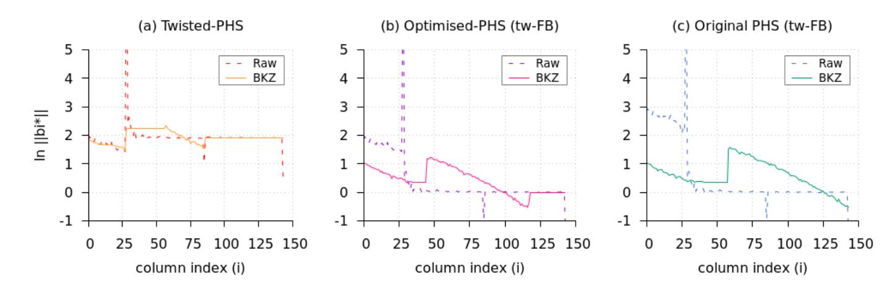

Fig. 5.1 – Log-S-unit lattices for Q(ζ59): Gram-Schmidt log norms before and after BKZ reduction at iso factor base Atw-FB(K) for: (a) Ltw; (b) L (0) opt; (c) L (0) phs.

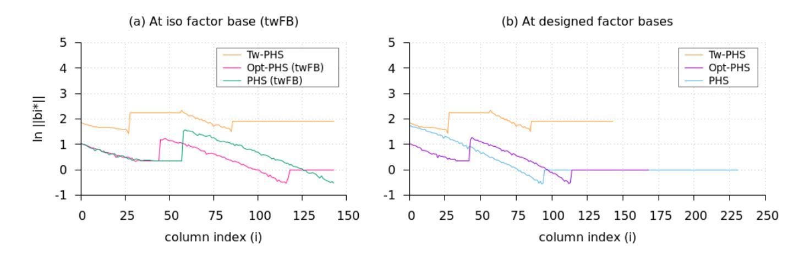

Fig. 5.2 – Log-S-unit lattices for Q(ζ59): Gram-Schmidt log norms after BKZ reduction: (a) at iso factor base Atw-FB(K); (b) at designed factor bases.

We first remark that in Fig. [5.1](#page-37-1) the two curves, before and after BKZ reduction, are almost superposed for the Twisted-PHS lattice. This does not seem to be the case for the two other PHS variants we consider here.

Since the volume of Ltw is bigger, by roughly the average log norm of the factor base elements by Lem. [4.2,](#page-26-0) the Gram-Schmidt log norms of our bases have bigger values. The important phenomenon to consider is how these log norms decrease. Figure [5.2](#page-37-2) emphasises that the decrease of the Gram-Schmidt log norms is very limited in the twisted case, compared to other cases (with iso factor bases on the left, and the original algorithms on the right), where the decrease of the log norms seems significant. This observation seems to corroborate the fact that 

{38}------------------------------------------------

the Twisted-PHS lattice is already quite orthogonal. Finally, we note that both phenomenons do not depend on the lattices having the same dimension.

### 5.3 Approximation factors

We implemented all three algorithms from end to end and used them on numerous challenges to estimate their practically achieved approximation factors. This is to our knowledge the first time that these types of algorithms are completely run on concrete examples.

Ideal-SVP challenges and ClDL computations. For each targeted field, we chose 50 prime ideals  $\mathfrak{b}$  of prime norm q. Indeed, these are the most interesting ideals: in the extreme opposite case, taking  $\mathfrak{b}$  inert of norm  $q^n$  implies that q reaches the lower bound of Eq. (2.15), as  $||q||_2 = \sqrt{n} \cdot q$ , hence the id-SVP solution is trivial.

We then tried to solve the ClDL for these challenges w.r.t. all targeted factor bases. We stress that, using MAGMA, S-units computations for the ClDL become harder as the norm of the challenge grows. This is especially true when the factor base inflates, hence providing an additional motivation for taking as small as possible factor bases. Therefore, we restricted ourselves to challenges of norms around 100 bits. Computing the ClDL solutions for these challenges revealed much harder than computing S-units on all factor bases, which contain only relatively small prime ideals. As a consequence, we were able to compute the ClDL step only up to  $\mathbb{Q}(\zeta_{53})$  (partially) and  $\mathbb{Q}(z_{47})$ .

Query algorithm. We exclusively used Babai's Nearest Plane algorithm on the BKZ reduced bases of all log-S-unit lattices to solve the Approx-CVP instances. Actually, the hardest computational task was to compute the output  $\alpha/s$ , which necessitates a multi-exponentiation over huge S-units. As a particular point of interest, we stress that using directly the drift proposed in [PHS19a] would be especially unfair. Hence, for a challenge  $\mathfrak{b}$ , the target drifts  $\mathbf{b}_{phs}$ ,  $\widetilde{\mathbf{b}}_{phs}$  and  $\mathbf{b}_{tw}$  were all minimized using an iterative dichotomic approach on  $\beta$  and  $\widetilde{\beta}$ , taking a bigger value if the output  $x \notin \mathfrak{b}$ , and a smaller value if  $x \in \mathfrak{b}$ . After 5 iterations, the shortest x that verified  $x \in \mathfrak{b}$  is returned.

Results. Fig. 5.3 and 5.4 report the obtained approximation factors. Note that for these dimensions, it is still possible to exactly solve id-SVP in the Minkowski space, so that these graphs show real approximation factors. We stress that we used a logarithmic scale to represent on the same graphs the performances of the Twisted-, Opt-PHS and PHS algorithms. The figures suggest that the approximation factor reached by our algorithm increases very slowly with the dimension, in a way that could reveal subexponential or even better. This feature would be particularly interesting to prove.

As a final remark, we point out that increasing the factor base for our Twisted-PHS algorithm has very little impact on the quality of the output.

{39}------------------------------------------------

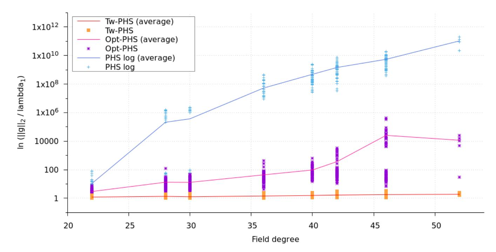

Fig. 5.3 – Approximation factors reached by Tw-PHS, Opt-PHS and PHS for cyclotomic fields of conductors 23, 29, 31, 37, 41, 43, 47 and 53 (in log scale).

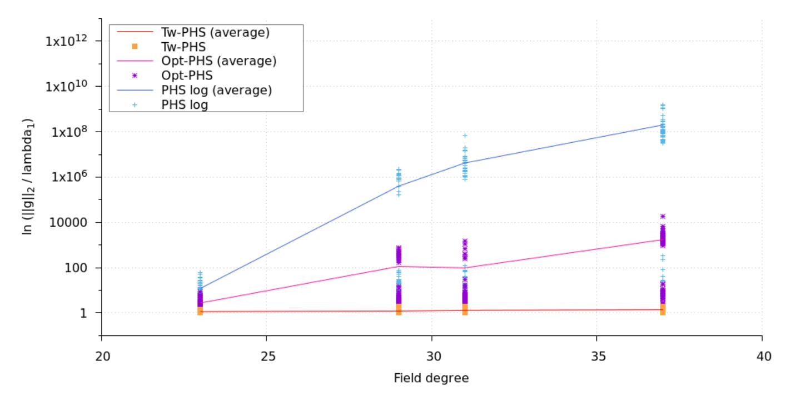

Fig. 5.4 – Approximation factors reached by Tw-PHS, Opt-PHS and PHS for NTRU Prime fields of degrees 23, 29, 31 and 37 (in log scale).

This is expected, since the log norm of the prime ideals constrain the valuation of the output, as in the proof of Pr. [4.5.](#page-30-4) On the contrary, increasing the factor base for the PHS and Opt-PHS variants clearly sabotages the quality of their output, as their lattice description is blind to these prime norms.

Acknowledgements. We thank Thomas Ricosset for valuable discussions on the geometry of lattices. Part of this work was performed while the first author was visiting Alice Pellet-Mary and Damien Stehl´e at LIP, ENS Lyon for six weeks. This work is supported by the European Union PROMETHEUS project (Horizon 2020 Research and Innovation Program, grant 780701).

{40}------------------------------------------------

# References

- Bac90. E. ´ Bach: Explicit bounds for primality testing and related problems. Math. Comp., 55(191):355–380, 1990.
- BCLV17. D. J. Bernstein, C. Chuengsatiansup, T. Lange and C. van Vredendaal: NTRU Prime: Reducing Attack Surface at Low Cost. In SAC, vol. 10719 of LNCS, pp. 235–260. Springer, 2017.
- BCP97. W. Bosma, J. Cannon and C. Playoust: The Magma algebra system. I. The user language. J. Symbolic Comput., 24(3-4):235–265, 1997. Computational algebra and number theory (London, 1993).
- BDF08. K. Belabas, F. Diaz y Diaz and E. Friedman: Small generators of the ideal class group. Math. Comput., 77(262):1185–1197, 2008.
- BDPW20. K. d. Boer, L. Ducas, A. Pellet-Mary and B. Wesolowski: Random Self-reducibility of Ideal-SVP via Arakelov Random Walks. Cryptology ePrint Archive, Report 2020/297, 2020.
- BEF+17. J. Biasse, T. Espitau, P. Fouque, A. Gelin ´ and P. Kirchner: Computing Generator in Cyclotomic Integer Rings. In EUROCRYPT (1), vol. 10210 of LNCS, pp. 60–88. Springer, 2017.
- BF14. J. Biasse and C. Fieker: Subexponential class group and unit group computation in large degree number fields. LMS J. Comp. Math., 17(A):385– 403, 2014.
- BF15. K. Belabas and E. Friedman: Computing the residue of the Dedekind zeta function. Math. Comp., 84:357–369, 2015.
- BMT15. D. W. Boyd, G. Martin and M. Thom: Squarefree values of trinomial discriminants. LMS J. Comput. Math., 18(1):148–169, 2015.
- BS16. J.-F. Biasse and F. Song: Efficient quantum algorithms for computing class groups and solving the principal ideal problem in arbitrary degree number fields. In SODA, pp. 893–902. SIAM, 2016.
- CDPR16. R. Cramer, L. Ducas, C. Peikert and O. Regev: Recovering Short Generators of Principal Ideals in Cyclotomic Rings. In EUROCRYPT (2), vol. 9666 of LNCS, pp. 559–585. Springer, 2016.
- CDW17. R. Cramer, L. Ducas and B. Wesolowski: Short Stickelberger Class Relations and Application to Ideal-SVP. In EUROCRYPT (1), vol. 10210 of LNCS, pp. 324–348. Springer, 2017.
- CGS14. P. Campbell, M. Groves and D. Shepherd: Soliloquy: A cau-tionary tale,, 2014. [http://docbox.etsi.org/Workshop/2014/201410\\_CRYPTO/](http://docbox.etsi.org/Workshop/2014/201410_CRYPTO/S07_Systems_and_Attacks/S07_Groves_Annex.pdf.) [S07\\_Systems\\_and\\_Attacks/S07\\_Groves\\_Annex.pdf.](http://docbox.etsi.org/Workshop/2014/201410_CRYPTO/S07_Systems_and_Attacks/S07_Groves_Annex.pdf.)
- Che13. Y. Chen: R´eduction de r´eseau et s´ecurit´e concr`ete du chiffrement compl`etement homomorphe. Ph.D. thesis, Paris 7, 2013.
- CN11. Y. Chen and P. Q. Nguyen: BKZ 2.0: Better Lattice Security Estimates. In ASIACRYPT, vol. 7073 of LNCS, pp. 1–20. Springer, 2011.
- Coh93. H. Cohen: A course in computational algebraic number theory, vol. 138 of Graduate texts in mathematics. Springer, 1993.
- Con. K. Conrad: Ostrowski for number fields. In Expository papers on Algebraic Number Theory. [https://kconrad.math.uconn.edu/blurbs/gradnumthy/](https://kconrad.math.uconn.edu/blurbs/gradnumthy/ostrowskinumbfield.pdf) [ostrowskinumbfield.pdf](https://kconrad.math.uconn.edu/blurbs/gradnumthy/ostrowskinumbfield.pdf).
- DPW19. L. Ducas, M. Planc¸on and B. Wesolowski: On the Shortness of Vectors to Be Found by the Ideal-SVP Quantum Algorithm. In CRYPTO (1), vol. 11692 of LNCS, pp. 322–351. Springer, 2019.

{41}------------------------------------------------

- EHKS14. K. Eisentrager ¨ , S. Hallgren, A. Y. Kitaev and F. Song: A quantum algorithm for computing the unit group of an arbitrary degree number field. In STOC, pp. 293–302. ACM, 2014.
- FpL16. FpLLL development team: fplll, a lattice reduction library, 2016. Available at <https://github.com/fplll/fplll>.
- Gal12. S. D. Galbraith: Mathematics of Public Key Cryptography. Cambridge University Press, 2012.
- G´el17. A. Gelin ´ : Calcul de groupes de classes d'un corps de nombres et applications `a la cryptologie. Ph.D. thesis, UPMC Paris 6, 2017.
- GM16. L. Grenie´ and G. Molteni: Explicit versions of the prime ideal theorem for Dedekind zeta functions under GRH. Math. Comput., 85(298):889–906, 2016.
- GN08. N. Gama and P. Q. Nguyen: Predicting Lattice Reduction. In EURO-CRYPT, vol. 4965 of LNCS, pp. 31–51. Springer, 2008.
- HPS98. J. Hoffstein, J. Pipher and J. H. Silverman: NTRU: A Ring-Based Public Key Cryptosystem. In ANTS, vol. 1423 of Lecture Notes in Computer Science, pp. 267–288. Springer, 1998.
- Kom75. K. Komatsu: Integral bases in algebraic number fields. Journal f¨ur die reine und angewandte Mathematik, 1975(278-279):137–144, 1975.
- Laa16. T. Laarhoven: Sieving for Closest Lattice Vectors (with Preprocessing). In SAC, vol. 10532 of LNCS, pp. 523–542. Springer, 2016.
- Lan03. E. Landau: Neuer Beweis des Primzahlsatzes und Beweis des Primidealsatzes. Math. Ann., 56:645–670, 1903.
- LLL82. A. K. Lenstra, H. W. Lenstra and L. Lovasz ´ : Factoring Polynomials with Rational Coefficients. Math. Ann., 261:515–534, 1982.
- Lou00. S. Louboutin: Explicit Bounds for Residues of Dedekind Zeta Functions, Values of L-Functions at s = 1, and Relative Class Numbers. J. Number Theory, 85(2):263–282, 2000.
- LPR10. V. Lyubashevsky, C. Peikert and O. Regev: On Ideal Lattices and Learning with Errors over Rings. In EUROCRYPT, vol. 6110 of LNCS, pp. 1–23. Springer, 2010.
- LS15. A. Langlois and D. Stehle´: Worst-case to average-case reductions for module lattices. Des. Codes Cryptogr., 75(3):565–599, 2015.
- MG02. D. Micciancio and S. Goldwasser: Complexity of Lattice Problems, vol. 671 of The Kluwer International Series in Engineering and Computer Science. Springer, 2002.
- Nar04. W. Narkiewicz: Elementary and Analytic Theory of Algebraic Numbers. Springer Monographs in Mathematics. Springer, 3rd ed., 2004.
- Neu99. J. Neukirch: Algebraic Number Theory, vol. 322 of Grundlehren des mathematischen Wissenschaften. Springer, 1999.
- NS06. P. Q. Nguyen and D. Stehle´: LLL on the Average. In ANTS, vol. 4076 of LNCS, pp. 238–256. Springer, 2006.
- NV10. P. Q. Nguyen and B. Vallee´ , eds.: The LLL Algorithm. Information Security and Cryptography. Springer, 2010.
- Pei16. C. Peikert: A Decade of Lattice Cryptography. Foundations and Trends in Theoretical Computer Science, 10(4):283–424, 2016.
- PHS19a. A. Pellet-Mary, G. Hanrot and D. Stehle´: Approx-SVP in Ideal Lattices with Pre-processing. In EUROCRYPT (2), vol. 11477 of LNCS, pp. 685–716. Springer, 2019.

{42}------------------------------------------------

PHS19b. A. Pellet-Mary, G. Hanrot and D. Stehle´: Published code of "Approx-SVP in Ideal Lattices with Pre-processing", 2019. [https://apelletm.](https://apelletm.github.io/code/code-approx-ideal-svp.zip/) [github.io/code/code-approx-ideal-svp.zip/](https://apelletm.github.io/code/code-approx-ideal-svp.zip/).

PRS17. C. Peikert, O. Regev and N. Stephens-Davidowitz: Pseudorandomness of ring-LWE for any ring and modulus. In STOC, pp. 461–473. ACM, 2017.

Reg05. O. Regev: On lattices, learning with errors, random linear codes, and cryptography. In STOC, pp. 84–93. ACM, 2005.

Sag20. Sage Developers: SageMath, the Sage Mathematics Software System (Version 9.0), 2020. Available at <https://www.sagemath.org>.

Sch87. C. Schnorr: A Hierarchy of Polynomial Time Lattice Basis Reduction Algorithms. Theor. Comput. Sci., 53:201–224, 1987.

SSTX09. D. Stehle´, R. Steinfeld, K. Tanaka and K. Xagawa: Efficient Public Key Encryption Based on Ideal Lattices. In ASIACRYPT, vol. 5912 of LNCS, pp. 617–635. Springer, 2009.

Swa62. R. G. Swan: Factorization of polynomials over finite fields. Pacific J. Math., 12(3):1099–1106, 1962.

Was97. L. C. Washington: Introduction to Cyclotomic Fields, vol. 83 of Graduate Texts in Mathematics. Springer, 2nd ed., 1997.

Xu13. P. Xu: Experimental quality evaluation of lattice basis reduction methods for decorrelating low-dimensional integer least squares problems. EURASIP J. Adv. Signal Process., 2013:137–165, 2013.

# A Transition matrix

We provide the following linear algebra lemma, whose result reveals particularly useful for the volume computations of non-square matrices of this paper, e.g. of ΛK or ΛeK,FB.

Lemma A.1. Let n ≥ 1 and a1, . . . , an ∈ R ∗ . Then, with 1n×n being the square matrix of dimension n filled with 1's, and Da1,...,an the diagonal matrix with coefficients ai:

$$\det(\mathbf{1}_{n\times n} + \mathcal{D}_{a_1,\dots,a_n}) = \left(1 + \sum_{i=1}^n \frac{1}{a_i}\right) \cdot \prod_{k=1}^n a_k.$$

Note that the result is also valid if any of the ai 's is zero by expanding the formula and using the formal simplification ai/ai = 1. Writing it down in this form would only be much more noisy.

Proof. We prove the result for any a1, . . . , an ∈ R by induction using the minor expansion formula on the last column for the determinant. Let M[a1, . . . , an] def := 1n×n + Da1,...,an , and let δj,n be its (j, n)-minor. The result is obviously true for n = 1 using det M[a1] = 1 + a1 = a1(1 + 1/a1), the last equality being valid for a1 6= 0.

Suppose the result true for matrices of dimension (n − 1). The minors δj,n, for j ∈ J1, n − 1K are determinants of matrices M[a1, . . . , aj−1, aj+1, . . . , an−1, 0] 

{43}------------------------------------------------

whose columns are permuted by a permutation of sign  $(-1)^{n-j+1}$ . Using the induction hypothesis (with  $\prod_{\emptyset} = 1$  for n = 2):

$$\forall j \in [1, n-1], \qquad \delta_{j,n} = (-1)^{n-j+1} \prod_{\substack{1 \le k \le n-1 \\ k \ne j}} a_k.$$

Meanwhile, the last minor  $\delta_{n,n}$  is det  $M[a_1,\ldots,a_{n-1}]$ , which we expand to avoid divisions by 0:

$$\delta_{n,n} = \prod_{1 \le k \le n-1} a_k + \sum_{j=1}^{n-1} \prod_{\substack{1 \le k \le n-1 \\ k \ne j}} a_k.$$

Finally, the determinant of  $M[a_1, \ldots, a_n]$  is  $((1+a_n)\delta_{n,n} + \sum_{j=1}^{n-1} (-1)^{n-j}\delta_{j,n})$ . A bit of calculation yields the following equation, which is the developed form of the lemma's formula:

$$\det M[a_1, \dots, a_n] = \prod_{1 \le k \le n} a_k + \sum_{1 \le i \le n} \prod_{\substack{1 \le k \le n \\ k \ne i}} a_k.$$

# B Extensive experimental data

This section provides extensive additional data for all targeted fields.

### **B.1** Geometric characteristics

First, Tab. B.1 and B.2 extend the example given in Tab. 5.2 to respectively all targeted cyclotomic and NTRU Prime fields.

|                          |                           | 7  | $d V^{1/d}$ | $\delta$ | 0     | Č     | 5     | $\theta_{n}$ | nin | $\theta_{a}$ | ıvg |         |                | $\ \cdot\ _{\infty}$ | $ \cdot  _2$ |
|--------------------------|---------------------------|----|-------------|----------|-------|-------|-------|--------------|-----|--------------|-----|---------|----------------|----------------------|--------------|
|                          |                           | a  | V -/        | raw      | bkz   | raw   | bkz   | raw          | bkz | raw          | bkz | $\mu_2$ | $\mu_{\infty}$ | real                 | H. 4.9       |
|                          | $L_{\sf tw}$              | 32 | 3.796       | 0.999    | 0.999 | 1.667 | 1.437 | 31           | 50  | 69           | 77  | 7.637   | 4.349          | 0.636                | 0.570        |
|                          | $L_{opt}^{(0)}$           | 32 | 1.515       | 1.030    | 1.009 | 2.477 | 1.615 | 40           | 60  | 76           | 81  | 3.120   | 1.706          | 0.676                | 0.612        |
| $\mathbb{Q}(\zeta_{23})$ | $L_{phs}^{(0)}$           | 32 | 2.083       | 1.056    | 0.998 | 4.689 | 1.490 | 34           | 60  | 75           | 81  | 4.287   | 2.621          | 0.690                | 0.612        |
|                          | $L_{opt}$                 | 44 | 1.334       | 1.023    | 1.009 | 2.711 | 1.843 | 37           | 58  | 76           | 82  | 3.244   | 1.451          | 0.640                | 0.570        |
|                          | $L_{phs}$                 | 65 | 1.246       | 1.021    | 1.002 | 3.141 | 2.067 | 21           | 58  | 76           | 82  | 3.703   | 1.588          | 0.640                | 0.517        |
|                          | $L_{\sf tw}$              | 41 | 4.175       | 1.001    | 1.001 | 1.622 | 1.579 | 47           | 50  | 77           | 81  | 9.594   | 4.214          | 0.633                | 0.537        |
|                          | $L_{opt}^{(0)}$           | 41 | 1.616       | 1.025    | 1.005 | 2.742 | 1.870 | 40           | 41  | 78           | 82  | 3.772   | 1.925          | 0.660                | 0.580        |
| $\mathbb{Q}(\zeta_{29})$ | $L_{phs}^{(0)}$           | 41 | 2.333       | 1.047    | 0.996 | 5.885 | 1.664 | 34           | 48  | 77           | 83  | 5.850   | 3.175          | 0.675                | 0.580        |
|                          |                           |    | 1.350       |          |       |       |       |              |     |              |     |         |                |                      |              |
|                          | $L_{phs}$                 | 90 | 1.271       | 1.017    | 1.005 | 4.211 | 2.560 | 36           | 30  | 77           | 82  | 4.547   | 2.123          | 0.664                | 0.474        |
|                          | $L_{\sf tw}$              | 20 | 4.144       | 1.004    | 1.004 | 1.682 | 1.330 | 16           | 48  | 77           | 79  | 6.877   | 4.026          | 0.753                | 0.597        |
|                          | $L_{opt}^{(0)}$           | 20 | 10.36       | 1.051    | 0.930 | 3.029 | 1.269 | 41           | 58  | 76           | 82  | 26.93   | 18.10          | 0.808                | 0.669        |
| $\mathbb{Q}(\zeta_{31})$ | $L_{\sf phs}^{(\dot{0})}$ | 20 | 21.14       | 1.071    | 0.897 | 4.168 | 1.186 | 30           | 62  | 76           | 84  | 70.21   | 49.41          | 0.825                | 0.669        |
|                          |                           |    | 1.353       |          |       |       |       |              |     |              |     |         |                |                      |              |
|                          | $L_{phs}$                 | 99 | 1.273       | 1.016    | 1.005 | 5.606 | 2.650 | 23           | 30  | 70           | 83  | 4.699   | 2.341          | 0.660                | 0.461        |

{44}------------------------------------------------

|                    |   | V 1/d | δ0  |     | δ                                         |     | θmin |                 | θavg |  |    |    | k·k∞/k·k2                  |
|--------------------|---|-------|-----|-----|-------------------------------------------|-----|------|-----------------|------|--|----|----|----------------------------|
|                    | d |       | raw | bkz | raw                                       | bkz |      | raw bkz raw bkz |      |  | µ2 | µ∞ | real H. 4.9                |
| Ltw                |   |       |     |     | 53 5.092 0.999 0.999 6.393 1.688          |     | 3    | 48              | 53   |  |    |    | 82 13.16 5.894 0.651 0.504 |
| (0) L           |   |       |     |     | opt 53 1.694 1.020 1.007 6.969 1.977      |     | 8    | 55              | 61   |  |    |    | 82 4.481 2.079 0.635 0.545 |
| Q(ζ37) (0) L |   |       |     |     | phs 53 2.621 1.040 0.998 9.801 1.767 28   |     |      | 55              | 74   |  |    |    | 83 7.578 3.901 0.641 0.545 |
|                    |   |       |     |     | Lopt 89 1.369 1.015 1.004 9.976 2.371     |     | 8    | 41              | 52   |  |    |    | 83 4.735 1.870 0.592 0.475 |
|                    |   |       |     |     | Lphs 126 1.292 1.013 1.005 11.80 3.082 10 |     |      | 37              | 53   |  |    |    | 83 5.938 2.567 0.682 0.430 |
| Ltw                |   |       |     |     | 59 4.825 1.001 1.001 3.596 1.802 11       |     |      | 47              | 69   |  |    |    | 81 12.91 5.186 0.615 0.489 |
| (0) L           |   |       |     |     | opt 59 1.786 1.020 1.005 4.525 1.986 34   |     |      | 55              | 76   |  |    |    | 83 5.112 2.245 0.629 0.530 |
| Q(ζ41) (0) L |   |       |     |     | phs 59 2.767 1.037 0.997 8.986 1.809 45   |     |      | 55              | 79   |  |    |    | 84 8.535 4.039 0.639 0.530 |
|                    |   |       |     |     | Lopt 103 1.379 1.013 1.006 6.514 2.592 25 |     |      | 48              | 66   |  |    |    | 84 5.301 2.052 0.596 0.456 |
|                    |   |       |     |     | Lphs 144 1.306 1.012 1.004 7.982 3.651 29 |     |      | 49              | 71   |  |    |    | 83 6.536 2.772 0.687 0.414 |
| Ltw                |   |       |     |     | 62 5.413 1.000 1.000 19.05 1.800          |     | 0    | 48              | 50   |  |    |    | 82 15.12 6.541 0.647 0.483 |
| (0) L           |   |       |     |     | opt 62 1.773 1.018 1.005 19.51 2.019      |     | 2    | 60              | 53   |  |    |    | 83 5.165 2.246 0.622 0.524 |
| Q(ζ43) (0) L |   |       |     |     | phs 62 2.826 1.035 0.997 21.51 1.806      |     | 7    | 55              | 62   |  |    |    | 84 9.056 4.253 0.641 0.524 |
|                    |   |       |     |     | Lopt 111 1.377 1.012 1.005 38.17 2.678    |     | 2    | 48              | 36   |  |    |    | 84 5.320 2.358 0.594 0.447 |
|                    |   |       |     |     | Lphs 154 1.307 1.012 1.007 48.72 3.997    |     | 2    | 56              | 32   |  |    |    | 82 6.968 2.796 0.709 0.405 |
| Ltw                |   |       |     |     | 68 5.896 0.999 0.999 38.31 1.736          |     | 0    | 47              | 50   |  |    |    | 83 17.09 7.888 0.664 0.471 |
| (0) L           |   |       |     |     | opt 68 1.819 1.017 1.007 39.31 2.171      |     | 1    | 60              | 52   |  |    |    | 83 5.525 2.597 0.618 0.511 |
| Q(ζ47) (0) L |   |       |     |     | phs 68 2.952 1.033 0.999 41.95 1.940      |     | 3    | 60              | 57   |  |    |    | 84 10.09 4.343 0.645 0.511 |
|                    |   |       |     |     | Lopt 125 1.385 1.011 1.005 89.69 2.961    |     | 0    | 32              | 34   |  |    |    | 84 5.817 2.006 0.614 0.431 |
|                    |   |       |     |     | Lphs 173 1.316 1.011 1.004 137.8 4.360    |     | 1    | 55              | 26   |  |    |    | 83 7.570 2.862 0.713 0.391 |
| Ltw                |   |       |     |     | 77 5.385 1.002 1.002 149.6 1.891          |     | 0    | 47              | 49   |  |    |    | 83 15.71 6.309 0.617 0.455 |
| (0) L           |   |       |     |     | opt 77 1.928 1.016 1.005 152.0 2.315      |     | 0    | 60              | 49   |  |    |    | 83 6.381 2.382 0.611 0.495 |
| Q(ζ53) (0) L |   |       |     |     | phs 77 3.145 1.030 0.998 154.6 2.053      |     | 0    | 47              | 51   |  |    |    | 84 11.88 5.677 0.635 0.495 |
|                    |   |       |     |     | Lopt 147 1.397 1.010 1.005 526.7 3.265    |     | 0    | 43              | 28   |  |    |    | 84 6.613 2.024 0.609 0.411 |
|                    |   |       |     |     | Lphs 202 1.330 1.010 1.006 763.2 5.214    |     | 0    | 56              | 22   |  |    |    | 83 8.930 3.166 0.708 0.373 |
|                    |   |       |     |     | Ltw 144 6.871 0.999 0.999 813.3 2.045     |     | 0    | 46              | 33   |  |    |    | 85 28.12 7.960 0.570 0.391 |
| (0) L           |   |       |     |     | opt 144 1.490 1.010 1.004 821.0 3.301     |     | 0    | 37              | 34   |  |    |    | 84 7.091 2.378 0.602 0.414 |
| Q(ζ59) (0) L |   |       |     |     | phs 144 1.785 1.016 1.003 831.9 3.064     |     | 0    | 48              | 34   |  |    |    | 85 9.122 2.849 0.575 0.414 |
|                    |   |       |     |     | Lopt 169 1.404 1.009 1.004 1181. 3.637    |     | 0    | 41              | 28   |  |    |    | 84 7.213 2.427 0.620 0.394 |
|                    |   |       |     |     | Lphs 232 1.338 1.009 1.006 1753. 6.011    |     | 0    | 55              | 21   |  |    |    | 83 10.30 3.598 0.723 0.357 |
| Ltw                |   |       |     |     | 89 6.550 1.000 1.000 868.4 1.763          |     | 0    | 46              | 49   |  |    |    | 84 21.69 7.293 0.614 0.437 |
| (0) L           |   |       |     |     | opt 89 1.971 1.014 1.005 881.5 2.425      |     | 0    | 57              | 49   |  |    |    | 84 7.081 2.807 0.610 0.475 |
| Q(ζ61) (0) L |   |       |     |     | phs 89 3.365 1.027 0.999 895.4 2.192      |     | 0    | 57              | 50   |  |    |    | 84 14.36 6.576 0.637 0.475 |
|                    |   |       |     |     | Lopt 177 1.407 1.009 1.004 4765. 3.766    |     | 0    | 36              | 28   |  |    |    | 84 7.639 2.451 0.632 0.389 |
|                    |   |       |     |     | Lphs 242 1.342 1.008 1.006 7948. 6.408    |     | 0    | 49              | 21   |  |    |    | 83 10.74 4.002 0.732 0.352 |

Table B.1 – Geometric characteristics of log-S-unit lattices for all non-principal cyclotomic fields Q(ζm) of prime conductor m ≤ 61.

{45}------------------------------------------------

|        |          | d | V 1/d | δ0  |     | δ                                         |     | θmin |    | θavg            |  |    |    | k·k∞/k·k2 |                            |
|--------|----------|---|-------|-----|-----|-------------------------------------------|-----|------|----|-----------------|--|----|----|-----------|----------------------------|
|        |          |   |       | raw | bkz | raw                                       | bkz |      |    | raw bkz raw bkz |  | µ2 | µ∞ |           | real H. 4.9                |
| Q(z23) | Ltw      |   |       |     |     | 15 2.728 0.831 0.831 1.314 1.161 51       |     |      | 58 | 81              |  |    |    |           | 82 4.686 3.245 0.701 0.634 |
|        | (0) L |   |       |     |     | opt 15 14.70 0.879 0.879 2.923 1.241 45   |     |      | 49 | 80              |  |    |    |           | 80 25.14 18.09 0.766 0.699 |
|        | (0) L |   |       |     |     | phs 15 19.18 0.888 0.888 3.470 1.252 47   |     |      | 66 | 78              |  |    |    |           | 81 32.44 22.05 0.773 0.699 |
|        |          |   |       |     |     | Lopt 48 1.298 0.958 0.958 2.949 1.966 32  |     |      | 57 | 76              |  |    |    |           | 81 3.480 1.702 0.657 0.558 |
|        |          |   |       |     |     | Lphs 72 1.220 0.976 0.976 3.780 2.229 28  |     |      | 54 | 75              |  |    |    |           | 82 3.991 1.709 0.656 0.504 |
| Q(z29) | Ltw      |   |       |     |     | 21 3.333 0.863 0.863 1.357 1.219 55       |     |      | 60 | 81              |  |    |    |           | 83 6.592 3.923 0.679 0.597 |
|        | (0) L |   |       |     |     | opt 21 9.010 0.904 0.904 3.315 1.377 47   |     |      | 58 | 79              |  |    |    |           | 80 16.87 9.879 0.730 0.664 |
|        | (0) L |   |       |     |     | phs 21 14.68 0.917 0.917 4.538 1.428 47   |     |      | 55 | 79              |  |    |    |           | 80 27.83 18.60 0.735 0.664 |
|        |          |   |       |     |     | Lopt 66 1.329 0.967 0.967 3.733 2.336 38  |     |      | 56 | 77              |  |    |    |           | 82 4.184 1.972 0.665 0.515 |
|        |          |   |       |     |     | Lphs 97 1.252 0.981 0.981 5.385 2.745 27  |     |      | 55 | 76              |  |    |    |           | 82 4.794 2.098 0.678 0.464 |
| Q(z31) | Ltw      |   |       |     |     | 21 3.487 0.860 0.860 1.339 1.193 55       |     |      | 59 | 82              |  |    |    |           | 82 6.811 4.599 0.675 0.593 |
|        | (0) L |   |       |     |     | opt 21 13.52 0.898 0.898 3.113 1.456 43   |     |      | 57 | 81              |  |    |    |           | 79 26.65 16.66 0.728 0.664 |
|        | (0) L |   |       |     |     | phs 21 22.25 0.909 0.909 4.039 1.463 43   |     |      | 57 | 80              |  |    |    |           | 80 42.47 25.75 0.738 0.664 |
|        |          |   |       |     |     | Lopt 73 1.333 0.970 0.970 3.906 2.423 34  |     |      | 57 | 78              |  |    |    |           | 82 4.526 2.064 0.656 0.502 |
|        |          |   |       |     |     | Lphs 106 1.258 0.982 0.982 5.677 2.920 30 |     |      | 53 | 77              |  |    |    |           | 82 5.179 2.195 0.681 0.452 |
| Q(z37) | Ltw      |   |       |     |     | 30 4.069 0.893 0.893 1.405 1.313 58       |     |      | 60 | 82              |  |    |    |           | 83 9.299 5.202 0.653 0.556 |
|        | (0) L |   |       |     |     | opt 30 6.056 0.925 0.925 3.773 1.703 42   |     |      | 56 | 81              |  |    |    |           | 80 14.23 7.068 0.687 0.621 |
|        | (0) L |   |       |     |     | phs 30 11.46 0.940 0.940 6.147 1.692 41   |     |      | 53 | 80              |  |    |    |           | 80 24.99 15.60 0.688 0.621 |
|        |          |   |       |     |     | Lopt 93 1.348 0.975 0.975 4.627 2.897 38  |     |      | 55 | 78              |  |    |    |           | 82 5.337 2.247 0.662 0.470 |
|        |          |   |       |     |     | Lphs 133 1.277 0.985 0.985 7.306 3.506 25 |     |      | 52 | 78              |  |    |    |           | 82 6.147 2.677 0.695 0.424 |
| Q(z41) | Ltw      |   |       |     |     | 32 4.406 0.896 0.896 1.474 1.268 53       |     |      | 62 | 82              |  |    |    |           | 84 9.595 5.355 0.645 0.545 |
|        | (0) L |   |       |     |     | opt 32 7.279 0.925 0.925 3.895 1.740 41   |     |      | 58 | 81              |  |    |    |           | 81 17.06 8.830 0.690 0.612 |
|        | (0) L |   |       |     |     | phs 32 14.89 0.939 0.939 6.352 1.709 41   |     |      | 54 | 81              |  |    |    |           | 80 33.76 19.22 0.684 0.612 |
|        |          |   |       |     |     | Lopt 108 1.355 0.978 0.978 5.385 3.073 35 |     |      | 58 | 79              |  |    |    |           | 83 5.740 2.448 0.686 0.450 |
|        |          |   |       |     |     | Lphs 152 1.288 0.987 0.987 8.442 3.834 29 |     |      | 55 | 79              |  |    |    |           | 83 6.751 2.768 0.712 0.407 |
| Q(z43) | Ltw      |   |       |     |     | 38 4.441 0.911 0.911 1.498 1.357 53       |     |      | 59 | 82              |  |    |    |           | 83 10.64 5.177 0.645 0.528 |
|        | (0) L |   |       |     |     | opt 38 5.051 0.937 0.937 4.187 1.865 44   |     |      | 50 | 81              |  |    |    |           | 81 12.50 6.573 0.663 0.590 |
|        | (0) L |   |       |     |     | phs 38 9.657 0.952 0.952 7.496 1.877 45   |     |      | 56 | 81              |  |    |    |           | 81 23.73 12.18 0.671 0.590 |
|        |          |   |       |     |     | Lopt 114 1.367 0.979 0.979 5.482 3.256 36 |     |      | 57 | 79              |  |    |    |           | 83 6.119 2.803 0.687 0.443 |
|        |          |   |       |     |     | Lphs 161 1.297 0.987 0.987 9.002 4.135 25 |     |      | 55 | 79              |  |    |    |           | 83 7.484 2.837 0.712 0.400 |
| Q(z47) | Ltw      |   |       |     |     | 40 4.576 0.913 0.913 1.650 1.358 49       |     |      | 60 | 82              |  |    |    |           | 84 11.04 5.607 0.632 0.519 |
|        | (0) L |   |       |     |     | opt 40 6.231 0.938 0.938 4.628 1.915 37   |     |      | 57 | 81              |  |    |    |           | 81 16.59 8.398 0.658 0.583 |
|        | (0) L |   |       |     |     | phs 40 12.06 0.951 0.951 7.908 1.946 38   |     |      | 55 | 81              |  |    |    |           | 81 30.85 15.50 0.662 0.583 |
|        |          |   |       |     |     | Lopt 129 1.376 0.981 0.981 6.189 3.632 21 |     |      | 56 | 80              |  |    |    |           | 83 6.575 2.925 0.696 0.427 |
|        |          |   |       |     |     | Lphs 180 1.309 0.989 0.989 10.15 4.527 31 |     |      | 53 | 80              |  |    |    |           | 83 8.022 2.882 0.704 0.387 |

Table B.2 – Geometric characteristics of log-S-unit lattices for all targeted NTRU Prime fields Q(zq), for prime q ∈ J23, 47K.

These extensive data confirm the discussion made in §[5.1.](#page-35-1) Note that these observations are especially valid for NTRU Prime fields. An explanation of this phenomenon might lie in the fact that for NTRU Prime fields, the norms of the 

{46}------------------------------------------------

factor base prime ideals are almost all distinct, so that the twisted characteristic of our lattices fully speak.

### B.2 Gram-Schmidt norms of the lattice bases.

We also provide the graphs showing the log norms of the Gram-Schmidt vectors for each field and each log-S-unit lattice variant. These graphs confirm the discussion in §[5.1,](#page-35-1) namely that in the twisted case, the BKZ reduction has very little impact and that the sequence of norms does not vary much. This corroborates the claim that our twisted lattices are much more orthogonal than expected.

In the case of PHS and its variants, there is always a significant gap between the Gram-Schmidt norms before and after the small block BKZ reduction, and the decrease of the log norms is very pronounced and going down to 0.

Prime conductor cyclotomic fields.

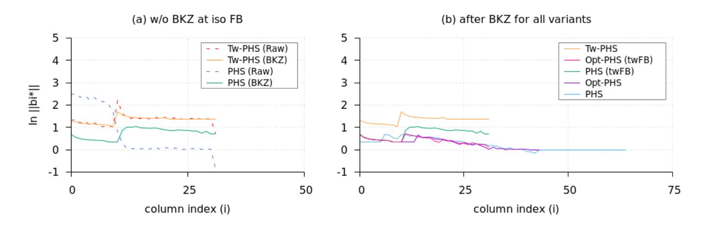

Fig. B.1 – Log-S-unit lattices for Q(ζ23), Gram-Schmidt log norms (a) before and after BKZ reduction at iso factor base Atw-FB(K) for Ltw and L (0) phs; (b) after BKZ reduction for all variants Ltw, L (0) opt, L (0) phs, Lopt and Lphs.

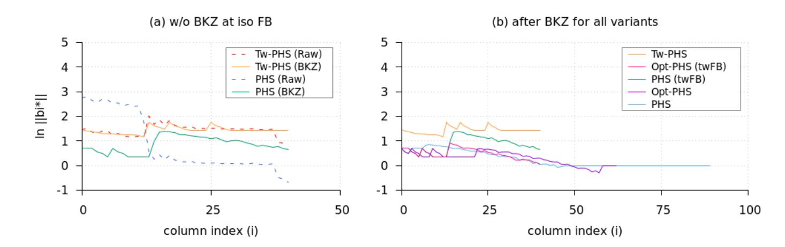

Fig. B.2 – Log-S-unit lattices for Q(ζ29), Gram-Schmidt log norms (a) before and after BKZ reduction at iso factor base Atw-FB(K) for Ltw and L (0) phs; (b) after BKZ reduction for all variants Ltw, L (0) opt, L (0) phs, Lopt and Lphs.

{47}------------------------------------------------

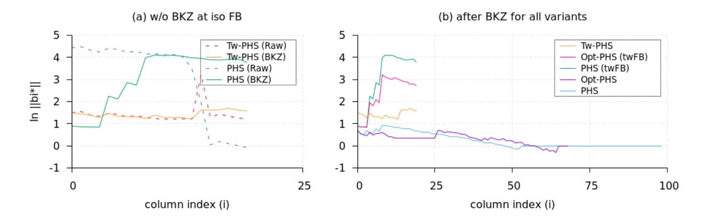

Fig. B.3 – Log-S-unit lattices for Q(ζ31), Gram-Schmidt log norms (a) before and after BKZ reduction at iso factor base Atw-FB(K) for Ltw and L (0) phs; (b) after BKZ reduction for all variants Ltw, L (0) opt, L (0) phs, Lopt and Lphs.

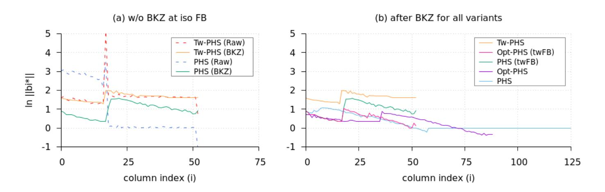

Fig. B.4 – Log-S-unit lattices for Q(ζ37), Gram-Schmidt log norms (a) before and after BKZ reduction at iso factor base Atw-FB(K) for Ltw and L (0) phs; (b) after BKZ reduction for all variants Ltw, L (0) opt, L (0) phs, Lopt and Lphs.

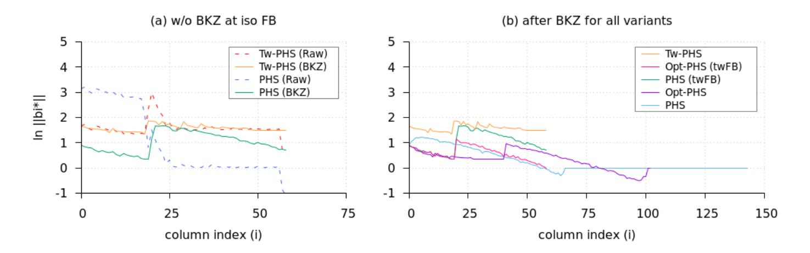

Fig. B.5 – Log-S-unit lattices for Q(ζ41), Gram-Schmidt log norms (a) before and after BKZ reduction at iso factor base Atw-FB(K) for Ltw and L (0) phs; (b) after BKZ reduction for all variants Ltw, L (0) opt, L (0) phs, Lopt and Lphs.

{48}------------------------------------------------

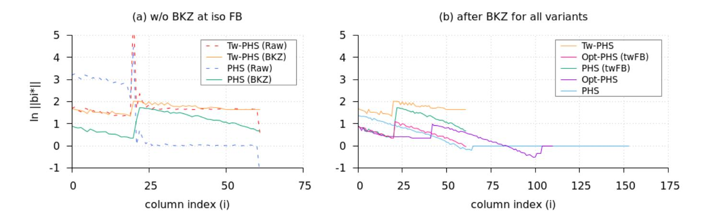

Fig. B.6 – Log-S-unit lattices for Q(ζ43), Gram-Schmidt log norms (a) before and after BKZ reduction at iso factor base Atw-FB(K) for Ltw and L (0) phs; (b) after BKZ reduction for all variants Ltw, L (0) opt, L (0) phs, Lopt and Lphs.

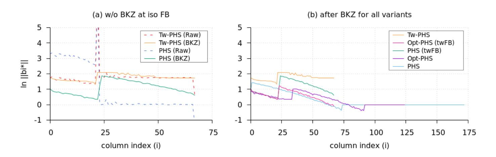

Fig. B.7 – Log-S-unit lattices for Q(ζ47), Gram-Schmidt log norms (a) before and after BKZ reduction at iso factor base Atw-FB(K) for Ltw and L (0) phs; (b) after BKZ reduction for all variants Ltw, L (0) opt, L (0) phs, Lopt and Lphs.

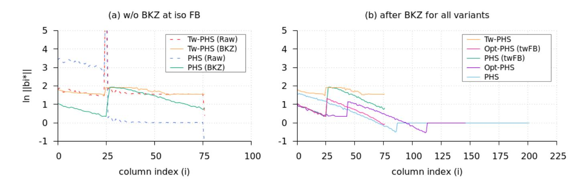

Fig. B.8 – Log-S-unit lattices for Q(ζ53), Gram-Schmidt log norms (a) before and after BKZ reduction at iso factor base Atw-FB(K) for Ltw and L (0) phs; (b) after BKZ reduction for all variants Ltw, L (0) opt, L (0) phs, Lopt and Lphs.

{49}------------------------------------------------

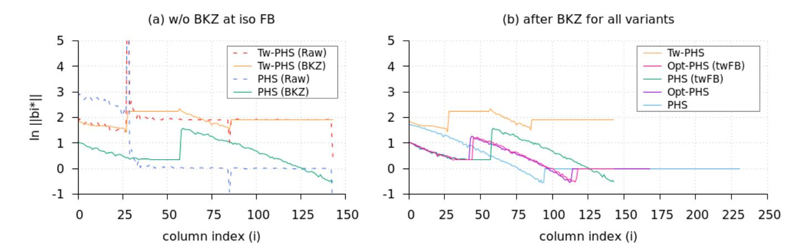

Fig. B.9 – Log-S-unit lattices for Q(ζ59), Gram-Schmidt log norms (a) before and after BKZ reduction at iso factor base Atw-FB(K) for Ltw and L (0) phs; (b) after BKZ reduction for all variants Ltw, L (0) opt, L (0) phs, Lopt and Lphs.

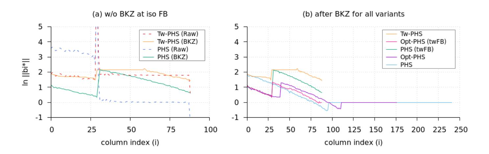

Fig. B.10 – Log-S-unit lattices for Q(ζ61), Gram-Schmidt log norms (a) before and after BKZ reduction at iso factor base Atw-FB(K) for Ltw and L (0) phs; (b) after BKZ reduction for all variants Ltw, L (0) opt, L (0) phs, Lopt and Lphs.

NTRU Prime fields.

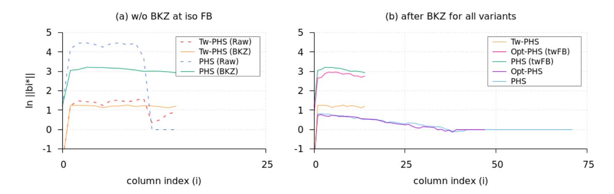

Fig. B.11 – Log-S-unit lattices for Q(z23), Gram-Schmidt log norms (a) before and after BKZ reduction at iso factor base Atw-FB(K) for Ltw and L (0) phs; (b) after BKZ reduction for all variants Ltw, L (0) opt, L (0) phs, Lopt and Lphs.

{50}------------------------------------------------

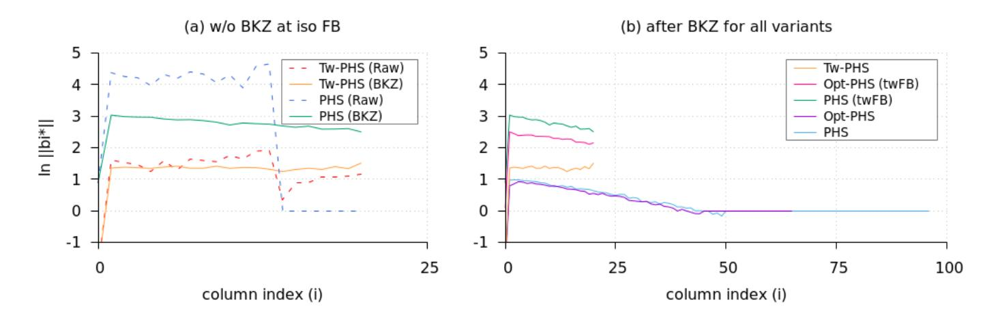

Fig. B.12 – Log-S-unit lattices for Q(z29), Gram-Schmidt log norms (a) before and after BKZ reduction at iso factor base Atw-FB(K) for Ltw and L (0) phs; (b) after BKZ reduction for all variants Ltw, L (0) opt, L (0) phs, Lopt and Lphs.

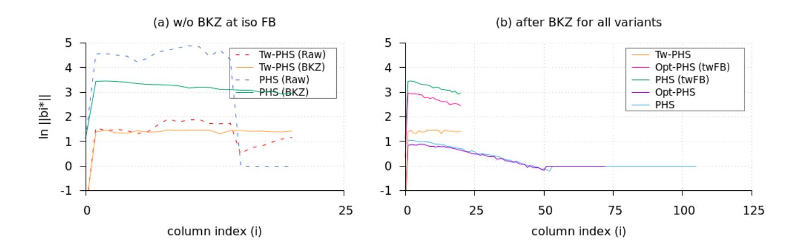

Fig. B.13 – Log-S-unit lattices for Q(z31), Gram-Schmidt log norms (a) before and after BKZ reduction at iso factor base Atw-FB(K) for Ltw and L (0) phs; (b) after BKZ reduction for all variants Ltw, L (0) opt, L (0) phs, Lopt and Lphs.

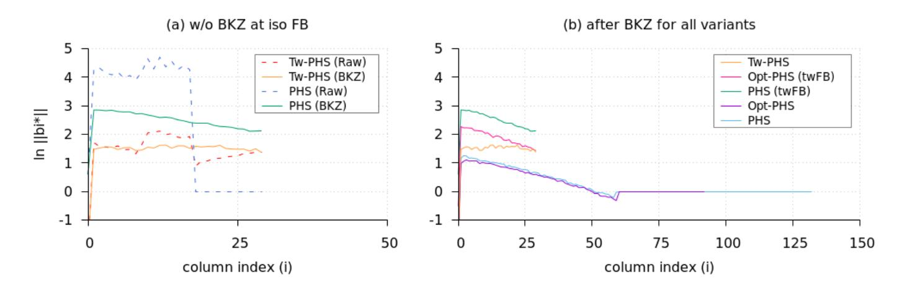

Fig. B.14 – Log-S-unit lattices for Q(z37), Gram-Schmidt log norms (a) before and after BKZ reduction at iso factor base Atw-FB(K) for Ltw and L (0) phs; (b) after BKZ reduction for all variants Ltw, L (0) opt, L (0) phs, Lopt and Lphs.

{51}------------------------------------------------

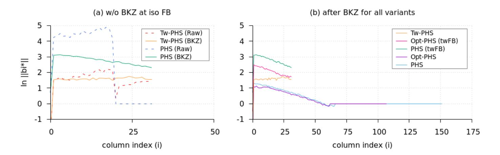

Fig. B.15 – Log-S-unit lattices for Q(z41), Gram-Schmidt log norms (a) before and after BKZ reduction at iso factor base Atw-FB(K) for Ltw and L (0) phs; (b) after BKZ reduction for all variants Ltw, L (0) opt, L (0) phs, Lopt and Lphs.

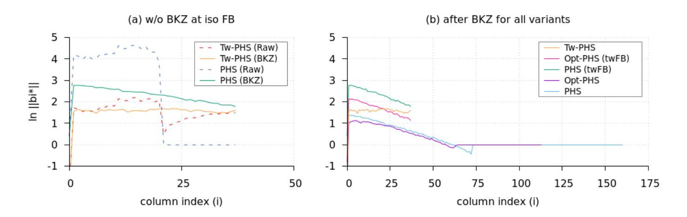

Fig. B.16 – Log-S-unit lattices for Q(z43), Gram-Schmidt log norms (a) before and after BKZ reduction at iso factor base Atw-FB(K) for Ltw and L (0) phs; (b) after BKZ reduction for all variants Ltw, L (0) opt, L (0) phs, Lopt and Lphs.

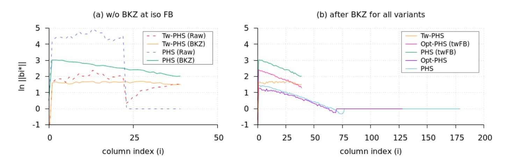

Fig. B.17 – Log-S-unit lattices for Q(z47), Gram-Schmidt log norms (a) before and after BKZ reduction at iso factor base Atw-FB(K) for Ltw and L (0) phs; (b) after BKZ reduction for all variants Ltw, L (0) opt, L (0) phs, Lopt and Lphs.