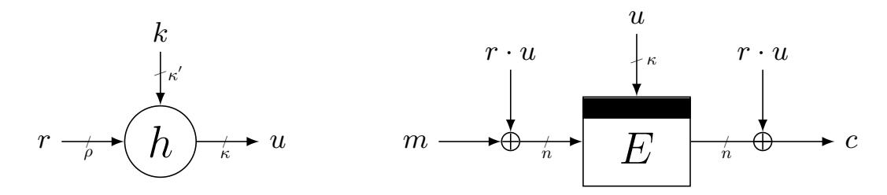
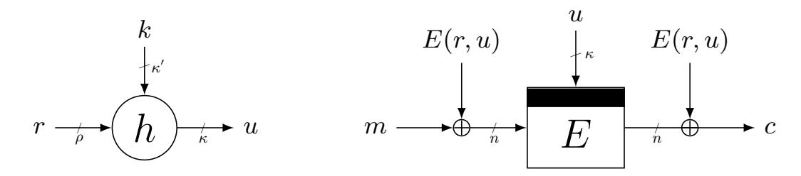
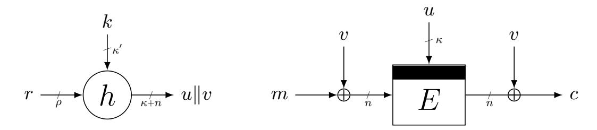
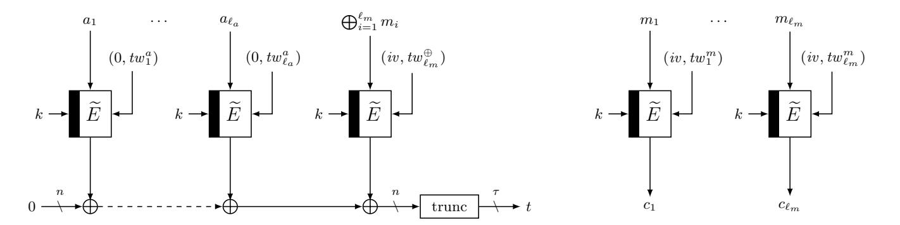
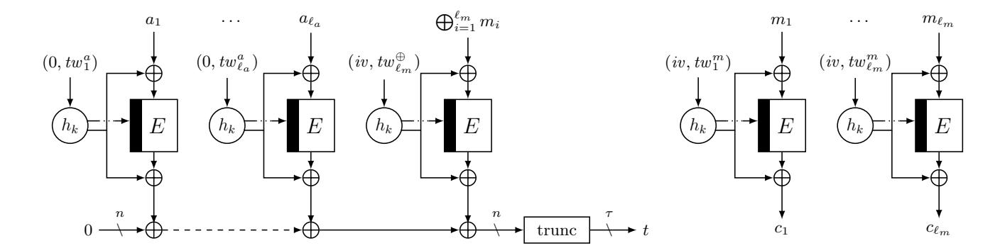

{0}------------------------------------------------

# Beyond Birthday Bound Secure Fresh Rekeying: Application to Authenticated Encryption?

### Bart Mennink

Digital Security Group, Radboud University, Nijmegen, The Netherlands b.mennink@cs.ru.nl

Abstract. Fresh rekeying is a well-established method to protect a primitive or mode against side-channel attacks: an easy to protect but cryptographically not so involved function generates a subkey from the master key, and this subkey is then used for the block encryption of a single or a few messages. It is an efficient way to achieve side-channel protection, but current solutions only achieve birthday bound security in the block size of the cipher and thus halve its security (except if more involved primitives are employed). We present generalized solutions to parallel block cipher rekeying that, for the first time, achieve security beyond the birthday bound in the block size n. The first solution involves, next to the subkey generation, one multiplication and the core block cipher call and achieves 22n/3 security. The second solution makes two block cipher calls, and achieves optimal 2n security. Our third solution uses a slightly larger subkey generation function but requires no adaptations to the core encryption and also achieves optimal security. The construction seamlessly generalizes to permutation based fresh rekeying. Central to our schemes is the observation that fresh rekeying and generic tweakable block cipher design are two very related topics, and we can take lessons from the advanced results in the latter to improve our understanding and development of the former. We subsequently use these rekeying schemes in a constructive manner to deliver three authenticated encryption modes that achieve beyond birthday bound security and are easy to protect against side-channel attacks.

Keywords: fresh rekeying, block cipher, generalization, beyond birthday bound, optimal

# 1 Introduction

The security of cryptographic constructions is typically analyzed in a black-box model. The analysis is based on the assumption that the adversary adheres to the conditions and limitations set by the security model, and that it only obtains information about the cryptographic function by model-wise permitted evaluations of that function. The emerging threat of side-channel attacks questions the credibility of this approach. Side-channel attackers obtain additional information

? This is the full version of the ASIACRYPT 2020 paper.

{1}------------------------------------------------

about a cryptographic function, typically via passive attacks such as timing attacks [\[70\]](#page-43-0), differential power analysis [\[72\]](#page-43-1), or electromagnetic radiation [\[74\]](#page-43-2). With black-box security of cryptographic schemes improving, side-channel security is often the weak spot. In particular, a cryptographic function could achieve very strong black-box security, but its security may be nullified if its implementation is in an unprotected environment.

Securing a cryptographic function against side-channel attacks is a serious challenge. One way of doing so is at the implementation level, namely through hiding [\[81\]](#page-44-0) or masking [\[33,](#page-40-0) [44,](#page-41-0) [60,](#page-42-0) [111\]](#page-46-0). However, these approaches are often design-specific and could be prohibitively expensive. An alternative approach is to change the mode at the protocol level, i.e., to develop the protocol in such a way that secret-key material is used scarcely and its usage is easier to protect.

One of the most basic and practically appealing expositions of this idea is fresh parallel rekeying. In this approach one does not use a block cipher in its naive fashion, but rather uses a subkey generation function on top of that. This subkey generation function has access to the master key (hence needs strong side-channel protection) but does not need to be a cryptographically strong primitive. The block cipher evaluation itself must of course be cryptographically strong, but only uses every subkey once or a few number of times, and does not need strong side-channel protection. In practical cases, the subkey generation needs to be protected against the stronger differential power analysis (DPA) whereas the core encryption only needs to be protected against simple power analysis (SPA) and related techniques [\[14,](#page-38-0) [122\]](#page-47-0). This concept is called a "leveled implementation" [\[103\]](#page-46-1). The first appearance of the idea of rekeying was by Abdalla and Bellare [\[2\]](#page-37-0), and it was independently introduced and proposed as side-channel countermeasure by Borst [\[28,](#page-40-1) Section 6.6.1]. The approach was recently reconsidered and popularized by Medwed et al. [\[84\]](#page-44-1): they suggest multiplication as subkey generation (but, see Section [1.3](#page-4-0) and Section [8\)](#page-26-0). In this way, the cryptographic strength and the side-channel resistance of the scheme are virtually disconnected into a light but strongly protected multiplication and a strong but lightly protected core encryption. Medwed et al. [\[83\]](#page-44-2) generalized it to a multi-party variant, but later, Dobraunig et al. [\[38\]](#page-40-2) demonstrated that Medwed et al.'s solutions allowed for birthday bound key recoveries in the block size of the cipher. Dobraunig et al. [\[40\]](#page-40-3) later resolved this by introducing two fresh rekeying solutions: one based on the subkey generation function and two block cipher calls that is still birthday bound secure (though optimally key recovery secure), and one based on a subkey generation function and a tweakable block cipher call that is optimally secure (in the ideal model). Patented ideas on the topic appeared in [\[50,](#page-41-1) [71\]](#page-43-3). We refer to Section [3](#page-6-0) for a detailed survey of the schemes and their relation.

One might argue that the idea to separate cryptographic building blocks into a part that must be DPA-protected and a part that must be SPA-protected has been overtaken by time. Most notably, single trace attacks have improved over the last decades, in particular with the soft-analytical side-channel attacks enhanced with belief propagation [\[52,](#page-42-1) [66,](#page-43-4) [121\]](#page-47-1). These attacks, however, focus 

{2}------------------------------------------------

on unprotected implementations of which the behavior was known prior to the attack (e.g., how the implementation responds to known inputs with known key). In practical applications, such as smart cards, this is usually not the case. More fundamentally, in [\[52,](#page-42-1) Section 6] it is already confirmed that for noisy implementations, multiple traces simply give more information to an attacker than a single trace, and likewise [\[66,](#page-43-4) Section 1] conclude that DPA attacks are more powerful in the context of noisy implementation. From this viewpoint, it is fair to conclude that in practical settings, multiple traces simply give more information to an attacker than a single trace. The separation of schemes into a DPA-protected part and an SPA-protected part is thus a very valuable approach towards efficient cryptography.

None of the solutions so far is particularly desirable: rekeying a plain block cipher halves its security (this applies to the schemes of Medwed et al. [\[83,](#page-44-2) [84\]](#page-44-1) and the first one of Dobraunig et al. [\[40\]](#page-40-3)), and beyond birthday bound security is only achieved using heavier machinery, namely a tweakable block cipher (this applies to the second one of Dobraunig et al. [\[40\]](#page-40-3)). Of course, dedicated tweakable block cipher designs such as SKINNY or MANTIS [\[16\]](#page-38-1) or QARMA [\[8\]](#page-38-2) exist, but this solution is unsatisfying for securing implementations of the plain AES or lightweight block ciphers like PRESENT [\[26\]](#page-39-0), CLEFIA [\[117\]](#page-47-2), Midori [\[10\]](#page-38-3), GIFT [\[11\]](#page-38-4), and others [\[15,](#page-38-5) [27,](#page-39-1) [55,](#page-42-2) [116\]](#page-47-3).

Strikingly, it turns out that the idea of fresh rekeying is very related to generic tweakable block cipher design [\[78\]](#page-44-3): not only in its appearance as underlying primitive in Dobraunig et al.'s second construction, but more importantly from a bigger picture (see also [\[54\]](#page-42-3)). Contrary to the field of rekeying, generic tweakable block cipher design has faced extensive research, in particular in the design and understanding of beyond birthday bound secure solutions. This direction was initiated by Landecker et al. [\[76\]](#page-43-5), and optimally secure solutions (in the ideal model) were given by Mennink [\[85\]](#page-44-4), Wang et al. [\[123\]](#page-47-4), and Jha et al. [\[65\]](#page-42-4). A detailed survey of the state of the art and the relations among these schemes is given in Section [4.](#page-9-0)

### 1.1 Beyond Birthday Bound Security Block Cipher Rekeying

We tackle the problem of developing beyond birthday bound secure yet efficient parallel rekeying solutions of block ciphers. First, one may suggest that an instantiation of Dobraunig et al.'s tweakable block cipher based construction with a beyond birthday bound secure tweakable block cipher immediately reaches our goal, but this is not true: the analysis of Dobraunig et al. is performed in the ideal tweakable cipher model and thus only holds under the assumption that the tweakable block cipher is perfectly random. No generic construction can be perfectly secure, and as we will demonstrate in Section [5.2,](#page-13-0) composition may already collapse at the birthday bound. Instead, a direct analysis is necessary. In addition, Dobraunig et al. built a rekeying scheme on top of a tweakable block cipher, but it appears that one can use (variants of) tweakable block ciphers as rekeying schemes. Although the difference is subtle, this gives an efficiency gain as we will see later on (in Section [9\)](#page-28-0).

{3}------------------------------------------------

Therefore, in Section [5,](#page-11-0) we investigate how to use beyond birthday bound secure tweakable block ciphers more efficiently in the context of rekeying. This is a delicate task: not all state of the art solutions are suitable. The first scheme is based on the simplest beyond birthday bound secure tweakable block cipher from Mennink [\[85\]](#page-44-4), along with some cosmetic simplifications that appear unnecessary in the composition. The scheme, called R1, consists of one subkey generation function, one multiplication, and one block cipher call. It is depicted in Figure [1,](#page-12-0) and achieves security up to complexity 22n/3 , where n is the block size of the cipher. The second solution is an instantiation of Dobraunig et al.'s scheme with an optimally secure tweakable block cipher from Wang et al. [\[123\]](#page-47-4), along with some necessary changes to avoid that security collapses at 2n/2 . The adjusted scheme, called R2, is depicted in Figure [2](#page-13-1) and achieves optimal 2n security.

Albeit the two solutions achieve beyond birthday bound security and are reasonably efficient, they may be unsatisfying in certain settings. This is in part as they use a block cipher whose key size and block size are the same, but also as they consist of a sequential evaluation of three operations (subkey generation, then multiplication/block cipher, then block cipher). For our third generalized solution, we depart from state of the art on rekeying, and note that the tweakable block cipher XHX from Jha et al. [\[65\]](#page-42-4) in itself is already well-suited for rekeying. Our third scheme R3 is a simplification and adaptation of XHX in such a way that it is easy to understand and analyze and at the same time general enough to be broadly applicable in a side-channel setting. The resulting scheme is introduced in Section [6](#page-14-0) and depicted in Figure [3.](#page-14-1) It uses a larger key than R1 and R2, but performs subkey generation more efficiently and flexibly, and consists of only two functions (subkey generation, then block cipher). In addition, key size reduction is possible. The scheme achieves optimal 2n security. The scheme easily generalizes to a permutation based variant, concretely a rekeying scheme for Even-Mansour [\[47\]](#page-41-2), in birthday bound security in the state size of the permutation, where we remark that the state of a permutation is typically much larger than the block size of a block cipher (see Section [6\)](#page-14-0).

We elaborate on instantiations of the schemes in Section [8,](#page-26-0) where we also discuss possible key size reduction of R3, and we describe and discuss the costs of the schemes relative to the state of the art in Section [9.](#page-28-0) This comparison, summarized in Table [1,](#page-29-0) indicates that our schemes R1, R2, and R3, compare favorably. For example: R2 is equally expensive as the block cipher based solution of Dobraunig et al., yet optimally secure. The scheme R1, in turn, achieves a lower level of provable security than R2, but it is also cheaper and intuitively more appealing. Scheme R3, finally, has higher subkey generation cost and a priori larger key, but it achieves optimal security and is more generic.

### 1.2 Application: Rekeying-Based Authenticated Encryption

Tweakable block ciphers have played an important role in the design and analysis of authenticated encryption schemes. Either implicitly or explicitly, 18 out of 57 submissions to the CAESAR competition for the development of a portfolio of authenticated encryption schemes [\[31\]](#page-40-4) were based on a tweakable block cipher. 

{4}------------------------------------------------

The reason for this is a technical one: in analyzing the authenticated encryption mode, one can discard many technicalities and argue security of the mode assuming that the tweakable block cipher is secure. Then, these technicalities are dealt with at the tweakable block cipher level, which is by design a smaller and easier to handle object.

In Section [10,](#page-30-0) we benefit from the solid state of the art on authenticated encryption, and use our observation that generic tweakable block cipher design and fresh parallel rekeying are very related. We take the ΘCB authenticated encryption mode of Krovetz and Rogaway [\[73\]](#page-43-6) as application, and instantiate it with our rekeying schemes R1, R2, and R3. The three resulting modes are parallelizable, have a security bound dominated by that of the underlying tweakable rekeying scheme (hence, 22n/3 , 2n, and 2n, respectively), and are by design easy to protect against side-channel attacks (as R1, R2, and R3 are). We compare the solutions among each other, with OCB3, with DTE [\[23,](#page-39-2)[24\]](#page-39-3), and other alternatives in Section [10.3.](#page-33-0)

It is important to note that the gains we achieve here are independent of the fact that we used ΘCB: they are purely caused by the use of our rekeying schemes. Further applications can be found in tweakable block cipher based MAC or AE schemes such as ZMAC [\[63\]](#page-42-5) or ZOCB/ZOTR [\[12\]](#page-38-6), and the achieved efficiency and security gains are comparable to that of the application outlined in Section [10.](#page-30-0)

### 1.3 Related Work

Bela¨ıd et al. [\[19\]](#page-39-4) start from the construction of Medwed et al. and consider different types of dedicated instantiations of the subkey generation function. Baksi et al. [\[9\]](#page-38-7) extended Dobraunig et al.'s construction to achieve security against certain types of active side-channel attacks. Dziembowski et al. [\[45\]](#page-41-3) give a cautionary note on using multiplication for subkey generation (see also Section [8\)](#page-26-0), and develop rekeying functions based on the "learning parity with leakage" and "learning with rounding" assumptions. They also develop a formal leakage model, but of course, as more complicated masking is needed, the model is more involved.

Micali and Reyzin [\[89\]](#page-45-0) developed a theoretical model for analyzing the leakage resilience of cryptographic schemes, or formally, to prove security of a cryptographic mode under the assumption that only computation leaks. Dziembowski and Pietrzak [\[46\]](#page-41-4) developed a theoretical model for analyzing the leakage resilience of cryptographic schemes in case the leakage per evaluation is bounded. Alternative models such as the bounded retrieval model [\[4,](#page-37-1)[6\]](#page-37-2), leakage with auxiliary inputs [\[41,](#page-41-5) [42\]](#page-41-6), non-adaptive leakage resilience [\[126\]](#page-48-0), granular leakage resilience [\[48\]](#page-41-7), and simulatable leakage [\[118\]](#page-47-5) have appeared. These models have been used to formally prove leakage resilience of pseudorandom number generators [\[1,](#page-37-3) [48,](#page-41-7) [79,](#page-44-5) [105,](#page-46-2) [107,](#page-46-3) [118,](#page-47-5) [125,](#page-48-1) [126\]](#page-48-0), pseudorandom functions [\[43,](#page-41-8) [48,](#page-41-7) [125\]](#page-48-1), more advanced authenticated encryption [\[13,](#page-38-8) [22–](#page-39-5)[24,](#page-39-3) [82,](#page-44-6) [103\]](#page-46-1), and various asymmetric constructions [\[5,](#page-37-4) [30,](#page-40-5) [68,](#page-43-7) [69\]](#page-43-8), among others. Note that the design and analysis of our schemes resides in a different field than leakage resilience.

{5}------------------------------------------------

#### 1.4 Outline

Section 2 includes the preliminaries of this work. An in-depth survey of rekeying schemes is given in Section 3 and of tweakable block ciphers in Section 4. The first two schemes, R1 and R2, are given in Section 5. The third scheme, R3, is given in Section 6. A security analysis of the three schemes, both in a single-user and in a multi-user setting, is given in Section 7. We elaborate on instantiations of the schemes in Section 8, and perform a cost analysis of the schemes in Section 9. In Section 10, we apply our findings to authenticated encryption and instantiate  $\Theta$ CB with our rekeying solutions. The work is concluded in Section 11.

### 2 Preliminaries

For natural  $n \in \mathbb{N}$ ,  $\{0,1\}^n$  denotes the set of all *n*-bit strings.  $\{0,1\}^*$  denotes the set of arbitrarily sized strings. For a finite set  $\mathcal{X}$ ,  $x \xleftarrow{\$} \mathcal{X}$  denotes the random sampling of an element x from  $\mathcal{X}$ . For natural  $m, n \in \mathbb{N}$  such that  $m \leq n$ , we denote by  $(n)_m = n(n-1)\cdots(n-m+1)$  the falling factorial.

### 2.1 (Tweakable) Block Ciphers

For  $\kappa, \rho, n \in \mathbb{N}$ , a block cipher  $E : \{0,1\}^{\kappa} \times \{0,1\}^{n} \to \{0,1\}^{n}$  is a mapping such that for every key  $k \in \{0,1\}^{\kappa}$ , the function  $E_k(\cdot) = E(k,\cdot)$  is a permutation on n-bit strings. Its inverse is denoted  $E_k^{-1}(\cdot)$ . A tweakable block cipher  $\widetilde{E} : \{0,1\}^{\kappa} \times \{0,1\}^{\rho} \times \{0,1\}^{n} \to \{0,1\}^{n}$  is a mapping such that for every key  $k \in \{0,1\}^{\kappa}$  and every tweak  $r \in \{0,1\}^{\rho}$ , the function  $\widetilde{E}_k(r,\cdot) = \widetilde{E}(k,r,\cdot)$  is a permutation on n-bit strings. Its inverse is denoted  $\widetilde{E}_k^{-1}(r,\cdot)$ .

Note that a block cipher is a family of  $2^{\kappa}$  n-bit permutations, and a tweakable block cipher is a family of  $2^{\kappa+\rho}$  n-bit permutations (gluing together key and tweak). For arbitrary  $\mu, n \in \mathbb{N}$ , we denote by  $\operatorname{tperm}(\mu, n)$  the set of all families of  $2^{\mu}$  n-bit permutations.

#### 2.2 Universal Hashing

For  $\kappa, \rho, n \in \mathbb{N}$ , let  $h : \{0,1\}^{\kappa} \times \{0,1\}^{\rho} \to \{0,1\}^n$  be a family of keyed hash functions. Let  $\alpha \geq 0$ . We say that h is  $\alpha$ -uniform if for any  $x \in \{0,1\}^{\rho}$  and  $y \in \{0,1\}^n$ :

$$\mathbf{Pr}_k (h(k,x) = y) < \alpha$$
,

where the probability is taken over  $k \stackrel{\$}{\leftarrow} \{0,1\}^{\kappa}$ . For  $m \leq n$ , we say that h is  $\alpha$ -m-partial-XOR-uniform if for any distinct  $x, x' \in \{0,1\}^{\rho}$  and  $y \in \{0,1\}^{m}$ :

$$\mathbf{Pr}_k \left( h(k, x) \oplus h(k, x') = 0^{n-m} || y \right) \le \alpha,$$

where the probability is taken over  $k \stackrel{\$}{\leftarrow} \{0,1\}^{\kappa}$ . Partial-XOR-uniformity is a generalization of the well-known XOR-uniformity condition on hash function families. It was introduced in [93]. We simply refer to  $\alpha$ -XOR-uniformity in case m=n.

{6}------------------------------------------------

#### 2.3 Rekeying Schemes and Security Model

A rekeying scheme  $R: \{0,1\}^{\kappa'} \times \{0,1\}^{\rho} \times \{0,1\}^n \to \{0,1\}^n$  is a mathematical function that gets as input a key  $k \in \{0,1\}^{\kappa'}$ , a tweak  $r \in \{0,1\}^{\rho}$ , and bijectively encrypts an input m to a ciphertext c. The tweak r is typically restricted to be a counter, nonce, or random value. For secret k, R should behave as a family of n-bit permutations indexed by r: for different choices of r the outcomes are uniformly random, whereas identical r's will give distinct outputs naturally. This means that a rekeying scheme has the same functionality as a tweakable block cipher, and we can inherit the security model.

The security of a rekeying scheme R considers a distinguisher D that has bi-directional query access to either  $R_k$  for  $k \stackrel{\$}{\leftarrow} \{0,1\}^{\kappa'}$  or to  $\tilde{\pi} \stackrel{\$}{\leftarrow}$  tperm $(\rho,n)$ , and tries to distinguish both worlds. The capabilities of the distinguisher are typically bounded by the number of queries it can make to its oracle, q, and the time it can use for offline computations, p. (We do not take storage into account.) In our work, we consider R to be based on a block cipher  $E:\{0,1\}^{\kappa}\times\{0,1\}^n\to\{0,1\}^n$ , and logically, the distinguisher may want to evaluate E offline as much as possible. Assuming that one evaluation of E takes one unit of time, it can make at most p evaluations of E offline. In our setting, we will consider security of R in the ideal cipher model, which means that the distinguisher has query access to  $E \stackrel{\$}{\leftarrow}$  tperm $(\kappa, n)$  and can make p queries to it. Besides these queries, we allow p to have unlimited time, we consider it computationally unbounded. We end up with the following definition.

**Definition 1.** Let  $\kappa', \kappa, \rho, n \in \mathbb{N}$ . Consider  $R : \{0,1\}^{\kappa'} \times \{0,1\}^{\rho} \times \{0,1\}^n \to \{0,1\}^n$  based on a block cipher  $E \in \text{tperm}(\kappa,n)$ . Let D be any computationally unbounded distinguisher. The "strong tweakable pseudorandom permutation security" security of R is defined as

$$\mathbf{Adv}_{R}^{\text{stprp}}(D) = \left| \mathbf{Pr}_{k,E} \left( D^{R_{k}^{\pm},E^{\pm}} = 1 \right) - \mathbf{Pr}_{\tilde{\pi},E} \left( D^{\tilde{\pi}^{\pm},E^{\pm}} = 1 \right) \right|, \qquad (1)$$

where the probabilities are taken over  $k \stackrel{\$}{\leftarrow} \{0,1\}^{\kappa'}$ ,  $E \stackrel{\$}{\leftarrow} \operatorname{tperm}(\kappa,n)$ , and  $\tilde{\pi} \stackrel{\$}{\leftarrow} \operatorname{tperm}(\rho,n)$ . The superscript " $\pm$ " indicates that the distinguisher has bidirectional access to the oracle.

Above model poses no restriction on the choice of r by the distinguisher: it can freely choose it. In practical rekeying schemes, however, r is typically restricted to be a counter, nonce, or random value, as explicitly outlined in the schemes below. This does not change the security model, yet it does influence the security analysis and the scope of the schemes.

### 3 State of the Art on Rekeying Schemes

Throughout this section, let  $E: \{0,1\}^{\kappa} \times \{0,1\}^n \to \{0,1\}^n$  be a block cipher. If the block cipher is used many times under the same key, a poorly protected block cipher may leak this key. Abdalla and Bellare [2] formalized the idea of rekeying,

{7}------------------------------------------------

where a particular function is used to generate subkeys for E. They introduced two variants, a parallel and a serial one; we will only be concerned with the parallel one. Using a PRF F : {0, 1} κ 0 × {0, 1} ρ → {0, 1} κ , they considered

AB: 
$$\{0,1\}^{\kappa'} \times \{0,1\}^{\rho} \times \{0,1\}^n \to \{0,1\}^n$$
,  
 $(k,r,m) \mapsto E(F(k,r),m)$ , (2)

where r is in principle a counter (the scheme could also be implemented with random r, but this may induce extra collisions for F). The approach was introduced independently, and suggested for side-channel protection, by Borst [\[28,](#page-40-1) Section 6.6.1]. Abdalla and Bellare proved that if F is a secure PRF and E is a secure cipher, AB is a perfectly secure rekeying mechanism (as a pseudorandom function).

Medwed et al. [\[84\]](#page-44-1) initiated the investigation of the minimal conditions needed on the block cipher and the subkey generation to obtain side-channel security. They introduced a function

MSGR: 
$$\{0,1\}^{\kappa'} \times \{0,1\}^{\rho} \times \{0,1\}^{n} \to \{0,1\}^{n}$$
,  
 $(k,r,m) \mapsto E(h(k,r),m)$ , (3)

for some function h : {0, 1} κ 0 × {0, 1} ρ → {0, 1} κ , and where r is necessarily a random value for each evaluation. The idea of the scheme is that E is cryptographic machinery that does not need to be equipped with strong side-channel protection (just against SPA) and h is a function that does not need to have strong cryptographic properties but it processes the master key and hence needs to resist strong side-channel attacks (SPA and DPA). For a block cipher with 256-bit key, Medwed et al. suggested to take κ 0 = κ = 256, and to define h as multiplication in GF2 8 [x]/f(x) for f(x) = x d + 1 for d ∈ {4, 8, 16}. In other words, h(k, r) = r ·k in above-mentioned ring. The scheme does not come with a theoretical security analysis, but the authors do provide extensive side-channel analysis. The scheme was later generalized to the multi-party setting by Medwed et al. [\[83\]](#page-44-2).

In their introduction, Medwed et al. [\[84\]](#page-44-1) did not draw the equivalence with the scheme of Abdalla and Bellare. Most importantly, h does not behave as a PRF. Dobraunig et al. [\[38\]](#page-40-2) subsequently described a birthday bound key recovery attack on both schemes of Medwed et al. [\[83,](#page-44-2)[84\]](#page-44-1).[1](#page-7-0) The attack is based on the idea that if a session key is recovered, the master key can be derived by invertibility of h. In other words, the attack relies on two weaknesses of MSGR:

- (i) a subkey can be recovered in total complexity around 2n/2 ;
- (ii) once a subkey is recovered, the master key can be recovered by invertibility of h.

1 They pointed out that the attack strategy also works on stateless schemes, such as Kocher's [\[71\]](#page-43-3). The attack is detailed in [\[40\]](#page-40-3).

{8}------------------------------------------------

Later, Dobraunig et al. [40] presented two solutions to remedy the situation. The first one does so by enhancing the subkey generation function, and works for  $\kappa = n$ :

$$DKM^{+}1: \{0,1\}^{\kappa'} \times \{0,1\}^{\rho} \times \{0,1\}^{n} \to \{0,1\}^{n}, (k,r,m) \mapsto E(E(h(k,r),r) \oplus r \oplus h(k,r),m).$$
(4)

Also in this scheme, h needs to be secured against SPA and DPA, whereas the block cipher only needs to be SPA secure. The value r can be random or a counter. DKM+1 differs from MSGR by having a one-way subkey generation function, and reducing the security to that of AB. To wit, the subkey generation function in DKM+1 is the function h followed by the Miyaguchi-Preneel compression function [108]. Nonetheless, the resulting subkey generation only behaves like a PRF up to the birthday bound: the authors prove that if h is bijective for either the left or the right of its inputs fixed and if E is an ideal cipher, the resulting scheme is secure up to complexity  $2^{n/2}$ . For h, they suggest multiplication in  $GF_2[x]/f(x)$  for any irreducible polynomial f(x) of degree n.

The second scheme of Dobraunig et al. [40] achieves security beyond the birthday bound, but it is based on a tweakable block cipher  $\widetilde{E}: \{0,1\}^{\kappa} \times \{0,1\}^{\rho} \times \{0,1\}^{n} \to \{0,1\}^{n}$ :

$$DKM^{+}2: \{0,1\}^{\kappa'} \times \{0,1\}^{\rho} \times \{0,1\}^{n} \to \{0,1\}^{n},$$

$$(k,r,m) \mapsto \widetilde{E}(h(k,r),r,m).$$
(5)

One can see this construction as an abstraction of DKM+1 by "uniting" the two block cipher calls into a single tweakable block cipher call. The value r can, again, be random or a counter. This construction is perfectly secure under the assumption that h is bijective for either the left or the right of its inputs fixed and that  $\widetilde{E}$  is an ideal tweakable block cipher.

For future discussion, it is of importance to understand how the schemes of Dobraunig et al. [40] improve over the one of Medwed et al. [84]. The first scheme, DKM+1, improves over MSGR by resolving weakness (ii) above, namely by assuring that the subkey generation is non-invertible. It may still be possible to recover a session key in complexity  $2^{n/2}$ ; this is no problem, but de facto contributes to the fact that the scheme only achieves  $2^{n/2}$  security. The second scheme, DKM+2, resolves both weaknesses (i) and (ii) and is the first scheme in the line to achieve beyond birthday bound security, but at a considerable cost: it assumes that  $\tilde{E}$  is an ideal tweakable block cipher. This particularly means that it is only meaningful for instantiation with a dedicated tweakable block cipher design (assumed to be perfectly secure). Any instantiation with a generic tweakable block cipher design (such as the ones in next section) violates the "ideal tweakable block cipher" assumption, and does not necessarily induce a secure scheme; to the contrary, as we will demonstrate in Section 5.2.

{9}------------------------------------------------

# 4 State of the Art on Tweak-Rekeyable Tweakable Block Ciphers

Throughout this section, let E : {0, 1} κ × {0, 1} n → {0, 1} n be a block cipher. A tweakable block cipher extends a conventional one by the extra input of a "tweak" r ∈ {0, 1} ρ : the tweakable block cipher behaves as an independent block cipher for every tweak. The initial formalization of a tweakable block cipher is by Liskov et al. [\[78\]](#page-44-3). As part of their formalization, Liskov et al. suggested that changing the tweak should be cheaper than changing the key. Their formalization included two designs, most notably a construction currently known as LRW2:

LRW2: 
$$\{0,1\}^{\kappa+\kappa'} \times \{0,1\}^{\rho} \times \{0,1\}^{n} \to \{0,1\}^{n}$$
,  
 $(k_1||k_2,r,m) \mapsto E(k_1,m \oplus h(k_2,r)) \oplus h(k_2,r)$ , (6)

where h : {0, 1} κ 0 × {0, 1} ρ → {0, 1} n is a universal hash function family. Various generalizations of the scheme have appeared [\[32,](#page-40-6) [90,](#page-45-2) [113\]](#page-47-6). A cascade of multiple LRW2's was proven to be secure beyond the birthday bound [\[75,](#page-43-9) [76,](#page-43-5) [88,](#page-44-7) [110\]](#page-46-5).

Cascading, however, makes the scheme more expensive, and alternatives to achieving beyond birthday bound secure tweakable block ciphers have been considered. Minematsu [\[91\]](#page-45-3) introduced the following scheme based on block cipher E and a PRF F : {0, 1} κ 0 × {0, 1} ρ → {0, 1} κ :

$$\operatorname{Min}: \{0,1\}^{\kappa'} \times \{0,1\}^{\rho} \times \{0,1\}^{n} \to \{0,1\}^{n}, 
(k,r,m) \mapsto E(F(k,r),m),$$
(7)

where, depending on the application, the user can choose the tweak input r. Minematsu proved security up to max{2 n/2 , 2 n−ρ} and the bound is known to be tight [\[87\]](#page-44-8). Note that Min is equivalent to AB but the security bounds are different: this is because Minematsu poses no restriction on repeated usage of r.

Mennink [\[85\]](#page-44-4) introduced two constructions that achieve beyond birthday bound security with minimal key material. Both constructions assume κ = ρ = n (but we will keep using κ, ρ, n as this more clearly describes the roles of the different sets). The first construction makes one call to E and one multiplication:

$$\operatorname{Men1}: \{0,1\}^{\kappa} \times \{0,1\}^{\rho} \times \{0,1\}^{n} \to \{0,1\}^{n}, (k,r,m) \mapsto E(k \oplus r, m \oplus r \cdot k) \oplus r \cdot k,$$
(8)

where multiplication is in GF2[x]/f(x) for any irreducible polynomial f(x) of degree n. The scheme is proven secure up to total complexity 22n/3 in the ideal cipher model. Mennink's second construction,

Men2: 
$$\{0,1\}^{\kappa} \times \{0,1\}^{\rho} \times \{0,1\}^{n} \to \{0,1\}^{n}$$
,  
 $(k,r,m) \mapsto E(k \oplus r, m \oplus E(2 \cdot k, r)) \oplus E(2 \cdot k, r)$ , (9)

makes two block cipher calls (instead of one block cipher call and one multiplication) and is proven to achieve optimal 2n security in the ideal cipher 

{10}------------------------------------------------

model [85, 86].2 One can simply take E(k,r) for mask, provided that one restricts the tweak to  $r \neq 0$ .

Clearly, Men1 and Men2 are not so interesting from a leakage resilience point of view: the key input to the (possibly unprotected) block cipher is  $k \oplus r$  from which k can be recovered with knowledge of r. Nevertheless, the work of Mennink [85] set the stage for a line of research on tweak-rekeyable schemes, where the key input to the internal primitive may change depending on the tweak. Wang et al. [123] generalized the construction Men2 to 32 variants WGZ+i for  $i \in \{1, \ldots, 32\}$  that are based on two block cipher calls and achieve optimal  $2^n$  security. The approach is systematic and gives an exhaustive list of all "interesting" solutions. We will highlight one of them, WGZ+12, which we consider to be the simplest and most elegant scheme, as well as the most suitable one for our purposes (the reason being that for WGZ+12 the masking E(0, k) needs to be computed only once). Also this construction assumes  $\kappa = \rho = n$ :

$$WGZ^{+}12: \{0,1\}^{\kappa} \times \{0,1\}^{\rho} \times \{0,1\}^{n} \to \{0,1\}^{n}, (k,r,m) \mapsto E(k \oplus r, m \oplus E(0,k)) \oplus E(0,k).$$
 (10)

Naito [94] introduced XKX, a generalization of Min specifically targeting authenticated encryption. In addition to the PRF  $F:\{0,1\}^{\kappa'}\times\{0,1\}^{\rho}\to\{0,1\}^{\kappa}$ , it uses a hash function family  $h:\{0,1\}^{\kappa''}\times\{0,1\}^{\rho'}\to\{0,1\}^n$  and is defined as

XKX: 
$$\{0,1\}^{\kappa'+\kappa''} \times \{0,1\}^{\rho+\rho'} \times \{0,1\}^n \to \{0,1\}^n$$
,  
 $(k_1||k_2,N||r,m) \mapsto E(F(k_1,N), m \oplus h(k_2,r)) \oplus h(k_2,r)$ . (11)

Here, N is a nonce and r a counter, such that N||r is unique for every query. The PRF F is then instantiated using the sum of permutations [20,21,25,37,62,80,100,102].

Jha et al. presented the generalized construction XHX [65]. It uses a universal hash function family  $h: \{0,1\}^{\kappa'} \times \{0,1\}^{\rho} \to \{0,1\}^{\kappa} \times \{0,1\}^n \times \{0,1\}^n$ , and is defined as

XHX: 
$$\{0,1\}^{\kappa'} \times \{0,1\}^{\rho} \times \{0,1\}^{n} \to \{0,1\}^{n}$$
,  
 $(k,r,m) \mapsto E(u,m \oplus v) \oplus w$ , where  $(u,v,w) \leftarrow h(k,r)$ . (12)

They subsequently consider h to be constructed of three universal hash function families  $h_1, h_2, h_3$ , all receiving subkeys  $k_1, k_2, k_3$  derived from k using the block cipher E. The construction generalizes Men2 as well as the 32 WGZ+i constructions. Jha et al. [65] derive minimal conditions on the functions and on the subkey generation for XHX to be secure, and prove that security up to  $2^{(\kappa+n)/2}$  is achieved. Note that the XHX scheme is quite general (and in fact it is not described in full generality here), but this generality goes at the cost of simplicity, and in fact, if E-based subkey generation for h is omitted the scheme

The conference version [85] contained a bug, pointed out by Wang et al. [123]; we took the adjusted function from the full version [86].

{11}------------------------------------------------

simplifies drastically. Also, security turns out not to be sacrificed if one uses identical masking before and after the block cipher, i.e., if one sets v = w.

It is important to note that, although Minematsu's Min and Naito's XKX can still be proven secure in the standard cipher model, the analyses of Mennink's Men1 and Men2, Wang et al.'s  $WGZ^+i$ , and Jha et al.'s XHX are performed in the ideal cipher model. This difference comes from the fact that the adversary can change tweaks, subsequently influence the key input to the block cipher, and the model of related-key secure block ciphers has to be deployed in order to get standard model security. The construction can subsequently never be properly proven to be beyond birthday bound secure. Mennink [87] performed an extensive theoretical analysis of this phenomenon and demonstrated that provably optimal security is impossible in the standard model, under the assumption that no non-tweak-rekeyable scheme based on approximately  $\sigma$  block cipher calls achieves security beyond  $2^{\sigma n/(\sigma+1)}$ . This assumption, in turn, is still open, and the security of cascaded LRW2 is known to reside on the edge of this bound [88]. Cogliati [35] recently considered multi-user beyond birthday bound security of tweakable block ciphers, and presented refinements of [88] in the case of block ciphers whose key space is larger than the block size.

# 5 Improved DKM+2 Instantiations

The rekeying scheme DKM+1 [40] (see (4)) is seen as a specific instantiation of AB, namely by putting PRF F:

$$F: \{0,1\}^{\kappa'} \times \{0,1\}^{\rho} \to \{0,1\}^{\kappa}, (k,r) \mapsto E(h(k,r),r) \oplus r \oplus h(k,r).$$
 (13)

Instead, in hindsight it is more reasonable to think of it as an instantiation of DKM+2 for an inconveniently designed tweakable block cipher design:

$$\widetilde{E}: \{0,1\}^{\kappa} \times \{0,1\}^{\rho} \times \{0,1\}^{n} \to \{0,1\}^{n},$$
  
 $(k,r,m) \mapsto E(E(k,r) \oplus r \oplus k,m).$ 

As a tweakable block cipher, this function can be broken in complexity  $2^{n/2}$ . In the remainder of this section, we start from DKM+2 and consider two of the most suitable ways of instantiating the tweakable block cipher.

### 5.1 First Scheme

The simplest choice, following Section 4, is to instantiate DKM+2 with the Men1 tweakable block cipher [85] (see (8)). We call this scheme R1. It is based on a block cipher  $E: \{0,1\}^{\kappa} \times \{0,1\}^n \to \{0,1\}^n$  and internally uses a hash function family  $h: \{0,1\}^{\kappa'} \times \{0,1\}^{\rho} \to \{0,1\}^{\kappa}$ , where  $\kappa = \rho = n$  (and typically, but not necessarily,  $\kappa' = \kappa$ ):

$$R1: \{0,1\}^{\kappa'} \times \{0,1\}^{\rho} \times \{0,1\}^{n} \to \{0,1\}^{n}, (k,r,m) \mapsto E(h(k,r), m \oplus r \cdot h(k,r)) \oplus r \cdot h(k,r),$$
(14)

{12}------------------------------------------------

Fig. 1: Generalized rekeying construction R1 of (14) with  $\kappa = \rho = n$ : subkey generation (left) and core encryption (right).

where multiplication is in  $GF_2[x]/f(x)$  for any irreducible polynomial f(x) of degree n. The scheme is depicted in Figure 1. We remark that this is not exactly a composition of DKM+2 with Men1: such a composition would have  $h(k,r) \oplus r$  as key input to E. As we have included subkey generation h(k,r) to the scheme, the addition of r is not needed.

Intuitively, as DKM+2 is optimally  $2^n$  secure and Men1 is  $2^{2n/3}$  secure, one expects R1 to be  $2^{2n/3}$  secure. Unfortunately, one cannot simply claim security of R1 in such a hybrid argument. The reason is that DKM+2 is proven secure under the assumption that  $\widetilde{E}$  is an ideal tweakable block cipher, and Men1 does not meet this criterion. Fortunately, however, a dedicated proof would be similar to that of Men1, the overlay of DKM+2 coming at limited effort.

Formally, in the security model of Definition 1, we will prove that R1 achieves security up to complexity  $2^{2n/3}$ . The proof is given in Section 7.2. It is inspired by that of Mennink [85], but it is not quite the same due to the usage of the subkey generation function. In fact, the security of R1 cannot be concluded from the security results on DKM+2 and Men1. The proof of R1 is, as that of [85], based on the Szemerédi-Trotter theorem [119], which claims that if one takes q lines and p points in a two-dimensional finite field  $\mathbb{F}^2$ , the number of point-line incidences is at most min $\{q^{1/2}p + q, qp^{1/2} + p\}$ .

**Theorem 1.** Let  $\kappa', \kappa, \rho, n \in \mathbb{N}$  with  $\kappa = \rho = n$ . Let  $h : \{0, 1\}^{\kappa'} \times \{0, 1\}^{\rho} \to \{0, 1\}^{\kappa}$  be a family of keyed hash functions that is injective for fixed  $k \in \{0, 1\}^{\kappa'}$  and  $\alpha$ -uniform. Let D be a distinguisher making at most q construction queries and p primitive queries. Then,

$$\mathbf{Adv}_{R1}^{\text{stprp}}(D) \le 2\min\{q^{1/2}p + q, qp^{1/2} + p\}\alpha.$$
 (15)

Note that for q = p, the bound simplifies to  $2(q^{3/2} + q)\alpha$ . There exist hash function families h that meet the conditions for  $\alpha = 2^{-\kappa}$  (see Section 8). Recalling that  $\kappa = n$ , this implies  $2^{2n/3}$  security.

The condition that h needs to be injective for fixed  $k \in \{0,1\}^{\kappa'}$  can be traded for the requirement that for any distinct  $r, r' \in \{0,1\}^{\rho}$  and  $y \in \{0,1\}^{\kappa}$ ,

$$\mathbf{Pr}_k\left(h(k,r) = h(k,r') = y\right) \le \alpha^2. \tag{16}$$

This relaxation will add  $\binom{q}{2}\alpha^2$  to the security bound. The proof is trivial: it simply considers the event h(k,r)=h(k,r')=y as a bad event for any two construction queries.

{13}------------------------------------------------

Fig. 2: Generalized rekeying construction R2 of (17) with  $\kappa = \rho = n$ : subkey generation (left) and core encryption (right).

#### 5.2 Second Scheme

The first scheme R1 is efficient, but achieves security up to  $2^{2n/3}$  only. We consider an alternative instantiation of DKM+2 with a tweakable block cipher based on two block cipher calls. We will not take Men2 [85] (see (9)), but rather one of the solutions of Wang et al., WGZ+12 [123] (see (10)) to be precise, which we found more suitable. The resulting scheme R2 is based on the same primitives as R1 and is defined as follows:

$$R2: \{0,1\}^{\kappa'} \times \{0,1\}^{\rho} \times \{0,1\}^{n} \to \{0,1\}^{n}, (k,r,m) \mapsto E(h(k,r), m \oplus E(r,h(k,r))) \oplus E(r,h(k,r)).$$
(17)

The scheme is depicted in Figure 2.

It is important to note that the scheme is not exactly a composition of DKM+2 with WGZ+12. First of all, as for R1, the subkey input  $h(k,r) \oplus r$  is simplified to h(k,r). More importantly, a literal composition would have E(0,h(k,r)) as masking rather than E(r,h(k,r)). This would make it easier to attack: an adversary can make q construction queries with m=0 for varying r, and p primitive evaluations E(0,l)=y for varying l, and the proof aborts at the point that the adversary has a correct guess h(k,r)=l, which happens with probability  $qp/2^n$ . This also perfectly marks the weak spot of the ideal tweakable cipher model used to prove DKM+2: composition does not work as nicely as hoped for. It is also for the same reason that not any of the 32 WGZ+i schemes could do the job, as became clear after experimentation.

In Section 7.3, we will give a formal analysis in the security model of Definition 1 that R2 achieves security with complexity  $2^n$ . The proof is inspired by that of Wang et al. [123], but it is more complex due to the changes in the construction and the usage of the subkey generation function. In fact, the security of R2 cannot be concluded from the security results on DKM+2 and WGZ+12.

**Theorem 2.** Let  $\kappa', \kappa, \rho, n \in \mathbb{N}$  with  $\kappa = \rho = n$ . Let  $h : \{0,1\}^{\kappa'} \times \{0,1\}^{\rho} \to \{0,1\}^{\kappa}$  be a family of keyed hash functions that is  $\alpha$ -uniform and  $\alpha$ -XOR-uniform. Let D be a distinguisher making at most q construction queries and p primitive queries. Then,

$$\mathbf{Adv}_{R2}^{\text{stprp}}(D) \le \frac{q(3q - 3 + 2p)\alpha}{2^n} + (q + p)\alpha + \frac{p}{2^n}.$$
 (18)

{14}------------------------------------------------

Fig. 3: Generalized rekeying construction R3 of (19): subkey generation (left) and core encryption (right).

For q = p and for simplicity of reasoning taking h to meet the conditions for  $\alpha = 2^{-\kappa} = 2^{-n}$  (see Section 8), the bound simplifies to  $\frac{5q^2}{2^{2n}} + \frac{3q}{2^n}$ . This implies security up to complexity  $2^n$ .

### 6 Simpler Optimally Secure Block Cipher Rekeying

The links between fresh rekeying and generic tweakable block cipher design are apparent, but in-depth analyses of the problems in both directions have been performed mostly disjointly, and the equivalence has never been properly drawn and exploited. This is, in part, caused by the fact that the design incentives are different. For example, whereas Minematsu's tweakable block cipher Min [91] (see (7)) is identical to Abdalla and Bellare's AB [2] (see (2)) and almost identical to Medwed et al.'s rekeying scheme MSGR [84] (see (3)), schemes like Men1 and Men2 do not achieve leakage resilience in the sense that MSGR, DKM+1, or DKM+2 do, at least not with the same minimal leakage resilience assumptions.

Yet, there is resemblance in the directions, and we can take advantage of this in our quest to optimally secure block cipher rekeying. Our third generalized solution discards the earlier rekeying schemes in its entirety and takes inspiration of the state of the art on tweakable block ciphers. The resulting scheme is reminiscent of XHX [65] (see (12)) but we make significant simplifications to balance between generality, simplicity, and the possibility to achieve leakage resilience under reasonable conditions. Our rekeying construction for block cipher  $E: \{0,1\}^{\kappa} \times \{0,1\}^{n} \to \{0,1\}^{n}$  internally uses a hash function family  $h: \{0,1\}^{\kappa'} \times \{0,1\}^{\rho} \to \{0,1\}^{\kappa} \times \{0,1\}^{n}$ , and is defined as

$$R3: \{0,1\}^{\kappa'} \times \{0,1\}^{\rho} \times \{0,1\}^{n} \to \{0,1\}^{n}, (k,r,m) \mapsto E(u,m \oplus v) \oplus v, \text{ where } u || v \leftarrow h(k,r).$$
 (19)

The scheme is depicted in Figure 3. Note that we pose no restrictions on  $\kappa'$ ,  $\kappa$ ,  $\rho$ , n. We remark that XHX is a particularly useful choice in the context of lightweight applications. For instance, due to its beyond birthday bound security (in the block size) it has been the base of the tweakable block cipher in REMUS [61], a first-round submission to the NIST lightweight cryptography competition [96].

In the security model of Definition 1, we will prove that R3 achieves security up to complexity  $2^{(\kappa+n)/2}$ . The proof is given in Section 7.4; it is a simplification of that of Jha et al. [65].

{15}------------------------------------------------

Theorem 3. Let κ 0 , κ, ρ, n ∈ N. Let h : {0, 1} κ 0 ×{0, 1} ρ → {0, 1} κ×{0, 1} n be a family of keyed hash functions that is α-uniform and α-n-partial-XOR-uniform. Let D be a distinguisher making at most q construction queries and p primitive queries. Then,

$$\mathbf{Adv}_{R3}^{\text{stprp}}(D) \le q(q-1+2p)\alpha. \tag{20}$$

As we will discuss in Section [8,](#page-26-0) there exists a hash function family h that meets the requested conditions for α = 2−(κ+n) . Equating q = p for simplicity, above bound simplifies to 3q 2/2 κ+n. This roughly gives security up to complexity 2 (κ+n)/2 .

We remark that using a universal hash function family with (κ = n)-bit output and setting

$$(k,r,m) \mapsto E(h(k,r),m \oplus h(k,r)) \oplus h(k,r)$$

does not allow to achieve security beyond the birthday bound. An adversary can make q evaluations with m = 0 and varying r. It can additionally make p primitive evaluations E(l, l) for varying l. Any construction query collides with any primitive query if h(k, r) = l, which happens with probability qp/2 n.

Recall that in R3 we pose no restriction on κ. One could consider κ = 0: in this case, E ∈ tperm(0, n) is simply a permutation, and one can consider R3 to be a rekeying scheme for Even-Mansour [\[47\]](#page-41-2). Following Theorem [3,](#page-14-3) it achieves security up to around 2n/2 , where n is the state size of the permutation. Practical permutations are typically much larger than block ciphers. For example, the AES [\[36\]](#page-40-9) has a block size of n = 128 bits, but the Keccak/SHA-3 [\[49\]](#page-41-9) permutation has a state size of n = 1600 bits.

### 7 Security Proofs

This section contains the proofs of Theorem [1](#page-12-1) (on R1), Theorem [2](#page-13-3) (on R2), and Theorem [3](#page-14-3) (on R3). They are based on the H-coefficient technique, which we recall in Section [7.1.](#page-15-1) The security bound for R1 is derived in Section [7.2,](#page-16-0) for R2 in Section [7.3,](#page-21-0) and for R3 in Section [7.4.](#page-24-0) In Section [7.5,](#page-25-0) we discuss how the security proofs extend to multi-user security, where an adversary has access to multiple instances of the rekeying scheme under independent keys.

### 7.1 H-Coefficient Technique

We will employ the H-coefficient technique [\[34,](#page-40-10) [99,](#page-45-7) [101\]](#page-45-8). Consider the "rekey" security model of Definition [1.](#page-6-1) Write the two oracles in the security model by O and P, consider any fixed deterministic distinguisher D trying to distinguish O and P, and denote its advantage by ∆D(O ; P). A transcript τ is a list of queryresponse tuples D may observe while interacting with its oracle. Denote by XO (resp. XP ) the probability distribution of transcripts when D is interacting with O (resp. P). A view τ is called "attainable" if it can occur in interaction with P, i.e., if Pr (XP = τ ) > 0. We denote by T the set of attainable transcripts.

{16}------------------------------------------------

Lemma 1 (H-coefficient technique). Let D be a deterministic distinguisher, and consider a partition T = Tgood∪ Tbad of the set of attainable transcripts into "good" and "bad" transcripts. Let ε ≥ 0 be such that for any τ ∈ Tgood:

$$\frac{\mathbf{Pr}\left(X_{\mathcal{O}} = \tau\right)}{\mathbf{Pr}\left(X_{\mathcal{P}} = \tau\right)} \ge 1 - \varepsilon. \tag{21}$$

.

Then, ∆D(O ; P) ≤ ε + Pr (XP ∈ Tbad).

Proof. The proof follows Chen and Steinberger [\[34\]](#page-40-10) almost verbatim, but we include it for completeness.

As we consider a deterministic distinguisher D, its advantage is equal to the statistical distance between the distributions of transcripts XO and XP :

$$\Delta_{D}(\mathcal{O}; \mathcal{P}) = \frac{1}{2} \sum_{\tau \in \mathcal{T}} \left| \mathbf{Pr} \left( X_{\mathcal{O}} = \tau \right) - \mathbf{Pr} \left( X_{\mathcal{P}} = \tau \right) \right|$$

$$= \sum_{\tau \in \mathcal{T}: \mathbf{Pr}(X_{\mathcal{P}} = \tau) > \mathbf{Pr}(X_{\mathcal{O}} = \tau)} \left( \mathbf{Pr} \left( X_{\mathcal{P}} = \tau \right) - \mathbf{Pr} \left( X_{\mathcal{O}} = \tau \right) \right)$$

$$= \sum_{\tau \in \mathcal{T}: \mathbf{Pr}(X_{\mathcal{P}} = \tau) > \mathbf{Pr}(X_{\mathcal{O}} = \tau)} \mathbf{Pr} \left( X_{\mathcal{P}} = \tau \right) \left( 1 - \frac{\mathbf{Pr} \left( X_{\mathcal{O}} = \tau \right)}{\mathbf{Pr} \left( X_{\mathcal{P}} = \tau \right)} \right)$$

Making a distinction between good and bad transcripts, and using [\(21\)](#page-16-1), we find:

$$\Delta_{D}(\mathcal{O}; \mathcal{P}) \leq \sum_{\tau \in \mathcal{T}_{good}} \mathbf{Pr}(X_{\mathcal{P}} = \tau) \varepsilon + \sum_{\tau \in \mathcal{T}_{bad}} \mathbf{Pr}(X_{\mathcal{P}} = \tau) \leq \varepsilon + \mathbf{Pr}(X_{\mathcal{P}} \in \mathcal{T}_{bad}) ,$$

which completes the proof. ut

The idea of the technique is that the distributions of transcripts is close for the majority of transcripts, the good ones. The outliers, the bad ones, only happen with negligible probability. The power of the technique is that the probability of a bad transcript to occur only needs to be performed for the random world P, for which the analysis is often much easier.

For view ν = {(x1, y1), . . . ,(xq, yq)} consisting of q input/output tuples, an oracle O is said to extend ν, denoted O ` ν, if O(xi) = yi for all i = {1, . . . , q}.

### 7.2 Proof of Theorem [1](#page-12-1) on R1

Let k \$←− {0, 1} κ 0 , h : {0, 1} κ 0 × {0, 1} ρ → {0, 1} κ be a family of keyed hash functions, and E \$←− tperm(κ, n) with κ = ρ = n be an ideal cipher. Let ˜π \$←− tperm(ρ, n) be an ideal rekeying scheme. Let D be any fixed computationally unbounded deterministic distinguisher that makes at most q construction queries (to R1 ± k in the real world and ˜π ± in the ideal world) and at most p primitive queries (to E± in both worlds).

Each construction query consists of an input m resulting in an output c generated using r, or inversely an input c resulting in an output m generated using 

{17}------------------------------------------------

r. We assume that r is freely chosen and that D never repeats a query. Particularly, two evaluations for the same m occur under different r. We summarize the queries into a transcript

$$\tau_{\text{cons}} = \{ (r_1, m_1, c_1), \dots, (r_q, m_q, c_q) \}. \tag{22}$$

The p primitive queries are of the form y = E(l, x) or  $x = E^{-1}(l, y)$ . The queries are summarized into a transcript

$$\tau_{\text{prim}} = \{(l_1, x_1, y_1), \dots, (l_p, x_p, y_p)\}. \tag{23}$$

After D's queries, but before it outputs its decision bit, its oracle will reveal the key  $k \in \{0,1\}^{\kappa'}$ . In the real world  $\mathcal{O} = (R1_k^{\pm}, E^{\pm})$ , this is the key used by  $R1_k$ , in the ideal world this is a uniformly randomly drawn dummy key. This disclosure clearly helps the distinguisher: it can disregard k, but by not doing so it only *increases* its success probability. This disclosure of the key sounds counter-intuitive, but it is a well-established trick to simplify probability analysis in Patarin's H-coefficient technique.

The aggregated transcript is denoted

$$\tau = (\tau_{\text{cons}}, \tau_{\text{prim}}, k). \tag{24}$$

In the remainder, we will define bad transcripts (Section 7.2.1), investigate the probability of them to occur in the ideal world (Section 7.2.2), and compute the probability ratio for good transcripts (Section 7.2.3). The result then immediately follows from the H-coefficient technique of Section 7.1.

7.2.1 Bad Transcripts. We recall that D is assumed not to repeat queries, hence neither  $\tau_{\text{cons}}$  nor  $\tau_{\text{prim}}$  contains duplicated tuples. However, note that in the real world every tuple in  $\tau_{\text{cons}}$  corresponds to an evaluation of E, and these evaluations could collide: either among themselves or with tuples in  $\tau_{\text{prim}}$ . We will call a transcript for which this happens a "bad" transcript. Formally, a transcript is called "bad" if:

**bad1** There exist distinct  $(r, m, c), (r', m', c') \in \tau_{\text{cons}}$  such that h(k, r) = h(k, r') and

$$r \cdot h(k,r) \oplus r' \cdot h(k,r') \in \{m \oplus m', c \oplus c'\}. \tag{25}$$

**bad2** There exist  $(r, m, c) \in \tau_{\text{cons}}$  and  $(l, x, y) \in \tau_{\text{prim}}$  such that h(k, r) = l and

$$r \cdot h(k,r) \in \{m \oplus x, c \oplus y\}. \tag{26}$$

Distinct primitive queries in  $\tau_{\text{prim}}$  do not collide by default, as D does not make duplicate queries.

{18}------------------------------------------------

7.2.2 Probability of Bad Transcript in Ideal World. Recall that h is assumed to be injective for fixed key and α-uniform. Our task is to analyze the probability that bad occurs when D is interacting with the ideal world P = (˜π ±, E±). In particular, in this world the key k \$←− {0, 1} κ 0 is randomly selected independent of the queries to π˜ ± and E±.

For bad1, consider any two distinct queries (r, m, c),(r 0 , m0 , c0 ) ∈ τcons. If r 6= r 0 , then necessarily h(k, r) 6= h(k, r0 ) by injectivity of h. Otherwise, if r = r 0 , then necessarily m 6= m0 and c 6= c 0 as the distinguisher makes no duplicate evaluations. Therefore, bad1 happens with probability 0.

For bad2, for the sake of discussion, consider only the first equation of [\(26\)](#page-17-1):

$$h(k,r) = l$$
 and  $r \cdot h(k,r) = m \oplus x$ .

It can be rewritten as

$$h(k,r) = l$$
 and  $r \cdot l = m \oplus x$ .

The second equation is independent of the key, and we will have to derive an upper bound on the number of choices (r, m, c) ∈ τcons and (l, x, y) ∈ τprim such that r·l = m⊕x. We will use the Szemer´edi-Trotter theorem [\[119\]](#page-47-7), which bounds the number of point-line incidences in a finite field:

Lemma 2 (Szemer´edi-Trotter Theorem Over Finite Fields). Let F be a finite field. Let P be a set of points and L a set of lines in F 2 . Define I(P, L) = {(p, `) ∈ P × L | p ∈ `}. Then,

$$|I(P,L)| \le \min\{|L|^{1/2}|P| + |L|, |L||P|^{1/2} + |P|\}.$$

Proof. The proof follows Tao [\[120\]](#page-47-8) and Ozen [ ¨ [98,](#page-45-9) Thm. 5.1.5] almost verbatim, but we include it for completeness. We also refer to Bourgain et al. [\[29\]](#page-40-11) for a nice discussion.

P Note that the size of I(P, L) can be equivalently computed as |I(P, L)| = `∈L |P ∩ `|. Cauchy-Schwarz inequality gives the following lower bound:

$$\frac{|I(P,L)|^2}{|L|} \le \sum_{\ell \in L} |P \cap \ell|^2.$$
 (27)

On the other hand, observe that for any ` ∈ L:

$$|P \cap \ell|^2 = |\{(p,q) \in P \times P \mid p, q \in \ell\}|$$
  
= |\{(p,q) \in P \times P \ | p \neq q, p, q \in \ell\}| + |P \cap \ell|,

and thus

$$\sum_{\ell \in L} \left( |P \cap \ell|^2 - |P \cap \ell| \right) = \left| \left\{ (p, q, \ell) \in P \times P \times L \mid p \neq q, p, q \in \ell \right\} \right|.$$

{19}------------------------------------------------

The right hand side of this equation is at most  $|P|^2$ , as any two distinct points in P determine at most one line in L. Consequently, we find the following upper bound:

$$\sum_{\ell \in L} |\{P \cap \ell\}|^2 \le |I(P, L)| + |P|^2. \tag{28}$$

Combining (27) and (28),

$$\frac{|I(P,L)|^2}{|L|} \le |I(P,L)| + |P|^2,$$

from which

$$|I(P,L)| \le |L|^{1/2}|P| + |L|$$

is easily deduced. The dual of the proof, where we use that any two distinct lines in L determine at most one point in P, gives  $|I(P,L)| \leq |L||P|^{1/2} + |P|$ .  $\square$ 

(Tao [120] demonstrates that the bound is sharp: if P is the set of all points in  $\mathbb{F}^2$  and L the set of all lines in  $\mathbb{F}^2$ , then  $|P|, |L| \approx |\mathbb{F}|^2$  and the number of point-line incidences is around  $|\mathbb{F}|^3$ .)

In our configuration, for every  $(r,m,c) \in \tau_{\text{cons}}$  we discard c and represent (r,m) as a line  $\ell: \mathbf{x} = r \otimes 1 \oplus m$  in  $\mathbb{F}^2$ . Every tuple  $(l,x,y) \in \tau_{\text{prim}}$  is considered as a point  $(1,\mathbf{x})$  in  $\mathbb{F}^2$ . The number of choices  $(r,m,c) \in \tau_{\text{cons}}$  and  $(l,x,y) \in \tau_{\text{prim}}$  such that  $r \cdot l = m \oplus x$  is equal to the number of point-line incidences, which by Lemma 2 is at most  $\min\{q^{1/2}p+q,qp^{1/2}+p\}$ . Any of these tuples fixes l, and h(k,r) = l with probability at most  $\alpha$  by  $\alpha$ -uniformity of k. As we also have to consider the second equation of (26), we have to multiply the term by 2. Concluding, **bad2** happens with probability at most  $2 \min\{q^{1/2}p+q,qp^{1/2}+p\}\alpha$ .

In conclusion, in the terminology of the H-coefficient technique of Lemma 1:

$$\Pr(X_{\mathcal{P}} \in \mathcal{T}_{\text{bad}}) \le 2\min\{q^{1/2}p + q, qp^{1/2} + p\}\alpha.$$
 (29)

7.2.3 Ratio for Good Transcripts. Let  $\tau = (\tau_{\text{cons}}, \tau_{\text{prim}}, k) \in \mathcal{T}_{\text{good}}$  be any good transcript.

For the ideal world  $\mathcal{P} = (\tilde{\pi}^{\pm}, E^{\pm})$ , the probability that this transcript  $\tau$  occurs is

$$\mathbf{Pr}(X_{\mathcal{P}} = \tau) = \mathbf{Pr}_{\tilde{\pi}, E, k'} \left( \tilde{\pi} \vdash \tau_{\text{cons}} \land E \vdash \tau_{\text{prim}} \land k' = k \right)$$
$$= \mathbf{Pr}_{\tilde{\pi}} \left( \tilde{\pi} \vdash \tau_{\text{cons}} \right) \cdot \mathbf{Pr}_{E} \left( E \vdash \tau_{\text{prim}} \right) \cdot \mathbf{Pr}_{k'} \left( k' = k \right) , \tag{30}$$

where the probabilities are taken over  $\tilde{\pi} \stackrel{\$}{\leftarrow} \operatorname{tperm}(\rho, n)$ ,  $E \stackrel{\$}{\leftarrow} \operatorname{tperm}(\kappa, n)$  (recall,  $\kappa = n$ ), and  $k' \stackrel{\$}{\leftarrow} \{0,1\}^{\kappa'}$ . Clearly,  $\operatorname{\mathbf{Pr}}_{k'}(k = k') = 1/2^{\kappa'}$ . For the other probabilities we introduce additional notation. For  $r \in \{0,1\}^{\rho}$ , denote by  $a_r$  the

{20}------------------------------------------------

number of tuples in  $\tau_{\text{cons}}$  that have as first parameter r, in such a way that  $\sum_{r \in \{0,1\}^{\rho}} a_r = q$ . Then,

$$\mathbf{Pr}_{\tilde{\pi}}\left(\tilde{\pi} \vdash \tau_{\text{cons}}\right) = \frac{1}{\prod_{r \in \{0,1\}^{\rho}} (2^n)_{a_r}}.$$

For  $l \in \{0,1\}^{\kappa}$ , denote by  $b_l$  the number of tuples in  $\tau_{\text{prim}}$  that have as first parameter l, in such a way that  $\sum_{l \in \{0,1\}^{\kappa}} b_l = p$ . Then,

$$\mathbf{Pr}_E \left( E \vdash \tau_{\mathrm{prim}} \right) = \frac{1}{\prod_{l \in \{0,1\}^{\kappa}} (2^n)_{b_l}}.$$

Thus,

$$\mathbf{Pr}(X_{\mathcal{P}} = \tau) = \frac{1}{\prod_{r \in \{0,1\}^{\rho}} (2^n)_{a_r}} \cdot \frac{1}{\prod_{l \in \{0,1\}^{\kappa}} (2^n)_{b_l}} \cdot \frac{1}{2^{\kappa'}}.$$
 (31)

For the real world  $\mathcal{O}=(R1_k^{\pm},E^{\pm})$ , the probability that this transcript  $\tau$  occurs is

$$\mathbf{Pr}(X_{\mathcal{O}} = \tau) = \mathbf{Pr}_{E,k'} (R1_k \vdash \tau_{\text{cons}} \land E \vdash \tau_{\text{prim}} \land k' = k)$$
$$= \mathbf{Pr}_{E,k'} (R1_k \vdash \tau_{\text{cons}} \land E \vdash \tau_{\text{prim}} \mid k' = k) \cdot \mathbf{Pr}_{k'} (k = k') ,$$

where the probabilities are taken over  $E \stackrel{\$}{\leftarrow} \operatorname{tperm}(\kappa, n)$  (recall,  $\kappa = n$ ) and  $k' \stackrel{\$}{\leftarrow} \{0, 1\}^{\kappa'}$ . As before,  $\operatorname{Pr}_{k'}(k = k') = 1/2^{\kappa'}$ . We cannot split the first probability any further as the function  $R1_k$  is defined based on E. Note that any tuple in  $\tau_{\operatorname{prim}}$  defines exactly one evaluation of E and any tuple in  $\tau_{\operatorname{cons}}$  defines exactly one evaluation of E. As we consider good transcripts only, none of these q + p tuples collides (neither on the input nor on the output). For  $l \in \{0, 1\}^{\kappa}$ , denote by  $c_l$  the number of these tuples in  $\tau_{\operatorname{cons}}$  whose primitive evaluation to E has key input l, in such a way that  $\sum_{l \in \{0, 1\}^{\kappa}} c_l = q$ . Then,

$$\mathbf{Pr}_{E,k'}(R1_k \vdash \tau_{\text{cons}} \land E \vdash \tau_{\text{prim}} \mid k' = k) = \frac{1}{\prod_{l \in \{0,1\}^{\kappa}} (2^n)_{b_l + c_l}}.$$

Thus,

$$\mathbf{Pr}(X_{\mathcal{O}} = \tau) = \frac{1}{\prod_{l \in \{0,1\}^{\kappa}} (2^n)_{b_l + c_l}} \cdot \frac{1}{2^{\kappa'}}.$$
 (32)

{21}------------------------------------------------

For the ratio of the H-coefficient technique of Lemma [1,](#page-15-2) we subsequently obtain from [\(31\)](#page-20-0) and [\(32\)](#page-20-1):

$$\frac{\mathbf{Pr}(X_{\mathcal{O}} = \tau)}{\mathbf{Pr}(X_{\mathcal{P}} = \tau)} = \frac{\frac{1}{\prod_{l \in \{0,1\}^{\kappa}} (2^{n})_{b_{l}+c_{l}}} \cdot \frac{1}{2^{\kappa'}}}{\frac{1}{\prod_{r \in \{0,1\}^{\rho}} (2^{n})_{a_{r}}} \cdot \frac{1}{\prod_{l \in \{0,1\}^{\kappa}} (2^{n})_{b_{l}}} \cdot \frac{1}{2^{\kappa'}}}$$

$$= \frac{\prod_{r \in \{0,1\}^{\rho}} (2^{n})_{a_{r}} \cdot \prod_{l \in \{0,1\}^{\kappa}} (2^{n})_{b_{l}}}{\prod_{l \in \{0,1\}^{\kappa}} (2^{n})_{b_{l}+c_{l}}}$$

$$\stackrel{\star}{\geq} \frac{\prod_{r \in \{0,1\}^{\rho}} (2^{n})_{a_{r}} \cdot \prod_{l \in \{0,1\}^{\kappa}} (2^{n})_{b_{l}}}{\prod_{l \in \{0,1\}^{\kappa}} (2^{n})_{b_{l}} (2^{n})_{c_{l}}}$$

$$= \frac{\prod_{r \in \{0,1\}^{\rho}} (2^{n})_{a_{r}}}{\prod_{l \in \{0,1\}^{\kappa}} (2^{n})_{c_{l}}}, \qquad (33)$$

where the inequality ? ≥ holds due to the basic inequality (a)b(a)c ≥ (a)b+c.

Now, by design of R1k, any two queries in τcons with identical first parameter r have identical key input l to the underlying block cipher (namely the κ bits of h(k, r)). Therefore, for any l ∈ {0, 1} κ , denote by Rl ⊆ {0, 1} ρ as the set of r's such that the κ bits of h(k, r) equal l. We have

$$c_l = \sum_{r \in R_l} a_r \, .$$

We then proceed from [\(33\)](#page-21-1):

$$\frac{\prod_{r \in \{0,1\}^{\rho}} (2^{n})_{a_{r}}}{\prod_{l \in \{0,1\}^{\kappa}} (2^{n})_{c_{l}}} = \frac{\prod_{r \in \{0,1\}^{\rho}} (2^{n})_{a_{r}}}{\prod_{l \in \{0,1\}^{\kappa}} (2^{n})_{\sum_{r \in R_{l}} a_{r}}}$$

$$\stackrel{\star}{\geq} \frac{\prod_{r \in \{0,1\}^{\rho}} (2^{n})_{a_{r}}}{\prod_{l \in \{0,1\}^{\kappa}} \prod_{r \in R_{l}} (2^{n})_{a_{r}}}$$

$$= 1,$$

again using the basic inequality (a)b(a)c ≥ (a)b+c. This completes the proof.

### 7.3 Proof of Theorem [2](#page-13-3) on R2

Let k \$←− {0, 1} κ 0 , h : {0, 1} κ 0 × {0, 1} ρ → {0, 1} κ be a family of keyed hash functions, and E \$←− tperm(κ, n) with κ = ρ = n be an ideal cipher. Let ˜π \$←− tperm(ρ, n) be an ideal rekeying scheme. Let D be any fixed computationally unbounded deterministic distinguisher that makes at most q construction queries (to R2 ± k in the real world and ˜π ± in the ideal world) and at most p primitive queries (to E± in both worlds).

We use the definitions of construction transcript τcons and primitive transcript τprim from Section [7.2.](#page-16-0) As in the proof of R1, before D outputs its decision bit, its oracle will reveal key k ∈ {0, 1} κ 0 (either the real or a dummy one). In 

{22}------------------------------------------------

addition, D receives a value  $v_r$  for each of the  $q' \leq q$  unique values r occurring in  $\tau_{\text{cons}}$ . In the real world,  $v_r = E(r, h(k, r))$ , whereas in the ideal world, these q' values are uniformly drawn from  $\{0, 1\}^n$  with replacement. The values are summarized in an intermediate transcript set  $\tau_{\text{int}} = \{v_r \mid (r, *, *) \in \tau_{\text{cons}}\}$  of size q'.

The aggregated transcript is denoted

$$\tau = (\tau_{\text{cons}}, \tau_{\text{prim}}, \tau_{\text{int}}, k). \tag{34}$$

7.3.1 Bad Transcripts. We recall that D is assumed not to repeat queries, hence neither  $\tau_{\text{cons}}$  nor  $\tau_{\text{prim}}$  contains duplicated tuples. However, note that in the real world every tuple  $(r, m, c) \in \tau_{\text{cons}}$  corresponds to two evaluations of E:  $(r, h(k, r), v_r)$  and  $(h(k, r), m \oplus v_r, c \oplus v_r)$ . These evaluations could collide: either among themselves or with tuples in  $\tau_{\text{prim}}$ . We will call a transcript for which this happens a "bad" transcript. For clarity, we will split  $\tau_{\text{cons}}$  together with  $(\tau_{\text{int}}, k)$  into  $\tau_{\text{a}} = \{(r, h(k, r), v_r)\}$  of q' elements and multiset  $\tau_{\text{b}} = \{(h(k, r), m \oplus v_r, c \oplus v_r)\}$  of q elements. A transcript is called "bad" if:

**bad1** There exist  $(r, h(k, r), v_r) \in \tau_a$  and  $(h(k, r'), m' \oplus v_{r'}, c' \oplus v_{r'}) \in \tau_b$  such that r = h(k, r') and

$$v_{r'} \in \{h(k,r) \oplus m', v_r \oplus c'\}. \tag{35}$$

**bad2** There exist  $(r, h(k, r), v_r) \in \tau_a$  and  $(l, x, y) \in \tau_{prim}$  such that r = l and

$$0 \in \{h(k,r) \oplus x, v_r \oplus y\}. \tag{36}$$

**bad3** There exist distinct  $(h(k,r), m \oplus v_r, c \oplus v_r), (h(k,r'), m' \oplus v_{r'}, c' \oplus v_{r'}) \in \tau_b$  such that h(k,r) = h(k,r') and

$$v_r \oplus v_{r'} \in \{m \oplus m', c \oplus c'\}. \tag{37}$$

**bad4** There exist  $(h(k,r), m \oplus v_r, c \oplus v_r) \in \tau_b$  and  $(l,x,y) \in \tau_{\text{prim}}$  such that h(k,r) = l and

$$v_r \in \{m \oplus x, c \oplus y\}. \tag{38}$$

Distinct queries in  $\tau_a$  do not collide by default, as the key input r is always distinct. Likewise, distinct primitive queries in  $\tau_{\text{prim}}$  do not collide by default, as D does not make duplicate queries.

7.3.2 Probability of Bad Transcript in Ideal World. Recall that h is assumed to be  $\alpha$ -uniform and  $\alpha$ -XOR-uniform. Our task is to analyze the probability that **bad** occurs when D is interacting with the ideal world  $\mathcal{P} = (\tilde{\pi}^{\pm}, E^{\pm})$ . In particular, in this world the key  $k \stackrel{\$}{\leftarrow} \{0,1\}^{\kappa'}$  and the values  $v_r \stackrel{\$}{\leftarrow} \{0,1\}^n$  are randomly selected independent of the queries to  $\tilde{\pi}^{\pm}$  and  $E^{\pm}$ .

{23}------------------------------------------------

For **bad1**, we make a distinction between r = r' and  $r \neq r'$ . First, for r = r', the bad event is set only if for some r (at most q' choices), r = h(k, r), which happens with probability at most  $\alpha$  by  $\alpha$ -uniformity of h. Second, for  $r \neq r'$ , consider any two queries  $(r, h(k, r), v_r) \in \tau_a$  and  $(h(k, r'), m' \oplus v_{r'}, c' \oplus v_{r'}) \in \tau_b$  (at most q(q'-1) choices). We have r = h(k, r') with probability at most  $\alpha$  by  $\alpha$ -uniformity of h, and (35) with probability at most  $2/2^n$ . Concluding, **bad1** happens with probability at most  $q'\alpha + 2q(q'-1)\alpha/2^n \leq q\alpha + 2q(q-1)\alpha/2^n$ .

For **bad2**, consider any query  $(l, x, y) \in \tau_{\text{prim}}$ . By the condition r = l, this fixes the choice of query  $(r, h(k, r), v_r) \in \tau_{\text{a}}$ . The first equation of (36) happens with probability at most  $\alpha$  by  $\alpha$ -uniformity of h, and the second equation of (36) happens with probability  $1/2^n$ . As the bad event is set if either of the two occurs, we have to add them. Concluding, **bad2** happens with probability at most  $p\alpha + p/2^n$ .

For **bad3**, consider any two distinct queries  $(h(k, r), m \oplus v_r, c \oplus v_r), (h(k, r'), m' \oplus v_{r'}, c' \oplus v_{r'}) \in \tau_b$ . If they come from two construction queries with  $r \neq r'$ , then h(k, r) = h(k, r') with probability at most  $\alpha$  by  $\alpha$ -XOR-uniformity of h, and (37) happens with probability at most  $2/2^n$ . Otherwise, if r = r', then necessarily  $m \neq m'$  and  $c \neq c'$  as the distinguisher makes no duplicate evaluations. Concluding, **bad3** happens with probability at most  $2\binom{q}{2}\alpha/2^n$ .

For **bad4**, consider any two queries  $(h(k,r), m \oplus v_r, c \oplus v_r) \in \tau_b$  and  $(l, x, y) \in \tau_{\text{prim}}$ . We have h(k,r) = l with probability at most  $\alpha$  by  $\alpha$ -uniformity of h, and (38) with probability at most  $2/2^n$ . There are qp possible choices for the two queries, and hence **bad4** happens with probability at most  $2qp\alpha/2^n$ .

In conclusion, in the terminology of the H-coefficient technique of Lemma 1:

$$\mathbf{Pr}\left(X_{\mathcal{P}} \in \mathcal{T}_{\text{bad}}\right) \le \frac{q(3q - 3 + 2p)\alpha}{2^n} + (q + p)\alpha + \frac{p}{2^n}.$$
 (39)

7.3.3 Ratio for Good Transcripts. Let  $\tau = (\tau_{\text{cons}}, \tau_{\text{prim}}, \tau_{\text{int}}, k) \in \mathcal{T}_{\text{good}}$  be any good transcript.

For the ideal world  $\mathcal{P} = (\tilde{\pi}^{\pm}, E^{\pm})$ , the probability that this transcript  $\tau$  occurs is

$$\mathbf{Pr}(X_{\mathcal{P}} = \tau) = \mathbf{Pr}_{\tilde{\pi}, E, k', \{v'_r\}} (\tilde{\pi} \vdash \tau_{\text{cons}} \land E \vdash \tau_{\text{prim}} \land k' = k \land \{v'_r\} = \{v_r\})$$

$$= \mathbf{Pr}_{\tilde{\pi}} (\tilde{\pi} \vdash \tau_{\text{cons}}) \cdot \mathbf{Pr}_{E} (E \vdash \tau_{\text{prim}}) \cdot \mathbf{Pr}_{k'} (k' = k) \cdot \mathbf{Pr}_{\{v'_r\}} (\{v'_r\} = \{v_r\}) ,$$

where the probabilities are taken over  $\tilde{\pi} \stackrel{\$}{\leftarrow} \operatorname{tperm}(\rho, n)$ ,  $E \stackrel{\$}{\leftarrow} \operatorname{tperm}(\kappa, n)$  (recall,  $\kappa = n$ ),  $k' \stackrel{\$}{\leftarrow} \{0, 1\}^{\kappa'}$ , and the q' values  $v'_r \stackrel{\$}{\leftarrow} \{0, 1\}^n$ . The only difference with equation (30) of Section 7.2.3 is the last probability, which satisfies

$$\mathbf{Pr}_{\{v_r'\}}\left(\{v_r'\} = \{v_r\}\right) = \frac{1}{(2^n)^{q'}}$$

Thus,

$$\mathbf{Pr}\left(X_{\mathcal{P}} = \tau\right) = \frac{1}{\prod_{r \in \{0,1\}^{\rho}} (2^{n})_{a_{r}}} \cdot \frac{1}{\prod_{l \in \{0,1\}^{\kappa}} (2^{n})_{b_{l}}} \cdot \frac{1}{2^{\kappa'}} \cdot \frac{1}{(2^{n})^{q'}}.$$
 (40)

{24}------------------------------------------------

For the real world  $\mathcal{O} = (R2_k^{\pm}, E^{\pm})$ , we have to include that E needs to match the values  $v'_r$ 's, or formally, that  $E \vdash \tau_a$  defined as

$$\tau_{a} = \{(r, h(k, r), v_{r}) \mid (r, *, *) \in \tau_{cons}\}.$$

The probability that transcript  $\tau$  occurs is

$$\mathbf{Pr}(X_{\mathcal{O}} = \tau) = \mathbf{Pr}_{E,k'} (R2_k \vdash \tau_{\text{cons}} \land E \vdash \tau_{\text{a}} \land E \vdash \tau_{\text{prim}} \land k' = k)$$
$$= \mathbf{Pr}_{E,k'} (R2_k \vdash \tau_{\text{cons}} \land E \vdash \tau_{\text{a}} \land E \vdash \tau_{\text{prim}} \mid k' = k) \cdot \mathbf{Pr}_{k'} (k = k') ,$$

where the probabilities are taken over  $E \stackrel{\$}{\leftarrow} \operatorname{tperm}(\kappa, n)$  (recall,  $\kappa = n$ ) and  $k' \stackrel{\$}{\leftarrow} \{0,1\}^{\kappa'}$ . As before,  $\operatorname{\mathbf{Pr}}_{k'}(k=k')=1/2^{\kappa'}$ . Now, E has to match the q+q'+p tuples, but as we consider good transcripts only, none of these q+q'+p tuples collides (neither on the input nor on the output). In addition to previous notation, for  $l \in \{0,1\}^{\kappa}$  denote by  $d_l$  the number in of tuples in  $\tau_a$  with key input l, in such a way that  $\sum_{l \in \{0,1\}^{\kappa}} d_l = q'$  (in fact,  $d_l \in \{0,1\}$  for any  $l \in \{0,1\}^{\kappa}$ ). Then,

$$\mathbf{Pr}_{E,k'}\left(R2_k \vdash \tau_{\text{cons}} \land E \vdash \tau_{\text{a}} \land E \vdash \tau_{\text{prim}} \mid k' = k\right) = \frac{1}{\prod_{l \in \{0,1\}^{\kappa}} (2^n)_{b_l + c_l + d_l}}.$$

The remaining analysis is identical to that of Section 7.2.3, with in addition noting that  $(2^n)^a \geq (2^n)_a$ .

#### 7.4 Proof of Theorem 3 on R3

Let  $k \stackrel{\$}{\leftarrow} \{0,1\}^{\kappa'}$ ,  $h: \{0,1\}^{\kappa'} \times \{0,1\}^{\rho} \to \{0,1\}^{\kappa} \times \{0,1\}^n$  be a family of keyed hash functions, and  $E \stackrel{\$}{\leftarrow} \operatorname{tperm}(\kappa,n)$  be an ideal cipher. Let  $\tilde{\pi} \stackrel{\$}{\leftarrow} \operatorname{tperm}(\rho,n)$  be an ideal rekeying scheme. Let D be any fixed computationally unbounded deterministic distinguisher that makes at most q construction queries (to  $R3_k^{\pm}$  in the real world and  $\tilde{\pi}^{\pm}$  in the ideal world) and at most p primitive queries (to  $E^{\pm}$  in both worlds).

We use the definitions of construction transcript  $\tau_{\text{cons}}$ , primitive transcript  $\tau_{\text{prim}}$ , and aggregated transcript  $\tau = (\tau_{\text{cons}}, \tau_{\text{prim}}, k)$  from Section 7.2.

**7.4.1 Bad Transcripts.** We recall that D is assumed not to repeat queries, hence neither  $\tau_{\text{cons}}$  nor  $\tau_{\text{prim}}$  contains duplicated tuples. However, note that in the real world every tuple in  $\tau_{\text{cons}}$  corresponds to an evaluation of E, and these evaluations could collide: either among themselves or with tuples in  $\tau_{\text{prim}}$ . We will call a transcript for which this happens a "bad" transcript. Formally, a transcript is called "bad" if:

**bad1** There exist distinct  $(r, m, c), (r', m', c') \in \tau_{cons}$  such that

$$h(k,r) \oplus h(k,r') \in \{0^{\kappa} || (m \oplus m'), 0^{\kappa} || (c \oplus c') \}.$$
 (41)

**bad2** There exist  $(r, m, c) \in \tau_{\text{cons}}$  and  $(l, x, y) \in \tau_{\text{prim}}$  such that

$$h(k,r) \in \{l | (m \oplus x), l | (c \oplus y)\}.$$
 (42)

Distinct primitive queries in  $\tau_{\text{prim}}$  do not collide by default, as D does not make duplicate queries.

{25}------------------------------------------------

7.4.2 Probability of Bad Transcript in Ideal World. Recall that h is assumed to be α-uniform and α-n-partial-XOR-uniform. Our task is to analyze the probability that bad occurs when D is interacting with the ideal world P = (˜π ±, E±). In particular, in this world the key k \$←− {0, 1} κ 0 is randomly selected independent of the queries to π˜ ± and E±.

For bad1, consider any two distinct queries (r, m, c),(r 0 , m0 , c0 ) ∈ τcons. Equation [\(41\)](#page-24-1) happens with probability at most 2α by α-n-partial-XOR-uniformity of h. There are q 2 possible choices for the two queries, and hence bad1 happens with probability at most 2 q 2 α.

For bad2, consider any two queries (r, m, c) ∈ τcons and (l, x, y) ∈ τprim. Equation [\(42\)](#page-24-2) happens with probability at most 2α by α-uniformity of h. There are qp possible choices for the two queries, and hence bad2 happens with probability at most 2qpα.

In conclusion, in the terminology of the H-coefficient technique of Lemma [1:](#page-15-2)

$$\mathbf{Pr}\left(X_{\mathcal{P}} \in \mathcal{T}_{\mathrm{bad}}\right) \le q(q-1+2p)\alpha. \tag{43}$$

7.4.3 Ratio for Good Transcripts. The analysis of the ratio for good transcripts is identical to that in Section [7.2.3,](#page-19-0) but now with Rl ⊆ {0, 1} ρ defined as the set of r's such that the leftmost κ bits of h(k, r) equal l.

### 7.5 Multi-User Security

The security analyses in Sections [7.2-](#page-16-0)[7.4](#page-24-0) are in the single-user setting, where the distinguisher D has access to an isolated instance of R1, R2, or R3. Rekeying schemes are, however, rarely used in isolation. In this section, we detail how the analyses extends to the multi-user setting, where D can interact with multiple instances of the scheme in parallel.

Let u ∈ N be the number of instances D may interact with. The rekey security of Definition [1](#page-6-1) now extends to distinguisher D having access to either (R ± k1 , . . . , R± ku , E±) or (˜π ± 1 , . . . , π˜ ± u , E±), where k = (k1, . . . , ku) \$←− ({0, 1} κ 0 ) u and π˜ = (˜π1, . . . , π˜u) \$←− tperm(ρ, n) u . Construction queries are now summarized into a transcript

$$\tau_{\text{cons}} = \{(i_1, r_1, m_1, c_1), \dots, (i_q, r_q, m_q, c_q)\},$$
(44)

where the parameters i1, . . . , iq indicate the oracle that is being queried.

We also have to extend the definitions of universal hashing (Section [2.2\)](#page-5-1) to multi-user security, which can be done the straightforward way. For example, α-uniformity is now defined by the fact that for any i ∈ {1, . . . , u}, x ∈ {0, 1} ρ , and y ∈ {0, 1} n:

$$\mathbf{Pr}_{k_i} \left( h(k_i, x) = y \right) \le \alpha \,,$$

where the probability is taken over ki \$←− {0, 1} κ . 

{26}------------------------------------------------

With these changes, it turns out that the analysis of R3 does not change: the multi-user term u is basically hidden in the terms q in the bound of Theorem 3. For R2, the only change is in the analysis of **bad2**: each r = l may occur u times in  $\tau_a$  (instead of just once). This means that the bound for **bad2** is multiplied by a factor u:  $up\alpha + up/2^n$ .

For R1, more work is needed. The simplest change is in **bad2**, the bound of which needs to be multiplied by u as each (r, m) (or (r, c)) may occur u times in  $\tau_{\text{cons}}$ . To transform **bad1** to the multi-user setting, we will resort to a multi-user variant of (16), stating that for any  $i, i' \in \{1, \ldots, u\}$ , distinct  $x, x' \in \{0, 1\}^{\rho}$ , and  $y \in \{0, 1\}^{\kappa}$ ,

$$\mathbf{Pr}_{k_i,k_{i'}}(h(k_i,x) = h(k_{i'},x') = y) \le \alpha^2$$
. (45)

Then, the analysis of **bad1** is done as follows. Consider any two distinct queries  $(i, r, m, c), (i', r', m', c') \in \tau_{\text{cons}}$ . If  $r \neq r'$  (at most  $\binom{q}{2}$  possible choices for the queries), by (45), the two equations of the bad event are satisfied with probability  $\alpha^2$ . If r = r' and  $i \neq i'$  and (m = m') or c = c', the multi-user equivalent of equation (25) may contain no randomness, and we cannot rely on it. However, equation  $h(k_i, r) = h(k_{i'}, r')$  happens with probability at most  $\alpha$  by multi-user  $\alpha$ -uniformity of h, and there are at most uq possible choices for the queries that match the condition. In any other case, the two equations of the bad event form a contradiction, and **bad1** happens with probability 0. We conclude that **bad1** happens with probability at most  $\binom{q}{2}\alpha^2 + uq\alpha$ . The multi-user security of R1, finally, is upper bounded by

$$\binom{q}{2}\alpha^2 + uq\alpha + 2u\min\{q^{1/2}p + q, qp^{1/2} + p\}\alpha$$
.

### 8 Instantiations

Medwed et al. and Dobraunig et al. initially suggested multiplication for h. Later, it was demonstrated [17,18,56,104] that its use should be done with care as the algebraic structure enables certain types of attacks. A formal treatment was delivered by Dziembowski et al. [45]. In their introduction of a side-channel secure authenticated encryption scheme ISAP, Dobraunig et al. [39] suggested the sponge for subkey generation.

Nonetheless, for the sake of comparison in Section 9, we will adopt the approach of using finite field multiplication for h in our schemes. For R1 and R2, the same approach as that of Dobraunig et al. works. In detail, finite field multiplication in  $GF_2[x]/f(x)$  for any irreducible polynomial f(x) of degree n is known to be  $2^{-n}$ -uniform and  $2^{-n}$ -XOR-uniform (assuming  $r \neq 0^{\rho}$ ). For R3, multiplication also works but one would need a hash function family with  $(\kappa + n)$ -bit range, meaning multiplication in  $GF_2[x]/f(x)$  for irreducible polynomial f(x) of degree  $\kappa + n$ . It is possible to improve the efficiency to smaller multiplications by instantiating h using two independent keys. Let  $\kappa, n \in \mathbb{N}$  be the parameters of

{27}------------------------------------------------

the underlying block cipher E, set  $\rho \leq \min\{\kappa, n\}$  and  $\kappa' = \kappa + n$ , and consider the folklore construction

$$h_{\text{mult}}: \{0,1\}^{\kappa'} \times \{0,1\}^{\rho} \to \{0,1\}^{\kappa} \times \{0,1\}^{n}, (k_{1}||k_{2},r) \mapsto (r \cdot k_{1}, r \cdot k_{2}),$$

$$(46)$$

where multiplication is in  $GF_2[x]/f(x)$  for any irreducible polynomial f(x) of degree n, and r is always injectively padded to obtain a string of size  $\kappa$  resp. n bits. Assuming  $r \neq 0^{\rho}$ , it is straightforward to prove that  $h_{\text{mult}}$  is  $2^{-(\kappa+n)}$ -uniform and  $2^{-(\kappa+n)}$ -n-partial-XOR-uniform.

**Proposition 1.**  $h_{\text{mult}}$  of (46) is  $2^{-(\kappa+n)}$ -uniform and  $2^{-(\kappa+n)}$ -n-partial-XOR-uniform.

*Proof.* Starting with  $2^{-(\kappa+n)}$ -uniformity, consider any  $r \in \{0,1\}^{\rho} \setminus \{0^{\rho}\}$  and  $(u,v) \in \{0,1\}^{\kappa} \times \{0,1\}^{n}$ . Then,

$$\mathbf{Pr}_{k_1,k_2}(h_{\text{mult}}(k_1||k_2,r) = (u,v)) = \mathbf{Pr}_{k_1}(r \cdot k_1 = u) \cdot \mathbf{Pr}_{k_2}(r \cdot k_2 = v) = 1/2^{\kappa+n},$$

where the randomness is taken over  $k_1 \stackrel{\$}{\leftarrow} \{0,1\}^{\kappa}$  and  $k_2 \stackrel{\$}{\leftarrow} \{0,1\}^n$ .

For  $2^{-(\kappa+n)}$ -n-partial-XOR-uniformity, consider any distinct  $r, r' \in \{0, 1\}^{\rho}$  and  $v \in \{0, 1\}^n$ . Then,

$$\mathbf{Pr}_{k_1,k_2} \left( h_{\text{mult}}(k_1 || k_2, r) \oplus h_{\text{mult}}(k_1 || k_2, r') = (0^{\kappa}, v) \right)$$

$$= \mathbf{Pr}_{k_1} \left( (r \oplus r') \cdot k_1 = 0^{\kappa} \right) \cdot \mathbf{Pr}_{k_2} \left( (r \oplus r') \cdot k_2 = v \right)$$

$$= 1/2^{\kappa + n},$$

where the randomness is taken over  $k_1 \stackrel{\$}{\leftarrow} \{0,1\}^{\kappa}$  and  $k_2 \stackrel{\$}{\leftarrow} \{0,1\}^n$ .

Alternative solutions, particularly for larger and possibly variable length values of  $\rho$ , are described in [65].

The universal hash function family  $h_{\text{mult}}$  is thus optimally secure, and yields a construction R3 that is secure as long as, roughly,  $q^2 + 2qp \leq 2^{\kappa+n}$  (see Theorem 3). It has the disadvantage that two keys are needed. It is possible to reduce this key material. An obvious choice for this is to use the block cipher E. A direct simplification of the technique used in XHX suggests the following key generation that takes a single  $\kappa$ -bit key k:

$$h(k,r) = (r \cdot E(k,0), r \cdot E(k,1)),$$
 (47)

assuming for a moment that  $\kappa = n$ .3 This works fine as long as none of the construction queries or primitive queries made by the distinguisher matches the evaluations of E(k,0) or E(k,1). Incorporating this in the proof is simple but technically involved; we refer to [65] for details.

If  $\kappa < n$ , one needs to truncate the first block. If  $\kappa > n$  one may need extra calls  $E(k,2), E(k,3), \ldots$  to generate subkey material.

{28}------------------------------------------------

From the perspective of leakage resilience, there is not much gain in this approach: computing the subkeys every evaluation of R3 would imply that E needs to be DPA protected (it evaluates the master key multiple times for each query). Alternatively, the subkeys can be precomputed and stored, but in this case the advantage over simply generating and storing random subkeys  $(k_1, k_2)$  is marginal.

### 9 Cost Comparison

We perform a comparison of the symmetric-cryptographic solutions around, i.e., those of Abdalla and Bellare [2], Medwed et al. [84], Dobraunig et al. [40], and ours. The comparison is given in Table 1. The cost is split into a subkey generation cost and a core generation cost: the subkey generation must be secure against differential power analysis (DPA) whereas the core part needs to be secure against simple power analysis (SPA). All security bounds are derived in the ideal model for the core (that is, the ideal cipher model or ideal tweakable cipher model).

Here, for simplicity of comparison, we keep  $\kappa = \rho = n$  and take the instantiation of h using finite field multiplications of Section 8. In particular, any evaluation of h in R1 and R2 is considered to cost one multiplication and any evaluation of h in R3 to cost two multiplications. The main characteristics of the comparison hold for arbitrary choice of h: de facto, that of R3 is simply considered to be twice as expensive as that of the others.

Clearly, DPA protection is most expensive, so in the subkey generation a minimal primitive is desirable. This, in particular, led Dobraunig et al. [40] to instantiating the PRF F in AB as (13). Yet, DKM+1 only achieved birthday bound security. The transition to DKM+2 was to replace the two block cipher calls by a tweakable block cipher: the resulting construction is optimally secure, yet, the security loss is implicit in the ideal tweakable block cipher. If the scheme is instantiated with a dedicated tweakable block cipher such as SKINNY or MANTIS [16] or QARMA [8], this is reasonable. On the other hand, instantiations using generic block cipher constructions cost at least two expensive operations (either two block cipher calls or a block cipher call and a multiplication, see Section 4) to become beyond birthday bound secure [85]. Stated differently, if DKM+2's security is wished for using a conventional block cipher rather than a tweakable block cipher as underlying primitive, at least two block cipher calls or at least a block cipher call and a multiplication are needed.

Needless to say, it is preferable to have as few block cipher calls as possible. Instantiating DKM+2 with Men1 gives 2n/3-security using a single key, as given by our construction R1. We had to perform a dedicated analysis, as the analysis of the original DKM+2 is in the ideal tweakable cipher model. Our construction R2 achieves optimal  $2^n$  security at cost identical to DKM+1.

Our construction R3 generalizes. Assuming  $\kappa = n$  and using two independent n-bit keys (as suggested in Section 8), it achieves optimal  $2^n$  security as well. Using a 2n-bit key may be arguably worse from a practitioner's perspective, and

{29}------------------------------------------------

Table 1: Cost comparison. Here, F a random function, Ee is a tweakable block cipher, E a block cipher, and ⊗ finite field multiplication of n-bit elements. We estimate the cost of subkey generation h with finite field multiplications as outlined in Section [8.](#page-26-0) (We stress that instantiation can also be done using different hash function families, as long as the conditions of Theorems [1-](#page-12-1)[3](#page-14-3) are met.) Cost is split into "subkey" to generate a session key from the master key and "core" that corresponds to the core encryption performed using the session key. For the number of finite field multiplications, key size, and security bound, we assume that κ = ρ = n for simplicity.

|           | subkey |     | core |     |   |         |               |
|-----------|--------|-----|------|-----|---|---------|---------------|
| scheme    | F      | ⊗/h | E    | E e | ⊗ | keysize | security      |
| AB (2)    | 1      | 0   | 0    | 1   | 0 | n       | n 2        |
| MSGR (3)  | 0      | 1   | 0    | 1   | 0 | n       | ? n/2 2 |
| DKM+1 (4) | 0      | 1   | 0    | 2   | 0 | n       | n/2 2      |
| DKM+2 (5) | 0      | 1   | 1    | 0   | 0 | n       | n 2        |
| R1 (14)   | 0      | 1   | 0    | 1   | 1 | n       | 2n/3 2     |
| R2 (17)   | 0      | 1   | 0    | 2   | 0 | n       | n 2        |
| R3 (19)   | 0      | 2   | 0    | 1   | 0 | 2n      | n 2        |

? the scheme permits master key recovery attacks in complexity 2n/2

.

in some settings R1 is preferable over R3. From a theoretical perspective, the use of an extra key in R3 is justifiable compared to the analysis of DKM+2. To wit, both analyses are in the ideal model for the core primitive. This means that the formal security analysis of DKM+2 is based on the random generation of Ee \$←− tperm(κ + ρ, n) and of k \$←− {0, 1} κ , [4](#page-29-1) i.e., the random elements are taken uniformly randomly from a pool of

$$(2^n!)^{2^{\kappa+\rho}}\cdot 2^{\kappa}$$

elements. In the analysis of R3, the security is based on the random generation of E \$←− tperm(κ, n) and of k1kk2 \$←− {0, 1} κ+n (see Section [8\)](#page-26-0), i.e., the random elements are taken uniformly randomly from a pool of

$$(2^n!)^{2^{\kappa}} \cdot 2^{\kappa+n}$$

elements. It is clear to see that this is a much smaller pool of randomness. As a general rule, the larger the pool of randomness, the stronger the security assumption, and the easier a security analysis is performed.

In addition, as discussed in Section [6,](#page-14-0) R3 also generalizes to permutation based rekeying, namely by setting κ = 0 and instantiating it with an n-bit

4 We take κ 0 = κ here for the sake of a fair comparison of the two schemes.

{30}------------------------------------------------

permutation P \$←− tperm(0, n). The resulting scheme generates a subkey at cost 1 evaluation of ⊗/h, and encrypts data at cost 1 evaluation of P. It has keysize n and achieves 2n/2 security.

# 10 Authenticated Encryption from Fresh Rekeying

Tweakable block ciphers have historically been used a lot in the context of authenticated encryption [\[7,](#page-37-5)[57,](#page-42-9)[73,](#page-43-6)[92,](#page-45-10)[106,](#page-46-8)[113,](#page-47-6)[114\]](#page-47-9). They serve as an intermediate construction in a generic security proof: one can argue security of the authenticated encryption scheme via the tweakable block cipher to the underlying block cipher. Leading in this respect is the ΘCB (formally named ΘCB3) authenticated encryption mode that was proven secure relative to the security of its underlying tweakable block cipher [\[73\]](#page-43-6). It forms the base of OCB1-OCB3 if instantiated with (a variant of) XEX [\[73,](#page-43-6) [113,](#page-47-6) [114\]](#page-47-9), of OPP if instantiated with MEM [\[51\]](#page-41-10), and Deoxys-I if instantiated with a dedicated tweakable block cipher [\[64\]](#page-42-10).[5](#page-30-1)

In this section, we will combine this approach with our insights that tweakable block ciphers and block cipher rekeying are related. In more detail, we will instantiate ΘCB with the rekeying schemes R1, R2, and R3, and compare the resulting solutions with state of the art side-channel secure authenticated encryption schemes. We remark that ΘCB purely serves as example here. The security and efficiency gains that are achieved in this section are attributed to the use of our rekeying schemes. Comparable results can be achieved when these rekeying schemes are used to instantiate other tweakable block cipher based MAC or AE schemes such as ZMAC [\[63\]](#page-42-5) or ZOCB/ZOTR [\[12\]](#page-38-6).

The model of authenticated encryption is discussed in Section [10.1](#page-30-2) and we describe ΘCB in Section [10.2.](#page-31-0) We instantiate ΘCB with our rekeying schemes in Section [10.3,](#page-33-0) and discuss the security and efficiency of the resulting schemes from a side-channel protection point of view.

### 10.1 Authenticated Encryption

We will be concerned with authenticated encryption schemes defined by parameters κ 0 , κ, ρ, n, τ ∈ N such that τ ≤ n, and that internally use a block cipher E ∈ tperm(κ, n).

An authenticated encryption scheme AE consists of an encryption function E and a decryption function D. The encryption function E gets as input a key k ∈ {0, 1} κ 0 , initial value iv ∈ {0, 1} n, associated data a ∈ {0, 1} ∗ , and message m ∈ {0, 1} ∗ , and outputs a ciphertext c ∈ {0, 1} |m| and a tag t ∈ {0, 1} τ . Decryption D gets as input a key k ∈ {0, 1} κ 0 , initial value iv ∈ {0, 1} n, associated data

5 This instantiation must be done with care, as a small oversight may make the scheme insecure. Recently, Inoue and Minematsu [\[59\]](#page-42-11) (see also Inoue et al. [\[58\]](#page-42-12)) pointed out an oversight in OCB2. Their attack (informally) relies on the observation that OCB2 consists of an instantiation of not only XEX but also a simpler variant XE, but without proper separation of both. The attack of Inoue and Minematsu does not apply to the schemes introduced in this section.

{31}------------------------------------------------

 $a \in \{0,1\}^*$ , ciphertext  $c \in \{0,1\}^*$ , and tag  $t \in \{0,1\}^\tau$ , and it outputs a message  $m \in \{0,1\}^{|c|}$  (if the authentication is correct) or a dedicated failure symbol  $\perp$ :

$$\mathcal{E}(k, iv, a, m) = (c, t),$$
  
$$\mathcal{D}(k, iv, a, c, t) = m \text{ or } \bot,$$

in such a way that for any (k, iv, a, m), we have  $\mathcal{D}(k, iv, a, \mathcal{E}(k, iv, a, m)) = m$ .

The security of an authenticated encryption scheme  $AE = (\mathcal{E}, \mathcal{D})$  consists of confidentiality and authenticity (these could be merged into a single definition, but it is convenient to treat them separately). In confidentiality, a distinguisher D has query access to either  $\mathcal{E}_k$  for  $k \stackrel{\$}{\leftarrow} \{0,1\}^{\kappa'}$  or to a random function \$\\$ that for each input (iv, a, m) returns a random  $(c, t) \stackrel{\$}{\leftarrow} \{0, 1\}^{|m| + \tau}$ . As in Section 2.3, we consider security in the ideal cipher model, which means that the distinguisher also has bi-directional query access to  $E \stackrel{\$}{\leftarrow}$  tperm $(\kappa, n)$ . It can make q queries to its construction oracle, in total of size at most  $\sigma$  n-bit blocks, and it can make p queries to the ideal cipher. The q construction queries must be made for non-repeated iv (i.e., the iv is a nonce). Besides these queries, we allow D to have unlimited time, we consider it computationally unbounded.

For authenticity, the distinguisher D has query access to  $\mathcal{E}_k$ , and in addition to either  $\mathcal{D}_k$  or a function  $\bot$  that always returns the  $\bot$ -sign. As before, it has bi-directional access to the underlying ideal cipher  $E \stackrel{\$}{\leftarrow}$  tperm $(\kappa, n)$ . Its goal is to generate a forgery: a query (iv, a, c, t) to  $\mathcal{D}_k$  that returns a valid message m, in such a way that (iv, a, m) has not been queried to  $\mathcal{E}_k$  before. The query and computational complexities of D are as before, with the difference that it is allowed to repeat an iv for decryption queries. It can make  $q_v$  forgery attempts.

We obtain the following definitions for confidentiality and authenticity.

**Definition 2.** Let  $\kappa', \kappa, n, \tau \in \mathbb{N}$ . Consider  $AE = (\mathcal{E}, \mathcal{D})$  based on a block cipher  $E \in \text{tperm}(\kappa, n)$ . Let D be any computationally unbounded distinguisher. The "confidentiality" of AE is defined as

$$\mathbf{Adv}_{AE}^{\text{conf}}(D) = \left| \mathbf{Pr}_{k,E} \left( D^{\mathcal{E}_k, E^{\pm}} = 1 \right) - \mathbf{Pr}_{\$,E} \left( D^{\$, E^{\pm}} = 1 \right) \right|, \quad (48)$$

and the "authenticity" of AE is defined as

$$\mathbf{Adv}_{AE}^{\text{auth}}(D) = \left| \mathbf{Pr}_{k,E} \left( D^{\mathcal{E}_k, \mathcal{D}_k, E^{\pm}} = 1 \right) - \mathbf{Pr}_E \left( D^{\mathcal{E}_k, \perp, E^{\pm}} = 1 \right) \right|, \quad (49)$$

where the probabilities are taken over  $k \stackrel{\$}{\leftarrow} \{0,1\}^{\kappa'}$ ,  $E \stackrel{\$}{\leftarrow} \text{tperm}(\kappa,n)$ , and the function \$ that returns a random  $(c,t) \in \{0,1\}^{|m|+\tau}$  for each input (iv,a,m). The distinguisher is not allowed to make two encryption queries for the same iv, and it is not allowed to query  $\mathcal{D}_k/\bot$  on the outcome of an earlier query to  $\mathcal{E}_k$ . The superscript " $\pm$ " indicates that the distinguisher has bi-directional access to the oracle.

#### 10.2 $\Theta$ CB

The  $\Theta$ CB authenticated encryption scheme was first described by Krovetz and Rogaway [73]. It is internally based on a tweakable block cipher  $\widetilde{E}: \{0,1\}^{\kappa'} \times$ 

{32}------------------------------------------------

Fig. 4: The  $\Theta$ CB encryption function  $\mathcal{E}_k$  [113] for integral data. The associated data a and message m are padded into n-bit blocks. The tweak to each tweakable block cipher call consists of an n-bit string (either 0 or the initial value iv) and a  $\rho$ -bit string  $tw_i^{a/\oplus/m}$  that unambiguously determines the position of the tweakable block cipher within the  $\Theta$ CB construction.

 $\{0,1\}^{\rho'} \times \{0,1\}^n \to \{0,1\}^n$  with  $\rho' = n + \rho$ . The encryption function of  $\Theta$ CB for integral data is depicted in Figure 4. We refer to [73] for a formal description of the function and its corresponding decryption function. Krovetz and Rogaway proved optimal security of  $\Theta$ CB under the assumption that the underlying tweakable block cipher is secure [73]. It is important to note that their result is in the *standard model*, but we will directly phrase it in the *ideal cipher model* (Definitions 1 and 2 are both in the ideal cipher model), where we look ahead and observe that our application is internally based on an ideal cipher  $E \stackrel{\$}{\leftarrow} \text{tperm}(\kappa, n)$ . For now, this does not bias the discussion; we will elaborate on this in Section 10.3.1.

**Theorem 4.** Let  $\kappa', \kappa, \rho, n, \tau \in \mathbb{N}$ , and write  $\rho' = n + \rho$ . Consider  $\Theta$ CB based on a tweakable block cipher  $\widetilde{E} \in \text{tperm}(\kappa', \rho', n)$ , that is in turn based on a block cipher  $E \in \text{tperm}(\kappa, n)$ . Let D be a distinguisher making at most q construction queries (in total of length at most  $\sigma$  blocks),  $q_v$  forgery attempts, and at most p offline evaluations of E. Then,

$$\mathbf{Adv}_{\Theta \mathrm{CB}}^{\mathrm{conf}}(D) \leq 0 + \mathbf{Adv}_{\widetilde{E}}^{\mathrm{stprp}}(D'),$$
 (50)

$$\mathbf{Adv}_{\Theta CB}^{\text{auth}}(D) \le \frac{2^{n-\tau} q_v}{2^n - 1} + \mathbf{Adv}_{\widetilde{E}}^{\text{stprp}}(D'), \qquad (51)$$

for some distinguisher D' making at most  $\sigma$  construction queries and p primitive queries.

As mentioned before, OCB1-OCB3 are designed by instantiating  $\Theta$ CB with variants of XEX [113]. Here, we focus on OCB3 [73], which can be seen as being instantiated using the following *simplified* version of XEX:

XEX: 
$$\{0,1\}^{\kappa} \times (\{0,1\}^{n} \times \{0,1\}^{n}) \times \{0,1\}^{n} \to \{0,1\}^{n},$$
  
 $(k,r||a,m) \mapsto E(k,m \oplus 2^{a}E(k,r)) \oplus 2^{a}E(k,r).$  (52)

Here, exponentiation and multiplication are over an appropriate finite field, and the value  $a \in \{0,1\}^{\rho}$  is first interpreted as a non-negative integer. In fact, the

{33}------------------------------------------------

domain of a must be limited in some way to avoid colliding masks 2a = 2a 0 , but this fine-tuning is irrelevant for the current discussion (refer to Rogaway [\[113\]](#page-47-6) or Granger et al. [\[51\]](#page-41-10)). In particular, in OCB3 the value a is updated according to the Gray code as this allows for optimization in the mask update. This tweakable block cipher is tightly birthday bound secure (in both the standard cipher model and the ideal cipher model), and from Theorem [4](#page-32-1) it can be deduced that OCB3 is tightly birthday bound secure.

### 10.3 Instantiation of ΘCB with R1-R3

The security of ΘCB instantiated with R1, R2, or R3 follows readily from Theorem [4](#page-32-1) on ΘCB and the security result on the respective rekeying scheme in Theorem [1,](#page-12-1) [2,](#page-13-3) or [3.](#page-14-3) The corresponding results are stated in Corollaries [1,](#page-33-1) [2,](#page-33-2) and [3,](#page-33-3) respectively.

Corollary 1. Let κ 0 , κ, ρ, n, τ ∈ N, and write ρ 0 = n + ρ. Let h : {0, 1} κ 0 × {0, 1} ρ 0 → {0, 1} κ be a family of keyed hash functions that is α-uniform and α-npartial-XOR-uniform. Consider ΘCB based on rekeying scheme R1 ∈ tperm(κ 0 , ρ0 , n) of [\(14\)](#page-11-1), that is in turn based on a block cipher E ∈ tperm(κ, n). Let D be a distinguisher making at most q construction queries (in total of length at most σ blocks), qv forgery attempts, and at most p offline evaluations of E. Then,

$$\mathbf{Adv}_{\Theta CB-R1}^{\text{conf}}(D) \le 0 \qquad +2\min\{\sigma^{1/2}p + \sigma, \sigma p^{1/2} + p\}\alpha, \qquad (53)$$

$$\mathbf{Adv}_{\Theta CB-R1}^{\text{auth}}(D) \le \frac{2^{n-\tau} q_v}{2^n - 1} + 2\min\{\sigma^{1/2} p + \sigma, \sigma p^{1/2} + p\}\alpha.$$
 (54)

Corollary 2. Let κ 0 , κ, ρ, n, τ ∈ N, and write ρ 0 = n + ρ. Let h : {0, 1} κ 0 × {0, 1} ρ 0 → {0, 1} κ be a family of keyed hash functions that is α-uniform and α-XOR-uniform. Consider ΘCB based on rekeying scheme R2 ∈ tperm(κ 0 , ρ0 , n) of [\(17\)](#page-13-2), that is in turn based on a block cipher E ∈ tperm(κ, n). Let D be a distinguisher making at most q construction queries (in total of length at most σ blocks), qv forgery attempts, and at most p offline evaluations of E. Then,

$$\mathbf{Adv}_{\Theta CB-R2}^{\text{conf}}(D) \le 0 + \frac{\sigma(3\sigma - 3 + 2p)\alpha}{2^n} + (\sigma + p)\alpha + \frac{p}{2^n}, \quad (55)$$

$$\mathbf{Adv}_{\Theta CB-R2}^{\text{auth}}(D) \le \frac{2^{n-\tau} q_v}{2^n - 1} + \frac{\sigma(3\sigma - 3 + 2p)\alpha}{2^n} + (\sigma + p)\alpha + \frac{p}{2^n}.$$
 (56)

Corollary 3. Let κ 0 , κ, ρ, n, τ ∈ N, and write ρ 0 = n + ρ. Let h : {0, 1} κ 0 × {0, 1} ρ 0 → {0, 1} κ× {0, 1} n be a family of keyed hash functions that is α-uniform and α-n-partial-XOR-uniform. Consider ΘCB based on rekeying scheme R3 ∈ tperm(κ 0 , ρ0 , n) of [\(19\)](#page-14-2), that is in turn based on a block cipher E ∈ tperm(κ, n). Let D be a distinguisher making at most q construction queries (in total of length at most σ blocks), qv forgery attempts, and at most p offline evaluations of E. Then,

$$\mathbf{Adv}_{\Theta CB-R3}^{\text{conf}}(D) \le 0 + \sigma(\sigma - 1 + 2p)\alpha, \qquad (57)$$

$$\mathbf{Adv}_{\Theta CB-R3}^{\text{auth}}(D) \le \frac{2^{n-\tau} q_v}{2^n - 1} + \sigma(\sigma - 1 + 2p)\alpha. \tag{58}$$

{34}------------------------------------------------

Fig. 5: The  $\Theta$ CB-R3 encryption function  $\mathcal{E}_k$  for integral data. The associated data a and message m are padded into n-bit blocks. The universal hash function  $h_k$  transforms a  $(n+\rho)$ -bit tweak into  $(\kappa+n)$ -bit subkey. The tweaks themselves are identical to those in  $\Theta$ CB (see Figure 4).

Efficiency-wise, the cost of authenticating and encrypting  $\ell_a$  associated data blocks and  $\ell_m$  message blocks (each of size n bits) using either of  $\Theta$ CB-R1,  $\Theta$ CB-R2, or  $\Theta$ CB-R3 can be obtained by multiplying the cost of the corresponding underlying rekeying scheme from Table 1 by  $\ell_a + \ell_m + 1$  (the number of times that the rekeying scheme is evaluated in one evaluation of the construction). As  $\Theta$ CB itself is optimally secure (see Theorem 4), the security of the rekeying scheme will dominate that of the resulting construction:  $\Theta$ CB-R1 achieves  $2^{2n/3}$  security, and  $\Theta$ CB-R2 and  $\Theta$ CB-R3 achieve  $2^n$  security. Even though R3 (and thus  $\Theta$ CB-R3) has a larger key than R1 and R2, it achieves optimal security based on only one evaluation of the underlying ideal cipher, and it can arguably considered to be the best alternative of the three. Therefore, in the remainder, we focus on  $\Theta$ CB-R3. The scheme is depicted in Figure 5. We compare  $\Theta$ CB-R3 with OCB3 and with alternative leakage resilient authenticated encryption schemes in Sections 10.3.1 and 10.3.2, respectively.

10.3.1 Comparison with OCB3. We acknowledge that the resulting construction  $\Theta$ CB-R3 is more expensive than OCB3. Indeed, for the authenticated encryption of an input consisting of  $\ell_a$  associated data blocks and  $\ell_m$  message blocks (each of size n bits), OCB3 makes  $\ell_a + \ell_m + 2$  block cipher calls, whereas  $\Theta$ CB-R3 makes  $\ell_a + \ell_m + 1$  block cipher calls and around  $2(\ell_a + \ell_m + 1)$  universal hash function calls (taking the scaling of Section 9 on the number of universal hash function calls in R3 for granted).

On the other hand, Corollary 3 shows that our construction  $\Theta$ CB-R3 achieves  $2^n$  security whereas OCB3 achieves tight birthday bound security, only. The comparison must be taken with a grain of salt, though: OCB3 can be proven in the standard cipher model, but for  $\Theta$ CB-R3 we have to resort to the ideal cipher model. That said, no standard model attack on  $\Theta$ CB-R3 is known, and the difference seems to arise mostly due to the standard-versus-ideal phenomenon investigated by Mennink [87] in the context of tweakable block ciphers (cf. the last paragraph of Section 4).

{35}------------------------------------------------

More importantly, ΘCB-R3 is easier to protect against side-channel attacks than OCB3. For OCB3, all block cipher calls are performed for the same key, and the implementation of E needs to be DPA protected. In addition, a typical instantiation of OCB3 makes use of multiplications in the masking that are hard to protect due to their algebraic structure (recall the first paragraph of Section [8\)](#page-26-0). In ΘCB-R3, only the "lighter" function hk needs DPA protection. It is possible to incorporate a cheaper rekeying function in OCB3, for instance MSGR [\[84\]](#page-44-1) (see [\(3\)](#page-7-2)) [\[3\]](#page-37-6), but the resulting authenticated encryption mode would only be birthday bound secure and security analysis must likewise be performed in the ideal cipher model.

We conclude by remarking that the efficiency of OCB3 in part comes from the fact that the computation of E(k, iv) needs to be computed only once per evaluation of the construction. A similar efficiency improvement may be achieved in ΘCB-R3 by smart selection of hk. In that case, the total cost of the evaluations of hk in one evaluation of ΘCB-R3 may reduce to around `a + `m + 2.

10.3.2 Comparison with Leakage Resilient Authenticated Encryption Schemes. State of the art on leakage resilient authenticated encryption is slim. The most relevant proposal is by Berti et al. [\[23,](#page-39-2) [24\]](#page-39-3), that improves upon earlier proposals of Pereira et al. [\[103\]](#page-46-1). Their proposal DTE (Digest, Tag, and Encrypt), in a nutshell, operates as follows:

- Evaluate a hash function on the initial value iv and the message m;
- Transform the output through a side-channel-protected evaluation of Ek. The resulting value is the tag t;
- Transform the tag through another evaluation of the side-channel-protected evaluation of Ek. The resulting value is the subkey k0;
- Evaluate a two-layer encryption part: the top layer evolves the subkey as ki = Eki−1 (const1) and the second layer derives a key stream block as si = Eki−1 (const2), where const1 and const2 are two distinct constants.

Thus, for the authenticated encryption of a message of length `m n-bit blocks, DTE makes one cryptographic hash function evaluation on `m + 1 blocks, two side-channel-protected E-calls, and 2`m E-calls. Associated data of `a blocks can be covered by feeding these blocks to the cryptographic hash function as well. Assuming, for simplicity of counting, that hashing ` blocks is approximately as expensive as ` E-calls (this is the case for generic Merkle-Damg˚ard hash functions based on the Davies-Meyer compression function), we obtain that DTE takes `a + `m + 1 unprotected E-calls, 2`m SPA-protected E-calls, and 2 DPAprotected E-calls.

Comparing DTE with ΘCB-R3 is like comparing apples with oranges: the security models and incentives are different. In particular, DTE is proven to be misuse resistant and to achieve security against decryption leakages, a much stronger security requirement. Effectively, this leads to an efficiency gain in ΘCB-R3, in the number of primitive evaluations as well as in the fact that it is parallelizable. Furthermore, both security proofs require E to be an ideal cipher, 

{36}------------------------------------------------

but DTE is only birthday bound secure while ΘCB-R3 is optimally secure. Also, in ΘCB-R3, E needs only SPA-protection as long as hk is DPA-protected; DTE requires two evaluations of E to have strong side-channel protection (the remaining `a + 3`m + 1 can have lighter protection).

Dobraunig et al. [\[39\]](#page-40-12) took a different avenue. Their proposal ISAP is sponge based: it uses the sponge with a very small rate to compress key material. ISAP relies on the philosophy that once the sponge has a state with sufficient entropy, it can perform authentication and encryption with a larger rate without any security sacrifice. ISAP is inherently sequential; in addition, it is infeasible to compare ΘCB-R3 with ISAP as its design rationale is different (block cipher versus permutation).

An alternative approach to design an authenticated encryption scheme is by generic composition of a MAC function and an authenticated encryption scheme. Barwell et al. [\[13\]](#page-38-8) studied generic composition (MtE, M&E, EtM) under leakage and concluded that only the latter is leakage resilient. They present a generic solution, called SIVAT, a three-layer misuse resistant and leakage secure authenticated encryption scheme. The resulting construction can be instantiated with a PRF, an encryption scheme, plus a MAC function. Overall, Barwell et al. [\[13\]](#page-38-8) target a different (stronger) security goal, and in part due to the generic nature of the approach, the resulting construction becomes more expensive.

## 11 Concluding Remarks

Depending on the subkey generation function, one may have to require the tweak to be unpredictable. In our formal security analyses, there is no issue, the adversary can freely choose it (provided that the tweakable block cipher is strong enough). The analysis does not limit the number of times a user may use a certain tweak, but one typically needs to limit it, in order to ensure that no subkey to the underlying block cipher is used too often. Indeed, in this case, for the functions to be side-channel secure it suffices for the block cipher to be secure against SPA (rather than DPA). It is possible to improve the bounds of Theorems [1](#page-12-1)[-3](#page-14-3) if the number of appearances per tweak is restricted. In the field of generic tweakable block cipher design and analysis, such a condition appeared before in [\[77,](#page-44-11) [88\]](#page-44-7).

We remark that the rekeying solutions serve as an alternative to other strong side-channel countermeasures, at least for specific scenarios. Still, the primitives of the rekeying functions still require certain level of protection. It would be an interesting direction to investigate in what degree the cost of countermeasures gets reduced in practice.

It is fascinating to see that, as this work shows, two seemingly disjoint directions have such a strong relation that the knowledge from one direction (generic tweakable block cipher design) can be used to improve the state of the art of the other field (fresh rekeying). Other conclusions from the former field may likewise result in fruitful solutions to side-channel security, and it is worth exploring this direction. Conversely, there may be possibilities of using the extensive state of 

{37}------------------------------------------------

the art on, for example, leakage resilient pseudorandom number generators to classical cryptography.

Acknowledgments. The author would like to thank Christoph Dobraunig for his feedback and for the extensive discussions on this article. The author would like to thank the anonymous reviewers of ASIACRYPT 2020 for their valuable feedback.

### References

- 1. Abdalla, M., Bela¨ıd, S., Pointcheval, D., Ruhault, S., Vergnaud, D.: Robust Pseudo-Random Number Generators with Input Secure Against Side-Channel Attacks. In: Malkin, T., Kolesnikov, V., Lewko, A.B., Polychronakis, M. (eds.) Applied Cryptography and Network Security - 13th International Conference, ACNS 2015, New York, NY, USA, June 2-5, 2015, Revised Selected Papers. Lecture Notes in Computer Science, vol. 9092, pp. 635–654. Springer (2015), [https://doi.org/10.1007/978-3-319-28166-7\\_31](https://doi.org/10.1007/978-3-319-28166-7_31)
- 2. Abdalla, M., Bellare, M.: Increasing the Lifetime of a Key: A Comparative Analysis of the Security of Re-keying Techniques. In: Okamoto, T. (ed.) Advances in Cryptology - ASIACRYPT 2000, 6th International Conference on the Theory and Application of Cryptology and Information Security, Kyoto, Japan, December 3- 7, 2000, Proceedings. Lecture Notes in Computer Science, vol. 1976, pp. 546–559. Springer (2000), [https://doi.org/10.1007/3-540-44448-3\\_42](https://doi.org/10.1007/3-540-44448-3_42)
- 3. Agrawal, M., Bansal, T.K., Chang, D., Chauhan, A.K., Hong, S., Kang, J., Sanadhya, S.K.: RCB: leakage-resilient authenticated encryption via re-keying. The Journal of Supercomputing 74(9), 4173–4198 (2018), [https://doi.org/10.1007/](https://doi.org/10.1007/s11227-016-1824-6) [s11227-016-1824-6](https://doi.org/10.1007/s11227-016-1824-6)
- 4. Akavia, A., Goldwasser, S., Vaikuntanathan, V.: Simultaneous Hardcore Bits and Cryptography against Memory Attacks. In: Reingold, O. (ed.) Theory of Cryptography, 6th Theory of Cryptography Conference, TCC 2009, San Francisco, CA, USA, March 15-17, 2009. Proceedings. Lecture Notes in Computer Science, vol. 5444, pp. 474–495. Springer (2009), [https://doi.org/10.1007/](https://doi.org/10.1007/978-3-642-00457-5_28) [978-3-642-00457-5\\_28](https://doi.org/10.1007/978-3-642-00457-5_28)
- 5. Alwen, J., Dodis, Y., Naor, M., Segev, G., Walfish, S., Wichs, D.: Public-Key Encryption in the Bounded-Retrieval Model. In: Gilbert, H. (ed.) Advances in Cryptology - EUROCRYPT 2010, 29th Annual International Conference on the Theory and Applications of Cryptographic Techniques, French Riviera, May 30 - June 3, 2010. Proceedings. Lecture Notes in Computer Science, vol. 6110, pp. 113–134. Springer (2010), [https://doi.org/10.1007/978-3-642-13190-5\\_6](https://doi.org/10.1007/978-3-642-13190-5_6)
- 6. Alwen, J., Dodis, Y., Wichs, D.: Leakage-Resilient Public-Key Cryptography in the Bounded-Retrieval Model. In: Halevi, S. (ed.) Advances in Cryptology - CRYPTO 2009, 29th Annual International Cryptology Conference, Santa Barbara, CA, USA, August 16-20, 2009. Proceedings. Lecture Notes in Computer Science, vol. 5677, pp. 36–54. Springer (2009), [https://doi.org/10.1007/](https://doi.org/10.1007/978-3-642-03356-8_3) [978-3-642-03356-8\\_3](https://doi.org/10.1007/978-3-642-03356-8_3)
- 7. Andreeva, E., Bogdanov, A., Luykx, A., Mennink, B., Tischhauser, E., Yasuda, K.: Parallelizable and Authenticated Online Ciphers. In: Sako, K., Sarkar, P. (eds.) Advances in Cryptology - ASIACRYPT 2013 - 19th International Conference on the Theory and Application of Cryptology and Information Security,

{38}------------------------------------------------

- Bengaluru, India, December 1-5, 2013, Proceedings, Part I. Lecture Notes in Computer Science, vol. 8269, pp. 424–443. Springer (2013), [https://doi.org/](https://doi.org/10.1007/978-3-642-42033-7_22) [10.1007/978-3-642-42033-7\\_22](https://doi.org/10.1007/978-3-642-42033-7_22)
- 8. Avanzi, R.: The QARMA Block Cipher Family. IACR Trans. Symmetric Cryptol. 2017(1), 4–44 (2017), <https://doi.org/10.13154/tosc.v2017.i1.4-44>
- 9. Baksi, A., Bhasin, S., Breier, J., Khairallah, M., Peyrin, T.: Protecting block ciphers against differential fault attacks without re-keying. In: 2018 IEEE International Symposium on Hardware Oriented Security and Trust, HOST 2018, Washington, DC, USA, April 30 - May 4, 2018. pp. 191–194. IEEE Computer Society (2018), <http://doi.ieeecomputersociety.org/10.1109/HST.2018.8383913>
- 10. Banik, S., Bogdanov, A., Isobe, T., Shibutani, K., Hiwatari, H., Akishita, T., Regazzoni, F.: Midori: A Block Cipher for Low Energy. In: Iwata, T., Cheon, J.H. (eds.) Advances in Cryptology - ASIACRYPT 2015 - 21st International Conference on the Theory and Application of Cryptology and Information Security, Auckland, New Zealand, November 29 - December 3, 2015, Proceedings, Part II. Lecture Notes in Computer Science, vol. 9453, pp. 411–436. Springer (2015), [https://doi.org/10.1007/978-3-662-48800-3\\_17](https://doi.org/10.1007/978-3-662-48800-3_17)
- 11. Banik, S., Pandey, S.K., Peyrin, T., Sasaki, Y., Sim, S.M., Todo, Y.: GIFT: A Small Present - Towards Reaching the Limit of Lightweight Encryption. In: Fischer, W., Homma, N. (eds.) Cryptographic Hardware and Embedded Systems - CHES 2017 - 19th International Conference, Taipei, Taiwan, September 25-28, 2017, Proceedings. Lecture Notes in Computer Science, vol. 10529, pp. 321–345. Springer (2017), [https://doi.org/10.1007/978-3-319-66787-4\\_16](https://doi.org/10.1007/978-3-319-66787-4_16)
- 12. Bao, Z., Guo, J., Iwata, T., Minematsu, K.: ZOCB and ZOTR: Tweakable Blockcipher Modes for Authenticated Encryption with Full Absorption. IACR Trans. Symmetric Cryptol. 2019(2), 1–54 (2019), [https://doi.org/10.13154/](https://doi.org/10.13154/tosc.v2019.i2.1-54) [tosc.v2019.i2.1-54](https://doi.org/10.13154/tosc.v2019.i2.1-54)
- 13. Barwell, G., Martin, D.P., Oswald, E., Stam, M.: Authenticated Encryption in the Face of Protocol and Side Channel Leakage. In: Takagi, T., Peyrin, T. (eds.) Advances in Cryptology - ASIACRYPT 2017 - 23rd International Conference on the Theory and Applications of Cryptology and Information Security, Hong Kong, China, December 3-7, 2017, Proceedings, Part I. Lecture Notes in Computer Science, vol. 10624, pp. 693–723. Springer (2017), [https:](https://doi.org/10.1007/978-3-319-70694-8_24) [//doi.org/10.1007/978-3-319-70694-8\\_24](https://doi.org/10.1007/978-3-319-70694-8_24)
- 14. Battistello, A., Coron, J., Prouff, E., Zeitoun, R.: Horizontal Side-Channel Attacks and Countermeasures on the ISW Masking Scheme. In: Gierlichs, B., Poschmann, A.Y. (eds.) Cryptographic Hardware and Embedded Systems - CHES 2016 - 18th International Conference, Santa Barbara, CA, USA, August 17-19, 2016, Proceedings. Lecture Notes in Computer Science, vol. 9813, pp. 23–39. Springer (2016), [https://doi.org/10.1007/978-3-662-53140-2\\_2](https://doi.org/10.1007/978-3-662-53140-2_2)
- 15. Beaulieu, R., Shors, D., Smith, J., Treatman-Clark, S., Weeks, B., Wingers, L.: The SIMON and SPECK Families of Lightweight Block Ciphers. Cryptology ePrint Archive, Report 2013/404 (2013)
- 16. Beierle, C., Jean, J., K¨olbl, S., Leander, G., Moradi, A., Peyrin, T., Sasaki, Y., Sasdrich, P., Sim, S.M.: The SKINNY Family of Block Ciphers and Its Low-Latency Variant MANTIS. In: Robshaw and Katz [\[112\]](#page-47-10), pp. 123–153, [https:](https://doi.org/10.1007/978-3-662-53008-5_5) [//doi.org/10.1007/978-3-662-53008-5\\_5](https://doi.org/10.1007/978-3-662-53008-5_5)
- 17. Bela¨ıd, S., Coron, J., Fouque, P., G´erard, B., Kammerer, J., Prouff, E.: Improved Side-Channel Analysis of Finite-Field Multiplication. In: G¨uneysu, T., Handschuh, H. (eds.) Cryptographic Hardware and Embedded Systems - CHES

{39}------------------------------------------------

- 2015 17th International Workshop, Saint-Malo, France, September 13-16, 2015, Proceedings. Lecture Notes in Computer Science, vol. 9293, pp. 395–415. Springer (2015), [https://doi.org/10.1007/978-3-662-48324-4\\_20](https://doi.org/10.1007/978-3-662-48324-4_20)
- 18. Bela¨ıd, S., Fouque, P., G´erard, B.: Side-Channel Analysis of Multiplications in GF(2128) - Application to AES-GCM. In: Sarkar, P., Iwata, T. (eds.) Advances in Cryptology - ASIACRYPT 2014 - 20th International Conference on the Theory and Application of Cryptology and Information Security, Kaoshiung, Taiwan, R.O.C., December 7-11, 2014, Proceedings, Part II. Lecture Notes in Computer Science, vol. 8874, pp. 306–325. Springer (2014), [https://doi.org/10.](https://doi.org/10.1007/978-3-662-45608-8_17) [1007/978-3-662-45608-8\\_17](https://doi.org/10.1007/978-3-662-45608-8_17)
- 19. Bela¨ıd, S., Santis, F.D., Heyszl, J., Mangard, S., Medwed, M., Schmidt, J., Standaert, F., Tillich, S.: Towards fresh re-keying with leakage-resilient PRFs: cipher design principles and analysis. J. Cryptographic Engineering 4(3), 157–171 (2014), <https://doi.org/10.1007/s13389-014-0079-5>
- 20. Bellare, M., Impagliazzo, R.: A tool for obtaining tighter security analyses of pseudorandom function based constructions, with applications to PRP to PRF conversion. Cryptology ePrint Archive, Report 1999/024 (1999)
- 21. Bellare, M., Krovetz, T., Rogaway, P.: Luby-Rackoff Backwards: Increasing Security by Making Block Ciphers Non-invertible. In: Nyberg, K. (ed.) Advances in Cryptology - EUROCRYPT '98, International Conference on the Theory and Application of Cryptographic Techniques, Espoo, Finland, May 31 - June 4, 1998, Proceeding. Lecture Notes in Computer Science, vol. 1403, pp. 266–280. Springer (1998), <https://doi.org/10.1007/BFb0054132>
- 22. Berti, F., Guo, C., Pereira, O., Peters, T., Standaert, F.: TEDT, a Leakage-Resilient AEAD mode for High (Physical) Security Applications. Cryptology ePrint Archive, Report 2019/137 (2019)
- 23. Berti, F., Koeune, F., Pereira, O., Peters, T., Standaert, F.: Leakage-Resilient and Misuse-Resistant Authenticated Encryption. Cryptology ePrint Archive, Report 2016/996 (2016)
- 24. Berti, F., Pereira, O., Peters, T., Standaert, F.: On Leakage-Resilient Authenticated Encryption with Decryption Leakages. IACR Trans. Symmetric Cryptol. 2017(3), 271–293 (2017), <https://doi.org/10.13154/tosc.v2017.i3.271-293>
- 25. Bhattacharya, S., Nandi, M.: Revisiting Variable Output Length XOR Pseudorandom Function. IACR Trans. Symmetric Cryptol. 2018(1), 314–335 (2018), <https://doi.org/10.13154/tosc.v2018.i1.314-335>
- 26. Bogdanov, A., Knudsen, L.R., Leander, G., Paar, C., Poschmann, A., Robshaw, M.J.B., Seurin, Y., Vikkelsoe, C.: PRESENT: An Ultra-Lightweight Block Cipher. In: Paillier, P., Verbauwhede, I. (eds.) Cryptographic Hardware and Embedded Systems - CHES 2007, 9th International Workshop, Vienna, Austria, September 10-13, 2007, Proceedings. Lecture Notes in Computer Science, vol. 4727, pp. 450– 466. Springer (2007), [https://doi.org/10.1007/978-3-540-74735-2\\_31](https://doi.org/10.1007/978-3-540-74735-2_31)
- 27. Borghoff, J., Canteaut, A., G¨uneysu, T., Kavun, E.B., Knezevic, M., Knudsen, L.R., Leander, G., Nikov, V., Paar, C., Rechberger, C., Rombouts, P., Thomsen, S.S., Yal¸cin, T.: PRINCE - A Low-Latency Block Cipher for Pervasive Computing Applications - Extended Abstract. In: Wang, X., Sako, K. (eds.) Advances in Cryptology - ASIACRYPT 2012 - 18th International Conference on the Theory and Application of Cryptology and Information Security, Beijing, China, December 2-6, 2012. Proceedings. Lecture Notes in Computer Science, vol. 7658, pp. 208–225. Springer (2012), [https://doi.org/10.1007/978-3-642-34961-4\\_14](https://doi.org/10.1007/978-3-642-34961-4_14)

{40}------------------------------------------------

- 28. Borst, J.: Block Ciphers: Design, Analysis, and Side-channel Analysis. Ph.D. thesis, Departement Elektrotechniek — ESAT/COSIC, Katholieke Universiteit Leuven, Leuven, Belgium (September 2001)
- 29. Bourgain, J., Katz, N., Tao, T.: A Sum-Product Estimate in Finite Fields, and Applications. Geometric & Functional Analysis 14(1), 27–57 (2004)
- 30. Boyle, E., Segev, G., Wichs, D.: Fully Leakage-Resilient Signatures. In: Paterson, K.G. (ed.) Advances in Cryptology - EUROCRYPT 2011 - 30th Annual International Conference on the Theory and Applications of Cryptographic Techniques, Tallinn, Estonia, May 15-19, 2011. Proceedings. Lecture Notes in Computer Science, vol. 6632, pp. 89–108. Springer (2011), [https://doi.org/10.1007/](https://doi.org/10.1007/978-3-642-20465-4_7) [978-3-642-20465-4\\_7](https://doi.org/10.1007/978-3-642-20465-4_7)
- 31. CAESAR: Competition for Authenticated Encryption: Security, Applicability, and Robustness (May 2015), <http://competitions.cr.yp.to/caesar.html>
- 32. Chakraborty, D., Sarkar, P.: A General Construction of Tweakable Block Ciphers and Different Modes of Operations. In: Lipmaa, H., Yung, M., Lin, D. (eds.) Information Security and Cryptology, Second SKLOIS Conference, Inscrypt 2006, Beijing, China, November 29 - December 1, 2006, Proceedings. Lecture Notes in Computer Science, vol. 4318, pp. 88–102. Springer (2006), [https://doi.org/10.](https://doi.org/10.1007/11937807_8) [1007/11937807\\_8](https://doi.org/10.1007/11937807_8)
- 33. Chari, S., Jutla, C.S., Rao, J.R., Rohatgi, P.: Towards Sound Approaches to Counteract Power-Analysis Attacks. In: Wiener [\[124\]](#page-48-2), pp. 398–412, [https://doi.](https://doi.org/10.1007/3-540-48405-1_26) [org/10.1007/3-540-48405-1\\_26](https://doi.org/10.1007/3-540-48405-1_26)
- 34. Chen, S., Steinberger, J.P.: Tight Security Bounds for Key-Alternating Ciphers. In: Nguyen and Oswald [\[95\]](#page-45-11), pp. 327–350, [https://doi.org/10.1007/](https://doi.org/10.1007/978-3-642-55220-5_19) [978-3-642-55220-5\\_19](https://doi.org/10.1007/978-3-642-55220-5_19)
- 35. Cogliati, B.: Tweaking a block cipher: multi-user beyond-birthday-bound security in the standard model. Des. Codes Cryptography 86(12), 2747–2763 (2018), <https://doi.org/10.1007/s10623-018-0471-8>
- 36. Daemen, J., Rijmen, V.: The Design of Rijndael: AES - The Advanced Encryption Standard. Springer (2002)
- 37. Dai, W., Hoang, V.T., Tessaro, S.: Information-Theoretic Indistinguishability via the Chi-Squared Method. In: Katz and Shacham [\[67\]](#page-43-10), pp. 497–523, [https://doi.](https://doi.org/10.1007/978-3-319-63697-9_17) [org/10.1007/978-3-319-63697-9\\_17](https://doi.org/10.1007/978-3-319-63697-9_17)
- 38. Dobraunig, C., Eichlseder, M., Mangard, S., Mendel, F.: On the Security of Fresh Re-keying to Counteract Side-Channel and Fault Attacks. In: Joye, M., Moradi, A. (eds.) Smart Card Research and Advanced Applications - 13th International Conference, CARDIS 2014, Paris, France, November 5-7, 2014. Revised Selected Papers. Lecture Notes in Computer Science, vol. 8968, pp. 233–244. Springer (2014), [https://doi.org/10.1007/978-3-319-16763-3\\_14](https://doi.org/10.1007/978-3-319-16763-3_14)
- 39. Dobraunig, C., Eichlseder, M., Mangard, S., Mendel, F., Unterluggauer, T.: ISAP - Towards Side-Channel Secure Authenticated Encryption. IACR Trans. Symmetric Cryptol. 2017(1), 80–105 (2017), [https://doi.org/10.13154/tosc.v2017.](https://doi.org/10.13154/tosc.v2017.i1.80-105) [i1.80-105](https://doi.org/10.13154/tosc.v2017.i1.80-105)
- 40. Dobraunig, C., Koeune, F., Mangard, S., Mendel, F., Standaert, F.: Towards Fresh and Hybrid Re-Keying Schemes with Beyond Birthday Security. In: Homma, N., Medwed, M. (eds.) Smart Card Research and Advanced Applications - 14th International Conference, CARDIS 2015, Bochum, Germany, November 4-6, 2015. Revised Selected Papers. Lecture Notes in Computer Science, vol. 9514, pp. 225– 241. Springer (2015), [https://doi.org/10.1007/978-3-319-31271-2\\_14](https://doi.org/10.1007/978-3-319-31271-2_14)

{41}------------------------------------------------

- 41. Dodis, Y., Goldwasser, S., Kalai, Y.T., Peikert, C., Vaikuntanathan, V.: Public-Key Encryption Schemes with Auxiliary Inputs. In: Micciancio, D. (ed.) Theory of Cryptography, 7th Theory of Cryptography Conference, TCC 2010, Zurich, Switzerland, February 9-11, 2010. Proceedings. Lecture Notes in Computer Science, vol. 5978, pp. 361–381. Springer (2010), [https://doi.org/10.1007/](https://doi.org/10.1007/978-3-642-11799-2_22) [978-3-642-11799-2\\_22](https://doi.org/10.1007/978-3-642-11799-2_22)
- 42. Dodis, Y., Kalai, Y.T., Lovett, S.: On cryptography with auxiliary input. In: Mitzenmacher, M. (ed.) Proceedings of the 41st Annual ACM Symposium on Theory of Computing, STOC 2009, Bethesda, MD, USA, May 31 - June 2, 2009. pp. 621–630. ACM (2009), <http://doi.acm.org/10.1145/1536414.1536498>
- 43. Dodis, Y., Pietrzak, K.: Leakage-Resilient Pseudorandom Functions and Side-Channel Attacks on Feistel Networks. In: Rabin, T. (ed.) Advances in Cryptology - CRYPTO 2010, 30th Annual Cryptology Conference, Santa Barbara, CA, USA, August 15-19, 2010. Proceedings. Lecture Notes in Computer Science, vol. 6223, pp. 21–40. Springer (2010), [https://doi.org/10.1007/978-3-642-14623-7\\_2](https://doi.org/10.1007/978-3-642-14623-7_2)
- 44. Duc, A., Faust, S., Standaert, F.: Making Masking Security Proofs Concrete - Or How to Evaluate the Security of Any Leaking Device. In: Oswald and Fischlin [\[97\]](#page-45-12), pp. 401–429, [https://doi.org/10.1007/978-3-662-46800-5\\_16](https://doi.org/10.1007/978-3-662-46800-5_16)
- 45. Dziembowski, S., Faust, S., Herold, G., Journault, A., Masny, D., Standaert, F.: Towards Sound Fresh Re-keying with Hard (Physical) Learning Problems. In: Robshaw and Katz [\[112\]](#page-47-10), pp. 272–301, [https://doi.org/10.1007/](https://doi.org/10.1007/978-3-662-53008-5_10) [978-3-662-53008-5\\_10](https://doi.org/10.1007/978-3-662-53008-5_10)
- 46. Dziembowski, S., Pietrzak, K.: Leakage-Resilient Cryptography. In: 49th Annual IEEE Symposium on Foundations of Computer Science, FOCS 2008, October 25- 28, 2008, Philadelphia, PA, USA. pp. 293–302. IEEE Computer Society (2008), <https://doi.org/10.1109/FOCS.2008.56>
- 47. Even, S., Mansour, Y.: A Construction of a Cipher From a Single Pseudorandom Permutation. In: Imai, H., Rivest, R.L., Matsumoto, T. (eds.) Advances in Cryptology - ASIACRYPT '91, International Conference on the Theory and Applications of Cryptology, Fujiyoshida, Japan, November 11-14, 1991, Proceedings. Lecture Notes in Computer Science, vol. 739, pp. 210–224. Springer (1991), [https://doi.org/10.1007/3-540-57332-1\\_17](https://doi.org/10.1007/3-540-57332-1_17)
- 48. Faust, S., Pietrzak, K., Schipper, J.: Practical Leakage-Resilient Symmetric Cryptography. In: Prouff, E., Schaumont, P. (eds.) Cryptographic Hardware and Embedded Systems - CHES 2012 - 14th International Workshop, Leuven, Belgium, September 9-12, 2012. Proceedings. Lecture Notes in Computer Science, vol. 7428, pp. 213–232. Springer (2012), [https://doi.org/10.1007/978-3-642-33027-8\\_](https://doi.org/10.1007/978-3-642-33027-8_13) [13](https://doi.org/10.1007/978-3-642-33027-8_13)
- 49. FIPS 202: SHA-3 Standard: Permutation-Based Hash and Extendable-Output Functions (2015)
- 50. Gammel, B., Fischer, W., Mangard, S.: Generating a session key for authentication and secure data transfer. US Patent US 9,509,508 B2 (November 2016)
- 51. Granger, R., Jovanovic, P., Mennink, B., Neves, S.: Improved Masking for Tweakable Blockciphers with Applications to Authenticated Encryption. In: Fischlin, M., Coron, J. (eds.) EUROCRYPT 2016 - 35th Annual International Conference on the Theory and Applications of Cryptographic Techniques, Vienna, Austria, May 8-12, 2016, Proceedings, Part I. Lecture Notes in Computer Science, vol. 9665, pp. 263–293. Springer (2016), [https://doi.org/10.1007/](https://doi.org/10.1007/978-3-662-49890-3_11) [978-3-662-49890-3\\_11](https://doi.org/10.1007/978-3-662-49890-3_11)

{42}------------------------------------------------

- 52. Green, J., Roy, A., Oswald, E.: A Systematic Study of the Impact of Graphical Models on Inference-Based Attacks on AES. In: Bilgin, B., Fischer, J. (eds.) Smart Card Research and Advanced Applications, 17th International Conference, CARDIS 2018, Montpellier, France, November 12-14, 2018, Revised Selected Papers. Lecture Notes in Computer Science, vol. 11389, pp. 18–34. Springer (2018), [https://doi.org/10.1007/978-3-030-15462-2\\_2](https://doi.org/10.1007/978-3-030-15462-2_2)
- 53. Groth, J. (ed.): Cryptography and Coding - 15th IMA International Conference, IMACC 2015, Oxford, UK, December 15-17, 2015. Proceedings, Lecture Notes in Computer Science, vol. 9496. Springer (2015), [https://doi.org/10.](https://doi.org/10.1007/978-3-319-27239-9) [1007/978-3-319-27239-9](https://doi.org/10.1007/978-3-319-27239-9)
- 54. Guajardo, J., Mennink, B.: On Side-Channel Resistant Block Cipher Usage. In: Burmester, M., Tsudik, G., Magliveras, S.S., Ilic, I. (eds.) Information Security - 13th International Conference, ISC 2010, Boca Raton, FL, USA, October 25-28, 2010, Revised Selected Papers. Lecture Notes in Computer Science, vol. 6531, pp. 254–268. Springer (2010), [https://doi.org/10.1007/978-3-642-18178-8\\_22](https://doi.org/10.1007/978-3-642-18178-8_22)
- 55. Guo, J., Peyrin, T., Poschmann, A., Robshaw, M.J.B.: The LED Block Cipher. In: Preneel and Takagi [\[109\]](#page-46-9), pp. 326–341, [https://doi.org/10.1007/](https://doi.org/10.1007/978-3-642-23951-9_22) [978-3-642-23951-9\\_22](https://doi.org/10.1007/978-3-642-23951-9_22)
- 56. Guo, Q., Johansson, T.: A New Birthday-Type Algorithm for Attacking the Fresh Re-Keying Countermeasure. Cryptology ePrint Archive, Report 2016/225 (2016)
- 57. Hoang, V.T., Krovetz, T., Rogaway, P.: Robust Authenticated-Encryption AEZ and the Problem That It Solves. In: Oswald and Fischlin [\[97\]](#page-45-12), pp. 15–44, [https:](https://doi.org/10.1007/978-3-662-46800-5_2) [//doi.org/10.1007/978-3-662-46800-5\\_2](https://doi.org/10.1007/978-3-662-46800-5_2)
- 58. Inoue, A., Iwata, T., Minematsu, K., Poettering, B.: Cryptanalysis of OCB2: Attacks on Authenticity and Confidentiality. In: Boldyreva, A., Micciancio, D. (eds.) Advances in Cryptology - CRYPTO 2019 - 39th Annual International Cryptology Conference, Santa Barbara, CA, USA, August 18-22, 2019, Proceedings, Part I. Lecture Notes in Computer Science, vol. 11692, pp. 3–31. Springer (2019), [https://doi.org/10.1007/978-3-030-26948-7\\_1](https://doi.org/10.1007/978-3-030-26948-7_1)
- 59. Inoue, A., Minematsu, K.: Cryptanalysis of OCB2. Cryptology ePrint Archive, Report 2018/1040 (2018)
- 60. Ishai, Y., Sahai, A., Wagner, D.A.: Private Circuits: Securing Hardware against Probing Attacks. In: Boneh, D. (ed.) Advances in Cryptology - CRYPTO 2003, 23rd Annual International Cryptology Conference, Santa Barbara, California, USA, August 17-21, 2003, Proceedings. Lecture Notes in Computer Science, vol. 2729, pp. 463–481. Springer (2003), [https://doi.org/10.1007/](https://doi.org/10.1007/978-3-540-45146-4_27) [978-3-540-45146-4\\_27](https://doi.org/10.1007/978-3-540-45146-4_27)
- 61. Iwata, T., Khairallah, M., Minematsu, K., Peyrin, T.: Remus v1.0. Submission to NIST Lightweight Cryptography (2019)
- 62. Iwata, T., Mennink, B., Viz´ar, D.: CENC is Optimally Secure. Cryptology ePrint Archive, Report 2016/1087 (2016)
- 63. Iwata, T., Minematsu, K., Peyrin, T., Seurin, Y.: ZMAC: A Fast Tweakable Block Cipher Mode for Highly Secure Message Authentication. In: Katz and Shacham [\[67\]](#page-43-10), pp. 34–65, [https://doi.org/10.1007/978-3-319-63697-9\\_2](https://doi.org/10.1007/978-3-319-63697-9_2)
- 64. Jean, J., Nikoli´c, I., Peyrin, T., Seurin, Y.: Deoxys v1.41 (2016), submission to CAESAR competition
- 65. Jha, A., List, E., Minematsu, K., Mishra, S., Nandi, M.: XHX - A Framework for Optimally Secure Tweakable Block Ciphers from Classical Block Ciphers and Universal Hashing. In: Lange, T., Dunkelman, O. (eds.) Progress in Cryptology - LATINCRYPT 2017 - 5th International Conference on Cryptology and Information Security in Latin America, Havana, Cuba, September 20-22, 2017, Revised

{43}------------------------------------------------

- Selected Papers. Lecture Notes in Computer Science, vol. 11368, pp. 207–227. Springer (2017), [https://doi.org/10.1007/978-3-030-25283-0\\_12](https://doi.org/10.1007/978-3-030-25283-0_12)
- 66. Kannwischer, M.J., Pessl, P., Primas, R.: Single-Trace Attacks on Keccak. IACR Trans. Cryptogr. Hardw. Embed. Syst. 2020 (2020), to appear
- 67. Katz, J., Shacham, H. (eds.): Advances in Cryptology - CRYPTO 2017 - 37th Annual International Cryptology Conference, Santa Barbara, CA, USA, August 20-24, 2017, Proceedings, Part III, Lecture Notes in Computer Science, vol. 10403. Springer (2017), <https://doi.org/10.1007/978-3-319-63697-9>
- 68. Katz, J., Vaikuntanathan, V.: Smooth Projective Hashing and Password-Based Authenticated Key Exchange from Lattices. In: Matsui, M. (ed.) Advances in Cryptology - ASIACRYPT 2009, 15th International Conference on the Theory and Application of Cryptology and Information Security, Tokyo, Japan, December 6-10, 2009. Proceedings. Lecture Notes in Computer Science, vol. 5912, pp. 636– 652. Springer (2009), [https://doi.org/10.1007/978-3-642-10366-7\\_37](https://doi.org/10.1007/978-3-642-10366-7_37)
- 69. Kiltz, E., Pietrzak, K.: Leakage Resilient ElGamal Encryption. In: Abe, M. (ed.) Advances in Cryptology - ASIACRYPT 2010 - 16th International Conference on the Theory and Application of Cryptology and Information Security, Singapore, December 5-9, 2010. Proceedings. Lecture Notes in Computer Science, vol. 6477, pp. 595–612. Springer (2010), [https://doi.org/10.1007/978-3-642-17373-8\\_](https://doi.org/10.1007/978-3-642-17373-8_34) [34](https://doi.org/10.1007/978-3-642-17373-8_34)
- 70. Kocher, P.C.: Timing Attacks on Implementations of Diffie-Hellman, RSA, DSS, and Other Systems. In: Koblitz, N. (ed.) Advances in Cryptology - CRYPTO '96, 16th Annual International Cryptology Conference, Santa Barbara, California, USA, August 18-22, 1996, Proceedings. Lecture Notes in Computer Science, vol. 1109, pp. 104–113. Springer (1996), [https://doi.org/10.1007/3-540-68697-5\\_](https://doi.org/10.1007/3-540-68697-5_9) [9](https://doi.org/10.1007/3-540-68697-5_9)
- 71. Kocher, P.C.: Leak-resistant cryptographic indexed key update. US Patent 6,539,092 (March 2003)
- 72. Kocher, P.C., Jaffe, J., Jun, B.: Differential Power Analysis. In: Wiener [\[124\]](#page-48-2), pp. 388–397, [https://doi.org/10.1007/3-540-48405-1\\_25](https://doi.org/10.1007/3-540-48405-1_25)
- 73. Krovetz, T., Rogaway, P.: The Software Performance of Authenticated-Encryption Modes. In: Joux, A. (ed.) Fast Software Encryption - 18th International Workshop, FSE 2011, Lyngby, Denmark, February 13-16, 2011, Revised Selected Papers. Lecture Notes in Computer Science, vol. 6733, pp. 306–327. Springer (2011), [https://doi.org/10.1007/978-3-642-21702-9\\_18](https://doi.org/10.1007/978-3-642-21702-9_18)
- 74. Kuhn, M.G., Anderson, R.J.: Soft Tempest: Hidden Data Transmission Using Electromagnetic Emanations. In: Aucsmith, D. (ed.) Information Hiding, Second International Workshop, Portland, Oregon, USA, April 14-17, 1998, Proceedings. Lecture Notes in Computer Science, vol. 1525, pp. 124–142. Springer (1998), [https://doi.org/10.1007/3-540-49380-8\\_10](https://doi.org/10.1007/3-540-49380-8_10)
- 75. Lampe, R., Seurin, Y.: Tweakable Blockciphers with Asymptotically Optimal Security. In: Moriai, S. (ed.) Fast Software Encryption - 20th International Workshop, FSE 2013, Singapore, March 11-13, 2013. Revised Selected Papers. Lecture Notes in Computer Science, vol. 8424, pp. 133–151. Springer (2013), [https://doi.org/10.1007/978-3-662-43933-3\\_8](https://doi.org/10.1007/978-3-662-43933-3_8)
- 76. Landecker, W., Shrimpton, T., Terashima, R.S.: Tweakable Blockciphers with Beyond Birthday-Bound Security. In: Safavi-Naini, R., Canetti, R. (eds.) Advances in Cryptology - CRYPTO 2012 - 32nd Annual Cryptology Conference, Santa Barbara, CA, USA, August 19-23, 2012. Proceedings. Lecture Notes in Computer Science, vol. 7417, pp. 14–30. Springer (2012), [https://doi.org/10.1007/](https://doi.org/10.1007/978-3-642-32009-5_2) [978-3-642-32009-5\\_2](https://doi.org/10.1007/978-3-642-32009-5_2)

{44}------------------------------------------------

- 77. Lee, J., Luykx, A., Mennink, B., Minematsu, K.: Connecting tweakable and multikey blockcipher security. Des. Codes Cryptography 86(3), 623–640 (2018), [https:](https://doi.org/10.1007/s10623-017-0347-3) [//doi.org/10.1007/s10623-017-0347-3](https://doi.org/10.1007/s10623-017-0347-3)
- 78. Liskov, M., Rivest, R.L., Wagner, D.A.: Tweakable Block Ciphers. In: Yung, M. (ed.) Advances in Cryptology - CRYPTO 2002, 22nd Annual International Cryptology Conference, Santa Barbara, California, USA, August 18-22, 2002, Proceedings. Lecture Notes in Computer Science, vol. 2442, pp. 31–46. Springer (2002), [https://doi.org/10.1007/3-540-45708-9\\_3](https://doi.org/10.1007/3-540-45708-9_3)
- 79. Longo, J., Martin, D.P., Oswald, E., Page, D., Stam, M., Tunstall, M.: Simulatable Leakage: Analysis, Pitfalls, and New Constructions. In: Sarkar and Iwata [\[115\]](#page-47-11), pp. 223–242, [https://doi.org/10.1007/978-3-662-45611-8\\_12](https://doi.org/10.1007/978-3-662-45611-8_12)
- 80. Lucks, S.: The Sum of PRPs Is a Secure PRF. In: Preneel, B. (ed.) Advances in Cryptology - EUROCRYPT 2000, International Conference on the Theory and Application of Cryptographic Techniques, Bruges, Belgium, May 14-18, 2000, Proceeding. Lecture Notes in Computer Science, vol. 1807, pp. 470–484. Springer (2000), [https://doi.org/10.1007/3-540-45539-6\\_34](https://doi.org/10.1007/3-540-45539-6_34)
- 81. Mangard, S., Oswald, E., Popp, T.: Power Analysis Attacks - Revealing the Secrets of Smart Cards. Springer (2007)
- 82. Martin, D.P., Oswald, E., Stam, M., W´ojcik, M.: A Leakage Resilient MAC. In: Groth [\[53\]](#page-42-13), pp. 295–310, [https://doi.org/10.1007/978-3-319-27239-9\\_18](https://doi.org/10.1007/978-3-319-27239-9_18)
- 83. Medwed, M., Petit, C., Regazzoni, F., Renauld, M., Standaert, F.: Fresh Rekeying II: Securing Multiple Parties against Side-Channel and Fault Attacks. In: Prouff, E. (ed.) Smart Card Research and Advanced Applications - 10th IFIP WG 8.8/11.2 International Conference, CARDIS 2011, Leuven, Belgium, September 14-16, 2011, Revised Selected Papers. Lecture Notes in Computer Science, vol. 7079, pp. 115–132. Springer (2011), [https://doi.org/10.1007/](https://doi.org/10.1007/978-3-642-27257-8_8) [978-3-642-27257-8\\_8](https://doi.org/10.1007/978-3-642-27257-8_8)
- 84. Medwed, M., Standaert, F., Großsch¨adl, J., Regazzoni, F.: Fresh Re-keying: Security against Side-Channel and Fault Attacks for Low-Cost Devices. In: Bernstein, D.J., Lange, T. (eds.) Progress in Cryptology - AFRICACRYPT 2010, Third International Conference on Cryptology in Africa, Stellenbosch, South Africa, May 3-6, 2010. Proceedings. Lecture Notes in Computer Science, vol. 6055, pp. 279– 296. Springer (2010), [https://doi.org/10.1007/978-3-642-12678-9\\_17](https://doi.org/10.1007/978-3-642-12678-9_17)
- 85. Mennink, B.: Optimally Secure Tweakable Blockciphers. In: Leander, G. (ed.) Fast Software Encryption - 22nd International Workshop, FSE 2015, Istanbul, Turkey, March 8-11, 2015, Revised Selected Papers. Lecture Notes in Computer Science, vol. 9054, pp. 428–448. Springer (2015), [https://doi.org/10.1007/](https://doi.org/10.1007/978-3-662-48116-5_21) [978-3-662-48116-5\\_21](https://doi.org/10.1007/978-3-662-48116-5_21)
- 86. Mennink, B.: Optimally Secure Tweakable Blockciphers. Cryptology ePrint Archive, Report 2015/363 (2015), full version of [\[85\]](#page-44-4)
- 87. Mennink, B.: Insuperability of the Standard Versus Ideal Model Gap for Tweakable Blockcipher Security. In: Katz, J., Shacham, H. (eds.) Advances in Cryptology - CRYPTO 2017 - 37th Annual International Cryptology Conference, Santa Barbara, CA, USA, August 20-24, 2017, Proceedings, Part II. Lecture Notes in Computer Science, vol. 10402, pp. 708–732. Springer (2017), [https:](https://doi.org/10.1007/978-3-319-63715-0_24) [//doi.org/10.1007/978-3-319-63715-0\\_24](https://doi.org/10.1007/978-3-319-63715-0_24)
- 88. Mennink, B.: Towards Tight Security of Cascaded LRW2. In: Beimel, A., Dziembowski, S. (eds.) Theory of Cryptography - 16th International Conference, TCC 2018, Panaji, India, November 11-14, 2018, Proceedings, Part II. Lecture Notes in Computer Science, vol. 11240, pp. 192–222. Springer (2018), [https://doi.org/](https://doi.org/10.1007/978-3-030-03810-6_8) [10.1007/978-3-030-03810-6\\_8](https://doi.org/10.1007/978-3-030-03810-6_8)

{45}------------------------------------------------

- 89. Micali, S., Reyzin, L.: Physically Observable Cryptography (Extended Abstract). In: Naor, M. (ed.) Theory of Cryptography, First Theory of Cryptography Conference, TCC 2004, Cambridge, MA, USA, February 19-21, 2004, Proceedings. Lecture Notes in Computer Science, vol. 2951, pp. 278–296. Springer (2004), [https://doi.org/10.1007/978-3-540-24638-1\\_16](https://doi.org/10.1007/978-3-540-24638-1_16)
- 90. Minematsu, K.: Improved Security Analysis of XEX and LRW Modes. In: Biham, E., Youssef, A.M. (eds.) Selected Areas in Cryptography, 13th International Workshop, SAC 2006, Montreal, Canada, August 17-18, 2006 Revised Selected Papers. Lecture Notes in Computer Science, vol. 4356, pp. 96–113. Springer (2006), [https://doi.org/10.1007/978-3-540-74462-7\\_8](https://doi.org/10.1007/978-3-540-74462-7_8)
- 91. Minematsu, K.: Beyond-Birthday-Bound Security Based on Tweakable Block Cipher. In: Dunkelman, O. (ed.) Fast Software Encryption, 16th International Workshop, FSE 2009, Leuven, Belgium, February 22-25, 2009, Revised Selected Papers. Lecture Notes in Computer Science, vol. 5665, pp. 308–326. Springer (2009), [https://doi.org/10.1007/978-3-642-03317-9\\_19](https://doi.org/10.1007/978-3-642-03317-9_19)
- 92. Minematsu, K.: Parallelizable Rate-1 Authenticated Encryption from Pseudorandom Functions. In: Nguyen and Oswald [\[95\]](#page-45-11), pp. 275–292, [https://doi.org/10.](https://doi.org/10.1007/978-3-642-55220-5_16) [1007/978-3-642-55220-5\\_16](https://doi.org/10.1007/978-3-642-55220-5_16)
- 93. Minematsu, K., Iwata, T.: Tweak-Length Extension for Tweakable Blockciphers. In: Groth [\[53\]](#page-42-13), pp. 77–93, [https://doi.org/10.1007/978-3-319-27239-9\\_5](https://doi.org/10.1007/978-3-319-27239-9_5)
- 94. Naito, Y.: Tweakable Blockciphers for Efficient Authenticated Encryptions with Beyond the Birthday-Bound Security. IACR Trans. Symmetric Cryptol. 2017(2), 1–26 (2017), <https://doi.org/10.13154/tosc.v2017.i2.1-26>
- 95. Nguyen, P.Q., Oswald, E. (eds.): Advances in Cryptology - EUROCRYPT 2014 - 33rd Annual International Conference on the Theory and Applications of Cryptographic Techniques, Copenhagen, Denmark, May 11-15, 2014. Proceedings, Lecture Notes in Computer Science, vol. 8441. Springer (2014), [https:](https://doi.org/10.1007/978-3-642-55220-5) [//doi.org/10.1007/978-3-642-55220-5](https://doi.org/10.1007/978-3-642-55220-5)
- 96. NIST: Lightweight Cryptography (February 2019), [https://csrc.nist.gov/](https://csrc.nist.gov/Projects/Lightweight-Cryptography) [Projects/Lightweight-Cryptography](https://csrc.nist.gov/Projects/Lightweight-Cryptography)
- 97. Oswald, E., Fischlin, M. (eds.): Advances in Cryptology - EUROCRYPT 2015 - 34th Annual International Conference on the Theory and Applications of Cryptographic Techniques, Sofia, Bulgaria, April 26-30, 2015, Proceedings, Part I, Lecture Notes in Computer Science, vol. 9056. Springer (2015), [https://doi.](https://doi.org/10.1007/978-3-662-46800-5) [org/10.1007/978-3-662-46800-5](https://doi.org/10.1007/978-3-662-46800-5)
- 98. Ozen, O.: Design and Analysis of Multi-Block-Length Hash Functions. Ph.D. ¨ thesis, Ecole Polytechnique F´ed´erale de Lausanne, Lausanne (June 2012) ´
- 99. Patarin, J.: Etude des G´en´erateurs de Permutations Bas´es sur le Sch´ema du D.E.S. ´ Ph.D. thesis, Universit´e Paris 6, Paris, France (November 1991)
- 100. Patarin, J.: A Proof of Security in O(2n ) for the Xor of Two Random Permutations. In: Safavi-Naini, R. (ed.) Information Theoretic Security, Third International Conference, ICITS 2008, Calgary, Canada, August 10-13, 2008, Proceedings. Lecture Notes in Computer Science, vol. 5155, pp. 232–248. Springer (2008), [https://doi.org/10.1007/978-3-540-85093-9\\_22](https://doi.org/10.1007/978-3-540-85093-9_22)
- 101. Patarin, J.: The "Coefficients H" Technique. In: Avanzi, R.M., Keliher, L., Sica, F. (eds.) Selected Areas in Cryptography, 15th International Workshop, SAC 2008, Sackville, New Brunswick, Canada, August 14-15, Revised Selected Papers. Lecture Notes in Computer Science, vol. 5381, pp. 328–345. Springer (2008), [https://doi.org/10.1007/978-3-642-04159-4\\_21](https://doi.org/10.1007/978-3-642-04159-4_21)

{46}------------------------------------------------

- 102. Patarin, J.: Introduction to Mirror Theory: Analysis of Systems of Linear Equalities and Linear Non Equalities for Cryptography. Cryptology ePrint Archive, Report 2010/287 (2010)
- 103. Pereira, O., Standaert, F., Vivek, S.: Leakage-Resilient Authentication and Encryption from Symmetric Cryptographic Primitives. In: Ray, I., Li, N., Kruegel, C. (eds.) Proceedings of the 22nd ACM SIGSAC Conference on Computer and Communications Security, Denver, CO, USA, October 12-16, 2015. pp. 96–108. ACM (2015), <http://doi.acm.org/10.1145/2810103.2813626>
- 104. Pessl, P., Mangard, S.: Enhancing Side-Channel Analysis of Binary-Field Multiplication with Bit Reliability. In: Sako, K. (ed.) Topics in Cryptology - CT-RSA 2016 - The Cryptographers' Track at the RSA Conference 2016, San Francisco, CA, USA, February 29 - March 4, 2016, Proceedings. Lecture Notes in Computer Science, vol. 9610, pp. 255–270. Springer (2016), [https://doi.org/10.](https://doi.org/10.1007/978-3-319-29485-8_15) [1007/978-3-319-29485-8\\_15](https://doi.org/10.1007/978-3-319-29485-8_15)
- 105. Petit, C., Standaert, F., Pereira, O., Malkin, T., Yung, M.: A block cipher based pseudo random number generator secure against side-channel key recovery. In: Abe, M., Gligor, V.D. (eds.) Proceedings of the 2008 ACM Symposium on Information, Computer and Communications Security, ASIACCS 2008, Tokyo, Japan, March 18-20, 2008. pp. 56–65. ACM (2008), [http://doi.acm.org/10.](http://doi.acm.org/10.1145/1368310.1368322) [1145/1368310.1368322](http://doi.acm.org/10.1145/1368310.1368322)
- 106. Peyrin, T., Seurin, Y.: Counter-in-Tweak: Authenticated Encryption Modes for Tweakable Block Ciphers. In: Robshaw, M., Katz, J. (eds.) Advances in Cryptology - CRYPTO 2016 - 36th Annual International Cryptology Conference, Santa Barbara, CA, USA, August 14-18, 2016, Proceedings, Part I. Lecture Notes in Computer Science, vol. 9814, pp. 33–63. Springer (2016), [https://doi.org/10.](https://doi.org/10.1007/978-3-662-53018-4_2) [1007/978-3-662-53018-4\\_2](https://doi.org/10.1007/978-3-662-53018-4_2)
- 107. Pietrzak, K.: A Leakage-Resilient Mode of Operation. In: Joux, A. (ed.) Advances in Cryptology - EUROCRYPT 2009, 28th Annual International Conference on the Theory and Applications of Cryptographic Techniques, Cologne, Germany, April 26-30, 2009. Proceedings. Lecture Notes in Computer Science, vol. 5479, pp. 462– 482. Springer (2009), [https://doi.org/10.1007/978-3-642-01001-9\\_27](https://doi.org/10.1007/978-3-642-01001-9_27)
- 108. Preneel, B., Govaerts, R., Vandewalle, J.: Hash Functions Based on Block Ciphers: A Synthetic Approach. In: Stinson, D.R. (ed.) Advances in Cryptology - CRYPTO '93, 13th Annual International Cryptology Conference, Santa Barbara, California, USA, August 22-26, 1993, Proceedings. Lecture Notes in Computer Science, vol. 773, pp. 368–378. Springer (1993), [https://doi.org/10.1007/3-540-48329-2\\_](https://doi.org/10.1007/3-540-48329-2_31) [31](https://doi.org/10.1007/3-540-48329-2_31)
- 109. Preneel, B., Takagi, T. (eds.): Cryptographic Hardware and Embedded Systems - CHES 2011 - 13th International Workshop, Nara, Japan, September 28 - October 1, 2011. Proceedings, Lecture Notes in Computer Science, vol. 6917. Springer (2011), <https://doi.org/10.1007/978-3-642-23951-9>
- 110. Procter, G.: A Note on the CLRW2 Tweakable Block Cipher Construction. Cryptology ePrint Archive, Report 2014/111 (2014)
- 111. Prouff, E., Rivain, M.: Masking against Side-Channel Attacks: A Formal Security Proof. In: Johansson, T., Nguyen, P.Q. (eds.) Advances in Cryptology - EURO-CRYPT 2013, 32nd Annual International Conference on the Theory and Applications of Cryptographic Techniques, Athens, Greece, May 26-30, 2013. Proceedings. Lecture Notes in Computer Science, vol. 7881, pp. 142–159. Springer (2013), [https://doi.org/10.1007/978-3-642-38348-9\\_9](https://doi.org/10.1007/978-3-642-38348-9_9)

{47}------------------------------------------------

- 112. Robshaw, M., Katz, J. (eds.): Advances in Cryptology - CRYPTO 2016 - 36th Annual International Cryptology Conference, Santa Barbara, CA, USA, August 14-18, 2016, Proceedings, Part II, Lecture Notes in Computer Science, vol. 9815. Springer (2016), <https://doi.org/10.1007/978-3-662-53008-5>
- 113. Rogaway, P.: Efficient Instantiations of Tweakable Blockciphers and Refinements to Modes OCB and PMAC. In: Lee, P.J. (ed.) Advances in Cryptology - ASI-ACRYPT 2004, 10th International Conference on the Theory and Application of Cryptology and Information Security, Jeju Island, Korea, December 5-9, 2004, Proceedings. Lecture Notes in Computer Science, vol. 3329, pp. 16–31. Springer (2004), [https://doi.org/10.1007/978-3-540-30539-2\\_2](https://doi.org/10.1007/978-3-540-30539-2_2)
- 114. Rogaway, P., Bellare, M., Black, J., Krovetz, T.: OCB: a block-cipher mode of operation for efficient authenticated encryption. In: Reiter, M.K., Samarati, P. (eds.) CCS 2001, Proceedings of the 8th ACM Conference on Computer and Communications Security, Philadelphia, Pennsylvania, USA, November 6-8, 2001. pp. 196–205. ACM (2001), <https://doi.org/10.1145/501983.502011>
- 115. Sarkar, P., Iwata, T. (eds.): Advances in Cryptology - ASIACRYPT 2014 - 20th International Conference on the Theory and Application of Cryptology and Information Security, Kaoshiung, Taiwan, R.O.C., December 7-11, 2014. Proceedings, Part I, Lecture Notes in Computer Science, vol. 8873. Springer (2014), <https://doi.org/10.1007/978-3-662-45611-8>
- 116. Shibutani, K., Isobe, T., Hiwatari, H., Mitsuda, A., Akishita, T., Shirai, T.: Piccolo: An Ultra-Lightweight Blockcipher. In: Preneel and Takagi [\[109\]](#page-46-9), pp. 342–357, [https://doi.org/10.1007/978-3-642-23951-9\\_23](https://doi.org/10.1007/978-3-642-23951-9_23)
- 117. Shirai, T., Shibutani, K., Akishita, T., Moriai, S., Iwata, T.: The 128-Bit Blockcipher CLEFIA (Extended Abstract). In: Biryukov, A. (ed.) Fast Software Encryption, 14th International Workshop, FSE 2007, Luxembourg, Luxembourg, March 26-28, 2007, Revised Selected Papers. Lecture Notes in Computer Science, vol. 4593, pp. 181–195. Springer (2007), [https://doi.org/10.](https://doi.org/10.1007/978-3-540-74619-5_12) [1007/978-3-540-74619-5\\_12](https://doi.org/10.1007/978-3-540-74619-5_12)
- 118. Standaert, F., Pereira, O., Yu, Y.: Leakage-Resilient Symmetric Cryptography under Empirically Verifiable Assumptions. In: Canetti, R., Garay, J.A. (eds.) Advances in Cryptology - CRYPTO 2013 - 33rd Annual Cryptology Conference, Santa Barbara, CA, USA, August 18-22, 2013. Proceedings, Part I. Lecture Notes in Computer Science, vol. 8042, pp. 335–352. Springer (2013), [https://doi.org/](https://doi.org/10.1007/978-3-642-40041-4_19) [10.1007/978-3-642-40041-4\\_19](https://doi.org/10.1007/978-3-642-40041-4_19)
- 119. Szemer´edi, E., Trotter Jr., W.T.: Extremal Problems in Discrete Geometry. Combinatorica 3(3-4), 381–392 (1983)
- 120. Tao, T.: The Szemer´edi-Trotter Theorem and the Cell Decomposition (2009), [http://terrytao.wordpress.com/2009/06/12/](http://terrytao.wordpress.com/2009/06/12/the-szemeredi-trotter-theorem-and-the-cell-decomposition) [the-szemeredi-trotter-theorem-and-the-cell-decomposition](http://terrytao.wordpress.com/2009/06/12/the-szemeredi-trotter-theorem-and-the-cell-decomposition)
- 121. Veyrat-Charvillon, N., G´erard, B., Standaert, F.: Soft Analytical Side-Channel Attacks. In: Sarkar and Iwata [\[115\]](#page-47-11), pp. 282–296, [https://doi.org/10.1007/](https://doi.org/10.1007/978-3-662-45611-8_15) [978-3-662-45611-8\\_15](https://doi.org/10.1007/978-3-662-45611-8_15)
- 122. Walter, C.D.: Sliding Windows Succumbs to Big Mac Attack. In: Ko¸c, C¸ .K., Naccache, D., Paar, C. (eds.) Cryptographic Hardware and Embedded Systems - CHES 2001, Third International Workshop, Paris, France, May 14-16, 2001, Proceedings. Lecture Notes in Computer Science, vol. 2162, pp. 286–299. Springer (2001), [https://doi.org/10.1007/3-540-44709-1\\_24](https://doi.org/10.1007/3-540-44709-1_24)
- 123. Wang, L., Guo, J., Zhang, G., Zhao, J., Gu, D.: How to Build Fully Secure Tweakable Blockciphers from Classical Blockciphers. In: Cheon, J.H., Takagi, T.

{48}------------------------------------------------

- (eds.) Advances in Cryptology ASIACRYPT 2016 22nd International Conference on the Theory and Application of Cryptology and Information Security, Hanoi, Vietnam, December 4-8, 2016, Proceedings, Part I. Lecture Notes in Computer Science, vol. 10031, pp. 455–483 (2016), [https://doi.org/10.1007/](https://doi.org/10.1007/978-3-662-53887-6_17) [978-3-662-53887-6\\_17](https://doi.org/10.1007/978-3-662-53887-6_17)
- 124. Wiener, M.J. (ed.): Advances in Cryptology - CRYPTO '99, 19th Annual International Cryptology Conference, Santa Barbara, California, USA, August 15-19, 1999, Proceedings, Lecture Notes in Computer Science, vol. 1666. Springer (1999), <https://doi.org/10.1007/3-540-48405-1>
- 125. Yu, Y., Standaert, F.: Practical Leakage-Resilient Pseudorandom Objects with Minimum Public Randomness. In: Dawson, E. (ed.) Topics in Cryptology - CT-RSA 2013 - The Cryptographers' Track at the RSA Conference 2013, San Francisco,CA, USA, February 25-March 1, 2013. Proceedings. Lecture Notes in Computer Science, vol. 7779, pp. 223–238. Springer (2013), [https://doi.org/10.](https://doi.org/10.1007/978-3-642-36095-4_15) [1007/978-3-642-36095-4\\_15](https://doi.org/10.1007/978-3-642-36095-4_15)
- 126. Yu, Y., Standaert, F., Pereira, O., Yung, M.: Practical leakage-resilient pseudorandom generators. In: Al-Shaer, E., Keromytis, A.D., Shmatikov, V. (eds.) Proceedings of the 17th ACM Conference on Computer and Communications Security, CCS 2010, Chicago, Illinois, USA, October 4-8, 2010. pp. 141–151. ACM (2010), <http://doi.acm.org/10.1145/1866307.1866324>