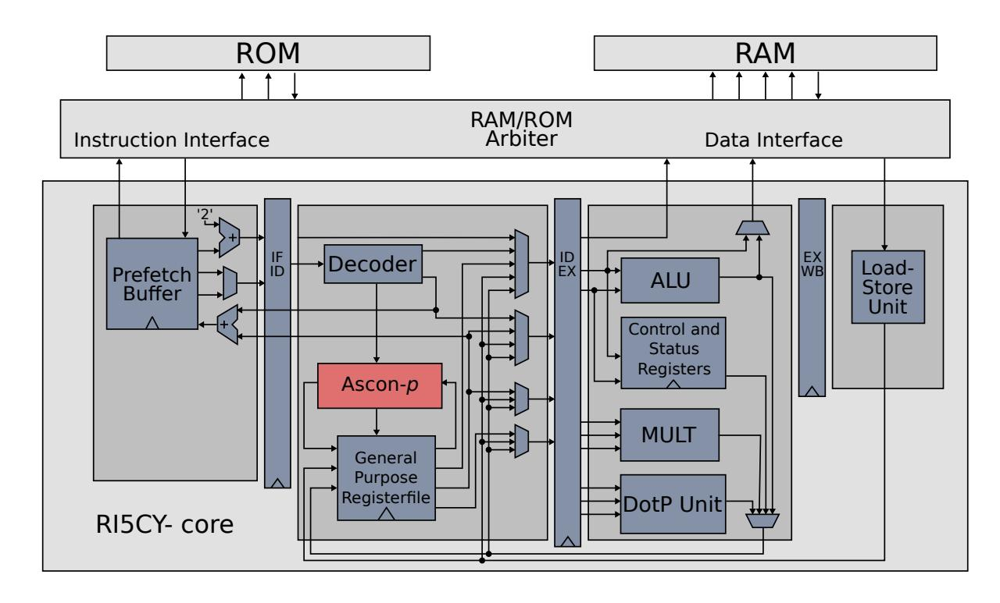
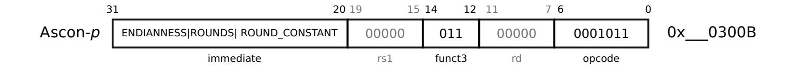
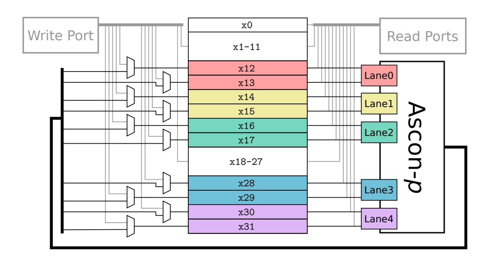
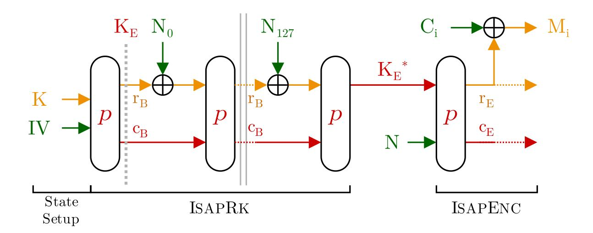
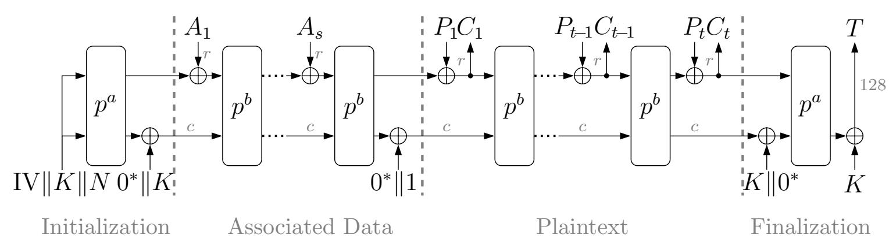
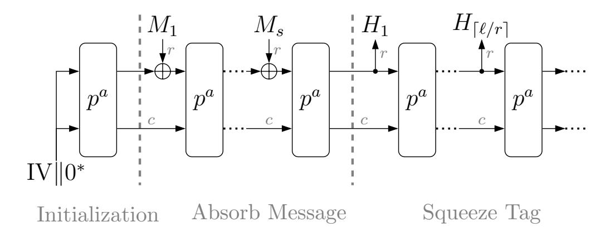
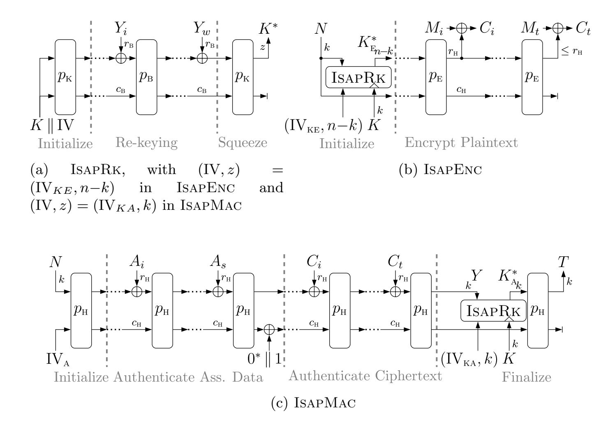

{0}------------------------------------------------

# A Fast and Compact RISC-V Accelerator for Ascon and Friends

Stefan Steinegger and Robert Primas

Graz University of Technology, Graz, Austria first.last@iaik.tugraz.at

Abstract. Ascon-p is the core building block of Ascon, the winner in the lightweight category of the CAESAR competition. With Isap, another Ascon-p-based AEAD scheme is currently competing in the 2nd round of the NIST lightweight cryptography standardization project. In contrast to Ascon, Isap focuses on providing hardening/protection against a large class of implementation attacks, such as DPA, DFA, SFA, and SIFA, entirely on mode-level. Consequently, Ascon-p can be used to realize a wide range of cryptographic computations such as authenticated encryption, hashing, pseudorandom number generation, with or without the need for implementation security, which makes it the perfect choice for lightweight cryptography on embedded devices.

In this paper, we implement Ascon-p as an instruction extension for RISC-V that is tightly coupled to the processors register file and thus does not require any dedicated registers. This single instruction allows us to realize all cryptographic computations that typically occur on embedded devices with high performance. More concretely, with Isap and Ascon's family of modes for AEAD and hashing, we can perform cryptographic computations with a performance of about 2 cycles/byte, or about 4 cycles/byte if protection against fault attacks and power analysis is desired.

As we show, our instruction extension requires only 4.7 kGE, or about half the area of dedicated Ascon co-processor designs, and is easy to integrate into low-end embedded devices like 32-bit ARM Cortex-M or RISC-V microprocessors. Finally, we analyze the provided implementation security of Isap, when implemented using our instruction extension.

Keywords: authenticated encryption · ascon · isap · hardware acceleration · risc-v · ri5cy · cv32e40p · side-channels · fault attacks · leakage resilience

## 1 Introduction

Motivation. Implementation attacks such as fault attacks [\[4,](#page-15-0)[3\]](#page-15-1) or power analysis [\[23](#page-16-0)[,26,](#page-16-1)[5\]](#page-15-2) are among the most relevant threats for implementations of cryptographic schemes. To counteract such attacks, cryptographic devices like smart cards typically implement dedicated countermeasures, both on hardware and algorithmic level.

{1}------------------------------------------------

The most prominent examples of algorithmic countermeasures are masking against power analysis [\[29,](#page-17-0)[27](#page-16-2)[,19\]](#page-16-3), and the usage of some form of redundancy against fault attacks [\[1\]](#page-15-3). Redundant computations are usually used to detect and prevent the release of erroneous cryptographic computations, that could otherwise be exploited with techniques like Differential Fault Attacks (DFA) [\[4\]](#page-15-0) or Statistical Fault Attacks (SFA) [\[16\]](#page-16-4).

With these attacks in mind, the National Institute of Standards and Technology (NIST) recently started an effort to standardize lightweight authenticated encryption schemes for usage in embedded or IoT scenarios [\[6\]](#page-15-4). Amongst others, the submission requirements state that the possibility of adding implementation attack countermeasures at low cost is highly desired. To meet this criteria, many of the submitted schemes are based upon lightweight cryptographic primitives, while DryGASCON [\[28\]](#page-16-5), and Isap [\[9\]](#page-15-5) can even give certain guarantees against implementation attacks purely on mode-level. While DryGASCON is based, amongst others, on a modified variant of Ascon-p, Isap can be instantiated directly with Ascon-p, the core building block of Ascon. Consequently, acceleration of Ascon-p can speed up the computations of both, Ascon and Isap, thereby achieving speed-ups for a wide variety of symmetric cryptographic tasks, including those that require protection from implementation attacks.

Our Contribution. In this work, we propose an instruction extension for Ascon-p that utilizes tight integration into a processors register file to significantly speed up various symmetric cryptographic computations at a comparably low cost. Most notably, our instruction extension can be used for applications with/without the need for protection against implementation attacks, simply by choosing the appropriate AEAD mode in software.

As a proof of concept, we integrate our instruction extension into the 32-bit RI5CY core. We provide various hardware metrics and, amongst others, show that our accelerator can be realized with about 4.7 kGE, or about half the area of dedicated co-processor designs.

Given this built-in acceleration for Ascon-p, we create assembly versions of the Ascon/Isap modes that utilize our instruction extension and present benchmarks for authenticated encryption, hashing, and pseudorandom number generation. As we show, we achieve speed-up factors of about 50 to 80, when compared to corresponding pure software implementations.

Finally, we discuss the provided implementation security of Isap, when implemented using our accelerator.

Open Source. Our hardware design is publicly available in the following Github repository: [https://github.com/Steinegger/riscv\\_asconp\\_accelerator](https://github.com/Steinegger/riscv_asconp_accelerator).

Outline. In [Section 2,](#page-2-0) we cover the required background for this work: (1) the RISC-V instruction set architecture (ISA) (2) the RI5CY core for our a proof of concept (3) the two AEAD modes Ascon and Isap. In [Section 3,](#page-4-0) we describe the design of our accelerator, its software interface, our modifications to the RI5CY core and various hardware metrics. In [Section 4](#page-8-0) we then discuss how 

{2}------------------------------------------------

the hardware acceleration for Ascon-p can be used to build fast software implementations for hashing, pseudorandom number generation, and authenticated encryption, with or without protection from physical attacks and present various performance metrics. The provided implementation security of Isap, when implemented using our instruction extension, is analyzed in [Section 5.](#page-11-0) Finally, we conclude the paper in [Section 6.](#page-14-0)

### <span id="page-2-0"></span>2 Background

In this section, we first give a brief introduction to the open instruction set architecture RISC-V, and the RI5CY[1](#page-2-1) core. We then recall Ascon and Isap, the two authenticated encryption modes that we will later use to implement various cryptographic constructions.

### 2.1 RISC-V

RISC-V is a free and open-source instruction set architecture (ISA) that defines a common interface to allow software applications to interact with the CPU hardware. The RISC-V ISA consists of the privileged ISA [\[32\]](#page-17-1) and the userlevel ISA [\[33\]](#page-17-2). The user-level ISA includes the base integer instruction set I for the three supported address spaces 32-bit (RV32I), 64-bit (RV64I) or 128-bit (RV128I). RV32E is an ISA extension for embedded applications, but in draft status at the time of writing.

Registers. RV32I defines a total of 32 32-bit CPU registers (x0 to x31). For embedded applications this can be too costly, therefore, similarly to ARMv7m microcontrollers, RV32E defines only 16 CPU registers. Conventionally, baseinstructions name up to two registers to read from and up to one register to write to. This results in a basic register file with two read- and one write-port.

Instruction Encoding. Instructions encode information about the performed operation using an opcode and involve a combination of source-, destination registers and an immediate. Immediates allow direct use of a value, that is not stored in a register. The RISC-V ISA [\[33\]](#page-17-2) specifies R, I, S, B, U, and J-type instructions for RV32I. They vary by having differently sized immediates and a varying number of specified source/destination registers.

The opcode is 7 bits long, which initially restricts the number of opcodes to 128. However, to allow for more instructions, R, I, S and B-type instructions contain a 3-bit field funct3, which further divides the opcode-space. R-type instructions offer an additional funct7 field for further separation. The RISC-V opcode-space clusters similar operations to have similar opcodes and leaves the opcodes 0x0B, 0x2B, 0x5B and 0x7B for custom instructions and 0x6B, 0x57 and 0x77 unassigned to be used for future instructions.

<span id="page-2-1"></span><sup>1</sup> <https://github.com/pulp-platform/riscv>

{3}------------------------------------------------

#### 2.2 RI5CY Core

The RI5CY core[2](#page-3-0) (as of late known as CV32E40P) is a free and publicly available CPU design that implements the RV32IMFC instruction set and features a 4-stage in-order pipeline (Instruction Fetch, Instruction Decode, Execute, and Write-Back). It features an instruction prefetcher and is able to serve one instruction per cycle to the decode stage. The core performs similarly to the ARM Cortex M4 [\[31\]](#page-17-3) and is part of the PULP platform[3](#page-3-1) , a silicon-proven ASIC design.

#### 2.3 Ascon

Ascon is a sponge-based AEAD scheme that was selected as the primary choice for lightweight authenticated encryption in the final portfolio of the CAESAR competition [\[12\]](#page-16-6). Ascon operates on a 320-bit state that is organized into 5×64 bit lanes, and updated by the permutation Ascon-p. Ascon-p consists of 3 steps: a round constant addition, a substitution layer, and a linear layer, that are consecutively applied on the state in each round.

Ascon's mode describes how state and permutation can be used to build an authenticated encryption scheme with 128-bit security, as depicted in [Figure 5a.](#page-18-0) Hereby, the number of permutation rounds a, b, as well as the used rate r, are chosen depending on the particular Ascon instance.

The recently specified hashing functionality Ascon-Hash and Ascon-Xof [\[13\]](#page-16-7), as seen in [Figure 5b,](#page-18-1) operate on the same permutation. Ascon-Hash always produces 256-bit outputs, while Ascon-Xof can produce outputs of arbitrary length. The claimed security of both schemes is 128 bit, the choice for a and r is the same as for Ascon-128.

### 2.4 ISAP

Isap is a mode for authenticated encryption with a focus on providing built-in hardening/protection against various kinds of implementation attacks. Isap was originally published at FSE 2017 [\[11\]](#page-15-6), and currently competes in the 2nd round of the NIST Lightweight Cryptography project [\[9\]](#page-15-5).

The authors propose 4 variations of Isap, however, we only focus on the Ascon-p based instances Isap-A-128a and Isap-A-128. These differ in certain parameter choices, where Isap-A-128a represents the recommended instance, and Isap-A-128 is more conservative. The claimed cryptographic security of all Isap instances is the same as for Ascon, i.e., 128 bit for confidentiality of plaintext, as well as integrity of plaintext, associated data, and nonce.

In contrast to Ascon, Isap is a two-pass scheme that performs authenticated encryption in an Encrypt-then-MAC manner. The main design goal of Isap is to provide inherent protection from DPA attacks. For a more detailed discussion of Isap's protection against physical attacks we refer to [Section 5.](#page-11-0)

<span id="page-3-0"></span><sup>2</sup> <https://github.com/pulp-platform/riscv>

<span id="page-3-1"></span><sup>3</sup> <https://pulp-platform.org/>

{4}------------------------------------------------

### <span id="page-4-0"></span>3 Hardware Acceleration for Ascon-p

In this section we explain the design of our Ascon-p accelerator, as well as the integration into the RI5CY microprocessor. [Section 3.1](#page-4-1) describes the design of the Ascon-p accelerator itself and how it can be accessed from software. In [Section 3.2](#page-5-0) we discuss hardware modifications of the RI5CY core that are necessary to integrate our accelerator. Finally, in [Section 3.3](#page-7-0) we present various hardware metrics.

#### <span id="page-4-1"></span>3.1 Design of the Ascon-p Accelerator

Typical co-processor designs, like the one in [\[20\]](#page-16-8), represent a straight forward way to achieve computation speed-ups in microprocessors. While dedicated coprocessors are arguably easy to integrate, they also come with certain downsides. From an area perspective, dedicated co-processors require their own registers for holding the cipher state which is comparably expensive on low-end microprocessors. From a performance perspective, moving data to and from the co-processor requires additional cycles. This effect can be alleviated to some extend with direct memory access, albeit at the expense of additional hardware for read/write ports and memory arbitration that is typically not reported. Besides that, dedicated co-processors usually only support one specific cipher operation which does not make them very flexible, and hence, leads to situations where, e.g., hardware support for both, AES and SHA-256 needs to be implemented.

These issues motivate our choice to implement our Ascon-p instruction extension by tightly coupling the accelerator into the register file. This way, one can reuse the register file for holding the cipher state, thus eliminating the need for additional registers and communication/synchronization overhead. In other words, we only need to add the combinatorial logic of the permutation[4](#page-4-2) which is typically the only computationally expensive building block of permutationbased cryptographic design. The concrete AEAD mode can be implemented purely in software and is thus flexible.

Endianess. Since the RI5CY core has little-endian byte order and Ascon-p expects big-endian byte order, additional care might be necessary when loading data word-wise that has been stored byte-wise like, e.g., character arrays. To simplify processing of this kind of data, our accelerator can be configured to interpret the state with swapped endianness at virtually no cost. Alternatively, in a similar spirit as other platforms like x86 and ARM that offer efficient endian swap instructions, the bitmanip extension [\[34\]](#page-17-4) for RISC-V offers the rev8 instruction. However, since bitmanip is still in a draft version at the time of writing, hence, rev8 not implemented on the RI5CY core, we opt to handle potential endianness problems in our accelerator for now.

<span id="page-4-2"></span><sup>4</sup> Our accelerator is based on Ascon's reference hardware implementation ([https://github.com/IAIK/ascon\\_hardware](https://github.com/IAIK/ascon_hardware).

{5}------------------------------------------------

<span id="page-5-2"></span>

Fig. 1: Block diagram of the RI5CY core with hardware acceleration for ASCON-p. The blocks labelled IF ID, ID EX and EX WB refer to the registers between the pipeline stages instruction fetch (IF), instruction decode (ID), execute (EX) and write-back (WB)

#### <span id="page-5-0"></span>3.2 Modifications to the RI5CY Core

To extend the existing RI5CY hardware and to make the instruction available to applications, we first design the instruction, add it to the existing opcode-space and later to RI5CY's decode stage. We then connect the ASCON-p accelerator to the register file.

<span id="page-5-1"></span>

Fig. 2: Structure of our RISC-V ASCON-p instruction.

Instruction Encoding. For our ASCON-p instruction, we propose an I-type instruction to be used. The 12-bit immediate allows us to encode the number of rounds with bits 10 to 8 and the 8-bit round constant with bits 7 to 0. The remaining bit can be used to specify the endianness of the data representation in the registers to allow for correct interpretation by the accelerator. We use fixed registers for the operation, hence, the rd and rs of the instruction remain unused.

Since the RI5CY core already comes with its own set of custom instructions, large portions of the custom- and reserved opcode space are already utilized.

{6}------------------------------------------------

Therefore, we use the previously unused opcode 0x0B with 0x3 as the funct3 for our Ascon-p instruction. The resulting structure of our instruction is illustrated in Figure 2.

Register Adaptations. Our accelerator re-purposes parts of the existing CPU register file for holding the state of Ascon-p. This design choice is motivated by the fact that CPU registers, especially on small embedded devices, are one of the main contributing factors to the resulting hardware area. To store the full 320-bit state of Ascon-p, 10 out of the 32 available 32-bit registers are required. Conveniently, two such registers combined can store one lane of the Ascon state and can be directly passed to the accelerator as such. When looking at other ISAs like RV32E or ARMv7, they only offer 16 32-bit registers, which is however more than enough to hold the entire Ascon state and still allows to implement the mode itself without usage of excessive amounts of write/load operations.

For a low-area design, allowing arbitrary registers to store the ASCON state is inefficient since this would lead to a significant increase in the number of read and write ports on the register file. Therefore, we propose using a set of fixed registers, in our case x12 to x17 and x28 to x31, to accommodate the ASCON state, as shown in Figure 3. Note that our choice here is to some extend arbitrary. Our chosen registers are defined to be "caller saved" by the RISC-V calling convention which could improve the compatibility with C code. However, when using pure assembly implementations for the cryptographic modes, which is the standard way of implementing cryptographic software, the choice of registers is up to the designer.

From a hardware perspective, the only noteworthy modification here is the addition of toggle logic that can, depending on the current instruction, switch the input signal of 10 registers between the write port and the ASCON-p accelerator.

<span id="page-6-0"></span>

Fig. 3: The register file with the Ascon-p accelerator, as well as read/write ports.

{7}------------------------------------------------

Decode Stage Adaptations. To make our Ascon-p instruction accessible to applications we add the opcode to the decoder. When an instruction decodes as our Ascon-p instruction a signal enables the Ascon-p accelerator and switches the multiplexers of our fixed set of registers seen in [Figure 3](#page-6-0) to update from the accelerator.

As seen in [Figure 1,](#page-5-2) the arithmetic logic unit (ALU) and load-store unit forward their result to the next instruction before updating the registers. This prevents pipeline stalls. Therefore, an instruction altering any of the 10 Ascon state registers must not directly precede our permutation instruction. Load operations to these registers must not happen in the two preceding instructions. Alternatively, this could also be handled in and at the cost of additional hardware by adapting the forwarding to directly feed into the Ascon-p accelerator, or by stalling the pipeline for up to two cycles.

#### <span id="page-7-0"></span>3.3 Hardware Metrics

Benchmarking Platform. We use the RI5CY core commit 528ddd4 as the basis for our modifications. The source files are compiled by the Cadence Encounter RTL Compiler v14.20-s064 1 and routed with NanoRoute 16.13-s045 1. The used process is umc065LL 1P10M. We deactivate the floating-point unit in the hardware design as it is not required for our evaluation. To build the benchmarking platform, we connect the RI5CY core to a 64 kbit FSE0K A SH single-port SRAM macro by Faraday Technology, and to a ROM (implemented as a logic vector) that holds the executable code.

The RI5CY core has a separated bus for data and instruction memory. However, as this is not meant to implement a Harvard architecture [\[30\]](#page-17-5), we added an arbitration module to allow access from the data port to the instruction ROM. The RI5CY core incorporates an instruction prefetch buffer. Hence, for accesses to the ROM, requests by the data port are prioritized over requests by the prefetching, buffered instruction port.

We operate the RI5CY core at a clock frequency of 50 MHz to keep single cycle RAM and ROM accesses with our design-flow without increasing the overall complexity. To determine the area of the implementation, we set the ungroup-ok attribute to false in our design-flow for the RI5CY core and the Ascon-p accelerator. This might result in a reduced area optimization of the overall result, however, as the modules are not ungrouped into their parent modules, more consistent area estimates can be shown and especially prevent the RAM and ROM modules from affecting the area numbers of the core.

Area Estimations. To evaluate the area overhead of our design, we compare RI5CY in its base configuration against our modified design that can perform 1 round of Ascon-p within a single clock cycle. The result can be seen in [Table 1](#page-8-1) The numbers for the RI5CY core refer to the core part only, as illustrated in [Figure 1.](#page-5-2)

The unmodified RI5CY core serves as our baseline and requires 45.6 kGE. When using 1-round Ascon-p acceleration, the overall core size increases to 

{8}------------------------------------------------

50.3kGE, with the accelerator itself making up 4.2 kGE. The remaining difference of 0.5 kGE can be attributed to the addition of multiplexers to parts of the register file, additional instruction decoding as well as overall variations in optimizations by the toolchain.

To put these numbers into perspective, we can refer to implementation results from Gross et al. who provide area numbers for Ascon co-processor designs, with (9.4 kGE) and without (7.1 kGE) the CAESAR hardware API [\[21,](#page-16-9)[20\]](#page-16-8). When compared to these numbers, our 1-round Ascon-p accelerator requires only about half that area, due to the fact that we can directly operate on parts of the register file. The authors of Isap also roughly estimate the area requirement of a dedicated Isap co-processor to be around 12 kGE, which is also noticeable larger than our design. Do note that our numbers also include the integration cost of the accelerator while the other designs will likely require higher integration costs due to the additionally needed interconnected for the data exchange.

<span id="page-8-1"></span>Table 1: Comparison between the RI5CY core with/without 1-round Ascon-p accelerator (HW-A) and dedicated co-processor designs of Ascon and Isap.

|                                   | kGE                    |     |  |  |  |
|-----------------------------------|------------------------|-----|--|--|--|
| Design                            | Standalone Integration |     |  |  |  |
| RI5CY base design                 | 45.6                   | 0   |  |  |  |
| This work                         | 4.2                    | 0.5 |  |  |  |
| Ascon co-processor [20]           | 7.1                    | ?   |  |  |  |
| Ascon co-processor [18,21]        | 9.4                    | ?   |  |  |  |
| Isap co-processor (estimated) [9] | ≤ 12.8                 | ?   |  |  |  |

Critical Path. In order to determine if our proposed Ascon-p acceleration could increase the critical path delay of the RI5CY core, we performed experiments with modified hardware accelerator designs that can perform up to 6 rounds of Ascon-p within one clock cycle while keeping the clock frequency constant at 50 MHz. In these cases, the core area increases to up to 70.8 kGE with the Ascon-p accelerator taking up to 24.7 kGE, showing a linear growth in size for this range of configurations. Since our Ascon-p accelerator met the timing constraints in all configuration, we conclude that the 1-round variant should not pose any problems for clock frequencies up to about 300 MHz.

### <span id="page-8-0"></span>4 Performance Evaluation

In this section, we demonstrate how hardware acceleration for Ascon-p can be used to speed up cryptographic computations in a wide variety of applications. First, we present performance numbers for AEAD and hashing, based on Ascon. 

{9}------------------------------------------------

We then take a look at AEAD with protection against implementation attacks, based on ISAP.

#### 4.1 AEAD and Hashing with Ascon

For the performance evaluation of ASCON and ASCON-HASH we focus on the primary recommended parametrization ASCON-128 (cf. Table 3). Our accelerator is configured to perform 1 permutation round per clock cycle. Our hardware accelerated software implementations are implemented in RISC-V assembly so we can make sure that the state is always kept in the registers x12 to x17 and x28 to x31. Examples of the actual message processing loop are shown in Code 1 and Code 2.

#### <span id="page-9-0"></span>Code 1 Encrypt Block Loop

```
1: <encrypt_block_start>:
2: lw t1,0(t0)
3: lw s1,4(t0)
4:
   xor a2,a2,t1
5:
   xor a3,a3,s1
6:
   sw a2,0(s8)
7:
   sw a3,4(s8)
8:
   ASCON-P(ROUND_CONSTANT)
       : 6-times
14: addi t0,t0,8
15: addi s8,s8,8
16: bgeu t2,t0, <encrypt_block_start>
```

#### <span id="page-9-1"></span>Code 2 Absorb Block Loop

```
1: <absorb_block_start>:
2: lw t1,0(t0)
3: lw s1,4(t0)
4: xor a2,a2,t1
5: xor a3,a3,s1
6: addi t0,t0,8
7: ASCON-P(ROUND_CONSTANT)

: 12-times
: :
: :
: :
: :
: : :
: : : : : : : :
```

In our benchmarks, we consider the case of encrypting/hashing messages of various lengths (0 bytes of associated data), as well as pseudorandom number generation using the XoF mode. We compare our results with the efficient C implementations from the Ascon team<sup>5</sup>, compiled with -03, mainly due to the lack of available RISC-V optimized implementations As shown in Table 2, the hardware-accelerated implementations achieve speed-ups by about a factor of 50 for Ascon and factor 80 for Ascon-Hash. At the same time, hardware acceleration reduces the binary sizes significantly, even when compared to the size-optimized C versions (-0s).

#### 4.2 AEAD with ISAP

When deriving performance numbers for ISAP, we mainly refer to the parameterization of ISAP-A-128A (cf. Table 4), since it is recommended over the more conservative ISAP-A-128 instance by the designers. We do, however, state concrete performance numbers for both variants in Table 2. For the C implemenation we use the opt\_32 implemenation of ISAP<sup>6</sup>. The runtime of ISAP is comprised

<span id="page-9-2"></span><sup>5</sup> https://github.com/ascon/ascon-c

<span id="page-9-3"></span><sup>6</sup> https://github.com/isap-lwc/isap-code-package

{10}------------------------------------------------

<span id="page-10-0"></span>Table 2: Runtime and code size comparison of Ascon and Isap, with/without 1-round Ascon-p hardware acceleration (HW-A) Implementations Cycles/Byte Binary Size (B)

|                        |         | Cycles/Byte |       |                 |
|------------------------|---------|-------------|-------|-----------------|
| Implementations        | 64 B    | 1536 B      | long  | Binary Size (B) |
| Ascon-C (-O3)          | 164.3   | 110.6       | 108.3 | 11 716          |
| Ascon-C (-Os)          | 269.7   | 187.1       | 183.5 | 2 104           |
| Ascon-ASM + HW-A       | 4.2     | 2.2         | 2.1   | 888             |
| AsconHash-C (-O3)      | 306.9   | 208.0       | 203.8 | 20 244          |
| AsconHash-C (-Os)      | 423.3   | 268.0       | 261.3 | 1528            |
| AsconHash-ASM + HW-A   | 4.6     | 2.6         | 2.5   | 484             |
| AsconXOF-ASM + HW-A    | 4.0     | 2.3         | 2.3   | 484             |
| ISAP-A-128a-C (-O3)    | 1 184.3 | 386.9       | 352.3 | 11 052          |
| ISAP-A-128a-C (-Os)    | 2 024.1 | 616.0       | 554.8 | 3 744           |
| ISAP-A-128a-ASM + HW-A | 29.1    | 5.2         | 4.2   | 1 844           |
| ISAP-A-128-ASM + HW-A  | 73.6    | 7.7         | 5.0   | 2 552           |

of the re-keying function IsapRk, as well as the processing of message blocks in IsapEnc and IsapMac. Since Isap is an Encrypt-then-MAC scheme that calls IsapRk both during IsapEnc and IsapMac, the runtime of IsapRk needs to be counted twice (see [Figure 6a\)](#page-19-1).

IsapRk. The runtime of IsapRk is independent of the message length and, thus, can be considered as a constant factor whose performance impact diminishes with increasing message length. Nevertheless, for shorter messages, the runtime of IsapRk dominates due to the rather expensive bit-wise absorption of the 128-bit value Y (see [Figure 6a\)](#page-19-1). IsapRk requires 12 permutation rounds for initialization, 127 rounds for absorbing Y , and another 12 rounds for squeezing the session key K? [\[10\]](#page-15-7). This amounts to 151 permutation rounds per invocation of IsapRk, hence 302 (2 × 151) permutation rounds in total. Since IsapRk has a noticeable effect on the processing of short messages, we opted to use partial loop unrolling to achieve a good trade-off between code size and runtime. More concretely, we grab one byte of Y and then unroll the code for absorbing these 8 bits individually. With this method, we can reduce the runtime of processing one bit to 5 cycles or 690 cycles for absorbing all 128 bit (5.4 cycles/bit). In total, the initialization of Isap requires slightly less than 1 600 cycles.

IsapEnc and IsapMac. Determining the runtime of IsapEnc and IsapMac is easier as we can simply refer to the numbers from Ascon and Ascon-Hash. The runtime of encrypting a message block is equivalent to Ascon (see [Figure 6b\)](#page-19-2), i.e., 6 rounds (15 cycles) per message block. The runtime to authenticate a message block is the same as for Ascon-Hash (see [Figure 6c\)](#page-19-3), i.e., 12 rounds (18 cycles) per message block.

{11}------------------------------------------------

Comparison. Table 2 contains runtimes for encrypting messages of various lengths and 0 bytes of associated data. As expected, the runtime of shorter 64 byte messages is affected by the comparably slow initialization. However, the effect of the initialization diminishes with increasing message length and approaches a performance of 4.2 and 5.0 cycles/byte for Isap-A-128A and Isap-A-128 respectively. Given the provided protection from implementation attacks (cf. Section 5), the performance penalty of about factor 2 for somewhat longer messages, is comparably low compared to Ascon. Also note that, with hardware acceleration, the binary size of Isap can be lower than an unprotected, size-optimized, pure software implementation of Ascon.

### <span id="page-11-0"></span>5 Implementation Security of ISAP

In this section we first briefly discuss the provided security of the ISAP mode against implementation attacks such as DPA/DFA/SFA/SIFA. We then provide a more detailed discussion of ISAP's SPA security when hardware acceleration for ASCON-p is used.

#### 5.1 Differential Fault Analyis (DFA)

DFA attacks exploit the difference between results of repeated executions of cryptographic computations, with and without fault injection. During authenticated encryption, fresh nonces ensure that the session keys  $K_A^*$  and  $K_E^*$  are unique for each encryption, which prevents DFA attacks.

In the case of authenticated decryption, the attacker can perform multiple queries with the same ciphertext/nonce/tag, and thus force a repeated decryption of constant inputs with the same key. Since tag verification in ISAP happens before decryption, a DFA on the encryption phase of ISAPENC is, in principle, possible. However, when following a similar attack strategy as shown by Luo et al. [24] for Keccak-based MAC constructions, targeting ISAPENC alone is not sufficient since the long term key is only used within ISAPRK. ISAPRK by itself can also not be directly attacked since the attacker never gets to see any direct output. A multi-fault strategy, as outlined in [15], is still possible but requires roughly the quadratic amount of faulted decryptions, when compared to the numbers reported in [24], and more importantly, precise combinations of multiple fault injections, both in terms of timing and location.

#### 5.2 Differential Power Analysis (DPA)

One of the main design goals of ISAP is inherent protection from side-channel attacks, such as DPA. This is achieved through the usage of the leakage-resilient rekeying function ISAPRK (see Figure 6a) that derives unique session keys  $K^*$  for encryption/authentication from the long term key K and the nonce N. ISAPRK can be viewed as a sponge variant of the classical GGM construction [17]. By limiting the rate  $r_B$  during the absorption of Y, one can reduce the number of

{12}------------------------------------------------

possible inputs to a permutation call to 2, which renders classical DPA attacks impractical.

#### 5.3 Statistical (Ineffective) Fault Attacks (SFA/SIFA)

SFA and SIFA are fault attack techniques that, in contrast to DFA, are applicable to many AEAD schemes, including online/single-pass variants, and without assumptions such as nonce repetition or release of unverified plaintext. These attacks are especially interesting since it was shown that they are also applicable to (higher-oreder) masked implementations, whereas SIFA can even work in cases where masking is combined with typical fault countermeasure techniques [\[8\]](#page-15-8).

Both attacks have in common that they require the attacker to call a certain cryptographic building block (e.g. permutation) with varying inputs. In principle, SFA is applicable whenever AEAD schemes perform a final key addition before generating an output [\[7\]](#page-15-9), which is not the case in Isap. SIFA, on the other side, can be used in the initialization phase of almost all AEAD schemes, similarly to as shown for the Keccak-based AEAD schemes Ketje and Keyak [\[14\]](#page-16-14). However, in the case of Isap, the 1-bit rate during IsapRk limits the number of inputs per permutation call to 2 and thus severely limits the capabilities of SIFA which usually requires a couple hundred calls with varying inputs [\[14\]](#page-16-14).

### 5.4 Simple Power Analysis (SPA)

Simple Power Analysis (SPA) describes a class of power analysis attacks that, in contrast to DPA, can work in scenarios where the attacker is limited to observing power traces of cryptographic computations with constant inputs [\[5\]](#page-15-2). Consequently, SPA attacks are, in principle, applicable to Isap and thus require a more thorough discussion. For simplicity, we focus on the authenticated decryption procedure of Isap, including the re-keying IsapRk, but excluding the tag verification within IsapMac. In this scenario, the attacker is in control of the nonce N and can directly observe the outputs of the computation (the later is not the case in IsapMac).

When arguing about SPA protection of Isap's long term key K, we can first take a look at mode-level properties of Isap's decryption procedure, which is depicted in [Figure 4.](#page-13-0) Since K is only used during IsapRk, which by itself is hard-to-invert, an attacker is forced to target IsapRk directly. Within IsapRk, we can observe that different parts of the computation leak different amounts of information, depending on the number of bits that are processed in parallel. In general, when looking at permutation-based cryptographic designs, the sizes of the rate r and the capacity c naturally reflect how much information about the state an attacker is allowed to learn, without gaining any noticeable advantage in performing state recoveries. Intuitively, side-channel information decreases the more data is processed concurrently. For example, as shown by Medwed et al., a simple AES-based GGM construction can be broken on an 8-bit microcontroller using template attacks [\[25\]](#page-16-15). While the 32-bit RI5CY core should already provide noticeably better SPA protection, there still exist a few works that show that SPA 

{13}------------------------------------------------

attacks on 16 or 32-bit implementations could be successful [22,2]. Nevertheless, we do expect leakage stemming from the processing of 320 bits in parallel, i.e. during the usage of the Ascon-p accelerator, to be very hard to exploit <sup>7</sup>.

Given this, and the fact that ISAP uses  $r \leq 64$  and  $c \geq 256$ , we can see in Figure 4 that, after the initial state setup, there is no point in time where the attacker can observe easy to exploit leakage (indicated in green/yellow) of state chunks that are larger than r. In other words, the ASCON-p accelerator ensures that leakage of at least c bits of the state is hard to exploit (red), which should render simple SPA-based state recovery attacks impractical. This leaves the initial state setup phase as the only supposedly easy SPA attack target. In the following, we take a closer look at this state setup phase and estimate the amount of information about K that an attacker could learn there under reasonable assumptions.

<span id="page-13-0"></span>

Fig. 4: Authenticated decryption of ISAP: SPA leakage when utilizing hardware acceleration for ASCON-p. Green values are public (or leak fully), orange values create some leakage in 32-bit chunks, red values result in hard to exploit leakage<sup>7</sup>.

Entropy Loss of K during State Setup. The state setup consists of 10 load operations that move the initial state from RAM into the respective CPU registers. In other words, an attacker can observe the leakage of K, when split into the four 32-bit chunks  $K_0 \dots K_3$  while all other values are public. If we further assume an observable leakage that corresponds to the noise-free Hamming weight (HW) of each  $K_i$ , thereby essentially simulating the case of averaged power traces on a typical 32-bit microprocessor [22], we can estimate the entropy loss of K as follows:

First, we need to find the probability that a uniformly chosen  $K_i$  has a certain HW x. Since the number of 32-bit values with HW = x is exactly  $\binom{32}{x}$ , we can

<span id="page-13-1"></span><sup>&</sup>lt;sup>7</sup> Given, e.g., a de-capped chip, high resolution EM probes, and averaged power measurements, it could be possible to still gain usable SPA leakage. If such powerful attackers are a concern, we recommend using hiding/shuffling in the ASCON-p accelerator and in software.

{14}------------------------------------------------

calculate  $p(HW(K_i) = x)$  simply as  $\binom{32}{x}/2^{32}$ . The corresponding entropy loss of knowing  $x = HW(K_i)$  is then  $32 - \log_2 \binom{32}{x}$ . To give two concrete examples,  $p(HW(K_i) = 0)$  is  $1/2^{32}$  with entropy loss of 32 bits, while  $p(HW(K_i) = 16)$  is 0.14 with entropy loss of 2.83 bits.

If we now want to determine the maximum entropy loss of the entire 128-bit key K, while ignoring unrealistic events, we need to consider a *combined* event that consists of the individual and independent leakage events for  $K_0 \dots K_3$ . Their combined probability is simply the product of the individual probabilities, while their combined entropy loss is summed up.

Finally, we can fix a certain probability and search for the maximum entropy loss among all combined events with at least that probability. More concretely, if we are interested in cases with, e.g., a combined probability above  $1/10^6$  ( $1/10^9$ ) we can derive that an attacker cannot learn more than 20 (30) bits of K. If we oppose these results with the fact that K has a total entropy of 128 bits, we can conclude that, under our assumptions, the probability of learning any meaningful amount of information about K is negligible.

Further Increasing SPA Protection. As discussed in the previous section, hardware acceleration for Ascon-p alone can already significantly increase the SPA protection of Isap's software implementations. Nevertheless, further simple steps can still be taken to additionally harden the implementation against SPA attacks.

For once, software shuffling/hiding during ISAPRK's state setup helps to reduce the amount of averaging an attacker can perform, thereby essentially decreasing the signal-to-noise ratio of power measurements.

And secondly, instead of using K and IV during ISAPRK's state setup, one could also opt for storing the equivalent 320-bit key  $K_E$  instead (cf. Figure 4). In this case,  $K_E$  is the initial state of ISAPRK, and would not contain any values that are known by the attacker.

## <span id="page-14-0"></span>6 Conclusion

In this paper, we presented an instruction extension for Ascon-p that allows us to significantly speed up a variety of cryptographic computations that are typically needed on embedded devices at low cost. More concretely, with Isap and Ascon's family of cryptographic modes, we can perform authenticated encryption, hashing, and pseudorandom number generation with a performance of about 2 cycles/byte, or about 4 cycles/byte if implementation security is desired.

When using Isap, protection/hardening against implementation attacks such as DPA/DFA/SIFA is already provided on mode-level. We additionally analyze the case of SPA protection which is significantly increased thanks to Ascon-p acceleration. As a proof of concept, we integrated our accelerator into the 32-bit RI5CY core and present various hardware/performance metrics.

{15}------------------------------------------------

### Acknowledgments

This project has received funding from the European Research Council (ERC) under the European Union's Horizon 2020 research and innovation programme (grant agreement No 681402), the Austrian Research Promotion Agency (FFG) via the K-project DeSSnet, which is funded in the context of COMET – Competence Centers for Excellent Technologies by BMVIT, BMWFW, Styria and Carinthia, and the Austrian Research Promotion Agency (FFG) via the project ESPRESSO, which is funded by the province of Styria and the Business Promotion Agencies of Styria and Carinthia.

# References

- <span id="page-15-3"></span>1. Bar-El, H., Choukri, H., Naccache, D., Tunstall, M., Whelan, C.: The sorcerer's apprentice guide to fault attacks. Proceedings of the IEEE 94(2), 370–382 (2006)
- <span id="page-15-10"></span>2. Bellizia, D., Bronchain, O., Cassiers, G., Grosso, V., Guo, C., Momin, C., Pereira, O., Peters, T., Standaert, F.: Mode-level vs. implementation-level physical security in symmetric cryptography: A practical guide through the leakage-resistance jungle. IACR Cryptol. ePrint Arch. 2020, 211 (2020)
- <span id="page-15-1"></span>3. Biham, E., Shamir, A.: Differential fault analysis of secret key cryptosystems. In: CRYPTO. Lecture Notes in Computer Science, vol. 1294, pp. 513–525. Springer (1997)
- <span id="page-15-0"></span>4. Boneh, D., DeMillo, R.A., Lipton, R.J.: On the importance of checking cryptographic protocols for faults (extended abstract). In: EUROCRYPT. Lecture Notes in Computer Science, vol. 1233, pp. 37–51. Springer (1997)
- <span id="page-15-2"></span>5. Chari, S., Rao, J.R., Rohatgi, P.: Template attacks. In: CHES. Lecture Notes in Computer Science, vol. 2523, pp. 13–28. Springer (2002)
- <span id="page-15-4"></span>6. Committee, N.L.: Nist lightweight cryptography project (2019), [https://csrc.](https://csrc.nist.gov/Projects/lightweight-cryptography/) [nist.gov/Projects/lightweight-cryptography/](https://csrc.nist.gov/Projects/lightweight-cryptography/)
- <span id="page-15-9"></span>7. Dobraunig, C., Eichlseder, M., Korak, T., Lomn´e, V., Mendel, F.: Statistical fault attacks on nonce-based authenticated encryption schemes. In: ASIACRYPT (1). Lecture Notes in Computer Science, vol. 10031, pp. 369–395 (2016)
- <span id="page-15-8"></span>8. Dobraunig, C., Eichlseder, M., Korak, T., Mangard, S., Mendel, F., Primas, R.: SIFA: exploiting ineffective fault inductions on symmetric cryptography. IACR Trans. Cryptogr. Hardw. Embed. Syst. 2018(3), 547–572 (2018)
- <span id="page-15-5"></span>9. Dobraunig, C., Eichlseder, M., Mangard, S., Mendel, F., Mennink, B., Primas, R., Unterluggauer, T.: ISAP v2.0. Submission to the NIST Lightweight Crypto Competition (2019), [https://csrc.nist.gov/CSRC/media/](https://csrc.nist.gov/CSRC/media/Projects/lightweight-cryptography/documents/round-2/spec-doc-rnd2/isap-spec-round2.pdf) [Projects/lightweight-cryptography/documents/round-2/spec-doc-rnd2/](https://csrc.nist.gov/CSRC/media/Projects/lightweight-cryptography/documents/round-2/spec-doc-rnd2/isap-spec-round2.pdf) [isap-spec-round2.pdf](https://csrc.nist.gov/CSRC/media/Projects/lightweight-cryptography/documents/round-2/spec-doc-rnd2/isap-spec-round2.pdf)
- <span id="page-15-7"></span>10. Dobraunig, C., Eichlseder, M., Mangard, S., Mendel, F., Mennink, B., Primas, R., Unterluggauer, T.: Isap v2.0. IACR Transactions on Symmetric Cryptology 2020(S1), 390–416 (Jun 2020). [https://doi.org/10.13154/tosc.v2020.iS1.390-416,](https://doi.org/10.13154/tosc.v2020.iS1.390-416) <https://tosc.iacr.org/index.php/ToSC/article/view/8625>
- <span id="page-15-6"></span>11. Dobraunig, C., Eichlseder, M., Mangard, S., Mendel, F., Unterluggauer, T.: ISAP - towards side-channel secure authenticated encryption. IACR Trans. Symmetric Cryptol. 2017(1), 80–105 (2017)

{16}------------------------------------------------

- <span id="page-16-6"></span>12. Dobraunig, C., Eichlseder, M., Mendel, F., Schl¨affer, M.: Ascon v1.2. Submission to the CAESAR Competition (2016), [https://ascon.iaik.tugraz.at/files/](https://ascon.iaik.tugraz.at/files/asconv12.pdf) [asconv12.pdf](https://ascon.iaik.tugraz.at/files/asconv12.pdf)
- <span id="page-16-7"></span>13. Dobraunig, C., Eichlseder, M., Mendel, F., Schl¨affer, M.: Ascon v1.2. Submission to the NIST Lightweight Crypto Competition (2019), [https://csrc.nist.gov/CSRC/media/Projects/lightweight-cryptography/](https://csrc.nist.gov/CSRC/media/Projects/lightweight-cryptography/documents/round-2/spec-doc-rnd2/ascon-spec-round2.pdf) [documents/round-2/spec-doc-rnd2/ascon-spec-round2.pdf](https://csrc.nist.gov/CSRC/media/Projects/lightweight-cryptography/documents/round-2/spec-doc-rnd2/ascon-spec-round2.pdf)
- <span id="page-16-14"></span>14. Dobraunig, C., Mangard, S., Mendel, F., Primas, R.: Fault attacks on nonce-based authenticated encryption: Application to keyak and ketje. In: SAC. Lecture Notes in Computer Science, vol. 11349, pp. 257–277. Springer (2018)
- <span id="page-16-12"></span>15. Dobraunig, C., Mennink, B., Primas, R.: Exploring the golden mean between leakage and fault resilience and practice. Cryptology ePrint Archive, Report 2020/200 (2020), <https://eprint.iacr.org/2020/200>
- <span id="page-16-4"></span>16. Fuhr, T., Jaulmes, E., Lomn´e, V., Thillard, A.: Fault attacks on AES with faulty ´ ciphertexts only. In: FDTC. pp. 108–118. IEEE Computer Society (2013)
- <span id="page-16-13"></span>17. Goldreich, O., Goldwasser, S., Micali, S.: How to construct random functions. J. ACM 33(4), 792–807 (1986)
- <span id="page-16-10"></span>18. Groß, H.: Caesar hacrdware api reference implementation, [https:](https://github.com/IAIK/ascon_hardware/tree/master/caesar_hardware_api_v_1_0_3/ASCON_ASCON) [//github.com/IAIK/ascon\\_hardware/tree/master/caesar\\_hardware\\_api\\_v\\_1\\_](https://github.com/IAIK/ascon_hardware/tree/master/caesar_hardware_api_v_1_0_3/ASCON_ASCON) [0\\_3/ASCON\\_ASCON](https://github.com/IAIK/ascon_hardware/tree/master/caesar_hardware_api_v_1_0_3/ASCON_ASCON), [https://github.com/IAIK/ascon\\_hardware/tree/master/](https://github.com/IAIK/ascon_hardware/tree/master/caesar_hardware_api_v_1_0_3/ASCON_ASCON) [caesar\\_hardware\\_api\\_v\\_1\\_0\\_3/ASCON\\_ASCON](https://github.com/IAIK/ascon_hardware/tree/master/caesar_hardware_api_v_1_0_3/ASCON_ASCON) (accessed 12/2019)
- <span id="page-16-3"></span>19. Groß, H., Mangard, S., Korak, T.: An efficient side-channel protected AES implementation with arbitrary protection order. In: CT-RSA. Lecture Notes in Computer Science, vol. 10159, pp. 95–112. Springer (2017)
- <span id="page-16-8"></span>20. Groß, H., Wenger, E., Dobraunig, C., Ehrenh¨ofer, C.: Suit up! - made-to-measure hardware implementations of ASCON. In: DSD. pp. 645–652. IEEE Computer Society (2015)
- <span id="page-16-9"></span>21. IAIK: Ascon 128 implementations, [https://web.archive.org/web/](https://web.archive.org/web/20200107135835/https://ascon.iaik.tugraz.at/implementations.html) [20200107135835/https://ascon.iaik.tugraz.at/implementations.html](https://web.archive.org/web/20200107135835/https://ascon.iaik.tugraz.at/implementations.html), [https://web.archive.org/web/20200107135835/https://ascon.iaik.tugraz.](https://web.archive.org/web/20200107135835/https://ascon.iaik.tugraz.at/implementations.html) [at/implementations.html](https://web.archive.org/web/20200107135835/https://ascon.iaik.tugraz.at/implementations.html) (accessed 01/2020)
- <span id="page-16-16"></span>22. Kannwischer, M.J., Pessl, P., Primas, R.: Single-trace attacks on keccak. IACR Transactions on Cryptographic Hardware and Embedded Systems 2020(3), 243– 268 (Jun 2020). [https://doi.org/10.13154/tches.v2020.i3.243-268,](https://doi.org/10.13154/tches.v2020.i3.243-268) [https://tches.](https://tches.iacr.org/index.php/TCHES/article/view/8590) [iacr.org/index.php/TCHES/article/view/8590](https://tches.iacr.org/index.php/TCHES/article/view/8590)
- <span id="page-16-0"></span>23. Kocher, P.C., Jaffe, J., Jun, B.: Differential power analysis. In: CRYPTO. Lecture Notes in Computer Science, vol. 1666, pp. 388–397. Springer (1999)
- <span id="page-16-11"></span>24. Luo, P., Fei, Y., Zhang, L., Ding, A.A.: Differential fault analysis of SHA-3 under relaxed fault models. J. Hardware and Systems Security 1(2), 156–172 (2017)
- <span id="page-16-15"></span>25. Medwed, M., Standaert, F., Joux, A.: Towards super-exponential side-channel security with efficient leakage-resilient prfs. In: CHES. Lecture Notes in Computer Science, vol. 7428, pp. 193–212. Springer (2012)
- <span id="page-16-1"></span>26. Quisquater, J., Samyde, D.: Electromagnetic analysis (EMA): measures and counter-measures for smart cards. In: E-smart. Lecture Notes in Computer Science, vol. 2140, pp. 200–210. Springer (2001)
- <span id="page-16-2"></span>27. Reparaz, O., Bilgin, B., Nikova, S., Gierlichs, B., Verbauwhede, I.: Consolidating masking schemes. In: CRYPTO (1). Lecture Notes in Computer Science, vol. 9215, pp. 764–783. Springer (2015)
- <span id="page-16-5"></span>28. Riou, S.: Drygascon. Submission to the NIST Lightweight Crypto Competition (2019), [https://csrc.nist.gov/CSRC/media/Projects/](https://csrc.nist.gov/CSRC/media/Projects/lightweight-cryptography/documents/round-2/spec-doc-rnd2/drygascon-spec-round2.pdf)

{17}------------------------------------------------

- [lightweight-cryptography/documents/round-2/spec-doc-rnd2/](https://csrc.nist.gov/CSRC/media/Projects/lightweight-cryptography/documents/round-2/spec-doc-rnd2/drygascon-spec-round2.pdf) [drygascon-spec-round2.pdf](https://csrc.nist.gov/CSRC/media/Projects/lightweight-cryptography/documents/round-2/spec-doc-rnd2/drygascon-spec-round2.pdf)
- <span id="page-17-0"></span>29. Rivain, M., Prouff, E.: Provably secure higher-order masking of AES. In: CHES. Lecture Notes in Computer Science, vol. 6225, pp. 413–427. Springer (2010)
- <span id="page-17-5"></span>30. Schuiki, F., team, P.: The parallel ultra low power platform (2019), [https:](https://web.archive.org/web/20191219152925/https://pulp-platform.org/docs/HC31_T7_Pulp.pdf) [//web.archive.org/web/20191219152925/https://pulp-platform.org/docs/](https://web.archive.org/web/20191219152925/https://pulp-platform.org/docs/HC31_T7_Pulp.pdf) [HC31\\_T7\\_Pulp.pdf](https://web.archive.org/web/20191219152925/https://pulp-platform.org/docs/HC31_T7_Pulp.pdf), [https://web.archive.org/web/20191219152925/https:](https://web.archive.org/web/20191219152925/https://pulp-platform.org/docs/HC31_T7_Pulp.pdf) [//pulp-platform.org/docs/HC31\\_T7\\_Pulp.pdf](https://web.archive.org/web/20191219152925/https://pulp-platform.org/docs/HC31_T7_Pulp.pdf) (accessed 12/2019)
- <span id="page-17-3"></span>31. Traber, A., Zaruba, F., Stucki, S., Pullini, A., GermainHaugou, Flamand, E., G¨urkaynak, F.K., Benini, L.: Pulpino: A small single-core risc-v soc (2016), [https://web.archive.org/web/20200103103911/https:](https://web.archive.org/web/20200103103911/https://riscv.org/wp-content/uploads/2016/01/Wed1315-PULP-riscv3_noanim.pdf) [//riscv.org/wp-content/uploads/2016/01/Wed1315-PULP-riscv3\\_noanim.pdf](https://web.archive.org/web/20200103103911/https://riscv.org/wp-content/uploads/2016/01/Wed1315-PULP-riscv3_noanim.pdf), [https://web.archive.org/web/20200103103911/https://riscv.org/](https://web.archive.org/web/20200103103911/https://riscv.org/wp-content/uploads/2016/01/Wed1315-PULP-riscv3_noanim.pdf) [wp-content/uploads/2016/01/Wed1315-PULP-riscv3\\_noanim.pdf](https://web.archive.org/web/20200103103911/https://riscv.org/wp-content/uploads/2016/01/Wed1315-PULP-riscv3_noanim.pdf) (accessed 01/2020)
- <span id="page-17-1"></span>32. Waterman, A., Asanovi´c, K.: The risc-v instruction set manual, volume ii: Privileged architecture, document version 20190608-priv-msu-ratified (2019), [https:](https://riscv.org/specifications/privileged-isa/) [//riscv.org/specifications/privileged-isa/](https://riscv.org/specifications/privileged-isa/), rISC-V Foundation, [https://](https://riscv.org/specifications/privileged-isa/) [riscv.org/specifications/privileged-isa/](https://riscv.org/specifications/privileged-isa/) (accessed 12/2019)
- <span id="page-17-2"></span>33. Waterman, E.A., Asanovi´c, K.: The risc-v instruction set manual, volume i: User-level isa, document version 2019121 (2019), [https://riscv.org/](https://riscv.org/specifications/) [specifications/](https://riscv.org/specifications/), <https://riscv.org/specifications/> (accessed 12/2019)
- <span id="page-17-4"></span>34. Wolf, E.C.: Risc-v bitmanip (bit manipulation) extension, document version 0.92, <https://github.com/riscv/riscv-bitmanip>, [https://github.com/riscv/](https://github.com/riscv/riscv-bitmanip) [riscv-bitmanip](https://github.com/riscv/riscv-bitmanip) (accessed 12/2019)

{18}------------------------------------------------

### A Ascon Specification

<span id="page-18-0"></span>

(a) Ascon: Authenticated encryption based on Ascon-p.

<span id="page-18-1"></span>

(b) Ascon-Hash/Ascon-Xof: Hashing functionality with fixed/arbitrary output length, based on Ascon-p.

<span id="page-18-2"></span>Fig. 5: Ascon's family of modes for AEAD and hashing.

Table 3: Parameterization of Ascon instances.

|            | Security level Bit size of Rounds |     |     |    |   |  |  |
|------------|-----------------------------------|-----|-----|----|---|--|--|
| Name       | k                                 | n   |     | a  | b |  |  |
| Ascon-128  | 128                               | 320 | 64  | 12 | 6 |  |  |
| Ascon-128a | 128                               | 320 | 128 | 12 | 8 |  |  |

{19}------------------------------------------------

### B ISAP Specification

<span id="page-19-2"></span><span id="page-19-1"></span>

<span id="page-19-3"></span>Fig. 6: Isap's mode for authenticated encryption

<span id="page-19-0"></span>Table 4: Parametrization of Isap instances based on Ascon-p.

| Name        | Security level Bit size of |        |    |    |    | Rounds      |    |    |
|-------------|----------------------------|--------|----|----|----|-------------|----|----|
|             | k                          | n      | rH | rB | sH | sB          | sE | sK |
| Isap-A-128a | 128                        | 320 64 |    | 1  | 12 | 1           | 6  | 12 |
| Isap-A-128  | 128                        | 320 64 |    | 1  |    | 12 12 12 12 |    |    |