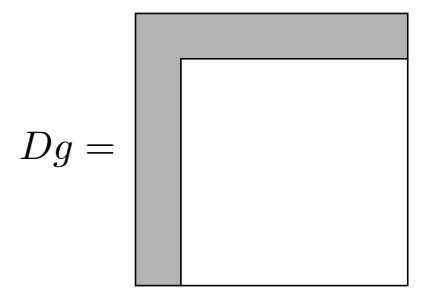

{0}------------------------------------------------

# Combinatorial Rank Attacks Against the Rectangular Simple Matrix Encryption Scheme

Daniel Apon1 , Dustin Moody1 , Ray Perlner1 , Daniel Smith-Tone1,2, and Javier Verbel3

> 1National Institute of Standards and Technology, USA 2University of Louisville, USA 3Universidad Nacional de Colombia, Colombia

daniel.apon@nist.gov,dustin.moody@nist.gov, ray.perlner@nist.gov, daniel.smith@nist.gov, javerbel@unal.edu.co

Abstract. In 2013, Tao et al. introduced the ABC Simple Matrix Scheme for Encryption, a multivariate public key encryption scheme. The scheme boasts great efficiency in encryption and decryption, though it suffers from very large public keys. It was quickly noted that the original proposal, utilizing square matrices, suffered from a very bad decryption failure rate. As a consequence, the designers later published updated parameters, replacing the square matrices with rectangular matrices and altering other parameters to avoid the cryptanalysis of the original scheme presented in 2014 by Moody et al.

In this work we show that making the matrices rectangular, while decreasing the decryption failure rate, actually, and ironically, diminishes security. We show that the combinatorial rank methods employed in the original attack of Moody et al. can be enhanced by the same added degrees of freedom that reduce the decryption failure rate. Moreover, and quite interestingly, if the decryption failure rate is still reasonably high, as exhibited by the proposed parameters, we are able to mount a reaction attack to further enhance the combinatorial rank methods. To our knowledge this is the first instance of a reaction attack creating a significant advantage in this context.

Keywords: Multivariate Cryptography, Simple Matrix, encryption, Min-Rank

### 1 Introduction

Since the discovery by Peter Shor in the 1990s, cf. [26], of polynomial-time quantum algorithms for computing discrete logarithms and factoring integers the proverbial clock has been ticking on our current public key infrastructure. In reaction to this discovery and the continual advancement of quantum computing technologies, a large community has emerged dedicated to the development and deployment of cryptosystems that are immune to the exponential speedups quantum computers promise for our current standards. More recently, the National 

{1}------------------------------------------------

Institute of Standards and Technology (NIST) has begun directing a process to reveal which of the many new options for post-quantum public key cryptography are suitable for widespread use.

One family of candidate schemes relies on the known difficulty of solving large systems of nonlinear equations. These multivariate public key cryptosystems are inspired by computational problems that have been studied by algebraic geometers for several decades. Still, even in the past two decades this field of study has changed dramatically.

When multivariate public key cryptography was still early in its community building phase, a great many schemes were proposed and subsequently attacked. Notable examples of this phenomenon include C ∗ , HFE, STS, Oil-Vinegar, PMI and SFLASH, see [14, 22, 32, 19, 6, 20, 21, 9, 25, 10, 8].

While multivariate cryptography has seen some lasting success with digital signatures, see, for example, [12, 4, 2, 23, 5], multivariate encryption seems to be particularly challenging. In the last several years there have been many new proposals inspired by the notion that it may be easier to create a secure injective multivariate function if the codomain is larger than the domain. Such schemes include ZHFE, Extension Field Cancellation (EFC), SRP, HFERP, EFLASH and the Simple Matrix Encryption Scheme, see [7, 28, 34, 11, 3, 29, 30]. Of these, many have since endured attacks either outright breaking the scheme or affecting parameters, see [1, 27, 24, 15–17].

In this work we present a new attack on the rectangular variant of the Simple Matrix Encryption Scheme, see [30]. This version of the Simple Matrix Encryption Scheme was designed to repair the problems that the original scheme, see [29], had with decryption failures and to choose large enough fields to avoid the attack of [15]. Our new attack is still a MinRank method, but one that exploits the rectangular structure, showing that the new parameterization is actually less secure than the square variant.

In an interesting twist, we also develop a reaction attack based on the decryption failures that the scheme is designed to minimize. This method further boosts the performance of the MinRank step by a factor related to the field size. With these attacks we break all of the published parameter sets at the most efficient field size of 28 , the only parameters for which performance data were offered.

The article is organized as follows. In Section 2, we present the Simple Matrix Scheme. We next review the MinRank attack techniques using properties of the differential that was used against the original square variant of the Simple Matrix scheme. In the subsequent section, we present the improvement obtained in attacking the rectangular variant. Next, in Section 5, we present the reaction attack and discuss its affect on key recovery. We then present a thorough complexity analysis including our experimental data verifying our claimed complexity. Finally, we conclude noting the effect this attack has on the status of multivariate encryption.

{2}------------------------------------------------

### 2 ABC Simple Matrix Scheme

The ABC Simple Matrix Encryption Scheme was introduced in [29] by Tao et al. This scheme was designed with a new guiding principle in mind: make the codomain much larger than the domain. The motivation for this notion comes from the fact that there is a much richer space of injective functions with a large codomain than the space of bijective functions; thus, it may be easier to hide the types of properties we use to efficiently invert nonlinear functions such as low rank or low degree in this larger context. In this section we present the scheme and its functionality.

For clarity of exposition, we establish our notational standard. Throughout this text bold font will indicate a matrix or vector, e.g.  $\mathbf{T}$  or  $\mathbf{z}$ , while regular fonts indicate functions (possibly with outputs considered as matrices) or field elements.

#### 2.1 ABC Public Key Generation

Let  $\mathbb{F}$  be a finite field with q elements. Let s be a positive integer and let  $n = s^2$ . Let  $\mathbb{F}[\mathbf{x}]$  be the polynomial ring over  $\mathbb{F}$  in the variables  $\mathbf{x} = [x_1 \cdots x_n]$ .

The public key will be a system of  $m = 2n = 2s^2$  (for our purposes homogeneous) quadratic formulae in  $\mathbb{F}[\mathbf{x}]$ . The public key will ultimately be generated by the standard isomorphism construction  $P = T \circ F \circ U$  where T and U are invertible linear transformations of the appropriate dimensions, and F is a specially structured system of quadratic polynomials. The remainder of this section is devoted to the construction of F. (In general the scheme can and does use rectangular matrices, but for the ease of writing this note, we will assume that the matrices are square for now.)

Define the matrix

$$\mathbf{A} = \begin{bmatrix} x_1 & \cdots & x_s \\ x_{s+1} & \cdots & x_{2s} \\ \vdots & \ddots & \vdots \\ x_{s^2-s+1} & \cdots & x_{s^2} \end{bmatrix}.$$

Further define the  $s \times s$  matrices of  $\mathbb{F}[\mathbf{x}]$  linear forms  $\mathbf{B} = \begin{bmatrix} b_{ij} \end{bmatrix}$  and  $\mathbf{C} = \begin{bmatrix} c_{ij} \end{bmatrix}$ . From these matrices one can construct the matrices  $\mathbf{E}_1 = \mathbf{A}\mathbf{B}$  and  $\mathbf{E}_2 = \mathbf{A}\mathbf{C}$ .

Then we construct a system of m polynomials by concatenating the vectorizations of these two products:  $F = Vec(\mathbf{E}_1) || Vec(\mathbf{E}_2)$ . The public key is then  $P = T \circ F \circ U$ . (Note that we can eliminate U by replacing  $\mathbf{A}$  with random linear forms.)

In the rectangular version of this scheme we replace **A** by a similar  $r \times s$  version (and we can make the matrices **B** and **C** of size  $s \times u$  and  $s \times v$ , respectively) where the algebra still works the same.

#### 2.2 Encryption and Decryption

Encryption is accomplished by evaluating the public key at a plaintext value encoded as a vector  $\mathbf{x}$ . One computes  $P(\mathbf{x}) = \mathbf{y}$ .

{3}------------------------------------------------

Decryption is accomplished by inverting each of the components of the public key. One first sets  $\mathbf{v} = T^{-1}(\mathbf{y})$ . Then  $\mathbf{v}$  can be split in half producing  $\mathbf{v}_1$  and  $\mathbf{v}_2$ . Each of these can be parsed as a matrix by inverting the vectorization operator  $\mathbf{E}_1 = Mat(\mathbf{v}_1)$  and  $\mathbf{E}_2 = Mat(\mathbf{v}_2)$ .

We note that we can consider this pair of matrices as values derived from functions on either the inputs  $\mathbf{x}$  or the outputs  $\mathbf{y}$ . The legitimate user knows both of these representations. We will abuse notation slightly and denote these functions as  $E_1(\mathbf{u})$ ,  $E_1(\mathbf{v})$ ,  $E_2(\mathbf{u})$  and  $E_2(\mathbf{v})$ , where  $\mathbf{v} = F(\mathbf{u})$  (and we use similar notation for functions of  $\mathbf{u}$  representing the matrices  $\mathbf{A}$ ,  $\mathbf{B}$  and  $\mathbf{C}$ . Thus, we have computed  $\mathbf{E}_1 = E_1(\mathbf{v})$  and  $\mathbf{E}_2 = E_2(\mathbf{v})$ . These values must be equal to  $E_i(\mathbf{u})$ . For both values of i, the function involves a left product by the square matrix  $A(\mathbf{u})$ . We construct a matrix  $\mathbf{W}$  of new variables  $w_i$  for  $0 < i \le s^2$ . We suppose that the correct assignment of values in  $A(\mathbf{u})$  produces a matrix with a left inverse, so the correct assignment of variables  $w_i$  produces a valid left inverse. Then we have

$$\mathbf{WE}_1 = \mathbf{W}E_1(\mathbf{u}) = \mathbf{W}A(\mathbf{u})B(\mathbf{u}) = B(\mathbf{u}),$$

and similarly for  $\mathbf{E}_2$ . Since the legitimate user knows the linear forms  $b_{ij}$  and  $c_{ij}$ , this setup provides a system of  $m=2s^2$  equations in the  $s^2+s^2$  variables  $w_i$  and  $u_i$ . Via Gaussian elimination, the  $w_i$  variables can be eliminated and values for  $u_i$  can be recovered.

Once **u** is recovered, one applies the inverse of U to this quantity to recover **x**, the plaintext.

### 3 Previous Cryptanalysis

In this section, we summarize the technique from [15] recovering a secret key in the square case, that is when r = s, via MinRank informed by differential invariant structure. For convenience, we present the relevant definitions we will use in Section 4, possibly generalized to the rectangular setting.

The main object used in the attack from [15] is the discrete differential of the public key.

**Definition 1** Let  $F: \mathbb{F}^n \to \mathbb{F}^m$ . The discrete differential of F is a bivariate analogue of the discrete derivative; it is given by the normalized difference

$$DF(\mathbf{a}, \mathbf{x}) = F(\mathbf{a} + \mathbf{x}) - F(\mathbf{a}) - F(\mathbf{x}) + F(\mathbf{0}).$$

DF is a vector-valued function since the output is in  $\mathbb{F}^m$ . Since DF is bilinear, we can think of each coordinate  $DF_i$  as a matrix. We can then consider properties of these matrices as linear operators. In particular, we can consider rank and perform a MinRank attack.

**Definition 2** The MinRank(q, n, m, r) Problem is the task of finding a linear combination over  $\mathbb{F}_q$  of m matrices,  $\mathbf{DQ}_i$ , of size  $n \times n$  such that the resulting rank is at most r.

{4}------------------------------------------------

Although there are many different techniques for solving MinRank, the most relevant technique here is known as linear algebra search. One attempts to guess  $\ell = \lceil \frac{m}{n} \rceil$  vectors that lie in the kernel of the same map. Since matrices with low rank have more linearly independent vectors in their kernels, the distribution of maps whose kernels contain these vectors is skewed toward lower rank maps. Therefore, to solve MinRank, one guesses  $\ell$  vectors  $\mathbf{x}_i$ , sets up the linear system

$$\sum_{i=1}^{m} \tau_i \mathbf{D} \mathbf{Q}_i \mathbf{x}_j = \mathbf{0},$$

for  $j = 1, ..., \ell$ , solves for  $\tau_i$  and computes the rank of  $\sum_{i=1}^m \tau_i \mathbf{DQ}_i$ . If the rank is at or below the target rank then the attack has succeeded. Otherwise another set of vectors is chosen and the process continues.

In [15], the attack is formulated in the language of differential invariants.

**Definition 3** A subspace differential invariant of a vector-valued map F is a triple of vector spaces (X, V, W) such that  $X \subseteq \mathbb{F}^m$ , and  $V, W \subseteq \mathbb{F}^n$  satisfying  $(\mathbf{x} \cdot DF)V \subseteq W$  for all  $\mathbf{x} \in X$  where  $dim(W) \leq dim(V)$ .

In other words, a subspace differential invariant is a subspace X of the span of the  $DF_i$  along with a subspace that is mapped linearly by every map in X into another subspace of no larger dimension. The definition is supposed to capture the idea of a subspace of the span of F acting like a linear map on a subspace of the domain of F.

Differential invariants are related to low rank, but not equivalent. They are useful at providing an algebraic condition on interlinked kernels, that is, when there are very many maps in the span of F that have low rank and share a large common subspace in their kernels, see [33]. In such a case, the invariant structure provides a tiny and insignificant savings in some linear algebra steps after the hard MinRank step of the attack is complete. The main value of the idea lies in providing algebraic tools for determining whether an interlinked kernel structure is present in a map.

Considering the Simple Matrix Scheme, there are maps in the span of the public maps that correspond to products of the first row of **A** and linear combinations of the columns of **B** and **C**. The differential of this type of map has the following structure, where gray indicates possibly nonzero coefficients.

This map is clearly of low rank, probably 2s, and illustrates a differential invariant because a column vector with zeros in the top s entries is mapped by this matrix to a vector with zeros in everything except the top s entries. Also,

{5}------------------------------------------------

it is important to note that there is an entire u + v dimensional subspace of the public key corresponding to the X in Definition 3 that produces differentials of this shape which we call a band space. There is nothing special about the first row. We could use anything in the rowspace of  $\mathbf{A}$  and express our differential as above in the appropriate basis. This motivates the following definition modified from [15, Definition 4]:

**Definition 4** Fix an arbitrary vector  $\mathbf{v}$  in the rowspace of  $\mathbf{A}$ , i.e.  $\mathbf{v} = \sum_{d=1}^{r} \lambda_d \mathbf{A}_d$  where  $\mathbf{A}_d$  is the dth row of  $\mathbf{A}$ . The u+v dimensional space of quadratic forms  $\mathcal{B}_v$  given by the span of the columns of  $\mathbf{vB}$  and  $\mathbf{vC}$  is called the generalized band-space generated by  $\mathbf{v}$ .

Thus, recovery of an equivalent private key is accomplished by discovering r linearly independent band spaces in the span of the public key. Since these maps all share the property that they are of rank 2s, the band spaces can be recovered with a MinRank attack.

Due to the differential invariant structure, it is shown in [15] that there is a significant speed-up in the standard linear algebra search variant of MinRank. The attack proceeds by finding  $\lceil \frac{m}{n} \rceil$  vectors in the kernel of the same band space map.

A series of statements about such maps are proven in [15] in the square case revealing the complexity of the MinRank step of the attack.

**Definition 5** Let  $u_1, \ldots, u_{rs}$  be the components of  $\mathbf{U}\mathbf{x}$  and fix an arbitrary vector  $\mathbf{v}$  in the rowspace of  $\mathbf{A}$ , i.e.  $\mathbf{v} = \sum_{d=1}^{r} \lambda_d \mathbf{A}_d$  where  $\mathbf{A}_d$  is the dth row of  $\mathbf{A}$ . An rs-dimensional vector,  $\mathbf{x}$  is in the band kernel generated by  $\mathbf{v}$ , denoted  $\mathcal{B}_{\mathbf{v}}$  if and only if  $\sum_{d=1}^{r} \lambda_d u_{ds+k} = 0$  for  $k = 1, \ldots, s$ .

As shown in [15] membership in the band kernel requires that s linear forms vanish; the probability of this occurrence is  $q^{-s}$ . They then show that given two maps in the same band kernel, the probability that they are in the kernel of the same band space map is  $q^{-1}$ . Therefore the complexity of searching for a second vector given one vector in a band kernel is  $q^{s+1}$ . Since  $\mathbf{A}$  is singular with probability approximately  $q^{-1}$  for sufficiently large q, the total probability of randomly selecting two vectors that are simultaneously in the kernel of the same band space map is  $q^{-s-2}$ .

While in [15] it was noted that there are some dependencies in the linear systems resulting in the need to search through a nontrivial space in the case that the characteristic is 2 or 3, it was discovered in [17] that we can add constraints to the system reducing the dimension and eliminating the search. Therefore the complexity of searching for a band space map is the same for all fields. The techniques in [17] can also be adapted to require only 2 band space maps for key recovery, the second of which can be found more cheaply by reusing one of the vectors used to find the first band space map. Since we have to compute the rank of an  $n \times n$  matrix for each guess, the complexity of the attack is  $\mathcal{O}(n^{\omega}q^{s+2})$  including the linear algebra overhead.

{6}------------------------------------------------

### 4 Combinatorial Key Recovery, the Rectangular Case

The change from square instances of the Simple Matrix scheme to rectangular instances was proposed in [30] as a way of improving efficiency by having smaller fields while maintaining a low decryption failure rate. Still requiring a left inverse of  $\mathbf{A}$ , the proposal requires that r > s. Notice, however, that this implies that there is a nontrivial left kernel of  $A(\mathbf{x})$  for any vector  $\mathbf{x}$ !

Specifically, notice that since there are more rows than columns in **A** for the new parameters, there is always a linear combination of the rows producing the zero vector for any input. Thus, there is no search through plaintexts to find a vector in some band kernel.

In fact, the situation is worse. Note that any plaintext  $\mathbf{x}$  is guaranteed to produce an  $\mathbf{A}$  for which there are r-s linearly independent combinations of row vectors producing zero. Therefore  $\mathbf{x}$  is in very many distinct band spaces. This fact reduces the complexity of finding a second vector in the band kernel considerably, as we now show.

#### 4.1 The Probability of Choosing a Second Band Kernel Vector

A vector  $\mathbf{u} = (u_1, u_2, \dots, u_{rs})$  belongs to a band kernel  $\mathcal{B}_{\mathbf{v}}$  if there is a nonzero vector  $\mathbf{v} \in \mathbb{F}^r$  such that for  $i = 1, \dots, s$ 

$$\mathbf{v} \cdot \mathbf{u}_i = 0$$
, where  $\mathbf{u}_i = (u_i, u_{r+i}, \dots, u_{((r-1)s+i)})$ .

That is, each subvector  $\mathbf{u}_i$  belongs to the orthogonal space  $\langle \mathbf{v} \rangle^{\perp}$ .

Since the space  $\langle \mathbf{v} \rangle^{\perp}$  has dimension r-1, membership of each subvector in this space can be modeled as the satisfaction of one linear relation; therefore, there are a total of s linear constraints on  $\mathbf{u}$  defining membership in the  $\mathcal{B}_{\mathbf{v}}$ . Thus, for any uniformly chosen vector  $\mathbf{u} \in \mathbb{F}^{rs}$  we have

$$Pr(\mathbf{u} \in \mathcal{B}_{\mathbf{v}}) = q^{-s}.$$

Now consider a vector  $\mathbf{w} \in \mathbb{F}^r$  linearly independent with  $\mathbf{v}$ . The dimension of the orthogonal space  $(\mathbf{w} \oplus \mathbf{v})^{\perp}$  is r-2. Thus by the same reasoning as above,

$$Pr\left(\mathbf{u} \in \mathcal{B}_{\mathbf{w}} \cap \mathcal{B}_{\mathbf{v}}\right) = q^{-2s}.$$

In the case r = s + 1, we are assured that a plaintext  $\mathbf{x}$  gives us  $\mathbf{u} \in \mathcal{B}_{\mathbf{v}}$ , where  $\mathbf{u} = U\mathbf{x}$ . Therefore membership of a second vector in the same band kernel occurs with probability  $q^{-s}$ , and the complexity of finding the second vector is  $q^s$ .

In the case that r > s+1, for each plaintext  $\mathbf{x}$  we are guaranteed that there are r-s linearly independent vectors  $\mathbf{v}_1, \ldots, \mathbf{v}_{r-s}$  such that  $\mathbf{u} \in \mathcal{B}_{\mathbf{v}_i}$ . Therefore  $\mathbf{u}$  belongs to

$$\ell = \frac{q^{r-s} - 1}{q - 1} = q^{r-s-1} + q^{r-s-2} + \dots + q + 1$$

{7}------------------------------------------------

distinct band kernels. Let them be  $\mathcal{B}_{v_1}, \mathcal{B}_{v_2}, \dots, \mathcal{B}_{v_\ell}$ . Here it might be the case that  $\mathcal{B}_{v_i} \cap \mathcal{B}_{v_j} \neq \mathcal{B}_{v_s} \cap \mathcal{B}_{v_k}$ , but all the intersections have the same dimension rs - 2s. So, the probability  $\mathbf{u}$ , chosen at random, belongs to one of them is roughly

$$Pr\left(\mathbf{u} \in \bigcup_{k=1}^{\ell} \mathcal{B}_{v_k}\right) \approx \frac{\left(\sum_{i=0}^{r-s-1} q^i\right) q^{rs-s} - \left(\sum_{i=0}^{r-s-1} q^i\right) q^{rs-2s}}{q^{rs}}$$
$$\approx q^{r-2s-1} - q^{2(r-2s-1)}$$
$$\approx q^{r-2s-1}.$$

Thus, the complexity of finding a second band kernel vector is roughly  $q^{2s+1-r}$ .

#### 4.2 The effect of u + v > 2s

A further effect of the rectangular augmentation of the Simple Matrix Scheme is that it requires the number of columns of the matrices **B** and **C** to be increased for efficiency. We therefore find that all of the proposed parameters with  $q < 2^{32}$  have  $u + v \ge 2s + 4$ .

**Theorem 1** If  $\mathbf{x}_1$  and  $\mathbf{x}_2$  fall within the band kernel  $\mathcal{B}_{\mathbf{v}}$ , then they are both in the kernel of some generalized band-space differential  $\mathbf{DQ} = \sum_{Q_i \in \mathcal{B}_{\mathbf{v}}} \tau_i \mathbf{DQ}_i$  with probability approximately  $q^{-1}$  if u + v = 2s and probability 1 if u + v > 2s. Further, if u + v > 2s then there exists, with probability 1, some (u + v - 2s)-dimensional subspace of  $\mathcal{B}_{\mathbf{v}}$ , all elements of which have both vectors in their kernel.

*Proof.* There are two cases: (i) u + v = 2s and (ii) u + v > 2s. The first case follows exactly from [15, Theorem 2]. The second case is new, so we focus on this second case in what follows. This will be quite similar to the original proof, but we include the full details for the reader.

A  $\mathbf{DQ}$  meeting the above condition exists iff there is a nontrivial solution to the following system of equations

$$\sum_{Q_i \in \mathcal{B}_v} \tau_i \mathbf{D} \mathbf{Q}_i \mathbf{x_1}^T = 0$$

$$\sum_{Q_i \in \mathcal{B}_v} \tau_i \mathbf{D} \mathbf{Q}_i \mathbf{x_2}^T = 0.$$
(1)

Expressed in a basis where the first s basis vectors are chosen to be outside the band kernel, and the remaining n-s basis vectors are chosen from within the band kernel, the band-space differentials take the form:

$$\mathbf{DQ}_i = \begin{bmatrix} \mathbf{S}_i & \mathbf{R}_i \\ \mathbf{R}_i^T & 0 \end{bmatrix}, \tag{2}$$

{8}------------------------------------------------

where  $R_i$  is a random  $s \times n - s$  matrix and  $S_i$  is a random symmetric  $s \times s$  matrix. Likewise  $\mathbf{x_1}$  and  $\mathbf{x_2}$  take the form  $(0 \mid \mathbf{x_k})$ . Thus removing the redundant degrees of freedom we have the system of 2s equations in u + v variables:

$$\sum_{i=1}^{u+v} \tau_i \mathbf{R}_i \mathbf{x_1}^T = 0$$

$$\sum_{i=1}^{u+v} \tau_i \mathbf{R}_i \mathbf{x_2}^T = 0.$$
(3)

This has a nontrivial solution precisely when the following matrix has a nontrivial right kernel:

$$\begin{bmatrix}$$

By the assumption that u+v > 2s, this matrix has more columns than rows, and therefore must have a nontrivial right kernel with probability 1. Moreover, with probability 1, this right kernel has dimension at least u+v-2s. Therefore, any differential produced by taking the direct product of  $(Q_1, ..., Q_{u+v})$ , where  $Q_1, ..., Q_{u+v}$  are the generators of  $\mathcal{B}_v$ , and a right kernel vector of the aforementioned matrix will have both  $\mathbf{x}_1$  and  $\mathbf{x}_2$  in its kernel.

### 4.3 Controlling the Ratio $\frac{m}{n}$ .

The new parameters presented in [30] added another feature to Simple Matrix: the ability to decouple the number of variables n from the size rs of the matrix A. The authors want to ensure that the number of equations is not significantly more than twice the number of variables so that the first fall degree of the system is not diminished.

In all but the case of  $q = 2^8$ , the authors of [30] propose parameters with m = 2n. In the case of  $q = 2^8$ , however, the relationship is more complicated. All parameters in this case are functions of s. Specifically, r = s + 3, u = v = s + 4, n = s(s+8) and m = 2(s+3)(s+4). Therefore m - 2n = 24 - 2s.

For small s, this change poses a challenge to the linear algebra search Min-Rank method. The reason is that choosing merely two kernel vectors results in a system that is underdetermined, and since the size of the field is still fairly large  $q = 2^8$ , it is very costly to search through the solution space. On the other hand, if we increase the number of kernel vectors we guess to three, we have an additional factor of  $q^s$  in our complexity estimate.

Luckily, there is an easy way to handle this issue. We simply ignore some of the public differentials. Consider the effect of removing a of the public equations

{9}------------------------------------------------

on the MinRank attack. If  $a \ge m-2n$ , then we need to only consider  $\lceil \frac{m-a}{n} \rceil = 2$  kernel vectors. Since the expected dimension of the intersection of any band space, which is of dimension u+v, and the span of the m-a remaining public maps is (u+v)+(m-a)-m=u+v-a, we can apply Theorem 1 with u+v-a in place of u+v. We have now shown the following:

Corollary 1 Consider the public key P with a equations removed. Let  $\widehat{\mathcal{B}}_{\mathbf{v}}$  be the intersection of the band space  $\mathcal{B}_{\mathbf{v}}$  and the remaining public maps. If  $\mathbf{x}_1, \mathbf{x}_2 \in \mathcal{B}_{\mathbf{v}}$ , then there exists a band-space differential  $\mathbf{DQ} = \sum_{Q_i \in \widehat{\mathcal{B}}_{\mathbf{v}}} \tau_i \mathbf{DQ}_i$  whose kernel contains both  $\mathbf{x}_1$  and  $\mathbf{x}_2$  with probability approximately  $q^{-1}$  if u + v - a = 2s and probability 1 if u + v - a > 2s. Further, if u + v - a > 2s then there exists, with probability 1, some (u + v - a - 2s)-dimensional subspace of  $\widehat{\mathcal{B}}_{\mathbf{v}}$ , all elements of which have both vectors in their kernel.

Considering the parameters from [30], we see that the largest value of a required to produce a fully determined MinRank system with two kernel vectors is in the case that s=8 producing a=m-2n=24-2s=8. In this same set of parameters u=v=s+4 so that u+v=2s+8. Therefore, Corollary 1 applies.

### 5 Improvements from a Reaction Attack

As noted in [30], the original proposal of the square version of Simple Matrix, cf. [29], did not properly address decryption failures. To maintain performance and avoid the attack from [15], the rectangular scheme was introduced with many possible field sizes. Still, the proposed parameters only made decryption failures less common but not essentially impossible. The smallest decryption failure rate for parameters in [30] is  $2^{-64}$  and the only parameters with sufficiently good performance to advertise had decryption failure rates of  $2^{-32}$ .

These augmentations addressed decryption failures out of precaution, but had no claim of how such failures could be used to undermine the scheme. In this section we develop an enhancement of our combinatorial key recovery from the previous section utilizing these decryption failures. To our knowledge, this is the first example of a key recovery reaction attack against a multivariate scheme in this context.

#### 5.1 Decryption Failures in the Simple Matrix scheme

As described in Subsection 2.2, the decryption algorithm of Simple Matrix assumes that the matrix  $A(\mathbf{u})$  has a left inverse. This property is exactly the same assumption in the more general case of rectangular matrices as well. The failure of  $A(\mathbf{u})$  to be full rank makes the decryption algorithm fail, producing decryption failures. One could imagine guessing which rows of **WA** could be made into elementary basis vectors trying to recover linear relations on the values of  $\mathbf{u}$  to recover a quadratic system in fewer variables which may produce an unique preimage, but this is costly in performance and still allows an adversary to detect when  $A(\mathbf{u})$  is not of full rank.

{10}------------------------------------------------

If we consider **A** to be rectangular, say  $r \times s$ , then we need the number of rows r to be greater than or equal to s. Then we may still have a left inverse **W**, an  $s \times r$  matrix satisfying  $\mathbf{W}\mathbf{A} = \mathbf{I}_s$ . The probability of the existence of at least one such **W** is the same as the probability that the rows of **A** span  $\mathbb{F}^s$ . Thus

$$Pr(\text{Rank}(\mathbf{A}) < s) = 1 - \prod_{i=r-s+1}^{r} (1 - q^{-i}) \approx q^{s-r-1}.$$

Notice that decryption failure reveals precise information about the internal state of the decryption algorithm. Specifically, the quantity  $A(\mathbf{u})$  where  $\mathbf{u} = U(\mathbf{x})$  is not of full rank. Even for very large q, one requires a disparity in the values r and s to make the decryption failure rate very low. Even for the parameters proposed having the smallest decryption failure rate,  $q = 2^{32}$  and r = s + 1, the probability of decryption failure is  $2^{-64}$  and  $2^{64}$  decryption queries on average are needed to detect a decryption failure.

#### 5.2 The Reaction Attack

Consider, for a moment, the square case of the Simple Matrix Scheme, that is, when r = s. In the search process, you try to find two vectors  $\mathbf{x}_1$  and  $\mathbf{x}_2$  that are simultaneously in the kernel of the same linear combination of the public differentials. For the search to succeed in finding a band map you need three events to simultaneously occur:  $(P_1)$   $\mathbf{x}_i$  to be in the band kernel of a band space;  $(P_2)$   $\mathbf{x}_{3-i}$  to be in the band kernel of the same band space; and,  $(P_3)$  for them to both be in the kernel of the same band space map.

The probability of these events occurring simultaneously is then

$$Pr(P_1 \wedge P_2 \wedge P_3) = Pr(P_1)Pr(P_2|P_1)Pr(P_3|P_1 \wedge P_2) = q^{-1} \cdot q^{-s} \cdot q^{-1} = q^{-s-2}.$$

So, it takes  $q^{s+2}$  guesses in expectation to succeed in finding two such vectors and thereby recover a band space.

Notice that decryption failure occurs when the matrix  $\mathbf{A}$  is singular, which is exactly the condition for membership in some band kernel. Thus, the first vector lying in a band kernel need not be found by search. If you already have access to a decryption failure producing plaintext, then the first condition is satisfied saving a factor of q in complexity at the cost of q decryption queries. So this component of q is now, in some sense, additive instead of multiplicative in the complexity analysis of the attack. Therefore, if the decryption failure rate is sufficiently low, a reaction attack can be employed.

We find that decryption failures provide a similar advantage in the rectangular case as well. When r > s, a decryption failure  $\mathbf{x}$  assures the existence of r - s + 1 linearly independent vectors  $v_1, \ldots, v_{r-s+1} \in \mathbb{F}^r$  such that  $\mathbf{u} \in \mathcal{B}_{v_1} \cap \cdots \cap \mathcal{B}_{v_{r-s+1}}$ , where  $\mathbf{u} = U\mathbf{x}$ . Thus we know for sure there are

$$\ell = \frac{q^{r-s+1} - 1}{q-1} = q^{r-s} + q^{r-s-1} + \dots + q + 1$$

{11}------------------------------------------------

distinct band kernel spaces in which **u** belongs. Let them be  $\mathcal{B}_{v_1}, \mathcal{B}_{v_2}, \ldots, \mathcal{B}_{v_\ell}$ . Here it might be the case that  $\mathcal{B}_{v_i} \cap \mathcal{B}_{v_j} \neq \mathcal{B}_{v_s} \cap \mathcal{B}_{v_k}$ , but all the intersection have the same dimension rs - 2s. So, the probability that **u**, chosen at random, belongs to one of them is roughly

$$Pr\left(\mathbf{u} \in \bigcup_{k=1}^{\ell} \mathcal{B}_{v_k}\right) \approx \frac{\left(\sum_{i=0}^{r-s} q^i\right) q^{rs-s} - \left(\sum_{i=0}^{r-s} q^i\right) q^{rs-2s}}{q^{rs}}$$
$$\approx q^{r-2s} - q^{2(r-2s)}$$
$$\approx q^{r-2s}.$$

### 6 Complexity

Noting that there is statistically no difference between using the input transformation U and choosing  $\mathbf{A}$  to consist of random linear forms, we note that full key extraction including the input and output transformations proceeds as in [17]. Since this last part occurs after the recovery of the band spaces, it is of additive complexity. Therefore the complexity of the attack is equivalent to the MinRank step plus some additive overhead.

Recovering a band space then requires  $q^{2s+1-r}$  iterations of solving a linear system of size n and rank calculations on a matrix of size n. (Note that in this case, finding the second map from the same band space is cheaper by a factor of q.) Thus the complexity of the combinatorial key recovery is  $\mathcal{O}(n^{\omega}q^{2s+1-r})$ , where  $\omega$  is the linear algebra constant. We note that in practice that assuming  $\omega$  takes a value of approximately 2.8 results in a big-oh constant of less than one.

In the case of the reaction attack, recovering two maps from a band space requires only  $2q^{2s-r}$  iterations of system solving and rank calculations. Therefore, for the reaction attack, the complexity is  $\mathcal{O}(n^{\omega}q^{2s-r})$ . The actual complexity in field operations for completing the attacks are listed in Table 3.

Using SAGE1 [31], we performed some minrank computations on small scale variants of the ABC scheme. The computations were done on a computer with a 64 bit quad-core Intel i7 processor, with clock cycle 2.8 GHz. We were interested in verifying our complexity estimates on the most costly step in the attack, the MinRank instance, rather than the full attack on the scheme. Given as input the finite field size q, and the scheme parameter s, we computed the average number of vectors  $\mathbf{x}$  required to be sampled in order to recover a matrix of rank 2s. For our first experiment we set our parameters to u = v = s + 1, r = s + 2, and n = ru = (s + 1)(s + 2). Our results are provided in Table 1.

For higher values of q and s the computations took too long to produce sufficiently many data points and obtain meaningful results with SAGE. Our analysis predicted the number of vectors needed would be on the order of  $\exp(q-1)q^{s-3}$ . Table 1 shows the comparison between our experiments and the expected value. We only used a small number of trials, particularly for the higher values of s listed for each q.

&lt;sup>1 Any mention of commercial products does not indicate endorsement by NIST.

{12}------------------------------------------------

We also ran another experiment exhibiting the behavior of the attack when 2n > m. We used u = v = s + 1, r = s + 2, and n = ru − 1 = s 2 + 3s + 1. We then threw away two of the equations generated. Our analysis predicted the number of trials required to be roughly (q −1)q s−2 . The resulting data are given in Table 2. The expected number of trials was Exp=(q − 1)q s−2 .

|       |             |     |    |      |    | s = 3 Exp s = 4 Exp s = 5 |     | Exp s = 6 Exp s = 7 Exp |    |      |     |
|-------|-------------|-----|----|------|----|---------------------------|-----|-------------------------|----|------|-----|
|       | q = 2       | 1.8 | 1  | 3.0  | 2  | 4.7                       | 4   | 6.6                     | 8  | 15.8 | 16  |
|       | q = 3       | 2.5 | 2  | 6.6  | 6  | 19.1                      | 18  | 53.1                    | 54 | 173  | 162 |
|       | q = 4       | 3.1 | 3  | 11.9 | 12 | 47.6                      | 48  | 189.0 192               |    |      |     |
| !htbp | q = 5       | 4.3 | 4  | 20.6 | 20 | 99.4                      |     | 100 520.8 500           |    |      |     |
|       | q = 7       | 6.5 | 6  | 40.6 | 42 | 281.4                     | 284 | 1873 1988               |    |      |     |
|       | q = 8       | 8   | 7  | 62.8 | 56 | 444.2                     | 448 |                         |    |      |     |
|       | q = 11      | 9.8 | 10 |      |    | 113.6 110 1318.8 1210     |     |                         |    |      |     |
|       | q = 13 11.7 |     | 12 |      |    | 157.7 156 2026.7 2028     |     |                         |    |      |     |

Table 1. Average number of vectors needed for the rank to fall to 2s. This experiment used u = v = s + 1, r = s + 2, and n = ru = (s + 1)(s + 2).

|       |                  |      |    | s = 3 Exp s = 4              | Exp  | s = 5           | Exp | s = 6           | Exp |
|-------|------------------|------|----|------------------------------|------|-----------------|-----|-----------------|-----|
|       | q = 2            | 1.9  | 2  | 4.4                          | 4    | 7               | 8   | 14.5            | 16  |
|       | q = 3            | 5.9  | 6  | 16.3                         | 18   | 47              | 54  | 138.9           | 162 |
| !htbp | q = 5            | 17.9 | 20 | 86.2                         | 100  | 500.3           |     | 500 2137.3 2500 |     |
|       | q = 7            | 36.6 | 35 | 277.7                        |      | 245 2092.3 1715 |     |                 |     |
|       | q = 11 100.4 110 |      |    | 1175                         | 1210 |                 |     |                 |     |
|       |                  |      |    | q = 13 148.3 156 1855.4 2028 |      |                 |     |                 |     |

Table 2. Average number of vectors needed for the rank to fall to 2s. This experiment used u = v = s + 1, r = s + 2, and n = ru − 1 = s 2 + 3s + 1, and did not use two of the equations generated.

# 7 Conclusion

The rectangular version of the Simple Matrix Encryption Scheme is needed to avoid a high decryption failure rate and known attacks. From the analysis made in this paper, we conclude that the security of this version is actually worse than that of the square version. Furthermore, we showed that decryption failures are actually still exploitable in a concrete reaction attack that clearly undermines the security claims of the scheme.

It is interesting to consider the historical difficulty of achieving secure multivariate public key encryption. Even using the relatively new approach of defining public keys with vastly larger codomains— a change which on the surface would

{13}------------------------------------------------

| Scheme                                |     |   | Sec. Level a Comb. Att. Comp. React. Att. Comp. |           |
|---------------------------------------|-----|---|-------------------------------------------------|-----------|
| ABC(28 , 11, 8, 12, 12, 264, 128)  | 80  | 8 | 75.6 2                                       | 67.6 2 |
| ABC(28 , 12, 9, 13, 13, 312, 153)  | 90  | 6 | 76.3 2                                       | 68.3 2 |
| ABC(28 , 13, 10, 14, 14, 364, 180) | 100 | 4 | 85.0 2                                       | 77.0 2 |

Table 3. Complexity of our Combinatorial MinRank and Reaction attacks against q = 28 parameters of the ABC Simple Matrix Encryption Scheme.

seem to allow much greater freedom in selecting secure injective functions— we observe that essentially none of the recent such proposals have attained their claimed level of security after scrutiny. Perhaps there is a fundamental barrier ensuring that any efficiently invertible function must have some exploitable property, such as low rank, preventing the advantage of privileged information of the legitimate user from dramatically separating the complexity of that efficient inversion from the adversary's task. It seems that multivariate encryption is an area still in need of significant development.

# References

- 1. Daniel Cabarcas, Daniel Smith-Tone, and Javier A. Verbel. Key recovery attack for ZHFE. In Lange and Takagi [13], pages 289–308.
- 2. Ryann Cartor and Daniel Smith-Tone. An updated security analysis of PFLASH. In Lange and Takagi [13], pages 241–254.
- 3. Ryann Cartor and Daniel Smith-Tone. EFLASH: A new multivariate encryption scheme. In Carlos Cid and Michael J. Jacobson Jr., editors, Selected Areas in Cryptography - SAC 2018 - 25th International Conference, Calgary, AB, Canada, August 15-17, 2018, Revised Selected Papers, volume 11349 of Lecture Notes in Computer Science, pages 281–299. Springer, 2018.
- 4. M.-S. Chen, B.-Y. Yang, and D. Smith-Tone. Pflash secure asymmetric signatures on smart cards. Lightweight Cryptography Workshop 2015, 2015. http://csrc.nist.gov/groups/ST/lwc-workshop2015/papers/session3-smithtone-paper.pdf.
- 5. J. Ding and D. Schmidt. Rainbow, a new multivariable polynomial signature scheme. ACNS 2005, LNCS, 3531:164–175, 2005.
- 6. Jintai Ding. A new variant of the matsumoto-imai cryptosystem through perturbation. In Feng Bao, Robert H. Deng, and Jianying Zhou, editors, Public Key Cryptography - PKC 2004, 7th International Workshop on Theory and Practice in Public Key Cryptography, Singapore, March 1-4, 2004, volume 2947 of Lecture Notes in Computer Science, pages 305–318. Springer, 2004.
- 7. Jintai Ding, Albrecht Petzoldt, and Lih-chung Wang. The cubic simple matrix encryption scheme. In Mosca [18], pages 76–87.
- 8. Vivien Dubois, Pierre-Alain Fouque, and Jacques Stern. Cryptanalysis of SFLASH with Slightly Modified Parameters. In Moni Naor, editor, EUROCRYPT, volume 4515 of Lecture Notes in Computer Science, pages 264–275. Springer, 2007.
- 9. J. C. Faugere. Algebraic cryptanalysis of hidden field equations (HFE) using grobner bases. CRYPTO 2003, LNCS, 2729:44–60, 2003.
- 10. Pierre-Alain Fouque, Louis Granboulan, and Jacques Stern. Differential cryptanalysis for multivariate schemes. In Ronald Cramer, editor, Advances in Cryptology

{14}------------------------------------------------

- EUROCRYPT 2005, 24th Annual International Conference on the Theory and Applications of Cryptographic Techniques, Aarhus, Denmark, May 22-26, 2005, Proceedings, volume 3494 of Lecture Notes in Computer Science, pages 341–353. Springer, 2005.
- 11. Yasuhiko Ikematsu, Ray A. Perlner, Daniel Smith-Tone, Tsuyoshi Takagi, and Jeremy Vates. HFERP - A new multivariate encryption scheme. In Tanja Lange and Rainer Steinwandt, editors, Post-Quantum Cryptography - 9th International Conference, PQCrypto 2018, Fort Lauderdale, FL, USA, April 9-11, 2018, Proceedings, volume 10786 of Lecture Notes in Computer Science, pages 396–416. Springer, 2018.
- 12. A. Kipnis, J. Patarin, and L. Goubin. Unbalanced oil and vinegar signature schemes. EUROCRYPT 1999. LNCS, 1592:206–222, 1999.
- 13. Tanja Lange and Tsuyoshi Takagi, editors. Post-Quantum Cryptography 8th International Workshop, PQCrypto 2017, Utrecht, The Netherlands, June 26-28, 2017, Proceedings, volume 10346 of Lecture Notes in Computer Science. Springer, 2017.
- 14. Tsutomu Matsumoto and Hideki Imai. Public Quadratic Polynominal-Tuples for Efficient Signature-Verification and Message-Encryption. In EUROCRYPT, pages 419–453, 1988.
- 15. Dustin Moody, Ray A. Perlner, and Daniel Smith-Tone. An asymptotically optimal structural attack on the ABC multivariate encryption scheme. In Mosca [18], pages 180–196.
- 16. Dustin Moody, Ray A. Perlner, and Daniel Smith-Tone. Key recovery attack on the cubic ABC simple matrix multivariate encryption scheme. In Roberto Avanzi and Howard M. Heys, editors, Selected Areas in Cryptography - SAC 2016 - 23rd International Conference, St. John's, NL, Canada, August 10-12, 2016, Revised Selected Papers, volume 10532 of Lecture Notes in Computer Science, pages 543– 558. Springer, 2016.
- 17. Dustin Moody, Ray A. Perlner, and Daniel Smith-Tone. Improved attacks for characteristic-2 parameters of the cubic ABC simple matrix encryption scheme. In Lange and Takagi [13], pages 255–271.
- 18. Michele Mosca, editor. Post-Quantum Cryptography 6th International Workshop, PQCrypto 2014, Waterloo, ON, Canada, October 1-3, 2014. Proceedings, volume 8772 of Lecture Notes in Computer Science. Springer, 2014.
- 19. J. PATARIN. The oil and vinegar signature scheme. Dagstuhl Workshop on Cryptography September, 1997, 1997.
- 20. J. Patarin, N. Courtois, and L. Goubin. Flash, a fast multivariate signature algorithm. CT-RSA 2001, LNCS, 2020:297–307, 2001.
- 21. Jacques Patarin. Cryptoanalysis of the Matsumoto and Imai Public Key Scheme of Eurocrypt '88. In Don Coppersmith, editor, CRYPTO, volume 963 of Lecture Notes in Computer Science, pages 248–261. Springer, 1995.
- 22. Jacques Patarin. Hidden Fields Equations (HFE) and Isomorphisms of Polynomials (IP): Two New Families of Asymmetric Algorithms. In EUROCRYPT, pages 33– 48, 1996.
- 23. Jacques Patarin, Nicolas Courtois, and Louis Goubin. Quartz, 128-bit long digital signatures. In David Naccache, editor, CT-RSA, volume 2020 of Lecture Notes in Computer Science, pages 282–297. Springer, 2001.
- 24. Ray A. Perlner, Albrecht Petzoldt, and Daniel Smith-Tone. Total break of the SRP encryption scheme. In Carlisle Adams and Jan Camenisch, editors, Selected Areas in Cryptography - SAC 2017 - 24th International Conference, Ottawa, ON,

{15}------------------------------------------------

- Canada, August 16-18, 2017, Revised Selected Papers, volume 10719 of Lecture Notes in Computer Science, pages 355–373. Springer, 2017.
- 25. A. Shamir and A. Kipnis. Cryptanalysis of the oil & vinegar signature scheme. CRYPTO 1998. LNCS, 1462:257–266, 1998.
- 26. P. W. Shor. Polynomial-time algorithms for prime factorization and discrete logarithms on a quantum computer. SIAM J. Sci. Stat. Comp., 26, 1484, 1997.
- 27. Daniel Smith-Tone and Javier Verbel. A key recovery attack for the extension field cancellation encryption scheme. in concurrent submission to PQCrypto 2020, 2020.
- 28. Alan Szepieniec, Jintai Ding, and Bart Preneel. Extension field cancellation: A new central trapdoor for multivariate quadratic systems. In Tsuyoshi Takagi, editor, Post-Quantum Cryptography - 7th International Workshop, PQCrypto 2016, Fukuoka, Japan, February 24-26, 2016, Proceedings, volume 9606 of Lecture Notes in Computer Science, pages 182–196. Springer, 2016.
- 29. Chengdong Tao, Adama Diene, Shaohua Tang, and Jintai Ding. Simple matrix scheme for encryption. In Philippe Gaborit, editor, PQCrypto, volume 7932 of Lecture Notes in Computer Science, pages 231–242. Springer, 2013.
- 30. Chengdong Tao, Hong Xiang, Albrecht Petzoldt, and Jintai Ding. Simple matrix - A multivariate public key cryptosystem (MPKC) for encryption. Finite Fields and Their Applications, 35:352–368, 2015.
- 31. The Sage Developers. SageMath, the Sage Mathematics Software System (Version 8.7), 2019. https://www.sagemath.org.
- 32. Christopher Wolf, An Braeken, and Bart Preneel. On the security of stepwise triangular systems. Des. Codes Cryptogr., 40(3):285–302, 2006.
- 33. Bo-Yin Yang and Jiun-Ming Chen. Building secure tame-like multivariate publickey cryptosystems: The new TTS. In Colin Boyd and Juan Manuel Gonz´alez Nieto, editors, Information Security and Privacy, 10th Australasian Conference, ACISP 2005, Brisbane, Australia, July 4-6, 2005, Proceedings, volume 3574 of Lecture Notes in Computer Science, pages 518–531. Springer, 2005.
- 34. Takanori Yasuda and Kouichi Sakurai. A multivariate encryption scheme with rainbow. In Sihan Qing, Eiji Okamoto, Kwangjo Kim, and Dongmei Liu, editors, Information and Communications Security - 17th International Conference, ICICS 2015, Beijing, China, December 9-11, 2015, Revised Selected Papers, volume 9543 of Lecture Notes in Computer Science, pages 236–251. Springer, 2015.