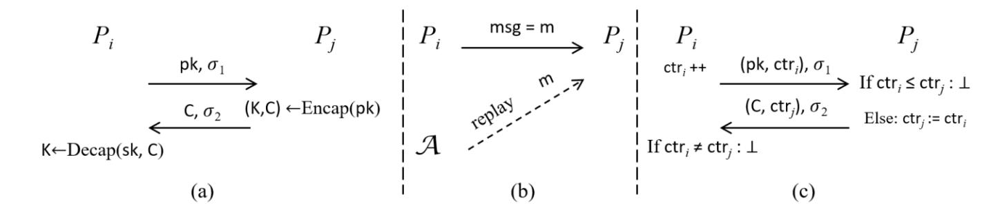

{0}------------------------------------------------

# Two-Pass Authenticated Key Exchange with Explicit Authentication and Tight Security

Xiangyu Liu1,<sup>2</sup> , Shengli Liu1,2,3() , Dawu Gu<sup>1</sup> , and Jian Weng<sup>4</sup>

<sup>1</sup> Department of Computer Science and Engineering, Shanghai Jiao Tong University, Shanghai 200240, China {xiangyu liu,slliu,dwgu}@sjtu.edu.cn

- <sup>2</sup> State Key Laboratory of Cryptology, P.O. Box 5159, Beijing 100878, China <sup>3</sup> Westone Cryptologic Research Center, Beijing 100070, China
  - <sup>4</sup> College of Cyber Security, Jinan University, Guangzhou 510632, China cryptjweng@gmail.com

Abstract. We propose a generic construction of 2-pass authenticated key exchange (AKE) scheme with explicit authentication from key encapsulation mechanism (KEM) and signature (SIG) schemes. We improve the security model due to Gjøsteen and Jager [Crypto2018] to a stronger one. In the strong model, if a replayed message is accepted by some user, the authentication of AKE is broken. We define a new security notion named "IND-mCPA with adaptive reveals" for KEM. When the underlying KEM has such a security and SIG has unforgeability with adaptive corruptions, our construction of AKE equipped with counters as states is secure in the strong model, and stateless AKE without counter is secure in the traditional model. We also present a KEM possessing tight "IND-mCPA security with adaptive reveals" from the Computation Diffie-Hellman assumption in the random oracle model. When the generic construction of AKE is instantiated with the KEM and the available SIG by Gjøsteen and Jager [Crypto2018], we obtain the first practical 2-pass AKE with tight security and explicit authentication. In addition, the integration of the tightly IND-mCCA secure KEM (derived from PKE by Han et al. [Crypto2019]) and the tightly secure SIG by Bader et al. [TCC2015] results in the first tightly secure 2-pass AKE with explicit authentication in the standard model.

Keywords: Authenticated key exchange · Tight security · Explicit authentication · Two-pass protocol

## 1 Introduction

Among the primitives, algorithms and protocols in public key cryptography, authenticated key exchange (AKE) [\[4,](#page-29-0) [7,](#page-30-0) [20,](#page-30-1) [1,](#page-29-1) [11,](#page-30-2) [8,](#page-30-3) [15,](#page-30-4) [6,](#page-29-2) [22\]](#page-30-5) is by far the most widely deployed one in the real world. For example, TLS [\[21\]](#page-30-6) implements AKE to compute shared session keys for peer communication parties. There are several billions of active users in Facebook, Instagram, Wechat, etc., which lead to more than 2<sup>30</sup> TLS handshakes daily [\[11\]](#page-30-2). AKE allows two communication parties to 

{1}------------------------------------------------

share a session key, which is then used to provide security for the later communications of the two parties. The wide deployment of AKE pushes its security to paramount importance. The security of AKE consists of two aspects. One aspect considers passive adversaries, and it requires the pseudorandomness of the shared session key. The other considers authentication to detect active adversaries. The authentication functionality of AKE guarantees the identification of the parties and the integrity of the messages transmitted during AKE, by detecting message modification, discard, insertion, etc., from adversaries. There are two types of authentication, explicit authentication [4, 7, 20, 1, 11] and implicit authentication [16, 8, 6, 15, 22]. Implicit authentication detects active attacks in the later communication (after the completion of key exchange), while explicit authentication detects active attacks during the execution of AKE. Explicit authentication enjoys its own advantages. Once the authentication fails, the protocol execution stops and no subsequent messages follow any more, avoiding unnecessary computation and communication.

The security of AKE (also other cryptographic primitives) is achieved by a security reduction under proper security model. Security reduction transforms the ability of a successful adversary  $\mathcal{A}$  to an algorithm  $\mathcal{B}$  solving a well-known hard problem. If  $\mathcal{A}$  wins with probability  $\epsilon$ , then  $\mathcal{B}$  solves the problem with probability  $\epsilon/L$ . The parameter L is called the security loss factor. If L is a constant (or  $O(\lambda)$  with  $\lambda$  security parameter), the security reduction is tight (almost tight). The loose factor L is generally a polynomial of  $\mu$ , the number of users, and  $\ell$ , the number of executions per user. Given a loose security reduction, the deployment of AKE has to choose a larger security parameter to compensate the loss factor L, resulting in larger elements and slower computations in the execution of AKE. Taking  $\mu \approx 2^{30}$  into account, this will lead to a great efficiency loss of AKE. Therefore, pursuing tight security of AKE is not only of theoretical value but also of practical significance.

#### 1.1 Tightly Secure Authenticated Key Exchange

AKE is generally implemented in the multi-user setting, and it is quite possible for an adversary  $\mathcal{A}$  to adaptively obtain session keys of some protocol instances and/or long-term secret keys of corrupted users. This is formalized by the reveal and corruption queries of  $\mathcal{A}$  in the security model. The security of AKE asks authentication and indistinguishability. Roughly speaking, authentication requires that if a party  $P_i$  uses received messages to compute a session key and accepts it, then the messages must be sent from another (unique) party  $P_j$ , instead of  $\mathcal{A}$ . Indistinguishability characterizes the pseudorandomness of the session key, which is successfully generated and accepted by two parties.

A good choice for AKE is the 2-pass signed Diffie-Hellman protocol [7]. It uses a signature (SIG) scheme to provide authentication and a DH-like key encapsulation mechanism (KEM) to provide indistinguishability, where  $P_i$  contributes  $pk = g^a$ ,  $P_j$  contributes  $C = g^b$  and the session key is  $K = g^{ab}$ . However, as shown by Gjøsteen and Jager [11], it is hard to achieve tight security due to the following "commitment problem": in the reduction, if the DDH challenge

{2}------------------------------------------------

(g x , g<sup>y</sup> , g<sup>z</sup> ) is embedded in the challenge session, then it can not be revealed, and vice verse. Hence, the reduction algorithm has to guess the challenge session (from µ` sessions) and embed the DDH problem into it. That is reason why many protocols [\[16,](#page-30-7) [18,](#page-30-8) [7\]](#page-30-0) have a loose factor L = µ` (or quadratic factor L = µ 2 ` 2 ).

To deal with the "commitment problem", Gjøsteen and Jager [\[11\]](#page-30-2) suggested to add an extra hash commitment G(g a ) as the first message, resulting in a 3-pass signed DH protocol with tight security.

Up to now, there are only two constructions of AKE [\[1,](#page-29-1) [11\]](#page-30-2) with tight security and explicit authentication, and both need three passes. One is the 3-pass signed DH protocol in the random oracle model [\[11\]](#page-30-2), as mentioned above. The other is a 3-pass AKE in the standard model by Bader et al. [\[1\]](#page-29-1). This AKE is constructed from a SIG scheme secure against adaptive corruptions (MU-EUF-CMAcorr security), a strongly secure one-time SIG and a KEM scheme secure against adaptive corruptions (MU-IND-CPAcorr security). The KEM is constructed from two public key encryption schemes, where the ciphertext is two encryptions of the same random encapsulated key. Note that such a KEM is not a good choice for AKE, since the session key is completely determined by the responder.

Over these years, reducing the round complexity and pursuing low-latency key exchange have become a major design criteria [\[13,](#page-30-9) [10,](#page-30-10) [17,](#page-30-11) [21\]](#page-30-6) by both researchers and practitioners. Compared with 3-pass protocols, 2-pass protocols are clearly more efficient, especially when the transmission time is high. Furthermore, in a 2-pass AKE, any modification of the last (2nd) message can be detected immediately, and no payloads from the initiator follow, which saves computation and communication resources. Hence, a natural question is:

Is it possible to construct 2-pass AKE with explicit authentication and tight security?

#### 1.2 Our Approach

We answer the above question in the affirmative.

Achieving Tight Security. Our generic construction of AKE consists of two building blocks, KEM and SIG. KEM is used to generate the session key, where initiator P<sup>i</sup> contributes pk and responder P<sup>j</sup> contributes ciphertext C under pk. We rely on KEM's security to guarantee the pseudorandomness of the session key. Meanwhile, every party has a signing key as its long-term secret key, and every transmitted message is signed by SIG, which provides authentication to resist active attacks. See Fig. [1](#page-4-0) (a) for the construction.

We solve the "commitment problem" with a tightly IND-mCPAreveal secure KEM. The IND-mCPAreveal security is a new notion, which allows the adversary to reveal the encapsulated keys from the challenge ciphertexts. With such a KEM, the reduction algorithm B can embed challenge ciphertexts to every session of AKE, while keeping the ability of answering reveal queries from A. We also ask KEM to have diverse property (subsec. [2.3\)](#page-9-0) to make sure that both initiator and responder contribute to the session key. Meanwhile, SIG is required to have tight MU-EUF-CMAcorr security, where the adversary can corrupt some users to get their signing keys.

{3}------------------------------------------------

Currently, tight MU-EUF-CMA<sup>corr</sup> secure SIGs are available [1, 11]. To achieve tight security for AKE, the difficulty is constructing KEM with tight IND-mCPA<sup>reveal</sup> security. As discussed above, it is hard for the traditional DH-like KEM to achieve tight IND-mCPA<sup>reveal</sup> security, due to the "commitment problem" in the security reduction.

In this paper, we present two KEM schemes that achieve tight IND-mCPA reveal security. Our first proposal is  $pk = (g^{x_1}, g^{x_2}), C = g^y, K = H(g^{x_1y}, g^{x_2y})$ in the random oracle model<sup>1</sup>, which is derived from twin ElGamal PKE [5], and based on the strong twin Diffie-Hellman (st2DH) assumption (which in turn on CDH). Here we explain why tight IND-mCPA<sup>reveal</sup> security can be achieved in the single user setting. It can be easily extended to the multiuser setting, since  $\mathcal{B}$  can embed the 2DH problem into multiple (pk,C) pairs with the help of the random self-reducibility of DDH [9]. In the reduction, given a 2DH challenge tuple  $(g^{x_1}, g^{x_2}, g^y)$ ,  $\mathcal{B}$  sets  $pk = (g^{x_1}, g^{x_2})$ , generates a randomization b and computes the challenge ciphertext as  $C = g^{y+b}$ . The "commitment problem" is circumvented by  $\mathcal{B}$ 's simulation of random oracle  $H(\cdot)$  and the decision oracle 2DH, which checks whether the inputs are two DDH tuples. If A has not asked  $H(C^{x_1}, C^{x_2})$  before, then the encapsulated key is random to  $\mathcal{A}$ , and  $\mathcal{B}$  just samples a random key k and implicitly set  $H(C^{x_1}, C^{x_2}) = k$ . If  $\mathcal{A}$  has asked  $H(C^{x_1}, C^{x_2})$ , then  $\mathcal{B}$  must have stored item  $(C^{x_1}, C^{x_2}, k = H(C^{x_1}, C^{x_2}))$  in the hash list. Hence  $\mathcal{B}$  can always resort to the decision oracle  $2DH(g^{x_1}, g^{x_2}, C, C^{x_1}, C^{x_2}) = 1$  to locate this item, and return the corresponding k to  $\mathcal{A}$ . In this way,  $\mathcal{B}$  can answer reveal queries from  $\mathcal{A}$  correctly, and tight IND-mCPA<sup>reveal</sup> security follows.

Our second proposal of KEM is derived from the tightly IND-mCCA secure PKE scheme in [14], which has tight IND-mCCA security in the standard model. We prove that IND-mCCA security implies IND-mCPA<sup>reveal</sup> security with a tight reduction. Note that the two notions are defined in different styles, e.g., the decapsulation oracle in IND-mCCA security cannot decapsulate the challenge ciphertext, while IND-mCPA<sup>reveal</sup> security allows the challenge encapsulated key to be revealed. Hence, the tight security proof of implication is non-trivial (see subsect. 2.2 for details).

Perfect Forward Security and KCI Resistance. Our generic construction provides perfect forward security (PFS, a.k.a. perfect forward secrecy [12, 16]) and KCI resistance (security against key-compromise impersonation attacks [16]). PFS means that once a party has been corrupted at some moment, then the exchanged session keys completed before the corruption remain hidden from  $\mathcal{A}$ . KCI resistance assures that sessions, which are established by honest  $P_i$  but not controlled by  $\mathcal{A}$ , remain secure after corruption. In our construction, the long-term secret key is used to sign messages and provide authentication. Hence, the exposure of long-term secret key does not give  $\mathcal{A}$  any advantages to break the pseudorandomness of the session key. The same analysis applies to KCI resistance.

<span id="page-3-0"></span>To simplify the description, the hash input does not include pk and C.

{4}------------------------------------------------

Dealing with Replay Attacks. Compared with multi-pass AKE, 2-pass AKE inherently open to replay attacks [13]. In a 2-pass AKE protocol, when  $P_i$  sends a message msg to  $P_j$ , there are only two choices for  $P_j$ : compute a session key & accept or reject. If  $P_j$  accepts, the message msg can always be replayed to  $P_j$  by an adversary (see Fig. 1 (b)). This replay attack contradicts neither the explicit authentication defined by [11], nor the implicit authentication, since msg does originate from  $P_i$  and the session key keeps pseudorandom to the adversary. However, it does exhaust the computing & memory resources of  $P_j$  and waste bandwidth of the network.

The essence of explicit authentication is to detect active attacks in real time. In this paper, we formalize a stronger security of AKE, by including replay attacks in the active attacks. Meanwhile, we choose an efficient and practical way to prevent replay attacks, by adding counters to identify the freshness of messages, as advised in [13]. Roughly speaking, each party maintains a local counter ctr. Initiator  $P_i$  increases its counter  $\operatorname{ctr}_i$  before it sends ( $\operatorname{msg}, \operatorname{ctr}_i$ ) to  $P_j$ . Responder  $P_j$  recognizes the freshness of ( $\operatorname{msg}, \operatorname{ctr}_i$ ) by checking whether  $\operatorname{ctr}_i > \operatorname{ctr}_j$ . To respond fresh  $\operatorname{msg}, P_j$  will synchronize its counter  $\operatorname{ctr}_j := \operatorname{ctr}_i$  and send ( $\operatorname{msg}', \operatorname{ctr}_j$ ) to  $P_i$ . The freshness of ( $\operatorname{msg}', \operatorname{ctr}_j$ ) is recognized by  $P_i$ 's checking of the synchronization  $\operatorname{ctr}_i = \operatorname{ctr}_j$ . In this way, any replayed message contradicts either  $\operatorname{ctr}_i > \operatorname{ctr}_j$  or  $\operatorname{ctr}_i = \operatorname{ctr}_j$ , and replay attacks can be detected immediately in our 2-pass AKE (see Fig. 1 (c)).



<span id="page-4-0"></span>Fig. 1. (a) KEM+SIG construction, (b) replay attacks, and (c) counter measure.

#### 1.3 Our Contribution

We present a security model which is stronger than that in [11]. In our strong model, the adversary breaks authentication as long as a party accepts a replayed message. To detect replay attacks, we introduce counters for each party as its state. The counter will increase after execution of AKE, thus a replayed message will be rejected due to its old counter.

We propose a generic construction of 2-pass AKE from KEM and SIG schemes. We formalize a new security notion, named IND-mCPA<sup>reveal</sup>, for KEM and show that IND-mCCA security of KEM implies IND-mCPA<sup>reveal</sup> security. The strong security of our 2-pass AKE (equipped with counter) can be tightly reduced to the IND-mCPA<sup>reveal</sup> security of KEM and the MU-EUF-CMA<sup>corr</sup> security of SIG.

{5}------------------------------------------------

Taking off counters from AKE results in a stateless AKE, which is tightly secure in the original model of [11].

We give two instantiations of tightly secure 2-pass AKE.

- We present an instantiation of KEM and proved its tight IND-mCPA<sup>reveal</sup> security based on the CDH assumption in the random oracle model. Together with the signature scheme in [11], we obtain the first practical 2-pass AKE scheme with strong and tight security (and a 2-pass stateless AKE scheme with tight security) from the DDH assumption in the random oracle model.
- When instantiating KEM with the tightly IND-mCCA secure KEM derived from [14] and SIG with the signature scheme in [1], we obtain the first 2-pass AKE scheme with strong and tight security (also a 2-pass stateless AKE scheme with tight security) based on the Matrix-DDH assumption in the standard model.

The comparison of our AKE schemes with other tightly secure AKE schemes with explicit authentication<sup>2</sup> is shown in Table 1.

<span id="page-5-1"></span>**Table 1.** Comparison among tightly secure AKE schemes with explicit authentication. Here "**Comp.**" denotes computation complexity in terms of exponentiations or pairing operations, "**Comm.**" denotes communication complexity in terms of the number of group elements/exponents (identities of users excluded). "**I**" denotes the initiator, "**R**" the responder, "**Sec. Loss**" the security loss factor, "**#Pass.**" the number of passes in AKE, "RO" the random oracle model, and "Std" the standard model. **Note:** in [BHJ+15]'s AKE, the session key is determined only by the responder.

| AKE Scheme                | Comp. (I)                                     | Comp. (R)                                   | Comm. (I+R)                | Assumption                                                                               | Sec. Loss    | $\# {\bf Pass.}$ | Model |
|---------------------------|-----------------------------------------------|---------------------------------------------|----------------------------|------------------------------------------------------------------------------------------|--------------|------------------|-------|
| [GJ18][11]                | 17                                            | 17                                          | 12+11                      | DDH                                                                                      | O(1)         | 3                | RO    |
| Ours: AKE <sub>DDH</sub>  | 19                                            | 18                                          | 12+11                      | DDH                                                                                      | O(1)         | 2                | RO    |
| [BHJ+15][1]               | $\begin{array}{c} 22 \\ O(k^2) \end{array}$   | $\begin{array}{c} 23 \\ O(k^2) \end{array}$ |                            | $ \begin{array}{c} 1\text{-LIN} = \text{SXDH} \\ \mathcal{D}_k\text{-MDDH} \end{array} $ | $O(\lambda)$ | 3                | Std   |
| Ours: AKE <sub>MDDH</sub> | $ \begin{array}{c} 37 \\ O(k^3) \end{array} $ | $O(k^3)$                                    | $7+8 \\ (k^2+5k+1)+(4k+4)$ | $1-LIN = SXDH$ $\mathcal{D}_k-MDDH$                                                      | $O(\lambda)$ | 2                | Std   |

#### 2 Preliminaries

Let  $\lambda \in \mathbb{N}$  denote the security parameter. For  $\mu \in \mathbb{N}$ , define  $[\mu] := \{1, 2, ..., \mu\}$ . Denote by x := y the operation of assigning y to x. Denote by  $x \stackrel{\$}{\leftarrow} \mathcal{X}$  the operation of sampling x uniformly at random from a set  $\mathcal{X}$ . For a distribution  $\mathcal{D}$ ,

<span id="page-5-0"></span><sup>&</sup>lt;sup>2</sup> Some AKE protocols, like [6] and [22], consider tight security and implicit authentication. In the security model of implicit authentication, A's advantage is defined by the ability of breaking indistinguishability (with no authentication requirement). Most AKE protocols with implicit authentication are 2-pass. They can be extended to provide explicit authentication via the key confirmation method [16], but with the price of an extra pass and the addition computation of MAC.

{6}------------------------------------------------

denote by  $x \leftarrow \mathcal{D}$  the operation of sampling x according to  $\mathcal{D}$ . For an algorithm  $\mathcal{A}$ , denote by  $y \leftarrow \mathcal{A}(x;r)$ , or simply  $y \leftarrow \mathcal{A}(x)$ , the operation of running  $\mathcal{A}$  with input x and randomness r and assigning the output to y. "PPT" is short for probabilistic polynomial-time, and  $\emptyset$  an empty string.

#### 2.1 Digital Signature with Adaptive Corruptions

**Definition 1 (SIG).** A signature (SIG) scheme SIG=(Setup,Gen,Sign,Ver) consists of four algorithms.

- Setup(1<sup> $\lambda$ </sup>): The setup algorithm takes as input the security parameter 1<sup> $\lambda$ </sup> and outputs the public parameter  $pp_{SIG}$ , which determines the message space  $\mathcal{M}$ , the signature space  $\Sigma$ , and the key space  $\mathcal{VK} \times \mathcal{SK}$ .
- Gen(pp<sub>SIG</sub>): The key generation algorithm takes as input pp<sub>SIG</sub> and outputs a pair of keys  $(vk, sk) \in \mathcal{VK} \times \mathcal{SK}$ .
- Sign(sk, m): The signing algorithm takes as input a signing key sk and a message  $m \in \mathcal{M}$ , and outputs a signature  $\sigma \in \Sigma$ .
- $\operatorname{Ver}(vk, m, \sigma)$ : The verification algorithm takes as input a verification key vk, a message m and a signature  $\sigma$ , and outputs a binary bit 0/1, indicating whether  $(m, \sigma)$  is valid or not.

Correctness of SIG. For all  $pp_{SIG} \leftarrow Setup(1^{\lambda})$ ,  $(vk, sk) \leftarrow Gen(pp_{SIG})$ ,  $\sigma \leftarrow Sign(sk, m)$ , it holds that  $Ver(vk, m, \sigma) = 1$ .

We recall the security notion existential unforgeability with adaptive corruptions (MU-EUF-CMA<sup>corr</sup>) by Bader *et al.* in [1].

**Definition 2.** A signature scheme SIG is MU-EUF-CMA<sup>corr</sup> secure if for all PPT adversary  $\mathcal{A}$ ,  $\mathsf{Adv}^{\mathsf{m-corr}}_{\mathsf{SIG},\mu,\mathcal{A}}(\lambda) := \Pr[\mathsf{Exp}^{\mathsf{m-corr}}_{\mathsf{SIG},\mu,\mathcal{A}}(\lambda) \Rightarrow 1]$  is negligible.

**Fig. 2.** The MU-EUF-CMA<sup>corr</sup> security experiment  $\mathsf{Exp}^{\mathsf{m-corr}}_{\mathsf{SIG},\mu,\mathcal{A}}(\lambda)$  of SIG.

#### <span id="page-6-0"></span>2.2 KEM and Its Security in the Multi-User Setting

We review the syntax of KEM and its multi-challenge CCA (IND-mCCA) security. We also define a new security notion, namely IND-mCPA<sup>reveal</sup>, which will serve our generic construction of AKE. Then we show that IND-mCCA security of KEM implies IND-mCPA<sup>reveal</sup> security.

{7}------------------------------------------------

**Definition 3 (KEM).** A key encapsulation mechanism (KEM) scheme KEM= (Setup, Gen, Encap, Decap) consists of four algorithms:

- Setup(1 $^{\lambda}$ ): The set up algorithm takes as input 1 $^{\lambda}$  and outputs the public parameter  $pp_{KEM}$ , which determines the encapsulation key space  $\mathcal{K}$ , the key space  $\mathcal{PK} \times \mathcal{SK}$ , and the ciphertext space  $\mathcal{CT}$ .
- Gen(pp<sub>KEM</sub>): The key generation algorithm takes as input pp<sub>KEM</sub> and outputs a pair of keys  $(pk, sk) \in \mathcal{PK} \times \mathcal{SK}$ .
- Encap(pk): The encapsulation algorithm takes as input pk and outputs an encapsulated key  $K \in \mathcal{K}$  along with a ciphertext  $C \in \mathcal{CT}$ .
- $\mathsf{Decap}(sk,C)$ : The decapsulation algorithm takes as input sk and a ciphertext C, and outputs K' with  $K' \in \mathcal{K} \cup \{\bot\}$ .

**Correctness of KEM.** For all  $pp_{KEM} \leftarrow Setup(1^{\lambda})$ ,  $(pk, sk) \leftarrow Gen(pp_{KEM})$ ,  $(K, C) \leftarrow Encap(pk)$ , it holds that Decap(sk, C) = K.

**Definition 4 (IND-mCCA security).** A KEM scheme KEM is IND-mCCA secure if for all PPT adversary  $\mathcal{A}$ ,  $\mathsf{Adv}^{\mathsf{m-cca}}_{\mathsf{KEM},\theta,\mathcal{A}}(\lambda) := \left| \Pr[\mathsf{Exp}^{\mathsf{m-cca}}_{\mathsf{KEM},\theta,\mathcal{A}}(\lambda) \Rightarrow 1] - \frac{1}{2} \right|$  is negligible.

```
\mathcal{O}^{\beta}_{\text{Enc}}(i):
\mathsf{Exp}^{\mathsf{m-cca}}_{\mathsf{KEM},\theta,\mathcal{A}}(\lambda):
                                                                                                                               (K,C) \leftarrow \mathsf{KEM}.\mathsf{Encap}(pk_i)
\mathsf{pp}_{\mathsf{KEM}} \leftarrow \mathsf{Setup}(1^{\lambda})
                                                                                                                              k_0 := K; k_1 \stackrel{\$}{\leftarrow} \mathcal{K}
For i \in [\theta]: (pk_i, sk_i) \leftarrow \mathsf{Gen}(\mathsf{pp}_{\mathsf{KEM}})
                                                                                                                              \mathsf{CList} := \mathsf{CList} \cup \{(pk_i, C)\}
\mathsf{CList} := \varnothing / \mathsf{Records} the encapsulation queries
                                                                                                                              Return (k_{\beta}, C)
\beta \stackrel{\$}{\leftarrow} \{0,1\}
\beta' \leftarrow \mathcal{A}^{\mathcal{O}_{\text{Enc}}^{\beta}(\cdot),\mathcal{O}_{\text{DEC}}(\cdot,\cdot)}(\mathsf{pp}_{\mathsf{KEM}},\mathsf{PKList} := \{pk_i\}_{i \in [\theta]})
                                                                                                                        \mathcal{O}_{\mathrm{DEC}}(i,C'):
                                                                                                                              If (pk_i, C') \in \mathsf{CList}: Return \bot
If \beta' = \beta: Return 1
                                                                                                                               K' \leftarrow \mathsf{KEM.Decap}(sk_i, C')
Else: Return 0
                                                                                                                               Return K'
```

**Fig. 3.** The IND-mCCA security experiment  $\mathsf{Exp}^{\mathsf{m-cca}}_{\mathsf{KEM},\theta,\mathcal{A}}(\lambda)$  of KEM.

**IND-mCPA** reveal Security. The IND-mCPA security of KEM considers the pseudorandomness of multiple encapsulated keys  $\{K \mid (K,C) \leftarrow \mathsf{Encap}(pk_i)\}$ , where  $\{(pk_i,C)\}$  are the corresponding public keys and challenge ciphertexts. Now consider a stronger attack which allows the adversary to choose any  $(pk_i,C)$ , even if  $(pk_i,C)$  is one of the challenges, and see the (revealed) key K decapsulated from C and  $sk_i$ . This defines a stronger security notion IND-mCPA reveal, which asks the pseudorandomness of unrevealed keys. KEM with this security notion fits our AKE protocol.

<span id="page-7-0"></span>**Definition 5.** A KEM scheme KEM is IND-mCPA<sup>reveal</sup> secure if for all PPT adversary  $\mathcal{A}$ ,  $\mathsf{Adv}^{\mathsf{r-m-cpa}}_{\mathsf{KEM},\theta,\mathcal{A}}(\lambda) := \left| \Pr[\mathsf{Exp}^{\mathsf{r-m-cpa}}_{\mathsf{KEM},\theta,\mathcal{A}}(\lambda) \Rightarrow 1] - \frac{1}{2} \right|$  is negligible.

Note that in  $\mathsf{Exp}^{\mathsf{r-m-cpa}}_{\mathsf{KEM},\theta,\mathcal{A}}(\lambda)$ , the encapsulation oracle generates tuples  $\{(pk_i,C)\}$  as challenges. However, keys decapsulated from  $\{(pk_i,C)\}$  can also be revealed.

{8}------------------------------------------------

Upon revealed,  $\{(pk_i, C)\}$  cannot serve as challenges any more. Meanwhile, each challenge  $(pk_i, C)$  will be associated with an independently chosen random bit  $\beta$ . Therefore, IND-mCPA<sup>reveal</sup> is different from IND-mCCA.

```
\mathsf{Exp}^{\mathsf{r-m-cpa}}_{\mathsf{KEM}, \theta, \mathcal{A}}(\lambda):
                                                                                                                                                           \mathcal{O}_{\text{Encap}}(i):
                                                                                                                                                                  (K,C) \leftarrow \mathsf{Encap}(pk_i)
\mathsf{pp}_{\mathsf{KEM}} \leftarrow \mathsf{Setup}(1^{\lambda})
                                                                                                                                                                  \beta \stackrel{\$}{\leftarrow} \{0,1\}; k_0 := K; k_1 \stackrel{\$}{\leftarrow} \mathcal{K}
For i \in [\theta]: (pk_i, sk_i) \leftarrow \mathsf{Gen}(\mathsf{pp}_{\mathsf{KEM}})
                                                                                                                                                                  \mathsf{CList} := \mathsf{CList} \cup \{(pk_i, C, K, \beta)\}\
\mathsf{CList} := \emptyset // \mathsf{Records} the encapsulation queries
                                                                                                                                                                 Return (k_{\beta}, C)
RList := \emptyset //Records the reveal queries
(pk_{i^*}, C^*, \beta') \leftarrow \mathcal{A}^{\mathcal{O}_{\text{ENCAP}}(\cdot), \mathcal{O}_{\text{REVEAL}}(\cdot, \cdot)}(\mathsf{pp}_{\mathsf{KEM}}, \mathsf{PKList} := \{pk_i\}_{u \in [\theta]})
                                                                                                                                                           \mathcal{O}_{\mathrm{Reveal}}(i,C'):
                                                                                                                                                                  K' \leftarrow \mathsf{Decap}(sk_i, C')
If \exists (pk_{i^*}, C^*, \cdot, \beta) \in \mathsf{CList} \ \mathrm{s.t.} \ (pk_{i^*}, C^*) \notin \mathsf{RList} \ \land \ \beta' = \beta : \mathrm{Return} \ 1
                                                                                                                                                                  RList := RList \cup \{(pk_i, C')\}
Else: Return 0
                                                                                                                                                                  Return K'
```

<span id="page-8-0"></span>**Fig. 4.** The IND-mCPA<sup>reveal</sup> security experiment  $\mathsf{Exp}^{\mathsf{r-m-cpa}}_{\mathsf{KEM},\theta,\mathcal{A}}(\lambda)$  of KEM.

**IND-mCCA Implies IND-mCPA**<sup>reveal</sup>. We prove that IND-mCCA security implies IND-mCPA<sup>reveal</sup> security with a tight reduction.

**Theorem 1.** If a KEM KEM is IND-mCCA secure, it is also IND-mCPA<sup>reveal</sup> secure. More precisely, for any PPT adversary  $\mathcal{A}$  of advantage  $\mathsf{Adv}^{\mathsf{r-m-cpa}}_{\mathsf{KEM},\theta,\mathcal{A}}(\lambda)$  in  $\mathsf{Exp}^{\mathsf{r-m-cpa}}_{\mathsf{KEM},\theta,\mathcal{A}}(\lambda)$ , there exists a PPT algorithm  $\mathcal{B}$  which has advantage  $\mathsf{Adv}^{\mathsf{m-cca}}_{\mathsf{KEM},\theta,\mathcal{B}}(\lambda)$  in  $\mathsf{Exp}^{\mathsf{m-cca}}_{\mathsf{KEM},\theta,\mathcal{B}}(\lambda)$  such that  $\mathsf{Adv}^{\mathsf{r-m-cpa}}_{\mathsf{KEM},\theta,\mathcal{A}}(\lambda) \leq 2\mathsf{Adv}^{\mathsf{m-cca}}_{\mathsf{KEM},\theta,\mathcal{B}}(\lambda)$ .

*Proof.* Given a PPT  $\mathcal{A}$  in  $\mathsf{Exp}^{\mathsf{r-m-cpa}}_{\mathsf{KEM},\theta,\mathcal{A}}(\lambda)$ , we construct a PPT algorithm  $\mathcal{B}$  in  $\mathsf{Exp}^{\mathsf{m-cca}}_{\mathsf{KEM},\theta,\mathcal{B}}(\lambda)$ . Let  $\mathcal{C}$  be  $\mathcal{B}$ 's challenger. Then  $\mathcal{C}$  provides two oracles,  $\mathcal{O}^{\beta}_{\mathsf{ENC}}(\cdot)$  and  $\mathcal{O}_{\mathsf{DEC}}(\cdot,\cdot)$  to  $\mathcal{B}$ .  $\mathcal{B}$  simulates  $\mathsf{Exp}^{\mathsf{r-m-cpa}}_{\mathsf{KEM},\theta,\mathcal{A}}(\lambda)$  for  $\mathcal{A}$  as follows.

- 1. First  $\mathcal{B}$  gets  $\mathsf{pp}_{\mathsf{KEM}}$  and a set of public keys  $\{pk_i\}_{i\in[\theta]}$  from its own challenger  $\mathcal{C}$ . Then it sends  $\mathsf{pp}_{\mathsf{KEM}}$  and  $\mathsf{PKList} := \{pk_i\}_{i\in[\theta]}$  to  $\mathcal{A}$ .  $\mathcal{B}$  also prepares two lists  $\mathsf{CList} := \emptyset$  and  $\mathsf{RList} := \emptyset$ .
- 2. There are two kinds of oracle queries from  $\mathcal{A}$ , and  $\mathcal{B}$  answers them as follows.  $\mathcal{O}_{\text{EncAP}}(i)$ :  $\mathcal{B}$  asks its own oracle  $\mathcal{O}_{\text{Enc}}^{\beta}(i)$  and obtains  $(K, C) \leftarrow \mathcal{O}_{\text{Enc}}^{\beta}(i)$ . Then it sets  $k_0 := K$ , samples  $k_1 \leftarrow \mathcal{K}$ , throws a coin  $b \xleftarrow{\$} \{0, 1\}$ , appends  $(pk_i, C, K, b)$  into CList and returns  $(k_b, C)$  to  $\mathcal{A}$ .
  - $\mathcal{O}_{\text{Reveal}}(i, C')$ :  $\mathcal{B}$  checks whether  $(pk_i, C', \cdot, \cdot) \in \text{CList.}$  If yes,  $\mathcal{B}$  parses the tuple as  $(pk_i, C', K, b)$  and returns K to  $\mathcal{A}$ . Otherwise,  $\mathcal{B}$  asks its own oracle  $\mathcal{O}_{\text{Dec}}(i, C')$ . Let  $K' \leftarrow \mathcal{O}_{\text{Dec}}(i, C')$ , then  $\mathcal{B}$  updates  $\text{RList} := \text{RList} \cup \{(pk_i, C')\}$  and returns K' to  $\mathcal{A}$ .
- 3. If  $\mathcal{A}$  aborts,  $\mathcal{B}$  outputs a random bit. Otherwise,  $\mathcal{A}$  outputs  $(pk_{i^*}, C^*, b')$ . If  $\exists (pk_{i^*}, C^*, \cdot, b) \in \mathsf{CList} \ \mathrm{s.t.} \ (pk_{i^*}, C^*) \notin \mathsf{RList} \ \land \ b' = b, \ \mathcal{B} \ \mathrm{outputs} \ \beta' = 0.$  Otherwise, it outputs 1.

Let  $\beta$  be the random bit generated by  $\mathcal{B}$ 's challenger  $\mathcal{C}$ , then  $\mathcal{B}$  wins in  $\mathsf{Exp}^{\mathsf{m-cca}}_{\mathsf{KEM},\theta,\mathcal{B}}(\lambda)$  if  $\beta'=\beta$ . Recall that  $\mathcal{O}^{\beta}_{\mathsf{ENC}}(\cdot)$  will always return real keys if  $\beta=0$  and random keys if  $\beta=1$ .

{9}------------------------------------------------

- Case 1:  $\beta = 0$ . In this case, the output (K, C) of  $\mathcal{O}_{ENC}^0(i)$  is a real encapsulation pair.  $\mathcal{B}$  simulates  $\mathcal{O}_{ENCAP}(i)$  by outputting  $(k_b, C)$ , where  $k_b$  is either a real or a random key with 1/2 probability. Furthermore, for each  $(pk_i, C', K, b) \in \mathsf{CList}$ , it holds that  $\mathsf{Decap}(sk_i, C') = K$ . For simulation of  $\mathcal{O}_{REVEAL}(i, C')$ , if there exists  $(pk_i, C', K, b) \in \mathsf{CList}$ ,  $\mathcal{B}$  returns K; otherwise  $\mathcal{B}$  asks its own oracle  $\mathcal{O}_{DEC}(i, C')$  and returns the output of  $\mathcal{O}_{DEC}(i, C')$  to  $\mathcal{A}$ . Thus,  $\mathcal{B}$  perfectly simulates  $\mathsf{Exp}_{\mathsf{KEM},\theta,\mathcal{A}}^{\mathsf{r-m-cpa}}(\lambda)$  for  $\mathcal{A}$ .
- Case 2:  $\beta = 1$ . In this case, the output (K, C) of  $\mathcal{O}_{\text{ENC}}^1(i)$  contains a random key K, which is independent of C. In  $\mathcal{B}$ 's answer  $(k_b, C)$  to  $\mathcal{O}_{\text{ENCAP}}(i)$ ,  $k_b$  is a random key, independent from b. Moreover,  $\mathcal{B}$  's answer to  $\mathcal{O}_{\text{REVEAL}}(i, C')$  does not use b at all. Hence  $\mathcal{A}$  learns nothing about b from  $\mathcal{O}_{\text{ENCAP}}(i)$  and  $\mathcal{O}_{\text{REVEAL}}(i, C')$ . Thus,  $\Pr[b' = b] = 1/2$  and  $\Pr[\beta' = \beta] = 1/2$ .

$$\begin{split} \mathsf{Adv}^{\mathsf{m\text{-}cca}}_{\mathsf{KEM},\theta,\mathcal{B}}(\lambda) &= |\Pr[\beta' = \beta] - 1/2| \\ &= |\Pr[\beta' = \beta|\beta = 0]\Pr[\beta = 0] + \Pr[\beta' = \beta|\beta = 1]\Pr[\beta = 1] - 1/2| \\ &= |\frac{1}{2}(\frac{1}{2} + \mathsf{Adv}^{\mathsf{r\text{-}m\text{-}cpa}}_{\mathsf{KEM},\theta,\mathcal{A}}(\lambda)) + \frac{1}{2} \cdot \frac{1}{2} - \frac{1}{2}| = \frac{1}{2}\mathsf{Adv}^{\mathsf{r\text{-}m\text{-}cpa}}_{\mathsf{KEM},\theta,\mathcal{A}}(\lambda). \end{split} \label{eq:definition}$$

#### <span id="page-9-0"></span>2.3 Diverse Property of KEM

We define a property called *diverse property* for KEM, which is useful in the security proof of our AKE.

**Definition 6 (Diverse Property).** A KEM scheme KEM = (Setup, Gen, Encap, Decap) has diverse property if for all  $pp_{KEM} \leftarrow Setup(1^{\lambda})$ , it holds that:

$$\Pr \left[ \begin{matrix} \tilde{r} \xleftarrow{\$} \tilde{\mathcal{R}}; r, \bar{r} \xleftarrow{\$} \mathcal{R}; (pk, sk) \leftarrow \mathsf{Gen}(\mathsf{pp}_{\mathsf{KEM}}; \tilde{r}); \\ (K, C) \leftarrow \mathsf{Encap}(pk; r); (\bar{K}, \bar{C}) \leftarrow \mathsf{Encap}(pk; \bar{r}) : K = \bar{K} \end{matrix} \right] = 2^{-\Omega(\lambda)},$$
 
$$\Pr \left[ \begin{matrix} \tilde{r}, \tilde{r}' \xleftarrow{\$} \tilde{\mathcal{R}}; r \xleftarrow{\$} \mathcal{R}; \\ (pk, sk) \leftarrow \mathsf{Gen}(\mathsf{pp}_{\mathsf{KEM}}; \tilde{r}); (pk', sk') \leftarrow \mathsf{Gen}(\mathsf{pp}_{\mathsf{KEM}}; \tilde{r}'); : K = K' \\ (K, C) \leftarrow \mathsf{Encap}(pk; r); (K', C') \leftarrow \mathsf{Encap}(pk'; r) \end{matrix} \right] = 2^{-\Omega(\lambda)}, \ where$$

 $\mathcal{R}$ ,  $\mathcal{R}$  are the randomness spaces in Gen and Encap respectively.

#### <span id="page-9-1"></span>2.4 The Strong Twin Diffie-Hellman Assumption

Let GGen be a group generation algorithm such that  $\mathcal{G} := (\mathbb{G}, q, g) \leftarrow \mathsf{GGen}(1^{\lambda})$ , where  $\mathbb{G}$  is a cyclic group of prime order q with generator g.

**Definition 7.** For any adversary A, the advantage of A in solving the Computational Diffie-Hellman (CDH) problem is defined as

$$\mathsf{Adv}^{\mathsf{CDH}}_{\mathbb{G},\mathcal{A}}(\lambda) := \Pr[(\mathbb{G},q,g) \leftarrow \mathsf{GGen}(1^{\lambda}); x,y \xleftarrow{\$} \mathbb{Z}_q : \mathcal{A}(\mathbb{G},q,g,g^x,g^y) = g^{xy}].$$

**Definition 8.** For any adversary A, the advantage of A in solving the Decisional Diffie-Hellman (DDH) problem is defined as

$$\mathsf{Adv}^{\mathsf{DDH}}_{\mathbb{G},\mathcal{A}}(\lambda) := |\Pr[(\mathbb{G},q,g) \leftarrow \mathsf{GGen}(1^{\lambda}); x, y \xleftarrow{\$} \mathbb{Z}_q : \mathcal{A}(\mathbb{G},q,g,g^x,g^y,g^{xy}) = 1] - \\ \Pr[(\mathbb{G},q,g) \leftarrow \mathsf{GGen}(1^{\lambda}); x, y, z \xleftarrow{\$} \mathbb{Z}_q : \mathcal{A}(\mathbb{G},q,g,g^x,g^y,g^z) = 1]|.$$

{10}------------------------------------------------

In [5], Cash et al. proposed the Strong Twin Diffie-Hellman (strong 2DH or st2DH) problem, and proved that it is as hard as the CDH problem.

**Definition 9.** [5] For any adversary A, its advantage in solving the strong twin Diffie-Hellman problem is defined as  $\mathsf{Adv}^{\mathsf{st2DH}}_{\mathbb{G},\mathcal{A}}(\lambda) :=$ 

$$\Pr[\mathcal{G} \leftarrow \mathsf{GGen}(1^{\lambda}); x_1, x_2, y \xleftarrow{\$} \mathbb{Z}_q : \mathcal{A}^{2\mathrm{DH}(g^{x_1}, g^{x_2}, \cdot, \cdot, \cdot)}(\mathbb{G}, q, g, g^{x_1}, g^{x_2}, g^y) = (g^{x_1y}, g^{x_2y})],$$

where the decision oracle  $2DH(g^{x_1}, g^{x_2}, \cdot, \cdot, \cdot)$  takes as input  $(g^y, g^{z_1}, g^{z_2})$  and outputs 1 if  $(x_1y = z_1) \wedge (x_2y = z_2)$  and 0 otherwise.

<span id="page-10-1"></span>**Theorem 2.** [5] For any PPT adversary  $\mathcal{A}$  against the strong 2DH problem, there exists a PPT algorithm  $\mathcal{B}$  against the CDH problem such that  $\mathsf{Adv}^{\mathsf{st2DH}}_{\mathbb{G},\mathcal{A}}(\lambda) \leq \mathsf{Adv}^{\mathsf{CDH}}_{\mathbb{G},\mathcal{B}}(\lambda) + Q/q$ , where Q is the maximum number of decision oracle queries.

#### 3 Authenticated Key Exchange Scheme

#### 3.1 Definition of Authenticated Key Exchange

We consider a generic AKE scheme, in which each party maintains a state  $st_i$ . If  $st_i = \bot$ , the AKE scheme is stateless.

<span id="page-10-0"></span>**Definition 10 (AKE).** An authenticated key exchange (AKE) scheme AKE = (AKE.Setup, AKE.Gen, AKE.Protocol) consists of two probabilistic algorithms and an interactive protocol.

- AKE.Setup( $1^{\lambda}$ ): The setup algorithm takes as input the security parameter  $1^{\lambda}$ , and outputs the public parameter  $\mathsf{pp}_{\mathsf{AKE}}$ .
- AKE.Gen(pp<sub>AKE</sub>,  $P_i$ ): The generation algorithm takes as input pp<sub>AKE</sub> and a party  $P_i$ , and outputs a key pair  $(pk_i, sk_i)$  and an initial state  $\mathsf{st}_i$ .
- AKE.Protocol $(P_i(res_i) \rightleftharpoons P_j(res_j))$ : The protocol involves two parties  $P_i$  and  $P_j$ , who have access to their own resources,  $res_i := (sk_i, st_i, pp_{AKE}, \{pk_u\}_{u \in [\mu]})$  and  $res_j := (sk_j, st_j, pp_{AKE}, \{pk_u\}_{u \in [\mu]})$ , respectively. Here  $\mu$  is the total number of users. After execution,  $P_i$  outputs a flag  $\Psi_i \in \{\emptyset, accept, reject\}$ , and a session key  $k_i$  ( $k_i$  might be empty string  $\emptyset$ ), and  $P_j$  outputs ( $\Psi_j, k_j$ ) similarly. Note that every execution of protocol may lead to update of  $st_i$ ,  $st_j$ .

Correctness of AKE. For any distinct and honest parties  $P_i$  and  $P_j$ , they share the same session key after the execution AKE.Protocol $(P_i(res_i) \rightleftharpoons P_j(res_j))$ , i.e.,  $\Psi_i = \Psi_j = \mathbf{accept}, k_i = k_j \neq \emptyset$ .

**Definition 11 (Stateless AKE).** In Definition 10, if  $\operatorname{st}_i$  is set to  $\bot$  (i.e., no state involved) for each party  $P_i$ , then the AKE becomes a stateless AKE.

{11}------------------------------------------------

#### 3.2 Security Model of AKE

We will adapt the security model formalized by [1, 19, 11], which in turn followed the model proposed by Bellare and Rogaway [2]. We also include replay attacks in the security model, leading to a stronger model than those in [1, 11, 2].

First we will define oracles and their static variables in the model. Then we describe the security experiment and the corresponding security notions.

**Oracles.** Suppose there are at most  $\mu$  users  $P_1, P_2, ..., P_{\mu}$ , and each user will involve at most  $\ell$  instances.  $P_i$  is formalized by a series of oracles,  $\pi_i^1, \pi_i^2, ..., \pi_i^{\ell}$ . Oracle  $\pi_i^s$  formalizes  $P_i$ 's execution of the s-th protocol instance. Since we consider stateful  $P_i$ , we have two requirements.

- (1) The very first queries to oracles  $\pi_i^1, \pi_i^2, ..., \pi_i^{\ell}$  by the adversary  $\mathcal{A}$  must be in chronological order  $1, 2, ..., \ell$ . That is, for  $1 \leq s < \ell$ ,  $\pi_i^{s+1}$  is inaccessible to  $\mathcal{A}$  before  $\pi_i^s$  is invoked. However, we stress that it does not eliminate the possibility that  $\mathcal{A}$  queries  $\pi_i^s$ , then  $\pi_i^{s+1}$ , and back to  $\pi_i^s, \pi_i^{s-1}, ...$  again.
- (2) There is a state  $\mathsf{st}_i$  shared and maintained by  $\pi_i^1, \pi_i^2, ..., \pi_i^{\ell}$ .

Each oracle  $\pi_i^s$  has access to  $P_i$ 's resource  $\mathsf{res}_i := (sk_i, \mathsf{st}_i, \mathsf{pp}_{\mathsf{AKE}}, \mathsf{PKList} := \{pk_u\}_{u \in [\mu]})$ , where  $\mathsf{st}_i$  is the state of the time being.  $\pi_i^s$  also has its own variables  $\mathsf{var}_i^s := (\mathsf{Pid}_i^s, k_i^s, \Psi_i^s)$ .

- $Pid_i^s$ : The intended communication peer's identity.
- $-k_i^s \in \mathcal{K}$ : The session key computed by  $\pi_i^s$ . Here  $\mathcal{K}$  is the session key space. We assume that  $\emptyset \in \mathcal{K}$ .
- $-\Psi_i^s \in \{\emptyset, \mathbf{accept}, \mathbf{reject}\}: \Psi_i^s \text{ indicates whether } \pi_i^s \text{ has completed the protocol execution and accepted } k_i^s.$

At the beginning,  $(\mathsf{Pid}_i^s, k_i^s, \Psi_i^s)$  are initialized to  $(\emptyset, \emptyset, \emptyset)$ . We declare that  $k_i^s \neq \emptyset$  if and only if  $\Psi_i^s = \mathbf{accept}$ .

Security Experiment. To define the security notion of AKE, we first formalize the security experiment  $\mathsf{Exp}^{\mathsf{AKE}}_{\mu,\ell,\mathcal{A}}(\lambda)$  with the help of the oracles defined above.  $\mathsf{Exp}^{\mathsf{AKE}}_{\mu,\ell,\mathcal{A}}(\lambda)$  is a game played between an AKE challenger  $\mathcal C$  and an adversary  $\mathcal A$ .  $\mathcal C$  will simulate the executions of the  $\ell$  protocol instances for each of the  $\mu$  users with oracles  $\pi_i^s$ . See Fig. 5 for the formal description of  $\mathsf{Exp}^{\mathsf{AKE}}_{\mu,\ell,\mathcal{A}}(\lambda)$ .

Adversary  $\mathcal{A}$  may copy, delay, erase, replay, and interpolate the messages transmitted in the network. This is formalized by the query Send to oracle  $\pi_i^s$ . With Send,  $\mathcal{A}$  could send arbitrary message to any oracle  $\pi_i^s$ . Then  $\pi_i^s$  will execute the AKE protocol according to the protocol specification for  $P_i$ .

We also allow the adversary to observe session keys of its choices. This can be reflected by the Reveal query to oracle  $\pi_i^s$ .

Corrupt query allows  $\mathcal{A}$  to corrupt a party  $P_i$  and get its long-term secret key  $sk_i$ . With RegisterCorrupt query,  $\mathcal{A}$  can register a new party without public key certification. The public key is then known to all other users.

We introduce Test query to formalize the pseudorandomness of  $k_i^s$ . For a Test query to  $\pi_i^s$ , the oracle will return  $\perp$  if the session key  $k_i^s$  is not generated yet.

{12}------------------------------------------------

```
\mathsf{Exp}^{\mathsf{strong}}_{\mathsf{AKE},\mu,\ell,\mathcal{A}}(\lambda),\ \mathsf{Exp}_{\mathsf{AKE},\mu,\ell,\mathcal{A}}(\lambda):
                                                                                                                              \mathcal{O}_{\mathsf{AKE}}(\mathsf{query}):
\mathsf{pp}_{\mathsf{AKE}} \leftarrow \mathsf{AKE}.\overline{\mathsf{Setup}(1^{\lambda})}
                                                                                                                              If query=Send(i, s, j, msg):
For i \in [\mu]:
                                                                                                                                    \mathsf{res}_i := (sk_i, \mathsf{st}_i, \mathsf{pp}_{\mathsf{AKE}}, \mathsf{PKList})
                                                                                                                                   \mathsf{var}_i^s := (\mathsf{Pid}_i^s, k_i^s, \Psi_i^s)
      (pk_i, sk_i, \mathsf{st}_i) \leftarrow \mathsf{AKE}.\mathsf{Gen}(\mathsf{pp}_{\mathsf{AKE}}, P_i);
      crp_i := 0 //Corruption variable
                                                                                                                                    (\mathsf{msg}',\mathsf{st}_i',\mathsf{Pid}_i^s,k_i^s,\varPsi_i^s) \leftarrow \pi_i^s(\mathsf{msg},\mathsf{res}_i,\mathsf{var}_i^s)
\mathsf{PKList} := \{pk_i\}_{i \in [\mu]}
                                                                                                                                   \mathsf{st}_i := \mathsf{st}_i'
For (i, s) \in [\mu] \times [\ell]:
                                                                                                                                   Let j := \mathsf{Pid}_i^s
     b_i^s \stackrel{\$}{\leftarrow} \{0,1\}; \, \mathsf{Pid}_i^s := k_i^s := \Psi_i^s := \emptyset;
                                                                                                                                   If \Psi_i^s = \mathbf{accept} \wedge crp_j = 1: Aflag<sub>i</sub><sup>s</sup> := 1
                                                                                                                                   Return msg'
      \mathsf{Aflag}_i^s := 0; \, \mathsf{Tflag}_i^s := 0;
     //Whether \mathsf{Pid}_i^s is corrupted when \pi_i^s is accepted or tested
     T_i^s := 0; R_i^s := 0 //\text{Test & Reveal variables}
                                                                                                                              If query=Corrupt(i):
(i^*, s^*, b^*) \leftarrow \mathcal{A}^{\mathcal{O}_{\mathsf{AKE}}(\cdot)}(\mathsf{pp}_{\mathsf{AKE}}, \mathsf{PKList})
                                                                                                                                    crp_i := 1
                                                                                                                                   Return sk_i
Win_{Auth} := 0
                                                                                                                              If query=RegisterCorrupt(u, pk_u):
Win<sub>Auth</sub>:=1, If \exists (i,s) \in [\mu] \times [\ell] s.t.
                                                                                                                                   If u \in [\mu]: Return \perp
(1) \Psi_i^s = \mathbf{accept} / / \pi_i^s is \tau-accepted
                                                                                                                                    \mathsf{PKList} := \mathsf{PKList} \cup \{pk_u\}
(2) Aflag<sub>i</sub><sup>s</sup> = 0 //P<sub>j</sub> is \hat{\tau}-corrupted with j := \mathsf{Pid}_i^s and \hat{\tau} > \tau
                                                                                                                                    Return PKList
(3) (3.1) \vee (3.2) \vee (3.3). Let j := \mathsf{Pid}_i^s
      (3.1) \not\exists t \in [\ell] \text{ s.t. Partner}(\pi_i^s \leftarrow \pi_i^t)
                                                                                                                              If query=Reveal(i, s)
      (3.2) \exists t \in [\ell], (j', t') \in [\mu] \times [\ell] \text{ with } (j, t) \neq (j', t') \text{ s.t.}
                                                                                                                                   If \Psi_i^s \neq \mathbf{accept}: Return \perp
               \mathsf{Partner}(\pi_i^s \leftarrow \pi_i^t) \land \mathsf{Partner}(\pi_i^s \leftarrow \pi_{i'}^{t'})
                                                                                                                                   Else: R_i^s := 1; Return k_i^s
       (3.3) \exists t \in [\ell], (i', s') \in [\mu] \times [\ell] \text{ with } (i, s) \neq (i', s') \text{ s.t.}
                 \mathsf{Partner}(\pi_i^s \leftarrow \pi_j^t) \land \mathsf{Partner}(\pi_{i'}^{s'} \leftarrow \pi_j^t)
                                                                                                                              If query=Test(i, s):
                                                                                                                                   If \Psi_i^s \neq \mathbf{accept}: Return \perp
                                                                                                                                   Let j := \mathsf{Pid}_i^s
Win_{Ind} := 0
                                                                                                                                   If crp_i = 1: Tflag<sub>i</sub><sup>s</sup> := 1
(i, s, b^*) := (i^*, s^*, b^*); j := \mathsf{Pid}_i^s
                                                                                                                                   T_i^s := 1; k_0 := k_i^s; k_1 \stackrel{\$}{\leftarrow} \mathcal{K}; \text{Return } k_{b_i^s}
If (1') T_i^s = 1 \wedge \mathsf{Tflag}_i^s = 0
     //\pi_i^s is \tau-tested and \operatorname{Pid}_i^s is \tilde{\tau}-corrupt with \tilde{\tau} > \tau
    (2') R_i^s = 0 //\pi_i^s is \infty-revealed
                                                                                                                              \pi_i^s(\mathsf{msg},\mathsf{res}_i,\mathsf{var}_i^s):
    (3') If \exists t \in [\ell] s.t. \mathsf{Partner}(\pi_i^s \leftarrow \pi_j^t) then R_j^t = T_j^t = 0
                                                                                                                              //\pi_i^s executes AKE according to the protocol specification
     //If \pi_i^s is partnered to \pi_j^t, then \pi_j^t is \infty-revealed and \infty-tested
                                                                                                                                   If msg = T:
Then:
               If b^* = b_i^s: Win<sub>Ind</sub>=1; Return 1
                                                                                                                                         \pi_i^s is an initiator;
               Else: Return 0
                                                                                                                                         \pi_i^s generates the first message msg' of AKE
Else:
                Abort
                                                                                                                                              and updates \mathsf{st}_i' and (\mathsf{Pid}_i^s, k_i^s, \Psi_i^s)
                                                                                                                                   If msg \neq T:
                                     //Checking whether \mathsf{Partner}(\pi_i^s \leftarrow \pi_j^t)
D-Partner(\pi_i^s, \pi_i^t):
                                                                                                                                         \pi_i^s uses msg to generate the next message msg'
     If \pi_i^s is the initiator and k_i^s = \mathsf{K}(\pi_i^s, \pi_j^t) \neq \emptyset: Return 1
                                                                                                                                               and updates \mathsf{st}_i' and (\mathsf{Pid}_i^s, k_i^s, \Psi_i^s);
     If \pi_i^s is the responder and k_i^s = \mathsf{K}(\pi_j^t, \pi_i^s) \neq \emptyset: Return 1
                                                                                                                                         If msg is the last message of AKE: msg' := \emptyset
                                                                                                                                    Return (\mathsf{msg}', \mathsf{st}_i', \mathsf{Pid}_i^s, k_i^s, \bar{\Psi}_i^s)
      Return 0
```

<span id="page-12-0"></span>**Fig. 5.** The strong security experiment  $\mathsf{Exp}^{\mathsf{strong}}_{\mathsf{AKE},\mu,\ell,\mathcal{A}}(\lambda)$  and the security experiment  $\mathsf{Exp}_{\mathsf{AKE},\mu,\ell,\mathcal{A}}(\lambda)$  of AKE, with framed part  $\boxed{\cdots}$  only in  $\mathsf{Exp}^{\mathsf{strong}}_{\mathsf{AKE},\mu,\ell,\mathcal{A}}(\lambda)$ .

{13}------------------------------------------------

Otherwise,  $\pi_i^s$  will return  $k_i^s$  or a truly random key with half probability. The task of  $\mathcal{A}$  is to tell whether the key is the true session key or a random key. Formally, the queries by  $\mathcal{A}$  are described as follows.

- Send(i, s, j, msg): If  $msg = \top$ , it means that  $\mathcal{A}$  asks oracle  $\pi_i^s$  to send the first protocol message to  $P_j$ . Otherwise,  $\mathcal{A}$  impersonates  $P_j$  to send message msg to  $\pi_i^s$ . Then  $\pi_i^s$  executes the AKE protocol with msg as  $P_i$  does, outputs a message msg', and updates the state  $st_i$  and its own variables  $var_i^s$ . In formula,  $(msg', st'_i, Pid_i^s, k_i^s, \Psi_i^s) \leftarrow \pi_i^s(msg, res_i, var_i^s)$ . Only the output message msg' is returned to  $\mathcal{A}$ .
  - If  $\mathsf{Send}(i, s, j, \mathsf{msg})$  is the  $\tau$ -th query asked by  $\mathcal{A}$  and  $\pi_i^s$  changes  $\Psi_i^s$  to **accept** after that, then we say that  $\pi_i^s$  is  $\tau$ -accepted.
- Corrupt(i): C reveals to A party  $P_i$ 's long-term secret key  $sk_i$ . After corruption,  $\pi_i^1, ..., \pi_i^\ell$  will stop answering any query from A.

  If Corrupt(i) is the  $\tau$ -th query asked by A, we say that  $P_i$  is  $\tau$ -corrupted.

  If A has never asked Corrupt(i), we say that  $P_i$  is  $\infty$ -corrupted.
- RegisterCorrupt $(i, pk_i)$ : It means that  $\mathcal{A}$  registers a new party  $P_i$   $(i > \mu)$ .  $\mathcal{C}$  distributes  $(P_i, pk_i)$  to all users. In this case, we say that  $P_i$  is 0-corrupted.
- Reveal(i, s): The query means that  $\mathcal{A}$  asks  $\mathcal{C}$  to reveal  $\pi_i^s$ 's session key. If  $\Psi_i^s \neq \mathbf{accept}$ ,  $\mathcal{C}$  returns  $\bot$ . Otherwise,  $\mathcal{C}$  returns the session key  $k_i^s$  of  $\pi_i^s$ . If Reveal(i, s) is the  $\tau$ -th query asked by  $\mathcal{A}$ , we say that  $\pi_i^s$  is  $\tau$ -revealed. If  $\mathcal{A}$  has never asked Reveal(i, s), we say that  $\pi_i^s$  is  $\infty$ -revealed.
- Test(i, s): If  $\Psi_i^s \neq \mathbf{accept}$ ,  $\mathcal{C}$  returns  $\perp$ . Otherwise,  $\mathcal{C}$  throws a coin  $b_i^s \stackrel{\$}{\leftarrow} \{0, 1\}$ , sets  $k_0 = k_i^s$ , samples  $k_1 \stackrel{\$}{\leftarrow} \mathcal{K}$ , and returns  $k_{b_i^s}$  to  $\mathcal{A}$ . We require that  $\mathcal{A}$  could ask Test(i, s) to each oracle  $\pi_i^s$  only once.
  - If  $\mathsf{Test}(i,s)$  is the  $\tau$ -th query asked by  $\mathcal{A}$  and  $\Psi_i^s = \mathbf{accept}$ , we say that  $\pi_i^s$  is  $\tau$ -tested.
  - If  $\mathcal{A}$  has never asked  $\mathsf{Test}(i,s)$ , we say that  $\pi_i^s$  is  $\infty$ -tested.

Informally, the pseudorandomness of  $k_i^s$  asks that any PPT adversary  $\mathcal{A}$ , access to  $\mathsf{Test}(i,s)$ , could guess  $b_i^s$  with probability no better than  $1/2 + \mathsf{negl}$ . Yet, we have to exclude some trivial attacks: (1)  $\mathcal{A}$  asks  $\mathsf{Reveal}(i,s)$ ; (2)  $\mathcal{A}$  asked  $\mathsf{Corrupt}(j)$  before  $\Psi_i^s = \mathsf{accept}$ ; (3)  $\mathcal{A}$  asks  $\mathsf{Reveal}(j,t)$ ; (4)  $\mathcal{A}$  asks  $\mathsf{Test}(j,t)$ , given that  $\pi_i^s$  and  $\pi_j^t$  have a successful protocol execution with each other.

**Definition 12 (Original Key [19]).** For two oracles  $\pi_i^s$  and  $\pi_j^t$ , the original key, denoted as  $K(\pi_i^s, \pi_j^t)$ , is the session key computed by the two peers of the protocol under a passive adversary only, where  $\pi_i^s$  is the initiator.

Remark 1. We note that  $K(\pi_i^s, \pi_j^t)$  is determined by the identities of  $P_i$  and  $P_j$ , the internal randomness and the states  $\mathsf{st}_i^s$  and  $\mathsf{st}_j^t$ , where  $\mathsf{st}_i^s$  and  $\mathsf{st}_j^t$  denote the states when  $\pi_i^s$  and  $\pi_j^t$  are invoked respectively.

**Definition 13 (Partner [19]).** Let  $K(\cdot,\cdot)$  denote the original key function. We say that an oracle  $\pi_i^s$  is partnered to  $\pi_j^t$ , denoted as  $Partner(\pi_i^s \leftarrow \pi_j^t)^3$ , if one of the following requirements holds:

<span id="page-13-0"></span><sup>&</sup>lt;sup>3</sup> The arrow notion  $\pi_i^s \leftarrow \pi_j^t$  means  $\pi_i^s$  (not necessarily  $\pi_j^t$ ) has computed and accepted the original key.

{14}------------------------------------------------

```
- \pi_i^s is the initiator and k_i^s = \mathsf{K}(\pi_i^s, \pi_j^t) \neq \emptyset, or - \pi_i^s is the responder and k_i^s = \mathsf{K}(\pi_j^t, \pi_i^s) \neq \emptyset.
```

For 2-pass AKE, the security model of [11] cannot cover replay attacks. Given  $\mathsf{Partner}(\pi_{i'}^{s'} \leftarrow \pi_j^t)$ , a successful replay attack means that  $\mathcal{A}$  resends to  $\pi_i^s$  the messages, which were sent from  $\pi_j^t$  to  $\pi_{i'}^{s'}$ , and  $\pi_i^s$  is fooled to compute a session key, i.e.,  $\mathsf{Partner}(\pi_i^s \leftarrow \pi_j^t)$ . Now, we add the formalization of replay attacks (see (3.3) in Fig. 5) in the security model of [11] and define a stronger security notion.

**Definition 14 (Strong Security of AKE).** Let  $\mu$  be the number of users and  $\ell$  the maximum number of protocol executions per user. The strong security experiment  $\mathsf{Exp}^{\mathsf{strong}}_{\mathsf{AKE},\mu,\ell,\mathcal{A}}(\lambda)$  (see Fig. 5) is played between the challenger  $\mathcal{C}$  and the adversary  $\mathcal{A}$ .

- 1. C runs AKE.Setup $(1^{\lambda})$  to get AKE public parameter  $pp_{AKE}$ .
- 2. For each party  $P_i$ , C runs  $\mathsf{AKE}.\mathsf{Gen}(\mathsf{pp}_{\mathsf{AKE}}, P_i)$  to get the long-term key pair  $(pk_i, sk_i)$  and  $P_i$ 's initial state  $\mathsf{st}_i$ . Then it provides  $\mathcal{A}$  with the public parameter  $\mathsf{pp}_{\mathsf{AKE}}$  and public key list  $\mathsf{PKList} := \{pk_i\}_{i \in [\mu]}$ .
- 3. A asks C Send, Corrupt, RegisterCorrupt, Reveal, and Test queries adaptively.
- 4. At the end of the experiment,  $\mathcal{A}$  terminates with an output  $(i^*, s^*, b^*)$ , where  $b^*$  is a guess for  $b_{i^*}^{s^*}$  of oracle  $\pi_{i^*}^{s^*}$ .

**Strong Authentication.** Let Win<sub>Auth</sub> denote the event that  $\mathcal{A}$  breaks authentication in the security experiment. Win<sub>Auth</sub> happens iff  $\exists (i, s) \in [\mu] \times [\ell]$  s.t.

- (1)  $\pi_i^s$  is  $\tau$ -accepted.
- (2)  $P_j$  is  $\hat{\tau}$ -corrupted with  $j := \text{Pid}_i^s$  and  $\hat{\tau} > \tau$ .
- (3) Either (3.1) or (3.2) or (3.3) happens. Let  $j := \operatorname{Pid}_{i}^{s}$ .
  - (3.1) There is no oracle  $\pi_j^t$  that  $\pi_i^s$  is partnered to.
  - (3.2) There exist two distinct oracles  $\pi_j^t$  and  $\pi_{j'}^{t'}$ , to which  $\pi_i^s$  is partnered.
  - (3.3) There exist two oracles  $\pi_{i'}^{s'}$  and  $\pi_{j}^{t}$  with  $(i', s') \neq (i, s)$ , such that both  $\pi_{i}^{s}$  and  $\pi_{i'}^{s'}$  are partnered to  $\pi_{j}^{t}$ .

Remark 2. Given  $(1) \wedge (2)$ , (3.1) indicates a successful impersonation of  $P_j$ , (3.2) suggests one instance of  $P_i$  has multiple partners, and (3.3) corresponds to a successful replay attack.

Indistinguishability. Let Win<sub>Ind</sub> denote the event that  $\mathcal{A}$  breaks indistinguishability in  $\mathsf{Exp}^{\mathsf{strong}}_{\mathsf{AKE},\mu,\ell,\mathcal{A}}(\lambda)$  above. For simplicity, let  $(i,s,b^*) := (i^*,s^*,b^*)$  be  $\mathcal{A}$ 's output. Win<sub>Ind</sub> happens iff  $b^* = b^s_i$ , and the following conditions are satisfied.

- $(\mathbf{1}') \ \pi_i^s \ is \ \tau\text{-}tested \ and \ \mathsf{Pid}_i^s \ is \ \tilde{\tau}\text{-}corrupt \ with \ \tilde{\tau} > \tau.$
- (2')  $\pi_i^s$  is  $\infty$ -revealed.
- $(\mathbf{3}')$  If  $\pi_i^s$  is partnered to  $\pi_j^t$   $(j = \mathsf{Pid}_i^s)$ , then  $\pi_j^t$  is  $\infty$ -revealed and  $\infty$ -tested.

Note that  $\mathsf{Exp}^{\mathsf{strong}}_{\mathsf{AKE},\mu,\ell,\mathcal{A}}(\lambda) \Rightarrow 1$  iff  $\mathsf{Win}_{\mathsf{Ind}}$  happens. Hence, the advantage of  $\mathcal{A}$  is defined as

$$\begin{split} \mathsf{Adv}^{\mathsf{strong}}_{\mathsf{AKE},\mu,\ell,\mathcal{A}}(\lambda) :&= \max\{\Pr[\mathsf{Win}_{\mathsf{Auth}}], |\Pr[\mathsf{Win}_{\mathsf{Ind}}] - 1/2|\} \\ &= \max\{\Pr[\mathsf{Win}_{\mathsf{Auth}}], |\Pr[\mathsf{Exp}^{\mathsf{strong}}_{\mathsf{AKE},\mu,\ell,\mathcal{A}}(\lambda) \Rightarrow 1] - 1/2|\}. \end{split}$$

{15}------------------------------------------------

An AKE scheme AKE has strong security if for any PPT adversary  $\mathcal{A}$ , it holds that  $\mathsf{Adv}^{\mathsf{strong}}_{\mathsf{AKE},\mu,\ell,\mathcal{A}}(\lambda)$  is negligible.

Remark 3. Indisitinguishability asks the pseudorandomness of the session key shared between  $P_i$  and  $P_j$ , excluding trivial attacks such like  $P_j$  is corrupted, or the session key is tested in  $P_j$ , or it is revealed.

**Definition 15 (Security of AKE).** The security experiment  $\mathsf{Exp}_{\mathsf{AKE},\mu,\ell,\mathcal{A}}(\lambda)$  (see Fig. 5) is defined like  $\mathsf{Exp}_{\mathsf{AKE},\mu,\ell,\mathcal{A}}^{\mathsf{strong}}(\lambda)$  except that (3.3) is eliminated from  $\mathsf{Win}_{\mathsf{Auth}}$ . Similarly, an AKE scheme AKE has security if for any PPT adversary  $\mathcal{A}$ , the following advantage is negligible:

$$\mathsf{Adv}_{\mathsf{AKE},\mu,\ell,\mathcal{A}}(\lambda) := \max\{\Pr[\mathsf{Win}_{\mathsf{Auth}}], |\Pr[\mathsf{Exp}_{\mathsf{AKE},\mu,\ell,\mathcal{A}}(\lambda) \Rightarrow 1] - 1/2|\}.$$

Remark 4 (Perfect Forward Security and KCI Resistance). The security model of AKE supports (perfect) forward security (a.k.a. forward secrecy [12]) (characterized by " $\pi_i^s$  is  $\tau$ -tested and  $\operatorname{Pid}_i^s$  is  $\tilde{\tau}$ -corrupt with  $\tilde{\tau} > \tau$ " in  $\operatorname{Win}_{\operatorname{Ind}}$ ). That is, if  $P_i$  or its partner  $P_j$  has been corrupted at some moment, then the exchanged session keys completed before the corruption remain hidden from the adversary. Meanwhile,  $\pi_i^s$  may be corrupted before  $\operatorname{Test}(i,s)$ , which provides resistance to key-compromise impersonation (KCI) attacks [16].

#### 4 Generic Construction of AKE and Its Security Proof

#### 4.1 Construction

There are two building blocks in our AKE scheme, namely a MU-EUF-CMA<sup>corr</sup> secure signature scheme SIG = (SIG.Setup, SIG.Gen, SIG.Sign, SIG.Ver) and an IND-mCPA<sup>reveal</sup> secure KEM scheme KEM = (KEM.Setup, KEM.Gen, KEM.Encap, KEM.Decap) with diverse property. Our AKE scheme is shown in Fig. 6.

In our AKE scheme AKE, every party  $P_i$  will keep two arrays of static counters as its state, i.e.,  $\mathsf{st}_i = \{\mathsf{sctr}_{i,0}[j], \mathsf{sctr}_{i,1}[j]\}_{j \in [\mu]}$ . Static counters  $\mathsf{sctr}_{i,b}[j]$  are initialized to 0s and will record the serial number of protocol instances. Counter  $\mathsf{sctr}_{i,0}[j]$  implies that  $P_i$  is the initiator and  $P_j$  is the responder, while  $\mathsf{sctr}_{i,1}[j]$  implies  $P_j$  the initiator and  $P_i$  the responder. For example,  $\mathsf{sctr}_{i,0}[j] = 3$  denotes that  $P_i$  has initialized 3 protocol instances with  $P_j$ , while  $\mathsf{sctr}_{j,1}[i] = 5$  denotes that  $P_j$ , as a responder, has 5 protocol instances with  $P_i$ .

**AKE.Setup**(1 $^{\lambda}$ ). pp<sub>SIG</sub>  $\leftarrow$  SIG.Setup(1 $^{\lambda}$ ), pp<sub>KEM</sub>  $\leftarrow$  KEM.Setup(1 $^{\lambda}$ ). Return pp<sub>AKE</sub> := (pp<sub>SIG</sub>, pp<sub>KEM</sub>).

**AKE.Gen**(pp<sub>AKE</sub>,  $P_i$ ).  $(vk_i, sk_i) \leftarrow \text{SIG.Gen}(\text{pp}_{\text{SIG}}), \ \text{sctr}_{i,0}[u] := 0; \ \text{sctr}_{i,1}[u] := 0$  for  $u \in [\mu], \ \text{st}_i := \{\text{sctr}_{i,0}[u], \text{sctr}_{i,1}[u]\}_{u \in [\mu]}. \ \text{Return} \ ((vk_i, sk_i), \text{st}_i).$ 

**AKE.Protocol** $(P_i \rightleftharpoons P_j)$ .  $P_i$  has access to  $\operatorname{res}_i = (sk_i, \operatorname{st}_i, \operatorname{pp}_{\mathsf{AKE}}, \mathsf{PKList} = \{vk_u\}_{u \in [\mu]})$  and  $P_j$  has access to  $\operatorname{res}_j = (sk_j, \operatorname{st}_j, \operatorname{pp}_{\mathsf{AKE}}, \mathsf{PKList} = \{vk_u\}_{u \in [\mu]})$ . As an initiator,  $P_i$  invokes  $(pk_{\mathsf{KEM}}, sk_{\mathsf{KEM}}) \leftarrow \mathsf{KEM}.\mathsf{Gen}(\operatorname{pp}_{\mathsf{KEM}})$ , increases its counter with  $\operatorname{sctr}_{i,0}[j] := \operatorname{sctr}_{i,0}[j] + 1$ , and uses  $sk_i$  to sign a signature  $\sigma_1$  of message  $m_1 := (P_i, P_j, \operatorname{sctr}_{i,0}[j], pk_{\mathsf{KEM}})$ . Then  $P_i$  sends  $(m_1, \sigma_1)$  to  $P_j$ .

{16}------------------------------------------------

```
\mathsf{AKE}.\mathsf{Gen}(\mathsf{pp}_{\mathsf{AKE}},P_i):
  AKE.Setup(1^{\lambda}):
                                                                                                                                   (vk_i, sk_i) \leftarrow \mathsf{SIG}.\mathsf{Gen}(\mathsf{pp}_{\mathsf{SIG}})
        pp_{\mathsf{SIG}} \leftarrow \mathsf{SIG}.\mathsf{Setup}(1^{\lambda}); pp_{\mathsf{KEM}} \leftarrow \mathsf{KEM}.\mathsf{Setup}(1^{\lambda})
                                                                                                                                    \mathsf{st}_i := \{\mathsf{sctr}_{i,0}[u] := 0, \mathsf{sctr}_{i,1}[u] := 0\}_{u \in [\mu]}
         Return pp_{AKE} := (pp_{SIG}, pp_{KEM})
                                                                                                                                   Return ((vk_i, sk_i), | \mathsf{st}_i)
  \frac{\mathsf{AKE}.\mathsf{Protocol}(P_i \rightleftharpoons P_j):}{P_i(\mathsf{res}_i)}
                                                                                                                                                                          P_i(\mathsf{res}_i)
                                                                                                                                   \mathsf{res}_j = (sk_j, \mathsf{st}_j, \mathsf{pp}_{\mathsf{AKE}}, \mathsf{PKList} := \{vk_u\}_{u \in [\mu]})
 \mathsf{res}_i = (sk_i, | \mathsf{st}_i, | \mathsf{pp}_{\mathsf{AKF}}, \mathsf{PKList} := \{vk_u\}_{u \in [\mu]})
           with \mathsf{st}_i = \{\mathsf{sctr}_{i,0}[u], \mathsf{sctr}_{i,1}[u]\}_{u \in [\mu]}
                                                                                                                                              with st_j = \{ sctr_{j,0}[u], sctr_{j,1}[u] \}_{u \in [\mu]}
           \Psi_i := \emptyset; \ k_i := \emptyset
            (pk_{\mathsf{KEM}}, sk_{\mathsf{KEM}}) \leftarrow \mathsf{KEM}.\mathsf{Gen}(\mathsf{pp}_{\mathsf{KEM}})
            \mathsf{sctr}_{i,0}[j] := \mathsf{sctr}_{i,0}[j] + 1
           m_1 := (P_i, P_j, | \mathsf{sctr}_{i,0}[j], | pk_{\mathsf{KEM}})
           \sigma_1 \leftarrow \mathsf{SIG}.\mathsf{Sign}(sk_i, m_1)
                  //Update the state
            \mathsf{st}_i := \{\mathsf{sctr}_{i,0}[u], \mathsf{sctr}_{i,1}[u]\}_{u \in [\mu]}
                                                                                                          (m_1,\sigma_1)
                                                                                                                                              \Psi_i := \emptyset; k_i := \emptyset
                                                                                                                                             Parse m_1 = (P_i, P'_j, | \mathsf{ctr}, | pk_{\mathsf{KEM}})
                                                                                                                                             If NOT (P'_i = P_j \land \mathsf{ctr} > \mathsf{sctr}_{j,1}[i])
                                                                                                                                                               \wedge SIG.Ver(vk_i, m_1, \sigma_1) = 1):
                                                                                                                                                    \Psi_i = \mathbf{reject} \ //m_1 is invalid
                                                                                                                                                                            //m_1 is valid
                                                                                                                                             Else:
                                                                                                                                                     \operatorname{sctr}_{j,1}[i] := \operatorname{ctr};
                                                                                                                                                    (K,C) \leftarrow \mathsf{KEM}.\mathsf{Encap}(pk_{\mathsf{KEM}});
                                                                                                                                                    m_2 := (P_i, P_j, \mathsf{sctr}_{j,1}[i], C);
                                                                                                                                                    \sigma_2 \leftarrow \mathsf{SIG}.\mathsf{Sign}(sk_j, m_1||m_2);
                                                                                                                                                    k_j := K; \Psi_j = \mathbf{accept};
                                                                                                                                                           //Update the state
                                                                                                                                                     \mathsf{st}_j := \{\mathsf{sctr}_{j,0}[u], \mathsf{sctr}_{j,1}[u]\}_{u \in [\mu]}
                                                                                                           (m_2,\sigma_2)
                                                                                                                                              Return (\Psi_j, k_j)
Parse m_2 = (P'_i, P'_j, \mathsf{ctr}', C)
If NOT (P'_i = P_i \land P'_j = P_j \land \mathsf{sctr}_{i,0}[j] = \mathsf{ctr}'
                  \land \mathsf{SIG.Ver}(vk_j, m_1 || m_2, \sigma_2) = 1):
      \Psi_i := \mathbf{reject} \ //m_2  is invalid
Else:
                                //m_2 is valid
      K' \leftarrow \mathsf{KEM}.\mathsf{Decap}(sk_{\mathsf{KEM}},C);
      k_i := K'; \Psi_i := \mathbf{accept}
Return (\Psi_i, k_i)
```

<span id="page-16-0"></span>**Fig. 6.** Generic construction of AKE and AKE<sup>stateless</sup> from KEM and SIG, with gray parts only in AKE.

After  $P_j$  obtains  $(m_1, \sigma_1)$ , it will verify  $\sigma_1$  with  $vk_i$  and check whether its own counter  $\mathsf{sctr}_{j,1}[i]$  is less than  $\mathsf{ctr}$  contained in  $m_1 = (P_i, P_j, \mathsf{ctr}, pk_{\mathsf{KEM}})$ . If everything goes well, then  $P_j$  takes  $m_1$  as a valid message; otherwise  $P_j$  returns ( $\mathsf{reject}, \emptyset$ ). If  $m_1$  is valid,  $P_j$  stores  $(m_1, \sigma_1)$ , encapsulates a key K via  $(K, C) \leftarrow \mathsf{KEM}.\mathsf{Encap}(pk_{\mathsf{KEM}})$  and synchronizes  $\mathsf{sctr}_{j,1}[i] := \mathsf{ctr}$ . Then  $P_j$  signs  $m_1 || m_2$  with  $m_2 := (P_i, P_j, \mathsf{sctr}_{j,1}[i], C)$  via  $\sigma_2 \leftarrow \mathsf{SIG}.\mathsf{Sign}(sk_j, m_1 || m_2)$ 

{17}------------------------------------------------

and sends  $(m_2, \sigma_2)$  to  $P_i$ .  $P_j$  will accept K as the session key with  $P_i$  by returning (**accept**, K).

After  $P_i$  obtains  $(m_2, \sigma_2)$ , it will verify whether  $(m_1||m_2, \sigma_2)$  is a valid message-signature pair w.r.t.  $vk_j$ . It also checks synchronization of its own counter  $\mathsf{sctr}_{i,0}[j]$  and the counter  $\mathsf{ctr}'$  in  $m_2 = (P_i, P_j, \mathsf{ctr}', C)$ , i.e., whether  $\mathsf{sctr}_{i,0}[j] = \mathsf{ctr}'$ . If everything goes well,  $P_i$  will take  $m_2$  as a valid message and decapsulate the ciphertext C in  $m_2$  to obtain  $K' \leftarrow \mathsf{KEM.Decap}(sk_{\mathsf{KEM}}, C)$ .  $P_i$  will accept K' as the session key with  $P_j$  by returning ( $\mathsf{accept}, K'$ ). If  $m_2$  is invalid,  $P_i$  returns ( $\mathsf{reject}, \emptyset$ ).

**Correctness.** The correctness of AKE follows from the correctness of SIG & KEM and the fact of  $\mathsf{sctr}_{i,0}[j] \ge \mathsf{sctr}_{j,1}[i]$ . The increasing mode of counters in our AKE is as follows: the initiator  $P_i$  always increases the counter  $\mathsf{sctr}_{i,0}[j]$ , while the responder  $P_j$  synchronizes its counter  $\mathsf{sctr}_{j,1}[i] := \mathsf{sctr}_{i,0}[j]$  only if the received message  $m_1$  is valid. If  $m_1$  is invalid,  $\mathsf{sctr}_{j,1}[i]$  stays the same, so  $\mathsf{sctr}_{i,0}[j] > \mathsf{sctr}_{j,1}[i]$ . Consequently,  $\mathsf{sctr}_{i,0}[j] \ge \mathsf{sctr}_{j,1}[i]$  holds in either case.

We can also construct a stateless AKE scheme AKE<sup>stateless</sup>, where all states are removed from the AKE scheme. See Fig. 6.

Remark 5 (Synchronization). A failed execution of AKE does not lead to desynchronization. If  $m_1$  or  $m_2$  is lost (due to the network) or modified by active attacks, then the underlying session fails (i.e.,  $P_i$  does not accept). In this scenario, it keeps that  $\mathsf{sctr}_{i,0}[j] \ge \mathsf{sctr}_{j,1}[i]$ , and  $P_i$  can launch a new session as the initiator latter and correctness (synchronization) still holds.

Remark 6 (PKI Setting). Our security model simply assumes that each party has access to the public key list. In practice, the users' public keys are registered via certificates from PKI. In some real-world protocols (like TLS [21]), public keys and certificates are also exchanged through the protocol (by sending  $(m_1, vk_i, cert_i, \sigma_1)$  and  $(m_2, vk_j, cert_j, \sigma_2)$ ). In this case,  $\sigma_1$  is a signature of  $(m_1, vk_i, cert_i)$ , and so is  $\sigma_2$ . (Identities are suggested to be included in the signature to prevent unknown key-share (UKS) attacks [3].)

#### 4.2 Security Proof

Before the proof, we define two sets  $\mathsf{Sent}_i^s$  and  $\mathsf{Recv}_i^s$  for  $\pi_i^s$  and event (4) for each  $(i,s) \in [\mu] \times [\ell]$  in  $\mathsf{Exp}_{\mathsf{AKE},\mu,\ell,\mathcal{A}}^{\mathsf{strong}}(\lambda)$ .

- Sent<sub>i</sub><sup>s</sup>: The set collecting messages sent by  $\pi_i^s$ .
- $\text{Recv}_i^s$ : The set collecting *valid* messages received and stored by  $\pi_i^s$ . We stress that invalid messages will be discarded and do not appear in  $\text{Recv}_i^s$ .

Message Consistency.  $\pi_i^s$  is message-consistent with  $\pi_j^t$  as a responder, if  $\pi_i^s$  is a responder with  $\mathsf{Recv}_i^s = \{(m_1, \cdot)\} \neq \varnothing$  and  $\pi_j^t$  is an initiator with  $\mathsf{Sent}_j^t = \{(m_1, \cdot)\} \neq \varnothing$ .  $\pi_i^s$  is message-consistent with  $\pi_j^t$  as an initiator, if  $\pi_i^s$  is an initiator with  $\mathsf{Sent}_i^s = \{(m_1, \cdot)\} \neq \varnothing$ ,  $\mathsf{Recv}_i^s = \{(m_2, \cdot)\} \neq \varnothing$  and  $\pi_j^t$  is a responder with  $\mathsf{Recv}_j^t = \{(m_1, \cdot)\} \neq \varnothing$ ,  $\mathsf{Sent}_j^t = \{(m_2, \cdot)\} \neq \varnothing$ .

{18}------------------------------------------------

<span id="page-18-0"></span>**Define Event (4) for** (i, s): Let  $j := \mathsf{Pid}_i^s$ . If  $\pi_i^s$  is responder, then  $\nexists t \in [\ell]$  such that  $\pi_i^s$  is message-consistent with  $\pi_j^t$  as a responder; if  $\pi_i^s$  is an initiator, then  $\nexists t \in [\ell]$  such that  $\pi_i^s$  is message-consistent with  $\pi_j^t$  as an initiator.

Claim 1. For a specific pair (i, s) with  $j := \text{Pid}_i^s$ , if  $\neg(4)$  happens, there exists  $t \in [\ell]$  such that  $\pi_i^s$  is not only message-consistent with  $\pi_j^t$  either as a responder or as an initiator, but also  $\text{Partner}(\pi_i^s \leftarrow \pi_j^t)$ .

Proof of Claim 1. If  $\neg(4)$  happens, then  $\pi_i^s$  must be message-consistent with some  $\pi_j^t$ . Hence  $\pi_i^s$  and  $\pi_j^t$  are executing the protocol following the specification of AKE, and  $\pi_i^s$  must be accepted with  $k_i^s$  ( $\neq \emptyset$ ). According to the correctness of AKE,  $k_i^s$  must be the original key, so Partner( $\pi_i^s \leftarrow \pi_j^t$ ).

<span id="page-18-1"></span>Claim 2. For a specific pair (i, s), if (1)  $\pi_i^s$  is accepted; (2)  $P_j$  with  $j = \mathsf{Pid}_i^s$  is uncorrupted; and (4) happens, then  $\pi_i^s$  can always collect a valid message-signature pair  $(m, \sigma)$  from  $\mathsf{Sent}_i^s$  and  $\mathsf{Recv}_i^s$ , such that  $\mathsf{SIG.Ver}(vk_j, m, \sigma) = 1$  with  $j := \mathsf{Pid}_i^s$ . Meanwhile, m must be different from any message m' signed by  $\pi_j^t$  for all  $t \in [\ell]$ .

Proof of Claim 2. (1) means  $\pi_i^s$  is accepted, so  $\operatorname{Recv}_i^s \neq \emptyset$  and  $\operatorname{Sent}_i^s \neq \emptyset$ . (2) says  $P_j$  is not corrupted yet, so  $\pi_j^t$  is accessible.

Case 1: Responder  $\pi_i^s$ . Let  $\mathsf{Recv}_i^s = \{(m_1, \sigma_1)\}$ , we have  $\mathsf{SIG.Ver}(vk_j, m_1, \sigma_1) = 1$  since  $m_1$  is valid. And for any  $\pi_j^t$  with  $\mathsf{Sent}_j^t = \{(m_1', \sigma_1')\} \neq \emptyset$ , we know that  $\sigma_1'$  is a signature of  $m_1'$  signed with  $sk_j$ . Meanwhile, (4) implies  $m_1 \neq m_1'$ .

Case 2: Initiator  $\pi_i^s$ . Let  $\mathsf{Sent}_i^s = \{(m_1, \sigma_1)\}$  and  $\mathsf{Recv}_i^s = \{(m_2, \sigma_2)\}$ , we have  $\mathsf{SIG.Ver}(vk_j, m_1 || m_2, \sigma_2) = 1$  since  $m_2$  is valid. And for any  $\pi_j^t$  with  $\mathsf{Recv}_j^t \neq \varnothing$  and  $\mathsf{Sent}_j^t \neq \varnothing$ , let  $\mathsf{Recv}_j^t = \{(m_1', \sigma_1')\}$  and  $\mathsf{Sent}_j^t = \{(m_2', \sigma_2')\}$ , then  $\sigma_2'$  is a signature of  $m_1' || m_2'$  signed with  $sk_j$ . Similarly,  $m_1 || m_2 \neq m_1' || m_2'$  by (4).

<span id="page-18-2"></span>We analyse Win<sub>Auth</sub> first in the proof of AKE's strong security.

**Theorem 3.** Suppose that SIG is MU-EUF-CMA<sup>corr</sup> secure, KEM is IND-mCPA<sup>reveal</sup> secure and has diverse property, then AKE has strong authentication. More precisely, for any PPT adversary  $\mathcal{A}$  against AKE, there exists a PPT adversary  $\mathcal{B}_{\mathsf{SIG}}$  such that  $\Pr[\mathsf{Win}_{\mathsf{Auth}}] \leq 2\mathsf{Adv}_{\mathsf{SIG},\mu,\mathcal{B}_{\mathsf{SIG}}}^{\mathsf{m-corr}}(\lambda) + 2^{-\Omega(\lambda)}$ .

*Proof.* In  $\mathsf{Exp}^{\mathsf{strong}}_{\mathsf{AKE},\mu,\ell,\mathcal{A}}(\lambda)$ ,  $\mathcal{A}$  is allowed to ask Send, Corrupt, RegisterCorrupt, Reveal, and Test queries adaptively (see Fig. 9 in Appendix B). According to the definition,  $\mathsf{Win}_{\mathsf{Auth}}$  happens iff  $\exists (i,s)$  such that  $(1) \land (2) \land ((3.1) \lor (3.2) \lor (3.3))$  holds, where

- (1)  $\pi_i^s$  is  $\tau$ -accepted;
- (2)  $P_j$  is  $\hat{\tau}$ -corrupted with  $j := \mathsf{Pid}_i^s$  and  $\hat{\tau} > \tau$ ;
- (3.1)  $\nexists t \in [\ell]$  s.t.  $\mathsf{Partner}(\pi_i^s \leftarrow \pi_j^t)$ , where  $j := \mathsf{Pid}_i^s$ ;
- $(3.2) \exists t \in [\ell], (j', t') \in [\mu] \times [\ell] \text{ with } (j, t) \neq (j', t') \text{ s.t. } \mathsf{Partner}(\pi_i^s \leftarrow \pi_j^t) \land \mathsf{Partner}(\pi_i^s \leftarrow \pi_{j'}^{t'}), \text{ where } j := \mathsf{Pid}_i^s;$
- $(3.3) \exists t \in [\ell], (i', s') \in [\mu] \times [\ell] \text{ with } (i, s) \neq (i', s') \text{ s.t. } \mathsf{Partner}(\pi_i^s \leftarrow \pi_j^t) \land (3.3) \exists t \in [\ell], (i', s') \in [\mu] \times [\ell]$

{19}------------------------------------------------

<span id="page-19-2"></span>
$$\begin{split} & \mathsf{Partner}(\pi_{i'}^{s'} \leftarrow \pi_j^t), \ \text{where} \ j := \mathsf{Pid}_i^s; \\ & \mathsf{Pr}[\mathsf{Win}_{\mathsf{Auth}}] = \Pr_{\exists (i,s)}[(1) \land (2) \land ((3.1) \lor (3.2) \lor (3.3))] \\ & \leq \Pr_{\exists (i,s)}[(1) \land (2) \land (3.1)] + \Pr_{\exists (i,s)}[(1) \land (2) \land (3.2)] + \Pr_{\exists (i,s)}[(1) \land (2) \land (3.3)]. \end{split} \tag{1}$$

<span id="page-19-0"></span>**Lemma 1.** There exists a PPT algorithm  $\mathcal{B}_{SIG}$  such that

$$\Pr_{\exists (i,s)}[(1) \land (2) \land (3.1)] \leq \Pr_{\exists (i,s)}[(1) \land (2) \land (4)] \leq \mathsf{Adv}^{\mathsf{m-corr}}_{\mathsf{SIG},\mu,\mathcal{B}_{\mathsf{SIG}}}(\lambda).$$

Proof of Lemma 1. First we prove  $\Pr_{\exists(i,s)}[(1)\land(2)\land(3.1)] \leq \Pr_{\exists(i,s)}[(1)\land(2)\land(4)]$ . This can be done by a proof of  $\Pr_{\exists(i,s)}[(1)\land(2)\land\neg(3.1)] \geq \Pr_{\exists(i,s)}[(1)\land(2)\land\neg(4)]$ . For a specific pair (i,s), if  $(1)\land(2)\land\neg(4)$  happens, according to Claim 1, there exists  $t\in[\ell]$  such that  $\Pr(\pi_i^s\leftarrow\pi_j^t)$ , hence  $(1)\land(2)\land\neg(3.1)$  must happen.

Next we prove that  $\Pr_{\exists (i,s)}[(1) \land (2) \land (4)] \leq \mathsf{Adv}^{\mathsf{m-corr}}_{\mathsf{SIG},\mu,\mathcal{B}_{\mathsf{SIG}}}(\lambda)$ .

To this end, we construct a PPT algorithm  $\mathcal{B}_{\mathsf{SIG}}$  against the MU-EUF-CMA<sup>corr</sup> security of SIG. Let  $\mathcal{C}_{\mathsf{SIG}}$  be the challenger of  $\mathcal{B}_{\mathsf{SIG}}$  in  $\mathsf{Exp}^{\mathsf{m-corr}}_{\mathsf{SIG},\mu,\mathcal{B}_{\mathsf{SIG}}}(\lambda)$ .  $\mathcal{B}_{\mathsf{SIG}}$  gets a list of verification keys  $\{vk_i\}_{i\in[\mu]}$  from  $\mathcal{C}_{\mathsf{SIG}}$ .  $\mathcal{C}_{\mathsf{SIG}}$  also provides  $\mathcal{B}_{\mathsf{SIG}}$  with  $\mathsf{pp}_{\mathsf{SIG}}$ , oracles  $\mathcal{O}_{\mathsf{SIGN}}(\cdot,\cdot)$  and  $\mathcal{O}_{\mathsf{CORR}}(\cdot)$ , where  $\mathcal{O}_{\mathsf{SIGN}}(i,m)$  returns a signature with  $\sigma \leftarrow \mathsf{SIG}.\mathsf{Sign}(sk_i,m)$ , and  $\mathcal{O}_{\mathsf{CORR}}(i)$  returns the signing key  $sk_i$ .

 $\mathcal{B}_{\mathsf{SIG}}$  simulates the strong security experiment of AKE for  $\mathcal{A}$ . First  $\mathcal{B}_{\mathsf{SIG}}$  invokes  $\mathsf{pp}_{\mathsf{KEM}} \leftarrow \mathsf{KEM.Setup}(1^{\lambda})$ , sets  $\mathsf{pp}_{\mathsf{AKE}} := (\mathsf{pp}_{\mathsf{SIG}}, \mathsf{pp}_{\mathsf{KEM}})$ , and sends  $\mathsf{pp}_{\mathsf{AKE}}$  and  $\mathsf{PKList} := \{vk_i\}_{i \in [\mu]}$  to  $\mathcal{A}$ . Then  $\mathcal{B}_{\mathsf{SIG}}$  answers the queries of  $\mathcal{A}$  as follows.

- Send(i, s, j, msg):  $\mathcal{B}_{SIG}$  answers just like the challenger in  $\text{Exp}_{\mathsf{AKE}, \mu, \ell, \mathcal{A}}^{\mathsf{strong}}(\lambda)$ . Whenever there is a message m to be signed with  $sk_i$ ,  $\mathcal{B}_{SIG}$  asks its own oracle  $\mathcal{O}_{SIGN}(i, m)$  to get the corresponding signature. In this way,  $\mathcal{B}_{SIG}$  answers the Send query perfectly.
- Corrupt(i): Given i,  $\mathcal{B}_{SIG}$  asks its own oracle  $\mathcal{O}_{CORR}(i)$  to get  $sk_i$ . Then it returns  $sk_i$  to  $\mathcal{A}$ .
- RegisterCorrupt $(u, vk_u)$ :  $\mathcal{B}_{SIG}$  registers a new party  $P_u$  (0-corrupted) and adds  $vk_u$  to PKList. Then  $\mathcal{B}_{SIG}$  returns PKList.
- Reveal(i, s):  $\mathcal{B}_{SIG}$  answers just like the challenger in the experiment.
- Test(i, s):  $\mathcal{B}_{\mathsf{SIG}}$  answers just like the challenger in the experiment.

In the simulation,  $\mathcal{B}_{\mathsf{SIG}}$  checks whether  $\exists (i,s)$  such that  $(1) \land (2) \land (4)$  happens. If yes, there exists a  $\tau$ -accepted oracle  $\pi_i^s$  with  $j := \mathsf{Pid}_i^s$ . Claim 2 tells us that a valid message-signature pair  $(m,\sigma)$  can be derived from  $\mathsf{Sent}_i^s \cup \mathsf{Recv}_i^s = \{(m_1,\sigma_1),(m_2,\sigma_2)\}$ , such that  $\mathsf{SIG.Ver}(vk_j,m,\sigma) = 1$ .  $\mathcal{B}_{\mathsf{SIG}}$  then outputs  $(j,m,\sigma)$  as its forgery.

<span id="page-19-1"></span>Now  $\mathcal{B}_{\mathsf{SIG}}$  simulates the experiment perfectly. Event (2) implies that  $P_j$  is not corrupted yet, so  $\mathcal{B}_{\mathsf{SIG}}$  never queries  $\mathcal{O}_{\mathsf{CORR}}(j)$ . And by Claim 2, m must be different from any message signed by  $\pi_j^t$  for all  $t \in [\ell]$ . Therefore,  $\mathcal{B}_{\mathsf{SIG}}$  never queries  $\mathcal{O}_{\mathsf{SIGN}}(j,m)$  and m is a fresh message. So if  $(1) \wedge (2) \wedge (4)$  happens,  $\mathcal{B}_{\mathsf{SIG}}$  wins in  $\mathsf{Exp}_{\mathsf{SIG},\mu,\mathcal{B}_{\mathsf{SIG}}}^{\mathsf{m-corr}}(\lambda)$ , thus  $\mathsf{Pr}[(1) \wedge (2) \wedge (4)] \leq \mathsf{Adv}_{\mathsf{SIG},\mu,\mathcal{B}_{\mathsf{SIG}}}^{\mathsf{m-corr}}(\lambda)$ .

{20}------------------------------------------------

**Lemma 2.**  $\Pr_{\exists (i,s)}[(1) \land (2) \land (3.2)] = 2^{-\Omega(\lambda)}.$ 

Proof of Lemma 2. For a specific pair (i, s), if event  $(1) \land (2) \land (3.2)$  happens, then there exist at least two oracles to which  $\pi_i^s$  is partnered. Suppose  $\pi_i^s$  is partnered to two distinct oracles  $\pi_j^t$  and  $\pi_{j'}^{t'}$ .

Case 1: Responder  $\pi_i^s$ . Let  $pk_{\mathsf{KEM}}$ ,  $pk'_{\mathsf{KEM}}$  be the public keys of KEM determined by the internal randomness of  $\pi_j^t$  and  $\pi_{j'}^{t'}$ . On the one hand,  $\mathsf{Partner}(\pi_i^s \leftarrow \pi_j^t)$  means  $k_i^s = K$ , and the original key K is derived from  $(K,C) \leftarrow \mathsf{KEM}.\mathsf{Encap}(pk_{\mathsf{KEM}};r)$ ; on the other hand,  $\mathsf{Partner}(\pi_i^s \leftarrow \pi_{j'}^{t'})$  means  $k_i^s = K'$  and K' is derived from  $(K',C') \leftarrow \mathsf{KEM}.\mathsf{Encap}(pk'_{\mathsf{KEM}};r)$ . Here r is the internal randomness chosen by  $\pi_i^s$ . This suggests K = K'. According to the diverse property of KEM, this occurs with probability  $2^{-\Omega(\lambda)}$ .

Case 2: Initiator  $\pi_i^s$ . Let  $pk_{\mathsf{KEM}}$  be the public key of KEM determined by the internal randomness of  $\pi_i^s$ , and r, r' be the randomness chosen by  $\pi_j^t$  and  $\pi_{j'}^{t'}$ , respectively. Let  $(K,C) \leftarrow \mathsf{KEM.Encap}(pk_{\mathsf{KEM}};r)$  and  $(K',C') \leftarrow \mathsf{KEM.Encap}(pk_{\mathsf{KEM}};r')$ . Since  $\mathsf{Partner}(\pi_i^s \leftarrow \pi_j^t)$  and  $\pi_i^s$  is the initiator, we have  $k_i^s = \mathsf{KEM.Decap}(sk_{\mathsf{KEM}},C)$ . Similarly  $\mathsf{Partner}(\pi_i^s \leftarrow \pi_{j'}^{t'})$  implies  $k_i^s = \mathsf{KEM.Decap}(sk_{\mathsf{KEM}},C')$ . By the correctness of  $\mathsf{KEM}$ , we have  $K = k_i^s = K'$ , which occurs with probability  $2^{-\Omega(\lambda)}$  by the diverse property of  $\mathsf{KEM}$ .

There are  $\mu\ell$  choices for (i,s) and  $C^2_{\mu\ell}$  choices for (j,t) and (j',t'). By a union bound,  $\Pr_{\exists (i,s)}[(1) \land (2) \land (3.2)] = \mu\ell \cdot C^2_{\mu\ell} \cdot 2^{-\Omega(\lambda)} = 2^{-\Omega(\lambda)}$ .

<span id="page-20-0"></span>**Lemma 3.** If there exists an accepted  $\pi_i^s$  with  $j := \operatorname{Pid}_i^s$ , and  $P_j$  is uncorrupted when  $\pi_i^s$  accepts, then there exists a unique  $\pi_j^t$ , which  $\pi_i^s$  is partnered to and message-consistent with, except with probability  $\operatorname{Adv}_{\operatorname{SIG},\mu,\mathcal{B}_{\operatorname{SIG}}}^{\operatorname{m-corr}}(\lambda) + 2^{-\Omega(\lambda)}$ , i.e.,  $\operatorname{Pr}_{\exists(i,s)}[(1) \wedge (2)] - \operatorname{Pr}_{\exists(i,s)}[(1) \wedge (2) \wedge \neg(4) \wedge \neg(3.2)] \leq \operatorname{Adv}_{\operatorname{SIG},\mu,\mathcal{B}_{\operatorname{SIG}}}^{\operatorname{m-corr}}(\lambda) + 2^{-\Omega(\lambda)}$ .

*Proof of Lemma 3.* This is done by the total probability rule, Lemmas 1 and 2.

$$\Pr_{\exists (i,s)}[(1) \land (2)]$$

$$= \Pr_{\exists (i,s)}[(1) \land (2) \land (4)] + \Pr_{\exists (i,s)}[(1) \land (2) \land \neg (4) \land (3.2)] + \Pr_{\exists (i,s)}[(1) \land (2) \land \neg (4) \land \neg (3.2)]$$

$$\leq \Pr_{\exists (i,s)}[(1) \land (2) \land (4)] + \Pr_{\exists (i,s)}[(1) \land (2) \land (3.2)] + \Pr_{\exists (i,s)}[(1) \land (2) \land \neg (4) \land \neg (3.2)]$$

$$\leq \mathsf{Adv}^{\mathsf{m-corr}}_{\mathsf{SIG},\mu,\mathcal{B}_{\mathsf{SIG}}}(\lambda) + 2^{-\Omega(\lambda)} + \Pr_{\exists (i,s)}[(1) \land (2) \land \neg(4) \land \neg(3.2)]$$

<span id="page-20-1"></span>**Lemma 4.**  $\Pr_{\exists (i,s)}[(1) \land (2) \land (3.3)] \leq \mathsf{Adv}^{\mathsf{m-corr}}_{\mathsf{SIG},\mu,\mathcal{B}_{\mathsf{SIG}}}(\lambda) + 2^{-\Omega(\lambda)}.$ 

Proof of Lemma 4. Suppose that there exists (i,s) such that  $(1) \land (2) \land (3.3)$  holds. That is to say,  $\exists (i,s), (i',s'), t$  with  $(i,s) \neq (i',s')$  and  $j := \mathsf{Pid}_i^s$ , such that  $P_j$  is uncorrupted,  $\mathsf{Partner}(\pi_i^s \leftarrow \pi_j^t)$  and  $\mathsf{Partner}(\pi_{i'}^{s'} \leftarrow \pi_j^t)$ .

According to Lemma 3, except with probability  $\mathsf{Adv}_{\mathsf{SIG},\mu,\mathcal{B}_{\mathsf{SIG}}}^{\mathsf{m-corr}}(\lambda) + 2^{-\Omega(\lambda)}$ ,

According to Lemma 3, except with probability  $\mathsf{Adv}_{\mathsf{SIG},\mu,\mathcal{B}_{\mathsf{SIG}}}^{\mathsf{m-corr}}(\lambda) + 2^{-\Omega(\lambda)}$ , both  $\pi_i^s$  and  $\pi_{i'}^{s'}$  must be uniquely partnered to and message-consistent with  $\pi_j^t$ . In this case,  $\mathsf{Pid}_i^s = \mathsf{Pid}_{i'}^{s'} = j$ . Meanwhile, the message sent by  $\pi_j^t$  contains a unique identity indicating its peer, so i = i'.

<span id="page-20-2"></span>Given i = i', we have the following fact. Suppose s' < s.

{21}------------------------------------------------

Fact 1 Let  $\mathsf{st}_i^s = \{\mathsf{sctr}_{i,0}^s[u], \mathsf{sctr}_{i,1}^s[u]\}_{u \in [\mu]} \ and \ \mathsf{st}_i^{s'} = \{\mathsf{sctr}_{i,0}^{s'}[u], \mathsf{sctr}_{i,1}^{s'}[u]\}_{u \in [\mu]}$  be the current states when  $\pi_i^s$  and  $\pi_{i'}^{s'}$  are invoked. If  $\Psi_i^{s'} = \mathbf{accept}$  and  $\mathsf{Pid}_i^{s'} = j$ , then  $\mathsf{sctr}_{i,0}^{s'}[j] < \mathsf{sctr}_{i,0}^s[j]$  and  $\mathsf{sctr}_{i,1}^{s'}[j] \le \mathsf{sctr}_{i,1}^s[j]$ .

We then show that the counters in states will make  $(1) \land (2) \land (3.3)$  impossible.

Case 1: Responder  $\pi_i^s$ . Suppose that  $((m_2, \sigma_2), \overline{\operatorname{st}}_i^{s'}, ...) \leftarrow \pi_i^{s'}((m_1, \sigma_1), ...),$  where  $\overline{\operatorname{st}}_i^{s'} = \{\overline{\operatorname{sctr}}_{i,0}^{s'}[u], \overline{\operatorname{sctr}}_{i,1}^{s'}[u]\}_{u \in [\mu]}$ . Let ctr be the counter contained in  $m_1$ , then  $\operatorname{sctr}_{i,1}^{s'}[j] < \operatorname{ctr} = \overline{\operatorname{sctr}}_{i,1}^{s'}[j]$ . By Fact 1 we have  $\overline{\operatorname{sctr}}_{i,1}^{s'}[j] \leq \operatorname{sctr}_{i,1}^{s}[j]$ . Consequently  $\operatorname{ctr} \leq \operatorname{sctr}_{i,1}^{s}[j]$ , which means  $\Psi_i^s = \operatorname{reject}$ . This contradicts to  $\Psi_i^s = \operatorname{accept}$ .

Case 2: Initiator  $\pi_i^s$ . Let  $(m_2, \sigma_2)$  be the message sent by  $\pi_j^t$ . Message  $m_2$  contains a counter ctr and defines a unique partner.  $\Psi_i^{s'} = \Psi_i^s = \mathbf{accept}$  means  $\mathsf{sctr}_{i,0}^{s'}[j] + 1 = \mathsf{sctr}_{i,0}^s[j] + 1 = \mathsf{ctr}$ . By Fact 1 we have  $\mathsf{sctr}_{i,0}^{s'}[j] < \mathsf{sctr}_{i,0}^s[j]$ , and this leads to a contradiction.

Theorem 3 follows from Eq. (1), Lemmas 1, 2 and 4.

<span id="page-21-2"></span>Theorem 4. Suppose that SIG is MU-EUF-CMA<sup>corr</sup> secure, KEM is IND-mCPA<sup>reveal</sup> secure and has diverse property, then AKE is strongly secure. More precisely, for any PPT adversary  $\mathcal{A}$  against AKE, there exist PPT adversaries  $\mathcal{B}_{\mathsf{SIG}}$  and  $\mathcal{B}_{\mathsf{KEM}}$  such that  $\mathsf{Adv}^{\mathsf{strong}}_{\mathsf{AKE},\mu,\ell,\mathcal{A}}(\lambda) \leq 2\mathsf{Adv}^{\mathsf{m-corr}}_{\mathsf{SIG},\mu,\mathcal{B}_{\mathsf{SIG}}}(\lambda) + \mathsf{Adv}^{\mathsf{r-m-cpa}}_{\mathsf{KEM},\mu\ell,\mathcal{B}_{\mathsf{KEM}}}(\lambda) + 2^{-\Omega(\lambda)}$ .

*Proof.* We prove it by three games, Game 0, Game 1 and Game 2. The security games for the proof are shown in Fig. 9 in Appendix B.

**Game 0.** Game 0 is the original game. Thus

<span id="page-21-0"></span>
$$\Pr[\mathsf{Exp}^{\mathsf{strong}}_{\mathsf{AKE},u,\ell,A}(\lambda) \Rightarrow 1] = \Pr[\mathbf{Game} \ \mathbf{0} \Rightarrow 1]. \tag{2}$$

**Game 1.** Game 1 is the same as Game 0 except that the experiment will abort if bad happens, where bad :=  $\exists (i,s) \ ((1) \land (2) \land (4))$ . In words, bad means there exists an accepted  $\pi_i^s$  such that  $\pi_i^s$  is not message-consistent with any oracle  $\pi_j^t$ . If bad does not happen, Game 0 is identical to Game 1. By the difference lemma and Lemma 1, we have

<span id="page-21-1"></span>
$$|\Pr[\mathbf{Game} \ \mathbf{1} \Rightarrow 1] - \Pr[\mathbf{Game} \ \mathbf{0} \Rightarrow 1]| \le \Pr[\mathsf{bad}] \le \mathsf{Adv}^{\mathsf{m-corr}}_{\mathsf{SIG},\mu,\mathcal{B}_{\mathsf{SIG}}}(\lambda).$$
 (3)

**Game 2.** Game 2 is the same as Game 1 except that D-Partner $(\pi_i^s, \pi_j^t)$  in the experiment is changed to a new one, where D-Partner $(\pi_i^s, \pi_j^t)$  is the algorithm to check whether  $\pi_i^s$  is partnered to  $\pi_j^t$ .

| D-Partner $(\pi_i^s, \pi_j^t)$ in Game 1                   | D-Partner $(\pi_i^s, \pi_j^t)$ in Game 2                       |  |  |
|------------------------------------------------------------|----------------------------------------------------------------|--|--|
| Initiator $\pi_i^s$ :                                      | $\overline{\text{If } \Psi_i^s \neq \text{accept: Return } 0}$ |  |  |
| If $k_i^s = K(\pi_i^s, \pi_i^t) \neq \emptyset$ : Return 1 | If $\pi_i^s$ is message-consistent with $\pi_j^t$              |  |  |
| Responder $\pi_i^s$ :                                      | as a responder: Return 1                                       |  |  |
| If $k_i^s = K(\pi_i^t, \pi_i^s) \neq \emptyset$ : Return 1 | If $\pi_i^s$ is message-consistent with $\pi_j^t$              |  |  |
| Else: Return 0                                             | as an initiator: Return 1                                      |  |  |
| Else. Return 0                                             | Else: Return 0                                                 |  |  |

{22}------------------------------------------------

In Game 2, deciding  $\mathsf{Partner}(\pi_i^s \leftarrow \pi_j^t)$  is implemented by simply checking the message consistency between  $\pi_i^s$  and  $\pi_j^t$ . It gets rid of computation of original keys as in Game 1, and this is a preparation for the proof of Lemma 5.

We then prove that the new algorithm D-Partner $(\pi_i^s, \pi_j^t)$  has the same functionality as the old one except with probability  $2^{-\Omega(\lambda)}$ .

Note that D-Partner $(\pi_i^s, \pi_j^t)$  is only invoked in testing  $(1') \wedge (2') \wedge (3')$ . (1') implies the existence of an accepted  $\pi_i^s$  with  $j := \operatorname{Pid}_i^s$  and  $P_j$  uncorrupted. If bad does not happens, according to Claim 1, there exists  $t \in [\ell]$  s.t. Partner $(\pi_i^s \leftarrow \pi_j^t)$  and  $\pi_i^s$  is message-consistent with  $\pi_j^t$ . So, if  $\pi_i^s$  is uniquely partnered, then Partner $(\pi_i^s \leftarrow \pi_j^t)$  if and only if  $\pi_i^s$  is message-consistent with  $\pi_j^t$ . Hence, Game 1 and Game 2 are the same unless  $\pi_i^s$  is partnered to multiple oracles, which happens with probability no more than  $2^{-\Omega(\lambda)}$  by Lemma 2. Thus,

<span id="page-22-1"></span>
$$|\Pr[\mathbf{Game}\ \mathbf{2} \Rightarrow 1] - \Pr[\mathbf{Game}\ \mathbf{1} \Rightarrow 1]| \le 2^{-\Omega(\lambda)}.$$
 (4)

<span id="page-22-0"></span>**Lemma 5.** There exists a PPT algorithm  $\mathcal{B}_{KEM}$  such that

<span id="page-22-2"></span>
$$|\Pr[\mathbf{Game}\ \mathbf{2}\Rightarrow 1] - 1/2| \le \mathsf{Adv}^{\mathsf{r-m-cpa}}_{\mathsf{KEM},\mu\ell,\mathcal{B}_{\mathsf{KEM}}}(\lambda).$$
 (5)

Proof of Lemma 5. Let  $(i^*, s^*, b^*)$  be the output of  $\mathcal{A}$ . For simplicity, define  $(i, s, b^*) := (i^*, s^*, b^*)$  and  $j := \mathsf{Pid}_i^s$ . Recall that  $\mathsf{Exp}_{\mathsf{AKE}, \mu, \ell, \mathcal{A}}^{\mathsf{strong}}(\lambda)$  outputs 1 iff  $b^* = b_i^s$  under the following conditions.

- (1')  $\pi_i^s$  is  $\tau$ -tested and  $\mathsf{Pid}_i^s$  is  $\tilde{\tau}$ -corrupt with  $\tilde{\tau} > \tau$ .
- (2')  $\pi_i^s$  is  $\infty$ -revealed.
- (3') If  $\exists t \in [\ell]$  s.t.  $\pi_i^s$  is partnered to  $\pi_j^t$ , then  $\pi_j^t$  is  $\infty$ -revealed and  $\infty$ -tested.

Now we construct a PPT algorithm  $\mathcal{B}_{\mathsf{KEM}}$  to break KEM's IND-mCPA<sup>reveal</sup> security (Definition 5) by simulating Game 2 for  $\mathcal{A}$ .  $\mathcal{B}_{\mathsf{KEM}}$  first obtains from its challenger  $\mathcal{C}_{\mathsf{KEM}}$  the public parameter  $\mathsf{pp}_{\mathsf{KEM}}$  of KEM and a list of  $\mu\ell$  public keys  $\mathsf{PKList}_{\mathsf{KEM}} := \{pk_1, pk_2, ..., pk_{\mu\ell}\}$ . Meanwhile,  $\mathcal{B}_{\mathsf{KEM}}$  has access to two oracles  $\mathcal{O}_{\mathsf{ENCAP}}(\cdot)$  and  $\mathcal{O}_{\mathsf{REVEAL}}(\cdot, \cdot)$ . See Fig. 7 for  $\mathcal{B}_{\mathsf{KEM}}$ 's simulation of Game 2.

In the simulation, to send the first message  $(m_1, \sigma_1)$  for  $\pi_i^s$ ,  $\mathcal{B}_{\mathsf{KEM}}$  can always use public key  $pk_{(i-1)\mu+s} \in \mathsf{PKList}_{\mathsf{KEM}}$  as  $pk_{\mathsf{KEM}}$  in  $m_1$  and sign  $m_1$  with  $sk_i$ . Hence  $\mathcal{B}_{\mathsf{KEM}}$ 's simulation of  $(m_1, \sigma_1)$  is perfect. After receiving a message  $(m_1, \sigma_1)$ , to generate  $(m_2, \sigma_2)$  for  $\pi_j^t$ ,  $\mathcal{B}_{\mathsf{KEM}}$  invokes its oracle  $\mathcal{O}_{\mathsf{ENCAP}}(\cdot)$  to generate (K, C) if  $pk_{\mathsf{KEM}} \in \mathsf{PKList}_{\mathsf{KEM}}$   $(pk_{\mathsf{KEM}}$  is in  $m_1$ ). In this case,  $\mathcal{B}_{\mathsf{KEM}}$  stores  $(pk_{\mathsf{KEM}}, K, C)$  into  $\overline{\mathsf{CList}}$ , but  $\mathcal{B}_{\mathsf{KEM}}$  cannot determine the session key  $k_j^t$ , since K might be random with half probability. So  $\mathcal{B}_{\mathsf{KEM}}$  sets  $k_j^t := *$ . If  $pk_{\mathsf{KEM}} \notin \mathsf{PKList}_{\mathsf{KEM}}$ , then  $m_1$  must be forged by  $\mathcal{A}$ . In this case,  $\mathcal{B}_{\mathsf{KEM}}$  can invoke  $(K, C) \leftarrow \mathsf{KEM.Encap}(pk_{\mathsf{KEM}})$  and set  $k_j^t := K$ . Thus in either case,  $\mathcal{B}_{\mathsf{KEM}}$ 's simulation of  $(m_2, \sigma_2)$  for  $\pi_j^t$  is perfect, just like Game 2 does.

After receiving the last message  $(m_2, \sigma_2)$  for  $\pi_i^s$ ,  $\mathcal{B}_{\mathsf{KEM}}$  retrieves  $pk_{\mathsf{KEM}}$  from  $m_1$  and C from  $m_2$   $(pk_{\mathsf{KEM}} \in \mathsf{PKList}_{\mathsf{KEM}}$  since  $m_1$  is generated by  $\mathcal{B}_{\mathsf{KEM}}$ ). If  $(pk_{\mathsf{KEM}}, C, K) \in \overline{\mathsf{CList}}$  for some K, then  $\mathcal{B}_{\mathsf{KEM}}$  has asked  $\mathcal{O}_{\mathsf{Encap}}(\cdot)$  to generate (K, C) w.r.t  $pk_{\mathsf{KEM}}$ , so  $\mathcal{B}_{\mathsf{KEM}}$  sets  $k_i^s := *$ . Otherwise, C is forged by  $\mathcal{A}$ . In this case,  $\mathcal{B}_{\mathsf{KEM}}$  uses its oracle  $\mathcal{O}_{\mathsf{REVEAL}}(\cdot, \cdot)$  to reveal the real key K', and sets  $k_i^s := K'$ . At last,  $\mathcal{B}_{\mathsf{KEM}}$  returns  $\emptyset$  to  $\mathcal{A}$  as Game 2 does.

{23}------------------------------------------------

```
\underline{\mathcal{B}_{\mathsf{KEM}}^{\mathcal{O}_{\mathsf{Encap}}(\cdot),\mathcal{O}_{\mathsf{Reveal}}(\cdot,\cdot)}}(1^{\lambda},\mu,\ell,\mathsf{pp}_{\mathsf{KEM}},\mathsf{PKList}_{\mathsf{KEM}}) :
                                                                                                                            \mathcal{O}_{\mathsf{AKE}}(\mathsf{query}):
 //Simulation of Game 2
\mathsf{pp}_{\mathsf{SIG}} \leftarrow \mathsf{SIG}.\mathsf{Setup}(1^{\lambda}); \, \mathsf{pp}_{\mathsf{AKE}} := (\mathsf{pp}_{\mathsf{SIG}}, \mathsf{pp}_{\mathsf{KEM}})
                                                                                                                            If query=Send(i, s, j, \text{msg} \neq \top): //\text{sim. of initiator } \pi_i^s
                                                                                                                                  Parse \mathsf{msg} = (m_2 = (\mathsf{Pid}_i^t, j, \mathsf{ctr}, C), \sigma_2)
For i \in [\mu]:
                                                                                                                                  Choose (m_1, \sigma_1) \in \mathsf{Sent}_i^s, pk_{\mathsf{KEM}} \in m_1
      (vk_i, sk_i) \leftarrow \mathsf{SIG}.\mathsf{Gen}(\mathsf{pp}_{\mathsf{SIG}});
                                                                                                                                  If NOT (\mathsf{Pid}_i^t = i \ \land \ \mathsf{Pid}_i^s = j \ \land \ \mathsf{ctr} = \mathsf{sctr}_{i,0}[j]
      \mathsf{st}_i := \{\mathsf{sctr}_{i,0}[u] := 0, \mathsf{sctr}_{i,1}[u] := 0\}_{u \in [\mu]};
                                                                                                                                                    \land \mathsf{SIG.Ver}(vk_j, m_1 || m_2, \sigma_2) = 1):
      crp_i := 0 //Corruption variable
                                                                                                                                        \Psi_i^s := \mathbf{reject}; \text{ Return } \bot
For (i, s) \in [\mu] \times [\ell]:
                                                                                                                                  //pk_{\mathsf{KEM}} \in \mathsf{PKList}_{\mathsf{KEM}}, since m_1 is generated by \pi_i^s
      b_i^s \stackrel{\$}{\leftarrow} \{0,1\}; \, \mathsf{Pid}_i^s := k_i^s := \varPsi_i^s := \emptyset; \, \mathsf{Sent}_i^s := \mathsf{Recv}_i^s := \varnothing;
                                                                                                                                  If \exists t \in [\ell] s.t. \overline{\mathsf{CList}}[j,t] = (pk_{\mathsf{KEM}},C,K) for some K:
      \mathsf{Aflag}_i^s := 0; \, \mathsf{Tflag}_i^s := 0;
                                                                                                                                        \mathsf{CList}[i,s] := (pk_{\mathsf{KEM}},C,K); \ k_i^s := *
      //Whether \mathsf{Pid}_i^s is corrupted when \pi_i^s is accepted/tested
                                                                                                                                  Else:
      T_i^s := 0; R_i^s := 0 //\text{Test } \& \text{ Reveal variables}
                                                                                                                                        K' \leftarrow \mathcal{O}_{\text{Reveal}}(pk_{\text{KEM}}, C); \ k_i^s := K'
\begin{array}{l} \mathsf{PKList} := \{vk_i\}_{i \in [\mu]}; \, \overline{\mathsf{CList}} := \varnothing \\ (i^*, s^*, b^*) \leftarrow \mathcal{A}^{\mathcal{O}_{\mathsf{AKE}}(\cdot)}(\mathsf{pp}_{\mathsf{AKE}}, \mathsf{PKList}) \end{array}
                                                                                                                                  \Psi_i^s := \mathbf{accept}; \, \mathsf{Recv}_i^s := \{(m_2, \sigma_2)\}
                                                                                                                                  If crp_j = 1: Aflag<sup>s</sup><sub>i</sub> := 1
\mathcal{B}_{\mathsf{KEM}} aborts if bad happens during the simulation
                                                                                                                                  Return Ø
If (i^*, s^*) satisfies (1') \wedge (2') \wedge (3'):
      Parses \mathsf{CList}[i^*, s^*] = (pk_{\mathsf{KEM}}, C, K);
                                                                                                                            If query=Corrupt(i):
      Return (pk_{KEM}, C, b^*)
                                                                                                                                  crp_i := 1; Return sk_i
 \mathcal{O}_{\mathsf{AKE}}(\mathsf{query}):
                                                                                                                            If query=RegisterCorrupt(u, pk_u):
If query=Send(i, s, j, \text{msg} = \top): //\text{sim.} of initiator \pi_i^s
                                                                                                                                  If u \in [\mu]: Return \perp
      pk_{\mathsf{KEM}} := pk_{(i-1)\mu+s}
                                                                                                                                  PKList := PKList \cup \{pk_u\}; Return PKList
      \mathsf{Pid}_i^s := j; \, \mathsf{sctr}_{i,0}[j] := \mathsf{sctr}_{i,0}[j] + 1
      m_1 := (i, \mathsf{Pid}_i^s, \mathsf{sctr}_{i,0}[j], pk_{\mathsf{KEM}}); \ \sigma_1 \leftarrow \mathsf{SIG}.\mathsf{Sign}(sk_i, m_1)
                                                                                                                            If query=Reveal(i, s)
      \mathsf{Sent}_i^s := \{(m_1, \sigma_1)\}
                                                                                                                                  If \Psi_i^s \neq \mathbf{accept}: Return \perp
      Return (m_1, \sigma_1)
                                                                                                                                  R_i^s := 1
                                                                                                                                  If k_i^s \neq *: Return k_i^s
If query=Send(j, t, i, \text{msg} \neq \top): //sim. of responder \pi_i^t
                                                                                                                                  If k_i^s = *: Parse \overline{\mathsf{CList}}[i, s] = (pk_{\mathsf{KEM}}, C, K);
      Parse \mathsf{msg} = (m_1 = (i, \mathsf{Pid}_i^s, \mathsf{ctr}, pk_{\mathsf{KEM}}), \sigma_1)
                                                                                                                                                      K' \leftarrow \mathcal{O}_{\text{REVEAL}}(pk_{\text{KEM}}, C); \text{ Return } K'
      If Not (\mathsf{Pid}_i^s = j \ \land \ \mathsf{ctr} > \mathsf{sctr}_{j,1}[i]
                     \wedge \mathsf{SIG.Ver}(vk_i, m_1, \sigma_1) = 1):
                                                                                                                            If query=Test(i, s):
            \Psi_j^t := \mathbf{reject}; \, \mathrm{Return} \perp
                                                                                                                                  If \Psi_i^s \neq \mathbf{accept}: Return \perp
      \mathsf{Pid}_{j}^{t} := i; \, \mathsf{sctr}_{j,1}[i] := \mathsf{ctr}
                                                                                                                                  j := \mathsf{Pid}_i^s; \, T_i^s := 1
      If pk_{\mathsf{KEM}} \in \mathsf{PKList}_{\mathsf{KEM}}:
                                                                                                                                 If crp_j = 1: \mathsf{Tflag}_i^s := 1
             (K,C) \leftarrow \mathcal{O}_{\text{Encap}}(pk_{\mathsf{KEM}});
                                                                                                                                 If k_i^s \neq *: k_0 := k_i^s; k_1 \stackrel{\$}{\leftarrow} \mathcal{K}; Return k_{b_i^s}
            \overline{\mathsf{CList}}[j,t] := (pk_{\mathsf{KEM}},C,K); \, k_j^t := *
                                                                                                                                  Parse \overline{\mathsf{CList}}[i,s] = (pk_{\mathsf{KEM}}, C, K);
      If pk_{\mathsf{KEM}} \notin \mathsf{PKList}_{\mathsf{KEM}}:
                                                                                                                                  If k_i^s = * \land \exists t \in [\ell] s.t. (D-Partner(\pi_i^s, \pi_j^t) = 1 \land T_j^t = 1):
            (K,C) \leftarrow \mathsf{KEM}.\mathsf{Encap}(pk_{\mathsf{KEM}});\ k_j^t := K
                                                                                                                                  //\mathcal{A} has asked \mathsf{Test}(j,t) where \mathsf{Partner}(\pi_i^s \leftarrow \pi_j^t)
      \Psi_j^t := \mathbf{accept}; \ \mathsf{Recv}_j^t := \{(m_1, \sigma_1)\}
                                                                                                                                        K' \leftarrow \mathcal{O}_{\text{Reveal}}(pk_{\text{KEM}}, C);
      If crp_i = 1: Aflag_i^t := 1
                                                                                                                                        k_0 := K'; k_1 \stackrel{\$}{\leftarrow} \mathcal{K}; \text{Return } k_b
      m_2 := (\mathsf{Pid}_j^t, j, \mathsf{sctr}_{j,1}[i], C); \ \sigma_2 \leftarrow \mathsf{SIG}.\mathsf{Sign}(sk_j, m_1 || m_2)
      \mathsf{Sent}_j^t := \{(m_2, \sigma_2)\}
                                                                                                                                  Else: Return K
      Return (m_2, \sigma_2)
```

<span id="page-23-0"></span>Fig. 7.  $\mathcal{B}_{KEM}$ 's simulation of Game 2.

{24}------------------------------------------------

 $\mathcal{B}_{\mathsf{KEM}}$ 's simulation makes sure that if  $\Psi_i^s = \mathbf{accept}$  and  $k_i^s \neq *$ , then  $k_i^s$  must be the real session key. Hence, upon a  $\mathsf{Reveal}(i,s)$  query,  $\mathcal{B}_{\mathsf{KEM}}$  will return  $k_i^s$  if  $k_i^s \neq *$ . Otherwise, it will ask  $\mathcal{O}_{\mathsf{REVEAL}}(\cdot, \cdot)$  to get the real key and return it to  $\mathcal{A}$ . Therefore,  $\mathcal{B}_{\mathsf{KEM}}$ 's answers to  $\mathsf{Reveal}$  queries are perfect.

Upon a  $\mathsf{Test}(i,s)$  query, if  $k_i^s \neq *$ , then  $k_i^s$  is the real session key. If  $k_i^s = *$  and  $\mathcal{A}$  has asked  $\mathsf{Test}(j,t)$ , where  $\mathsf{Partner}(\pi_i^s \leftarrow \pi_j^t)$ , then  $\mathcal{B}_{\mathsf{KEM}}$  asks  $\mathcal{O}_{\mathsf{REVEAL}}(\cdot,\cdot)$  to get the real session key. In either case,  $\mathcal{B}_{\mathsf{KEM}}$  can answer  $\mathsf{Test}$  queries with the help of the real session key, exactly like Game 2 does. We stress that  $\mathcal{B}_{\mathsf{KEM}}$  checks partnership with message consistency, instead of computing the original key. If  $k_i^s = *$  and there is no such a partner which has been tested,  $\mathcal{B}_{\mathsf{KEM}}$  retrieves  $\mathsf{CList}[i,s] = (pk_{\mathsf{KEM}},C,K)$  associated with  $\pi_i^s$ , and returns K to  $\mathcal{A}$ . This simulation is also perfect, since K is either a real key or a random key with half probability.

Given  $\mathcal{A}$ 's outputs  $(i^*, s^*, b^*)$ , let  $(i, s, b^*) := (i^*, s^*, b^*)$  and  $j := \mathsf{Pid}_i^s$ . Condition (1') implies that  $P_j$  is uncorrupted when  $\pi_i^s$  is tested (hence accepted). Thus there exists a unique  $\pi_j^t$  to which  $\pi_i^s$  is partnered, and this implies the existence of  $\overline{\mathsf{CList}}[i, s] = (pk_{\mathsf{KEM}}, C, K)$ . Conditions (2')  $\wedge$  (3') said that  $\pi_i^s$ ,  $\pi_j^t$  are  $\infty$ -revealed, and  $\pi_j^t$  is  $\infty$ -tested. Hence  $\mathcal{B}_{\mathsf{KEM}}$  has never asked  $\mathcal{O}_{\mathsf{REVEAL}}(\cdot, \cdot)$  for  $(pk_{\mathsf{KEM}}, C)$ . Consequently,  $\mathcal{B}_{\mathsf{KEM}}$  implicitly sets  $b_i^s = \beta$  where  $\beta$  is the random coin chosen by  $\mathcal{C}_{\mathsf{KEM}}$ . Thus  $\mathcal{B}_{\mathsf{KEM}}$  wins as long as  $b^* = b_i^s$ , and Lemma 5 follows.

By Eqs. (2), (3), (4), (5), we have

$$|\Pr[\mathsf{Exp}^{\mathsf{strong}}_{\mathsf{AKE},\mu,\ell,\mathcal{A}}(\lambda) \Rightarrow 1] - 1/2| \leq \mathsf{Adv}^{\mathsf{m-corr}}_{\mathsf{SIG},\mu,\mathcal{B}_{\mathsf{SIG}}}(\lambda) + \mathsf{Adv}^{\mathsf{r-m-cpa}}_{\mathsf{KEM},\mu\ell,\mathcal{B}_{\mathsf{KEM}}}(\lambda) + 2^{-\varOmega(\lambda)}.$$

$$\mathsf{Adv}^{\mathsf{strong}}_{\mathsf{AKE},\mu,\ell,\mathcal{A}}(\lambda) := \max\{\Pr[\mathsf{Win}_{\mathsf{Auth}}], |\Pr[\mathsf{Exp}^{\mathsf{strong}}_{\mathsf{AKE},\mu,\ell,\mathcal{A}}(\lambda) \Rightarrow 1] - 1/2|\}$$

$$\leq 2\mathsf{Adv}^{\mathsf{m-corr}}_{\mathsf{SIG},\mu,\mathcal{B}_{\mathsf{SIG}}}(\lambda) + \mathsf{Adv}^{\mathsf{r-m-cpa}}_{\mathsf{KEM},\mu\ell,\mathcal{B}_{\mathsf{KEM}}}(\lambda) + 2^{-\Omega(\lambda)}. \quad \Box$$

Note that in the strong security of AKE, only the proof of  $\Pr[(1) \land (2) \land (3.3)] \le \mathsf{Adv}^{\mathsf{m-corr}}_{\mathsf{SIG},\mu,\mathcal{B}_{\mathsf{SIG}}}(\lambda) + 2^{-\Omega(\lambda)}$  in Lemma 4 makes use of the non-decreasing property of counters in states. For our stateless AKE scheme  $\mathsf{AKE}^{\mathsf{stateless}}$ , the normal (not strong) security requirement (see Fig. 5) does not need  $(1) \land (2) \land (3.3)$ . Therefore,  $\mathsf{AKE}^{\mathsf{stateless}}$  can be proved to be secure, and the security proof almost verbatim follows that of Theorems 3 and 4. Hence we have the following corollary.

Corollary 1. Suppose that SIG is MU-EUF-CMA<sup>corr</sup> secure, KEM is IND-mCPA<sup>reveal</sup> secure and has diverse property, then our stateless AKE scheme  $AKE^{stateless}$  is secure. More precisely, for any PPT adversary  $\mathcal A$  against  $AKE^{stateless}$ , there exist PPT adversaries  $\mathcal B_{SIG}$  and  $\mathcal B_{KEM}$  such that

$$\mathsf{Adv}_{\mathsf{AKE},\mu,\ell,\mathcal{A}}^{\text{\tiny stateless}}(\lambda) \leq \mathsf{Adv}_{\mathsf{SIG},\mu,\mathcal{B}_{\mathsf{SIG}}}^{\mathsf{m-corr}}(\lambda) + \mathsf{Adv}_{\mathsf{KEM},\mu\ell,\mathcal{B}_{\mathsf{KEM}}}^{\mathsf{r-m-cpa}}(\lambda) + 2^{-\varOmega(\lambda)}.$$

#### 5 Instantiations of AKE with Tight Security

In this section, we present specific constructions of AKE by instantiating the two building blocks KEM and SIG, where KEM has tight IND-mCPA<sup>reveal</sup> security and diverse property, and SIG has tight MU-EUF-CMA<sup>corr</sup> security.

{25}------------------------------------------------

#### 5.1 Instantiations of KEM with Tight IND-mCPA<sup>reveal</sup> Security

We present two KEM schemes. The first one is derived from the twin ElGamal encryption [5] based on the CDH assumption in the RO model. The other is derived from [14] and based on the MDDH assumption in the standard model.

KEM<sub>st2DH</sub> from the st2DH Assumption in the RO Model. Now we present KEM<sub>st2DH</sub>, and prove that its IND-mCPA<sup>reveal</sup> security can be tightly reduced to the st2DH assumption [5], which is in turn to the CDH assumption by Theorem 2, in the random oracle model. See Fig. 8

```
KEM.Setup(1^{\lambda}):
                                                 KEM.Encap(pk):
\overline{(\mathbb{G},q,g)} \leftarrow \mathsf{GGen}(1^{\lambda})
                                                Parse pk = (X_1, X_2)
H:\mathbb{G}^2\to\mathcal{K}
                                                y \stackrel{\$}{\leftarrow} \mathbb{Z}_q; C := g^y
Return pp_{KEM} := (\mathbb{G}, q, g, H)
                                                K := H(X_1, X_2, C, X_1^y, X_2^y)
                                                Return (K, C)
KEM.Gen(pp_{KEM}):
x_1, x_2 \stackrel{\$}{\leftarrow} \mathbb{Z}_q
                                                KEM.Decap(sk, C):
X_1 := g^{x_1}; X_2 := g^{x_2}
                                                \overline{\text{Parse } sk = (x_1, x_2)}
                                                K' := H(X_1, X_2, C, C^{x_1}, C^{x_2})
pk := (X_1, X_2); sk := (x_1, x_2)
                                                Return K'
Return (pk, sk)
```

<span id="page-25-1"></span><span id="page-25-0"></span>Fig. 8. KEM<sub>st2DH</sub> from the strong twin DH assumption.

**Correctness.** Correctness is due to  $((g^{x_1})^y, (g^{x_2})^y) = ((g^y)^{x_1}, (g^y)^{x_2}).$ 

**Theorem 5.** The KEM scheme  $\mathsf{KEM}_{\mathsf{st2DH}}$  is  $\mathit{IND-mCPA}^{\mathsf{reveal}}$  secure in the random oracle model. More precisely, for any PPT adversary  $\mathcal A$  against the  $\mathit{IND-mCPA}^{\mathsf{reveal}}$  security, there exists a PPT adversary  $\mathcal B$  solving the  $\mathit{st2DH}$  problem such that  $\mathsf{Adv}^{\mathsf{r-m-cpa}}_{\mathsf{KEM}_{\mathsf{st2DH}},\theta,\mathcal A}(\lambda) \leq \mathsf{Adv}^{\mathsf{st2DH}}_{\mathbb G}(\lambda) \leq \mathsf{Adv}^{\mathsf{CDH}}_{\mathbb G}(\lambda) + 2^{-\Omega(\lambda)}$ .

*Proof.* We construct a PPT algorithm  $\mathcal{B}$  that simulates  $\mathsf{Exp}^{\mathsf{r-m-cpa}}_{\mathsf{KEM}_{\mathsf{st2DH}},\theta,\mathcal{A}}(\lambda)$  to the KEM adversary  $\mathcal{A}$ , and uses  $\mathcal{A}$ 's ability to solve the st2DH problem.

First we sketch the high-level idea in the single user setting. Let  $(g^{x_1}, g^{x_2}, g^y)$  be the tuple needed to be solved. Intuitively  $\mathcal{B}$  will embed  $(g^{x_1}, g^{x_2})$  to the public key, and embed  $g^y$  to the challenge ciphertext  $C = g^{y+b}$ . If  $\mathcal{A}$  never asked  $H(g^{x_1}, g^{x_2}, C, C^{x_1}, C^{x_2})$ , then  $k = H(g^{x_1}, g^{x_2}, C, C^{x_1}, C^{x_2})$  is truly random and  $\mathcal{A}$  has no advantage at all. If  $\mathcal{A}$  ever asked  $H(g^{x_1}, g^{x_2}, C, C^{x_1}, C^{x_2})$ , then  $\mathcal{B}$  can find the answer  $(C^{x_1}/g^b, C^{x_2}/g^b)$  to the st2DH problem. The difficult part of  $\mathcal{B}$ 's simulation is the reveal of encapsulated key  $k = H(g^{x_1}, g^{x_2}, C, C^{x_1}, C^{x_2})$  to  $\mathcal{A}$ , when the secret key  $(x_1, x_2)$  and  $\log_g C$  are unknown. This difficulty is circumvented by  $\mathcal{B}$ 's simulation of random oracle  $H(\cdot)$  and the decision oracle 2DH. If  $\mathcal{A}$  has not asked  $H(g^{x_1}, g^{x_2}, C, C^{x_1}, C^{x_2})$  before,  $\mathcal{B}$  samples a random key k and implicitly set  $H(g^{x_1}, g^{x_2}, C, C^{x_1}, C^{x_2}) = k$ . If  $\mathcal{A}$  has asked  $H(g^{x_1}, g^{x_2}, C, C^{x_1}, C^{x_2})$ ,  $\mathcal{B}$  must have stored item  $((g^{x_1}, g^{x_2}, C, C^{x_1}, C^{x_2}), k)$  in the hash list. Then  $\mathcal{B}$  can

{26}------------------------------------------------

resort to the decision oracle  $2DH(g^{x_1}, g^{x_2}, C, C^{x_1}, C^{x_2}) = 1$  to locate this item, and return k to  $\mathcal{A}$ . In this way,  $\mathcal{B}$  successfully simulates the reveal oracle to  $\mathcal{A}$ .

Now we show  $\mathcal{B}$ 's simulation in detail. Firstly  $\mathcal{B}$  gets a group description  $\mathcal{G} = (\mathbb{G}, q, g)$  along with  $(g^{x_1}, g^{x_2}, g^y)$  from its strong 2DH challenger. The challenger also provides a decision oracle  $2DH(g^{x_1}, g^{x_2}, \cdot, \cdot, \cdot)$ , which takes as input  $(g^{y}, g^{z_1}, g^{z_2})$  and returns whether  $(x_1y = z_1) \land (x_2y = z_2)$ .

 $\mathcal{B}$  prepares four lists, CList, RList,  $L_H$  and  $L_{2DH}$ . CList and RList are used to record  $\mathcal{O}_{\text{Encap}}(\cdot)$  and  $\mathcal{O}_{\text{Reveal}}(\cdot,\cdot)$  queries and their answers respectively.  $L_H$ is used to store the hash queries and their values.  $L_{2DH}$  is a list of tuples in  $\mathbb{G}^5 \times \mathbb{Z}_q \times \mathcal{K}$ . For any  $w \in L_{2DH}$ , w is the form of  $(pk = (g^{x_1 + a_{i,1}}, g^{x_2 + a_{i,2}}), C =$  $g^{y+b}, Z_1 = C^{x_1+a_{i,1}}, Z_2 = C^{x_2+a_{i,2}}, b, k = H(pk, C, Z_1, Z_2)$ ). If some entry is still unknown to  $\mathcal{B}$ , it will be denoted by ?. As long as  $\mathcal{B}$  learns the value of the entry,  $\mathcal{B}$  will replace? with the value. Then  $\mathcal{B}$  simulates  $\mathsf{Exp}^{\mathsf{r-m-cpa}}_{\mathsf{KEM}_{\mathsf{st2DH}},\theta,\mathcal{A}}(\lambda)$  to  $\mathcal{A}$ as follows.

- 1.  $\mathcal{B}$  sets  $pp_{\mathsf{KEM}} := (\mathbb{G}, q, g, H)$ , samples  $a_{i,1}, a_{i,2} \stackrel{\$}{\leftarrow} \mathbb{Z}_q$  and sets  $pk_i = (g^{x_1 + a_{i,1}}, g^{x_1 + a_{i,2}}, g^{x_1 + a_{i,2}}, g^{x_2 + a_{i,2}}, g^{x_2 + a_{i,2}}, g^{x_2 + a_{i,2}}, g^{x_2 + a_{i,2}}, g^{x_2 + a_{i,2}}, g^{x_2 + a_{i,2}}, g^{x_2 + a_{i,2}}, g^{x_2 + a_{i,2}}, g^{x_2 + a_{i,2}}, g^{x_2 + a_{i,2}}, g^{x_2 + a_{i,2}}, g^{x_2 + a_{i,2}}, g^{x_2 + a_{i,2}}, g^{x_2 + a_{i,2}}, g^{x_2 + a_{i,2}}, g^{x_2 + a_{i,2}}, g^{x_2 + a_{i,2}}, g^{x_2 + a_{i,2}}, g^{x_2 + a_{i,2}}, g^{x_2 + a_{i,2}}, g^{x_2 + a_{i,2}}, g^{x_2 + a_{i,2}}, g^{x_2 + a_{i,2}}, g^{x_2 + a_{i,2}}, g^{x_2 + a_{i,2}}, g^{x_2 + a_{i,2}}, g^{x_2 + a_{i,2}}, g^{x_2 + a_{i,2}}, g^{x_2 + a_{i,2}}, g^{x_2 + a_{i,2}}, g^{x_2 + a_{i,2}}, g^{x_2 + a_{i,2}}, g^{x_2 + a_{i,2}}, g^{x_2 + a_{i,2}}, g^{x_2 + a_{i,2}}, g^{x_2 + a_{i,2}}, g^{x_2 + a_{i,2}}, g^{x_2 + a_{i,2}}, g^{x_2 + a_{i,2}}, g^{x_2 + a_{i,2}}, g^{x_2 + a_{i,2}}, g^{x_2 + a_{i,2}}, g^{x_2 + a_{i,2}}, g^{x_2 + a_{i,2}}, g^{x_2 + a_{i,2}}, g^{x_2 + a_{i,2}}, g^{x_2 + a_{i,2}}, g^{x_2 + a_{i,2}}, g^{x_2 + a_{i,2}}, g^{x_2 + a_{i,2}}, g^{x_2 + a_{i,2}}, g^{x_2 + a_{i,2}}, g^{x_2 + a_{i,2}}, g^{x_2 + a_{i,2}}, g^{x_2 + a_{i,2}}, g^{x_2 + a_{i,2}}, g^{x_2 + a_{i,2}}, g^{x_2 + a_{i,2}}, g^{x_2 + a_{i,2}}, g^{x_2 + a_{i,2}}, g^{x_2 + a_{i,2}}, g^{x_2 + a_{i,2}}, g^{x_2 + a_{i,2}}, g^{x_2 + a_{i,2}}, g^{x_2 + a_{i,2}}, g^{x_2 + a_{i,2}}, g^{x_2 + a_{i,2}}, g^{x_2 + a_{i,2}}, g^{x_2 + a_{i,2}}, g^{x_2 + a_{i,2}}, g^{x_2 + a_{i,2}}, g^{x_2 + a_{i,2}}, g^{x_2 + a_{i,2}}, g^{x_2 + a_{i,2}}, g^{x_2 + a_{i,2}}, g^{x_2 + a_{i,2}}, g^{x_2 + a_{i,2}}, g^{x_2 + a_{i,2}}, g^{x_2 + a_{i,2}}, g^{x_2 + a_{i,2}}, g^{x_2 + a_{i,2}}, g^{x_2 + a_{i,2}}, g^{x_2 + a_{i,2}}, g^{x_2 + a_{i,2}}, g^{x_2 + a_{i,2}}, g^{x_2 + a_{i,2}}, g^{x_2 + a_{i,2}}, g^{x_2 + a_{i,2}}, g^{x_2 + a_{i,2}}, g^{x_2 + a_{i,2}}, g^{x_2 + a_{i,2}}, g^{x_2 + a_{i,2}}, g^{x_2 + a_{i,2}}, g^{x_2 + a_{i,2}}, g^{x_2 + a_{i,2}}, g^{x_2 + a_{i,2}}, g^{x_2 + a_{i,2}}, g^{x_2 + a_{i,2}}, g^{x_2 + a_{i,2}}$  $g^{x_2+a_{i,2}}$ ),  $sk_i = (\emptyset, \emptyset)$  for  $i \in [\theta]$ . Then  $\mathcal{B}$  sends  $\mathsf{pp}_{\mathsf{KEM}}$  and  $\{pk_i\}_{i \in [\mu]}$  to  $\mathcal{A}$ .
- 2. Upon receiving a hash query  $(X_1, X_2, C, Z_1, Z_2)$  from  $\mathcal{A}, \mathcal{B}$  replies as follows: - If there exists  $((X_1, X_2, C, Z_1, Z_2), k) \in L_H$  for some  $k, \mathcal{B}$  returns k to  $\mathcal{A}$ .
  - Otherwise, for each  $w = (X_1 = g^{x_1 + a_{i,1}}, X_2 = g^{x_2 + a_{i,2}}, C, ?, ?, ?, \cdot, k) \in$  $L_{\text{2DH}}$ ,  $\mathcal{B}$  queries the 2DH oracle with  $(C, Z_1/C^{a_{i,1}}, Z_2/C^{a_{i,2}})$ . If 2DH  $(g^{x_1}, C^{x_2})$  $g^{x_2}, C, Z_1/C^{a_{i,1}}, Z_2/C^{a_{i,2}}) = 1, \mathcal{B} \text{ replaces } (?,?) \text{ with } (Z_1, Z_2) \text{ in } w. \text{ Now}$  $w = (g^{x_1 + a_{i,1}}, g^{x_2 + a_{i,2}}, C, Z_1, Z_2, \cdot, k)$ . Then  $\mathcal{B}$  adds  $((X_1, X_2, C, Z_1, Z_2), k)$ to  $L_H$  and returns k. If no such w exists,  $\mathcal{B}$  samples  $k \xleftarrow{\$} \mathcal{K}$ , adds  $((X_1, X_2, C, Z_1, Z_2), k)$  to  $L_H$  and returns k.
- 3. When  $\mathcal{A}$  asks  $\mathcal{O}_{\text{Encap}}(i)$ ,  $\mathcal{B}$  samples  $b \stackrel{\$}{\leftarrow} \mathbb{Z}_q$  and sets  $C := g^{y+b}$ .

   If there exists  $((g^{x_1+a_{i,1}}, g^{x_2+a_{i,2}}, C, Z_1, Z_2), k) \in L_H$  such that  $2\text{DH}(g^{x_1}, g^{x_2+a_{i,2}}, C, Z_1, Z_2)$ .  $g^{x_2}, C, Z_1/C^{a_{i,1}}, Z_2/C^{a_{i,2}}) = 1, \mathcal{B} \text{ adds } w = (g^{x_1 + a_{i,1}}, g^{x_2 + a_{i,2}}, C, Z_1, Z_2, b, k)$ to  $L_{\text{2DH}}$ , sets  $k_0 := k$ , samples  $k_1 \stackrel{\$}{\leftarrow} \mathcal{K}$ ,  $\beta \stackrel{\$}{\leftarrow} \{0,1\}$ , adds  $(pk_i, C, k, \beta)$ to CList and returns  $(k_{\beta}, C)$ .
  - Otherwise,  $\mathcal{B}$  samples  $k_0, k_1 \stackrel{\$}{\leftarrow} \mathcal{K}$ ,  $\beta \stackrel{\$}{\leftarrow} \{0, 1\}$ , sets  $k := k_0$ , adds w = $(g^{x_1+a_{i,1}}, g^{x_2+a_{i,2}}, C, ?, ?, b, k)$  to  $L_{2DH}$ , adds  $(pk_i, C, k, \beta)$  to CList and returns  $(k_{\beta}, C)$ .
- 4. When  $\mathcal{A}$  asks  $\mathcal{O}_{\text{Reveal}}(i,C')$ ,  $\mathcal{B}$  parses  $pk_i = (g^{x_1+a_{i,1}},g^{x_2+a_{i,2}})$  and adds  $(pk_i, C')$  to RList.
  - If there exists  $w = (g^{x_1+a_{i,1}}, g^{x_2+a_{i,2}}, C', \cdot, \cdot, \cdot, k) \in L_{2DH}$  for some  $k, \mathcal{B}$ returns k.
  - If there exists  $((g^{x_1+a_{i,1}}, g^{x_2+a_{i,2}}, C', Z_1, Z_2), k) \in L_H$  such that  $2DH(g^{x_1}, g^{x_2+a_{i,2}}, C', Z_1, Z_2), k) \in L_H$  $g^{x_2}, C', Z_1/C'^{a_{i,1}}, Z_2/C'^{a_{i,2}}) = 1, \mathcal{B} \text{ adds } w = (g^{x_1+a_{i,1}}, g^{x_2+a_{i,2}}, C', Z_1, Z_2, ?, k)$ to  $L_{\text{2DH}}$  and returns k. Otherwise,  $\mathcal{B}$  samples  $k \stackrel{\$}{\leftarrow} \mathcal{K}$ , adds  $w = (g^{x_1 + a_{i,1}}, g^{x_2 + a_{i,2}},$ C', ?, ?, ?, k) to  $L_{2DH}$  and returns k.

At last  $\mathcal{A}$  terminates with an output  $(pk_{i^*}, C^*, \beta')$ . If there exists  $w^* \in L_{2DH}$ of the form  $(g^{x_1+a_{i^*,1}}, g^{x_2+a_{i^*,2}}, C^*, Z_1, Z_2, b, k), \mathcal{B}$  outputs  $(Z'_1, Z'_2)$  with

<span id="page-26-0"></span>
$$(Z_1', Z_2') = (Z_1/(g^{x_1b}g^{ya_{i^*,1}}g^{ba_{i^*,1}}), Z_2/(g^{x_2b}g^{ya_{i^*,2}}g^{ba_{i^*,2}})).$$
(6)

{27}------------------------------------------------

Otherwise,  $\mathcal{B}$  outputs a fail symbol  $\perp$ .

First, if such  $w^*$  exists,  $\mathcal{B}$ 's output must be the correct answer. The existence of  $w^*$  implies  $2DH(g^{x_1}, g^{x_2}, C^*, Z_1/C^{*a_{i^*,1}}, Z_2/C^{*a_{i^*,2}}) = 1$ , which holds iff  $2DH(g^{x_1}, g^{x_2}, g^y, Z_1/(g^{x_1b}g^{ya_{i^*,1}}g^{ba_{i^*,1}}), Z_2/(g^{x_2b}g^{ya_{i^*,2}}g^{ba_{i^*,2}})) = 1$ .

Let  $(pk_{i^*}, C^*, \beta')$  be the output of  $\mathcal{A}$ , where  $\beta'$  is  $\mathcal{A}$ 's guess of  $\beta$  for some  $(pk_{i^*}, C^*, \cdot, \beta) \in \mathsf{CList}$ , and  $C^*$  is generated by  $\mathcal{B}$  after an  $\mathcal{O}_{\mathsf{ENCAP}}(i^*)$  query with  $C^* = g^{y+b}$ . Recall that  $pk_{i^*} = (g^{x_1 + a_{i^*,1}}, g^{x_2 + a_{i^*,2}})$  and the real key  $k = H(pk_{i^*}, C^*, C^{*x_1 + a_{i^*,1}}, C^{*x_2 + a_{i^*,2}})$ . Let  $\mathsf{query}_H$  be the event that  $\mathcal{A}$  has asked a hash query with  $(pk_{i^*}, C^*, Z_1^* = C^{*x_1 + a_{i^*,1}}, Z_2^* = C^{*x_2 + a_{i^*,2}})$ . We have

```
\begin{split} \Pr[\mathsf{Exp}^{\mathsf{r-m-cpa}}_{\mathsf{KEM}_{\mathsf{st2DH}},\theta,\mathcal{A}}(\lambda) \Rightarrow 1] &= \Pr[\mathsf{Exp}^{\mathsf{r-m-cpa}}_{\mathsf{KEM}_{\mathsf{st2DH}},\theta,\mathcal{A}}(\lambda) \Rightarrow 1 | \neg \mathsf{query}_H] \Pr[\neg \mathsf{query}_H] + \\ &\qquad \qquad \Pr[\mathsf{Exp}^{\mathsf{r-m-cpa}}_{\mathsf{KEM}_{\mathsf{st2DH}},\theta,\mathcal{A}}(\lambda) \Rightarrow 1 | \mathsf{query}_H] \Pr[\mathsf{query}_H] \\ &\leq \Pr[\mathsf{Exp}^{\mathsf{r-m-cpa}}_{\mathsf{KEM}_{\mathsf{st2DH}},\theta,\mathcal{A}}(\lambda) \Rightarrow 1 | \neg \mathsf{query}_H] + \Pr[\mathsf{query}_H]. \end{split}
```

Note that  $(pk_{i^*}, C^*)$  has never been revealed and H works as a random oracle. If  $\mathcal{A}$  has never asked a hash query with  $(pk_{i^*}, C^*, Z_1^* = C^{*x_1 + a_{i^*,1}}, Z_2^* = C^{*x_2 + a_{i^*,2}})$ , then the encapsulated key k is truly random for  $\mathcal{A}$  and independent of  $\beta$ . Therefore,  $\Pr[\mathsf{Exp}^{\mathsf{r-m-cpa}}_{\mathsf{KEM}_{\mathsf{st2DH}},\theta,\mathcal{A}}(\lambda) \Rightarrow 1|\neg \mathsf{query}_H] = 1/2$ .

Next we claim that  $\Pr[\mathsf{query}_H] \leq \mathsf{Adv}_{\mathbb{G},\mathcal{B}}^{\mathsf{st2DH}}(\lambda)$ . Note that  $(pk_{i^*}, C^*, \cdot, \beta) \in \mathsf{CList}$ , so we must have  $w^* = (g^{x_1 + a_{i^*,1}}, g^{x_2 + a_{i^*,2}}, C^*, ?, ?, b, k) \in L_{2\mathrm{DH}}$ . Since  $\mathcal{A}$  ever asked a hash query  $(pk_{i^*}, C^*, Z_1^* = C^{*x_1 + a_{i^*,1}}, Z_2^* = C^{*x_2 + a_{i^*,2}})$  (query<sub>H</sub> happens), and  $2\mathrm{DH}(g^{x_1}, g^{x_2}, C^*, Z_1^*/C^{*a_{i^*,1}}, Z_2^*/C^{*a_{i^*,2}}) = 1$ ,  $\mathcal{B}$  can always locate  $w^*$  and update  $w^* := (g^{x_1 + a_{i^*,1}}, g^{x_2 + a_{i^*,2}}, C^*, Z_1^*, Z_2^*, b, k)$ . As discussed above,  $w^*$  can be used to solve the 2DH problem according to Eq. (6).

Thus we have<sup>5</sup>  $\mathsf{Adv}^{\mathsf{r-m-cpa}}_{\mathsf{KEM}_{\mathsf{st2DH}},\theta,\mathcal{A}}(\lambda) =$ 

$$|\Pr[\mathsf{Exp}^{\mathsf{r-m-cpa}}_{\mathsf{KEM}_{\mathsf{st2DH}},\theta,\mathcal{A}}(\lambda) \Rightarrow 1] - 1/2| \leq |1/2 + \mathsf{Adv}^{\mathsf{st2DH}}_{\mathbb{G},\mathcal{B}}(\lambda) - 1/2| \leq \mathsf{Adv}^{\mathsf{st2DH}}_{\mathbb{G},\mathcal{B}}(\lambda). \quad \Box$$

To save space, the proof of diverse property of KEM<sub>st2DH</sub> is put in Appendix C.

KEM<sub>MDDH</sub> from the MDDH Assumption in the Standard Model. In [14], Han *et al.* proposed a public key encryption (PKE) scheme based on the MDDH assumption over bilinear groups (see Appendix A for their definitions). The PKE scheme has almost tight IND-mCCA security. In the encryption, the plaintext is masked by K, which can be regarded as an encapsulated key. As a result, from the PKE we can derive an IND-mCCA secure KEM KEM<sub>MDDH</sub>, which is shown in Fig. 10 in Appendix D.1.

<span id="page-27-1"></span>Theorem 6 (IND-mCCA Security of KEM<sub>MDDH</sub>). Let  $\ell' \geq 2k + 1$ . If (i) the  $\mathcal{D}_{\ell',k}$ -MDDH assumption holds over both  $\mathbb{G}_1$  and  $\mathbb{G}_2$ , (ii)  $\mathcal{H}$  is a collision-resistant function family, then KEM<sub>MDDH</sub> in Fig. 10 is IND-mCCA secure. More precisely, for any PPT adversary  $\mathcal{A}$  who makes at most  $Q_e$  times of ENC queries

<span id="page-27-0"></span><sup>&</sup>lt;sup>5</sup> Without loss of generality, we assume that  $\Pr[\mathsf{Exp}^{\mathsf{r-m-cpa}}_{\mathsf{KEM}_{\mathsf{st2DH}},\theta,\mathcal{A}}(\lambda) \Rightarrow 1] \geq 1/2.$ 

{28}------------------------------------------------

and  $Q_d$  times of DEC queries, there exist PPT adversaries  $\mathcal{B}_1$ ,  $\mathcal{B}_2$  and  $\mathcal{B}_3$ , such that

$$\begin{aligned} \mathsf{Adv}^{\mathsf{m-cca}}_{\mathsf{KEM}_{\mathsf{MDDH}},\theta,\mathcal{A}}(\lambda) &\leq \left(4\lceil \log Q_e \rceil + \ell' - k + 2\right) \cdot \left(\mathsf{Adv}^{\mathsf{MDDH}}_{\mathcal{D}_{\ell',k},\mathbb{G}_1,\mathcal{B}_1}(\lambda) + \mathsf{Adv}^{\mathsf{MDDH}}_{\mathcal{D}_{\ell',k},\mathbb{G}_2,\mathcal{B}_2}(\lambda)\right) \\ &\quad + \mathsf{Adv}^{cr}_{\mathcal{H},\mathcal{B}_3}(\lambda) + 2^{-\Omega(\lambda)}. \end{aligned}$$

The diverse property of KEM<sub>MDDH</sub> can also be easily tested (see Appendix D.2).

#### 5.2 Instantiations of SIG with Tight MU-EUF-CMA<sup>corr</sup> Security

We review two signature schemes. The first one SIG<sub>DDH</sub> was proposed by Gjøsteen and Jager [11] and its MU-EUF-CMA<sup>corr</sup> security was based on the DDH assumption in the random oracle model. The other one SIG<sub>MDDH</sub> was proposed by Bader *et al.* [1] and its MU-EUF-CMA<sup>corr</sup> security was based one the MDDH assumption over bilinear group but in the standard model.

SIG<sub>DDH</sub> from the DDH Assumption in the RO Model. The DDH-based signature scheme SIG<sub>DDH</sub> in [11] is shown in Fig. 11 in Appendix D.3, and its MU-EUF-CMA<sup>corr</sup> security can be tightly reduced to the DDH & CDH assumptions in the random oracle model. See Theorem 7.

<span id="page-28-0"></span>**Theorem 7.** [11] For any PPT adversary  $\mathcal{A}$  against  $SIG_{DDH}$ , there exist PPT adversaries  $\mathcal{B}_{DDH}$  and  $\mathcal{B}_{CDH}$  against the DDH and CDH problems such that

$$\mathsf{Adv}^{\mathsf{m\text{-}corr}}_{\mathsf{SIG}_{\mathsf{DDH}},\mu,\mathcal{A}}(\lambda) \leq \mathsf{Adv}^{\mathsf{DDH}}_{\mathbb{G},\mathcal{B}_{\mathsf{DDH}}}(\lambda) + 2\mathsf{Adv}^{\mathsf{CDH}}_{\mathbb{G},\mathcal{B}_{\mathsf{CDH}}}(\lambda) + 2^{-\varOmega(\lambda)}.$$

SIG<sub>MDDH</sub> from the MDDH Assumption in the Standard Model. The MDDH-based signature scheme SIG<sub>MDDH</sub> in [1] is shown in Fig. 12 in Appendix D.4, and its MU-EUF-CMA<sup>corr</sup> security can be tightly reduced to the MDDH assumption. See Theorem 8.

<span id="page-28-1"></span>**Theorem 8.** [1] For any PPT adversary  $\mathcal{A}$  against  $\mathsf{SIG}_{\mathsf{MDDH}}$ , there exist PPT adversaries  $\mathcal{B}_1$  and  $\mathcal{B}_2$  against  $\mathcal{D}_k$ -MDDH in  $\mathbb{G}_1$  and  $\mathbb{G}_2$  such that

$$\mathsf{Adv}^{\mathsf{m-corr}}_{\mathsf{SIG}_{\mathsf{MDDH}},\mu,\mathcal{A}}(\lambda) \leq \mathsf{Adv}^{\mathsf{MDDH}}_{\mathcal{D}_k,\mathbb{G}_1,\mathcal{B}_1}(\lambda) + 2\lambda \cdot \mathsf{Adv}^{\mathsf{MDDH}}_{\mathcal{D}_k,\mathbb{G}_2,\mathcal{B}_2}(\lambda) + 2/q.$$

#### 5.3 Instantiations of AKE

Following the generic construction of AKE in Fig. 6, if we instantiate the KEM and SIG schemes with KEM<sub>st2DH</sub> and SIG<sub>DDH</sub>, then we obtain a practical 2-pass AKE scheme AKE<sub>DDH</sub> (AKE<sub>DDH</sub>) with tight security in the random oracle model. See Fig. 13 for the AKE<sub>DDH</sub> scheme in Appendix D.5.

By Theorems 2, 4, 5, 7, we have the following corollary.

{29}------------------------------------------------

Corollary 2.  $\mathsf{AKE}_\mathsf{DDH}$  is strongly secure ( $\mathsf{AKE}_\mathsf{DDH}^\mathsf{stateless}$  is secure) in the random oracle model. More precisely, for any PPT adversary  $\mathcal{A}$  against  $\mathsf{AKE}_\mathsf{DDH}$  ( $\mathsf{AKE}_\mathsf{DDH}^\mathsf{stateless}$ ), there exist PPT adversaries  $\mathcal{B}_\mathsf{DDH}$  and  $\mathcal{B}_\mathsf{CDH}$  against the DDH and CDH problems such that

$$\mathsf{Adv}_{\mathsf{AKE}^{\mathsf{stateless}}_{\mathsf{DDH}}, \mu, \ell, \mathcal{A}}(\lambda) \leq \mathsf{Adv}^{\mathsf{strong}}_{\mathsf{AKE}_{\mathsf{DDH}}, \mu, \ell, \mathcal{A}}(\lambda) \leq 2\mathsf{Adv}^{\mathsf{DDH}}_{\mathbb{G}, \mathcal{B}_{\mathsf{DDH}}}(\lambda) + 5\mathsf{Adv}^{\mathsf{CDH}}_{\mathbb{G}, \mathcal{B}_{\mathsf{CDH}}}(\lambda) + 2^{-\varOmega(\lambda)}.$$

Similarly, if we instantiate the KEM and SIG schemes with KEM<sub>MDDH</sub> and SIG<sub>MDDH</sub>, then we obtain another 2-pass AKE scheme AKE<sub>MDDH</sub> (AKE<sub>MDDH</sub>) with tight security in the standard model. See Fig. 14 for the AKE<sub>MDDH</sub> scheme in Appendix D.6.

By Theorems 1, 4, 6, 8, we have the following corollary.

Corollary 3.  $\mathsf{AKE}_{\mathsf{MDDH}}$  is strongly secure ( $\mathsf{AKE}_{\mathsf{MDDH}}^{\mathsf{stateless}}$  is secure) in the standard model. More precisely, for any PPT adversary  $\mathcal{A}$  against  $\mathsf{AKE}_{\mathsf{MDDH}}$  ( $\mathsf{AKE}_{\mathsf{MDDH}}^{\mathsf{stateless}}$ ), there exist PPT adversaries  $\mathcal{B}_1$ ,  $\mathcal{B}_2$ ,  $\mathcal{B}_1'$ ,  $\mathcal{B}_2'$  and  $\mathcal{B}_3$  such that

$$\begin{split} &\mathsf{Adv}_{\mathsf{AKE}_{\mathsf{MDDH}}^{\mathsf{stateless}},\mu,\ell,\mathcal{A}}(\lambda) \leq \mathsf{Adv}_{\mathsf{AKE}_{\mathsf{MDDH}},\mu,\ell,\mathcal{A}}^{\mathsf{strong}}(\lambda) \leq 2^{-\varOmega(\lambda)} + 2\mathsf{Adv}_{\mathcal{D}_{k},\mathbb{G}_{1},\mathcal{B}_{1}}^{\mathsf{MDDH}}(\lambda) + 4\lambda \cdot \mathsf{Adv}_{\mathcal{D}_{k},\mathbb{G}_{2},\mathcal{B}_{2}}^{\mathsf{MDDH}}(\lambda) \\ &+ 2\mathsf{Adv}_{\mathcal{H},\mathcal{B}_{3}}^{cr}(\lambda) + (8\lceil \log Q_{e} \rceil + 2\ell' - 2k + 4) \cdot \left(\mathsf{Adv}_{\mathcal{D}_{\ell',k},\mathbb{G}_{1},\mathcal{B}_{1}'}^{\mathsf{MDDH}}(\lambda) + \mathsf{Adv}_{\mathcal{D}_{\ell',k},\mathbb{G}_{2},\mathcal{B}_{2}'}^{\mathsf{MDDH}}(\lambda)\right). \end{split}$$

**Acknowledgments.** This work is supported by National Natural Science Foundation of China (61925207, 61672346, 61932014, 61825203, U1736203, 61732021), Guangdong Major Project of Basic and Applied Basic Research (2019B030302008), and the Guangdong Provincal Science and Technology Project (2017B010111005).

#### References

- <span id="page-29-1"></span>[1] Bader, C., Hofheinz, D., Jager, T., Kiltz, E., Li, Y.: Tightly-secure authenticated key exchange. In: Theory of Cryptography - 12th Theory of Cryptography Conference, TCC 2015, Warsaw, Poland, March 23-25, 2015, Proceedings, Part I. pp. 629–658 (2015)
- <span id="page-29-4"></span>[2] Bellare, M., Rogaway, P.: Entity authentication and key distribution. In: Advances in Cryptology - CRYPTO '93, Santa Barbara, California, USA, August 22-26, 1993, Proceedings. pp. 232–249 (1993)
- <span id="page-29-5"></span>[3] Blake-Wilson, S., Menezes, A.: Unknown key-share attacks on the station-to-station (STS) protocol. In: Public Key Cryptography, Second International Workshop on Practice and Theory in Public Key Cryptography, PKC '99, Kamakura, Japan, March 1-3, 1999, Proceedings. pp. 154–170 (1999)
- <span id="page-29-0"></span>[4] Canetti, R., Krawczyk, H.: Security analysis of ike's signature-based key-exchange protocol. In: Advances in Cryptology - CRYPTO 2002, Santa Barbara, California, USA, August 18-22, 2002, Proceedings. pp. 143–161 (2002)
- <span id="page-29-3"></span>[5] Cash, D., Kiltz, E., Shoup, V.: The twin diffie-hellman problem and applications. In: Advances in Cryptology - EUROCRYPT 2008, Istanbul, Turkey, April 13-17, 2008. Proceedings. pp. 127–145 (2008)
- <span id="page-29-2"></span>[6] Cohn-Gordon, K., Cremers, C., Gjøsteen, K., Jacobsen, H., Jager, T.: Highly efficient key exchange protocols with optimal tightness. In: Advances in Cryptology - CRYPTO 2019, Santa Barbara, CA, USA, August 18-22, 2019, Proceedings, Part III. pp. 767–797 (2019)

{30}------------------------------------------------

- <span id="page-30-0"></span>[7] Cremers, C.J.F., Feltz, M.: Beyond eck: Perfect forward secrecy under actor compromise and ephemeral-key reveal. In: Computer Security - ESORICS 2012, Pisa, Italy, September 10-12, 2012. Proceedings. pp. 734–751 (2012)
- <span id="page-30-3"></span>[8] Ding, J., Branco, P., Schmitt, K.: Key exchange and authenticated key exchange with reusable keys based on RLWE assumption. IACR Cryptology ePrint Archive 2019, 665 (2019)
- <span id="page-30-12"></span>[9] Escala, A., Herold, G., Kiltz, E., R`afols, C., Villar, J.L.: An algebraic framework for diffie-hellman assumptions. In: Advances in Cryptology - CRYPTO 2013, Santa Barbara, CA, USA, August 18-22, 2013. Proceedings, Part II. pp. 129–147 (2013)
- <span id="page-30-10"></span>[10] Fischlin, M., G¨unther, F.: Replay attacks on zero round-trip time: The case of the TLS 1.3 handshake candidates. In: 2017 IEEE European Symposium on Security and Privacy, EuroS&P 2017, Paris, France, April 26-28, 2017. pp. 60–75 (2017)
- <span id="page-30-2"></span>[11] Gjøsteen, K., Jager, T.: Practical and tightly-secure digital signatures and authenticated key exchange. In: Advances in Cryptology - CRYPTO 2018, Santa Barbara, CA, USA, August 19-23, 2018, Proceedings, Part II. pp. 95–125 (2018)
- <span id="page-30-14"></span>[12] G¨unther, C.G.: An identity-based key-exchange protocol. In: Advances in Cryptology - EUROCRYPT '89, Houthalen, Belgium, April 10-13, 1989, Proceedings. pp. 29–37 (1989)
- <span id="page-30-9"></span>[13] Halevi, S., Krawczyk, H.: One-pass HMQV and asymmetric key-wrapping. In: Public Key Cryptography - PKC 2011, Taormina, Italy, March 6-9, 2011. Proceedings. pp. 317–334 (2011)
- <span id="page-30-13"></span>[14] Han, S., Liu, S., Lyu, L., Gu, D.: Tight leakage-resilient cca-security from quasiadaptive hash proof system. In: Advances in Cryptology - CRYPTO 2019, Santa Barbara, CA, USA, August 18-22, 2019, Proceedings, Part II. pp. 417–447 (2019)
- <span id="page-30-4"></span>[15] Jin, Z., Zhao, Y.: Generic and practical key establishment from lattice. In: Applied Cryptography and Network Security - 17th International Conference, ACNS 2019, Bogota, Colombia, June 5-7, 2019, Proceedings. pp. 302–322 (2019)
- <span id="page-30-7"></span>[16] Krawczyk, H.: HMQV: A high-performance secure diffie-hellman protocol. In: Advances in Cryptology - CRYPTO 2005, Santa Barbara, California, USA, August 14-18, 2005, Proceedings. pp. 546–566 (2005)
- <span id="page-30-11"></span>[17] Krawczyk, H., Wee, H.: The OPTLS protocol and TLS 1.3. In: IEEE European Symposium on Security and Privacy, EuroS&P 2016, Saarbr¨ucken, Germany, March 21-24, 2016. pp. 81–96 (2016)
- <span id="page-30-8"></span>[18] LaMacchia, B.A., Lauter, K.E., Mityagin, A.: Stronger security of authenticated key exchange. In: Provable Security, First International Conference, ProvSec 2007, Wollongong, Australia, November 1-2, 2007, Proceedings. pp. 1–16 (2007)
- <span id="page-30-15"></span>[19] Li, Y., Sch¨age, S.: No-match attacks and robust partnering definitions: Defining trivial attacks for security protocols is not trivial. In: Proceedings of the 2017 ACM SIGSAC Conference on Computer and Communications Security, CCS 2017, Dallas, TX, USA, October 30 - November 03, 2017. pp. 1343–1360 (2017)
- <span id="page-30-1"></span>[20] Peikert, C.: Lattice cryptography for the internet. In: Post-Quantum Cryptography - 6th International Workshop, PQCrypto 2014, Waterloo, ON, Canada, October 1-3, 2014. Proceedings. pp. 197–219 (2014)
- <span id="page-30-6"></span>[21] Rescorla, E.: The transport layer security (TLS) protocol version 1.3. RFC 8446, 1–160 (2018)
- <span id="page-30-5"></span>[22] Xiao, Y., Zhang, R., Ma, H.: Tightly secure two-pass authenticated key exchange protocol in the CK model. In: Topics in Cryptology - CT-RSA 2020 - The Cryptographers' Track at the RSA Conference 2020, San Francisco, CA, USA, February 24-28, 2020, Proceedings. pp. 171–198 (2020)

{31}------------------------------------------------

# Supplementary Material

### <span id="page-31-1"></span>A Bilinear Group and the MDDH Assumption

Let PGGen be a bilinear group generation algorithm. PGGen takes as input  $1^{\lambda}$ , and returns a description  $\mathcal{G}_{bp} = (\mathbb{G}_1, \mathbb{G}_2, \mathbb{G}_T, q, e, g_1, g_2)$  of an asymmetric pairing groups, where  $\mathbb{G}_1, \mathbb{G}_2, \mathbb{G}_T$  are cyclic groups of order  $q, g_1$  and  $g_2$  are generators of  $\mathbb{G}_1$  and  $\mathbb{G}_2$  respectively, and  $e: \mathbb{G}_1 \times \mathbb{G}_2 \to \mathbb{G}_T$  is an efficiently computable (non-degenerated) bilinear map. Define  $g_T := e(g_1, g_2)$  be the generator in  $\mathbb{G}_T$ . For  $s \in \{1, 2, T\}$  and  $a \in \mathbb{Z}_q$ , define  $[a]_s := g_s^a \in \mathbb{G}_s$  as the implicit representation of a in  $\mathbb{G}_s$ . For a matrix  $\mathbf{A} := (a_{ij})_{n \times m}$  with  $a_{ij} \in \mathbb{Z}_q$ , define  $[\mathbf{A}]_s$  as the implicit representation of  $\mathbf{A}$  in  $\mathbb{G}_s$ . For  $\mathbf{a}, \mathbf{b} \in \mathbb{Z}_q^k$ , define  $e([\mathbf{a}]_1, [\mathbf{b}]_2) := [\mathbf{a}^{\mathsf{T}}\mathbf{b}]_T \in \mathbb{G}_T$ .

Let  $\ell, k \in \mathbb{N}$  and  $\ell > k$ .  $\mathcal{D}_{\ell,k}$  is a matrix distribution if it outputs matrices in  $\mathbb{Z}_q^{\ell \times k}$  of full rank k in polynomial time. If  $\ell = k + 1$ , we denote it by  $\mathcal{D}_k$ . For  $\mathbf{B} \in \mathbb{Z}_q^{(k+1) \times n}$ , define  $\overline{\mathbf{B}} \in \mathbb{Z}_q^{k \times n}$  as the first k rows of  $\mathbf{B}$ . Without loss of generality, assume that the first k rows  $\overline{\mathbf{A}}$  of  $\mathbf{A} \leftarrow \mathcal{D}_k$  form an invertible matrix.

**Definition 16** ( $\mathcal{D}_{\ell,k}$ -MDDH). Let  $\mathcal{D}_{\ell,k}$  be a matrix distribution and  $s \in \{1, 2, T\}$ . For any PPT adversary  $\mathcal{A}$ , the advantage of  $\mathcal{A}$  in solving  $\mathcal{D}_{\ell,k}$ -Matrix Diffie-Hellman ( $\mathcal{D}_{\ell,k}$ -MDDH) problem is defined as

$$\mathsf{Adv}^{\mathsf{MDDH}}_{\mathcal{D}_{\ell,k},\mathbb{G}_s,\mathcal{A}}(\lambda) := |\Pr[\mathcal{G} \leftarrow \mathsf{GGen}; \mathbf{A} \leftarrow \mathcal{D}_{\ell,k}; \mathbf{w} \xleftarrow{\$} \mathbb{Z}_q^k : \mathcal{A}(\mathcal{G}, [\mathbf{A}]_s, [\mathbf{A}\mathbf{w}]_s) = 1]$$
$$-\Pr[\mathcal{G} \leftarrow \mathsf{GGen}; \mathbf{A} \leftarrow \mathcal{D}_{\ell,k}; \mathbf{u} \xleftarrow{\$} \mathbb{Z}_q^\ell : \mathcal{A}(\mathcal{G}, [\mathbf{A}]_s, [\mathbf{u}]_s) = 1]|.$$

# <span id="page-31-0"></span>B $\mathsf{Exp}^{\mathsf{strong}}_{\mathsf{AKE},\mu,\ell,\mathcal{A}}(\lambda)$ and Security Games in the Proof of Theorem 4

There are three security games in the proof of Theorem 4, as shown in Fig. 9.

- Game 0 is just the experiment  $\mathsf{Exp}^{\mathsf{strong}}_{\mathsf{AKE},\mu,\ell,\mathcal{A}}(\lambda)$  for AKE.
- Game 1 aborts if bad happens.
- Game 2 uses a new algorithm D-Partner $(\pi_i^s, \pi_j^t)$  to check Partner $(\pi_i^s \leftarrow \pi_j^t)$ .

{32}------------------------------------------------

```
\underline{\mathsf{Exp}^{\mathsf{strong}}_{\mathsf{AKE},\mu,\ell,\mathcal{A}}(\lambda)}: //\mathbf{Game} \ \mathbf{0}, \underline{\mathbf{Game}} \ \mathbf{1}, \mathbf{Game} \ \mathbf{2}
                                                                                                                                \mathcal{O}_{\mathsf{AKE}}(\mathsf{query}): //Game 0, Game 1, Game 2
\overline{\mathsf{pp}_{\mathsf{SIG}} \leftarrow \mathsf{SIG}.\mathsf{Set}\mathsf{up}(1^{\lambda})}; \ \mathsf{pp}_{\mathsf{KEM}} \leftarrow \mathsf{KEM}.\mathsf{Setup}(1^{\lambda})
                                                                                                                                If query = Send(i, s, j, \text{msg} = \top): //\pi_i^s is the initiator
pp_{AKE} := (pp_{SIG}, pp_{KEM})
                                                                                                                                     \mathsf{Pid}_i^s = j; \ (pk_{\mathsf{KEM}}, sk_{\mathsf{KEM}}) \leftarrow \mathsf{KEM}.\mathsf{Gen}(\mathsf{pp}_{\mathsf{KEM}})
For i \in [\mu]:
                                                                                                                                     \mathsf{sctr}_{i,0}[j] := \mathsf{sctr}_{i,0}[j] + 1
     (vk_i, sk_i) \leftarrow \mathsf{SIG}.\mathsf{Gen}(\mathsf{pp}_{\mathsf{SIG}});
                                                                                                                                     m_1 := (i, \mathsf{Pid}^s_i, \mathsf{sctr}_{i,0}[j], pk_{\mathsf{KEM}})
     \mathsf{st}_i := \{\mathsf{sctr}_{i,0}[u] := 0, \mathsf{sctr}_{i,1}[u] := 0\}_{u \in [\mu]};
                                                                                                                                     \sigma_1 \leftarrow \mathsf{SIG}.\mathsf{Sign}(sk_i, m_1)
     crp_i := 0 //Corruption variable
                                                                                                                                     \mathsf{Sent}_i^s := \{(m_1, \sigma_1)\}
\mathsf{PKList} := \{vk_i\}_{i \in [\mu]}
                                                                                                                                     Return (m_1, \sigma_1)
For (i, s) \in [\mu] \times [\ell]:
     b_i^s \stackrel{\$}{\leftarrow} \{0,1\}; \, \mathsf{Pid}_i^s := k_i^s := \varPsi_i^s := \emptyset; \, \mathsf{Sent}_i^s := \mathsf{Recv}_i^s := \varnothing;
                                                                                                                               If query = Send(j, t, i, \text{msg} \neq \top): //\pi_j^t is the responder
     \mathsf{Aflag}_i^s := 0; \, \mathsf{Tflag}_i^s := 0;
                                                                                                                                     Parse \mathsf{msg} = (m_1 = (i, \mathsf{Pid}_i^s, \mathsf{ctr}, pk_{\mathsf{KEM}}), \sigma_1)
                                                                                                                                     If NOT (\mathsf{Pid}_i^s = j \ \land \ \mathsf{ctr} > \mathsf{sctr}_{j,1}[i]
     //Whether \mathsf{Pid}_i^s is corrupted when \pi_i^s is accepted or tested
     T_i^s := 0; R_i^s := 0 //\text{Test } \& \text{ Reveal variables}
                                                                                                                                                      \wedge SIG.Ver(vk_i, m_1, \sigma_1) = 1):
(i^*, s^*, b^*) \leftarrow \mathcal{A}^{\mathcal{O}_{\mathsf{AKE}}(\cdot)}(\mathsf{pp}_{\mathsf{AKE}}, \mathsf{PKList})
                                                                                                                                           \Psi_j^t := \mathbf{reject}; \text{ Return } \bot
                                                                                                                                                                                          //m_1 is invalid
                                                                                                                                     \mathsf{Pid}_{j}^{t} := i; \, \mathsf{sctr}_{j,1}[i] := \mathsf{ctr}
                                                                                                                                     (K,C) \leftarrow \mathsf{KEM}.\mathsf{Encap}(pk_{\mathsf{KEM}})
Win_{Auth} := 0
Win<sub>Auth</sub>:=1, If \exists (i, s) \in [\mu] \times [\ell] s.t.
                                                                                                                                     m_2:=(\mathsf{Pid}_{j}^{t},j,\mathsf{sctr}_{j,1}[i],C)
                                                                                                                                     \sigma_2 \leftarrow \mathsf{SIG}.\check{\mathsf{Sign}}(sk_j,m_1||m_2)
(1) \Psi_i^s = \mathbf{accept} / / \pi_i^s is \tau-accepted
(2) \mathsf{Aflag}_i^s = 0 \ //P_j \ \text{is } \hat{\tau}\text{-corrupted with } j := \mathsf{Pid}_i^s \ \text{and } \hat{\tau} > \tau
                                                                                                                                     \mathsf{Recv}_j^t := \{(m_1, \sigma_1)\}; \, \mathsf{Sent}_j^t := \{(m_2, \sigma_2)\}
                                                                                                                                     k_j^t := K; \Psi_j^t := \mathbf{accept}
(3) (3.1) \vee (3.2) \vee (3.3). Let j := \mathsf{Pid}_i^s
     (3.1) \not\exists t \in [\ell] \text{ s.t. Partner}(\pi_i^s \leftarrow \pi_i^t)
                                                                                                                                     If crp_i = 1: Aflag_i^t := 1
     (3.2) \exists t \in [\ell], (j', t') \in [\mu] \times [\ell] \text{ with } (j, t) \neq (j', t') \text{ s.t.}
                                                                                                                                     Return (m_2, \sigma_2)
               \mathsf{Partner}(\pi_i^s \leftarrow \pi_j^t) \land \mathsf{Partner}(\pi_i^s \leftarrow \pi_{j'}^{t'})
     (3.3) \exists t \in [\ell], (i', s') \in [\mu] \times [\ell] \text{ with } (i, s) \neq (i', s') \text{ s.t.}
                                                                                                                                If query = Send(i, s, j, \text{msg} \neq \top): //\pi_i^s is the initiator
                                                                                                                                     Parse \mathsf{msg} = (m_2 = (\mathsf{Pid}_j^t, j, \mathsf{ctr}, C), \sigma_2)
               \mathsf{Partner}(\pi_i^s \leftarrow \pi_j^t) \land \mathsf{Partner}(\pi_{i'}^{s'} \leftarrow \pi_j^t)
                                                                                                                                     Choose (m_1, \sigma_1) \in \mathsf{Sent}_i^s
! bad:=0
                                                                                                                                     If NOT (\mathsf{Pid}_i^t = i \ \land \ \mathsf{Pid}_i^s = j \ \land \ \mathsf{ctr} = \mathsf{sctr}_{i,0}[j]
If \exists (i,s) \in [\mu] \times [\ell] \text{ s.t. } (1) \land (2) \land (4) \text{: then bad} := 1
                                                                                                                                                      \land \mathsf{SIG.Ver}(vk_j, m_1 || m_2, \sigma_2) = 1):
\pi(4) \not\exists t \in [\ell] \text{ such that } \pi_i^s \text{ is message-consistent with } \pi_i^t \ (j := \mathsf{Pid}_i^s)
                                                                                                                                           \Psi_i^s := \mathbf{reject}; \text{ Return } \perp //m_2 \text{ is invalid}
II bad=1: Abort
                                                                                                                                     \mathsf{Recv}_i^s := \{(m_2, \sigma_2)\}
                                                                                                                                     K \leftarrow \mathsf{KEM}.\mathsf{Decap}(sk_{\mathsf{KEM}},C)
Win_{Ind} := 0
                                                                                                                                     k_i^s := K; \Psi_i^s := \mathbf{accept}
(i, s, b^*) := (i^*, s^*, b^*); j := \mathsf{Pid}_i^s
                                                                                                                                     If crp_j = 1: Aflag<sup>s</sup><sub>i</sub> := 1
If (1') T_i^s = 1 \wedge \mathsf{Tflag}_i^s = 0
                                                                                                                                     Return Ø //msg is the last message of AKE
      //\pi_i^s is \tau-tested and \operatorname{Pid}_i^s is \tilde{\tau}-corrupt with \tilde{\tau} > \tau
    (2') R_i^s = 0 //\pi_i^s is \infty-revealed
                                                                                                                                If query = Corrupt(i):
    (3') If \exists t \in [\ell] s.t. \mathsf{Partner}(\pi_i^s \leftarrow \pi_j^t) then R_j^t = T_j^t = 0
                                                                                                                                     crp_i := 1; Return sk_i
     //If \pi_i^s is partnered to \pi_j^t, then \pi_j^t is \infty-revealed and \infty-tested
Then:
               If b^* = b_i^s: Win<sub>Ind</sub>=1; Return 1
                                                                                                                                If query = RegisterCorrupt(u, vk_u):
               Else: Return 0
                                                                                                                                     If u \in [\mu]: Return \perp
               Abort
Else:
                                                                                                                                     PKList := PKList \cup \{vk_u\}; Return PKList
//Checking whether Partner(\pi_i^s \leftarrow \pi_i^t)
                                                                                                                                If query = Reveal(i, s)
D-Partner(\pi_i^s, \pi_j^t): //Game 0, Game 1
                                                                                                                                     If \Psi_i^s \neq \mathbf{accept}: Return \perp
   If \pi_i^s is the initiator and k_i^s = \mathsf{K}(\pi_i^s, \pi_i^t) \neq \emptyset: Return 1
                                                                                                                                     Else: R_i^s := 1; Return k_i^s
   If \pi_i^s is the responder and k_i^s = \mathsf{K}(\pi_i^t, \pi_i^s) \neq \emptyset: Return 1
                                                                                                                               If query=Test(i, s):
Return 0
                                                                                                                                     If \Psi_i^s \neq \mathbf{accept}: Return \perp
D-Partner(\pi_i^s, \pi_j^t) //Game 2
                                                                                                                                     Let j := \mathsf{Pid}_i^s
                                                                                                                                     If crp_j = 1: Tflag<sub>i</sub><sup>s</sup> := 1
If \Psi_i^s \neq \mathbf{accept}: Return 0
                                                                                                                                     T_i^s := 1; k_0 := k_i^s; k_1 \stackrel{\$}{\leftarrow} \mathcal{K}; \text{ Return } k_{b_i^s}
If \pi_i^s is message-consistent with \pi_i^t: Return 1
Else: Return 0
```

<span id="page-32-0"></span>**Fig. 9.**  $\mathsf{Exp}^{\mathsf{strong}}_{\mathsf{AKE},\mu,\ell,\mathcal{A}}(\lambda)$  and security games for the proof of AKE.

{33}------------------------------------------------

# <span id="page-33-0"></span>C Proof of Diverse Property of KEM<sub>st2DH</sub>

For all  $\operatorname{\mathsf{pp}}_{\mathsf{KEM}} \leftarrow \mathsf{KEM}.\mathsf{Setup}(1^\lambda)$ , let  $\operatorname{\mathsf{pp}}_{\mathsf{KEM}} = (\mathbb{G}, q, g, H)$ , and  $H : \mathbb{G}^2 \to \mathcal{K}$  be a random oracle. Recall that  $pk = (g^{x_1}, g^{x_2}), (K, C) = (H(g^{x_1y}, g^{x_2y}), g^y)$ , where  $x_1, x_2 \in \mathbb{Z}_q$  are randomness used to generate pk in  $\mathsf{KEM}.\mathsf{Gen}$ , and  $y \in \mathbb{Z}_q$  is the randomness used to generate the encapsulated key K in  $\mathsf{KEM}.\mathsf{Encap}$ .

The diverse property of  $KEM_{st2DH}$  can be proved with the following two cases.

(1) Given  $x_1, x_2 \stackrel{\$}{\leftarrow} \mathbb{Z}_q, y, \bar{y} \stackrel{\$}{\leftarrow} \mathbb{Z}_q$ ,

$$\begin{aligned} \Pr[K = \bar{K}] &= \Pr[K = \bar{K} \land y = \bar{y}] + \Pr[K = \bar{K} \land y \neq \bar{y}] \\ &= \Pr[y = \bar{y}] + \Pr[K = \bar{K}|y \neq \bar{y}] \Pr[y \neq \bar{y}] \\ &\leq 1/q + \Pr[H(g^{x_1 y}, g^{x_2 y}) = H(g^{x_1 \bar{y}}, g^{x_2 \bar{y}})|y \neq \bar{y}] \\ &= 1/q + 1/q^2 + 1/|\mathcal{K}| \\ &= 2^{-\Omega(\lambda)}. \end{aligned}$$

(2) Given  $x_1, x_2, x_1', x_2' \stackrel{\$}{\leftarrow} \mathbb{Z}_q, y \stackrel{\$}{\leftarrow} \mathbb{Z}_q$ ,

$$\Pr[K = K'] = \Pr[K = K' \land (x_1, x_2) = (x'_1, x'_2)] + \Pr[K = K' \land (x_1, x_2) \neq (x'_1, x'_2)]$$

$$= \Pr[(x_1, x_2) = (x'_1, x'_2)] + \Pr[K = K' | (x_1, x_2) \neq (x'_1, x'_2)] \Pr[(x_1, x_2) \neq (x'_1, x'_2)]$$

$$\leq 1/q^2 + \Pr[H(g^{x_1 y}, g^{x_2 y}) = H(g^{x'_1 y}, g^{x'_2 y}) | (x_1, x_2) \neq (x'_1, x'_2)]$$

$$= 1/q^2 + 1/q + 1/|\mathcal{K}|$$

$$= 2^{-\Omega(\lambda)}.$$

{34}------------------------------------------------

#### **D** Instantiations

#### <span id="page-34-1"></span>D.1 The Tightly IND-mCCA Secure KEM KEM<sub>MDDH</sub>

The KEM<sub>MDDH</sub> scheme is derived from the PKE scheme in [14]. See Fig. 10.

$$\begin{array}{l} \frac{\mathsf{KEM.Setup}(1^{\lambda}):}{\mathcal{G}_{bp} = (\mathbb{G}_{1}, \mathbb{G}_{2}, \mathbb{G}_{T}, q, e, g_{1}, g_{2})} \leftarrow \mathsf{PGGen}(1^{\lambda})}{\mathsf{A}_{1}, \mathsf{A}_{2} \leftarrow \mathcal{D}_{\ell, k}; \; \mathsf{H} \overset{\$}{\leftarrow} \mathcal{H}} \\ \mathsf{Return} \; \mathsf{pp}_{\mathsf{KEM}} := (\mathcal{G}_{bp}, [\mathbf{A}_{1}]_{1}, [\mathbf{A}_{2}]_{2}, \mathsf{H}) \\ \\ \frac{\mathsf{KEM.Encap}(pk):}{\mathbf{w}_{1} \overset{\$}{\leftarrow} \mathbb{Z}_{q}^{k}; \; [\mathbf{c}_{1}]_{1} := [\mathbf{A}_{1}]_{1} \cdot \mathbf{w}_{1} \in \mathbb{G}_{1}^{\ell}} \\ \mathbf{w}_{2} \overset{\$}{\leftarrow} \mathbb{Z}_{q}^{k}; \; [\mathbf{c}_{1}]_{1} := [\mathbf{A}_{2}]_{2} \cdot \mathbf{w}_{2} \in \mathbb{G}_{2}} \\ [\pi]_{T} := \mathbf{w}_{1}^{\top} \cdot [\widehat{\mathbf{P}}]_{T} \cdot \mathbf{w}_{1} + [1, \tau]_{2} \cdot [\widehat{\mathbf{P}}]_{1} \cdot \mathbf{w}_{1} \in \mathbb{G}_{T} \\ \\ \mathcal{E}_{T} := ([\mathbf{c}_{1}]_{1}, [\mathbf{c}_{2}]_{2}, [\pi]_{T}) \\ \mathsf{Return} \; (K, C) \\ \end{array}$$

<span id="page-34-0"></span>Fig. 10. The tightly IND-mCCA secure KEM KEM<sub>MDDH</sub> in [14].

#### <span id="page-34-2"></span>D.2 Proof of Diverse Property of KEM<sub>MDDH</sub>

For all  $\operatorname{pp}_{\mathsf{KEM}} \leftarrow \mathsf{KEM.Setup}(1^{\lambda})$ , let  $\operatorname{pp}_{\mathsf{KEM}} = (\mathcal{G}_{bp}, [\mathbf{A}_1]_1, [\mathbf{A}_2]_2, \mathsf{H})$ , and  $\mathcal{G}_{bp} = (\mathbb{G}_1, \mathbb{G}_2, \mathbb{G}_T, q, e, g_1, g_2)$ . Note that  $K = [\mathbf{k}^{\top} \cdot \mathbf{A}_2 \cdot \mathbf{w}_2]_2 \in \mathbb{G}_2$ , where  $[\mathbf{A}_2]_2$  is a part of  $\operatorname{pp}_{\mathsf{KEM}}$  and  $\mathbf{A}_2$  is of full rank.  $\mathbf{k} \in \mathbb{Z}_q^{\ell}$  is a part of randomness used to generate  $pk := (\mathbf{k}^{\top} \cdot [\mathbf{A}_2]_2, ...)$  in KEM.Gen. Meanwhile,  $\mathbf{w}_2 \in \mathbb{Z}_q^k$  is a part of randomness used to generate the encapsulated key K in KEM.Encap.

The diverse property of  $\mathsf{KEM}_{\mathsf{MDDH}}$  can be proved with the following two cases.

(1) Given 
$$\mathbf{k} \stackrel{\$}{\leftarrow} \mathbb{Z}_q^{\ell}$$
,  $\mathbf{w}_2, \bar{\mathbf{w}}_2 \stackrel{\$}{\leftarrow} \mathbb{Z}_q^{k}$ ,
$$\Pr[K = \bar{K}] = \Pr[\mathbf{k}^{\top} \cdot \mathbf{A}_2 \cdot \mathbf{w}_2 = \mathbf{k}^{\top} \cdot \mathbf{A}_2 \cdot \bar{\mathbf{w}}_2]$$

$$= \Pr[\mathbf{k}^{\top} \cdot \mathbf{A}_2 \cdot (\mathbf{w}_2 - \bar{\mathbf{w}}_2) = 0]$$

$$\leq \Pr[\mathbf{w}_2 = \bar{\mathbf{w}}_2] + \Pr[\mathbf{k}^{\top} \cdot \mathbf{A}_2 \cdot (\mathbf{w}_2 - \bar{\mathbf{w}}_2) = 0 | \mathbf{w}_2 \neq \bar{\mathbf{w}}_2]$$

$$= 1/q^k + 1/q \qquad // \det \mathbf{A}_2 = k$$

$$= 2^{-\Omega(\lambda)}.$$

{35}------------------------------------------------

(2) Given 
$$\mathbf{k}, \mathbf{k}' \stackrel{\$}{\leftarrow} \mathbb{Z}_q^{\ell}, \mathbf{w}_2 \stackrel{\$}{\leftarrow} \mathbb{Z}_q^{k},$$

$$\Pr[K = K'] = \Pr[\mathbf{k}^{\top} \cdot \mathbf{A}_2 \cdot \mathbf{w}_2 = \mathbf{k}'^{\top} \cdot \mathbf{A}_2 \cdot \mathbf{w}_2]$$

$$= \Pr[(\mathbf{k} - \mathbf{k}')^{\top} \cdot \mathbf{A}_2 \cdot \mathbf{w}_2 = 0]$$

$$\leq \Pr[\mathbf{A}_2 \cdot \mathbf{w}_2 = \mathbf{0}] + \Pr[(\mathbf{k} - \mathbf{k}')^{\top} \cdot \mathbf{A}_2 \cdot \mathbf{w}_2 = 0 | \mathbf{A}_2 \cdot \mathbf{w}_2 \neq \mathbf{0}]$$

$$= 1/q^k + 1/q \qquad // \det \mathbf{A}_2 = k$$

$$= 2^{-\Omega(\lambda)}$$

#### <span id="page-35-1"></span>D.3 The Tightly MU-EUF-CMA<sup>corr</sup> Secure SIG SIG<sub>DDH</sub>

Gjøsteen and Jager [11] proposed an efficient MU-EUF-CMA<sup>corr</sup> signature scheme SIG<sub>DDH</sub> with tight security in the random oracle model. The scheme is based on the DDH and CDH assumptions. It makes use of the Fiat-Shamir approach and does not depend on bilinear maps.

Let GGen be a group generation algorithm (Section 2.4). Let  $H_1: R \times \{0,1\}^* \to \mathbb{G}$  and  $H_2: \mathbb{G}^{11} \to \mathbb{Z}_q$  be two hash functions, where R is a randomness set. The scheme  $\mathsf{SIG}_{\mathsf{DDH}}$  is shown in Fig. 11.

```
\mathsf{SIG}.\mathsf{Sign}(sk,m):
\mathsf{SIG}.\mathsf{Setup}(1^{\lambda}):
                                                                                                    \overline{\text{Parse } sk = (b, a_b)}
\overline{(\mathbb{G},q,g)} \leftarrow \overline{\mathsf{GG}}\mathsf{en}(1^{\lambda})
                                                                                                   t \stackrel{\$}{\leftarrow} R; y := H_1(t, m)
H_1: R \times \{0,1\}^* \to \mathbb{G}
                                                                                                   z_b := y^{a_b}; z_{1-b} \stackrel{\$}{\leftarrow} \mathbb{G}
H_2:\mathbb{G}^{11}\to\mathbb{Z}_q
                                                                                                   \pi_{eq,or} \leftarrow \mathsf{ZPrv}_{eq,or}(b, a_b; x_0, x_1, y, y, z_0, z_1)
Return pp_{SIG} := (\mathbb{G}, q, g, H_1, H_2)
                                                                                                   Return \sigma := (t, z_0, z_1, \pi_{eq,or})
SIG.Gen(pp_{SIG}):
                                                                                                    SIG.Ver(vk, m, \sigma):
\overline{b \xleftarrow{\$} \{0,1\}}; \overline{a_b \xleftarrow{\$} \mathbb{Z}_q}
                                                                                                   \overline{\text{Parse } vk = (x_0, x_1)}; \ \sigma = (t, z_0, z_1, \pi_{eq,or})
x_b := g^{a_b}; x_{1-b} \stackrel{\$}{\leftarrow} \mathbb{G}
                                                                                                   y := H_1(t, m)
vk := (x_0, x_1); sk := (b, a_b)
                                                                                                   If \mathsf{ZVfy}_{eq,or}(\pi_{eq,or}; x_0, x_1, y, y, z_0, z_1) = 1:
Return (vk, sk)
                                                                                                          Return 1
                                                                                                    Else: Return 0
\mathsf{ZPrv}_{eq,or}(b, a_b; x_0, x_1, y, y, z_0, z_1):
                                                                                                   \mathsf{ZVfy}_{eq,or}(\pi_{eq,or}; x_0, x_1, y, y, z_0, z_1):
\gamma_{1-b}, \beta_{1-b} \stackrel{\$}{\leftarrow} \mathbb{Z}_q
                                                                                                   \overline{\text{Parse } \pi_{eq,or} = (\alpha_0, \alpha'_0, \alpha_1, \alpha'_1, \beta_0, \beta_1, \gamma_0, \gamma_1)}
\alpha_{1-b} := g^{\gamma_{1-b}} (x_{1-b})^{\beta_{1-b}}
                                                                                                   \beta' \leftarrow H_2(g||x_0||x_1||y||y||z_0||z_1||\alpha_0||\alpha_1||\alpha_0'||\alpha_1')
\alpha'_{1-b} := y^{\gamma_{1-b}} (z_{1-b})^{\beta_{1-b}}
                                                                                                    If: \beta' = \beta_0 + \beta_1;
\rho_b \stackrel{\$}{\leftarrow} \mathbb{Z}_a
                                                                                                         \alpha_0 = g^{\gamma_0} x_0^{\beta_0};
\alpha_b := g^{\rho_b}; \alpha_b' := y^{\rho_b}
                                                                                                          \alpha_0' = y^{\gamma_0} z_0^{\beta_0}
\beta \leftarrow H_2(g||x_0||x_1||y||y||z_0||z_1||\alpha_0||\alpha_1||\alpha_0'||\alpha_1')
                                                                                                          \alpha_1 = g^{\gamma_1} x
\beta_b := \beta - \beta_{1-b}
                                                                                                          \alpha_1' = y^{\gamma_1} z_1^{\beta_1} :
\gamma_b := \rho_b - \beta_b a_b
                                                                                                          Return 1
\pi_{eq,or} := (\alpha_0, \alpha'_0, \alpha_1, \alpha'_1, \beta_0, \beta_1, \gamma_0, \gamma_1)
                                                                                                    Else: Return 0
Return \pi_{eq,or}
```

<span id="page-35-0"></span>Fig. 11. The tightly MU-EUF-CMA<sup>corr</sup> secure signature scheme SIG<sub>DDH</sub> in [11].

{36}------------------------------------------------

#### <span id="page-36-1"></span>D.4 The Tightly MU-EUF-CMA<sup>corr</sup> Secure SIG SIG<sub>MDDH</sub>

```
SIG.Setup(1^{\lambda}):
\overline{\mathcal{G}_{bp} \leftarrow \mathsf{PGGen}}(1^{\lambda}); \, \mathbf{A}, \mathbf{A}' \leftarrow \mathcal{D}_k; \, \mathbf{B} := \overline{\mathbf{A}'} \in \mathbb{Z}_q^{k \times k}
                                                                                                                                                                                                                       \mathsf{SIG}.\mathsf{Sign}(sk,m):
For 0 < i < l, 0 < b < 1:
                                                                                                                                                                                                                        \overline{\text{Parse } sk = ([a]_2, [\mathbf{b}]_2)}
           \mathbf{x}_{i,b} \stackrel{\$}{\leftarrow} \mathbb{Z}_q^k; \mathbf{Y}_{i,b} \stackrel{\$}{\leftarrow} \mathbb{Z}_q^{k \times k}\mathbf{Z}_{i,b} := (\mathbf{Y}_{i,b}^\top || \mathbf{x}_{i,b}) \cdot \mathbf{A} \in \mathbb{Z}_q^{k \times k}
                                                                                                                                                                                                                       \mathbf{r}' \stackrel{\$}{\leftarrow} \mathbb{Z}_q^k; \ \mathbf{r} := \mathbf{B} \cdot \mathbf{r}' \in \mathbb{Z}_q^k
u := a + \mathbf{x}(m) \cdot \mathbf{r} \in \mathbb{Z}_q
\mathbf{v} := \mathbf{b} + \mathbf{Y}(m) \cdot \mathbf{r} \in \mathbb{Z}_q^k
Return \sigma := ([\mathbf{r}]_2, [u]_2, [\mathbf{v}]_2)
Return pp_{SIG} := (\mathcal{G}_{bp}, [\mathbf{A}]_1, [\mathbf{B}]_2
                                                                ([\mathbf{Z}_{i,b}]_1, [\mathbf{x}_{i,b}^{\top} \mathbf{B}]_2, [\mathbf{Y}_{i,b} \mathbf{B}]_2)_{0 \le i \le l, 0 \le b \le 1})
For m = (m_1, ..., m_l) \in \mathcal{M} := \{0, 1\}^l: //Message space
                                                                                                                                                                                                                        \frac{\mathsf{SIG.Ver}(vk, m, \sigma):}{\mathsf{Let}\ vk = [\mathbf{c}]_1}
         \mathbf{x}(m) := \sum_{i=1}^{l} \mathbf{x}_{i,m_i}^{\top} \in \mathbb{Z}_q^{1 \times k}
\mathbf{Y}(m) := \sum_{i=1}^{l} \mathbf{Y}_{i,m_i} \in \mathbb{Z}_q^{k \times k}
\mathbf{Z}(m) := \sum_{i=1}^{l} \mathbf{Z}_{i,m_i} = (\mathbf{Y}(m)^{\top} || \mathbf{x}(m)^{\top}) \cdot \mathbf{A} \in \mathbb{Z}_q^{k \times k}
                                                                                                                                                                                                                       \mathbf{s} \overset{\$}{\leftarrow} \mathbb{Z}_q^k
If e\left([\mathbf{c}^\top \cdot \mathbf{s}]_1 \cdot [1]_2\right) =
                                                                                                                                                                                                                                  e\left([\mathbf{A}\cdot\mathbf{s}]_1\cdot\begin{bmatrix}\mathbf{v}\\u\end{bmatrix}_2\right)\cdot e\left([\mathbf{Z}(m)\cdot\mathbf{s}]_1,[\mathbf{r}]_2\right)^{-1}:
SIG.Gen(pp_{SIG}):

\frac{a \overset{\$}{\leftarrow} \mathbb{Z}_q; \mathbf{b} \overset{\$}{\leftarrow} \mathbb{Z}_q^k}{\mathbf{c}^\top := (\mathbf{b}^\top || a) \cdot \mathbf{A} \in \mathbb{Z}_q^{1 \times k}}

                                                                                                                                                                                                                                   Return 1
                                                                                                                                                                                                                        Else: Return 0
vk := [\mathbf{c}]_1 \in \mathbb{G}_1^k; \ sk := ([a]_2, [\mathbf{b}]_2) \in \mathbb{G}_2^{k+1}
Return (vk, sk)
```

<span id="page-36-0"></span>Fig. 12. The tightly MU-EUF-CMA<sup>corr</sup> secure signature scheme SIG<sub>MDDH</sub> in [1].

#### <span id="page-36-2"></span>D.5 The Instantiation of AKE<sub>DDH</sub>

Let GGen be a group generation algorithm, which outputs a cyclic group  $\mathbb{G}$  of prime order q with generator g (Section 2.4). Let  $H: \mathbb{G}^2 \to \mathcal{K}$ ,  $H_1: R \times \{0,1\}^* \to \mathbb{G}$  and  $H_2: \mathbb{G}^{11} \to \mathbb{Z}_q$  be three hash functions, where R is a randomness set and  $\mathcal{K}$  is the key space.

Following the generic construction of AKE in Fig. 6, we instantiate the KEM and SIG schemes with KEM<sub>st2DH</sub> and SIG<sub>DDH</sub>, and obtain a practical 2-pass AKE scheme AKE<sub>DDH</sub> (AKE<sub>DDH</sub>) with tight security in the random oracle model. See Fig. 13 for the AKE<sub>DDH</sub> scheme.

#### <span id="page-36-3"></span>D.6 The Instantiation of AKE<sub>MDDH</sub>

Let PGGen be a bilinear group generation algorithm that takes as input  $1^{\lambda}$ , and returns a description  $\mathcal{G}_{bp} = (\mathbb{G}_1, \mathbb{G}_2, \mathbb{G}_T, q, e, g_1, g_2)$  of an asymmetric pairing groups (see Appendix A). Following the generic construction of AKE in Fig. 6, we instantiate the KEM and SIG schemes with KEM<sub>MDDH</sub> and SIG<sub>MDDH</sub>, and obtain the first 2-pass AKE scheme AKE<sub>MDDH</sub> (AKE<sup>stateless</sup><sub>MDDH</sub>) with tight security in the standard model. See Fig. 14 for the AKE<sub>MDDH</sub> scheme.

{37}------------------------------------------------

```
\mathsf{AKE}.\mathsf{Protocol}(P_i \rightleftharpoons P_j): //\mathsf{Phase}\ \mathsf{II}
AKE.Setup(1^{\lambda}):
                                                                                                  \overline{\Psi_i := \emptyset; k_i := \emptyset}
(\mathbb{G},q,g) \xleftarrow{\$} \mathsf{GGen}(1^{\lambda})
                                                                                                  Parse m_1 = (i, j', ctr, (U_1, U_2))
H: \mathbb{G}^2 \to \mathcal{K}
                                                                                                  Parse vk^{(i)} = (x_0^{(i)}, x_1^{(i)}); \sigma_1 = (t, z_0, z_1, \pi_{eq,or})
H_1: R \times \{0,1\}^* \to \mathbb{G}
                                                                                                  y := H_1(t, m_1)
H_2: \mathbb{G}^{11} \to \mathbb{Z}_q
                                                                                                  If not (j' = j \land \mathsf{ctr} > \mathsf{sctr}_{j,1}[i]
                                                                                                               \land \mathsf{ZVfy}(\pi_{eq,or}, x_0^{(i)}, x_1^{(i)}, y, y, z_0, z_1) = 1):
Return pp_{AKE} := (\mathbb{G}, q, g, H, H_1, H_2)
                                                                                                        Return (\Psi_i := \mathbf{reject}, k_i)
AKE.Gen(pp_{AKE}, P_i):
                                                                                                   \operatorname{sctr}_{i,1}[i] := \operatorname{ctr}
\overline{b^{(i)} \stackrel{\$}{\leftarrow} \{0,1\}; a_b^{(i)} \stackrel{\$}{\leftarrow} \mathbb{Z}_q}
                                                                                                        //KEM.Encap
 \begin{aligned} x_b^{(i)} &:= g^{a_b^{(i)}}; \ x_{1-b}^{(i)} &\stackrel{\$}{\leftarrow} \mathbb{G} \\ vk^{(i)} &:= (x_0^{(i)}, x_1^{(i)}); \ sk^{(i)} := (b^{(i)}, a_b^{(i)}) \end{aligned} 
                                                                                                  v \stackrel{\$}{\leftarrow} \mathbb{Z}_q; \ V := g^v; \ K := H(U_1, U_2, V, U_1^v, U_2^v)
                                                                                                  m_2 := (i, j, \mathsf{sctr}_{j,1}[i], V)
                                                                                                       //SIG.Sign
For u \in [\mu]:
                                                                                                  Parse sk^{(j)} = (b^{(j)}, a_h^{(j)})
      \mathsf{sctr}_{i,0}[u] := 0; \, \mathsf{sctr}_{i,1}[u] := 0
\mathsf{st}_i := \{\mathsf{sctr}_{i,0}[u], \mathsf{sctr}_{i,1}[u]\}_{u \in [\mu]}
                                                                                                  t \stackrel{\$}{\leftarrow} R; \ y := H_1(t, m_1 || m_2)
Return (vk^{(i)}, sk^{(i)}, \mathsf{st}_i)
                                                                                                  z_{{\scriptscriptstyle h}(j)} := g^{a_b^{(j)}}; \, z_{1-b^{(j)}} \xleftarrow{\$} \mathbb{G}
                                                                                                  \pi_{eq,or} \leftarrow \mathsf{ZPrv}_{eq,or}(b^{(j)}, a_b^{(j)}; x_0^{(j)}, x_1^{(j)}, y, y, z_0, z_1)
AKE.Protocol(P_i \rightleftharpoons P_j): //Phase I
                                                                                                  \sigma_2 := (t, z_0, z_1, \pi_{eq,or})
\overline{\Psi_i := \emptyset; k_i := \emptyset}
                                                                                                  Send (m_2, \sigma_2)
      //KEM.Gen
                                                                                                   Return (\Psi_j := \mathbf{accept}, k_j := K)
u_1, u_2 \stackrel{\$}{\leftarrow} \mathbb{Z}_q; U_1 := g^{u_1}; U_2 := g^{u_2}
\mathsf{sctr}_{i,0}[j] := \mathsf{sctr}_{i,0}[j] + 1
                                                                                                   AKE.Protocol(P_i \rightleftharpoons P_j): //Phase III
m_1 := (i, j, \mathsf{sctr}_{i,0}[j], (U_1, U_2))
                                                                                                  Parse m_2 = (i', j', \mathsf{ctr}', V)
     //SIG.Sign
                                                                                                  Parse vk^{(j)} = (x_0^{(j)}, x_1^{(j)}); \ \sigma_2 := (t, z_0, z_1, \pi_{eq,or})
Parse sk^{(i)} = (b^{(i)}, a_h^{(i)})
                                                                                                  y := H_1(t, m_1 || m_2)
t \stackrel{\$}{\leftarrow} R; y := H_1(t, m_1)
                                                                                                  If not (i' = i \land j' = j \land \mathsf{ctr}' = \mathsf{sctr}_{i,0}[j]
z_{{\scriptscriptstyle h}(i)} := g^{a_b^{(i)}}; \, z_{1-b^{(i)}} \overset{\$}{\leftarrow} \mathbb{G}
                                                                                                                \wedge \mathsf{ZVfy}(\pi_{eq,or}, x_0^{(j)}, x_1^{(j)}, y, y, z_0, z_1) = 1):
\pi_{eq,or} \leftarrow \mathsf{ZPrv}_{eq,or}(b^{(i)}, a_b^{(i)}; x_0^{(i)}, x_1^{(i)}, y, y, z_0, z_1)
                                                                                                        Return (\Psi_i := \mathbf{reject}, k_i)
                                                                                                        //KEM.Decap
\sigma_1 := (t, z_0, z_1, \pi_{eq,or})
                                                                                                  \Psi_i := \mathbf{accept}; k_i := H(U_1, U_2, V, V^{u_1}, V^{u_2})
Send (m_1, \sigma_1)
                                                                                                  Return (\Psi_i, k_i)
```

<span id="page-37-0"></span>Fig. 13. Construction of AKE<sub>DDH</sub>.

{38}------------------------------------------------

```
\mathsf{AKE}.\mathsf{Protocol}(P_i \rightleftharpoons P_j): //\mathsf{Phase}\ \mathsf{II}
                                                                                                                                                                            \overline{\Psi_i := \emptyset; k_i := \emptyset}
 AKE.Setup(1^{\lambda}):
 \overline{\mathcal{G}_{bp} \leftarrow \mathsf{PGGen}(1^{\lambda})}; \, \mathbf{A}, \mathbf{A}' \leftarrow \mathcal{D}_k; \, \mathbf{B} := \overline{\mathbf{A}'} \in \mathbb{Z}_q^{k \times k} \, \, //\mathsf{pp}_{\mathsf{SIG}}
                                                                                                                                                                            Parse m_1 = (i, j', \mathsf{ctr}, pk_{\mathsf{KEM}} = ([\mathbf{p}]_2, [\widehat{\mathbf{P}}]_T, [\widehat{\mathbf{P}}]_1))
                                                                                                                                                                            Parse \sigma_1 = ([\mathbf{r}]_2, [u]_2, [\mathbf{v}]_2); vk^{(i)} = [\mathbf{c}^{(i)}]_1
 For 0 < i < l, 0 < b < 1:
                                                                                                                                                                            \mathbf{s} \stackrel{\$}{\leftarrow} \mathbb{Z}_q^k
         \mathbf{x}_{i,b} \overset{\$}{\leftarrow} \mathbb{Z}_q^k; \, \mathbf{Y}_{i,b} \overset{\$}{\leftarrow} \mathbb{Z}_q^{k \times k}; \, \mathbf{Z}_{i,b} := (\mathbf{Y}_{i,b}^\top || \mathbf{x}_{i,b}) \cdot \mathbf{A} \in \mathbb{Z}_q^{k \times k}
 \mathbf{M}_1, \mathbf{M}_2 \leftarrow \mathcal{D}_{\ell,k}; \; \mathsf{H} : \{0,1\}^* \rightarrow \mathbb{G}_2 \; //\mathsf{pp}_{\mathsf{KEM}}
                                                                                                                                                                            If not (j' = j \land \mathsf{ctr} > \mathsf{sctr}_{j,1}[i] \land e\left([\mathbf{c}^{(i)\top} \cdot \mathbf{s}]_1 \cdot [1]_2\right)
 Return \mathsf{pp}_{\mathsf{AKE}} := (\mathcal{G}_{bp}, [\mathbf{A}]_1, [\mathbf{B}]_2, [\mathbf{M}_1]_1, [\mathbf{M}_2]_2, \mathsf{H},
                                                                                                                                                                                                                       = e\left( [\mathbf{A} \cdot \mathbf{s}]_1 \cdot \begin{bmatrix} \mathbf{v} \\ u \end{bmatrix}_2 \right) \cdot e\left( [\mathbf{Z}(m_1) \cdot \mathbf{s}]_1, [\mathbf{r}]_2 \right)^{-1}):
                                                   ([\mathbf{Z}_{i,b}]_1, [\mathbf{x}_{i,b}^{\top}\mathbf{B}]_2, [\mathbf{Y}_{i,b}\mathbf{B}]_2)_{0 \le i \le l, 0 \le b \le 1})
                                                                                                                                                                                     Return (\Psi_i := \mathbf{reject}, k_i)
For m = (m_1, ..., m_l) \in \mathcal{M} := \{0, 1\}^l: //Message space \mathbf{x}(m) := \sum_{i=1}^l \mathbf{x}_{i,m_i}^{\top} \in \mathbb{Z}_q^{1 \times k} \mathbf{Y}(m) := \sum_{i=1}^l \mathbf{Y}_{i,m_i} \in \mathbb{Z}_q^{k \times k} \mathbf{Z}(m) := \sum_{i=1}^l \mathbf{Z}_{i,m_i} = (\mathbf{Y}(m)^{\top} || \mathbf{x}(m)^{\top}) \cdot \mathbf{A} \in \mathbb{Z}_q^{k \times k}
                                                                                                                                                                             \mathsf{sctr}_{j,1}[i] := \mathsf{ctr}
                                                                                                                                                                                     //KEM.Encap
                                                                                                                                                                            \mathbf{w}_1 \stackrel{\$}{\leftarrow} \mathbb{Z}_q^k; \ [\mathbf{ct}_1]_1 := [\mathbf{M}_1]_1 \cdot \mathbf{w}_1
                                                                                                                                                                            \mathbf{w}_2 \overset{\$}{\leftarrow} \mathbb{Z}_q^k; \ [\mathbf{ct}_2]_2 := [\mathbf{M}_2]_2 \cdot \mathbf{w}_2
                                                                                                                                                                             K := [\mathbf{p}^{\dagger}]_2 \cdot \mathbf{w}_2; [\tau]_2 := \mathsf{H}([\mathbf{ct}_1]_1, [\mathbf{ct}_2]_2, K)
 \mathsf{AKE}.\mathsf{Gen}(\mathsf{pp}_{\mathsf{AKE}},P_i):
                                                                                                                                                                            [\pi]_T := \mathbf{w}_2^{\top} \cdot [\widehat{\mathbf{P}}]_T \cdot \mathbf{w}_1 + [1, \tau]_2 \cdot [\widetilde{\mathbf{P}}]_1 \cdot \mathbf{w}_1
 a^{(i)} \stackrel{\$}{\leftarrow} \mathbb{Z}_q; \mathbf{b}^{(i)} \stackrel{\$}{\leftarrow} \mathbb{Z}_q^k; \mathbf{c}^{(i)\top} := (\mathbf{b}^{(i)\top} || a^{(i)}) \cdot \mathbf{A} \in \mathbb{Z}_q^{1 \times k}
                                                                                                                                                                            C := ([\mathbf{ct}_1]_1, [\mathbf{ct}_2]_2, [\pi]_T)
 vk^{(i)} := [\mathbf{c}^{(i)}]_1; \ sk^{(i)} := ([a^{(i)}]_2, [\mathbf{b}^{(i)}]_2)
                                                                                                                                                                             m_2 := (i, j, \mathsf{sctr}_{j,1}[i], C)
 For u \in [\mu]:
                                                                                                                                                                                     //SIG.Sign
          \mathsf{sctr}_{i,0}[u] := 0; \, \mathsf{sctr}_{i,1}[u] := 0
                                                                                                                                                                             Parse sk^{(j)} = ([a^{(j)}]_2, [\mathbf{b}^{(j)}]_2)
 \mathsf{st}_i := \{\mathsf{sctr}_{i,0}[u], \mathsf{sctr}_{i,1}[u]\}_{u \in [\mu]}
                                                                                                                                                                            \mathbf{r}' \stackrel{\$}{\leftarrow} \mathbb{Z}_q^k; \, \mathbf{r} := \mathbf{B} \cdot \mathbf{r}'
 Return (vk^{(i)}, sk^{(i)}, \mathsf{st}_i)
                                                                                                                                                                            u := a^{(\hat{j})} + \mathbf{x}(m_1||m_2) \cdot \mathbf{r}; \ \mathbf{v} := \mathbf{b}^{(j)} + \mathbf{Y}(m_1||m_2) \cdot \mathbf{r}
                                                                                                                                                                             \sigma_2 := ([\mathbf{r}]_2, [u]_2, [\mathbf{v}]_2)
 \mathsf{AKE}.\mathsf{Protocol}(P_i \rightleftharpoons P_j): //\mathsf{Phase} \ \mathsf{I}
                                                                                                                                                                             Send (m_2, \sigma_2)
 \Psi_i := \emptyset; k_i := \emptyset
                                                                                                                                                                             Return (\Psi_j := \mathbf{accept}, k_j := K)
         //KEM.Gen
\mathbf{k} \stackrel{\$}{\leftarrow} \mathbb{Z}_q^{\ell};
                                             [\mathbf{p}^{\top}]_2 := \mathbf{k}^{\top} \cdot [\mathbf{M}_2]_2
                                                                                                                                                                             AKE.Protocol(P_i \rightleftharpoons P_i): //Phase III
\widehat{\mathbf{K}} \stackrel{\$}{\leftarrow} \mathbb{Z}_q^{\ell \times \ell}; \qquad [\widehat{\mathbf{P}}]_T := [\mathbf{M}_2]_2^{\top} \cdot \widehat{\mathbf{K}} \cdot [\mathbf{M}_1]_1
                                                                                                                                                                            Parse m_2 = (i', j', \mathsf{ctr}', C) = ([\mathbf{ct}_1]_1, [\mathbf{ct}_2]_2, [\pi']_T)
                                       [\widetilde{\mathbf{P}}]_1 := \widetilde{\mathbf{K}} \cdot [\mathbf{M}_1]_1
\widetilde{\mathbf{K}} \stackrel{\$}{\leftarrow} \mathbb{Z}_q^{2 \times \ell};
                                                                                                                                                                            Parse \sigma_2 = ([\mathbf{r}]_2, [u]_2, [\mathbf{v}]_2); vk^{(j)} = [\mathbf{c}^{(j)}]_1
pk_{\mathsf{KEM}} := ([\mathbf{p}]_2, [\widehat{\mathbf{P}}]_T, [\widetilde{\mathbf{P}}]_1); \ sk_{\mathsf{KEM}} := (\mathbf{k}, \widehat{\mathbf{K}}, \widetilde{\mathbf{K}})
                                                                                                                                                                            \mathbf{s} \stackrel{\$}{\leftarrow} \mathbb{Z}_q^k
 \mathsf{sctr}_{i,0}[j] := \mathsf{sctr}_{i,0}[j] + 1
                                                                                                                                                                            If not (i' = i \land j' = j \land \mathsf{ctr}' = \mathsf{sctr}_{i,0}[j] \land e\left([\mathbf{c}^{(j)\top} \cdot \mathbf{s}]_1 \cdot [1]_2\right)
 m_1 := (i, j, \mathsf{sctr}_{i,0}[j], pk_{\mathsf{KEM}})
                                                                                                                                                                                                          = e\left( [\mathbf{A} \cdot \mathbf{s}]_1 \cdot \begin{bmatrix} \mathbf{v} \\ u \end{bmatrix}_2 \right) \cdot e\left( [\mathbf{Z}(m_1||m_2) \cdot \mathbf{s}]_1, [\mathbf{r}]_2 \right)^{-1}):
         //SIG.Sign
 Parse sk^{(i)} = ([a^{(i)}]_2, [\mathbf{b}^{(i)}]_2)
                                                                                                                                                                                     Return (\Psi_i := \mathbf{reject}, k_i)
 \mathbf{r}' \stackrel{\$}{\leftarrow} \mathbb{Z}_q^k; \, \mathbf{r} := \mathbf{B} \cdot \mathbf{r}'
                                                                                                                                                                                     //KEM.Decap
 u := a^{(i)} + \mathbf{x}(m_1) \cdot \mathbf{r}; \ \mathbf{v} := \mathbf{b}^{(i)} + \mathbf{Y}(m_1) \cdot \mathbf{r}
                                                                                                                                                                            K := \mathbf{k}^{\top} \cdot [\mathbf{ct}_2]_2; \ [\tau]_2 := \mathsf{H}([\mathbf{ct}_1]_1, [\mathbf{ct}_2]_2, K)
 \sigma_1 := ([\mathbf{r}]_2, [u]_2, [\mathbf{v}]_2)
                                                                                                                                                                            [\pi]_T := [\mathbf{ct}_2]_2^{\top} \cdot \widehat{\mathbf{K}} \cdot [\mathbf{ct}_1]_1 + [1, \tau]_2 \cdot \widetilde{\mathbf{K}} \cdot [\mathbf{ct}_1]_1
 Send (m_1, \sigma_1)
                                                                                                                                                                             If [\pi']_T \neq [\pi]_T: Return (\Psi_i := \mathbf{reject}, k_i)
                                                                                                                                                                             Else: Return (\Psi_i := \mathbf{accept}, k_i := K)
```

<span id="page-38-0"></span>Fig. 14. Construction of AKE<sub>MDDH</sub>.