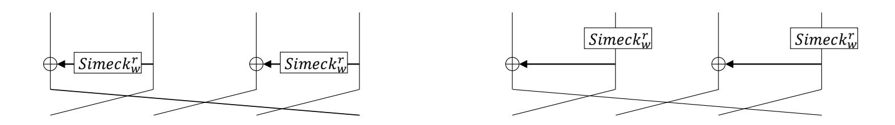
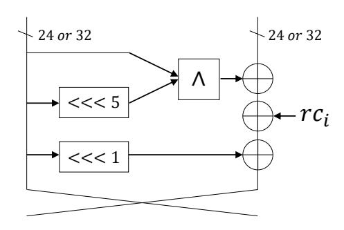
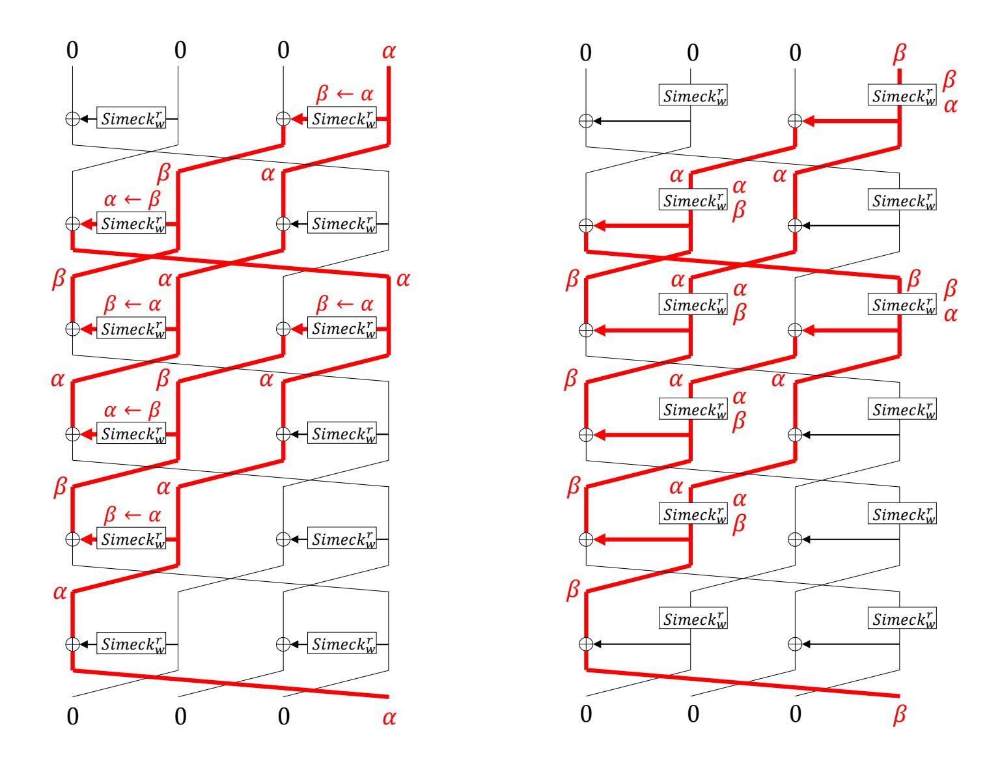
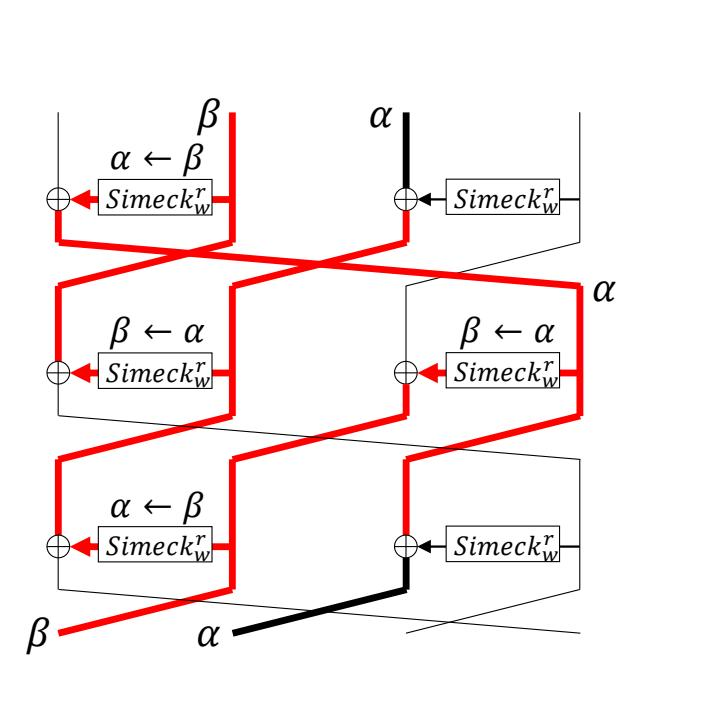
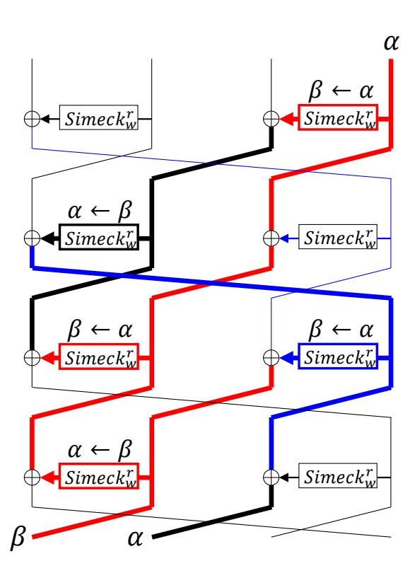
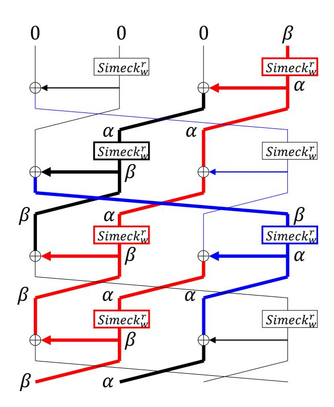
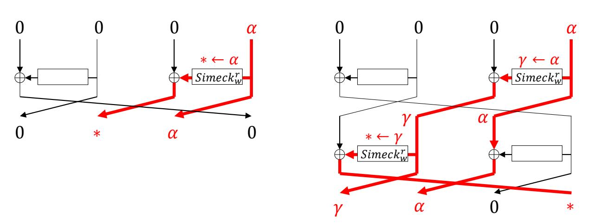
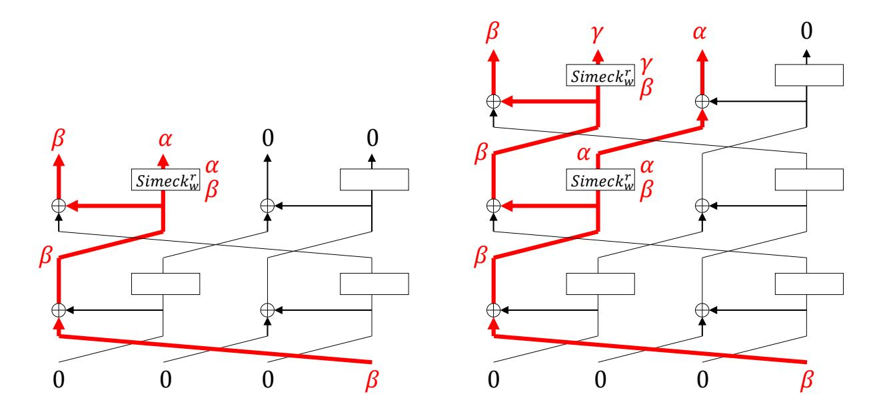
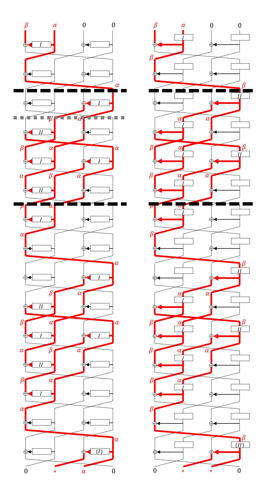
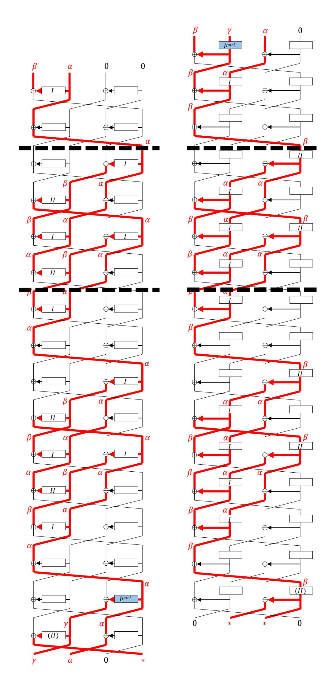

{0}------------------------------------------------

# **Improved Attacks on sLiSCP Permutation and Tight Bound of Limited Birthday Distinguishers**

Akinori Hosoyamada<sup>1</sup>*,*<sup>3</sup> , María Naya-Plasencia<sup>2</sup> and Yu Sasaki<sup>1</sup>

```
1 NTT Secure Platform Laboratories, Tokyo, Japan,
      {akinori.hosoyamada.bh,yu.sasaki.sk}@hco.ntt.co.jp
       2
        Inria, Paris, France, maria.naya_plasencia@inria.fr
3 Nagoya University, Nagoya, Japan hosoyamada.akinori@nagoya-u.jp
```

**Abstract.** Limited birthday distinguishers (LBDs) are widely used tools for the cryptanalysis of cryptographic permutations. In this paper we propose LBDs on several variants of the sLiSCP permutation family that are building blocks of two round 2 candidates of the NIST lightweight standardization process: Spix and SpoC. We improve the number of steps with respect to the previously known best results, that used rebound attack. We improve the techniques used for solving the middle part, called inbound, and we relax the external conditions in order to extend the previous attacks.

The lower bound of the complexity of LBDs has been proved only against functions. In this paper, we prove for the first time the bound against permutations, which shows that the known upper bounds are tight.

**Keywords:** limited birthday distinguisher · sLiSCP · permutation · NIST Lightweight cryptography · rebound attack

# **1 Introduction**

Lightweight cryptography aims at providing an efficient cryptographic primitive on highlyconstrained devices such as sensor networks, distributed control systems, the Internet of Things, and so on. Recently, the National Institute of Standards and Technology (NIST) initiated a lightweight cryptography standardization process [\[Nat19\]](#page-22-0) to select and standardize several lightweight cryptographic algorithms. In April 2019, 56 algorithms were announced as round 1 candidates and in August 2019, 32 algorithms were selected as round 2 candidates. NIST had originally planned to announce about 8 round 3 candidates in September 2020, but this announcement has been delayed a few months. Given the situation, improved security analysis of round 2 candidates is very important.

Design of a cryptographic algorithm that simultaneously achieves high security and lightweight implementation properties is a challenging task. A recent trend [1](#page-0-0) is to design a cryptographic permutation as an underlying primitive, and to build an authenticated encryption with associated data (AEAD) with the duplex construction [\[BDPA11\]](#page-21-0). This approach is also advantageous to additionally implement a cryptographic hash function only with a small overhead. In fact, NIST reported that 49% of the round 1 candidates and 50% of the round 2 candidates are based on a permutation [\[TMÇ](#page-23-0)<sup>+</sup>19].

A cryptographic permutation is expected to behave as a uniformly random permutation. From an attacker's position, the goal is to find a specific behavior that differs between the target permutation and a random permutation. The attacker first specifies a certain relationship for a set of inputs and the corresponding outputs, and then compares the

<span id="page-0-0"></span><sup>1</sup>See for instance [\[Dae17\]](#page-21-1)

{1}------------------------------------------------

<span id="page-1-0"></span>

**Figure 1:** Step Function of sLiSCP (left) and sLiSCP-light (right) Permutations. Simeck $_w^r$  denotes r-rounds of w-bit block Simeck.

complexity, i.e. computational cost and memory amount, to find such a set for the target algorithm and a randomly chosen permutation. A limited birthday distinguisher (LBD) [GP10] is a natural application of differential cryptanalysis to permutations. The attacker specifies a set of input differences and a set of output differences. The attacker's goal is to find a pair of texts that confirm both of the input and output differences.

In this paper, we provide the cryptanalysis for sLiSCP [ARH<sup>+</sup>17] and sLiSCP-light permutations [ARH<sup>+</sup>18]. sLiSCP is a cryptographic permutation based on Simeck [YZS<sup>+</sup>15]. sLiSCP was designed to be used in their sponge hash function and duplex AEAD mode. sLiSCP consists of 18 iterations of the step function that adopts a 4-branch type-2 generalized Feistel network (GFN) in which the size of each branch w is  $w \in \{48, 64\}$ . The whole permutation size is 192 bits or 256 bits, which is called sLiSCP-192 and sLiSCP-256. The step function is illustrated in the left-hand side of Fig. 1. The step function of sLiSCP-192 (resp. sLiSCP-256) computes two unkeyed 6-round Simeck48 (resp. 8-round Simeck64).

The same designers later presented a tweaked version called sLiSCP-light. The major difference from sLiSCP is that the GFN is replaced with the partial substitution permutation network (PSPN) [ARH<sup>+</sup>18] illustrated in the right-hand side of Fig. 1. The recommended number of steps of sLiSCP-light was also reduced from 18 to 12.

sLiscp-light is used as an underlying primitive of two round 2 candidates in NIST's standardization process. SpoC [AGH<sup>+</sup>19a] builds an AEAD scheme with the duplex-like framework using 18-step sLiscp-light-192 and 18-step sLiscp-light-256 as underlying permutations. Spix [AGH<sup>+</sup>19b] also builds an AEAD scheme with the duplex framework and 18-step sLiscp-light-256 is used to process the key material while 9-step sLiscp-light-256 is used to process associated data and message/ciphertext. The active usage of sLiscp-light shows the importance of third-party security analysis.

To the best of our knowledge, there exists only a single third-party security analysis against sLiSCP [LSSW18] and no third-party analysis exists against sLiSCP-light. Liu et al. [LSSW18] provided a forgery attack and a collision attack against 6-step sLiSCP in the AEAD mode and the hash mode. In addition, a LBD was presented against 15-step sLiSCP permutation. The designers of sLiSCP, sLiSCP-light, SpoC, and SPIX also provided some cryptanalysis for the permutation, which includes impossible differential, zero-correlation and integral distinguishers against 9-step sLiSCP. <sup>2</sup>

After the submission of this work, Kraleva, Posteuca and Rijmen uploaded the analysis on SpoC to Cryptology ePrint Archive [KPR20], which was later presented at the Fourth Lightweight Cryptography Workshop organized by NIST. Soon after, the SpoC team posted a message to the NIST LWC forum [Tea20] to report that the attacks and observations in [KPR20] do not pose any threats to the security of SpoC and its underlying permutation sLiSCP-light.

In the design document of SpoC [AGH<sup>+</sup>19a] and Spix [AGH<sup>+</sup>19b], the designers claim that they aim to provide the evidence that 18-step sLiSCP-light is secure against various

<span id="page-1-1"></span> $<sup>^2</sup>$ The authors of [ARH+17] reported a 17-step zero-sum distinguisher for sLiSCP-192 and sLiSCP-256 with very high complexities ( $2^{190}$  and  $2^{255}$ ) without discussing the generic attack complexity to satisfy the same property. Thanks to an ongoing discussion with the authors, we believe now that the generic complexity would be better, so we are not convinced of the validity of this distinguisher.

{2}------------------------------------------------

distinguishing attacks to prove that its behavior is as close as possible to that of an ideal permutation. Hence we believe that improving the previous permutation distinguishers for sLiSCP and providing a new analysis on sLiSCP-light is of great interest.

Remarks on the Permutation Distinguisher Framework. As explained in [IPS13], one may argue that the LBD can trivially be solved for any permutation  $\Pi$  by choosing any input pair (X,Y) and computing  $X \oplus Y$  as the set of input difference and  $\Pi(X) \oplus \Pi(Y)$  as the set of the output difference. In general, those meaningless attacks are avoided by considering that a hash function is part of a family indexed by a key input (e.g. IV is replaced with a key). In our case, the attack works even if a constant in Simeck boxes is given right before the attack starts. Hence, our attacks are not meaningless.

Our Contributions. The contribution of this paper is twofold. First, we improve the best known attacks against sLiSCP and present the first third-party cryptanalysis against sLiSCP-light. Second, we prove the lower bound of the complexity to solve LBDs for a random permutation, showing that the current best known generic attack is actually tight.

Limited-Birthday Distinguishers against sLiSCP and sLiSCP-light. We first reduce the complexity of the 15-step LBDs for sLiSCP, which is computed in the rebound-like procedure [MRST09]. By carefully analyzing the computation order, we extend the number of steps that can be covered by the inbound phase, which reduces the complexity from  $2^{122.7}$  to  $2^{111.4}$  for sLiSCP-192 and from  $2^{168.3}$  to  $2^{149.6}$  for sLiSCP-256.

Even with this complexity improvement, the attack cannot be extended to 16 steps easily because the remaining degrees of freedom are insufficient to satisfy the differential propagation for another step. Here, we look into the differential characteristics for Simeck48 and Simeck64 and try to make many bits inactive by spending a small amount of degrees of freedom. This allows us to attack 16-step  ${\tt sLiSCP-256}$  with  $2^{154.6}$  cost.

For sLiSCP-light, the designers of SPIX and SpoC argued that the best known distinguisher is a zero-sum distinguisher with a start-from-the-middle approach, which works up to 14 steps but requires data and time complexities equal to that of the exhaustive search. Although the designers of SPIX and SpoC cited the work by Liu et al. [LSSW18], no word is given on the possibility of applying the LBDs on sLiSCP to sLiSCP-light. In this paper we formally claim, for the first time, that 16-step sLiSCP-light can be attacked, using a similar procedure to the one on sLiSCP. Besides, the replacement of the Feistel network of sLiSCP with the partial SPN allows us to attack 16 steps of sLiSCP-light-192 with a complexity of  $2^{113.0}$ . The comparison of the attack complexities is given in Table 1.

**Tight Lower Bound for the Limited-Birthday Problem.** We show that the upper bound given by the known best algorithm on the limited birthday problem for a random permutation is asymptotically tight.

As we mentioned before, the goal of a LBD is to find a pair of texts that confirm both of the input and output differences that are specified by the attacker. More precisely, the limited birthday problem on an n-bit permutation P and closed subsets  $\Delta_{\rm in}$ ,  $\Delta_{\rm out}$  is the problem of finding a tuple (X, X', Y, Y') such that P(X) = Y, P(X') = Y',  $X \oplus X' \in \Delta_{\rm in}$ , and  $Y \oplus Y' \in \Delta_{\rm out}$ . Here, a non-empty subset  $\Delta \subset \{0,1\}^n$  is closed if and only if  $X \oplus Y \in \Delta$  for all  $X, Y \in \Delta$ . An algorithm to solve the problem is called a limited-birthday distinguisher (LBD), or simply distinguisher.

The known best distinguisher to solve the problem when P is a random permutation is

<span id="page-2-0"></span>
$$\max \left\{ \min \left\{ \sqrt{\frac{2^n}{|\Delta_{\text{out}}|}}, \sqrt{\frac{2^n}{|\Delta_{\text{in}}|}} \right\}, \frac{2^{n+1}}{|\Delta_{\text{out}}| \cdot |\Delta_{\text{in}}|} \right\}, \tag{1}$$

{3}------------------------------------------------

<span id="page-3-0"></span>

| Target           | Attack   | Steps | Time       | Memory    | Reference             |
|------------------|----------|-------|------------|-----------|-----------------------|
|                  | ID/ZC    | 9     | N/A        | N/A       | [ARH+17]              |
| sLiSCP-192       | LBD      | 15    | 122.7<br>2 | 37.7<br>2 | [LSSW18]              |
|                  | LBD      | 15    | 111.4<br>2 | 37.7<br>2 | Sect. 3.2             |
|                  | ID/ZC    | 9     | N/A        | N/A       | [ARH+17]              |
| sLiSCP-256       | LBD      | 15    | 168.3<br>2 | 47.3<br>2 | [LSSW18]              |
|                  | LBD      | 15    | 149.6<br>2 | 47.3<br>2 | Sect. 3.2             |
|                  | LBD      | 16    | 154.6<br>2 | 47.3<br>2 | Sect. 3.4             |
| sLiSCP-light-192 | integral | 8     | 191<br>2   | N/A       | [AGH+19a]             |
|                  | zero-sum | 14    | 192<br>2   | N/A       | [AGH+19a]             |
|                  | LBD      | 15    | 111.4<br>2 | 37.7<br>2 | Sect. 3.3             |
|                  | LBD      | 16    | 113.0<br>2 | 37.7<br>2 | Sect. 3.4             |
| sLiSCP-light-256 | integral | 8     | 255<br>2   | N/A       | [AGH+19a,<br>AGH+19b] |
|                  | zero-sum | 14    | 256<br>2   | N/A       | [AGH+19a,<br>AGH+19b] |
|                  | LBD      | 15    | 149.6<br>2 | 47.3<br>2 | Sect. 3.3             |
|                  | LBD      | 16    | 154.6<br>2 | 47.3<br>2 | Sect. 3.4             |

**Table 1:** Comparison of the Attacks against sLiSCP and sLiSCP-light

which was shown by Gilbert and Peyrin [\[GP10\]](#page-22-1).

LBDs on permutations are claimed to be valid attacks when their complexity is less than [\(1\)](#page-2-0). Although the lower bound for a random *function* was proven by Iwamoto et al [\[IPS13\]](#page-22-4) [3](#page-3-1) , no such a formal proof is known for a random *permutation*. In this paper, we for the first time give a formal proof that [\(1\)](#page-2-0) is actually the (asymptotically) tight bound to solve the limited-birthday problem on a random permutation. More precisely, we prove the following theorem.

<span id="page-3-4"></span>**Theorem 1** (Lower bound for the limited-birthday problem, informal)**.** *When P is a random permutation, to solve the limited-birthday problem with a probability greater than ps,*

<span id="page-3-3"></span>
$$\frac{1}{2p_s} \cdot \max \left\{ \min \left\{ \sqrt{\frac{2^n}{|\Delta_{\text{out}}|}}, \sqrt{\frac{2^n}{|\Delta_{\text{in}}|}} \right\}, \frac{2^n}{|\Delta_{\text{out}}| \cdot |\Delta_{\text{in}}|} \right\}$$
 (2)

*queries to P or P* <sup>−</sup><sup>1</sup> *are required*[4](#page-3-2) *.*

This theorem strengthens the rationale of validity of various LBDs including those in previous works such as [\[GP10\]](#page-22-1), and our attacks on sLiSCP and sLiSCP-light (The complexities of all of our new attacks are smaller than the lower bound for a random permutation in [\(2\)](#page-3-3)).

The proof of Theorem [1](#page-3-4) is more complex than the proof for the lower bound on a random *function* by Iwamoto et al. since we have to deal with queries to both of *P* and *P* −1 . To achieve the lower bound that is the complex combination of "max" and "min", and is quite close to the upper bound [\(1\)](#page-2-0), we introduce a technical parameter in our proof.

**Paper Outline.** sLiSCP permutation family and LBD will be introduced in section [2.](#page-4-0) New LBDs for sLiSCP permutation family will be shown in section [3.](#page-5-0) A proof of the lower bound of LBD will be shown in section [4.](#page-14-0) We will conclude this paper in section [5.](#page-20-0)

<span id="page-3-1"></span><sup>3</sup>The lower bound for a random function is *O* maxnq 2*n*+1 |∆*out*| *,* 2 *n*+1 |∆out|·|∆in| o.

<span id="page-3-2"></span><sup>4</sup>The statement is valid as long as 2−*n*+4 ≤ *p<sup>s</sup>* ≤ 1*/*2.

{4}------------------------------------------------

<span id="page-4-1"></span>

Figure 2: Round Function of Simeck.

### <span id="page-4-0"></span>2 Preliminaries

#### 2.1 Specification of sLiSCP

An input to the permutation is first divided into four w-bit words, where w=48 for sLiSCP-192 and w=64 for sLiSCP-256. Let  $(X_0^0,X_0^1,X_0^2,X_0^3)$  be the input to the permutation. This value is updated by iteratively computing the following step function shown in the left-hand side of Fig. 1 for  $i=0,1,\ldots,17$ .

$$x_0^{i+1} = x_1^i, \quad x_1^{i+1} = x_2^i \oplus \operatorname{Simeck}_w^r(x_3^i) \oplus sc_i, \quad x_2^{i+1} = x_3^i, \quad x_3^{i+1} = x_0^i \oplus \operatorname{Simeck}_w^r(x_1^i) \oplus sc_i',$$

where  $\operatorname{Simeck}_w^r$  is an r rounds of w-bit block  $\operatorname{Simeck}$ , called  $\operatorname{Simeck}$  box, described in the following paragraph and  $sc_i$  and  $sc_i'$  are step-dependent constants.

**Specification of Simeck Box.** Simeck [YZS<sup>+</sup>15] is a block cipher based on Simon [BSS<sup>+</sup>13]. Although Simeck supports various block sizes, only 48-bit block version called Simeck48 and 64-bit version called Simeck64 are adopted in sLiSCP and sLiSCP-light. Moreover, a key is replaced with a constant to convert Simeck into a keyless permutation.

Let  $m \in \{24, 32\}$  be the word size such that 2m is a block size. The 2m-bit input value is divided into two m-bit values  $L_0 || R_0$ . Then the following is computed for i = 1, 2, ..., r where r is 6 and 8 for Simeck48 and Simeck64, respectively.

$$L_i = R_{i-1} \oplus (L_{i-1} \wedge L_{i-1} \ll 5) \oplus L_{i-1} \ll 1 \oplus rc_i, \qquad R_i = L_{i-1},$$

where  $rc_i$  is the round constant generated by an LFSR that is initialized with  $sc_i$  or  $sc'_i$ . Since the constant does not impact to our analysis, we omit the details. The diagram of the round function of Simeck is illustrated in Fig. 2.

#### 2.2 Specification of sLiSCP-light

sLiscp-light is a tweaked design of sLiscp. The major difference from sLiscp is a step function and the number of steps to be computed. Let  $(X_0^0, X_0^1, X_0^2, X_0^3)$  be the input to the permutation. This value is updated by iteratively computing the following step function shown in the right-hand side of Fig. 1 for i = 0, 1, ..., 11.

$$x_0^{i+1} = \operatorname{Simeck}_w^r(x_1^i),$$
  $x_1^{i+1} = x_2^i \oplus \operatorname{Simeck}_w^r(x_3^i) \oplus sc_{2i+1},$   $x_2^{i+1} = \operatorname{Simeck}_w^r(x_3^i),$   $x_3^{i+1} = x_0^i \oplus \operatorname{Simeck}_w^r(x_1^i) \oplus sc_{2i}.$ 

sLiscp-light is used as an underlying primitive of two NIST second-round candidates SpoC [AGH<sup>+</sup>19a] and Spix [AGH<sup>+</sup>19b]. Though the original number of steps is 12, the number of steps for the instantiations in those two designs is either 9 or 18.

{5}------------------------------------------------

### **2.3 Limited-Birthday Problem**

The limited-birthday problem on a permutation *P* is the problem defined as follows[5](#page-5-1) .

**Definition 1** (The limited-birthday problem on permutation)**.** Let *P* be an *n*-bit permutation, and ∆in, ∆out be (non-empty) closed subsets of {0*,* 1} *<sup>n</sup>*. For the limited-birthday problem on the permutation *P*, the goal of the adversary is to generate a quadruple of *n*-bit strings (*X, X*<sup>0</sup> *, Y, Y* <sup>0</sup> ) such that *P*(*X*) = *Y* and *P*(*X*<sup>0</sup> ) = *Y* <sup>0</sup> and *X* ⊕ *X*<sup>0</sup> ∈ ∆in and *Y* ⊕ *Y* <sup>0</sup> ∈ ∆out.

The complexity of the best known attack to solve the limited-birthday problem on a random permutation [\[GP10\]](#page-22-1) is

<span id="page-5-4"></span>
$$\max \left\{ \min \left\{ \sqrt{\frac{2^n}{|\Delta_{\text{out}}|}}, \sqrt{\frac{2^n}{|\Delta_{\text{in}}|}} \right\}, \frac{2^{n+1}}{|\Delta_{\text{out}}| \cdot |\Delta_{\text{in}}|} \right\}.$$
 (3)

# <span id="page-5-0"></span>**3 Improved LBD against sLiSCP**

We revisit the previous 15-step attack on sLiSCP in Sect. [3.1.](#page-5-2) We show how to improve its complexity for sLiSCP in Sect. [3.2.](#page-7-0) Applications to sLiSCP-light are then discussed in Sect. [3.3.](#page-8-0) We finally present the attacks on 16 steps in Sect. [3.4](#page-9-0) and Sect. [3.5.](#page-12-0)

### <span id="page-5-2"></span>**3.1 Previous Analysis on sLiSCP**

Liu et al. [\[LSSW18\]](#page-22-2) analyzed the differential properties of the sLiSCP permutation and presented a 15-step distinguisher for sLiSCP-192 and sLiSCP-256. They first focused on a 6-step iterative differential characteristic that maps a difference (0*,* 0*,* 0*, α*) to a difference (0*,* 0*,* 0*, α*). This includes four differential propagations of *α* → *β* and two differential propagations of *β* → *α* through 6-round (resp. 8-round) Simeck48 (resp. Simeck64). The 6-round iterative characteristic is shown in the left-hand side of Fig. [3.](#page-6-0)

Liu et al. then searched for the choice of *α* and *β* that has the maximum characteristic probability for *α* → *β* and *β* → *α* taking into account the weight that *α* → *β* occurs twice more frequently than *β* → *α*. Such differential properties are summarized in Table [2.](#page-5-3)

<span id="page-5-3"></span>

| Table 2: Differential Property of Simeck for 6-Round Iterative Characteristic [LSSW18]. |  |
|-----------------------------------------------------------------------------------------|--|
|-----------------------------------------------------------------------------------------|--|

|               |                                             | Probability    |              |  |
|---------------|---------------------------------------------|----------------|--------------|--|
| Target        | Differential Mask                           | Characteristic | Differential |  |
|               | 014000    020000 → 014000    008000         | −12<br>2       | −11.3<br>2   |  |
| Simeck6<br>48 | 014000    008000 → 014000    020000         | −26<br>2       | −21.8<br>2   |  |
| Simeck8<br>64 | 08800000    00000000 → 00800000    00000000 | −22<br>2       | −18.7<br>2   |  |
|               | 00800000    00000000 → 08800000    00000000 | −22<br>2       | −18.7<br>2   |  |
| Simeck8<br>64 | 00000000    80000000 → 00000000    80000008 | −22<br>2       | −18.7<br>2   |  |
|               | 00000000    80000008 → 00000000    80000000 | −22<br>2       | −18.7<br>2   |  |

Note that the probabilities in Table [2](#page-5-3) were originally for the situation where each subkey of the keyed Simeck is chosen uniformly randomly, while what we need here is the probability that a randomly chosen plaintext (and the counterpart of the differential pair) would follow the specified differential transition for a fixed constant. We assume that the

<span id="page-5-1"></span><sup>5</sup>This definition follows the one for a (random) function by Iwamoto et al. [\[IPS13\]](#page-22-4).

{6}------------------------------------------------

<span id="page-6-0"></span>

Figure 3: Left: 6-Step Iterative Differential Trail for Original sLiSCP. Right: 6-Step Iterative Differential Trail for sLiSCP-light.

probability of the differential characteristic of Simeck is almost the same for all keys, thus is also true for the fixed constant in sLiSCP.

Finally, Liu et al. built a 15-step differential characteristic and proposed to find a pair satisfying the characteristic using the rebound attack framework [MRST09, LMS<sup>+</sup>15], in which the attacker first efficiently finds paired values to satisfy the propagation for the middle steps (inbound phase), and then propagate the pairs backwards and forwards to probabilistically satisfy the characteristic (outbound phase).

Previous Inbound Phase for Three Steps. To explain our improvement, the previous procedure of the inbound phase needs to be explained more precisely. Liu et al. focused on four active Simeck boxes in three middle steps, which is shown in the left-hand side of Fig. 4. For each active Simeck box, paired values satisfying the differential propagation are exhaustively searched, which is performed with  $4 \times 2^{48}$  or  $4 \times 2^{64}$  computations. Any combination of the solutions from four Simeck boxes will fix the entire 192-bit or 256-bit state. In Fig. 4, paired values for red lines are fully determined by fixing paired values of four active Simeck boxes. The black lines can be directly computed from the red ones.

The combined number of solutions for four active Simeck boxes is  $2^{125.8}$  and  $2^{182.8}$  for sLiSCP-192 and sLiSCP-256, respectively. Then the characteristic were extended so that the probability of the outbound phase is higher than this number of solutions. As shown in the left-hand side of Fig. 9 in the supplementary material A, 12 steps were added for the outbound phase that can be satisfied with probability  $2^{-122.7}$  and  $2^{-168.3}$ .

{7}------------------------------------------------

<span id="page-7-1"></span>



Figure 4: Left: Previous 3-Step Inbound Procedure for sLiSCP. Right: Improved 4-Step Inbound Procedure for sLiSCP. In the previous procedure, four active Simeck boxes are fixed independently, while in the new procedure, fixing three active Simeck boxes (red) will fix another one (blue), and an additional one (black) can be fixed independently.

### <span id="page-7-0"></span>3.2 Improving Complexity of 15-Step Attacks on sLiSCP

We present an improved procedure for the inbound phase, which covers four middle steps. Intuitively, this improvement on its own does not increase the number of paired values that satisfy the full characteristic, hence the number of attacked steps does not increase in a straight-forward analysis. Instead, the procedure to find the paired values will be more sophisticated (another stage is introduced for the divide-and-conquer approach), which improves the attack complexity as it allows to reduce the outbound part. The new inbound procedure is illustrated in the right-hand side of Fig. 4, which is explained as follows.

- <span id="page-7-2"></span>1. We exhaustively search for the paired values satisfying the differential propagation for three Simeck boxes; the right-hand side of the first step, the left-hand side of the third step, and the left-hand side of the fourth step (in red). As preparation for Step 3, we also search for the paired values for the left-hand side of the second step (in black).
- <span id="page-7-3"></span>2. We take any combination of the solutions from those three Simeck boxes, which fixes the paired values for another active Simeck box in the right-hand side of the third step (in blue). Then we check whether the differential propagation of this Simeck box is satisfied or not, which filters out wrong pairs at this stage.
- <span id="page-7-4"></span>3. Any combination of the solutions for the first four Simeck boxes (red and blue) and the precomputed Simeck box (black) fixes the entire state. Then, the state is propagated to the outbound part to satisfy the 15-step trail shown in the left-hand side of Fig. 9 in the supplementary material A.

**Complexity Analysis for sLiSCP-256.** Step 1 requires to test  $2^{64}$  inputs for each Simeck box. Because the probability is  $2^{-18.7}$  for both of  $\alpha \to \beta$  and  $\beta \to \alpha$ , the number of obtained solutions will be  $2^{64-18.7} = 2^{45.3}$  for each Simeck box. Time complexity of this step is  $4 \times 2^{64} = 2^{66}$  and a memory to store  $4 \times 2^{45.3} = 2^{47.3}$  values are required.

{8}------------------------------------------------

Step 2 requires to test  $2^{45.3\times3} = 2^{135.9}$  values. The power of the filter is  $2^{-18.7}$ , hence we will obtain  $2^{117.2}$  solutions. The time complexity of this step is  $2^{135.9}$  and a memory to store  $2^{117.2}$  values would be required a priori.

We have  $2^{45.3}$  for this Simeck box (black) and  $2^{117.2}$  solutions from the previous step (red and blue). Hence, we can generate up to  $2^{117.2+45.3} = 2^{162.5}$  solutions from four inbound steps.

In the outbound phase in Fig. 9, we need to control 1 active Simeck box for the first 2 steps and 6 active Simeck boxes from steps 7 - 14, which is satisfied with probability  $2^{-18.7\times8} = 2^{-149.6}$ . The last step contains 1 active Simeck box, but we do not control it. In the end, after trying  $2^{149.6}$  solutions of the inbound phase, we will have a pair whose input difference is of the form  $(\beta, \alpha, 0, 0)$  and output difference is of the form  $(0, *, \alpha, 0)$ , where  $\alpha$  and  $\beta$  are shown in Table 2 and \* denotes any difference.

The complexity to find such a pair for a random permutation is given by the limited birthday problem. The size of the input and output differences are 1 and  $2^{64}$ , respectively, the generic attack complexity in Eq. (1) is  $2^{256+1}/(1 \cdot 2^{64}) = 2^{193}$  and the lower bound in Eq. (2) is  $2^{190}$ . Thus the distinguisher finds a non-ideal property of 15-step sLiSCP-256.

The first remark is that the previous attack complexity is  $2^{168.3}$  and our new attack complexity is  $2^{149.6}$ . The improved attack factor is  $2^{18.7}$ . The improvement clearly comes from the inclusion of one more active Simeck box in the inbound phase.

The second remark is that the required memory of  $2^{117.2}$  for Step 2 can be omitted by performing Step 3 (the exhaustive search of the active Simeck box should be finished in advance) as soon as a solution is generated in Step 2 from the tables of the red values. Hence the required memory is  $2^{47.3}$ .

Complexity Analysis for sLiSCP-192. The analysis is almost the same as sLiSCP-256 but it is a bit more complicated because the probabilities for  $\alpha \to \beta$  and  $\beta \to \alpha$  are different; the former is  $2^{-11.3}$  and the latter is  $2^{-21.8}$  as shown in Table 2.

Step 1 requires to test  $2^{48}$  inputs for each Simeck box. For two of them with  $\alpha \to \beta$ , we will obtain  $2^{48-11.3} = 2^{36.7}$  solutions. For one of them with  $\beta \to \alpha$ , we will obtain  $2^{48-21.8} = 2^{26.2}$  solutions. Time complexity of this step is  $4 \times 2^{48} = 2^{50}$  and a memory to store  $2 \times 2^{36.7}$  values are required.

Step 2 requires to test  $2^{36.7+36.7+26.2} = 2^{99.6}$  values. The power of the filter is  $2^{-11.3}$ , hence we will obtain  $2^{88.3}$  solutions. Time complexity of this step is  $2^{99.6}$ . Similarly to the case of sLiSCP-256, a memory to store  $2^{88.3}$  values can be omitted by testing the filtered solutions on the fly thanks to the smaller previous lists.

We have  $2^{48-21.8} = 2^{26.2}$  solutions for the precomputed Simeck box (black) and  $2^{88.3}$  solutions from the previous step (red and blue). Hence, we can generate up to  $2^{88.3+26.2} = 2^{114.5}$  solutions from the inbound phase.

The probability of the outbound phase in Fig. 9 is  $2^{6\times-11.3+2\times-21.8} = 2^{-111.4}$ . After trying  $2^{111.4}$  pairs, we will have a pair whose input difference is of the form  $(\beta, \alpha, 0, 0)$  and whose output difference is of the form  $(0, *, \alpha, 0)$ .

The generic complexity for a random permutation is  $2^{192+1}/(1\cdot 2^{48}) = 2^{145}$  and the lower bound is  $2^{145}$ . Hence the distinguisher finds a non-ideal property of 15-step sLiSCP-192.

#### <span id="page-8-0"></span>3.3 Application to 15-step LBD for sLiSCP-light

The distinguishers in the previous subsection apply to sLiSCP, while two NIST second round candidates SPIX [AGH<sup>+</sup>19b] and SpoC [AGH<sup>+</sup>19a] are based on sLiSCP-light. According to the designers, the best distinguisher for sLiSCP-light is a zero-sum distinguisher for 14 steps. The designers of SPIX and SpoC cited the work by Liu et al. [LSSW18] but did not mention the possibility of applying the rebound attack on sLiSCP to sLiSCP-light. Here we formally claim for the first time, that 15-step sLiSCP-light can be attacked by using a similar procedure to the one on sLiSCP.

{9}------------------------------------------------

<span id="page-9-1"></span>

Figure 5: 4-Step Inbound Procedure for sLiSCP-light.

Our analysis starts from the 6-step iterative differential characteristic for the partial SPN in sLiSCP-light. The diagram of the differential propagation is illustrated in the right-hand of Fig. 3. The difference  $(0,0,0,\beta)$  will be mapped to itself after 6 steps by going through four active Simeck boxes with the differential propagation  $\alpha \to \beta$  and two active Simeck boxes with  $\beta \to \alpha$ . Hence, the efficiency of the 6-step trail as well as the best choice of  $\alpha$  and  $\beta$  are the same as the ones for sLiSCP.

Our inbound phase that covers four steps of sLiSCP can also be applied to sLiSCP-light, which is illustrated in Fig. 5. We will omit the details that were already explained in the previous distinguishers. Intuitively, we first precompute all the solutions for three active Simeck boxes highlighted in red. Any combination uniquely determines the paired values for another active Simeck box highlighted in blue. Finally, we can freely choose the solution for another Simeck box highlighted in black.

The extension for the outbound phase is straightforward. The 15-step trail is given in Fig. 9 in supplementary material A. It includes six active Simeck box with differential propagation  $\alpha \to \beta$ , two active Simeck box with  $\beta \to \alpha$ , and one uncontrolled active Simeck box in the last step. The only difference is the form of the output difference, that is (0, \*, \*, 0). Note that \* is unknown but must be identical for two branches, hence the size of the possible output differences remains the same as the size for sLiSCP.

As a result, 15-step sLisCP-light can be attacked in a similar way as sLisCP. The complexity is  $2^{111.4}$  computational cost and  $2^{38.7}$  memory amount for sLisCP-light-192, and  $2^{168.3}$  computational cost and  $2^{47.3}$  memory amount for sLisCP-light-256.

#### <span id="page-9-0"></span>3.4 16 Steps Attacks against sLiSCP-256

The attack in the previous section cannot be extended to 16 steps easily from the following reason. The inbound phase can generate up to  $2^{114.5}$  (resp.  $2^{162.5}$ ) solutions for sLiSCP-192 (resp. for sLiSCP-256), while the probability of the outbound phase of the 15-step attack is  $2^{-111.4}$  (resp.  $2^{-149.6}$ ). The remaining degrees of freedom is only  $2^{3.1}$  (resp.  $2^{12.9}$ ), which is not sufficient to satisfy one more active Simeck box.

**Overall Idea.** To extend the trail to 16 steps, we will have one more active Simeck box. We exploit the remaining degrees of freedom to control the differential propagation only partially. The input difference for the 16-step sLiSCP distinguisher is unchanged,

{10}------------------------------------------------

(*β, α,* 0*,* 0), while the output differences becomes (*γ, α,* 0*,* ∗), where *γ* is partially controlled, i.e. a few bits of *γ* are inactive. Depending on the number of inactive bits in *γ*, the dedicated attack can be faster than the generic attack. Fig. [6](#page-10-0) illustrates how to extend by one step the 15-step distinguisher. For the sake of completeness, the entire 16-step trail is shown in Fig. [10](#page-25-0) in supplementary material [B.](#page-25-1)

<span id="page-10-0"></span>

**Figure 6:** Left: the Last Step of the 15-Step Attack for sLiSCP. Right: the Last Two Steps of the 16-Step Attack for sLiSCP. Several inactive bit positions are specified for *γ*.

### **3.4.1 Analysis for sLiSCP-256**

The differential probability for *α* → *β* is 2 −18*.*7 , but we only have 2 <sup>12</sup>*.*<sup>9</sup> degrees of freedom left. To evaluate the impact of partially controlling the propagation, we look into the details of the differential characteristic with the highest probability.

For sLiSCP-256, as shown in Table [2,](#page-5-3) there are two kinds of the differential masks: (wt(*α*)*,* wt(*β*)) = (2*,* 1) or (1*,* 2), where wt denotes the Hamming weight. If the input differential mask has the heavier weight of 2, the first a few rounds have relatively low probability. Hence most of the remaining degrees of freedom are consumed for those rounds, and the number of uncontrolled rounds (following the full diffusion) becomes long, which is disadvantageous. Thus we set *α* ← 0080000 || 0000000 and *β* ← 0880000 || 0000000. This characteristic can be satisfied with probability 2 <sup>−</sup><sup>22</sup>. The breakdown for each round is given in the left-hand side of Table [3.](#page-11-0)

**Partially Controlled Differential Characteristic.** The analysis of the propagation where we partially control the differential propagation of Simeck64 is shown in the right-hand side of Table [3.](#page-11-0) We have 2 <sup>12</sup>*.*<sup>9</sup> degrees of freedom remaining. The analysis here assumes that the differential propagation follows the characteristic up to 2 <sup>−</sup><sup>13</sup> (this is a temporary assumption, we will later discuss its validity), and the analysis for the full diffusion is applied to the remaining rounds. Such words start to appear from the computation of round 5, which are denoted by *L*5, *L*6, *L*7, and *L*<sup>8</sup> in the right-hand side of Table [3.](#page-11-0) The bitwise representation of those words are also given in Table [3,](#page-11-0) where '0' denotes the inactive bits, '1' denotes the active bits, and '2' denotes that the bit may or may not have a difference. As can be seen in the table, we have 33 inactive bits after 8 rounds; 14 bits in the left-hand side *L*<sup>8</sup> and 19 bits in the right-hand side *L*7.

**Differential Probability / Validity of the Assumption.** The analysis in the previous paragraph is based on two assumptions. The first assumption is too optimistic for the attacker in which the propagation follows the characteristic up to probability 2 <sup>−</sup><sup>13</sup>, while we only have 2 <sup>12</sup>*.*<sup>9</sup> degrees of freedom. The second assumption is too pessimistic for the attacker in which the analysis from round 5 follows the full diffusion. Note that the full diffusion analysis is the worst-case scenario for the attacker because it usually

{11}------------------------------------------------

<span id="page-11-0"></span>

| Step | Differential Mask  | probability | Step | Different | ial Mask | probability |
|------|--------------------|-------------|------|-----------|----------|-------------|
|      | 0080000 00000000   |             |      | 00800000  | 00000000 |             |
| 1    | 01000000 00800000  | $2^{-2}$    | 1    | 01000000  | 00000800 | $2^{-2}$    |
| 2    | 02800000 01000000  | $2^{-2}$    | 2    | 02800000  | 01000000 | $2^{-2}$    |
| 3    | 04000000 02800000  | $2^{-4}$    | 3    | 04000000  | 02800000 | $2^{-4}$    |
| 4    | 0a800000 04000000  | $2^{-2}$    | 4    | 0a800000  | 0400000  | $2^{-2}$    |
| 5    | 01000000 0a800000  | $2^{-6}$    | 5    | $L_5$     | 0a800000 | $2^{-3}$    |
| 6    | 08800000 01000000  | $2^{-2}$    | 6    | $L_6$     | $L_5$    | 1           |
| 7    | 00000000 088000000 | $2^{-4}$    | 7    | $L_7$     | $L_6$    | 1           |
| 8    | 08800000 00000000  | 1           | 8    | $L_8$     | $L_7$    | 1           |

**Table 3:** Differential Propagation for 8-Round Simeck64

 $L_5:0001\ 2021\ 0000\ 0000\ 0000\ 0000\ 0000\ 0000$   $L_6:0222\ 2222\ 1000\ 0000\ 0000\ 0000\ 0000\ 0000$   $L_7:2222\ 2222\ 2000\ 0000\ 0000\ 0000\ 0000\ 2222$ 

 $L_8$ : 2222 2222 2000 0000 0000 0002 2222 2222

corresponds to the situation where active AND gates always produce the difference. Indeed, this probability is the same as the situation where active AND gates always stop the difference. We also need to consider the differential probability, namely, even if the differential propagation does not follow the characteristic up to  $2^{-13}$ , the target 33 bits can be inactive. Namely, the bit-wise differential form of  $\gamma = \gamma_L || \gamma_R$  can be as follows.

```
\gamma_L = **** **** *000 0000 0000 000* **** ****
```

The simplest way to evaluate the precise probability to satisfy  $\gamma$  is to perform an experiment, i.e. we choose many 64-bit values x and process x and  $x \oplus \alpha$  with 8-round Simeck64 to calculate the probability that the target 33 bits are inactive. In our experiment, we took 1 million choices of x uniformly at random and 33 target bits became inactive for 32,501 choices. Hence, the probability is  $2^{-4.94}$ . This implies that we do not need to use  $2^{13}$  degrees of freedom to make those 33 bits inactive, but only  $2^5$  degrees are sufficient.

**Complexity Evaluation.** The attack will spend  $2^5$  more degrees of freedom than the 15-step attack. Hence, the computational cost of the 16-step attack is  $2^{149.6+5.0} = 2^{154.6}$ . The required memory amount is  $2^{47.3}$ .

The generic attack complexity for a random permutation in Eq. (1) is  $2^{256+1}/(1 \cdot 2^{64+(64-33)}) = 2^{162}$  because the input difference is fixed and the output difference  $(\gamma, \alpha, 0, *)$  can be chosen from  $2^{95}$  choices. The lower bound in Eq. (2) is  $2^{159}$ . Hence our attack finds the non-ideal property of 16-step sLiSCP-256.

#### 3.4.2 Remarks for sLiSCP-192

For sLiSCP-192, we only have  $2^{3.1}$  degrees of freedom remaining and to control the differential characteristic for 6-round Simeck48 is difficult. Currently we have not found any valid distinguishers on 16-steps sLiSCP-192. We experimentally confirmed that the partial control of Simeck48 could work up to 5 rounds, but could not work for 6 rounds.

{12}------------------------------------------------

### <span id="page-12-0"></span>3.5 16 Steps Attacks against sLiSCP-light-192 and sLiSCP-light-256

The extension to 16 steps can be similarly applied to sLiSCP-light, however there is a certain difference due to the usage of the different network. As shown in the right-hand side of Fig. 9, the last step of the 15-step attack includes a differential propagation with  $\beta \to \alpha$ . If the same strategy as sLiSCP is applied, we need to partially control this propagation. For Simeck48, the probability for  $\beta \to \alpha$  is much smaller than one for  $\alpha \to \beta$ , hence it is not a good strategy to partially control the last step of the 15-step attack. To avoid this problem, we extend the 15-step trail in backwards, and partially control the difference in the first step of the 15-step attack. The diagram of the extended steps is given in Fig. 7.

<span id="page-12-1"></span>

**Figure 7:** Left: the First Step of the 15-Step Attack for sLiSCP-light. Right: the First Two Steps of the 16-Step Attack for sLiSCP-light.

#### 3.5.1 Peeling off the Last Round

We point out that Simeck round function has the property that the difference after the first round or before the last round can be computed from the input or the output without knowing the key value. This is because the key is directly added to the Feistel network, which is different from traditional designs in which the key is added inside a so-called F-function. To be more precise, let  $I_l \mid\mid I_r$  be the input to the Simeck permutation. Then an attacker can compute the difference after the first round by  $i_r \oplus (i_l \ll 1) \oplus (i_l \wedge (i_l \ll 5)) \mid\mid i_l$ , which is independent of the secret-key/fixed-constant value.

Moreover, the network of sLiSCP-light helps an attacker to exploit this property. As shown in Fig. 7, the partially controlled Simeck box is located in the first step, and the input to the entire permutation (with difference  $\gamma$ ) is directly used to compute this Simeck box. Hence, the attacker who only has an access to the input and the output of the entire permutation can actually compute the difference after 1 Simeck round. Note that it is not the case with sLiSCP. As shown in Fig. 6, the output of the partially controlled Simeck box is masked by an internal state due to the Feistel network. Hence, an attacker who only has an access to the output of the entire construction cannot compute 1 Simeck round.

#### 3.5.2 Analysis for sLiSCP-light-192

We only have  $2^{3.1}$  degrees of freedom remaining. The differential characteristic probability for 6-round Simeck48 is  $2^{-12}$  and the propagation where the characteristic is satisfied up to  $2^{-4}$  are given in Table 4.

As a result of our experiments, we fixed the inactive bit positions as bit positions 4 to 13 in both sides of the network, namely 20 inactive bits in total. In other words, we

{13}------------------------------------------------

| Step | Differential Mask | probability | Step | Differential Mask | probability |
|------|-------------------|-------------|------|-------------------|-------------|
| 6    | 014000 020000     | −4<br>2     | 6    | ****** ******     | 1           |
| 5    | 008000 014000     | −2<br>2     | 5    | R4<br>R5          | 1           |
| 4    | 004000 008000     | −2<br>2     | 4    | R4<br>004000      | 1           |
| 3    | 000000 004000     | 1           | 3    | 000000 004000     | 1           |
| 2    | 004000 000000     | −2<br>2     | 2    | 004000 000000     | −2<br>2     |
| 1    | 008000 004000     | −2<br>2     | 1    | 008000 004000     | −2<br>2     |
|      | 014000 008000     |             |      | 014000 008000     |             |

<span id="page-13-0"></span>**Table 4:** Differential Propagation for 6-Round or 5-Round Simeck48 Inverse

*R*<sup>5</sup> : 0002 2001 2200 0000 0000 0002 *R*<sup>4</sup> : 0000 2000 1200 0000 0000 0000

expect to get zero-difference after masking the output value with 003ff0 in both sides. To evaluate the differential probability by the experiment, we took 1 million values and 20 target bits became inactive for 346,403 times. Hence, the probability is 2 <sup>−</sup>1*.*<sup>53</sup>. This implies that we only need 2 <sup>1</sup>*.*<sup>6</sup> degrees of freedom compared to the 15-step attack. The computational cost of the 16-step attack is 2 <sup>111</sup>*.*4+1*.*<sup>6</sup> = 2<sup>113</sup>*.*<sup>0</sup> . The required memory amount is 2 37*.*7 .

The generic attack complexity for a random permutation in Eq. [\(1\)](#page-2-0) is 2 192+1*/*(1 · 2 48+(48−20)) = 2<sup>117</sup> and the lower bound in Eq. [\(2\)](#page-3-3) is 2 <sup>114</sup>. Hence our attack finds a non-ideal property for 16-step sLiSCP-light-192.

**Towards More than Experimental Verification.** The above attacks used the differential probability obtained by the experiments. Here, we discuss if there exist other methods to validate the obtained probability. Note that what we want to evaluate is different from the standard differential probability, i.e. summing up probabilities of all the trails that map a fixed input difference to a fixed output difference. In our setting, the input difference to the inverse of Simeck is fixed, but for the output difference, only several inactive bit positions are fixed. In case of sLiSCP-192, inactive 20-bit positions are fixed, in other words, the output differences can be any of 2 <sup>48</sup>−<sup>20</sup> = 2<sup>28</sup> choices. Evaluating differential probability for such a case is not an easy task.

We approach this probability with MILP-based evaluation. For the input, we gave a condition for each bit to specify whether each bit is active or not. For the output, we gave a condition only for the target bits to set them inactive. The MILP solver found that the maximum characteristic probability to make the target 20 bits inactive is 2 −8 . Hence, we added the condition that the probability of the trail is *X*, where *X* = 2<sup>−</sup><sup>8</sup> *,* 2 −9 *,* 2 −10 *,* · · · and counted the number of characteristics for each *X*. The results are given in Table [5.](#page-14-1)

Table [5](#page-14-1) shows that *Y* distinct characteristics with probability *X* were found by MILP. As *X* becomes smaller, *Y* becomes bigger. We stopped this evaluation when the number of characteristics reached 10 million. The sum of the probability of all the characteristics up to 2 <sup>−</sup><sup>29</sup> is 2 <sup>−</sup>1*.*<sup>916</sup> ≈ 2 −2*.*0 . We still have some gap to reach 2 −1*.*6 , however we believe that this analysis provides better understanding of the differential probability obtained by our experiments.

#### **3.5.3 Analysis for sLiSCP-light-256**

16 steps of sLiSCP-light-256 can be attacked in the same procedure but the analysis can be much simpler because the probabilities for *α* → *β* and *β* → *α* are identical in

{14}------------------------------------------------

<span id="page-14-1"></span>

| <b>Table 5:</b> Evaluation of Differential Probability with MILP. MILP found Y distinct | -<br>J |  |  |  |  |
|-----------------------------------------------------------------------------------------|--------|--|--|--|--|
| characteristics with probability $X$ , and its contribution is calculated by $XY$ .     |        |  |  |  |  |

| X                    | Y              | $\log XY$         | X                                                      | Y          | $\log XY$        | X                                                  | Y                | $\log XY$        | X                   | $\overline{Y}$     | $\log XY$        |
|----------------------|----------------|-------------------|--------------------------------------------------------|------------|------------------|----------------------------------------------------|------------------|------------------|---------------------|--------------------|------------------|
| $2^{-8}$ $2^{-9}$    | 4              | -6.000            | $\begin{vmatrix} 2^{-14} \\ 2^{-15} \end{vmatrix}$     | 224        | -6.193           | $\begin{bmatrix} 2^{-20} \\ 2^{-21} \end{bmatrix}$ | 13128            | -6.320           | $2^{-26}$ $2^{-27}$ | 767468             | -6.450           |
| $2^{-10}$            | $0 \\ 32$      | -5.000            | $\begin{vmatrix} 2 & 16 \\ 2^{-16} & 16 \end{vmatrix}$ | 352<br>860 | -6.541<br>-6.252 | $\begin{vmatrix} 2 & 21 \\ 2^{-22} \end{vmatrix}$  | $19096 \\ 36780$ | -6.780<br>-6.833 | $2^{-28}$           | 1825772<br>4013000 | -6.200<br>-6.064 |
| $2^{-11}$            | _              |                   | $2^{-17}$                                              | 2144       | -5.934           | $2^{-23}$                                          | 64240            | -7.029           | $2^{-29}$           | 8144700            | -6.043           |
| $2^{-12} \\ 2^{-13}$ | $\frac{20}{4}$ | -7.678<br>-11.000 | $\begin{vmatrix} 2^{-18} \\ 2^{-19} \end{vmatrix}$     |            | -5.772<br>-6.229 | $\begin{vmatrix} 2^{-24} \\ 2^{-25} \end{vmatrix}$ | 138384<br>340008 | -6.922<br>-6.625 |                     |                    |                  |

Simeck64 (Table 2). Hence 16-step sLiSCP-light-256 can be attacked in the same way as sLiSCP-256, which requires a computational cost of  $2^{153.6}$  and memory amount of  $2^{47.3}$ .

### <span id="page-14-0"></span>4 Tight Lower Bound for the Limited-Birthday Problem

In previous works, LBDs on permutations are claimed to be valid distinguishers when their complexity is less than the one given by (3). For a random permutation, the complexity (3) has been considered to be the best because

- 1. we don't know of any algorithm that solves the limited-birthday problem on a random permutation with a complexity smaller than (3), and
- 2. on the limited-birthday problem on a random function F, the complexity  $\max\left\{\sqrt{\frac{2^{n+1}}{|\Delta_{out}|}}, \frac{2^{n+1}}{|\Delta_{out}| \cdot |\Delta_{in}|}\right\}$  is proven to be tight [IPS13].

The above two evidences strongly indicate that (3) will be the tight bound to solve the limited-birthday problem on a random permutation. However, to strengthen the rationale of validity of LBDs on concrete permutations, it is highly desirable to give a formal proof that (3) is the tight bound for a random permutation. Although many works have been done on LBDs on permutations, there does not exist any previous work that gives such a formal proof.

We for the first time provide a formal proof showing that (3) is actually the (asymptotically) tight bound to solve the limited-birthday problem on a random permutation.

When the attack target is a random permutation, the limited-birthday problem can be reformalized as the game  $G^{\mathcal{A}}$  such that an adversary  $\mathcal{A}$  has access to the oracles P and  $P^{-1}$ , where P is a random permutation, and  $\mathcal{A}$  wins if it outputs a quadruple of n-bit strings  $(X_{\text{fin}}, X'_{\text{fin}}, Y'_{\text{fin}}, Y'_{\text{fin}})$  such that  $X_{\text{fin}} \oplus X'_{\text{fin}} \in \Delta_{\text{in}}$  and  $Y_{\text{fin}} \oplus Y'_{\text{fin}} \in \Delta_{\text{out}}$  and  $P(X_{\text{fin}}) = Y'_{\text{fin}}$  and  $P(X'_{\text{fin}}) = Y'_{\text{fin}}$ . Let  $G^{\mathcal{A}} \Rightarrow 1$  denote the event that  $\mathcal{A}$  wins the game  $G^{\mathcal{A}}$ . The formal description of  $G^{\mathcal{A}}$  is given in Fig. 8.

The following theorem shows that (3) is asymptotically the tight bound of the number of queries to solve the limited-birthday problem on a random permutation.

<span id="page-14-3"></span>**Theorem 2.** If A makes at most q queries,

<span id="page-14-4"></span>
$$\Pr\left[G^{\mathcal{A}} \Rightarrow 1\right] \le \frac{2^n}{2^n - q + 1} \cdot \frac{q}{\max\left\{\min\left\{2^{(n-O)/2}, 2^{(n-I)/2}\right\}, 2^{n-(I+O)}\right\}} + \frac{3}{2^n - q} \quad (4)$$

 $holds^6$ . In addition, to win the game  $G^{\mathcal{A}}$  with a probability that is greater than  $p_s$   $(2^{-n+4} \leq$ 

<span id="page-14-2"></span><sup>6</sup>Note that this implies 
$$\Pr\left[G^{\mathcal{A}} \Rightarrow 1\right] \leq O\left(\frac{q}{\max\left\{\min\left\{2^{(n-O)/2}, 2^{(n-I)/2}\right\}, 2^{n-(I+O)}\right\}}\right)$$
.

{15}------------------------------------------------

```
Game G^{\mathcal{A}}
(X_{\mathsf{fin}}, X'_{\mathsf{fin}}, Y_{\mathsf{fin}}, Y'_{\mathsf{fin}}) \leftarrow \mathcal{A}^{P,P^{-1}}
if P(X_{\mathsf{fin}}) = Y_{\mathsf{fin}}, P(X'_{\mathsf{fin}}) = Y'_{\mathsf{fin}}, X_{\mathsf{fin}} \oplus X'_{\mathsf{fin}} \in \Delta_{\mathsf{in}}, \text{ and } Y_{\mathsf{fin}} \oplus Y'_{\mathsf{fin}} \in \Delta_{\mathsf{out}}
     return 1
else
     return 0
Procedure P(X)
\overline{\mathbf{if}}\ (X,Y) \in L_P \text{ for some } Y
     return Y
else
     Y \stackrel{\$}{\leftarrow} \{0,1\}^n \setminus L_Y
     L_X \leftarrow L_X \cup \{X\}, L_Y \leftarrow L_Y \cup \{Y\}, L_P \leftarrow L_P \cup \{(X,Y)\}
     return Y
\frac{\mathbf{Procedure}\ P^{-1}(Y)}{\mathbf{if}\ (X,Y)\in L_P\ \text{for some}\ X}
     return X
else
     X \stackrel{\$}{\leftarrow} \{0,1\}^n \setminus L_X
     L_X \leftarrow L_X \cup \{X\}, L_Y \leftarrow L_Y \cup \{Y\}, L_P \leftarrow L_P \cup \{(X,Y)\}
     return X
```

**Figure 8:** The game  $G^{\mathcal{A}}$  that defines the limited birthday problem on a random permutation P. The lists  $L_X, L_Y$ , and  $L_P$  are set to be empty at the beginning of the game.

 $p_s \leq 1/2$ ), A has to make at least

<span id="page-15-1"></span>
$$\frac{p_s}{2} \cdot \max \left\{ \min \left\{ \sqrt{\frac{2^n}{|\Delta_{\text{out}}|}}, \sqrt{\frac{2^n}{|\Delta_{\text{in}}|}} \right\}, \frac{2^n}{|\Delta_{\text{out}}| \cdot |\Delta_{\text{in}}|} \right\}$$
 (5)

queries to P and  $P^{-1}$ .

We first provide intuition of our proof for the theorem, and then describe the formal proof. Let I and O denote the integers such that  $|\Delta_{\rm in}| = 2^I$  and  $|\Delta_{\rm out}| = 2^O$ .

**Proof intuition.** We provide proof intuition on the latter statement of the theorem (the number of queries should be larger than (5)) when  $p_s = 1/2$ .

For simplicity, we assume that  $\mathcal{A}$  stores a pair (X,Y) into a list L at each query to P or  $P^{-1}$ . When  $\mathcal{A}$  queries X to P,  $\mathcal{A}$  stores (X,P(X)) into L. When  $\mathcal{A}$  queries Y to  $P^{-1}$ ,  $\mathcal{A}$  stores  $(P^{-1}(Y),Y)$  into L. Intuitively, at each query,  $\mathcal{A}$  tries its best to obtain a new pair (X,Y) such that  $X \oplus X' \in \Delta_{\text{in}}$  and  $Y \oplus Y' \in \Delta_{\text{out}}$  for some existing pair (X',Y') in L.

Without loss of generality we can assume that  $I \leq O$ . Then,  $\min\left\{\sqrt{\frac{2^n}{|\Delta_{\text{out}}|}}, \sqrt{\frac{2^n}{|\Delta_{\text{in}}|}}\right\} = \sqrt{\frac{2^n}{|\Delta_{\text{out}}|}} = 2^{(n-O)/2}$  holds. Roughly speaking, the best strategy for  $\mathcal A$  at the *i*-th query is to perform the following procedure:

1. Choose the largest possible subset  $S \subset L$  such that  $X' \oplus X'' \in \Delta_{\text{in}}$  for all  $(X',Y'),(X'',Y'') \in S$ .

{16}------------------------------------------------

- 2. Choose a (fresh) X such that  $X \oplus X' \in \Delta_{in}$  holds for all  $(X', Y') \in S$ .
- 3. Query X to P, expecting that Y = P(X) happens to satisfy the condition  $Y \oplus Y'' \in \Delta_{\text{out}}$  for some  $(X'', Y'') \in S$ .

Intuitively, we can assume that  $\mathcal{A}$  performs the above procedure at every query. Let  $p_i$  be the probability that "Y = P(X) happens to satisfy the condition  $Y \oplus Y'' \in \Delta_{\text{out}}$  for some  $(X'', Y'') \in S$ " in Step 3 of the above procedure is satisfied at the *i*-th query (i.e.,  $p_i$  is the probability that  $\mathcal{A}$  wins the game at the *i*-th query). For each pair (X'', Y'') in S, the probability that Y = P(X) happens to satisfy the condition  $Y \oplus Y'' \in \Delta_{\text{out}}$  is about  $|\Delta_{\text{out}}|/2^n = 2^{n-O}$ . Hence, roughly speaking,

$$p_i \le \text{(the number of possible values of } Y'')/2^{n-O}$$
  
=  $|S|/2^{n-O} \le \min\{|L|, |\Delta_{\text{in}}|\}/2^{n-O} = \min\{i, 2^I\}/2^{n-O}$ 

holds. In particular,  $p_{\mathcal{A}wins} := \Pr \left[ G^{\mathcal{A}} \Rightarrow 1 \right]$  is upper bounded as

$$p_{\mathcal{A}wins} \le \sum_{1 \le i \le q} p_i \le \sum_{1 \le i \le q} p_q \le q \cdot \min\left\{q, 2^I\right\} / 2^{n-O}.$$

In what follows, we show the contrapositive statement. That is, we show that, if q is smaller than (5) with  $p_s = 1/2$ , then  $p_{A \text{wins}} \leq 1/2$  holds. We consider two separate cases depending on whether  $2I + O \geq n$ .

Suppose  $2I + O \ge n$ . In this case,  $q < \frac{1}{4} \cdot \max \left\{ \min \left\{ \sqrt{\frac{2^n}{|\Delta_{\rm in}|}}, \sqrt{\frac{2^n}{|\Delta_{\rm out}|}} \right\}, \frac{2^n}{|\Delta_{\rm out}| \cdot |\Delta_{\rm in}|} \right\} = \frac{1}{4} \cdot \sqrt{\frac{2^n}{|\Delta_{\rm out}|}} = \frac{1}{4} \cdot 2^{(n-O)/2} \text{ holds (recall that we are assuming } I \le O). In addition, <math>2^{(n-O)/2} \le 2^I \text{ holds, which implies that } \min \left\{ q, 2^I \right\} = q \text{ holds. Therefore } p_{\mathcal{A}\text{wins}} \text{ is upper bounded as } p_{\mathcal{A}\text{wins}} \le q \cdot \min \left\{ q, 2^I \right\} / 2^{n-O} = q^2 / 2^{n-O} \le \left( \frac{1}{4} 2^{(n-O)/2} \right)^2 / 2^{n-O} = 1/16.$  Hence  $p_{\mathcal{A}\text{wins}} \le 1/2$  holds and the contrapositive statement holds when  $2I + O \ge n$ .

Next, suppose that  $2I + O \leq n - 1$  holds. In this case,  $q < \frac{1}{4} \cdot \max \left\{ \min \left\{ \sqrt{\frac{2^n}{|\Delta_{\text{in}}|}}, \sqrt{\frac{2^n}{|\Delta_{\text{out}}| \cdot |\Delta_{\text{in}}|}} \right\} = \frac{1}{4} \cdot \frac{2^n}{|\Delta_{\text{out}}| \cdot |\Delta_{\text{in}}|} = \frac{1}{4} \cdot 2^{n-I-O} \text{ holds (recall that we are assuming } I \leq O).$  If q is relatively small (i.e.,  $q \leq 2^I$ ),  $p_{A\text{wins}}$  is upper bounded as  $p_{A\text{wins}} \leq q \cdot \min \left\{ q, 2^I \right\} / 2^{n-O} = q^2 / 2^{n-O} \leq 2^{2I} / 2^{n-O} \leq \frac{1}{2} \text{ since now we are assuming } 2I + O \leq n-1$ . In addition, if q is relatively large  $(q > 2^I)$ ,  $p_{A\text{wins}}$  is upper bounded as  $p_{A\text{wins}} \leq q \cdot \min \left\{ q, 2^I \right\} / 2^{n-O} = q \cdot 2^I / 2^{n-O} \leq \left( \frac{1}{4} \cdot 2^{n-I-O} \right) \cdot 2^I / 2^{n-O} = 1/4$ . Therefore  $p_{A\text{wins}} \leq 1/2$  holds and the contrapositive statement also holds when  $2I + O \leq n-1$ .

**Formal proof.** Based on the above intuition, we provide a formal proof of the theorem. Let  $G^{\mathcal{A}} \Rightarrow 1$  denote the event that  $\mathcal{A}$  wins the game  $G^{\mathcal{A}}$ . To show the theorem, we first show the following lemma.

<span id="page-16-1"></span>**Lemma 1.** Let A be an adversary that makes at most q queries to P and  $P^{-1}$  in total. If  $I \leq O$ , then

$$\Pr\left[G^{\mathcal{A}} \Rightarrow 1\right] \le \begin{cases} \frac{2^n}{2^n - q + 1} \cdot \frac{q^2}{2^{n - O}} + \frac{3}{2^n - q} & \text{if } q \le 2^I, \\ \frac{2^n}{2^n - q + 1} \cdot \frac{q}{2^{n - I - O}} + \frac{3}{2^n - q} & \text{if } q \ge 2^I, \end{cases}$$

holds. If  $O \leq I$ , then

$$\Pr\left[G^{\mathcal{A}} \Rightarrow 1\right] \le \begin{cases} \frac{2^{n}}{2^{n} - q + 1} \cdot \frac{q^{2}}{2^{n-I}} + \frac{3}{2^{n} - q} & if \ q \le 2^{O}, \\ \frac{2^{n}}{2^{n} - q + 1} \cdot \frac{q}{2^{n-I-O}} + \frac{3}{2^{n} - q} & if \ q \ge 2^{O}, \end{cases}$$

holds.

<span id="page-16-0"></span><sup>&</sup>lt;sup>7</sup>If it is impossible to find such an X, A has to choose another subset for S, or choose X just randomly.

{17}------------------------------------------------

*Proof.* We show the claim in the case  $I \leq O$ . The claim in the case  $O \leq I$  can be shown in the same way.

First, without loss of generality we can assume the followings:

- 1.  $\mathcal{A}$  is a deterministic algorithm.
- 2.  $\Delta_{\text{in}} = \{\alpha \mid |0^{n-I}|\alpha \in \{0,1\}^I\} \text{ and } \Delta_{\text{out}} = \{\beta \mid |0^{n-O}|\beta \in \{0,1\}^O\}.^8$
- 3.  $\mathcal{A}$  does not query X to P if
  - (a)  $\mathcal{A}$  has already queried X to P before, or
  - (b)  $\mathcal{A}$  queried Y to  $P^{-1}$  for some Y before and got  $P^{-1}(Y) = X$  as the response.
- 4.  $\mathcal{A}$  does not query Y to  $P^{-1}$  if
  - (a)  $\mathcal{A}$  has already queried Y to  $P^{-1}$  before, or
  - (b)  $\mathcal{A}$  queried X to P for some X before and got P(X) = Y as the response.

Let  $(X_{\mathsf{fin}}, X'_{\mathsf{fin}}, Y'_{\mathsf{fin}}, Y'_{\mathsf{fin}})$  denote the final output of  $\mathcal{A}$ , and  $(X_i, Y_i)$  denote the *i*-th element in  $L_P$  (*i.e.*  $(X_i, Y_i)$  is added to  $L_P$  when  $\mathcal{A}$  makes the *i*-th query). Let  $X_i^L$  and  $X_i^R$  be the most significant I bits and the least significant (n-I) bits of  $X_i$ , respectively. Let  $Y_i^L$  and  $Y_i^R$  be the most significant O bits and the least significant (n-O) bits of  $Y_i$ , respectively. Let  $\mathsf{coll}_i$  be the event that  $X_j \oplus X_k \in \Delta_{\mathrm{in}}$  and  $Y_j \oplus Y_k \in \Delta_{\mathrm{out}}$  for some  $j < k \leq i$ .

Then we have that

<span id="page-17-1"></span>
$$\Pr \left[ G^{\mathcal{A}} \Rightarrow 1 \right] \leq \Pr \left[ G^{\mathcal{A}} \Rightarrow 1 \land \neg \mathsf{coll}_{q} \right] + \Pr \left[ G^{\mathcal{A}} \Rightarrow 1 \land \mathsf{coll}_{q} \right] \\
&= \Pr \left[ G^{\mathcal{A}} \Rightarrow 1 \middle| \neg \mathsf{coll}_{q} \right] \cdot \Pr \left[ \neg \mathsf{coll}_{q} \right] + \Pr \left[ G^{\mathcal{A}} \Rightarrow 1 \middle| \mathsf{coll}_{q} \right] \cdot \Pr \left[ \mathsf{coll}_{q} \right] \\
&\leq \Pr \left[ G^{\mathcal{A}} \Rightarrow 1 \middle| \neg \mathsf{coll}_{q} \right] + \Pr \left[ \mathsf{coll}_{q} \right] \\
&\leq \Pr \left[ G^{\mathcal{A}} \Rightarrow 1 \middle| \neg \mathsf{coll}_{q} \right] + \left( \Pr \left[ \mathsf{coll}_{q} \land \neg \mathsf{coll}_{q-1} \right] + \Pr \left[ \mathsf{coll}_{q} \land \mathsf{coll}_{q-1} \right] \right) \\
&= \Pr \left[ G^{\mathcal{A}} \Rightarrow 1 \middle| \neg \mathsf{coll}_{q} \right] + \Pr \left[ \mathsf{coll}_{q} \middle| \neg \mathsf{coll}_{q-1} \right] \cdot \Pr \left[ \neg \mathsf{coll}_{q-1} \right] + \Pr \left[ \mathsf{coll}_{q-1} \right] \\
&\leq \Pr \left[ G^{\mathcal{A}} \Rightarrow 1 \middle| \neg \mathsf{coll}_{q} \right] + \Pr \left[ \mathsf{coll}_{q} \middle| \neg \mathsf{coll}_{q-1} \right] + \Pr \left[ \mathsf{coll}_{q-1} \right] \\
&\leq \cdots \leq \Pr \left[ G^{\mathcal{A}} \Rightarrow 1 \middle| \neg \mathsf{coll}_{q} \right] + \sum_{1 \leq i \leq q} \Pr \left[ \mathsf{coll}_{i} \middle| \neg \mathsf{coll}_{i-1} \right]$$
(6)

holds, where we denote  $\Pr[\mathsf{coll}_1]$  by " $\Pr[\mathsf{coll}_1|\neg\mathsf{coll}_0]$ ", by abuse of notation.

Upper bounding the term  $\sum_{1 \leq i \leq q} \Pr[\mathsf{coll}_i | \neg \mathsf{coll}_{i-1}]$  in (6).

Suppose that  $\mathcal{A}$ 's *i*-th query is made to P (but not to  $P^{-1}$ ). If  $X_i^R \neq X_j^R$  for all j < i,  $\Pr[\mathsf{coll}_i | \neg \mathsf{coll}_{i-1}] = 0$ . If there exist indices  $1 \leq j_1 < \cdots < j_s < i$  such that

<span id="page-17-0"></span>We can assume this due to the following reason. Suppose that an adversary  $\mathcal{B}$  solves the problem by making q queries if elements of  $\Delta_{\rm in}$ ,  $\Delta_{\rm out}$  have the form  $\alpha||0^{n-I}$  and  $\beta||0^{n-O}$ , respectively. Assume that  $\mathcal{B}$  does not query to  $P^{-1}$  for simplicity. Then, we can make an adversary  $\mathcal{A}$  to solve the problem for arbitrary closed subsets  $\Delta'_{\rm in}$ ,  $\Delta'_{\rm out} \subset \{0,1\}^n$  such that  $|\Delta'_{\rm in}| = 2^I$  and  $|\Delta'_{\rm out}| = 2^O$  by making q queries, as follows: (1)  $\mathcal{A}$  chooses linear isomorphisms  $L, \tilde{L} : \{0,1\}^n \to \{0,1\}^n$  such that  $L(\Delta_{\rm in}) = \Delta'_{\rm in}$  and  $\tilde{L}(\Delta_{\rm out}) = \Delta'_{\rm out}$ . (2)  $\mathcal{A}$  runs  $\mathcal{B}$ . When  $\mathcal{B}$  queries  $X, \mathcal{A}$  queries L(X) to P, and returns  $(\tilde{L}^{-1} \circ P \circ L)(X)$  to  $\mathcal{B}$ . (3) When  $\mathcal{B}$  returns an output (X, X', Y, Y'),  $\mathcal{A}$  returns  $(L(X), L(X'), \tilde{L}(Y), \tilde{L}(Y'))$  as its own output. Then  $\mathcal{A}$  simulates a random permutation perfectly, and  $\Pr[G^{\mathcal{A}} \Rightarrow 1] = \Pr[G^{\mathcal{B}} \Rightarrow 1]$  holds. (Here we considered the special case that  $\mathcal{B}$  does not make queries to  $P^{-1}$ , but the general case can be shown in the same way.)

{18}------------------------------------------------

$$\begin{split} X_i^R &= X_{j_1}^R = X_{j_2}^R = \dots = X_{j_s}^R \text{ and } X_i^R \neq X_{j'}^R \text{ holds for all } j' \in \{1,\dots,i-1\} \setminus \{j_1,\dots,j_s\}, \\ &\text{Pr}\left[\mathsf{coll}_i|\neg\mathsf{coll}_{i-1}\right] \\ &= \Pr\left[Y_i^R = Y_{j_k}^R \text{ for some } 1 \leq k \leq s \middle| \neg\mathsf{coll}_{i-1}\right] \\ &= \sum_{1 \leq k \leq s} \Pr\left[Y_i^R = Y_{j_k}^R\middle| \neg\mathsf{coll}_{i-1}\right] \\ &\leq \sum_{1 \leq k \leq s} \frac{\left(\text{The number of possible values for } (Y_i)^L \text{ under the condition } (Y_i)^R = Y_{j_k}^R\right)}{\left(\text{The number of possible values for } Y_i\right)} \\ &\leq \sum_{1 \leq k \leq s} \frac{2^O - 1}{2^n - (i-1)} \leq \frac{\min\{2^I - 1, i-1\}(2^O - 1)}{2^n - (i-1)} \end{split}$$

holds (we used the property  $s \leq \min\{2^I - 1, i - 1\}$  for the last inequality). Similarly, if  $\mathcal{A}$ 's *i*-th query is made to  $P^{-1}$ , we can show that

$$\Pr\left[\mathsf{coll}_{i} \middle| \neg \mathsf{coll}_{i-1}\right] \le \frac{\min\{2^{O} - 1, i - 1\}(2^{I} - 1)}{2^{n} - (i - 1)}$$

holds. Therefore we have

$$\begin{split} \Pr\left[\mathsf{coll}_{i}|\neg\mathsf{coll}_{i-1}\right] &\leq \frac{\max\left\{\min\{2^{I}-1,i-1\}(2^{O}-1),\min\{2^{O}-1,i-1\}(2^{I}-1)\right\}}{2^{n}-(i-1)} \\ &= \begin{cases} \frac{(i-1)(2^{O}-1)}{2^{n}-(i-1)} & \text{if } i \leq 2^{I}, \\ \frac{(2^{I}-1)(2^{O}-1)}{2^{n}-(i-1)} & \text{if } i \geq 2^{I}. \end{cases} \end{split}$$

(Recall that now we are assuming that  $2^{I} \leq 2^{O}$  holds.) Hence

<span id="page-18-3"></span>
$$\sum_{1 \le i \le q} \Pr\left[\mathsf{coll}_{i} \middle| \neg \mathsf{coll}_{i-1}\right] \le \begin{cases} \frac{2^{n}}{2^{n} - q + 1} \cdot \frac{q^{2}}{2^{n} - Q} & \text{if } q \le 2^{I}, \\ \frac{2^{n}}{2^{n} - q + 1} \cdot \frac{q}{2^{n} - I - O} & \text{if } q \ge 2^{I}, \end{cases}$$
(7)

follows.

 $\frac{Upper\ bounding\ the\ term\ \Pr\left[G^{\mathcal{A}}\Rightarrow 1\big|\neg\mathsf{coll}_q\right]\ in\ (6).}{\text{Let}\ \mathsf{bad}_1,\ \mathsf{bad}_2,\ \text{and}\ \mathsf{bad}_3\ \text{be the events that}\ G^{\mathcal{A}}\Rightarrow 1\ \text{holds}\ (\mathcal{A}\ \text{wins the game}\ G^{\mathcal{A}})\ \text{and}}$ 

- 1.  $(X_{fin}, Y_{fin}) \notin L_P, (X'_{fin}, Y'_{fin}) \in L_P$
- 2.  $(X_{\text{fin}}, Y_{\text{fin}}) \in L_P$ ,  $(X'_{\text{fin}}, Y'_{\text{fin}}) \notin L_P$ , and
- 3.  $(X_{\mathsf{fin}}, Y_{\mathsf{fin}}) \not\in L_P, (X'_{\mathsf{fin}}, Y'_{\mathsf{fin}}) \not\in L_P$

hold just after  $\mathcal{A}$  outputs the final output  $(X_{\mathsf{fin}}, X'_{\mathsf{fin}}, Y'_{\mathsf{fin}})$ , respectively. Then

<span id="page-18-1"></span><span id="page-18-0"></span>
$$\Pr\left[G^{\mathcal{A}} \Rightarrow 1 \middle| \neg \mathsf{coll}_q\right] = \sum_{1 \le i \le 3} \Pr\left[\mathsf{bad}_i \middle| \neg \mathsf{coll}_q\right] \tag{8}$$

holds.

Now we have that

$$\Pr\left[\mathsf{bad}_1|\neg\mathsf{coll}_q\right] \le \Pr\left[P(X_{\mathsf{fin}}) = Y_{\mathsf{fin}}|(X_{\mathsf{fin}}, Y_{\mathsf{fin}}) \not\in L_P\right] \le \frac{1}{2^n - q} \tag{9}$$

holds. Similarly,

<span id="page-18-2"></span>
$$\Pr\left[\mathsf{bad}_2|\neg\mathsf{coll}_q\right] \le \frac{1}{2^n - q}, \quad \text{and} \quad \Pr\left[\mathsf{bad}_3|\neg\mathsf{coll}_q\right] \le \frac{1}{2^n - q} \tag{10}$$

{19}------------------------------------------------

hold.

From [\(8\)](#page-18-0), [\(9\)](#page-18-1), and [\(10\)](#page-18-2),

<span id="page-19-0"></span>
$$\Pr\left[G^{\mathcal{A}} \Rightarrow 1 \middle| \neg \mathsf{coll}_q\right] \le \frac{3}{2^n - q} \tag{11}$$

follows.

The claim of the proposition (in the case *I* ≤ *O*) follows from [\(6\)](#page-17-1), [\(7\)](#page-18-3), and [\(11\)](#page-19-0).

Next, we show the following proposition. To achieve the lower bound that is the complex combination of "max" and "min" and quite close to the known best upper bound, we introduce a technical parameter *c*.

<span id="page-19-1"></span>**Proposition 1.** *Let c be a positive number such that c* ≤ *n. If* A *makes at most*

$$q \le \max \left\{ \min \left\{ 2^{(n-O)/2 - c/2}, 2^{(n-I)/2 - c/2} \right\}, 2^{n-(I+O)-c} \right\},$$

*queries,*

$$\Pr\left[G^{\mathcal{A}} \Rightarrow 1\right] \le \frac{2^n}{2^n - q + 1} \cdot \frac{1}{2^c} + \frac{3}{2^n - q}$$

*holds.*

*Proof.* We show the claim of the proposition when *I* ≤ *O*. The claim for *I* ≥ *O* can be shown in the same way. Let *Q*(*n, c, I, O*) := max min 2 (*n*−*O*)*/*2−*c/*2 *,* 2 (*n*−*I*)*/*2−*c/*2 *,* 2 *n*−(*I*+*O*)−*c* .

We consider two cases depending on whether 2*I* + *O* ≥ *n* − *c* or 2*I* + *O* ≤ *n* − *c*. Note that *I* ≤ *O* is equivalent to

$$\min\left\{2^{(n-O)/2-c/2}, 2^{(n-I)/2-c/2}\right\} = 2^{(n-O)/2-c/2},$$

and 2*I* + *O* ≥ *n* − *c* is equivalent to

$$\max\left\{2^{(n-O)/2-c/2}, 2^{n-(I+O)-c}\right\} = 2^{(n-O)/2-c/2}.$$

Case I: *I* ≤ *O* and 2*I* + *O* ≥ *n* − *c*.

In this case, *q* ≤ *Q*(*n, c, I, O*) = 2(*n*−*O*)*/*2−*c/*<sup>2</sup> ≤ 2 *<sup>I</sup>* holds. Hence

$$\Pr\left[G^{\mathcal{A}} \Rightarrow 1\right] \le \frac{2^n}{2^n - q + 1} \cdot \frac{q^2}{2^{n - O}} + \frac{3}{2^n - q} \le \frac{2^n}{2^n - q + 1} \cdot \frac{1}{2^c} + \frac{3}{2^n - q}$$

follows from Lemma [1.](#page-16-1)

Case II: *I* ≤ *O* and 2*I* + *O* ≤ *n* − *c*.

In this case, *q* ≤ *Q*(*n, c, I, O*) = 2*<sup>n</sup>*−(*I*+*O*)−*<sup>c</sup>* holds. If *q* ≤ 2 *<sup>I</sup>* holds,

$$\Pr\left[G^{\mathcal{A}} \Rightarrow 1\right] \le \frac{2^{n}}{2^{n} - q + 1} \cdot \frac{q^{2}}{2^{n - O}} + \frac{3}{2^{n} - q} \le \frac{2^{n}}{2^{n} - q + 1} \cdot \frac{1}{2^{n - (2I + O)}} + \frac{3}{2^{n} - q} \le \frac{2^{n}}{2^{n} - q + 1} \cdot \frac{1}{2^{n} - q} + \frac{3}{2^{n} - q}$$

follows from Lemma [1.](#page-16-1) In addition, if 2 *<sup>I</sup>* ≤ *q* holds,

$$\Pr\left[G^{\mathcal{A}} \Rightarrow 1\right] \le \frac{2^n}{2^n - q + 1} \cdot \frac{q}{2^{n - (I + O)}} + \frac{3}{2^n - q} \le \frac{2^n}{2^n - q + 1} \cdot \frac{1}{2^c} + \frac{3}{2^n - q}$$
(12)

follows from Lemma [1.](#page-16-1) Therefore the claim of the proposition also holds when *I* ≤ *O* and 2*I* + *O* ≤ *n* − *c*.

{20}------------------------------------------------

*Proof of Theorem [2.](#page-14-3)* First, we show [\(4\)](#page-14-4). Let *c* be the positive value such that

$$q = \frac{1}{2^c} \cdot \max \left\{ \min \left\{ 2^{(n-O)/2}, 2^{(n-I)/2} \right\}, 2^{n-(I+O)} \right\}.$$

Then, *q* ≤ max min 2 (*n*−*O*)*/*2−*c/*2 *,* 2 (*n*−*I*)*/*2−*c/*2 *,* 2 *n*−(*I*+*O*)−*c* holds. Hence, from Proposition [1,](#page-19-1)

$$\Pr\left[G^{\mathcal{A}} \Rightarrow 1\right] \le \frac{2^{n}}{2^{n} - q + 1} \cdot \frac{1}{2^{c}} + \frac{3}{2^{n} - q}$$

$$= \frac{2^{n}}{2^{n} - q + 1} \cdot \frac{q}{\max\left\{\min\left\{2^{(n-O)/2}, 2^{(n-I)/2}\right\}, 2^{n-(I+O)}\right\}} + \frac{3}{2^{n} - q}$$

follows. Therefore [\(4\)](#page-14-4) holds.

Second, we show the latter statement of the theorem. Suppose

$$q < (p_s/2) \cdot \max \left\{ \min \left\{ 2^{(n-O)/2}, 2^{(n-I)/2} \right\}, 2^{n-(I+O)} \right\},$$

where 2 <sup>−</sup>*n*+4 ≤ *p<sup>s</sup>* ≤ 1*/*2. Let *m* := − log<sup>2</sup> (*ps*). Then, *q <* (*ps/*2) · 2 *<sup>n</sup>* = 2*<sup>n</sup>*−*m*−<sup>1</sup> and 1 ≤ *m* ≤ *n* − 4 hold. Hence, from [\(4\)](#page-14-4), it follows that

$$\Pr\left[G^{\mathcal{A}} \Rightarrow 1\right] < \frac{2^{n}}{2^{n} - q + 1} \cdot \frac{p_{s}}{2} + \frac{3}{2^{n} - q} \le \frac{2^{n}}{2^{n} - 2^{n - m - 1} + 1} \cdot \frac{1}{2^{m + 1}} + \frac{3}{2^{n} - 2^{n - m - 1}}$$

$$= \frac{1}{2^{m}} \cdot \left(\frac{1}{1 - 2^{-m - 1} + 2^{-n}} \cdot \frac{1}{2} + \frac{3}{2^{n - m}(1 - 2^{-m - 1})}\right)$$

$$\le \frac{1}{2^{m}} \cdot \left(\frac{1}{1 - 2^{-2}} \cdot \frac{1}{2} + \frac{3}{2^{4}(1 - 2^{-2})}\right) = \frac{1}{2^{m}} \left(\frac{2}{3} + \frac{1}{4}\right) < \frac{1}{2^{m}} = p_{s} \quad (13)$$

holds. Therefore, if *q <* (*ps/*2) · max min 2 (*n*−*O*)*/*2 *,* 2 (*n*−*I*)*/*2 *,* 2 *n*−(*I*+*O*) (and 2 <sup>−</sup>*n*+4 ≤ *p<sup>s</sup>* ≤ 1*/*2), then Pr -*G*<sup>A</sup> ⇒ 1 ≤ *p<sup>s</sup>* holds. This is the contraposition of the latter statement of the theorem.

# <span id="page-20-0"></span>**5 Conclusion**

We can identify three main results in this paper:

- 1. Improved cryptanalysis results: First, we have showed improved attacks against sLiSCP-192, sLiSCP-256, sLiSCP-light-192 and sLiSCP-light-256. We could increase the highest number of attack steps in the three latter ones. Though no attack on the full step primitives is presented, our results allow to better determine and understand the security margin of the related primitives, in particular of Spix and SpoC, two 2-round candidates of the NIST lightweight standardization process.
- 2. From a generalized point of view: To achieve the previous results, we improved the part solving the inbound phase from the previous applied rebound attacks, showing once again (as was done for instance in [\[Nay11\]](#page-22-7)) that this phase is very technical. Our new results provide some hints on how to improve the inbound phase in previous attacks: the order of building the lists to merge needs to be carefully chosen so that the highest possible number of steps can be included in the inbound phase. For that, it seems a good idea to merge first the parts that have a lower number of solutions. Also, on-the-fly computations often allow to reduce the memory needs. The outbound can sometimes also be extended by relaxing the input-output conditions studying the technical properties of the round functions. An interesting

{21}------------------------------------------------

further work would be to study if an automatic tool could provide the best LBD, like see for instance [\[STW](#page-22-8)<sup>+</sup>14]. For example, we evaluated the differential probability of the partially controlled trails by the experiments, but we also tried to evaluate it with MILP. An efficient method to solve this problem would be an interesting direction.

3. Finally, we were able to prove for the first time that the bound of limited birthday distinguishers on random permutations is asymptotically tight, which is a very important result in order to asses the actual impact of the permutation distinguishers published in the literature.

# **Acknowledgements**

This project has received funding from the European Research Council (ERC) under the European Union's Horizon 2020 research and innovation programme (grant agreement no. 714294 - acronym QUASYModo).

# **References**

- <span id="page-21-4"></span>[AGH<sup>+</sup>19a] Riham AlTawy, Guang Gong, Morgan He, Ashwin Jha, Kalikinkar Mandal, Mridul Nandi, and Raghvendra Rohit. SpoC: An Authenticated Cipher Submission to the NIST LWC Competition. Submitted to NIST Lightweight Standardization Process, 2019.
- <span id="page-21-5"></span>[AGH<sup>+</sup>19b] Riham AlTawy, Guang Gong, Morgan He, Kalikinkar Mandal, and Raghvendra Rohit. Spix: An Authenticated Cipher Submission to the NIST LWC Competition. Submitted to NIST Lightweight Standardization Process, 2019.
- <span id="page-21-2"></span>[ARH<sup>+</sup>17] Riham AlTawy, Raghvendra Rohit, Morgan He, Kalikinkar Mandal, Gangqiang Yang, and Guang Gong. sLiSCP: Simeck-Based Permutations for Lightweight Sponge Cryptographic Primitives. In Carlisle Adams and Jan Camenisch, editors, *Selected Areas in Cryptography - SAC 2017 - 24th International Conference, Ottawa, ON, Canada, August 16-18, 2017, Revised Selected Papers*, volume 10719 of *Lecture Notes in Computer Science*, pages 129–150. Springer, 2017.
- <span id="page-21-3"></span>[ARH<sup>+</sup>18] Riham AlTawy, Raghvendra Rohit, Morgan He, Kalikinkar Mandal, Gangqiang Yang, and Guang Gong. SLISCP-light: Towards Hardware Optimized Sponge-specific Cryptographic Permutations. *ACM Trans. Embedded Comput. Syst.*, 17(4):81:1–81:26, 2018.
- <span id="page-21-0"></span>[BDPA11] Guido Bertoni, Joan Daemen, Michaël Peeters, and Gilles Van Assche. Duplexing the Sponge: Single-Pass Authenticated Encryption and Other Applications. In Ali Miri and Serge Vaudenay, editors, *Selected Areas in Cryptography - 18th International Workshop, SAC 2011, Toronto, ON, Canada, August 11-12, 2011, Revised Selected Papers*, volume 7118 of *Lecture Notes in Computer Science*, pages 320–337. Springer, 2011.
- <span id="page-21-6"></span>[BSS<sup>+</sup>13] Ray Beaulieu, Douglas Shors, Jason Smith, Stefan Treatman-Clark, Bryan Weeks, and Louis Wingers. The SIMON and SPECK Families of Lightweight Block Ciphers. Cryptology ePrint Archive, Report 2013/404, 2013.
- <span id="page-21-1"></span>[Dae17] Joan Daemen. Innovations in permutation-based encryption and/or authentication. 2017. Invited talk.

{22}------------------------------------------------

- <span id="page-22-1"></span>[GP10] Henri Gilbert and Thomas Peyrin. Super-sbox cryptanalysis: Improved attacks for aes-like permutations. In Seokhie Hong and Tetsu Iwata, editors, *Fast Software Encryption, 17th International Workshop, FSE 2010, Seoul, Korea, February 7-10, 2010, Revised Selected Papers*, volume 6147 of *Lecture Notes in Computer Science*, pages 365–383. Springer, 2010.
- <span id="page-22-4"></span>[IPS13] Mitsugu Iwamoto, Thomas Peyrin, and Yu Sasaki. Limited-birthday distinguishers for hash functions - collisions beyond the birthday bound can be meaningful. In Kazue Sako and Palash Sarkar, editors, *Advances in Cryptology - ASIACRYPT 2013 - 19th International Conference on the Theory and Application of Cryptology and Information Security, Bengaluru, India, December 1-5, 2013, Proceedings, Part II*, volume 8270 of *Lecture Notes in Computer Science*, pages 504–523. Springer, 2013.
- <span id="page-22-3"></span>[KPR20] Liliya Kraleva, Raluca Posteuca, and Vincent Rijmen. Cryptanalysis of the permutation based algorithm SpoC. Cryptology ePrint Archive, Report 2020/1072, 2020. Presented at the Fourth Lightweight Cryptography Workshop organized by NIST.
- <span id="page-22-6"></span>[LMS<sup>+</sup>15] Mario Lamberger, Florian Mendel, Martin Schläffer, Christian Rechberger, and Vincent Rijmen. The rebound attack and subspace distinguishers: Application to whirlpool. *J. Cryptology*, 28(2):257–296, 2015.
- <span id="page-22-2"></span>[LSSW18] Yunwen Liu, Yu Sasaki, Ling Song, and Gaoli Wang. Cryptanalysis of reduced sliscp permutation in sponge-hash and duplex-ae modes. In Carlos Cid and Michael J. Jacobson Jr., editors, *Selected Areas in Cryptography - SAC 2018 - 25th International Conference, Calgary, AB, Canada, August 15-17, 2018, Revised Selected Papers*, volume 11349 of *Lecture Notes in Computer Science*, pages 92–114. Springer, 2018.
- <span id="page-22-5"></span>[MRST09] Florian Mendel, Christian Rechberger, Martin Schläffer, and Søren S. Thomsen. The rebound attack: Cryptanalysis of reduced whirlpool and grøstl. In Orr Dunkelman, editor, *Fast Software Encryption, 16th International Workshop, FSE 2009, Leuven, Belgium, February 22-25, 2009, Revised Selected Papers*, volume 5665 of *Lecture Notes in Computer Science*, pages 260–276. Springer, 2009.
- <span id="page-22-0"></span>[Nat19] National Institute of Standards and Technology. Lightweight Cryptography (LWC) Standardization project, 2019. [https://csrc.nist.gov/projects/](https://csrc.nist.gov/projects/lightweight-cryptography) [lightweight-cryptography](https://csrc.nist.gov/projects/lightweight-cryptography).
- <span id="page-22-7"></span>[Nay11] María Naya-Plasencia. How to improve rebound attacks. In Phillip Rogaway, editor, *Advances in Cryptology - CRYPTO 2011 - 31st Annual Cryptology Conference, Santa Barbara, CA, USA, August 14-18, 2011. Proceedings*, volume 6841 of *Lecture Notes in Computer Science*, pages 188–205. Springer, 2011.
- <span id="page-22-8"></span>[STW<sup>+</sup>14] Yu Sasaki, Yuuki Tokushige, Lei Wang, Mitsugu Iwamoto, and Kazuo Ohta. An automated evaluation tool for improved rebound attack: New distinguishers and proposals of shiftbytes parameters for grøstl. In Josh Benaloh, editor, *Topics in Cryptology - CT-RSA 2014 - The Cryptographer's Track at the RSA Conference 2014, San Francisco, CA, USA, February 25-28, 2014. Proceedings*, volume 8366 of *Lecture Notes in Computer Science*, pages 424–443. Springer, 2014.

{23}------------------------------------------------

- <span id="page-23-2"></span>[Tea20] SpoC Team. LWC workshop talk on cryptanalysis of SpoC. A message was posted to NIST LWC forum, 2020. 23rd October.
- <span id="page-23-0"></span>[TMÇ<sup>+</sup>19] Meltem Sönmez Turan, Kerry McKay, Çagdas Çalik, Donghoon Chang, and Lawrence Bassham. Status Report on the First Round of the NIST Lightweight Cryptography Standardization Process. [https://csrc.nist.](https://csrc.nist.gov/publications/detail/nistir/8268/final) [gov/publications/detail/nistir/8268/final](https://csrc.nist.gov/publications/detail/nistir/8268/final), 2019.
- <span id="page-23-1"></span>[YZS<sup>+</sup>15] Gangqiang Yang, Bo Zhu, Valentin Suder, Mark D. Aagaard, and Guang Gong. The simeck family of lightweight block ciphers. In Tim Güneysu and Helena Handschuh, editors, *Cryptographic Hardware and Embedded Systems - CHES 2015 - 17th International Workshop, Saint-Malo, France, September 13-16, 2015, Proceedings*, volume 9293 of *Lecture Notes in Computer Science*, pages 307–329. Springer, 2015.

{24}------------------------------------------------

# <span id="page-24-1"></span><span id="page-24-0"></span>**A 15-Step Trail for sLiSCP and sLiSCP-light**



**Figure 9:** Left: 15-Step Distinguisher for sLiSCP. Right: 15-Step Distinguisher for sLiSCP-light. *I* and *II* denote the differential propagation *α* → *β* and *β* → *α*, respectively. (·) denote that the differential propagation is not controlled, hence the output difference is unpredictable. The gray dotted line and black broken line are the border between the inbound and outbound phases in the previous work and our work, respectively.

{25}------------------------------------------------

# <span id="page-25-1"></span><span id="page-25-0"></span>**B 16-Step Trails Extended from 15-Step Trails**



**Figure 10:** Left: 16-Step Distinguisher for sLiSCP with the Last Step Extended. Right: Extended 16-Step Distinguisher for sLiSCP-light with the First Step Extended. Both contain 1 partially controlled active Simeck box denoted by '*I part*.'