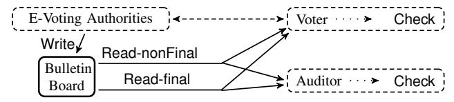
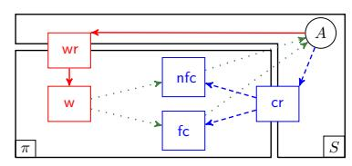
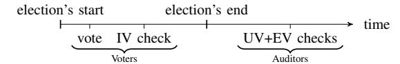
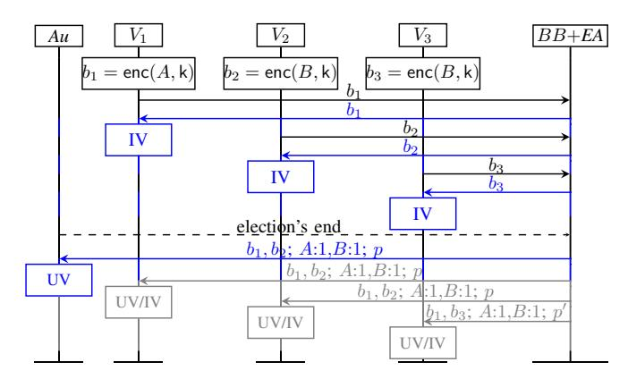
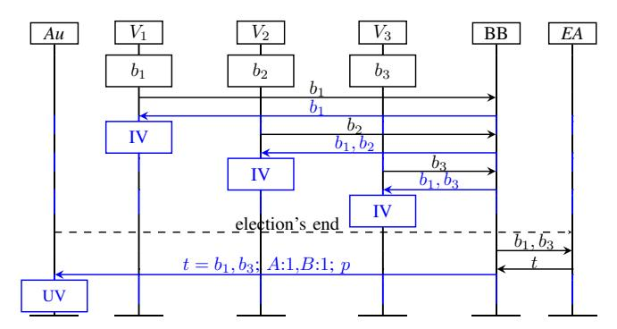
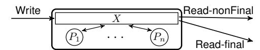
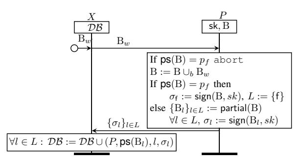
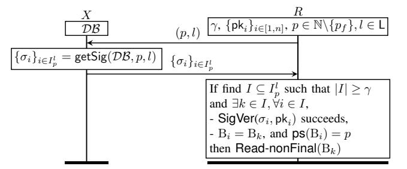

# Fixing the Achilles Heel of E-Voting: The Bulletin Board

Lucca Hirschi∗ *Inria & LORIA* Nancy, France lucca.hirschi@inria.fr

Lara Schmid∗ *DFINITY*† Zurich, Switzerland lara.schmid@dfinity.org

David Basin *ETH Zurich* Zurich, Switzerland basin@inf.ethz.ch

*Abstract*—The results of electronic elections should be verifiable so that any cheating is detected. To support this, many protocols employ an electronic bulletin board (BB) for publishing data that can be read by participants and used for verifiability checks. We demonstrate that the BB is itself a security-critical component that has often been treated too casually in previous designs and analyses. In particular, we present novel attacks on the e-voting protocols Belenios, Civitas, and Helios that violate some of their central security claims under realistic system assumptions. These attacks were outside the scope of prior security analyses as their verifiability notions assume an idealized BB.

To enable the analysis of protocols under realistic assumptions about the BB, we introduce a new verifiability definition applicable to arbitrary BBs. We identify a requirement, called *finalagreement*, and formally prove that it is sufficient and, in most cases, necessary to achieve verifiability. We then propose a BB protocol that satisfies final-agreement under weak, realistic trust assumptions and provide a machine-checked proof thereof. Our protocol can replace existing BBs, enabling verifiability under much weaker trust assumptions.

*Note: This document is an extended version of a paper accepted at the IEEE Computer Security Foundations Symposium 2021 whose most additional material is in the appendices that respectively correspond to the different sections in the body.*

# I. INTRODUCTION

Physical bulletin boards are used to publish announcements, for example at the town hall. An *electronic bulletin board*, henceforth referred to as *BB*, has a similar purpose, but can be accessed *remotely*, *e.g.,* by publishing its content on a website. While BBs are deployed in various contexts, they are particularly important for electronic voting (e-voting) protocols.

For e-voting to be trustworthy, the participants must be convinced that the election result is correctly computed from all eligible voters' ballots. To this end, the participants must be able to *verify* that all e-voting authorities behaved as specified, even when some of them are not trustworthy. For most e-voting protocols, verifiability is achieved by voters and auditors performing checks on data published on a BB. In this paper, we focus on those BBs that are used for verifiability checks, where readers read their content and check the data they read. For instance, a voter may check that her ballot was recorded correctly after casting it. Also, auditors or voters may check that all ballots were processed correctly by the authorities.

*a) State of the Art:* For verifiability checks to be meaningful, the BB must provide some guarantees. However, to the best of our knowledge, no prior work has studied which precise (minimal) guarantees must be satisfied by a BB for *verifiability* to hold and which attacks are possible when the guarantees are not satisfied. All verifiability definitions surveyed in [\[1\]](#page-15-0) and most e-voting protocols that are formally proven to provide verifiability [\[2\]](#page-15-1)–[\[4\]](#page-15-2) make the overly conservative assumption of an *idealized BB* such as a shared, universally accessible memory, a broadcast channel, or even a storage mechanism where a *single* content is published and subsequently remains unchanged. Even prior works that claim to consider "malicious" BBs [\[5\]](#page-15-3)–[\[10\]](#page-15-4), where the BB's content is under adversarial control, still consider an idealized BB.

Some researchers regard the realization of BBs satisfying such strong requirements as an orthogonal problem to designing voting protocols [\[3\]](#page-15-5), [\[4\]](#page-15-2), [\[11\]](#page-15-6). Thus, it is unclear how and whether these assumptions can be met in practice. Other researchers have proposed concrete BB designs. For instance, Civitas [\[12\]](#page-15-7) proposes a signed BB, Helios [\[13\]](#page-15-8) suggests that BB contents are (re)posted by several auditors, [\[14\]](#page-15-9) makes use of a Byzantine Fault Tolerant (BFT) protocol, and [\[10\]](#page-15-4), [\[15\]](#page-15-10)–[\[17\]](#page-15-11) suggest to use the BB protocol presented in [\[18\]](#page-15-12). Whereas these designs do not aim to realize an idealized BB, we shall see that they fail to provide sufficiently strong guarantees for verifiability. We shall also see why solutions based on distributed ledgers are unsuitable.

Idealized BBs are fine in theory but not in practice. Indeed, reference implementations of the state-of-the-art systems Belenios, Civitas, and Helios [\[3\]](#page-15-5), [\[12\]](#page-15-7), [\[13\]](#page-15-8), that have been extensively used, notably in academia (*e.g.,* UCLouvain, Princeton, ACM, IACR), as well as the currently running web-based deployments of Belenios and Helios [\[19\]](#page-15-13), [\[20\]](#page-15-14) use BBs with too weak guarantees. Therefore, we shall see that the centralized entity running the BB must actually be trusted for verifiability to hold in practice. However, this assumption is unreasonable and at odds with the recent, substantial efforts to minimize the required trust assumptions in e-voting designs and proofs [\[5\]](#page-15-3), [\[11\]](#page-15-6), [\[21\]](#page-15-15).

Thus, whereas e-voting designs make too strong *assumptions* about the BB, actual deployments provide too weak *guarantees* for them. This mismatch and the imprecise treatment of the BB in prior works call for a thorough analysis of the BB's

∗Both authors contributed equally to this research.

†Work was done while author was employed at *ETH Zurich*.

role with respect to verifiability and raise the following questions. How does a BB that is under adversarial control impact verifiability in practice? What requirements must be satisfied by a BB for verifiability to hold? Can a concrete BB protocol achieve such requirements under realistic assumptions?

*b) Contributions:* We make four contributions. First, we demonstrate that there is a mismatch between BB assumptions in verifiability claims and proofs and actual BB realizations. By considering idealized BBs like those mentioned above, prior works fall short of capturing realistic use cases and deployments. In particular, a malicious BB can provide, independently of its current state, different readers different contents; we call this *equivocation*, inspired by the terminology used for distributed systems [\[22\]](#page-15-16), [\[23\]](#page-15-17). This opens even well-designed protocols to serious attacks.

In particular, we present novel and practical attacks on the state-of-the-art e-voting systems Belenios [\[3\]](#page-15-5), Civitas [\[12\]](#page-15-7), and Helios [\[13\]](#page-15-8). In our attacks, the BB equivocates contents, but never the *election result* (*i.e.,* number of votes for each candidate/choice) to readers. We thereby show that these systems fail to provide verifiability (and privacy) under the threat models for which they are claimed to be secure. As verifiability has previously only been proven with some idealized BB, these attacks were missed in prior formal analyses.

While many prior works mention BB assumptions that imply that readers are provided with consistent contents, only few of them explicitly identify equivocation as a potential threat [\[12\]](#page-15-7), [\[24\]](#page-15-18)–[\[26\]](#page-15-19) and none describes concrete attacks. In contrast, we describe seven such attacks that are novel and exploit six different forms of equivocation. We account for the detailed specifications, assumptions, and usability constraints in the attacked protocols, which is key to estimating the risk associated with attacks in practice. As we shall see, our attacks support our thesis that the threat of equivocation was overlooked or underestimated. The Belenios designers acknowledged our attacks and their effectiveness in a scenario with a motivated, malicious voting server.

Second, we propose a new verifiability definition that accounts for malicious BBs. Consequently, our definition covers realistic scenarios that include our attacks, as opposed to previous work assuming idealized BBs. We base our definition on the generic verifiability definition of [\[1\]](#page-15-0) that subsumes all of the definitions surveyed in [\[1\]](#page-15-0), which all assume an idealized BB. However, in stark contrast to [\[1\]](#page-15-0), our new definition *verifiability*+ is also suitable for malicious BBs. As expected, verifiability+ does not hold for arbitrary BBs, which motivates our analysis of which BB properties are actually needed for the entire e-voting system to satisfy verifiability+.

Third, we identify a new BB property, called *Final-Agreement* (FA for short), that is weaker than conventional BB requirements, yet sufficient to achieve verifiability+. FA requires that any content read from the BB at some point in time is also contained in a distinguished *final* version of the BB, wherein the election result is published. Furthermore, all readers agree on this final content. FA does not, however, impose any relation between the writes and the reads or between different reads performed on non-final BB contents. We formally show that, in most e-voting protocols, FA is the weakest BB requirement that suffices to achieve verifiability+. Also, we prove that any protocol satisfying verifiability with an idealized BB, satisfies verifiability+ for a BB satisfying FA, which requires weaker trust assumptions that can be met in practice.

Finally, we propose a BB protocol that satisfies FA. Similar to other approaches [\[14\]](#page-15-9), [\[27\]](#page-15-20), [\[28\]](#page-15-21), we assume that the BB is implemented using multiple peers signing BB contents, only some of which must be trusted. However, in contrast to prior BB protocols that fail to provide FA, we explain how FA is enforced with carefully designed policies that peers must check prior to signing. Since such proofs are subtle, we formalize our protocol and the FA property as an event-based model and provide a machine-checked proof that the protocol satisfies FA. Our protocol requires weaker trust and system assumptions than previous BB approaches based on BFT such as [\[14\]](#page-15-9).

Overall, our results show that the unrealistically strong BBs used in designs and verifiability proofs can be replaced by our BB protocol and that verifiability is still (provably) satisfied. We thereby effectively and substantially weaken the required trust assumptions in e-voting protocols.

*c) Outline:* In Section [II,](#page-1-0) we present our system model, our threat model, and the specification language we use. In Section [III,](#page-4-0) we review previous verifiability definitions and propose improvements to account for possibly malicious BBs. We then show in Section [IV](#page-5-0) how existing e-voting systems can be attacked by a malicious BB. We define the FA property in Section [V](#page-11-0) and explain why it is sufficient and, in many cases, necessary for verifiability. We then present our BB protocol and formally establish that it satisfies FA in Section [VI.](#page-11-1) In Sections [VII](#page-14-0) and [VIII](#page-15-22) we discuss related work, including those solutions based on distributed ledgers, and draw conclusions.

# II. BULLETIN BOARD (BB) MODEL

# *A. Setup, System, and Threat Model*

*1) Functionalities:* BBs are used to store information that others can read. A BB therefore provides, at a minimum, functionalities (what users can do) for *writing* and *reading* content to and from it. For e-voting and other scenarios, the BB's content evolves in *phases* and is intended to reach a final state where the *final content* contains the result of the process that the BB tracks. For instance, in e-voting the BB can be updated, corresponding to a new phase, whenever a batch of ballots is received or when the ballots have been tallied and the final content includes the election's result. We shall see that for e-voting, the guarantees required when reading the final content are different from the guarantees required when reading *non-final* contents. The former guarantees are strictly stronger and include a strong form of agreement between readers, whereas the latter may be relaxed.

Given the previous considerations, we distinguish two *a priori* different reading functionalities: Read-final for reading the BB's final content(s) and Read-nonFinal for reading any BB content, including non-final ones. With both functionalities, a reader can either read the full BB content or only a *partial BB*

Fig. 1. Typical BB setup in e-voting. The BB functionalities are depicted by solid lines, the verifiability checks by dotted lines, and the remaining architecture by dashed lines.

content such as a single ballot retrieved by a voter to check its inclusion on the BB. The third functionality is Write.

- 2) Setup: We focus on the interactions between the BB and verifiability in e-voting. Thus, we consider BBs that are solely used to store election-relevant data and to retrieve data to check for verifiability. Checking verifiability intuitively entails checking that all participants followed their specification and the election's result is thus trustworthy. In this setting, it is common that writers are voting authorities and readers are auditors and voters (or their machines), who carry out some verifiability checks on the BB's content. A typical BB architecture for e-voting is depicted in Figure 1.
- 3) System Model: A concrete BB can be realized by a single role (e.g., [18]) or by several (equal or different) roles, which we call peers, that run a protocol together (e.g., [14]). The system model states assumptions on which communication channels are available between readers, writers, and peers.

We note that reader-interconnectivity would allow for BB solutions based on BFT protocols run by the readers, for example where readers cross-checking their views of the BB. However, reader-reader communication is a very strong assumption that is unrealistic for e-voting at scale, i.e., medium and large scale elections where all voters can be readers. Indeed, this would require an infrastructure such as a Public Key Infrastructure (PKI) that voters use to identify and authenticate other genuine, eligible voters. Moreover, sufficiently many voters must be online at all times with sufficient bandwidth and storage (the BB content can be very large as it may contain large zero-knowledge proofs (ZKP) for many voters, see Section IV-B4). Finally, BFT would require that a given percentage of the voters' platforms are trusted and non-compromisable, which specifically contradicts the assumptions of protocols that rely on specialized devices to protect against voters' malicious platforms [21], [24], [29], [30]. In conclusion, as such assumptions are unrealistic for e-voting systems, we exclude reader-reader communication from our system model. Since readers cannot directly communicate with each other to synchronize their BB views, they must rely on trusted third parties, which may be centralized or decentralized (see Section VI).

4) Threat Model: We assume that all communication is over an insecure network controlled by the adversary. Additionally, some participants can be *malicious*, *i.e.*, the adversary knows all of their secrets and controls them. We allow for static and dynamic compromise, *i.e.*, agents can be compromised before or during the voting protocol's execution. All nonmalicious agents are *honest* and follow their specification.

#### B. Formal Specifications in Event-B

1) Event-B Definitions: We use an event-based model based on Event-B [31] to formally describe protocols. First, we introduce standard notation and definitions for Event-B specifications; we also provide a tutorial in Appendix A for interested readers. We shall use standard mathematical notation and functional programming concepts such as typed values, types as sets of values,  $\equiv$  for the equality between values, and  $\triangleq$  for the equality between types. We denote by  $r = (x_1 = t_1, \ldots, x_n = t_n)$  a record that respectively stores the value  $t_i$  with the label  $x_i$ , i.e.,  $r.x_i \equiv t_i$ . For a set S,  $\mathcal{P}(S)$  denotes the powerset of S.  $\bar{\cdot}$  denotes a vector, and  $\{a_i\}_{i \in J}$  denotes a set of elements  $a_i$  indexed by elements in the set J.

**Definition 1** (Specifications). A transition system is a tuple  $\mathcal{T} = (\Sigma, \Sigma_0, \rightarrow)$ , where  $\Sigma$  is the state space,  $\Sigma_0 \subseteq \Sigma$  is the set of initial states, and  $\rightarrow \in (\Sigma \times \Sigma)$  is the transition relation. A behavior  $\sigma$  of  $\mathcal{T}$  is a sequence of states  $\sigma = s_0.s_1.\dots.s_n$  such that  $s_0 \in \Sigma_0$  and  $\forall i \in [0, n), (s_i, s_{i+1}) \in \rightarrow$ . Be( $\mathcal{T}$ ) denotes the set of all behaviors.

A specification is a transition system where states are defined by records and transition relations by events (defined below). Formally, a specification is given by a list of typed state variables, initial values thereof, and a set of events. We denote a state whose state variables  $v_1, v_2, \ldots$  have the (well-typed) values  $a, b, \ldots$  by the record  $\{v_1 = a, v_2 = b, \ldots\}$ .  $\Sigma$  is the set of all such records.

Events are of the form  $Ev(\overline{x}) \equiv \{(s,s') \mid G(\overline{x},s) \land s'.\overline{v} := \overline{f}(\overline{x},s)\}$ , where Ev is the event name,  $\overline{x}$  are the event's parameters,  $\overline{v}$  are the state variables,  $G(\overline{x},s)$  is a conjunction of guards, and  $s'.\overline{v} := \overline{f}(\overline{x},s)$  are actions with the update functions  $\overline{f}$ . The guards are first-order formulae over  $s.\overline{v}$  and  $\overline{x}$  and determine when the event is enabled. If the event is enabled, the actions  $s'.\overline{v} := \overline{f}(\overline{x},s)$  assign values to state variables in the state s'. The set of all events defines a transition relation corresponding to applications of the events with arbitrary event parameters. We assume that all specifications implicitly include the event  $Skip() \equiv \{(s,s') \mid s'.\overline{v} := s.\overline{v}\}$ , which models stuttering steps. We denote by V(S) the set of state variables of a specification S.

Two specifications  $S_1$  and  $S_2$  can be combined into a new specification, denoted by  $S_1 \cup S_2$ , by taking the union of the events, state variables, and their initial values. (The initial values of the shared state variables in  $S_1$  and  $S_2$  must be equal.)

- 2) E-voting Protocol and BB Specification Framework:
- a) Parameterized BB Contents: For the sake of generality, we impose some minor restrictions on the contents that may be written to and read from the BB that allow us to work with a *lattice* structure. Formally, we assume given an uninterpreted set W of all possible BB contents with a relation  $\sqsubseteq_b$  that form a lattice whose join and meet are respectively written as  $\cup_b$  and  $\cap_b$ . We also assume a bottom element  $B_{\perp}$ . The relation  $\sqsubseteq_b$  expresses inclusion between BB contents. The set W abstractly represents contents and does not necessarily match with the BB's actual internal representation (*e.g.*, list). Furthermore, W may contain partial BB contents. We establish

Fig. 2. Abstract representation of the interactions between the BB  $(\pi)$  and an e-voting specification (S) using dedicated state variables (in squares). Write actions for an agent A are depicted with red, solid arrows and check actions with blue, dashed arrows. Green dotted arrows denote interactions that we abstract away: respectively the construction of BB contents from writes (on the left) and the sending of BB contents to readers (on the right).

our results in this general setting; but for intuition one can also work with the following lattice: the power set of a given set  $\mathcal{I}$  of items that the BB contents may contain. Namely,  $\mathcal{W} := \mathcal{P}(\mathcal{I}), \sqsubseteq_b := \subseteq, \cup_b := \cup, \cap_b := \cap$ , and  $B_{\perp} := \emptyset$ .

Recall from Section II-A1 that BB contents can be published in different phases. We model phases by positive integers acting as counters. Each  $B \in \mathcal{W}$  has a phase that is defined by the function  $ps: \mathcal{W} \to \mathbb{N}^+$  and  $ps(B_\perp) = 1$ .

b) Our Framework, the Big Picture: Our definitions model the BB's role in verifiability in e-voting and thus focus on the interactions between e-voting entities, the BB, and verifiability checks. The rest is abstracted away. We therefore formalize a protocol as the combination of two specifications, modeling the BB and the rest of the e-voting system, which can produce write and verifiability check requests. We describe how these two specifications interact through shared state variables, as explained next and depicted in Figure 2.

An agent A accessing the Write functionality, shown in solid, red arrows in Figure 2, is modeled by the written content being added to the state variable wr (write requests). Depending on the BB's specification, the BB may then add this content to the state variable w (writes). Hence, the state variables wr and w respectively record the set of write requests sent to and actually processed by the BB. The BB content associated to such a set is the meet  $(\cup_b)$  thereof, e.g.,  $\cup_b$ w.

To evaluate a verifiability check on some BB data, an agent A sends check requests to access one of the BB's two read functionalities. We distinguish a subset of verifiability checks, called *final-only* checks, that can only be evaluated on BB contents obtained by the Read-final functionality. An agent A evaluating a final-only verifiability check is modeled in two steps: (1) A's check is added to a set of check requests cr, and (2) depending on the BB specification, the BB may process this request and provide A with some content, which is stored with the original request in the fc (final-checks) state variable (depicted with dashed, blue arrows in Figure 2). We abstract away the actual reads (green dotted arrows on the right of Figure 2) and only keep track of check requests that were processed. Non-final check requests are similar, except that the processed check requests are stored in nfc (non-final-checks) rather than in fc. Finally, the e-voting specification has a state variable agents (not shown in Figure 2) that keeps track of all honest and malicious agents. c) Protocol and BB Specifications: We now formalize the above in Event-B. We respectively denote by  $\mathcal A$  and  $\mathcal M$  the uninterpreted sets of possible agents and messages, and by  $\mathcal C$  the set of possible verifiability checks. A verifiability check  $C \in \mathcal C$  is a predicate of the form  $C(B,\overline{x})$  that represents a property checked on the BB's content  $B \in \mathcal W$ , possibly with additional data  $\overline{x} \in \mathcal M^*$  in the checker's possession. We assume some  $\mathcal C_f \subseteq \mathcal C$  containing all the final-only verifiability checks, and let  $\mathcal C_{nf} = \mathcal C \backslash \mathcal C_f$ . We describe verifiability checks further in Section III-A. The check requests recorded in cr are of the form  $(C,\overline{x},a)$  and denote that an agent  $a \in \mathcal A$  wants to read the BB, obtain some B, and check  $C(B,\overline{x})$ . With this, we can formalize the e-voting specifications explained above.

**Definition 2** (S). An e-voting specification S is a specification whose state variables contain  $\operatorname{cr}: \mathcal{P}(\mathcal{C} \times \mathcal{M}^* \times \mathcal{A})$  (storing the check requests),  $\operatorname{wr}: \mathcal{P}(\mathcal{W})$  (storing the write requests), and agents:  $\mathcal{P}(\mathcal{A}) \times \mathcal{P}(\mathcal{A})$  (storing the honest and malicious agents). Moreover,  $\operatorname{cr}$  and  $\operatorname{wr}$  are initially empty and they are monotonically increasing; for example, for  $\operatorname{cr}, \forall (\sigma.s.\sigma'.s') \in \operatorname{Be}(S), s.\operatorname{cr} \subseteq s'.\operatorname{cr}.$ 

We define BB specifications similarly. The state variables fc and nfc record checks of the form  $(C, \overline{x}, a, B)$ , where B is the content that the BB produced for some check request  $(C, \overline{x}, a)$  in cr respectively through Read-final and Read-nonFinal.

**Definition 3** ( $\pi$ ). A BB specification  $\pi$  is a specification containing the state variables cr and wr as in Definition 2, fc:  $\mathcal{P}(\mathcal{C} \times \mathcal{M}^* \times \mathcal{A} \times \mathcal{W})$ , nfc:  $\mathcal{P}(\mathcal{C}_{nf} \times \mathcal{M}^* \times \mathcal{A} \times \mathcal{W})$ , and w:  $\mathcal{P}(\mathcal{W})$  such that cr, wr, fc, nfc, and w are initially empty and are monotonically increasing.  $\pi$  has write access to neither cr nor wr, i.e., their values can only be used in guards.

Note that fc may contain checks of the form  $(C, \overline{x}, a)$  with  $C \notin \mathcal{C}_f$  since checks that are not final-only can also be evaluated on BB contents obtained by the Read-final functionality. For a state s, checksA(s) denotes the set of all checks that have been actually processed (answered to) by the BB, namely  $\{(C, \overline{x}, a) \mid (C, \overline{x}, a, B) \in (s.fc \cup s.nfc)\}$ . For a set of checks c, we denote by readB(c) the set of all read BB contents, *i.e.*,  $\{B \mid \exists (C, \overline{x}, a, B) \in c\}$ .

**Example 1.** Consider the BB specification  $\pi^{\mathrm{per}}$  defined below.  $\pi^{\mathrm{per}}$  models a perfect BB that acts as a shared variable: it returns all previously written messages for all check requests (Rnf, Rf) and is updated (Write) by all write requests until a final check is processed whereby the content is frozen.

$$\begin{split} \Sigma &\triangleq \{ \mathsf{wr}, \mathsf{w}, \mathsf{cr}, \mathsf{fc}, \mathsf{nfc} \}, \quad \Sigma_0 \equiv \{ \{ \mathsf{wr}, \mathsf{w}, \mathsf{cr}, \mathsf{fc}, \mathsf{nfc} = \emptyset \} \} \\ &\quad \mathsf{Write}(\mathsf{B}_w) \equiv \{ (s,s') \mid s.\mathsf{fc} = \emptyset \land \mathsf{B}_w \in s.\mathsf{wr} \\ &\quad \land s'.\mathsf{w} = s.\mathsf{w} \cup \{ \mathsf{B}_w \} \} \\ &\mathsf{Rnf}(C, \overline{x}, a, \mathsf{B}) \equiv \{ (s,s') \mid s.\mathsf{w} = s.\mathsf{wr} \land (C, \overline{x}, a) \in s.\mathsf{cr} \\ &\quad \land C \in \mathcal{C}_{\mathsf{nf}} \land \mathsf{B} = \cup_b s.\mathsf{w} \land s'.\mathsf{nfc} := s.\mathsf{nfc} \cup \{ (C, \overline{x}, a, \mathsf{B}) \} \} \\ &\mathsf{Rf}(C, \overline{x}, a, \mathsf{B}) \equiv \{ (s,s') \mid s.\mathsf{w} = s.\mathsf{wr} \land (C, \overline{x}, a) \in s.\mathsf{cr} \\ &\quad \land \mathsf{B} = \cup_b s.\mathsf{w} \land s'.\mathsf{fc} := s.\mathsf{fc} \cup \{ (C, \overline{x}, a, \mathsf{B}) \} \} \end{split}$$

Next, consider  $\pi^{tru}$ , which is like  $\pi^{per}$  but without the guard s.w = s.wr in the actions Rnf and Rf and without the guard  $B_w \in s.wr$  in the action Write.  $\pi^{tru}$  models a trustworthy

BB that has insecure and unreliable channels with writers (w and wr can be unrelated), but always provides readers with the previous received writes and stops accepting new writes once a final check is processed.

We define a protocol by combining an e-voting and a BB specification, where the checks  $nfc \cup fc$  must correspond to check requests cr, *i.e.*, the BB only processes requested checks.

**Definition 4** (Protocol). A protocol is the union  $S \cup \pi$  of an e-voting specification S and a BB specification  $\pi$ . We also require that (1)  $\pi$  and S only interact through cr and wr, that is  $V(S) \cap V(\pi) \subseteq \{\text{cr}, \text{wr}\}$ , and (2)  $\forall (\sigma.s) \in \text{Be}(S \cup \pi)$ , checks $A(s) \subseteq s.\text{cr}$ . We write  $P(S, \pi)$  for  $S \cup \pi$ , where these two conditions hold.

Finally, we shall define several BB properties in this paper, all of which can be formalized as predicates.

**Definition 5.** Let T be a predicate over behaviors. For a behavior  $\sigma$ , we write  $\sigma \vdash T$  when T is satisfied on  $\sigma|_{V_b}$  (i.e.,  $\sigma$  restricted to the state variables in  $V_b$ ), where  $V_b = \{\text{cr}, \text{wr}, \text{w}, \text{fc}, \text{nfc}\}$ . We require that T holds for  $\sigma = s_0$ , where the values of the record  $(s_0)|_{V_b}$  are empty sets. A BB specification  $\pi$  satisfies a predicate T, denoted by  $\pi \vdash T$  when, for all S such that  $P(S, \pi)$  is a protocol,  $\forall \sigma \in \text{Be}(P(S, \pi)), \sigma \vdash T$ .

**Example 2.** The written-as-requested predicate War denotes that all write requests were processed before reading, i.e.,  $\sigma \vdash \text{War when for any prefix of } \sigma$  of the form  $\sigma_0.s.s'$ , if  $s'.\mathsf{nfc} \cup s'.\mathsf{fc} \neq s.\mathsf{nfc} \cup s.\mathsf{fc}$ , then  $s.\mathsf{wr} = s.\mathsf{w}$ . Also, the read-as-written predicate RaW denotes that read contents are identical to the previously written contents and that no writes are made once a final check has been processed. That is,  $\sigma \vdash \mathsf{RaW}$  when for any prefix  $\sigma_0.s.s'$  of  $\sigma$ , the two following conditions hold:  $(1) \forall (C, \overline{x}, a, B) \in ((s'.\mathsf{fc} \cup s'.\mathsf{nfc}) \setminus (s.\mathsf{fc} \cup s.\mathsf{nfc})), B = \cup_b s.\mathsf{w}$  and  $(2) s.\mathsf{fc} \neq \emptyset \Rightarrow s'.\mathsf{w} = s.\mathsf{w}$ .

We call a BB that satisfies RaW trustworthy, as assumed by e.g., Alethea [4]. We call it perfect if it also satisfies War, as assumed by e.g., Belenios security proofs [32] (see Section IV-C3a). It is easy to see that  $\pi^{\rm per}$  (respectively  $\pi^{\rm tru}$ ) from Example 1 is a perfect (respectively trustworthy) BB.

#### III. VERIFIABILITY AND THE BB

Verifiability requires that voters and auditors can verify the election's integrity by performing checks on data that is, in most protocols, stored on the BB. Hence, verifiability depends on the BB's properties. We investigate now the relationship between verifiability and BBs.

#### A. Defining Verifiability for Malicious BBs

We formally define verifiability in our framework. First, we explain that most prior verifiability definitions assumed a *trustworthy* or even a *perfect* BB and we formalize these in our framework. Then, we generalize verifiability by relaxing the restrictions on the BBs found in prior works and by allowing BBs to be malicious.

The Big Picture. Verifiability enables voters and auditors to detect any malicious behavior by the election authorities. The

Fig. 3. Election timeline for which the verifiability checks satisfy Vote&Go.

core property is *end-to-end verifiability*, which states that the election's result has been correctly computed based on all eligible voters' votes [1], [9]. Some authors, e.g., [4], [33], [34], divide this into sub-properties targeting steps of the election process. For instance, *Individual Verifiability* (IV) states that when a voter checks that his ballot is in the list of recorded ballots (on the BB), then his ballot is indeed recorded correctly and will be considered when computing of the election result. *Universal Verifiability* (UV) states that when auditors or voters verify checks on the end result (on the BB), such as verifying given ZKPs, then the election result was correctly computed from the recorded ballots. Finally, *Eligibility Verifiability* (EV) ensures that the election result is only computed from eligible voters' votes and contains at most one vote from each voter.

More generally, verifiability states that, when the verifiability checks hold for a given execution, then this execution, along with the corresponding final BB content (including the election result), meet some *verifiability goal* [1]. This goal can be *quantitative* or *qualitative*. In our work, we focus on qualitative definitions in the possibilistic setting, where agents may perform verifiability checks and where goals are expressed with respect to the set of agents who perform these checks. However, it should be possible to generalize our definitions to the probabilistic and quantitative case; we leave this task as future work.

Usability requirements. For verifiability to succeed in practice, the checks required must be easy to carry out. If verifiability checks are impractical (e.g., too time-consuming or complex), then few voters will actually perform these checks (correctly). One prominent requirement is *Vote&Go* [35], which requires that voters can perform the IV checks right after voting and need not perform UV checks. Hence, verifiability is not jeopardized by human voters who are no longer active in the election process after voting; see Section IV-B4. A timeline for an election with verifiability checks that satisfies *Vote&Go* is depicted in Figure 3. Another important requirement mentioned in Section II-A3 is the absence of voter-voter communication, implying that voters are unable to effectively compare their views of the BB. We will ensure that our verifiability definition is expressive enough to capture such requirements, should one wish to consider them.

Verifiability for Honest BBs. To formally define verifiability, we first formalize verifiability checks and goals.

**Definition 6.** A verifiability check is a predicate  $C: \mathcal{P}(W \times \mathcal{M}^*) \in \mathcal{C}$  over bulletin board content and messages. C is final-only when  $C \in \mathcal{C}_f \subseteq \mathcal{C}$ . We require that all verifiability checks that are not final-only are monotonic in B, i.e.,  $\forall B, B', \overline{x}, C(B, \overline{x}) \land B \sqsubseteq_b B' \Rightarrow C(B', \overline{x})$ .

Monotonicity may appear restrictive. However, as we argue

next, it only excludes verifiability checks that cannot be meaningfully evaluated on non-final contents. Fortunately, these verifiability checks are therefore final-only and need not be monotonic. Monotonicity essentially states that a verifiability check cannot be violated by extending the BB content by adding additional items. The lack of monotonicity means that verifiability checks evaluated on non-final contents provide no guarantees about the final BB content containing the election result. For instance, the check that at most one ballot has been registered per voter is not monotonic. To provide meaningful guarantees such checks must therefore be evaluated on the final, full contents only and are thus final-only. Monotonicity is typically met by IV checks, as they express that the BB content contains specific items like a ballot. UV must usually be checked on the final, full BB content and thus these checks are typically final-only.

A goal's satisfiability may depend not only on the final BB content, but also on which checks have been performed and on additional information about the agents' intended choices and honesty. We assume a partial function that returns the intended choice of a given voter. We then define a goal as a predicate over the final BB content, the set of all checks that the BB has responded to, and the sets of honest and malicious agents.

**Definition 7.** A verifiability goal 
$$\tau$$
 is a predicate over  $W \times \mathcal{P}(\mathcal{C} \times \mathcal{M}^* \times \mathcal{A}) \times (\mathcal{P}(\mathcal{A}) \times \mathcal{P}(\mathcal{A}))$  that is satisfied for  $B_{\perp}$ .

We next present a generic verifiability definition that is inspired by [\[1\]](#page-15-0), where different verifiability notions are cast in the same framework. All the verifiability properties analyzed in [\[1\]](#page-15-0) are only defined for protocols that assume a *trustworthy* or *perfect* BB (see Section [VII-B\)](#page-14-1), such as π tru or π per from Example [1,](#page-3-2) which we formally characterize by the RaW predicate. For any protocol P(S, π) such that π ` RaW and for any (σ.s) ∈ Be(P(S, π)), we define the *final BB content in* s as the union of all writes, that is finalB(s) = ∪bs.w.

Definition 8 (Verifiability). *A protocol* P(S, π) *with* π ` RaW *provides* verifiability for a verifiability goal τ *when* ∀(σ.s) ∈ Be(P(S, π)), ^ C(B, x)

$$(C,\overline{x},a,B) \in (s.\mathsf{fc} \cup s.\mathsf{nfc})$$

$$\Rightarrow \tau(\mathsf{finalB}(s),\mathsf{checksA}(s),s.\mathsf{agents}).$$

Note that verifiability relies on the BB in two ways. First, the verifiability checks are performed on data read from the BB. Second, the verifiability goal is evaluated with respect to the final BB content, *i.e.,* the content of the final BB must satisfy some properties. Whereas the read and the final BB contents are well-defined for BB specifications satisfying RaW (through finalB(·) for the final content), this is not the case for arbitrary, possibly malicious BBs. These BBs can, for example, provide different readers completely different (final) BB contents (*equivocation*), possibly unrelated to previous writes. Thus, the above verifiability definition cannot be used for malicious BBs. Hence we next propose a more generic definition thereof, called *verifiability*+.

*Verifiability for Malicious BBs.* Intuitively, even when the BB is under adversarial control, we would like checks performed on the BB contents provided by the malicious BB to guarantee that a goal holds with respect to the final content. First, note that for this to be well-defined, the final BB must be welldefined and unique. That is, we can only define verifiability for BBs that present the same content to all readers using Readfinal. We thus define the predicate *final-consistency* (FC for short), which holds for a behavior σ.s when |readB(s.fc)| ≤ 1. (Note that RaW strictly implies FC). Any BB specification π satisfying FC never provides two final check requests with two different BB contents, but it can behave arbitrary otherwise. In particular, it can provide different contents to two readers using Read-nonFinal or provide readers with a final BB that is totally unrelated to the writes (to both s.w and s.wr). For specifications satisfying FC, we define the unique final content in a state s, denoted by finalB+(s), as either B⊥ when s.fc = ∅ (no one has read the final BB), or Bf , where readB(s.fc) = {Bf }, otherwise (when at least one reader has read the final BB). Given this, we define verifiability+ as a variant of verifiability suitable for any BB that is FC.

Definition 9 (Verifiability+). *A protocol* P(S, π) *with* π ` FC *provides* verifiability+ for a verifiability goal τ *when* ∀(σ.s) ∈ Be(P(S, π)), ^ (C,x,a,B)∈(s.fc∪s.nfc) C(B, x) ⇒ τ (finalB+(s), checksA(s), s.agents).

In Section [IV,](#page-5-0) we show how verifiability+ can be violated by a malicious BB in real-world e-voting protocols. We then propose a BB requirement that is sufficient for verifiability+ to hold in Section [V.](#page-11-0)

# IV. PRACTICAL ATTACKS WITH MALICIOUS BBS

We now investigate the security impact of malicious BBs. First, we present two attacks on a mock e-voting protocol based on equivocation and illustrate why such attacks are effective. Afterwards, we present attacks on Civitas [\[12\]](#page-15-7), Belenios [\[3\]](#page-15-5), and Helios [\[13\]](#page-15-8) taking into account the specifications and assumptions made in each of these protocols. The attacks use different forms of equivocation and differ in what contents are equivocated, towards whom, and when.

# *A. Two Examples of Equivocation*

We consider a simplified, mock e-voting protocol with three voters V1, V2, and V3, an election authority *EA*, an external auditor *Au*, and a BB. Each voter Vx, x ∈ {1, 2, 3} chooses a candidate cx ∈ {A, B}, encrypts this choice using *EA*'s public key k, denoted by enc(cx, k), and sends the resulting ballot bx = enc(cx, k) to the BB, who records it. At the election end, the BB sends all recorded ballots to *EA*, who decrypts them and computes the result, *e.g.,* using homomorphic encryption [\[3\]](#page-15-5) or a mix-net [\[12\]](#page-15-7). Next, *EA* publishes on the BB the list of all recorded ballots, the election result, *i.e.,* the number of votes for each candidate, and a proof that the result was computed correctly. For authentication, *EA* signs the proof.

For verification, each voter Vx requests a (possibly partial) BB content after casting his ballot and checks that bx is in the list of already recorded ballots (IV). Also, after the election

Fig. 4. A malicious BB and election authority (EA) change the election result. p and p' are respectively the proofs that the result A:1,B:1 was correctly computed from the lists of ballots  $b_1,b_2$  and  $b_1,b_3$ . These proofs are signed by EA. The BB reads and the verifiability checks specified in the protocol are depicted in blue. This attack is neither detected by the voters'  $(V_i)$  and the auditor's (Au) checks nor by (unspecified) additional checks of motivated voters, shown in gray.

Fig. 5. A malicious BB changes the election result and violates IV (for  $V_2$ ). p is the proof that the result  $A{:}1{,}B{:}1$  was correctly computed from  $b_1,b_3$ , signed by EA.

end, auditors and possibly some motivated voters read the full, final BB and check that the election result was correctly computed from the recorded ballots by verifying the published proofs (UV). (Thus, voters are not mandated to check UV. We will explain in Section IV-B4 why this is important.)

Assume now that  $V_1$  votes for candidate A, while  $V_2$  and  $V_3$  vote for B. Thus, the true election result is  $A{:}1{,}B{:}2$ . We next present two attacks showing that the election result can be maliciously modified to  $A{:}1{,}B{:}1$ , *i.e.*, the result is a tie rather than a victory for B, without being detected by any of the checks specified in the protocol, thus violating verifiability. For more than three voters, similar attacks can change the winner.

1) Equivocating Final BB Contents With a Malicious BB and EA: Figure 4 shows how a malicious BB and EA can change the election result. When the voters read the BB to check IV, they are provided with a list containing their ballot. For simplicity, we assume here that the list contains only this ballot. When Au reads the BB to check UV, the BB (with the help of EA) provides Au with the ballots  $b_1, b_2$ , the result A:1,B:1, and a proof of the correct decryption of  $b_1, b_2$ , signed by EA. Despite the fact that the result has been changed, all checks succeed: each voter can verify that their previously

cast ballot is in the list of recorded ballots (IV) and the auditor can check the proof of correct decryption (UV). Note that this even holds if some motivated voters additionally perform an UV (or IV) check at the election end, as shown in gray in Figure 4. For example, when  $V_1$  reads the BB to check UV, he is shown the same BB content as the auditor. However, when  $V_3$  does so, he is shown the ballots  $b_1, b_3$ , the election result A:1,B:1, and a signed proof of correct decryption of  $b_1,b_3$ .

In a scenario with many voters and ballots, the adversary could first choose his desired election result and a set of ballots that yield this (fixed) result when processed correctly. When an auditor requests the BB to check UV, the adversary could include in the answer the selected ballots and all required proofs showing that they lead to the chosen result. If a motivated voter checks UV, the attacker could choose a possibly different set of ballots that yields the same result when tallied but also contains the voter's ballot. Even though a malicious BB and EA is a strong adversary, verifiability has been (wrongly) claimed to hold for similar threat models; e.g., in Belenios, Helios, and Civitas as shown below.

2) Equivocating non-Final BB Contents With a Malicious BB: Under a much weaker threat model where only the BB is malicious, verifiability is still violated. As shown in Figure 5, the BB can equivocate its contents read for checking IV such that  $V_2$ 's ballot  $b_2$  is not considered in the final result although  $V_2$  successfully checks IV. Note that, in contrast to the previous attack,  $V_2$ 's ballot is not included in any of the final BB contents, which are authenticated by the honest EA. Thus, the adversary can only equivocate non-final BB contents.

# B. Practicality of the Attacks

We next make some key observations regarding the above attacks that also hold for the attacks introduced in Section IV-C. In particular, although the above cheating may leave some *evidence*, we shall see that it is not detected by the checks *specified in the protocol* and thus constitutes an attack. Moreover, the checks that could be added to the protocol specification that could in theory detect some of these attacks are either too weak or impractical and thus are *ineffective in practice*.

- 1) Equivocation with Consistent Election Result: For all our attacks (presented in Sections IV-A and IV-C), all BB readers are provided the same election result. Thus, different readers may see different final BB contents but never different results, e.g., in Figure 4,  $V_2$  sees the ballots  $b_1, b_2$  and  $V_3$  sees  $b_1, b_3$ , but both see the result A:1,B:1. This is crucial as in real elections the (low-entropy) result is often published over various channels such as television or newspapers.
- 2) Equivocation Towards Voters: The attacks in Figures 4 and 5, as well as most of the attacks that we will subsequently present, equivocate towards the voters. That is, *some* voters are provided with equivocated BB contents, but all auditors are provided with the same BB content.

In practice for an election with n voters, the attacker can remove from the tally k ballots of  $k \leq n$  targeted voters without being detected by verifiability checks, thus defeating

verifiability. In particular, as we shall see in Section [IV-B4,](#page-7-0) the attacker can target voters for which the probability p that they do not detect the attack is overwhelmingly close to 1 in such a way that the probability that at least one voter detects the attack, namely 1 − p k , is kept low[1](#page-0-0) . Even though the attacker may not learn the content of these k ballots when selecting them, she can still manipulate the end result with non-negligible probability, for example by also targeting users based on their likely political inclinations, which might be inferred using IP-based localization for instance.

*3) Protocol vs. Ceremony:* Both attacks above leave some evidence. For example, the attacks in Figures [4](#page-6-0) and [5](#page-6-1) could respectively be detected if V2 and V3 both checked UV and compared their read BB contents and if V2 and *Au* compared their read contents. However, this does not invalidate our attack as these additional cross-checks *are not part of the protocol specification*. That is, even though some of our attacks *may* leave some evidence, they are not detected by the specified verifiability checks even when the protocols' respective BB auditing mechanisms are used. Hence they will remain unnoticed and verifiability is therefore violated.

To help emphasize this important point, it is useful to distinguish between the *protocol* and the larger *ceremony* in which the protocol is executed. The distinction we wish to underscore is that the protocol consists of all explicitly defined steps, including a precise description of what the human voters and auditors must do. In contrast, the ceremony may include additional steps or suggestions that voters take, but are either not made explicit or are too imprecise to be unambiguous. In our security analysis, we focus on the protocol itself for two reasons. First, the ceremony is not precise enough for formal analysis. That is, if one were to formalize the ceremony, one often realizes that for the described scenarios to work, additional steps or assumptions are required. As pointed out by [\[37\]](#page-15-31) in this regard, "The devil is always in the details" (see also other user studies [\[38\]](#page-15-32), [\[39\]](#page-15-33)). Second, in practice, users are unlikely to perform checks that they are not explicitly instructed to do [\[40\]](#page-16-1). Therefore, we should not assume that checks unspecified by the protocol are performed.

- *4) Detectability:* The attack in Figure [5,](#page-6-1) as well as some of our attacks on existing protocols introduced below, could have been prevented by changing the protocol and mandating additional checks and communication. However, such countermeasures are not equally practical for all attacks. For instance, an extra check that a single auditor must perform to prevent an attack is far more practical than requiring that all voters cross-check their views of the BB contents. To reflect these differences, we distinguish two types of attacks.
- *a) Attacks Without Practical Detection:* These are attacks that can only be prevented by substantial additional effort from the voters, who are the *only* agents capable of detecting the cheating. Both the attacks in Figure [4](#page-6-0) and [5](#page-6-1) are of this type.

*Cross-checking.* First, the attack in Figure [4](#page-6-0) can only be detected if all voters cross-check their BB views (and check UV). As mentioned in Section [II-A3,](#page-2-1) relying on voter crosschecking is impractical from a usability point of view and would require substantial additional steps and assumptions on the system; for example one must define which pairs of voters should compare their views, how this communication can be realized given the voters' limited availability, and how they would authenticate themselves. Even if some motivated voters would do so, the attacker could still target specific voters (*i.e.,* only equivocating contents towards them), *e.g.,* voters using voting platforms suggesting non tech-savvy users (old OSs, low resolution displays, or old hardware) who are unlikely to correctly perform optional checks and audits.

*Tracking, Vote&Go, UV.* The attack in Figure [5](#page-6-1) can only be detected if the specific, targeted voter V2 either (i) cross-checks his BB view with others (already discussed), (ii) accesses the BB at the election end without being recognized as V2 by the BB to additionally check IV, or (iii) performs additional UV *and* IV checks at the election end. We consider these checks to be impractical for several reasons.

First, voters often, and in particular in Belenios and Helios, receive an email after casting, with an invitation to check IV on the BB with a dedicated URL (user studies show this is the typical user journey [\[38\]](#page-15-32), [\[40\]](#page-16-1)), which could very well be customized, and would make tracking possible, *i.e.,* defeat (ii). In Civitas deployments, voters are invited to check IV right after casting, also using a dedicated URL [\[24\]](#page-15-18).

Second, the attacker does not necessarily need to single out and track voters, but just needs to cluster them into groups in such a way that a voter accessing the BB multiple times, possibly from different devices, will stay in the same group of readers. The attacker could, for example, cluster readers in large geographical regions based on their IPs or their language preferences (in multilingual countries). This way, the attacker can avoid being caught by not equivocating contents towards users of the same group, even when they use different devices.

Third, extra checks such as with (ii) and (iii) would violate the *Vote&Go*-paradigm introduced in Section [III-A](#page-4-1) and thereby greatly weaken the protocol's usability. As already argued and supported by numerous user studies [\[38\]](#page-15-32)–[\[42\]](#page-16-2), this usability cost translates to a security loss. The Belenios designers also agree [\[43\]](#page-16-3) that "It would be illusory to think that voters will really come back at the end of the election to check for IV, even more so for UV."

Finally, it is unrealistic to assume that all voters have the computational power, bandwidth, and memory to perform the full UV checks (as in (iii)) for medium to large scale elections, also noted by [\[26\]](#page-15-19). For instance, checking the integrity of the ballot box takes 4 hours for 500 ballots in Helios [\[13\]](#page-15-8) and requires downloading ca. 400MB of data for 20,000 ballots in Belenios. (This also shows why verifiability checks should require voters to only inspect *partial* and *non-final* BB contents.) Moreover, while some voters might have the ability to perform UV checks in some ceremonies, it is not explicitly mentioned in the specification of the protocols we

1Depending on the election, k need not be large. For example, this is the case when the tally is computed separately for different voting precincts. If some of these precincts contain only a small number of voters, a few changed votes may change the result, *e.g.,* see the concrete examples from [\[36\]](#page-15-34).

studied and [3], [10], [20], [42], [44] even state the contrary. In stark contrast, we shall see that verifiability holds when using a BB with FA (like our BB protocol) even when voters check IV only right after casting and none checks UV.

- b) Attacks With Practical Detection: These could be defeated by adding extra checks to the specification, which do not substantially increase the efforts required from voters. For example, attacks that can be prevented by an additional check by an authority or an auditor, which was not specified in the original protocol, are of this type.
- 5) Equivocation with Signatures: The fact that proofs are signed (here by EA) does not prevent our attacks. As illustrated by the attack in Figure 4, different signed contents can be shown to different readers if EA is malicious. Moreover, as shown in Figure 5, even when EA is honest, the BB may provide different readers with different non-final contents, e.g., if non-final contents are not signed or if different items are signed individually and can thus be selectively removed by the BB.

#### C. Practical Attacks on State-of-the-Art Protocols

Next, we present several novel and practical attacks on the e-voting systems Civitas [12], Belenios [3], and Helios [13], where an adversary controlling the BB can manipulate the election without being detected. Moreover, all our attacks can be carried out with respect to threat models under which these schemes were claimed to be secure [3], [12], [13], thus refuting these claims. We summarize our attacks, their underlying threat models, the properties they violate, and their type in Figure 6. Moreover, we discuss additional attacks arising from a lack of agreement on initial data (*e.g.*, public keys) and argue why this is an independent issue in Appendix C3.

Many of our attacks and the lessons we learn from them also apply to other schemes. Our attacks demonstrate that the BB in e-voting is often the weakest link for realistic threat scenarios, which has been largely overlooked in the design and analyses of e-voting protocols. For instance, Civitas [12] and Helios [13] explicitly consider a malicious BB but greatly underestimate its impact on security, resulting in security claims that our attacks directly refute. The security proofs for Belenios [32] assume a perfect BB, which is too strong an assumption as discussed earlier. In [3], it is then claimed that the (supposedly secure) BB can be realized by a (possibly) malicious BB together with BB auditing mechanisms. We show that these mechanisms are too weak and thus refute these claims too. Recall that verifiability may include some form of IV, UV, and EV. Our attacks fundamentally violate verifiability independently of its specific definition in that they manipulate the election result without being detected by verifiability checks. Therefore, we consider verifiability informally here and refer to [12] and [3] for the formal definition of verifiability (and its sub-properties) used in Civitas and Belenios.

1) Civitas: Civitas [12], [45] builds on JCJ [2] and is designed to achieve coercion-resistance. This means that a voter cannot prove to the adversary whether or how he voted, even when collaborating with the adversary. The protocol includes a

|     | Threat Model        | Violate | Equivocation (content, reader)    | PD? |
|-----|---------------------|---------|-----------------------------------|-----|
| C.1 | none (hon. tellers) | IV      | possible candidates, voters       | √   |
| C.2 | none (hon. tellers) | IV, UV  | (public) credentials, TTs         |     |
| C.3 | tabulation tellers  | IV, UV  | ballots on final BB, voters       |     |
| C.4 | none (hon. tellers) | IV, UV  | blocks on final BB, final readers |     |
| C.5 | none (hon. tellers) | EV, CR  | per-block credentials, TTs        |     |
| B.1 | decryption trustees | IV, UV  | ballots on final BB, voters       | X   |
| B.2 | none                | IV      | ballots on non-final BB, voters   |     |

Fig. 6. Summary of attacks on Civitas [12] (C.1-C.5) and Belenios [3] (B.1-B.2) (also affecting Helios [13]). Each attack violates at least one security claim from [3], [12] under the same Threat Model (TM). We denote by *basic threat model*, the weakest adversary considered in [12] and [3]. The 2nd column denotes the assumed threat model, excluding the dishonest BB. It shows, compared to the basic threat model (none), which additional entities must be malicious (shown in red) and which entities may additionally be honest (hon.). The 3rd column denotes the properties violated by the attacks, the 4th column explains what BB contents are equivocated in the attack and with respect to which BB readers (credentials refer to authorized credentials), and the 5th column denotes the attack's type (see Section IV-B4) by specifying whether there is a fix that does not substantially increase the efforts of the voters and thus makes the attack practically detectable (PD).

supervisor, who manages the BB, registration tellers (RTs) that produce anonymous credentials for voters using secret sharing, tabulation tellers (TTs) that share the election's secret key, and ballot boxes that collect the ballots. We explain the protocol next, enumerating its main steps for reference.

At the protocol's setup, (s1) the supervisor publishes the election parameters on the BB and (s2) the RTs produce private anonymous credentials for all voters and post on the BB their public counterpart, *i.e.*, their encryption under the election's public key. To vote, a voter (v1) obtains a private credential from the RTs and (v2) computes a ballot containing: the encrypted vote, the encrypted private credential, and a ZKP of well-formedness. All encryptions are computed with the election's public key. The voter then (v3) sends the ballot to at least one ballot box over an anonymous channel.

Finally, the TTs compute the election result as follows. (t1) They retrieve the ballots from the ballot boxes and eliminate those that are not well-formed or contain duplicate credentials, using Plaintext Equivalence Tests (PETs), (t2) they retrieve the list of authorized (public) credentials (from (s2)) from the BB, (t3) they shuffle the lists of authorized credentials and ballots in a mix net and only keep the ballots whose credential is in the list of authorized credentials (checked by PETs), and (t4) they decrypt the remaining ballots and post the result on the BB, as well as ZKPs showing that they followed the protocol.

It is assumed that a voter trusts his voting platform, at least one of the ballot boxes he sends his ballot to, and at least one RT. Voters should verify that their ballots were correctly recorded by checking that they are contained in the list of ballots stored on the BB and taken as input by the TTs. Under these assumptions, Civitas claims to achieve verifiability [12]. Furthermore, it is claimed that, under the additional assumption that at least one TT is honest, coercion-resistance holds.

2) The BB in Civitas: It is stated that the BB is an "insert-only" storage realized by writers signing the messages they write to the BB and the BB signing read contents. The BB is managed by the supervisor, who is not assumed to be

honest. We thus consider a malicious supervisor and hence a malicious BB. In particular, [\[12,](#page-15-7) p.6] explains that the BB can delete messages but that only availability can be attacked this way. We refute this claim by presenting attacks that violate verifiability and are not detectable by the checks specified in the protocol (see Section [IV-B3\)](#page-7-1). Note that the original formal proof [\[2\]](#page-15-1) (for JCJ) considers an honest BB and is thus too weak to back up the aforementioned security claims.

*a) Attack C.1:* The information published by the supervisor at Step (s1) includes a list of ciphertexts C = (c1, . . . , cn) associated with the choices vi that voters can select. According to [\[45,](#page-16-5) p.46], a voter reads this list from the BB at Step (v2) and then computes the ballot by re-encrypting the ci corresponding to her choice vi and produces a ZKP proving that the underlying ci is contained in C. At Step (t1), the TTs also read C from the BB and discard those ballots that do not have a valid ZKP with respect to C. In the attack C.1, when a targeted voter A requests a BB content for casting a vote, a malicious BB can provide A with a BB content containing a tampered list C 0 6= C. A will then compute and cast a ballot (v2-v3) using C 0 . The TTs discard A's ballot at Step (t1) since the wellformedness proof for this ballot cannot be verified against C and also produce ZKPs showing that they followed the protocol. As the ZKPs are correct, the UV checks are verified. Moreover, A's specified IV check holds as A only checks that bA is in the list of ballots processed by the TTs, which is the case. (The list of discarded ballots remains secret to achieve coercion-resistance.) Therefore, even though no verifiability checks are violated, the announced result does not account for A's ballot. This attack thus violates IV. It can be carried out by a malicious BB (and hence a malicious supervisor) even when all other entities are honest. Note though that this attack could be detected by additionally mandating the voters to check that the C received matches C 0 once it is published and signed by the TTs, and is thus an attack with practical detection.

*b) Attack C.2:* When the TTs retrieve the credentials at Step (t2), a malicious BB can provide them with a content from which a selected voter A's public credential has been deleted. The BB does not delete this credential from the contents read by A or the RTs. As a consequence, the TTs will discard A's ballot bA at Step (t3), since bA has no matching authorized public credential, and produce valid ZKPs showing that they followed the protocol. As for C.1, no verifiability checks are violated, yet, the announced result does not account for A's ballot. Note that this attack violates IV and UV, as a valid recorded ballot is not included in the computation of the result. This is an attack with practical detection as an additional check could verify that the credentials used by the TTs in Step (t3) match the credentials that the RTs have previously published. Note that in the reference implementation of Civitas, the RTs post and sign the full list of public credentials on the BB, which defeats our attack. The Civitas specification is more ambiguous; for instance, [\[45,](#page-16-5) p.12] instructs the RTs to post and sign public credentials *individually*, making C.2 hypothetically possible.

*c) Attack C.3:* It is claimed that verifiability is satisfied when all TTs and RTs are malicious. But when all TTs are malicious, there is no honest entity authenticating the set of ballots considered for computing the result. Therefore, similarly to the attack in Figure [4,](#page-6-0) the malicious BB and TTs can violate verifiability by showing different final contents to some voters. All auditors and most of the voters can be provided with the same BB content. Only some carefully selected and targeted voters are provided with a different content (e.g., voter V3 in Figure [4\)](#page-6-0). This attack can only be prevented if all voters compare their BB views and check UV, which is impractical as discussed in Section [IV-B4.](#page-7-0) Therefore, this is an attack without practical detection.

Note that even when votes are assumed to be sent over anonymous channels (which is a prerequisite for providing coercion-resistance), voters can be targeted in the threat model under which Civitas was claimed to provide verifiability. Indeed, if at least one RT is malicious, the (malicious) TTs can decrypt the ballots, obtain the private credential and the associated public credential by performing some PETs, and the malicious RT can then identify the voter.

*d) Attacks C.4 and C.5:* Due to performance issues, ballots are processed in small batches of voters (ca. 100), called *blocks*. Each ballot is bound to a block identifier and all TTs independently compute Steps (t2)–(t5) for each block. All block identifiers and the assignment of voters to blocks are published on the BB. We briefly present two attacks that exploit the blocks and we refer to Appendix [C2](#page-20-0) for a detailed description.

*C.4*: Although somewhat vague in this regard, the specification [\[45,](#page-16-5) p.47] seems to indicate that verifiability checks must be carried out *per block*. Indeed, all ZK proofs, which are checked by UV, are produced by the TTs in the protocol Tabulate, which is carried out *independently for each block*. In an implementation following this interpretation of the specification, a malicious BB could selectively show only a *subset* of blocks and associated proofs and results and thereby change the overall election result. This is similar to the attack from Figure [4](#page-6-0) except that it only requires a malicious BB and that the BB equivocates the selected blocks instead of the selected ballots. This attack is not detected by per-block UV checks. It is an attack with practical detection as an additional UV check, that is global instead of per-block, could detect it.

*C.5:* Public credentials are not cryptographically bound to block identifiers but are delivered to voters by RTs upon checking the inclusion of the voters in the block. A ballot computed by a voter contains a block identifier but no single entity can extract either this identifier or the voter's identity to check the eligibility of the voter in the block. This and a malicious BB allow a coerced voter to successfully vote in a different block. Indeed, the coerced voter can build a valid ballot for the wrong block and the malicious BB can redirect the associated public credential to this block. We give details in Appendix [C2](#page-20-0) on how this can defeat coercion-resistance, which is a central goal of Civitas, the RTs' per-block authorization mechanism at setup (v1) [\[45,](#page-16-5) p.45], and EV in some scenarios (*e.g.,* when blocks correspond to precincts whose local election results matter), which is not an explicit goal. Finally, this attack allows a voter to collude with a malicious BB to vote multiple times in different blocks. This defeats EV as multiple votes are counted for a single eligible voter. C.5 is an attack with practical detection, even though no specified checks detect it.

- *e) Authorities as BB Readers:* The attacks C.2 and C.5 rely on a malicious BB equivocating towards e-voting authorities (registration tellers and TTs). The BB is used here as a broadcast channel between authorities. Even though this is not the use case we focus on in this paper (we focus on BBs used for verifiability) and will not be covered by our FA property, the BB protocol that we will propose in Section [VI](#page-11-1) would nevertheless prevent these attacks.
- *3) Belenios:* We now discuss Belenios [\[3\]](#page-15-5), [\[46\]](#page-16-6), which builds upon Helios [\[13\]](#page-15-8). For space reasons, we focus here on Belenios and explain in Appendix [C1](#page-20-1) why variants of our attacks on Belenios also apply to Helios [\[13\]](#page-15-8), despite specific features such as the BB re-posting and Benaloh challenge mechanisms.

Belenios improves Helios by providing voters with credentials to avoid *ballot stuffing*, where the adversary adds illegitimate ballots to change the election result. These improvements aim to achieve security under weaker trust assumptions [\[5\]](#page-15-3), namely when the ballot box is malicious. Our attacks reveal that Belenios' security still crucially relies on the BB's honesty. This assumption seems as strong as the ballot boxes' honesty in the current implementation, where the BB and the ballot box are managed by the same entity.

The main parties in Belenios are the *registrar* who creates and delivers the voters' credentials to the voters (private part) and to the BB (public part), the *decryption trustees (DTs)* who collectively compute the shared election's secret key, and the *voting server* who maintains the BB, receives the voters' ballots (in the ballot boxes), and communicates with the DTs. To vote, a voter encrypts her vote with the election's public key, computes a ZKP that the vote is in the allowed set of votes, and signs the ciphertext with her (private) credential. This ballot is sent to the voting server, which adds it to the current BB content. The DTs collectively compute the election result from the ballots on the BB as follows: they check the correctness of all ZKPs and the ballots' signatures, they use homomorphic encryption to aggregate all ballots and then decrypt this value yielding the election result, and they compute ZKPs that prove they followed the protocol, which are all published on the BB.

*a) The BB in Belenios:* Belenios' security proofs [\[32\]](#page-15-26) assume a *perfect* BB (as it is modeled as a shared variable), but this assumption is not always explicit and not met by practical deployments. In contrast to this assumption, [\[3\]](#page-15-5) claims that, when the voting platform and the registrar are honest, verifiability holds, even when the DTs and the voting server are compromised. Since the BB is maintained by the voting server [\[3\]](#page-15-5), we shall consider a malicious BB and see that this claim is refuted by the attacks B.1 and B.2. In particular, we show next that the BB auditing mechanism fails to prevent such attacks. [\[3\]](#page-15-5) also considers a "degraded mode", where a centralized entity implements the registrar, the DTs, and the voting server, and claims that, even when this centralized entity is malicious, IV holds, which our attacks also refute.

When discussing the BB in practice, [\[3\]](#page-15-5) acknowledges that the current implementation as a web page (delivered by the voting server) yields the requirement for "enough parties [to] monitor [the BB], so that it is consistent." The monitoring tools that are proposed (i) check vb between two snapshots and (ii) verify all signatures and ZKPs in the BB's content. However, such BB monitoring and auditing is insufficient since it is not suggested that voters must cross-check their views. As auditing tools only verify that the successive local views of the BB are append-only, they do not guarantee any agreement on the BB contents obtained by different readers. This leaves Belenios exposed to the attacks we describe next.

- *b) Attack B.1:* When the BB and all DTs are malicious, an attack very similar to the attack C.3, itself based on Figure [4,](#page-6-0) violates IV and UV. As previously explained, this is an attack without practical detection.
- *c) Attack B.2:* We now consider a much weaker and more realistic threat model where a threshold or even all of the DTs are honest but the BB is malicious. In this scenario, at most one valid final BB can be produced, as this is authenticated by the DTs. Therefore, all readers that successfully perform UV checks see the same BB content. However, this is not true for the IV checks. Indeed, Belenios only requires for IV that voters check that their ballots are in the ballot box [\[3\]](#page-15-5), [\[20\]](#page-15-14), which should be published on the BB. Therefore, when a voter reads the BB to perform an IV check, the BB may provide her with content that contains her ballot but then drop this ballot when displaying the set of ballots to the DTs or the auditors checking UV as in Figure [5.](#page-6-1) Hence, the voter's ballot is not counted in the election result although the voter has successfully checked IV (even when checked at the election end), which violates IV. As argued in Section [IV-B4,](#page-7-0) this is an attack without practical detection.

As a countermeasure, the specification could be modified to mandate that voters must perform UV checks and that they do so *simultaneously* with performing IV checks on the same *final* BB content, which would be impractical as discussed in Section [IV-B4.](#page-7-0) We suggest using a secure BB instead.

*4) Conclusion:* Even though Civitas signs, Belenios monitors, and Helios reposts BB contents, these mechanisms do not prevent BB cheating, in particular by equivocation. We conclude that, as currently specified and deployed, Civitas, Belenios, and Helios all fail to provide verifiability under the threat models under which they were claimed to be secure. (Note that we can thus deduce that privacy is also violated since [\[47\]](#page-16-7) shows that a lack of IV with a dishonest ballot box allows an attacker to compromise ballot privacy.) We recommend that they explicitly consider realistic BB requirements (see Section [V\)](#page-11-0) and use a secure BB protocol like ours (see Section [VI\)](#page-11-1) that meets these requirements even without trusting a central BB entity. Finally, our work also demonstrates that e-voting protocol specifications should explicitly describe *which* verifiability checks must be carried out, by *whom*, and when. This would turn a possible ceremony into an unambiguous protocol specification that can be modeled and verified.

#### V. FINAL-AGREEMENT (FA)

Our attacks demonstrate that it is crucial to consider a realistic BB model when making security claims. In particular, rather than assuming idealized BBs, designers of e-voting protocols should assume or use BBs providing requirements that can be met in practice under realistic trust assumptions. We next introduce such a BB requirement that is achievable in practice under weak trust assumptions (as shown in Section VI), but is still sufficient for verifiability.

#### A. Definition

As explained in Section III-A, verifiability can only be meaningfully defined if there is one well-defined final BB, i.e., the BB must satisfy FC. A BB providing FC also prevents the attacks C.3, C.4, and B.1 from Section IV. Additionally, we argued in Sections III-A and IV-B4 that voters should be able to perform checks right after voting (Vote&Go) and should not have to read full BB contents. Thus, they should be able to read non-final, partial BBs. However, the attacks C.2 and B.2 show that a BB that can drop items between non-final reads and final reads has dramatic security consequences.

To ensure that checks on non-final BB contents provide meaningful guarantees, we define a BB requirement stating that, in addition to FC, a BB must ensure that all non-final BB contents shown to readers are included in the final BB content (with respect to  $\sqsubseteq_b$ ). These two requirements together also prevent attacks based on the BB showing inconsistent contents to different readers. We lift  $\sqsubseteq_b$  to sets of BB contents as follows: Bs  $\sqsubseteq_b$  Bs' when  $\forall$ B  $\in$  Bs,  $\exists$ B'  $\in$  Bs', B  $\sqsubseteq_b$  B'.

**Definition 10.** Final-agreement (FA) *holds for*  $\sigma$ .*s when* (*i*)  $\sigma$ .*s*  $\vdash$  FC *and* (*ii*) *s*.fc  $= \emptyset \lor \text{readB}(s.\text{nfc}) \sqsubseteq_b \text{readB}(s.\text{fc})$ .

FA neither provides guarantees with respect to the writing order of data on the BB, relates the successive BB contents that have been read through different accesses to Read-nonFinal, nor relates the writes and the reads. Nevertheless, if a BB with FA was used by Helios, Civitas, and Belenios, then our attacks would be prevented (except C.2 and C.5; see Section IV-C2e).

We discuss next FA in e-voting and refer to Appendix B3 for a presentation of other scenarios for which FA is also suitable.

#### B. FA in E-voting

We prove next that any protocol satisfying Definition 8 (verifiability) with a *trustworthy* or *perfect* BB as considered in many prior works, also satisfies Definition 9 (verifiability+) under a malicious BB satisfying FA. Additionally, we prove the converse for a large class of checks and goals: it is impossible to achieve Definition 9 with a BB that does not satisfy FA.

1) FA is Sufficient for Verifiability: Recall  $\pi^{\rm per}$  and  $\pi^{\rm tru}$  from Example 1. These respectively model a BB acting as a shared variable and one that is similar, except that the channels from writers to the BB are insecure and unreliable. We show that FA is a sufficient BB requirement for verifiability by

proving that any protocol satisfying verifiability with  $\pi^{\mathrm{per}}$  or  $\pi^{\mathrm{tru}}$  also satisfies verifiability with any, possibly malicious BB  $\pi$ , provided that  $\pi \vdash \mathsf{FA}$ . First, we relate verifiability under  $\pi^{\mathrm{tru}}$  with verifiability+ under  $\pi$ . Second, we relate verifiability under  $\pi^{\mathrm{per}}$  with verifiability+ under  $\pi$  with the additional assumptions that (i) writers check that their messages have been received by the BB  $\pi$  (through an inclusion verifiability check), and (ii) write requests are authenticated and, thus, the verifiability checks and goal are unaffected by malicious write requests. We formally define these assumptions and prove the following theorem in Appendix B.

**Theorem 1.** Let S be an e-voting specification,  $\tau$  a verifiability goal, and  $\pi$  be an arbitrary BB specification, which can, in particular, specify a malicious BB. Assume that  $P(S, \pi^{\text{per}})$ ,  $P(S, \pi^{\text{tru}})$ , and  $P(S, \pi)$  are protocols.

- (1) When  $P(S, \pi^{\text{tru}})$  provides verifiability for  $\tau$  and  $\pi \vdash \mathsf{FA}$ , then  $P(S, \pi)$  provides verifiability for  $\tau$ .
- (2) When  $P(S, \pi^{per})$  provides verifiability for  $\tau$ ,  $\pi \vdash \mathsf{FA}$ , and  $P(S, \pi)$  checks all writes and also authenticates write requests, then  $P(S, \pi)$  provides verifiability+ for  $\tau$ .

In practice, this means that prior results established with respect to a *trustworthy* or a *perfect* BB can directly be lifted to the more realistic setting where the BB is only assumed to provide FA, which in turn can be realized under weak trust assumptions (see Section VI). For instance, Belenios proofs [32] assumed a *perfect* BB and Alethea [4] assumed a *trustworthy* BB. The formal definition and security claim of verifiability for Civitas originate from [2] and also assume a *perfect* BB. Hence, our results allow weaker, more realistic trust assumptions than those currently used for existing e-voting schemes.

2) Necessity of FA for Verifiability: Next, we explain intuitively in which cases FA is also necessary for verifiability+ and we refer to Appendix B2 for more details and a formalization of our assumptions and results.

There are protocols, such as CHvote [48], that do not utilize a BB and for which verifiability relies instead on so-called verification codes (see Appendix B2). For such protocols, FA is (obviously) not necessary for verifiability. For those protocols where verifiability relies on a BB, we have already argued that FA (i) is necessary, as otherwise the final BB relevant for defining the goal is not well-defined. A protocol can specify checks that are *critical* in that the goal can only hold when such checks are satisfied, but it might also specify checks that are noncritical, that is the goal can hold even if these checks are violated. For the latter, verifiability can be satisfied even if the BB contents read for these checks do not satisfy any condition. Intuitively, we prove in Appendix B2 that FA (ii) is necessary for critical checks evaluated on partial, non-final BB contents. This implies that FA is necessary for many realistic scenarios, for example for all protocols that specify critical IV checks that can be performed before the election end.

#### VI. A PROTOCOL FOR ACHIEVING FA

We now present our BB protocol satisfying FA that could replace existing BBs that require stronger trust assumptions.

Fig. 7. System setup for our BB protocol: the BB peers are depicted by circles, the proxy peer X by a rectangle, and the communication channels by arrows.

We start by presenting our design rationale.

#### A. Design Rationale and Generic Protocol

1) Architecture and Threat Model: We propose a decentralized solution as depicted in Figure 7 that uses a parameterized number n of peers  $P_1, \ldots, P_n$ . In addition, we introduce a distinguished entity, called the proxy peer X, which can communicate with the readers, writers, and all other peers. This setup is more realistic than setups requiring all readers and writers to be directly connected to all peers, yet our protocol can be straightforwardly adapted for such setups. Even though X is modeled as a single entity, it can be physically replicated on different servers to avoid a single point of failure. We assume that each peer  $P_i$  has a private signing key  $\mathrm{sk}_i$  and all readers know the peers' public verification keys  $\mathrm{pk}_1, \ldots, \mathrm{pk}_n$ .

We denote by  $n_h$  the number of BB peers  $P_i$  that are honest (and are never compromised) and by  $n_m = n - n_h$  the number of malicious peers. We do not require the proxy peer X to be honest. Because of this and our assumption that messages can be dropped by the adversary, it is always possible that a reader may be unable to read the BB. We will later give a lower bound on  $n_h$  that is required to achieve the BB security goals as a function of how many messages originating from the peers arrive at a reader (through X), hence balancing availability and trust assumptions.

2) The Big Picture: In our protocol, each peer locally stores its current BB view. When peers receive write requests with new content (forwarded by X), they perform some validity checks, update their BB view accordingly, and sign the updated content. The validity checks serve to enforce FA locally, i.e., on each peer's local view. The signed contents are then collected by X. When a reader reads the BB, she only accepts the read content when she also receives sufficiently many peers' signatures on this content, according to a threshold we describe next. As we shall see, this threshold is chosen such that FA is enforced globally, i.e., for all readers.

#### 3) BB Peer Role:

a) BB Peers' Policies: We require that each peer updates its BB view with new content only if this content extends its previous view. That is, it updates B to B' only if B  $\sqsubseteq_b$  B'. In our protocol, this holds as updates are of the form B' = B  $\cup_b$  Bw, where Bw is the written content.

The peers must each sign at most one final BB. This is required to achieve FA (i) on their view and to ensure that two readers obtaining a signature from the same honest BB peer agree on the final, signed content. To enforce this policy, we use the notion of phases from Section II-B2, which denote the different stages when the BB is updated. In particular, we assume that there is a pre-defined, agreed upon *final* 

- State: current view B (initially  $B_{\perp}$ ), key  $\mathsf{sk}_i$  - Input: new content  $B_w$  (supposedly received by X) - Output: signed contents  $\{\sigma_l\}_{l\in L}$  (to send to X) If  $\mathsf{ps}(B) = p_f$  then return  $\emptyset$   $B := B \cup_b B_w$  If  $\mathsf{ps}(B) \neq p_f$  then  $\{B_l\}_{l\in L} := \mathsf{partial}(B)$ ; return  $\{\mathsf{sign}(B_l, \mathsf{sk}_i)\}_{l\in L}$ 

else return  $\{sign(B_f, sk_i)\}$ 

Fig. 8. The peers' specification (Peer  $P_i$ ).

phase  $p_f \in \mathbb{N}^+$  and require that the readers only accept BB contents whose phase is  $p_f$  when using Read-final. To ensure that peers sign at most one BB content with phase  $p_f$ , our protocol specifies that, when a peer obtains a final content, it updates its view, and afterwards neither accepts further updates nor signs other contents than its view.

Recall that, when performing non-final checks, readers may read only a partial BB content (Section IV-B4). For example, to check IV, a voter can just read his ballot (rather than the full BB) to check that it is stored on the BB. As long as the BB content is not final, peers may sign any partial content  $B_j$  of their current view B, *i.e.*,  $B_j \sqsubseteq_b B$ . Since BB updates are monotone (w.r.t.  $\sqsubseteq_b$ ), this locally implies FA(ii).

b) Partial BB Contents: For the above policy on partial contents to be useful in practice, it must be defined what partial BB contents are valid and how to compute them. We introduce an uninterpreted set L whose elements label contents according to the function partial defined next.

**Definition 11** (Partial BB Contents). Let partial:  $W \to (L \mapsto W)$  be a function that computes from a BB content a set of partial BB contents indexed by a subset of L, which we can write as partial(B) =  $\{B_l\}_{l \in L}$  for some  $L \subseteq L$ . We assume given a distinguished label  $f \in L$  corresponding to non-partial contents and we assume that  $\forall B \in W$ , partial(B)(f) = B. We additionally assume that  $\forall B \in W, B' \in P$  partial(B),  $B' \subseteq_b B$ .

In e-voting, L typically includes the voters' identities and partial returns the content associated with a given identity (e.g., a voter's ballot). Note that the peers must agree on partial for the readers to be able to read partial contents with a reasonable success rate, but FA does not rely on this assumption.

- c) BB Peers' Actions: The BB peers' specification is depicted in Figure 8. When receiving a new content, a peer updates and signs new BB contents under the above policies, thereby also signing all partial BBs, if the BB is not in the final phase. If a peer  $P_i$  was offline e.g., due to connection problems, when returning online  $P_i$  contacts X to ask for the missed updates. X then sends any new contents to  $P_i$ , which are again processed by  $P_i$  according to Figure 8. Based on this specification, we will prove that honest peers locally enforce FA, i.e., FA holds from each peer's perspective.
- 4) BB Readers' Role: To request the non-final, possibly partial, content labeled by  $l \in L$  in phase p, a reader sends the pair (p,l) to the proxy X. Then X retrieves all existing signatures for this phase and label and sends them back to the reader. The reader then tries to find among them at least  $\gamma$

many signatures of peers that are all valid and that all sign the same content  $B_k$  whose phase is p. If this succeeds, the BB content  $B_k$  is considered to be successfully read and can be used to evaluate some verifiability check. Reading a final BB is similar, except that readers additionally check that  $p = p_f$ .

5) Threshold  $\gamma$ : We could require that readers only accept BB contents when they obtain all peers' signatures on this content, *i.e.*, choosing  $\gamma := n$ . However, successful reads would then only be possible if all peers were online and responsive, and if no response was lost on the insecure network. In practice, these availability assumptions are likely to be too strong.

Instead, we give a tight lower bound on  $\gamma$  for FA to be satisfied, which depends on the number  $n_h$  of honest peers:  $\gamma > n - \frac{n_h}{2}$ . Intuitively, this bound ensures that when two readers each read a BB content, the two underlying sets of peers who signed the contents share at least one honest peer. Since this honest peer enforces FA locally, we deduce (with machine-checked proofs) in Section VI-D that FA holds globally for all readers. We show in Appendix D2 that the bound is tight, *i.e.*, FA is violated otherwise. We thus fix  $\gamma := \lfloor n - \frac{n_h}{2} + 1 \rfloor$ .

## B. Putting Everything Together

The proxy X receives write requests from writers and forwards them to peers. Upon receiving new content, the peers produce signatures thereof as specified in Section VI-A3 and Figure 8. These signatures are collected by X.

At any time, a reader can make a read request by sending to X the requested phase p and label  $l \in L$ . X then sends all (previously) collected signatures for that phase and label to the reader, who processes them as specified in Section VI-A4. We give a more detailed specification of the protocols for writing on and reading from the BB in Appendix D.

On availability and scalability. We focus on providing a simple protocol that achieves the necessary requirements for security, *i.e.*, verifiability, which were not met by prior BB protocols (see Section VII). Our protocol does not, however, provide non-security-related guarantees, such as availability or scalability. We next discuss how our protocol could be combined with existing mechanisms to address these.

1) Availability: We provided a tight bound  $\gamma$  that minimizes the number of peers that have signed the read content, and were thus online at some point since the read content was written. Note that for two different reads, the two sets of  $\gamma$ -many peers that have been online (possibly at different times) and provided their signature can be completely different.

Nevertheless, it is possible that too few peers agree on the content to sign and therefore the readers cannot obtain sufficiently many matching signatures to complete read requests. This is the case, for example, when too many peers are offline between specific writes and reads or when X sends them different contents  $B_w$  to begin with. To improve the BB's overall availability, a BFT protocol could be used by the peers to agree on the new content, prior to signing it. For example, similarly to [14], X could be omitted and the writers could be connected with all peers who run a BFT protocol at each writing request to agree on a BB content before signing it. This would not

impact our security analysis as we already consider arbitrary write requests, which cover the outcome of any BFT protocol.

2) Scalability: Each peer must produce a large number of signatures that X and readers must fetch and store. Such a set of signatures could be efficiently computed and represented compactly using standard data structures such as hash-trees. In particular if the number of peers is very large (thousands), [49] could enhance our minimal signing protocol.

#### C. Using our BB for E-voting

Our protocol could, for example, be instantiated for evoting as follows. The readers could be instantiated by voters and auditors, the BB peers by independent parties, such as political parties and NGOs, and the proxy peer by a (possibly replicated) e-voting web-server as it need not be trusted. The partial BBs could consist of BBs containing only information associated with one voter, labeled by the voter's identity, and of the full BB, labeled by the distinguished label f. Authorities could publish the received ballots right after their reception and voters could read the partial BB containing their ballot and perform an IV check. Also, at the election end, auditors can read the final BB and perform all required UV checks.

1) Consequences for Verifiability: As FA requires trusting some peers and verifiability requires FA (Section V-B2), we conclude that verifiability requires trust. Looking at the bigger picture, this is at odds with some prior works' claims that verifiability can be achieved with no trust assumptions at all [50] or no trust assumptions with respect to the BB [3], [5], [6].

Due to the trust assumptions required for FA, another insight is that *UV checks can be outsourced to the BB peers*. That is, even if voters *could* perform UV checks themselves, they would need to trust some external entities such as BB peers. Therefore, as any entity can carry out UV checks, it is possible to leave these checks to the peers without requiring trust assumptions beyond those needed anyway. The same holds for EV checks. Our analysis supports this conclusion as we are explicit about the BB requirements and the necessary trust assumptions. Delegating the UV checks also has the practical advantage that voters need not download the large amount of data required for these checks (see Section IV-B4). This enhances flexibility in how the voters access the BB, *e.g.*, it enables the use of specialized trusted devices as discussed next.

2) Practical Considerations: In Appendix D3 we further discuss practical considerations. In particular, voters must trust their machines in practice to achieve any guarantees and we explain that our protocol can be used in settings where this trust is put in *specialized devices* [4], [21], [24], [29], [30], which have limited capabilities and connectivity. More generally, we explain how voters can obtain the public keys  $pk_i$  and verify the signed messages. Moreover, our BB peers are distributed servers that must be online during the election process. We explain that this assumption might be impractical for low-stake elections and describe the resulting trade-offs.

#### D. Security Analysis

We use TLA+ [51] to specify our protocol and FA and formally prove that the former satisfies the latter. TLA+ has

a rich specification language [\[31\]](#page-15-25) based on Temporal Logic of Actions (TLA) and Zermelo-Fraenkel set theory with choice (ZFC) that we use to encode our specifications. Our protocol model is as general as possible and we make few assumptions about the adversary. Namely, the adversary is only forbidden to forge the nh honest peers' signatures but can sign any content for the other peers, block any message, choose the written contents, and control X. For the sake of generality, we make fewer assumptions about W, vb, and partial than presented in this paper.

Using the embedded proof system TLAPS [\[52\]](#page-16-12), we prove that our protocol satisfies FA. We first establish key invariants of our protocol: namely that FA is locally enforced by honest peers and that any read content is associated with at least γ signatures. We prove the property stated in Section [VI-A5](#page-13-1) and establish that FA is an invariant of our protocol. All our specifications and machine-checked proofs (ca. 800 LOC in total) can be found at [\[53\]](#page-16-13).

## VII. RELATED WORK

There has been extensive prior work on voting and BB designs in the broad sense, e.g., consensus protocols, distributed ledgers, etc. Here we focus on the closest related work and refer the interested reader to Appendix [E](#page-23-0) for further details.

# *A. BB Realizations*

A BB protocol [\[14\]](#page-15-9), [\[54\]](#page-16-14) was designed for the poll-site voting scheme *vVote* [\[27\]](#page-15-20), [\[55\]](#page-16-15). It is a distributed BB protocol, which was later improved in [\[28\]](#page-15-21). The main differences to our protocol are (1) their security goals, which do not explicitly include agreement among the readers, and thus do not imply FA, and (2) the consensus mechanism that is leveraged, namely a BFT protocol that requires strictly stronger trust and system assumptions than our protocol. Their requirements are not formally related to verifiability in e-voting and are too weak for verifiability as there is no agreement on the final content. The protocol is shown [\[14\]](#page-15-9), [\[28\]](#page-15-21) to meet its security goals when more than two-thirds of the BB peers are honest *and available*. In contrast, our protocol meets its security goal with strictly weaker trust assumptions (shown in detail in Appendix [E2\)](#page-23-1). We achieve this thanks to a more precise security analysis that identifies which assumptions are required *for security* and that distinguishes peers that are malicious from peers that are unavailable. This is very rarely done in the BFT literature (with notable exceptions like [\[56\]](#page-16-16)) as security and liveness are usually considered together. In general, note too that the consensus a BFT protocol provides is insufficient to enforce FA.

Some proposed BBs and e-voting systems are built using distributed ledgers [\[57\]](#page-16-17)–[\[61\]](#page-16-18). Most of them are permissionless ledgers and readers must either (i) run a full node, which requires too strong assumptions regarding the voters' capabilities and trust in their platforms (see Section [II-A3](#page-2-1) and [\[62\]](#page-16-19)), or (ii) trust external full nodes. These solutions crucially rely on economic incentives, which are hard to quantify for elections, and are often not decentralized in practice due to *pools* [\[63\]](#page-16-20). [\[64\]](#page-16-21) draws similar conclusions. Other solutions use permissioned ledgers where (i) some nodes establish a consensus on data that can be publicly accessed by all nodes or (ii) all e-voting participants act as full nodes. Whereas (i) boils down to the BFT solutions discussed above, (ii) is impractical as argued above.

Finally, the BB proposed in [\[18\]](#page-15-12) is used in several evoting schemes [\[15\]](#page-15-10)–[\[17\]](#page-15-11). However, its stated properties do not include agreement among readers, the protocol does not provide FA, and it thus suffers from all the attacks presented in Section [IV.](#page-5-0) The decentralized variant is only proposed for improving robustness and still requires that all peers are trusted.

## *B. BBs in E-Voting Protocols*

Many e-voting protocols state insufficient requirements for the BB. Others state wrongly, or with insufficient precision, how such requirements can be met.

We already discussed Civitas [\[12\]](#page-15-7), Belenios [\[3\]](#page-15-5), and Helios [\[13\]](#page-15-8) in Section [IV.](#page-5-0) The *JCJ* e-voting protocol [\[2\]](#page-15-1) does not explain how the BB is realized and just assumes a *universally accessible memory* that all agents can write to in an append-only manner (*perfect* BB). *Alethea* [\[4\]](#page-15-2) assumes a *trustworthy* BB. *Pretˆ a Voter `* [\[15\]](#page-15-10), which is not a remote but rather a poll-site scheme, does not specify an explicit BB and refers to [\[18\]](#page-15-12) instead (see Section [VII-A\)](#page-14-2). Building on [\[15\]](#page-15-10), *vVote* [\[27\]](#page-15-20), [\[55\]](#page-16-15) (also poll-site) makes use of [\[14\]](#page-15-9) (discussed in Section [VII-A\)](#page-14-2) for its *private BB* from which voters cannot read and assumes given a *public BB* that is an authenticated public broadcast channel with memory. To realize the latter, *vVote* proposes using radio or newspapers to broadcast (hashes of) the BB contents. This requires voters to cross-check information from different media and violates *Vote&Go*. [2](#page-0-0) *Scantegrity* [\[65\]](#page-16-22) only states the *append-only* property of the BB and no agreement property with respect to the final BB, which is too weak to entail FA.

Some e-voting protocol analyses [\[5\]](#page-15-3)–[\[11\]](#page-15-6), [\[34\]](#page-15-29), [\[36\]](#page-15-34) consider a BB where the written contents are controlled by the adversary. Even though some of these works qualify their BB as "malicious" or "dishonest", these BBs are still idealized in that a *single* content is produced and *consistently* provided to all readers at all times, and can thus be modeled as a *trustworthy* BB. By making such strong assumptions about the BB, these prior analyses fall short of capturing realistic, malicious BB behaviors, such as equivocation or content modification in between reads, and thus miss our attacks.

[\[66\]](#page-16-23) proposes a general, parametric notion of verifiability stating that a *goal* always holds when a *judge* is satisfied. This is instantiated for voting protocols such as Bingo Voting [\[67\]](#page-16-24) in [\[66\]](#page-16-23), Helios [\[13\]](#page-15-8) in [\[9\]](#page-15-27), and sElect [\[68\]](#page-16-25). All verifiability definitions for voting protocols based on [\[66\]](#page-16-23) that we are aware of, including the instantiations in [\[9\]](#page-15-27), [\[66\]](#page-16-23), [\[68\]](#page-16-25), make the assumption of an idealized BB in the sense explained above (even though the BB is called "dishonest" in [\[9\]](#page-15-27)).

[\[41\]](#page-16-26) reports on a user study about vVote in the Victorian state election that reveals that only 13% of the voters used the BB to perform the IV check. This in turn yields a security margin of 95% (chances of cheating detection). Considering that only a fraction of these voters would additionally cross-check the hash (say 25%), this results in worrying security margins (ca. 50%).

## VIII. CONCLUSION

We propose a BB property (FA) that is sufficiently strong to achieve verifiability in e-voting and sufficiently weak that it can be achieved in practice under weak trust assumptions. We propose a concrete BB protocol and formally prove that it satisfies FA under such weak assumptions. Our protocol could be deployed in existing e-voting schemes to replace the current insecure BBs that constitute e-voting's Achilles heel. Hence, our work can significantly weaken the required trust assumptions of entire e-voting systems.

Our work raises several interesting follow-up research questions. First, to account for malicious BBs, we focused on the *possibilistic* setting and adapted the verifiability definition from [\[1\]](#page-15-0). Yet, our modifications appear generic and we speculate that one can similarly propose a probabilistic definition. Second, our BB protocol requires that independent BB peers are available during elections, which is challenging and costly to deploy in practice. For low-stake elections, where a weaker threat model is suitable and the deployment costs are more critical, a simpler BB protocol may be preferable. We plan to investigate this trade-off between stronger threat assumptions and weaker system assumptions in future work.

## ACKNOWLEDGMENTS

We would like to thank Stephan Merz for his valuable help regarding TLA+ specifications and proofs and the Belenios team (Veronique Cortier, Pierrick Gaudry, and St ´ ephane ´ Glondu) for the fruitful discussions.

# REFERENCES

- [1] V. Cortier, D. Galindo, R. Kusters, J. Mueller, and T. Truderung, "Sok: ¨ Verifiability notions for e-voting protocols," in *Symposium on Security and Privacy (SP)*. IEEE, 2016.
- [2] A. Juels, D. Catalano, and M. Jakobsson, "Coercion-resistant Electronic Elections," in *Towards Trustworthy Elections*. Springer-Verlag, 2010.
- [3] V. Cortier, P. Gaudry, and S. Glondu, "Belenios: a simple private and verifiable electronic voting system," in *Foundations of Security, Protocols, and Equational Reasoning*. Springer, 2019.
- [4] D. Basin, S. Radomirovic, and L. Schmid, "Alethea: A Provably Secure Random Sample Voting Protocol," in *Computer Security Foundations Symposium (CSF)*. IEEE, 2018.
- [5] V. Cortier, D. Galindo, S. Glondu, and M. Izabachene, "Election Verifiability for Helios under Weaker Trust Assumptions," in *European Symposium on Research in Computer Security*. Springer, 2014.
- [6] V. Cortier, J. Lallemand, and B. Warinschi, "Fifty Shades of Ballot Privacy: Privacy against a Malicious Board," in *Computer Security Foundations Symposium (CSF)*. IEEE, 2020.
- [7] R. Kusters, T. Truderung, and A. Vogt, "Verifiability, privacy, and ¨ coercion-resistance: New insights from a case study," in *Symposium on Security and Privacy (SP)*. IEEE, 2011.
- [8] B. Smyth, S. Frink, and M. R. Clarkson, "Election Verifiability: Cryptographic Definitions and an Analysis of Helios, Helios-C, and JCJ," Cryptology ePrint Archive, Report 2015/233, 2015.
- [9] R. Kusters, T. Truderung, and A. Vogt, "Clash attacks on the verifiability of e-voting systems," in *Symposium on Security and Privacy (SP)*. IEEE, 2012.
- [10] W. Lueks, I. Querejeta-Azurmendi, and C. Troncoso, "VoteAgain: A scalable coercion-resistant voting system," in *USENIX Security Symposium*, 2020.
- [11] V. Cortier, A. Filipiak, and J. Lallemand, "BeleniosVS: Secrecy and Verifiability against a Corrupted Voting Device," in *Computer Security Foundations Symposium (CSF)*. IEEE, 2019.
- [12] M. R. Clarkson, S. Chong, and A. C. Myers, "Civitas: Toward a Secure Voting System," in *Security and Privacy (SP)*. IEEE, 2008.

- [13] B. Adida, "Helios: Web-based Open-audit Voting," in *USENIX Security Symposium*, 2008.
- [14] C. Culnane and S. Schneider, "A Peered Bulletin Board for Robust Use in Verifiable Voting Systems," in *Computer Security Foundations Symposium (CSF)*. IEEE, 2014.
- [15] D. Demirel, M. Henning, J. van de Graaf, P. Y. Ryan, and J. Buchmann, "Pretˆ a Voter Providing Everlasting Privacy," in ` *E-Voting and Identify*. Springer, 2013.
- [16] P. Y. Ryan, D. Bismark, J. A. Heather, S. A. Schneider, and Z. Xia, "Pretˆ a Voter: a Voter-Verifiable Voting System," ` *Transactions on Information Forensics and Security*, vol. 4, no. 4, pp. 662–673, 2009.
- [17] P. Y. Ryan, P. B. Rønne, and V. Iovino, "Selene: Voting with transparent verifiability and coercion-mitigation," in *International Conference on Financial Cryptography and Data Security*. Springer, 2016.
- [18] J. Heather and D. Lundin, "The Append-Only Web Bulletin Board," in *Formal Aspects in Security and Trust*. Springer, 2009.
- [19] [https://vote.heliosvoting.org/,](https://vote.heliosvoting.org/) 2020, accessed: 2020-08-31.
- [20] [https://belenios.loria.fr/admin,](https://belenios.loria.fr/admin) 2020, accessed: 2020-08-31.
- [21] S. Bursuc, C.-C. Dragan, and S. Kremer, "Private votes on untrusted ˘ platforms: models, attacks and provable scheme," in *European Symposium on Security and Privacy (EuroS&P)*. IEEE, 2019.
- [22] B.-G. Chun, P. Maniatis, S. Shenker, and J. Kubiatowicz, "Attested Append-Only Memory: Making Adversaries Stick to Their Word," in *Symposium on Operating Systems Principles (SIGOPS)*. ACM, 2007.
- [23] T. Ruffing, A. Kate, and D. Schroder, "Liar, Liar, Coins on Fire! Penal- ¨ izing Equivocation By Loss of Bitcoins," in *Conference on Computer and Communications Security (SIGSAC)*. ACM, 2015.
- [24] S. Neumann and M. Volkamer, "Civitas and the real world: problems and solutions from a practical point of view," in *International Conference on Availability, Reliability and Security*. IEEE, 2012.
- [25] S. Hauser and R. Haenni, "A Generic Interface for the Public Bulletin Board Used in UniVote," in *2016 Conference for E-Democracy and Open Government (CeDEM)*, May 2016.
- [26] C. Burton, C. Culnane, J. Heather, T. Peacock, P. Y. A. Ryan, S. Schneider, V. Teague, R. Wen, Z. Xia, and S. Srinivasan, "Using Pretˆ a Voter ` in Victorian State Elections," in *Electronic Voting Technology Workshop*, 2012.
- [27] C. Culnane, P. Y. A. Ryan, S. Schneider, and V. Teague, "vvote: a verifiable voting system (version 4.0)," *CoRR*, vol. abs/1404.6822, 2014.
- [28] A. Kiayias, A. Kuldmaa, H. Lipmaa, J. Siim, and T. Zacharias, "On the Security Properties of e-Voting Bulletin Boards," in *Security and Cryptography for Networks*, 2018.
- [29] G. S. Grewal, M. D. Ryan, L. Chen, and M. R. Clarkson, "Duvote: Remote electronic voting with untrusted computers," in *Computer Security Foundations Symposium (CSF)*. IEEE, 2015.
- [30] R. Haenni and R. E. Koenig, "Voting over the Internet on an Insecure Platform," in *Design, Development, and Use of Secure Electronic Voting Systems*. IGI Global, 2014.
- [31] D. Cansell and D. Mery, "Tutorial on the event-based B method," [https:](https://cel.archives-ouvertes.fr/inria-00092846) [//cel.archives-ouvertes.fr/inria-00092846,](https://cel.archives-ouvertes.fr/inria-00092846) 2006.
- [32] V. Cortier, C. C. Dragan, F. Dupressoir, and B. Warinschi, "Machinechecked proofs for electronic voting: privacy and verifiability for Belenios," in *Computer Security Foundations Symposium*. IEEE, 2018.
- [33] V. Cortier, F. Eigner, S. Kremer, M. Maffei, and C. Wiedling, "Type-Based Verification of Electronic Voting Protocols," in *Principles of Security and Trust*. Springer, 2015.
- [34] S. Kremer, M. Ryan, and B. Smyth, "Election Verifiability in Electronic Voting Protocols," in *European Symposium on Research in Computer Security (ESORICS)*. Springer, 2010.
- [35] S. Kremer and P. B. Rønne, "To du or not to du: A security analysis of du-vote," in *European Symposium on Security and Privacy (EuroS&P)*. IEEE, 2016.
- [36] V. Cortier and B. Smyth, "Attacking and fixing Helios: An analysis of ballot secrecy," *Journal of Computer Security*, vol. 21, no. 1, 2013.
- [37] C. Z. Acemyan, P. Kortum, M. D. Byrne, and D. S. Wallach, "Usability of Voter Verifiable, End-to-end Voting Systems: Baseline Data for Helios, Pretˆ a Voter, and Scantegrity II," in ` *Usenix Electronic Voting Technology Workshop (EVT/WOTE)*, 2014.
- [38] F. Karayumak, M. M. Olembo, M. Kauer, and M. Volkamer, "Usability Analysis of Helios-An Open Source Verifiable Remote Electronic Voting System." vol. 11, no. 5, 2011.
- [39] F. Karayumak, M. Kauer, M. M. Olembo, T. Volk, and M. Volkamer, "User study of the improved Helios voting system interfaces," in *Workshop on Socio-Technical Aspects in Security and Trust*, 2011.

- [40] C. Z. Acemyan, P. Kortum, M. D. Byrne, and D. S. Wallach, "Usability of Voter Verifiable, End-to-end Voting Systems: Baseline Data for Helios, Prêt à Voter, and Scantegrity II," USENIX Journal of Election Technology and Systems (JETS), vol. 2, no. 3, p. 31, 2014.
- [41] C. Burton, C. Culnane, and S. Schneider, "Secure and Verifiable Electronic Voting in Practice: the use of vVote in the Victorian State Election," arXiv preprint arXiv:1504.07098, 2015.
- [42] J. Weber and U. Hengartner, "Usability study of the open audit voting system helios," Tech. Rep., 2009. [Online]. Available: http://www.jannaweber.com/wp-content/uploads/2009/09/858Helios.pdf
- [43] Private communication, Véronique Cortier, Pierrick Gaudry, and Stéphane Glondu. August 28, 2020.
- [44] S. Haber, J. Benaloh, and S. Halevi, "The Helios e-Voting Demo for the IACR," Tech. Rep., 2010. [Online]. Available: https://www.iacr.org/elections/eVoting/heliosDemo.pdf
- [45] M. R. C. S. C. Andrew and C. Myers, "Civitas: Toward a Secure Voting System," *Computing and Information Science Technical Report TR*, vol. 2081, 2007.
- [46] S. Glondu, "Belenios specification," Version 1.6. http://www.belenios. org/specification.pdf, 2019.
- [47] V. Cortier and J. Lallemand, "Voting: You Can't Have Privacy without Individual Verifiability," in *Conference on Computer and Communica*tions Security (CCS). ACM, 2018.
- [48] R. Haenni, R. E. Koenig, P. Locher, and E. Dubuis, "CHVote System Specification (Version 3.0)," *IACR Cryptology ePrint Archive*, 2017.
- [49] E. Syta, I. Tamas, D. Visher, D. I. Wolinsky, P. Jovanovic, L. Gasser, N. Gailly, I. Khoffi, and B. Ford, "Keeping authorities "honest or bust" with decentralized witness cosigning," in *Symposium on Security and Privacy (SP)*. IEEE, 2016.
- [50] G. Gallegos-Garcia, V. Iovino, A. Rial, P. B. Roenne, and P. Y. Ryan, "(Universal) Unconditional Verifiability in E-Voting without Trusted Parties," arXiv preprint arXiv:1610.06343, 2016.
- [51] L. Lamport, "The TLA+ hyperbook," 2015, https://lamport. azurewebsites.net/tla/hyperbook.html.
- [52] D. Cousineau, D. Doligez, L. Lamport, S. Merz, D. Ricketts, and H. Vanzetto, "TLA+ proofs," in *International Symposium on Formal Methods*. Springer, 2012.
- [53] "Companion report and our TLA+ models and proofs," https://github.com/LCBH/BulletinBoard-CSF21, 2021, accessed: 2021-01-26.
- [54] C. Culnane and S. Schneider, "A Peered Bulletin Board for Robust Use in Verifiable Voting Systems," *CoRR*, vol. abs/1401.4151, 2014.
- [55] C. Culnane, P. Y. Ryan, S. A. Schneider, and V. Teague, "vVote: A Verifiable Voting System," ACM Transactions on Information and System Security (TISSEC), vol. 18, no. 1, pp. 3:1–3:30, 2015.
- [56] A. Clement, M. Kapritsos, S. Lee, Y. Wang, L. Alvisi, M. Dahlin, and T. Riche, "Upright cluster services," in *Symposium on Operating Systems Principles (SIGOPS)*. ACM, 2009.
- [57] https://followmyvote.com/blockchain-voting-the-end-to-end-process/, 2020, accessed: 2020-08-31.
- [58] P. Tarasov and H. Tewari, "Internet Voting Using Zcash," IACR Cryptology ePrint Archive, 2017.
- [59] B. Yu, J. K. Liu, A. Sakzad, S. Nepal, R. Steinfeld, P. Rimba, and M. H. Au, "Platform-independent secure blockchain-based voting system," in *International Conference on Information Security*. Springer, 2018.
- [60] Z. Zhao and T.-H. H. Chan, "How to vote privately using bitcoin," in International Conference on Information and Communications Security. Springer, 2015.
- [61] P. McCorry, S. F. Shahandashti, and F. Hao, "A smart contract for boardroom voting with maximum voter privacy," in *International Conference* on Financial Cryptography and Data Security. Springer, 2017.
- [62] S. Hauser and R. Haenni, "Modeling a Bulletin Board Service Based on Broadcast Channels with Memory," in *Financial Cryptography and Data Security*. Springer, 2019.
- [63] A. Gervais, G. Karame, S. Capkun, and V. Capkun, "Is Bitcoin a Decentralized Currency?" *IEEE Security & Privacy*, pp. 54–60, 2014.
- [64] S. Heiberg, I. Kubjas, J. Siim, and J. Willemson, "On trade-offs of applying block chains for electronic voting bulletin boards," *E-Vote-ID* 2018, p. 259, 2018.
- [65] D. Chaum, A. Essex, R. Carback, J. Clark, S. Popoveniuc, A. Sherman, and P. Vora, "Scantegrity: End-to-End Voter-Verifiable Optical-Scan Voting," *IEEE Security Privacy*, vol. 6, no. 3, May 2008.
- [66] R. Küsters, T. Truderung, and A. Vogt, "Accountability: definition and relationship to verifiability," in *Conference on Computer and Commu*nications Security (CCS). ACM, 2010.

- [67] J.-M. Bohli, J. Müller-Quade, and S. Röhrich, "Bingo Voting: Secure and Coercion-Free Voting Using a Trusted Random Number Generator," in E-Voting and Identity. Springer, 2007.
- [68] R. Küsters, J. Mller, E. Scapin, and T. Truderung, "sElect: A Lightweight Verifiable Remote Voting System," in *Computer Security Foundations*, 2016.
- [69] "Helios - Helios v4 (Verification Specs)," https://sites.google.com/site/heliosvoting/verification-specs/helios-v4.
- [70] D. Basin, S. Radomirovic, and M. Schlaepfer, "A Complete Characterization of Secure Human-Server Communication," in *Computer Security Foundations Symposium (CSF)*. IEEE, 2015, pp. 199–213.
- [71] R. Focardi, F. L. Luccio, and H. A. Wahsheh, "Usable cryptographic QR codes," in 2018 IEEE International Conference on Industrial Technology (ICIT). IEEE, 2018, pp. 1664–1669.

#### **APPENDIX**

#### A. Brief Account of Event-B

We define *specifications* as transition systems where states and transitions are structured.

**Definition 12** (Transition systems). A transition system is a tuple  $\mathcal{T} = (\Sigma, \Sigma_0, \rightarrow)$ , where  $\Sigma$  is the state space,  $\Sigma_0 \subseteq \Sigma$  is the set of initial states, and  $\rightarrow \in (\Sigma \times \Sigma)$  is the transition relation.

A behavior  $\sigma$  of  $\mathcal{T}$  is a sequence of states  $\sigma = s_0.s_1.\dots.s_n$  such that  $s_0 \in \Sigma_0$  and  $\forall i \in [0,n), (s_i,s_{i+1}) \in \mathcal{A}$ . Be $(\mathcal{T})$  denotes the set of all behaviors

For a *specification*, the states  $\Sigma$  of the transition system are defined in terms of typed *state variables* that have assigned values. Therefore, a state is defined by a *record*  $r = (v_1 = t_1, \ldots, v_n = t_n)$  that assigns a value  $t_1, \ldots, t_n$  to each *state variable*  $v_1, \ldots, v_n$ . The initial states  $\Sigma_0$  are given by initial values for states variables yielding a set of initial records, *i.e.*, a subset of  $\Sigma$ .

**Example 3.** A transition system modeling an analogue 12-hour clock can be expressed as a specification with two state variables  $h: \{1,2,3,\ldots,12\}$  (the little hand showing the hours) and  $m: \{0,1,2,\ldots,59\}$  (the big hand showing the minutes). The induced set of states  $\Sigma$  is the set  $\{(h = t_h, m = t_m) \mid t_h \in \{1,2,3,\ldots,12\}, t_m \in \{0,1,2,\ldots,59\}\}$ . We then define initial values for the state variables, e.g.,  $\Sigma_0 := \{(h = 12, m = 0)\}$  (midnight or noon).

The transition relation  $\to \in (\Sigma \times \Sigma)$  of the transition system is defined by a set of *events*. An *event* defines under which conditions a state  $s \in \Sigma$  can progress into a state  $s' \in \Sigma$  and is of the form  $\mathsf{Ev}(\overline{x}) \equiv \{(s,s') \mid G(\overline{x},s) \land s'.\overline{v} := \overline{f}(\overline{x},s)\}$ . Thereby,  $\mathsf{Ev}$  is the event's name,  $\overline{x}$  are the event's parameters,  $\overline{v}$  are the state variables,  $G(\overline{x},s)$  is a conjunction of *guards*, and  $s'.\overline{v} := \overline{f}(\overline{x},s)$  is an *action* with the *update function*  $\overline{f}$ . The guards are first-order formulae over  $s.\overline{v}$  and  $\overline{x}$  and determine when the event is *enabled*. That is, they define conditions that must be satisfied such that the transition can be applied. If the event is enabled, the action  $s'.\overline{v} := \overline{f}(\overline{x},s)$  assigns values to state variables in the (new) state s'.

We assume that all specifications implicitly include *stuttering steps*. These are transitions from a state s to a new state s' where the values of all state variables in s' are equal to the ones of s. We model stuttering steps by the event  $\mathsf{Skip}() \equiv \{(s,s') \mid s'.\overline{v} := s.\overline{v}\}.$ 

The transition relation is defined by the sets of all events that can be applied with arbitrary event parameters. Formally,  $s_1 \rightarrow s_2$  when there exists an event

$$\mathsf{Ev}(\overline{x}) \equiv \{(s,s') \mid G(\overline{x},s) \land s'.\overline{v} := \overline{f}(\overline{x},s)\}$$

and some (arbitrary) values  $\overline{t}$  for the event parameters  $\overline{x}$  such that  $G(\overline{t}, s_1)$  holds true and  $s_2.\overline{v} = \overline{f}(\overline{t}, s_1)$ .

Note that, by abuse of notation, we allow events with actions  $s'.\overline{v} := \overline{f}(\overline{x},s)$  where  $\overline{v}$  is only a subset of the state variables. In that case, the transitions induced by such events leave unchanged the values of those state variables that are not in  $\overline{v}$ .

**Example 4** (Continuing Example 3). We define three events corresponding to the progression of one minute:

$$\begin{array}{l} \textit{NextMin}() \equiv \{(s,s') \mid (s. \texttt{m} < 59) \land s'. \texttt{m} := s. \texttt{m} + 1\} \\ \textit{NextMinNextHour}() \equiv \{(s,s') \mid (s. \texttt{m} = 59 \land s. \texttt{h} < 12) \land (s'. \texttt{m} := 0 \land s'. \texttt{h} := s. \texttt{h} + 1)\} \end{array}$$

NextMinNextMeridiem() 
$$\equiv \{(s,s') \mid (s.m = 59 \land s.h = 12) \land (s'.m := 0 \land s'.h := 1\}$$

We could also express that someone can set the hour at will with the event:

$$Set(x_h, x_m) \equiv \{(s, s') \mid (x_h \in \{1, 2, 3, ..., 12\} \land x_m \in \{0, 1, 2, ..., 59\}) \land (s'.m := x_m \land s'.h := x_h)\}.$$

#### B. Verifiability and FA

1) FA is Sufficient for Verifiability: This section is dedicated to the proof of Theorem 1.

**Lemma 1.** Let S be an e-voting specification,  $\tau$  a verifiability goal, and  $\pi$  be an arbitrary BB specification, which can in particular specify a malicious BB. We assume that  $P(S, \pi^{tru})$  and  $P(S, \pi)$  are protocols. When  $P(S, \pi^{tru})$  provides verifiability for  $\tau$  and  $\pi \vdash \mathsf{FA}$ , then  $P(S, \pi)$  provides verifiability  $\dagger$  for  $\tau$ .

*Proof.* Let  $\sigma.s$  be a behavior of  $P(S,\pi)$  such that  $\wedge_{(C,\overline{x},a,\mathrm{B})\in(s.\mathrm{fc}\cup s.\mathrm{nfc})}C(\mathrm{B},\overline{x})$ . Note that since  $\pi \vdash \mathsf{FA}$  and  $P(S,\pi)$  is a protocol,  $\sigma.s$  satisfies  $\mathsf{FA}$  and thus  $\mathsf{FC}$  too. We establish  $\tau(\mathsf{finalB}^+(\sigma),\mathsf{checksA}(s),s.\mathsf{agents})$ .

Since  $\sigma.s \vdash \mathsf{FA}$ , either (i)  $\mathsf{readB}(s.\mathsf{fc}) = \emptyset$  or (ii)  $\mathsf{readB}(s.\mathsf{fc}) = \{B_f\}$ . In case (i),  $\mathsf{finalB}^+(s) = \mathsf{B}_\perp$  by the definition of  $\mathsf{finalB}^+$  and thus  $\tau(\mathsf{finalB}^+(s), \mathsf{checksA}(s), s.\mathsf{agents})$  holds by the definition of  $\tau$ . We next establish  $\tau(\mathsf{finalB}^+(s), \mathsf{checksA}(s), s.\mathsf{agents})$  for case (ii) (where  $\mathsf{finalB}^+(s) = B_f$ ). The outline of the proof is as follows: (1) We first prove that all checks performed in  $\sigma.s$  also hold on the final content  $\mathsf{finalB}^+(s)$ . (2) We build a behavior  $\sigma_f.s_f \in \mathsf{Be}(P(S,\pi^{\mathsf{tru}}))$ , similar to  $\sigma.s$ , where checks are performed on final contents only and such that  $\mathsf{finalB}^+(s) = \mathsf{finalB}(s_f)$ . (3) We prove that the verifiability hypothesis together with (1) and (2) imply  $\tau(\mathsf{finalB}(s_f), \mathsf{checksA}(s_f), s_f.\mathsf{agents})$ . (4) We relate satisfaction of  $\tau$  before and after the transformation (2) to conclude.

(1) Since  $\pi \vdash \mathsf{FA}$  and  $P(S,\pi)$  is a protocol,  $\mathsf{readB}(s.\mathsf{nfc}) \sqsubseteq_b \mathsf{readB}(s.\mathsf{fc}) = \{B_f\}$ . Since  $\pi$  is a BB specification, one has that  $\forall (C,\overline{x},a,\mathsf{B}) \in s.\mathsf{nfc}, C \in \mathcal{C}_\mathsf{nf},$  *i.e.*, C is non-final. By the monotonicity of non-final verifiability checks,  $\forall (C,\overline{x},a,\mathsf{B}) \in s.\mathsf{nfc}, C(\mathsf{B}_f,\overline{x})$  holds since

- B  $\sqsubseteq_b$  Bf and  $C(B, \overline{x})$  holds. We have also established above that readB(s.fc) = {Bf}. Thus,  $\forall (C, \overline{x}, a, B) \in s.$ fc,  $C(B_f, \overline{x})$  holds since B = Bf and  $C(B, \overline{x})$  holds. Therefore,  $\bigwedge_{(C, \overline{x}, a, B) \in (s.$ fc $\cup s.$ nfc)  $C(B_f, \overline{x})$ , where Bf = finalB+(s).
- (2) We prove that there is a behavior  $\sigma_f.s_f \in \text{Be}(P(S,\pi^{\text{tru}}))$  where:
  - (a) finalB( $s_f$ ) = finalB+(s),
  - (b)  $\forall (C, \overline{x}, a, B) \in (s_f. fc \cup s_f. nfc), B = final B^+(s),$
  - (c)  $\bigwedge_{(C,\overline{x},a,B)\in(s_f,fc\cup s_f,nfc)} C(B,\overline{x})$ ,
  - (d) checks $A(s_f)$  = checksA(s), and
  - (e)  $s_f$ .agents = s.agents.

 $\in$  Be $(P(S, \pi^{\mathrm{tru}}))$  from We build  $\sigma_f^0.s_f^0.s_w.\sigma_r$  $(\sigma.s) \in \mathsf{Be}(P(S,\pi))$  as follows. First, any action from S is left unchanged and any action from  $\pi$  is replaced by Skip(). We obtain this way a behavior  $\sigma_f^0.s_f^0 \in Be(P(S, \pi^{tru}))$ . We now complete this behavior as follows: (1) we trigger the action Write with  $B_w := B_f$  that yields a state  $s_w$  and then (2) for any  $(C, \overline{x}, a) \in s_w$ .cr $\cap$ checksA(s), we trigger a RF action (see Example 1) that adds  $(C, \overline{x}, a, \cup_b s.w)$  to the state variable s'.fc, where s' is the current state. Note that for any such state s', s'.w =  $s_w$ .w = {Bf} and  $\cup_b s_w$ .w = Bf. Since all guards are satisfied, we obtain  $\sigma_f^0.s_f^0.s_w.\sigma_r \in Be(P(S, \pi^{tru}))$ . Let  $s_f$  be the last state of  $\sigma_r$ . We now establish (†):  $s_f$ .fc =  $\{(C, \overline{x}, a, B_f) \mid (C, \overline{x}, a) \in \mathsf{checksA}(s)\}$ . By the definition of a protocol, one has that checks $A(s) \subseteq s$ .cr. By construction,  $s.cr = s_w.cr$  and thus  $s_w.cr \cap checksA(s) = checksA(s)$ . Finally, † follows from the construction of  $\sigma_r$ .

- $(\dagger)$  entails (b) as  $s_f$ .nfc is empty by construction, and (d). We have that  $s_f.w = s_w.w = \{B_f\}$  and thus finalB $(s_f) = B_f$ , hence (a). (c) follows from  $(\dagger)$  and (1). (e) is by construction as the actions triggered by S remained unchanged.
- (3) By (2), (2)(c) and by hypothesis, it holds that  $\tau(\mathsf{finalB}(s_f), \mathsf{checksA}(s_f), s_f.\mathsf{agents}).$
- (4) The equations (2)(a), (2)(d), and (2)(e) imply  $\tau(\mathsf{finalB}(s_f), \mathsf{checksA}(s_f), s_f.\mathsf{agents}) \Longrightarrow$

 $\tau(\text{finalB}^+(s), \text{checksA}(s), s.\text{agents}).$ 

This and (3) entail  $\tau(\mathsf{finalB}^+(s), \mathsf{checksA}(s), s.\mathsf{agents})$  concluding the proof.

Lemma 2, corresponding to the second part of Theorem 1, relies on extra assumptions, which we define next. We first define a predicate WrF that requires FC and that all write requests are included in the (unique) final BB content.

**Definition 13.** WrF is such that  $\sigma.s \vdash WrF$  if and only if  $(\sigma.s \vdash FC \text{ and } s.\text{fc} = \emptyset \lor (\forall B_x \in s.\text{wr}, B_x \sqsubseteq_b \text{ finalB}^+(s))).$ 

**Definition 14.** Let  $P(S, \pi)$  be a protocol. Let  $C_{\rm in}(B, B_x)$  be the non-final, monotonic verifiability check that holds if and only if  $B_x \sqsubseteq_b B$ . We say that  $P(S, \pi)$  checks all writes when the two following conditions hold:

- $\begin{array}{cccccccccccccccccccccccccccccccccccc$
- 2)  $\forall (\sigma.s) \in \mathsf{Be}(P(S,\pi)), s_0 \in \sigma, (C_{\mathrm{in}}, \mathsf{B}_w, a) \in (s_0.\mathsf{cr}), s.\mathsf{fc} \neq \emptyset \Rightarrow \exists \mathsf{B} \in \mathcal{W}, (C_{\mathrm{in}}, \mathsf{B}_w, a, \mathsf{B}) \in (s.\mathsf{nfc} \cup s.\mathsf{fc}).$

Intuitively, 1) holds when each write request is followed by a check of inclusion in the current BB and 2) implies that such checks are processed by the BB, at least after the first final read. These properties can be enforced by a BB providing the BB content  $B_x$ , acting as a receipt that the write request has been taken into account. Intuitively, write actions must then be considered completed only when the corresponding verifiability check of inclusion has been completed. Writers are expected to abort and complain if such a receipt is not delivered.

We now show that for a protocol that satisfies FA, checking all writes enforces WrF.

**Property 1.** Let  $P(S,\pi)$  be a protocol that checks all writes and that satisfies FA. For any behavior  $(\sigma.s) \in Be(P(S,\pi))$ , if  $\bigwedge_{(C,\overline{x},a,B)\in(s,\mathsf{fc}\cup s,\mathsf{nfc})} C(B,\overline{x})$ , then  $\sigma.s \vdash \mathsf{WrF}$ .

*Proof.* Note that since  $\sigma.s \vdash \mathsf{FA}$ ,  $\sigma.s \vdash \mathsf{FC}$ . Thus, if s.fc =  $\emptyset$ , then  $\sigma.s \vdash WrF$  holds. Otherwise, as  $\sigma.s \vdash$ FC, there exists some  $B_f \in \mathcal{W}$  such that final  $B^+$  $B_f$ . Let  $B_w \in wr$ . By hypothesis, there exists  $a \in A$ such that  $(C_{\rm in}, B_w, a) \in s. {\rm cr.}$  Since fc  $\neq \emptyset$ , there exists some  $B \in \mathcal{W}$  such that  $(C_{in}, B_w, a, B) \in (s.nfc \cup s.fc)$ . Since  $\bigwedge_{(C,\overline{x},a,\mathrm{B})\in(s.\mathrm{fc}\cup s.\mathrm{nfc})}C(\mathrm{B},\overline{x})$ , then  $C_{\mathrm{in}}(\mathrm{B},\mathrm{B}_w)$  and thus  $\mathrm{B}_w\sqsubseteq_b\mathrm{B}$ . By FA, one has that  $\mathrm{B}\sqsubseteq_b\mathrm{B}_f$ . By the transitivity of  $\sqsubseteq_b$ , we conclude that  $B_w \sqsubseteq_b B_f = \text{finalB}^+(s)$ .

**Definition 15.** Let  $P(S,\pi)$  be a protocol and  $\tau$  a verifiability goal. We say that  $P(S,\pi)$  and  $\tau$  authenticate write requests when  $\tau$  and verifiability checks in S are insensitive to BB contents that have been maliciously extended, i.e., contents that are not included in the union of all write requests. Formally, this holds when for any behavior  $\sigma.s \in Be(P(S,\pi))$  and BB content  $B \in \text{readB}(s.\text{fc} \cup s.\text{nfc})$ , the following conditions hold:

- (1)  $\tau(B \cap_b (\cup_b s.wr), \mathsf{checkA}(s), s.\mathsf{agents}) \Rightarrow$  $\tau(B, \mathsf{checkA}(s), s.\mathsf{agents})$ (verifiability cannot violated by adding malicious data; i.e., not in  $\cup_b s$ .wr),
- (2)  $\forall (C, \overline{x}, a) \in s.cr, C(B, \overline{x}) \Rightarrow C(B \cap_b (\cup_b s.wr), \overline{x})$ (checkers cannot be tricked into validating a verifiability check only due to malicious data).

In practice, S can enforce these two properties by authenticating write requests so that unauthenticated additional data that a malicious BB may add to the BB contents does not impact the verifiability checks and the verifiability goal. That is  $\tau$  is stable under the addition of unauthenticated data (i.e., not in  $\cup_b s$ .wr) and verifiability checks are stable under the removal of unauthenticated data.

For instance, for a UV check, we should ensure that the recorded ballots are authenticated by the writers (e.g., the voters) so that fake but unauthenticated ballots are recognized as such by checkers and are thus irrelevant for the evaluation of verifiability checks and goals. Here, authentication is crucial to prevent ballot stuffing. This is exactly the primary improvement of Belenios [3], [5] over Helios [13].

**Lemma 2.** Let S be an e-voting specification,  $\tau$  a verifiability goal, and  $\pi$  be an arbitrary BB specification, which can in particular specify a malicious BB. We assume that  $P(S, \pi^{per})$  and  $P(S,\pi)$  are protocols. When  $P(S,\pi^{per})$  provides verifiability for  $\tau$ ,  $\pi \vdash \mathsf{FA}$ ,  $P(S,\pi)$  checks all writes, and  $P(S,\pi)$  and  $\tau$  authenticate write requests, then  $P(S,\pi)$ provides verifiability+ for  $\tau$ .

*Proof.* Let  $\sigma.s$  be a behavior of  $P(S,\pi)$  where  $\bigwedge_{(C,\overline{x},a,\mathbf{B})\in(s.\mathsf{fc}\cup s.\mathsf{nfc})}C(\mathbf{B},\overline{x}).$  Since  $\pi\vdash\mathsf{FA}$  and  $P(S,\pi)$  is a protocol,  $\sigma.s$  satisfies FA and thus FC too. We establish  $\tau$ (finalB+( $\sigma$ ), checksA(s), s.agents).

Since  $\sigma.s \vdash FA$ , either (i) readB(s.fc) =  $\emptyset$  or (ii) readB(s.fc) =  $\{B_f\}$ . In case (i), finalB+(s) = B+ by the definition of final $B^+$  and thus  $\tau$ (final $B^+$ (s), checksA(s), s.agents) holds by the definition of a verifiability goal. We next establish  $\tau(\text{finalB}^+(s), \text{checksA}(s), s.\text{agents})$  for case (ii) (where final $B^+(s) = B_f$ ). We adopt a similar proof structure to Lemma 1, except that  $\pi^{per}$  has more guards than  $\pi^{tru}$  and the behavior of  $P(S, \pi^{per})$  we shall build from  $\sigma.s$  in (3) will be different.

- Since  $\pi \vdash \mathsf{FA}$  and  $P(S,\pi)$  is a protocol, **(1)**  $\mathsf{readB}(s.\mathsf{nfc}) \sqsubseteq_b \mathsf{readB}(s.\mathsf{fc}) = \{B_f\}. \mathsf{Since} \ \pi \ \mathsf{is} \ \mathsf{a} \ \mathsf{BB}$ specification, then  $\forall (C, \overline{x}, a, B) \in s.nfc, C \in \mathcal{C}_{nf}, i.e., C$ is non-final. By the monotonicity of non-final verifiability checks,  $\forall (C, \overline{x}, a, B) \in s.nfc, C(B_f, \overline{x}) \text{ since } B \sqsubseteq_b B_f$ and  $C(B, \overline{x})$  holds. We have also established above that  $\mathsf{readB}(s.\mathsf{fc}) = \{B_f\}. \text{ Thus, } \forall (C, \overline{x}, a, B) \in s.\mathsf{fc}, C(B_f, \overline{x})$ holds since B = Bf and  $C(B, \overline{x})$  holds. Therefore,  $\bigwedge_{(C,\overline{x},a,B)\in(s,\mathsf{fc}\cup s,\mathsf{nfc})} C(B_f,\overline{x}) \text{ holds, where } B_f=\mathsf{finalB}^+(s).$
- (2) We now establish that the final BB content  $B_f$  contains all write requests. We let  $B_f^i := \bigcup_b s$  wr and we shall establish that  $B_f^i \sqsubseteq_b B_f$ . First note that Property 1 implies  $\sigma.s \vdash \mathsf{WrF}$ , which yields  $\forall B_w \in s.wr$ ,  $B_w \sqsubseteq_b B_f$  since  $s.fc \neq \emptyset$ . By the algebraic properties of a lattice,  $B_f^i \sqsubseteq_b B_f$ , which yields  $B_f \cap_b$  $\mathrm{B}_f^i = \mathrm{B}_f^i$ . Since  $P(S,\pi)$  and  $\tau$  authenticate write requests, we have that (1) implies  $\bigwedge_{(C,\overline{x},a,B)\in(s,fc\cup s,nfc)} C(B_f^i,\overline{x})$ .
- (3) We now prove that there is a behavior  $\sigma_f s_f \in$  $Be(P(S, \pi^{per}))$  for which
  - (a) finalB $(s_f) = B_f^i$ ,
  - (b)  $\forall (C, \overline{x}, a, B) \in (s_f. fc \cup s_f. nfc), B = B_f^i$

  - $\begin{array}{l} \bullet \ \ (\mathbf{c}) \ \bigwedge_{(C,\overline{x},a,\mathbf{B}) \in (s_f.\mathsf{fc} \cup s_f.\mathsf{nfc})} C(\mathbf{B},\overline{x}), \\ \bullet \ \ (\mathbf{d}) \ \mathsf{checksA}(s_f) = \mathsf{checksA}(s), \ \mathsf{and} \end{array}$
  - (e)  $s_f$ .agents = s.agents.

We build  $\sigma_f^0.s_f^0.\sigma_w.s_w.\sigma_r \in \operatorname{Be}(P(S,\pi^{\mathrm{per}}))$  from  $(\sigma.s) \in$  $Be(P(S,\pi))$  as follows. To begin with, any action from S is left unchanged and any action from  $\pi$  is replaced by Skip(). We obtain this way a behavior  $\sigma_f^0.s_f^0 \in \text{Be}(P(S, \pi^{\text{per}})).$ Next, we complete this behavior as follows. First, for any  $B \in s_f^0$ .wr = s.wr, we trigger the action Write with  $B_w := B$  that yields a series of state  $\sigma_w.s_w$ . Note that  $s_w$ .wr =  $s_w$ .w and  $s_w$ .wr =  $s_f^0$ .wr = s.wr. Second, for any  $(C, \overline{x}, a) \in s_w$ .cr  $\cap$  checksA(s), we trigger an RF action (see Example 1) that adds  $(C, \overline{x}, a, \cup_b s'.w)$  to the state variable s'.fc, where s' is the current state. Note that for any such state  $s', s'.w = s'.wr = s_w.w = s.wr$ . Therefore,  $\bigcup_b s'.w = B_f^i$ . Since all guards of  $\pi^{\text{per}}$  hold, we obtain  $\sigma_f^0.s_f^0.\sigma_w.s_w.\sigma_r \in$  Be $(P(S,\pi^{\mathrm{per}}))$ . Let  $s_f$  be the last state of  $\sigma_r$ . Note that finalB $(s_f)=\cup_b s_f$ .w =  $\mathrm{B}^i_f$  and hence (a) holds. We now establish  $(\dagger):s_f$ .fc =  $\{(C,\overline{x},a,\mathrm{B}^i_f)\mid (C,\overline{x},a)\in\mathsf{checksA}(s)\}$ . By the definition of a protocol,  $\mathsf{checksA}(s)\subseteq s.\mathsf{cr}$ . By construction,  $s.\mathsf{cr}=s_w.\mathsf{cr}$  and thus  $s_w.\mathsf{cr}\cap\mathsf{checksA}(s)=\mathsf{checksA}(s)$ . Finally,  $\dagger$  follows from the construction of  $\sigma_r$  and the aforementioned invariants.  $(\dagger)$  entails (b) and (d). (c) follows from  $(\dagger)$  and (2). (e) is by construction as the actions triggered by S remained unchanged.

- (4) By (3)(c) and by hypothesis, it holds that  $\tau(\mathsf{finalB}(s_f), \mathsf{checksA}(s_f), s_f.\mathsf{agents}).$
- (5) Finally, (3)(a,d,e), (4), and  $B_f \cap_b (\cup_b s.wr) = B_f^i$  (2) imply  $\tau(\mathsf{finalB}^+(s) \cap (\cup_b s.wr), \mathsf{checksA}(s), s.\mathsf{agents})$ . Since  $P(S,\pi)$  and  $\tau$  authenticate all writes, it then holds that  $\tau(\mathsf{finalB}^+(s), \mathsf{checksA}(s), s.\mathsf{agents})$  concluding the proof.  $\square$

Lemmas 1 and 2 imply Theorem 1.

2) FA is Necessary for Verifiability: In Section V-B2, we informally argued in which cases FA is necessary for verifiability+. We now elaborate on this. Recall that we distinguished *critical* checks, which must be satisfied for the goal to hold, and noncritical checks.

First, we have argued that some e-voting protocols achieve verifiability independently of any BB content. For example, CHvote [48] only relies on *verification codes* to achieve verifiability. Such codes are initially only known to the voters and can be computed for a ballot only if sufficiently many authorities collaborate. Therefore, if a voter receives a valid code for her ballot, she knows that her ballot has been received by the required number of authorities. Thus, when at least one of the involved authorities is trusted, she also knows that her ballot will be counted in the election result. This way, CHvote provides IV without relying on a BB. We thus concentrate in the following on protocols that use a BB to achieve verifiability.

We have argued that FA(i) is necessary, as otherwise the final BB relevant for the stated goal is not well-defined. In practice, without this guarantee, attacks such as C.3, C.4, or B.1 from Section IV are possible, where each reader requesting a final content is provided with an adversary-chosen content, tailored to this reader to satisfy his checks.

We now turn to the FA(ii) requirement. While the verifiability attacks C.2 and B.2 rely on violations of this requirement, the requirement is not always necessary to achieve verifiability. For instance, if all checks are final-only, this requirement is of no use. However, we argue next that under reasonable assumptions about the verifiability checks and goal, the requirement (ii) is necessary for verifiability to hold. IV checks are typical examples satisfying these assumptions. (Independently of this, note that one can always consider some C and  $\tau$  that, together, exactly check FA(ii), in which case verifiability implies FA(ii).)

We say that a check is *minimal* in its BB contents, when the totality of the BB content that has been read to evaluate the verifiability check is actually needed for the check to hold. Also, we say that a protocol can *postpone reads* when it can wait until reaching the final phase before the critical checks are performed. We show that FA(ii) is necessary for checks that

are critical, minimal, and used in protocols that can postpone reads. The result implies that FA is necessary for many realistic scenarios, for example for all protocols that specify critical IV checks that can be performed at any time after vote casting. We first formalize these assumptions.

We say that B is *minimal* for  $C, \overline{x}$  when:  $C(B, \overline{x})$  holds but for any  $B' \in \mathcal{W}$ , if B  $\not\sqsubseteq_b$  B', then  $C(B', \overline{x})$  does not hold. For a protocol  $P(S, \pi)$ , we say that a verifiability check C is critical for a verifiability goal  $\tau$  when there is no execution  $(\sigma.s) \in \text{Be}(P(S,\pi))$  and  $(C,\overline{x},a,B) \in (s.\text{nfc} \cup s.\text{fc})$  such that  $C(B,\overline{x})$  does not hold but  $\tau(\text{finalB}^+(s),\text{checksA}(s),s.\text{agents})$  does hold. Finally, we say that a protocol  $P(S,\pi)$ , such that  $\pi$  satisfies FC, can postpone reads when any processed check can always be processed later using the final BB content3; formally when for any  $(\sigma.s) \in \text{Be}(P(S,\pi))$ ,  $(C,\overline{x},a,B) \in s.\text{nfc}$ , and  $B_f \in \text{readB}(s.\text{fc})$ , there exists a  $\sigma'.s' \in \text{Be}(P(S,\pi))$  such that:  $(s'.\text{nfc} \cup s'.\text{fc}) = (s.\text{nfc} \cup s.\text{fc}) \setminus \{(C,\overline{x},a,B)\} \cup \{(C,\overline{x},a,B_f)\}$ , finalB+ $(s') = \text{finalB}^+(s)$ , and s'.agents = s.agents.

Under these assumptions on some protocol  $P(S,\pi)$ , verifiability goal  $\tau$  and check C, we formally prove that if there is an execution  $(\sigma.s) \in \mathsf{Be}(P(S,\pi))$  whose processed checks hold and a check  $(C,\overline{x},a,\mathrm{B}) \in s.\mathsf{nfc}$  such that FA (ii) is violated for  $\mathrm{B}$ ; i.e.,  $\mathrm{B} \not\sqsubseteq_b \mathrm{B}_f$  where  $\mathrm{B}_f \in \mathsf{readB}(s.\mathsf{fc})$ ), then  $P(S,\pi)$  does not provide verifiability for  $\tau.$ 

**Theorem 2.** Let  $P(S, \pi)$  be a protocol that can postpone reads and such that  $\pi \vdash \mathsf{FC}$ . Let  $(\sigma.s) \in \mathsf{Be}(P(s, \pi))$  and  $(C, \overline{x}, a, \mathsf{B}) \in s.\mathsf{nfc}$  such that  $\mathsf{readB}(s.\mathsf{fc}) = \{\mathsf{B}_f\}$  and  $\mathsf{B} \not\sqsubseteq_b \mathsf{B}_f$ ,  $\mathsf{B}$  is minimal for  $C, \overline{x}$ , C is critical for  $\tau$ , and  $\bigwedge_{(C', \overline{x'}, a', \mathsf{B}') \in (s.\mathsf{fc} \cup s.\mathsf{nfc})} C'(\mathsf{B}', \overline{x'})$  holds. Then,  $P(S, \pi)$  does not provide verifiability f for  $\tau$ .

*Proof sketch.* Assume given  $\sigma.s$ ,  $(C, \overline{x}, a, B)$ , and  $B_f$  as above. We assume that  $P(S,\pi)$  provides verifiability+ for  $\tau$ ; thus by hypothesis (0)  $\tau$ (finalB+(s), checksA(s), s.agents) holds, and derive a contradiction. Since  $B_f \in readB(s.fc)$  and  $P(S,\pi)$  can postpone reads,  $(C,\overline{x},a,B)$  can be postponed, which yields an execution  $\sigma'.s' \in Be(P(S,\pi))$  such that (i)  $(s'.\mathsf{nfc} \cup s'.\mathsf{fc}) = (s.\mathsf{nfc} \cup s.\mathsf{fc}) \setminus \{(C, \overline{x}, a, B)\} \cup \{(C, \overline{x}, a, B_f)\},\$ (ii) final $B^+(s') = \text{final}B^+(s)$ , and (iii) s' agents = s agents. We now prove that the execution  $\sigma'.s'$  contradicts the fact that C is critical for  $\tau$ . By the minimality of B for  $C, \overline{x}$ and by B  $\not\sqsubseteq_b$  Bf, we have that (iv)  $C(B_f, \overline{x})$  does not hold. However, (v)  $\tau$  holds for  $\sigma'.s'$  since we have by (0) that  $\tau(\text{finalB}^+(s), \text{checksA}(s), s.\text{agents}) \text{ holds and finalB}^+(s') =$  $B_f = \text{finalB}^+(s)$  by (ii), checksA(s') = checksA(s) by (i), and s'.agents = s.agents by (iii). Therefore, (iv) and (v) contradict the fact that C is critical for  $\tau$ . 

3) Other Scenarios where Final-Agreement is Sufficient: Although our work is primarily motivated by e-voting, there are other scenarios where FA is sufficient and sometimes necessary. First, BBs providing FA can be safely used in sealed-bid auctions, where all bidders submit bids without

 $^{3}$ In practice, this may be because the initial check request (in cr) originating from an entity (specified in S) has been postponed.

knowing the other bids. For example, the bidders can submit a bid by writing a commitment thereof on the BB and, after a known deadline, write the information to open their commitment, too. By non-final checks, the bidders can verify that their bid was included. FA ensures that such checks still hold on the final BB and that all bidders agree on the auction's final outcome.

Another use case where BBs satisfying FA are useful is for collecting signatures for an (online) *petition* [\[18\]](#page-15-12). Usually, some number of signatures must be collected by a deadline, which defines when the BB should be considered final. Everyone can use Write to send their signature to the BB, check using Read-nonFinal that their signature is considered, and check the final result using Read-final. By FA, it is guaranteed that all checked signatures are still included in the final BB and that all readers agree on the final content.

However, in general, FA does not enforce any ordering between the writes and the reads or between successive reads. This excludes using a BB that only satisfies FA for system logs, general auctions, discussion boards, *etc.* Note that even if time stamps were used, the BB could still globally drop selected messages, which is critical in some scenarios, such as for secure logs. In such cases, stronger requirements and thus more costly BBs are needed.

## *C. Attacks*

*1) Our Attacks on Helios:* We explain why our attacks on Belenios from Section [IV-C3](#page-10-2) also apply to Helios [\[13\]](#page-15-8). Similarly to Belenios, Helios [\[13\]](#page-15-8) also realizes the BB by a centralized web-server. It is claimed [\[13\]](#page-15-8) that Helios achieves verifiability even when all administrators are malicious, in particular even when the BB and the tally are malicious. Unlike Belenios, Helios additionally uses the so-called Benaloh challenge to audit ballots and thereby achieve the cast-asintended property. As our attacks work even if the correct ballot has been cast, they are not prevented by the Benaloh challenge (*i.e.,* our attacks break the recorded-as-cast rather than the cast-as-intended property). Moreover, Helios also proposes that auditors can *re-post* data from the BB so that voters can check that their ballot was considered by the auditors. We next argue why re-posting does not prevent our attacks either, in particular Attack B.2 (similar to the attack in Figure [5\)](#page-6-1), when considering the specification in [\[13\]](#page-15-8) and taking into account practical considerations.

First, [\[13\]](#page-15-8) does not specify how many and which auditors a voter must contact, whether auditors also compare their lists among each other, and which parties must be trusted. All of these details are not specified and are thus left to the ceremony (see Section [IV-B3\)](#page-7-1) for which we should make the least and weakest assumptions. For example, if a voter only contacts malicious auditors, she does not get any guarantees about whether her ballot was actually considered in the computation of the election result. Also, it is unrealistic to assume that voters contact all auditors. Thus, the ceremony described in [\[13\]](#page-15-8) is insufficient, *i.e.,* too imprecise, to avoid our attacks and seems to rely either on unpractical communication efforts (a voter contacts all auditors) or strong trust assumptions (all auditors are trusted).

Moreover, Helios' re-posting violates the *Vote&Go* paradigm (see Section [III-A\)](#page-4-1) as it requires all voters to check the auditors' posted lists at the election end. Finally, it seems that this mechanism is not currently specified for Helios v.4 [\[69\]](#page-16-28) and was neither in place in the elections reported in [\[44\]](#page-16-4), nor in the user studies [\[37\]](#page-15-31), [\[39\]](#page-15-33), [\[40\]](#page-16-1), [\[42\]](#page-16-2). This demonstrates that the corresponding election's administrators interpreted the (ambiguous) ceremony to not include the re-posting mechanism at all.

*2) Continuing attacks C.4 and C.5 from Section [IV-C1:](#page-8-2)*

*a) Attack C.4:* As already mentioned, the specification [\[45\]](#page-16-5) is ambiguous regarding the prescribed UV checks. However, since the TTs independently compute and publish the result for each block as part of the Tabulate protocol [\[45,](#page-16-5) p.47], it is reasonable to conclude that only *per-block* verifiability checks are needed.

Given the above interpretation of the specification, the following attack violates IV and UV. Instead of showing the auditors the computations associated with all block's results, as it is supposed to, the BB selectively drops the results from some specific blocks and thereby shows the readers an illegitimate election result. This is similar to the attack from Figure [4](#page-6-0) except that it only requires a malicious BB and the attacker equivocates the selected blocks instead of the selected ballots. Yet all per-block UV checks are satisfied. A motivated voter performing an IV check at the election end can be provided with a BB content where the voter's block has not been dropped (see Section [IV-B4](#page-7-0) on targeted voters). Therefore, no verifiability check detects this attack. It is an attack with practical detection as it could be detected by an additional explicit UV check verifying that the blocks from the results match the blocks processed by the RTs.

*b) Attack C.5:* We assume that all entities proceed on a block-basis and that a malicious BB may redirect public credentials intended for a certain block to another block. Indeed, the specification only specifies that the RTs should sign such write requests to the BB, but not in the context of a specific block. In particular, a malicious BB can modify the block in which a public credential is posted, without having to forge the RTs' signatures, which would be impossible in the threat model we consider here. A malicious BB and a coerced voter A could thus mount the following attack: when computing her ballot bA, A binds bA to an adversary-chosen block identifier b 0 , instead of the block identifier b that is bound to her credential (b is the block where A is registered, according to the RTs). A then casts her vote to the ballot boxes in the context of the block b 0 . The BB then provides the TTs for the block b 0 with a content where A's public credential has been added (thus equivocating credentials towards TTs and RTs). Therefore, A's vote will be counted in block b 0 , although she was registered for b.

This attack violates some form of EV in some scenarios, *e.g.,* when blocks correspond to precincts whose local election results matter (see the concrete examples in [\[36\]](#page-15-34)). Moreover, by choosing b' appropriately, the adversary can introduce a bias in the result in this block and thus learn A's vote with nonnegligible probability. For instance when blocks correspond to real-life precincts, the attacker can choose a block b' for which the number of eligible voters is low or for which a statistical model of the votes' distribution is known based on previous elections (see for example [36, Section 3.3]). The attack above introduces a bias in the tally result of b' that can be amplified by attacking several coerced voters. Note also that for each coerced voter, the adversary can ask them to cast a ballot as described above for more than one block and thereby the adversary can further amplify the bias. This bias opens up an information channel that provides non-negligible statistical information on the coerced voters' votes. See [36] for an empirical study on how to exploit such a bias. In this way, the adversary can determine if coerced voters behaved as requested, thus breaking coercion-resistance.

Finally, a malicious voter can collude with a malicious BB to cast more than one vote globally. Indeed, the above attack can be repeated for each block, always by using the same public credential. EV can be defeated this way since the final tally counts multiple votes cast by a single eligible voter. Note that this last attack could be easily detected by anyone inspecting the per-block tallies. However, such checks are not specified.

This attack is neither detected by the protocol's verifiability checks nor by the auditing mechanisms. It is an attack with practical detection: as the malicious BB has added A's public credential to the list of credentials for the block b' and as the TTs will sign this list and post it on the BB, the attack could be detected by the RTs additionally checking whether the list of credentials published for the block b' contains credentials that they have not seen in the context of the block b'. Alternatively, the attack could be prevented by cryptographically binding credentials and block identifiers.

3) Problems at Setup: We describe an additional attack that is enabled by an insecure BB. In Civitas, a malicious supervisor could, at Step (s1), publish public keys that belong to the adversary rather than to the legitimate tellers. The adversary could then impersonate all tellers and violate verifiability and privacy. A similar attack can also be mounted on Belenios. These attacks boil down to the problem of bootstrapping a PKI, which we consider orthogonal to the problem we address in this paper. In particular, a solution to this problem does not directly solve the BB problem, which is illustrated by the other attacks that are possible even when all public keys are authenticated correctly. In other words, the former needs a static agreement (on the keys and possibly the Javascript code at the voter platform) while the BB needs a dynamic agreement (on the evolving contents).

#### D. Our Bulletin Board Protocol

1) Protocol Specification: As explained earlier, the peers sign different (partial) BB contents. We assume that the proxy X stores these signatures in a database  $\mathcal{DB}$ . Entries in  $\mathcal{DB}$  have the form  $(P, p, l, \sigma)$ , where  $\sigma$  is peer P's signature on

Fig. 9. The sub-protocol BB-Write. When the proxy X receives a write request with  $\mathrm{B}_w$ , it forwards it to all peers, which we only describe for one peer P. Here, sk and B respectively denote P's signing key and P's current view of the BB content. Initially  $\mathrm{B} := \mathrm{B}_{\perp}$ .  $\mathrm{sign}(m,\mathsf{sk})$  denotes the signature of m under the signing key sk and  $\mathcal{DB}$  stores all signatures.

a BB content labeled with  $l \in L$ , with phase  $p \in \mathbb{N}^+$ . The function  $\operatorname{getSig}(\mathcal{DB}, p, l)$  retrieves from  $\mathcal{DB}$  all  $\sigma_i$  from entries  $(P_i, p, l, \sigma_i)$ , *i.e.*, all the stored signatures for the phase p and the label l. Using these functions, we next describe our protocol in terms of three sub-protocols for Write, ReadnonFinal, and Read-final.

BB-Write, depicted in Figure 9, is the sub-protocol for writing to the BB. As the specification is uniform for all peers, we only describe it for one peer P. Upon receiving a new written content, P updates its local view B, computes B's partial contents ( $B_l$ ) using partial, and signs each of them. How such a batch of signatures can be efficiently computed (e.g., using hash-trees) is left to more concrete system designs. Note that when the local view B is final, P only signs the full content B, labeled  $f \in L$ , thereby enforcing the policy presented in Section VI-A3. All signatures produced are then sent to X, who stores them in  $\mathcal{DB}$ .

Figure 10 depicts the sub-protocol BB-Read-NF for reading a non-final BB content. To request the partial content labeled by  $l \in L$  at phase p, a reader sends the pair (p,l) to the proxy X. X retrieves from  $\mathcal{DB}$  all existing signatures for this phase and label, where  $I_p^l \subseteq [1,n]$  denotes the peer indices for which such a signatures exists, and X sends them back to the reader. The reader then tries to find a sufficiently large set (of size at least  $\gamma$ ) of peers' signatures that are all valid and that all sign the same content  $B_k$  whose phase is p. If such a set is found, the BB content  $B_k$  is considered to be successfully read and can be used to evaluate some verifiability check.

The sub-protocol BB-Read-F for reading a final BB is similar to BB-Read-NF, except that no label l need be sent by the reader in the first message, as only the full BB is signed for the final phase, and X uses  $getSig(\mathcal{DB}, p_f, f)$  to retrieve all signatures on the full, final BB contents.

2) Threshold  $\gamma$ : We claimed in Section VI-A5 that the threshold  $\gamma$  in our protocol ensures that for any two readers, the intersection of the sets of signatures that were verified contains one honest peer. We now prove this claim. Let I = [1, n]. Let  $I_1 \subseteq I$  and  $I_2 \subseteq I$  be the sets of peers whose signatures matched and were verified in a read by reader  $R_1$  and  $R_2$ , respectively. By our protocol design, it

Fig. 10. The sub-protocol BB-Read-NF for reading non-final BB contents. SigVer $(\sigma, pk)$  denotes the verification of the signature  $\sigma$  with the verification key pk. Upon receiving a request for a content labeled l at phase  $p \neq p_f$ , the proxy X retrieves all peers' signatures for this label and phase using getSig. From these, the reader then tries to find sufficiently many matching signatures.

holds that  $|I_1|, |I_2| \geq \gamma$ . Assuming  $\gamma$  satisfies  $\gamma > n - \frac{n_h}{2}$ , we establish that  $|I_1 \cap I_2| > n - n_h$ ; i.e., the intersection is strictly larger than the number of dishonest peers and thus contains an honest peer. It holds that  $|I_1| + |I_2| - |I_1 \cap I_2| = |I_1 \cup I_2|$ . Since  $I_1 \cup I_2 \subseteq I$ , one has  $|I_1 \cup I_2| \leq n$  and thus  $|I_1 \cap I_2| \geq |I_1| + |I_2| - n \geq 2\gamma - n$ . The hypothesis  $\gamma > n - \frac{n_h}{2}$  then yields  $2\gamma - n > n - n_h$ . Hence  $|I_1 \cap I_2| > n - n_h$ . This has been machine-checked as part of our security proof for our protocol in [53].

We now prove that this bound is tight. That is, if  $\gamma \leq n - \frac{n_h}{2}$ , then we can build  $I_1, I_2$  as above, whose intersection does not include any honest peer. If  $n \geq 2\gamma$  then one can choose  $I_1, I_2$  with an empty intersection, which concludes the proof. Otherwise,  $n < 2\gamma$ . Since  $\frac{n_h}{2} \leq n - \gamma$ , it follows that  $\frac{n_h}{2} < \gamma$  and thus  $\lceil \frac{n_h}{2} \rceil \leq \gamma$ . Thus, one can choose  $I_1$  of size  $\gamma$ , containing exactly  $\lceil \frac{n_h}{2} \rceil$  honest peers. Let  $I_h \subseteq I$  be the set of all honest peers. We note that  $|I_1 \cap I_h| = \lceil \frac{n_h}{2} \rceil \leq n - \gamma$ . Therefore  $|I \setminus (I_1 \cap I_h)| \geq \gamma$ . One can thus choose  $I_2 := I \setminus (I_1 \cap I_h)$ , which satisfies  $|I_2| \geq \gamma$  and  $I_1 \cap I_2 \cap I_h = \emptyset$ .

If such  $I_1$ ,  $I_2$  exist, our protocol does not satisfy FA as X (or the malicious network) can send different contents to the peers in  $I_1$  and  $I_2$ . When two readers  $R_1$  and  $R_2$  read the BB, X can send the signatures from the peers in  $I_i$  to the reader  $R_i$ , for  $i \in \{1,2\}$ , which results in  $R_1$  and  $R_2$  accepting inconsistent BB contents, e.g., distinct final contents hence violating FA.

- 3) Practical Considerations: We provide details for the practical considerations mentioned in Section VI-C2.
- a) Trusted Devices: In practice, voters are humans who rely on their platforms (e.g., laptops) to read the BB and maybe even to perform some cryptographic checks [70]. Thus, FA, verifiability, and also privacy only hold when the platform is honest. Instead of trusting general purpose platforms, some e-voting protocols [4], [21], [24], [29], [30] prefer to trust specialized devices. As such devices have limited capabilities and network connectivity, their attack surface is smaller and thus trusting them is more realistic than trusting the platforms.

In such a setting, our BB protocol can still be used. The read requests can be entered by the voter on the platform and the proxy's answers can be relayed by the platform to the device. The trusted device can then perform all the required checks, including those from the BB protocol and possibly IV checks, and display the result to the voter.

As the communication channels to the device are limited by assumption, their realization must be considered carefully in terms of usability and feasibility. For instance, requiring voters to copy all BB peer's signatures manually from the platform to the device is not usable. Alternatively, messages can be relayed on specific digital channels, such as by Bluetooth, USB cables, or by the device scanning some QR codes on the platform's display. Whereas these options are more usable than manual copying, the bandwidth is still limited. For example, a QR code can only contain roughly 9 signatures [71] (for 256bits payloads, e.g., hashed ballots). More generally, fetching the full final BB content as needed for performing UV or EV checks is very likely impractical. However, as we have explained in Section VI-C1, the UV and EV checks can be outsourced to external auditors and thus voters only have to use their devices to check IV. Furthermore, our protocol allows readers to read only partial BB contents. The combination of these mechanisms makes the use of semi-online specialized devices practical in our protocol.

b) Obtaining the Keys  $pk_i$  and Verifying Signatures: Our protocol relies on readers, including voters, being able to verify signatures from the BB peers. We now discuss different options to realize this and their effects on usability. We focus on the voters as usability is more critical for them than for the other BB readers such as the auditors.

Agreement on setup data is anyway required. First, for an e-voting protocol to provide privacy and verifiability, it is generally assumed that voters initially know the public keys of some of the authorities. For example, the tally trustees' encryption public key(s) should be authentically obtained by all voters and agreed upon prior to casting any ballot to achieve privacy. It is often also assumed that voters know the registrar's signature verification keys or have an authentic channel with them. Finally, it is often assumed that voters have honest platforms running authentic voting software.

If the above assumptions are already made for the considered e-voting scheme, then our BB protocol does not require additional assumptions. Indeed, one would just consider the BB peers' public keys as part of the agreed upon authorities' public keys and use the trusted platform to do the required signature verification. In such a case, and assuming that BB peers can sign new incoming batches of ballots within minutes, IV could be transparently checked by the voting platform. That is, once the voter has chosen a candidate, the voting platform could validate the casting and inform the voter that his ballot has been cast, only once it has managed to read the BB and perform the appropriate IV check.

We claimed in Appendix C3 that achieving such an initial agreement on the election setup data, which is required to bootstrap the trust, is an orthogonal problem to providing a dynamic agreement throughout the election, as achieved by our BB protocol. This paper's focus is not on mechanisms to achieve this. Nevertheless, we now discuss *different options* to realize the above assumptions required by our BB protocol in practice for cases where we cannot rely on an existing trusted election setup (even though, as explained above, most e-voting

protocols rely on such a setup anyways).

*Physical, authentic channels.* The BB is supposed to replace a physical bulletin board, for example at a town hall. Yet, an electronic election system could still rely on physical channels for some steps. First, in the context of a high-stakes election, voters could be required to obtain election-specific data at the town hall, *e.g.,* by scanning QR codes. After this, voters can vote and carry out verification entirely remotely. Note that multiple parties, such as multiple BB peers, could provide their keys. Second, assuming the mail post is a trusted entity, as is the case *e.g.,* in Swiss elections, setup data could be received by mail. Again, to avoid trusting a single entity, multiple entities could mail their own public keys. This, however, has a non-negligible usability cost.

*Relying on Certification Authorities (CA) and PKIs in Web Browsers.* We now focus on purely remote schemes. One must then bootstrap the trust from somewhere. To do so, one could leverage the PKI associated with the CAs built into web browsers. Indeed, web browsers are capable of verifying the integrity and authenticity of web pages served by servers. One could use this to let voters check IV themselves by going to the BB peers' web-pages and checking that their ballot is on the (authentic) list of ballots that is posted (using the browser's search-function). Trust is now required for the CAs, web browsers, and voter platforms. We must also assume that voters know the URLs of sufficiently many BB peers (depending on γ).

*Using specialized devices.* Finally, we have already explained that our BB protocol is compatible with the use of specialized devices. The signature verification could be performed on such devices, provided that the devices are provisioned with the appropriate signature verification keys. This can be achieved by the manufacturer, as one must anyway trust it, or by voters manually provisioning the public keys prior to casting (*e.g.,* using physical channels).

*c) Online BB Peers:* We have argued in Section [VI-C2](#page-13-2) that assuming distributed online servers, the BB peers, might be too strong a system assumption for small-scale elections.

We point out that some e-voting protocols already rely on distributed online servers for realizing other entities in the system. For instance in Civitas [\[12\]](#page-15-7), the ballot boxes are distributed entities that must be online during the election. For such e-voting protocols, no additional system assumptions and thus extra costs are required to realize our BB protocol.

Other protocols do not currently use such an architecture. For instance, Belenios [\[3\]](#page-15-5) makes use of distributed peers for computing the result and possibly for the *Registrar* which only have to be online and perform computations at specific times. As it takes less effort for the administrators to run such entities than running our BB peers which need to be (almost) always online, our protocol could negatively impact the usability and deployment cost of Belenios and other similar protocols.

While we argued that our assumptions are suitable for large scale, high stake elections, for low stake elections, *e.g.,* the election of board members in a company, strictly weaker adversaries could cover all realistic threat scenarios. In such settings, one may want to prioritize weakening the system assumptions over strengthening the adversary model, as the available or feasible infrastructure is limited. For instance, a malicious but cautious BB could meet FA without relying on distributed online entities. We leave the investigation of such trade-offs between security under strong threat models and less costly architectures as future work.

*d) Privacy:* In our BB protocol, when voters retrieve a partial content, the proxy peer learns their ballot. However, we stress that this does not mean that the proxy peer learns the ballot's content, *i.e.,* the intended vote. Therefore, *ballot privacy* is not impacted. Moreover, in our adversary model the adversary controls the network and learns this (non critical) information anyway when the ballot is cast. In use cases where this could still be a concern, alternative setups must be used together with an instantiation of our protocol where partial contents contain the information associated with several voters (thus increasing the size of anonymity sets) or where our protocol is used together with techniques such as private information retrieval.

## *E. Related Work*

*1) Existing BB Requirements in E-voting:* As explained in Section [VII,](#page-14-0) many prior works [\[2\]](#page-15-1), [\[10\]](#page-15-4), [\[12\]](#page-15-7), [\[27\]](#page-15-20), [\[50\]](#page-16-10), [\[65\]](#page-16-22), [\[68\]](#page-16-25) require the BB to provide the properties of *authenticity*, *append-only*, and/or *availability*. Append-only denotes that items cannot be erased from the BB content over time, which can be defined with respect to one reader's BB view or with respect to many readers' views. In the latter case, appendonly enforces some form of agreement on BB contents among readers. This is not the case, however, when append-only is defined with respect to one reader, that is B1 vb B2, when a reader reads B1 and later B2. Even the combination of *authenticity*, *availability*, and this notion of *append-only* does not entail FA and is thus insufficient to achieve verifiability in many cases (see Section [V-B2\)](#page-11-2). Moreover, all of the attacks presented in Section [IV](#page-5-0) can still be carried out by a BB satisfying all three of these properties.

In contrast, FA provides weaker guarantees to the readers than a *broadcast channel*. First, FA does not require the readers to agree on *non-final* contents and does not guarantee any order of the data on the BB. Second, most broadcast channel definitions entail *termination*, which is a form of availability requiring that *eventually every BB reader decides on some value for the BB content*. In contrast, FA solely focuses on security (see Section ??). We believe that it is important to identify the minimal requirements for security in order to better understand the trade-off between security and availability.

*2) Threshold Comparison to BFT algorithms:* We next prove the claim from Section [VII-A](#page-14-2) that our protocol requires strictly weaker bounds than those by previous BBs based on BFT algorithms [\[14\]](#page-15-9), [\[28\]](#page-15-21).

A BB peer may be available or not, and orthogonally, may be honest or not. We denote by na the number of available peers and by nh,a the number of honest and available peers. Also, let γ be the number of matching signatures needed for a reader to accept a new content. Note that  $\gamma$  can be greater than  $n_h$  since  $n_h$  only counts the amount of peers that *must* be honest (for all readers), and not the peers that actually behave honestly, which can be more numerous and can depend on the reader. Our protocol requires (i)  $n_h > 2(n-\gamma)$  to achieve its security properties, while [14], [28] relying on BFT protocols run by the BB peers require (ii)  $\gamma > \frac{2n}{3}$  (by construction) and  $n_{h,a} > \frac{2n}{3}$  (trust assumption). We now show that our trust assumptions (i) are strictly weaker than (ii).

First, we show that (ii) implies (i). From  $\gamma>\frac{2n}{3}$ , it follows that  $2\gamma>\frac{4n}{3}$ . Therefore,

$$2n - 2\gamma < 2n - \frac{4n}{3} = \frac{2n}{3} < n_{h,a} \le n_h.$$

Second, we show by a counterexample that in general the converse is false. Let  $n=12, \gamma=10$ , and  $n_h=5$ . Then, (i) holds as 5>2(12-10)=4. However, (ii) does not hold as the statement  $5>\frac{2*12}{3}=8$  is false. In this context, our solution only requires 5 out of 12 peers to be honest, while the BFT-based BBs require trusting at least 9 out of 12 peers to be honest.

3) Unconditional Verifiability [50]: [50] claims to achieve unconditional verifiability using an append-only BB. Their proof implicitly relies on readers having direct access to a trustworthy, centralized BB via an oracle call, which contradicts their claim that no trust is required.