{0}------------------------------------------------

# Ebb-and-Flow Protocols: A Resolution of the Availability-Finality Dilemma

Joachim Neu jneu@stanford.edu

Ertem Nusret Tas nusret@stanford.edu

David Tse dntse@stanford.edu

*Abstract*—The CAP theorem says that no blockchain can be live under dynamic participation and safe under temporary network partitions. To resolve this availability-finality dilemma, we formulate a new class of flexible consensus protocols, *ebband-flow protocols*, which support a full dynamically available ledger in conjunction with a finalized prefix ledger. The finalized ledger falls behind the full ledger when the network partitions but catches up when the network heals. Gasper, the current candidate protocol for Ethereum 2.0's beacon chain, combines the finality gadget Casper FFG with the LMD GHOST fork choice rule and aims to achieve this property. However, we discovered an attack in the standard synchronous network model, highlighting a general difficulty with existing finality-gadget-based designs. We present a construction of provably secure ebb-and-flow protocols with optimal resilience. Nodes run an off-the-shelf dynamically available protocol, take snapshots of the growing available ledger, and input them into a separate off-the-shelf BFT protocol to finalize a prefix. We explore connections with flexible BFT and improve upon the state-of-the-art for that problem.

#### I. INTRODUCTION

### *A. The Availability-Finality Dilemma*

Distributed consensus is a 40-year-old field. In its classical state machine replication formulation, *clients* (*e.g.*, merchants) issue *transactions* (*e.g.*, payments) to be shared with *nodes* (*e.g.*, the servers implementing a distributed payment system) who communicate among each other via an unreliable network and seek to reach agreement on a common *ledger* (*e.g.*, sequence of payments). In the standard permissioned setting, the number of nodes is assumed to be known, fixed and each node is always awake, actively participating in the consensus protocol. One important novelty blockchains have brought into this field is the notion of *dynamically available protocols*: consensus systems that can support an unknown number of nodes each of which can go to sleep and awake dynamically. Dynamic availability is a useful property of a consensus protocol, particularly in a large-scale setting with many nodes not all of which are active at the same time. Nakamoto's Proofof-Work (PoW) longest chain protocol [\[2\]](#page-13-0) is perhaps the first such dynamically available consensus protocol. The amount of mining power is varying in time and the system is live and safe as long as less than 50% of the online hashrate belongs to adversary miners. The longest chain design was subsequently adapted to support dynamic availability in permissioned [\[3\]](#page-13-1) and Proof-of-Stake (PoS) settings [\[4\]](#page-13-2)–[\[6\]](#page-13-3). Supporting dynamic availability is more challenging in these settings. Earlier works

The authors contributed equally and are listed alphabetically. Contact: DT.

need to assume all adversary nodes are awake at the beginning [\[3\]](#page-13-1), [\[6\]](#page-13-3) or a trusted setup for nodes to join the network [\[4\]](#page-13-2), [\[5\]](#page-13-4), but recently it has been shown that these restrictions can be removed using verifiable delay functions [\[7\]](#page-13-5).

One limitation of dynamically available protocols is that they are not tolerant to network partition: when the network partitions, honest nodes in a dynamically available protocol will think that many nodes are asleep, continue to confirm transactions, and thus is not safe.[1](#page-0-0) This is in contrast to permissioned BFT protocols designed for partially synchronous networks, such as PBFT [\[8\]](#page-13-6), Tendermint [\[9\]](#page-13-7), [\[10\]](#page-13-8), Hotstuff [\[11\]](#page-13-9) and Streamlet [\[12\]](#page-13-10). This type of protocols is the basis for permissioned blockchains such as Libra [\[13\]](#page-13-11), [\[14\]](#page-13-12) and PoS blockchains such as Algorand [\[15\]](#page-13-13), [\[16\]](#page-13-14). In these protocols, a quorum of two-thirds of the signatures of all the nodes is required to finalize transactions, and hence is safe under network partition. On the other hand, these protocols are not live under dynamic availability: when many nodes are asleep, there is not enough of a quorum for the consensus protocol to proceed and it will get stalled. In fact, it is impossible for *any* protocol to be both safe under network partition and live under dynamic participation: individual nodes in the network cannot distinguish between the two scenarios to act differently. This intuition is formalized in [\[3\]](#page-13-1) and its connection to the CAP theorem [\[17\]](#page-13-15) was made precise recently in [\[18\]](#page-13-16). In light of this, protocol designers see themselves faced with an availability-finality dilemma: whether to favor liveness under dynamic participation or safety under network partition. Hence, consensus protocols are typically classified as livenessfavoring or safety-favoring [\[19\]](#page-13-17).

#### *B. Ebb-and-Flow Protocols*

For inspiration on a way to resolve this dilemma, let us revisit another important aspect of Nakamoto's longest chain protocol: the k-deep confirmation rule. In this protocol, all miners work on the longest chain, but different clients can choose different values of k to determine how deep a block should be in the longest chain to confirm it. A client who chooses a larger value for k is a more conservative client, believing in a more powerful attacker or wanting more reliability, and its ledger is a prefix of that of a more

<span id="page-0-0"></span>1 In this paper, network partition can equally mean a catastrophic physical disconnection among the nodes, or perhaps a less rare situation where many adversary nodes are not communicating with the honest nodes but building a chain in private.

{1}------------------------------------------------

aggressive client which chooses a smaller value of k. Hence, in contrast to classic consensus protocols, Nakamoto's protocol supports *multiple* (nested) ledgers rather than only a single one. This concept of *flexible consensus* is formalized and further developed in [\[20\]](#page-13-18), where different clients can make different assumptions about the synchronicity of the network as well as the power of the adversary.

The CAP theorem says no protocol can support clients that simultaneously want availability and finality. Inspired by the idea of flexible consensus, we can instead seek a flexible protocol that supports two types of clients: conservative clients who favor finality and want to be safe under network partition, and more aggressive clients who favor availability and want to be live under dynamic availability. A conservative client will only trust a *finalized* ledger, which is a prefix of a longer dynamically available ledger (or, *available* ledger for short) believed by a more aggressive client. The finalized ledger falls behind the available ledger when network partitions, but catches up when the network heals. This *ebb-and-flow* property avoids a system-wide determination of availability versus finality and instead leaves this decision to the clients.

### *C. Understanding Gasper*

Gasper [\[21\]](#page-13-19) is the current candidate protocol for Ethereum 2.0's beacon chain. The Gasper protocol is complex, combining the finality gadget Casper FFG [\[22\]](#page-13-20) with the LMD (Latest Message Driven) GHOST fork choice rule in a handcrafted way. One motivation for our work is to understand Gasper's design goals. As far as we can gather, two of its main goals are:

- 1) Ability to finalize certain blocks in the blockchain [\[21,](#page-13-19) p. 1]. In addition to network partition tolerance, finalization also allows accountability through slashing of protocol violators.
- 2) Support of a highly available distributed ledger which does not halt even when finality is not achieved [\[23\]](#page-13-21), [\[24\]](#page-13-22), [\[21,](#page-13-19) Section 8.7]. Availability is a central feature of the existing global Ethereum blockchain.

Although the sense in which Gasper aims to simultaneously achieve these two goals is not specified in [\[21\]](#page-13-19), we do know from the CAP theorem that no protocol can finalize all blocks *and* be a highly available ledger at the same time. Thus, we believe that the ebb-and-flow property is a good formulation of Gasper's design goals. In this context, the role of the finality gadget is to finalize a prefix of the ledger and the role of LMD GHOST is to support availability.

In [\[21\]](#page-13-19), Gasper's finalized ledger is shown to be safe. However, it is claimed to be live only under a non-standard *stochastic* network delay model. Following the standards advocated by [\[25\]](#page-13-23) for the design and analysis of blockchain protocols, we analyzed Gasper under a standard security model, and found it to be insecure. In particular, we discovered a liveness attack on Gasper in the standard synchronous model where messages can be delayed arbitrarily by the adversary up to a known network delay bound. Moreover, because this liveness attack is a balancing attack causing the votes to split

<span id="page-1-0"></span>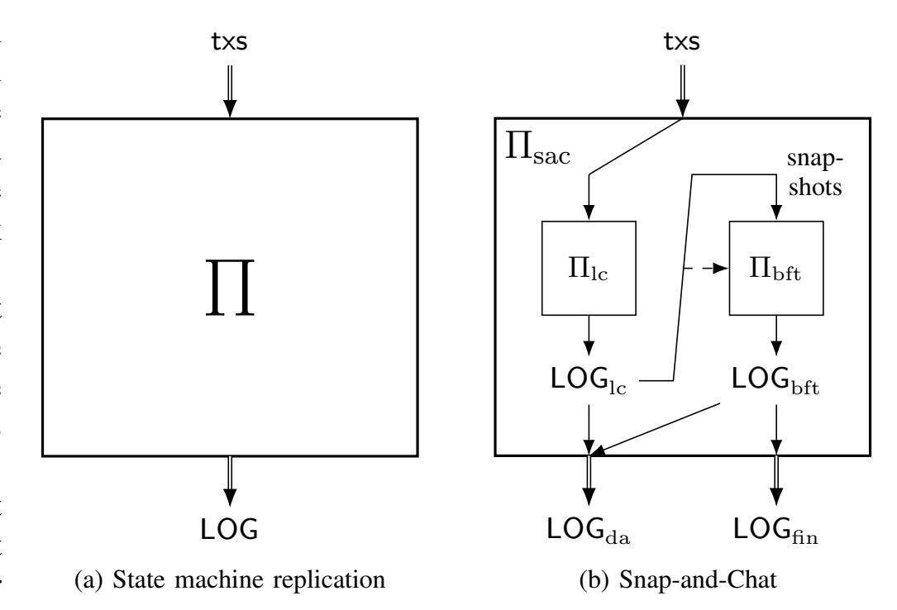

<span id="page-1-2"></span><span id="page-1-1"></span>Fig. 1. [\(a\)](#page-1-0) A consensus protocol Π implementing state machine replication receives transactions txs as inputs from the environment and outputs an ever-increasing ordered ledger of transactions LOG. [\(b\)](#page-1-1) A snap-and-chat protocol produced by our construction, Πsac, receives transactions txs from the environment and outputs two ever-increasing ledgers LOGda and LOGfin by running a dynamically available protocol Πlc and a partially synchronous protocol Πbft in parallel. The inputs to Πlc are environment's transactions but the inputs to Πbft are snapshots of the output ledger of Πlc from the nodes' views. The dashed line signifies that nodes use the output of Πlc as side information in Πbft to boycott the finalization of invalid snapshots.

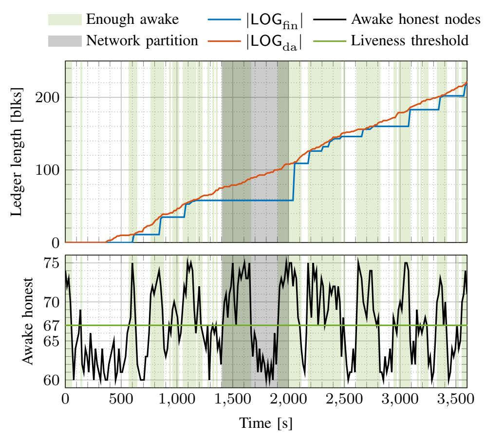

<span id="page-1-3"></span>Fig. 2. A simulated run of an example snap-and-chat protocol (combining longest chain and Streamlet [\[12\]](#page-13-10)) under dynamic participation and network partition. The lengths of the two ledgers are plotted over time. During network partition or when few nodes are awake, the finalized ledger falls behind the available ledger, but catches up after the network heals or when a sufficient number of nodes wake up. See Section [IV](#page-10-0) for details on the simulation setup.

between two parallel chains, this attack also denies the safety of the available ledger even when there is no network partition.

#### <span id="page-1-4"></span>*D. A Provably Secure Construction with Optimal Resilience*

In this work, we make two contributions. First we define what an ebb-and-flow protocol is and its desired security property. While the goals of an ebb-and-flow protocol have 

{2}------------------------------------------------

been informally discussed to motivate finality-gadget-based designs such as Gasper and a few others (*e.g.*, [\[26\]](#page-13-24)), to the best of our knowledge these informal goals have not been translated into a mathematically defined security property.

Second, we provide a construction of a class of protocols, which we call *snap-and-chat* protocols, that provably satisfies the ebb-and-flow security property with optimal resilience. In contrast to Gasper's handcrafted design, the snap-andchat construction uses an off-the-shelf dynamically available protocol[2](#page-2-0) Πlc and an off-the-shelf partially synchronous BFT protocol Πbft (Figure [1\)](#page-1-2). Nodes execute the protocol by executing the two sub-protocols in parallel. The Πlc subprotocol takes as inputs transactions txs from the environment and outputs an ever-increasing ledger LOGlc. Over time, each node takes *snapshots* of this ledger based on its own current view, and input these snapshots into the second sub-protocol Πbft to finalize some of the transactions. The output ledger LOGbft of Πbft is an ordered list of such snapshots. To create the finalized ledger LOGfin of transactions, LOGbft is flattened (*i.e.*, all snapshots included in LOGbft are concatenated) and sanitized so that only the first appearance of a transaction remains. Finally, LOGfin is prepended to LOGlc and sanitized to form the available ledger LOGda. A simulated run of an example snap-and-chat protocol is shown in Figure [2.](#page-1-3)

Even though honest nodes following a snap-and-chat protocol input snapshots of the (confirmed) ledger LOGlc into Πbft, an adversary could, in an attempt to break safety, input an ostensible ledger snapshot which really contains unconfirmed transactions. This motivates the last ingredient of our construction: in the Πbft sub-protocol, each honest node boycotts the finalization of snapshots that are not confirmed in Πlc in its view. An off-the-shelf BFT protocol needs to be modified to implement this constraint. We show that fortunately the required modification is minor in several example protocols, including PBFT [\[8\]](#page-13-6), Hotstuff [\[11\]](#page-13-9) and Streamlet [\[12\]](#page-13-10). When any of these slightly modified BFT protocols is used in conjunction with a permissioned longest chain protocol [\[3\]](#page-13-1)– [\[5\]](#page-13-4), we prove a formal security property for the resulting snapand-chat protocol, which is our definition of the desired goal of an ebb-and-flow protocol.

Theorem (Informal). *Consider a network environment where:*

- *1) Communication is asynchronous until a global stabilization time* GST *after which communication becomes synchronous, and*
- *2) honest nodes sleep and wake up until a global awake time* GAT *after which all nodes are awake. Adversary nodes are always awake.*

*Then*

*1) (*P1 - Finality*): The finalized ledger* LOGfin *is guaranteed to be safe at all times, and live after* max{GST, GAT}*, provided that fewer than* 33% *of all the nodes are adversarial.*

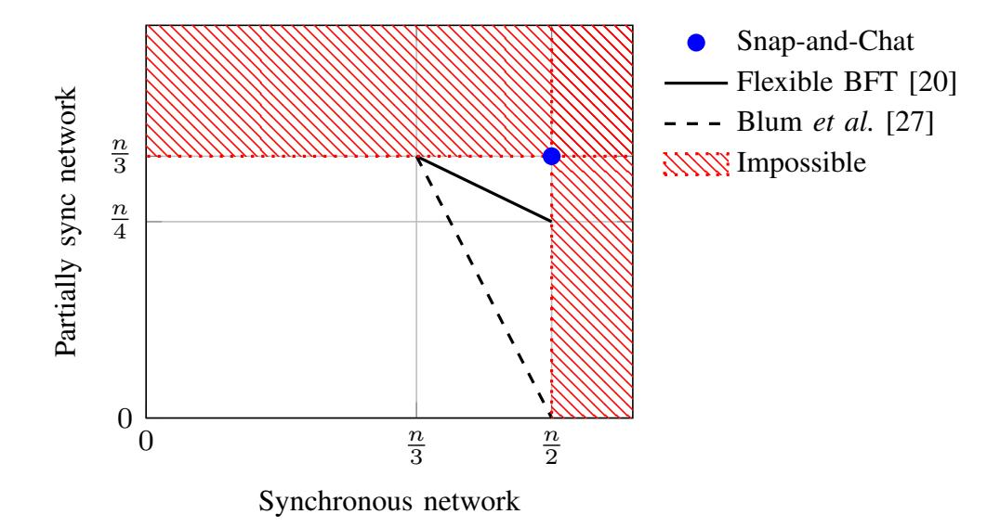

<span id="page-2-1"></span>Fig. 3. The flexible BFT protocol can simultaneously support clients who can tolerate f adversaries in a synchronous environment and clients who can tolerate (n−f)/2 adversaries in a partially synchronous environment, for any f between n/3 and n/2. Thus, there is a tradeoff between the two guarantees. The snap-and-chat protocol achieves (n/2, n/3), simultaneously optimal. No tradeoff is necessary.

*2) (*P2 - Dynamic Availability*): If* GST = 0*, the available ledger* LOGda *is guaranteed to be safe and live at all times, provided that at all times fewer than* 50% *of the awake nodes are adversarial.*

Note that the assumptions on the adversary are different for the security of the two ledgers, in line with the spirit of a flexible protocol [\[20\]](#page-13-18). Together, P1 and P2 say that the finalized ledger LOGfin is safe under network partition, *i.e.*, before max{GST, GAT}, and afterwards catches up with the available ledger LOGda, which is always live and safe provided that the majority of awake nodes is honest.

If GAT = 0, then the environment is the classical partially synchronous network, and the ledger LOGfin has the optimal resilience achievable in that environment. On the other hand, if GST = 0 and GAT = ∞, then the environment is a synchronous network with dynamic participation, and the ledger LOGda has the optimal resilience achievable in that environment. Thus, our construction achieves consistency between the two ledgers without sacrificing the best possible security guarantees of the individual ledgers. In that sense, our construction achieves the ebb-and-flow property in an optimal manner.

## *E. Flexible BFT Revisited*

P1 and P2 together with prefix consistency provide flexible consensus. Our mathematical formulation of the ebb-and-flow property can be viewed as going beyond that of Flexible BFT [\[20\]](#page-13-18) in two ways. First, [\[20\]](#page-13-18) focuses on synchronicity assumptions and we bring dynamic participation as a new client belief into the story. Second, the formulation in [\[20\]](#page-13-18) requires consistency between ledgers of two clients only when their assumptions are both correct, but we require prefix consistency between the ledgers in *all* circumstances. In that sense, the flexibility our formulation offers is closer in nature to the flexibility offered by Nakamoto's longest chain protocol. Prefix consistency under all circumstances is crucial, *e.g.*, for cryptocurrencies, where eventually all clients, no matter their

<span id="page-2-0"></span><sup>2</sup>Longest chain protocols are representative members of this class of protocols, hence the notation Πlc, but this class includes many other protocols as well.

{3}------------------------------------------------

beliefs, should converge on a unique ledger, a single version of history to settle disputes regarding 'who owns what'.

But even for the formulation considered in [\[20\]](#page-13-18), our construction provides a different solution and offers stronger security guarantees than the white-box construction in [\[20\]](#page-13-18). More specifically, the flexible BFT protocol in [\[20\]](#page-13-18) can simultaneously support clients who can tolerate n/2 adversaries in a synchronous environment and clients who can tolerate a fraction of n/4 adversaries in a partially synchronous environment. Since a synchronous environment is a special case of the dynamic participation environment (by setting GAT = 0), our construction improves the security guarantees to simultaneously support clients who can tolerate n/2 adversaries in a synchronous environment and clients who can tolerate n/3 adversaries in a partially synchronous environment. Consistent with the optimality of our construction, these guarantees cannot be improved further (see Figure [3\)](#page-2-1).

It is also insightful to compare our results with those of [\[27\]](#page-13-25), which designed a randomized Byzantine agreement protocol secure under both a synchronous and an asynchronous environment. The dashed line in Figure [3](#page-2-1) shows the tradeoff between the resiliences the protocol can support in the two environments, and this tradeoff is proved to be optimal. Note that this protocol is *not* a flexible protocol, since a single value has to be agreed upon regardless of which of the two environments one is in. Thus, the gap between the resilience achieved by the snap-and-chat protocol and the protocol in [\[27\]](#page-13-25) can be interpreted as the *value of flexibility*. Interestingly, the protocol in [\[27\]](#page-13-25) is also constructed by the composition of two sub-protocols, but in contrast to the construction of snapand-chat protocols, the two sub-protocols are not off-the-shelf, but are constructed tailored to the problem at hand.

## *F. Outline*

The remainder of this manuscript is structured as follows. First, we present a balancing attack on Gasper in Section [II,](#page-3-0) demonstrating that Gasper is not secure. Section [III](#page-4-0) formulates the ebb-and-flow security property, describes the construction of snap-and-chat protocols in detail and proves that they satisfy the ebb-and-flow security property with optimal resilience. We show the results of simulation experiments providing an insight into the behavior of snap-and-chat protocols in Section [IV.](#page-10-0) In Section [V-A,](#page-11-0) we compare the design of snap-andchat protocols and finality gadgets. We conclude the paper with how to transfer our results to the PoW setting in Section [V-B](#page-12-0) and an overview of features beyond security provided out-ofthe-box by snap-and-chat protocols in Section [V-C.](#page-12-1)

#### II. A BALANCING ATTACK ON GASPER

<span id="page-3-0"></span>Gasper [\[21\]](#page-13-19) is the current proposal for Ethereum 2.0's beacon chain. In the following, we exhibit a liveness attack against Gasper in the synchronous network model.[3](#page-3-1) What is more, the attack leads to loss of safety for the underlying dynamically available ledger. Thus, Gasper is not secure in the synchronous network model and does not provide a resolution to the availability-finality dilemma.

Our attack uses that under synchrony, network delay is *adversarial* (rather than merely *stochastic*, as was analyzed in [\[21\]](#page-13-19)). Considering, *e.g.*, state-sponsored adversaries or malicious network providers, at least some degree of adversarial network delay cannot be ruled out. Furthermore, the synchrony model with adversarial delay is a well-established baseline model for which many secure protocols are known.

Gasper is a vote-based PoS protocol which combines Casper FFG [\[22\]](#page-13-20) with a committee-based blockchain block proposal mechanism where the fork (*i.e.*, the tip of the chain to propose new blocks on or vote for) is chosen using the 'greedy heaviest observed sub-tree' (GHOST) rule under the 'latest message driven' (LMD) paradigm, *i.e.*, taking into consideration only the most recent vote per validator. A Gasper vote consists of two parts, a GHOST vote and a Casper FFG vote. While details of Gasper preclude the vanilla bouncing attack [\[28\]](#page-13-26)– [\[30\]](#page-13-27) on the Casper FFG layer, Gasper is vulnerable to a similar balancing attack on the GHOST layer.

Recall that Gasper proceeds in epochs which are further subdivided into C slots each. For simplicity, let C divide n so that every slot has a *committee* of size n/C. For each epoch, a random permutation of all n validators assigns validators to slots' committees and designates a *proposer* per slot. Per slot, the proposer produces a new block extending the tip determined by the fork choice rule HLMD(G) executed in local view G (see [\[21,](#page-13-19) Algorithm 4.2]). Then, each validator of the slot's committee decides what block to vote for using HLMD(G) in local view G.

For the Casper FFG layer, a block can only become finalized if two-thirds of validators vote for it. The attacker aims to keep honest validators split between two options ('left' and 'right' chain, see Figure [4\)](#page-4-1) indefinitely, so that neither option ever gets two-thirds votes and thus no block ever gets finalized. Key technique to maintain this split is that some adversarial validators ('swayers' in Figure [4\)](#page-4-1) withhold their votes and release them only at specific times and to specific subsets of honest nodes in order to influence the fork choice of honest nodes and thus steer which honest nodes vote 'left'/'right'.

The basic idea of the attack is as follows (for a detailed description, see Appendix [A](#page-13-28) and [\[31\]](#page-13-29)). The adversary waits for an opportune epoch to kick-start the attack. An epoch is opportune if the proposer in the first slot is adversarial, and in every slot of the epoch there are enough (six suffice; explained in detail in Appendix [A-B\)](#page-14-0) adversarial validators to fulfill certain tasks in the attack (see a – d in Figure [4\)](#page-4-1). In particular in the regime of many validators (n → ∞), the probability that a particular epoch is opportune is roughly f /n (see Appendix [A-C\)](#page-15-0). Note that for n large, any positive fraction f /n of adversarial nodes suffices to mount the attack, with the first opportune epoch occurring after n/f epochs on average. For ease of exposition, let epoch 0 be opportune.

The adversarial proposer of slot 0 equivocates and produces two conflicting blocks ('left' and 'right') which it reveals to two suitably chosen equal-sized subsets of the committee. One

<span id="page-3-1"></span><sup>3</sup>Source code of a simulation of the attack (discussed in Appendix [A-C\)](#page-15-0) can be found at: [https://github.com/tse-group/gasper-attack.](https://github.com/tse-group/gasper-attack)

{4}------------------------------------------------

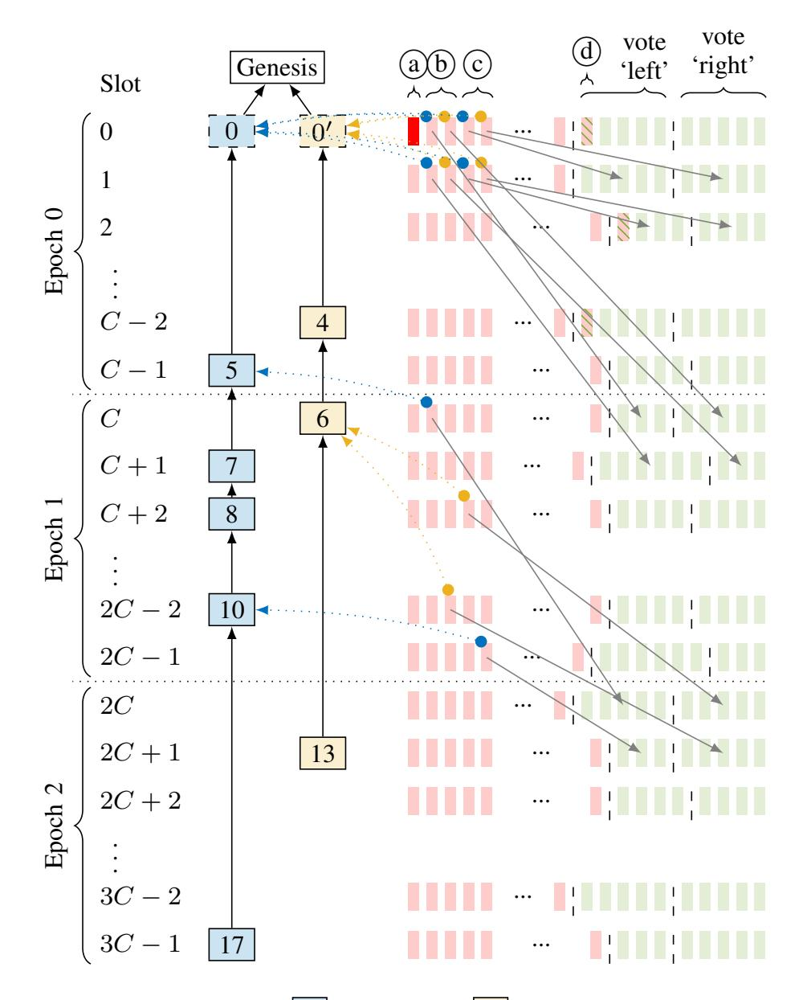

Fig. 4. Two chains, 'left' ( ) and 'right' ( ), are built during the attack. Honest and adversarial validators in a slot's committee are depicted by  $\blacksquare$  and  $\blacksquare$ , respectively. (a) In slot 0 the proposer needs to be adversarial ( $\blacksquare$ ). (b) In every slot i of epoch 0 the adversary recruits two 'swayers' whose votes (  $\blacksquare$  votes 'left',  $\blacksquare$  votes 'right') in epoch 0 are withheld and released during slot C+i in epoch 1 to sway (  $\blacksquare$  ) honest validators. (For comprehensibility, most votes and sway influences are omitted.) (c) Similarly, in every slot i of epoch 0 the adversary recruits two 'swayers' whose votes in slot i are withheld and released during slot i+1 to sway honest validators. (d) If in some slot of epoch 0 the number of honest validators is odd, then the adversary recruits a 'filler' (s) which behaves like an honest validator from thereon. Thus, during epoch 0 every committee has an even number of honestly voting validators.

subset votes 'left', the other subset votes 'right' – a tie. The adversary selectively releases withheld votes from slot 0 to split validators of slot 1 into two equal-sized groups, one which sees 'left' as leading and votes for it, and one which sees 'right' as leading and votes for it – still a tie. The adversary continues this strategy to maintain the tie throughout epoch 0.

During epoch 1, the adversary selectively releases additional withheld votes from epoch 0 to keep splitting validators into two groups, one of which sees 'left' as leading and votes 'left', the other sees 'right' as leading and votes 'right'. Note that these groups now do not have to be equal in size. It suffices for the adversary to release withheld votes selectively so as to reaffirm honest validators in their illusion that whatever chain they previously voted for happens to still be leading, so that they renew their vote. Due to the LMD paradigm of Gasper's fork choice rule, only the most recent vote per validator counts and thus the effective vote tally remains unchanged. At the end of epoch 1 there are still two chains with equally many votes and thus neither gets finalized.

For epoch 2 and beyond the adversary repeats its actions of epoch 1. Note that the validators whose withheld epoch 0 votes the adversary used to sway honest validators in epoch 1 have themselves not voted in epoch 1 yet. Thus, during epoch 2 the adversary selectively releases votes from epoch 1 to maintain the tie between the two chains. This continues indefinitely.

Thus, Gasper is not live in the synchronous model. Furthermore, the block proposal mechanism is rendered unsafe by the modified fork choice rule as the chosen fork flip-flops between 'left' and 'right'. Since Gasper does not satisfy the desired ebb-and-flow security property, we next introduce a provably secure family of ebb-and-flow protocols.

#### III. OPTIMAL EBB-AND-FLOW PROTOCOLS

<span id="page-4-0"></span>In this section, we formulate precisely the ebb-and-flow security property, present the construction of snap-and-chat protocols, and show that snap-and-chat protocols achieve the ebb-and-flow property with optimal resilience. For the construction, we build state machine replication protocols  $\Pi_{\rm sac}$  (snap-and-chat protocols) by composing a dynamically available longest-chain protocol [3]–[5], [32] as  $\Pi_{\rm lc}$  with a partially synchronous BFT protocol [8], [11], [12] as  $\Pi_{\rm bft}$ .

<span id="page-4-1"></span>The focus of this paper is on the permissioned setting. The resulting permissioned protocol can be viewed as a core around which a full PoS protocol can be built, much like Sleepy [3] is the permissioned core of the PoS protocol SnowWhite [4]. To build a full PoS protocol, issues such as stake grinding [4], [6] have to be considered. Snap-and-chat protocols can also be used in a hybrid PoS-PoW setting, where validators run the BFT sub-protocol and miners power the dynamically available sub-protocol (see Section V-B). These are topics for future work.

#### <span id="page-4-3"></span>A. Model and Formulation

The execution model of  $\Pi_{\rm sac}$  inherits the cryptographic assumptions and primitives used in [3], [11], [12]. The cornerstones of the model are:

- There are in total n nodes numbered from 1 thru n.
- Time proceeds in slots. Nodes have synchronized clocks.<sup>4</sup>
- There is a public-key infrastructure and each node is equipped with a unique cryptographic identity.
- There is a random oracle, which serves as the source of randomness in our construction.
- The adversary is a probabilistic poly-time algorithm.

Corruption: Before the protocol execution starts, the adversary gets to corrupt (up to) f nodes, then called adversarial. Adversarial nodes surrender their internal state to the adversary and can deviate from the protocol arbitrarily (Byzantine faults) under the adversary's control. The remaining (n-f) nodes are honest and follow the protocol as specified.

*Networking:* Nodes can send each other messages which arrive with a certain delay controlled by the adversary, subject to constraints elaborated below.

<span id="page-4-2"></span><sup>&</sup>lt;sup>4</sup>Bounded clock offsets can be captured as part of the network delay.

{5}------------------------------------------------

Sleeping: The adversary chooses, for every time slot and honest node, whether the node is awake or asleep in that slot, subject to constraints elaborated below. An honest node that is awake in a slot executes the protocol faithfully in that slot. An honest node that is asleep in a slot does not execute the protocol in that slot, and messages that would have arrived in that slot are queued and delivered in the first slot in which the node is awake again. Adversarial nodes are always awake.

Using the features above, dynamic participation in the permissioned setting can be modelled, where all nodes' cryptographic identities are common knowledge but honest nodes do not know which nodes are awake or asleep at any given time. Thus, the permissioned nature and dynamic participation represent two orthogonal aspects of the environment.

As building blocks for the environment adopted for ebb-and-flow protocols, recall that in a traditional *synchronous network*, messages sent by honest nodes arrive within a known finite delay bound. In a *partially synchronous network* [33], initially, messages can be delayed arbitrarily. After some time, the network turns synchronous. Thus, partial synchrony models a network with a period of partition followed by synchrony. Although in reality, multiple such periods of (a-)synchrony could alternate, we follow the long-standing practice in the BFT literature and study only a single such transition.

Now, recall the informal Theorem of Section I-D. The theorem provides two sets of security guarantees, labelled as **P1** and **P2**, for the finalized and available ledgers. These guarantees are stated under two sets of assumptions on the environment  $\mathcal{Z}$  and the adversary  $\mathcal{A}$ . The assumptions model a partially synchronous network and a synchronous network with dynamic participation, respectively.

 $(A_1(\beta), \mathcal{Z}_1)$  formalizes the model of **P1**, a partially synchronous network under dynamic participation, with respect to the fraction  $\beta$  of adversary nodes:

- $A_1$  corrupts  $f = \beta n$  nodes.
- Before a global stabilization time GST,  $A_1$  can delay network messages arbitrarily. After GST,  $A_1$  is required to deliver all messages sent between honest nodes in at most  $\Delta$  slots. GST is chosen by  $A_1$ , unknown to the honest nodes, and can be a causal function of the randomness in the protocol.
- Before a global awake time GAT,  $A_1$  determines which honest nodes are awake/asleep and when. After GAT, all honest nodes are awake.<sup>5</sup> GAT is chosen by  $A_1$ , unknown to the honest nodes and can be a causal function of the randomness in the protocol.

 $(A_2(\beta), \mathcal{Z}_2)$  formalizes the model of **P2**, a synchronous network under dynamic participation, with respect to a bound  $\beta$  on the fraction of awake nodes that are adversarial:

• At all times,  $A_2$  is required to deliver all messages sent between honest nodes in at most  $\Delta$  slots.

• At all times,  $A_2$  determines which honest nodes are awake/asleep and when, subject to the constraint that at all times at most fraction  $\beta$  of awake nodes are adversarial and at least one honest node is awake.

We next formalize the notion of safety, liveness and security after a certain time. For this purpose, we adopt and modify the security definition given in [3]. This definition has a security parameter  $\sigma$  which in the context of longest-chain protocols represents the confirmation delay for transactions. In our analysis, we consider a finite time horizon of size polynomial in  $\sigma$ . Note that in the definition below, LOG<sub>i</sub><sup>t</sup> denotes the ledger LOG in view of node i at time t.

<span id="page-5-1"></span>**Definition 1.** Let  $T_{\rm confirm}$  be a polynomial function of the security parameter  $\sigma$ . We say that a state machine replication protocol  $\Pi$  outputting a ledger LOG is secure after time T and has transaction confirmation time  $T_{\rm confirm}$  if LOG satisfies:

- **Safety:** For any two times  $t \ge t' \ge T$ , and any two honest nodes i and j awake at times t and t' respectively, either  $\mathsf{LOG}_i^t \le \mathsf{LOG}_j^{t'}$  or  $\mathsf{LOG}_j^{t'} \le \mathsf{LOG}_i^t$ .
- **Liveness:** If a transaction is received by an awake honest node at some time  $t \geq T$ , then, for any time  $t' \geq t + T_{\text{confirm}}$  and honest node j that is awake at time t', the transaction will be included in  $\mathsf{LOG}_j^{t'}$ .

Definition 1 formalizes the meaning of 'safety, liveness and security after a certain time T'. In general, there it might be two different times after which a protocol is safe (live). A protocol that is safe (live) at all times (i.e., after T=0) is simply called safe (live) without further qualification. With a slight abuse of notation, we also call a ledger LOG secure/safe/live to mean that the protocol  $\Pi$  outputting the ledger LOG is secure/safe/live, respectively.

Now we are ready to define an ebb-and-flow protocol and its notion of security. First we define formally a flexible protocol.

**Definition 2.** A *flexible* protocol is a pair of state machine replication protocols  $(\Pi_1, \Pi_2)$ , where  $\Pi_1$  and  $\Pi_2$  have the same input transactions txs and output ledgers  $LOG_1$  and  $LOG_2$ , respectively.

**Definition 3.** An  $(\beta_1, \beta_2)$ -secure ebb-and-flow protocol  $\Pi$  is a flexible protocol  $(\Pi_{da}, \Pi_{fin})$  which outputs an available ledger LOG<sub>da</sub> and a finalized ledger LOG<sub>fin</sub>, such that for security parameter  $\sigma \triangleq T_{confirm}$ :

- 1) **P1 Finality:** Under  $(\mathcal{A}_1(\beta_1), \mathcal{Z}_1)$ , LOG<sub>fin</sub> is safe at all times, and there exists a constant C such that LOG<sub>fin</sub> is live after time  $C(\max\{\mathsf{GST},\mathsf{GAT}\}+\sigma)$  except with probability  $\mathrm{negl}(\sigma)$ .
- 2) **P2 Dynamic Availability:** Under  $(A_2(\beta_2), \mathcal{Z}_2)$ , LOG<sub>da</sub> is secure except with probability  $\operatorname{negl}(\sigma)$ .
- 3) **Prefix:** For any honest node i and time t,  $LOG_{fin,i}^t$  is a prefix of  $LOG_{da,i}^t$ .

In the above definition, the negligible function  $\operatorname{negl}(\cdot)$  decays faster than all polynomials, *i.e.*,  $\forall c > 0 : \exists \sigma_0 : \forall \sigma > \sigma_0 : \operatorname{negl}(\sigma) < \sigma^{-c}$ .

<span id="page-5-0"></span><sup>&</sup>lt;sup>5</sup>Without slightly restricting dynamic participation via a GAT after which all nodes are awake, this adversary would fall under the CAP theorem so that no secure protocol against it can exist. In many applications it is realistic that every now and then there is a period in which all nodes are awake.

{6}------------------------------------------------

Designing a state machine replication protocol  $\Pi_{\rm fin}$  that satisfies property **P1** is the well-studied problem of designing partially synchronous BFT protocols; the optimal resilience that can be achieved is  $\beta_1 = \frac{1}{3}$ . Designing a state machine replication protocol  $\Pi_{\rm da}$  that satisfies property **P2** is the problem of designing dynamically available protocols; the optimal resilience that can be achieved is  $\beta_2 = \frac{1}{2}$ . An ebband-flow protocol  $(\Pi_{\rm da}, \Pi_{\rm fin})$  has a further requirement that LOG<sub>fin</sub> should be a prefix of LOG<sub>da</sub>; this requires a careful joint design of  $(\Pi_{\rm da}, \Pi_{\rm fin})$ . We now present a construction for which we show that  $\beta_1 = \frac{1}{3}$  and  $\beta_2 = \frac{1}{2}$  can be simultaneously achieved while respecting the prefix constraint.

### <span id="page-6-1"></span>B. Protocol

In this section, we give an example of our construction,  $\Pi_{\rm sac}$ , where we instantiate  $\Pi_{\rm lc}$  with a permissioned longest-chain protocol and  $\Pi_{\rm bft}$  with a variant of (partially synchronous) Streamlet [12]. Note that all of the longest chain protocols such as [3]–[7], [32] are suited to instantiate  $\Pi_{\rm lc}$ . For concreteness, we will follow Sleepy [3] when we get to details. Streamlet [12] is the latest representative of a line of works [8], [10], [11], [34] striving to simplify and speed up BFT consensus. Due to its remarkable simplicity, Streamlet is well-suited to illustrate our approach. For application requirements, other BFT protocols might be better suited. We demonstrate in Section III-D that our technique readily extends to other BFT protocols such as HotStuff [11] and PBFT [8].

Before we delve into the details of our construction, we review the basic mechanics of the constituent protocols  $\Pi_{lc}$  and  $\Pi_{bft}$  (illustrated in the two boxes of Figure 5). In permissioned longest chain protocols a cryptographic lottery rate-limits the production of new blocks (2). Honest block proposers extend the longest chain (and thus vote for it), and blocks of a certain depth on the longest chain are confirmed (1). Streamlet proceeds in epochs of fixed duration, each of which is associated with a pseudo-randomly chosen leader. At the beginning of each epoch, the leader proposes a new block (1) extending the longest chain of notarized blocks (1). Then, all nodes vote (1), and the block becomes notarized if at least two-thirds of the nodes have voted for it. Out of three adjacent notarized blocks from consecutive epochs, the middle one gets finalized (1) along with its prefix.

For the example construction, we follow the blueprint of Section I-D but, in line with the protocols adopted for  $\Pi_{lc}$  and  $\Pi_{bft}$ , choose blockchains as a more suitable representation for ledgers. The above instantiation leads from the high-level Figure 1b to the concrete Figure 5 which illustrates the overall protocol as viewed by node i at time t.

Transactions are received from the environment and held in the *mempool*  $\mathsf{txs}_i^t$ . Batched into *blocks*, they are ordered by  $\Pi_{\mathrm{lc}}$  which outputs a block*chain*  $\mathsf{ch}_i^t$  (comprised of *LC blocks* and representing the ledger  $\mathsf{LOG}_{\mathrm{lc}}$  in Figure 1b) of transactions considered *confirmed*. Snapshots of ch (which themselves are chains) are input to and ordered by  $\Pi_{\mathrm{bft}}$  which outputs a blockchain  $\mathsf{Ch}_i^t$  (comprised of *BFT blocks* and representing the ledger  $\mathsf{LOG}_{\mathrm{bft}}$  in Figure 1b) of snapshots considered *final*.

In addition,  $\operatorname{ch}_i^t$  is used as side information in  $\Pi_{\operatorname{bft}}$  to boycott the finalization of invalid snapshots proposed by the adversary. Finally,  $\operatorname{Ch}_i^t$  is *flattened* (*i.e.*, all snapshots are concatenated as ordered) and *sanitized* (*i.e.*, only the first valid occurrence of a transaction remains) to obtain the finalized ledger  $\operatorname{LOG}_{\operatorname{fin},i}^t$ , which is prepended to  $\operatorname{ch}_i^t$  and sanitized to form the available ledger  $\operatorname{LOG}_{\operatorname{da}}$  (see Section III-B3).

In the following, we provide more explanation for the following three details, 1) how snapshots are represented efficiently, 2) how Streamlet is modified to prevent that an adversary can input an ostensible snapshot which is really unconfirmed (this would break safety), and 3) how the transaction ledgers are extracted from the blockchains  $\operatorname{ch}_i^t$  and  $\operatorname{Ch}_i^t$ .

1) Efficient representation of snapshots: We use (variants of) the symbols 'b' and 'B' to refer to blocks in the blockchains  $\operatorname{ch}_i^t$  and  $\operatorname{Ch}_i^t$  output by  $\Pi_{\operatorname{lc}}$  and  $\Pi_{\operatorname{bft}}$ , respectively. An LC block b contains as payload transactions denoted as 'b.txs'. Note that due to the blockchain structure, a single block uniquely identifies a whole chain of blocks, namely that of its ancestors all the way back to the genesis block. A snapshot of a blockchain can thus be represented efficiently by pointing to the block at the tip of the chain. Thus, instead of copying a whole chain of LC blocks into each BFT block, a BFT block B contains as payload only a reference, denoted by 'B.ch', to an LC block representing the snapshot.

For ledgers and blockchains, ' $\leq$ ' is canonically defined as the 'is a prefix of' relation. As blocks identify chains, the definition of ' $\leq$ ' naturally carries over: for two blocks  $\flat$  and  $\flat'$ ,  $\flat \leq \flat'$  iff the chain identified by  $\flat$  is a prefix of the chain identified by  $\flat'$ . The depth of a block is the length of the chain it identifies, excluding the genesis block.

2) Modification of Streamlet: With the payload of Streamlet being snapshots, honest epoch leaders are instructed to, when they propose a block, take a snapshot of  $ch_i^t$  and include a reference to its tip as payload in the new BFT block. Furthermore, Streamlet needs to be modified to ensure that an adversary cannot input an ostensible snapshot which is not really entirely confirmed. To this end, the voting rule of Streamlet is extended by the following condition: An honest node only votes for a proposed BFT block B if it views B.ch as confirmed. In effect, side information about  $\Pi_{\mathrm{lc}}$  is used in  $\Pi_{\rm bft}$  to prevent the finalization of invalid snapshots proposed by the adversary. Pseudocode of the overall protocol as executed on node i is found in Algorithm 1. Proper functions of only their inputs and procedures that access global state are denoted as 'Function(...)' and 'PROCEDURE(...)', respectively. Incoming network messages (new blocks, proposals and votes) are processed, and the global state is adjusted accordingly, in line 27. Honest nodes echo messages they receive, see line 28. As a result, if an honest node observes a message at time t then all honest nodes will have observed the message by time  $\max(\mathsf{GST}, t + \Delta)$ . The additional constraint in the

<span id="page-6-0"></span> $^6$ Formally, LOG<sub>da</sub> and LOG<sub>fin</sub> are now represented as sequences of LC blocks. Proper transactions ledgers are readily obtained by concatenating the transactions contained in the blocks and removing duplicate and invalid transactions (*sanitization*).

{7}------------------------------------------------

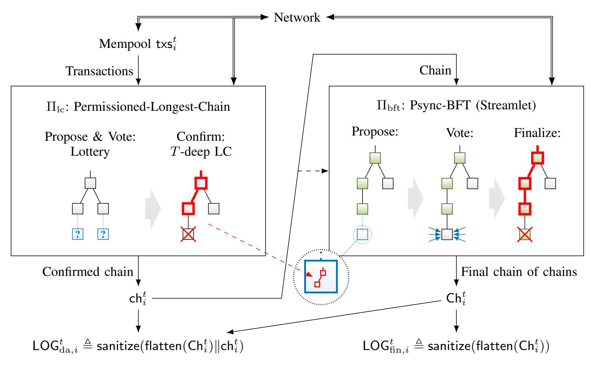

Fig. 5. Example snap-and-chat protocol (cf. Figure 1b) where  $\Pi_{lc}$  is instantiated with permissioned longest chain and  $\Pi_{bft}$  instantiated with Streamlet, as viewed by node i at time t. Transactions are held in mempool  $\mathsf{txs}_i^t$ . Batched into blocks, they are ordered by  $\Pi_{lc}$  which outputs a chain  $\mathsf{ch}_i^t$  (representing  $\mathsf{LOG}_{lc}$ ) of confirmed transactions. Snapshots of  $\mathsf{ch}$  (which themselves are chains,  $\mathsf{cf}$  the magnifying glass) are input to and ordered by  $\Pi_{bft}$  which outputs a chain  $\mathsf{Ch}_i^t$  (representing  $\mathsf{LOG}_{bft}$ ) of final snapshots. In addition,  $\mathsf{ch}_i^t$  is used as side information in  $\Pi_{bft}$  to boycott the finalization of invalid snapshots (dashed arrow). Finally,  $\mathsf{Ch}_i^t$  is flattened and sanitized to obtain the finalized ledger  $\mathsf{LOG}_{fin,i}^t$ , which is prepended to  $\mathsf{ch}_i^t$  and sanitized to form the available ledger  $\mathsf{LOG}_{da}$  (cf. Figure 6).

Algorithm 1 Pseudocode of example ebb-and-flow construction with Sleepy as  $\Pi_{lc}$  and Streamlet as  $\Pi_{bft}$ 

```
1: procedure LCSLOT(t)
 2:
         if SleepyIsWinningLotteryTicket(i, t) then
 3:
             b^* \leftarrow \text{SLEEPYTIPLC}()
 4:
             b \leftarrow \text{SleepyNewBlock}(b^*, t, i, \mathsf{txs}^t)
 5:
             BROADCAST(b)
 6:
         end if
 7: end procedure
     procedure BFTSLOT(t)
 8:
 9:
         e \leftarrow \text{StreamletEpoch}(t)
10:
         if StreamletIsStartOfProposePhase(t) then
             if StreamletEpochLeader(e) = i then
11:
12:
                 B^* \leftarrow \text{STREAMLETTIPNOTARIZEDLC}()
13:
                 B \leftarrow \text{StreamletNewBlock}(B^*, e, \mathsf{ch}^t)
                 P \leftarrow \text{StreamletNewProposal}(B, i)
14:
                 BROADCAST(B, P)
15:
16:
             end if
         else if StreamletIsStartOfVotePhase(t) then
17:
             P \leftarrow \mathsf{STREAMLETFIRSTVALIDPROPOSAL}(e)
18:
19:
             if P.B.\mathsf{ch} \leq \mathsf{ch}^t then
                 V \leftarrow \text{StreamletNewVote}(P.B, i)
20:
21:
                 BROADCAST(V)
22:
             end if
23:
         end if
24: end procedure
25: procedure MAIN()
         for time slot t \leftarrow 1, 2, 3, \dots do
26:
             PROCESSINCOMINGNETWORKMESSAGES()
27:
             ECHOINCOMINGNETWORKMESSAGES()
28:
29:
             LcSlot(t)
             \mathsf{ch}^t \leftarrow \mathsf{LcConfirmedChain}()
30:
31:
             BFTSLOT(t)
             \mathsf{Ch}^t \leftarrow \mathsf{BfTFINALCHAIN}()
32:
33:
         end for
```

34: end procedure

<span id="page-7-0"></span>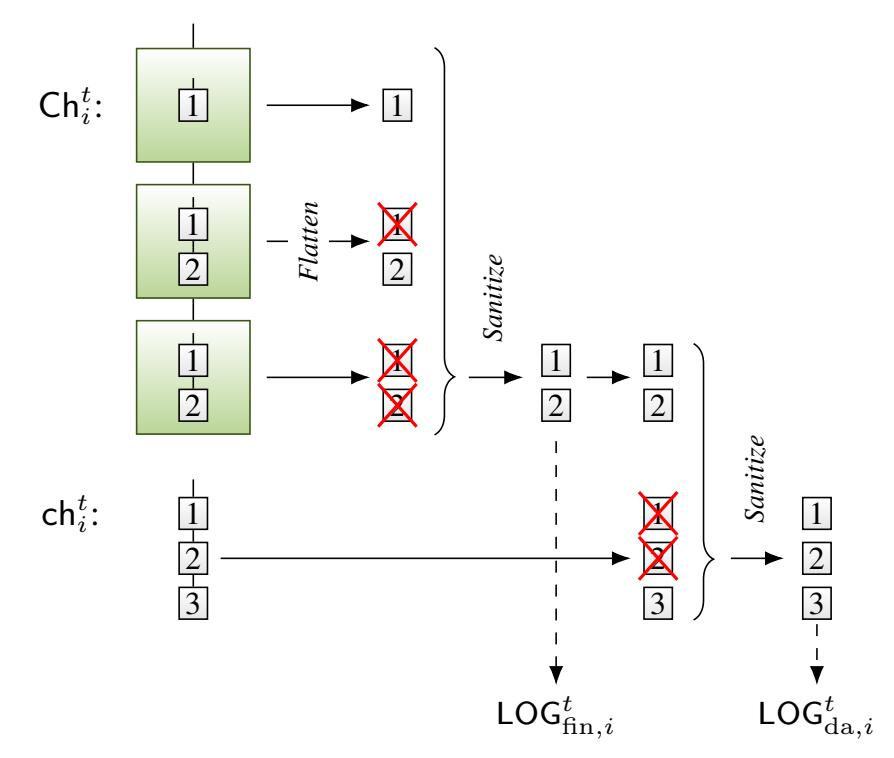

<span id="page-7-3"></span>Fig. 6.  $\mathsf{Ch}_i^t$  is flattened and sanitized to obtain the finalized ledger  $\mathsf{LOG}_{\mathrm{fin},i}^t$ , which is prepended to  $\mathsf{ch}_i^t$  and sanitized to form the available ledger  $\mathsf{LOG}_{\mathrm{da}}$ .

voting rule with respect to 'vanilla' Streamlet is highlighted red (line 19). Note that Sleepy is applied unaltered and the modification required for Streamlet is minor. The same is true when instantiating the sub-protocol  $\Pi_{\rm bft}$  with other partially synchronous BFT protocols such as HotStuff [11] or PBFT [8], detailed in Section III-D.

<span id="page-7-1"></span>3) Ledger extraction: Finally, how honest nodes compute  $\mathsf{LOG}^t_{\mathrm{fin},i}$  and  $\mathsf{LOG}^t_{\mathrm{da},i}$  from  $\mathsf{Ch}^t_i$  and  $\mathsf{ch}^t_i$  is illustrated in Figure 6. Recall that  $\mathsf{Ch}^t_i$  is an ordering of snapshots, *i.e.*, a chain of chains of LC blocks. First,  $\mathsf{Ch}^t_i$  is flattened, *i.e.*,

{8}------------------------------------------------

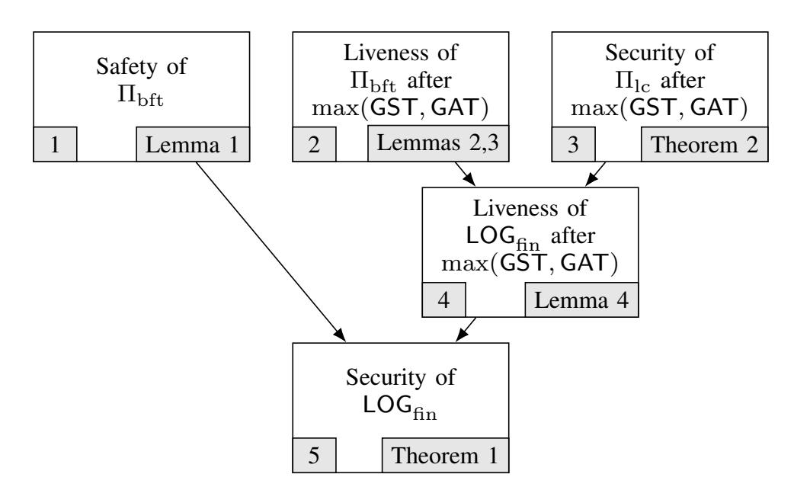

Fig. 7. Dependency of the security of  $LOG_{fin}$  under  $(\mathcal{A}_1^*, \mathcal{Z}_1)$  on the properties of  $\Pi_{lc}$  and  $\Pi_{bft}$ . Boxes represent the properties and the arrows indicate the implications of these properties. Theorems and lemmas used to validate the properties are displayed at the bottom right corner of each box.

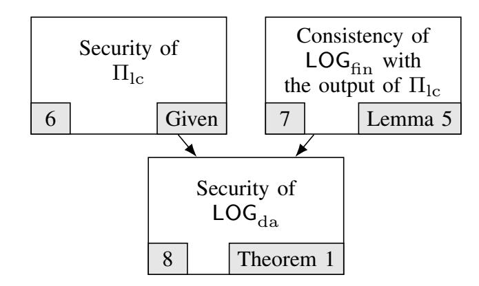

Fig. 8. Dependency of the security of  $LOG_{da}$  under  $(\mathcal{A}_2^*, \mathcal{Z}_2)$  on the properties of  $\Pi_{lc}$  and  $\Pi_{bft}$ . Boxes represent the properties and the arrows indicate the implications of these properties. Theorems and lemmas used to validate the properties are displayed at the bottom right corner of each box.

the chains of blocks are concatenated as ordered to arrive at a single sequence of LC blocks. Then, all but the first occurrence of each block are removed (sanitized) to arrive at the finalized ledger  $\mathsf{LOG}^t_{\mathrm{fin},i}$  of LC blocks. To form the available ledger  $\mathsf{LOG}^t_{\mathrm{da},i}$ ,  $\mathsf{ch}^t_i$ , which is a sequence of LC blocks, is appended to  $\mathsf{LOG}^t_{\mathrm{fin},i}$  and the result again sanitized.

## <span id="page-8-3"></span>C. Analysis

In this section, we analyze the security of  $\Pi_{\rm sac}$  as an ebband-flow protocol and show that it is optimally resilient:

<span id="page-8-0"></span>**Theorem 1.**  $\Pi_{\text{sac}}$  is a  $(\frac{1}{3}, \frac{1}{2})$ -secure ebb-and-flow protocol.

Observe that no ebb-and-flow protocol can tolerate a Byzantine adversary  $\mathcal{A}_1(\beta_1)$  with  $\beta_1 \geq \frac{1}{3}$  in a partially synchronous network. Similarly, no ebb-and-flow protocol can tolerate a Byzantine adversary  $\mathcal{A}_2(\beta_2)$  with  $\beta_2 \geq \frac{1}{2}$  in a synchronous network. Hence the security of  $\Pi_{\rm sac}$  implies that it is optimally resilient. We denote the worst-case adversary-environments as  $(\mathcal{A}_1^*, \mathcal{Z}_1) \triangleq (\mathcal{A}_1(\frac{1}{3}), \mathcal{Z}_1)$  and  $(\mathcal{A}_2^*, \mathcal{Z}_2) \triangleq (\mathcal{A}_2(\frac{1}{2}), \mathcal{Z}_2)$ .

We now focus on the proof of Theorem 1, which proceeds as illustrated in Figures 7 and 8 and along with proofs for the Lemmas can be found in Appendix B. Proof of Theorem 2 is given in Appendix C.

We first show the safety and liveness (after time  $\max\{\mathsf{GST},\mathsf{GAT}\}$ ) of the ledger  $\mathsf{LOG}_{\mathrm{fin}}$  under  $(\mathcal{A}_1^*,\mathcal{Z}_1)$ . Figure 7 visualizes the dependency of the security of  $\mathsf{LOG}_{\mathrm{fin}}$ 

on the properties of the sub-protocols  $\Pi_{lc}$  and  $\Pi_{bft}$ . We see from Figure 7 that the safety of  $\Pi_{bft}$  (box 1) implies the safety of LOG<sub>fin</sub> (box 5). However, in Figure 5, txs do not immediately arrive at  $\Pi_{bft}$ . They are first received by  $\Pi_{lc}$  and become part of its output ledger, snapshots of which are then inputted to  $\Pi_{bft}$ . Consequently, liveness of LOG<sub>fin</sub> after time max{GST, GAT} (box 4) does not only require the liveness of  $\Pi_{bft}$  (box 2), but also the security  $\Pi_{lc}$  after time max{GST, GAT} (box 3).

<span id="page-8-1"></span>We observe via Lemmas 1, 2 and 3 that the changes in Streamlet described by lines 13 and 19 of Algorithm 1 does not affect the validity of the safety and liveness proofs in [12]. Hence, security of  $\Pi_{\rm bft}$  (boxes 1 and 2) directly follows from the security proof of Streamlet. However, showing the security of  $\Pi_{lc}$  (box 3) claimed by Theorem 2, requires some work. For this purpose, we extend the concept of *pivots* as defined in [3], to a partially synchronous network. Pivots are time slots such that every honest node has the same view of the prefix of the longest chain up to the pivot. The original definition of pivots in [3] ensures the convergence of longest chains by requiring any time interval containing the pivot to have more convergence opportunities (honest slots which are sufficiently apart) than adversarial slots. However, this requirement fails to ensure convergence under partial synchrony as the isolated honest nodes can fail to build a blockchain before  $\max\{GST, GAT\}$ . Hence, we define the concept of a GST-strong pivot that considers only the honest slots after  $\max\{GST, GAT\}$  within any interval around the GST-strong pivot. Although this definition makes the arrival of GST-strong pivots less likely, Appendix C proves that GSTstrong pivots appear in  $O(\max\{\mathsf{GST},\mathsf{GAT}\})$  time following  $\max\{\mathsf{GST},\mathsf{GAT}\}$ , thus, concluding the security of  $\Pi_{\mathrm{lc}}$  after  $\max\{\mathsf{GST},\mathsf{GAT}\}$ . Finally, Lemma 4 combines the security of  $\Pi_{lc}$  and liveness of  $\Pi_{bft}$  after time  $\max\{\text{GST},\text{GAT}\}$  to show the liveness of  $LOG_{fin}$ .

<span id="page-8-2"></span>We next show the safety and liveness of the ledger  $\mathsf{LOG}_{\mathrm{da}}$  under  $(\mathcal{A}_2^*, \mathcal{Z}_2)$ . Figure 8 visualizes the dependency of security of  $\mathsf{LOG}_{\mathrm{da}}$  on the properties of sub-protocols  $\Pi_{\mathrm{lc}}$  and  $\Pi_{\mathrm{bft}}$ .

In Figure 5,  $\mathsf{LOG}_{\mathrm{da}}$  is a concatenation of  $\mathsf{LOG}_{\mathrm{fin}}$  with the output ledger of  $\Pi_{\mathrm{lc}}$ . Hence, although the security of  $\Pi_{\mathrm{lc}}$  (box 6) is a necessary condition for the security of  $\mathsf{LOG}_{\mathrm{da}}$  (box 8), we also need the prefix  $\mathsf{LOG}_{\mathrm{fin}}$  to be consistent with the output of  $\Pi_{\mathrm{lc}}$  in the view of every honest node at all times (box 7), to guarantee the safety of the whole ledger  $\mathsf{LOG}_{\mathrm{da}}$ .

Security of  $\Pi_{lc}$  follows from the security proofs of the respective protocol used for  $\Pi_{lc}$ . However, proving the consistency of LOG<sub>fin</sub> with the output of  $\Pi_{lc}$  as claimed by Lemma 5, requires a careful look at the finalization rule of  $\Pi_{bft}$ . As indicated by Algorithm 1, a snapshot of the output of  $\Pi_{lc}$  becomes final as part of a BFT block only if that snapshot is seen as confirmed by at least one honest node. However, since  $\Pi_{lc}$  is safe, the fact that one honest node sees that snapshot as confirmed implies that every honest node sees the same snapshot as confirmed. Consequently, the ledger LOG<sub>fin</sub> will be generated from the same snapshots in the view of every honest node. Moreover, as these snapshots are confirmed

{9}------------------------------------------------

<span id="page-9-1"></span>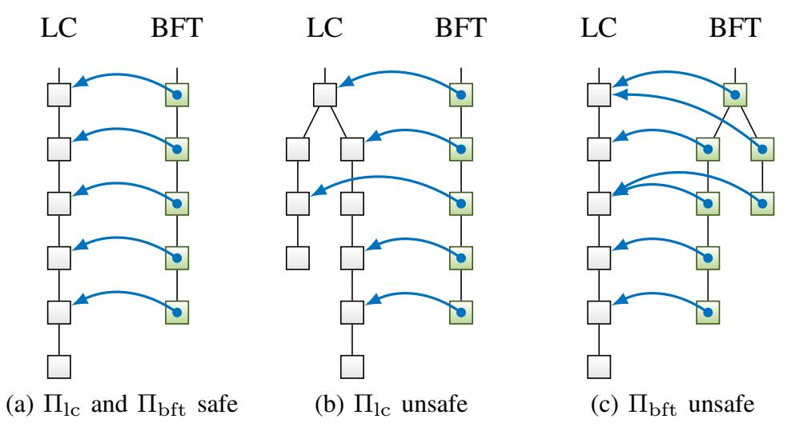

<span id="page-9-2"></span>Fig. 9. Snapshots are depicted as arrows ( $\longrightarrow$ ). (a) Safe  $\Pi_{lc}$  and  $\Pi_{bft}$  means ch and Ch do not fork. (b) Forking in ch is absorbed by safe  $\Pi_{bft}$ . (c) Safe  $\Pi_{lc}$  renders forking in Ch inconsequential.

prefixes of the output of  $\Pi_{lc}$  and  $\Pi_{lc}$  is safe, LOG<sub>fin</sub> is a prefix of the output of  $\Pi_{lc}$  in the view of any honest node at all times.

Finally, since  $\mathsf{LOG}_{\mathrm{fin}}$  is a prefix of  $\mathsf{LOG}_{\mathrm{da}}$  by construction, the prefix property holds trivially.

To understand how  $\mathsf{LOG}_{\mathrm{fin}}$  can be safe even if  $\Pi_{\mathrm{lc}}$  is unsafe (i.e., under network partition) or how  $\mathsf{LOG}_{\mathrm{da}}$  can be safe even if  $\Pi_{\rm bft}$  is unsafe (i.e., when n/3 < f < n/2), consider the following two examples (Figure 9). During a network partition,  $LOG_{lc}$ , the ledger output by  $\Pi_{lc}$ , can be unsafe (Figure 9b). Thus, snapshots taken by different nodes or at different times can conflict. However,  $\Pi_{\rm bft}$  is still safe and thus orders these snapshots linearly. Any transactions invalidated by conflicts are sanitized during ledger extraction. As a result, LOG<sub>fin</sub> remains safe. In a synchronous network with n/3 < f < n/2,  $\Pi_{lc}$  and thus LOG<sub>lc</sub> is safe. Even if  $\Pi_{bft}$  is unsafe (Figure 9c), finalization of a snapshot requires at least one honest vote, and thus only valid snapshots become finalized. Since finalized snapshots are consistent,  $LOG_{fin}$  is consistent with  $LOG_{lc}$ . Thus, prefixing  $\mathsf{LOG}_{\mathrm{lc}}$  with  $\mathsf{LOG}_{\mathrm{fin}}$  to form  $\mathsf{LOG}_{\mathrm{da}}$  does not introduce inconsistencies, and LOG<sub>da</sub> remains safe.

#### <span id="page-9-0"></span>D. Other BFT Sub-Protocols

In the example of Section III-B, Streamlet is readily replaced with other BFT sub-protocols for  $\Pi_{\rm bft}$ , such as HotStuff [11] or PBFT [8]. Furthermore, the analysis of Section III-C carries over with minor alterations and the security Theorem 1 holds for these variants as well. The necessary modifications are described in the following.

- 1) HotStuff: Two minor modifications suffice to use HotStuff as  $\Pi_{\rm bft}$  in the example of Section III-B.
- a) Snapshots as Payload: To use HotStuff for  $\Pi_{bft}$ , a HotStuff block B contains a snapshot B.ch as payload. Whenever the output of  $\Pi_{lc}$  updates, an honest leader i takes a snapshot of its  $ch_i^t$  and proposes it in a HotStuff block.
- b) Side information about  $\Pi_{lc}$ : To ensure that honest nodes only vote for BFT blocks of which the payload snapshot is viewed as confirmed in  $\Pi_{lc}$ , we piggy-back on the following provision (terminology adapted to that of this paper): 'During the protocol, a [node] [processes] a message only after the [chain] [identified] by the [block] is already in its local tree. [...] For brevity, these details are also omitted from the

**Algorithm 2** Pseudocode of example snap-and-chat construction with HotStuff as  $\Pi_{bft}$  and a longest-chain protocol as  $\Pi_{lc}$ 

```
1: procedure MAIN()
  2:
              \mathcal{Q} \leftarrow \emptyset
 3:
              for time slot t \leftarrow 1, 2, 3, \dots do
  4:
                    ECHOINCOMINGNETWORKMESSAGES()
  5:
                    \mathcal{M} \leftarrow \text{GetIncomingNetworkMessages}()
  6:
                    \mathcal{M}_{lc} \leftarrow FilterForLcMessages(\mathcal{M})
 7:
                    \mathcal{M}_{\mathrm{bft}} \leftarrow \mathrm{FilterForBftMessages}(\mathcal{M})
 8:
                    LCPROCESSNETWORKMESSAGES(\mathcal{M}_{lc})
 9:
                    LcSlot(t)
                    \mathsf{ch}^t \leftarrow \mathsf{LCCONFIRMEDCHAIN}()
10:
11:
                    Q \leftarrow Q \cup \mathcal{M}_{\mathrm{bft}}
                                           m \in \mathcal{Q} \left| \begin{array}{c} \operatorname{IsInLocalView}(m.\operatorname{node}) \\ \wedge m.\operatorname{node.ch} \preceq \operatorname{ch}^t \end{array} \right\}
12:
                    \mathcal{M}_{\mathrm{bft,0}} \leftarrow
                    \mathcal{Q} \leftarrow \mathcal{Q} \setminus \mathcal{M}_{\mathrm{bft},0}
13:
14:
                    BFTPROCESSNETWORKMESSAGES(\mathcal{M}_{\mathrm{bft,0}})
15:
                    CHAINEDHOTSTUFFBFTSLOT(t)
16:
                    \mathsf{Ch}^{\tau} \leftarrow \mathsf{BftFinalChain}()
17:
              end for
18: end procedure
```

pseudocode.' [11, Section 4.2] We add the condition that a node processes a message only after the snapshot contained in the block referred to by the message is viewed as confirmed. We explicate the resulting queueing mechanism as pseudocode in Algorithm 2.

Messages for  $\Pi_{lc}$  are unaffected by the changes (line 8). Messages for  $\Pi_{bft}$  are queued in  $\mathcal{Q}$  (line 11) and only processed by  $\Pi_{bft}$  once the blocks that are referred to by the message are in view and the payload snapshot is viewed as confirmed (line 12). Intuitively, for honest proposals soon after GST this leads to a delay of at most  $\Delta$  until the LC blocks, which confirm the honest proposer's snapshot, are received by all honest nodes, and thus the proposal is considered for voting by all honest nodes. Hence, liveness is unaffected. On the other hand, adversarial proposals containing an unconfirmed snapshot will look like tardy or missing proposals to HotStuff, an adversarial behavior in the face of which HotStuff remains safe. Hence, safety is unaffected. Proof of security follows the same structure outlined in Section III-C. A detailed analysis with security proofs can be found in Appendix D.

2) PBFT and Other Propose-and-Vote Protocols: Conceptually, the same adaptation as for HotStuff can be used to employ one of the variety of propose-and-vote BFT protocols for  $\Pi_{\rm bft}$ , even ones from the pre-blockchain era. Consider, e.g., PBFT [8]. PBFT is not blockchain-based, instead, it outputs a ledger of client requests which are denoted by m. To use PBFT as  $\Pi_{\rm bft}$  in the example of Section III-B, client requests are replaced by snapshots,  $m \triangleq \text{ch.}$  Whenever the output of  $\Pi_{lc}$  updates, an honest leader i takes a snapshot of its  $ch_i^t$  and starts the three-phase protocol that constitutes the core of PBFT to atomically multicast the snapshot to the other nodes. Honest clients queue the messages PRE-PREPARE, PREPARE and COMMIT, which contain a snapshot as payload, and only processes them once the snapshot is locally viewed as confirmed – again, conceptually similar to the adaptation for HotStuff. The processing of the remaining messages is unaltered. For PBFT, the output  $Ch_i^t$  is not a blockchain but still a sequence of snapshots of the output of  $\Pi_{\mathrm{lc}}.$  Thus, the

{10}------------------------------------------------

ledger extraction (Section III-B3) carries over readily.

Again, intuitively, as for HotStuff, for honest proposals soon after GST the queueing of protocol messages leads to a delay of at most  $\Delta$  until the LC blocks, which confirm the honest proposer's snapshot, are received by all honest nodes, and thus the proposal is considered for voting by all honest nodes. Hence, liveness is unaffected. On the other hand, adversarial proposals containing an unconfirmed snapshot will look like tardy or missing proposals to PBFT, an adversarial behavior in the face of which PBFT remains safe. Hence, safety is unaffected.

#### IV. SIMULATION EXPERIMENTS

<span id="page-10-0"></span>To give the reader some insight into the dynamics of the ebb-and-flow construction, we simulate it in the presence of intermittent network partitions and under dynamic participation of nodes.<sup>7</sup> The adversary attempts to prevent liveness for as long as possible, e.g., by launching a private chain attack on  $\Pi_{lc}$  after a partition using blocks pre-mined during the partition, or by refusing to participate in  $\Pi_{bft}$ .

a) Setup: We simulate a system of n=100 nodes, f=25 of which adversarial. Network messages are delayed by  $\Delta=1\,\mathrm{s}$ . For Sleepy,  $\lambda=1\times 10^{-1}\,\mathrm{s}^{-1}$ , so that each node produces blocks at rate  $\lambda_0=\lambda/n=1\times 10^{-3}\,\mathrm{s}^{-1}$ . One lottery slot takes 1 s. LC blocks are confirmed if k=20 deep. Streamlet uses  $\Delta_{\mathrm{bft}}=5\,\mathrm{s}$ . The system undergoes intermittent network partitions (as detailed below) and dynamic participation of honest nodes (as detailed below). At every time, a majority of at least f+1=26 honest nodes are awake. Adversarial nodes are always awake. We observe the length of the shortest ledgers  $|\mathrm{LOG}_{\mathrm{da},i}^t|$  and  $|\mathrm{LOG}_{\mathrm{fin},i}^t|$  observed by any honest node i, i.e.,

$$\min_{i} |\mathsf{LOG}_{\mathrm{da},i}^t| \quad \text{and} \quad \min_{i} |\mathsf{LOG}_{\mathrm{fin},i}^t|.$$
 (1)

b) Dynamic Participation: We examine the effect of dynamic participation of honest nodes on our construction. For this purpose, we assume a synchronous network, i.e., GST = 0. The number of awake honest nodes follows a reflected Brownian motion between 51 and 75.

Figure 10 shows a sample path of the simulation.  $LOG_{da}$  grows steadily over time (because the conditions of **P2** are satisfied,  $LOG_{da}$  is secure, cf. —) at a rate proportional to the number of awake nodes (cf. —). Only during intervals when 67 or more honest nodes are awake (shaded in Figure 10, recall that the adversary refuses to participate in the protocol) there is a 2/3-quorum to advance  $LOG_{fin}$  (cf. —), whenever conditions in Streamlet permit (*i.e.*, whenever there is a sufficiently long sequence of honest leaders). During a sufficiently long such interval,  $LOG_{fin}$  catches up with  $LOG_{da}$ .

c) Intermittent Network Partitions: We simulate the system under intermittent network partitions, during which honest nodes are split into two parts  $P_1$  and  $P_2$  of 2(n-f)/3 and (n-f)/3 nodes, respectively. Inter-part communication

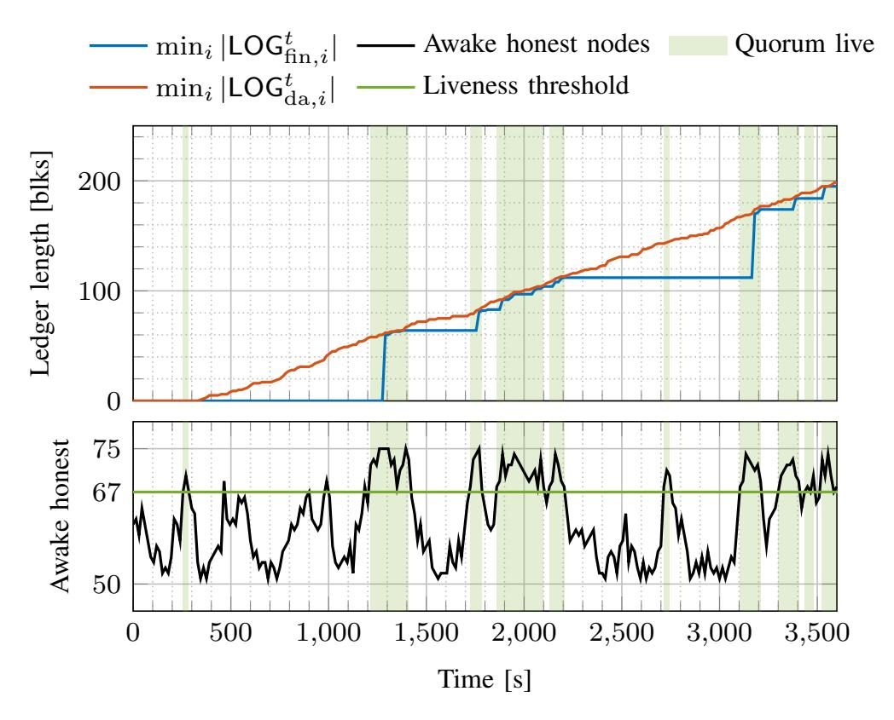

<span id="page-10-3"></span><span id="page-10-2"></span>Fig. 10. In a synchronous network where the number of awake honest nodes is modelled by a reflected Brownian motion,  $LOG_{\rm da}$  grows steadily over time. During intervals in which enough honest nodes are awake there is a 2/3-quorum to advance  $LOG_{\rm fin}$  so that it catches up with  $LOG_{\rm da}$ .

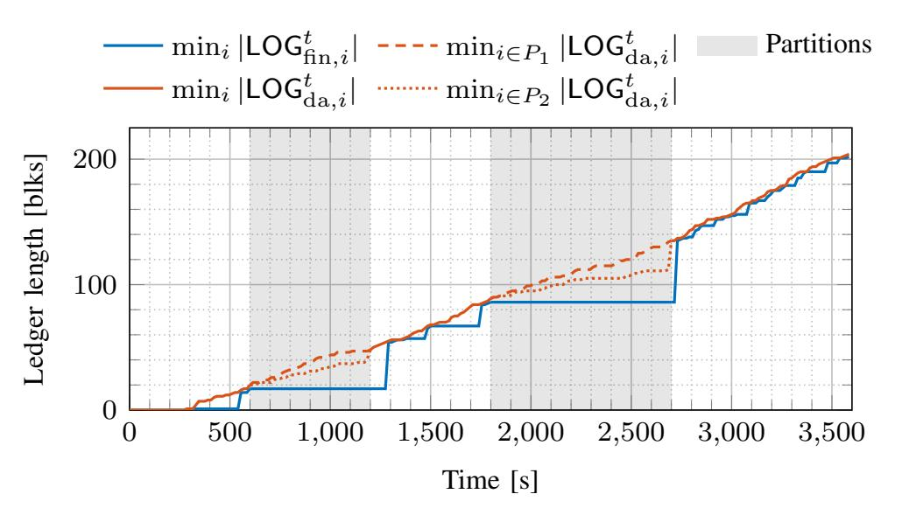

<span id="page-10-5"></span><span id="page-10-4"></span>Fig. 11. Under intermittent network partitions, during which honest nodes are split into two parts of 2(n-f)/3 and (n-f)/3 nodes, respectively, finalization of BFT blocks stalls because no 2/3-quorum is live. The ledgers  $\mathsf{LOG}_{\mathrm{da}}$  as seen by the different parts drift apart. Once the network reunites, the honest nodes converge on the longer  $\mathsf{LOG}_{\mathrm{da}}$  and  $\mathsf{LOG}_{\mathrm{fin}}$  catches up.

is prevented, intra-part communication incurs delay  $\Delta$ . All honest nodes are awake throughout the experiment. During partitions we consider the ledgers as seen by honest nodes in the respective parts.

Figure 11 shows a sample path of the simulation. Periods of network partition are shaded in Figure 11. As expected, finalization of BFT blocks stalls during periods of partition (cf. —), because no 2/3-quorum consensus is achieved, as communication between parts is blocked. The ledgers  $LOG_{da}$  as seen by nodes in the different parts  $P_1$  and  $P_2$  drift apart (cf. ----, —). Once the network reunites, the honest nodes converge on the longer  $LOG_{da}$  (which is that produced by part  $P_1$ , cf. —) and  $LOG_{fin}$  quickly catches up with  $LOG_{da}$ . Note that the shorter  $LOG_{da}$  (produced by part  $P_2$ ) is abandoned and disappears from  $LOG_{da}$  after the partition.

Note that because part  $P_1$  outnumbers the adversary, the adversary does not have a chance to build a long enough

<span id="page-10-1"></span><sup>&</sup>lt;sup>7</sup>The code of our simulations can be found here: https://github.com/tse-g roup/ebb-and-flow

{11}------------------------------------------------

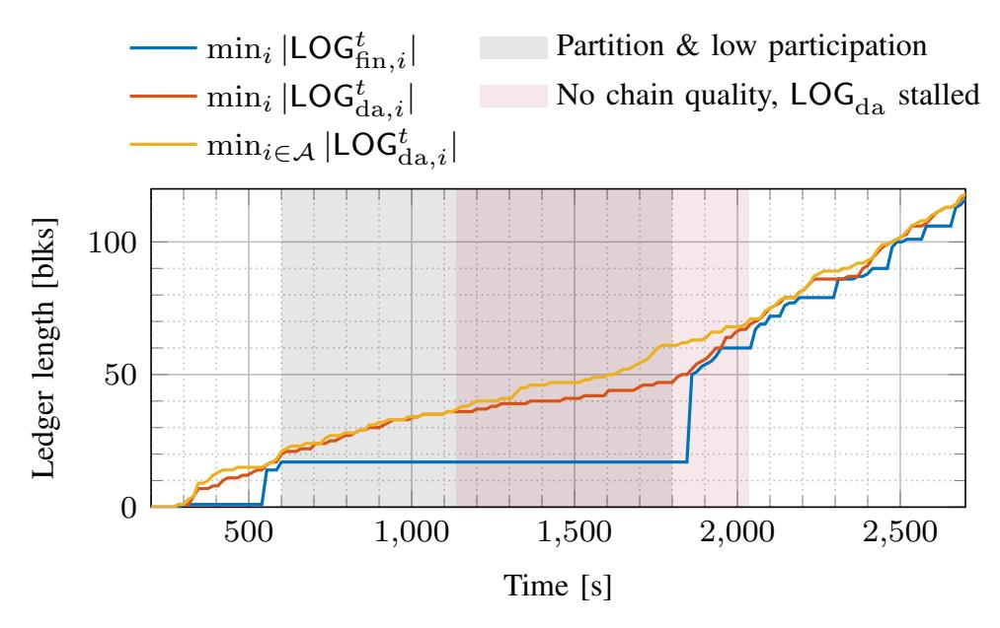

<span id="page-11-2"></span>Fig. 12. During a period of network partition and low participation honest block production slows down and the adversary can successfully pre-mine a private adversarial structure. The adversary releases private blocks to displace honest blocks from the longest chain. Thus, the longest chain suffers from low chain quality and the dynamic ledger  $LOG_{da}$  stalls. Once the network reunites and all honest nodes awake,  $LOG_{da}$  grows at a fast rate and the adversary eventually runs out of pre-mined blocks. Honest blocks enter the longest chain and liveness of  $LOG_{da}$  and with it liveness of  $LOG_{fin}$  ensues.

private chain that it can use to delay honest nodes' convergence on  $\mathsf{LOG}_{\mathrm{da}}$ . Instead, convergence on  $\mathsf{LOG}_{\mathrm{da}}$  is reached once honest nodes have synchronized their blocktrees and picked the longest chain. This is different if honest nodes are partitioned into smaller parts, as examined next.

d) Convergence of LOG<sub>da</sub> After Network Partition and/or Low Participation: We focus on the convergence of LOG<sub>da</sub> after a network partition and/or period of low participation, where the largest awake part is smaller than f. For this purpose, suppose that during a partition, 50 of the 75 honest nodes are asleep. The remaining 25 nodes are awake but partitioned into two parts of 15 and 10 nodes, respectively. Thus, the largest awake part with 15 honest nodes is smaller than f=25 and the adversary can successfully pre-mine a private chain during the period of partition and low participation. As before, only inter-part communication is prohibited.

Figure 12 shows a sample path of the simulation. Before the partition, honest block production is fast and the adversary cannot build a substantial private chain. During the period of partition and low participation the honest block production slows down. The adversary gains a considerable lead in that its private chain (cf. —) grows much faster than the longest chain in honest view (cf. —). As honest nodes produce blocks, the adversary releases its withheld adversarial blocks to displace the honest blocks from the longest chain. As a result, the longest chain suffers a sustained period of low chain quality (all blocks are adversarial and thus might not include any transactions) and the dynamic ledger LOG<sub>da</sub> effectively stalls. Once the network reunites and asleep honest nodes awake, all honest nodes join forces on LOG<sub>da</sub>, which now grows at a fast rate again. Eventually, the adversary runs out of pre-mined blocks and cannot displace honest blocks any longer. An honest block enters the longest chain and liveness of  $LOG_{da}$  and with it liveness of  $LOG_{fin}$  ensues (cf. —).

Note that during the period of partition and low partic-

ipation, LOG $_{\rm fin}$  does not grow because (as in the previous experiment) no 2/3-quorum consensus is achieved. Once the network reunites, LOG $_{\rm fin}$  catches up with LOG $_{\rm da}$ , but since the most recent blocks in LOG $_{\rm da}$  are adversarial (and thus potentially empty), neither LOG $_{\rm da}$  nor LOG $_{\rm fin}$  are live for some time. Once honest blocks return to LOG $_{\rm da}$  and get referenced by LOG $_{\rm fin}$ , both return to be live.

#### V. DISCUSSION AND CONCLUSION

#### <span id="page-11-0"></span>A. Snap-and-Chat Protocols and Finality Gadgets

<span id="page-11-1"></span>Finality gadgets, initiated by [22], are a body of work [26], [35]–[37] that aims to add finality to a Nakamoto-style protocol. As far as we can gather, there is no mathematical definition of a finality gadget; indeed different works have different goals on what their finality gadgets are supposed to achieve, and these goals are often not explicitly spelled out. For example, [36] seems to be using their finality gadget to achieve opportunistic responsiveness. On the other hand, the goals of [26] seem to be aligned with the ebb-andflow property we studied here, but there is no mathematical formulation on what should be achieved. In contrast, we focus on the ebb-and-flow property, precisely define what it means, and construct snap-and-chat protocols to achieve the property. So it is difficult to have a scientific comparison between snapand-chat protocols and finality gadgets. However, there is one important structural difference between the construction of snap-and-chat protocols and the construction of all existing finality gadgets which we want to point out.

The difference is that the snap-and-chat protocol construction can use any off-the-shelf dynamically available protocol unmodified (and the BFT sub-protocol with minor modifications), while all existing finality gadgets involve a joint design of the finality voting and the fork choice rule of the underlying Nakamoto-style chain. In particular, the native fork choice rule of the Nakamoto-style chain has to be altered to accommodate the finalization process. In Casper FFG [22], for example, the 'correct by construction' rule specifies that blocks should be proposed on the chain with the highest justified block, as opposed to the longest chain. Another example is the hierarchical finality gadget [37], which specifies that proposal should be done on the chain with the deepest finalized block. In contrast, the dynamically available sub-protocol in our construction is off-the-shelf and so the fork choice rule as well as the confirmation rule are unaltered. Finalization by the BFT sub-protocol occurs after transactions are confirmed in the LOG<sub>lc</sub> ledger. The confirmation and the finalization properties are completely decoupled.

The decoupled nature of our construction has several advantages. First, construction adds finality to *any* existing dynamically available chain without change. Second, our construction allows the use of state-of-the-art dynamically available protocols and state-of-the-art partially synchronous BFT protocols without the need to reinvent the wheel. In contrast, existing finality gadget designs entail handcrafting brand new protocols (*e.g.*, [26], [36]), and the tight coupling between the two layers makes reasoning about security difficult in the design process.

{12}------------------------------------------------

The attack on Gasper in Section [II](#page-3-0) is a good example of the perils of this approach. Another example is the *bouncing attack* on Casper FFG [\[28\]](#page-13-26), [\[29\]](#page-13-36) (recapitulated in Appendix [E\)](#page-21-0). Third, our construction is 'future-proof' because it can take advantage of future advances in the design of dynamically available protocols and in the design of partially synchronous BFT protocols; both problems have received and are continuing to receive significant attention from the community.

### <span id="page-12-0"></span>*B. Ebb-and-Flow and Snap-and-Chat for Proof-of-Work*

Another common goal for finality gadgets is to add a permissioned finality layer to a permissionless PoW Nakamoto-style protocol. In this setting, nodes come in two flavors: *miners* are quantified by hash rate and power the PoW longest chain, and *validators* with unique cryptographic identities provide finality. The two different resources (hash rate and cryptographic identities) require a modification of the environment in the Theorem of Section [I-D.](#page-1-4) The snap-and-chat construction using Nakamoto's PoW longest chain as Πlc and any of the BFT protocols from Sections [III-B](#page-6-1) and [III-D](#page-9-0) as Πbft satisfies the following ebb-and-flow variant:

Theorem (Informal, Permissioned Finality for Permissionless PoW). *Consider a network environment where:*

- *1) Communication is asynchronous until a global stabilization time* GST *after which communication becomes synchronous,*
- *2) validators are always awake, and*
- *3) miners can sleep and wake up at any time.*

*Then*

- *1) (*P1 Finality*): The finalized ledger* LOGfin *is guaranteed to be safe at all times, and live after* GST*, if fewer than* 33% *of validators are adversarial,* fewer than 50% of awake hash rate is adversarial, and awake hash rate is bounded away from zero*.*
- *2) (*P2 Dynamic Availability*): If* GST = 0*, then the available ledger* LOGda *is guaranteed to be safe and live at all times, if* fewer than 66% of validators are adversarial*, fewer than* 50% *of awake hash rate is adversarial, and awake hash rate is bounded away from zero.*

Security is proved analogously to Section [III-C.](#page-8-3) Observe that the 33% bound on adversarial validators under P1 and the 50% bound on adversarial hash rate under P2 are analogous to the permissioned case analyzed in this paper. The snap-andchat construction for permissioned finality on top of permissionless PoW Nakamoto has further requirements. Under P1, fewer than 50% of awake hash rate have to be adversarial, and awake hash rate has to be bounded away from zero, since otherwise Πlc might not be live and there would be no input for Πbft to finalize – then LOGfin would not be live. Similarly, under P2, fewer than 66% of validators have to be adversarial, since otherwise adversarial validators could finalize Πlc blocks that are not on the longest chain, which would later enter the prefix of LOGda – then LOGda would not be safe. It remains an open question whether these additional requirements are fundamental or a limitation of the snap-and-chat construction.

## <span id="page-12-1"></span>*C. Snap-and-Chat Protocols for Ethereum 2.0*

Our construction yields provably secure ebb-and-flow protocols from off-the-shelf sub-protocols and provides a flexible resolution of the availability-finality dilemma. In addition, the composition enables us to benefit from advances in the design of sub-protocols and to pass along (rather than having to build from scratch) additional features of the constituent protocols which are desired from a decentralized Internet-scale openparticipation consensus infrastructure such as Ethereum.

- *a) Scalability to Many Nodes:* The partially synchronous BFT sub-protocol Πbft used in the snap-and-chat construction presents the main scalability bottleneck. HotStuff is the BFT protocol with the lowest known message complexity O(n). When used alongside a longest-chain-based protocol, which are known to scale well to many participants, the overall snapand-chat protocol promises good scalability.
- *b) Accountability:* Gasper [\[21\]](#page-13-19) provides accountability in the form that a safety violation implies that at least a third of nodes have provably violated the protocol. As a punitive and deterrent response, those nodes' stake is slashed. This attaches a price tag to safety violations and leads to notions of economic security. Snap-and-chat protocols inherit accountability properties from the BFT sub-protocol Πbft for the finalized ledger LOGfin. For instance, for many partially synchronous BFT protocols following the propose-and-vote paradigm, such as HotStuff, PBFT or Streamlet, a safety violation requires equivocating votes from more than a third of the nodes. (Recall that this fact is the cornerstone of these protocols' safety argument.) Due to the use of digital signatures, equivocating votes can be attributed to nodes irrefutably, and equivocating nodes can be held accountable for the safety violation (*cf.* [\[38\]](#page-13-37), [\[39\]](#page-13-38)) , *e.g.*, by slashing the nodes' stake. To what extent accountability can be provided for the available ledger LOGda is less clear at this point, both because accountability has not been widely studied in the context of dynamically available protocols, as well as due to the non-trivial ledger extraction that leads to LOGda.
- *c) High Throughput:* High transaction throughput can be achieved by choosing a high throughput Πlc, such as a longest chain protocol with separate transaction and backbone blocks (*cf.* Prism [\[40\]](#page-13-39)) or OHIE [\[41\]](#page-13-40) or ledger combiners [\[42\]](#page-13-41).
- *d) Fast Confirmation Latency:* Using ledger combiners [\[42\]](#page-13-41) or Prism [\[40\]](#page-13-39) for Πlc, fast latency, in particular, latency independent of the confirmation error probability, can be achieved by snap-and-chat protocols. For Πbft, responsive BFT protocols can be used which finalize snapshots with a latency in the order of the actual network delay rather than the delay bound ∆. Hence, Πbft does not present a bottleneck in terms of reducing the latency of snap-and-chat protocols and the finalized ledger LOGfin can catch up with the available ledger LOGda very quickly, when network conditions allow.

#### ACKNOWLEDGMENT

We thank Yan X. Zhang, Danny Ryan and Vitalik Buterin for fruitful discussions. JN is supported by the Reed-Hodgson 

{13}------------------------------------------------

Stanford Graduate Fellowship. ENT is supported by the Stanford Center for Blockchain Research.

## REFERENCES

- [1] J. Neu, E. N. Tas, and D. Tse, "Ebb-and-flow protocols: A resolution of the availability-finality dilemma," *Preprint, arXiv:2009.04987*, 2020.
- <span id="page-13-0"></span>[2] S. Nakamoto, "Bitcoin: A peer-to-peer electronic cash system," [https:](https://bitcoin.org/bitcoin.pdf) [//bitcoin.org/bitcoin.pdf,](https://bitcoin.org/bitcoin.pdf) 2008.
- <span id="page-13-1"></span>[3] R. Pass and E. Shi, "The sleepy model of consensus," in *ASIACRYPT (2)*, ser. LNCS. Springer, 2017, pp. 380–409.
- <span id="page-13-2"></span>[4] P. Daian, R. Pass, and E. Shi, "Snow White: Robustly reconfigurable consensus and applications to provably secure proof of stake," in *Financial Cryptography*, ser. LNCS. Springer, 2019, pp. 23–41.
- <span id="page-13-4"></span>[5] B. David, P. Gazi, A. Kiayias, and A. Russell, "Ouroboros Praos: An adaptively-secure, semi-synchronous proof-of-stake blockchain," in *EUROCRYPT (2)*, ser. LNCS. Springer, 2018, pp. 66–98.
- <span id="page-13-3"></span>[6] C. Badertscher, P. Gazi, A. Kiayias, A. Russell, and V. Zikas, "Ouroboros Genesis: Composable proof-of-stake blockchains with dynamic availability," in *CCS*. ACM, 2018, pp. 913–930.
- <span id="page-13-5"></span>[7] S. Deb, S. Kannan, and D. Tse, "PoSAT: Proof-of-work availability and unpredictability, without the work," in *To appear in Financial Cryptography, arXiv:2010.08154*, 2021.
- <span id="page-13-6"></span>[8] M. Castro and B. Liskov, "Practical Byzantine fault tolerance," in *OSDI*. USENIX Association, 1999, pp. 173–186.
- <span id="page-13-7"></span>[9] E. Buchman, "Tendermint: Byzantine fault tolerance in the age of blockchains," Master's thesis, University of Guelph, 2016.
- <span id="page-13-8"></span>[10] E. Buchman, J. Kwon, and Z. Milosevic, "The latest gossip on BFT consensus," *Preprint, arXiv:1807.04938*, 2018.
- <span id="page-13-9"></span>[11] M. Yin, D. Malkhi, M. K. Reiter, G. Golan-Gueta, and I. Abraham, "HotStuff: BFT consensus with linearity and responsiveness," in *PODC*. ACM, 2019, pp. 347–356.
- <span id="page-13-10"></span>[12] B. Y. Chan and E. Shi, "Streamlet: Textbook streamlined blockchains," in *AFT*. ACM, 2020, pp. 1–11.
- <span id="page-13-11"></span>[13] Libra Association, "White paper," [https://libra.org/en-US/white-paper/,](https://libra.org/en-US/white-paper/) 2020.
- <span id="page-13-12"></span>[14] M. Baudet, A. Ching, A. Chursin, G. Danezis, F. Garillot, Z. Li, D. Malkhi, O. Naor, D. Perelman, and A. Sonnino, "State machine replication in the Libra blockchain," Report, Libra Association, 2018.
- <span id="page-13-13"></span>[15] J. Chen and S. Micali, "Algorand," *Preprint, arXiv:1607.01341*, 2016.
- <span id="page-13-14"></span>[16] Y. Gilad, R. Hemo, S. Micali, G. Vlachos, and N. Zeldovich, "Algorand: Scaling Byzantine agreements for cryptocurrencies," in *SOSP*. ACM, 2017, pp. 51–68.
- <span id="page-13-15"></span>[17] S. Gilbert and N. A. Lynch, "Brewer's conjecture and the feasibility of consistent, available, partition-tolerant web services," *SIGACT News*, vol. 33, no. 2, pp. 51–59, 2002.
- <span id="page-13-16"></span>[18] A. Lewis-Pye and T. Roughgarden, "Resource pools and the CAP theorem," *Preprint, arXiv:2006.10698*, 2020.
- <span id="page-13-17"></span>[19] Y. Guo, R. Pass, and E. Shi, "Synchronous, with a chance of partition tolerance," in *CRYPTO (1)*, ser. LNCS. Springer, 2019, pp. 499–529.
- <span id="page-13-18"></span>[20] D. Malkhi, K. Nayak, and L. Ren, "Flexible Byzantine fault tolerance," in *CCS*. ACM, 2019, pp. 1041–1053.
- <span id="page-13-19"></span>[21] V. Buterin, D. Hernandez, T. Kamphefner, K. Pham, Z. Qiao, D. Ryan, J. Sin, Y. Wang, and Y. X. Zhang, "Combining GHOST and Casper," *Preprint, arXiv:2003.03052*, 2020.
- <span id="page-13-20"></span>[22] V. Buterin and V. Griffith, "Casper the friendly finality gadget," *Preprint, arXiv:1710.09437*, 2017.
- <span id="page-13-21"></span>[23] V. Buterin. (2020) Explaining the liveness guarantee (comment 8). [Online]. Available:<https://ethresear.ch/t/4228/8>
- <span id="page-13-22"></span>[24] D. Ryan, Ethereum Foundation, Personal communication, June 2020.
- <span id="page-13-23"></span>[25] C. Cachin and M. Vukolic, "Blockchain consensus protocols in the wild," ´ *Preprint, arXiv:1707.01873*, 2017.
- <span id="page-13-24"></span>[26] A. Stewart and E. Kokoris-Kogia, "GRANDPA: a Byzantine finality gadget," *Preprint, arXiv:2007.01560*, 2020.
- <span id="page-13-25"></span>[27] E. Blum, J. Katz, and J. Loss, "Synchronous consensus with optimal asynchronous fallback guarantees," in *TCC (1)*, ser. LNCS. Springer, 2019, pp. 131–150.
- <span id="page-13-26"></span>[28] V. Buterin and A. Stewart. (2018) Beacon chain Casper mini-spec (comments 17 and 19). [Online]. Available:<https://ethresear.ch/t/2760/17>
- <span id="page-13-36"></span>[29] R. Nakamura. (2019) Analysis of bouncing attack on FFG. [Online]. Available:<https://ethresear.ch/t/6113>
- <span id="page-13-27"></span>[30] ——. (2019) Prevention of bouncing attack on FFG. [Online]. Available:<https://ethresear.ch/t/6114>

- <span id="page-13-29"></span>[31] J. Neu, E. N. Tas, and D. Tse. (2020) A balancing attack on Gasper, the current candidate for Eth2's beacon chain. [Online]. Available: <https://ethresear.ch/t/8079>
- <span id="page-13-30"></span>[32] A. Kiayias, A. Russell, B. David, and R. Oliynykov, "Ouroboros: A provably secure proof-of-stake blockchain protocol," in *CRYPTO (1)*, ser. LNCS. Springer, 2017, pp. 357–388.
- <span id="page-13-31"></span>[33] C. Dwork, N. A. Lynch, and L. J. Stockmeyer, "Consensus in the presence of partial synchrony," *J. ACM*, vol. 35, no. 2, pp. 288–323, 1988.
- <span id="page-13-32"></span>[34] G. Golan-Gueta, I. Abraham, S. Grossman, D. Malkhi, B. Pinkas, M. K. Reiter, D. Seredinschi, O. Tamir, and A. Tomescu, "SBFT: A scalable and decentralized trust infrastructure," in *DSN*. IEEE, 2019, pp. 568– 580.
- <span id="page-13-33"></span>[35] A. Skidanov, "Fast finality and resilience to long range attacks with proof of space-time and Casper-like finality gadget," [http://near.ai/post,](http://near.ai/post) 2019.
- <span id="page-13-35"></span>[36] T. Dinsdale-Young, B. Magri, C. Matt, J. B. Nielsen, and D. Tschudi, "Afgjort: A partially synchronous finality layer for blockchains," in *SCN*, ser. LNCS. Springer, 2020, pp. 24–44.
- <span id="page-13-34"></span>[37] R. Nakamura. (2020) Hierarchical finality gadget. [Online]. Available: <https://ethresear.ch/t/6829>
- <span id="page-13-37"></span>[38] J. Neu, E. N. Tas, and D. Tse, "Snap-and-chat protocols: System aspects," *Preprint, arXiv:2010.10447*, 2020.
- <span id="page-13-38"></span>[39] P. Sheng, G. Wang, K. Nayak, S. Kannan, and P. Viswanath, "BFT protocol forensics," *Preprint, arXiv:2010.06785*, 2020.
- <span id="page-13-39"></span>[40] V. K. Bagaria, S. Kannan, D. Tse, G. C. Fanti, and P. Viswanath, "Prism: Deconstructing the blockchain to approach physical limits," in *CCS*. ACM, 2019, pp. 585–602.
- <span id="page-13-40"></span>[41] H. Yu, I. Nikolic, R. Hou, and P. Saxena, "OHIE: blockchain scaling made simple," in *IEEE Symp. Secur. Privacy*, 2020, pp. 90–105.
- <span id="page-13-41"></span>[42] M. Fitzi, P. Gazi, A. Kiayias, and A. Russell, "Ledger combiners for fast settlement," Cryptology ePrint Archive, Report 2020/675, 2020.
- <span id="page-13-42"></span>[43] N. A. Lynch, *Distributed Algorithms*. San Francisco, CA, USA: Morgan Kaufmann Publishers Inc., 1996.
- <span id="page-13-44"></span>[44] A. Dembo, S. Kannan, E. N. Tas, D. Tse, P. Viswanath, X. Wang, and O. Zeitouni, "Everything is a race and Nakamoto always wins," in *CCS*. ACM, 2020, pp. 859–878.

## <span id="page-13-28"></span>APPENDIX A

### DETAILS OF THE LIVENESS ATTACK ON GASPER

#### *A. Setting of the Attack*

This appendix describes an attack on the liveness of the Gasper protocol [\[21\]](#page-13-19). We first state the assumptions about the adversary's capabilities and control over the network that suffice for the adversary to launch our attack. Subsequently, we describe the attack in detail. (The attack is summarized in Section [II.](#page-3-0)) Then we demonstrate using probabilistic analysis and Monte Carlo simulation that the adversary is likely in a position to launch the attack within a short period of time.

*1) Goal:* We describe an attack on the liveness of the Gasper protocol [\[21\]](#page-13-19). That is, we describe a situation which is likely to occur and a sequence of adversarial actions such that the adversary can prevent any Casper finalizations indefinitely.

Our exposition assumes the reader is familiar with Gasper [\[21\]](#page-13-19), Casper [\[22\]](#page-13-20), and the synchronous network model [\[43\]](#page-13-42).

<span id="page-13-43"></span>*2) Assumptions:* We assume an adversary has the following capabilities: (a) The adversary knows at what point in time honest validators execute the Gasper fork choice rule HLMD(G) [\[21,](#page-13-19) Algorithm 4.2]. (b) The adversary is able to target a message (such as a block or a vote) for delivery to an honest validator just before a certain point in time. (c) Honest validators cannot update each other arbitrarily quickly about messages they have just received.

Note that (a) is given by design of Gasper which has predetermined points in time at which honest validators are 

{14}------------------------------------------------

supposed to cast their votes. Conditions (b) and (c) are satisfied in standard consensus-theoretic adversary and network models such as ∆-synchrony [\[43\]](#page-13-42) or ∆-partial-synchrony [\[33\]](#page-13-31) where the adversary controls network delay. The probabilistic liveness proof of [\[21\]](#page-13-19) does not apply because it assumes a weaker adversary (network delays are assumed to be stochastic rather than adversarial in [\[21\]](#page-13-19)) which does not have capability (b).

*3) Terminology:* Recall that Gasper proceeds in epochs which are subdivided into slots. We assume that Gasper is run with C slots per epoch, n validators in total, of which f are adversarial. Let β , f /n. We assume that C divides n such that every slot has a *committee* of integer size n/C. For each epoch, a random permutation of all n validators fixes the assignment of validators to committees. The first validator in every committee is the designated *proposer* for the respective slot and gets to propose a new block at a location in the block tree determined by HLMD(G). Then, each validator of the slot's committee executes HLMD(G) in its own view G to determine what block to vote for.

A vote consists of a GHOST vote and a Casper (FFG) vote. The Casper vote's source and target blocks are deterministic functions of the block the GHOST vote is cast for (see [\[21,](#page-13-19) Definition 4.7]). A block can only become finalized if a supermajority of ≥ 2n/3 validators vote for it. The goal of the attack is to keep honest validators split between two options (a 'left' and a 'right' chain, see Figure [4,](#page-4-1) p. [5\)](#page-4-1) indefinitely, such that no supermajority of ≥ 2n/3 validators ever votes for one of the two options and thus no block ever gets finalized.

### <span id="page-14-0"></span>*B. Attack*

In this section we describe our attack in detail, *cf.* [\[31\]](#page-13-29). For an illustration of the attack, see Figure [4](#page-4-1) (p. [5\)](#page-4-1).

*1) Recap: Proposing and Voting in Gasper:* To understand how the adversary can keep the honest nodes split indefinitely between two chains it is necessary to revisit the proposing and voting algorithms of Gasper. For each of the two roles, proposing and voting, honest validators use the fork chain rule HLMD(G) (see [\[21,](#page-13-19) Algorithm 4.2]) in their local view G to determine (a) when proposing, what block to extend, and (b) when voting, what block to endorse with a vote.

Roughly speaking, HLMD(G) does this. First, HLMD(G) finds the justified pair with highest attestation epoch among all possible chains, but taking into account only votes that have already been referenced on said chain (see [\[21,](#page-13-19) Algorithm 4.2], line 3, 'J(ffgview(Bl))'). Votes that the validator might have received from the network but have not yet been referenced in a block are not considered. Second, HLMD(G) filters for only those chains that contain said highest justified pair, *i.e.*, are consistent with the prior justification (see [\[21,](#page-13-19) Algorithm 4.2], lines 4 and 5). Third, among the remaining chains, HLMD(G) picks greedily the 'heaviest' chain (GHOST paradigm), *i.e.*, the chain which among the most recent votes for each validator has received the most votes (LMD paradigm, see [\[21,](#page-13-19) Algorithm 4.2], lines 7 to 10).

In addition, to vote, the source and target of the Casper vote are determined as follows (see [\[21,](#page-13-19) Definition 4.7]). The Casper vote's source LJ is the last justified pair, considering only votes that have been included in blocks on the chain determined by HLMD(G). This ensures that all validators voting for the tip of a certain chain have a consistent view of and vote from the last justified pair. The Casper vote's target LE is the last epoch boundary pair (*i.e.*, of the current epoch) on the chain determined by HLMD(G). Again, all validators voting for the tip of a certain chain have a consistent view of and vote for the same last epoch boundary pair.

*2) How to Sway Honest Validators:* Suppose there are two competing chains as depicted in Figure [4.](#page-4-1) The only time a nontrivial fork choice occurs in HLMD(G) (see [\[21,](#page-13-19) Algorithm 4.2], line 9) is when a validator chooses whether to go down the 'left' or the 'right' chain. This decision is based on where the majority of the most recent votes (one per validator) fall, *in the instant when* HLMD(G) *is executed*. Thus, if half of the most recent votes are 'left' and the other half is 'right', then the adversary can release a single withheld vote to an honest validator who is just about to execute HLMD(G) and thereby 'tip the balance' and sway that honest validator to vote on a chain of the adversary's choosing. Note that the adversary can release that same withheld vote to multiple honest validators, all of which will then vote for the chain of the adversary's choice. Furthermore, note that the adversary can release two different withheld votes to different sets of honest validators and thus steer one group towards 'left' and the other group towards 'right'. Ultimately (due to the assumption of there being a bound ∆ on the maximum network delay the adversary can inflict on a message, and the fact that honest validators gossip about recently received messages in an attempt to keep consistent views of the protocol execution) the withheld votes will become known to all honest validators, but (a) the adversary can prevent this synchronization until after the honest validators have cast their votes by releasing the withheld votes just before the honest validators execute HLMD(G), and (b) after two withheld votes, one for 'left' and one for 'right', are released, and if the honest validators either vote 'left' and 'right' in equal number (during epoch 0) or simply reaffirm their prior votes (during epoch 1 and beyond), then after sharing all votes with all honest validators there is still an equal number of votes for 'left' and 'right', respectively. Thus, in the next slot the adversary can release another two withheld votes to continue keeping up the equal split of honest validators. And so on.

Swaying honest validators by releasing withheld votes selectively is the key technique underlying our attack. Since the Casper votes are consistent with the GHOST votes by construction, as long as the GHOST votes are split equally between the two chains, the Casper votes are split equally between the two chains. Thus, neither of the two chains will ever receive a supermajority of ≥ 2n/3 votes as would be necessary for a justification or finalization. Thus, no epoch boundary pair will ever get finalized and thus liveness is lost indefinitely and with certainty, once the attack has been launched. In the 

{15}------------------------------------------------

remainder of this section we describe under what sufficient condition and with what sequence of adversarial actions the adversary is able to affect a permanent split among honest validators and thus a permanent loss of liveness of Gasper.

- 3) Epoch 0: Kick-Starting the Attack: The adversary waits for an opportune epoch to kick-start the attack. For ease of exposition, we assume that epoch 0 is opportune. An epoch is opportune if there are enough adversarial validators in every slot of the epoch to fill the following roles:
- The proposer of slot 0 needs to be adversarial. The adversarial proposer equivocates and produces two conflicting blocks ('left' and 'right', dashed blocks 0 and 0' in Figure 4) which it reveals to two suitably chosen subsets of the validators in slot 0. Thus, the honest validators' votes are split equally between the two chains. (Equivocating on block production is a slashable offense and thus the stake corresponding to the adversarial block producer will be slashed. Besides this equivocation, none of the adversarial actions are slashable. We note that there are variants of our attack that do not require any slashable adversarial actions, but these variants are more involved.)
- For every but the last slot of epoch 0 the adversary recruits two 'swayers'. The role of these swayers is to withhold their votes in slot i and release the votes selectively to subsets of the honest validators in slot i + 1 in order to split the honest validators' votes equally between the two chains.
- For every slot of epoch 0 the adversary recruits two more 'swayers'. The role of these additional swayers is to withhold their votes during slot i of epoch 0 and release the votes selectively to subsets of the honest validators in slot C+i of epoch 1 in order to split the honest validators' votes equally between the two chains in epoch 1. Similarly, these swayers withhold their votes during epoch 1 and release the votes selectively to subsets of the honest validators in epoch 2 in order to split the honest validators' votes equally between the two chains in epoch 2. This repeats beyond epoch 2.
- Finally, to achieve an equal split of honest validators' votes for every slot in epoch 0, we require that every slot has an even number of honest validators. If a slot does not have an even number of honest validators, then the adversary recruits a 'filler' ('\$' in Figure 4) which behaves like an honest validator for the rest of the attack.

Thus, sufficient for an epoch to be opportune to start the attack is that the following conditions are all satisfied:

 $\mathcal{E}_{(a)}^{(0)}$ : The proposer of slot 0 is adversarial.

 $\mathcal{E}_{(b)}^{(0)}$ : Slot 0 has  $\geq$  6 adversarial validators (the adversarial proposer, two swayers for epoch 0, two swayers for epoch 1, potentially one filler).

 $\mathcal{E}_{(c),i}^{(0)}$ : Slots i=1,...,(C-2) have  $\geq 5$  adversarial validators (two swayers for epoch 0, two swayers for epoch 1, potentially one filler).

 $\mathcal{E}_{(\mathrm{d})}^{(0)}$ : Slot (C-1) has  $\geq 3$  adversarial validators (two swayers for epoch 1, potentially one filler).

We show in Appendix A-C that, in particular in the regime of many validators  $(n \to \infty)$ , the probability that a particular

epoch is opportune is approximately equal to  $\beta$ , the fraction of adversarial validators.

For slots i=1,...,(C-1) of epoch 0 the adversary uses two 'swayers' to withhold their votes in slot i and release the votes selectively to equally sized subsets of the honest validators in slot i+1 in order to split the honest validators' votes equally between the two chains. Thus, in each slot, an equal number of validators votes 'left' and 'right', respectively, so that at the end of epoch 0 both chains have equal weight. In particular, none of the chains achieves a supermajority. Thus, no Casper finalization can take place.

- 4) Epoch 1: Transition to Steady-State: During epoch 1, the adversary uses the other group of swayers recruited in epoch 0 to selectively release more withheld votes from epoch 0 to keep splitting validators into two groups, one of which sees 'left' as leading and votes for it, the other sees 'right' as leading and votes for it. All the adversary needs to do is release withheld votes so as to reaffirm the honest validators in their illusion that whatever chain they previously voted on in epoch 0 happens to be still leading, so that they renew their vote. At the end of epoch 1 there are still two chains with equal number of votes and thus neither gets finalized.
- beyond the attack reaches steady-state: During epoch 2 and beyond the attack reaches steady-state in that the adversarial actions now repeat in each epoch. Note that the validators whose epoch 0 votes the adversary released during epoch 1 to sway honest validators have themselves not voted in epoch 1 yet. Thus, during epoch 2 the adversary selectively releases withheld votes from epoch 1 to keep honest validators split between the two chains. Again, all the adversary needs to do is to release withheld votes such that it reaffirms the honest validators in their illusion that whatever chain they previously voted on in epoch 1 happens to be still leading, so that they renew their vote. This continues indefinitely. Neither chain ever reaches a supermajority, thus, no Casper finalizations take place. As a result of this attack, the ledger of Gasper does not incorporate new transactions and thus is not live.

#### <span id="page-15-0"></span>C. Analysis & Simulation

We analyze the probability  $\Pr[\mathcal{E}^{(\ell)}]$  that an adversary can launch the attack in epoch  $\ell$ . Without loss of generality, we consider  $\ell=0$ . Recall that the events  $\mathcal{E}^{(0)}_{(a)}$  to  $\mathcal{E}^{(0)}_{(d)}$  are sufficient for the adversary to be able to launch the attack. Obviously,

$$\Pr\left[\overline{\mathcal{E}}_{(a)}^{(0)}\right] = 1 - \beta. \tag{2}$$

For fixed C and large n such that  $\beta n/C \ge 6$ , due to tail bounds for the hypergeometric distribution,

$$\Pr\left[\overline{\mathcal{E}}_{(b)}^{(0)}\right], \Pr\left[\overline{\mathcal{E}}_{(c),i}^{(0)}\right], \Pr\left[\overline{\mathcal{E}}_{(d)}^{(0)}\right] \le \exp\left(-\Theta(n)\right)$$
 (3)

Thus, with a straightforward application of the union bound,

$$\Pr\left[\mathcal{E}^{(\ell)}\right] \ge \beta - C \exp\left(-\Theta(n)\right).$$
 (4)

Note that, since the events  $\mathcal{E}^{(\ell_1)}$  and  $\mathcal{E}^{(\ell_2)}$  of the adversary being able to kick-start the attack in two epochs  $\ell_1 \neq \ell_2$  are independent, the number of epochs until the first epoch

{16}------------------------------------------------

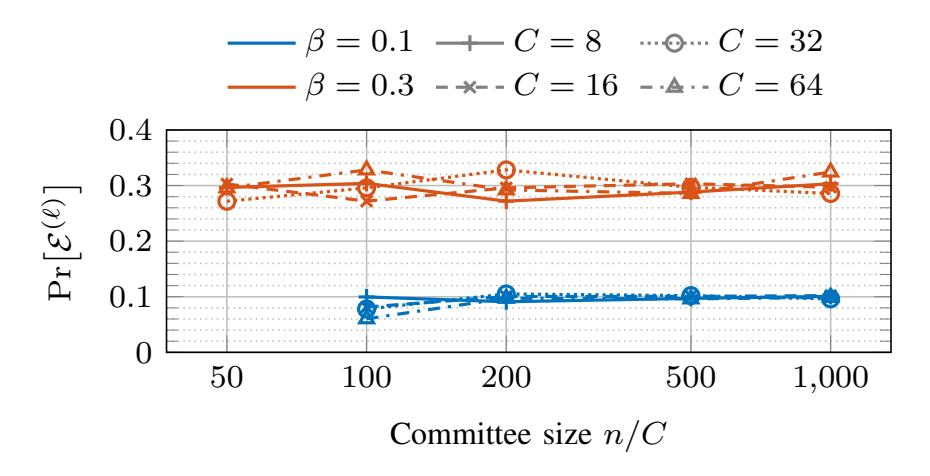

Fig. 13. Monte Carlo estimate of the probability that an adversary who controls β fraction of stake can launch the attack in epoch `, as a function of number of slots per epoch C and committee size n/C. Observe that Pr-E (`) ≈ β is a good rule of thumb, even for moderate n.

in which the adversary can kick-start the attack follows a geometric distribution with mean 1/Pr-E (0) . It is thus exponentially unlikely (in the number of epochs considered) that the adversary is not able to kick-start the attack in any of a number of epochs, even for small β. As soon as an opportune epoch occurs and the adversary can kick-start the attack, liveness is prevented with certainty, assuming that the networking assumptions given in Appendix [A-A2](#page-13-43) are satisfied.

We use a Monte Carlo simulation to numerically evaluate the probability Pr-E (`) . [8](#page-16-5) The result is shown in Figure [13.](#page-16-6)

We observe that the approximation Pr-E (`) ≈ β is a pretty good rule of thumb, even for moderate numbers of validators. This matches the intuition that the probability of successfully kick-starting the attack in a given epoch is largely dominated by the probability that the proposer in the first slot of the epoch is adversarial. All further conditions are satisfied as soon as there are six adversarial validators per each slot, which happens with high probability as n grows and β is held fix.

## <span id="page-16-4"></span>APPENDIX B

ANALYSIS AND SECURITY PROOF FOR THE SNAP-AND-CHAT CONSTRUCTION USING STREAMLET

We prove Theorem [1](#page-8-0) for the protocol Πsac composing a permissioned longest chain protocol and Streamlet.

<span id="page-16-0"></span>Lemma 1 (Safety Lemma for Πbft). *(See [\[12,](#page-13-10) Lemma 14, Theorem 3] and Algorithm [1\)](#page-7-2) If some honest node sees a notarized chain with three adjacent BFT blocks* B0*,* B1*,* B<sup>2</sup> *with consecutive epoch numbers* e*,* e+ 1*, and* e+ 2*, then there cannot be a conflicting block* B 6= B<sup>1</sup> *that also gets notarized in any honest view at the same depth as* B1*. Hence, there cannot be conflicting final BFT blocks in any honest view.*

*Proof.* The proof of [\[12,](#page-13-10) Lemma 14], which is based on a quorum intersection argument, is unaffected by the fact that honest nodes do not vote for a proposed BFT block if they do not view the referenced LC block as confirmed. Even with the modification shown at line [19](#page-7-2) of Algorithm [1,](#page-7-2) honest nodes would not equivocate or vote for proposed BFT blocks that do not extend the longest notarized chain. Then, via [\[12,](#page-13-10) Theorem 3], there cannot be conflicting final BFT blocks in the views of honest nodes.

By the ledger extraction explained in Figure [6,](#page-7-3) Lemma [1](#page-16-0) completes the proof of safety for LOGfin.

<span id="page-16-6"></span><span id="page-16-1"></span>Lemma 2. *(See [\[12,](#page-13-10) Lemma 5] and Algorithm [1\)](#page-7-2) After* max{GST, GAT}*, suppose there are three consecutive epochs* e*,* e+1*, and* e+2*, all with honest leaders denoted by* Le*,* Le+1*, and* Le+2*, and the leaders' proposals reference LC blocks that are viewed as confirmed by all honest nodes. Then the following holds: (Below, let* B *denote the block proposed by* Le+2 *during epoch* e + 2*.)*

- *(a) By the beginning of epoch* e + 3*, every honest node will observe a notarized chain ending at* B*, which was not notarized before the beginning of epoch* e*.*
- *(b) No conflicting block* B<sup>0</sup> 6= B *with the same length as* B *will ever get notarized in honest view.*

*Proof.* Note that every honest node is awake and the network is ∆ synchronous after max{GST, GAT}. Due to the highlighted condition added to the Lemma, all honest nodes view the LC blocks referenced by the proposals as confirmed, thus, the additional condition for an honest node to cast a vote (see line [19](#page-7-2) of Algorithm [1\)](#page-7-2) is satisfied. Then, all honest nodes behave as they would in Streamlet, and the liveness lemma [\[12,](#page-13-10) Lemma 5] ensures the validity of (a) and (b).

<span id="page-16-2"></span>Lemma 3 (Liveness Lemma for Πbft). *After* max{GST, GAT}*, suppose that there are five consecutive epochs* e, e + 1, .., e + 4 *with honest leaders and the leaders' proposals reference LC blocks that are viewed as confirmed by all honest nodes. Then, by the beginning of epoch* e + 5*, every honest node observes a new final BFT block, proposed by an honest leader, that was not final at the beginning of epoch* e*.*

Proof follows from Lemma [2](#page-16-1) and [\[12,](#page-13-10) Theorem 6].

Notice that Lemma [3,](#page-16-2) by itself, is not sufficient to show the liveness of LOGfin after max{GST, GAT} under (A<sup>∗</sup> 1 , Z1), due to the highlighted condition in the lemma's statement. In this context, the following theorem shows that after max{GST, GAT}, the LC blocks referenced by honest proposals in Πbft are viewed as confirmed by all honest nodes, thus, ensuring that the highlighted condition in the statement of Lemma [3](#page-16-2) is satisfied after max{GST, GAT}. Although, Theorem [2](#page-16-3) below is stated for the *static* version of the longest chain protocol described in [\[3\]](#page-13-1), a similar statement can be made for [\[5\]](#page-13-4). Πlc is initialized with a parameter p which denotes the probability that any given node gets to produce a block in any given time slot.

<span id="page-16-3"></span>Theorem 2. *For all*

$$p < \frac{n - 2f}{2\Delta n(n - f)},\tag{5}$$

*there exists a constant*[9](#page-16-7) *C* > 0 *such that for any* GST *and* GAT *specified by* (A<sup>∗</sup> 1 , Z1)*,* Πlc(p) *is secure after*

<span id="page-16-5"></span><sup>8</sup>The source code of the simulation can be found at: [https://github.com/tse](https://github.com/tse-group/gasper-attack) [-group/gasper-attack.](https://github.com/tse-group/gasper-attack)

<span id="page-16-7"></span><sup>9</sup>Value of *C* depends on p, n, f and ∆.

{17}------------------------------------------------

 $C(\max\{\mathsf{GST},\mathsf{GAT}\}+\sigma)$ , with transaction confirmation time  $T_{\mathrm{confirm}}=\sigma$ , except with probability  $e^{-\Omega(\sqrt{\sigma})}$ . 10

Full proof and the associated analysis can be found in Appendix C. The proof extends the technique of *pivots* in [3] from the synchronous model to the partially synchronous model. The technique of Nakamoto blocks [44] can be used to further strengthen the result to get an optimal bound for the block generation rate p given n, f and  $\Delta$ .

Finally, the following Lemma completes the proof of liveness for  $LOG_{fin}$  after  $max\{GST, GAT\}$ :

<span id="page-17-0"></span>**Lemma 4** (Liveness Lemma for  $LOG_{fin}$ ). There exists a constant C>0 such that for any GST and GAT specified by  $(\mathcal{A}_1^*,\mathcal{Z}_1)$ ,  $LOG_{fin}$  is live after time  $C(\max\{GAT,GST\}+\sigma)$  except with probability  $e^{-\Omega(\sqrt{\sigma})}$ .

*Proof.* Via Theorem 2, there exists a constant C>0 such that for any GST and GAT specified by  $(\mathcal{A}_1^*,\mathcal{Z}_1)$ ,  $\Pi_{\mathrm{lc}}$  is safe and live, with confirmation time  $\sigma$ , after time  $C(\max\{\mathsf{GAT},\mathsf{GST}\}+\sigma)$  except with probability  $e^{-\Omega(\sqrt{\sigma})}$ . Hence, the following observation is true for any LC block b except with probability  $e^{-\Omega(\sqrt{\sigma})}$ : If b is first viewed as confirmed by an honest node at some time  $t>C(\max\{\mathsf{GAT},\mathsf{GST}\}+\sigma)$ , then, it will be regarded as confirmed in the views of all of the honest nodes by time  $t+\Delta$ .

Each BFT block proposed by an honest leader at time t references the deepest confirmed LC block in the view of the leader at time t. Moreover, honest nodes vote  $\Delta$  time into an epoch, i.e.,  $\Delta$  time after they see a proposal. Hence, after time  $C(\max\{\text{GAT},\text{GST}\}+\sigma)$ , all of the proposals by honest leaders in  $\Pi_{\text{bft}}$  reference LC blocks that are viewed as confirmed by all honest nodes when they vote, except with probability  $e^{-\Omega(\sqrt{\sigma})}$ . Finally, via Lemma 3, after time  $C(\max\{\text{GAT},\text{GST}\}+\sigma)$ , every honest node observes a new final BFT block proposed by an honest leader after all of the five consecutive honest epochs, except with probability  $e^{-\Omega(\sqrt{\sigma})}$ .

Next, consider a time interval  $[s,s+\sigma]$  such that  $s>C(\max\{\mathsf{GAT},\mathsf{GST}\}+\sigma)$ . Since the proposer of an epoch in  $\Pi_{\mathrm{bft}}$  is determined uniformly at random among all of the nodes, after time GAT, any epoch has an honest proposer independent from other epochs, with probability at least 2/3 under  $(\mathcal{A}_1^*,\mathcal{Z}_1)$ . Hence, there exists a sequence of five consecutive honest epochs within the interval  $[s+\sigma/2,s+\sigma]$  except with probability  $e^{-\Omega(\sigma)}$ . Then, every honest node observes a new final BFT block proposed by an honest leader within the interval  $[s+\sigma/2,s+\sigma]$  except with probability  $e^{-\Omega(\sigma)}$ .

Finally, via the liveness of  $\Pi_{lc}$  after  $C(\max\{\mathsf{GAT},\mathsf{GST}\} + \sigma)$ , a transaction tx received by an awake honest node at time s will be included in a confirmed LC block b' by time  $s + \sigma/2$  except with probability  $e^{-\Omega(\sqrt{\sigma})}$ . Now, let b denote the

confirmed LC block referenced by the new final BFT block that was proposed by an honest node within the interval  $[s+\sigma/2,s+\sigma]$ . Via the safety  $\Pi_{\rm lc}$ , we know that b extends b' containing the transaction tx except with probability  $e^{-\Omega(\sqrt{\sigma})}$ . Consequently, any transaction received by an honest node at some time  $s>C(\max\{{\sf GAT},{\sf GST}\}+\sigma)$  becomes part of  ${\sf LOG}_{\rm fin}$  in the view of any honest node i, by time  $s+\sigma$ , except with probability  $e^{-\Omega(\sigma)}+e^{-\Omega(\sqrt{\sigma})}=e^{-\Omega(\sqrt{\sigma})}$ . This concludes the proof.

The following Lemma shows the consistency of  $LOG_{fin}$  with the output of  $\Pi_{lc}$  under  $(\mathcal{A}_2^*, \mathcal{Z}_2)$ , which is a necessary condition for the safety of  $LOG_{da}$ .

<span id="page-17-1"></span>**Lemma 5.** LOG<sub>fin</sub> is a safe prefix of the output of  $\Pi_{lc}$  in the view of every honest node at all times under  $(\mathcal{A}_2^*, \mathcal{Z}_2)$  except with probability  $e^{-\Omega(\sqrt{\sigma})}$ .

Proof. Via the security of  $\Pi_{lc}$  under  $(\mathcal{A}_2^*, \mathcal{Z}_2)$ , if any two honest nodes i and j view  $b_i$  and  $b_j$  as confirmed (at any time), either  $b_i \leq b_j$  or  $b_j \leq b_i$ , except with probability  $e^{-\Omega(\sqrt{\sigma})}$ . Moreover, for a BFT block to become final in the view of an honest node i under  $(\mathcal{A}_2^*, \mathcal{Z}_2)$ , at least one vote from an honest node is required, and honest nodes only vote for a BFT block if they view the referenced LC block as confirmed. Hence, given any two honest nodes i and j, if LC blocks  $b_i$  and  $b_j$  are referenced by the BFT blocks  $B_i$  and  $B_j$  that are final in the views of i and j respectively, then either  $b_i \leq b_j$  or  $b_j \leq b_i$ . This is true even if the BFT blocks  $B_i$  and  $B_j$  conflict with each other in the output of  $\Pi_{bft}$  (see Figure 9).

Since the LC blocks referenced by final BFT blocks in the view of an honest node i does not conflict with the LC blocks referenced by final BFT blocks in the view of any other honest node j under  $(\mathcal{A}_2^*, \mathcal{Z}_2)$  (even when these BFT blocks might be conflicting), the ledgers  $\mathsf{LOG}_{\mathrm{fin},i}^t$  and  $\mathsf{LOG}_{\mathrm{fin},j}^{t'}$  also do not conflict for i and j at any times t,t', except with probability  $e^{-\Omega(\sqrt{\sigma})}$ . Finally, since the ledgers  $\mathsf{LOG}_{\mathrm{fin}}$  are constructed from confirmed snapshots of the prefix of the output of  $\Pi_{\mathrm{lc}}$  which is safe,  $\mathsf{LOG}_{\mathrm{fin}}$  is a safe prefix of the output of  $\Pi_{\mathrm{lc}}$  at any time and in the view of any honest node under  $(\mathcal{A}_2^*, \mathcal{Z}_2)$ , except with probability  $e^{-\Omega(\sqrt{\sigma})}$ .

Finally, we can start the main proof for Theorem 1.

*Proof.* We first observe via Lemma 1 that  $\Pi_{\rm bft}$  is safe at all times under  $(\mathcal{A}_1^*,\mathcal{Z}_1)$ . Then, since the ledger extraction for  $\mathsf{LOG}_{\mathrm{fin}}$  (Section III-B3) preserves the safety of  $\Pi_{\mathrm{bft}}$ ,  $\mathsf{LOG}_{\mathrm{fin}}$  is safe under  $(\mathcal{A}_1^*,\mathcal{Z}_1)$  as well. Second, via Lemma 4, there exists a constant C>0 such that for any GST and GAT specified by  $(\mathcal{A}_1^*,\mathcal{Z}_1)$ ,  $\mathsf{LOG}_{\mathrm{fin}}$  is live after time  $C(\max\{\mathsf{GAT},\mathsf{GST}\}+\sigma)$  except with probability  $e^{-\Omega(\sqrt{\sigma})}$ . Consequently, under  $(\mathcal{A}_1^*,\mathcal{Z}_1)$ ,  $\mathsf{LOG}_{\mathrm{fin}}$  is safe with probability 1 and live after time  $C(\max\{\mathsf{GAT},\mathsf{GST}\}+\sigma)$  except with probability  $e^{-\Omega(\sqrt{\sigma})}$ . This shows the property  $\mathbf{P1}$ .

Via [3, Theorem 3, Lemma 1],  $\Pi_{\rm lc}$  is secure with  $T_{\rm confirm}=\sigma$  under  $(\mathcal{A}_2^*,\mathcal{Z}_2)$  for any  $p<(n-f)/(2\Delta n(n-f))$ , except with probability  $e^{-\Omega(\sqrt{\sigma})}$ . Moreover, via Lemma 5,  $\mathsf{LOG}_{\rm fin}$  is a safe prefix of the output of  $\Pi_{\rm lc}$  in the view of any

<span id="page-17-2"></span> $<sup>^{10}\</sup>text{Using}$  the recursive bootstrapping argument developed in [44, Section 4.2], it is possible to bring the error probability  $e^{-\Omega(\sqrt{\sigma})}$  as close to an exponential decay as possible. In this context, for any  $\epsilon>0$ , it is possible to find constants  $A_\epsilon$ ,  $a_\epsilon$  such that  $\Pi_{\rm lc}(p)$  is secure after  $C\max\{\text{GST},\text{GAT}\}$  with confirmation time  $T_{\rm confirm}=\sigma$  except with probability  $A_\epsilon e^{-a_\epsilon\sigma^{1-\epsilon}}$ .

{18}------------------------------------------------

honest node, under  $(\mathcal{A}_2^*, \mathcal{Z}_2)$  except with probability  $e^{-\Omega(\sqrt{\sigma})}$ . Observe that the ledger extraction for  $\mathsf{LOG}_{da}$  (Section III-B3) preserves the liveness of  $\Pi_{lc}$  and ensures the safety of  $\mathsf{LOG}_{da}$  as long as  $\mathsf{LOG}_{fin}$  is a safe prefix of the output of  $\Pi_{lc}$ . Consequently,  $\mathsf{LOG}_{da}$  is secure under  $(\mathcal{A}_2^*, \mathcal{Z}_2)$ , except with probability  $e^{-\Omega(\sqrt{\sigma})}$ . This shows the property **P2**.

Finally,  $LOG_{fin}$  is always a prefix of  $LOG_{da}$  by construction, concluding the proof of Theorem 1.

#### <span id="page-18-0"></span>APPENDIX C

# Security Proof for Longest Chain Protocol After $\max\{\mathsf{GST},\mathsf{GAT}\}$

In this section, we formalize and prove the fact that security of  $\Pi_{lc}(p)$  is restored after  $\max\{\mathsf{GST},\mathsf{GAT}\}$  under  $(\mathcal{A}_1^*,\mathcal{Z}_1)$  provided that p, the probability that a given node gets to propose an LC block at a given time slot, is sufficiently small (Theorem 2). This is a prerequisite for the liveness of  $\mathsf{LOG}_{fin}$ .

To understand why the security of  $\Pi_{lc}$  matters for the liveness of LOG<sub>fin</sub> (see Figure 7), consider the following two example attacks. In the first example, before  $\max\{GST, GAT\}$ , the adversary isolates all of the honest nodes or puts them to sleep so that they cannot build a chain of LC blocks. The adversary simultaneously builds a long and private chain with empty LC blocks. After  $\max\{GST, GAT\}$ , honest nodes wake up and the communication between them is restored, thus, they start building a chain. However, whenever they release an honest LC block, the adversary replaces it with one of the pre-mined empty LC blocks and prompts the honest miners to mine on that empty LC block, thus, attacking the quality of  $\Pi_{lc}$ 's output chain. In this scenario, although finalization of BFT blocks can occur in  $\Pi_{\rm bft}$ , the final BFT blocks only reference empty LC blocks for a long time after  $\max\{GST, GAT\}$ , implying the loss of liveness for  $LOG_{fin}$ .

In the second example, adversary builds two conflicting private chains of LC blocks before  $\max\{GST, GAT\}$  while the honest nodes are asleepy or isolated. After  $\max\{GST, GAT\}$ , the adversary releases these pre-mined private chains block-by-block, thus, making the honest nodes switch back and forth between the two chains. If the adversary releases new blocks at opportune times, then the honest nodes are not able to agree on confirmed LC blocks, and thus, no finalization occurs in  $\Pi_{bft}$  for a long time after  $\max\{GST, GAT\}$ . However, since the honest nodes can collectively grow a chain of LC blocks faster than the adversary after  $\max\{GST, GAT\}$ , the adversary cannot sustain the aforementioned attacks except for a limited period of time, as it would eventually run out of private LC blocks to release. Hence, in this case,  $\Pi_{lc}$  eventually gains its safety and liveness after  $\max\{GST, GAT\}$ .

Before we state the main theorem for the security of  $\Pi_{\mathrm{lc}}(p)$  after  $\max\{\mathsf{GST},\mathsf{GAT}\}$  under  $(\mathcal{A}_1^*,\mathcal{Z}_1)$ , we recall the notation from Section III-A and introduce notation from [3, Section 4.3]. Recall that n denotes the total number of nodes and f denotes the number of adversarial nodes. Let  $\beta$  be the expected number of adversary nodes elected leader in any single time slot of Sleepy. Observe that  $\beta=pf$ . Let  $\alpha$  be the expected number of awake honest nodes elected leader in

any single time slot of Sleepy. Since every node is awake after GAT,  $\alpha = p(n-f)$  after GAT.

Since f < n/3 under  $(\mathcal{A}_1^*, \mathcal{Z}_1)$ , for any given f, n and  $\Delta$ , p can be selected such that there exist constants 0 < c < 1 and  $0 < \Phi$  for which

$$2pn\Delta < 1 - c, \qquad \frac{n - f}{f} \ge \frac{1 + \Phi}{1 - 2pn\Delta}.\tag{6}$$

(This holds for any p smaller than  $(n-2f)/(2\Delta n(n-f))$ .) Then, we observe that for such a p, after GAT,

$$\beta < \alpha(1 - 2pn\Delta),\tag{7}$$

and  $(\mathcal{A}_1^*, \mathcal{Z}_1)$  becomes ' $\Pi_{lc}(p)$ -compliant' as defined in [3, Section 4.3]. The property of  $\Pi_{lc}(p)$ -compliance will be useful in subsequent proofs when we directly use results from [3] to achieve our goals.

Informally, by adjusting p above, we ensure that the honest nodes are elected leaders at time slot which are more than  $\Delta$  apart from each other. Hence, after  $\max\{\mathsf{GST},\mathsf{GAT}\}$ , the honest blocks do not get mapped into the same depths in the blocktree. As long as f < n/2, via such an adjustment, we can always guarantee that the chain extended by the honest nodes grow faster than any private chain grown by the adversary after  $\max\{\mathsf{GST},\mathsf{GAT}\}$ . Consequently, in the rest of this section and in Theorem 2 we will assume that p is sufficiently small so that  $\beta < \alpha(1-2pn\Delta)$  and  $(\mathcal{A}_1^*,\mathcal{Z}_1)$  is  $\Pi_{\mathrm{lc}}(p)$ -compliant per [3, Section 4.3].

To prove Theorem 2, we use the notion of *strong pivot* defined in [3]. In this context, we slightly change the definition of strong pivot given in [3, Definition 5] to ensure that strong pivots force the convergence of the longest chains in views of different honest nodes when  $\max\{\mathsf{GST},\mathsf{GAT}\}>0$ . In Definition 4 below, we use the same definition for the convergence opportunity as given in [3, Sections 2.2 and 5.2]. Let  $A[t_a,t_b]$  and  $C[t_a,t_b]$  denote the number of adversarial slots and convergence opportunities respectively, between slots  $t_a$  and  $t_b \geq t_a$ .

<span id="page-18-1"></span>**Definition 4.** A time slot  $t \ge \max\{\mathsf{GST}, \mathsf{GAT}\}$  is said to be a  $\mathsf{GST}$ -strong pivot if for any  $t_{\mathrm{a}}, t_{\mathrm{b}}, \ 0 \le t_{\mathrm{a}} \le t \le t_{\mathrm{b}}$ , the number of convergence opportunities within  $[\max\{t_{\mathrm{a}}, \mathsf{GST}, \mathsf{GAT}\}, t_{\mathrm{b}}]$  is greater than the number of adversarial slots in  $[t_{\mathrm{a}}, t_{\mathrm{b}}]$ , *i.e.*,

$$C[\max\{t_{\mathbf{a}}, \mathsf{GST}, \mathsf{GAT}\}, t_{\mathbf{b}}] > A[t_{\mathbf{a}}, t_{\mathbf{b}}]. \tag{8}$$

In the definition of GST-strong pivots, we only count the number of convergence opportunities that happen after max{GST, GAT}. This is because the useful properties of convergence opportunities do not hold in an asynchronous network, which is the case before GST, and all honest nodes are potentially asleep before GAT.

We can now focus on the proof of Theorem 2, which depends on the following propositions. Recall that while proving the propositions below, we can assume that  $\beta < \alpha(1-2pn\Delta)$  and  $(\mathcal{A}_1^*,\mathcal{Z}_1)$  is ' $\Pi_{lc}(p)$ -compliant' as defined in [3, Section 4.3].

{19}------------------------------------------------

<span id="page-19-0"></span>**Proposition 1.** Consider two honest nodes i and j, and, let t,  $\max\{\mathsf{GST},\mathsf{GAT}\} \leq t$ , be a  $\mathsf{GST}$ -strong pivot. Then, given any r,r' such that  $r' \geq r > t + (\sigma/\beta)$ , the prefixes ending at time t are the same for the longest chains seen by i and j at times r and r'.

Note that every GST-strong pivot is also a strong pivot as given in [3, Definition 5] and the network is  $\Delta$  synchronous after time max{GST, GAT}. Hence, the proof of Proposition 1 follows from the proof of Lemma 5 in [3].

**Proposition 2.** For any  $\epsilon > 0$ , there exist constants  $C_{\epsilon}, c_{\epsilon} > 0$  such that

$$\Pr[A[0,t] < (1+\epsilon)\beta t, \ \forall t \ge s] > 1 - C_{\epsilon}e^{-c_{\epsilon}s}. \tag{9}$$

*Proof.* We first consider the time sequence  $\{t_n\}_{n\geq 0}$  given by the following formula:

$$t_0 = 0,$$
  $t_n = \left(\frac{2+2\epsilon}{2+\epsilon}\right)^{n-1}$  for  $n \ge 1$ . (10)

Let's define  $E_n$  as the event that  $A[0,t_n] > (1+\epsilon)\beta t_{n-1}$ , i.e., there are more than  $(1+\epsilon)\beta t_{n-1}$  adversarial slots within the time interval  $[0,t_n]$ . Similarly, let's define  $F_s$  as the event that for any time  $t \geq s$ ,  $A[0,t] \leq (1+\epsilon)\beta t$ , i.e., the number of adversarial slots within the time interval [0,t] is smaller than  $(1+\epsilon)\beta t$  for any  $t \geq s$ .

Given these definitions, we can express  $\overline{F}_s$ , s > 1, in terms of the events  $E_n$  as  $\overline{F}_s \subseteq \bigcup_{n=n_s}^{\infty} E_n$ , where  $n_s$  is an integer such that

$$\left(\frac{2+2\epsilon}{2+\epsilon}\right)^{n_s-2} \le s < \left(\frac{2+2\epsilon}{2+\epsilon}\right)^{n_s-1}.$$
(11)

We next calculate the probability of the event  $E_n$ . Fact 2 in [3] states that for any constant  $\epsilon > 0$  and  $t_a, t_b$  such that  $t \triangleq t_b - t_a \geq 0$ ,

$$\Pr[A[t_{\mathbf{a}}, t_{\mathbf{b}}] > (1 + \epsilon)\beta t] \le e^{-\frac{\epsilon^2 \beta t}{3}}. \tag{12}$$

Then, as

$$t_n = \frac{2 + 2\epsilon}{2 + \epsilon} t_{n-1} = \frac{1 + \epsilon}{1 + \epsilon/2} t_{n-1},$$
 (13)

we infer that

$$\Pr[E_n] = \Pr[A[0, t_n] > (1 + \epsilon)\beta t_{n-1}] \tag{14}$$

$$= \Pr[A[0, t_n] > (1 + \epsilon/2)\beta t_n] < e^{-\frac{\epsilon^2 \beta t_n}{12}}.$$
 (15)

Finally, using

$$t_{n_s} = \left(\frac{2+2\epsilon}{2+\epsilon}\right)^{n_s - 1} \ge s \ge \lfloor s \rfloor,\tag{16}$$

and the union bound, we observe that for any s > 1,

$$\Pr[\overline{F}_s] \le \sum_{n=n_s}^{\infty} \Pr[E_n] \le \sum_{n=n_s}^{\infty} e^{-\frac{\epsilon^2 \beta t_n}{12}}$$
 (17)

$$\leq \sum_{i=|s|}^{\infty} e^{-\frac{\epsilon^2 \beta i}{12}} \leq \frac{1}{A_{\epsilon,\beta} (1 - A_{\epsilon,\beta})} A_{\epsilon,\beta}^s \quad (18)$$

where

$$A_{\epsilon,\beta} = e^{-\frac{\epsilon^2 \beta}{12}} < 1$$
 for any  $\epsilon > 0$ . (19)

We conclude the proof by setting

$$C_{\epsilon} = \frac{1}{A_{\epsilon,\beta}(1 - A_{\epsilon,\beta})}, \qquad c_{\epsilon} = -\ln(A_{\epsilon,\beta}) > 0.$$
 (20)

<span id="page-19-1"></span>**Corollary 1.** Given any  $\epsilon > 0$ , the following statement is true for any s > 1 except with probability  $C_{\epsilon}e^{-c_{\epsilon}s}$ : For any GST and GAT specified by  $(\mathcal{A}_1^*, \mathcal{Z}_1)$ , the number of adversarial slots by  $\max\{\mathsf{GST}, \mathsf{GAT}\}$  is less than  $(1+\epsilon)\beta\max\{s,\mathsf{GST},\mathsf{GAT}\}$ .

<span id="page-19-2"></span>**Proposition 3.** For any positive integer  $N_e$ ,  $\epsilon > 0$  and times  $t_0, t_1$ , there exist positive constants  $\tilde{C}_{\epsilon}$  and  $\tilde{c}_{\epsilon}$  such that

$$\Pr[A[t_0, t_1] + N_e \le C[t_0, t_1]] \ge 1 - e^{-\tilde{c}_{\epsilon} N_e}$$
 (21)

if  $t \triangleq t_1 - t_0 \geq \tilde{C}_{\epsilon} N_e$ .

Proof follows from [3, Fact 2, Lemma 2].

*Proof.* Define

$$\tilde{C}_{\epsilon} = \frac{1+\epsilon}{\alpha(1-2pn\Delta)-\beta},\tag{22}$$

and, let

$$\epsilon_1 = \frac{\epsilon(\alpha(1 - 2pn\Delta) - \beta)}{(1 + \epsilon)(\alpha(1 - 2pn\Delta) + \beta)}.$$
 (23)

Due to [3, Fact 2], for any  $0 < \epsilon_1 < 1$ ,

$$\Pr[A[t_0, t_1] > (1 + \epsilon_1)\beta t] < e^{-\frac{\epsilon_1^2 \beta t}{3}}.$$
 (24)

Due to [3, Lemma 2], for any  $\epsilon_1 > 0$ , there exists a positive  $\epsilon_2$  such that

$$\Pr[C[t_0, t_1] < (1 - \epsilon_1)\alpha(1 - 2pn\Delta)t] < e^{-\epsilon_2\beta t}.$$
 (25)

Finally, for the values of t and  $\epsilon_1$  chosen above, we note that

$$(1 - \epsilon_1)\alpha(1 - 2pn\Delta)t - (1 + \epsilon_1)\beta t = N_e.$$
 (26)

Then, via union bound,

$$\Pr[A[t_0, t_1] + N_e \le C[t_0, t_1]] \tag{27}$$

$$= 1 - \Pr[A[t_0, t_1] + N_e > C[t_0, t_1]] \tag{28}$$

 $> 1 - \Pr[A[t_0, t_1] > (1 + \epsilon_1)\beta t]$ 

$$-\Pr[C[t_0, t_1] < (1 - \epsilon_1)\alpha(1 - 2pn\Delta)t] \qquad (29)$$

$$=1-e^{-\epsilon_2\beta t}-e^{-\frac{\epsilon_1^2\beta t}{3}}\tag{30}$$

where  $t=O(N_e).$  Consequently, there exists a constant  $\tilde{c}_{\epsilon}$  such that

$$\Pr[A[t_0, t_1] + N_e \le C[t_0, t_1]] \ge 1 - e^{-\tilde{c}_{\epsilon} N_e}.$$
 (31)

Define T as the minimum time  $t \ge \max\{\mathsf{GST},\mathsf{GAT}\}$  such that the number of convergence opportunities in

{20}------------------------------------------------

 $[\max\{\mathsf{GST},\mathsf{GAT}\},t]$  equals the number of adversarial slots within [0,t]:

$$T = \min_{t \ge \max\{\mathsf{GST}, \mathsf{GAT}\}; \ C[\max\{\mathsf{GST}, \mathsf{GAT}\}, t] = A[0, t]} t. \tag{32}$$

<span id="page-20-1"></span>**Proposition 4.** There exists a constant C such that for any given security parameter  $\sigma$  and GST, GAT specified by  $(A_1^*, \mathcal{Z}_1)$ ,

$$T \le C(\max\{\mathsf{GST}, \mathsf{GAT}\} + \sigma) \tag{33}$$

except with probability  $e^{-\Omega(\sigma)}$ .

*Proof.* From Corollary 1, we know that given a constant  $\epsilon > 0$ , the following statement is true for any s > 1 except with probability  $C_{\epsilon}e^{-c_{\epsilon}s}$ : For any GST and GAT specified by  $(\mathcal{A}_1^*, \mathcal{Z}_1)$ , the number of adversarial slots by  $\max\{\mathsf{GST}, \mathsf{GAT}\}$ ,  $A[0, \max\{\mathsf{GST}, \mathsf{GAT}\}]$ , is less than  $(1 + \epsilon)\beta\max\{s, \mathsf{GST}, \mathsf{GAT}\}$ . Moreover, Proposition 3 implies that for any positive integer  $N_e$  and  $\epsilon > 0$ , there exist positive constants  $\tilde{C}_{\epsilon}$  and  $\tilde{c}_{\epsilon}$  such that

$$\Pr[A[0,t] + N_e \le C[0,t]] \ge 1 - e^{-\tilde{c}_{\epsilon}N_e} \tag{34}$$

where  $t = \tilde{C}_{\epsilon} N_{e}$ .

Next, we fix some  $\epsilon>0$  and set  $s=\sigma$  where  $\sigma$  is our security parameter. Then, for any GST and GAT specified by  $(\mathcal{A}_1^*,\mathcal{Z}_1)$ , the number of adversarial slots by  $\max\{\mathsf{GST},\mathsf{GAT}\}$  is upper bounded by

$$(1 + \epsilon)\beta \max\{\sigma, \mathsf{GST}, \mathsf{GAT}\}\$$
  
 
$$\leq (1 + \epsilon)\beta(\sigma + \max\{\mathsf{GST}, \mathsf{GAT}\})$$
 (35)

except with probability  $e^{-\Omega(\sigma)}$ . Furthermore, setting

$$N_e = (1 + \epsilon)\beta(\sigma + \max\{\mathsf{GST}, \mathsf{GAT}\}),\tag{36}$$

we can assert that

$$\Pr[A[0,t] \le C[\max\{\mathsf{GST},\mathsf{GAT}\},t]]$$
  
 
$$\ge 1 - e^{-\tilde{c}_{\epsilon}\sigma} - C_{\epsilon}e^{-c_{\epsilon}s} = 1 - e^{-\Omega(\sigma)}$$
(37)

for

$$t = \max\{\mathsf{GST}, \mathsf{GAT}\}$$
  
+  $\tilde{C}_{\epsilon}(1+\epsilon)\beta(\sigma + \max\{\mathsf{GST}, \mathsf{GAT}\}).$  (38)

Finally, we conclude that for any GST and GAT specified by  $(\mathcal{A}_1^*, \mathcal{Z}_1)$ ,  $C[\max{\text{GST}, \text{GAT}}, t] \geq A[0, t]$  for

$$t = \mathsf{GST} + \tilde{C}_{\epsilon} (1 + \epsilon)^2 \beta (\sigma + \max{\mathsf{GST}, \mathsf{GAT}}) \quad (39)$$

except with probability  $e^{-\Omega(\sigma)}$ . Hence, there is a constant C>0 such that for any given security parameter  $\sigma$ , GST and GAT,

$$T \le C(\max\{\mathsf{GST}, \mathsf{GAT}\} + \sigma) \tag{40}$$

except with probability  $e^{-\Omega(\sigma)}$ .

Finally, we have all the components to start the proof of Theorem 2. The proof uses the same concepts as  $(T_G, g_0, g_1)$ -chain growth,  $(T_Q, \mu)$ -chain quality and  $T_C$ -safety introduced in Sections 3.2.1, 3.2.2 and 3.2.3 of [3], respectively.

*Proof.* First, recall the definition of T as the minimum time  $t \geq \max\{\mathsf{GST},\mathsf{GAT}\}$  such that  $C[\max\{\mathsf{GST},\mathsf{GAT}\},t] = A[0,t]$ . Due to Proposition 4, there exists a constant C>0 such that for any given security parameter  $\sigma$ ,

$$T \le C(\max\{\mathsf{GST}, \mathsf{GAT}\} + \sigma) \tag{41}$$

except with probability  $e^{-\Omega(\sigma)}$ .

From [3, Theorem 5, Corollary 4], we know that within any time period [s,t] such that t-s is a polynomial of  $\sigma$ , there exists a strong pivot as given in [3, Definition 5] except with probability  $e^{-\Omega(\sqrt{\sigma})}$ . Observe that if s>T, then any strong pivot in the interval [s,t] is also a GST-strong pivot. Consequently, within any time period [s,t] such that  $s>C(\max\{\mathsf{GST},\mathsf{GAT}\}+\sigma)$ , there exists a GST-strong pivot except with probability  $e^{-\Omega(\sqrt{\sigma})}+e^{-\Omega(\sigma)}=e^{-\Omega(\sqrt{\sigma})}$ .

Via Proposition 1, a GST-strong pivot at time t forces the convergence of the longest chains seen by all honest nodes up till some time t-O(1). Then, using [3, Theorem 7], Proposition 1 and the observations above, we infer that  $\Pi_{\rm lc}(p)$  is  $\sigma$ -consistent after time  $C(\max\{{\sf GST},{\sf GAT}\}+\sigma)$  except with probability  $e^{-\Omega(\sqrt{\sigma})}$ . Moreover,  $\sigma$ -consistency of  $\Pi_{\rm lc}(p)$  after time  $C(\max\{{\sf GST},{\sf GAT}\}+\sigma)$  implies, through [3, Lemmas 3, 4 and 8], that for any  $\epsilon>0$ ,  $\Pi_{\rm lc}(p)$  satisfies  $(\sigma,g_0,g_1)$ -chain growth and  $(\sigma,\mu)$ -chain quality after time  $C(\max\{{\sf GST},{\sf GAT}\}+\sigma)$ , except with probability  $e^{-\Omega(\sqrt{\sigma})}$ , where  $g_0,g_1$  and  $\mu$  are constants that depend on the parameters of  $\Pi_{\rm lc}(p)$  and  $(\mathcal{A}_1^*,\mathcal{Z}_1)$ . Specifically,  $g_0=(1-\epsilon)\alpha(1-2pn\Delta)$ .

Finally, using [3, Lemma 1] and its proof, we conclude that if  $\Pi_{\rm lc}(p)$  satisfies  $(T_G,g_0,g_1)$ -chain growth,  $(T_Q,\mu)$ -chain quality and  $T_C$ -safety after time  $C(\max\{{\sf GST},{\sf GAT}\}+\sigma)$ , then, it is secure with confirmation time

$$T_{\text{confirm}} \le O\left(\frac{T_G + T_Q + T_C}{g_0} + \Delta\right),$$
 (42)

after time  $C(\max\{\mathsf{GST},\mathsf{GAT}\} + \sigma)$ . Consequently,  $\Pi_{\mathrm{lc}}(p)$  is secure with confirmation time

$$T_{\text{confirm}} \le O\left(\frac{3\sigma}{(1-\epsilon)\alpha(1-2pn\Delta)} + \Delta\right) = O(\sigma), \quad (43)$$

after time  $C(\max\{\mathsf{GST},\mathsf{GAT}\}+\sigma)$  except with probability  $e^{-\Omega(\sqrt{\sigma})}$ . This concludes the proof.

#### <span id="page-20-0"></span>APPENDIX D

# ANALYSIS AND SECURITY PROOF FOR THE SNAP-AND-CHAT CONSTRUCTION USING HOTSTUFF

In this section, we prove Theorem 1 for the protocol  $\Pi_{\rm sac}$  composing a permissioned longest chain protocol and HotStuff. Note that the safety and liveness proofs for HotStuff as presented in [11] remain unaffected by the composition with Sleepy. Hence, using [11, Lemma 1, Theorem 2, Lemma 3, Theorem 4], we can replace the safety and liveness lemmas for  $\Pi_{\rm bft}$  given in Section III-C by the following lemmas derived from [11] under the model  $(\mathcal{A}_1^*, \mathcal{Z}_1) \triangleq (\mathcal{A}_1(\frac{1}{3}), \mathcal{Z}_1)$ .

<span id="page-20-2"></span>**Lemma 6** (Safety Lemma for  $\Pi_{bft}$ ). If  $B_1$  and  $B_2$  are two conflicting BFT blocks, then they cannot be both final in the view of any honest node.

{21}------------------------------------------------

Proof is by [11, Lemma 1, Theorem 2], which remain unaffected by the composition. Lemma 6 shows the safety of  $\Pi_{\rm bft}$  at all times.

<span id="page-21-1"></span>**Lemma 7** (Liveness Lemma for  $\Pi_{bft}$ ). There exists a bounded time period  $T_f$  after  $\max\{\mathsf{GST},\mathsf{GAT}\}$  such that if all honest nodes remain in some view v during  $T_f$  and v has an honest leader, then a new BFT block becomes final over v.

Since the network delay is bounded and all of the honest nodes are awake after  $\max\{GST, GAT\}$ , the proof follows from [11, Lemma 3, Theorem 4].

Observe that the proof of Theorem 2 stays the same since we use the same  $\Pi_{\rm lc}$  protocol as Section III-B. Hence, combining Lemma 7 and Theorem 2, we can assert the liveness of  $LOG_{\rm fin}$  after  $\max\{GST,GAT\}$  as shown below.

<span id="page-21-2"></span>**Lemma 8** (Liveness Lemma for LOG<sub>fin</sub>). There exists a constant C > 0 such that for any GST and GAT specified by  $(\mathcal{A}_1^*, \mathcal{Z}_1)$ , LOG<sub>fin</sub> is live after time  $C(\max\{\mathsf{GAT}, \mathsf{GST}\} + \sigma)$  except with probability  $e^{-\Omega(\sqrt{\sigma})}$ .

*Proof.* Via Theorem 2, there exists a constant C>0 such that for any GST and GAT specified by  $(\mathcal{A}_1^*,\mathcal{Z}_1)$ ,  $\Pi_{\mathrm{lc}}$  is safe and live, with confirmation time  $\sigma$ , after time  $C(\max\{\mathsf{GAT},\mathsf{GST}\}+\sigma)$  except with probability  $e^{-\Omega(\sqrt{\sigma})}$ . Hence, the following observation is true for any LC block b except with probability  $e^{-\Omega(\sqrt{\sigma})}$ : If b is first viewed as confirmed by an honest node at some time  $t>C(\max\{\mathsf{GAT},\mathsf{GST}\}+\sigma)$ , then, it will be regarded as confirmed in the views of all of the honest nodes by time  $t+\Delta$ .

Now, if an honest leader sends a message that points to a BFT block B at some time t and in some view v, then the LC block referenced by B must be confirmed in the view of this leader at time t. Then, by the above observation, if  $t > C(\max\{\mathsf{GAT},\mathsf{GST}\}+\sigma)$ , all honest nodes would see the LC block referenced by B as confirmed and add B to their blocktrees, by time  $t+\Delta$ , except with probability  $e^{-\Omega(\sqrt{\sigma})}$ . Hence, after time  $C(\max\{\mathsf{GAT},\mathsf{GST}\}+\sigma)$ , the requirements outlined in line 12 of Algorithm 2 can be modeled by a  $\Delta$  delay. In other words, every BFT block pointed by the message of an honest node enters the blocktree of every honest node at most  $\Delta$  time after the first such message.

Via Lemma 7, there exists a bounded time period  $T_{\rm f}$  after  $\max\{{\sf GST},{\sf GAT}\}$  such that if all honest nodes remain in some view v during  $T_{\rm f}$  and v has an honest leader, then a new BFT block becomes final over v. Then, we can assert the following statement for  $\Pi_{\rm bft}$  except with probability  $e^{-\Omega(\sqrt{\sigma})}$ : If all honest nodes remain in some view v during a time period  $[s,s+T_{\rm f}]$  such that  $s>C(\max\{{\sf GAT},{\sf GST}\}+\sigma)$  and v has an honest leader, then a new BFT block becomes final over v. Since HotStuff implements a round robin leader section and an exponential back-off mechanism for view change, there will be a view v with an honest leader within a constant time  $T_{\rm bounded}$  after  $C(\max\{{\sf GAT},{\sf GST}\}+\sigma)$  such that the honest nodes will remain in view v for longer than time  $T_{\rm f}$ .

Finally, let  $\sigma > 2(T_{\text{bounded}} + T_{\text{f}})$  and consider a time interval  $[s, s + \sigma]$  such that  $s > C(\max\{\text{GAT}, \text{GST}\} + \sigma)$ . Observe

that since  $\sigma/2 > T_{\rm bounded} + T_{\rm f}$  and  $s > C(\max\{{\sf GAT}, {\sf GST}\} + \sigma)$ , a new BFT block b becomes final in the interval  $[s + \sigma/2, s + \sigma]$  except with probability  $e^{-\Omega(\sqrt{\sigma})}$ . Moreover, via the liveness of  $\Pi_{\rm lc}$  after  $C(\max\{{\sf GAT}, {\sf GST}\} + \sigma)$ , a transaction tx received by an awake honest node at time s will be included in a confirmed LC block b' in the view of all honest nodes by time  $s + \sigma/2$  except with probability  $e^{-\Omega(\sqrt{\sigma})}$ . Via the safety of  $\Pi_{\rm lc}$ , we know that b extends b' containing the transaction tx except with probability  $e^{-\Omega(\sqrt{\sigma})}$ . Consequently, any transaction received by an honest node at some time  $s > C(\max\{{\sf GAT}, {\sf GST}\} + \sigma)$  becomes part of the ledger LOG<sub>fin</sub> in the view of any honest node i by time  $s + \sigma$ , except with probability  $e^{-\Omega(\sigma)} + e^{-\Omega(\sqrt{\sigma})} = e^{-\Omega(\sqrt{\sigma})}$ . This concludes the proof.

Finally, recall Figure 7, and observe that Lemma 7 (box 2) and Theorem 2 (box 3) imply Lemma 8 (box 4) whereas the Lemmas 6 (box 1) and 8 imply the security of LOG $_{\rm fin}$  outputted  $\Pi_{\rm sac}$  (box 5). Moreover, the proof of the security of LOG $_{\rm da}$  stays the same as we use the same  $\Pi_{\rm lc}$  protocol as Section III-B. Hence, we conclude the proof of Theorem 1 for  $\Pi_{\rm sac}$ .

# <span id="page-21-0"></span>APPENDIX E BOUNCING ATTACK ON CASPER FFG

Applications of Casper FFG are two-tiered. A blockchain serves as dynamically available block proposal mechanism, and Casper FFG is a voting-based BFT-style overlay protocol to add finalization on top of said blockchain. Usually, only some 'checkpoint' blocks are candidates for finalization, e.g., blocks at depths that are multiples of 100. First, a checkpoint becomes 'justified' once two-thirds vote for it. Subsequently, roughly speaking, a justified checkpoint becomes finalized once two-thirds vote for a direct child checkpoint of the justified checkpoint. To ensure consistency among the two tiers, the fork choice rule of the blockchain is modified to always respect 'the justified checkpoint of the greatest [depth]' [22]. There is thus a bidirectional interaction between the block proposal and the finalization layer: blocks proposed by the blockchain are input to finalization, while justified checkpoints constrain future block proposals. This bidirectional interaction is intricate to reason about and a gateway for liveness attacks.

The bouncing attack [28], [29] exploits this bidirectional interaction to attack liveness of the overall protocol as follows (see Figure 14). Suppose there are two competing chains, 'left' and 'right', with checkpoints shown as squares in Figure 14. A square's label represents the number of votes for that checkpoint, in a system with n=100 total and f=10 adversarial validators. The initial setting of blocks and votes could be produced, e.g., during a period of asynchrony in which the adversary controls message delivery in its favor. 'Left' has the deepest justified checkpoint and is thus chosen by the fork choice rule of honest validators. At the same time, 'right' has a deeper checkpoint which is not yet justified but can be justified by the adversary whenever it casts its f=10 votes for the respective checkpoint depth. Once 'left' advances

{22}------------------------------------------------

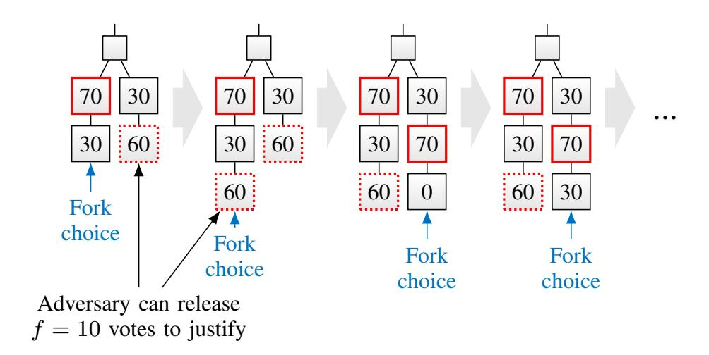

<span id="page-22-0"></span>Fig. 14. By releasing withheld Casper FFG votes late, the adversary can force honest validators to adopt a competing chain, due to the modification of the fork choice rule to respect 'the justified checkpoint of the greatest [depth]'. Over longer periods of time, the adversary forces honest validators to switch back and forth between a 'left' and a 'right' chain and thus liveness of finalizations is disrupted.

to a new checkpoint depth, and accumulates enough votes so that the adversary could again justify that new checkpoint in the future by releasing its f = 10 votes, the adversary releases its votes for the competing checkpoint of 'right' on the previous checkpoint depth. The deepest justified checkpoint is now on 'right', and honest validators switch to propose new blocks on 'right'. Note that the chains are now already set up such that the adversary can bounce honest validators back to 'left' once 'right' advances to a new deepest checkpoint depth.

As a result, a single brief period of asynchrony suffices to set the consensus system up such that both chains grow in parallel indefinitely. No checkpoint will ever be finalized, the protocol stalls. What is more, since the fork choice flip-flops between the two chains, the underlying blockchain is rendered unsafe by the modified fork choice rule. The bidirectional interdependency of Casper FFG and the blockchain gives the adversary major leverage over honest nodes on the proposal layer and thus enables this attack.

In contrast, an isolated partially synchronous BFT-style protocol, akin to Casper FFG, would have eventually recovered from the period of asynchrony and regained liveness, while remaining safe throughout. Similarly, an isolated typical dynamically available longest-chain protocol with intact fork choice rule could have suffered from security violations during and shortly after the period of asynchrony, but would have 'healed' eventually, *i.e.*, from some point on, no more safety violations occur and transactions get included in the ledger.