{0}------------------------------------------------

# Mind the Propagation of States

## New Automatic Search Tool for Impossible Differentials and Impossible Polytopic Transitions (Full Version)

Xichao Hu1,<sup>2</sup> , Yongqiang Li1,2() , Lin Jiao<sup>3</sup> , Shizhu Tian1,<sup>2</sup> , and Mingsheng Wang1,<sup>2</sup>

<sup>1</sup> State Key Laboratory of Information Security, Institute of Information Engineering, Chinese Academy of Sciences, Beijing China yongq.lee@gmail.com,{huxichao,tianshizhu,wangmingsheng}@iie.ac.cn <sup>2</sup> School of Cyber Security, University of Chinese Academy of Sciences, Beijing, China

<sup>3</sup> State Key Laboratory of Cryptology, Beijing, China jiaolin jl@126.com

Abstract. Impossible differentials cryptanalysis and impossible polytopic cryptanalysis are the most effective approaches to estimate the security of block ciphers. However, the previous automatic search methods of their distinguishers, impossible differentials and impossible polytopic transitions, neither consider the impact of key schedule in the single-key setting and the differential property of large S-boxes, nor apply to the block ciphers with variable rotations.

Thus, unlike previous methods which focus on the propagation of the difference or s-difference, we redefine the impossible differentials and impossible (s + 1)-polytopic transitions according to the propagation of state, which allow us to break through those limitations of the previous methods. Theoretically, we prove that traditional impossible differentials and impossible (s + 1)-polytopic transitions are equivalent to part of our redefinitions, which have advantages from broader view. Technically, we renew the automatic search model and design an SAT-based tool to evaluate our redefined impossible differentials and impossible (s + 1)-polytopic transitions efficiently. This tool is capable of searching for impossible differentials and impossible (s + 1)-polytopic transitions not only in the single-key setting but also in the related-key setting.

As a result, for GIFT64, we get the 6-round impossible differentials which cannot be detected by all previous tools. For PRINTcipher, we propose the first modeling method for the key-dependent permutation and key-dependent S-box. For MISTY1, we derive 902 4-round impossible differentials by exploiting the differential property of S-boxes. For RC5, we present the first modeling method for the variable rotation and get 2.5-round impossible differentials for each version of it. We also get the results of impossible differentials for GIFT, CHAM and SPECK in related-key setting. More remarkable, our tool can be used to evaluate the security of given cipher against the impossible differentials, and we prove that there exists no 5-round 1 input active word and 1 output active word impossible differentials for AES-128 even consider the relations of 3-round keys. Besides, we also get the impossible (s+1)-polytopic 

{1}------------------------------------------------

transitions for PRINTcipher, GIFT64, PRESENT, and RC5, all of which can cover more rounds than their corresponding impossible differentials as far as we know.

Keywords: Impossible Differentials · Impossible Polytopic Transitions · (s + 1)-ploygon · SAT.

## 1 Introduction

Impossible differential cryptanalysis was proposed by Biham et al. and Knudsen respectively, where Biham et al. used it to analyze the security of Skipjack [\[6\]](#page-36-0), and Knudsen utilized it to analyze the security of DEAL [\[16\]](#page-37-0). Up to now, impossible differential cryptanalysis has been applied to lots of block ciphers, such as AES [\[20\]](#page-37-1), SIMON [\[10\]](#page-36-1), XTEA [\[11\]](#page-36-2), and so on. There is no doubt that it is one of the most effective cryptanalytic approaches to evaluate the security of block ciphers.

In the impossible differential cryptanalysis, attackers derive the right keys by discarding the wrong keys that lead to the impossible differentials inherent to the given cipher. Thus how to find an impossible differential as longer as possible is the most essential and critical problem in regard to this kind of attacks.

Impossible (s + 1)-polytopic cryptanalysis was proposed by Tiessen [\[32\]](#page-38-0), which is a generalization of impossible differential cryptanalysis. Unlike the impossible differentials are constructed by considering the interdependencies of the differences of two plaintexts and the accordingly two ciphertexts, the distinguishers of impossible (s+ 1)-polytopic cryptanalysis, named impossible (s+ 1) polytopic transitions, are constructed by considering the interdependencies between the s-differences of (s + 1) plaintexts and (s + 1) ciphertexts [4](#page-1-0) .

In the last 20 years, using automatic tools to search the distinguishers becomes a new trend. The first automatic tool for the impossible differentials is presented by Kim et al. [\[15\]](#page-36-3), named U-method. Then, Luo et al. [\[19\]](#page-37-2) extended it as UID-method. After that, Wu and Wang [\[34\]](#page-38-1) introduced another method using the idea of solving equations, called WW-method. However, those tools to search impossible differentials cannot describe the details of S-boxes, which waste plenty of differential property of the propagation.

This problem is settled with the application of the Mixed Integer Linear Programming (MILP) method to symmetric cryptography. The MILP problem is a mathematical optimization problem that finds the minimum or maximum value of some objective function under the conditions of linear equations and inequalities of integer variables. Mouha et al. [\[24\]](#page-37-3) first introduced it to symmetric cryptography to find the lower bound on the number of active S-boxes for both differential and linear cryptanalysis. Later, Sun et al. [\[31\]](#page-38-2) proposed the modelling method to depict the valid differential propagation of small S-boxes (typically 4

<span id="page-1-0"></span><sup>4</sup> Convention. In our paper, the impossible (s + 1)-polytopic transition is uniformly defined for (s ≥ 2), excluding the case of the impossible differential, since it has been studied in-depth separately.

{2}------------------------------------------------

bits), and Fu et al. [\[14\]](#page-36-4) presented the modelling method to depict all the valid differential/linear characteristics propagations of modular addition. Thus, the differential propagation of any round for the small S-boxes based block ciphers and ARX block ciphers can be modeled by a set of linear inequalities accurately.

On that basis, Cui et al. [\[12\]](#page-36-5) proposed a MILP-based tool to search the impossible differentials for lightweight block ciphers, and an algorithm to verify the impossible differentials. Soon after, Sasaki and Todo [\[30\]](#page-38-3) presented a MILP-based tool to search the impossible differential for SPN block ciphers. In particular, they proposed the best search method at present for large S-boxes based block ciphers, named the arbitrary S-box mode, which only treats the large S-boxes as permutations in order to make their tool valid to detect the contradiction in linear components.

However, the previous automatic search tools for impossible differentials have the following limitations in general.

- Previous tools cannot take into account the key schedule in the single-key setting.
- Previous tools cannot consider the differential property of large S-boxes.
- Previous tools cannot be applied to the block ciphers with variable rotation.

As to impossible polytopic transitions, there was only a search method proposed for DES and AES in the original paper [\[32\]](#page-38-0). However, due to the limitation that the searching spaces increase rapidly with the number of rounds, this method can only be confined to a small number of rounds. Besides, this tool cannot take into account the key schedule in the single-key setting and be applied to the block ciphers with variable rotations either.

Our Contributions. In this paper, we define a series of new notations, spolygon to describe a tuple with s states, s-polygonal trail to depict the propagation of s-polygon, possible s-polygons and impossible s-polygons to depict the relations between two s-polygons.

Then, unlike the traditional impossible differentials and impossible (s + 1) polytopic transitions that are constituted according to the propagation of difference and s-difference, we redefine the impossible differentials and impossible (s + 1)-polytopic transitions based on the propagation of the s-polygon[5](#page-2-0) . Thus, the key schedule in the single-key setting can be considered in the construction of redefined impossible differentials and impossible (s+ 1)-polytopic transitions.

<span id="page-2-0"></span><sup>5</sup> This idea can be traced back to [\[23\]](#page-37-4). In [\[23\]](#page-37-4), Mironov et al. used the idea of the transition of states to search two states that satisfy a fixed differential path, which is the critical step to find a collision of the hash function. Recently, two papers [\[18,](#page-37-5)[29\]](#page-38-4) that also used the idea of the transition of states appeared in the ePrint. As we understand, [\[18\]](#page-37-5) applied the transition of two states to the non-linear layer. [\[29\]](#page-38-4) utilized the idea to determine whether a given differential path of ARX based block ciphers is compatible or not. In our paper, we exploit the idea of the transition of multi-states to search the impossible differential and the impossible (s+ 1)-polytopic transition for block ciphers.

{3}------------------------------------------------

We define the i-impossible differential (resp. i-impossible (s + 1)-polytopic transition) to represent the redefined impossible differential (resp. impossible (s+ 1) polytopic transition) which is constituted in the round key independent setting and d-impossible differential (resp. d-impossible (s + 1)-polytopic transition) to represent the redefined impossible differential (resp. impossible (s+ 1)-polytopic transition) which is constituted by considering the key schedule.

Next, we study the relation between our redefined impossible differential (resp. impossible (s+1)-polytopic transition) and traditional impossible differential (resp. impossible (s + 1)-polytopic transition). We show that the i-impossible differential (resp. i-impossible (s + 1)-polytopic transition) is equivalent to traditional impossible differential (resp. impossible (s+1)-polytopic transition) which is constructed by taking into account the inside property of S-boxes for the block ciphers with SPN or Feistel structures and the block cipher MISTY1.

Finally, we model the propagations of states by the statements in the CVC format of STP[6](#page-3-0) (a solver of the SAT problem) for each operation, and design an SAT-based unified automatic tool for searching the redefined impossible differential and impossible (s + 1)-polytopic transition. Since traditional impossible differential is equivalent to the i-impossible differential and traditional impossible (s+ 1)-polytopic transition is equivalent to the i-impossible (s+ 1)-polytopic transition, our tool can be used to search the traditional impossible differential and traditional impossible (s + 1)-polytopic transition. Furthermore, our tool has the following advantages.

Able to search the distinguishers by considering the impact of key schedule in the single-key setting. Our automatic search tool focuses on the propagations of states, which are impacted by the value of key. By adding the constraints of key variables according to the key schedule, it can be used to search the impossible differentials and impossible (s+1)-polytopic transitions in the single-key setting confirming the key schedule. As far as we know, this is the first automatic search tool that considers the impact of key schedule in the single-key setting for impossible differentials and impossible (s + 1)-polytopic transitions.

Able to search the distinguishers for the block ciphers with variable rotation. In this paper, by exploiting the conditional term of the CVC format, we propose a novel method to model the propagations of states for variable rotation. This method allows us to search the impossible differentials and impossible (s + 1)-polytopic transitions for block ciphers with variable rotation automatically. As far as we know, this is the first automatic search method for such type of block ciphers.

Able to search impossible differentials for block ciphers with large S-boxes by considering the differential property of large S-boxes. We make use of the conditional terms to model the propagations of states for large S-boxes. This way allows us to search the impossible differentials for the block ciphers with large S-boxes by considering the differential property

<span id="page-3-0"></span><sup>6</sup> http://stp.github.io/

{4}------------------------------------------------

of large S-boxes. As far as we know, this is the first automatic tool to search the impossible differentials for such ciphers taking account in the differential property of large S-boxes.

New proving tool for resisting impossible differentials in aspect of cipher design. Our tool not only can be used to evaluate the security of block ciphers against traditional impossible differentials for block ciphers with large S-box in the case of considering the differential property of large S-boxes, but also can be used to evaluate the security of block ciphers (includes block ciphers with key-dependent permutation) against the impossible differentials in the case of considering the key schedule in the single-key setting. It is very favorable in aspect of block ciphers design and assessment.

We apply our tool to various block ciphers, these results can be divided into three aspects[7](#page-4-0) . All the new distinguishers we got are shown in the Table [1](#page-6-0) and Table [2.](#page-7-0)

### Deriving new impossible differentials.

- For GIFT64 [\[3\]](#page-35-0), we get the 6-round impossible differentials, which cannot be detected by Cui et al.'s method or Sasaki et al.'s method. This result shows that, our tool can detect more contradictions than the previous methods.
- For PRINTcipher48/96 [\[17\]](#page-37-6), we can not only give the first modeling method for the key-dependent permutation, but also give the first direct modeling method for the key-dependent S-box, which is consisted of the key-dependent permutation and the fixed S-box. Take either of the two modeling methods, by considering all the details of the key schedule, we found 730 4-round impossible differentials for PRINTcipher48 and 234 5-round impossible differentials for PRINTcipher96.
- For MISTY1 [\[22\]](#page-37-7), we found 902 4-round i-impossible differentials by exploiting the differential property of S-boxes, while only 28 4-round i-impossible differentials were got by implementing the arbitrary S-box mode of Sasaki et al.'s method.
- For RC5-32/64/128 [\[26\]](#page-37-8), we propose the first modeling method for variable rotation, which allows us to get the 2.5-round impossible differentials for them in the key independent setting.

<span id="page-4-0"></span><sup>7</sup> Illustrantion. Note that, when to search the r-round distinguishers by considering the key schedule in our model, different beginning round lead to different final models, since the round constants are different from each round. To a common format, we place the distinguishers of our model in the 1st round by default (except GIFT64, since the round key is not XORed with plaintext in the first round, we place the distinguishers in the 2nd). That is, when we say a distinguisher is an r-round distinguisher, it is an r-round distinguisher placed from 1st round to the r-th round. Similarly, when we say there exists no r-round impossible differentials in the search space, it means that for all the input differences and output differences where the input differences placed at the 1st round and the output differences placed at the r-th round, the differences cannot be connected. Actually, in other cases that the distinguishers do not begin with the 1st round, the distinguisher can be searched similarly.

{5}------------------------------------------------

Evaluating the resistance against the impossible differentials. Besides applying our tool directly, we also propose three phases technique and inside value technique to speed up our proving process.

- For GIFT64, PRESENT [\[8\]](#page-36-6), Midori64 [\[2\]](#page-35-1), PRINTcipher48, and PRINTcipher96, we prove that, in the search space where the input difference only actives one S-box in the first substitution and the output difference only actives one S-box in the last substitution, there exists no 7-round, 7-round, 6 round, 5-round, and 6-round impossible differentials for GIFT64, PRESENT, Midori64, PRINTcipher48, and PRINTcipher96 even taking account in the details of the key schedule.
- For AES [\[13\]](#page-36-7), by adopting the new proposed three phases technique, we prove that even considering the relations of middle three-round keys, there still exists no 5-round 1 input active word and 1 output active word impossible differentials.
- For 5-round MISTY1 [\[22\]](#page-37-7) with the FL layers placed at the even rounds, by adopting the three phases technique and inside value technique, we prove that there exists no 1 input active bit and 1 output active bit impossible differentials.

Resulting in new impossible (s + 1)-polytopic transition (s ≥ 2). Besides applying our tool directly, we further propose the step by step strategy to speed up the search.

- For PRINTcipher, by considering all the details of the key schedule, we obtain the 6-round d-impossible 3-polytopic transition and 7-round d-impossible 4 polytopic transition for PRINTcipher48, and 7-round d-impossible 3-polytopic transition and 8-round d-impossible 4-polytopic transition for PRINTcipher96. Moreover, we investigate the impact of the restraints of the xor keys (i.e. the keys which are xored with the state) and control keys (i.e. the keys which are used to control the key-dependent permutation). The result shows that, both the restraints of the xor keys and control keys will lead to more contradictions.
- For GIFT64, we get a 7-round d-impossible 3-polytopic transition.
- For RC5-32, we get 108 3-round i-impossible 3-polytopic transitions. Similarly, we get a 3-round i-impossible 3-polytopic transition for RC5-64.
- For PRESENT, we get a 7-round i-impossible 4-polytopic transition.

### Resulting in new related-key impossible differentials.

- For GIFT, we set the input difference α = 0, output difference β = 0, and set the key difference such that the difference activates one S-box after the first key xored operation in the forward direction. Finally, we get 48 12 round related-key impossible differentials and no longer-round distinguisher is found under this search space for GIFT64, and 96 10-round related-key impossible differentials and no longer-round distinguisher is found under this search space for GIFT128.

{6}------------------------------------------------

- For CHAM [\[28\]](#page-38-5), we search an d0-round related-key differential characteristics with probability 1 (α0, αd<sup>0</sup> ) and an d2-round related-key differential characteristics with probability 1 (αd0+d<sup>1</sup> , αd0+d1+d<sup>2</sup> ) under the key difference υ, where α<sup>i</sup> means the difference at round i. Then, we determine whether (αd<sup>0</sup> , αd0+d<sup>1</sup> ) is an r1-round related-key impossible differentials under the key differences. Finally, we find that the number of rounds of the impossible differentials of GIFT-64/128 and GIFT-128/256 with the longest number of rounds is all 26.
- For SPECK [\[5\]](#page-36-8), we search for the r<sup>0</sup> related-key differential with probability 1 (α, γ, κ), where α is the input difference, γ is the output difference and κ is the key difference. Then we run our method to search for the β such that (γ, β) is an r-round related-key impossible differential under the key differences, where β is 1 active bit difference. Finally, we find the maximum number of rounds of SPECK-2w/4w(w = 16, 24, 32, 64) is 7, and the maximum number of rounds of SPECK-2w/3w(w = 24, 32, 48, 64) is 6.

<span id="page-6-0"></span>Table 1. Overview of new distinguishers in the single-key setting

| Block ciphers | Imp. Diff | Remark of Imp. Diff          |    | Imp 3-poly Imp 4-poly |
|---------------|-----------|------------------------------|----|-----------------------|
| GIFT64        | 6*        | more distinguishers than [3] | 7* | -                     |
| PRINTcipher48 | 4*        | first                        | 6* | 7*                    |
| PRINTcipher96 | 5*        | first                        | 7* | 8*                    |
| MISTY1        | 4         | more distinguishers          | -  | -                     |
| RC5-32/64     | 2.5       | first                        | 3  | -                     |
| RC5-128       | 2.5       | first                        | -  | -                     |
| PRESENT       | -         | -                            | 7  | -                     |

Imp. Diff means impossible differential, Imp 3-poly(resp. 4-poly) means impossible 3-polytopic(resp. 4-polytopic) transition.

The number add \* means the distinguishers we got in the case of considering key schedule, while the number without \* means the distinguishers we got in the key independent setting.

Outline. We introduce the notations and related work in Section [2.](#page-6-1) Our redefined impossible differentials and impossible (s + 1)-polytopic transitions and the relations between our redefinitions and traditional definitions are shown in Section [3.](#page-9-0) The SAT modeling methods and our search algorithm are detailed in Section [4.](#page-16-0) We apply our method to impossible differentials from the cryptanalysis aspect and design aspect in Section [5](#page-21-0) and Section [6,](#page-29-0) respectively. In Section [7,](#page-32-0) we apply our method to impossible polytopic transitions. In Section [8,](#page-35-2) we conclude this paper.

## <span id="page-6-1"></span>2 Preliminaries

## 2.1 Notations

The following notations are used in this paper.

{7}------------------------------------------------

Table 2. Overview of new distinguishers of related-key impossible differentials

<span id="page-7-0"></span>

| Block cipher  |    |      | round number time (minutes) |
|---------------|----|------|-----------------------------|
| GIFT64        | 12 | 48   | 1.24                        |
|               | 16 | none | 12.46                       |
| GIFT128       | 10 | 96   | 16.20                       |
|               | 12 | none | 272.20                      |
| CHAM-64/128   | 26 | 7    | 0.97                        |
|               | 27 | none | 0.26                        |
| CHAM-128/256  | 26 | 3    | 0.84                        |
|               | 27 | none | 0.56                        |
| SPECK-32/64   | 7  | 49   | 0.90                        |
|               | 8  | none | 2.83                        |
| SPECK-48/96   | 7  | 75   | 3.87                        |
|               | 8  | none | 11.91                       |
| SPECK-64/128  | 7  | 99   | 5.08                        |
|               | 8  | none | 23.56                       |
| SPECK-128/256 | 7  | 195  | 21.86                       |
|               | 8  | none | 88.15                       |
| SPECK-48/72   | 6  | 75   | 1.52                        |
|               | 7  | none | 18.94                       |
| SPECK-64/96   | 6  | 99   | 2.89                        |
|               | 7  | none | 32.22                       |
| SPECK-96/144  | 6  | 147  | 7.58                        |
|               | 7  | none | 57.70                       |
| SPECK-128/192 | 6  | 195  | 14.96                       |
|               | 7  | none | 109.05                      |

{8}------------------------------------------------

- $x^{m,s}$ : the tuple  $(x_0,\ldots,x_{s-1})$ , where  $x_i \in \mathbb{F}_2^m \ (0 \le i \le s-1)$ .
- $x_i^{m,s}$ : the tuple  $(x_{i,0}, \ldots, x_{i,s-1})$ , where  $x_{i,j} \in \mathbb{F}_2^m$   $(0 \le j \le s-1)$ .  $x^{m,s}||y^{m,s}$ : the tuple  $(x_0||y_0, \ldots, x_{s-1}||y_{s-1})$ , where  $x_i, y_i \in \mathbb{F}_2^m$   $(0 \le i \le s-1)$ s - 1).
- $x^{m,s+1} \triangleright \alpha^{m,s}$ : the tuple  $x^{m,s+1}$  satisfy  $x_0 \oplus x_{j+1} = \alpha_j \ (0 \le j \le s-1)$ .
- $0^p1^q$ : the concatenation of p successive 0s and q successive 1s.
- $a^pb^q$ : the concatenation of p-bit constant a and q-bit constant b.
- W(a): the hamming weight of a, i.e., the 1's number in the bit representation of a.
- $e_I^n$ : an n bits value, whose i-th bit is 1 for  $i \in I$ , and 0 otherwise.
- BC(n, m, l): the set of all iterated block ciphers whose block size is n-bit, master key size is m-bit, and round key size is l-bit.
- $E_k^r(x)$ : the output of encryption  $E \in BC(n,m,l)$  on the state  $x \in \mathbb{F}_2^n$  after r-round under  $k \in (\mathbb{F}_2^l)^r$ .
- $E_k^r(x^{n,s})$ : the tuple  $(E_k^r(x_0), \dots, E_k^r(x_{s-1}))$ .
- $IKS_r^l$ : the set  $\{(k_1,\ldots,k_r)|k_i\in\mathbb{F}_2^l,1\leq i\leq r\}$ .  $DKS_r^{m,l}$ : the set  $\{(k_1,\ldots,k_r)|k\in\mathbb{F}_2^m,k_i\in\mathbb{F}_2^l,k_i=G_i(k),1\leq i\leq r\}$ , where  $G_i$  denotes the key schedule to generate the round key  $k_i$  from the master key k for a block cipher  $E \in BC(n, m, l)$
- $D_{\alpha}^{i,j}$ : a  $4\times 4$  matrix over the finite fields  $\mathbb{F}_2^8$  which all the positions are 0 except the position (i, j) equals  $\alpha$ .

#### A Brief Introduction of Impossible Differentials and Impossible 2.2(s+1)-polytopic Transitions

Impossible differential is the distinguisher of impossible differential cryptanalysis, and impossible (s+1)-polytopic transition is the distinguisher of the impossible polytopic cryptanalysis. Here, we only recall the definitions of impossible (s+1)-polytopic transition, since impossible differential is the special case of s=1. First, let us recall the definition of s-polytope and s-difference.

**Definition 1** (s-polytope [32]). An s-polytope in  $\mathbb{F}_2^n$  is an s-tuple of values in  $\mathbb{F}_2^n$ .

**Definition 2** (s-difference [32]). An s-difference over  $\mathbb{F}_2^n$  is an s-tuple of values in  $\mathbb{F}_2^n$ . For an (s+1)-polytope  $(m_0, m_1, \ldots, m_s)$ , the corresponding sdifference is definited as  $(m_0 \oplus m_1, m_0 \oplus m_2, \dots, m_0 \oplus m_{s-1})$ .

Next, we recall the propagation rule of s-difference and the valid (s+1)polytopic trail.

Definition 3 (The Propagation Rule of The s-difference [32]). Let f:  $\mathbb{F}_2^n \to \mathbb{F}_2^q$  be a function. For the input s-difference  $\boldsymbol{\alpha^{n,s}}$  and the output sdifference  $\beta^{q,s}$ , if there exists x such that,  $f(x \oplus \alpha_i) \oplus f(x) = \beta_i (0 \le i \le s - 1)$ , we call that  $\alpha^{n,s}$  can propagate to  $\beta^{q,s}$ , denoted as  $\alpha^{n,s} \stackrel{f}{\to} \beta^{q,s}$ . Otherwise, we call that  $\alpha^{n,s}$  cannot propagate to  $\beta^{q,s}$ , denoted as  $\alpha^{n,s} \stackrel{f}{\nrightarrow} \beta^{q,s}$ .

{9}------------------------------------------------

**Definition 4 (Valid** (s+1)-polytopic Trail [32]). Let  $f: \mathbb{F}_2^n \to \mathbb{F}_2^n$  be a function that is the iterated composition of round functions  $f_i: \mathbb{F}_2^n \to \mathbb{F}_2^n$ :

$$f := f_r \circ \cdots \circ f_2 \circ f_1.$$

Let  $\alpha_0^{n,s}$  be the input s-difference and  $\alpha_r^{n,s}$  be the output s-difference. Then, a valid (s+1)-polytopic trail for  $(\alpha_0^{n,s}, \alpha_r^{n,s})$  on f is an (r+1)-tuple  $(\alpha_0^{n,s}, \alpha_1^{n,s}, \ldots, \alpha_r^{n,s})$ , where  $\alpha_i^{n,s} \xrightarrow{f_{i+1}} \alpha_{i+1}^{n,s} (0 \le i \le r-1)$ .

By exploiting the definition of the valid (s+1)-polytopic trail, the definitions of possible (s+1)-polytopic transition and impossible (s+1)-polytopic transition can be re-expressed as follows.

**Definition 5 (Possible** (s+1)-polytopic Transition [32]). A pair of input and output s-differences  $(\Delta_i^{n,s}, \Delta_0^{n,s})$  is called an r-round possible (s+1)-polytopic transition if and only if there exists an r-round valid (s+1)-polytopic trail for  $(\Delta_i^{n,s}, \Delta_0^{n,s})$ .

**Definition 6 (Impossible** (s+1)-polytopic Transition [32]). A pair of input and output s-differences  $(\Delta_i^{n,s}, \Delta_0^{n,s})$  is called an r-round impossible (s+1)-polytopic transition if and only if there exists no r-round valid s+1-polytopic trail for  $(\Delta_i^{n,s}, \Delta_0^{n,s})$ .

### 2.3 SAT Problem & STP

The Boolean Satisfiability Problem (SAT) is a classic scientific computation problem aiming to determine whether a given boolean formula has a solution. STP is the openly available solver for the SAT problem, which supports the CVC format as the file-based input formats.

When to solve an SAT problem, we first model it by the statements in CVC format and save those statements as a file. Then, we invoke the STP for this file. If the target SAT problem has not a solution, STP will return "Valid.". Otherwise, it will return a solution of the SAT problem and "Invalid.".

In particular, it is worth to mention that the CVC format supports the conditional term, i.e., the statement "IF a THEN b ELSE c ENDIF", where a is a boolean term, and b and c are bitvector terms. By exploiting the conditional term, we give our modeling methods for S-boxes and variable rotation in Sections 4.1.

# <span id="page-9-0"></span>3 New Definitions of Impossible Differentials and Impossible (s+1)-polytopic Transitions

In this section, we define the notations of s-polygon, possible s-polygons, and impossible s-polygons. Based on this, we redefine the impossible differentials and impossible (s+1)-polytopic transitions. Then, we study the relations between our redefinitions and traditional definitions of impossible differentials and impossible (s+1)-polytopic transitions.

{10}------------------------------------------------

# 3.1 New Definitions of Impossible Differentials and Impossible (s+1)-Polytopic Transitions

Let us think over the definitions of traditional impossible differentials and impossible (s+1)-polytopic transitions. For  $E \in BC(n,m,l)$ , suppose  $(\Delta_{\boldsymbol{i}}^{n,s}, \Delta_{\boldsymbol{o}}^{n,s})$  is an r-round traditional impossible (s+1)-polytopic transition of it. Then, for  $\forall k \in (F_2^l)^r$ ,  $\forall \boldsymbol{x_i}^{n,s+1} \rhd \Delta_{\boldsymbol{i}}^{n,s}$  and  $\forall \boldsymbol{y_i}^{n,s+1} \rhd \Delta_{\boldsymbol{o}}^{n,s}$ , it holds  $E_k^r(\boldsymbol{x_i}^{n,s+1}) \neq \boldsymbol{y_i}^{n,s+1}$ . In particular, if  $(\Delta_i, \Delta_0)$  is an r-round impossible differential. Then, for  $\forall k \in (F_2^l)^r$ ,  $\forall x \in \mathbb{F}_2^n$  and  $\forall y \in \mathbb{F}_2^n$ , it holds  $(E_k^r(x), E_k^r(x \oplus \Delta_i)) \neq (y, y \oplus \Delta_o)$ . Thus, it is important to research the relations between two (resp. s+1) input states and two (resp. s+1) output states for forming the impossible differentials (resp.impossible (s+1)-polytopic transitions). To investigate such relations, we define the s-polygon firstly.

**Definition 7** (s-polygon). For  $\forall E \in BC(n, m, l)$ , its s-polygon is a tuple with s elements, where each element belongs to  $\mathbb{F}_2^n$ .

For an iterated block cipher, the s-polygon propagates through round by round, which constitutes the s-polygonal trail.

**Definition 8** (s-polygonal Trail). Let  $E \in BC(n, m, l)$  and  $r \in \mathbb{Z}$ . For any s-polygon  $\mathbf{x}^{n,s}$  and  $\forall k = (k_1, \ldots, k_r) \in (\mathbb{F}_2^l)^r$ , we have the following chain of propagation:

$$x^{n,s} \to E^1_{(k_1)}(x^{n,s}) \to E^2_{(k_1,k_2)}(x^{n,s}) \to \cdots \to E^r_k(x^{n,s}).$$

We call  $(\mathbf{x}^{n,s}, E^1_{(k_1)}(\mathbf{x}^{n,s}), \dots, E^r_k(\mathbf{x}^{n,s}))$  an r-round s-polygonal trail. Moreover, if  $k \in IKS^l_r$ , the trail is called an r-round i-s-polygonal trail; if  $k \in DKS^{m,l}_r$ , the trail is called an r-round d-s-polygonal trail.

Based on the definitions of s-polygon and s-polygonal trail, according to the compatibility of a pair of input and output s-polygons, the possible s-polygon and impossible s-polygon are defined as follows.

**Definition 9 (Possible s-polygons).** Let  $E \in BC(n, m, l)$ , a pair of input and output s-polygons  $(\mathbf{x}^{n,s}, \mathbf{y}^{n,s})$  is called r-round possible s-polygons of E, if there exists  $k = (k_1, \ldots, k_r) \in (\mathbb{F}_2^l)^r$  and s-polygonal trail  $(\mathbf{x}^{n,s}, E^1_{(k_1)}(\mathbf{x}^{n,s}), \ldots, E^r_k(\mathbf{x}^{n,s}))$  s.t.  $y_i = E^r_k(x_i)(0 \le i \le s-1)$ . Moreover, if  $k \in IKS^l_r$ ,  $(\mathbf{x}^{n,s}, \mathbf{y}^{n,s})$  is called r-round i-possible s-polygons; if  $k \in DKS^{m,l}_r$ ,  $(\mathbf{x}^{n,s}, \mathbf{y}^{n,s})$  is called r-round d-possible s-polygons.

**Definition 10 (Impossible s-polygons).** Let  $E \in BC(n, m, l)$ , a pair of input and output s-polygons  $(\mathbf{x}^{n,s}, \mathbf{y}^{n,s})$  is called r-round i-impossible s-polygons (resp. r-round d-impossible s-polygons) of E, if  $(\mathbf{x}^{n,s}, \mathbf{y}^{n,s})$  is not the r-round i-possible s-polygons (resp. r-round d-possible s-polygons).

Now, based on the definition of impossible s-polygons, we propose two definitions of impossible (s+1)-polytopic transitions: i-impossible (s+1)-polytopic transition and d-impossible (s+1)-polytopic transition.

{11}------------------------------------------------

Definition 11 (The *i*-impossible (resp.*d*-impossible) (s+1)-polytopic Transition). Let  $E \in BC(n,m,l)$ , a pair of input and output tuples  $(\boldsymbol{\alpha}^{n,s},\boldsymbol{\beta}^{n,s})$  is called an r-round *i*-impossible (resp.*d*-impossible) (s+1)-polytopic transition, if for  $\forall \boldsymbol{x}^{n,s+1} \rhd \boldsymbol{\alpha}^{n,s}$  and  $\forall \boldsymbol{y}^{n,s+1} \rhd \boldsymbol{\beta}^{n,s}$ ,  $(\boldsymbol{x}^{n,s+1},\boldsymbol{y}^{n,s+1})$  are r-round *i*-impossible (resp.*d*-impossible) (s+1)-polygons.

Here, we give the definitions of *i*-impossible differential and *d*-impossible differential independently for clarity, while actually impossible differential is a particular case of impossible (s + 1)-polytopic transition.

Definition 12 (The *i*-impossible (resp. *d*-impossible) Differential). Let  $E \in BC(n, m, l)$ ,  $\alpha \in \mathbb{F}_2^n$ , and  $\beta \in \mathbb{F}_2^n$ ,  $(\alpha, \beta)$  is called an *r*-round *i*-impossible (resp. *d*-impossible) differential, if for  $\forall (x_0, x_1) \in \{(\alpha_0, \alpha_1) \in \mathbb{F}_2^n \times \mathbb{F}_2^n | \alpha_0 \oplus \alpha_1 = \alpha\}$  and  $\forall (y_0, y_1) \in \{(\beta_0, \beta_1) \in \mathbb{F}_2^n \times \mathbb{F}_2^n | \beta_0 \oplus \beta_1 = \beta\}$ ,  $(x_0, x_1)$  and  $(y_0, y_1)$  are *r*-round *i*-impossible (resp. *d*-impossible) 2-polygons.

According to the definitions of d-possible (s + 1)-polygons and i-possible (s + 1)-polygons, the relation between i-impossible (s + 1)-polytopic transition and d-impossible (s + 1)-polytopic transition is obviously as follows.

**Theorem 1.** Let  $E \in BC(n, m, l)$ . Then an i-impossible (s + 1)-polytopic transition of E must be a d-impossible (s+1)-polytopic transition of E. In particular, an i-impossible differential of E must be a d-impossible differential of E.

# 3.2 The Equivalence of *i*-impossible (s + 1)-polytopic Transitions and Traditional Impossible (s + 1)-polytopic Transitions

SPN structure and Feistel structure are widely used in the design of block ciphers. In this subsection, we show that the *i*-impossible (s + 1)-polytopic transitions are equivalent to traditional impossible (s + 1)-polytopic transitions for the block ciphers with SPN structure or Feistel structure. Moreover, with the same approach, the equivalence also holds for the block cipher MISTY1. Note that, since impossible differentials are the particular case of impossible (s + 1)-polytopic transitions, we are not going to state the equivalency for impossible differentials solely here.

First, for narrative purposes, we define a class of round function, which is widely used in block ciphers.

**Definition 13 (Common Round Function).** A function  $F_r$  is called common round function (CRF), if it can be represented as  $F_r = (P'_r \circ S_r \circ P_r \circ K_r) \circ \cdots \circ (P'_1 \circ S_1 \circ P_1 \circ K_1) \circ (P'_0 \circ S_0 \circ P_0)$ , where  $S_i(0 \leq i \leq r)$  denotes the substitution layer which is composed of a set of S-boxes in parallel,  $P_i(0 \leq i \leq r)$  and  $P'_i(0 \leq i \leq r)$  denote the linear permutation layers, and  $K_i(1 \leq i \leq r)$  denotes the key mixing layer, where the key is fully Xored with the state. In particular, in the case of r = 0, denote  $F_0 = (P'_0 \circ S_0 \circ P_0)$ .

{12}------------------------------------------------

The above definition of CRF includes a lot of round functions, which are broadly used in block ciphers. For example, the round function of AES [13] is of the "SP" structure, in which the substitution layer precedes the linear layer. It is the CRF in the case of r=0 and  $P_0$  is the identical permutation. The round function of Prince [9] in the last half rounds is of the "PS" structure, in which the linear layer precedes the substitution layer. It is the CRF in the case of r=0 and  $P_0'$  is the identical permutation. The round function of RoadRunneR [4] is of the "SPKSPKSPKS" structure. It is the CRF in the case of r=3 and  $P_3$  is the identical permutation.

Since the common round function is widely used in block ciphers, we study the relationship between the valid (s + 1)-polytopic transitions and i-possible (s + 1)-polygons of it.

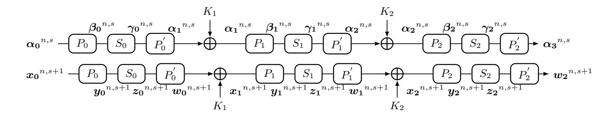

<span id="page-12-0"></span>**Fig. 1.** The Valid (s+1)-polytopic Trail and (s+1)-polygonal Trail for CRF

<span id="page-12-1"></span>Theorem 2 (The Equivalence of CRF). Let  $F_r$  be a CRF. Then,  $(\alpha_0^{n,s}, \alpha_{r+1}^{n,s})$  is a valid polytopic transition of  $F_r$  if and only if there exist i-possible (s+1)-polygons  $(\mathbf{x_0}^{n,s+1}, \mathbf{w_r}^{n,s+1})$  of  $F_r$ , where  $\mathbf{x_0}^{n,s+1} \triangleright \alpha_0^{n,s}$  and  $\mathbf{w_r}^{n,s+1} \triangleright \alpha_{r+1}^{n,s}$ .

*Proof.* We only prove this theorem in the case of r=2. The other cases can be proved analogously.

Suppose  $(\boldsymbol{\alpha_0}^{n,s}, \boldsymbol{\alpha_3}^{n,s})$  is a valid polytopic transition of  $F_2$ . Then there exists a valid (s+1)-polytopic trail  $(\boldsymbol{\alpha_0}^{n,s}, \boldsymbol{\alpha_1}^{n,s}, \boldsymbol{\alpha_2}^{n,s}, \boldsymbol{\alpha_3}^{n,s})$ , as shown in the upper half of Figure 1. For  $0 \le i \le 2$ , since  $(\beta_i^{n,s}, \gamma_i^{n,s})$  is a possible (s+1)-polytopic transition of  $S_i$ , there exists  $a_i$  such that  $S_i(a_i) \oplus S_i(a_i \oplus \beta_{i,j}) = \gamma_{i,j} (0 \le j \le s-1)$ . Let  $\boldsymbol{y_i}^{n,s+1} = (y_{i,0}, \ldots, y_{i,s})$  and  $\boldsymbol{z_i}^{n,s+1} = (z_{i,0}, \ldots, z_{i,s})$ , where  $y_{i,0} = a_i, y_{i,j+1} = a_i \oplus \beta_{i,j}, z_{i,0} = S_i(a_i)$  and  $z_{i,j+1} = S(a_i) \oplus \gamma_{i,j}$ , then we have  $S(y_{i,j}) = z_{i,j} (0 \le j \le s)$ . Denote  $\boldsymbol{x_i}^{n,s+1} = (x_{i,0}, \ldots, x_{i,s})$  and  $\boldsymbol{w_i}^{n,s+1} = (w_{i,0}, \ldots, w_{i,s})$ , where  $x_{i,j} = P_i^{-1}(y_{i,j})$  and  $w_{i,j} = P_i'(z_{i,j})(0 \le j \le s)$ . Since  $\alpha_{i,j} = P_i^{-1}(\beta_{i,j})$ , we have  $x_{i,0} \oplus x_{i,j+1} = \alpha_{i,j} (0 \le j \le s-1)$ . Thus, for  $1 \le i \le 2$ , we have  $w_{i-1,0} \oplus w_{i-1,j+1} = \alpha_{i,j} = x_{i,0} \oplus x_{i,j+1} (0 \le j \le s-1)$ . Let  $K_i = w_{i-1,0} \oplus x_{i,0}$ , then we have  $x_{i,j} = w^{i-1,j} \oplus K_i (0 \le j \le s)$ . Therefore, we have constructed i-possible (s+1)-polygons of  $F_2$ , which is  $(\boldsymbol{x_0}^{n,s+1}, \boldsymbol{w_2}^{n,s+1})$  with  $\boldsymbol{w_2}^{n,s+1} \triangleright \boldsymbol{\alpha_3}^{n,s}$  and  $\boldsymbol{x_0}^{n,s+1} \triangleright \boldsymbol{\alpha_0}^{n,s}$ , as shown in the lower half of Figure 1.

Since all the procedures above are invertible, it is easy to show that if there exist  $x_0^{n,s+1} \triangleright \alpha_0^{n,s}$  and  $w_2^{n,s+1} \triangleright \alpha_3^{n,s}$ , such that  $(x_0^{n,s+1}, w_2^{n,s+1})$  is the

{13}------------------------------------------------

i-possible (s+1)-polygons of  $F_2$ , then  $(\boldsymbol{\alpha_0}^{n,s}, \boldsymbol{\alpha_3}^{n,s})$  is the valid polytopic transition of  $F_2$ .

With the same technique, we also can show the equivalence between traditional impossible (s+1)-polytopic transition and the i-impossible (s+1)-polytopic transition for the block ciphers with SPN structure and Feistel structure as follows.

Theorem 3 (The Equivalence of SPN Structure Block Ciphers). Let  $E \in BC(n, m, l)$  be an SPN structure block cipher whose round function is a CRF, and the round keys are fully Xored with the state. Then,  $(\boldsymbol{\alpha_0}^{n,s}, \boldsymbol{\alpha_r}^{n,s})$  is an r-round traditional impossible (s+1)-polytopic transition if and only if it is an r-round i-impossible (s+1)-polytopic transition.

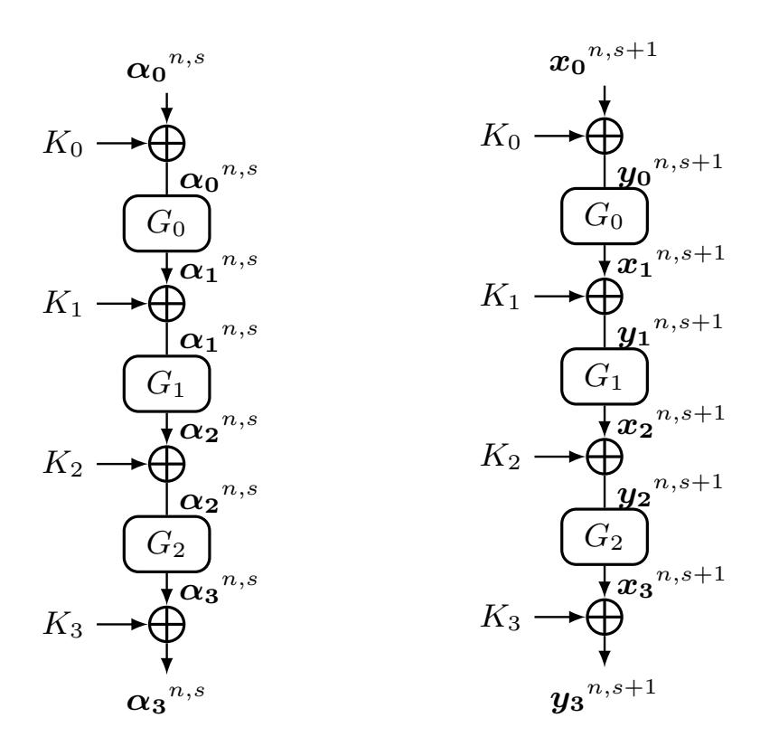

<span id="page-13-0"></span>**Fig. 2.** The valid (s + 1)-polytopic trail (left) and (s + 1)-polygonal trail (right) for 3-round SPN

*Proof.* This is equivalent to prove that  $(\boldsymbol{\alpha_0}^{n,s}, \boldsymbol{\alpha_r}^{n,s})$  is an r-round valid (s+1)polytopic transition of E if and only if there exist r-round i-possible (s+1)polygons  $(\boldsymbol{x_0}^{n,s+1}, \boldsymbol{y_r}^{n,s+1})$  of E, where  $\boldsymbol{x_0}^{n,s+1} \triangleright \boldsymbol{\alpha_0}^{n,s}$  and  $\boldsymbol{y_r}^{n,s+1} \triangleright \boldsymbol{\alpha_r}^{n,s}$ .

In particular, we prove this in the case of r=3. The other cases can be proved analogously.

Suppose  $(\alpha_0^{n,s}, \alpha_3^{n,s})$  is an 3-round possible (s+1)-polytopic transition. Then, there exists an 3-round valid (s+1)-polytopic trail, as shown in the left of Figure 2. For  $0 \le i \le 2$ , since  $(\alpha_i^{n,s}, \alpha_{i+1}^{n,s})$  is the valid (s+1)-polytopic transition of  $G_i$ , according to the Theorem 2, there exist  $y_i^{n,s+1} > \alpha_i^{n,s}$  and

{14}------------------------------------------------

 $x_{i+1}^{n,s+1} > \alpha_{i+1}^{n,s}$  such that  $(y_i^{n,s+1}, x_{i+1}^{n,s+1})$  is the *i*-possible (s+1)-polygons. For  $1 \leq i \leq 2$ , let  $K_i = y_{i,0} \oplus x_{i,0}$ , since  $y_{i,0} \oplus y_{i,j+1} = \alpha_{i,j} = x_{i,0} \oplus x_{i,j+1} (0 \leq j \leq s-1)$ , then we have  $y_{i,j} = x_{i,j} \oplus K_i$ . Let  $x_0^{n,s+1} = y_0^{n,s+1}$ ,  $y_3^{n,s+1} = x_3^{n,s+1}$ ,  $K_0 = 0$  and  $K_3 = 0$ , we have  $y_{0,j} = x_{0,j} \oplus K_0$  and  $y_{3,j} = x_{3,j} \oplus K_3 (0 \leq j \leq s)$ . Therefore, we have constructed 3-round *i*-possible (s+1)-polygons of E, which is  $(x_0^{n,s+1}, y_3^{n,s+1})$  with  $x_0^{n,s+1} > \alpha_0^{n,s}$  and  $y_3^{n,s+1} > \alpha_3^{n,s}$ , as shown in the right of Figure 2.

Since all the procedures above are invertible, it is easy to show that if there exist  $\mathbf{x_0}^{n,s+1} \triangleright \boldsymbol{\alpha_0}^{n,s}$  and  $\mathbf{y_3}^{n,s+1} \triangleright \boldsymbol{\alpha_3}^{n,s}$ , such that  $(\mathbf{x_0}^{n,s+1}, \mathbf{y_3}^{n,s+1})$  is 3-round *i*-possible (s+1)-polygons of E, then  $(\boldsymbol{\alpha_0}^{n,s}, \boldsymbol{\alpha_r}^{n,s})$  is an 3-round valid polytopic transition.

Theorem 4 (The Equivalence of Feistel Structure Block Ciphers). Let  $E \in BC(2n, m, l)$  be a Feistel structure block cipher whose round function is a CRF and the round keys are fully Xored with the branch. Then,  $(\boldsymbol{\alpha_0}^{n,s}||\boldsymbol{\beta_0}^{n,s}, \boldsymbol{\alpha_r}^{n,s}||\boldsymbol{\beta_r}^{n,s})$  is an r-round traditional impossible (s+1)-polytopic transition if and only if it is an r-round i-impossible (s+1)-polytopic transition.

*Proof.* This is equivalent to prove that  $(\boldsymbol{\alpha_0}^{n,s}||\boldsymbol{\beta_0}^{n,s},\boldsymbol{\alpha_r}^{n,s}||\boldsymbol{\beta_r}^{n,s})$  is an r-round valid (s+1)-polytopic transition if and only if there exists r-round i-possible (s+1)-polygons  $(\boldsymbol{x_0}^{n,s+1}||\boldsymbol{y_0}^{n,s+1},\boldsymbol{x_r}^{n,s+1}||\boldsymbol{y_r}^{n,s+1})$ , where  $(\boldsymbol{x_0}^{n,s+1}||\boldsymbol{y_0}^{n,s+1}) \triangleright (\boldsymbol{\alpha_0}^{n,s}||\boldsymbol{\beta_0}^{n,s})$  and  $(\boldsymbol{x_r}^{n,s+1}||\boldsymbol{y_r}^{n,s+1}) \triangleright (\boldsymbol{\alpha_r}^{n,s}||\boldsymbol{\beta_r}^{n,s})$ . In particular, we prove this in the case of r=3. The other cases can be proved analogously.

Suppose  $(\boldsymbol{\alpha_0}^{n,s}||\boldsymbol{\beta_0}^{n,s},\boldsymbol{\alpha_3}^{n,s}||\boldsymbol{\beta_3}^{n,s})$  is an 3-round valid (s+1)-polytopic transition. Then, there exists an 3-round valid (s+1)-polytopic trail, as shown in the left of Figure 3. For  $0 \le i \le 2$ , since  $(\boldsymbol{\alpha_i}^{n,s},\boldsymbol{\delta_i}^{n,s})$  is the valid (s+1)-polytopic transition of  $G_i$ , according to the Theorem 2, there exist  $\boldsymbol{z_i}^{n,s+1} \triangleright \boldsymbol{\alpha_i}^{n,s+1}$  and  $\boldsymbol{w_i}^{n,s+1} \triangleright \boldsymbol{\delta_i}^{n,s}$  such that  $(\boldsymbol{z_i}^{n,s+1},\boldsymbol{w_i}^{n,s+1})$  is the i-possible (s+1)-polygons of  $G_i$ . For  $1 \le i \le 3$ ,  $\forall \boldsymbol{x_0}^{n,s+1} \triangleright \boldsymbol{\alpha_0}^{n,s}$  and  $\forall \boldsymbol{y_0}^{n,s+1} \triangleright \boldsymbol{\beta_0}^{n,s}$ , let  $\boldsymbol{y_i}^{n,s+1} = (y_{i,0},\ldots,y_{i,s})$  and  $\boldsymbol{x_i}^{n,s+1} = (x_{i,0},\ldots,x_{i,s})$ , where  $y_{i,j} = x_{i-1,j}$  and  $x_{i,j} = y_{i-1,j} \oplus w_{i-1,j} (0 \le j \le s)$ , then we have  $\boldsymbol{x_i}^{n,s+1} \triangleright \boldsymbol{\alpha_i}^{n,s}$  and  $\boldsymbol{y_i}^{n,s+1} \triangleright \boldsymbol{\beta_i}^{n,s}$ . For  $0 \le i \le 2$ , let  $K_i = x_{i,0} \oplus w_{i,0}$ , since  $x_{i,0} \oplus x_{i,j+1} = \alpha_{i,j} = w_{i,0} \oplus w_{i,j+1} (0 \le j \le s-1)$ , then we have  $w_{i,j} = x_{i,j} \oplus K_i (0 \le j \le s)$ . Therefore, we have constructed 3-round i-possible (s+1)-polygons of E, which is  $(\boldsymbol{x_0}^{n,s+1}||\boldsymbol{y_0}^{n,s+1},\boldsymbol{x_3}^{n,s+1}||\boldsymbol{y_3}^{n,s+1})$  with  $(\boldsymbol{x_0}^{n,s+1}||\boldsymbol{y_0}^{n,s+1}) \triangleright (\boldsymbol{\alpha_0}^{n,s}||\boldsymbol{\beta_0}^{n,s})$  and  $(\boldsymbol{x_3}^{n,s+1}||\boldsymbol{y_3}^{n,s+1}) \triangleright (\boldsymbol{\alpha_3}^{n,s}||\boldsymbol{\beta_3}^{n,s})$ , as shown in the right of Figure 3.

Since all the procedures above are invertible, it is easy to show that if there exist  $(\boldsymbol{x_0}^{n,s+1}||\boldsymbol{y_0}^{n,s+1}) \triangleright (\boldsymbol{\alpha_0}^{n,s}||\boldsymbol{\beta_0}^{n,s})$  and  $(\boldsymbol{x_3}^{n,s+1}||\boldsymbol{y_3}^{n,s+1}) \triangleright (\boldsymbol{\alpha_3}^{n,s}||\boldsymbol{\beta_3}^{n,s})$  such that  $(\boldsymbol{x_0}^{n,s+1}||\boldsymbol{y_0}^{n,s+1},\boldsymbol{x_3}^{n,s+1}||\boldsymbol{y_3}^{n,s+1})$  is 3-round *i*-possible (s+1)-polygons, then  $(\boldsymbol{\alpha_3}^{n,s}||\boldsymbol{\beta_3}^{n,s})$  is an 3-round valid (s+1)-polytopic transition.

The block cipher MISTY1 [22] is designed by adopting the theory of provable security [25]. In Appendix C, We generalize the MISTY1 structure as Generalized-MISTY1 structure, and show the equivalence of traditional impossible (s+1)-polytopic transition and i-impossible (s+1)-polytopic transition for Generalized-MISTY1 structure. Since MISTY1 is a block cipher with Generalized-MISTY1 structure, the following theorem is obviously.

{15}------------------------------------------------

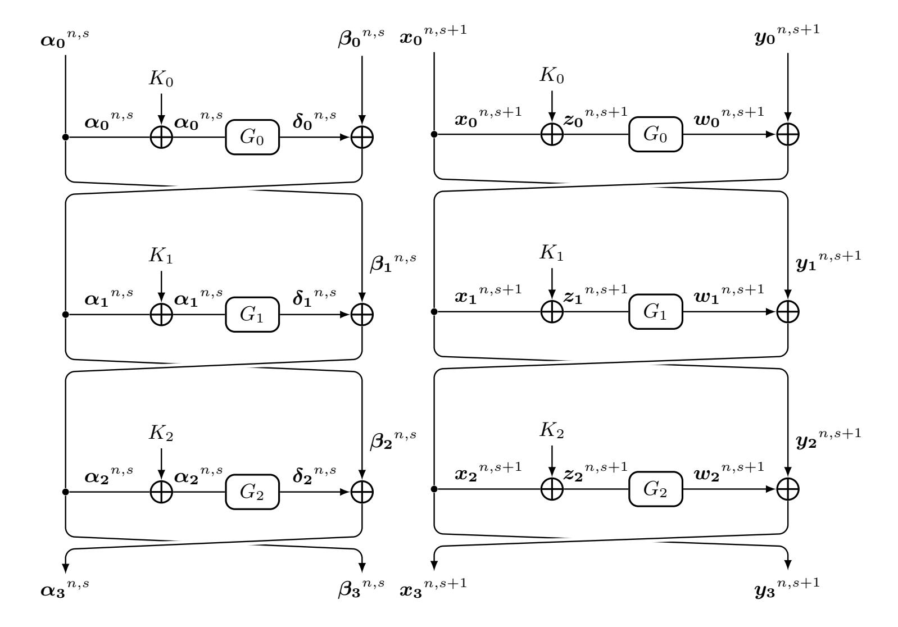

<span id="page-15-0"></span>Fig. 3. The valid (s + 1)-polytopic trail (left) and (s + 1)-polygonal trail (right) for 3-round Feistel

{16}------------------------------------------------

Theorem 5 (The Equivalence of MISTY1). Let E denote the block cipher MISTY1. Then,  $(\alpha_0^{32,s}||\beta_0^{32,s},\alpha_r^{32,s}||\beta_r^{32,s})$  is an r-round traditional impossible (s+1)-polytopic transition if and only if it is an r-round i-impossible (s+1)-polytopic transition.

The advantages of *i*-impossible differentials and *i*-impossible (s+1)-polytopic transitions. Since *i*-impossible differentials (resp. *i*-impossible (s+1)-polytopic transitions) are equivalent to traditional impossible differentials (resp. traditional impossible (s+1)-polytopic transitions), our method gives new view of traditional impossible differentials and impossible (s+1)-polytopic transitions, which allows us to get the distinguishers for the block cipher with large S-boxes or variable rotation in the key independent setting using full knowledge of their differential or *s*-differential property. In particular, by exploiting this new view, we can evaluate the security of block ciphers against traditional impossible differentials for block ciphers with large S-box in the case of considering the differential property of large S-boxes.

### <span id="page-16-0"></span>4 Automatic Search Method

In this section, we propose the automatic search algorithms for our redefined impossible differentials and impossible (s+1)-polytopic transitions. Firstly, we give the statements in CVC format to model the propagation of the state under each operation.

# <span id="page-16-1"></span>4.1 Model the Propagation of the State by Statements in CVC Format

Here, we model the propagation of the state under the operations (Generalized-) Copy, (Generalized-) Xor, (Generalized-) Modular Addition, Linear Transformations, S-box and Variable Rotation by statements in CVC format.

**Model 1 ((Generalized-)Copy)** Let F be a (Generalized-)Copy function, where the input x takes value from  $\mathbb{F}_2^q$ , and the output is calculated as  $(y_0, y_1, \ldots, y_{t-1}) = (x, x, \ldots, x)$ . Then, the following statements can describe the propagation of the state under the (Generalized-)Copy operation.

```
\begin{cases}
ASSERT(y_0 = x); \\
ASSERT(y_1 = x); \\
\vdots \\
ASSERT(y_{t-1} = x);
\end{cases}
```

**Model 2 ((Generalized-)Xor)** Let F be a (Generalized-)Xor function, where the input  $(x_0, x_1, \ldots, x_{t-1})$  take values from  $(\mathbb{F}_2^q)^t$ , and the output is calculated as  $y = \bigoplus_{i=0}^{i=t-1} x_i$ . Then, the following statement can describe the propagation of the state under the (Generalized-)Xor operation.

```
ASSERT(y = BVXOR(\cdots(BVXOR(BVXOR(x_0, x_1), x_2), \dots, x_{t-1}));^{8}
```

<span id="page-16-2"></span><sup>&</sup>lt;sup>8</sup> BVXOR: Bitwise XOR function which is supported by the CVC format of STP

{17}------------------------------------------------

Model 3 ((Generalized-)Modular Addition) Let F be a (Generalized-) Modular Addition function, where the input  $(x_0, x_1, \ldots, x_{t-1})$  take values from  $(\mathbb{F}_2^q)^t$ , and the output is calculated as  $y = \bigoplus_{i=0}^{i=t-1} x_i$ . Then, the following statement can describe the propagation of the state under the (Generalized-)Modular Addition operation.

$$ASSERT(y = BVPLUS(q, x_0, \dots, x_{t-1}));$$
<sup>9</sup>

The linear transformations of block ciphers have various representations, such as the permutation layer of PRESENT [8], and the MDS matrix in AES [13]. Since all the representations of linear transformations can be converted to the binary matrix multiplication, we only show the modeling method for the binary matrix multiplication here.

Model 4 (Binary Matrix Multiplication) Let  $M = (m_{i,j})_{0 \le i \le s-1, 0 \le j \le t-1}$  be a binary matrix, where the input  $x = (x_0, x_1, \dots, x_{t-1})$  take values from  $\mathbb{F}_2^t$ , and the output of multiplication  $y = (y_0, y_1, \dots, y_{s-1})$  is calculated as

$$y_i = \begin{cases} x_k, & \text{if } m_{i,k} = 1 \text{ and } |\{j|m_{i,j} \neq 0\}| = 1, \\ \bigoplus_{\{j|m_{i,j} \neq 0\}} x_j, & \text{otherwise.} \end{cases}$$

Then, the statements to describe the propagation of the state under binary matrix multiplication operation can be combined by the modeling methods for Copy and (Generalized-) Xor.

S-box is often used to provide confusion for block ciphers. By exploiting the conditional term, we can describe the propagation of the state under it specifically.

**Model 5 (S-box)** Let S be an S-box which substitutes t-bit to s-bit, where the input x takes values from  $\mathbb{F}_2^t$ , and the output  $y \in \mathbb{F}_2^s$  is calculated as y = S(x). Then the statement generated by Algorithm 1 can describe the propagation of the state under S-box operation.

### <span id="page-17-1"></span>Algorithm 1 Function for Modeling S-box

- 1: **Input**: S, x, y
- 2: Output: The statement to describe the propagation of the state under S-box
- $3: statement_1 = S[0]$
- 4: **for** j = 1 to  $2^t 1$  **do**
- 5:  $statement_1 = "IF x = j THEN S[j] ELSE statement_1"$
- 6: endfor
- 7:  $statement = "ASSERT(y = statement_1);"$
- 8: return statement

Variable rotation is a novel operation used in some typical block ciphers, such as RC5 [26] and RC6 [27]. Due to the output of variable rotation operation

<span id="page-17-0"></span><sup>&</sup>lt;sup>9</sup> BVPLUS: Bitvector Add function which is supported by the CVC format of STP

{18}------------------------------------------------

is closely related to the input values, it is hard to model the propagation of difference and s-difference under it. In our new model, we exploit the conditional term to describe the propagation of the state under the variable rotation.

**Model 6 (Variable Rotation)** Let F be a variable rotation function, the input (x, y) take values from  $\mathbb{F}_2^q \times \mathbb{F}_2^q$ , and the output is calculated as  $z = x \ll q \in \mathbb{F}_2^q$ . Then, the statement generated by the Algorithm 2 can describe the propagation of the state under variable rotation operation.

### <span id="page-18-0"></span>Algorithm 2 Function for Modeling Variable Rotation

```
    Input: q, x, y, z
    Output: The statement to describe the propagation of the state under variable rotation
    statement₁ = x
    for j = 1 to q - 1 do
    statement₁ = "IF (y mod q) = j THEN x ≪<sub>j</sub> ELSE statement₁"
    endfor
    statement = "ASSERT(z = statement₁);"
    return statement
```

# 4.2 The Automatic Search Method for Redefined Impossible Differentials and Impossible (s+1)-polytopic Transitions

In this subsection, we show our automatic search algorithm for the *i*-impossible (resp. *d*-impossible) (s+1)-polytopic transitions. Since an *i*-impossible (resp. *d*-impossible) differential is an *i*-impossible (resp. *d*-impossible) 2-polytopic transition, the automatic search algorithm for *i*-impossible (resp. *d*-impossible) differentials can be derived from the algorithm for *i*-impossible (resp. *d*-impossible) (s+1)-polytopic transitions with s=1. First, we propose our method for determining whether a pair of input and output *s*-differences is an *i*-impossible (resp. *d*-impossible) (s+1)-polytopic transition. Then, we discuss the selection of parameter *s* and the search space of our method.

# The *i*-impossible (resp. *d*-impossible) (s+1)-polytopic Transition Determining Method.

Our method for determining whether a pair of input and output s-differences  $(\boldsymbol{\alpha}^{n,s},\boldsymbol{\beta}^{n,s})$  is an i-impossible (resp. d-impossible) (s+1)-polytopic transition can be divided into two phases: statements generated phase and STP invoked phase. In the statements generated phase, we generate a system of statements as a file to describe the (s+1)-polygons  $\boldsymbol{x}^{n,s+1}$  propagate to  $\boldsymbol{y}^{n,s+1}$  with  $\boldsymbol{x}^{n,s+1} \triangleright \boldsymbol{\alpha}^{n,s}$  and  $\boldsymbol{y}^{n,s+1} \triangleright \boldsymbol{\beta}^{n,s}$ . In the STP invoked phase, we invoke the STP for the file to determine whether  $(\boldsymbol{\alpha}^{n,s},\boldsymbol{\beta}^{n,s})$  is an i-impossible (resp. d-impossible) (s+1)-polytopic transition.

{19}------------------------------------------------

### Specification of the statements generated phase.

The algorithm shown in Algorithm 3 generates the statements for judging whether a pair of input and output s-differences  $(\boldsymbol{\alpha}^{n,s}, \boldsymbol{\beta}^{n,s})$  is an r-round impossible (s+1)-polytopic transition.

## <span id="page-19-0"></span>Algorithm 3 Generating statements in CVC format

- 1: **Input**: the number of rounds r, the input s-difference  $\alpha^{n,s}$ , the output s-difference  $\beta^{n,s}$  and keyflag $\in \{\text{True}, \text{False}\}$
- 2: Output: System of statements in CVC format
- 3: Declare the input and output (s+1)-polygons of  $\boldsymbol{x}^{n,s+1}$  and  $\boldsymbol{y}^{n,s+1}$ .
- 4: Declare the intermediate variables and key variables.
- 5: **for** i = 0 to s **do**
- 6: Model the r-round propagation of  $(x_i, y_i)$ .
- 7: endfor
- 8: Generate the constraint of  $\boldsymbol{x}^{n,s+1}$  such that  $\boldsymbol{x}^{n,s+1} > \boldsymbol{\alpha}^{n,s}$ .
- 9: Generate the constraint of  $\boldsymbol{y}^{n,s+1}$  such that  $\boldsymbol{y}^{n,s+1} \rhd \boldsymbol{\beta}^{n,s}$ .
- 10: **if** keyflag **then**
- 11: Generate the constraint of key variables according to key shedule.
- 12: **endif**
- 13: Add the statements "QUERY(FALSE);" and "COUNTEREXAMPLE;".

We present certain illustrations for Algorithm 3 as follows.

- Line 3-4. Declare the variables which are used in the system of statements, including the variables which are used to represent the input (s+1)-polygon and output (s+1)-polygon, the intermediate variables and key variables used to describe the propagation from the input (s+1)-polygon to the output (s+1)-polygon.
- Line 5-7. According to the propagation rules for each operation which are given in Section 4.1, model the propagation from the input (s+1)-polygon  $\boldsymbol{x}^{n,s+1}$  to the output (s+1)-polygon  $\boldsymbol{y}^{n,s+1}$  with the aid of the intermediate variables and key variables.
- Line 8-9. Generate the statements in CVC format such that the input (s+1)-polygon  $\boldsymbol{x}^{n,s+1}$  satisfies the input s-difference  $\boldsymbol{\alpha}^{n,s}$  and the output (s+1)-polygon  $\boldsymbol{y}^{n,s+1}$  satisfies the output s-difference  $\boldsymbol{\beta}^{n,s}$ .
- Line 10-12. If "keyflag=True", then the algorithm generates the statements to constraint the key variables according to the key schedule. In this case, the algorithm generates the statements to judge whether a pair of input and output s-differences  $(\boldsymbol{\alpha}^{n,s},\boldsymbol{\beta}^{n,s})$  is an r-round d-impossible (s+1)-polytopic transition; Otherwise, it generates the statements to judge whether a pair of input and output s-differences  $(\boldsymbol{\alpha}^{n,s},\boldsymbol{\beta}^{n,s})$  is an r-round i-impossible (s+1)-polytopic transition.
- Line 13. The statements "QUERY(FALSE);" and "COUNTEREXAM-PLE;" are added to the system of statements. This is a common method in STP to determine whether an SAT problem has a solution. By adding those two statements, if the SAT problem has solutions, the STP will

{20}------------------------------------------------

return one of the solutions and the statement "Invalid."; Otherwise, it returns "Valid.".

### Specification of the invoke STP phase.

We invoke the STP for the file which is consisted of the system of statements. If the statements generated in the case of keyflag=True, then the s-differences  $(\boldsymbol{\alpha}^{n,s},\boldsymbol{\beta}^{n,s})$  is an r-round d-impossible (s+1)-polytopic transition when the STP returns "Valid.", and  $(\boldsymbol{\alpha}^{n,s},\boldsymbol{\beta}^{n,s})$  is not an r-round d-impossible (s+1)-polytopic transition when the STP returns an r-round d-(s+1)-polygonal trail and "Invalid.". Similarly, if the statements generated in the case of keyflag=False, then the s-differences  $(\boldsymbol{\alpha}^{n,s},\boldsymbol{\beta}^{n,s})$  is an r-round i-impossible (s+1)-polytopic transition when the STP returns "Valid.", and  $(\boldsymbol{\alpha}^{n,s},\boldsymbol{\beta}^{n,s})$  is not an r-round i-impossible (s+1)-polytopic transition when the STP returns an r-round i-impossible (s+1)-polytopic transition when the STP returns an r-round i-(s+1)-polygonal trail and "Invalid.".

Work as a proof tool. Once the search space fixed, we can run our tool for all the input and output s-differences in such space. If none of the input and output s-differences is an r-round i-impossible (resp. d-impossible) (s + 1)-polytopic transition, we can declare that there exists no r-round i-impossible (resp. d-impossible) (s + 1)-polytopic transition in this space.

#### The Select of parameter s and Search Space.

In our automatic search method for impossible (s + 1)-polytopic transition, the total time cost mainly depends on the size of the search space and the time cost for determining whether an element in the search space is an impossible (s + 1)-polytopic transition.

The time cost for determining whether an element in the search space is an impossible (s+1)-polytopic transition is closely related to operations which the block cipher contains and the value of parameter s we selected. In our experiment, we choose s at most 4, since the search time will cost quite a lot if s increases beyond this range.

For the search space, traditional automatic tools focus on search the  $\mu$  input active bits (resp. nibbles) and  $\nu$  output active bits (resp. nibbles) impossible differentials. Since the impossible (s+1)-polytopic transition is the generation of impossible differential, we define the  $(\mu_0, \ldots, \mu_{s-1})$  active bits and  $(\mu_0, \ldots, \mu_{s-1})$  active nibbles to generate the search space.

**Definition 14**  $((\mu_0, \ldots, \mu_{s-1})$  **Active Bits).** For a block cipher  $E \in BC(n, m, l)$ , we call the s-difference  $\alpha^{n,s}$  satisfied the  $(\mu_0, \ldots, \mu_{s-1})$  active bits, if there are  $\mu_i$  bits of the binary representation of  $\alpha_i (0 \le i \le s-1)$  are non-zero.

**Definition 15** ( $(\mu_0, \ldots, \mu_{s-1})$  **Active Nibbles).** For a block cipher  $E \in BC(n, m, l)$  whose S-box size is q, for any s-difference  $\alpha^{n,s}$ , the binary representation of  $\alpha_i$  ( $0 \le i \le s-1$ ) can be divided into  $\frac{n}{q}$  pieces, where  $\alpha_{i,j} = \{\alpha_{i,q\cdot j}, \ldots, \alpha_{i,q\cdot j+q-1}\}$  ( $0 \le j \le \frac{n}{q} - 1$ ). We call the s-difference  $\alpha^{n,s}$  satisfied the  $(\mu_0, \ldots, \mu_{s-1})$  active nibbles, if there are  $\mu_i$  pieces of  $\alpha_i$  ( $0 \le i \le s-1$ ) have non-zero items.

{21}------------------------------------------------

Our method focuses on searching the  $(\mu_0, \ldots, \mu_{s-1})$  input active bits and  $(\nu_0, \ldots, \nu_{s-1})$  output active bits or  $(\mu_0, \ldots, \mu_{s-1})$  input active nibbles and  $(\nu_0, \ldots, \nu_{s-1})$  output active nibbles, or the subset of those two spaces according to the experimental result. Due to the limitation of the size of the executable search space, we mainly search some small values of active bits and active nibbles. Assume the value  $\mu'_i$   $(0 \le i \le g)$  appears  $\varphi_i$  times in the tuple  $(\mu_0, \ldots, \mu_{s-1})$  and value  $\nu'_i$   $(0 \le i \le h)$  appears  $\varphi_i$  times in the tuple  $(\nu_0, \ldots, \nu_{s-1})$ . Then, for a block cipher  $E \in BC(n, m, l)$ , the number of pairs of input and output s-differences with  $(\mu_0, \ldots, \mu_{s-1})$  input active bits and  $(\nu_0, \ldots, \nu_{s-1})$  output active bits is

$$\binom{\binom{n}{\mu'_0}}{\varphi_0} \times \cdots \times \binom{\binom{n}{\mu'_g}}{\varphi_g} \times \binom{\binom{n}{\nu'_0}}{\phi_0} \times \cdots \times \binom{\binom{n}{\nu'_h}}{\phi_h} \sim O(n^{\mu'_0\varphi_0 + \cdots + \mu'_g\varphi_g + \nu'_0\phi_0 + \cdots + \nu'_h\phi_h}).$$

For a block cipher  $E \in BC(n, m, l)$  whose S-box size is q, let  $p = \frac{n}{q}$ , the number of pairs of input and output s-differences with  $(\mu_0, \ldots, \mu_{s-1})$  input active nibbles and  $(\nu_0, \ldots, \nu_{s-1})$  output active nibbles is

$$\binom{\binom{p}{\mu'_0} \cdot (2^q - 1)}{\varphi_0} \times \cdots \times \binom{\binom{p}{\mu'_g} \cdot (2^q - 1)}{\varphi_g} \times \binom{\binom{p}{\nu'_0} \cdot (2^q - 1)}{\varphi_0} \times \cdots \times \binom{\binom{p}{\nu'_h} \cdot (2^q - 1)}{\varphi_h},$$

which is 
$$O(p^{\mu'_0\varphi_0 + \dots + \mu'_g\varphi_g + \nu'_0\phi_0 + \dots + \nu'_h\phi_h} \cdot 2^{q \cdot (\mu'_0 + \dots + \mu'_g + \nu'_0 + \dots + \nu'_h)})$$
.

According to the above analysis, the size of the search space is still large even we only search for small values of active bits and active nibbles for impossible (s+1)-polytopic transitions with small value of parameter s. For example, if we search the (1,1) input active bits and (1,1) output active bits for the impossible 3-polytopic transition of a block cipher whose block size is 64, the number of pairs of input and output s-differences is  $\binom{64}{2} \times \binom{64}{1} = 4064256 \approx 2^{22}$ . Thus, we propose the following step by step strategy, which is quite helpful to search the impossible (s+1)-polytopic transitions when the search space is too large.

Step by step strategy. The core of this strategy is to search the impossible (s+1)-polytopic  $(s \geq 2)$  transition based on the result of the impossible s-polytopic transition. To be specific, for a block cipher  $E \in BC(n, m, l)$ , if we know that  $(\boldsymbol{\alpha}^{n,s-1}, \boldsymbol{\beta}^{n,s-1})$  is an impossible s-polytopic transition, then we search the impossible (s+1)-polytopic  $(s \geq 2)$  transition in the set

 $\{(\alpha_0,\ldots,\alpha_{s-2},\alpha)\times(\beta_0,\ldots,\beta_{s-2},\beta)|\text{the active bits (nibbles) of }\alpha\text{ and }\beta\text{ is }u$  and v respectively $\}$ ,

where u and v are the predetermined values.

# <span id="page-21-0"></span>5 Applications to Impossible Differentials from the Aspect of Cryptanalysis

In this section, we apply our method to various block ciphers, including the block cipher GIFT64 [3], the key-dependent permutation (or the key-dependent

{22}------------------------------------------------

S-box) based block cipher PRINTcipher [\[17\]](#page-37-6), the large S-boxes based block cipher MISTY1 [\[22\]](#page-37-7), and the variable rotation based block cipher RC5 [\[26\]](#page-37-8). Only concise descriptions of those block ciphers are specified here. For more details, please refer to their coresponding references. All the experiments in this paper are conducted on this platform: Intel(R) Xeon(R) CPU E5-2650 v2 @2.60GHz, 64.00G RAM, 64-bit Windows 7 system. The source codes are available in [https://github.com/HugeChaos/Impossible-differentials-and-impossible](https://github.com/HugeChaos/Impossible-differentials-and-impossible-polytopic-transitions)[polytopic-transitions.](https://github.com/HugeChaos/Impossible-differentials-and-impossible-polytopic-transitions) The overview of time costs for getting our results is shown in Table [H](#page-53-0) in Appendix [H.](#page-53-0)

### 5.1 GIFT64

GIFT64 was designed by Banik el at. [\[3\]](#page-35-0), it is a 64-bit block cipher with 128 bit master key. Interestingly, its round key is 32-bit while it adopts the SPN structure.

Previous best result. In [\[3\]](#page-35-0), they searched the impossible differentials by limiting the input difference activates only one of the first four S-boxes and the output difference activates only one S-box. The maximum number of rounds of impossible differentials they got in this search space is 6.

Advantage of our tool. Compared with the previous tools, our tools can search the impossible differentials taking into account the key schedule.

Configurations for the tool. Firstly, in the search space where the input and output difference activates only one S-box, the maximum number of rounds of the impossible differentials we got is also 6. Then, we try to find the 6-round impossible differentials in which the contradiction cannot be detected by the previous method. To achieve this purpose, we randomly pick the input difference activates at most the right 16 bits and the output difference activates at most the i-th (i ∈ {0, 4, 8, 12, 17, 21, 25, 29, 34, 38, 42, 46, 51, 55, 59, 63}) bit. In this way, it allows at most the 0th, 4th, 8th and 12th S-box to be active in the 2nd round by propagating the input difference in the forward direction, and at most the 0th, 1st, 2nd and 3rd S-box to be active in the 5th round by propagating the output difference in the backward direction. After 65536 random tests, we find 3 6-round impossible differentials that the previous tools cannot detect.

Example of 6-round d-impossible differentials. One of the 6-round dimpossible differentials is

0x0000000000000600 <sup>6</sup>−round 9 0x0000004020000110.

As shown in Appendix [E,](#page-50-0) according to the propagation rules of traditional difference, (0x0000000000000600, 0x0000004020000110) is the 6-round possible differential.

Automatic verification for the above example of impossible differential of GIFT64. Since this impossible differential cannot be detected by the propagation of difference, verifying this impossible differential by manual is difficult, we modify the verification algorithm in [\[12\]](#page-36-5) as shown in Algorithm [4.](#page-53-1) We apply it to verify the example of impossible differential, one contradiction 

{23}------------------------------------------------

occurs in the bit positions of the set  $\mathcal{G} = \{0, 1, 2, 3\}$  at the input of the 4-th round. Moreover, let  $\boldsymbol{u}^{n,s+1}$  and  $\boldsymbol{v}^{n,s+1}$  be two (s+1)-polygons as declared in Algorithm 4, all the possible values of  $(u_{0,3}||u_{0,2}||u_{0,1}||u_{0,0},u_{1,3}||u_{1,2}||u_{1,1}||u_{1,0})$  and  $(v_{0,3}||v_{0,2}||v_{0,1}||v_{0,0},v_{1,3}||v_{1,2}||v_{1,1}||v_{1,0})$  are shown in the Table 3, it is easy to see that those values are incompatible, which leads to the contradiction of the 6-round impossible differential.

<span id="page-23-0"></span>**Table 3.** The possible values of  $(u_{0,3}||u_{0,2}||u_{0,1}||u_{0,0},u_{1,3}||u_{1,2}||u_{1,1}||u_{1,0})$  and  $(v_{0,3}||v_{0,2}||v_{0,1}||v_{0,0},v_{1,3}||v_{1,2}||v_{1,1}||v_{1,0})$ 

| $u_{0,3}  u_{0,2}  u_{0,1}  u_{0,0}(v_{0,3}  v_{0,2}  v_{0,1}  v_{0,0})$ | $ u_{1,3}  u_{1,2}  u_{1,1}  u_{1,0} $ | $ v_{1,3}  v_{1,2}  v_{1,1}  v_{1,0} $ |
|--------------------------------------------------------------------------|----------------------------------------|----------------------------------------|
| 0                                                                        | [0, 1, 8, 9]                           | [10, 11, 14, 15]                       |
| 1                                                                        | [0, 1, 8, 9]                           | [10, 11, 14, 15]                       |
| 2                                                                        | [2, 3, 10, 11]                         | [8, 9, 12, 13]                         |
| 3                                                                        | [2, 3, 10, 11]                         | [8, 9, 12, 13]                         |
| 4                                                                        | -                                      | [9, 10, 13, 14]                        |
| 5                                                                        | -                                      | [8, 11, 12, 15]                        |
| 6                                                                        | -                                      | [8, 11, 12, 15]                        |
| 7                                                                        | -                                      | [9, 10, 13, 14]                        |
| 8                                                                        | [0, 1]                                 | [2, 3, 5, 6]                           |
| 9                                                                        | [0, 1]                                 | [2, 3, 4, 7]                           |
| 10                                                                       | [2, 3]                                 | [0, 1, 4, 7]                           |
| 11                                                                       | [2, 3]                                 | [0, 1, 5, 6]                           |
| 12                                                                       | _                                      | [2, 3, 5, 6]                           |
| 13                                                                       | _                                      | [2, 3, 4, 7]                           |
| 14                                                                       | -                                      | [0, 1, 4, 7]                           |
| 15                                                                       | -                                      | [0, 1, 5, 6]                           |

### 5.2 PRINTcipher

PRINTcipher [17] is proposed by Lars et al. at CHES 2010, consisting of two versions: PRINTcipher48 and PRINTcipher96. PRINTcipher48 is a block cipher with 48-bit block and 80-bit key. PRINTcipher96 is a block cipher with 96-bit block and 160-bit key.

Advantage of our tool. Previous tools cannot apply to PRINTcipher directly due to that they cannot handle the operation of key-dependent permutation. By making use of the conditional term, we propose the first modeling method to describe the propagation of state for key-dependent permutation. Besides, the PRINTcipher also can be regarded as the key-dependent S-box based block cipher, where the key-dependent S-box is consisted of the key-dependent permutation and the fixed S-box. We also propose the first modeling method to describe the propagation of state for key-dependent S-box directly. The modeling methods for key-dependent permutation and key-dependent S-box are shown in Appendix B.

{24}------------------------------------------------

Configurations for the tool. By considering all the details of key schedule, we search the impossible differentials for PRINTcipher48 and PRINTcipher96 in the space where the input differences activate only one S-box in the first substitution layer and the output differences activate only one S-box in the last substitution layer. Finally, we found 730 4-round d-impossible differentials for PRINTcipher48 and 234 5-round d-impossible differentials for PRINTcipher96 in total.

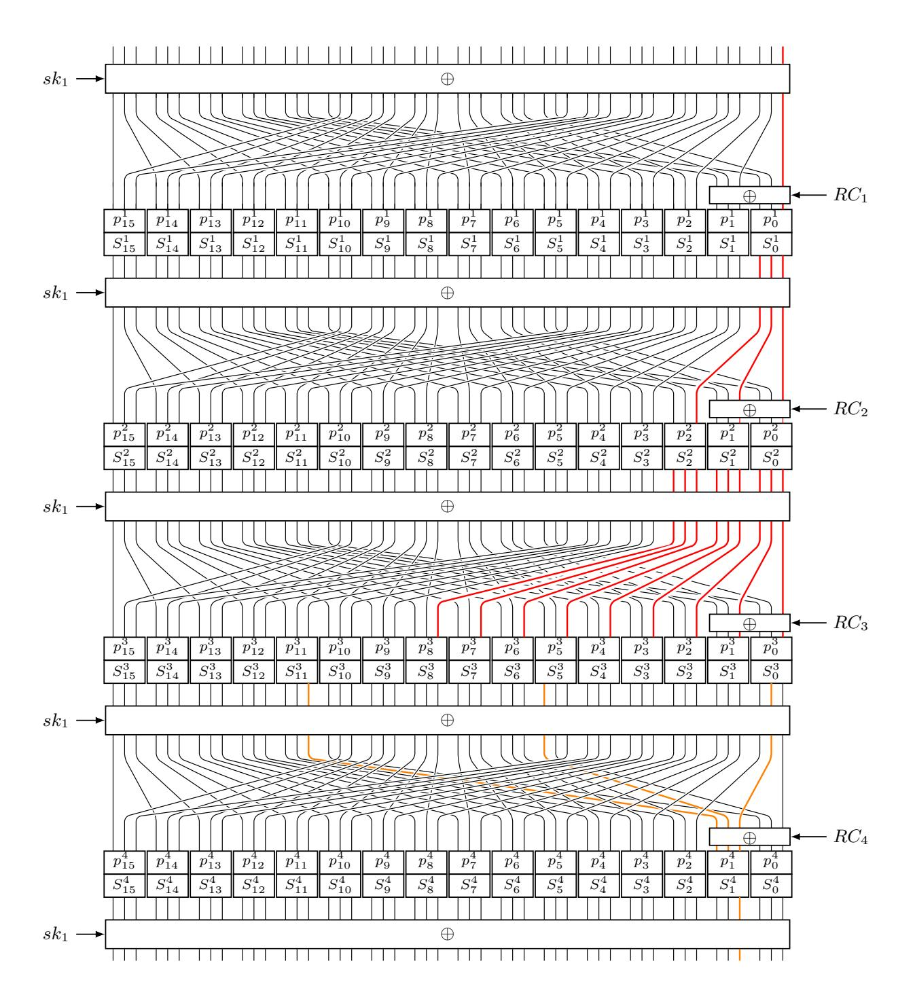

<span id="page-24-0"></span>Fig. 4. The 4-round impossible differential for PRINTcipher48

**Example of** d-impossible differentials of PRINTcipher. One of the 730 4-round d-impossible differentials of PRINTcipher48 is

 $0x00000000001 \xrightarrow{4-round} 0x000000000008.$ 

{25}------------------------------------------------

One of the 234 5-round d-impossible differentials of PRINTcipher96 is

0x00000000000000000000000000000000000

Manual verification for the above example of impossible differential of PRINTcipher. As the impossible differentials are detected by considering the key schedule, the verification is completely different from the previous impossible differentials. We only verify the 4-round example of impossible differential of PRINTcipher48 here, the 5-round example of impossible differential of PRINTcipher96 is verified in Appendix D. First, we have the following observation for the composition of key-dependent permutation and S-box.

<span id="page-25-0"></span>**Observation 1** Let  $SP_k = S \circ P_k$ , where S denotes the S-box of PRINTcipher and  $P_k$  denotes the key-dependent permutation. Then,  $1 \xrightarrow{SP_0} \{1, 3, 5, 7\}$ ,  $1 \xrightarrow{SP_1} \{1, 3, 5, 7\}$ ,  $1 \xrightarrow{SP_2} \{2, 3, 6, 7\}$ , and  $1 \xrightarrow{SP_3} \{4, 5, 6, 7\}$ . On the contrary, we have  $\{1, 3, 5, 7\} \xrightarrow{SP_0} 1$ ,  $\{1, 3, 5, 7\} \xrightarrow{SP_1} 1$ ,  $\{2, 3, 6, 7\} \xrightarrow{SP_2} 1$ , and  $\{4, 5, 6, 7\} \xrightarrow{SP_3} 1$ .

**Theorem 6.** The input difference 0x00000000001 cannot propagate to the output difference 0x00000000008 after 4 rounds of PRINTcipher48 by considering all the details of the key schedule.

*Proof.* In Figure 4, the input difference is propagated in forwards by 3 rounds, and the output difference is propagated in backwards by 1 round.

In the forward propagation, only the S-box  $S_i^3 (i \in \{0, 1, 2, 3, 4, 5, 6, 7, 8\})$  may active, and in the backward propagation, only the S-box  $S_j^3 (j \in \{0, 5, 11\})$  may active. Thus, if current propagation is compatible, only if  $S_5^3$  or  $S_0^3$  is active. Denote  $Sp_j^i = S_j^i \circ p_j^i$ , where  $S_j^i$  denotes the S-box and  $p_j^i$  denotes the keydependent permutation as shown in Figure 4.

- 1. If  $S_5^3$  is active, we have  $1 \xrightarrow{Sp_2^2} 4$ . Thus, the control key of  $p_2^2$  is 3. Since the control key of  $p_2^4$  is the same with  $p_2^2$ , all possible difference of output of  $p_2^4$  in the backward direction is  $\{0x4, 0x5, 0x6, 0x7\}$ . In this situation, the  $S_{11}^3$  is active, this is a contradiction.
- 2. If  $S_0^3$  is active, we have  $1 \xrightarrow{Sp_0^1} 1$ . Thus, the control key of  $p_0^1$  is 0 or 1. Since the control key of  $p_0^3$  is the same with  $p_0^1$ , all possible differences of output of  $S_0^3$  are  $\{1,3,5,7\}$ , this is a contradiction with the output difference of  $S_0^3$  is 2.

All in all, the input difference 0x00000000001 cannot propagate to the output difference 0x00000000008 after 4 rounds of PRINTcipher48.

### 5.3 MISTY1

The block cipher MISTY1 was designed by Matsui [22]. It is a 64-bit block cipher which adopts the theory of provable security [25] against differential attack [7] and linear attack [21].

{26}------------------------------------------------

The result by Sasaki et al.'s method. Sasaki et al.'s method is the most advanced previous method to search the impossible differential for block ciphers with large S-boxes. We employ this method to search the 1 input active bit and 1 output active bit impossible differentials by limiting the input difference activates only the right branch and the output difference activates only the left branch. After  $32 \times 32 = 1024$  tests, the maximum number of rounds we got is 4 and a total of 28 4-round impossible differentials are found.

Advantage of our tool. Compared with previous tools, our tool is the first tool that can search the impossible differentials for large S-boxes based block ciphers taking into account the differential property of the S-boxes in the independent key setting.

Configurations for the Tool. We run our tool to search the *i*-impossible differentials in the search space as that by Sasaki et al.'s method. Finally, we found 902 4-round *i*-impossible differentials, and all the 4-round impossible differentials derived by Sasaki et al's method are detected by our tool.

List of 4-round *i*-impossible differentials. All the 4-round impossible differentials we found are shown in the Table 4, where  $\mathbb{Z}_{32} = \{0, 1, ..., 31\}$  and  $A = \{33, 35, 36, 46, 49, 50, 51, 52, 53, 57, 58, 62\}.$ 

| ID  | $\Delta P$                                                                    | $\Delta C$                                              | Number |
|-----|-------------------------------------------------------------------------------|---------------------------------------------------------|--------|
| 001 | $e_i^{64} (i \in \mathbb{Z}_{32}/\{3, 12, 19, 28\})$                          | $e_{32}^{64}$                                           | 28     |
| 002 | $e_i^{64} (i \in \mathbb{Z}_{32} / \{14, 30\})$                               | $e_{32}^{64} \ e_{34}^{64} \ e_{37}^{64} \ e_{38}^{64}$ | 30     |
| 003 | $e_i^{64} (i \in \mathbb{Z}_{32}/\{7,23\})$                                   | $e^{64}_{37}$                                           | 30     |
| 004 | $e_i^{64} (i \in \{0, 9, 11, 12, 13, 14, 15, 16, 25, 27, 28, 29, 30, 31\})$   | $e^{64}_{38}$                                           | 14     |
| 005 | $e_i^{64} (i \in \{1, 4, 5, 6, 7, 10, 17, 20, 21, 22, 23, 26\})$              | $e_{43}^{64} \\ e_{44}^{64} \\ e_{45}^{64}$             | 12     |
| 006 | $e_i^{64} (i \in \{4, 5, 6, 7, 10, 20, 21, 22, 23, 26\})$                     | $e^{64}_{44}$                                           | 10     |
| 007 | $e_i^{64} (i \in \{0, 3, 4, 5, 6, 7, 8, 10, 16, 19, 20, 21, 22, 23, 24, 26\}$ | $e^{64}_{45}$                                           | 16     |
| 008 | $e_i^{64} (i \in \mathbb{Z}_{32} / \{12, 28\})$                               | $e_{48}^{64}$                                           | 30     |
| 009 | $e_i^{64} (i \in \mathbb{Z}_{32}/\{6, 22\})$                                  | $e^{64}_{54}$                                           | 30     |
| 010 | $e_i^{64} (i \in \mathbb{Z}_{32})$                                            | $e_j^{64} (j \in A)$                                    | 384    |
| 011 | $e_i^{64} (i \in \mathbb{Z}_{32} / \{12 + j, 28 + j\})$                       | $e_{55+j}^{64} (j \in \{0,1\})$                         | 60     |
| 012 | $e_i^{64} (i \in \mathbb{Z}_{32} / \{11, 27\})$                               | $e_j^{64}(j \in \{47, 63\})$                            | 60     |
| 013 | $e_i^{64} (i \in \mathbb{Z}_{32} / \{11, 12, 13, 27, 28, 29\})$               | $e_j^{64}(j \in \{59, 60, 61\})$                        | 78     |
| 014 | $e_i^{64} (i \in \mathbb{Z}_{32} / \{12 + j, 28 + j\})$                       | $e_{39+j}^{64}(j \in \{0,1,2,3\})$                      | 120    |

<span id="page-26-0"></span>Table 4. 4-Round Impossible Differentials of MISTY-1

Manual verification for the 4-round *i*-impossible differentials  $(e_i^{64}, e_{52}^{64})(i \in \mathbb{Z}_{32})$  of MISTY1. We finish this work in Appendix A.

### 5.4 RC5

RC5 is designed by Rivest in 1994 [26]. The block size of it can be 32, 64, or 128 bits. For each block size n, the version is denoted as RC5-n(n = 32, 64, 128). Advantage of our tool. The operation variable rotation highly depends on the value of state, which cannot be handled by the previous automatic search tools

{27}------------------------------------------------

for impossible differentials. In our model, by exploiting the modeling method we proposed in Section 4.1, we give the first automatic method for searching the impossible differentials of RC5.

Configurations of our tool. The key schedule of RC5 is very complex. Thus, we focus on searching *i*-impossible differentials. By observing the structure of RC5-n, the difference  $e_{(i,i+\frac{n}{2})}^n$  propagates to the difference  $e_{(i+\frac{n}{2})}^n$  after 0.5-round in the encryption direction. Thus, we search the *i*-impossible differentials for RC5-n(n=32,64,128) by limiting the input difference and output difference in the set  $(e_{(i,i+\frac{n}{2})}^n,e_{(j)}^n)(0 \le i \le \frac{n}{2}-1,0 \le j \le n-1)$ .

**List of 2.5-round** *i***-impossible differentials.** As a result, our tool found 12 *i*-impossible differentials for RC5-32, 27 *i*-impossible differentials for RC5-64, and 58 *i*-impossible differentials for RC5-128. This is the first result of impossible differentials for RC5. All the results are shown in Table 5.

**Table 5.** 2.5-Round i-impossible Differentials of RC5

<span id="page-27-0"></span>

| Block Size | $\Delta P$                                                                                                   | _                 | Number |
|------------|--------------------------------------------------------------------------------------------------------------|-------------------|--------|
| 32         | $e_{(i,i+16)}^{32}(4 \le i \le 15)$                                                                          | $e_{(15)}^{32}$   | 12     |
| 64         | $e_{(i,i+32)}^{64} (5 \le i \le 31)$                                                                         | $e_{(31)}^{64}$   | 27     |
| 128        | $e_{(i,i+16)}^{32}(4 \le i \le 15)$ $e_{(i,i+32)}^{64}(5 \le i \le 31)$ $e_{(i,i+64)}^{128}(6 \le i \le 63)$ | $e_{(63)}^{128'}$ | 58     |

Manual verification for the *i*-impossible differential  $(e_{(\frac{n}{2}-1,n-1)}^n,e_{(\frac{n}{2})-1}^n)$  of RC5-n. Specifically speaking, we verify the 2.5-round *i*-impossible differential  $(e_{(15,31)}^{32},e_{(15)}^{32})$  of RC5-32,  $(e_{(31,63)}^{64},e_{(31)}^{64})$  of RC5-64, and  $(e_{(63,127)}^{128},e_{(63)}^{128})$  of RC5-128 together. First, we study the relation of a pair of input values and a pair of output values for the operation variable rotation.

<span id="page-27-1"></span>**Proposition 1.** Let  $z = x \ll y, w = u \ll v, \text{ where } x, y, z, u, v, w \in \mathbb{F}_2^m$ . Then, the parity of  $W(z \oplus w)$  is the same as  $W(x \oplus u)$ .

Proof. Let  $(x_{m-1}, \ldots, x_0), (z_{m-1}, \ldots, z_0), (u_{m-1}, \ldots, u_0)$  and  $(w_{m-1}, \ldots, w_0)$  be the binary representation of x, z, u and w respectively. Since  $z = x \ll y, w = u \ll v$ , we have  $z_0 \oplus \cdots \oplus z_{m-1} = x_0 \oplus \cdots \oplus x_{m-1}$  and  $w_0 \oplus \cdots \oplus w_{m-1} = u_0 \oplus \cdots \oplus u_{m-1}$ . Therefore,  $z_0 \oplus w_0 \oplus \cdots \oplus z_{m-1} \oplus w_{m-1} = (z_0 \oplus \cdots \oplus z_{m-1}) \oplus (w_0 \oplus \cdots \oplus w_{m-1}) = (x_0 \oplus \cdots \oplus x_{m-1}) \oplus (u_0 \oplus \cdots \oplus u_{m-1}) = x_0 \oplus u_0 \oplus \cdots \oplus x_{m-1} \oplus u_{m-1}$ .

Based on the proposition above, we verify  $(e_{(\frac{n}{2}-1,n-1)}^n,e_{(\frac{n}{2}-1)}^n)$  is the 2.5-round *i*-impossible differential for RC5-n(n=32,64,128).

**Theorem 7.** The input difference  $e^n_{(\frac{n}{2}-1,n-1)}$  cannot propagate to the output difference  $e^n_{(\frac{n}{2}-1)}$  after 2.5 rounds of RC5-n, where  $n \in \{32, 64, 128\}$ .

*Proof.* As shown in Figure 5, let  $\kappa = \frac{n}{2}$ , we propagate the input 2-state  $(x^1y^{\kappa-1}||z^1u^{\kappa-1},(x\oplus 1)^1y^{\kappa-1}||(z\oplus 1)^1u^{\kappa-1})$  whose difference is  $e^n_{(\frac{n}{2}-1,n-1)}$  in forward by

{28}------------------------------------------------

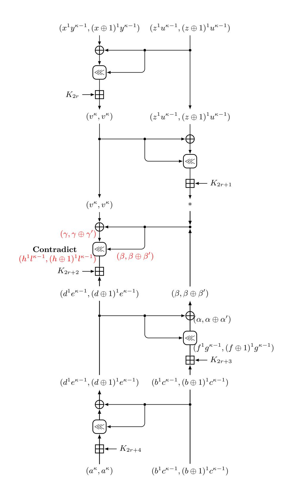

<span id="page-28-0"></span> $\bf Fig.\,5.$  The 2.5-round impossible differentials of RC5

{29}------------------------------------------------

1 round, and the output 2-state  $(a^{\kappa}||b^1c^{\kappa-1}, a^{\kappa}||(b\oplus 1)^1c^{\kappa-1})$  whose difference is  $e^n_{(\frac{n}{2})-1}$  in backward by 1.5 rounds.

Let us focus on the forward propagation. For any input pair  $(x^1y^{\kappa-1}||z^1u^{\kappa-1}, (x\oplus 1)^1y^{\kappa-1}||(z\oplus 1)^1u^{\kappa-1})$ , since the least  $\log_2\kappa$  bits of  $z^1u^{\kappa-1}$  and  $(z\oplus 1)^1u^{\kappa-1}$  are the same, the left branch of the output of the first round must be in the form  $(v^{\kappa}, v^{\kappa})$ .

On the backward propagation, since the least  $log_2\kappa$  bits of  $d^1e^{\kappa-1}$  and  $(d \oplus 1)^1e^{\kappa-1}$  are same, the output of the second variable rotation operation in the 2th round in the backward direction must be in the form  $(\alpha, \alpha \oplus \alpha')$ , where  $W(\alpha') = 1$ . Thus, the right branch of the output of the 1.5th round in backward direction must be in the form  $(\beta, \beta \oplus \beta')$ , where  $W(\beta') = 0$  or 2.

Let  $\gamma = v^{\kappa} \oplus \beta$  and  $\gamma' = \beta'$ , since  $W(\beta') = 0$  or 2, according to Proposition 1, the weight of  $(\gamma \ll \beta) \oplus ((\gamma \oplus \gamma') \ll (\beta \oplus \beta'))$  is even, while the weight of  $(h^1 l^{\kappa-1}) \oplus ((h \oplus 1)^1 l^{\kappa-1})$  is odd. This is a contradiction.

# <span id="page-29-0"></span>6 Applications to Impossible Differentials from the Aspect of Design

In this section, we apply our tool to evaluate the security of lightweight block ciphers against the d-impossible differentials directly. For block ciphers with large S-boxes, we propose the three phases technique and inside value technique, which improve the security evaluation efficiency against the impossible differentials.

Three phases technique. For a block cipher, proving that all the input differences in  $\Lambda$  and output differences in  $\Theta$  are the r-round possible differentials may be time-consuming. To overcome this dilemma, we pick two sets  $\Phi$  and  $\Psi$  satisfied: for  $\forall \alpha \in \Lambda$ , there exists  $\alpha_0 \in \Phi$  such that  $\alpha$  can propagate to  $\alpha_0$  after  $r_1$  rounds in the forward direction, and for  $\forall \beta \in \Theta$ , there exists  $\beta_0 \in \Psi$  such that  $\beta$  can propagate to  $\beta_0$  after  $r_2$  rounds in the backward direction. In this way, we just need to prove all the difference of the  $\Phi$  and  $\Psi$  are the  $(r - r_1 - r_2)$ -round possible differentials.

Inside value technique. For a block cipher, proving  $(\alpha, \beta)$  is an r-round i-possible (resp. d-possible) differential directly may be time-consuming. To solve this problem, we prove that  $(0, \alpha)$  and  $(0, \beta)$  is an i-possible (resp. d-possible) 2-polygon instead. Our experimental results show that this technique speeds up our proof process.

# 6.1 Direct Application to GIFT64, PRESENT, Midori64, PRINTcipher48, and PRINTcipher96

By exploiting our tool, we prove that, in the search space where the input difference activates only one S-box in the first substitution and the output difference activates only one S-box in the last substitution, there exists no 7-round, 7-round, 6-round, 5-round, and 6-round impossible differential for GIFT64, PRESENT, Midori64, PRINTcipher48, and PRINTcipher96 even considering the details of the key schedule.

{30}------------------------------------------------

#### 6.2 Three Phases Technique: Apply to AES-128

AES-128 is the most famous standard block cipher designed by Vincent Rijmen and Joan Daemen [13]. It is a 128-bit block cipher with 128-bit key. AES-128 adopts the SPN structure. Its 128-bit internal state s can be represented as a  $4 \times 4$  matrix of bytes  $s_{i,j} \in \mathbb{F}_2^8$  ( $0 \le i, j \le 3$ ), each values in the finite fields  $\mathbb{F}_2^8$ . For more details of AES, please refer to [13].

**Previous result.** Wang el at. [33] have proved that there exists no 5-round 1 input active word and 1 output active word impossible differentials for AES-128 without the last MC operation even considering all the details of the S-box in the key independent setting. But, the influence of the key schedule for the impossible differentials about AES-128 is still unknown.

Our method. Determine whether a pair of input and output differences is the 5-round impossible differential by considering all the details of the relations of the round keys is very time-consuming. To resolve this issue, we adopt the three phases technique to finish our proof. First, according to the following two observations and further the propositions by studying the differential property of the S-box of AES, we propagate the input difference one round in the forward direction and the output difference two rounds in the backward direction. Then, we run our algorithm to show that those differences after the propagation can be connected through two rounds of AES even considering the relation of 3-round keys.

**Observation 2** Let S denote the S-box of AES, define  $DDT_{in}(\beta) = \{\alpha | \exists x \in F_8^8, s.t.S(x) \oplus S(x \oplus \alpha) = \beta\}$ , then we have  $DDT_{in}(0x01) \cup DDT_{in}(0x02) \cup DDT_{in}(0xec) = \mathbb{F}_2^8$ .

<span id="page-30-0"></span>**Observation 3** Let S denote the S-box of AES, define  $DDT_{out}(\alpha) = \{\beta | \exists x \in F_8^8, s.t. \beta = S(x) \oplus S(x \oplus \alpha)\}$ , then we have  $DDT_{out}(0x01) \cup DDT_{out}(0x02) \cup DDT_{out}(0xf7) = \mathbb{F}_2^8$ . Moreover, we have

```
 \{0x0d, 0x1a, 0xff\} = \{0x0d \times 0x01, 0x0d \times 0x02, 0x0d \times 0xf7\} \in DDT_{out}(0x01), \\ \{0x0b, 0x16, 0xfb\} = \{0x0b \times 0x01, 0x0b \times 0x02, 0x0b \times 0xf7\} \in DDT_{out}(0x03), \\ \{0x09, 0x12, 0x0e\} = \{0x09 \times 0x01, 0x09 \times 0x02, 0x09 \times 0xf7\} \in DDT_{out}(0x06), \\ \{0x0e, 0x1c, 0xfd\} = \{0x0e \times 0x01, 0x0e \times 0x02, 0x0e \times 0xf7\} \in DDT_{out}(0x09).
```

**Proposition 2.** Let  $F_1 = MC \circ SR \circ SB \circ ARK$ , any difference  $D_{\alpha}^{i,j}$   $(0 \le i \le 3, 0 \le j \le 3, \alpha \in \mathbb{F}_2^8/\{0\})$  can propagate to at least one of the differences of  $MC \circ SR(D_{0x01}^{i,j})$ ,  $MC \circ SR(D_{0x02}^{i,j})$ , and  $MC \circ SR(D_{0xec}^{i,j})$  through  $F_1$ .

**Proposition 3.** Let  $F_2 = ARK \circ SR \circ SB \circ ARK \circ MC \circ SR \circ SB$  and

$$P = \begin{pmatrix} 0x09 & 0x03 & 0x01 & 0x06 \\ 0x06 & 0x09 & 0x03 & 0x01 \\ 0x01 & 0x06 & 0x09 & 0x03 \\ 0x03 & 0x01 & 0x06 & 0x09 \end{pmatrix}$$

{31}------------------------------------------------

Let  $k = (j+i) \mod 4$ . Then, for any difference  $D_{\alpha}^{i,j}$   $(0 \le i \le 3, 0 \le j \le 3, \alpha \in \mathbb{F}_2^8/\{0\})$ , the difference  $G_{i,j} := D_{P_{0,i}}^{0,k} + D_{P_{1,i}}^{1,(k+1)mod4} + D_{P_{2,i}}^{2,(k+2)mod4} + D_{P_{3,i}}^{3,(k+3)mod4}$  can propagate to it through  $F_2$ .

Proof. Let Q be the inverse matrix of the MDS used in AES<sup>10</sup>. According to Observation 3, for  $\forall z \in \{0x01, 0x02, 0x7f\}$ , we have  $G_{i,j} \xrightarrow{SR \circ SB} D_{Q_{0,i} \times z}^{0,k} + D_{Q_{1,i} \times z}^{1,k} + D_{Q_{2,i} \times z}^{2,k} + D_{Q_{3,i} \times z}^{3,k}$ , since the S-box is applied to each byte of the state in parallel in the SB operation. Then based on the definition of Q, we have  $MC(D_{Q_{0,i} \times z}^{0,k} + D_{Q_{1,i} \times z}^{1,k} + D_{Q_{2,i} \times z}^{2,k} + D_{Q_{3,i} \times z}^{3,k}) = D_z^{i,k}$ . According to Observation 3, for any difference  $D_{\alpha}^{i,j}$  ( $0 \le i \le 3, 0 \le j \le 3, \alpha \in \mathbb{F}_2^8/\{0\}$ ), at least one of  $D_{0x01}^{i,k}, D_{0x02}^{i,k}$ , and  $D_{0x7f}^{i,k}$  can propagate to it through  $SR \circ SB$ . Thus, for any difference  $D_{\alpha}^{i,j}$  ( $0 \le i \le 3, 0 \le j \le 3, \alpha \in \mathbb{F}_2^8/\{0\}$ ), the difference  $G_{i,j}$  can propagate to it through  $F_2$ .

Our experiment. Let  $F_3 = ARK \circ (MC \circ SR \circ SB \circ ARK)^2$ . For  $0 \le i, j, s, t \le 3$ , by considering the relations of  $K_1$ ,  $K_2$ , and  $K_3$  according to the key schedule, we run our tool to determine whether all the differences of  $MC \circ SR(D_{0x01}^{i,j})$ ,  $MC \circ SR(D_{0x02}^{i,j})$ , and  $MC \circ SR(D_{0xec}^{i,j})$  can propagate to  $G_{s,t}$  through  $F_3$ . After a total of  $16 \times 16 \times 3 = 768$  tests, our result shows that all the differences of  $MC \circ SR(D_{0x01}^{i,j})$ ,  $MC \circ SR(D_{0x02}^{i,j})$ , and  $MC \circ SR(D_{0xec}^{i,j})$  can propagate to  $G_{s,t}$  through  $F_3$  in our setting, which leads to the following theorem.

**Theorem 8.** For 5-round AES-128 without the last MC operation, there exists no 1 input active word and 1 output active word impossible differentials by considering the relations of  $K_1$ ,  $K_2$ , and  $K_3$ .

In Appendix F, we give an example to diagram our three phases method for AES-128.

# 6.3 Combination of Three Phases Technique and Inside Value Technique: Application to MISTY1

The 5-round MISTY1 in which the FL layers were placed at the even rounds is shown in the right of Figure 6. In this subsection, we prove there exists no 1 input active bit and 1 output active bit impossible differentials for it in the key independent setting.

**Previous result.** Since MISTY1 adopts the 7-bit and 9-bit S-boxes, no automatic search tool could be used to evaluate its security taking account into the differential property of S-boxes so far.

$$Q = \begin{pmatrix} 0x0e & 0x0b & 0x0d & 0x09 \\ 0x09 & 0x0e & 0x0b & 0x0d \\ 0x0d & 0x09 & 0x0e & 0x0b \\ 0x0b & 0x0d & 0x09 & 0x0e \end{pmatrix}$$

<span id="page-31-0"></span>10

{32}------------------------------------------------

Our approach. We combine the three phases technique and inside value technique to accelerate our tool in this part. Denote  $\beta_0||\alpha_0$  be the 1 input active bit difference and  $\beta_5||\alpha_5$  be the 1 output active bit difference, and  $FO_{(KI,KO)}$  be the FO function, where KI and KO are the secret keys in the FO function. Let

$$\beta_{1}||\alpha_{1} = \begin{cases} e_{i+32}^{64}, & \text{if } (\beta_{0}||\alpha_{0}) = e_{i}^{64}(0 \leq i \leq 31), \\ (FO_{0,0}(0) \oplus FO_{0,0}(e_{i-32}^{32}))||e_{i-32}^{32}, & \text{if } \beta_{0}||\alpha_{0}) = e_{i}^{64}(32 \leq i \leq 63). \end{cases}$$

$$\beta_{4}||\alpha_{4} = \begin{cases} e_{i}^{32}||(FO_{0,0}(0) \oplus FO_{0,0}(e_{i}^{32}))e_{i+32}^{64}, & \text{if } (\beta_{5}||\alpha_{5}) = e_{i}^{64}(0 \leq i \leq 31), \\ e_{i-32}^{64}, & \text{if } \beta_{5}||\alpha_{5}) = e_{i}^{64}(32 \leq i \leq 63). \end{cases}$$

That is, we propagate the difference  $\beta_0||\alpha_0$  through one round to  $\beta_1||\alpha_1$  in the forward direction and the difference  $\beta_5||\alpha_5$  through one round to  $\beta_4||\alpha_4$  in the backward direction. Then, we prove that  $(0, \beta_1||\alpha_1)$  and  $(0, \beta_4||\alpha_4)$  is the *i*-possible 2-polygons.

Our experiment. We run our tool to determine whether the input 2-polygons  $(0, \beta_1 || \alpha_1)$  and the output 2-polygons  $(0, \beta_4 || \alpha_4)$  are the *i*-possible 2-polygons for 3 rounds MISTY1. After a total of  $64 \times 64 = 4096$  tests, our result shows that all the input 2-polygons  $(0, \beta_1 || \alpha_1)$  and the output 2-polygons  $(0, \beta_4 || \alpha_4)$  are the *i*-possible 2-polygons for 3-round MISTY1, which leads to the following theorem.

**Theorem 9.** For 5-round MISTY1 in which the FL layers were placed at the even rounds, there exists no 1 input active bit and 1 output active bit impossible differentials in the key independent setting.

## <span id="page-32-0"></span>7 Applications to Impossible (s+1)-polytopic $(s \ge 2)$ Transitions

In this section, we run our tool to search the impossible (s+1)-polytopic  $(s \ge 2)$  transitions for PRINTcipher, GIFT64, PRESENT, and RC5. All the contradictions of the distinguishers in this section can be detected by Algorithm 4, the details are shown in the Appendix G. First, for S-boxes based block ciphers, we define some search spaces for the input and output s-differences.

**Search space**<sub>1</sub>: In this space, the input 2-difference  $(b_1, b_2)$  is the (1, 1) active bit which only activates the two right S-boxes in the first round, and the output 2-difference  $(e_1, e_2)$  is the (1, 1) active bit.

**Search space**<sub>2</sub>: In this space, the input 2-difference  $(b_1, b_2)$  is the (1, 1) input active bit which only activates the first right S-box in the first round and the 2-difference  $(e_1, e_2)$  is the (1, 1) output active bit which activates the same S-box in the last round.

**Search space**<sub>i</sub>(i = 3, 4): In this space, the input 3-difference is of pattern  $(b_1, b_2, b_1 \oplus b_2)$  and the output 3-difference is of pattern  $(e_1, e_2, e_1 \oplus e_2)$ , where  $(b_1, b_2)$  and  $(e_1, e_2)$  are in Search space<sub>i-2</sub>.

{33}------------------------------------------------

### 7.1 The d-impossible polytopic transitions of PRINTcipher

In this part, we show our method to search the impossible 3-polytopic transitions and impossible 4-polytopic transitions for PRINTcipher48 and PRINTcipher96 by considering all the details of the key schedule. Besides, we also study the influence of the Xor key and control key for the d-impossible 3-polytopic transitions of PRINTcipher48.

For the d-impossible 3-polytopic transitions of PRINTcipher48, we search such distinguishers in the Search space<sub>1</sub>. After a total of  $\binom{\binom{6}{1}}{2} \times \binom{\binom{48}{1}}{2} = 16920$  tests, the maximum number of rounds of d-impossible 3-polytopic transitions in this search space is 6, and a total of 1471 6-round d-impossible 3-polytopic transitions are found. One of them is

```
(0x0000000001, 0x00000010000) \xrightarrow{6-round} (0x0000000002, 0x000000000000).
```

Impact of the constraints of the Xor keys. In our search above, we restrict the Xor keys and control keys according to the key schedule. To investigate the impact of the constraints of the Xor keys, we further release the constraints of the Xor keys and keep the constraints of the control keys. Then, we run our tool to search the 6-round impossible 3-polytopic transitions in Search space<sub>1</sub>. Finally, we get 1448 6-round impossible 3-polytopic transitions. This result shows that, the constraint of the Xor keys leads to more contradictions for constructing the impossible 3-polytopic transitions.

Impact of the constraints of the control keys. Similarly, we keep the constraints of the Xor keys and release the constraints of the control keys over again. Then, we run our tool to search the 6-round impossible 3-polytopic transitions in Search space<sub>1</sub>. Finally, we found that there exists no 6-round impossible 3-polytopic transitions in such search space. This result shows that the constraints of the control keys have a very significant impact on constructing the impossible 3-polytopic transitions.

Those two results show that, both the Xor keys and control keys may have influences on the results of impossible (s+1)-polytopic transitions. Thus, in the search of impossible (s+1)-polytopic transitions, we should consider the details of key schedule as much as possible if the time cost permits.

For the *d*-impossible 4-polytopic transitions of PRINTcipher48, we search such distinguishers in Search space<sub>3</sub>. Finally, we found one 7-round *d*-impossible 4-polytopic transition of PRINTcipher48 as follows and stop our tool due to the limitation of search time.

```
(0x0000000001, 0x000000010000, 0x000000010001) \xrightarrow{7-round} (0x00000000001, 0x00000000000000000, 0x0000000000
```

For the d-impossible 3-polytopic transitions of PRINTcipher96, we search such distinguishers in Search space<sub>1</sub>. Finally, we find one 7-round d-impossible 3-polytopic transition of PRINTcipher96 as follows and stop our tool due to the limitation of search time.

```
(0x000000000000000000001, 0x0000000000000
```

{34}------------------------------------------------

For the *d*-impossible 4-polytopic transitions of PRINTcipher96, we search such distinguishers in Search space<sub>3</sub>. Finally, we find one 8-round *d*-impossible 4-polytopic transition of PRINTcipher96 as follows (as the left 48-bit of each value are 0, we only show the right 48 bits here) and stop our tool due to the limitation of search time.

```
(0x0000000001, 0x00010000000, 0x00010000001) \overset{8-round}{\not\to} (0x00000000001, 0x000000000000000, 0x0000000000
```

### 7.2 The 7-round d-impossible 3-polytopic transition of GIFT64

For GIFT64, we search the d-impossible 3-polytopic transitions in Search space<sub>2</sub> Finally, we find one 7-round d-impossible 3-polytopic transition as follows and stop our tool due to the limitation of search time.

```
(0x00000000000001, 0x00000000000000) \xrightarrow{7-round} (0x000000000000001, 0x0000000000000000000
```

### 7.3 The 7-round *i*-impossible 4-polytopic transition of PRESENT

For the *i*-impossible 4-polytopic transitions of PRESENT, we search such distinguishers in Search space<sub>4</sub>. Finally, we find one 7-round *d*-impossible 4-polytopic transition of PRESENT as follows and stop our tool due to the limitation of search time.

```
 (0x0000000000001, 0x00000000000002, 0x00000000000000) \stackrel{7-round}{\not\to} 
 (0x00000000000001, 0x000000000010000, 0x0000000000
```

# 7.4 The 3-round *i*-impossible 3-polytopic transition of RC5-32 and RC5-64

In this subsection, we show our method for searching the *i*-impossible 3-polytopic transition of RC5-32 and RC5-64 by adopting the step by step strategy.

For RC5-32, since (0x80008000, 0x00008000) is the 2.5-round impossible differential, we search the *i*-impossible 3-polytopic transitions by limiting the input 2-difference  $(b_1, b_2)$  in the set  $\{(0x80008000, e_{i,i+16}^{32})|0 \le i \le 15\}$  and the output 2-difference  $(e_1, e_2)$  in the set  $\{(0x00008000, e_i^{32})|0 \le i \le 31\}$ . Finally, we find 108 3-round *i*-impossible 3-polytopic transitions and result in that there exists no 3.5-round *i*-impossible 3-polytopic transitions in such search space. One of the transitions is

```
(0x80008000, 0x00100010) \xrightarrow{3-round} (0x80000000, 0x00200000).
```

By adopting the same method for RC5-32, we find one 3-round i-impossible 3-polytopic transition as follows.

```
(0x800000080000000, 0x0000002000000000) \xrightarrow{3-round} (0x80000000000000000, 0x0000004000000000).
```

{35}------------------------------------------------

## <span id="page-35-2"></span>8 Conclusion

In this paper, we redefine the impossible differentials and impossible (s + 1) polytopic transitions based on the notation of s-polygon, and design a unity SAT-based automatic tool to search them. We apply our tool to various block ciphers. These results show that our tool can not only be used to search the distinguishers by considering the key schedule in the single-key setting, but also make the most of the inside property of large S-boxes or variable rotation for several typical classes of block ciphers.

Moreover, we derive an interesting result that, with the increase of the parameter s, the number of rounds in which the impossible (s+ 1)-polytopic transition exists also increases. Although due to the limitations of computing power, we can only search the impossible (s + 1)-polytopic transition with a small value of s. But, the result indicates a challenge clearly that the impossible (s + 1) polytopic transition may bring threats for block ciphers with the development of the solver of the SAT and the computing power, and it is better to resist this kind of cryptanalysis in a theoretical way of cipher design.

Acknowledgements. We are very grateful to the anonymous reviewers for their helpful comments. This work is supported by the National Natural Science Foundation of China (No.61772517,61902030,61772516), Beijing Municipal Science & Technology Commission (No.Z191100007119004), and Youth Innovation Promotion Association CAS.

## References

- <span id="page-35-4"></span>1. Kazumaro Aoki, Tetsuya Ichikawa, Masayuki Kanda, Mitsuru Matsui, Shiho Moriai, Junko Nakajima, and Toshio Tokita. Camellia: A 128-bit block cipher suitable for multiple platforms - design and analysis. In Douglas R. Stinson and Stafford E. Tavares, editors, Selected Areas in Cryptography, 7th Annual International Workshop, SAC 2000, Waterloo, Ontario, Canada, August 14-15, 2000, Proceedings, volume 2012 of Lecture Notes in Computer Science, pages 39–56. Springer, 2000.
- <span id="page-35-1"></span>2. Subhadeep Banik, Andrey Bogdanov, Takanori Isobe, Kyoji Shibutani, Harunaga Hiwatari, Toru Akishita, and Francesco Regazzoni. Midori: A block cipher for low energy. In Tetsu Iwata and Jung Hee Cheon, editors, Advances in Cryptology - ASIACRYPT 2015, New Zealand, November 29 - December 3, 2015, Proceedings, Part II, volume 9453 of Lecture Notes in Computer Science, pages 411–436. Springer, 2015.
- <span id="page-35-0"></span>3. Subhadeep Banik, Sumit Kumar Pandey, Thomas Peyrin, Yu Sasaki, Siang Meng Sim, and Yosuke Todo. GIFT: A small present - towards reaching the limit of lightweight encryption. In Wieland Fischer and Naofumi Homma, editors, Cryptographic Hardware and Embedded Systems - CHES 2017, Taipei, Taiwan, September 25-28, 2017, Proceedings, volume 10529 of Lecture Notes in Computer Science, pages 321–345. Springer, 2017.
- <span id="page-35-3"></span>4. Adnan Baysal and S¨uhap Sahin. Roadrunner: A small and fast bitslice block cipher for low cost 8-bit processors. In Tim G¨uneysu, Gregor Leander, and Amir Moradi, editors, Lightweight Cryptography for Security and Privacy - 4th International

{36}------------------------------------------------

- Workshop, LightSec 2015, Bochum, Germany, September 10-11, 2015, Revised Selected Papers, volume 9542 of Lecture Notes in Computer Science, pages 58–76. Springer, 2015.
- <span id="page-36-8"></span>5. Ray Beaulieu, Douglas Shors, Jason Smith, Stefan Treatman-Clark, Bryan Weeks, and Louis Wingers. The SIMON and SPECK lightweight block ciphers. In Proceedings of the 52nd Annual Design Automation Conference, San Francisco, CA, USA, June 7-11, 2015, pages 175:1–175:6. ACM, 2015.
- <span id="page-36-0"></span>6. Eli Biham, Alex Biryukov, and Adi Shamir. Cryptanalysis of skipjack reduced to 31 rounds using impossible differentials. In Jacques Stern, editor, Advances in Cryptology - EUROCRYPT '99, International Conference on the Theory and Application of Cryptographic Techniques, Prague, Czech Republic, May 2-6, 1999, Proceeding, volume 1592 of Lecture Notes in Computer Science, pages 12–23. Springer, 1999.
- <span id="page-36-10"></span>7. Eli Biham and Adi Shamir. Differential cryptanalysis of des-like cryptosystems. J. Cryptology, 4(1):3–72, 1991.
- <span id="page-36-6"></span>8. Andrey Bogdanov, Lars R. Knudsen, Gregor Leander, Christof Paar, Axel Poschmann, Matthew J. B. Robshaw, Yannick Seurin, and C. Vikkelsoe. PRESENT: an ultra-lightweight block cipher. In Pascal Paillier and Ingrid Verbauwhede, editors, Cryptographic Hardware and Embedded Systems - CHES 2007, 9th International Workshop, Vienna, Austria, September 10-13, 2007, Proceedings, volume 4727 of Lecture Notes in Computer Science, pages 450–466. Springer, 2007.
- <span id="page-36-9"></span>9. Julia Borghoff, Anne Canteaut, Tim G¨uneysu, Elif Bilge Kavun, Miroslav Knezevic, Lars R. Knudsen, Gregor Leander, Ventzislav Nikov, Christof Paar, Christian Rechberger, Peter Rombouts, Søren S. Thomsen, and Tolga Yal¸cin. PRINCE - A low-latency block cipher for pervasive computing applications - extended abstract. In Xiaoyun Wang and Kazue Sako, editors, Advances in Cryptology - ASIACRYP-T 2012, Beijing, China, December 2-6, 2012. Proceedings, volume 7658 of Lecture Notes in Computer Science, pages 208–225. Springer, 2012.
- <span id="page-36-1"></span>10. Christina Boura, Mar´ıa Naya-Plasencia, and Valentin Suder. Scrutinizing and improving impossible differential attacks: Applications to clefia, camellia, lblock and simon. In Palash Sarkar and Tetsu Iwata, editors, Advances in Cryptology - ASIACRYPT 2014, Kaoshiung, Taiwan, R.O.C., December 7-11, 2014. Proceedings, Part I, volume 8873 of Lecture Notes in Computer Science, pages 179–199. Springer, 2014.
- <span id="page-36-2"></span>11. Jiazhe Chen, Meiqin Wang, and Bart Preneel. Impossible differential cryptanalysis of the lightweight block ciphers tea, XTEA and HIGHT. In Aikaterini Mitrokotsa and Serge Vaudenay, editors, Progress in Cryptology - AFRICACRYPT 2012, Ifrance, Morocco, July 10-12, 2012. Proceedings, volume 7374 of Lecture Notes in Computer Science, pages 117–137. Springer, 2012.
- <span id="page-36-5"></span>12. Tingting Cui, Keting Jia, Kai Fu, Shiyao Chen, and Meiqin Wang. New automatic search tool for impossible differentials and zero-correlation linear approximations. IACR Cryptology ePrint Archive, 2016:689, 2016.
- <span id="page-36-7"></span>13. Joan Daemen and Vincent Rijmen. The Design of Rijndael: AES - The Advanced Encryption Standard. Information Security and Cryptography. Springer, 2002.
- <span id="page-36-4"></span>14. Kai Fu, Meiqin Wang, Yinghua Guo, Siwei Sun, and Lei Hu. Milp-based automatic search algorithms for differential and linear trails for speck. In Thomas Peyrin, editor, Fast Software Encryption - 23rd International Conference, FSE 2016, Bochum, Germany, March 20-23, 2016, Revised Selected Papers, volume 9783 of Lecture Notes in Computer Science, pages 268–288. Springer, 2016.
- <span id="page-36-3"></span>15. Jongsung Kim, Seokhie Hong, Jaechul Sung, Changhoon Lee, and Sangjin Lee. Impossible differential cryptanalysis for block cipher structures. In Thomas Johansson

{37}------------------------------------------------

- and Subhamoy Maitra, editors, Progress in Cryptology INDOCRYPT 2003, 4th International Conference on Cryptology in India, New Delhi, India, December 8- 10, 2003, Proceedings, volume 2904 of Lecture Notes in Computer Science, pages 82–96. Springer, 2003.
- <span id="page-37-0"></span>16. Lars Knudsen. Deal - a 128-bit block cipher. In NIST AES Proposal, 1998.
- <span id="page-37-6"></span>17. Lars R. Knudsen, Gregor Leander, Axel Poschmann, and Matthew J. B. Robshaw. Printcipher: A block cipher for ic-printing. In Stefan Mangard and Fran¸cois-Xavier Standaert, editors, Cryptographic Hardware and Embedded Systems, CHES 2010, 12th International Workshop, Santa Barbara, CA, USA, August 17-20, 2010. Proceedings, volume 6225 of Lecture Notes in Computer Science, pages 16–32. Springer, 2010.
- <span id="page-37-5"></span>18. Fukang Liu, Takanori Isobe, and Willi Meier. Automatic verification of differential characteristics: Application to reduced gimli. In Daniele Micciancio and Thomas Ristenpart, editors, Advances in Cryptology - CRYPTO 2020 - 40th Annual International Cryptology Conference, CRYPTO 2020, Santa Barbara, CA, USA, August 17-21, 2020, Proceedings, Part III, volume 12172 of Lecture Notes in Computer Science, pages 219–248. Springer, 2020.
- <span id="page-37-2"></span>19. Yiyuan Luo, Xuejia Lai, Zhongming Wu, and Guang Gong. A unified method for finding impossible differentials of block cipher structures. Inf. Sci., 263:211–220, 2014.
- <span id="page-37-1"></span>20. Hamid Mala, Mohammad Dakhilalian, Vincent Rijmen, and Mahmoud Modarres-Hashemi. Improved impossible differential cryptanalysis of 7-round AES-128. In Guang Gong and Kishan Chand Gupta, editors, Progress in Cryptology - IN-DOCRYPT 2010, Hyderabad, India, December 12-15, 2010. Proceedings, volume 6498 of Lecture Notes in Computer Science, pages 282–291. Springer, 2010.
- <span id="page-37-10"></span>21. Mitsuru Matsui. Linear cryptanalysis method for DES cipher. In Tor Helleseth, editor, Advances in Cryptology - EUROCRYPT '93, Workshop on the Theory and Application of of Cryptographic Techniques, Lofthus, Norway, May 23-27, 1993, Proceedings, volume 765 of Lecture Notes in Computer Science, pages 386–397. Springer, 1993.
- <span id="page-37-7"></span>22. Mitsuru Matsui. New block encryption algorithm MISTY. In Eli Biham, editor, Fast Software Encryption, 4th International Workshop, FSE '97, Haifa, Israel, January 20-22, 1997, Proceedings, volume 1267 of Lecture Notes in Computer Science, pages 54–68. Springer, 1997.
- <span id="page-37-4"></span>23. Ilya Mironov and Lintao Zhang. Applications of SAT solvers to cryptanalysis of hash functions. In Armin Biere and Carla P. Gomes, editors, Theory and Applications of Satisfiability Testing - SAT 2006, 9th International Conference, Seattle, WA, USA, August 12-15, 2006, Proceedings, volume 4121 of Lecture Notes in Computer Science, pages 102–115. Springer, 2006.
- <span id="page-37-3"></span>24. Nicky Mouha, Qingju Wang, Dawu Gu, and Bart Preneel. Differential and linear cryptanalysis using mixed-integer linear programming. In Chuankun Wu, Moti Yung, and Dongdai Lin, editors, Information Security and Cryptology - 7th International Conference, Inscrypt 2011, Beijing, China, November 30 - December 3, 2011. Revised Selected Papers, volume 7537 of Lecture Notes in Computer Science, pages 57–76. Springer, 2011.
- <span id="page-37-9"></span>25. Kaisa Nyberg and Lars R. Knudsen. Provable security against a differential attack. J. Cryptology, 8(1):27–37, 1995.
- <span id="page-37-8"></span>26. Ronald L. Rivest. The RC5 encryption algorithm. In Bart Preneel, editor, Fast Software Encryption: Second International Workshop. Leuven, Belgium, 14-16 December 1994, Proceedings, volume 1008 of Lecture Notes in Computer Science, pages 86–96. Springer, 1994.

{38}------------------------------------------------

- <span id="page-38-6"></span>27. Ronald L. Rivest, Matthew J. B. Robshaw, and Yiqun Lisa Yin. RC6 as the AES. In The Third Advanced Encryption Standard Candidate Conference, April 13-14, 2000, New York, New York, USA, pages 337–342. National Institute of Standards and Technology,, 2000.
- <span id="page-38-5"></span>28. Dongyoung Roh, Bonwook Koo, Younghoon Jung, Ilwoong Jeong, Donggeon Lee, Daesung Kwon, and Woo-Hwan Kim. Revised version of block cipher CHAM. In Jae Hong Seo, editor, Information Security and Cryptology - ICISC 2019 - 22nd International Conference, Seoul, South Korea, December 4-6, 2019, Revised Selected Papers, volume 11975 of Lecture Notes in Computer Science, pages 1–19. Springer, 2019.
- <span id="page-38-4"></span>29. Sadegh Sadeghi, Vincent Rijmen, and Nasour Bagheri. Proposing an milp-based method for the experimental verification of difference trails. IACR Cryptol. ePrint Arch., 2020:632, 2020.
- <span id="page-38-3"></span>30. Yu Sasaki and Yosuke Todo. New impossible differential search tool from design and cryptanalysis aspects - revealing structural properties of several ciphers. In Jean-S´ebastien Coron and Jesper Buus Nielsen, editors, Advances in Cryptology - EUROCRYPT 2017 - 36th Annual International Conference on the Theory and Applications of Cryptographic Techniques, Paris, France, April 30 - May 4, 2017, Proceedings, Part III, volume 10212 of Lecture Notes in Computer Science, pages 185–215, 2017.
- <span id="page-38-2"></span>31. Siwei Sun, Lei Hu, Peng Wang, Kexin Qiao, Xiaoshuang Ma, and Ling Song. Automatic security evaluation and (related-key) differential characteristic search: Application to simon, present, lblock, DES(L) and other bit-oriented block ciphers. In Palash Sarkar and Tetsu Iwata, editors, Advances in Cryptology - ASIACRYPT 2014 - 20th International Conference on the Theory and Application of Cryptology and Information Security, Kaoshiung, Taiwan, R.O.C., December 7-11, 2014. Proceedings, Part I, volume 8873 of Lecture Notes in Computer Science, pages 158–178. Springer, 2014.
- <span id="page-38-0"></span>32. Tyge Tiessen. Polytopic cryptanalysis. In Marc Fischlin and Jean-S´ebastien Coron, editors, Advances in Cryptology - EUROCRYPT 2016 - 35th Annual International Conference on the Theory and Applications of Cryptographic Techniques, Vienna, Austria, May 8-12, 2016, Proceedings, Part I, volume 9665 of Lecture Notes in Computer Science, pages 214–239. Springer, 2016.
- <span id="page-38-8"></span>33. Qian Wang and Chenhui Jin. Upper bound of the length of truncated impossible differentials for AES. Des. Codes Cryptogr., 86(7):1541–1552, 2018.
- <span id="page-38-1"></span>34. Shengbao Wu and Mingsheng Wang. Automatic search of truncated impossible differentials for word-oriented block ciphers. In Steven D. Galbraith and Mridul Nandi, editors, Progress in Cryptology - INDOCRYPT 2012, 13th International Conference on Cryptology in India, Kolkata, India, December 9-12, 2012. Proceedings, volume 7668 of Lecture Notes in Computer Science, pages 283–302. Springer, 2012.

## <span id="page-38-7"></span>A Manual Verification the 4-round i-impossible Differentials of MISTY1

<span id="page-38-9"></span>First, we study the property of the FL and FO function of MISTY1.

Obsetvation 4 Let F denote the FL function of MISTY1, if the input difference is one of e 32 i , e 32 <sup>i</sup>+16, and e 32 i,i+16(0 ≤ i ≤ 15), all possible output difference of

{39}------------------------------------------------

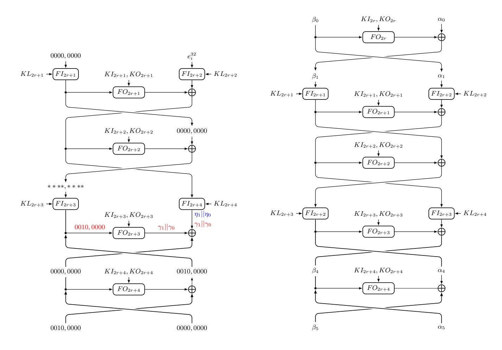

<span id="page-39-0"></span>**Fig. 6.** The 4-round impossible differential of MISTY1 (left) and 5-round MISTY1 in which the FL layer were placed at the even round (right).

F is  $\{e_i^{32}, e_{i+16}^{32}, e_{i,i+16}^{32}\}$ . Moreover, all possible output difference of  $F^2$  also is  $\{e_i^{32}, e_{i+16}^{32}, e_{i,i+16}^{32}\}$ , where  $F^2$  denotes the composition of two FL functions.

<span id="page-39-1"></span>**Proposition 4.** Let F denote the FO function of MISTY1 and  $\gamma_i(0 \le i \le 1)$  be the 16-bit variables, for  $\forall (\gamma_1 || \gamma_0) \in \{\beta | e_{20}^{32} \xrightarrow{F} \beta\}$ , we have  $W(\gamma_1) > 1$ .

Proof. By observing the structure of F, we have  $\gamma_1 = \alpha || \beta$ , where  $\alpha \in \Lambda = \{S_7(x) \oplus S_7(x \oplus 0x10) \oplus 0x10 | x \in \mathbb{F}_2^7\}$  and  $\beta \in \Phi = \{S_9(y) \oplus S_9(y \oplus 0x10) \oplus \alpha | y \in \mathbb{F}_2^9\}$ . For  $\forall \alpha \in \Lambda$ , if  $W(\alpha) \geq 2$ , the conclusion is obvious. Otherwise, we only have  $\alpha = 0x1$  or  $\alpha = 0x4$ . Since  $\{0x1, 0x4\} \not\subseteq \{S_9(y) \oplus S_9(y \oplus 0x10) | y \in \mathbb{F}_2^9\}$ , for  $\forall \beta \in \Phi$ , we have  $\beta \neq 0$  when  $\alpha = 0x1$  or  $\alpha = 0x4$ . Thus,  $W(\gamma_1) = W(\alpha | \beta) \geq 2$ .

**Theorem 10.** For any  $i(0 \le i \le 31)$ , the input difference  $e_i^{64}$  cannot propagate to the output difference  $e_{52}^{64}$  after 4 rounds of MISTY1 in the key independent setting.

*Proof.* In Figure 6, the input difference is propagated in forwards by 2.5 rounds, and the output difference is propagated in backwards by 1.5 rounds.

Let us focus on the forward propagation. Let  $\eta_i(i=0,1)$  be the 16-bit variables. Assume the output difference of the FL in the right branch of 3-round is  $\eta_1||\eta_0$ . From the Observation 4, if  $0 \le i \le 15$ , we have  $\eta_1||\eta_0 \in \{e_i^{32}, e_{i+16}^{32}, e_{i,i+16}^{32}\}$ . If  $16 \le i \le 31$ , we have  $\eta_1||\eta_0 \in \{e_i^{32}, e_{i-16}^{32}, e_{i,i-16}^{32}\}$ . All in all, we have  $W(\eta_1) \le 1$ .

{40}------------------------------------------------

On the backward propagation, according to the Proposition 4, the output difference in the right branch after 1.5 rounds is  $\gamma_1||\gamma_0$ , where  $W(\gamma_1) \geq 2$ . Since  $\gamma_1 = \eta_1$ , this is a contradiction.

### <span id="page-40-0"></span>B Model the key-dependent permutation

For the key-dependent permutation, assume the input variable is x2||x1||x0, the output variable is y2||y1||y0, and the control key is k1||k0. Then, the following statement can be used to describe the propagation of state through the key-dependent permutation.

ASSERT(y2@y1@y0 = (IF k1@k0 = 0bin11 THEN x0@x1@x2 ELSE (IF k1@k0 = 0bin10 THEN x2@x0@x1 ELSE (IF k1@k0 = 0bin01 THEN x1@x2@x0 ELSE x2@x1@x0 ENDIF) ENDIF) ENDIF));

For the key-dependent S-box, assume the input variable is x2||x1||x0, the output variable is y2||y1||y0, and the control key is k1||k0. Then, the following statement can be used to describe the propagation of state through the key-dependent S-box.

 $ASSERT(y2@y1@y0 = (IF \ k1@k0@x2@x1@x0 = 0bin11111 \ THEN \ 0bin010$ ELSE (IF k1@k0@x2@x1@x0 = 0bin111110 THEN 0bin110 ELSE (IF k1@k0@x2@x1@x0= 0bin11101 THEN 0bin100 ELSE (IF k1@k0@x2@x1@x0 = 0bin11100 THEN) $0bin001\ ELSE\ (IF\ k1@k0@x2@x1@x0\ =\ 0bin11011\ THEN\ 0bin101\ ELSE\ (IF\ k1@k0@x2@x1@x0\ =\ 0bin11011\ THEN\ 0bin101\ ELSE\ (IF\ k1@k0@x2@x1@x0\ =\ 0bin11011\ THEN\ 0bin101\ ELSE\ (IF\ k1@k0@x2@x1@x0\ =\ 0bin11011\ THEN\ 0bin101\ ELSE\ (IF\ k1@k0@x2@x1@x0\ =\ 0bin11011\ THEN\ 0bin101\ ELSE\ (IF\ k1@k0@x2@x1@x0\ =\ 0bin11011\ THEN\ 0bin101\ ELSE\ (IF\ k1@k0@x2@x1@x0\ =\ 0bin11011\ THEN\ 0bin101\ ELSE\ (IF\ k1@k0@x2@x1@x0\ =\ 0bin11011\ THEN\ 0bin101\ ELSE\ (IF\ k1@k0@x2@x1@x0\ =\ 0bin11011\ THEN\ 0bin101\ ELSE\ (IF\ k1@k0@x2@x1@x0\ =\ 0bin11011\ THEN\ 0bin101\ ELSE\ (IF\ k1@k0@x2@x1@x0\ =\ 0bin11011\ THEN\ 0bin101\ ELSE\ (IF\ k1@k0@x2@x1@x0\ =\ 0bin11011\ THEN\ 0bin101\ ELSE\ (IF\ k1@k0@x2@x1@x0\ =\ 0bin11011\ THEN\ 0bin101\ ELSE\ (IF\ k1@k0@x2@x1@x0\ =\ 0bin11011\ THEN\ 0bin101\ ELSE\ (IF\ k1@k0@x2@x1@x0\ =\ 0bin11011\ THEN\ 0bin101\ ELSE\ (IF\ k1@k0@x2@x1@x0\ =\ 0bin11011\ THEN\ 0bin101\ ELSE\ (IF\ k1@k0@x2@x1@x0\ =\ 0bin11011\ THEN\ 0bin101\ ELSE\ (IF\ k1@k0@x2@x1@x0\ =\ 0bin11011\ ELSE\ (IF\ k1@k0@x2@x1@x0\ =\ 0bin11011\ ELSE\ (IF\ k1@k0@x2@x1@x0\ =\ 0bin11011\ ELSE\ (IF\ k1@k0@x2@x1@x0\ =\ 0bin11011\ ELSE\ (IF\ k1@k0@x2@x1@x0\ =\ 0bin11011\ ELSE\ (IF\ k1@k0@x2@x1@x0\ =\ 0bin11011\ ELSE\ (IF\ k1@k0@x2@x1@x0\ =\ 0bin11011\ ELSE\ (IF\ k1@k0@x2@x1@x0\ =\ 0bin11011\ ELSE\ (IF\ k1@k0@x2@x1@x0\ =\ 0bin11011\ ELSE\ (IF\ k1@k0@x2@x1@x0\ =\ 0bin11011\ ELSE\ (IF\ k1@k0@x2@x1@x0\ =\ 0bin11011\ ELSE\ (IF\ k1@k0@x2@x1@x0\ =\ 0bin11011\ ELSE\ (IF\ k1@k0@x2@x1@x0\ =\ 0bin11011\ ELSE\ (IF\ k1@k0@x2@x1@x0\ =\ 0bin11011\ ELSE\ (IF\ k1@k0@x2@x1@x0\ =\ 0bin11011\ ELSE\ (IF\ k1@k0@x2@x1@x0\ =\ 0bin11011\ ELSE\ (IF\ k1@k0@x2@x1@x0\ =\ 0bin11011\ ELSE\ (IF\ k1@k0@x2@x1@x0\ =\ 0bin11011\ ELSE\ (IF\ k1@k0@x2@x1@x0\ =\ 0bin11011\ ELSE\ (IF\ k1@k0@x2@x1@x0\ =\ 0bin11011\ ELSE\ (IF\ k1@k0@x2@x1@x0\ =\ 0bin11011\ ELSE\ (IF\ k1@k0@x2@x1@x0\ =\ 0bin11011\ ELSE\ (IF\ k1@k0@x2@x1@x0\ =\ 0bin11011\ ELSE\ (IF\ k1\ elbin101\ elbin101\ elbin101\ elbin101\ elbin101\ elbin101\ elbin101\ elbin101\ elbin101\ elbin101\ elbin101\ elbin101\ elbin$  $k1@k0@x2@x1@x0 = 0bin11010 \ THEN \ 0bin011 \ ELSE \ (IF \ k1@k0@x2@x1@x0$  $= 0bin11001 \ THEN \ 0bin111 \ ELSE \ (IF \ k1@k0@x2@x1@x0 = 0bin11000 \ THEN)$  $0bin000 \ ELSE \ (IF \ k1@k0@x2@x1@x0 = 0bin10111 \ THEN \ 0bin010 \ ELSE \ (IF$  $k1@k0@x2@x1@x0 = 0bin10110 \ THEN \ 0bin100 \ ELSE \ (IF \ k1@k0@x2@x1@x0$  $= 0bin10101 \ THEN \ 0bin101 \ ELSE \ (IF \ k1@k0@x2@x1@x0 = 0bin10100 \ THEN)$  $0bin111 \ ELSE \ (IF \ k1@k0@x2@x1@x0 = 0bin10011 \ THEN \ 0bin110 \ ELSE \ (IF$  $k1@k0@x2@x1@x0 = 0bin10010 \ THEN \ 0bin001 \ ELSE \ (IF \ k1@k0@x2@x1@x0$  $= 0bin10001 \ THEN \ 0bin011 \ ELSE \ (IF \ k1@k0@x2@x1@x0 = 0bin10000 \ THEN)$ 0bin000 ELSE (IF k1@k0@x2@x1@x0 = 0bin01111 THEN 0bin010 ELSE (IF  $k1@k0@x2@x1@x0 = 0bin01110 \ THEN \ 0bin101 \ ELSE \ (IF \ k1@k0@x2@x1@x0$  $= 0bin01101 \ THEN \ 0bin110 \ ELSE \ (IF \ k1@k0@x2@x1@x0 = 0bin01100 \ THEN)$  $0bin011\ ELSE\ (IF\ k1@k0@x2@x1@x0\ =\ 0bin01011\ THEN\ 0bin100\ ELSE\ (IF\ k1@k0@x2@x1@x0\ =\ 0bin01011\ THEN\ 0bin100\ ELSE\ (IF\ k1@k0@x2@x1@x0\ =\ 0bin01011\ THEN\ 0bin100\ ELSE\ (IF\ k1@k0@x2@x1@x0\ =\ 0bin01011\ THEN\ 0bin100\ ELSE\ (IF\ k1@k0@x2@x1@x0\ =\ 0bin01011\ THEN\ 0bin100\ ELSE\ (IF\ k1@k0@x2@x1@x0\ =\ 0bin01011\ THEN\ 0bin100\ ELSE\ (IF\ k1@k0@x2@x1@x0\ =\ 0bin01011\ THEN\ 0bin100\ ELSE\ (IF\ k1@k0@x2@x1@x0\ =\ 0bin01011\ THEN\ 0bin100\ ELSE\ (IF\ k1@k0@x2@x1@x0\ =\ 0bin01011\ THEN\ 0bin100\ ELSE\ (IF\ k1@k0@x2@x1@x0\ =\ 0bin01011\ THEN\ 0bin100\ ELSE\ (IF\ k1@k0@x2@x1@x0\ =\ 0bin01011\ THEN\ 0bin100\ ELSE\ (IF\ k1@k0@x2@x1@x0\ =\ 0bin01011\ THEN\ 0bin100\ ELSE\ (IF\ k1@k0@x2@x1@x0\ =\ 0bin01011\ THEN\ 0bin100\ ELSE\ (IF\ k1@k0@x2@x1@x0\ =\ 0bin01011\ THEN\ 0bin100\ ELSE\ (IF\ k1@k0@x2@x1@x0\ =\ 0bin01011\ THEN\ 0bin100\ ELSE\ (IF\ k1@k0@x2@x1@x0\ =\ 0bin01011\ THEN\ 0bin100\ ELSE\ (IF\ k1@k0@x2@x1@x0\ =\ 0bin01011\ THEN\ 0bin100\ ELSE\ (IF\ k1@k0@x2@x1@x0\ =\ 0bin01011\ THEN\ 0bin100\ ELSE\ (IF\ k1@k0@x2@x1@x0\ =\ 0bin01011\ THEN\ 0bin100\ ELSE\ (IF\ k1@x0\ =\ 0bin0101\ ELSE\ (IF\ k1@x0\ =\ 0bin0101\ ELSE\ (IF\ k1@x0\ =\ 0bin0101\ ELSE\ (IF\ k1@x0\ =\ 0bin0101\ ELSE\ (IF\ k1@x0\ =\ 0bin0101\ ELSE\ (IF\ k1@x0\ =\ 0bin0101\ ELSE\ (IF\ k1@x0\ =\ 0bin0101\ ELSE\ (IF\ k1\ =\ 0bin0101\ ELSE\ (IF\ k1\ =\ 0bin0101\ ELSE\ (IF\ k1\ =\ 0bin0101\ ELSE\ (IF\ k1\ =\ 0bin0101\ ELSE\ (IF\ k1\ =\ 0bin0101\ ELSE\ (IF\ k1\ =\ 0bin0101\ ELSE\ (IF\ k1\ =\ 0bin0101\ ELSE\ (IF\ k1\ =\ 0bin0101\ ELSE\ (IF\ k1\ =\ 0bin0101\ ELSE\ (IF\ k1\ =\ 0bin0101\ ELSE\ (IF\ k1\ =\ 0bin0101\ ELSE\ (IF\ k1\ =\ 0bin0101\ ELSE\ (IF\ k1\ =\ 0bin0101\ ELSE\ (IF\ k1\ =\ 0bin0101\ ELSE\ (IF\ k1\ =\ 0bin0101\ ELSE\ (IF\ k1\ =\ 0bin0101\ ELSE\ (IF\ k1\ =\ 0bin0101\ ELSE\ (IF\ k1\ =\ 0bin0101\ ELSE\ (IF\ k1\ =\ 0bin0101\ ELSE\ (IF\ k1\ =\ 0bin0101\ ELSE\ (IF\ k1\ =\ 0bin0101\ ELSE\ (IF\ k1\ =\ 0bin0101\ ELSE\ (IF\ k1\ =\ 0bin0101\ ELSE\ (IF\ k1\ =\ 0bin0101\ ELSE\ (IF\ k1\ =\ 0bin0101\ ELSE\ (IF\ k1\ =\ 0bin0101\ ELSE\ (IF\ k1\ =\ 0bin0101$  $k1@k0@x2@x1@x0 = 0bin01010 \ THEN \ 0bin111 \ ELSE \ (IF \ k1@k0@x2@x1@x0$  $= 0bin01001 \ THEN \ 0bin001 \ ELSE \ (IF \ k1@k0@x2@x1@x0 = 0bin01000 \ THEN)$  $0bin000 \ ELSE \ (IF \ k1@k0@x2@x1@x0 = 0bin00111 \ THEN \ 0bin010 \ ELSE \ (IF$  $k1@k0@x2@x1@x0 = 0bin00110 \ THEN \ 0bin101 \ ELSE \ (IF \ k1@k0@x2@x1@x0$  $= 0bin00101 \ THEN \ 0bin100 \ ELSE \ (IF \ k1@k0@x2@x1@x0 = 0bin00100 \ THEN)$  $0bin111\ ELSE\ (IF\ k1@k0@x2@x1@x0\ =\ 0bin00011\ THEN\ 0bin110\ ELSE\ (IF\ k1@k0@x2@x1@x0\ =\ 0bin00011\ THEN\ 0bin110\ ELSE\ (IF\ k1@k0@x2@x1@x0\ =\ 0bin000011\ THEN\ 0bin110\ ELSE\ (IF\ k1@k0@x2@x1@x0\ =\ 0bin000011\ THEN\ 0bin110\ ELSE\ (IF\ k1@k0@x2@x1@x0\ =\ 0bin000011\ THEN\ 0bin110\ ELSE\ (IF\ k1@k0@x2@x1@x0\ =\ 0bin000011\ THEN\ 0bin110\ ELSE\ (IF\ k1@k0@x2@x1@x0\ =\ 0bin000011\ THEN\ 0bin110\ ELSE\ (IF\ k1@k0@x2@x1@x0\ =\ 0bin000011\ THEN\ 0bin110\ ELSE\ (IF\ k1@k0@x2@x1@x0\ =\ 0bin000011\ THEN\ 0bin110\ ELSE\ (IF\ k1@k0@x2@x1@x0\ =\ 0bin000011\ THEN\ 0bin110\ ELSE\ (IF\ k1@k0@x2@x1@x0\ =\ 0bin000011\ THEN\ 0bin110\ ELSE\ (IF\ k1@k0@x2@x1@x0\ =\ 0bin000011\ THEN\ 0bin110\ ELSE\ (IF\ k1@k0@x2@x1@x0\ =\ 0bin000011\ THEN\ 0bin110\ ELSE\ (IF\ k1@k0@x2@x1@x0\ =\ 0bin000011\ THEN\ 0bin110\ ELSE\ (IF\ k1@k0@x2@x1@x0\ =\ 0bin000011\ THEN\ 0bin110\ ELSE\ (IF\ k1@k0@x2@x1@x0\ =\ 0bin000011\ THEN\ 0bin110\ ELSE\ (IF\ k1@k0@x2@x1@x0\ =\ 0bin000011\ THEN\ 0bin110\ ELSE\ (IF\ k1@k0@x2@x1@x0\ =\ 0bin000011\ THEN\ 0bin110\ ELSE\ (IF\ k1@k0@x2@x1@x0\ =\ 0bin000011\ THEN\ 0bin110\ ELSE\ (IF\ k1@k0@x2@x1@x0\ =\ 0bin000011\ THEN\ 0bin110\ ELSE\ (IF\ k1@k0@x2@x1@x0\ =\ 0bin000011\ THEN\ 0bin110\ ELSE\ (IF\ k1@k0@x2@x1@x0\ =\ 0bin000011\ THEN\ 0bin110\ ELSE\ (IF\ k1@k0@x2@x1@x0\ =\ 0bin000011\ THEN\ 0bin110\ ELSE\ (IF\ k1@k0@x2@x1@x0\ =\ 0bin000011\ THEN\ 0bin110\ ELSE\ (IF\ k1@k0@x2@x1@x0\ =\ 0bin000011\ THEN\ 0bin110\ ELSE\ (IF\ k1@k0@x2@x1@x0\ =\ 0bin000011\ THEN\ 0bin110\ ELSE\ (IF\ k1@k0@x2@x1@x0\ =\ 0bin000011\ THEN\ 0bin110\ ELSE\ (IF\ k1@k0@x2@x1@x0\ =\ 0bin000011\ THEN\ 0bin110\ ELSE\ (IF\ k1@k0@x2@x1@x0\ =\ 0bin000011\ THEN\ 0bin110\ ELSE\ (IF\ k1@k0@x2@x1@x0\ =\ 0bin000011\ THEN\ 0bin110\ ELSE\ (IF\ k1@k0@x2@x1@x0\ =\ 0bin000011\ THEN\ 0bin110\ ELSE\ (IF\ k1@x0\ =\ 0bin000011\ THEN\ 0bin110\ ELSE\ (IF\ k1@x0\ =\ 0bin000011\ THEN\ 0bin110\ ELSE\ (IF\ k1@x0\ =\ 0bin000011\ THEN\ 0bin110\ ELSE\ (IF\ k1\ =\ 0bin000011\ ELSE\ (IF\ k1\ =\ 0bin000011\ ELSE\ (IF\ k1\ =\ 0bin000011\ ELSE\ (IF\ k1\ =\ 0bin000011\ ELSE\$  $k1@k0@x2@x1@x0 = 0bin00010 \ THEN \ 0bin011 \ ELSE \ (IF \ k1@k0@x2@x1@x0$ = 0bin00001 THEN 0bin001 ELSE 0bin00000 ENDIF) ENDIF) ENDIF) EN-DIF) ENDIF) ENDIF) ENDIF) ENDIF) ENDIF) ENDIF) ENDIF) ENDIF) ENDIF) ENDIF) ENDIF) ENDIF) ENDIF) ENDIF) ENDIF) ENDIF DIF) ENDIF) ENDIF) ENDIF) ENDIF) ENDIF) ENDIF) ENDIF) ENDIF) ENDIF));

{41}------------------------------------------------

### <span id="page-41-0"></span>C The Equivalence of Generalized-MISTY1 Structure

The MISTY1 structure is the structure which the block cipher MISTY1 adopted without specify the detail of the S-boxes. We generalize the MISTY1 structure in the following two directions, named Generalized-MISTY1 structure.

- The block cipher MISTY1 adopts the FL function, we generalize this function as  $FL_{\mu,\nu}$  which is shown in the right of Figure 7.
- Instead of apply the FL layers every two rounds, the  $FL_{\mu,\nu}$  can be placed at the left branch or the right branch of any round.

One round of the Generalized-MISTY1 structure is shown in the left of Figure 7, where the function  $G_{s,t}$  is the  $FL_{u,v}$  function or the identity function. In this section, we show that traditional impossible (s+1)-polytopic transition is equivalent to the *i*-impossible (s+1)-polytopic transition for the Generalized-MISTY1 structure.

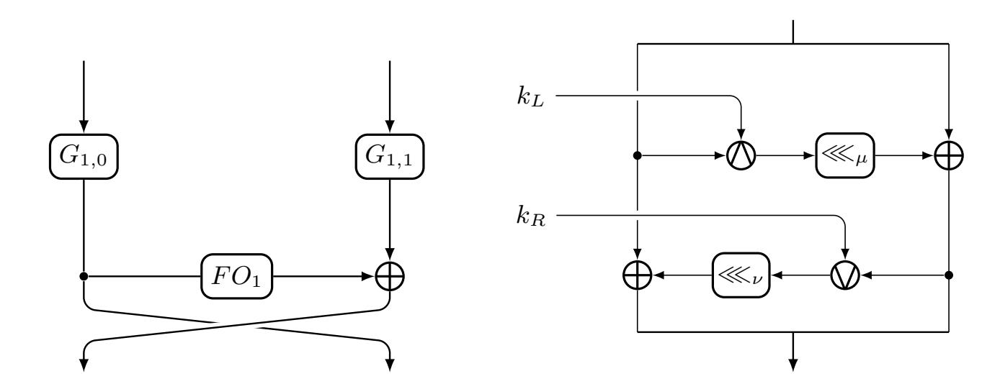

Fig. 7. One round of the Generalized-MISTY1 structure(left) and the  $FL_{\mu,\nu}$  function(right)

### <span id="page-41-1"></span>C.1 The Equivalence of $FL_{\mu,\nu}$ Function

The  $FL_{\mu,\nu}$  function is used in block ciphers to against unknown attacks. For example,  $FL_{0,0}$  is used in the block cipher MISTY1 and MISTY2,  $FL_{1,0}$  is used in the block cipher Camellia [1].

Since the  $FL_{\mu,\nu}$  function contains the Bitwise-And-Key operation and the Bitwise-Or-Key operation, we study the propagation rules of the s-difference for those two operations first.

<span id="page-41-2"></span>**Lemma 1.** Let  $F_k(x) = k \wedge x$  be the Bitwise-And-Key function, where the input x takes values of  $F_2^q$  and the parameter  $k \in F_2^q$ . For any input s-difference  $\boldsymbol{\alpha}^{q,s} = (\alpha_0, \ldots, \alpha_{s-1})$ , all possible output s-difference of F is  $\Delta_F^{\wedge}(\boldsymbol{\alpha}^{q,s}) = \{(k \wedge \alpha_0, \ldots, k \wedge \alpha_{s-1}) | k \in F_2^q \}$ .

{42}------------------------------------------------

*Proof.* For  $\forall \boldsymbol{x}^{q,s+1} \rhd \boldsymbol{\alpha}^{q,s}$ , we have  $(k \wedge x_0) \oplus (k \wedge x_{j+1}) = k \wedge (x_0 \oplus x_{j+1}) = k \wedge \alpha_j (0 \leq j \leq s-1)$ . Thus, for  $\forall k \in F_2^q$ , all possible output difference of F is  $\triangle_F^{\wedge}(\boldsymbol{\alpha}^{q,s}) = \{(k \wedge \alpha_0, \dots, k \wedge \alpha_{s-1}) | k \in F_2^q \}$ .

<span id="page-42-0"></span>**Lemma 2.** Let  $F_k(x) = k \vee x$  be the Bitwise-Or-Key function, where the input x takes values of  $F_2^q$  and the parameter  $k \in F_2^q$ . For any input s-difference  $\boldsymbol{\alpha}^{q,s} = (\alpha_0, \ldots, \alpha_{s-1})$ , all possible output s-difference of F is  $\Delta_F^{\vee}(\boldsymbol{\alpha}^{q,s}) = \{(\overline{k} \wedge \alpha_0, \ldots, \overline{k} \wedge \alpha_{s-1}) | k \in F_2^q \}$ .

*Proof.* For  $\forall \boldsymbol{x}^{q,s+1} \rhd \boldsymbol{\alpha}^{q,s}$ , we have  $\alpha_j \lor k = (\alpha_j \land k) \oplus \alpha_j \oplus k(0 \leq j \leq s)$ . Thus,  $(k \lor \alpha_0) \oplus (k \lor \alpha_{j+1}) = (k \land (\alpha_0 \oplus \alpha_{j+1})) \oplus (\alpha_0 \oplus \alpha_{j+1}) = \overline{k} \land (\alpha_0 \oplus \alpha_{j+1})(0 \leq j \leq s-1)$ . Therefore, for  $\forall k \in F_2^q$ , all possible output difference of F is  $\triangle_F^\vee(\boldsymbol{\alpha}^{q,s}) = \{(\overline{k} \land \alpha_0, \dots, \overline{k} \land \alpha_{s-1}) | k \in F_2^q\}$ .

Based on Lemma 1 and Lemma 2, we have the following lemma to show the equivalence of a valid (s+1)-polytopic transition and an i-possible (s+1)-polygons for  $FL_{\mu,\nu}$  function.

<span id="page-42-2"></span>Lemma 3 (The Equivalence of  $FL_{\mu,\nu}$  Function). Let F denote the  $FL_{\mu,\nu}$  function as shown in Figure 8. Then,  $(\boldsymbol{\alpha_0}^{q,s}||\boldsymbol{\beta_0}^{q,s},\boldsymbol{\alpha_1}^{q,s}||\boldsymbol{\beta_1}^{q,s})$  is a valid (s+1)-polytopic transition if and only if for  $\forall (\boldsymbol{x_0}^{q,s+1}||\boldsymbol{y_0}^{q,s+1}) > (\boldsymbol{\alpha_0}^{q,s}||\boldsymbol{\beta_0}^{q,s})$ , there exists a (s+1)-polygon  $(\boldsymbol{x_1}^{q,s+1}||\boldsymbol{y_1}^{q,s+1}) > (\boldsymbol{\alpha_1}^{q,s}||\boldsymbol{\beta_1}^{q,s})$ , such that  $(\boldsymbol{x_0}^{q,s+1}||\boldsymbol{y_0}^{q,s+1},\boldsymbol{x_1}^{q,s+1}||\boldsymbol{y_1}^{q,s+1})$  is i-possible (s+1)-polygons.

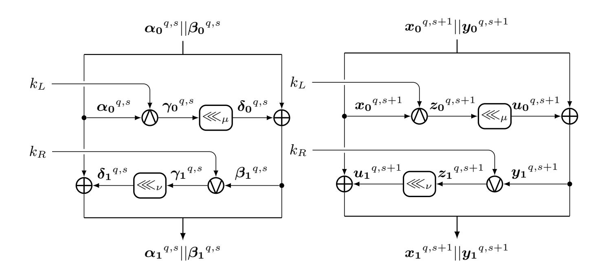

<span id="page-42-1"></span>**Fig. 8.** The valid (s+1)-polytopic trail (left) and (s+1)-polygonal trail (right) for  $FL_{\mu,\nu}$ .

*Proof.* Suppose  $(\boldsymbol{\alpha_0}^{q,s}||\boldsymbol{\beta_0}^{q,s},\boldsymbol{\alpha_1}^{q,s}||\boldsymbol{\beta_1}^{q,s})$  is a valid (s+1)-polytopic transition. Then, there exists a valid (s+1)-polytopic trail as shown in the left of

{43}------------------------------------------------

Figure 8. Since  $(\boldsymbol{\alpha_0}^{q,s}, \gamma_0^{q,s})$  is the valid (s+1)-polytopic transition of the operation Bitwise-And-Key, according to the Lemma 1, there exists  $k_L \in F_2^q$ , such that  $\gamma_{0,i} = k_L \wedge \alpha_{0,i} (0 \leq i \leq s-1)$ . Let  $\boldsymbol{z_0}^{q,s+1} = (z_{0,0}, \ldots, z_{0,s}) = (k_L \wedge x_{0,0}, \ldots, k_L \wedge x_{0,s})$ . Then,  $\boldsymbol{z_0}^{q,s+1} \triangleright \boldsymbol{\gamma_0}^{q,s}$  and  $(\boldsymbol{x_0}^{q,s+1}, \boldsymbol{z_0}^{q,s+1})$  is an i-possible (s+1)-polygon for the operation Bitwise-And-Key. Let  $\boldsymbol{u_0}^{q,s+1} = (u_{0,0}, \ldots, u_{0,s}) = (z_{0,0} \ll_{\mu}, \ldots, z_{0,s} \ll_{\mu})$  and  $\boldsymbol{y_1}^{q,s+1} = (y_{1,0}, \ldots, y_{1,s}) = (y_{0,0} \oplus u_{0,0}, \ldots, y_{0,s} \oplus u_{0,s})$ , then we have  $\boldsymbol{u_0}^{q,s+1} \triangleright \boldsymbol{\delta_0}^{q,s}$  and  $\boldsymbol{y_1}^{q,s+1} \triangleright \boldsymbol{\beta_1}^{q,s}$ . Since  $(\boldsymbol{\beta_1}^{q,s}, \boldsymbol{\gamma_1}^{q,s})$  is a valid (s+1)-polytopic transition of the operation Bitwise-Or-Key, according to Lemma 2, there exists  $k_R \in F_2^q$ , such that  $\gamma_{1,i} = k_R \wedge \beta_{1,i} (0 \leq i \leq s-1)$ . Let  $\boldsymbol{z_1}^{q,s+1} = (z_{1,0}, \ldots, z_{1,s}) = (k_R \wedge y_{1,0}, \ldots, k_R \wedge y_{1,s})$ , then  $\boldsymbol{z_1}^{q,s+1} \triangleright \boldsymbol{\gamma_1}^{q,s}$  and  $(\boldsymbol{y_1}^{q,s+1}, \boldsymbol{z_1}^{q,s+1})$  is an i-possible (s+1)-polygon for the operation Bitwise-Or-Key. Let  $\boldsymbol{u_1}^{q,s+1} = (u_{1,0}, \ldots, u_{1,s}) = (z_{1,0} \ll_{\nu}, \ldots, z_{1,s} \ll_{\nu})$  and  $\boldsymbol{x_1}^{q,s+1} = (x_{1,0}, \ldots, x_{1,s}) = (x_{0,0} \oplus u_{1,0}, \ldots, x_{0,s} \oplus u_{1,s})$ , then we have  $\boldsymbol{u_1}^{q,s+1} \triangleright \boldsymbol{\delta_1}^{q,s}$  and  $\boldsymbol{x_1}^{q,s+1} \triangleright \boldsymbol{\delta_1}^{q,s}$  and  $\boldsymbol{x_1}^{q,s+1} \triangleright \boldsymbol{\delta_1}^{q,s}$  and  $\boldsymbol{x_1}^{q,s+1} \triangleright \boldsymbol{\alpha_1}^{q,s}$ . Therefore, as shown in the right of Figure 8, for  $\forall (\boldsymbol{x_0}^{q,s+1} || \boldsymbol{y_0}^{q,s+1}) \triangleright (\boldsymbol{\alpha_0}^{q,s} || \boldsymbol{\beta_0}^{q,s})$ , there exists a (s+1)-polygon  $(\boldsymbol{x_1}^{q,s+1} || \boldsymbol{y_1}^{q,s+1}) \triangleright (\boldsymbol{\alpha_1}^{q,s} || \boldsymbol{\beta_0}^{q,s})$ , such that  $(\boldsymbol{x_0}^{q,s+1} || \boldsymbol{y_0}^{q,s+1} || \boldsymbol{y_1}^{q,s+1})$  is i-possible (s+1)-polygons.

Since all the procedures above are invertible, it is easy to show that if for  $\forall (\boldsymbol{x_0}^{q,s+1}||\boldsymbol{y_0}^{q,s+1}) \rhd (\boldsymbol{\alpha_0}^{q,s}||\boldsymbol{\beta_0}^{q,s})$ , there exists a (s+1)-polygon  $(\boldsymbol{x_1}^{q,s+1}||\boldsymbol{y_1}^{q,s+1}) \rhd (\boldsymbol{\alpha_1}^{q,s}||\boldsymbol{\beta_1}^{q,s})$ , such that  $(\boldsymbol{x_0}^{q,s+1}||\boldsymbol{y_0}^{q,s+1}, \boldsymbol{x_1}^{q,s+1}||\boldsymbol{y_1}^{q,s+1})$  is i-possible (s+1)-polygons, then  $(\boldsymbol{\alpha_0}^{q,s}||\boldsymbol{\beta_0}^{q,s}, \boldsymbol{\alpha_1}^{q,s}||\boldsymbol{\beta_1}^{q,s})$  is a valid (s+1)-polytopic transition of  $FL_{\mu,\nu}$ .

#### C.2 The Equivalence of *FO* Function of MISTY1

The FO function of MISTY1 is a 3-round, 32-bit, balanced MISTY structure with the FI function as its F-function. In this part, we show the equivalence of a valid (s+1)-polytopic transition and a pair of i-possible (s+1)-polygons for the FO function. Before this, we show the equivalence of a valid (s+1)-polytopic transition and a pair of i-possible (s+1)-polygons for the FI function.

<span id="page-43-0"></span>Lemma 4 (The Equivalence of FI Function). Let F denote the FI function as shown in Figure 9. Then,  $(\alpha_0^{9,s}||\beta_0^{7,s},\beta_4^{7,s}||\alpha_5^{9,s})$  is the valid (s+1)-polytopic transition if and only if there exist i-possible (s+1)-polygons  $(x_0^{9,s+1}||y_0^{7,s+1},y_4^{7,s+1}||x_5^{9,s+1})$ , where  $(x_0^{9,s+1}||y_0^{7,s+1}) \triangleright (\alpha_0^{9,s}||\beta_0^{7,s})$  and  $(y_4^{7,s+1}||x_5^{9,s+1}) \triangleright (\beta_4^{7,s}||\alpha_5^{9,s})$ .

Proof. Suppose  $(\boldsymbol{\alpha_0}^{9,s}||\boldsymbol{\beta_0}^{7,s},\boldsymbol{\beta_4}^{7,s}||\boldsymbol{\alpha_5}^{9,s})$  is a valid (s+1)-polytopic transition. Then, there exists a valid (s+1)-polytopic trail as shown in the left of Figure 9. Since  $(\boldsymbol{\alpha_0}^{9,s},\boldsymbol{\alpha_1}^{9,s})$  is the valid (s+1)-polytopic transition for the first S-box  $S_9$ , then there exist  $\boldsymbol{x_0}^{9,s+1} \rhd \boldsymbol{\alpha_0}^{9,s}$  and  $\boldsymbol{x_1}^{9,s+1} \rhd \boldsymbol{\alpha_1}^{9,s}$ , such that  $(\boldsymbol{x_0}^{9,s+1},\boldsymbol{x_1}^{9,s+1})$  is i-possible (s+1)-polygons. Analogously, there exist i-possible (s+1)-polygons  $(\boldsymbol{y_1}^{7,s+1},\boldsymbol{\beta_1}^{7,s})$  for the S-box  $S_7$  and  $(\boldsymbol{x_3}^{9,s+1},\boldsymbol{x_4}^{9,s})$  for the second  $S_9$ , where  $\boldsymbol{y_1}^{7,s+1} \rhd \boldsymbol{\beta_1}^{7,s}, \boldsymbol{y_2}^{7,s+1} \rhd \boldsymbol{\beta_2}^{7,s}, \boldsymbol{x_3}^{9,s+1} \rhd \boldsymbol{\alpha_3}^{9,s}$  and

{44}------------------------------------------------

$$x_4^{9,s+1} \rhd \alpha_4^{9,s}$$
.

Let 
$$\begin{cases} y_{0,j} = y_{1,j} (0 \le j \le s), \\ x_{2,j} = x_{1,j} \oplus \text{zero-extend}(y_{0,j}) (0 \le j \le s), \\ w_{1,j} = y_{2,j} \oplus \text{truncate}(x_{2,j}) (0 \le j \le s), \end{cases}$$

Then, we have  $x_2^{9,s+1} > \alpha_2^{9,s}$  and  $w_1^{7,s+1} > \beta_3^{7,s}$ . Let  $KI_1 = x_{2,0} \oplus x_{3,0}$ , since  $\alpha_2^{9,s} = \alpha_3^{9,s}$  and  $x_3^{9,s+1} > \alpha_3^{9,s}$ , we have  $x_{3,j} = x_{2,j} \oplus KI_1$ . For any  $KI_0$ ,

let 
$$\begin{cases} \mathbf{y_3}^{7,s} = (y_{3,0}, \dots, y_{3,s}) = (w_{1,0} \oplus KI_0, \dots, w_{1,s} \oplus KI_0), \\ \mathbf{y_4}^{7,s+1} = \mathbf{y_3}^{7,s+1}, \\ x_{5,j} = x_{4,j} \oplus \text{zero-extend}(y_{3,j}), (0 \le j \le s) \end{cases}$$

Therefore, we have constructed *i*-possible (s+1)-polygons of FI, which is  $(\boldsymbol{x_0}^{9,s+1}||\boldsymbol{y_0}^{7,s+1},\boldsymbol{y_4}^{7,s+1}||\boldsymbol{x_5}^{9,s+1})$  with  $(\boldsymbol{x_0}^{9,s+1}||\boldsymbol{y_0}^{7,s+1}) \rhd (\boldsymbol{\alpha_0}^{9,s}||\boldsymbol{\beta_0}^{7,s})$  and  $(\boldsymbol{y_4}^{7,s+1}||\boldsymbol{x_5}^{9,s+1}) \rhd (\boldsymbol{\beta_4}^{7,s}||\boldsymbol{\alpha_5}^{9,s})$ , as shown in the right of Figure 9.

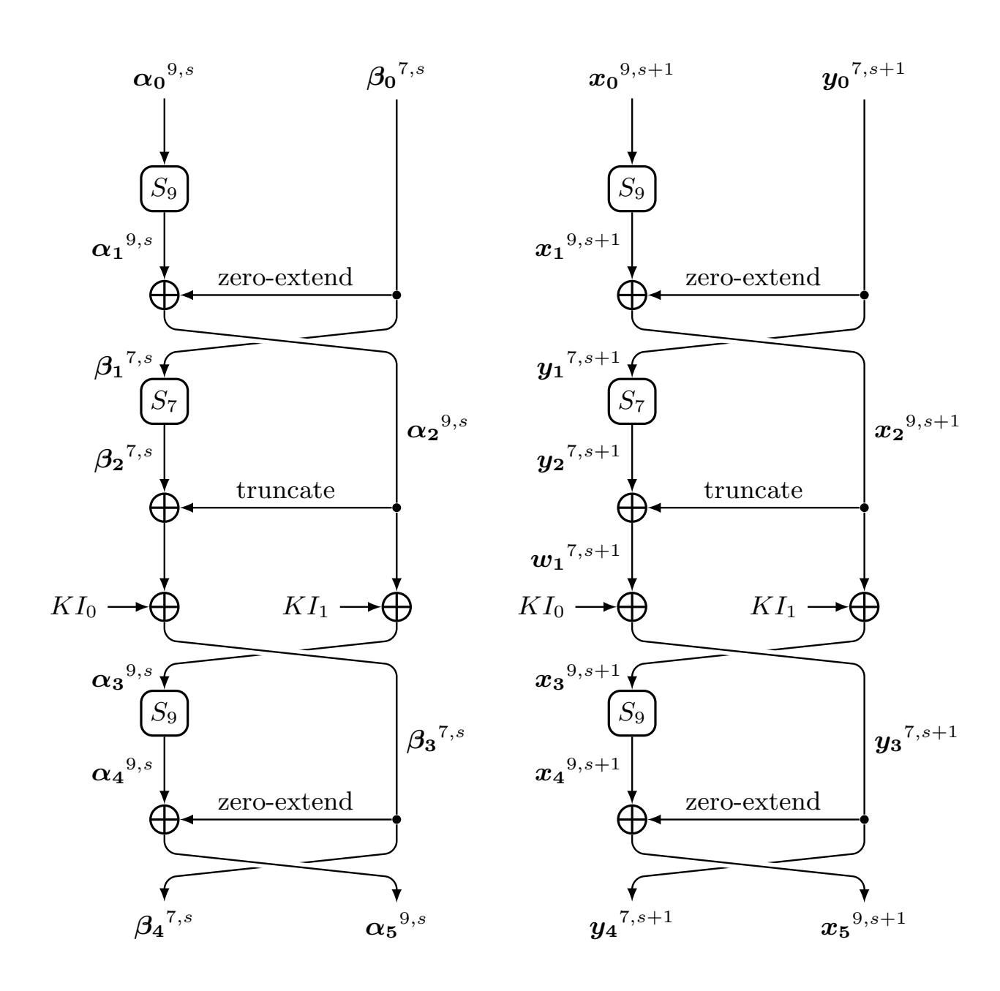

<span id="page-44-0"></span>**Fig. 9.** The valid (s+1)-polytopic trail (left) and (s+1)-polygonal trail (right) for FI Function of MISTY1

{45}------------------------------------------------

Since all the procedures above are invertible, it is easy to show that if there exist i-possible (s+1)-polygons  $(\boldsymbol{x_0}^{9,s+1}||\boldsymbol{y_0}^{7,s+1},\boldsymbol{y_4}^{7,s+1}||\boldsymbol{x_5}^{9,s+1})$ , where  $(\boldsymbol{x_0}^{9,s+1}||\boldsymbol{y_0}^{7,s+1}) \rhd (\boldsymbol{\alpha_0}^{9,s}||\boldsymbol{\beta_0}^{7,s})$  and  $(\boldsymbol{y_4}^{7,s+1}||\boldsymbol{x_5}^{9,s+1}) \rhd (\boldsymbol{\beta_4}^{7,s}||\boldsymbol{\alpha_5}^{9,s})$ , then  $(\boldsymbol{\alpha_0}^{9,s}||\boldsymbol{\beta_0}^{7,s},\boldsymbol{\beta_4}^{7,s}||\boldsymbol{\alpha_5}^{9,s})$  is a valid (s+1)-polytopic transition of FI function.

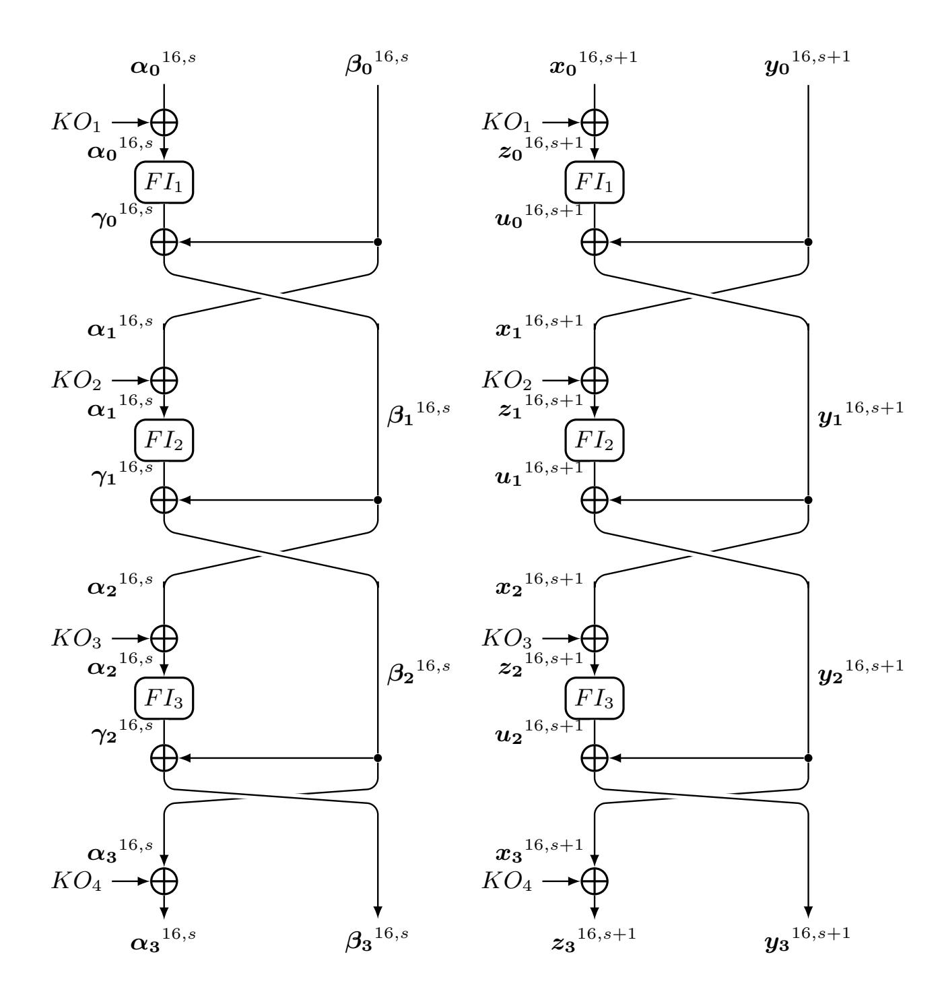

<span id="page-45-0"></span>**Fig. 10.** The valid (s + 1)-polytopic trail (left) and (s + 1)-polygonal trail (right) for FO Function of MISTY1

<span id="page-45-1"></span>Lemma 5 (The Equivalence of The FO Function). Let FO denote the FO function as shown in Figure 10. Then,  $(\alpha_0^{16,s}||\beta_0^{16,s},\alpha_3^{16,s}||\beta_3^{16,s})$  is a valid (s+1)-polytopic transition if and only if for  $\forall (x_0^{16,s+1}||y_0^{16,s+1}) \rhd (\alpha_0^{16,s}||\beta_0^{16,s})$ , there exists a (s+1)-polygon  $(x_1^{16,s+1}||y_1^{16,s+1}) \rhd (z_3^{16,s+1}||y_3^{16,s+1})$ , such that  $(x_1^{16,s+1}||y_1^{16,s+1},x_1^{16,s+1}||y_1^{16,s+1})$  is i-possible (s+1)-polygons.

{46}------------------------------------------------

Proof. Suppose  $(\alpha_{0}^{16,s}||\beta_{0}^{16,s},\alpha_{3}^{16,s}||\beta_{3}^{16,s})$  is a valid (s+1)-polytopic transition. Then, there exists a valid (s+1)-polytopic trail as shown in the left of Figure 10. For  $0 \le i \le 2$ , since  $(\alpha_{i}^{16,s},\gamma_{i}^{16,s})$  is a valid (s+1)-polytopic transition of  $FI_{i+1}$ , according to the Lemma 4, there exist *i*-possible (s+1)-polygons  $(z_{i}^{16,s+1}, u_{i}^{16,s+1})$  for  $FI_{i+1}$ , where  $z_{i}^{16,s+1} \triangleright \alpha_{i}^{16,s}$  and  $u_{i}^{16,s+1} \triangleright \gamma_{i}^{16,s}$ . For  $\forall x_{0}^{16,s+1} \triangleright \alpha_{0}^{16,s}, \forall y_{0}^{16,s+1} \triangleright \beta_{0}^{16,s}$  and  $\forall KO_{4}$ , let  $x_{i+1}^{16,s+1} = y_{i}^{16,s+1}$  and  $y_{i+1,j}^{16,s+1} = y_{i,j}^{16,s+1} \oplus u_{i,j}^{16,s+1} (0 \le j \le s)$ , then we have  $x_{i+1}^{16,s+1} \triangleright \alpha_{i+1}^{16,s+1} \triangleright \alpha_{i+1}^{16,s}$  and  $y_{i+1}^{16,s+1} \triangleright \beta_{i+1}^{16,s}$ . Since  $z_{i}^{16,s+1} \triangleright \alpha_{i}^{16,s}$ , let  $KO_{i+1} = x_{i,0} \oplus z_{i,0}$  and  $z_{3,j} = x_{3,j} \oplus KO_{4}$ . Therefore, we have constructed *i*-possible (s+1)-polygons of FO, which is  $(x_{1}^{16,s+1}||y_{1}^{16,s+1},x_{1}^{16,s+1}||y_{1}^{16,s+1})$  with  $(x_{0}^{16,s+1}||y_{0}^{16,s+1}) \triangleright (\alpha_{0}^{16,s}||\beta_{0}^{16,s})$  and  $(x_{1}^{16,s+1}||y_{1}^{16,s+1}) \triangleright (z_{3}^{16,s+1}||y_{3}^{16,s+1})$ , as shown in the right of Figure 10.

Since all the procedures above are invertible, it is easy to show that if for  $\forall (\boldsymbol{x_0}^{16,s+1}||\boldsymbol{y_0}^{16,s+1}) \rhd (\boldsymbol{\alpha_0}^{16,s}||\boldsymbol{\beta_0}^{16,s})$ , there exists a (s+1)-polygon  $(\boldsymbol{x_1}^{16,s+1}||\boldsymbol{y_1}^{16,s+1}||\boldsymbol{y_1}^{16,s+1}) \rhd (\boldsymbol{z_3}^{16,s+1}||\boldsymbol{y_3}^{16,s+1})$ , such that  $(\boldsymbol{x_0}^{16,s+1}||\boldsymbol{y_0}^{16,s+1},\boldsymbol{x_1}^{16,s+1}||\boldsymbol{y_1}^{16,s+1})$  is i-possible (s+1)-polygons, then  $(\boldsymbol{\alpha_0}^{16,s}||\boldsymbol{\beta_0}^{16,s},\boldsymbol{\alpha_3}^{16,s}||\boldsymbol{\beta_3}^{16,s})$  is a valid (s+1)-polytopic transition.

### C.3 The Equivalence of Generalized-MISTY1 Structure

Finally, based on the Lemma 3 and Lemma 5, we show the equivalence of traditional impossible (s + 1)-polytopic transition and *i*-impossible (s + 1)-polytopic transition for the Generalized-MISTY1 structure.

Theorem 11 (The Equivalence of Generalized-MISTY1 Structure). Let E be a block cipher with Generalized-MISTY1 structure. Then,  $(\alpha_0^{32,s}||\beta_0^{32,s}, \alpha_r^{32,s}||\beta_r^{32,s})$  is an r-round i-impossible (s+1)-polytopic transition if and only if it is an r-round traditional impossible (s+1)-polytopic transition.

*Proof.* This is equivalent to prove that  $(\alpha_0^{32,s}||\boldsymbol{\beta_0}^{32,s}, \boldsymbol{\alpha_r}^{32,s}||\boldsymbol{\beta_r}^{32,s})$  is the valid (s+1)-polytopic transition if and only if there exist r-round i-possible (s+1)-polygons  $(\boldsymbol{x_0}^{32,s+1}||\boldsymbol{y_0}^{32,s+1},\boldsymbol{x_r}^{32,s+1}||\boldsymbol{y_r}^{32,s+1})$ , where  $(\boldsymbol{x_0}^{32,s+1}||\boldsymbol{y_0}^{32,s+1}||\boldsymbol{y_0}^{32,s+1}) > (\alpha_0^{32,s}||\boldsymbol{\beta_0}^{32,s})$  and  $(\boldsymbol{x_r}^{32,s+1}||\boldsymbol{y_r}^{32,s+1}) > (\boldsymbol{\alpha_r}^{32,s}||\boldsymbol{\beta_r}^{32,s})$ . In particular, we prove this in the case r=3, the other cases can be proved analogously.

Suppose  $(\alpha_0^{32,s}||\beta_0^{32,s},\alpha_3^{32,s}||\beta_3^{32,s})$  is an 3-round valid (s+1)-polytopic transition. Then, there exists an 3-round valid (s+1)-polytopic trail, as shown in the left of Figure 11, where  $G_{r,s}(r=0,1,2,s=0,1)$  represents the function  $FL_{u,v}$  or the identity function. According to the Lemma 3, for  $\forall x_0^{32,s+1} \rhd \alpha_0^{32,s}$  and  $\forall y_0^{32,s+1} \rhd \beta_0^{32,s}$ ,  $\exists z_0^{32,s+1} \rhd \gamma_0^{32,s}$  and  $w_0^{32,s+1} \rhd \delta_0^{32,s}$ , such that  $(x_0^{32,s+1},z_0^{32,s+1})$  and  $(y_0^{32,s+1},w_0^{32,s+1})$  are i-possible (s+1)-polygons for  $G_{1,0}$  and  $G_{1,1}$  respectively. Analogously, according to the Lemma 5, for  $\forall z_0^{32,s+1} \rhd \gamma_0^{32,s}$ , there exists  $v_0^{32,s+1} \rhd \eta_0^{32,s}$  such that  $(z_0^{32,s+1},v_0^{32,s+1})$  are i-possible (s+1)-polygons. Let  $y_1^{32,s+1} = z_0^{32,s+1}$  and  $x_{1,j}^{32,s+1} = v_{0,j}^{32,s+1} \oplus w_{0,j}^{32,s+1}$ , we have  $(x_1^{32,s+1} \rhd \alpha_1^{32,s})$  and  $(y_1^{32,s+1} \rhd \beta_1^{32,s})$ . By parity of reasoning, we get  $(x_3^{32,s+1} \rhd \alpha_3^{32,s})$  and  $(y_3^{32,s+1} \rhd \beta_3^{32,s})$  such that  $(x_0^{32,s+1}||y_0^{32,s+1},x_3^{32,s+1}||y_3^{32,s+1}|)$  is 3-round i-possible (s+1)-polygons.

{47}------------------------------------------------

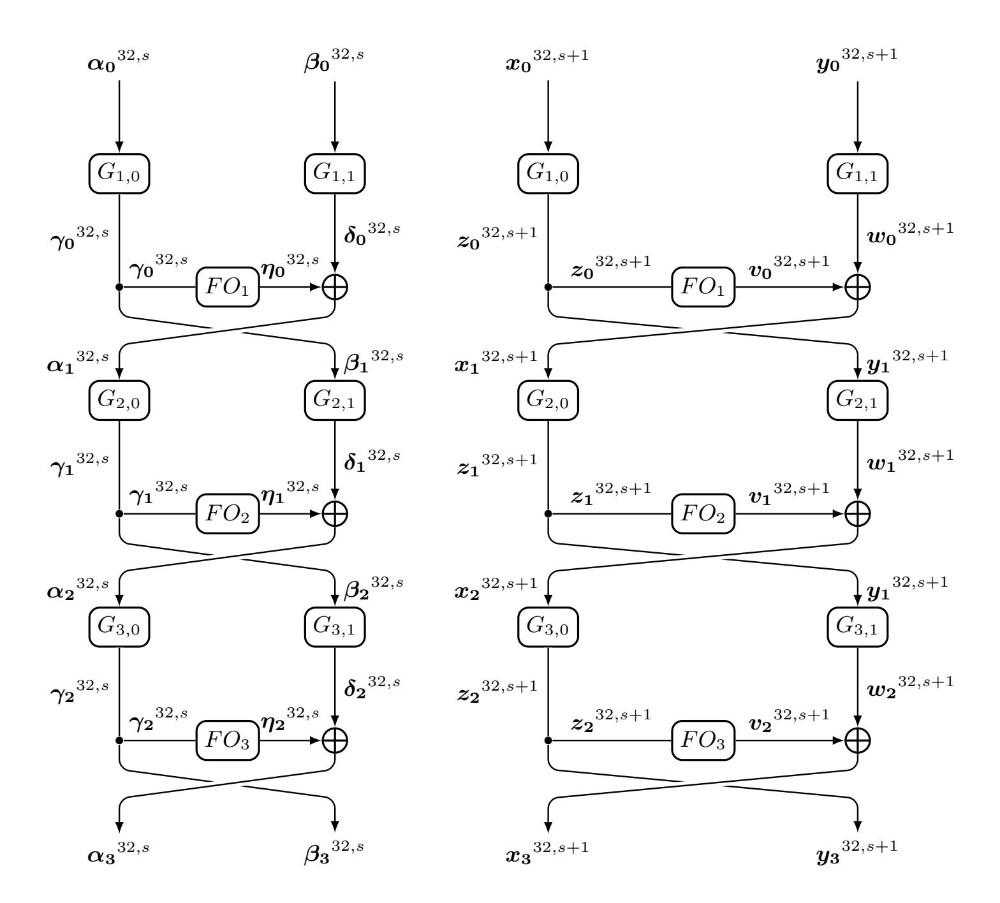

<span id="page-47-0"></span>**Fig. 11.** The valid (s+1)-polytopic trail (left) and (s+1)-polygonal trail (right) for 3-Rounds Generalized-MISTY1 structure

{48}------------------------------------------------

Since all the procedures above are invertible, it is easy to show that if  $(\boldsymbol{x_0}^{32,s+1}||\boldsymbol{y_0}^{32,s+1},\boldsymbol{x_3}^{32,s+1}||\boldsymbol{y_3}^{32,s+1})$  is 3-round *i*-possible (s+1)-polygons, where  $\boldsymbol{x_3}^{32,s+1} \triangleright \boldsymbol{\alpha_3}^{32,s}$  and  $\boldsymbol{y_3}^{32,s+1} \triangleright \boldsymbol{\beta_3}^{32,s}$ , then  $(\boldsymbol{\alpha_0}^{32,s}||\boldsymbol{\beta_0}^{32,s},\boldsymbol{\alpha_3}^{32,s}||\boldsymbol{\beta_3}^{32,s})$  is a 3-round valid (s+1)-polytopic transition.

Since MISTY1 is a block cipher with Generalized-MISTY1 structure, we have the following theorem.

Theorem 12 (The Equivalency of The Block Cipher MISTY1). Let E denote the block cipher MISTY1. Then,  $(\alpha_0^{32,s}||\beta_0^{32,s},\alpha_r^{32,s}||\beta_r^{32,s})$  is the r-round traditional impossible (s+1)-polytopic transition if and only if it is the r-round i-impossible (s+1)-polytopic transition.

# <span id="page-48-0"></span>D Manual Verification The 5-round Example Impossible Differentials of PRINTcipher96.

Similar to the Observation 1, we have the following observation.

**Observation 5** Let  $SP_k = S \circ P_k$ , where S denotes the S-box of PRINTcipher and  $P_k$  denotes the key-dependent permutation. Then,  $2 \xrightarrow{SP_0} \{2, 3, 6, 7\}$ ,  $2 \xrightarrow{SP_1} \{4, 5, 6, 7\}$ ,  $2 \xrightarrow{SP_2} \{1, 3, 5, 7\}$ , and  $2 \xrightarrow{SP_3} \{2, 3, 6, 7\}$ .

**Theorem 13.** The input difference 0x00000000000000000000000000000000000

*Proof.* In Figure 12, the input difference is propagated in forwards by 4 round, and the output difference is propagated in backwards by 1 round. For the sake of brevity, the j-th S-box in the i-round is denoted as  $S_j^i$  and the j-th key-dependent permutation in the i-round is denoted as  $P_j^i$ .

In the forward propagation, only the S-boxes  $S_j^4(j \in \{0, ..., 21\} \cup \{27, ..., 31\})$  may active, and in the backward propagation, only the S-boxes  $S_j^4(j = 1, 11, 22)$  in the 4-round may active. Thus, if current propagation is compatible, only if at least one of  $S_1^4$  and  $S_{11}^4$  is active. Denote  $Sp_j^i = S_j^i \circ p_j^i$ , where  $S_j^i$  denotes the S-box and  $p_j^i$  denotes the key-dependent permutation as shown in Figure 12.

- If  $S_{12}^4$  is active, we have  $1 \xrightarrow{Sp_4^2} 4$ . Thus, the control key of  $p_4^2$  is 3. Since the control key of  $p_4^5$  is the same with  $p_4^2$ , all possible difference of output of  $p_4^4$  in the backward direction is  $\{0x4, 0x5, 0x6, 0x7\}$ . In this situation, the  $S_{22}^4$  is active, this is a contradiction.
- If  $S_1^4$  is active, we have  $2 \stackrel{Sp_2^1}{\longrightarrow} 1$ . Thus, the control key of  $P_0^1$  is 2. Since the control key of  $p_1^4$  is the same with  $p_1^1$ , all possible difference of output of  $S_1^4$  is  $\{1,3,5,7\}$ , this is a contradiction with the output difference of  $S_1^4$  is 2.

All in all, input difference 0x00000000000000000000000000000000000

{49}------------------------------------------------

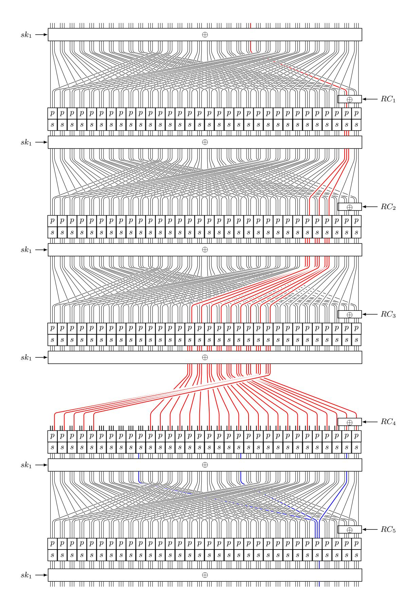

<span id="page-49-0"></span>Fig. 12. The 5-round Impossible Differential for PRINTcipher96(To make our diagram clearer, we omit the needless wire of the 4-round permutation)

{50}------------------------------------------------

# <span id="page-50-0"></span>E Differential trail of the example of 6-round d-impossible differentials of GIFT64.

According to the propagation rule of difference, the input difference 0x00000000000000000000000000000000000

 $\begin{array}{c} 0x000000000000000000 & \stackrel{S}{\longrightarrow} \\ 0x0000000000000000000000000000000000$ 

## <span id="page-50-1"></span>F Example of Three Phases Method of AES-128

In this section, we give an example to diagram our three phases method for AES-128.

Example 1. For any  $\alpha, \delta \in \mathbb{F}_2^8/\{0\}$ , the difference  $(D_{\alpha}^{1,2}, D_{\delta}^{3,3})$  is the 5-round possible differentials even considering the relation of  $K_1$ ,  $K_2$ , and  $K_3$ . This is due to

1. As shown in the green part of Figure 13, for any input difference  $D_{\alpha}^{1,2}$ , it can propagate to one of the following three differences through  $F_1$ .

$$D_{b,0} = \begin{pmatrix} 0 & 0 & 0 & 0x03 \\ 0 & 0 & 0 & 0x02 \\ 0 & 0 & 0 & 0x01 \\ 0 & 0 & 0 & 0x01 \end{pmatrix}, D_{b,1} = \begin{pmatrix} 0 & 0 & 0 & 0x06 \\ 0 & 0 & 0 & 0x04 \\ 0 & 0 & 0 & 0x02 \\ 0 & 0 & 0 & 0x02 \end{pmatrix}, D_{b,2} = \begin{pmatrix} 0 & 0 & 0 & 0x2f \\ 0 & 0 & 0 & 0xc3 \\ 0 & 0 & 0 & 0xec \\ 0 & 0 & 0 & 0xec \end{pmatrix}.$$

{51}------------------------------------------------

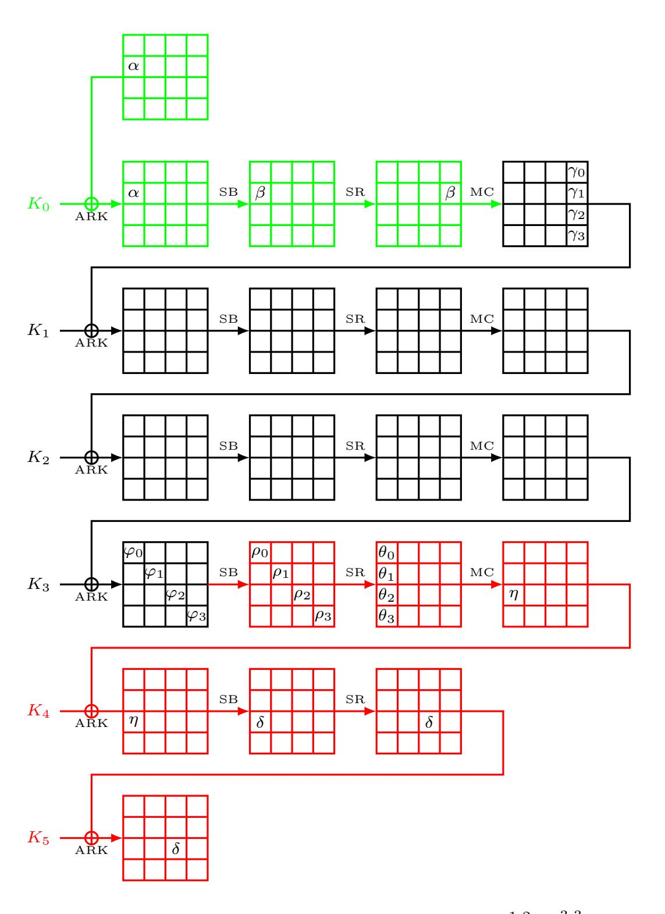

<span id="page-51-0"></span>**Fig. 13.** The Propagation of the Differential  $(D_{\alpha}^{1,2}, D_{\delta}^{3,3})$ 

{52}------------------------------------------------

2. As shown in the red part of Figure 13, for any output difference  $D_{\beta}^{1,2}$ , the following difference can propagate to it through  $F_2$ .

$$D_e = \begin{pmatrix} 0x01 & 0 & 0 & 0\\ 0 & 0x03 & 0 & 0\\ 0 & 0 & 0x09 & 0\\ 0 & 0 & 0 & 0x06 \end{pmatrix}.$$

3. Our experiment shows that  $(D_{b,0}, D_e)$ ,  $(D_{b,1}, D_e)$ , and  $(D_{b,2}, D_e)$  are possible differentials even consider the relations of  $K_1$ ,  $K_2$  and  $K_3$ . This process is depicted as the black part of Figure 13.

## <span id="page-52-0"></span>G The Contradictory Positions Detected Algorithm.

Verify the 6-round example of impossible differentials of GIFT64 and the examples of each impossible (s+1)-polytopic transitions are difficult. Thus, we modify the verification algorithm which is proposed by Cui el at. [12] to detect the contradictory positions by computer. Our algorithm for generating the statements to detect the contradictory positions is shown in the Algorithm 4.

For a give r-round impossible (s+1)-polytopic transition  $(\boldsymbol{\alpha}^{n,s}, \boldsymbol{\beta}^{n,s})$ , we pick the position set  $\mathcal{G}$  and save the statements which are generated from Algorithm 4 as a file. Then, we invoke STP to determine whether the file has a solution. If it has a solution, we can determine that the contradictions occur in the set  $\mathcal{G}$ .

We apply our method to verify the examples of the impossible (s + 1)polytopic transition of each block cipher, the contradictory positions are shown\nin Table 6.

<span id="page-52-1"></span>**Table 6.** Contradiction positions

| Distinguishers                                     | $\mathcal{G}$                      |
|----------------------------------------------------|------------------------------------|
| Impossible differential of GIFT64                  | $\{0, 1, 2, 3\}$                   |
| Impossible 3-polytopic transition of GIFT64        | $\{8, 9, 10, 11\}$                 |
| Impossible 3-polytopic transition of PRINTcipher48 | {0}                                |
| Impossible 4-polytopic transition of PRINTcipher48 | {1}                                |
| Impossible 3-polytopic transition of PRINTcipher96 | {0}                                |
| Impossible 4-polytopic transition of PRINTcipher96 | $\{0, 1, 2\}$                      |
| Impossible 4-polytopic transition of PRESENT       | $\{0, 8, 12, 32, 40, 48, 56, 60\}$ |
| Impossible 3-polytopic transition of rc5-32        | {0}                                |

{53}------------------------------------------------

### <span id="page-53-1"></span>Algorithm 4 Generating statements for detecting contradiction positions

```
1: Input: number of rounds r, the input s-difference \alpha^{n,s}, the output s-difference
     \beta^{n,s}, keyflag \in \{True, False\}, the position set \mathcal{G}.
 2: Output: System of statements to detect contradiction positions
 3: Declare the input and output (s+1)-polygon \boldsymbol{x}^{n,s+1} and \boldsymbol{y}^{n,s+1}.
 4: Declare the intermediate variables and key variables.
 5: Declare two (s+1)-polygons \boldsymbol{u}^{n,s+1} and \boldsymbol{v}^{n,s+1} placed at the input of the (\lfloor \frac{r}{2} \rfloor + 1)-
     th round.
 6: Model the propagation from \boldsymbol{x}^{n,s+1} to \boldsymbol{u}^{n,s+1}.
 7: Model the propagation from v^{n,s+1} to y^{n,s+1}.
 8: for i = 0 to s do
        for j \in \{0, \dots, n-1\}/\{\mathcal{G}\} do
 9:
           Constraint u_{i,j} = v_{i,j}.
10:
11:
        endfor
12: endfor
13: Constraint \boldsymbol{x}^{n,s+1} such that \boldsymbol{x}^{n,s+1} > \boldsymbol{\alpha}^{n,s}.
14: Constraint \boldsymbol{y}^{n,s+1} such that \boldsymbol{y}^{n,s+1} \triangleright \boldsymbol{\beta}^{n,s}.
15: if keyflag then
```

## <span id="page-53-0"></span>H Overview of Running Time.

16: Con17: endif

Constraint key variables according to key shedule.

Here, we show the time costs for detecting new distinguishers and proving no distinguishers exist for a given number of rounds in Table H.

18: Add the statements "QUERY(FALSE);" and "COUNTEREXAMPLE;".

{54}------------------------------------------------

Table 7. Overview of Running Time

| Block Cipher  | Type                                          | Time(hour) |
|---------------|-----------------------------------------------|------------|
| GIFT64        | 6-round d-impossible differential             | 19.8       |
|               | No 7-round d-impossible differential exists   | 25.3       |
|               | 7-round d-impossible 3-polytoipic transition  | 1.9        |
| PRINTcipher48 | 4-round d-impossible differential             | 1.3        |
|               | No 5-round d-impossible differential exists   | 2.2        |
|               | 6-round d-impossible 3-polytoipic transition  | 37.3       |
|               | No 6-round d-impossible 3-polytoipic exists   | 340.9      |
|               | 7-round d-impossible 4-polytoipic transition  | 0.8        |
| PRINTcipher96 | 5-round d-impossible differential             | 22.3       |
|               | No 6-round d-impossible differential exists   | 34.7       |
|               | 7-round d-impossible 3-polytoipic transition  | 0.26       |
|               | 8-round d-impossible 4-polytoipic transition  | 1.16       |
| RC5-32        | 2.5-round i-impossible differential           | 0.03       |
|               | No 3-round i-impossible differential exists   | 0.07       |
|               | 3-round i-impossible 3-polytoipic transition  | 18.3       |
|               | No 3.5-round i-impossible 3-polytoipic exists | 22.1       |
| RC5-64        | 2.5-round i-impossible differential           | 0.76       |
|               | No 3-round i-impossible differential exists   | 1.88       |
|               | 3-round i-impossible 3-polytoipic transition  | 39.9       |
| RC5-128       | 2.5-round i-impossible differential           | 21.6       |
|               | No 3-round i-impossible differential exists   | 64.4       |
| MISTY1        | 4-round i-impossible differential             | 179.1      |
|               | No 5-round i-impossible differential          | 387.6      |
| AES           | No 5-round impossible differential            | 350.2      |
| PRESENT       | No 7-round d-impossible differential exists   | 70.6       |
|               | 7-round i-impossible 4-polytopic transition   | 1.3        |