{0}------------------------------------------------

# TN-IDS for Network Layer Attacks in RPL based IoT Systems

Ambili K N and Jimmy Jose,

Department of Computer Science and Engineering, National Institute of Technology Calicut, Kerala, India {ambili p180002cs, jimmy}@nitc.ac.in

September 2020

### \*

#### Abstract

Routing protocol for Low power and lossy network (RPL) is a standardized optimal protocol for routing in Internet of Things (IoT). The constrained wireless sensor network in IoT is characterized by lack of processing speed, low power and low memory. Sometimes various network attacks enabling the RPL network affect the network performance dismally. This leads to drastic variation in energy consumption at nodes and disturb the RPL network protocol structure. This leads to reduced processing speed and memory allocation in the network. We first illustrate the attacks and their impact in RPL network by simulation. To detect such attacks, we propose an Intrusion Detection System (IDS) scheme for RPL network based on trust computation. Trust based Neighbor notification IDS (TN-IDS) is a secure hierarchical distribution system which monitors the network intrusion and checks the performance of the network. The new TN-IDS system will track all nodes in the network and identify the malicious nodes. The activity list prepared by IDS indicates them to a sink node. This is achieved by introducing a distributed leader election algorithm to collect metrics related to the RPL network. Hence, the performance metrics of the RPL network together with TN-IDS module can identify the malicious node and isolate them.

Keywords : IoT; RPL; DoS; blackhole; Topology attacks; sinkhole; IDS; wormhole;

# 1 Introduction

Routing protocol for low power and lossy network ( RPL) [1] is structured mainly for Internet Protocol v6 for Low Power Wireless Personal Area Network (6LoWPAN) [2]. IoT network has many advantages using 6LoWPAN network in terms of energy utilization, routing messages and load balancing which provides good performance. Most of the smart grid applications will be benefited through RPL protocol.

RPL protocol enables embedded real time data exchange applications like those used for smart transportation, smart home and smart healthcare. This will help bring about drastic changes to human lifestyle itself. With things around us changing to computers, security of these embedded devices become highly significant. There are several real time data exchange IoT applications which facilitate smart environments [3]. Hence, their security need urgent priority. The security of RPL based 6LoWPAN network is a huge challenge due to the insecure physical protection of the nodes in the network. Lack of centralized network management and node co operation will affect data security in the entire work [4].

{1}------------------------------------------------

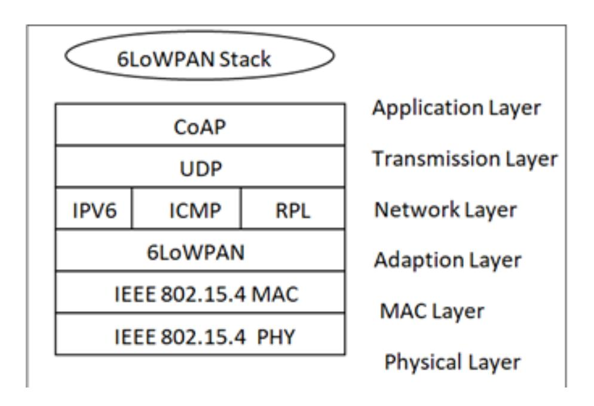

Figure 1: 6LoWPAN Stack

For instance, a black hole attack manipulates the network performance directly and drops all the packets. The 6LoWPAN network is an ideal option for node communication in a standard topology through RPL. There have been various attempts to attack RPL. As a consequence of attacks like blackhole, sinkhole, wormhole and denial of service (DoS), the power consumption increases dramatically owing to the loss of routing paths and packet re-transmission.

TN-IDS is introduced for identifying the RPL attacks. In this process, trust based notification will be passed on to sink process to perform the RPL attack identification. The trust notification method easily tracks the identification and isolates the node from the network. Another feature of the notification system based on the TN IDS is that it detects the neighbors' routing paths whether the nodes are following the RPL protocol indication. If the nodes are following independent behavior not instructed by the neighbors, the neighbors will track the details and inform the sink nodes.

The objectives of TN-IDS include: 1) Identification of multiple RPL attacks using Trust based notification Intrusion Detection system. 2) Isolation of the attack node to improve the power consumption of entire network. 3) Improved communication with other networks. 4) Aggressive security which makes packet transmission smooth.

# 2 Literature Survey

Intruders attempt to enter closed networks bypassing various restrictions. The general strategy to trap intruders is by the usage of Intrusion Detection Systems (IDS). The notion of IDS was proposed initially in [5]. The application of IDS to computer network was first described in [6].

### 2.1 Existing work

Different types of IDS have been proposed. A relevant study of IDS is presented in [7]. The two categories of IDS, as described in [8] are based on misuse data and anomaly data. In a misuse-based IDS, the signatures and patterns of malicious activities is held in a database to detect intrusions and well-known attacks. The anomaly-based systems create a normal data pattern using data from normal users which is then compared against available data patterns to detect anomalies, as and when they occur.

IoT security is reviewed comprehensively in [9]. IDS for IoT environment has been surveyed in [10].A 6LoWPAN network enables communication on IoT applications over the IEEE 802.15.4 protocol. The Maximum Transfer Unit (MTU) of IEEE 802.15.4 standard follows the restricted 

{2}------------------------------------------------

data range. The data fragmentation during transmission and defragmentation at reception is achieved at the network adaption layer. [20] The 6LoWPAN network involves wireless sensor networks with IoT devices. The IoT applications face security issues at data transmission [31].

Several approaches to design IDS for IoT systems have been proposed which are based on machine learning approaches, pattern detection or deep packet analysis, a specification based system [11], an automata based intrusion detection method [12] and trust based intrusion detection system for wireless sensor networks as in [13].

IDS generic to IoT environment has also been proposed. [18] proposes an IDS that can identify various IoT devices on the network. The network activity is checked to determine if it is malicious or benign. It can detect the device from which attack was deployed. [19] suggests IDS to detect attacks under the four categories, namely, exploit, denial of service, probe and generic. [20] proposes an IDS framework for IoT systems and its placement such that energy consumption does not increase.

IDS specific to routing protocols has also been mentioned. There are IDS which detect various attacks on RPL. [16] is a trust based IDS for RPL based IoT system. SVELTE [17], Ebbits and INTI are IDS that detects several attacks on IoT network using RPL as the routing protocol.

There are several research papers highlighting different attacks on RPL. A survey of attacks on RPL is presented in [21, 22]. [23] proposes rank attack that affects the network topology in RPL. Security threat analysis of all possible attacks on RPL is covered in [24]. This includes possibilities of insider attacks but no details have been presented.

Elie Kfoury et al [28] proposed an IDS based on neural network, clustered the attacks and identified the administrator at initial stage. This helped to reduce the risk in identifying the attack in early stage and the node power consumption is reduced. The purpose of using the RPL protocol is clearly described and the real time applications exhibit reduced power consumption and maintain security. The requirements for the security will increase since most of the applications are online and needs data protection from various threats. The proposed system was constructed with machine learning and neural network. The trained self organizing map monitors the network using learning method identifies the abnormal behavior of nodes. The IDS identifies various network attacks like Hello Flood attack, Sink Hole attack and Version attack.

Faiza Medjek et al. [16] feature the existing methods with lack of identity and security mechanism against RPL. The aim of the paper is to identify the particular gaps related to the node mobility, identity and organizing capacity .The author initiated the impact process with Sybil Mobile attack with respect to load balancing, packet delivery and energy consumption. The proposed system introduce the new IDS for RPL called trust based Intrusion Detection System which is a distributed cooperative system. It is a hierarchical trust-based IDS which detects the intrusion by malicious nodes and informs router node. The system is classified into three modules which are identity module, mobility module and intrusion module. The system introduces the timer and minor extensions to RPL message format to deal with the security, identity and mobility of the assigned intrusions to the nodes. The IDS system is very expensive with respect to the allocated resources.

The proposed IDS in R.Darwin et al. [29] identifies 6LoWPAN network security threats, both within the same network and related network. The 6LoWPAN devices are most susceptible to intruders due to weak character of devices and cannot sustain in wireless environment challenges. IDS is required to screen the node movements and take an alert action against inconsistency. The RPL network configuration values are analysed and changed at real time device integration and provide the flexibility to update the control messages. Since the proposed method implements the IDS on 6LoWPAN network, it is capable of monitoring the mote behavior and tracking the movement through browser.

Anhtuan Le, Jonathan Leo et al. [30] proposed a RPL specification based semi auto profiling technique that defines the network operations through simulation traces. The simulation traces 

{3}------------------------------------------------

help to track the node behaviors. The proposed identification process will contain the legitimate protocol states with corresponding analysis. The implementation is based on cluster heads. While executing the simulation, cluster head will monitor the whole network. To maintain the resource management the proposed system sets the cluster member activities and sends packets to neighbors. The transmissions are delayed by manipulating the sequence of sending RPL control messages. These include DODAG Information Object (DIO) and DODAG Information Solicitation (DIS). The simulation results reflect the successful accuracy rate in RPL attacks detection. The overloading is reduced while enabling high scalability in the network.

The major contributions of this work in comparison with existing literature has been described in Table 1. In this work, we present an IDS with blockchain as reference. A trust based approach using distributed leader election algorithm has been used. The solution is adaptable to routing protocols from multiple domains. Routing protocols are analyzed from an insider perspective and various attack points are identified. The trust score stored in blockchain can further be used to determine the device trustworthiness.

The proposed IDS is built for destination oriented routing protocols of IoT systems with blockchain as reference. Our earlier work [36] presents the IDS conceptually. There is no other work very closely related to this. Here, we simulate the system for RPL and capture results for the same. Five attacks have been considered for the same.

| Contribution                           | Description                                                                                              |  |  |  |  |
|----------------------------------------|----------------------------------------------------------------------------------------------------------|--|--|--|--|
| IDS with blockchain as reference       | [10], [12], [13], [14], [15], [17], [26], [25], [27] are different types of IDS for |  |  |  |  |
|                                        | IoT systems but none use blockchain as reference                                                      |  |  |  |  |
| Trust based approach using distributed | [14], [13] : trust based IDS for IoT.                                                                 |  |  |  |  |
| leader election algorithm              | [15] is a distributed trust based IDS but                                                                |  |  |  |  |
|                                        | none of them are based on distributed                                                                    |  |  |  |  |
|                                        | leader election algorithm.                                                                               |  |  |  |  |
| Applicability to various environments  | [18], [19], [20] are generic IDS                                                          |  |  |  |  |
|                                        | architecture for IoT.                                                                                    |  |  |  |  |
| Adaptability to routing protocols from | Nil                                                                                                      |  |  |  |  |
| multiple domains                       |                                                                                                          |  |  |  |  |

Table 1: Comparison of our contribution against literature

### 2.2 Security attacks on RPL

Sinkhole attack [32] threatens the wireless sensor network and causes the security issues. The malicious node attracts the network traffic and forwards the fake routing path to the destination node. This affects the computation time of node. The parent node is misguided by the path. This increases the packet drops and power consumption.

Wormhole Attack [33, 34] is one of the severe security threats for real time applications. Wormhole attack is a tunneling attack wherein two malicious nodes create an out-of-band tunnel. The packets are captured from one end of communication, passed through the tunnel and received at the other end of tunnel. The malicious node utilizes the power of legitimate node for sending the packets through the tunnel to a long distance. The battery utilization power is high and takes long time to deliver the packets.

In black hole attack, the attacker node creates a new RPL root and sends notification to neighbor node to get the shortest path to the destination through itself. The attacker node 

{4}------------------------------------------------

advertises fake route path to the sender node in route finding process. The service of the legitimate sink node is denied to genuine users. The routing process delays packet transmission.

Version attack misguides the tree topology. The attacker normally enters the network and rebuilds the structure of the DODAG by advertising a fake version number. The fake routing path misguides the source and the structure is rebuilt. This causes more power consumption and computation. The version number and rank authentication integrated with control messages is passed towards all neighbor nodes.

A Denial-of-service attack [35] is classified into various types. A typical scenario is the one in which the attacker tries to capture the user authentication process. The attacker captures authentication details by sending messages frequently. Once the request is validated, the response will be provided from the source. The request cannot be validated one since it is from an invalid address. The RPL network is affected severely though the limited set of procedure to detect the threats. The Dos attack attracts resource position and makes it unavailable over the network service.

# 3 Proposed Methodology

We propose the Trust based Neighbor notifications Intrusion Detection System (TN-IDS). It maintains the list of nodes and its behavior. The trust calculation is taken from the node behavior detected from the routing request assigned from source. The trust score is loaded to the blockchain. The startup calculations are taken based on loading and configuration into the network. The values are assigned into chain network. The specialization of the system is each node considered as a monitor node. It interacts with neighbor nodes and evaluate the score based on the node behavior. The characteristics of neighbor node is considered in terms of node identity, packet transmission and routing details. The neighbor node cooperation details are followed over the network and wrong route comes handy in detecting the malicious node. The fake routing path as index can help find blackhole attackers.

The security system provides the neighborhood table which maintains the node power consumption, node ID and neighbors in the network. The complete network system is interlinked to other nodes to fulfill the trust based neighbor node notification process.

Considering the misbehavior of the nodes as an index, the attacker node can be identified. The source to destination packet forwarding and receiving details will detect the blackhole attack. The deviation of source to destination route path will detect the sinkhole attack. The wormhole attack is difficult to find out when a neighbor node receives the irrelevant packet which is not dependent on source and destination nodes as such movement is difficult to track. The version attack is an integrity attack which damages the DODAG structure and increases the computation time and power consumption. The neighbor nodes will receive the configuration of monitoring architecture that will help to detect the version attack.

Each participating node acts as a monitor node and provides the communication reports to neighbor nodes at specific intervals. The report contain the List of routes, packet drops, packet sent, packet received, unknown address and neighbor nodes. The leader node is elected from them based on the trust score. The node with least score in the report is isolated from the network.

Every new report gives opportunity to elect a new leader based on trust score. The new leader should inform neighbors about the current highest score in the network. The trust details are updated in the block chain.

The process will start with leader node function which has got highest score on the report and is elected as a leader in the system. The new election system will send updated report to all neighbor nodes so that other nodes receive the neighbor details. The final part of trust details are saved in the block chain. The block chain can be maintained by a consortium of network managers. The analytics of blockchain will help provide valuable insight into communication.

{5}------------------------------------------------

Figure 2: Algorithm for data collection

{6}------------------------------------------------

# 4 Simulation and Results

### 4.1 Experiments

The simulation operation used Ubuntu Linux 14.04 with 6 GB RAM and VM workstation combinations. The simulation is done using Java based simulator named Cooja in Contiki operating system. Cooja is the network simulator for 6LoWPAN network IoT applications in Contiki OS.

Rtmetric value is calculated for all nodes except sink nodes. The increment of Rtmetric value shows the best neighbor nodes. The ETX value is assigned for best neighbor node. The mentioned beacon interval will keep the network synchronization at default. The energy usage and power consumption may be calculated as described below [17].

Energy Usage(mJ) = 0.158mA (Transmit Power) + 0.445mA ( Listen Power ) + 0.365 mA (CPU Power) + 0.152 mA (LPM Power) \* 3v /4096 \* 8

Energy Power Consumption (mW) = Energy Usage (mJ)/Time (s)

The network node life time will calculated based on utilization of energy usage.

The attacks are executed through Cooja Contiki simulator and the transmission results are obtained in Listen Duty Cycle, Transmit Duty Cycle. The transmission packet arrival at a host is calculated through average inter packet, Minimum inter packet time and Maximum inter packet time. The result is compared against legitimate users. Every metrics is evaluated to find the correctness of the proposed IDS.

The system behavior in four cases of true positive (TP), true negative (TN), false positive (FP) and false negative (FN) is calculated. The true positive rate (TPR) and false positive rate (FPR) is determined. The malicious behavior is detected when the IDS system determines TP and TPR. The false positive happens while the IDS miscalculates the legitimate behavior in the network. False positive rate determines as the number times attack has detected as negative. False negative determines that the attackers were countered as a trusted one.

Each attack is implemented by assigning a random node which can act as an attacker in the attacker code. Overall three to four nodes are assigned as a sender node in every network and one node as a sink node. The attack is initiated after 4 minutes of update to the routing table in the network. Table 2 describes the simulation parameters.

| Parameters             | Values             |
|------------------------|--------------------|
| Simulation platform    | Contiki 2.7, Cooja |
| Number of sender nodes | 6,5,8,5,7          |
| Number of sink nodes   | 1                  |
| Traffic model          | Constant bit rate  |
| Simulation run time    | 30 minutes         |

Table 2: Comparison of our contribution against literature

A network with single RPL instance is considered. The sender node send their data ,power and routing path to the sink node in the execution scenarios with multiple sender nodes and a sink. The collect view presents the combined data in graphical format within the specified time interval.

{7}------------------------------------------------

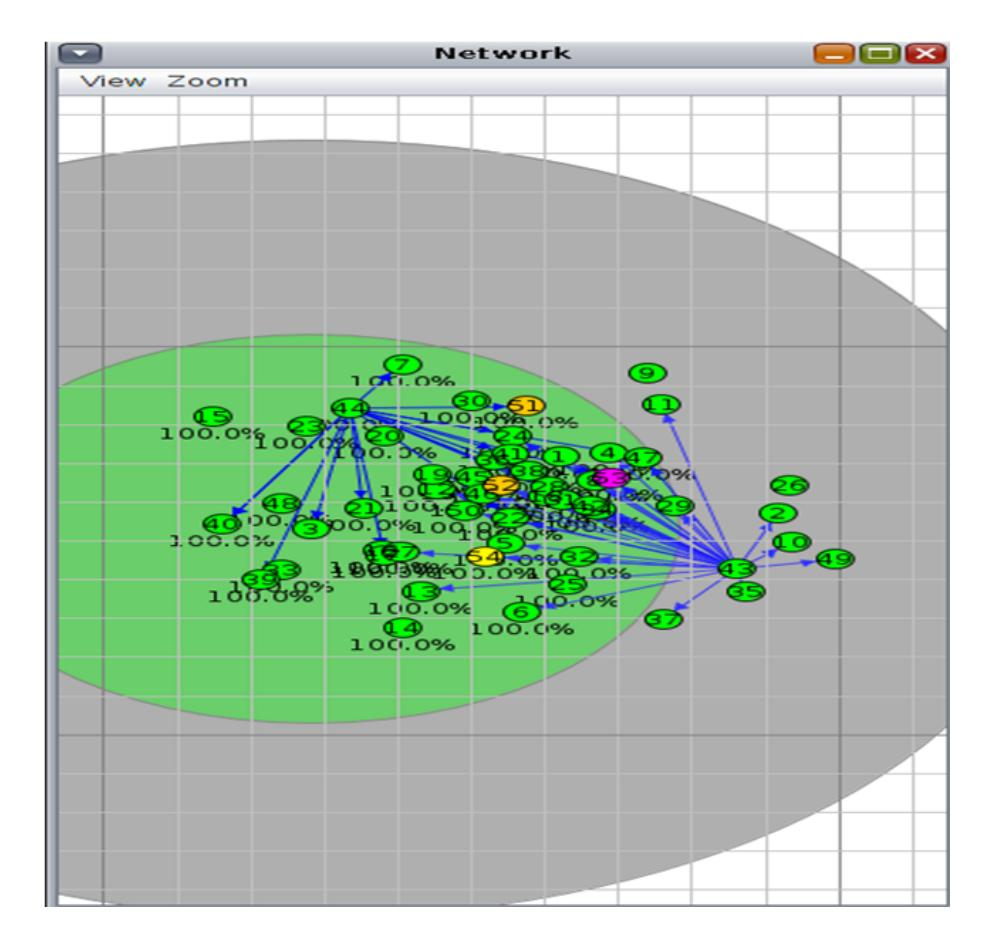

Figure 3: Cooja Setup for Wormhole Attack

### 4.2 Results

The data obtained from execution of each scenario is described in this section.

#### 4.2.1 Wormhole Attack:

The attacker creates tunnel between two malicious nodes. It attracts traffic.

The Instantaneous Power Consumption is calculated through multiple packet transmission over assigned resource in the network.

The results of wormhole attack considered at two malicious nodes would be the same if position of attacker nodes in different ends of network is changed.

{8}------------------------------------------------

| 9.9 10.10 11.11 12.12 | Received 2 2 2 | Dups 0 | Lost | Llana |          |       |       |        |          |
|--------------------------------|-------------------------|-----------|------|-------|----------|-------|-------|--------|----------|
| 10.10 11.11                 | 2                       | 0         |      | Hops  | Rtmetric | ETX   | Churn | Beacon | Interval |
| 11.11                          |                         |           | 0    | 1.000 | 821.000  | 16    | 0     | 3 min  | , 16 sec |
|                                | 2                       | 0         | 0    | 2.000 | 920.000  | 28    | 0     | 1 min  | , 21 sec |
| 1212                           |                         | 0         | 0    | 1.000 | 821.000  | 16    | 0     | 3 min  | , 16 sec |
| 12,12                          | 2                       | 0         | 0    | 2.000 | 828.000  | 24    | 0     | 3 min  | , 16 sec |
| 13.13                          | 2                       | 0         | 0    | 2.000 | 971.000  | 28    | 0     | 2 min  | , 43 sec |
| 14.14                          | 2                       | 0         | 0    | 2.000 | 885.000  | 24    | 0     | 3 min  | , 16 sec |
| 16.16                          | 2                       | 0         | 0    | 2.000 | 843.500  | 24    | 0     | 2 min  | , ll sec |
| 17.17                          | 2                       | 0         | 0    | 2.000 | 1006.5   | 28    | 0     | 1 min  | , 38 sec |
| 18.18                          | 2                       | 0         | 0    | 1.000 | 384.000  | 16    | 0     | 3 min  | , 16 sec |
| 19.19                          | 2                       | 0         | 0    | 2.000 | 859.000  | 24    | 0     | 2 min  | , ll sec |
| 20.20                          | 2                       | 0         | 0    | 2.000 | 853.500  | 24    | 0     | 3 min  | , 16 sec |
| 21.21                          | 2                       | 0         | 0    | 1.000 | 705.000  | 16    | 0     | 3 min  | , 16 sec |
| 22.22                          | 2                       | 0         | 0    | 2.000 | 839.500  | 24    | 0     | 3 min  | , 16 sec |
| 23.23                          | 2                       | 0         | 0    | 2.000 | 819.000  | 24    | 0     | 3 min  | , 16 sec |
| 24.24                          | 2                       | 0         | 0    | 2.000 | 866.500  | 24    | 0     | 2 min  | , ll sec |
| 25.25                          | 2                       | 0         | 0    | 2.000 | 829.000  | 24    | 0     | 3 min  | , 16 sec |
| 26.26                          | 2                       | 0         | 0    | 2.000 | 761.000  | 24    | 0     | 1 min  | , 38 sec |
| 27.27                          | 2                       | 0         | 0    | 1.000 | 420.500  | 16    | 0     | 2 min  | 43 sec   |
| 28.28                          | 2                       | 0         | 0    | 2.000 | 886.000  | 24    | 0     |        | , ll sec |
| 29.29                          |                         | 0         | 0    | 2.000 | 838.000  | 24    | 0     |        | 43 sec   |
| 30.30                          | 2 2 2             | 0         | 0    | 2.000 | 826.000  | 24    | 0     |        | . 16 sec |
| 31.31                          | 2                       | 0         | 0    | 2.000 | 858.000  | 24    | 0     |        | , 16 sec |
| 32.32                          | 2                       | 0         | 0    | 2.000 | 920.000  | 28    | 0     |        | , 38 sec |
| 33.33                          | 2                       | 0         | 0    | 2.000 | 920.000  | 28    | 0     |        | . 16 sec |
| 34.34                          | 2                       | 0         | 0    | 2.000 | 869.000  | 24    | 0     | 3 min  | . 16 sec |
| 35.35                          | 0                       | 0         | 0    | 0.000 | 0.000    | 0.000 | 0     |        |          |
| 36.36                          | 2                       | 0         | 0    | 2.000 | 886.000  | 28    | 0     | 3 min  | , 16 sec |
| 37.37                          | 2                       | 0         | 0    | 2.000 | 905.000  | 28    | 0     |        | , 16 sec |
| 38.38                          | 2                       | 0         | 0    | 2.000 | 905.000  | 28    | 0     |        | , 43 sec |
| 39.39                          | 2                       | 0         | 0    | 2.000 | 886.000  | 28    | 0     |        | , 16 sec |
| 40.40                          | 2                       | 0         | 0    | 2.000 | 720.000  | 24    | 0     |        | . 16 sec |
| Avg                            | 2.000                   | 0.000     |      |       | 828.566  |       | 0.000 |        | 49 sec   |
| 4                              |                         |           |      |       |          |       |       | ,      |          |

Figure 4: Wormhole attack results 1

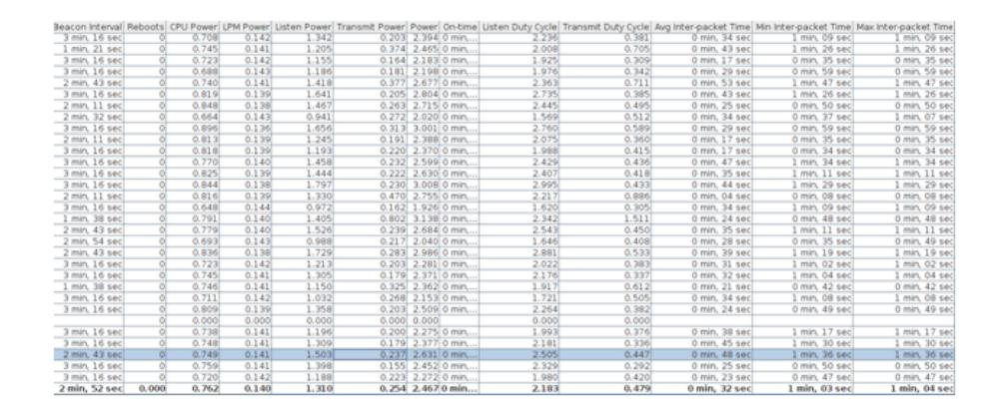

Figure 5: Wormhole attack results 2

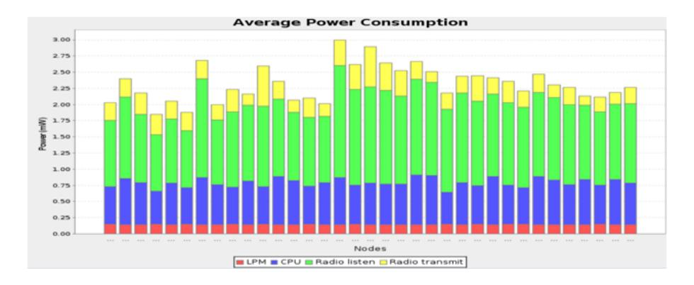

Figure 6: Wormhole attack instantaneous power consumption

{9}------------------------------------------------

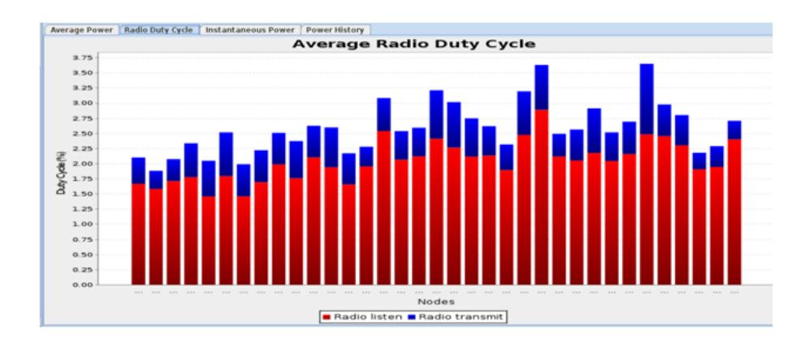

Figure 7: Wormhole attack battery indicator

#### 4.2.2 Blackhole Attack

Blackhole attack denies service of the sink node to legitimate sender nodes. The malicious node responds with fake route reply to the source node. This affects packet transmission and leads to packet drop resulting in increase of the response time.

The process of Blackhole attack consumes more power and utilizes power from the legitimate users on the network.

{10}------------------------------------------------

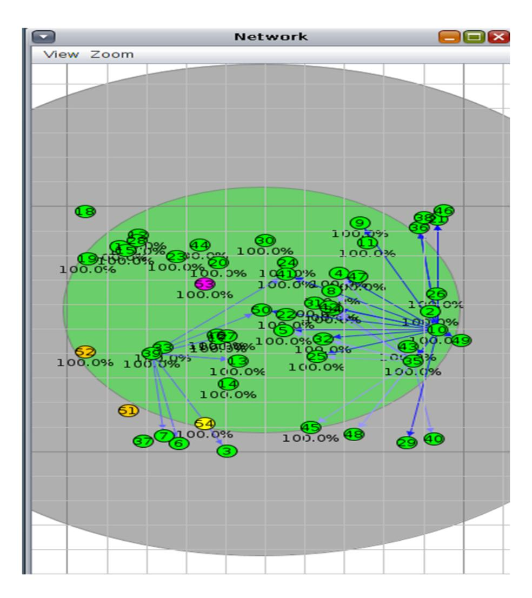

Figure 8: Cooja Setup for Blackhole attack

| N     | Received | Dups  | Lost  | Hops  | Rtmetric | ETX    | Churn | Beacon | Interva |
|-------|----------|-------|-------|-------|----------|--------|-------|--------|---------|
| 15.15 | 3        | 0     | 0     | 4.000 | 903.333  | 40.000 | 0     | 8 min, | 44 sec  |
| 16.16 | 0        | 0     | 0     | 0.000 | 0.000    | 0.000  | 0     |        |         |
| 21.21 | 0        | 0     | 0     | 0.000 | 0.000    | 0.000  | 0     |        |         |
| 22.22 | 2        | 0     | 0     | 1.000 | 669.000  | 16.000 | 0     | 6 min, | 33 sec  |
| 23.23 | 3        | 0     | 0     | 3.000 | 986.667  | 41.375 | 0     | 1 min, | 59 sec  |
| 24.24 | 2        | 0     | 0     | 3.000 | 854.500  | 32.000 | 0     | 8 min, | 44 sec  |
| 25.25 | 2        | 0     | 0     | 3.000 | 832.500  | 32.000 | 0     | 8 min, | 44 sec  |
| 26.26 | 2        | 0     | 0     | 1.000 | 669.000  | 16.000 | 0     | 3 min, | 16 sec  |
| 27.27 | 2        | 0     | 0     | 3.000 | 811.500  | 32.000 | 0     | 8 min, | 44 sec  |
| 28.28 | 3        | 0     | 0     | 2.000 | 706.667  | 24.000 | 0     | 7 min, | 16 sec  |
| 29.29 | 3        | 0     | 0     | 3.000 | 844.667  | 32.000 | 0     | 7 min, | 16 sec  |
| 30.30 | 3        | 0     | 0     | 3.000 | 848.000  | 32.000 | 0     | 7 min, | 16 sec  |
| 31.31 | 2        | 0     | 0     | 1.000 | 701.000  | 16.000 | 0     | 1 min, | 38 sec  |
| 32.32 | 2        | 0     | 0     | 1.000 | 701.000  | 16.000 | 0     | 8 min, | 44 sec  |
| 33.33 | 3        | 0     | 0     | 1.000 | 685.333  | 16.000 | 0     | 8 min, | 44 sec  |
| 34.34 | 3        | 0     | 0     | 1.000 | 685.333  | 16.000 | 0     | 8 min, | 44 sec  |
| 35.35 | 3        | 0     | 0     | 2.000 | 731.000  | 24.000 | 0     | 8 min, | 44 sec  |
| 36.36 | 2        | 0     | 0     | 1.000 | 701.000  | 16.000 | 0     | 6 min, | 33 sec  |
| 37.37 | 3        | 0     | 0     | 2.000 | 695.667  | 24.000 | 0     | 8 min, | 44 sec  |
| 38.38 | 3        | 0     | 0     | 2.000 | 709.667  | 24.000 | 0     | 7 min, | 16 sec  |
| 39.39 | 3        | 0     | 0     | 1.000 | 685.333  | 16.000 | 0     | 1 min, | 16 sec  |
| 40.40 | 3        | 0     | 0     | 3.000 | 778.000  | 32.542 | 0     | 2 min, | 32 sec  |
| 41.41 | 3        | 0     | 0     | 2.000 | 755.667  | 24.000 | 0     | 1 min, | 59 sec  |
| 42.42 | 2        | 0     | 0     | 2.000 | 679.000  | 24.000 | 0     | 8 min, | 44 sec  |
| 43.43 | 3        | 0     | 0     | 1.000 | 685.333  | 16.000 | 0     | 2 min, | 21 sec  |
| 44.44 | 3        | 0     | 0     | 2.000 | 720.000  | 24.000 | 0     | 8 min, | 44 sec  |
| 45.45 | 3        | 0     | 0     | 3.000 | 821.667  | 32.000 | 0     | 8 min, | 44 sec  |
| 46.46 | 3        | 0     | 0     | 1.000 | 685.333  | 16.000 | 0     | 7 min, | 16 sec  |
| 47.47 | 2        | 0     | 0     | 3.000 | 948.500  | 32.375 | 0     | 3 min, | 16 sec  |
| Avg   | 2.610    | 0.000 | 0.000 | 2.073 | 708.533  | 24.836 | 0.000 | 6 min, |         |

Figure 9: Blackhole attack result 1

{11}------------------------------------------------

| Reboots | CPU Power | LPM Power | Listen Power | Transmit Power | Power | On-time       | Listen Duty Cycle | Transmit Duty Cycle | Avg Inter-packet Time | Min Inter-packet Time | Max Inter-packet Time |
|---------|-----------|-----------|--------------|----------------|-------|---------------|-------------------|---------------------|-----------------------|-----------------------|-----------------------|
| 0       | 0.480     | 0.149     |              |                | 1.356 | 0 min, 32 sec |                   |                     | 0 min, 42 sec         | 0 min, 51 sec         | 1 min, 15 se          |
| 0       | 0.000     | 0.000     |              |                | 0.000 |               | 0.000             | 0.000               |                       |                       |                       |
| 0       | 0.000     | 0.000     | 0.000        | 0.000          | 0.000 |               | 0.000             |                     |                       |                       |                       |
| 0       | 0.554     | 0.147     | 0.599        | 0.044          | 1.344 | 0 min, 28 sec | 0.999             | 0.082               | 0 min, 51 sec         | 1 min, 42 sec         | 1 min, 42 se          |
| 0       | 0.619     | 0.145     |              |                |       | 0 min, 46 sec |                   |                     | 0 min, 44 sec         |                       |                       |
| 0       | 0.612     | 0.145     |              |                |       | 0 min, 24 sec | 1.068             | 0.068               |                       |                       |                       |
| 0       | 0.570     | 0.146     |              |                |       | 0 min, 19 sec |                   |                     | 0 min, 36 sec         |                       |                       |
| 0       | 0.616     | 0.145     |              |                |       | 0 min, 26 sec |                   |                     |                       |                       |                       |
| 0       | 0.588     | 0.146     |              |                |       | 0 min, 24 sec |                   |                     | 0 min, 23 sec         |                       |                       |
| 0       | 0.564     | 0.146     |              |                |       | 0 min, 40 sec |                   |                     | 0 min, 52 sec         |                       |                       |
| 0       | 0.592     | 0.146     | 0.626        |                |       | 0 min, 37 sec |                   |                     | 0 min, 43 sec         | 0 min, 49 sec         | 1 min, 21 se          |
| 0       | 0.564     | 0.146     |              |                |       | 0 min, 36 sec |                   |                     |                       |                       | 1 min, 40 se          |
| 0       | 0.657     | 0.144     |              |                |       | 0 min, 24 sec |                   |                     |                       |                       | 1 min, 18 se          |
| 0       | 0.604     | 0.145     |              |                |       | 0 min, 28 sec |                   |                     |                       |                       | 1 min, 11 se          |
| 0       | 0.590     | 0.146     |              |                |       | 0 min, 35 sec |                   |                     |                       |                       |                       |
| 0       | 0.541     | 0.147     | 0.654        | 0.025          | 1.368 | 0 min, 37 sec | 1.091             | 0.047               | 0 min, 31 sec         | 0 min, 08 sec         | 1 min, 27 se          |
| 0       | 0.587     | 0.146     | 0.573        |                |       | 0 min, 37 sec |                   |                     | 0 min, 28 sec         | 0 min, 20 sec         | 1 min, 04 se          |
| 0       | 0.581     | 0.146     |              |                |       | 0 min, 22 sec | 1.333             | 0.213               |                       |                       | 1 min, 33 se          |
| 0       | 0.618     | 0.145     |              |                |       | 0 min, 41 sec |                   | 0.045               | 0 min, 38 sec         |                       | 1 min, 05 se          |
| 0       | 0.528     | 0.148     | 0.581        | 0.068          | 1.325 | 0 min, 42 sec | 0.968             | 0.129               | 0 min, 40 sec         | 0 min, 53 sec         | 1 min, 08 se          |
| 0       | 0.625     | 0.145     | 0.638        | 0.120          | 1.528 | 0 min, 35 sec | 1.064             | 0.226               | 0 min, 34 sec         | 0 min, 37 sec         | 1 min, 05 se          |
| 0       | 0.539     | 0.147     | 0.629        | 0.134          | 1.449 | 0 min, 38 sec | 1.049             | 0.252               | 0 min, 28 sec         | 0 min, 24 sec         | 1 min, 02 se          |
| 0       | 0.541     | 0.147     | 0.694        |                |       | 0 min, 38 sec |                   |                     | 0 min, 45 sec         | 0 min, 42 sec         | 1 min, 33 se          |
| 0       | 0.544     | 0.147     |              |                |       | 0 min, 20 sec |                   | 0.074               | 0 min, 22 sec         |                       |                       |
| 0       | 0.581     | 0.146     |              |                |       | 0 min, 34 sec |                   |                     | 0 min, 45 sec         |                       | 1 min, 19 se          |
| 0       | 0.614     | 0.145     |              |                |       | 0 min, 37 sec |                   |                     | 0 min, 37 sec         |                       | 1 min, 03 se          |
| 0       | 0.601     | 0.145     | 0.597        | 0.027          | 1.371 | 0 min, 41 sec | 0.995             | 0.051               | 0 min, 29 sec         | 0 min, 24 sec         | 1 min, 05 se          |
| 0       | 0.605     | 0.145     | 0.733        | 0.003          | 1.486 | 0 min, 33 sec | 1.222             | 0.005               | 0 min, 51 sec         | 1 min, 14 sec         | 1 min, 19 se          |
| 0       | 0.498     | 0.148     | 0.626        | 0.276          | 1.548 | 0 min, 24 sec | 1.043             | 0.519               | 0 min, 11 sec         | 0 min, 22 sec         | 0 min, 22 se          |
| 0.000   | 0.579     | 0.146     | 0.638        | 0.072          | 1.434 | 0 min, 32 sec | 1.064             | 0.135               | 0 min, 36 sec         | 0 min, 48 sec         | 1 min, 11 se          |

Figure 10: Blackhole attack result 2

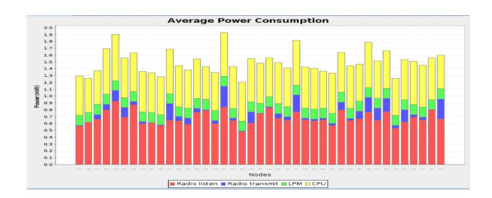

Figure 11: Blackhole attack result 2

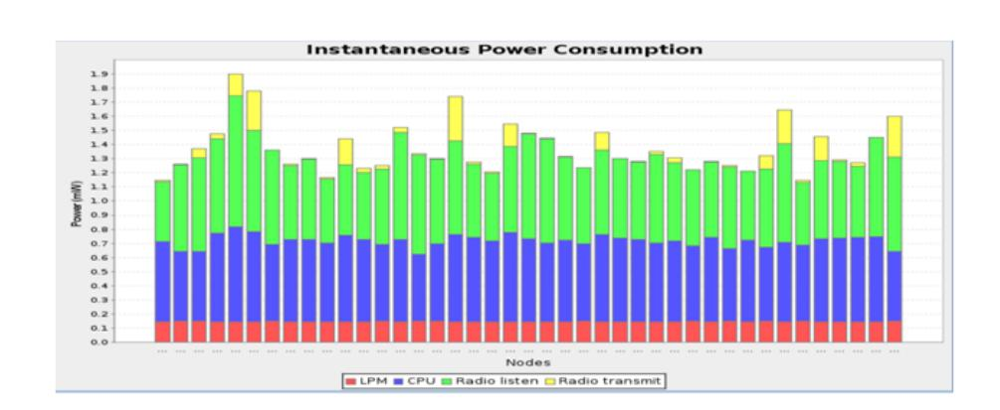

Figure 12: Blackhole attack result 2

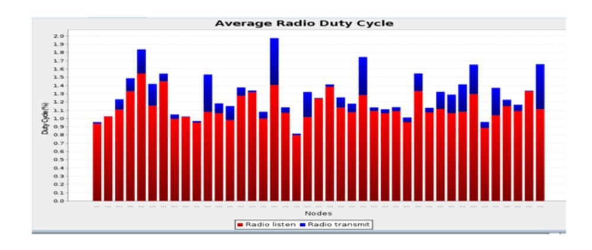

Figure 13: Blackhole attack result 2

{12}------------------------------------------------

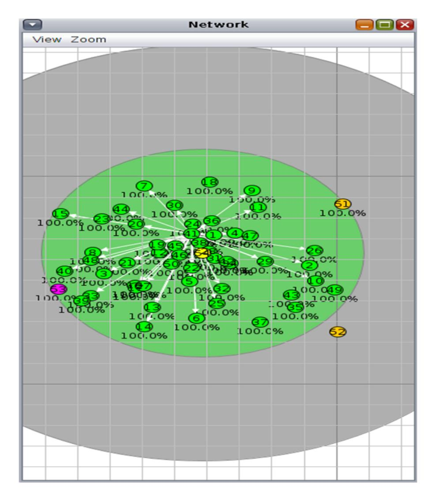

Figure 14: Cooja Setup for DOS attack

#### 4.2.3 DoS Attack

In network computing, denial of service attack is a familiar one. The real time applications are the usual targets. Through this attack, the attacker disables the network resource established through the Internet connectivity and being used by nodes in the network.

The DoS attacker sends multiple messages requesting the authentic control on unknown host. The results of simulation indicates clearly that the power consumption of the network is increased.

{13}------------------------------------------------

| Node  | Received | Dups  | Lost  | Hops  | Rtmetric | ETX    | Churn | Beacon Interval |
|-------|----------|-------|-------|-------|----------|--------|-------|-----------------|
| 12.12 | 2        | 0     | 0     | 2.000 | 871.000  | 24.438 | 0     | 2 min, 11 sec   |
| 13.13 | 2        | 0     | 0     | 3.000 | 1265.000 | 50.063 | 0     | 1 min, 38 sec   |
| 14.14 | 2        | 0     | 0     | 1.000 | 821.000  | 16.000 | 0     | 3 min, 16 sec   |
| 15.15 | 2        | 0     | 0     | 1.000 | 582.000  | 16.000 | 0     | 3 min, 16 sec   |
| 16.16 | 2        | 0     | 0     | 2.000 | 856.000  | 24.438 | 0     | 3 min, 16 sec   |
| 17.17 | 2        | 0     | 0     | 1.000 | 821.000  | 16.000 | 0     | 3 min, 16 sec   |
| 18.18 | 2        | 0     | 0     | 1.000 | 821.000  | 16.000 | 0     | 3 min, 16 sec   |
| 19.19 | 1        | 0     | 0     | 2.000 | 938.000  | 24.750 | 0     | 1 min, 05 sec   |
| 20.20 | 2        | 0     | 0     | 2.000 | 966.500  | 24.438 | 0     | 3 min, 16 sec   |
| 21.21 | 2        | 0     | 0     | 3.000 | 1278.000 | 50.063 | 0     | 2 min, 43 sec   |
| 22.22 | 2        | 0     | 0     | 1.000 | 384.000  | 16.000 | 0     | 3 min, 16 sec   |
| 23.23 |          | 0     | 0     | 2.000 | 897.000  | 24.125 | 0     | 1 min, 05 sec   |
| 24.24 | 2        | 0     | 0     | 3.000 | 1233.000 | 41.750 | 0     | 0 min, 24 sec   |
| 25.25 | 2        | 0     | 0     | 3.000 | 1277.000 | 50.063 | 0     | 1 min, 38 sec   |
| 26.26 | 2        | 0     | 0     | 3.000 | 1301.000 | 49.313 | 1     | 1 min, 05 sec   |
| 27.27 | 2        | 0     | 0     | 3.000 | 1041.000 | 35.000 | 0     | 0 min, 40 sec   |
| 28.28 | 2        | 0     | 0     | 2.000 | 758.500  | 24.438 | 0     | 3 min, 16 sec   |
| 29.29 | 2        | 0     | 0     | 3.000 | 1277.000 | 50.063 | 0     | 1 min, 38 sec   |
| 30.30 | 1        | 0     | 0     | 3.000 | 934.000  | 36.750 | 0     | 4 min, 22 sec   |
| 31.31 | 1        | 0     | 0     | 3.000 | 1176.000 | 36.750 | 0     | 0 min, 32 sec   |
| 32.32 | 2        | 0     | 0     | 2.000 | 882.500  | 24.438 | 0     | 3 min, 16 sec   |
| 33.33 | 1        | 0     | 0     | 3.000 | 1069.000 | 36.750 | 0     | 2 min, 11 sec   |
| 34.34 | 2        | 0     | 0     | 2.000 | 756.000  | 24.438 | 0     | 3 min, 16 sec   |
| 35.35 | 3        | 0     | 0     | 3.000 | 1126.333 | 41.667 | 0     | 1 min, 10 sec   |
| 36.36 | 2        | 0     | 0     | 2.000 | 973.000  | 24.438 | 0     | 3 min, 16 sec   |
| 37.37 | 3        | 0     | 0     | 2.000 | 734.667  | 24.333 | 0     | 1 min, 38 sec   |
| 38.38 | 2        | 0     | 1     | 3.000 | 1286.000 | 50.063 | 0     | 2 min, 43 sec   |
| 39.39 | 2        | 0     | 0     | 3.000 | 1190.000 | 44.125 | 0     | 0 min, 40 sec   |
| 40.40 | 0        | 0     | 0     | 0.000 | 0.000    | 0.000  | 0     |                 |
| Avg   | 1.895    | 0.000 | 0.026 | 2.263 | 952.044  | 31.458 | 0.026 | 2 min, 22 sec   |

Figure 15: DoS attack result 1

| Reboots | CPU Power | LPM Power | Listen Power | Transmit Power P | ower | On-time       | Listen Duty Cycle | Transmit Duty Cycle | Avg Inter-packet Time | Min Inter-packet Time | Max Inter-packet Time |
|---------|-----------|-----------|--------------|------------------|------|---------------|-------------------|---------------------|-----------------------|-----------------------|-----------------------|
| 0       | 0.679     | 0.143     |              | 0.345 2          | 830  | 0 min. 25 sec |                   |                     |                       |                       |                       |
| 0       | 0.622     |           |              |                  |      | 0 min. 18 sec |                   |                     |                       |                       |                       |
| 0       | 0.611     | 0.145     | 1.676        | 0.160 2          | 592  | 0 min. 22 sec | 2.793             | 0.302               | 0 min, 20 sec         |                       |                       |
| 0       | 0.678     | 0.143     |              |                  | .789 | 0 min. 27 sec | 2.928             | 0.396               | 0 min, 37 sec         |                       |                       |
| 0       | 0.614     | 0.145     | 1,423        | 0.288 2          | 470  | 0 min, 25 sec | 2.372             | 0.541               | 0 min, 11 sec         | 0 min, 22 sec         | 0 min, 22 sec         |
| 0       | 0.657     | 0.144     | 1.494        |                  |      | 0 min, 21 sec |                   | 0.276               | 0 min, 44 sec         | 1 min, 29 sec         | 1 min, 29 sec         |
| 0       | 0.564     | 0.146     | 1.349        | 0.124 2          | 183  | 0 min, 29 sec | 2.248             | 0.234               | 0 min, 33 sec         | 1 min, 07 sec         | 1 min, 07 sec         |
| 0       | 1.172     | 0.128     | 2.947        | 3.460 7          | .707 | 0 min, 13 sec | 4.911             | 6.515               |                       |                       |                       |
| 0       | 0.765     | 0.140     | 1.673        | 0.187 2          | .765 | 0 min, 21 sec | 2.789             | 0.352               | 0 min, 40 sec         | 1 min, 20 sec         | 1 min, 20 sec         |
| 0       | 0.681     | 0.143     | 1.994        | 0.411 3          | 229  | 0 min, 27 sec | 3.324             | 0.773               | 0 min, 46 sec         |                       |                       |
| 0       | 0.982     | 0.134     |              |                  |      | 0 min, 30 sec | 4.822             | 0.620               | 0 min, 18 sec         | 0 min, 37 sec         | 0 min, 37 sec         |
| 0       | 0.901     | 0.136     | 1.602        | 1.835 4          | 474  | 0 min, 18 sec | 2.670             | 3.455               |                       |                       |                       |
| 0       | 0.641     | 0.144     | 1.740        | 0.379 2          | 904  | 0 min, 25 sec | 2.899             | 0.714               | 0 min, 05 sec         | 0 min, 11 sec         | 0 min, 11 sec         |
| 0       | 0.701     | 0.142     | 1.820        | 0.250 2          | 913  | 0 min, 21 sec | 3.033             | 0.471               | 0 min, 25 sec         | 0 min, 50 sec         | 0 min, 50 sec         |
| 0       | 0.619     | 0.145     | 1.387        | 0.509 2          | .659 | 0 min, 24 sec | 2.311             | 0.959               | 0 min, 29 sec         | 0 min, 58 sec         | 0 min, 58 sec         |
| 0       | 0.727     | 0.141     | 1.402        | 0.413 2          | 683  | 0 min, 31 sec | 2.336             | 0.778               | 0 min, 17 sec         | 0 min, 34 sec         | 0 min, 34 sec         |
| 0       | 0.663     | 0.143     | 1.452        | 0.197 2          | 455  | 0 min, 22 sec | 2.419             | 0.371               | 0 min, 41 sec         | 1 min, 23 sec         | 1 min, 23 sec         |
| 0       | 0.666     | 0.143     | 1.717        | 0.373 2          | 900  | 0 min, 32 sec | 2.862             | 0.703               | 0 min, 34 sec         | 1 min, 08 sec         | 1 min, 08 sec         |
| 0       | 0.637     | 0.144     | 1.111        |                  |      | 0 min, 13 sec | 1.851             | 0.191               |                       |                       |                       |
| 0       | 0.604     | 0.145     | 1.399        | 0.317 2          | .466 | 0 min, 15 sec | 2.332             | 0.597               |                       |                       |                       |
| 0       | 0.756     |           |              |                  |      | 0 min, 26 sec |                   | 0.338               | 0 min, 24 sec         | 0 min, 49 sec         | 0 min, 49 sec         |
| 0       | 0.512     | 0.148     | 1.157        | 0.320 2          | 137  | 0 min, 14 sec | 1.928             | 0.603               |                       |                       |                       |
| 0       | 0.639     | 0.144     | 1.466        | 0.206 2          | 455  | 0 min, 22 sec | 2.443             | 0.388               | 0 min, 46 sec         | 1 min, 32 sec         | 1 min, 32 sec         |
| 0       | 0.549     |           |              |                  |      | 0 min, 40 sec | 1.873             |                     | 0 min, 24 sec         |                       | 0 min, 39 sec         |
| 0       | 0.822     |           |              |                  |      | 0 min, 24 sec | 2.934             |                     | 0 min, 28 sec         |                       |                       |
| 0       | 0.689     |           |              |                  |      | 0 min, 41 sec |                   |                     | 0 min, 27 sec         |                       | 0 min, 48 sec         |
| 0       | 0.654     | 0.144     | 1.560        | 0.245 2          | 603  | 0 min, 21 sec | 2.599             | 0.461               | 0 min, 47 sec         | 1 min, 35 sec         | 1 min, 35 sec         |
| 0       | 0.629     | 0.144     | 1.389        | 0.455 2          | 618  | 0 min, 24 sec | 2.315             | 0.856               | 0 min, 22 sec         | 0 min, 45 sec         | 0 min, 45 sec         |
| 0       | 0.000     | 0.000     | 0.000        | 0.000 0          | .000 |               | 0.000             | 0.000               |                       |                       |                       |
| 0.000   | 0.693     | 0.143     | 1.583        | 0.410 2          | .828 | 0 min, 24 sec | 2.638             | 0.772               | 0 min, 24 sec         | 0 min, 46 sec         | 0 min, 47 sec         |

Figure 16: DoS attack result 2

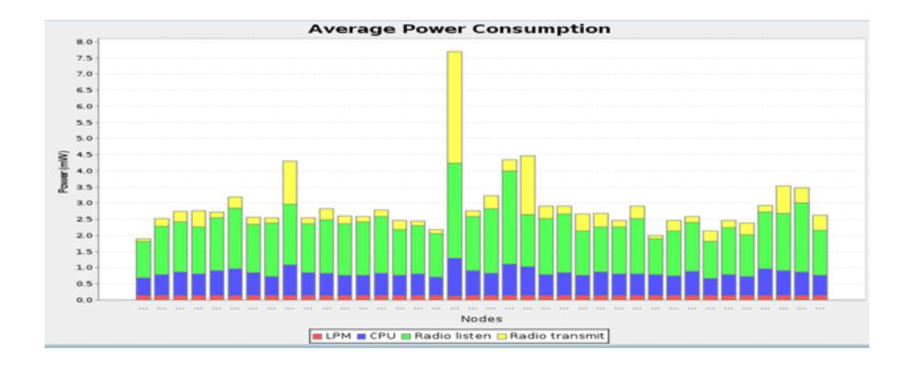

Figure 17: DoS attack average power consumption

{14}------------------------------------------------

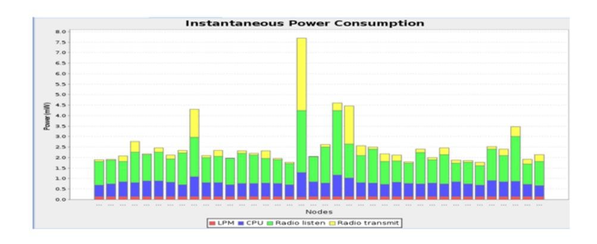

Figure 18: DoS attack battery indicator

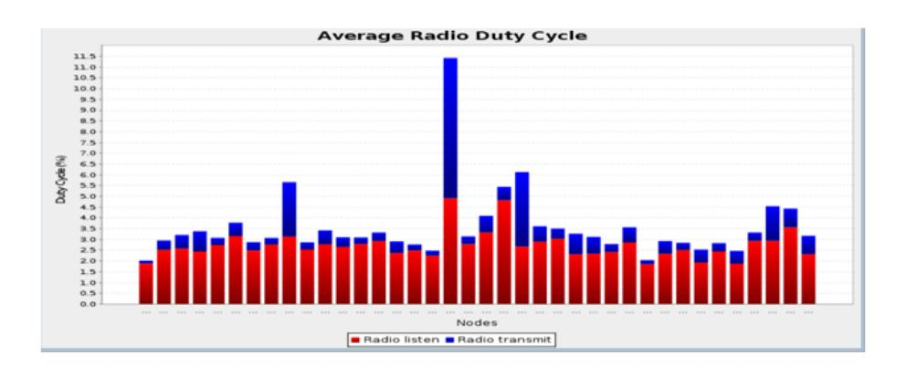

Figure 19: DoS attack battery indicator

#### 4.2.4 Sinkhole Attack

In this attack, the attacker attracts traffic in RPL network with respect to the sender nodes. The attacker node drops the packet instead of transmitting.

The sinkhole attack sends the fake route request in finding the route process of the network. Once the fake node request is established, the data packets from the source will be dropped. The sink hole attack utilizes most of the powers from legitimate users.

{15}------------------------------------------------

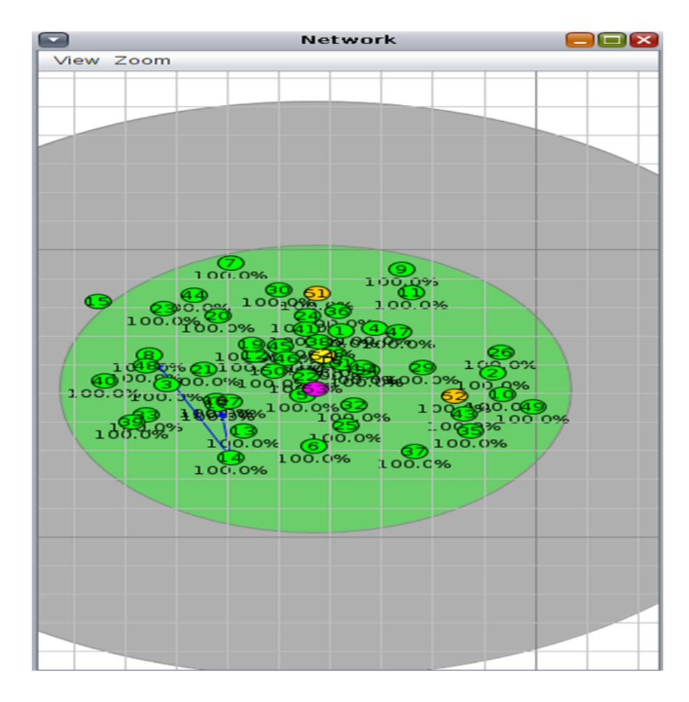

Figure 20: Cooja setup for sinkhole attack

| 8.8   | Node  | e Control | Ser   | nsor M | lap   | Network  | Graph S | ensor | Network         |
|-------|-------|-----------|-------|--------|-------|----------|---------|-------|-----------------|
| 9.9   | Node  | Received  | Dups  | Lost   | Hops  | Rtmetric | ETX     | Churn | Beacon Interval |
| 10.10 | 9.9   | 2         | 0     | 0      | 2.000 | 905.000  | 24.000  | 0     | 2 min, 11 sec   |
| 11.11 | 10.10 | 1         | 0     | 0      | 1.000 | 904.000  | 16.000  | 0     | 4 min, 22 sec   |
| 12.12 | 11.11 | 1         | 0     | 0      | 1.000 | 799.000  | 16.000  | 0     | 4 min, 22 sec   |
| 13.13 | 12.12 | 2         | 0     | 0      | 3.000 | 799.500  | 27.125  | 0     | 4 min, 22 sec   |
| 14.14 | 13.13 | 1         | 0     | 0      | 2.000 | 972.000  | 24.000  | 0     | 0 min, 32 sec   |
| 15.15 | 14.14 | 1         | 0     | 0      | 3.000 | 1126.0   | 27.125  | 0     | 4 min, 22 sec   |
| 16.16 | 15.15 | 1         | 0     | 0      | 1.000 | 516.000  | 16.000  | 0     | 4 min, 22 sec   |
| 17.17 | 16.16 | 2         | 0     | 0      | 1.000 | 669.000  | 16.000  | 0     | 4 min, 22 sec   |
|       | 17.17 | 2         | 0     | 0      | 3.000 | 1029.0   | 27.125  | 0     | 4 min, 22 sec   |
| 18.18 | 18.18 | 1         | 0     | 0      | 2.000 | 972.000  | 24.000  | 0     | 1 min, 05 sec   |
| 19.19 | 19.19 | 2         | 0     | 0      | 2.000 | 742.500  | 24.000  | 0     | 1 min, 38 sec   |
| 20.20 | 20.20 | 2         | 0     | 0      | 2.000 | 691.500  | 24.000  | 0     | 4 min, 22 sec   |
| 21.21 | 21.21 | 1         | 0     | 0      | 1.000 | 684.000  | 16.000  | 0     | 4 min, 22 sec   |
| 22.22 | 22.22 | 2         | 0     | 0      | 1.000 | 391.500  | 16.000  | 0     | 4 min, 22 sec   |
| 23.23 | 23.23 | 2         | 0     | 0      | 1.000 | 465.500  | 16.000  | 0     | 4 min, 22 sec   |
| 24.24 | 24.24 | 0         | 0     | 0      | 0.000 | 0.000    | 0.000   | 0     |                 |
| 25.25 | 25.25 | 0         | 0     | 0      | 0.000 | 0.000    | 0.000   | 0     |                 |
| 26.26 | 26.26 | 2         | 0     | 0      | 1.000 | 737.000  | 16.000  | 0     | 4 min, 22 sec   |
| 27.27 | 27.27 | 1         | 0     | 0      | 1.000 | 756.000  | 16.000  | 0     | 4 min, 22 sec   |
| 28.28 | 28.28 | 1         | 0     | 0      | 1.000 | 871.000  | 16.000  | 0     | 4 min, 22 sec   |
| 29.29 | 29.29 | 2         | 0     | 0      | 2.000 | 961.500  | 24.000  | 0     | 1 min, 05 sec   |
| 30.30 | 30.30 | 1         | 0     | 0      | 2.000 | 790.000  | 24.000  | 0     | 4 min, 22 sec   |
| 31.31 | 31.31 | 1         | 0     | 0      | 2.000 | 929.000  | 33.125  | 0     | 2 min, 11 sec   |
| 32.32 | 32.32 | 1         | 0     | 0      | 2.000 | 803.000  | 24.000  | 0     | 2 min, 11 sec   |
| 33.33 | 33.33 | 1         | 0     | 0      | 2.000 | 765.000  | 24.000  | 0     | 4 min, 22 sec   |
| 35.35 | 35.35 | 2         | 0     | 0      | 2.000 | 768.500  | 24.000  | 0     | 4 min, 22 sec   |
|       | 36.36 | 1         | 0     | 0      | 1.000 | 627.000  | 16.000  | 0     | 4 min, 22 sec   |
| 36.36 | 37.37 | 1         | 0     | 0      | 2.000 | 972.000  | 24.000  | 0     | 2 min, 11 sec   |
| 37.37 | 38.38 | 1         | 0     | 0      | 2.000 | 799.000  | 24.000  | 0     | 4 min, 22 sec   |
| 38.38 | 39.39 | 2         | 0     | 0      | 2.000 | 905.000  | 24.000  | 0     | 2 min, 11 sec   |
| 39.39 | 40.40 | 0         | 0     |        | 0.000 | 0.000    | 0.000   | 0     |                 |
| 40.40 | Ava   | 1.417     | 0.000 | 0.000  | 1.750 | 807.917  | 21.847  | 0.000 | 3 min. 23 sec   |

Figure 21: Sinkhole attack result 1

{16}------------------------------------------------

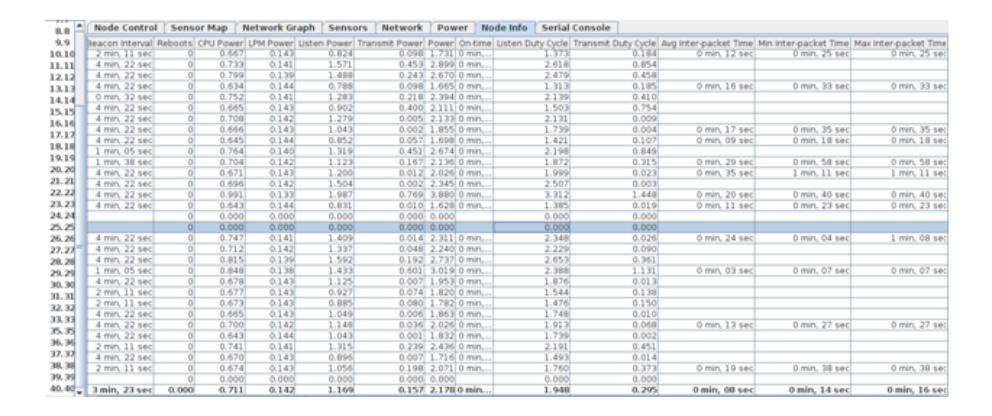

Figure 22: Sinkhole attack result 2

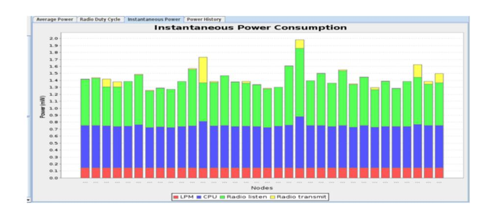

Figure 23: Sinkhole attack average power consumption

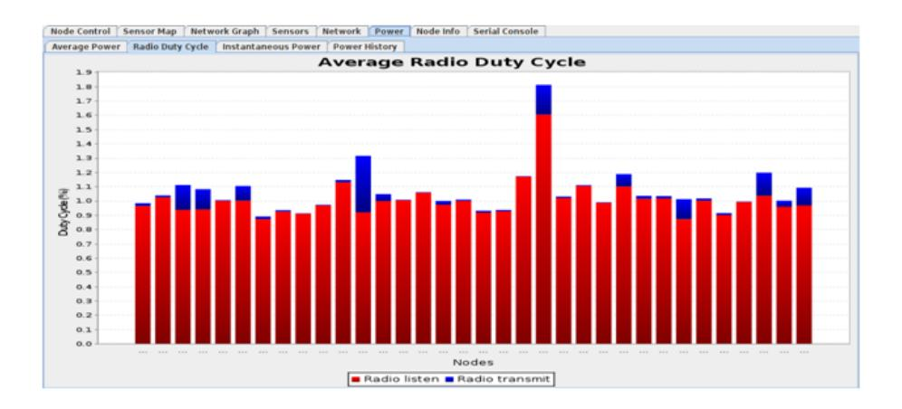

Figure 24: Sinkhole attack battery indicator

{17}------------------------------------------------

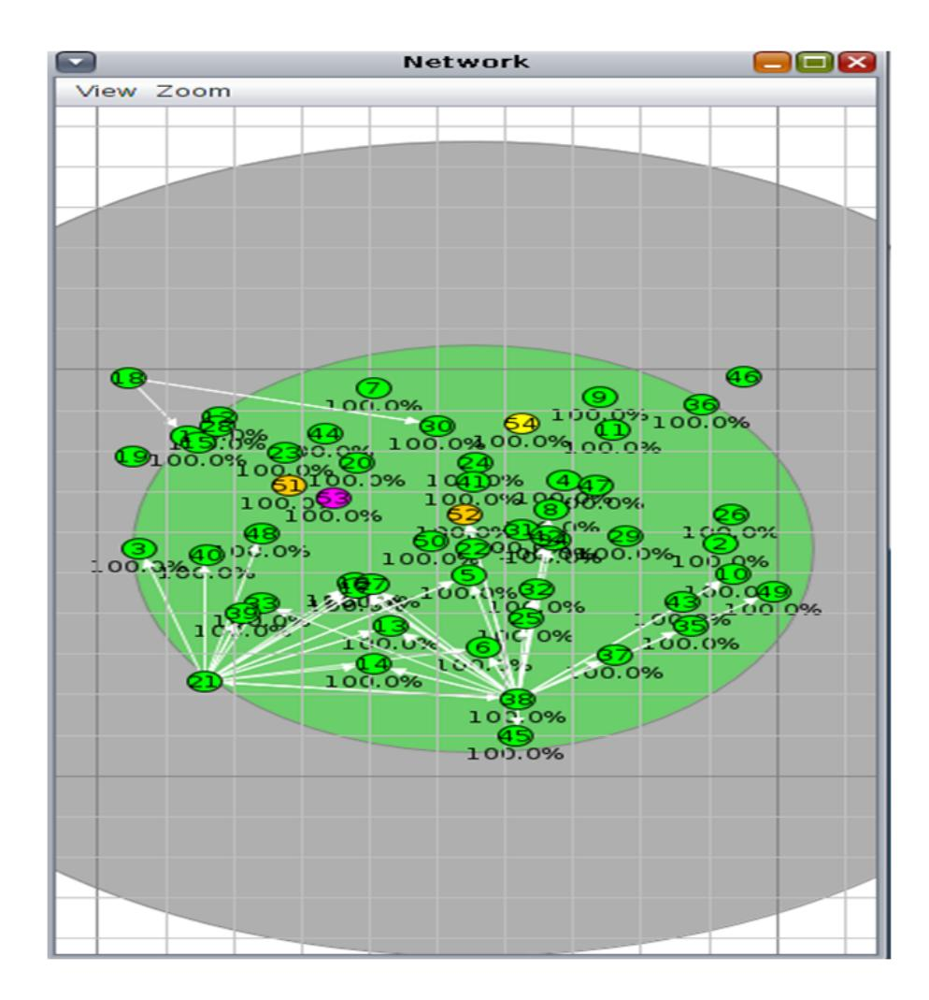

Figure 25: Cooja setup for version attack

#### 4.2.5 Version Attack:

The version number attack is an attack on integrity of RPL based network which misuses the RPL features. The attacker node increments the version number in DIS messages that manipulates the order of neighbor nodes. The idea behind the ordering neighbor node is creating fake routing table and spoiling the network configuration.

The IDS algorithm collects data from the network and the isolation policy arrests the malicious node from further transmission. The result of version number attack related to CPM power, LPM power, Listen power, Transmit power and Average Packet transmission time are shown in figures 28, 29, 30.

The consumption of power increases in version number attack because of the fake routing table and large number of messages being sent. The packet transmission will consume more power.

{18}------------------------------------------------

|       | Received |       | Lost | Hops  | Rtmetric | ETX    | Churn | Beacon Interval |
|-------|----------|-------|------|-------|----------|--------|-------|-----------------|
| 10.10 | 2        | 0     |      | 2.000 |          | 24.000 | 0     | 3 min, 16 sec   |
| 11.11 | 2        | 0     | 0    | 1.000 | 800.000  | 16.000 | 0     | 3 min, 16 sec   |
| 12.12 | 2        | 0     | 0    |       | 800.000  | 16.000 | 0     | 3 min, 16 sec   |
| 13.13 | 2        | 0     | 0    | 2.000 | 833.000  | 24.000 | 0     | 3 min, 16 sec   |
| 14.14 | 2        | 0     | 0    | 1.000 | 800.000  | 16.000 | 0     | 3 min, 16 sec   |
| 15.15 | 2        | 0     | 0    | 2.000 | 895.500  | 29.063 | 0     | 3 min, 16 sec   |
| 16.16 | 2        | 0     | 0    | 2.000 | 874.500  | 24.000 | 0     | 3 min, 16 sec   |
| 17.17 | 2        | 0     | 0    | 1.000 | 597.500  | 16.000 | 0     | 2 min, 43 sec   |
| 18.18 | 3        | 0     | 0    | 1.000 | 772.667  | 16.000 | 0     | 3 min, 16 sec   |
| 19.19 | 2        | 0     | 0    | 1.000 | 800.000  | 16.000 | 0     | 2 min, 11 sec   |
| 20.20 | 2        | 0     | 0    | 1.000 | 800.000  | 16.000 | 0     | 2 min, 11 sec   |
| 21.21 | 3        | 0     | 0    | 1.000 | 407.667  | 16.000 | 0     | 3 min, 38 sec   |
| 22.22 | 2        | 0     | 0    | 2.000 | 895.500  | 29.063 | 0     | 3 min, 16 sec   |
| 23.23 | 3        | 0     | 0    | 2.000 | 818.333  | 24.000 | 0     | 3 min, 38 sec   |
| 24.24 | 3        | 0     | 0    | 2.000 | 873.333  | 28.125 | 0     | 3 min, 16 sec   |
| 25.25 | 2        | 0     | 0    | 2.000 | 1122.0   | 41.125 | 0     | 2 min, 43 sec   |
| 26.26 | 2        | 0     | 0    | 1.000 | 800.000  | 16.000 | 0     | 3 min, 16 sec   |
| 27.27 | 3        | 0     | 0    | 1.000 | 772.667  | 16.000 | 0     | 3 min, 38 sec   |
| 28.28 | 2        | 0     | 0    | 1.000 | 777.000  | 16.000 | 0     | 2 min, 11 sec   |
| 29.29 | 2        | 0     | 0    | 2.000 | 800.500  | 24.000 | 0     | 1 min, 38 sec   |
| 30.30 | 2        | 0     | 0    | 2.000 | 644.500  | 24.000 | 0     | 3 min, 16 sec   |
| 31.31 | 2        | 0     | 0    | 1.000 | 800.000  | 16.000 | 0     | 2 min, 11 sec   |
| 32.32 | 2        | 0     | 0    |       | 777.000  | 16.000 | 0     | 3 min, 16 sec   |
| 33.33 | 2        | 0     | 0    | 2.000 | 603.000  | 24.000 | 0     | 2 min, 43 sec   |
| 34.34 | 2        | 0     | 0    | 1.000 | 821.000  | 16.000 | 0     | 1 min, 13 sec   |
| 35.35 | 2        | 0     | 0    | 3.000 | 1045.0   | 38.438 | 0     | 2 min, 11 sec   |
| 36.36 | 3        | 0     | 0    | 1.000 | 757.333  | 16.000 | 0     | 3 min, 38 sec   |
| 37.37 | 2        | 0     | 0    | 1.000 | 777.000  | 16.000 | 0     | 3 min, 16 sec   |
| 38.38 | 3        | 0     | 0    | 2.000 | 794.333  | 24.000 | 0     | 3 min, 38 sec   |
| 39.39 | 1        | 0     | 0    |       |          | 16.000 | 0     | 1 min, 05 sec   |
| 40.40 | 0        | 0     | 0    | 0.000 | 0.000    | 0.000  | 0     |                 |
| Avg   | 2.256    | 0.000 |      |       | 793.517  | 21.496 | 0.000 | 2 min, 52 sec   |
|       |          |       |      |       |          |        |       |                 |

Figure 26: Version attack result 1

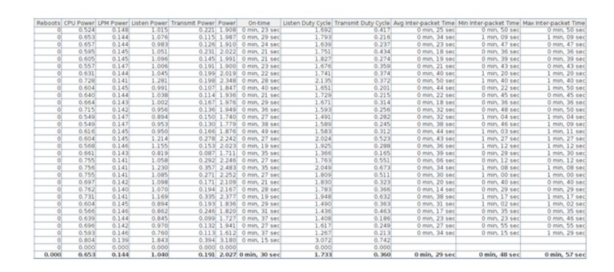

Figure 27: Version attack result 2

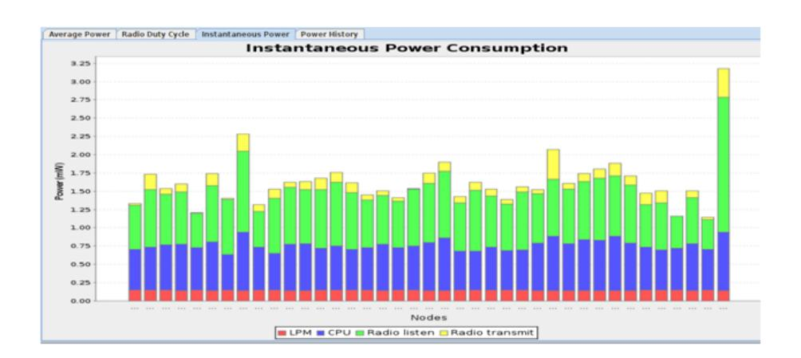

Figure 28: Version attack instantaneous power consumption

{19}------------------------------------------------

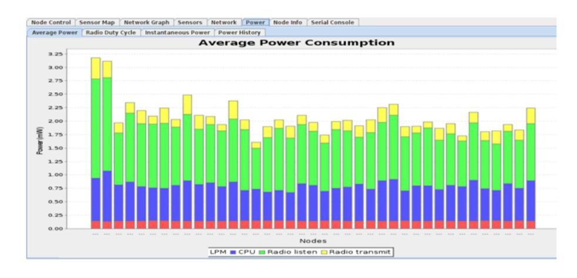

Figure 29: Version attack average power

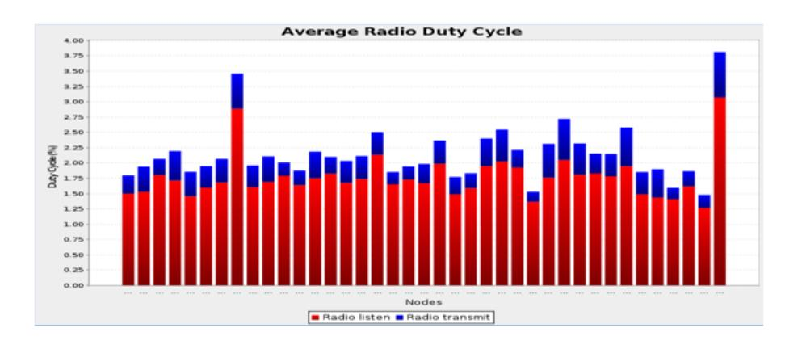

Figure 30: Version attack radio duty cycle

### 4.3 Analysis

The packets for various attack scenarios were captured and analysed in Wireshark. The average packet delay was calculated at frame level. It was found that the system does not show any degradation in performance, as shown in Fig. 31. The proposed work is also compared against few of the solutions in literature. The comparison is done for each attack.

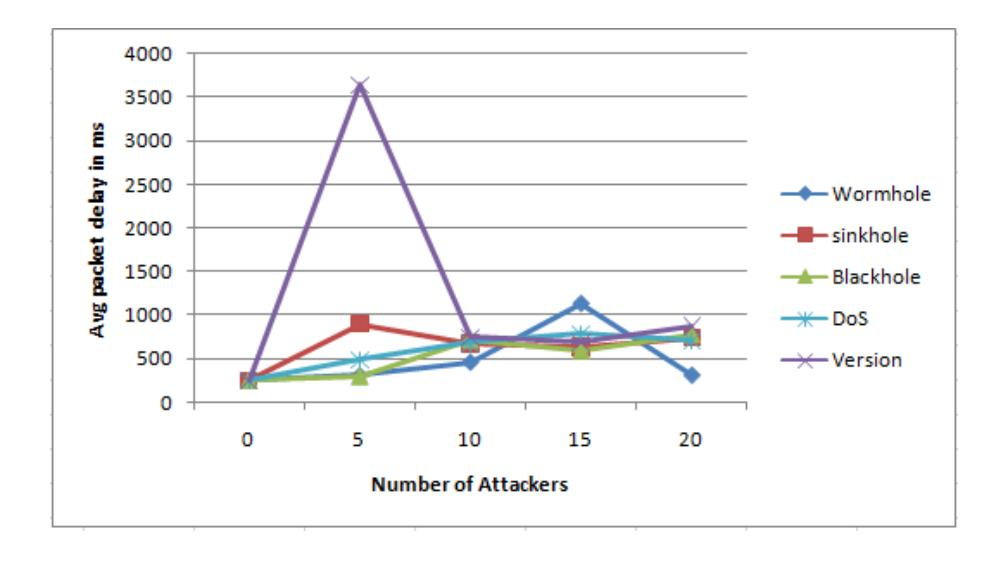

Figure 31: Number of attackers versus average packet delay

{20}------------------------------------------------

Table 3: Comparison of our contribution against literature

| Approach                    | Existing Approach and           | Proposed Approach             |
|-----------------------------|---------------------------------|----------------------------------|
|                             | Result                          | and Result                       |
| Sink Hole Attack - [37]     | Memory and Network        | Implementing RPL              |
|                             | Overhead Created ,        | protocol, High                |
|                             | MiniRoute Protocol,          | Throughput Level,             |
|                             | Node Impersonation              | Network Overload                 |
| Packet Drop Reduced.        |                                 |                                  |
| Dos Attack [38]             | Light weight loaded       | Network Resource              |
|                             | attack, Dummy Packet      | availability, Traffic free |
|                             | Sent ,High Computation    | network with RPL           |
|                             | time , Packet Drop              | routing implementation,       |
|                             |                                 | Successful packet transfer.      |
| Version Number Attack | Low Network Control       | RPL based routing          |
| [39]                        | Overhead ,High Energy     | protocol control the       |
|                             | Consumption and channel         | overhead, Distributed         |
|                             | availability issues, IETF | control architecture, Low        |
|                             | based RPL Routing         | power consumption.               |
|                             | protocol                        |                                  |
| Wormhole Attack - [40]      | Periodic protocol            | Restricted the illusion    |
|                             | Implementation                  | path, clear routing table     |
|                             | ,Centralized Monitoring      | mechanism, Improved           |
|                             | ,Poor countermeasures           | data driver rate.                |
| Black Hole Attack – [41]    | Implementing AODV            | Implementing RPL              |
|                             | routing protocol,            | routing protocol,             |
|                             | Decreasing packet            | Increasing Packet             |
|                             | delivery ratio, throughput      | delivery ratio with        |
|                             | and Packet dropped              | high throughput and low          |
|                             |                                 | packet drop rate.                |

# 5 Conclusion

An analysis of proposed trust based IDS in constrained network is done. The TN-IDS system utilizes blockchain values to generate the trust report. The trust values are loaded into blockchain. It is maintained by group of network managers. In this paper, five signifaicant RPL attacks which affect 6LoWPAN network communication is discussed. The proposed work will isolate the malicious node and restrict it from transmitting packets. The proposed system can identify unpredicted threats through DoS attack detection system. The success of TN- IDS system is that it consumes less power and has less computation time. The solution is validated for a system with single RPL instance. The future IoT systems cannot be brought under single centralized intruion detection or surveillance system. Hence, IDS proposed here is ideal for scenarios with multiple cooperating networks.

{21}------------------------------------------------

# References

- [1] RPL : IPv6 Routing Protocol for Low-Power and Lossy Networks https://tools.ietf.org/html/rfc6550, Accessed 05-06-2020
- [2] IPv6 over Low Power Wireless Personal Area Networks, https://datatracker.ietf.org/wg/6lowpan/charter/, Accessed 05-06-2020
- [3] A.Al-Fuqaha, M. Guizani, M Mohammadi, M. Aledhari, M. Ayyash, Internet of things: a survey on enabling technologies, protocols and applications, IEEE Communications Surveys & Tutorials 17(4), 2347-2376 (2015)
- [4] N. Neshenko, E. Bou-Harb, J. Crichigno, G. Kaddoum and N. Ghani, Demystifying IoT Security: An Exhaustive Survey on IoT Vulnerabilities and a First Empirical Look on Internet-Scale IoT Exploitations, IEEE Communications Surveys & Tutorials, vol. 21, no. 3, pp. 2702-2733, thirdquarter 2019, doi: 10.1109/COMST.2019.2910750
- [5] [J. P. Anderson, Computer security threat monitoring and surveillance, Technincal Report (1980)
- [6] L. T. Heberlein, A network security monitor, Proceedings of the IEEE Computer Society Symposium, Research in Security and Privacy, pp. 296–303, Oakland, Calif, USA, (1990)
- [7] Panagiotis I. Radoglou Grammatikis, Panagiotis G. Sarigiannidis, Ioannis D. Moscholios, Securing the Internet of Things: Challenges, threats and solutions, Elsevier Internet of Things, Volume 5, pp.41-70 (2019)
- [8] Mohammed Faisal Elrawy, Ali Ismail Awad, Hesham H.A. Hamed, Intrusion detection systems for IoT based smart environments, Journal of cloud computing, Article 21 (2018)
- [9] Mohab Aly, Foutse Khomh, Mohamed Haoues, Alejandro Quintero, Soumaya Yacout, Enforcing security in Internet of Things frameworks: A systematic literature review, Internet of things, Elsevier Volume 6 (2019)
- [10] Bruno Bogas Zarpelao, Rodrigo Sanches Miani, Claudio Toshio Kawakani, Sean arlisto de Alvarenga, A survey of intrusion detection in Internet of Things, Journal of Network and Computer Applications, Volume 84 (2017)
- [11] Le A, Loo J, Chai KK, Aiash M, A specification-based IDS for detecting attacks on RPL-based network topology. Information 7(2):1–19 (2016)
- [12] Yulong Fu ,1 Zheng Yan ,2,3 Jin Cao,1 Ousmane Kon´e,4 and Xuefei Cao1, An Automata Based Intrusion Detection Method for Internet of Things, Mobile Information Systems Special Issue: Enabling Technologies towards 5G Mobile Networks, Article ID 1750637 (2017)
- [13] Fenye Bao, Ing-Ray Chen, MoonJeong Chang, Jin-Hee Cho, Trust-Based Intrusion Detection in Wireless Sensor Networks, IEEE International Conference on Communications, IEEE, Kyoto (2011)
- [14] Khan ZA, Herrmann P (2017) A trust based distributed intrusion detection mechanism for internet of things, IEEE 31st International Conference on Advanced Information Networking and Applications (AINA). IEEE, Taipei. pp 1169–1176 (2017)
- [15] Amol R. Dhakne, Dr. P.N. Chatur, Distributed Trust based Intrusion Detection Approach in Wireless Sensor Network, Communication, Control and Intelligent Systems IEEE, Mathura, India (2015)
- [16] Faiza Medjek, Djamel Tandjaoui, Imed Romdhani, Nabil Djedjig,A trust based intrusion detection system for mobile RPL based networks, IEEE International Conference on Internet of Things (iThings) and IEEE Green Computing and Communications (GreenCom) and IEEE Cyber, Physical and Social Computing (CPSCom) and IEEE Smart Data, IEEE, Exeter (2017)

{22}------------------------------------------------

- [17] Raza S, Wallgren L, Voigt T, SVELTE: Real-time intrusion detection in the internet of things. Ad Hoc Netw 11(8):2661–2674 (2013)
- [18] E. Anthi, L. Williams, M. S lowi´nska, G. Theodorakopoulos and P. Burnap, "A Supervised Intrusion Detection System for Smart Home IoT Devices," IEEE Internet of Things Journal, vol. 6, no. 5, pp. 9042-9053, Oct. 2019.
- [19] Vikash Kumar, Ayan Kumar Das, Ditipriya Sinha, UIDS: a unified intrusion detection system for IoT environment, In: Evolutionary Intelligence (2019)
- [20] Zhou M., Han L., Lu H., Fu C. (2019) Intrusion Detection System for IoT Heterogeneous Perceptual Network Based on Game Theory. In: Li J., Liu Z., Peng H. (eds) Security and Privacy in New Computing Environments. SPNCE 2019. Lecture Notes of the Institute for Computer Sciences, Social Informatics and Telecommunications Engineering, vol 284. Springer, Cham
- [21] P. Pongle and G. Chavan, A survey: Attacks on RPL and 6LoWPAN in IoT, International Conference on Pervasive Computing (ICPC), Pune, pp. 1-6. (2015)
- [22] Linus Wallgren, Shahid Raza, Thiemo Voigt, Routing Attacks and Countermeasures in the RPL-Based Internet of Things, International Journal of Distributed Sensor Networks, 2013
- [23] A. Le, J. Loo, A. Lasebae, A. Vinel, Y. Chen and M. Chai, The Impact of Rank Attack on Network Topology of Routing Protocol for Low-Power and Lossy Networks, in IEEE Sensors Journal, vol. 13, no. 10, pp. 3685-3692, Oct. 2013
- [24] A Security Threat Analysis for the Routing Protocol for Low-Power and Lossy Networks (RPLs), Link: https://tools.ietf.org/html/rfc7416
- [25] Kasinathan P, Costamagna G, Khaleel H, Pastrone C, Spirito MA (2013) DEMO: An IDS framework for internet of things empowered by 6LoWPAN, Proceedings of the 2013 ACM SIGSAC Conference on Computer; Communications Security, CCS '13, Berlin. pp 1337–1340 (2013)
- [26] Jun C, Chi C, Design of complex event-processing IDS in internet of things, Sixth International Conference on Measuring Technology and Mechatronics Automation. IEEE, Zhangjiajie. pp 226–229 (2014)
- [27] Krimmling J, Peter S, Integration and evaluation of intrusion detection for CoAP in smart city applications, IEEE Conference on Communications and Network Security. IEEE, San Francisco. pp 73–78 (2014)
- [28] Elie Kfoury, Julien Saab, Paul Younes and Roger Achkar. A Self Organizing Map Intrusion Detection System for RPL Protocol Attacks. IEEE International, pages 231–236. IEEE, 2018
- [29] R.Darwin, Implementation of Advanced IDS in Contiki for Highly Secured Wireless Sensor Network , International Journal of Applied Engineering Research ISSN 0973-4562 Volume 13, Number 6 (2018) pp. 4214-4218
- [30] Anhtuan Le, Jonathan Loo, Kok Keong Chai 1 and Mahdi Aiash, A Specification-Based IDS for Detecting Attacks on RPL-Based Network Topology 2016, 7, 25, doi:10.3390/info7020025/www.mdpi.com/journal/information
- [31] Wallgren Linus, Shahid Raza, and Thiemo Voigt, "Routing Attacks and Countermeasures in the RPL-based Internet of Things", International Journal of Distributed Sensor Networks, 2013
- [32] Atinderpal Singh, and Tejinderdeep Singh, "Review on Detection and Prevention of Sink Hole Attack In network", Global Journal of Computers Technology, Vol.5, No.2, pp:289292. 2016
- [33] Pericle Perazzo, Carlo Vallati, Dario Varano, Giuseppe Anastasi and Gianluca Dini, Implementation of a Wormhole Attack Against a RPL Network: Challenges and Effects, 14th Annual Conference on Wireless On-demand Network Systems and Services (WONS), ISBN 978-3-903176-02-7 (2018)

{23}------------------------------------------------

- [34] G.H. Lai, "Detection of wormhole attacks on ipv6 mobility-based wireless sensor network," EURASIP Journal on Wireless Communications and Networking, vol. 2016, no. 1, p. 274, 2016
- [35] Snehal Deshmukh-Bhosale, S. S. Sonavane Design Of Intrusion Detection System For Dos Attack In 6lowpan And RPL Based IoT Network International Journal of Innovative Technology and Exploring Engineering (IJITEE) ISSN: 2278-3075, Volume-8 Issue-11, September 2019
- [36] Ambili K.N., Jimmy Jose (2020) Trust Based Intrusion Detection System to Detect Insider Attacks in IoT Systems. In: Kim K., Kim HY. (eds) Information Science and Applications. Lecture Notes in Electrical Engineering, vol 621. Springer, Singapore
- [37] Krontiris I, Giannetsos T, Dimitriou T., "Launching a Sinkhole Attack in Wireless Sensor Networks; The Intruder Side", International Conference on Wireless and Mobile Computing, Networking and Communications (WiMob 2008), Avignon, France, 2008, pp: 526–531
- [38] K. M. Elleithy, D. Blagovic, W. Cheng, P. Sideleau, "Denial of Service Attack Techniques: Analysis, Implementation and Comparison," Journal of Systemics, Cybernetics and Informatics, vol. 3, no. 1, 2005
- [39] Anth´ea Mayzaud, Anuj Sehgal, Remi Badonnel, Isabelle Chrisment, J¨urgen Schonwalder, "Mitigation of topological inconsistency attacks in RPL-based low-power lossy networks", International Journal of Network Management, vol. 25, issue 5, pp:320-339, 2015
- [40] Marianne Azer, Sherif El-Kassas, Magdy El-Soudani, "A Full Image of the Wormhole Attacks Towards Introducing Complex Wormhole Attacks, in wireless Ad Hoc Networks", International Journal of Computer Science and Information Security, Vol. 1, No. 1, 2009
- [41] Vimal Kumar, Rakesh Kumar, "An Adaptive Approach for Detection of Blackhole Attack in Mobile Ad hoc Network", International Conference on Intelligent Computing, Communication Convergence, Bhubaneswar, Odisha, India, 2015