{0}------------------------------------------------

# Far Field EM Side-Channel Attack on AES Using Deep Learning

Ruize Wang Royal Institute of Technology (KTH) Stockholm, Sweden ruize@kth.se Huanyu Wang Royal Institute of Technology (KTH) Stockholm, Sweden huanyu@kth.se Elena Dubrova Royal Institute of Technology (KTH) Stockholm, Sweden dubrova@kth.se

### **ABSTRACT**

We present the first deep learning-based side-channel attack on AES-128 using far field electromagnetic emissions as a side channel. Our neural networks are trained on traces captured from five different Bluetooth devices at five different distances to target and tested on four other Bluetooth devices. We can recover the key from less than 10K traces captured in an office environment at 15 m distance to target even if the measurement for each encryption is taken only once. Previous template attacks required multiple repetitions of the same encryption. For the case of 1K repetitions, we need less than 400 traces on average at 15 m distance to target. This improves the template attack presented at CHES'2020 which requires 5K traces and key enumeration up to  $2^{23}$ .

# **KEYWORDS**

Side-channel analysis; EM analysis; far field EM emissions; profiled attack; deep learning; AES

#### 1 INTRODUCTION

s Side-Channel Attacks (SCA) [20, 22] are one of the most powerful attacks against implementations of cryptographic algorithms at present. They are several orders of magnitude more effective than the conventional cryptanalysis and are much more practical to mount. Many types of side channels have been successfully exploited [2, 20–22, 26] to break implementations of important cryptographic algorithms such as Advanced Encryption Standard (AES) [12].

Recently SCAs have found a powerful ally in deep learning [16]. Deep learning makes it possible to bypass many existing SCA countermeasures e.g. jitter and masking [9, 15]. Furthermore, a deep learning-based SCA typically requires an order of magnitude fewer traces from the target device compared to a traditional SCA [13, 19, 40]. Given the huge investments in deep learning, we may expect the deep learning techniques to become even more powerful in the future. Therefore, it is important to increase knowledge about deep learning-based SCAs and design appropriate countermeasures. In this paper, we focus attacks using far field electromagnetic (EM) emissions as a side channel.

**Previous work.** Previous deep learning SCAs focused on power consumption [3, 9, 19, 24, 25, 28, 29, 33, 38, 40] or near field EM emission [7] as side channels. Far field EM emission is a new type of side channel which has not yet been explored in the context of deep learning SCAs. In [11], Camurati et al. presented the first template attack on AES-128 using far field EM emission, called *screaming channels*. The main idea of their interesting work is that side-channel leakage from an AES implementation on a mixed-signal chip may unintentionally couple with the signal transmitted by the on-chip antenna. By analyzing the transmitted signal, it may

be possible to recover the AES key. Indeed, the AES key is recovered by the screaming channels attack in an office environment from 52K traces captured at 1m distance to target [11]. In an anechoic room, much fewer traces are required for a successful attack, e.g. 718 traces at 3m distance and 1428 traces at 10 m distance to target.

However, in all attacks in [11] traces for the profiling and the attack stages are captured from the same device. Furthermore, each trace is obtained by averaging out 500 measurements of the same encryption. Clearly, both conditions are unlikely in a real attack scenario. Recently, an enhanced version of the screaming channels attack was presented [10] in which different devices are used for the profiling and the attack. Using key enumeration up to 223, the AES-128 key is recovered from 5K traces captured in an office environment with 1K repetitions at 15 m to the target device, which is an impressive result. Still, repeating the same encryption 1K times is realistic only if the attacker has a direct physical access to the target device. However, in this case there is no reason for using far field EM side channel. Less noisy near field EM can be used instead.

We were interested to investigate if the key can be recovered without repeating the same encryption multiple times. This motivated this work.

**Our contribution.** We present the first deep learning-based SCA on AES-128 using far field EM emissions as a side channel. Our experiments show that deep-learning is capable of recovering the AES-128 key from a Bluetooth device implementing AES-128 even if the measurement for each encryption is taken only once.

We train neural networks on traces captured from five different Bluetooth devices at five different distances to target and tested on four other Bluetooth devices (identical to the profiling ones). One of our models can recover the key from less than 10K traces captured in an office environment at 15 m distance to target with no repetitions.

We also show results for traces captured with 100 and 1K repetitions. For the case of 1K repetitions, one of our models needs less than 400 traces on average to recover the key from traces captured in an office environment at 15 m distance to target. This is an improvement over the template attack presented in [10] which requires 5K traces.

One of our interesting findings is that a neural network trained on traces captured with N repetitions can successfully classify traces captured with M repetitions, for both M < N and M > N cases.

**Paper organization.** The rest of the paper is organized as follows. Section 2 provides background information on deep learning SCAs. Section 3 describes how the EM emissions are generated. Section 4 presents the equipment and the methods used to acquire and preprocess traces. Sections 5 and 6 describe the profiling and the attack stages, respectively. Section 7 summarizes the experimental results. Section 8 concludes this paper and discusses open problems.

{1}------------------------------------------------

### 2 BACKGROUND

This section gives background information on how deep learning is used in the side-channel analysis context. We assume that the reader is familiar with the AES algorithm, see [12] otherwise.

# 2.1 Side-channel analysis

Side-channel analysis was introduced by Paul Kocher [22] who has shown that non-constant running time of a cipher may leak information about its key. Kocher has also pioneered *power analysis* [20] which exploits the fact that circuits typically consume differing amounts of power based on their input data.

Usually the goal of side-channel analysis is to recover the key of a cryptographic algorithm. To recover an n-bit key  $K \in \mathcal{K}$  key, where  $\mathcal{K}$  is the set of all possible keys, the attacker uses a set  $\mathcal{P}$  of known input data (e.g. the plaintext) and a set  $\mathcal{T}$  of physical measurements (e.g. power consumption, EM emissions, timing). Typically a divide-and-conquer strategy is applied in which the key K is divided into b-bit parts  $K_k$ , called subkeys, and the subkeys are recovered independently, for  $k \in \{1, 2, \ldots, \frac{n}{b}\}$ . Typically the size of the subkey is a byte, b = 8.

After the attack, the attacker gets  $\frac{n}{b}$  vectors of probabilities  $p_k$ , in which the element  $p_{k,j}$  represents the probability that the subkey  $K_k = j$  is the correct subkey, for  $j \in \{0,1,\ldots,2^b-1\}$ . The estimation metrics defined in Section 2.3 may be used to guide the selection of the right candidate.

# 2.2 Deep learning in side-channel analysis

Deep learning can be used in side-channel analysis in two settings: profiled and non-profiled. *Profiled* attacks [9, 19, 25, 31, 32, 34] first learn a leakage profile of the cryptographic algorithm under attack from profiling devices, and then use the profile to recover the sensitive variable (e.g. the key) from the device under attack. *Non-profiled* attacks [37] attack directly, as the traditional Differential Power Analysis [20] or Correlation Power Analysis (CPA) [5]. The attack presented in this paper is a profiled attack.

- 2.2.1 Assumptions. Profiled side-channel attacks typically assume that:
  - (1) The attacker has a device(s), called the *profiling* device, which is similar to the device under attack, called the *target* device.
  - (2) The attacker has a full control over the profiling device.
  - (3) The attacker has a direct physical access to the target device for a limited time.

For the attacks using far field EM emissions as a side channel, physical proximity to the target device rather than direct access is sufficient.

2.2.2 Profiling stage. At the profiling stage, an artificial neural network is trained to learn a leakage profile of the device for all possible values of the sensitive variable. The sensitive variable is usually a subkey.

Given a set of traces  $\mathcal{T} = \{\mathcal{T}_1, \dots, \mathcal{T}_{|\mathcal{T}|}\}$ ,  $\mathcal{T}_i \in \mathbb{R}^m$  for all  $i \in \{1, \dots, |\mathcal{T}|\}$ , captured from the profiling device(s) during the encryption of plaintexts  $\mathcal{P} = \{\mathcal{P}_1, \dots, \mathcal{P}_{|\mathcal{T}|}\}$ , the objective of training is to teach the neural network to classify traces  $\mathcal{T}_i \in \mathcal{T}$  according to their labels  $l(\mathcal{T}_i) \in C$ , where  $C = \{0, 1, \dots, |C| - 1\}$  is the selected

set of classification classes. The classification classes are defined by the leakage model. In our experiments, we use the *identity* leakage model1 and 8-bit subkeys, so |C| = 256.

A neural network  $\mathcal{N}$  can be viewed as a mapping  $\mathcal{N}: \mathbb{R}^m \to \mathbb{I}^{|C|}$ ,  $\mathbb{I} := \{x \in \mathbb{R} \mid 0 \le x \le 1\}$ , which maps a trace  $\mathcal{T}_i \in \mathbb{R}^m$  into a *score* vector  $S_i = \mathcal{N}(\mathcal{T}_i) \in \mathbb{I}^{|C|}$  whose elements  $s_{i,j}$  represent the probability that the label  $l(\mathcal{T}_i)$  has the value  $j \in \{0, 1, \dots, |C| - 1\}$ , where m is the number of data points in  $\mathcal{T}_i$ .

To quantify the classification error of the network, different types of *loss functions* are used, e.g. *categorical cross-entropy loss* [16]. To minimize the loss, the gradient of the loss with respect the score is computed and back-propagated through the network to tune its internal parameters using some optimization algorithm, e.g. *RMSprop* optimizer, which is one of the advanced adaptations of Stochastic Gradient Descent (SGD) algorithm [36]. This is repeated for a chosen number of iterations called *epochs*.

2.2.3 Attack stage. At the attack stage, the trained network N is used to classify traces from an ordered set  $\hat{T}$  captured from the target device whose labels are unknown.

To classify a trace  $\mathcal{T}_i \in \hat{\mathcal{T}}$ , the most likely label  $\tilde{l}$  among |C| candidates is determined as

$$\tilde{l} = \underset{j \in C}{\operatorname{arg\,max}} \left( \prod_{p=1}^{i} s_{p,j} \right), \tag{1}$$

where  $s_{p,j}$  is the jth element of the score vector  $S_p = \mathcal{N}(\mathcal{T})$  of a trace  $T_p \in \hat{\mathcal{T}}$  which precedes  $\mathcal{T}_i$  in  $\hat{\mathcal{T}}$ . Once  $\tilde{l} = l(\mathcal{T}_i)$ , the classification is successful.

The condition  $\tilde{l} = l(\mathcal{T}_i)$  can be verified by checking if the rank of the subkey corresponding to the label  $l(\mathcal{T}_i)$  is zero.

#### 2.3 Estimation metrics

*Rank.* The *rank* of a key  $K \in \mathcal{K}$  is the number of keys with probability greater than the one of K:

$$R(K) = |\{K' \in \mathcal{K} : Pr[K|\mathcal{P},\mathcal{T}] < Pr[K'|\mathcal{P},\mathcal{T}]\}|.$$

Guessing Entropy. The Guessing Entropy (GE) is the expected rank among all possible keys:

$$GE = \underset{K \in \mathcal{K}}{\mathbb{E}} (R(K)).$$

The GE provides a useful estimate on the number of key candidates required to test for a successful attack.

Partial Guessing Entropy. If b-bit subkeys  $K_i$  of the n-bit key  $K \in \mathcal{K}$  are recovered independently, for  $i \in \{1, 2, ..., \frac{n}{b}\}$ , then Partial Guessing Entropy (PGE) rather that GE is used [30]. The word "partial" reflects the fact that the entropy is guessed for each subkey separately.

# 3 EM EMISSIONS AS SIDE-CHANNEL

This section describes how the EM emissions are generated, modulated, and transmitted when the AES algorithm is executed. We also show how the center frequency of the receiver can be determined to collect these emissions.

&lt;sup>1The *identity* leakage model assumes that the leakage is proportional to the value the data processed at the attack point.

{2}------------------------------------------------

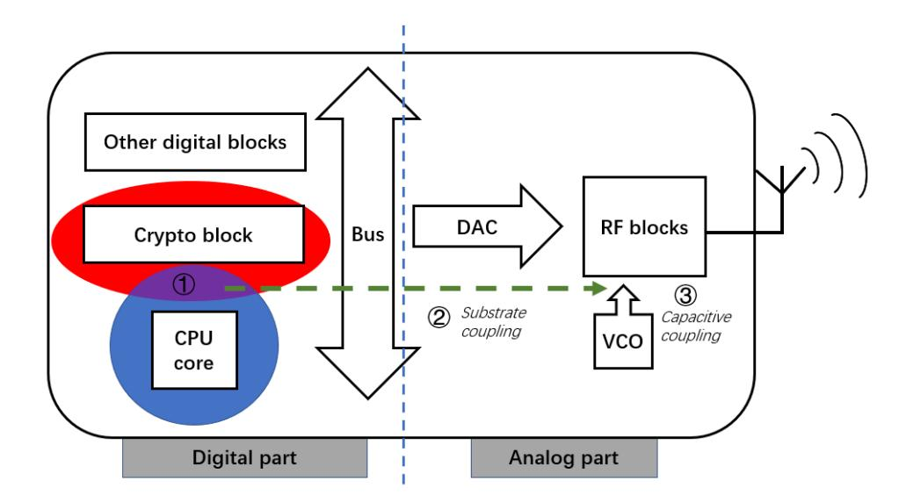

Figure 1: A mixed-signal circuit structure [11].

# 3.1 EM emissions in a mixed-signal circuit

A mixed-signal circuit integrates a digital part and an analog part in order to provide multiple functions to users. Fig. 1 shows the main blocks which contribute to the EM emissions in a mixed-signal circuit [11]. The *Crypto block* executes the AES. Since it is contained in the digital part, the encryption operations are interpreted as bit flips  $(0 \to 1 \text{ or } 1 \to 0)$  controlled by the internal system clock from the *CPU core*. The resulting ciphertext is sent through the *Bus* to the analog part where it is converted to an analog signal by the *Digital-to-Analog Converter (DAC)*. Finally, *RF block* and *Voltage-Controlled Oscillator (VCO)* modulate the analog signal to a high frequency defined by the wireless transmission protocol in use and transmit it.

The EM emissions can be classified to two categories: direct EM emissions and indirect EM emissions. These categories result from different reasons and have different transmission properties.

- (1) *Direct EM emissions*. The logic components in *Crypto block* change their states synchronously while executing a cryptographic algorithm, controlled by the system clock. Typically the logic 0 represents the low-level current and the logic 1 represents the high-level current. The sharp change of current in the logic components leads to the direct EM emissions (red area). These emissions have high frequency components and usually can be detected by a near-field probe positioned close to the chip. Acquiring good direct EM emissions may require decapsulation [14, 35].
- (2) *Indirect EM emissions*. Indirect EM emissions sometimes are ignored by the chip designers because they result from the coupling effect between different components on chip. For example, in Fig. 1, the frequently switching clock signal from *CPU core* generates a square wave noise (blue area). The cryptographic computations are modulated by this square wave (purple area). Due to the substrate coupling [8], the modulated signal leaks to the analog part on the chip. In the analog part, *RF block* modulates the signal again and sends it through the antenna. For this reason, the indirect EM emissions can be detected at much farther distance than the direct EM emissions.

Following [11], in this paper we focus on the capacitive coupling which leads to amplitude modulation (AM) of side channels from

**Table 1: Equipment summary** 

| Category         | Equipment                                                                                                           |
|------------------|---------------------------------------------------------------------------------------------------------------------|
| For transmitting | · Bluetooth Chip nRF52832 · Nordic nRF52 DK                                                                      |
| For receiving    | <ul><li>· 24dBi Gain TP-link TL-ANT 2424B</li><li>· Ettus Research USRP N210</li><li>· SBX Daughter Board</li></ul> |

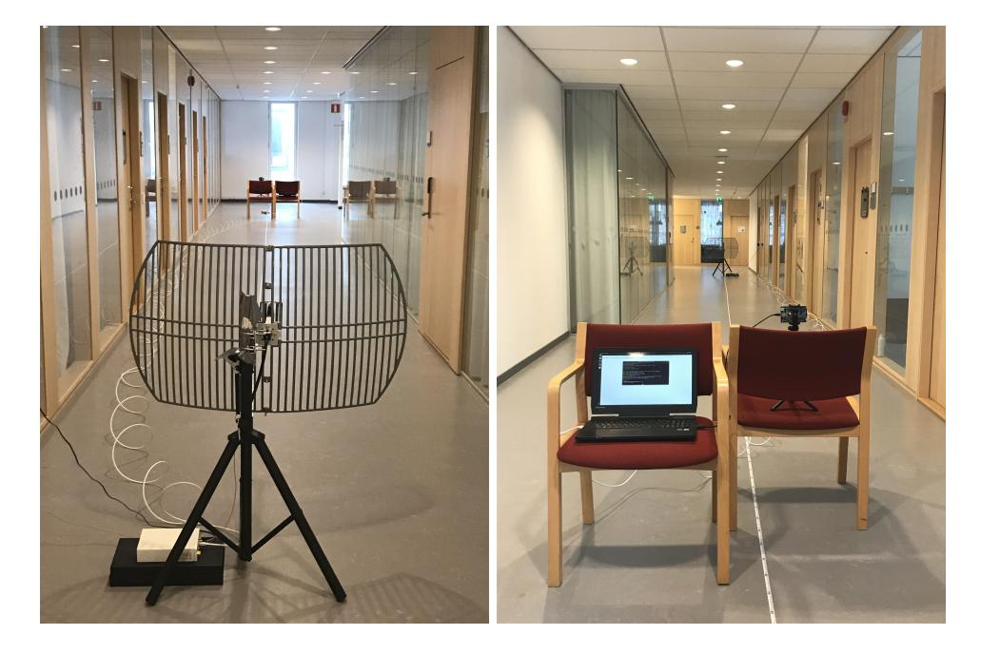

Figure 2: Experimental setup for 15 m distance to target. Photo credit: Katerina Gurova.

the *Crypto block*. In the rest of this section we explain how to use Fourier analysis to determine the center frequency of the receiver required to collect the indirect EM emissions.

# 3.2 Center frequency of the receiver

Assuming that the clock frequency of the square wave is  $f_s$ , the Fourier series coefficients2,  $A_n$ , and the corresponding Fourier transform, S(f), of the clock signal s(t) are given by

$$s(t) = \sum_{n = -\infty}^{+\infty} A_n e^{i2n\pi f_s t},$$

$$S(f) = \sum_{n = -\infty}^{+\infty} A_n \delta(f - nf_s),$$

$$A_n = \frac{\sin n\pi \tau}{n\tau}$$
(2)

where  $\tau$  is the duty cycle of the square wave and  $\delta$  is the impulse function.

During the first modulation, the amplitude of the signal c(t) representing the side channels from the *Crypto block* is modulated by the square wave of the clock signal s(t). Thus, we get  $c_1(t) = c(t) \cdot s(t)$  in time domain and

$$C_1(f) = C(f) * S(f) = \sum_{n = -\infty}^{+\infty} A_n C(f - nf_s)$$
 (3)

in frequency domain.

&lt;sup>2The even terms of the Fourier series are not exactly equal to zero since the square wave noise is not an ideal square wave [2].

{3}------------------------------------------------

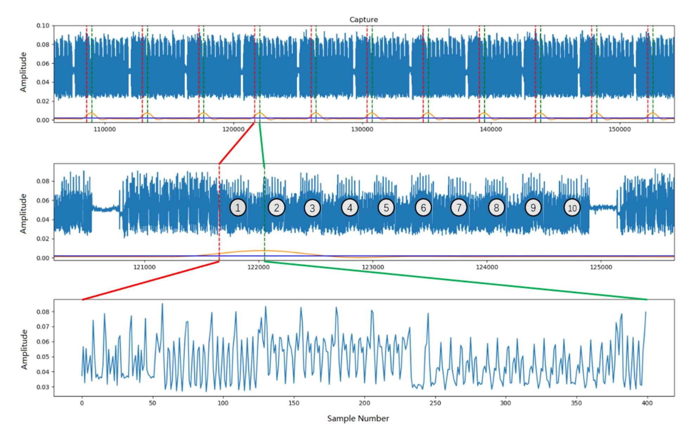

Figure 3: The data stream received by the receiver.

The modulated signal  $c_1(t)$  is then coupled with the Bus and transmitted to the RF block in the analog part where the second modulation occurs. Assuming that the radio carrier is  $e^{i2\pi f_c t}$ , where  $f_c$  is the carrier frequency, the Fourier transform of the carrier wave is the impulse function  $\delta(f-f_c)$ . Then, after the second modulation, the signal in time and frequency domains is given by

$$c_2(t) = \sum_{n = -\infty}^{+\infty} A_n c(t) e^{i2\pi (nf_s + f_c)t}$$

$$C_2(f) = \sum_{n = -\infty}^{+\infty} A_n C(f - nf_s - f_c).$$
(4)

This signal is transmitted using the transmission module on chip. At the receiver side, if the center receiving frequency is set to  $Nf_s + f_c$ , the received signal is in the form:

$$r(t) = \sum_{n \neq N} A_n c(t) e^{i2\pi (n-N)f_s t} + A_N c(t)$$

$$R(f) = \sum_{n \neq N} A_n C(f - (n-N)f_s) + A_N C(f).$$
(5)

A low pass filter can be used to recover the signal c(t).

# 4 TRACE ACQUISITION

The section describes the equipment and the methods we used to acquire and pre-process traces.

#### 4.1 Equipment

We use the same equipment as in [11]. Table 1 shows a summary. At the transmitter side, an nRF52832 device supporting Bluetooth 5 with the data transmission rate 2Mbps is used. The nRF52832 contains an ARM Cortex M4 CPU running at 64 MHz. It is mounted on the Nordic nRF52 DK board which is a development kit for nRF52 series suitable for implementing custom programs. The C implementation of *TinyAES* from [1] with a 128-bit key is used in nRF52832.

At the receiver side, an Ettus Research USRP N210 is used as a receiver. Its center receiving frequency is set to 2.528Ghz, which is equal to  $2f_{clock} + f_{Bluetooth}$ , where  $f_{Bluetooth} = 2.4$ Ghz. The sampling frequency is set to 5 MHz. A Grid Parabolic Antenna TL-ANT2424B with 24dBi gain is used to receive the signal.

The overall measurement setup is shown in Fig. 2. In all experiments we capture EM traces in an office environment, in two different settings: an office room (9 m long) and a corridor next to the office room (shown in Fig. 2).

# 4.2 Locating AES

In our experiments, the transmitter sends the data continuously, as in [11]. The AES execution traces are contained in the received data stream in periodic blocks, as shown at the top of Fig. 3. If we zoom in one block (the middle part of Fig. 3), we can clearly see the ten encryption rounds of AES-128.

{4}------------------------------------------------

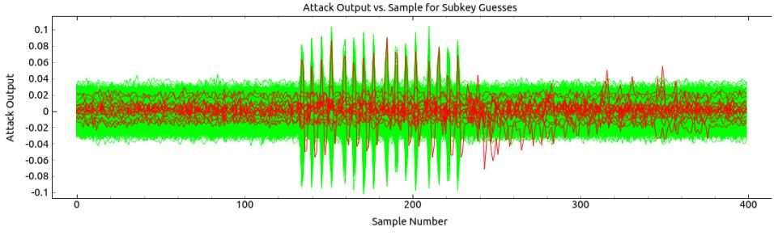

(a) Correlation for all subkey guesses.

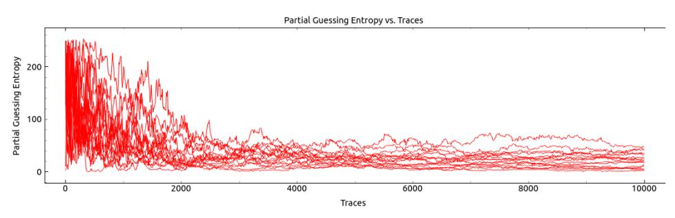

(b) PGE vs number of traces for all subkeys.

Figure 4: CPA results for 10K traces with 1K repetitions captured at 6 m distance to target.

To collect traces for the profiling and attack stages, we need to determine the start of each encryption. The orange line at the bottom is the trigger signal filtered from the AM demodulated I/Q samples3 and the blue horizontal line at the bottom is the average value of the trigger signal. These two lines help us to determine the approximate start of each encryption. This point is located at the intersection of the blue line with the rising edge of the orange line.

Once the approximate start of each encryption is determined, we locate it more precisely by adding an offset to the intersection point. The dashed red and green lines show the beginning and the end, respectively, of the 400 data points interval shown at the bottom part of Fig. 3. The interval within approx. 50-120 points corresponds to the executions of *AddRoundKey* in the initial round.

We use the value of the output of S-box in the first round (see Fig. 6) as a label for traces. To identify the location of S-box executions in a trace more precisely, we applied CPA to 10K traces captured in office environment at 6 m distance from the target. Each trace was averaged out over 1K measurements of the same encryption. The Hamming weight of the S-box output in the first round was used as a leakage model for CPA. Fig. 4(a) shows the correlation results for the all subkey guesses where the red and green curves represent outputs for correct key bytes and the rest key bytes, respectively. As we can see from the PGE plots in Fig. 4(b), the CPA cannot recover any subkey within 10K traces without key enumeration. However, it gives us information on the location of S-boxes. In Fig. 4(a) one can clearly see 16 peaks in the interval between approx. 130 and 240 points corresponding to S-box executions. In our experiments, we use this 110-point trace segment for training the models with the input size 110. For the models with the input size 5, we cut 5-point segments representing processing of the *k*th subkey by the

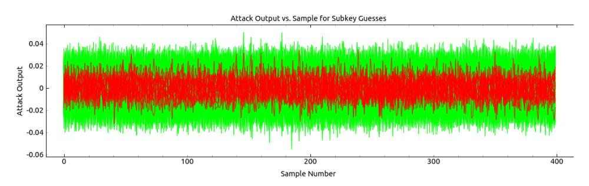

(a) Correlation for all subkey guesses.

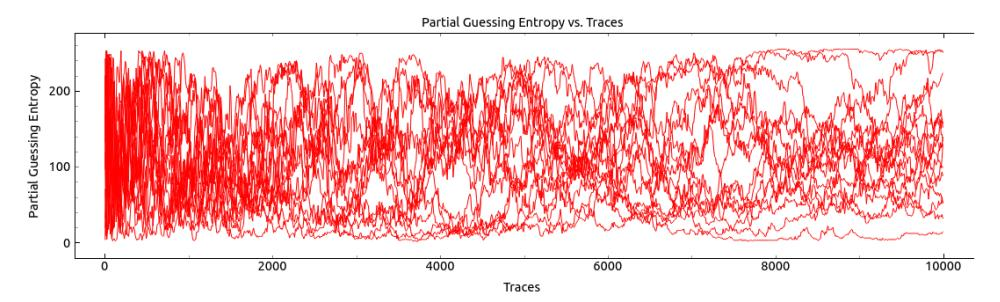

(b) PGE vs number of traces for all subkeys.

Figure 5: CPA results for 10K traces with no repetitions captured at 6 m distance to target.

S-Box, for  $k \in \{0, 1, ..., 15\}$ . In the trace in Fig. 4(a), the subkeys are processed in the order 0, 4, 8, 12, 1, 5, 9, 13, 2, 6, 10, 14, 3, 7, 11, 15.

It may also be worth mentioning that CPA on 10K traces captured without repetitions at 6 m distance from the target does not leak information about the location of S-boxes, see Fig. 5.

#### 4.3 Trace pre-processing

Since we capture traces in an office environment, their quality is greatly affected by the external noise and interference. As an example, Fig. 7(a) shows 100 single aligned traces and Fig. 7(b) shows their average result. Clearly, the quality of traces improves.

In our experiments we use traces captured at different distances to target. Since the amplitude of the received signal is proportional to the inverse of the distance to target, the amplitudes of traces captured at different distances to target are not in the same range. We use min-max scaling [18] to map the amplitude of all traces to the interval [0,1]. Given a set of traces  $\mathcal{T}$ , each trace  $\mathcal{T} = (\tau_1, \ldots, \tau_m) \in \mathbb{R}^m$  of  $\mathcal{T}$  is mapped into  $\mathcal{T}' = (\tau'_1, \ldots, \tau'_m) \in \mathbb{I}^m$  such that, for all  $i \in \{1, \ldots, m\}$ ,

$$\tau_i' = \frac{\tau_i - \tau_{min}}{\tau_{min} - \tau_{max}},\tag{6}$$

where  $\tau_{min}$  and  $\tau_{max}$  are the minimum and the maximum data points in  $\mathcal{T}$ . We also tried using *standardization* for feature scaling, but found it is worse compared to the *min-max scaling*.

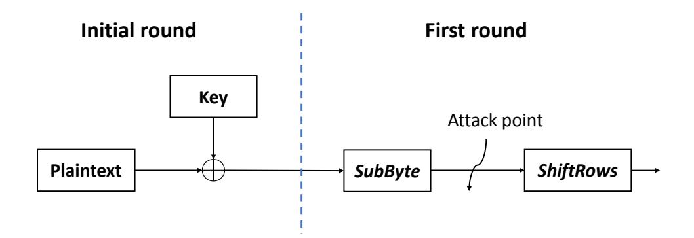

Figure 6: Attack point.

 $^3$ To filter the trigger, we post-process the I/Q samples by taking the absolute value, then use 5 order Butterworth band pass filter with 1.85MHz and 1.95MHz frequencies for lower and upper band, respectively, and 5 order Butterworth low pass filter with cut off frequency 5KHz.

{5}------------------------------------------------

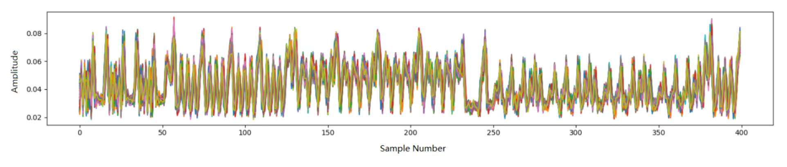

(a) 100 single aligned traces.

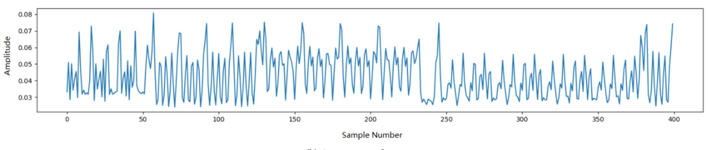

(b) One averaged trace.

Figure 7: The effect of averaging on traces.

#### **5 PROFILING STAGE**

At the profiling stage, we train a separate neural network  $\mathcal{N}_k$  for each subkey  $K_k \in \{0,1\}^8$ ,  $k \in \{0,1,\ldots,15\}$ .

# 5.1 Training strategy

For each  $k \in \{0, 1, ..., 15\}$ , a neural network  $\mathcal{N}_k$  for the subkey  $K_k$ , is trained as follows:

(1) Assign to each trace  $\mathcal{T}_i$  in the training set  $\mathcal{T}$  a label  $l_k(\mathcal{T}_i)$  equal to the value of the S-box output in the first round when the kth byte of  $\mathcal{P}_i \oplus K$  is processed:

$$l_k(\mathcal{T}_i) = \text{S-box}[\mathcal{P}_{i,k} \oplus K_k].$$

where  $\mathcal{P}_{i,k}$  is the kth byte of the plaintext  $\mathcal{P}_i$  used to generate the trace  $\mathcal{T}_i$ .

(2) Use the labeled set of traces to train a network  $\mathcal{N}_k : \mathbb{R}^m \to \mathbb{I}^{256}$ , where m is the number of data points in a trace. The jth element  $s_{i,k,j}$  of the output score vector  $S_{i,k} = \mathcal{N}_k(\mathcal{T}_i)$  is the probability that the S-box output in the first round is equal to  $j \in \{0,1,\ldots,255\}$  when the kth byte of  $\mathcal{P}_i$  is processed:

$$s_{i,k,j} = \Pr(\text{S-box}[\mathcal{P}_{i,k} \oplus K_k] = j).$$

We would like to mention that it might be possible to train a *single* neural network capable of recovering all subkeys. For power analysis, such a possibility has been already demonstrated in [7] for an 8-bit microcontroller implementation of AES-128. The Multilayer Perceptron (MLP) model presented in [6] can recover all subkeys from target device (which is identical to the profiling device, but not the same instance). The MLP is trained on a set of 16n trace sets  $\mathcal{T} = \bigcup_{i=0}^{15} \mathcal{T}_k$  such that, for all  $k \in \{0,1,\ldots,15\}$ , n traces of the set  $\mathcal{T}_k$  represent the execution of S-box in the first round for

the kth byte of  $\mathcal{P} \oplus K$ . However, models trained for a fixed subkey typically achieve a higher classification accuracy.

### 5.2 Selecting neural network

Previous work has shown that CNN and MLP networks are good choices for side-channel analysis. CNNs can overcome trace misalignment and jitter [9, 15, 31]. MLPs are typically chosen if traces are synchronized and there is no need to handle noise [3, 23, 24, 27].

For far field EM side channels noise is a real issue, so CNN seems a natural choice. However, we were interested to compare both types of neural networks, so we tested both CNN and MLP cases.

During training we use 90% of traces captured from profiling devices for training and 10% for validation. The average rank is used as an assessment method. The neural network which converges to the average rank 0.5 faster is considered better (we explain the reasons for this choice in Section 6).

In order to find the best parameters for the input size, the number of layers, and size of layers, we trained many different neural networks. We tried various options for learning rate, learning rate decay, dropout, etc. In this way we identified three best candidates: a CNN with input size 110, a CNN with input size 5 and an MLP with input size 5. Tables 2, 3, and 4 summarize their architectures. In the sequel, we refer to these networks as  $CNN_{110}$ ,  $CNN_5$  and  $MLP_5$ , respectively. The subscript corresponds to the number of data samples in the trace (which determines the network's input size). Recall that a 110-point interval covers the execution of all S-boxes.

All three networks are trained with the learning rate 0.0001, no learning rate decay, no dropout, and the batch size 128. The MLP is trained using Adam optimizer. The CNNs are trained using RMSprop optimizer.

{6}------------------------------------------------

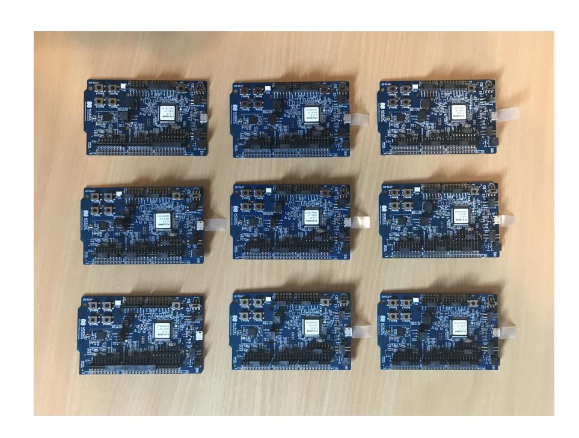

Figure 8: Nine nRF52 DK devices.

To select a best number of epochs, for each of the three networks we trained 100 models using i epochs, for  $i \in \{1, 2, ..., 100\}$ . At each iteration, the model is stored instead of being overwritten. The resulting best numbers of epochs are shown in Table 5.

### **6 ATTACK STAGE**

At the attack stage, the trained network  $\mathcal{N}_k$  is used to recover the subkey  $K_k$  from the trace set  $\hat{\mathcal{T}}$  captured from the target device as follows. For each  $k \in \{0, 1, \dots, 15\}$ :

- (1) Identify the *m*-point segment corresponding to the input data points of  $\mathcal{N}_k$  in the traces of  $\hat{\mathcal{T}}$ .
- (2) For each  $i \in \{1, ..., |\hat{\mathcal{T}}|\}$ , use  $\mathcal{N}_k$  to classify the trace  $\mathcal{T}_i \in \hat{\mathcal{T}}$  in order to determine the most likely label  $\tilde{l}$  for among all candidate labels (see eq. (1)).
- (3) Once the condition  $\tilde{l} = l(\mathcal{T}_i)$  is satisfied and the correct label  $l(\mathcal{T}_i)$  is found for some i, the subkey  $K_k$  is recovered as

$$K_k = \text{S-box}^{-1}(l_k(\mathcal{T}_i)) \oplus \mathcal{P}_{i,k},$$

where  $\mathcal{P}_{i,k}$  is the kth byte of the plaintext  $\mathcal{P}_i$  used to generate the trace  $\mathcal{T}_i$ .

**Table 2: The architecture of**  $CNN_{110}$ **.** 

|                     |                 | 110         |
|---------------------|-----------------|-------------|
| Layer (Type)        | Output Shape    | Parameter # |
| Input (Dense)       | (None, 110, 1)  | 0           |
| Conv 1 (Conv1D)     | (None, 110, 4)  | 16          |
| AveragePooling 1    | (None, 109, 4)  | 0           |
| Conv 2 (Conv1D)     | (None, 109, 8)  | 104         |
| AveragePooling 2    | (None, 108, 8)  | 0           |
| Conv 3 (Conv1D)     | (None, 108, 16) | 400         |
| AveragePooling 3    | (None, 107, 16) | 0           |
| Conv 4 (Conv1D)     | (None, 107, 32) | 1568        |
| AveragePooling 4    | (None, 106, 32) | 0           |
| Flatten 1 (Flatten) | (None, 3392)    | 0           |
| Dense1 (Dense)      | (None, 200)     | 678600      |
| Dense2 (Dense)      | (None, 200)     | 40200       |
| Output (Dense)      | (None, 256)     | 51456       |

Total Parameters: 772,344

Table 3: The architecture of  $CNN_5$ .

| Layer (Type)        | Output Shape  | Parameter # |
|---------------------|---------------|-------------|
| Input (Dense)       | (None, 5, 1)  | 0           |
| Conv 1 (Conv1D)     | (None, 5, 5)  | 20          |
| AveragePooling 1    | (None, 4, 5)  | 0           |
| Conv 2 (Conv1D)     | (None, 4, 10) | 160         |
| AveragePooling 2    | (None, 3, 10) | 0           |
| Flatten 1 (Flatten) | (None, 30)    | 0           |
| Dense1 (Dense)      | (None, 200)   | 6200        |
| Dense2 (Dense)      | (None, 200)   | 40200       |
| Output (Dense)      | (None, 256)   | 51456       |

Total Parameters: 98,036

**Table 4: The architecture of** *MLP*5**.** 

| Layer (Type)   | Output Shape | Parameter # |
|----------------|--------------|-------------|
| Input (Dense)  | (None, 5)    | 0           |
| Dense1 (Dense) | (None, 100)  | 600         |
| Dense2 (Dense) | (None, 100)  | 10100       |
| Dense3 (Dense) | (None, 100)  | 10100       |
| Dense4 (Dense) | (None, 100)  | 10100       |
| Dense5 (Dense) | (None, 100)  | 10100       |
| Dense6 (Dense) | (None, 100)  | 10100       |
| Output (Dense) | (None, 256)  | 25856       |

Total Parameters: 76,956

Table 5: A best number of epochs for different models.

| Model       | # epochs |  |  |
|-------------|----------|--|--|
| $MLP_5$     | 25       |  |  |
| $CNN_5$     | 70       |  |  |
| $CNN_{110}$ | 17       |  |  |

As we mentioned in Section 2.2.3, the condition  $\tilde{l} = l(\mathcal{T}_i)$  can be verified by checking if the rank of the subkey  $K_k$  derived from the label  $l(\mathcal{T}_i)$  is zero. Next, we show that it is possible to terminate the search earlier by performing multiple tests in parallel and checking if the average rank of the subkey is 0.5. Note that multiple test sets can be obtained from  $\hat{\mathcal{T}}$  by randomly permuting its elements, so the computation of average rank does not require more traces from the target device.

Suppose that the test sets  $\hat{\mathcal{T}}_1, \ldots, \hat{\mathcal{T}}_n$  are used to compute the the average rank of the subkey  $K_k$ ,  $\overline{R}(K_k)$ :

$$\overline{R}(K_k) = \frac{\sum_{i=1}^n R_i(K_k)}{n},$$

where  $R_i(K_k)$  is the rank of  $K_k$  for  $\hat{T}_i$ ,  $i \in \{1, ..., n\}$ .

PROPERTY 1. If  $\overline{R}(K_k) \leq 0.5$ , then  $R_i(K_k) = 0$  for the majority of tests sets  $\hat{\mathcal{T}}_1, \dots, \hat{\mathcal{T}}_n$ .

PROOF. Follows directly from the fact that  $R_i(K_k)$  is a non-negative integer. Thus,  $\overline{R}(K_k) \leq 0.5$  implies that  $R_i(K_k) = 0$  for at least one half of  $i \in \{1, ..., n\}$ .

{7}------------------------------------------------

#### **EXPERIMENTAL RESULTS** 7

In the experiments, we used nine identical nRF52832 devices, see Fig. 8. Five of them,  $D_1 - D_5$ , were used for profiling and the remaining four,  $D_6 - D_9$ , as targets.

Using the equipment and the method described in Section 4, we captured three trace sets of size 500K from the profiling devices  $D_1$  –  $D_5$  with 100 repetitions of the same encryption. Different training sets are used in different experiments, the details are described below.

We also captured trace sets of size 10K from each of the target device  $D_6 - D_9$  at distances 3 m, 6 m, 9 m and 15 m with 1, 100 and 1000 repetitions of the same encryption.

All experiments presented in this section show the results of recovering the subkey  $K_0$  using networks trained on the subkey  $K_0$  as explained in Section 5. The subkey number does not seem to matter.

#### **Experiment 1** 7.1

The aims of this experiment were: (1) to investigate if the key can be recovered without repeating the same encryption multiple times, and (2) how the number of repetitions, N, affects the number of traces required to recover the key.

At the profiling stage, we trained CNN110, CNN5 and MLP5 networks on a trace set  $\mathcal{T}$  of size 500K with the structure shown in Table 6. As one can see, traces were captured from five different devices at five different distances to target, including through a coaxial cable4. Each trace in  $\mathcal{T}$  is the average of 100 measurements of the same encryption.

Table 6: Structure of the profiling trace set used in the experiment 1. Each trace is the average of 100 measurements of the same encryption.

| Profiling | Distance to device |     |     |     | Envi- |         |
|-----------|--------------------|-----|-----|-----|-------|---------|
| device    | cable              | 1 m | 2 m | 4 m | 8 m   | ronment |
| $D_1$     | 20K                | 20K | 20K | 20K | 20K   | office  |
| $D_2$     | 20K                | 20K | 20K | 20K | 20K   | office  |
| $D_3$     | 20K                | 20K | 20K | 20K | 20K   | office  |
| $D_4$     | 20K                | 20K | 20K | 20K | 20K   | office  |
| $D_5$     | 20K                | 20K | 20K | 20K | 20K   | office  |

At the attack stage, we tested the trained networks on trace sets  $\mathcal{T}$  of size 10K captured from  $D_6, D_7, D_8$  and  $D_9$  at distance 3 m, 6 m, 9 m and 15 m to the target, respectively. The results on the average number of traces required to recover the subkey for N = 1,100and 1000 repetitions are shown in Table 7. We permuted the trace set  $\hat{T}$  100 times to calculate the average rank. The numbers shown in Table 7 correspond to the point when the average rank of the subkey reaches 0.5. By Property 1, this implies that at this point the subkey ranks are 0 in at least 50 tests sets.

From Table 7(c) one can see that all three networks are capable of recovering the subkey from less than 10K traces without repetitions

Table 7: Average number of traces required to recover the subkey in the experiment 1 (results for 100 tests). Each trace is the average of N measurements of the same encryption.

**Target** 

| Distance to target |                    | Model   | Envi-                  |         |
|-----------------------|--------------------|---------|------------------------|---------|
|                       | $\overline{MLP_5}$ | $CNN_5$ | $\overline{CNN_{110}}$ | ronment |
| 3 m                   | 4789               | 2473    | 437                    | office  |

device to  $D_6$  $D_7$ 7657 2983 1089 office 6 m office  $D_8$ 2475 9 m 4643 3036  $D_9$ 15 m 1961 981 367 corridor

(b) N = 100

| Target           | Distance  |                    | Model   | Envi-                  |          |
|------------------|-----------|--------------------|---------|------------------------|----------|
| device           | to target | $\overline{MLP_5}$ | $CNN_5$ | $\overline{CNN_{110}}$ | ronment  |
| $\overline{D_6}$ | 3 m       | 1297               | 1088    | 525                    | office   |
| $D_7$            | 6 m       | 3002               | 1871    | 905                    | office   |
| $D_8$            | 9 m       | 3854               | 3060    | 1894                   | office   |
| $D_9$            | 15 m      | >10K               | 6265    | 2946                   | corridor |

(c) N = 1

| Target | Distance  |                    | Model   | Envi-       |          |
|--------|-----------|--------------------|---------|-------------|----------|
| device | to target | $\overline{MLP_5}$ | $CNN_5$ | $CNN_{110}$ | ronment  |
| $D_6$  | 3 m       | >10K               | >10K    | >10K        | office   |
| $D_7$  | 6 m       | 5756               | 5810    | 9357        | office   |
| $D_8$  | 9 m       | >10K               | >10K    | >10K        | office   |
| $D_9$  | 15 m      | >10K               | 9954    | >10K        | corridor |

at 6 m distance to target. CNN5 can also handle 15 m distance to target using less than 10K traces on average. None of the networks can handle 3 m and 9 m distances to target using less than 10K traces on average.

From Table 7(a) one can see that, all three networks are capable of recovering the subkey from traces with 1000 repetitions at any distance to target. The result 367 for CNN 110 at 15 m distance to target is quite surprising. It is an order of magnitude smaller than 5K traces required for the template attack in [10] which also uses key enumeration up to  $2^{23}$ . We repeated the measurements for 15 m distance several times to verify the result. It might be that the corridor acts as a "waveguide" and reflects the signal back [17].

When analyzing Table 7 one should take into account that the office and the corridor are different environments.

#### Experiment 2 7.2

The aim of this experiment was to check if we can achieve that same results as in the experiment 1 in the case when a singe device is used for profiling. The number of profiling devices is known to significantly affect the results of power analysis based on deep learning [4, 13, 39, 41]. However, far field EM traces are much more noisy than power traces. So, the effect of manufacturing process variation may not be so prominent.

&lt;sup>4We verified that the receiver is not overloaded by visualizing the I/Q samples (no cut-off for both real and imaginary parts).

{8}------------------------------------------------

At the profiling stage, we trained  $CNN_{110}$  on a trace set of size 500K captured from  $D_1$  at 5 different distances, see Table 8. At the attack stage, we tested the trained network on the same test sets as in the experiment 1.

The results on the average number of traces required to recover the subkey for N=100 repetitions are shown in Table 9. We can see that, the results are worse than the ones in the last column on Table 7(b). We can conclude that profiling on multiple devices remains a better strategy for the far field EM side channels case.

# 7.3 Experiment 3

The aim of this experiment was to investigate if we can achieve that same results as in the experiment 1 in the case when profiling is done using traces captured at one distance to target only.

At the profiling stage, we trained  $CNN_{110}$  on a trace set of size 500K captured from  $D_1 - D_5$  through a coaxial cable, see Table 10. At the attack stage, we tested the trained network on the same trace sets of size 10K as in the experiment 1.

The results on the average number of traces required to recover the subkey for N=100 repetitions are shown in Table 11. Again, the results are worse than the ones in the last column on Table 7(b). We can conclude that including traces captured at different distances in the profiling set a good strategy.

Table 8: Structure the 500K profiling trace set used in the experiment 2. Each trace is the average of 100 measurements of the same encryption.

| Profiling        |       | Distance to device |      |      |      |         |
|------------------|-------|--------------------|------|------|------|---------|
| device           | cable | 1 m                | 2 m  | 4 m  | 8 m  | ronment |
| $\overline{D_1}$ | 100K  | 100K               | 100K | 100K | 100K | office  |

Table 9: Average number of traces required to recover the subkey in the experiment 2 (results for 100 tests). Each trace is the average of 100 measurements of the same encryption.

| Target device | Distance to target | Model $CNN_{110}$ | Envi- ronment |
|------------------|-----------------------|-------------------|------------------|
| $D_6$            | 3 m                   | >10K              | office           |
| $D_7$            | 6 m                   | >10K              | office           |
| $D_8$            | 9 m                   | >10K              | office           |
| $D_9$            | 15 m                  | 6628              | corridor         |

Table 10: Structure the profiling trace set used in the experiment 3. Each trace is the average of 100 measurements of the same encryption.

| Distance to device | Profiling device |       |       |       |       | Envi-   |
|-----------------------|------------------|-------|-------|-------|-------|---------|
|                       | $\overline{D_1}$ | $D_2$ | $D_3$ | $D_4$ | $D_5$ | ronment |
| cable                 | 100K             | 100K  | 100K  | 100K  | 100K  | office  |

Table 11: Average number of traces required to recover the subkey in the experiment 3 (results for 100 tests). Each trace is the average of 100 measurements of the same encryption.

| Target device | Distance to target | Model $CNN_{110}$ | Envi- ronment |
|------------------|-----------------------|-------------------|------------------|
| $D_6$            | 3 m                   | 1853              | office           |
| $D_7$            | 6 m                   | 1345              | office           |
| $D_8$            | 9 m                   | 5826              | office           |
| $D_9$            | 15 m                  | 3689              | corridor         |

# 7.4 Experiment 4

Since in the experiments 1, 2 and 3 we did not test all devices  $D_6 - D_9$  for all distances to target, we also investigated if the choice of another target device would affects the results in Tables 7, 9 and 11.

We used  $CNN_{110}$  trained as in the experiment 1 to recover the subkey from trace sets captured at 6 m distance to  $D_6 - D_9$ , each set of size 10K. The results on the average number of traces required to recover the subkey for N = 100 are shown in Table 11. We can see that the numbers for all devices are in the same range, so the choice of another target device would not significantly affect the results in Tables 7, 9 and 11.

Table 12: Average number of traces required to recover the subkey in the experiment 4 (results for 100 tests). Each trace is the average of 100 measurements of the same encryption.

| _ |                  |                       |                   |                  |
|---|------------------|-----------------------|-------------------|------------------|
|   | Target device | Distance to target | Model $CNN_{110}$ | Envi- ronment |
|   | $D_6$            | 6 m                   | 1003              | office           |
|   | $D_7$            | 6 m                   | 905               | office           |
|   | $D_8$            | 6 m                   | 1290              | office           |
|   | $D_9$            | 6 m                   | 1033              | office           |

# 7.5 Lessons learned

Our experiments show that training on traces captured from multiple devices at different distances to target is a good strategy for far field EM based side-channel analysis. The more similar is the target device to one of the profiling devices, the smaller is the number of traces required to recover its key.

It is possible to profile and attack on traces captured with a different number of repetitions. In Table 7(c) only 6 m and 15 m distances to target are feasible for 10K test sets, but we believe that this result can be improved.

Training on a larger part of trace seems to work better than training on a segment representing one S-box execution since  $CNN_{110}$  gives better results than  $CNN_5$  and  $MLP_5$  in the majority of cases. However, a good feature of  $CNN_5$  and  $MLP_5$  is that they may recover other subkeys  $K_i$  (with a degraded classification accuracy), even though they are trained for a fixed subkey  $K_i$ , for  $i \neq j$ ,

{9}------------------------------------------------

 $i,j \in \{0,1,\ldots,15\}$ . For example, CNN5 trained for  $K_0$  can recover 9 out of 15 other subkeys from a trace set of size 10K captured with 1000 repetitions at 15 m distance to  $D_9$ , e.g. it needs 2035 traces on average to recover  $K_1$  (for  $K_0$  it needs 981, see Table 7(a)).

### 8 CONCLUSION

We demonstrated that by using a trace set containing traces captured from multiple profiling devices at different distances to target it is possible to train a neural network capable of recovering the key from another device, identical to the profiling ones. Our results are preliminary. Probably better neural networks can be trained with more experiments.

Future work includes training models capable of recovering the key from traces without repetitions at any distance to target, trying different attack settings, and mounting similar attacks on devices supporting other wireless network protocols.

### 9 ACKNOWLEDGMENTS

We are indebted to the authors of [11] who generously shared the code required to setup experiments at github. This work would take much longer otherwise. All our code and traces are available at <a href="https://bttps://github.com/KTH-SCA/ff-em-sca">https://bttps://github.com/KTH-SCA/ff-em-sca</a>. The authors are also grateful to the KTH students Martin Brisfors for his valuable advice on training deep learning models and Zihao Zhao for his help with configuring hardware for the experiments.

This work was supported in part by the research grant 2018-04482 from the Swedish Research Council.

# **REFERENCES**

- [1] 2013. Small portable AES128/192/256 in C. Github. https://github.com/kokke/tiny-AES-c/.
- [2] Dakshi Agrawal, Bruce Archambeault, Josyula R. Rao, and Pankaj Rohatgi. 2003. The EM Side-Channel(s). In *Crypt. Hardware and Embedded Systems*. 29–45.
- [3] Ryad Benadjila, Emmanuel Prouff, Rémi Strullu, Eleonora Cagli, and Cécile Dumas. 2018. Study of deep learning techniques for side-channel analysis and introduction to ASCAD database. *ANSSI* 22 (2018), 2018.
- [4] Shivam Bhasin, Anupam Chattopadhyay, Annelie Heuser, Dirmanto Jap, Stjepan Picek, and Ritu Ranjan Shrivastwa. 2020. Mind the Portability: A Warriors Guide through Realistic Profiled Side-channel Analysis. In *Network and Distributed System Security Symposium*. https://doi.org/10.14722/ndss.2020.24390
- [5] Eric Brier, Christophe Clavier, and Francis Olivier. 2004. Correlation Power Analysis with a Leakage Model. In *Cryptographic Hardware and Embedded Systems*, Marc Joye and Jean-Jacques Quisquater (Eds.). Springer, 16–29.
- [6] Martin Brisfors and Sebastian Forsmark. 2019. Deep Learning Side-Channel Attacks on AES. Master's thesis. School of Electrical Engineering and Computer Science, KTH.
- [7] Martin Brisfors and Sebastian Forsmark. 2019. DLSCA: a Tool for Deep Learning Side Channel Analysis. IACR Cryptology ePrint Archive, Report 2019/1071. https://eprint.iacr.org/2019/1071.
- [8] Stephane Bronckers, Geert Van der Plas, and Yves Rolain. 2010. *Substrate noise coupling in analog/RF circuits*. Artech House.
- [9] Eleonora Cagli, Cécile Dumas, and Emmanuel Prouff. 2017. Convolutional Neural Networks with Data Augmentation Against Jitter-Based Countermeasures. In Cryptographic Hardware and Embedded Systems – CHES 2017. 45–68.
- [10] Giovanni Camurati, Aurélien Francillon, and François-Xavier Standaert. 2020. Understanding Screaming Channels: From a Detailed Analysis to Improved Attacks. *IACR Trans. on CHES* 2020, 3 (2020), 358–401.
- [11] Giovanni Camurati, Sebastian Poeplau, Marius Muench, Tom Hayes, and Aurélien Francillon. 2018. Screaming channels: When electromagnetic side channels meet radio transceivers. In *Proceedings of the 2018 ACM SIGSAC Conference on Computer and Communications Security*. 163–177.
- [12] Joan Daemen and Vincent Rijmen. 2002. *The Design of Rijndael: AES - The Advanced Encryption Standard.* Springer.
- [13] Debayan Das, Anupam Golder, Josef Danial, Santosh Ghosh, Arijit Raychowdhury, and Shreyas Sen. 2019. X-DeepSCA: Cross-device deep learning side channel attack. In *Proceedings of the 56th Annual Design Automation Conference 2019.* 1–6.

- [14] Karine Gandolfi, Christophe Mourtel, and Francis Olivier. 2001. Electromagnetic analysis: Concrete results. In *International workshop on cryptographic hardware and embedded systems*. Springer, 251–261.
- [15] R. Gilmore, N. Hanley, and M. O'Neill. 2015. Neural network based attack on a masked implementation of AES. In 2015 IEEE International Symposium on Hardware Oriented Security and Trust (HOST). 106–111.
- [16] Ian Goodfellow, Yoshua Bengio, and Aaron Courville. 2016. *Deep Learning*. MIT Press. http://www.deeplearningbook.org.
- [17] Saulius Japertas. 2011. The research of IEEE 802.11 signal LOS propagation features for complex geometry indoors. (2011).
- [18] P. Juszczak, D. M. J. Tax, and R. P. W. Duin. 2002. Feature scaling in support vector data description. In *Proc. Ann. Conf. Adv. School Comput. Imaging*. 25–30.
- [19] Jaehun Kim, Stjepan Picek, Annelie Heuser, Shivam Bhasin, and Alan Hanjalic. 2019. Make Some Noise. Unleashing the Power of Convolutional Neural Networks for Profiled Side-channel Analysis. *IACR Transactions on Cryptographic Hardware* and Embedded Systems 2019, 3 (May 2019), 148–179.
- [20] Paul Kocher, Joshua Jaffe, and Benjamin Jun. 1999. Differential Power Analysis. In *Advances in Cryptology — CRYPTO' 99*. Springer, 388–397.
- [21] Paul Kocher, Ruby Lee, Gary McGraw, and Anand Raghunathan. 2004. Security As a New Dimension in Embedded System Design. In *Proc. of Design Automation Conference (DAC '04)*. 753–760.
- [22] Paul C. Kocher. 1996. Timing Attacks on Implementations of Diffie-Hellman, RSA, DSS, and Other Systems. In *Proc. of the 16th Annual Int. Cryptology Conf. on Advances in Cryptology*. 104–113.
- [23] T. Kubota, K. Yoshida, M. Shiozaki, and T. Fujino. 2019. Deep Learning Side-Channel Attack Against Hardware Implementations of AES. In 2019 22nd Euromicro Conference on Digital System Design (DSD). 261–268.
- [24] Houssem Maghrebi. 2019. Deep learning based side channel attacks in practice. IACR Cryptology ePrint Archive, Report 2019/578.
- [25] Houssem Maghrebi, Thibault Portigliatti, and Emmanuel Prouff. 2016. Breaking Cryptographic Implementations Using Deep Learning Techniques. In *Security, Privacy, and Applied Cryptography Engineering*, Claude Carlet, M. Anwar Hasan, and Vishal Saraswat (Eds.). Springer International Publishing, Cham, 3–26.
- [26] Stefan Mangard, Elisabeth Oswald, and Thomas Popp. 2007. *Power Analysis Attacks: Revealing the Secrets of Smart Cards (Advances in Information Security).* Springer-Verlag New York, Inc., Secaucus, NJ, USA.
- [27] Zdenek Martinasek, Petr Dzurenda, and Lukas Malina. 2016. Profiling power analysis attack based on MLP in DPA contest V4. 2. In 2016 39th International Conference on Telecommunications and Signal Processing (TSP). IEEE, 223–226.
- [28] Zdenek Martinasek, Lukas Malina, and Krisztina Trasy. 2015. Profiling power analysis attack based on multi-layer perceptron network. In *Computational Problems in Science and Engineering*. Springer, 317–339.
- [29] Loïc Masure, Cécile Dumas, and Emmanuel Prouff. 2020. A comprehensive study of deep learning for side-channel analysis. *IACR Transactions on Cryptographic Hardware and Embedded Systems* (2020), 348–375.
- [30] H. Pahlevanzadeh, J. Dofe, and Q. Yu. 2016. Assessing CPA resistance of AES with different fault tolerance mechanisms. In 2016 21st Asia and South Pacific Design Automation Conference (ASP-DAC). 661–666.
- [31] Guilherme Perin, Baris Ege, and Jasper van Woudenberg. 2018. Lowering the Bar: Deep Learning for Side-Channel Analysis (White Paper). BlackHat'2018.
- [32] Christophe Pfeifer and Patrick Haddad. 2018. Spread: a new layer for profiled deep-learning side-channel attacks. IACR Cryptology ePrint Archive, Report 2018/880.
- [33] Stjepan Picek, Ioannis Petros Samiotis, Jaehun Kim, Annelie Heuser, Shivam Bhasin, and Axel Legay. 2018. On the performance of convolutional neural networks for side-channel analysis. In *International Conference on Security, Privacy, and Applied Cryptography Engineering*. Springer, 157–176.
- [34] Emmanuel Prouff, Remi Strullu, Ryad Benadjila, Eleonora Cagli, and Cécile Canovas. 2018. Study of Deep Learning Techniques for Side-Channel Analysis and Introduction to ASCAD Database. IACR Cryptology ePrint Archive, 2018/053.
- [35] Jean-Jacques Quisquater and David Samyde. 2001. Electromagnetic analysis (ema): Measures and counter-measures for smart cards. In *International Conference on Research in Smart Cards*. Springer, 200–210.
- [36] Herbert Robbins and Sutton Monro. 1951. A Stochastic Approximation Method. *Ann. Math. Statist.* 22 (1951), 400–407.
- [37] Benjamin Timon. 2018. Non-Profiled Deep Learning-Based Side-Channel Attacks. IACR Cryptology ePrint Archive, Report 2018/196.
- [38] Huanyu Wang. 2019. Side-Channel Analysis of AES Based on Deep Learning. Master's thesis. School of Electrical Engineering and Computer Science, KTH.
- [39] Huanyu Wang, Martin Brisfors, Sebastian Forsmark, and Elena Dubrova. 2019. How diversity affects deep-learning side-channel attacks. In 2019 IEEE Nordic Circuits and Systems Conference (NORCAS): NORCHIP and International Symposium of System-on-Chip (SoC). 1–7.
- [40] Huanyu Wang and Elena Dubrova. 2020. Tandem Deep Learning Side-Channel Attack Against FPGA Implementation of AES. IACR Cryptology ePrint Archive, Report 2020/373. https://eprint.iacr.org/2020/373.
- [41] Huanyu Wang, Sebastian Forsmark, Martin Brisfors, and Elena Dubrova. 2020. Multi-source training deep learning side-channel attacks. In *IEEE 50th International Symposium on Multiple-Valued Logic (ISMVL'2020)*.