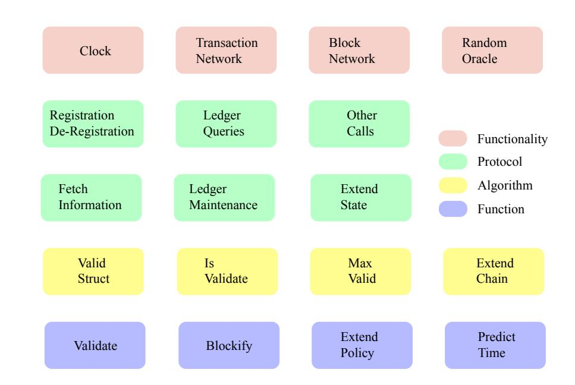
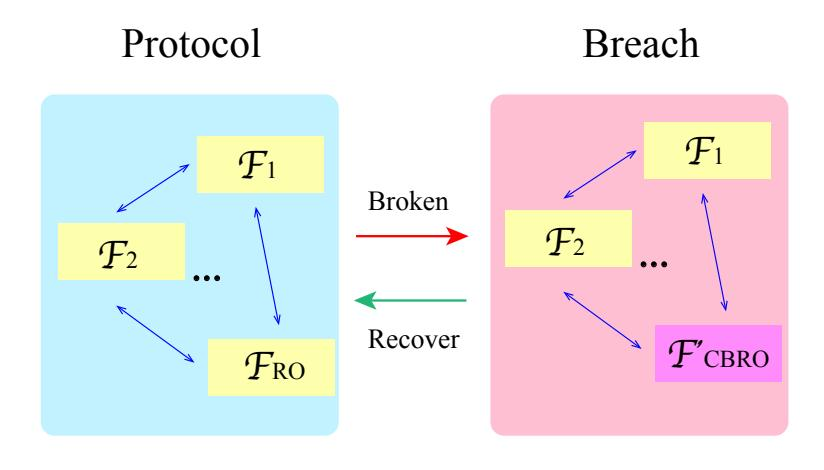
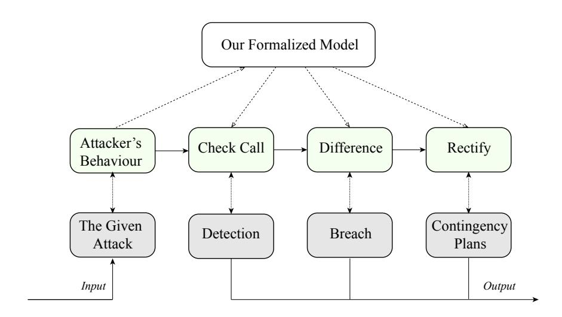
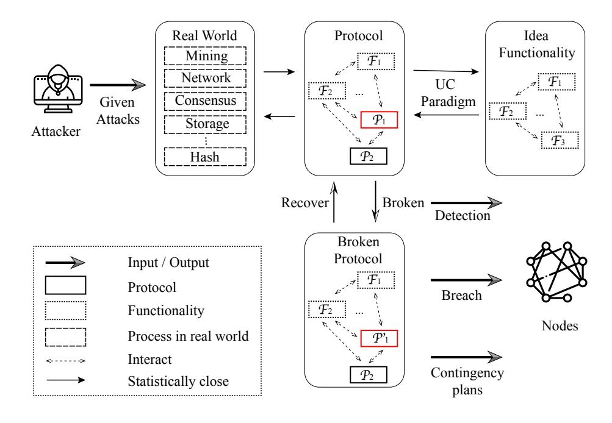
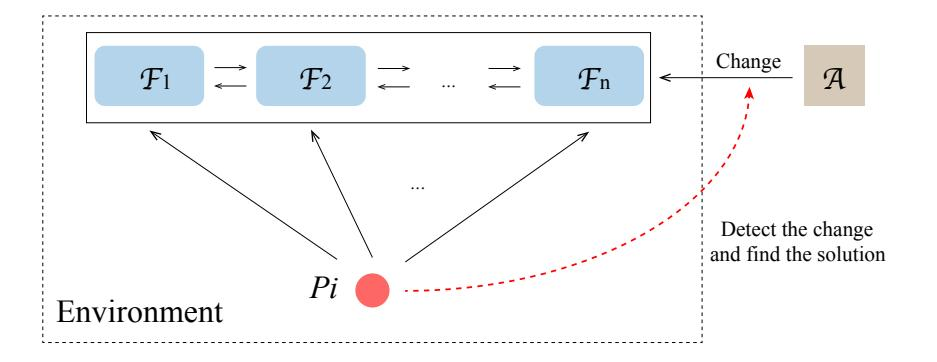
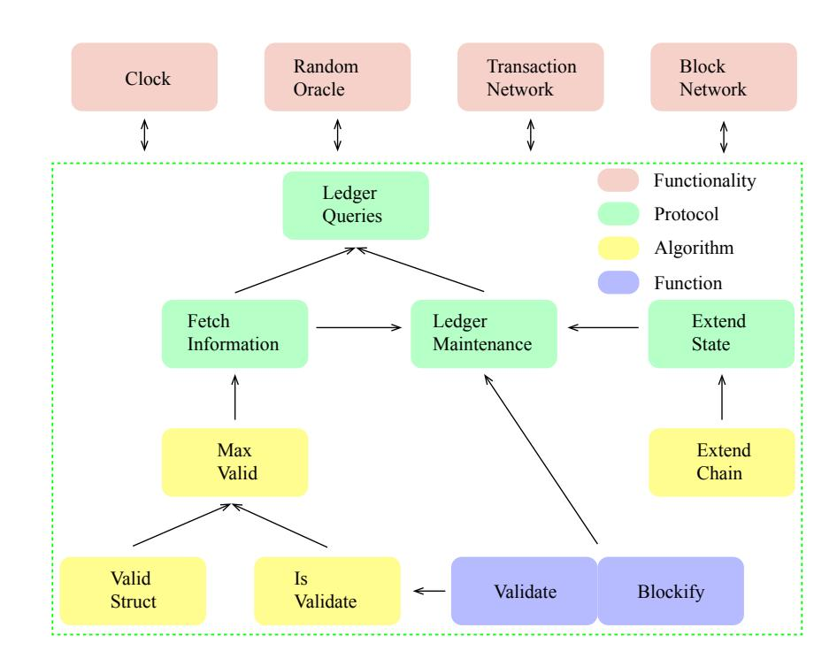
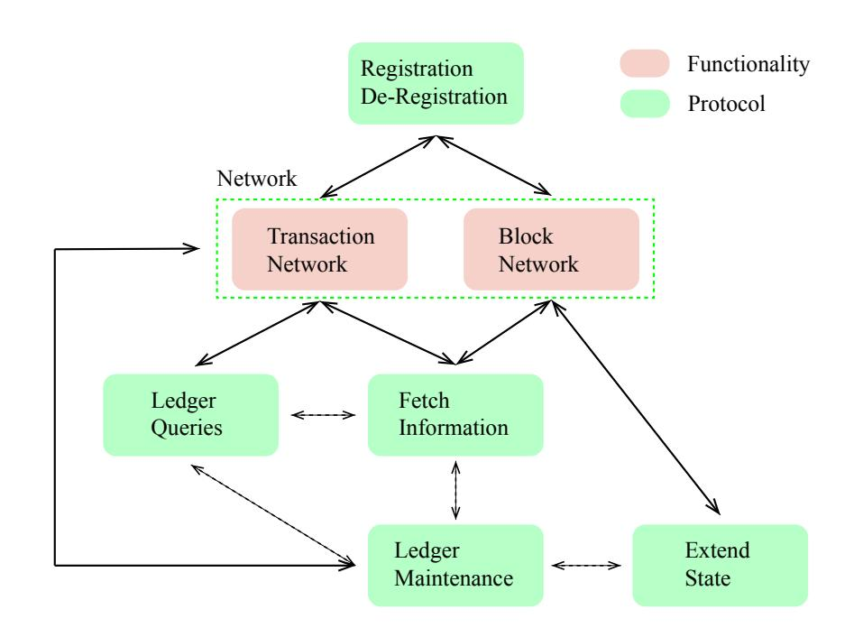
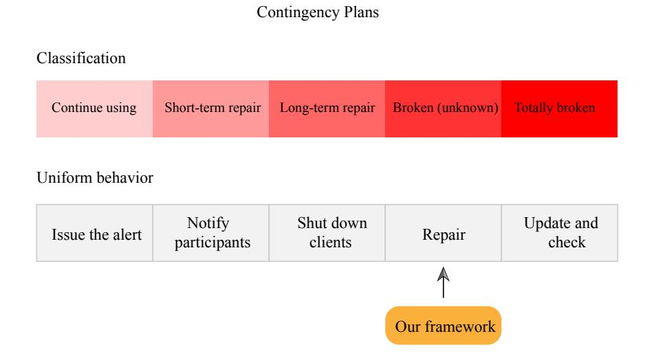

{0}------------------------------------------------

# Formalizing Bitcoin Crashes with Universally Composable Security

Junming Ke *Shandong University junmingke1994@gmail.com* Pawel Szalachowski *SUTD pawel@sutd.edu.sg*

Jianying Zhou *SUTD jianying zhou@sutd.edu.sg*

Qiuliang Xu *Shandong University xql@sdu.edu.cn*

*Abstract*— Bitcoin has introduced an open and decentralized consensus mechanism which in combination with an appendonly ledger allows building so-called blockchain systems, often instantiated as permissionless cryptocurrencies. Bitcoin is surprisingly successful and its market capitalization has reached about 168 billion USD as of July 2020. Due to its high economic value, it became a lucrative target and the growing community has discovered various attacks, proposed promising improvements, and introduced contingency plans for handling catastrophic failures. Nonetheless, existing analysis and contingency plans are not formalized and are tailored only to handle a small specific subset of diverse attacks, and as such, they cannot resist unexpected emergency cases and it is hard to reason about their effectiveness and impact on the system.

In this work, we provide a formalized framework to help evaluate a variety of attacks and their mitigations. The framework is based upon the universal composability (UC) framework [\[4\]](#page-12-0) to describe the attacker's power and the system's security goals. We propose the system in the context of Bitcoin and to the best of our knowledge, no similar work has been proposed previously. Besides, we demonstrate and evaluate our model with different case studies from the real world. Finally, we signal remaining challenges for the contingency plans and their formalization.

*Index Terms*—Blockchain Security, Bitcoin, Contingency Plans, Attacks

# 1. Introduction

Satoshi Nakamoto's Bitcoin [\[35\]](#page-13-0) is the first decentralized system which does not rely on a trusted party to reach consensus in a large set of mutually untrusting nodes. Up to now, Bitcoin is the most popular cryptocurrency. Every Bitcoin node replicates the public ledger, called the blockchain, and tries to extend it by generating a new block pointing to the previous block and aggregating received transactions. The process of generating a new valid block is called mining and nodes (called miners) are incentivized to run the protocol as each added block rewards its finder with a block reward and transaction fees included.

With the increasing success of Bitcoin, there have been proposed multiple blockchain systems with different capabilities [\[20\]](#page-12-1), [\[22\]](#page-12-2), [\[34\]](#page-13-1), [\[36\]](#page-13-2). Consequently, the blockchain security has received increasing attention by researchers analyzing various aspects of blockchain platforms [\[2\]](#page-12-3), [\[7\]](#page-12-4), [\[14\]](#page-12-5), [\[15\]](#page-12-6), [\[37\]](#page-13-3), [\[40\]](#page-13-4). Since these systems promise to significantly change multiple sectors and businesses their security is critical. Interestingly, their inherent properties, like decentralization and openness, do not help with the security life cycle known from traditional platforms and applications. These systems are difficult to be updated and patched and this limitation is strongly manifested while considering hypothetical catastrophic crashes, like a broken cryptographic primitive, that may affect most of the blockchain users.

Unfortunately, we can predict that it is only a matter of time when a catastrophic failure happens to a popular cryptocurrency like Bitcoin. For instance, an implementation of a privacy-oriented cryptocurrency Zerocoin [\[26\]](#page-12-7) had a critical bug found by noticing irregular coin spends on the 19 April 2019. Subsequently, the developers tried to replace the core element of the system by another protocol as an ad-hoc contingency plan [\[24\]](#page-12-8). To mitigate the effects of such events, Bitcoin developers maintain the documentation of Bitcoin contingency plans [\[38\]](#page-13-5). However, these plans cover only a small subset of possible failures in their limited scope. Moreover, these plans are based rather on predictions and speculations, and are not supported by any rigorous formal reasoning.

In this paper, we propose a methodology and framework that helps to formally reason about crashes in Bitcoin. In particular, we aim to answer the following questions:

- What component failures may be particularly harmful to the protocol?
- How could we respond if these components fail (i.e., propose contingency plans)?
- Can we provide a uniform framework for modeling crashes and contingency plans of blockchain systems?

Due to the uncertainty of the adversary's power and strategies, it is not an easy task to formulate possible crashes and contingency plans. One promising direction is to use abstraction and model the Bitcoin functionality. In short, the main application of the The bitcoin protocol is as a decentralized currency system with a payment mechanism, which is what it was designed for. An important question is then: what functions does Bitcoin achieve and under what assumptions? To formally answer this question we propose to use the universally composable (UC) paradigm [\[4\]](#page-12-0) that has been proved to be a successful methodology reasoning about such complex systems [\[3\]](#page-12-9). Contributions

In this work, we aim to analyze the Bitcoin security via the UC blockchain protocol and formalize the Bit

{1}------------------------------------------------

coin crashes through the meticulous investigation. More specifically, our contributions are as follows:

- Firstly, we propose a general framework for the Bitcoin system in order to analyze, detect, and mitigate adversarial behaviors. Our framework takes the given attacks as input, while handling the detection method, damage level of the system, as well as a contingency plan as output. To the best of our knowledge, there is no any similar prior work.
- Secondly, thanks to the UC treatment of the Bitcoin protocol, we illustrate the basic structure of our formalized security model as well as its analysis by extracting the functionality of each protocol. Our security model could help the framework to generate contingency plans.
- Thirdly, considering the diversity of attack strategies, our framework categorizes the damage level of the system and provides a mitigation step, which could be adopted as the template for a contingency plan.
- Finally, we show the feasibility of our framework by demonstrating and analyzing it with two different use cases (i.e., network assumptions, and mining process). We also identify remaining challenges for the contingency plans modeling.

# 2. Related Work

The Bitcoin design and its rationale are mostly described in its whitepaper [\[35\]](#page-13-0). The document is not formal and does not dive into system details or its analysis, however, multiple papers have focused on analyzing the underlying concepts and techniques related to Bitcoin and the blockchain technology [\[1\]](#page-12-10), [\[6\]](#page-12-11), [\[17\]](#page-12-12), [\[41\]](#page-13-6). Due to the immaturity of the Bitcoin protocol at the beginning, a lot of attacks has been raised, such as selfish mining [\[1\]](#page-12-10), [\[2\]](#page-12-3), [\[15\]](#page-12-6), where a miner adopts a deviated (malicious) mining strategy to increase its reward. Other attacks include double-spending attacks [\[32\]](#page-13-7), network-level split attacks [\[9\]](#page-12-13), forking the public blockchain to invalidate the target transactions [\[27\]](#page-12-14), or eclipse attacks isolating victims from other peers in the peer-to-peer network [\[13\]](#page-12-15), [\[25\]](#page-12-16), [\[29\]](#page-12-17). Given the Bitcoin's weakness, a large kind of literature has been proposed with a novel scheme named proof of stake protocol, With all recent interest in blockchain systems, only a little research effort has been devoted to blockchain catastrophic events and contingency plans [\[38\]](#page-13-5). Giechaskiel et al. [\[10\]](#page-12-18) first present the systematic analysis of the effect of broken primitives in Bitcoin. Their analysis reveals that some breakage causes serious problems for Bitcoin, whereas others seem to be inconsequential.

In cryptography, proof of security in the simulationbased UC framework is considered the standard for demonstrating that a protocol "does its job securely" [\[4\]](#page-12-0). The framework was subsequently extended and modified. Katz et al. [\[19\]](#page-12-19) proposed a novel approach to defining synchrony in the UC framework by introducing functionalities exactly meant to model, respectively, bounded-delay networks and loosely synchronized clocks. No constantround asynchronous MPC protocols based on standard assumptions are known at that time, Coretti et al. [\[5\]](#page-12-20) realized the synchronous and asynchronous models have to a large extent developed in parallel with results on both feasibility and asymptotic efficiency improvements in either track and they close this gap by providing the first constant-round asynchronous MPC protocol that is optimally resilient (i.e., it tolerates up to 1/3 corrupted parties), adaptively secure, and makes black-box use of a pseudo-random function.

Based on the assumption that the computational puzzle is modeled as a random oracle, Pass et al. [\[30\]](#page-13-8) then proved that the blockchain consensus mechanism satisfies a strong forms of consistency and liveness in an asynchronous network with adversarial delays that are a-priori bounded, within a formal model allowing for adaptive corruption and spawning of new players. Concurrently, Garay et al. [\[7\]](#page-12-4) proposed and analyzed applications that can be built "on top" of the backbone protocol, specifically focusing on the Byzantine agreement (BA) and on the notion of a public transaction ledger. Garay et al. [\[8\]](#page-12-21) subsequently extend this work to provide the first formal analysis of Bitcoin's target calculation function in the cryptographic setting, i.e., against all possible adversaries aiming to subvert the protocol's properties.

From those points of view, Kiayias et al. [\[21\]](#page-12-22) modeled the ideal guarantees as a transaction-ledger functionality in the context of universal composition framework. Subsequently, Badertscher et al. [\[3\]](#page-12-9) put forth the first UC (simulation-based) proof of the Bitcoin security and the functionality allows for participants to join and leave the computation and allows for adaptive corruption.

# 3. Preliminaries

## 3.1. Functionalities

In contrast to weaker property-based notions, that only guarantee security in a standalone setting [\[18\]](#page-12-23) or under sequential composition [\[11\]](#page-12-24), a UC-secure protocol maintains all security properties even when run concurrently with arbitrary other protocol instances.

The basic idea of the security proofs in the UC model is the real and ideal worlds paradigm [\[4\]](#page-12-0). First, we should define a cryptographic task to be achieved in the real world, namely, a distributed protocol that achieves the task across many untrusted processes. Then, to show that it is secure, we compare it with an idealized protocol in which processes simply rely on a single trusted process to carry out the task for them (and so security is satisfied trivially). The program for this single trusted process is called an ideal functionality as it provides a uniform way to describe all the security properties we require from the protocol [\[23\]](#page-12-25). We assume a protocol π realizes an ideal functionality F (i.e., it meets its specification) if every adversarial behavior in the real world can also be exhibited in the ideal world. The steps to prove a protocol secure can seem as follows:

- 1) Specification: for a given ideal functionality F in the ideal world, we should design a protocol π in the real world which achieves the task in the ideal world.
- 2) Construction: we must provide a simulator S that translates any attack A on the protocol π into an attack on F.

{2}------------------------------------------------

3) Security proof: we need to show that running  $\pi$  under an attack by any adversary  $\mathcal{A}$  (the real world) is indistinguishable from running  $\mathcal{F}$  under attack by  $\mathcal{S}$  (the ideal world) to any distinguisher Z called the environment.

In particular, Z is an adaptive distinguisher, meaning that it interacts with both the real world and the ideal world, and the simulation is sound if no Z can distinguish between the two. The primary goal of the UC model is composability. Suppose a protocol  $\pi$  is a protocol functionality that realizes a functionality  $\mathcal{F}$ , and a protocol  $\mathcal{P}$  relies on  $\mathcal{F}$  as a subroutine, in turn realizes an application specification functionality  $\mathcal{G}$ . Then, the composed protocol  $\mathcal{P} \circ \pi$ , in which calls to  $\mathcal{F}$  are replaced by calls to  $\pi$ , also realizes  $\mathcal{G}$ . Instead of analyzing the composite protocol consisting of  $\mathcal{P}$  and  $\pi$ , it suffices to analyze the security of  $\mathcal{P}$  itself in the simpler world with  $\mathcal{F}$ , the idealized version of  $\pi$ .

This paper focuses on the functionalities in the ideal world. Because we base on a secure proof of Bitcoin's UC model from the previous research [3], for every attack we consider only the functionality it breaks, i.e., the attacker's behavior could threaten or break nothing but the functionality assumptions. In such a case, we fix the protocol by "recovering" the functionality, what then can be specified as a contingency plan.

#### 3.2. Notation

A blockchain  $C = B_1, ..., B_n$  is a sequence of blocks where each block  $B_i = \langle s_i, st_i, n_i \rangle$  is a triple consisting of the pointer  $s_i$ , the state block  $st_i$  and the nonce  $n_i$ . The head of the chain C is the block  $head(C) := B_n$  and the length length(C) of the chain is the number of blocks, i.e., length(C) = n. The chain  $C^{\mid k}$  is the sequence of the first length(C)-k blocks of C. A special block is the genesis block  $G = <\perp, gen, \perp>$  which contains the genesis block state  $gen := \varepsilon$ . The state st encoded in C is defined as a sequence of the corresponding state blocks, i.e.,  $\vec{st} := st_1 ||...|| st_n$ . For a blockchain C to be considered a valid blockchain, it needs to satisfy following two certain conditions. The first is chain-level validity, this is defined with respect to a difficulty parameter  $D \in [2^k]$ , where k is the security parameter, it also requires a given hash function  $H(\cdot)$  from random oracle:  $\{0,1\}^* \to \{0,1\}^k$ .

The Bitcoin system can be seen as a protocol run by each participant (i.e., node)  $P_i$  among the Bitcoin network. We treat each functionality in the Bitcoin protocol as the functionality  $\mathcal{F}$  providing some functions which are needed for the node  $P_i$ . Before we define the security goal of the blockchain, we introduce the basic components of the model.

- **Functionality** denotes the process algorithm which could accept a query and respond to the query. In our model, we treat each composable function in the UC model as the functionality.
- **Protocol** in the real world achieves the task in the ideal world, the UC paradigm treats protocol as the real world.
- Node represents each user  $P_i \in P$  who has access to query a functionality. In Bitcoin, each



<span id="page-2-0"></span>Figure 1. The components of the main structure of the UC blockchain protocol.

participant is a node, and the Bitcoin network intends to allow each node to process functionalities correctly.

• Environment. In our model, all regular processes are within the environment. An attacker  $\mathcal{A}$  can observe the environment and launch adaptive attacks, e.g., change the functionality output (we will define the malicious behavior later).

### 3.3. Bitcoin as a Transaction Ledger

To model the Bitcoin protocol, we need to define its (sub)protocols that will be run to facilitate access to the Bitcoin network resources and to provide its security. The main question in that context can be formulated as:: what functionality can the blockchain provide to cryptographic protocols? For a simple presentation, in this work we do not present all functionalities and protocols of the Bitcoin protocol, and we refer readers to the work we base on [3]. However, we select a few significant functionalities and protocols to illustrate how our framework works. We show the UC blockchain protocol components in Fig 1, where the parties have access to the functionalities and execute the protocol (including its algorithms and functions).

**3.3.1. Functions and Algorithms.** Each block  $st \in \vec{st}$  of the state encoded in the blockchain has the form  $st = \mathsf{blockify}(\vec{N})$  where  $\vec{N}$  is a vector of transactions and blockify is defined as the function to format the ledger state output. In order to maintain the global ledger, the function predict time is used to predict the real-world time advancement according to the current time  $\tau_L$  reported by the clock functionality (see Appendix for more details). Extend policy guarantees that the adversary cannot block the extensions of the state indefinitely, and that occasionally an honest miner will create a block. The element buffer is used for submitting input values, and Validate is used to clean the buffer of transactions, which decides on the validity of a transaction with respect to the current state.

To valid a blockchain, the two aspects should be guaranteed: chain-level validity (*Valid Struct*) and state-level validity (*Is Valid State*).

Chain-level Validity. This algorithm is defined to represent the chain validity requirement, i.e., for each i > 1,

{3}------------------------------------------------

# Algorithm 1 Algorithm Max Valid

```
Input: input (C_1, C_2, ..., C_k).

Output: output C_{temp}.

1: C_{temp} \leftarrow \varepsilon.

2: for i = 1 to k do

3: if Valid\ Struct and Is\ Valid\ State and (length(C_i) > length(C_{temp})) then

4: length(C_{temp}) = (length(C_i).

5: end if

6: end for

7: Return C_{temp}.
```

### <span id="page-3-0"></span>Algorithm 2 Algorithm Extend Chain

```
Input: input valid Chain C is valid with state \vec{st}, state \vec{st}||st is valid.
```

```
Output: output C.
 1: Set B \leftarrow \perp.
 2: s \leftarrow H[head(C)].
 3: for i = 1 to q do
      Choose nonce n uniformly at random form (0,1)^k
 4:
       and set B \leftarrow < s, st, n >.
      if H(B) < D then
 5:
         break.
 6:
      end if
 7:
 8: end for
 9: if B \neq \perp then
       C \leftarrow C||B.
10:
11: end if
12: Return C.
```

<span id="page-3-1"></span>the value  $s_i$  contained in  $B_i$  satisfies  $s_i = H[B_{i-1}]$  and  $H[B_i] < D$ , w.r.t.  $D \in 2^K$  which is a difficulty parameter.

**State-level Validity.** The state-level validity is defined on the state  $\vec{st}$  encoded in the blockchain C and specifies whether this content is valid.

We omit the presentation of instantiations of these two elements since they are proposed by the previous work.

To maintain a blockchain, the notion of the longest valid chain is significant. The algorithm is given as Alg 1.

In addition, a core step in Bitcoin is to extend a given chain C by a new block B to yield a longer chain C||B. The algorithm shown in Alg 2 tries to find a proof-of-work which allows extending the given chain C by a found block B which encodes st.

# **3.3.2. UC blockchain Protocol.** The UC blockchain protocol contains the following four parts.

Variables and initial values. The protocol stores a local working chain  $\mathcal{C}_{loc}$  and manages a separate chain  $\mathcal{C}_{exp}$  to store the current chain whose encoded state  $\vec{st}$  is exported as the ledger state. The variable islnit stores the initialization status and the variable buffer stores a list of transactions received from the network. A timestamp t denotes when a given party was active last time, while the flag Welcome is to indicate whether a notification that a new party joined the network was received (the party stores its registration status to the hybrid functionalities internally).

### Algorithm 3 Sub-protocol Read Ledger

```
Input: input t, T, τ, sid, islnit, st, C<sub>exp</sub>.
Output: output (Read, sid, st | T).
1: if τ corresponds to an update mini-round and t < τ and islnit then</li>
2: Excute the sub-protocol Fetch Information.
3: Set t ← τ.
4: end if
5: Encode state st in C<sub>exp</sub>.
6: Return (Read, sid, st | T).
```

### <span id="page-3-2"></span>**Algorithm 4** Sub-protocol *Fetch Information*

```
Input: input (Fetch, sid), buffer, Welcome, \vec{st}^{\perp T}. Output: output C_{loc}, C_{exp}, buffer.
```

```
    Send (Fetch, sid) to F<sub>N-MC</sub>.
    Denote the response from F<sub>N-MC</sub> by (Fetch, sid, b).
    C<sub>loc</sub>, C<sub>exp</sub> ← maxvalid(C<sub>loc</sub>, C<sub>exp</sub>, C<sub>1</sub>..., C<sub>k</sub>).
    Send (Fetch, sid) to F<sub>N-MC</sub>.
    Denote the response from F<sub>N-MC</sub> by (Fetch, sid, b).
    Extract received transactions (tx<sub>1</sub>, ..., tx<sub>k</sub>) from b.
    Set buffer ← buffer||(tx<sub>1</sub>, ..., tx<sub>k</sub>).
    if a newparty message was received then
    Welcome = 1.
    else
    Welcome = 0.
```

12: **end if**13: Remove all transactions from buffer which are invalid with respect to  $\vec{st}^{T}$ .

14: Return  $C_{loc}, C_{exp}$ , buffer.

(**De**)**Registration.** The protocol defines that on receiving (register,  $sid_C$ ) and (deregister,  $sid_C$ ) it is forwarded to Clock and its output is returned. The protocol receives (register, sid) and (deregister, sid), sends (register, sid) and (deregister, sid) to the network and the random oracle functionality, if the party is registered with the clock. Then the respective variables are set. The protocol on receiving (is — register, sid) returns (register, sid, 1) if the party is registered with the network and the random oracle functionality. Otherwise, (register, sid, 0) is returned.

**Ledger-Queries.** Upon receiving (Submit, sid, tx), buffer  $\leftarrow$  buffer||tx is set, and (Multicast, sid, tx) is sent to  $\mathcal{F}_{N-MC}^{\mathsf{tx}}$ . Upon receiving (Read, sid), (Clockread, sid<sub>C</sub>) is sent to  $\mathcal{G}_{Clock}$ , and (Clockread, sid<sub>C</sub>,  $\tau$ ) is received as a response and processed as in Alg 3.

Upon receiving (Maintainledger, sid, minerID) the following is executed atomically:

- If islnit = false, then set all variables to their initial values. set islnit  $\leftarrow$  true and output (Multicast, sid, newparty) to  $\mathcal{F}_{N-MC}^{tx}$ .
- Execute sub-protocol *Ledger Maintenance*.

The sub-protocol *Ledger Maintenance* is specified as following:

{4}------------------------------------------------

#### **Algorithm 5** Sub-protocol *Maintenance*

```
Input: input \tau.
Output: output C_{loc}.
 1: if \tau corresponds to a working mini-round then
       Let st be the encoded state in C_{loc}.
 2:
       Set buffer' = buffer.
 3:
       Phase buffer' as sequence (tx_1,...,tx_n).
 4:
       Set \vec{N} \leftarrow tx_{minerID}^{coin-base}.
 5:
       Set st \leftarrow \mathsf{blockify}(N).
 6:
       repeat
 7:
          Let (tx_1,...,tx_n) be the current list of transac-
 8:
          tions in buffer'.
          for i = 1 to n do
 9:
             if ValidTx(tx, \vec{st}||st) = 1 then
10:
                N \leftarrow N || tx_i.
11:
                Remove tx from buffer'.
12:
                Set st \leftarrow \mathsf{blockify}(N).
13:
             end if
14:
          end for
15:
       until N does not increase anyone.
16:
       C_{new} \leftarrow \mathsf{extendchain}_D(C_{loc}, st, q).
17:
       if C_{new} \neq C_{loc} then
18:
          Update the local chain, i.e., C_{loc} \leftarrow C_{new}.
19:
       end if
20:
       Send (Multicast, sid, C_{loc}) to \mathcal{F}_{N-MC}^{bc}.
21:
       if the flag Welcome = 1 then
22:
          Send (Multicast, sid, buffer) to \mathcal{F}_{N-MC}^{\mathsf{tx}}.
23:
24:
       else
          Give up activation.
25:
       end if
26:
       Go to the next step in the next activation.
27:
28: else
29:
       Go to the beginning of step 2 in the next activation.
30: end if
31: Return C_{loc}.
```

- <span id="page-4-0"></span>1) If a (Clockupdate,  $sid_C$ ) has been received during this update (mini)round then send (Clockupdate,  $sid_C$ ) to  $\mathcal{G}_{clock}$ , and in the next activation go to the next step. Otherwise in the next activation repeat this step.
- 2) Send (Clockread,  $sid_C$ ) to  $\mathcal{G}_{clock}$ , receive as answer (Clockread,  $sid_C$ ), and proceed as shown in Alg 5.
- 3) If a (Clockupdate,  $sid_C$ ) has been received during this working round then send (Clockupdate,  $sid_C$ ) to  $\mathcal{G}_{clock}$ , and in the next activation go to the next step. Else in the next activation repeat this step.
- 4) Execute sub-protocol *Read Ledger* as shown in Alg 3.

**Handling other external calls.** Upon receiving (Clockread,  $sid_C$ ), forward it to Clock and return its output. Upon receiving (Clockupdate,  $sid_C$ ), forward it to Clock (if it was registered with the clock).

```
Algorithm 6 Functionality Random Oracle \mathcal{F}_{RO}
```

```
Input: input x. It maintains a function table T_1 (initially T_1 = \{\}).

Output: output (x, y).

1: if no pair of the form (x, ) is in T_1 then

2: Sample a value y uniformly.

3: Add (x, y) to T_1.

4: end if

5: Get (x, y) from T_1.

6: Return (x, y)
```

**Algorithm 7** Functionality Chosen-format Bounded Preimage Oracle  $\mathcal{F}_{CBRO}$ 

```
Input: input (a, b, y_l, y_h, i). It maintains a function table T_2 (initially T_2 = \{\}). Output: output (x, y).

1: Find x to satisfy y_l \leq h(a||x_i||b) \leq y_h.

2: add (x, y) to T_2.

3: Return (x, y).
```

# 4. Formalizing Bitcoin Crashes

#### 4.1. Motivation

Bitcoin is a complex decentralized system that combines network, consensus, computation, game theory and other aspects from different areas. This paper does not intend to model the Bitcoin system, however, we base on the prior work [3] to extract some useful constructions and assumptions. As a large-scale protocol, Bitcoin can be divided into functionalities. A functionality is part of the features to be implemented by the Bitcoin system (it is modeled like an algorithm executed by a trusted third party). Functionalities represent action goals the protocol aims to achieve in the ideal world. For example, a simple functionality is the hash query, which provides a random number y for each input x – it is commonly recognized as the random oracle (RO) model as presented in Alg 9.

However, with aging hash functions and their implementations the RO assumption may not hold and such an event would "modify" this functionality. Giechaskiel et al. [10] present the first systematic analysis of the effects of the broken hash mechanism on Bitcoin. They summarize different types of breakage into a chosenformat bounded pre-image oracle as in Alg 7, and they discuss potential migration pitfalls of the breakage and the contingency plans.

Inspired by this approach, this work aims at another promising direction, namely to analyze every functionality of the Bitcoin system and to find out corresponding formalized contingency plans. Unlike previous work, we give a framework allowing to reason about entire crash classes and contingency plan of each functionality of the protocol (within the considered UC model). Using the above example, we use the modified functionality  $\mathcal{F}'_{CBRO}$  to represent an adversary. The modified functionality  $\mathcal{F}'_{CBRO}$  to corresponds to the adversary with the ability to access not only the  $\mathcal{F}_{RO}$ , but also the  $\mathcal{F}_{CBPO}$ . As shown in Fig 8, the adversary could access the random mapping y of arbitrary input x and could also determine x of arbitrary input y (if the input y does not have corresponding pre-image x,

{5}------------------------------------------------

<span id="page-5-0"></span>**Algorithm 8** The modified functionality Chosen-format Bounded Pre-image Oracle  $\mathcal{F}'_{CBRO}$ 

```
Input: input x or (, y, y, 0).

Output: output (x, y).

1: if receive x then

2: Send x to \mathcal{F}_{RO} and receive (x, y).

3: end if

4: if receive (, y, y, 0) then

5: Send (, y, y, 0) to \mathcal{F}_{CBRO} and receive (x, y).

6: end if

7: Return (x, y).
```

return  $\phi$ ). Such a modeling corresponds to reasoning about the Bitcoin's hash function being broken in the real world, allowing the adversary to find the pre-image of the input y.

Interestingly, the Bitcoin documentation considers the case of the hash function being broken and the corresponding contingency plan can be summarized by the following steps:

- Every participant should be informed about the breach.
- A new secure hash algorithm should be deployed.
- The old blockchain state (i.e., the unspent coins) should be hardcoded and protected by the new secure hash algorithm.

The first and third steps are introduced to eliminate losses and to maintain the state before the breakage. From our perspective, the second step is quite interesting as we can view it as denying the functionality  $\mathcal{F}_{CBRO}$  for the adversary, i.e., if the broken hash function is replaced, she has no access to the functionality  $\mathcal{F}_{CBRO}$  anymore.

As shown in Fig 2, when the hash function is broken, the adversary has access to  $\mathcal{F}'_{CBRO}$ .  $\mathcal{F}'_{CBRO}$  is the combination of  $\mathcal{F}_{CBRO}$  and  $\mathcal{F}_{RO}$ , for an adversary, she could invoke  $\mathcal{F}'_{CBRO}$ , then  $\mathcal{F}'_{CBRO}$  could access the  $\mathcal{F}_{CBRO}$  or  $\mathcal{F}_{RO}$  with inputs, namely, x or (, y, y, 0),  $\mathcal{F}'_{CBRO}$  receives the outputs from  $\mathcal{F}_{CBRO}$  or  $\mathcal{F}_{RO}$  and finally returns the results to the adversary. Thus a contingency plan could be specified as follows: if the adversary obtains access to  $\mathcal{F}_{CBRO}$ , we need to restrict this access by replacing (recovering)  $\mathcal{F}_{CBRO}$  by  $\mathcal{F}_{RO}$ .



<span id="page-5-1"></span>Figure 2. Our functionality and the contingency plan

This simple example provides the main intuitions behind our framework. In short, we represent an adversary by parts of the protocol she can affect. Then we build the extracted functionality to analyze the advantage that



<span id="page-5-2"></span>Figure 3. Our methodology to cope with attacks.

the adversary is obtaining while attacking the system. The change to the functionality that restricts such an advantage is proposed as a contingency plan.

### 4.2. Methodology

We aim to analyze and mitigate attacks and crashes, however, in practice it is infeasible to enumerate all possible attacks due to the protocol complexity and the huge attack vector space. On the other hand, omitting an attack in the analysis could result in incomplete analysis or non-functional contingency plans. Therefore, to maximize the effectiveness of our framework, we take an approach where entire attack classes are considered (instead of single attack vectors). Our core observation is that abstractions introduced by the UC model significantly help our approach to capture and handle the protocol's complexity in a formalized way.

Our framework is illustrated in Fig 3.

- For a given attack, we first extract the attacker's behavior as the basis of our process. The process goes as follows, firstly we put the attacker's behavior into our formalized model and we intend to find the attack's pattern and the broken parts. We can verify the broken parts through invoking a special function (i.e., a check call), which can be seen as a detection module.
- Secondly, from the attacker's behavior, we can find the difference between the base protocol (that we want to achieve) and the broken protocol (i.e., after the attack). This difference characterizes the breakage of the protocol (i.e., its specific affected components).
- Finally, because we identified the breakage (i.e., the difference between the base and broken protocol), we can rectify the deviation from the model's view and this rectification can be mapped in the contingency plan in the real world.

To sum up, the framework imports the given attack as the input, and exports the detection, the breakage, and the contingency plans as the output. In the following we sketch our framework as shown in Figure 4.

To realize our methodology, in the first place we need to formalize the protocol by defining what are the properties of the ideal protocol (i.e., what properties should be achieved when the protocol functions correctly). We adopt the UC model of Badertscher et al. [3] as the base

{6}------------------------------------------------



<span id="page-6-1"></span>Figure 4. High-level overview of our framework.

model for the correct Bitcoin protocol. Once an attack is launched by an attacker, the real world's process could be harmed more or less, this event will be modeled as a deviation from the base Bitcoin protocol, i.e., some functionalities or protocols will not work as expected which can be seen as replacing this functionality by the attacker.

For example, the Bitcoin protocol requires a solution to a cryptographic puzzle as part of the block generation. This solution is found by finding a partial pre-image of a hash function (i.e., Proof-of-Work, PoW), requiring enormous computation of the Bitcoin network. However, if the adversary finds a way to solve the hard puzzle without finding a pre-image, the PoW mechanism would be replaced by a simple computation in our model (modeling the adversary breaking the hash functionality). This would imply that the Bitcoin protocol is partially modified by the attacker. In our model, we define such a replacement as an attack and we are able to give the contingency plans to restore the Bitcoin protocol in such a case. Moreover, another advantage in adopting the UC methodology is that when a property is proved under some assumptions, we do not need to consider the adversary's behavior beyond the Bitcoin protocol, i.e., the environment in the UC model. We only deal with the replacement or the modification of the affected functionalities in the ideal world.

Moreover, although we focus on Bitcoin, our framework could also be deployed in other cryptocurrencies as long as the basic protocol has been proved to be secure in the UC model.

### 4.3. Adversary Model

Firstly, we assume an adversary able to change some outputs or change the functions of the functionalities. In addition, the adversary can delay the output or does not execute the process. Secondly, the adversary can change the environment which is out of the functionality, due to the security proof of the UC framework, the breakage of the environment will not influence the security of each functionality, thus the security of the individual node will be guaranteed. Finally, we also inherit one of the core assumptions of the blockchain, i.e., the majority of the nodes are honest (i.e., do not launch any attacks) and the attacker's computing power is not larger than 50%



Figure 5. The adversary model and the security goals.

### <span id="page-6-2"></span>**Algorithm 9** Functionality detection $\mathcal{F}_{Cor}$

**Input:** input query or (corrupt, functionality). It maintains a value res (initially res = 0).

Output: output res.

- 1: **if** receive (corrupt, functionality) **then**
- 2: res = 1.
- 3: end if
- 4: **if** receive query **then**
- 5: Return res.
- <span id="page-6-0"></span>6: end if

of the total computing power in the Bitcoin network. We emphasize, that our adversary model captures also bugs or misconfiguration that can be introduced unintentionally.

**Attack.** For a PPT attacker, the protocol is secure if and only if the output of the protocol is indistinguishable from the output of the ideal functionality. We define that the attacker can break the protocol if and only if the output of the protocol targeted by the attacker can be distinguished from the output of the ideal functionality.

#### 4.4. Security Goals

We have the following security goals. First of all, for any party  $P_i \in P$ , any feasible behavior or any potential change from an adversary A should be visible, i.e., the  $P_i$  should have the ability to aware of the attacker's potential behavior. This security goal indicates that some detection method is established in the real world. Second, the difference between the broken protocol and the desired protocol should be pointed out, which would help any node aware of the breach of the protocol. Besides, the party  $P_i$  should have the ability to solve the problem (e.g., by installing a new software patch or configuring some settings). This objective is in fact, similar to the goals of contingency plans in the real world. Some attacks might not have a contingency plan, i.e., a totally broken function or protocol, and in this scenario we also would like to give insights on why the contingency plans do not work.

### 4.5. Analysis

It should be noted that the universal composable Bitcoin protocol actually consists of other functionalities which are also composable, including the random oracle functionality, a network functionality, and a clock functionality. The adversary tries to undermine not only the Bitcoin core functionalities, but also its dependencies and (sub)protocols. 

{7}------------------------------------------------

The security of our framework can be split into two parts. The first one is the UC security, which is related to the functionality, protocol, node, and environment, and this part is securely guaranteed by the UC framework proof. The second part is the channel's security, which is related to the communication between the nodes and functionality. In a UC protocol, node interactions with a functionality or protocol are assumed to be secure and atomic. In our framework, the node cannot access the functionality which is controlled by the adversary, that means the node's channel is not secure, thus we need to make an assumption necessary to detect an adversarial behavior.

In our model nodes detect attacks by finding a difference between the original protocol and its broken modification. However, such a detection would be infeasible if the protocol is attacked in a way that nodes cannot detect it. Therefore, to model node actions in the face of a functionality or protocol compromise we need to make one assumption. We assume that there exists a functionality that will never be corrupted by the adversary. This functionality only responds to one question: Is any functionality corrupted? The functionality usually does not need to be invoked, unless all of the channels have been corrupted. We illustrated the functionality in Algorithm 9. It should be noted that any other functionality should be prepared to receive a query and return the status of its state (i.e., original or corrupted). In the ideal world, the standard protocol should be preserved, thus the protocol could compare itself with the standard protocol to notice the differences between them.

Although we are aware that in practice attack detection is challenging and the assumption may seem strong, without this functionality attacks can stay undetected, thus rendering contingency plans useless. Interestingly, Bitcoin developers in their contingency plans [39], make a similar (although informal) assumption that there should guarantee at least one communication channel is working while the attack is being launched. As we have a communication channel available, the attack would be noticed by the participants at some points, thus they could apply the contingency plan to fix the attack. The communication channel is actually taking the role of the query acceptance in reality, without the base channel like this, the Bitcoin or other cryptocurrencies could be effectively blocked via a severe attack censoring any information exchange between participants. An important difference between an available communication channel and the detection functionality is that the former is rather for notification than for detection.

With the above assumption, we can use the following theorem as a premise to support our methodology.

**Theorem 4.1.** The attacker can break the protocol  $\pi_{ledger}$  if and only if the protocol is modified.

*Proof.* To prove this theorem, we should prove that the attacker can not break ideal functionality  $\mathcal{G}_{ledger}$ . The ideal world's functionality in the ideal world is the function that we want to realize. In the event of the breach in the ideal world, we could modify the ideal functionality and try to find another protocol to realize the functionality. Recently, the previous research [33] has proved that protocol  $\pi_{ledger}$  is statistically close to the ideal functionality  $\mathcal{G}_{ledger}$  under the UC standard assumptions. Thus for any PPT adversary,



<span id="page-7-0"></span>Figure 6. The ledger queries in the Bitcoin protocol.

the output from the protocol  $\pi_{ledger}$  and the output from the functionality  $\mathcal{G}_{ledger}$  are indistinguishable. That implies that as long as the attacker can not break the protocol  $\pi_{ledger}$ , the original protocol remains secure under various of the attacks. However, if the protocol is modified by the attacker, the modified protocol is not statistically close to the ideal functionality, the attacker could break the modified protocol naturally. Therefore the recovery of the attacker's modification is the key point of our analysis and contingency plans.

We emphasize that all attacks could be handled in our framework as long as the underlying security model is proved (i.e., has a formal proof in the UC framework). Every attack can be modeled as a replacement of functionality in Bitcoin protocol, and if the emerged attack does not relate to the replacement of the functionality, then the protocol remains secure under certain assumptions.

### 5. Case Studies

In this section, we illustrate our methodology by modeling two attacks of different classes. Our framework allows adversaries to damage not only the functionality but also a protocol, and the first case study is based on a functionality breach while the second attack scenario is focused on a protocol breach. From the protocol's point of view, we analyze the consequences of the breach and try to find contingency plans to respond to these breaches.

### **5.1. Mining Process**

The mining process is the key component of the Bitcoin protocol and the considered UC model. It is critical for the stability and security of Bitcoin, therefore, mining is often a subject of detailed analysis and studies. In the model, the mining process is related to ledger queries in as shown in Fig 6. In this section, we discuss attacks on each part of the mining process (as modeled) and their consequences.

**5.1.1.** Mining Process in Bitcoin. The underlying concept of Bitcoin is to maintain a decentralized ledger by a group of nodes and selecting a leader is the essential

{8}------------------------------------------------

procedure to add new blocks (and transactions, consequently). The Bitcoin system uses a proof-of-work scheme to determine the leader in each round, roughly speaking, every node tries to find a solution of a cryptographic puzzle. These nodes are called miners, and a puzzle solver for a round is its leader able to propose a new block.

Each party can create new transactions, stores a copy of a blockchain (*Valid Struct*), and maintains a transaction buffer to store transactions received from other nodes (*Is Valid State*). At the beginning of a new state (*Ledger Maintenance*), every miner obtains the current blockchain state and its transaction buffer (*Fetch Information*, *Max Valid*), then the miners try to find a solution for a given puzzle (*Extend Chain*). The miner who discovers a new solution would become the round leader who sends the solution to other nodes (*Extend State*). Other nodes receive the solution and accept it after the validation event. All of the above processes constitute the mining process in Bitcoin (*Ledger Queries*).

- 5.1.2. Modeling Mining Process Breach. As defined, a breach of a component means that there is at least one component replaced by the adversary, thus the entire procedure does not work as intended. Each replacement can seem like a breach, and an attack can be combined as several different replacements. We analyze the consequences of each replacement separately but the attack's final effect (if more components are affected) can be seen as a sum of several partial effects. We, however, note that the framework does not handle the breach beyond the UC model, for example, money fraud, hijacking, private key disclosure, and many others related to the self management.
- 5.1.3. Consequences of the Breach. The consequences of the mining process breach are summarized in Table [1](#page-9-0) and discussed below by listing functionalities and the impact that the adversary can make by attacking them.
- 1) Ledger Queries. The *Ledger Queries* protocol has three main procedures which cooperate with other protocols. The main procedures include submitting transactions, fetching the state, and starting mining. Hence there are three types of consequences when *Ledger Queries* is compromised:
  - the node can not submit transactions,
  - the node can not read the current state (e.g., the stale block information of the node might lead to a double-spending attack),
  - the node can not start mining (for example, its mining software or hardware is incompatible with the network).
- 2) Fetch Information. The *Fetch Information* protocol has three main procedures (which interconnect with other algorithms). The main procedures are: fetching transactions, fetching blocks, and handling new nodes. Similarly, as in the previous case, there are three main types of consequences in the fetch information breach.
  - The first is that the node can not fetch the blockchain from the network.

- The second is the node can not fetch the transactions from the network.
- The third consequence is that the node can not register during the round running, which means, the new party's transaction should wait until the next round.

The first two breaches may lead the node to be the victim of many attacks because of the stale information, what's worse is that the node may receive the dummy block information as the latest block information, in that case, the node would accept messages sent by the attacker, especially frauds, because the message would be verified as true through dummy block information. Like we said, at the beginning of next round, the *Ledger Queries* could receive the new transaction. In the Bitcoin mining process, it usually needs 10 minutes for mining a block on average, so the third consequence implies that the node's new transaction should wait nearly 10 minutes (on average).

Max valid The *Max Valid* algorithm is used to obey the longest chain principle, namely, the node always choose and accept the longest chain for multiple valid chains exist in the bitcoin network. The breach of this property may lead the node to a double spending attack, selfish mining attack, and many others, for instance, the node might accept the old state other than the latest state, and the attacker could easily let the victim node to accept an invalid transaction.

Valid Struct This algorithm is used for verification of the block. The consequence of this algorithm breach could make a dummy block become a valid block. In this situation, the blockchain is obviously no longer safe and all nodes should stop any activity immediately until the issue is fixed. The verification process is related to the random oracle functionality, therefore, the random oracle breakage could lead to the breach of this algorithm too.

- Is Valid State This algorithm is used for verification of the transaction. Similar to the valid struct algorithm, the dummy transaction could become a valid transaction in the event of the breach of this algorithm, consequently, the honest node may suffer losses.
- 3) Ledger Maintenance. The *Ledger Maintenance* protocol is for the preprocessing and finishing of the mining process. The protocol transforms the transaction buffer into a sequence and blocks the sequence into a structure required by the mining process. The protocol handles reaching consensus at the end of mining. There are four steps in the *Ledger Maintenance* protocol:
  - Voting on the state at the updating round.
  - Executing the mining procedure.
  - Voting on the state at the working round.
  - Fetching the information at the end of the round.

For the voting steps (i.e., step 1 and step 3), if they are compromised, then consensus might never be reached (in their corresponding rounds), even despite the fact that valid blocks are proposed. For the second step, there are mainly three components.

• Reading the global state (i.e., clock) – the node can not fetch the correct clock information without this component compromised.

{9}------------------------------------------------

<span id="page-9-0"></span>

| Talala 1 | 1. THE BREACHES OF THE MINING PROCESS.  | DED I INEC ADE MHE DOMENMIAL | CATICES OF SELECT ADDING  |
|----------|-----------------------------------------|------------------------------|---------------------------|
| Table I  | THE BREACHES OF THE MINING PROCESS      | REDIENES ARE THE POTENTIAL   | CALISES OF SELEISH MINING |
| 141715 1 | I. LOC DREAUDES UP LOC WHINING PRUCESS. | NED LINES ARE THE FUTENTIAL  | CAUSES OF SELFISH WHITE   |

| Mining Process    | Effect                    | Breach                                                                             |  |
|-------------------|---------------------------|------------------------------------------------------------------------------------|--|
| Breach            |                           | Description                                                                        |  |
|                   | Transaction submission    | The node can not submit the transaction.                                           |  |
| Ledger Queries    | Fetching the state        | The node can not start fetching the state.                                         |  |
|                   | Mining start              | The node can not start mining.                                                     |  |
|                   | Fetching the blocks       | The node can not fetch the block after invoking fetch information.                 |  |
|                   | Fetching the transactions | The node can not fetch the transactions after invoking fetch information.          |  |
| Fetch Information | Handling new party        | The node can not join the protocol during the protocol is already executed.        |  |
|                   | Max Valid                 | The node can not start verifying the blocks and the transactions.                  |  |
|                   | Valid Struct              | The node can not verify the blocks after invoking fetch information.               |  |
|                   | Is Valid State            | The node can not verify the transactions after invoking fetch information.         |  |
|                   | Voting the state          | The nodes can not reach consensus at the updating round.                           |  |
|                   | in the updating round     |                                                                                    |  |
|                   | _                         | The node can not fetch the current clock information (block height) before mining; |  |
| Leger Maintenance | Pretreatment of           | The node can not pack the transactions and blockify the blocks;                    |  |
| Leger Walltenance | mining process            | The new party who join the protocol while the protocol is already executed         |  |
|                   |                           | can not get the latest information about the blockchain.                           |  |
|                   | Voting the state          | The nodes can not reach consensus at the working round.                            |  |
|                   | in the working round      |                                                                                    |  |
|                   | Fetch the information     | The node can not fetch the information after reaching consensus.                   |  |
|                   | at the end                |                                                                                    |  |
| Extend State      | Extend Chain              | The node can not mining locally by using random oracle.                            |  |

- Selecting transactions and packing the block the node might be unable to execute the correct mining process due to the lack of block structure.
- handling a new party, which if compromised, would disable new nodes from receiving transaction buffers during protocol rounds.

The fourth step is to keep the nodes consistent with the same state by using the fetch information protocol, the consequence of this breach may lead a node to accept incorrect blockchain as the canonical view (e.g., it could consequently result in double-spending attacks).

4) Extend State. This protocol is used for propagating mined blocks. Once the node finds a valid block in the local environment, the node would send the local block into the network and try to be the longest chain block. The consequence of the breach of this algorithm is that the node can not submit its valid block to the longest chain.

**Extend Chain** Extend chain is the core step in Bitcoin, i.e., extend a given chain by a new block to yield a longer chain. By accessing the random oracle, the node tries to find the random number to satisfy the inequality. The breach in this algorithm means the node can not access random oracle thus the node can not start mining. Attack on this functionality would indicate the breach of the random oracle, for instance, the random oracle is broken by the attacker thus she can solve proof-of-work puzzles quicker than other nodes.

**5.1.4. Contingency Plan.** Any kind of the breach in the mining process would cause the damage to nodes. Unfortunately, nodes are usually distributed in the network and there are no communication side channels proposed, thus it may be challenging to detect a breach in the Bitcoin system. The attacker may target a group of victims and the victims have no idea of responding to the malicious behavior. In this setting, a faithful communication channel is however required to prevent the adversary, and once the node realized he is likely to be attacked, the following actions should be acted immediately.

- The nodes should stop submitting transactions and blocks.
- The nodes should stop receiving transactions and blocks actively or passively.
- The nodes should stop mining and any related behaviors.
- The node should verify the recent transactions and blocks carefully, rollback to the previous states if necessary.
- The new node should stop attempting to join the network.

**Selfish Mining.** Selfish mining attack occurs when a node or a mining pool attempts to withhold a successfully validated block from being broadcast to the rest of the bitcoin network 1. The selfish miner withholds their successfully mined block and continues to mine the next block, resulting in the selfish miner having mined more valid blocks compared to other miners. This allows the selfish miner to claim the block rewards while the rest of the network accepts "malicious" block solutions and abandons their "honest" fork.

In our model, selfish mining can be modeled as a modification of the *Extend State* protocol. The original behavior is broadcasting every newly mined block immediately, but the modified behavior is withholding the newly mined block. Then the attacker modifies also the protocol *Fetch Information*. The original behavior is to update to the latest blockchain view, while the modified adversarial behavior is to monitor the Bitcoin network, and if the attacker wins, the attacker would not take the action; otherwise, the attacker broadcasts the mined block invalidating the work of honest nodes. Finally, the attacker modifies the protocol *Leger maintenance*, such that the attacker can start mining without applying honest updates, thus it will not lead to reaching the consensus phase (in the adversarial view).

Because the modification of *Extend State* is actually not the key point of the selfish mining, withholding proof-of-work means the attacker can not earn the reward from the blockchain. By focusing on modification of *Fetch* 

{10}------------------------------------------------

Information and Leger Maintenance, the following contingency plans can be suggested.

- A stale block can not be accepted by other nodes.
  Thus the attacker can not withhold the newly
  mined block, the attacker should fetch the information from outside if he withholds a block. This
  suggestion is focusing around Fetch Information.
- The protocol should forbid the attacker to mine the next block if the attacker has not published the newly mined block. The feasible procedure is that the valid block should have the majority of the nodes' signature after verifying it, and the next block should contain the hash of these signatures. This suggestion is focusing on *Leger Maintenance*.

Note, that although these suggestions may be insightful for new systems, they actually require major protocol changes. In fact, multiple proposed selfish-mining mitigations are based on similar observations [12], [31].

### 5.2. Network Model and Assumptions

The network functionality is one of the most important assumptions in the Bitcoin protocol and Bitcoin would no longer operate correctly when the underlying network is compromised. In short, the network functionality [3] is in charge of the communication environment which also handles the synchronized condition. To illustrate the flexibility of our framework, we show it applied to evaluate the network assumptions. We however emphasize that the network model of the used UC model differs significantly from the underlying peer-to-peer Bitcoin network deployed in reality.

**5.2.1. Network Model.** We demonstrate the protocol components related to the underlying network in Fig 7. The core design of the network assumption is the following: A node should be able to submit its valid transactions to other nodes through the transaction network once it was registered, and other nodes should be able to receive the current transactions through the same network. To maintain the public ledger, the node tries to extend the state through the block addition, similarly, other nodes should have access to the current block information through the block network. Furthermore, throughout its execution, the protocol should handle registrations of new nodes, i.e., new nodes have the ability to send the transaction and receive the current transactions at any time, but the new node can not send the block at the working round.

In the considered Bitcoin model, there are two types of networks. The first is the block network  $\mathcal{F}^{bc}_{Network}$ , providing block transmission, i.e., allowing nodes propagating blocks or receiving new blocks found by other nodes. The second network is the transaction network  $\mathcal{F}^{tx}_{Network}$ , facilitating transactions exchange, namely, allowing nodes sending own transactions and receiving transactions created by other nodes.

In the considered model, when a node joins the Bitcoin network, it has to inform all of the existing nodes that a newcomer is now executing the protocol. It is done by the node sending a registration request to  $\mathcal{F}^{bc}_{Network}$  and  $\mathcal{F}^{tx}_{Network}$ . Similarly, once a node wants to quit the network, the node should send a de-registration request to the  $\mathcal{F}^{bc}_{Network}$  and the  $\mathcal{F}^{tx}_{Network}$ .



<span id="page-10-0"></span>Figure 7. The network and its relative parts.

**5.2.2. Modeling Network Attacks.** As the network model consists of two networks, a network breach can affect either the transaction network, or the block network, or both. If only one network is attacked, the functionalities associated with the second network are not directly affected. There are many ways a network can be attacked. It can be an availability attack, rendering the network to be unable to respond or respond correctly to any requests. An attacker can also "emulate" the real network responding to a node, like in the eclipse attack. The attacker isolates the victim node, the node try to access the network functionality through the attacker, thus the attacker could harm the victim node by providing a spurious network. To prevent this attack, the node should be connected to the bitcoin network no matter which manner is adopted, the node should stop believing any incoming message if the bitcoin network is not connected and treat arbitrarily response from the attacker as no response.

**5.2.3. Attack Impact.** In Table 2 we summarize the corresponding network types, with potentially affected components, and consequences of these attacks. We discuss the details below.

**Registration.** At the registration step, a node sends a message along with its related identification information to the registration protocol. The registration protocol forwards the information to  $\mathcal{F}_{Network}^{tx}$  and  $\mathcal{F}_{Network}^{bc}$ , namely, let the node registered with those functionalities. Once  $\mathcal{F}_{Network}^{tx}$  and  $\mathcal{F}_{Network}^{bc}$  are not operational, i.e., partial or fully broken in the registration step, then the Bitcoin network can not receive new node request, consequently blocking all new nodes in joining the protocol.

**De-Registration.** Similarly, de-registration receive an identification information and forward it to  $\mathcal{F}^{tx}_{Network}$  and  $\mathcal{F}^{bc}_{Network}$ , the  $\mathcal{F}^{tx}_{Network}$  and the  $\mathcal{F}^{bc}_{Network}$  delete the registration information if there exists. If this step can not work, we have not seen the adverse effect here so far, except the tiny influence to the node's privacy about the identification information leakage, we use "tiny" because identification information is usually encrypted and it would remain secure as long as the encryption is secure.

**Ledger.** We split the analysis of Ledger into four parts, to determine the effect of the breach of the network.

{11}------------------------------------------------

<span id="page-11-0"></span>Table 2. The Breach of Network.

| Attack                       | Effect             | Consequence                                                                                                                                                                             |  |
|------------------------------|--------------------|-----------------------------------------------------------------------------------------------------------------------------------------------------------------------------------------|--|
|                              | Registration       | The new node can not enter the block network to execute protocol related to the block.                                                                                                  |  |
| $\mathcal{F}^{bc}_{Network}$ | De-Registration    | The node can not quit the block network.                                                                                                                                                |  |
| 1,60,001,10                  | Fetch Information  | ①: The node can not fetch the latest block information.                                                                                                                                 |  |
|                              | Extend State       | 2: The node's valid block can not submit to the public chain.                                                                                                                           |  |
|                              | Ledger Maintenance | ①,②.                                                                                                                                                                                    |  |
|                              | Ledger Queries     | ①,②.                                                                                                                                                                                    |  |
|                              | Registration       | The new node can not enter the transaction network to execute protocols related to the transaction.                                                                                     |  |
| $\mathcal{F}^{tx}_{Network}$ | De-Registration    | The node can not quit the transaction network.                                                                                                                                          |  |
|                              | Fetch Information  | ③: The node can not fetch the latest transaction information.                                                                                                                           |  |
|                              | Ledger Maintenance | ③, ④: The node can not submit the latest transaction buffer to the transaction network.                                                                                                 |  |
|                              | Ledger Queries     | ③, ④. The node can not send the new transaction to the transaction network; the node can not send the new party information to the transaction network while the protocol is executing. |  |

#### Fetch Information

This sub-protocol is executed by Ledger Queries (see below) as well as Ledger Maintenance. The node fetches the information from both transaction network and block network, then the node verifies the current chain and transaction buffer, merging these information into local storage. Any breach existing in  $\mathcal{F}_{Network}^{tx}$  and  $\mathcal{F}_{Network}^{bc}$  would affect in the unavailability of the Fetch Information sub-protocol execution.

#### • Extend State

The honest node invokes the Extend Chain algorithm to find (mine) a new valid block. Then the honest node use *Extend State* sub-protocol to send the new block to the  $\mathcal{F}^{bc}_{Network}$  and notify all online nodes to update their local blockchain state.

#### • Ledger Maintenance

This sub-protocol is used to maintain the Bitcoin ledger, it invokes the sub-protocol *Extend State* and the sub-protocol *Fetch Information*. In addition, the sub-protocol *Ledger Maintenance* interacts with  $\mathcal{F}^{tx}_{Network}$  to handle new participation requests while the protocol is being executed.

#### • Ledger Queries

This sub-protocol  $Ledger\ Queries$  invoke the sub-protocol  $Fetch\ Information$  and  $Ledger\ Mainte-nance.\ Ledger\ Queries$  interacts with  $\mathcal{F}^{tx}_{Network}$  in two manners. For the first manner, i.e., transaction submission, the ledger is expected to accept the transaction sent by the honest node, then the node merges the transaction to its local transaction storage. Otherwise, the honest node would fail to submit transaction in case of the breach of  $\mathcal{F}^{tx}_{Network}$ . For the second manner, i.e., interruptible registration, the new party comes into the Bitcoin network when the protocol is executing, the sub-protocol sends the registration information into the  $\mathcal{F}^{tx}_{Network}$ .

**5.2.4. Contingency Plan.** As discussed, a potential breach of the network assumptions may cause limited access of the nodes to the network (i.e., the node can not communicate with other nodes). That may result in severe attacks, including double-spending, forking, and many others. Finding the difference between the broken protocol and the original protocol could inspire a detection method. For instance, the node would only connect to a small group of nodes to reach consistent due to the communication costs rather than connecting all of the nodes in the network, thus leading to many attacks, this application pattern indicates the partial breach of the network, thus the designed contingency plan should detect the connection of the node. We propose several detection methods:

- Accessing all of the nodes at intervals (or hardcoded the blockchain from the internet at intervals).
- Accessing the white list people to get the trustworthy blockchain data.
- Randomly choosing the connecting nodes to make the attacker harder to control all of the connecting nodes of the victim node.

The security of the Bitcoin network depends on connectivity between the nodes. In practice, these observations can be summarized in advising nodes to maintain redundant and available Internet connection, provided by multiple providers, as well as to connect to as many other peers as possible. Better connectivity yields better security, unfortunately, increasing connectivity would substantially increase the bandwidth and cost required by the transaction dissemination protocol, making it prohibitively expensive to operate a Bitcoin node. Recently, a few researches have focused on how to improve the connectivity of the node [16], [28]. This line of research focuses on maintaining stable connections between nodes in a peer-to-peer network.

After the node is aware of the breach, the following steps should be taken immediately according to the anal

{12}------------------------------------------------

ysis.

- If the node is a newcomer, it should not actively join the network.
- The nodes in the network should stop mining.
- The nodes in the network should stop requesting for the latest information, including blockchain and transaction buffer.
- The nodes in the network should stop submitting the local state or any other relevant behaviors, such as sending block and transaction.

# 6. Conclusion

We have presented the first formalized contingency plans framework for Bitcoin. Our framework is able to facilitate analysis of entire attack classes, giving detection guides, breakage classification, and contingency plans as the output. Our framework involves a formalized UC model that describes the Bitcoin protocol and its properties as the start point. This approach allows us to formally reason about attacks on the system, by modeling them as changes of the model. Consequently, contingency plans can be proposed as fixes that recover the modified protocol to its secure modification. Moreover, we show our framework applied to different classes of failures and attacks.

Although we believe that this work can be seen as one of the first attempt towards more complete and formal contentingency plans, we are also aware that they still need a substantial amount of future work to be undertaken. In particular, we see limitations of some aspects of UC models and its relation with the real world (e.g., network models). We leave more realistic and practical models as future work.

# References

- <span id="page-12-10"></span>[1] G. Arthur, K. G. O, K. Wust, G. Vasileios, R. Hubert, and C. Srd- ¨ jan. On the security and performance of proof of work blockchains. In *ACM SIGSAC Conference on Computer and Communications Security*, pages 3–16. ACM, 2016.
- <span id="page-12-3"></span>[2] S. Ayelet, S. Yonatan, and Z. Aviv. Optimal selfish mining strategies in bitcoin. In *International Conference on Financial Cryptography and Data Security*, pages 515–532. Springer, 2016.
- <span id="page-12-9"></span>[3] C. Badertscher, U. Maurer, D. Tschudi, and V. Zikas. Bitcoin as a transaction ledger: A composable treatment. In *Annual International Cryptology Conference*, pages 324–356. Springer, 2017.
- <span id="page-12-0"></span>[4] R. Canetti. Universally composable security: A new paradigm for cryptographic protocols. In *Proceedings 2001 IEEE International Conference on Cluster Computing*, pages 136–145. IEEE, 2001.
- <span id="page-12-20"></span>[5] S. Coretti, J. Garay, M. Hirt, and V. Zikas. Constant-round asynchronous multi-party computation based on one-way functions. In *International Conference on the Theory and Application of Cryptology and Information Security*, pages 998–1021. Springer, 2016.
- <span id="page-12-11"></span>[6] T. Florian and S. Bjorn. Bitcoin and beyond: A technical survey ¨ on decentralized digital currencies. *IEEE Communications Surveys & Tutorials*, 18(3):2084–2123, 2016.
- <span id="page-12-4"></span>[7] J. Garay, A. Kiayias, and N. Leonardos. The bitcoin backbone protocol: Analysis and applications. In *Annual International Conference on the Theory and Applications of Cryptographic Techniques*, pages 281–310. Springer, 2015.
- <span id="page-12-21"></span>[8] J. Garay, A. Kiayias, and N. Leonardos. The bitcoin backbone protocol with chains of variable difficulty. In *Annual International Cryptology Conference*, pages 291–323. Springer, 2017.

- <span id="page-12-13"></span>[9] A. Gervais, H. Ritzdorf, G. O. Karame, and S. Capkun. Tampering with the delivery of blocks and transactions in bitcoin. In *Proceedings of the 22nd ACM SIGSAC Conference on Computer and Communications Security*, pages 692–705. ACM, 2015.
- <span id="page-12-18"></span>[10] I. Giechaskiel, C. Cremers, and K. B. Rasmussen. On bitcoin security in the presence of broken crypto primitives. *IACR Cryptology ePrint Archive*, 2016:167, 2016.
- <span id="page-12-24"></span>[11] O. Goldreich, S. Micali, and A. Wigderson. How to play any mental game. In *Proceedings of the nineteenth annual ACM symposium on Theory of computing*, pages 218–229. ACM, 1987.
- <span id="page-12-26"></span>[12] E. Heilman. One weird trick to stop selfish miners: Fresh bitcoins, a solution for the honest miner. In *International Conference on Financial Cryptography and Data Security*, pages 161–162. Springer, 2014.
- <span id="page-12-15"></span>[13] E. Heilman, A. Kendler, A. Zohar, and S. Goldberg. Eclipse attacks on bitcoin's peer-to-peer network. In *USENIX Security Symposium*, pages 129–144, 2015.
- <span id="page-12-5"></span>[14] E. Ittay. The miner's dilemma. In *IEEE Symposium on Security and Privacy*, pages 89–103. IEEE, 2015.
- <span id="page-12-6"></span>[15] E. Ittay and S. E. Gun. Majority is not enough: Bitcoin mining ¨ is vulnerable. *Communications of the ACM*, 61(7):95–102, June 2018.
- <span id="page-12-27"></span>[16] S. Jiang, L. Guo, and X. Zhang. Lightflood: an efficient flooding scheme for file search in unstructured peer-to-peer systems. In *2003 International Conference on Parallel Processing, 2003. Proceedings.*, pages 627–635. IEEE, 2003.
- <span id="page-12-12"></span>[17] B. Joseph, M. Andrew, C. Jeremy, N. Arvind, K. J. A, and F. E. W. Sok: Research perspectives and challenges for bitcoin and cryptocurrencies. In *IEEE Symposium on Security and Privacy*. IEEE, 2015.
- <span id="page-12-23"></span>[18] J. Katz and Y. Lindell. *Introduction to modern cryptography*. Chapman and Hall/CRC, 2014.
- <span id="page-12-19"></span>[19] J. Katz, U. Maurer, B. Tackmann, and V. Zikas. Universally composable synchronous computation. In *Theory of Cryptography Conference*, pages 477–498. Springer, 2013.
- <span id="page-12-1"></span>[20] A. Kiayias, A. Russell, B. David, and R. Oliynykov. Ouroboros: A provably secure proof-of-stake blockchain protocol. In *Annual International Cryptology Conference*, pages 357–388. Springer, 2017.
- <span id="page-12-22"></span>[21] A. Kiayias, H.-S. Zhou, and V. Zikas. Fair and robust multi-party computation using a global transaction ledger. In *Annual International Conference on the Theory and Applications of Cryptographic Techniques*, pages 705–734. Springer, 2016.
- <span id="page-12-2"></span>[22] S. King and S. Nadal. Ppcoin: Peer-to-peer crypto-currency with proof-of-stake. *self-published paper, August*, 19, 2012.
- <span id="page-12-25"></span>[23] K. Liao, M. A. Hammer, and A. Miller. Ilc: A calculus for composable, computational cryptography. Cryptology ePrint Archive, Report 2019/402, 2019. [https://eprint.iacr.org/2019/402.](https://eprint.iacr.org/2019/402)
- <span id="page-12-8"></span>[24] S. Mack. Update on zerocoin spends. [https://zcoin.io/](https://zcoin.io/update-on-zerocoin-spends/) [update-on-zerocoin-spends/,](https://zcoin.io/update-on-zerocoin-spends/) 2019. Last accessed 20 Apr 2019.
- <span id="page-12-16"></span>[25] Y. Marcus, E. Heilman, and S. Goldberg. Low-resource eclipse attacks on ethereum's peer-to-peer network. *IACR Cryptology ePrint Archive*, 2018:236, 2018.
- <span id="page-12-7"></span>[26] I. Miers, C. Garman, M. Green, and A. D. Rubin. Zerocoin: Anonymous distributed e-cash from bitcoin. In *2013 IEEE Symposium on Security and Privacy*, pages 397–411. IEEE, 2013.
- <span id="page-12-14"></span>[27] A. Miller. Feather-forks: enforcing a blacklist with sub-50% hash power. [https://bitcointalk.org/index.php?topic=312668.0,](https://bitcointalk.org/index.php?topic=312668.0) 2013. Last accessed 24 Aug 2019.
- <span id="page-12-28"></span>[28] G. Naumenko, G. Maxwell, P. Wuille, S. Fedorova, and I. Beschastnikh. Bandwidth-efficient transaction relay for bitcoin. *arXiv preprint arXiv:1905.10518*, 2019.
- <span id="page-12-17"></span>[29] K. Nayak, S. Kumar, A. Miller, and E. Shi. Stubborn mining: Generalizing selfish mining and combining with an eclipse attack. In *Security and Privacy (EuroS&P), 2016 IEEE European Symposium on*, pages 305–320. IEEE, 2016.

{13}------------------------------------------------

#### Functionality $\mathcal{F}_{clock}$

The following instructions that allow honest parties to join or leave the set P of players that the functionality interacts with, and inform the adversary about the current set of registered parties.

- Upon receiving (REGISTER, sid) from some party P, set  $P' := P' \cup \{P\}$  and if P was not registered before, set  $d_p := 0$ ; subsequently, forward (REGISTER, sid, P) to  $\mathcal{A}$ .
- receiving (CLOCK UPDATE, sid)Upon from  $\mathcal{G}_{ledger}$  set  $d_{\mathcal{G}}$ :=1 and forward  $(CLOCK-UPDATE, sig, \mathcal{G}_{ledger})$  to A.
- Upon receiving (CLOCK UPDATE, sid) from some honest party  $P \in P'$  set  $d_i := 1$ ; then if  $d_{\mathcal{G}} := 1$  and  $d_p = 1$  for all honest parties in P', then set  $\tau := \tau + 1$ and reset  $d_{\mathcal{G}} := 0$  and  $d_p = 0$  for all parties in P'. Forward (CLOCK - UPDATE, sid, P) to A.
- Upon receiving (CLOCK READ, sid) from any paticipant (including the environment, the adversary, or any idealshared or local-functionality) return (CLOCK-READ, sid,  $\tau$ , fast) to the requester.
- Upon receiving (CLOCK-FAST) from any honest party or ideal functionality, set fast := 1.

<span id="page-13-12"></span>Figure 8. The functionality  $\mathcal{F}_{clock}$ 

- <span id="page-13-8"></span>[30] R. Pass, L. Seeman, and A. Shelat. Analysis of the blockchain protocol in asynchronous networks. In Annual International Conference on the Theory and Applications of Cryptographic Techniques, pages 643–673. Springer, 2017.
- <span id="page-13-11"></span>[31] R. Pass and E. Shi. Fruitchains: A fair blockchain. In *Proceedings* of the ACM Symposium on Principles of Distributed Computing, pages 315-324. ACM, 2017.
- <span id="page-13-7"></span>[32] C. Pinzón and C. Rocha. Double-spend attack models with time advantange for bitcoin. Electronic Notes in Theoretical Computer Science, 329:79–103, 2016.
- <span id="page-13-10"></span>[33] B. Samiran, R. Sushmita, and S. Kouichi. Bitcoin block withholding attack: Analysis and mitigation. *IEEE Transactions on* Information Forensics and Security, 12:1967–1978, Aug. 2017.
- <span id="page-13-1"></span>[34] E. B. Sasson, A. Chiesa, C. Garman, M. Green, I. Miers, E. Tromer, and M. Virza. Zerocash: Decentralized anonymous payments from bitcoin. In 2014 IEEE Symposium on Security and Privacy, pages 459–474. IEEE, 2014.
- <span id="page-13-0"></span>[35] N. Satoshi. Bitcoin: A peer-to-peer electronic cash system, 2008.
- <span id="page-13-2"></span>[36] S.-F. Sun, M. H. Au, J. K. Liu, and T. H. Yuen. Ringct 2.0: A compact accumulator-based (linkable ring signature) protocol for blockchain cryptocurrency monero. In European Symposium on Research in Computer Security, pages 456–474. Springer, 2017.
- <span id="page-13-3"></span>[37] C. N. T and B. Lear. On subversive miner strategies and block withholding attack in bitcoin digital currency. arXiv preprint arXiv:1402.1718, 2014.
- <span id="page-13-5"></span>[38] B. Wiki. Contingency plans. https://en.bitcoin.it/wiki/ Contingency\_plans, 2019. Last accessed 20 Apr 2019.
- <span id="page-13-9"></span>[39] B. Wiki. Irc channels. https://en.bitcoin.it/wiki/IRC\_channels, 2019. Last accessed 3 Mar 2019.
- <span id="page-13-4"></span>[40] K. Yujin, K. Dohyun, S. Yunmok, V. Eugene, and K. Yongdae. Be selfish and avoid dilemmas: Fork after withholding (faw) attacks on bitcoin. In ACM SIGSAC Conference on Computer and Communications Security. ACM, 2017.
- <span id="page-13-6"></span>[41] R. Zhang and B. Preneel. Lay down the common metrics: Evaluating proof-of-work consensus protocols' security. In 2019 IEEE Symposium on Security and Privacy (SP). IEEE, 2019.

# Appendix A. **Blockchain Protocol**

# A.1. Clock

The functionality  $\mathcal{F}_{clock}$  in Fig 8 is used to describe the miner's consensus of the blockchain, i.e., make the distributed ledger consistent.

#### Functionality $\mathcal{F}_{Network}$

This functionality manages the set possible senders and receivers denoted by P. Any newly registered party is added to P. The functionality manages a list M, initially the empty list.

#### **Honest sender multicast**

Upon receiving (MUTICAST, sid, m) from some  $P_i \in P$ , where  $P = P_1, ..., P_n$  denotes the current party set, do:

- 1)
- Choose n new unique message-IDs  $mid_1,...,mid_n,$  Initialize 2n new variables  $D_{mid_1}:=D_{mid_1}^{MAX}...:=$ 2)  $D_{mid_n} := D_{mid_n}^{MAX} := 1.$
- Set  $\vec{M} := \vec{M}||(m, mid_1, D_{mid_1}, P_1)||...||$ 3)  $((m, mid_n, D_{mid_n}),$
- 4) Send (MULTICAST, sid, m,  $P_s$ ,  $(P_1, mid_1)$ , ...,  $(P_n, mid_n)$ ) to the adversary.

#### Adversarial sender (partial) multicast

Upon receiving (MULTICAST, sid,  $(m_{i_1}, P_{i_1}),..., (m_{i_l}, P_{i_l})$ ) from the adversary with  $P_{i_1},...,P_{i_l} \subseteq P$ , do:

- 1)
- Choose l new unique-IDs  $mid_{i_1},...,mid_{i_l}$ , initialize l new variables  $D_{mid_{i_1}}:=D_{mid_{i_1}}^{MAX}:=...:=D_{mid_{i_l}}^{MAX}:=1$ , 2)
- set  $\vec{M} := \vec{M} || (m_{i_1}, mid_{i_1}, D_{mid_{i_1}}, P_{i_1}) || ... ||$ 3)  $(m_{i_l}, mid_{i_l}, D_{mid_{i_l}}, P_{i_l}),$
- send  $(MULTICAST, sid, (m_{i_1}, P_{i_1}, mid_{i_1}), ...,$ 4)  $(m_{i_1}, P_{i_1}, mid_{i_1}))$  to the adversary.

#### **Honest party fetching**

Upon receiving (FETCH, sid) from  $P_i \in P$  (or from A on behalf of  $P_i$  if  $P_i$  is corrupted):

- 1) For all tuples  $(m, mid, D_{mid}, P_i) \in \vec{M}$ , set  $D_{mid} :=$
- $D_{mid} 1$ . Let  $\vec{M}_0^{P_i}$  denote the subvector  $\vec{M}$  including all tuples of the form  $(m, mid, D_{mid}, P_i)$  with  $D_{mid} = 0$  (in the same order as they appear in  $\vec{M}$ ). Delete all entries in  $\vec{M}_0^{P_i}$  from  $\vec{M}$ , and send  $\vec{M}_0^{P_i}$  to  $P_i$ .

#### Adding adversarial delays

 $(DELAYS, sid, (T_{mid_{i_1}}, mid_{i_1}),$ receiving Upon ...,  $(T_{mid_{i_l}}, mid_{i_l}))$  from the adversary do the following for each pair  $(T_{mid_{i_j}}, mid_{i_j})$ :

If  $D_{mid_{i_j}}^{MAX} + T_{mid_{i_j}} \leq \Delta$  and mid is a message-ID registered in the current  $\vec{M}$ , set  $D_{mid_{i_j}} := D_{mid_{i_j}} + T_{mid_{i_j}}$  and set  $D_{mid_{i_j}}^{MAX} :=$  $D_{mid_{i_i}}^{MAX} + T_{mid_{i_i}}$ ; otherwise, ignore this pair.

#### Adversarially reordering messages

Upon receiving (SWAP, sid, mid, mid') from the adversary, if midand mid' are message-IDs registered in the current  $\vec{M}$ , then swap the triples  $(m, mid, D_{mid})$  and  $(m, mid', D_{mid'})$  in  $\vec{M}$  Return (SWAP, sid) to the adversary.

Figure 9. The functionality  $\mathcal{F}_{network}$ 

Given a clock, the synchronous protocols can maintain the necessary round structure in UC paradigm [19]: For every round  $\rho$  each party first executes all its round- $\rho$ instructions and then sends the clock a CLOCK-UPDATE command. Subsequently, whenever activated, it sends the clock a CLOCK-READ command and does not advance to round  $\rho + 1$  before it sees the clocks variable being updated. This ensures that no honest party will start round  $\rho + 1$  before every honest party has completed round  $\rho$ .

### A.2. Network Assumption

The functionality  $\mathcal{F}_{network}$  is used to describe the network assumptions and the delay in the Bitcoin network. In order to separating the analysis, the network could be divided as two parts:  $\mathcal{F}^{bc}_{network}$  for blocks transmitting and  $\mathcal{F}^{bc}_{transaction}$  for transactions transmitting. Two networks can be realized from a single network  $\mathcal{F}_{network}$  using different message-IDs.

{14}------------------------------------------------



<span id="page-14-0"></span>Figure 10. Classification and uniform behavior of contingency plans.

### A.3. State Exchange Protocol

The protocol maintains a tree  $\tau$  of all valid chains. initially it contains the genesis chain (G).

The following exchange queries are only answered once registered.

```
Upon receiving (submit - new, sid, \vec{st}, st) do
    if is valid state (\vec{st}, st) = 1 then
       if there exists C \in \tau with \vec{st} then
         C_n ew = extendchain_D(C, st, q)
         if C_{new} \neq C then
            Add C_{new} to \tau
            Output (success, sid, 1) to P.
         else
            Output (success, sid, 0) to P.
                                  (continue, sid)
         On
                   response
                                                            send
(multicast, sid, C_{new}) to \mathcal{F}_{N-MC}^{bc}.
Upon receiving (fetch - new, sid) do the following:
    Send (Fetch, sid) to \mathcal{F}_{N-MC}^{bc} and denote the response
```

by (fetch, sid, b).

Extract all valid chains  $C_1, ..., C_k$  from b and add them to  $\tau$ .

Extract states  $\vec{st}_1, ..., \vec{st}_k$  from  $C_1, ..., C_k$  and output them.

### A.4. State Exchange Functionality

### A.5. State Exchange Simulator

# Appendix B. **Response Classification**

We propose the classification of contingency plans as shown in Fig 10 which is based on the following attack categories:

- **Continue using.** With this, least severe, attack 1) type the Bitcoin protocol can be used normally. For example, it can be a function that works properly but introduces undesired side-effects (like additional computation overhead).
- Short-term repair. An attack of this class 2) can threaten the security of the Bitcoin, meanwhile, the restoration of this attack is easy and quick, without modifying low-level mechanisms or specifications.
- Long-term repair. Unlike the short-term repair, 3) the long-term repair needs a major modification

for the Bitcoin protocol, and the Bitcoin network should be stopped until the restoration is complete.

- 4) **Broken (unknown)**. In this class, an attacks does not allow function the protocol normally as before. In this case, the nodes should be notified and the Bitcoin network should stop the activity until the breakage is found and fixed.
- 5) **Completely broken**. This type of attack is fatal to the Bitcoin protocol and Bitcoin should replace some its core function(s) by another secure function(s). Moreover, the Bitcoin network would be shut down to not introduce any more damage.

Next we propose the following actions of potential contingency plans:

- **Issue an alert**. In Bitcoin software, the alert 1) mechanism allows some authorities to send the alert message to all of the Bitcoin software. This behavior could help honest nodes know the attack timely.
- **Notify participants.** Users should be notified 2) through the communication channels. This will help the honest nodes to learn about the issue. The differences between "issue an alert" and "notify participants" is that the latter is not the emergency response, while the former should triggered only under an emergency situation.
- **Shut down clients**. Nodes should shut down 3) clients as they are exposed to the risk of being attacked. This behavior could mitigate the honest node's loss and minimize the attacker's gain.
- 4) **Repair**. Developers realizing that the Bitcoin protocol is no longer safe can try to fix the breakage through our framework. The developers find the attacker's behavior and get the rectify advice, then patch the Bitcoin software and release it as a new version.
- **Update and check**. Every participant updates its 5) local Bitcoin software to the newest version (and checks the version through the communication channel). If the update is successful, the node can rejoin the Bitcoin network.