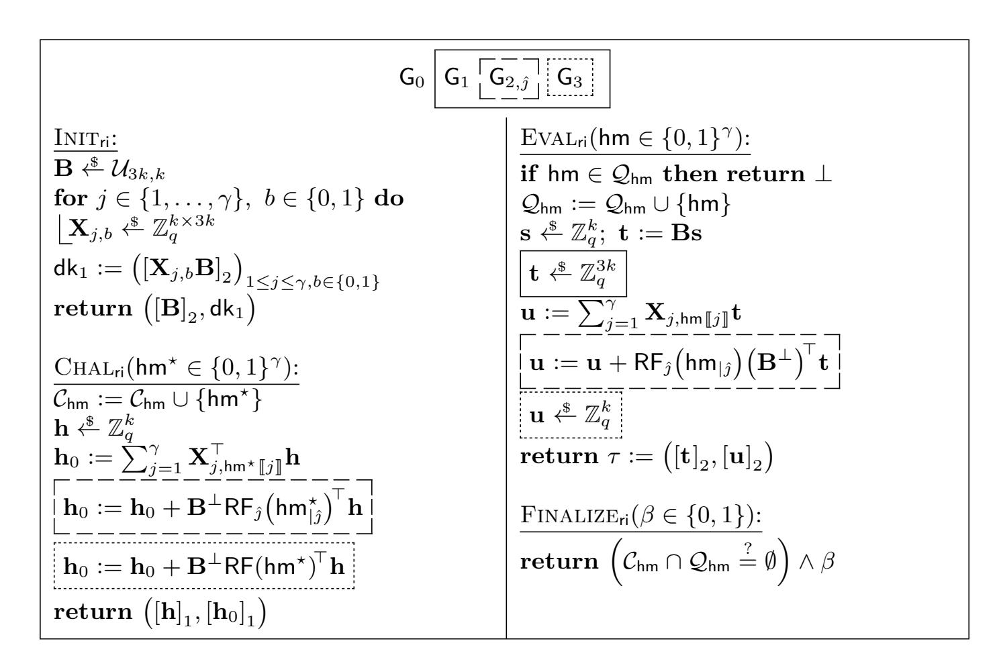
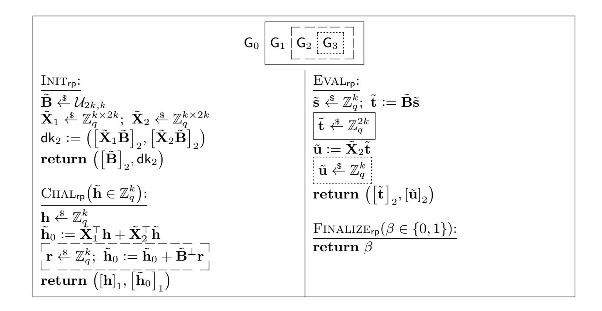
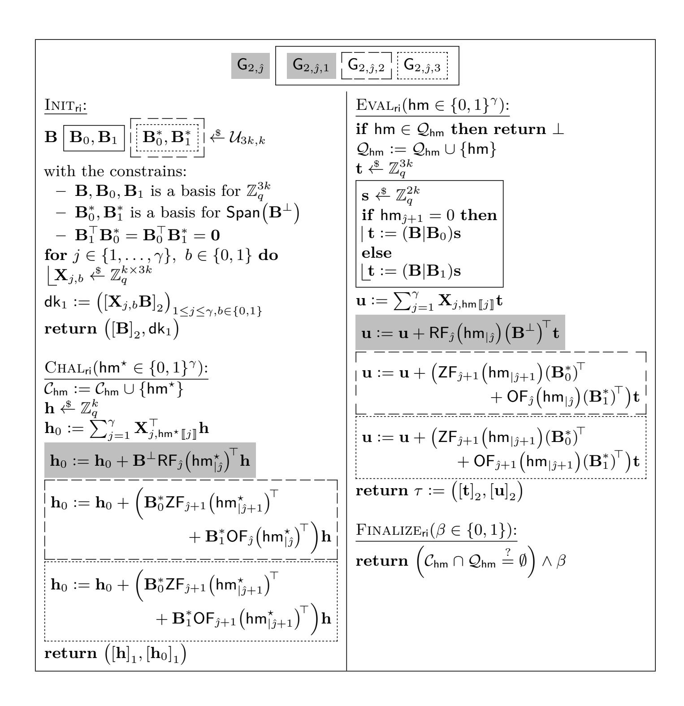
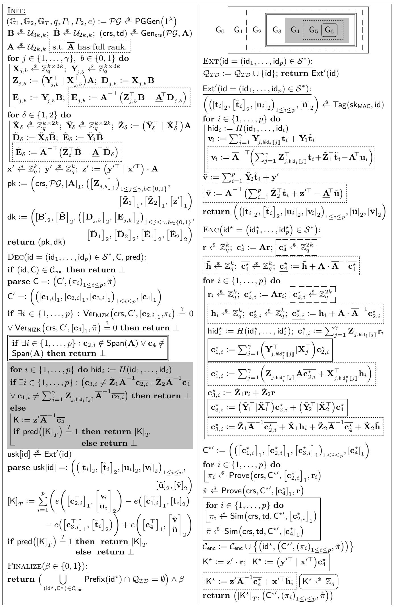

{0}------------------------------------------------

# <span id="page-0-0"></span>**Unbounded HIBE with Tight Security**

Roman Langrehr*?*<sup>1</sup> and Jiaxin Pan<sup>2</sup>

<sup>1</sup> ETH Zurich, Zurich, Switzerland [roman.langrehr@inf.ethz.ch](mailto:roman.langrehr@inf.ethz.ch, jiaxin.pan@ntnu.no ) <sup>2</sup> Department of Mathematical Sciences NTNU – Norwegian University of Science and Technology, Trondheim, Norway [jiaxin.pan@ntnu.no](mailto:roman.langrehr@inf.ethz.ch, jiaxin.pan@ntnu.no )

**Abstract.** We propose the first tightly secure and *unbounded* hierarchical identity-based encryption (HIBE) scheme based on standard assumptions. Our main technical contribution is a novel proof strategy that allows us to tightly randomize user secret keys for identities with arbitrary hierarchy depths using low entropy hidden in a small and hierarchy-independent master public key.

The notion of unbounded HIBE is proposed by Lewko and Waters (Eurocrypt 2011). In contrast to most HIBE schemes, an unbounded scheme does not require any maximum depth to be specified in the setup phase, and user secret keys or ciphertexts can be generated for identities of arbitrary depths with hierarchy-independent system parameters.

While all the previous unbounded HIBE schemes have security loss that grows at least linearly in the number of user secret key queries, the security loss of our scheme is only dependent on the security parameter, even in the multi-challenge setting, where an adversary can ask for multiple challenge ciphertexts. We prove the adaptive security of our scheme based on the Matrix Decisional Diffie-Hellman assumption in prime-order pairing groups, which generalizes a family of standard Diffie-Hellman assumptions such as *k*-Linear.

**Keywords.** Unbounded hierarchical identity-based encryption, tight security, multi-challenge security

# **1 Introduction**

# **1.1 Motivation**

Hierarchical identity-based encryption (HIBE) [\[27](#page-30-1)[,17\]](#page-29-0) is a generalization of identity-based encryption (IBE) [\[39\]](#page-31-0). It offers more flexibility in sharing sensitive data than IBE or classical public-key encryption (PKE).

In an HIBE scheme, users' identities are arranged in an organizational hierarchy and, more precisely, a hierarchical identity is a vector of identities of some length *p >* 0. As in an IBE scheme, anyone can encrypt a message with respect to an identity id := (id1*, ...,* id*p*) by access to only the public parameters. To decrypt

*<sup>?</sup>* Part of the work done at Karlsruhe Institute of Technology, Karlsruhe, Germany. Supported in part by ERC CoG grant 724307.

c IACR 2020. This is the full version of a paper with the same title in the proceedings of Asiacrypt 2020 [\[33\]](#page-30-0).

{1}------------------------------------------------

<span id="page-1-1"></span>this encrypted message, one of id's ascendants at level p' where 0 < p' < p can delegate a user secret key for id, in addition to asking the trusted authority for id's user secret key as in the IBE setting. Furthermore, a user at level p is not supposed to decrypt any ciphertext for a recipient who is not among its descendants.

The security we focus on in this paper is adaptive security, where an adversary is allowed to declare a fresh challenge identity  $id^*$  adaptively and obtain a challenge ciphertext of  $id^*$  after seeing user secret keys for arbitrary chosen identities and (master) public keys. It is a widely accepted security notion for both HIBE and IBE schemes. Most of the existing HIBE schemes in the standard model have a security loss of at least  $Q_e$  (such as [10,6]) or even  $Q_e^L$  [42], where  $Q_e$  is the maximum number of user secret key queries and L is the maximum hierarchy depth. Constructions from recent work of Langrehr and Pan (LP) [31,32] are the known exceptions. Their security loss depends only on the security parameter, but not  $Q_e$ . However, their master public key size<sup>3</sup> depends on L. As L grows, the master public key becomes larger.

In particular, the maximum hierarchy depth L needs to be fixed in the setup phase. Once it is fixed and master public keys are generated, there is no way to add new levels into the hierarchy. This can be an undesirable burden to deploy HIBE in practice since institutions grow rapidly nowadays. Hence, it is more desirable to construct a tightly secure HIBE scheme whose master public keys are independent of the maximum hierarchy depth.

We note that the limitation mentioned above exists not only in the LP schemes but also in almost all the HIBE schemes even with non-tight security in the standard model. The notion of unbounded HIBE from Lewko and Waters [36] is proposed to overcome this limitation. In an unbounded HIBE, the whole scheme is not bounded to the maximum depth L. In particular, its master public keys, user secret keys and ciphertexts are all independent of L. (Though the user secret keys and ciphertexts can still depend on the actual hierarchy depth of the identity.) They and the follow-up work [34,19] give constructions of unbounded HIBE in composite- and prime-order pairing groups, respectively, to implement this notion. Unfortunately, none of these constructions is tight.

OUR GOAL: TIGHTLY SECURE UNBOUNDED HIBE. In this paper, we aim at constructing unbounded HIBE with tight reductions based on standard assumptions. We start recalling tight security and then give some reasons about why it is technically challenging to achieve this goal.

A security reduction is usually used to prove the security of a cryptographic scheme S by reducing any attacker  $\mathcal{A}$  against S to an attacker  $\mathcal{R}$  against a corresponding computational hard problem P in an efficient way. After that, we can conclude that breaking the security of S is at least as hard as solving P. More precisely, we establish a relation that states  $\varepsilon_{\mathcal{A}} \leq \ell \cdot \varepsilon_{\mathcal{R}}$ . Here  $\varepsilon_{\mathcal{A}}$  and  $\varepsilon_{\mathcal{R}}$  are success probability of  $\mathcal{A}$  and  $\mathcal{R}$ , respectively, and for simplicity we ignore the

<span id="page-1-0"></span><sup>&</sup>lt;sup>3</sup> We measure the size of the master public key in terms of the number of group elements.

{2}------------------------------------------------

<span id="page-2-0"></span>additive negligible terms and assume that the running time of R is approximately the same as that of A.

Ideally, we want a reduction to be *tight*, namely, *`* to be a small constant. Recent works are also interested in "almost tight security", where *`* may be (for instance, linearly or logarithmically) dependent on the security parameter, but not the size of A. We will not distinguish these two tightness notions, but state the precise security loss in security proofs and comparison of schemes. A tight security reduction means the security of *S* is tightly coupled with the hardness of *P*. A scheme with tight reductions is more desirable since it provides the same level of security regardless of the application size. Moreover, we can implement it with smaller parameters and do not need to compensate for the security loss. As a result, tightly secure schemes drew a lot of attention in the last few years, from basic primitives, such as PKE [\[14,](#page-28-2)[15,](#page-29-2)[22\]](#page-29-3) and signature [\[1,](#page-26-0)[16\]](#page-29-4) schemes, to more advanced ones, such as (non-interactive) key exchange [\[18,](#page-29-5)[23](#page-29-6)[,11\]](#page-28-3), zero-knowledge proof [\[3,](#page-26-1)[2\]](#page-26-2), IBE [\[10](#page-28-0)[,6](#page-28-1)[,21](#page-29-7)[,24\]](#page-29-8) and functional encryption [\[40\]](#page-31-2) schemes. Currently, research is carried out to reduce the cost for tight security. For instance, for PKE, the public key size is shortened from being linear [\[14\]](#page-28-2) (in the security parameter) to constant [\[15,](#page-29-2)[22\]](#page-29-3). In particular, the scheme in [\[15\]](#page-29-2) only has one element more in the ciphertext overhead than its non-tight counterpart [\[30\]](#page-30-6) asymptotically. By taking the concrete security loss into account, we are optimistic that scheme in [\[15\]](#page-29-2) will have shorter ciphertext length in terms of bits.

Difficulties in achieving our goal. Given the existing research, it is quite challenging to construct a tightly secure HIBE, even for a bounded one. Firstly, the potential difficulty of this task has been shown by Lewko and Waters [\[37\]](#page-30-7), namely, it is hard to prove an HIBE scheme with security loss less than exponential in *L*, if its user secret keys are rerandomizable over all "functional" keys. Secondly, the work of Blazy, Kiltz, and Pan (BKP) [\[6\]](#page-28-1) is the first that claimed to have solved this challenge by proposing a bounded tightly secure HIBE. Their scheme has indeed bypassed the impossibility result of [\[37\]](#page-30-7) by having its user secret keys only rerandomizable in a subspace of all "functional" keys, which is similar to schemes based on the dual system technique [\[10,](#page-28-0)[35\]](#page-30-8). Unfortunately, shortly after its publication, a technical flaw was found in their proof, which shows that their proof strategy is insufficient for HIBE with flexible identity depth.

Recently, Langrehr and Pan have proposed the first tightly secure HIBE in the standard model [\[31\]](#page-30-2). A very recent and concurrent work [\[32\]](#page-30-3) improves this HIBE and proposes a tightly secure HIBE in the multi-challenge setting. Core techniques in both papers crucially require their master public key size depend on the maximum hierarchy, *L*. More precisely, they need to know *L* in advance so that they can choose independent master secret keys for different levels, which will be turned into master public keys. With these relatively large master secret keys, they can apply their independent randomization to isolate randomization for identities with different maximum levels. As a result, their scheme is bounded to the maximum level *L* of the whole HIBE scheme and its master public key size is dependent on *L*.

{3}------------------------------------------------

#### <span id="page-3-0"></span>**1.2 Our Contribution**

We construct the *first* tightly secure unbounded HIBE based on standard assumptions. Our scheme is furthermore tightly multi-challenge secure. The multichallenge security is a more realistic notion for (H)IBE, where an adversary is allowed to query multiple challenge identities adaptively and obtain the corresponding ciphertexts. It has comparable efficiency to its non-tight counterparts [\[34,](#page-30-5)[19\]](#page-29-1), and, in particular, it has shorter ciphertext and user secret key than the scheme of [\[34\]](#page-30-5). At the core of our construction is a novel technique that allows us to prove tight adaptive security of HIBE with "small", hierarchy-independent master public keys.

More precisely, the identity space for our scheme ID := S <sup>∗</sup> has unbounded depth and the base set S can be arbitrary. In this section, we consider S := {0*,* 1} *<sup>n</sup>* for simplicity, where *n* is the security parameter. The master public key of our scheme is independent of *L* and contains only **O**(*n*)-many group elements, which is the same as the existing tightly secure IBE schemes [\[10,](#page-28-0)[6,](#page-28-1)[21,](#page-29-7)[24\]](#page-29-8).

All our security proofs are in the standard model and based on the Matrix Decisional Diffie-Hellman (MDDH) assumption [\[12\]](#page-28-4) in prime-order asymmetric pairing groups. The MDDH assumption is a generalization of a class of Decisional Diffie-Hellman assumptions, such as the *k*-Lin [\[25\]](#page-29-9) and aSymmetric eXternal Diffie-Hellman (SXDH) (for *k* = 1) assumptions. The security of our MAC requires an additional assumption on the existence of collision-resistant hash functions. There exist collision-resistant hash functions in the standard model that maps arbitrary-length bit-strings to fixed-length ones using fixed-length keys. For instance, one can use the Merkle-Damgård construction with hash functions from the SHA familiy or the less efficient but completely provably secure one from the discrete logarithm assumption.

Efficiency comparison. We compare the efficiency of bounded and unbounded HIBE schemes in the standard model with prime-order pairings in [Table 1.](#page-4-0) We note that [\[38\]](#page-31-3) achieves a weaker notion of unbounded HIBE in the sense that their master public key is independent of *L*, but the size of the user secret key is dependent on *L*. More precisely, their user secret key contains **Ω**(*L* − *p*)-many group elements for an identity id := (id1*, . . . ,* id*p*).

According to [Table 1,](#page-4-0) our scheme has shorter ciphertexts and user secret keys than Lew12, which is comparable to GCTC16. We note that both Lew12 and GCTC16 are unbounded HIBE with non-tight reductions, while ours are tight. Thus, when accounting for a larger security loss in the reduction with larger groups, our scheme may have shorter ciphertexts and user secret keys than GCTC16 at the concrete level. We want to emphasize that our scheme is not fully practical yet, but it lays down a theoretical foundation for more efficient unbounded HIBE with tight security in the future.

Extensions. Our unbounded HIBE scheme directly implies a tightly secure unbounded identity-based signature by the Naor transformation. Furthermore, our HIBE is compatible with the Quasi-Adaptive NIZK (QANIZK) for linear subspaces and thus, similar to [\[24\]](#page-29-8) it can be combined with a tightly simulation-

{4}------------------------------------------------

<span id="page-4-1"></span><span id="page-4-0"></span>

| Scheme                         | U        | mpk                                                     | usk                                                            | C                                                | Loss                   | MC | Assumption |
|--------------------------------|----------|---------------------------------------------------------|----------------------------------------------------------------|--------------------------------------------------|------------------------|----|------------|
| Wat $05$ [42]                  | X        | $\mathbf{O}(nL) \mathbb{G} $                            | $\mathbf{O}(nL) \mathbb{G} $                                   | $(1+p) \mathbb{G} $                              | $\mathbf{O}(nQ_{e})^L$ | X  | DBDH       |
| Wat $09$ $[41]$                | X        | $\mathbf{O}(L) \mathbb{G} $                             | $\mathbf{O}(p)( \mathbb{G} + \mathbb{Z}_q )$                   | $ \mathbf{O}(p)( \mathbb{G}  +  \mathbb{Z}_q ) $ | $\mathbf{O}(Q_{e})$    | X  | 2-LIN      |
| Lew12[34]                      | 1        | $60 \mathbb{G}  + 2 \mathbb{G}_T $                      | $(60+10p) \mathbb{G} $                                         | $10p \mathbb{G} $                                | $\mathbf{O}(Q_{e})$    | X  | 2-LIN      |
| OT12 [38]                      | X        | 160 G                                                   | $\mathbf{O}(p^2L) \mathbb{G} $                                 | $3+6p \mathbb{G} $                               | $\mathbf{O}(Q_{e}L^2)$ | X  | 2-LIN      |
| CW13 [10]                      | X        | $\mathbf{O}(L)( \mathbb{G}_1 + \mathbb{G}_2 )$          | $\mathbf{O}(L) \mathbb{G}_2 $                                  | $4 \mathbb{G}_1 $                                | $\mathbf{O}(Q_{e})$    | X  | SXDH       |
| BKP14 [6]                      | X        | $\mathbf{O}(L)( \mathbb{G}_1 + \mathbb{G}_2 )$          | $\mathbf{O}(L) \mathbb{G}_2 $                                  | $4 \mathbb{G}_1 $                                | $\mathbf{O}(Q_{e})$    | X  | SXDH       |
| GCTC16 [19]                    | 1        | $18( \mathbb{G}_1  +  \mathbb{G}_2 ) + 3 \mathbb{G}_T $ | $\left  (18\lceil p/3\rceil - 3p + 18)   \mathbb{G}_2 \right $ | $9\lceil p/3\rceil  \mathbb{G}_1 $               | $\mathbf{O}(QL)$       | X  | SXDH       |
| LP19 $_{1}^{\mathcal{H}}$ [31] | X        | $\mathbf{O}(\gamma L)( \mathbb{G}_1 + \mathbb{G}_2 )$   | $\mathbf{O}(\gamma L) \mathbb{G}_2 $                           | $5 \mathbb{G}_1 $                                | $\mathbf{O}(\gamma L)$ | X  | SXDH       |
| LP19 $_{2}^{\mathcal{H}}$ [31] | X        | $\mathbf{O}(\gamma L)( \mathbb{G}_1 + \mathbb{G}_2 )$   | $(3p+2) \mathbb{G}_2 $                                         | $(3p+2) \mathbb{G}_1 $                           | $\mathbf{O}(\gamma)$   | X  | SXDH       |
| $LP20_{1}^{\mathcal{H}}\ [32]$ | X        | $\mathbf{O}(\gamma L)( \mathbb{G}_1 + \mathbb{G}_2 )$   | $\mathbf{O}(\gamma L) \mathbb{G}_2 $                           | $5 \mathbb{G}_1 $                                | $\mathbf{O}(\gamma L)$ | 1  | SXDH       |
| $LP20_2^{\mathcal{H}}\ [32]$   | X        | $\mathbf{O}(\gamma L)( \mathbb{G}_1 + \mathbb{G}_2 )$   | $(3p+2) \mathbb{G}_2 $                                         | $(3p+2) \mathbb{G}_1 $                           | $\mathbf{O}(\gamma L)$ | 1  | SXDH       |
| Ours (Fig. 14)                 | <b>✓</b> | $\mathbf{O}(\gamma)( \mathbb{G}_1 + \mathbb{G}_2 )$     | $(7p+2) \mathbb{G}_2 $                                         | $(7p+2) \mathbb{G}_1 $                           | $\mathbf{O}(\gamma)$   | 1  | SXDH       |

**Table 1.** Comparison of bounded and unbounded HIBEs in prime-order pairing groups with adaptive security in the standard model based on static assumptions. The second column indicates whether an HIBE is bounded ( $\checkmark$ ) or unbounded ( $\checkmark$ ). The identity space for bounded HIBE is  $(\{0,1\}^n)^{\leq L}$  and that for unbounded HIBE is  $(\{0,1\}^n)^*$ .  $\gamma$  is the bit length of the range of a collision-resistant hash function. '|mpk|,' '|usk|,' and '|C|' stand for the size of the master public key, a user secret key and a ciphertext, respectively. We count the number of group elements in  $\mathbb{G}_1$ ,  $\mathbb{G}_2$ , and  $\mathbb{G}_T$ . For a scheme that works in symmetric pairing groups, we write  $\mathbb{G}(:=\mathbb{G}_1=\mathbb{G}_2)$ . In the '|usk|' and '|C|' columns p stands for the hierarchy depth of the identity vector. In bounded HIBEs, L denotes the maximum hierarchy depth. In the security loss,  $Q_e$  denotes the number of user secret key queries by the adversary. MC stands for multi-challenge and this column indicates whether the adversary is allowed to query multiple challenge ciphertexts ( $\checkmark$ ) or just one ( $\checkmark$ ). Lew12 is the prime-order variant of the unbounded scheme in [36].

sound QANIZK to construct a tightly CCA-secure unbounded HIBE in the multichallenge setting. We give a detailed treatment in Appendix C.3 for completeness.

#### 1.3 Technical Overview

To achieve our goal, we develop a novel tight method that uses (limited) entropy hidden in hierarchy-independent master public key to generate enough entropy to randomize user secret keys of identities with unbounded hierarchy depths (in a computational manner). As a bonus, our technique naturally give us tight multi-challenge security.

A MODULAR TREATMENT: FROM MAC TO HIBE. We follow the modular approach of Blazy, Kiltz, and Pan (BKP) [6] to construct our unbounded HIBE. The basis of our construction is a novel tightly secure message authentication code (MAC). Our MAC has *suitable algebraic structures* and thus can be turned into an unbounded HIBE tightly by adapting the BKP framework.

The BKP framework [6] tightly reduces constructing an (H)IBE to a suitable affine MAC. As a result, we only need to focus on constructing the suitable MAC. Affine MACs are algebraic MACs that have affine structures, and such structures allow transformation to (H)IBEs. This framework abstracts the first tightly secure IBE from Chen and Wee (CW) [10] and can be viewed as extending the "MAC  $\rightarrow$  Signature" framework of Bellare and Goldwasser [5] to the IBE

{5}------------------------------------------------

<span id="page-5-2"></span>setting by using the affine structure and pairings. Most of the tightly secure IBE and HIBE schemes are related to this framework, such as [26,21,20,24,31,32].

PREPARATION: SHRINKING THE MESSAGE SPACE VIA HASHING. We first apply a collision-resistant hash function to shrink the message space which the "bit-by-bit" argument applies on. More precisely, let  $H:\{0,1\}^* \to \{0,1\}^n$  be a collision-resistant hash function. For an (unbounded) hierarchical message  $\mathbf{m} := (\mathbf{m}_1, \ldots, \mathbf{m}_p) \in (\{0,1\}^n)^p$ , we hash every *i*-th prefix  $(1 \le i \le p)$  and have the hashed message  $\mathbf{m} := (\mathbf{hm}_1, \mathbf{hm}_2, \ldots, \mathbf{hm}_p)$  where  $\mathbf{hm}_i := H(\mathbf{m}_1, \ldots, \mathbf{m}_i) \in \{0,1\}^n$ . The collision-resistance guarantees that it is hard for an adversary to find two distinct  $\mathbf{m}$  and  $\mathbf{m}^*$  messages with  $H(\mathbf{m}) = H(\mathbf{m}^*)$ . In particular, after hashing every prefixes of a message, if a hierarchical message  $\mathbf{m}$  is not a prefix of  $\mathbf{m}^*$ , then the last hash value of  $\mathbf{m}$  is different to every hash value of  $\mathbf{m}^*$ . As a result, our argument is only applied on the last hash value.

OUR STRATEGY: "INJECT-AND-PACK". Our strategy contains two steps: (1) injecting enough randomness into MAC tags locally and (2) packing the local randomness and lift it up to the global level. Both steps are compatible with each other, and they only rely on the limited entropy in the hierarchy-independent MAC keys and can provide tight security even in the multi-challenge setting.

Our MAC has the following structures that enable our "inject-and-pack" strategy. This is captured by our MAC scheme  $\mathsf{MAC}_u$  in Section 3.2.

For a hierarchical message  $m := (m_1, \ldots, m_p)$ , our MAC tag  $\tau_m := (([\mathbf{t}_i]_2, [\tilde{\mathbf{t}}_i]_2, [\mathbf{u}_i]_2)_{1 \le i \le p}, [\tilde{\mathbf{u}}]_2)$  has the following form:

<span id="page-5-1"></span>
$$\mathbf{t}_{i} := \mathbf{B}\mathbf{s}_{i} \in \mathbb{Z}_{q}^{n_{1}} \text{ and } \tilde{\mathbf{t}}_{i} := \tilde{\mathbf{B}}\tilde{\mathbf{s}}_{i} \in \mathbb{Z}_{q}^{n_{2}} \text{ for } \mathbf{s}_{i}, \tilde{\mathbf{s}}_{i} \stackrel{\$}{\leftarrow} \mathbb{Z}_{q}^{n_{3}}$$

$$\mathbf{u}_{i} := \left[\sum_{j=1}^{n} \mathbf{X}_{j, \mathsf{hm}_{i}[\![j]\!]} \mathbf{t}_{i}\right] + \left[\tilde{\mathbf{X}}_{1}^{-1} \tilde{\mathbf{t}}_{i}\right] \in \mathbb{Z}_{q}^{n_{4}}$$

$$\tilde{\mathbf{u}} := \left[\sum_{j=1}^{p} \tilde{\mathbf{X}}_{2} \tilde{\mathbf{t}}_{j}\right] + \mathbf{x}',$$

$$(1)$$

where  $\mathbf{B} \stackrel{\$}{\leftarrow} \mathbb{Z}_q^{n_1 \times n_3}$ ,  $\tilde{\mathbf{B}} \stackrel{\$}{\leftarrow} \mathbb{Z}_q^{n_2 \times n_3 4}$ ,  $\mathbf{X}_{j,b} \stackrel{\$}{\leftarrow} \mathbb{Z}_q^{n_4 \times n_1}$  for  $1 \leq j \leq n, b \in \{0,1\}$  and  $\tilde{\mathbf{X}}_1, \tilde{\mathbf{X}}_2 \stackrel{\$}{\leftarrow} \mathbb{Z}_q^{n_4 \times n_2}$  and  $\mathbf{x}' \stackrel{\$}{\leftarrow} \mathbb{Z}_q^{n_4}$  and they are all contained in the secret key of our MAC, namely,  $\mathsf{sk}_{\mathsf{MAC}} := (\mathbf{B}, \tilde{\mathbf{B}}, (\mathbf{X}_{j,b})_{\mathsf{for}} \ _{1 \leq j \leq n, b \in \{0,1\}}, \tilde{\mathbf{X}}_1, \tilde{\mathbf{X}}_2, \mathbf{x}')$ . Here the (hierarchical) message space of a MAC is the identity space of the resulting HIBE.

We highlight different purposes of different parts in our MAC tags:

- randomizing  $\mathbf{x}'$  is our end goal. In the resulting HIBE, once  $\mathbf{x}'$  is randomized, it will further randomize challenge ciphertexts;
- the linear part,  $\sum_{j=1}^{n} \mathbf{X}_{j,\mathsf{hm}_{i}[\![j]\!]} \mathbf{t}_{i}$ , is used to inject randomness;
- with the packing helpers,  $\begin{bmatrix} \tilde{\mathbf{X}}_1 \tilde{\mathbf{t}}_i \end{bmatrix}$  and  $\begin{bmatrix} \sum_{j=1}^p \tilde{\mathbf{X}}_2 \tilde{\mathbf{t}}_j \end{bmatrix}$ , we can transfer the injected randomness in  $\mathbf{u}_p$  to randomize  $\mathbf{x}'$ .

<span id="page-5-0"></span><sup>&</sup>lt;sup>4</sup> For simplicity, we choose  $\mathbf{B}$  and  $\tilde{\mathbf{B}}$  uniformly at random here, while in the actual scheme we choose them based on the underlying assumption.

{6}------------------------------------------------

<span id="page-6-0"></span>We will discuss how to choose the dimensions of these random matrices and vectors to enable our strategy.

Before that, we stress that it is crucial to generate  $([\mathbf{t}_i]_2, [\tilde{\mathbf{t}}_i]_2, [\mathbf{u}_i]_2)$  for all  $1 \leq i \leq p$  and  $\mathsf{hm}_i := H(\mathsf{m}_1, ..., \mathsf{m}_i)$  so that we can delegate and randomize MAC tags for further levels by publishing  $([\mathbf{B}]_2, [\tilde{\mathbf{B}}]_2, ([\mathbf{X}_{j,b}\mathbf{B}]_2)_{j,b}, [\tilde{\mathbf{X}}_1\tilde{\mathbf{B}}]_2, [\tilde{\mathbf{X}}_2\tilde{\mathbf{B}}]_2)$ . Details about public delegation can be found in Remark 1 and Theorem 2.

INTERLUDE: SECURITY REQUIREMENT. The MAC security we need for the "MAC-to-HIBE" transformation is pseudorandomness against adaptive chosen message attacks, which is a decisional version of the EUF-CMA security of MAC. To simplify our discussion, we use the EUF-CMA notion only in this chapter, but in the main body we prove the decisional one. In the EUF-CMA security game, an adversary can adaptively ask many MAC tag queries and at some point it will submit one forgery. For the multi-challenge security, we allow the adversary submit multiple forgeries. Here we only consider one forgery for simplicity. Note that our technique works tightly for multiple forgeries.

LOCAL STEP: INJECTING RANDOMNESS. Here we only focus terms in the solid box of Equation (1) and find a right way to define the dimensions to implement the injection strategy. We note that one cannot use the idea of BKP MAC here, since it uses a square full-rank matrix  $\mathbf{B} \in \mathbb{Z}_q^{k \times k}$  and there is no room to hide  $\mathbf{X}_{j,b}$  from the published terms  $[\mathbf{X}_{j,b}\mathbf{B}]_2$ . These terms have to be public to delegate secret keys, while it is not a problem for IBE. Moreover, the same  $(\mathbf{X}_{j,b})_{1 \le j \le n, b \in \{0,1\}}$  is re-used for all  $\mathbf{u}_i$  and the injected randomness will be leaked along them, which is another issue we encounter with the BKP MAC.

To have control on where to inject randomness, we increase the number of row vectors in  $\mathbf{B} \stackrel{\$}{\leftarrow} \mathbb{Z}_q^{3k \times k}$ , namely,  $n_1 := 3k$ , as the LP method in [31], where  $\mathbf{X}_{j,b} \stackrel{\$}{\leftarrow} \mathbb{Z}_q^{1 \times 3k}$  are row vectors. Now the column space of  $\mathbf{B}$ ,  $\mathsf{Span}(\mathbf{B}) := \{\mathbf{v} \mid \exists \mathbf{w} \in \mathbb{Z}_q^k \text{ s.t. } \mathbf{v} = \mathbf{B} \cdot \mathbf{w}\}$ , is a subspace of  $\mathbb{Z}_q^{3k}$  and there is a non-zero kernel matrix  $\mathbf{B}^{\perp} \in \mathbb{Z}_q^{3k \times 2k}$  such that  $(\mathbf{B}^{\perp})^{\top}\mathbf{B} = \mathbf{0} \in \mathbb{Z}_q^{2k \times k}$ .  $\mathsf{Span}(\mathbf{B}^{\perp})$  is orthogonal to  $\mathsf{Span}(\mathbf{B})$ .

We introduce a random function "inside"  $\mathsf{Span}(\mathbf{B}^{\perp})$  by tight reductions to the MDDH assumption and all  $\mathbf{u}_i$   $(1 \leq i \leq p)$  in Equation (1) will distribute according to the following new form:

$$\mathbf{u}_{i} := \left(\sum_{j=1}^{n} \mathbf{X}_{j,\mathsf{hm}_{i}[[j]]}^{\top} + \mathsf{RF}(\mathsf{hm}_{i}) \cdot (\mathbf{B}^{\perp})^{\top}\right) \mathbf{t}_{i} + \tilde{\mathbf{X}}_{1}\tilde{\mathbf{t}}_{i} \in \mathbb{Z}_{q}. \tag{2}$$

Now  $\mathsf{RF}(\mathsf{hm}_i)$  is multiplied by  $\mathbf{B}^{\perp}$  and we can control where it gets introduced by choose  $\mathbf{t}_i \notin \mathsf{Span}(\mathbf{B})$ . More precisely, we only introduce the random function,  $\mathsf{RF}$ , in  $\mathbf{u}_p$  at level p for a hierarchical identity  $\mathsf{m} := (\mathsf{m}_1, ..., \mathsf{m}_p)$ .

The above idea is borrowed from [31], but it is still not enough to correctly inject randomness: It only helps us to hide RF in MAC tag queries, but we still have issue in answering the verification query for an adversary's forgery. The issue described below does not happen in the BKP and LP [31] schemes, since our MAC has more expressive structure. More precisely, on a forgery of message  $\mathsf{m}^{\star} := (\mathsf{m}_1^{\star}, ..., \mathsf{m}_p^{\star})$ , we need to verify whether the forgery satisfies Equation (1),

{7}------------------------------------------------

<span id="page-7-0"></span>which form an explicit hierarchy. Since we have no control of how an adversary computes its random  $\mathbf{t}_i^{\star}$ , in answering one verification query, we compute RF on p many distinct messages,  $\mathsf{hm}_1^{\star}, ..., \mathsf{hm}_p^{\star}$ . This leaks too much information about RF.

Our solution is to increase the number of row vectors in  $\mathbf{X}_{j,b}$  from 1 to k, namely,  $n_4 := k$ . As a result, there is room for us to use an assumption (namely, the MDDH assumption [12]) to tightly inject randomness into these row vectors. Thus, in the end, verification equations defined by Equation (1) get randomized and the information about RF is properly hidden. We refer Lemma 4 for technical details. The whole core step is formally captured by the Randomness Injection Lemma (cf. Lemma 4). Furthermore, this lemma abstracts the core ideas of [32].

GLOBAL STEP: PACKING RANDOMNESS. After the randomness is injected in  $\mathbf{u}_i$  at the local level, we pack and move it into the global level to randomize  $\mathbf{x}'$  which will be use to randomize the challenge ciphertexts. Implicitly, we pack the randomness firstly in  $\tilde{\mathbf{t}}_p$  for an identity has p levels via the packing helper  $\tilde{\mathbf{X}}_1\tilde{\mathbf{t}}_p$ . Secondly, via another packing helper  $\tilde{\mathbf{X}}_2\tilde{\mathbf{t}}_p$ , we move the randomness into  $\tilde{\mathbf{u}}$ .

We choose  $\tilde{\mathbf{B}} \Leftarrow \mathbb{Z}_q^{2k \times k}$ , namely,  $n_2 := 2k$ , so that there is enough room to implement the above packing steps. Although the randomness is successfully injected, it may be leaked from MAC tag and verification queries during the packing process. In particular, we have small MAC secret keys. To accomplish the task, we carefully design several intermediate hybrid steps and apply the MDDH assumption several times. We refer Lemma 5 for details. The whole core step is formally captured by the Randomness Packing Lemma (cf. Lemma 5).

An alternative interpretation: Localizing HIBEs into IBEs, tightly. In contrast to the methods of Langrehr and Pan [31,32], our overall idea can be viewed as localizing a p-level HIBE into p IBE pieces which share the same master public and secret keys, and p is an arbitrary integer. In the security proof, we generate enough entropy locally and then extract it to the global level to argue the security of HIBE. Such an idea is borrowed from [36,34,19], where some variants of Boneh-Boyen's IBE [7] are used at the local level and all these IBE pieces are connected via a secret sharing method. However, implementing this idea with tight reductions is rather challenging, even with the existing tightly secure (H)IBEs (such as [10,6,21,31,32]). We observed that these techniques either fail to introduce local entropy or cannot collect the local randomness to argue the security of the (global) HIBE.

#### 1.4 More Discussion on Related Work

THE FAMILY OF LP HIBE SCHEMES. To implement the "level-by-level" argument, the LP HIBEs [31,32] require the size of master public keys dependent on the maximum hierarchy depth, L, so that they have enough entropy to randomize corresponding MAC tags.

Our approach provides an economic, tightly secure technique to do the randomization with more compact and hierarchy-independent master keys. Our technique uses and abstracts the core technique in a very recent and concurrent 

{8}------------------------------------------------

<span id="page-8-0"></span>work [32] to inject randomness. As we showed above, injecting randomness is not enough for our goal and we require an additional suitable randomness packing technique. [32] achieves tight multi-challenge security for bounded HIBE, while ours is for unbounded HIBE.

OTHER TECHNIQUES FOR TIGHT MULTI-CHALLENGE SECURITY. Over the last few years, several techniques have been proposed for tightly secure IBE in the multi-challenge setting, such as [4,26,20,21,24], where [4,20] are based on strong and non-standard assumptions and [26] requires a composite-order group. Motivated by [26], the work of [21,24] construct the tightly multi-challenge secure IBE schemes in the prime-order group and they both follow the BKP method. They have the same limitation as discussed in the "LOCAL STEP: INJECTING RANDOMNESS" section and cannot be used for our goal, since their  $\mathbf{B}$  is also full-rank square matrix. The same kind of information about  $\mathbf{X}_{i,b}$  is leaked.

Furthermore, in the work of Hofheinz, Jia, and Pan [24] (also in [21] and BKP), they randomize their MAC by developing a random function, RF, in the  $\mathbb{Z}_q$  full space gradually. This is problematic in the unbounded HIBE setting: When we "plug" their MAC into our framework, there is no room to hide RF and by a "mix-and-match" approach an adversary can learn RF(hm\*), where  $\mathsf{hm}^* := H(\mathsf{m}^*)$ . Imagine a challenge message  $\mathsf{m}^* \in \{0,1\}^n$ . By asking a MAC tag of  $(\mathsf{m}^*,\mathsf{m})$ , an adversary can easily learn RF(hm\*) from  $\mathbf{u}_1$ . Finally, [31] has discussed why these multi-challenge security techniques cannot be used for HIBEs.

OTHER UNBOUNDED TECHNIQUE. Chen et al. [9] proposes a variant of the bilinear entropy expansion lemma [29] in prime-order groups, which can be used to transform a (bounded) attribute-based encryption (ABE) scheme to an unbounded one in a tight manner. However, we note that their lemma requires a certain algebraic structure of the underlying scheme, which the LP schemes [31,32] do not have. Moreover, they only prove their scheme in the single-challenge setting, and it is not clear for us whether their single-challenge security tightly implies multi-challenge security.

OPEN PROBLEMS. It is interesting to consider if we can extend our "inject-and-pack" strategy in a more general setting, such as predicate encryption schemes. Another open problem is to consider the Master-Key-KDM security [13] for HIBEs. Garg et al.[13] proposed a Master-Key-KDM secure IBE based on a tightly multi-challenge secure IBE. We are optimistic that our unbounded HIBE can be adapted to achieve the KDM security by following the approach of Garg et al., since our scheme has tight multi-challenge security as well. However, we leave a formal treatment of it as an open problem.

# 2 Preliminaries

NOTATIONS. We use  $x \stackrel{\$}{\leftarrow} \mathcal{S}$  to denote the process of sampling an element x from  $\mathcal{S}$  uniformly at random if  $\mathcal{S}$  is a set and to denote the process of running  $\mathcal{S}$  with its internal randomness and assign the output to x if  $\mathcal{S}$  is an algorithm. The

{9}------------------------------------------------

<span id="page-9-0"></span>expression  $a \stackrel{?}{=} b$  stands for comparing a and b on equality and returning the result in Boolean value. For positive integers  $k, \eta \in \mathbb{N}_+$  and a matrix  $\mathbf{A} \in \mathbb{Z}_q^{(k+\eta) \times k}$ , we denote the upper square matrix of  $\mathbf{A}$  by  $\overline{\mathbf{A}} \in \mathbb{Z}_q^{k \times k}$  and the lower  $\eta$  rows of  $\mathbf{A}$  by  $\underline{\mathbf{A}} \in \mathbb{Z}_q^{\eta \times k}$ . Similarly, for a column vector  $\mathbf{v} \in \mathbb{Z}_q^{k+\eta}$ , we denote the upper k elements by  $\overline{\mathbf{v}} \in \mathbb{Z}_q^k$  and the lower  $\eta$  elements of  $\mathbf{v}$  by  $\underline{\mathbf{v}} \in \mathbb{Z}_q^{\eta}$ . We use  $\mathbf{A}^{-\top}$  as shorthand for  $(\mathbf{A}^{-1})^{\top}$ .  $\mathsf{GL}_k(\mathbb{Z}_q)$  denotes the set of invertible  $k \times k$  matrices in  $\mathbb{Z}_q$ .  $\mathbf{I}_k$  is the  $k \times k$  identity matrix. For a matrix  $\mathbf{A} \in \mathbb{Z}_q^{n \times m}$ , we use  $\mathsf{Span}(\mathbf{A}) := \{\mathbf{A}\mathbf{v} \mid \mathbf{v} \in \mathbb{Z}_q^m\}$  to denote the linear span of  $\mathbf{A}$  and - unless state otherwise  $-\mathbf{A}^{\perp}$  denotes an arbitrary matrix with  $\mathsf{Span}(\mathbf{A}^{\perp}) = \{\mathbf{v} \mid \mathbf{A}^{\top}\mathbf{v} = \mathbf{0}\}$ .

For a set S and  $n \in \mathbb{N}_+$ ,  $S^n$  denotes the set of all n-tuples with components in S and  $S^* := \bigcup_{n=1}^{\infty} S^n$ . For an n-tuple or string  $m \in S^n$ ,  $m_i \in S$  and  $m[i] \in S$  both denote the i-th component of m  $(1 \le i \le n)$  and  $m_{|i} \in S^i$  denotes the prefix of length i of m.

All algorithms in this paper are probabilistic polynomial-time unless we state otherwise. If  $\mathcal{A}$  is an algorithm, then we write  $a \stackrel{\$}{\leftarrow} \mathcal{A}(b)$  to denote the random variable outputted by  $\mathcal{A}$  on input b.

GAMES. Following [6], we use code-based games to define and prove security. A game G contains procedures INIT and FINALIZE, and some additional procedures  $P_1, \ldots, P_n$ , which are defined in pseudo-code. Initially all variables in a game are undefined (denoted by  $\bot$ ), all sets are empty (denote by  $\emptyset$ ), and all partial maps (denoted by  $f: A \dashrightarrow B$ ) are totally undefined. An adversary A is executed in game G (denote by  $G^A$ ) if it first calls INIT, obtaining its output. Next, it may make arbitrary queries to  $P_i$  (according to their specification), again obtaining their output. Finally, it makes one single call to FINALIZE(·) and stops. We use  $G^A \Rightarrow d$  to denote that G outputs d after interacting with A, and d is the output of FINALIZE. T(A) denotes the running time of A.

#### 2.1 Pairing groups and matrix Diffie-Hellman assumptions

Let GGen be a probabilistic polynomial-time (PPT) algorithm that on input  $1^{\lambda}$  returns a description  $\mathcal{G} := (\mathbb{G}_1, \mathbb{G}_2, \mathbb{G}_T, q, P_1, P_2, e)$  of asymmetric pairing groups where  $\mathbb{G}_1$ ,  $\mathbb{G}_2$ ,  $\mathbb{G}_T$  are cyclic groups of order q for a  $\lambda$ -bit prime q. The group elements  $P_1$  and  $P_2$  are generators of  $\mathbb{G}_1$  and  $\mathbb{G}_2$ , respectively. The function  $e: \mathbb{G}_1 \times \mathbb{G}_2 \to \mathbb{G}_T$  is an efficient computable (non-degenerated) bilinear map. Define  $P_T := e(P_1, P_2)$ , which is a generator in  $\mathbb{G}_T$ . In this paper, we only consider Type III pairings, where  $\mathbb{G}_1 \neq \mathbb{G}_2$  and there is no efficient homomorphism between them. All constructions in this paper can be easily instantiated with Type I pairings by setting  $\mathbb{G}_1 = \mathbb{G}_2$  and defining the dimension k to be greater than 1.

We use the implicit representation of group elements as in [12]. For  $s \in \{1, 2, T\}$  and  $a \in \mathbb{Z}_q$  define  $[a]_s = aP_s \in \mathbb{G}_s$  as the implicit representation of a in  $\mathbb{G}_s$ . Similarly, for a matrix  $\mathbf{A} = (a_{ij}) \in \mathbb{Z}_q^{n \times m}$  we define  $[\mathbf{A}]_s$  as the implicit representation of  $\mathbf{A}$  in  $\mathbb{G}_s$ . Span $(\mathbf{A}) := \{\mathbf{Ar} | \mathbf{r} \in \mathbb{Z}_q^m\} \subset \mathbb{Z}_q^n$  denotes the linear span of  $\mathbf{A}$ , and similarly Span $([\mathbf{A}]_s) := \{[\mathbf{Ar}]_s | \mathbf{r} \in \mathbb{Z}_q^m\} \subset \mathbb{G}_s^n$ . Note that it is efficient to compute  $[\mathbf{AB}]_s$  given  $([\mathbf{A}]_s, \mathbf{B})$  or  $(\mathbf{A}, [\mathbf{B}]_s)$  with matching dimensions.

{10}------------------------------------------------

<span id="page-10-1"></span>We define  $[\mathbf{A}]_1 \circ [\mathbf{B}]_2 := e([\mathbf{A}]_1, [\mathbf{B}]_2) = [\mathbf{A}\mathbf{B}]_T$ , which can be efficiently computed given  $[\mathbf{A}]_1$  and  $[\mathbf{B}]_2$ .

Next we recall the definition of the matrix Diffie-Hellman (MDDH) and related assumptions [12].

**Definition 1 (Matrix distribution).** Let  $k, \ell \in \mathbb{N}$  with  $\ell > k$ . We call  $\mathcal{D}_{\ell,k}$  a matrix distribution if it outputs matrices in  $\mathbb{Z}_q^{\ell \times k}$  of full rank k in polynomial time.

Without loss of generality, we assume the first k rows of  $\mathbf{A} \stackrel{\$}{\leftarrow} \mathcal{D}_{\ell,k}$  form an invertible matrix. The  $\mathcal{D}_{\ell,k}$ -matrix Diffie-Hellman problem is to distinguish the two distributions ( $[\mathbf{A}], [\mathbf{A}\mathbf{w}]$ ) and ( $[\mathbf{A}], [\mathbf{u}]$ ) where  $\mathbf{A} \stackrel{\$}{\leftarrow} \mathcal{D}_{\ell,k}$ ,  $\mathbf{w} \stackrel{\$}{\leftarrow} \mathbb{Z}_q^k$  and  $\mathbf{u} \stackrel{\$}{\leftarrow} \mathbb{Z}_q^\ell$ .

**Definition 2** ( $\mathcal{D}_{\ell,k}$ -matrix **Diffie-Hellman assumption**). Let  $\mathcal{D}_{\ell,k}$  be a matrix distribution and  $s \in \{1,2,T\}$ . We say that the  $\mathcal{D}_{\ell,k}$ -matrix Diffie-Hellman ( $\mathcal{D}_{\ell,k}$ -MDDH) assumption holds relative to PGGen in group  $\mathbb{G}_s$  if for all PPT adversaries  $\mathcal{A}$ , it holds that

$$\mathsf{Adv}^{\mathsf{mddh}}_{\mathcal{D}_{\ell,k},\mathsf{PGGen},s}(\mathcal{A}) := |\Pr[\mathcal{A}(\mathcal{PG},[\mathbf{A}]_s,[\mathbf{Aw}]_s) = 1] - \Pr[\mathcal{A}(\mathcal{PG},[\mathbf{A}]_s,[\mathbf{u}]_s) = 1]|$$

is negligible where the probability is taken over  $\mathcal{PG} \stackrel{\hspace{0.1em}\mathsf{\scriptscriptstyle\$}}{\leftarrow} \mathsf{PGGen}(1^{\lambda}), \ \mathbf{A} \stackrel{\hspace{0.1em}\mathsf{\scriptscriptstyle\$}}{\leftarrow} \mathcal{D}_{\ell,k}, \ \mathbf{w} \stackrel{\hspace{0.1em}\mathsf{\scriptscriptstyle\$}}{\leftarrow} \mathbb{Z}_q^k \ and \ \mathbf{u} \stackrel{\hspace{0.1em}\mathsf{\scriptscriptstyle\$}}{\leftarrow} \mathbb{Z}_q^\ell.$ 

The uniform distribution is a particular matrix distribution that deserves special attention, as an adversary breaking the  $\mathcal{U}_{\ell,k}$  assumption can also distinguish between real MDDH tuples and random tuples for all other possible matrix distributions. For uniform distributions, they stated in [14] that  $\mathcal{U}_k$ -MDDH and  $\mathcal{U}_{\ell,k}$ -MDDH assumptions are equivalent.

**Definition 3 (Uniform distribution).** Let  $k, \ell \in \mathbb{N}_+$  with  $\ell > k$ . We call  $\mathcal{U}_{\ell,k}$  a uniform distribution if it outputs uniformly random matrices in  $\mathbb{Z}_q^{\ell \times k}$  of rank k in polynomial time. Let  $\mathcal{U}_k := \mathcal{U}_{k+1,k}$ .

<span id="page-10-0"></span>**Lemma 1** ( $\mathcal{U}_{\ell,k}$ -MDDH  $\Leftrightarrow \mathcal{U}_k$ -MDDH [14]). Let  $\ell, k \in \mathbb{N}_+$  with  $\ell > k$ . An  $\mathcal{U}_{\ell,k}$ -MDDH instance is as hard as an  $\mathcal{U}_k$ -MDDH instance. More precisely, for each adversary  $\mathcal{A}$  there exists an adversary  $\mathcal{B}$  and vice versa with

$$\mathsf{Adv}^{\mathsf{mddh}}_{\mathcal{U}_{\ell,k},\mathsf{PGGen},s}(\mathcal{A}) = \mathsf{Adv}^{\mathsf{mddh}}_{\mathcal{U}_{k},\mathsf{PGGen},s}(\mathcal{B})$$

and  $T(A) \approx T(B)$ .

**Lemma 2** ( $\mathcal{D}_{\ell,k}$ -MDDH  $\Rightarrow \mathcal{U}_k$ -MDDH [12]). Let  $\ell, k \in \mathbb{N}_+$  with  $\ell > k$  and let  $\mathcal{D}_{\ell,k}$  be a matrix distribution. A  $\mathcal{U}_k$ -MDDH instance is at least as hard as an  $\mathcal{D}_{\ell,k}$  instance. More precisely, for each adversary  $\mathcal{A}$  there exists an adversary  $\mathcal{B}$  with

$$\mathsf{Adv}^{\mathsf{mddh}}_{\mathcal{U}_k,\mathsf{PGGen},s}(\mathcal{A}) \leq \mathsf{Adv}^{\mathsf{mddh}}_{\mathcal{D}_{\ell,k},\mathsf{PGGen},s}(\mathcal{B})$$

and  $T(A) \approx T(B)$ .

{11}------------------------------------------------

<span id="page-11-1"></span>For  $Q \in \mathbb{N}_+$ ,  $\mathbf{W} \stackrel{\$}{\leftarrow} \mathbb{Z}_q^{k \times Q}$ ,  $\mathbf{U} \stackrel{\$}{\leftarrow} \mathbb{Z}_q^{\ell \times Q}$ , consider the Q-fold  $\mathcal{D}_{\ell,k}$ -MDDH problem which is distinguishing the distributions  $(\mathcal{PG}, [\mathbf{A}], [\mathbf{AW}])$  and  $(\mathcal{PG}, [\mathbf{A}], [\mathbf{U}])$ . That is, the Q-fold  $\mathcal{D}_{\ell,k}$ -MDDH problem contains Q independent instances of the  $\mathcal{D}_{\ell,k}$ -MDDH problem (with the same  $\mathbf{A}$  but different  $\mathbf{w}_i$ ). By a hybrid argument, one can show that the two problems are equivalent, where the reduction loses a factor Q. The following lemma gives a tight reduction.

<span id="page-11-0"></span>**Lemma 3 (Random self-reducibility [12]).** For  $\ell > k$  and any matrix distribution  $\mathcal{D}_{\ell,k}$ , the  $\mathcal{D}_{\ell,k}$ -MDDH assumption is random self-reducible. In particular, for any  $Q \in \mathbb{N}_+$  and any adversary  $\mathcal{A}$  there exists an adversary  $\mathcal{B}$  with

$$\begin{split} (\ell-k)\mathsf{Adv}^{\mathsf{mddh}}_{\mathcal{D}_{\ell,k},\mathsf{PGGen},s}(\mathcal{B}) + \frac{1}{q-1} & \geq \mathsf{Adv}^{Q\mathsf{-mddh}}_{\mathcal{D}_{\ell,k},\mathsf{PGGen},s}(\mathcal{A}) \coloneqq \\ & \left| \Pr[\mathcal{A}(\mathcal{PG},[\mathbf{A}],[\mathbf{AW}] \Rightarrow 1)] - \Pr[\mathcal{A}(\mathcal{PG},[\mathbf{A}],[\mathbf{U}] \Rightarrow 1)] \right|, \end{split}$$

where  $\mathcal{PG} \stackrel{\$}{\leftarrow} \mathsf{PGGen}(1^{\lambda})$ ,  $\mathbf{A} \stackrel{\$}{\leftarrow} \mathcal{D}_{\ell,k}$ ,  $\mathbf{W} \stackrel{\$}{\leftarrow} \mathbb{Z}_q^{k \times Q}$ ,  $\mathbf{U} \stackrel{\$}{\leftarrow} \mathbb{Z}_q^{(k+1) \times Q}$ , and  $T(\mathcal{B}) \approx T(\mathcal{A}) + Q \cdot \mathsf{poly}(\lambda)$ , where  $\mathsf{poly}$  is a polynomial independent of  $\mathcal{A}$ .

To reduce the Q-fold  $\mathcal{U}_{\ell,k}$ -MDDH assumption to the  $\mathcal{U}_k$ -MDDH assumption we have to apply Lemma 3 to get from Q-fold  $\mathcal{U}_{\ell,k}$ -MDDH to standard  $\mathcal{U}_{\ell,k}$ -MDDH and then Lemma 1 to get from  $\mathcal{U}_{\ell,k}$ -MDDH to  $\mathcal{U}_k$ -MDDH. Thus for every adversary  $\mathcal{A}$  there exists an adversary  $\mathcal{B}$  with

$$\mathsf{Adv}^{Q\operatorname{-mddh}}_{\mathcal{U}_{\ell,k},\mathsf{PGGen},s}(\mathcal{A}) \leq (\ell-k)\mathsf{Adv}^{\mathsf{mddh}}_{\mathcal{U}_k,\mathsf{PGGen},s}(\mathcal{B}) + \frac{1}{q-1}\,.$$

Formal definitions of collision-resistant hash functions (CRHF) and message authentication codes (MACs) can be found in Appendix A.

### 3 Unbounded Affine MAC

#### 3.1 Core Lemmata

The following two core Lemmata contain the main ingredient for the security proof of our new unbounded MAC. They form the main technical novelty of this work. Lemma 4 abstracts the technique used in [32] . It shows that the prototypic MAC  $\mathsf{MAC}_{\mathsf{lin}}$  allows the injection of randomness in the tags.

We give a brief overview of how  $\mathsf{MAC}_u$  is constructed from  $\mathsf{MAC}_{\mathsf{lin}}$ : For a p-level hierarchical message  $\mathsf{m} := (\mathsf{m}_1, \dots, \mathsf{m}_p) \in (\{0,1\}^\gamma)^p$ , we divide it into p pieces  $\mathsf{hm}_1, \dots, \mathsf{hm}_p$  and each  $\mathsf{hm}_i := H(\mathsf{m}_1, \dots, \mathsf{m}_i)$  where H is a collision-resistant hash function (CRHF). For each  $\mathsf{hm}_i$  we apply  $\mathsf{MAC}_{\mathsf{lin}}$  on it and the purpose of  $\mathsf{MAC}_{\mathsf{lin}}$  is to inject suitable randomness at the local level.

Lemma 5 is then used to move the entropy from  $\mathbf{u}_p$  to the vector  $\tilde{\mathbf{u}}$  and randomize it. This makes the user secret keys information-theoretically independent from the secret  $\mathbf{x}'$  and allows us to randomize  $h_K$  in the Chal queries.

{12}------------------------------------------------

```
 \begin{array}{|c|c|c|} \hline {\sf Gen}_{\sf MAC}\big(1^\lambda\big) \colon \\ \hline {\cal P}{\cal G} \overset{\$}{\rightleftharpoons} {\sf PGGen}\big(1^\lambda\big) \\ {\sf parse} \ {\cal P}{\cal G} \coloneqq (\mathbb{G}_1,\mathbb{G}_2,\mathbb{G}_T,q,P_1,P_2,e) \\ {\sf B} \overset{\$}{\rightleftharpoons} {\cal U}_{3k,k} \\ {\sf for} \ j \in \{1,\ldots,\gamma\}, \ b \in \{0,1\} \ {\sf do} \\ \hline \lfloor {\bf X}_{j,b} \overset{\$}{\rightleftharpoons} \mathbb{Z}_q^{k \times 3k} \\ {\sf return} \ {\sf sk}_{\sf MAC} \coloneqq \left({\bf B}, ({\bf X}_{j,b})_{1 \leq j \leq \gamma,b \in \{0,1\}}\right) \\ \hline \frac{{\sf Tag}({\sf sk}_{\sf MAC}, {\sf hm} \in \{0,1\}^\gamma) \colon}{{\sf parse} \ {\sf sk}_{\sf MAC} \coloneqq \left({\bf B}, ({\bf X}_{j,b})_{1 \leq j \leq \gamma,b \in \{0,1\}}\right)} \\ {\sf s} \overset{\$}{\rightleftharpoons} \mathbb{Z}_q^k; \ {\bf t} \coloneqq {\bf Bs} \\ {\bf u} \coloneqq \sum_{j=1}^\gamma {\bf X}_{j,{\sf hm} \llbracket j \rrbracket} {\bf t} \in \mathbb{Z}_q^k \\ {\sf return} \ \tau \coloneqq \left([{\bf t}]_2, [{\bf u}]_2\right) \\ \hline \end{array}
```

**Fig. 1.** Our linear MAC MAC<sub>lin</sub> for the message space  $\{0,1\}^{\gamma}$ 

RANDOMNESS INJECTION LEMMA. We start our exposition with a message authentication code (MAC) with linear structure<sup>5</sup> in Figure 1, MAC<sub>lin</sub>. This MAC scheme is abstracted from [32]. The tags of this MAC can be verified by checking whether  $\mathbf{u} = \sum_{j=1}^{\gamma} \mathbf{X}_{j,\text{hm}[j]}\mathbf{t}$ , but we require the more sophisticated randomized verification procedure as in Figure 1 for the transformation to an unbounded HIBE later.

The MAC MAC<sub>lin</sub> is correct, since

$$e\big(\big[\mathbf{h}^{\!\top}\big]_1,[\mathbf{u}]_2\big) = \Big[\mathbf{h}^{\!\top} \sum\nolimits_{j=1}^{\gamma} \mathbf{X}_{j,\mathsf{hm}[\![j]\!]} \mathbf{t}\Big]_T = e\big(\big[\mathbf{h}_0^{\!\top}\big]_1,[\mathbf{t}]_2\big)\,.$$

Our MAC<sub>lin</sub> is a stepping stone for our unbounded MAC for constructing HIBEs. For the transformation to unbounded HIBE our MAC<sub>lin</sub> satisfies a special security notion which is captured by Lemma 4. This security notion needs to combine with Lemma 5 to get a secure MAC for the unbounded HIBE (cf. Section 3.2).

In the security experiment (defined in Figure 2), the adversary gets values in  $dk_1$  that allow her to rerandomize tags. These values also allows her to forge arbitrary tags. This is the reason why it is not a secure MAC, but the goal of the adversary here is not to forge a tag, but to distinguish two games  $Rl_{real}$  and  $Rl_{rand}$ . More precisely,  $\mathcal{A}$  gets access to two oracles,  $EVAL_{ri}$  that gives her a tag for a message, and  $CHAL_{ri}$  that gives her necessary values to check validity of a tag. She can query these two oracles arbitrary times in an adaptive manner, but for each message  $\mathcal{A}$  can query it for either  $EVAL_{ri}$  or  $CHAL_{ri}$ , but not both.  $\mathcal{A}$  wins if she can distinguish game  $Rl_{real}$  from  $Rl_{rand}$ . For technical reasons the

<span id="page-12-0"></span><sup>&</sup>lt;sup>5</sup> We call it "linear" since it matches the affine MAC definition from [6] without using the affine part, i.e. the message dependent part **u** of the tags depends linear on the randomness **t** of the tags.

{13}------------------------------------------------

<span id="page-13-3"></span><span id="page-13-2"></span>
$$\begin{array}{|l|l|} \hline \frac{\operatorname{INIT}_{\text{ri}}:}{\mathbf{B} \overset{\$}{\circ} \mathcal{U}_{3k,k}} & & & & & \\ \hline \text{for } j \in \{1, \dots, \gamma\}, \ b \in \{0, 1\} \ \text{do} \\ \lfloor \mathbf{X}_{j,b} \overset{\$}{\leftarrow} \mathbb{Z}_q^{k \times 3k} & & & \\ \hline \text{dk}_1 := \left( [\mathbf{X}_{j,b} \mathbf{B}]_2 \right)_{1 \leq j \leq \gamma, b \in \{0, 1\}} \\ \hline \text{return } \left( [\mathbf{B}]_2, \operatorname{dk}_1 \right) & & & & \\ \hline \frac{\operatorname{CHAL}_{\text{ri}}(\operatorname{hm}^* \in \{0, 1\}^{\gamma}):}{\mathcal{C}_{\operatorname{hm}} := \mathcal{C}_{\operatorname{hm}} \cup \{\operatorname{hm}^*\}} & & & \\ \mathbf{h} \overset{\$}{\leftarrow} \mathbb{Z}_q^k & & & \\ \hline \mathbf{h}_0 := \mathbf{h}_0 + \mathbf{B}^{\perp} \operatorname{RF}(\operatorname{hm}^*)^{\top} \mathbf{h} & & & \\ \hline \mathbf{return } \left( [\mathbf{h}]_1, [\mathbf{h}_0]_1 \right) & & & & \\ \hline \end{array}$$

**Fig. 2.** Games  $\mathsf{RI}_{\mathsf{real}}$  and  $\boxed{\mathsf{RI}_{\mathsf{rand}}}$  that define the security of  $\mathsf{MAC}_{\mathsf{lin}}$ . The function  $\mathsf{RF}:\{0,1\}^{\gamma} \to \mathbb{Z}_q^{k \times 2k}$  is a random function, defined on-the-fly.

verification tokens are also randomized over  $Span(\mathbf{B}^{\perp})$  when the tags are random. The formal security game can be found in Figure 2. Interestingly, Lemma 4 can be used to prove the security of LP HIBEs in [32] in a black-box manner. Essentially, Lemma 4 has a similar purpose as the core lemma in [16], namely, to inject randomness.

<span id="page-13-0"></span>Lemma 4 (Randomness Injection Lemma). For all adversaries A there exist adversaries  $B_1$  and  $B_2$  with

$$\begin{split} \left| \Pr \Big[ \mathsf{RI}^{\mathcal{A}}_{\mathsf{real}} \Rightarrow 1 \Big] - \Pr \Big[ \mathsf{RI}^{\mathcal{A}}_{\mathsf{rand}} \Rightarrow 1 \Big] \right| & \leq (8k\gamma + 2k) \mathsf{Adv}^{\mathsf{mddh}}_{\mathcal{U}_k, \mathsf{PGGen}, 2}(\mathcal{B}_1) \\ & + k\gamma \mathsf{Adv}^{\mathsf{mddh}}_{\mathcal{U}_k, \mathsf{PGGen}, 1}(\mathcal{B}_2) + \frac{\gamma Q_c + 6\gamma + 1}{q - 1} + \frac{Q_e}{q^{2k}} \end{split}$$

and  $T(\mathcal{B}_1) \approx T(\mathcal{B}_2) \approx T(\mathcal{A}) + (Q_e + Q_c) \cdot \mathsf{poly}(\lambda)$ , where  $Q_e$  resp.  $Q_c$  denotes the number of  $\mathsf{EVAL_{ri}}$  resp.  $\mathsf{CHAL_{ri}}$  queries of  $\mathcal{A}$  and  $\mathsf{poly}$  is a polynomial independent of  $\mathcal{A}$ .  $\mathsf{RI_{real}}$  and  $\mathsf{RI_{rand}}$  are defined as in Figure 2.

We give the overall hybrids used to prove this Lemma in Figure 3. The proof can be found in Appendix B.

<span id="page-13-1"></span>RANDOMNESS PACKING LEMMA. We will use a tight variant of the Lewko-Waters approach [36] to tie these local, linear tags together and move entropy from the local to the global part. Lemma 5 captures this approach.

{14}------------------------------------------------

<span id="page-14-0"></span>

**Fig. 3.** Hybrids for the security proof of Lemma 4.

Lemma 5 (Randomness Packing Lemma). For all adversaries A there exist adversaries  $B_1$  and  $B_2$  with

$$\begin{split} \left| \Pr \Big[ \mathsf{RP}^{\mathcal{A}}_{\mathsf{real}} \Rightarrow 1 \Big] - \Pr \Big[ \mathsf{RP}^{\mathcal{A}}_{\mathsf{rand}} \Rightarrow 1 \Big] \right| & \leq 2k \mathsf{Adv}^{\mathsf{mddh}}_{\mathcal{U}_k, \mathsf{PGGen}, 2}(\mathcal{B}_1) \\ & + k \mathsf{Adv}^{\mathsf{mddh}}_{\mathcal{U}_k, \mathsf{PGGen}, 1}(\mathcal{B}_2) + \frac{6}{q-1} \end{split}$$

and  $T(\mathcal{B}_1) \approx T(\mathcal{B}_2) \approx T(\mathcal{A}) + (Q_e + Q_c) \cdot \mathsf{poly}(\lambda)$ , where  $Q_e$  resp.  $Q_c$  denotes the number of  $\mathsf{EVAL}_{\mathsf{rp}}$  resp.  $\mathsf{CHAL}_{\mathsf{rp}}$  queries of  $\mathcal{A}$  and  $\mathsf{poly}$  is a polynomial independent of  $\mathcal{A}$ .  $\mathsf{RP}_{\mathsf{real}}$  and  $\mathsf{RP}_{\mathsf{rand}}$  are defined as in Figure 5.

*Proof.* The proof uses a hybrid argument with hybrids  $G_0$  (the  $RP_{real}$  game),  $G_1$ ,  $G_2$ , and  $G_3$  (the  $RP_{rand}$  game). The hybrids are given in Figure 6. A summary can be found in Table 2.

<span id="page-14-1"></span>**Lemma 6** ( $G_0 \rightsquigarrow G_1$ ). For all adversaries A there exists an adversary B with

$$\left|\Pr\left[\mathsf{G}_{0}^{\mathcal{A}}\Rightarrow1\right]-\Pr\left[\mathsf{G}_{1}^{\mathcal{A}}\Rightarrow1\right]\right|\leq k\mathsf{Adv}^{\mathsf{mddh}}_{\mathcal{U}_{k},\mathsf{PGGen},2}(\mathcal{B})+\frac{1}{q-1}$$

and 
$$T(\mathcal{B}) \approx T(\mathcal{A}) + (Q_e + Q_c) \cdot \mathsf{poly}(\lambda)$$
.

*Proof.* The only difference between these two games is, that the EVAL queries pick the vectors  $\tilde{\mathbf{t}}$  uniformly random from  $\mathbb{Z}_q^{2k}$  instead of only from  $\mathsf{Span}(\tilde{\mathbf{B}})$ .

{15}------------------------------------------------

<span id="page-15-0"></span>
$$\begin{array}{|c|c|c|} \hline {\rm Gen_{MAC}} \Big( 1^{\lambda} \Big) \colon \\ \hline {\mathcal{P}\mathcal{G}} \overset{\&}{\otimes} {\rm PGGen} \Big( 1^{\lambda} \Big) \\ {\rm parse} \ {\mathcal{P}\mathcal{G}} = \colon (\mathbb{G}_{1}, \mathbb{G}_{2}, \mathbb{G}_{T}, q, P_{1}, P_{2}, e) \\ H \overset{\&}{\otimes} \mathcal{H} \Big( 1^{\lambda} \Big) ; & {\bf B} \overset{\&}{\otimes} \mathcal{U}_{3k,k} ; & {\bf \tilde{B}} \overset{\&}{\otimes} \mathcal{U}_{2k,k} \\ \hline {\bf for} \ j \in \{1, \dots, \gamma\}, \ b \in \{0, 1\} \ {\bf do} \\ \lfloor {\bf X}_{j,b} \overset{\&}{\otimes} \mathbb{Z}_{q}^{k \times 3k} \\ \vdots & \mathbb{Z}_{q}^{k \times 2k} ; & {\bf \tilde{X}}_{2} \overset{\&}{\otimes} \mathbb{Z}_{q}^{k \times 2k} ; & {\bf x}' \overset{\&}{\otimes} \mathbb{Z}_{q}^{k} \\ \hline {\bf return sk_{MAC}} \\ \hline \\ {\bf Tag}({\bf sk_{MAC}}, {\bf m} = ({\bf m}_{1}, \dots, {\bf m}_{p}) \in \mathcal{S}^{*}) \colon \\ {\bf for} \ i \in \{1, \dots, p\} \ {\bf do} \\ & | {\bf h}_{i} \overset{\&}{\otimes} \mathbb{Z}_{q}^{k} ; & {\bf t}_{i} \coloneqq {\bf Bs}_{i} \\ & | {\bf \tilde{s}}_{i} \overset{\&}{\otimes} \mathbb{Z}_{q}^{k} ; & {\bf \tilde{t}}_{i} \coloneqq \tilde{\bf B}\tilde{\bf s}_{i} \\ & | {\bf hm}_{i} \coloneqq H({\bf m}_{1}, \dots, {\bf m}_{i}) \\ & | {\bf u}_{i} \coloneqq \sum_{j=1}^{\gamma} \tilde{\bf X}_{j,{\bf hm}_{i}[[j]} {\bf t}_{i} + \tilde{\bf X}_{1} \tilde{\bf t}_{i} \\ & | {\bf \tilde{u}} \coloneqq \sum_{i=1}^{p} \tilde{\bf X}_{2} \tilde{\bf t}_{i} + {\bf x}' \\ & {\bf return} \ \left( \left( [{\bf t}_{i}]_{2}, [\tilde{\bf t}_{i}]_{2}, [{\bf u}_{i}]_{2} \right)_{1 \le i \le p}, [\tilde{\bf u}]_{2} \right) \\ & | {\bf verturn} \ \left( ([{\bf t}_{i}]_{2}, [\tilde{\bf t}_{i}]_{2}, [{\bf u}_{i}]_{2})_{1 \le i \le p}, [\tilde{\bf u}]_{2} \right) \\ & | {\bf verturn} \ \left( ([{\bf t}_{i}]_{2}, [\tilde{\bf t}_{i}]_{2}, [{\bf u}_{i}]_{2})_{1 \le i \le p}, [\tilde{\bf u}]_{2} \right) \\ & | {\bf verturn} \ \left( ([{\bf t}_{i}]_{2}, [\tilde{\bf t}_{i}]_{2}, [{\bf u}_{i}]_{2})_{1 \le i \le p}, [\tilde{\bf u}]_{2} \right) \\ & | {\bf verturn} \ \left( ([{\bf t}_{i}]_{2}, [\tilde{\bf t}_{i}]_{2}, [{\bf u}_{i}]_{2})_{1 \le i \le p}, [\tilde{\bf u}]_{2} \right) \\ & | {\bf verturn} \ \left( ([{\bf t}_{i}]_{2}, [\tilde{\bf t}_{i}]_{2}, [{\bf u}_{i}]_{2})_{1 \le i \le p}, [\tilde{\bf u}]_{2} \right) \\ & | {\bf verturn} \ \left( ([{\bf t}_{i}]_{2}, [\tilde{\bf t}_{i}]_{2}, [{\bf u}_{i}]_{2})_{1 \le i \le p}, [\tilde{\bf u}]_{2} \right) \\ & | {\bf verturn} \ \left( ([{\bf t}_{i}]_{2}, [\tilde{\bf u}_{i}]_{2}, [\tilde{\bf u}_{i}]_{2}, [\tilde{\bf u}_{i}]_{2} \right) \\ & | {\bf verturn} \ \left( ([{\bf t}_{i}]_{2}, [\tilde{\bf u}_{i}]_{2}, [\tilde{\bf u}_{i}]_{2}, [\tilde{\bf u}_{i}]_{2} \right) \\ & | {\bf verturn} \ \left( ([{\bf t}_{i}]_{2}, [\tilde{\bf u}_{i}]_{2}, [\tilde{\bf u}_{i}]_{2}, [\tilde{\bf u}_{i}]_{2} \right) \\ & | {\bf verturn} \ \left( ([{\bf u}_{i}]_{1}, [{\bf u}_{i}]_{2}, [\tilde{\bf u}_{i}]_{2}, [\tilde{\bf u}_{i}]_{2}, [$$

Fig. 4. Our unbounded affine MAC MAC<sub>u</sub>. It uses a CRHF  $\mathcal{H}$  with domain  $\mathcal{S}^*$  and range  $\{0,1\}^{\gamma}$ . Throughout the scheme,  $\mathsf{sk}_{\mathsf{MAC}} := (H, \mathbf{B}, \tilde{\mathbf{B}}, (\mathbf{X}_{j,b})_{1 \leq j \leq \gamma, b \in \{0,1\}}, \tilde{\mathbf{X}}_1, \tilde{\mathbf{X}}_2, \mathbf{x}')$  with values generated in  $\mathsf{Gen}_{\mathsf{MAC}}$ . The linear MAC components are highlighted in gray.

This leads to a straightforward reduction to the  $Q_e$ -fold  $\mathcal{U}_{2k,k}$ -MDDH assumption on  $\tilde{\mathbf{B}}$ .

**Lemma 7** ( $G_1 \rightsquigarrow G_2$ ). For all adversaries A there exists an adversary B with

$$\left|\Pr\left[\mathsf{G}_{1}^{\mathcal{A}}\Rightarrow1\right]-\Pr\left[\mathsf{G}_{2}^{\mathcal{A}}\Rightarrow1\right]\right|\leq k\mathsf{Adv}^{\mathsf{mddh}}_{\mathcal{U}_{k},\mathsf{PGGen},1}(\mathcal{B})+\frac{2}{q-1}$$

and  $T(\mathcal{B}) \approx T(\mathcal{A}) + (Q_e + Q_c) \cdot \mathsf{poly}(\lambda)$ .

*Proof.* In game  $G_2$  the  $\mathbf{B}^{\perp}$ -part of  $\mathbf{h}_0$  (for all  $i \in \{1, ..., p\}$ ) is uniformly random. To switch to this game, pick a  $Q_c$ -fold  $\mathcal{U}_{2k,k}$ -MDDH challenge and use the reduction in Figure 7.

Assume that **D** is invertible. This happens with probability at least (1 - 1/(q-1)). The INIT, EVAL, and FINALIZE oracles are identical in both games. The reduction correctly simulates INIT because the summand  $\overline{\mathbf{D}}^{-\top}\underline{\mathbf{D}}^{\top}(\tilde{\mathbf{B}}^{\perp})^{\top}$  cancels out in public key.

To analyze the CHAL queries define  $\mathbf{f}_c =: \left( \frac{\overline{\mathbf{D}} \mathbf{w}_c}{\mathbf{D} \mathbf{w}_c + \mathbf{r}_c} \right)$  where  $\mathbf{w}_c$  is uniform random in  $\mathbb{Z}_q^k$  and  $\mathbf{r}_c$  is  $\mathbf{0} \in \mathbb{Z}_q^k$  or uniform random in  $\mathbb{Z}_q^k$ . The reduction defines  $\mathbf{h} := \overline{\mathbf{f}_c}$ , which is a uniform random vector.

{16}------------------------------------------------

<span id="page-16-0"></span>
$$\begin{array}{|c|c|c|}\hline \underline{INIT_{rp}:} \\ \tilde{\mathbf{B}} \overset{\$}{\leftarrow} \mathcal{U}_{2k,k} \\ \tilde{\mathbf{X}}_1 \overset{\$}{\leftarrow} \mathbb{Z}_q^{k \times 2k}; \; \tilde{\mathbf{X}}_2 \overset{\$}{\leftarrow} \mathbb{Z}_q^{k \times 2k} \\ \mathrm{dk}_2 := \left( \left[ \tilde{\mathbf{X}}_1 \tilde{\mathbf{B}} \right]_2, \left[ \tilde{\mathbf{X}}_2 \tilde{\mathbf{B}} \right]_2 \right) \\ \mathbf{return} \; \left( \left[ \tilde{\mathbf{B}} \right]_2, \mathrm{dk}_2 \right) \\ \hline \underline{\mathbf{C}}_{\mathrm{HAL}_{rp}} \left( \tilde{\mathbf{h}} \in \mathbb{Z}_q^k \right) : \\ \mathbf{h} \overset{\$}{\leftarrow} \mathbb{Z}_q^k \\ \tilde{\mathbf{h}}_0 := \tilde{\mathbf{X}}_1^{\top} \mathbf{h} + \tilde{\mathbf{X}}_2^{\top} \tilde{\mathbf{h}} \\ \hline \mathbf{return} \; \left( \left[ \tilde{\mathbf{h}} \right]_1, \left[ \tilde{\mathbf{h}}_0 \right]_1 \right) \\ \hline \end{array} \quad \begin{array}{c} \underline{\mathbf{E}}_{\mathrm{VAL}_{rp}:} \\ \tilde{\mathbf{s}} \overset{\$}{\leftarrow} \mathbb{Z}_q^k; \; \tilde{\mathbf{t}} := \tilde{\mathbf{B}} \tilde{\mathbf{s}} \\ \tilde{\mathbf{t}} \overset{\$}{\leftarrow} \mathbb{Z}_q^k \\ \tilde{\mathbf{t}} \overset{\$}{\leftarrow} \mathbb{Z}_q^k \\ \tilde{\mathbf{u}} \overset{\$}{\leftarrow} \mathbb{Z}_q^k \\ \hline \tilde{\mathbf{u}} \overset{\$}{\leftarrow} \mathbb{Z}_q^k \\ \hline \mathbf{return} \; \left( \left[ \tilde{\mathbf{t}} \right]_2, \left[ \tilde{\mathbf{u}} \right]_2 \right) \\ \hline \mathbf{return} \; \left( \left[ \tilde{\mathbf{t}} \right]_2, \left[ \tilde{\mathbf{u}} \right]_2 \right) \\ \hline \mathbf{return} \; \beta \\ \hline \end{array}$$

Fig. 5. Games RP<sub>real</sub> and RP<sub>rand</sub> for Lemma 5.

<span id="page-16-1"></span>

| Hybrid | $ \tilde{\mathbf{t}} $ drawn from  | $r_{\tilde{\mathbf{u}}}$ | $r_{\tilde{\mathbf{h}}_0}$                 | Transition                              |
|--------|------------------------------------|--------------------------|--------------------------------------------|-----------------------------------------|
| $G_0$  | $Span\big(\tilde{\mathbf{B}}\big)$ | {0}                      | {0}                                        | _                                       |
| $G_1$  | $\mathbb{Z}_q^{2k}$                | {0}                      | {0}                                        | $\mathcal{U}_k$ -MDDH in $\mathbb{G}_2$ |
| $G_2$  | $\mathbb{Z}_q^{2k}$                | {0}                      | $Span\big(\tilde{\mathbf{B}}^\bot\big)$    | $\mathcal{U}_k$ -MDDH in $\mathbb{G}_1$ |
| $G_3$  | $\mathbb{Z}_q^{2k}$                | $\mathbb{Z}_q^k$         | $Span\big(\tilde{\mathbf{B}}^{\perp}\big)$ | $\mathcal{U}_k$ -MDDH in $\mathbb{G}_2$ |

**Table 2.** Summary of the hybrids in Figure 6. EVAL<sub>rp</sub> queries draw  $\tilde{\mathbf{t}}$  from the set described by the second column and add a uniform random element from the set  $r_{\tilde{\mathbf{u}}}$  to  $\tilde{\mathbf{u}}$ . The CHAL<sub>rp</sub> queries add a uniform random element from  $r_{\tilde{\mathbf{h}}_0}$  to each  $\tilde{\mathbf{h}}_0$ . The background color indicates repeated transitions.

The vector  $\tilde{\mathbf{h}}_0$  is then computed as

$$\begin{split} \tilde{\mathbf{h}}_0 &:= \tilde{\mathbf{J}}_1^{\top} \mathbf{h} + \tilde{\mathbf{X}}_2^{\top} \tilde{\mathbf{h}} + \tilde{\mathbf{B}}^{\perp} \underline{\mathbf{f}}_c \\ &= \tilde{\mathbf{J}}_1^{\top} \mathbf{h} + \tilde{\mathbf{X}}_2^{\top} \tilde{\mathbf{h}} + \tilde{\mathbf{B}}^{\perp} \underline{\mathbf{D}} \overline{\mathbf{D}}^{-1} \mathbf{h} + \tilde{\mathbf{B}}^{\perp} \mathbf{r}_c \\ &= \tilde{\mathbf{X}}_1^{\top} \mathbf{h} + \tilde{\mathbf{X}}_2^{\top} \tilde{\mathbf{h}} + \tilde{\mathbf{B}}^{\perp} \mathbf{r}_c \end{split}$$

If  $\mathbf{r}_c = \mathbf{0}$ , the reduction is simulating game  $\mathsf{G}_1$  and if  $\mathbf{r}_c$  is uniform, the reduction is simulating  $\mathsf{G}_2$ .

<span id="page-16-2"></span>**Lemma 8** ( $G_2 \rightsquigarrow G_3$ ). For all adversaries  $\mathcal{A}$  there exists an adversary  $\mathcal{B}$  with

$$\left|\Pr\left[\mathsf{G}_{2}^{\mathcal{A}}\Rightarrow1\right]-\Pr\left[\mathsf{G}_{3}^{\mathcal{A}}\Rightarrow1\right]\right|\leq k\mathsf{Adv}^{\mathsf{mddh}}_{\mathcal{U}_{k},\mathsf{PGGen},2}(\mathcal{B})+\frac{3}{q-1}$$

and  $T(\mathcal{B}) \approx T(\mathcal{A}) + (Q_e + Q_c) \cdot \mathsf{poly}(\lambda)$ .

{17}------------------------------------------------

<span id="page-17-0"></span>

Fig. 6. Hybrids for the security proof of Lemma 5.

```
 \begin{array}{ll} & \frac{\operatorname{INIT}_{\mathsf{rp}}:}{\tilde{\mathbf{B}}} \overset{\$}{\sim} \mathcal{U}_{2k,k} \\ & \tilde{\mathbf{J}}_{1} \overset{\$}{\sim} \mathbb{Z}_{q}^{k \times 2k}; \; \tilde{\mathbf{X}}_{2} \overset{\$}{\sim} \mathbb{Z}_{q}^{k \times 2k} \\ & //\operatorname{Implicit}: \; \tilde{\mathbf{X}}_{1} := \tilde{\mathbf{J}}_{1} + \overline{\mathbf{D}}^{-\top} \underline{\mathbf{D}}^{\top} \big( \tilde{\mathbf{B}}^{\perp} \big)^{\top} \\ & \operatorname{dk}_{2} := \big( \big[ \tilde{\mathbf{J}}_{1} \tilde{\mathbf{B}} \big]_{2}, \big[ \tilde{\mathbf{X}}_{2} \tilde{\mathbf{B}} \big]_{2} \big) \\ & \operatorname{\mathbf{return}} \; \big( \big[ \tilde{\mathbf{B}} \big]_{2}, \operatorname{dk}_{2} \big) \\ & \frac{\operatorname{FINALIZE}_{\mathsf{rp}}(\beta \in \{0, 1\}):}{\operatorname{\mathbf{return}} \; \beta} & \frac{\operatorname{EVAL}_{\mathsf{rp}}:}{\tilde{\mathbf{t}} \overset{\$}{\sim} \mathbb{Z}_{q}^{2k}} \\ & \frac{\operatorname{CHAL}_{\mathsf{rp}}(\tilde{\mathbf{h}} \in \mathbb{Z}_{q}^{k}):}{\operatorname{Let \; this \; be \; the \; } c\text{-th \; CHAL \; query.}} \\ & \frac{h := \overline{\mathbf{f}_{c}}}{\tilde{\mathbf{h}}_{0} := \tilde{\mathbf{J}}_{1}^{\top} \mathbf{h} + \tilde{\mathbf{X}}_{2}^{\top} \tilde{\mathbf{h}} + \tilde{\mathbf{B}}^{\perp} \underline{\mathbf{f}}_{c}}{\operatorname{\mathbf{return}} \; \big( [\mathbf{h}]_{1}, \big[ \tilde{\mathbf{h}}_{0} \big]_{1} \big)} \end{array}
```

**Fig. 7.** Reduction for the transition from  $G_1$  to  $G_2$  to the  $Q_c$ -fold  $\mathcal{U}_{2k,k}$ -MDDH challenge  $([\mathbf{D}]_1, [\mathbf{f}_1]_1, \dots, [\mathbf{f}_{Q_c}]_1)$ .

{18}------------------------------------------------

<span id="page-18-0"></span>
$$\begin{array}{|l|} \hline \frac{\operatorname{INIT}_{\mathsf{rp}:}}{\tilde{\mathbf{B}}} & \xrightarrow{\tilde{\mathbf{E}}} \mathcal{U}_{2k,k} \\ \text{if } \operatorname{rank}(\tilde{\mathbf{B}}) \neq k \vee \operatorname{rank}(\bar{\mathbf{B}}) \neq k \text{ then} \\ \lfloor \operatorname{abort} & \overset{\tilde{\mathbf{E}}}{\tilde{\mathbf{E}}} & \overset{\tilde{\mathbf{E}}}{\mathbb{E}} & \overset{\tilde{\mathbf{E}}}{\mathbb{E}} & \overset{\tilde{\mathbf{E}}}{\tilde{\mathbf{E}}} & \overset{\tilde{\mathbf{E}}}{\mathbb{E}} & \overset{\tilde{\mathbf{E}}}{\tilde{\mathbf{E}}} & \overset{\tilde{\mathbf{E}}}{\mathbf{E}} & \overset{\tilde{\mathbf{E}}}{\mathbf{E}} & \overset{\tilde{\mathbf{E}}}{\mathbf{E}} & \overset{\tilde{\mathbf{E}}}{\mathbf{E}} & \overset{\tilde{\mathbf{E}}}{\mathbf{E}} & \overset{\tilde{\mathbf{E}}}{\mathbf{E}} & \overset{\tilde{\mathbf{E}}}{\mathbf{E}} & \overset{\tilde{\mathbf{E}}}{\mathbf{E}} & \overset{\tilde{\mathbf{E}}}{\mathbf{E}} & \overset{\tilde{\mathbf{E}}}{\mathbf{E}} & \overset{\tilde{\mathbf{E}}}{\mathbf{E}} & \overset{\tilde{\mathbf{E}}}{\mathbf{E}} & \overset{\tilde{\mathbf{E}}}{\mathbf{E}} & \overset{\tilde{\mathbf{E}}}{\mathbf{E}} & \overset{\tilde{\mathbf{E}}}{\mathbf{E}} & \overset{\tilde{\mathbf{E}}}{\mathbf{E}} & \overset{\tilde{\mathbf{E}}}{\mathbf{E}} & \overset{\tilde{\mathbf{E}}}{\mathbf{E}} & \overset{\tilde{\mathbf{E}}}{\mathbf{E}} & \overset{\tilde{\mathbf{E}}}{\mathbf{E}} & \overset{\tilde{\mathbf{E}}}{\mathbf{E}} & \overset{\tilde{\mathbf{E}}}{\mathbf{E}} & \overset{\tilde{\mathbf{E}}}{\mathbf{E}} & \overset{\tilde{\mathbf{E}}}{\mathbf{E}} & \overset{\tilde{\mathbf{E}}}{\mathbf{E}} & \overset{\tilde{\mathbf{E}}}{\mathbf{E}} & \overset{\tilde{\mathbf{E}}}{\mathbf{E}} & \overset{\tilde{\mathbf{E}}}{\mathbf{E}} & \overset{\tilde{\mathbf{E}}}{\mathbf{E}} & \overset{\tilde{\mathbf{E}}}{\mathbf{E}} & \overset{\tilde{\mathbf{E}}}{\mathbf{E}} & \overset{\tilde{\mathbf{E}}}{\mathbf{E}} & \overset{\tilde{\mathbf{E}}}{\mathbf{E}} & \overset{\tilde{\mathbf{E}}}{\mathbf{E}} & \overset{\tilde{\mathbf{E}}}{\mathbf{E}} & \overset{\tilde{\mathbf{E}}}{\mathbf{E}} & \overset{\tilde{\mathbf{E}}}{\mathbf{E}} & \overset{\tilde{\mathbf{E}}}{\mathbf{E}} & \overset{\tilde{\mathbf{E}}}{\mathbf{E}} & \overset{\tilde{\mathbf{E}}}{\mathbf{E}} & \overset{\tilde{\mathbf{E}}}{\mathbf{E}} & \overset{\tilde{\mathbf{E}}}{\mathbf{E}} & \overset{\tilde{\mathbf{E}}}{\mathbf{E}} & \overset{\tilde{\mathbf{E}}}{\mathbf{E}} & \overset{\tilde{\mathbf{E}}}{\mathbf{E}} & \overset{\tilde{\mathbf{E}}}{\mathbf{E}} & \overset{\tilde{\mathbf{E}}}{\mathbf{E}} & \overset{\tilde{\mathbf{E}}}{\mathbf{E}} & \overset{\tilde{\mathbf{E}}}{\mathbf{E}} & \overset{\tilde{\mathbf{E}}}{\mathbf{E}} & \overset{\tilde{\mathbf{E}}}{\mathbf{E}} & \overset{\tilde{\mathbf{E}}}{\mathbf{E}} & \overset{\tilde{\mathbf{E}}}{\mathbf{E}} & \overset{\tilde{\mathbf{E}}}{\mathbf{E}} & \overset{\tilde{\mathbf{E}}}{\mathbf{E}} & \overset{\tilde{\mathbf{E}}}{\mathbf{E}} & \overset{\tilde{\mathbf{E}}}{\mathbf{E}} & \overset{\tilde{\mathbf{E}}}{\mathbf{E}} & \overset{\tilde{\mathbf{E}}}{\mathbf{E}} & \overset{\tilde{\mathbf{E}}}{\mathbf{E}} & \overset{\tilde{\mathbf{E}}}{\mathbf{E}} & \overset{\tilde{\mathbf{E}}}{\mathbf{E}} & \overset{\tilde{\mathbf{E}}}{\mathbf{E}} & \overset{\tilde{\mathbf{E}}}{\mathbf{E}} & \overset{\tilde{\mathbf{E}}}{\mathbf{E}} & \overset{\tilde{\mathbf{E}}}{\mathbf{E}} & \overset{\tilde{\mathbf{E}}}{\mathbf{E}} & \overset{\tilde{\mathbf{E}}}{\mathbf{E}} & \overset{\tilde{\mathbf{E}}}{\mathbf{E}} & \overset{\tilde{\mathbf{E}}}{\mathbf{E}} & \overset{\tilde{\mathbf{E}}}{\mathbf{E}} & \overset{\tilde{\mathbf{E}}}{\mathbf{E}} & \overset{\tilde{\mathbf{E}}}{\mathbf{E}} & \overset{\tilde{\mathbf{E}}}{\mathbf{E}} & \overset{\tilde{\mathbf{E}}}{\mathbf{E}} & \overset{\tilde{\mathbf{E}}}{\mathbf{E}} & \overset{\tilde{\mathbf{E}}}{\mathbf{E}} & \overset{\tilde{\mathbf{E}}}{\mathbf{E}} & \overset{\tilde{\mathbf{E}}}{\mathbf{E}} & \overset{\tilde{\mathbf{E}}}{\mathbf{E}} & \overset{\tilde{\mathbf{E}}}{\mathbf{E}} & \overset{\tilde{\mathbf{E}}}{\mathbf{E}} & \overset{\tilde{\mathbf{E}}}{\mathbf{E}} & \overset{\tilde{\mathbf{E}}}{\mathbf{E}} & \overset{\tilde{\mathbf{E}}}{\mathbf{E}} & \overset{\tilde{\mathbf{E}}}{\mathbf{E}} & \overset{\tilde{\mathbf{E}}}{\mathbf{E}} & \overset{\tilde{\mathbf{E}}}{\mathbf{E}} & \overset{\tilde{\mathbf{E}}}{\mathbf{E}} & \overset{\tilde{\mathbf{E}}}{\mathbf{E}} & \overset{\tilde{\mathbf{E}}}{\mathbf{E}} & \overset{\tilde{\mathbf{E}}}{\mathbf{E}} & \overset{\tilde{\mathbf{E}}}{\mathbf{E}} & \overset{\tilde{\mathbf{E}}}{\mathbf{$$

**Fig. 8.** Reduction for the transition from  $G_2$  to  $G_3$  to the  $Q_e$ -fold  $\mathcal{U}_{2k,k}$ -MDDH challenge  $([\mathbf{D}]_2, [\mathbf{f}_1]_2, \dots, [\mathbf{f}_{Q_e}]_2)$ .

*Proof.* In game  $G_3$  the vector  $\tilde{\mathbf{u}}$  is chosen uniformly random. For the transition to this game, we need a  $Q_e$ -fold  $\mathcal{U}_{2k,k}$ -MDDH challenge. The reduction is given in Figure 8.

The reduction aborts if the upper or lower  $k \times k$ -submatrix of  $\tilde{\mathbf{B}}$  does not have full rank. This happens only with probability at most 2/(q-1). Assume in the following, that the reduction does not abort. Furthermore assume q > 2.

The way we defined  $\tilde{\mathbf{B}}^{\perp}$  and  $\tilde{\mathbf{B}}'$  we get the following three properties:

$$(\tilde{\mathbf{B}}^{\perp})^{\top}\tilde{\mathbf{B}} = \overline{\tilde{\mathbf{B}}}^{-1}\overline{\tilde{\mathbf{B}}} - \underline{\tilde{\mathbf{B}}}^{-1}\underline{\tilde{\mathbf{B}}} = \mathbf{I}_k - \mathbf{I}_k = \mathbf{0}$$
(3)

$$\left(\tilde{\mathbf{B}}^{\perp}\right)^{\top}\tilde{\mathbf{B}}' = \frac{1}{2}\left(\overline{\tilde{\mathbf{B}}}^{-1}\overline{\tilde{\mathbf{B}}} + \underline{\tilde{\mathbf{B}}}^{-1}\underline{\tilde{\mathbf{B}}}\right) = \frac{1}{2}(\mathbf{I}_k + \mathbf{I}_k) = \mathbf{I}_k \tag{4}$$

<span id="page-18-3"></span><span id="page-18-2"></span><span id="page-18-1"></span>
$$\tilde{\mathbf{B}}, \tilde{\mathbf{B}}'$$
 is a basis of  $\mathbb{Z}_q^{2k}$  (5)

To see Equation (5), note that this is equivalent to the column vectors  $\mathbf{b}_1, \dots, \mathbf{b}_{2k}$  of

$$(\tilde{\mathbf{B}}|2\tilde{\mathbf{B}}') = \begin{pmatrix} \overline{\tilde{\mathbf{B}}} & \overline{\tilde{\mathbf{B}}} \\ \underline{\tilde{\mathbf{B}}} - \underline{\tilde{\mathbf{B}}} \end{pmatrix}$$

being linear independent. Assume there exist  $\mu_1, \ldots, \mu_{2k} \in \mathbb{Z}_q$  with

$$\mu_1\mathbf{b}_1+\cdots+\mu_{2k}\mathbf{b}_{2k}=\mathbf{0}.$$

Looking at the first k entries in each vector and using that  $\tilde{\mathbf{B}}$  has full rank we get

$$\mu_1 = -\mu_{k+1}, \dots, \mu_k = -\mu_{2k}$$
.

Now looking at the remaining lower k entries and using that the column vectors of  $\underline{\tilde{\mathbf{B}}}$  can not be  $\mathbf{0}$  (because we already assumed that  $\underline{\tilde{\mathbf{B}}}$  has full rank) we get that

$$\mu_1 = 0, \ldots, \mu_{2k} = 0$$
.

{19}------------------------------------------------

The Init oracle is identically distributed in both games and correctly simulated by the reduction, because the  $\underline{\mathbf{D}}\overline{\mathbf{D}}^{-1}(\tilde{\mathbf{B}}^{\perp})^{\top}$  cancels out in the public key.

The Chal oracle is also distributed identically in both games and simulated correctly since the  $\tilde{\mathbf{B}}^{\perp}$ -part of  $\tilde{\mathbf{h}}_0$  is uniform random. More precisely,  $\mathbf{r}$  is identically distributed to  $\mathbf{r} + \overline{\mathbf{D}}^{-\top} \underline{\mathbf{D}}^{\top} \tilde{\mathbf{h}}$ . Thus  $\tilde{\mathbf{h}}_0$  as computed by the reduction:

$$\tilde{\mathbf{h}}_0 := \tilde{\mathbf{X}}_1^{\top} \mathbf{h} + \tilde{\mathbf{J}}_2^{\top} \tilde{\mathbf{h}} + \tilde{\mathbf{B}}^{\perp} \mathbf{r}$$

is identically distributed to

$$\begin{split} & \tilde{\mathbf{X}}_{1}^{\top}\mathbf{h} + \tilde{\mathbf{J}}_{2}^{\top}\tilde{\mathbf{h}} + \tilde{\mathbf{B}}^{\perp} \Big(\mathbf{r} + \overline{\mathbf{D}}^{-\top}\underline{\mathbf{D}}^{\top}\tilde{\mathbf{h}}\Big) \\ &= \tilde{\mathbf{X}}_{1}^{\top}\mathbf{h} + \tilde{\mathbf{X}}_{2}^{\top}\tilde{\mathbf{h}} + \tilde{\mathbf{B}}^{\perp}\mathbf{r}\,, \end{split}$$

which is the real  $\tilde{\mathbf{h}}_0$ .

To analyze the EVAL queries, define  $\mathbf{f}_c =: \left( \frac{\overline{\mathbf{D}} \mathbf{w}_c}{\mathbf{D} \mathbf{w}_c + \mathbf{r}_c} \right)$  where  $\mathbf{w}_c$  is uniform random in  $\mathbb{Z}_q^k$  and  $\mathbf{r}_c$  is  $\mathbf{0} \in \mathbb{Z}_q^k$  or uniform random in  $\mathbb{Z}_q^k$ . In the EVAL queries the reduction computes  $\tilde{\mathbf{t}}$  as  $\tilde{\mathbf{t}} := \tilde{\mathbf{B}}\tilde{\mathbf{s}} + \tilde{\mathbf{B}}'\overline{\mathbf{f}_c}$ , but this is distributed identically to a uniform random vector, because  $\tilde{\mathbf{s}}$  and  $\overline{\mathbf{f}_c}$  are uniform random and  $\tilde{\mathbf{B}}, \tilde{\mathbf{B}}'$  are a basis of  $\mathbb{Z}_q^{2k}$  (see Equation (5)).

The vector  $\tilde{\mathbf{u}}$  is computed as

$$\begin{split} \tilde{\mathbf{u}} &\coloneqq \sum_{i=1}^{p} \tilde{\mathbf{J}}_{2} \tilde{\mathbf{t}} + \underline{\mathbf{f}}_{\underline{c}} \\ &= \sum_{i=1}^{p} \tilde{\mathbf{J}}_{2} \tilde{\mathbf{t}} + \underline{\mathbf{D}} \overline{\mathbf{D}}^{-1} \overline{\mathbf{f}}_{\underline{c}} + \mathbf{r}_{c} \\ &= \sum_{i=1}^{p} \tilde{\mathbf{J}}_{2} \tilde{\mathbf{t}} + \underline{\mathbf{D}} \overline{\mathbf{D}}^{-1} \underbrace{\left(\tilde{\mathbf{B}}^{\perp}\right)^{\top} \tilde{\mathbf{B}}'}_{=\mathbf{I}_{k} \text{ (Eq. (4))}} \overline{\mathbf{f}}_{\underline{c}} + \mathbf{r}_{c} \\ &\stackrel{\text{Eq. (3)}}{=} \sum_{i=1}^{p} \tilde{\mathbf{J}}_{2} \tilde{\mathbf{t}} + \underline{\mathbf{D}} \overline{\mathbf{D}}^{-1} \left(\tilde{\mathbf{B}}^{\perp}\right)^{\top} \underbrace{\left(\tilde{\mathbf{B}}\tilde{\mathbf{s}} + \tilde{\mathbf{B}}' \overline{\mathbf{f}}_{\underline{c}}\right)}_{=\tilde{\mathbf{t}}} + \mathbf{r}_{c} \\ &= \sum_{i=1}^{p} \tilde{\mathbf{X}}_{2} \tilde{\mathbf{t}} + \mathbf{r}_{c} \,. \end{split}$$

If  $\mathbf{r}_c = \mathbf{0}$ , the reduction is simulating game  $\mathsf{G}_2$  and if  $\mathbf{r}_c$  is uniform, the reduction is simulating  $\mathsf{G}_3$ .

Summary. To prove Lemma 5, we combine Lemmata 6-8.

### <span id="page-19-0"></span>3.2 An Unbounded Affine MAC

Our next step is to construct an unbounded affine MAC as in Figure 4. Again, our idea is to divide a hierarchical message  $(m_1, ..., m_p)$  into p pieces  $hm_i :=$ 

{20}------------------------------------------------

```
\frac{\text{CHAL}(\mathsf{m}^{\star} = (\mathsf{m}_{1}^{\star}, \dots, \mathsf{m}_{p}^{\star}) \in \mathcal{S}^{*}):}{\mathcal{C}_{\mathcal{M}} := \mathcal{C}_{\mathcal{M}} \cup \{\mathsf{m}^{\star}\}}{\tilde{\mathbf{h}} \stackrel{\$}{\leftarrow} \mathbb{Z}_{q}^{\eta}}
 INIT<sub>MAC</sub>:
\mathsf{sk}_{\mathsf{MAC}} \overset{\$}{\leftarrow} \mathsf{Gen}_{\mathsf{MAC}}(1^{\lambda})
\mathbf{parse} \, \mathsf{sk}_{\mathsf{MAC}} =: \big(H, \mathbf{B}, \tilde{\mathbf{B}}, (\mathbf{X}_{j,b})_{1 \leq j \leq \gamma, b \in \{0,1\}},
                                                                                                                                                                                                                                       \mathbf{h} \leftarrow \mathbb{Z}_q \mathbf{for} \ i \in \{1, \dots, p\} \ \mathbf{do} \mathbf{h}_i \overset{\$}{\leftarrow} \mathbb{Z}_q^\eta \mathbf{hm}_i^\star := H(\mathbf{m}_1^\star, \dots, \mathbf{m}_i^\star) \mathbf{h}_{0,i} := \sum_{j=1}^{\gamma} \mathbf{X}_{j,\mathsf{hm}_i^\star[\![j]\!]}^{\top} \mathbf{h}_i \tilde{\mathbf{h}}_{0,i} := \tilde{\mathbf{X}}_1^{\top} \mathbf{h}_i + \tilde{\mathbf{X}}_2^{\top} \tilde{\mathbf{h}}
\tilde{\mathbf{X}}_1, \tilde{\mathbf{X}}_2, \mathbf{x}')
\mathsf{dk}_1 := \left( \left[ \mathbf{X}_{j,b} \mathbf{B} \right]_2 \right)_{1 \leq j \leq \gamma, b \in \{0,1\}}
\mathsf{dk}_2 := \left( \left[ \tilde{\mathbf{X}}_1 \tilde{\mathbf{B}} \right]_2, \left[ \bar{\tilde{\mathbf{X}}_2} \bar{\tilde{\mathbf{B}}} \right]_2 \right)
\mathbf{return} \, \left( \mathcal{PG}, H, \left[ \mathbf{B} \right]_2, \left[ \tilde{\tilde{\mathbf{B}}} \right]_2, \mathsf{dk}_1, \mathsf{dk}_2 \right)
                                                                                                                                                                                                                                       h_K := (\mathbf{x}')^{\top} \tilde{\mathbf{h}}
h_K \stackrel{\$}{\leftarrow} \mathbb{Z}_q
\mathbf{H} := ([\mathbf{h}_i]_1, [\mathbf{h}_{0,i}]_1, [\tilde{\mathbf{h}}_{0,i}]_1)_{1 \le i \le p}
\frac{\text{EVAL}(m = (m_1, \dots, m_p) \in \mathcal{S}^*):}{\mathcal{Q}_{\mathcal{M}} := \mathcal{Q}_{\mathcal{M}} \cup \{m\}}
 return Tag(sk<sub>MAC</sub>, m)
FINALIZE<sub>MAC</sub> (\beta \in \{0, 1\}):
                                                                                                                                                                                                                                        \mathbf{return} \, \left( \left[ \tilde{\mathbf{h}} \right]_{1}, \mathbf{H}, \left[ h_{K} \right]_{T} \right)
return ( \bigcup Prefix(\mathsf{m}^*) \cap \mathcal{Q}_{\mathcal{M}} = \emptyset) \land \beta
                                          m^* \in \mathcal{C}_{\mathcal{M}}
```

**Fig. 9.** Games  $\mathsf{uMAC}_{\mathsf{real}}$  and  $\mathsf{uMAC}_{\mathsf{rand}}$  for defining security for  $\mathsf{MAC}_u$ .

 $H(\mathsf{m}_1||\ldots||\mathsf{m}_i)$   $(1 \leq i \leq p)$  by using a CRHF H. In stark contrast to methods in [31,32], we generate a MAC tag for each  $\mathsf{hm}_i$  with the same secret key. More precisely, we apply  $\mathsf{MAC}_{\mathsf{lin}}$  on each  $\mathsf{hm}_i$ , and additionally we have a wrapper, namely,  $\tilde{\mathbf{X}}_1 \cdot \tilde{\mathbf{t}}_i$  to connect all these p pieces together.

One can show  $\mathsf{MAC}_u$  is a secure  $\mathsf{MAC}$  according to the (standard) UF-CMA security (cf. Definition 6). Our  $\mathsf{MAC}_u$  has stronger security which is formally stated in Theorem 1.<sup>6</sup> It is not a standard security for a MAC scheme, but it is exactly what we need for the transformation to unbounded HIBE. As in the security game for linear MACs, values in  $\mathsf{dk}_1$  and  $\mathsf{dk}_2$  can be used to rerandomize tags (cf. Remark 1). Oracle EVAL is available to an adversary  $\mathcal{A}$  for a tag on any message of her choice. Moreover, oracle CHAL provides  $\mathcal{A}$  necessary values to check validity of a tag. She can query these two oracles arbitrary many times in an adaptive manner. In the end,  $\mathcal{A}$  needs to distinguish during the experiment CHAL always gives her the real values or the random ones. Of course, we exclude the case where  $\mathcal{A}$  trivially wins by asking EVAL for any prefix of a challenge message  $\mathsf{m}^*$ . The formal security game can be found in Figure 9.

<span id="page-20-0"></span>Remark 1 (Delegation). The tags of  $\mathsf{MAC}_u$  are delegatable in the following sense: Given a tag  $\tau = \left(\left(\left[\mathbf{t}_i\right]_2, \left[\tilde{\mathbf{t}}_i\right]_2, \left[\mathbf{u}_i\right]_2\right)_{1 \leq i \leq p}, \left[\tilde{\mathbf{u}}\right]_2\right)$  for a message  $\mathsf{m} = (\mathsf{m}_1, \ldots, \mathsf{m}_p),$  one can compute a fresh tag  $\tau''$  for a message  $\mathsf{m}' := (\mathsf{m}_1, \ldots, \mathsf{m}_p, \mathsf{m}_{p+1})$  for arbitrary  $\mathsf{m}_{p+1} \in \mathcal{S}$  using only the "public key" returned from the INIT<sub>MAC</sub>

<span id="page-20-1"></span><sup>&</sup>lt;sup>6</sup> Our security notion is stronger than UF-CMA since a forged tag could be used to distinguish the real from the random CHAL queries.

{21}------------------------------------------------

oracle in the  $\mathsf{uMAC}_\mathsf{real}$  game. We call the tag  $\tau''$  fresh, because its distribution is independent of  $\tau$ .

First, we define the tag  $\tau'$  for  $\mathsf{m}'$  as  $\tau' := \left(\left([\mathbf{t}_i']_2, [\tilde{\mathbf{t}}_i']_2, [\mathbf{u}_i']_2\right)_{1 \le i \le p+1}, [\tilde{\mathbf{u}}']_2\right)$ . This tag is identical to  $\tau$  on the first p levels, i.e., for all  $i \in \{1, \ldots, p\}$  we define  $\mathbf{t}_i' := \mathbf{t}_i, \ \tilde{\mathbf{t}}_i' := \tilde{\mathbf{t}}_i \ \text{and} \ \mathbf{u}_i' := \mathbf{u}_i$ . Furthermore we define  $\mathbf{t}_{p+1}' := \mathbf{0}, \ \tilde{\mathbf{t}}_{p+1}' := \mathbf{0}, \ \mathbf{u}_{p+1}' = \mathbf{0} \ \text{and} \ \tilde{\mathbf{u}}' := \tilde{\mathbf{u}}$ . The resulting tag  $\tau$  is indeed a valid tag for  $\mathbf{m}'$ , but it is not fresh.

To get a fresh tag  $\tau'' := \left( \left( \left[ \mathbf{t}_i'' \right]_2, \left[ \tilde{\mathbf{t}}_i'' \right]_2, \left[ \mathbf{u}_i'' \right]_2 \right)_{1 \le i \le p+1}, \left[ \tilde{\mathbf{u}}'' \right]_2 \right)$ , we rerandomize the tag  $\tau'$ . That is, for all  $i \in \{1, \ldots, p+1\}$  we define  $\mathbf{t}_i'' := \mathbf{t}_i' + \mathbf{B}\mathbf{s}_i'$  and  $\tilde{\mathbf{t}}_i'' := \tilde{\mathbf{t}}_i' + \mathbf{B}\tilde{\mathbf{s}}_i'$  for uniform random  $\mathbf{s}_i' \stackrel{\$}{\leftarrow} \mathbb{Z}_q^{n'}$  and  $\tilde{\mathbf{s}}_i \stackrel{\$}{\leftarrow} \mathbb{Z}_q^{\tilde{n}'}$ . Moreover, we adapt  $\mathbf{u}_i$  and  $\tilde{\mathbf{u}}$  to the new  $\mathbf{t}_i''$  and  $\tilde{\mathbf{t}}_i''$  in the following way:

$$\begin{aligned} \mathbf{u}_i'' &:= \mathbf{u}_i' + \sum_{j=1}^{\gamma} \mathbf{X}_{j,b} \mathbf{B} \mathbf{s}_i' + \tilde{\mathbf{X}}_1 \tilde{\mathbf{B}} \tilde{\mathbf{s}}_i' \ &\tilde{\mathbf{u}}_i'' := \tilde{\mathbf{u}}_i' + \sum_{i=1}^{p} \tilde{\mathbf{X}}_2 \tilde{\mathbf{B}} \tilde{\mathbf{s}}_i' \end{aligned}$$

<span id="page-21-0"></span>**Theorem 1 (Security of MAC**<sub>u</sub>). MAC<sub>u</sub> is tightly secure under the  $\mathcal{U}_k$ -MDDH assumption for  $\mathbb{G}_1$ , the  $\mathcal{U}_k$ -MDDH assumption for  $\mathbb{G}_2$  and the collision resistance of  $\mathcal{H}$ . More precisely, for all adversaries  $\mathcal{A}$  there exist adversaries  $\mathcal{B}_1$ ,  $\mathcal{B}_2$  and  $\mathcal{B}_3$  with

$$\begin{split} \left| \Pr \Big[ \mathsf{uMAC}_{\mathsf{real}}^{\mathcal{A}} \Rightarrow 1 \Big] - \Pr \Big[ \mathsf{uMAC}_{\mathsf{rand}}^{\mathcal{A}} \Rightarrow 1 \Big] \right| &\leq (8k + 16k\gamma) \mathsf{Adv}_{\mathcal{U}_k, \mathsf{PGGen}, 2}^{\mathsf{mddh}}(\mathcal{B}_1) \\ &+ (1 + 2k(\gamma + 1)) \mathsf{Adv}_{\mathcal{U}_k, \mathsf{PGGen}, 1}^{\mathsf{mddh}}(\mathcal{B}_2) + 2 \mathsf{Adv}_{\mathcal{H}}^{\mathsf{cr}}(\mathcal{B}_3) + \frac{16 + (12 + 2Q_cL)\gamma}{g - 1} + \frac{2Q_e}{g^{2k}} \end{split}$$

and  $T(\mathcal{B}_1) \approx T(\mathcal{B}_2) \approx T(\mathcal{B}_3) \approx T(\mathcal{A}) + (Q_e + Q_c)L \cdot \mathsf{poly}(\lambda)$ , where  $Q_e$  resp.  $Q_c$  denotes the number of EVAL resp. CHAL queries of  $\mathcal{A}$ , L denotes the maximum length of the messages for which the adversary queried a tag or a challenge, and  $\mathcal{A}$  poly is a polynomial independent of  $\mathcal{A}$ .

*Proof.* The proof uses a hybrid argument with hybrids  $\mathsf{G}_0$ – $\mathsf{G}_5$ , where  $\mathsf{G}_0$  is the  $\mathsf{uMAC}_{\mathsf{real}}$  game. The hybrids are given in Figure 10. They make use of the random function  $\mathsf{RF}:\{0,1\}^\gamma\to\mathbb{Z}_q^{k\times 2k},$  defined on-the-fly.

<span id="page-21-1"></span>Lemma 9 ( $G_0 \rightsquigarrow G_1$ ).

$$\Pr[\mathsf{G}_0^{\mathcal{A}} \Rightarrow 1] = \Pr[\mathsf{G}_1^{\mathcal{A}} \Rightarrow 1]$$

Proof. In game  $G_1$  each time the adversary queries a tag for a message m, where she queried a tag for m before, the adversary will get a rerandomized version of the first tag she queried. The RerandTag algorithm chooses  $\mathbf{t}'_i := \mathbf{t}_i + \mathbf{B}\mathbf{s}'_i$  and  $\tilde{\mathbf{t}}'_i := \tilde{\mathbf{t}}_i + \tilde{\mathbf{B}}\tilde{\mathbf{s}}'_i$ , which is uniformly random in  $\operatorname{Span}(\mathbf{B})$  resp.  $\operatorname{Span}(\tilde{\mathbf{B}})$ , independent of  $\mathbf{t}_i$  and  $\tilde{\mathbf{t}}_i$ , because  $\mathbf{s}'_i$  and  $\tilde{\mathbf{s}}'_i$  are uniform random in  $\mathbb{Z}_q^k$ . The RerandTag algorithm

{22}------------------------------------------------

<span id="page-22-0"></span>
$$\begin{array}{c|c} & & \\ \hline \text{INITMAC:} \\ \hline \mathcal{PG} \overset{\wedge}{\Leftarrow} \mathsf{PGGen}(1^{\lambda}) \\ & & \text{parse } \mathcal{PG} = : (\mathbb{G}_1, \mathbb{G}_2, \mathbb{G}_T, q, P_1, P_2, e) \\ & & \text{If } \overset{\wedge}{\neq} \mathcal{H}(1^{\lambda}) \\ & & \text{B } \overset{\wedge}{\Leftarrow} \mathcal{H}(1^{\lambda}) \\ & & \text{B } \overset{\wedge}{\Leftarrow} \mathcal{H}(1^{\lambda}) \\ & & \text{B } \overset{\wedge}{\Leftarrow} \mathcal{H}(1^{\lambda}) \\ & & \text{B } \overset{\wedge}{\Leftarrow} \mathcal{H}(1^{\lambda}) \\ & & \text{B } \overset{\wedge}{\Leftarrow} \mathcal{H}(1^{\lambda}) \\ & & \text{B } \overset{\wedge}{\Leftarrow} \mathcal{H}(1^{\lambda}) \\ & & \text{B } \overset{\wedge}{\Leftarrow} \mathcal{H}(1^{\lambda}) \\ & & \text{B } \overset{\wedge}{\Leftarrow} \mathcal{H}(1^{\lambda}) \\ & & \text{B } \overset{\wedge}{\Leftarrow} \mathcal{H}(1^{\lambda}) \\ & & \text{B } \overset{\wedge}{\Leftarrow} \mathcal{H}(1^{\lambda}) \\ & & \text{B } \overset{\wedge}{\Leftarrow} \mathcal{H}(1^{\lambda}) \\ & & \text{B } \overset{\wedge}{\Leftarrow} \mathcal{H}(1^{\lambda}) \\ & & \text{B } \overset{\wedge}{\Leftarrow} \mathcal{H}(1^{\lambda}) \\ & & \text{B } \overset{\wedge}{\Leftarrow} \mathcal{H}(1^{\lambda}) \\ & & \text{B } \overset{\wedge}{\Leftarrow} \mathcal{H}(1^{\lambda}) \\ & & \text{B } \overset{\wedge}{\Leftarrow} \mathcal{H}(1^{\lambda}) \\ & & \text{B } \overset{\wedge}{\Leftarrow} \mathcal{H}(1^{\lambda}) \\ & & \text{B } \overset{\wedge}{\Leftarrow} \mathcal{H}(1^{\lambda}) \\ & & \text{C} \overset{\wedge}{\Rightarrow} \mathcal{H}(1^{\lambda}) \\ & & \text{C} \overset{\wedge}{\Rightarrow} \mathcal{H}(1^{\lambda}) \\ & \text{C} \overset{\wedge}{\Rightarrow} \mathcal{H}(1^{\lambda}) \\ & \text{C} \overset{\wedge}{\Rightarrow} \mathcal{H}(1^{\lambda}) \\ & \text{C} \overset{\wedge}{\Rightarrow} \mathcal{H}(1^{\lambda}) \\ & \text{C} \overset{\wedge}{\Rightarrow} \mathcal{H}(1^{\lambda}) \\ & \text{B} \overset{\wedge}{\Rightarrow} \mathcal{H}(1^{\lambda}) \\ & \text{B} \overset{\wedge}{\Rightarrow} \mathcal{H}(1^{\lambda}) \\ & \text{C} \overset{\wedge}{\Rightarrow} \mathcal{H}(1^{\lambda}) \\ & \text{C} \overset{\wedge}{\Rightarrow} \mathcal{H}(1^{\lambda}) \\ & \text{C} \overset{\wedge}{\Rightarrow} \mathcal{H}(1^{\lambda}) \\ & \text{C} \overset{\wedge}{\Rightarrow} \mathcal{H}(1^{\lambda}) \\ & \text{C} \overset{\wedge}{\Rightarrow} \mathcal{H}(1^{\lambda}) \\ & \text{C} \overset{\wedge}{\Rightarrow} \mathcal{H}(1^{\lambda}) \\ & \text{C} \overset{\wedge}{\Rightarrow} \mathcal{H}(1^{\lambda}) \\ & \text{C} \overset{\wedge}{\Rightarrow} \mathcal{H}(1^{\lambda}) \\ & \text{C} \overset{\wedge}{\Rightarrow} \mathcal{H}(1^{\lambda}) \\ & \text{C} \overset{\wedge}{\Rightarrow} \mathcal{H}(1^{\lambda}) \\ & \text{C} \overset{\wedge}{\Rightarrow} \mathcal{H}(1^{\lambda}) \\ & \text{C} \overset{\wedge}{\Rightarrow} \mathcal{H}(1^{\lambda}) \\ & \text{C} \overset{\wedge}{\Rightarrow} \mathcal{H}(1^{\lambda}) \\ & \text{C} \overset{\wedge}{\Rightarrow} \mathcal{H}(1^{\lambda}) \\ & \text{C} \overset{\wedge}{\Rightarrow} \mathcal{H}(1^{\lambda}) \\ & \text{C} \overset{\wedge}{\Rightarrow} \mathcal{H}(1^{\lambda}) \\ & \text{C} \overset{\wedge}{\Rightarrow} \mathcal{H}(1^{\lambda}) \\ & \text{C} \overset{\wedge}{\Rightarrow} \mathcal{H}(1^{\lambda}) \\ & \text{C} \overset{\wedge}{\Rightarrow} \mathcal{H}(1^{\lambda}) \\ & \text{C} \overset{\wedge}{\Rightarrow} \mathcal{H}(1^{\lambda}) \\ & \text{C} \overset{\wedge}{\Rightarrow} \mathcal{H}(1^{\lambda}) \\ & \text{C} \overset{\wedge}{\Rightarrow} \mathcal{H}(1^{\lambda}) \\ & \text{C} \overset{\wedge}{\Rightarrow} \mathcal{H}(1^{\lambda}) \\ & \text{C} \overset{\wedge}{\Rightarrow} \mathcal{H}(1^{\lambda}) \\ & \text{C} \overset{\wedge}{\Rightarrow} \mathcal{H}(1^{\lambda}) \\ & \text{C} \overset{\wedge}{\Rightarrow} \mathcal{H}(1^{\lambda}) \\ & \text{C} \overset{\wedge}{\Rightarrow} \mathcal{H}(1^{\lambda}) \\ & \text{C} \overset{\wedge}{\Rightarrow} \mathcal{H}(1^{\lambda}) \\ & \text{C} \overset{\wedge}{\Rightarrow} \mathcal{H}(1^{\lambda}) \\ & \text{C} \overset{\wedge}{\Rightarrow} \mathcal{H}(1^{\lambda}) \\ & \text{C} \overset{\wedge}{\Rightarrow} \mathcal{H}(1^{\lambda}) \\ & \text{C} \overset{\wedge}{\Rightarrow} \mathcal{H}(1^{\lambda}) \\ & \text{C} \overset{\wedge}{\Rightarrow} \mathcal{H}(1^{\lambda}) \\ & \text{C} \overset{\wedge}{\Rightarrow} \mathcal{H}(1^{\lambda}) \\ & \text{C} \overset{\wedge}{\Rightarrow} \mathcal{H}(1^{\lambda}) \\ & \text{C} \overset{\wedge}{\Rightarrow} \mathcal{H}(1^{\lambda}) \\ & \text{C} \overset{\wedge}{\Rightarrow} \mathcal{H}(1^{\lambda$$

**Fig. 10.** Hybrids  $G_0$ – $G_5$  for the security proof of MAC<sub>u</sub>. The algorithm RerandTag is only helper function and not an oracle for the adversary. The partial map  $\Phi$  is initially totally undefined.

{23}------------------------------------------------

then computes  $\mathbf{u}_i'$  and  $\tilde{\mathbf{u}}'$  such to get another valid tag for  $\mathbf{m}$ , that is distributed like a fresh tag, independent of the input tag. Thus the games are equivalent.

Note that the rerandomization uses only the "public key" returned by the INIT oracle so that it could be carried out by the adversary herself. In the following, we will ignore these duplicated EVAL queries.

**Lemma 10** ( $G_1 \leadsto G_2$ ). For all adversaries A there exist adversaries  $\mathcal{B}_1$  and  $\mathcal{B}_2$  with

$$\left|\Pr\left[\mathsf{G}_{1}^{\mathcal{A}}\Rightarrow1\right]-\Pr\left[\mathsf{G}_{2}^{\mathcal{A}}\Rightarrow1\right]\right|\leq\mathsf{Adv}_{\mathcal{H}}^{\mathsf{cr}}(\mathcal{B})$$

and 
$$T(\mathcal{B}) \approx T(\mathcal{A}) + (Q_e + Q_c)L \cdot \mathsf{poly}(\lambda)$$
.

*Proof.* Compared to  $\mathsf{G}_1$ , the hybrid  $\mathsf{G}_2$  aborts if two different messages, for which the adversary queried a tag, have the same hash value. Furthermore, in  $\mathsf{G}_2$  the adversary looses (i.e., the output of Finalizemac is always 0), if the hash of a prefix of a message sent to the Chal oracle is identical to the hash of a message send to the Eval oracle. So the two games are identical, except when a hash function collision occurs.

**Lemma 11** ( $G_2 \leadsto G_3$ ). For all adversaries A there exists an adversary B with

$$\begin{split} \left| \Pr \left[ \mathsf{G}_2^{\mathcal{A}} \Rightarrow 1 \right] - \Pr \left[ \mathsf{G}_3^{\mathcal{A}} \Rightarrow 1 \right] \right| & \leq (8k\gamma + 2k) \mathsf{Adv}^{\mathsf{mddh}}_{\mathcal{U}_k, \mathsf{PGGen}, 2}(\mathcal{B}_1) \\ & + k\gamma \mathsf{Adv}^{\mathsf{mddh}}_{\mathcal{U}_k, \mathsf{PGGen}, 1}(\mathcal{B}_2) + \frac{\gamma Q_c L + 6\gamma + 1}{q - 1} + \frac{Q_e}{q^{2k}} \end{split}$$

and 
$$T(\mathcal{B}) \approx T(\mathcal{A}) + (Q_e + Q_c)L \cdot \mathsf{poly}(\lambda)$$
.

*Proof.* In game  $G_3$  the value  $\mathbf{u}_p$  is chosen uniformly random (and some side-effect changes are made). For the transition to this game, we use the security of the underlying linear MAC. The reduction is given in Figure 11.

We use the Randomness Injection Lemma to compute the components  $\mathbf{h}_i$  and  $\mathbf{h}_{0,i}$  for all levels i in the Chal oracle and to compute  $\mathbf{t}_p$  and  $\mathbf{u}'_p$ , i.e. the last-level components of the tags. For the other components, we use the public key returned from Init<sub>ri</sub>. This is important to avoid asking both the Eval<sub>ri</sub> and Chal<sub>ri</sub> oracles on common prefixes of Eval<sub>ri</sub>-messages and Chal<sub>ri</sub>-messages.

If the reduction is accessing the  $\mathsf{RI}_\mathsf{real}$  game, it simulates  $\mathsf{G}_2$ . Otherwise, it simulates  $\mathsf{G}_3$ .

**Lemma 12** ( $G_3 \rightsquigarrow G_4$ ). For all adversaries A there exists an adversary B with

$$\left|\Pr\left[\mathsf{G}_{3}^{\mathcal{A}}\Rightarrow1\right]-\Pr\left[\mathsf{G}_{4}^{\mathcal{A}}\Rightarrow1\right]\right|\leq2k\mathsf{Adv}^{\mathsf{mddh}}_{\mathcal{U}_{k},\mathsf{PGGen},2}(\mathcal{B}_{1})+k\mathsf{Adv}^{\mathsf{mddh}}_{\mathcal{U}_{k},\mathsf{PGGen},1}(\mathcal{B}_{2})+\frac{6}{q-1}$$

and 
$$T(\mathcal{B}) \approx T(\mathcal{A}) + (Q_e + Q_c)L \cdot \mathsf{poly}(\lambda)$$
.

*Proof.* In game  $G_4$  the value  $\tilde{\mathbf{u}}$  is chosen uniformly random (and some side-effect changes are made). For the transition to this game, we use the Randomness Packing Lemma (Lemma 5). The reduction is given in Figure 12.

{24}------------------------------------------------

```
INIT<sub>MAC</sub>:
                                                                                                                                                                                                                                EVAL(\mathsf{m}=(\mathsf{m}_1,\ldots,\mathsf{m}_p)\in\mathcal{S}^*):
 H \stackrel{\$}{\leftarrow} \mathcal{H}(1^{\lambda}); \ \tilde{\mathbf{B}} \stackrel{\$}{\leftarrow} \mathcal{U}_{2k,k}
                                                                                                                                                                                                                                if m \in \mathcal{Q}_{\mathcal{M}} then
                                                                                                                                                                                                                                 | \mathbf{return} | \mathbf{RerandTag}(\mathsf{m}, \Phi(\mathsf{m})) |
 (\mathcal{PG}, [\mathbf{B}]_2, \mathsf{dk}_1) \stackrel{\$}{\leftarrow} \mathsf{INIT}_{\mathsf{ri}}
\begin{array}{l} \mathbf{parse} \ \mathsf{dk}_1 =: \left( \left[ \mathbf{D}_{j,b} \right]_2 \right)_{1 \leq j \leq \gamma, b \in \{0,1\}} \\ \tilde{\mathbf{X}}_1 \overset{\$}{\leftarrow} \mathbb{Z}_q^{k \times 2k}; \ \tilde{\mathbf{X}}_2 \overset{\$}{\leftarrow} \mathbb{Z}_q^{k \times 2k}; \ \mathbf{x}' \overset{\$}{\leftarrow} \mathbb{Z}_q^k \end{array}
                                                                                                                                                                                                                                 \mathcal{Q}_{\mathcal{M}} := \mathcal{Q}_{\mathcal{M}} \cup \{\mathsf{m}\}
                                                                                                                                                                                                                              for i \in \{1, ..., p-1\} do
\begin{vmatrix} \mathbf{s}_i \stackrel{\$}{\leftarrow} \mathbb{Z}_q^k; \ \mathbf{t}_i := \mathbf{B}\mathbf{s}_i; \ \tilde{\mathbf{s}}_i \stackrel{\$}{\leftarrow} \mathbb{Z}_q^k; \ \tilde{\mathbf{t}}_i := \tilde{\mathbf{B}}\tilde{\mathbf{s}}_i \\ \mathsf{hm}_i := H(\mathsf{m}_1, ..., \mathsf{m}_i) \\ \mathbf{u}_i := \sum_{j=1}^{\gamma} \mathbf{D}_{j,\mathsf{hm}_i[\![j]\!]} \mathbf{s}_i + \tilde{\mathbf{X}}_1 \tilde{\mathbf{t}}_i \end{vmatrix}
 \Phi: \mathcal{S}^* \dashrightarrow \left(\mathbb{G}_2^{6k}\right)^* \times \mathbb{G}_2^k
\mathsf{dk}_2 \coloneqq \left( \left[ \tilde{\mathbf{X}}_1 \tilde{\mathbf{B}} \right]_2, \left[ \tilde{\mathbf{X}}_2 \tilde{\mathbf{B}} \right]_2 \right)
\mathbf{return}\left(\mathcal{PG}, \widetilde{H}, \left[\widetilde{\mathbf{B}}\right]_2, \left[\widetilde{\widetilde{\mathbf{B}}}\right]_2, \mathsf{dk}_1, \mathsf{dk}_2\right)
                                                                                                                                                                                                                                \mathsf{hm}_p := H(\mathsf{m})
                                                                                                                                                                                                                                if hm_p \in \mathcal{Q}_{hm} then abort
\frac{\mathrm{CHAL}\big(\mathsf{m}^{\star} = \big(\mathsf{m}_{1}^{\star}, \ldots, \mathsf{m}_{p}^{\star}\big) \in \mathcal{S}^{\star}\big):}{\mathcal{C}_{\mathcal{M}} := \mathcal{C}_{\mathcal{M}} \cup \{\mathsf{m}^{\star}\}}
                                                                                                                                                                                                                                \mathcal{Q}_{\mathsf{hm}} \coloneqq \mathcal{Q}_{\mathsf{hm}} \cup \{\mathsf{hm}_p\}
                                                                                                                                                                                                                               \left(\left[\mathbf{t}_{p}\right]_{2},\left[\mathbf{u}_{p}'\right]_{2}\right) \stackrel{\$}{\leftarrow} \mathrm{EVAL_{ri}}(\mathsf{hm}_{p})
                                                                                                                                                                                                                              \tilde{\mathbf{s}}_p \stackrel{\$}{\leftarrow} \mathbb{Z}_q^k; \ \tilde{\mathbf{t}}_p \coloneqq \tilde{\mathbf{B}} \tilde{\mathbf{s}}_p \ \mathbf{u}_p \coloneqq \mathbf{u}_p' + \tilde{\mathbf{X}}_1 \tilde{\mathbf{t}}_p \ \tilde{\mathbf{u}} \coloneqq \sum_{i=1}^p \tilde{\mathbf{X}}_2 \tilde{\mathbf{t}}_i + \mathbf{x}'
 \tilde{\mathbf{h}} \stackrel{\$}{\leftarrow} \mathbb{Z}_q^k; \ h_K := (\mathbf{x}')^{\top} \tilde{\mathbf{h}}
for i \in \{1, ..., p\} do
   \mid \mathsf{hm}_i^\star \vcentcolon= H(\mathsf{m}_1^\star, \dots, \mathsf{m}_i^\star)
   \begin{aligned} \mathcal{C}_{\mathsf{hm}} &:= \mathcal{C}_{\mathsf{hm}} \cup \{\mathsf{hm}_i^\star\} \ (\mathbf{h}_i, \mathbf{h}_{0,i}) &\overset{\$}{\leftarrow} \mathrm{CHAL}_{\mathsf{ri}}(\mathsf{hm}_i^\star) \ \mathbf{\tilde{h}}_{0,i} &:= \mathbf{\tilde{X}}_1^\top \mathbf{h}_i + \mathbf{\tilde{X}}_2^\top \mathbf{\tilde{h}} \end{aligned}
                                                                                                                                                                                                                              \varPhi(\mathsf{m}) \vcentcolon= \left( \left( \left[ \mathbf{t}_i \right]_2, \left[ \tilde{\mathbf{t}}_i \right]_2, \left[ \mathbf{u}_i \right]_2 \right)_{1 < i < n}, \left[ \tilde{\mathbf{u}} \right]_2 \right)
                                                                                                                                                                                                                               return \Phi(m)
\mathbf{H} := \left( \left[ \mathbf{h}_i \right]_1, \left[ \mathbf{h}_{0,i} \right]_1, \left[ \tilde{\mathbf{h}}_{0,i} \right]_1 \right)_{1 < i < p}
                                                                                                                                                                                                                                FINALIZE<sub>MAC</sub> (\beta \in \{0, 1\}):
\mathbf{return} \, \left( \left[ \tilde{\mathbf{h}} \right]_1, \mathbf{H}, \left[ h_K \right]_T \right)
                                                                                                                                                                                                                               return FINALIZE<sub>ri</sub>(\beta)
```

**Fig. 11.** Reduction for the transition from  $G_2$  to  $G_3$  to the Randomness Injection Lemma.

We use the Randomness Packing Lemma to compute the components  $\mathbf{h}_i$  and  $\tilde{\mathbf{h}}_{0,i}$  for all levels i in the Chal oracle and to compute  $\tilde{\mathbf{t}}_p$  and  $\tilde{\mathbf{u}}'$ . Everything else can be computed with the delegation key returned from Init<sub>rp</sub>.

If the reduction is accessing the  $\mathsf{RP}_{\mathsf{real}}$  game, it simulates  $\mathsf{G}_3$ . Otherwise, it simulates  $\mathsf{G}_4$ .

<span id="page-24-1"></span>**Lemma 13** ( $G_4 \rightsquigarrow G_5$ ). For all adversaries A there exists an adversary B with

$$\left|\Pr\left[\mathsf{G}_{4}^{\mathcal{A}}\Rightarrow1\right]-\Pr\left[\mathsf{G}_{5}^{\mathcal{A}}\Rightarrow1\right]\right|\leq\mathsf{Adv}^{\mathsf{mddh}}_{\mathcal{U}_{k},\mathsf{PGGen},1}(\mathcal{B})+\frac{2}{q-1}$$

and  $T(\mathcal{B}) \approx T(\mathcal{A}) + (Q_e + Q_c)L \cdot \mathsf{poly}(\lambda)$ .

*Proof.* In game  $G_5$  the value  $h_K$  is chosen uniformly random. For the transition to this game, we need a  $Q_c$ -fold  $\mathcal{U}_k$ -MDDH challenge  $([\mathbf{D}]_1, [\mathbf{f}_1]_1, \dots, [\mathbf{f}_{Q_c}]_1)$ . The reduction is given in Figure 13.

Assume that **D** is invertible. This happens with probability at least (1 - 1/(q-1)). The INIT and EVAL oracles are identical in both games and simulated correctly by the reduction, because they do not return anything depending on  $\mathbf{x}'$ . Write  $\mathbf{f}_c =: \left(\frac{\overline{\mathbf{D}}\mathbf{w}_c}{\mathbf{D}\mathbf{w}_c+r_c}\right)$  where  $\mathbf{w}_c$  is uniform random in  $\mathbb{Z}_q^k$  and  $r_c$  is 0 or uniform random in  $\mathbb{Z}_q$ . In the CHAL queries the reduction picks  $\tilde{\mathbf{h}} := \overline{\mathbf{f}_c}$ . Since  $\overline{\mathbf{f}_c}$  is a

{25}------------------------------------------------

```
EVAL(\mathsf{m} = (\mathsf{m}_1, \ldots, \mathsf{m}_p) \in \mathcal{S}^*):
 INIT<sub>MAC</sub>:
H \stackrel{\$}{\leftarrow} \mathcal{H}(1^{\lambda}); \mathbf{B} \stackrel{\$}{\leftarrow} \mathcal{U}_{3k,k}
                                                                                                                                                                            if m \in \mathcal{Q}_{\mathcal{M}} then
for j \in \{1, \dots, \gamma\}, b \in \{0, 1\} do \lfloor \mathbf{X}_{j,b} \stackrel{\$}{\leftarrow} \mathbb{Z}_q^{k \times 3k}
                                                                                                                                                                             | \mathbf{return} | \mathbf{RerandTag}(\mathsf{m}, \Phi(\mathsf{m})) |
                                                                                                                                                                             \mathcal{Q}_{\mathcal{M}} := \mathcal{Q}_{\mathcal{M}} \cup \{\mathsf{m}\}
                                                                                                                                                                           for i \in \{1, ..., p-1\} do

\mid \mathbf{s}_i \stackrel{\$}{\leftarrow} \mathbb{Z}_q^k; \ \mathbf{t}_i := \mathbf{B}\mathbf{s}_i; \ \tilde{\mathbf{s}}_i \stackrel{\$}{\leftarrow} \mathbb{Z}_q^k; \ \tilde{\mathbf{t}}_i := \tilde{\mathbf{B}}\tilde{\mathbf{s}}_i
\mathsf{dk}_1 := \left( \left[ \mathbf{X}_{j,b} \mathbf{B} \right]_2 \right)_{1 \le j \le \gamma, b \in \{0,1\}}
([\tilde{\mathbf{B}}]_2, \mathsf{dk}_2) \stackrel{\$}{\leftarrow} \mathsf{INIT}_{\mathsf{rp}}
                                                                                                                                                                               \begin{aligned} \mathsf{hm}_i &:= H(\mathsf{m}_1, \dots, \mathsf{m}_i) \ \mathbf{u}_i &:= \sum_{j=1}^{\gamma} \mathbf{X}_{j,\mathsf{hm}_i \llbracket j \rrbracket} \mathbf{t}_i + \tilde{\mathbf{D}}_1 \tilde{\mathbf{s}}_i \end{aligned}
\mathbf{parse}\ \mathsf{dk}_2 =: \left(\left[\tilde{\mathbf{D}}_1\right]_2, \left[\tilde{\mathbf{D}}_2\right]_2\right)
\Phi: \mathcal{S}^* \dashrightarrow \left(\mathbb{G}_2^{6k}\right)^* \times \mathbb{G}_2^k
                                                                                                                                                                             \mathsf{hm}_p := H(\mathsf{m})
\mathbf{return} \, \left( \mathcal{PG}, H, \left[ \mathbf{B} \right]_2, \left[ \tilde{\mathbf{B}} \right]_2, \mathsf{dk}_1, \mathsf{dk}_2 \right)
                                                                                                                                                                            if hm_p \in \mathcal{Q}_{hm} then abort
                                                                                                                                                                             \mathcal{Q}_{\mathsf{hm}} := \mathcal{Q}_{\mathsf{hm}} \cup \{\mathsf{hm}_p\}
                                                                                                                                                                           \mathbf{t}_p \overset{\$}{\leftarrow} \mathbb{Z}_q^{3k} \\ \mathbf{u}_p \overset{\$}{\leftarrow} \mathbb{Z}_q^k
\frac{\mathrm{CHAL}\big(\mathsf{m}^{\star} = \big(\mathsf{m}_{1}^{\star}, \dots, \mathsf{m}_{p}^{\star}\big) \in \mathcal{S}^{\star}\big):}{\mathcal{C}_{\mathcal{M}} := \mathcal{C}_{\mathcal{M}} \cup \{\mathsf{m}^{\star}\}}_{-}
                                                                                                                                                                            ([\tilde{\mathbf{t}}_p]_2, [\tilde{\mathbf{u}}']_2) \stackrel{\hspace{0.1em}\mathsf{\scriptscriptstyle\$}}{\leftarrow} \mathrm{EVAL}_{\mathsf{ri}}(\mathsf{hm}_p)
\tilde{\mathbf{h}} \stackrel{\$}{\leftarrow} \mathbb{Z}_q^k; \ h_K \vcentcolon= (\mathbf{x}')^{\top} \tilde{\mathbf{h}}
                                                                                                                                                                           \tilde{\mathbf{u}} := \sum_{i=1}^{p-1} \tilde{\mathbf{D}}_2 \tilde{\mathbf{s}}_i + \tilde{\mathbf{u}}' + \mathbf{x}'
for i \in \{1, ..., p\} do

\Phi(\mathsf{m}) := \left( \left( \left[ \mathbf{t}_i \right]_2, \left[ \widetilde{\mathbf{t}}_i \right]_2, \left[ \mathbf{u}_i \right]_2 \right)_{1 \le i \le p}, \left[ \widetilde{\mathbf{u}} \right]_2 \right)

   |\mathsf{hm}_i^\star := H(\mathsf{m}_1^\star, \dots, \mathsf{m}_i^\star)
  return \Phi(m)
                                                                                                                                                                           \underline{Finalize_{MAC}(\beta \in \{0,1\})}:
\mathbf{H} := \left( \left[ \mathbf{h}_i \right]_1, \left[ \mathbf{h}_{0,i} \right]_1, \left[ \tilde{\mathbf{h}}_{0,i} \right]_1 \right)_{1 \le i \le p}
                                                                                                                                                                            return FINALIZE<sub>ri</sub>(\beta)
\mathbf{return} \, \left( \left\lceil \tilde{\mathbf{h}} \right\rceil_{1}, \mathbf{H}, \left[ h_{K} \right]_{T} \right)
```

**Fig. 12.** Reduction for the transition from  $G_3$  to  $G_4$  to the Randomness Packing Lemma.

uniform random vector,  $\tilde{\mathbf{h}}$  is distributed correctly. Furthermore,  $h_K$  is computed as

$$h_K := (\mathbf{j}')^{\top} \tilde{\mathbf{h}} + \underline{\mathbf{f}_c} = (\mathbf{j}')^{\top} \tilde{\mathbf{h}} + \underline{\mathbf{D}} \overline{\mathbf{D}}^{-1} \overline{\mathbf{f}_c} + r_c = (\mathbf{x}')^{\top} \tilde{\mathbf{h}} + r_c.$$

If  $r_c = 0$ , we are simulating game  $G_4$ . If  $r_c$  is uniform random we are simulating game  $G_5$ .

SUMMARY. To prove Theorem 1, we combine Lemmata 9–13 to change  $h_K$  from real to random and then apply all Lemmata (except Lemma 13) in reverse order to get to the uMAC<sub>rand</sub> game.

### 4 Transformation to unbounded HIBE

Our unbounded affine MAC can be tightly transformed to an unbounded HIBE under the  $\mathcal{U}_k$ -MDDH assumption in  $\mathbb{G}_1$ . The transformation follows the same idea as [6]. It can be found in Appendix C.1.

The unbounded HIBE obtained from our unbounded affine MAC can be instantiated with any MDDH assumption. The result for the SXDH assumption can be found in Figure 14.

{26}------------------------------------------------

```
EVAL(\mathsf{m} = (\mathsf{m}_1, \ldots, \mathsf{m}_p) \in \mathcal{S}^*):
   INIT<sub>MAC</sub>:
   H \stackrel{\$}{\leftarrow} \mathcal{H}(1^{\lambda}); \mathbf{B} \stackrel{\$}{\leftarrow} \mathcal{U}_{3k,k}; \tilde{\mathbf{B}} \stackrel{\$}{\leftarrow} \mathcal{U}_{2k,k}
                                                                                                                                                                                                                                                                              if m \in \mathcal{Q}_{\mathcal{M}} then
 for j \in \{1, \dots, \gamma\}, b \in \{0, 1\} do \lfloor \mathbf{X}_{j,b} \stackrel{\$}{\leftarrow} \mathbb{Z}_q^{k \times 3k}
                                                                                                                                                                                                                                                                                 | \mathbf{return} | \mathbf{RerandTag}(\mathsf{m}, \Phi(\mathsf{m})) |
                                                                                                                                                                                                                                                                               \mathcal{Q}_{\mathcal{M}} := \mathcal{Q}_{\mathcal{M}} \cup \{m\}
                                                                                                                                                                                                                                                                           \begin{aligned} & \mathbf{for} \ i \in \{1, \dots, p-1\} \ \mathbf{do} \\ & \begin{vmatrix} \mathbf{s}_i & \overset{\$}{\sim} \mathbb{Z}_q^k; \ \mathbf{t}_i := \mathbf{B} \mathbf{s}_i \\ \tilde{\mathbf{s}}_i & \overset{\$}{\sim} \mathbb{Z}_q^k; \ \tilde{\mathbf{t}}_i := \tilde{\mathbf{B}} \tilde{\mathbf{s}}_i \\ \mathsf{hm}_i := H(\mathsf{m}_1, \dots, \mathsf{m}_i) \end{aligned}
  \tilde{\mathbf{X}}_1 \stackrel{\$}{\leftarrow} \mathbb{Z}_q^{k \times 2k}; \ \tilde{\mathbf{X}}_2 \stackrel{\$}{\leftarrow} \mathbb{Z}_q^{k \times 2k}; \ \mathbf{j}' \stackrel{\$}{\leftarrow} \mathbb{Z}_q^k
 // Implicit: \mathbf{x}' := \mathbf{j}' + \left(\underline{\mathbf{D}}\overline{\mathbf{D}}^{-1}\right)^{\mathsf{T}}
\Phi: \mathcal{S}^* \dashrightarrow \left(\mathbb{G}_2^{6k}\right)^* \times \mathbb{G}_2^k
                                                                                                                                                                                                                                                                               \begin{bmatrix} \mathbf{u}_i := \sum\limits_{j=1}^{\gamma} \mathbf{X}_{j,\mathsf{hm}_i[\![j]\!]} \mathbf{t}_i + \tilde{\mathbf{X}}_1 \tilde{\mathbf{t}}_i \end{aligned}
 \begin{array}{l} \mathsf{dk}_1 \coloneqq \left( \left[ \mathbf{X}_{j,b} \mathbf{B} \right]_2^{\prime} \right)_{1 \leq j \leq \gamma, b \in \{0,1\}} \\ \mathsf{dk}_2 \coloneqq \left( \left[ \tilde{\mathbf{X}}_1 \tilde{\mathbf{B}} \right]_2, \left[ \tilde{\mathbf{J}}_2 \tilde{\mathbf{B}} \right]_2 \right) \end{array}
                                                                                                                                                                                                                                                                           \mathbf{t}_p \overset{\$}{\leftarrow} \mathbb{Z}_q^{3k}
\tilde{\mathbf{t}}_p \overset{\$}{\leftarrow} \mathbb{Z}_q^{2k}
\mathbf{u}_p \overset{\$}{\leftarrow} \mathbb{Z}_q^k
\tilde{\mathbf{u}} \overset{\$}{\leftarrow} \mathbb{Z}_q^k
  \mathbf{return}\left(\mathcal{PG}, H, \left[\mathbf{\tilde{B}}\right]_2, \left[\tilde{\mathbf{\tilde{B}}}\right]_2, \mathsf{dk}_1, \mathsf{dk}_2\right)
 \frac{\text{Chal}\big(\mathsf{m}^\star = \big(\mathsf{m}_1^\star, \dots, \mathsf{m}_p^\star\big) \in \mathcal{S}^*\big):}{\mathcal{C}_\mathcal{M} := \mathcal{C}_\mathcal{M} \cup \{\mathsf{m}^\star\}}
                                                                                                                                                                                                                                                                             \boldsymbol{\varPsi} \varPsi (\mathsf{m}) \coloneqq \left( \left( \left[ \mathbf{t}_i \right]_2, \left[ \tilde{\mathbf{t}}_i \right]_2, \left[ \mathbf{u}_i \right]_2 \right)_{1 \leq i \leq p}, \left[ \tilde{\mathbf{u}} \right]_2 \right)
  Let this be the c-th Chal query.
  \tilde{\mathbf{h}} := \mathbf{f}_c; \ h_K := (\mathbf{j}')^{\mathsf{T}} \tilde{\mathbf{h}} + \underline{\mathbf{f}_c}
                                                                                                                                                                                                                                                                              return \Phi(m)
\begin{aligned} &\mathbf{h} := \mathbf{l}_c, \ h_K := (\mathbf{J}) \ \mathbf{h} + \underline{\mathbf{l}_c} \\ &\mathbf{for} \ i \in \{1, \dots, p\} \ \mathbf{do} \\ &| \mathbf{h}_i \overset{\$}{\leftarrow} \mathbb{Z}_q^k \\ &| \mathbf{hm}_i^{\star} := H(\mathbf{m}_1^{\star}, \dots, \mathbf{m}_i^{\star}) \\ &| \mathbf{h}_{0,i} := \bigg( \sum_{j=1}^{\gamma} \mathbf{X}_{j, \mathsf{hm}_i^{\star}[\![j]\!]}^{\top} + \mathbf{B}^{\perp} \mathsf{RF} \big( \mathbf{m}_{|i}^{\star} \big)^{\top} \bigg) \mathbf{h}_i \\ &| \mathbf{r}_i \overset{\$}{\leftarrow} \mathbb{Z}_q^k; \ \tilde{\mathbf{h}}_{0,i} := \tilde{\mathbf{X}}_1^{\top} \mathbf{h}_i + \tilde{\mathbf{X}}_2^{\top} \tilde{\mathbf{h}} + \tilde{\mathbf{B}}^{\perp} \mathbf{r}_i \end{aligned}
                                                                                                                                                                                                                                                                            \frac{\text{FINALIZE}_{\mathsf{MAC}}(\beta \in \{0,1\}):}{\mathbf{return}\, \Big( \bigcup_{\mathsf{m}^{\star} \in \mathcal{C}_{\mathcal{M}}} \mathsf{Prefix}(\mathsf{m}^{\star}) \cap \mathcal{Q}_{\mathcal{M}} = \emptyset \Big) \wedge \beta}
  \mathbf{H} := \left( \left[ \tilde{\mathbf{h}} \right]_1, \left( \left[ \mathbf{h}_i \right]_1, \left[ \mathbf{h}_{0,i} \right]_1, \left[ \tilde{\mathbf{h}}_{0,i} \right]_1 \right)_{1 \leq i \leq p} \right)
   return (\mathbf{H}, [h_K]_T)
```

**Fig. 13.** Reduction for the transition from  $G_4$  to  $G_5$  to the  $Q_c$ -fold  $\mathcal{U}_k$ -MDDH challenge  $([\mathbf{D}]_1, [\mathbf{f}_1]_1, \dots, [\mathbf{f}_{Q_c}]_1)$ .

# References

- <span id="page-26-0"></span>1. Abe, M., Hofheinz, D., Nishimaki, R., Ohkubo, M., Pan, J.: Compact structure-preserving signatures with almost tight security. In: Katz, J., Shacham, H. (eds.) Advances in Cryptology – CRYPTO 2017, Part II. Lecture Notes in Computer Science, vol. 10402, pp. 548–580. Springer, Heidelberg, Germany, Santa Barbara, CA, USA (Aug 20–24, 2017) 3
- <span id="page-26-2"></span>2. Abe, M., Jutla, C.S., Ohkubo, M., Pan, J., Roy, A., Wang, Y.: Shorter QA-NIZK and SPS with tighter security. In: Galbraith, S.D., Moriai, S. (eds.) Advances in Cryptology – ASIACRYPT 2019, Part III. Lecture Notes in Computer Science, vol. 11923, pp. 669–699. Springer, Heidelberg, Germany, Kobe, Japan (Dec 8–12, 2019) 3
- <span id="page-26-1"></span>3. Abe, M., Jutla, C.S., Ohkubo, M., Roy, A.: Improved (almost) tightly-secure simulation-sound QA-NIZK with applications. In: Peyrin, T., Galbraith, S. (eds.) Advances in Cryptology – ASIACRYPT 2018, Part I. Lecture Notes in Computer

{27}------------------------------------------------

<span id="page-27-0"></span>
$$\begin{array}{l} \overline{\text{Gen}(1^{\lambda}):} \\ \overline{\text{Pg}} \notin \text{PGGen}(1^{\lambda}): \ \mathcal{H} \notin \mathcal{H}(1^{\lambda}) \\ \text{parse } \mathcal{PG} : (\mathbb{G}_{1}, \mathbb{G}_{2}, \mathbb{G}_{T}, q, P_{1}, P_{2}, e) \\ \text{B } \notin \mathcal{U}_{3,1}; \ \hat{\mathbf{h}} \notin \mathcal{U}_{4,1}; \ \mathbf{h} \notin \mathcal{U}_{1} \\ \text{for } j \in \{1, \dots, \gamma\}, \ b \in \{0, 1\} \ \text{do} \\ | \mathbf{X}_{j,b} \notin \mathbb{Z}_{k}^{1 \times 3}; \ \mathbf{Y}_{j,b} \notin \mathbb{Z}_{k}^{1 \times 3} \\ | \mathbf{Z}_{j,b} : (\mathbf{Y}_{j,b}^{-1} \mid \mathbf{X}_{j,b}^{-1}) \mathbf{A} \\ | \mathbf{D}_{j,h} : \mathbf{X}_{j,b}^{-1} \mid \mathbf{X}_{j,b}^{-1} \mathbf{A} \\ | \mathbf{D}_{j,h} : \mathbf{X}_{j,b}^{-1} \mid \mathbf{X}_{j,b}^{-1} \mathbf{A} \\ | \mathbf{D}_{j,b} : \mathbf{X}_{j,b}^{-1} \mid \mathbf{X}_{j,b}^{-1} \mathbf{A} \\ | \mathbf{D}_{j,b} : \mathbf{X}_{j,b}^{-1} \mid \mathbf{X}_{j,b}^{-1} \mathbf{A} \\ | \mathbf{D}_{j,b} : \mathbf{X}_{j,b}^{-1} \mid \mathbf{X}_{j,b}^{-1} \mathbf{A} \\ | \mathbf{D}_{j,b} : \mathbf{X}_{j,b}^{-1} \mid \mathbf{X}_{j,b}^{-1} \mathbf{A} \\ | \mathbf{D}_{j,b} : \mathbf{X}_{j,b}^{-1} \mid \mathbf{X}_{j,b}^{-1} \mathbf{A} \\ | \mathbf{D}_{j,b} : \mathbf{X}_{j,b}^{-1} \mid \mathbf{X}_{j,b}^{-1} \mathbf{A} \\ | \mathbf{D}_{j,b} : \mathbf{X}_{j,b}^{-1} \mid \mathbf{X}_{j,b}^{-1} \mathbf{A} \\ | \mathbf{D}_{j,b} : \mathbf{X}_{j,b}^{-1} \mid \mathbf{X}_{j,b}^{-1} \mathbf{A} \\ | \mathbf{D}_{j,b} : \mathbf{X}_{j,b}^{-1} \mid \mathbf{X}_{j,b}^{-1} \mathbf{A} \\ | \mathbf{D}_{j,b} : \mathbf{X}_{j,b}^{-1} \mid \mathbf{X}_{j,b}^{-1} \mathbf{A} \\ | \mathbf{D}_{j,b} : \mathbf{X}_{j,b}^{-1} \mid \mathbf{X}_{j,b}^{-1} \mathbf{A} \\ | \mathbf{D}_{j,b} : \mathbf{X}_{j,b}^{-1} \mid \mathbf{X}_{j,b}^{-1} \mathbf{A} \\ | \mathbf{D}_{j,b} : \mathbf{X}_{j,b}^{-1} \mid \mathbf{X}_{j,b}^{-1} \mathbf{A} \\ | \mathbf{D}_{j,b} : \mathbf{X}_{j,b}^{-1} \mid \mathbf{X}_{j,b}^{-1} \mathbf{A} \\ | \mathbf{D}_{j,b} : \mathbf{X}_{j,b}^{-1} \mid \mathbf{X}_{j,b}^{-1} \mathbf{A} \\ | \mathbf{D}_{j,b} : \mathbf{X}_{j,b}^{-1} \mid \mathbf{X}_{j,b}^{-1} \mathbf{A} \\ | \mathbf{D}_{j,b} : \mathbf{X}_{j,b}^{-1} \mid \mathbf{X}_{j,b}^{-1} \mathbf{A} \\ | \mathbf{X}_{j,b}^{-1} \mid \mathbf{X}_{j,b}^{-1} \mid \mathbf{X}_{j,b}^{-1} \mathbf{A} \\ | \mathbf{X}_{j,b}^{-1} \mid \mathbf{X}_{j,b}^{-1} \mid \mathbf{X}_{j,b}^{-1} \mathbf{A} \\ | \mathbf{X}_{j,b}^{-1} \mid \mathbf{X}_{j,b}^{-1} \mid \mathbf{X}_{j,b}^{-1} \mathbf{A} \\ | \mathbf{X}_{j,b}^{-1} \mid \mathbf{X}_{j,b}^{-1} \mid \mathbf{X}_{j,b}^{-1} \mathbf{A} \\ | \mathbf{X}_{j,b}^{-1} \mid \mathbf{X}_{j,b}^{-1} \mathbf{A} \\ | \mathbf{X}_{j,b}^{-1} \mid \mathbf{X}_{j,b}^{-1} \mathbf{A} \\ | \mathbf{X}_{j,b}^{-1} \mid \mathbf{X}_{j,b}^{-1} \mathbf{A} \\ | \mathbf{X}_{j,b}^{-1} \mid \mathbf{X}_{j,b}^{-1} \mathbf{A} \\ | \mathbf{X}_{j,b}^{-1} \mid \mathbf{X}_{j,b}^{-1} \mathbf{A} \\ | \mathbf{X}_{j,b}^{-1} \mid \mathbf{X}_{j,b}^{-1} \mathbf{A} \\ | \mathbf{X}_{j,b}^{-1} \mid \mathbf{X}_{j,b}^{-1} \mathbf{A} \\ | \mathbf{X}_{j,b}^{-1} \mid \mathbf{X}_{j,b}^{-1} \mathbf{A} \\ | \mathbf{X}_{j$$

Fig. 14. The scheme obtained from  $MAC_u$  instantiated with the SXDH assumption.

{28}------------------------------------------------

- Science, vol. 11272, pp. 627–656. Springer, Heidelberg, Germany, Brisbane, Queensland, Australia (Dec 2–6, 2018) [3](#page-2-0)
- <span id="page-28-7"></span>4. Attrapadung, N., Hanaoka, G., Yamada, S.: A framework for identity-based encryption with almost tight security. In: Iwata, T., Cheon, J.H. (eds.) Advances in Cryptology – ASIACRYPT 2015, Part I. Lecture Notes in Computer Science, vol. 9452, pp. 521–549. Springer, Heidelberg, Germany, Auckland, New Zealand (Nov 30 – Dec 3, 2015) [9](#page-8-0)
- <span id="page-28-5"></span>5. Bellare, M., Goldwasser, S.: New paradigms for digital signatures and message authentication based on non-interative zero knowledge proofs. In: Brassard, G. (ed.) Advances in Cryptology – CRYPTO'89. Lecture Notes in Computer Science, vol. 435, pp. 194–211. Springer, Heidelberg, Germany, Santa Barbara, CA, USA (Aug 20–24, 1990) [5](#page-4-1)
- <span id="page-28-1"></span>6. Blazy, O., Kiltz, E., Pan, J.: (Hierarchical) identity-based encryption from affine message authentication. In: Garay, J.A., Gennaro, R. (eds.) Advances in Cryptology – CRYPTO 2014, Part I. Lecture Notes in Computer Science, vol. 8616, pp. 408–425. Springer, Heidelberg, Germany, Santa Barbara, CA, USA (Aug 17–21, 2014) [2,](#page-1-1) [3,](#page-2-0) [4,](#page-3-0) [5,](#page-4-1) [8,](#page-7-0) [10,](#page-9-0) [13,](#page-12-2) [26,](#page-25-1) [42](#page-41-1)
- <span id="page-28-6"></span>7. Boneh, D., Boyen, X.: Efficient selective identity-based encryption without random oracles. Journal of Cryptology 24(4), 659–693 (Oct 2011) [8](#page-7-0)
- <span id="page-28-10"></span>8. Canetti, R., Halevi, S., Katz, J.: Chosen-ciphertext security from identity-based encryption. In: Cachin, C., Camenisch, J. (eds.) Advances in Cryptology – EURO-CRYPT 2004. Lecture Notes in Computer Science, vol. 3027, pp. 207–222. Springer, Heidelberg, Germany, Interlaken, Switzerland (May 2–6, 2004) [48](#page-47-1)
- <span id="page-28-8"></span>9. Chen, J., Gong, J., Kowalczyk, L., Wee, H.: Unbounded ABE via bilinear entropy expansion, revisited. In: Nielsen, J.B., Rijmen, V. (eds.) Advances in Cryptology – EUROCRYPT 2018, Part I. Lecture Notes in Computer Science, vol. 10820, pp. 503–534. Springer, Heidelberg, Germany, Tel Aviv, Israel (Apr 29 – May 3, 2018) [9](#page-8-0)
- <span id="page-28-0"></span>10. Chen, J., Wee, H.: Fully, (almost) tightly secure IBE and dual system groups. In: Canetti, R., Garay, J.A. (eds.) Advances in Cryptology – CRYPTO 2013, Part II. Lecture Notes in Computer Science, vol. 8043, pp. 435–460. Springer, Heidelberg, Germany, Santa Barbara, CA, USA (Aug 18–22, 2013) [2,](#page-1-1) [3,](#page-2-0) [4,](#page-3-0) [5,](#page-4-1) [8](#page-7-0)
- <span id="page-28-3"></span>11. Cohn-Gordon, K., Cremers, C., Gjøsteen, K., Jacobsen, H., Jager, T.: Highly efficient key exchange protocols with optimal tightness. In: Boldyreva, A., Micciancio, D. (eds.) Advances in Cryptology – CRYPTO 2019, Part III. Lecture Notes in Computer Science, vol. 11694, pp. 767–797. Springer, Heidelberg, Germany, Santa Barbara, CA, USA (Aug 18–22, 2019) [3](#page-2-0)
- <span id="page-28-4"></span>12. Escala, A., Herold, G., Kiltz, E., Ràfols, C., Villar, J.: An algebraic framework for Diffie-Hellman assumptions. In: Canetti, R., Garay, J.A. (eds.) Advances in Cryptology – CRYPTO 2013, Part II. Lecture Notes in Computer Science, vol. 8043, pp. 129–147. Springer, Heidelberg, Germany, Santa Barbara, CA, USA (Aug 18–22, 2013) [4,](#page-3-0) [8,](#page-7-0) [10,](#page-9-0) [11,](#page-10-1) [12](#page-11-1)
- <span id="page-28-9"></span>13. Garg, S., Gay, R., Hajiabadi, M.: Master-key KDM-secure IBE from pairings. In: Kiayias, A., Kohlweiss, M., Wallden, P., Zikas, V. (eds.) PKC 2020: 23rd International Conference on Theory and Practice of Public Key Cryptography, Part I. Lecture Notes in Computer Science, vol. 12110, pp. 123–152. Springer, Heidelberg, Germany, Edinburgh, UK (May 4–7, 2020) [9](#page-8-0)
- <span id="page-28-2"></span>14. Gay, R., Hofheinz, D., Kiltz, E., Wee, H.: Tightly CCA-secure encryption without pairings. In: Fischlin, M., Coron, J.S. (eds.) Advances in Cryptology – EURO-CRYPT 2016, Part I. Lecture Notes in Computer Science, vol. 9665, pp. 1–27. Springer, Heidelberg, Germany, Vienna, Austria (May 8–12, 2016) [3,](#page-2-0) [11,](#page-10-1) [50](#page-49-0)

{29}------------------------------------------------

- <span id="page-29-2"></span>15. Gay, R., Hofheinz, D., Kohl, L.: Kurosawa-desmedt meets tight security. In: Katz, J., Shacham, H. (eds.) Advances in Cryptology – CRYPTO 2017, Part III. Lecture Notes in Computer Science, vol. 10403, pp. 133–160. Springer, Heidelberg, Germany, Santa Barbara, CA, USA (Aug 20–24, 2017) [3](#page-2-0)
- <span id="page-29-4"></span>16. Gay, R., Hofheinz, D., Kohl, L., Pan, J.: More efficient (almost) tightly secure structure-preserving signatures. In: Nielsen, J.B., Rijmen, V. (eds.) Advances in Cryptology – EUROCRYPT 2018, Part II. Lecture Notes in Computer Science, vol. 10821, pp. 230–258. Springer, Heidelberg, Germany, Tel Aviv, Israel (Apr 29 – May 3, 2018) [3,](#page-2-0) [14](#page-13-3)
- <span id="page-29-0"></span>17. Gentry, C., Silverberg, A.: Hierarchical ID-based cryptography. In: Zheng, Y. (ed.) Advances in Cryptology – ASIACRYPT 2002. Lecture Notes in Computer Science, vol. 2501, pp. 548–566. Springer, Heidelberg, Germany, Queenstown, New Zealand (Dec 1–5, 2002) [1](#page-0-0)
- <span id="page-29-5"></span>18. Gjøsteen, K., Jager, T.: Practical and tightly-secure digital signatures and authenticated key exchange. In: Shacham, H., Boldyreva, A. (eds.) Advances in Cryptology – CRYPTO 2018, Part II. Lecture Notes in Computer Science, vol. 10992, pp. 95–125. Springer, Heidelberg, Germany, Santa Barbara, CA, USA (Aug 19–23, 2018) [3](#page-2-0)
- <span id="page-29-1"></span>19. Gong, J., Cao, Z., Tang, S., Chen, J.: Extended dual system group and shorter unbounded hierarchical identity based encryption. Designs, Codes and Cryptography 80(3), 525–559 (Sep 2016), <https://doi.org/10.1007/s10623-015-0117-z> [2,](#page-1-1) [4,](#page-3-0) [5,](#page-4-1) [8](#page-7-0)
- <span id="page-29-10"></span>20. Gong, J., Chen, J., Dong, X., Cao, Z., Tang, S.: Extended nested dual system groups, revisited. In: Cheng, C.M., Chung, K.M., Persiano, G., Yang, B.Y. (eds.) PKC 2016: 19th International Conference on Theory and Practice of Public Key Cryptography, Part I. Lecture Notes in Computer Science, vol. 9614, pp. 133–163. Springer, Heidelberg, Germany, Taipei, Taiwan (Mar 6–9, 2016) [6,](#page-5-2) [9](#page-8-0)
- <span id="page-29-7"></span>21. Gong, J., Dong, X., Chen, J., Cao, Z.: Efficient IBE with tight reduction to standard assumption in the multi-challenge setting. In: Cheon, J.H., Takagi, T. (eds.) Advances in Cryptology – ASIACRYPT 2016, Part II. Lecture Notes in Computer Science, vol. 10032, pp. 624–654. Springer, Heidelberg, Germany, Hanoi, Vietnam (Dec 4–8, 2016) [3,](#page-2-0) [4,](#page-3-0) [6,](#page-5-2) [8,](#page-7-0) [9](#page-8-0)
- <span id="page-29-3"></span>22. Han, S., Liu, S., Lyu, L., Gu, D.: Tight leakage-resilient CCA-security from quasiadaptive hash proof system. In: Boldyreva, A., Micciancio, D. (eds.) Advances in Cryptology – CRYPTO 2019, Part II. Lecture Notes in Computer Science, vol. 11693, pp. 417–447. Springer, Heidelberg, Germany, Santa Barbara, CA, USA (Aug 18–22, 2019) [3](#page-2-0)
- <span id="page-29-6"></span>23. Hesse, J., Hofheinz, D., Kohl, L.: On tightly secure non-interactive key exchange. In: Shacham, H., Boldyreva, A. (eds.) Advances in Cryptology – CRYPTO 2018, Part II. Lecture Notes in Computer Science, vol. 10992, pp. 65–94. Springer, Heidelberg, Germany, Santa Barbara, CA, USA (Aug 19–23, 2018) [3](#page-2-0)
- <span id="page-29-8"></span>24. Hofheinz, D., Jia, D., Pan, J.: Identity-based encryption tightly secure under chosenciphertext attacks. In: Peyrin, T., Galbraith, S. (eds.) Advances in Cryptology – ASIACRYPT 2018, Part II. Lecture Notes in Computer Science, vol. 11273, pp. 190–220. Springer, Heidelberg, Germany, Brisbane, Queensland, Australia (Dec 2–6, 2018) [3,](#page-2-0) [4,](#page-3-0) [6,](#page-5-2) [9,](#page-8-0) [48,](#page-47-1) [50,](#page-49-0) [52](#page-51-0)
- <span id="page-29-9"></span>25. Hofheinz, D., Kiltz, E.: Secure hybrid encryption from weakened key encapsulation. In: Menezes, A. (ed.) Advances in Cryptology – CRYPTO 2007. Lecture Notes in Computer Science, vol. 4622, pp. 553–571. Springer, Heidelberg, Germany, Santa Barbara, CA, USA (Aug 19–23, 2007) [4,](#page-3-0) [40,](#page-39-0) [42,](#page-41-1) [48,](#page-47-1) [52](#page-51-0)

{30}------------------------------------------------

- <span id="page-30-9"></span>26. Hofheinz, D., Koch, J., Striecks, C.: Identity-based encryption with (almost) tight security in the multi-instance, multi-ciphertext setting. In: Katz, J. (ed.) PKC 2015: 18th International Conference on Theory and Practice of Public Key Cryptography. Lecture Notes in Computer Science, vol. 9020, pp. 799–822. Springer, Heidelberg, Germany, Gaithersburg, MD, USA (Mar 30 – Apr 1, 2015) [6,](#page-5-2) [9](#page-8-0)
- <span id="page-30-1"></span>27. Horwitz, J., Lynn, B.: Toward hierarchical identity-based encryption. In: Knudsen, L.R. (ed.) Advances in Cryptology – EUROCRYPT 2002. Lecture Notes in Computer Science, vol. 2332, pp. 466–481. Springer, Heidelberg, Germany, Amsterdam, The Netherlands (Apr 28 – May 2, 2002) [1](#page-0-0)
- <span id="page-30-11"></span>28. Jutla, C.S., Roy, A.: Shorter quasi-adaptive NIZK proofs for linear subspaces. In: Sako, K., Sarkar, P. (eds.) Advances in Cryptology – ASIACRYPT 2013, Part I. Lecture Notes in Computer Science, vol. 8269, pp. 1–20. Springer, Heidelberg, Germany, Bengalore, India (Dec 1–5, 2013) [48](#page-47-1)
- <span id="page-30-10"></span>29. Kowalczyk, L., Lewko, A.B.: Bilinear entropy expansion from the decisional linear assumption. In: Gennaro, R., Robshaw, M.J.B. (eds.) Advances in Cryptology – CRYPTO 2015, Part II. Lecture Notes in Computer Science, vol. 9216, pp. 524–541. Springer, Heidelberg, Germany, Santa Barbara, CA, USA (Aug 16–20, 2015) [9](#page-8-0)
- <span id="page-30-6"></span>30. Kurosawa, K., Desmedt, Y.: A new paradigm of hybrid encryption scheme. In: Franklin, M. (ed.) Advances in Cryptology – CRYPTO 2004. Lecture Notes in Computer Science, vol. 3152, pp. 426–442. Springer, Heidelberg, Germany, Santa Barbara, CA, USA (Aug 15–19, 2004) [3](#page-2-0)
- <span id="page-30-2"></span>31. Langrehr, R., Pan, J.: Tightly secure hierarchical identity-based encryption. In: Lin, D., Sako, K. (eds.) PKC 2019: 22nd International Conference on Theory and Practice of Public Key Cryptography, Part I. Lecture Notes in Computer Science, vol. 11442, pp. 436–465. Springer, Heidelberg, Germany, Beijing, China (Apr 14–17, 2019) [2,](#page-1-1) [3,](#page-2-0) [5,](#page-4-1) [6,](#page-5-2) [7,](#page-6-0) [8,](#page-7-0) [9,](#page-8-0) [21](#page-20-3)
- <span id="page-30-3"></span>32. Langrehr, R., Pan, J.: Hierarchical identity-based encryption with tight multichallenge security. In: Kiayias, A., Kohlweiss, M., Wallden, P., Zikas, V. (eds.) PKC 2020: 23rd International Conference on Theory and Practice of Public Key Cryptography, Part I. Lecture Notes in Computer Science, vol. 12110, pp. 153–183. Springer, Heidelberg, Germany, Edinburgh, UK (May 4–7, 2020) [2,](#page-1-1) [3,](#page-2-0) [5,](#page-4-1) [6,](#page-5-2) [8,](#page-7-0) [9,](#page-8-0) [12,](#page-11-1) [13,](#page-12-2) [14,](#page-13-3) [21](#page-20-3)
- <span id="page-30-0"></span>33. Langrehr, R., Pan, J.: Unbounded hibe with tight security. In: Asiacrypt 2020 (To appear) (2020) [1](#page-0-0)
- <span id="page-30-5"></span>34. Lewko, A.B.: Tools for simulating features of composite order bilinear groups in the prime order setting. In: Pointcheval, D., Johansson, T. (eds.) Advances in Cryptology – EUROCRYPT 2012. Lecture Notes in Computer Science, vol. 7237, pp. 318–335. Springer, Heidelberg, Germany, Cambridge, UK (Apr 15–19, 2012) [2,](#page-1-1) [4,](#page-3-0) [5,](#page-4-1) [8](#page-7-0)
- <span id="page-30-8"></span>35. Lewko, A.B., Waters, B.: New techniques for dual system encryption and fully secure HIBE with short ciphertexts. In: Micciancio, D. (ed.) TCC 2010: 7th Theory of Cryptography Conference. Lecture Notes in Computer Science, vol. 5978, pp. 455–479. Springer, Heidelberg, Germany, Zurich, Switzerland (Feb 9–11, 2010) [3](#page-2-0)
- <span id="page-30-4"></span>36. Lewko, A.B., Waters, B.: Unbounded HIBE and attribute-based encryption. In: Paterson, K.G. (ed.) Advances in Cryptology – EUROCRYPT 2011. Lecture Notes in Computer Science, vol. 6632, pp. 547–567. Springer, Heidelberg, Germany, Tallinn, Estonia (May 15–19, 2011) [2,](#page-1-1) [5,](#page-4-1) [8,](#page-7-0) [14](#page-13-3)
- <span id="page-30-7"></span>37. Lewko, A.B., Waters, B.: Why proving HIBE systems secure is difficult. In: Nguyen, P.Q., Oswald, E. (eds.) Advances in Cryptology – EUROCRYPT 2014. Lecture Notes in Computer Science, vol. 8441, pp. 58–76. Springer, Heidelberg, Germany, Copenhagen, Denmark (May 11–15, 2014) [3](#page-2-0)

{31}------------------------------------------------

- <span id="page-31-3"></span>38. Okamoto, T., Takashima, K.: Fully secure unbounded inner-product and attributebased encryption. In: Wang, X., Sako, K. (eds.) Advances in Cryptology – ASI-ACRYPT 2012. Lecture Notes in Computer Science, vol. 7658, pp. 349–366. Springer, Heidelberg, Germany, Beijing, China (Dec 2–6, 2012) [4,](#page-3-0) [5](#page-4-1)
- <span id="page-31-0"></span>39. Shamir, A.: Identity-based cryptosystems and signature schemes. In: Blakley, G.R., Chaum, D. (eds.) Advances in Cryptology – CRYPTO'84. Lecture Notes in Computer Science, vol. 196, pp. 47–53. Springer, Heidelberg, Germany, Santa Barbara, CA, USA (Aug 19–23, 1984) [1](#page-0-0)
- <span id="page-31-2"></span>40. Tomida, J.: Tightly secure inner product functional encryption: Multi-input and function-hiding constructions. In: Galbraith, S.D., Moriai, S. (eds.) Advances in Cryptology – ASIACRYPT 2019, Part III. Lecture Notes in Computer Science, vol. 11923, pp. 459–488. Springer, Heidelberg, Germany, Kobe, Japan (Dec 8–12, 2019) [3](#page-2-0)
- <span id="page-31-4"></span>41. Waters, B.: Dual system encryption: Realizing fully secure IBE and HIBE under simple assumptions. In: Halevi, S. (ed.) Advances in Cryptology – CRYPTO 2009. Lecture Notes in Computer Science, vol. 5677, pp. 619–636. Springer, Heidelberg, Germany, Santa Barbara, CA, USA (Aug 16–20, 2009) [5](#page-4-1)
- <span id="page-31-1"></span>42. Waters, B.R.: Efficient identity-based encryption without random oracles. In: Cramer, R. (ed.) Advances in Cryptology – EUROCRYPT 2005. Lecture Notes in Computer Science, vol. 3494, pp. 114–127. Springer, Heidelberg, Germany, Aarhus, Denmark (May 22–26, 2005) [2,](#page-1-1) [5](#page-4-1)

{32}------------------------------------------------

# **Supplementary Material**

# <span id="page-32-0"></span>**A Omitted Definitions**

### **A.1 Message Authentication Codes (MACs)**

**Definition 4 (MAC).** *A (randomized) MAC* MAC *consists of three PPT algorithms* GenMAC*,* Tag *and* VerMAC *where*

- **–** GenMAC *takes the security parameter* 1 *<sup>λ</sup> and returns a secret key* skMAC*,*
- **–** Tag *takes the secret key* skMAC *and a message* m *and returns a tag τ ,*
- **–** *and* VerMAC *takes a secret key* skMAC*, a message* m *and a tag τ and returns a bit that indicates whether the tag is valid (1) or invalid (0).*

**Definition 5.** *A MAC is* correct *iff for all* skMAC ←\$ GenMAC 1 *λ , messages* m *and tags τ* ←\$ Tag(skMAC*,* m) *and all random coins used in* VerMAC *we have* VerMAC(skMAC*,* m*, τ* ) = 1*.*

<span id="page-32-1"></span>A security notion for a MAC is unforgeability under chosen message attacks (EUF-CMA).

**Definition 6 (**EUF-CMA **security).** *A MAC* MAC = (GenMAC*,*Tag*,* VerMAC) *is* EUF-CMA secure *iff*

$$\mathsf{Adv}^{\mathsf{euf\text{-}cma}}_{\mathsf{MAC}}(\mathcal{A}) := \Pr \Big[ \mathsf{EUF\text{-}CMA}^{\mathcal{A}} \Rightarrow 1 \Big]$$

*is negligible.*

| Init:<br>λ<br>←\$ GenMAC<br><br>skMAC<br>1<br>return ε | Eval(m):<br>:= QM<br>QM<br>∪ {m}<br>return Tag(skMAC, m)                                     |
|--------------------------------------------------------|----------------------------------------------------------------------------------------------|
|                                                        | Finalize(m<br>?<br>, τ ?<br>):<br>? ∈ Q/<br>?<br>, τ ?<br>M∧VerMAC(skMAC, m<br>return m<br>) |

**Fig. 15.** The security game EUF-CMA.

#### **A.2 Collision-resistant hash functions**

The unbounded affine MAC of this work makes use of collision-resistant hash functions.

**Definition 7 (Hash function).** *A* family of hash functions H *is a probabilistic algorithm that gets the security parameter* 1 *<sup>λ</sup> and returns a hash function H.*

{33}------------------------------------------------

H is a deterministic polynomial time algorithm that gets as input  $X \in \mathcal{D}_H$  and outputs a hash  $H(X) \in \mathcal{R}_H$ , where  $\mathcal{D}_H$  is the domain set and  $\mathcal{R}_H$  is the finite range set.

The security notion we require for the hash functions is collision resistance.

**Definition 8 (Collision resistance).** A family of hash functions  $\mathcal{H}$  is collision resistant if for all PPT adversaries  $\mathcal{A}$ ,

$$\mathsf{Adv}^{\mathsf{cr}}_{\mathcal{H}}(\mathcal{A}) := \Pr \big[ X_1 \neq X_2 \land H(X_1) = H(X_2) \mid \\ (X_1, X_2) \xleftarrow{\$} \mathcal{A} \big( 1^{\lambda}, H \big), \ H \xleftarrow{\$} \mathcal{H} \big( 1^{\lambda} \big) \big]$$

is negligible in  $\lambda$ .

# **B** Omitted Proofs

<span id="page-33-0"></span>Proof (of Lemma 4). The proof uses a hybrid argument with hybrids  $G_0$  (the  $\mathsf{RI}_{\mathsf{real}}$  game),  $G_1$ ,  $G_{2,\hat{\jmath}}$ , for  $\hat{\jmath} \in \{0,\ldots,\gamma\}$  and  $G_3$  (the  $\mathsf{RI}_{\mathsf{rand}}$  game). The hybrids are given in Figure 3. A summary can be found in Table 3. The proof makes use of the random functions  $\mathsf{RF}_{\hat{\jmath}}: \{0,1\}^{\hat{\jmath}} \to \mathbb{Z}_q^{k \times 2k}$  ( $\hat{\jmath} \in \{0,\ldots,\gamma\}$ ), defined on-the-fly.

<span id="page-33-2"></span>**Lemma 14** ( $G_0 \rightsquigarrow G_1$ ). For all adversaries A there exists an adversary B with

$$\left|\Pr\left[\mathsf{G}_{0}^{\mathcal{A}}\Rightarrow1\right]-\Pr\left[\mathsf{G}_{1}^{\mathcal{A}}\Rightarrow1\right]\right|\leq2k\mathsf{Adv}^{\mathsf{mddh}}_{\mathcal{U}_{k},\mathsf{PGGen},2}(\mathcal{B})+\frac{1}{q-1}$$

and 
$$T(\mathcal{B}) \approx T(\mathcal{A}) + (Q_e + Q_c) \cdot \mathsf{poly}(\lambda)$$
.

*Proof.* The only difference between these two games is that the EVAL queries pick the vectors  $\mathbf{t}$  uniformly random from  $\mathbb{Z}_q^{3k}$  instead of only from  $\mathsf{Span}(\mathbf{B})$ . This leads to a straightforward reduction to a  $Q_e$ -fold  $\mathcal{U}_{3k,k}$ -MDDH assumption on  $\mathbf{B}$ . By Lemma 3 the  $Q_e$ -fold  $\mathcal{U}_{3k,k}$ -MDDH assumption is at most 2k times harder then the  $\mathcal{U}_{3k,k}$ -MDDH assumption and this assumption is equivalent to the  $\mathcal{U}_k$ -MDDH assumption by Lemma 1.

Lemma 15 ( $G_1 \rightsquigarrow G_{2,0}$ ).

$$\Pr[\mathsf{G}_1^{\mathcal{A}} \Rightarrow 1] = \Pr[\mathsf{G}_{2,0}^{\mathcal{A}} \Rightarrow 1]$$

*Proof.* These two games are equivalent. When replacing in  $\mathsf{G}_1$  the secret values  $\mathbf{X}_{1,b}$  with  $\mathbf{X}_{1,b} + \mathsf{RF}_0(\varepsilon) \left(\mathbf{B}^{\perp}\right)^{\top}$  (for  $b \in \{0,1\}$ ), we get game  $\mathsf{G}_{2,0}$ . The distribution of  $\mathbf{X}_{1,b}$  and  $\mathbf{X}_{1,b} + \mathsf{RF}_0(\varepsilon) \left(\mathbf{B}^{\perp}\right)^{\top}$  is identical. Note that the term  $\mathsf{RF}_0(\varepsilon) \left(\mathbf{B}^{\perp}\right)^{\top}$  cancels out in the master public key.

<span id="page-33-1"></span>**Lemma 16** ( $G_{2,\hat{j}} \leadsto G_{2,\hat{j}+1}$ ). For all  $\hat{j} \in \{0,\ldots,\gamma-1\}$  and all adversaries  $\mathcal{A}$  there exist adversaries  $\mathcal{B}_1$ ,  $\mathcal{B}_2$  with

$$\begin{split} \left| \Pr \left[ \mathsf{G}_{2,\hat{\jmath}}^{\mathcal{A}} \Rightarrow 1 \right] - \Pr \left[ \mathsf{G}_{2,\hat{\jmath}+1}^{\mathcal{A}} \Rightarrow 1 \right] \right| & \leq 8k \mathsf{Adv}^{\mathsf{mddh}}_{\mathcal{U}_k,\mathsf{PGGen},2}(\mathcal{B}_1) \\ & + k \mathsf{Adv}^{\mathsf{mddh}}_{\mathcal{U}_k,\mathsf{PGGen},1}(\mathcal{B}_2) + \frac{6 + Q_c}{q-1} \,, \end{split}$$

and  $T(\mathcal{B}_1) \approx T(\mathcal{B}_2) \approx T(\mathcal{A}) + (Q_e + Q_c) \cdot \mathsf{poly}(\lambda)$ .

{34}------------------------------------------------

*Proof.* To prove this transition, we use the hybrids  $\mathsf{G}_{2,\hat{\jmath},1},\,\mathsf{G}_{2,\hat{\jmath},2}$  and  $\mathsf{G}_{2,\hat{\jmath},3}$ . The hybrids are given in Figure 16. They make use of the random functions  $\mathsf{ZF}_{\hat{\jmath}},\,\mathsf{OF}_{\hat{\jmath}}:\{0,1\}^{\hat{\jmath}}\to\mathbb{Z}_q^{k\times k}\,\,(\hat{\jmath}\in\{0,\ldots,\gamma\}),$  defined on-the-fly.

<span id="page-34-0"></span>

| Hybrid                 | ${\bf t}$ uniform in                                                                                                                   | $r_{\mathbf{u}}(hm)$                                                                     | $r_{\mathbf{h}_0}(hm)$                              | Transition                              |  |
|------------------------|----------------------------------------------------------------------------------------------------------------------------------------|------------------------------------------------------------------------------------------|-----------------------------------------------------|-----------------------------------------|--|
| $G_0$                  | $Span(\mathbf{B})$                                                                                                                     |                                                                                          | Original game                                       |                                         |  |
| $G_1$                  | $\mathbb{Z}_q^{3k}$                                                                                                                    |                                                                                          | $\mathcal{U}_k$ -MDDH in $\mathbb{G}_2$             |                                         |  |
| $G_{2,\hat{\jmath}}$   | $\mathbb{Z}_q^{3k}$                                                                                                                    | $RF_{\hat{\jmath}}\big(hm$                                                               | Identical                                           |                                         |  |
| $G_{2,\hat{\jmath},1}$ |                                                                                                                                        | $RF_{\hat{\jmath}}\big(hm_{ \hat{\jmath}}\big)\big(\mathbf{B}^{\perp}\big)^{\!\top}$     |                                                     | $\mathcal{U}_k$ -MDDH in $\mathbb{G}_2$ |  |
| $G_{2,\hat{\jmath},2}$ | $\begin{aligned} &\mathbf{if}\ hm_{\hat{\jmath}+1} = 0\ \mathbf{then}\  \ Span(\mathbf{B} \mathbf{B}_0)\ &\mathbf{else} \end{aligned}$ |                                                                                          |                                                     | $\mathcal{U}_k$ -MDDH in $\mathbb{G}_1$ |  |
| $G_{2,\hat{\jmath},3}$ | $\big\lfloor Span(\mathbf{B} \mathbf{B}_1)$                                                                                            |                                                                                          |                                                     | $\mathcal{U}_k$ -MDDH in $\mathbb{G}_1$ |  |
| $G_{2,\hat{\jmath}+1}$ | $\mathbb{Z}_q^{3k}$                                                                                                                    | $RF_{\hat{\jmath}+1}\big(hm_{ \hat{\jmath}+1}\big)\big(\mathbf{B}^{\perp}\big)^{\!\top}$ |                                                     | $\mathcal{U}_k$ -MDDH in $\mathbb{G}_2$ |  |
| $G_3$                  | $\mathbb{Z}_q^{3k}$                                                                                                                    | unif. random                                                                             | $RF(hm) \left(\mathbf{B}^{\perp}\right)^{\!\!\top}$ | Statistically close                     |  |

**Table 3.** Summary of the hybrids in Figures 3 and 16. EVAL<sub>ri</sub> queries draw **t** from the set described by the second column and add the randomness  $r_{\mathbf{u}}(\mathsf{hm})\mathbf{t}$  to **u** or choose **u** uniform random. The CHAL<sub>ri</sub> queries add the term  $r_{\mathbf{h}_0}(\mathsf{hm}^{\star})^{\mathsf{T}}\mathbf{h}$  to  $\mathbf{h}_0$ . The background color indicates repeated transitions.

Lemma 16 follows directly from Lemmata 17–21.

<span id="page-34-1"></span>**Lemma 17** ( $G_{2,\hat{j}} \leadsto G_{2,\hat{j},1}$ ). For all adversaries  $\mathcal{A}$  there exists an adversary  $\mathcal{B}$  with

$$\left|\Pr\left[\mathsf{G}_{2,\hat{\jmath}}^{\mathcal{A}}\Rightarrow1\right]-\Pr\left[\mathsf{G}_{2,\hat{\jmath},1}^{\mathcal{A}}\Rightarrow1\right]\right|\leq 4k\mathsf{Adv}^{\mathsf{mddh}}_{\mathcal{U}_{k},\mathsf{PGGen},2}(\mathcal{B})+\frac{2}{q-1}$$

and 
$$T(\mathcal{B}) \approx T(\mathcal{A}) + (Q_e + Q_c) \cdot \mathsf{poly}(\lambda)$$
.

*Proof.* These two games are equivalent except that in the EVAL queries the vector  $\mathbf{t}$  is generated uniformly random from  $\mathbb{Z}_q^{3k}$  in game  $\mathsf{G}_{2,\hat{\jmath}}$  and from either  $\mathsf{Span}(\mathbf{B}|\mathbf{B}_0)$  or  $\mathsf{Span}(\mathbf{B}|\mathbf{B}_1)$  depending on the bit  $\mathsf{hm}_{\hat{\jmath}+1}$  in game  $\mathsf{G}_{2,\hat{\jmath},1}$ . We can switch from  $\mathsf{G}_{2,\hat{\jmath}}$  to  $\mathsf{G}_{2,\hat{\jmath},1}$  with two  $Q_e$ -fold  $\mathcal{U}_{3k,k}$ -MDDH challenges.

To achieve that, we first switch  $\mathbf{t}$  in EVAL queries with  $\mathsf{hm}_{\hat{\jmath}+1} = 0$  from a random vector in  $\mathbb{Z}_q^{3k}$  to  $\mathbf{t} := \mathbf{Bs}_{p,1} + \mathbf{s}_{p,2}$  where  $\mathbf{s}_{p,1} \overset{\hspace{0.1em}\mathsf{\scriptscriptstyle\$}}{=} \mathbb{Z}_q^k$  and  $\mathbf{s}_{p,2} \overset{\hspace{0.1em}\mathsf{\scriptscriptstyle\$}}{=} \mathbb{Z}_q^{3k}$ . This change is only conceptual. Then we change  $\mathbf{s}_{p,2}$  from a random vector in  $\mathbb{Z}_q^{3k}$  to a random vector in the span of  $\mathbf{B}_0$  with a  $Q_e$ -fold  $\mathcal{U}_{3k,k}$ -MDDH challenge.

To ensure that the column vectors of  $(\mathbf{B}|\mathbf{B}_0|\mathbf{B}_1)$  form a basis of  $\mathbb{Z}_q^{3k}$ , the reduction chooses  $\mathbf{B}, \mathbf{B}_1 \stackrel{\$}{\leftarrow} \mathcal{U}_{3k,k}$  such that  $(\mathbf{B}|\mathbf{B}_1)$  has rank 2k and checks whether the

{35}------------------------------------------------

<span id="page-35-0"></span>

**Fig. 16.** Intermediate hybrids for the transition from  $G_{2,\hat{j}}$  to  $G_{2,\hat{j}+1}$ .

{36}------------------------------------------------

kernels of  $\mathbf{B}_0^{\top}$  and  $(\mathbf{B}|\mathbf{B}_1)^{\top}$  are disjoint. This is equivalent to  $(\mathbf{B}|\mathbf{B}_0|\mathbf{B}_1)$  forming a basis of  $\mathbb{Z}_q^{3k}$  and can be done over the group by testing for all column vectors  $\mathbf{b}$  of  $(\mathbf{B}|\mathbf{B}_1)^{\perp}$  whether  $\mathbf{B}_0^{\top}\mathbf{b} \neq \mathbf{0}$ . By generating new matrices  $\mathbf{B}, \mathbf{B}_1 \stackrel{\$}{\leftarrow} \mathcal{U}_{3k,k}$  until this is satisfied, we can ensure that  $\mathbf{B}, \mathbf{B}_0, \mathbf{B}_1$  is a basis of  $\mathbb{Z}_q^{3k}$ .

With the same argument, we can switch **t** from a random vector in  $\mathbb{Z}_q^{3k}$  to a random vector in  $\mathsf{Span}(\mathbf{B}|\mathbf{B}_1)$  in EVAL queries with  $\mathsf{hm}_{\hat{\jmath}+1}=1$ .

The running time of  $\mathcal{B}$  is dominated by the running time of  $\mathcal{A}$  plus some (polynomial) overhead that is independent of  $T(\mathcal{A})$  for the group operations in each oracle query.

<span id="page-36-0"></span>**Lemma 18**  $(G_{2,\hat{\jmath},1} \leadsto G_{2,\hat{\jmath},2})$ . For all adversaries  $\mathcal{A}$  there exists an adversary  $\mathcal{B}$  with

$$\left| \Pr \left[ \mathsf{G}_{2,\hat{\jmath},1}^{\mathcal{A}} \Rightarrow 1 \right] - \Pr \left[ \mathsf{G}_{2,\hat{\jmath},2}^{\mathcal{A}} \Rightarrow 1 \right] \right| \leq k \mathsf{Adv}^{\mathsf{mddh}}_{\mathcal{U}_k,\mathsf{PGGen},1}(\mathcal{B}) + \frac{Q_c + 2}{q - 1}$$

and  $T(\mathcal{B}) \approx T(\mathcal{A}) + (Q_e + Q_c) \cdot \mathsf{poly}(\lambda)$ .

*Proof.* First of all, we replace in game  $G_{2,\hat{\jmath},1}$  the term  $\mathsf{RF}_{\hat{\jmath}}(\mathsf{hm}_{|\hat{\jmath}})(\mathbf{B}^{\perp})^{\top}$  with  $\mathsf{ZF}_{\hat{\jmath}}(\mathsf{hm}_{|\hat{\jmath}})(\mathbf{B}_{0}^{*})^{\top} + \mathsf{OF}_{\hat{\jmath}}(\mathsf{hm}_{|\hat{\jmath}})(\mathbf{B}_{1}^{*})^{\top}$ . This does not change the distribution, since  $\mathbf{B}_{0}, \mathbf{B}_{1}$  is a basis for  $\mathsf{Span}(\mathbf{B}^{\perp})$ .

We define

$$\mathsf{ZF}_{\hat{\jmath}+1}\big(a_{|\hat{\jmath}+1}\big) := \begin{cases} \mathsf{ZF}_{\hat{\jmath}}\big(a_{|\hat{\jmath}}\big) & \text{if } a_{\hat{\jmath}+1} = 0 \\ \mathsf{ZF}_{\hat{\jmath}}\big(a_{|\hat{\jmath}}\big) + \mathsf{ZF}_{\hat{\jmath}}'\big(a_{|\hat{\jmath}}\big) & \text{if } a_{\hat{\jmath}+1} = 1 \end{cases},$$

for  $a \in \{0,1\}^{\gamma}$  where  $\mathsf{ZF}'_{\hat{\jmath}} : \{0,1\}^{\hat{\jmath}} \to \mathbb{Z}_q^{k \times k}$  is another independent random function. Since  $\mathsf{ZF}_{\hat{\jmath}}$  does not appear in game  $\mathsf{G}_{2,\hat{\jmath},2}$  anymore,  $\mathsf{ZF}_{\hat{\jmath}+1}$  is a random function.

Take a  $kQ_c$ -fold  $\mathcal{U}_{2k,k}$ -MDDH challenge  $([\mathbf{D}]_1, [\mathbf{f}_1]_1, \dots, [\mathbf{f}_{kQ_c}]_1)$  and define  $\mathbf{F}_c := (\mathbf{f}_{(c-1)k+1}|\dots|\mathbf{f}_{ck})$  to get  $Q_c$   $2k \times k$  matrices, whose column vectors are uniformly random chosen from either  $\mathsf{Span}(\mathbf{D})$  or  $\mathbb{Z}_q^{2k}$ . Then the reduction in Figure 17 can be used to bound the difference between  $\mathsf{G}_{2,\hat{\jmath},1}$  and  $\mathsf{G}_{2,\hat{\jmath},2}$ .

In EVAL queries with  $\mathsf{hm}_{\hat{\jmath}+1} = 0$  the value  $\mathbf{u}$  is distributed identically in  $\mathsf{G}_{2,\hat{\jmath},1}$  and  $\mathsf{G}_{2,\hat{\jmath},2}$ , by definition of  $\mathsf{ZF}_{\hat{\jmath}+1}$ . They are simulated correctly in the reduction since  $\mathbf{X}_{\hat{\jmath}+1,1}$  is not used to answer those queries. Similarly, CHAL queries with  $\mathsf{hm}_{\hat{\jmath}+1}^{\star} = 0$  are identical in both games.

In EVAL queries with  $\mathsf{hm}_{\hat{\jmath}+1} = 1$  the value  $\mathbf{u}$  is distributed identically in both games as well, since for those queries  $\mathbf{t} \in \mathsf{Span}(\mathbf{B}|\mathbf{B}_1)$  and both  $\mathbf{B}$  and  $\mathbf{B}_1$  are orthogonal to  $\mathbf{B}_0^*$ . Thus  $\mathsf{ZF}_{\hat{\jmath}+1}(\mathsf{hm}_{|\hat{\jmath}+1})\mathbf{t} = 0$ . They are simulated correctly in the reduction because  $\mathbf{X}_{\hat{\jmath}+1,1}\mathbf{t} = \mathbf{J}_{\hat{\jmath}+1,1}\mathbf{t}$ .

Assume that  $\overline{\mathbf{D}}$  is invertible. This happens with probability at least (1 - 1/(q-1)). To analyze the Chal queries with  $\mathsf{hm}_{\hat{\jmath}+1}^{\star} = 1$  define  $\mathbf{F}_{\chi} =: \begin{pmatrix} \overline{\mathbf{D}} \mathbf{W}_{\chi} \\ \underline{\mathbf{D}} \mathbf{W}_{\chi} + \mathbf{R}_{\chi} \end{pmatrix}$  where  $\mathbf{W}_{\chi}$  is uniform random in  $\mathbb{Z}_q^{k \times k}$  and  $\mathbf{R}_{\chi}$  is  $\mathbf{0} \in \mathbb{Z}_q^{k \times k}$  or uniform random in  $\mathbb{Z}_q^{k \times k}$ . Assume in the following that  $\mathbf{W}_{\chi}$  has full rank. This happens with

{37}------------------------------------------------

```
\frac{\mathrm{CHAL}_{\mathsf{ri}}(\mathsf{hm}^\star \in \{0,1\}^\gamma):}{\mathcal{C}_{\mathsf{hm}} := \mathcal{C}_{\mathsf{hm}} \cup \{\mathsf{hm}^\star\}}
 INIT<sub>ri</sub>:
\mathbf{B}, \mathbf{B}_0, \mathbf{B}_1, \mathbf{B}_0^*, \mathbf{B}_1^* \stackrel{\$}{\leftarrow} \mathcal{U}_{3k,k}
                                                                                                                                                                                           if \Gamma(\mathsf{hm}^{\star}_{|\hat{\jmath}}) = \bot then
with the constrains:
                                                                                                                                                                                            \Gamma(\operatorname{\mathsf{hm}}_{\widehat{\mathfrak{p}}}^{\star}) := c; \ c := c+1
      -\mathbf{B},\mathbf{B}_0,\mathbf{B}_1 is a basis for \mathbb{Z}_q^{3k}
      -\mathbf{B}_0^*, \mathbf{B}_1^* is a basis for \mathsf{Span}(\mathbf{B}^\perp)
                                                                                                                                                                                           \chi := \Gamma \left( \mathsf{hm}^\star_{|\hat{\jmath}} \right)
      - \ \mathbf{B}_{1}^{\top}\mathbf{B}_{0}^{*} = \mathbf{B}_{0}^{\top}\mathbf{B}_{1}^{*} = \mathbf{0}
                                                                                                                                                                                           \mathbf{h}' \overset{\$}{\leftarrow} \mathbb{Z}_q^{\overset{\backprime}{k}}; \ \mathbf{h} \overset{\gimel}{:=} \overline{\mathbf{F}_{\!\scriptscriptstyle \chi}} \mathbf{h}'
for j \in \{1, ..., \gamma\}, b \in \{0, 1\} do
\begin{vmatrix} \mathbf{J}_{j,b} \overset{\$}{\leftarrow} \mathbb{Z}_q^{k \times 3k} \\ \mathbf{if} \ (j,b) \neq (\hat{\jmath}+1,1) \ \mathbf{then} \ \ \mathbf{X}_{j,b} \coloneqq \mathbf{J}_{j,b} \end{vmatrix}
                                                                                                                                                                                           \mathbf{h}_0 := \sum_{j=1}^{\gamma} \mathbf{J}_{j,\mathsf{hm}^{\star}\llbracket j \rbracket}^{\top} \mathbf{h}
                                                                                                                                                                                                                                 +\left(\mathbf{B}_{0}^{*}\mathsf{ZF}_{\hat{\jmath}}\!\left(\mathsf{hm}_{|\hat{\jmath}}^{\star}\right)^{\!\!\to}
// Implicit: \mathbf{X}_{\hat{\jmath}+1,1} \coloneqq \mathbf{J}_{\hat{\jmath}+1,1} + \overline{\mathbf{D}}^{-\top} \underline{\mathbf{D}}^{\top} (\mathbf{B}_0^*)^{\top}
                                                                                                                                                                                                                                                             + \mathbf{B}_1^* \mathsf{OF}_{\hat{\jmath}} \big( \mathsf{hm}_{|\hat{\jmath}}^\star \big)^{\!\top} \big) \mathbf{h}
c := 1; \ \Gamma : \{0,1\}^{\hat{\jmath}} \dashrightarrow \mathbb{N}_+
\mathbf{return} \, \left( \left[ \mathbf{B} \right]_2, \left( \left[ \mathbf{J}_{j,b} \mathbf{B} \right]_2 \right)_{1 \leq j \leq \gamma, b \in \{0,1\}} \right)
                                                                                                                                                                                            if \operatorname{hm}_{\hat{\jmath}+1}^{\star} = 1 then
                                                                                                                                                                                             \mathbf{h}_0 := \mathbf{h}_0 + \mathbf{B}_0^* \mathbf{F}_{\chi} \mathbf{h}'
EVAL<sub>ri</sub>(hm \in \{0,1\}^{\gamma}):
                                                                                                                                                                                            \mathbf{return} \ \left( \left[ \mathbf{h} \right]_1, \left[ \mathbf{h}_0 \right]_1 \right)
if hm \in \mathcal{Q}_{hm} then return \bot
                                                                                                                                                                                            \underline{\text{Finalize}_{\mathsf{ri}}(\beta \in \{0,1\})}:
 \mathcal{Q}_{\mathsf{hm}} := \mathcal{Q}_{\mathsf{hm}} \cup \{\mathsf{hm}\}
\mathbf{s} \stackrel{\$}{\leftarrow} \mathbb{Z}_q^{2k}
                                                                                                                                                                                           \mathbf{return} \, \left( \mathcal{C}_{\mathsf{hm}} \cap \overline{\mathcal{Q}_{\mathsf{hm}} \stackrel{?}{=}} \emptyset \right) \wedge \beta
if \operatorname{\mathsf{hm}}_{\hat{\jmath}+1} = 0 then \mathbf{t} := (\mathbf{B}|\mathbf{B}_0)\mathbf{s}
                                                       else \mathbf{t} := (\mathbf{B}|\mathbf{B}_1)\mathbf{s}
\mathbf{u} := \sum_{j=1}^{\gamma} \mathbf{J}_{j,\mathsf{hm}_p \llbracket j \rrbracket} \mathbf{t} + \tilde{\mathbf{X}}_1 \tilde{\mathbf{t}}_p
                + \left( \mathsf{ZF}_{\hat{\jmath}} \big( \mathsf{hm}_{|\hat{\jmath}} \big) (\mathbf{B}_0^*)^\top + \mathsf{OF}_{\hat{\jmath}} \big( \mathsf{hm}_{|\hat{\jmath}} \big) (\mathbf{B}_1^*)^\top \right) \mathbf{t}
\mathbf{return} \,\, \tau \coloneqq \left( \left[ \mathbf{t} \right]_2, \left[ \mathbf{u} \right]_2 \right)
```

**Fig. 17.** Reduction for the transition from  $\mathsf{G}_{2,\hat{\jmath},1}$  to  $\mathsf{G}_{2,\hat{\jmath},2}$  to the  $kQ_c$ -fold  $\mathcal{U}_{2k,k}$ -MDDH challenge  $([\mathbf{D}]_1, [\mathbf{F}_1]_1, \dots, [\mathbf{F}_{Q_c}]_1)$ .

{38}------------------------------------------------

probability at least (1-1/(q-1)). The reduction uses in Chal queries  $\mathbf{h} := \overline{\mathbf{F}_{\chi}} \mathbf{h}'$ . Since  $\overline{\mathbf{F}_{\chi}}$  has full rank and  $\mathbf{h}'$  is uniformly random in  $\mathbb{Z}_q^k$ ,  $\mathbf{h}$  is distributed correctly. The reduction computes in Chal queries  $\mathbf{h}_{0,i}$  as

$$\begin{split} \mathbf{h}_{0,i} &:= \left(\sum_{j=1}^{\gamma} \mathbf{J}_{j,\mathsf{hm}_{i}^{\star}[\![j]\!]}^{\top} + \mathsf{F}\Big(\mathsf{m}_{|i}^{\star}\Big)\right) \mathbf{h} + \mathbf{B}_{0}^{\star} \underline{\mathbf{F}_{\chi}} \mathbf{h}' \\ &= \left(\sum_{j=1}^{\gamma} \mathbf{J}_{j,\mathsf{hm}_{i}^{\star}[\![j]\!]}^{\top} + \mathsf{F}\Big(\mathsf{m}_{|i}^{\star}\Big)\right) \mathbf{h} + \mathbf{B}_{0}^{\star} \underline{\mathbf{D}} \overline{\mathbf{D}}^{-1} \overline{\mathbf{F}_{\chi}} \mathbf{h}' + \mathbf{B}_{0}^{\star} \mathbf{R}_{\chi} \mathbf{h}' \\ &= \left(\sum_{j=1}^{\gamma} \mathbf{X}_{j,\mathsf{hm}_{i}^{\star}[\![j]\!]}^{\top} + \mathsf{F}\Big(\mathsf{m}_{|i}^{\star}\Big)\right) \mathbf{h} + \mathbf{B}_{0}^{\star} \mathbf{R}_{\chi} \overline{\mathbf{F}_{\chi}}^{-1} \mathbf{h} \end{split}$$

with

$$\mathsf{F}\Big(\mathsf{m}_{|i}^{\star}\Big) \mathrel{\mathop:}= \mathbf{B}_0^{*} \mathsf{ZF}_{\hat{\jmath}}\Big(\mathsf{hm}_{|\hat{\jmath}}^{\star}\Big)^{\!\top} + \mathbf{B}_1^{*} \mathsf{OF}_{\hat{\jmath}}\Big(\mathsf{hm}_{|\hat{\jmath}}^{\star}\Big)^{\!\top} \,.$$

If  $\mathbf{R}_{\chi} = \mathbf{0}$ , the reduction is simulating  $\mathsf{G}_{2,\hat{\jmath},1}$ . If  $\mathbf{R}_{\chi}$  is uniformly random, we implicitly set  $\mathsf{ZF}_{\hat{\jmath}}' \Big(\mathsf{hm}_{|\hat{\jmath}}^{\star}\Big)^{\top} := \mathbf{R}_{\chi} \overline{\mathbf{F}_{\chi}}^{-1}$  and are simulating game  $\mathsf{G}_{2,\hat{\jmath},2}$ .

<span id="page-38-0"></span>**Lemma 19** ( $G_{2,\hat{j},2} \rightsquigarrow G_{2,\hat{j},3}$ ). For all adversaries A there exists an adversary B with

$$\left|\Pr\left[\mathsf{G}_{2,\hat{\jmath},2}^{\mathcal{A}}\Rightarrow1\right]-\Pr\left[\mathsf{G}_{2,\hat{\jmath},3}^{\mathcal{A}}\Rightarrow1\right]\right|\leq k\mathsf{Adv}^{\mathsf{mddh}}_{\mathcal{U}_{k},\mathsf{PGGen},1}(\mathcal{B})+\frac{Q_{c}+2}{q-1}$$

and  $T(\mathcal{B}) \approx T(\mathcal{A}) + (Q_e + Q_c) \cdot \mathsf{poly}(\lambda)$ .

*Proof.* We define

$$\mathsf{OF}_{\hat{\jmath}+1}\big(a_{|\hat{\jmath}+1}\big) := \begin{cases} \mathsf{OF}_{\hat{\jmath}}\big(a_{|\hat{\jmath}}\big) + \mathsf{OF}'_{\hat{\jmath}}\big(a_{|\hat{\jmath}}\big) & \text{if } a_{\hat{\jmath}+1} = 0 \\ \mathsf{OF}_{\hat{\jmath}}\big(a_{|\hat{\jmath}}\big) & \text{if } a_{\hat{\jmath}+1} = 1 \end{cases},$$

for  $a \in \{0,1\}^{\gamma}$  where  $\mathsf{OF}'_{\hat{\jmath}}: \{0,1\}^{\hat{\jmath}} \to \mathbb{Z}_q^{k \times k}$  is another independent random function. Since  $\mathsf{OF}_{\hat{\jmath}}$  does not appear in game  $\mathsf{G}_{2,\hat{\jmath},3}$  anymore,  $\mathsf{OF}_{\hat{\jmath}+1}$  is a random function.

The proof for this Lemma is analogous to the proof of Lemma 18, just with the roles of 0 and 1 swapped.  $\Box$ 

**Lemma 20 (Optimization:**  $G_{2,\hat{j},1} \rightsquigarrow G_{2,\hat{j},3}$ ). For all adversaries  $\mathcal{A}$  there exists an adversary  $\mathcal{B}$  with

$$\left|\Pr\left[\mathsf{G}_{2,\hat{\jmath},1}^{\mathcal{A}}\Rightarrow1\right]-\Pr\left[\mathsf{G}_{2,\hat{\jmath},3}^{\mathcal{A}}\Rightarrow1\right]\right|\leq k\mathsf{Adv}^{\mathsf{mddh}}_{\mathcal{U}_{k},\mathsf{PGGen},1}(\mathcal{B})+\frac{Q_{c}+2}{g-1}$$

and  $T(\mathcal{B}) \approx T(\mathcal{A}) + (Q_e + Q_c) \cdot \mathsf{poly}(\lambda)$ .

{39}------------------------------------------------

<span id="page-39-0"></span>*Proof.* We can do the reduction of Lemmata 18 and 19 in one step using only one MDDH challenge in  $\mathbb{G}_1$ . This combined reduction embeds the challenge in both  $\mathbf{X}_{\hat{\jmath}+1,1}$  as  $\mathbf{X}_{\hat{\jmath}+1,1} := \mathbf{J}_{\hat{\jmath}+1,1} + \mathbf{B}_0^* \underline{\mathbf{D}} \overline{\mathbf{D}}^{-1}$  and  $\mathbf{X}_{\hat{\jmath}+1,0}$  as  $\mathbf{X}_{\hat{\jmath}+1,0} := \mathbf{J}_{\hat{\jmath}+1,0} + \mathbf{B}_1^* \underline{\mathbf{D}} \overline{\mathbf{D}}^{-1}$  and picks in each CHAL query  $\chi$  depending on the first  $\hat{\jmath}+1$  bits (instead of only the first  $\hat{\jmath}$  bits) of  $\mathsf{hm}^*$ .

<span id="page-39-1"></span>**Lemma 21** ( $G_{2,\hat{j},3} \leadsto G_{2,\hat{j}+1}$ ). For  $\hat{j} < \gamma$  and all adversaries  $\mathcal{A}$  there exists an adversary  $\mathcal{B}$  with

$$\left|\Pr\left[\mathsf{G}_{2,\hat{\jmath},3}^{\mathcal{A}}\Rightarrow1\right]-\Pr\left[\mathsf{G}_{2,\hat{\jmath}+1}^{\mathcal{A}}\Rightarrow1\right]\right|\leq 4k\mathsf{Adv}^{\mathsf{mddh}}_{\mathcal{U}_{k},\mathsf{PGGen},2}(\mathcal{B})+\frac{2}{q-1}$$

and  $T(\mathcal{B}) \approx T(\mathcal{A}) + (Q_e + Q_c) \cdot \mathsf{poly}(\lambda)$ .

Proof. In game  $G_{2,\hat{j},3}$  we replace all occurrences of the term  $\mathsf{ZF}_{\hat{\jmath}+1} \big(\mathsf{hm}_{|\hat{\jmath}+1}\big) \big(\mathbf{B}_0^*\big)^{\top} + \mathsf{OF}_{\hat{\jmath}+1} \big(\mathsf{hm}_{|\hat{\jmath}+1}\big) \big(\mathbf{B}_1^*\big)^{\top}$  with  $\mathsf{RF}_{\hat{\jmath}+1} \big(\mathsf{hm}_{|\hat{\jmath}+1}\big) \big(\mathbf{B}^{\perp}\big)^{\top}$  to avoid computing  $\mathbf{B}_0^*$  and  $\mathbf{B}_1^*$ . This does not change the distribution, since  $\mathbf{B}_0^*, \mathbf{B}_1^*$  is a basis for  $\mathsf{Span}(\mathbf{B}^{\perp})$ . It remains to switch the distribution from  $\mathbf{t}$  back to uniform random using two  $Q_e$ -fold  $\mathcal{U}_{3k,k}$ -MDDH challenges. This part is the reverse of Lemma 17.

<span id="page-39-2"></span>Lemma 22  $(G_{2,\gamma} \rightsquigarrow G_3)$ .

$$\left| \Pr \left[ \mathsf{G}_{2,\gamma}^{\mathcal{A}} \Rightarrow 1 \right] - \Pr \left[ \mathsf{G}_{3}^{\mathcal{A}} \Rightarrow 1 \right] \right| \leq \frac{Q_e}{q^{2k}}$$

Proof. Assume  $C_{\mathsf{hm}} \cap \mathcal{Q}_{\mathsf{hm}} = \emptyset$ , otherwise the adversary has lost the game anyway. In  $\mathsf{G}_{2,\gamma}$  in each EVAL query the value  $\mathsf{RF}_{\gamma}(\mathsf{hm}_i)$  is added to  $\mathbf{u}$ . This is the only place where  $\mathsf{RF}_{\gamma}(\mathsf{hm}_i)$  is used, since only one EVAL query per  $\mathsf{hm}_i$  evaluates the random function and the CHAL oracle evaluates  $\mathsf{RF}_{\gamma}$  only on  $\mathsf{m}^* \in \mathcal{C}_{\mathcal{M}}$ . Thus  $\mathbf{u}$  is uniform random to the adversary if  $\mathbf{t} \notin \mathsf{Span}(\mathbf{B})$ , which happens with probability at least  $(1-1/(q^{2k}))$ . In this case the games are distributed identically.  $\square$ 

Summary. To prove Lemma 4, we combine Lemmata 14-22.

### C Transformation to unbounded HIBE

#### C.1 Unbounded hierarchical identity-based key encapsulation

We recall syntax and security of an unbounded hierarchical identity-based key encapsulation mechanism (HIBKEM). We only consider HIBKEM in this paper. By adapting the transformation for public-key encryption in [25] to the HIBE setting, one can easily prove that every (unbounded) HIBKEM can be transformed (tightly) into an (unbounded) HIBE scheme with a (one-time secure) symmetric cipher. The definition of unbounded HIBKEM is like the standard HIBKEM definition, except that there is no bound on the length of the identity vectors.

{40}------------------------------------------------

**Definition 9 (Unbounded hierarchical identity-based key encapsulation mechanism).** An unbounded hierarchical identity-based key encapsulation mechanism (HIBKEM) HIBKEM consists of five polynomial-time algorithms HIBKEM:= (Gen, Del, Ext, Enc, Dec) with the following properties.

- The probabilistic key generation algorithm  $Gen(1^{\lambda})$  returns the (master) public/delegation/secret key (pk, dk, sk). We assume that pk implicitly defines a hierarchical identity space  $\mathcal{ID} = \mathcal{S}^*$ , for some base identity set  $\mathcal{S}$ , a key space  $\mathcal{K}$  and a ciphertext space  $\mathcal{C}$ .
- The probabilistic user secret key generation algorithm  $\mathsf{Ext}(\mathsf{sk},\mathsf{id})$  returns a secret key  $\mathsf{usk}[\mathsf{id}]$  for a hierarchical identity  $\mathsf{id} \in \mathcal{ID}$ .
- The probabilistic key delegation algorithm  $Del(dk, usk[id], id \in \mathcal{S}^p, id_{p+1} \in \mathcal{S})$  returns a user secret key  $usk[id||id_{p+1}]$  for the hierarchical identity  $id' = id||id_{p+1} \in \mathcal{S}^{p+1}$ .
- The probabilistic encapsulation algorithm  $\mathsf{Enc}(\mathsf{pk},\mathsf{id})$  returns a symmetric key  $\mathsf{K} \in \mathcal{K}$  together with a ciphertext  $\mathsf{C}$  with respect to the hierarchical identity  $\mathsf{id} \in \mathcal{ID}$ .
- The deterministic decapsulation algorithm Dec(usk[id], id, C) returns a decapsulated key  $K \in \mathcal{K}$  or the reject symbol  $\bot$ .

We make the delegation key dk explicit to make the constructions in this paper more readable. We define indistinguishability (IND-HID-CPA) against adaptively chosen identity and plaintext attacks for a HIBKEM via games IND-HID-CPA<sub>real</sub> and IND-HID-CPA<sub>rand</sub> from Figure 18.

**Definition 10 (Delegation invariance).** An HIBKEM HIBKEM := (Gen, Del, Ext, Enc, Dec) is delegation invariant, if the distribution of usk[id||id<sub>p+1</sub>] generated by Del(usk[id], id, id<sub>p+1</sub>) for any valid user secret key usk[id] for id is independent of usk[id] and identical to the distribution of keys generated by Ext(sk, id||id<sub>p+1</sub>).

In this paper, we focus only on HIBKEM schemes with delegation invariance. The following definitions of correctness and security are only suitable for delegation invariant schemes. For general HIBKEMs, a more involved definition that takes the Del algorithm into account is necessary.

**Definition 11 (Correctness).** A delegation invariant HIBKEM HIBKEM := (Gen, Del, Ext, Enc, Dec) is correct, if for all  $\lambda \in \mathbb{N}_+$ , all pairs (pk, sk) generated by Gen( $\lambda$ ), all id  $\in \mathcal{ID}$ , all usk[id] generated by Ext(sk, id) and all (K, C) generated by Enc(pk, id):

<span id="page-40-0"></span>
$$\Pr[\mathsf{Dec}(\mathsf{usk}[\mathsf{id}],\mathsf{id},\mathsf{C}) = \mathsf{K}] = 1.$$

The security notion we consider for HIBKEMs in this work is indistinguishability under chosen-plaintext attacks. This is the standard notion (here in the multi-challenge setting) that guarantees that the encapsulated key is hidden from the adversary.

**Definition 12** (mIND-HID-CPA security). A delegation invariant hierarchical identity-based key encapsulation scheme HIBKEM is mIND-HID-CPA-secure if for all PPT adversaries A.

 $\mathsf{Adv}^{\mathsf{mind}\text{-}\mathsf{hid}\text{-}\mathsf{cpa}}_{\mathsf{HIBKEM},\mathsf{PGGen}}(\mathcal{A}) \coloneqq |\Pr[\mathsf{mIND}\text{-}\mathsf{HID}\text{-}\mathsf{CPA}^{\mathcal{A}}_{\mathsf{real}} \Rightarrow 1] - \Pr[\mathsf{mIND}\text{-}\mathsf{HID}\text{-}\mathsf{CPA}^{\mathcal{A}}_{\mathsf{rand}}]|$ 

{41}------------------------------------------------

```
\begin{array}{ll} \underline{I_{\rm NIT:}} \\ (\mathsf{pk},\mathsf{sk},\mathsf{dk}) \xleftarrow{\$} \mathsf{Gen}(\lambda) \\ \mathbf{return} \ (\mathsf{pk},\mathsf{dk}) \\ \\ \underline{\frac{\mathrm{Ext}(\mathsf{id}):}{\mathcal{Q}_{\mathcal{ID}} \leftarrow \mathcal{Q}_{\mathcal{ID}} \cup \{\mathsf{id}\}}} \\ \mathbf{return} \ \mathsf{usk}[\mathsf{id}] \xleftarrow{\$} \mathsf{Ext}(\mathsf{sk},\mathsf{id}) \\ \end{array} \qquad \begin{array}{ll} \underline{\frac{\mathrm{ENC}(\mathsf{id}^{\star}):}{(\mathsf{K}^{\star},\mathsf{C}^{\star})} \xleftarrow{\$} \mathsf{Enc}(\mathsf{pk},\mathsf{id}^{\star})} \\ \mathbf{return} \ (\mathsf{K}^{\star},\mathsf{C}^{\star}) \\ \\ \underline{\mathbf{return}} \ (\mathsf{K}^{\star},\mathsf{C}^{\star}) \\ \\ \underline{\mathbf{return}} \ (\mathsf{K}^{\star},\mathsf{C}^{\star}) \\ \\ \underline{\mathbf{return}} \ (\mathsf{K}^{\star},\mathsf{C}^{\star}) \\ \\ \underline{\mathbf{return}} \ (\mathsf{N}^{\star},\mathsf{C}^{\star}) \\ \\ \underline{\mathbf{return}} \ (\mathsf{N}^{\star},\mathsf{C}^{\star}) \\ \\ \underline{\mathbf{return}} \ (\mathsf{N}^{\star},\mathsf{C}^{\star}) \\ \\ \underline{\mathbf{return}} \ (\mathsf{N}^{\star},\mathsf{C}^{\star}) \\ \\ \underline{\mathbf{return}} \ (\mathsf{N}^{\star},\mathsf{C}^{\star}) \\ \\ \underline{\mathbf{return}} \ (\mathsf{N}^{\star},\mathsf{C}^{\star}) \\ \\ \underline{\mathbf{return}} \ (\mathsf{N}^{\star},\mathsf{C}^{\star}) \\ \\ \underline{\mathbf{return}} \ (\mathsf{N}^{\star},\mathsf{C}^{\star}) \\ \\ \underline{\mathbf{return}} \ (\mathsf{N}^{\star},\mathsf{C}^{\star}) \\ \\ \underline{\mathbf{return}} \ (\mathsf{N}^{\star},\mathsf{C}^{\star}) \\ \\ \underline{\mathbf{return}} \ (\mathsf{N}^{\star},\mathsf{C}^{\star}) \\ \\ \underline{\mathbf{return}} \ (\mathsf{N}^{\star},\mathsf{C}^{\star}) \\ \\ \underline{\mathbf{return}} \ (\mathsf{N}^{\star},\mathsf{C}^{\star}) \\ \\ \underline{\mathbf{return}} \ (\mathsf{N}^{\star},\mathsf{C}^{\star}) \\ \\ \underline{\mathbf{return}} \ (\mathsf{N}^{\star},\mathsf{C}^{\star}) \\ \\ \underline{\mathbf{return}} \ (\mathsf{N}^{\star},\mathsf{C}^{\star}) \\ \\ \underline{\mathbf{return}} \ (\mathsf{N}^{\star},\mathsf{C}^{\star}) \\ \\ \underline{\mathbf{return}} \ (\mathsf{N}^{\star},\mathsf{C}^{\star}) \\ \\ \underline{\mathbf{return}} \ (\mathsf{N}^{\star},\mathsf{C}^{\star}) \\ \\ \underline{\mathbf{return}} \ (\mathsf{N}^{\star},\mathsf{C}^{\star}) \\ \\ \underline{\mathbf{return}} \ (\mathsf{N}^{\star},\mathsf{C}^{\star}) \\ \\ \underline{\mathbf{return}} \ (\mathsf{N}^{\star},\mathsf{C}^{\star}) \\ \\ \underline{\mathbf{return}} \ (\mathsf{N}^{\star},\mathsf{C}^{\star}) \\ \\ \underline{\mathbf{return}} \ (\mathsf{N}^{\star},\mathsf{C}^{\star}) \\ \\ \underline{\mathbf{return}} \ (\mathsf{N}^{\star},\mathsf{C}^{\star}) \\ \\ \underline{\mathbf{return}} \ (\mathsf{N}^{\star},\mathsf{C}^{\star}) \\ \\ \underline{\mathbf{return}} \ (\mathsf{N}^{\star},\mathsf{C}^{\star}) \\ \\ \underline{\mathbf{return}} \ (\mathsf{N}^{\star},\mathsf{C}^{\star}) \\ \\ \underline{\mathbf{return}} \ (\mathsf{N}^{\star},\mathsf{C}^{\star}) \\ \\ \underline{\mathbf{return}} \ (\mathsf{N}^{\star},\mathsf{C}^{\star}) \\ \\ \underline{\mathbf{return}} \ (\mathsf{N}^{\star},\mathsf{C}^{\star}) \\ \\ \underline{\mathbf{return}} \ (\mathsf{N}^{\star},\mathsf{C}^{\star}) \\ \\ \underline{\mathbf{return}} \ (\mathsf{N}^{\star},\mathsf{C}^{\star}) \\ \\ \underline{\mathbf{return}} \ (\mathsf{N}^{\star},\mathsf{C}^{\star}) \\ \\ \underline{\mathbf{return}} \ (\mathsf{N}^{\star},\mathsf{C}^{\star}) \\ \\ \underline{\mathbf{return}} \ (\mathsf{N}^{\star},\mathsf{C}^{\star}) \\ \\ \underline{\mathbf{return}} \ (\mathsf{N}^{\star},\mathsf{C}^{\star}) \\ \\ \underline{\mathbf{return}} \ (\mathsf{N}^{\star},\mathsf{C}^{\star}) \\ \\ \underline{\mathbf{return}} \ (\mathsf{N}^{\star},\mathsf{C}^{\star}) \\ \\ \underline{\mathbf{return}} \ (\mathsf{N}^{\star},\mathsf{C}^{\star}) \\ \\ \underline{\mathbf{return}} \ (\mathsf{N}^{\star},\mathsf{C}^{\star}) \\ \\ \underline
```

**Fig. 18.** Games mIND-HID-CPA<sub>real</sub> and mIND-HID-CPA<sub>rand</sub> for defining mIND-HID-CPA security. For any identity  $id \in \mathcal{S}^p$ , Prefix(id) denotes the set of all prefixes of id.

is negligible. The games mIND-HID-CPA<sub>real</sub> and mIND-HID-CPA<sub>rand</sub> are defined in Figure 18.

#### C.2 CPA-secure transformation

Our unbounded affine MAC MAC can be transformed tightly to an unbounded hierarchical identity-based key encapsulation mechanism (HIBKEM) under the  $\mathcal{U}_k$ -MDDH assumption in  $\mathbb{G}_1$ . The resulting HIBE is shown in Figure 19. It follows the idea of the HIBKEM transformation in [6]. We only consider HIBKEM here, and one can easily prove that every HIBKEM can be transformed (tightly) into an HIBE scheme with a (one-time secure) symmetric cipher by adapting a similar transformation for public-key encryption in [25].

<span id="page-41-0"></span>Theorem 2 (Delegation invariance). The HIBKEM UHIBKEM<sub>CPA</sub>[ $\mathcal{U}_{2k,k}$ ] is delegation invariant.

Proof. The user secret keys outputted by the Del algorithm are valid user secret keys with randomness  $(\mathbf{t}'_i, \tilde{\mathbf{t}}'_i)_{1 \leq i \leq p}$  where  $\mathbf{t}'_i := \mathbf{t}_i + \mathbf{B}\mathbf{s}'_i$  and  $\tilde{\mathbf{t}}'_i := \tilde{\mathbf{t}}_i + \tilde{\mathbf{B}}\tilde{\mathbf{s}}'_i$  for  $i \in \{1, \ldots, p\}$ . Since  $\mathbf{s}'_i$  and  $\tilde{\mathbf{s}}'_i$  are fresh uniform random vectors and  $\mathbf{t}_i \in \mathsf{Span}(\mathbf{B})$  and  $\tilde{\mathbf{t}}'_i$  is a fresh random vector from  $\mathsf{Span}(\tilde{\mathbf{B}})$ ,  $\mathbf{t}'_i$  is a fresh random vector from  $\mathsf{Span}(\tilde{\mathbf{B}})$ . Thus a delegated user secret key is distributed like an user secret key generated with the Ext algorithm.

<span id="page-41-3"></span>Theorem 3 (Correctness). The HIBKEM UHIBKEM<sub>CPA</sub>[ $\mathcal{U}_{2k,k}$ ] is correct.

{42}------------------------------------------------

<span id="page-42-0"></span>

**Fig. 19.** The unbounded HIBKEM UHIBKEM<sub>CPA</sub> build from our unbounded affine MAC. The MAC parts are highlighted gray.

{43}------------------------------------------------

*Proof.* The Dec algorithm returns – when used with a user secret key for the identity used for encryption –  $[K]_T$  with

$$\begin{split} \mathsf{K} &:= \sum_{i=1}^{p} \left( \mathbf{c}_{2,i}^{\top} \begin{pmatrix} \mathbf{v}_{i} \\ \mathbf{u}_{i} \end{pmatrix} - \mathbf{c}_{1,i}^{\top} \mathbf{t}_{i} - \mathbf{c}_{3,i}^{\top} \tilde{\mathbf{t}}_{i} \right) + \mathbf{c}_{4}^{\top} \begin{pmatrix} \tilde{\mathbf{v}} \\ \tilde{\mathbf{u}} \end{pmatrix} \\ &= \sum_{i=1}^{p} \left( \mathbf{r}_{i}^{\top} \mathbf{A}^{\top} \begin{pmatrix} \sum_{j=1}^{\gamma} \begin{pmatrix} \mathbf{Y}_{j,\mathsf{hid}_{i}\llbracket j \rrbracket} \\ \mathbf{X}_{j,\mathsf{hid}_{i}\llbracket j \rrbracket} \end{pmatrix} \mathbf{t}_{i} + \begin{pmatrix} \tilde{\mathbf{Y}}_{1} \\ \tilde{\mathbf{X}}_{1} \end{pmatrix} \tilde{\mathbf{t}}_{i} \right) - \mathbf{r}_{i}^{\top} \sum_{j=1}^{\gamma} \mathbf{Z}_{j,\mathsf{hid}_{i}\llbracket j \rrbracket}^{\top} \mathbf{t}_{i} \\ &- \left( \mathbf{r}_{i}^{\top} \tilde{\mathbf{Z}}_{1}^{\top} + \mathbf{r}^{\top} \tilde{\mathbf{Z}}_{2}^{\top} \right) \tilde{\mathbf{t}}_{i} \right) + \mathbf{r}^{\top} \mathbf{A}^{\top} \left( \sum_{i=1}^{p} \begin{pmatrix} \tilde{\mathbf{Y}}_{2} \\ \tilde{\mathbf{X}}_{2} \end{pmatrix} \tilde{\mathbf{t}}_{i} + \begin{pmatrix} \mathbf{y}' \\ \mathbf{x}' \end{pmatrix} \right) \\ &= \sum_{i=1}^{p} \left( \mathbf{r}^{\top} \tilde{\mathbf{Z}}_{2}^{\top} \tilde{\mathbf{t}}_{i} \right) + \mathbf{r}^{\top} \mathbf{A}^{\top} \left( \sum_{i=1}^{p} \begin{pmatrix} \tilde{\mathbf{Y}}_{2} \\ \tilde{\mathbf{X}}_{2} \end{pmatrix} \tilde{\mathbf{t}}_{i} + \begin{pmatrix} \mathbf{y}' \\ \mathbf{x}' \end{pmatrix} \right) = \mathbf{r}^{\top} \mathbf{A}^{\top} \begin{pmatrix} \mathbf{y}' \\ \mathbf{x}' \end{pmatrix} = \mathbf{z}' \mathbf{r} \,, \end{split}$$

which is the key the Enc algorithm returned as well.

<span id="page-43-0"></span>Theorem 4 (Security). The unbounded HIBKEM UHIBKEM<sub>CPA</sub>[ $\mathcal{U}_{2k,k}$ ] is mIND-HID-CPA secure under the  $\mathcal{U}_k$ -MDDH assumption for  $\mathbb{G}_1$  if MAC is uMAC secure. More precisely, for all adversaries  $\mathcal{A}$  there exist adversaries  $\mathcal{B}_1$  and  $\mathcal{B}_2$  with

$$\begin{split} \mathsf{Adv}^{\mathsf{mind-hid-cpa}}_{\mathsf{UHIBKEM}_{\mathsf{CPA}}[\mathcal{U}_{2k,k}],\mathsf{PGGen}}(\mathcal{A}) &\leq (8k+16k\gamma)\mathsf{Adv}^{\mathsf{mddh}}_{\mathcal{U}_k,\mathsf{PGGen},2}(\mathcal{B}_1) \\ &+ (1+2k(\gamma+2))\mathsf{Adv}^{\mathsf{mddh}}_{\mathcal{U}_k,\mathsf{PGGen},1}(\mathcal{B}_2) + 2\mathsf{Adv}^{\mathsf{cr}}_{\mathcal{H}}(\mathcal{B}_3) + \frac{20+(12+2Q_cL)\gamma}{q-1} + \frac{2Q_e}{q^{2k}} \end{split}$$

and  $T(\mathcal{B}_1) \approx T(\mathcal{B}_2) \approx T(\mathcal{A}) + (Q_e + Q_c)L \cdot \mathsf{poly}(\lambda)$ , where  $Q_e$  resp.  $Q_c$  denotes the number of EVAL resp. CHAL queries of  $\mathcal{A}$ , L denotes the maximum length of the messages for which the adversary queried a tag or a challenge, and poly is a polynomial independent of  $\mathcal{A}$ .

*Proof.* The proof makes use of the hybrids  $G_0$ – $G_4$  defined in Figure 20.  $G_0$  is the mIND-HID-CPA<sub>real</sub> game.

<span id="page-43-1"></span>Lemma 23  $(G_0 \rightsquigarrow G_1)$ .

$$\Pr[\mathsf{G}_0^{\mathcal{A}} \Rightarrow 1] = \Pr[\mathsf{G}_1^{\mathcal{A}} \Rightarrow 1]$$

*Proof.* The only difference between these games is that  $\mathbf{c}_{1,i}^{\star}$  and  $\mathbf{c}_{3,i}^{\star}$  for  $i \in \{1,\ldots,p\}$  and  $\mathsf{K}^{\star}$  are computed with the public values  $\mathbf{Z}_{j,b}$ ,  $\tilde{\mathbf{Z}}_1$  and  $\tilde{\mathbf{Z}}_2$  in game  $\mathsf{G}_0$  and with the secret values  $\mathbf{X}_{j,b}$ ,  $\mathbf{Y}_{j,b}$ ,  $\tilde{\mathbf{X}}_1$ ,  $\tilde{\mathbf{Y}}_1$ ,  $\tilde{\mathbf{X}}_2$  and  $\tilde{\mathbf{Y}}_2$  in  $\mathsf{G}_1$ .

<span id="page-43-2"></span>**Lemma 24** ( $G_1 \rightsquigarrow G_2$ ). For all adversaries A there exists an adversary B with

$$\left|\Pr\left[\mathsf{G}_{1}^{\mathcal{A}}\Rightarrow1\right]-\Pr\left[\mathsf{G}_{2}^{\mathcal{A}}\Rightarrow1\right]\right|\leq k\mathsf{Adv}^{\mathsf{mddh}}_{\mathcal{U}_{k},\mathsf{PGGen},1}(\mathcal{B})+\frac{1}{q-1}$$

and  $T(\mathcal{B}) \approx T(\mathcal{A}) + (Q_e + Q_c)L \cdot \mathsf{poly}(\lambda)$ .

{44}------------------------------------------------

<span id="page-44-0"></span>
$$\begin{array}{l} \operatorname{INIT:} \\ \mathcal{PG} \notin \operatorname{PGGen}(1^{\lambda}); H \notin \mathcal{H}(1^{\lambda}) \\ \operatorname{parse} \mathcal{PG} = : (\mathbb{G}_{1}, \mathbb{G}_{2}, \mathbb{G}_{T}, q, P_{1}, P_{2}, c) \\ \operatorname{B} \notin \mathcal{H}_{2k,k} \otimes \mathcal{H} \in \mathcal{H}_{2k,k} \\ \operatorname{A} \notin \mathcal{H}_{2k,k} \otimes \mathcal{H}_{2k,k} \otimes \mathcal{H}_{2k,k} \otimes \mathcal{H}_{2k,k} \\ \operatorname{A} \notin \mathcal{H}_{2k,k} \otimes \mathcal{H}_{2k,k} \otimes \mathcal{H}_{2k,k} \otimes \mathcal{H}_{2k,k} \otimes \mathcal{H}_{2k,k} \otimes \mathcal{H}_{2k,k} \otimes \mathcal{H}_{2k,k} \otimes \mathcal{H}_{2k,k} \otimes \mathcal{H}_{2k,k} \otimes \mathcal{H}_{2k,k} \otimes \mathcal{H}_{2k,k} \otimes \mathcal{H}_{2k,k} \otimes \mathcal{H}_{2k,k} \otimes \mathcal{H}_{2k,k} \otimes \mathcal{H}_{2k,k} \otimes \mathcal{H}_{2k,k} \otimes \mathcal{H}_{2k,k} \otimes \mathcal{H}_{2k,k} \otimes \mathcal{H}_{2k,k} \otimes \mathcal{H}_{2k,k} \otimes \mathcal{H}_{2k,k} \otimes \mathcal{H}_{2k,k} \otimes \mathcal{H}_{2k,k} \otimes \mathcal{H}_{2k,k} \otimes \mathcal{H}_{2k,k} \otimes \mathcal{H}_{2k,k} \otimes \mathcal{H}_{2k,k} \otimes \mathcal{H}_{2k,k} \otimes \mathcal{H}_{2k,k} \otimes \mathcal{H}_{2k,k} \otimes \mathcal{H}_{2k,k} \otimes \mathcal{H}_{2k,k} \otimes \mathcal{H}_{2k,k} \otimes \mathcal{H}_{2k,k} \otimes \mathcal{H}_{2k,k} \otimes \mathcal{H}_{2k,k} \otimes \mathcal{H}_{2k,k} \otimes \mathcal{H}_{2k,k} \otimes \mathcal{H}_{2k,k} \otimes \mathcal{H}_{2k,k} \otimes \mathcal{H}_{2k,k} \otimes \mathcal{H}_{2k,k} \otimes \mathcal{H}_{2k,k} \otimes \mathcal{H}_{2k,k} \otimes \mathcal{H}_{2k,k} \otimes \mathcal{H}_{2k,k} \otimes \mathcal{H}_{2k,k} \otimes \mathcal{H}_{2k,k} \otimes \mathcal{H}_{2k,k} \otimes \mathcal{H}_{2k,k} \otimes \mathcal{H}_{2k,k} \otimes \mathcal{H}_{2k,k} \otimes \mathcal{H}_{2k,k} \otimes \mathcal{H}_{2k,k} \otimes \mathcal{H}_{2k,k} \otimes \mathcal{H}_{2k,k} \otimes \mathcal{H}_{2k,k} \otimes \mathcal{H}_{2k,k} \otimes \mathcal{H}_{2k,k} \otimes \mathcal{H}_{2k,k} \otimes \mathcal{H}_{2k,k} \otimes \mathcal{H}_{2k,k} \otimes \mathcal{H}_{2k,k} \otimes \mathcal{H}_{2k,k} \otimes \mathcal{H}_{2k,k} \otimes \mathcal{H}_{2k,k} \otimes \mathcal{H}_{2k,k} \otimes \mathcal{H}_{2k,k} \otimes \mathcal{H}_{2k,k} \otimes \mathcal{H}_{2k,k} \otimes \mathcal{H}_{2k,k} \otimes \mathcal{H}_{2k,k} \otimes \mathcal{H}_{2k,k} \otimes \mathcal{H}_{2k,k} \otimes \mathcal{H}_{2k,k} \otimes \mathcal{H}_{2k,k} \otimes \mathcal{H}_{2k,k} \otimes \mathcal{H}_{2k,k} \otimes \mathcal{H}_{2k,k} \otimes \mathcal{H}_{2k,k} \otimes \mathcal{H}_{2k,k} \otimes \mathcal{H}_{2k,k} \otimes \mathcal{H}_{2k,k} \otimes \mathcal{H}_{2k,k} \otimes \mathcal{H}_{2k,k} \otimes \mathcal{H}_{2k,k} \otimes \mathcal{H}_{2k,k} \otimes \mathcal{H}_{2k,k} \otimes \mathcal{H}_{2k,k} \otimes \mathcal{H}_{2k,k} \otimes \mathcal{H}_{2k,k} \otimes \mathcal{H}_{2k,k} \otimes \mathcal{H}_{2k,k} \otimes \mathcal{H}_{2k,k} \otimes \mathcal{H}_{2k,k} \otimes \mathcal{H}_{2k,k} \otimes \mathcal{H}_{2k,k} \otimes \mathcal{H}_{2k,k} \otimes \mathcal{H}_{2k,k} \otimes \mathcal{H}_{2k,k} \otimes \mathcal{H}_{2k,k} \otimes \mathcal{H}_{2k,k} \otimes \mathcal{H}_{2k,k} \otimes \mathcal{H}_{2k,k} \otimes \mathcal{H}_{2k,k} \otimes \mathcal{H}_{2k,k} \otimes \mathcal{H}_{2k,k} \otimes \mathcal{H}_{2k,k} \otimes \mathcal{H}_{2k,k} \otimes \mathcal{H}_{2k,k} \otimes \mathcal{H}_{2k,k} \otimes \mathcal{H}_{2k,k} \otimes \mathcal{H}_{2k,k} \otimes \mathcal{H}_{2k,k} \otimes \mathcal{H}_{2k,k} \otimes \mathcal{H}_{2k,k} \otimes \mathcal{H}_{2k,k} \otimes \mathcal{H}_{2k,k} \otimes \mathcal{H}_{2k,k} \otimes \mathcal{H}_{2k,k} \otimes \mathcal{H}_{2k,k} \otimes \mathcal{H}_{2k,k} \otimes \mathcal{H}_{2k,k} \otimes \mathcal{H}_{2k,k} \otimes \mathcal{H}_{2k,k} \otimes \mathcal{H}_{2k,k} \otimes \mathcal{H}_{2k,k} \otimes \mathcal{H}_{2k,k} \otimes \mathcal{H}_{2k$$

Fig. 20. Hybrids for the security proof of the UHIBKEM<sub>CPA</sub> transformation.

{45}------------------------------------------------

*Proof.* The only difference between these games is that  $\mathbf{c}_4^*$  and  $\mathbf{c}_{2,i}^*$  for  $i \in \{1,\ldots,p\}$  is chosen from  $\mathsf{Span}(\mathbf{A})$  in  $\mathsf{G}_1$  and from  $\mathbb{Z}_q^{2k}$  in  $\mathsf{G}_2$ . This leads to a straightforward reduction to the  $Q_c$ -fold  $\mathcal{U}_{2k,k}$ -MDDH assumption, where  $Q_c$  denotes the number of challenge queries.

The running time of  $\mathcal{B}$  is dominated by the running time of  $\mathcal{A}$  plus some (polynomial) overhead that is independent of  $T(\mathcal{A})$  for the group operations in each oracle query.

<span id="page-45-1"></span>Lemma 25 ( $G_2 \rightsquigarrow G_3$ ).

$$\left| \Pr \left[ \mathsf{G}_{2}^{\mathcal{A}} \Rightarrow 1 \right] - \Pr \left[ \mathsf{G}_{3}^{\mathcal{A}} \Rightarrow 1 \right] \right| \leq \frac{1}{q-1}$$

*Proof.* We assume from now on that  $\overline{\mathbf{A}}$  has full rank. This happens with probability at least (1 - 1/(q - 1)). Next notice that the values  $\mathbf{Z}_{j,b}$ ,  $\tilde{\mathbf{Z}}_1$ ,  $\tilde{\mathbf{Z}}_2$  and  $\mathbf{z}'$  are uniform random when  $\mathbf{Y}_{j,b}$ ,  $\tilde{\mathbf{Y}}_1$ ,  $\tilde{\mathbf{Y}}_2$  and  $\mathbf{y}'$  are hidden, so  $\mathbf{Z}_{j,b}$ ,  $\tilde{\mathbf{Y}}_1$ ,  $\tilde{\mathbf{Y}}_2$  and  $\mathbf{z}'$  are distributed identical in both games. Second notice

$$\begin{split} \mathbf{Z}_{j,b} &\coloneqq \left(\mathbf{Y}_{j,b}^{\top} \mid \mathbf{X}_{j,b}^{\top}\right) \cdot \mathbf{A} \Longleftrightarrow \mathbf{Y}_{j,b}^{\top} = \left(\mathbf{Z}_{j,b} - \mathbf{X}_{j,b}^{\top}\underline{\mathbf{A}}\right)\overline{\mathbf{A}}^{-1} \\ \tilde{\mathbf{Z}}_{1} &\coloneqq \left(\tilde{\mathbf{Y}}_{1}^{\top} \mid \tilde{\mathbf{X}}_{1}^{\top}\right) \cdot \mathbf{A} \Longleftrightarrow \tilde{\mathbf{Y}}_{1}^{\top} = \left(\tilde{\mathbf{Z}}_{1} - \tilde{\mathbf{X}}_{1}^{\top}\underline{\mathbf{A}}\right)\overline{\mathbf{A}}^{-1} \\ \tilde{\mathbf{Z}}_{2} &\coloneqq \left(\tilde{\mathbf{Y}}_{2}^{\top} \mid \tilde{\mathbf{X}}_{2}^{\top}\right) \cdot \mathbf{A} \Longleftrightarrow \tilde{\mathbf{Y}}_{2}^{\top} = \left(\tilde{\mathbf{Z}}_{2} - \tilde{\mathbf{X}}_{2}^{\top}\underline{\mathbf{A}}\right)\overline{\mathbf{A}}^{-1} \\ \mathbf{z}' &\coloneqq \left(\mathbf{y}'^{\top} \mid \mathbf{x}'^{\top}\right) \cdot \mathbf{A} \Longleftrightarrow \mathbf{y}'^{\top} = \left(\mathbf{z}' - \mathbf{x}'^{\top}\underline{\mathbf{A}}\right)\overline{\mathbf{A}}^{-1}. \end{split}$$

Game  $G_3$  is obtained from  $G_2$  by choosing  $\mathbf{Z}_{j,b}$ ,  $\tilde{\mathbf{Z}}_1$ ,  $\tilde{\mathbf{Z}}_2$  and  $\mathbf{z}'$  uniform random and replacing all occurrences of the values  $\mathbf{Y}_{j,b}$ ,  $\tilde{\mathbf{Y}}_1$ ,  $\tilde{\mathbf{Y}}_2$  and  $\mathbf{y}'$  by the terms described by the above equations. Thus the games are almost identical distributed.

<span id="page-45-0"></span>**Lemma 26** ( $G_3 \rightsquigarrow G_4$ ). For all adversaries A there exists an adversary B with

$$\left|\Pr\left[\mathsf{G}_{3}^{\mathcal{A}}\Rightarrow1\right]-\Pr\left[\mathsf{G}_{4}^{\mathcal{A}}\Rightarrow1\right]\right|\leq\left|\Pr\left[\mathsf{uMAC}_{\mathsf{real}}^{\mathcal{A}}\Rightarrow1\right]-\Pr\left[\mathsf{uMAC}_{\mathsf{rand}}^{\mathcal{A}}\Rightarrow1\right]\right|$$

and 
$$T(\mathcal{B}) \approx T(\mathcal{A}) + (Q_e + Q_c)L \cdot \mathsf{poly}(\lambda)$$
.

*Proof.* The adversary  $\mathcal{B}$  is given in Figure 21. When  $\mathcal{B}$  plays the  $\mathsf{uMAC}_{\mathsf{real}}$  game with the underlying unbounded affine MAC challenger, he simulates the game  $\mathsf{G}_3$  for  $\mathcal{A}$ . On the other hand, when  $\mathcal{B}$  plays the  $\mathsf{uMAC}_{\mathsf{rand}}$  game with the MAC challenger, he simulates the game  $\mathsf{G}_4$  for  $\mathcal{A}$ .

The running time of  $\mathcal{B}$  is dominated by the running time of  $\mathcal{A}$  plus some (polynomial) overhead that is independent of  $T(\mathcal{A})$  for the group operations in each oracle query.

Summary. To prove Theorem 4, we combine Lemmata 23–26 to change the challenge keys K\* from real to random and then apply all Lemmata (except Lemma 26) in reverse order to get to the mIND-HID-CPA<sub>rand</sub> game. □

{46}------------------------------------------------

<span id="page-46-0"></span>
$$\begin{array}{l} \frac{|\mathbf{NHT:}|}{\mathsf{pk}_{\mathsf{MAC}}} \in^{\frac{1}{8}} \, |\mathsf{INIT}_{\mathsf{MAC}} \\ \mathsf{parse} \, \mathsf{pk}_{\mathsf{MAC}} = : \left(\mathcal{PG}, [\mathbf{B}]_2, [\tilde{\mathbf{B}}]_2, \\ & \left([\mathbf{X}_{j,b} \mathbf{B}]_2\right)_{1 \leq j \leq \gamma, b \in \{0,1\}}, [\tilde{\mathbf{X}}_1 \tilde{\mathbf{B}}]_2, [\tilde{\mathbf{X}}_2 \tilde{\mathbf{B}}]_2 \right) \\ \mathsf{A} \in^{\frac{1}{8}} \, \mathcal{U}_{2k,k} \, \mathsf{s.t.} \, \tilde{\mathbf{A}} \, \mathsf{has} \, \mathsf{full} \, \mathsf{rank.} \\ \mathsf{for} \, j \in \{1, \ldots, \gamma\}, \, b \in \{0,1\} \, \mathsf{do} \\ | \, \, \, \, \, \, \, \, \, \, \, \, \, \, \, \, \, \,$$

Fig. 21. Adversary  $\mathcal{B}$  for Lemma 26.

{47}------------------------------------------------

### <span id="page-47-1"></span><span id="page-47-0"></span>**C.3 CCA-secure transformation**

The transformation from the previous section gives us an unbounded HIBE that is only IND-HID-CPA-secure. However, the stronger IND-HID-CCA security notion, that gives an adversary access to a decryption oracle, is more realistic.

*Via CHK-transformation.* An (unbounded) IND-HID-CPA-secure HIBE can be transformed tightly in an IND-HID-CCA-secure one with the CHK-transformation [\[8\]](#page-28-10) using a strong[7](#page-47-2) one-time secure signature: Therefore the identity space of the IND-HID-CPA-secure HIBE is split into to distinct parts: The new identity space of the IND-HID-CCA-secure HIBE and the verification key space of the signature scheme. To encrypt a message id for id one generates a signing and verification key pair (sk*,* vk). The message id is then encrypted for the identity id||vk and this ciphertext is signed with sk. The ciphertext is equipped with the signature and vk. To decrypt, one verfies the signature with vk and – if the signature was correct –– decrypts the actual ciphertext.

The reduction can now simulate the decryption oracle, because when the ciphertext uses a new verification key, i.e. a verification key vk that has not been used for the identity id before, the reduction can ask for usk[id||vk] and decrypt with this key. Even when id turns (later) out to be the challenge identity, it is unproblematic to query for usk[id||vk]. If vk is not new, i.e. vk was generated in a challenge query for id during the reduction, the adversary must have forged a signature (assuming the queried ciphertext is not one of the challenge ciphertexts, in this case the decryption query would be invalid).

The CHK transformation is tightly secure in the single-challenge setting. In the multi-challenge setting it is also tightly secure, if the signature scheme used is tightly secure in the multi-instance setting.

*Via zero-knowledge.* Another approach is to construct an IND-HID-CCA-secure HIBE directly. With an unbounded simulation-sound (USS) tag-based quasiadaptive non-interactive zero-knowledge argument (QANIZK) [\[28\]](#page-30-11) for linear subspaces we can transform an affine MAC with levels directly to an constrained chosen-ciphertext (IND-HID-CCCA) secure HIBKEM. This has been represented in [\[24\]](#page-29-8) for IBEs, but it works likewise for HIBEs. IND-HID-CCCA-secure HIBEKEMs can be transformed to IND-HID-CCA-secure HIBEs with a (one-time secure) *authenticated* symmetric cipher by adapting a similar transformation for publickey encryption in [\[25\]](#page-29-9).

**Definition 13 (**IND-HID-CCCA **security).** *An HIBKEM* HIBKEM *is* IND-HID-CCCA-secure *in* G<sup>2</sup> *if for all PPT adversaries* A *where*

$$\mathsf{uncert}(\mathcal{A}) := \frac{1}{Q_d} \sum_{i=1}^{Q_d} \Pr_{\mathsf{K} \xleftarrow{\$} \mathcal{K}}[\mathsf{pred}_i(\mathsf{K}) = 1]$$

<span id="page-47-2"></span><sup>7</sup> A signature is *strong* if it is infeasible to generate a new signature for a message id, even when other signatures for id are known.

{48}------------------------------------------------

```
\mathrm{DEC}(\mathsf{id} \in \mathcal{S}^p, \mathsf{C}, \mathsf{pred}):
INIT:
(\mathsf{pk},\mathsf{dk},\mathsf{sk}) \overset{\$}{\leftarrow} \mathsf{Gen}(\lambda)
                                                                                                                                     (usk[id], udk[id]) \stackrel{\$}{\leftarrow} Ext(sk, id)
return (pk, dk)
                                                                                                                                    K \stackrel{\$}{\leftarrow} Dec(usk[id], id, C)
                                                                                                                                    \mathbf{if} \ (\mathsf{id},\mathsf{C}) \notin \mathcal{C}_{\mathsf{enc}} \land \mathsf{pred}(\mathsf{K}) \stackrel{?}{=} 1 \ \mathbf{then}
Ext(id):
                                                                                                                                     | return K
\mathcal{Q}_{\mathcal{I}\mathcal{D}} \leftarrow \mathcal{Q}_{\mathcal{I}\mathcal{D}} \cup \{\mathsf{id}\}
                                                                                                                                    else
return (usk[id], udk[id]) 

Ext(sk, id)
                                                                                                                                      \mid return \perp
Enc(id^*):
                                                                                                                                     FINALIZE(\beta \in \{0, 1\}):
(\mathsf{K}^\star,\mathsf{C}^\star) \overset{\hspace{0.1em}\mathsf{\scriptscriptstyle\$}}{\leftarrow} \mathsf{Enc}(\mathsf{pk},\mathsf{id}^\star)
                                                                                                                                    \mathbf{return} \Big( \bigcup_{(\mathsf{id}^\star,\mathsf{C}^\star) \in \mathcal{C}_{\mathsf{enc}}} \mathsf{Prefix}(\mathsf{id}^\star) \cap \mathcal{Q}_{\mathcal{ID}} = \emptyset \Big) \land \beta
\underline{\mathcal{C}_{\mathsf{enc}} := \mathcal{C}_{\mathsf{enc}}} \cup \{(\mathsf{id}^{\star}, \mathsf{C}^{\star})\}
\mathsf{K}^\star \stackrel{\$}{\leftarrow} \overline{\mathcal{K}}
return(K^*, C^*)
```

**Fig. 22.** Games IND-HID-CCCA<sub>real</sub> and IND-HID-CCCA<sub>rand</sub> for defining IND-HID-CCCA security. In DEC the time need for evaluating the polynomial-time algorithm pred is charged to the adversaries run time.

is negligible in  $\lambda$ , the function

$$\begin{split} \mathsf{Adv}^{\mathsf{mind-hid-ccca}}_{\mathsf{HIBKEM}}(\mathcal{A}) := \Big| \Pr \Big[ \mathsf{IND-HID-CCCA}^{\mathcal{A}}_{\mathsf{real}} \Rightarrow 1 \Big] \\ - \Pr \Big[ \mathsf{IND-HID-CCCA}^{\mathcal{A}}_{\mathsf{rand}} \Rightarrow 1 \Big] \Big| \end{split}$$

is negligible as well. The games IND-HID-CCCA<sub>real</sub> and IND-HID-CCCA<sub>rand</sub> are defined in Figure 22. The number of DEC queries of  $\mathcal{A}$  is denoted by  $Q_d$  and  $\operatorname{pred}_i$   $(1 \leq i \leq Q_d)$  is the  $\operatorname{pred}$  algorithm of the i-th DEC query of  $\mathcal{A}$ .

A QANIZK is a NIZK for a class of languages. The common reference string crs is allowed to depend on the language, but for the zero-knowledge property there has to be a single simulator for the entire class of languages.

More formally, let  $\mathcal{D}_{par}$  be a probability distribution on a class of languages  $\{\mathcal{L}_{\rho}\}$  where  $\rho$  is a description of each language. The languages  $\mathcal{L}_{\rho}$  are defined via a witness relation  $\mathcal{R}_{\rho}$ , i.e.  $\mathcal{L}_{\rho} := \{x \mid \exists w : (x, w) \in \mathcal{R}_{\rho}\}$ . For the case of linear subspaces we have  $\mathcal{R}_{[\mathbf{A}]_1} = ([\mathbf{Ar}]_1, \mathbf{r}) \in \mathbb{G}_1^m \times \mathbb{Z}_q^n$  for a matrix  $\mathbf{A}$  generated by a  $\mathcal{D}_{m,n}$  matrix distribution. The languages are described by  $[\mathbf{A}]_1$ . The parameters par contain a description of  $\mathbb{G}_1$ .

**Definition 14.** A quasi-adaptive non-interactive zero-knowledge argument  $\Pi$  for a language distribution  $\mathcal{D}_{par}$  is a five-tuple  $\Pi := (\mathsf{Gen}_{par}, \mathsf{Gen}_{\mathsf{NIZK}}, \mathsf{Prove}, \mathsf{Ver}_{\mathsf{NIZK}}, \mathsf{Sim})$  of polynomial time algorithms with the following properties:

- The probabilistic algorithm  $Gen_{par}(\lambda)$  generates par.
- The probabilistic common reference string (crs) generator  $\mathsf{Gen}_\mathsf{crs}(\mathsf{par},\rho)$  generates a public crs  $\mathsf{crs}$  and a secret trapdoor  $\mathsf{td}$ . The crs implicitly defines a tag space  $\mathcal{T}$ .

{49}------------------------------------------------

- <span id="page-49-0"></span>- The probabilistic proof generating algorithm  $Prove(crs, tag \in \mathcal{T}, (x, w) \in \mathcal{R}_{\rho})$  generates a proof  $\pi$  for the statement  $x \in \mathcal{L}_{\rho}$ .
- The deterministic proof checking algorithm  $Ver_{NIZK}(crs, tag \in \mathcal{T}, x, \pi)$  returns a bit, where 1 indicates a valid proof for  $x \in \mathcal{L}_{\rho}$ .
- The probabilistic proof simulating algorithm  $Sim(crs, tag \in \mathcal{T}, x, td)$  generates proofs, but in contrast to Prove without using the witness, but with the trapdoor instead.

For our purposes we require the QANIZK to satisfy the following three properties:

**Definition 15 (Perfect Completeness).** A QANIZK  $\Pi$  is perfectly complete iff for all  $\lambda$ , all par output by  $\mathsf{Gen}_{\mathsf{par}}(\lambda)$ , all  $\rho$ , all tags  $\mathsf{tag} \in \mathcal{T}$  and all  $(x, w) \in \mathcal{R}_{\rho}$ , we have

$$\begin{split} \Pr[\mathsf{Ver}_{\mathsf{NIZK}}(\mathsf{crs},\mathsf{tag} \in \mathcal{T},x,\pi) &= 1 \mid (\mathsf{crs},\mathsf{td}) \overset{\hspace{0.1em}\mathsf{\scriptscriptstyle\$}}{\leftarrow} \mathsf{Gen}_{\mathsf{crs}}(\mathsf{par},\rho), \\ &\quad \pi \overset{\hspace{0.1em}\mathsf{\scriptscriptstyle\$}}{\leftarrow} \mathsf{Prove}(\mathsf{crs},\mathsf{tag} \in \mathcal{T},(x,w) \in \mathcal{R}_{\rho})] = 1 \end{split}$$

**Definition 16 (Perfect Zero-knowledge).** A QANIZK  $\Pi$  is perfectly zero-knowledge iff for all  $\lambda$ , all par output by  $\mathsf{Gen}_{\mathsf{par}}(\lambda)$ , all  $\rho$ , all (crs, td) output by  $\mathsf{Gen}_{\mathsf{crs}}(\mathsf{par}, \rho)$ , all tags  $\mathsf{tag} \in \mathcal{T}$  and all  $(x, w) \in \mathcal{R}_{\rho}$ , the output distribution of

$$\mathsf{Ver}_{\mathsf{NIZK}}(\mathsf{crs},\mathsf{tag}\in\mathcal{T},x,\pi)\ and\ \mathsf{Sim}(\mathsf{crs},\mathsf{tag}\in\mathcal{T},x,\mathsf{td})$$

is identical.

**Definition 17 (Unbounded Simulation-soundness).** A QANIZK  $\Pi$  is unbounded simulation-soundness (USS) iff for all PPT adversaries A,

$$\mathsf{Adv}^{\mathsf{uss}}_{\varPi}(\mathcal{A}) := \Pr \Big[ \mathsf{USS}^{\mathcal{A}} \Rightarrow 1 \Big]$$

is negligible. The game USS is defined in Figure 23.

The definition of USS is the stronger variant of [24], where the simulator oracle can be asked for proofs with the challenge tag tag\* as well.

An efficient USS QANIZK for linear subspaces is  $\Pi_{uss}$ , shown in Figure 24. It was proposed by [14] and slightly modified by [24] to match the stronger USS definition. It makes use of a hash function  $\mathcal{H}$  with domain  $\mathcal{T} \times \mathbb{G}_1^m \times \mathbb{G}_1^k$  and range  $\{0,1\}^{\gamma}$ .

**Theorem 5** ([14,24]). The QANIZK  $\Pi_{uss}$  is perfectly complete, prefectly zeroknowledge and – if  $\mathbf{A}$  was sampled with a  $\mathcal{D}_{m,n}$  matrix distribution – unbounded simulation soundness under the  $\mathcal{D}_k$ -MDDH assumption for  $\mathbb{G}_1$ , the  $\mathcal{D}_k$ -MDDH assumption for  $\mathbb{G}_2$  and the collision resistance of  $\mathcal{H}$ . More precisely, for all adversaries  $\mathcal{A}$  there exist adversaries  $\mathcal{B}_1$ ,  $\mathcal{B}_2$  and  $\mathcal{B}_3$  with

$$\mathsf{Adv}^{\mathsf{uss}}_{H_{\mathsf{uss}}}(\mathcal{A}) \leq \mathsf{Adv}^{\mathsf{mddh}}_{\mathcal{D}_k,\mathsf{PGGen},2}(\mathcal{B}_1) + 4\gamma \mathsf{Adv}^{\mathsf{mddh}}_{\mathcal{D}_k,\mathsf{PGGen},1}(\mathcal{B}_2) + \mathsf{Adv}^{\mathsf{cr}}_{\mathcal{H}}(\mathcal{B}_3) + 2^{-\Omega(\lambda)}$$

and  $T(\mathcal{B}_1) \approx T(\mathcal{B}_2) \approx T(\mathcal{B}_3) \approx T(\mathcal{A}) + Q_s \cdot \mathsf{poly}(\lambda)$ , where  $Q_s$  denotes the number of SIM queries of  $\mathcal{A}$  and  $\mathsf{poly}$  is a polynomial independent of  $\mathcal{A}$ .

{50}------------------------------------------------

```
Init:
par ←$ Genpar(λ)
ρ ← D$
       par
(crs,td) ←$ Gencrs(par, ρ)
return crs
                                                 Sim(crs,tag ∈ T , x):
                                                 π ←$ Sim(crs,tag, x,td)
                                                 P := P ∪ (tag, x, π)
                                                 return π
                                                 FinalizeNIZK(tag?
                                                                      , x?
                                                                          , π?
                                                                              ):
                                                 return VerNIZK(crs,tag?
                                                                             , x?
                                                                                 , π?
                                                                                     )
                                                                                       ?
                                                                                      = 1
                                                          ∧ x
                                                              ? ∈ L / ρ ∧ (tag?
                                                                              , x?
                                                                                  , π?
                                                                                      ) 6∈ P
```

**Fig. 23.** The game USS for defining unbounded simulation-soundness for QANIZKs.

```
Gencrs
       PG, [A]1 ∈ G
                      m×n
                      1

                             :
parse PG =: (G1, G2, GT , q, P1, P2, e)
H ← H$

         1
           λ

M, N ← D$
            k; K ←$ Z
                       m×(k+1)
                       q
for j ∈ {1, . . . , γ}, b ∈ {0, 1} do
 Kj,b ←$ Z
            k×(k+1)
            q
crs :=

         H, [M]
                 2
                  , [KM]
                          2
                           ,
                            -
                             N

                                 1
                                  ,
                                   -
                                    A>K

                                           1

  [Kj,bM]2
             ,
              h
               N
                  >Kj,bi
                          1

                             1≤j≤γ,b∈{0,1}

td := K
return (crs,td)
Prove
       crs,tag ∈ T , [c]
                        1 ∈ G
                              m
                              1 , r ∈ Z
                                        n
                                        q

                                           :
assert c
           ?
          = Ar
s ←$ Z
      k
      q ; t := Ns
τ := H

         tag, [c]1
                  , [t]1

u := s
       > Pγ
            j=1 N
                  >Kj,τj + r
                               >A>K
return π :=

                [t]
                   1
                    , [u]
                        1

                                                VerNIZK
                                                          crs,tag, [c]1 ∈ G
                                                                            m
                                                                            1 , r ∈ Z
                                                                                     n
                                                                                     q , π
                                                                                          :
                                                parse π =:

                                                               [t]1
                                                                   , [u]1

                                                τ := H

                                                          tag, [c]
                                                                 1
                                                                  , [t]
                                                                      1

                                                return e

                                                            [u]
                                                               1
                                                                , [M]
                                                                     2
                                                                        ?
                                                                         = e
                                                                             -
                                                                               c
                                                                                 >

                                                                                   1
                                                                                     , [KM]
                                                                                            2

                                                            + e
                                                                -
                                                                   t
                                                                    >

                                                                       1
                                                                        ,
                                                                         hPγ
                                                                              j=1 Kj,τjM
                                                                                           i
                                                                                            2

                                                Sim
                                                      crs,td,tag ∈ T , [c]1 ∈ G
                                                                                 m
                                                                                 1

                                                                                    :
                                                s ←$ Z
                                                       k
                                                       q ; t := Ns
                                                τ := H

                                                          tag, [c]
                                                                 1
                                                                  , [t]
                                                                      1

                                                u := s
                                                       > Pγ
                                                            j=1 N
                                                                   >Kj,τj + c
                                                                               >K
                                                return π :=

                                                                 [t]1
                                                                    , [u]1
```

**Fig. 24.** The USS QANIZK *Π*uss.

{51}------------------------------------------------

<span id="page-51-0"></span>Any unbounded affine MAC MAC can be transformed with a USS QANIZK for linear subspaces  $\Pi := (\mathsf{Gen}_{\mathsf{par}}, \mathsf{Gen}_{\mathsf{NIZK}}, \mathsf{Prove}, \mathsf{Ver}_{\mathsf{NIZK}}, \mathsf{Sim})$  tightly to an IND-HID-CCCA-secure unbounded hierarchical identity-based key encapsulation mechanism (HIBKEM) under the  $\mathcal{U}_k$ -MDDH assumption in  $\mathbb{G}_1$ . The transformation is shown in Figure 25. It applies the idea of [24] to the UHIBKEM<sub>CPA</sub> transformation from the previous section. We only consider HIBKEM here, and one can prove that every IND-HID-CCCA-secure HIBKEM can be transformed (tightly) to an IND-HID-CCA-secure HIBE scheme with a (one-time secure) authenticated symmetric cipher by adapting a similar transformation for public-key encryption in [25].

Theorem 6 (Delegation invariance). The HIBKEM UHIBKEM<sub>CCA</sub>[ $\mathcal{U}_{2k,k}$ ] is delegation invariant.

*Proof.* The proof is identical to Theorem 2, because the user secret keys are identical to UHIBKEM<sub>CPA</sub>[ $\mathcal{U}_{2k,k}$ ].

Theorem 7 (Correctness). The HIBKEM UHIBKEM<sub>CCA</sub>[ $\mathcal{U}_{2k,k}$ ] is correct.

*Proof.* The Dec algorithm will never return  $\bot$  for ciphertexts generated by Enc due to the perfect completeness of the QANIZK. The remaining argument is identical to Theorem 3.

<span id="page-51-1"></span>Theorem 8 (Security). The unbounded HIBKEM UHIBKEM<sub>CCA</sub>[ $\mathcal{U}_{2k,k}$ ] is IND-HID-CCCA secure under the  $\mathcal{U}_k$ -MDDH assumption for  $\mathbb{G}_1$  if MAC is uMAC secure and  $\Pi$  is zero-knowledge und unbounded simulation-sound. More precisely, for all adversaries  $\mathcal{A}$  there exist adversaries  $\mathcal{B}_1$ ,  $\mathcal{B}_2$ , and  $\mathcal{B}_3$  with

$$\begin{split} \mathsf{Adv}^{\mathsf{mind-hid-ccca}}_{\mathsf{UHIBKEM}_{\mathsf{CPA}}[\mathcal{U}_{2k,k}]}(\mathcal{A}) &\leq (8k+16k\gamma)\mathsf{Adv}^{\mathsf{mddh}}_{\mathcal{U}_k,\mathsf{PGGen},2}(\mathcal{B}_1) \\ &+ (1+2k(\gamma+2))\mathsf{Adv}^{\mathsf{mddh}}_{\mathcal{U}_k,\mathsf{PGGen},1}(\mathcal{B}_2) + 2\mathsf{Adv}^{\mathsf{cr}}_{\mathcal{H}}(\mathcal{B}_3) + \frac{20+(12+2Q_cL)\gamma}{q-1} + \frac{2Q_e}{q^{2k}} \\ &+ 2\mathsf{Adv}^{\mathsf{uss}}_{\varPi}(\mathcal{B}_3) + 4Q_d\mathsf{uncert}(\mathcal{A}) \end{split}$$

and  $T(\mathcal{B}_1) \approx T(\mathcal{B}_2) \approx T(\mathcal{A}) + (Q_e + Q_c + Q_d)L \cdot \mathsf{poly}(\lambda)$ , where  $Q_e$  resp.  $Q_c$  denotes the number of EVAL resp. CHAL resp. DEC queries of  $\mathcal{A}$ , L denotes the maximum length of the messages for which the adversary queried a tag, a challenge or a decryption, and  $\mathsf{poly}$  is a polynomial independent of  $\mathcal{A}$ .

*Proof.* The proof makes use of the hybrids  $G_0$ – $G_6$  defined in Figure 26.  $G_0$  is the IND-HID-CCCA<sub>real</sub> game.

<span id="page-51-2"></span>Lemma 27 ( $G_0 \rightsquigarrow G_1$ ).

$$\Pr[\mathsf{G}_0^{\mathcal{A}} \Rightarrow 1] = \Pr[\mathsf{G}_1^{\mathcal{A}} \Rightarrow 1]$$

*Proof.* The proof is identical to Lemma 23.

{52}------------------------------------------------

<span id="page-52-0"></span>

Fig. 25. The Transformation UHIBKEM<sub>CCA</sub> of an unbounded affine MAC to an unbounded HIBKEM. Differences to the UHIBKEM<sub>CPA</sub> transformation are highlighted gray.

{53}------------------------------------------------

<span id="page-53-0"></span>

Fig. 26. Hybrids for the security proof of the UHIBKEM<sub>CCA</sub> transformation. Ext' is just a helper function, not an oracle for the adversary.

{54}------------------------------------------------

**Lemma 28** ( $G_1 \rightsquigarrow G_2$ ). For all adversaries A there exists an adversary B with

$$\left|\Pr\left[\mathsf{G}_{1}^{\mathcal{A}}\Rightarrow1\right]-\Pr\left[\mathsf{G}_{2}^{\mathcal{A}}\Rightarrow1\right]\right|\leq k\mathsf{Adv}^{\mathsf{mddh}}_{\mathcal{U}_{k},\mathsf{PGGen},1}(\mathcal{B})+\frac{1}{q-1}$$

and  $T(\mathcal{B}) \approx T(\mathcal{A}) + (Q_e + Q_c + Q_d)L \cdot \mathsf{poly}(\lambda)$ .

*Proof.* In  $G_2$  Sim is used to generate the QANIZK proofs in the ENC queries instead of Prove in  $G_1$ . The adversary can not notice the difference due to the perfect zero-knowledge of  $\Pi$ . The remaining argument is identical to Lemma 24.

**Lemma 29** ( $G_2 \rightsquigarrow G_3$ ). For all adversaries A there exists an adversary B with

$$\left|\Pr\left[\mathsf{G}_{2}^{\mathcal{A}}\Rightarrow1\right]-\Pr\left[\mathsf{G}_{3}^{\mathcal{A}}\Rightarrow1\right]\right|\leq\mathsf{Adv}_{H}^{\mathsf{uss}}(\mathcal{B})+Q_{d}\mathsf{uncert}(\mathcal{A})$$

and 
$$T(\mathcal{B}) \approx T(\mathcal{A}) + (Q_e + Q_c + Q_d)L \cdot \mathsf{poly}(\lambda)$$
.

Proof. A difference between  $\mathsf{G}_2$  and  $\mathsf{G}_3$  occurs iff the adversary issues a DEC query with  $\left(\mathsf{id},\mathsf{C} = \left(\mathsf{C}',(\pi_i)_{1 \leq i \leq p},\tilde{\pi}\right),\mathsf{pred}\right),\mathsf{C}' =: \left(\left([\mathbf{c}_{1,i}]_1,[\mathbf{c}_{2,i}]_1,[\mathbf{c}_{3,i}]_1\right)_{1 \leq i \leq p},[\mathbf{c}_4]_1\right)$  where  $(\mathsf{id},\mathsf{C}) \notin \mathcal{C}_{\mathsf{enc}}$  and  $\exists i \in \{1,\ldots,p\} : \mathbf{c}_{2,i} \notin \mathsf{Span}(\mathbf{A}) \vee \mathbf{c}_4 \notin \mathsf{Span}(\mathbf{A}),$  but still  $\forall i \in \{1,\ldots,p\} : \mathsf{Ver}_{\mathsf{NIZK}}(\mathsf{crs},\mathsf{C}',[\mathbf{c}_{2,i}]_1,\pi_i) = 1 \wedge \mathsf{Ver}_{\mathsf{NIZK}}(\mathsf{crs},\mathsf{C}',[\mathbf{c}_4]_1,\tilde{\pi}) = 1$  and  $\mathsf{pred}(\mathsf{Dec}(\mathsf{usk}[\mathsf{id}],\mathsf{id},\mathsf{C})) = 1$  for a valid user secret key  $\mathsf{usk}[\mathsf{id}]$  for  $\mathsf{id}$ . In this case, however, the adversary can be used to break the USS property of  $\Pi$ : The reduction can use the SIM oracle to compute the QANIZK proofs in the Enc queries. When the adversary issues the DEC query that satisfies the above properties, we have to distinguish the following two cases:

- The ciphertext C was returned by the ENC oracle before for an identity  $id^* \neq id$ . (If  $id = id^*$ , the DEC query would not be allowed.) Let  $\left(\left(\left[\mathbf{t}_i\right]_2, \left[\tilde{\mathbf{t}}_i\right]_2, \left[\mathbf{u}_i\right]_2, \left[\mathbf{v}_i\right]_2, \left[\tilde{\mathbf{v}}_i\right]_2, \left[\tilde{\mathbf{v}}_i\right]_2, \left[\tilde{\mathbf{v}}_i\right]_2, \left[\tilde{\mathbf{v}}_i\right]_2, \left[\tilde{\mathbf{v}}_i\right]_2, \left[\tilde{\mathbf{v}}_i\right]_2, \left[\tilde{\mathbf{v}}_i\right]_2, \left[\tilde{\mathbf{v}}_i\right]_2, \left[\tilde{\mathbf{v}}_i\right]_2, \left[\tilde{\mathbf{v}}_i\right]_2, \left[\tilde{\mathbf{v}}_i\right]_2, \left[\tilde{\mathbf{v}}_i\right]_2, \left[\tilde{\mathbf{v}}_i\right]_2, \left[\tilde{\mathbf{v}}_i\right]_2, \left[\tilde{\mathbf{v}}_i\right]_2, \left[\tilde{\mathbf{v}}_i\right]_2, \left[\tilde{\mathbf{v}}_i\right]_2, \left[\tilde{\mathbf{v}}_i\right]_2, \left[\tilde{\mathbf{v}}_i\right]_2, \left[\tilde{\mathbf{v}}_i\right]_2, \left[\tilde{\mathbf{v}}_i\right]_2, \left[\tilde{\mathbf{v}}_i\right]_2, \left[\tilde{\mathbf{v}}_i\right]_2, \left[\tilde{\mathbf{v}}_i\right]_2, \left[\tilde{\mathbf{v}}_i\right]_2, \left[\tilde{\mathbf{v}}_i\right]_2, \left[\tilde{\mathbf{v}}_i\right]_2, \left[\tilde{\mathbf{v}}_i\right]_2, \left[\tilde{\mathbf{v}}_i\right]_2, \left[\tilde{\mathbf{v}}_i\right]_2, \left[\tilde{\mathbf{v}}_i\right]_2, \left[\tilde{\mathbf{v}}_i\right]_2, \left[\tilde{\mathbf{v}}_i\right]_2, \left[\tilde{\mathbf{v}}_i\right]_2, \left[\tilde{\mathbf{v}}_i\right]_2, \left[\tilde{\mathbf{v}}_i\right]_2, \left[\tilde{\mathbf{v}}_i\right]_2, \left[\tilde{\mathbf{v}}_i\right]_2, \left[\tilde{\mathbf{v}}_i\right]_2, \left[\tilde{\mathbf{v}}_i\right]_2, \left[\tilde{\mathbf{v}}_i\right]_2, \left[\tilde{\mathbf{v}}_i\right]_2, \left[\tilde{\mathbf{v}}_i\right]_2, \left[\tilde{\mathbf{v}}_i\right]_2, \left[\tilde{\mathbf{v}}_i\right]_2, \left[\tilde{\mathbf{v}}_i\right]_2, \left[\tilde{\mathbf{v}}_i\right]_2, \left[\tilde{\mathbf{v}}_i\right]_2, \left[\tilde{\mathbf{v}}_i\right]_2, \left[\tilde{\mathbf{v}}_i\right]_2, \left[\tilde{\mathbf{v}}_i\right]_2, \left[\tilde{\mathbf{v}}_i\right]_2, \left[\tilde{\mathbf{v}}_i\right]_2, \left[\tilde{\mathbf{v}}_i\right]_2, \left[\tilde{\mathbf{v}}_i\right]_2, \left[\tilde{\mathbf{v}}_i\right]_2, \left[\tilde{\mathbf{v}}_i\right]_2, \left[\tilde{\mathbf{v}}_i\right]_2, \left[\tilde{\mathbf{v}}_i\right]_2, \left[\tilde{\mathbf{v}}_i\right]_2, \left[\tilde{\mathbf{v}}_i\right]_2, \left[\tilde{\mathbf{v}}_i\right]_2, \left[\tilde{\mathbf{v}}_i\right]_2, \left[\tilde{\mathbf{v}}_i\right]_2, \left[\tilde{\mathbf{v}}_i\right]_2, \left[\tilde{\mathbf{v}}_i\right]_2, \left[\tilde{\mathbf{v}}_i\right]_2, \left[\tilde{\mathbf{v}}_i\right]_2, \left[\tilde{\mathbf{v}}_i\right]_2, \left[\tilde{\mathbf{v}}_i\right]_2, \left[\tilde{\mathbf{v}}_i\right]_2, \left[\tilde{\mathbf{v}}_i\right]_2, \left[\tilde{\mathbf{v}}_i\right]_2, \left[\tilde{\mathbf{v}}_i\right]_2, \left[\tilde{\mathbf{v}}_i\right]_2, \left[\tilde{\mathbf{v}}_i\right]_2, \left[\tilde{\mathbf{v}}_i\right]_2, \left[\tilde{\mathbf{v}}_i\right]_2, \left[\tilde{\mathbf{v}}_i\right]_2, \left[\tilde{\mathbf{v}}_i\right]_2, \left[\tilde{\mathbf{v}}_i\right]_2, \left[\tilde{\mathbf{v}}_i\right]_2, \left[\tilde{\mathbf{v}}_i\right]_2, \left[\tilde{\mathbf{v}}_i\right]_2, \left[\tilde{\mathbf{v}}_i\right]_2, \left[\tilde{\mathbf{v}}_i\right]_2, \left[\tilde{\mathbf{v}}_i\right]_2, \left[\tilde{\mathbf{v}}_i\right]_2, \left[\tilde{\mathbf{v}}_i\right]_2, \left[\tilde{\mathbf{v}}_i\right]_2, \left[\tilde{\mathbf{v}}_i\right]_2, \left[\tilde{\mathbf{v}}_i\right]_2, \left[\tilde{\mathbf{v}}_i\right]_2, \left[\tilde{\mathbf{v}}_i\right]_2, \left[\tilde{\mathbf{v}}_i\right]_2, \left[\tilde{\mathbf{v}}_i\right]_2, \left[\tilde{\mathbf{v}}_i\right]_2, \left[\tilde{\mathbf{v}}_i\right]_2, \left[\tilde{\mathbf{v}}_i\right]_2, \left[\tilde{\mathbf{v}}_i\right]_2, \left[\tilde{\mathbf{v}}_i\right]_2, \left[\tilde{\mathbf{v}}_i\right]_2, \left[\tilde{\mathbf{v}}_i\right]_2, \left[\tilde{\mathbf{v}}_i\right]_2, \left[\tilde{\mathbf{v}}_i\right]_2, \left[\tilde{\mathbf{v}}_i\right]_2, \left[\tilde{\mathbf{v}}_i\right]_2, \left[\tilde{\mathbf{v}}_i\right]_2, \left$ 

$$\begin{split} \mathsf{K} &= \sum_{i=1}^{p} \left( \mathbf{c}_{2,i}^{\top} \begin{pmatrix} \mathbf{v}_{i} \\ \mathbf{u}_{i} \end{pmatrix} - \mathbf{c}_{1,i}^{\top} \mathbf{t}_{i} - \mathbf{c}_{3,i}^{\top} \tilde{\mathbf{t}}_{i} \right) + \mathbf{c}_{4}^{\top} \begin{pmatrix} \tilde{\mathbf{v}} \\ \tilde{\mathbf{u}} \end{pmatrix} \\ &= \sum_{i=1}^{p} \left( \mathbf{c}_{2,i}^{\top} \begin{pmatrix} \sum_{j=1}^{\gamma} \begin{pmatrix} \mathbf{Y}_{j,\mathsf{hid}_{i}\llbracket j \rrbracket} \\ \mathbf{X}_{j,\mathsf{hid}_{i}^{\star}\llbracket j \rrbracket} \end{pmatrix} \mathbf{t}_{i} + \begin{pmatrix} \tilde{\mathbf{Y}}_{1} \\ \tilde{\mathbf{X}}_{1} \end{pmatrix} \tilde{\mathbf{t}}_{i} \right) \\ &- \mathbf{c}_{2,i}^{\top} \sum_{j=1}^{\gamma} \begin{pmatrix} \mathbf{Y}_{j,\mathsf{hid}_{i}^{\star}\llbracket j \rrbracket} \\ \mathbf{X}_{j,\mathsf{hid}_{i}^{\star}\llbracket j \rrbracket} \end{pmatrix} \mathbf{t}_{i} - \left( \mathbf{c}_{2,i}^{\top} \begin{pmatrix} \tilde{\mathbf{Y}}_{1} \\ \tilde{\mathbf{X}}_{1} \end{pmatrix} + \mathbf{c}_{4}^{\top} \begin{pmatrix} \tilde{\mathbf{Y}}_{2} \\ \tilde{\mathbf{X}}_{2} \end{pmatrix} \right) \tilde{\mathbf{t}}_{i} \right) \\ &+ \mathbf{c}_{4}^{\top} \left( \sum_{i=1}^{p} \begin{pmatrix} \tilde{\mathbf{Y}}_{2} \\ \tilde{\mathbf{X}}_{2} \end{pmatrix} \tilde{\mathbf{t}}_{i} + \begin{pmatrix} \mathbf{y}' \\ \mathbf{x}' \end{pmatrix} \right) \\ &= \mathbf{c}_{4}^{\top} \begin{pmatrix} \mathbf{y}' \\ \mathbf{x}' \end{pmatrix} + \sum_{i=1}^{p} \mathbf{c}_{2,i}^{\top} \sum_{j=1}^{\gamma} \begin{pmatrix} \mathbf{Y}_{j,\mathsf{hid}_{i}\llbracket j \rrbracket} - \mathbf{Y}_{j,\mathsf{hid}_{i}^{\star}\llbracket j \rrbracket} \\ \mathbf{X}_{j,\mathsf{hid}_{i}\llbracket j \rrbracket} - \mathbf{X}_{j,\mathsf{hid}_{i}^{\star}\llbracket j \rrbracket} \end{pmatrix} \mathbf{t}_{i} \,. \end{split}$$

{55}------------------------------------------------

Assume  $\sum_{j=1}^{\gamma} \begin{pmatrix} \mathbf{Y}_{j,\mathsf{hid}_i[\![j]\!]} - \mathbf{Y}_{j,\mathsf{hid}_i^*[\![j]\!]} \end{pmatrix} \neq 0$  for an  $i \in \{1,\ldots,p\}$  – if such an i would not exist, the underlying unbounded affine MAC could be trivially broken. Since  $\mathbf{t}_i$  is a uniform random vector,  $\mathsf{K}$  is uniformly random to the adversary. Thus DEC queries of this type are rejected due to  $\mathsf{pred}([\mathsf{K}]_T) = 0$  anyway with probability at least  $(1 - Q_d \mathsf{uncert}(\mathcal{A}))$ . So in this case the adversary will not notice any difference between  $\mathsf{G}_2$  and  $\mathsf{G}_3$  for these queries. – The ciphertext  $\mathsf{C}$  was not returned by the ENC oracle before. In this case one of the proofs in the ciphertext can be send to the FINALIZE\_NIZK oracle to win the USS game.

Lemma 30 ( $G_3 \rightsquigarrow G_4$ ).

$$\left|\Pr\left[\mathsf{G}_{3}^{\mathcal{A}}\Rightarrow1\right]-\Pr\left[\mathsf{G}_{4}^{\mathcal{A}}\Rightarrow1\right]\right|\leq Q_{d}\cdot\mathsf{uncert}(\mathcal{A})$$

Proof. A difference between  $G_3$  and  $G_4$  occurs iff the adversary issues a DEC query with  $(id, C = (C', (\pi_i)_{1 \le i \le p}, \tilde{\pi}), \operatorname{pred})$ ,  $C' =: (([\mathbf{c}_{1,i}]_1, [\mathbf{c}_{2,i}]_1, [\mathbf{c}_{3,i}]_1)_{1 \le i \le p}, [\mathbf{c}_4]_1)$  where  $(id, C) \notin \mathcal{C}_{enc}$ , for all  $i \in \{1, \ldots, p\}$   $\mathbf{c}_{2,i} \in \operatorname{Span}(\mathbf{A})$ ,  $\mathbf{c}_4 \in \operatorname{Span}(\mathbf{A})$ , and there exists an  $i \in \{1, \ldots, p\}$  such that  $\mathbf{c}_{1,i} \neq \sum_{j=1}^{\gamma} \mathbf{Z}_{j,\operatorname{hid}_i[\![j]\!]} \overline{\mathbf{A}}^{-1} \overline{\mathbf{c}_{2,i}}$  or  $\mathbf{c}_{3,i} \neq \tilde{\mathbf{Z}}_1 \overline{\mathbf{A}}^{-1} \overline{\mathbf{c}_{2,i}} + \tilde{\mathbf{Z}}_2 \overline{\mathbf{A}}^{-1} \overline{\mathbf{c}_4}$  for some  $l \in \{1, \ldots, p\}$ , but still all proofs contained in C are accepted by  $\operatorname{Ver}_{\operatorname{NIZK}}$  and  $\operatorname{pred}(\operatorname{Dec}(\operatorname{usk}[\operatorname{id}], \operatorname{id}, C)) = 1$  for a valid user secret key usk[id] for id. Let  $(([\mathbf{t}_i]_2, [\tilde{\mathbf{t}}_i]_2, [\mathbf{u}_i]_2, [\mathbf{v}_i]_2)_{1 \le i \le p}, [\tilde{\mathbf{u}}]_2, [\tilde{\mathbf{v}}]_2)$  be a user secret key for id. Then

$$\begin{split} \mathsf{K} &= \sum_{i=1}^{p} \left( \mathbf{c}_{2,i}^{\top} \begin{pmatrix} \mathbf{v}_{i} \\ \mathbf{u}_{i} \end{pmatrix} - \mathbf{c}_{1,i}^{\top} \mathbf{t}_{i} - \mathbf{c}_{3,i}^{\top} \tilde{\mathbf{t}}_{i} \right) + \mathbf{c}_{4}^{\top} \begin{pmatrix} \tilde{\mathbf{v}} \\ \tilde{\mathbf{u}} \end{pmatrix} \\ &= \sum_{i=1}^{p} \left( \mathbf{c}_{2,i}^{\top} \left( \sum_{j=1}^{\gamma} \begin{pmatrix} \mathbf{Y}_{j,\mathsf{hid}_{i}\llbracket j \rrbracket} \\ \mathbf{X}_{j,\mathsf{hid}_{i}\llbracket j \rrbracket} \end{pmatrix} \mathbf{t}_{i} + \begin{pmatrix} \tilde{\mathbf{Y}}_{1} \\ \tilde{\mathbf{X}}_{1} \end{pmatrix} \tilde{\mathbf{t}}_{i} \right) - \mathbf{c}_{1,i}^{\top} \mathbf{t}_{i} - \mathbf{c}_{3,i}^{\top} \tilde{\mathbf{t}}_{i} \right) \\ &+ \mathbf{c}_{4}^{\top} \left( \sum_{i=1}^{p} \begin{pmatrix} \tilde{\mathbf{Y}}_{2} \\ \tilde{\mathbf{X}}_{2} \end{pmatrix} \tilde{\mathbf{t}}_{i} + \begin{pmatrix} \mathbf{y}' \\ \mathbf{x}' \end{pmatrix} \right) \\ &\stackrel{(*)}{=} \mathbf{c}_{4}^{\top} \begin{pmatrix} \mathbf{y}' \\ \mathbf{x}' \end{pmatrix} + \sum_{i=1}^{p} \underbrace{\left( \overline{\mathbf{c}_{2,i}}^{\top} \overline{\mathbf{A}}^{-\top} \sum_{j=1}^{\gamma} \mathbf{Z}_{j,\mathsf{hid}_{i}\llbracket j \rrbracket}^{\top} - \mathbf{c}_{1,i}^{\top} \right)}_{=:\Delta_{i}} \mathbf{t}_{i} \\ &+ \sum_{i=1}^{p} \underbrace{\left( \overline{\mathbf{c}_{2,i}}^{\top} \overline{\mathbf{A}}^{-\top} \tilde{\mathbf{Z}}_{1}^{\top} + \overline{\mathbf{c}_{4}}^{\top} \overline{\mathbf{A}}^{-\top} \tilde{\mathbf{Z}}_{2}^{\top} - \mathbf{c}_{3,i}^{\top} \right)}_{=:\tilde{\Delta}_{i}} \tilde{\mathbf{t}}_{i}. \end{split}$$

In step (\*) we use that for all  $i \in \{1, ..., p\}$  we have  $\mathbf{c}_{2,i} \in \mathsf{Span}(\mathbf{A})$  and  $\mathbf{c}_4 \in \mathsf{Span}(\mathbf{A})$ . A Dec query with the properties from above has  $\Delta_i \neq \mathbf{0}$  or

{56}------------------------------------------------

 $\tilde{\Delta}_i \neq \mathbf{0}$  for at least one *i*. Since  $\mathbf{t}_i$  and  $\tilde{\mathbf{t}}_i$  are uniformly random to the adversary,  $\mathsf{pred}([\mathsf{K}]_T)$  can output 1 only with probability at most  $Q_d\mathsf{uncert}(\mathcal{A})$ .

In  $\mathsf{G}_4$  all Dec queries are answered without using a user secret key for the queried identity.  $\square$ 

Lemma 31 ( $G_4 \rightsquigarrow G_5$ ).

$$\left| \Pr \left[ \mathsf{G}_{4}^{\mathcal{A}} \Rightarrow 1 \right] - \Pr \left[ \mathsf{G}_{5}^{\mathcal{A}} \Rightarrow 1 \right] \right| \leq \frac{1}{q-1}$$

<span id="page-56-0"></span>*Proof.* The proof is identical to Lemma 25.

**Lemma 32** ( $G_5 \leadsto G_6$ ). For all adversaries A there exists an adversary B with

$$\left|\Pr\big[\mathsf{G}_5^{\mathcal{A}} \Rightarrow 1\big] - \Pr\big[\mathsf{G}_6^{\mathcal{A}} \Rightarrow 1\big]\right| \leq \left|\Pr\Big[\mathsf{uMAC}_{\mathsf{real}}^{\mathcal{A}} \Rightarrow 1\Big] - \Pr\Big[\mathsf{uMAC}_{\mathsf{rand}}^{\mathcal{A}} \Rightarrow 1\Big]\right|$$

and  $T(\mathcal{B}) \approx T(\mathcal{A}) + (Q_e + Q_c + Q_d) \cdot \mathsf{poly}(\lambda)$ .

*Proof.* The proof is identical to Lemma 26.

Summary. To prove Theorem 8, we combine Lemmata 27–32 to change the challenge keys K from real to random and then apply all Lemmata (except Lemma 32) in reverse order to get to the IND-HID-CCCA<sub>rand</sub> game.  $\Box$