{0}------------------------------------------------

# NC-Max: Breaking the Security-Performance Tradeoff in Nakamoto Consensus

Ren Zhang\*, Dingwei Zhang\*, Quake Wang\*, Shichen Wu<sup>†</sup>, Jan Xie\* and Bart Preneel<sup>‡</sup>
\*Nervos

Email: {ren, dingwei, quake, j}@nervos.org

†School of Cyber Science and Technology, Shandong University, Qingdao, Shandong, 266237, China

Email: shichenw@mail.sdu.edu.cn <sup>‡</sup>imec-COSIC, KU Leuven, Belgium Email: bart.preneel@esat.kuleuven.be

Abstract—First implemented in Bitcoin, Nakamoto Consensus (NC) is the most influential consensus protocol in cryptocurrencies despite all the alternative protocols designed afterward. Nevertheless, NC is trapped by a security-performance tradeoff. While existing efforts mostly attempt to break this tradeoff via abandoning or adjusting NC's backbone protocol, we alternatively forward the relevance of the network layer. We identify and experimentally prove that the crux resides with the prolonged block propagation latency caused by not-yet-propagated transactions. We thus present a two-step mechanism to confirm only fully-propagated transactions, and therefore remove the limits upon NC's performance imposed by its security demands, realizing NC's untapped potential. Implementing this two-step mechanism, we propose NC-Max, whose (1) security is analyzed, proving that it provides stronger resistance than NC against transaction withholding attacks, and (2) performance is evaluated, showing that it exhausts the full throughput supported by the network, and shortens the transaction confirmation latency by 3.0 to 6.6 times compared to NC without compromising security. NC-Max is implemented in Nervos CKB, a public permissionless blockchain.

#### I. Introduction

Implementing *Nakamoto Consensus* (NC), Bitcoin [53], the most popular digital currency, allows all network participants to reach agreement on a chain of *blocks* containing confirmed transactions, and reignited the now well-known blockchain technology. In NC, *miners*—a special kind of network participants—compete for *block rewards* by solving a cryptographic puzzle generated from the latest block in the blockchain and a group of new transactions. A valid solution to the puzzle allows the miner to broadcast a new block packing these transactions, extending the blockchain. At the core of NC, a *backbone protocol* (1) periodically adjusts the puzzle difficulty via a *difficulty adjustment mechanism* (DAM), and (2) guides the miners to choose the same *main chain* when more than one block extends the same predecessor block.

As disruptive as Bitcoin is, its application is limited by its low throughput and long transaction confirmation latency, demanding further technological advances. Such a demand has been answered enthusiastically by both academia and the now hundred-billion-dollar industry of cryptocurrencies [16], where the legitimacy of new consensus protocols and new cryptocurrencies mostly resides in radical innovations and, particularly, outperforming NC. Consequently, a considerable

number of new consensus protocols emerged, hoping to overcome NC's limitations by abandoning its backbone protocol. However, all of these new designs—represented by proofof-stake (PoS) [20], [21], [36] and blockDAG protocols [2], [5], [50], [78], [79]—introduce hard-to-solve challenges in their security or functionality, as they forgo NC's simplicity. Specifically, PoS protocols, which select participants to compose blocks based on their possession of some scarce resources, demand additional security assumptions and protection mechanisms to prevent attackers from generating conflicting histories. These assumptions, however, are often difficult to meet [4], [65], and new attack vectors emerge even when the protection mechanisms are in place [11], [30], [42], [58]. BlockDAG protocols, which replace NC's linear blockchain structure with a direct acyclic graph of blocks, either abandon the global order of transactions [78], therefore limiting the smart contract functionality, or do not specify their transaction fee distribution [2], [50], [79] or DAM [2], [5], [79], rendering a complete security analysis infeasible. Due to these limitations and uncertainty brought by such radical innovations, NC and its variants remain the foundation of most of the leading cryptocurrencies such as Bitcoin, Litecoin [67], Ethereum [12], Bitcoin Cash [7] and Zcash [76]. Also built on NC are some influential protocol designs, represented by Fruitchains [62] and Bitcoin-NG [28].

Nevertheless, a key challenge confronting these NC-based designs is to improve NC's performance without compromising security, due to a well-known tradeoff rooted in its security and performance's conflicting requirements on the block size and the block interval—its security demands small blocks and long block intervals, while its performance demands larger blocks and shorter intervals [19], [80]. To break this tradeoff, a constant endeavor is to adjust NC's backbone protocol [47], [74], [80]. However, it has been shown [44], [91] that such adjustments often complicate the protocol and thus also lead to new attack vectors.

While it is a general belief that the security-performance tradeoff is coupled with NC's backbone, we, in this paper, alternatively forward the importance of *the network layer* in breaking the tradeoff. We identify and experimentally prove that the tradeoff resides in the network layer via the existence of *fresh transactions*—transactions that have just, or have not, started to propagate to the network—contained in a block. Therefore, to eliminate fresh transactions, we focus on the

{1}------------------------------------------------

network layer and propose a two-step mechanism, ensuring all transactions are *not* fresh when their full content is embedded in the blockchain. This mechanism, therefore, removes the limits on the block size and interval placed by the security demands. The resulted consensus protocol, named NC-Max, not only maintains the same level of security as NC, but also achieves the full throughput supported by the network and significantly reduces the transaction confirmation latency. Our contributions include:

Breaking NC's Security-Performance Tradeoff. We identify and remove the bottleneck of fresh transactions in this tradeoff. Through experiments deployed on, or with data collected from, the Bitcoin network, we unveil the detailed mechanism of how the block size and interval affect NC's security through the existence of fresh transactions. Specifically, a fresh transaction demands the nodes to request its content before forwarding the block to their peers. This extra request-and-reply round trip invalidates the *compact block* mechanism—Bitcoin's current block propagation acceleration technique [17]. The extended block propagation latency leads the protocol more vulnerable to various attacks [19], [23], [32], [80].

To remove this bottleneck, we introduce a two-step mechanism including *transaction proposal* and *commitment*, pipelining fresh transactions' synchronization and non-fresh transactions' confirmation, illustrated in Fig. 1. The resulting blocksize-independent propagation latency reaches the lower limit permitted by the network, enabling more aggressive block size and block interval choices without compromising security.

Our evaluation shows that NC-Max, under Bitcoin's network condition, can confirm transactions at the network's full throughput. When anchoring the same block generation event sequence, NC-Max's throughput outperforms recent highthroughput blockDAG designs. Anchoring an *orphan rate* percentage of non-main-chain blocks, also known as *stale block rate* [35]—of 5%, NC-Max achieves an average block interval of five seconds, whereas the interval must be 52 seconds in NC. Meanwhile, under the six-block confirmation convention, NC-Max reduces NC's five-minute transaction confirmation latency to 80 seconds, similar to that of Prism [2]—a blockDAG protocol characterized by its short latency.

Inheriting and Strengthening NC's Security. NC's security is carefully scrutinized [24], [26], [29], [31]–[33], [43], [45], [61], [72], [75], [86] thanks to its simple backbone protocol. We ensure that NC-Max inherits NC's backbone by recoupling the required data of the two steps in an updated block structure so that no new message type is introduced. This approach simplifies both the security analysis and the reward distribution, as there is no need to share the rewards among different types of blocks. We show that our modifications to NC meet the assumptions made by previous formal analyses, which enables us to invoke existing theorems on the backbone protocol to prove the persistence and liveness of NC-Max. We further show that NC-Max offers stronger resistance than NC against *transaction withholding attacks*, a variant of selfish mining [29] where miners deliberately pack fresh transactions in their blocks to delay the blocks' propagation. According to Neudecker and Hartenstein's measurement [57], miners may have conducted this attack, possibly unconsciously, in Bitcoin.

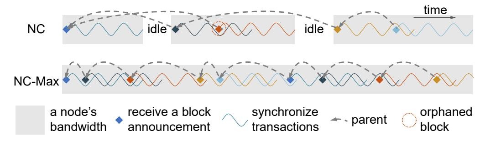

Fig. 1: To balance the security-performance tradeoff, cryptocurrencies implementing NC usually choose long block intervals, leaving long idle time now and then with no transactions confirmed. NC-Max decouples transaction synchronization from confirmation to allow better bandwidth utilization and a shorter block interval without raising the orphan rate.

Advocating a Broader View in Designing Consensus Protocols. Through this work, we aim to raise awareness of the importance of the network layer in designing protocols. Our protocol modification is built upon accurate identification and experimental verification of NC's network-layer bottleneck, which allows NC-Max to achieve better performance while preserving NC's security and flexibility. With NC-Max, we thus forward the configurational nature of a consensus protocol—that it shall be understood as a combination of the backbone protocol and the external rules—including those who concern the network layer, and the latter deserves no less attention for the former to exert its full potential and promises.

## II. THE LIMITATIONS OF BLOCKCHAIN CONSENSUS PROTOCOLS

This section provides a brief overview of blockchain consensus protocols and their limitations, elaborating why we choose NC's backbone protocol as a base for improvements.

## *A. Nakamoto Consensus*

NC helps all nodes agree on and order the set of confirmed transactions in a decentralized, pseudonymous way. There are two components in NC: *backbone protocol*, including its chain selection rules and DAM; *external rules*, including its transaction packing details, block validity rules, and reward distribution mechanism.

Backbone Protocol. Each block contains an 80-byte *header* in addition to the transactions. A block header includes (1) the block's *height*—distance from the hard-coded *genesis block*, (2) the hash value of the *parent*—the latest block in the blockchain, (3) the Merkle root of the transactions, (4) a timestamp, and (5) a nonce. Embedding (2) ensures that a miner chooses its parent before starting to mine. Based on this parent-child relationship, all blocks form a tree, and each root-to-leaf path in the tree is called a *chain*. To construct a valid block, miners work on finding the right nonce so that the block hash is smaller than a *target* T, which is computed by the last iteration of the DAM. Dynamically adjusting T ensures a stable expected block interval, hence a stable throughput limit, regardless of the total mining power. We omit the details of the DAM and refer interested readers to [31]. Compliant miners publish blocks the moment they are found.

{2}------------------------------------------------

When more than one block extends the same parent, miners work on the *main chain* that is most computationally challenging to produce, which is sometimes inaccurately referred to as the *longest chain*. When several chains are of the same "length", miners choose the first chain they receive. Blocks not in the main chain are *orphaned* and discarded by all miners.

External Rules. The transactions must not conflict with those in previous blocks of the same chain. The size of a block must not exceed a predefined *block size limit*. Miners are incentivized by two kinds of rewards. First, a *block reward* is allocated to the miner of every blockchain block via a special *coinbase transaction* in the block. Second, the value difference between the inputs and the outputs in a transaction is called the *transaction fee*, which goes to the miner who includes the transaction in the blockchain. We omit other details as they are not relevant to this study.

Security-Performance Tradeoff. NC exhibits stronger security properties when the expected block interval is significantly larger than the block propagation latency [32], which minimizes the number of blocks mined during other block's propagation. Violating this condition leads to a high *orphan rate*—percentage of orphaned blocks—which lowers the adversarial mining power threshold to secretly generate a longer chain, downgrading the system's security threshold. However, short block propagation latency demands a small block size limit, which, together with a long block interval, results in low throughput and long transaction confirmation latency. This tradeoff is formally modeled by Sompolinsky and Zohar as early as 2015 [80].

Bitcoin and Ethereum, the two largest cryptocurrencies, stand at two extremes of this tradeoff. Bitcoin favors security, choosing a long expected block interval of ten minutes; Ethereum favors performance, leading to a 9.1% long-term orphan rate with a 13-second average block interval [69], [71]. Such a high orphan rate translates to a systematic uncertainty in the miners' income. To reduce this uncertainty, Ethereum issues *uncle rewards* to compensate the orphaned blocks' miners, which further weaken the system's security [59], [73].

Despite such a strong preference for performance, Ethereum cannot fully exploit the nodes' bandwidth to confirm transactions. In 2015, 90% of Bitcoin public nodes have bandwidth at least 3.03 Mbps, translating to a synchronization capacity of 758 transactions per second (TPS) [19]; in 2017 the numbers raised to 5.7 Mbps and 1425 TPS [34]. However, Ethereum, with a presumably similar bandwidth distribution, cannot process faster than 15 TPS as of 2021 [27], leaving long idle time now and then between blocks (Fig. 1). Even if we further abandon security, more aggressive re-parameterization does not allow us to fully exploit the nodes' bandwidth, because orphaned blocks do not contribute to the transaction confirmation, yet still consume bandwidth to propagate [80].

Both cryptocurrencies are under high pressure to raise their performance. Whether to stay at the conservative end of the tradeoff is the most heavily debated topic in the Bitcoin community in recent years [19], [89]. Ethereum's daily average transaction fee raises to 70 USD in May 2021 [70] due to its high transaction confirmation demand.

## *B. Innovative Protocols: Into the Unknown*

Inspired by the success of NC, a considerable number of consensus protocols have emerged. These efforts can be categorized into two groups: NC's chain-based variants which adjust the backbone—and innovative protocols—which abandon the backbone. Nevertheless, while the variants of NC introduce new attack vectors where they modify the backbone [91], innovative protocols all lead to new and unsolved challenges in their security, performance, or functionality. We now briefly introduce the limitations of existing innovative protocols, which are further divided into two approaches.

Proof-of-Possession Protocols. PoS (e.g., Algorand [36], Ouroboros Praos [21], and Snow White [20]) and *proof-ofspace* (e.g., Spacemint [60]) protocols avoid the energy consumption in NC by selecting participants to compose blocks based on their possession of some scarce resources. Since the resources are not consumed during the block generation, extra security assumptions and protection mechanisms must be in place to prevent attackers from constructing multiple history versions. These systems usually rely on stronger-than-NC synchrony and online assumptions, or even trusted parties to checkpoint the blockchain, which lead to new attack vectors if these assumptions are not met. As an example of the protection mechanisms, Algorand demands that each block be accompanied by a certificate comprised of hundreds of digital signatures [36]. Broadcasting these signatures consumes bandwidth that could be used to synchronize transactions. More discussions on these limitations are in [4], [11].

BlockDAG Protocols. SPECTRE [78], Meshcash [5], PHAN-TOM, GHOSTDAG [79], Prism [2], and Conflux [50] suggest that, rather than referring to a single parent, a block contains hashes to all blocks the miner has received satisfying certain conditions. By confirming transactions with blocks not necessarily in a chain, these protocols hope to achieve higher throughput than chain-based protocols.

BlockDAG protocols' actual throughput is yet to be quantified, as it is difficult to model how much bandwidth is wasted due to transactions embedded multiple times in simultaneous blocks [49]. This *duplicate-packing problem* further complicates the transaction fee distribution, whose mechanism is omitted in PHANTOM, GHOSTDAG, Prism, and Conflux. Moreover, Prism, with its three kinds of blocks, may also introduce incentive issues in block reward distribution and new attacks against its difficulty adjustment, whose mechanisms are also omitted in its design. At last, as the global order of transactions is not known when constructing a block, transaction validity can only be evaluated after the neighboring blockDAG topology is settled, resulting in a long confirmation delay. Alternatively, SPECTRE abandons the global order, thus it does not support smart contracts.

# *C. NC's Backbone: a Promising Base*

Despite the emergence of numerous alternatives, NC's backbone protocol still has a threefold advantage compared to its alternatives. First, it is built on only a minimum set of security assumptions. Consequently, its security is carefully scrutinized and well-understood [26], [29], [31], [32], [43], [61], [75], [86]. Alternative protocols often open new attack 

{3}------------------------------------------------

vectors, either unintentionally [42], [91] or by relying on assumptions that are difficult to realize [65]. Second, coupling the block producer election and transaction confirmation minimizes the consensus protocol's communication overhead [1]. In contrast, alternative protocols often demand a non-negligible communication overhead to certify that certain nodes have witnessed a block or to transmit the same transactions multiple times. Third, NC's chain-based topology ensures that a transaction global order is determined at block generation, which (1) minimizes the transaction verification and confirmation latencies, and (2) supports all smart contract programming models [12], [64].

Therefore, we argue that NC's backbone still provides one of the most promising bases for future protocol designs. Nevertheless, NC's security-performance tradeoff signals some fundamental limitations in its design. As prior attempts trying to break this tradeoff via modifying the backbone often introduce new attacks, a natural question arises: is it possible to break the tradeoff while keeping the backbone protocol intact? To answer it, we first pinpoint the bottleneck in this tradeoff.

## III. BOTTLENECK IN NC'S SECURITY-PERFORMANCE TRADEOFF

NC's security limits its performance as larger blocks and shorter intervals—i.e., better performance—cause longer block propagation latency and more frequent blocks, respectively; both approaches raise the orphan rate, thus weakening security. The Bitcoin developers are among the first to recognize the importance of short block propagation latency. They, therefore, introduced *compact blocks* (CB) in 2016 to reduce this latency. However, with CB implemented, fresh transactions became the obstacle to lowering the block interval and to raising the block size. This section first introduces CB, and then elaborates on how fresh transactions defer the block propagation and enable a transaction withholding attack, followed by experiments that confirm the identified bottleneck.

## *A. Compact Blocks*

CB was proposed to reduce both the block propagation bandwidth and the latency. Before it was enabled, most transactions were transmitted twice to every node: first when it was propagated, then with the block packing it. Observing this repetitiveness, the Bitcoin developers suggested not transferring full transactions in a block by default, but to replace each transaction, typically two to five hundred bytes, with a 48 bit shortid. Such replacement compresses a 1 MB block into around 13 KB [52], which is significantly faster to transfer.

We briefly overview the protocol here and refer interested readers to [17] for the specification. With CB enabled, each connection chooses among three different modes of block propagation. We focus on the *High Bandwidth (HB) mode* here, which is responsible for most blocks' propagation. Each node supporting CB enables the HB mode with the last three peers that have sent blocks to the node. Whenever a new block is available at an HB peer, the peer constructs a CB by replacing each transaction with a shortid, and adding two extra fields: (1) a connection-specific 64-bit random salt and (2) a list of transactions for which the peer is certain that the receiving node is not aware of them—just the coinbase transaction in the current implementation. The second field is called *prefilled transactions*. A shortid is computed as siphash-2-4(txid,SHA-256(*header*||*salt*)), where siphash-2-4 and SHA-256 are two hash functions, txid is the transaction hash, and *header* contains the block's metadata. The CB is then sent to the node. After receiving the CB, the node computes shortids for transactions in its unconfirmed transaction pool, matches them with those in the CB, and requests the missing transactions. Once the node receives these transactions, it constructs and forwards relevant CBs to its other peers, and starts verifying the newly-received transactions in the meantime.

CB is proven effective in Bitcoin. After it was enabled in 2017, on most occasions, a node receives a block with one CB message, rather than the 1.5 round trip of announcing, request, and reply. Bitcoin's orphaned blocks dropped from roughly one per day to a few blocks per year [9].

Thanks to CBs' small size, their propagation latency is independent of their sizes [19]. As the theoretical analysis on the security-performance tradeoff is built on the correlation between the block size and the propagation latency [80], CB seems to break this tradeoff. Next, we show that this is not the case.

## *B. Fresh Transactions and Transaction Withholding Attacks*

Although effective in saving bandwidth, CB reduces the block propagation latency only when the receiver has already received all non-coinbase transactions. When some transactions are new, the latency gain is negligible, as it still takes a round trip to request them (Fig. 4). We call these transactions *fresh*, as they are broadcast at most a few seconds before they are mined in a block. As of 2020, most Bitcoin blocks have no fresh transactions, thanks to the long block interval.

However, this optimistic situation may not be sustainable. As pointed out by Maxwell, a Bitcoin Core developer, resourceful miners can raise their revenues by deliberately packing transactions known only to themselves [52]. We term this attack *transaction withholding attacks*. The slower block propagation gives them more time to mine on their blocks before other miners have received them, hoping to orphan honest blocks mined during this period as they do not extend the longest chain, thus constituting a de facto selfish mining attack. As selfish mining's profitability raises superlinearly with the attacker's mining power, more resourceful miners have less incentive to accelerate their blocks' propagation [29]. Transaction withholding attacks are stealthier than selfish mining, thus are more likely to be deployed [52], as the latter can usually be detected by a gap between the block's timestamp and its first announcement.

There is plausible evidence of this attack in the wild, although miners may not attack consciously. Neudecker and Hartenstein [57] observed that, of all the Bitcoin forks before CB was activated, if a branch wins by two consecutive blocks from the same miner, the interval between these two blocks is often shorter than the different-miner case. The authors suspected that "the block propagation delay gives the miner of the last block an advantage in finding the subsequent block, until other miners have received the block."

Even in the absence of attacks, fresh transactions are also the crux in NC's security-performance tradeoff. This is because

{4}------------------------------------------------

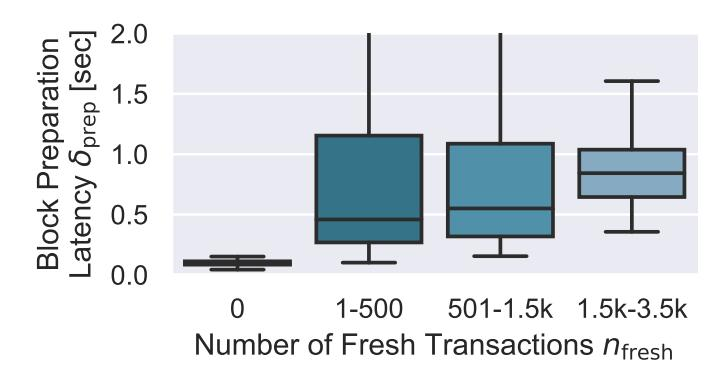

Fig. 2: The block preparation latency  $\delta_{\text{prep}}$  is higher with fresh transactions, i.e.,  $n_{\text{fresh}} > 0$ . The ends of a box are the 25th and 75th percentiles of the data set; a horizontal line inside the box marks the median. A few abnormal data points have more-than-two-second latency, which are not displayed.

lowering the block interval or raising the block size both lead to more fresh transactions, largely removing the latency gain. Next, we confirm this bottleneck.

#### C. Confirming the Bottleneck

Fresh Transactions Affect the Block Propagation Latency. We first study how the number of fresh transactions, denoted as  $n_{\text{fresh}}$ , affects the one-hop block propagation latency  $\delta$ . The multi-hop latency is studied in Sect. VI.

The one-hop latency is decomposed into two parts:  $\delta = \delta_{\rm CB} + \delta_{\rm prep}$ , where  $\delta_{\rm CB}$  denotes the CB transmission latency from a node's upstream peer to the node and  $\delta_{\rm prep}$  denotes the block preparation latency, i.e., the time between the node's receiving a CB and forwarding CBs to its peers. As CBs are small,  $\delta_{\rm CB}$  equals the latency between the upstream peer and the node, typically 1 to 50 ms [25], as upstream peers are usually a node's most well-connected peers. The extra round trip to request the missing transactions happens during  $\delta_{\rm prep}$ .

As  $\delta_{\rm CB}$  is relatively short and independent of  $n_{\rm fresh}$ , we focus on the relation between  $n_{\rm fresh}$  and  $\delta_{\rm prep}$ . We modified the Bitcoin client v0.17.1 to reject a fraction of new transactions to increase  $n_{\rm fresh}$  when receiving a new block, and to log  $n_{\rm fresh}$  and  $\delta_{\rm prep}$  for every block it receives. We deployed three instances of the modified client on IP addresses 47.251.4.119, 47.244.165.26, and 8.208.203.101, located in the US, Hong Kong, and the UK, respectively, and collected data from the Bitcoin network between May 10th and May 18th, 2019.

As shown in Fig. 2, when there is no fresh transaction,  $\delta_{\text{prep}}$  is short and stable, typically around 100 ms. In this case, the latency is the time to reconstruct the block from the CB and to generate CBs for its peers. When  $n_{\text{fresh}} > 0$ , even if the number is small, the median of  $\delta_{\text{prep}}$  raises to around 500 ms, due to the request-and-reply round trip. The latency becomes even higher when there are more fresh transactions, as larger messages take longer to transmit. The data variation is smaller when  $n_{\text{fresh}} > 501$ , as 78% of our data points have  $n_{\text{fresh}} \leq 500$ .

The Fraction of Fresh Transactions Increases When the Block Interval Decreases. Next, we study the relation between the expected block interval, denoted as  $\overline{t_{\rm in}}$ , and the fraction of fresh transactions, denoted as  $p_{\rm fresh}$ .

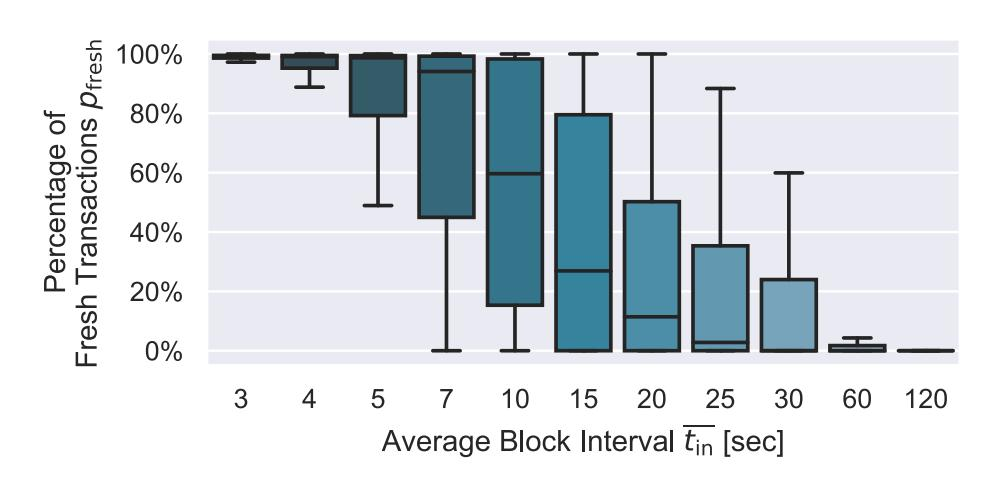

Fig. 3: The percentage of fresh transactions in a block  $p_{\text{fresh}}$  increases when the block interval  $\overline{t_{\text{in}}}$  decreases.

We simulate the Bitcoin network with a higher transaction processing workload of 100 TPS. Our simulation setting—details on the network scale, latency, mining, and transaction generation—will be described in Sect. VI-A. A miner packs up to  $100~\mathrm{TPS} \times \overline{t_{\mathrm{in}}}$  transactions from its memory pool, prioritizing those with the oldest timestamps, as the block. "Packing from the oldest" results in a lower  $p_{\mathrm{fresh}}$  than in reality, where miners pack from the highest fee-per-byte transaction. Each block's  $p_{\mathrm{fresh}}$  is averaged over all the receiving nodes.

The results in Fig. 3 show very few fresh transactions in blocks when  $\overline{t_{\rm in}}=120$  seconds, which is consistent with Bitcoin and Litecoin's current situation. However,  $p_{\rm fresh}$  increases when the block interval decreases, especially when it drops below the total transaction propagation latency.

We expect  $p_{\rm fresh}$  to be higher under the highest-fee-perbyte (HFPB) transaction packing rule, because the newest transactions, by definition, are least likely to be packed in the oldest-first rule. Specifically, unlike the oldest-first rule, the HFPB rule cannot ensure  $p_{\rm fresh}=0$  regardless of how large  $\overline{t_{\rm in}}$  is and how many pending transactions are in the pool, as new transactions with the highest fees may appear anytime.

Combining these results, we conclude that, when reducing the block interval, more fresh transactions appear in the blocks, which prolong the block propagation. Previous studies [23], [80] demonstrate that increasing the block size also raises this latency as more transactions take longer to synchronize, which is confirmed in Sect. VI. Longer block propagation latency directly results in a higher orphan rate, harming security. Next, we present our solution to this bottleneck.

#### IV. TWO-STEP CONFIRMATION

Fresh transactions invalidate the CB mechanism as they recouple the block propagation latency with the block size and interval. If we can ensure that the block propagation latency is short and block-size-independent, the security-performance tradeoff is broken: we can shorten the block interval to the lower limit permitted by the security demands, and raise the block size until the throughput *exhausts the nodes' bandwidth*, which is already a hundreds-of-times performance gain compared to Ethereum (cf. Sect. II-A). Moreover, there is no need to modify NC's backbone protocol.

A naïve approach is to recommend miners to wait for a fixed amount of time after receiving a transaction before packing it into a block. However, this approach leads to a

{5}------------------------------------------------

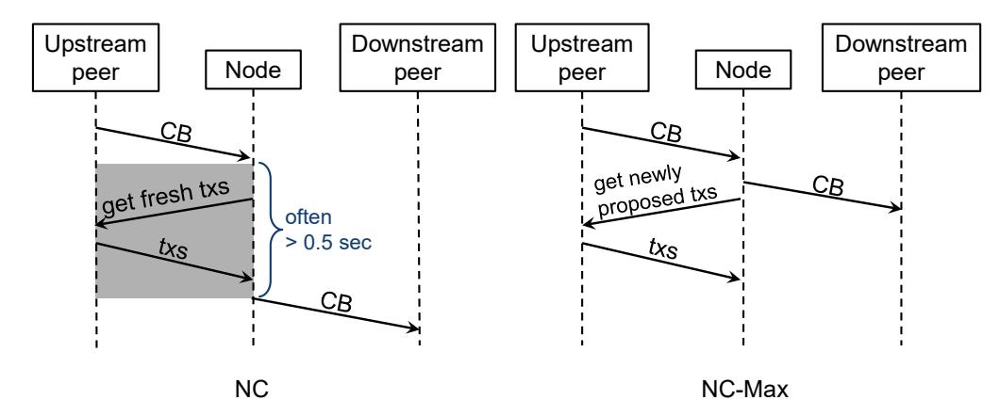

Fig. 4: Block propagation in NC and NC-Max. "Transactions" is abbreviated as "txs". On most occasions, our protocol allows nodes to forward CBs to their peers as soon as they received them, as all committed transactions are already synchronized.

prisoner's dilemma, where eventually all miners ignore the recommendation. Specifically, rational miners may slightly reduce the waiting time to include fresh transactions with higher fees, causing other miners to adopt more aggressive strategies to compete for these transactions. Similarly, this approach exacerbates the Miner Extractable Value problem, which is considered a pressing threat to Ethereum [63], by extending the "attack" window of non-compliant miners. Moreover, it relies only on miners' goodwill, thus offering no protection against transaction withholding attacks.

The number of fresh transactions can be reduced by accelerating transaction propagation. However, such an approach enables an attacker to learn the transaction sender by listening to all public nodes [6], [48]. Therefore, Bitcoin slows down its transaction propagation to protect the users' privacy [6]. As of 2020, it takes ≈ 5 seconds for a transaction to reach 50% of nodes, but only 526 ms for a block [25].

Set reconciliation protocols, such as Erlay [54], cannot reduce fresh transactions, as these protocols can only synchronize transactions within a connection. If neither peer of the connection has received a fresh transaction, they still need to request and synchronize it after receiving the block.

Our solution is the two-step transaction confirmation mechanism, which introduces two adjustments to NC:

Prescribing a Transaction Proposal Step. A *transaction proposal zone* is added to each block, containing txpids the first several bytes of transaction hashes—of some possibly fresh transactions. We consider these transactions *proposed* in this block. The set of full transactions in a block is now called the *transaction commitment zone*. The proposed transactions—unlike their txpids—are not part of the block, therefore they do not affect the block's validity: a block may still be valid if some txpids refer to malformed or doublespending transactions, or the miner refuses to provide the full content of proposed transactions. The most important rule about the proposal zone is that a transaction in the commitment zone of a block with height h must be proposed in a main chain block with height between h − wfar and h − wclose, a range we termed *the proposal window*. This rule is illustrated in Fig. 5 and formally defined in Sect. IV-A. The prescribed wclose-block propose-commit distance does not lead to longer transaction confirmation latency, as this two-step mechanism enables shorter block intervals.

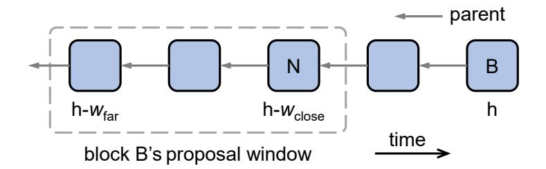

Fig. 5: Block B can only commit transactions proposed in its proposal window. In this example, wclose = 2, wfar = 4.

Modifying the Block Propagation Protocol. As proposed transactions do not affect a block's validity, a node forwards the CBs—including the full proposal zone—to its downstream peers as soon as it finishes reconstructing the commitment zone, whose transactions are already synchronized after receiving the blocks in the proposal window. The request to the node's upstream peer for missing proposed transactions in the latest block is sent in the meantime. Consequently, the roundtrip time of requesting the missing transactions is removed from the critical path of block propagation, as shown in Fig. 4. Malicious miners may still conduct transaction withholding attacks by refusing to provide the full transactions they proposed and then hoping to commit these secret transactions in the future; however, the success rate and the damage of this attack are lower in NC-Max than in NC, as shown in Sect. V-D.

Next, we formally define the two steps and the block structure, and then introduce the new block propagation protocol and our reward distribution mechanism.

## *A. Definitions*

Definition 1 (Proposal id). *A transaction's* proposal id txpid *is defined as the first* ℓpid *bits of the transaction hash* txid*.*

A txpid does not need to be globally unique as the 32 byte txid, as a txpid is used to identify a transaction among several neighboring blocks. Since we embed txpids in both blocks and CBs, sending only the truncated txids reduces the bandwidth consumption. When multiple transactions share the same txpids, all of them are considered proposed. Our block propagation protocol ensures that a txpid collision slows down only the first hop in the block's propagation (R3 in Sect. IV-C). In practice, we set ℓpid large enough so that finding a collision is no easier than finding a block, e.g., ℓpid = 144 in Bitcoin, rendering such attacks irrational.

Definition 2 (Transaction proposal). *A transaction is* proposed *at height* h<sup>p</sup> *if its* txpid *is in the* proposal zones *of the main chain block with height* hp*.*

The proposal zone facilitates transaction synchronization. The proposed transactions' validity does not affect the block's validity, thus cannot be used to fork the blockchain.

Definition 3 (Transaction commitment). *A non-coinbase transaction is* committed *at height* h<sup>c</sup> *if all of the following conditions are met: (1) it is proposed at height* h<sup>p</sup> *of the same chain, where* wclose ≤ h<sup>c</sup> − h<sup>p</sup> ≤ wfar*; (2) it is in the* commitment zone *of the main chain block with height* hc*; and (3) it is not in conflict with any previously-committed transactions in the main chain. The coinbase transaction is committed at height* h<sup>c</sup> *if it satisfies (2) and (3).*

{6}------------------------------------------------

Unlike txpids in the proposal zone, committed transactions must be valid. A transaction is considered embedded in the blockchain when committed. Parameters wclose and wfar define the *proposal window*—the closest and farthest on-chain distance between a transaction's proposal and commitment, as shown in Fig. 5. Enforcing a proposal window guarantees that the "proposed transaction pool" fits in a node's memory. We suggest the proposal window w, defined as wfar − wclose + 1, to be at least four to ensure liveness (Sect. V-C). Although a longer window gives the miners more time to commit a transaction, a shorter window offers stronger resistance against transaction withholding attacks (Sect. V-D).

We require wclose be large enough with a lower bound of two, so that wclose block intervals are long enough for newlyproposed transactions to finish propagation, and as small as possible to reduce the transaction confirmation latency. We suggest two mechanisms to ensure a large enough wclose. First, to dynamically adjust wclose based on the block propagation information of recent epochs. For example, we can increase wclose by one if the last epoch's orphan rate is larger than a predefined target, and reduce it by one if the last ten epochs' orphan rates are all smaller than another predefined target. Second, to fix wclose and dynamically adjust the block interval, as discussed in Sect. VII-B. The relationship between wclose, the expected block interval and the transaction processing workload is empirically analyzed in Sect. VI-D.

## *B. Block and Compact Block Structure*

Data Structure. A block includes the following fields:

*header* block metadata *commitment zone* full transactions *proposal zone* txpids

The header contains the Merkle root of the commitment zone and that of the proposal zone, rather than just the Merkle root of transactions in NC's header. Similar to NC, a CB replaces the commitment zone with the transactions' shortids, a salt, and a list of prefilled transactions. The header and the proposal zone remain unchanged in the CB.

A *block size limit* is applied to the total size of the block, to limit the data size to synchronize across the network along with each PoW solution. The number of txpids in a proposal zone also has a hard-coded upper bound. Two heuristic requirements can help practitioners to choose the parameters. First, the upper bound on the number of txpids in a proposal zone should be no smaller than the maximum number of committed transactions, so that this bound is not the protocol's throughput bottleneck. Second, ideally, a CB should be no bigger than 80 KB, as "≤ 80 KB" messages have similar propagation latency in the Bitcoin network in 2016 [19]; larger messages propagate slower as the nodes' bandwidth becomes the bottleneck. This number changes as the network condition improves.

## *C. Block Propagation Protocol*

In line with [3], [29], [39], [90], nodes should broadcast all blocks with valid PoWs, including orphans. Valid PoWs cannot be utilized to pollute the network, as constructing them is energy-consuming.

On most occasions, NC-Max's block propagation protocol removes the round trip of fresh transactions, as illustrated in Fig. 4, so that block propagation latency is constant regardless of how many transactions are proposed; when the round trip is inevitable, NC-Max ensures that it only lasts for one hop in the propagation and the additional latency is limited. Note that our modifications to the block propagation protocol do not affect the blockchain's convergence, which is guaranteed by the backbone protocol. The block propagation protocol's pseudocode is in Alg. 1, which differs from that of NC's in the following three rules.

```
Algorithm 1 Our Block Propagation Protocol
```

```
procedure OnReceiveCompactBlock(CB, fromPeer )
 1: freshCommitShortid = ∅, freshProposeTxpid = ∅
 2: add CB.prefilledTx to memoryPool
 3: for all shortid ∈ CB.commitmentZone do
 4: if shortid.tx ∈/ memoryPool then
 5: add shortid to freshCommitShortid
 6: if freshCommitShortid ̸= ∅ then
 7: request freshCommitShortid.tx from fromPeer
 8: start timer t
 9: if t = timeOut and no reply then
10: turn off the HB mode with fromPeer
11: initiate the HB mode with another peer
12: return ▷ missing tx in the commitment zone
13: for all shortid ∈ CB.commitmentZone do
14: if shortid.tx ∈/ CB.proposalWindow then
15: return invalid block ▷ commit without proposing first
16: Execute Line 17, 19 and 23 in parallel:
17: for all tx ∈ freshCommitShortid.tx do
18: verify tx 's validity
19: for all toPeer do ▷ forward the CB
20: construct CBtoPeer from CB
21: add freshCommitShortid.tx to CBtoPeer .prefilledTx
22: send CBtoPeer to toPeer
23: for all txpid ∈ CB.proposalZone do ▷ request new txs
24: if txpid.tx ∈/ memoryPool then
25: add txpid to freshProposeTxpid
26: if freshProposeTxpid ̸= ∅ then
27: request freshProposeTxpid.tx from fromPeer
28: add the replied transactions to memoryPool
```

R1: non-blocking transaction query. As soon as the commitment zone is reconstructed, a node forwards the CBs to its downstream peers and queries the newly-proposed transactions from its upstream peers simultaneously (Line 16 in Alg. 1).

The block propagation will not be affected by these transaction queries as long as they are answered before the next wclose-th block is mined. Transactions are validated as soon as their full content is received. The txpids and their block heights are stored in the memory until they are no longer in the proposal window, regardless of whether their corresponding transactions are missing or invalid. This will not become a DoS attack vector as the maximum sizes of the proposal window and the proposal zone are hard-coded.

To prevent the attacker from launching memory exhaustion attacks with large-sized transactions, an additional upper limit is prescribed on the total size of all newly-proposed transactions in a proposal zone. Once this limit is reached, the node (1) deletes all large-sized transactions that appear only in this 

{7}------------------------------------------------

proposal zone from its memory pool, and (2) blacklists the upstream peer that contributes the most to these large-sized transactions. The threshold for tagging large-sized transactions is not a consensus parameter, and thus can be set locally, as, e.g., twice the average size of transactions confirmed in the ten most recent blocks.

R2: missing transactions, now or never. If certain committed transactions are unknown to a CB receiver, the receiver queries the sender with a short timeout (Line 6 to Line 7). Failure to send these transactions in time leads to the receiver turning off the HB mode for the sender and turning on the HB mode for the next fastest peer (Line 8 to Line 12). If the downgraded sender was an outgoing connection, the receiver establishes a new connection to a random node. Moreover, the incomplete block will not be propagated further before receiving these transactions from another peer. No punishment is prescribed to upstream peers who do not respond to the queries on newlyproposed transactions, as it is difficult to locate the responsible parties for the delay.

Proposed-but-not-received transactions are committed either (1) in a successful transaction withholding attack, or (2) when wclose consecutive blocks are mined before the transactions proposed in the first one are synchronized. If the upstream peer is honest, as in (2), a short timeout is adequate to transfer the missing transactions, as an honest upstream peer must not send the CBs before receiving these transactions (Line 16 is unreachable if Line 12 is executed). In the case of (1), the attacker cannot delay the first hop of the block propagation more than the timeout value without the block being discarded. In practice, we set the timeout to be 3.5 seconds, which is adequate for the round trip in 95% of the cases according to our measurement (Sect. III-C, Fig. 2).

R3: transaction push. If certain committed transactions are previously unknown to a CB sender, they will be embedded in the prefilled transaction list of the outgoing CBs (Line 19).

This rule removes the round trip if the sender and the receiver share the same list of proposed-but-not-broadcast transactions. In a transaction withholding attack or a txpid collision, this rule ensures that the secret transactions are only queried in the first hop of the block's propagation, and then pushed directly to the receivers in subsequent hops.

Memory Consumption and Computational Costs. In the memory, each proposed transaction needs to be accompanied by its txpid and the heights of the main chain blocks proposing it. When each block contains 2500 txpids of 18 bytes each, the block height is 4 bytes and the proposal window w = 10, the extra memory consumption is 539 KB. The main computational cost, in addition to NC, is to verify whether a committed transaction is in the proposal window after receiving a CB (Line 14). We modify the full NC-Max client (Sect. VI-G) with the larger parameters above and time this operation on a laptop manufactured in 2015. This check never exceeds two milliseconds per block.

# *D. Reward Allocation*

A fixed block reward goes to every main chain block miner. For each committed transaction, 70% of its transaction fee, denoted as the *commitment fee*, goes to the main chain block miner who commits it; while the other 30%, denoted as the *proposal fee*, goes to the earliest main chain block miner who proposes the transaction within the proposal window. This fee allocation balances the miners' incentives to earn higher fees and to extend the longest chain. We describe how this distribution is chosen in Appendix A, which is inspired by that of Bitcoin-NG [28] with several subtle differences.

## V. SECURITY ANALYSIS

Having introduced the core design, next, we analyze the protocol's security. A comprehensive security evaluation of a blockchain consensus protocol involves analyzing its (1) backbone protocol, and (2) transaction ledger. These two aspects, covered in Sect. V-B and Sect. V-C respectively, focus on the worst-case values of some fundamental security properties, which guarantee the blockchain's smooth operation regardless of the attacker's goals and strategies. We show that NC-Max inherits all properties of NC's backbone, and only slightly weakens its ledger liveness—it takes more blocks to confirm a transaction with high confidence. Luckily, in practice, the extended waiting time caused by the two-step mechanism is canceled by the shortened block interval (Sect. VI-F). Moreover, the stronger resistance against transaction withholding attacks (Sect. V-D) ensures that the worse cases in (1) and (2)'s analyses happen less often.

## *A. Threat Model*

NC's security is formally analyzed by a long line of research [24], [26], [31]–[33], [43], [45], [61], [72], [86]. Our threat model is identical to several recent studies [24], [33], [72], which is more realistic than prior ones. We use a continuous-time model, which is proven equivalent to the discrete-time model [33]. We assume the total mining power and the adversarial mining power share remain unchanged throughout the attack. Non-adversarial mining power abides by the protocol. In each *time unit*, e.g., one millisecond, the probability that the total mining power can find a block is p. Messages sent or forwarded by honest miners can be reordered and delayed up to a fixed time duration ∆ by the attacker, but cannot be discarded. The attacker receives messages with zero propagation delay, and can arbitrarily withhold or delete his own blocks. We do not consider the effect of transaction fees [14], [51], [83], as it only makes up 1% of the miners' rewards in Bitcoin [8]. As in all PoW consensus protocol designs, neither do we consider network partitions, regardless of whether they are caused by eclipse attacks [40], [55]. Partitions lead to long forks, during which NC's safety is violated [32], [72].

## *B. Analysis of the Backbone Protocol*

As the first formal analysis against NC, Garay et al. [32] separated NC into (1) its backbone protocol—including the longest chain rule and the DAM—and (2) external rules. All subsequent studies [24], [26], [31], [33], [43], [45], [61], [72], [86] follow the same separation. As NC-Max faithfully instantiates the backbone protocol and only modifies the external rules, we only need to show that, our modifications do not violate the assumptions on these rules listed in [32].

Our modifications to the external rules are the *content validation predicate* and the *input contribution function* in [32]'s 

{8}------------------------------------------------

terminology. We define the modified rules here, which will be used in our liveness proof (Sect. V-C):

- Content Validation Predicate. When receiving a chain  $\mathcal{C}$  as input, the predicate returns True if and only if (1) the contents are consistent with the application implemented on top of  $\mathcal{C}$ , and (2) for any (committed, tx)  $\in$  Block<sub>i</sub>, there exists a (proposed, pid)  $\in$  Block<sub>j</sub> such that txpid(tx) = pid and  $w_{close} \leq i j \leq w_{far}$ , where Block<sub>i</sub> denotes the block with height i in  $\mathcal{C}$ .
- Input Contribution Function. When constructing a block, a miner embeds all proposed-but-not-committed valid transactions in the proposal window as committed, and all not-yet-committed and not-in-the-proposal-window valid transactions as proposed. If a block is mined, the miner outputs the block along with the proposed transactions.

NC's security proofs make only two assumptions on the external rules, both of which are satisfied by NC-Max. First, each block introduces enough entropy. This is satisfied by all proof-of-work consensus protocols as the attacker, without knowing the block miner's private key, cannot predict the coinbase transaction. Second, a block mined by an honest miner is valid to the others. NC-Max meets this assumption as the content validation predicate does not involve a miner's local information. In sum, NC-Max is an instantiation of NC's backbone, and thus is compatible with its future updates.

Another assumption in [32] regarding the DAM, that the block propagation latency  $\Delta$  is significantly shorter than the expected block interval, is made unnecessary by two recent studies [24], [33]. Nevertheless, NC-Max meets this assumption if we set the expected block interval larger than a few seconds.

## C. Ledger Persistence and Liveness

Next, we analyze the robustness of the transaction ledger, specified as persistence and liveness properties in the literature. The former measures the difficulty for the attacker to modify the ledger; the latter measures the difficulty to postpone a transaction's confirmation, i.e., censorship resistance. We omit the persistence proof as it only concerns the backbone protocol, thus is identical to that of NC's. The liveness proof, however, is not the same, as we modify the content validation predicate and the input contribution function.

**General Form of NC's Liveness Theorem.** Existing liveness theorems of NC [24], [31]–[33], [43], [61], [72] have the following general form:

**Theorem 1** (NC Liveness). In  $\Pi_{\rm NC}$ , if (1) the adversarial mining power share  $\alpha < \lambda(1-\alpha)$ , and (2) a valid transaction tx is given as input to all honest parties continuously for at least  $u_{\rm NC}(\Delta,\lambda,p)$  time, then all honest parties will report (committed, tx) more than  $w(\Delta,\lambda,p)$  blocks from the end of the ledger, with probability at least  $P_{\rm live}^{\rm NC}=1-e^{-\Omega(\epsilon(\Delta,\lambda,p))}$ .

Where  $\Pi_{\rm NC}$  denotes NC protocol,  $\lambda$  quantifies the honest mining power's advantage against the attacker's,  $u_{\rm NC}(\cdot)$ ,  $w(\cdot)$ , and  $\epsilon(\cdot)$  are polynomial functions of  $\Delta$ ,  $\lambda$ , and p. Existing results only differ in these polynomial functions.

We informally summarize the backbone protocol's chain growth, common prefix, and chain quality results, with notations corresponding to this theorem. The chain growth property states that after T time, any honest chain grows by at least  $T/(1/(1-\alpha)p+\Delta)$  blocks [24], [33]; the common prefix property states that for any two honest chains which may be from different times, the shorter one, after pruning the last  $w(\Delta, \lambda, p)$  blocks, is a prefix of the longer one; the chain quality property guarantees that there is at least one honest block in any  $w(\Delta, \lambda, p)$  consecutive blocks in an honest chain.

General Form of NC-Max's Liveness Theorem. Now we present the liveness theorems of NC-Max also in its general form, so that any instantiation of  $u_{\rm NC}(\cdot)$ ,  $w(\cdot)$ , and  $\epsilon(\cdot)$  is directly applicable to NC-Max.

**Theorem 2** (NC-Max Liveness). In  $\Pi_{\text{NC-Max}}$ , if (1) the adversarial mining power share  $\alpha < \lambda(1-\alpha)$ , (2) we set the proposal window size  $w = w(\Delta, \lambda, p)$  (from Theorem 1), and (3) a valid transaction tx is given as input to all honest parties continuously for at least  $u_{\text{Max}} = u_{\text{NC}}(\Delta, \lambda, p) + w_{\text{far}}(\frac{1}{(1-\alpha)p} + \Delta)$  time, then all honest parties will report (committed, tx) more than  $w(\Delta, \lambda, p)$  blocks from the end of the ledger, with probability at least  $P_{\text{live}}^{\text{Max}} = (P_{\text{live}}^{\text{NC}})^2$ .

We stress the scope of applicability before presenting the proof. Conditions (2) and (3) in Theorem 1 and 2, respectively, highlight that the liveness property only concerns honest transactions that are broadcast in conformity with the protocol. In particular, these theorems provide no guarantee on the transactions deliberately withheld by malicious parties. A proposed txpid without a corresponding confirmed transaction in the next  $w_{\rm far}$  blocks does not disprove our theorem if the full transaction is unavailable to honest parties.

*Proof:* Because NC-Max uses the same backbone protocol with NC, we can invoke the chain growth, common prefix, and chain quality properties directly. Invoking Theorem 1 on the transaction proposal step, after  $u_{\rm NC}$  time, all honest parties will report (proposed, pid) more than w blocks from the end of the ledger. Assuming the smallest honest-chain growth during this  $u_{\rm NC}$  time is  $w_1 + w$  blocks and (proposed, pid) is the *i*-th block among the first  $w_1$  blocks. In the remaining  $u_{\rm Max}$  –  $u_{\rm NC} = w_{\rm far}(\frac{1}{(1-\alpha)p} + \Delta)$  time, invoking chain growth, any honest chain grows by at least  $w_{\rm far}$  blocks. Therefore, in total, the smallest honest-chain growth is at least  $w_1 + w + w_{\text{far}}$ blocks. Consider the w-block sequence between block number  $i + w_{\text{close}}$  and  $i + w_{\text{far}}$  for any honest party, invoking chain quality, there is at least one honest block that would commit tx. Invoking common prefix, all honest nodes share the same first  $w_1 + w_{\text{far}}$  blocks, which include the first  $i + w_{\text{far}}$  blocks.

Now we compute  $P_{\rm live}^{\rm Max}$ . We invoke Theorem 1 with success probability  $P_{\rm live}^{\rm NC}$ . Note that "all honest parties have the same first  $w_1$  blocks" is inherent in the security proofs of Theorem 1. We then invoke chain growth, chain quality, and common prefix each once, with a combined success probability  $P_{\rm live}^{\rm NC}$  (see [32], [61]). Therefore the overall success probability is  $(P_{\rm live}^{\rm NC})^2$ .

Note that this proof covers the case of txpid collisions. Invoking Theorem 1 on the proposal step on one transaction permits the honest parties to confirm all transactions with the

{9}------------------------------------------------

same txpid. The rest of the proof works independently for all these transactions.

We gain the following insights from Theorem 2. First, the adversarial mining power threshold of NC-Max is identical to that of NC. In other words, if an attacker cannot censor transactions in NC, neither can he censor transactions in NC-Max. Second, NC-Max has a longer waiting time, measured by blocks, compared to NC. In practice, the extended waiting time is canceled by the shortened block interval. Third, the proposal window size w should be long enough so that there is at least one honest block in any w-block window. In [32],  $w(\Delta, \lambda, p)$  must be no smaller than 4 so that no equation degenerates. Although a larger w gives us larger  $P_{\text{live}}^{\text{Max}}$ , a smaller w helps NC-Max to resist better against transaction withholding attacks, which are analyzed next.

#### D. Resistance Against Transaction Withholding attacks

**Success Rate.** We compare the fraction of *attacker blocks*—blocks mined by the attacker—that can be slowed down in NC and NC-Max, denoted as  $F_{\rm slow}$ . We neglect the attack's outcome by assuming all the blocks are in the main chain. This simplification does not affect the comparison: the more attacker blocks delayed, the more honest blocks orphaned.

In NC, this attack can be performed with every attacker block, namely  $F_{\rm slow}^{\rm NC} = \alpha$ . In NC-Max, a block's propagation can only be delayed if its commitment zone contains proposed-but-not-broadcast transactions. To trigger this case, the attacker needs two blocks not too far from each other in the chain: the older one to propose these secret transactions, and the younger one to commit. Namely, for every attacker block with height h, it can commit secret transactions only if there is another attacker block between  $h-w_{\rm close}$  and  $h-w_{\rm far}$ . The probability that there is such a block is  $1-(1-\alpha)^w$ . Therefore,  $F_{\rm slow}^{\rm Max} = \alpha(1-(1-\alpha)^w)$ . Clearly,  $F_{\rm slow}^{\rm NC} > F_{\rm slow}^{\rm Max}$ , namely, NC-Max offers stronger resistance than NC.

**Simulation.** We simulate both protocols to demonstrate NC-Max's resistance against this attack in a more realistic setting. Our simulation models how  $\alpha$ , the proposal window size w, the maximum attack-incurred latency, and orphaned blocks affect the attacker's unfair percentage of main chain blocks. The results show that after incorporating these real-world factors, NC-Max enjoys a greater advantage over NC than that in the success rate analysis. The detailed model and our results are in Appendix B.

## VI. SIMULATION AND IMPLEMENTATION

In this section, we experimentally confirm that NC-Max breaks the security-performance tradeoff and compare the performance of NC-Max with existing designs. First, we measure the block propagation latency and the orphan rate of NC and NC-Max under several transaction processing workloads and block intervals in an environment simulating the Bitcoin network. The results show that NC-Max has a stable low orphan rate independent of the throughput, therefore allowing a shorter block interval with the same level of security. Then we compare the throughput and the transaction confirmation latency of NC-Max with NC and blockDAG protocols, which also claim to exhaust the nodes' bandwidth. The results

demonstrate that NC-Max enables the full utilization of the nodes' bandwidth, whereas all blockDAG protocols suffer from the duplicate-packing problem. Furthermore, the transaction confirmation latency is similar to that of Prism, a recent blockDAG protocol featured by its short latency. At last, we provide data from a real-world implementation and compare them with several high-value proof-of-work projects.

#### A. Experimental Setup

The environment is written in Rust with 3k LOC. Each node is implemented as a thread and nodes communicate through *Rust channels*. Network latency is simulated with the *sleep* function. A simulation is executed 40 times; each instantiates a new network topology and generates 200 blocks.

**Network.** There are 6000 nodes, each establishing 8 random outgoing connections. All connections have the same bandwidth of 10 Mbps (1.25 MBps), which corresponds to a full throughput of 2500 TPS with an average transaction size of 450 bytes. Such a low bandwidth allows us to reveal more intricacies on the network layer: at 4000 TPS, transaction verification becomes the throughput bottleneck [19].

The network latency between any two peers  $\delta_{a,b}$  is sampled from data collected by a public Bitcoin crawler maintained by KIT [25]. The compact block (CB) transmission latency  $\delta_{CB}$  equals  $\delta_{a,b}$ . Each time a node receives a CB, the block preparation latency  $\delta_{prep}$  is a function of  $n_{fresh}$  and  $\delta_{a,b}$ . The  $\delta_{prep}(\cdot)$  function parameters, detailed in Appendix C, are learned via maximum likelihood estimation (MLE) from the data we collected from the Bitcoin network (Sect. III-C).

**Mining.** There are altogether 20 miners whose mining power distribution follows Bitcoin's on September 15, 2019 [81]. The top five miners control 17.42%, 17.39%, 16.63%, 13.51%, and 8.65% of mining power, respectively. The PoW is replaced with a scheduler that triggers block generation events at intervals following an exponential distribution with  $\overline{t_{\rm in}}$  as an input. Orphaned blocks emerge if some blocks are mined before the latest block is received by their miners. All but one block of the same height would be orphaned. Whether the winner is the earliest one does not matter in our evaluation as we only care about the orphan rate.

**Transaction Generation and Propagation.** A fixed number of transactions are generated per second, each from a random node. Transactions are gossiped to the network from their initiators, with a fixed one-hop latency of 3.59 seconds so that the total propagation time—usually five hops—is similar to those of Bitcoin's 15 seconds [25]. A transaction is simulated as a dummy message with an ID and a timestamp. Each node maintains a memory pool of unconfirmed transactions up to 3000 MB; old transactions are dropped if it is full.

As a side note, although there are always enough transactions to confirm in Bitcoin and Ethereum, it is non-trivial to perform memory- or bandwidth-exhaustion attacks by flooding transactions in the networks, as when a node's memory pool or bandwidth is exhausted, it would stop propagating and delete transactions with the lowest fee-per-byte (Bitcoin) and the lowest gas price (Ethereum).

**Transaction Packing and Data Collection.** We consider three transaction packing workloads: 100, 1000 and 2500 TPS, and

{10}------------------------------------------------

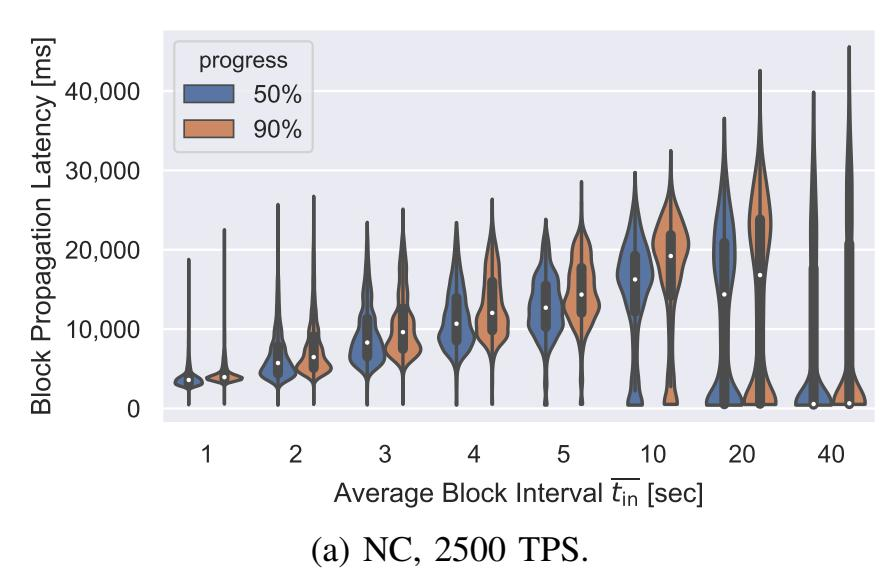

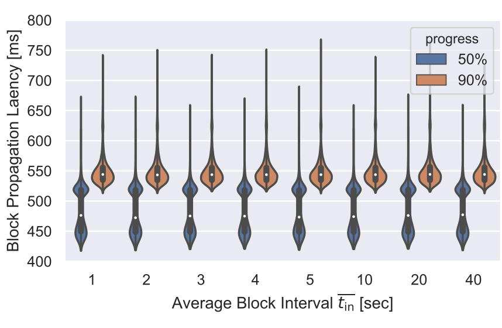

Fig. 6: Blocks propagate faster in NC-Max. Latency distribution is displayed as the kernel density estimation [85]; a wider value indicates higher density. A white dot marks the median.

(b) NC-Max, 2500 TPS.

eight average block intervals  $\overline{t_{\rm in}}$ : 1 to 5, 10, 20 and 40 seconds. In the 100 TPS setting, 100 transactions are generated per second; each block packs up to 100 TPS  $\times$   $\overline{t_{\rm in}}$  transactions. Other settings follow similar constraints. The 2500 TPS setting exhausts the nodes' bandwidth to synchronize transactions. Note that the initial transaction propagation does not affect the block propagation as blocks have priority in propagation over transactions.

**Accuracy.** The emulated network differs from the Bitcoin network in two ways: we prescribe (1) a uniform bandwidth and (2) a stable network topology, which does not account for heterogeneous node resources and the joining and leaving of nodes. Yet NC's block propagation latency and its distribution in our simulation match well with the Bitcoin network, verifying the reasonableness of the environment. Specifically, in Bitcoin, the average block propagation latency to 50% of nodes is 526 ms as of 2020; it is 482 ms in our NC simulation when  $\overline{t_{\rm in}} = 600$  seconds and 5 TPS.

#### B. Block Propagation Latency

Figure 6 shows the time distribution for blocks to propagate to 50% and 90% of nodes. We only display the 2500 TPS setting and defer the 100 and 1000 TPS settings and the detailed analysis to Appendix D.

In NC, due to the presence of fresh transactions, the median block propagation latency is over two seconds in all settings.

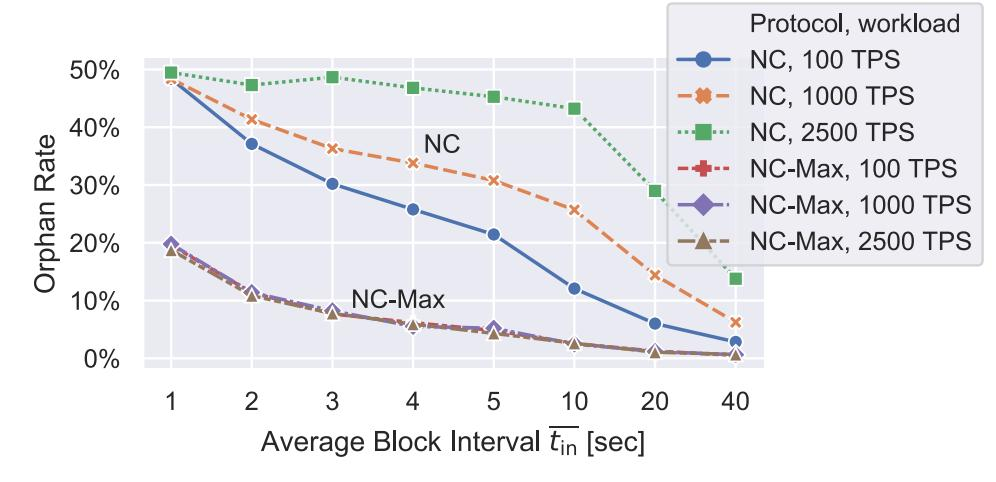

Fig. 7: Orphan rates. NC-Max with large-enough  $w_{\rm close}$ . Three NC-Max curves largely overlap with each other.

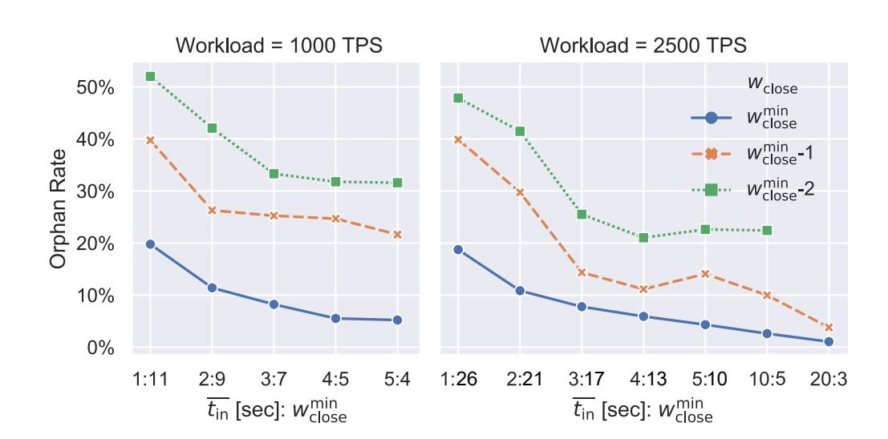

Fig. 8: The orphan rate increases when  $w_{\text{close}} < w_{\text{close}}^{\text{min}}$ .

Moreover, the latency grows along with the block size. In NC-Max, when  $w_{\rm close}$  is large enough, the latency is independent of the block interval and the block size. The 50% block propagation latency concentrates at two values: 450 ms and 520 ms, because sometimes it takes a block four hops to reach the 50th percentile, sometimes it takes five. The 90% latency is within 600 ms for 95% of blocks. In other words, NC-Max achieves Bitcoin's current block propagation latency [25] by removing fresh transactions' synchronization from the critical path without demanding a long block interval as in Bitcoin.

## C. Orphan Rate

An orphan rate here is computed as the number of orphaned blocks, divided by the number of main chain blocks. As displayed in Fig. 7, in NC, as the workload increases, the orphan rate deteriorates, since larger blocks take longer to propagate; whereas in NC-Max, the orphan rate is almost independent of the workload. Consequently, NC-Max reduces the block interval with the same orphan rate. For example, when  $\overline{t_{\rm in}}=4$ , the orphan rate is 6% in NC-Max; whereas in NC, the same orphan rate demands  $\overline{t_{\rm in}}=20$  with 100 TPS,  $\overline{t_{\rm in}}=40$  with 1000 TPS, and  $\overline{t_{\rm in}}>40$  with 2500 TPS.

#### D. Minimum Propose-Commit Distance

NC-Max's near-constant block propagation latency and low orphan rate require that newly-committed transactions have finished synchronization, which is ensured by the minimum propose-commit distance  $w_{\rm close}$ . The minimum  $w_{\rm close}$  to guarantee performance, denoted as  $w_{\rm close}^{\rm min}$ , is a function of (1)  $\overline{t}_{\rm in}$ , (2) the block size limit S, and (3) the network condition  $\mathcal{Z}$ ,

{11}------------------------------------------------

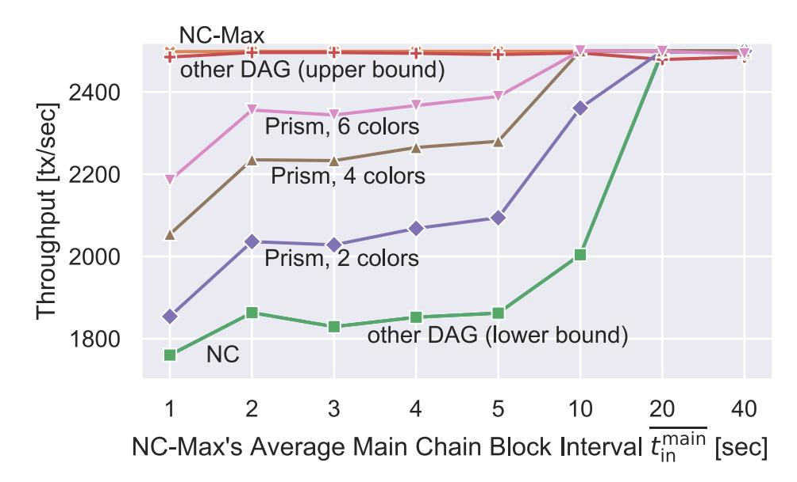

Fig. 9: NC-Max—in orange—outperforms other protocols in throughput. The lines of NC—in blue—and other DAG (lower bound)—in green—overlap except when  $\overline{t_{\rm in}} = 40$ .

which encompasses the network's topology, the joining and leaving of nodes, and the nodes' heterogeneous resources.

We find  $w_{\rm close}^{\rm min}(\overline{t_{\rm in}},S,\mathcal{Z})$  in our simulated environment by simulating with ascending  $w_{\rm close}$  values until the orphan rate is stable. The  $w_{\rm close}^{\rm min}$  values we located and how the orphan rate raises when  $w_{\rm close} < w_{\rm close}^{\rm min}$  are in Fig. 8. For NC-Max, 100 TPS and all other omitted settings,  $w_{\rm close}^{\rm min}=2$ . The orphan rate is stable when  $w_{\rm close} \geq w_{\rm close}^{\rm min}$ ; otherwise it is sensitive to  $w_{\rm close}$  even when  $\overline{t_{\rm in}}$  is small: a change from 26 to 25 in the  $\overline{t_{\rm in}}=1$ , 2500 TPS setting doubles the orphan rate.

In reality, finding a closed-form expression to compute  $w_{\rm close}^{\rm min}$  may not be practical due to the dynamic nature of  $\mathcal{Z}$ . However, choosing  $w_{\rm close}^{\rm min}$  to be no smaller than those in our simulation should be enough because our environment (with 10 Mbps throughput) is slower than the current network.

## E. Throughput

Now we compare the throughput with NC and blockDAG protocols. For each setting, we generate a sequence of block generation events—a (blockTime, miner) array—targeting an average main chain block interval in NC-Max, denoted  $\overline{t_{\rm in}^{\rm main}}$ . The general block interval  $\overline{t_{\rm in}}$ , which also takes orphaned blocks into account, is shorter than  $\overline{t_{\rm in}^{\rm main}}$ . We then apply the same (blockTime, miner) array to all other protocols of the setting. Transactions are generated at 2500 TPS; a block packs up to 2500 TPS  $\times$   $\overline{t_{\rm in}^{\rm main}}$  transactions from the miner's pool.

Modeling blockDAG Protocols. These protocols have no prescribed transaction inclusion rules, except that blocks do not include transactions in their predecessor blocks. For simplicity, we only implement two extreme transaction inclusion strategies to represent SPECTRE, Meshcash, PHANTOM, GHOSTDAT, and Conflux: the lower bound and the upper bound. In the former setting, miners pack from the oldest transactions; in the latter, miners pack uniformly at random from their pools. Transaction inclusion is different in Prism: each transaction has a *color*, possibly determined by its txid; all transactions in a *transaction block* are of the same color. Each miner maintains, for each color, a queue of unconfirmed transactions, and simultaneously mines on all queues. We simulate Prism with two, four, and six colors.

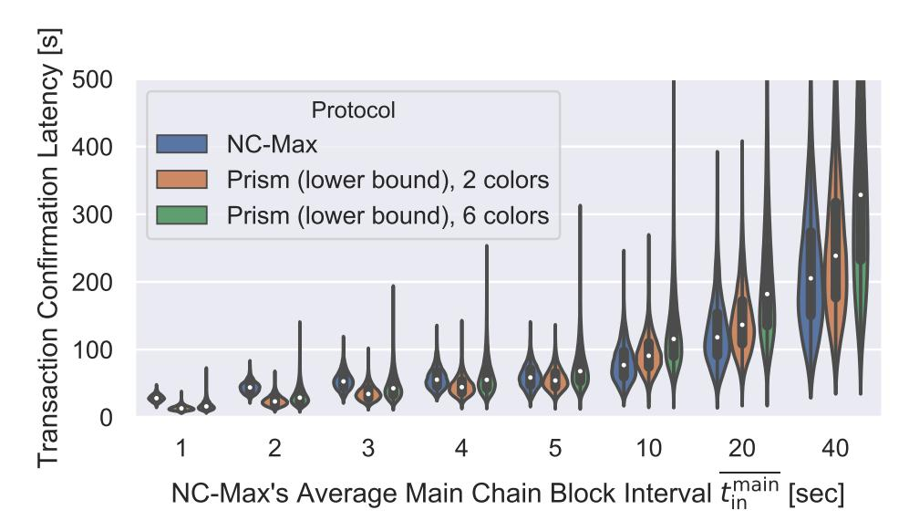

Fig. 10: NC-Max achieves similar transaction confirmation latency with Prism. The latency of Prism is simulated as lower bounds as we simplify its block-ordering logic. Values over 500 seconds are omitted.

**Results.** NC-Max reaches at least 2498 TPS, outperforming all other protocols (Fig. 9). When  $\overline{t_{\rm in}^{\rm main}}$  decreases, especially when the block interval is often shorter than the block propagation latency, blockDAG protocols cannot exhaust the nodes' throughput due to the duplicate-packing problem. Specifically, some transactions are included multiple times in *competing* blocks, wasting the processing capacity. Here we slightly abuse the term competing blocks to denote a group of blocks with no predecessor relation among them. Smaller  $t_{\rm in}^{\rm main}$  leads to more competing blocks, thus more processing power wasted. Other DAG (upper bound) performs only slightly worse than NC-Max. Other DAG (lower bound) has almost the same throughput as NC, because when miners pack from the oldest transactions, competing blocks contain almost the same set of transactions. In reality, the throughput of a blockDAG protocol should be between the lower and the upper bounds: to maximize their fees, miners prefer transactions with higher fees but randomize their selection to decrease the overlap with competing blocks [49]. Prism's mitigation of the duplicatepacking problem is more effective with more colors. However, more colors lead to longer transaction confirmation latency, as demonstrated in the next simulation.

Our results do not contradict blockDAG protocols' claims that they can exhaust the nodes' bandwidth. To achieve this goal, these protocols demand higher block frequency than ours.

#### F. Transaction Confirmation Latency

**Simulating Prism.** DAG protocols usually involve complicated transaction confirmation rules, therefore we only implement a part of the transaction confirmation procedure of Prism to show that NC-Max achieves similar latency. We measure NC-Max's latency as  $w_{\rm close}^{\rm min} + 6$  main chain block intervals after the transaction is broadcast: the first block to propose it, the  $(w_{\rm close}^{\rm min} + 1)$ -th block to commit it, and the last five to settle it. In Prism, a transaction is confirmed in three steps: (1) a transaction block of the same color to embed it, which may take several block intervals; (2) a proposer block whose miner has received this transaction block to propose the latter; (3) several voter blocks to vote for this proposer block. Unlike NC-Max, there is no need for these blocks to be in the main chain in Prism. We consider a transaction

{12}------------------------------------------------

TABLE I: Six-block transaction confirmation latency  $\overline{T_{\rm conf}}$  of NC and NC-Max with the same orphan rate o and the same transaction processing workload. All data are in seconds.

|      |                                   | 100 TPS                             |                                              | 1000 TPS                            |                                              | 2500 TPS                            |                                              |
|------|-----------------------------------|-------------------------------------|----------------------------------------------|-------------------------------------|----------------------------------------------|-------------------------------------|----------------------------------------------|
| o    | $\overline{t_{\rm in}^{\rm Max}}$ | $\overline{T_{\rm conf}^{\rm Max}}$ | $\overline{T_{\mathrm{conf}}^{\mathrm{NC}}}$ | $\overline{T_{\rm conf}^{\rm Max}}$ | $\overline{T_{\mathrm{conf}}^{\mathrm{NC}}}$ | $\overline{T_{\rm conf}^{\rm Max}}$ | $\overline{T_{\mathrm{conf}}^{\mathrm{NC}}}$ |
| 19%  | 1                                 | 8                                   | 30                                           | 17                                  | 60                                           | 32                                  | 156                                          |
| 11%  | 2                                 | 16                                  | 60                                           | 30                                  | 132                                          | 54                                  | 228                                          |
| 8%   | 3                                 | 24                                  | 90                                           | 39                                  | 180                                          | 69                                  | 264                                          |
| 6%   | 4                                 | 32                                  | 120                                          | 44                                  | 210                                          | 76                                  | 300                                          |
| 5%   | 5                                 | 40                                  | 132                                          | 50                                  | 228                                          | 80                                  | 312                                          |
| 2.5% | 10                                | 80                                  | 246                                          | 80                                  | 384                                          | 110                                 | 726                                          |
| 1%   | 20                                | 160                                 | 480                                          | 160                                 | 780                                          | 180                                 | 960                                          |
| 0.5% | 40                                | 320                                 | 708                                          | 320                                 | 1044                                         | 320                                 | 1272                                         |

settled when the sixth voter block is mined, regardless of the voter blocks' referring relationships. This simplification underestimates Prism's confirmation time, thus is in favor of Prism. We assume the same average block interval for each of the three kinds of blocks in Prism and blocks in NC-Max.

Comparison with Prism. Two Prism instances and NC-Max achieve similar latency (Fig. 10). The median latencies of Prism range from 50% to 90% of those of NC-Max when  $\overline{t_{\rm in}} < 5$ , as all blocks in Prism contribute to transaction confirmation regardless of whether they are in the main chain. NC-Max outperforms them as  $\overline{t_{\rm in}}$  grows, because (1) orphaned blocks diminish, and (2) there is no need to wait for a same-color transaction block. Moreover, the latency advantage of Prism, 2 colors comes at the price of lower throughput. Prism, 6 colors suffers from long worst-case confirmation latency—two to three times that of NC-Max, as it takes longer before a transaction meets a same-color block. As an additional observation, blocks propagate faster are confirmed sooner in blockDAG protocols; whereas NC-Max confirms transactions at roughly even latency, providing more stable user experience.

Comparison with NC. We compare the average transaction confirmation latency of NC and NC-Max, denoted  $\overline{T_{\rm conf}^{\rm NC}}$  and  $\overline{T_{\rm conf}^{\rm Max}}$  respectively, when anchoring the same orphan rate and the same transaction confirmation workload. We compute  $\overline{T_{\rm conf}^{\rm Max}}$  as  $(w_{\rm close}^{\rm min}+6)\overline{t_{\rm in}^{\rm Max}}$ , where the expected block interval  $\overline{t_{\rm in}^{\rm Max}}$  and its corresponding orphan rate are from our orphan rate simulations (Sect. VI-C), and  $w_{\rm close}^{\rm min}$  is from Sect. VI-D.

Estimating  $\overline{T_{\rm conf}^{\rm NC}}$  is more challenging. To achieve the same orphan rate, NC's expected block interval  $\overline{t_{\rm in}^{\rm NC}}$  needs to be larger than  $\overline{t_{\rm in}^{\rm Max}}$ . Given a transaction processing workload, we use a binary search to locate the  $\overline{t_{\rm in}^{\rm NC}}$ , in whole seconds, whose corresponding orphan rate is closest to the target. Specifically, we narrow down the searching region by simulating with  $\overline{t_{\rm in}^{\rm NC}}$  at the region midpoint, and then compare the orphan rate with the target until the searching region is less than a second. At last we compute  $\overline{T_{\rm conf}^{\rm NC}}=6\overline{t_{\rm in}^{\rm NC}}$ .

The results are displayed in Table I. NC-Max speeds up the transaction confirmation from 3.0 to 6.6 times, with an average speedup of 4.1 times.

TABLE II: Comparison with other NC-based projects. Measured periods end on July 22nd, 2021. Orphan rates are denoted  $o_{\rm real}$ . We simulated NC's orphan rate with their  $\overline{t_{\rm in}}$ . The results are denoted  $o_{\rm sim}^{\rm NC}(\overline{t_{\rm in}})$ .

| Project          | $\overline{t_{\rm in}}$ (s) | $o_{\rm real}$ | $o_{\rm sim}^{\rm NC}(\overline{t_{\rm in}})$ | Span   | Data       |
|------------------|-----------------------------|----------------|-----------------------------------------------|--------|------------|
| Nervos CKB       | 10.5                        | 2.5%           | 10.5%                                         | 2 year | [56]       |
| Ethereum         | 13                          | 9.1%           | 8.7%                                          | 6 year | [69], [71] |
| Ethereum Classic | 14                          | 3.6%           | 8.2%                                          | 1 day  | [68]       |
| Monero           | 120                         | 1.1%           | 0.5%                                          | 7 year | [37]       |
| Litecoin         | 150                         | 0.03%          | 0.3%                                          | 10 mon | [66]       |

## G. Implementation and Comparison with Other Projects

NC-Max is implemented in *Nervos CKB*, a public permissionless blockchain launched in Nov. 16, 2019, and has operated smoothly since then. Nervos CKB uses a dedicated hash function Eaglesong [82] as its mining puzzle.

The protocol parameters are instantiated as follows. The maximum block size is 597 KB, which translates to around 1000 two-input-two-output committed transactions and a proposal zone of at most 1500 txpids. The minimum and maximum propose-commit distances, i.e.,  $w_{\rm close}$  and  $w_{\rm far}$ , are set to two and ten, respectively, so that unconfirmed transactions in the proposal window consume only a few dozen megabytes of memory. The target epoch duration  $L_{\rm ideal} = 4$  hours. We designed a dynamic DAM that adjusts the expected block interval based on the orphan rate. The lower and upper bounds on the expected block interval are 8 and 48 seconds, respectively. Other details of our DAM can be found in [88].

The effectiveness of the two-step mechanism can be testified by the low orphan rate. In its first two years, Nervos CKB achieved a 2.5% long-term average orphan rate with a 10.5-second average block interval. During this period, the network hash rate has grown from  $7.35 \times 10^{13}$  to  $9.25 \times 10^{16}$  hashes per second. As of November 2021, the network processes 20 to 30 thousand transactions per day. An in-depth analysis of the block propagation requires a well-connected network monitor, which we leave for future work.

A comparison between Nervos CKB and several NC-based projects with high market capitalization is in Table II. We did not manage to find the orphan rates of Dogecoin and Bitcoin Cash, although their market capitalizations are higher than Monero's. Neither did we find the global orphan rate regarding Ethereum Classic and Monero, so we instead use the statistics provided by their mining pools. This comparison is not entirely fair as these systems differ in block propagation protocols and transaction processing workloads. However, the results still demonstrate the effectiveness of the two-step mechanism as other systems' orphan rates do not deviate far from our NC simulation. Only Litecoin and Nervos CKB outperform our NC simulation by more than four times.

#### VII. DISCUSSION

## A. Generalizability

**Applicability of the Bottleneck.** The network-layer bottleneck identified in this study is not unique to NC: a similar but stealthier mechanism resides in blockDAG protocols. We will

{13}------------------------------------------------

analyze how transaction synchronization affects the security and performance of these protocols in future works.

Applicability of the Solution. The two-step mechanism applies not only to PoW protocols, but also to all blockchain designs with uneven block intervals, including proof-of-space protocol Chia [15], proof-of-elapsed-time protocol Hyperledger Sawtooth [41], and PoS protocol PoSAT [22].

Pipelining vs. Concurrency. There is an emerging awareness in blockchain designs towards parallel block processing to exhaust the nodes' bandwidth. While parallel processing is mostly through *concurrency* as in blockDAG protocols, we highlight the potential of *pipelining*. Compared to concurrency protocols, which often involve duplicate transaction packing [49] and complicated algorithms to order blocks [50], [78], [79], a pipelining protocol, such as NC-Max, enjoys the advantage of simplicity, which leads to stronger security and functionality. Admittedly, pipelining protocols, including the recent BFT protocol Hotstuff [87], mandate an additional latency. In NC-Max, however, this propose-commit distance is to ensure that most nodes have received the transactions, which is necessary for all blockchains—including blockDAGs—before the transactions are considered confirmed. Explicitly mandating this latency strengthens the security, as demonstrated in our analysis of transaction withholding attacks.

In sum, as our pipelining approach already enables the full utilization of the nodes' bandwidth, we avoid introducing more complex rules—which often lead to more attack vectors and more limitations on functionality—to the protocol. We hope that this incremental approach allows us to accumulate NC's security merits, rather than abandoning them.

# *B. Limitations and Further Extensions*

Remaining Performance Limit. While the block size limit can increase until the throughput exhausts most nodes' bandwidth, our protocol does not support arbitrarily low block intervals as it would lead to too high an orphan rate. For example, the orphan rate may undesirably exceed 10% and discourage some miners when tin is one or two seconds. Accordingly, although NC-Max reduces the transaction confirmation latency of NC, a lower bound remains on this latency. Also, the correlation between the transaction processing workload and the confirmation latency remains, as transactions propagate slower when the nodes' bandwidth is exhausted.

The leading cause of orphaned blocks in NC-Max is the random nature of the mining process. Specifically, as block intervals follow an exponential distribution, it is impossible to enforce a lower bound on all of them. One approach to modify the distribution is to combine the current reversing-ahash-function puzzle with a verifiable delay function [10].

Dynamic Difficulty Adjustment. It is impractical to prescribe one set of parameters to fit changing network conditions. According to Fig. 8, when wclose = 4, the system achieves a lower orphan rate at tin = 5 seconds under 1000 TPS workload than tin = 10 seconds under 2500 TPS. In other words, to ensure a consistent level of security—measured as the orphan rate, mandating tin = 10 seconds is too aggressive, i.e., too short, when the network is busy, but too conservative otherwise. Therefore in Nervos CKB we also introduce a dynamic DAM to balance its security and performance under real-time network conditions. The main idea is to adjust the block interval based on the orphan rate of the previous epoch. Previous dynamic DAMs [13], [77] can only signal the adjusting direction—towards a longer or shorter interval. In contrast, our DAM pinpoints the accurate expected interval matching the network condition through delicate modeling to explore the throughput limit without the possibly timeconsuming trial and error.

We provide the high-level idea of our DAM here but leave the detailed design to [88] as it is not the focus of this paper. To maximize compatibility and attack resistance, our DAM inherits four constraints from NC:

- C1. All epochs have the same target duration Lideal.
- C2. The maximum block reward issued in an epoch R(i) depends only on the epoch number i so that the rewards are distributed at a predetermined rate. In other words, the attacker cannot manipulate the inflation rate.
- C3. The hash rate estimation of the last epoch does not change too fast, to prevent attackers from manipulating the DAM and forging a blockchain [3], even if some miners' network is temporarily controlled by the attacker.
- C4. The expected block interval should abide by predetermined upper and lower bounds. The upper bound guarantees service availability; the lower bound guarantees that NC-Max does not generate more traffic than most nodes' capacity, thus ensuring decentralization.

To explore the performance limit, our DAM targets a fixed orphan rate oideal, rather than a fixed block interval as in NC. The number of orphaned blocks is available to the DAM as we require miners to attach these PoW solutions to their blocks. As our two-step confirmation ensures a relatively stable block propagation process, we can solve the expected block interval that matches the target orphan rate with the last epoch's duration, orphan rate, and the main chain block number. As the target epoch duration is fixed (C1), we can solve the next epoch's main chain block number, block reward, and difficulty target after applying several dampening factors and upper/lower bounds to safeguard C2, C3, and C4. Note that our DAM does not depend on the two-step mechanism, thus can be implemented independently.

# VIII. RELATED WORK

We omit alternative designs introduced in Sect. II-B and refer readers to Bano et al. [4] for these non-PoW and hybrid consensus protocols. Neither do we include off-chain [38] and sharding [84] protocols, where not all transactions are synchronized by all nodes. These protocols are compatible with NC-Max, and therefore can further increase the throughput. NC-Max draws wisdom from two lines of works:

Decoupled Consensus. Bitcoin-NG by Eyal et al. [28] decouples NC's leader election and transaction serialization, allowing the nodes' full bandwidth to be utilized. Unlike NC-Max, which shortens NC's transaction confirmation latency, this latency remains the same in Bitcoin-NG as in NC.

{14}------------------------------------------------

Block Propagation Acceleration Techniques. The FIBRE network maintained by Corallo [18] deploys several high-speed nodes across the globe to help miners synchronize blocks the moment they are found. Bloxroute by Klarman et al. [46] is a network design that deploys high-speed nodes that start to relay blocks before receiving the full content. Both approaches are centrally coordinated. Although centralized systems can further accelerate block propagation, the P2P acceleration techniques, including the one we proposed, serve as safety nets that are immune to single points of failure.

## IX. CONCLUSION

While the current scholarly and engineering efforts to improve blockchains' performance concentrate on designing innovative consensus protocols, we alternatively highlight the importance of the network layer in the issue. By optimizing NC's block propagation mechanism on both the consensus and the network layer with a two-step mechanism, we break the throughput limit of NC without compromising security. We believe such an "incremental" approach, though not necessarily in line with the blockchain industry's eagerness for "revolutionary breakthroughs", is meaningful and inspirational. It reveals the significance of a long-overlooked aspect of protocol design—the network layer, and even more importantly, preserves the value and allows an easy transfer of our knowledge around NC—the knowledge that we, as scholars and engineers, collectively accumulated through the last decade.

## ACKNOWLEDGMENT

This work was supported in part by CyberSecurity Research Flanders with reference number VR20192203. We would like to thank Ittay Eyal, Aggelos Kiayias, Gregory Maxwell, Feiyang Qiu, Kaiyu Shao, Yonatan Sompolinsky, Mingming Wang, Pieter Wuille, Ziyu Zhou, and the anonymous reviewers of NSDI'21, NDSS'21, S&P'21, NSDI'22, and NDSS'22 for their valuable comments and suggestions.

## REFERENCES

- [1] Ittai Abraham, T.-H. Hubert Chan, Danny Dolev, Kartik Nayak, Rafael Pass, Ling Ren, and Elaine Shi. Communication complexity of Byzantine Agreement, revisited. In *Proceedings of the 2019 ACM Symposium on Principles of Distributed Computing (PODC)*, pages 317–326. ACM, 2019.
- [2] Vivek Bagaria, Sreeram Kannan, David Tse, Giulia Fanti, and Pramod Viswanath. Prism: Deconstructing the blockchain to approach physical limits. In *Proceedings of the 2019 ACM SIGSAC Conference on Computer and Communications Security*, pages 585–602, 2019.
- [3] Lear Bahack. Theoretical Bitcoin attacks with less than half of the computational power (draft). *arXiv preprint arXiv:1312.7013*, 2013. https://arxiv.org/pdf/1312.7013.pdf.
- [4] Shehar Bano, Alberto Sonnino, Mustafa Al-Bassam, Sarah Azouvi, Patrick McCorry, Sarah Meiklejohn, and George Danezis. Consensus in the age of blockchains. *CoRR*, abs/1711.03936, 2017. http://arxiv. org/abs/1711.03936.
- [5] Iddo Bentov, Pavel Hubacek, Tal Moran, and Asaf Nadler. Tortoise and ´ Hares consensus: the Meshcash framework for incentive-compatible, scalable cryptocurrencies. *IACR Cryptology ePrint Archive*, 2017. https: //eprint.iacr.org/2017/300.pdf.
- [6] Alex Biryukov, Dmitry Khovratovich, and Ivan Pustogarov. Deanonymisation of clients in Bitcoin P2P network. In *21st ACM Conference on Computer and Communications Security*, 2014.
- [7] bitcoincash.org. Bitcoin cash, 2019. https://www.bitcoincash.org/.
- [8] Blockchain. Bitcoin block explorer, 2017. https://blockchain.info/.

- [9] Blockchain Luxembourg S.A. Orphaned blocks blockchain.info, August 2019. https://www.blockchain.com/btc/orphaned-blocks.
- [10] Dan Boneh, Joseph Bonneau, Benedikt Bunz, and Ben Fisch. Verifiable ¨ delay functions. In *Advances in Cryptology - CRYPTO 2018 - 38th Annual International Cryptology Conference*, volume 10991 of *Lecture Notes in Computer Science*, pages 757–788. Springer, 2018.
- [11] Jonah Brown-Cohen, Arvind Narayanan, Alexandros Psomas, and S. Matthew Weinberg. Formal barriers to longest-chain proof-of-stake protocols. In *Proceedings of the 2019 ACM Conference on Economics and Computation*, EC '19, pages 459–473. ACM, 2019.
- [12] Vitalik Buterin. Ethereum: A next-generation smart contract and decentralized application platform, 2014. https://github.com/ethereum/ wiki/wiki/White-Paper.
- [13] Vitalik Buterin. Change difficulty adjustment to target mean block time including uncles, 2016. https://github.com/ethereum/EIPs/blob/master/ EIPS/eip-100.md.
- [14] Miles Carlsten, Harry Kalodner, S. Matthew Weinberg, and Arvind Narayanan. On the instability of Bitcoin without the block reward. In *Proc. 2016 ACM SIGSAC Conference on Computer and Communications Security*, CCS '16, pages 154–167. ACM, 2016. http: //doi.acm.org/10.1145/2976749.2978408.
- [15] Bram Cohen and Krzysztof Pietrzak. The chia network blockchain, 2019. https://www.chia.net/assets/ChiaGreenPaper.pdf.
- [16] CoinMarketCap. Crypto-currency market capitalizations, 2020. https: //coinmarketcap.com/charts/.
- [17] Matt Corallo. Compact block relay, 2016. https://github.com/bitcoin/ bips/blob/master/bip-0152.mediawiki.
- [18] Matt Corallo. Public highly optimized fibre network, 2019. http:// bitcoinfibre.org/public-network.html.
- [19] Kyle Croman, Christian Decker, Ittay Eyal, Adem Efe Gencer, Ari Juels, Ahmed Kosba, Andrew Miller, Prateek Saxena, Elaine Shi, Emin Gun¨ Sirer, et al. On scaling decentralized blockchains. In *Financial Cryptography and Data Security*, volume 9604 of *LNCS*, pages 106– 125. Springer, 2016.
- [20] Phil Daian, Rafael Pass, and Elaine Shi. Snow white: Robustly reconfigurable consensus and applications to provably secure proof of stake. In *International Conference on Financial Cryptography and Data Security*, pages 23–41. Springer, 2019.
- [21] Bernardo David, Peter Gazi, Aggelos Kiayias, and Alexander Russell. ˇ Ouroboros praos: An adaptively-secure, semi-synchronous proof-ofstake blockchain. In *Annual International Conference on the Theory and Applications of Cryptographic Techniques*, pages 66–98. Springer, 2018.
- [22] Soubhik Deb, Sreeram Kannan, and David Tse. Posat: Proof-of-work availability and unpredictability, without the work. In *FC'21*, 2021.
- [23] Christian Decker and Roger Wattenhofer. Information propagation in the Bitcoin network. In *13th IEEE International Conference on Peerto-Peer Computing (P2P)*. IEEE, 2013.
- [24] Amir Dembo, Sreeram Kannan, Ertem Nusret Tas, David Tse, Pramod Viswanath, Xuechao Wang, and Ofer Zeitouni. Everything is a race and nakamoto always wins. In *Proceedings of the 2020 ACM SIGSAC Conference on Computer and Communications Security*, CCS '20, page 859–878. ACM, 2020.
- [25] DNS Research Group, KASTEL @ KIT. Bitcoin network monitor, 2019. https://dsn.tm.kit.edu/bitcoin/.
- [26] Tuyet Duong, Alexander Chepurnoy, and Hong-Sheng Zhou. Multimode cryptocurrency systems. In *Proceedings of the 2nd ACM Workshop on Blockchains, Cryptocurrencies, and Contracts*, pages 35–46. ACM, 2018.
- [27] Ethstats. Ethereum network status, June 2020. https://ethstats.net/.
- [28] Ittay Eyal, Adem Efe Gencer, Emin Gun Sirer, and Robbert Van Renesse. Bitcoin-NG: A scalable blockchain protocol. In *13th USENIX Symposium on Networked Systems Design and Implementation (NSDI 16)*, pages 45–59, Santa Clara, CA, 2016. USENIX Association.
- [29] Ittay Eyal and Emin Gun Sirer. Majority is not enough: Bitcoin mining ¨ is vulnerable. In *Financial Cryptography and Data Security*, pages 436–454. Springer, 2014.
- [30] P. Gazi, A. Kiayias, and A. Russell. Stake-bleeding attacks on proof- ˇ

{15}------------------------------------------------

- of-stake blockchains. In *2018 Crypto Valley Conference on Blockchain Technology (CVCBT)*, pages 85–92, 2018.
- [31] Juan Garay, Aggelos Kiayias, and Nikos Leonardos. The Bitcoin backbone protocol with chains of variable difficulty. In *Advances in Cryptology – CRYPTO 2017*, volume 10401 of *LNCS*, pages 291–323. Springer, 2017.
- [32] Juan A. Garay, Aggelos Kiayias, and Nikos Leonardos. The Bitcoin backbone protocol: Analysis and applications. In *EUROCRYPT*, pages 281–310, 2015.
- [33] Peter Gazi, Aggelos Kiayias, and Alexander Russell. Tight consistency ˇ bounds for bitcoin. In *Proceedings of the 2020 ACM SIGSAC Conference on Computer and Communications Security*, CCS '20, page 819–838. ACM, 2020.
- [34] Adem Efe Gencer, Soumya Basu, Ittay Eyal, Robbert van Renesse, and Emin Gun Sirer. Decentralization in bitcoin and ethereum networks. In ¨ *Financial Cryptography and Data Security FC 2018*, volume 10957 of *Lecture Notes in Computer Science*, pages 439–457. Springer, 2018.
- [35] Arthur Gervais, Ghassan O. Karame, Karl Wust, Vasileios Glykantzis, ¨ Hubert Ritzdorf, and Srdjan Capkun. On the security and performance of proof of work blockchains. In *Proc. the 2016 ACM SIGSAC Conference on Computer and Communications Security*, CCS '16, pages 3–16. ACM, 2016. http://doi.acm.org/10.1145/2976749.2978341.
- [36] Yossi Gilad, Rotem Hemo, Silvio Micali, Georgios Vlachos, and Nickolai Zeldovich. Algorand: Scaling Byzantine agreements for cryptocurrencies. In *Proceedings of the 26th Symposium on Operating Systems Principles*, pages 51–68. ACM, 2017.
- [37] Sebastian Grewe. Monero mining pool hub statistics, 2021. https:// monero.miningpoolhub.com/index.php?page=statistics&action=blocks.
- [38] Lewis Gudgeon, Pedro Moreno-Sanchez, Stefanie Roos, Patrick Mc-Corry, and Arthur Gervais. SoK: Off the chain transactions. Cryptology ePrint Archive, Report 2019/360, 2019. https://eprint.iacr.org/2019/360.
- [39] Ethan Heilman. One weird trick to stop selfish miners: Fresh Bitcoins, a solution for the honest miner. Cryptology ePrint Archive, Report 2014/007, 2014. https://eprint.iacr.org/2014/007.
- [40] Ethan Heilman, Alison Kendler, Aviv Zohar, and Sharon Goldberg. Eclipse attacks on Bitcoin's peer-to-peer network. In *24th USENIX Security Symposium (USENIX Security 15)*, pages 129–144, 2015.
- [41] Intel Corporation. Hyperledger sawtooth, 2017. https://sawtooth. hyperledger.org/docs/core/nightly/0-8/introduction.html.
- [42] Sanket Kanjalkar, Joseph Kuo, Yunqi Li, and Andrew Miller. Short paper: I can't believe it's not stake! resource exhaustion attacks on PoS. In *Financial Cryptography and Data Security (FC) 2019*, volume 11598 of *Lecture Notes in Computer Science*, pages 62–69. Springer, 2019.
- [43] Aggelos Kiayias, Elias Koutsoupias, Maria Kyropoulou, and Yiannis Tselekounis. Blockchain mining games. In *Proceedings of the 2016 ACM Conference on Economics and Computation*, pages 365–382. ACM, 2016.
- [44] Aggelos Kiayias and Giorgos Panagiotakos. Speed-security tradeoffs in blockchain protocols. *IACR Cryptology ePrint Archive*, 2015. http: //eprint.iacr.org/2015/1019.
- [45] Lucianna Kiffer, Rajmohan Rajaraman, et al. A better method to analyze blockchain consistency. In *Proceedings of the 2018 ACM SIGSAC Conference on Computer and Communications Security*, pages 729– 744. ACM, 2018.
- [46] Uri Klarman, Soumya Basu, Aleksandar Kuzmanovic, and Emin Gun¨ Sirer. bloxroute: A scalable trustless blockchain distribution network whitepaper. *IEEE Internet of Things Journal*, 2018.
- [47] Eleftherios Kokoris Kogias, Philipp Jovanovic, Nicolas Gailly, Ismail Khoffi, Linus Gasser, and Bryan Ford. Enhancing Bitcoin security and performance with strong consistency via collective signing. In *Proc. 25th conference on USENIX Security Symposium*, 2016.
- [48] Philip Koshy, Diana Koshy, and Patrick McDaniel. An analysis of anonymity in Bitcoin using P2P network traffic. In *Financial Cryptography and Data Security*, volume 8437 of *LNCS*, 2014.
- [49] Yoad Lewenberg, Yonatan Sompolinsky, and Aviv Zohar. Inclusive block chain protocols. In *Financial Cryptography and Data Security*, volume 8975 of *LNCS*, pages 528–547. Springer, 2015.
- [50] Chenxin Li, Peilun Li, Dong Zhou, Zhe Yang, Ming Wu, Guang Yang, Wei Xu, Fan Long, and Andrew Chi-Chih Yao. A decentralized

- blockchain with high throughput and fast confirmation. In *2020 USENIX Annual Technical Conference*, pages 515–528, 2020.
- [51] Kevin Liao and Jonathan Katz. Incentivizing blockchain forks via whale transactions. In *Financial Cryptography and Data Security*, volume 10323 of *LNCS*, pages 264–279. Springer, 2017.
- [52] Gregory Maxwell. Advances in block propagation, 2017. https://www. youtube.com/watch?v=EHIuuKCm53o.
- [53] Satoshi Nakamoto. Bitcoin: A peer-to-peer electronic cash system, 2008. http://www.bitcoin.org/bitcoin.pdf.
- [54] Gleb Naumenko, Gregory Maxwell, Pieter Wuille, Alexandra Fedorova, and Ivan Beschastnikh. Erlay: Efficient transaction relay for Bitcoin. In *Proceedings of the 2019 ACM SIGSAC Conference on Computer and Communications Security*, CCS '19, page 817–831, 2019.
- [55] Kartik Nayak, Srijan Kumar, Andrew Miller, and Elaine Shi. Stubborn mining: Generalizing selfish mining and combining with an eclipse attack. In *IEEE European Symposium on Security and Privacy (EuroS&P)*, pages 305–320. IEEE, IEEE, 2016.
- [56] Nervos Foundation. CKB explorer, 2021. https://explorer.nervos.org/.
- [57] Till Neudecker and Hannes Hartenstein. Short paper: An empirical analysis of blockchain forks in Bitcoin. In *International Conference on Financial Cryptography and Data Security*, pages 84–92. Springer, 2019.
- [58] Michael Neuder, Daniel J. Moroz, Rithvik Rao, and David C. Parkes. Defending against malicious reorgs in Tezos Proof-of-Stake. In *Proceedings of the 2nd ACM Conference on Advances in Financial Technologies*, AFT '20, page 46–58. Association for Computing Machinery, 2020.
- [59] Jianyu Niu and Chen Feng. Selfish mining in Ethereum. In *39th IEEE International Conference on Distributed Computing Systems, ICDCS 2019*, pages 1306–1316. IEEE, 2019.
- [60] Sunoo Park, Albert Kwon, Georg Fuchsbauer, Peter Gazi, Jo ˇ el Alwen, ¨ and Krzysztof Pietrzak. Spacemint: A cryptocurrency based on proofs of space. In *International Conference on Financial Cryptography and Data Security*, pages 480–499. Springer, 2018.
- [61] Rafael Pass, Lior Seeman, and Abhi Shelat. Analysis of the blockchain protocol in asynchronous networks. In *Annual International Conference on the Theory and Applications of Cryptographic Techniques*, pages 643–673. Springer, 2017.
- [62] Rafael Pass and Elaine Shi. Fruitchains: A fair blockchain. In *Proceedings of the ACM Symposium on Principles of Distributed Computing*, PODC '17, pages 315–324. ACM, 2017. http://doi.acm. org/10.1145/3087801.3087809.
- [63] Pcmgoohan. Why Ethereum's miner extractable value problem is way worse than you think, May 2021. https://www.coindesk.com/ ethereum-mev-frontrunning-solutions.
- [64] Andrew Poelstra. Scriptless scripts, 2017. https://download.wpsoftware. net/bitcoin/wizardry/mw-slides/2017-03-mit-bitcoin-expo/slides.pdf.
- [65] Andrew Poelstra et al. Distributed consensus from proof of stake is impossible. *Self-published Paper*, 2014.
- [66] Chainz. Litecoin orphans, 2021. https://chainz.cryptoid.info/ltc/orphans. dws.
- [67] Litecoin Project. Litecoin. https://litecoin.org/.
- [68] nanopool. Nanopool ethereum classic, 2021. https://etc.nanopool. org/.
- [69] YCharts Inc. Ethereum average block time, 2021. https://ycharts.com/ indicators/ethereum average block time.
- [70] YCharts Inc. Ethereum average transaction fee, 2021. https://ycharts. com/indicators/ethereum average transaction fee.
- [71] YCharts Inc. Ethereum uncle rate, 2021. https://ycharts.com/indicators/ ethereum uncle rate.
- [72] Ling Ren. Analysis of Nakamoto consensus. *IACR Cryptol. ePrint Arch.*, 2019:943, 2019.
- [73] F. Ritz and A. Zugenmaier. The impact of uncle rewards on selfish mining in Ethereum. In *2018 IEEE European Symposium on Security and Privacy Workshops (EuroS PW)*, pages 50–57. IEEE, April 2018.
- [74] Peter R. Rizun. Subchains: A technique to scale Bitcoin and improve the user experience. *Ledger*, 2016. https://www.ledgerjournal.org/ojs/ index.php/ledger/article/view/40.

{16}------------------------------------------------

- [75] Ayelet Sapirshtein, Yonatan Sompolinsky, and Aviv Zohar. Optimal selfish mining strategies in Bitcoin. In *Financial Cryptography and Data Security*, volume 9603 of *LNCS*, pages 515–532. Springer, 2016.
- [76] Eli Ben Sasson, Alessandro Chiesa, Christina Garman, Matthew Green, Ian Miers, Eran Tromer, and Madars Virza. Zerocash: Decentralized anonymous payments from bitcoin. In *2014 IEEE Symposium on Security and Privacy*, pages 459–474. IEEE, 2014.
- [77] socrates1024. on the optimal difficulty setting for Bitcoin, 2012. https: //bitcointalk.org/index.php?topic=98314.msg1075701#msg1075701.
- [78] Yonatan Sompolinsky, Yoad Lewenberg, and Aviv Zohar. SPECTRE: Serialization of proof-of-work events: Confirming transactions via recursive elections, 2016. https://eprint.iacr.org/2016/1159.pdf.
- [79] Yonatan Sompolinsky, Shai Wyborski, and Aviv Zohar. PHANTOM and GHOSTDAG: A scalable generalization of Nakamoto Consensus. *IACR Cryptology ePrint Archive*, 2020. https://eprint.iacr.org/2018/104.pdf.
- [80] Yonatan Sompolinsky and Aviv Zohar. Secure high-rate transaction processing in Bitcoin. In *Financial Cryptography and Data Security*, volume 8975 of *LNCS*, pages 507–527. Springer, 2015.
- [81] Mining Pools Stats. Bitcoin mining pools, 2019.
- [82] Alan Szepieniec and Tomer Ashur. Eaglesong: an arx hash with fast diffusion. *Proceedings of the Romanian Academy Series A-Mathematics Physics Technical Sciences Information Science*, 21(1):69–76, 2020.
- [83] Itay Tsabary and Ittay Eyal. The gap game. In *Proceedings of the 2018 ACM SIGSAC Conference on Computer and Communications Security*, CCS '18, pages 713–728. ACM, 2018.
- [84] Gang Wang, Zhijie Jerry Shi, Mark Nixon, and Song Han. Sok: Sharding on blockchain. In *Proceedings of the 1st ACM Conference on Advances in Financial Technologies*, AFT '19, page 41–61, New York, NY, USA, 2019. Association for Computing Machinery.
- [85] Michael Waskom. Kernel density estimation, 2019. https://seaborn. pydata.org/tutorial/distributions.html#distribution-tutorial.
- [86] Puwen Wei, Quan Yuan, and Yuliang Zheng. Security of the blockchain against long delay attack. In *Advances in Cryptology–ASIACRYPT 2018*, volume 11274 of *LNCS*. Springer, 2018.
- [87] Maofan Yin, Dahlia Malkhi, Michael K Reiter, Guy Golan Gueta, and Ittai Abraham. Hotstuff: BFT consensus with linearity and responsiveness. In *Proceedings of the 2019 ACM Symposium on Principles of Distributed Computing*, pages 347–356, 2019.
- [88] Ren Zhang. CKB consensus protocol, 2019. https://github.com/ nervosnetwork/rfcs/blob/master/rfcs/0020-ckb-consensus-protocol/ 0020-ckb-consensus-protocol.md.
- [89] Ren Zhang and Bart Preneel. On the necessity of a prescribed block validity consensus: Analyzing Bitcoin Unlimited mining protocol. In *13th International Conference on emerging Networking EXperiments and Technologies (CoNEXT)*, pages 108–119. ACM, December 2017.
- [90] Ren Zhang and Bart Preneel. Publish or Perish: A backward-compatible defense against selfish mining in Bitcoin. In *The Cryptographers' Track at the RSA Conference (CT-RSA)*, volume 10159 of *LNCS*, pages 277– 292. Springer, February 2017.
- [91] Ren Zhang and Bart Preneel. Lay down the common metrics: Evaluating proof-of-work consensus protocols' security. In *40th IEEE Symposium on Security and Privacy (S&P)*, pages 1190–1207. IEEE, May 2019.

## APPENDIX A TRANSACTION FEE ALLOCATION

Let r<sup>p</sup> be the ratio of proposal fee and α be the strategic miner's mining power share. We want a fee distribution that (1) it is more profitable for the miner to propose a transaction in his block and to publish this block, rather than to withhold the block and to mine selfishly, hoping to gain both the proposal and the commitment fees; (2) at the end of a proposal window, it is more profitable to commit a transaction than to propose it again and hope to get both the proposal and the commitment fees.

From (1) we have

$$r_p + \alpha(1 - r_p) > \alpha^{w_{\text{close}}} + (1 - \alpha^{w_{\text{close}}})\alpha(1 - r_p)$$
,

where the left r<sup>p</sup> + α(1 − rp) is the proposal fee and potential commitment fee for honest mining; the first α <sup>w</sup>close on the right is the expected fees of mining wclose consecutive secret blocks (with probability α <sup>w</sup>close ) after the transaction-proposing block, so that the miner gets both the proposal and the commitment fees (with a total fee of 1); (1 − α <sup>w</sup>close )α(1 − rp) is the expected commitment fee if the selfish mining attempt failed (with probability 1 − α <sup>w</sup>close ), but the miner mines another block (with probability α) and gets the commitment fee (1 − rp). Note that we did not take into consideration of the selfish miner's loss of block rewards, which is in the attacker's favor. By assuming wclose = 2 and α < 0.5, we get r<sup>p</sup> > 0.143. NC-Max is more resilient than Bitcoin-NG against this attack, whose corresponding threshold is 37%, thanks to the mandatory proposal-commitment gap.

From (2) we have

$$1 - r_p > r_p + \alpha (1 - r_p) ,$$

where the left 1 − r<sup>p</sup> is the commitment fee, the first r<sup>p</sup> on the right is the proposal fee, α(1 − rp) is the expected profit of the miner gets to commit the transaction (with probability α) and earns the commitment fee. By assuming α < 0.5, we get r<sup>p</sup> < 0.333. NC-Max's resilience to this attack is identical to that of Bitcoin-NG. We choose a stronger attacker, which results in a lower threshold.

Therefore, we choose r<sup>p</sup> = 0.3, which satisfies both requirements.

## APPENDIX B TRANSACTION WITHHOLDING ATTACK SIMULATIONS

Our simulation supports attackers with arbitrary mining power share α and arbitrary success rate of winning a tie, denoted as γ. To simplify the demonstration, we assume a strong attacker with α = 0.4, who also wins all the ties i.e., γ = 1, by immediately pushing his blocks to all the nodes after the competing blocks are mined. We omit natural orphans and assume that honest blocks are propagated immediately after they are mined, but not before the competing attacker block if there is one. The block interval follows an exponential distribution with expectation tin as an input.

In both protocols, every "delayable" attacker block is delayed up to tdelay, during which the first honest block, if there is one, is orphaned. The attacker only delays the last block if he mines several blocks in a row. In NC, all attacker blocks are delayable. In NC-Max, the attacker delays his latest block only if there is another attacker block in the proposal window. The NC-Max simulation has an additional parameter w = wfar − wclose + 1. For every set of parameters, our simulation generates a chain of two million blocks and computes ρ, the proportion of main chain blocks mined by the attacker.

The results are displayed in Fig. 11. With the same tdelay, when w = 1 and 2, NC-Max reduces the damage ρ − α by roughly a half and a third, respectively. Although we compute the results where tdelay = 2 and 5 seconds for both protocols, in reality, tdelay is shorter in NC-Max than in NC, thanks to R2 and R3 introduced in Sect. IV-C.

{17}------------------------------------------------

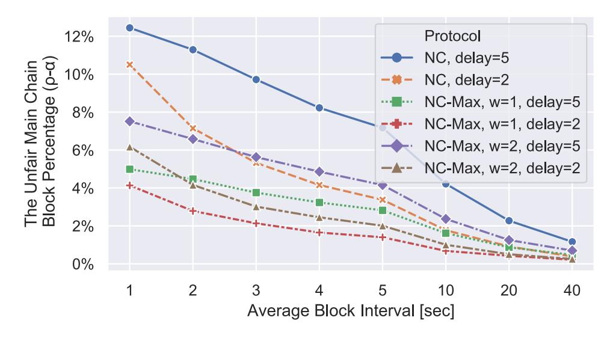

Fig. 11: NC-Max resists better against transaction withholding attacks than NC. The proposal window size w = wfar−wclose+ 1; "delay" denotes tdelay, the maximum time an attacker can delay the propagation of its blocks.

## APPENDIX C BLOCK PREPARATION LATENCY ESTIMATION

Each time a node receives a CB, the block preparation latency δprep is a function of nfresh:

$$\delta_{\text{prep}} = \begin{cases} \max\{n_1, 0\}, & n_{\text{fresh}} = 0\\ \max\{1.33233 \times 10^{-4} n_{\text{fresh}} \\ + 0.544959 + n_2, \\ \delta_{\text{a,b}} + 3.6 \times 10^{-4} n_{\text{fresh}}\}, & n_{\text{fresh}} > 0 \end{cases} . (1)$$

Equation (1) is chosen based on our understanding of the block propagation. When nfresh = 0, there is no round trip to query the fresh transactions, therefore we use n<sup>1</sup> ∼ N (0.101102, 0.0431702<sup>2</sup> ) to estimate the localmessage-processing time, lower bounded with 0. The parameters of the Gaussian distribution are learned via maximum likelihood estimation (MLE) from the data we collected from the Bitcoin network (Sect. III-C). We chose Gaussian distribution for its simplicity. When nfresh > 0, the best-case latency is the sum of the network latency δa,<sup>b</sup> and the latency incurred by the bandwidth constraint 3.6 × 10<sup>−</sup>4nfresh, assuming each transaction is 450 bytes and the bandwidth is 1.25 MBps. In reality, the best case rarely happens; thus to model the randomness of the reality, we use n<sup>2</sup> ∼ N (0, 0.420209<sup>2</sup> ) to encompass the local-message-processing and network latency, adding 1.33233 × 10<sup>−</sup><sup>4</sup>nfresh to so that the average latency grows linearly with the number of transactions. These parameters are also learned via our measured data in Sect. III-C. Parameters n1, n2, δa,b, and δprep are in the unit of one second. We choose not to sample from the measurement data directly because those data miss certain nfresh values. This equation also applies to NC-Max for querying transactions in the proposal zone. In both NC and NC-Max, the propagation of CBs is not affected by synchronizing fresh transactions; for each node, different blocks' δprep do not overlap each other to avoid violating the bandwidth constraint.

## APPENDIX D BLOCK PROPAGATION LATENCY

Figure 12 shows the time distribution for blocks to propagate to 50% and 90% of nodes in the 100 and 1000 TPS

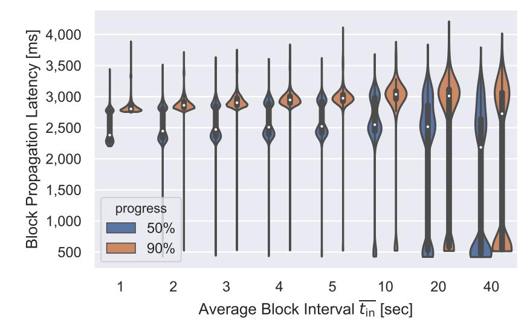

(a) NC, 100 TPS.

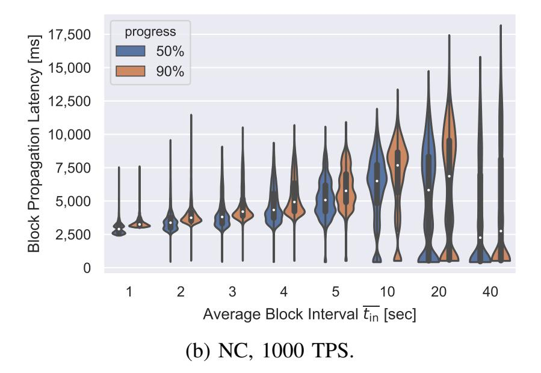

Fig. 12: Blocks propagate faster in NC-Max than in NC.

setting in NC. We omit the NC-Max figures as they are almost identical to Fig. 6b.

In the NC, tin = 40, 100 TPS setting, 50% of blocks contain no fresh transaction, which finish propagation within 600 ms; the other 50% take more than two seconds to finish propagation. These results match well with Bitcoin's current situation: when tin = 600, most blocks' propagation delay is within 600 ms, with a few exceptions over two seconds [25]. When tin decreases, fewer and fewer blocks contain no fresh transaction. Also as tin decreases, blocks with fresh transactions propagate slightly faster, because the block size decreases along with tin in a fixed-TPS setting. However, the speedup is not proportional to the block size, especially in the worst case, as a smaller tin also means a higher fraction of fresh transactions. At last, blocks propagate slower as the workload increases, since the bandwidth, rather than the latency, becomes the bottleneck.