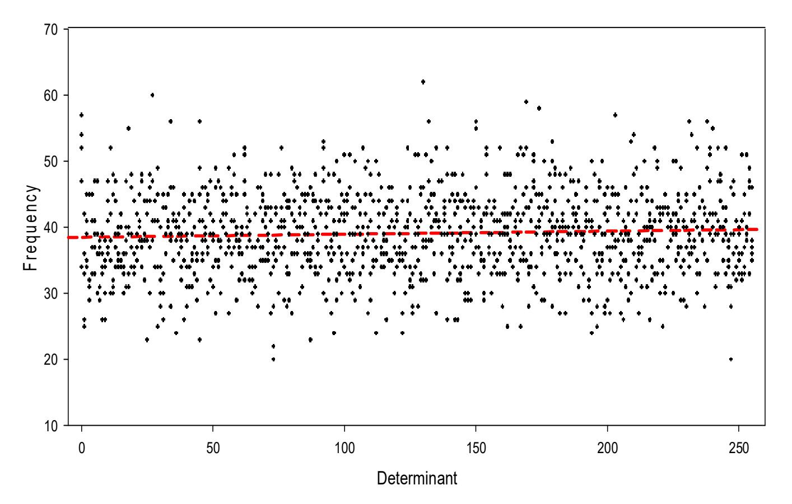

{0}------------------------------------------------

## **PQC: R-Propping of Public-Key Cryptosystems Using Polynomials over Non-commutative Algebraic Extension Rings**

#### Pedro Hecht

Information Security Master, School of Economic Sciences, School of Exact and Natural Sciences and Engineering School (ENAP-FCE), University of Buenos Aires, Av. Cordoba 2122 2nd Floor, CABA C1120AAP, República Argentina phecht@dc.uba.ar

**Abstract.** Post-quantum cryptography (PQC) is a trend that has a deserved NIST status, and which aims to be resistant to quantum computers attacks like Shor and Grover algorithms. In this paper, we propose a method for designing post-quantum provable IND-CPA/IND-CCA2 public key cryptosystems based on polynomials over a non-commutative algebraic extension ring. The key ideas of our proposal is that (a) for a given non-commutative ring of rank-3 tensors, we can define polynomials and take them as the underlying work structure (b) we replace all numeric field arithmetic with GF(28) field operations. By doing so, it is easy to implement Rpropped Diffie-Helman-like key exchange protocol and consequently ElGamal-like cryptosystems. Here R stands for Rijndael as we work over the AES field. This approach yields secure post-quantum protocols since the resulting multiplicative monoid is immune against quantum algorithms and resist classical linearization attacks like Tsaban's Algebraic Span or Roman'kov. The protocols have been proved to be semantically secure. Finally, we present numerical examples of the proposed R-Propped protocols.

**Keywords:** Post-quantum cryptography, finite fields, rings, combinatorial group theory, R-propping, public-key cryptography, non-commutative cryptography, AES.

#### **1 Introduction**

#### **1.1 Background of Public-Key Cryptography and Post-Quantum Cryptography**

Since the first generation of public key cryptography (PKC) was introduced by Diffie and Hellman [\_bookmark535], many PKC schemes have been proposed and broken. Recently Post-Quantum Cryptography (PQC) attempts to develop cryptographic protocols that are simultaneously resistant to classical and quantum computing attacks using Shor's polynomial time algorithm [16] or Grover's algorithm [7 ] in order to find the unique input to a black-box function. Today NIST conducts a process to solicit, evaluate, and standardize one or more quantum-resistant public-key cryptographic algorithms [13].

#### **1.2 PKC Proposals Based on Combinatorial Group Theory**

The theoretical foundations for current generation of cryptosystems lie in the intractability of problems close to number theory [11] and therefore prone to quantum attacks. This was the main reason to develop PQC, It is noteworthy that besides a couple of described solutions [3], there remains overlooked solutions belonging to Non-Commutative (NCC) and Non-Associative (NAC) algebraic cryptography [12]. The general structure of these solutions relies on protocols defining one-way trapdoor functions (OWTF) extracted from the combinatorial group theory [12].

{1}------------------------------------------------

This category is known as canonical non-commutative protocols [12] which are conveniently combined with algebraic structures like groups, semigroups, monoids, quasigroups, magmas, groupoids, etc. Cao et al [4 ] compiles much of these efforts.

#### **1.3 Motivation of the present work**

In this paper, we propose an algebraic patch to theoretical well supported combinatorial solutions. Specifically, we refer to algebraic propped versions of previously descripted Cao PKC polynomial protocols [4]. That work has the virtue of presenting proved semantic secure systems attaining IND-CCA2 level and at the same time laying solid ground evidence for the OWTF generalized symmetric decomposition problem (GSDP). It is advised that readers to get acquainted with Cao's work, although this is not a necessary requirement.

Essentially R-propping consists of replacing all numerical field operations (arithmetic sum and multiplication), a typical scalar proposal, by algebraic operations using the AES field, a vectorial proposal [6]. This scales up operations complexity foiling classical linearization attacks like AES [6] does and at same time quantum ones. This is a solid way to achieve the best of two worlds, both pointing to cryptographic security. As side benefits, we get rid of big number libraries and step away from the critical dependency of pseudorandom generators.

The R-propping solution is described as an Algebraic Extension Ring [8], a second paper worthwhile to read. Next to those, Myasnikov NCC treatise [12] contributes to exhaustive, worthwhile, and fundamental knowledge of this field.

#### **2 Preliminaries**

**Definition 1.** *A public key encryption scheme* Π = (**KGen**, **Enc**, **Dec**) *consists of the following three polynomial-time (in* k*) algorithms:* 

- **–** *The key generation algorithm KGen: On input* 1 <sup>k</sup>*(unary representation of* k*), the algorithm KGen produces a pair* (pk, sk) *of matching public and private keys. Algorithm KGen is probabilistic.*
- **–** *The encryption algorithm Enc: Given a message* m *and a public key* pk*, Enc produces a ciphertext* c = Π(m) *of* m*. This algorithm may be probabilistic.*
- **–** *The decryption algorithm Dec: Given a ciphertext* c = Π(m) *and the private key*  sk*.* Dec(sk, c) *gives back the plaintext* m*. This algorithm is necessarily deterministic.*

*In addition, for every pair* (pk, sk) *generated by* **KGen**(1<sup>k</sup> )*, and for every* α*, algorithms Enc and Dec satisfy (Pr=probability)* 

$$Pr[\mathbf{Dec}(sk, \mathbf{Enc}(pk, m)) = m] = 1$$

**Definition 2 (Semantic Security).** *A public key encryption scheme* Π = (**KGen**, **Enc**, **Dec**) *is said to be semantic secure if for all A ( probabilistic polynomial time algorithms), and for every* α > 0 *and sufficiently large* k*,* 

Pr[**A**(pk, m0, m1, c)=m] < ½ + 1/k<sup>α</sup> *(*1/kα *= negligible function) where* (m0, m1) *is chosen by* A*,* m ← {m0, m1}*,* c = Π(m) ← **Enc**(pk, m)*,* (pk, sk) ← **KGen**(1<sup>k</sup> )*.* 

**Definition 3 (Security levels).** *Currently, there are several types of attacks models for public key encryption, namely the chosen-plaintext attack (CPA), non-adaptive chosen-ciphertext attacks (CCA1) and adaptive chosen-ciphertext attacks (CCA2).*  Security levels are usually defined by pairing each goal (OW: one-way, IND: indistinguishability, NM: non-malleability) with an attack model (CPA, CCA1 or CCA2); i.e., OW-CPA, OW-CCA1, OW-CCA2; IND-CPA, IND-CCA1 and IND-CCA2 [4].

{2}------------------------------------------------

**Definition 4 (Cryptographic Assumptions - OWTF).** In a non-commutative group (or monoid) G, two elements x, y are conjugate, if  $y = z^{-1} x z$  for some  $z \in G$ . Here z or  $z^{-1}$  is called a conjugator. Over a non-commutative group G [10], we can define the following cryptographic problems [4] which are related to conjugacy, here ordered in increasing difficulty:

- Conjugator Search Problem (CSP): Given  $(x,y) \in G \times G$  find  $z \in G$  such that  $y = z^{-1} \times z$
- **Decomposition Problem** (DP): Given  $(x,y) \in G \times G$  and  $S \subseteq G$ , find  $(z_1,z_2) \in S$  such that  $y = z_1 \times z_2$ .
- **Symmetrical Decomposition Problem** (SDP): Given  $(x,y) \in G \times G$ ,  $(m,n) \in \mathbb{Z} \times \mathbb{Z}$ , find  $z \in G$  such that  $y = z^m \times z^n$
- Generalized Symmetrical Decomposition Problem (GSDP): Given  $(x,y) \in G$   $x \in G$ ,  $(m,n) \in \mathbb{Z} \times \mathbb{Z}$  and  $S \subseteq G$ , find  $z \in S$  such that  $y = z^m \times z^n$

The same problem definitions could be applied to non-commutative rings (like AER) instead of non-commutative groups (monoids), in which case G (group) should be replaced by R (ring) and z by a positive integer coefficients polynomial z[x]. Then, two new definitions appear. Suppose (AER, +, .) is a NC ring, and define Pa = {f(a) : f(x)  $\epsilon$  Field Element Coefficient Polynomial (see 4.1.), for any a = random tensor and Pa belonging to that ring,

- Polynomial Symmetrical Decomposition Problem over Non-commutative AER (PSD): Given  $(a, x, y) \in AER^3$ ,  $(m, n) \in \mathbb{Z} \times \mathbb{Z}$ , find  $z \in Pa$  such that  $y = z^m \times z^n$
- Polynomial Diffie-Hellman Problem over a Non-commutative AER (PDH): Compute  $x^{z_1z_2} = x^{z_2z_1}$  for given a, x,  $x^{z_1}$  and  $x^{z_2}$ , where (a, x)  $\epsilon$  AER<sup>2</sup> and (z<sub>1</sub>, z<sub>2</sub>)  $\epsilon$  Pa.

For general non-commutative group (or monoid) G, all the above problems are difficult enough to be cryptographic assumptions, meaning that there does not exist a probabilistic polynomial time algorithm which can solve all instances of them with non-negligible accuracy with respect to the problem scale, i.e., the number of input bits of the problem).

**Definition 5 (Algebraic Extension Ring - AER).** The Algebraic Extension Ring (AER) framework includes the following structures:

```
\mathbb{F}_{256}: a.k.a. GF[28], the AES field [6]
```

Primitive polynomial:  $1+x+x^3+x^4+x^8$  with <1+x> as the multiplicative subgroup  $(\mathbb{F}^*_{255})$  generator:

 $M[\mathbb{F}_{256} \ d]$  d-dimensional square matrix of field elements. (bytes). Therefore, a d-dimensional square matrix is equivalent to a rank-3 Boolean tensor.

The AER platform has two substructures:

 $(M[\mathbb{F}_{256}, d], \bigoplus, 0)$  Abelian group using field sum as operation and null matrix (tensor) as the identity element.

 $(M[\mathbb{F}_{255}^*, d], \odot, I)$  Non-commutative monoid using field product as operation and identity matrix (tensor) as the identity element.

From here on, when referring to field elements (bytes) we call they simply as elements and when we refer to any d-dimensional matrix of the AER we will use with the term d-dim tensor.

{3}------------------------------------------------

Tensors combine between them using field operations to construct powers (and power sets) or otherwise polynomials using elements as coefficients, which relates to the respective variable (tensor) power with a scalar (field) product. Forcefully (*pigeon hole principle*) all tensor power sets are periodic. It is normal to search for the multiplicative order, the lowest exponent which yields the Identity tensor, hence defining periodicity. Likewise we define the tensor determinant function det( ) and we say a tensor is singular when det(T)=0. Singular tensors do not have multiplicative order but have periodicity and at a certain power they repeat the base tensor. This allows to define a spurious identity tensor defining the period and the respective spurious inverse tensor (the previous power).

## **3 Algebraic Extension Ring (AER) properties**

#### **3.1 Empirical considerations**

Among tensors, some are cyclic multiplicative subgroup generators, the rest have periodic power sets that do not include the identity tensor. This second case corresponds to singular tensors. As said, singular tensors define non-identity spurious identities and spurious inverses, but have the same period distribution as the non-singular ones. Periods and determinants seem to be independent. Although no full algebraic description has been obtained, statistical sampling has been collected using uniformly random elements.

It is a fact that over cyclic groups, any element generates a cyclic subgroup whose cardinal is a divisor of the group cardinal (*Lagrange's theorem*). This does not hold as such for the multiplicative tensor monoid.

To calculate the tensor period we used Floyd [9] or the Floyd-Brent [2] algorithms, otherwise we recur to direct multiplication of each tensor with a list of previously sampled periods to verify if an identity or spurious identity is obtained. Fast power results are programmed using the square and multiply procedure, and precomputed multiplication table of elements is strongly advised. Resuming results, randomly tensors have uniform determinant distributions (Fig. 1.). Otherwise we show the period's distribution of random 3-dim tensors (Table 1.) and the cardinals of AER sets of different dimensions (Table 2.).



**Figure 1.** Determinant distribution of a collection of 50.000 random 3-dimensional tensors. There are 5 samples of 10.000 tensors each, and every point in this graph represent the relative frequency of determinant value into each of the five samples (red line is the global mean observed value =39.0630, close to the theoretical value = 39.0625). Observe the uniform behavior of values, including the singular tensor case.

{4}------------------------------------------------

| Period   | Absolute Frequency | % Frequency |
|----------|--------------------|-------------|
| 102      | 73                 | 0.1460 %    |
| 170      | 332                | 0.6640 %    |
| 255      | 7897               | 15.7949 %   |
| 510      | 178                | 0.3560 %    |
| 65535    | 24953              | 49.9090 %   |
| 16777215 | 16564              | 33.1300 %   |
| Sum      | 49997              | 100 %       |

**Table 1.** Period distribution of a sample of 50.000 random 3-dimensional tensors. The three missing periods belong to outsider values of this registered set. Some periods are trivially related to divisors of  $2^{24}$ . A deeper study is needed to explain the algebraic nature of these results.

| Dimension | AER set cardinal                    |  |
|-----------|-------------------------------------|--|
| 2         | $4.294967296 \times 10^9$           |  |
| 3         | $4.722366482869645 \times 10^{21}$  |  |
| 4         | $3.402823669209384 \times 10^{38}$  |  |
| 5         | $1.60693804425899 \times 10^{60}$   |  |
| 6         | $4.973232364097866 \times 10^{86}$  |  |
| 7         | $1.008691358627698 \times 10^{118}$ |  |
| 8         | $1.340780792994259 \times 10^{154}$ |  |

**Table 2.** AER set cardinal for diverse tensor dimensions. No conclusive relation was found between these values and the periods.

# 4 R-Propped Public Key Cryptosystems using the Algebraic Extension Ring (AER)

#### 4.1 Field Element Coefficient Polynomials

Given x, an arbitrary tensor belonging to AER, we define f[x] as an Field Element Coefficient Polynomial (Pa) of any m-degree, where coefficients of the powers of x are field elements related to scalar field products of respective tensors:

$$f[x] = c_0 + c_1 x + c_2 x^2 + c_3 x^3 + \dots + c_m x^m = \sum_{i=0}^m c_i x^i$$
 (1)

Each polynomial will be defined by a vector of m+1 elements. It verifies that any product of two polynomials f[x] and g[y] do not commute unless the tensor variable is the same for both:

$$f[x].g[y] \neq g[y].f[x]$$
;  $f[x].g[x] = g[x].f[x]$  (2)

The same verifies when arbitrary powers of evaluated polynomials are involved:

$$f[x]^r. g[y]^s \neq g[y]^s. f[x]^r ; f[x]^r. g[x]^s = g[x]^s. f[x]^r$$
 (3)

This feature allows the implementation of GSDP as OWTF in PKC.

{5}------------------------------------------------

#### **4.2 R-Propped Diffie-Hellman-Like Key Agreement Protocol**

Both sides agree on a specific AER.

- a) One entity (Alice) sends two random tensors (a, b) together with two elements (bytes) (m, n) to another entity (Bob) launching the protocol.
- b) Alice chooses a random Field Element Coefficient Polynomial f(x) such that f(a) ∫ 0 and takes f(a) .
- c) Bob chooses a random Field Element Coefficient Polynomial h(x) such that h(a) ∫ 0 and takes h(a) as his private key.
- d) Alice computes rA = f(a)<sup>m</sup> · b · f(a)<sup>n</sup> and sends *(\*)* rA to Bob.
- e) Bob computes rB = h(a)<sup>m</sup> · b · h(a)<sup>n</sup> and sends *(\*)* rB to Alice.
- f) Alice computes KA = f(a)m · rB · f(a)n as the shared session key.
- g) Bob computes KB = h(a)m · rA · h(a)n as the shared session key.
- *(\*) In practice, the token must be disguised by certain canonical form before it is transmitted via a public channel. Please search at* [12] *or at Section 3.3 of* [4] *for the disguising issue.*

Steps a), b) and d) can be finished simultaneously and require only one pass communication from Alice to Bob. After that, the steps c) and e) can be finished in one pass communication from Bob to Alice. Finally, Alice and Bob can execute the steps f) and g) respectively.

The above key agreement protocol can resist passive adversary under PDH assumption over the (AER, . ) monoid. Obviously, similar to the standard Diffie-Hellman protocol [5], this version cannot resist the man-in-the-middle (MITM) attack. This could be solved if an authentication step is added.

#### **4.3 R-Propped ElGamal-Like Encryption Scheme [Basic version, IND-CPA compliant]**

- **– Initial setup:** define a version of (AER, +, . ) as the working platform and GSDP intractable on the monoid (AER, . ). Select two positive integers (m, n) and let H: AER-> *M* a cryptographic secure hash function (random oracle) which maps tensors to the message space *M*. The public parameters of the system are in the 5-tuple < AER, m, n, *M*, H >.
- **– Kgen:** Each user chooses two random tensors (p,q) from AER and a random Field Element Coefficient Polynomial f(x) such that f(p) ∫ 0 and then define f(p) as his private key and computes y = f(p)m. q . f(p)n . At least he publishes the tensors (p, q, y) as his public key.
- **– Enc:** Given a message M belonging to *M*, and receiver's (p, q, y) key, the sender chooses a random Field Element Coefficient Polynomial h(x) such that h(p) ∫ 0 and then using h(p) as salt, computes:

$$c = h(p)^m \cdot q \cdot h(p)^n$$
,  $d = H(h(p)^m \cdot y \cdot h(p)^n) \oplus M$  [4]

and output the ciphertext (c, d) ∈ AER x *M*.

**– Dec:** Once received the ciphertext (c, d), the receiver uses his private key f(p) to recover the plaintext:

$$M = H(f(p)^{m} \cdot c \cdot f(p)^{n}) \oplus d$$
 [5]

This version is IND-CPA secure, as Theorem 3. from Cao [4] has proved.

{6}------------------------------------------------

#### **4.4 R-Propped ElGamal-Like Encryption Scheme [Enhanced version, IND-CCA2 compliant]**

- **– Initial setup:** here the public parameters set < AER, m, n, *M*, H > is extended to < AER, m, n, *M*, k0, H1, H2 > were k is the standard length of a message i.e. *M*={0,1}k, and k0 the length of the random salt not determined by a binary search method (suggested to be 128), the hash functions H1: {0,1}k+k0 -> z[x] (integer coefficient polynomial) and H2: AER (tensor) -> {0,1}k+k0.
- **– Kgen:** Identical to the Basic version.
- **– Enc:** Given a message M belonging to *M*, and the receiver's (p, q, y) key, the sender chooses a random salt r ∈ {0.1}k0 and extracts an Field Element Coefficient Polynomial h(x) = H1( M || r) such that h(p) ∫ 0 and then using h(p) as salt, computes:

$$c=h(p)^m\cdot q\cdot h(p)^n \ , \ d=H_2(h(p)^m\cdot y\cdot h(p)^n)\oplus (M\mid\mid r) \$$
 [6] and outputs the ciphertext  $(c,d)\in AER \times \{0,1\}^{k+k0}$ .

**– Dec:** Once received the ciphertext (c, d), the receiver uses his private key f(p) to recover the plaintext:

$$M' = H_2(f(p)^m \cdot c \cdot f(p)^n) \oplus d$$
 [7]  
Finally extracts  $g(x) = H_1(M')$  an Field Element Coefficient Polynomial and

checks whether c=g(p)m . q. g(p)n holds. If so, outputs the beginning k bits of M'; otherwise output empty string which means that the ciphertext is not valid.

This version is IND-CCA2 secure, as Theorem 5. from Cao [4] has proved.

## **5 Concrete examples of PQC R-propped PKC**

## **5.1 R-Propped Anshel-Anshel-Goldberg (AAG) based KEP (key exchange protocol)**

AAG is an algebraic based protocol [12] which has solid reasons to be secure in his classical version and belongs to the PQC category. In the Appendix of our paper [8] we present a R-Propped version of the generalized Diffie-Hellman protocol using 2-dim tensors whose OWTF is AAG based.

## **5.2 R-Propped Diffie-Hellman KEP Example 1. (4.5 Concrete examples)** [4]**.**

• We present the necessary derived function set using Mathematica 11.3 code.

```
<<FiniteFields`; 
ir = {1,1,0,1,1,0,0,0,1}; 
F = GF[2,ir]; 
ByteToFieldElement[byte_Integer]:=F[Reverse[IntegerDigits[byte,2,
8]]]; 
FieldElementToByte[element_]:=FromDigits[Reverse[element[[1]]],2]
; 
S[byte1_Integer, 
byte2_Integer]:=BitXor[byte1,byte2];SetAttributes[S, 
Listable];
```

{7}------------------------------------------------

```
M[byte1_Integer,byte2_Integer]:= 
Module[{el1=ByteToFieldElement[byte1],el2=ByteToFieldElement[
byte2]},If[byte1 byte2 == 0, 0, FieldElementToByte[el1 el2]]]; 
SetAttributes[M, Listable]; 
MM[x_,y_]:=Inner[M,x,y,List]; 
TSum[k_,l_]:=S[k,l]; 
TProd[k_,l_]:=Flatten[{t=MM[k,l],Do[t[[i,j]]=Fold[S,0,t[[i,j]]],{i,1,d
im},{j,1,dim}]};t,0] 
TPower[k_,exp_]:=(t=k;Do[{t=TProd[t,k]},{exp-1}];If[exp==0,t=one];t ); 
TPowerSet[k_,exp_]:=For[i=1,i<exp+1,i++,If[i==1,TPSet[i]=k,TP
Set[i]=TProd[TPSet[i-1],k]]];TPSet[0]:=IdentityMatrix[dim]; 
S3[byte1_Integer,byte2_Integer,byte3_Integer]:=BitXor[byte1,byte2,byte
3];SetAttributes[S3, Listable]; 
FieldPolyEval[dim_,degree_,coef_,tensor_]:= 
Module[{k},TPowerSet[tensor,degree];Table[TPSet[k],{k,0,degree}]; 
newTPSet=Table[MapThread[M,{TPSet[k],ConstantArray[coef[[k+1]],{di
m,dim}]},2],{k,0,degree}];result=MapThread[BitXor,newTP Set,2]]
```

## • **Program of the R-Propped version.**

```
Print["......................................................
....................."] 
Print["ALICE prepares..."] 
dim=2;Print["dim=",dim] 
degree=5;Print["degree=",degree] 
A={{2,5},{7,4}};Print["tensor A=",MatForm[A]] 
B={{1,9},{3,2}};Print["tensor B=",MatForm[B]] 
m=3;Print["m=",m] 
n=5;Print["n=",n] 
coefA={6,5,4,3,0,0};Print["coefficient list of f(x)=",coefA] 
TPowerSet[A,degree];Print["tensor A power 
set=",Table[MatrixForm[TPSet[k]],{k,0,degree}]] 
fA=FieldPolyEval[dim,degree,coefA,A];Print["f(A)=",fA] 
rA=TProd[TPower[fA,m],B];rA=TProd[rA,TPower[fA,n]];
Print["rA=",rA] 
Print["ALICE sends m, n, A, B, rA to BOB"] 
Print["......................................................
....................."] 
Print["BOB prepares..."] 
coefB={1,5,0,0,0,1};Print["coefficient list of h(x)=",coefB] 
TPowerSet[A,degree];Print["tensor A power 
set=",Table[MatrixForm[TPSet[k]],{k,0,degree}]] 
hA=FieldPolyEval[dim,degree,coefB,A];Print["h(A)=",hA] 
rB=TProd[TPower[hA,m],B];rB=TProd[rB,TPower[hA,n]];
Print["BOB sends rB to ALICE"] 
Print["......................................................
....................."] 
KA=TProd[TPower[fA,m],rB];KA=TProd[KA,TPower[fA,n]]; 
Print["ALICE session key=",MatrixForm[KA]] 
KB=TProd[TPower[hA,m],rA];KB=TProd[KB,TPower[hA,n]]; 
Print[" BOB session key=",MatrixForm[KB]] 
Print["......................................................
....................."]
```

#### **6 Cryptographic security of R-propped protocols**

This analysis refers to protocols where random integer coefficient Polynomial are used as private keys, like the one presented in the previous section. If the security of the protocol relies over the intractability of GSDP, PSD and DHP problems, a residual way to break them is a brute-force attack against the coefficient vector of the private key. Using R-Propping we

{8}------------------------------------------------

design private keys for which this approach is unfeasible.

The dimension of tensors does not affect security since there are public. There are 256#. Field Element Coefficient Polynomial of degree m and coefficients in ℤ-, here defined as elements of the AER. In Table 3. we present classical and quantum security levels as functions of the private keys polynomial degrees:

| m-degree<br>of R-Propped private<br>key Polynomial | Classical<br>Security<br>(bits) | [Grover]<br>Quantum<br>Security<br>(bits) | NIST security level for<br>PQC proposals [14] |
|----------------------------------------------------|---------------------------------|-------------------------------------------|-----------------------------------------------|
| 7                                                  | 64                              | 32                                        | Insecure                                      |
| 15                                                 | 128                             | 64                                        | Category 1                                    |
| 23                                                 | 192                             | 96                                        | Category 3                                    |
| 31                                                 | 256                             | 128                                       | Category 5                                    |

**Table 3.** Expected security of increasing Polynomial degree used as private keys subject to classical and quantum attacks. For the 3rd-round NIST PQC selection, Category 5 parameters must be supplied.

The main motivation for the development of R-propped PKC was the appearance of classical linearization attacks against NCC. The idea was simple, adapt field operation instead of numeric arithmetic, the added non-linearity resists attacks like Tsaban [1] and Roman'kov [15] ones. Also, AES has followed the same principle. Therefore, quantum attacks like Shor's result ineffective and Grover attack could be foiled by increasing the dimension of the platform. (Table 3.). Also, adapting Cao's proposals, we have achieved semantic security for our work. This was a critical requirement for our PQC candidates and help to gain confidence onto them. For real-world applications, we suggest referring to Table 3. security goals.

## **7 Conclusions**

We present a reasonable way to increase security into public-key cryptography belonging to PQC class, replacing simple arithmetic by algebraic field operations. For that purpose, we apply AES GF (28) field, which provides the required framework (AER - noncommutative ring over rank 3 tensors). If conveniently applied, we achieve NIST PQC category 5 security and IND-CCA2 semantic security. An additional advantage is the unnecessary use of big numbers libraries and heavily relying protocols over the pseudorandom generators.

Other works of the author covering this subject can be found at [17].

## **References**

- 1. A. Ben Zvi, A. Kalka, B. Tsaban, Cryptanalysis via algebraic spans, CRYPTO 2018, Lecture Notes in Computer Science 10991 (2018), 255- 274. https://doi.org/10.1007/978-3-319-96884-1\_9
- 2. R. P. Brent, "An improved Monte Carlo factorization algorithm" , BIT Num Mathematics , 20 (2): 176–184, doi:10.1007/BF01933190, 1980
- 3. D. J. Bernstein, T. Lange, "Post-Quantum Cryptography", Nature, 549:188-194, 2017.
- 4. Z. Cao, X. Lei, L. Wang, New Public Key Cryptosystems Using Polynomials over Noncommutative Rings, Preprint IACR, http://eprint.iacr.org/2007/009.pdf 1.2
- 5. W. Diffie and M.E. Hellman, New directions in cryptography, IEEE Transactions on Information Theory 22 (1976), 644-654. 1.1, 4.3
- 6. FIPS PUB 197: the official AES standard, https://web.archive.org/web/20150407153905/http://csrc.nist.gov/publications/ fips/fips197/fips-197.pdf
- 7. L.K. Grover, "A fast quantum mechanical algorithm for database search". In Proc. 28th Ann. ACM Symp. on Theory of Computing (ed. Miller, G. L.) 212–219, ACM, 1996.

{9}------------------------------------------------

- 8. P. Hecht, Algebraic Extension Ring Framework for Non-Commutative Asymmetric Cryptography, Preprint ,arXiv https://arxiv.org/ftp/arxiv/papers/2002/2002.08343.pdf 1.2, 2020
- 9. D. Knuth, "Seminumerical Algorithms", Third Edition (Reading, Massachusetts: Addison-Wesley, 1997), xiv+762pp., ISBN 0-201-89684-2
- 10. R. Lidl, H. Niederreiter, "Finite Fields", Cambridge University Press, Cambridge, 1997.
- 11. A. Menezes, P. van Oorschot and S.Vanstone, "Handbook of Applied Cryptography", CRC Press, 1997.
- 12. A. Myasnikov, V. Shpilrain, A. Ushakov, Non-commutative Cryptography and Complexity of Group-theoretic Problems, Mathematical Surveys and Monographs, AMS Volume 177, 2011
- 13. NIST, https://www.nist.gov/news-events/news/2020/07/pqc-standardizationprocess-third-round-candidate-announcement, 2020
- 14. NIST PQC Security Categories, https://csrc.nist.gov/projects/post-quantumcryptography/post-quantum-cryptography-standardization/evaluationcriteria/security
- 15. V. Roman'kov, Cryptanalysis of a combinatorial public key crypto-system, De Gruyter, Groups Complex. Cryptology. 2017.
- 16. P. Shor, "Polynomial-time algorithms for prime factorization and discrete logarithms on a quantum computer", SIAM J. Comput., no. 5, pp. 1484-1509, 1997.
- 17. https://arxiv.org/a/hecht\_p\_1.html