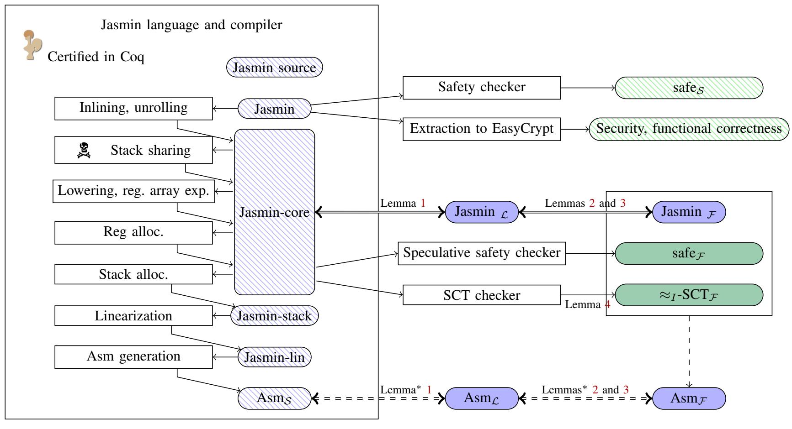
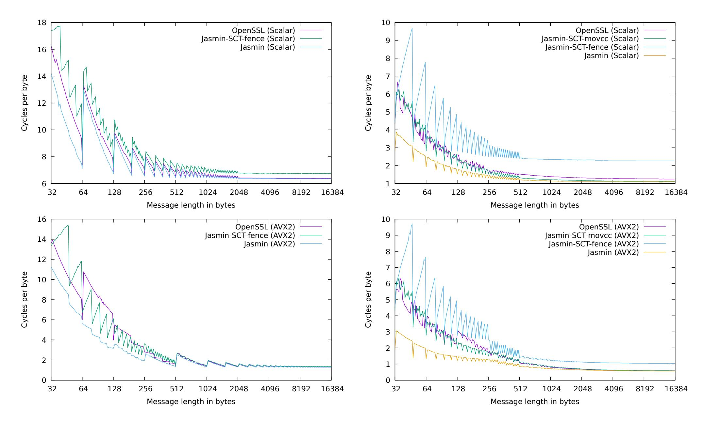

{0}------------------------------------------------

# High-Assurance Cryptography in the Spectre Era

Gilles Barthe\*<sup>†</sup>, Sunjay Cauligi<sup>‡</sup>, Benjamin Grégoire<sup>§</sup>, Adrien Koutsos\*<sup>¶</sup>, Kevin Liao\*<sup>||</sup>, Tiago Oliveira\*\*, Swarn Priya<sup>††</sup>, Tamara Rezk<sup>§</sup>, Peter Schwabe\* \*MPI-SP, <sup>†</sup>IMDEA Software Institute, <sup>‡</sup>UC San Diego, <sup>§</sup>INRIA Sophia Antipolis, <sup>¶</sup>INRIA Paris, <sup>||</sup>MIT, \*\*University of Porto (FCUP) and INESC TEC, <sup>††</sup>Purdue University

Abstract—High-assurance cryptography leverages methods from program verification and cryptography engineering to deliver efficient cryptographic software with machine-checked proofs of memory safety, functional correctness, provable security, and absence of timing leaks. Traditionally, these guarantees are established under a sequential execution semantics. However, this semantics is not aligned with the behavior of modern processors that make use of speculative execution to improve performance. This mismatch, combined with the high-profile Spectre-style attacks that exploit speculative execution, naturally casts doubts on the robustness of high-assurance cryptography guarantees. In this paper, we dispel these doubts by showing that the benefits of high-assurance cryptography extend to speculative execution, costing only a modest performance overhead. We build atop the Jasmin verification framework an end-to-end approach for proving properties of cryptographic software under speculative execution, and validate our approach experimentally with efficient, functionally correct assembly implementations of ChaCha20 and Poly1305, which are secure against both traditional timing and speculative execution attacks.

#### I. INTRODUCTION

Cryptography is hard to get right: Implementations must achieve the *Big Four* guarantees: Be (*i*) *memory safe* to prevent leaking secrets held in memory, (*ii*) *functionally correct* with respect to a standard specification, (*iii*) *provably secure* to rule out important classes of attacks, and (*iv*) *protected against timing side-channel attacks* that can be carried out remotely without physical access to the device under attack. To achieve these goals, cryptographic libraries increasingly use high-assurance cryptography techniques to deliver practical implementations with formal, machine-checkable guarantees [1]. Unfortunately, the guarantees provided by the Big Four are undermined by microarchitectural side-channel attacks, such as Spectre [2], which exploit speculative execution in modern CPUs.

In particular, Spectre-style attacks evidence a gap between formal guarantees of timing-attack protection, which hold for a *sequential* model of execution, and practice, where execution can be out-of-order and, more importantly, *speculative*. Many recent works aim to close this gap by extending formal guarantees of timing-attack protection to a model that accounts for speculative execution [3], [4], [5], [6], [7]. However, none of these works have been used to deploy high-assurance cryptography with guarantees fit for the post-Spectre world. More generally, the impact of speculative execution on high-assurance cryptography has not yet been well-studied from a formal vantage point.

In this paper, we propose, implement, and evaluate the *first holistic approach* that delivers the promises of the Big

Four under speculative execution. We explore the implications of speculative execution on provable security, functional correctness, and timing-attack protection through several key technical contributions detailed next. Moreover, we implement our approach in the Jasmin verification framework [8], [9], and use it to deliver high-speed, Spectre-protected assembly implementations of ChaCha20 and Poly1305, two key cryptographic algorithms used in TLS 1.3.

Contributions. Our starting point is the notion of *speculative* constant-time programs. Similar to the classic notion of constant-time, informally, a program is speculative constant-time if secrets cannot be leaked through timing side-channels, including by speculative execution. Formally, our notion is similar to that of Cauligi et al. [3], which defines speculative constant-time using an *adversarial semantics* for speculative execution. Importantly, this approach delivers microarchitecture-agnostic guarantees under a strong threat model in which the decisions of microarchitectural structures responsible for speculative execution are adversarially controlled.

Bringing this idea to the setting of high-assurance cryptography, we make the following contributions:

- We formalize an adversarial semantics of speculative execution and a notion of speculative constant-time for a core language with support for software-level countermeasures against speculative execution attacks. We also define a weaker, "forward" semantics in which executions are forced into early termination when mispeculation is detected. We prove a key property called secure forward consistency, which shows that a program is speculative constant-time iff forward executions (rather than arbitrary speculative executions) do not leak secrets via timing side-channels. This result greatly simplifies verification of speculative constanttime, drastically reducing the number of execution paths to be considered. Moreover, with secure forward consistency, code that is proven functionally correct and provably secure in a sequential semantics also enjoys these properties in a speculative semantics.
- We develop a verification method for speculative constanttime. To the best of our knowledge, our method is the first to offer formal guarantees with respect to a strong threat model (prior works that study speculative leakage [3], [4], [5], [6], [7], [10] either consider weaker threat models or are not proven sound). Following an established approach, our method is decomposed into two steps: (i) check that the program does not perform illegal memory accesses under

{1}------------------------------------------------

speculative semantics (speculative safety), and (*ii*) check that leakage does not depend on secrets. Both checks are performed by (relatively minor) adaptations of standard algorithms for safety and constant-time.

- We implement our methods in the Jasmin verification framework [\[8\]](#page-13-7), [\[9\]](#page-13-8). By a careful analysis, we show that our methods can be used to lift to speculative semantics the guarantees provided by Jasmin, i.e., safety, functional correctness, provable security, and timing side-channel protection, for source and assembly programs.
- We use Jasmin and our extensions to develop efficient, speculatively safe, functionally correct, and speculatively constant-time (scalar and vectorized) implementations of ChaCha20 and Poly1305 (§[VIII\)](#page-9-0). We evaluate the efficiency of the generated code and the effort of carrying highassurance cryptography guarantees to a speculative semantics. Connecting our implementations to existing work [\[11\]](#page-13-10) on proving the security of ChaCha20 and Poly1305 in EasyCrypt would complete the Big Four.

## Key findings. We make the following key findings:

- Algorithms for proving speculative constant-time are not significantly harder than algorithms for proving constanttime (although *writing* speculative constant-time programs are certainly harder than writing constant-time programs).
- Existing approaches for the Big Four can be lifted seamlessly to deliver stronger guarantees in the presence of speculative execution.
- The performance overhead of making code speculatively constant-time is relatively modest. Interestingly, it turns out that platform-specific, vectorized implementations are easier to protect due to the availability of additional generalpurpose registers leading to fewer (potentially dangerous) memory accesses. As a consequence, speculatively constanttime vectorized implementations incur a smaller performance penalty than their platform-agnostic, scalar counterparts.

Online materials. Jasmin is being actively developed as an open-source project at [https://github.com/jasmin-lang/jasmin.](https://github.com/jasmin-lang/jasmin) Artifacts produced as part of this work, including all tools built on top of Jasmin, and all Jasmin code, specifications, proofs and benchmarks developed for our case studies are available from this page.

## II. BACKGROUND AND RELATED WORK

<span id="page-1-2"></span>We first walk through speculative execution and relevant Spectre-style attacks and defenses using examples written in Jasmin [\[8\]](#page-13-7), a high-level, verification-friendly programming language that exposes low-level features for fine-grained resource management. We then describe related work, highlighting what is novel in our work compared to previous work.

Speculative execution. Speculative execution is a technique used in modern CPUs to increase performance by prematurely fetching and executing new instructions along some predicted execution path before earlier (perhaps stalled) instructions have completed. If the predicted path is correct, the CPU commits speculatively computed results to the architectural state,

```
1 fn PHT(stack u64[8] a b, reg u64 x) → reg u64 {
2 reg u64 i r;
3 if (x < 8) { // Speculatively bypass check
4 i = a[(int) x]; // Speculatively read secrets
5 r = b[(int) i]; // Secret-dependent access
6 }
7 return r;
8 }
```

<span id="page-1-0"></span>Fig. 1. Encoding of a Spectre-PHT attack in Jasmin.

```
1 fn STL(stack u64[8] a, reg u64 p s) → reg u64 {
2 stack u64[1] c;
3 reg u64 i r;
4 c[0] = s; // Store secret value
5 c[0] = p; // Store public value
6 i = c[0]; // Speculatively load s
7 r = a[(int) i]; // Secret-dependent access
8 return r;
9 }
```

<span id="page-1-1"></span>Fig. 2. Encoding of a Spectre-STL attack in Jasmin.

increasing overall performance. Otherwise, if the predicted path is incorrect, the CPU backtracks to the last correct state by discarding all speculatively computed results, resulting in performance comparable to idling.

While it is true that the results of mispeculation are never committed to the CPU's architectural state (to maintain functional correctness), speculative instructions can still leave traces in the CPU's *microarchitectural* state. Indeed, the slew of recent, high-profile speculative execution attacks (e.g., [\[2\]](#page-13-1), [\[12\]](#page-13-11), [\[13\]](#page-13-12), [\[14\]](#page-13-13), [\[15\]](#page-13-14), [\[16\]](#page-13-15), [\[17\]](#page-13-16)) has shown that these microarchitectural traces can be exploited to recover secret information.

At a high-level, these attacks follow a standard rhythm: First, the attacker mistrains specific microarchitectural predictors to mispeculate along some desired execution path. Then, the attacker abuses the speculative instructions along this path to leave microarchitectural traces (e.g., loading a secret-dependent memory location into the cache) that can later be observed (e.g., by timing memory accesses to deduce secret-dependent loads), even after the microarchitectural state has been backtracked.

Spectre-PHT (Input Validation Bypass). Spectre-PHT [\[2\]](#page-13-1) exploits the Pattern History Table (PHT), which predicts the outcomes of conditional branches. Figure [1](#page-1-0) presents a classic Spectre-PHT vulnerability, encoded in Jasmin. The function PHT takes as arguments arrays a and b of unsigned 64-bit integers allocated on the stack and an unsigned 64-bit integer x allocated to a register, all coming from an untrusted source.

Line 3 performs a bounds check on x, which prevents reading sensitive memory outside of a. Unfortunately, the attacker can supply an out-of-bounds value for x, such that a[(int) x] resolves to some secret value, and mistrain the PHT to predict the true branch so that (line 4) the secret value is stored in i. Line 5 is then speculatively executed, loading the secretdependent memory location b[(int) i] into the cache.

{2}------------------------------------------------

Spectre-STL (Speculative Store Bypass). Spectre-STL [\[18\]](#page-13-17) exploits the memory disambiguator, which predicts Store To Load (STL) data dependencies. An STL dependency requires that a memory load cannot be executed until all prior stores writing to the same location have completed. However, the memory disambiguator may speculatively execute a memory load, even before the addresses of all prior stores are known.

Figure [2](#page-1-1) presents a simplified encoding of a Spectre-STL vulnerability in Jasmin. For simpler illustration, we assume the Jasmin compiler will not optimize away dead code and we elide certain temporal details needed for this example to be exploitable in practice [\[18\]](#page-13-17). The function STL takes as arguments a stack array a, a public value p, and a secret value s. Line 4 stores the secret value s in the stack variable (a 1-element stack array) c. Line 5 follows similarly, but for the public value p. Line 6 loads c into i, which is then used to access the array a in line 7.

At line 6, architecturally, i equals p. Microarchitecturally, however, i can equal s if the memory disambiguator incorrectly predicts that the store to c at line 5 is unrelated to the load into i at line 6. In turn, line 7 loads the secret-dependent memory location a[(int) i] into the cache.

Memory fences as a Spectre mitigation. Memory fence instructions act as speculation barriers, preventing further speculative execution until prior instructions have completed. For example, placing a fence after the conditional branch in Figure [1](#page-1-0) between lines 3 and 4 prevents the processor from speculatively reading from a until the branch condition has resolved, at which point any mispeculation will have been caught. Similarly, placing a fence in Figure [2](#page-1-1) before loading a[(int) i] on line 7 forces the processor to commit all prior stores to memory before continuing, leaving nothing for the disambiguator to mispredict.

Unfortunately, inserting fences after every conditional and before each load instruction severely hurts the performance of programs. An experiment inserting LFENCE instructions around the conditional jumps in the main loop of a SHA-256 implementation showed a nearly 60% decrease in performance metrics [\[19\]](#page-13-18). We can employ heuristic approaches for inserting fences to mitigate the performance risks, but this leads to shaky security guarantees (e.g., Microsoft's C/C++ compilerlevel countermeasures against conditional-branch variants of Spectre-PHT [\[19\]](#page-13-18)). Thus, it is important to automatically verify that implementations use fences correctly and efficiently to protect against speculative execution attacks.

Modeling Spectre-style attacks. Our adversarial semantics is in the vein of [\[3\]](#page-13-2), [\[20\]](#page-13-19), [\[4\]](#page-13-3), giving full control over predictors and scheduling decisions to the attacker. Compared to the Cauligi et al. [\[3\]](#page-13-2) semantics, which models all known Spectre variants, we narrow our scope to capture only Spectre-PHT and Spectre-STL for program verification. Indeed, the verification tool in [\[3\]](#page-13-2), Pitchfork, is itself limited to just those two Spectre variants. Pitchfork's implementation is (by its authors' own admission) unsound, and its method of detecting Spectre-STL vulnerabilities scales poorly. We improve upon Pitchfork's detection by providing a sound and more efficient analysis.

The only other semantics to model variants outside of Spectre-PHT is that of Guanciale et al. [\[21\]](#page-13-20). Their semantics features an abstract value prediction mechanism, which allows them to model all known Spectre variants as well as three additional hypothesized variants. Unfortunately, their semantics is too abstract to reason about practical execution, and they provide no corresponding analysis tool.

All other works [\[4\]](#page-13-3), [\[7\]](#page-13-6), [\[6\]](#page-13-5), [\[22\]](#page-13-21), [\[23\]](#page-13-22), [\[5\]](#page-13-4), [\[24\]](#page-13-23), [\[25\]](#page-13-24), [\[10\]](#page-13-9) model only Spectre-PHT variants.

Speculative security properties. We base our definition of SCT off that of Cauligi et al. [\[3\]](#page-13-2) and Vassena et al. [\[20\]](#page-13-19). Their respective tools, Pitchfork and Blade, both verify SCT using different approximations: Pitchfork uses explicit secrecy labels and performs taint-tracking over speculative symbolic execution, while Blade employs a very conservative type system that treats *all* (unchecked) memory loads as secret. Our verification method is more lightweight than Pitchfork's, as we need abstract execution only to verify the simpler property of speculative safety. We are also less conservative than Blade, as we permit loads that will always safely access public values.

Guarnieri et al. [\[4\]](#page-13-3), Cheang et al. [\[6\]](#page-13-5), and Guanciale et al. [\[21\]](#page-13-20) all propose conditional security properties that require a program to not leak *more* under speculative execution than under sequential. Formally, these are defined as hyperproperties over four traces, whereas our definition of SCT only requires two. In addition, we target SCT, as opposed to any of the previous properties, since Jasmin already must verify that code is sequentially constant-time [\[8\]](#page-13-7); we gain nothing from trying to verify such conditional properties.

Secure speculative compilation. Guarnieri et al. [\[26\]](#page-13-25) present a formal framework for specifying hardware-software contracts for secure speculation and develop methods for automating checks for secure co-design. On the hardware side, they formalize the security guarantees provided by a number of mechanisms for secure speculation. On the software side, they characterize secure programming for constant-time and sandboxing, and use these insights to automate checks for secure co-design. It would be appealing to implement their approach in Jasmin.

Patrignani and Guarnieri [\[27\]](#page-13-26) develop a framework for (dis)proving the security of compiler-level countermeasures against Spectre attacks, including speculative load hardening and barrier insertion. Their focus is to (dis)prove whether individual countermeasures eliminate leakage. In contrast, we are concerned with guaranteeing that the compiler turns speculative constant-time Jasmin programs into speculative constant-time assembly.

High-assurance cryptography. Many tools have been used to verify functional correctness (and memory safety, if applicable) [\[28\]](#page-13-27), [\[29\]](#page-13-28), [\[30\]](#page-13-29), [\[31\]](#page-13-30), [\[32\]](#page-13-31), [\[33\]](#page-13-32), [\[34\]](#page-13-33), [\[35\]](#page-13-34), [\[36\]](#page-14-0), [\[37\]](#page-14-1), [\[38\]](#page-14-2) and constant-time [\[39\]](#page-14-3), [\[40\]](#page-14-4), [\[41\]](#page-14-5), [\[42\]](#page-14-6), [\[43\]](#page-14-7), [\[44\]](#page-14-8), [\[45\]](#page-14-9), [\[46\]](#page-14-10), [\[47\]](#page-14-11), [\[48\]](#page-14-12), [\[35\]](#page-13-34), [\[49\]](#page-14-13) for cryptographic code, including for ChaCha20/Poly1305 [\[35\]](#page-13-34), [\[36\]](#page-14-0), [\[50\]](#page-14-14), [\[51\]](#page-14-15), [\[52\]](#page-14-16), [\[8\]](#page-13-7), [\[9\]](#page-13-8), [\[53\]](#page-14-17), [\[11\]](#page-13-10). We refer readers to the survey by Barbosa et al. [\[1\]](#page-13-0)

{3}------------------------------------------------

for a detailed systematization of high-assurance cryptography tools and applications. However, none of these works establish the above guarantees with respect to a speculative semantics.

# III. OVERVIEW

This section outlines our approach. We first introduce our threat model and give a high-level walkthrough of our adversarial semantics and speculative constant-time. Then, we briefly explain our verification approach and discuss its integration in the Jasmin toolchain.

Threat model. The standard (sequential) timing side-channel threat model assumes that a *passive* attacker observes all branch decisions and the addresses of all memory accesses throughout the course of a program's execution [\[54\]](#page-14-18). A natural extension to this threat model assumes an attacker that can make the same observations also about speculatively executed code. However, a passive attack model cannot capture attackers that deliberately influence predictors. Thus, it is necessary to model *how* code is speculatively executed and what values are speculatively retrieved by load instructions.

We take a conservative approach by assuming an *active* attacker that controls branch and load decisions—the only way for the programmer to limit the attacker is by using fences. This active observer model allows us to capture attackers that not only mount traditional timing attacks [\[55\]](#page-14-19), but also mount Spectre-PHT/-STL attacks and exfiltrate data through, for example, FLUSH+RELOAD [\[56\]](#page-14-20) and PRIME+PROBE [\[57\]](#page-14-21) cache side-channel attacks.

Our threat model implicitly assumes that the execution platform enforces control-flow and memory isolation, and that fences act effectively as a speculation barrier. More specifically, attackers cannot read the values of arbitrary memory addresses, cannot force execution to jump to arbitrary program points, and cannot bypass or influence the execution of fence instructions.

Speculative constant-time. The traditional notion of constanttime aims to protect cryptographic code against the standard timing side-channel threat model [\[58\]](#page-14-22). To facilitate formal reasoning, it is typically defined under a sequential semantics by enriching program executions with explicit *observations*. These observations represent what values are leaked to an attacker during the execution of an instruction. For example, a branching operation emits an observation branch b, where b is the result of the branch condition. Similarly, a read (resp. write) memory access emits an observation read a, v (resp. write a, v) of the address accessed (array a with offset v). A program is constant-time if the observations accumulated over the course of the program's execution do not depend on the values of secret inputs. Unfortunately, we have seen in §[II](#page-1-2) how this notion falls short in the presence of speculative execution.

Extending constant-time to protect cryptographic code against our complete threat model leads to the notion of *speculative constant-time* [\[3\]](#page-13-2). Its formalization is based on the same idea of observations as for constant-time, but is defined under an adversarial semantics of speculation. To reflect active adversarial choices, each step of execution is parameterized with an adversarially-issued *directive* indicating the next course of action. For example, to model the attacker's control over the branch predictor upon reaching a conditional, we allow the attacker to issue either a step directive to follow the due course of execution or a force b directive to speculatively execute a target branch b. To model the attacker's control over the memory disambiguator upon reaching a load instruction, we allow the attacker to issue a load i directive to load any previously stored value for the same address, which are collected in a *write buffer* indexed by i. Finally, to model the attacker's control over the speculation window, we allow the attacker to issue a backtrack directive to rollback the execution of mispeculated instructions.

Under the adversarial semantics, a program is speculative constant-time if for *every* choice of directives, the observations accumulated over the course of the program's execution do not depend on the values of secret inputs. Importantly, this notion is microarchitecture-agnostic (e.g., independent of cache and predictor models), which delivers stronger, more general guarantees that are also easier to verify.

We prove that programs are speculative constant-time using a relatively standard dependency analysis. The soundness proof of the analysis is nontrivial and relies on a key property of the semantics, which we call *secure forward consistency*. This shows that a program is speculative constant-time iff forward executions (rather than arbitrary speculative executions) do not leak secrets via timing side-channels. This result greatly simplifies verification of speculative constant-time, drastically reducing the number of execution paths to be considered. Moreover, with secure forward consistency, code that is proven functionally correct and provably secure in a sequential semantics also enjoys these properties in a speculative semantics.

Speculative safety. Our semantics conservatively assumes that unsafe memory accesses, whether speculative or not, leak the entire memory µ via an observation unsafe µ. Therefore, programs that perform unsafe memory accesses cannot be speculatively constant-time (in general, it is unnecessarily difficult to prove properties about unsafe programs). We prove that programs are speculatively safe, i.e., do not perform illegal memory accesses for any choice of directives, using a value analysis. Our analysis relies on standard abstract interpretation techniques [\[59\]](#page-14-23), but with some modifications to reflect our speculative semantics.

Jasmin integration. We integrate our verification methods into the Jasmin [\[8\]](#page-13-7) framework. Jasmin already provides a rich set of features that simplify low-level programming and formal verification of the Big Four under a traditional, sequential semantics, making it well-suited to hosting our new analyses.

Figure [3](#page-4-0) illustrates the Jasmin framework and our new extensions for speculative execution. Blue boxes denote languages (syntax and semantics) and green boxes denote properties; patterned boxes are used for previously existing languages/properties and solid boxes are used for languages/properties introduced in this paper. The left side of Figure [3](#page-4-0) shows the original Jasmin compiler, which translates Jasmin code into

{4}------------------------------------------------



<span id="page-4-0"></span>Fig. 3. Overview of the Jasmin verification framework with extensions for speculative execution.

assembly code through over a dozen compilation passes (only some shown). These passes are formally verified in Coq against a non-speculative semantics of Jasmin and x86 assembly, which ensures that properties established at Jasmin source-level carry over to the generated assembly.

In this work, we extend Jasmin with a fence instruction. The right side of Figure 3 shows the speculative semantics and verification tools. The non-speculative safety checker and the extraction to EasyCrypt (used to prove functional correctness and security) are done in the Jasmin language after parsing and type checking. Then, the compiler does a first pass for inlining and for-loop unrolling, leading to the Jasmin-core language. Lemmas 1, 2 and 3 are proved in this paper at the Jasmincore level. Jasmin<sub> $\mathcal{L}$ </sub> and Jasmin<sub> $\mathcal{F}$ </sub>, respectively, correspond to the speculative semantics of Jasmin-core with backtracking and without backtracking; the equivalence between Jasmincore,  $Jasmin_{\mathcal{L}}$  and  $Jasmin_{\mathcal{F}}$  w.r.t. functional correctness and of Jasmin<sub> $\mathcal{L}$ </sub> and Jasmin<sub> $\mathcal{F}$ </sub> w.r.t. SCT are proved in Lemmas 1, 2, 3 (see  $\S V$ ). Similar equivalences for assembly, which are required for soundness of the overall approach (see §VII) are conjectured to hold similarly and are denoted by dashed arrows. All the checkers are implemented in OCaml, and their correctness is proved on paper. The speculative safety checker and SCT checker are called after stack sharing, which may break SCT, and before stack allocation. Lemma 4 corresponds to the correctness proof of the SCT checker.

#### IV. ADVERSARIAL SEMANTICS

In this section, we present our adversarial semantics and define speculative safety and speculative constant-time.

#### A. Commands

We consider a core fragment of the Jasmin language with fences. The set Com of commands is defined by the syntax of

```
register
e \in \mathsf{Expr} ::= x
                \mathsf{op}(e,\ldots,e)
                                        operator
i \in \mathsf{Instr} ::= x := e
                                        assignment
                 x := a|e|
                                        load from array a offset e
                 a[e] := x
                                        store to array a offset e
                 if e then c else c
                                       conditional
                 while e do c
                                        while loop
                 fence
                                        fence
c \in \mathsf{Com} ::=
                                        empty, do nothing
              i; c
                                        sequencing
```

<span id="page-4-1"></span>Fig. 4. Syntax of programs.

Figure 4, where  $a \in \mathcal{A}$  ranges over arrays and  $x \in \mathcal{X}$  ranges over registers. We let |a| denote the size of a.

#### B. Semantics

**Buffered memory.** Under a sequential semantics, we would have a *main memory*  $m: \mathcal{A} \times \mathcal{V} \to \mathcal{V}$  that maps addresses (pairs of array names and indices) to values. For out-of-order memory operations, we use instead a *buffered memory*: We attach to the main memory a *write buffer*, or a sequence of *delayed writes*. Each delayed write is of the form [(a, w) := v], representing a pending write of value v to array a at index w. Thus, a buffered memory has the form  $[(a_1, w_1) := v_1] \dots [(a_n, w_n) := v_n]m$ , where the sequence of updates represents pending writes not yet committed to main memory.

Memory reads and writes operate under a relaxed semantics: memory writes are always applied as delayed writes to the write buffer, and memory reads may look up values in the write buffer instead of the main memory. Furthermore, memory reads may not always use the value from the most recent write to

{5}------------------------------------------------

#### Buffered memory

Main memory 
$$m: \mathcal{A} \times \mathcal{V} \to \mathcal{V}$$
 Buffered memory  $\mu::= m \mid [(a,w):=v]\mu$ 

#### Location access

$$\begin{aligned} |m((a,w))|^i &= m[(a,w)], \bot \text{ if } w \in [0,|a|) \\ [(a,w):=v]\mu((a,w))^0 &= v, \bot & \text{ if } w \in [0,|a|) \\ [(a,w):=v]\mu((a,w))^{i+1} &= v', \top & \text{ if } \mu((a,w))^i &= v', \_ \\ [(a',w'):=v]\mu((a,w))^i &= \mu((a,w))^i & \text{ if } (a',w') \neq (a,w) \end{aligned}$$

## Flushing memory

$$\begin{array}{lcl} \overline{m} & = & m \\ \overline{[(a,w) := v]\mu} & = & \overline{\mu}\{(a,w) := v\} \end{array}$$

<span id="page-5-0"></span>Fig. 5. Formal definitions of buffered memory, location access, and flushing.

the same address: The adversary can force load instructions to read any compatible value from the write buffer, or even skip the buffer entirely and load from the main memory. We denote such a buffered memory access with  $\mu((a,w))^i$  where array a is being read at offset w, and i is an integer specifying which entry in the buffered memory to use (0 being the most recent write to that address in the buffer). The access returns the corresponding value as well as a flag that represents whether the fetched value is correct with respect to non-speculative semantics: If i is 0 (we are fetching the most recent value), then the flag is  $\bot$  to signify that the value is correct; otherwise, the flag is  $\top$ .

Finally, we allow the write buffer to be *flushed* to the main memory upon reaching a fence instruction. Each delayed write is committed to the main memory in order and the write buffer is cleared. We write this operation as  $\overline{\mu}$ .

We present the formal definitions of buffered memories, accessing a location, and flushing the write buffer in Figure 5. We use the notations m[(a, w)] and  $m\{(a, w) := v\}$  for lookup and update in the main memory m.

**States.** States are (non-empty) stacks of configurations. Configurations are tuples of the form  $\langle c, \rho, \mu, b \rangle$ , where c is a command,  $\rho$  is a register map,  $\mu$  is a buffered memory, and b is a boolean. The register map  $\rho: \mathcal{X} \to \mathcal{V}$  is a mapping from registers to a set of values  $\mathcal{V}$ , which includes booleans and integers. The boolean b is a *mispeculation flag*, which is set to  $\top$  if mispeculation has occurred previously during execution, and set to  $\bot$  otherwise.

**Directives.** Our semantics is adversarial in the sense that program execution depends on directives issued by an adversary. Formally, the set of directives is defined as follows:

$$d \in \mathsf{Dir} ::= \mathsf{step} \mid \mathsf{force} \ b \mid \mathsf{load} \ i \mid \mathsf{backtrack} \mid \mathsf{ustep},$$

where i is a natural number and b is a boolean.

At control-flow points, the step directive allows execution to proceed normally while the force b directive forces execution

to follow the branch b. At load instructions, the directive load i determines which previously stored value from the buffered memory should be read (note that load 0 loads the correct value). At any program point, the directive backtrack checks if mispeculation has occurred and backtracks if so. Finally, the directive ustep is used to perform unsafe executions.

**Observations.** Our semantics is instrumented with observations to model timing side-channel leakage. Formally, the set of observations is defined as follows:

$$o \in \mathsf{Obs} ::= \bullet \mid \mathsf{read}\ a, v, b \mid \mathsf{write}\ a, v$$
  
 $\mid \mathsf{branch}\ b \mid \mathsf{bt}\ b \mid \mathsf{unsafe}\ \mu,$ 

where a is an array name, v is a value, b is a boolean, and  $\mu$  is a buffered memory.

We use • for steps that do not leak observations. We assume that the adversary can observe the targets of memory accesses via read and write observations (including whether a value is loaded mispeculatively, in the case of a load instruction), control-flow via branch observations, whether mispeculation has occurred via bt observations, and if an access is unsafe via unsafe observations. In the latter case, we conservatively assume that the buffered memory is leaked.

One-step execution. One-step execution of programs is modeled by a relation  $S \xrightarrow{o} S'$ , meaning that under directive d the state S executes in one step to state S' and yields leakage o. The rules are shown in Figure 6. Notice that all rules, except those executing a fence instruction or a backtrack directive, either modify the top configuration on the stack (assignments and stores), or push a new configuration onto the stack (instructions that can trigger mispeculation, i.e., conditionals, loops, and loads). We describe the rules below.

Rule [ASSIGN] simply computes an expression and stores its value in a register. It does not produce any leakage observations.

Rule [STORE] transfers a store instruction into the write buffer, leaking the target address via a write observation. The rule assumes that the memory access is in bounds.

Rule [LOAD] creates a new configuration in which the buffered memory remains unchanged and the register map is updated with a value read from memory. The directive load i is used to select whether a loaded value will be taken from a pending write or from the main memory. The loaded address and the flag  $b_v$ , which indicates whether the load was mispeculated, are leaked via a read observation. The rule assumes that the memory access is in bounds.

Rule [UNSAFE] executes an unsafe memory read or write. Since the address being accessed is not valid, the rule conservatively leaks the entirety of the buffered memory with the unsafe  $\mu$  observation. This rule is nondeterministic in that, due to the unsafe access, the resulting register map  $\rho'$  (for reads) or the buffered memory  $\mu'$  (for writes) can be arbitrary.

Rule [COND] creates a new configuration with the same register map and buffered memory as the top configuration of the current state, but updates both the command and configuration flag according to the directive. If the adversary uses the directive force b with  $b \in \{\top, \bot\}$ , then the execution

{6}------------------------------------------------

is forced into the desired branch (command  $c_b$ ). Otherwise, if the adversary uses the directive step, then the condition is evaluated and execution enters the correct branch. In either case, the mispeculation flag is updated accordingly. The rule [WHILE] follows the same pattern.

Rule [FENCE] executes a fence instruction. Execution can only proceed with the step directive if the mispeculation flag is  $\bot$  (no prior mispeculation). After executing a fence instruction, all pending writes in  $\mu$  are flushed to memory, resulting in the new buffer  $\overline{\mu}$ .

Rules  $[BT_{\top}]$  and  $[BT_{\bot}]$  define the semantics of backtrack directives. These directives can occur at any point during execution. If execution encounters the backtrack directive and mispeculation flag is  $\top$ , then rule  $[BT_{\top}]$  pops the top configuration and restarts execution from the next configuration. Since backtracking in a processor causes an observable delay, this rule leaks the observation bt  $\top$ . If the adversary wants to backtrack further, they may issue multiple backtrack directives. Conversely, if execution encounters the backtrack directive and the mispeculation flag is  $\bot$ , then rule  $[BT_{\bot}]$  clears the stack so that only the top configuration remains. The observation bt  $\bot$  is leaked.

**Multi-step execution.** Rules [0-STEP] and [S-STEP] in Figure 6 define labeled multi-step execution. The relation  $S \xrightarrow{O} S'$  is analogous to the one-step execution relation, but for multi-step execution.

#### C. Speculative safety

Speculative safety states that executing a command, even speculatively, must not lead to an illegal memory access.

## **Definition 1** (Speculative safety).

- $\begin{array}{l} \bullet \ \ \text{An execution} \ S \xrightarrow[D]{\mathcal{O}} S' \ \text{is safe if} \ S' \ \text{is not of the form} \\ \langle i;c,\rho,\mu,b\rangle :: S_0, \ \text{with} \ i=x:=a[e] \ \text{or} \ i=a[e]:=x, \ \text{and} \\ \llbracket e \rrbracket_{\rho} \not \in [0,|a|). \end{array}$
- A state S is safe iff every execution  $S \xrightarrow{\mathcal{O}} S'$  is safe.
- A command c is safe, written  $c \in$  safe iff every initial state  $\langle c, \rho, m, \bot \rangle :: \epsilon$  is safe.

Revisiting the example in Figure 1, we walk through why the code is speculatively unsafe under our adversarial semantics. Take any initial state S where the value of x is out-of-bounds for indexing the array a. The adversary is free to choose a directive schedule D containing force T to bypass the arraybounds check in line 3, which speculatively executes the load s = a[(int) x] in line 4. Since we started with an x where  $x \notin [0, |a|)$ , this load violates speculative safety.

Notice that bypassing the array-bounds check with force  $\top$  changes the mispeculation flag to  $\top$ . If we place a fence instruction directly after the check, the adversary would have no choice but to backtrack, as the mispeculation flag must be  $\bot$  for execution to continue ([FENCE]). Thus even if x is out-of-bounds we prevent a speculatively unsafe load in line 4.

#### D. Speculative constant-time

Speculative constant-time states that if we execute a command twice, changing only secret inputs between executions, we must not be able to distinguish between the sequence of leakage observations. Put another way, the leakage trace of a command should not reveal any information about secret inputs even when run speculatively. As usual, we model secret inputs by a relation  $\phi$  on initial states, i.e., pairs of register maps and memories.

**Definition 2** (Speculative constant-time). Let  $\phi$  be a binary relation on register maps and memories. A command c is speculatively constant-time w.r.t.  $\phi$ , written  $c \in \phi$ -SCT, iff for every two executions  $\langle c, \rho_1, m_1, \bot \rangle :: \epsilon \xrightarrow{\mathcal{O}_1} S_1$  and  $\langle c, \rho_2, m_2, \bot \rangle :: \epsilon \xrightarrow{\mathcal{O}_2} S_2$  such that  $(\rho_1, m_1) \phi (\rho_2, m_2)$  we have  $\mathcal{O}_1 = \mathcal{O}_2$ .

Revisiting the example in Figure 1 again, suppose  $(\rho_1, m_1)$  and  $(\rho_2, m_2)$  coincide on the public inputs a, b, and x, but differ by secrets held elsewhere in the memories. Because PHT is not speculatively safe, the adversary can issue ustep directives in both executions. Since unsafe accesses conservatively leak the entire memory via unsafe observations, different memories (and hence observations) are leaked in each execution, thus violating speculative constant-time. Again, adding a fence instruction directly after the array-bounds check forces the adversary to backtrack. This prevents both unsafe accesses to a and secret-dependent accesses to b, which lead to diverging observations.

For the example in Figure 2, suppose  $(\rho_1, m_1)$  and  $(\rho_2, m_2)$  coincide on the public inputs a and p, but differ by the secret input s. In both executions, when the adversary issues the directive to load s into i, the secret-dependent accesses a [ (int) i] will leak different observations by virtue of each s being different, thus violating speculative constant-time. Adding a fence instruction before loading c [0] forces flushing the write buffer, preventing the stale (secret) value s from making its way into c [0].

#### V. CONSISTENCY THEOREMS

<span id="page-6-0"></span>In this section, we prove that our adversarial semantics is sequentially consistent, i.e., coincides with the standard semantics of programs. Moreover, we introduce different fragments of the semantics, and write  $S \xrightarrow{\mathcal{O}}_{D} \mathcal{X} S'$ , where  $\mathcal{X}$  is a subset of directives, if all directives in D belong to  $\mathcal{X}$ . We specifically consider the subsets:

- $S = \{ \text{load } 0, \text{step} \} \text{ of } sequential \text{ directives};$
- $\mathcal{F} = \{ \text{load } i, \text{step}, \text{force } b \} \text{ of } forward \text{ directives};$
- $\mathcal{L} = \{ \text{load } i, \text{step}, \text{force } b, \text{backtrack} \} \text{ of } legal \text{ directives.}$

By adapting the definitions of speculative safety and speculative constant-time to these fragments, one obtains notions of safe<sub> $\chi$ </sub> and  $\phi$ -SCT<sub> $\chi$ </sub>. We also prove secure forward consistency, and show equivalence between our adversarial semantics and our forward semantics for safety and constant-time. This provides the theoretical justification for our verification methods (§VI).

{7}------------------------------------------------

$$\frac{C = \langle x := e; c, \rho, \mu, b \rangle}{C :: S \xrightarrow[\text{step}]{\bullet} \langle c, \rho \{x := [e]_{\rho} \}, \mu, b \rangle :: S} \text{ [ASSIGN]} \qquad \frac{C = \langle x := a[e]; c, \rho, \mu, b \rangle \quad \mu((a, [e]_{\rho}))^{i} = (v, b_{v})}{C :: S \xrightarrow[\text{step}]{\bullet} \langle c, \rho \{x := [e]_{\rho} \}, \mu, b \rangle :: S} \text{ [Load]} \qquad C :: S \xrightarrow[\text{step}]{\bullet} \langle c, \rho, \mu, b \rangle \quad \|e\|_{\rho} \in [0, |a|)} \qquad C :: S \xrightarrow[\text{step}]{\bullet} \langle c, \rho, [(a, [e]_{\rho}) := [e']_{\rho}] \mu, b \rangle :: S} \qquad \frac{C = \langle i; c, \rho, \mu, b \rangle \quad \|c\|_{\rho} \notin [0, |a|)}{C :: S \xrightarrow[\text{step}]{\bullet} \langle c, \rho, [(a, [e]_{\rho}) := [e']_{\rho}] \mu, b \rangle :: S}} \qquad \frac{C = \langle i; c, \rho, \mu, b \rangle \quad \|c\|_{\rho} \notin [0, |a|)}{C :: S \xrightarrow[\text{step}]{\bullet} \langle c, \rho, [(a, [e]_{\rho}) := [e']_{\rho}] \mu, b \rangle :: S}} \qquad \frac{C = \langle i; c, \rho, \mu, b \rangle \quad \|c\|_{\rho} \notin [0, |a|)}{C :: S \xrightarrow[\text{step}]{\bullet} \langle c, \rho, [(a, [e]_{\rho}) := [e']_{\rho}] \mu, b \rangle :: S}} \qquad \frac{C = \langle i; c, \rho, \mu, b \rangle \quad \|c\|_{\rho} \notin [0, |a|)}{C :: S \xrightarrow[\text{step}]{\bullet} \langle c, \rho, [(a, [e]_{\rho}) := [e']_{\rho}] \mu, b \rangle :: S}} \qquad \frac{C = \langle i; c, \rho, \mu, b \rangle \quad \|c\|_{\rho} \notin [0, |a|)}{C :: S \xrightarrow[\text{step}]{\bullet} \langle c, \rho, \mu, b \rangle :: S}} \qquad \frac{C = \langle i; c, \rho, \mu, b \rangle \quad \|c\|_{\rho} \notin [0, |a|)}{C :: S \xrightarrow[\text{step}]{\bullet} \langle c, \rho, \mu, b \rangle :: S}} \qquad \frac{C = \langle i; c, \rho, \mu, b \rangle \quad \|c\|_{\rho} \notin [0, |a|)}{C :: S \xrightarrow[\text{step}]{\bullet} \langle c, \rho, \mu, b \rangle :: S}} \qquad \frac{C = \langle i; c, \rho, \mu, b \rangle \quad \|c\|_{\rho} \notin [0, |a|)}{C :: S \xrightarrow[\text{step}]{\bullet} \langle c, \rho, \mu, b \rangle :: S}} \qquad \frac{C = \langle i; c, \rho, \mu, b \rangle \quad \|c\|_{\rho} \notin [0, |a|)}{C :: S \xrightarrow[\text{step}]{\bullet} \langle c, \rho, \mu, b \rangle :: S}} \qquad \frac{C = \langle i; c, \rho, \mu, b \rangle \quad \|c\|_{\rho} \notin [0, |a|)}{C :: S \xrightarrow[\text{step}]{\bullet} \langle c, \rho, \mu, b \rangle :: S}} \qquad \frac{C = \langle i; c, \rho, \mu, b \rangle \quad \|c\|_{\rho} \notin [0, |a|)}{C :: S \xrightarrow[\text{step}]{\bullet} \langle c, \rho, \mu, b \rangle :: S}} \qquad \frac{C = \langle i; c, \rho, \mu, b \rangle \quad \|c\|_{\rho} \notin [0, |a|)}{C :: S \xrightarrow[\text{step}]{\bullet} \langle c, \rho, \mu, b \rangle :: S}} \qquad \frac{C = \langle i; c, \rho, \mu, b \rangle \quad \|c\|_{\rho} \notin [0, |a|)}{C :: S \xrightarrow[\text{step}]{\bullet} \langle c, \rho, \mu, b \rangle :: S}} \qquad \frac{C = \langle i; c, \rho, \mu, b \rangle \quad \|c\|_{\rho} \notin [0, |a|)}{C :: S \xrightarrow[\text{step}]{\bullet} \langle c, \rho, \mu, b \rangle :: S}} \qquad \frac{C = \langle i; c, \rho, \mu, b \rangle \quad \|c\|_{\rho} \notin [0, |a|)}{C :: S \xrightarrow[\text{step}]{\bullet} \langle c, \rho, \mu, b \rangle :: S}} \qquad \frac{C = \langle i; c, \rho, \mu, b \rangle \quad \|c\|_{\rho} \notin [0, |a|)}{C :: S \xrightarrow[\text{step}]{\bullet} \langle c, \rho, \mu, b \rangle :: S}} \qquad \frac{C = \langle i; c, \rho, \mu, b \rangle \quad |c|_{\rho} \notin [0, a]}{C :: S \xrightarrow[\text{step}]{\bullet} \langle c, \rho, \mu, b \rangle :: S}} \qquad \frac{C = \langle i; c, \rho, \mu$$

<span id="page-7-3"></span>Fig. 6. Adversarial semantics.

#### A. Sequential consistency

First, we show that our adversarial semantics is equivalent to the sequential semantics of commands. This correctness result ensures that functional correctness and provable security guarantees extend immediately from the sequential to the adversarial setting.

Sequential executions have several important properties: They only use the top configuration, always load the correct values from memories, and never modify the mispeculation flag. Accordingly, we use  $\langle c, \rho, m \rangle \xrightarrow{\mathcal{O}}_{\mathcal{D}} \langle c', \rho', m' \rangle$  as a shorthand for  $\langle c, \rho, \mu, \bot \rangle :: S \xrightarrow{\mathcal{O}}_{\mathcal{D}} \langle c', \rho', \mu', \bot \rangle :: S'$ , with  $\overline{\mu} = m$  and  $\overline{\mu'} = m'$ .

<span id="page-7-1"></span>**Proposition** 1 (Sequential consistency). If  $\langle c, \rho_0, m_0, \bot \rangle$ ,  $\epsilon \xrightarrow{\mathcal{O}_1} \forall \langle [], \rho, \mu, \bot \rangle :: S$  then there exists  $\mathcal{O}_2$  such that  $\langle c, \rho_0, m_0 \rangle \xrightarrow{\mathcal{O}_2} \forall_S \langle [], \rho, \overline{\mu} \rangle$ .

The proof is deferred to Appendix B. It follows from this proposition that any command that is functionally correct under the sequential semantics is also functionally correct under our adversarial semantics.

#### B. Secure forward consistency

Verifying speculative safety and speculative constant-time is complex, since executions may backtrack at any point. However, we show that it suffices to prove speculative safety and speculative constant-time w.r.t. safe executions that do not backtrack. Since  $\mathcal{F}$ -executions only use their top configuration, we write

 $C \xrightarrow{\mathcal{O}}_{D} \mathcal{F} C'$  if there exists S, S' such that  $C :: S \xrightarrow{\mathcal{O}}_{D} \mathcal{F} C' :: S'$  and backtrack  $\notin D$ .

<span id="page-7-0"></span>**Proposition 2** (Safe forward consistency). A command c is safe iff it is safe  $_{\mathcal{F}}$ .

<span id="page-7-2"></span>**Proposition 3** (Secure forward consistency). For any speculative safe command c, c is  $\phi$ -SCT iff c is  $\phi$ -SCT $_{\mathcal{F}}$ .

<span id="page-7-4"></span>The proofs are deferred to Appendix C and D.

# VI. VERIFICATION OF SPECULATIVE SAFETY AND SPECULATIVE CONSTANT-TIME

This section presents verification methods for speculative safety and speculative constant-time. The speculative constant-time analysis is presented in a declarative style, by means of a proof system. A standard worklist algorithm is used to transform this proof system into a fully automated analysis.

# A. Speculative safety

Our speculative safety checker is based on abstract interpretation techniques [59]. The checker executes programs by soundly over-approximating the semantics of every instruction. Sound transformations of the abstract state must be designed for every instruction of the language. The program is then simply abstractly executed using these sound abstract transformations.<sup>1</sup>

Our abstract analyzer differs from the Jasmin safety analyzer on two points, to reflect our speculative semantics. First, we modify the abstract semantics of conditionals (e.g., appearing

<span id="page-7-5"></span><sup>&</sup>lt;sup>1</sup>Termination of while loops in the abstract evaluation is done in finite time using (sound) stabilization operators called widening.

{8}------------------------------------------------

in if or while statements) to be the identity. For example, when entering the then branch of an if statement, we do not assume that the conditional of the if holds. This matches the idea that branches are adversarially controlled, soundly accounting for mispeculation. Second, we perform only weak updates on values stored in memory. For example, a memory store a[i] := e will update the possible values of a[i] to be any possible value of (the abstract evaluation of) e, plus any possible old value of a[i]. This soundly reflects the adversary's ability to pick stale values from the write buffer.

To precisely model fences, we compute simultaneously a pair of abstract values  $(\mathcal{A}_{std}^{\#}, \mathcal{A}_{spec}^{\#})$ , where  $\mathcal{A}_{std}^{\#}$  follows a standard non-speculative semantics, while  $\mathcal{A}_{spec}^{\#}$  follows our speculative semantics. Then, whenever we execute a fence, we can replace our speculative abstract value by the standard abstract value.

Throughout the analysis, we check that there are no safety violations in our abstract values. As our abstraction is sound, safety of a program under our abstract semantics entails safety under the concrete (speculative) semantics.

## B. Speculative constant-time

Our SCT analysis, which we present in declarative form, manipulates judgments of the form  $\{I\}$  c  $\{O\}$ , where I and O are sets of variables (registers and arrays) and c is a command. Informally, it ensures that if two executions of c start on equivalent states w.r.t. I, then the resulting states are equivalent w.r.t. O and the generated leakages are equal. The main difference with a standard dependency analysis for (sequential) constant-time lies in the notion of equivalence w.r.t. O, noted  $\approx_O$ . Informally, the definition of equivalence ensures that accessing a location (a, v) with an adversarially chosen index i on two equivalent buffered memories yields the same value.

The proof rules are given in Figure 7. The rule [SCT-CONSEQ] is the usual rule of consequence. The rule [SCT-FENCE] states that equivalence w.r.t. *O* is preserved by executing a fence instruction. This is a direct consequence of equivalence being preserved by flushing buffered memories.

The rule [SCT-ASSIGN] requires that  $O \setminus \{x\} \subseteq I$ . This guarantees that equivalence on all arrays in O and on all registers in O except x already holds prior execution. Moreover it requires that if  $x \in O$  then  $\mathsf{fv}(e) \subseteq I$  where  $\mathsf{fv}(e)$  are the free variables of e. This inclusion ensures that both evaluations of e give equal values for x. The rule [SCT-LOAD] also requires that requires that  $O \setminus \{x\} \subseteq I$ . Additionally, it requires that  $\mathsf{fv}(i) \subseteq I$  to ensure that the memory access does not leak. Finally, it requires that if  $x \in O$  then  $a \in I$ . The latter enforces that the buffered memories coincide on a, and thus that the same values are stored in x.

The rule [SCT-STORE] requires that  $O \subseteq I$  and  $\mathsf{fv}(i) \subseteq I$ The first inclusion guarantees that equivalence on all arrays in O and on all registers in O already holds prior executing the store. The second inclusion guarantees that both execution of the index i will be equal, i.e. that the access does not leak. Moreover it requires that if  $a \in O$  then  $\mathsf{fv}(e) \subseteq I$ . This ensures that both evaluations of e give equal values, so that (together with  $fv(i) \subseteq I$ ) equivalence of buffered memories is preserved.

The rule [SCT-COND] requires that  $\mathsf{fv}(e) \subseteq I$  (so that the conditions in the two executions are equal) and that the judgments  $\{I\}$   $c_i$   $\{O\}$  hold for i=1,2. The rule [SCT-WHILE] requires that  $\mathsf{fv}(e) \subseteq O$  and O is an invariant, i.e. the loop body preserves O-equivalence.

The proof system is correct in the following sense.

<span id="page-8-1"></span>**Proposition 4** (Soundness). *If* c *is speculative safe and*  $\{I\}$  c  $\{\emptyset\}$  *is derivable then*  $c \in \approx_I$ -SCT.

<span id="page-8-0"></span>The proof is deferred to Appendix E.

#### VII. INTEGRATION INTO THE JASMIN FRAMEWORK

We have integrated our analyses into the Jasmin framework. This section outlines key steps of the integration.

**Integration into the Jasmin compiler.** The Jasmin compiler performs over a dozen optimization passes. All these passes are proven correct in Coq [60], i.e., they preserve the semantics and safety of programs. Moreover, they also preserve the constant-time nature of programs [9]. As a consequence, the traditional safety and constant-time analyses of Jasmin programs can be performed during the initial compilation passes.

The same cannot be said, however, for the speculative extensions of safety and constant-time. The problem lies with the *stack sharing* compiler pass, which attempts to reduce the stack size by merging different stack variables—this transformation can create Spectre-STL vulnerabilities and break SCT. For example, consider the programs before and after stack sharing in Figure 8. There, s is secret and p is public. In the original code (top), the memory access to c[x] leaks no information by virtue of x being the public value p. If the array a is dead after line 2, then the stack sharing transformation preserves the semantics of programs, leading to the transformed code (bottom). However, because the arrays a and b from the original code now share the array a in the transformed code, line 11 may speculatively load the secret s into x, leading to the secret-dependent memory access of c[x].

One potential solution is to modify this pass to restrict merging of stack variables, e.g., by requiring that only stack variables isolated by a fence instruction are merged. Unfortunately, this solution incurs a significant performance cost and is not aligned with Jasmin's philosophy of keeping the compiler predictable. We instead modify Jasmin to check speculative safety and speculative constant-time *after* stack sharing. Then, the developer can prevent any insecure variable merging. As we report in the evaluation (§VIII), this strategy works well for cryptographic algorithms.

After the stack sharing pass, each stack variable corresponds to exactly one stack position. As a result, the remaining compiler passes in Jasmin all preserve speculative constant-time and safety. We briefly explain why each of the remaining passes preserves SCT, in the order they are performed (a similar reasoning can be used for preservation of speculative safety). Lowering replaces high-level Jasmin instructions by low-level semantically equivalent instructions. The only new

{9}------------------------------------------------

$$\frac{\{I\}\ c\ \{O\}\quad I\subseteq I'\quad O'\subseteq O}{\{I'\}\ c\ \{O'\}}\quad [\text{SCT-Conseq}] \qquad \frac{\{O\}\ \text{fence}\ \{O\}}{\{O\}\ \text{fence}\ \{O\}} \ [\text{SCT-Fence}]$$
 
$$\frac{O\setminus \{x\}\subseteq I\quad x\in O\implies \mathsf{fv}(e)\subseteq I}{\{I\}\ x:=e\ \{O\}}\quad [\text{SCT-ASSIGN}] \qquad \frac{(O\setminus \{x\})\cup \mathsf{fv}(i)\subseteq I\quad x\in O\implies a\in I}{\{I\}\ x:=a[i]\ \{O\}} \ [\text{SCT-Load}]$$
 
$$\frac{O\cup \mathsf{fv}(i)\subseteq I\quad a\in O\implies \mathsf{fv}(e)\subseteq I}{\{I\}\ a[i]:=e\ \{O\}}\quad [\text{SCT-STORE}] \qquad \frac{\{I\}\ c_1\ \{O\}\quad \{I\}\ c_2\ \{O\}\quad \mathsf{fv}(e)\subseteq I}{\{I\}\ if\ e\ \text{then}\ c_1\ \text{else}\ c_2\ \{O\}} \ [\text{SCT-Cond}]$$
 
$$\frac{\{O\}\ c\ \{O\}\quad \mathsf{fv}(e)\subseteq O}{\{O\}\ \text{while}\ e\ do\ c\ \{O\}} \ [\text{SCT-While}] \qquad \frac{\{X\}\ c\ \{O\}\quad \{I\}\ i\ \{X\}\ [\text{SCT-SEQ}]}{\{I\}\ i; c\ \{O\}}$$

<span id="page-9-1"></span>Fig. 7. Proof system for speculative constant-time.

```
1 /*** Before stack sharing transformation ***/
2 a[0] = s; // Store secret value
3 ...
4 b[0] = p; // Store public value at diff location
5 x = b[0]; // Can only load public p
6 y = c[x]; // Secret-independent memory access
7 /*** After stack sharing transformation ***/
8 a[0] = s; // Store secret value
9 ...
10 a[0] = p; // Store public value at same location
11 x = a[0]; // Can speculatively load secret s
12 y = c[x]; // Secret-dependent memory access
```

<span id="page-9-2"></span>Fig. 8. Example of stack sharing transformation creating Spectre-STL vulnerability.

variables that may be introduced are register variables, e.g. boolean flags, so there is no issue. Then, register allocation renames register variables to actual register names. This pass leaves stack variables and the leakage untouched. At that point, the compiler runs a deadcode elimination pass. Deadcode elimination does not exploit branch condition (e.g. while loop conditions), and therefore leaves the speculative semantics of the program unchanged. Afterward, the stack allocation pass maps stack variables to stack positions. Since each stack variable corresponds to exactly one stack position after stack sharing, there is no further issue. Furthermore, stack allocation does not transform leakage. Then, linearization removes structured control-flow instructions and replaces them with jumps—which preserves leakage in a direct way. The final pass is assembly generation, which also preserves leakage.

Integration into the Jasmin workflow. The typical workflow for Jasmin verification is to establish functional correctness, safety, provable security, and timing side-channel protection of Jasmin implementations, then derive the same guarantees for the generated assembly programs. Our approach seamlessly extends this workflow.

A key point of the integration is that functional correctness and provable security guarantees only need to be established for the existing sequential semantics of source Jasmin programs. By Proposition [1,](#page-7-1) the guarantees carry to the speculative semantics of source Jasmin programs. Arguing that the guarantees extend to the speculative semantics of assembly programs requires a bit more work. First, we must define the adversarial semantics of assembly programs and prove the assembly-level counterpart of Proposition [1.](#page-7-1) Together with Proposition [1,](#page-7-1) and the fact that the Jasmin compiler is correct w.r.t. the sequential semantics, it entails that the Jasmin compiler is correct w.r.t. the speculative semantics. This, in turn, suffices to obtain the guarantees for the speculative semantics of assembly programs.

This observation has two important consequences. First, proofs of functional correctness and provable security can simply use the existing proof infrastructure, based on the interpretation of Jasmin programs to EasyCrypt [\[61\]](#page-14-25), [\[62\]](#page-14-26). Second, proving functional correctness and provable security of new (speculatively secure) implementations can be significantly simplified when there already exist verified implementations with proofs of functional correctness and provable security for the sequential semantics. Specifically, it suffices to show functional equivalence between the two implementations. Our evaluation suggests that in practice, such equivalences can be proved with moderate efforts.

# VIII. EVALUATION

<span id="page-9-0"></span>To evaluate our methodology, we pose the following two questions for implementing high-assurance cryptographic code in our modified Jasmin framework:

- How much development and verification effort is required to harden implementations to be speculatively constant-time?
- What is the runtime performance overhead of code that is speculatively constant-time?

We answer these questions by adapting and benchmarking the Jasmin implementations of ChaCha20 and Poly1305, two modern real-world cryptographic primitives.

# *A. Methodology*

Benchmarks. The baselines for our benchmarks are Jasmingenerated/verified assembly implementations of ChaCha20 and Poly1305 developed by Almeida et al. [\[9\]](#page-13-8). Each primitive has a scalar implementation and an AVX2-vectorized

{10}------------------------------------------------



<span id="page-10-1"></span>Fig. 9. ChaCha20 benchmarks, scalar and AVX2. Lower numbers are better.

<span id="page-10-2"></span>Fig. 10. Poly1305 benchmarks, scalar and AVX2. Lower numbers are better.

implementation. The scalar implementations are platformagnostic but slower. Conversely, the AVX2 implementations are platform-specific but faster, taking advantage of Intel's AVX2 vector instructions that operate on multiple values at a time. All of these implementations have mechanized proofs of functional correctness, memory safety, and constant-time, and have performance competitive with the fast, widely deployed (but unverified) implementations from OpenSSL [\[63\]](#page-14-27)—we include the scalar and AVX2-vectorized implementations of ChaCha20 and Poly1305 from OpenSSL in our benchmarks to serve as reference points.

The Big Four guarantees Jasmin provides are in terms of Jasmin's sequential semantics, rendering them moot in the presence of speculative execution. We thus adapt these implementations to be secure under speculation using two different methods, described in §[VIII-B,](#page-10-0) each with different development/performance trade-offs.

Experimental setup. We conduct our experiments on one core of an Intel Core i7-8565U CPU clocked at 1.8 GHz with hyperthreading and TurboBoost disabled. The CPU is running microcode version 0x9a, i.e., without the transient-executionattack mitigations introduced with update 0xd6. The machine has 16 GB of RAM and runs Arch Linux with kernel version 5.7.12. We collect measurements using the benchmarking infrastructure offered by SUPERCOP [\[64\]](#page-14-28).

Our benchmarks are collected on an otherwise idle system. As the cost for LFENCE instructions typically increases on

busy systems with a large cache-miss rate, the relative cost for the countermeasures we report should be considered a lower bound.

## <span id="page-10-0"></span>*B. Developer and verification effort*

We put two different methods for making Jasmin code speculatively constant-time into practice. First, we use a fenceonly based approach, where we add a fence after every conditional in the program. In particular, this requires a fence at the beginning of the body of every while loop. This approach has the advantage of being simple, and trivially leaves the nonspeculative semantics of the program unchanged, leading to simpler functional correctness proofs. In some cases, however, using the fence method leads to a large performance penalty. We also examined another, more subtle approach using conditional moves (movcc) instructions: In certain cases it is possible to replace a fence by a few conditional move instructions, which has the effect of resetting the state of the program to safe values whenever mispeculation occurs. This recovers the lost performance, but requires marginally more functional correctness proof effort.

Speculative safety. Most of the development effort for protecting implementations is in fixing speculative safety issues. To illustrate the kinds of changes needed for speculative safety, we present in Figure [11](#page-11-0) (top-left) the main loop of the Poly1305 scalar implementation as an example. Initially, the pointer in points to the beginning of the input (which is to

{11}------------------------------------------------

```
stack u64 s_in;
  while(inlen >= 16) {
                               s_{in} = in;
                             2
  h = load_add(h, in);
2
                               if (inlen >= 16) {
                             3
  h = mulmod(h, r);
3
                                #LFENCE;
                             4
  in += 16;
                                while {
                             5
5
  inlen -= 16;
                             6
                                  in
                                         = s_in
6
  }
                                         if inlen < 16;</pre>
                             7
                                  inlen = 16
                             8
                                         if inlen < 16;</pre>
                             9
  while(inlen >= 16) {
-1
                            10
   #LFENCE;
2
                            11
                                 h = load_add(h, in);
  h = load_add(h, in);
3
                            12
                                  h = mulmod(h, r);
   h = mulmod(h, r);
4
                            13
                                  in += 16;
   in += 16;
5
                            14
                                  inlen -= 16;
  inlen -= 16;
6
                            15
                                \} (inlen >= 16)
7
  }
                            16
```

<span id="page-11-0"></span>Fig. 11. Speculative safety violation in Poly1305 (top-left) and countermeasures (bottom-left and right). By convention, inlen is a 64-bit register variable.

be authenticated), and inlen is the message length. Essentially, at each iteration of the loop, a block of 16 bytes of the input is read using load\_add(h, in), the message authentication code h is updated by mulmod(h, r), and finally the input pointer in is increased so that it points to the next block of 16 bytes, and inlen is decreased by 16. At the end of the loop, we read  $16 \cdot \lfloor \frac{\text{inlen}_0}{16} \rfloor$  bytes from the input (where inlen0 is the value of inlen before entering the loop), and there remains at most 15 bytes to read and authenticate from in (this is done by another part of the implementation).

While this code is safe under a sequential semantics, it is not safe under our adversarial semantics. Indeed, if we mispeculate, the while loop may be entered even though the loop condition is false, which causes a buffer overflow on the input. More precisely, if we mispeculate k times, then we overflow by  $16 \cdot (k-1) + 1$  to  $16 \cdot k$  bytes. We implemented and tested two different countermeasures to protect against this speculative overflow, which we present in Figure 11.

Our fence-based countermeasure (bottom-left) simply adds a fence instruction at the beginning of each loop iteration, to ensure that the loop condition has been correctly evaluated. The movcc countermeasure (right) is more interesting. First, we store the initial value of the input pointer in the stack variable s\_in (the fence at the beginning of the if statement ensures that this store is correctly performed when entering the loop). Then, we replace the costly fence at each loop iteration by two conditional moves, which resets the pointer and length to safe values if we mispeculated—we replace in by s\_in, and inlen by 16. The latter is safe only if inlen is at least 16, even for mispeculating executions. To guarantee that this is indeed the case, we replace the first test of the original while loop by an if statement, followed by a single fence.

Note that, for this countermeasure to work, it is crucial that inlen is stored in a register. Indeed, if it was stored in a stack variable, then the reset of inlen to 16 could be buffered, which would let inlen under-flow at the next loop iteration,

leading to a buffer overflow on in.

**Speculative constant-time.** We found that, after addressing speculative safety, there was relatively little additional work needed to achieve speculative constant-time, aside from occasional fixes necessary to address stack sharing issues (see §VII). This is perhaps not surprising, since the speculative constant-time checker differs little from the classic constant-time checker. Stack sharing issues showed up just once throughout our case studies in the scalar implementation of ChaCha20, and only required a simple code fix to prevent the offending stack share.

Functional correctness and provable security. Functional correctness of our implementations is proved by equivalence checking with the implementations of [9], for which functional correctness is already established. The equivalence proofs are mostly automatic, except for the proof of the movcc version of Poly1305, which requires providing a simple invariant.

In principle, these equivalences could be used to obtain provable security guarantees for our implementations. Baritel-Ruet [11] has developed abstract security proofs for ChaCha20 and Poly1305 in EasyCrypt, but they are not yet connected to our Jasmin implementations. Connecting these proofs to our implementations would complete the Big Four guarantees.

## C. Performance overhead

Figures 9 and 10 show the benchmarking results for ChaCha20 and Poly1305, respectively. They report the median cycles per byte for processing messages ranging in length from 32 to 16384 bytes.

For both the scalar and AVX2 implementations of ChaCha20, the movcc method resulted in nearly identical performance as the fence method, so we only report on the latter. For the ChaCha20 scalar implementations, the baseline Jasmin implementation enjoys performance competitive with OpenSSL, even slightly beating it. As expected, the SCT implementation is slightly slower across all message lengths, with the gaps being more prominent at the smaller message lengths. For the ChaCha20 AVX2 implementations, all implementations, whether SCT or not, enjoy similar performance at the mid to larger message lengths. For small messages, however, the baseline Jasmin implementation is the fastest, while the other implementations trade positions in the range of small message lengths.

For the Poly1305 scalar implementations, the baseline Jasmin implementation outperforms OpenSSL across all message lengths, with the gaps being more prominent at the smaller message lengths. The Jasmin-SCT-movcc implementation enjoys performance competitive with OpenSSL. The Jasmin-SCT-fence implementation, however, is considerably slower than the rest. For Poly1305 AVX2 implementations, the baseline Jasmin implementation outperforms OpenSSL and Jasmin-SCT-movcc, which are comparable, at the smaller message lengths, but enjoy similar performance at the mid to larger message lengths. Again, the Jasmin-SCT-fence implementation is considerably slower, but the gap is less apparent than in the scalar case.

<span id="page-11-1"></span><sup>&</sup>lt;sup>2</sup>We assume that Intel processors do not speculate on the condition in cmov instructions [65]. If this is not the case, we can easily replace cmov instructions with arithmetic masking sequences.

{12}------------------------------------------------

Overall, the performance overhead of making code SCT is relatively modest. Interestingly, platform-specific, vectorized implementations are easier to protect due to the availability of additional general-purpose registers, leading to fewer (potentially dangerous) memory accesses. As a consequence, SCT vectorized implementations incur less overhead than their platform-agnostic, scalar counterparts. Moreover, the best method for protecting code while preserving efficiency varies by implementation. For ChaCha20, the movcc and fence methods fared similarly. For Poly1305, the movcc method performed significantly better. A comprehensive investigation of what works best for other primitives is interesting future work.

## IX. DISCUSSION

In this section, we discuss limitations, generalizations, and complementary problems to our approach.

## *A. Machine-checked guarantees*

In contrast to the sequential semantics, which is fully formalized in Coq, our adversarial semantics is not mechanized. This weakens the machine-checked guarantees provided by the Jasmin platform. This can be remedied by mechanizing our adversarial semantics and the consistency theorems. This should not pose any difficulty and would bring the guarantees of assembly-level functional correctness and provable security on the same footing as for the sequential semantics.

In contrast, the claim of preservation of constant-time of the Jasmin compiler is currently not machine-checked, so the sequential and speculative semantics are on the same footing with respect to this claim. However, mechanizing a proof of preservation of speculative constant-time seems significantly simpler, because the analysis is carried at a lower level. This endeavor would require developing methods for proving preservation of speculative constant-time; however we do not anticipate any difficulty in adapting the techniques from existing work on constant-time preserving compilation [\[54\]](#page-14-18), [\[66\]](#page-14-30) to the speculative setting.

## *B. Other speculative execution attacks*

Our adversarial semantics primarily covers Spectre-PHT and Spectre-STL attacks. Here we discuss selected microarchitectural attacks, and give in each case a brief description of the attack and a short evaluation of the motivation and challenges of adapting our approach to cover these attacks.

Spectre-BTB [\[2\]](#page-13-1) is a variant of Spectre in which the attacker mistrains the Branch Target Buffer (BTB), which predicts the destinations of indirect jumps. Spectre-BTB attacks can speculatively redirect control flow, e.g., to ROP-style gadgets [\[67\]](#page-14-31). Although analyzing programs with indirect jumps can be challenging, there is little motivation to consider them in our work. First, indirect jumps are not supported in Jasmin, and we do not expect them to be supported, since cryptographic code tends to have simple structured control flow. Second, for software that must include indirect jumps, hardware manufacturers have developed CPU-level mitigations to prevent an attacker from influencing the BTB [\[68\]](#page-14-32), [\[69\]](#page-14-33).

Spectre-RSB [\[70\]](#page-14-34), [\[71\]](#page-14-35) attacks abuse the Return Stack Buffer (RSB) to speculatively redirect control flow similar to a Spectre-BTB attack. The RSB may mispredict the destinations of return addresses when the call and return instructions are unbalanced or when there are too many nested calls and the RSB overor underflows. Analyzing programs with nested functions is feasible, but we do not consider them in this work. Since the current Jasmin compiler inlines all code into a single function, the generated assembly consists of a single flat function with no call instructions, so no Spectre-RSB attacks are possible. If extensions to Jasmin support function calls, then protecting against Spectre-RSB would be interesting future work. We note that there also exist efficient hardware-based mitigations such as Intel's shadow stack [\[72\]](#page-14-36) for protecting code that may be susceptible to Spectre-RSB.

Microarchitectural Data Sampling (MDS) attacks are a family of attacks that speculatively leak in-flight data from intermediate buffers, see e.g. [\[13\]](#page-13-12), [\[14\]](#page-13-13), [\[15\]](#page-13-14). Some of these attacks can be modeled by relaxing our semantics (i.e., the definition of accessing into memory) to let an adversary access *any* value stored in the write buffer, without requiring addresses to match. We can adjust the proof system to detect these attacks and ensure absence of leakage under this stronger adversary model, but the benefits of this approach are limited: Our envisioned adversarial semantics is highly conservative and would lead to implementations with a significant performance overhead. Moreover, these vulnerabilities have been (or will be) addressed by firmware patches [\[17\]](#page-13-16) that are more efficient than the software-based countermeasures our approach can verify.

## *C. Beyond high-assurance cryptography*

Speculative constant-time is a necessary step to protect cryptographic keys and other sensitive material. However, it does not suffice because non-cryptographic (and unprotected) code living in the same memory space may leak. Carruth [\[73\]](#page-14-37) proposes to address this conundrum by putting high-value (long-term) cryptographic keys into a separate crypto-provider process and using inter-process communication to request cryptographic operations, rather than just linking against cryptographic libraries. This modification should preserve functional correctness and ideally speculative constant-time, assuming that inter-process communication can be implemented in a way which respects speculative constant-time. We leave the integration of this approach into Jasmin and its performance evaluation for future work.

## X. CONCLUSION

We have proposed, implemented, and evaluated an approach that carries the promises of the Big Four to the post-Spectre era. There are several important directions for future work. We plan to develop a cryptographic library (say, including all TLS 1.3 primitives) that meets the Big Four in a speculative setting while maintaining performance. Moreover, we plan to seamlessly connect these guarantees in the spirit of recent work on SHA-3 [\[74\]](#page-14-38), imbuing our library with the gold standard of high-assurance cryptography.

{13}------------------------------------------------

## ACKNOWLEDGMENTS

We thank the anonymous reviewers and our shepherd Cédric Fournet for their useful suggestions. This work is supported in part by the Office of Naval Research (ONR) under project N00014-15-1-2750; the CONIX Research Center, one of six centers in JUMP, a Semiconductor Research Corporation (SRC) program sponsored by DARPA; and the National Science Foundation (NSF) through the Graduate Research Fellowship Program.

## REFERENCES

- <span id="page-13-0"></span>[1] M. Barbosa, G. Barthe, K. Bhargavan, B. Blanchet, C. Cremers, K. Liao, and B. Parno, "SoK: Computer-aided cryptography," *IACR Cryptol. ePrint Arch.*, vol. 2019, p. 1393, 2019.
- <span id="page-13-1"></span>[2] P. Kocher, J. Horn, A. Fogh, D. Genkin, D. Gruss, W. Haas, M. Hamburg, M. Lipp, S. Mangard, T. Prescher, M. Schwarz, and Y. Yarom, "Spectre attacks: Exploiting speculative execution," in *IEEE Symposium on Security and Privacy (S&P)*. IEEE, 2019, pp. 1–19.
- <span id="page-13-2"></span>[3] S. Cauligi, C. Disselkoen, K. von Gleissenthall, D. M. Tullsen, D. Stefan, T. Rezk, and G. Barthe, "Constant-time foundations for the new spectre era," in *ACM SIGPLAN Conference on Programming Language Design and Implementation (PLDI)*. ACM, 2020, pp. 913–926.
- <span id="page-13-3"></span>[4] M. Guarnieri, B. Köpf, J. F. Morales, J. Reineke, and A. Sánchez, "Spectector: Principled detection of speculative information flows," in *IEEE Symposium on Security and Privacy (S&P)*. IEEE, 2020, pp. 1–19.
- <span id="page-13-4"></span>[5] M. Wu and C. Wang, "Abstract interpretation under speculative execution," in *ACM SIGPLAN Conference on Programming Language Design and Implementation (PLDI)*. ACM, 2019, pp. 802–815.
- <span id="page-13-5"></span>[6] K. Cheang, C. Rasmussen, S. A. Seshia, and P. Subramanyan, "A formal approach to secure speculation," in *IEEE Computer Security Foundations Symposium (CSF)*. IEEE, 2019, pp. 288–303.
- <span id="page-13-6"></span>[7] R. Bloem, S. Jacobs, and Y. Vizel, "Efficient information-flow verification under speculative execution," in *International Symposium on Automated Technology for Verification and Analysis (ATVA)*, ser. Lecture Notes in Computer Science, vol. 11781. Springer, 2019, pp. 499–514.
- <span id="page-13-7"></span>[8] J. B. Almeida, M. Barbosa, G. Barthe, A. Blot, B. Grégoire, V. Laporte, T. Oliveira, H. Pacheco, B. Schmidt, and P. Strub, "Jasmin: High-assurance and high-speed cryptography," in *ACM Conference on Computer and Communications Security (CCS)*. ACM, 2017, pp. 1807– 1823.
- <span id="page-13-8"></span>[9] J. B. Almeida, M. Barbosa, G. Barthe, B. Grégoire, A. Koutsos, V. Laporte, T. Oliveira, and P. Strub, "The last mile: High-assurance and high-speed cryptographic implementations," in *IEEE Symposium on Security and Privacy (S&P)*. IEEE, 2020, pp. 965–982.
- <span id="page-13-9"></span>[10] R. McIlroy, J. Sevcík, T. Tebbi, B. L. Titzer, and T. Verwaest, "Spectre is here to stay: An analysis of side-channels and speculative execution," *CoRR*, vol. abs/1902.05178, 2019. [Online]. Available: <http://arxiv.org/abs/1902.05178>
- <span id="page-13-10"></span>[11] C. Baritel-Ruet, "Formal security proofs of cryptographic standards," Master's thesis, INRIA Sophia Antipolis, 2020.
- <span id="page-13-11"></span>[12] M. Lipp, M. Schwarz, D. Gruss, T. Prescher, W. Haas, A. Fogh, J. Horn, S. Mangard, P. Kocher, D. Genkin, Y. Yarom, and M. Hamburg, "Meltdown: Reading kernel memory from user space," in *USENIX Security Symposium (USENIX)*. USENIX Association, 2018, pp. 973–990.
- <span id="page-13-12"></span>[13] M. Schwarz, M. Lipp, D. Moghimi, J. V. Bulck, J. Stecklina, T. Prescher, and D. Gruss, "Zombieload: Cross-privilege-boundary data sampling," in *ACM Conference on Computer and Communications Security (CCS)*. ACM, 2019, pp. 753–768.
- <span id="page-13-13"></span>[14] S. van Schaik, A. Milburn, S. Österlund, P. Frigo, G. Maisuradze, K. Razavi, H. Bos, and C. Giuffrida, "RIDL: rogue in-flight data load," in *IEEE Symposium on Security and Privacy (S&P)*. IEEE, 2019, pp. 88–105.
- <span id="page-13-14"></span>[15] C. Canella, D. Genkin, L. Giner, D. Gruss, M. Lipp, M. Minkin, D. Moghimi, F. Piessens, M. Schwarz, B. Sunar, J. V. Bulck, and Y. Yarom, "Fallout: Leaking data on meltdown-resistant cpus," in *ACM Conference on Computer and Communications Security (CCS)*. ACM, 2019, pp. 769–784.

- <span id="page-13-15"></span>[16] J. V. Bulck, M. Minkin, O. Weisse, D. Genkin, B. Kasikci, F. Piessens, M. Silberstein, T. F. Wenisch, Y. Yarom, and R. Strackx, "Foreshadow: Extracting the keys to the intel SGX kingdom with transient out-oforder execution," in *USENIX Security Symposium (USENIX)*. USENIX Association, 2018, pp. 991–1008.
- <span id="page-13-16"></span>[17] C. Canella, J. V. Bulck, M. Schwarz, M. Lipp, B. von Berg, P. Ortner, F. Piessens, D. Evtyushkin, and D. Gruss, "A systematic evaluation of transient execution attacks and defenses," in *USENIX Security Symposium (USENIX)*. USENIX Association, 2019, pp. 249–266.
- <span id="page-13-17"></span>[18] J. Horn, "Speculative execution, variant 4: Speculative store bypass," 2018.
- <span id="page-13-18"></span>[19] P. Kocher, "Spectre mitigations in microsoft's c/c++ compiler," 2018. [Online]. Available: [https://www.paulkocher.com/doc/](https://www.paulkocher.com/doc/MicrosoftCompilerSpectreMitigation.html) [MicrosoftCompilerSpectreMitigation.html](https://www.paulkocher.com/doc/MicrosoftCompilerSpectreMitigation.html)
- <span id="page-13-19"></span>[20] M. Vassena, K. V. Gleissenthall, R. G. Kici, D. Stefan, and R. Jhala, "Automatically eliminating speculative leaks with blade," *arXiv preprint arXiv:2005.00294*, 2020.
- <span id="page-13-20"></span>[21] R. Guanciale, M. Balliu, and M. Dam, "Inspectre: Breaking and fixing microarchitectural vulnerabilities by formal analysis," *CoRR*, vol. abs/1911.00868, 2019, to appear at ACM Conference on Computer and Communication Security (CCS'20). [Online]. Available: <http://arxiv.org/abs/1911.00868>
- <span id="page-13-21"></span>[22] C. Disselkoen, R. Jagadeesan, A. Jeffrey, and J. Riely, "The code that never ran: Modeling attacks on speculative evaluation," in *IEEE Symposium on Security and Privacy (S&P)*. IEEE, 2019, pp. 1238–1255.
- <span id="page-13-22"></span>[23] R. J. Colvin and K. Winter, "An abstract semantics of speculative execution for reasoning about security vulnerabilities," in *International Symposium on Formal Methods*, 2019.
- <span id="page-13-23"></span>[24] S. Guo, Y. Chen, P. Li, Y. Cheng, H. Wang, M. Wu, and Z. Zuo, "SpecuSym: Speculative symbolic execution for cache timing leak detection," in *ACM/IEEE International Conference on Software Engineering (ICSE)*, 2020.
- <span id="page-13-24"></span>[25] G. Wang, S. Chattopadhyay, A. K. Biswas, T. Mitra, and A. Roychoudhury, "Kleespectre: Detecting information leakage through speculative cache attacks via symbolic execution," *ACM Transactions on Software Engineering and Methodology (TOSEM)*, 2020.
- <span id="page-13-25"></span>[26] M. Guarnieri, B. Köpf, J. Reineke, and P. Vila, "Hardware-software contracts for secure speculation," *CoRR*, vol. abs/2006.03841, 2020. [Online]. Available: <https://arxiv.org/abs/2006.03841>
- <span id="page-13-26"></span>[27] M. Patrignani and M. Guarnieri, "Exorcising spectres with secure compilers," *CoRR*, vol. abs/1910.08607, 2019. [Online]. Available: <http://arxiv.org/abs/1910.08607>
- <span id="page-13-27"></span>[28] R. Dockins, A. Foltzer, J. Hendrix, B. Huffman, D. McNamee, and A. Tomb, "Constructing semantic models of programs with the software analysis workbench," in *International Conference on Verified Software. Theories, Tools, and Experiments (VSTTE)*, ser. LNCS, vol. 9971, 2016, pp. 56–72.
- <span id="page-13-28"></span>[29] Y. Fu, J. Liu, X. Shi, M. Tsai, B. Wang, and B. Yang, "Signed cryptographic program verification with typed cryptoline," in *ACM Conference on Computer and Communications Security (CCS)*. ACM, 2019, pp. 1591–1606.
- <span id="page-13-29"></span>[30] K. R. M. Leino, "Dafny: An automatic program verifier for functional correctness," in *International Conference on Logic for Programming, Artificial Intelligence, and Reasoning (LPAR)*, ser. LNCS, vol. 6355. Springer, 2010, pp. 348–370.
- <span id="page-13-30"></span>[31] N. Swamy, C. Hritcu, C. Keller, A. Rastogi, A. Delignat-Lavaud, S. Forest, K. Bhargavan, C. Fournet, P. Strub, M. Kohlweiss, J. K. Zinzindohoue, and S. Z. Béguelin, "Dependent types and multi-monadic effects in F," in *Symposium on Principles of Programming Languages (POPL)*. ACM, 2016, pp. 256–270.
- <span id="page-13-31"></span>[32] A. Erbsen, J. Philipoom, J. Gross, R. Sloan, and A. Chlipala, "Simple high-level code for cryptographic arithmetic - with proofs, without compromises," in *IEEE Symposium on Security and Privacy (S&P)*. IEEE, 2019, pp. 1202–1219.
- <span id="page-13-32"></span>[33] P. Cuoq, F. Kirchner, N. Kosmatov, V. Prevosto, J. Signoles, and B. Yakobowski, "Frama-c - A software analysis perspective," in *International Conference on Software Engineering and Formal Methods (SEFM)*, ser. LNCS, vol. 7504. Springer, 2012, pp. 233–247.
- <span id="page-13-33"></span>[34] D. J. Bernstein and P. Schwabe, "gfverif: Fast and easy verification of finite-field arithmetic," 2016. [Online]. Available: [http://gfverif.cryptojedi.](http://gfverif. cryptojedi. org) [org](http://gfverif. cryptojedi. org)
- <span id="page-13-34"></span>[35] B. Bond, C. Hawblitzel, M. Kapritsos, K. R. M. Leino, J. R. Lorch, B. Parno, A. Rane, S. T. V. Setty, and L. Thompson, "Vale: Verifying

{14}------------------------------------------------

- high-performance cryptographic assembly code," in *USENIX Security Symposium (USENIX)*. USENIX Association, 2017, pp. 917–934.
- <span id="page-14-0"></span>[36] A. Fromherz, N. Giannarakis, C. Hawblitzel, B. Parno, A. Rastogi, and N. Swamy, "A verified, efficient embedding of a verifiable assembly language," *Proc. ACM Program. Lang.*, vol. 3, no. POPL, pp. 63:1–63:30, 2019.
- <span id="page-14-1"></span>[37] A. W. Appel, "Verified software toolchain - (invited talk)," in *European Symposium on Programming (ESOP)*, ser. LNCS, vol. 6602. Springer, 2011, pp. 1–17.
- <span id="page-14-2"></span>[38] J. Filliâtre and A. Paskevich, "Why3 - where programs meet provers," in *European Symposium on Programming (ESOP)*, ser. LNCS, vol. 7792. Springer, 2013, pp. 125–128.
- <span id="page-14-3"></span>[39] J. B. Almeida, M. Barbosa, J. S. Pinto, and B. Vieira, "Formal verification of side-channel countermeasures using self-composition," *Sci. Comput. Program.*, vol. 78, no. 7, pp. 796–812, 2013.
- <span id="page-14-4"></span>[40] G. Doychev, D. Feld, B. Köpf, L. Mauborgne, and J. Reineke, "Cacheaudit: A tool for the static analysis of cache side channels," in *USENIX Security Symposium (USENIX)*. USENIX Association, 2013, pp. 431– 446.
- <span id="page-14-5"></span>[41] J. B. Almeida, M. Barbosa, G. Barthe, F. Dupressoir, and M. Emmi, "Verifying constant-time implementations," in *USENIX Security Symposium (USENIX)*. USENIX Association, 2016, pp. 53–70.
- <span id="page-14-6"></span>[42] C. Watt, J. Renner, N. Popescu, S. Cauligi, and D. Stefan, "Ct-wasm: type-driven secure cryptography for the web ecosystem," *Proc. ACM Program. Lang.*, vol. 3, no. POPL, pp. 77:1–77:29, 2019.
- <span id="page-14-7"></span>[43] S. Cauligi, G. Soeller, B. Johannesmeyer, F. Brown, R. S. Wahby, J. Renner, B. Grégoire, G. Barthe, R. Jhala, and D. Stefan, "Fact: a DSL for timing-sensitive computation," in *ACM SIGPLAN Conference on Programming Language Design and Implementation (PLDI)*. ACM, 2019, pp. 174–189.
- <span id="page-14-8"></span>[44] B. Rodrigues, F. M. Q. Pereira, and D. F. Aranha, "Sparse representation of implicit flows with applications to side-channel detection," in *International Conference on Compiler Construction (CC)*. ACM, 2016, pp. 110–120.
- <span id="page-14-9"></span>[45] L. Daniel, S. Bardin, and T. Rezk, "Binsec/rel: Efficient relational symbolic execution for constant-time at binary-level," in *2020 IEEE Symposium on Security and Privacy, SP 2020, San Francisco, CA, USA, May 18-21, 2020*. IEEE, 2020, pp. 1021–1038.
- <span id="page-14-10"></span>[46] B. Köpf, L. Mauborgne, and M. Ochoa, "Automatic quantification of cache side-channels," in *International Conference on Computer-Aided Verification (CAV)*, ser. LNCS, vol. 7358. Springer, 2012, pp. 564–580.
- <span id="page-14-11"></span>[47] J. Protzenko, J. K. Zinzindohoué, A. Rastogi, T. Ramananandro, P. Wang, S. Z. Béguelin, A. Delignat-Lavaud, C. Hritcu, K. Bhargavan, C. Fournet, and N. Swamy, "Verified low-level programming embedded in F," *Proc. ACM Program. Lang.*, vol. 1, no. ICFP, pp. 17:1–17:29, 2017.
- <span id="page-14-12"></span>[48] M. Wu, S. Guo, P. Schaumont, and C. Wang, "Eliminating timing sidechannel leaks using program repair," in *International Symposium on Software Testing and Analysis (ISSTA)*. ACM, 2018, pp. 15–26.
- <span id="page-14-13"></span>[49] G. Barthe, G. Betarte, J. D. Campo, C. D. Luna, and D. Pichardie, "System-level non-interference for constant-time cryptography," in *ACM Conference on Computer and Communications Security (CCS)*. ACM, 2014, pp. 1267–1279.
- <span id="page-14-14"></span>[50] J. K. Zinzindohoué, K. Bhargavan, J. Protzenko, and B. Beurdouche, "Hacl\*: A verified modern cryptographic library," in *ACM Conference on Computer and Communications Security (CCS)*. ACM, 2017, pp. 1789–1806.
- <span id="page-14-15"></span>[51] J. Protzenko, B. Beurdouche, D. Merigoux, and K. Bhargavan, "Formally verified cryptographic web applications in webassembly," in *IEEE Symposium on Security and Privacy (S&P)*. IEEE, 2019, pp. 1256–1274.
- <span id="page-14-16"></span>[52] J. Protzenko, B. Parno, A. Fromherz, C. Hawblitzel, M. Polubelova, K. Bhargavan, B. Beurdouche, J. Choi, A. Delignat-Lavaud, C. Fournet, T. Ramananandro, A. Rastogi, N. Swamy, C. Wintersteiger, and S. Z. Béguelin, "Evercrypt: A fast, verified, cross-platform cryptographic provider," *IACR Cryptol. ePrint Arch.*, vol. 2019, p. 757, 2019. [Online]. Available: <https://eprint.iacr.org/2019/757>
- <span id="page-14-17"></span>[53] M. Polubelova, K. Bhargavan, J. Protzenko, B. Beurdouche, A. Fromherz, N. Kulatova, and S. Z. Béguelin, "Haclxn: Verified generic SIMD crypto (for all your favourite platforms)," in *ACM Conference on Computer and Communications Security (CCS)*. ACM, 2020, pp. 899–918.
- <span id="page-14-18"></span>[54] G. Barthe, B. Grégoire, and V. Laporte, "Secure compilation of sidechannel countermeasures: The case of cryptographic "constant-time"," in *IEEE Computer Security Foundations Symposium (CSF)*. IEEE Computer Society, 2018, pp. 328–343.

- <span id="page-14-19"></span>[55] P. C. Kocher, "Timing attacks on implementations of diffie-hellman, rsa, dss, and other systems," in *International Cryptology Conference (CRYPTO)*, ser. Lecture Notes in Computer Science, vol. 1109. Springer, 1996, pp. 104–113.
- <span id="page-14-20"></span>[56] Y. Yarom and K. Falkner, "FLUSH+RELOAD: A high resolution, low noise, L3 cache side-channel attack," in *USENIX Security Symposium (USENIX)*. USENIX Association, 2014, pp. 719–732.
- <span id="page-14-21"></span>[57] E. Tromer, D. A. Osvik, and A. Shamir, "Efficient cache attacks on aes, and countermeasures," *J. Cryptology*, vol. 23, no. 1, pp. 37–71, 2010. [Online]. Available: <https://doi.org/10.1007/s00145-009-9049-y>
- <span id="page-14-22"></span>[58] J.-P. Aumasson, "Guidelines for Low-Level Cryptography Software," [https://github.com/veorq/cryptocoding.](https://github.com/veorq/cryptocoding)
- <span id="page-14-23"></span>[59] P. Cousot and R. Cousot, "Abstract interpretation: A unified lattice model for static analysis of programs by construction or approximation of fixpoints," in *Symposium on Principles of Programming Languages (POPL)*. ACM, 1977, pp. 238–252.
- <span id="page-14-24"></span>[60] "The coq proof assistant." [Online]. Available: <https://coq.inria.fr/>
- <span id="page-14-25"></span>[61] G. Barthe, B. Grégoire, S. Heraud, and S. Z. Béguelin, "Computeraided security proofs for the working cryptographer," in *International Cryptology Conference (CRYPTO)*, ser. LNCS, vol. 6841. Springer, 2011, pp. 71–90.
- <span id="page-14-26"></span>[62] G. Barthe, F. Dupressoir, B. Grégoire, C. Kunz, B. Schmidt, and P.-Y. Strub, "EasyCrypt: A tutorial," in *Foundations of Security Analysis and Design VII*, ser. LNCS, vol. 8604. Springer, 2013, pp. 146–166.
- <span id="page-14-27"></span>[63] "Openssl: Cryptography and ssl/tls toolkit." [Online]. Available: <https://www.openssl.org/>
- <span id="page-14-28"></span>[64] D. J. Bernstein and T. Lange, "ebacs: Ecrypt benchmarking of cryptographic systems," 2009. [Online]. Available: <https://bench.cr.yp.to>
- <span id="page-14-29"></span>[65] A. Fog, "Instruction tables," 2020. [Online]. Available: [https:](https://www.agner.org/optimize/instruction_tables.pdf) [//www.agner.org/optimize/instruction\\_tables.pdf](https://www.agner.org/optimize/instruction_tables.pdf)
- <span id="page-14-30"></span>[66] G. Barthe, S. Blazy, B. Grégoire, R. Hutin, V. Laporte, D. Pichardie, and A. Trieu, "Formal verification of a constant-time preserving C compiler," *Proc. ACM Program. Lang.*, vol. 4, no. POPL, pp. 7:1–7:30, 2020.
- <span id="page-14-31"></span>[67] H. Shacham, "The geometry of innocent flesh on the bone: return-into-libc without function calls (on the x86)," in *ACM Conference on Computer and Communications Security (CCS)*. ACM, 2007, pp. 552–561.
- <span id="page-14-32"></span>[68] Intel, "Deep dive: Indirect branch restricted speculation." [Online]. Available: [https://software.intel.com/security-software-guidance/insights/](https://software.intel.com/security-software-guidance/insights/deep-dive-indirect-branch-restricted-speculation) [deep-dive-indirect-branch-restricted-speculation](https://software.intel.com/security-software-guidance/insights/deep-dive-indirect-branch-restricted-speculation)
- <span id="page-14-33"></span>[69] ——, "Deep dive: Indirect branch predictor barrier." [Online]. Available: [https://software.intel.com/security-software-guidance/insights/](https://software.intel.com/security-software-guidance/insights/deep-dive-indirect-branch-predictor-barrier) [deep-dive-indirect-branch-predictor-barrier](https://software.intel.com/security-software-guidance/insights/deep-dive-indirect-branch-predictor-barrier)
- <span id="page-14-34"></span>[70] E. M. Koruyeh, K. N. Khasawneh, C. Song, and N. B. Abu-Ghazaleh, "Spectre returns! speculation attacks using the return stack buffer," in *USENIX Workshop on Offensive Technologies (WOOT)*. USENIX Association, 2018.
- <span id="page-14-35"></span>[71] G. Maisuradze and C. Rossow, "ret2spec: Speculative execution using return stack buffers," in *ACM Conference on Computer and Communications Security (CCS)*. ACM, 2018, pp. 2109–2122.
- <span id="page-14-36"></span>[72] V. Shanbhogue, D. Gupta, and R. Sahita, "Security analysis of processor instruction set architecture for enforcing control-flow integrity," in *International Workshop on Hardware and Architectural Support for Security and Privacy*. ACM, 2019, pp. 8:1–8:11.
- <span id="page-14-37"></span>[73] C. Carruth, "Cryptographic softare in a post-Spectre world," Talk at the Real World Crypto Symposium, 2020, [https://chandlerc.blog/talks/2020\\_](https://chandlerc.blog/talks/2020_post_spectre_crypto/post_spectre_crypto.html#1) [post\\_spectre\\_crypto/post\\_spectre\\_crypto.html#1.](https://chandlerc.blog/talks/2020_post_spectre_crypto/post_spectre_crypto.html#1)
- <span id="page-14-38"></span>[74] J. B. Almeida, C. Baritel-Ruet, M. Barbosa, G. Barthe, F. Dupressoir, B. Grégoire, V. Laporte, T. Oliveira, A. Stoughton, and P. Strub, "Machine-checked proofs for cryptographic standards: Indifferentiability of sponge and secure high-assurance implementations of SHA-3," in *ACM Conference on Computer and Communications Security (CCS)*. ACM, 2019, pp. 1607–1622.

## APPENDIX

# *A. Background on Jasmin*

Jasmin [\[8\]](#page-13-7), [\[9\]](#page-13-8) is a programmer and verification-friendly framework for producing efficient cryptographic software with machine-checked guarantees. The framework is built around the Jasmin programming language, which simultaneously provides high-level abstractions that ease programming and exposes low-level features for fine-grained optimization of resource 

{15}------------------------------------------------

management. Programs written in the Jasmin language are proved safe using abstract interpretation techniques. Functional correctness, provable security, and side-channel protection (specifically constant-time) are proved via an embedding into the EasyCrypt proof assistant [61], [62]. The embedding supports elaborate correctness proofs that combine equivalence checking between reference and optimized implementations with standard proofs of functional correctness for reference implementations. Jasmin programs are then compiled into assembly using the Jasmin compiler. The Jasmin compiler empowers programmers to write efficient code, by generating assembly code predictably. For instance, the Jasmin compiler relies on the programmer for register allocation (concretely, the compiler will reject programs that require spilling), and for instruction scheduling (concretely, the compiler will not try to reorder code for efficiency). These principles are compatible with current practices in cryptographic engineering, where programmers keep tight control over their code for efficiency reasons.

The Jasmin compiler is formally verified for correctness in the Coq proof assistant. In addition, the compiler preserves constant-time; however, this claim has not yet been mechanized. Currently, the Jasmin compiler only generates x86 assembly, although there are plans to generate ARM and Risc V assembly.

## <span id="page-15-0"></span>B. Proof of sequential consistency (Proposition 1)

*Proof sketch of Proposition 1.* Without loss of generality (see Proposition 2) it suffices to consider executions that do not use the backtrack directive. By assumption, we know that the execution does not contain any mispeculation, so the execution must be sequential.

### <span id="page-15-1"></span>C. Proofs for safe forward consistency (Proposition 2)

Proof sketch of Proposition 2. We prove that  $c \in \operatorname{safe} \Leftrightarrow c \in \operatorname{safe}_{\mathcal{L}} \Leftrightarrow c \in \operatorname{safe}_{\mathcal{F}}$ . For the first equivalence, the key step is to remark that if a derivation starting from c uses the rule [UNSAFE] then c is unsafe. For the second equivalence (proved in Proposition 5), the key step is to show that for every execution  $C :: \epsilon \xrightarrow{\mathcal{O}}_{\mathcal{D}} \mathcal{L} C' :: S'$  there exist a sequence  $\mathcal{D}'$  of directives and a sequence  $\mathcal{O}'$  of observations such that  $C \xrightarrow{\mathcal{O}'}_{\mathcal{D}'} \mathcal{F} C'$ .

<span id="page-15-3"></span>**Proposition 5.** A command c is safe<sub> $\mathcal{L}$ </sub> iff c is safe<sub> $\mathcal{F}$ </sub>.

*Proof.* For  $c \in \operatorname{safe}_{\mathcal{L}} \Rightarrow c \in \operatorname{safe}_{\mathcal{F}}$ , we need to show that for all  $\rho$ , m, C, if  $\langle c, \rho, m, \bot \rangle \xrightarrow{\mathcal{O}}_{D} \mathcal{F} C$  then C is a safe configuration. By definition of  $\xrightarrow{\mathcal{O}}_{D} \mathcal{F}$  we know that there exists S such that  $\langle c, \rho, m, \bot \rangle :: \epsilon \xrightarrow{\mathcal{O}}_{D} \mathcal{L} C :: S$ . Since  $c \in \operatorname{safe}_{\mathcal{L}}$ , the state C :: S is safe and so is C.

For  $c \in \operatorname{safe}_{\mathcal{F}} \Rightarrow c \in \operatorname{safe}_{\mathcal{L}}$ , we need to show that for all  $\rho$ , m, C, S, if  $\langle c, \rho, m, \bot \rangle :: \epsilon \xrightarrow{\mathcal{O}}_{D} \mathcal{L} C :: S$  then C :: S is a safe state (i.e. C is a safe configuration). By Proposition 8 (using twice the derivation  $\langle c, \rho, m, \bot \rangle :: \epsilon \xrightarrow{\mathcal{O}}_{D} \mathcal{L} C :: S$ ), there exists

D',  $\mathcal{O}'$  such that  $\langle c, \rho, m, \bot \rangle \xrightarrow{\mathcal{O}'}_{D'} \mathcal{F} C$ . Since  $c \in \operatorname{safe}_{\mathcal{F}}$ , C is a safe configuration.

<span id="page-15-2"></span>D. Proofs for secure forward consistency (Proposition 3)

Proof sketch of Proposition 3. We start by proving  $c \in \phi$ -SCT  $\Leftrightarrow c \in \phi$ -SCT<sub> $\mathcal{L}$ </sub>. Since  $c \in \text{safe}$ , any derivation using the rules  $\rightarrow$  is also a derivation for  $\rightarrow$ <sub> $\mathcal{L}$ </sub> and the result follow trivially.

We then prove  $c \in \phi\text{-SCT}_{\mathcal{L}} \Leftrightarrow c \in \phi\text{-SCT}_{\mathcal{F}}$ . The key step is to show that for every pair of executions  $C_1 :: \epsilon \xrightarrow{\mathcal{O}}_{D} \mathcal{L} C_1' :: S_1$  and  $C_2 :: \epsilon \xrightarrow{\mathcal{O}}_{D} \mathcal{L} C_2' :: S_2$  there exist a sequence D' of directives and a sequence  $\mathcal{O}'$  of observations such that  $C_1 \xrightarrow{\mathcal{O}'}_{D'} \mathcal{F} C_1'$  and  $C_2 \xrightarrow{\mathcal{O}'}_{D'} \mathcal{F} C_2'$ .

Proving  $\phi$ -SCT<sub> $\mathcal{L}$ </sub>  $\Rightarrow \phi$ -SCT<sub> $\mathcal{F}$ </sub> is trivial, since any forward execution is present in execution using directives in  $\mathcal{L}$ . So we focus on the other direction  $\phi$ -SCT<sub> $\mathcal{F}$ </sub>  $\Rightarrow \phi$ -SCT<sub> $\mathcal{L}$ </sub>.

We first define equivalence of configurations.

**Definition 3** (Configuration equivalence  $(C_1 \equiv C_2)$ ). Let  $C_1 = \langle c_1, \rho_1, \mu_1, b_1 \rangle$  and  $C_2 = \langle c_2, \rho_2, \mu_2, b_2 \rangle$  be two configurations. We say that  $C_1$  and  $C_2$  are equivalent, noted  $C_1 \equiv C_2$ , if their commands and their mispeculation flags are equal, i.e.  $c_1 = c_2$  and  $b_1 = b_2$ 

<span id="page-15-5"></span>**Proposition 6.** If  $C_1 \xrightarrow{o}_{d} \mathcal{F} C'_1$  and  $C_2 \xrightarrow{o}_{d} \mathcal{F} C'_2$  and  $C_1 \equiv C_2$  then  $C'_1 \equiv C'_2$ .

*Proof.* Assume  $C_1 = \langle c, \rho_1, \mu_1, b \rangle$  and  $C_2 = \langle c, \rho_2, \mu_2, b \rangle$ . The proof follows by case analysis on the first instruction in c.

- For x := e or a[e] := e' or fence : both derivations use the same rule (i.e. [ASSIGN] or [STORE] or [FENCE]) and the result is trivial.
- For x := a[e]: both derivations use the [LOAD] rule. Since both of them generate the same leakage o,  $b_v$  will be equal in them and hence concluded.
- For conditional and loop: The derivations use rule [COND] and [WHILE]. Since both leakages are equals, we have  $[t]_{\rho_1} = [t]_{\rho_2}$ . This implies that the values of b' in both the derivations will be equal and hence concluded.

<span id="page-15-6"></span>**Proposition 7.** If  $C_1 \xrightarrow{\mathcal{O}}_{D} \mathcal{F} C_1'$  and  $C_2 \xrightarrow{\mathcal{O}}_{D} \mathcal{F} C_2'$  and  $C_1 \equiv C_2$  then  $C_1' \equiv C_2'$ .

*Proof.* By induction on D, using Proposition 6

<span id="page-15-4"></span>**Proposition 8.** If  $\langle c, \rho_1, m_1, \bot \rangle :: \epsilon \xrightarrow{\mathcal{O}}_{D} \mathcal{L} C_1 :: S_1$  and  $\langle c, \rho_2, m_2, \bot \rangle :: \epsilon \xrightarrow{\mathcal{O}}_{D} \mathcal{L} C_2 :: S_2$  then there exists D' and  $\mathcal{O}'$  such that  $\langle c, \rho_1, m_1, \bot \rangle \xrightarrow{\mathcal{O}'}_{D'} \mathcal{F} C_1$  and  $\langle c, \rho_2, m_2, \bot \rangle \xrightarrow{\mathcal{O}'}_{D'} \mathcal{F} C_2$ 

*Proof.* By induction on D. The case  $D = \epsilon$  is trivial. If  $D = D_1 :: d$ , then there exists  $\mathcal{O}_1$  and o such that

{16}------------------------------------------------

$$\langle c, \rho_1, m_1, \perp \rangle :: \epsilon \xrightarrow{\mathcal{O}_1} \mathcal{L} C'_1 :: S'_1 \xrightarrow{o} \mathcal{L} C_1 :: S_1$$
  
 $\langle c, \rho_2, m_2, \perp \rangle :: \epsilon \xrightarrow{\mathcal{O}_1} \mathcal{L} C'_2 :: S'_2 \xrightarrow{o} \mathcal{L} C_2 :: S_2$ 

By induction hypothesis on  $D_1$ , there exists  $D'_1$ ,  $\mathcal{O}'_1$  such that  $\langle c, \rho_1, m_1, \perp \rangle \xrightarrow{\mathcal{O}'_1}_{\mathcal{D}'} \mathcal{F} C'_1$  and  $\langle c, \rho_2, m_2, \perp \rangle \xrightarrow{\mathcal{O}'_1}_{\mathcal{D}'} \mathcal{F} C'_2$ . We proceed by doing case analysis on d. If  $d \neq backtrack$  then it is trivial. If d = backtrack then by Proposition 7 the mispeculation flag of  $C_1'$  and  $C_2'$  are equal, which means  $C_1' :: S_1' \xrightarrow{o}_{d} C_1 :: S_1$  and  $C_2' :: S_2' \xrightarrow{o}_{d} C_2 :: S_2$  both use the  $[BT_{\perp}]$  rule or  $[BT_{\perp}]$  rule. If the rule is  $[BT_{\perp}]$  then  $C_1' = C_1$  and  $C_2' = C_2$ , hence concluded. If the rule is  $[BT_{\top}]$ we proceed by doing induction on  $D'_1$  (remark that  $D'_1$  does not contain backtrack directive). The case  $D_1' = \epsilon$  is impossible because in that case  $S_1' = \epsilon$  and  $[BT_{\top}]$  does not apply. For the case:  $D'_1 = D'_2 :: d'$ , if the last rule (using d') is [ASSIGN] or STORE <sup>3</sup> then the mispeculation flag was set to false before this execution point and the result follows by induction hypothesis. For rules |LOAD|, |COND| and |WHILE| the configurations were pushed into the stack and then popped by the backtrack directive, hence concluded. The rule cannot be a [FENCE] because the mispeculation flags are  $\top$ . 

We are now in a position to prove our main result.

*Proof of Proposition 3*. By contraposition, we will prove that if  $c \notin \phi$ -SCT<sub> $\mathcal{L}$ </sub> then  $c \notin \phi$ -SCT<sub> $\mathcal{F}$ </sub>.

 $c \not\in \phi\text{-SCT}_{\mathcal{L}}$  implies that there exists two derivations such that:

- $(\rho_1, m_1) \phi (\rho_2, m_2)$
- $\langle c, \rho_1, m_1, \bot \rangle :: \epsilon \xrightarrow{\mathcal{O}} \mathcal{L} C_1 :: S_1 \xrightarrow{o_1} C_1 :: S_1$
- $\langle c, \rho_2, m_2, \perp \rangle :: \epsilon \xrightarrow{\mathcal{O}}_{D} \mathcal{L} C_2 :: S_2 \xrightarrow{o_2}_{d} C_2 :: S_2'$
- $o_1 \neq o_2$

By Proposition 8, there exists D' and  $\mathcal{O}'$  such that:

- $\langle c, \rho_1, m_1, \perp \rangle \xrightarrow{\mathcal{O}'} \mathcal{F} C_1$
- $\langle c, \rho_2, m_2, \perp \rangle \xrightarrow{\mathcal{O}'} \mathcal{F} C_2$

Now we can proceed by doing case analysis on d. If  $d \neq \mathsf{backtrack}$  then we get  $\langle c, \rho_1, m_1, \bot \rangle \xrightarrow{\mathcal{O}' :: o_1} \mathcal{F} C_1'$  and

 $\langle c, \rho_2, m_2, \perp \rangle \xrightarrow{\mathcal{O}' :: o_2} \mathcal{F} C_2'$ . Since  $o_1 \neq o_2$  we conclude  $c \notin \phi\text{-SCT}_{\mathcal{F}}$ . If d = backtrack then we must get  $o_1 = o_2$  instead of  $o_1 \neq o_2$  (which is absurd) because the mispeculation flags of  $C_1$  and  $C_2$  are equal (by Proposition 7).

#### <span id="page-16-0"></span>E. Proofs for soundness (Proposition 4)

*Proof sketch of Proposition 4.* We first define equivalence formally:

• Two register maps  $\rho_1$  and  $\rho_2$  are equivalent w.r.t. O, written  $\rho_1 \approx_O \rho_2$ , iff  $\rho_1[x] = \rho_2[x]$  for all  $x \in \mathcal{X} \cap O$ .

• Two buffered memories  $\mu_1$  and  $\mu_2$  are equivalent w.r.t. O, written  $\mu_1 \approx_O \mu_2$  iff  $\mu_1 \approx_O \mu_2$  is derivable from the rules

$$\frac{\forall a \in \mathcal{A} \cap O, \ \forall v \in [0, |a|), m_1[a, v] = m_2[a, v]}{m_1 \approx_O m_2}$$

$$\frac{\mu_1 \approx_O \mu_2 \quad a \in O \Rightarrow v_1 = v_2}{[(a, w) := v_1]\mu_1 \approx_O [(a, w) := v_2]\mu_2}.$$

• The relation  $\approx_O$  is defined by the clause  $\rho_1, \mu_1 \approx_O \rho_2, \mu_2$  iff  $\rho_1 \approx_O \rho_2$  and  $\mu_1 \approx_O \mu_2$ .

Then, we prove (Proposition 12 in the appendix) that if a judgment  $\{I\}$  c  $\{O\}$  derivable then for every executions

$$\langle c, \rho_1, \mu_1, b \rangle \xrightarrow{D}_{\mathcal{O}_1} \mathcal{F} \langle c_1, \rho'_1, \mu'_1, b_1 \rangle,$$
  
 $\langle c, \rho_2, \mu_2, b \rangle \xrightarrow{D}_{\mathcal{O}_2} \mathcal{F} \langle c_2, \rho'_2, \mu'_2, b_2 \rangle,$ 

such that  $\rho_1, \mu_1 \approx_I \rho_2, \mu_2$ , we have  $c_1 = c_2, b_1 = b_2, \mathcal{O}_1 = \mathcal{O}_2$ . This property entails  $\approx_I$ -SCT<sub>F</sub> since  $\mathcal{O}_1 = \mathcal{O}_2$ .

Next, we prove auxiliary lemmas used in the proof of Proposition 4.

We extend the relation  $\approx_X$  to configurations. We say that  $\langle c_1, \rho_1, \mu_1, b_1 \rangle \approx_X \langle c_2, \rho_2, \mu_2, b_2 \rangle$  if  $c_1 = c_2$  and  $b_1 = b_2$  and  $\rho_1, \mu_1 \approx_X \rho_2, \mu_2$ .

We start by proving two auxiliary lemmas:

<span id="page-16-2"></span>**Proposition 9.** If  $\mu_1 \approx_X \mu_2$  then  $\overline{\mu_1} \approx_X \overline{\mu_2}$ .

**Proposition 10.** If  $\rho_1 \approx_X \rho_2$  and  $fv(e) \subseteq X$  then  $[e]_{\rho_1} = [e]_{\rho_2}$ .

Then we do the main proof:

<span id="page-16-3"></span>**Proposition 11.** (Subject reduction) Let  $C_1 = \langle i; c, \rho_1, \mu_1, b_1 \rangle$ . If the following conditions are satisfied

- $\{I\} \ i \ \{X\} \ and \ \{X\} \ c \ \{O\}$
- $C_1 \approx_I C_2$
- $C_1 \xrightarrow[d]{o_1} C_1'$  and  $C_2 \xrightarrow[d]{o_2} C_2'$

where  $C_1' = \langle c', \rho_1', \mu_1', b_1' \rangle$ , then there exists I' such that  $\{I'\}\ c'\ \{O\}\$ and  $C_1' \approx_{I'} C_2'$  and  $o_1 = o_2$ .

*Proof.* We process by induction on  $\{I\}$  i  $\{X\}$ .

- [SCT-CONSEQ]: there exists  $I_1$  and  $X_1$  such that  $\{I_1\}$  i  $\{X_1\}$ ,  $I_1 \subseteq I'$  and  $X \subseteq X_1$ . We can trivially conclude using the induction hypothesis on  $\{I_1\}$  i  $\{X_1\}$ , notice that we have  $\{X_1\}$  c  $\{O\}$ .
- [SCT-FENCE]: we have I = X and  $C_1 \xrightarrow[d]{o_1} C'_1$  and  $C_2 \xrightarrow[d]{o_2} C'_2$  necessarily correspond to an application of the rule [FENCE] (so  $o_1 = o_2 = \bullet$ ). We conclude using I' = X and by applying Proposition 9.
- [SCT-ASSIGN]: we have i = x := e,  $X \setminus \{x\} \subseteq I$  and  $x \in X \Longrightarrow \mathsf{fv}(e) \subseteq I$ .  $C_1 \xrightarrow[d]{o_1} C_1'$  and  $C_2 \xrightarrow[d]{o_2} C_2'$  correspond to the rule [ASSIGN], so

$$C'_j = \langle c, \rho_j \{ x := \llbracket e \rrbracket_{\rho_j} \}, \mu_j, b_j \rangle$$

and  $o_1 = o_2 = \bullet$ .  $\rho_1 \approx_I \rho_2$  and conditions  $X \setminus \{x\} \subseteq I$  and  $x \in X \Longrightarrow \mathsf{fv}(e) \subseteq I$  implies  $\rho_1 \{x := [\![e]\!]_{\rho_1}\} \approx_X \rho_2 \{x := [\![e]\!]_{\rho_2}\}$ . This allows to conclude using I' = X.

<span id="page-16-1"></span> $<sup>^3</sup>$ Remark that Proposition 7 implies that the first instruction of  $C_1'$  and  $C_2'$  are same so the rules are also same.

{17}------------------------------------------------

• [SCT-LOAD]: we have i=x:=a[e] and  $(X\setminus\{x\})\cup$   $fv(e)\subseteq I$  and  $x\in X\implies a\in I.$   $C_1\xrightarrow[d]{o_1}C_1'$  and  $C_2\xrightarrow[d]{o_2}C_2'$  correspond to the rule [LOAD], so

$$\begin{split} &d = \mathsf{load}\ i \\ &\mu_j (\!(a, [\![e]\!]_{\rho_j})\!)^i = (v_j, b_v^j) \\ &C_j' = \langle c, \rho_j \{x := v_j\}, \mu_j, b_j \vee b_v^j \rangle \\ &o_j = \mathsf{read}\ a, [\![e]\!]_{\rho_j}, b_v^j \end{split}$$

 $\rho_1 \approx_I \rho_2$  and  $\operatorname{fv}(e) \subseteq I$  implies  $\llbracket e \rrbracket_{\rho_1} = \llbracket e \rrbracket_{\rho_2}$ .  $\mu_1 \approx_I \mu_2$  implies  $b_v^1 = b_v^2$  and so  $o_1 = o_2$ . Furthermore if  $x \in X$  we have  $a \in I$  and so  $v_1 = v_2$  and  $\rho_1\{x := v_1\} \approx_X$   $\rho_2\{x := v_2\}$ . We conclude using I' = X.

• [SCT-STORE]: we have i = a[e] := e' and  $X \cup fv(e) \subseteq I$  and  $a \in X \implies fv(e') \subseteq I$ . Both evaluations use the [STORE] rule, so

$$C'_j = \langle c, \rho_j, [(a, \llbracket e \rrbracket_{\rho_j}) := \llbracket e' \rrbracket_{\rho_j}] \mu_j, b_j \rangle$$

$$o_j = \text{write } a, \llbracket e \rrbracket_{\rho_j}$$

 $\mathsf{fv}(e) \subseteq I$  implies  $\llbracket e \rrbracket_{\rho_1} = \llbracket e \rrbracket_{\rho_2}$ , so  $o_1 = o_2$ . Furthermore, we prove that

$$[(a, [\![e]\!]_{\rho_1}) := [\![e']\!]_{\rho_1}]\mu_1 \approx_X [(a, [\![e]\!]_{\rho_2}) := [\![e']\!]_{\rho_2}]\mu_2$$

and we can conclude using I' = X.

• [SCT-COND]: we have  $i = \text{if } e \text{ then } c_{\top} \text{ else } c_{\bot} \text{ and } \{I\} \ c_{\top} \ \{X\} \ \{I\} \ c_{\bot} \ \{X\} \ \text{fv}(e) \subseteq I.$  Both evaluations use the [COND] rule with d, so we have

$$C'_j = \langle c_{b'}; c, \rho_j, \mu_j, b_j \lor b'_j \neq \llbracket e \rrbracket_{\rho_j} \rangle$$

$$o_j = \mathsf{branch} \ \llbracket e \rrbracket_{\rho_j}$$

 $fv(e) \subseteq I$  implies  $\llbracket e \rrbracket_{\rho_1} = \llbracket e \rrbracket_{\rho_2}$  which concludes  $b'_1 = b'_2$  and  $o_1 = o_2$ . Remark that  $\{I\}$   $c_{\top}; c$   $\{O\}$  and  $\{I\}$   $c_{\bot}; c$   $\{O\}$  are derivable. So we conclude using I' = I

• [SCT-WHILE]: We have I = X. This case is similar to the previous one, the key point is to show that  $\{I\}$   $c_0$ ; while e do  $c_0$ ; c  $\{O\}$ .

<span id="page-17-0"></span>**Proposition 12.** Let  $C_1 = \langle c, \rho_1, \mu_1, b_1 \rangle$ . If the following conditions are satisfied

•  $\{I\}\ c\ \{O\}$ 

•  $C_1 \approx_I C_2$ 

•  $C_1 \xrightarrow{\mathcal{O}_1} \mathcal{F} C_1'$  and  $C_2 \xrightarrow{\mathcal{O}_2} \mathcal{F} C_2'$ 

where  $C_1' = \langle c', \rho_1', \mu_1', b_1' \rangle$ , then their exists I' such that  $\{I'\}\ c'\ \{O\}\ and\ C_1' \approx_{I'} C_2'\ and\ \mathcal{O}_1 = \mathcal{O}_2$ .

*Proof.* By induction on D, using Proposition 11. The base case  $D = \emptyset$  is trivially proved by taking I' = I.