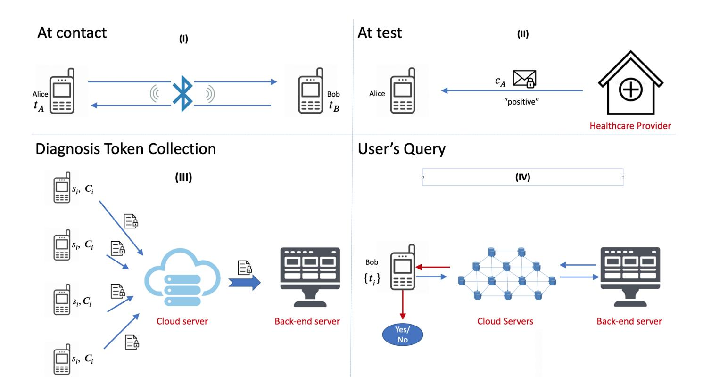
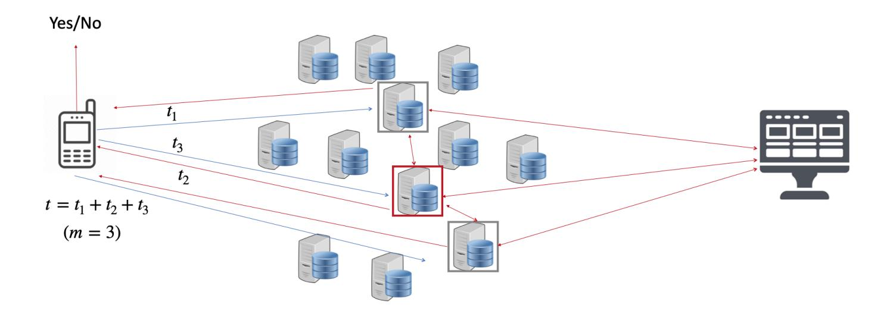

{0}------------------------------------------------

# Catalic: Delegated PSI Cardinality with Applications to Contact Tracing

Thai Duong∗ Duong Hieu Phan† Ni Trieu‡

#### **Abstract**

Private Set Intersection Cardinality (PSI-CA) allows two parties, each holding a set of items, to learn the size of the intersection of those sets without revealing any additional information. To the best of our knowledge, this work presents the first protocol that allows one of the parties to delegate PSI-CA computation to untrusted servers. At the heart of our delegated PSI-CA protocol is a new oblivious distributed key PRF (Odk-PRF) abstraction, which may be of independent interest.

We explore in detail how to use our delegated PSI-CA protocol to perform privacy-preserving contact tracing. It has been estimated that a significant percentage of a given population would need to use a contact tracing app to stop a disease's spread. Prior privacy-preserving contact tracing systems, however, impose heavy bandwidth or computational demands on client devices. These demands present an economic disincentive to participate for end users who may be billed per MB by their mobile data plan or for users who want to save battery life. We propose Catalic (ContAct TrAcing for LIghtweight Clients), a new contact tracing system that minimizes bandwidth cost and computation workload on client devices. By applying our new delegated PSI-CA protocol, Catalic shifts most of the client-side computation of contact tracing to untrusted servers, and potentially saves each user hundreds of megabytes of mobile data per day while preserving privacy.

**Keywords.** Private Set Intersection Cardinality, Contact Tracing, Linkage Attack.

## **1 Introduction**

Private Set Intersection (PSI) is a secure multiparty computation (MPC) technique that allows several parties, each holding a set of items, to learn the intersection of their sets without revealing anything else about the items. Over the past few years, practice has motivated the development of fast implementations that make PSI practical. As of today, Google runs PSI together with third-party data providers to find target audiences for advertising and marketing campaigns [\[IKN](#page-23-0)+19]. Private Set Intersection Cardinality (PSI-CA) is a variant of PSI in which the parties learn the intersection size and nothing else. Recently, PSI-CA is used in the context of contact tracing to protect against linkage attacks [\[TSS](#page-25-0)+20]. In this work, we consider delegated PSI-CA in the semi-honest model. By "delegated," we refer to cases where the parties outsource their datasets to an untrusted cloud and let the cloud perform the PSI-CA computation on their behalf. At the end of the computation, the parties only learn the intersection size, while the cloud learns nothing. This setting is useful when some of the parties have limited computing power. For example, when a phone has to intersect its

∗Google, thaidn@google.com

†LTCI, Telecom Paris, Institut Polytechnique de Paris, hieu.phan@telecom-paris.fr

‡Arizona State University, nitrieu@asu.edu

{1}------------------------------------------------

dataset with a large server-side database, it makes sense to delegate the phone's computation to the cloud for efficiency. To the best of our knowledge, this work is the first to consider delegated PSI-CA in the context of contact tracing to overcome the computational limitations of mobile devices.

We also explore the use of PSI-CA in privacy-preserving contact tracing (CT), an emerging technology that can help prevent the further spread of COVID-19 without violating individuals' privacy. Recently, there has been a significant amount of work on privacy-preserving CT [\[TPH](#page-25-1)+20, [CGH](#page-22-0)+20[,vABB](#page-25-2)+20[,RPB20,](#page-25-3)[Goo20a,](#page-23-1)[MMRV20,](#page-24-0)[LAY](#page-23-2)+20[,AIS20,](#page-21-0)[LTKS20,](#page-24-1)[CDF](#page-22-1)+20,[ABB](#page-21-1)+20[,CKL](#page-22-2)+20, [CBB](#page-22-3)+20, [TZBS20\]](#page-25-4). Most contact tracing systems are decentralized and rely on Bluetooth Low Energy (BLE) wireless radio signals on mobile phones. These systems warn people about others they have been in contact with who have been diagnosed with the disease.

Most of the current decentralized CT systems impose a significant mobile data cost on end-users because they require them to download a large, new dataset every day. At the current peak, the US has nearly 40,000 new cases daily. With the current Apple-Google design, users have to download approximately 40,000 (cases) \* 14 (keys per case) \* 16 (bytes per key) = 8.96 MB each day. The number of cases could be significantly higher after social restrictions are lifted. Even with this cost, the current Apple-Google design remains susceptible to various attacks. For example, if Bob is diagnosed with the disease, he would upload daily diagnosis keys to the server. In this case, Bob's anonymous identifier beacons/tokens, as they are broadcast each day, can be linked to each other. This is called a linkage attack. The beacons can also be linked across days if Bob frequently appears at the same place and the same time (i.e., because it is on his commute route). At the time of writing, Apple and Google have not described how they are going to address this problem. DP3T has proposed a solution based on Cuckoo filters, but it requires even more data downloaded (Design 2, [\[TPH](#page-25-1)+20]). For 40,000 new daily infections, users would need to download 110 MB each day. Mobile service providers such as Google Fi charge \$10/GB. This means, at 40,000 new cases per day, DP3T's Design 2 would cost each user \$1/day, and the Apple-Google solution would cost \$0.10/day (although we note that the Apple-Google design is more vulnerable to linkage attacks). Since contact tracing must be run continuously until a vaccine is available, it may last for months if not years. Therefore, the total cost to a single user could approach hundreds of dollars. In contrast, the network cost of our Catalic is on the order of a few hundred kilobytes and is independent of the server dataset size. We present details on comparisons between the systems' performance in Section [6.3.](#page-20-0)

The efficacy of contact tracing is proportional to the number of users. It is therefore crucial to the success of contact tracing to minimize the cost to these users. By applying our new lightweight delegated PSI-CA protocol, our Catalic system allows end users to delegate their computation to untrusted servers. As a result, the computation workload is almost free and the bandwidth cost is of a few hundred kilobytes, which is independent of the size of the server's database.

## **1.1 Our Contributions & Techniques**

We design a modular approach for delegated PSI-CA that is secure against semi-honest parties. The main building block of our PSI-CA protocol, which we believe to be of independent interest, is oblivious distributed key PRF (Odk-PRF). Recall that, in oblivious PRF (OPRF), the sender learns (or chooses) a PRF key *k*, and the receiver learns *F*(*k, r*), where *F* is a PRF and *r* is the receiver's input. The sender learns nothing about *r*, and the receiver learns nothing else. In Odk-PRF, the PRF key, input, and output are secret-shared among *m* parties. More precisely, an oblivious distributed key pseudorandom function (Odk-PRF) is a protocol that consists of a sender and *m* receivers. Each receiver has one XOR secret-shared of input *r* and learns the local PRF value *F*(*kj , rj* ), which is the result of the PRF on a secret-shared *ri* with a secret-shared key *kj* . The sender learns a combined

{2}------------------------------------------------

PRF key *k* = L*m j*=1 *kj* . If anyone collects all *m* local PRF evaluations, they can reconstruct the global PRF as *F*(*k, r*). Such an actor is known as a combiner.

Our delegated PSI-CA protocol consists of two major phases. First, in the distributed PRF phase, the PSI-CA's receiver (who we will call Alice) distributes secret shares of her input *X* = {*x*1*, . . . , xn*} to *m* cloud servers, which run Odk-PRF with the PSI-CA's sender (called Bob) to obtain secret shares of the PRF output. Bob learns the combined PRF key *ki* from this execution while each cloud server learns the local PRF value *F*(*ki,j , ri,j* ) for each share *ri,j* of *xi* , where *i* ∈ [*n*]*, j* ∈ [*m*]. Among the cloud servers, Alice can choose a leader to reconstruct the PRF output *F*(*ki , xi*) for each *xi* ∈ *X*. In the second phase, Bob generates a set of key-value pairs {(*F*(*ki , yi*)*, vi*)*,* ∀*yi* ∈ *Y* } where the key is the PRF output over his input *Y* = {*y*1*, . . . , yN* } and the value *vi* is known to Alice. If any *xi* ∈ *Y* , the cloud leader and Bob hold the same *F*(*ki , xi*), so the cloud leader can obliviously obtain the correct value *vi* by obliviously searching on Bob's key-value pairs. Otherwise, if *xi* 6∈ *Y* , the corresponding value obtained is random. This concept can be viewed as Oblivious Programmable PRF, proposed in [\[KMP](#page-23-3)+17]. Now with a set of 'real" or'fake" values *vi* , the cloud leader permutes and sends them to Alice, who can compute how many items are in the intersection (PSI-CA) by counting how many "real" *vi* there are, but can't learn anything about which specific items were in common (e.g., which *vi* corresponds to the item *xj* ). Thus, the intersection set is not revealed. This brief overview ignores many important concerns — in particular, how Bob can coordinate PRF keys and items without revealing the identities of the items. A more detailed overview of the approach is presented in [Section 4.](#page-6-0)

We motivate the design of our delegated PSI-CA protocol to build Catalic, a lightweight contact tracing system. As discussed in the introduction, most current decentralized systems impose a workload on end-users that has heavy bandwidth and computational costs. Catalic aims to minimize these costs. We will compare Catalic with other systems in [Section 2.2](#page-4-0) and [Section 6.3.](#page-20-0) In Catalic, every client plays the role of a dealer by dividing each anonymous identifier beacon they collect into shares and giving each share to a cloud server of their choice. Finally, using the results of the cloud servers' computation, clients perform a simple calculation to check whether there is a match (e.g., one that indicates they are at risk). The distinguishing property of our system is that it allows the development of a collaborative and decentralized system of cloud servers all around the world. These servers are available to help users who have resource-constrained devices. Users can select among all available servers in the delegation. This choice is totally hidden from the view of any adversary and thus, unless a majority of all the servers around the world are corrupted, the whole system preserves privacy.

In summary, we make the following contributions:

- We propose a novel Delegated Private Set Intersection Cardinality (DPSI-CA) protocol. To the best of our knowledge, it is the first protocol that allows clients to delegate their PSI-CA computation to cloud servers. The computation and communication complexity of our DPSI-CA protocol is linear in the size of the smaller set *O*(*n*), and is independent of the larger set's size.
- We design Catalic, a lightweight contact tracing system, that delegates client-side computation to untrusted servers. To the best of our knowledge, Catalic is the first system that outsources computation for contact tracing. Moreover, Catalic provides strong privacy guarantees that can prevent critical attacks (e.g., linkage attacks and false-positive claims).
- Finally, we implement building blocks of our PSI-CA protocol and estimate the protocol's performance. We show that the computational and network costs for the client are negligible. With the server database size *N* = 226, the client set size *n* = 212, and 2 cloud servers, without including the time spent waiting on the server's response, the client requires a running time of

{3}------------------------------------------------

2.17 milliseconds and only 190.48 KBs of communication. Our experiments show that Catalic is highly scalable.

## **2 Related Work and Comparison**

## **2.1 Private Set Intersection**

Private set intersection (PSI) has been motivated by many real-world applications such as contact discovery [\[CLR17\]](#page-22-4), botnet detection [\[NMH](#page-24-2)+10], human genomes testing [\[KRT18\]](#page-23-4). The earliest PSI protocols are based on Diffie-Hellman assumptions [\[Sha80,](#page-25-5)[Mea86,](#page-24-3)[HFH99\]](#page-23-5). Over the last few years, there has been active work on efficient secure PSI [\[DCW13,](#page-22-5)[PSSZ15,](#page-24-4)[FHNP16,](#page-22-6)[RR17,](#page-25-6)[KMP](#page-23-3)+17, [CLR17,](#page-22-4)[PRTY19\]](#page-24-5) with fast implementations that can process millions of items in seconds. However, these implementations only allow to output the intersection itself. In many scenarios (e.g, online marketing campaigns) it is preferable to compute some function of the intersection rather than to reveal the elements in the intersection. Limited work has focused on this so-called *f*-PSI problem. In this section, we focus on *f*-PSI constructions that support PSI-CA.

All current PSI-CA constructions are built in a setting where the sender and the receiver directly interact with each other in several interactive rounds to do the computation. Huang, Katz, and Evans [\[HEK12\]](#page-23-6) propose an efficient sort-compare-shuffle circuit construction to implement *f*-PSI. Pinkas et al [\[PSWW18,](#page-25-7)[PSTY19\]](#page-24-6) improve circuit-PSI using several hashing techniques. The main bottlenecks in the existing circuit-based protocols are the number of string comparisons and that computing the statistics (e.g., counts) of the associated values is done inside a generic MPC protocol, which is communication-expensive. Therefore, the current Diffie-Hellman Homomorphic encryption approach of [\[IKN](#page-23-0)+19] is still preferable in practice [\[Pos19\]](#page-24-7), due to its more reasonable communication complexity. However, the protocol of [\[IKN](#page-23-0)+19] requires a certain amount of computation, which is still expensive in the mobile setting. Very recently, [\[TSS](#page-25-0)+20] combines DHbased PSI protocols [\[HFH99\]](#page-23-5) and Private Information Retrieval [\[KO97\]](#page-23-7) to reduce the communication cost of [\[IKN](#page-23-0)+19]. Their PSI-CA protocol requires 35 seconds to securely compute the intersection size for a server database size 5*.*6 × 106 and client set size 1120.

With the growth of cloud computing, delegating computation to cloud servers is more practical. There are a few works [\[Ker12,](#page-23-8)[LNZ](#page-23-9)+14, [ZX15,](#page-26-0) [ATD17,](#page-22-7)[QLS](#page-25-8)+18, [ATMD19,](#page-22-8) [ATD20\]](#page-22-9) that consider the outsourcing (delegating) setting. Importantly, their protocols only compute the intersection itself. Most of the constructions are based on polynomials. Their core idea is that if the set *X* (respectively, *Y* ) is represented as a polynomial *f* (respectively, *g*) whose roots are the set's elements, then the polynomial representation of the intersection *X* ∩ *Y* is *P* = *f* × *r* + *g* × *s* where *r* and *s* are random polynomials, each of them secretly chosen by each party. An important property is that an item *x* ∈ *X* ∩ *Y* if and only if *f*(*x*) = *g*(*x*) = 0. Consequently, for each item *x* that appears in both sets *X* and *Y* , it holds that *P*(*x*) = *f*(*x*) × *r*(*x*) + *g*(*x*) × *s*(*x*) = 0 no matter which values *r*(*x*) and *s*(*x*) have. In the outsourcing setting, the parties encrypt and outsource the encrypted polynomials *f* and *g* to cloud servers that help to compute the polynomial *P* under homomorphic encryption. The servers then return the encrypted polynomial *P* to a receiver who figures out the intersection items by finding all roots of *P*. Because the valid roots of the polynomial are the items in the set intersection, it is not clear how to extend this idea to output only the intersection size without revealing the common elements. To the best of our knowledge, our DPSI-CA is the first protocol that allows the client (i.e., the receiver) to delegate their computation to cloud servers. The computation and communication complexity of our protocol is independent of the larger set size, and linear in the size of the smaller set *O*(*n*).

{4}------------------------------------------------

## **2.2 Secure Contact Tracing**

Global lockdown measures have been imposed all around the world and will cause severe social and economic problems. To relax the lockdown measures while keeping the ability to control the spread of the disease, technical tools for contact tracing have been introduced. The resulting applications try to log every instance a person is close to another smartphone-owner for a significant period of time.

The first method includes keeping logs of users' Global Positioning System (GPS) location data and asking them to scan Quick Response (QR) codes. However, GPS-based methods carry privacy risks because the GPS data may be sent to a centralized authority. Almost all nations are now focused on using another technology - wireless Bluetooth signals - to detect contact matches.

The main principle of Bluetooth-based approaches is to determine who has been in close physical proximity, determined by Bluetooth signals, to an individual who is diagnosed with the disease (a 'diagnosed user'). All methods require users to continually run a phone application that broadcasts pseudo-random Rolling Proximity Identifiers (RPI) representing the user and to record RPIs observed from phones in close proximity. Whenever a user is diagnosed positively with COVID-19, the application alerts all the devices from which it had received diagnosis RPIs during the infection window (e.g., 14 days for COVID-19).

There are two main categories of proposals: centralized and decentralized. In a centralized approach [\[Tra,](#page-25-9)[Rob,](#page-25-10)[NTK\]](#page-24-8), the server generates RPIs and thus knows all the RPIs honestly used in the system. The model relies on a trusted third-party (e.g, a government health authority). It is therefore vulnerable to many privacy issues. In a decentralized approach like DP3T [\[TPH](#page-25-1)+20], PACT [\[CGH](#page-22-0)+20] and Apple/Google [\[Goo20a\]](#page-23-1), each phone generates its own RPIs that are exchanged to another phone when a close contact event is detected. The RPI list never leaves a user's phone as long as the user is not diagnosed with the disease. This model removes the need of the trusted server, but is still vulnerable to several attacks like linkage attacks. For example, an attacker can install BLE-sniffing devices to different known physical locations and collect RPIs. By keeping track of when and where they received which tokens, the attacker can identify who has been diagnosed with the disease as well as the travel route of the individuals [\[Sei\]](#page-25-11).

Recent analysis has shown that current centralized and decentralized digital contact tracing proposals come with their own benefits and risks [\[Vau20\]](#page-26-1). Against a malicious authority, the risk of mass surveillance is very high in centralized systems. This risk is lower in decentralized systems because the users generate their tokens themselves. However, the decentralized systems also endanger the anonymity of diagnosed people over other users, as the tokens of diagnosed people are broadcasted to everyone. [\[Vau20\]](#page-26-1): "centralized systems put the anonymity of all users in high danger, specially against a malicious authority, while decentralized systems put the anonymity of diagnosed people in high danger against anyone."

Several solutions have been proposed to prevent against linkage attack as well as to leverage the best of centralized and decentralized systems. As far as we know, there are three protocols in this direction.

- The Epione system [\[TSS](#page-25-0)+20], in which private set intersection protocols are used on top of decentralized systems: the diagnosis RPIs are not broadcasted. Instead, the user's query is done with the back-end server via an interactive secure computation protocol (PSI-CA). This system achieves both high privacy and a low volume of data to be downloaded. However, it requires each user to realize the high computation (w.r.t resource-constrained devices) of a two-round interactive protocol with the servers.
- The Pronto-C2, proposed by Avitabile *et. al.* [\[ABIV20\]](#page-21-2), in which instead of asking diagnosed

{5}------------------------------------------------

people to send RPIs to the back-end server, they construct a system where smartphones anonymously and confidentially talk to each other in the presence of the back-end server. Informally, the back-end server helps users to establish shared Diffie-Hellman keys to check whether they are in contact with each other. The main shortcoming of this system is that the client still has to download a large database (as in the DP3T system) and this is not appropriate for resource-constrained devices.

• Finally, the DESIRE [\[DES\]](#page-22-10) is presented as an evolution of the ROBERT protocol used in France [\[Rob\]](#page-25-10). In this system, for each contact between two phones, a Diffie-Hellman key exchange between is established and stored on each phone, which makes a high barrier for resource-constrained devices.

We observe that none of the above three schemes supports resource-constrained devices that have limited capacities for computation and storage. Our work solves this problem by introducing an efficient delegated PSI-CA. Our solution allows resource-constrained devices to fully perform the functionality of the contact tracing system while maintaining the user's privacy.

Catalic can also be considered as a generalization of the Epione system. Indeed, if the user plays the role of the cloud servers themselves, then Catalic is equivalent to Epione. This gives us the ability to design a flexible system that allows users with sufficiently powerful devices who do not trust cloud services to participate in contact tracing without cloud help.

## **3 Security Model and Cryptographic Preliminaries**

This section introduces the notation, security guarantees, and cryptographic primitives used in the later sections. In this work, the computational and statistical security parameters are denoted by *κ, λ*, respectively. For *n* ∈ N, we write [*n*] to denote the set of integers {1*, . . . , n*}.

## **3.1 Security Model**

We consider a set of parties who have agreed upon a single functionality to compute and have also consented to give the final result to some particular party. At the end of the computation, nothing is revealed by the computational process except the final output. In the real-world execution, the parties often execute the protocol in the presence of an adversary who corrupts a subset of the parties. In the ideal execution, the parties interact with a trusted party that evaluates the function in the presence of a simulator that corrupts the same subset of parties. There are two adversarial models and two models of collusion.

- *Adversarial model*: A *semi-honest* adversary follows the protocol but is curious and attempts to obtain extra information from the execution transcript. A *malicious* adversary can apply any arbitrary polynomial-time strategy to deviate from the protocol.
- *Collusion security*: A *colluding* model is considered as a single monolithic adversary that observes the possibility of collusion between the dishonest parties. Consequently, the model is secure if the joint distribution of those views can be simulated. In contrast, a *non-colluding* model is considered as independent adversaries, each observing the view of each independent dishonest party. The model is secure if the individual distribution of each view can be simulated.

In this work, we consider the semi-honest setting. The adversary can corrupt parties but as long as there are at least two non-corrupted *specific* servers involved in the protocol, the privacy of the 

{6}------------------------------------------------

PARAMETERS: A PRF F, and two parties: receiver and sender.

BEHAVIOR:

- Wait for input q from the receiver.
- Sample a random PRF seed k and give it to the sender.
- Give F(k,q) to the receiver.

Figure 1: The OPRF ideal functionality

users will be guaranteed. We describe more detail on the security of our DPSI-CA protocol and Catalic system in Section 4 and Section 6.3.

### 3.2 Cryptographic Primitives

**Oblivious PRF** An oblivious pseudorandom function (OPRF) [FIPR05] is a protocol in which a sender learns (or chooses) a random PRF seed s while the receiver learns F(s, r), the result of the PRF on a single input r chosen by the receiver. The OPRF functionality is described in Figure 1.

**Distributed PRF** A distributed pseudorandom function (DPRF) is a protocol in which a PRF secret key sk is shared among n parties. Each party can locally compute a partial evaluation of the PRF on the same input x. A combiner who collects t partial evaluations can then reconstruct the evaluation F(sk, x) of the PRF under the initial secret key.

**Private Set Intersection Cardinality** Private set intersection cardinality (PSI-CA) is a two-party protocol that allows one party to learn the intersection size of their private sets without revealing any additional information. In this work, we consider PSI-CA in an untrusted third-party setting where the computation can be delegated to the third-party (e.g., cloud servers).

## 4 Cryptographic Protocols

In this section, we present more detail on our DPSI-CA construction which replies on our new cryptographic tool Odk-PRF. The DPSI-CA is later used as the main building block of our Catalic system described in Section 5.2.

## 4.1 Oblivious Distributed Key PRF

#### 4.1.1 Definition.

We introduce a new cryptographic notion of an oblivious distributed key pseudorandom function (Odk-PRF). Intuitively, the functionality is a hybrid of the distributed PRF and OPRF, with an additional feature that the PRF input is secret shared among m parties. Concretely, an oblivious distributed key PRF (Odk-PRF) is a protocol in which a server learns (or chooses) a random PRF key k. There are m clients, each has XOR secret share  $x_i$  of input point x. In Odk-PRF, each client learns  $F(k_i, x_i)$ , the result of the PRF on the secret share input  $x_i$  with a secret share key  $k_i$  of k. A combiner who collects all m PRF evaluations can then reconstruct the evaluation F(k, x) as the

PRF output on the input 
$$x = \bigoplus_{i=1}^{m} x_i$$
 with the key  $k = \bigoplus_{i=1}^{m} k_i$ .

{7}------------------------------------------------

We present a formal definition of Odk-PRF functionality by considering the following algorithms:

- KeyGen takes a security parameter  $\kappa$ , and generates a PRF key as KeyGen $(1^{\lambda}) \to k$ .
- KeyShare takes a PRF key k as a master key and a number m, and generates m shared PRF keys as KeyShare $(k, m) \to \{k_1, \ldots, k_m\}$  such that  $k = \bigoplus_{i=1}^m k_i$ .
- KeyEval takes a shared PRF key  $k_i$  and a (shared) input  $x_i$ , and gives output  $F(k_i, x_i) \to y_i$ , where F is a PRF.

The correctness of our Odk-PRF is that if  $k \leftarrow \mathsf{KeyGen}(1^{\lambda})$  and  $\{k_1, \ldots, k_m\} \leftarrow \mathsf{KeyShare}(k, m)$ , then  $F(k, \bigoplus_{i=1}^m x_i) = \bigoplus_{i=1}^m F(k_i, x_i)$ .

The security of the *oblivious distributed key* PRF (Odk-PRF) guarantees two following properties:

- (1) Similar to the security guarantees of distributed PRF, any strict subset of the  $F(k_i, x_i)$  hides F(k, x), where  $x = \bigoplus_{i=1}^m x_i$ . Note that the distributed PRF requires all the  $x_i$  values and x are the same (i.e,  $x = x_1 = \ldots = x_m$ ) while in our Odk-PRF, the  $x_i$  values are XOR secret shares of x (i.e,  $x = \bigoplus_{i=1}^m x_i$ ).
- (2) Similar to the security guarantees of *oblivious* PRF, F(k, x) reveals nothing about both x and k with very high probability (e.g.,  $2^{-\lambda}$ ).

### 4.1.2 OPRF's Instantiation.

In an OPRF functionality for a PRF F, the receiver provides an input x; the functionality chooses a random key k, gives k to the sender and F(k,x) to the receiver. In this work, we focus on the OPRF protocol [OOS17, KKRT16] which is based on inexpensive symmetric-key cryptographic operations (apart from a constant number of initial public-key operations). The protocol efficiently generates a large number of OPRF instances, which makes it a particularly good fit for our eventual contact tracing application. Note that the protocol of [KKRT16] achieves a slightly weaker variant of OPRF than what we have defined in Figure 1, but the construction remains secure for our Odk-PRF protocol.

The work of [KKRT16] introduces BaRK-OPRF where the PRF key is a related pair (s,k). The first key s is a random secret value chosen by the sender, and when doing many "OPRF" instances, all instances have the same s (e.g. related key). The second key has a formula  $k = t \oplus [C(x) \land s]$ , where x is an input to OPRF, C is a pseudo-random function that has minimum distance  $\kappa$ , and  $\wedge$  is bit-wise AND operator. In the construction of [OOS17], C is BCH code. The value t is chosen by the functionality (or the receiver), and has been considered as a PRF's output. e.g. the receiver gets F(k,x) = t.

Intuitively, for a BaRK-OPRF instance, the receiver can evaluate it on only one input (e.g, x) while the sender can evaluate this PRF at any point y by computing  $F(k,y) = k \oplus [C(y) \land s]$ . It is easy to see that  $F(k,y) = t \oplus [(C(y) \oplus C(x)) \land s]$ . If x = y then F(k,y) = t, and thus, (k,y) = F(k,x) as desired.

Briefly, the BaRK-OPRF construction has an additional key (i.e, the related key s) rather than the OPRF functionality defined in Figure 1. To adapt the above OPRF variant for our Odk-PRF definition, we relax our KeyShare and KeyEval functions as follows. KeyShare only takes the second BaRK-OPRF key k as a master key, and generates secret shares of k as before KeyShare $(k, m) \rightarrow \{k_1, \ldots, k_m\}$ .

{8}------------------------------------------------

However, the KeyEval takes the shared PRF key  $k_i$  and the additional related PRF key s and gives output  $y_i$  as  $F((k_i, s), x_i) \rightarrow y_i$ .

## 4.1.3 Odk-PRF Construction from OPRF.

We assume that there are m clients, each holds a value  $x_{i \in [m]}$ . When the clients act as PRF's receiver to provide m inputs  $\{x_1, \ldots, x_m\}$  to the BaRK-OPRF functionality, the related key s and keys  $\{k_1, \ldots, k_m\}$  are generated accordingly, where  $k_i = t_i \oplus [C(x_i) \land s], \forall i \in [m]$ . Each client, in turn, obtains  $F(k_i, x_i) = t_i$ , the result of the PRF on each single input  $x_i$ .

For Odk-PRF, we would like to produce a combined key by XORing all individual keys as  $k = \bigoplus_{i=1}^{m} k_i$ , a combined input value by XORing all corresponding PRF inputs as  $x = \bigoplus_{i=1}^{m} x_i$ , and a combined output value by XORing all corresponding PRF outputs as  $t = \bigoplus_{i=1}^{m} t_i$ . To achieve the correctness of our Odk-PRF, the combined key k should be the same as the second BaRK-OPRF key generated by evaluating OPRF on the combined input value x. In other words, k must be written in a formula as  $k = t \oplus [C(x) \land s]$ .

We observe that  $k = \bigoplus_{i=1}^m k_i = \bigoplus_{i=1}^m t_i \oplus [(\bigoplus_{i=1}^m C(x_i)) \wedge s]$ , and if we define F(k,x) := t then it is necessary to have XOR-homomorphic property for the function C so that k can be represented as  $k = \bigoplus_{i=1}^m t_i \oplus [C(\bigoplus_{i=1}^m x_i) \wedge s] = t \oplus [C(x) \wedge s]$  as desired. By using a linear code [OOS17,PRTY20] for the function C, surprisingly Odk-PRF is implemented by evaluating OPRF. The Odk-PRF protocol is presented in Figure 2. All functions KeyGen, KeyShare, and KeyEval are directly implemented from the protocol. Note that our Odk-PRF can support any type T (e.g, XOR, AND) of the combination of the individual keys  $k_i$  as long as the function C has T-homomorphic property. In this work, we use T as XOR.

PARAMETERS: A server S, and m client  $C_1, \ldots, C_m$ ; an OPRF primitive defined in Figure 1

INPUTS: Each client  $C_m$  has input  $x_i$ , the server has no input.

#### PROTOCOL:

- Each client  $R_{i \in [n]}$  and the server S invoke an OPRF instance:
  - Client  $C_i$  acts as OPRF's client with input  $x_i$
  - Server S acts as OPRF's sender. The server obtains a key  $k_i$  and a related key s which is the same for all OPRF instances.
  - Client  $C_i$  obtains a PRF value  $t_i$
- Server outputs a master key  $k = \bigoplus_{i=1}^{n} k_i$  and the related key s

Figure 2: Our Odk-PRF Construction.

The security of Odk-PRF follows in a straightforward way from the security of its building blocks (e.g. OPRF). In particular, each PRF value  $t_i$  is independent of each other. In addition, F(k, x) is indeed equal to  $\bigoplus_{i=1}^{m} F(k_i, x_i)$ . Therefore, any strict subset of the  $F(k_i, x_i)$  reveals nothing about F(k, x). Moreover, since OPRF is guaranteed to produce output indistinguishable from real, F(k, x) reveals nothing about both x and k. Thus, we omit the proof of the following theorem.

{9}------------------------------------------------

The construction of Figure 2 securely implements the oblivious distributed key PRF (Odk-PRF) defined in Section 4.1.1 in semi-honest setting, given the OPRF functionality described in Figure 1.

### 4.2 Delegated PSI-CA

In this section, we propose an efficient delegated PSI-CA in which the computation is delegated to the cloud servers.

#### 4.2.1 Problem Definition

In a delegated PSI-CA protocol, three kinds of parties are involved: a client  $\mathcal{C}$ , a backend server  $\mathcal{S}$ , and a set of m cloud servers  $\mathcal{H}$ . We assume that at most m-1 cloud servers are colluded, and the backend server does not collude with any cloud server. The delegated PSI-CA protocol  $\Pi$  computes a PSI-CA as follows:  $\Pi: \bot \times (\{0,1\}^*)^N \times (\{0,1\}^*)^n \to \bot \times \bot \times f_{|\cap|}$  where,  $\bot$  denotes the empty output,  $\{0,1\}^*$  denotes the domain of input item, N and n denote the set size, and f denotes the PSI-CA function. For every tuple of inputs  $\bot$ , a set X of size n, and a set Y of size N belonging to  $\mathcal{H}, \mathcal{C}, \mathcal{S}$  respectively, the function outputs nothing  $\bot$  to  $\mathcal{H}$  and  $\mathcal{S}$ , and outputs  $f_{|\cap|} = |X \cap Y|$  to  $\mathcal{C}$ .

#### 4.2.2 Technical Overview.

The basic idea for our PSI-CA is to have the backend server  $\mathcal{S}$  represent a dataset Y as a polynomial P(y) by interpolating the unique polynomial of degree (N-1) over the points  $\{(y_1, r_1), \ldots, (y_N, r_N)\}$ , where  $R = \{r_1, \ldots, r_N\}$  is random and known by both  $\mathcal{C}$  and  $\mathcal{S}$ . The backend server  $\mathcal{S}$  sends the (plaintext) coefficients of the polynomial to a cloud server  $\mathcal{H}$ , who evaluates the received polynomial on each  $x_i \in X$  (assuming X is known by  $\mathcal{H}$ ) and obtains  $P(x_i) = r_i'$ . It is easy to see that if  $x_i \in Y$ ,  $r_i' \in R$ . However, the cloud server cannot infer any information from  $r_i'$  since (s)he does not know R. To allow the client learn only the intersection size, the cloud server  $\mathcal{H}$  sends a set  $\{r_1', \ldots, r_n'\}$  to the client in a randomly permuted order. Shuffling means the client can count how many items are in the intersection (PSI-CA) by checking whether  $r_i' \in R$  but learns nothing about which specific item was in common (e.g. which  $r_i'$  corresponds to the item  $x_j$ ). Thus, the intersection set is not revealed.

Note that the above brief overview assumes that the cloud server  $\mathcal{H}$  knows X in the clear. To allow  $\mathcal{H}$  to evaluate the polynomial without knowing the information of X, we propose to use our Odk-PRF primitive. In particular, the client secret shares its item  $x_{i \in [n]}$  to a set of m non-colluding cloud servers, each  $\mathcal{H}_{j \in [m]}$  receives a share  $x_{i,j}$ . All cloud servers  $\mathcal{H}_{j \in [m]}$  invoke n Odk-PRF instances with the back-end server  $\mathcal{S}$ . For each Odk-PRF instance  $i \in [n]$ , the cloud server  $\mathcal{H}_{j \in [m]}$  acts as one of Odk-PRF's clients with input  $x_{i,j}$  and obtains PRF value  $t_{i,j}$ , while the back-end server  $\mathcal{S}$  acts as a Odk-PRF's server and obtains Odk-PRF master key  $k_i$  and related key s. Let's  $\mathcal{H}_m$  be a combiner, who can collect all  $t_{i,j}$  from  $\mathcal{H}_{j \in [m-1]}$  and reconstruct PRF value of item  $x_i$  as  $F((k_i, s), x_i) \leftarrow \bigoplus_{j=1}^m t_{i,j}$ . The security of Odk-PRF guarantees that the  $F((k_i, s), x_i)$  reveals nothing about  $x_i$ ,  $k_i$ , and s to the combiner. For the rest of the paper, we omit the related key s, and use PRF key  $k_i$  to refer to the pair  $(k_i, s)$ .

Recall that our goal is to have a cloud server (e.g. the combiner) to obtain the correct  $r_i$  from the polynomial's evaluation in a case that  $x_i \in Y$ , and random otherwise. To do so, the polynomial must be generated based on PRF values. The back-end server S has PRF key  $k_i$  from the Odk-PRF execution, thus S can evaluate PRF value on any input. There are n PRF keys  $k_{i \in [n]}$  and N elements  $y_{j \in [N]}$ . The total PRFs needed to be evaluated is nN, and thus, the polynomial has a degree of (nN-1), which is very expensive for interpolation and evaluation operations.

{10}------------------------------------------------

In order to address the above issue, similar to [\[PSSZ15\]](#page-24-4), we use a hashing scheme to place items into several bins and then perform the polynomial's operations per bin. However, the cloud servers do not allow to know *X*, and thus cannot place the share *xi,j* into a corresponding bin. Therefore, in our protocol, the client C is required to map a set of *X* into the bins. Each C's bin contains at most one item. The backend server also hashes its items into bins, each contains a small number of inputs. The C secretly shares the item in its bin to the cloud servers, which later allows the cloud leader and the backend server to interpolate and evaluate the polynomial bin-by-bin efficiently. A more detailed overview of the approach and the hashing scheme is presented in the following section, prior to the presentation of the full protocol.

### **4.2.3 Cryptographic Gadgets.**

We review the basics of Cuckoo & Simple hashing scheme [\[PSSZ15\]](#page-24-4), and Pack & Unpack Message [\[DCW13,](#page-22-5)[KMP](#page-23-3)+17] to improve our DPSI-CA construction.

**Cuckoo hashing.** In basic Cuckoo hashing, there are *β* bins denoted *B*[1 *. . . β*], a stash, and *k* random hash functions *h*1*, . . . , hk* : {0*,* 1} *?* → [*β*]. The client uses a variant of Cuckoo hashing such that each item *x* ∈ *X* is placed in exactly one of *β* bins. Using the Cuckoo analysis [\[DRRT18\]](#page-22-12) based on the set size |*X*|, the parameters *β, k* are chosen so that with high probability (1 − 2 −*λ* ) every bin contains at most one item, and no item has to place in the stash during the Cuckoo eviction (.i.e. no stash is required).

**Simple hashing.** The backend server maps its input set *Y* into *β* bins using the same set of *k* Cuckoo hash functions (i.e, each item *y* ∈ *Y* appears *k* times in the hash table). Using a standard ball-and-bin analysis based on *k, β*, and the input size of client |*X*|, one can deduce an upper bound *η* such that no bin contains more than *η* items with high probability (1 − 2 −*λ* ).

**Pack&Unpack Message.** A pack&unpack message consists of two algorithms:

- pack(*S*) → Π: takes a set *S* of key-value tuples (*ai , bi*)*,* ∀*i* ∈ [*η*]*,* from a random distribution, then outputs a representation Π.
- unpack(Π*, a*) → *v*: takes a Π and a key *a*, then outputs value *v*.

Such a pack&unpack scheme should satisfy the following properties:

- Correctness: if (*a, b*) ∈ *S* and Π ← pack(*S*) then (*a,* unpack(Π*, a*)) ∈ *S*.
- Obliviousness: for pack({(*a*1*, b*1)*, . . . ,*(*aη, bη*)}) → Π, the distributions of unpack(Π*, a*) and unpack(Π*, a*0 ) are indistinguishable when the *bi* values are uniformly distributed.

There are several pack&unpack constructions presented in [\[KMP](#page-23-3)+17], with different tradeoffs in communication and computation cost. In this work, we use the following data structures:

1. Polynomial-based construction: pack(*S*) is implemented by interpolating a degree (*η* − 1) polynomial Π over the points {(*a*1*, b*1)*, . . . ,*(*aη, bη*)}. unpack(Π*, a*) is implemented by evaluating the polynomial Π on the key *a*. It is easy to see that Π satisfies correctness and obliviousness. The interpolation of the polynomial takes time *O*(*η* log(*η*) 2 ) field operations [\[MB72\]](#page-24-11), which can be expensive for large *η*. The size of Π is *O*(*η*).

{11}------------------------------------------------

2. Garbled Bloom filter (GBF) [DCW13]: given a collection of hash functions  $H = \{h_1, \ldots, h_k \mid h_i : \{0,1\}^* \to [\tau]\}$ , a GBF is the array GBF[1..., $\tau$ ] of strings. The GBF implements a key-value pair (a,b) in which the value associated with the key a is  $b = \sum_{i=1}^k \mathsf{GBF}[h_i(a)]$ . The GBF works as follows. The GBF is initialized with all entries equal to an empty string  $\bot$ . For each key-value pair (a,b), let  $T = \{h_i(a) \mid i \in [k], \mathsf{GBF}[h_i(a)] = \bot\}$  be the relevant positions of GBF that have not yet been set. Abort if  $T = \emptyset$ . Otherwise, we choose random values for entries  $\mathsf{GBF}[j], j \in [T]$ , subject to  $\sum_{i=1}^k \mathsf{GBF}[h_i(a)] = b$ . For any remaining  $\mathsf{GBF}[j] = \bot$ , we replace  $\mathsf{GBF}[j]$  with a randomly chosen value. The computation complexity is  $O(\eta)$ . The size of  $\Pi$  is also  $O(\eta)$ , however, its constant coefficient is high. The parameters k and  $\tau$  are chosen so that the "Abort" event happens with negligible probability (e.g.  $2^{-\lambda}$ ). We discuss parameter choice for GBF in Section 3.

### 4.2.4 Delegated PSI-CA Construction.

Our semi-honest delegated PSI-CA protocol is presented in Figure 3, following closely the description in the previous Section 4.2.2. The construction consists of four phases.

Recall that our construction requires that the client and backend server have the same set of random items R for computing PSI-CA final output. This can be done at the setup phase, where the backend server chooses a random seed s, and sends it to the client. Both parties can generate  $\beta$  random values as  $R = \{r_1, \ldots, r_\beta\} \leftarrow PRG(s)$ , where  $\beta$  is the number of bins in the Cuckoo's table.

In the tokens' distribution phase, the client hashes items X into  $\beta$  bins using the Cuckoo hashing scheme. For each bin  $b \in [\beta]$ , the client secret shares the item  $x_b$  in that bin to m cloud servers. To reduce the network costs, the client can sample m-1 random seeds  $s_i$ , and sends each of them to one among m-1 cloud servers  $\mathcal{H}_{j\in[m-1]}$  in the setup phase. For the item  $x_b$  in the bin  $b^{th}$ , the client computes a share  $x_b^m \leftarrow x_b \oplus PRG(s_1||b) \oplus \ldots \oplus PRG(s_{m-1}||b)$ , and gives  $x_b^m$  to the cloud server  $\mathcal{H}_m$ . Having PRG seed  $s_i$ , other cloud server  $\mathcal{H}_{j\in[m-1]}$  can generate the share  $x_b^j$  of  $x_b$  by computing  $x_b^j \leftarrow PRG(s_j||b)$ . It is easy to check that all the  $x_b^j, \forall j \in [m]$ , values are shares of  $x_b$  as  $x_b = \bigoplus_{j=1}^m x_b^j$ .

For each bin  $b \in [\beta]$ , the cloud servers  $\mathcal{H}_{j \in [m]}$  and the back-end server  $\mathcal{S}$  invoke a Odk-PRF instance such that  $\mathcal{S}$  acts as a Odk-PRF's server and obtains PRF key  $k_b$  in Step (1,I) while the cloud leader  $\mathcal{H}_m$  acts as a Odk-PRF's combiner and learns  $t_b \leftarrow F(k_b, x_b)$  as described in Step (3,III). Unlike the brief overview described in Section 4.2.2, the combiner  $\mathcal{H}_m$  divides PRF values  $\{t_1, \ldots, t_\beta\}$  into m groups, each group has  $\alpha = \lceil \frac{\beta}{m} \rceil$  items as  $T_j = \{t_{(j-1)\alpha}, \ldots, t_{j\alpha-1}\}$  except possibly the last group which may have less than  $\alpha$  items (without loss of generality, we assume that  $\beta$  is divisible by m). The combiner  $\mathcal{H}_m$  sends each set  $T_j$  to the cloud server  $\mathcal{H}_j$ . The main purpose of this step is to distribute the last computation phase (e.g. polynomial evaluation) to all cloud servers.

The backend server S hashes its input set Y into  $\beta$  bins using the Simple hashing. For each  $b \in [\beta]$ , S computes PRF value  $u_{b,i} \leftarrow F(k_b, y_i)$  on every item  $y_i$  in that bin with the PRF key  $k_b$  obtained from the Odk-PRF execution. The backend server S then generates a set of points  $P_b = \{(H(u_{b,i}), r_b \oplus u_{b,i})) | y_i \in B_S[b]\}$  for the bin  $B_S[b]$  where H is a one-way hash function known by every participant, and  $r_b$  is in the random set R computed in the setup phase. S packs  $P_b$  as  $\Pi_b \leftarrow \mathsf{pack}(P_b)$ . If  $b \in [(j-1)\alpha, j\alpha - 1]$ , the backend server S sends  $\Pi_b$  to the corresponding cloud server  $\mathcal{H}_j$ . Each cloud server  $\mathcal{H}_j$  unpacks the received message using every element  $t_j \in T_j$  as  $v_j \leftarrow \mathsf{unpack}(\Pi_b, H(t_j))$ , computes  $v_j := v_j \oplus t_j$ , and forwards the resulting value to  $\mathcal{H}_m$ .

After collecting all  $v_j$  values as  $V = \{v_1, \dots, v_\beta\}$ ,  $\mathcal{H}_m$  permutes the set V and sends it back to the client, who computes  $\sigma = |R \cap V|$  as an output of PSI-CA.

{12}------------------------------------------------

#### PARAMETERS:

- Set size n and N.
- A client C, a backend server S, and m cloud servers  $\mathcal{H}_1, \ldots, \mathcal{H}_m$
- A one-way hash function  $H: \{0,1\}^* \to \{0,1\}^*$ , and Cuckoo and Simple hashing scheme described in Section 4.2.3.
- A Odk-PRF primitive described in Section 4.1
- pack() and unpack() functions described in Section 4.2.3

#### INPUTS:

- Client C has input  $X = \{x_1, \ldots, x_n\}$
- Backend server S has input  $Y = \{y_1, \dots, y_N\}$
- Cloud server  $\mathcal{H}_{j\in[m]}$  has no input.

#### PROTOCOL:

#### I. Setup phase

- The backend server S chooses a random seed s, and sends it to the client.
- The client generates  $\beta$  random values  $R = \{r_1, \dots, r_\beta\} \leftarrow PRG(s)$
- The back-end server S generates  $\beta$  random values from PRG(s), permutes them, and gets  $\{p_1, \ldots, p_{\beta}\}$
- The client chooses m-1 random seeds  $s_{i\in[m-1]}$ , and sends  $s_i$  to  $\mathcal{H}_{i\in[m-1]}$ .

#### II. Tokens distributed

- The client hashes items X into  $\beta$  bins using the Cuckoo hashing scheme. Let  $B_C[b]$  denote the item in the client's  $b^{th}$  bin (or a dummy item for empty bin).
- For each  $b \in [\beta]$ , and  $x \in B_C[b]$ , the client computes  $x_b^m \leftarrow x \bigoplus_{j=1}^{m-1} PRG(s_i||b)$ , and gives  $x_b^m$  to the cloud server  $\mathcal{H}_m$ .
- For each  $b \in [\beta]$ , the cloud server  $\mathcal{H}_{i \in [m-1]}$  computes  $x_b^j \leftarrow PRG(s_i||b)$  as a share of item  $x \in B_C[b]$ .

#### III. Server computation

- 1. For each  $b \in [\beta]$ , cloud servers  $\mathcal{H}_{j \in [m]}$  and back-end server  $\mathcal{S}$  invoke an instance of Odk-PRF where:
  - S acts as Odk-PRF's server and obtains PRF key  $k_b$
  - Each  $\mathcal{H}_j$  acts as Odk-PRF's client with input  $x_b^j$ , and obtains PRF values  $t_b^j$ .
- 2. For all  $j \in [m-1]$ , each  $\mathcal{H}_j$  sends  $T_j = \{t_1^j, \dots, t_\beta^j\}$  to the combiner  $\mathcal{H}_m$ .
- 3. For each  $b \in [\beta]$ , the combiner  $\mathcal{H}_m$  computes  $t_b = \bigoplus_{j=1}^n t_\beta^j$
- 4. Let  $\alpha = \lceil \frac{\beta}{m} \rceil$ , the combiner  $\mathcal{H}_m$  divides a set  $\{t_1, \ldots, t_\beta\}$  into m subsets  $T_j = \{t_{(j-1)\alpha}, \ldots, t_{j\alpha-1}\}$ , and sends each  $T_j$  to  $\mathcal{H}_j, \forall j \in [m-1]$ .
- 5. The back-end server S hashes items Y into  $\beta$  bins using the Simple hashing. Let  $B_S[b]$  denote the set of items in the  $b^{th}$  bin
- 6. For each  $b \in [\beta]$ ,  $\mathcal{S}$  computes  $u_{b,i} = F(k_b, y_i)$  for all  $y_i \in B_L[b]$ .
- 7. For each  $b \in [\beta]$ ,
  - S generates a set of points  $P = \{(H(u_{b,i}), p_b \oplus u_{b,i}) | y_i \in B_L[b])\}$  for all  $b \in [(j-1)\alpha, j\alpha 1]$ , and sends  $\Pi_b \leftarrow \mathsf{pack}(P)$  to the cloud server  $\mathcal{H}_j$  if  $b \in [(j-1)\alpha, j\alpha 1]$
  - $\mathcal{H}_j$  unpacks the received message using each element  $t_j \in T_j$  as  $v_j \leftarrow \mathsf{unpack}(\Pi_b, H(t_j))$ , and then sends  $v_j := v_j \oplus t_j$  to the combiner  $\mathcal{H}_m$
- 8. After collecting all  $v_{j \in [b]}$  from  $\mathcal{H}_{j \in [m-1]}$ , the combiner  $\mathcal{H}_m$  permutes the set  $V = \{v_1, \ldots, v_b\}$  and sends it to  $\mathcal{C}$ .

#### IV. Client's output: $\sigma = |R \cap V|$ .

Figure 3: Our delegated PSI-CA construction.

{13}------------------------------------------------

### **4.2.5 PSI-CA Security and Discussion**

The PSI-CA construction of [Figure 3](#page-12-0) securely implements the delegated PSI-CA functionality described in Definition [4.2.1](#page-9-1) in semi-honest setting, given the Odk-PRF functionality described in [Section 4.1.](#page-6-3)

We exhibit simulators for simulating corrupt client, a set of corrupt cloud servers, and corrupt backend server respectively. We argue the indistinguishability of the produced transcript from the real execution.

**Simulating client.** The simulator only sees a set of *vπ*(*i*) = unpack(*ti*) messages in a randomly permuted order *π*() : [*β*] → [*β*] chosen by the cloud server combiner H*m*. We consider modifying this view as a set of *vi* = unpack(*tπ*−1(*i*) ). Using the abstraction of the unpack obliviousness we can replace term *vi* with an independently random element for each *xi* 6∈ *X* ∩ *Y* . As long as the client and H*m* do not collude, we can replace unpack(*tπ*−1(*i*) ) with unpack(*t*) where *t* is a PRF value of a common item *x* ∈ *X* ∩ *Y* (i.e, the permutation hides the common items), and then replace unpack(*t*) with random element in *R*. In other words, the simulator only learns |*X* ∩*Y* | and *Y* . The simulation is perfect.

**Simulating cloud servers.** Let Adv be a coalition of corrupt cloud servers. In our protocol, we assume that Adv has at most *m* − 1 among *m* cloud servers. The simulator simulates the view of Adv, which consists of received shares from the client, Odk-PRF's randomness, pack messages from the backend server, and transcripts from the Odk-PRF ideal functionality. We consider two following cases:

- Security for the client C: In Step (II) of our protocol, the client C secretly shares its input to *m* cloud servers. Since Adv contains at most *m*−1 corrupt cloud servers, Adv learns nothing from this step, and we can replace the share with random. Thanks to the cryptographic guarantees of the underlying Odk-PRF protocol, no information is revealed except the PRF output in Steps (III,3) and (III,4). We also assume that Adv does not collude with the backend server, the PRF outputs can be replaced with randoms. In Step (III,7), Adv evaluates unpack which also produces output indistinguishable from the real world.
- Security for the back-end server S: In Step (III,7) of our protocol, S packs a set of key-value pairs *P* = { *H*(*u*)*, p* ⊕ *u* } via pack functionality, where *u* = *F*(*k, y*) is a PRF value on the item *y* ∈ *Y* with the key *k* obtained from Odk-PRF, and *p* is generated from the secret PRG seed. Because of Odk-PRF pseudorandomness property, we replace *u* with random. In our protocol, the cloud servers do not know the PRG seed, we can also replace *p* with random. The pack functionality takes a set of random pairs thus its distribution is uniform.

In summary, the output of Adv is indistinguishable from the real execution.

**Simulating back-end server.** When using the abstraction of our Odk-PRF functionality, the simulation is elementary.

**Security Discussion.** In our DPSI-CA, we require that the backend server does not collude with any cloud server. This requirement is for the security guarantee in Step (III,4) where each cloud server *j th* can see a subset *Tj* = {*t*(*j*−1)*α, . . . , tjα*−1} of PRF outputs of the client's items in the buckets [(*j* − 1)*α, . . . , jα*]. If the cloud server *j th* colludes with the back-end server, they can learn which specific items of these buckets are common by comparing *Tj* and the set of PRF outputs on ∀*y* ∈ *Y* .

Our protocol can be modified to make the above non-colluding requirement weaker. In particular, we can assume that there is a specific (instead of any) cloud server (e.g, the combiner H*m*) that

{14}------------------------------------------------

does not collude with the backend server. With the new colluding assumption, H*m* needs to play role of other cloud servers to perform unpack in Step (III,7). In other words, we modify our DPSI-CA construction in [Figure 3](#page-12-0) by removing Step (III,4). The combiner H*m* keeps the whole set *T* = {*t*1*, . . . , tβ*} locally. The backend server S sends all pack(*Pb*) to the combiner H*m* (instead of other cloud servers H*j*∈[*m*−1]). The H*m* uses *T* to evaluate the corresponding pack(*Pb*) and obtains a set *V* which is forwarded to the client as before.

The modified protocol improves the security assumption of our DPSI-CA, but requires more computation on the cloud server combiner's side. Depending on the system specifications, the protocol can be adjusted to the appropriate design.

## **5 Catalic System**

Figure 4: The Overview of our Catalic System. (I) Tokens (RPIs) are exchanged when two users are in close proximity. (II) When a user is diagnosed by a healthcare provider, the user receives a certificate which indicates that (s)he tested positive with the disease. (III) the diagnosed user encrypts a pair of their PRG seed and the certificate using the public key of the backend server, and sends the encrypted values to the cloud server, who then permutates and transmits them to the backend server. Using its private key, the backend server decrypts the received ciphertexts and obtains a set of pairs including the PRG seed and associated certificate. The backend server checks whether the certificate is valid using the hospital key. If yes, the backend server generates the diagnosis tokens using the corresponding PRG. (IV) Each user invokes a DPSI-CA algorithm with the backend server via cloud servers, where the user's input is its received tokens and the server's input is the list of diagnosis tokens. The user learns only whether (or how many) tokens there are in common between the two sets.

## **5.1 System Overview**

The Catalic system consists of five main phases. The first three steps are mostly the same as the BLE-based approaches such as Apple-Google [\[Goo20a\]](#page-23-1). In the third step, we can enhance the privacy w.r.t the prior methods by adding a Mix-Net system to shuffle the diagnosis tokens/keys. This prevents attackers from linking which tokens belong to which user, and thus protect the

{15}------------------------------------------------

privacy of users who tested positive (so-called diagnosed users). The fourth step is the heart of our system where we allow a contract tracing app to delegate the secure matching computation to a decentralized system of untrusted cloud servers. Then based on the returned values, the user determines whether (s)he has been exposed to the disease. The secure matching allows Catalic to prevent against the linkage attack which remains in other systems including Apple-Google [Goo20a] and DP3T [TPH+20].

The system is diagrammed in Figure 4. Our Catalic model involves computation by all participants/users and by three kinds of untrustworthy servers: those of healthcare providers, cloud servers, and a backend server. Similar to other decentralized contact tracing systems [Goo20a], at some point, the backend server holds the transmitted diagnosis RPIs  $\mathbf{T}$  while the  $i^{th}$  user holds the received RPIs  $\widetilde{T}_i$  obtained from the "contact" phase. The last step of contact tracing system aims to securely compare  $\mathbf{T}$  to every  $\widetilde{T}_i$ . If there is a match, the  $i^{th}$  user was in close proximity to a user that has since been diagnosed with the disease. To perform this task, we integrate our DPSI-CA protocol into Catalic. We formulate this core component in Figure 5.

PARAMETERS: Four parties: a back-end server, a set of cloud servers, and a user.

#### FUNCTIONALITY:

- Wait for the server with input set **T**
- Wait for the user with input set  $\widetilde{T}_i$
- Wait for the cloud servers with no input
- Give the user the intersection size  $|\widetilde{T}_i \cap \mathbf{T}|$

Figure 5: Our DPSI-CA gadget.

Each user delegates the PSI-CA computation to two (or more) non-colluding cloud servers (e.g., those run by Amazon, Google, or Apple). The backend server and the cloud servers jointly perform PSI-CA, and return the PSI-CA output to the user, who determines whether there is a match.

#### 5.2 Catalic Extension

As mentioned in the previous section, each user delegates the PSI-CA computation to two or many cloud servers. The privacy of the user will be guaranteed if at least one of these servers is not corrupted. In practice, we can have a large network of cloud servers that helps the user to do this delegation. In this section, we briefly describe such a network and leave the concrete design for future work which goes beyond the scope of automated contact tracing.

**DSUSH:** Decentralized System of Untrusted Server-Helpers. We describe a decentralized system of untrusted servers as in Figure 6, in which:

- Any server can ask to join DSUSH as a cloud server (so-called server-helper). Each one can be certified by the Authority, say the backend server. Whenever there is a proof that a cloud server is dishonest, this server will be removed from the system and blacklisted.
- Assume that the DSUSH has M server-helpers. Any client  $\mathcal{C}$  can secretly choose any m among M server-helpers in DSUSH and run the delegated PSI-CA protocol described in Figure 3 with these m server-helpers.

Client's Privacy. To break the privacy of the client C, an outsider adversary has to corrupt all the m cloud servers chosen by C.

{16}------------------------------------------------

Figure 6: DSUSH: Decentralised System of Untrusted Server-Helpers.

## **5.2.1 Tracing Traitors for the Reliability of DSUSH.**

Interestingly, we can employ techniques from traitor tracing to detect malicious cloud servers in DSUSH. Any cloud server can be traced if it acts as a malicious server. The tracing procedure can be realized without any notice: no server can tell if it is run in a normal process or in a tracing process. Traceability is the main feature that discourages cloud servers to behave maliciously.

Recall that in our delegated PSI-CA protocol described in [Figure 3,](#page-12-0) the client can choose *m* ≥ 2 cloud servers with the following requirements:

- For all *j* ∈ [*m* − 1], the server-helper H*j* interacts with cloud server-helper combiner H*m*.
- For all *j* ∈ [*m*], the server-helper H*j* interacts with the backend server S.
- For all *j* ∈ [*m*], the server-helper H*j* interacts with the client C.

From the above properties, we briefly show that anyone who possesses a diagnosis RPIs *x* that belongs to the set of diagnosis RPIs *Y* = {*y*1*, . . . , yN* } at the back-end server can do the tracing and becomes thus a tracer. Eventually, the back-end server can generate this special RPI *x* and add it to the list of the diagnosis RPIs *Y* .

**Testing whether a suspected server-helper is malicious.** The trace can test if a server, say H1, is a malicious as follow:

- Step 1: Tracer plays the role of the client C in the delegated PSI-CA protocol described in [Figure 3.](#page-12-0) The tracer can choose *n* − 1 random dummy RPIs which are thus probably not in the backend server set *Y* of diagnosis RPIs. The tracer then defines *X* that contains *x* and these *n* − 1 dummy RPIs.
- Step 2: The tracer sets *m* = 2, and chooses a trusted server H*m* (the tracer can play himself/herself as the role of H*m*) and runs the protocol.
- Step 3: If the result returns at the end of the protocol is different than the correct value 1 (because *x* is the only element in the intersection of *X* and *Y* ), then H1 is certainly a malicious server.
- The effectiveness of the above tracing technique comes from the fact that the server H1 only knows H*m* but cannot corrupt H*m*. The value that H1 receives from the H*m* and the server S are exactly the same as in the normal protocol and thus H1 cannot distinguish a tracing procedure from a normal procedure.

{17}------------------------------------------------

• If  $\mathcal{H}_1$  acts maliciously with a probability p then the tracer can detect this malicious server with probability p for each run of the protocol. By repeating the protocol k times, one can detect this malicious with probability  $1 - (1-p)^k$  which close to 1 for sufficiently large k.

#### Testing whether a chosen set T of server-helpers contains a malicious server.

- Step 1: Identical as the above test of a suspected server-helper.
- Step 2: The tracer sets m = |T| + 1, and chooses a trusted server  $\mathcal{H}_m$  (the tracer can play himself/herself as the role of  $\mathcal{H}_m$ ) and runs the protocol.
- Step 3: If the result returned at the end of the protocol is different than the correct value 1, then the T contains at least a malicious server.
- The effectiveness of the above tracing technique comes from the fact that the server-helpers do not know each other and cannot collude to deter the computation. The servers in T only know  $\mathcal{H}_m$  which is trusted and therefore cannot corrupt  $\mathcal{H}_m$ . The values that the servers in T receive from the  $\mathcal{H}_m$  and the server S are exactly the same as in the normal protocol and thus T cannot distinguish a tracing procedure from a normal procedure.
- $\bullet$  By repeating the protocol many times, the tracer can correctly determine with overwhelming probability whether T contains a malicious server.

**Black-box tracing.** We can eventually generalize the above technique to get the black-box tracing. The tracer first set T to be the whole set in DSUSH. Then if T contains a malicious server then the tracer performs a binary search from T to be able to get the malicious servers.

#### 5.2.2 Practical Implementation of DSUSH

**DSUSH in Google-Apple setting.** Google and Apple would allow their cloud servers all around the world to participate in a DSUSH. If these servers are trusted then the privacy of the users is preserved. If one of the two firms is malicious (or half of the servers are corrupted) then the privacy of a user who runs the delegated PSI-CA protocol described in Figure 3 with m server-helpers will be broken with probability  $\frac{1}{2^m}$  (m should be set around 40) assuming that the numbers of servers of Google and of Apple are the same and the choice of m server-helpers of the user is random. If both Google and Apple are malicious (all the servesr are corrupted) then the privacy of the users will be broken, their tokens will also be revealed.

#### DSUSH in a general setting of proximity tracing.

- As far as the user knows an honest server in DSUSH (for example the server from his friend, his university, etc) then the privacy is preserved.
- If the user randomly chooses a set of m server-helpers then the privacy will be broken only when all of these m server-helpers are malicious. Given the traceability, this case is quite improbable.

DSUSH itself could be an interesting platform and we leave a concrete design with formal proven properties of such a network to the future works.

{18}------------------------------------------------

## 6 Implementation and Performance

To demonstrate the practicality of our Catalic system, we evaluate each building block of our DPSI-CA protocol in C++. We run cloud server and backend server on a single server which has 2x 36-core Intel Xeon 2.30GHz CPU and 256GB of RAM. For evaluating the performance of the client, we do a number of experiments on a virtual Linux machine which has Intel Xeon 1.99GHz CPU and 16GB of RAM.

As detailed in Section 4, our Odk-PRF protocol builds on a specific OPRF variant [KKRT16, OOS17] from the open-source code [Rin]. Our polynomial pack and unpack implementation uses the NTL library [Sho] with GMP library and GF2X [GBZT] library installed for speeding up the running time. The implementation of the building blocks (pack/unpack, end-user's side) is available on Github: https://github.com/nitrieu/delegated-psi-ca.

## 6.1 Parameter Choices

All evaluations were performed with input item of 128 bits, a statistical security parameter  $\lambda = 40$  and computational security parameter  $\kappa = 128$ . We perform DPSI-CA on the range of set sizes  $N = \{2^{22}, 2^{24}, 2^{26}\}$  and  $n = \{2^{10}, 2^{11}, 2^{12}\}$ .

Cuckoo hashing: Based on the experiment analysis [DRRT18], we choose cuckoo hashing parameters such that no stash is required with sufficiently low probability. Concretely, in our setting the client places its set into a Cuckoo table of size  $\beta = 1.5n$  using 3 hash functions while the backend server using the same set of hash functions and maps its item y into three bins  $\{h_1(y), h_2(y), h_3(y)\}$  (i.e., item y appears three times in the hash table with the high probability).

Polynomial interpolation and evaluation: Given m cloud servers, our DPSI-CA protocol requires the backend server to generate m polynomials, each of degree  $N' \leftarrow \frac{3N}{m}$ . Each cloud server must evaluate such a polynomial on  $n' \leftarrow \frac{1.5n}{m}$  points. The best algorithms for interpolation incur  $O(N'\log^2(N'))$  field operations which is expensive for a high-degree polynomial since N' is typically large (e.g.  $N' = 2^{24}$ ). To speed up the computation complexity of our protocol, we map N' items into  $\theta$  buckets, each has maximum d items. Instead of interpolating a polynomial of degree N' - 1, we interpolate multiple smaller polynomials of degree d - 1. Based on the analysis of the parameters [PSTY19], we choose  $d = 2^{10}$ , and because of d << N' ( $N' = 2^{24}$ ) there is a high probability that each bucket contains the same number of items. [PSTY19] shows that only 3% dummy items need to pad to the bucket to hide the actual bucket's size. Accordingly, the cloud server also maps its items into  $\theta$  buckets and evaluates  $\theta$  polynomials of small-degree d - 1. For communication and computation efficiency, the polynomial field size can be truncated to length  $\lambda + \log(N'n')$  bits and the protocol will still be correct as long as there are no spurious collisions with probability  $1 - 2^{-\lambda}$ . In our experiment, we set the polynomial field size to be 80 bits to achieve a high probability of correctness of approximately  $1 - 2^{-40}$ .

Garbled Bloom Filter: The false-positive probability for a Garbled Bloom filter is the same as that of plain Bloom filter which has been well analyzed. Therefore, we choose 31 hash functions and the Garbled Bloom Filter of size 58N' to achieve the false-positive rate  $(1 - e^{\frac{-31}{58}})^{31}$  which is close to  $2^{-\lambda}$ .

### 6.2 **PSI-CA** Performance

We demonstrate the scalability our protocol on the client side by evaluating it on the range of set sizes  $n = \{2^{10}, 2^{11}, 2^{12}\}$  with the backend server set size  $N = 2^{26}$  and the number of cloud servers  $m = \{2, 8, 32, 64\}$ . As mentioned above, the client maps n items into 1.5n bins using Cuckoo

{19}------------------------------------------------

|          | Runn | ing Tir | ne (milis | econd) | Communication Cost (kilobyte) |        |        |        |                                                |  |  |
|----------|------|---------|-----------|--------|-------------------------------|--------|--------|--------|------------------------------------------------|--|--|
| n        | m=2  | m=8     | m=32      | m = 64 | m=2                           | m=8    | m=32   | m = 64 | Asymptotic [bit]                               |  |  |
| $2^{10}$ | 0.48 | 0.48    | 3.01      | 5.1    | 47.63                         | 47.73  | 48.11  | 48.62  | $(m-1)\kappa + 1.5n\kappa$                     |  |  |
| $2^{11}$ | 0.86 | 1.21    | 2.5       | 7.87   | 95.25                         | 95.34  | 95.73  | 96.24  | $+1.5n(\lambda + \log(3nN))$                   |  |  |
| $2^{12}$ | 2.17 | 2.77    | 3.01      | 8.76   | 190.48                        | 190.58 | 190.96 | 191.47 | $\frac{1}{1}$ +1.9 $lt(\lambda + \log(3ltIV))$ |  |  |

Table 1: Running time in milisecond and communication cost in kilobyte on the *client's slide* in our semi-honest delegated PSI-CA protocol with the back-end server set size  $N=2^{22}$ ; n and m are the client set size and the number of cloud servers, respectively. The running time does not include the waiting time from server's response.

| Parameters |       | Running Time (minute) |          |          |          |          |          | Communication Cost (megabyte) |          |          |          |          |          |
|------------|-------|-----------------------|----------|----------|----------|----------|----------|-------------------------------|----------|----------|----------|----------|----------|
| Set size   | N     | $2^{22}$              |          | $2^{24}$ |          | $2^{26}$ |          | $2^{22}$                      |          | $2^{24}$ |          | $2^{26}$ |          |
|            | n     | $2^{10}$              | $2^{12}$ | $2^{10}$ | $2^{12}$ | $2^{10}$ | $2^{12}$ | $2^{10}$                      | $2^{12}$ | $2^{10}$ | $2^{12}$ | $2^{10}$ | $2^{12}$ |
| OPRF       |       | 0.003                 | 0.003    | 0.008    | 0.008    | 0.034    | 0.035    | 0.04                          | 0.09     | 0.04     | 0.09     | 0.04     | 0.09     |
| Pack &     | Poly. | 3.15                  | 3.24     | 11.97    | 12.72    | 50.3     | 51.23    | 64.8                          | 64.8     | 259.21   | 259.21   | 1036.83  | 1036.83  |
| Unpack     | GBF   | 0.44                  | 0.44     | 1.87     | 1.89     | 7.91     | 7.98     | 3649                          | 3649     | 14596    | 14596    | 60136    | 60136    |
| Total      | Poly. | 3.2                   | 3.28     | 12.1     | 12.86    | 50.84    | 51.78    | 64.8                          | 64.8     | 259.21   | 259.21   | 1036.83  | 1036.83  |
|            | GBF   | 0.49                  | 0.49     | 2.00     | 2.03     | 8.45     | 8.53     | 3649                          | 3649     | 14596    | 14596    | 60136    | 60136    |

Table 2: Running time in minute and communication cost in megabyte on the *cloud server's side* in our semi-honest delegated PSI-CA protocol with 2 cloud servers; the client and back-end server set size is n and N, respectively. The running time does not include the waiting time for server's response.

hashing. The client must send a seed of  $\kappa$  bits to (m-1) cloud servers and  $1.5n\kappa$  bits to the cloud server combiner  $\mathcal{H}_m$ . For communication efficiency, the returned values from the cloud servers can be truncated to  $\lambda + \log(3nN)$  bits for the correctness probability of  $1 - 2^{-\lambda}$ .

Table 1 presents the performance of our protocol on the client side. Note that the running time does not include the waiting time for the server's response. For  $n=2^{12}$  and m=2, our protocol costs only 2.17 milliseconds and 190 Kilobytes. Since the client's running time depends on the number of cloud servers involved in DPSI-CA, we are also interested in the protocol performance when increasing m. While the network cost is mostly stable, the computational cost increases  $1.5 \times$  if increasing m=2 to m=32. However, the client's running time is still under a few milliseconds which achieves our ultimate goal.

Table 2 presents the performance of our DPSI-CA protocol the cloud server's side on the range of the client set size  $n = \{2^{10}, 2^{12}\}$  with the back-end server set size  $N = \{2^{22}, 2^{24}, 2^{26}\}$  and m = 2 cloud servers. We assume that the backend servers uses m threads, each communicates with a single cloud server. In our PSI-CA protocol, a cloud server requires to evaluate 1.5n Odk-PRF instances, and unpack  $\frac{1.5n}{m}$  messages. The main cost of the computation is the waiting time of packing  $\frac{3N}{m}$  messages by the backend server. We implement different pack and unpack constructions described in Section 4 with the parameter choices described in Section 6.1. We report the total cost of our protocol by aggregating the cost of building blocks. Table 2 shows the running time and communication cost of both polynomial-based and GBF-based DPSI-CA protocols. While the polynomial-based solution achieves the best communication cost, the GBF-based approach is fastest in the running time.

{20}------------------------------------------------

|                 |                     | Linkage Attack | System Req.   |         | Client |            |  |
|-----------------|---------------------|----------------|---------------|---------|--------|------------|--|
| Protocols       | Travel Infection |                | # interactive | #       |        | Comm. Cost |  |
|                 | Route               | Status         | Rounds        | Servers | (ms)   | (MB)       |  |
| G&A [Goo20b]    | yes                 | yes            | 1/2           | 1       | 331.96 | 7.34       |  |
| DP3T [TPH+20]   | no                  | yes            | 1/2           | 1       | 0.02   | 469.76     |  |
| PACT [CGH+20]   | no                  | yes            | 1/2           | 1       | neg    | 1073.74    |  |
| Epione [TSS+20] | no                  | no             | 2             | 2       | 394.01 | 1.27       |  |
| Our Catalic  | no                  | no             | 1             | 3       | 0.86   | 0.095      |  |

Table 3: Comparison of contact tracing systems with respect to privacy guarantees, required computational infrastructure, and computation and communication cost on the client's side. Infection status refers to identify who has been diagnosed with the disease. Travel route refers to recover travel route of the diagnosed individual. The system requires "# rounds" of interaction between client and server. Each user has *n* = 211 tokens/RPIs over 14 days of infection window. There are 2 15 new diagnosed case per days. "neg" indicates the negligible cost of plaintext comparison operations in PACT.

## **6.3 Catalic Discussion and Comparison**

As discussed in [Section 1,](#page-0-0) it is very important to design a contact tracing system that minimizes the client's effort. In this section we only focus on the performance comparison on the client's side. We note that our Catalic provides a reasonable computation and communication cost on the server's side, which presents in Table [2.](#page-19-1) The performance on the server side can be speed up since our protocol is very amenable to parallelization. Specifically, our algorithm can be parallelized at the level of buckets.

We estimate the Catalic performance in which the main computation cost is dominated by the DPSI-CA algorithm. We compare our Catalic with other systems include PACT [\[CGH](#page-22-0)+20], DP3T [\[TPH](#page-25-1)+20], Apple-Google [\[Goo20b\]](#page-23-12), and Epione [\[TSS](#page-25-0)+20]. Note that PACT and DP3T publicly release tokens/RPIs of diagnosed users. Therefore, they are vulnerable to linkage attack which allows attackers to identify who has been diagnosed with the disease by keeping track of when and where they received which tokens. In the Apple-Google (A&G) approach, the daily diagnosis keys are publicly available which also allows attackers to learn the travel routes of the individual. Only Epione [\[TSS](#page-25-0)+20] keeps diagnosis keys/RPIs privately. However, it requires a certain amount of works on the client's side which we discuss later.

According to A&G approach, each user has about *k* = 144 new tokens per day. For the infection window, each client receives a total of approximately *n* = 211 over 14 days. If there are about *K* = 215 = 32*,* 768 new diagnosed cases per day, the total of new diagnosis RPIs is approximately *N* = 226 per day. We report detailed comparisons in Table [3,](#page-20-1) and here we describe how to get the numbers.

In A&G approach, the phone (user) has to download 14*K* new daily-diagnosis keys per day. Each key contains 128 bits thus the total communication cost is 14 × 2 15 × 128 (bits)= 7*.*34 MB. The phone also requires to compute 14*Kk* = 66*,* 060*,* 288 AES operations. Since each AES requires 10 cycles, a phone with 1.99 GHz processor needs 66*,* 060*,* 288 × 10 1*.*99×109 = 0*.*33 seconds to complete the contact tracing query.

In DP3T approach, the phone (user) has to download a Cuckoo filter of new diagnosis RPIs per day. To achieve the failure events with error probability 2 −*λ* per contact tracing instance (in line with our protocol), the false-positive rate of the Cuckoo filter would be 2 40+log(*n*) . Therefore, the Cuckoo filter stores for each item a 56-bit fingerprint. For *N* = 226 new diagnosis RPIs, the

{21}------------------------------------------------

communication cost is 2 26 × 56 (bits) = 469*.*76 MB. In terms of computation cost, the client requires to compute 2*n* AES hash functions for table lookup. The total running time is 0.02 milliseconds.

In a simpler version of PACT approach, the phone (user) has to download all new diagnosis RPIs per day, each token has 128 bits. Therefore, the network cost is 2 26 × 128 (bits) = 1073*.*74 MB for *N* = 226 new diagnosis RPIs. The PACT's client does not do any cryptographic operation, thus, we consider its running time to be negligible.

In Epione approach, the diagnosis keys/RPIs have never publicly available. The system also replies on PSI-CA for private matching which allows users to figure out whether they may have been exposed to the disease and nothing else. Epione proposes two PSI-CA protocols with different trade-offs in the communication and time complexity of the protocol and the security guarantees. Their fast variant is based on two-server PIR. It requires the servers do not collude each other, which has the same security guarantees in our Catalic. Therefore, we use the numbers reported in Epione to estimate the cost of their fast variant with the cache. The Epione's client needs to send and receive: 2*k* group elements, each of 256 bits; 2*n* PIR keys, each of *κ* log(*N*0 ) = 128 × log(218) = 2304 bits where *N*0 = 218 is the bucket size after splitting *N* = 226 into 2 8 buckets; 2*n* PIR answers from servers, each of 159 (bits). The total communication cost is 1.79 MB. In terms of computation cost, the client requires to compute 2*k* group elements and 2*n* PIR queries. Using parameters for database shape, and implementation optimization of Epione, the running time is 394 milliseconds. Note that Epione requires two rounds of interaction between client and servers. Moreover, the running time of Epione's client is linear in the backend server's database.

In Catalic, Table [1](#page-19-0) shows that our protocol requires only 0.86 milliseconds and 96 Kilobytes on the client's side. Note that the experiment uses 1 back-end server and 2 cloud servers, each with a single thread. As discussed in Section [5.2,](#page-15-1) if more cloud servers involve in the computation, it improves the security level as well as the scalability of our Catalic system.

## **Acknowledgments.**

We thank all anonymous reviewers and Ling Ren for insightful feedback. Ni Trieu was partially supported by NSF award #2031799 and Duong Hieu Phan was partially supported by the ANR ALAMBIC (ANR16-CE39-0006). Research conducted in part while Ni Trieu at University of California, Berkeley and Duong Hieu Phan at University of Limoges.

## **References**

- [ABB+20] Hannah Alsdurf, Edmond Belliveau, Yoshua Bengio, Tristan Deleu, Prateek Gupta, Daphne Ippolito, Richard Janda, Max Jarvie, Tyler Kolody, Sekoul Krastev, Tegan Maharaj, Robert Obryk, Dan Pilat, Valerie Pisano, Benjamin Prud'homme, Meng Qu, Nasim Rahaman, Irina Rish, Jean-Francois Rousseau, Abhinav Sharma, Brooke Struck, Jian Tang, Martin Weiss, and Yun William Yu. Covi white paper, 2020.
- [ABIV20] Gennaro Avitabile, Vincenzo Botta, Vincenzo Iovino, and Ivan Visconti. Towards defeating mass surveillance and sars-cov-2: The pronto-c2 fully decentralized automatic contact tracing system. Cryptology ePrint Archive, Report 2020/493, 2020. [https:](https://eprint.iacr.org/2020/493) [//eprint.iacr.org/2020/493](https://eprint.iacr.org/2020/493).
- [AIS20] Fraunhofer AISEC. Pandemic contact tracing apps: Dp-3t, pepp-pt ntk, and robert from a privacy perspective. Cryptology ePrint Archive, Report 2020/489, 2020. [https:](https://eprint.iacr.org/2020/489) [//eprint.iacr.org/2020/489](https://eprint.iacr.org/2020/489).

{22}------------------------------------------------

- [ATD17] Aydin Abadi, Sotirios Terzis, and Changyu Dong. Vd-psi: Verifiable delegated private set intersection on outsourced private datasets. In Jens Grossklags and Bart Preneel, editors, *Financial Cryptography and Data Security*, pages 149–168, Berlin, Heidelberg, 2017. Springer Berlin Heidelberg.
- [ATD20] Aydin Abadi, Sotirios Terzis, and Changyu Dong. Feather: Lightweight multi-party updatable delegated private set intersection. Cryptology ePrint Archive, Report 2020/407, 2020. <https://eprint.iacr.org/2020/407>.
- [ATMD19] A. Abadi, S. Terzis, R. Metere, and C. Dong. Efficient delegated private set intersection on outsourced private datasets. *IEEE Transactions on Dependable and Secure Computing*, 16(4):608–624, 2019.
- [CBB+20] Claude Castelluccia, Nataliia Bielova, Antoine Boutet, Mathieu Cunche, Cédric Lauradoux, Daniel Le Métayer, and Vincent Roca. DESIRE: A Third Way for a European Exposure Notification System Leveraging the best of centralized and decentralized systems. working paper or preprint, May 2020.
- [CDF+20] David Culler, Prabal Dutta, Gabe Fierro, Joseph E. Gonzalez, Nathan Pemberton, Johann Schleier-Smith, K. Shankari, Alvin Wan, and Thomas Zachariah. Covista: A unified view on privacy sensitive mobile contact tracing effort, 2020.
- [CGH+20] Justin Chan, Shyam Gollakota, Eric Horvitz, Joseph Jaeger, Sham Kakade, Tadayoshi Kohno, John Langford, Jonathan Larson, Sudheesh Singanamalla, Jacob Sunshine, and Stefano Tessaro. Pact: Privacy sensitive protocols and mechanisms for mobile contact tracing, 2020.
- [CKL+20] Ran Canetti, Yael Tauman Kalai, Anna Lysyanskaya, Ronald L. Rivest, Adi Shamir, Emily Shen, Ari Trachtenberg, Mayank Varia, and Daniel J. Weitzner. Privacypreserving automated exposure notification. Cryptology ePrint Archive, Report 2020/863, 2020. <https://eprint.iacr.org/2020/863>.
- [CLR17] Hao Chen, Kim Laine, and Peter Rindal. Fast private set intersection from homomorphic encryption. In Bhavani M. Thuraisingham, David Evans, Tal Malkin, and Dongyan Xu, editors, *ACM CCS 2017*, pages 1243–1255. ACM Press, October / November 2017.
- [DCW13] Changyu Dong, Liqun Chen, and Zikai Wen. When private set intersection meets big data: an efficient and scalable protocol. In Ahmad-Reza Sadeghi, Virgil D. Gligor, and Moti Yung, editors, *ACM CCS 2013*, pages 789–800. ACM Press, November 2013.
- [DES] Inria 3rd-way proposal for a european exposure notification system. [https://github.](https://github.com/3rd-ways-for-EU-exposure-notification/project-DESIRE) [com/3rd-ways-for-EU-exposure-notification/project-DESIRE](https://github.com/3rd-ways-for-EU-exposure-notification/project-DESIRE).
- [DRRT18] Daniel Demmler, Peter Rindal, Mike Rosulek, and Ni Trieu. Pir-psi: Scaling private contact discovery. *Proceedings on Privacy Enhancing Technologies*, 2018(4), 2018.
- [FHNP16] Michael J. Freedman, Carmit Hazay, Kobbi Nissim, and Benny Pinkas. Efficient set intersection with simulation-based security. *J. Cryptology*, 29(1):115–155, 2016.
- [FIPR05] Michael J. Freedman, Yuval Ishai, Benny Pinkas, and Omer Reingold. Keyword search and oblivious pseudorandom functions. In Joe Kilian, editor, *TCC 2005*, volume 3378 of *LNCS*, pages 303–324. Springer, Heidelberg, February 2005.

{23}------------------------------------------------

- [GBZT] Pierrick Gaudry, Richard Brent, Paul Zimmermann, and Emmanuel Thomé. [https:](https://gforge.inria.fr/projects/gf2x/) [//gforge.inria.fr/projects/gf2x/](https://gforge.inria.fr/projects/gf2x/).
- [Goo20a] Apple and google privacy-preserving contact tracing. [https://www.apple.com/](https://www.apple.com/covid19/contacttracing) [covid19/contacttracing](https://www.apple.com/covid19/contacttracing), 2020.
- [Goo20b] Privacy-safe contact tracing using bluetooth low energy. [https://blog.google/](https://blog.google/documents/57/Overview_of_COVID-19_Contact_Tracing_Using_BLE.pdf) [documents/57/Overview\\_of\\_COVID-19\\_Contact\\_Tracing\\_Using\\_BLE.pdf](https://blog.google/documents/57/Overview_of_COVID-19_Contact_Tracing_Using_BLE.pdf), 2020.
- [HEK12] Yan Huang, David Evans, and Jonathan Katz. Private set intersection: Are garbled circuits better than custom protocols?, 2012.
- [HFH99] Bernardo A. Huberman, Matt Franklin, and Tad Hogg. Enhancing privacy and trust in electronic communities. In *Proceedings of the 1st ACM Conference on Electronic Commerce*, EC '99, pages 78–86. ACM, 1999.
- [IKN+19] Mihaela Ion, Ben Kreuter, Ahmet Erhan Nergiz, Sarvar Patel, Mariana Raykova, Shobhit Saxena, Karn Seth, David Shanahan, and Moti Yung. On deploying secure computing commercially: Private intersection-sum protocols and their business applications. Cryptology ePrint Archive, Report 2019/723, 2019. <https://eprint.iacr.org/2019/723>.
- [Ker12] Florian Kerschbaum. Outsourced private set intersection using homomorphic encryption. In *Proceedings of the 7th ACM Symposium on Information, Computer and Communications Security*, ASIACCS '12, page 85–86, New York, NY, USA, 2012. Association for Computing Machinery.
- [KKRT16] Vladimir Kolesnikov, Ranjit Kumaresan, Mike Rosulek, and Ni Trieu. Efficient batched oblivious PRF with applications to private set intersection. In Edgar R. Weippl, Stefan Katzenbeisser, Christopher Kruegel, Andrew C. Myers, and Shai Halevi, editors, *ACM CCS 2016*, pages 818–829. ACM Press, October 2016.
- [KMP+17] Vladimir Kolesnikov, Naor Matania, Benny Pinkas, Mike Rosulek, and Ni Trieu. Practical multi-party private set intersection from symmetric-key techniques. In Bhavani M. Thuraisingham, David Evans, Tal Malkin, and Dongyan Xu, editors, *ACM CCS 2017*, pages 1257–1272. ACM Press, October / November 2017.
- [KO97] E. Kushilevitz and R. Ostrovsky. Replication is not needed: single database, computationally-private information retrieval. In *Proceedings 38th Annual Symposium on Foundations of Computer Science*, pages 364–373, 1997.
- [KRT18] Vladimir Kolesnikov, Mike Rosulek, and Ni Trieu. Swim: Secure wildcard pattern matching from ot extension. In Sarah Meiklejohn and Kazue Sako, editors, *Financial Cryptography and Data Security*, pages 222–240, Berlin, Heidelberg, 2018. Springer Berlin Heidelberg.
- [LAY+20] Joseph K. Liu, Man Ho Au, Tsz Hon Yuen, Cong Zuo, Jiawei Wang, Amin Sakzad, Xiapu Luo, and Li Li. Privacy-preserving covid-19 contact tracing app: A zeroknowledge proof approach. Cryptology ePrint Archive, Report 2020/528, 2020. [https:](https://eprint.iacr.org/2020/528) [//eprint.iacr.org/2020/528](https://eprint.iacr.org/2020/528).
- [LNZ+14] F. Liu, W. K. Ng, W. Zhang, D. H. Giang, and S. Han. Encrypted set intersection protocol for outsourced datasets. In *2014 IEEE International Conference on Cloud Engineering*, pages 135–140, 2014.

{24}------------------------------------------------

- [LTKS20] Xiaoyuan Liu, Ni Trieu, Evgenios M. Kornaropoulos, and Dawn Song. Beetrace: A unified platform for secure contact tracing that breaks data silos. *IEEE Data Eng. Bull.*, 43(2):108–120, 2020.
- [MB72] R. Moenck and Allan Borodin. Fast modular transforms via division. In *13th Annual Symposium on Switching and Automata Theory, College Park, Maryland, USA, October 25-27, 1972*, pages 90–96. IEEE Computer Society, 1972.
- [Mea86] Catherine A. Meadows. A more efficient cryptographic matchmaking protocol for use in the absence of a continuously available third party. In *IEEE Symposium on Security and Privacy*, pages 134–137, 1986.
- [MMRV20] Parthasarathy Madhusudan, Peihan Miao, Ling Ren, and V.N. Venkatakrishnan. Contrail: Privacy-preserving secure contact tracing. [https://github.com/](https://github.com/ConTraILProtocols/documents/blob/master/ContrailWhitePaper.pdf) [ConTraILProtocols/documents/blob/master/ContrailWhitePaper.pdf](https://github.com/ConTraILProtocols/documents/blob/master/ContrailWhitePaper.pdf), 2020.
- [NMH+10] Shishir Nagaraja, Prateek Mittal, Chi-Yao Hong, Matthew Caesar, and Nikita Borisov. Botgrep: Finding p2p bots with structured graph analysis. In *Proceedings of the 19th USENIX Conference on Security*, USENIX Security'10, page 7, USA, 2010. USENIX Association.
- [NTK] Pan-european privacy-preserving proximity tracing. <https://github.com/pepp-pt/>.
- [OOS17] Michele Orrù, Emmanuela Orsini, and Peter Scholl. Actively secure 1-out-of-N OT extension with application to private set intersection. In Helena Handschuh, editor, *CT-RSA 2017*, volume 10159 of *LNCS*, pages 381–396. Springer, Heidelberg, February 2017.
- [Pos19] Google Blog Post. Helping organizations do more without collecting more data. Cryptology ePrint Archive, Report 2020/531, 2019. [https://security.googleblog.](https://security.googleblog.com/2019/06/helping-organizations-do-more-without-collecting-more-data.html) [com/2019/06/helping-organizations-do-more-without-collecting-more-data.](https://security.googleblog.com/2019/06/helping-organizations-do-more-without-collecting-more-data.html) [html](https://security.googleblog.com/2019/06/helping-organizations-do-more-without-collecting-more-data.html).
- [PRTY19] Benny Pinkas, Mike Rosulek, Ni Trieu, and Avishay Yanai. SpOT-light: Lightweight private set intersection from sparse OT extension. In Alexandra Boldyreva and Daniele Micciancio, editors, *CRYPTO 2019, Part III*, volume 11694 of *LNCS*, pages 401–431. Springer, Heidelberg, August 2019.
- [PRTY20] Benny Pinkas, Mike Rosulek, Ni Trieu, and Avishay Yanai. Psi from paxos: Fast, malicious private set intersection. Cryptology ePrint Archive, Report 2020/193, 2020. <https://eprint.iacr.org/2020/193>.
- [PSSZ15] Benny Pinkas, Thomas Schneider, Gil Segev, and Michael Zohner. Phasing: Private set intersection using permutation-based hashing. In Jaeyeon Jung and Thorsten Holz, editors, *USENIX Security 2015*, pages 515–530. USENIX Association, August 2015.
- [PSTY19] Benny Pinkas, Thomas Schneider, Oleksandr Tkachenko, and Avishay Yanai. Efficient circuit-based PSI with linear communication. In Yuval Ishai and Vincent Rijmen, editors, *EUROCRYPT 2019, Part III*, volume 11478 of *LNCS*, pages 122–153. Springer, Heidelberg, May 2019.

{25}------------------------------------------------

- [PSWW18] Benny Pinkas, Thomas Schneider, Christian Weinert, and Udi Wieder. Efficient circuit-based PSI via cuckoo hashing. In Jesper Buus Nielsen and Vincent Rijmen, editors, *EUROCRYPT 2018, Part III*, volume 10822 of *LNCS*, pages 125–157. Springer, Heidelberg, April / May 2018.
- [QLS+18] S. Qiu, J. Liu, Y. Shi, M. Li, and W. Wang. Identity-based private matching over outsourced encrypted datasets. *IEEE Transactions on Cloud Computing*, 6(3):747–759, 2018.
- [Rin] Peter Rindal. libOTe: an efficient, portable, and easy to use Oblivious Transfer Library. <https://github.com/osu-crypto/libOTe>.
- [Rob] Robert – robust and privacy-preserving proximity tracing protocol. [https://github.](https://github.com/ROBERT-proximity-tracing/) [com/ROBERT-proximity-tracing/](https://github.com/ROBERT-proximity-tracing/).
- [RPB20] Ramesh Raskar, Deepti Pahwa, and Robson Beaudry. Contact tracing: Holistic solution beyond bluetooth. *IEEE Data Eng. Bull.*, 43(2):67–70, 2020.
- [RR17] Peter Rindal and Mike Rosulek. Malicious-secure private set intersection via dual execution. In Bhavani M. Thuraisingham, David Evans, Tal Malkin, and Dongyan Xu, editors, *ACM CCS 2017*, pages 1229–1242. ACM Press, October / November 2017.
- [Sei] Otto Seiskari. Ble contact tracing sniffer poc. [https://github.com/oseiskar/](https://github.com/oseiskar/corona-sniffer) [corona-sniffer](https://github.com/oseiskar/corona-sniffer).
- [Sha80] Adi Shamir. On the power of commutativity in cryptography. In *Automata, Languages and Programming*, pages 582–595, 1980.
- [Sho] Victor Shoup. Ntl: A library for doing number theory. <http://www.shoup.net/ntl/>.
- [TPH+20] Carmela Troncoso, Mathias Payer, Jean-Pierre Hubaux, Marcel Salathé, James Larus, Edouard Bugnion, Wouter Lueks, Theresa Stadler, Apostolos Pyrgelis, Daniele Antonioli, Ludovic Barman, Sylvain Chatel, Kenneth Paterson, Srdjan Čapkun, David Basin, Jan Beutel, Dennis Jackson, Marc Roeschlin, Patrick Leu, Bart Preneel, Nigel Smart, Aysajan Abidin, Seda Gürses, Michael Veale, Cas Cremers, Michael Backes, Nils Ole Tippenhauer, Reuben Binns, Ciro Cattuto, Alain Barrat, Dario Fiore, Manuel Barbosa, Rui Oliveira, and José Pereira. Decentralized privacy-preserving proximity tracing, 2020.
- [Tra] Tracetogether, safer together, a singapore government agency website. [https://www.](https://www.tracetogether.gov.sg/) [tracetogether.gov.sg/](https://www.tracetogether.gov.sg/).
- [TSS+20] Ni Trieu, Kareem Shehata, Prateek Saxena, Reza Shokri, and Dawn Song. Epione: Lightweight contact tracing with strong privacy. *IEEE Data Eng. Bull.*, 43(2):95–107, 2020.
- [TZBS20] Amee Trivedi, Camellia Zakaria, Rajesh Balan, and Prashant Shenoy. Wifitrace: Network-based contact tracing for infectious diseases using passive wifi sensing, 2020.
- [vABB+20] Sydney von Arx, Isaiah Becker-Mayer, Daniel Blank, Jesse Colligan, Rhys Fenwick, Mike Hittle, Mark Ingle, Oliver Nash, Victoria Nguyen, James Petrie, Jeff Schwaber, Zsombor Szabo, Akhil Veeraghanta, Mikhail Voloshin, Tina White, and Helen Xue.

{26}------------------------------------------------

- Slowing the spread of infectious diseases using crowdsourced data. *IEEE Data Eng. Bull.*, 43(2):71–82, 2020.
- [Vau20] Serge Vaudenay. Centralized or decentralized? the contact tracing dilemma. Cryptology ePrint Archive, Report 2020/531, 2020. <https://eprint.iacr.org/2020/531>.
- [ZX15] Q. Zheng and S. Xu. Verifiable delegated set intersection operations on outsourced encrypted data. In *2015 IEEE International Conference on Cloud Engineering*, pages 175–184, 2015.