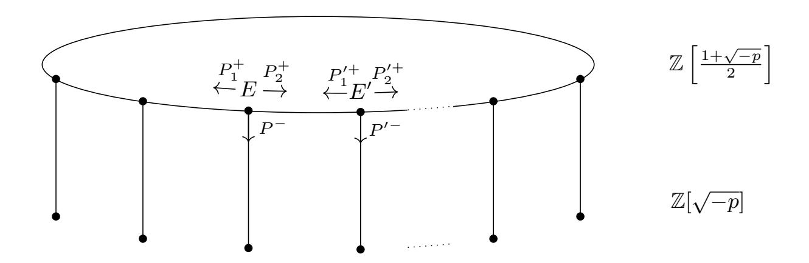

{0}------------------------------------------------

# Radical Isogenies

Wouter Castryck, Thomas Decru, and Frederik Vercauteren wouter.castryck@kuleuven.be, thomas.decru@kuleuven.be, frederik.vercauteren@kuleuven.be

imec-COSIC, KU Leuven, Belgium

Abstract. This paper introduces a new approach to computing isogenies called "radical isogenies" and a corresponding method to compute chains of N-isogenies that is very efficient for small N. The method is fully deterministic and completely avoids generating N-torsion points. It is based on explicit formulae for the coordinates of an N-torsion point P 0 on the codomain of a cyclic N-isogeny ϕ : E → E 0 , such that composing ϕ with E 0 → E 0 /hP 0 i yields a cyclic N 2 -isogeny. These formulae are simple algebraic expressions in the coefficients of E, the coordinates of a generator P of ker ϕ, and an Nth root N√ρ , where the radicand ρ itself is given by an easily computable algebraic expression in the coefficients of E and the coordinates of P. The formulae can be iterated and are particularly useful when computing chains of N-isogenies over a finite field Fq with gcd(q − 1, N) = 1, where taking an Nth root is a simple exponentiation. Compared to the state-of-the-art, our method results in an order of magnitude speed-up for N ≤ 13; for larger N, the advantage disappears due to the increasing complexity of the formulae. When applied to CSIDH, we obtain a speed-up of about 19% over the implementation by Bernstein, De Feo, Leroux and Smith for the CSURF-512 parameters.

Keywords: Post-quantum cryptography, isogenies, Tate pairing, CSIDH.

## 1 Introduction

Isogeny-based cryptography is one of the more promising candidates for postquantum cryptography and although it is slower than lattice-based cryptography, it has the advantage of smaller key and ciphertext sizes. Isogeny-based protocols can be broadly categorized into two families: SIDH and CRS/CSIDH.

SIDH is a key agreement protocol introduced by Jao and De Feo in 2011 [\[16\]](#page-26-0). This protocol is based on random walks in isogeny graphs of supersingular elliptic curves E over Fp2 , and is reminiscent of the CGL hash function due to Charles, Goren and Lauter from 2009 [\[10\]](#page-26-1). The prime p is chosen such that the torsion

∗ This work was supported in part by the Research Council KU Leuven grants C14/18/067 and STG/17/019, by CyberSecurity Research Flanders with reference number VR20192203, and by the Research Foundation Flanders (FWO) through the WOG Coding Theory and Cryptography.

{1}------------------------------------------------

subgroups  $E[2^n]$  and  $E[3^m]$  are defined over  $\mathbb{F}_{p^2}$ , for large exponents n, m. The random walks then correspond to choosing a random point P in  $E[2^n]$  or  $E[3^m]$  and constructing the isogeny with kernel  $\langle P \rangle$ , as a composition of isogenies of degree 2 respectively 3.

CRS/CSIDH [8] takes a different approach and computes an action of the ideal-class group  $\operatorname{cl}(\mathcal{O})$  of some order  $\mathcal{O}$  in an imaginary quadratic field on the set  $\mathcal{E}\ell\ell_p(\mathcal{O},t)$  of elliptic curves over a prime field  $\mathbb{F}_p$  with  $\mathbb{F}_p$ -rational endomorphism ring  $\mathcal{O}$  and trace of Frobenius t. The idea of using this class group action in cryptography was independently proposed by Couveignes [13] and Rostovtsev-Stolbunov [22] for ordinary elliptic curves. In [8] this idea was ported to the supersingular case, resulting in a speed-up of several orders of magnitude. The computation of the class group action boils down to computing chains of  $\ell$ -isogenies for many small primes  $\ell$ , e.g., for CSIDH-512,  $\ell$  ranges from 3 to 587. This is in stark contrast with SIDH where only 2- and 3-isogenies are used.

In the CSIDH setting, computing an  $\ell$ -isogeny  $\varphi$  from an elliptic curve  $E/\mathbb{F}_p$  consists of two steps: first, a generator P of the kernel of  $\varphi$  is computed, i.e. an  $\mathbb{F}_p$ -rational point of order  $\ell$ , and secondly, given P, an equation for the isogenous curve  $E/\langle P \rangle$  is determined.

The most basic approach to solve the first step is to generate a random point  $Q \in E(\mathbb{F}_p)$  and to multiply this by the cofactor  $\#E(\mathbb{F}_p)/\ell$ . Generating a random point is essentially a square root computation at a cost of about  $1.5\log p$  multiplications in  $\mathbb{F}_p$ , and the multiplication by the cofactor can be done using the Montgomery ladder [2] and takes roughly 11  $\log p$  multiplications in  $\mathbb{F}_p$ . Generating a point of order  $\ell$  is thus a costly operation, even further exacerbated by the fact that multiplication by the cofactor results in the point at infinity  $\mathcal{O}_E$  with probability  $1/\ell$ , which is non-negligible for small  $\ell$ . Note that this also makes the algorithm non-deterministic, negatively affecting constant time implementations. The cost of generating  $\ell$ -torsion points from scratch can be mitigated somewhat by considering a chain of  $\ell_i$ -isogenies for many different primes  $\ell_i$ . Instead of sampling an  $\ell_i$ -torsion point for every  $\ell_i$ -isogeny separately, it is cheaper to sample an  $\prod_{i=1}^k \ell_i$ -torsion point and push it through the isogeny to create a chain of isogenies of respective degrees  $\ell_1, \ell_2, \ldots, \ell_k$ , multiplying this point with a cofactor that gets smaller in each iteration.

The second step is typically carried out using some form of Vélu's formulae [28], which compute the coefficients of  $E/\langle P \rangle$  from the coefficients of E and the coordinates of the scalar multiples of P. Vélu's formulae can also be used to compute the image  $\varphi(Q)$  of any point Q under the isogeny. The original implementation of CSIDH uses these formulae on elliptic curves in Montgomery form [8, 21], and requires  $O(\ell)$  arithmetic operations in  $\mathbb{F}_p$  per  $\ell$ -isogeny. Since then many optimizations to CSIDH have been proposed, such as:

- using different forms of elliptic curves, e.g. twisted Edwards curves [18, 19] and Hessian curves [6];
- adapting Vélu's formulae to only require  $\widetilde{O}(\sqrt{\ell})$  operations in  $\mathbb{F}_p$  [1] instead of  $O(\ell)$ ;
- changing CSIDH into CSURF to allow the use of very efficient 2-isogenies [7],

{2}------------------------------------------------

- lowering the number of  $\ell$ -isogenies that has to be computed for each  $\ell$  [20, 11].

A number of alternative approaches have been considered that avoid the generation of  $\ell$ -torsion points altogether, e.g. by using modular polynomials [3, 14] or division polynomials [3]. This leads to deterministic algorithms which can outperform the above method using Vélu's formulae for small  $\ell$ . Highly optimized approaches exist for 2-isogenies [7] and 3-isogenies [6], where the speed-up stems from two ingredients: firstly, an elliptic curve model is chosen that is nicely adapted to 2-torsion (a variant of Montgomery curves) resp. 3-torsion (Hessian curves). The second and main ingredient however is that the coefficients of  $E/\langle P\rangle$  can be expressed in terms of the coefficients of E and a single radical of a simple algebraic expression in the coefficients of E. This radical is a square root for 2-isogenies and a cube root for 3-isogenies.

#### Contributions

The main contribution of this paper is the generalization of the aforementioned special cases of 2- and 3-isogenies to all isogenies of any degree  $N \geq 2$ .

Concretely, given an elliptic curve E with a point P of order N, one can use Vélu's formulae to compute a defining equation for  $E' = E/\langle P \rangle$ . We present accompanying formulae which produce a point P' on E' again of order N, such that the composition

$$E \to E' \to E'/\langle P' \rangle$$
 (1)

is a cyclic isogeny of degree  $N^2$ . These formulae are algebraic expressions in the coefficients of E and the coordinates of P, and one radical (an Nth root) of another algebraic expression in the coefficients of E and the coordinates of P. An important implication of this construction is that the same formulae now apply to E' and P', which allows us to compute chains of N-isogenies of arbitrary length without needing to generate an N-torsion point in every step. In practice, we assume P = (0,0), thereby suppressing its coordinates from the formulae.

More in detail, we proceed as follows: an elliptic curve E over a field K together with a K-rational point P of order  $N \geq 4$  can be represented by the Tate normal form

$$E: y^2 + (1-c)xy - by = x^3 - bx^2$$
  $P = (0,0), b, c \in K$ .

We then compute the curve  $E' = E/\langle P \rangle$  using Vélu's formulae. The point P' on E' can be constructed as a pre-image of P under the dual isogeny  $\hat{\varphi}: E' \to E$ , which guarantees that the composition of  $\varphi$  with  $E' \to E'/\langle P' \rangle$  is cyclic of order  $N^2$ . Our central observation is that P' is defined over  $K(b, c, \sqrt[N]{\rho})$  for some  $\rho \in K(b, c)$  and we prove that one can take  $\rho = t_N(P, -P)$  where  $t_N$  denotes the Tate pairing. Indeed, since  $\hat{\varphi}(P') = P$  and using the compatibility of the Tate pairing with isogenies, we have

$$t_N(P, -P) = t_N(\hat{\varphi}(P'), -\hat{\varphi}(P')) = t_N(P', -P')^{\deg \hat{\varphi}} = t_N(P', -P')^N,$$

{3}------------------------------------------------

which shows that the field of definition of P 0 must contain Np tN (P, −P), and we show that this is also sufficient.

The fact that we only require one Nth root explains the name "radical isogenies". By rewriting (E0 , P0 ) again in Tate normal form with coefficients b 0 and c 0 , we are ready for another iteration. The formulae we derive in fact express b 0 and c 0 directly as elements of K(b, c, N√ρ ).

By specializing to finite fields Fq with gcd(q − 1, N) = 1, we immediately obtain that the radical N√ρ is again defined over Fq, since Nth powering is a field automorphism in this case. We implemented our formulae and considered two application scenarios: firstly, we show that using our formulae, chains of Nisogenies can be computed much faster than using the state-of-the-art methods: for N = 3, 5, 7 the best previous approach was to use modular polynomials and we obtain speed-ups of factors 9, 18 and 27. For N = 11, 13, the best previous approach was to generate N-torsion points in combination with V´elu's formulae and our radical isogenies outperform this by factors 12 and 5 respectively. Secondly, we implemented a version of CSIDH using radical isogenies for all primes ≤ 13 and obtain a speedup of 19% over the state of the art implementation [\[1\]](#page-25-1).

### Paper organization

Section [2](#page-3-0) briefly recaps the necessary background on isogenies, division polynomials, the Tate normal form, the Tate pairing, simple radical extensions, and isogeny-based protocols. Section [3](#page-8-0) proves the existence of radical isogeny formulae, while Section [4](#page-11-0) works out these formulae explicitly for small values of N. Section [5](#page-15-0) discusses how our formulae perform when computing chains of N-isogenies, while Section [6](#page-22-0) reports on an improved implementation of CSIDH using radical isogenies. Finally, Section [7](#page-25-3) concludes the paper and lists a number of open problems.

### Acknowledgments

We are very grateful to Karl Rubin and Alice Silverberg who provided insights on how an earlier approach to proving Theorem [5](#page-9-0) using the theory of modular curves was related to known results. We are also much indebted to Shahed Sharif whose remarks pointed us in the direction of the more direct approach using Tate pairings presented below. We finally thank Marc Houben for pointing out a typo, and several other attendants of the online "Workshop on the Mathematics of Post-Quantum Crypto", held during June 6–8, 2020, for further helpful feedback.

# 2 Background

Throughout this section we let K denote an arbitrary field.

{4}------------------------------------------------

#### 2.1 Isogenies and Vélu's formulae

Let E and E' be elliptic curves over K. An isogeny  $\varphi: E \to E'$  is a non-constant morphism such that  $\varphi(\mathcal{O}_E) = \mathcal{O}_{E'}$ , where  $\mathcal{O}_E, \mathcal{O}_{E'}$  denote the respective points at infinity. The degree of  $\varphi$  is its degree as a morphism and there always exists a dual isogeny  $\hat{\varphi}: E' \to E$  such that  $\hat{\varphi} \circ \varphi = [\deg(\varphi)]$ , where as usual  $[\cdot]$  denotes scalar multiplication. The kernel of  $\varphi$  is a finite subgroup of E, more precisely its size is a divisor of  $\deg(\varphi)$ , where equality holds if and only if  $\varphi$  is separable (which is automatic if  $\operatorname{char} K \nmid \deg(\varphi)$ ). Conversely, given a finite subgroup  $C \subset E$ , there exists a unique1 separable isogeny  $\varphi$  having C as its kernel. Concrete formulae for this isogeny were given by Vélu:

**Theorem 1.** Let C be a finite subgroup of the elliptic curve

$$E: y^2 + a_1xy + a_3y = x^3 + a_2x^2 + a_4x + a_6$$

over K. Fix a partition  $C = \{\mathcal{O}_E\} \cup C_2 \cup C^+ \cup C^-$ , where  $C_2$  are the order 2 points of C, and  $C^+$  and  $C^-$  are such that for any  $P \in C^+$  it holds that  $-P \in C^-$ . Write  $S = C^+ \cup C_2$ , and for  $Q \in S$  define

$$g_Q^x = 3x(Q)^2 + 2a_2x(Q) + a_4 - a_1y(Q),$$

$$g_Q^y = -2y(Q) - a_1x(Q) - a_3,$$

$$u_Q = (g_Q^y)^2, \quad v_Q = \begin{cases} g_Q^x & \text{if } 2Q = \mathcal{O}_E, \\ 2g_Q^x - a_1g_Q^y & \text{else,} \end{cases}$$

$$v = \sum_{Q \in S} v_Q, \quad w = \sum_{Q \in S} (u_Q + x(Q)v_Q),$$

$$A_1 = a_1, \quad A_2 = a_2, \quad A_3 = a_3,$$

$$A_4 = a_4 - 5v, \quad A_6 = a_6 - (a_1^2 + 4a_2)v - 7w.$$

Then the separable isogeny  $\varphi$  with domain E and kernel C has codomain E' = E/C with Weierstrass equation

$$E': y^2 + A_1 xy + A_3 y = x^3 + A_2 x^2 + A_4 x + A_6$$
 (2)

over  $\overline{K}$ . Furthermore, for  $P \in E$  we can compute the image of P as

$$x(\varphi(P)) = x(P) + \sum_{Q \in C \setminus \{\mathcal{O}_E\}} (x(P+Q) - x(Q))$$
$$y(\varphi(P)) = y(P) + \sum_{Q \in C \setminus \{\mathcal{O}_E\}} (y(P+Q) - y(Q)).$$

*Proof.* See [28].

&lt;sup>1 Up to post-composition with an isomorphism.

{5}------------------------------------------------

#### 2.2 Division polynomials

Let E/K be defined by  $y^2 + a_1xy + a_3y = x^3 + a_2x^2 + a_4x + a_6$ , and let  $b_2 = a_1^2 + 4a_2$ ,  $b_4 = 2a_4 + a_1a_3$ ,  $b_6 = a_3^2 + 4a_6$ ,  $b_8 = a_1^2a_6 + 4a_2a_6 - a_1a_3a_4 + a_2a_3^2 - a_4^2$ . For all integers  $N \ge 0$ , the N-division polynomial is given by

$$\Psi_{E,0} = 0$$
,  $\Psi_{E,1} = 1$ ,  $\Psi_{E,2} = 2y + a_1 x + a_3$ ,  $\Psi_{E,N} = t \cdot \prod_{Q \in (E[N] \setminus E[2])/\pm} (x - x(Q))$ ,

where t = N if N is odd and  $t = \frac{N}{2} \cdot \Psi_{E,2}$  if N is even. By definition, we have that for any non-trivial  $P \in E[N]$ ,  $\Psi_{E,N}(P) = 0$ . The division polynomials satisfy the following recurrence relation which allows them to be computed efficiently:

$$\begin{split} &\varPsi_{E,3} = 3x^4 + b_2x^3 + 3b_4x^2 + 3b_6x + b_8 \\ &\frac{\varPsi_{E,4}}{\varPsi_{E,2}} = 2x^6 + b_2x^5 + 5b_4x^4 + 10b_6x^3 + 10b_8x^2 + (b_2b_8 - b_4b_6)x + (b_4b_8 - b_6^2) \\ &\varPsi_{E,2N+1} = \varPsi_{E,N+2}\varPsi_{E,N}^3 - \varPsi_{E,N-1}\varPsi_{E,N+1}^3 \text{ if } N \geq 2 \\ &\varPsi_{E,2N} = \frac{\varPsi_{E,N}}{\varPsi_{E,2}} (\varPsi_{E,N+2}\varPsi_{E,N-1}^2 - \varPsi_{E,N-2}\varPsi_{E,N+1}^2) \text{ if } N \geq 3. \end{split}$$

Note that  $\Psi_{E,2}^2 = 4x^3 + (a_1^2 + 4a_2)x^2 + (2a_1a_3 + 4a_4)x + a_3^2 + 4a_6$ , i.e. a univariate polynomial in x.

If one is interested in points of exact order N (so not just in E[N]), then one can use the reduced N-division polynomial  $\psi_{E,N}$  defined as

$$\psi_{E,N} = \frac{\Psi_{E,N}}{\operatorname{lcm}_{d|N,d\neq N} \{\Psi_{E,d}\}}.$$

For all primes  $\ell$ , we have that  $\Psi_{E,\ell} = \psi_{E,\ell}$ . Note that for N > 2, the reduced N-division polynomial of an elliptic curve E is a univariate polynomial in x.

The multiplication by N-map can be expressed explicitly using division polynomials as follows [23, Exercise 3.6]:

$$[N]P = \left(\frac{\phi_{E,N}(P)}{\Psi_{E,N}(P)^2}, \frac{\omega_{E,N}(P)}{\Psi_{E,N}(P)^3}\right), \tag{3}$$

with  $\phi_{E,N} = x\Psi_{E,N}^2 - \Psi_{E,N+1}\Psi_{E,N-1}$  and  $\omega_{E,N} = \frac{1}{2\Psi_{E,N}}(\Psi_{E,2N} - \Psi_{E,N}(a_1\phi_{E,N} + a_3\Psi_{E,N}^2))$ .

## 2.3 The Tate normal form

We will be interested in elliptic curves E over K with a distinguished point  $P \in E(K)$  of some finite order N. By translating this point to (0,0) and requiring that the tangent line is horizontal, and with proper scaling, one can easily prove the following lemma; we refer to [25, Lem. 2.1] for further details.

{6}------------------------------------------------

Lemma 2. Let E be an elliptic curve over K and let P ∈ E(K) be a point of order N ≥ 4, then (E, P) is isomorphic to a unique pair of the form

$$E: y^{2} + (1-c)xy - by = x^{3} - bx^{2}, \qquad P = (0,0)$$
(4)

with b, c ∈ K and

$$\Delta(b,c) = b^3(c^4 - 8bc^2 - 3c^3 + 16b^2 - 20bc + 3c^2 + b - c) \neq 0.$$

The resulting curve-point pair is said to be in Tate normal form.

Given a Tate normal form, the first few scalar multiples of P = (0, 0) are given by simple expressions in b and c, e.g.

$$2P = (b, bc), 3P = (c, b - c), -P = (0, b), -2P = (b, 0), -3P = (c, c^2).$$

Higher multiples can be computed using [\(3\)](#page-5-0). Using these multiples, for each N ≥ 4 one can write down an irreducible polynomial FN (b, c) ∈ Z[b, c] whose vanishing, along with the non-vanishing of ∆(b, c) and of Fm(b, c) for 4 ≤ m < N, expresses that P has exact order N. For instance, for N = 4 we find the equation F4(b, c) = c = 0, by imposing that 3P = −P. Similarly, for N = 5 we find F5(b, c) = c − b = 0 and for N = 6 we find F6(b, c) = c 2 + c − b = 0. Further examples can be found in Table [1](#page-16-0) below. Alternatively, the polynomial FN (b, c) can be recovered as a factor of the constant term of the N-division polynomial of the curve [\(4\)](#page-6-0), when considered over the rational function field Q(b, c). This is the approach taken in [\[25,](#page-27-2) §2], to which we refer for more details.

Remark 3. Up to birational equivalence, FN (b, c) is a defining polynomial for the modular curve X1(N). See again [\[25\]](#page-27-2) for more background.

## 2.4 The Tate pairing

Given an elliptic curve E/K and an integer N ≥ 2, the Tate pairing is a bilinear map

$$t_N : E(K)[N] \times E(K)/NE(K) \to K^*/(K^*)^N : (P_1, P_2) \mapsto t_N(P_1, P_2)$$

which can be computed as follows. Consider a Miller function fN,P1 , i.e., a function on E with divisor N(P1) − N(OE). Let D be a K-rational divisor on E that is linearly equivalent with (P2) − (OE) and whose support is disjoint from {P1, OE}. Then tN (P1, P2) = fN,P1 (D). If P1 6= P2 and the Miller function is normalized, i.e., the leading coefficient of its expansion around OE with respect to the uniformizer x/y equals 1 (we are assuming that E is in Weierstrass form), then one can simply compute tN (P1, P2) as fN,P1 (P2).

For certain instances of K, the Tate pairing is known to be non-degenerate, meaning that for each P1 ∈ E(K)[N] \ {OE} there exists a P2 ∈ E(K)/NE(K) such that tN (P1, P2) 6= 1, and vice versa. Most notably, this is true if K = Fq is a finite field containing a primitive Nth root of unity ζN [\[15\]](#page-26-13), i.e., for which N | q − 1.

{7}------------------------------------------------

Another important feature is that the Tate pairing is compatible with isogenies, in the following sense: if  $\varphi : E \to E'$  is an isogeny over K then the rule  $t_N(\varphi(P_1), P_2') = t_N(P_1, \hat{\varphi}(P_2'))$  applies. In particular we have

$$t_N(\varphi(P_1), \varphi(P_2)) = t_N(P_1, P_2)^{\deg(\varphi)}$$

for all  $P_1 \in E(K)[N]$  and  $P_2 \in E(K)/NE(K)$ . For a proof of this compatibility we refer to [4, Thm. IX.9], which assumes  $\zeta_N \in K$ , but this condition can be discarded (it is not used in the proof).

#### 2.5 Simple radical extensions

Following [12], we say that a field extension  $K \subset L$  is simple radical of degree  $N \geq 2$  if there exists an  $\alpha \in L$  such that (i)  $L = K(\alpha)$ , (ii)  $\rho := \alpha^N \in K$ , and (iii)  $x^N - \rho \in K[x]$  is irreducible. Property (iii) can be verified easily using the following theorem.

**Theorem 4.** Let K be a field, consider an integer  $N \geq 2$ , and let  $\rho \in K^*$ . Assume that for all primes  $m \mid N$  we have  $\rho \notin K^m$ . If  $4 \mid N$ , assume moreover that  $\rho \notin -4K^4$ . Then the polynomial  $x^N - \rho \in K[x]$  is irreducible.

We will usually write  $L = K(\sqrt[N]{\rho})$ , although it should be noted that  $\sqrt[N]{\rho}$  is only well-defined up to multiplication by  $\zeta_N^i$  for some  $i \in \{0, 1, ..., N-1\}$ . Apart from this subtlety, we note that the field  $K(\sqrt[N]{\rho})$  does not change if we multiply  $\rho$  with the Nth power of an element of  $K^*$ , or if we raise  $\rho$  to some power that is coprime with N.

Remark 1. If  $K \subset L$  is simple radical of degree N and if char  $K \nmid N$ , then the Galois closure of L over K is obtained by adjoining a primitive Nth root of unity  $\zeta_N$ , and

$$\operatorname{Gal}(L(\zeta_N)/K) = \operatorname{Gal}(L(\zeta_N)/K(\zeta_N)) \rtimes \operatorname{Gal}(L(\zeta_N)/L)$$

where the first factor is cyclic of order N. In particular, if  $\zeta_N \in L$  then L is Galois over K with cyclic Galois group. Kummer theory provides a converse statement [24, Lem. 9.13.1].

## 2.6 CSIDH

We briefly review the CSIDH key agreement protocol, which is our main application of radical isogenies. Let  $\mathbb{F}_p$  be a large finite field with  $p = c\ell_1\ell_2\cdots\ell_r - 1$ , where the  $\ell_i$  are small distinct primes and where c is some small cofactor. Alice and Bob agree on an order  $\mathcal{O} \subset \mathbb{Q}(\sqrt{-p})$  containing  $\mathbb{Z}[\sqrt{-p}]$ , and they consider the set  $\mathcal{E}\ell_p(\mathcal{O}) = \mathcal{E}\ell_p(\mathcal{O},0)$  of elliptic curves  $E/\mathbb{F}_p$  whose endomorphism ring  $\operatorname{End}_{\mathbb{F}_p}E$  is isomorphic to  $\mathcal{O}$ . Such curves are necessarily supersingular, and without loss of generality it can be assumed that the isomorphism  $\operatorname{End}_{\mathbb{F}_p}E \cong \mathcal{O}$  identifies the Frobenius endomorphism  $\pi_p$  on E with  $\sqrt{-p}$ .

{8}------------------------------------------------

To any  $E \in \mathcal{E}\ell\ell_p(\mathcal{O})$  and any invertible ideal  $\mathfrak{a} \subset \mathcal{O}$  one can, using the above isomorphism, associate the finite subgroup

$$E[\mathfrak{a}] = \bigcap_{\alpha \in \mathfrak{a}} \ker \alpha \subset E.$$

It turns out that the isogenous curve  $E/E[\mathfrak{a}]$  is again contained in  $\mathcal{E}\ell_p(\mathcal{O})$  and that it depends on the class  $[\mathfrak{a}]$  of  $\mathfrak{a}$  only; furthermore, this defines a free and transitive action of the ideal-class group  $\mathrm{cl}(\mathcal{O})$  on  $\mathcal{E}\ell_p(\mathcal{O})$ . The key agreement then works as follows: Alice and Bob agree on a starting curve  $E \in \mathcal{E}\ell_p(\mathcal{O})$ , then both sample a secret ideal-class  $[\mathfrak{a}]$  resp.  $[\mathfrak{b}]$ , compute the isogenous curves  $E/E[\mathfrak{a}]$  resp.  $E/E[\mathfrak{b}]$ , and exchange the outcomes. Both parties can now compute  $E/E[\mathfrak{a}\mathfrak{b}]$  by acting with their own secret ideal-class on the other party's curve.

In order for this to be practical, Alice and Bob should sample  $\mathfrak{a}$ ,  $\mathfrak{b}$  as products of ideals of the form  $(\ell_i, \sqrt{-p} - 1)^{e_i}$ , whose action corresponds to a chain of  $|e_i|$  easy-to-compute  $\ell_i$ -isogenies; this is also true if  $e_i < 0$ , in which case one considers the equivalent ideal  $(\ell_i, \sqrt{-p} + 1)^{|e_i|}$ . The prime  $\ell_i = 2$  requires special treatment: it should be skipped unless  $p \equiv 7 \mod 8$  and  $\mathcal{O}$  is the maximal order, in which case one considers  $(2, (\sqrt{-p} - 1)/2)$  resp.  $(2, (\sqrt{-p} + 1)/2)$  instead of the principal ideals  $(2, \sqrt{-p} - 1), (2, \sqrt{-p} + 1)$ .

## 3 Existence of radical isogeny formulae

In this section we prove the existence of radical isogeny formulae, without deriving these formulae explicitly. The explicit derivation for small N, including the cases N=2,3, is given in the next section. As such, we assume  $N\geq 4$  and consider the 'universal' Tate normal curve

$$E: y^2 + (1 - c)xy - by = x^3 - bx^2$$

over the field

$$\mathbb{Q}_N(b,c) := \operatorname{Frac} \frac{\mathbb{Q}[b,c]}{(F_N(b,c))},$$

so that the base point P = (0,0) has order N. Note that  $\mathbb{Q}_N(b,c)$  is simply the function field of  $X_1(N)$  over  $\mathbb{Q}$ . Let  $\varphi : E \to E'$  be the isogeny with kernel  $\langle P \rangle$ ; for concreteness it can be assumed that the codomain curve E' is given by equation (2) provided by Vélu's formulae, although this is not needed for what follows.

Recall that we are interested in those points  $P' \in E'$  for which the composition

$$E \stackrel{\varphi}{\to} E' \to E'/\langle P' \rangle$$

is a cyclic  $N^2$ -isogeny. It is easy to check that these points are characterized by the condition

$$\hat{\varphi}(P') = \lambda P \text{ for some } \lambda \in (\mathbb{Z}/N)^*,$$
 (5)

with  $\hat{\varphi}: E' \to E$  the dual of  $\varphi$ . In particular, there are  $N\phi(N)$  such points, generating N distinct subgroups of E', where  $\phi$  denotes Euler's totient function.

{9}------------------------------------------------

The points corresponding to  $\lambda = 1$  will be called *P*-distinguished; they can be viewed as a set of canonical generators for these subgroups.

Define

$$\rho := f_{N,P}(-P) \tag{6}$$

where the Miller function  $f_{N,P}$  on E is assumed to be normalized, so that  $\rho$  is just  $t_N(P,-P)$  when considered modulo Nth powers in  $\mathbb{Q}_N(b,c)^*$ . The main result of this section is:

**Theorem 5.** Let  $P' \in E'$  be a point satisfying (5). Then the field extension  $\mathbb{Q}_N(b,c) \subset \mathbb{Q}_N(b,c)(P')$ , obtained by adjoining the coordinates of P', is simple radical of degree N. More precisely,  $\mathbb{Q}_N(b,c)(P') = \mathbb{Q}_N(b,c)(\sqrt[N]{\rho})$  for an appropriately chosen Nth root  $\sqrt[N]{\rho}$  of  $\rho = f_{N,P}(-P)$ .

Proof. The fibre  $\hat{\varphi}^{-1}\{\lambda P\}$  decomposes as a union of orbits under the action of the absolute Galois group of  $\mathbb{Q}_N(b,c)$ , together containing N elements. One of these orbits contains P'. Its number of elements equals the degree of the corresponding closed point, which in turn equals the degree of the extension  $\mathbb{Q}_N(b,c) \subset \mathbb{Q}_N(b,c)(P')$ . In particular, this extension has degree at most N. On the other hand, by Lemma 6 below, the extension  $\mathbb{Q}_N(b,c) \subset \mathbb{Q}_N(b,c)(\sqrt[N]{\rho})$  is of degree precisely N. Therefore, it suffices to prove that  $\mathbb{Q}_N(b,c)(P')$  contains an Nth root of  $\rho$ .

To this end we consider  $\alpha := f_{N,P'}(-P') \in \mathbb{Q}_N(b,c)(P')$ , where the Miller function  $f_{N,P'}$  is again assumed normalized, and we let  $\mu$  be such that  $\lambda^2 \mu \equiv 1 \mod N$ . Modulo Nth powers in  $\mathbb{Q}_N(b,c)(P')^*$  we have

$$(\alpha^{\mu})^{N} = t_{N}(P', -P')^{N\mu} = t_{N}(\hat{\varphi}(P'), -\hat{\varphi}(P'))^{\mu}$$
$$= t_{N}(\lambda P, -\lambda P)^{\mu} = t_{N}(P, -P)^{\lambda^{2}\mu} = \rho,$$

showing that  $\rho$  is indeed the Nth power of some element of  $\mathbb{Q}_N(b,c)(P')$ .

**Lemma 6.** The polynomial  $x^N - \rho \in \mathbb{Q}_N(b,c)[x]$  is irreducible.

*Proof.* According to Theorem 4 it suffices to prove:

- (i) for all primes  $m \mid N$  we have  $\rho \notin \mathbb{Q}_N(b,c)^m$ ,
- (ii) if  $4 \mid N$  then  $\rho \notin -4\mathbb{Q}_N(b,c)^4$ .

Let  $p \equiv 1 \mod 2N$  be a prime number such that  $4\sqrt{p} > N^2$ . Then the Hasse interval  $[p+1-2\sqrt{p}, p+1+2\sqrt{p}]$  contains the integers  $\lambda N$  for N consecutive values of  $\lambda$ . At least one of these values satisfies  $\gcd(\lambda, N) = 1$ . By [27, Thm. 2.4.31] there exists an elliptic curve  $\overline{E}/\mathbb{F}_p$  such that  $\overline{E}(\mathbb{F}_p) \cong \mathbb{Z}/(\lambda N)$ , so in particular  $\overline{E}(\mathbb{F}_p)[N^{\infty}] \cong \mathbb{Z}/(N)$ . Without loss of generality we can assume that  $\overline{E}$  is in Tate normal form, say with coefficients  $\overline{b}, \overline{c} \in \mathbb{F}_p$ , and that  $\overline{P} = (0,0)$  is a point of order N on  $\overline{E}$ .

Then, in order to prove (i), assume that  $\rho \in \mathbb{Q}_N(b,c)^m$  for some prime divisor  $m \mid N$ . Since Miller functions are compatible with reduction mod p and with

{10}------------------------------------------------

specialization at  $\bar{b}, \bar{c} \in \mathbb{F}_p$  (this follows, for instance, from Miller's algorithm), we find that

$$t_N(\overline{P}, [-N/m]\overline{P}) = t_N(\overline{P}, -\overline{P})^{N/m} = 1,$$

in turn implying that  $t_N(\overline{Q}, [-N/m]\overline{P}) = 1$  for all  $\overline{Q} \in \overline{E}(\mathbb{F}_p)[N]$ . This contradicts the non-degeneracy of the Tate pairing over  $\mathbb{F}_p$  (which contains all Nth roots of unity by our choice of p). Indeed,  $[-N/m]\overline{P}$  is a non-trivial element of  $\overline{E}(\mathbb{F}_p)/N\overline{E}(\mathbb{F}_p)$ .

As for (ii): if  $4 \mid N$  then  $p \equiv 1 \mod 8$ , from which it follows that -1 and 4 are 4th powers in  $\mathbb{F}_p$ , in particular the same holds for -4. As above, if  $\rho \in -4\mathbb{Q}_N(b,c)^4$  then we can conclude that

$$t_N(\overline{P}, [-N/4]\overline{P}) = t_N(\overline{P}, -\overline{P})^{N/4} = 1,$$

again contradicting the non-degeneracy of the Tate pairing.

An immediate consequence of Theorem 5 is that for each point  $P' = (x'_0, y'_0)$  satisfying (5) there exist concrete algebraic formulae

$$x_0'(b, c, \sqrt[N]{\rho}), \qquad y_0'(b, c, \sqrt[N]{\rho})$$
 (7)

for its coordinates: these are the radical isogeny formulae we are after. Note that, in order to find these formulae explicitly, it suffices to consider the cases where P' is P-distinguished, i.e., where  $\lambda = 1$ . Indeed, all other cases are then dealt with by feeding these formulae to the multiplication-by- $\lambda$  map from (3). Experimentally, it seems that the P-distinguished case yields the simplest formulae.

Remark 2. Our choice of radicand  $\rho = f_{N,P}(-P)$  is somewhat arbitrary: any representant of  $t_N(P, \mu P)$  for any  $\mu \in (\mathbb{Z}/N)^*$  would have worked equally well, with the same proofs. This reflects the fact that scaling  $\rho$  by Nth powers, or raising  $\rho$  to an exponent that is coprime with N, results in the same simple radical extension.

Given the coordinates of a P-distinguished point P', all other P-distinguished points are found by varying the choice of  $\sqrt[N]{\rho}$ :

**Lemma 7.** Let  $\lambda \in (\mathbb{Z}/N)^*$  and consider formulae of the form (7) expressing the coordinates of a point P' such that  $\hat{\varphi}(P') = \lambda P$ . Then, by varying the choice of the Nth root  $\sqrt[N]{\rho}$ , i.e., by scaling it with  $\zeta_N^i$  for i = 0, 1, ..., N-1, these formulae compute the coordinates of all points P' for which  $\hat{\varphi}(P') = \lambda P$ .

*Proof.* From the proof of Theorem 5 it follows that  $\hat{\varphi}^{-1}\{\lambda P\}$  consists of a single Galois orbit, which implies our claim.

For the applications we have in mind, we want to interpret the formulae (7) in some concrete field K, with the indeterminates b, c replaced by concrete elements  $\bar{b}, \bar{c} \in K$ . It follows from general principles in algebraic geometry that these specialized formulae continue to produce the coordinates of a point P' defining a cyclic  $N^2$ -isogeny, with the possible exception of finitely many field characteristics p > 0 and finitely many  $(\bar{b}, \bar{c}) \in K^2$ . Loosely based on good reduction arguments from the theory of modular curves, we actually believe:

{11}------------------------------------------------

Conjecture 1. The formulae (7) are compatible with specialization to all fields K satisfying char  $K \nmid N$  and to all elements  $\overline{b}, \overline{c} \in K$  satisfying  $F_N(\overline{b}, \overline{c}) = 0$ ,  $\Delta(\overline{b}, \overline{c}) \neq 0$  and  $F_m(\overline{b}, \overline{c}) \neq 0$  for all  $4 \leq m < N$  (in other words, to all  $\overline{b}, \overline{c}$  for which  $y^2 + (1 - \overline{c})xy - \overline{b}x = x^3 - \overline{b}x^2$  is an elliptic curve on which  $\overline{P} = (0, 0)$  has exact order N).

It is easy to confirm this conjecture for small values of N, by explicitly factoring the N-division polynomial of E': this is the approach followed in the next section, leading to explicit expressions for the formulae (7). In particular, the above conjecture does not affect any of our conclusions in Sections 5 and 6, which are based on radical N-isogenies for these small values of N only. But from a purely mathematical point of view, we leave the validity of Conjecture 1 as an interesting open question.

We conclude by recalling that by rewriting (E', P') in Tate normal form, one obtains a curve equation

$$y^2 + (1 - c')xy - b'x = x^3 - b'x^2$$

where now

$$b'(b, c, \sqrt[N]{\rho}), \qquad c'(b, c, \sqrt[N]{\rho})$$
 (8)

are certain algebraic expressions in  $b, c, \sqrt[N]{\rho}$ . The formulae (8) can be applied iteratively, effectively allowing to compute a cyclic  $N^k$ -isogeny for arbitrary k without needing to explicitly generate points of order N in each step.

## 4 Explicit radical isogeny formulae in low degree

In this section, we explain how to find concrete formulae of the forms (7) and (8) for small values of N, by factoring the reduced N-division polynomial of E' with the help of Magma [5]. As a by-product, we get a confirmation of Conjecture 1 in these cases. In particular, throughout this section, we work over an arbitrary field K with char  $K \nmid N$ .

We first deal with the cases N = 2, 3, which require to use a different curve model. We note however that the same principles, in particular using the Tate pairing, also applies in these cases.

Case N = 2. Since char  $K \neq 2$ , we can assume that  $E : y^2 = x^3 + a_2x^2 + a_4x$  for  $a_2, a_4 \in K$  and P = (0,0). A simple calculation shows that the isogenous curve  $E/\langle P \rangle$  can be given by

$$E': y^2 = x^3 - 2a_2x^2 + (a_2^2 - 4a_4)x.$$

The dual isogeny corresponds to quotienting out (0,0) on E', so any other point of order 2 on E' is a suitable instance of P'; note that it is automatically P-distinguished. If we define  $\rho = a_4$  and  $\alpha = \sqrt{\rho}$ , then these points are of the form

$$P' = (a_2 + 2\alpha, 0),$$

{12}------------------------------------------------

and by translating P' to (0,0), we find the isomorphic model  $E': y^2 = x^3 + a_2'x^2 + a_4'x$ , where

$$a_2' = 6\alpha + a_2$$
 and  $a_4' = 4a_2\alpha + 8a_4$ . (9)

We are now ready to repeat the whole process, since we can divide out by (0,0) again.

Remark 3. We cannot use  $f_{2,P}(-P)$  as an instance of  $\rho$  in this case, since P = -P. Nevertheless, the reader can check that  $\rho = a_4$  is a representant of  $t_2(P, -P)$ .

Case N = 3. By requiring that the inflexion point P = (0,0) has a horizontal tangent line, we can assume that  $E: y^2 + a_1xy + a_3y = x^3$  for certain  $a_1, a_3 \in K$ . Vélu's formulae yield

$$E': y^2 + a_1 xy + a_3 y = x^3 - 5a_1 a_3 x - a_1^3 a_3 - 7a_3^2$$

as a defining equation for  $E/\langle P \rangle$ . The 3-division polynomial of E' splits as

$$\Psi_{E',3}(x) = 3(x + a_1^2/3)(x^3 - 9a_1a_3x - a_1^3a_3 - 27a_3^2),$$

and one checks through explicit computation that the linear factor is the kernel polynomial of the dual isogeny. Therefore, any root of the cubic factor is the x-coordinate of a P-distinguished point P'. Letting  $\rho = f_{3,P}(-P) = -a_3$  and writing  $\alpha = \sqrt[3]{\rho}$ , this cubic factor splits as

$$(x + a_1\alpha - 3\alpha^2)(x^2 + (-a_1\alpha + 3\alpha^2)x + a_1^2\alpha^2 - 3a_1a_3 - 9a_3\alpha)$$

(note that it splits completely over  $K(\zeta_3)$  in view of Remark 1 and/or Lemma 7). Thus we can take  $x'_0 = -a_1\alpha + 3\alpha^2$  and then one checks that  $y'_0 = 4a_3$  is the y-coordinate of the corresponding P-distinguished point  $P' = (x'_0, y'_0)$ . Translating P' to (0,0) yields a model

$$E': y^2 + a_1'xy + a_3'y = x^3,$$

with  $a'_1 = -6\alpha + a_1$  and  $a'_3 = 3a_1\alpha^2 - a_1^2\alpha + 9a_3$ , and we can repeat. We recall that the simple radical nature of iterated 3-isogenies is not a new observation, see [6].

Case N = 4. For  $N \ge 4$  we switch to the Tate normal form as in Section 3. Concretely, for N = 4 we have  $F_4(b,c) = c = 0$  so we obtain the defining equation  $E: y^2 + xy - by = x^3 - bx^2$ . From Vélu's formulae we find

$$E': y^2 + xy - by = x^3 - bx^2 + (-5b^2 + 5b)x + (-3b^3 - 12b^2 + b)$$

as a defining equation for  $E/\langle P \rangle$ , with reduced 4-division polynomial

$$\psi_{E',4}(x) = 2 \cdot (x+b+1/2) \cdot (x-7b) \cdot (x^4+4bx^3+(6b^2+24b)x^2 + (4b^3-80b^2+8b)x + b^4+152b^3-8b^2+b).$$

{13}------------------------------------------------

The first linear factor corresponds to the x-coordinate of a generator of the dual isogeny. The second linear factor corresponds to the x-coordinate of a 4-torsion point Q such that 2Q is in the kernel of the dual isogeny. Any root of the quartic factor is the x-coordinate of a P-distinguished point P'. Letting  $\rho = f_{4,P}(-P) = -b$  and writing  $\alpha = \sqrt[4]{\rho}$ , one can verify that

$$P' = (4\alpha^{3} + 2\alpha^{2} + \alpha - b, 2\alpha^{3} + \alpha^{2} - 8b\alpha - 7b)$$

is such a P-distinguished point. Translating P' to (0,0) we find an isomorphic model of E' given by

$$E': y^2 + xy - b'y = x^3 - b'x^2, (10)$$

with

$$b' = -\frac{\alpha(4\alpha^2 + 1)}{(2\alpha + 1)^4}$$

This formula can be applied iteratively.

Case N = 5. For N = 5 we have  $F_5(b, c) = b - c = 0$ , so we obtain the defining equation  $E: y^2 + (1 - b)xy - by = x^3 - bx^2$ . Vélu's formulae yield

$$E': y^2 + (1-b)xy - by = x^3 - bx^2 - 5b(b^2 + 2b - 1)x - b(b^4 + 10b^3 - 5b^2 + 15b - 1)$$

as a defining equation for the codomain of  $\varphi: E \to E/\langle P \rangle$ . The 5-division polynomial of E' can be verified to split as

$$\Psi_{E',5}(x) = 5 \cdot (x^2 + (b^2 - b + 1)x + (b^4 + 3b^3 - 26b^2 - 8b + 1)/5)$$

$$\cdot (x^5 + 10bx^4 - 5b(b^2 + b - 11)x^3 - 5b(17b^3 + 24b^2 + 46b - 7)x^2$$

$$- 5b(b^5 + 62b^4 + 154b^3 - 65b^2 + 19b - 2)x$$

$$- b(b^7 - 19b^6 + 777b^5 - 757b^4 + 755b^3 + 2b^2 + 17b - 1))$$

$$\cdot (x^5 - 15bx^4 - 5b(11b^2 - 9b - 1)x^3 - 5b^2(7b^3 + 13b^2 - 13b + 20)x^2$$

$$- 5b^2(2b^5 + 5b^4 + 6b^3 + 196b^2 - 99b + 1)x$$

$$- b^2(b^7 + 7b^6 - 62b^5 + 605b^4 - 127b^3 + 1177b^2 + 14b + 1))$$

where the quadratic polynomial factor is the kernel polynomial of the dual isogeny. The roots of the first quintic factor are the x-coordinates of the P-distinguished points. Those of the second quintic factor are the x-coordinates of the points P' for which  $\hat{\varphi}(P') = 2P$  (i.e., the doubles of the P-distinguished points). Concretely, letting  $\rho = f_{5,P}(-P) = b$  and writing  $\alpha = \sqrt[5]{\rho}$ , the first quintic factor admits the root

$$x_0' = 5\alpha^4 + (b-3)\alpha^3 + (b+2)\alpha^2 + (2b-1)\alpha - 2b$$

{14}------------------------------------------------

(with all other roots obtained by scaling  $\alpha$  with powers of  $\zeta_5$ ) and then one can check that

$$y_0' = 5\alpha^4 + (b-3)\alpha^3 + (b^2 - 10b + 1)\alpha^2 + (13b - b^2)\alpha - b^2 - 11b$$

is the y-coordinate of the corresponding P-distinguished point P'. Translating P' to (0,0), we obtain the isomorphic form

$$E': y^2 + (1 - b')xy - b'y = x^3 - b'x^2,$$

where

$$b' = \alpha \frac{\alpha^4 + 3\alpha^3 + 4\alpha^2 + 2\alpha + 1}{\alpha^4 - 2\alpha^3 + 4\alpha^2 - 3\alpha + 1}$$

and again we can repeat.

Case N = 6. For N = 6 we have  $F_6(b, c) = c^2 + c - b = 0$ , so we work with  $E: y^2 + (1 - c)xy - (c^2 + c)y = x^3 - (c^2 + c)x^2$ . Vélu's formulae yield

$$y^{2} + (1-c)xy - (c^{2} + c)y = x^{3} - (c^{2} + c)x^{2}$$
$$- (15c^{4} + 20c^{3} + 5c^{2} - 5c)x - (19c^{6} + 33c^{5} + 18c^{4} + 22c^{3} + 14c^{2} - c)$$

as a model for  $E' = E/\langle P \rangle$ . Its reduced 6-division polynomial  $\psi_{E',6}(x)$  behaves much like in the degree 4 case: there is a unique interesting factor

$$x^{6} + 6c(2c + 3)x^{5} + 3c(20c^{3} + 33c^{2} + 55c + 37)x^{4}$$

$$+ 4c(40c^{5} + 18c^{4} - 237c^{3} - 301c^{2} - 63c + 28)x^{3} +$$

$$+ 3c(80c^{7} - 168c^{6} - 1029c^{5} - 1028c^{4} - 333c^{3} - 202c^{2} - 93c + 18)x^{2}$$

$$+ 6c(32c^{9} - 192c^{8} + 718c^{7} + 3131c^{6} + 3186c^{5} + 847c^{4} - 196c^{3} - 69c^{2} - 22c + 2)x$$

$$+ c(64c^{11} - 720c^{10} + 10740c^{9} + 38500c^{8} + 46773c^{7} + 31142c^{6} +$$

$$17983c^{5} + 7506c^{4} + 901c^{3} + 13c^{2} - 18c + 1)$$

whose roots are the x-coordinates of the P-distinguished points  $P' \in E'$ . Letting  $\rho = f_{6,P}(-P) = -b^2/c = -c(c+1)^2$  and writing  $\alpha = \sqrt[6]{\rho}$ , one checks that

$$x_0' = \frac{6}{c+1}\alpha^5 + \frac{4}{c+1}\alpha^4 + 3\alpha^3 + 2\alpha^2 - (3c-1)\alpha - 2c^2 - 3c$$

is such a root; all other roots are found by scaling  $\alpha$  with some power of  $\zeta_6$ . One then verifies that

$$y_0' = \frac{3c+9}{c+1}\alpha^5 + \frac{2c+6}{c+1}\alpha^4 - (12c-3)\alpha^3 - (17c-1)\alpha^2 - (15c^2+19c)\alpha - c^3 - 18c^2 - 16c^2 - 16c^2 - 16c^2 - 16c^2 - 16c^2 - 16c^2 - 16c^2 - 16c^2 - 16c^2 - 16c^2 - 16c^2 - 16c^2 - 16c^2 - 16c^2 - 16c^2 - 16c^2 - 16c^2 - 16c^2 - 16c^2 - 16c^2 - 16c^2 - 16c^2 - 16c^2 - 16c^2 - 16c^2 - 16c^2 - 16c^2 - 16c^2 - 16c^2 - 16c^2 - 16c^2 - 16c^2 - 16c^2 - 16c^2 - 16c^2 - 16c^2 - 16c^2 - 16c^2 - 16c^2 - 16c^2 - 16c^2 - 16c^2 - 16c^2 - 16c^2 - 16c^2 - 16c^2 - 16c^2 - 16c^2 - 16c^2 - 16c^2 - 16c^2 - 16c^2 - 16c^2 - 16c^2 - 16c^2 - 16c^2 - 16c^2 - 16c^2 - 16c^2 - 16c^2 - 16c^2 - 16c^2 - 16c^2 - 16c^2 - 16c^2 - 16c^2 - 16c^2 - 16c^2 - 16c^2 - 16c^2 - 16c^2 - 16c^2 - 16c^2 - 16c^2 - 16c^2 - 16c^2 - 16c^2 - 16c^2 - 16c^2 - 16c^2 - 16c^2 - 16c^2 - 16c^2 - 16c^2 - 16c^2 - 16c^2 - 16c^2 - 16c^2 - 16c^2 - 16c^2 - 16c^2 - 16c^2 - 16c^2 - 16c^2 - 16c^2 - 16c^2 - 16c^2 - 16c^2 - 16c^2 - 16c^2 - 16c^2 - 16c^2 - 16c^2 - 16c^2 - 16c^2 - 16c^2 - 16c^2 - 16c^2 - 16c^2 - 16c^2 - 16c^2 - 16c^2 - 16c^2 - 16c^2 - 16c^2 - 16c^2 - 16c^2 - 16c^2 - 16c^2 - 16c^2 - 16c^2 - 16c^2 - 16c^2 - 16c^2 - 16c^2 - 16c^2 - 16c^2 - 16c^2 - 16c^2 - 16c^2 - 16c^2 - 16c^2 - 16c^2 - 16c^2 - 16c^2 - 16c^2 - 16c^2 - 16c^2 - 16c^2 - 16c^2 - 16c^2 - 16c^2 - 16c^2 - 16c^2 - 16c^2 - 16c^2 - 16c^2 - 16c^2 - 16c^2 - 16c^2 - 16c^2 - 16c^2 - 16c^2 - 16c^2 - 16c^2 - 16c^2 - 16c^2 - 16c^2 - 16c^2 - 16c^2 - 16c^2 - 16c^2 - 16c^2 - 16c^2 - 16c^2 - 16c^2 - 16c^2 - 16c^2 - 16c^2 - 16c^2 - 16c^2 - 16c^2 - 16c^2 - 16c^2 - 16c^2 - 16c^2 - 16c^2 - 16c^2 - 16c^2 - 16c^2 - 16c^2 - 16c^2 - 16c^2 - 16c^2 - 16c^2 - 16c^2 - 16c^2 - 16c^2 - 16c^2 - 16c^2 - 16c^2 - 16c^2 - 16c^2 - 16c^2 - 16c^2 - 16c^2 - 16c^2 - 16c^2 - 16c^2 - 16c^2 - 16c^2 - 16c^2 - 16c^2 - 16c^2 - 16c^2 - 16c^2 - 16c^2 - 16c^2 - 16c^2 - 16c^2 - 16c^2 - 16c^2 - 16c^2 - 16c^2 - 16c^2 - 16c^2 - 16c^2 - 16c^2 - 16c^2 - 16c^2 - 16c^2 - 16c^2 - 16c^2 - 16c^2 - 16c^2 - 16c^2 - 16c^2 - 16c^2 - 16c^2 - 16c^2 - 16c^2 - 16c^2 - 16c^2 - 16c^2 - 16c^2 - 16c^2 - 16c^2 - 16c^2 - 16c^2 - 16c^2 - 16c^2 - 16c^2 - 16c^2 - 16$$

is the y-coordinate of the corresponding P-distinguished point P'. When writing (E', P') in Tate normal form, we find

$$E': y^2 + (1 - c')xy - (c'^2 + c')y = x^3 - (c'^2 + c')x^2$$

{15}------------------------------------------------

with

$$c' = \frac{1}{(c+1)(9c+1)^3} \left( (729c^3 + 243c^2 + 243c - 39)\alpha^5 - (108c^2 + 216c - 20)\alpha^4 - (729c^4 + 729c^3 + 81c^2 - 165c + 10)\alpha^3 + (108c^3 - 36c^2 - 140c + 4)\alpha^2 + (729c^5 + 1215c^4 + 486c^3 + 114c^2 + 113c - 1)\alpha - 108c^4 - 36c^3 - 4c^2 - 76c \right).$$

Once again, this formula can be applied iteratively.

Radical isogenies of degree  $N \geq 7$ . A similar reasoning can be made for  $N \geq 7$ , but a direct factorization of the reduced N-division polynomial of E' over  $\mathbb{Q}_N(b,c)(\sqrt[N]{\rho})$  quickly becomes unwieldy, for several reasons: the coefficients of E' become more involved, the degree of  $\psi_{E',N}$  grows quadratically, and both  $\rho$  and the base field  $\mathbb{Q}_N(b,c)$  become increasingly complicated, see Table 1. For instance, from N=7 onwards it is no longer possible to eliminate one of the variables b,c using the relation  $F_N(b,c)=0$ . As long as the modular curve  $X_1(N)$  has genus 0, it is possible to get around this by using a different parametrization, see Table 2, but for N=11 and  $N\geq 13$  this is no longer the case.

An approach that already works much better is to use number fields, i.e. assign a large enough integer value to b, construct the number field defined by  $F_N(b,c)=0$  and the degree N extension by adjoining  $\sqrt[N]{\rho}$ . The root of  $\psi_{E',N}(x)$  is an expression in c and  $\sqrt[N]{\rho}$  with rational coefficients. We know that each such coefficient is a rational function in b, so if b is large enough, this function can be found using lattice reduction. The most effective method is similar to the previous method, but uses p-adic fields instead of number fields. Again we need to choose a "large enough" value for b and a large enough precision with which we represent the p-adic field, to be able to reconstruct the rational function in b. We followed this approach for N=13, since Magma struggles to find the formulae using direct root finding. All formulae for  $N=2,\ldots,13$  can be found online at https://github.com/KULeuven-COSIC/Radical-Isogenies.

### 5 Isogeny chains over finite fields

In this section we use our iterable radical isogeny formulae of the form (8) to compute chains of N-isogenies between elliptic curves over finite fields  $\mathbb{F}_q$  with char  $\mathbb{F}_q \nmid N$ ; the application to CSIDH is given in Section 6. Here we just concentrate on the computation of long chains of N-isogenies for some fixed  $N \geq 2$ , and address the following two issues. Firstly, the radicand  $\rho$  might not admit an Nth root over  $\mathbb{F}_q$ : in the worst case, this could mean that at every iteration we need to replace the base field with a degree N extension. Secondly, over  $\overline{\mathbb{F}}_q$  there are N choices for  $\sqrt[N]{\rho}$ , hence the question arises which root to take if we want to navigate the N-isogeny graph in a controlled way. We discuss three special cases given by  $\gcd(q-1,N)=1$ ,  $\gcd(q-1,N)=N$  and  $\gcd(q-1,N)=2$ .

{16}------------------------------------------------

| N  | Polynomial relation FN (b, c) = 0                                                                               | Radicand ρ = fN,P (−P)                                                    |  |
|----|-----------------------------------------------------------------------------------------------------------------|---------------------------------------------------------------------------|--|
| 4  | c = 0                                                                                                           | −b                                                                        |  |
| 5  | c − b = 0                                                                                                       | b                                                                         |  |
| 6  | 2 + c − b = 0 c                                                                                           | 2 −b /c                                                             |  |
| 7  | 3 + 2 = 0 cb − b c                                                                                     | 3 /c2 b                                                             |  |
| 8  | 2 2 + 3cb 2 = 0 b − c − 2b c                                                                     | 3 −b /(b − c)                                                       |  |
| 9  | 5 + 4 − 3 3 − 2 b + 3cb2 − 3 = 0 c c c b + c 3c b                           | 3 2 2 /(b − c) b c                                         |  |
| 10 | 5 + 4 3 2 2 c c b + 3c b − 3c b                                                      | 3 2 + −b c/(c c − b)                                          |  |
|    | 2 b − 2cb2 + 3 = 0 + c b                                                                            |                                                                           |  |
|    | 7 6 6 − 5 2 + 6c 5 4 2 c b + 3c b − c 3c b b − 9c b                   | 3 2 2 + 2 (b − c) c − b) b /(c                       |  |
| 11 | 3 3 + 3 2 − 2 3 + 3cb4 − 5 = 0 + 4c b c b 3c b b                         |                                                                           |  |
| 12 | 6 + 4 4 − 3 2 3 b − c c c b + c 5c b                                           | 4 2 − 3 −b (b − c)/(b bc − c )                          |  |
|    | 2 2 − 9cb3 + 3b 4 = 0 + 10c b                                                                    |                                                                           |  |
|    | 10 − 9 2 − 8 2 + 6c 8 7 3 − 7 2 c c b 6c b b + 5c b 21c b |                                                                           |  |
| 13 | 7 6 3 − 6 2 + 6 5 4 b − 9c + 3c b + 24c b 13c b c b                | 5 2 + 2 2 − 3 2 b (c c − b) /(b bc − c ) |  |
|    | 5 3 − 5 2 − 4 4 + 15c 4 3 + 4c 3 5 + 21c b 6c b 15c b b b    |                                                                           |  |
|    | 3 4 + 15c 2 5 − 6cb6 + 7 = 0 − 20c b b b                                             |                                                                           |  |

Table 1: Relations FN (b, c) = 0 and radicands ρ for small N ≥ 4

| N   | r              | s                | Modular equation                                         | Radicand ρ                                 |
|-----|----------------|------------------|----------------------------------------------------------|--------------------------------------------|
| 6   | A              | 1                | –                                                        | 2 −r (A − 1)                         |
| 7   | A              | A                | –                                                        | 4 (A − 1) r                          |
| 8   | 1 2−A       | A                | –                                                        | 2 2 −(r s) (A − 1)             |
| 9 A | 2 − A + 1   | A                | –                                                        | 3 4 r s (A − 1)                |
| 10  | −A2 A2−3A+1 | A                | –                                                        | 5 9 (A − 1)(2A − 1)2 −r s      |
| 11  | AB + 1         | 1 − A            | 2 + (A 2 + 1)B B +A = 0                         | 3 A(rsB)                                |
| 12  | 2A2−2A+1 A  | 3A2−3A+1 A2   | –                                                        | 4 3A 11(A − 1)(2A − 1)2 r s |
| 13  | 1 − AB         | AB 1 − B+1 | 2 + (A 3 + 2 + 1)B B A 2 − −A A = 0 | 5B(sA) 3 −r                          |

Table 2: Modular equations and radicands for low degree isogenies. The parameters r and s are optimised representations of curves with a prescribed N-torsion point from [\[26\]](#page-27-5). The transformations b = rs(r − 1) and c = s(r − 1) can be used to obtain the Tate normal form E : y + (1 − c)xy − by = x − bx2 , where P = (0, 0) is a point of order N expressed by the modular equation.

{17}------------------------------------------------

#### 5.1 The case gcd(q - 1, N) = 1

The most straightforward case is  $\gcd(q-1,N)=1$ , where there is a very natural choice for  $\sqrt[N]{\rho}$ . Indeed, in this case the map  $\mathbb{F}_q \to \mathbb{F}_q : a \mapsto a^N$  is a bijection, so if the starting curve  $E: y^2 + (1-c)xy - by = x^3 - bx^2$  is defined over  $\mathbb{F}_q$ , then so is  $\rho(b,c)$  and it admits a unique Nth root which is again defined over  $\mathbb{F}_q$ . Choosing this instance of  $\sqrt[N]{\rho}$  results in new coefficients  $b',c'\in\mathbb{F}_q$  and the argument repeats. Moreover, the Nth root can be computed as  $\rho^\mu$  where  $\mu$  is such that  $\mu N \equiv 1 \mod (q-1)$ . Thus, the condition  $\gcd(q-1,N)$  naturally pulls out a chain of N-isogenies whose cost, at least for small N, is dominated by a single  $\mathbb{F}_q$ -exponentiation at each step.

**Lemma 8.** Assume that char  $\mathbb{F}_q \nmid N$  and  $\gcd(q-1,N) = 1$ , then  $\operatorname{End}_{\mathbb{F}_q} E$  is an imaginary quadratic order which is locally maximal at all primes dividing N, and our chain of N-isogenies corresponds to the repeated action of the ideal class  $[(N, \pi_q - 1)]$ .

*Proof.* Observe that

$$\ker([N]) \cap \ker(\pi_q - 1) = E(\mathbb{F}_q)[N] = \langle P \rangle,$$

where the last equality follows from gcd(q-1,N)=1 along with the fact that P=(0,0) is an  $\mathbb{F}_q$ -rational point of order N. These properties also imply that

$$\gcd(t^2 - 4q, N) = \gcd((q + 1 - |E(\mathbb{F}_q)|)^2 - 4q, N) = \gcd((q - 1)^2, N) = 1$$

with t the trace of Frobenius, showing that  $\operatorname{End}_{\mathbb{F}_q} E$  is indeed an imaginary quadratic order which is locally maximal at all primes dividing N; see [29, §4]. Thus the isogeny  $E \to E' = E/\langle P \rangle$  is the horizontal isogeny corresponding to the invertible ideal  $(N, \pi_q - 1) \subset \operatorname{End}_{\mathbb{F}_q} E$ . Since such isogenies do not change the structure of  $E(\mathbb{F}_q)$ , and since choosing the unique  $\mathbb{F}_q$ -rational Nth root of  $\rho$  clearly produces an  $\mathbb{F}_q$ -rational point of order N, the reasoning can be repeated and the lemma follows.

Estimating the rough cost of an exponentiation as  $1.5 \log q$  multiplications in  $\mathbb{F}_q$ , our method should be compared with:

- (i) generating an  $\mathbb{F}_q$ -rational N-torsion point and applying (some form of) Vélu's formulae; the main cost in this approach is the generation of the N-torsion point, which consists of generating a random point and multiplying by the cofactor  $\#E(\mathbb{F}_q)/N$ , taking roughly  $11 \log q$  multiplications in  $\mathbb{F}_q$ ; furthermore this procedure has to be repeated with probability 1/N, which is non-negligible for small N,
- (ii) finding an  $\mathbb{F}_q$ -rational root of  $\Phi_N(x, j(E))$ , with  $\Phi_N$  the classical modular polynomial of level N; this roughly amounts to computing  $x^q$  modulo the polynomial  $\Phi_N(x, j(E))$ , whose degree is at least N+1, so we estimate this cost as  $1.5(N+1)^2 \log q$  multiplications in  $\mathbb{F}_q$ .

{18}------------------------------------------------

However, for growing N it becomes unfair to measure the cost of a radical isogeny by merely an exponentiation in  $\mathbb{F}_q$ : the algebraic expressions for b' and c' in terms of  $b, c, \sqrt[N]{\rho}$  become increasingly complicated, and the cost of evaluating these expressions quickly overtakes the cost of the exponentiation as shown in Table 3. We also remark that the majority of the multiplications are with small constants coming from the explicit formulae as illustrated in Section 4. The size of these constants also grows with N, e.g. for N = 13 the constants have a size of up to 14 bits.

|            | Computational cost                                        | Relative cost of formulae evaluation |
|------------|-----------------------------------------------------------|--------------------------------------|
| 3-isogeny  | $\mathbf{E} + 6\mathbf{M} + 3\mathbf{A}$                  | 2.2 %                                |
| 4-isogeny  | $\mathbf{E} + 4\mathbf{M} + 3\mathbf{A} + \mathbf{I}$     | 3.9 %                                |
| 5-isogeny  | $\mathbf{E} + 7\mathbf{M} + 6\mathbf{A} + \mathbf{I}$     | 4.8%                                 |
| 7-isogeny  | $\mathbf{E} + 24\mathbf{M} + 20\mathbf{A} + \mathbf{I}$   | 10.1%                                |
| 9-isogeny  | $\mathbf{E} + 69\mathbf{M} + 58\mathbf{A} + \mathbf{I}$   | 20.5%                                |
| 11-isogeny | $\mathbf{E} + 599\mathbf{M} + 610\mathbf{A} + \mathbf{I}$ | 67.7%                                |
| 13-isogeny | $\mathbf{E} + 783\mathbf{M} + 776\mathbf{A} + \mathbf{I}$ | 71.9%                                |

Table 3: The computational cost of radical N-isogenies over a finite field  $\mathbb{F}_q$ . The letters  $\mathbf{E}, \mathbf{M}, \mathbf{A}$  and  $\mathbf{I}$  denote exponentiation, multiplication, addition and inversion respectively. The last column expresses the cost of the multiplications, additions and inversions, relative to the total cost. The percentages are computed from the evaluation of a chain of 10 000 horizontal N-isogenies over  $\mathbb{F}_p$ , where p is the CSURF-512 prime from [7].

A similar overhead is present in approach (ii) using modular polynomials (where moreover one is left with the task of determining the correct twist), which seems consistently outperformed by our radical isogeny formulae. As for the basic approach (i) using Vélu's formulae, it is shown in Table 4 that for small N, radical isogenies are up to 50 times faster, the main reason being that radical isogenies can be chained without explicitly generating a new N-torsion point on each curve. From  $N \approx 15$  onwards, the overhead becomes so large that radical isogenies become less efficient.

## 5.2 The case gcd(q-1,N) = N

At the other extreme, if  $N \mid q-1$  then  $\mathbb{F}_q$  contains a primitive Nth root of unity  $\zeta_N$ . As a consequence, if  $\rho \in \mathbb{F}_q^*$  admits an Nth root  $\sqrt[N]{\rho} \in \mathbb{F}_q$ , then all Nth roots are defined over  $\mathbb{F}_q$ . But the probability that a random  $\rho \in \mathbb{F}_q^*$  admits an Nth root in  $\mathbb{F}_q$  is 1/N only, so one would expect that the base field needs to be extended at most steps of the iteration.

The situation is much better in the following special case: let  $q=p^2$  for some prime  $p \equiv -1 \mod N$ , so that indeed  $N \mid q-1$ , and let  $E/\mathbb{F}_q$  be a supersingular elliptic curve, say with  $|E(\mathbb{F}_q)| = (p+1)^2$ . Such curves are used in the CGL

{19}------------------------------------------------

|            | Sampling   | Isogenous  | Image      | Modular     | Radical   |
|------------|------------|------------|------------|-------------|-----------|
|            | N-torsion  | curve Vélu | of a point | polynomial  | isogeny   |
| 3-isogeny  | 50,449,710 | 38,513     | 18,860     | 9,939,840   | 1,071,612 |
| 4-isogeny* | 63,693,051 | 45,093     | 45,004     | 29,628,400  | 1,101,677 |
| 5-isogeny  | 41,519,930 | 140,968    | 33,453     | 19,943,602  | 1,086,011 |
| 7-isogeny  | 39,049,435 | 247,526    | 47,734     | 34,049,452  | 1,192,454 |
| 9-isogeny  | 47,994,892 | 319,695    | 70,899     | 76,299,055  | 1,304,341 |
| 11-isogeny | 36,755,529 | 448,043    | 75,995     | 76,435,364  | 3,161,470 |
| 13-isogeny | 36,252,253 | 548,833    | 90,168     | 147,552,105 | 3,626,544 |

Table 4: Clock cycles (using Magma v2.32-2 on an Intel(R) Xeon(R) CPU E5-2630 v2 @ 2.60 GHz with 128 GB memory) for an individual step in a horizontal N-isogeny chain, basic Vélu approach vs. (unique) root of the modular polynomial vs. radical isogenies averaged over a chain of 10 000 N-isogenies over the finite field  $\mathbb{F}_p$ , where p is the CSURF-512 prime from [7]. The probability of failure to sample an N-torsion point for composite N is larger than 1/N, and the degree of the modular polynomial scales faster for composite numbers, which explain the results for N=4,9 for the first two methods. \* The clock cycles for 4-isogenies for the first two methods are obtained from random 4-isogenies instead of exclusively horizontal ones. Every curve has three 4-isogenous elliptic curves and identifying the correct one would require an additional square-check (see Section 5.3).

hash function and in SIDH, but since these rely exclusively on 2 and 3 isogenies which are already heavily optimized, we do not expect any real improvement for these applications. On these curves we have  $\pi_q = [-p]$ , from which it follows that  $E[N] \subset E(\mathbb{F}_q)$ . Let  $P \in E$  be any point of order N, then we claim that  $\rho = f_{N,P}(-P) \in \mathbb{F}_q^*$  is an Nth power, i.e.  $t_N(P, -P) = 1$ .

 $\rho = f_{N,P}(-P) \in \mathbb{F}_q^*$  is an Nth power, i.e.  $t_N(P,-P) = 1$ . To see this, note that the codomain of  $\varphi : E \to E' = E/\langle P \rangle$  again satisfies  $|E'(\mathbb{F}_q)| = (p+1)^2$  and therefore  $E'[N] \subset E'(\mathbb{F}_q)$ . In particular, any P-distinguished point P' takes coordinates in  $\mathbb{F}_q$  and we conclude

$$t_N(P, -P) = t_N(\hat{\varphi}(P'), -\hat{\varphi}(P')) = t_N(P', -P')^N = 1.$$

The argument of course repeats, so in this case one can keep applying our radical isogeny formulae, choosing an Nth root of  $\rho$  at each iteration, without ever leaving  $\mathbb{F}_q$ . A performance comparison with the modular polynomial method (ii) from the previous section can be found in Table 5.

# 5.3 The case gcd(q-1,N)=2

An interesting intermediate case is  $\gcd(q-1,N)=2$ , where an element  $\rho \in \mathbb{F}_q^*$  is an Nth power if and only if it is a square. If it is, then it has exactly two Nth roots  $\pm \sqrt[N]{\rho}$ . If  $q \equiv 3 \mod 4$  then one of these Nth roots is a square and one of them is not; they can be computed as  $\rho^{\mu}$  resp.  $-\rho^{\mu}$ , where  $\mu$  is such that  $\mu N \equiv 1 \mod (q-1)/2$ .

{20}------------------------------------------------

|            | Modular       | Radical    |
|------------|---------------|------------|
|            | polynomial    | isogeny    |
| 3-isogeny  | 397,463,526   | 7,376,366  |
| 4-isogeny  | 705,256,757   | 29,128,205 |
| 5-isogeny  | 1,020,128,985 | 8,988,513  |
| 7-isogeny  | 1,889,168,090 | 8,973,325  |
| 9-isogeny  | 2,795,301,745 | 24,966,750 |
| 11-isogeny | 3,827,699,588 | 12,707,001 |
| 13-isogeny | 5,533,476,662 | 14,563,945 |

Table 5: Clock cycles (using Magma v2.32-2 on an Intel(R) Xeon(R) CPU E5-2630 v2 @ 2.60 GHz with 128 GB memory) for an individual step in an N-isogeny chain, roots of the modular polynomial vs. radical isogenies averaged over a chain of 1000 N-isogenies over finite fields  $\mathbb{F}_{p^2}$ . The prime  $p=2^{512}+\epsilon$  was chosen per N-isogeny such that  $p\equiv -1 \mod N$  and such that  $p\equiv 3 \mod 4$ , so that we could start from  $E: y^2=x^3+x$ ; concretely, for N=3,4,5,7,9,11,13 we took  $\epsilon=727,75,2743,7471,1147,29607,1147$  respectively.

For N=2, it was observed in [7] that this distinction allows for a controlled navigation of the 2-isogeny graph of supersingular elliptic curves E over a finite prime field  $\mathbb{F}_p$  with  $p \equiv 7 \mod 8$ . Concretely, such curves come in two types: curves on 'the floor' have endomorphism ring  $\mathbb{Z}[\sqrt{-p}]$  and admit a unique  $\mathbb{F}_p$ -rational point of order 2, while curves on 'the surface' have endomorphism ring  $\mathbb{Z}[(1+\sqrt{-p})/2]$  and have three distinguished  $\mathbb{F}_p$ -rational points of order 2:

- $-P^{-}$ , whose halves have x-coordinates that are not defined over  $\mathbb{F}_{p}$ ,
- $-P_1^+$ , whose halves are not defined over  $\mathbb{F}_p$ , but their x-coordinates are,
- $-P_2^+$ , whose halves are defined over  $\mathbb{F}_p$

(see Figure 1). Quotienting out  $P^-$  takes us from the surface to the floor, while quotienting out  $P_1^+$  and  $P_2^+$  amounts to traveling along the surface, using the horizontal isogenies corresponding to the respective ideals  $(2, (\sqrt{-p} + 1)/2), (2, (\sqrt{-p} - 1)/2)$  of  $\mathbb{Z}[(1 + \sqrt{-p})/2]$ , see [7, Lem. 5].

**Lemma 9.** If the curve point pair  $(E, P_1^+)$  resp.  $(E, P_2^+)$  is in the form (E, P) with

$$E: y^2 = x^3 + a_2 x^2 + a_4 x, \qquad P = (0,0), \ a_2, a_4 \in \mathbb{F}_q$$

as in Section 4, then  $\rho = a_4$  is a square. Applying the iterative formulae (9) corresponds to the repeated action of  $[(2,(\sqrt{-p}+1)/2)]$  resp.  $[(2,(\sqrt{-p}-1)/2)]$  if one consistently computes  $\sqrt{\rho}$  as  $-\rho^{\mu}$  resp.  $\rho^{\mu}$ .

*Proof.* The fact that  $\rho = a_4$  is a square follows from the proof of [7, Lem. 3]. From [7, Lem. 4] it follows that selecting  $-\rho^{\mu}$  resp.  $\rho^{\mu}$  corresponds to selecting  $P_1^{\prime +}$  resp.  $P_2^{\prime +}$  on  $E^{\prime}$ , which implies the lemma. Note that the other square root of  $\rho$  corresponds to  $P^{\prime -}$  in both cases, taking us to the floor.

{21}------------------------------------------------

Figure 1: A connected component of the 2-isogeny graph of supersingular elliptic curves over  $\mathbb{F}_p$  with  $p \equiv 7 \mod 8$ , highlighting two elliptic curves on the surface together with their three distinguished 2-torsion points and the corresponding 2-isogenies.

The first observation, namely that  $\rho$  is a square, generalizes to all N satisfying  $\gcd(p-1,N)=2$ , where we continue to work over  $\mathbb{F}_p$  with  $p\equiv 7 \mod 8$ . More precisely, consider a curve E on the surface, let us say in Tate normal form with P=(0,0) a point of order  $N\geq 4$ . The cyclic N-isogeny  $\varphi:E\to E'=E/\langle P\rangle$  is the composition of a horizontal N/2-isogeny, i.e. to another curve on the surface, and either (i) a horizontal 2-isogeny or (ii) a vertical 2-isogeny. Then we claim that we are in case (i) if and only if  $\rho$  is a square. To see this, note that we are in case (i) if and only if there exists a point  $P'\in E(\mathbb{F}_p)$  such that the composition of  $\varphi$  with  $E'\to E'/\langle P'\rangle$  is cyclic of degree  $N^2$ . If  $\rho$  is a square then the existence of such a point simply follows from our radical isogeny formulae (7). Conversely, if there exists such a point P' then we necessarily have  $P=\lambda \hat{\varphi}(P')$  for some  $\lambda \in (\mathbb{Z}/N)^*$ , and it follows from

$$t_N(P, -P) = t_N(\lambda \hat{\varphi}(P'), -\lambda \hat{\varphi}(P')) = t_N(P', -P')^{N\lambda^2}$$

that  $\rho$  is a square.

Unfortunately, it seems harder to generalize the second observation, but based on experiments we conjecture the following statement for N=4, in which case we can take  $\mu=(p+1)/8$ :

Conjecture 2. Assume that N = 4 and that (E, P) is in Tate normal form

$$y^2 + xy - by = x^3 - bx^2$$
,  $P = (0,0), b \in \mathbb{F}_p$ 

as above. If the isogeny  $E \to E/\langle P \rangle$  is horizontal then  $\rho = -b$  is a square. Moreover, applying the iterative formula (10) corresponds to the repeated action of  $[(2,(\sqrt{-p}-1)/2)]^2$  if one consistently computes  $\alpha = \sqrt[4]{\rho}$  as  $-\rho^{\mu}$  resp.  $\rho^{\mu}$ , depending on whether  $p \equiv 7 \mod 16$  resp.  $p \equiv 15 \mod 16$ .

Note that we have just come to argue why  $\rho = -b$  is indeed a square. Also, since  $P = (0,0) \in E(\mathbb{F}_p)$ , we necessarily have that 2P equals  $P_2^+$ , the unique point of order 2 whose halves are  $\mathbb{F}_p$ -rational. As a result, since the isogeny

{22}------------------------------------------------

 $\varphi: E \to E' = E/\langle P \rangle$  is cyclic and horizontal, it necessarily corresponds to the action of  $[(2, (\sqrt{-p} - 1)/2)]^2$ . Therefore, the main open problem in proving the conjecture is the last claim. So far, we did not succeed in giving a proof, nor did we manage to generalize its statement to larger values of N.

## 6 Speeding up CSIDH

Recall from Section 2.6 that the core operation in CSIDH is computing a composition of many horizontal isogenies, which for odd  $\ell_i$  correspond to ideals of the form  $(\ell_i, \sqrt{-p} + 1)$  or  $(\ell_i, \sqrt{-p} + 1)$ . The exact composition that needs to be computed can be specified as an exponent vector  $[e_1, \ldots, e_r]$ , where each  $e_i \in [-B_i, B_i]$  indicates how many horizontal isogenies of degree  $\ell_i$  have to be computed. In practice often  $B_i = B$  for all i, where B is some fixed small value such that  $(2B+1)^r > 2^{2\lambda}$ , with  $\lambda$  the (classical) security parameter. Since computing the action of  $(\ell_i, \sqrt{-p} + 1)$  can be reduced to computing the action of  $(\ell_i, \sqrt{-p} - 1)$  at virtually no cost using quadratic twisting [9, Lemma 5], for simplicity we will assume that  $e_i \geq 0$  for all i. The basic approach for computing the action of  $(\ell_i, \sqrt{-p} - 1)$  is through Vélu's formulae, which require us to generate an  $\mathbb{F}_p$ -rational  $\ell_i$ -torsion point as an expensive intermediate step.

In CSIDH this problem is (partly) remedied by chaining isogenies of distinct degrees, i.e. computing a horizontal isogeny of degree  $N = \prod_{i=1}^r \ell_i^{\delta_i}$  where  $\delta_i = 1$ if  $e_i > 0$  and zero otherwise. Without loss of generality we will assume that all  $\delta_i = 1$ . Instead of generating an  $\ell_i$ -torsion point in every step, one first generates a point Q of order (possibly dividing) N and then pushes Q through the isogeny chain. Denote with  $Q_k = \varphi_k(Q)$  with  $\varphi_k$  the isogeny of degree  $N_k = \prod_{i=1}^k \ell_i$ , then if Q had order N at the start,  $Q_k$  will have order  $M_k = N/N_k$ . To generate a point of order  $\ell_{k+1}$  it therefore suffices to compute  $[M_k/\ell_{k+1}]Q_k$ , which is much cheaper than a full scalar multiplication, certainly for larger k. Note that in practice the original point Q does not necessarily have full order N, so this procedure might skip a few  $\ell_i$ . This method therefore amortizes the cost of one full scalar multiplication (to generate the initial Q) over the different primes  $\ell_i$ , and only requires a multiplication by  $[M_k/\ell_{k+1}]$  in step k. Table 4 shows that pushing a point through an isogeny is a rather cheap operation, and the main costs are still the generation of the initial Q's and the scalar multiplications by  $|M_k/\ell_{k+1}|$ . Table 4 also shows that when discarding torsion point computations, computing a radical isogeny of degree  $\ell_i$  is slower than a simple application of Vélu's formulae.

For the above approach, it is clear that the number of initial Q's that need to be generated is (at least)  $\max_i B_i$ , so it typically does not make sense to sample the exponent vectors from a very skew box, i.e. to take  $B_1 \gg B_r$ , even though computing an isogeny of degree  $\ell_1$  is much cheaper than computing an isogeny of degree  $\ell_r$ . However, using radical isogenies it does make sense to really skew the box since for every prime  $\ell_i$  one only needs to generate one Q. Moreover, the radicals  $\sqrt[N]{\rho}$  can be computed at the cost of a single  $\mathbb{F}_p$ -exponentiation in

{23}------------------------------------------------

view of Lemma 8, and radical isogenies allow for an easy treatment of the case  $\ell_i = 2$ , as discussed in Section 5.3.

#### **Implementation**

To illustrate this approach, we implemented a variant of CSIDH that also uses radical isogenies to compute the class group action. Our implementation uses Magma v.2.25-2 [5] and is available at https://github.com/KULeuven-COSIC/Radical-Isogenies and builds upon the code from [1]. Concretely, for 128 bits of classical security, consider the field  $\mathbb{F}_p$ , with p the CSURF-512 prime from [7], i.e.

$$p = 2^{3} \cdot 3 \cdot \underbrace{(3 \cdot \ldots \cdot 389)}_{74 \text{ consecutive primes, skip } 347 \text{ and } 359} - 1 \approx 2^{512}.$$

In the implementation of [1], the authors used  $B_i = 5$  for all i, however using radical isogenies we propose the skew box

$$I = [-202; 202] \times [-170; 170] \times [-95; 95] \times [-91; 91] \times [-33; 33] \times [-29; 29] \times [-6; 6]^{20} \times [-5; 5]^{14} \times [-4; 4]^{10} \times [-3; 3]^{10} \times [-2; 2]^{8} \times [-1; 1]^{7}.$$

These vectors represent the action of classes of ideals of the form

$$\left(2, \frac{\sqrt{-p}-1}{2}\right)^{e_1} (3, \sqrt{-p}-1)^{e_2} (5, \sqrt{-p}-1)^{e_3} \cdots (389, \sqrt{-p}-1)^{e_{75}}$$

on elements from the set of public keys  $S_p^- = \{A \in \mathbb{F}_p \mid y^2 = x^3 + Ax^2 - x \text{ is a supersingular elliptic curve}\}$ . The set  $S_p^-$  is in 1-to-1 correspondence with  $\mathbb{F}_p$ -isomorphism classes of supersingular elliptic curves, which allows for a slightly easier key validation than using Montgomery curves. The set I contains approximately  $2^{256}$  integer vectors, and just as in [8], we heuristically assume that these vectors represent the elements in the class group quasi-uniformly.

Again, for simplicity let us assume that  $e_i \geq 0$  for all i. Then the first step in computing the class group action is finding a 4-torsion point P, such that if we compute the isogeny  $\varphi: E \to E/\langle 2P \rangle$ , it holds that  $\varphi(P)$  has halves defined over  $\mathbb{F}_p$ . In accordance with Conjecture 2 and the discussion following it, this implies that the isogeny with kernel  $\langle P \rangle$  will then correspond to the action of  $(2, (\sqrt{-p}-1)/2)^2$ . In order to iteratively compute this horizontal  $4^{\lfloor e_1/2 \rfloor}$ -isogeny, we first swap to the Tate normal form by translating P to (0,0). After iterating the 4-isogeny formula  $\lfloor e_1/2 \rfloor$  times, we perform a vertical isogeny to a Montgomery representation of an elliptic curve on the floor. If  $e_1$  is odd, we do a single horizontal 2-isogeny on the Montgomery curve, as explained in [1].

The rest of the computation is done on Montgomery curves on the floor for two reasons. The first is that arithmetic on Montgomery curves is slightly more efficient than arithmetic on curves represented by elements of  $S_p^-$ . The second reason is that, in order to compute 3-, 5-, 7-, 11- and 13-isogenies, we will need to swap between elliptic curves in Tate normal form and Montgomery curves.

{24}------------------------------------------------

Computing the Montgomery representation of an elliptic curve is essentially finding a two-torsion point, which in practice means finding a solution to a cubic equation. If a cubic equation has three solutions, the explicit formulae to compute any single one of them require going through a quadratic field extension, even if all solutions are defined over the ground field.[2](#page-24-0) An elliptic curve on the floor however, only has one nontrivial two-torsion point. In this case, the cubic equation has exactly one solution over Fp, and the formula to find it does not require field extensions.

We then compute a horizontal 3e2 -isogeny as follows. We first sample a 9 torsion point and swap to the Tate normal form by translating this point to (0, 0). Next, we calculate a 9be2/2c−1 -isogeny iteratively. We perform one last 9-isogeny using V´elu's formulae on the Tate normal form with kernel generator (0, 0), before swapping back to the Montgomery form of this curve. The reason for this choice is that one more iteration of the formulae would be more expensive, since we already know the final 9-torsion point and hence can simply use V´elu's formulae. If e2 is odd, we will compute this final 3-isogeny together with the `-isogenies for ` ≥ 17.

The ` ei -isogenies for ` ei = 5e3 , 7 e4 , 11e5 , 13e6 are then iteratively computed in a similar manner. We first compute an `-torsion point on a Montgomery curve to swap to the Tate normal form. Next, we iterate the formulae for `-isogenies ei −1 times, and the final `-isogeny is computed using V´elu's formulae, at which point we go back to the Montgomery representation of the curve. The only noteworthy exception is that if ei = 1, we use the original computation of the CSIDH class group action. The reason for this is that swapping to a Tate normal form requires sampling an `-torsion point, which means it is more efficient to perform this action together with the `-isogenies for ` ≥ 17.

The rest of the `-isogenies for ` ≥ 17 are performed as in [\[8\]](#page-26-2), where optimizations such as those of [\[1\]](#page-25-1) can be applied. At the end, we perform one final vertical isogeny to the surface to obtain a public key in S − p .

We set the bound to swap to the new formulae of [\[1\]](#page-25-1) at ` > 113, since this is the threshold where they start outperforming the formulae of [\[21\]](#page-26-5) in Magma. The box I from which the exponent vectors are sampled was obtained heuristically over a large sample and is near optimal. Over a sample size of 100 000 class group actions each, our variant of CSIDH results in a speed-up of 19% over the one from [\[1\]](#page-25-1). We do note that this comparison is with respect to the CSIDH-512 parameter version, since the Magma code from [\[1\]](#page-25-1) based on the CSURF-512 parameters did not seem to work. Since the CSIDH-512 parameters do not allow horizontal 2-isogenies, a small part of our speed-up can be ascribed to the work of [\[7\]](#page-26-9).

2 This is known as the casus irreducibilis, proven by Pierre Wantzel in the first half of the 19th century.

{25}------------------------------------------------

## 7 Conclusion and open problems

Starting from a curve E with an N-torsion point P we have proved the existence of explicit formulae for the isogenous curve E0 = E/hPi and the coordinates of a point P 0 on E0 of order N, such that the composition of E → E0 = E/hPi with E0 → E0/hP 0 i is cyclic of degree N2 . This property implies that the formulae can be used repeatedly to compute chains of N-isogenies without generating N-torsion points in each step of the chain. Furthermore, the formulae, which we have described explicitly for N ≤ 13, only involve basic arithmetic operations, except for the extraction of an Nth root. We have implemented these formulae and used them in two main applications: computing a chain consisting solely of N-isogenies, where we obtained a speed-up ranging from a factor 29 for N = 7 to a factor 5 for N = 13, and an improved implementation of CSIDH which is 19% faster than the state of the art implementation.

Open problems The following problems remain open and are interesting future work:

- Prove Conjecture [1,](#page-10-1) stating that our formulae have good reduction wherever there is no obvious obstruction.
- Devise a more efficient method for explicitly finding the radical isogeny formulae to avoid our current approach of factoring N-division polynomials as in Section [4,](#page-11-0) which is a major bottleneck.
- Optimize our formulae, e.g. is it indeed true that the P-distinguished case yields the most compact expressions? Using the relations α N = ρ(b, c) and FN (b, c) = 0, using different instances of ρ, or using different parametrizations of X1(N) as in Table [2](#page-16-1) or [\[26\]](#page-27-5), can we rewrite our formulae such that they become more efficient?
- Prove Conjecture [2](#page-21-1) on radical isogenies of degree N = 4 between supersingular elliptic curves over Fp with p ≡ 7 mod 8, and generalize it to larger even values of N.
- Measure the impact of our work on constant-time implementations of CSIDH and on the quantum circuits discussed in [\[3\]](#page-25-2).

# References

- [1] Daniel J Bernstein, Luca De Feo, Antonin Leroux, and Benjamin Smith. Faster computation of isogenies of large prime degree. In ANTS-XIV, volume 4 of Open Book Series, pages 39–55. Mathematical Sciences Publishers, 2020.
- [2] Daniel J Bernstein and Tanja Lange. Montgomery curves and the Montgomery ladder. IACR Cryptology ePrint Archive, 2017:293, 2017. [https://ia.cr/2017/](https://ia.cr/2017/293) [293](https://ia.cr/2017/293).
- [3] Daniel J. Bernstein, Tanja Lange, Chloe Martindale, and Lorenz Panny. Quantum circuits for the CSIDH: Optimizing quantum evaluation of isogenies. In Eurocrypt 2019 (2), volume 11477 of Lecture Notes in Computer Science, pages 409–441. Springer, 2019.

{26}------------------------------------------------

- [4] Ian F. Blake, Gadiel Seroussi, and Nigel P. Smart, editors. Advances in elliptic curve cryptography, volume 317 of London Mathematical Society Lecture Note Series. Cambridge University Press, Cambridge, 2005.
- [5] Wieb Bosma, John Cannon, and Catherine Playoust. The Magma algebra system. I. The user language. Journal of Symbolic Computation, 24(3-4):235–265, 1997.
- [6] Fouazou Lontouo Perez Broon, Thinh Dang, Emmanuel Fouotsa, and Dustin Moody. Isogenies on twisted Hessian curves. Journal of Mathematical Cryptology, 15:345–358, 2021.
- [7] Wouter Castryck and Thomas Decru. CSIDH on the surface. In PQCrypto 2020, volume 12100 of Lecture Notes in Computer Science, pages 111–129, 2020.
- [8] Wouter Castryck, Tanja Lange, Chloe Martindale, Lorenz Panny, and Joost Renes. CSIDH: An efficient post-quantum commutative group action. In Asiacrypt 2018 (3), volume 11274 of Lecture Notes in Computer Science, pages 395– 427. Springer, 2018.
- [9] Wouter Castryck, Lorenz Panny, and Frederik Vercauteren. Rational isogenies from irrational endomorphisms. In EUROCRYPT (2), volume 12106 of Lecture Notes in Computer Science, pages 523–548. Springer, 2020. [https://ia.cr/2019/](https://ia.cr/2019/1202) [1202](https://ia.cr/2019/1202).
- [10] Denis X Charles, Kristin E Lauter, and Eyal Z Goren. Cryptographic hash functions from expander graphs. Journal of Cryptology, 22(1):93–113, 2009.
- [11] Jes´us-Javier Chi-Dom´ınguez and Francisco Rodr´ıguez-Henr´ıquez. Optimal strategies for CSIDH. Advances in Mathematics of Communications, 2020.
- [12] Keith Conrad. Simple radical extensions. Expository paper. [https://kconrad.](https://kconrad.math.uconn.edu/blurbs/galoistheory/simpleradical.pdf) [math.uconn.edu/blurbs/galoistheory/simpleradical.pdf](https://kconrad.math.uconn.edu/blurbs/galoistheory/simpleradical.pdf).
- [13] Jean-Marc Couveignes. Hard homogeneous spaces. IACR Cryptology ePrint Archive, 2006:291, 2006. <https://ia.cr/2006/291>.
- [14] Luca De Feo, Jean Kieffer, and Benjamin Smith. Towards practical key exchange from ordinary isogeny graphs. In ASIACRYPT (3), volume 11274 of Lecture Notes in Computer Science, pages 365–394. Springer, 2018. <https://ia.cr/2018/485>.
- [15] Florian Hess. A note on the Tate pairing of curves over finite fields. Archiv der Mathematik, 82:28–32, 2004.
- [16] David Jao and Luca De Feo. Towards quantum-resistant cryptosystems from supersingular elliptic curve isogenies. In PQCrypto 2011, volume 7071 of Lecture Notes in Computer Science, pages 19–34, 2011.
- [17] Serge Lang. Algebra, volume 211 of Graduate Texts in Mathematics. Springer-Verlag, New York, third edition, 2002.
- [18] Michael Meyer and Steffen Reith. A faster way to the CSIDH. In Indocrypt 2018, volume 11356 of Lecture Notes in Computer Science, pages 137–152. Springer, 2018.
- [19] Tomoki Moriya, Hiroshi Onuki, and Tsuyoshi Takagi. How to construct CSIDH on Edwards curves. In CT-RSA 2020, volume 12006 of Lecture Notes in Computer Science, pages 512–537. Springer, 2020.
- [20] Kohei Nakagawa, Hiroshi Onuki, Atsushi Takayasu, and Tsuyoshi Takagi. l1 norm ball for CSIDH: Optimal strategy for choosing the secret key space. IACR Cryptology ePrint Archive, 2020:181, 2020. <https://ia.cr/2020/181>.
- [21] Joost Renes. Computing isogenies between Montgomery curves using the action of (0,0). In PQCrypto 2018, volume 10786 of Lecture Notes in Computer Science, pages 229–247. Springer, 2018.
- [22] Alexander Rostovtsev and Anton Stolbunov. Public-key cryptosystem based on isogenies. IACR Cryptology ePrint Archive, 2006:145, 2006. [https://ia.cr/](https://ia.cr/2006/145.pdf) [2006/145.pdf](https://ia.cr/2006/145.pdf).

{27}------------------------------------------------

- [23] Joseph H Silverman. The arithmetic of elliptic curves, volume 106 of Graduate Texts in Mathematics. Springer, second edition, 2009.
- [24] The Stacks project authors. The stacks project. [https://stacks.math.](https://stacks.math.columbia.edu) [columbia.edu](https://stacks.math.columbia.edu), 2020.
- [25] Marco Streng. Generators of the group of modular units for Γ1(N) over the rationals. Cornell University, arXiv:1503.08127v2, 2019. [https://arxiv.org/](https://arxiv.org/abs/1503.08127v2) [abs/1503.08127v2](https://arxiv.org/abs/1503.08127v2).
- [26] Andrew Sutherland. Constructing elliptic curves over finite fields with prescribed torsion. Mathematics of Computation, 81(278):1131–1147, 2012.
- [27] Michael A. Tsfasman and Serge G. Vl˘adut¸. Algebraic-geometric codes, volume 58 of Mathematics and its Applications (Soviet Series). Kluwer Academic Publishers Group, Dordrecht, 1991. Translated from the Russian by the authors.
- [28] Jacques V´elu. Isog´enies entre courbes elliptiques. Comptes-Rendus de l'Acad´emie des Sciences, S´erie I, 273:238–241, 1971.
- [29] William C. Waterhouse. Abelian varieties over finite fields. Annales scientifiques de l'Ecole Normale Sup´erieure ´ , 2:521–560, 1969.