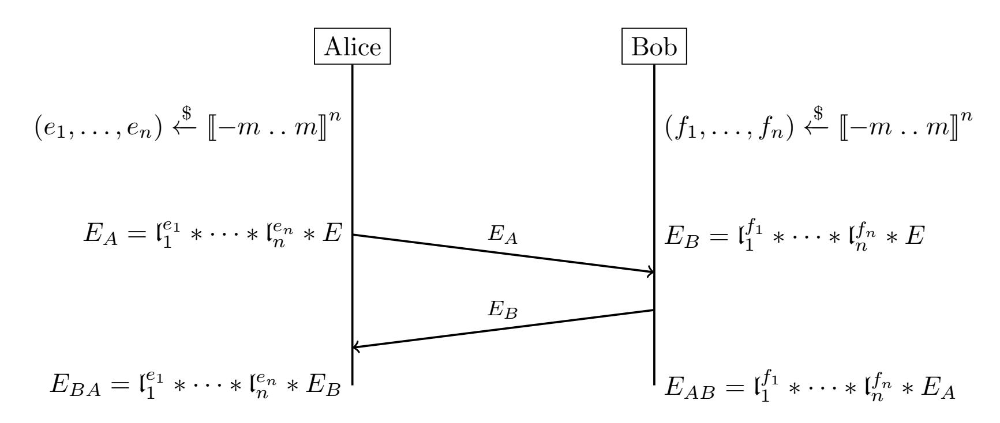
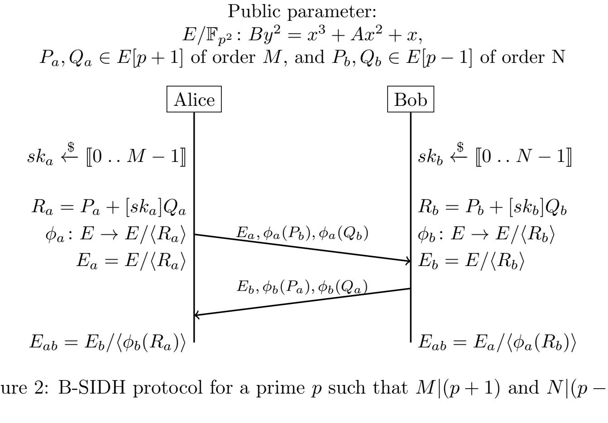
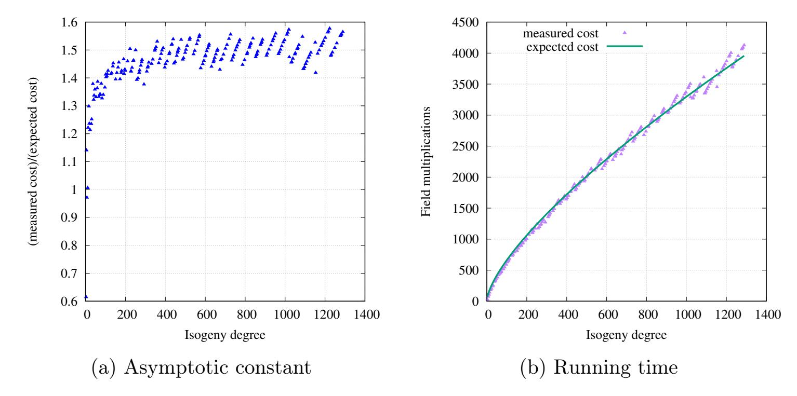
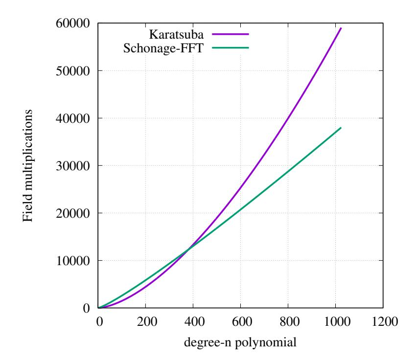

{0}------------------------------------------------

# Karatsuba-based square-root Vélu's formulas applied to two isogeny-based protocols

Gora Adj \*1, Jesús-Javier Chi-Domínguez †2, and Francisco Rodríguez-Henríquez ‡2,3

<sup>1</sup>Departament de Matemàtica, Universitat de Lleida, Spain <sup>2</sup>Cryptography Research Centre, Technology Innovation Institute, Abu Dhabi, United Arab Emirates <sup>3</sup>Computer Science Department, CINVESTAV-IPN, Mexico City, Mexico

September 4, 2021

#### **Abstract**

At a combined computational expense of about  $6\ell$  field operations, Vélu's formulas are used to construct and evaluate degree- $\ell$  isogenies in the vast majority of isogeny-based cryptographic schemes. By adapting to Vélu's formulas a baby-step giant-step approach, Bernstein, De Feo, Leroux, and Smith presented a procedure that can compute sisogeny operations at a reduced cost of just  $\tilde{O}(\sqrt{\ell})$  field operations. In this paper, we present a concrete computational analysis of these novel procedure along with several algorithmic tricks that helped us to further decrease its computational cost. We also report an optimized Python3-code implementation of several instantiations of two isogeny-based key-exchange protocols, namely, CSIDH and B-SIDH. Our software library uses a combination of the modified Vélu's formulas and an adaptation of the optimal strategies commonly used in the SIDH/SIKE protocols to produce significant speedups. Compared to a traditional Vélu constanttime implementation of CSIDH, our experimental results report a saving of 5.357%, 13.68% and 25.938% base field operations for CSIDH-512, CSIDH-1024, and CSIDH-1792, respectively. Additionally, we present the first optimized implementation of B-SIDH ever reported in the open literature.

# 1 Introduction

Isogeny-based cryptography was independently introduced in 2006 by Couveignes [16], Rostovtsev and Stolbunov in [31, 33]. Since then, an ever increasing number of isogeny-based key-exchange protocols have been proposed. A selection of those protocols, especially relevant for this work, is briefly summarized below.

<sup>\*</sup>gora.adj@udl.cat

<sup>†</sup>jesus.dominguez@tii.ae

<sup>&</sup>lt;sup>‡</sup>francisco@cs.cinvestav.mx, francisco.rodriguez@tii.ae

{1}------------------------------------------------

Operating with supersingular elliptic curves defined over the finite field  $\mathbb{F}_{p^2}$ , with p a prime, the Supersingular Isogeny-based Diffie-Hellman key exchange protocol (SIDH) was presented by Jao and De Feo in [21] (see also [17]). In 2017, the Supersingular Isogeny Key Encapsulation (SIKE) protocol, an SIDH variant, was submitted to the NIST post-quantum cryptography standardization project [2]. On July 2020, NIST announced that SIKE passed to the round 3 of this contest as an alternate candidate.

In 2018, the commutative group action protocol CSIDH was introduced by Castryck, Lange, Martindale, Panny and Renes in [8]. Operating with supersingular elliptic curves defined over a prime field  $\mathbb{F}_p$ , CSIDH is a significantly faster version of the Couveignes-Rostovtsev-Stolbunov scheme variant as it was presented in [18].

More recently, in 2019, Costello proposed a variant of SIDH named B-SIDH [13]. In B-SIDH, Alice computes isogenies from a (p+1)-torsion supersingular curve subgroup, whereas Bob has to operate on the (p-1)-torsion subgroup of the quadratic twist of that curve. A remarkable feature of B-SIDH is that it can achieve similar classical and quantum security levels as SIDH, but using significantly smaller public/private key sizes. The single most important challenge in the implementation of B-SIDH is the high computational cost associated to the large degree isogenies involved in its execution.

In general, performing isogeny map constructions and evaluations are the most expensive computational tasks of any isogeny-based protocol. This is especially true for CSIDH and B-SIDH, where [exceedingly] large odd prime degree- $\ell$  isogenies come into play.

For decades now, Vélu's formulas (cf. [22, §2.4] and [34, Theorem 12.16]) have been widely used to construct and evaluate degree- $\ell$  isogenies. Using several elliptic curve and isogeny arithmetic optimization tricks reported in the last few years [26, 14, 9], the construction and evaluation of degree- $\ell$  isogenies via Vélu's formulas can be obtained at a computational cost of roughly  $6\ell$  field multiplications (see a detailed discussion in §2).

Recently, Bernstein, De Feo, Leroux and Smith presented in [5] a new approach for constructing and evaluating degree- $\ell$  isogenies at a combined cost of just  $\tilde{O}(\sqrt{\ell})$  field operations. This improvement was obtained by observing that the main polynomial product embedded in the isogeny computations, can be effectively accelerated via a baby-step giant-step approach [5, Algorithm 2]. Due to its square root complexity reduction (up to polylogarithm factors), in the remainder of this paper, we will refer to this variant of Vélu's formulas, as  $\sqrt{\ell}$  formulas or simply  $\sqrt{\ell}$  flu.

As we will see in this paper, and as it was already hinted in [5],  $\sqrt{\text{élu}}$  has a noticeable impact on the performance of CSIDH, and even more so on B-SIDH. By way of illustration, consider the combined cost of constructing and evaluating degree- $\ell$  isogenies for  $\ell = 587$ , which corresponds to an example highlighted in [5, Appendix A.3]. For that degree  $\ell$ , the authors report a cost of just  $2296 \approx 3.898(\ell + 2)$  field multiplications and squaring operations. This has to be compared with the cost of a classical Vélu approach that would take some  $3544 \approx 6.017(\ell + 2)$  multiplications.

In spite of the groundbreaking result announced in [5], along with the high perfor-

<span id="page-1-0"></span>Note that  $\ell = 587$  is the largest prime factor of  $\frac{p+1}{4}$ , where p is the prime used in the popular CSIDH-512 instantiation of the CSIDH isogeny-based protocol.

{2}------------------------------------------------

mance achieved by its companion software library, the authors did not provide a practical cost analysis of their approach, but rather, they focus their attention on its asymptotical analysis. Moreover, their  $\sqrt{\text{\'elu}}$  implementation reported a rather modest 1% and 8% speedup over the traditional V\'elu's formulas when applied to the non constant-time CSIDH-512 and CSIDH-1024 instantiations, respectively. Furthermore, the authors of [5] left open the problem of assessing the practical impact of  $\sqrt{\text{\'elu}}$  on CSIDH and B-SIDH constant-time implementations.

Our Contributions. We present a concrete computational analysis of  $\sqrt{\text{élu}}$ . From this analysis, we conclude that for virtually all practical scenarios, the best approach for performing the polynomial products associated to the isogeny arithmetic is achieved by nothing more than carefully tailored Karatsuba polynomial multiplications. The main practical consequence of this observation is that computing degree- $\ell$  isogenies with  $\sqrt{\text{élu}}$  has a concrete computational cost closer to  $O(b^{\log_2(3)})$ , where  $b = \sqrt{\ell}$ . We also present several tricks that permit to save multiplications when performing products involving the polynomials  $E_{J_0}$  and  $E_{J_1}$  as defined in §4. We additionally exploit the fact that the polynomials  $E_{J_0}$  and  $E_{J_1}$  are the reciprocal of each other. These simple but effective observations help us to construct and evaluate a degree-587 isogeny using only  $2180 \mathbf{M} \approx 3.701 (\ell+2)$ . This is about 5.3% cheaper than the same computation announced in [5]. This improvement also pushes to  $\ell=89$  the threshold where computing degree- $\ell$  isogenies with  $\sqrt{\text{élu}}$  becomes more effective than traditional Vélu.

In a nutshell, our main practical contributions can be summarized as follows:

- 1. We report the first constant-time implementation of the protocol B-SIDH introduced in [13]. Using the framework of [11], optimal strategies à la SIDH are applied to B-SIDH while also taking advantage of √élu. The experimental results for B-SIDH show a saving of up to 75% compared with an implementation of this protocol using traditional Vélu.
- 2. We used the framework presented in [11] to apply optimal strategies to CSIDH, while exploiting  $\sqrt{\text{élu}}$ . This allows us to present the first application of  $\sqrt{\text{élu}}$  to constant-time implementations of the CSIDH-512, CSIDH-1024, and CSIDH-1792 instantiations. A comparison with respect to CSIDH using traditional Vélu, reports savings of 5.357%, 13.68% and 25.938% field  $\mathbb{F}_p$ -operations for CSIDH-512, CSIDH-1024, and CSIDH-1792, respectively.
- 3. We prove that the computational cost of computing degree- $\ell$  isogenies using  $\sqrt{\text{\'elu}}$  with Karatsuba is of  $O(\sqrt{\ell^{\log_2 3}})$  field operations.

Our software library is freely available at

https://github.com/JJChiDguez/sibc.

{3}------------------------------------------------

Outline. The remainder of this paper is organized as follows. In §2, we give a description of traditional Vélu's formulas. We include also a compact description of the B-SIDH and CSIDH protocols. In §3, we briefly discuss the application of optimal strategies to CSIDH and B-SIDH. In §4, we present an explicit description of  $\sqrt{\text{élu}}$  main building blocks KPS, xEVAL, and xISOG. In addition, we discuss several  $\sqrt{\text{élu}}$  algorithmic improvements in §4.2. We report the experimental results obtained from our software library in §5, first in §5.1 for CSIDH and then in §5.2 for B-SIDH. Finally, our concluding remarks are drawn in §6.

**Notation.** M, S, and a denote the cost of computing a single multiplication, squaring, and addition (or subtraction) in the prime field  $\mathbb{F}_p$ , respectively.

# <span id="page-3-0"></span>2 Background

Most if not all of the fastest isogeny-based constant-time protocol implementations, have adopted for their schemes Montgomery and twisted Edwards curve models. A Montgomery curve [25] is defined by the equation  $E_{A,B}: By^2 = x^3 + Ax^2 + x$ , such that  $B \neq 0$  and  $A^2 \neq 4$ . For the sake of simplicity, we will write  $E_A$  for  $E_{A,1}$  and will always consider B = 1. Moreover, it is customary to represent the constant A in the projective space  $\mathbb{P}^1$  as (A': C'), such that A = A'/C' (see [15]).

Let  $q = p^n$ , where p is a large prime number and n a positive integer. Let E be a supersingular Montgomery curve  $E: y^2 = x^3 + Ax^2 + x$  defined over  $\mathbb{F}_q$ , and let  $\ell$  be an odd prime number. Given an order- $\ell$  point  $P \in E(\mathbb{F}_q)$ , the construction of a degree- $\ell$  isogeny  $\phi: E \mapsto E'$  of kernel  $G = \langle P \rangle$  and its evaluation at a point  $Q \in E(\mathbb{F}_q) \backslash G$  consist of the computation of the Montgomery coefficient  $A' \in \mathbb{F}_q$  of the codomain curve  $E': y^2 = x^3 + A'x^2 + x$  and the image point  $\phi(Q)$ , respectively. In this paper, we will refer to these two tasks as isogeny construction and isogeny evaluation computations, respectively.

Vélu's formulas (see [22, §2.4] and [34, Theorem 12.16]), have been generally used to construct and evaluate degree- $\ell$  isogenies by performing three main building blocks known as, KPS, xISOG and xEVAL. The block KPS computes the first k multiples of the point P, namely, the set  $\{P, [2]P, \ldots, [k]P\}$ . Using KPS as a sort of pre-computation ancillary module, xISOG finds the constants  $(A':C') \in \mathbb{F}_q$  that determine the codomain curve E'. Also, using KPS as a building block, xEVAL calculates the image point  $\phi(Q) \in E'$ .

After applying a number of elliptic curve arithmetic tricks [26, 14, 9], the computational expenses of KPS, xISOG and xEVAL have been found to be about  $3\ell$ ,  $\ell$  and  $2\ell$  multiplications, respectively. This gives an overall cost of about  $6\ell$  multiplications for the combined cost of the isogeny construction and evaluation tasks. In §4, we give a detailed discussion of how the  $\sqrt{\text{élu}}$  approach of [5] drastically reduces the timing costs of traditional Vélu's formulas.<sup>2</sup>

<span id="page-3-1"></span> $<sup>^2</sup>$ This speedup is achieved as a time-memory trade-off: an optimized implementation of  $\sqrt{\text{\'elu}}$  requires much more memory than traditional Vélu.

{4}------------------------------------------------

Public parameter:  

$$E/\mathbb{F}_p \colon By^2 = x^3 + Ax^2 + x,$$

<span id="page-4-0"></span>

Figure 1: CSIDH key-exchange protocol

In the remainder of this section, we briefly discuss the two isogeny-based protocols implemented in this paper, namely, CSIDH and B-SIDH.

### 2.1 Overviewing the C-SIDH

Here, we give a simplified description of CSIDH. For more technical details, the interested reader is referred to [8, 9, 23, 28].

CSIDH is an isogeny-based protocol that can be used for key exchange and encapsulation [8], and other more advanced protocols and primitives. Figure 1 shows how CSIDH can be executed analogously to Diffie-Hellman, to produce a shared secret between Alice and Bob. Remarkably, the elliptic curves  $E_{BA}$  and  $E_{AB}$  computed by Alice and Bob at the end of the protocol are one and the same.

CSIDH works over a finite field  $\mathbb{F}_p$ , where p is a prime of the form

$$p = 4 \prod_{i=1}^{n} \ell_i - 1$$

with  $\ell_1, \ldots, \ell_n$  a set of small odd primes. For example, the original CSIDH article [8] defined a 511-bit p with  $\ell_1, \ldots, \ell_{n-1}$  the first 73 odd primes, and  $\ell_n = 587$ . This instantiation is commonly known as CSIDH-512.

The set of public keys in CSIDH is a subset of all supersingular elliptic curves in Montgomery form,  $y^2 = x^3 + Ax^2 + x$ , defined over  $\mathbb{F}_p$ . Since the CSIDH base curve E is supersingular, it follows that  $\#E(\mathbb{F}_p) = (p+1) = 4 \prod_{i=1}^n \ell_i$ .

The input to the CSIDH class group action algorithm is an elliptic curve  $E: y^2 = x^3 + Ax^2 + x$ , represented by its A-coefficient, and an ideal class  $\mathfrak{a} = \prod_{i=1}^n \mathfrak{t}_i^{e_i}$ , represented

{5}------------------------------------------------

by its list of secret exponents  $(e_i, \ldots, e_n) \in [-m \ldots m]^n$ . The output is the A-coefficient of the elliptic curve  $E_A$  defined as,

$$E_A = \mathfrak{a} * E = \mathfrak{l}_1^{e_1} * \dots * \mathfrak{l}_n^{e_n} * E. \tag{1}$$

Taking advantage of the commutative property of the group action, we can implement the protocol shown in Figure 1, which closely resembles the flow of the classical Diffie-Hellman protocol. Alice and Bob begin by selecting secret keys  $\mathfrak{a}$  and  $\mathfrak{b}$ , and producing their corresponding public keys  $E_A = \mathfrak{a}*E$  and  $E_B = \mathfrak{b}*E$ , respectively. After exchanging these public keys and taking advantage of the commutative property of the group action, Alice and Bob compute a shared secret as,

$$\mathfrak{a} * E_B = (\mathfrak{a} \cdot \mathfrak{b})E = (\mathfrak{b} \cdot \mathfrak{a})E = \mathfrak{b} * E_A.$$

The computational cost of the group action described in Algorithm 4 of subsection A.1, is dominated by the calculation of n degree- $\ell_i^{e_i}$  isogeny evaluations and constructions plus a total of  $\frac{n(n+1)}{2}$  scalar multiplications by the prime factors  $\ell_i$ , for  $i=1,\ldots,n$ . A similar multiplication-based approach for computing the group action algorithm was proposed in the original CSIDH protocol of [8]. It was first stated in [6, §8] (see also [20]) that this multiplication-based procedure could possibly be improved by adapting to CSIDH, the SIDH optimal strategy approach introduced by De Feo, Jao and Plût in [17]. We briefly discuss about the role of optimal strategies for large instances of CSIDH in §3, where the framework presented in [11] was adopted.

### 2.2 Playing the B-SIDH

B-SIDH was proposed by Costello in [13], Alice and Bob work in the (p + 1)- and (p - 1)-torsion of a set of supersingular curves defined over  $\mathbb{F}_{p^2}$  and their quadratic twist set, respectively. B-SIDH is effectively twist-agnostic because optimized isogeny and Montgomery arithmetic only require the x-coordinate of the points along with the A coefficient of the curve.<sup>3</sup> This feature implies that B-SIDH can be executed entirely  $\hat{a}$  la SIDH as shown in Figure 2.<sup>4</sup>

More concretely, as before let  $E: By^2 = x^3 + Ax^2 + x$  denote a supersingular Montgomery curve defined over  $\mathbb{F}_{p^2}$ , so that  $\#E(\mathbb{F}_{p^2}) = (p+1)^2$ , and let  $E_t/\mathbb{F}_{p^2}$  denote the quadratic twist of  $E/\mathbb{F}_{p^2}$ . Then,  $E_t/\mathbb{F}_{p^2}$  can be modeled as,  $(\gamma B)y^2 = x^3 + Ax^2 + x$ , where  $\gamma \in \mathbb{F}_{p^2}$  is a non-square element and  $\#E(\mathbb{F}_{p^2}) = (p-1)^2$ . Notice that the isomorphism connecting these two curves is determined by the map  $\iota : (x,y) \mapsto (x,jy)$  with  $j^2 = \gamma$  (see [13, §3]).

Hence, for any  $\mathbb{F}_{p^2}$ -rational point P=(x,y) on  $E_t/\mathbb{F}_{p^2}$  it follows that  $Q=\iota(P)=(x,jy)$  is an  $\mathbb{F}_{p^4}$ -rational point on E, such that  $Q+\pi^2(Q)=\mathcal{O}$ . Here  $\pi\colon (x,y)\mapsto (x^p,y^p)$ 

<span id="page-5-0"></span> $<sup>^{3}</sup>$ For efficiency purposes, in practice both, the x-coordinate of the points and the constant A of the curve, are projectivized to two coordinates.

<span id="page-5-1"></span><sup>&</sup>lt;sup>4</sup>Although we omit here the specifics of the operations depicted in Figure 2, they are completely analogus to the ones corresponding to SIDH, a protocol that is carefully discussed in many papers such as [17, 15, 1].

{6}------------------------------------------------

<span id="page-6-0"></span>

Figure 2: B-SIDH protocol for a prime p such that M|(p+1) and N|(p-1).

is the Frobenius endomorphism. This implies that Q is a zero-trace  $\mathbb{F}_{p^4}$ -rational point on  $E/\mathbb{F}_{n^2}$ .

B-SIDH can thus be seen as a reminiscent of the CSIDH protocol [8], where the quadratic twist is exploited to perform the computations using rational and zero-trace points with coordinates in  $\mathbb{F}_{p^2}$ . Although B-SIDH allows to work over smaller fields than either SIDH or CSIDH, it requires the computation of considerably larger degree- $\ell$ isogenies.

As illustrated in Figure 2, B-SIDH can be executed analogously to the main flow of the SIDH protocol. B-SIDH public parameters correspond to a supersingular Montgomery curve  $E/\mathbb{F}_{p^2}$ :  $By^2 = x^3 + Ax^2 + x$  with  $\#E(\mathbb{F}_{p^2}) = (p+1)^2$ , two rational points  $P_a$  and  $Q_a$  on  $E/\mathbb{F}_{p^2}$ , and two zero-trace  $\mathbb{F}_{p^4}$ -rational points  $P_b$  and  $Q_b$  on  $E/\mathbb{F}_{p^2}$  such that

- $P_a$  and  $Q_a$  are two independent order-M points with  $M \mid (p+1)$ , gcd(M,2) = 2, and  $\left[\frac{M}{2}\right] Q_a = (0,0);$
- $P_b$  and  $Q_b$  are two independent order-N points with  $N \mid (p-1)$  and gcd(N,2) = 1.

In practice, B-SIDH is implemented using projectivized x-coordinate points, and thus the point differences  $PQ_a = P_a - Q_a$  and  $PQ_b = P_b - Q_b$  must also be exchanged. Since the x-coordinates of  $P_a, Q_a, PQ_a, P_b, Q_b$  and  $PQ_b$ , all belong to  $\mathbb{F}_{p^2}$ , a B-SIDH implementation must perform field arithmetic on that quadratic extension field. As in the case of SIDH, the protocol flow of B-SIDH must perform two main phases, namely, key generation and secret sharing. In the key generation phase, the evaluation of the projectivized x-coordinate points x(P), x(Q) and x(P-Q) is required. Thus for B-SIDH, secret sharing is significantly cheaper than key generation.

We briefly discuss the role of optimal strategies for large instances of CSIDH and B-SIDH, in the next section.

{7}------------------------------------------------

# <span id="page-7-1"></span>3 Optimal strategies for the CSIDH and the B-SIDH

In [17], optimal strategies were introduced to efficiently compute degree- $\ell^e$  isogenies at a cost of approximately  $\frac{e}{2} \log_2 e$  scalar multiplications by  $\ell$ ,  $\frac{e}{2} \log_2 e$  degree- $\ell$  isogeny evaluations, and e constructions of degree- $\ell$  isogenous curves. Optimal strategies can be obtained using dynamic programming (see [2, 11] for concrete algorithms).

In the context of SIDH, optimal strategies tend to balance the number of isogeny evaluations and scalar multiplications to  $O(e \log(e))$ . In the case of CSIDH, optimal strategies are expected to be largely multiplicative, *i.e.*, optimal strategies will tend to favor the computation of more scalar multiplications over isogeny evaluations. This is due to the fact that these operations are cheaper than large prime degree- $\ell$  isogeny evaluations.

Let  $\mathcal{L} = [\ell_1, \ell_2, \dots, \ell_{74}]$  be the list of small odd prime numbers such that  $p = 4 \cdot \prod_{i=1}^{n} \ell_i - 1$  is the prime number used in CSIDH. Here, we adopt the framework presented in [11], where the authors heuristically assumed that an arrangement of the set  $\mathcal{L}$  from the smallest to the largest  $\ell_i$ , is close to the global optimal. For this fixed ordering, the authors of [11] reported a procedure that finds an optimal strategy with cubic complexity with respect to n.

Optimal strategies can also be used to improve the performance of B-SIDH, although in this case, we can see the resulting strategies as a hybrid between SIDH and CSIDH. On the one hand, B-SIDH follows the same SIDH protocol flow. On the other hand, B-SIDH must construct/evaluate several isogenies whose degrees are powers of large odd primes, as in CSIDH.

Let us assume that we need to construct a degree-L isogeny with  $L = \ell_1^{e_1} \cdot \ell_2^{e_2} \cdots \ell_n^{e_n}$ , and let us write

<span id="page-7-2"></span>
$$\mathcal{L}' = [\underbrace{\ell_1, \dots, \ell_1}_{e_1}, \underbrace{\ell_2, \dots, \ell_2}_{e_2}, \dots, \underbrace{\ell_n, \dots, \ell_n}_{e_n}]. \tag{2}$$

Then, in order to efficiently execute either the key generation or the secret sharing main phases of B-SIDH, we must find an optimal strategy for the setting  $\mathcal{L}'$  as described in Algorithm 5 of subsection A.1.

Notice that any B-SIDH strategy can be encoded as is customary in SIDH and CSIDH, i.e., by a list of e-1 positive integers where  $e = \sum_{i=1}^{n} e_i$ . Moreover, any such strategy can be evaluated by executing the dynamic-programming procedure shown in Algorithm 5.

# <span id="page-7-0"></span>4 New Vélu's formulas

In this section we present a more detailed discussion of the  $\sqrt{\text{élu}}$  algorithms and their application to isogeny-based cryptography. We give several algorithmic tricks that slightly improve the performance of  $\sqrt{\text{élu}}$  as it was presented in [5].

Let  $E_A/\mathbb{F}_q$  be an elliptic curve defined in Montgomery form by the equation  $y^2 = x^3 + Ax^2 + x$ , with  $A^2 \neq 4$ . Let P be a point on  $E_A$  of odd prime order  $\ell$ , and  $\phi: E_A \to E_{A'}$  a separable isogeny of kernel  $G = \langle P \rangle$  and codomain  $E_{A'}/\mathbb{F}_q: y^2 = x^3 + A'x^2 + x$ .

{8}------------------------------------------------

Our main task here is to compute A' and the x-coordinate  $\phi_x(\alpha)$  of  $\phi(Q)$ , for a rational point  $Q = (\alpha, \beta) \in E_A(\mathbb{F}_q) \setminus G$ . As mentioned in [5] (see also [14], [24] and [27]), the following formulas allow to accomplish this task,

$$A' = 2 \frac{1+d}{1-d}$$
 and  $\phi_x(\alpha) = \alpha^{\ell} \frac{h_S(1/\alpha)^2}{h_S(\alpha)^2}$ , where

$$S = \{1, 3, \dots, \ell - 2\}, \quad d = \left(\frac{A - 2}{A + 2}\right)^{\ell} \left(\frac{h_S(1)}{h_S(-1)}\right)^8, \text{ and}$$

$$h_S(X) = \prod_{s \in S} (X - x([s]P)).$$

From the above, we see that the efficiency of computing A' and  $\phi_x(\alpha)$  directly depends on the cost of evaluating the polynomial  $h_S(X) = \prod_{s \in S} (X - x([s]P))$ . A naive approach would compute  $h_S(X)$  by performing #S - 1 polynomial products. Alternatively, exploiting a baby-step giant-step strategy  $\sqrt{\text{\'el}}$  obtains a square root complexity speedup over a traditional V\'elu approach. In the following, we briefly sketch this strategy.

Given  $E_A/\mathbb{F}_q$  an order- $\ell$  point  $P \in E_A(\mathbb{F}_q)$ , and some value  $\alpha \in \mathbb{F}_q$  we want to efficiently evaluate the polynomial,  $h_S(\alpha) = \prod_i^{\ell-1} (\alpha - x([i]P))$ . From Lemma 4.3 of [5],

$$(X - x(P + Q))(X - x(P - Q)) = X^{2} + \frac{F_{1}(x(P), x(Q))}{F_{0}(x(P), x(Q))}X$$
$$+ \frac{F_{2}(x(P), x(Q))}{F_{0}(x(P), x(Q))}$$

where,

<span id="page-8-0"></span>
$$F_0(Z,X) = Z^2 - 2XZ + X^2;$$

$$F_1(Z,X) = -2(XZ^2 + (X^2 + 2AX + 1)Z + X);$$

$$F_0(Z,X) = X^2Z^2 - 2XZ + 1.$$
(3)

This suggests a rearrangement à la Baby-step Giant-step as,

$$h(\alpha) = \prod_{i \in \mathcal{I}} \prod_{j \in \mathcal{J}} (\alpha - x([i + s \cdot j]P))(\alpha - x([i - s \cdot j]P))$$

Now  $h(\alpha)$  can be efficiently computed by calculating the resultants of polynomials of the form,

$$h_I \leftarrow \prod_{x_i \in \mathcal{I}} (Z - x_i) \in \mathbb{F}_q[Z]$$
$$E_J(\alpha) \leftarrow \prod_{x_j \in \mathcal{J}} \left( F_0(Z, x_j) \alpha^2 + F_1(Z, x_j) \alpha + F_2(Z, x_j) \right).$$

{9}------------------------------------------------

The most demanding operations of  $\sqrt{\text{\'elu}}$  require computing four different resultants of the form  $\text{Res}_Z(f(Z),g(Z))$  for polynomials  $f,g\in\mathbb{F}_q[Z]$ . We compute these four resultants using a remainder tree approach supported by carefully tailored Karatsuba polynomial multiplications. In practice, the computational cost of performing degree- $\ell$  isogenies using  $\sqrt{\text{\'elu}}$  is close to  $K(\sqrt{\ell})^{\log_2 3}$  field operations, with K a constant.

# <span id="page-9-1"></span>4.1 Construction and evaluation of odd degree isogenies

As in section 2, we consider the three building blocks KPS, xISOG, xEVAL, where KPS consists of computing the x-coordinates of all the points in the kernel G, xISOG finds the codomain coefficient A', and xEVAL performs the computation of  $\phi_x(\alpha)$ .

In line with the traditional approach, one could use the KPS procedure of traditional Vélu for computing the x-coordinates of  $(\#S = (\ell - 1)/2)$  points in the kernel G. This will cost about  $3\ell$  field multiplications. More efficiently,  $\sqrt{\text{\'elu}}$  only computes the x-coordinates of points of G with indices in three subsets of S, each of size  $O(\sqrt{\ell})$ . Denote by  $\mathcal{I}$ ,  $\mathcal{J}$  and  $\mathcal{K}$  those subsets of S. Then,  $\mathcal{I}$  and  $\mathcal{J}$  are chosen such that the maps  $\mathcal{I} \times \mathcal{J} \to S$  defined by  $(i,j) \mapsto i+j$  and  $(i,j) \mapsto i-j$  are injective and their images  $\mathcal{I} + \mathcal{J}$ ,  $\mathcal{I} - \mathcal{J}$  are disjoint. We call  $(\mathcal{I}, \mathcal{J})$  an index system for S and write  $\mathcal{I} \pm \mathcal{J}$  for  $(\mathcal{I} + \mathcal{J}) \cap (\mathcal{I} - \mathcal{J})$ . The remaining indices of S are gathered in  $\mathcal{K} = S \setminus (\mathcal{I} \pm \mathcal{J})$ . Algorithm 1 states the required KPS computations.

### <span id="page-9-0"></span>Algorithm 1 Kernel points computation (KPS)

```
Require: An elliptic curve E_A/\mathbb{F}_q; P \in E_A(\mathbb{F}_q) of order an odd prime \ell.

Ensure: \mathcal{I} = \{x([i]P) \mid i \in I\}, \mathcal{J} = \{x([j]P) \mid j \in J\}, and \mathcal{K} = \{x([k]P) \mid k \in K\} such that (I,J) is an index system for S, and K = S \setminus (I \pm J)

1: b \leftarrow \lfloor \sqrt{\ell - 1}/2 \rfloor; b' \leftarrow \lfloor (\ell - 1)/4b \rfloor

2: I \leftarrow \{2b(2i+1) \mid 0 \leq i < b'\}

3: J \leftarrow \{2j+1 \mid 0 \leq j < b\}

4: K \leftarrow S \setminus (I \pm J)

5: \mathcal{I} \leftarrow \{x([i]P) \mid i \in I\}

6: \mathcal{J} \leftarrow \{x([i]P) \mid j \in J\}

7: \mathcal{K} \leftarrow \{x([k]P) \mid k \in K\}

8: return \mathcal{I}, \mathcal{J}, \mathcal{K}
```

Let us recall that for the efficient computation of xISOG and xEVAL,  $\sqrt{\text{\'el}}$  uses the biquadratic polynomials of Equation 3, which implies the computation of resultants of the form  $\text{Res}_Z(f(Z),g(Z))$ , for two polynomials  $f,g\in\mathbb{F}_q[Z]$ .

We are now ready to present in Algorithm 2 and Algorithm 3 the computation of xISOG and xEVAL, respectively. Deriving the resultants in Algorithm 2 and Algorithm 3 may turn out to be a cumbersome task if it is not carried out in an elaborated way. For polynomials  $f = a \prod_{0 \le i < n} (Z - x_i)$  and g in  $\mathbb{F}_q[Z]$ , their resultant  $\operatorname{Res}(f,g) = a^n \prod_{0 \le i < n} g(x_i)$  can be computed efficiently when the factorization of f is known, which is exactly the case in the algorithms at hand. Employing a remainder tree

{10}------------------------------------------------

approach (an equivalent alternative being continued fractions), one evaluates the factors  $g(x_i)$  by computing  $g \mod (Z - x_i)$ ,  $0 \le i < n$ , followed by their product.

One considerable advantage of using remainder trees here is that the subjacent product tree of the  $(Z - x_i)$  factors, can be shared among all the resultants in Algorithm 2 and Algorithm 3, since these linear polynomials depend only on the kernel  $\langle P \rangle$ . In other words, the four resultants in Algorithm 2 and Algorithm 3 show no dependencies among them and therefore, they can be computed concurrently by a  $\sqrt{\text{\'el}}$ u parallel implementation.

### <span id="page-10-0"></span>Algorithm 2 Codomain curve construction (xISOG)

**Require:** An elliptic curve  $E_A/\mathbb{F}_q: y^2=x^3+Ax^2+x; P\in E_A(\mathbb{F}_q)$  of order an odd prime  $\ell; \mathcal{I}, \mathcal{J}, \mathcal{K}$  from KPS.

**Ensure:**  $A' \in \mathbb{F}_q$  such that  $E_{A'}/\mathbb{F}_q : y^2 = x^3 + A'x^2 + x$  is the image curve of a separable isogeny with kernel  $\langle P \rangle$ .

```
1: h_I \leftarrow \prod_{x_i \in \mathcal{I}} (Z - x_i) \in \mathbb{F}_q[Z]

2: E_{0,J} \leftarrow \prod_{x_j \in \mathcal{J}} (F_0(Z, x_j) + F_1(Z, x_j) + F_2(Z, x_j)) \in \mathbb{F}_q[Z]

3: E_{1,J} \leftarrow \prod_{x_j \in \mathcal{J}} (F_0(Z, x_j) - F_1(Z, x_j) + F_2(Z, x_j)) \in \mathbb{F}_q[Z]

4: R_0 \leftarrow \text{Res}_Z(h_I, E_{0,J}) \in \mathbb{F}_q

5: R_1 \leftarrow \text{Res}_Z(h_I, E_{1,J}) \in \mathbb{F}_q

6: M_0 \leftarrow \prod_{x_k \in \mathcal{K}} (1 - x_k) \in \mathbb{F}_q

7: M_1 \leftarrow \prod_{x_k \in \mathcal{K}} (-1 - x_k) \in \mathbb{F}_q

8: d \leftarrow \left(\frac{A-2}{A+2}\right)^{\ell} \left(\frac{M_0 R_0}{M_1 R_1}\right)^8

9: return 2 \frac{1+d}{1-d}
```

#### <span id="page-10-1"></span>Algorithm 3 Isogeny evaluation (xEVAL)

**Require:** An elliptic curve  $E_A/\mathbb{F}_q: y^2=x^3+Ax^2+x; P\in E_A(\mathbb{F}_q)$  of order an odd prime  $\ell$ ; the x-coordinate  $\alpha\neq 0$  of a point  $Q\in E_A(\mathbb{F}_q)\backslash\langle P\rangle; \mathcal{I}, \mathcal{J}, \mathcal{K}$  from KPS.

**Ensure:** The x-coordinate of  $\phi(Q)$ , where  $\phi$  is a separable isogeny of kernel  $\langle P \rangle$ .

```
1: h_I \leftarrow \prod_{x_i \in \mathcal{I}} (Z - x_i) \in \mathbb{F}_q[Z]

2: E_{0,J} \leftarrow \prod_{x_j \in \mathcal{J}} \left( \frac{F_0(Z,x_j)}{\alpha^2} + \frac{F_1(Z,x_j)}{\alpha} + F_2(Z,x_j) \right) \in \mathbb{F}_q[Z]

3: E_{1,J} \leftarrow \prod_{x_j \in \mathcal{J}} \left( F_0(Z,x_j) \alpha^2 + F_1(Z,x_j) \alpha + F_2(Z,x_j) \right) \in \mathbb{F}_q[Z]

4: R_0 \leftarrow \operatorname{Res}_Z(h_I, E_{0,J}) \in \mathbb{F}_q

5: R_1 \leftarrow \operatorname{Res}_Z(h_I, E_{1,J}) \in \mathbb{F}_q

6: M_0 \leftarrow \prod_{x_k \in \mathcal{K}} (1/\alpha - x_k) \in \mathbb{F}_q

7: M_1 \leftarrow \prod_{x_k \in \mathcal{K}} (\alpha - x_k) \in \mathbb{F}_q

8: \operatorname{return} (M_0 R_0)^2 / (M_1 R_1)^2
```

Notice that the single most recurrent high level operation of Algorithm 2 and Algorithm 3, is the polynomial multiplication on the ring  $\mathbb{F}_q[X]$ . Thus, as in [5], it is essential that we utilize fast tailor-made polynomial multiplication algorithms. These customized

{11}------------------------------------------------

algorithms are useful because for several required computations, only a segment of the output product is actually needed.

The resultant  $\operatorname{Res}_Z(f(Z), g(Z))$  of two polynomials  $f, g \in \mathbb{F}_q[Z]$  can be computed with an asymptotic runtime complexity of  $\tilde{O}(n)$  by using a fast polynomial multiplication. Here fast means that this polynomial operation has a  $O(n\log_2(n))$  field multiplication complexity (see [4, p. 7, §3]). The degree of the polynomials used for CSIDH and even B-SIDH, are sufficiently small so that Karatsuba polynomial multiplication (or related approaches such as Toom-Cook), emerges as the most efficient solution. For example, according to the implementation of [5],  $\ell = 587$  requires polynomials of degree  $\#\mathcal{I} = 16$  and  $2 \times \#\mathcal{J} = 18$  (in the B-SIDH case this translates to  $\#\mathcal{I}, \#\mathcal{J} \leq 150$ ). It can be easily verified that Karatsuba polynomial multiplication becomes a more efficient choice than the Schönage-FFT approach (for a comprehensive analysis of these design options, see Appendix A.2).

### <span id="page-11-0"></span>4.2 Implementation speedups

In this section we report several algorithmic techniques that are exploited in our implementation to obtain some modest, but noticeably savings over [5]. Our first refinement affects xEVAL, and arises from the special shape of the biquadratic polynomials  $F_0$ ,  $F_1$ ,  $F_2$ . Considering either variable, one can see that  $F_1$  is symmetric and  $F_0$  is symmetric to  $F_2^5$ , that is,  $F_1 = 1/Z^2 F_1(1/Z, X)$  and  $F_2 = 1/Z^2 F_0(1/Z, X)$  by, for example, considering the first variable. Now, using a projective representation of the x-coordinate  $\alpha = x/z$  in xEVAL, we can write a quadratic polynomial factor in  $E_{0,J}$  and a quadratic polynomial factor in  $E_{1,J}$  respectively as

$$E_{0,j} = 1/x^2 \left( F_0(Z, x_j) z^2 + F_1(Z, x_j) x z + F_2(Z, x_j) x^2 \right);$$
  

$$E_{1,j} = 1/z^2 \left( F_0(Z, x_j) x^2 + F_1(Z, x_j) x z + F_2(Z, x_j) z^2 \right).$$

Thus, it becomes clear that the polynomials  $x^{2\#J}E_{0,J}$  and  $z^{2\#J}E_{1,J}$  are symmetric to one another, allowing to save the computation of one of the two products  $E_{0,J}$ ,  $E_{1,J}$ . This gives us an expected saving of  $\#\mathcal{J} \cdot \log_2(\#\mathcal{J})$  polynomial multiplications via product trees.

Our next improvement is focused on the computation of  $E_{0,j}$  required in **xEVAL**. Let us write  $x_j = X_j/Z_j$ . Then,  $(F_0(Z, x_j)z^2 + F_1(Z, x_j)xz + F_2(Z, x_j)x^2)$  can be expressed as  $aZ^2 + bZ + c$ , where

$$a = C(xZ_{j} - zX_{j})^{2};$$

$$2b = \left[C(X^{2} + Z^{2})\right](-4X_{j}Z_{j}) - \left[2(X_{j}^{2} + Z_{j}^{2})\right]\left(2[C(XZ)]\right) + \left(2[A'(XZ)]\right)(-4X_{j}Z_{j});$$

$$c = C(xX_{j} - zZ_{j})^{2}.$$

<span id="page-11-1"></span><sup>&</sup>lt;sup>5</sup>Consequently, all the quadratic factors of  $E_{0,J}$  and  $E_{1,J}$  in xISOG are symmetric. Bernstein et al. [5, Appendix A.5] were aware of this fact and took advantage of it to speed up the computation of  $E_{0,J}$ ,  $E_{1,J}$ .

{12}------------------------------------------------

The three equations above can be implemented (with the help of some extra pre-computations required in xISOG) at a cost of  $7\mathbf{M} + 3\mathbf{S} + 12\mathbf{a}$  field operations. This cost should be compared with the implementation of [5], which requires  $11\mathbf{M} + 2\mathbf{S} + 13\mathbf{a}$  field operations. Assuming  $\mathbf{M} = \mathbf{S}$ , this implies that our proposed formulas save 3 field multiplications per polynomial  $E_{0,j}$ ,  $0 \le j < \#\mathcal{J}$ .

Let us now illustrate the improvements just described applied to the example  $\ell = 587$ . Let us recall that in the implementation of [5], we have  $\#\mathcal{I} = 16$  and  $\#\mathcal{J} = 9$ . Consequently, our first improvement saves  $9\log_2(9) \approx 28$  polynomial multiplications via product trees. On the other hand, our second improvement saves  $3 \times \#\mathcal{J} = 3 \times 9 = 27$  field multiplications.

<span id="page-12-1"></span>

Figure 3: Measured and expected running time of KPS + xISOG + xEVAL for all the 207 small odd primes  $\ell_i$  required in the group action evaluation of CSIDH-1792 (see [11]). All computational costs are given in  $\mathbb{F}_p$ -multiplications. The expected running time corresponds to  $1.5 \times \mathrm{Cost}(b)$ . Additionally,  $b \approx \frac{\sqrt{(\ell-1)}}{2}$ .

#### 4.3 Practical complexity analysis

In this section, we present the computational cost associated to the combined evaluation of the KPS, xISOG, and xEVAL procedures.<sup>6</sup>

Let  $b = \lfloor \frac{\sqrt{\ell-1}}{2} \rfloor$  as given in Step 1 of Algorithm 1. Note that KPS (see Algorithm 1), can be performed at a cost of about 3b differential point additions (assuming  $\#\mathcal{I} \approx \#\mathcal{J} \approx \#\mathcal{K} \approx b$ ), which implies an expense of at most  $(18b)\mathbf{M}$  field multiplications.

Observe also that the computation of the polynomial  $h_I(Z)$  required at Step 1 of both, xISOG (Algorithm 2) and xEVAL (Algorithm 3) procedures, can be shared and thus must be computed only once. One interesting observation of [5], is that the computation of the polynomials  $E_{0,J}$  and  $E_{1,J}$  in xISOG (see Steps 2-3 of Algorithm 2), can be

<span id="page-12-0"></span><sup>&</sup>lt;sup>6</sup>In the sequel,  $\sqrt{\text{élu computational costs}}$  are derived assuming a projective coordinate system and  $\mathbf{M} = \mathbf{S}$ .

{13}------------------------------------------------

performed at a cost of only one product tree procedure. Furthermore, as it was already discussed in subsection 4.2, this same trick can also be applied to xEVAL, *i.e.*, Steps 2-3 of Algorithm 3 can be calculated by executing only one product tree. Hence, each polynomial  $E_{i,J}$ , i = 0, 1, required by xISOG and xEVAL can be obtained at a cost of (3b)M and (10b)M field operations, respectively.

Additionally, in Steps 4-5 of xISOG and xEVAL, the computation of two resultants are required, implying that four resultants must be computed in total. Each Resultant corresponds to the computation of  $\text{Res}_Z(f(Z), g(Z))$  such that  $f, g \in \mathbb{F}_q[Z]$ ,  $\deg f = b' \approx b$  and  $\deg g = 2b$ . We give in in Appendix A.3, a detailed description of the cost of computing such a resultant in terms of b. This calculation is performed by computing the product of the remainder tree leaves. In Appendix A.3, it is shown that the complexity in terms of field operations associated to the computation of a resultant as described in §4.2 is given as,

<span id="page-13-0"></span>
$$R(b) = \left(3b^{\log_2(3)} + b\log_2(b) - \frac{5}{3}b + \frac{5}{6}\right). \tag{4}$$

The constants  $M_0$  and  $M_1$  in Steps 6-7 of xISOG and xEVAL, have a cost of  $(2b)\mathbf{M}$  and  $(4b)\mathbf{M}$  field operations, respectively. Lastly, the computations of the coefficient d of xISOG and the output of xEVAL require about  $(3\log_2(b) + 16)$  multiplications. All in all and invoking Equation 4, the evaluation of KPS, xISOG, and xEVAL procedures have a combined cost of approximately,

<span id="page-13-1"></span>
$$\operatorname{Cost}(b) = 4 \left( 3b^{\log_2(3)} + b \log_2(b) - \frac{5}{3}b + \frac{5}{6} \right) 
+ \left( b^{\log_2(3)} - \frac{2}{3}b \right) + 2 \left( 3b^{\log_2(3)} - 2b \right) 
+ 37b + 3 \log_2(b) + 16 
= 19b^{\log_2(3)} + 4b \log_2(b) + \frac{77}{3}b + 3 \log_2(b) + \frac{58}{3} .$$
(5)

To verify the correctness of the cost predicted by Equation 5, the experiment described next was implemented. We computed degree- $\ell$  isogenies for all the odd prime factors  $\ell_1, \ell_2, \ldots, \ell_{207}$  of p+1, where p is the prime used in the CSIDH-1792 instantiation proposed in [11]. Figure 3 shows an excellent approximation between the theoretical cost of Equation 5 and the experimental results obtained from our Python3-code software, where it was observed that (measured runtime)  $\approx 1.5 \times$  (expected runtime).

Recall that the derivation of the expected cost of Equation 5 (See Appendix A.3), is driven by the assumption that  $\mathbf{M} = \mathbf{S}$ , which is the typical case for CSIDH. For the B-SIDH case on the other hand, since one is working on the quadratic extension field  $\mathbb{F}_{q=p^2}$ , it holds that  $\mathbf{M}_{\mathbb{F}_q} = 3\mathbf{M}_{\mathbb{F}_p}$  and  $\mathbf{S}_{\mathbb{F}_q} = 2\mathbf{M}_{\mathbb{F}_p}$ , and thus  $\mathbf{S}_{\mathbb{F}_q} = \frac{2}{3}\mathbf{M}_{\mathbb{F}_q}$ . However, as an upper bound (for the B-SIDH case), we can assume  $\mathbf{M}_{\mathbb{F}_q} = 3\mathbf{M}_{\mathbb{F}_p}$  and  $\mathbf{M}_{\mathbb{F}_q} = \mathbf{S}_{\mathbb{F}_q}$ , which gives an expected running-time of  $3 \times \mathrm{Cost}(b)$   $\mathbb{F}_p$ -multiplications.

{14}------------------------------------------------

A memory analysis of <sup>√</sup> élu reveals that less than 4b points, equivalent to 8b field elements, are computed and stored in KPS. The computation of the trees determined by the polynomial h<sup>I</sup> in Step 1 of xISOG and xEVAL, requires the storage of no more than 3b log<sup>2</sup> <sup>b</sup> field elements. [7](#page-14-1) All in all, <sup>√</sup> élu memory cost is of about 8b + 3b log<sup>2</sup> b field elements.

A quick inspection of [Algorithm 1](#page-9-0)[-Algorithm 3,](#page-10-1) reveals that it is straightforward to concurrently compute many of the operations required by all three of those procedures. Specifically, the calculation of the four resultants in Steps 4-5 of [Algorithm 2-](#page-10-0)[Algorithm 3](#page-10-1) show no dependencies among them and can therefore be computed in parallel by a multicore processor. Since the four resultant calculations accounts for about 85% of the total computational cost of <sup>√</sup> élu, the expected savings are substantial.

# <span id="page-14-0"></span>5 Experiments and discussion

In this section, we introduce the Python3-code constant-time library sibc (Supersingular Isogeny-Based Cryptographic constructions), dedicated to isogeny-based primitives. The sibc library aims to easily compare, test, and run SIDH-based primitives such as SIDH, SIKE, CSIDH, and BSIDH.

We point that as CSIDH as B-SIDH make extensive usage of the <sup>√</sup> élu formulas introduced in [\[5\]](#page-21-2) boosted with the computational tricks presented in [section 4.](#page-7-0) Furthermore, the optimal strategy framework presented in [\[11\]](#page-22-6) is also exploited to maximize the performance of both protocols. Our software library is freely available at

<https://github.com/JJChiDguez/sibc> .

In summary, our Python3-code software allows us to readily benchmark the total number of additions, multiplications, and squarings required by the instantiations of the two aforementioned protocols. To this end, we included counters inside the field arithmetic function cores for adding, multiplying, and squaring field elements. Hence, all the performance figures presented in this section correspond with our count of field operations in the base field Fp. In the case of the B-SIDH experiments, using standard arithmetic tricks the multiplication and squaring over F<sup>p</sup> <sup>2</sup> were performed at the cost of 3M + 5a and 2M + 3a base field operations, respectively.

All the experiments performed in this section are centered on comparing the following configurations, which are based on tradicional Vélu's formulas [\[14,](#page-22-4) [30\]](#page-24-3) and <sup>√</sup> élu:

- Using tradicional Vélu (labeled as tvelu);
- Using <sup>√</sup> élu (labeled as svelu);
- Using a hybrid between traditional Vélu and <sup>√</sup> élu (labeled as hvelu).

<span id="page-14-1"></span><sup>7</sup>For this computation two remainder trees are constructed, requiring the storage of 2b log<sup>2</sup> b field elements. In addition, the recursivity procedure to build the trees may require storing in the heap space another b log<sup>2</sup> b field elements.

{15}------------------------------------------------

Notice that because of the nature of each protocol, the B-SIDH experiments are randomness-free, which implies that the same cost is reported for any given instance. In contrast, the CSIDH experiments have a variable cost determined by the randomness introduced by the order of the torsion points sampled from its Elligator-2 procedure (for a more detailed explanation see [9]).

### <span id="page-15-0"></span>5.1 Experiments on the CSIDH

Our Python3-code implementation of the CSIDH protocol includes a portable version for the following CSIDH instantiations,

- 1. Two torsion point with dummy isogeny constructions (OAYT-style [28])
- 2. One torsion point with dummy isogeny constructions (MCR-style [23])
- 3. Two torsion point without dummy isogeny constructions (Dummy-free style [9])

Our software supports performing experiments with any prime field of  $p = 2^e \cdot (\prod_{i=1}^n \ell_i) - 1$  elements, for any  $e \ge 1$ . Our experiments were focused on the CSIDH-512 prime proposed in [8], the CSIDH-1024 prime proposed in [5], and the CSIDH-1792 prime proposed in [11]. The required number of field operations for those CSIDH variants are reported in Table 1, Table 2, and Table 3. In addition, each table presents a comparison between the results of this work and the ones presented in [11]. It is worth mentioning that for each configuration, we adopted optimal strategies and suitable bound vectors according to [11, section 3.4, 4.4 and 4.5].

When comparing with respect to CSIDH constant-time implementations using traditional Vélu's formulas, our experimental results report a saving of 5.357%, 13.68% and 25.938% field  $\mathbb{F}_p$ -operations for CSIDH-512, CSIDH-1024, and CSIDH-1792, respectively. These results are somewhat more encouraging than the ones reported in [5], where speedups of about 1% and 8% were reported for a non constant-time implementation of CSIDH-512 and CSIDH-1024.

### <span id="page-15-1"></span>5.2 Experiments playing the B-SIDH

To the best of our knowledge, we present in this section the first implementation of the B-SIDH protocol, which was designed to be a constant-time one. As in the case of CSIDH, we report here the required number of  $\mathbb{F}_p$  arithmetic operations. Similarly to CSIDH, the B-SIDH implementation provided in this work, allows to perform experiments with any prime field of p elements such that  $p \equiv 3 \mod 4$ . The main contribution provided in this subsection corresponds to a comparison of B-SIDH instantiations using the primes B-SIDHp253, B-SIDHp255,B-SIDHp247,B-SIDHp237 and B-SIDHp257, as described in subsection A.4.

All the above primes were chosen considering the following features: i)  $p \equiv 3 \mod 4$ , ii) the isogeny degrees are as small as it was possible to find, and iii)  $2^{210} < N, M$ . Our Python3-code implementation uses the degree-4 isogeny construction and evaluation formulas given in [12]. Additionally, the key generation does not perform xISOG calls, which

{16}------------------------------------------------

<span id="page-16-0"></span>

| Configuration | Group action evaluation | M     | S     | a     | Cost  | Saving (%) |
|---------------|-------------------------|-------|-------|-------|-------|------------|
|               | OAYT-style              | 0.641 | 0.172 | 0.610 | 0.813 |            |
| tvelu         | MCR-style               | 0.835 | 0.231 | 0.785 | 1.066 |            |
|               | dummy-free              | 1.246 | 0.323 | 1.161 | 1.569 |            |
| svelu         | OAYT-style              | 0.656 | 0.178 | 0.988 | 0.834 | -2.583     |
|               | MCR-style               | 0.852 | 0.219 | 1.295 | 1.071 | -0.469     |
|               | dummy-free              | 1.257 | 0.324 | 1.888 | 1.581 | -0.765     |
| hvelu         | OAYT-style              | 0.624 | 0.165 | 0.893 | 0.789 | 2.952      |
|               | MCR-style               | 0.805 | 0.204 | 1.164 | 1.009 | 5.347      |
|               | dummy-free              | 1.198 | 0.301 | 1.696 | 1.499 | 4.461      |

Table 1: Number of field operation for the constant-time CSIDH-512 group action evaluation. Counts are given in millions of operations, averaged over 1024 random experiments. For computing the Cost column, it is assumed that  $\mathbf{M} = \mathbf{S}$  and all addition counts are ignored. Last column labeled **Saving** corresponds to  $\left(1 - \frac{\mathbf{Cost}}{\text{baseline}}\right) \times 100$  and baseline equals to tvelu configuration.

<span id="page-16-1"></span>

| Configuration | Group action evaluation | M     | S     | a     | Cost  | Saving (%) |
|---------------|-------------------------|-------|-------|-------|-------|------------|
|               | OAYT-style              | 0.630 | 0.152 | 0.576 | 0.782 |            |
| tvelu         | MCR-style               | 0.775 | 0.190 | 0.695 | 0.965 |            |
|               | dummy-free              | 1.152 | 0.259 | 1.012 | 1.411 |            |
| svelu         | OAYT-style              | 0.566 | 0.138 | 0.963 | 0.704 | 9.974      |
|               | MCR-style               | 0.702 | 0.152 | 1.191 | 0.854 | 11.503     |
|               | dummy-free              | 1.046 | 0.230 | 1.746 | 1.276 | 9.568      |
| hvelu         | OAYT-style              | 0.552 | 0.133 | 0.924 | 0.685 | 12.404     |
|               | MCR-style               | 0.687 | 0.146 | 1.148 | 0.833 | 13.679     |
|               | dummy-free              | 1.027 | 0.221 | 1.679 | 1.248 | 11.552     |

Table 2: Number of field operation for the constant-time CSIDH-1024 group action evaluation. Counts are given in millions of operations, averaged over 1024 random experiments. For computing the Cost column, it is assumed that  $\mathbf{M} = \mathbf{S}$  and all addition counts are ignored. Last column labeled **Saving** corresponds to  $\left(1 - \frac{\mathbf{Cost}}{\text{baseline}}\right) \times 100$  and baseline equals to *tvelu* configuration.

are expensive for large primes, it reconstructs the A-coefficient by using the three points pushed under the isogeny being computed (that is, we implement a projective version of  $\mathtt{get\_A}()$  procedure). The corresponding experimental results for the key generation and secret sharing phases are presented in Table 4 and Table 5, respectively. It can be seen that significant savings ranging from 24% up to 76% were obtained by B-SIDH combined with  $\sqrt{\text{\'elu}}$  with respect to the same implementation of this protocol using traditional V\'elu's formulas.

Notice that the best results were obtained when using the **B-SIDHp253** configuration, which seems to be faster than any CSIDH instantiation, mostly due to its small 256-bit field.

{17}------------------------------------------------

<span id="page-17-0"></span>

| Configuration | Group action evaluation | $M$   | S     | a     | Cost  | Saving (%) |
|---------------|-------------------------|-------|-------|-------|-------|------------|
|               | OAYT-style              | 1.385 | 0.263 | 1.137 | 1.648 |            |
| tvelu         | MCR-style               | 1.041 | 0.239 | 0.911 | 1.280 |            |
|               | dummy-free              | 1.557 | 0.327 | 1.336 | 1.884 |            |
| svelu         | OAYT-style              | 1.063 | 0.187 | 2.073 | 1.250 | 24.150     |
|               | MCR-style               | 0.807 | 0.154 | 1.550 | 0.961 | 24.922     |
|               | dummy-free              | 1.233 | 0.247 | 2.314 | 1.480 | 21.444     |
| hvelu         | OAYT-style              | 1.060 | 0.185 | 2.061 | 1.245 | 24.454     |
|               | MCR-style               | 0.797 | 0.151 | 1.522 | 0.948 | 25.938     |
|               | dummy-free              | 1.220 | 0.241 | 2.272 | 1.461 | 22.452     |

Table 3: Number of field operation for the constant-time CSIDH-1792 group action evaluation. Counts are given in millions of operations, averaged over 1024 random experiments. For computing the Cost column, it is assumed that  $\mathbf{M} = \mathbf{S}$  and all addition counts are ignored. Last column labeled **Saving** corresponds to  $\left(1 - \frac{\mathbf{Cost}}{\text{baseline}}\right) \times 100$  and baseline equals to *tvelu* configuration.

<span id="page-17-1"></span>

| Configuration |            | Alice's side |       |            | Bob's side |        |            |
|---------------|------------|--------------|-------|------------|------------|--------|------------|
|               |            | M            | a     | Saving (%) | M          | a      | Saving (%) |
|               | B-SIDHp253 | 3.835        | 8.077 |            | 3.129      | 6.584  |            |
| tvelu         | B-SIDHp255 | 3.874        | 8.144 |            | 2.639      | 5.552  |            |
|               | B-SIDHp247 | 0.836        | 1.760 |            | 2.101      | 4.413  |            |
|               | B-SIDHp237 | 0.079        | 0.169 |            | 9.523      | 19.988 |            |
|               | B-SIDHp257 | 3.901        | 8.197 |            | 0.287      | 0.607  |            |
| svelu         | B-SIDHp253 | 0.951        | 3.469 | 75.212     | 0.788      | 2.950  | 74.805     |
|               | B-SIDHp255 | 0.995        | 3.693 | 74.328     | 0.716      | 2.585  | 72.881     |
|               | B-SIDHp247 | 0.380        | 1.225 | 54.577     | 0.827      | 2.774  | 60.644     |
|               | B-SIDHp237 | 0.104        | 0.243 | -32.701    | 2.236      | 8.480  | 76.523     |
|               | B-SIDHp257 | 1.084        | 3.916 | 72.206     | 0.205      | 0.575  | 28.447     |
|               | B-SIDHp253 | 0.935        | 3.427 | 75.623     | 0.772      | 2.907  | 75.316     |
| hvelu         | B-SIDHp255 | 0.994        | 3.689 | 74.356     | 0.705      | 2.558  | 73.277     |
|               | B-SIDHp247 | 0.372        | 1.200 | 55.538     | 0.826      | 2.771  | 60.701     |
|               | B-SIDHp237 | 0.081        | 0.176 | -2.867     | 2.234      | 8.473  | 76.544     |
|               | B-SIDHp257 | 1.074        | 3.892 | 72.469     | 0.194      | 0.548  | 32.403     |

Table 4: Number of base field operation in  $\mathbb{F}_p$  for the public key generation phase of BSIDH. Counts are given in millions of operations. Columns labeled **Saving** correspond to  $\left(1 - \frac{\mathbf{Cost}}{\text{baseline}}\right) \times 100$  and baseline equals to tvelu configuration.

### 5.3 Discussion

Table 6 presents the clock cycle counts for several isogeny-based protocols recently reported in the literature. Rather than providing a direct comparison, the main purpose of including this table here is that of providing a perspective of the relative timing costs of several emblematic implementations of isogeny-based key-exchange primitives.

Clearly,  $\sqrt{\text{élu}}$  has a dramatic impact on the performance of B-SIDH, so much so that one can claim confidently that B-SIDH outperforms any instantiation of CSIDH. For

{18}------------------------------------------------

<span id="page-18-0"></span>

| Configuration |            | Alice's side |       |            | Bob's side |        |            |
|---------------|------------|--------------|-------|------------|------------|--------|------------|
|               |            | $\mathbf{M}$ | a     | Saving (%) | M          | a      | Saving (%) |
| tvelu         | B-SIDHp253 | 1.838        | 3.948 |            | 1.534      | 3.285  |            |
|               | B-SIDHp255 | 1.937        | 4.138 |            | 1.311      | 2.804  |            |
|               | B-SIDHp247 | 0.439        | 0.938 |            | 1.118      | 2.379  |            |
|               | B-SIDHp237 | 0.058        | 0.124 |            | 4.877      | 10.384 |            |
|               | B-SIDHp257 | 1.969        | 4.202 |            | 0.164      | 0.351  |            |
| svelu         | B-SIDHp253 | 0.480        | 1.785 | 73.882     | 0.408      | 1.563  | 73.392     |
|               | B-SIDHp255 | 0.513        | 1.961 | 73.521     | 0.378      | 1.374  | 71.198     |
|               | B-SIDHp247 | 0.215        | 0.684 | 50.982     | 0.458      | 1.558  | 59.058     |
|               | B-SIDHp237 | 0.076        | 0.175 | -30.377    | 1.191      | 4.605  | 75.576     |
|               | B-SIDHp257 | 0.569        | 2.111 | 71.078     | 0.124      | 0.343  | 24.502     |
| hvelu         | B-SIDHp253 | 0.470        | 1.757 | 74.449     | 0.397      | 1.533  | 74.101     |
|               | B-SIDHp255 | 0.512        | 1.959 | 73.548     | 0.370      | 1.355  | 71.734     |
|               | B-SIDHp247 | 0.210        | 0.668 | 52.121     | 0.457      | 1.556  | 59.132     |
|               | B-SIDHp237 | 0.060        | 0.131 | -3.878     | 1.190      | 4.601  | 75.603     |
|               | B-SIDHp257 | 0.562        | 2.093 | 71.431     | 0.116      | 0.324  | 29.029     |

Table 5: Number of base field operation in  $\mathbb{F}_p$  for the secret sharing phase of BSIDH. Counts are given in millions of operations. Columns labeled **Saving** correspond to  $\left(1 - \frac{\mathbf{Cost}}{\text{baseline}}\right) \times 100$  and baseline equals to tvelu configuration.

<span id="page-18-1"></span>

| Implementation                   | Protocol Instantiation | Mcycles        |
|----------------------------------|------------------------|----------------|
| SIKE [2]                         | SIKEp434               | 22             |
| Castryck et al. [8]              | CSIDH-512 unprotected  | $4 \times 155$ |
| Bernstein et al. [5]             | CSIDH-512 unprotected  | $4 \times 153$ |
|                                  | CSIDH-1024 unprotected | $4 \times 760$ |
| Cervantes-Vázquez et al. [9]     | CSIDH-512 MCR-style    | $4 \times 339$ |
| Cervantes-vazquez et at. [9]     | CSIDH-512 OAYT-style   | $4 \times 238$ |
| Hutchinson et al. [20]           | CSIDH-512 OAYT-style   | $4 \times 229$ |
| Chi-Domínguez <i>et al.</i> [11] | CSIDH-512 MCR-style    | $4 \times 298$ |
|                                  | CSIDH-512 OAYT-style   | $4 \times 230$ |
|                                  | CSIDH-512 MCR-style    | $4 \times 282$ |
| $This\ work\ ({\bm estimated})$  | CSIDH-512 OAYT-style   | $4 \times 223$ |
|                                  | B-SIDH-p253            | 119            |

Table 6: Skylake Clock cycle timings for a key exchange protocol for different instantiations of the SIDH, CSIDH, and B-SIDH protocols.

{19}------------------------------------------------

example, using the B-SIDH configuration presented in example 2 of [13], Alice and Bob will require about  $1.620 \times 2^{20}$  and  $1.343 \times 2^{20}$  base field multiplications in  $\mathbb{F}_p$ , where p is a 256-bit prime, respectively. In particular, making the conservative assumption that a 256-bit field multiplication takes 40 clock cycles, then a key exchange using B-SIDH would cost about  $118.520 \times 2^{20}$  clock cycles. On the other hand, the fastest CISDH-512 group action evaluation (see [20, 11]) takes about  $230 \times 2^{20}$  clock cycles. Therefore, a key exchange using CSIDH would take about  $920 \times 2^{20}$  clock cycles (considering four group action evaluations). This implies that B-SIDH is expected to be about 8x faster than the fastest CSIDH-512 C-code implementation.

Costello proposed in [13] that B-SIDH could be useful for key-exchange scenarios executed in the context of a client-server session. Typically, one could expect that the client has much more constrained computational resources than the server. In the case that the prime B-SIDHp237 is chosen for performing a B-SIDH key exchange, Alice and Bob would require about  $0.13 \times 2^{20}$  and  $3.953 \times 2^{20}$  base field multiplications in  $\mathbb{F}_p$ . Assuming once again that a 256-bit field multiplication takes 40 clock cycles, then a key exchange using B-SIDH would cost about  $5.20 \times 2^{20}$  and  $158.12 \times 2^{20}$  clock cycles for Alice and Bob, respectively. For comparison, a SIKEp434 key exchange costs about  $10.73 \times 2^{20}$  and  $12.04 \times 2^{20}$  clock cycles for Alice and Bob, respectively. Hence, Alice (the client) will benefit with a B-SIDHp237 computation that is about twice as fast as the one required in SIKEp434. This will come at the price that Bob's computation (the server) would become thirteen times more expensive. On the other hand, the B-SIDHp237 key sizes are noticeably smaller than the ones required in SIKEp434. This feature is especially valuable for highly constrained client devices.

We stress that the quantum security level offered by the CSIDH instantiations reported in this work have been recently call into question in [29, 7, 10].

In terms of security, the B-SIDH instantiations reported in this paper should achieve the same classical and quantum security level than a SIDH instantiations using the SIKEp434 prime. However, B-SIDH is susceptible to the active attack described in [19]. To offer protection against this kind of attacks, B-SIDH should incorporate a key encapsulation mechanism (KEM) such as the one included in [2]. Essentially, in B-SIDH with KEM (B-SIKE) inherits the same SIKE protocol flow: i) KeyGen performs one degree-M isogeny, ii) Encaps computes two ephemeral degree-N isogenies, and iii) Decaps executes one degree-M isogeny and one ephemeral degree-N isogeny. To illustrate the impact of a KEM in B-SIDH, Table 7 compares SIKE and B-SIKE instantiations. In particular, we focus on our best B-SIDH instantiation: B-SIDHp253 with KEM (B-SIKEp253). Assuming once again that a 253-bit field multiplication takes 40 clock cycles, then a B-SIKEp253 would cost  $(0.772+1.404+1.332)\times 40.0\approx 140.32$  Millions of clock cycles, which is still faster than any CSIDH-512 instantiation (or even compared with CTIDH-512 [3], which is about twice as fast as CSIDH-512) <sup>8</sup>.

<span id="page-19-0"></span><sup>&</sup>lt;sup>8</sup>Our python-code implementation of SIDH is based on the SIDH specifications [2]

{20}------------------------------------------------

<span id="page-20-1"></span>

| ${\bf Algorithm}$ | Security     | KeyGen       |       | Encaps       |       | Decaps       |       |
|-------------------|--------------|--------------|-------|--------------|-------|--------------|-------|
|                   |              | $\mathbf{M}$ | a     | $\mathbf{M}$ | a     | $\mathbf{M}$ | a     |
| SIKEp434          | NIST LEVEL 1 | 0.043        | 0.096 | 0.074        | 0.159 | 0.077        | 0.170 |
| SIKEp503          | NIST LEVEL 2 | 0.051        | 0.114 | 0.087        | 0.188 | 0.092        | 0.200 |
| SIKEp610          | NIST LEVEL 3 | 0.063        | 0.140 | 0.118        | 0.254 | 0.118        | 0.258 |
| SIKEp751          | NIST LEVEL 5 | 0.080        | 0.177 | 0.136        | 0.292 | 0.143        | 0.312 |
| B-SIKEp253        | NIST LEVEL 1 | 0.772        | 2.907 | 1.404        | 5.185 | 1.332        | 4.960 |

Table 7: Number of base field operation in  $\mathbb{F}_p$  of both SIKE and B-SIKE (B-SIDH with KEM) protocol. Counts are given in millions of operations. Encaps and Decaps denote the key encapsulation and decapsulation, respectively.

# <span id="page-20-0"></span>6 Conclusions

In this paper, we presented a concrete analysis of the  $\sqrt{\text{\'e}}$ lu procedure introduced in [5]. From our analysis, we conclude that for most practical scenarios, the best approach for performing the polynomial products associated to  $\sqrt{\text{\'e}}$ lu, is Karatsuba polynomial multiplication. The main concrete consequence of this observation is that computing degree- $\ell$  isogenies with  $\sqrt{\text{\'e}}$ lu has a practical computational complexity essentially proportional to  $b^{\log_2{(3)}}$ , where  $b = \sqrt{\ell}$ .

We introduced several algorithmic tricks that permit to save multiplications when performing the polynomial products involving the computation of the resultants included in Algorithm 2-Algorithm 3. The combination of these improvements allows us to construct and evaluate degree- $\ell$  isogenies with a slightly lesser number of arithmetic operations than the ones employed in [5].

We applied  $\sqrt{\text{\'e}}$ lu and optimal strategies to several instantiations of the CSIDH and B-SIDH protocols, producing the very first constant-time implementation of the latter protocol for a selection of primes taken from [13, 5].

Our future work includes C constant-time single-core and multi-core implementations of the two protocol instantiations studied in this work. We would also like to study more efficient selections of the sets  $\mathcal{I}, \mathcal{J}$  and  $\mathcal{K}$  as defined in §4.1, which could yield more economical computations of  $\sqrt{\text{\'el}}u$ .

# 7 Acknowledgements

We thank the anonymous reviewers for their comments to improve the quality of the paper and Amalia Pizarro and Odalis Ortega for pointing a missed factor in the product tree cost analysis. This project started when J. Chi-Domínguez was a postdoctoral researcher at Tampere University and initially received funding from the European Commission through the ERC Starting Grant 804476 (SCARE). It also received funds from the Mexican Science council CONACyT project 313572, while F. Rodríguez-Henríquez was visiting the University of Waterloo. Additionally, this work was partially supported

{21}------------------------------------------------

by the Spanish Ministerio de Ciencia, Innovación y Universidades, under the reference MTM2017-83271-R.

# References

- <span id="page-21-4"></span>[1] Gora Adj, Daniel Cervantes-Vázquez, Jesús-Javier Chi-Domínguez, Alfred Menezes, and Francisco Rodríguez-Henríquez. On the cost of computing isogenies between supersingular elliptic curves. In Carlos Cid and Michael J. Jacobson Jr., editors, Selected Areas in Cryptography - SAC 2018 - 25th International Conference, volume 11349 of Lecture Notes in Computer Science, pages 322–343. Springer, 2018.
- <span id="page-21-0"></span>[2] Reza Azarderakhsh, Matthew Campagna, Craig Costello, Luca De Feo, Basil Hess, Amir Jalali, David Jao, Brian Koziel, Brian LaMacchia, Patrick Longa, Michael Naehrig, Geovandro Pereira, Joost Renes, Vladimir Soukharev, and David Urbanik. Supersingular isogeny key encapsulation. second round candidate of the nist's postquantum cryptography standardization process, 2017. Available at: [https://sike.](https://sike.org/) [org/](https://sike.org/).
- <span id="page-21-7"></span>[3] Gustavo Banegas, Daniel J. Bernstein, Fabio Campos, Tung Chou, Tanja Lange, Michael Meyer, Benjamin Smith, and Jana Sotáková. CTIDH: faster constant-time CSIDH. IACR Cryptol. ePrint Arch., 2021:633, 2021.
- <span id="page-21-5"></span>[4] D. J. Bernstein. Fast multiplication and its applications. Algorithmic Number Theory, 44:325–384, 2008.
- <span id="page-21-2"></span>[5] Daniel J. Bernstein, Luca De Feo, Antonin Leroux, and Benjamin Smith. Faster computation of isogenies of large prime degree. IACR Cryptol. ePrint Arch., 2020:341, 2020.
- <span id="page-21-3"></span>[6] Daniel J. Bernstein, Tanja Lange, Chloe Martindale, and Lorenz Panny. Quantum circuits for the CSIDH: optimizing quantum evaluation of isogenies. In Yuval Ishai and Vincent Rijmen, editors, Advances in Cryptology - EUROCRYPT 2019, Part II, volume 11477 of Lecture Notes in Computer Science, pages 409–441. Springer, 2019.
- <span id="page-21-6"></span>[7] Xavier Bonnetain and André Schrottenloher. Quantum security analysis of CSIDH. In Anne Canteaut and Yuval Ishai, editors, Advances in Cryptology - EUROCRYPT 2020, Proceedings, Part II, volume 12106 of Lecture Notes in Computer Science, pages 493–522. Springer, 2020.
- <span id="page-21-1"></span>[8] Wouter Castryck, Tanja Lange, Chloe Martindale, Lorenz Panny, and Joost Renes. CSIDH: an efficient post-quantum commutative group action. In Thomas Peyrin and Steven D. Galbraith, editors, Advances in Cryptology - ASIACRYPT 2018, Part III, volume 11274 of Lecture Notes in Computer Science, pages 395–427. Springer, 2018.

{22}------------------------------------------------

- <span id="page-22-5"></span>[9] Daniel Cervantes-Vázquez, Mathilde Chenu, Jesús-Javier Chi-Domínguez, Luca De Feo, Francisco Rodríguez-Henríquez, and Benjamin Smith. Stronger and faster sidechannel protections for CSIDH. In Peter Schwabe and Nicolas Thériault, editors, Progress in Cryptology - LATINCRYPT 2019, volume 11774 of Lecture Notes in Computer Science, pages 173–193. Springer, 2019.
- <span id="page-22-9"></span>[10] Jorge Chávez-Saab, Jesús-Javier Chi-Domínguez, Samuel Jaques, and Francisco Rodríguez-Henríquez. The SQALE of CSIDH: sublinear Vélu quantum-resistant isogeny action with low exponents. J Cryptogr Eng, 2021.
- <span id="page-22-6"></span>[11] Jesús-Javier Chi-Domínguez and Francisco Rodríguez-Henríquez. Optimal strategies for CSIDH. Advances in Mathematics of Communications, 2020. Preprint version: <https://eprint.iacr.org/2020/417>.
- <span id="page-22-8"></span>[12] Deirdre Connolly. Code for sidh key exchange with optional public key compression. Github, April 2017. available at: [https://github.com/dconnolly/msr-sidh/](https://github.com/dconnolly/msr-sidh/tree/master/SIDH-Magma) [tree/master/SIDH-Magma](https://github.com/dconnolly/msr-sidh/tree/master/SIDH-Magma).
- <span id="page-22-3"></span>[13] Craig Costello. B-SIDH: supersingular isogeny diffie-hellman using twisted torsion. In Shiho Moriai and Huaxiong Wang, editors, Advances in Cryptology - ASI-ACRYPT 2020 - Proceedings, Part II, volume 12492 of Lecture Notes in Computer Science, pages 440–463. Springer, 2020.
- <span id="page-22-4"></span>[14] Craig Costello and Hüseyin Hisil. A simple and compact algorithm for SIDH with arbitrary degree isogenies. In Tsuyoshi Takagi and Thomas Peyrin, editors, Advances in Cryptology - ASIACRYPT 2017, Part II, volume 10625 of Lecture Notes in Computer Science, pages 303–329. Springer, 2017.
- <span id="page-22-7"></span>[15] Craig Costello, Patrick Longa, and Michael Naehrig. Efficient algorithms for supersingular isogeny Diffie-Hellman. In Matthew Robshaw and Jonathan Katz, editors, Advances in Cryptology – CRYPTO 2016, pages 572–601, Berlin, Heidelberg, 2016. Springer Berlin Heidelberg.
- <span id="page-22-0"></span>[16] Jean-Marc Couveignes. Hard homogeneous spaces. Cryptology ePrint Archive, Report 2006/291, 2006. <http://eprint.iacr.org/2006/291>.
- <span id="page-22-1"></span>[17] Luca De Feo, David Jao, and Jérôme Plût. Towards quantum-resistant cryptosystems from supersingular elliptic curve isogenies. J. Math. Cryptol., 8(3):209–247, 2014.
- <span id="page-22-2"></span>[18] Luca De Feo, Jean Kieffer, and Benjamin Smith. Towards practical key exchange from ordinary isogeny graphs. In Thomas Peyrin and Steven D. Galbraith, editors, Advances in Cryptology - ASIACRYPT 2018, Part III, volume 11274 of Lecture Notes in Computer Science, pages 365–394. Springer, 2018.
- <span id="page-22-10"></span>[19] Steven D. Galbraith, Christophe Petit, Barak Shani, and Yan Bo Ti. On the security of supersingular isogeny cryptosystems. In Jung Hee Cheon and Tsuyoshi Takagi,

{23}------------------------------------------------

- editors, Advances in Cryptology ASIACRYPT 2016, Proceedings, Part I, volume 10031 of Lecture Notes in Computer Science, pages 63–91, 2016.
- <span id="page-23-6"></span>[20] Aaron Hutchinson, Jason T. LeGrow, Brian Koziel, and Reza Azarderakhsh. Further optimizations of CSIDH: A systematic approach to efficient strategies, permutations, and bound vectors. In Mauro Conti, Jianying Zhou, Emiliano Casalicchio, and Angelo Spognardi, editors, Applied Cryptography and Network Security - 18th International Conference, ACNS 2020, Part I, volume 12146 of Lecture Notes in Computer Science, pages 481–501. Springer, 2020.
- <span id="page-23-0"></span>[21] David Jao and Luca De Feo. Towards quantum-resistant cryptosystems from supersingular elliptic curve isogenies. In Bo-Yin Yang, editor, Post-Quantum Cryptography - 4th International Workshop, PQCrypto 2011, volume 7071 of Lecture Notes in Computer Science, pages 19–34. Springer, 2011.
- <span id="page-23-1"></span>[22] David R. Kohel. Endomorphism rings of elliptic curves over finite fields. PhD thesis, University of California at Berkeley, The address of the publisher, 1996. Available at:<http://iml.univ-mrs.fr/~kohel/pub/thesis.pdf>.
- <span id="page-23-4"></span>[23] Michael Meyer, Fabio Campos, and Steffen Reith. On lions and elligators: An efficient constant-time implementation of CSIDH. In Jintai Ding and Rainer Steinwandt, editors, Post-Quantum Cryptography - 10th International Conference, volume 11505 of Lecture Notes in Computer Science, pages 307–325. Springer, 2019.
- <span id="page-23-7"></span>[24] Michael Meyer and Steffen Reith. A faster way to the csidh. In INDOCRYPT 2018, volume 11356 of Lecture Notes in Computer Science, pages 137–152. Springer, 2018.
- <span id="page-23-3"></span>[25] Peter L Montgomery. Speeding the pollard and elliptic curve methods of factorization. Mathematics of computation, 48(177):243–264, 1987.
- <span id="page-23-2"></span>[26] Dustin Moody and Daniel Shumow. Analogues of vélu's formulas for isogenies on alternate models of elliptic curves. Math. Comput., 85(300):1929–1951, 2016.
- <span id="page-23-8"></span>[27] Dustin Moody and Daniel Shumow. Analogues of vélu's formulas for isogenies on alternate models of elliptic curves. Mathematics of computation, 85(300):1929–1951, 2016.
- <span id="page-23-5"></span>[28] Hiroshi Onuki, Yusuke Aikawa, Tsutomu Yamazaki, and Tsuyoshi Takagi. (short paper) A faster constant-time algorithm of CSIDH keeping two points. In Nuttapong Attrapadung and Takeshi Yagi, editors, 14th International Workshop on Security, IWSEC 2019, volume 11689 of Lecture Notes in Computer Science, pages 23–33. Springer, 2019.
- <span id="page-23-9"></span>[29] Chris Peikert. He gives c-sieves on the CSIDH. In Anne Canteaut and Yuval Ishai, editors, Advances in Cryptology - EUROCRYPT 2020 - Proceedings, Part II, volume 12106 of Lecture Notes in Computer Science, pages 463–492. Springer, 2020.

{24}------------------------------------------------

- <span id="page-24-3"></span>[30] Joost Renes. Computing isogenies between montgomery curves using the action of (0, 0). In Tanja Lange and Rainer Steinwandt, editors, Post-Quantum Cryptography - 9th International Conference, PQCrypto 2018, volume 10786 of Lecture Notes in Computer Science, pages 229–247. Springer, 2018.
- <span id="page-24-0"></span>[31] Alexander Rostovtsev and Anton Stolbunov. Public-key cryptosystem based on isogenies. IACR Cryptology ePrint Archive, 2006:145, 2006.
- <span id="page-24-4"></span>[32] Arnold Schönhage. Schnelle multiplikation von polynomen über körpern der charakteristik 2. Acta Informatica, 7:395–398, 1977.
- <span id="page-24-1"></span>[33] Anton Stolbunov. Constructing public-key cryptographic schemes based on class group action on a set of isogenous elliptic curves. Adv. in Math. of Comm., 4(2):215– 235, 2010.
- <span id="page-24-2"></span>[34] L. Washington. Elliptic Curves: Number Theory and Cryptography, Second Edition. Chapman & Hall/CRC, 2 edition, 2008.

{25}------------------------------------------------

# A Appendix

### <span id="page-25-1"></span>A.1 Algorithms

<span id="page-25-0"></span>**Algorithm 4** Simplified constant-time CSIDH class group action for supersingular curves over  $\mathbb{F}_p$   $p = 4 \prod_{i=1}^n \ell_i - 1$ . The ideals  $\mathfrak{l}_i = (\ell_i, \pi - 1)$ , where  $\pi$  maps to the p-th power Frobenius morphism. This algorithm computes exactly m isogenies for each ideal  $\mathfrak{l}_i$  (Adapted from [11]).

```
Require: A supersingular curve E_A over \mathbb{F}_p, an integer vector (e_1, \ldots, e_n) \in [0 \ldots m]^n, m > 0.
Ensure: E_B = \mathfrak{l}_1^{e_1} * \cdots * \mathfrak{l}_n^{e_n} * E_A.
  1: E_0 \leftarrow E
                                                                                       // Initializing to the base curve
                                                                                       // Outer loop: Each \ell_i is processed m times
  2:
  3: for i \leftarrow 1 to m do
           T \leftarrow \texttt{GetFullTorsionPoint}(E_0)
                                                                                       //T \in E_n[\pi-1]
  4:
            T \leftarrow [4]T
                                                                                       // \text{ Now } T \in E_n \mid \prod_i \ell_i \mid
  5:
  6:
                                                                                       // Inner loop: processing each prime factor \ell_i | (p+1)
            for j \leftarrow 0 to (n-1) do
  7:
                G_i \leftarrow T
  8:
                for k \leftarrow 1 to (n-1-j) do
  9:
 10:
                    G_j \leftarrow [\ell_k]G_j
 11:
                end for
                if e_{n-j} \neq 0 then
 12:
                    \langle G_j \rangle \leftarrow \mathtt{KPS}(G_j)
 13:
                    E_{(j+1) \bmod n} \leftarrow \mathtt{xISOG}(E_j, \ell_{n-j}, \langle G_j \rangle)
 14:
                    T \leftarrow \texttt{xEVAL}(T, \langle G_i \rangle)
 15:
                    e_{n-j} \leftarrow e_{n-j} - 1
 16:
 17:
                else
                    \langle G_j \rangle \leftarrow \mathtt{KPS}(G_j)
 18:
                    \mathtt{xISOG}(E_j,\ell_{n-j},\langle G_j\rangle)
 19:
                                                                                     // Dummy operations
 20:
                    T \leftarrow [\ell_{n-j}]T
 21:
                    E_{j+1 \bmod n} \leftarrow E_j
 22:
                end if
 23:
            end for
 24: end for
 25: return E_0
```

#### <span id="page-25-2"></span>A.2 Schönage-FFT vs Karatsuba

Karatsuba multiplication is a well-known and complete tool for multiplying polynomials of degree n over a commutative ring at the subquadratic cost of  $O(n^{\log_2 3})$ . However, an asymtotically faster family of algorithms based on the fast Fourier transform (FFT) exists. In this section, we consider Schönage's algorithm [32] blended with the FFT multiplication, as described in [4], and give an accurate estimate of the running time of this algorithm in order to make practical comparatives with Karatsuba multiplication.

Let A be a commutative ring where 2 in invertible. For n > 1 a power of 2, c a square in A and  $\zeta \in A$  a square root of -1, let f, g be two polynomials in  $A[x]/(x^n + c)$ . To multiply f and g, one can split the problem into two smaller ones by reducing f, g to  $f_-, g_- \in A[x]/(x^{n/2} - \zeta c^{1/2})$  and to  $f_+, g_+ \in A[x]/(x^{n/2} + \zeta c^{1/2})g$ . Then, the products  $f_-g_-$ ,  $f_+g_+$  are computed, and subsequently embedded into  $A[x]/(x^n + c)$  wherein  $(f_-g_- + f_+g_+)$  and  $(f_-g_- - f_+g_+)$  are calculated to finally recover 2fg.

Note that when c is an nth root in A, which in addition contains an nth root of -1, then the above procedure can be applied recursively to compute the product nfg at

{26}------------------------------------------------

#### <span id="page-26-0"></span>Algorithm 5 Large composite degree isogeny construction

```
Require: a supersingular Montgomery curve E/\mathbb{F}_{p^2}: By^2=x^3+Ax^2+x, a kernel point generator R on E/\mathbb{F}_{p^2}
      of order L = \ell_1^{e_1} \cdot \ell_2^{e_2} \cdots \ell_n^{e_n}, and a strategy S
Ensure: the degree-L isogenous curve E/\langle R \rangle
  1: Set L' as in Equation 2
                                                                           // S must be determined by L'
                                                                           // list of points to be evaluated
  2: ramifications \leftarrow [R]
  3: moves \leftarrow [0]; k \leftarrow 0
  4: e \leftarrow \#L'
                                                                           // e must be equal to \#S+1
                                                                           // Outer loop: Each \ell_i is processed e_i times
  5:
  6: for i \leftarrow 0 to \#S - 1 do
          prev \leftarrow sum(moves)
  7:
                                                                           // Inner loop: computing the kernel point generator
  8:
          while prev < (e - 1 - i) do
  9:
              moves.append(S_k)
 10:
              V \leftarrow \text{last element of } ramifications
 11:
              for j \leftarrow prev to prev + S_k do
 12:
                 V \leftarrow [L_i']V
 13:
 14:
              end for
              ramifications.append(V)
                                                                           // New point to be evaluated
 15:
             prev \leftarrow prev + S_k; k \leftarrow k + 1
 16:
 17:
          end while
 18:
          G \leftarrow \text{last element of } ramifications
 19:
          \langle G \rangle \leftarrow \mathtt{KPS}(G)
          E \leftarrow \mathtt{xISOG}(E, \ell_{e-1-i}, \langle G \rangle)
 20:
 21:
                                                                           // Inner loop: evaluating points
 22:
          for j \leftarrow 0 to \#moves - 1 do
 23:
              ramifications_{j} \leftarrow \texttt{xEVAL}(ramifications_{j}, \langle G \rangle)
 24:
          end for
 25:
          moves.pop(); ramifications.pop()
 26: end for
 27: G \leftarrow the unique element of ramifications
 28: \langle G \rangle \leftarrow \mathtt{KPS}(G)
 29: E \leftarrow \mathtt{xISOG}(E, \ell_0, \langle G \rangle)
 30: return E
```

{27}------------------------------------------------

a cost of k multiplications in A and  $\frac{3}{2}n\log_2(n)$  easy multiplications in A by constants. This is essentially the FFT multiplication.

Suppose now that A does not contain an nth root of -1, with  $n=2^s>8$ , then Schönage's method can be employed to multiply  $f=\sum_{0\leq i< n}f_i$  and  $g=\sum_{0\leq i< n}g_i$  in  $A[x]/(x^n+1)$ . First, define  $n_1=2^{s_1}$ , with  $s_1=\lfloor s/2\rfloor$ ,  $B=A[x]/(x^{n_1}+1)$ , and consider the ring  $B[y]/(y^{2n/n_1}+1)$ . The goal here is to reduce the computation of fg into one multiplication in  $B[y]/(y^{2n/n_1}+1)$ . Note that  $x^{n_1^2/2n}$  is a  $(2n/n_1)$ th root of -1 in B, and hence the FFT can be used to multiply polynomials in  $B[y]/(y^{2n/n_1}+1)$ . We start by sending f,g to  $F,G\in A[x,y]/(y^{2n/n_1}+1)$ , respectively, where

$$F = \sum_{0 \le j < \frac{2n}{n_1}} \sum_{0 \le i < \frac{n_1}{2}} f_{i + \frac{n}{2}j} x^i y^j \text{ and}$$

$$G = \sum_{0 \le j < \frac{2n}{n_1}} \sum_{0 \le i < \frac{n_1}{2}} g_{i + \frac{n}{2}j} x^i y^j,$$

are such that  $\phi(F) = f$  and  $\phi(G) = g$ , the map  $\phi : A[x,y]/(y^{2n/n_1}+1) \to A[x]/(x^n+1)$  being the A[x]-algebra morphism that sends y to  $x^{n_1}$ . Thus, since F and G have x-degree  $< n_1/2$ , their product can be computed in  $B[y]/(y^{2n/n_1}+1)$ , and then passed through  $\phi$  to recover  $(2n/n_1)fg$ .

To estimate the cost of this computation, notice that transforming f, g to F, G and  $(2n/n_1)FG$  to  $(2n/n_1)fg$  requires no multiplications in A. Moreover, when computing  $(2n/n_1)FG$  in  $B[y]/(y^{2n/n_1}+1)$  using the FFT, the multiplications by constants can be ignored since these will be just multiplications by powers of x in B. Therefore, the cost of multiplying polynomials in  $A[x]/(x^n+1)$  boils down to the 2n/m multiplications in B arising from the FFT application. Now, since  $B = A[x]/(x^{n_1}+1)$ , the above strategy can be applied recursively until reaching multiplications in  $A[x]/(x^8+1)$ , where more conventional methods can be used. Hence, the total cost of multiplying two polynomials in  $A[x]/(x^n+1)$  will be

$$C(n) = \frac{2n}{n_1} \times \frac{2n_1}{n_2} \times \dots \times \frac{2n_{k-1}}{n_k} \times C_8 = 2^k \frac{n}{n_k} C_8,$$

where  $n_i = 2^{s_i}$ , with  $s_i = \lfloor s_{i-1}/2 \rfloor$  for  $i \in \{2, ..., k\}$ , k is such that  $n_k = 8$ , and  $C_8$  is the cost of multiplying two polynomials in  $A[x]/(x^8 + 1)$ . An easy analysis then shows that  $k = \lceil \log_2(s-1) \rceil - 1 = \lceil \log_2(\log_2(n) - 1) \rceil - 1$ . Thus, we have

$$C(n) = \frac{C_8}{16}e_n n(\log_2(n) - 1),$$

where  $\log_2(e_n) = \lceil \log_2(\log_2(n) - 1) \rceil - \log_2(\log_2(n) - 1)$ . Notice that  $1 \le e_n < 2$ .

Finally, to compute the product of degree-n polynomials  $f, g \in A[x]$   $(n \ge 4)$ , we define  $N = 2^{\lfloor \log_2(n) \rfloor + 2}$  and compute fg in  $A[x]/(x^N + 1)$  at a cost of

$$Cost(n) = \frac{C_8}{4} E_n n(\lfloor \log_2(n) \rfloor + 1),$$

{28}------------------------------------------------

where  $\log_2(E_n) = \lfloor \log_2(n) \rfloor - \log_2(n) + \lceil \log_2(\lfloor \log_2(n) \rfloor + 1) \rceil - \log_2(\lfloor \log_2(n) \rfloor + 1)$ . Notice that  $\frac{1}{2} < E_n < 2$ .

<span id="page-28-1"></span>In order to illustrate the performance of Schönage-FFT polynomial multiplication, Figure 4 compares it with the cost of Karatsuba-style method. Anyhow, we did not focus on improving Schönage-FFT method and our experiments are centered on asymtoptic costs. Whichever the case, it looks that Karatsuba-style polynomial multiplication is the more suitable approach to be used in the new  $\sqrt{\text{\'e}}$ lu formulas for both as CSIDH and B-SIDH implementations.



Figure 4: Comparison between the Schönage-FFT and Karatsuba style polynomial multiplications. The x-axis corresponds with the degree of both polynomials to be multiplied, while y-axis shows the expected cost required in the polynomial multiplication method. In particular, the karatsuba and Schönage-FFT costs are taken as  $n^{\log_2(3)}$  and  $\frac{27}{8}n(\lfloor \log_2(n) \rfloor + 1)$ , respectively. Schönage-FFT method assumes that  $E_n = 1/2$ , and karatsuba multiplication is required in its base case, which implies  $C_8 = 27$ .

### <span id="page-28-0"></span>A.3 Cost of computing resultants via remainder trees

In this section we focused on the computational cost associated to a resultant computation via remainder trees. Resultants are required by the  $\sqrt{\text{\'e}}$ lu procedures xISOG and xEVAL.

Formally, each one of the two resultants required by Algorithm 2 and Algorithm 3, corresponds to the computation of  $\operatorname{Res}_Z(f(Z), g(Z))$  such that  $f, g \in \mathbb{F}_q[Z]$ ,  $\deg f = b' \approx b$  and  $\deg g = 2b$ . Our goal in this appendix is that of deriving the cost of the resultant computation in terms of b. For the sake of simplicity, let us assume  $\deg f = b$ .

It is important to highlight that the modular polynomial reduction required at each node in the remainder tree, can be performed via reciprocal computations (for more details see [4, p. 27, §17]). For example, the modular polynomial reduction  $g \mod f$  requires two degree-b polynomial multiplications modulo  $x^b$ , one constant multiplication by a degree-b polynomial, and the reciprocal computation modulo  $x^b$  (that is, 1/f mod

{29}------------------------------------------------

 $x^b$ ). In turn, the cost of a reciprocal computation modulo  $x^b$  can be estimated by the expenses associated to two degree-(b/2) polynomial multiplications modulo  $x^{b/2}$ , one constant multiplication by a degree-(b/2) polynomial, and another reciprocal, but this time modulo  $x^{(b/2)}$ . The above implies that a reciprocal modulo  $x^b$  should be computed recursively. Its associated running time complexity equation is given as,

$$T(b) = T\left(\frac{b}{2}\right) + 2t\left(\frac{b}{2}\right) + \frac{b}{2},$$

where t(b) denotes the polynomial multiplication cost of two degree-b polynomials modulo  $x^b$ . Now, assuming that a Karatsuba polynomial multiplication is used, it follows that

$$T(b) \approx T\left(\frac{b}{2}\right) + 2\left(\frac{b}{2}\right)^{\log_2(3)} + \frac{b}{2}$$

$$= T\left(\frac{b}{2}\right) + \frac{2}{3}b^{\log_2(3)} + \frac{b}{2}$$

$$= \sum_{i=0}^{\log_2(b)} \left(\frac{2}{3}\left(\frac{b}{2^i}\right)^{\log_2(3)} + \frac{b}{2^{i+1}}\right)$$

$$= \left(\frac{2}{3}b^{\log_2(3)}\right) \sum_{i=0}^{\log_2(b)} \frac{1}{3^i} + \left(\frac{b}{2}\right) \sum_{i=0}^{\log_2(b)} \frac{1}{2^i}$$

$$= \left(1 - \frac{1}{3^{\log_2(b)+1}}\right) b^{\log_2(3)} + \left(1 - \frac{1}{2^{\log_2(b)+1}}\right) b$$

$$= \left(1 - \frac{1}{3b^{\log_2(3)}}\right) b^{\log_2(3)} + \left(1 - \frac{1}{2b}\right) b$$

$$= b^{\log_2(3)} + b - \frac{5}{6}.$$

Hence, the polynomial reduction  $g \mod f$  is expected to have a running time of  $\left(b^{\log_2(3)} + b - \frac{5}{6}\right)$  field multiplications.

Now, the remainder tree of f and g is constructed going from its root all the way to its leaves. To do this, at the i-th level of the remainder tree  $2^i$  modular reductions of the form  $g \mod f$  such that  $\deg f \approx \frac{b}{2^i}$  and  $\deg g \approx 2 \deg f$ , must be performed. Their combined cost is given as,

$$R(b,i) = 2^{i} \left( \left( \frac{b}{2^{i}} \right)^{\log_{2}(3)} + \frac{b}{2^{i}} - \frac{5}{6} \right)$$
$$= b^{\log_{2}(3)} \left( \frac{2}{3} \right)^{i} + b - \left( \frac{5}{6} \right) 2^{i}.$$

Furthermore, the cost of the remainder tree construction can be done with about  $R(b) = \sum_{i=0}^{\log_2(b)} R(b,i)$  field multiplications. In particular,

{30}------------------------------------------------

$$\begin{split} R(b) &= b^{\log_2(3)} \sum_{i=0}^{\log_2(b)} \left(\frac{2}{3}\right)^i + b(\log_2(b) + 1) - \frac{5}{6} \sum_{i=0}^{\log_2(b)} 2^i \\ &= 3b^{\log_2(3)} \left(1 - \left(\frac{2}{3}\right)^{\log_2(b) + 1}\right) + b(\log_2(b) + 1) \\ &- \frac{5}{6} \left(2^{\log_2(b) + 1} - 1\right) \\ &= 3b^{\log_2(3)} \left(1 - \frac{2b}{3b^{\log_2(3)}}\right) + b(\log_2(b) + 1) \\ &- \frac{5}{6} \left(2b - 1\right) \\ &= 3b^{\log_2(3)} - 2b + b\log_2(b) + b - \frac{5}{3}b + \frac{5}{6} \\ &= 3b^{\log_2(3)} + b\log_2(b) - \frac{8}{3}b + \frac{5}{6} \ . \end{split}$$

Finally, once the remainder tree has been constructed, the next step is to multiply all its leaves, which has an extra cost of b field multiplications, and produces that the Resultant ResZ(f(Z), g(Z)) computation requires a total of

$$\left(3b^{\log_2(3)} + b\log_2(b) - \frac{5}{3}b + \frac{5}{6}\right)$$
 field multiplications.

Now, the polynomial h<sup>I</sup> (X), which splits into b linear polynomials, is computed via product trees at a cost of

$$T(b) \approx 2T \left(\frac{b}{2}\right) + \left(\frac{b}{2}\right)^{\log_2(3)}$$

$$= \sum_{i=0}^{\log_2(b)} 2^i \left(\frac{b}{2^{i+1}}\right)^{\log_2(3)} = \frac{b^{\log_2(3)}}{3} \sum_{i=0}^{\log_2(b)} \left(\frac{2}{3}\right)^i$$

$$= \left(1 - \left(\frac{2}{3}\right)^{\log_2(b) + 1}\right) b^{\log_2(3)}$$

$$= \left(1 - \frac{2b}{3b^{\log_2(3)}}\right) b^{\log_2(3)} = \left(b^{\log_2(3)} - \frac{2}{3}b\right)$$

multiplications, while Ei,J (the product of b quadratic polynomials), requires about

{31}------------------------------------------------

$$T(b) \approx 2T \left(\frac{b}{2}\right) + b^{\log_2(3)} = \sum_{i=0}^{\log_2(b)} 2^i \left(\frac{b}{2^i}\right)^{\log_2(3)}$$
$$= b^{\log_2(3)} \sum_{i=0}^{\log_2(b)} \left(\frac{2}{3}\right)^i = \left(3b^{\log_2(3)} - 2b\right).$$

## <span id="page-31-0"></span>A.4 B-SIDH primes

Example 2. of [13, section 5.2], we named it as **B-SIDHp253**:

p = 0x1935BECE108DC6C0AAD0712181BB1A414E6A8AAA6B510FC29826190FE7EDA80F,

 $M = 4^2 \cdot 3 \cdot 7^{16} \cdot 17^9 \cdot 31^8 \cdot 311 \cdot 571 \cdot 1321 \cdot 5119 \cdot 6011 \cdot 14207 \cdot 28477 \cdot 76667,$ 

 $N = 11^{18} \cdot 19 \cdot 23^{13} \cdot 47 \cdot 79 \cdot 83 \cdot 89 \cdot 151 \cdot 3347 \cdot 17449 \cdot 33461 \cdot 51193.$ 

Example 3. of [13, section 5.2], we named it as **B-SIDHp255**:

p = 0x76042798BBFB78AEBD02490BD2635DEC131ABFFFFFFFFFFFFFFFFFFFFFFFFFFFFFFFFFFF

 $M = 4^{55} \cdot 5 \cdot 7^2 \cdot 67 \cdot 223 \cdot 4229 \cdot 9787 \cdot 13399 \cdot 21521 \cdot 32257 \cdot 47353$ 

 $N = 3^{34} \cdot 11 \cdot 17 \cdot 19^2 \cdot 29 \cdot 37 \cdot 53^2 \cdot 97 \cdot 107 \cdot 109 \cdot 131 \cdot 137 \cdot 197 \cdot 199 \cdot 227 \cdot 251 \cdot 5519 \cdot 9091 \cdot 33997 \cdot 38201$ . Example 5. of [13, section 5.3], we named it as **B-SIDHp247**:

p = 0x46B27D6FAE96ED4A639E045B7D2C3CA33F476892ADAFF87B9B6EAE5EE1FFFF

 $M = (4^2 \cdot 5^2 \cdot 7 \cdot 23 \cdot 79 \cdot 107 \cdot 307 \cdot 2129)^4 \cdot 7901^2,$ 

 $N = 3 \cdot 11 \cdot 17 \cdot 241 \cdot 349 \cdot 421 \cdot 613 \cdot 983 \cdot 1327 \cdot 1667 \cdot 2969 \cdot 3769 \cdot 4481 \cdot 4649 \cdot 4801 \cdot 4877 \cdot 5527 \cdot 6673 \cdot 7103 \cdot 7537 \cdot 7621.$  Example 6. of [13, section 5.3], we named it as **B-SIDHp237**:

 $p = \mathtt{0x1B40F93CE52A207249237A4FF37425A798E914A74949FA343E8EA487FFFF}$ 

 $M = 4^3 \cdot \left(4 \cdot 3^4 \cdot 17 \cdot 19 \cdot 31 \cdot 37 \cdot 53^2\right)^6,$ 

 $N = 7 \cdot 13 \cdot 43 \cdot 73 \cdot 103 \cdot 269 \cdot 439 \cdot 881 \cdot 883 \cdot 1321 \cdot 5479 \cdot 9181 \cdot 12541 \cdot 15803 \cdot 20161 \cdot 24043 \cdot 34843 \cdot 48437 \cdot 62753 \cdot 72577$ . Lucky proposal of [5, appendix A], we named it as **B-SIDHp257**:

p = 0x1E409D8D53CF3BEB65B5F41FB53B25EBEAF37761CD8BA996684150A40FFFFFFFF

 $M = 4^{16} \cdot 5^{21} \cdot 7 \cdot 11 \cdot 163 \cdot 1181 \cdot 2389 \cdot 5233 \cdot 8353 \cdot 10139 \cdot 11939 \cdot 22003 \cdot 25391 \cdot 41843,$ 

 $N = 3^{56} \cdot 31 \cdot 43 \cdot 59 \cdot 271 \cdot 311 \cdot 353 \cdot 461 \cdot 593 \cdot 607 \cdot 647 \cdot 691 \cdot 743 \cdot 769 \cdot 877 \cdot 1549.$