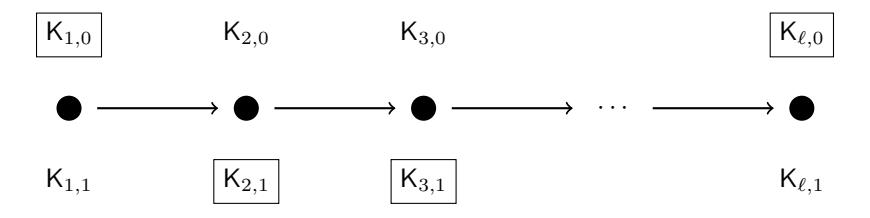

# <span id="page-0-0"></span>**Adaptively Secure Constrained Pseudorandom Functions in the Standard Model**<sup>∗</sup>

Alex Davidson†1 , Shuichi Katsumata<sup>2</sup> , Ryo Nishimaki<sup>3</sup> , Shota Yamada<sup>2</sup> , Takashi Yamakawa<sup>3</sup>

> <sup>1</sup>Cloudflare, Portugal alex.davidson92@gmail.com <sup>2</sup>National Institute of Advanced Industrial Science and Technology (AIST), Tokyo, Japan {shuichi.katsumata,yamada-shota}@aist.go.jp <sup>3</sup>NTT Secure Platform Laboratories, Tokyo, Japan {ryo.nishimaki.zk,takashi.yamakawa.ga}@hco.ntt.co.jp

> > January 29, 2021

#### **Abstract**

Constrained pseudorandom functions (CPRFs) allow learning "constrained" PRF keys that can evaluate the PRF on a subset of the input space, or based on some predicate. First introduced by Boneh and Waters [AC'13], Kiayias et al. [CCS'13] and Boyle et al. [PKC'14], they have shown to be a useful cryptographic primitive with many applications. These applications often require CPRFs to be adaptively secure, which allows the adversary to learn PRF values and constrained keys in an arbitrary order. However, there is no known construction of adaptively secure CPRFs based on a standard assumption in the standard model for any non-trivial class of predicates. Moreover, even if we rely on strong tools such as indistinguishability obfuscation (IO), the state-of-the-art construction of adaptively secure CPRFs in the standard model only supports the limited class of **NC**<sup>1</sup> predicates.

In this work, we develop new adaptively secure CPRFs for various predicates from different types of assumptions in the standard model. Our results are summarized below.

- We construct adaptively secure and *O*(1)-collusion-resistant CPRFs for *t*-conjunctive normal form (*t*-CNF) predicates from one-way functions (OWFs) where *t* is a constant. Here, *O*(1)-collusion-resistance means that we can allow the adversary to obtain a constant number of constrained keys. Note that *t*-CNF includes bit-fixing predicates as a special case.
- We construct adaptively secure and single-key CPRFs for inner-product predicates from the learning with errors (LWE) assumption. Here, single-key security means that we only allow the adversary to learn one constrained key. Note that inner-product predicates include *t*-CNF predicates for a constant *t* as a special case. Thus, this construction supports more expressive class of predicates than that supported by the first construction though it loses the collusion-resistance and relies on a stronger assumption.
- We construct adaptively secure and *O*(1)-collusion-resistant CPRFs for all circuits from the LWE assumption and indistinguishability obfuscation (IO).

The first and second constructions are the first CPRFs for any non-trivial predicates to achieve adaptive security outside of the random oracle model or relying on strong cryptographic assumptions. Moreover, the first construction is also the first to achieve any notion of collusion-resistance in this setting. Besides, we prove that the first and second constructions satisfy weak 1-key privacy, which roughly means that a constrained key does not reveal the corresponding constraint. The third construction is an improvement over previous adaptively secure CPRFs for less expressive predicates based on IO in the standard model.

<sup>∗</sup>This work is a major update version of [\[DKNY18\]](#page-38-0) with many new results.

<sup>†</sup>Part of this work was completed while the author undertook a research internship at NTT when he was a PhD student at Royal Holloway. The author was also supported by the EPSRC and the UK Government as part of the Centre for Doctoral Training in Cyber Security at Royal Holloway, University of London (EP/K035584/1).

## <span id="page-1-3"></span><span id="page-1-2"></span>**1 Introduction**

Pseudorandom functions (PRFs) provide the basis of a huge swathe of cryptography. Intuitively, such functions take a secret key and some binary string *x* as input, and output (deterministically) some value *y*. The pseudorandomness requirement dictates that *y* is indistinguishable from the output of a uniformly sampled function operating solely on *x*. PRFs provide useful sources of randomness in cryptographic constructions that take adversarially-chosen inputs. Many constructions of PRFs from standard assumptions are known, e.g., [\[GGM86,](#page-39-0) [NRR02,](#page-40-0) [NR04,](#page-40-1) [BPR12\]](#page-38-1).

There have been numerous expansions of the definitional framework surrounding PRFs. In this work, we focus on a strand of PRFs that are known as *constrained* PRFs or CPRFs. CPRFs were first introduced by Boneh and Waters [\[BW13\]](#page-38-2) alongside the concurrent works of Kiayias et al. [\[KPTZ13\]](#page-39-1) and Boyle et al. [\[BGI14\]](#page-37-0). They differ from standard PRFs in that they allow users to learn *constrained* keys to evaluate the PRF only on a subset of the input space defined by a predicate. Let K be a master key used to compute the base PRF value and let K*<sup>C</sup>* be the constrained key with respect to a predicate *C*. Then, the output computed using the master key *y* = CPRF*.*Eval(K*, x*) can be evaluated using a constrained key K*<sup>C</sup>* if the input *x* satisfies the constraint, i.e., *C*(*x*) = 1. However, if *C*(*x*) = 0, then the output *y* will remain pseudorandom from a holder of K*<sup>C</sup>* . The expressiveness of a CPRF is based on the class of constraints C it supports, where the most expressive class is considered to be P*/*poly.

Similarly to the security notion of standard PRFs, we require CPRFs to satisfy the notion of *pseudorandomness on constrained points*. Formally, the adversary is permitted to make queries for learning PRF evaluations on arbitrary points as with standard PRFs. The adversary is also permitted to learn constrained keys for any predicates *C<sup>i</sup>* ∈ C where *i* ∈ [*Q*] for *Q* = poly.[1](#page-1-0) The security requirement dictates that the CPRF remains pseudorandom on a target input *x* ∗ that has not been queried so far, where *Ci*(*x* ∗ ) = 0 for all *i*. There have been several flavors of this security requirement that have been considered in previous works: when the adversary can query the constrained keys arbitrarily, then we say the CPRF is *adaptively* secure on constrained points; otherwise, if all the constrained keys must be queried at the outset of the game it is *selectively* secure.[2](#page-1-1) When *Q >* 1, then we say the CPRF is *Q*-*collusion-resistant*. In case *Q* = poly, we write poly-collusion-resistant and when *Q* = 1, we say it is a *single-key* CPRF. These two notions capture the requirements of CPRFs and satisfying both requirements (adaptively-secure, poly-collusion-resistant) is necessary for many applications of CPRFs [\[BW13\]](#page-38-2). For instance, in one of the most appealing applications of CPRFs such as length-optimal broadcast encryption schemes and non-interactive policy-based key exchanges, we require an adaptive and poly-collusion-resistant CPRF for an expressive class of predicates.

We focus on known constructions of CPRFs in the standard model from standard assumptions, that is, CPRFs that do not rely on the random oracle model (ROM) and non-standard assumptions such as indistinguishability obfuscation (IO) or multilinear maps. We notice that there exists no construction of adaptively secure CPRFs for any class of predicates in this standard setting. For instance, even if we consider the most basic puncturable or prefix-fixing predicates, we require the power of IO or the ROM to achieve adaptive security. (For an explanation on different types of predicates, we refer to Appendix [A\)](#page-40-2). Notably, even though we now have many CPRFs for various predicate classes from different types of standard assumptions such as the learning with errors (LWE) and Diffie-Hellman (DH) type assumptions [\[BFP](#page-37-1)<sup>+</sup>15, [BV15,](#page-38-3) [BTVW17,](#page-38-4) [CC17,](#page-38-5) [AMN](#page-37-2)<sup>+</sup>18, [CVW18,](#page-38-6) [PS18\]](#page-40-3), all constructions only achieve the weaker notion of selective security. In addition, other than selectively-secure CPRFs for the very restricted class of prefix-fixing predicates [\[BW13,](#page-38-2) [KPTZ13,](#page-39-1) [BGI14,](#page-37-0) [BFP](#page-37-1)<sup>+</sup>15], all the above constructions of CPRFs provide no notion of *Q*-collusion-resistance for any *Q >* 1. Indeed, most constructions admit trivial collapses in security once more than one constrained key is exposed. A natural open question arises:

*(Q1). Can we construct adaptively secure constrained PRFs for any class of predicates based on standard assumptions in the standard model; preferably with collusion-resistance?*

Next, we focus on CPRFs based on any models and assumptions. So far the best CPRF we can hope for — an optimal CPRF — (i.e., it supports the constraint class of P*/*poly, it is adaptively secure, and it is poly-collusion resistant) is only known based on IO in the ROM [\[HKKW19\]](#page-39-2). The moment we restrict ourselves to the standard model without relying on the ROM, we can only achieve a weaker notion of CPRF regardless of still being able to use strong tools such

<span id="page-1-1"></span><span id="page-1-0"></span><sup>1</sup>Throughout the introduction, poly will denote an arbitrary polynomial in the security parameter.

<sup>2</sup>In general, we can upgrade selective security to adaptive security by complexity leveraging. However, we want to avoid this since complexity leveraging needs subexponentially hard assumptions.

<span id="page-2-0"></span>as IO. Namely, the following three incomparable state-of-the-art CPRFs (based on IO in the standard model) do not instantiate one of the requirements of the optimal CPRF: [\[HKW15\]](#page-39-3) only supports the very limited class of puncturing predicates; [\[BLW17\]](#page-38-7) only achieves selective security; and [\[AMN](#page-37-3)<sup>+</sup>19] only achieves single-key security for the limited class of **NC**<sup>1</sup> predicates. Therefore, a second open question that we are interested in is:

*(Q2). Can we construct an adaptively secure and Q-collusion resistant (for any Q >* 1*) constrained PRFs for the widest class of* P*/*poly *predicates in the standard model?*

Note that solving the above question for *all Q >* 1 will result in an optimal CPRF, which we currently only know how to construct in the ROM.

## <span id="page-2-1"></span>**1.1 Our Contribution**

In this study, we provide concrete solutions to the questions (*Q*1) and (*Q*2) posed above. We develop new *adaptively* secure CPRF constructions for various expressive predicates from a variety of assumptions *in the standard model*. We summarize our results below. The first two results are answers to (*Q*1), and the last result is an answer to (*Q*2).

- 1. We construct an adaptively secure and *O*(1)-collusion-resistant CPRF for *t*-conjunctive normal form (*t*-CNF) predicates from one-way functions (OWFs), where *t* is any constant. Here, *O*(1)-collusion-resistance means that it is secure against adversaries who learn a constant number of constrained keys. This is the first construction to satisfy *adaptive* security or *collusion-resistance* from any standard assumption and in the standard model regardless of the predicate class it supports. Our CPRF is based solely on the existence of OWFs. In particular, it is a much weaker assumption required than all other CPRF constructions for the bit-fixing predicate (which is a special case of *t*-CNF predicates) [\[BW13,](#page-38-2) [BLW17,](#page-38-7) [CC17,](#page-38-5) [AMN](#page-37-2)<sup>+</sup>18]. Previous works rely on either the LWE assumption, the decisional DH assumption, or multilinear maps.
- 2. We construct an adaptively secure and single-key CPRF for inner-product predicates from the LWE assumption. Although our second CPRF does not admit any collusion-resistance, inner-product predicates are a strictly wider class of predicates compared to the *t*-CNF predicates considered above. (See Appendix [C.](#page-48-0)) All other lattice-based CPRFs supporting beyond inner-product predicates (NC<sup>1</sup> or P*/*poly) [\[BV15,](#page-38-3) [BTVW17,](#page-38-4) [CC17,](#page-38-5) [CVW18,](#page-38-6) [PS18\]](#page-40-3) achieve only selective security and admits no collusion-resistance.
- 3. We construct an adaptively secure and *O*(1)-collusion-resistant CPRF for P*/*poly from IO and the LWE assumption. More specifically, we use IO and shift-hiding shiftable functions [\[PS18\]](#page-40-3), where the latter can be instantiated from the LWE assumption. This is the first adaptively secure CPRF for the class of P*/*poly in the standard model (it further enjoys any notion of collusion-resistance). As stated above, current constructions of CPRFs in the standard model either: only support the limited class of puncturing predicates [\[HKW15\]](#page-39-3); achieves only selective security [\[BLW17\]](#page-38-7); or only achieves single-key security for the limited class of **NC**<sup>1</sup> predicates [\[AMN](#page-37-3)<sup>+</sup>19].

We also note that our first two constructions satisfy (weak) 1-key privacy, previously coined by Boneh et al. [\[BLW17\]](#page-38-7) (see Remark [3.18f](#page-16-0)or more details on the definition of key privacy).

**Applications.** As one interesting application, our CPRF for bit-fixing predicates can be used as a building block to realize adaptively-secure *t*-CNF attribute-based-encryption (ABE) based on lattices, as recently shown by Tsabary [\[Tsa19\]](#page-40-4). Other than identity-based encryption [\[ABB10,](#page-37-4) [CHKP10\]](#page-38-8) and non-zero inner product encryption [\[KY19\]](#page-39-4), this is the first lattice-based ABE satisfying adaptive-security for a non-trivial class of policies. The ABE scheme by Tsabary shows that other than their conventional use-cases, CPRFs may be a useful tool to achieve higher security of more advanced cryptographic primitives.

An attentive reader may wonder whether our CPRFs have any other applications. For instance, as Boneh and Waters proved [\[BW13\]](#page-38-2), one can construct length-optimal broadcast encryption schemes from CPRFs for bit-fixing predicates. However, unfortunately, for these types of applications, we require *Q*-collusion-resistance where *Q* is an a-priori bounded polynomial. Therefore, we cannot plug in our construction for these types of applications. We leave it as an interesting open problem to progress our CPRF constructions to achieve *Q*-collusion-resistance for larger *Q*; achieving *Q* = *ω*(1) would already seem to require a new set of ideas.

<span id="page-3-1"></span>Relation to the lower bound by Fuchsbauer et al. [FKPR14]. One may wonder how our adaptively secure CPRF relates to the lower bound of adaptively secure CPRFs proven by Fuchsbauer et al. [FKPR14]. They proved that we could not avoid exponential security loss to prove adaptive pseudorandomness of the specific CPRF for bit-fixing predicates by Boneh and Waters based on multilinear maps [BW13]. Fortunately, their proofs rely heavily on the checkability of valid constrained keys by using multilinear maps. Therefore, their lower bounds do not apply to our setting since none of our constructions have checkability.

Comparison with Existing Constructions. There are several dimensions to consider when we compare CPRF constructions. In this section, we focus on *adaptively* secure CPRFs as it is one of our main contributions. Along with related works, a more extensive comparison is provided in Appendix A. The following Table 1 lists all the adaptively secure CPRFs known thus far. One clear advantage of our first two CPRFs is that they are the first CPRF to achieve adaptive security without relying on IO or the ROM. However, it can be seen that this comes at the cost of supporting a weaker predicate class, or achieving single-key or O(1)-collusion-resistance. Regarding our third CPRF, the main advantage is that it achieves adaptive security and supports the broadest predicate class P/poly without resorting to the ROM. Compared to the recent CPRF by Attrapadung et al. [AMN+19], we provide a strict improvement since our first construction supports O(1)-collusion-resistance.

<span id="page-3-0"></span>Table 1: Comparison among adaptively secure CPRFs. In column "Predicate", LR, BF, *t*-CNF, and IP stand for left-right-fixing, bit-fixing, *t*-conjunctive normal form, and inner-product predicates, respectively. In column "Assumption", BDDH, LWE, SGH, and *L*-DDHI stand for bilinear decisional Diffie-Hellman, multilinear decisional Diffie-Hellman, learning with errors, subgroup hiding assumption, and *L*-decisional Diffie-Hellman inversion assumptions, respectively. Regarding key privacy, ‡ means that this satisfies *weak* key privacy.

|                       | Adaptive | Collusion-resistance | Privacy        | Predicate                  | Assumption   |
|-----------------------|----------|----------------------|----------------|----------------------------|--------------|
| [BW13]                | <b>√</b> | poly                 | poly           | LR                         | BDDH & ROM   |
| [HKKW19]              | ✓        | poly                 | 0              | P/poly                     | IO & ROM     |
| [HKW15]               | ✓        | poly                 | 0              | Puncturing                 | SGH & IO     |
| [AMN <sup>+</sup> 18] | ✓        | 1                    | 1              | BF                         | ROM          |
|                       | ✓        | 1                    | 0              | $NC^1$                     | L-DDHI & ROM |
| [AMN <sup>+</sup> 19] | ✓        | 1                    | 0              | $NC^1$                     | SGH & IO     |
| Section 4             | ✓        | O(1)                 | $1^{\ddagger}$ | $t$ -CNF ( $\supseteq$ BF) | OWF          |
| Section 5             | ✓        | 1                    | $1^{\ddagger}$ | IP                         | LWE          |
| Section 6             | ✓        | O(1)                 | 0              | P/poly                     | LWE & IO     |

**Historical Note on Our First Contribution.** In the initial version of this paper, we gave a construction of adaptively secure and O(1)-collusion-resistant CPRFs for bit-fixing predicates. After the initial version, Tsabary [Tsa19] observed that essentially the same idea could be used to construct adaptively single-key secure CPRFs for t-CNF predicates for a constant t. We further extend her construction to construct adaptively secure and O(1)-collusion-resistant CPRFs for t-CNF predicates for a constant t in the current version. We stress that (the initial version of) this paper is the first to give adaptively secure or collusion-resistant CPRFs under a standard assumption and in the standard model, for any non-trivial class of predicates.

### <span id="page-3-2"></span>2 Technical Overview

In this section, we explain the approach we took for achieving each of our CPRFs. For CPRFs for bit-fixing (and t-CNF) predicates, we take a combinatorial approach. For CPRFs for inner-product predicates, we take an algebraic approach based on lattices incorporating the so-called lossy mode. For CPRFs for P/poly, we use shift-hiding shiftable functions [PS18] and IO as main building blocks. In the subsequent subsections, we explain these approaches in more detail.

#### <span id="page-4-2"></span><span id="page-4-1"></span>2.1 CPRF for Bit-Fixing/t-CNF

We achieve CPRFs for t-CNF predicates. However, we consider our CPRF for bit-fixing predicates in the technical overview rather than the more general CPRF for t-CNF predicates for ease of presentation. The high-level idea is very similar and generalizes naturally. Here, a bit-fixing predicate is defined by a string  $v \in \{0, 1, *\}^{\ell}$  where \* is called the "wildcard". A bit-fixing predicate v on input  $v \in \{0, 1\}$  is said to be satisfied if and only if v = v for all  $v \in [\ell]$ .

We first focus on how to achieve collusion-resistance because the structure for achieving collusion-resistance naturally induces adaptive security.

Combinatorial Techniques for CPRFs for bit-fixing predicates. We start with a simpler case of *single-key* CPRF for bit-fixing predicates as our starting point. We use  $2\ell$  keys of standard PRFs to construct an  $\ell$ -bit input CPRF for bit-fixing predicates. Let PRF.Eval :  $\{0,1\}^{\kappa} \times \{0,1\}^{\ell} \mapsto \{0,1\}^n$  be the evaluation algorithm of a PRF. We uniformly sample keys  $\mathsf{K}_{i,b} \in \{0,1\}^{\kappa}$  for  $i \in [\ell]$  and  $b \in \{0,1\}$ . The master key of the CPRF is  $\mathsf{K} = \{\mathsf{K}_{i,b}\}_{i \in [\ell], b \in \{0,1\}}$  and evaluation on some  $x \in \{0,1\}^{\ell}$  is computed as the output of:

$$\mathsf{CPRF}.\mathsf{Eval}(\mathsf{K},x) = \bigoplus_{i=1}^\ell \mathsf{PRF}.\mathsf{Eval}(\mathsf{K}_{i,x_i},x).$$

Figure 1 depicts the construction.



<span id="page-4-0"></span>Figure 1: Length- $\ell$  directed line representation where each nodes are labeled with two PRF keys. In the figure, the choices of PRF keys correspond to some input  $x=011\cdots 0$ .

The constrained key for a bit-fixing predicate  $v \in \{0,1,*\}^{\ell}$  constitutes a single PRF key  $\mathsf{K}_{i,v_i}$  (where  $v_i \in \{0,1\}$ ), and a pair of PRF keys  $(\mathsf{K}_{i,0},\mathsf{K}_{i,1})$  (where  $v_i=*$ ). Constrained evaluation is clearly possible for any input x that satisfies the bit-fixing predicate v since we have keys  $\mathsf{K}_{i,v_i}$  for non-wildcard parts and both keys  $(\mathsf{K}_{i,0},\mathsf{K}_{i,1})$  for wildcard parts.

The (selective) security of the scheme rests upon the fact that for a single constrained key, with respect to v, there must exist a  $j \in [\ell]$  such that  $(x_j^* \neq v_j) \land (v_j \neq *)$  for the challenge input  $x^*$ . This is due to the fact that the bit-fixing predicate v does not satisfy  $x^*$ . Then, pseudorandomness of  $y \leftarrow \mathsf{CPRF}.\mathsf{Eval}(\mathsf{K}, x^*)$  is achieved because

$$y \leftarrow \bigoplus_{i=1}^{\ell} \mathsf{PRF.Eval}(\mathsf{K}_{i,x_i^*}, x^*) = \mathsf{PRF.Eval}(\mathsf{K}_{j,x_j^*}, x^*) \oplus \left(\bigoplus_{i \neq j} \mathsf{PRF.Eval}(\mathsf{K}_{i,x_i^*}, x^*)\right)$$

where PRF.Eval( $K_{j,x_{j}^{*}},x^{*}$ ) is evaluated using the key that is unknown to the adversary. Thus, this evaluation can be replaced with a uniformly sampled  $y_{j} \in \{0,1\}^{n}$  by the pseudorandomness of PRF for key  $K_{j,x_{j}^{*}}$ . In turn, this results in a uniformly distributed CPRF output y and so pseudorandomness is ensured. We can instantiate pseudorandom functions using only one-way functions [GGM86, HILL99], and therefore, so can the above single-key CPRF for the bit-fixing predicate.

**Allowing** > 1 **constrained key query.** If we allow for more than two constrained key queries in the above construction, the scheme is trivially broken. Consider an adversary that queries the two bit-fixing predicates v = 0 \* \* ... \* \*0 and  $\bar{v} = 1 * * ... * *1$  as an example. Notice that any binary string x of the form x = 0 ... 1 or x = 1 ... 0 will not satisfy

either of the predicates. Therefore, we would like the evaluation value y on such input x by the master key to remain pseudorandom to the adversary. However, the adversary will be able to collect all PRF keys  $\{K_{i,b}\}_{i\in[\ell],b\in\{0,1\}}$  by querying v and  $\bar{v}$ , and recover the master key itself in our construction above. Therefore, the adversary will be able to compute on any input x regardless of its constraints.

Collusion-resistance for two constrained key queries. At a high level, the reason why our construction could not permit more than one constrained key query is because we examined each of the input bits individually when choosing the underlying PRF keys. Now, consider a scheme that considered two input bits instead of considering one input bit at each node in Figure 1. Figure 2 illustrates this modified construction. In the set-up shown in Figure 2 at each node (i,j), we now consider the  $i^{\text{th}}$  and  $j^{\text{th}}$  input bits of the string  $x \in \{0,1\}^{\ell}$  and choose the key  $\mathsf{K}_{(i,j),(b_1,b_2)}$  where  $b_1 = x_i$  and  $b_2 = x_j$ ; the master key is the combination of all such keys  $\mathsf{K} = \{\mathsf{K}_{(i,j),(b_1,b_2)}\}_{(i,j)\in[\ell]^2,(b_1,b_2)\in\{0,1\}^2}$ .

$$\{\mathsf{K}_{(1,1),(x_1,x_1)}\} \qquad \qquad \{\mathsf{K}_{(1,\ell),(x_1,x_\ell)}\} \quad \{\mathsf{K}_{(2,1),(x_2,x_1)}\} \qquad \qquad \{\mathsf{K}_{(\ell,\ell),(x_\ell,x_\ell)}\}$$

<span id="page-5-0"></span>Figure 2: Length- $\ell^2$  directed line representation where each nodes consider two input bits, where  $(x_i, x_j) \in \{0, 1\} \times \{0, 1\}$  for all  $i, j \in [\ell]$ .

Evaluation is then carried out by adding the PRF values along the directed line illustrated in Figure 2:

$$\mathsf{CPRF}.\mathsf{Eval}(\mathsf{K},x) = \bigoplus_{(i,j) \in [\ell] \times [\ell]} \mathsf{PRF}.\mathsf{Eval}(\mathsf{K}_{(i,j),(x_i,x_j)},x),$$

and constrained keys for  $v \in \{0,1,*\}^{\ell}$  contain the key  $K_{(i,j),(b_1,b_2)}$ , for all  $b_1,b_2 \in \{0,1\}$  such that

$$(v_i = b_1) \lor (v_i = *) \land (v_j = b_2) \lor (v_j = *),$$

is satisfied.

To see how this combinatorial change in the construction has an impact on the collusion-resistance of the scheme, consider a pair of constrained key queries for bit-fixing predicates  $v, \bar{v} \in \{0, 1, *\}^{\ell}$ . Let  $x^*$  be the challenge input that is constrained with respect to both  $v, \bar{v}$ . Then there exists an  $i' \in [\ell]$  where  $(x^*_{i'} \neq v_{i'}) \land (v_{i'} \neq *)$  and likewise  $(x^*_{j'} \neq \bar{v}_{j'}) \land (\bar{v}_{j'} \neq *)$  for some  $j' \in [\ell]$ . Equivalently, we must have  $x^*_{i'} = 1 - v_{i'}$  and  $x^*_{j'} = 1 - \bar{v}_{j'}$  for some  $i', j' \in [\ell]$ . As a result, for these constrained key queries we observe that the underlying PRF key  $\mathsf{K}_{(i',j'),(1-v_{i'},1-\bar{v}_{j'})}$  will never be revealed to the adversary.

Using this fact, we can prove that our new CPRF construction achieves collusion-resistance for two constrained key queries using essentially the same aforementioned proof technique. We rewrite the CPRF evaluation on  $x^*$  as:

$$\begin{split} \mathsf{CPRF.Eval}(\mathsf{K}, x^*) &= \bigoplus_{(i,j) \in [\ell] \times [\ell]} \mathsf{PRF.Eval}(\mathsf{K}_{(i,j),(x_i^*, x_j^*)}, x^*) \\ &= \mathsf{PRF.Eval}(\mathsf{K}_{(i',j'),(x_{i'}^*, x_{j'}^*)}, x^*) \oplus \left( \bigoplus_{(i,j) \neq (i',j')} \mathsf{PRF.Eval}(\mathsf{K}_{(i,j),(x_i^*, x_j^*)}, x^*) \right). \end{split}$$

Notice that, since  $K_{(i',j'),(x_{i'}^*,x_{j'}^*)}$  is never revealed to the adversary, this evaluation is indistinguishable from a uniformly sampled value  $y^*$ . In a simulation where  $y^*$  replaces the underlying PRF evaluation, the entire CPRF evaluation on  $x^*$  is distributed uniformly and pseudorandomness follows accordingly.

**Expanding to** O(1)-collusion-resistance. The technique that we demonstrate in this work is a generalisation of the technique that we used for two-key collusion-resistance. Instead of considering two input bits at a time, we consider Q

<span id="page-6-0"></span>input bits at a time and index each node in the evaluation by the vector  $(i_1, \dots, i_Q) \in [\ell]^Q$ . Then we evaluate the CPRF on  $x \in \{0, 1\}^\ell$  as the output of:

$$\mathsf{CPRF}.\mathsf{Eval}(\mathsf{K},x) = \bigoplus_{(i_1,\ldots,i_Q) \in [\ell]^Q} \mathsf{PRF}.\mathsf{Eval}(\mathsf{K}_{(i_1,\ldots,i_Q),(x_{i_1},\ldots,x_{i_Q})},x).$$

The constraining algorithm works for a bit-fixing predicate defined by  $v \in \{0,1,*\}^{\ell}$  by providing all keys  $\mathsf{K}_{(i_1,\ldots,i_O),(b_1,\ldots,b_O)}$  such that

$$\bigwedge_{j \in [Q]} (b_j = v_{i_j}) \lor (v_{i_j} = *)$$

is satisfied. Constrained evaluation is then possible for any input x satisfying the bit-fixing predicate defined by y.

For any set of Q constrained key queries associated with strings  $v^{(1)},\ldots,v^{(Q)}$  and any constrained input  $x^*$ , there must exist a vector  $(i'_1,\ldots,i'_Q)$  such that  $(x^*_{i'_j}\neq v^{(j)}_{i'_j})\wedge (v^{(j)}_{i'_j}\neq *)$  for all  $j\in [Q]$ . Therefore, the key  $\mathsf{K}_{(i'_1,\ldots,i'_Q),(x^*_{i'_1},\ldots,x^*_{i'_Q})}$  is never revealed to the adversary. Finally, we can prove the selective pseudorandomness of the CPRF on input  $x^*$  using exactly the same technique as mentioned in the case when Q=2. The proof of security is given in the proof of Theorem 4.2.

Importantly, we cannot achieve collusion-resistance for unbounded Q because there is an exponential dependency on Q associated with the size of the CPRF. For instance, for the node indexed by the vector  $(i_1, \ldots, i_Q)$ , there are  $2^Q$  underlying PRF keys associated with this node; moreover, there are  $\ell^Q$  such nodes. Therefore the total size of K is  $(2\ell)^Q$ . As a result, we are only able to afford Q = O(1) since  $\ell$  is the input length of PRF, which is a polynomial in the security parameter. This bound is inherent in the directed line paradigm because our technique is purely combinatorial.

Finally, we assess the security properties achieved by our CPRF for bit-fixing predicates. Although we have been showing selective security of our CPRF, we observe that our construction satisfies adaptive security when the underlying pseudorandom functions satisfy adaptive pseudorandomness.

Achieving Adaptive security. Our construction arrives at adaptive security essentially *for free*. Previous constructions for bit-fixing predicates (or as a matter of fact, any non-trivial predicates) incur sub-exponential security loss during the reduction from adaptive to selective security, or relies on the random oracle model or IO; see Appendix A, Table 2 for an overview. The sub-exponential security loss is incurred as previous constructions achieve adaptive security by letting the reduction guess the challenge input  $x^*$  that the adversary chooses.

We can achieve adaptive security with a polynomial security loss (e.g.  $1/\text{poly}(\kappa)$ ): by instead guessing the key (not the challenge input) that is implicitly used by the adversary (i.e.  $K_{T^*,x_T^*}$  for  $T^* \subset [\ell], |T^*| = Q$ ). For example in the 2-key setting explained above, this amounts to correctly guessing the values (i,j) and  $(x_i^*,x_j^*)$  of the PRF key  $\mathsf{K}_{(i,j),(x_i^*,x_j^*)}$ , which happens with probability at most  $(1/2\ell)^2$ . If this key is not eventually used by the challenge ciphertext, or it is revealed via a constrained key query, then the reduction algorithm aborts. This is because *the entire proof hinges on the choice of this key*, rather than the input itself. Since there are only polynomially many keys (for Q = O(1)), we can achieve adaptive security with only a  $1/\text{poly}(\kappa)$  probability of aborting.

Finally, we note that there is a subtle technical issue we must resolve which is addressed in Lemma 4.3due to the non-trivial abort condition. Similar problems were identified by Waters [Wat05] who introduced the "artificial abort step".

#### <span id="page-6-1"></span>2.2 CPRF for Inner-Product

We construct CPRF for the class of inner-product predicates (over the integers) based on lattices.

The starting point of our CPRF is the lattice-based PRF of [BLMR13, BP14]. At a very high level, the secret key K of these PRFs is a vector  $\mathbf{s} \in \mathbb{Z}_q^n$  and the public parameters is some matrices  $(\mathbf{A}_i \in \mathbb{Z}_q^{n \times m})_{i \in [k]}$ . To evaluate on an input  $\mathbf{x}$ , one first generates a (publicly computable) matrix  $\mathbf{A}_{\mathbf{x}} \in \mathbb{Z}_q^{n \times m}$  related to input  $\mathbf{x}$  and simply outputs the value  $\lfloor \mathbf{s}^{\top} \mathbf{A}_{\mathbf{x}} \rfloor_p \in \mathbb{Z}_p^m$ , where  $\lfloor a \rfloor_p$  denotes rounding of an element  $a \in \mathbb{Z}_q$  to  $\mathbb{Z}_p$  by multiplying it by (p/q) and rounding the result. Roughly, the values  $\mathbf{s}^{\top} \mathbf{A}_{\mathbf{x}}$  + noise are jointly indistinguishable from uniform for different inputs  $\mathbf{x}$  since

<span id="page-7-1"></span> $\mathbf{A}_{\mathbf{x}}$  acts as an LWE matrix. Therefore, if the noise term is sufficiently small, then  $[\mathbf{s}^{\top}\mathbf{A}_{\mathbf{x}}]_p = [\mathbf{s}^{\top}\mathbf{A}_{\mathbf{x}} + \mathsf{noise}]_p$ , and hence, pseudorandomness follows.

Pioneered by the lattice-based CPRF of Brakerski and Vaikuntanathan [BV15], many constructions of CPRF [BKM17, BTVW17] have built on top of the PRF of [BLMR13, BP14]. The high-level methodology is as follows: the constrained key for a constraint C would be a set of LWE ciphertexts of the form  $\mathsf{K}_C := (\mathsf{ct}_i = \mathbf{s}^\top (\mathbf{A}_i - C_i \cdot \mathbf{G}) + \mathsf{noise})_{i \in [k]}$ , where  $C_i$  is the  $i^{th}$  bit of the description of the constraint C and  $\mathbf{G}$  is the so-called gadget matrix [MP12]. To evaluate on input  $\mathbf{x}$  using the constrained key  $\mathsf{K}_C$ , one evaluates the ciphertexts  $(\mathsf{ct}_i)_{i \in [k]}$  to  $\mathsf{ct}_{\mathbf{x}} = \mathbf{s}^\top (\mathbf{A}_{\mathbf{x}} - (1 - C(\mathbf{x})) \cdot \mathbf{G}) + \mathsf{noise}$ , using the by now standard homomorphic computation technique of [BGG+14] originally developed for attribute-based encryption (ABE) schemes. Here,  $\mathbf{A}_{\mathbf{x}}$  is independent of the constraint C, that is,  $\mathbf{A}_{\mathbf{x}}$  can be computed without the knowledge of C. Then, the final output of the CPRF evaluation with the constrained key will be  $\lfloor \mathsf{ct}_{\mathbf{x}} \rfloor_p$ . Now, if the constraint is satisfied, i.e.,  $C(\mathbf{x}) = 1$ , then computing with the constrained key  $\mathsf{K}_C$  will result in the same output as the master key  $\mathsf{K}$  since we would have  $\mathsf{ct}_{\mathbf{x}} = \mathbf{s}^\top \mathbf{A}_{\mathbf{x}} + \mathsf{noise}$ .

Unfortunately, all works which follow this general methodology only achieves *selective* security. There is a noted resemblance between this construction with the above types of CPRF and the ABE scheme of [BGG<sup>+</sup>14]. As a consequence, achieving an adaptively secure CPRF following the above methodology would likely shed some light onto the construction of an adaptively secure lattice-based ABE. Considering that adaptively secure ABEs are known to be one of the major open problems in lattice-based cryptography, it does not seem to be an easy task to achieve an adaptively secure CPRF following this approach.

We take a different approach by taking advantage of the fact that our constraint is a simple linear function in this work due to the technical hurdle above. Specifically, we only embed the constraint in the master key  $\mathbf{s}$  instead of embedding the constraint in the master key  $\mathbf{s}$  and the public matrices  $(\mathbf{A}_i)_{i \in [k]}$  as  $(\mathbf{s}^\top (\mathbf{A}_i - C_i \cdot \mathbf{G}))_{i \in [k]}$ . To explain this idea, we need some preparation. Let  $\mathbf{y} \in \mathbb{Z}^\ell$  be the vector associated with the inner-product constraint  $C_{\mathbf{y}}$ , that is, the constrained key  $K_{C_{\mathbf{y}}}$  can evaluate on input  $\mathbf{x} \in \mathbb{Z}^\ell$  if and only if  $\langle \mathbf{x}, \mathbf{y} \rangle = 0$  (over the integers). We also slightly modify the PRF of [BLMR13, BP14] so that we use a matrix  $\mathbf{S} \in \mathbb{Z}_q^{n \times \ell}$  instead of a vector  $\mathbf{s} \in \mathbb{Z}_q^n$  as the secret key. To evaluate on input  $\mathbf{x} \in \mathbb{Z}^\ell$  with the secret key  $\mathbf{S}$ , we will first compute the vector  $\mathbf{s}_{\mathbf{x}} = \mathbf{S}\mathbf{x} \in \mathbb{Z}^n$  and then run the PRF of [BLMR13, BP14], viewing  $\mathbf{s}_{\mathbf{x}}$  as the secret key. That is, the output of the PRF is now  $\|\mathbf{s}_{\mathbf{x}}^\top \mathbf{A}_{\mathbf{x}}\|_p$ .

The construction of our CPRF is a slight extension of this. The master key and evaluation with the master key is the same as the modified PRF. Namely, the master key is defined as  $\mathsf{K} := \mathbf{S}$  and the output of the evaluation is  $\lfloor \mathbf{s}_{\mathbf{x}}^{\top} \mathbf{A}_{\mathbf{x}} \rfloor_p$ . Our constrained key for the constraint  $C_{\mathbf{y}}$  is then defined as  $\mathsf{K}_{C_{\mathbf{y}}} := \mathbf{S}_{\mathbf{y}} = \mathbf{S} + \mathbf{d} \otimes \mathbf{y}^{\top} \in \mathbb{Z}_q^{n \times \ell}$  where  $\mathbf{d}$  is a uniformly random vector sampled over  $\mathbb{Z}_q^n$ . Evaluation with the constrained key  $\mathsf{K}_{C_{\mathbf{y}}} = \mathbf{S}_{\mathbf{y}}$  is done exactly the same as with the master key  $\mathsf{K} = \mathbf{S}$ ; it first computes  $\mathbf{s}_{\mathbf{y},\mathbf{x}} = \mathbf{S}_{\mathbf{y}}\mathbf{x}$  and outputs  $\lfloor \mathbf{s}_{\mathbf{y},\mathbf{x}}^{\top} \mathbf{A}_{\mathbf{x}} \rfloor_p$ . It is easy to check that if  $\langle \mathbf{x}, \mathbf{y} \rangle = 0$  (i.e.,  $C_{\mathbf{y}}(\mathbf{x}) = 1$ ), then  $\mathbf{S}_{\mathbf{y}}\mathbf{x} = (\mathbf{S} + \mathbf{d} \otimes \mathbf{y}^{\top})\mathbf{x} = \mathbf{s}_{\mathbf{x}}$ . Hence, the constrained key computes the same output as the master key for the inputs for which the constraint is satisfied. The construction is very simple, but the proof for adaptive security requires a bit of work.

As a warm-up, let us consider the easy case of selective security and see why it does not generalize to adaptive security. When the adversary  $\mathcal{A}$  submits  $C_{\mathbf{y}}$  as the challenge constraint at the beginning of the selective security game, the simulator samples  $\hat{\mathbf{S}} \stackrel{\xi}{\leftarrow} \mathbb{Z}_q^{n \times \ell}$  and  $\mathbf{d} \stackrel{\xi}{\leftarrow} \mathbb{Z}_q^n$ ; sets the master key as  $K = \hat{\mathbf{S}} - \mathbf{d} \otimes \mathbf{y}^{\top}$  and the constrained key as  $K_{C_{\mathbf{y}}} = \hat{\mathbf{S}}$ ; and returns  $K_{C_{\mathbf{y}}}$  to  $\mathcal{A}$ . Since the distribution of K and  $K_{C_{\mathbf{y}}}$  is exactly the same as in the real world, the simulator perfectly simulates the keys to  $\mathcal{A}$ . Now, notice that evaluation on input  $\mathbf{x}$  with the master key K results as

$$\mathbf{z} = \left\lfloor \left( (\hat{\mathbf{S}} - \mathbf{d} \otimes \mathbf{y}^\top) \mathbf{x} \right)^\top \mathbf{A}_{\mathbf{x}} \right\rfloor_p \approx \left\lfloor (\hat{\mathbf{S}} \mathbf{x})^\top \mathbf{A}_{\mathbf{x}} \right\rfloor_p - \langle \mathbf{x}, \mathbf{y} \rangle \cdot \left\lfloor \mathbf{d}^\top \mathbf{A}_{\mathbf{x}} \right\rfloor_p = \mathsf{CPRF}_{\mathsf{K}_{C_{\mathbf{y}}}}(\mathbf{x}) - \langle \mathbf{x}, \mathbf{y} \rangle \cdot \mathsf{PRF}_{\mathbf{d}}(\mathbf{x}),$$

where  $\mathsf{CPRF}_{\mathsf{K}_{C_{\mathbf{y}}}}(\mathbf{x})$  is the  $\mathsf{CPRF}$  evaluation with constrained key  $\mathsf{K}_{C_{\mathbf{y}}}$  and  $\mathsf{PRF}_{\mathbf{d}}(\mathbf{x})$  is the  $\mathsf{PRF}$  evaluation of [BLMR13, BP14] with secret key  $\mathbf{d} \in \mathbb{Z}_q^n$ . In particular, the simulator can simply reply to the evaluation query  $\mathbf{x}$  made by  $\mathcal{A}$  by first evaluating  $\mathbf{x}$  with the constrained key  $\mathsf{K}_{C_{\mathbf{y}}}$  and then shifting it by  $\langle \mathbf{x}, \mathbf{y} \rangle \cdot \mathsf{PRF}_{\mathbf{d}}(\mathbf{x})$ . With this observation, selective security readily follows from the security of the underlying PRF. Specifically,  $\mathcal{A}$  will obtain many output values  $\mathsf{PRF}_{\mathbf{d}}(\mathbf{x})$  for any  $\mathbf{x}$  of its choice in the course of receiving  $\mathbf{z}$  back on an evaluation query on input  $\mathbf{x}$ . However,  $\mathsf{PRF}_{\mathbf{d}}(\mathbf{x}^*)$  will remain pseudorandom for a non-queried input  $\mathbf{x}^*$  due to the security of the PRF. Hence, the challenge output  $\mathbf{z}^*$  will remain pseudorandom from the view of  $\mathcal{A}$ .

<span id="page-7-0"></span><sup>&</sup>lt;sup>3</sup>Note that *a lot* of subtlety on parameter selections and technicalities regarding rounding are swept under the rug. However, we believe the rough details are enough to convey the intuition.

<span id="page-8-0"></span>Unfortunately, the above approach breaks down if we want to show adaptive security. This is because the simulator will no longer be able to simulate the "shift"  $\langle \mathbf{x}, \mathbf{y} \rangle \cdot \mathsf{PRF_d}(\mathbf{x})$  if it does not know the vector  $\mathbf{y}$  associated with the challenge constraint  $C_{\mathbf{y}}$ . In particular, it seems the simulator is bound to honestly compute the master key  $K = \mathbf{S}$  and to use K to answer the evaluation query made before the challenge constraint query. Therefore, to cope with this apparent issue, we deviate from the above approach used to show selective security.

Our high-level approach for adaptive security will be to argue that  $\mathbf{d}$  retains sufficient min-entropy conditioned on the view of  $\mathcal{A}$ , where  $\mathcal{A}$  obtains a constrained key  $\mathsf{K}_{C_{\mathbf{y}}} = \mathbf{S}_{\mathbf{y}}$  and honest evaluation on inputs  $(\mathbf{x}_j)_{j \in [Q]}$  where Q is an arbitrary polynomial. Intuitively, if  $\mathbf{d} \in \mathbb{Z}_q^n$  retains enough min-entropy, then it will mask part of the master key  $\mathbf{S}$  conditioned on  $\mathcal{A}$ 's knowledge on  $\mathbf{S}_{\mathbf{y}} = \mathbf{S} + \mathbf{d} \otimes \mathbf{y}^{\top}$ , and hence, we would be able to argue that the output evaluated using the master key  $\mathbf{S}$  is pseudorandom using some randomness extractor-type argument.

The proof for adaptive security is roughly as follows: Let K = S. The simulator will basically run identically to the challenger in the real world. It will honestly answer to  $\mathcal{A}$ 's evaluation query on input x by returning  $\lfloor (Sx)^\top A_x \rfloor_p$  computed via the master key. When  $\mathcal{A}$  queries for a constrained key on constraint  $C_y$ , the simulator honestly responds by returning  $K_{C_y} = S_y$ . Evaluation queries after the constrained key query will also be answered using the master key. Then, similarly to the above equation, the output z returned to  $\mathcal{A}$  as an evaluation query on input x can be written as

$$\mathbf{z} = \lfloor (\mathbf{S}\mathbf{x})^{\top}\mathbf{A}_{\mathbf{x}}\rfloor_{p} \approx \lfloor (\mathbf{S}_{\mathbf{y}}\mathbf{x})^{\top}\mathbf{A}_{\mathbf{x}}\rfloor_{p} - \langle \mathbf{x}, \mathbf{y} \rangle \cdot \lfloor \mathbf{d}^{\top}\mathbf{A}_{\mathbf{x}}\rfloor_{p} = \mathsf{CPRF}_{\mathsf{K}_{C_{\mathbf{y}}}}(\mathbf{x}) - \langle \mathbf{x}, \mathbf{y} \rangle \cdot \lfloor \mathbf{d}^{\top}\mathbf{A}_{\mathbf{x}}\rfloor_{p}.$$

Therefore, conditioned on  $\mathcal{A}$ 's view, each query will leak information of  $\mathbf{d}$  through the term  $\lfloor \mathbf{d}^{\top} \mathbf{A_x} \rfloor_p$ . Moreover, if we run the standard homomorphic computation of [BGG<sup>+</sup>14],  $\mathbf{A_x}$  will be a full-rank matrix with overwhelming probability, and hence,  $\lfloor \mathbf{d}^{\top} \mathbf{A_x} \rfloor_p$  may uniquely define  $\mathbf{d}$ . Notably, information theoretically, everything about  $\mathbf{d}$  may completely leak through a *single* evaluation query. Therefore, the question to be solved is: how can we restrict the information of  $\mathbf{d}$  leaked through the evaluation query?

The main idea to overcome this problem is to use the *lossy mode* of the LWE problem [GKPV10, BKPW12, AKPW13, LSSS17]. The lossy LWE mode is a very powerful tool which states that if we sample  $\mathbf{A} \in \mathbb{Z}_q^{n \times m}$  from a special distribution which is computationally indistinguishable from random (assuming the hardness of LWE), then  $(\mathbf{A}, \mathbf{d}^{\top}\mathbf{A} + \text{noise})$  leaks almost no information on  $\mathbf{d}$ . We call such a matrix  $\mathbf{A}$  as "lossy". Our idea draws inspiration from the recent work of Libert, Stehlé, and Titiu [LST18] that shows that this lossy LWE mode can be combined with homomorphic computation of [BGG+14] to obtain adaptively secure distributed lattice-based PRFs. We will setup the public matrices  $(\mathbf{A}_i)_{i \in [k]}$  in a special way during the simulation. Concretely, the special setup induces a lossy matrix on all the evaluation queries and a non-lossy matrix (i.e.,  $(\mathbf{A}_{\mathbf{x}}, \mathbf{d}^{\top}\mathbf{A}_{\mathbf{x}} + \text{noise})$  uniquely defines  $\mathbf{d}$ ) on the challenge query with non-negligible probability when we homomorphically compute  $\mathbf{A}_{\mathbf{x}}$ . For the knowledgeable readers, this programming of  $\mathbf{A}_{\mathbf{x}}$  is accomplished by using admissible hash functions [BB04]. With this idea in hand, we will be able to argue that each evaluation query will always leak the same information on  $\mathbf{d}$ . Then, we will be able to argue that  $\mathbf{z}^* = \lfloor \mathbf{d}^{\top}\mathbf{A}_{\mathbf{x}}^* \rfloor_p$  will have high min-entropy conditioned on  $\mathcal{A}$ 's view since  $\mathbf{A}_{\mathbf{x}}^*$  will be a non-lossy matrix on the challenge input  $\mathbf{x}^*$ . Finally, we will use a deterministic randomness extractor to extract statistically uniform bits from  $\mathbf{z}^*$ .

We end this part by noting that K = S and d will be taken from a more specific domain and there will be many subtle technical issues regarding the rounding operation in our actual construction. Moreover, similarly to [LST18], there are subtle issues on why we have to resort to *deterministic* randomness extractors and not any randomness extractors. For more detail, see Section 5.

#### <span id="page-8-1"></span>**2.3 CPRF for** P/poly

Our CPRF for P/poly is constructed based on IO and shift-hiding shiftable functions (SHSF) [PS18].

First, we briefly recall SHSF. An SHSF consists of the following algorithms: a key generation algorithm SHSF.KeyGen, which generates a master key msk; an evaluation algorithm SHSF.Eval, which takes msk and  $x \in \mathcal{X}$  as input and outputs  $y \in \mathcal{Y}$ ; a shifting algorithm SHSF.Shift, which takes msk and a function  $C: \mathcal{X} \to \mathcal{Y}$  as input and outputs a shifted secret key  $\mathsf{sk}_C$ ; and a shifted evaluation algorithm SHSF.SEval, which takes a shifted evaluation key  $\mathsf{sk}_C$  and  $x \in \mathcal{X}$  as input and outputs  $y \in \mathcal{Y}$ . As correctness, we require that SHSF.SEval( $\mathsf{sk}_C, x$ )  $\approx$  SHSF.Eval( $\mathsf{msk}, x$ ) + C(x) holds where + denotes an appropriately defined addition in  $\mathcal{Y}$  and  $\approx$  hides a small error. In this overview, we neglect the error and assume that this equation exactly holds for simplicity. The security of SHSF roughly says that  $\mathsf{sk}_C$  does not reveal the shifting function C. More precisely, we require that there exists a simulator

<span id="page-9-1"></span>SHSF.Sim that simulates  $sk_C$  without knowing C so that it is computationally indistinguishable from an honestly generated one.

Before going into detail on our CPRF, we make one observation, which simplifies our security proof. Specifically, we can assume that an adversary does not make an evaluation query without loss of generality when we consider a (constant) collusion-resistant CPRF for P/poly. This is because we can replace polynomial number of evaluation queries with one extra constrained key query on a "partitioning function" by the standard partitioning technique. (See Lemma 6.3 and its proof in Appendix Dfor the detail.) Thus, we assume that an adversary does not make any evaluation query at all, and only makes constrained key queries and a challenge query in the following.

We describe our construction of CPRF. A master key K of the CPRF is a secret key  $sk^{sim}$  of SHSF generated by SHSF.Sim, and the evaluation algorithm of the CPRF with the master key  $K = sk^{sim}$  is just defined as SHSF.SEval( $sk^{sim}$ , ·). A constrained key  $K_C$  for a circuit C is defined to be an obfuscated program in which  $sk^{sim}$  and C are hardwired and that computes SHSF.SEval( $sk^{sim}$ , x) if C(x) = 1 and returns  $\bot$  otherwise. This construction clearly satisfies the correctness of CPRF.

In the following, we show that this CPRF is adaptively secure against adversaries that make O(1) constrained key queries and no evaluation query, which is sufficient to obtain O(1) collusion-resistant adaptive CPRF that tolerates polynomial number of evaluation queries as explained above. First, we remark that constrained key queries made after the challenge query are easy to deal with. Namely, we can replace the master key hardwired into the constrained keys with a "punctured key" that can evaluate the CPRF on all inputs except for the challenge input by using the security of IO and the shift-hiding property of SHSF. Then, we can argue that the challenge output is still pseudorandom even given these constrained keys. We omit the details since this is a simple adaptation of the standard puncturing technique [SW14, BZ14]. In the following, we assume that all constrained key queries are made before the challenge query so that we can focus on the most non-trivial part.

We begin by considering the single-key security, and later explain how to extend the proof to the O(1)-collusion-resistant case. In the single-key security game, an adversary only makes one constrained key query C and a challenge query  $x^*$  in this order. Recall that we are assuming that an adversary does not make any evaluation query and does not make any constrained key query after a challenge query is made without loss of generality. The main observation is that the simulator can generate the master key K with knowledge of the constraint C associated to the constrained key query since it can postpone generation of K until a constrained key query is made. For proving the security in this setting, we consider the following game hops.

In the first, we replace the master key  $\mathsf{K} = \mathsf{sk}^\mathsf{sim}$  with a shifted secret key  $\mathsf{sk}_1$  generated by SHSF.Shift( $\mathsf{msk}_1, \overline{C}(\cdot) \cdot r$ ). Here,  $\mathsf{msk}_1 \overset{\$}{\leftarrow} \mathsf{SHSF}.\mathsf{KeyGen}, \overline{C}$  denotes a negated circuit of C, and  $r \overset{\$}{\leftarrow} \mathcal{Y}$ . This change will go unnoticed due to the shift-hiding property of SHSF. Now, by the correctness of SHSF, we have SHSF.SEval( $\mathsf{sk}_1, x$ ) = SHSF.Eval( $\mathsf{msk}_1, x$ ) +  $\overline{C}(x) \cdot r$  for all x. In particular, the challenge output can be written as SHSF.Eval( $\mathsf{msk}_1, x^*$ ) + r since we must have  $C(x^*) = 0$ . On the other hand, for all inputs x such that C(x) = 1, we have SHSF.SEval( $\mathsf{sk}_1, x$ ) = SHSF.Eval( $\mathsf{msk}_1, x$ ). Since the constrained key  $\mathsf{K}_C$  is an obfuscated program that computes SHSF.SEval( $\mathsf{sk}_1, x$ ) for x such that C(x) = 1 and x otherwise, the same functionality can be computed by using  $\mathsf{msk}_1$  instead of  $\mathsf{sk}_1$ .

Thus, as a next game hop, we use the security of IO to hardwire  $\mathsf{msk}_1$  instead of  $\mathsf{sk}_1$  into the constrained key  $\mathsf{K}_C$ . At this point, the constrained key  $\mathsf{K}_C$  leaks no information of r since the distribution of  $\mathsf{msk}_1$  and r are independent. Thus, we can use the randomness of r to argue that the challenge output is independently uniform from the view of the adversary, which completes the security proof.

Next, we explain how to extend the above proof to the case of O(1)-collusion-resistance. A rough idea is to propagate a "masking term" (which was r in the single-key case) through a "chain" of secret keys of SHSF so that the masking term only appears in the challenge output and not used at all for generating constrained keys. We let  $C_j$  denote the j-th constrained key query. Then we consider the following game hops.

The first game hop is similar to the single-key case except for the choice of the shifting function. Specifically, we replace the master key  $\mathsf{K} = \mathsf{sk}^\mathsf{sim}$  with a shifted secret key  $\mathsf{sk}_1$  that is generated by SHSF.Shift( $\mathsf{msk}_1, \overline{C}_1(\cdot) \cdot \mathsf{SHSF}.\mathsf{SEval}(\mathsf{sk}_2^\mathsf{sim}, \cdot)$ ) where  $\mathsf{msk}_1$  is a master key generated by SHSF.KeyGen and  $\mathsf{sk}_2^\mathsf{sim}$  is another secret key generated by SHSF.Sim. Similarly to the case of the single-key security, the way of generating K can be made dependent on the first constrained key query  $C_1$  since K is needed for the first time when responding to the first constrained key query. By the correctness of SHSF, we have SHSF.SEval( $\mathsf{sk}_1, x$ ) = SHSF.Eval( $\mathsf{msk}_1, x$ ) +  $\overline{C}_1(x) \cdot \mathsf{SHSF}.\mathsf{SEval}(\mathsf{sk}_2^\mathsf{sim}, x)$  for all x. Especially,

<span id="page-9-0"></span><sup>4</sup>Recall that we assume that an adversary does not make an evaluation query and that the challenge query is made at the end of the game.

<span id="page-10-2"></span>for all inputs x such that  $C_1(x)=1$ , we have SHSF.SEval( $\operatorname{sk}_1,x)=\operatorname{SHSF.Eval}(\operatorname{msk}_1,x)$ . Therefore, by using the security of IO, we can hardwire  $(\operatorname{msk}_1,C_1)$  instead of  $(\mathsf{K}=\operatorname{sk}_1,C_1)$  into the first constrained key  $\mathsf{K}_{C_1}$  since it only evaluates the CPRF on x such that  $C_1(x)=1$ . Here, note that we do *not* need to hard-wire the value  $\operatorname{sk}_2^{\operatorname{sim}}$  in the first constrained key  $\mathsf{K}_{C_1}$  since SHSF.SEval( $\operatorname{sk}_2^{\operatorname{sim}},x)$  part is canceled when  $C_1(x)=1$ .

Similarly, for the j-th constrained key for  $j \geq 2$ , we hardwire  $(\mathsf{msk}_1, \mathsf{sk}_2^{\mathsf{sim}}, C_1, C_j)$  instead of  $(\mathsf{K} = \mathsf{sk}_1, C_j)$ . We note that we have to hardwire  $\mathsf{sk}_2^{\mathsf{sim}}$  and  $C_1$  into these constrained keys since they may need to evaluate the CPRF on x such that  $C_1(x) = 0$ . At this point, the challenge value is SHSF.SEval $(\mathsf{sk}_1, x^*) = \mathsf{SHSF.Eval}(\mathsf{msk}_1, x^*) + \mathsf{SHSF.SEval}(\mathsf{sk}_2^{\mathsf{sim}}, x^*)$  where  $x^*$  denotes the challenge query since we must have  $C_1(x^*) = 0$ . Next, we apply similar game hops for the next secret key  $\mathsf{sk}_2^{\mathsf{sim}}$ . Specifically, we replace  $\mathsf{sk}_2^{\mathsf{sim}}$  with  $\mathsf{sk}_2$  generated by SHSF.Shift $(\mathsf{msk}_2, \overline{C}_2(\cdot) \cdot \mathsf{SHSF.SEval}(\mathsf{sk}_3^{\mathsf{sim}}, \cdot))$  where  $\mathsf{msk}_2$  is another master key generated by SHSF.KeyGen and  $\mathsf{sk}_3^{\mathsf{sim}}$  is another secret key generated by SHSF.Sim. Again, we remark that the way of generating  $\mathsf{sk}_2$  can be made dependent on  $C_2$  since it is needed for the first time when responding to the second constrained key query. At this point, we only have to hardwire  $(\mathsf{msk}_1, C_1)$  into the first constrained key,  $(\mathsf{msk}_1, \mathsf{msk}_2, C_1, C_2)$  into the second constrained key, and  $(\mathsf{msk}_1, \mathsf{msk}_2, \mathsf{sk}_3^{\mathsf{sim}}, C_1, C_2, C_j)$  into the j-th constrained key for  $j \geq 3$ , and the challenge output is SHSF.Eval $(\mathsf{msk}_1, x^*) + \mathsf{SHSF.Eval}(\mathsf{msk}_2, x^*) + \mathsf{SHSF.SEval}(\mathsf{sk}_3^{\mathsf{sim}}, x^*)$ . Repeating similar game hops Q times where Q is the number of constrained key queries, we eventually reach the game where

- for each  $j \in [Q]$ ,  $\{(\mathsf{msk}_i, C_i)\}_{i \in [j]}$  is hardwired into the j-th constrained key, and
- the challenge output is  $\sum_{i \in [Q]} \mathsf{SHSF}.\mathsf{Eval}(\mathsf{msk}_i, x^*) + \mathsf{SHSF}.\mathsf{SEval}(\mathsf{sk}^{\mathsf{sim}}_{Q+1}, x^*).$

Especially, in this game,  $sk_{Q+1}^{sim}$  is only used for generating the challenge output and independent of all constrained keys. Thus, we can conclude that the challenge output is random relying on the randomness of  $sk_{Q+1}^{sim}$ . This completes the proof of the O(1)-collusion-resistant adaptive security of our CPRF.

At first glance, the above security proof may work even if an adversary makes (bounded) polynomial number of constrained keys since we only have to hardwire polynomial number of keys and circuits into constrained keys. However, the problem is that the size of the master key msk depends on the maximal size of the shifting function in the LWE-based construction of SHSF given in [PS18]. In our construction of CPRF, the corresponding shifting function for  $\mathsf{msk}_i$  depends on  $\mathsf{sk}_{i+1}$ , and thus  $\mathsf{msk}_i$  must be polynomially larger than  $\mathsf{sk}_{i+1}$ , which itself is larger than  $\mathsf{msk}_{i+1}$ . Thus, the size of  $\mathsf{msk}_i$  grows polynomially in each layer of the nest. This is the reason why our proof is limited to the O(1)-collusion-resistant case.

We leave it open to construct an SHSF whose master key size does not depend on the maximal size of the shifting function, which would result in a bounded polynomial collusion-resistant adaptively secure CPRF for P/poly.

## <span id="page-10-3"></span>3 Preliminaries

**Notations.** For a distribution or random variable X, we write  $x \stackrel{\$}{\leftarrow} X$  to denote the operation of sampling a random x according to X. For a set S, we write  $s \stackrel{\$}{\leftarrow} S$  to denote the operation of sampling a random s from the uniform distribution over S. Let U(S) denote the uniform distribution over the set S. For a prime q, we represent the elements in  $\mathbb{Z}_q$  by integers in the range [-(q-1)/2, (q-1)/2]. For  $2 \le p < q$  and  $x \in \mathbb{Z}_q$  (or  $\mathbb{Z}$ ), we define  $\lfloor x \rfloor_p := \lfloor (p/q) \cdot x \rfloor \in \mathbb{Z}_p$ . We will represent vectors by bold-face letters, and matrices by bold-face capital letters. Unless stated otherwise, we will assume that all vectors are column vectors.

#### <span id="page-10-4"></span>3.1 Lattices

**Distributions.** For an integer m > 0, let  $D_{\mathbb{Z}^m, \sigma}$  be the discrete Gaussian distribution over  $\mathbb{Z}^m$  with parameter  $\sigma > 0$ . We use the following lemmas regarding distributions.

**Lemma 3.1** ([Reg05], Lemma 2.5). We have  $\Pr[||\mathbf{x}|| > \sigma \sqrt{m} : \mathbf{x} \leftarrow D_{\mathbb{Z}^m,\sigma}] < 2^{-2m}$ .

<span id="page-10-1"></span><span id="page-10-0"></span> $<sup>{}^5</sup>$ We can show that SHSF.SEval( ${\sf sk}^{\sf sim}, x$ ) is uniformly distributed in  ${\cal Y}$  over the choice of  ${\sf sk}^{\sf sim}$  for any fixed x

<span id="page-11-5"></span>**Lemma 3.2** ([LST18], Lemma 2.3). Let q be a prime and  $\mathcal{B}$  be a distribution over  $\mathbb{Z}_q^{n \times m}$  such that the statistical distance between  $\mathcal{B}$  and  $U(\mathbb{Z}_q^{n \times m})$  is less than  $\epsilon$ . Then, for any distribution over  $\mathcal{V}$  over  $\mathbb{Z}_q^n$ , if we sample  $\mathbf{B} \stackrel{\delta}{\leftarrow} \mathcal{B}$  and  $\mathbf{v} \stackrel{\delta}{\leftarrow} \mathcal{V}$ , then  $\mathbf{v}^{\top} \mathbf{B}$  is distributed  $\epsilon + \alpha \cdot (1 - 1/q^m)$ -close to  $U(\mathbb{Z}_q^n)$  where  $\alpha := \Pr[\mathbf{v} = \mathbf{0}]$ .

<span id="page-11-4"></span>**Lemma 3.3** ([AKPW13], Lemma 2.7). Let p,q be positive integers such that p < q. Given positive integers  $\tau_1$  and  $\tau_2$ , the probability that there exists  $e_1 \in [-\tau_1, \tau_1]$  and  $e_2 \in [-\tau_2, \tau_2]$  such that  $\lfloor a + e_1 \rfloor_p \neq \lfloor a + e_2 \rfloor_p$  for  $a \stackrel{s}{\leftarrow} \mathbb{Z}_q$  is smaller than  $\frac{2(\tau_1 + \tau_2)p}{a}$ .

We note that the above lemma is stated slightly different from the one in [AKPW13]. However, it is a direct consequence of the original proof.

<span id="page-11-3"></span>**Lemma 3.4 (Leftover Hash Lemma).** Let q>2 be a prime, m,n,k be positive integers such that  $m>(n+1)\log q+\omega(\log n)$ ,  $k=\operatorname{poly}(n)$ . Then, if we sample  $\mathbf{A}\leftarrow\mathbb{Z}_q^{n\times m}$  and  $\mathbf{R}\stackrel{s}\leftarrow\{-1,0,1\}^{m\times k}$ , then  $(\mathbf{A},\mathbf{A}\mathbf{R})$  is distributed negligibly close to  $U(\mathbb{Z}_q^{n\times m})\times U(\mathbb{Z}_q^{n\times k})$ .

Hardness Assumption. We define the Learning with Errors (LWE) problem introduced by Regev [Reg05].

**Definition 3.5 (Learning with Errors).** For integers n, m, a prime q > 2, an error distribution  $\chi$  over  $\mathbb{Z}$ , and a PPT algorithm A, the advantage for the learning with errors problem LWE<sub> $n,m,q,\chi$ </sub> of A is defined as follows:

$$\mathsf{Adv}^{\mathsf{LWE}_{n,m,q,\chi}}_{\mathcal{A}} = \left| \Pr \left[ \mathcal{A} \big( \mathbf{A}, \mathbf{s}^{\top} \mathbf{A} + \mathbf{z}^{\top} \big) = 1 \right] - \Pr \left[ \mathcal{A} \big( \mathbf{A}, \mathbf{b}^{\top} \big) = 1 \right] \right|$$

where  $\mathbf{A} \leftarrow \mathbb{Z}_q^{n \times m}$ ,  $\mathbf{s} \leftarrow \mathbb{Z}_q^n$ ,  $\mathbf{b} \leftarrow \mathbb{Z}_q^m$ ,  $\mathbf{z} \leftarrow \chi^m$ . We say that the LWE assumption holds if  $\mathsf{Adv}_{\mathcal{A}}^{\mathsf{LWE}_{n,m,q,\chi}}$  is negligible for all PPT algorithm  $\mathcal{A}$ .

The (decisional) LWE<sub> $n,m,q,D_{Z,\alpha q}$ </sub> for  $\alpha q > 2\sqrt{n}$  has been shown by Regev [Reg05] via a quantum reduction to be as hard as approximating the worst-case SIVP and GapSVP problems to within  $\tilde{O}(n/\alpha)$  factors in the  $\ell_2$ -norm in the worst case. In the subsequent works, (partial) dequantumization of the reduction were achieved [Pei09, BLP+13].

**Gadget Matrix.** Let  $n,q\in\mathbb{Z}$  and  $m\geq n\lceil\log q\rceil$ . A gadget matrix  $\mathbf{G}$  is defined as  $\mathbf{I}_n\otimes(1,2,...,2^{\lceil\log q\rceil-1})$  padded with  $m-n\lceil\log q\rceil$  zero columns. For any t, there exists an efficient deterministic algorithm  $\mathbf{G}^{-1}:\mathbb{Z}_q^{n\times t}\to\{0,1\}^{m\times t}$  that takes  $\mathbf{U}\in\mathbb{Z}_q^{n\times t}$  as input and outputs  $\mathbf{V}\in\{0,1\}^{m\times t}$  such that  $\mathbf{G}\mathbf{V}=\mathbf{U}$ .

#### <span id="page-11-0"></span>3.2 Admissible Hash Functions and Matrix Embeddings

<span id="page-11-1"></span>We prepare the definition of (balanced) admissible hash functions.

**Definition 3.6.** Let  $\ell := \ell(\kappa)$  and  $n := n(\kappa)$  be integer valued polynomials. For  $K \in \{0, 1, \bot\}^{\ell}$ , we define the partitioning function  $P_K : \{0, 1\}^{\ell} \to \{0, 1\}$  as

$$P_K(z) = \begin{cases} 0, & \text{if } (K_i = \bot) \lor (K_i = z_i) \\ 1, & \text{otherwise} \end{cases}$$

where  $K_i$  and  $z_i$  denote the  $i^{th}$  bit of K and z, respectively. We say that an efficiently computable function  $\mathsf{H}_{\mathsf{adm}}: \{0,1\}^n \to \{0,1\}^\ell$  is a balanced admissible hash function, if there exists a PPT algorithm  $\mathsf{PrtSmp}(1^\kappa,Q(\kappa),\delta(\kappa))$ , which takes as input a polynomially bounded function  $Q:=Q(\kappa)$  where  $Q:\mathbb{N}\to\mathbb{N}$  and a noticeable function  $\delta:=\delta(\kappa)$  where  $\delta:\mathbb{N}\to(0,1]$ , and outputs  $K\in\{0,1,\bot\}^\ell$  such that:

<span id="page-11-2"></span>1. There exists  $\kappa_0 \in \mathbb{N}$  such that

$$\Pr\left[K \xleftarrow{\$} \mathsf{PrtSmp}\big(1^\kappa, Q(\kappa), \delta(\kappa)\big) : K \in \{0, 1, \bot\}^\ell\right] = 1$$

for all  $\kappa > \kappa_0$ . Here  $\kappa_0$  may depend on the functions Q and  $\delta$ .

<span id="page-12-4"></span><span id="page-12-3"></span>2. For  $\kappa > \kappa_0$ , there exists functions  $\gamma_{\max}(\kappa)$  and  $\gamma_{\min}(\kappa)$  that depend on functions Q and  $\delta$  such that for all  $x_1, \dots, x_{Q(\kappa)}, x^* \in \{0, 1\}^n$  with  $x^* \notin \{x_1, \dots, x_{Q(\kappa)}\}$ ,

$$\gamma_{\min}(\kappa) \leq \Pr\left[P_K(\mathsf{H}_{\mathsf{adm}}(x_1)) = \dots = P_K(\mathsf{H}_{\mathsf{adm}}(x_{Q(\kappa)})) = 1 \land P_K(\mathsf{H}_{\mathsf{adm}}(x^*)) = 0\right] \leq \gamma_{\max}(\kappa)$$

holds and the function  $\tau(\kappa)$  defined as

$$\tau(\kappa) := \gamma_{\min}(\kappa) \cdot \delta(\kappa) - \frac{\gamma_{\max}(\kappa) - \gamma_{\min}(\kappa)}{2}$$

is noticeable. The probability is taken over the choice of  $K \stackrel{\$}{\leftarrow} \mathsf{PrtSmp}(1^\kappa, Q(\kappa), \delta(\kappa)).$ 

<span id="page-12-0"></span>**Theorem 3.7** ([Jag15], Theorem 1). Let  $n = \Theta(\kappa)$  and  $\ell = \Theta(\kappa)$ . If  $\mathsf{H}_{\mathsf{adm}} : \{0,1\}^n \to \{0,1\}^\ell$  is a code with minimal distance  $c \cdot \ell$  for a constant  $c \in (0,1/2]$ , then  $\mathsf{H}_{\mathsf{adm}}$  is a balanced admissible hash function. Specifically, there exists a PPT algorithm  $\mathsf{PrtSmp}(1^\kappa,Q,\delta)$  which takes as input  $Q \in \mathbb{N}$  and  $\delta \in (0,1]$  and outputs  $K \in \{0,1,\bot\}^\ell$  with  $\eta'$  components not equal to  $\bot$ , where

$$\eta' = \left| \frac{\log(2Q + Q/\delta)}{-\log(1 - c)} \right| \quad and \quad \gamma(\kappa) = 2^{-\eta' - 1} \cdot \delta.$$

In particular, when  $Q = \mathsf{poly}(\kappa)$  and  $\delta = 1/\mathsf{poly}(\kappa)$ , then  $\eta' = O(\log \kappa)$  and  $\gamma(\kappa) = 1/\mathsf{poly}(\kappa)$ .

The following is taken from [BGG<sup>+</sup>14] and [Yam17].

<span id="page-12-1"></span>**Lemma 3.8 (Compatible Algorithms with Partitioning Functions).** Let  $P_K : \{0,1\}^{\ell} \to \{0,1\}$  be a partitioning function where  $K \in \{0,1,\perp\}^{\ell}$  and assume that K has at most  $O(\log \kappa)$  entries in  $\{0,1\}$ . Then, there exist deterministic PPT algorithms (Encode, PubEval, TrapEval) with the following properties:

- Encode(K): on input K, it outputs  $\mu \in \{0,1\}^u$  where  $u = O(\log^2 \kappa)$ ,
- PubEval $(x, \mathbf{A})$ : on input  $x \in \{0, 1\}^\ell$  and  $\mathbf{A} \in \mathbb{Z}_q^{n \times mu}$ , it outputs  $\mathbf{A}_x \in \mathbb{Z}_q^{n \times m}$ ,
- TrapEval $(\mu, x, \mathbf{A}_0, \mathbf{R})$ : on input  $\mu \in \{0, 1\}^u$ ,  $x \in \{0, 1\}^\ell$ ,  $\mathbf{A}_0 \in \mathbb{Z}_q^{n \times m}$ , and  $\mathbf{R} \in \{-1, 0, 1\}^{m \times mu}$ , it outputs  $\mathbf{R}_x \in \mathbb{Z}^{m \times m}$ ,
- If  $\mathbf{A} := \mathbf{A}_0 \mathbf{R} + \mu \otimes \mathbf{G}$  and  $\mathbf{R} \in \{0,1\}^{m \times mu}$  where  $\mu$  is viewed as a row vector in  $\{0,1\}^u$ , then for  $\mathbf{A}_x = \mathsf{PubEval}(x,\mathbf{A})$  and  $\mathbf{R}_x = \mathsf{TrapEval}(\mu,x,\mathbf{A},\mathbf{R})$ , we have  $\mathbf{A}_x = \mathbf{A}_0 \mathbf{R}_x + (1-P_K(x)) \cdot \mathbf{G}$  and  $\|\mathbf{R}_x\|_{\infty} < m^3 u\ell$ .
- Moreover,  $\mathbf{R}_x$  can be expressed as  $\mathbf{R}_x = \mathbf{R}_0 + \mathbf{R}'_x$  where  $\mathbf{R}_0$  is the first m columns of  $\mathbf{R}$  and is distributed independently from  $\mathbf{R}'_x$ .

Remark 3.9. The last item is non-standard, however, we note that it is without loss of generality. This is because we can always satisfy the last condition by constructing a new PubEval' which simply samples one extra random matrix  $\bar{\mathbf{R}}$  and adds  $\mathbf{A}_0\bar{\mathbf{R}}$  to  $\mathbf{A}_x = \text{PubEval}(x, \mathbf{A})$ . This requirement is only required in our security proof of our CPRF for inner product predicates. More details can be found in [LST18], Section 4.3.

<span id="page-12-2"></span>The following lemma is taken from [KY16], and is implicit in [BR09, Jag15, Yam17].

**Lemma 3.10** ([KY16], Lemma 8). Let us consider a random variable coin  $\stackrel{s}{\leftarrow} \{0,1\}$  and a distribution  $\mathcal{D}$  that takes as input a bit  $b \in \{0,1\}$  and outputs  $(x,\widehat{\text{coin}})$  such that  $x \in \mathcal{X}$  and  $\widehat{\text{coin}} \in \{0,1\}$ , where  $\mathcal{X}$  is some domain. For  $\mathcal{D}$ , define  $\epsilon$  as

$$\epsilon := \left| \Pr \left[ \mathsf{coin} \xleftarrow{\$} \{0,1\}, (x, \widehat{\mathsf{coin}}) \xleftarrow{\$} \mathcal{D}(\mathsf{coin}) : \mathsf{coin} = \widehat{\mathsf{coin}} \right] - \frac{1}{2} \right|.$$

<span id="page-13-1"></span>Let  $\gamma$  be a map that maps an element in  $\mathcal{X}$  to a value in [0,1]. Let us further consider a modified distribution  $\mathcal{D}'$  that takes as input a bit  $b \in \{0,1\}$  and outputs  $(x,\widehat{\text{coin}})$ . To sample from  $\mathcal{D}'$ , we first sample  $(x,\widehat{\text{coin}}) \stackrel{\$}{\leftarrow} \mathcal{D}(b)$ , and then with probability  $1 - \gamma(x)$ , we re-sample  $\widehat{\text{coin}}$  as  $\widehat{\text{coin}} \stackrel{\$}{\leftarrow} \{0,1\}$ . Finally,  $\mathcal{D}'$  outputs  $(x,\widehat{\text{coin}})$ . Then, the following holds.

$$\left| \Pr \left[ \mathsf{coin} \overset{\hspace{0.1em}\mathsf{\scriptscriptstyle\$}}{\leftarrow} \{0,1\}, (x, \widehat{\mathsf{coin}}) \overset{\hspace{0.1em}\mathsf{\scriptscriptstyle\$}}{\leftarrow} \mathcal{D}'(\mathsf{coin}) : \mathsf{coin} = \widehat{\mathsf{coin}} \right] - \frac{1}{2} \right| \geq \gamma_{\min} \cdot \epsilon - \frac{\gamma_{\max} - \gamma_{\min}}{2}$$

where  $\gamma_{\min}$  (resp.  $\gamma_{\max}$ ) is the maximum (resp. minimum) of  $\gamma(x)$  taken over all possible  $x \in \mathcal{X}$ .

#### <span id="page-13-2"></span>3.3 Deterministic Randomness Extractors

<span id="page-13-0"></span>**Lemma 3.11 ([Dod00], Corollary 3).** Fix any integers  $\bar{n}$ , m, and M, any real  $\epsilon < 1$  and any collection  $\mathcal{X}$  of M distributions over  $\{0,1\}^m$  of min-entropy  $\bar{n}$  each. Define

$$\zeta = \bar{n} + \log M, \quad k = \bar{n} - \left(2\log\frac{1}{\epsilon} + \log\log M + \log\bar{n} + O(1)\right),$$

and let  $\mathcal{F}$  be any family of  $\zeta$ -wise independent functions from m bits to k bits. Then, with probability at least (1-1/M), for any distribution  $X \in \mathcal{X}$ , the statistical distance between the distributions f(X) for  $f \stackrel{s}{\leftarrow} \mathcal{F}$  and  $U(\{0,1\}^k)$  are at most  $\epsilon$ . Namely, with probability at least (1-1/M), a random function f is a good deterministic extractor for the collection  $\mathcal{X}$ .

### <span id="page-13-3"></span>3.4 Indistinguishability Obfuscation

Here, we recall the definition of indistinguishability obfuscation (IO) (for all circuits) [BGI<sup>+</sup>12, GGH<sup>+</sup>16].

**Definition 3.12 (Indistinguishability Obfuscation).** We say that a PPT algorithm iO is a secure indistinguishability obfuscator (IO), if it satisfies the following properties:

**Functionality:** iO takes a security parameter  $1^{\lambda}$  and a circuit C as input, and outputs an obfuscated circuit  $\widehat{C}$  that computes the same function as C. (We may drop  $1^{\lambda}$  from an input to iO when  $\lambda$  is clear from the context.)

**Security:** For all PPT adversaries  $A = (A_1, A_2)$ , we have

$$\left| \Pr \left[ \begin{array}{c} (C_0, C_1, \mathsf{st}) \xleftarrow{s} \mathcal{A}_1(1^\lambda); \ \mathsf{coin} \leftarrow \{0, 1\}; \\ \widehat{C} \xleftarrow{s} \mathsf{iO}(1^\lambda, C_b); \ \widehat{\mathsf{coin}} \xleftarrow{s} \mathcal{A}_2(\mathsf{st}, \widehat{C}) \end{array} \right] : \widehat{\mathsf{coin}} = \mathsf{coin} \right] - \frac{1}{2} \right| = \mathsf{negl}(\kappa)$$

where it is required that  $C_0$  and  $C_1$  compute the same function and have the same description size.

#### <span id="page-13-4"></span>3.5 Pseudorandom Functions

We first define the standard notion of pseudorandom functions (PRFs).

**Syntax.** Let  $n=n(\kappa)$ , and  $k=k(\kappa)$  be integer-valued positive polynomials of the security parameter  $\kappa$ . A pseudorandom function is defined by a pair of PPT algorithms  $\Pi_{\mathsf{PRF}} = (\mathsf{PRF}.\mathsf{Gen},\mathsf{PRF}.\mathsf{Eval})$  where:

PRF.Gen $(1^{\kappa}) \to K$ : The key generation algorithm takes as input the security parameter  $1^{\kappa}$  and outputs a key  $K \in \{0,1\}^{\kappa}$ .

 $\mathsf{PRF.Eval}(\mathsf{K},x):\to y\colon \mathsf{The}\ \text{evaluation algorithm takes as input}\ x\in\{0,1\}^n\ \text{and outputs}\ y\in\{0,1\}^k.$ 

<u>Pseudorandomness.</u> We define the notion of (adaptive) *pseudorandomness* for the PRF  $\Pi_{PRF} = (PRF.Gen, PRF.Eval)$  using the following game between an adversary  $\mathcal{A}$  and a challenger:

**Setup**: At the beginning of the game, the challenger prepares the key  $K \stackrel{s}{\leftarrow} \mathsf{PRF}.\mathsf{Gen}(1^\kappa)$  and a set S initially set to be empty.

- <span id="page-14-1"></span>**Evaluation Queries**: During the game,  $\mathcal{A}$  can adaptively query an evaluation on any input. When  $\mathcal{A}$  submits  $x \in \{0,1\}^n$  to the challenger, the challenger evaluates  $y \stackrel{\$}{\leftarrow} \mathsf{PRF.Eval}(\mathsf{K},x)$  and returns  $y \in \{0,1\}^k$  to  $\mathcal{A}$ . It then updates  $S \leftarrow S \cup \{x\}$ .
- **Challenge Phase**: At some point,  $\mathcal{A}$  chooses its target input  $x^{\dagger} \in \{0,1\}^n$  such that  $x^{\dagger} \notin S$  and submits it to the challenger. The challenger chooses a random bit coin  $\stackrel{\$}{\leftarrow} \{0,1\}$ . If coin =0, it evaluates  $y^{\dagger} \stackrel{\$}{\leftarrow} \mathsf{PRF}.\mathsf{Eval}(\mathsf{K},x^{\dagger})$ . If coin =1, it samples a random value  $y^{\dagger} \stackrel{\$}{\leftarrow} \{0,1\}^k$ . Finally, it returns  $y^{\dagger}$  to  $\mathcal{A}$ .
- **Evaluation Queries**: After the challenge phase,  $\mathcal{A}$  may continue to make evaluation queries with the added restriction that it cannot query  $x^{\dagger}$ .

**Guess**: Eventually, A outputs  $\widehat{coin}$  as a guess for coin.

We say the adversary A wins the game if  $\widehat{coin} = coin$ .

**Definition 3.13.** A PRF  $\Pi_{PRF}$  is said to be (adaptively) pseudorandom if for all PPT adversary A, the probability of A winning the above game is negligible.

It is a well known fact that PRFs can be built entirely from one-way functions [GGM86, HILL99].

#### <span id="page-14-2"></span>3.6 Constrained Pseudorandom Functions

We define constrained pseudorandom functions (CPRFs).

**Syntax.** Let  $\mathcal{R} = \{\mathcal{R}_{\kappa}\}_{\kappa \in \mathbb{N}}$  and  $\mathcal{D} = \{\mathcal{D}_{\kappa}\}_{\kappa \in \mathbb{N}}$  be families of sets representing the range and domain of the PRF, respectively. Let  $\mathcal{K} = \{\mathcal{K}_{\kappa}\}_{\kappa \in \mathbb{N}}$  be a family of sets of the PRF keys. Finally, let  $\mathcal{C} = \{\mathcal{C}_{\kappa}\}_{\kappa \in \mathbb{N}}$  be a family of circuits, where  $\mathcal{C}_{\kappa}$  is a set of circuits with domain  $\mathcal{D}_{\kappa}$  and range  $\{0,1\}$  whose sizes are polynomially bounded. In the following we drop the subscript when it is clear.

A constrained pseudorandom function for  $\mathcal{C}$  is defined by the five PPT algorithms  $\Pi_{\mathsf{CPRF}} = (\mathsf{CPRF}.\mathsf{Setup}, \mathsf{CPRF}.\mathsf{Gen}, \mathsf{CPRF}.\mathsf{Eval}, \mathsf{CPRF}.\mathsf{Constrain}, \mathsf{CPRF}.\mathsf{Constrain}, \mathsf{CPRF}.\mathsf{Constrain}, \mathsf{CPRF}.\mathsf{Constrain}, \mathsf{CPRF}.\mathsf{Constrain}, \mathsf{CPRF}.\mathsf{Constrain}, \mathsf{CPRF}.\mathsf{Constrain}, \mathsf{CPRF}.\mathsf{Constrain}, \mathsf{CPRF}.\mathsf{Constrain}, \mathsf{CPRF}.\mathsf{Constrain}, \mathsf{CPRF}.\mathsf{Constrain}, \mathsf{CPRF}.\mathsf{Constrain}, \mathsf{CPRF}.\mathsf{Constrain}, \mathsf{CPRF}.\mathsf{Constrain}, \mathsf{CPRF}.\mathsf{Constrain}, \mathsf{CPRF}.\mathsf{Constrain}, \mathsf{CPRF}.\mathsf{Constrain}, \mathsf{CPRF}.\mathsf{Constrain}, \mathsf{CPRF}.\mathsf{Constrain}, \mathsf{CPRF}.\mathsf{Constrain}, \mathsf{CPRF}.\mathsf{Constrain}, \mathsf{CPRF}.\mathsf{Constrain}, \mathsf{CPRF}.\mathsf{Constrain}, \mathsf{CPRF}.\mathsf{Constrain}, \mathsf{CPRF}.\mathsf{Constrain}, \mathsf{CPRF}.\mathsf{Constrain}, \mathsf{CPRF}.\mathsf{Constrain}, \mathsf{CPRF}.\mathsf{Constrain}, \mathsf{CPRF}.\mathsf{Constrain}, \mathsf{CPRF}.\mathsf{Constrain}, \mathsf{CPRF}.\mathsf{Constrain}, \mathsf{CPRF}.\mathsf{Constrain}, \mathsf{CPRF}.\mathsf{Constrain}, \mathsf{CPRF}.\mathsf{Constrain}, \mathsf{CPRF}.\mathsf{Constrain}, \mathsf{CPRF}.\mathsf{Constrain}, \mathsf{CPRF}.\mathsf{Constrain}, \mathsf{CPRF}.\mathsf{Constrain}, \mathsf{CPRF}.\mathsf{Constrain}, \mathsf{CPRF}.\mathsf{Constrain}, \mathsf{CPRF}.\mathsf{Constrain}, \mathsf{CPRF}.\mathsf{Constrain}, \mathsf{CPRF}.\mathsf{Constrain}, \mathsf{CPRF}.\mathsf{Constrain}, \mathsf{CPRF}.\mathsf{Constrain}, \mathsf{CPRF}.\mathsf{Constrain}, \mathsf{CPRF}.\mathsf{Constrain}, \mathsf{CPRF}.\mathsf{Constrain}, \mathsf{CPRF}.\mathsf{Constrain}, \mathsf{CPRF}.\mathsf{Constrain}, \mathsf{CPRF}.\mathsf{Constrain}, \mathsf{CPRF}.\mathsf{Constrain}, \mathsf{CPRF}.\mathsf{Constrain}, \mathsf{CPRF}.\mathsf{Constrain}, \mathsf{CPRF}.\mathsf{Constrain}, \mathsf{CPRF}.\mathsf{Constrain}, \mathsf{CPRF}.\mathsf{Constrain}, \mathsf{CPRF}.\mathsf{Constrain}, \mathsf{CPRF}.\mathsf{Constrain}, \mathsf{CPRF}.\mathsf{Constrain}, \mathsf{CPRF}.\mathsf{Constrain}, \mathsf{CPRF}.\mathsf{Constrain}, \mathsf{CPRF}.\mathsf{Constrain}, \mathsf{CPRF}.\mathsf{Constrain}, \mathsf{CPRF}.\mathsf{Constrain}, \mathsf{CPRF}.\mathsf{Constrain}, \mathsf{CPRF}.\mathsf{Constrain}, \mathsf{CPRF}.\mathsf{Constrain}, \mathsf{CPRF}.\mathsf{Constrain}, \mathsf{CPRF}.\mathsf{Constrain}, \mathsf{CPRF}.\mathsf{Constrain}, \mathsf{CPRF}.\mathsf{Constrain}, \mathsf{CPRF}.\mathsf{Constrain}, \mathsf{CPRF}.\mathsf{Constrain}, \mathsf{CPRF}.\mathsf{Constrain}, \mathsf{CPRF}.\mathsf{Constrain}, \mathsf{CPRF}.\mathsf{Constrain}, \mathsf{CPRF}.\mathsf{Constrain}, \mathsf{CPRF}.\mathsf{Constrain}, \mathsf{CPRF}.\mathsf{Constrain}, \mathsf{CPRF}.\mathsf{Constrain}, \mathsf{CPRF}.\mathsf{Constrain}, \mathsf{CPRF}.\mathsf{Constrain}, \mathsf{CPRF}.\mathsf{Constrain}, \mathsf{CPRF}.\mathsf{Constrain}, \mathsf{CPRF}.\mathsf{Constrain}, \mathsf$ 

- $\mathsf{CPRF}.\mathsf{Setup}(1^\kappa) \to \mathsf{pp}$ : The setup algorithm takes as input the security parameter  $1^\kappa$  and outputs a public parameter  $\mathsf{pp}$ .
- CPRF.Gen(pp)  $\rightarrow$  K: The key generation algorithm takes as input a public parameter pp and outputs a master key  $K \in \mathcal{K}$ .
- CPRF.Eval(pp, K, x)  $\rightarrow y$ : The evaluation algorithm takes as input a public parameter pp, a master key K, and input  $x \in \mathcal{D}$  and outputs  $y \in \mathcal{R}$ .
- CPRF.Constrain(K, C)  $\to$  K $_C$ : The constrained key generation algorithm takes as input a master key K and a circuit  $C \in \mathcal{C}$  specifying the constraint and outputs a constrained key K $_C$ .
- CPRF.ConstrainEval(pp,  $K_C$ , x)  $\to y$ : The constrained evaluation algorithm takes as input a public parameter pp, a constrained key  $K_C$ , and an input  $x \in \mathcal{D}$  and outputs  $y \in \mathcal{R}$ .

<u>Correctness.</u> We define the notion of *correctness* for CPRFs. We say a CPRF  $\Pi_{\text{CPRF}}$  is correct if for all  $\kappa \in \mathbb{N}$ ,  $C \in \mathcal{C}_{\kappa}$ , and  $x \in \mathcal{D}_{\kappa}$  such that C(x) = 1, we have

$$\Pr\left[\begin{array}{c|c} \mathsf{CPRF}.\mathsf{Eval}(\mathsf{pp},\mathsf{K},x) \neq \mathsf{CPRF}.\mathsf{ConstrainEval}(\mathsf{pp},\mathsf{K}_C,x) & \mathsf{pp} \overset{\$}{\leftarrow} \mathsf{CPRF}.\mathsf{Setup}(1^\kappa) \\ \mathsf{K} \overset{\$}{\leftarrow} \mathsf{CPRF}.\mathsf{Gen}(\mathsf{pp}) \\ \mathsf{K}_C \overset{\$}{\leftarrow} \mathsf{CPRF}.\mathsf{Constrain}(\mathsf{K},C) \end{array}\right] \leq \mathsf{negl}(\kappa).$$

<u>Pseudorandomness on Constrained Points.</u> We define the notion of (adaptive) *pseudorandomness on constrained points* for CPRFs. Informally, we require it infeasible to evaluate on a point when only given constrained keys that are constrained on that particular point. For any  $C: \mathcal{D} \to \{0,1\}$ , let ConPoint:  $\mathcal{C} \to \mathcal{D}$  be a function which outputs the set of all constrained points  $\{x \mid C(x) = 0\}$ . Here ConPoint is not necessarily required to be efficiently computable. Formally, this security notion is defined by the following game between an adversary  $\mathcal{A}$  and a challenger:

<span id="page-14-0"></span><sup>&</sup>lt;sup>6</sup>Here,  $\mathcal{D}_{\kappa}$  is not restricted to be a set over binary strings as we also consider arithmetic circuits.

<span id="page-15-1"></span>**Setup**: At the beginning of the game, the challenger prepares the public parameter pp  $\stackrel{\$}{\leftarrow}$  CPRF.Setup $(1^{\kappa})$ , master key K  $\stackrel{\$}{\leftarrow}$  CPRF.Gen(pp) and two sets  $S_{\text{eval}}, S_{\text{con}}$  initially set to be empty. It sends pp to  $\mathcal{A}$ .

**Queries**: During the game, A can adaptively make the following two types of queries:

- -Evaluation Queries: Upon a query  $x \in \mathcal{D}$ , the challenger evaluates  $y \stackrel{\$}{\leftarrow} \mathsf{CPRF}.\mathsf{Eval}(\mathsf{pp},\mathsf{K},x)$  and returns  $y \in \mathcal{R}$  to  $\mathcal{A}$ . It then updates  $S_{\mathsf{eval}} \leftarrow S_{\mathsf{eval}} \cup \{x\}$ .
- -Constrained Key Queries: Upon a query  $C \in \mathcal{C}$ , the challenger runs  $K_C \stackrel{s}{\leftarrow} \mathsf{CPRF}.\mathsf{Constrain}(\mathsf{K},C)$  and returns  $\mathsf{K}_C$  to  $\mathcal{A}$ . It then updates  $S_{\mathsf{con}} \leftarrow S_{\mathsf{con}} \cup \{C\}$ .
- **Challenge Phase**: At some point,  $\mathcal{A}$  chooses its target input  $x^* \in \mathcal{D}$  such that  $x^* \notin S_{\text{eval}}$  and  $x^* \in \text{ConPoint}(C)$  for all  $C \in S_{\text{con}}$ . The challenger chooses a random bit coin  $\stackrel{s}{\leftarrow} \{0,1\}$ . If coin = 0, it evaluates  $y^* \stackrel{s}{\leftarrow} \text{CPRF.Eval}(\mathsf{pp},\mathsf{K},x^*)$ . If coin = 1, it samples a random value  $y^* \stackrel{s}{\leftarrow} \mathcal{R}$ . Finally, it returns  $y^*$  to  $\mathcal{A}$ .

**Queries**: After the challenge phase,  $\mathcal{A}$  may continue to make queries with the added restriction that it cannot query  $x^*$  as the evaluation query and cannot query any circuit C such that  $C(x^*) = 1$  as the constrained key query.

**Guess**: Eventually, A outputs  $\widehat{\text{coin}}$  as a guess for coin.

We say the adversary A wins the game if  $\widehat{coin} = coin$ .

**Definition 3.14.** A CPRF  $\Pi_{CPRF}$  is said to be (adaptively) pseudorandom on constrained points if for all PPT adversary  $\mathcal{A}$ ,  $|\Pr[\mathcal{A} \text{ wins}] - 1/2| = \mathsf{negl}(\kappa)$  holds.

*Remark* 3.15 (Selective Security of Constrained Keys). In case all the constrained key queries made by the adversary must be provided before the **Setup** phase, we say it is *selective* pseudorandom on constrained points. All known constructions of CPRFs for non-trivial predicates based on standard assumptions in the standard model satisfy only selective security. Constructions that achieve adaptive security are based on stronger assumptions (e.g. IO, multilinear maps) or are situated in the ROM.

Remark 3.16 (Collusion Resistance). We can adjust the strength of the above notion by imposing a restriction on the number of constrained keys an adversary can query. In case the adversary can query at most one constrained key, it is called *single-key* secure. In case we can tolerate up to Q constrained key queries, we say it is Q-collusion resistance. Except for the CPRF for the limited class of prefix-fixing predicates of [BFP $^+$ 15], similarly with adaptive security above, we require strong assumptions or RO to achieve collusion resistance.

1-key privacy. We adopt the indistinguishability notion of 1-key privacy that was introduced by Boneh et al. [BLW17].<sup>7</sup> This property is sometimes known better as "constraint-hiding". We note that the simulation-based definition of Canetti and Chen [CC17] is stronger, but we are unable to prove security in this setting. Essentially, there is a disparity between the number of constrained queries that we permit, and the number of constraint-hiding keys that we can prove security for.

Let C denote the class of predicates that are associated to constrained keys.

**Setup**: At the beginning of the game, the challenger prepares the public parameter pp  $\overset{\hspace{0.1em}\mathsf{\scriptscriptstyle\$}}{\leftarrow}$  CPRF.Setup $(1^{\kappa})$  and the master key K  $\overset{\hspace{0.1em}\mathsf{\scriptscriptstyle\$}}{\leftarrow}$  CPRF.Gen $(\mathsf{pp})$ , and sends pp to  $\mathcal{A}$ .

**Constrained Key Query**:  $\mathcal{A}$  specifies two predicate circuits  $C_0, C_1 \in \mathcal{C}$ . The challenger chooses a random bit coin  $\overset{s}{\leftarrow} \{0,1\}$ . The challenger then runs  $\mathsf{K}_{\mathsf{coin}} \overset{s}{\leftarrow} \mathsf{CPRF}.\mathsf{Constrain}(\mathsf{K}, C_{\mathsf{coin}})$  and returns  $\mathsf{K}_{\mathsf{coin}}$  to  $\mathcal{A}$ .

**Guess**: A outputs  $\widehat{\text{coin}}$  as a guess for  $\widehat{\text{coin}}$ .

We say the adversary A wins coin = coin.

<span id="page-15-0"></span><sup>&</sup>lt;sup>7</sup>Note that the original definition is for m-key privacy but we only consider that m=1 only, as this is relevant to our work.

<span id="page-16-3"></span>**Definition 3.17.** A CPRF  $\Pi_{CPRF}$  is said to satisfy perfect weak 1-key privacy if for all PPT adversaries A, then  $|\Pr[A \text{ wins}] - 1/2| = 0 \text{ holds}.$ 

<span id="page-16-0"></span>Remark 3.18. The version of key privacy that we use above is better known as weak key privacy [BLW17]. This is because the adversary has no access to an evaluation oracle. We note that the main applications of PCPRFs are instantiable under weak key privacy. As a result, we do not lose anything by considering the weaker security guarantee.8 It should also be noted that the previous definitions of key privacy were settled computationally. In this work we actually satisfy the notion of *perfect* key privacy due to the lack of structure in our constrained keys.

## <span id="page-16-1"></span>**CPRFs for Bit-Fixing Predicates from Standard PRFs**

In this section, we provide a construction of an adaptively pseudorandom on constrained points, Q-collusion resistant CPRFs for the bit-fixing predicate from any PRF, where Q can be set to be any constant independent of the security parameter. In particular, the result implies the existence of such CPRFs from one-way functions [GGM86, HILL99]. Recall that no other CPRFs are known to be adaptive and/or to achieve Q-collusion resistance for any Q>1both from the standard assumptions and in the standard model, excluding the CPRF for the trivial singleton sets  $F = \{\{x\} \mid x \in \{0,1\}^n\}$  [BW13] or the selectively-secure and collusion-resistant CPRF for prefix-fixing predicates by  $[BFP^{+}15].$ 

Note that it is easy to extend our CPRF for the bit-fixing predicate to a CPRF for the t-CNF predicate where t is a constant. See Appendix Bfor the detail.

### <span id="page-16-4"></span>**Preparation: Bit-Fixing Predicates**

Here, we provide the constraint class we will be considering: bit-fixing predicates.

**Definition 4.1 (Bit-Fixing Predicate).** For a vector  $v \in \{0,1,*\}^{\ell}$ , define the circuit  $C_v^{\mathsf{BF}}: \{0,1\}^{\ell} \to \{0,1\}$  associated with v as

$$C_v^{\mathsf{BF}}(x) = \bigwedge_{i=1}^{\ell} \left( \left( v_i \stackrel{?}{=} x_i \right) \bigvee \left( v_i \stackrel{?}{=} * \right) \right),$$

where  $v_i$  and  $x_i$  denote the  $i^{th}$  bit of the string v and x, respectively. Then, the family of bit-fixing predicates (with input length  $\ell$ ) is defined as

$$C_{\ell}^{\mathsf{BF}} := \{ C_{v}^{\mathsf{BF}} \mid v \in \{0, 1, *\}^{\ell} \}.$$

Since we can consider a canonical representation of the circuit  $C_v^{\mathsf{BF}}$  given the string  $v \in \{0,1,*\}^\ell$ , with an abuse of notation, we may occasionally write  $v \in \mathcal{C}_\ell^{\mathsf{BF}}$  and view v as  $C_v^{\mathsf{BF}}$  when the meaning is clear. We also define a helper function  $G_{\mathsf{auth}}^{\mathsf{BF}}$  which, informally, outputs a set of all the authorized inputs corresponding to a bit-fixing predicate. For any  $v \in \{0,1,*\}^\ell$  and  $T = (t_1,\cdots,t_Q) \in [\ell]^Q$  such that  $Q \le \ell$ , let us define  $v_T \in \{0,1,*\}^Q$  as the string  $v_{t_1}v_{t_2}\cdots v_{t_Q}$ , where  $v_i$  is the  $i^{\mathsf{th}}$  bit of v. Then we define the function  $G_{\mathsf{auth}}^{\mathsf{BF}}$  as follows.

$$G^{\mathrm{BF}}_{\mathrm{auth}}(v_T) = \{w \in \{0,1\}^Q \mid C^{\mathrm{BF}}_{v_T}(w) = 1\}.$$

In words, it is the set of all points with the same length as  $v_T$  that equals to  $v_T$  on the non-wild card entries. For example, if  $\ell=8, Q=5, v=011*01*1$ , and T=(4,1,2,6,1), then  $v_T=*0110$  and the authorized set of points would be  $G_{\text{auth}}^{\text{BF}}(v_T) = \{00110, 10110\}$ . Here, with an abuse of notation, we define the function  $G_{\text{auth}}^{\text{BF}}$  for all input lengths.

<span id="page-16-2"></span><sup>&</sup>lt;sup>8</sup>There is also no need for an admissibility requirement.

#### <span id="page-17-0"></span>4.2 Construction

Let  $n=n(\kappa)$ , and  $k=k(\kappa)$  be integer-valued positive polynomials of the security parameter  $\kappa$  and Q be any constant positive integer smaller than n. Let  $\mathcal{C}^{\mathsf{BF}} := \{\mathcal{C}_{\kappa}\}_{\kappa \in \mathbb{N}} := \{\mathcal{C}^{\mathsf{BF}}_{n(\kappa)}\}_{\kappa \in \mathbb{N}}$  be a set of family of circuits representing the class of constraints. Let  $\Pi_{\mathsf{PRF}} = (\mathsf{PRF}.\mathsf{Gen},\mathsf{PRF}.\mathsf{Eval})$  be any PRF with input length n and output length k.

Our Q-collusion resistance CPRF  $\Pi_{CPRF}$  for the constrained class  $\mathcal{C}^{BF}$  is provided as follows:

 $\mathsf{CPRF}.\mathsf{Gen}(1^\kappa)\text{: On input the security parameter }1^\kappa, \text{ it runs }\mathsf{K}_{T,w} \overset{\$}{\leftarrow} \mathsf{PRF}.\mathsf{Gen}(1^\kappa) \text{ and } \widehat{\mathsf{K}}_{T,w} \overset{\$}{\leftarrow} \mathsf{PRF}.\mathsf{Gen}(1^\kappa) \text{ for all } T \in [n]^Q \text{ and } w \in \{0,1\}^Q. \text{ Then it outputs the master key as } T^k = \{0,1\}^Q \text{ and } T^k = \{0,1\}^Q \text{ and } T^k = \{0,1\}^Q \text{ and } T^k = \{0,1\}^Q \text{ and } T^k = \{0,1\}^Q \text{ and } T^k = \{0,1\}^Q \text{ and } T^k = \{0,1\}^Q \text{ and } T^k = \{0,1\}^Q \text{ and } T^k = \{0,1\}^Q \text{ and } T^k = \{0,1\}^Q \text{ and } T^k = \{0,1\}^Q \text{ and } T^k = \{0,1\}^Q \text{ and } T^k = \{0,1\}^Q \text{ and } T^k = \{0,1\}^Q \text{ and } T^k = \{0,1\}^Q \text{ and } T^k = \{0,1\}^Q \text{ and } T^k = \{0,1\}^Q \text{ and } T^k = \{0,1\}^Q \text{ and } T^k = \{0,1\}^Q \text{ and } T^k = \{0,1\}^Q \text{ and } T^k = \{0,1\}^Q \text{ and } T^k = \{0,1\}^Q \text{ and } T^k = \{0,1\}^Q \text{ and } T^k = \{0,1\}^Q \text{ and } T^k = \{0,1\}^Q \text{ and } T^k = \{0,1\}^Q \text{ and } T^k = \{0,1\}^Q \text{ and } T^k = \{0,1\}^Q \text{ and } T^k = \{0,1\}^Q \text{ and } T^k = \{0,1\}^Q \text{ and } T^k = \{0,1\}^Q \text{ and } T^k = \{0,1\}^Q \text{ and } T^k = \{0,1\}^Q \text{ and } T^k = \{0,1\}^Q \text{ and } T^k = \{0,1\}^Q \text{ and } T^k = \{0,1\}^Q \text{ and } T^k = \{0,1\}^Q \text{ and } T^k = \{0,1\}^Q \text{ and } T^k = \{0,1\}^Q \text{ and } T^k = \{0,1\}^Q \text{ and } T^k = \{0,1\}^Q \text{ and } T^k = \{0,1\}^Q \text{ and } T^k = \{0,1\}^Q \text{ and } T^k = \{0,1\}^Q \text{ and } T^k = \{0,1\}^Q \text{ and } T^k = \{0,1\}^Q \text{ and } T^k = \{0,1\}^Q \text{ and } T^k = \{0,1\}^Q \text{ and } T^k = \{0,1\}^Q \text{ and } T^k = \{0,1\}^Q \text{ and } T^k = \{0,1\}^Q \text{ and } T^k = \{0,1\}^Q \text{ and } T^k = \{0,1\}^Q \text{ and } T^k = \{0,1\}^Q \text{ and } T^k = \{0,1\}^Q \text{ and } T^k = \{0,1\}^Q \text{ and } T^k = \{0,1\}^Q \text{ and } T^k = \{0,1\}^Q \text{ and } T^k = \{0,1\}^Q \text{ and } T^k = \{0,1\}^Q \text{ and } T^k = \{0,1\}^Q \text{ and } T^k = \{0,1\}^Q \text{ and } T^k = \{0,1\}^Q \text{ and } T^k = \{0,1\}^Q \text{ and } T^k = \{0,1\}^Q \text{ and } T^k = \{0,1\}^Q \text{ and } T^k = \{0,1\}^Q \text{ and } T^k = \{0,1\}^Q \text{ and } T^k = \{0,1\}^Q \text{ and } T^k = \{0,1\}^Q \text{ and } T^k = \{0,1\}^Q \text{ and } T^k = \{0,1\}^Q \text{ and } T^k = \{0,1\}^Q \text{ and } T^k = \{0,1\}^Q \text{ and } T^k = \{0,1\}^Q \text{ and } T^k = \{0,1\}^Q \text{ and } T^k = \{0,1\}^Q \text{ and } T^k = \{0,1\}^Q \text{ and } T^k =$ 

$$\mathsf{K} = \left( (\mathsf{K}_{T,w}), (\widehat{\mathsf{K}}_{T,w}) \right)_{T \in [n]^Q, w \in \{0,1\}^Q}.$$

CPRF.Eval(K, x): On input the master key K and input  $x \in \{0, 1\}^n$ , it first parses

$$((\mathsf{K}_{T,w}),(\widehat{\mathsf{K}}_{T,w}))_{T\in[n]^Q,w\in\{0,1\}^Q}\leftarrow\mathsf{K}.$$

It then computes

$$y = \bigoplus_{T \in [n]^Q} \mathsf{PRF}.\mathsf{Eval}(\mathsf{K}_{T,x_T},x),$$

where recall  $x_T \in \{0,1\}^Q$  is defined as the string  $x_{t_1} x_{t_2} \cdots x_{t_Q}$  and  $T = (t_1, \dots, t_Q)$ . Finally, it outputs  $y \in \{0,1\}^k$ .

 $\mathsf{CPRF}.\mathsf{Constrain}(\mathsf{K},C_v^{\mathsf{BF}})\colon \text{ On input the master key K and a circuit } C_v^{\mathsf{BF}} \in \mathcal{C}_n^{\mathsf{BF}}, \text{ it first parses K into } \big((\mathsf{K}_{T,w}),(\widehat{\mathsf{K}}_{T,w})\big)_{T \in [n]^Q,w \in \{0,1\}^Q} \leftarrow \mathsf{K} \text{ and sets } v \in \{0,1,*\}^n \text{ as the representation of } C_v^{\mathsf{BF}}. \text{ Then it outputs the constrained key}$ 

$$\mathsf{K}_v = \left(\widetilde{\mathsf{K}}_{T,w}\right)_{T \in [n]^Q, w \in \{0,1\}^Q},$$

where  $\widetilde{\mathsf{K}}_{T,w} = \mathsf{K}_{T,w}$  if  $w \in G^{\mathsf{BF}}_{\mathsf{auth}}(v_T)$ , and  $\widetilde{\mathsf{K}}_{T,w} = \widehat{\mathsf{K}}_{T,w}$  otherwise. Recall that  $G^{\mathsf{BF}}_{\mathsf{auth}}(v_T) = \{w \in \{0,1\}^Q \mid G^{\mathsf{BF}}_{v_T}(w) = 1\}$ .

CPRF.ConstrainEval $(K_v, x)$ : On input the constrained key  $K_v$  and an input  $x \in \{0, 1\}^n$ , it first parses  $(\widetilde{K}_{T,w})_{T \in [n]^Q, w \in \{0, 1\}^Q} \leftarrow K_v$ . It then uses the PRF keys included in the constrained key and computes

$$y = \bigoplus_{T \in [n]^Q} \mathsf{PRF}.\mathsf{Eval}(\widetilde{\mathsf{K}}_{T,x_T},x).$$

Finally, it outputs  $y \in \{0, 1\}^k$ .

#### <span id="page-17-1"></span>4.3 Correctness

We check correctness of our CPRF. Let  $C_v^{\mathsf{BF}}$  be any bit-fixing predicate in  $\mathcal{C}_n^{\mathsf{BF}}$ . Put differently, let us fix an arbitrary  $v \in \{0, 1, *\}^n$ . Then, by construction we have

$$\mathsf{K}_v = \left(\widetilde{\mathsf{K}}_{T,w}\right)_{T \in [n]^Q, w \in \{0,1\}^Q} \overset{\hspace{0.1em}\mathsf{\scriptscriptstyle\$}}{\leftarrow} \mathsf{CPRF}.\mathsf{Constrain}(\mathsf{K}, C_v^{\mathsf{BF}}).$$

Now, for any  $x \in \{0,1\}^n$  such that  $C_v^{\mathsf{BF}}(x) = 1$ , by definition of the bit-fixing predicate, we have

$$\bigwedge_{i=1}^{n} \left( \left( v_i \stackrel{?}{=} x_i \right) \bigvee \left( v_i \stackrel{?}{=} * \right) \right) = 1.$$

Then, by definition of function  $G_{\text{auth}}^{\text{BF}}$ , we have  $x_T \in G_{\text{auth}}^{\text{BF}}(v_T)$  for any  $T \in [n]^Q$  since we have  $C_{v_T}^{\text{BF}}(x_T) = 1$  if  $C_v^{\text{BF}}(x) = 1$ . In particular, we have

$$\widetilde{\mathsf{K}}_{T,x_T} = \mathsf{K}_{T,x_T} \in \mathsf{K}_v \text{ for all } T \in [n]^Q.$$

Therefore, since CPRF.Eval and CPRF.ConstrainEval are computed exactly in the same way, using the same PRF keys, correctness holds.

## <span id="page-18-3"></span>4.4 Security

<span id="page-18-0"></span>**Theorem 4.2.** If the underlying PRF  $\Pi_{\mathsf{PRF}}$  is adaptively pseudorandom, then our above CPRF  $\Pi_{\mathsf{CPRF}}$  for the bit-fixing predicate  $\mathcal{C}^{\mathsf{BF}}$  is adaptively pseudorandom on constrained points and Q-collusion resistant for any Q = O(1).

*Proof of Theorem* 4.2. We show the theorem by considering the following sequence of games between an adversary  $\mathcal{A}$  against the pseudorandomness on constrained points security game and the challenger. In the following, for simplicity, we say an adversary  $\mathcal{A}$  against the CPRF pseudorandomness game. Below, let  $E_i$  denote the probability that  $\widehat{\mathsf{coin}} = \mathsf{coin}$  holds in  $\mathsf{Game}_i$ . Recall that  $\mathcal{A}$  makes at most Q-constrained key queries, where Q is a constant.

Game<sub>0</sub>: This is defined as the ordinary CPRF pseudorandomness game played between  $\mathcal{A}$  and the challenger. In particular, at the beginning of the game the challenger prepares the empty sets  $S_{\text{eval}}$ ,  $S_{\text{con}}$ . In this game, the challenger responds to the queries made by  $\mathcal{A}$  as follows:

- When  $\mathcal{A}$  submits  $x \in \{0,1\}^n$  as the evaluation query, the challenger returns  $y \overset{s}{\leftarrow} \mathsf{CPRF}.\mathsf{Eval}(\mathsf{K},x)$  to  $\mathcal{A}$  and updates  $S_{\mathsf{eval}} \leftarrow S_{\mathsf{eval}} \cup \{x\}$ .
- $\text{ When } \mathcal{A} \text{ submits } C_{v^{(j)}}^{\mathsf{BF}} \in \mathcal{C}_n^{\mathsf{BF}} \text{ as the } j^{\mathsf{th}} \ (j \in [Q]) \text{ constrained key query, the challenger returns } \mathsf{K}_{v^{(j)}} \overset{\$} \leftarrow \mathsf{CPRF}.\mathsf{Constrain}(\mathsf{K}, C_{v^{(j)}}^{\mathsf{BF}}) \text{ to } \mathcal{A} \text{ and updates } S_{\mathsf{con}} \leftarrow S_{\mathsf{con}} \cup \{C_{v^{(j)}}^{\mathsf{BF}}\}.$

Furthermore, recall that when  $\mathcal A$  submits the target input  $x^* \in \{0,1\}^n$  as the challenge query, we have the restriction  $x^* \notin S_{\text{eval}}$  and  $x^* \in \text{ConPoint}(C_{v^{(j)}}^{\text{BF}})$  for all  $C_{v^{(j)}}^{\text{BF}} \in S_{\text{con}}$ . Here, the latter condition is equivalent to

$$\bigwedge_{i=1}^{n} \left( \left( v_i^{(j)} \stackrel{?}{=} x_i^* \right) \bigvee \left( v_i^{(j)} \stackrel{?}{=} * \right) \right) = 0 \quad \text{for all} \quad C_{v^{(j)}}^{\mathsf{BF}} \in S_{\mathsf{con}}. \tag{1}$$

By definition, we have  $|\Pr[\mathsf{E}_0] - 1/2| = \epsilon$ .

Game<sub>1</sub>: In this game, we add an extra abort condition for the challenger. Specifically, at the end of the game, the challenger samples a random set  $T^* \stackrel{\$}{\leftarrow} [n]^Q$ . Let us set  $T^* = (t_1, \cdots, t_Q)$ . The challenger further samples  $b_{t_j}^* \stackrel{\$}{\leftarrow} \{0,1\}$  for all  $j \in [Q]$ . Let  $b_{T^*}^* := b_{t_1}b_{t_2}\cdots b_{t_Q} \in \{0,1\}^Q$ . Then, the challenger checks whether the following equation holds with respect to the constrained key queries and the challenge query made by the adversary  $\mathcal A$  at the end of the game:

• The challenger aborts if there exists  $j \in [Q]$  such that

<span id="page-18-2"></span><span id="page-18-1"></span>
$$\left( (v_{t_i}^{(j)} \neq b_{t_i}^*) \bigwedge (v_{t_i}^{(j)} \neq *) \right) = 0 \tag{2}$$

is satisfied.

• The challenger aborts if  $x^*$  does not satisfy

$$(b_{T^*}^* \stackrel{?}{=} x_{T^*}^*) = \bigwedge_{j \in [Q]} (b_{t_j}^* \stackrel{?}{=} x_{t_j}^*) = 1.$$
 (3)

<span id="page-19-4"></span>• The challenger aborts if  $(T^*, b_{T^*}^*)$  chosen by the challenger does not equal to the *first pair* (with respect to some pre-defined order over  $[n]^Q \times \{0,1\}^Q$  such as the lexicographic order) that satisfies Equation (2) for all  $j \in [Q]$  and Equation (3). Note that it is possible to efficiently find such a pair by enumerating over  $[n]^Q \times \{0,1\}^Q$  since Q = O(1).

When the challenger aborts, it substitutes the guess coin outputted by A with a random bit. We call this event abort.

As we will show in Lemma 4.3, there exists at least a single pair  $(T^*, b_{T^*}^*) \in [n]^Q \times \{0, 1\}^Q$  that satisfies Equation (2) for all  $j \in [Q]$  and Equation (3). Therefore, the event abort occurs with probability  $1 - 1/(2n)^Q$ . Furthermore, it can be seen that abort occurs independently from the view of  $\mathcal{A}$ . Therefore, we have

$$\begin{split} |\Pr[\mathsf{E}_1] - 1/2| &= |\Pr[\mathsf{E}_0] \cdot \Pr[\neg \mathsf{abort}] + (1/2) \cdot \Pr[\mathsf{abort}] - 1/2| \\ &= |\Pr[\mathsf{E}_0] \cdot (1/(2n)^Q) + (1/2) \cdot (1 - 1/(2n)^Q) - 1/2| \\ &= \epsilon/(2n)^Q, \end{split}$$

where we used the fact that  $\widehat{\text{coin}}$  is randomly chosen and thus equals to coin with probability 1/2 when abort occurs.

Game<sub>2</sub>: Recall that in the previous game, the challenger aborts at the end of the game, if the abort condition is satisfied. In this game, we change the game so that the challenger chooses  $T^*$  and  $b_{T^*}^*$  at the beginning of the game and aborts as soon as either  $\mathcal A$  makes a constrained key query  $C_{v^{(j)}}^{\mathsf{BF}} \in \mathcal C_n^{\mathsf{BF}}$  that does not satisfy Equation (2) or a challenge query for  $x^*$  that does not satisfy Equation (3). Furthermore, it aborts if  $(T^*, b_{T^*}^*)$  is not the first pair that satisfies Equation (2) for all  $j \in [Q]$  and Equation (3). Since this is only a conceptual change, we have

<span id="page-19-1"></span>
$$\Pr[\mathsf{E}_2] = \Pr[\mathsf{E}_1].$$

Game<sub>3</sub>: In this game, we change how the challenger responds to the challenge query when coin = 0. For all the evaluation query and constrained key query, the challenger acts exactly the same way as in the previous game. In the previous game Game<sub>2</sub>, when the adversary submits the target input  $x^* \in \{0,1\}^n$  as the challenge query, the challenger first checks whether the condition in Equation (3) holds. If not it aborts. Otherwise, it samples  $\sin \frac{\delta}{\delta} \{0,1\}$ . In case  $\sin = 0$ , it computes CPRF.Eval(K,  $x^*$ ) as

$$y^* = \bigoplus_{T \in [n]^Q} \mathsf{PRF.Eval}(\mathsf{K}_{T,x_T^*}, x^*) \tag{4}$$

using the master key

<span id="page-19-2"></span>
$$\mathsf{K} = \left( (\mathsf{K}_{T,w}), (\widehat{\mathsf{K}}_{T,w}) \right)_{T \in [n]^Q, w \in \{0,1\}^Q}$$

that it constructed at the beginning of the game, where  $\mathsf{K}_{T,w},\widehat{\mathsf{K}}_{T,w} \overset{\hspace{0.1em}\mathsf{\scriptscriptstyle\$}}{\leftarrow} \mathsf{PRF}.\mathsf{Gen}(1^{\kappa})$  for all  $T \in [n]^Q$  and  $w \in \{0,1\}^Q$ . Due to the condition in Equation (3), i.e.,  $b_{T^*}^* = x_{T^*}^* \in \{0,1\}^Q$ , we can rewrite Equation (4) as

$$y^* = \mathsf{PRF}.\mathsf{Eval}(\mathsf{K}_{T^*,b^*_{T^*}}, x^*) \oplus \left( \bigoplus_{T \in [n]^Q \setminus \{T^*\}} \mathsf{PRF}.\mathsf{Eval}(\mathsf{K}_{T,x^*_T}, x^*) \right). \tag{5}$$

In this game  $Game_3$ , when coin = 1, the challenger instead samples a random  $\bar{y}^* \xleftarrow{s} \{0,1\}^k$  and returns the following to  $\mathcal{A}$  instead of returning  $y^*$  to  $\mathcal{A}$  as in Equation (5):

<span id="page-19-3"></span>
$$y^* = \bar{y}^* \oplus \left( \bigoplus_{T \in [n]^Q \setminus \{T^*\}} \mathsf{PRF.Eval}(\mathsf{K}_{T,x_T^*}, x^*) \right). \tag{6}$$

<span id="page-19-0"></span> $<sup>^9</sup>$ One may wonder why the final condition for the abort is necessary, because the reduction in the proof of Lemma 4.4 works even without it. This additional abort step is introduced to make the probability of abort to occur independently of the choice of the constrained key queries and the challenge query made by the adversary. Without this step, we cannot lower bound  $|\Pr[E_1] - 1/2|$ . Similar problem was identified by Waters [Wat05], who introduced "the artificial abort step" to resolve it. Our analysis here is much simpler because we can compute the abort probability exactly in our case.

We show in Lemma 4.4 that

$$|\Pr[\mathsf{E}_2] - \Pr[\mathsf{E}_3]| = \mathsf{negl}(\kappa)$$

assuming pseudorandomness of the underlying PRF  $\Pi_{PRF}$ . In this game Game<sub>3</sub>, the distribution of  $y^*$  for coin = 0 and coin = 1 are exactly the same since  $\mathcal{A}$  has not made an evaluation query on  $x^*$  and  $K_{T^*,b^*_{T^*}}$  is not given through any of the constrained key query. Concretely,  $\bar{y}^*$  is distributed uniform random regardless of whether coin = 0 or coin = 1 and thus the value of coin is information theoretically hidden to  $\mathcal{A}$ . Therefore, we have

$$\Pr[\mathsf{E}_3] = 1/2.$$

Combining everything together with Lemma 4.3 and Lemma 4.4, we have

$$\epsilon = |\Pr[\mathsf{E}_0] - 1/2| \le (2n)^Q \cdot (|\Pr[\mathsf{E}_3] - 1/2| + \mathsf{negl}(\kappa)) = \mathsf{negl}(\kappa),$$

where the last equality follows by recalling that  $n = poly(\kappa)$  and Q a constant.

<span id="page-20-0"></span>**Lemma 4.3.** *In* Game<sub>1</sub>, we have

$$\left\{ (T^*, b_{T^*}^*) \in [n]^Q \times \{0, 1\}^Q \, \middle| \, \begin{array}{l} (T^*, b_{T^*}^*) \text{ satisfies Equation (2)} \\ \text{for all } j \in [Q], \text{ and Equation (3)} \end{array} \right\} \neq \emptyset.$$

*Proof.* By the restriction posed on  $\mathcal{A}$  in the game, for all  $j \in [Q]$ , there exists  $t^{(j)} \in [n]$  such that

$$v_{t(j)}^{(j)} = 1 - x_{t(j)}^*$$
.

Let us denote  $\bar{T}:=(t^{(1)},\cdots,t^{(Q)})\in [n]^Q$  and  $\bar{b}_{\bar{T}}:=x^*_{\bar{T}}\in\{0,1\}^Q$ . It is easy to check that Equation (2) for all  $j\in [Q]$  and Equation (3) hold if  $T^*=\bar{T}$  and  $b^*_{T^*}=\bar{b}_{\bar{T}}$ .

<span id="page-20-1"></span>**Lemma 4.4.** We have  $|\Pr[\mathsf{E}_2] - \Pr[\mathsf{E}_3]| = \mathsf{negl}(\kappa)$  assuming that the underlying PRF  $\Pi_{\mathsf{PRF}}$  satisfies adaptive pseudorandomness.

*Proof.* For the sake of contradiction, let us assume an adversary  $\mathcal{A}$  that distinguishes  $\mathsf{Game}_2$  and  $\mathsf{Game}_3$  with non-negligible probability  $\epsilon'$ . We then construct an adversary  $\mathcal{B}$  that breaks the pseudorandomness of  $\Pi_{\mathsf{PRF}}$  with the same probability. The adversary  $\mathcal{B}$  proceeds as follows.

At the beginning of the game  $\mathcal{B}$  samples a random tuple  $T^*=(t_1,\cdots,t_Q)\overset{\$}{\leftarrow}[n]^Q$  and  $b_{t_j}^*\overset{\$}{\leftarrow}\{0,1\}$  for all  $j\in[Q]$  as in the Game\_2-challenger. Let  $b_{T^*}^*:=b_{t_1}b_{t_2}\cdots b_{t_Q}\in\{0,1\}^Q$ . Then, it further samples  $\mathsf{K}_{T,w}\overset{\$}{\leftarrow}\mathsf{PRF}.\mathsf{Gen}(1^\kappa)$  for all  $T\in[n]^Q$  and  $w\in\{0,1\}^Q$  except for  $(T^*,b_{T^*}^*)$ . It then sets the (simulated) master key  $\mathsf{K}^*$  as

$$\mathsf{K}^* = \left( (\mathsf{K}_{T,w})_{T \in [n]^Q, w \in \{0,1\}^Q \setminus \{(T^*,b^*_{T^*})\}}, (\widehat{\mathsf{K}}_{T,w})_{T \in [n]^Q, w \in \{0,1\}^Q} \right).$$

Here,  $\mathcal{B}$  implicitly sets  $K_{T^*,b_{T^*}^*}$  as the PRF key used by its PRF challenger. Finally,  $\mathcal{B}$  prepares two empty sets  $S_{\text{eval}}, S_{\text{con}}$ .  $\mathcal{B}$  then simulates the response to the queries made by  $\mathcal{A}$  as follows:

• When A submits  $x \in \{0,1\}^n$  as the evaluation query, B checks whether  $x_{T^*} = b_{T^*}^*$ . If not, then it can use the simulated master key  $K^*$  to compute

$$y = \bigoplus_{T \in [n]^Q} \mathsf{PRF}.\mathsf{Eval}\big(\mathsf{K}_{T,x_T},x\big).$$

Otherwise, it makes an evaluation query to its PRF challenger on the input x. When it receives back  $\bar{y}$  from the PRF challenger,  $\mathcal{B}$  computes the output as

$$y = \bar{y} \oplus \left( \bigoplus_{T \in [n]^Q \setminus \{T^*\}} \mathsf{PRF.Eval}(\mathsf{K}_{T,x_T}, x) \right).$$

Finally,  $\mathcal{B}$  returns y to  $\mathcal{A}$  and updates  $S_{\text{eval}} \leftarrow S_{\text{eval}} \cup \{x\}$ . Note that by the specification of the PRF challenger, we have  $\bar{y} = \text{PRF.Eval}(\mathsf{K}_{T^*,b^*_{T^*}},x)$ .

• When  $\mathcal{A}$  submits  $C_{v^{(j)}}^{\mathsf{BF}} \in \mathcal{C}_n^{\mathsf{BF}}$  as the  $j^{\mathsf{th}}$   $(j \in [Q])$  constrained key query,  $\mathcal{B}$  checks whether the condition in Equation (2) holds. If not it aborts and outputs a random bit. Otherwise, it returns the following constrained key  $\mathsf{K}_{v^{(j)}}$  to  $\mathcal{A}$ :

$$\mathsf{K}_{v^j} = \left(\widetilde{\mathsf{K}}_{T,w}\right)_{T \in [n]^Q, w \in \{0,1\}^Q},$$

where  $\widetilde{\mathsf{K}}_{T,w} = \mathsf{K}_{T,w}$  if and only if  $w \in G^{\mathsf{BF}}_{\mathsf{auth}}(v^{(j)}_T) = \{w \in \{0,1\}^Q \mid C^{\mathsf{BF}}_{v^{(j)}_T}(w) = 1\}$  and  $\widetilde{\mathsf{K}}_{T,w} = \widehat{\mathsf{K}}_{T,w}$  otherwise. Here,  $\mathcal{B}$  can prepare all the PRF keys since the condition in Equation (2) guarantees us that we have  $b^*_{T^*} \not\in G^{\mathsf{BF}}_{\mathsf{auth}}(v^{(j)}_{T^*})$ , or equivalently,  $C^{\mathsf{BF}}_{v^{(j)}_{T^*}}(b^*_{T^*}) = 0$ . Namely,  $\widetilde{\mathsf{K}}_{T^*,b^*_{T^*}} = \widehat{\mathsf{K}}_{T^*,b^*_{T^*}}$  and so  $\mathsf{K}_{T^*,b^*_{T^*}}$  is not included in  $\mathsf{K}_{v^{(j)}}$ .

• When  $\mathcal{A}$  submits the target input  $x^* \in \{0,1\}^n$  as the challenge query,  $\mathcal{B}$  checks whether the condition in Equation (3) holds. If not it aborts and outputs a random bit. Otherwise,  $\mathcal{B}$  queries its PRF challenger on  $x^*$  as its challenge query and receives back  $\bar{y}^*$ . It then computes  $y^*$  as in Equation (6) and returns  $y^*$  to  $\mathcal{A}$ . Here, since Equation (3) holds,  $K_{T^*,b^*_{T^*}}$  must be required to compute on input  $x^*$ .

Finally,  $\mathcal{A}$  outputs its guess  $\widehat{\text{coin}}$ .  $\mathcal{B}$  then checks whether  $(T^*, b_{T^*}^*)$  is the first pair that satisfies Equation (2) for all  $j \in [Q]$  and Equation (3). If it does not hold,  $\mathcal{B}$  outputs a random bit. Otherwise,  $\mathcal{B}$  outputs  $\widehat{\text{coin}}$  as its guess.

This completes the description of  $\mathcal{B}$ . It is easy to check that in case coin = 0,  $\mathcal{B}$  receives  $\bar{y}^* \overset{\$}{\leftarrow} \mathsf{PRF}.\mathsf{Eval}(\mathsf{K}_{T^*,b^*_{T^*}},x^*)$ , hence  $\mathcal{B}$  simulates  $\mathsf{Game}_2$  perfectly. Otherwise in case  $\mathsf{coin} = 1$ ,  $\mathcal{B}$  receives  $\bar{y}^* \overset{\$}{\leftarrow} \{0,1\}^k$ , hence  $\mathcal{B}$  simulates  $\mathsf{Game}_3$  perfectly. Therefore, we conclude that  $\mathcal{B}$  wins the PRF pseudorandomness game with probability exactly  $\epsilon'$ . Assuming that  $\Pi_{\mathsf{PRF}}$  is pseudorandom, this is a contradiction, hence,  $\epsilon'$  must be negligible.

This completes the proof.  $\Box$ 

**Theorem 4.5.** The above CPRF  $\Pi_{CPRF}$  for the bit-fixing predicate  $C^{BF}$  satisfies perfect weak 1-key privacy.

*Proof.* Notice that the master key is of the form:

$$\left( (\mathsf{K}_{T,w}), (\widehat{\mathsf{K}}_{T,w}) \right)_{T \in [n]^Q, w \in \{0,1\}^Q},$$

where  $K_{T,w}$ ,  $\widehat{K}_{T,w} \leftarrow \mathsf{PRF.Gen}(1^\kappa)$ . Let  $v^{(0)}, v^{(1)} \in \{0,1,*\}^n$  be the two bit-fixing strings that the adversary  $\mathcal{A}$  queries. Then,  $\mathcal{A}$  receives either one of the following two distributions:

- $\bullet \ \left(\widetilde{\mathsf{K}}_{T,w}^{(0)}\right)_{T \in [n]^Q, w \in \{0,1\}^Q} \text{ where } \widetilde{\mathsf{K}}_{T,w}^{(0)} = \mathsf{K}_{T,w} \text{ if and only if } w \in G_{\mathsf{auth}}^{\mathsf{BF}}(v_T^{(0)}), \text{ and } \widetilde{\mathsf{K}}_{T,w} = \widehat{\mathsf{K}}_{T,w} \text{ otherwise.}$
- $\left(\widetilde{\mathsf{K}}_{T,w}^{(1)}\right)_{T\in[n]^Q,w\in\{0,1\}^Q}$  where  $\widetilde{\mathsf{K}}_{T,w}^{(1)}=\mathsf{K}_{T,w}$  if and only if  $w\in G_{\mathsf{auth}}^{\mathsf{BF}}(v_T^{(1)})$ , and  $\widetilde{\mathsf{K}}_{T,w}=\widehat{\mathsf{K}}_{T,w}$  otherwise.

Notice that both the distributions are made up entirely of keys sampled from PRF.Gen. Moreover,  $\mathcal{A}$  cannot compare outputs under the constrained key and the real master key since  $\mathcal{A}$  has no access to the evaluation oracle in this setting. Therefore, the two distributions are perfectly indistinguishable and the proof of weak key privacy is complete.

## <span id="page-21-0"></span>5 CPRF for Inner Products

#### <span id="page-21-1"></span>5.1 Construction

In this section, we construct CPRFs for inner products over the integer. Fix a security parameter  $\kappa$  and define the following quantities:

- Let  $\mathcal{D}:=[-B,B]^{\ell}\subset\mathbb{Z}^{\ell}$  where inner products between two vectors  $\mathbf{v},\mathbf{w}\in\mathcal{D}$  are defined in the natural way over the integers. Let  $\mathcal{C}^{\mathsf{IP}}:=\{C_{\mathbf{v}}\}_{\mathbf{v}\in\mathcal{D}}$  be the set of circuits where each  $C_{\mathbf{v}}:\mathcal{D}\to\mathbb{Z}$  is defined as  $C_{\mathbf{v}}(\mathbf{w})=(\langle\mathbf{v},\mathbf{w}\rangle\stackrel{?}{=}0)$ , that is, if the inner product is zero then it outputs 1, and otherwise 0.
- Let bin :  $\mathcal{D} \to \{0,1\}^{\hat{\ell}}$  be a one-to-one map which provides a binary representation of elements in  $\mathcal{D}$  where  $\hat{\ell} := \ell \cdot \lceil \log(2B+1) \rceil$ .
- Let  $\mathsf{H}_{\mathsf{adm}}:\{0,1\}^{\hat{\ell}} \to \{0,1\}^L$  be a balanced admissible hash function where  $L = \Theta(\kappa)$  by Theorem 3.7.
- Let  $\mathcal{H}_{\text{wise}} = \{\mathsf{H}_{\text{wise}} : \mathbb{Z}_p^m \to \mathbb{Z}_p^k\}$  be a family of  $\zeta$ -wise independent hash functions.
- Let  $n, m, u, q, p, \beta, \bar{\beta}$  be additional parameters used within the CPRF scheme and let  $h, \alpha_{\mathsf{LWE}}, \alpha_1, \alpha_2$  be parameters used within the security proof, where  $h, \alpha_{\mathsf{LWE}}$  are LWE-related. The details on the parameters setting is provide after our construction below.

Our CPRF  $\Pi_{\mathsf{CPRF}}$  for the constrained class of inner products over the integer  $\mathcal{C}^{\mathsf{IP}}$  is provided below. Here, the domain, range, and key space of our CPRF are  $\mathcal{D}, \mathbb{Z}_p^k$ , and  $\mathbb{Z}^{n \times \ell}$ , respectively.

CPRF.Setup(1<sup> $\kappa$ </sup>): On input the security parameter 1<sup> $\kappa$ </sup>, it first samples random matrix  $\mathbf{A} \stackrel{\$}{\leftarrow} \mathbb{Z}_q^{n \times mu}$ . It also samples a  $\zeta$ -wise independent hash function  $\mathsf{H}_{\mathsf{wise}} : \mathbb{Z}_p^m \to \mathbb{Z}_p^k$ .

$$\mathsf{pp} = \Big(\mathbf{A}, \mathsf{H}_{\mathsf{wise}}\Big).$$

- CPRF.Gen(pp): On input the public parameter pp, it samples a matrix  $\mathbf{S} \stackrel{s}{\leftarrow} [-\bar{\beta}, \bar{\beta}]^{n \times \ell} \subset \mathbb{Z}^{n \times \ell}$  and sets the master key as  $\mathsf{K} = \mathbf{S}$ .
- CPRF.Eval(pp, K, x): On input the public parameter pp, master key  $K = S \in \mathbb{Z}^{n \times \ell}$  and input  $x \in \mathcal{D}$ , it first computes  $s = Sx \in \mathbb{Z}^n$  and  $x = H_{adm}(bin(x)) \in \{0,1\}^L$ . It then computes

$$\mathbf{z} = \left| \mathbf{s}^{\top} \mathbf{A}_{x} \right|_{p} \in \mathbb{Z}_{p}^{m},$$

where  $\mathbf{A}_x = \mathsf{PubEval}(x, \mathbf{A})$ . Finally, it outputs  $\mathbf{v} = \mathsf{H}_{\mathsf{wise}}(\mathbf{z}) \in \mathbb{Z}_v^k$ .

CPRF.Constrain(K,  $C_{\mathbf{y}}$ ): On input the master key K = S and constraint  $C_{\mathbf{y}} \in \mathcal{C}^{\mathsf{IP}}$ , it first samples a random vector  $\mathbf{d} \overset{\hspace{0.1em}\mathsf{\scriptscriptstyle\$}}{\leftarrow} [-\beta,\beta]^n$ . It then outputs constrained key K<sub>y</sub>  $\in \mathbb{Z}^{n\times\ell}$  defined as

$$K_{\mathbf{y}} = \mathbf{S} + \mathbf{d} \otimes \mathbf{y}^{\top}.$$

CPRF.ConstrainEval(pp,  $K_{\mathbf{y}}, x$ ): On input the public parameter pp, constrained key  $K_{\mathbf{y}} = \mathbf{S}_{\mathbf{y}} \in \mathbb{Z}^{n \times \ell}$  and input  $\mathbf{x} \in \mathcal{D}$ , it first computes  $\mathbf{s}_{\mathbf{y}} = \mathbf{S}_{\mathbf{y}} \mathbf{x} \in \mathbb{Z}^n$  and  $x = \mathsf{H}_{\mathsf{adm}}(\mathsf{bin}(\mathbf{x})) \in \{0,1\}^L$ . It then computes

$$\mathbf{z}_{\mathbf{y}} = \left[ \mathbf{s}_{\mathbf{y}}^{\top} \mathbf{A}_{x} \right]_{p} \in \mathbb{Z}_{p}^{m},$$

where  $\mathbf{A}_x = \mathsf{PubEval}(x, \mathbf{A})$ . Finally, it outputs  $\mathbf{v} = \mathsf{H}_{\mathsf{wise}}(\mathbf{z}_{\mathbf{v}}) \in \mathbb{Z}_n^k$ .

#### <span id="page-22-0"></span>5.2 Correctness and Parameter Selection

**Correctness.** We check correctness of our CPRF. Let  $C_y$  be any inner-product predicate in  $\mathcal{C}^{\mathsf{IP}}$ . By construction when we evaluate with a constrained key  $\mathsf{K}_y$  on input x we have

$$\mathbf{z}_{\mathbf{y}} = \left[\mathbf{s}_{\mathbf{y}}^{\top} \mathbf{A}_x \right]_p = \left[\left(\left(\mathbf{S} + \mathbf{d} \otimes \mathbf{y}^{\top}\right) \mathbf{x}\right)^{\top} \mathbf{A}_x \right]_p = \left[\mathbf{s}^{\top} \mathbf{A}_x + \langle \mathbf{x}, \mathbf{y} \rangle \cdot \mathbf{d}^{\top} \mathbf{A}_x \right]_p,$$

where  $\mathbf{s} = \mathbf{S}\mathbf{x}$ . Therefore, if  $\langle \mathbf{x}, \mathbf{y} \rangle = 0$  over  $\mathbb{Z}$ , i.e., the input  $\mathbf{x}$  satisfies the constraint  $C_{\mathbf{y}}$ , then the right hand side will equal to  $\lfloor \mathbf{s}^{\top} \mathbf{A}_x \rfloor_p$ , which is exactly what is computed by algorithm CPRF. Eval using the master key K. Hence, the output value  $\mathbf{v} = \mathsf{H}_{\mathsf{wise}}(\mathbf{z})$  is the same for both values computed by the master key K and constrained key  $\mathsf{K}_{\mathbf{v}}$ .

**Parameter Selection.** We summarize the relation which our parameters must satisfy below. Note that some parameters only show up during the security proof.

- $m > (n+1)\log q + \omega(\log n)$  (For Lemma 5.4)
- $\alpha_{\text{LWE}}q > 2\sqrt{h}$  (For Lemma 5.5)
- $\|\mathbf{x}^{\top}\mathbf{S}^{\top}\mathbf{E}\mathbf{R}_{x}\|_{\infty} < \alpha_{1}$  for all  $\mathbf{x} \in \mathcal{D}$  (For Lemma 5.6)
- $\|\ell B^2 \mathbf{d}^{\top} \mathbf{E} \mathbf{R}_x\|_{\infty} \leq \alpha_2$  for all  $\mathbf{x} \in \mathcal{D}$  (For Lemma 5.6)
- $q = 2mp(2B+1)^{\ell} \cdot (\alpha_1 + \alpha_2) \cdot \kappa^{\omega(1)}$  for all  $\mathbf{x} \in \mathcal{D}$ , and  $q > \max\{(\ell B)^2, \beta^2\}$  (For Lemmata 5.6 and 5.8)
- $p \ge 4\sqrt{5}$  (For Lemma 5.8)
- $\bar{\beta} > \beta B$  and  $\bar{\beta} = n\ell\beta B \cdot \kappa^{\omega(1)}$  (For Lemma 5.7)
- $\bar{n} := n \cdot \log(2\beta + 1) h \cdot \log q = \Omega(\kappa), \eta = \bar{n} + \ell \cdot \log B$  (For Lemma 5.8)

Fix  $\ell=\ell(\kappa)$ ,  $B=B(\kappa)$ ,  $h=h(\kappa)$ , and  $u=O(\log^2\kappa)$ , where  $\ell$  and B defines the constraint space (i.e., the set of vectors  $\mathcal{D}$ ),  $h(\geq \kappa)$  defines the lattice dimension for the underlying LWE problem, and u is the parameter for the admissible hash (see Section 3.2). We assume without loss of generality that  $\ell$  and h are polynomial in  $\kappa$ . Then, one way to set the parameters would be as follows:

$$\begin{split} n &= \ell h^{1.1}, & m &= \ell^2 h^{1.2}, & q &= 2^\ell \ell^{14} h^{7.6} B^{\ell+2} \kappa^{3\log\kappa}, \\ p &= 10, & \alpha_{\mathrm{LWE}} &= 2\sqrt{h} \cdot q^{-1}, & \zeta &= \bar{n} + \ell \cdot \log B, \\ \alpha_1 &= \alpha_2 &= \ell^{12} h^{6.4} B^2 \kappa^{2\log\kappa}, & \beta &= 1, & \bar{\beta} &= \ell^2 h^{1.1} B \kappa^{\log\kappa}, \end{split}$$

where we set q to be the next largest prime. Above we use the simplifying argument that for any positive constant c, we have  $\kappa^{0.1} = \omega(\log^c \kappa)$  and  $\log \kappa = \omega(1)$  for sufficiently large  $\kappa \in \mathbb{N}$  and set  $\zeta$  according to Lemma 3.11. The output space of our CPRF is  $\{0,1\}^{\bar{n}} = \{0,1\}^{\Theta(\kappa)}$ .

#### <span id="page-23-1"></span>**5.3** Security Proof

<span id="page-23-0"></span>**Theorem 5.1.** The above CPRF  $\Pi_{CPRF}$  for the inner product predicate  $\mathcal{C}^{IP}$  is adaptively single-key pseudorandom on constrained points against adversaries that make exactly one constrained key query, assuming hardness of the LWE<sub>n,m,q,D,\overline{\mu},\overline{\mu},\overline{\mu},\overline{\mu},\overline{\mu},\overline{\mu},\overline{\mu},\overline{\mu},\overline{\mu},\overline{\mu},\overline{\mu},\overline{\mu},\overline{\mu},\overline{\mu},\overline{\mu},\overline{\mu},\overline{\mu},\overline{\mu},\overline{\mu},\overline{\mu},\overline{\mu},\overline{\mu},\overline{\mu},\overline{\mu},\overline{\mu},\overline{\mu},\overline{\mu},\overline{\mu},\overline{\mu},\overline{\mu},\overline{\mu},\overline{\mu},\overline{\mu},\overline{\mu},\overline{\mu},\overline{\mu},\overline{\mu},\overline{\mu},\overline{\mu},\overline{\mu},\overline{\mu},\overline{\mu},\overline{\mu},\overline{\mu},\overline{\mu},\overline{\mu},\overline{\mu},\overline{\mu},\overline{\mu},\overline{\mu},\overline{\mu},\overline{\mu},\overline{\mu},\overline{\mu},\overline{\mu},\overline{\mu},\overline{\mu},\overline{\mu},\overline{\mu},\overline{\mu},\overline{\mu},\overline{\mu},\overline{\mu},\overline{\mu},\overline{\mu},\overline{\mu},\overline{\mu},\overline{\mu},\overline{\mu},\overline{\mu},\overline{\mu},\overline{\mu},\overline{\mu},\overline{\mu},\overline{\mu},\overline{\mu},\overline{\mu},\overline{\mu},\overline{\mu},\overline{\mu},\overline{\mu},\overline{\mu},\overline{\mu},\overline{\mu},\overline{\mu},\overline{\mu},\overline{\mu},\overline{\mu},\overline{\mu},\overline{\mu},\overline{\mu},\overline{\mu},\overline{\mu},\overline{\mu},\overline{\mu},\overline{\mu},\overline{\mu},\overline{\mu},\overline{\mu},\overline{\mu},\overline{\mu},\overline{\mu},\overline{\mu},\overline{\mu},\overline{\mu},\overline{\mu},\overline{\mu},\overline{\mu},\overline{\mu},\overline{\mu},\overline{\mu},\overline{\mu},\overline{\mu},\overline{\mu},\overline{\mu},\overline{\mu},\overline{\mu},\overline{\mu},\overline{\mu},\overline{\mu</sub>

Before the security proof, we note that we can assume the adversary makes *exactly* one constrained key query without loss of generality. This is a useful condition to assume to handle adversaries that make no constrained key query but queries  $\mathbf{x}^* = 0$  as the target input at the challenge phase. The above assumption holds because we can generically add security against adversaries that make no evaluation query by simply xoring an evaluated value of a (standard) PRF. The details are as follows. We add the same (standard) PRF key k both in the master secret key and constrained key. When evaluating on input  $\mathbf{x}$ , we will also xor the value PRF $(k, \mathbf{x})$ . Therefore, in case no constraint queries are made, pseudorandomness of PRF $(k, \mathbf{x})$  can be used instead since k is not revealed.

Proof of Theorem 5.1. Let  $\mathcal{A}$  be a PPT adversary that wins the CPRF pseudorandomness game. In addition, let  $\epsilon = \epsilon(\kappa)$  and  $Q = Q(\kappa)$  be its advantage and the upper bound on the number of evaluation queries, respectively. By assumption,  $Q(\kappa)$  is polynomially bounded and there exists a noticeable function  $\delta(\kappa)$  such that  $\epsilon(\kappa) \geq \delta(\kappa)$  holds for infinitely many  $\kappa \in \mathbb{N}$ . By the property of the balanced admissible hash (see Definition 3.6, Item 1), we have  $\Pr[K \overset{\$}{\leftarrow} \Pr{\mathsf{Smp}}(1^\kappa, Q(\kappa), \delta(\kappa)) : K \in \{0, 1, \bot\}^\ell] = 1$  for all sufficiently large  $\kappa$ . Therefore, in the following, we assume that this condition always holds.

We show security of the scheme via the following games. We will bound the differences in  $\mathcal{A}$ 's view of each adjacent games and prove that no (even computationally unbounded)  $\mathcal{A}$  has any winning advantage in the final game.

Game<sub>0</sub>: This is the real security game where the adversary  $\mathcal{A}$  outputs  $\widehat{\mathsf{coin}} \in \{0,1\}$ . Note that without loss of generality, we assume  $\mathcal{A}$  queries the constrained key query exactly once.

Game<sub>1</sub>: In this game, we change  $\mathsf{Game}_0$  so that the challenger runs an additional procedure at the beginning of the game and performs an additional check at the end of the game. At the beginning of the game, the challenger samples  $K \leftarrow \mathsf{PrtSmp}(1^\kappa, Q, \delta)$ . After the adversary  $\mathcal A$  outputs its guess  $\mathsf{coin}$ , the challenger checks whether the following condition is met:

$$P_K(\mathsf{H}_{\mathsf{adm}}(\mathbf{x}_1)) = 1 \wedge \dots \wedge P_K(\mathsf{H}_{\mathsf{adm}}(\mathbf{x}_Q)) = 1 \wedge P_K(\mathsf{H}_{\mathsf{adm}}(\mathbf{x}^*)) = 0, \tag{7}$$

where  $\mathbf{x}_1, \dots, \mathbf{x}_Q \in \mathcal{D}$  are inputs made by  $\mathcal{A}$  to the evaluation query and  $\mathbf{x}^*$  is the target input chosen at the challenge phase. If it does not hold, the challenger ignores the bit  $\widehat{\text{coin}}$  output by  $\mathcal{A}$  and replaces it with a fresh random coin  $\widehat{\text{coin}} \stackrel{\$}{\leftarrow} \{0,1\}$ . In this case, we say the game *aborts*. We note that K, which is sampled at the beginning of the game, is not used until the end of the game.

Game<sub>2</sub>: In this game, we change how the challenger generates the matrix  $\mathbf{A}$  in the public parameters pp. At the beginning of the game the challenger samples random matrices  $\mathbf{A}_0 \overset{\$}{\leftarrow} \mathbb{Z}_q^{n \times m}$  and  $\mathbf{R} \overset{\$}{\leftarrow} \{-1,0,1\}^{m \times mu}$ . It further samples  $K \leftarrow \mathsf{PrtSmp}(1^\kappa,Q,\delta)$  and computes  $\mu = \mathsf{Encode}(K)$  where  $\mu \in \{0,1\}^u$  (see Lemma 3.8). Finally, the challenger sets  $\mathbf{A} = \mathbf{A}_0\mathbf{R} + \mu \otimes \mathbf{G} \in \mathbb{Z}_q^{n \times mu}$ . Otherwise the challenger is defined identically to the previous  $\mathsf{Game}_1$ .

Game<sub>3</sub>: Recall that in Game<sub>2</sub>, the challenger checked whether the non-abort condition (Equation (7)) holds or not at the end of the game. In this game, we modify the challenger so that it forces  $\mathcal{A}$  to output a random bit  $\widehat{\text{coin}}$  as soon as the non-abort condition becomes false, i.e., as soon as we know that Equation (7) cannot be satisfied.

 $\mathsf{Game}_4$ : In this game, we change how the challenger generates the matrix  $\mathbf{A}_0$ . The only difference between the previous game is that the challenger samples  $\mathbf{A}_0$  as

<span id="page-24-1"></span><span id="page-24-0"></span>
$$\mathbf{A}_0 = \bar{\mathbf{A}}\mathbf{F} + \mathbf{E} \in \mathbb{Z}_q^{n \times m},\tag{8}$$

where  $\bar{\mathbf{A}} \leftarrow \mathbb{Z}_q^{n \times h}$ ,  $\mathbf{F} \leftarrow \mathbb{Z}_q^{h \times m}$ , and  $\mathbf{E} \leftarrow D_{\mathbb{Z}^{n \times m}, \alpha_{\mathsf{LWE}} q}$ .

Game<sub>5</sub>: In this game, we change the challenger to further run an additional check at the end of the game. If the non-abort condition (Equation (7)) is met at the end of the game, the challenger further checks for all  $\mathbf{x} \in \{\mathbf{x}_1, \dots, \mathbf{x}_Q, \mathbf{x}^*\}$  that the following condition holds:

$$\left[ (\mathbf{S}\mathbf{x})^{\top} \mathbf{A}_{x} \right]_{p} = \left[ (\mathbf{S}\mathbf{x})^{\top} \mathbf{A}_{x} + \langle \mathbf{x}, \mathbf{y}^{*} \rangle \cdot \mathbf{d}^{\top} \mathbf{E} \mathbf{R}_{x} \right]_{p}$$
(9)

where  $\mathbf{y}^*$  is the vector corresponding to the constraint  $C_{\mathbf{y}^*}$  that  $\mathcal{A}$  queries as the (single) challenge constrained key query,  $\mathbf{A}_x = \mathsf{PubEval}(x, \mathbf{A})$ , and  $\mathbf{R}_x = \mathsf{TrapEval}(\mu, x, \mathbf{A}, \mathbf{R})$ . Here, note that the l.h.s. corresponds to what  $\mathcal{A}$  receives for its evaluation query and challenge query when  $\mathsf{coin} = 0$ . We denote  $\mathsf{BAD}_1$  as the event that there exists some  $\mathbf{x}$  such that the above condition does not hold. In case event  $\mathsf{BAD}_1$  occurs, the challenger ignores the bit  $\widehat{\mathsf{coin}}$  output by  $\mathcal{A}$  and replaces it with a fresh random  $\widehat{\mathsf{coin}} \stackrel{\$}{\hookrightarrow} \{0,1\}$ .

Game<sub>6</sub>: In this game, we add one last additional check at the end of the game for the challenger to run. If the non-abort condition (Equation (7)) is met and event BAD<sub>1</sub> (Equation (9)) does not occur, the challenger further checks whether the constrained key  $K_{\mathbf{y}^*} = \mathbf{S}_{\mathbf{y}^*} \in \mathbb{Z}^{n \times \ell}$  satisfies

$$\|\mathbf{S}_{\mathbf{v}^*}\|_{\infty} < \bar{\beta} - \beta \cdot B. \tag{10}$$

Here, we denote  $BAD_2$  as the event that the above condition does not hold. In case event  $BAD_2$  occurs, the challenger ignores the bit  $\widehat{coin}$  output by  $\mathcal{A}$  and replaces it with a fresh random coin  $\widehat{coin} \stackrel{\$}{\leftarrow} \{0,1\}$ .

Game<sub>7</sub>: In this game, we change the challenger so that it outputs to  $\mathcal{A}$  a random challenge  $\mathbf{v} \leftarrow \mathbb{Z}_p^k$  when  $\mathsf{coin} = 0$ .

Let  $E_i$  denote the event that  $Game_i$  returns 1 (i.e.,  $\widehat{coin} = coin$ ). We prove the following lemmas.

**Lemma 5.2.** If  $H_{\mathsf{adm}}$  is a balanced admissible hash function and  $|\Pr[\mathsf{E}_0] - 1/2|$  is non-negligible, then  $|\Pr[\mathsf{E}_1] - 1/2|$  is non-negligible.

*Proof.* We apply Lemma 3.10 to bound  $|\Pr[\mathsf{E}_1]-1/2|$ . To apply the lemma, we set the input of  $\mathcal{D}$  and  $\mathcal{D}'$  to be coin used in the two games, respectively. The output of  $\mathcal{D}(\mathsf{coin})$  and  $\mathcal{D}'(\mathsf{coin})$  is  $(X=(\mathbf{x}_1,\cdots,\mathbf{x}_Q,\mathbf{x}^*),\widehat{\mathsf{coin}})$  in  $\mathsf{Game}_0$  and  $\mathsf{Game}_1$ , respectively. In addition, let  $\gamma(X)$  be the probability that Equation (7) holds for  $X=(\mathbf{x}_1,\cdots,\mathbf{x}_Q,\mathbf{x}^*)$  where the probability is taken over the randomness used for sampling  $K\leftarrow\mathsf{PrtSmp}(1^\kappa,Q,\delta)$ . Then, by Lemma 3.10, the following holds for infinitely many  $\kappa\in\mathbb{N}$  where  $\gamma_{\min}=\min_X\gamma(X)$  and  $\gamma_{\max}=\max_X\gamma(X)$ :

$$|\Pr[\mathsf{E}_1] - 1/2| \ge \gamma_{\min} \cdot \epsilon - \frac{\gamma_{\max} - \gamma_{\min}}{2} \ge \gamma_{\min} \cdot \delta - \frac{\gamma_{\max} - \gamma_{\min}}{2}$$

Finally, using the property of the balanced admissible hash function (see Definition 3.6, Item 2), the r.h.s. is a noticeable function. Therefore, this implies that  $|\Pr[\mathsf{E}_1] - 1/2|$  is noticeable for infinitely many  $\kappa \in \mathbb{N}$ , and hence, non-negligible.

<span id="page-25-4"></span>**Lemma 5.3.** We have  $|\Pr[\mathsf{E}_1] - \Pr[\mathsf{E}_2]| = \mathsf{negl}(\kappa)$  due to the Leftover Hash Lemma.

*Proof.* The claim follows readily from a standard argument using the Leftover Hash Lemma (Lemma 3.4).

<span id="page-25-0"></span>**Lemma 5.4.** We have  $Pr[E_2] = Pr[E_3]$ .

*Proof.* Since the change is only conceptual, the lemma trivially follows.

<span id="page-25-1"></span>**Lemma 5.5.** We have  $|\Pr[\mathsf{E}_3] - \Pr[\mathsf{E}_4]| = \mathsf{negl}(\kappa)$  assuming the hardness of the  $\mathsf{LWE}_{h,m,q,D_{\mathbb{Z},\alpha_1,\mathsf{weg}}}$  problem.

*Proof.* The proof is an immediate consequence of a hybrid argument. By viewing each row of  $\bar{\mathbf{A}} \in \mathbb{Z}_q^{n \times h}$  as the secret vector,  $\mathbf{F} \in \mathbb{Z}_q^{h \times m}$  as the public matrix, and each row of  $\mathbf{E} \in \mathbb{Z}^{n \times m}$  as the secret noise vector, we change each row of  $\mathbf{A}_0$  into a random vector in  $\mathbb{Z}_q^m$ . In particular, we have  $|\Pr[\mathsf{E}_3] - \Pr[\mathsf{E}_4]| \le n \cdot \mathsf{Adv}_{\mathcal{B}}^{\mathsf{LWE}_{h,m,q,\chi}}$ , where  $\chi = D_{\mathbb{Z},\alpha_{\mathsf{LWE}q}}$  and  $\mathcal{B}$  is a PPT algorithm against the LWE problem that simulates the view to  $\mathcal{A}$  in the obvious way. Therefore, assuming hardness of the LWE problem, we obtained the desired statement.

<span id="page-25-2"></span>**Lemma 5.6.** We have  $|\Pr[\mathsf{E}_4] - \Pr[\mathsf{E}_5]| \le \Pr[\mathsf{BAD}_1] = \mathsf{negl}(\kappa)$ .

*Proof.* As long as event BAD<sub>1</sub> does not occur, Game<sub>4</sub> and Game<sub>5</sub> are identical. Hence, we have  $|\Pr[E_4] - \Pr[E_5]| \le \Pr[\mathsf{BAD_1}]$ . In the following, we upper bound  $\Pr[\mathsf{BAD_1}]$ . In fact, we show a stronger result that Equation (9) holds for all  $\mathbf{x} \in D$  with overwhelming probability. First, we rewrite the left hand side of Equation (9) as follows.

$$(\mathbf{S}\mathbf{x})^{\top} \mathbf{A}_{x} = (\mathbf{S}\mathbf{x})^{\top} (\mathbf{A}_{0} \mathbf{R}_{x} + \underbrace{(1 - P_{K}(\mathsf{H}_{\mathsf{adm}}(\mathbf{x})))}_{=:b_{\mathbf{x}} \in \{0,1\}} \cdot \mathbf{G})$$

$$= (\mathbf{S}\mathbf{x})^{\top} (\bar{\mathbf{A}}\mathbf{F} + \mathbf{E}) \mathbf{R}_{x} + b_{\mathbf{x}} \cdot (\mathbf{S}\mathbf{x})^{\top} \mathbf{G}$$

$$= \mathbf{x}^{\top} \mathbf{S}^{\top} \bar{\mathbf{A}} \mathbf{F} \mathbf{R}_{x} + \mathbf{x}^{\top} \mathbf{S}^{\top} \mathbf{E} \mathbf{R}_{x} + b_{\mathbf{x}} \cdot \mathbf{x}^{\top} \mathbf{S}^{\top} \mathbf{G}$$

$$= (\mathbf{x}^{\top} \mathbf{S}^{\top} \bar{\mathbf{A}}) (\mathbf{F} \mathbf{R}_{0}) + \mathbf{x}^{\top} \mathbf{S}^{\top} \bar{\mathbf{A}} \mathbf{F} \mathbf{R}_{x}' + b_{\mathbf{x}} \cdot \mathbf{x}^{\top} \mathbf{S}^{\top} \mathbf{G} + \mathbf{x}^{\top} \mathbf{S}^{\top} \mathbf{E} \mathbf{R}_{x},$$

$$=: \mathbf{v}_{\mathbf{x},1}^{\top}$$

$$=: \mathbf{v}_{\mathbf{x},2}^{\top}$$
(11)

<span id="page-25-3"></span>

where the first equality follows from Lemma 3.8, Item 4 and the non-abort condition (Equation (7)), and the last equality follows from Lemma 3.8, Item 5.

We now fix  $\mathbf{x} \in \mathcal{D} \setminus \{\mathbf{0}\} := [-B, B]^{\ell} \setminus \{\mathbf{0}\}$  and compute the probability such that Equation (9) holds. Looking ahead, in the end, we take the union bound on all possible  $\mathbf{x}$  and bound the probability of event BAD<sub>1</sub> happening. Here, note that excluding  $\mathbf{x} = \mathbf{0}$  is done without loss of generality as it never triggers event BAD<sub>1</sub>. Now, first of all, observe that  $\mathbf{B}$  in Equation (11) is distributed statistically close to  $U(\mathbb{Z}_q^{h \times m})$  since  $\mathbf{R}_0 \overset{\$}{\leftarrow} \{-1,0,1\}^{m \times m}$  conditioned on  $\mathbf{F} \overset{\$}{\leftarrow} \mathbb{Z}_q^{h \times m}$ . In addition, taking randomness over  $\mathbf{S} \overset{\$}{\leftarrow} \mathbb{Z}^{n \times \ell}$  and  $\mathbf{A} \overset{\$}{\leftarrow} \mathbb{Z}^{n \times h}$ , we have  $\Pr[\mathbf{v_x} = \mathbf{0} \mod q] \leq 1/q^h$ 

for any  $\mathbf{x} \in \mathcal{D} \setminus \{\mathbf{0}\}$ . Then, using Lemma 3.2, we have that  $\mathbf{v}_{\mathbf{x}}^{\top}\mathbf{B}$  is distributed statistically close to  $U(\mathbb{Z}_q^m)$ . Moreover, we can see that  $\mathbf{v}_{\mathbf{x}}^{\top}\mathbf{B} + \mathbf{v}_{\mathbf{x},1}^{\top}$  is distributed statistically close to  $U(\mathbb{Z}_q^m)$  as well by noticing that  $\mathbf{R}_0$  is fresh randomness independent from  $\mathbf{R}_x'$  (see Lemma 3.8, Item 5). Therefore, for any  $\mathbf{e}_1 \in [-\alpha_1, \alpha_1]^m$  and  $\mathbf{e}_2 \in [-\alpha_2, \alpha_2]^m$ , due to Lemma 3.3, we have

$$\Pr\left[\left[\mathbf{v}_{\mathbf{x}}^{\top}\mathbf{B} + \mathbf{v}_{\mathbf{x},1}^{\top} + \mathbf{e}_{1}\right]_{p} \neq \left[\mathbf{v}_{\mathbf{x}}^{\top}\mathbf{B} + \mathbf{v}_{\mathbf{x},1}^{\top} + \mathbf{e}_{2}\right]_{p}\right] \leq m \cdot \frac{2(\alpha_{1} + \alpha_{2})p}{q}.$$

By taking the union bound over all possible  $\mathbf{x} \in \mathcal{D} \setminus \{\mathbf{0}\}$ , we have

$$\Pr\left[\exists \mathbf{x} \in \mathcal{D} \setminus \{\mathbf{0}\}, \ \left[\mathbf{v}_{\mathbf{x}}^{\top} \mathbf{B} + \mathbf{v}_{\mathbf{x},1}^{\top} + \mathbf{e}_{1}\right]_{p} \neq \left[\mathbf{v}_{\mathbf{x}}^{\top} \mathbf{B} + \mathbf{v}_{\mathbf{x},1}^{\top} + \mathbf{e}_{2}\right]_{p}\right] \leq (2B+1)^{\ell} \cdot m \cdot \frac{2(\alpha_{1} + \alpha_{2})p}{q}. \tag{12}$$

Finally, since with overwhelming probability we have  $\|\mathbf{v}_{\mathbf{x},2}\|_{\infty} = \|\mathbf{x}^{\top}\mathbf{S}^{\top}\mathbf{E}\mathbf{R}_{x}\|_{\infty} \leq \alpha_{1}$  and  $\|\langle \mathbf{x}, \mathbf{y}^{*} \rangle \cdot \mathbf{d}^{\top}\mathbf{E}\mathbf{R}_{x}\|_{\infty} \leq \alpha_{2}$  for all  $\mathbf{x} \in \mathcal{D}$  owing to our parameter selection, the above Equation (12) implies that Equation (9) occurs with all but a negligible probability as desired. Specifically, we have

$$\Pr[\mathsf{BAD}_1] \le (2B+1)^{\ell} \cdot m \cdot \frac{2(\alpha_1 + \alpha_2)p}{q} + \mathsf{negl}(\kappa) = \mathsf{negl}(\kappa), \tag{13}$$

<span id="page-26-3"></span><span id="page-26-2"></span>

where the r.h.s follows from our choice of parameters.

<span id="page-26-1"></span>**Lemma 5.7.** We have  $|\Pr[\mathsf{E}_5] - \Pr[\mathsf{E}_6]| \le \Pr[\mathsf{BAD}_2] = \mathsf{negl}(\kappa)$ .

*Proof.* As long as event BAD<sub>2</sub> does not occur, Game<sub>5</sub> and Game<sub>6</sub> are identical. Hence, we have  $|\Pr[E_5] - \Pr[E_6]| \le \Pr[\mathsf{BAD}_2]$ . We compute the probability that event BAD<sub>2</sub> occurs. Consider a random variable m sampled uniformly over  $[-\bar{\beta}, \bar{\beta}]$ . Then, for any  $a \in [-\beta \cdot B, \beta \cdot B]$ , we have

$$\Pr_{\substack{m \stackrel{\$}{\leftarrow} [-\bar{\beta}, \bar{\beta}]}} \left[ |m+a| \leq \bar{\beta} - \beta \cdot B \right] = \Pr_{\substack{m \stackrel{\$}{\leftarrow} [-\bar{\beta}, \bar{\beta}]}} \left[ -(\bar{\beta} - \beta \cdot B) - a \leq m \leq \bar{\beta} - \beta \cdot B - a \right] \\
= \frac{2(\bar{\beta} - \beta \cdot B) + 1}{2\bar{\beta} + 1} \\
\geq 1 - \frac{\beta \cdot B}{\bar{\beta}}.$$
(14)

Here, note that we implicit rely on the fact that  $\bar{\beta} \geq \beta \cdot B$ . Next, recall that  $K_{\mathbf{y}} = \mathbf{S} + \mathbf{d} \otimes \mathbf{y}^{\top}$  where  $\mathbf{S} \leftarrow [\bar{\beta}, \bar{\beta}]^{n \times \ell}$  and  $\|\mathbf{d} \otimes \mathbf{y}^{\top}\|_{\infty} \leq \beta \cdot B$ . By fixing on  $\mathbf{D} = \mathbf{d} \otimes \mathbf{y}^{\top}$ , we get the following

$$\begin{aligned} & \Pr_{\mathbf{S} \overset{\$}{\leftarrow} [-\bar{\beta}, \bar{\beta}]^{n \times \ell}} [\|\mathbf{S} + \mathbf{D}\|_{\infty} \leq \bar{\beta} - \beta \cdot B] \\ = & 1 - \Pr_{\mathbf{S} \overset{\$}{\leftarrow} [-\bar{\beta}, \bar{\beta}]^{n \times \ell}} [\exists (i, j) \in [n] \times [\ell], \ |\mathbf{S}_{i, j} + \mathbf{D}_{i, j}| > \bar{\beta} - \beta \cdot B] \\ \geq & 1 - \sum_{(i, j) \in [n] \times [\ell]} \Pr_{\mathbf{S}_{i, j} \overset{\$}{\leftarrow} [-\bar{\beta}, \bar{\beta}]} [|\mathbf{S}_{i, j} + \mathbf{D}_{i, j}| > \bar{\beta} - \beta \cdot B] \\ \geq & 1 - \frac{n\ell\beta B}{\bar{\beta}}, \end{aligned}$$

where the third inequality follows from the union bound and the final inequality follows from Equation (14). Since this holds for any  $\mathbf{D}$  such that  $\|\mathbf{D}\|_{\infty} \leq \beta \cdot B$ , we conclude

$$\Pr[\mathsf{BAD}_2] \le \frac{n\ell\beta B}{\bar{\beta}} = \mathsf{negl}(\kappa),\tag{15}$$

<span id="page-26-0"></span>where the r.h.s follows from our choice of parameters.

<span id="page-27-3"></span>**Lemma 5.8.** We have  $|\Pr[\mathsf{E}_6] - \Pr[\mathsf{E}_7]| = \mathsf{negl}(\kappa)$  due to the deterministic randomness extractor.

*Proof.* We first show that  $\mathbf{d}$  used to create the constrained key  $K_{\mathbf{y}}$  retains sufficient entropy from the view of the adversary  $\mathcal{A}$  conditioned on the non-abort condition holding and event  $\mathsf{BAD}_1$  and  $\mathsf{BAD}_2$  not triggering. Then we use the deterministic randomness extractor, that is, the  $\zeta$ -wise independent hash function  $\mathsf{H}_{\mathsf{wise}}$ , to argue that the challenge  $\mathsf{H}_{\mathsf{wise}}(\mathbf{z}^*)$  is distributed uniformly random from the view of  $\mathcal{A}$  where  $\mathbf{z}^* = \lfloor \mathbf{s}^\top \mathbf{A}_{x^*} \rfloor_p$ . Note that in case if any of the above conditions do not hold, then the advantage of  $\mathcal{A}$  is exactly 1/2.

Let  $\mathbf{y}^*$  be the vector corresponding to the constraint  $C_{\mathbf{y}^*}$  that  $\mathcal{A}$  queries as the (single) challenge constrained key query, and let  $S = \{\mathbf{x}_1, \cdots, \mathbf{x}_Q, \mathbf{x}^*\}$  be the set of inputs for which  $\mathcal{A}$  makes an evaluation query and a challenge query. Due to the modification made in  $\mathsf{Game}_4$ , if the non-abort condition (Equation (7)) is satisfied, then for every  $\mathbf{x} \in S$  the adversary obtains the following response from the challenger.

$$\mathbf{z} = \begin{bmatrix} \mathbf{s}^{\top} \mathbf{A}_{x} \end{bmatrix}_{p} \\
= \begin{bmatrix} \mathbf{s}^{\top} \mathbf{A}_{x} + \langle \mathbf{x}, \mathbf{y}^{*} \rangle \cdot \mathbf{d}^{\top} \mathbf{E} \mathbf{R}_{x} \end{bmatrix}_{p} \\
= \begin{bmatrix} (\mathbf{s}_{\mathbf{y}^{*}} - \langle \mathbf{x}, \mathbf{y}^{*} \rangle \cdot \mathbf{d})^{\top} \mathbf{A}_{x} + \langle \mathbf{x}, \mathbf{y}^{*} \rangle \cdot \mathbf{d}^{\top} \mathbf{E} \mathbf{R}_{x} \end{bmatrix}_{p} \\
= \begin{bmatrix} \mathbf{s}_{\mathbf{y}^{*}}^{\top} \mathbf{A}_{x} - \langle \mathbf{x}, \mathbf{y}^{*} \rangle \cdot \mathbf{d}^{\top} (\mathbf{A}_{0} \mathbf{R}_{x} + (1 - P_{K}(\mathsf{H}_{adm}(\mathbf{x}))) \cdot \mathbf{G}) + \langle \mathbf{x}, \mathbf{y}^{*} \rangle \cdot \mathbf{d}^{\top} \mathbf{E} \mathbf{R}_{x} \end{bmatrix}_{p} \\
= \begin{bmatrix} \mathbf{x}^{\top} \mathbf{S}_{\mathbf{y}^{*}}^{\top} \mathbf{A}_{x} - \langle \mathbf{x}, \mathbf{y}^{*} \rangle \cdot \mathbf{d}^{\top} \bar{\mathbf{A}} \mathbf{F} \mathbf{R}_{x} + (1 - P_{K}(\mathsf{H}_{adm}(\mathbf{x}))) \cdot \langle \mathbf{x}, \mathbf{y}^{*} \rangle \cdot \mathbf{d}^{\top} \mathbf{G} \end{bmatrix}_{p} & \text{if } \mathbf{x} = \mathbf{x}^{*} \\
= \begin{cases} \begin{bmatrix} \mathbf{x}^{\top} \mathbf{S}_{\mathbf{y}^{*}}^{\top} \mathbf{A}_{x} - \langle \mathbf{x}, \mathbf{y}^{*} \rangle \cdot \mathbf{d}^{\top} \bar{\mathbf{A}} \mathbf{F} \mathbf{R}_{x} + \langle \mathbf{x}, \mathbf{y}^{*} \rangle \cdot \mathbf{d}^{\top} \mathbf{G} \end{bmatrix}_{p} & \text{if } \mathbf{x} = \mathbf{x}^{*} \\
\mathbf{x}^{\top} \mathbf{S}_{\mathbf{y}^{*}}^{\top} \mathbf{A}_{x} - \langle \mathbf{x}, \mathbf{y}^{*} \rangle \cdot \mathbf{d}^{\top} \bar{\mathbf{A}} \mathbf{F} \mathbf{R}_{x} \end{bmatrix}_{p} & \text{otherwise} \end{cases}, \tag{16}$$

where the second equality follows from event BAD<sub>1</sub> not occurring; the third equality follows from the definition of  $\mathbf{s}_{\mathbf{y}^*}$ ; the fifth equality follows from  $\mathbf{A}_0 = \bar{\mathbf{A}}\mathbf{F} + \mathbf{E}$ ; and the last follows from the non-abort condition being satisfied. Then, for any  $\mathbf{x} \neq \mathbf{x}^*$ , it can be observed that  $\mathbf{z}$  is completely determined by the values  $\mathbf{x}, \mathbf{S}_{\mathbf{y}^*}, \mathbf{y}^*, \mathbf{d}^{\top}\bar{\mathbf{A}}, \mathbf{F}, \mathbf{R}$ . In other words, since  $\mathbf{d}^{\top}\bar{\mathbf{A}} \in \mathbb{Z}_q^h$ , every evaluation query made by  $\mathcal{A}$  always reveal the same  $h \cdot \log q$  bits of information about  $\mathbf{d} \in \mathbb{Z}^n$ . On the other hand, in case  $\mathbf{x} = \mathbf{x}^*$ , we can further rewrite Equation (16) as follows:

<span id="page-27-0"></span>
$$\mathbf{z}^* = \underbrace{\left[\mathbf{x}^{*\top} \mathbf{S}_{\mathbf{y}^*}^{\top} \mathbf{A}_{x^*} - \langle \mathbf{x}^*, \mathbf{y}^* \rangle \cdot \mathbf{d}^{\top} \bar{\mathbf{A}} \mathbf{F} \mathbf{R}_{x^*} \right]_{p}}_{=:\mathbf{v}^*} + \left[ \langle \mathbf{x}^*, \mathbf{y}^* \rangle \cdot \mathbf{d}^{\top} \mathbf{G} \right]_{p} + \mathbf{e}_{\mathbf{d}, \mathbf{x}^*}^{\top},$$
(17)

for some  $e_{\mathbf{d},\mathbf{x}^*} \in \{-1,0,1\}^m$ . We now argue that given  $\mathbf{z}^*$  and  $\mathbf{v}^*$  and conditioned on  $\langle \mathbf{x}^*, \mathbf{y}^* \rangle \neq 0$ ,  $\mathbf{d}$  is uniquely defined. Indeed, we have

<span id="page-27-1"></span>
$$\lfloor \langle \mathbf{x}^*, \mathbf{y}^* \rangle \cdot \mathbf{d}^\top \mathbf{G} \rfloor_p + \mathbf{e}_{\mathbf{d}, \mathbf{x}^*}^\top = (p/q) \cdot \langle \mathbf{x}^*, \mathbf{y}^* \rangle \cdot \mathbf{d}^\top \mathbf{G} + \mathbf{e}_{\mathbf{d}, \mathbf{x}^*}^\top + \mathbf{t}_{\mathbf{d}, \mathbf{x}^*}^\top$$

for some  $\mathbf{t_{d,x^*}} \in (-1,1)^m$ , and hence,

<span id="page-27-2"></span>
$$\langle \mathbf{x}^*, \mathbf{y}^* \rangle \cdot \mathbf{d}^{\top} \mathbf{G} + \mathbf{e}_{\mathbf{d}, \mathbf{x}^*}^{'\top} = (q/p) \cdot \left( \lfloor \langle \mathbf{x}^*, \mathbf{y}^* \rangle \cdot \mathbf{d}^{\top} \mathbf{G} \rfloor_p + \mathbf{e}_{\mathbf{d}, \mathbf{x}^*}^{\top} \right)$$
$$= (q/p) \cdot (\mathbf{z}^* - \mathbf{v}^*)$$

for some  $\mathbf{e}'_{\mathbf{d},\mathbf{x}^*} \in (-2 \cdot q/p,\ 2 \cdot q/p)^m$ , where the last equality follows from Equation (17). Finally, using standard facts on inverting LWE samples with  $\mathbf{G}$  (see [MP12], Section 4 for example), as long as  $2 \cdot (q/p) \leq q/(2\sqrt{5})$ , the value  $\langle \mathbf{x}^*, \mathbf{y}^* \rangle \cdot \mathbf{d}$  is uniquely defined over  $\mathbb{Z}_q^n$ . Since  $\langle \mathbf{x}^*, \mathbf{y}^* \rangle$ ,  $\|\mathbf{d}\|_{\infty}$  are much smaller than  $\sqrt{q}$  and  $\langle \mathbf{x}^*, \mathbf{y}^* \rangle \neq 0$ , we conclude that  $\mathbf{d}$  is unique over  $\mathbb{Z}^n$  as well.

We are now ready to argue that conditioned on the view of A,  $\mathbf{z}^*$  still retains sufficient min-entropy. Denote  $\mathbf{z}_i$  as the intermediate evaluation on input  $\mathbf{x}_i$  that is fed into  $H_{\text{wise}}$ . Then, we have the following:

$$H_{\infty}(\mathbf{z}^* \mid \bar{\mathbf{A}}, \mathbf{F}, \mathbf{E}, \mathbf{R}, \mathbf{S}_{\mathbf{y}^*}, \mathbf{y}^*, S, (\mathbf{z}_i)_{i \in [Q]}) = H_{\infty}(\mathbf{z}^* \mid \bar{\mathbf{A}}, \mathbf{F}, \mathbf{R}, \mathbf{S}_{\mathbf{y}^*}, \mathbf{y}^*, S, \mathbf{d}^{\top} \bar{\mathbf{A}})$$
(18)

<span id="page-28-2"></span><span id="page-28-1"></span>
$$= H_{\infty}(\mathbf{z}^* \mid \bar{\mathbf{A}}, \mathbf{F}, \mathbf{R}, \mathbf{S}_{\mathbf{y}^*}, \mathbf{y}^*, \mathbf{x}^*, \mathbf{d}^{\top} \bar{\mathbf{A}})$$

$$= H_{\infty}(\mathbf{z}^* - \mathbf{v}^* \mid \bar{\mathbf{A}}, \mathbf{F}, \mathbf{R}, \mathbf{S}_{\mathbf{y}^*}, \mathbf{y}^*, \mathbf{x}^*, \mathbf{d}^{\top} \bar{\mathbf{A}})$$

$$\geq H_{\infty}(\mathbf{d} \mid \bar{\mathbf{A}}, \mathbf{F}, \mathbf{R}, \mathbf{S}_{\mathbf{y}^*}, \mathbf{y}^*, \mathbf{x}^*, \mathbf{d}^{\top} \bar{\mathbf{A}})$$

$$= H_{\infty}(\mathbf{d} \mid \bar{\mathbf{A}}, \mathbf{S}_{\mathbf{y}^*}, \mathbf{y}^*, \mathbf{d}^{\top} \bar{\mathbf{A}})$$

$$\geq H_{\infty}(\mathbf{d} \mid \mathbf{S}_{\mathbf{y}^*}, \mathbf{y}^*) - h \cdot \log q.$$

$$(20)$$

<span id="page-28-4"></span>Here, the first equality follows from  $\mathbf{z}_i$  being uniquely determined by the values  $\mathbf{x}_i, \mathbf{S}_{\mathbf{y}^*}, \mathbf{y}^*, \mathbf{d}^{\top} \bar{\mathbf{A}}, \mathbf{F}, \mathbf{R}$ , the second equality follows since  $(\mathbf{x}_i)_{i \in [Q]}$  are now independent of  $\mathbf{z}^*$ , the forth inequality follows from  $(q/p) \cdot (\mathbf{z}^* - \mathbf{v}^*)$  uniquely determining  $\mathbf{d}$ , and the last inequality follows since  $|\mathbf{d}^{\top} \bar{\mathbf{A}}| = h \cdot \log q$ . Finally, conditioned on event BAD<sub>2</sub> not occurring,  $\mathbf{d}$  and  $\mathbf{S}_{\mathbf{y}^*}$  are independent of each other. This is because fixing on  $\mathbf{y}^*$ , every entry of  $\mathbf{S}_{\mathbf{y}^*}$  is distributed uniformly random over  $[-(\bar{\beta} - \beta \cdot B), \bar{\beta} - \beta \cdot B]$ , and in particular, independent of  $\mathbf{d}$ . Therefore, Equation (20) gives us

$$H_{\infty}(\mathbf{z}^* \mid \bar{\mathbf{A}}, \mathbf{F}, \mathbf{E}, \mathbf{R}, \mathbf{S}_{\mathbf{v}^*}, \mathbf{y}^*, S, (\mathbf{z}_i)_{i \in [Q]}) \ge n \cdot \log(2\beta + 1) - h \cdot \log q$$

Finally, we finish the proof by arguing that we can extract statistically uniform bits from  $\mathbf{z}^*$  by hashing it with a  $\zeta$ -wise independent hash function  $\mathsf{H}_{\mathsf{wise}}$ . First of all, note that with all but negligible probability, the distribution of  $\mathbf{z}^*$  is independent of the choice of  $(\mathbf{x}_1,\cdots,\mathbf{x}_Q)$  (see Equation (18) and 19). In particular, the source  $\mathbf{z}^*$  is taken from a distribution determined by  $\mathbf{x}^*$  and there are at most  $M:=B^\ell$  possible choices for  $\mathbf{x}^*$ . Therefore, since  $\mathbf{z}^*$  is chosen from a collection M distributions over  $\mathbb{Z}_p^m$  of min-entropy at least  $n \cdot \log(2\beta+1) - h \cdot \log q$  each, we can apply Lemma 3.11 with  $\epsilon = 2^{-\kappa}$  and our choice of  $\zeta$  to conclude that  $\mathsf{H}_{\mathsf{wise}}(\mathbf{z}^*)$  is negligibly close to  $U(\mathbb{Z}_p^k)$ . Hence,  $\mathsf{Game}_6$  is indistinguishable from  $\mathsf{Game}_7$ .

<span id="page-28-3"></span>**Lemma 5.9.** We have  $|\Pr[\mathsf{E}_7] - 1/2| = 0$ .

*Proof.* In this game, the challenge is distributed equivalently for both coin = 0 and 1. Therefore, no adversary has winning advantage in this game.

Combining all the lemmas from Lemma 5.3, 5.5, 5.6, 5.7, 5.8 together, we have that  $|\Pr[E_7] - 1/2|$  is non-negligible. However, this contradicts Lemma 5.9. Hence,  $\epsilon$  must be negligible and this concludes the proof.

**Theorem 5.10.** The above CPRF  $\Pi_{CPRF}$  for the inner product predicate  $\mathcal{C}^{IP}$  satisfies statistical weak 1-key privacy.

*Proof.* Notice that a constrained key for a vector  $\mathbf{y} \in [-B, B]^{\ell}$  is of the form:

$$\mathsf{K}_{\mathbf{y}} = \mathbf{S} + \mathbf{d} \otimes \mathbf{y}^{\top}$$

where  $\mathbf{S} \stackrel{\xi}{\sim} [\bar{\beta}, \bar{\beta}]^{n \times \ell}$  and  $\mathbf{d} \stackrel{\xi}{\sim} [-\beta, \beta]^n$ . We define the event BAD<sub>2</sub> similarly to in the proof of Theorem 5.1. That is, BAD<sub>2</sub> is the event that  $\|\mathbf{S}_{\mathbf{y}}\|_{\infty} > \bar{\beta} - \beta \cdot B$  holds. As seen in the proof of Lemma 5.7, we have  $\Pr[\mathsf{BAD}_2] = \mathsf{negl}(\kappa)$ . Moreover, as seen in the proof of Lemma 5.8, conditioned on BAD<sub>2</sub> not occurring, every entry of  $\mathbf{S}_{\mathbf{y}}$  is distributed uniformly random over  $[-(\bar{\beta} - \beta \cdot B), \bar{\beta} - \beta \cdot B]$ . Therefore, for any fixed  $\mathbf{y} \in [-B, B]^{\ell}$ , the distribution of  $\mathsf{K}_{\mathbf{y}}$  is statistically close to the uniform distribution over  $[-(\bar{\beta} - \beta \cdot B), \bar{\beta} - \beta \cdot B]^{n \times \ell}$ . In particular, for any two vectors  $\mathbf{y}_0$  and  $\mathbf{y}_1$ , the distributions of corresponding constrainbed keys  $\mathsf{K}_{\mathbf{y}_0}$  and  $\mathsf{K}_{\mathbf{y}_1}$  are statistically close.

## <span id="page-28-0"></span>6 CPRF for P/poly

#### <span id="page-28-5"></span>6.1 Shift-Hiding Shiftable Function

Here, we review the notion of shift-hiding shiftable function (SHSF) introduced by Peikert and Shiehian [PS18]. We note that our definition of correctness is slightly different from theirs. Specifically, we need a statistical notion of correctness whereas they only considered a computational notion of correctness. Nonetheless, a simple variant of their SHSF also satisfies our definition of correctness as seen in Lemma 6.2.

<span id="page-29-2"></span>A SHSF with input space  $\{0,1\}^\ell$  and output space  $\mathbb{Z}_q^m$  with a rounding modulus p < q consists of a tuple of PPT algorithms  $\Pi_{\mathsf{SHSF}} = (\mathsf{SHSF}.\mathsf{KeyGen},\mathsf{SHSF}.\mathsf{Eval},\mathsf{SHSF}.\mathsf{Shift},\mathsf{SHSF}.\mathsf{SEval},\mathsf{SHSF}.\mathsf{Sim})^{\mathsf{10}}$  where:

- SHSF.KeyGen $(1^{\kappa}, 1^{\sigma}) \to \text{msk}$ : The key generation algorithm takes as input the security parameter  $1^{\kappa}$  and the circuit size parameter  $1^{\sigma}$ , and outputs a master key msk.
- SHSF.Eval(msk, x)  $\to$   $\mathbf{y}$ : The evaluation algorithm takes as input a master key msk and an input  $x \in \{0,1\}^{\ell}$ , and outputs  $\mathbf{y} \in \mathbb{Z}_q^m$ .
- SHSF.Shift(msk, C)  $\rightarrow$  sk $_C$ : The shift algorithm takes as input a master key msk and a circuit C that computes a shift function, and outputs a shifted secret key sk $_C$ .
- SHSF.SEval( $\mathsf{sk}_C, x$ )  $\to \mathbf{y}$ : The shifted evaluation algorithm takes as input a secret key  $\mathsf{sk}_C$  and an input  $x \in \{0, 1\}^\ell$ , and outputs  $\mathbf{y} \in \mathbb{Z}_a^m$ .
- SHSF.Sim $(1^{\kappa}, 1^{\sigma}) \to sk$ : The key simulation algorithm takes as input the security parameter  $1^{\kappa}$  and the circuit size parameter  $1^{\sigma}$ , and outputs a simulated secret key sk.

We require  $\Pi_{SHSF}$  to satisfy the following properties.

#### p-Rounded $\epsilon$ -Correctness.

For all  $x \in \{0,1\}^{\ell}$ , circuit  $C: \{0,1\}^{\ell} \to \mathbb{Z}_q^m$  whose description size is at most  $\sigma$ , and  $\mathbf{v} \in \mathbb{Z}_q^m$ , we have

$$\Pr[\lfloor \mathsf{SHSF.SEval}(\mathsf{sk}_C, x) + \mathbf{v} \rfloor_p \neq \lfloor \mathsf{SHSF.Eval}(\mathsf{msk}, x) + C(x) + \mathbf{v} \rfloor_p] \leq \epsilon$$

where  $\mathsf{msk} \overset{\hspace{0.1em}\mathsf{\scriptscriptstyle\$}}{\leftarrow} \mathsf{SHSF}.\mathsf{KeyGen}(1^{\kappa},1^{\sigma})$  and  $\mathsf{sk}_{C} \overset{\hspace{0.1em}\mathsf{\scriptscriptstyle\$}}{\leftarrow} \mathsf{SHSF}.\mathsf{Shift}(\mathsf{msk},C).$ 

<u>Shift Hiding.</u> We define the notion of *shift hiding* for SHSFs. Informally, we require that a shifted secret key  $sk_C$  does not reveal the corresponding shifting circuit C.

Formally, this security notion is defined by the following game between an adversary A and a challenger:

**Key Query**: At the beginning of the game, the adversary is given the security parameter  $1^{\sigma}$ , the circuit size parameter  $1^{\sigma}$ , and returns a circuit  $C: \{0,1\}^{\ell} \to \mathbb{Z}_q^m$  whose description size is at most  $\sigma$ .

**Key Generation**: The challenger chooses a random bit coin  $\stackrel{\$}{\leftarrow} \{0,1\}$ . Then it generates sk as follows:

- If coin = 0, it generates msk  $\stackrel{\$}{\leftarrow}$  SHSF.KeyGen $(1^{\kappa}, 1^{\sigma})$  and sk  $\stackrel{\$}{\leftarrow}$  SHSF.Shift(msk, C).
- If coin = 1, it generates sk  $\stackrel{\$}{\leftarrow}$  SHSF.Sim $(1^{\kappa}, 1^{\sigma})$ .

It returns sk to A.

**Guess**: Eventually, A outputs coin as a guess for coin.

We say the adversary A wins the game if coin = coin.

**Definition 6.1.** An SHSF  $\Pi_{SHSF}$  is said to be shift hiding if for all  $\sigma = \mathsf{poly}(\kappa)$  and PPT adversary  $\mathcal{A}$ ,  $|\Pr[\mathcal{A} \ wins] - 1/2| = \mathsf{negl}(\kappa)$  holds.

<span id="page-29-0"></span>**Lemma 6.2** ([PS18]). If LWE<sub> $n,m,q,D_{\mathbb{Z},\alpha}$ </sub> is hard for  $q=2^{\mathsf{poly}(\kappa,\sigma)}\cdot\epsilon^{-1}$ ,  $m=n\lfloor\log q\rfloor$  and  $\alpha=\mathsf{poly}(n)$ , then for any  $\ell=\mathsf{poly}(\kappa)$ , there exists an SHSF from  $\{0,1\}^{\ell}$  to  $\mathbb{Z}_q^m$  that is shift hiding and satisfies p-rounded  $\epsilon$ -correctness for some divisor p of q such that  $p<\epsilon q$ .

<span id="page-29-1"></span><sup>&</sup>lt;sup>10</sup>In the original definition of [PS18], there is an additional setup algorithm that generates a public parameter. We omit this algorithm since in general we can always include the public parameter in the secret key.

<span id="page-30-4"></span>*Proof.* Shiehian and Peikert [PS18] proved that if LWE<sub> $n,m,q,D_{\mathbb{Z},\alpha}$ </sub> is hard for  $q=2^{\mathsf{poly}(\kappa,\sigma)},\ m=n\lfloor\log q\rfloor$  and  $\alpha=\mathsf{poly}(n)$ , then there exists an SHSF that is shift hiding and satisfies "approximated correctness", where the latter states that

$$\left| \left( \mathsf{SHSF.SEval}(\mathsf{sk}_C, x) - \left( \mathsf{SHSF.Eval}(\mathsf{msk}, x) + C(x) \right) \right)_i \right| \leq B = \kappa^{\mathsf{poly}(\kappa)}$$

for all  $i \in [m]$ , where  $(\mathbf{z})_i$  for any  $\mathbf{z} \in \mathbb{Z}^m$  denotes the *i*-th entry of  $\mathbf{z}$ . This implies that for any  $\mathbf{v} \in \mathbb{Z}_q^m$  and p that divides q, we have

$$\lfloor \mathsf{SHSF}.\mathsf{SEval}(\mathsf{sk}_C,x) + \mathbf{v} \rfloor_p = \lfloor \mathsf{SHSF}.\mathsf{Eval}(\mathsf{msk},x) + C(x) + \mathbf{v} \rfloor_p$$

as long as we have, for all  $i \in [m]$ ,

<span id="page-30-2"></span>
$$(\mathsf{SHSF.SEval}(\mathsf{sk}_C, x) + \mathbf{v})_i \notin \frac{q}{p} \mathbb{Z} + [-B, B]. \tag{21}$$

Let us now consider a slight modification of their SHSF where an additional random vector  $\mathbf{r} \overset{\$}{\leftarrow} \mathbb{Z}_q^m$  is included in both msk and  $\mathsf{sk}_C$ . The modified SHSF. Eval and SHSF. SEval will now add  $\mathbf{r}$  to the original outputs, e.g., run SHSF. Eval of [PS18] and add  $\mathbf{r}$  to the output. It is clear that this modification does not harm the shift hiding property. With this slightly modified variant, for any fixed  $x \in \{0,1\}^\ell$  and C, SHSF. SEval  $(\mathsf{sk}_C,x)$  is uniformly distributed over  $\mathbb{Z}_q^m$  where the randomness is taken over the choice of msk  $\overset{\$}{\leftarrow}$  SHSF. KeyGen  $(1^\kappa,1^\sigma)$  and  $\mathsf{sk}_C \overset{\$}{\leftarrow}$  SHSF. Shift  $(\mathsf{msk},C)$ . Then, the probability that Equation (21) does not hold is at most  $\frac{2pB}{q}$  for each  $i \in [m]$ . By taking the union bound, the probability that there exists  $i \in [m]$  such that Equation (21) does not hold is at most  $\frac{2pBm}{q}$ . By taking the parameters so that  $\frac{2pBm}{q} \le \epsilon$ , the slightly modified SHSF satisfies p-rounded  $\epsilon$ -correctness.

#### <span id="page-30-5"></span>**6.2** Construction of CPRF

Here, we give a construction of an adaptively secure CPRF for all polynomial-size circuits (i.e., P/poly) from SHSF and IO.

**Preparation.** Before describing our construction, we prove a general lemma that enables us to focus on adversaries that do not make any evaluation queries. Namely, if we call constrained key queries made before (resp. after) the challenge query *pre-challenge* (resp. post-challenge) constrained key queries, then we have the following lemma.

<span id="page-30-0"></span>**Lemma 6.3.** If there exists a CPRF for P/poly that is adaptively secure against adversaries that make at most  $Q_1$  pre-challenge constrained key queries,  $Q_2$  post-challenge constrained key queries, and no evaluation query, then the CPRF is adaptively secure against all adversaries that make at most  $Q_1 - 1$  pre-challenge constrained key queries,  $Q_2$  post-challenge constrained key queries, and poly( $\kappa$ ) evaluation queries.

Roughly speaking, the lemma follows by considering a no-evaluation query adversary  $\mathcal{A}$  which queries its challenger for a constrained key for the "partitioning function" ([Jag15, Yam17]). Then,  $\mathcal{A}$  can simulate the view to the standard CPRF adversary  $\mathcal{B}$  by simulating all evaluation queries made by  $\mathcal{B}$  with this constrained key. In particular, with non-negligible probability, the partitioning function will output 1 for all evaluation queries and will output 0 for the challenge query. Therefore,  $\mathcal{A}$  will be able to answer the evaluation queries made by  $\mathcal{B}$  using its constrained key while it will not be able to answer the challenge query. Hence, with one extra constrained key query on the partitioning function, all evaluation queries can be simulated, which eliminates the necessity of evaluation queries. The full proof can be found in Appendix  $\mathbb{D}$ .

**Construction.** Here, we construct an adaptively secure CPRF that tolerates  $Q_1 = O(1)$  pre-challenge constrained key queries and  $Q_2 = \operatorname{poly}(\kappa)$  post-challenge constrained key queries. By Lemma 6.3, we can assume that  $\mathcal A$  does not make an evaluation query without loss of generality. Let z be the maximum description size of the circuit that is supported by our CPRF. Let  $\Pi_{\mathsf{SHSF}} = (\mathsf{SHSF}.\mathsf{KeyGen},\mathsf{SHSF}.\mathsf{Eval},\mathsf{SHSF}.\mathsf{Shift},\mathsf{SHSF}.\mathsf{SEval},\mathsf{SHSF}.\mathsf{Sim})$  be an SHSF with input space  $\{0,1\}^\ell$  and output space  $\mathbb Z_q^m$  that is shift hiding with a rounding modulus  $p < \mathsf{negl}(\kappa) \cdot q$  that satisfies p-rounded  $\epsilon$ -correctness where  $\epsilon := 2^{-\ell} \mathsf{negl}(\kappa)$ . We define parameters  $\sigma_{Q_1+1}, ..., \sigma_1$  in the following recursive way.  $1^2$ 

<span id="page-30-1"></span> $<sup>^{11}</sup>$ Note that the vector  ${\bf r}$  is sampled in the key generation, and not relevant to the vector  ${\bf v}$  that appeared above.

<span id="page-30-3"></span> $<sup>^{12}</sup>$ In the actual scheme, only  $\sigma_1$  will appear and  $\sigma_2,...,\sigma_{Q_1+1}$  are only used in the security proof.

```
\begin{aligned} & \operatorname{ConstrainedKey}[\operatorname{sk}_1,C] \\ & \operatorname{Input:} \ x \in \{0,1\}^{\ell} \\ & \operatorname{Constants:sk}_1,C \\ & \operatorname{If} \ C(x) = 1 \\ & \operatorname{Output} \ \lfloor \operatorname{SHSF.SEval}(\operatorname{sk}_1,x) \rfloor_p \\ & \operatorname{Else} \\ & \operatorname{Output} \ \bot \end{aligned}
```

<span id="page-31-2"></span>Figure 3: Description of Program ConstrainedKey[sk<sub>1</sub>, C]

- 1. Set  $\sigma_{Q_1+1}$  as the maximum size of the circuit in the set  $\{C_{\text{eq}}[x^*,\mathbf{r}]\mid x^*\in\{0,1\}^\ell,\mathbf{r}\in\mathbb{Z}_q^m\}$ , where  $C_{\text{eq}}[x^*,\mathbf{r}](\cdot)$  is a circuit which outputs  $\mathbf{r}$  on input  $x=x^*$ , and 0 otherwise.
- 2. For  $i=Q_1,...,1$ , set  $\sigma_i$  as the maximum size of the circuit that computes  $\overline{C}(\cdot) \cdot \mathsf{SHSF}.\mathsf{SEval}(\mathsf{sk}_{i+1},\cdot)$ , where the max is taken over all  $\mathsf{sk}_{i+1} \overset{\$}{\leftarrow} \mathsf{SHSF}.\mathsf{Sim}(1^\kappa,1^{\sigma_{i+1}})$  and circuit  $C:\{0,1\}^\ell \to \{0,1\}$  with description size at most z. Here,  $\overline{C}$  denotes a circuit such that  $\overline{C}(x) := (1-C(x))$  for all  $x \in \{0,1\}^\ell$  and  $\overline{C}(\cdot) \cdot \mathsf{SHSF}.\mathsf{SEval}(\mathsf{sk}_{i+1},\cdot)$  denotes the circuit that takes  $x \in \{0,1\}^\ell$  as input and returns  $\overline{C}(x) \cdot \mathsf{SHSF}.\mathsf{SEval}(\mathsf{sk}_{i+1},x)$ .

Note that the size of parameters satisfy  $\sigma_1 > \sigma_2 > \cdots > \sigma_{Q_1+1}$ .

Whenever we use IO, the circuit to be obfuscated is supposed to be padded so that they are as large as any circuit that replaces the circuit in the security proof. Then our CPRF is described as follows:<sup>14</sup>

CPRF.Gen( $1^{\kappa}$ ): On input the security parameter  $1^{\kappa}$ , it generates  $\mathsf{sk}_1 \overset{s}{\leftarrow} \mathsf{SHSF}.\mathsf{Sim}(1^{\kappa},1^{\sigma_1})$ , and outputs  $\mathsf{K} := \mathsf{sk}_1$ .

CPRF.Eval(K, x): On input the master key K =  $\mathsf{sk}_1$  and input  $x \in \{0, 1\}^\ell$ , it computes  $\mathbf{y} := \mathsf{SHSF.SEval}(\mathsf{sk}_1, x)$  and outputs  $|\mathbf{y}|_p$ .

CPRF.Constrain(K, C): On input the master key  $K = \mathsf{sk}_1$  and constraint C, it returns  $K_C := \mathsf{iO}(\mathsf{ConstrainedKey}[\mathsf{sk}_1, C])$  where  $\mathsf{ConstrainedKey}[\mathsf{sk}_1, C]$  is a program described in Figure 3 (with an appropriate padding).

CPRF.ConstrainEval(pp, K, x): On input the public parameter pp, constrained key K<sub>C</sub> and input  $x \in \{0,1\}^{\ell}$ , it outputs K<sub>C</sub>(x).

The following theorem addresses security of the above CPRF.

<span id="page-31-3"></span>**Theorem 6.4.** If iO is a secure indistinguishability obfuscator and  $\Pi_{SHSF}$  satisfies p-rounded  $\epsilon$ -correctness and the shift hiding, then the above CPRF is adaptively secure against adversaries that make at most  $Q_1 = O(1)$  pre-challenge constrained key queries,  $Q_2 = \text{poly}(\kappa)$  post-challenge constrained key queries, and no evaluation query.

Combining this theorem with Lemmata 6.2 and 6.3 we obtain the following theorem.

**Theorem 6.5.** If LWE<sub> $n,m,q,D_{\mathbb{Z},\alpha}$ </sub> is hard for  $n = \mathsf{poly}(\kappa)$ ,  $q = 2^{\mathsf{poly}(\kappa,z)+\ell}$ ,  $m = n\lfloor \log q \rfloor$ , and  $\alpha = \mathsf{poly}(n)$ , , then there exists a CPRF for P/poly that is adaptively secure against adversaries that make at most O(1) pre-challenge constrained key queries,  $\mathsf{poly}(\kappa)$  post-challenge constrained key queries, and  $\mathsf{poly}(\kappa)$  evaluation queries. Especially, under the same assumption, there exists an O(1)-collusion-resistant adaptively secure CPRF for P/poly.

#### <span id="page-31-4"></span>**6.3** Security Proof

In this subsection, we prove Theorem 6.4. Let  $\mathcal{A}$  be an adversary against the adaptive security of the CPRF that makes at most  $Q_1$  and  $Q_2$  pre-challenge and post-challenge constrained key queries, respectively. In the following,  $C_i$  denotes  $\mathcal{A}$ 's i-th key query for  $i \in [Q_1 + Q_2]$ . We consider the following sequence of games between  $\mathcal{A}$  and the challenger. Below, let  $E_i$  denote the event that  $\mathcal{A}$  correctly guesses coin (i.e.,  $\widehat{\text{coin}} = \text{coin}$ ) in  $\widehat{\text{Game}}_i$ .

<span id="page-31-0"></span><sup>&</sup>lt;sup>13</sup>Although there may be many ways to describe the circuit  $C_{eq}[x^*, \mathbf{r}]$ , we consider the most obvious and standard one.

<span id="page-31-1"></span><sup>&</sup>lt;sup>14</sup>In our scheme, a public parameter is just the security parameter. So we omit the setup algorithm CPRF.Setup.

```
\begin{aligned} & \text{ConstrainedKey-Pre}_k[\{\mathsf{msk}_i\}_{i\in[k]}, \{C_i\}_{i\in[k]}] \\ & \text{Input: } x \in \{0,1\}^\ell \\ & \text{Constants:} \{\mathsf{msk}_i\}_{i\in[k]}, \{C_i\}_{i\in[k]} \\ & \text{If } C_k(x) = 1 \\ & \text{Output } \lfloor \sum_{i\in[k]} \left(\prod_{i'\in[i-1]} \overline{C}_{i'}(x)\right) \cdot \mathsf{SHSF.Eval}(\mathsf{msk}_i, x) \rfloor_p \\ & \text{Else} \\ & \text{Output } \bot \end{aligned}
```

<span id="page-32-1"></span>Figure 4: Description of Program ConstrainedKey-Pre<sub>k</sub>[ $\{msk_i\}_{i\in[k]}, \{C_i\}_{i\in[k]}$ ]

<span id="page-32-2"></span>Figure 5: Description of Program ConstrainedKey-Post<sub>j</sub>[ $\{msk_i\}_{i\in[j]}, \{C_i\}_{i\in[j]}, sk_{j+1}, C$ ]

 $\mathsf{Game}_0$ : This is the original adaptive security game. Specifically, the challenger generates  $\mathsf{sk}_1 \overset{\hspace{0.1em}\mathsf{\scriptscriptstyle\$}}{\leftarrow} \mathsf{SHSF}.\mathsf{Sim}(1^\kappa,1^{\sigma_1}).$  It answers  $\mathcal{A}$ 's queries as follows: 15

**Pre-challenge key query**: When  $\mathcal{A}$  makes a key query C, the challenger returns  $K_C := iO(\mathsf{ConstrainedKey[sk_1, C]})$ .

**Challenge query**: When  $\mathcal{A}$  makes a challenge query  $x^*$ , the challenger samples  $\operatorname{coin} \stackrel{\$}{\leftarrow} \{0,1\}$ , and returns  $[\mathsf{SHSF}.\mathsf{SEval}(\mathsf{sk}_1,x^*)]_p$  if  $\operatorname{coin} = 0$ , and returns a uniformly random vector in  $\mathbb{Z}_p^m$  otherwise.

**Post-challenge key query**: When A makes a key query C, the challenger returns  $K_C := iO(ConstrainedKey[sk_1, C])$ .

Eventually, A outputs coin as a guess for coin.

 $\mathsf{Game}_1$ : The challenger generates  $\mathsf{msk}_i \overset{\$}{\leftarrow} \mathsf{SHSF}.\mathsf{KeyGen}(1^\kappa, 1^{\sigma_i})$  for  $i \in [Q_1]$ . It answers  $\mathcal{A}$ 's queries as follows:

**Pre-challenge key query**: When A makes its k-th pre-challenge key query  $C_k$ , the challenger returns

$$\mathsf{K}_{C_k} \overset{\hspace{0.1em}\mathsf{\scriptscriptstyle\$}}{\leftarrow} \mathsf{iO}(\mathsf{ConstrainedKey-Pre}_k[\{\mathsf{msk}_i\}_{i \in [k]}, \{C_i\}_{i \in [k]}])$$

where ConstrainedKey-Pre<sub>k</sub>[ $\{\text{msk}_i\}_{i\in[k]}, \{C_i\}_{i\in[k]}$ ] is a program described in Figure 4.

Challenge query: When  $\mathcal A$  makes a challenge query  $x^*$ , the challenger generates  $\underline{\mathsf{sk}_{Q_1+1}} \overset{\$}{\leftarrow} \mathsf{SHSF}.\mathsf{Sim}(1^\kappa, 1^{\sigma_{Q_1+1}})$  and samples  $\mathsf{coin} \overset{\$}{\leftarrow} \{0,1\}$ . Then it returns

$$\lfloor \mathsf{SHSF}.\mathsf{SEval}(\mathsf{sk}_{Q_1+1}, x^*) + \sum_{i \in [Q_1]} \mathsf{SHSF}.\mathsf{Eval}(\mathsf{msk}_i, x^*) \rfloor_p$$

if coin = 0, and returns a uniformly random vector in  $\mathbb{Z}_p^m$  otherwise.

**Post-challenge key query**: When A makes a post-challenge key query C, the challenger returns

$$\mathsf{K}_C := \mathsf{iO}(\mathsf{ConstrainedKey}\text{-}\mathsf{Post}_{Q_1}[\{\mathsf{msk}_i\}_{i \in [Q_1]}, \{C_i\}_{i \in [Q_1]}, \mathsf{sk}_{Q_1+1}, C]).$$

where Constrained Key-Post $_{Q_1}[\{\mathsf{msk}_i\}_{i\in[Q_1]},\{C_i\}_{i\in[Q_1]},\mathsf{sk}_{Q_1+1},C]$  is described in Figure 5.16

<span id="page-32-3"></span><span id="page-32-0"></span><sup>&</sup>lt;sup>15</sup>Recall that we assume that  $\mathcal{A}$  does not make an evaluation query.

<sup>&</sup>lt;sup>16</sup>The program is defined for general j in Figure 5, and we just set  $j := Q_1$  here. The program with other values of j will appear in the proof of Lemma 6.6 where we prove the indistinguishability between  $\mathsf{Game}_0$  and  $\mathsf{Game}_1$ .

Figure 6: Description of Program ConstrainedKey-Post-Alt[ $\{msk_i\}_{i\in[Q_1]}, \{C_i\}_{i\in[Q_1]}, C$ ]

Eventually, A outputs  $\widehat{\text{coin}}$  as a guess for coin.

 $\mathsf{Game}_2: \text{ This game is identical to the previous game except that } \mathsf{sk}_{Q_1+1} \text{ is generated as } \underbrace{\mathsf{sk}_{Q_1+1} \overset{\$}{\leftarrow} \mathsf{SHSF}.\mathsf{Shift}(\mathsf{msk}_{Q_1+1}, C_{\mathsf{eq}}[x^*, \mathbf{r}])}_{\mathsf{eq}} \text{ where } \mathsf{msk}_{Q_1+1} \overset{\$}{\leftarrow} \mathsf{SHSF}.\mathsf{KeyGen}(1^\kappa, 1^{\sigma_{Q_1+1}}) \text{ and } \mathbf{r} \overset{\$}{\leftarrow} \mathbb{Z}_q^m. \text{ (Recall that } C_{\mathsf{eq}}[x^*, \mathbf{r}] \text{ denotes a circuit that outputs } \mathbf{r} \text{ on input } x = x^*, \text{ and } 0 \text{ otherwise.)}$ 

Game<sub>3</sub>: This game is identical to the previous game except that the challenge query is responded by

$$\lfloor \mathbf{r} + \sum_{i \in [Q_1+1]} \mathsf{SHSF.Eval}(\mathsf{msk}_i, x^*) \rfloor_p$$

in the case of coin = 0 and post-challenge key queries are responded by

$$\mathsf{K}_C := \mathsf{iO}(\mathsf{ConstrainedKey\text{-}Post\text{-}Alt}[\{\mathsf{msk}_i\}_{i \in [Q_1+1]}, \{C_i\}_{i \in [Q_1]}, C]).$$

 $\mathsf{Game}_4$ : This game is identical to the previous game except that the challenge query is responded by a uniformly random vector in  $\mathbb{Z}_p^m$  regardless of the value of coin.

This completes the description of games. Clearly, we have  $|\Pr[\mathsf{E}_4] - 1/2| = 0$ . Therefore what we have to prove is that  $|\Pr[\mathsf{E}_0] - \Pr[\mathsf{E}_4]| = \mathsf{negl}(\kappa)$ . We prove this by the following lemmata.

<span id="page-33-0"></span>**Lemma 6.6.** We have  $|\Pr[\mathsf{E}_0] - \Pr[\mathsf{E}_1]| = \mathsf{negl}(\kappa)$  assuming that iO is a secure indistinguishability obfuscator and  $\Pi_{\mathsf{SHSF}}$  satisfies p-rounded  $\epsilon$ -correctness and the shift hiding,

*Proof.* For proving this lemma, we introduce further hybrids  $Game_{0,j,0}$  for  $j \in \{0,...,Q_1\}$  and  $Game_{0,j,1}$  for  $j \in \{0,...,Q_1-1\}$ .

 $\mathsf{Game}_{0,j,0}$ : In this game, the challenger first generates  $\mathsf{msk}_i \overset{\hspace{0.1em}\mathsf{\scriptscriptstyle\$}}{\leftarrow} \mathsf{SHSF}.\mathsf{KeyGen}(1^\kappa,1^{\sigma_i})$  for  $i\in[j]$ . Then it answers  $\mathcal{A}$ 's queries as follows:

**Pre-challenge key query**: When A makes its k-th pre-challenge key query  $C_k$ , the challenger returns  $K_{C_k}$  to A that is generated as follows.

– If  $k \leq j$ , the challenger computes

$$\mathsf{K}_{C_k} \overset{\hspace{0.1em}\mathsf{\scriptscriptstyle\$}}{\leftarrow} \mathsf{iO}(\mathsf{ConstrainedKey}\text{-}\mathsf{Pre}_k[\{\mathsf{msk}_i\}_{i\in[k]},\{C_i\}_{i\in[k]}])$$

where ConstrainedKey-Pre<sub>k</sub>[{msk<sub>i</sub>}<sub>i∈[k]</sub>, { $C_i$ }<sub>i∈[k]</sub>] is a program described in Figure 4.

– Just after answering  $\mathcal{A}$ 's j-th key query, the challenger generates

$$\mathsf{sk}_{j+1} \overset{\hspace{0.1em}\mathsf{\scriptscriptstyle\$}}{\leftarrow} \mathsf{SHSF}.\mathsf{Sim}(1^{\kappa},1^{\sigma_{j+1}}).$$

- If  $k \ge j + 1$ , the challenger computes

$$\mathsf{K}_{C_k} \stackrel{\hspace{0.1em}\mathsf{\scriptscriptstyle\$}}{\leftarrow} \mathsf{iO}(\mathsf{ConstrainedKey-Post}_j[\{\mathsf{msk}_i\}_{i\in[j]},\{C_i\}_{i\in[j]},\mathsf{sk}_{j+1},C_k])$$

where ConstrainedKey-Post<sub>j</sub>[ $\{msk_i\}_{i\in[j]}, \{C_i\}_{i\in[j]}, sk_{j+1}, C_k$ ] is a program described in Figure 5.

**Challenge query**: When A makes the challenge query *x* ∗ , the challenger samples coin \$← {0*,* 1} and returns

$$\lfloor \mathsf{SHSF.SEval}(\mathsf{sk}_{j+1}, x^*) + \sum_{i \in [j]} \mathsf{SHSF.Eval}(\mathsf{msk}_i, x^*) \rfloor_p$$

if coin = 0, and returns a uniformly random vector in Z *m <sup>p</sup>* otherwise.

**Post-challenge key query**: When A makes its key query *C*, the challenger computes

$$\mathsf{K}_{C_k} \overset{\hspace{0.1em}\mathsf{\scriptscriptstyle\$}}{\leftarrow} \mathsf{iO}(\mathsf{ConstrainedKey}\text{-}\mathsf{Post}_j[\{\mathsf{msk}_i\}_{i\in[j]},\{C_i\}_{i\in[j]},\mathsf{sk}_{j+1},C])$$

where ConstrainedKey-Post*<sup>j</sup>* [{msk*i*}*i*∈[*j*] *,* {*Ci*}*i*∈[*j*] *,*sk*j*+1*, C*] is a program described in Figure [5.](#page-32-2)

Game0*.j.*<sup>1</sup> : This game is identical to the previous game except that the generation of sk*j*+1 is delayed until A makes its (*j* + 1)-th key query *Cj*+1 and it is generated as

$$\mathsf{sk}_{j+1} \overset{\hspace{0.1em}\mathsf{\scriptscriptstyle\$}}{\leftarrow} \mathsf{SHSF}.\mathsf{Shift}(\mathsf{msk}_{j+1},\overline{C}_{j+1}(\cdot) \cdot \mathsf{SHSF}.\mathsf{SEval}(\mathsf{sk}_{j+2},\cdot))$$

where 
$$\mathsf{msk}_{j+1} \overset{\$}{\leftarrow} \mathsf{SHSF}.\mathsf{KeyGen}(1^{\kappa},1^{\sigma_{j+1}})$$
 and  $\mathsf{sk}_{j+2} \overset{\$}{\leftarrow} \mathsf{SHSF}.\mathsf{Sim}(1^{\kappa},1^{\sigma_{j+2}})$ .

Note that ConstrainedKey[sk1*, C*] and ConstrainedKey-Post0[⊥*,* ⊥*,*sk1*, C*] are exactly the identical programs, Game<sup>0</sup> and Game0*.*0*.*<sup>0</sup> are identical from A's view. It is also easy to see that Game<sup>1</sup> and Game0*.Q*1*,*<sup>0</sup> are identical from A's view.[17](#page-34-0) Therefore what is left is to prove the following claims.

<span id="page-34-2"></span>*Claim* 6.7. For *j* ∈ {0*, ..., Q*<sup>1</sup> − 1}, we have |Pr[E0*.j.*0] − Pr[E0*.j.*1]| = negl(*κ*) assuming that ΠSHSF satisfies the shift hiding property,

*Proof.* The only difference betweenGame0*.j.*<sup>0</sup> andGame0*.j.*<sup>1</sup> is thatsk*j*+1 is generated assk*j*+1 \$← SHSF*.*Sim(1*<sup>κ</sup> ,* 1 *<sup>σ</sup>j*+1 ) in the former whereas it is generated as sk*j*+1 \$← SHSF*.*Shift(msk*j*+1*, Cj*+1(·) · SHSF*.*SEval(sk*j*+2*,* ·)) where msk*j*+1 \$← SHSF*.*KeyGen(1*<sup>κ</sup> ,* 1 *<sup>σ</sup>j*+1 ) and sk*j*+2 \$← SHSF*.*Sim(1*<sup>κ</sup> ,* 1 *<sup>σ</sup>j*+2 ) in the latter. The indistinguishability of these two distributions of sk*j*+1 is exactly what is required by the shift hiding property. Therefore it is straightforward to reduce the indistinguishability between these games to the shift hiding property of ΠSHSF.

<span id="page-34-1"></span>*Claim* 6.8. For *j* ∈ {0*, ..., Q*<sup>1</sup> − 1}, we have |Pr[E0*.j.*1] − Pr[E0*.j*+1*.*0]| = negl(*κ*) assuming that iO is a secure indistinguishability obfuscator and ΠSHSF satisfies *p*-rounded -correctness.

*Proof.* The differences between Game0*.j.*<sup>1</sup> and Game0*.j*+1*.*<sup>0</sup> are summarized as follows:

- 1. The challenge query is responded by bSHSF*.*SEval(sk*j*+1*, x*<sup>∗</sup> ) + P *i*∈[*j*] SHSF*.*Eval(msk*<sup>i</sup> , x*<sup>∗</sup> )c*<sup>p</sup>* in the former whereas it is responded by bSHSF*.*SEval(sk*j*+2*, x*<sup>∗</sup> ) + P *<sup>i</sup>*∈[*j*+1] SHSF*.*Eval(msk*<sup>i</sup> , x*<sup>∗</sup> )c*<sup>p</sup>* in the latter in the case of coin = 0.
- 2. The (*j*+1)-th key query *Cj*+1 is responded byK*Cj*+1 \$← iO(ConstrainedKey-Post*<sup>j</sup>* [{msk*i*}*i*∈[*j*] *,* {*Ci*}*i*∈[*j*] *,*sk*j*+1*, Cj*+1]) in the former whereas it is responded by K*<sup>C</sup>j*+1 \$← iO(ConstrainedKey-Pre*<sup>j</sup>*+1[{msk*i*}*i*∈[*j*+1]*,* {*Ci*}*i*∈[*j*+1]]) in the latter.
- 3. The *k*-th key query *C<sup>k</sup>* for *k* ≥ *j* + 2 (which is either pre-challenge or post-challenge key query) is responded by K*<sup>C</sup><sup>k</sup>* \$← iO(ConstrainedKey-Post*<sup>j</sup>* [{msk*i*}*i*∈[*j*] *,* {*Ci*}*i*∈[*j*] *,*sk*<sup>j</sup>*+1*, Ck*]) in the former whereas it is responded by K*<sup>C</sup><sup>k</sup>* \$← iO(ConstrainedKey-Post*<sup>j</sup>*+1[{msk*i*}*i*∈[*j*+1]*,* {*Ci*}*i*∈[*j*+1]*,*sk*<sup>j</sup>*+2*, Ck*]) in the latter.

For proving these differences are computationally indistinguishable, we first show that we have

$$\lfloor \left(\prod_{i \in [j]} \overline{C}_i(x)\right) \cdot \mathsf{SHSF.SEval}(\mathsf{sk}_{j+1}, x) + \sum_{i \in [j]} \left(\prod_{i' \in [i-1]} \overline{C}_{i'}(x)\right) \cdot \mathsf{SHSF.Eval}(\mathsf{msk}_i, x) \rfloor_p$$

<span id="page-34-0"></span><sup>17</sup>Note that we stop the game hop at Game0*.Q*1*.*<sup>0</sup> instead of Game0*.Q*1*.*1, which is not defined.

$$= \lfloor \left( \prod_{i \in [j+1]} \overline{C}_i(x) \right) \cdot \mathsf{SHSF.SEval}(\mathsf{sk}_{j+2}, x) + \sum_{i \in [j+1]} \left( \prod_{i' \in [i-1]} \overline{C}_{i'}(x) \right) \cdot \mathsf{SHSF.Eval}(\mathsf{msk}_i, x) \rfloor_p \qquad (22)$$

for all  $x \in \{0,1\}^{\ell}$  with overwhelming probability. Assuming Equation (22) is correct for all  $x \in \{0,1\}^{\ell}$ , we can prove that the above three differences are computationally indistinguishable from  $\mathcal{A}$ 's view:

- 1. Since we must have  $C_i(x^*) = 0$  for all i, Equation (22) implies  $\lfloor \mathsf{SHSF.SEval}(\mathsf{sk}_{j+1}, x^*) + \sum_{i \in [j]} \mathsf{SHSF.Eval}(\mathsf{msk}_i, x^*) \rfloor_p = \lfloor \mathsf{SHSF.SEval}(\mathsf{sk}_{j+2}, x^*) + \sum_{i \in [j+1]} \mathsf{SHSF.Eval}(\mathsf{msk}_i, x^*) \rfloor_p$ . Therefore, the response to the challenge query does not differ between these games.
- 2. Noting that the program ConstrainedKey-Post $_j[\{\mathsf{msk}_i\}_{i\in[j]}, \{C_i\}_{i\in[j]}, \mathsf{sk}_{j+1}, C_{j+1}]$  returns  $\bot$  on any input x such that  $C_{j+1}(x)=0$ , Equation (22) implies outputs of ConstrainedKey-Post $_j[\{\mathsf{msk}_i\}_{i\in[j]}, \{C_i\}_{i\in[j]}, \mathsf{sk}_{j+1}, C_{j+1}]$  and ConstrainedKey-Pre $_{j+1}[\{\mathsf{msk}_i\}_{i\in[j+1]}, \{C_i\}_{i\in[j+1]}]$  are the same for all inputs  $x\in\{0,1\}^\ell$ . Therefore, obfuscation of these two programs are computationally indistinguishable by security of iO.
- 3. Equation (22) immediately implies that outputs of programs Constrained Key-Post $_j[\{\mathsf{msk}_i\}_{i\in[j]}, \{C_i\}_{i\in[j]}, \mathsf{sk}_{j+1}, C_k]$  and Constrained Key-Post $_{j+1}[\{\mathsf{msk}_i\}_{i\in[j+1]}, \{C_i\}_{i\in[j+1]}, \mathsf{sk}_{j+2}, C_k]$  are the same for all inputs  $x\in\{0,1\}^\ell$ . Therefore, obfuscation of these two programs are computationally indistinguishable by security of iO.

Then we can conclude that these two games are computationally indistinguishable.

What is left is to prove that Equation (22) holds for all  $x \in \{0,1\}^{\ell}$  with overwhelming probability. Here, we fix  $x \in \{0,1\}^{\ell}$ ,  $\{C_i\}_{i \in [j+1]}$ ,  $\{\mathsf{msk}_i\}_{i \in [j]}$ , and  $\mathsf{sk}_{j+2}$ . If  $\prod_{i \in [j]} \overline{C}_i(x) = 0$ , it is immediate to see that Equation (22) holds. If  $\prod_{i \in [j]} \overline{C}_i(x) = 1$ , then the left hand side can be written as

<span id="page-35-0"></span>
$$|\mathsf{SHSF.SEval}(\mathsf{sk}_{i+1}, x) + \mathbf{v}|_{p}$$

where we set  $\mathbf{v} := \sum_{i \in [j]} \mathsf{SHSF.Eval}(\mathsf{msk}_i, x)$ . Applying the p-rounded  $\epsilon$ -correctness, this is equal to

$$|\mathsf{SHSF.Eval}(\mathsf{msk}_{i+1}, x) + \overline{C}_{i+1}(x) \cdot \mathsf{SHSF.SEval}(\mathsf{sk}_{i+2}, x) + \mathbf{v}|_{p}$$

except probability  $\epsilon$  where the probability is taken over the choice of  $\mathsf{msk}_{j+1}$  and  $\mathsf{sk}_{j+1}$ . Noting that we assumed  $\prod_{i \in [j]} \overline{C}_i(x) = 1$ , this is equal to the right hand side of Equation (22). So far, we have shown that Equation (22) holds with probability except  $\epsilon$  for any fixed  $x \in \{0,1\}^\ell$ ,  $\{C_i\}_{i \in [j+1]}$ ,  $\{\mathsf{msk}_i\}_{i \in [j]}$ , and  $\mathsf{sk}_{j+2}$ . Noting that distributions of  $\{C_i\}_{i \in [j+1]}$ ,  $\{\mathsf{msk}_i\}_{i \in [j]}$ , and  $\mathsf{sk}_{j+2}$  are independent from those of  $\mathsf{msk}_{j+1}$  and  $\mathsf{sk}_{j+1}$ ,  $\mathsf{ls}$  by taking the union bound for all  $x \in \{0,1\}^\ell$ , the probability that there exists  $x \in \{0,1\}^\ell$  such that Equation (22) does not hold is at most  $2^\ell \epsilon = \mathsf{negl}(\kappa)$  since we set  $\epsilon := 2^{-\ell} \mathsf{negl}(\kappa)$ . This completes the proof of Claim 6.8.

Combining Claims 6.7 and 6.8, the proof of Lemma 6.6 is completed.

<span id="page-35-3"></span>**Lemma 6.9.** We have  $|\Pr[\mathsf{E}_1] - \Pr[\mathsf{E}_2]| = \mathsf{negl}(\kappa)$  assuming that  $\Pi_{\mathsf{SHSF}}$  satisfies the shift hiding.

Proof. The only difference between  $\mathsf{Game}_1$  and  $\mathsf{Game}_2$  is that  $\mathsf{sk}_{Q_1+1}$  is generated as  $\mathsf{sk}_{Q_1+1} \overset{\$}{\leftarrow} \mathsf{SHSF}.\mathsf{Sim}(1^\kappa, 1^{\sigma_{Q_1+1}})$  in  $\mathsf{Game}_1$  whereas it is generated as  $\mathsf{sk}_{Q_1+1} \overset{\$}{\leftarrow} \mathsf{SHSF}.\mathsf{Shift}(\mathsf{msk}_{Q_1+1}, C_{\mathsf{eq}}[x^*, \mathbf{r}])$  where  $\mathsf{msk}_{Q_1+1} \overset{\$}{\leftarrow} \mathsf{SHSF}.\mathsf{KeyGen}(1^\kappa, 1^{\sigma_{Q_1+1}})$  and  $\mathbf{r} \overset{\$}{\leftarrow} \mathbb{Z}_q^m$  in  $\mathsf{Game}_2$ . The indistinguishability of these two distributions of  $\mathsf{sk}_{Q_1+1}$  is what is exactly required by the shift hiding property of  $\mathsf{SHSF}.$  Thus it is straightforward to reduce the indistinguishability of these two games to the shift hiding property of  $\Pi_{\mathsf{SHSF}}.$ 

<span id="page-35-2"></span>**Lemma 6.10.** We have  $|\Pr[E_2] - \Pr[E_3]| = \mathsf{negl}(\kappa)$  assuming that iO is a secure indistinguishability obfuscator and  $\Pi_{\mathsf{SHSF}}$  satisfies p-rounded  $\epsilon$ -correctness.

*Proof.* The proof of this lemma is similar to that of Claim 6.8. The differences between Game<sub>2</sub> and Game<sub>3</sub> are summarized as follows:

<span id="page-35-1"></span><sup>&</sup>lt;sup>18</sup>Note that no information of  $\mathsf{msk}_{j+1}$  and  $\mathsf{sk}_{j+1}$  is given to  $\mathcal{A}$  before it makes (j+1)-th query  $C_{j+1}$ .

- 1. The challenge query is responded by  $\lfloor \mathsf{SHSF}.\mathsf{SEval}(\mathsf{sk}_{Q_1+1},x^*) + \sum_{i\in [Q_1]} \mathsf{SHSF}.\mathsf{Eval}(\mathsf{msk}_i,x^*) \rfloor_p$  in the former whereas it is responded by  $\lfloor \mathbf{r} + \sum_{i\in [Q_1+1]} \mathsf{SHSF}.\mathsf{Eval}(\mathsf{msk}_i,x^*) \rfloor_p$  in the latter in the case of coin =0.
- 2. Post-challenge key queries are responded by  $K_C := iO(\mathsf{ConstrainedKey-Post}_{Q_1}[\{\mathsf{msk}_i\}_{i \in [Q_1]}, \{C_i\}_{i \in [Q_1]}, \mathsf{sk}_{Q_1+1}, C])$  in the former whereas it is responded by  $K_C := iO(\mathsf{ConstrainedKey-Post-Alt}[\{\mathsf{msk}_i\}_{i \in [Q_1+1]}, \{C_i\}_{i \in [Q_1]}, C])$  in the latter.

For proving that these differences are computationally indistinguishable from A's view, we show that we have

$$\lfloor \left( \prod_{i \in [Q_1]} \overline{C}_i(x) \right) \cdot \mathsf{SHSF.SEval}(\mathsf{sk}_{Q_1+1}, x) + \sum_{i \in [Q_1]} \left( \prod_{i' \in [i-1]} \overline{C}_{i'}(x) \right) \cdot \mathsf{SHSF.Eval}(\mathsf{msk}_i, x) \rfloor_p$$

$$= \lfloor \left( \prod_{i \in [Q_1]} \overline{C}_i(x) \right) \cdot C_{\mathsf{eq}}[x^*, \mathbf{r}](x) + \sum_{i \in [Q_1+1]} \left( \prod_{i' \in [i-1]} \overline{C}_{i'}(x) \right) \cdot \mathsf{SHSF.Eval}(\mathsf{msk}_i, x) \rfloor_p$$

Assuming Equation (23) is correct for all  $x \in \{0, 1\}^{\ell}$ , we can prove that the above two differences are computationally indistinguishable from  $\mathcal{A}$ 's view:

- 1. Since we must have  $C_i(x^*)=0$  for all i and we have  $C_{\text{eq}}[x^*,\mathbf{r}](x^*)=\mathbf{r}$  by definition, Equation (23) implies  $\lfloor \text{SHSF.SEval}(\text{sk}_{Q_1+1},x^*) + \sum_{i\in [Q_1]} \text{SHSF.Eval}(\text{msk}_i,x^*) \rfloor_p = \lfloor \mathbf{r} + \sum_{i\in [Q_1+1]} \text{SHSF.Eval}(\text{msk}_i,x^*) \rfloor_p$ . Therefore, the response to the challenge query does not differ between these games.
- 2. For any post-challenge key query  $C_k$ , we must have  $C_k(x^*)=0$  by the definition of the security game of CPRF. Therefore for any  $x\in\{0,1\}^\ell$ , if  $\mathsf{K}_C:=\mathsf{iO}(\mathsf{ConstrainedKey-Post}_{Q_1}[\{\mathsf{msk}_i\}_{i\in[Q_1]},\{C_i\}_{i\in[Q_1]},\mathsf{sk}_{Q_1+1},C])$  does not output  $\bot$  on input x, then we have  $x\neq x^*$  and thus  $C_{\mathsf{eq}}[x^*,\mathbf{r}](x)=0$ . Based on this observation, Equation (23) implies that outputs of programs  $\mathsf{K}_C:=\mathsf{iO}(\mathsf{ConstrainedKey-Post}_{Q_1}[\{\mathsf{msk}_i\}_{i\in[Q_1]},\{C_i\}_{i\in[Q_1]},\mathsf{sk}_{Q_1+1},C])$  and  $\mathsf{K}_C:=\mathsf{iO}(\mathsf{ConstrainedKey-Post-Alt}[\{\mathsf{msk}_i\}_{i\in[Q_1+1]},\{C_i\}_{i\in[Q_1]},C])$  are the same for all inputs  $x\in\{0,1\}^\ell$ . Therefore, obfuscation of these two programs are computationally indistinguishable by security of iO.

Then we can conclude that these two games are computationally indistinguishable.

What is left is to prove that Equation (23) holds for all  $x \in \{0, 1\}^{\ell}$  with overwhelming probability. Here, we fix  $x \in \{0, 1\}^{\ell}$ ,  $\{C_i\}_{i \in [Q_1]}$ ,  $\{\mathsf{msk}_i\}_{i \in [Q_1]}$  and  $\mathbf{r}$ . If  $\prod_{i \in [Q_1]} \overline{C}_i(x) = 0$ , it is immediate to see that Equation (23) holds. If  $\prod_{i \in [Q_1]} \overline{C}_i(x) = 1$ , then the left hand side can be written as

<span id="page-36-0"></span>
$$[\mathsf{SHSF}.\mathsf{SEval}(\mathsf{sk}_{Q_1+1},x)+\mathbf{v}]_p$$

where we set  $\mathbf{v} := \sum_{i \in [Q_1]} \mathsf{SHSF}.\mathsf{Eval}(\mathsf{msk}_i, x)$ . Applying the p-rounded  $\epsilon$ -correctness, this is equal to

$$\lfloor \mathsf{SHSF}.\mathsf{Eval}(\mathsf{msk}_{Q_1+1},x) + C_{\mathsf{eq}}[x^*,\mathbf{r}](x) + \mathbf{v} \rfloor_p$$

except probability  $\epsilon$  where the probability is taken over the choice of  $\mathsf{msk}_{Q_1+1}$  and  $\mathsf{sk}_{Q_1+1}$ . Noting that we assumed  $\prod_{i \in [Q_1]} \overline{C}_i(x) = 1$ , this is equal to the right hand side of Equation (23). So far, we have shown that Equation (23) holds with probability except  $\epsilon$  for any fixed  $x \in \{0,1\}^\ell$ ,  $\{C_i\}_{i \in [Q_1]}$ ,  $\{\mathsf{msk}_i\}_{i \in [Q_1]}$  and  $\mathbf{r}$ . Noting that distributions of  $\{C_i\}_{i \in [Q_1]}$ ,  $\{\mathsf{msk}_i\}_{i \in [Q_1]}$  and  $\mathbf{r}$  are independent from those of  $\mathsf{msk}_{Q_1+1}$  and  $\mathsf{sk}_{Q_1+1}$ ,  $\mathsf{l}^9$  by taking the union bound for all possible  $x \in \{0,1\}^\ell$ , the probability that there exists  $x \in \{0,1\}^\ell$  such that Equation (23) does not hold is at most  $2^\ell \epsilon = \mathsf{negl}(\kappa)$  since we set  $\epsilon := 2^{-\ell} \mathsf{negl}(\kappa)$ . This completes the proof of Lemma 6.10.

<span id="page-36-2"></span>**Lemma 6.11.** We have 
$$|\Pr[\mathsf{E}_3] - \Pr[\mathsf{E}_4]| = \mathsf{negl}(\kappa)$$
 assuming  $p < \mathsf{negl}(\kappa) \cdot q$ .

*Proof.* Due to the modification made in Game<sub>3</sub>,  $\operatorname{sk}_{Q_1+1}$  is not used at all in this game. Thus, information of  $\mathbf{r}$  is leaked only through the challenge oracle. Therefore, we can replace the challenge value with  $\lfloor \mathbf{r}' \rfloor_p$  for  $\mathbf{r}' \stackrel{\$}{\leftarrow} \mathbb{Z}_q^m$ . Since we have  $p < \operatorname{negl}(\kappa) \cdot q$ , the distribution of  $\lfloor \mathbf{r}' \rfloor_p$  is statistically close to the uniform distribution over  $\mathbb{Z}_p^m$ .

Combining Lemmata 6.6 and 6.9 to 6.11 and  $|\Pr[\mathsf{E}_4] - 1/2| = 0$ , we obtain  $|\Pr[\mathsf{E}_0] - 1/2| = \mathsf{negl}(\kappa)$ , which concludes the proof of Theorem 6.4.

<span id="page-36-1"></span><sup>&</sup>lt;sup>19</sup>Note that no information of  $\mathsf{msk}_{Q_1+1}$  and  $\mathsf{sk}_{Q_1+1}$  is given to  $\mathcal A$  before it makes  $Q_1$ -th query  $C_{Q_1}$ .

## **References**

- <span id="page-37-4"></span>[ABB10] Shweta Agrawal, Dan Boneh, and Xavier Boyen. Efficient lattice (H)IBE in the standard model. In Henri Gilbert, editor, *EUROCRYPT 2010*, volume 6110 of *LNCS*, pages 553–572. Springer, Heidelberg, May / June 2010. (Cited on page [3.](#page-2-0))
- <span id="page-37-9"></span>[AKPW13] Joël Alwen, Stephan Krenn, Krzysztof Pietrzak, and Daniel Wichs. Learning with rounding, revisited new reduction, properties and applications. In Ran Canetti and Juan A. Garay, editors, *CRYPTO 2013, Part I*, volume 8042 of *LNCS*, pages 57–74. Springer, Heidelberg, August 2013. (Cited on page [9,](#page-8-0) [12.](#page-11-5))
- <span id="page-37-2"></span>[AMN<sup>+</sup>18] Nuttapong Attrapadung, Takahiro Matsuda, Ryo Nishimaki, Shota Yamada, and Takashi Yamakawa. Constrained PRFs for NC<sup>1</sup> in traditional groups. In Hovav Shacham and Alexandra Boldyreva, editors, *CRYPTO 2018, Part II*, volume 10992 of *LNCS*, pages 543–574. Springer, Heidelberg, August 2018. (Cited on page [2,](#page-1-2) [3,](#page-2-0) [4,](#page-3-1) [42,](#page-41-0) [43.](#page-42-1))
- <span id="page-37-3"></span>[AMN<sup>+</sup>19] Nuttapong Attrapadung, Takahiro Matsuda, Ryo Nishimaki, Shota Yamada, and Takashi Yamakawa. Adaptively single-key secure constrained PRFs for NC<sup>1</sup> . In Dongdai Lin and Kazue Sako, editors, *PKC 2019, Part II*, volume 11443 of *LNCS*, pages 223–253. Springer, Heidelberg, April 2019. (Cited on page [3,](#page-2-0) [4,](#page-3-1) [42,](#page-41-0) [43.](#page-42-1))
- <span id="page-37-10"></span>[BB04] Dan Boneh and Xavier Boyen. Secure identity based encryption without random oracles. In Matthew Franklin, editor, *CRYPTO 2004*, volume 3152 of *LNCS*, pages 443–459. Springer, Heidelberg, August 2004. (Cited on page [9.](#page-8-0))
- <span id="page-37-1"></span>[BFP<sup>+</sup>15] Abhishek Banerjee, Georg Fuchsbauer, Chris Peikert, Krzysztof Pietrzak, and Sophie Stevens. Keyhomomorphic constrained pseudorandom functions. In Yevgeniy Dodis and Jesper Buus Nielsen, editors, *TCC 2015, Part II*, volume 9015 of *LNCS*, pages 31–60. Springer, Heidelberg, March 2015. (Cited on page [2,](#page-1-2) [16,](#page-15-1) [17,](#page-16-3) [42,](#page-41-0) [43.](#page-42-1))
- <span id="page-37-7"></span>[BGG<sup>+</sup>14] Dan Boneh, Craig Gentry, Sergey Gorbunov, Shai Halevi, Valeria Nikolaenko, Gil Segev, Vinod Vaikuntanathan, and Dhinakaran Vinayagamurthy. Fully key-homomorphic encryption, arithmetic circuit ABE and compact garbled circuits. In Phong Q. Nguyen and Elisabeth Oswald, editors, *EUROCRYPT 2014*, volume 8441 of *LNCS*, pages 533–556. Springer, Heidelberg, May 2014. (Cited on page [8,](#page-7-1) [9,](#page-8-0) [13.](#page-12-4))
- <span id="page-37-11"></span>[BGI<sup>+</sup>12] Boaz Barak, Oded Goldreich, Russell Impagliazzo, Steven Rudich, Amit Sahai, Salil P. Vadhan, and Ke Yang. On the (im)possibility of obfuscating programs. *J. ACM*, 59(2):6:1–6:48, 2012. (Cited on page [14.](#page-13-1))
- <span id="page-37-0"></span>[BGI14] Elette Boyle, Shafi Goldwasser, and Ioana Ivan. Functional signatures and pseudorandom functions. In Hugo Krawczyk, editor, *PKC 2014*, volume 8383 of *LNCS*, pages 501–519. Springer, Heidelberg, March 2014. (Cited on page [2,](#page-1-2) [42,](#page-41-0) [43.](#page-42-1))
- <span id="page-37-12"></span>[Bit17] Nir Bitansky. Verifiable random functions from non-interactive witness-indistinguishable proofs. In Yael Kalai and Leonid Reyzin, editors, *TCC 2017, Part II*, volume 10678 of *LNCS*, pages 567–594. Springer, Heidelberg, November 2017. (Cited on page [42.](#page-41-0))
- <span id="page-37-6"></span>[BKM17] Dan Boneh, Sam Kim, and Hart William Montgomery. Private puncturable PRFs from standard lattice assumptions. In Jean-Sébastien Coron and Jesper Buus Nielsen, editors, *EUROCRYPT 2017, Part I*, volume 10210 of *LNCS*, pages 415–445. Springer, Heidelberg, April / May 2017. (Cited on page [8.](#page-7-1))
- <span id="page-37-8"></span>[BKPW12] Mihir Bellare, Eike Kiltz, Chris Peikert, and Brent Waters. Identity-based (lossy) trapdoor functions and applications. In David Pointcheval and Thomas Johansson, editors, *EUROCRYPT 2012*, volume 7237 of *LNCS*, pages 228–245. Springer, Heidelberg, April 2012. (Cited on page [9.](#page-8-0))
- <span id="page-37-5"></span>[BLMR13] Dan Boneh, Kevin Lewi, Hart William Montgomery, and Ananth Raghunathan. Key homomorphic PRFs and their applications. In Ran Canetti and Juan A. Garay, editors, *CRYPTO 2013, Part I*, volume 8042 of *LNCS*, pages 410–428. Springer, Heidelberg, August 2013. (Cited on page [7,](#page-6-0) [8.](#page-7-1))

- <span id="page-38-11"></span>[BLP<sup>+</sup>13] Zvika Brakerski, Adeline Langlois, Chris Peikert, Oded Regev, and Damien Stehlé. Classical hardness of learning with errors. In Dan Boneh, Tim Roughgarden, and Joan Feigenbaum, editors, *45th ACM STOC*, pages 575–584. ACM Press, June 2013. (Cited on page [12.](#page-11-5))
- <span id="page-38-7"></span>[BLW17] Dan Boneh, Kevin Lewi, and David J. Wu. Constraining pseudorandom functions privately. In Serge Fehr, editor, *PKC 2017, Part II*, volume 10175 of *LNCS*, pages 494–524. Springer, Heidelberg, March 2017. (Cited on page [3,](#page-2-0) [16,](#page-15-1) [17,](#page-16-3) [43.](#page-42-1))
- <span id="page-38-9"></span>[BP14] Abhishek Banerjee and Chris Peikert. New and improved key-homomorphic pseudorandom functions. In Juan A. Garay and Rosario Gennaro, editors, *CRYPTO 2014, Part I*, volume 8616 of *LNCS*, pages 353–370. Springer, Heidelberg, August 2014. (Cited on page [7,](#page-6-0) [8.](#page-7-1))
- <span id="page-38-1"></span>[BPR12] Abhishek Banerjee, Chris Peikert, and Alon Rosen. Pseudorandom functions and lattices. In David Pointcheval and Thomas Johansson, editors, *EUROCRYPT 2012*, volume 7237 of *LNCS*, pages 719–737. Springer, Heidelberg, April 2012. (Cited on page [2.](#page-1-2))
- <span id="page-38-12"></span>[BR09] Mihir Bellare and Thomas Ristenpart. Simulation without the artificial abort: Simplified proof and improved concrete security for Waters' IBE scheme. In Antoine Joux, editor, *EUROCRYPT 2009*, volume 5479 of *LNCS*, pages 407–424. Springer, Heidelberg, April 2009. (Cited on page [13.](#page-12-4))
- <span id="page-38-4"></span>[BTVW17] Zvika Brakerski, Rotem Tsabary, Vinod Vaikuntanathan, and Hoeteck Wee. Private constrained PRFs (and more) from LWE. In Yael Kalai and Leonid Reyzin, editors, *TCC 2017, Part I*, volume 10677 of *LNCS*, pages 264–302. Springer, Heidelberg, November 2017. (Cited on page [2,](#page-1-2) [3,](#page-2-0) [8,](#page-7-1) [42,](#page-41-0) [43.](#page-42-1))
- <span id="page-38-3"></span>[BV15] Zvika Brakerski and Vinod Vaikuntanathan. Constrained key-homomorphic PRFs from standard lattice assumptions - or: How to secretly embed a circuit in your PRF. In Yevgeniy Dodis and Jesper Buus Nielsen, editors, *TCC 2015, Part II*, volume 9015 of *LNCS*, pages 1–30. Springer, Heidelberg, March 2015. (Cited on page [2,](#page-1-2) [3,](#page-2-0) [8,](#page-7-1) [42,](#page-41-0) [43.](#page-42-1))
- <span id="page-38-2"></span>[BW13] Dan Boneh and Brent Waters. Constrained pseudorandom functions and their applications. In Kazue Sako and Palash Sarkar, editors, *ASIACRYPT 2013, Part II*, volume 8270 of *LNCS*, pages 280–300. Springer, Heidelberg, December 2013. (Cited on page [2,](#page-1-2) [3,](#page-2-0) [4,](#page-3-1) [17,](#page-16-3) [42,](#page-41-0) [43.](#page-42-1))
- <span id="page-38-10"></span>[BZ14] Dan Boneh and Mark Zhandry. Multiparty key exchange, efficient traitor tracing, and more from indistinguishability obfuscation. In Juan A. Garay and Rosario Gennaro, editors, *CRYPTO 2014, Part I*, volume 8616 of *LNCS*, pages 480–499. Springer, Heidelberg, August 2014. (Cited on page [10,](#page-9-1) [43.](#page-42-1))
- <span id="page-38-5"></span>[CC17] Ran Canetti and Yilei Chen. Constraint-hiding constrained PRFs for NC<sup>1</sup> from LWE. In Jean-Sébastien Coron and Jesper Buus Nielsen, editors, *EUROCRYPT 2017, Part I*, volume 10210 of *LNCS*, pages 446–476. Springer, Heidelberg, April / May 2017. (Cited on page [2,](#page-1-2) [3,](#page-2-0) [16,](#page-15-1) [42,](#page-41-0) [43.](#page-42-1))
- <span id="page-38-8"></span>[CHKP10] David Cash, Dennis Hofheinz, Eike Kiltz, and Chris Peikert. Bonsai trees, or how to delegate a lattice basis. In Henri Gilbert, editor, *EUROCRYPT 2010*, volume 6110 of *LNCS*, pages 523–552. Springer, Heidelberg, May / June 2010. (Cited on page [3.](#page-2-0))
- <span id="page-38-6"></span>[CVW18] Yilei Chen, Vinod Vaikuntanathan, and Hoeteck Wee. GGH15 beyond permutation branching programs: Proofs, attacks, and candidates. In Hovav Shacham and Alexandra Boldyreva, editors, *CRYPTO 2018, Part II*, volume 10992 of *LNCS*, pages 577–607. Springer, Heidelberg, August 2018. (Cited on page [2,](#page-1-2) [3,](#page-2-0) [42,](#page-41-0) [43.](#page-42-1))
- <span id="page-38-0"></span>[DKNY18] Alex Davidson, Shuichi Katsumata, Ryo Nishimaki, and Shota Yamada. Constrained PRFs for bit-fixing (and more) from OWFs with adaptive security and constant collusion resistance. Cryptology ePrint Archive, Report 2018/982, 2018. <https://eprint.iacr.org/2018/982>. (Cited on page [1.](#page-0-0))
- <span id="page-38-13"></span>[Dod00] Yevgeniy Dodis. *Exposure-resilient cryptography*. PhD thesis, Massachusetts Institute of Technology, Cambridge, MA, USA, 2000. (Cited on page [14.](#page-13-1))

- <span id="page-39-5"></span>[FKPR14] Georg Fuchsbauer, Momchil Konstantinov, Krzysztof Pietrzak, and Vanishree Rao. Adaptive security of constrained PRFs. In Palash Sarkar and Tetsu Iwata, editors, *ASIACRYPT 2014, Part II*, volume 8874 of *LNCS*, pages 82–101. Springer, Heidelberg, December 2014. (Cited on page [4,](#page-3-1) [42.](#page-41-0))
- <span id="page-39-11"></span>[GGH<sup>+</sup>16] Sanjam Garg, Craig Gentry, Shai Halevi, Mariana Raykova, Amit Sahai, and Brent Waters. Candidate indistinguishability obfuscation and functional encryption for all circuits. *SIAM Journal on Computing*, 45(3):882–929, 2016. (Cited on page [14.](#page-13-1))
- <span id="page-39-0"></span>[GGM86] Oded Goldreich, Shafi Goldwasser, and Silvio Micali. How to construct random functions. *J. ACM*, 33(4):792–807, 1986. (Cited on page [2,](#page-1-2) [5,](#page-4-1) [15,](#page-14-1) [17,](#page-16-3) [42,](#page-41-0) [44.](#page-43-1))
- <span id="page-39-12"></span>[GHKW17] Rishab Goyal, Susan Hohenberger, Venkata Koppula, and Brent Waters. A generic approach to constructing and proving verifiable random functions. In Yael Kalai and Leonid Reyzin, editors, *TCC 2017, Part II*, volume 10678 of *LNCS*, pages 537–566. Springer, Heidelberg, November 2017. (Cited on page [42.](#page-41-0))
- <span id="page-39-7"></span>[GKPV10] Shafi Goldwasser, Yael Kalai, Chris Peikert, and Vinod Vaikuntanathan. Robustness of the learning with errors assumption. *ICS*, pages 230–240, 2010. (Cited on page [9.](#page-8-0))
- <span id="page-39-6"></span>[HILL99] Johan Håstad, Russell Impagliazzo, Leonid A. Levin, and Michael Luby. A pseudorandom generator from any one-way function. *SIAM Journal on Computing*, 28(4):1364–1396, 1999. (Cited on page [5,](#page-4-1) [15,](#page-14-1) [17,](#page-16-3) [44.](#page-43-1))
- <span id="page-39-2"></span>[HKKW19] Dennis Hofheinz, Akshay Kamath, Venkata Koppula, and Brent Waters. Adaptively secure constrained pseudorandom functions. In Ian Goldberg and Tyler Moore, editors, *FC 2019*, volume 11598 of *LNCS*, pages 357–376. Springer, Heidelberg, February 2019. (Cited on page [2,](#page-1-2) [4,](#page-3-1) [42,](#page-41-0) [43.](#page-42-1))
- <span id="page-39-3"></span>[HKW15] Susan Hohenberger, Venkata Koppula, and Brent Waters. Adaptively secure puncturable pseudorandom functions in the standard model. In Tetsu Iwata and Jung Hee Cheon, editors, *ASIACRYPT 2015, Part I*, volume 9452 of *LNCS*, pages 79–102. Springer, Heidelberg, November / December 2015. (Cited on page [3,](#page-2-0) [4,](#page-3-1) [42,](#page-41-0) [43.](#page-42-1))
- <span id="page-39-9"></span>[Jag15] Tibor Jager. Verifiable random functions from weaker assumptions. In Yevgeniy Dodis and Jesper Buus Nielsen, editors, *TCC 2015, Part II*, volume 9015 of *LNCS*, pages 121–143. Springer, Heidelberg, March 2015. (Cited on page [13,](#page-12-4) [31.](#page-30-4))
- <span id="page-39-13"></span>[JKK<sup>+</sup>17] Zahra Jafargholi, Chethan Kamath, Karen Klein, Ilan Komargodski, Krzysztof Pietrzak, and Daniel Wichs. Be adaptive, avoid overcommitting. In Jonathan Katz and Hovav Shacham, editors, *CRYPTO 2017, Part I*, volume 10401 of *LNCS*, pages 133–163. Springer, Heidelberg, August 2017. (Cited on page [42.](#page-41-0))
- <span id="page-39-1"></span>[KPTZ13] Aggelos Kiayias, Stavros Papadopoulos, Nikos Triandopoulos, and Thomas Zacharias. Delegatable pseudorandom functions and applications. In Ahmad-Reza Sadeghi, Virgil D. Gligor, and Moti Yung, editors, *ACM CCS 2013*, pages 669–684. ACM Press, November 2013. (Cited on page [2,](#page-1-2) [42,](#page-41-0) [43.](#page-42-1))
- <span id="page-39-10"></span>[KY16] Shuichi Katsumata and Shota Yamada. Partitioning via non-linear polynomial functions: More compact IBEs from ideal lattices and bilinear maps. In Jung Hee Cheon and Tsuyoshi Takagi, editors, *ASI-ACRYPT 2016, Part II*, volume 10032 of *LNCS*, pages 682–712. Springer, Heidelberg, December 2016. (Cited on page [13.](#page-12-4))
- <span id="page-39-4"></span>[KY19] Shuichi Katsumata and Shota Yamada. Non-zero inner product encryption schemes from various assumptions: LWE, DDH and DCR. In Dongdai Lin and Kazue Sako, editors, *PKC 2019, Part II*, volume 11443 of *LNCS*, pages 158–188. Springer, Heidelberg, April 2019. (Cited on page [3.](#page-2-0))
- <span id="page-39-8"></span>[LSSS17] Benoît Libert, Amin Sakzad, Damien Stehlé, and Ron Steinfeld. All-but-many lossy trapdoor functions and selective opening chosen-ciphertext security from LWE. In Jonathan Katz and Hovav Shacham, editors, *CRYPTO 2017, Part III*, volume 10403 of *LNCS*, pages 332–364. Springer, Heidelberg, August 2017. (Cited on page [9.](#page-8-0))

- <span id="page-40-7"></span>[LST18] Benoît Libert, Damien Stehlé, and Radu Titiu. Adaptively secure distributed PRFs from LWE. In Amos Beimel and Stefan Dziembowski, editors, *TCC 2018, Part II*, volume 11240 of *LNCS*, pages 391–421. Springer, Heidelberg, November 2018. (Cited on page 9, 12, 13.)
- <span id="page-40-6"></span>[MP12] Daniele Micciancio and Chris Peikert. Trapdoors for lattices: Simpler, tighter, faster, smaller. In David Pointcheval and Thomas Johansson, editors, *EUROCRYPT 2012*, volume 7237 of *LNCS*, pages 700–718. Springer, Heidelberg, April 2012. (Cited on page 8, 28.)
- <span id="page-40-1"></span>[NR04] Moni Naor and Omer Reingold. Number-theoretic constructions of efficient pseudo-random functions. *J. ACM*, 51(2):231–262, 2004. (Cited on page 2.)
- <span id="page-40-0"></span>[NRR02] Moni Naor, Omer Reingold, and Alon Rosen. Pseudorandom functions and factoring. *SIAM J. Comput.*, 31(5):1383–1404, 2002. (Cited on page 2.)
- <span id="page-40-10"></span>[Pei09] Chris Peikert. Public-key cryptosystems from the worst-case shortest vector problem: extended abstract. In Michael Mitzenmacher, editor, *41st ACM STOC*, pages 333–342. ACM Press, May / June 2009. (Cited on page 12.)
- <span id="page-40-3"></span>[PS18] Chris Peikert and Sina Shiehian. Privately constraining and programming PRFs, the LWE way. In Michel Abdalla and Ricardo Dahab, editors, *PKC 2018, Part II*, volume 10770 of *LNCS*, pages 675–701. Springer, Heidelberg, March 2018. (Cited on page 2, 3, 4, 9, 11, 29, 30, 31, 42, 43.)
- <span id="page-40-9"></span>[Reg05] Oded Regev. On lattices, learning with errors, random linear codes, and cryptography. In Harold N. Gabow and Ronald Fagin, editors, *37th ACM STOC*, pages 84–93. ACM Press, May 2005. (Cited on page 11, 12.)
- <span id="page-40-8"></span>[SW14] Amit Sahai and Brent Waters. How to use indistinguishability obfuscation: deniable encryption, and more. In David B. Shmoys, editor, *46th ACM STOC*, pages 475–484. ACM Press, May / June 2014. (Cited on page 10.)
- <span id="page-40-4"></span>[Tsa19] Rotem Tsabary. Fully secure attribute-based encryption for t-CNF from LWE. In Alexandra Boldyreva and Daniele Micciancio, editors, *CRYPTO 2019, Part I*, volume 11692 of *LNCS*, pages 62–85. Springer, Heidelberg, August 2019. (Cited on page 3, 4.)
- <span id="page-40-5"></span>[Wat05] Brent R. Waters. Efficient identity-based encryption without random oracles. In Ronald Cramer, editor, *EUROCRYPT 2005*, volume 3494 of *LNCS*, pages 114–127. Springer, Heidelberg, May 2005. (Cited on page 7, 20.)
- <span id="page-40-11"></span>[Yam17] Shota Yamada. Asymptotically compact adaptively secure lattice IBEs and verifiable random functions via generalized partitioning techniques. In Jonathan Katz and Hovav Shacham, editors, *CRYPTO 2017*, *Part III*, volume 10403 of *LNCS*, pages 161–193. Springer, Heidelberg, August 2017. (Cited on page 13, 31.)

## <span id="page-40-2"></span>**A** Related Works

**Predicates.** Before explaining existing constructions of CPRFs, we briefly review some special classes of predicates to illustrate the types of predicates that are of interest. Let  $x=x_1\dots x_\ell\in\{0,1\}^\ell$  be a PRF input, and let  $x|_{l_1}^{l_2}=x_{l_1}\dots x_{l_2}$ . The following predicates are "loosely" listed in ascending order of expressibility:<sup>20</sup>

- puncturing:  $C_v(x) = 1$  iff  $x \neq v$ ;
- prefix-fixing:  $C_v(x) = 1$  iff  $x|_l = v$  where  $l \le \ell$ ;
- $\bullet \text{ left-right-fixing: } C_{v^b}(x) = 1 \text{ iff } x|_{b \cdot l}^{(b+1) \cdot l} = v^b \text{ where } b \in \{0,1\}, \ell = 2l, \text{ and } v^b \in \{0,1\}^l;$

<span id="page-40-12"></span><sup>&</sup>lt;sup>20</sup>We say loosely since some classes are incomparable. For instance, the class of prefix-fixing is not necessarily more expressive than puncturing.

- <span id="page-41-0"></span>• bit-fixing:  $C_v(x) = 1$  iff  $(x_i = v_i) \lor (v_i = *)$  for each  $i \in [\ell]$ , where  $v_i \in \{0, 1, *\}^{\ell}$ ;
- t-conjunctive normal form (t-CNF):  $C^{t\text{-cnf}}(x) = 1$  iff  $C^{t\text{-cnf}}(x) = \wedge_i C_i(x)$  and  $C_i \in \mathsf{NC}^0_t$  where  $\mathsf{NC}^0_t$  is the class of  $\mathsf{NC}^0$  circuits that read at most t indices of the input;
- inner-product:  $C_{\mathbf{v}}(\mathbf{x}) = 1$  iff  $\langle \mathbf{v}, \mathbf{x} \rangle = 0$  where  $\mathbf{x}, \mathbf{v}$  resides in a space where inner-product is defined;
- general circuits in  $\{NC^1, P/poly\}$ : C(x) = 1 where  $C \in \{NC^1, P/poly\}$ .

The expressibility of the inner-product predicate is between that of t-CNF and NC<sup>1</sup>. In this study, the predicates that we will be considering are the bit-fixing, t-CNF, inner-product, and P/poly predicates. Note that bit-fixing predicates are strictly included in t-CNF predicates for t = 1. We explicitly include bit-fixing predicates for ease of presentation and understanding.

#### <span id="page-41-1"></span>A.1 Existing Constructions

Since the original works of CPRFs [BW13, KPTZ13, BGI14], numerous constructions of CPRFs have been given, relying on different primitives and providing a range of functionality. We summarize, to the best of our knowledge, all known constructions in Table 2. In the table, abbreviations and remarks are as follows: In column 'Predicate', LR, BF, *t*-CNF, and IP stand for left-right-fixing, bit-fixing, *t*-conjunctive normal form, and inner-product predicates, respectively. In column 'Assumption', BDDH, MLDDH, LWE, SGH, and *L*-DDHI stand for bilinear decisional Diffie-Hellman, multilinear decisional Diffie-Hellman, learning with errors, subgroup hiding assumption, and *L*-decisional Diffie-Hellman inversion assumptions, respectively. We do not consider the CPRFs of [Bit17, GHKW17] since they do not permit evaluation queries.

In the following, we provide a survey on known CPRFs.

Adaptively secure constructions. It was observed in the original works that the GGM-PRF [GGM86] can be used as a CPRF for puncturing or prefix-fixing predicates [BW13, KPTZ13, BGI14]. While these original works were unable to achieve adaptive security (without sub-exponential security losses), the work of Fuchsbauer et al. [FKPR14] show that the proof technique can be modified to achieve adaptive security with a quasi-polynomial security loss. This proof technique was adapted and simplified by Jafargholi et al. [JKK+17]. However, it is still an open problem whether the CPRF for prefix-fixing predicates is adaptively secure under a polynomial-reduction loss. Boneh and Waters present adaptively secure CPRF for left-right-fixing predicates based on a pairing-based assumption in the ROM [BW13]. Hohenberger et al. present adaptively secure and collusion-resistant CPRFs for P/poly based on IO in the ROM [HKKW19]. Hohenberger et al. present adaptively secure and collusion-resistant puncturable CPRFs based on IO and sub-group decision assumption [HKW15]. Attrapadung et al. present adaptively secure and single-key CPRFs for bit-fixing based on the ROM, and NC¹ based on the ROM and a non-static assumption [AMN+18]. In another work, the same authors present adaptively secure and single-key CPRFs for NC¹ based on IO and sub-group decision assumption [AMN+19]. Thus, even if we rely on IO, the state-of-the-art construction of adaptively secure CPRFs is single-key CPRF for NC¹ unless we rely on the ROM.

**Selectively secure construction.** At the early stage of research on CPRFs, most constructions were selectively secure [BW13, KPTZ13, BGI14, BFP<sup>+</sup>15] except for the CPRF for left-right predicates by Boneh and Waters [BW13]. There are several CPRFs for P/poly (or NC<sup>1</sup>) based on the LWE assumption in the standard model. However, all of them are selectively secure [BV15, BTVW17, CC17, CVW18, PS18] and do not satisfy collusion-resistance. The work of Attrapadung et al. [AMN<sup>+</sup>18] provides CPRFs for bit-fixing and NC<sup>1</sup> from traditional groups. However, their constructions too do not satisfy adaptive security or collusion resistance without relying on the ROM.

Therefore, thus far, all known CPRF constructions from standard assumptions in the standard model do not achieve adaptive security (for expressive predicates) or collusion resistance (even for 2 keys).

<span id="page-42-1"></span>Achieving Private Constraints. An additional security requirement that was introduced by Boneh et al. [BLW17] is that the constrained keys do not reveal the constraint that is encoded in them. In other words, given a constrained key for one of two adversarially-chosen constraints, the same adversary is unable to distinguish which constraint is encoded with more than a negligible advantage. A CPRF satisfying this definition of security is known as a private CPRF or PCPRF.<sup>21</sup> The CPRF for the prefix-fixing predicates based on the GGM-PRF [BW13, KPTZ13, BGI14] trivially achieves 1-key privacy. The constructions of [BLW17] satisfy poly-key privacy (hence poly constrained key queries) for circuit predicates under the existence of IO with sub-exponential security loss. The PCPRFs of [CC17, BTVW17, PS18, CVW18] satisfy 1-key privacy for circuit predicates. Achieving privacy for m > 1 seems challenging, since it would imply the existence of IO for P/poly from LWE [CC17]. Finally, CPRF for left-right fixing predicates shown in [BW13] satisfies poly-key privacy in the random oracle model and the CPRF for bit-fixing predicates shown in [AMN+18] satisfies 1-key privacy.

<span id="page-42-0"></span>Table 2: List of existing constructions of CPRFs along with their functionality and the assumptions required.

|                       |          |                      |               | <u> </u>                   |              |
|-----------------------|----------|----------------------|---------------|----------------------------|--------------|
|                       | Adaptive | Collusion-resistance | Privacy       | Predicate                  | Assumption   |
| [BW13]                | ×        | poly                 | 0†            | Prefix <sup>‡</sup>        | OWF          |
|                       | ✓        | poly                 | poly          | LR                         | BDDH & ROM   |
|                       | ×        | poly                 | 0             | BF                         | MLDDH        |
|                       | ×        | poly                 | 0             | P/poly                     | MLDDH        |
| [KPTZ13]              | ×        | poly                 | $0^{\dagger}$ | Prefix <sup>‡</sup>        | OWF          |
| [BGI14]               | ×        | poly                 | $0^{\dagger}$ | Prefix <sup>‡</sup>        | OWF          |
| [BZ14]                | ×        | poly                 | 0             | P/poly                     | IO           |
| [HKKW19]              | ✓        | poly                 | 0             | P/poly                     | IO & ROM     |
| [BFP+15]              | ×        | poly                 | 0             | Prefix                     | LWE          |
| [BV15]                | ×        | 1                    | 0             | P/poly                     | LWE          |
| [HKW15]               | ✓        | poly                 | 0             | Puncturing                 | SGH & IO     |
| [BLW17]               | ×        | poly                 | 1 (weak)      | Puncturing                 | MLDDH        |
|                       | ×        | poly                 | 1 (weak)      | BF                         | MLDDH        |
|                       | ×        | poly                 | poly          | P/poly                     | IO           |
| [BTVW17]              | ×        | 1                    | 1             | P/poly                     | LWE          |
| [CC17]                | ×        | 1                    | 1             | BF                         | LWE          |
|                       | ×        | 1                    | 1             | $NC^1$                     | LWE          |
| [AMN <sup>+</sup> 18] | ×        | 1                    | 1             | BF                         | DDH          |
|                       | ×        | 1                    | 0             | $NC^1$                     | L-DDHI       |
|                       | ✓        | 1                    | 1             | BF                         | ROM          |
|                       | ✓        | 1                    | 0             | $NC^1$                     | L-DDHI & ROM |
| [CVW18]               | ×        | 1                    | 1             | $NC^1$                     | LWE          |
| [PS18]                | ×        | 1                    | 1             | P/poly                     | LWE          |
| [AMN <sup>+</sup> 19] | ✓        | 1                    | 0             | $NC^1$                     | SGH & IO     |
| Section 4             | ✓        | O(1)                 | 1 (weak)      | $t$ -CNF ( $\supseteq$ BF) | OWF          |
| Section 5             | ✓        | ì                    | 1 (weak)      | IP                         | LWE          |
| Section 6             | ✓        | O(1)                 | 0             | P/poly                     | LWE & IO     |
|                       |          |                      |               |                            |              |

<sup>†</sup> If we fix a length of the prefix in the prefix family, then these constructions achieve privacy.

<sup>&</sup>lt;sup>‡</sup> A poly-collusion-resistant CPRF for the prefix family can be used to construct a puncturable PRF.

<span id="page-42-2"></span><sup>&</sup>lt;sup>21</sup>They are also known as 'constraint-hiding' CPRFs.

## <span id="page-43-1"></span><span id="page-43-0"></span>**B** CPRFs for t-CNF from Standard PRFs

In this section, we provide a construction of an adaptively pseudorandom on constrained points, Q-collusion resistant CPRFs for t-CNF predicates from any PRF, where Q can be set to be any constant independent of the security parameter. Similarly to the result in Section 4, our result implies the existence of such CPRFs from one-way functions [GGM86, HILL99].

#### <span id="page-43-4"></span>**B.1** Considered Predicate Class: t-CNF Predicates

The class of predicates which we will be using: t-conjunctive normal form (t-CNF). Informally, it contains the class of conjunction of  $\mathbf{NC}^0$  circuits.

<span id="page-43-3"></span>**Definition B.1** (t-CNF Predicates). Let S denote the set  $S := \{(a_1, \dots, a_t) \in [n]^t \mid a_1 < \dots < a_t\}$ . Then, a t-CNF predicate  $C^{t\text{-cnf}} : \{0,1\}^n \to \{0,1\}$  such that  $t \leq n$  is a set of clauses  $C^{t\text{-cnf}} := \{(J,C_J)\}_{J \in S}$  where  $C_J : \{0,1\}^t \to \{0,1\}$ . For all  $x \in \{0,1\}^n$ , a t-CNF predicate C is computed as follows:

$$C^{t\text{-cnf}}(x) = \bigwedge_{J \in \mathcal{S}} C_J(x_J),$$

where  $x_J \in \{0,1\}^t$  denotes the bit string consisting of the bits of x in the indices of J. Finally, a family of t-CNF predicate  $C_n^{t$ -cnf} is the set of t-CNF predicates with input length n.

Here, it is easy to see that the family of bit-fixing predicates (for length n inputs)  $\mathcal{C}_n^{\mathsf{BF}}$  is included in  $\mathcal{C}_n^{t\text{-cnf}}$  for any  $t \geq 1$ . In particular, when t = 1, we have  $\mathcal{S} = [n]$ . Therefore, each circuit  $C_J : \{0,1\}^t \to \{0,1\}$  in the clause  $\{(J,C_J)\}_{J\in[n]}$  only looks at the  $J^{\mathsf{th}}$ -bit of the input  $x\in\{0,1\}^n$  as required by the bit-fixing predicates. We note that we could have defined  $\mathcal{C}^{t\text{-cnf}}$  to be a set of circuits of the form  $\bigwedge_{J\in T} C_J$  for some  $T\subseteq \mathcal{S}$ , however, the above definition is without loss of generality because we can always add dummy circuits that output the constant 1 function so that C includes a circuit  $C_J$  for each  $J\in \mathcal{S}$ .

Similarly to the case in Section 4.1, we prepare a helper function  $G_{\text{auth}}^{\text{t-cnf}}$  which would come in handy during the construction; it is responsible for outputting the set of authorized inputs corresponding to a t-CNF predicate. Formally, the function  $G_{\text{auth}}^{\text{t-cnf}}$  takes as input a t-CNF predicate  $C^{t\text{-cnf}} = \{(J,C_J)\}_{J \in S}$  and a tuple  $\mathbb{J} = (J_1,\cdots,J_Q) \in \mathcal{S}^Q$  and outputs a tuple  $\mathbb{W} = (w_1,\cdots,w_Q) \in (\{0,1\}^t)^Q$ . The value of  $G_{\text{auth}}^{\text{t-cnf}}$  is computed as

$$G^{\operatorname{t-cnf}}_{\operatorname{auth}}(C^{t\operatorname{-cnf}},\mathbb{J}) = \Big\{ \mathbb{W} \in (\{0,1\}^t)^Q \mid \bigwedge_{i \in [Q]} C_{J_i}(w_i) = 1 \Big\}.$$

<span id="page-43-2"></span>Here, with an abuse of notation, we define the function  $G_{\text{auth}}^{\text{t-cnf}}$  for all t-CNF predicate family and positive integer Q. Remark B.2. In case t = O(1) and Q = O(1), the size of  $\mathcal{S}^Q$  and  $(\{0,1\}^t)^Q$  are both polynomial in n.

#### <span id="page-43-5"></span>**B.2** Construction

Let  $n=n(\kappa)$ ,  $k=k(\kappa)$  be integer-valued positive polynomials of the security parameter  $\kappa$ , and t and Q be any constant positive integer smaller than n. Let  $\mathcal{C}^{t\text{-cnf}}:=\{\mathcal{C}^{t\text{-cnf}}_{n(\kappa)}\}_{\kappa\in\mathbb{N}}$  be a set of family of circuits representing the class of constraints where each circuit in  $\mathcal{C}^{t\text{-cnf}}_{n(\kappa)}$  takes  $n(\kappa)$  bits of input. Let  $\Pi_{\mathsf{PRF}}=(\mathsf{PRF}.\mathsf{Gen},\mathsf{PRF}.\mathsf{Eval})$  be any PRF with input length n and output length k.

Our Q-collusion resistance CPRF  $\Pi_{CPRF}$  for the constrained class  $\mathcal{C}^{t\text{-cnf}}$  is provided as follows:

 $\mathsf{CPRF}.\mathsf{Gen}(1^\kappa) \to \mathsf{K}$ : On input the security parameter  $1^\kappa$ , it runs  $\mathsf{K}_{\mathbb{J},\mathbb{W}} \overset{\mathfrak{s}}{\leftarrow} \mathsf{PRF}.\mathsf{Gen}(1^\kappa)$  and  $\widehat{\mathsf{K}}_{\mathbb{J},\mathbb{W}} \overset{\mathfrak{s}}{\leftarrow} \mathsf{PRF}.\mathsf{Gen}(1^\kappa)$  for all  $\mathbb{J} \in \mathcal{S}^Q$  and  $\mathbb{W} \in (\{0,1\}^t)^Q$ . Then it outputs the master key as

$$\mathsf{K} = \left( (\mathsf{K}_{\mathbb{J},\mathbb{W}}), (\widehat{\mathsf{K}}_{\mathbb{J},\mathbb{W}}) \right)_{\mathbb{J} \in \mathcal{S}^Q, \mathbb{W} \in (\{0,1\}^t)^Q}.$$

Here, recall  $S := \{(a_1, \dots, a_t) \in [n]^t \mid a_1 < \dots < a_t\}.$ 

CPRF.Eval(K, x):  $\rightarrow y$ : On input the master key K and input  $x \in \{0,1\}^n$ , it first parses

$$\left((\mathsf{K}_{\mathbb{J},\mathbb{W}}),(\widehat{\mathsf{K}}_{\mathbb{J},\mathbb{W}})\right)_{\mathbb{J}\in\mathcal{S}^Q,\mathbb{W}\in(\{0,1\}^t)^Q}\leftarrow\mathsf{K}.$$

It then computes

$$y = \bigoplus_{\mathbb{I} \in \mathcal{S}^Q} \mathsf{PRF}.\mathsf{Eval}(\mathsf{K}_{\mathbb{J},x_{\mathbb{J}}},x),$$

where  $x_{\mathbb{J}}$  is defined as the string  $(x_{J_1}, \dots x_{J_Q}) \in (\{0,1\}^t)^Q$ ,  $\mathbb{J} = (J_1, \dots, J_Q)$ . Finally, it outputs  $y \in \{0,1\}^k$ .

 $\mathsf{CPRF}.\mathsf{Constrain}(\mathsf{K},C^{t\text{-cnf}}):\to \mathsf{K}_C\colon \mathsf{On} \ \mathsf{input} \ \mathsf{the} \ \mathsf{master} \ \mathsf{key} \ \mathsf{K} \ \mathsf{and} \ \mathsf{a} \ \mathsf{circuit} \ C^{t\text{-cnf}} \in \mathcal{C}_n^{t\text{-cnf}}, \ \mathsf{it} \ \mathsf{first} \ \mathsf{parses} \ \big((\mathsf{K}_{\mathbb{J},\mathbb{W}}),(\widehat{\mathsf{K}}_{\mathbb{J},\mathbb{W}})\big)_{\mathbb{J}\in\mathcal{S}^Q,\mathbb{W}\in(\{0,1\}^t)} \\ \mathsf{K} \ \mathsf{and} \ \{(J,C_J)\}_{J\in\mathcal{S}} \leftarrow C^{t\text{-cnf}}. \ \mathsf{Then} \ \mathsf{it} \ \mathsf{outputs} \ \mathsf{the} \ \mathsf{constrained} \ \mathsf{key}$ 

$$\mathsf{K}_C = \left(\widetilde{\mathsf{K}}_{\mathbb{J},\mathbb{W}}\right)_{\mathbb{J}\in\mathcal{S}^Q,\mathbb{W}\in\left(\{0,1\}^t\right)^Q},$$

where  $\widetilde{\mathsf{K}}_{\mathbb{J},\mathbb{W}}=\mathsf{K}_{\mathbb{J},\mathbb{W}}$  if  $\mathbb{W}\in G^{\mathsf{t\text{-cnf}}}_{\mathsf{auth}}(C^{t\text{-cnf}},\mathbb{J})$ , and  $\widetilde{\mathsf{K}}_{\mathbb{J},\mathbb{W}}=\widehat{\mathsf{K}}_{\mathbb{J},\mathbb{W}}$  otherwise. Here, recall that  $G^{\mathsf{t\text{-cnf}}}_{\mathsf{auth}}(C^{t\text{-cnf}},\mathbb{J})=\{\mathbb{W}\in (\{0,1\}^t)^Q\mid \bigwedge_{i\in[Q]}C_{J_i}(w_i)=1\}.$ 

CPRF.ConstrainEval $(K_C, x) : \to y$ : On input the constrained key  $K_C$  and an input  $x \in \{0, 1\}^n$ , it first parses  $(\widetilde{K}_{\mathbb{J}, \mathbb{W}})_{\mathbb{J} \in S^Q, \mathbb{W} \in (\{0, 1\}^t)^Q} \leftarrow K_C$ . It then uses the PRF keys included in the constrained key and computes

$$y = \bigoplus_{\mathbb{J} \in \mathcal{S}^Q} \mathsf{PRF}.\mathsf{Eval}(\widetilde{\mathsf{K}}_{\mathbb{J},x_{\mathbb{J}}},x),$$

Finally, it outputs  $y \in \{0, 1\}^k$ .

#### <span id="page-44-0"></span>**B.3** Correctness

We check correctness of our CPRF. Let  $C^{t\text{-cnf}}$  be any t-CNF predicate in  $\mathcal{C}_n^{t\text{-cnf}}$ . Put differently, let us fix an arbitrary  $\{(J,C_J)\}_{J\in\mathcal{S}}$ . By construction we have

$$\mathsf{K}_C = \left(\widetilde{\mathsf{K}}_{\mathbb{J},\mathbb{W}}\right)_{\mathbb{J} \in \mathcal{S}^Q, \mathbb{W} \in (\{0,1\}^t)^Q} \overset{\$}{\leftarrow} \mathsf{CPRF}.\mathsf{Constrain}(\mathsf{K}, C^{t\text{-cnf}}).$$

Now, for any  $x \in \{0,1\}^n$  such that  $C^{t-cnf}(x) = 1$ , by definition of the t-CNF predicate, we have

$$\bigwedge_{J\in\mathcal{S}} C_J(x_J) = 1.$$

In particular, for all  $\mathbb{J} \in \mathcal{S}^Q$ , we have  $\bigwedge_{i \in [Q]} C_{J_i}(x_{J_i}) = 1$ . Then, by definition of function  $G^{\text{t-cnf}}_{\text{auth}}$ , we have  $x_{\mathbb{J}} \in G^{\text{t-cnf}}_{\text{auth}}(C^{t\text{-cnf}}, \mathbb{J})$  for any  $\mathbb{J} \in \mathcal{S}^Q$ . Hence, we have

$$\widetilde{\mathsf{K}}_{\mathbb{J},x_{\mathbb{J}}}=\mathsf{K}_{\mathbb{J},x_{\mathbb{J}}}\in\mathsf{K}_{C} \text{ for all } \mathbb{J}\in\mathcal{S}^{Q}.$$

Therefore, since CPRF.Eval and CPRF.ConstrainEval are computed exactly in the same way, using the same PRF keys, correctness holds.

### <span id="page-44-1"></span>**B.4** Pseudorandomness on Constrained Points

In this section we show security of our CPRF  $\Pi_{CPRF}$  for the *t*-CNF predicate  $C^{t\text{-cnf}}$ . The following proofs follow essentially the same structure as the proof in Theorem 4.2.

**Theorem B.3.** The above CPRF  $\Pi_{CPRF}$  for the t-CNF predicate  $C^{t\text{-cnf}}$  for t = O(1) is adaptively pseudorandom on constrained points and Q-collusion resistant for any Q = O(1), assuming adaptive pseudorandomness of the underlying PRF  $\Pi_{PRF}$ .

*Proof.* We show the theorem by considering the following sequence of games between an adversary  $\mathcal{A}$  against the pseudorandomness on constrained points security game and the challenger. In the following, for simplicity, we say an adversary  $\mathcal{A}$  against the CPRF pseudorandomness game. Below, let  $\mathsf{E}_i$  denote the probability that  $\widehat{\mathsf{coin}} = \mathsf{coin}$  holds in Game<sub>i</sub>. Recall that  $\mathcal{A}$  makes at most Q-constrained key queries, where Q is a constant.

Game<sub>0</sub>: This is defined as the ordinary CPRF pseudorandomness game played between  $\mathcal{A}$  and the challenger. In particular, at the beginning of the game the challenger prepares the empty sets  $S_{\text{eval}}$  and  $S_{\text{con}}$ . In this game, the challenger responds to the queries made by  $\mathcal{A}$  as follows:

- When  $\mathcal{A}$  submits  $x \in \{0,1\}^n$  as the evaluation query, the challenger returns  $y \stackrel{\$}{\leftarrow} \mathsf{CPRF}.\mathsf{Eval}(\mathsf{K},x)$  to  $\mathcal{A}$  and updates  $S_{\mathsf{eval}} \leftarrow S_{\mathsf{eval}} \cup \{x\}$ .
- When  $\mathcal{A}$  submits  $C^{t\text{-cnf}(k)} \in \mathcal{C}_n^{t\text{-cnf}}$  as the  $k^{\text{th}}$   $(k \in [Q])$  constrained key query, the challenger returns  $\mathsf{K}_{C^{(k)}} \overset{\$}{\leftarrow} \mathsf{CPRF}.\mathsf{Constrain}(\mathsf{K}, C^{t\text{-cnf}(k)})$  to  $\mathcal{A}$  and updates  $S_{\mathsf{con}} \leftarrow S_{\mathsf{con}} \cup \{C^{t\text{-cnf}(k)}\}$ .

Furthermore, recall that when  $\mathcal{A}$  submits the target input  $x^* \in \{0,1\}^n$  as the challenge query, we have the restriction  $x^* \notin S_{\text{eval}}$  and  $x^* \in \text{ConPoint}(C^{t\text{-cnf}}^{(k)})$  for all  $C^{t\text{-cnf}}^{(k)} \in S_{\text{con}}$ . Here, the latter condition is equivalent to

$$\bigwedge_{J \in \mathcal{S}} C_J^{(k)}(x_J^*) = 0 \quad \text{for all} \quad C^{t-\mathsf{cnf}(k)} \in S_{\mathsf{con}},$$
(24)

where we express  $C^{t-cnf(k)} := \{(J, C_J^{(k)})\}_{J \in \mathcal{S}}$ . By definition, we have  $|\Pr[\mathsf{E}_0] - 1/2| = \epsilon$ .

Game<sub>1</sub>: In this game, we add an extra abort condition for the challenger. Specifically, at the end of the game, the challenger samples a random element  $\mathbb{J}^*=(J_1,\cdots,J_Q)\overset{s}{\leftarrow}\mathcal{S}^Q$ . The challenger further samples  $\mathbb{W}^*=(w_1,\cdots,w_Q)\overset{s}{\leftarrow}(\{0,1\}^t)^Q$  for all  $k\in[Q]$ . Then, the challenger checks whether the following equation holds with respect to the constrained key queries and the challenge query made by the adversary  $\mathcal A$  at the end of the game:

• The challenger aborts if there exists  $k \in [Q]$  such that

<span id="page-45-1"></span><span id="page-45-0"></span>
$$C^{t-\operatorname{cnf}{k \choose J_k}}(w_k) = 1 \tag{25}$$

is satisfied.

• The challenger aborts if  $x^*$  does not satisfy

$$\left(\mathbb{W}^* \stackrel{?}{=} x_{\mathbb{J}^*}^*\right) = \bigwedge_{k \in [Q]} \left(w_k \stackrel{?}{=} x_{J_k}^*\right) = 1 \tag{26}$$

• The challenger aborts if  $(\mathbb{J}^*, \mathbb{W}^*)$  chosen by the challenger does not equal to the *first pair* (with respect to some pre-defined order over  $S^Q \times (\{0,1\}^t)^Q$  such as the lexicographic order) that satisfies Equation (25) for all  $k \in [Q]$  and Equation (26). Note that it is possible to efficiently find such a pair by enumerating over  $S^Q \times (\{0,1\}^t)^Q$  since t,Q=O(1).<sup>22</sup>

When the challenger aborts, it substitutes the guess  $\widehat{\text{coin}}$  outputted by  $\mathcal{A}$  with a random bit. We call this event abort.

<span id="page-45-2"></span><sup>&</sup>lt;sup>22</sup>The reason why we require aborting the simulation is identical to that described in the proof of Theorem 4.2.

As we will show in Lemma B.4, there exists at least a single pair  $(\mathbb{J}^*, \mathbb{W}^*) \in \mathcal{S}^Q \times (\{0,1\}^t)^Q$  that satisfies Equation (25) for all  $k \in [Q]$  and Equation (26). Therefore, the event abort occurs with probability  $1 - 1/(|\mathcal{S}| \cdot 2^t)^Q$  where  $|\mathcal{S}| = \binom{n}{t}$ . Furthermore, it can be seen that abort occurs independently from the view of  $\mathcal{A}$ . Therefore, we have

$$\begin{split} |\Pr[\mathsf{E}_1] - 1/2| &= |\Pr[\mathsf{E}_0] \cdot \Pr[\neg \mathsf{abort}] + (1/2) \cdot \Pr[\mathsf{abort}] - 1/2| \\ &= |\Pr[\mathsf{E}_0] \cdot (1/(|\mathcal{S}| \cdot 2^t)^Q) + (1/2) \cdot (1 - 1/(|\mathcal{S}| \cdot 2^t)^Q) - 1/2| \\ &= \epsilon/(|\mathcal{S}| \cdot 2^t)^Q, \end{split}$$

where we used the fact that  $\widehat{\text{coin}}$  is randomly chosen and thus equals to coin with probability 1/2 when abort occurs. As in Remark B.2, if t, Q = O(1), then  $(|S| \cdot 2^t)^Q = \text{poly}(\kappa)$ .

Game<sub>2</sub>: Recall that in the previous game, the challenger aborts at the end of the game, if the abort condition is satisfied. In this game, we change the game so that the challenger chooses  $\mathbb{J}^*$  and  $\mathbb{W}^*$  at the beginning of the game and aborts as soon as either  $\mathcal{A}$  makes a constrained key query  $C^{t\text{-cnf}}(^k) \in \mathcal{C}_n^{t\text{-cnf}}$  that does not satisfy Equation (25) or a challenge query for  $x^*$  that does not satisfy Equation (26). Furthermore, it aborts if  $(\mathbb{J}^*, \mathbb{W}^*)$  is not the first pair that satisfies Equation (25) for all  $k \in [Q]$  and Equation (26). Since this is only a conceptual change, we have

<span id="page-46-0"></span>
$$\Pr[\mathsf{E}_2] = \Pr[\mathsf{E}_1].$$

Game<sub>3</sub>: In this game, we change how the challenger responds to the challenge query when coin = 0. For all the evaluation query and constrained key query, the challenger acts exactly the same way as in the previous game. In the previous game Game<sub>2</sub>, when the adversary submits the target input  $x^* \in \{0,1\}^n$  as the challenge query, the challenger first checks whether the condition in Equation (26) holds. If not, it aborts. Otherwise, it samples  $\sin \frac{\delta}{\delta} \{0,1\}$ . In case  $\sin = 0$ , it computes CPRF.Eval(K,  $x^*$ ) as

<span id="page-46-1"></span>
$$y = \bigoplus_{\mathbb{J} \in \mathcal{S}^Q} \mathsf{PRF.Eval}(\mathsf{K}_{\mathbb{J},x_{\mathbb{J}}},x),\tag{27}$$

using the master key

$$\mathsf{K} = \left( (\mathsf{K}_{\mathbb{J},\mathbb{W}}), (\widehat{\mathsf{K}}_{\mathbb{J},\mathbb{W}}) \right)_{\mathbb{J} \in \mathcal{S}^Q, \mathbb{W} \in (\{0,1\}^t)^Q}$$

that it constructed at the beginning of the game, where  $K_{\mathbb{J},\mathbb{W}}$ ,  $\widehat{K}_{\mathbb{J},\mathbb{W}}$   $\stackrel{\$}{\leftarrow}$  PRF.Gen $(1^{\kappa})$  for all  $\mathbb{J} \in \mathcal{S}^Q$  and  $w \in (\{0,1\}^t)^Q$ . Due to the condition in Equation (26), i.e.,  $\bigwedge_{k \in [Q]} \left(w_k \stackrel{?}{=} x_{J_k}^*\right) = 1$ , we can rewrite Equation (27) as

$$y^* = \mathsf{PRF}.\mathsf{Eval}(\mathsf{K}_{\mathbb{J}^*,\mathbb{W}^*},x^*) \oplus \left(\bigoplus_{\mathbb{J} \in \mathcal{S}^Q \setminus \{\mathbb{J}^*\}} \mathsf{PRF}.\mathsf{Eval}(\mathsf{K}_{\mathbb{J},x^*_{\mathbb{J}}},x^*)\right). \tag{28}$$

In this game Game<sub>3</sub>, when coin = 1, the challenger instead samples a random  $\bar{y}^* \stackrel{\$}{\leftarrow} \{0,1\}^k$  and returns the following to  $\mathcal{A}$  instead of returning  $y^*$  to  $\mathcal{A}$  as in Equation (28):

$$y^* = \bar{y}^* \oplus \left( \bigoplus_{\mathbb{J} \in \mathcal{S}^Q \setminus \{\mathbb{J}^*\}} \mathsf{PRF.Eval}(\mathsf{K}_{\mathbb{J}, x_{\mathbb{J}}^*}, x^*) \right). \tag{29}$$

We show in Lemma B.5 that

<span id="page-46-2"></span>
$$|\Pr[\mathsf{E}_2] - \Pr[\mathsf{E}_3]| = \mathsf{negl}(\kappa)$$

assuming pseudorandomness of the underlying PRF  $\Pi_{PRF}$ . In this game Game<sub>3</sub>, the distribution of  $y^*$  for coin =0 and coin =1 are exactly the same since  $\mathcal{A}$  has not made an evaluation query on  $x^*$  and  $K_{\mathbb{J}^*,\mathbb{W}^*}$  is not given

through any of the constrained key query. Concretely,  $\bar{y}^*$  is distributed uniform random regardless of whether coin = 0 or coin = 1 and thus the value of coin is information theoretically hidden to A. Therefore, we have

$$\Pr[\mathsf{E}_3] = 1/2.$$

Combining everything together with Lemma B.4 and Lemma B.5, we have

$$\epsilon = |\Pr[\mathsf{E}_0] - 1/2| \le (|\mathcal{S}| \cdot 2^t)^Q \cdot (|\Pr[\mathsf{E}_3] - 1/2| + \mathsf{negl}(\kappa)) = \mathsf{negl}(\kappa),$$

where the last equality follows by recalling that  $n = \text{poly}(\kappa)$ ,  $|\mathcal{S}| = \binom{n}{t}$ , and t and Q are constants.

<span id="page-47-0"></span>**Lemma B.4.** *In* Game<sub>1</sub>, we have

$$\left\{ (\mathbb{J}^*, \mathbb{W}^*) \in \mathcal{S}^Q \times (\{0, 1\}^t)^Q \, \middle| \, \begin{array}{l} (\mathbb{J}^*, \mathbb{W}^*) \text{ satisfies Equation (25)} \\ \text{for all } k \in [Q], \text{ and Equation (26)} \end{array} \right\} \neq \emptyset.$$

*Proof.* By the restriction posed on A in the game, for all  $k \in [Q]$ , there exists  $J^{(k)} \in \mathcal{S}$  such that

$$C_{J^{(k)}}^{(k)}(x_{J^{(k)}}^*) = 0.$$

Let us denote  $\bar{\mathbb{J}}:=(J^{(1)},\cdots,J^{(Q)})\in\mathcal{S}^Q$  and  $\bar{\mathbb{W}}:=(x^*_{J^{(1)}},\cdots,x^*_{J^{(Q)}})\in(\{0,1\}^t)^Q$ . It is easy to check that Equation (25) for all  $k\in[Q]$  and Equation (26) hold if  $\mathbb{J}^*=\bar{\mathbb{J}}$  and  $\mathbb{W}^*=\bar{\mathbb{W}}$ .

<span id="page-47-1"></span>**Lemma B.5.** We have  $|\Pr[\mathsf{E}_2] - \Pr[\mathsf{E}_3]| = \mathsf{negl}(\kappa)$  assuming that the underlying PRF  $\Pi_{\mathsf{PRF}}$  satisfies adaptive pseudorandomness.

*Proof.* For the sake of contradiction, let us assume an adversary  $\mathcal{A}$  that distinguishes  $\mathsf{Game}_2$  and  $\mathsf{Game}_3$  with non-negligible probability  $\epsilon'$ . We then construct an adversary  $\mathcal{B}$  that breaks the pseudorandomness of  $\Pi_{\mathsf{PRF}}$  with the same probability. The adversary  $\mathcal{B}$  proceeds as follows.

At the beginning of the game  $\mathcal B$  samples a random tuple  $\mathbb J^*=(J_1,\cdots,J_Q)\stackrel{s}{\leftarrow} \mathcal S^Q$  and  $\mathbb W^*=(w_1,\cdots,w_Q)\stackrel{s}{\leftarrow} (\{0,1\}^t)^Q$  as in the Game<sub>2</sub>-challenger. Then, it further samples  $\mathsf K_{\mathbb J,\mathbb W},\widehat{\mathsf K}_{\mathbb J,\mathbb W}\stackrel{s}{\leftarrow} \mathsf{PRF}.\mathsf{Gen}(1^\kappa)$  for all  $\mathbb J\in\mathcal S^Q$  and  $\mathbb W\in(\{0,1\}^t)^Q$  except for  $\widehat{\mathsf K}_{\mathbb J^*,\mathbb W^*}$ . It then sets the (simulated) master key  $\mathsf K^*$  as

$$\mathsf{K}^* = \Big( (\mathsf{K}_{\mathbb{J},\mathbb{W}})_{\mathbb{J} \in \mathcal{S}^Q, \mathbb{W} \in (\{0,1\}^t)^Q \setminus \{(\mathbb{J}^*,\mathbb{W}^*)\}}, (\widehat{\mathsf{K}}_{\mathbb{J},\mathbb{W}})_{\mathbb{J} \in \mathcal{S}^Q, \mathbb{W} \in (\{0,1\}^t)^Q} \Big).$$

Here,  $\mathcal{B}$  implicitly sets  $K_{\mathbb{J}^*,\mathbb{W}^*}$  as the PRF key used by its PRF challenger. Finally,  $\mathcal{B}$  prepares two empty sets  $S_{\text{eval}}, S_{\text{con}}$ .  $\mathcal{B}$  then simulates the response to the queries made by  $\mathcal{A}$  as follows:

• When  $\mathcal{A}$  submits  $x \in \{0,1\}^n$  as the evaluation query,  $\mathcal{B}$  checks whether  $x_{\mathbb{J}^*} = \mathbb{W}^*$ . If not, then it can use the simulated master key  $\mathsf{K}^*$  to compute

$$y = \bigoplus_{\mathbb{J} \in \mathcal{S}^Q} \mathsf{PRF}.\mathsf{Eval}(\mathsf{K}_{\mathbb{J},x_{\mathbb{J}}},x).$$

Otherwise, it makes an evaluation query to its PRF challenger on the input x. When it receives back  $\bar{y}$  from the PRF challenger,  $\mathcal{B}$  computes the output as

$$y = \bar{y} \oplus \left(\bigoplus_{\mathbb{J} \in \mathcal{S}^Q \backslash \mathbb{J}^*} \mathsf{PRF.Eval}(\mathsf{K}_{\mathbb{J},x_{\mathbb{J}}},x)\right).$$

Finally,  $\mathcal{B}$  returns y to  $\mathcal{A}$  and updates  $S_{\text{eval}} \leftarrow S_{\text{eval}} \cup \{x\}$ . Note that by the specification of the PRF challenger, we have  $\bar{y} = \text{PRF.Eval}(\mathsf{K}_{\mathbb{J}^*,\mathbb{W}^*},x)$ .

• When  $\mathcal{A}$  submits  $C^{t\text{-cnf}(k)} \in \mathcal{C}_n^{t\text{-cnf}}$  as the  $k^{\text{th}}$   $(k \in [Q])$  constrained key query,  $\mathcal{B}$  checks whether the condition in Equation (25) holds. If not it aborts and outputs a random bit. Otherwise, it returns the following constrained key  $\mathsf{K}_{C^{(k)}}$  to  $\mathcal{A}$ :

$$\mathsf{K}_{C^{(k)}} = \left(\widetilde{\mathsf{K}}_{\mathbb{J},\mathbb{W}}\right)_{\mathbb{J} \in \mathcal{S}^Q, \mathbb{W} \in (\{0,1\}^t)^Q},$$

where  $\widetilde{\mathsf{K}}_{\mathbb{J},\mathbb{W}}=\mathsf{K}_{\mathbb{J},\mathbb{W}}$  if and only if  $\mathbb{W}\in G^{\mathsf{t-cnf}}_{\mathrm{auth}}(C^{t-\mathrm{cnf}^{(k)}},\mathbb{J})=\{\mathbb{W}\in (\{0,1\}^t)^Q\mid \bigwedge_{i\in[Q]}C^{(k)}_{J_i}(w_i)=1\}$  and  $\widetilde{\mathsf{K}}_{\mathbb{J},\mathbb{W}}=\widehat{\mathsf{K}}_{\mathbb{J},\mathbb{W}}$  otherwise. Here,  $\mathcal{B}$  can prepare all the PRF keys since the condition in Equation (25) guarantees us that we have  $\mathbb{W}^*\not\in G^{\mathsf{t-cnf}}_{\mathrm{auth}}(C^{t-\mathrm{cnf}^{(k)}},\mathbb{J})$ , or equivalently,  $\bigwedge_{i\in[Q]}C^{(k)}_{J_i}(w_i)=0$ . Namely,  $\widetilde{\mathsf{K}}_{\mathbb{J}^*,\mathbb{W}^*}=\widehat{\mathsf{K}}_{\mathbb{J}^*,\mathbb{W}^*}$  and so  $\mathsf{K}_{\mathbb{J}^*,\mathbb{W}^*}$  is not included in  $\mathsf{K}_{C^{(k)}}$ .

• When  $\mathcal{A}$  submits the target input  $x^* \in \{0,1\}^n$  as the challenge query,  $\mathcal{B}$  checks whether the condition in Equation (26) holds. If not it aborts and outputs a random bit. Otherwise,  $\mathcal{B}$  queries its PRF challenger on  $x^*$  as its challenge query and receives back  $\bar{y}^*$ . It then computes  $y^*$  as in Equation (29) and returns  $y^*$  to  $\mathcal{A}$ . Here, since Equation (26) holds,  $\mathsf{K}_{\mathbb{J}^*,\mathbb{W}^*}$  must be required to compute on input  $x^*$ .

Finally,  $\mathcal{A}$  outputs its guess coin.  $\mathcal{B}$  then checks whether  $(\mathbb{J}^*, \mathbb{W}^*)$  is the first pair that satisfies Equation (25) for all  $k \in [Q]$  and Equation (26). If it does not hold,  $\mathcal{B}$  outputs a random bit. Otherwise,  $\mathcal{B}$  outputs  $\widehat{\text{coin}}$  as its guess.

This completes the description of  $\mathcal{B}$ . It is easy to check that in case coin = 0,  $\mathcal{B}$  receives  $\bar{y}^* \stackrel{\delta}{\leftarrow} \mathsf{PRF}.\mathsf{Eval}(\mathsf{K}_{\mathbb{J}^*,\mathbb{W}^*}, x^*)$ , hence  $\mathcal{B}$  simulates  $\mathsf{Game}_2$  perfectly. Otherwise in case  $\mathsf{coin} = 1$ ,  $\mathcal{B}$  receives  $\bar{y}^* \stackrel{\delta}{\leftarrow} \{0,1\}^k$ , hence  $\mathcal{B}$  simulates  $\mathsf{Game}_3$  perfectly. Therefore, we conclude that  $\mathcal{B}$  wins the PRF pseudorandomness game with probability exactly  $\epsilon'$ . Assuming that  $\Pi_{\mathsf{PRF}}$  is pseudorandom, this is a contradiction, hence,  $\epsilon'$  must be negligible.

This completes the proof.  $\Box$ 

**Theorem B.6.** If the underlying PRF  $\Pi_{PRF}$  is adaptively pseudorandom, then our above CPRF  $\Pi_{CPRF}$  for the t-CNF predicate  $C^{t\text{-cnf}}$  satisfies perfect weak 1-key privacy.

*Proof.* Notice that the master key is of the form:

$$\left((\mathsf{K}_{\mathbb{J},\mathbb{W}}),(\widehat{\mathsf{K}}_{\mathbb{J},\mathbb{W}})\right)_{\mathbb{J}\in\mathcal{S}^Q,\mathbb{W}\in(\{0,1\}^t)^Q}.$$

where  $K_{\mathbb{J},\mathbb{W}}$ ,  $\widehat{K}_{\mathbb{J},\mathbb{W}}$   $\leftarrow$  PRF.Gen $(1^{\kappa})$ . Let  $C^{t\text{-cnf}^{(0)}}$  and  $C^{t\text{-cnf}^{(1)}}$  be the two t-CNF predicates the adversary  $\mathcal{A}$  queries. Then,  $\mathcal{A}$  receives either one of the following two distributions:

- $\left(\widetilde{\mathsf{K}}_{\mathbb{J},\mathbb{W}}^{(0)}\right)_{\mathbb{J}\in\mathcal{S}^Q,\mathbb{W}\in(\{0,1\}^t)^Q}$  where  $\widetilde{\mathsf{K}}_{\mathbb{J},\mathbb{W}}^{(0)}=\mathsf{K}_{\mathbb{J},\mathbb{W}}$  if and only if  $\mathbb{W}\in G^{\mathsf{t-cnf}}_{\mathsf{auth}}(C^{t-\mathsf{cnf}}^{(0)},\mathbb{J})$ , and  $\widetilde{\mathsf{K}}_{\mathbb{J},\mathbb{W}}=\widehat{\mathsf{K}}_{\mathbb{J},\mathbb{W}}$  otherwise
- $\left(\widetilde{\mathsf{K}}_{\mathbb{J},\mathbb{W}}^{(1)}\right)_{\mathbb{J}\in\mathcal{S}^Q,\mathbb{W}\in(\{0,1\}^t)^Q}$  where  $\widetilde{\mathsf{K}}_{\mathbb{J},\mathbb{W}}^{(1)}=\mathsf{K}_{\mathbb{J},\mathbb{W}}$  if and only if  $\mathbb{W}\in G^{\mathsf{t-cnf}}_{\mathsf{auth}}(C^{t-\mathsf{cnf}^{(1)}},\mathbb{J})$ , and  $\widetilde{\mathsf{K}}_{\mathbb{J},\mathbb{W}}=\widehat{\mathsf{K}}_{\mathbb{J},\mathbb{W}}$  otherwise.

Notice that both the distributions are made up entirely of keys sampled from PRF.Gen. Moreover,  $\mathcal{A}$  cannot compare outputs under the constrained key and the real master key since  $\mathcal{A}$  has no access to the evaluation oracle in this setting. Therefore, the two distributions are perfectly indistinguishable and the proof of weak key privacy is complete.

## <span id="page-48-0"></span>**C CPRF** for Inner Product Implies CPRF for O(1)-CNF.

Here, we show that CPRFs for inner prouct predicates implies CPRFs for t-CNF predicates for a constant t. (See Definition B.1 for the definition of t-CNF predicates.) Let  $\mathcal C$  be the set of all preficates  $C:\{0,1\}^n \to \{0,1\}$  whose output depends at most t bits of the input. Then we have  $|\mathcal C| = \binom{n}{t} \cdot 2^t = \operatorname{poly}(\kappa)$  for  $n = \operatorname{poly}(\kappa)$  and t = O(1). We index each element of  $\mathcal C$  in an arbitrary way to denote  $\mathcal C = \{C_1, C_2, ..., C_{|\mathcal C|}\}$ . Then any t-CNF predicate

 $C^{t\text{-cnf}}:\{0,1\}^n \to \{0,1\}$  can be written as  $C^{t\text{-cnf}}(x) = \bigwedge_{i \in \mathcal{C}} C_i(x)$  for all  $x \in \{0,1\}^n$ . We let  $T_{C^{t\text{-cnf}}}$  be the set of all  $i \in [\ell]$  such that the term  $C_i(x)$  appears in the above expression.

Let  $\Pi_{\mathsf{CPRF}} = (\mathsf{CPRF}.\mathsf{Setup}, \mathsf{CPRF}.\mathsf{Gen}, \mathsf{CPRF}.\mathsf{Eval}, \mathsf{CPRF}.\mathsf{Constrain}, \mathsf{CPRF}.\mathsf{ConstrainEval})$  be a CPRF for inner products over  $\mathcal{D} := [-B,B]^\ell \subset \mathbb{Z}^\ell$  for  $\ell := |\mathcal{C}| + 1$  and  $B \ge |\mathcal{C}|$  as constructed in Section 5. Then we construct a CPRF scheme  $\Pi'_{\mathsf{CPRF}} = (\mathsf{CPRF}.\mathsf{Setup}', \mathsf{CPRF}.\mathsf{Gen}', \mathsf{CPRF}.\mathsf{Eval}', \mathsf{CPRF}.\mathsf{Constrain}', \mathsf{CPRF}.\mathsf{ConstrainEval}')$  for t-CNF predicates as follows:

CPRF.Setup' $(1^{\kappa})$ : It just runs CPRF.Setup $(1^{\kappa})$ .

CPRF.Gen'(pp): It just runs CPRF.Gen(pp).

CPRF.Eval'(K, x): On input the master secret key K and  $x \in \{0, 1\}^n$ , it computes  $\mathbf{x} := (C_1(x), C_2(x), ..., C_{|\mathcal{C}|}(x), -1)$  and outputs CPRF.Eval(K,  $\mathbf{x}$ ).

 $\mathsf{CPRF}.\mathsf{Constrain}'(\mathsf{K},C^{t\text{-cnf}}) \text{:} \ \ \mathsf{On input the master secret key K and a } t\text{-CNF}\,C^{t\text{-cnf}}, \text{it computes } \mathbf{y} \coloneqq (y_1,....,y_\ell,|T_{C^{t\text{-cnf}}}|)^\top \\ \text{where } y_i = 1 \text{ if } i \in T_{C^{t\text{-cnf}}} \text{ and } y_i = 0 \text{ otherwise, and outputs CPRF}.\mathsf{Constrain}(\mathsf{K},\mathbf{y}).$ 

 $\mathsf{CPRF}.\mathsf{ConstrainEval}'(\mathsf{K}_{C^{t\text{-cnf}}},x) \colon \mathsf{On input a constrained key K}_{C^{t\text{-cnf}}} \ \mathsf{and} \ x \in \{0,1\}^n \ \mathsf{it computes } \mathbf{x} \coloneqq (C_1(x),C_2(x),...,C_{|\mathcal{C}|}(x),-1) \\ \mathsf{and outputs CPRF}.\mathsf{ConstrainEval}(\mathsf{K}_{C^{t\text{-cnf}}},\mathbf{x}).$ 

This completes the construction. It is easy to see that for any t-CNF  $C^{t\text{-cnf}}$  and  $x \in \{0,1\}^n$ , we have

$$C^{t\text{-cnf}}(x) = 1 \iff \langle \mathbf{x}, \mathbf{y} \rangle = 0$$

where  $\mathbf{x}$  and  $\mathbf{y}$  are the corresponding vectors to  $C^{t\text{-cnf}}$  and x as described in the construction. Therefore correctness and security are inherited from  $\Pi_{\mathsf{CPRF}}$  to  $\Pi'_{\mathsf{CPRF}}$ .

## <span id="page-49-0"></span>D Proof of Lemma 6.3

Here, we prove Lemma 6.3. Suppose that a CPRF scheme  $\Pi_{\text{CPRF}} = (\text{CPRF.Setup}, \text{CPRF.Gen}, \text{CPRF.Eval}, \text{CPRF.Constrain}, \text{CPRF.ConstrainEval})$  is adaptively secure against adversaries that make at most  $Q_1$  pre-challenge constrained key queries,  $Q_2$  post-challenge constrained key queries, and no evaluation query. Then we prove that the scheme is adaptively secure against adversaries that make at most  $Q_1 - 1$  pre-challenge constrained key queries,  $Q_2$  post-challenge constrained key queries, and poly( $\kappa$ ) evaluation queries. For the sake of contradiction, we assume that there exists an adversary  $\mathcal{A}$  that makes at most  $Q_1 - 1$  pre-challenge constrained key queries,  $Q_2$  post-challenge constrained key queries, and  $Q_{\text{eval}} = \text{poly}(\kappa)$  evaluation queries and breaks the adaptive security of  $\Pi_{\text{CPRF}}$  with a non-negligible advantage  $\epsilon(\kappa)$ . We define a noticeable function  $\epsilon_0(\kappa)$  such that  $\epsilon(\kappa) \geq \epsilon_0(\kappa)$  for infinitely many  $\kappa$ . (Such  $\epsilon_0$  must exist by the definitions of non-negligible and noticeable functions.) Let  $P_K$ , PrtSmp and  $H_{\text{adm}}$  be as defined in Definition 3.6. Then we construct an adversary  $\mathcal{A}'$  that makes at most  $Q_1$  pre-challenge constrained key queries,  $Q_2$  post-challenge constrained key queries, and no evaluation queries and breaks the adaptive security of  $\Pi_{\text{CPRF}}$  as follows:

 $\mathcal{A}'(\mathsf{pp})$ : Given the public parameter pp,  $\mathcal{A}'$  picks  $K \overset{\$}{\leftarrow} \mathsf{PrtSmp} \big( 1^\kappa, Q_{\mathsf{eval}}, \epsilon_0 \big)$ , and queries a circuit C[K] that computes  $P_K(\mathsf{H}_{\mathsf{adm}}(\cdot))$  as a constrained key query, and obtains a corresponding constrained key  $\mathsf{K}_{C[K]}$ . Then it runs  $\mathcal{A}$  on input pp. When  $\mathcal{A}$  makes a constrained key query C,  $\mathcal{A}'$  just forwards the query to its own constrained key oracle to obtain a constrained key  $\mathsf{K}_C$ , and returns  $\mathsf{K}_C$  to  $\mathcal{A}$ . When  $\mathcal{A}$  makes an evaluation query x,  $\mathcal{A}'$  immediately aborts and outputs a random bit if  $P_K(\mathsf{H}_{\mathsf{adm}}(x)) = 0$ . Otherwise,  $\mathcal{A}'$  computes  $y \leftarrow \mathsf{CPRF}$ . ConstrainEval(pp,  $\mathsf{K}_{C[K]}, x$ ) and returns y to  $\mathcal{A}$ . When  $\mathcal{A}$  makes a challenge query  $x^*$ ,  $\mathcal{A}'$  immediately aborts and outputs a random bit if  $P_K(\mathsf{H}_{\mathsf{adm}}(x^*)) = 1$ . Otherwise,  $\mathcal{A}'$  queries  $x^*$  as its own challenge query to obtain a challenge value  $y^*$ , and returns  $y^*$  to  $\mathcal{A}$ . Finally, when  $\mathcal{A}$  outputs its guess  $\widehat{\mathsf{coin}}$ ,  $\mathcal{A}'$  outputs the same bit  $\widehat{\mathsf{coin}}$  (if it has not aborted).

This completes the description of  $\mathcal{A}'$ . It is clear that  $\mathcal{A}'$  makes no evaluation query and one extra pre-challenge constrained key query in addition to ones made by  $\mathcal{A}$ . We remark that  $\mathcal{A}'$  is a valid adversary since we have  $P_K(\mathsf{H}_{\mathsf{adm}}(x^*)) = 0$  as long as it does not abort and  $C(x^*) = 0$  for all constrained key queries C made by  $\mathcal{A}$  since  $\mathcal{A}$  is assumed to be a valid

adversary. Let *γ*min(*κ*) and *γ*max(*κ*) be as defined in Definition [3.6.](#page-11-1) Then the probability that A<sup>0</sup> does not abort is between *γ*min(*κ*) and *γ*max(*κ*). Applying Lemma [3.10,](#page-12-2) we have

$$|\Pr[\mathcal{A}' \text{ wins}] - 1/2| \ge \gamma_{\min} \cdot \epsilon - \frac{\gamma_{\max} - \gamma_{\min}}{2} \ge \gamma_{\min} \cdot \epsilon_0 - \frac{\gamma_{\max} - \gamma_{\min}}{2}$$

for infinitely many *κ*. Since *γ*min · <sup>0</sup> − *γ*max−*γ*min 2 is noticeable by Definition [3.6,](#page-11-1) A<sup>0</sup> breaks the adaptive security of ΠCPRF with non-negligible advantage. This completes the proof of Lemma [6.3.](#page-30-0)

## **Contents**

| 1 | Introduction                                               | 2        |  |  |  |  |  |  |  |  |
|---|------------------------------------------------------------|----------|--|--|--|--|--|--|--|--|
|   | 1.1<br>Our Contribution<br>                                | 3        |  |  |  |  |  |  |  |  |
| 2 | Technical Overview                                         |          |  |  |  |  |  |  |  |  |
|   | 2.1<br>CPRF for Bit-Fixing/t-CNF                           | 5        |  |  |  |  |  |  |  |  |
|   | 2.2<br>CPRF for Inner-Product                              | 7        |  |  |  |  |  |  |  |  |
|   | 2.3<br>CPRF for P/poly<br>                                 | 9        |  |  |  |  |  |  |  |  |
| 3 | Preliminaries                                              |          |  |  |  |  |  |  |  |  |
|   | 3.1<br>Lattices<br>                                        | 11<br>11 |  |  |  |  |  |  |  |  |
|   | 3.2<br>Admissible Hash Functions and Matrix Embeddings<br> | 12       |  |  |  |  |  |  |  |  |
|   | 3.3<br>Deterministic Randomness Extractors<br>             | 14       |  |  |  |  |  |  |  |  |
|   | 3.4<br>Indistinguishability Obfuscation<br>                | 14       |  |  |  |  |  |  |  |  |
|   | 3.5<br>Pseudorandom Functions                              | 14       |  |  |  |  |  |  |  |  |
|   | 3.6<br>Constrained Pseudorandom Functions<br>              | 15       |  |  |  |  |  |  |  |  |
| 4 | CPRFs for Bit-Fixing Predicates from Standard PRFs         | 17       |  |  |  |  |  |  |  |  |
|   | 4.1<br>Preparation: Bit-Fixing Predicates<br>              | 17       |  |  |  |  |  |  |  |  |
|   | 4.2<br>Construction                                        | 18       |  |  |  |  |  |  |  |  |
|   | 4.3<br>Correctness<br>                                     | 18       |  |  |  |  |  |  |  |  |
|   | 4.4<br>Security                                            | 19       |  |  |  |  |  |  |  |  |
| 5 | CPRF for Inner Products                                    | 22       |  |  |  |  |  |  |  |  |
|   | 5.1<br>Construction                                        | 22       |  |  |  |  |  |  |  |  |
|   | 5.2<br>Correctness and Parameter Selection                 | 23       |  |  |  |  |  |  |  |  |
|   | 5.3<br>Security Proof                                      | 24       |  |  |  |  |  |  |  |  |
| 6 | CPRF for P/poly                                            |          |  |  |  |  |  |  |  |  |
|   | 6.1<br>Shift-Hiding Shiftable Function<br>                 | 29<br>29 |  |  |  |  |  |  |  |  |
|   | 6.2<br>Construction of CPRF<br>                            | 31       |  |  |  |  |  |  |  |  |
|   | 6.3<br>Security Proof                                      | 32       |  |  |  |  |  |  |  |  |
|   |                                                            |          |  |  |  |  |  |  |  |  |
| A | Related Works                                              | 41       |  |  |  |  |  |  |  |  |
|   | A.1<br>Existing Constructions<br>                          | 42       |  |  |  |  |  |  |  |  |
| B | CPRFs for t-CNF from Standard PRFs                         | 44       |  |  |  |  |  |  |  |  |
|   | Considered Predicate Class: t-CNF Predicates<br>B.1        | 44       |  |  |  |  |  |  |  |  |
|   | B.2<br>Construction                                        | 44       |  |  |  |  |  |  |  |  |
|   | B.3<br>Correctness<br>                                     | 45       |  |  |  |  |  |  |  |  |
|   | B.4<br>Pseudorandomness on Constrained Points<br>          | 45       |  |  |  |  |  |  |  |  |
| C | CPRF for Inner Product Implies CPRF for O(1)-CNF.          |          |  |  |  |  |  |  |  |  |
| D | Proof of Lemma 6.3                                         | 50       |  |  |  |  |  |  |  |  |