{0}------------------------------------------------

# SiliconToaster: A Cheap and Programmable EM Injector for Extracting Secrets

Karim M. Abdellatif and Olivier Heriveaux ´ Ledger, Donjon, France

karim.abdellatif@ledger.fr, olivier.heriveaux@ledger.fr

*Abstract*—Electromagnetic Fault Injection (EMFI) is considered as an effective fault injection technique for the purpose of conducting physical attacks against integrated circuits. It enables an adversary to inject errors on a circuit to gain knowledge of sensitive information or to bypass security features. The aim of this paper is to highlight the design and validation of SiliconToaster, which is a cheap and programmable platform for EM pulse injection. It has been designed using low-cost and accessible components that can be easily found. In addition, it can inject faults with a programmable voltage up to 1.2kV without the need to an external power supply as it is powered by the USB. The second part of the paper invests the SiliconToaster in order to bypass the firmware security protections of an IoT chip. Two security configurations were bypassed sequentially in a non-invasive way (without chip decapsulation).

*Keywords*—Electromagnetic fault injection, low-cost tools, firmware protection.

## I. INTRODUCTION

Hardware security is considered as a key requirement for smart cards, smart phones, Internet of Things (IoT) devices, hardware wallets, and other embedded systems. With the increase in the number and form of such systems, the devices that store critical information become more approachable to malicious attackers. These devices are potentially vulnerable to physical attacks that aim at breaking cryptosystems by gaining information from their implementation instead of using theoretical weaknesses.

Physical security threats appear at circuit-level, where an attacker can measure or physically influence the computation/operation performed by the circuit. Side-channel attacks exploit additional sources of information (physical observations), including timing information, power consumption, electromagnetic emissions (EM), and sound. Malicious data modifications are caused by fault attacks, which can be performed by injecting faults using laser/optical [1], electromagnetic [2], and glitches (power and clock) [3]. These attacks pose a serious threat to modern chips with cryptographic algorithms.

Fault attacks were first proposed by Boneh et al. [4]. They are used to modify the circuit environment in order to induce errors into its computations as shown in [5] [6]. They are classified into two main subclasses: algorithm modifications and differential fault analysis. The aim of algorithm modifications is to skip or corrupt instructions executed by the microcontroller in order to bypass critical operations such as secure boot [7]. Differential Fault Analysis (DFA) targets

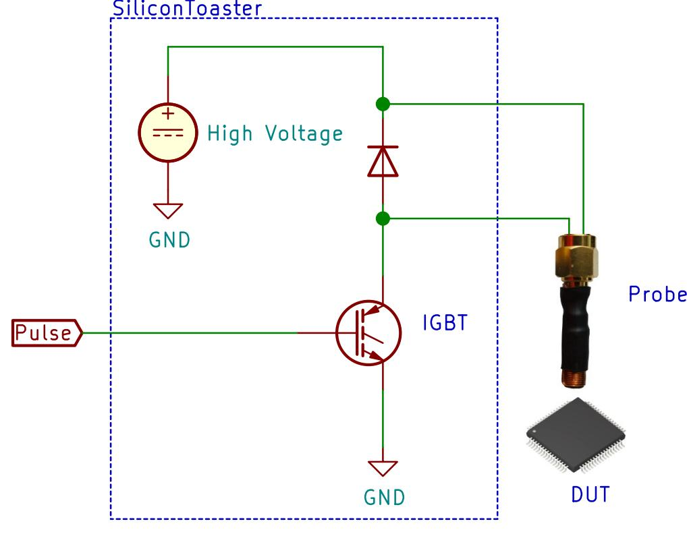

Fig. 1: EMFI setup

retrieving the keys used for encryption by comparing correct ciphertext and faulty ciphertexts [8].

Electromagnetic Fault Injection (EMFI) is based on inducing faults into integrated circuits by influencing it with a flux of the magnetic field. It causes voltage and current fluctuations inside the device. As a result, the device won't work properly under such effect which leads to inducing errors. It was first proposed by Quisquater et al. in 2002 [9] and has been shown as an effective fault injection technique for the purpose of conducting physical attacks against ICs as shown in [10]. The main advantages of injecting faults by electromagnetic are: First, injecting faults without the need to perform chip decapsulation (non-invasive). Second, targeting local parts of the circuit (better focusing).

Contribution: Our contributions can be summarized as follows:

• First, we design and construct a platform for EM fault injection, called SiliconToaster (shown in Fig. 1). We detail the design of every component such as high voltage generation, high voltage switching circuit, and probe fabrication. The proposed platform has the flexibility of tuning the injection voltage up to 1.2kV (programmable) with a very low cost. Moreover, it is a USB-powered. Therefore, there is no need for an external power supply.

{1}------------------------------------------------

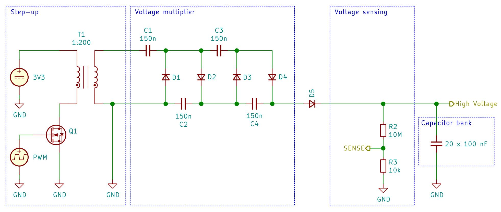

Fig. 2: High voltage generation

• The second part of the paper validates the efficiency of the proposed platform. It presents how the SiliconToaster can be used in order to bypass the firmware security configurations of an IoT chip without any chip decapsulation.

This article is organized as follows. A short review of the state-of-the-art setups is given in Section II. Section III presents the design details of the SiliconToaster. Section IV highlights using the SiliconToaster as an efficient platform in attacking the firmware protection of the IoT chip. Section V concludes this work.

## II. PREVIOUS SETUPS FOR EMFI

A camera flash-gun was used by Quisquater et al. [9] to inject high voltages into the coil of a probe creating eddy current in the chip surface. As a result, successful faults were injected in RAM and EPROM memory cells. In [11], the authors used a spark generator to fault a CRT-based RSA algorithm running on an 8-bit micro-controller. Maurine [12] presented an overview of the previous constructions of EMFI setups. The first class of EM platforms is known as EM harmonic injection. It injects continuous sinusoidal EM as shown in [9]. The second class is known as EM pulse injection and uses a hand-made probe in order to create EM field with the help of high voltage pulse generators as shown in [10], [13].

It is clear that the previous setups shown in [10], [11], [13], used commercial solutions for their setups such as highvoltage pulse generators. However, there are less setups which are considered as hand-made solutions. Balasch et al. [14] presented a pulse injection circuit that can provide currents up to 20A to an EM injector. The idea of the pulse injection circuit was based on charging a tank capacitor. A fixed input voltage (VDD=20V) was used for charging the tank capacitor. As a result, the charge of the capacitor is always fixed and no flexibility for a variable voltage because it is a function of the input voltage. Also, it lacks the option of changing the polarity of the EM pulse. In [15], the authors used a relay-based circuit in order to generate a high voltage shock on a tank capacitor and it lacks also the flexibility of changing this shock value with the EM polarity. Other works have used professional tools for hardware security evaluation, e.g. Riscure's Inspector FI [16] but such platforms are considered expensive and blackbox in terms of its design.

# III. SILICONTOASTER

In this section, we highlight our hand-made solution for injecting EM pulses, called SiliconToaster. The proposed platform is made up of the following components:

- High voltage pulse generator with the flexibility of changing the voltage level
- An STM32 MCU
- High voltage switching circuit which is used to inject a controlled shock into the EM injector
- EM injector (hand-made probe)

## *A. High voltage pulse generator*

As we discussed before, one of the main components of the EMFI setup is the high voltage source. Fig. 2 shows the schematic of the proposed high voltage generator. It is made up of following components: a step-up transformer, a voltage multiplier, and a bank of capacitors.

The step-up transformer circuit is used for generating a high voltage close to 200V. The turns ratio of the transformer must be high enough to generate the high voltage on the secondary terminal. In our case, the turns ratio is 200. The transistor Q1 generates a high current when the pulse is ON (higher than 5A). The high current generated by Q1 when the transistor is ON generates a magnetic field in the primary coil of the transformer which will be transformed to a high voltage output on the secondary terminal of the transformer. The voltage generated by the transformer is then multiplied by 4 using 

{2}------------------------------------------------

two stages Cockcroft-Walton voltage multiplier [17]. The bank capacitors are used to hold this charge to be used later in order to be injected in the EM probe. All the used capacitors should be selected with a break-down voltage of 1.2kV.

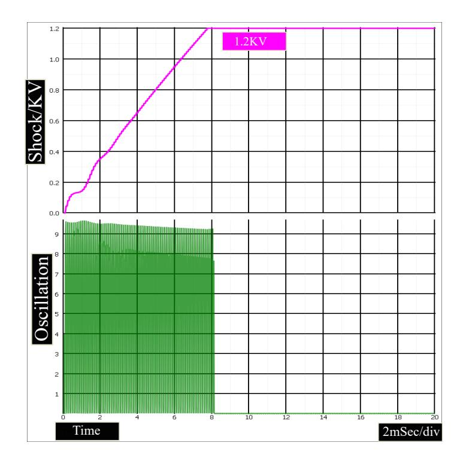

Fig. 3: Simulation results

The generated high voltage depends on several parameters such as: number of pulses (see Fig. 3), frequency of the input pulses, and pulse width. Fig. 3 shows, with 8ms of pulses with a frequency of 10KHZ, the output voltage is 1.2kV and it is the maximum value that can be generated using this setup. By tuning the input pulse period (less than 8ms), the generated high voltage becomes programmable. The same concept is obtained by changing the frequency or the pulse width. The controlled pulse can be generated using an FPGA or an MCU Pulse Width Modulator (PWM) peripheral.

# *B. MCU-PWM*

In order to obtain a programmable voltage, the PWM peripheral of STM32F2 [18] is used. The MCU changes the duty cycle of the input pulse to control the generated voltage. Another important feature is also using the analog-to-digital converter of the MCU. It is connected to R3 (see Fig. 2) in order to measure the charged voltage as a visibility option to the tool. In addition, it displays a warning (red led) when the capacitors are charged as a safety feature unlike the previous setups [14] [15].

## *C. High voltage switching circuit*

Another important component of the SiliconToaster is the high voltage switching circuit which discharges the stored energy into the EM probe, generating strong electromagnetic field. Fig. 4 shows the proposed switching circuit and it is made up of two main components: an IGBT and a protection diode. The IGBT transistor is a fast power switch controlled by an insulated gate whose maximum ratings are 1.2kV collectorto-emitter voltage, 40A pulsed current and 20V gate-to-emitter voltage. D is used to protect the IGBT from any reversed voltage. In case of using an FPGA/MCU in order to generate

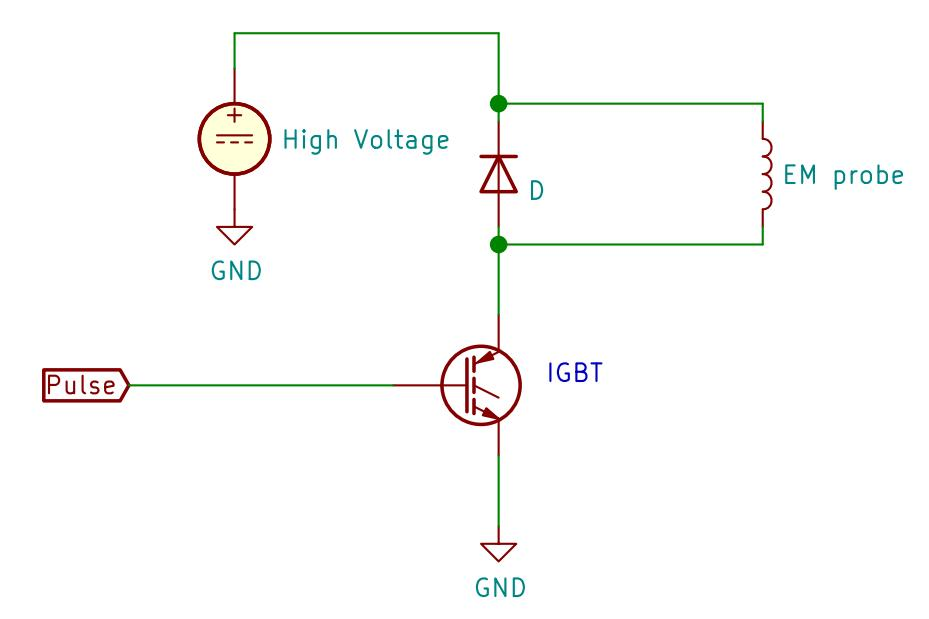

Fig. 4: High voltage switching circuit

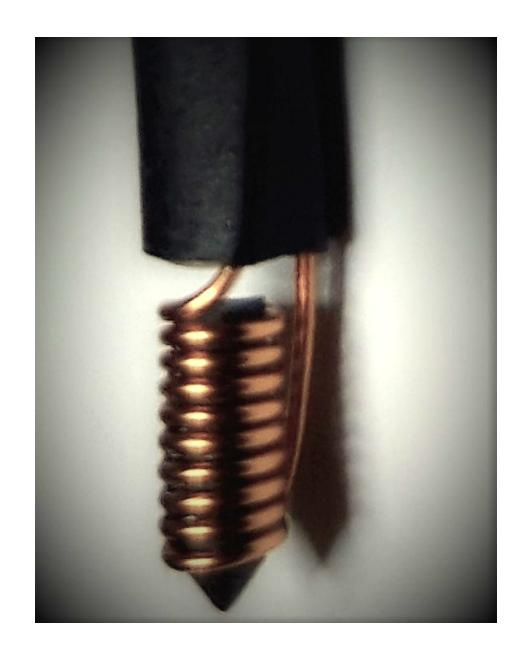

Fig. 5: EM probe

the controlled pulse for the IGBT, there will be a need to a MOSFET driver in order to convert 5V pulse to 15-20V pulse.

#### *D. EM probe*

The EM probe is used to transfer the electromagnetic shock to the DUT by generating electromagnetic field resulting from the high current circulating in the coil (EM probe). In our case (see Fig. 5), it is fabricated from a flat coil of 6.6 mm diameter with 9 turns. In order to obtain a good spatial resolution, we select a ferrite rod with a 4.5mm diameter and 10mm length.

## *E. Working principle*

The operation of the SiliconToaster is divided into three phases. First, the capacitor bank will be charged by the high voltage generator circuit. Thanks to the flexibility of the design that can charge the capacitors with a controlled voltage based on the input pulse width. Second, a trigger is generated based on a certain activity. Third, the switching circuit discharges the stored energy into the EM probe (injecting EM fault).

Fig. 6 shows the first setup of the SiliconToaster. The idea of this initial setup was to verify the operation concept which was proved by simulation results (see Fig. 3). In order to create a practical evaluation tool, a PCB was fabricated as shown in Fig. 7. The voltage source shown in Fig. 2 is generated from the USB voltage using a voltage regulator (from 5V to 3V). Also, a boost converter circuit was used to raise the voltage

{3}------------------------------------------------

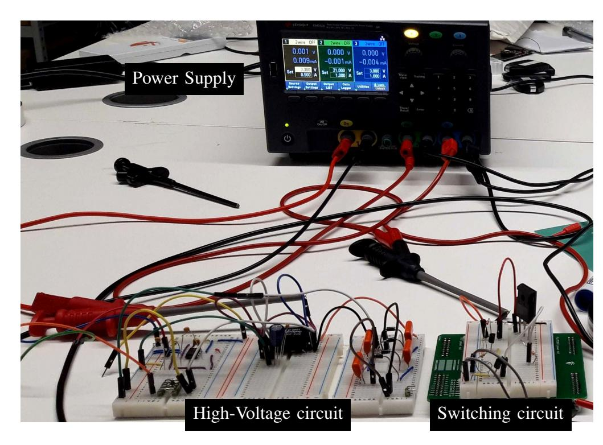

Fig. 6: Hardware setup

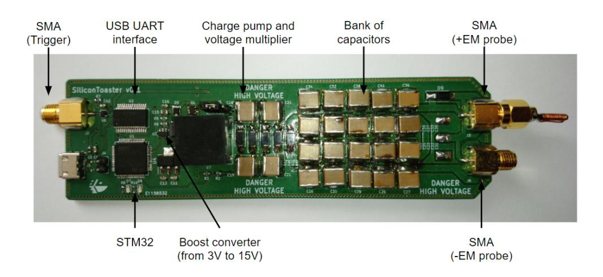

Fig. 7: SiliconToaster

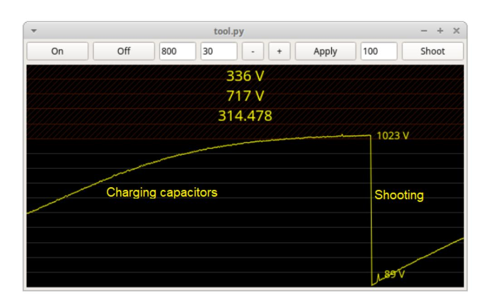

Fig. 8: GUI of SiliconToaster

of the USB from 5V to 15V, in order to be sufficient for driving the IGBT driver, which is used to trigger the IGBT switching circuit. Moreover, two SMA connectors are used for the EM probe, to facilitate changing the polarity of the injected EM pulse without any power loss. Fig. 8 shows the GUI that controls the PWM and shows the generated output voltage before and after shooting.

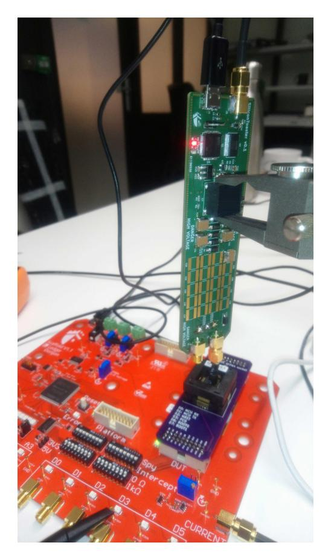

Fig. 9: Attack setup using SiliconToaster

#### IV. PLATFORM VALIDATION

It is almost common that every microcontroller with a flash integrates a hardware mechanism to perform a readback protection. This is a solution which aims at securing the intellectual property (IP) from an adversary.

#### *A. Configuration modes*

We set up three different configuration modes for the chip:

- A: No security feature is activated.
- B: Some security features are activated. Debug access to CPU registers and memory-mapped addresses are disabled. Bootloader is enabled, but commands used to read and write memory are disabled. Chip is configured so that changing the configuration mode will erase the chip memory.
- C: All the security features for protect IP protection are enabled. Bootloader is disabled by patching the first instruction with a jump to the program address. Debug port is disabled. Changing the configuration mode is not possible.

#### *B. Setup*

The DUT was placed in a custom board socket. Fig. 9 shows our setup used in this attack. The SiliconToaster is used for injecting EM pulses to bypass the security configuration modes. Scaffold board [19] is also used as a platform in order to communicate with the DUT.

#### *C. C configuration attack*

When C mode is activated, the bootloader is disabled and the objective of bypassing C mode is to re-enable the bootloader. After the power-up, the host sends X value to the chip and if it is locked in C mode, it doesn't respond. In case of bypassing the C mode (successful attack), the chip replies with

{4}------------------------------------------------

## Algorithm 1: Attack sequence of C configuration

#### while *True* do

Initialize-SiliconToaster(voltage, width, offset); uart.transmit(X, trigger=1); if *(uart.receive=ACCEPT)* then

Go to B configuration attack;

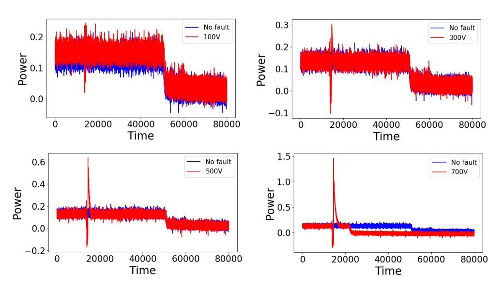

Fig. 10: Characterization

ACCEPT. Algorithm 1 shows the attack sequence. First, we initialize the SiliconToaster with the desired parameters such as (voltage level, pulse width, and offset). Second, the host sends the X value to the chip. In case of receiving ACCEPT, the attack is successful. Otherwise, the attack is failed.

After the power-up, the chip starts the activity for a certain period. Therefore, the ideal timing to inject the EM pulse is during the early activity after the power up. Hence, the EM pulse should be injected during this period.

The chip surface was scanned by the SiliconToaster without any decapsulation. Thanks to the SiliconToaster which helped us to change the injected pulse from 0 to 1.2kV for each physical location of the chip. In addition, varying the pulse width was also considered. Fig. 10 shows the chip behavior under different EM pulses generated by the SiliconToaster under 400ns pulse width. It is clear that increasing the voltage level, injects stronger EM pulse. In addition, the chip was crashed when the injected EM pulse >= 700V.

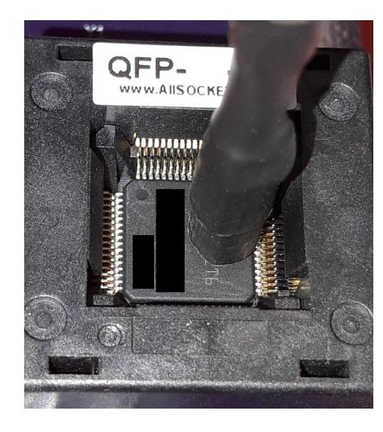

Fig. 11: Probe position

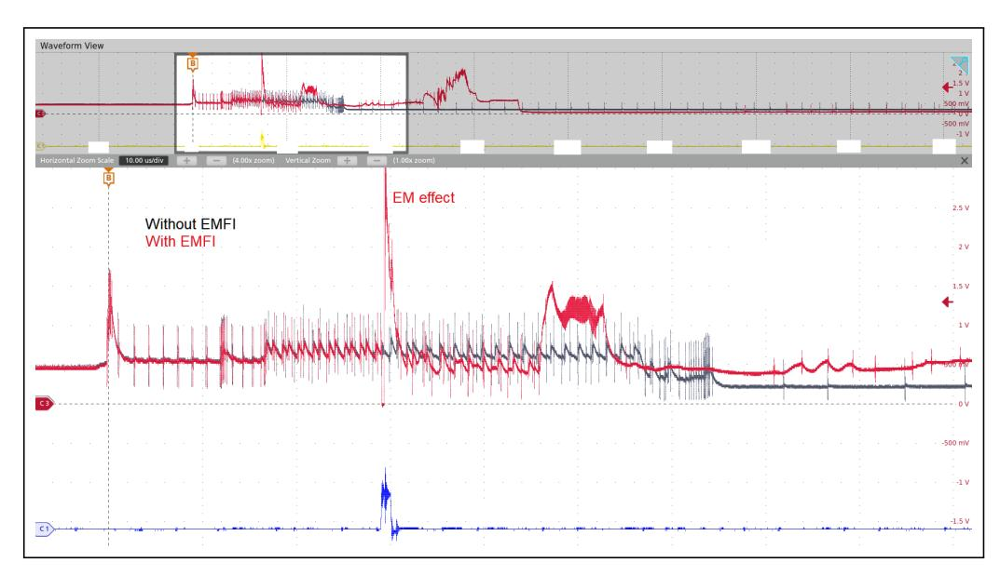

Fig. 12: Bypassing C configuration

Fig. 11 shows the physical location of the probe that we used in order to obtain successful faults using 400V shock under pulse width of 400-700 ns (one single pulse). Configuration C was bypassed successfully and the success rate is close to 60%. Fig. 12 (red trace), shows the power consumption of the chip in case of the successful attack. It is clear that the chip behavior is different compared to the gray trace. Once C mode is bypassed, the chip is still in configuration B and the flash is still protected. Therefore, there should be an additional step to access the flash by bypassing B mode.

# *D. B configuration attack*

Configuration B locks the flash memory. If it is activated, the chip returns a negative response (REJECT) when a *Read Memory Content* command is issued. The unprotect command disables the read protection with the cost of a complete flash memory erasure. Therefore, a REJECT reply was returned while trying to read from the dedicated address when B mode was active (after bypassing C mode). In order to figure out what the chip performs during executing *Read Memory Content*, the power consumption of the chip was monitored as shown in Fig. 13 (gray, without EMFI).

The attack sequence of B mode is presented in Algorithm 2. We kept all the attack parameters of C mode such as pulse width, voltage level and the location of the probe. The EM pulse was injected at the beginning of the *Read Memory Content* command as shown in the red trace. We were able to extract the data stored in the flash during A configuration, when the chip was locked in mode B (after bypassing mode C) by the EM injection with a success rate close to 30%.

# *E. Discussion*

In the previous subsections, we showed how the Silicon-Toaster can be used to break the protection modes of the DUT using a 400V shock. This double fault attack converted the chip security configuration from C to A in order to dump the firmware of the chip. Thanks to the evaluation flexibility of the proposed SiliconToaster (see Table I) that allowed us to achieve this evaluation. It outperforms the previous work in several points:

{5}------------------------------------------------

TABLE I: Comparison between designs

| Design         | EM voltage           | Power supply          | Visibility | Polarity                 |
|----------------|----------------------|-----------------------|------------|--------------------------|
| SiliconToaster | Programmable voltage | USB-powered           | Yes (GUI)  | Yes (two SMA)            |
| [14] and [15]  | Fixed voltage        | External power supply | No         | Another coil fabrication |

#### Algorithm 2: Attack sequence of B configuration

Initialize-SiliconToaster;

Read Memory Content (trigger=1, address, number of bytes);

if *(uart.receive=ACCEPT)* then

Data=uart.receive(256);

else

Data=None;

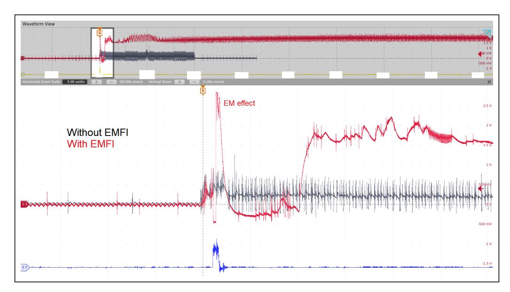

Fig. 13: Bypassing B configuration

- Programmability: It allowed us to change the EM voltage for each physical location.
- Polarity: Two SMA outputs are used to change the polarity unlike the previous work that required another fabricated probe, which is not easier compared to our solution.
- Power source: The SiliconToaster is powered by the USB and it doesn't need any external supply compared to EM injectors.
- Visibility: It is equipped with a GUI to monitor the charged voltage of the capacitors.

# V. CONCLUSION

EMFI attacks are considered as a real threat to embedded devices. In this work, we presented how an efficient platform (SiliconToaster) can be built in order to inject EM pulses. We detailed the used blocks in the platform. Thanks to the flexibility of the SiliconToaster that allows injecting EM pulses with a programmable voltage up to 1.2kV. The second part of the paper invested efficiently the SiliconToaster in breaking the firmware protection configurations of the used DUT.

#### REFERENCES

- [1] S. P. Skorobogatov and R. J. Anderson, "Optical Fault Induction Attacks," in *International workshop on cryptographic hardware and embedded systems*. Springer, 2002, pp. 2–12.
- [2] A. Dehbaoui, J.-M. Dutertre, B. Robisson, and A. Tria, "Electromagnetic Transient Faults Injection on a Hardware and a Software Implementations of AES," in *2012 Workshop on Fault Diagnosis and Tolerance in Cryptography*. IEEE, 2012, pp. 7–15.
- [3] C. O'Flynn, "Fault Injection using Crowbars on Embedded Systems," *IACR Cryptology ePrint Archive*, vol. 2016, p. 810, 2016.
- [4] D. Boneh, R. A. DeMillo, and R. J. Lipton, "On the Importance of Checking Cryptographic Protocols for Faults," in *International conference on the theory and applications of cryptographic techniques*. Springer, 1997, pp. 37–51.
- [5] D. Karaklajic, J.-M. Schmidt, and I. Verbauwhede, "Hardware De- ´ signer's Guide to Fault Attacks," *IEEE Transactions on Very Large Scale Integration (VLSI) Systems*, vol. 21, no. 12, pp. 2295–2306, 2013.
- [6] A. Barenghi, L. Breveglieri, I. Koren, and D. Naccache, "Fault Injection Attacks on Cryptographic Devices," 2012.
- [7] N. Timmers and A. Spruyt, "Bypassing Secure Boot using Fault Injection," *Black Hat Europe*, vol. 2016, 2016.
- [8] E. Biham and A. Shamir, "Differential Fault Analysis of Secret Key Cryptosystems," in *Annual international cryptology conference*. Springer, 1997, pp. 513–525.
- [9] J.-J. Quisquater, "Eddy Current for Magnetic Analysis with Active Sensor," *Proceedings of Esmart, 2002*, pp. 185–194, 2002.
- [10] A. Dehbaoui, A.-P. Mirbaha, N. Moro, J.-M. Dutertre, and A. Tria, "Electromagnetic Glitch on The AES Round Counter," in *International Workshop on Constructive Side-Channel Analysis and Secure Design*. Springer, 2013, pp. 17–31.
- [11] J.-M. Schmidt and M. Hutter, *Optical and EM Fault-Attacks on CRT-Based RSA: Concrete Results*, 2007.
- [12] P. Maurine, "Techniques for Em Fault Injection: Equipments and Experimental Results," in *2012 Workshop on Fault Diagnosis and Tolerance in Cryptography*. IEEE, 2012, pp. 3–4.
- [13] N. Moro, A. Dehbaoui, K. Heydemann, B. Robisson, and E. Encrenaz, "Electromagnetic Fault Injection: Towards a Fault Model on a 32-bit Microcontroller," in *2013 Workshop on Fault Diagnosis and Tolerance in Cryptography*. IEEE, 2013, pp. 77–88.
- [14] J. Balasch, D. Arum´ı, and S. Manich, "Design and Validation of a Platform for Electromagnetic Fault Injection," in *2017 32nd Conference on Design of Circuits and Integrated Systems (DCIS)*. IEEE, 2017, pp. 1–6.
- [15] A. Cui and R. Housley, "{BADFET}: Defeating Modern Secure Boot Using Second-Order Pulsed Electromagnetic Fault Injection," in *11th* {*USENIX*} *Workshop on Offensive Technologies (*{*WOOT*} *17)*, 2017.
- [16] Riscure, "Inspector Fault Injection," https://www.riscure.com/ security-tools/inspector-fi/.
- [17] A. R. Thakare, S. B. Urkude, and R. P. Argelwar, "Analysis of Cockcroft-Walton Voltage Multiplier," *International Journal of Scientific and Research Publications*, vol. 5, no. 03, pp. 1–3, 2015.
- [18] STMicroelectronics, "STM32F205xx, STM32F207xx, STM32F215xx and STM32F217xx Advanced Arm®-based 32-bit MCUs," *RM0003*, 2018.
- [19] O. Heriveaux, *Scaffold*, https://github.com/Ledger-Donjon/scaffold? files=1.