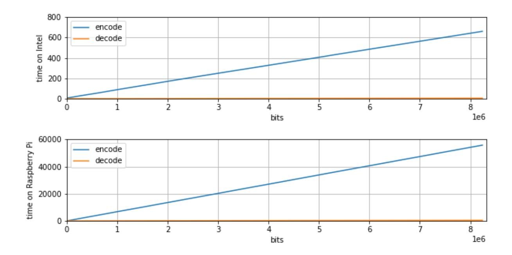
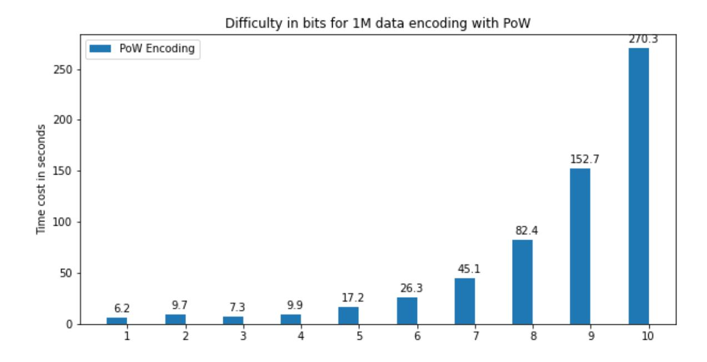
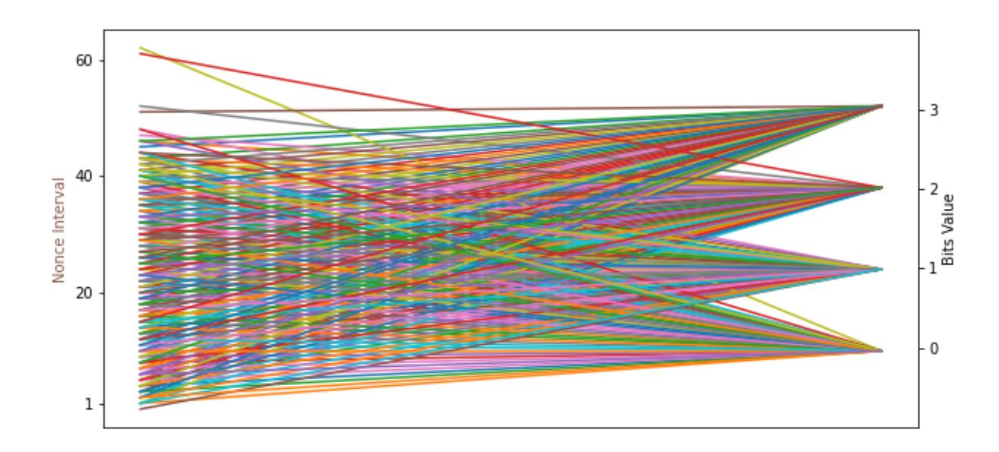

{0}------------------------------------------------

# Economic Proof of Work

#### Jia Kan

Abstract. Blockchain is the distributed system allowing multiple parties to host a service. Nakamoto Consensus, also named Proof of Work (PoW), is widely used in Bitcoin and other blockchain systems. PoW is an important consensus algorithm. It solves the Byzantine Generals problem in an open network. It also protects the blockchain security from longest chain attack.

World widely virtual currency mining was commonly regarded as over energy consuming. How to make use of the computation capacity provided by mining, is one of the most important problems to solve in blockchain. We extend Proof of Work to be useful and economic. And discover a simple method to generate the proof of storing useful data with PoW. In a blockchain based distributed file storage system, any storage resource owner could freely join as a service provider. It requires the service provider to show the proof of honestly keeping the data content, because the malicious provers may use other's content to generate the proof in order to reduce their resource cost. This is out-sourcing attack. Furtherly, we proposed a novel technique to combine data replica process with Proof of Work's contributing to blockchain security.

Keywords: Useful Proof of Work · Nakamoto Consensus · Blockchain · Proof of Replication · File Storage.

# 1 Introduction

Proof of Work consensus[8][2] is widely used in blockchain. In an anonymous and open blockchain, miners can create arbitrarily identities to compete for the next block generation. This is called sybil attack[1] as it almost costs no extra resource. To prevent the sybil attack, Bitcoin uses PoW as the proof of certain computation resource being spent. Years later, worldwide computation resources were used for Bitcoin mining, even including the special designed hardware. As a matter of fact, those resources become the security protection to Bitcoin, making the decentralized ledger/banking service dependable. However, from public perspective view, the mining burned the electric resource into virtual currency, which sounds more expensive than notes printing. It turns out a serious and important problem to solve, to make PoW useful, more than just security and heat generation.

Vitalik Buterin (the founder of Ethereum) talked about the 'Useful Proof of Work' problem in his recently blog post 'Hard Problems in Cryptocurrency: Five Years Later'[9], commented with the status: Probably not feasible. But 

{1}------------------------------------------------

we could imagine, simply remove the Bitcoin reward (both initial coin reward and gas fee), most of miners will quit, except the rational ones who still make transaction with existing coins will run the full node and keep mining.

In this paper, we propose a way to make use of Nakamoto Consensus (Proof of Work). The computation resource is now not only being used to protect the longest chain rule, but also for data integration check.

## 1.1 Our Contribution

In this work, we propose the Proof of Replication[10] method with Proof of Work as an encoding algorithm, which make PoW useful in content storage scenario. The same data content can be encoded by different storage providers with their unique identities, Proof of Replication can be used for verification of storing useful data, to protect from outsource attack. We also offer the protocol to verify the storage provider, either honestly stored the replicated content, or spent much more computation resource to cheat the verification, performing the outsource attack.

Moreover, as Proof of Work contributes to blockchain security, once the computation resource is consumed for data replication, the blockchain security is sacrificed. We come up a solution to get the two outputs within the same operation. The iterations of PoW execution will look for the smallest hash value while encoding data.

On the other hand, our method enables token-less blockchain. As token is the incentive mechanism for miner to contribute computation resource, our method can make PoW computation as a side effect of encoding work. People no longer contribute the computation for token reward, as the design of blockchain can go without token. At the end of this paper, we discussed the effect on existing PoW mining and the impact to the mining pool with this new discovered PoW usage.

# 2 Related Work

Previously our work focused on the high performance blockchain, and file storage application based on blockchain infrastructure. This leads a series of interesting problems, as we designed the sharding data structure, the backbone network, and the encryption scheme. We see the blockchain is going to play the role of future database, but it is more difficult to build the future storage. In an application, the database is used for structured information, and the storage is required for large content like images, audio, video, and software packages.

Those binary data are usually stored off the chain. It is important to periodically verify the content. It is about the integrality security. The project Filecoin uses a smart way to protect from the cheating of outsourcing attack: encode data with node's unique identity, the encoding is very slow, and decoding is fast. Our work follows this idea.

{2}------------------------------------------------

#### 2.1 Bitcoin

To review our work, it is important to understand the core concepts of Bitcoin[2]. Bitcoin is the first project to implement the cash system without a trusted third party. Blockchain is the data structure used by Bitcoin. Literally it is as same as hash chain. There are three core concepts in Bitcoin: 1. Blockchain 2. The longest chain rule 3. Proof of Work.

Blockchain is the fundamental data structure somehow like a linked list. Each block has a hash value linking to the previous block, which freeze the previous block content. Any bit modification will affect to the hash value. Hash is fast to compute. Given a set of content, anyone could link them in seconds by hash. To slow down the block generation and achieve consensus, the criteria is set for new block, the new block's hash should be less than a difficulty.

Miners to get Bitcoin reward for both initial coin distribution and transaction gas fee. In return the Bitcoin network gains the security. For the scarcity, the price of Bitcoin goes up. Miners are profitable and incented to equip with GPU/ASIC instead of CPU. Also, the solo miner starts to join the mining pool. Thus, the Bitcoin network is now protected with high volume of computation resource for its security.

With token incentive, it's likely to over contributing computation resource. We cannot give a fixed value to the token, so we spent unlimited resource as far as the Bitcoin price still going up. If we can rationally contribute the computation resource, the PoW can be economic.

### 2.2 Proof of Work

Proof of Work is also called as Nakamoto Consensus[2]. It is an algorithm requires exponential time to compute by increasing the difficulty and can be verified in a single hash, showed in Algorithm 1. It is first widely used in Bitcoin. Proof of Work uses computation resource to achieve consensus. Roughly speaking, the consensus is that people all agree on the same thing, like an election. It decides who to generate the next block. In PoW, the more computation resource invested, the higher chance to generate the next block.

However, Proof of Work is not just a random function weight by computation capacity. The worldwide mining provides the majority computation on the block generation, keeping the blockchain secure. However, PoW is regarded as over consuming electricity. It is due to high incentive of Bitcoin price. We believe it is possible to design a blockchain with PoW for efficiency energy cost and reasonable security.

#### 2.3 Proof of Space

Proof of Space[6][7] (PoSpace) intends to be an energy-friendly replacement of Proof of Work. It uses storage space instead of computation to achieve consensus. Proof of Space and Simple Proofs of Space-Time and Rational Proofs of

{3}------------------------------------------------

### Algorithm 1 Proof of Work in Algorithm

```
1: Get miner's identity id
2: Get current block's hash
3: Get next block's data
4: Calculate current difficulty D based on history blocks
5: Let nonce = 0
6: repeat
7: if Got other's new block then
8: Exit and restart this algorithm based on the new block hash
9: end if
10: Let nonce = nonce + 1
11: until Hash(hash||data||id||nonce) < D
12: Broadcast the new block worldwide
```

Storage[5] uses junk data to fill in the hard drive and show the proof of storage resource spent. It costs less energy than Proof of Work. The algorithm is consisted of setup phrase and proof phase. However, the Proof of Space has the similar idea for costing resource to achieve consensus, the storage resource we are taking is not in use. It is a waste of resource to store the junk data in PoSpace.

Although in theory PoSpace can replace the PoW, in the setup phrase computation is required to work. Pure random junk data can be regenerated easily, then the incompressible PoW is proposed, to make the setup phase more expensive.

### 2.4 Proof of Replication

Proof of Replication[4][5] (PoRep) is the improved Proof of Space. Compare with Proof of Space, the idea of Proof of Replication tries to make use of the storage resource, for storing useful data.

Currently Filecoin is using PoRep[4] in the product. The Filecoin solution gets PoRep working together with verifiable delay functions[3] and zero knowledge proof. This solution makes the computation requirement heavy again. It's nice to have an energy efficiency and resource usable consensus algorithm. In this work we proposed a resource-friendly Proof of Replication algorithm.

# 3 Proof of Replication with Proof of Work

As PoSpace intends to replace PoW with an energy efficiency consensus algorithm, in the setup phrase it still costs heavy computation. Our method uses Nakamoto Consensus as the encoding algorithm for PoRep, to generate unique replication with useful data. For the blockchain consensus, it is still achieved by PoW.

{4}------------------------------------------------

### Algorithm 2 Proof of Work for Encoding

```
1: Get node's identity id
```

- 2: Get the difficult requirement L
- 3: Get message to encode m
- 4: Let nonce = 0
- 5: repeat
- 6: Let nonce = nonce + 1
- 7: until The first L bits of Hash(id||nonce) output is equal to m
- 8: Output nonce as r

### 3.1 Encoding

We propose a novel replication method to encode the original content with the storage provider's unique identity. We extend Proof of Work as an encoding algorithm, rather than the consensus. The encoding algorithm follows exactly same as Proof of Work's definition.

Unlike Simple Proof of Space-time uses incompressible PoW data to fill in the storage, keeping trash data as the proof of resource spent. The data we encoded here is the useful information from real world. The encoding algorithm takes the storage provider node's identity id and the message m as the parameters. The algorithm is implemented with Proof of Work showed in Algorithm 2. The Decode algorithm takes only a single hash operation, getting the first L bits of Hash(id||r).

$$r = Encode(id, m)$$

$$m = Decode(id, r)$$

#### 3.2 Mapping Table

For a given id, it is easy to find a one to one relationship between message m and output r. This could be used to speed up encoding by skipping the nonce iteration. We could either add the position information as a parameter into the encoding algorithm or keep on iterating the nonce value during the whole encoding process. Both approaches prevent the one to one mapping of the encoding input message and the output replica. For the intention of securing Blockchain with Proof of Work, we prefer the keeping on iterating the nonce method.

# 4 Verification and Security

### 4.1 Verify Protocol

The verification of content storage requires periodically checking to make sure the storage provider honestly keeping the replicated content. The basic idea is 

{5}------------------------------------------------

to ask the content provider to show the replicated data. The verifier can decode the replicated data and comparing with the original. Or if the original data's hash is known, compare the hash with the decoded content's hash. However, decoding also takes time. If the replicated data's hash is kept somewhere (in the blockchain), we can verify by calculating the hash of the replicated data.

Furtherly, fetch the replicated data by communication takes resource and time. We can perform a verification with less communication interactively. As the hash of encoded data is fixed, request for the digest information will not show the possession of replication. Thus, we can add the randomness into the challenge and wait for the response as the proof.

Once the random challenge received, the node will concatenate the challenge information and the replicated data. To generate the response correctly and timely, the node must have the replicated data content stored. The hash responded can be used as the proof of storing the replicated data.

To verify the proof, the verifier still needs to fetch the replicated content from node later. However, as the challenge/response will take place respectively, the verifier only needs to download the replicated data once and perform periodical verification.

$$Verifier \xrightarrow{c} \xrightarrow{c} Prover$$

$$Verifier \xleftarrow{p=Hash(c||r)}{response} Prover$$

### 4.2 Security

Use the data encoded with PoW requires verification. Now we proof the verification process security under the random oracle model.

The security game between the adversary and challenger. The honest service provider stores the replica data r, while the adversary who is malicious service provider tends to drop or partially keep the replica data r. The challenger sends challenge c and expects to receive the proof h, convincing that the service provider honestly stores r. Both adversary and challenger have access to a random oracle H.

Let us say the adversary receives the challenger's random challenge c, and manage to response the proof h within fixed time. If the adversary did not store the replica data r , it is impossible to response to the challenger with the correct proof h = H(c||r) within fixed time. It is hard for the adversary to get the output h without r unless the adversary can break the random oracle H.

{6}------------------------------------------------

# 5 Secure Blockchain with Proof of Work

PoW for blockchain security and PoRep with PoW are zero-sum game. Either we put the resource for consensus PoW computation, or for the encoding PoRep to show the honestly usage in diskspace. In practical, the storage miner will prefer to show the Proof of Replication instead of contributing to blockchain security.

We propose a simple method to combine the two purposes in the same operation. Previously we use the prefix of hash output for encoding. And in PoW, the nonce is iterated to find the smallest hash output, which is less the D. Let us make use of lower bits of hash output, we can look for the suffix bits of hash output for the encoding, and the higher bits (overall output value) to satisfy the PoW difficulty.

# 6 Evaluation

### 6.1 Extend to Proof of Work

We extend the Proof of Work without modified the algorithm, which might be meaningful to all the existing hardware investment on PoW mining. With little modification to existing software, we might turn to make use of the existing hardware computation resource.

PoW is not self-motivation. To encourage people mining, it depends on the upgoing Bitcoin (token) price. Our extension makes the PoW as the side effect of PoRep. Without token price changed, miners will output the PoW to blockchain network at the reasonable rate.

### 6.2 Impact to Mining Pool

Satoshi Nakamoto might not foresee the idea of mining pool. In early Bitcoin mining, normal computer is enough for getting initial coin reward. As the value of Bitcoin goes up, the devices were upgraded from CPU to GPU/ASIC. Until solo mining has little chance to get any coins, here comes the mining pool. Selling the computation resource to the mining pool is to cover the mining cost, since PoW is not useful work except contributing to blockchain security.

Now, Proof of Replication with Proof of Work algorithm changes the game rule. Once the PoW algorithm can be used for encoding, the miner will consume it instead of selling to mining pool. People have been worried about the giant mining pool controls more than half the computation resource word wide, will never happened with the useful PoW. Our use case will bring more fairness to the blockchain mining ecosystem. In practical, it would be possible to reduce the incentive in design: token-less blockchain would be possible.

{7}------------------------------------------------



Fig. 1. The time cost to encode and decode on Intel CPU and Raspberry Pi

# 7 Experiments

### 7.1 Encoding and Decoding Time for different CPUs

In this experiment, we run the algorithm on different speed CPUs. Encoding is set with most common difficulty 8 bits, which is encoding one-byte data each operation. We choose different platforms, such as Intel and Raspberry Pi. The time cost on a modern CPU and on a embed device Raspberry Pi has a significant difference, but both devices take a while. It shows even the aged device can join the replication mining and for the latest CPU it is not a cheap work.

Decoding time on different CPUs. The figure shows the decoding is much faster than the encoding.

### 7.2 Encoding and Decoding Time in different Difficulty

It takes one hash for decoding L bits of data. The single decoding time is fixed. However, the longer bits unit leads to less times of hash operations for the fixed length content. The overall trend shows the time costs in growing exponentially, but there is the decreasing at 3 bits width difficulty.

### 7.3 Skip setting Nonce after Encoding

In this experiment, we skip setting the nonce value back to zero after each encoding and store the differences values between the encoding results. In the figure, we show the range of interval value result. There is no one to one relationship between the differences and encoding results. With this modification, we could keep iteration on the nonce value to look for the smallest hash output less than

{8}------------------------------------------------



Fig. 2. Time cost for encoding with PoW in different difficulty for 1M data on Intel Xeon W-2123 CPU @3.6GHz



Fig. 3. A mapping between nonce incremental and the encoded bits value

difficulty D and encoding the original content by the bit width L at same moment. It means the algorithm is used to protect sybil attack for the blockchain while working on the proof of replication to prevent out-sourcing attack.

# 8 Conclusion

In this paper, we proposed a novel method to make use of the Proof of Work algorithm. As we remark the encoding progress as useful, it is the security protection from out-sourcing attack as well. Besides, we proposed the improved 

{9}------------------------------------------------

method which combines Proof of Replication together with Proof of Work, so that we could get the blockchain security for free during replication encoding. As we did not change PoW in algorithm, all the existing hardware produced for Proof of Work can be reused. This could be PoW 2.0. However, the early motivation of Proof of Space showing that we could use PoSpace to replace PoW to achieve more energy efficiency consensus algorithm. It could be an interesting research direction to explore.

# 9 Acknowledgment

Thanks to Satoshi Nakamoto's Proof of Work. It is an algorithm for blockchain security, now also used as replication algorithm for blockchain based storage.

# References

- 1. Pass, R., Seeman, L., & Shelat, A. (2017). Analysis of the Blockchain Protocol in Asynchronous Networks. theory and application of cryptographic techniques.
- 2. Satoshi, N. (2008). Bitcoin: A peer-to-peer electronic cash system.
- 3. Boneh, D., Bonneau, J., Bunz, B., & Fisch, B. (2018). Verifiable Delay Functions. international cryptology conference.
- 4. Fisch, B. (2018). PoReps: Proofs of Space on Useful Data.. IACR Cryptology ePrint Archive,.
- 5. Moran, T., & Orlov, I. (2019). Simple Proofs of Space-Time and Rational Proofs of Storage.. international cryptology conference.
- 6. Dziembowski, S., Faust, S., Kolmogorov, V., & Pietrzak, K. (2015). Proofs of Space. international cryptology conference.
- 7. Ateniese, G., Bonacina, I., Faonio, A., & Galesi, N. (2014). Proofs of Space: When Space Is of the Essence. international conference on security and cryptography.
- 8. Dwork, C., & Naor, M. (1992). Pricing via Processing or Combatting Junk Mail. international cryptology conference.
- 9. Vitalik, B. (2019). Hard Problems in Cryptocurrency: Five Years Later.. https://vitalik.ca/general/2019/11/22/progress.html
- 10. Protocol Labs. (2017). Proof of Replication.