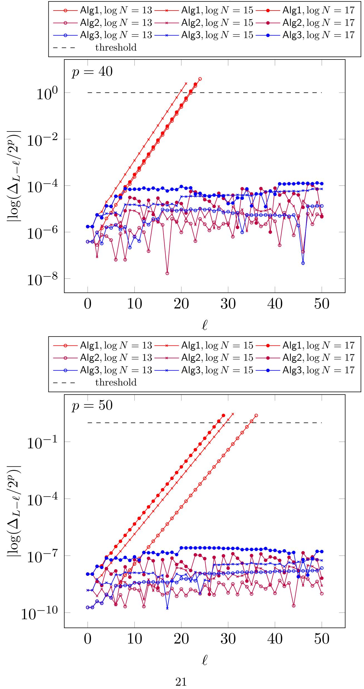

{0}------------------------------------------------

## Approximate Homomorphic Encryption with Reduced Approximation Error

Andrey Kim1,2, Antonis Papadimitriou<sup>3</sup> , and Yuriy Polyakov<sup>∗</sup><sup>3</sup>

> <sup>1</sup>New Jersey Institute of Technology <sup>2</sup>Samsung Advanced Institute of Technology <sup>3</sup>Duality Technologies

> > December 5, 2021

#### Abstract

The Cheon-Kim-Kim-Song (CKKS) homomorphic encryption scheme is currently the most efficient method to perform approximate homomorphic computations over real and complex numbers. Although the CKKS scheme can already be used to achieve practical performance for many advanced applications, e.g., in machine learning, its broader use in practice is hindered by several major usability issues, most of which are brought about by relatively high approximation errors and the complexity of dealing with them.

We present a reduced-error CKKS variant that removes the approximation errors due to the Learning With Errors (LWE) noise in the encryption and key switching operations. We propose and implement its Residue Number System (RNS) instantiation that has a lower error than the original CKKS scheme implementation based on multiprecision integer arithmetic. While formulating the RNS instantiation, we also develop an intermediate RNS variant that has a smaller approximation error than the prior RNS variant of CKKS. The high-level idea of our main RNS-related improvements is to remove the approximate scaling error using a novel procedure that computes level-specific scaling factors. The rescaling operations and scaling factor adjustments in our implementation are done automatically.

We implement both RNS variants in PALISADE and compare their approximation error and efficiency to the prior RNS variant. Our results for uniform ternary secret key distribution, which is the most efficient setting included in the community homomorphic encryption security standard, show that the reduced-error CKKS RNS implementation typically has an approximation error that is 6 to 9 bits smaller for computations with multiplications than the prior RNS variant. The results for the sparse secret setting, which was used for the original CKKS scheme, imply that our reduced-error CKKS RNS implementation has an approximation error up to 12 bits smaller than the prior RNS variant.

<sup>∗</sup>Corresponding author; e-mail: ypolyakov@dualitytech.com

{1}------------------------------------------------

## Contents

| 1 | Introduction                                                              | 1  |
|---|---------------------------------------------------------------------------|----|
|   | 1.1<br>Organization<br>                                                   | 6  |
| 2 | Preliminaries                                                             | 6  |
|   | 2.1<br>CKKS Scheme<br>                                                    | 6  |
|   | 2.2<br>RNS Representation<br>                                             | 8  |
|   | 2.3<br>CKKS Scheme in RNS                                                 | 8  |
| 3 | Reducing the Approximation Error in the CKKS Scheme                       | 10 |
|   | 3.1<br>Approximation Errors in the CKKS Scheme                            | 10 |
|   | 3.2<br>Eliminating LWE and Encoding Approximation Errors                  | 14 |
|   | 3.3<br>Theoretical Estimates of Error Reduction<br>                       | 15 |
| 4 | Reducing the Approximation Error in the RNS Instantiation of CKKS         | 16 |
|   | 4.1<br>Eliminating the Scaling Factor Approximation Error in RNS CKKS<br> | 16 |
|   | 4.2<br>Applying the Reduced-Error CKKS Modifications<br>                  | 20 |
| 5 | Implementation Details and Results                                        | 23 |
|   | 5.1<br>Setting the Parameters                                             | 23 |
|   | 5.2<br>Software Implementation and Experimental Setup<br>                 | 24 |
|   | 5.3<br>Experimental Results                                               | 24 |
| 6 | Concluding Remarks                                                        | 27 |
| A | Approximate Scaling Error in RNS                                          | 29 |
| B | Proofs of Lemmas                                                          | 31 |

{2}------------------------------------------------

## 1 Introduction

The Cheon-Kim-Kim-Song (CKKS) homomorphic encryption (HE) scheme is currently the most efficient method to perform approximate homomorphic computations over real and complex numbers [15]. The CKKS scheme can already be used to achieve practical performance for many advanced applications, e.g., in machine learning for genomics [5,6,24,25]. Its broader use in practice is hindered by several major usability issues. One of the main challenges is the approximation error inherent to almost every operation in CKKS. A significant error is introduced during encryption and keeps growing as computations are performed. To minimize the growth of approximation error, the original CKKS scheme introduced a rescaling operation [15]. But the rescaling operation brought about several other usability issues, e.g., the need for a user to decide when rescaling should be called to achieve desired precision and optimize the efficiency. Another major challenge is specific to the rescaling approximation error in the Residue Number System (RNS) variants of CKKS, which are preferred in practice for better efficiency [6, 12].

**Approximation errors in CKKS.** All approximation errors in both multiprecision and RNS CKKS are summarized in Table 1. Here, we briefly describe each approximation error.

Table 1: Approximation errors in the original CKKS and prior RNS CKKS vs our variants of CKKS and RNS CKKS. The errors  $r_{\text{encode}}$ ,  $e_{\text{fresh}}$ , and  $e_{\text{ks}}$  in our variants get scaled down by  $\Delta$  ( $\Delta_{\ell}$ ), and hence their contribution becomes negligible. In reduced-error CKKS, the dominant source of approximation error is  $r_{\text{rs}}$ . The addition of existing error f in unary operations is omitted for brevity.

|                      | Errors in CKKS                                                                                                            |                                          | Errors in RNS CKKS                              |                                                                                                                                                                                      |
|----------------------|---------------------------------------------------------------------------------------------------------------------------|------------------------------------------|-------------------------------------------------|--------------------------------------------------------------------------------------------------------------------------------------------------------------------------------------|
| Algorithm            | Original CKKS [15]                                                                                                        | Ours                                     | Prior RNS CKKS [6, 12]                          | Ours                                                                                                                                                                                 |
| Encode               | $\bm{r}_{encode},\bm{r}_{float}$                                                                                          | $r_{float}$                              | $\bm{r}_{encode},  \bm{r}_{float}$              | $r_{float}$                                                                                                                                                                          |
| Encrypt              | $\boldsymbol{e}_{fresh}$                                                                                                  | -                                        | $e_{fresh}$                                     | -                                                                                                                                                                                    |
| $\operatorname{Add}$ | $\boldsymbol{f}_+ = \boldsymbol{f}_1 + \boldsymbol{f}_2$                                                                  | $\bm{f}_+$                               | $f_+$                                           | $f_+$                                                                                                                                                                                |
| Mult.                | $\frac{\boldsymbol{f}_{\times}}{\Delta}\approx\frac{\boldsymbol{m_2f_1}+\boldsymbol{m_1f_2}+\boldsymbol{e}_{ks}}{\Delta}$ | $\frac{\boldsymbol{f}_{\times}}{\Delta}$ | $\frac{\boldsymbol{f}_{\times}}{\Delta_{\ell}}$ | $\frac{\boldsymbol{f}_{\times}}{\Delta_{\ell}}$                                                                                                                                      |
| Automorphism         | $e_{ks}$                                                                                                                  | -                                        | $e_{ks}$                                        |                                                                                                                                                                                      |
| Rescale              | $r_{\sf rs}$                                                                                                              | $r_{\sf rs}$                             | $\bm{r}_{\sf rs},\bm{u}_{\Delta}$               | $r_{\sf rs}$                                                                                                                                                                         |
| Decrypt              | -                                                                                                                         | -                                        | -                                               | -                                                                                                                                                                                    |
| Decode               | $r_{float}$                                                                                                               | $r_{float}$                              | $r_{\sf float}$                                 | $r_{float}$                                                                                                                                                                          |
| Scalar Add           | $f + r_{\sf encode},  r_{\sf float}$                                                                                      | $\bm{f}, \bm{r}_{float}$                 | $\bm{f} + \bm{r}_{encode},  \bm{r}_{float}$     | $f,r_{float}$                                                                                                                                                                        |
| Scalar Mult.         | $f_{\times \textsf{c}}/\Delta \approx \frac{m_{\textsf{c}}f + mr_{\text{encode}}}{\Delta}$                                | $\bm{f}_{\times \textsf{c}}/\Delta$      | $f_{\times \textsf{c}}/\Delta_{\ell}$           | $f_{\times c}/\Delta_\ell$                                                                                                                                                           |
| Crosslevel Add       | $f_+$                                                                                                                     | $\bm{f}_+$                               | $\bm{f}_+,\bm{u}_\Delta$                        | $\alpha \approx \frac{\boldsymbol{f}_{1,\times \textsf{c}}/\Delta_{\ell} + \boldsymbol{f}_{2}}{m_{2}\boldsymbol{f}_{1,\times \textsf{c}}+m_{1}\boldsymbol{f}_{2} + e_{\textsf{ks}}}$ |
| Crosslevel Mult.     | $f_\times/\Delta$                                                                                                         | $\bm{f}_{\times}/\Delta$                 | $\bm{f}_{\times}/\Delta_{\ell},\bm{u}_{\Delta}$ | $\mid \approx \frac{m_2 f_{1,\times \text{c}} + m_1 f_2 + e_{\text{ks}}}{\Delta_\ell}$                                                                                               |

The security of the CKKS scheme is based on the Ring Learning With Errors (RLWE) problem, where Gaussian noise is introduced to achieve the desired hardness properties [15]. In the case of CKKS, this LWE noise modifies the least significant bits of the plaintext during encryption, hence resulting in a lossy encryption scheme. If the ciphertext ct encrypts a plaintext m, the decryption of ct outputs a noisy result  $\tilde{m} = m + f$ . The central problem in CKKS is to keep the error f relatively small to meet the desired precision requirements. We will refer to this type of approximation

{3}------------------------------------------------

error caused by LWE noise as an LWE approximation error. The LWE approximation errors are introduced during encryption and key switching, and will be denoted as  $e_{\mathsf{fresh}}$  and  $e_{\mathsf{ks}}$ , respectively.

For leveled HE schemes, there is another source of noise related to the integer-division rounding during the modulus switching operation. This noise depends on the norm of the secret key. In CKKS, modulus switching is called rescaling as it effectively rescales the underlying encrypted plaintext and drops a certain number of least significant bits from the message. Due to the lossy nature of CKKS, this rescaling noise brings about an approximation error. We call this error as a rescaling rounding error, and denote it by  $r_{\rm rs}$ . There is another related procedure in CKKS called modular reduction, which does modulus switching without scaling the encrypted message (or noise). This operation does not introduce any noise/approximation error, and is not included in Table 1.

Besides LWE and rescaling rounding errors, there are other sources of errors that contribute to the output approximation error in the CKKS scheme. In the encoding and decoding procedures, these sources of error arise from precision limitations, e.g., if using double to represent real numbers. We call these errors as precision errors and will denote them as  $r_{\text{float}}$ . Precision errors can be reduced by increasing the floating-point precision in computations. The encoding procedure also includes another rounding error caused by converting (rounding) encoded real-number plaintexts to integer plaintexts. We will call this error  $r_{\text{encode}}$ .

The RNS variants of CKKS introduce another approximation error caused by approximate scaling in the rescale operation. The RNS variants use a chain of small primes  $q_i$  that are only approximately close to the scaling factor  $\Delta = 2^p$ , and the differences between  $q_i$  and  $2^p$  bring about this approximation error, which will be denoted as  $\mathbf{u}_{\Delta}$ . This error is typically few bits higher than the LWE approximation error, and hence the RNS variants have a lower precision than the multiprecision integer instantiation of CKKS.

Addition and multiplication essentially add up approximation errors of both input ciphertexts, resulting in an increased approximation error in the output ciphertext by at most 1 bit (in the worst case of two correlated ciphertexts). There are also somewhat special types of addition/multiplication called scalar and crosslevel addition/multiplication. Their approximation errors are shown in Table 1 and explained in more detail further in the paper.

To better understand the contribution of our work, note that  $u_{\Delta} > \{e_{\mathsf{fresh}}, e_{\mathsf{ks}}\} > r_{\mathsf{rs}}$ . We intend to remove  $u_{\Delta}$ ,  $e_{\mathsf{fresh}}$ , and  $e_{\mathsf{ks}}$ , hence effectively reducing the output approximation error to the rescaling rounding error  $r_{\mathsf{rs}}$  and its accumulation from multiple ciphertexts.

Our work. The main goal of our work is to modify the CKKS scheme and its RNS variants to systematically remove many of the approximation errors listed in Table 1, achieving a major reduction in the output approximation error and significantly improving the overall usability of the scheme. Before our work, it had been widely believed that CKKS is hard to use in practice because of many sources of approximation errors and the complexity of dealing with them, as illustrated in a recent talk by Yongsoo Song at the Simons Institute [30].

Our first idea is to redefine the multiplication operation in CKKS as

$$\mathsf{ct}_{\mathsf{mult}'} = \mathsf{Mult}'(\mathsf{ct}_1, \mathsf{ct}_2) = \mathsf{Mult}\left(\mathsf{Rescale}(\mathsf{ct}_1, \Delta), \mathsf{Rescale}(\mathsf{ct}_2, \Delta)\right).$$

Reordering the rescaling and multiplication operations this way, i.e., reversing the order of multiplication and rescaling in the original CKKS scheme, brings about several benefits. First, if we rescale before the first multiplication, we can remove (scale down) the prior encoding approximation

{4}------------------------------------------------

errors, the LWE encryption approximation error, and any addition and key switching approximation errors if these operations are performed before the first multiplication. If we decrypt the ciphertext before the first multiplication, i.e., in computations without multiplications, we will only observe the effect of the floating-point precision error rfloat, which for the case of double-precision floating-point numbers (52 bits of precision) would typically be about 48-50 bits. Second, delaying the rescaling operation until the following multiplication (in computations with multiplications) enables us to eliminate key-switching approximation errors. The only approximation errors that are left in the non-RNS CKKS are the rescaling rounding error rrs, accumulated error due to additions (after first multiplication) and multiplications, and a relatively small floating-point precision error rfloat.

Our second idea is to redefine the rescaling operation in RNS by introducing different scaling factors ∆<sup>ℓ</sup> at each level to eliminate the approximate scaling error u∆. The main algorithmic challenges in the implementation of this idea are related to handling various computation paths, such as adding two ciphertexts that are several levels apart (referred to as crosslevel addition), and finding the prime moduli q<sup>i</sup> that do not lead to the divergence of the level-specific scaling factor towards zero or infinity for deeper computations. While addressing these challenges, we also restrict (automate) rescaling to being done right before multiplication (following our definition of Mult′ ). We also redefine the addition operation to include a scalar multiplication and rescaling to bring two ciphertexts to the same scaling factor. We fully automate these procedures in our software implementation, achieving the same practical precision as in the non-RNS CKKS instantiation, as seen in Table 1.

We also provide an efficient implementation of our reduced-error (RE) CKKS variant in RNS along with an intermediate RNS variant that is faster, but at the expense of increasing the output approximation error. Table 2 shows representative results for four different benchmarks: addition of multiple vectors, summation over a vector, binary tree multiplication, and evaluation of a polynomial over a vector. These results suggest that the reduced-error CKKS RNS implementation has an approximation error around 7 bits smaller (we observed values in the range from 6 to 9 bits) for computations with multiplications than the prior RNS variant. For computations without a multiplication, the approximation error can be up to 20 bits lower than in the prior RNS variant. As compared to the original CKKS using multiprecision integer arithmetic, our reduced-error CKKS RNS implementation has an error that is smaller by about 4 and up to 20 bits for computations with multiplications and without multiplications, respectively.

Performance results in Section 5 demonstrate that the runtime of our RE-CKKS RNS implementation is 1.2x to 1.9x slower than the prior RNS variant (typically less than 1.5x), which is a relatively small cost paid for the increased precision. This cost can be offset by a decreased ciphertext modulus (lower ring dimension) if the same precision is considered, effectively achieving same or better performance in many practical cases. More concretely, in the case of power-of-two cyclotomics, which all existing implementations work with, the same precision may be achieved using a twice smaller ring dimension due to decreased ciphertext modulus requirements, which improves the runtime by more than 2x. For comparison, the runtime improvement of RNS-HEEAN over the multiprecision HEAAN implementation was 8.3 times for multiplication [12], and the precision gain of the multiprecision HEAAN implementation over RNS-HEAAN is only half of what we report in our work.

Although the original CKKS scheme was instantiated for sparse ternary secrets [15], we use uniform ternary secrets as the main setting in our work because the sparse secrets are not currently included in the homomorphic encryption security standard [2], and hybrid attacks specific to the

{5}------------------------------------------------

Table 2: Representative results showing the precision of our RE-CKKS RNS implementation vs original CKKS and prior CKKS RNS variant for the HE-standard-compliant setting of uniform ternary secrets;  $\Delta_i \approx 2^{40}$ .

| Computation                                                     | Prior CKKS RNS [6, 12] | CKKS [15] | RE-CKKS RNS (our work) |
|-----------------------------------------------------------------|------------------------|-----------|------------------------|
| $\sum_{i=0}^{32} \mathbf{x}_i$ $\sum_{i=0}^{2048} \mathbf{x}_i$ | 23.9                   | 23.9      | 43.8                   |
| $\sum_{i=0}^{2048} x_i$                                         | 21.1                   | 21.1      | 40.4                   |
| $\prod_{i=1}^{i=0} \mathbf{x}_i$                                | 17.8                   | 22.4      | 26.0                   |
| $\prod_{i=1}^{66} \mathbf{x}_i \sum_{i=0}^{64} \mathbf{x}^i$    | 14.9                   | 17.4      | 21.3                   |

Table 3: Representative results showing the precision of our RE-CKKS RNS implementation vs original CKKS and prior CKKS RNS variant for sparse ternary secrets (this setting was used in the original CKKS construction [15]);  $\Delta_i \approx 2^{40}$ .

| Computation                                                                            | Prior CKKS RNS [6,12] | CKKS [15] | RE-CKKS RNS (our work) |
|----------------------------------------------------------------------------------------|-----------------------|-----------|------------------------|
| $\sum_{i=0}^{32} \mathbf{x}_i$                                                         | 24.6                  | 24.6      | 44.6                   |
| $\sum_{i=0}^{i=0} \mathbf{x}_i$ $\sum_{i=0}^{2048} x_i$ $\mathbf{\Pi}^{16} \mathbf{y}$ | 22.1                  | 22.1      | 42.0                   |
| $\prod_{i=1}^{16} \mathbf{x}_i$                                                        | 17.8                  | 23.2      | 29.7                   |
| $\sum_{i=0}^{\mathbf{\Pi}i=1}\mathbf{x}_{i} \sum_{i=0}^{64}\mathbf{x}^{i}$             | 14.9                  | 18.2      | 25.0                   |
|                                                                                        |                       |           |                        |

sparse setting were recently devised [18, 29]. This choice has a direct effect on the precision gain one gets from our RE-CKKS variant. Our theoretical estimates suggest that in the sparse setting the precision gain for a computation with multiplications becomes about 6-8 bits (higher than 4 bits that we observe for uniform ternary secrets). Some representative experimental results for the sparse setting, which align with our theoretical estimates, are illustrated in Table 3. Note that the precision gain of our RE-CKKS RNS implementation gets as high as 12 bits over the prior RNS variant.

We also implemented RE-CKKS in the HEAAN library [14], which uses multiprecision arithmetic for rescaling, and ran precision experiments there for selected computations. The observed precision improvement of RE-CKKS over CKKS [15] was approximately the same (within 0.2 bits) as in our PALISADE implementation.

#### **Contributions.** Our contributions can be summarized as follows:

- We propose a reduced-error variant of CKKS that reduces the approximation error compared to the original CKKS scheme by 4 bits and 6-8 bits for uniform and sparse ternary secrets, respectively. The main idea of our modifications is to redefine the multiplication operation by "reversing" the order of multiplication and rescaling.
- We adapt this variant to RNS, while keeping the precision roughly the same, by developing a novel procedure that computes different scaling factors for each level and performs rescaling automatically. This procedure required a development of an original algorithm for finding the RNS primes that keep the scaling factor as close to the starting value as possible, thus

{6}------------------------------------------------

preventing the divergence of the scaling factor towards zero or infinity for practical numbers of levels. The procedure also required several algorithms for handling ciphertexts at different levels.

- While developing the RNS variant of reduced-error CKKS, we propose an intermediate RNS variant that has a higher approximation error but runs faster. Both of our RNS variants have errors that are lower than the prior RNS variant [6, 12].
- We implement both RNS variants in PALISADE and make them publicly available.

Related Work. The CKKS scheme was originally proposed in [15] and implemented in the HEEAN library [14] using a mixture of multiprecision and RNS arithmetic. The main drawback in the original implementation was the use of multiprecision integer arithmetic for rescaling and some other operations, which is in practice less efficient than the so-called RNS variants [3, 21]. Then several homomorphic encryption libraries independently developed and implemented RNS variants of CKKS, including RNS-HEAAN [13], PALISADE [1], SEAL [28], and HELib [22]. The typical RNS variant [6, 12], which is based on approximate rescaling, works with small primes q<sup>i</sup> that are only approximately close to the actual scaling factor, which introduces an approximation error that is higher than the LWE error present in the original CKKS and its HEAAN implementation. The main differences between various RNS variants are primarily in how key switching is done. The documentation of the SEAL library also mentioned the idea of using different scaling factors for each ciphertext but did not provide any (automated) procedure to work with different scaling factors in practice (our paper shows that this can be very challenging and requires the development of new algorithms). A somewhat different approach is implemented in HELib [4]: the noise estimation capability originally written for the Brakersky-Gentry-Vaikuntanathan [9] scheme is used to estimate the current approximation error, the scaling factors are tracked for each ciphertext, and decisions regarding each rescaling are made based on the current values of error estimate and scaling factor, and desired precision. The main drawback of this approach is that encrypted complex values need to be close to one in magnitude for this logic to work properly, limiting the practical use of this method. Bossuat et al. [7] recently proposed a scale-invariant polynomial evaluation method for removing the RNS scaling error in polynomial evaluation, but this method is not general enough to be applied to all CKKS operations, in contrast to the approach proposed in this work. Lee at al. recently proposed two procedures to significantly increase the precision of the CKKS bootstrapping operation [26]: (1) a fast algorithm for deriving the optimal minimax approximation polynomial for modular reduction and (2) a composite-function procedure involving the inverse sine function to reduce the difference between the regular CKKS and bootstrapping-specific scaling factors. In their implementation, they integrated our CKKS approximation error reduction techniques to achieve high precision for CKKS bootstrapping.

Li and Micciancio recently showed that IND-CPA security may not be sufficient for CKKS in scenarios where decryption results are shared, and demonstrated practical key recovery attacks for these scenarios [27]. To mitigate these attacks, PALISADE has changed its CKKS implementation to add Gaussian noise during decryption, which is proportional to the current approximation noise. All improvements proposed in this work apply to this modified CKKS instantiation to the same extent as to the original CKKS, because they effectively reduce the magnitude of the current approximation noise, which is used as the basis for choosing the standard deviation for the added Gaussian noise.

{7}------------------------------------------------

Cohen et al. explored the idea of reducing the LWE error in CKKS by using fault-tolerant computations over the reals [16]. The high-level idea is to run multiple computations for the same encrypted values and then compute the average. While this is theoretically possible, the practical performance costs would be high enough to make this approach impractical. In contrast, our idea of rescaling before multiplication has a very small performance cost compared to this approach.

#### 1.1 Organization

The rest of the paper is organized as follows. Section 2 provides the necessary background on the original CKKS scheme and its RNS instantiation. Section 3 describes our reduced-error CKKS variant. Section 4 details our RNS instantiation of the reduced-error CKKS variant, focusing on RNS-specific algorithms. Section 5 discusses implementation details and experimental results. Section 6 concludes the paper.

## 2 Preliminaries

All logarithms are base 2 unless otherwise indicated. For complex z, we denote by  $||z||_2 = \sqrt{z\bar{z}}$  its  $\ell_2$  norm. For an integer Q, we identify the ring  $\mathbb{Z}_Q$  with (-Q/2, Q/2] as a representative interval. For a power-of-two N, we denote cyclotomic rings  $\mathcal{R} = \mathbb{Z}[X]/(X^N+1)$ ,  $\mathcal{S} = \mathbb{R}[X]/(X^N+1)$ , and  $\mathcal{R}_Q := \mathcal{R}/Q\mathcal{R}$ . Ring elements are in bold, e.g.  $\boldsymbol{a}$ .

We use  $\mathbf{a} \leftarrow \chi$  to denote the sampling of  $\mathbf{a}$  according to a distribution  $\chi$ . The distribution  $\chi$  is called uniform ternary if all the coefficients of  $\mathbf{a} \leftarrow \chi$  are selected uniformly from  $\{-1,0,1\}$ . This distribution is commonly used for secret key generation as it is the most efficient option conforming to the HE standard [2]. A sparse ternary distribution corresponds to the case when h coefficients are randomly chosen to be non-zero and all others are set to zero, where h is the Hamming weight. The sparse ternary secret distribution was used in the original CKKS scheme [15]. We say that the distribution  $\chi$  is discrete Gaussian with standard deviation  $\sigma$  if all coefficients of  $\mathbf{a} \leftarrow \chi$  are selected from discrete Gaussian distribution with standard deviation  $\sigma$ . Discrete Gaussian distribution is commonly used to generate error polynomials to meet the desired hardness requirement [2].

For radix base  $\omega$  and  $\ell$ -level modulus  $Q_{\ell}$ , let us define the decomposition of  $\boldsymbol{a} \in \mathcal{R}_{Q_{\ell}}$  by  $\mathcal{WD}_{\ell}(\boldsymbol{a})$  and powers of  $\omega$ ,  $\mathcal{PW}_{\ell}(\boldsymbol{a})$ . Let  $\mathsf{dnum} = \lceil \log_{\omega}(Q_{\ell}) \rceil$ , then for  $\boldsymbol{a} \in \mathcal{R}_{Q_{\ell}}$ :

$$\mathcal{WD}_{\ell}(\boldsymbol{a}) = \left( [\boldsymbol{a}]_{\omega}, \left[ \left\lfloor \frac{\boldsymbol{a}}{\omega} \right] \right]_{\omega}, \ldots, \left[ \left\lfloor \frac{\boldsymbol{a}}{\omega^{\mathsf{dnum}-1}} \right] \right]_{\omega} \right) \in \mathcal{R}^{\mathsf{dnum}},$$

$$\mathcal{PW}_{\ell}(\boldsymbol{a}) = \Big( [\boldsymbol{a}]_{Q_{\ell}}, [\boldsymbol{a} \cdot \omega]_{Q_{\ell}}, \dots, [\boldsymbol{a} \cdot \omega^{\mathsf{dnum}-1}]_{Q_{\ell}} \Big) \in \mathcal{R}^{\mathsf{dnum}}_{Q_{\ell}}.$$

For any  $(a, b) \in \mathcal{R}^2_{\ell}$ ,  $\mathcal{WD}_{\ell}$  and  $\mathcal{PW}_{\ell}$  satisfy the following congruence relation:

$$\langle \mathcal{WD}_{\ell}(\boldsymbol{a}), \mathcal{PW}_{\ell}(\boldsymbol{b}) \rangle \equiv \boldsymbol{a} \cdot \boldsymbol{b} \pmod{Q_{\ell}}.$$

#### 2.1 CKKS Scheme

The original CKKS scheme is formulated for cyclotomic polynomial rings  $\mathcal{R} = \mathbb{Z}[X]/\langle X^N + 1 \rangle$ , where N is a ring dimension that is a power of two <sup>1</sup>. With a scaling factor  $\Delta = 2^p$  and a zero-level modulus  $q_0 = 2^{p_0}$  (usually  $q_0$  is taken to be larger than  $\Delta$  for correct decryption), a modulus at the

<sup>&</sup>lt;sup>1</sup>CKKS also supports general cyclotomic rings but they are typically less efficient.

{8}------------------------------------------------

level  $\ell$  is typically defined as  $Q_{\ell} = 2^{p_0 + \ell \cdot p} = q_0 \cdot \Delta^{\ell}$ , i.e., the scheme works with residue rings  $\mathcal{R}_{Q_{\ell}} = \mathcal{R}/Q_{\ell}\mathcal{R} = \mathbb{Z}_{Q_{\ell}}[X]/\langle X^N + 1 \rangle$ . We denote M = 2N, and by  $\mathbb{Z}_M^* = \{x \in \mathbb{Z}_M : \gcd(x, M) = 1\}$  the unit multiplication group in  $\mathbb{Z}_M$ . The canonical embedding  $\tau : \mathcal{S} \to \mathbb{C}^N$  is defined as  $\tau(a) = (a(\zeta^j))_{j \in \mathbb{Z}_M^*}$  for  $\zeta = \exp(2\pi i/M)$ . It's  $\ell_{\infty}$ -norm is called the *canonical embedding norm* and is denoted as  $\|a\|^{\operatorname{can}} = \|\tau(a)\|_{\infty}$ . For a power-of-two  $n \leq N/2$ , we also define mappings  $\tau'_n : \mathcal{S} \to \mathbb{C}^n$  used to encode and decode a vector of length n in the CKKS scheme [11, 15]. The algorithms are [15, 23]:

- Setup(1 $^{\lambda}$ ). For an integer  $L \geq 0$  that corresponds to the largest ciphertext modulus level, given the security parameter  $\lambda$ , output the ring dimension N. Set the small distributions  $\chi_{\text{key}}$ ,  $\chi_{\text{err}}$ , and  $\chi_{\text{enc}}$  over  $\mathcal{R}$  for secret, error, and encryption, respectively.
- KeyGen. Sample a secret  $s \leftarrow \chi_{\text{key}}$ , a random  $a \rightarrow \mathcal{R}_{Q_L}$ , and error  $e \leftarrow \chi_{\text{err}}$ . Set the secret key  $\mathsf{sk} \leftarrow (1, s)$  and public key  $\mathsf{pk} \leftarrow (b, a) \in \mathcal{R}^2_{Q_L}$ , where  $b \leftarrow -a \cdot s + e \pmod{Q_L}$ .

The hybrid key switching [23] is selected because it is more efficient than the GHS approach used in the original CKKS scheme [12,15] and incurs a smaller approximation error than the digit decomposition approach [10] for relatively large digits, which are often required for the efficient instantiation of this key switching method.

• KeySwitchGen<sub>sk</sub>(s'). For a power-of-two P that corresponds to the auxiliary modulus, sample a random  $a'_k \leftarrow \mathcal{R}_{PQ_L}$  and error  $e'_k \leftarrow \chi_{\text{err}}$ . For a predefined power-of-two base  $\omega$ , output the switching key as

$$\mathsf{swk} = (\mathsf{swk}_0, \mathsf{swk}_1) = \left( \left\{ \boldsymbol{b}_k' \right\}_{k=0}^{\mathsf{dnum}-1}, \left\{ \boldsymbol{a}_k' \right\}_{k=0}^{\mathsf{dnum}-1} \right) \in \mathcal{R}_{PQ_L}^{2 \times \mathsf{dnum}},$$

where

$$\boldsymbol{b}_{k}' \leftarrow -\boldsymbol{a}_{k}' \cdot \boldsymbol{s} + \boldsymbol{e}_{k}' + P \cdot \mathcal{PW}_{L}(\boldsymbol{s}')_{k} \pmod{PQ_{L}}$$

and dnum =  $\lceil \log_{\omega}(Q_L) \rceil$ . Set evk  $\leftarrow$  KeySwitchGen<sub>sk</sub> $(s^2)$ . Set rk $^{(\kappa)} \leftarrow$  KeySwitchGen<sub>sk</sub> $(s^{(\kappa)})$ .

• KeySwitch<sub>swk</sub>(ct). For ct =  $(c_0, c_1) \in \mathcal{R}^2_{Q_\ell}$ , swk =  $(swk_0, swk_1)^2$  output

$$\left(\boldsymbol{c}_{0} + \left\lceil \frac{\left\langle \mathcal{W}\mathcal{D}_{\ell}\left(\boldsymbol{c}_{1}\right), \mathsf{swk}_{0}\right\rangle}{P} \right\rfloor, \left\lceil \frac{\left\langle \mathcal{W}\mathcal{D}_{\ell}\left(\boldsymbol{c}_{1}\right), \mathsf{swk}_{1}\right\rangle}{P} \right\rfloor \right) \pmod{Q_{\ell}}.$$

To keep the noise from key switching small, we can take  $P \approx \omega$ .

- $\mathsf{Enc}_{\mathsf{pk}}(\boldsymbol{m})$ . For  $\boldsymbol{m} \in \mathcal{R}$ , sample  $\boldsymbol{v} \leftarrow \chi_{\mathsf{enc}}$  and  $\boldsymbol{e}_0, \boldsymbol{e}_1 \leftarrow \chi_{\mathsf{err}}$ . Output  $\mathsf{ct} \leftarrow \boldsymbol{v} \cdot \mathsf{pk} + (\boldsymbol{m} + \boldsymbol{e}_0, \boldsymbol{e}_1)$  (mod  $Q_L$ ).
- $\mathsf{Dec}_{\mathsf{sk}}(\mathsf{ct})$ . For  $\mathsf{ct} = (\boldsymbol{c}_0, \boldsymbol{c}_1) \in \mathcal{R}^2_{Q_\ell}$ , output  $\tilde{\boldsymbol{m}} = \boldsymbol{c}_0 + \boldsymbol{c}_1 \cdot \boldsymbol{s} \pmod{Q_\ell}$ .
- $\mathsf{CAdd}(\mathsf{ct},x)$ . For  $\mathsf{ct} = (\boldsymbol{b},\boldsymbol{a}) \in \mathcal{R}^2_{Q_\ell}$  with scaling factor  $\Delta^{\ell'}$  and scalar  $x \in \mathbb{C}^n$ , first encode x with same scaling factor  $\boldsymbol{m} = \mathsf{Encode}(x,\Delta^{\ell'})$ , and output  $\mathsf{ct}_{\mathsf{cadd}} \leftarrow (\boldsymbol{b}+\boldsymbol{m},\boldsymbol{a}) \pmod{Q_\ell}$ .
- $\mathsf{Add}(\mathsf{ct}_1,\mathsf{ct}_2)$ . For  $\mathsf{ct}_1,\mathsf{ct}_2 \in \mathcal{R}^2_{Q_\ell}$ , output  $\mathsf{ct}_{\mathsf{add}} \leftarrow \mathsf{ct}_1 + \mathsf{ct}_2 \pmod{Q_\ell}$ .

<sup>&</sup>lt;sup>2</sup>We can adapt swk to perform key switching for level  $\ell < L$ .

{9}------------------------------------------------

- CMult(ct, x). For ct =  $(c_0, c_1) \in \mathcal{R}^2_{Q_\ell}$  and scalar  $x \in \mathbb{C}^n$ , first encode x,  $m = \mathsf{Encode}(x, \Delta)$  and output  $\mathsf{ct}_{\mathsf{cmult}} \leftarrow (c_0 \cdot m, c_1 \cdot m) \pmod{Q_\ell}$ .
- $\mathsf{Mult}_{\mathsf{evk}}(\mathsf{ct}_1, \mathsf{ct}_2)$ . For  $\mathsf{ct}_i = (\boldsymbol{b}_i, \boldsymbol{a}_i) \in \mathcal{R}^2_{Q_\ell}$ , let  $(\boldsymbol{d}_0, \boldsymbol{d}_1, \boldsymbol{d}_2) = (\boldsymbol{b}_1 \cdot \boldsymbol{b}_2, \boldsymbol{a}_1 \cdot \boldsymbol{b}_2 + \boldsymbol{a}_2 \cdot \boldsymbol{b}_1, \boldsymbol{a}_1 \cdot \boldsymbol{a}_2) \pmod{Q_\ell}$ . Output

$$\mathsf{ct}_{\mathsf{mult}} \leftarrow (\boldsymbol{d}_0, \boldsymbol{d}_1) + \mathsf{KeySwitch}_{\mathsf{evk}}(0, \boldsymbol{d}_2) \pmod{Q_\ell}.$$

•  $\operatorname{\mathsf{Aut}}_{\mathsf{rk}^{(\kappa)}}(\mathsf{ct},\kappa)$ . For  $\mathsf{ct}=(\boldsymbol{b},\boldsymbol{a})\in\mathcal{R}^2_{Q_\ell}$  and automorphism index  $\kappa$ , output

$$\mathsf{ct}_{\mathsf{aut}} \leftarrow (\boldsymbol{b}^{(\kappa)}, 0) + \mathsf{KeySwitch}_{\mathsf{rk}^{(\kappa)}}(0, \boldsymbol{a}^{(\kappa)}) \pmod{Q_{\ell}}.$$

• Rescale(ct,  $\Delta^{\ell'}$ ). For a ciphertext ct  $\in \mathcal{R}^2_{Q_{\ell}}$  and a rescaling factor  $\Delta^{\ell'}$ , output ct'  $\leftarrow \left[\Delta^{-\ell'} \cdot \text{ct}\right]$  (mod  $Q_{\ell-\ell'}$ ).

Typically rescaling operation is done after multiplication and by one level.

The CKKS scheme supports an efficient packing of n (up to N/2) real numbers into a single ciphertext. The encoding and decoding operations are defined as follows:

- Encode( $\mathbf{x}, \Delta$ ). For  $\mathbf{x} \in \mathbb{C}^n$ , output the polynomial  $\mathbf{m} \leftarrow \left[\tau_n^{'-1}(\Delta \cdot \mathbf{x})\right] \in \mathcal{R}$ .
- Decode $(m, \Delta)$ . For a plaintext  $m \in \mathcal{R}$ , output the polynomial  $\mathbf{x} \leftarrow \tau'_n(m/\Delta) \in \mathbb{C}^n$ .

#### 2.2 RNS Representation

Our implementation utilizes the Chinese Remainder Theorem (referred to as integer CRT) representation to break multi-precision integers in  $\mathbb{Z}_q$  into vectors of smaller integers to perform operations efficiently using native (64-bit) integer types. The integer CRT representation is also often referred to as the Residue-Number-System (RNS) representation. We use a zero level modulus  $q_0$  and a chain of same-size prime moduli  $q_1, q_2, \ldots, q_L$  satisfying  $q_i \equiv 1 \mod 2N$  for  $i = 1, \ldots, L$ . Here, the modulus  $Q_\ell$  is computed as  $\prod_{i=0}^\ell q_i$ . All polynomial multiplications are performed on ring elements in the polynomial CRT representation where all integer components are represented in the integer CRT basis.

#### 2.3 CKKS Scheme in RNS

RNS CKKS variants perform all operations in RNS. In other words, the power-of-two modulus  $Q_{\ell} = 2^{p_0 + \ell \cdot p}$  is replaced with  $\prod_{i=0}^{\ell} q_i$ , where  $q_i$ 's are chosen as described above to support efficient number theoretic transforms (NTT) for converting native-integer polynomials w.r.t. each CRT modulus from coefficient representation to the evaluation one, and vice versa. The primes  $q_i$  for  $i = 1, \ldots, \ell$  are chosen to be as close to  $2^p$  as possible to minimize the error introduced by rescaling.

The two major changes in the RNS instantiation compared to the CKKS scheme deal with rescaling and key switching.

{10}------------------------------------------------

**Rescaling in RNS.** To efficiently perform rescaling in RNS from  $Q_{\ell}$  to  $Q_{\ell-1}$ , the scaling down by  $2^p$  is replaced with scaling down by  $q_{\ell}$ . For  $i \in [L]$ ,  $q_i$  are chosen, such that  $2^p/q_i$  is in the range  $(1-2^{-\epsilon},1+2^{-\epsilon})$ , where  $\epsilon$  is kept as small as possible. The new rescaling operation to scale down by one level is defined as

• Rescale(ct,  $q_{\ell}$ ). For a ciphertext ct  $\in \mathcal{R}^2_{\ell}$ , output ct'  $\leftarrow \lceil q_{\ell}^{-1} \cdot \text{ct} \rceil \pmod{Q_{\ell-1}}$ .

The maximum approximation error introduced by rescaling from  $\ell$  to  $\ell-1$  is

$$|q_{\ell}^{-1} \cdot \boldsymbol{m} - 2^{-p} \cdot \boldsymbol{m}| \leq 2^{-\epsilon} \cdot |2^{-p} \cdot \boldsymbol{m}|.$$

To minimize the cumulative approximation error growth in deeper computations, one can also alternate  $q_i$  w.r.t.  $2^p$ . For instance, if  $q_1 < 2^p$ , then  $q_2 > 2^p$  and  $q_3 < 2^p$ , etc. [6, 12]

**Key Switching in RNS.** To take advantage of RNS, we have to modify certain operations, such as base  $\omega$  decomposition, to make them RNS-friendly. We use the hybrid key switching method described in [23]. Instead of the base  $\omega$  decomposition, RNS digit decomposition is used. First, we use the partial products  $\{\tilde{Q}_j\}_{0 \leq j < \text{dnum}} = \{\prod_{i=j\alpha}^{(j+1)\alpha-1} q_i\}_{0 \leq j < \text{dnum}}$ , where  $\alpha = (L+1)/\text{dnum}$  for a pre-fixed parameter dnum. For level  $\ell$  and dnum' =  $\lceil (\ell+1)/\alpha \rceil$  we then have:

$$\begin{split} \mathcal{W}\mathcal{D}'_{\ell}(\boldsymbol{a}) &= \left( \left[\boldsymbol{a} \frac{\tilde{Q}_0}{Q_{\ell}}\right]_{\tilde{Q}_0}, \ldots, \left[\boldsymbol{a} \frac{\tilde{Q}_{\mathsf{dnum'}-1}}{Q_{\ell}}\right]_{\tilde{Q}_{\mathsf{dnum'}-1}} \right) \in \mathcal{R}^{\mathsf{dnum'}}, \\ \mathcal{P}\mathcal{W}'_{\ell}(\boldsymbol{a}) &= \left( \left[\boldsymbol{a} \frac{Q_{\ell}}{\tilde{Q}_0}\right]_{Q_{\ell}}, \ldots, \left[\boldsymbol{a} \frac{Q_{\ell}}{\tilde{Q}_{\mathsf{dnum'}-1}}\right]_{Q_{\ell}} \right) \in \mathcal{R}^{\mathsf{dnum'}}_{Q_{\ell}}. \end{split}$$

For any  $(a, b) \in \mathcal{R}^2_{\ell}$ ,  $\mathcal{WD}'_{\ell}$  and  $\mathcal{PW}'_{\ell}$  satisfy the following congruence relation:

$$\langle \mathcal{WD}'_{\ell}(\boldsymbol{a}), \mathcal{PW}'_{\ell}(\boldsymbol{b}) \rangle \equiv \boldsymbol{a} \cdot \boldsymbol{b} \pmod{Q_{\ell}}.$$

This key switching procedure is similar to the one used in CKKS with the only difference in the decomposition method.

• KeySwitchGen<sub>sk</sub>(s'). For auxiliary modulus  $P = \prod_{i=0}^k p_i$ , sample a random  $a'_k \leftarrow \mathcal{R}_{PQ_L}$  and error  $e'_k \leftarrow \chi_{\text{err}}$ . For a pre-fixed parameter dnum, output the switching key as

$$\mathsf{swk} = (\mathsf{swk}_0, \mathsf{swk}_1) = \left( \left\{ \boldsymbol{b}_k' \right\}_{k=0}^{\mathsf{dnum}-1}, \left\{ \boldsymbol{a}_k' \right\}_{k=0}^{\mathsf{dnum}-1} \right) \in \mathcal{R}_{PQ_L}^{2 \times \mathsf{dnum}},$$

where

$$\boldsymbol{b}_{k}' \leftarrow -\boldsymbol{a}_{k}' \cdot \boldsymbol{s} + \boldsymbol{e}_{k}' + P \cdot \mathcal{PW}' \left( \boldsymbol{s}' \right)_{k} \pmod{PQ_{L}}.$$

• KeySwitch<sub>swk</sub>(ct). For ct =  $(c_0, c_1) \in \mathcal{R}^2_{Q_\ell}$ , swk =  $(swk_0, swk_1)^3$  output

$$\left(\boldsymbol{c}_{0} + \left\lceil \frac{\left\langle \mathcal{WD}_{\ell}'\left(\boldsymbol{c}_{1}\right), \mathsf{swk}_{0}\right\rangle}{P} \right\rceil, \left\lceil \frac{\left\langle \mathcal{WD}_{\ell}'\left(\boldsymbol{c}_{1}\right), \mathsf{swk}_{1}\right\rangle}{P} \right\rceil\right) \pmod{Q_{\ell}}.$$

To keep the noise from key switching small, we can take  $P \approx \max_j(\tilde{Q}_j)$ .

<sup>&</sup>lt;sup>3</sup>We can adapt swk to perform key switching for level  $\ell < L$ .

{11}------------------------------------------------

## 3 Reducing the Approximation Error in the CKKS Scheme

We first describe all approximation errors in the original CKKS scheme (for the case of uniform ternary secrets and hybrid key switching) and then we discuss how many of these errors can be removed. We choose the uniform ternary secret distribution (in contrast to sparse ternary secrets) because sparse ternary secrets are not currently supported by the HE standard [2], and uniform ternary secrets are the most efficient option that is supported by the HE standard. The hybrid key switching [20,23] is selected because it is more efficient than the GHS approach used in the original CKKS scheme and incurs a smaller approximation error than the digit decomposition approach [10] for relatively large digits, which are required for the efficient instantiation of the digit decomposition key switching method.

#### 3.1 Approximation Errors in the CKKS Scheme

**Encryption & Decryption.** In the original CKKS [15] scheme, to encode the message  $\mathbf{x} \in \mathbb{C}^n$ , we apply the inverse embedding transformation  $\mu = \tau_n^{'-1}(\mathbf{x}) \in \mathcal{S}$  and then scale  $\mu$  by a factor  $\Delta = 2^p$  and round to obtain the plaintext  $\mathbf{m} := [\Delta \cdot \mu] \in \mathcal{R}$ . To encrypt  $\mathbf{m}$  with the public key pk, we sample  $\mathbf{v} \leftarrow \chi_{\mathsf{enc}}$  and  $\mathbf{e}_0, \mathbf{e}_1 \leftarrow \chi_{\mathsf{err}}$ , and output

$$\mathsf{ct} = \mathsf{Enc}(\boldsymbol{m}) = \mathsf{pk} \cdot \boldsymbol{v} + (\boldsymbol{e}_0 + \boldsymbol{m}, \boldsymbol{e}_1) \in \mathcal{R}^2_O.$$

The full process is as follows

$$\mathbf{x} \xrightarrow{\tau_n'^{-1}(\cdot)} \mu \xrightarrow{\lceil \cdot \times \Delta \rfloor} m \xrightarrow{\mathsf{Enc}_{\mathsf{pk}}(\cdot)} \mathsf{ct}.$$

To decrypt the ciphertext ct, we need to compute the inner product with sk modulo Q:

$$\tilde{\bm{m}} = \mathsf{Dec}_\mathsf{sk}\left(\mathsf{ct}\left(\bm{m}\right)\right) = \left[\left\langle \mathsf{ct},\mathsf{sk}\right\rangle\right]_Q = \bm{c}_0 + \bm{c}_1 \cdot \bm{s} \in \mathcal{R}_Q.$$

To decode  $\tilde{\boldsymbol{m}}$ , we divide it by  $\Delta$ , i.e.,  $\tilde{\mu} = \tilde{\boldsymbol{m}}/\Delta$ , and apply the embedding transformation  $\tilde{\mathbf{x}} = \tau_n'(\tilde{\mu})$ :

$$\mathsf{ct} \xrightarrow{\mathsf{Dec}_{\mathsf{sk}}(\cdot)} \tilde{\boldsymbol{m}} \xrightarrow{\cdot \div \Delta} \tilde{\boldsymbol{\mu}} \xrightarrow{\tau_n'(\cdot)} \tilde{\mathbf{x}}.$$

There are several sources of errors that contribute to the output error  $\tilde{\mathbf{x}} - \mathbf{x}$ . The  $\tau_n^{'-1}$  and  $\tau_n'$  maps are exact in theory, but in practice introduce precision (rounding) errors that depend on the floating-point precision and the value of n. We omit these errors for now, as we can always reduce them by increasing the floating-point precision. The same applies to multiplication  $\times \Delta$  and division  $\div \Delta$  in the encoding and decoding parts. However, in the encoding procedure, we do not only scale, but also round the scaled value, and the rounding introduces an approximation error  $r_{\text{encode}}$  with  $||r_{\text{encode}}||_{\infty} \le 1/2$ . Public key encryption introduces a fresh encryption (LWE) error  $e_{\text{fresh}}$ . After encryption, the ciphertext ct satisfies the following relation:

$$\boldsymbol{c}_0 + \boldsymbol{c}_1 \cdot \boldsymbol{s} = \boldsymbol{m} + \boldsymbol{e}_{\mathsf{fresh}} = \Delta \cdot \mu + \boldsymbol{f}_{\mathsf{enc}} + \boldsymbol{e}_{\mathsf{fresh}} = \Delta \cdot \mu + \boldsymbol{f}_{\mathsf{enc}} \in \mathcal{R}_Q.$$

Instead of analyzing f, e, r, it is more natural to analyze the scaled errors  $\phi = f/\Delta$ ,  $\epsilon = e/\Delta$ ,  $\rho = r/\Delta$  since the division by the scaling factor is part of the decoding procedure, and the scaled error is the one that is related to the error before applying the  $\tau'_n$  transformation in the decoding. In what follows, we will mainly refer to  $\epsilon$  instead of e.

{12}------------------------------------------------

One way to reduce the contribution of  $f_{enc}$  is to increase the scaling factor  $\Delta$  of the scheme. To keep the encryption secure under the RLWE problem, we need to increase the ring dimension in the underlying lattice problem, which may be inefficient in many cases.

We also provide a heuristic bound for fresh encryption noise/approximation error. It will be used for estimating the reduction of approximation error in our CKKS variant.

**Lemma 3.1** Given a uniform ternary secret key s, we have the following heuristic bound for fresh encryption noise:

 $\|\boldsymbol{f}_{\textit{enc}}\|^{\textit{can}} \leq \frac{32}{3}\sqrt{6}\sigma N + 6\sigma\sqrt{N}.$ 

**Proof.** See Appendix B. Note that for the sparse ternary secret setting with Hamming weight h, the bound would be formulated as  $\|\mathbf{f}_{enc}\|^{can} \leq 8\sqrt{2}\sigma N + 6\sigma\sqrt{N} + 16\sigma\sqrt{hN}$  [15].

**Addition.** The addition procedure  $\mathsf{ct}_{\mathsf{add}} = \mathsf{Add}(\mathsf{ct}_1, \mathsf{ct}_2)$  for two ciphertexts at the same level  $\ell$  is done as component-wise addition and leads to the following relation:

$$c_{\mathsf{add},0} + c_{\mathsf{add},1} \cdot s = \Delta \cdot (\mu_1 + \mu_2) + (f_1 + f_2) \in \mathcal{R}_{O_{\ell}}.$$

The addition does not introduce any additional errors, but instead adds the errors together, which is exactly what happens in the unencrypted case of adding two approximate numbers together.

**Scalar Addition.** The scalar addition procedure  $\mathsf{ct}_\mathsf{cadd} = \mathsf{CAdd}(\mathsf{ct}, \mathsf{const})$  leads to the following relation:

$$c_{\mathsf{cadd},0} + c_{\mathsf{cadd},1} \cdot s = \Delta \cdot (\mu + \mu_{\mathsf{const}}) + (f + r_{\mathsf{encode}}),$$

where  $\mathsf{Encode}(\mathsf{const}, \Delta) = \Delta \mu_{\mathsf{const}} + r_{\mathsf{encode}}$ . In addition to the encoding error, the scalar addition also introduces a floating-point precision error. Both errors in the scalar addition are relatively small compared to the ciphertext error.

**Key Switching.** There are several known key switching procedures

$$ct_{ks} = KeySwitch_{swk}(ct),$$

which switch the ciphertext **ct** satisfying the relation:

$$c_0 + c_1 \cdot s_1 = \Delta \cdot \mu + f \in \mathcal{R}_{Q_{\ell}}$$

to the ciphertext  $ct_{ks}$  satisfying the relation:

$$c_{\mathsf{ks},0} + c_{\mathsf{ks},0} \cdot s_2 = \Delta \cdot \mu + f + e_{\mathsf{ks}} \in \mathcal{R}_{Q_\ell}.$$

The key switching step introduces an LWE-related error  $e_{ks}$ .

**Lemma 3.2** For the key switching method described in Section 2.1, we have the following heuristic bound for key switching noise:

$$\|e_{ks}\|^{can} \leq \frac{8\sqrt{3} \cdot dnum \cdot \omega \sigma N}{3P} + \sqrt{3N} + \frac{8\sqrt{2}N}{3}.$$

**Proof.** See Appendix B. Note that for the sparse ternary secret setting with Hamming weight h, the bound would be formulated as  $\|e_{\mathsf{ks}}\|^{\mathsf{can}} \leq \frac{8\sqrt{3} \cdot \mathsf{dnum} \cdot \omega \sigma N}{3P} + \sqrt{3N} + 8\sqrt{\frac{hN}{3}}$ .

{13}------------------------------------------------

Multiplication. The multiplication procedure ctmult = Mult(ct1, ct2) for two ciphertexts at the same level ℓ is done in two steps: tensoring and key switching. The ciphertext after tensoring satisfies the following equation:

$$\boldsymbol{c}_{\mathsf{tensor},0} + \boldsymbol{c}_{\mathsf{tensor},1} \cdot \boldsymbol{s} + \boldsymbol{c}_{\mathsf{tensor},2} \cdot \boldsymbol{s}^2 \equiv (\Delta \cdot \mu_1 + \boldsymbol{f}_1) \cdot (\Delta \cdot \mu_2 + \boldsymbol{f}_2) = \Delta^2 \cdot \mu_1 \mu_2 + \boldsymbol{f}_\times \in \mathcal{R}_{Q_\ell}$$

In the tensoring step the error term f<sup>×</sup> is approximate multiplication error of (∆ · µ<sup>i</sup> + fi) for the unencrypted case. Hence tensoring does not introduce new approximation errors.

The key switching part switches ct′ = (0, ctensor,2) as a ciphertext under the key s 2 to the ciphertext ct′′ = KeySwitchevk(ct′ ) under the key s, and the result is added to (ctensor,0, ctensor,1). The ciphertext after the key switching satisfies the following equation:

$$\boldsymbol{c}_{\mathsf{mult},0} + \boldsymbol{c}_{\mathsf{mult},1} \cdot \boldsymbol{s} \equiv \Delta^2 \cdot \mu_1 \mu_2 + \boldsymbol{f}_{\mathsf{X}} + \boldsymbol{e}_{\mathsf{ks}} = \Delta^2 \cdot \mu_1 \mu_2 + \boldsymbol{f}_{\mathsf{mult}} \in \mathcal{R}_{Q_\ell},$$

where

$$\boldsymbol{f}_{\mathsf{mult}} = \Delta \cdot (\mu_1 \boldsymbol{f}_2 + \mu_2 \boldsymbol{f}_1) + \boldsymbol{f}_1 \boldsymbol{f}_2 + \boldsymbol{e}_{\mathsf{ks}} = \boldsymbol{f}_{\mathsf{x}} + \boldsymbol{e}_{\mathsf{ks}},$$

and since the scaling factor becomes ∆<sup>2</sup> after multiplication, we have the following relation for the scaled error:

$$\phi_{\text{mult}} = \frac{\mathbf{f}_{\text{mult}}}{\Delta^2} = \mu_1 \phi_2 + \mu_2 \phi_1 + \phi_1 \phi_2 + \frac{\epsilon_{\text{ks}}}{\Delta} = \phi_{\times} + \frac{\epsilon_{\text{ks}}}{\Delta}. \tag{1}$$

.

In Equation (1), we see that the scaled switching error ϵks is divided by ∆. We can perform the key switching procedure in such a way that the term eks is much smaller than ∆, which makes the impact of ϕmult essentially the same as the impact of ϕ<sup>×</sup> in an unencrypted case.

Scalar Multiplication. The scalar multiplication procedure ctcmult = CMult(ct, const) is described using the following relation:

$$\begin{aligned} \boldsymbol{c}_{\mathsf{cmult},0} + \boldsymbol{c}_{\mathsf{cmult},1} \cdot \boldsymbol{s} &= \Delta^2 \cdot (\mu \mu_{\mathsf{const}}) + \Delta \cdot (\mu_{\mathsf{const}} \boldsymbol{f} + \mu \boldsymbol{r}_{\mathsf{encode}}) + \boldsymbol{f} \boldsymbol{r}_{\mathsf{encode}} \ &= \Delta^2 \cdot \mu \mu_{\mathsf{const}} + \boldsymbol{f}_{\mathsf{cmult}} \in \mathcal{R}_{Q_\ell}, \end{aligned}$$

where Encode(x, ∆) = ∆ · µconst + rencode, fcmult = ∆ · (µconstf + µrencode) + f rencode = f×c, and ϕcmult = µρencode + µconstϕ + ϕρencode = ϕ×c.

Rescaling. In the CKKS scheme the main reason for rescaling is not to manage the noise, as in the case of the Brakerski-Gentry-Vaikuntantanathan (BGV) scheme [9], but to scale down the encrypted message and truncate some least significant bits. The size of the encrypted message increases after multiplication and decreases after rescaling. Other operations, like additions or rotations, do not affect the magnitude of the message. So we should balance multiplications and rescaling operations to control the magnitude of message and its precision. Normally it is advised to perform a rescaling right after each multiplication.

The rescaling procedure ctrs = Rescale(ct, ∆) for a ciphertext at level ℓ is done by dividing by the scaling factor and rounding. The procedure is as follows:

$$\mathsf{ct}_{\mathsf{rs}} = \mathsf{Rescale}(\mathsf{ct}, \Delta) = \left( \left\lceil \frac{\boldsymbol{c}_0}{\Delta} \right\rfloor, \left\lceil \frac{\boldsymbol{c}_1}{\Delta} \right\rfloor \right\rfloor = \left( \frac{\boldsymbol{c}_0}{\Delta} + \boldsymbol{r}_0, \frac{\boldsymbol{c}_1}{\Delta} + \boldsymbol{r}_1 \right),$$

where r<sup>0</sup> and r<sup>1</sup> are error terms introduced by rounding, with coefficients in [−1/2, 1/2].

{14}------------------------------------------------

The ciphertext after the multiplication and rescaling procedure ctmult+rs = Rescale(Mult(ct1, ct2), ∆) satisfies the following relation:

$$\begin{aligned} \boldsymbol{c}_{\mathsf{mult+rs},0} + \boldsymbol{c}_{\mathsf{mult+rs},1} \cdot \boldsymbol{s} &\equiv \frac{(\Delta \cdot \mu_1 + \boldsymbol{f}_1) \cdot (\Delta \cdot \mu_2 + \boldsymbol{f}_2) + \boldsymbol{e}_{\mathsf{ks}}}{\Delta} + \boldsymbol{r}_0 + \boldsymbol{r}_1 \boldsymbol{s} \ &= \Delta \cdot \mu_1 \mu_2 + \boldsymbol{f}_{\mathsf{mult+rs}} \in \mathcal{R}_{Q_{\ell-1}}, \end{aligned}$$

where

$$\begin{aligned} f_{\mathsf{mult+rs}} &= \frac{\boldsymbol{f}_{\times}}{\Delta} + \frac{\boldsymbol{e}_{\mathsf{ks}}}{\Delta} + \boldsymbol{r}_0 + \boldsymbol{r}_1 \boldsymbol{s} = \frac{\boldsymbol{f}_{\times}}{\Delta} + \frac{\boldsymbol{e}_{\mathsf{ks}}}{\Delta} + \boldsymbol{r}_{\mathsf{rs}}, \ \phi_{\mathsf{mult+rs}} &= \phi_{\times} + \frac{\epsilon_{\mathsf{ks}}}{\Delta} + \rho_{\mathsf{rs}}, \end{aligned}$$

where rrs = r<sup>0</sup> +r1s is the rounding error, and ρrs = rrs/∆ is the scaled rounding error. Thus after the rescaling procedure, the scaled approximation error ϵks/∆ is negligible and gets completely absorbed by the rounding error ρrs.

Lemma 3.3 Given a uniform ternary secret key s, we have the following heuristic bound for the rounding error that is introduced by rescaling

$$\|\boldsymbol{r}_{\textit{rs}}\|^{\textit{can}} \leq \sqrt{3N} + \frac{16\sqrt{2}N}{3}.$$

Proof. See Appendix B. Note that for the sparse ternary secret setting with Hamming weight h, the bound would be formulated as ∥rrs∥ can ≤ √ <sup>3</sup><sup>N</sup> + 8<sup>q</sup> hN 3 [15].

Modulus Reduction. The CKKS scheme also has a modulus reduction procedure that does not change the message or approximation error. This modulus reduction procedure is done simply by evaluating the ciphertext ct at modulus Q<sup>ℓ</sup> modulo smaller modulus Q<sup>ℓ</sup> ′. As Q<sup>ℓ</sup> ′|Q<sup>ℓ</sup> , the method does not introduce any additional errors.

Automorphism (Rotation & Conjugation). Similar to the multiplication procedure, the automorphism procedure ctaut = Autrk(κ) (ct, κ) is done in two steps: automorphism κ and key switching. The ciphertext after automorphism satisfies the following relation:

$$c_0^{(\kappa)} + c_1^{(\kappa)} \cdot s^{(\kappa)} \equiv \Delta \cdot \mu^{(\kappa)} + f^{(\kappa)} \in \mathcal{R}_{Q_\ell}.$$

The key switching part switches ct′ = (0, c (κ) 1 ) as a ciphertext under the key s (κ) to the ciphertext ct′′ <sup>=</sup> KeySwitchrk(κ) (ct′ ) under the key s, and the result is added to (c (κ) 0 , 0). The ciphertext after the key switching satisfies the following equation:

$$\boldsymbol{c}_{\mathsf{aut},0} + \boldsymbol{c}_{\mathsf{aut},1} \cdot \boldsymbol{s} \equiv \Delta \cdot (\boldsymbol{\mu}^{(\kappa)}) + \boldsymbol{f}^{(\kappa)} + \boldsymbol{e}_{\mathsf{ks}} = \Delta \cdot \boldsymbol{\mu}^{(\kappa)} + \boldsymbol{f}_{\mathsf{aut}} \in \mathcal{R}_{Q_{\ell}},$$

where

$$\bm{f}_{\mathsf{aut}} = \bm{f}^{(\kappa)} + \bm{e}_{\mathsf{ks}} \ \mathrm{and} \ \phi_{\mathsf{aut}} = \frac{\bm{f}_{\mathsf{aut}}}{\Delta} = \phi^{(\kappa)} + \epsilon_{\mathsf{ks}}.$$

In case of automorphism operations, the key switching error ϵks is not negligible anymore compared to ϕ (κ) , as the scaling factor in the case of automorphism is not squared but stays the same.

{15}------------------------------------------------

#### 3.2 Eliminating LWE and Encoding Approximation Errors

One can see that the rescaling operation does not necessarily need to be done right after the multiplication, and instead can be done right before the next multiplication (or before decryption). In other words, we do not rescale after the multiplication and keep the scaling factor as ∆<sup>2</sup> . For the first level, we can encrypt the message µ with the scaling factor ∆<sup>2</sup> to make the encryption noise negligible. The ciphertext ct will satisfy the following relation:

$$\boldsymbol{c}_0 + \boldsymbol{c}_1 \cdot \boldsymbol{s} \equiv \left \lceil \Delta^2 \cdot \mu \right \rfloor + \boldsymbol{e}_{\text{fresh}} = \Delta^2 \cdot \mu + \boldsymbol{f}' \in \mathcal{R}_{Q_\ell}.$$

All other operations, like additions and automorphisms, are done the same way. The approximation errors will be summed together and in practice will be much smaller than the scaling factor ∆<sup>2</sup> . The rescaling operation is done right before the next multiplication so that the scaled LWE and encoding errors are dominated by the rounding error after the rescaling. So we can make all LWE and encoding errors negligible compared to the rounding rescaling errors, starting with the second level.

As the rescaling operation is performed right before the multiplication, we can treat it as part of the multiplication. We can redefine the multiplication Mult′ as a combination of rescaling operations and multiplication:

$$\mathsf{ct}_{\mathsf{mult}'} = \mathsf{Mult}'(\mathsf{ct}_1, \mathsf{ct}_2) = \mathsf{Mult}\left(\mathsf{Rescale}(\mathsf{ct}_1, \Delta), \mathsf{Rescale}(\mathsf{ct}_2, \Delta)\right).$$

With this new definition of Mult′ , we keep the same number of levels while slightly increasing the modulus for the fresh ciphertext from q<sup>0</sup> ·∆<sup>L</sup> to q<sup>0</sup> ·∆L+1. We also ensure that fresh encryption noise and key switching noise, which appear after multiplication or automorphism operations, will be negligible and absorbed by the rescaling rounding error. In other words, we can eliminate all LWE and encoding approximation errors, by making them negligible compared to rescaling rounding errors.

We also reduce the total rounding error when we add ciphertexts. If we perform the rescaling right after multiplication, the rounding error is introduced for each ciphertext and the rescaling errors will be added when we perform addition of the ciphertexts. In the case of the new multiplication Mult′ , we do rescaling after the additions, and hence we end up only with a single rounding error.

With the modified multiplication, the encryption of a message µ at level ℓ will satisfy the following condition:

$$c_0 + c_1 s \equiv \Delta^2 \cdot \mu + f'.$$

Let f ′/∆<sup>2</sup> = ϕ ′ . After Mult′ operation we have:

$$\begin{aligned} \boldsymbol{c}_{\mathsf{mult}',0} + \boldsymbol{c}_{\mathsf{mult}',1} \boldsymbol{s} &\equiv \left(\frac{\Delta^2 \cdot \mu_1 + \boldsymbol{f}_1'}{\Delta} + \boldsymbol{r}_{\mathsf{rs},1}\right) \cdot \left(\frac{\Delta^2 \cdot \mu_2 + \boldsymbol{f}_2'}{\Delta} + \boldsymbol{r}_{\mathsf{rs},2}\right) + \boldsymbol{e}_{\mathsf{ks}} \ &= \left(\Delta \cdot \left(\mu_1 + \phi_1'\right) + \boldsymbol{r}_{\mathsf{rs},1}\right) \cdot \left(\Delta \cdot \left(\mu_2 + \phi_2'\right) + \boldsymbol{r}_{\mathsf{rs},2}\right) + \boldsymbol{e}_{\mathsf{ks}} \ &= \Delta^2 \cdot \mu_1 \mu_2 + \boldsymbol{f}_{\mathsf{mult}'}, \end{aligned}$$

where

$$\begin{split} \boldsymbol{f}_{\mathsf{mult'}} &= \Delta^2 \cdot \left( \mu_1 \phi_2' + \mu_2 \phi_1' + \phi_1' \phi_2' \right) + \\ &\quad + \Delta \cdot \left( \left( \mu_1 + \phi_1' \right) \boldsymbol{r}_{\mathsf{rs},2} + \left( \mu_2 + \phi_2' \right) \boldsymbol{r}_{\mathsf{rs},1} \right) + \boldsymbol{r}_{\mathsf{rs},1} \boldsymbol{r}_{\mathsf{rs},2} + \boldsymbol{e}_{\mathsf{ks}}, \\ \phi_{\mathsf{mult'}} &= \mu_1 \left( \phi_2' + \rho_{\mathsf{rs},2} \right) + \mu_2 \left( \phi_1' + \rho_{\mathsf{rs},1} \right) + \left( \phi_1' + \rho_{\mathsf{rs},1} \right) \left( \phi_2' + \rho_{\mathsf{rs},2} \right) + \frac{\epsilon_{\mathsf{ks}}}{\Delta}. \end{split}$$

{16}------------------------------------------------

**Remark** We can also substitute  $\Delta^2$  in fresh encryption with a tighter scaling factor  $\Delta \cdot \Delta'$ , where  $\Delta' = 2^{p'} < 2^p = \Delta$ . We need to choose  $\Delta'$  in such a way that the sum of all LWE errors during the computations on the level L, including fresh encryption noise, is smaller than  $\Delta'$ . In this case, in Mult' on the first level we need to do rescaling by  $\Delta'$  instead of  $\Delta$ . The modulus  $Q_L$  for the fresh ciphertext will be increased by a smaller factor  $\Delta'$  and become  $Q_L = q_0 \cdot \Delta^L \cdot \Delta'$ . We use this tighter scaling factor  $\Delta'$  in our implementation.

#### 3.3 Theoretical Estimates of Error Reduction

Computation without multiplications. If only additions and automorphism operations are performed, no rescaling errors introduced and the LWE noise is the main source of approximation error. With standard parameters  $\sigma = 3.2$ ,  $P = \omega = Q_L^{1/3}$ , from Lemma 3.1 the fresh encryption error is bounded by  $\approx 83.6N$ , and from Lemma 3.2 the key switching error is bounded by  $\approx 44.3N$ . The total number of error bits is  $\log(83.6\alpha N + 44.3\beta N)$ , where  $\alpha$  is the number of fresh ciphertexts used, and  $\beta$  is the number of automorphism operations performed. The extra modulus  $\Delta'$  in Reduced-Error (RE) CKKS is taken to fully absorb the error:  $\Delta' > 83.6\alpha N + 44.3\beta N$ . The total error before decryption is bounded by  $r_{\text{float}}$ , which is in practice only 2-5 bits less than the precision of floating-point arithmetic. This is illustrated by the experimental results presented in Tables 4 and 5 for  $\Delta \approx 2^{50}$ .

Computation with multiplications. The extra modulus  $\Delta'$  used during encryption in RE-CKKS effectively reduces the encryption noise from fresh  $e_{\mathsf{fresh}}$  to rescaling  $r_{\mathsf{rs}}$  at the first multiplication step. From Lemmas 3.1 and 3.3, we have the following ratio of the upper bounds for fresh encryption and rescaling rounding errors (for the case of uniform ternary secrets):

$$\log\left(\frac{e_{\mathsf{fresh}}}{\bm{r}_{\mathsf{rs}}}\right) \approx \log\left(\frac{\frac{32}{3}\sqrt{6}\sigma N + 6\sigma\sqrt{N}}{\sqrt{3N} + \frac{8\sqrt{2}N}{3}}\right) \approx \log\left(4\sqrt{3}\sigma\right) \approx 4.5.$$

At the next multiplication, the input error for RE-CKKS can be estimated as

$$\bm{f}_{\mathsf{mult+rs}}' \approx (\mu_1 \bm{r}_{\mathsf{rs},2} + \mu_2 \bm{r}_{\mathsf{rs},1}) + \bm{r}_{\mathsf{rs}}$$

as compared to

$$\bm{f}_{\mathsf{mult+rs}} \approx (\mu_1 \bm{e}_{\mathsf{fresh},2} + \mu_2 \bm{e}_{\mathsf{fresh},1}) + \bm{r}_{\mathsf{rs}}$$

for the original CKKS scheme. As  $r_{rs,i} \ll e_{fresh,i}$ , the rescaling rounding error typically has no effect on multiplications in the original CKKS, while in the case of RE-CKKS,  $r_{rs}$  still gives a significant contribution. In practice, this implies there may be a small decline in the precision gain of RE-CKKS over CKKS for subsequent multiplications (typically not more than 0.5 bits), but this decline will become progressively smaller for further multiplications as the rounding errors from prior multiplications accumulate, and the current error will become much larger than the rounding error  $r_{rs}$ .

Hence in theory the upper bound of RE-CKKS error is about 4.5 bits smaller than the upper bound of CKKS error after the first multiplication, and it may slighly decline for further multiplications. This is consistent with the implementation results presented in Section 5, where the RE-CKKS error is about 4 bits smaller than the CKKS error across different circuits with multiplications, and we also observe a decline of precision gain from 4 (for first multiplication) to 3.5 bits (for deeper multiplications) for a binary tree multiplication benchmark (Table 6).

{17}------------------------------------------------

Note that in the sparse ternary secret key setting with Hamming weight h = 64, the precision gain of RE-CKKS over CKKS is higher:

$$\log\left(\frac{e_{\mathsf{fresh}}}{r_{\mathsf{rs}}}\right) \approx \log\left(\frac{8\sqrt{2}\sigma N + 6\sigma\sqrt{N} + 16\sigma\sqrt{hN}}{\sqrt{3N} + 8\sqrt{\frac{hN}{3}}}\right) \approx \log\left(\sqrt{6}\sigma\sqrt{\frac{N}{h}}\right) \approx \frac{1}{2}\log N.$$

For example, for  $N=2^{14}$  the gain of RE-CKKS over CKKS is about 7 bits. But since the sparse setting is not currently supported by the HE standard [2], we implement and examine the uniform ternary secret setting instead.

# 4 Reducing the Approximation Error in the RNS Instantiation of CKKS

In this section, we describe the procedures needed for eliminating the scaling factor approximation error in RNS and apply the RE-CKKS improvements presented in Section 3 to the RNS setting.

#### 4.1 Eliminating the Scaling Factor Approximation Error in RNS CKKS

For the RNS setting, the noise control is more challenging as instead of a suitable ciphertext modulus  $Q = 2^{p_0 + p \cdot L} = q_0 \cdot \Delta^L$ , we should use a ciphertext modulus  $Q = \prod_{i=0}^L q_i$  - product of primes  $q_i$ . The rescaling operation is done by dividing by  $q_i$ , which are no longer powers of two.

The works [6, 12] that independently developed RNS variants of CKKS suggested to keep the scaling factor  $\Delta$  constant, and pick the RNS moduli  $q_i$  close to  $\Delta$ .

Let  $q_i$  be such that  $\Delta/q_i = 1 + \alpha_i$ , where  $|\alpha_i|$  is kept as small as possible. Consider again the multiplication procedure with rescaling at some level  $\ell$ :

$$\begin{aligned} \boldsymbol{c}_{\mathsf{mult+rs},0} + \boldsymbol{c}_{\mathsf{mult+rs},1} \boldsymbol{s} &\equiv \frac{(\Delta \cdot \mu_1 + \boldsymbol{f}_1) \cdot (\Delta \cdot \mu_2 + \boldsymbol{f}_2) + \boldsymbol{e}_{\mathsf{ks}}}{q_\ell} + \boldsymbol{r}_{\mathsf{rs}}} + \boldsymbol{r}_{\mathsf{rs}} \ &= \Delta \cdot \mu_1 \mu_2 + \boldsymbol{u}_\Delta + \frac{\boldsymbol{f}_{\mathsf{x}}}{q_\ell} + \frac{\boldsymbol{e}_{\mathsf{ks}}}{q_\ell} + \boldsymbol{r}_{\mathsf{rs}} = \Delta \cdot \mu_1 \mu_2 + \boldsymbol{f}_{\mathsf{mult+rs}}, \end{aligned}$$

where

$$\bm{u}_{\Delta} = \alpha_{\ell} \cdot \Delta \cdot \mu_1 \mu_2, \bm{f}_{\mathsf{mult+rs}} = \bm{u}_{\Delta} + \frac{\bm{f}_{\mathsf{x}}}{q_{\ell}} + \frac{\bm{e}_{\mathsf{ks}}}{q_{\ell}} + \bm{r}_{\mathsf{rs}}.$$

The scaling factor error term  $u_{\Delta}$  appears here due to the difference between the scaling factor  $\Delta$  and prime  $q_{\ell}$ , and typically is the largest among the summands in the RNS instantiation of CKKS. We can see that  $u_{\Delta}$  depends on the distribution of specially chosen prime numbers, and is hence hard to control. We can consider optimizing the prime moduli selection to minimize the scaling factor error at each level. But if we consider operations over ciphertexts at different levels, we would have to deal with different scaling factor errors and the optimal configuration of prime moduli would be different. This implies that we would have to analyze the noise growth and find an optimal configuration of prime moduli for each specific computation circuit separately. A more detailed discussion of this issue is provided in Appendix A.

{18}------------------------------------------------

Using a Different Scaling Factor for Each Level. There is a way to eliminate the scaling factor error completely. As moduli  $q_i$  are public, we can integrate  $u_{\Delta}$  into the scaling factor and adjust the scaling factor after each rescaling. Let the ciphertext ct encrypt  $\mu$  at some level  $\ell$  with the scaling factor  $\Delta_{\ell}$ . The ciphertext ct satisfies the following relation:

$$c_0 + c_1 \cdot s \equiv \lceil \Delta_{\ell} \cdot \mu \rfloor + e_{\mathsf{fresh}} = \Delta_{\ell} \cdot \mu + f_{\mathsf{enc}} \pmod{Q_{\ell}}.$$

With different scaling factors at different levels, we no longer have the approximate scaling error. However, as the evaluation circuits are often quite complex, we now face different problems. Depending on the order of rescaling operations when evaluating the circuit, we can have different scaling factors for ciphertexts at the same level or different final scaling factors.

A naive solution to resolve these problems is to adjust the scaling factors at the same level by multiplying by corresponding constants. This seems to be highly inefficient and could double the number of levels in the worst case, as we would need to introduce an extra scalar multiplication for many normal operations.

Instead, we enforce the rescaling to be done automatically right after each multiplication of ciphertexts. With this automated rescaling, we ensure that all ciphertexts at the same level have the same scaling factors. The ciphertext after the multiplication procedure with rescaling

$$\mathsf{ct}_{\mathsf{mult+rs}} = \mathsf{Rescale}\left(\mathsf{Mult}\left(\mathsf{ct}_1, \mathsf{ct}_2\right), q_{\ell}\right),$$

will satisfy the following relation:

$$\begin{aligned} \boldsymbol{c}_{\mathsf{mult+rs},0} + \boldsymbol{c}_{\mathsf{mult+rs},1} \boldsymbol{s} &\equiv \frac{(\Delta_{\ell} \cdot \mu_1 + \boldsymbol{f}_1) \cdot (\Delta_{\ell} \cdot \mu_2 + \boldsymbol{f}_2) + \boldsymbol{e}_{\mathsf{ks}}}{q_{\ell}} + \boldsymbol{r}_{\mathsf{rs}} \ &= \Delta_{\ell-1} \cdot \mu_1 \cdot \mu_2 + \boldsymbol{f}_{\mathsf{mult+rs}} \pmod{Q_{\ell-1}}, \end{aligned}$$

where 
$$f_{\mathsf{mult+rs}} = \frac{f_{\mathsf{x}}}{q_{\ell}} + \frac{e_{\mathsf{ks}}}{q_{\ell}} + r_{\mathsf{rs}} \text{ and } \Delta_{\ell-1} := \frac{\Delta_{\ell}^2}{q_{\ell}}.$$

The following table shows how the scaling factors change during the computations depending on the level of the ciphertext:

| Level          | fresh $\Delta_\ell$ OR after Mult + Rescale             |  |
|----------------|---------------------------------------------------------|--|
| $\overline{L}$ | $\Delta_L = q_L$                                        |  |
| L-1            | $\Delta_{L-1} = \Delta_L^2/q_L = q_L$                   |  |
| L-2            | $\Delta_{L-2} = \Delta_{L-1}^2/q_{L-1} = q_L^2/q_{L-1}$ |  |
| • • •          | • • • •                                                 |  |
| $\ell$         | $\Delta_{\ell} = \Delta_{\ell+1}^2 / q_{\ell+1}$        |  |
| • • •          |                                                         |  |
| 0              | $\Delta_0 = \Delta_1^2/q_1$                             |  |

The choice of the initial scaling factor  $\Delta_L = q_L$  will become clear from below.

Handling the Operations between Ciphertexts at Different Levels. With the approach of automated rescaling, we always get the same scaling factors for the same level. However, we still have to deal with ciphertexts at different levels, i.e., with different scaling factors. Let us say we have two ciphertexts  $\mathsf{ct}_1$ ,  $\mathsf{ct}_2$  with levels  $\ell_1 > \ell_2$  and scaling factors  $\Delta_{\ell_1}$  and  $\Delta_{\ell_2}$ . We have to adjust them to be at level  $\ell_2$  and to have the scaling factor  $\Delta_{\ell_2}$ .

{19}------------------------------------------------

• Adjust  $(\mathsf{ct}_1, \ell_2)$ . For a ciphertext  $\mathsf{ct}_1$  with level  $\ell_1$  and scaling factor  $\Delta_{\ell_1}$ , drop moduli  $\{q_{\ell_2+2}, \ldots, q_{\ell_1}\}$ , multiply the result by a constant  $\left\lceil \frac{\Delta_{\ell_2} \cdot q_{\ell_2+1}}{\Delta_{\ell_1}} \right\rceil = \frac{\Delta_{\ell_2} \cdot q_{\ell_2+1}}{\Delta_{\ell_1}} + \delta$ , with  $\delta \in [-1/2, 1/2]$  and finally rescale by  $q_{\ell_2+1}$ .

Let a ciphertext  $\mathsf{ct}_1 = (\boldsymbol{c}_0, \boldsymbol{c}_1)$  satisfy the following relation:

$$c_0 + c_1 \cdot s = \Delta_{\ell_1} \cdot \mu + f \pmod{Q_{\ell_1}}.$$

The adjustment procedure  $\mathsf{ct}_{\mathsf{adjust}} = \mathsf{Adjust}(\mathsf{ct}_1, \ell_2)$  for a ciphertext  $\mathsf{ct}_1$  leads to the following relation:

$$\boldsymbol{c}_{\mathsf{adjust},0} + \boldsymbol{c}_{\mathsf{adjust},1} \cdot \boldsymbol{s} = \frac{1}{q_{\ell_2+1}} \left( \Delta_{\ell_1} \cdot \mu + \boldsymbol{f} \right) \cdot \left( \frac{\Delta_{\ell_2} \cdot q_{\ell_2+1}}{\Delta_{\ell_1}} + \delta \right) + \boldsymbol{r}_{\mathsf{rs}} = \Delta_{\ell_2} \cdot \mu + \boldsymbol{f}_{\mathsf{adjust}} \pmod{Q_{\ell_2}},$$

with  $f_{\text{adjust}} = \frac{\Delta_{\ell_2}}{\Delta_{\ell_1}} \cdot f + \frac{\delta \Delta_{\ell_1} \cdot \mu + \delta f}{q_{\ell_2+1}} + r_{\text{rs}}$ , where the second error term is introduced by scalar multiplication and the error  $r_{\text{rs}}$  is introduced by the rescaling. Consider scaled errors  $f/\Delta_{\ell} = \phi^{(\ell)}$ ,  $r/\Delta_{\ell} = \rho^{(\ell)}$ ,  $e/\Delta_{\ell} = \epsilon^{(\ell)}$ , then we have

$$\phi_{\text{adjust}}^{(\ell_2)} = \phi^{(\ell_1)} + \frac{\delta \Delta_{\ell_1} \cdot \mu}{\Delta_{\ell_2+1}^2} + \frac{\delta \phi^{(\ell_2+1)}}{\Delta_{\ell_2+1}} + \rho_{\text{rs}}^{(\ell_2)}. \tag{2}$$

We now can redefine addition and multiplication operations for ciphertexts at different levels.

- CrossLevelAdd(ct<sub>1</sub>, ct<sub>2</sub>) If  $\ell_1 = \ell_2$ , output Add(ct<sub>1</sub>, ct<sub>2</sub>), else w.l.o.g.  $\ell_1 > \ell_2$ . We first adjust ct<sub>1</sub> to level  $\ell_2$ , ct'<sub>1</sub> = Adjust(ct<sub>1</sub>,  $\ell_2$ ), and then output Add(ct'<sub>1</sub>, ct<sub>2</sub>).
- CrossLevelMult(ct<sub>1</sub>, ct<sub>2</sub>) If  $\ell_1 = \ell_2$ , output Mult(ct<sub>1</sub>, ct<sub>2</sub>), else w.l.o.g.  $\ell_1 > \ell_2$ . We first adjust ct<sub>1</sub> to level  $\ell_2$ , ct'<sub>1</sub> = Adjust(ct<sub>1</sub>,  $\ell_2$ ), and then output Mult(ct'<sub>1</sub>, ct<sub>2</sub>).

In Equation (2), we want  $\Delta_{\ell_1}$  and  $\Delta_{\ell_2+1}$  to be close to each other to keep the error  $\phi_{\text{adjust}}^{(\ell_2)}$  small.

Choosing the Primes to Avoid the Divergence of Scaling Factors. We initially tried to reuse the alternating logic for selecting the prime moduli in the CKKS RNS instantiations [6,12], which was introduced to minimize the approximate scaling error. The algorithm showing this logic is listed in Algorithm 1. However, the scaling factors chosen using this logic diverge after  $\approx 20$  or  $\approx 30$  levels (for double-precision floats used in our implementation), as illustrated in Figure 1. As soon as the scaling factor significantly deviates from  $2^p$ , the scaling factor quickly diverges from  $2^p$  either towards 0 or infinity due to the exponential nature of scaling factor computation (the scaling factor is squared at each level). As this situation is not acceptable, we had to devise alternative algorithms.

To address this problem, we developed two other algorithms (Algorithms 2 and 3) where instead of minimizing the difference between  $\Delta_{\ell}$  and  $2^p$ , we minimize the difference between two subsequent scaling factors. Algorithm 2 directly applies this logic. Algorithm 3 refines this logic by also alternating the selection of moduli w.r.t to the previous scaling factor (first a larger prime modulus is selected, then a smaller modulus, etc.), i.e., it combines Algorithms 1 and 2 to further minimize the error introduced by the deviation of the current scaling factor. Figure 1 shows that the deviation of

{20}------------------------------------------------

Algorithm 1 Selection of RNS prime moduli in RNS-HEAAN [12] and PALISADE [6]; FirstPrime finds the first prime modulus q<sup>L</sup> > 2 p such that q<sup>L</sup> = 1 (mod 2N). PreviousPrime and NextPrime decrement/increment with step 2N until a prime modulus is found.

```
1: procedure SelectModuli(N, L, p, p0)
2: qL := FirstPrime(p, 2N)
3: qnext := qL
4: qprev := qL
5: flip := 0
6: for ℓ = L − 1, . . . , 1 do
7: if flip (mod 2) = 0 then
8: qℓ
             := PreviousPrime(qprev, 2N)
9: qprev := qℓ
10: else
11: qℓ
             := NextPrime(qnext, 2N)
12: qnext := qℓ
13: flip := flip + 1
14: q0 := PreviousPrime(p0, 2N)
```

Algorithm 2 Selecting the prime moduli using the closest-prime-to-scaling-factor logic; FirstPrime finds the first prime modulus q<sup>L</sup> > 2 p such that q<sup>L</sup> = 1 (mod 2N). PreviousPrime and NextPrime decrement/increment with step 2N until a prime modulus is found. ClosestPrime chooses the nearest between PreviousPrime and NextPrime.

```
1: procedure SelectModuli(N, L, p, p0)
2: qL := FirstPrime(p, 2N)
3: ∆L := qL
4: ∆L−1 := qL
5: for ℓ = L − 2, . . . , 1 do
6: ∆ℓ
           :=
              (∆ℓ+1)
                   2
                qℓ+1
7: qℓ
           := ClosestPrime(⌈∆ℓ⌋ − [⌈∆ℓ⌋]
                                      2N + 1, 2N)
8: q0 := PreviousPrime(p0, 2N)
```

{21}------------------------------------------------

Algorithm 3 Selecting the prime moduli using a hybrid of Algorithms 1 and 2; FirstPrime finds the first prime modulus q<sup>L</sup> > 2 p such that q<sup>L</sup> = 1 (mod 2N). PreviousPrime and NextPrime decrement/increment with step 2N until a prime modulus is found.

```
1: procedure SelectModuli(N, L, p, p0)
2: qL := FirstPrime(p, 2N)
3: ∆L := qL
4: ∆L−1 := qL
5: flip := 0
6: for ℓ = L − 2, . . . , 1 do
7: ∆ℓ
            :=
               (∆ℓ+1)
                   2
                qℓ+1
8: if flip (mod 2) = 0 then
9: qℓ
              := PreviousPrime(⌈∆ℓ⌋ − [⌈∆ℓ⌋]
                                         2N + 1, 2N)
10: else
11: qℓ
              := NextPrime(⌈∆ℓ⌋ − [⌈∆ℓ⌋]
                                      2N + 1, 2N)
12: flip := flip + 1
13: q0 := PreviousPrime(p0, 2N)
```

the scaling factors from 2<sup>p</sup> is very small for both Algorithms 2 and 3 up to 50 levels. Eventually both algorithms diverge, but it happened after 200 levels for all ring dimensions N we ran experiments for. As Algorithm 3 has smoother behaviour, we chose it for our implementation.

Note that we chose ∆<sup>L</sup> = q<sup>L</sup> to reuse this scaling factor at level L − 1, hence getting one level for "free" (without squaring and division).

In our implementation we also added a condition to check that the scaling factor does not diverge much from 2<sup>p</sup> . PALISADE throws an exception if the scaling factor is within a factor of 2 of 2<sup>p</sup> .

#### 4.2 Applying the Reduced-Error CKKS Modifications

With different scaling factors at different levels, we no longer have the approximate scaling error. Hence now we can apply the RE-CKKS techniques to further reduce the approximation error. For the original CKKS scheme, we considered the idea of modified multiplication where rescaling is done right before the next multiplication. The same idea can be adapted to the RNS instantiation of CKKS to reduce the LWE related noise:

$$\mathsf{ct}_{\mathsf{mult}'} = \mathsf{Mult}'\left(\mathsf{ct}_1, \mathsf{ct}_2\right) = \mathsf{Mult}\left(\mathsf{Rescale}\left(\mathsf{ct}_1, q_{\ell}\right), \mathsf{Rescale}\left(\mathsf{ct}_2, q_{\ell}\right)\right).$$

With the modified multiplication, we also ensure that the ciphertexts at the same level have the same scaling factor, as we do not shuffle Rescale and Mult operations, but just delay the Rescale operation to be done right before next Mult, instead of right after the multiplication. This delay of the Rescale operation has the same effect as eliminating LWE errors in RE-CKKS.

For level L, we add an extra modulus q ′ satisfying q ′ = 1 (mod 2N), such that the sum of all LWE errors during the computations at level L, including fresh encryption noise, is smaller than q ′ . The following table shows how the scaling factors change during a computation depending on the level of the ciphertext:

With the modified multiplication, the encryption of a message µ at level ℓ will satisfy the following condition (for an encryption with an extra level we need to substitute ∆<sup>2</sup> <sup>ℓ</sup> with ∆<sup>L</sup> · ∆′ ):

{22}------------------------------------------------

Figure 1: Deviation of scaling factors from the base value  $2^p$  for p = 40 and p = 50 and different values of ring dimension N; threshold corresponds to a factor of 2x change.



{23}------------------------------------------------

| Level          | fresh $\Delta_\ell$ OR after $Mult'$    |
|----------------|-----------------------------------------|
| $\overline{L}$ | $\Delta_L \cdot \Delta' = q_L \cdot q'$ |
| L-1            | $\Delta_L^2 = q_L^2$                    |
| L-2            | $\Delta_{L-1}^2 = q_L^2$                |
| • • •          |                                         |
| $\ell+1$       | $\Delta_\ell^2$                         |
| • • •          |                                         |
| 0              | $\Delta_1^2$                            |

$$c_0 + c_1 s \equiv \Delta_\ell^2 \cdot \mu + f'.$$

Let  $f'/\Delta_{\ell}^2 = \phi'^{(\ell)}$ . After Mult' operation we have:

$$\begin{split} \boldsymbol{c}_{\mathsf{mult}',0} + \boldsymbol{c}_{\mathsf{mult}',1} \boldsymbol{s} &\equiv \left(\frac{\Delta_{\ell}^2 \cdot \mu_1 + \boldsymbol{f}_1'}{q_{\ell}} + \boldsymbol{r}_{1,\mathsf{rs}}\right) \cdot \left(\frac{\Delta_{\ell}^2 \cdot \mu_2 + \boldsymbol{f}_2'}{q_{\ell}} + \boldsymbol{r}_{2,\mathsf{rs}}\right) + \boldsymbol{e}_{\mathsf{ks}} \\ &= \left(\Delta_{\ell-1} \cdot \left(\mu_1 + \phi_1'^{(\ell)}\right) + \boldsymbol{r}_{1,\mathsf{rs}}\right) \cdot \left(\Delta_{\ell-1} \cdot \left(\mu_2 + \phi_2'^{(\ell)}\right) + \boldsymbol{r}_{2,\mathsf{rs}}\right) + \boldsymbol{e}_{\mathsf{ks}} \\ &= \Delta_{\ell-1}^2 \cdot \mu_1 \mu_2 + \boldsymbol{f}_{\mathsf{mult}'}, \end{split}$$

where

$$\begin{split} \boldsymbol{f}_{\mathsf{mult'}} &= \Delta_{\ell-1}^2 \cdot \left( \mu_1 \phi_2^{\prime(\ell)} + \mu_2 \phi_1^{\prime(\ell)} + \phi_1^{\prime(\ell)} \phi_2^{\prime(\ell)} \right) + \\ &+ \Delta_{\ell-1} \cdot \left( \left( \mu_1 + \phi_1^{\prime(\ell)} \right) \boldsymbol{r}_{\mathsf{rs},2} + \left( \mu_2 + \phi_2^{\prime(\ell)} \right) \boldsymbol{r}_{\mathsf{rs},1} \right) + \boldsymbol{r}_{\mathsf{rs},1} \boldsymbol{r}_{\mathsf{rs},2} + \boldsymbol{e}_{\mathsf{ks}}, \end{split}$$

$$\phi_{\mathsf{mult'}} = \mu_1 \left( \phi_2'^{(\ell)} + \rho_{\mathsf{rs},2}^{(\ell-1)} \right) + \mu_2 \left( \phi_1'^{(\ell)} + \rho_{\mathsf{rs},1}^{(\ell-1)} \right) + \left( \phi_1'^{(\ell)} + \rho_{\mathsf{rs},1}^{(\ell-1)} \right) \left( \phi_2'^{(\ell)} + \rho_{\mathsf{rs},2}^{(\ell-1)} \right) + \frac{\epsilon_{\mathsf{ks}}^{(\ell-1)}}{\Delta_{\ell-1}}.$$

Handling the Operations between Ciphertexts at Different Levels for Reduced-Error CKKS. The same approach as in Section 4.1 can be applied to handle the operations between ciphertexts at different levels.

• Adjust  $(\mathsf{ct}_1, \ell_2)$ . For a ciphertext  $\mathsf{ct}_1$  at level  $\ell_1$  and scaling factor  $\Delta_{\ell_1}^2$ , drop moduli  $\{q_{\ell_2+2}, \ldots, q_{\ell_1}\}$ , multiply the result by a constant  $\left\lceil \frac{\Delta_{\ell_2}^2 \cdot q_{\ell_2+1}}{\Delta_{\ell_1}^2} \right\rceil = \frac{\Delta_{\ell_2}^2 \cdot q_{\ell_2+1}}{\Delta_{\ell_1}^2} + \delta$ , where  $\delta \in [-1/2, 1/2]$ , and finally rescale by  $q_{\ell_2+1}$ .

Let a ciphertext  $\mathsf{ct}_1 = (\boldsymbol{c}_0, \boldsymbol{c}_1)$  satisfy the following relation:

$$c_0 + c_1 \cdot s = \Delta_{\ell_1}^2 \cdot \mu + f' \pmod{Q_\ell}.$$

The adjustment procedure  $\mathsf{ct}_{\mathsf{adjust}} = \mathsf{Adjust}(\mathsf{ct}_1, \ell_2)$  for a ciphertext  $\mathsf{ct}_1$  leads to the following relation:

$$\boldsymbol{c}_{\mathsf{adjust},0} + \boldsymbol{c}_{\mathsf{adjust},1} \cdot \boldsymbol{s} = \frac{\left(\Delta_{\ell_1}^2 \cdot \mu + \boldsymbol{f}'\right)}{q_{\ell_2+1}} \cdot \left(\frac{\Delta_{\ell_2}^2 \cdot q_{\ell_2+1}}{\Delta_{\ell_1}^2} + \delta\right) + \boldsymbol{r}_{\mathsf{rs}} = \Delta_{\ell_2}^2 \cdot \mu + \boldsymbol{f}'_{\mathsf{adjust}} \pmod{Q_{\ell_2}},$$

{24}------------------------------------------------

with

$$\bm{f}_{\mathsf{adjust}}' = \frac{\Delta_{\ell_2}^2}{\Delta_{\ell_1}^2} \cdot \bm{f}' + \frac{\delta \Delta_{\ell_1}^2 \cdot \mu + \delta \bm{f}'}{q_{\ell_2+1}} + \bm{r}_{\mathsf{rs}},$$

where the second error term is introduced by scalar multiplication and error  $r_{rs}$  is introduced by the rescaling. Then we have

$$\phi_{\text{adjust}}^{'(\ell_2)} = \phi^{'(\ell_1)} + \frac{\delta \Delta_{\ell_1}^2 \cdot \mu}{\Delta_{\ell_2+1}^2 \Delta_{\ell_2}} + \frac{\delta \phi^{'(\ell_2+1)}}{\Delta_{\ell_2}} + \frac{\rho_{\text{rs}}^{(\ell_2)}}{\Delta_{\ell_2}}.$$

We see that the rescaling part  $\frac{\rho_{\sf rs}^{(\ell_2)}}{\Delta_{\ell_2}}$  becomes negligible.

## 5 Implementation Details and Results

We implemented both proposed RNS variants of CKKS in PALISADE and evaluated their performance using four representative benchmarks: addition of multiple vectors, summation over a vector, component-wise multiplication of multiple vectors, evaluation of a polynomial over a vector.

We introduce the following notation to distinguish between different RNS variants of CKKS:

- Reduced-Error CKKS with Delayed Exact (RE-CKKS-DE) rescaling: includes all techniques for reducing the approximation error presented in this work;
- CKKS with Delayed Exact (CKKS-DE) rescaling: includes only the RNS-specific techniques described in Section 4.1 + delayed rescaling;
- CKKS with Immediate Approximate (CKKS-IA) rescaling: classical RNS variant, as implemented in RNS-HEAAN and prior versions of PALISADE.

Note that the approximation error of CKKS-DE is approximately the same as the error of the multiprecision CKKS implementation in the HEAAN library. In our comparison of experimentally observed precision for CKKS-DE in PALISADE vs CKKS in the HEAAN library for selected computations (where delayed rescaling in CKKS-DE did not give any advantage to PALISADE over HEAAN), we did not observe differences higher than 0.2 bits, and the differences we saw were not statistically significant.

#### 5.1 Setting the Parameters

The coefficients of error polynomials were sampled using the discrete Gaussian distribution with distribution parameter  $\sigma = 3.2$ . We used uniform ternary distribution for secrets, which is the most efficient setting that is compliant with the HE standard [2].

As noted previously,  $Q'_L$  for RE-CKKS is larger than  $Q_L$  for original CKKS by  $\Delta'$ . The value of  $\Delta'$  in our experiments is approximately  $2^{20}$ . This may lead to a doubled ring dimension for RE-CKKS as compared to CKKS in regions where the effective ciphertext modulus  $PQ'_L$  is close to the LWE work factor threshold between two subsequent ring dimensions (see Table 1 of [2] for the threshold values). However, we can accommodate for this difference when selecting the auxiliary moduli for hybrid key switching, paying a relatively small price in the performance of key switching. For example, when we look at the benchmarks of addition of multiple vectors (Table 4)

{25}------------------------------------------------

and summation over a vector (Table 5), we get  $Q_L \approx 2^{40}$ ,  $Q_L' \approx 2^{60}$ , and  $P \approx 2^{60}$ , which implies that the effective ciphertext modulus for CKKS is  $\approx 2^{100}$  while for RE-CKKS it is  $\approx 2^{120}$ . The threshold for  $N=2^{12}$  in the uniform ternary secret setting is  $\approx 2^{109}$ . We can change the effective modulus for RE-CKKS by reducing P to  $2^{49}$  or less, which reduces the effective modulus to  $2^{109}$  or lower, allowing us to use the same ring dimension as for CKKS.

#### 5.2 Software Implementation and Experimental Setup

We implemented all proposed RNS variants of CKKS in PALISADE v1.10. The evaluation environment was a commodity desktop computer system with an Intel(R) Core(TM) i7-9700 CPU @ 3.00GHz and 64 GB of RAM, running Ubuntu 18.04 LTS. The compiler was g++ 9.3.0. All experiments were executed in the single-threaded mode.

We ran the experiments in the full packing mode, i.e., we packed a vector  $\mathbf{x} \in \mathbb{C}^{N/2}$  of size N/2 per ciphertext. The entries  $x_i$  were randomly generated from the complex unit circle  $\{z \in \mathbb{C} : ||z||_2 = 1\}$ . To estimate the precision after the decryption output  $\tilde{\mathbf{x}}$ , we evaluated the average of  $||x_i - \tilde{x}_i||_2$  and then computed the absolute value of logarithm of it.

#### 5.3 Experimental Results

Table 4: Comparison of precision and runtime when computing  $\sum_{i=0}^k \mathbf{x}_i$  for Reduced-Error CKKS with Delayed Exact (RE-CKKS-DE) rescaling, CKKS with Delayed Exact (CKKS-DE) rescaling, and CKKS with Immediate Approximate (CKKS-IA) rescaling RNS variants; CKKS-DE has the same approximation error as the multiprecision CKKS implementation in the HEAAN library and CKKS-IA is equivalent to the RNS implementation in RNS-HEAAN and previous versions of PALISADE;  $\Delta_i \approx 2^p, q_0 \approx 2^{60}, \Delta' \approx 2^{20}, K = \lceil \log Q_L \rceil, \lambda > 128$  bits.

|                |    |          | CKKS-L | ÞΕ    |                      | CK       | CKKS-IA |       |                    |       |                      |
|----------------|----|----------|--------|-------|----------------------|----------|---------|-------|--------------------|-------|----------------------|
| $\overline{p}$ | k  | $\log N$ | K      | prec. | time                 | $\log N$ | K       | prec. | time               | prec. | time                 |
|                | 2  | 12       | 60     | 45.8  | $0.04~\mathrm{ms}$   | 12       | 40      | 25.9  | $0.02~\mathrm{ms}$ | 25.9  | $0.02~\mathrm{ms}$   |
|                | 4  | 12       | 60     | 45.3  | $0.11 \mathrm{ms}$   | 12       | 40      | 25.4  | $0.06~\mathrm{ms}$ | 25.4  | $0.04~\mathrm{ms}$   |
| 40             | 8  | 12       | 60     | 44.9  | $0.24~\mathrm{ms}$   | 12       | 40      | 24.9  | $0.12~\mathrm{ms}$ | 24.9  | $0.08~\mathrm{ms}$   |
| 40             | 16 | 12       | 60     | 44.3  | $0.51~\mathrm{ms}$   | 12       | 40      | 24.4  | $0.25~\mathrm{ms}$ | 24.4  | $0.17~\mathrm{ms}$   |
|                | 32 | 12       | 60     | 43.8  | $1.06~\mathrm{ms}$   | 12       | 40      | 23.9  | $0.51~\mathrm{ms}$ | 23.9  | $0.34~\mathrm{ms}$   |
|                | 64 | 12       | 60     | 43.3  | 2.2 ms               | 12       | 40      | 23.4  | $1.07~\mathrm{ms}$ | 23.4  | $0.74 \mathrm{\ ms}$ |
|                | 2  | 13       | 70     | 48.1  | $0.08~\mathrm{ms}$   | 13       | 50      | 34.9  | $0.04~\mathrm{ms}$ | 34.9  | $0.03~\mathrm{ms}$   |
|                | 4  | 13       | 70     | 48.4  | $0.22~\mathrm{ms}$   | 13       | 50      | 34.4  | $0.11 \mathrm{ms}$ | 34.4  | $0.07~\mathrm{ms}$   |
| 50             | 8  | 13       | 70     | 48.0  | $0.48~\mathrm{ms}$   | 13       | 50      | 33.9  | $0.23~\mathrm{ms}$ | 33.9  | $0.16~\mathrm{ms}$   |
| 50             | 16 | 13       | 70     | 49.6  | $1.04~\mathrm{ms}$   | 13       | 50      | 33.4  | $0.53~\mathrm{ms}$ | 33.4  | $0.34~\mathrm{ms}$   |
|                | 32 | 13       | 70     | 48.9  | $2.16 \mathrm{\ ms}$ | 13       | 50      | 32.9  | 1.1 ms             | 32.9  | $0.76~\mathrm{ms}$   |
|                | 64 | 13       | 70     | 48.1  | $4.42 \mathrm{\ ms}$ | 13       | 50      | 32.4  | $2.17~\mathrm{ms}$ | 32.4  | 1.54 ms              |

Addition of multiple vectors. Table 4 compares the precision and runtimes for the use case of adding k vectors together for all four RNS variants. This use case does not require any key switching and rescaling operations, and illustrates the pure effect of eliminating fresh LWE encryption noise.

{26}------------------------------------------------

The precision of RE-CKKS-DE is about 20 bits higher than for CKKS at  $\Delta_i \approx 2^{40}$  for all considered values of k, which implies that  $\Delta' = 2^{20}$  gives us a direct improvement in precision. For  $\Delta_i \approx 2^{50}$ , we get a smaller improvement in precision because of the 52-bit precision of the double-precision floating-point arithmetic used to represent real numbers. The precision is reduced from 52 to roughly 48-49 bits because of the decoding error  $r_{\text{float}}$ . The runtime slowdown of RE-CKKS-DE vs CKKS-DE for both values of  $\Delta_i$  is exactly 2x because RE-CKKS-DE works with two RNS limbs (the regular one + the extra modulus  $\Delta'$ ). This slowdown for  $\Delta_i \approx 2^{40}$  can be removed by working with a composite modulus  $q_0\Delta' \approx 2^{60}$  as it fits a single 64-bit word. But we did not implement this optimization as it only works for special cases, and the runtime of about 1 ms is already very small for practical purposes. There is also some performance improvement for CKKS-IA as compared to CCKS-DE, but it is determined by how the code is written (extra memory allocations in the case of CCKS-DE) and has no algorithmic cause.

Table 5: Comparison of precision and runtime when computing  $\sum_{i=0}^{N/2} x_i$  for RE-CKKS-DE, CKKS-DE, and CKKS-IA RNS variants (see Table 4 for the definition of RNS variants);  $\Delta_i \approx 2^p \approx q_0, \Delta' \approx 2^{20}, K = \lceil \log Q_L \rceil, \lambda > 128$  bits.

|                |          | CKKS-I | DΕ    |                     | CI       | KKS-DI | CKKS-IA |               |       |                       |
|----------------|----------|--------|-------|---------------------|----------|--------|---------|---------------|-------|-----------------------|
| $\overline{p}$ | $\log N$ | K      | prec. | $_{\rm time}$       | $\log N$ | K      | prec.   | $_{\rm time}$ | prec. | time                  |
| 40             | 12       | 60     | 40.4  | $17.33~\mathrm{ms}$ | 12       | 40     | 21.1    | 8.94 ms       | 21.1  | 8.89 ms               |
| 50             | 13       | 70     | 47.2  | $38.67~\mathrm{ms}$ | 13       | 50     | 28.3    | 19.79 ms      | 28.3  | $19.77 \mathrm{\ ms}$ |

Summation over a vector. Table 5 shows the precision and runtimes for the computation adding up all components of a vector. This use case requires key switching but does not need to rescale as there are no multiplications involved. We can see that the precision improvement of RE-CKKS-DE over CKKS-DE is still about 20 bits for  $\Delta_i \approx 2^{40}$  and it is slightly smaller for  $\Delta_i \approx 2^{50}$  due to the floating-point approximation error. This implies that  $\Delta'$  removes both encryption and key switching LWE approximation errors, and we only deal with the floating-point precision error here. The runtime slowdown of RE-CKKS-DE compared to all other RNS variants is slightly under 2x. It can be attributed to the extra modulus  $\Delta'$  and increased computational complexity of hybrid key switching related to this.

Binary tree multiplication. Table 6 illustrates the precision and runtimes for the case of binary tree multiplication. This use case examines the effect of reduced approximation error for the multiplication operation followed by key switching and rescaling. First, we want to point out that the precision improvement of RE-CKKS-DE over CKKS-DE is about 3.5 to 4 bits (with the highest precision gain after the first multiplication), as theoretically predicted in Section 3.3. Second, CKKS-DE gains additional 3 to 6 bits over CKKS-IA. This implies that the RE-CKKS-DE RNS variant can be up to 9 bits more precise than the prior RNS variants. The performance penalty of higher precision varies between 1.2x and 1.6x, which is a relatively small cost.

Evaluation of a polynomial over a vector. Table 7 shows the precision and runtimes for the case of evaluating a polynomial over a vector of real numbers, which is a very common operation

{27}------------------------------------------------

Table 6: Comparison of precision and runtime when computing  $\prod_{i=1}^{2^k} \mathbf{x}_i$  for RE-CKKS-DE, CKKS-DE, and CKKS-IA RNS variants (see Table 4 for the definition of RNS variants);  $\Delta_i \approx 2^p, q_0 \approx 2^{60}, \Delta' \approx 2^{20}, K = \lceil \log Q_L \rceil, \lambda > 128$  bits.

|                |   |          | CKKS-D | ÞΕ    |                     | CK       | CKKS-IA |       |                      |       |                     |
|----------------|---|----------|--------|-------|---------------------|----------|---------|-------|----------------------|-------|---------------------|
| $\overline{p}$ | k | $\log N$ | K      | prec. | time                | $\log N$ | K       | prec. | time                 | prec. | time                |
|                | 1 | 13       | 120    | 28.9  | $5.61~\mathrm{ms}$  | 13       | 100     | 24.9  | $3.24~\mathrm{ms}$   | 21.8  | 4.01 ms             |
|                | 2 | 14       | 160    | 27.1  | $47.85~\mathrm{ms}$ | 14       | 140     | 23.4  | $32.93~\mathrm{ms}$  | 20.1  | $34.25~\mathrm{ms}$ |
|                | 3 | 14       | 200    | 26.5  | $0.14 \mathrm{\ s}$ | 14       | 180     | 22.9  | $99.47~\mathrm{ms}$  | 20.7  | $0.1 \mathrm{\ s}$  |
| 40             | 4 | 14       | 240    | 26.0  | $0.38 \mathrm{\ s}$ | 14       | 220     | 22.4  | $0.29 \mathrm{\ s}$  | 17.8  | $0.29 \mathrm{\ s}$ |
|                | 5 | 14       | 280    | 25.4  | $0.91 \mathrm{\ s}$ | 14       | 260     | 21.9  | $0.73 \mathrm{\ s}$  | 17.3  | $0.73 \mathrm{\ s}$ |
|                | 6 | 14       | 320    | 24.9  | $2.29 \mathrm{\ s}$ | 14       | 300     | 21.4  | $1.79 \; {\rm s}$    | 15.9  | 1.78 s              |
|                | 7 | 15       | 360    | 23.4  | 11.27 s             | 15       | 340     | 19.9  | $8.94 \mathrm{\ s}$  | 14.3  | 8.86 s              |
|                | 1 | 13       | 130    | 38.9  | $6.22~\mathrm{ms}$  | 13       | 110     | 34.9  | $3.17 \mathrm{\ ms}$ | 32.8  | 4 ms                |
|                | 2 | 14       | 180    | 37.1  | $47.83~\mathrm{ms}$ | 14       | 160     | 33.4  | $32.77~\mathrm{ms}$  | 32.3  | $34.23~\mathrm{ms}$ |
|                | 3 | 14       | 230    | 36.5  | $0.14 \mathrm{\ s}$ | 14       | 210     | 32.9  | $0.1 \mathrm{\ s}$   | 29.0  | $0.1 \mathrm{\ s}$  |
| 50             | 4 | 14       | 280    | 36.0  | $0.38 \mathrm{\ s}$ | 14       | 260     | 32.4  | $0.29 \mathrm{\ s}$  | 29.5  | $0.29 \mathrm{\ s}$ |
|                | 5 | 14       | 330    | 35.4  | $0.97~\mathrm{s}$   | 14       | 310     | 31.9  | $0.73~\mathrm{s}$    | 27.7  | $0.73 \mathrm{\ s}$ |
|                | 6 | 15       | 380    | 33.9  | 4.8 s               | 15       | 360     | 30.4  | $3.76 \mathrm{\ s}$  | 27.3  | $3.73 \mathrm{\ s}$ |
|                | 7 | 15       | 430    | 33.4  | 11.3 s              | 15       | 410     | 29.9  | $8.94 \mathrm{\ s}$  | 25.9  | $8.85 \mathrm{\ s}$ |

Table 7: Comparison of precision and runtime when computing  $\sum_{i=0}^k \mathbf{x}^i$  for RE-CKKS-DE, CKKS-DE, and CKKS-IA RNS variants (see Table 4 for the definition of RNS variants);  $\Delta_i \approx 2^p, q_0 \approx 2^{60}, \Delta' \approx 2^{20}, K = \lceil \log Q_L \rceil, \lambda > 128$  bits.

|                |    |          | CKKS-D | ÞΕ    |                       | CK       | CKKS-IA |       |                     |       |                       |
|----------------|----|----------|--------|-------|-----------------------|----------|---------|-------|---------------------|-------|-----------------------|
| $\overline{p}$ | k  | $\log N$ | K      | prec. | time                  | $\log N$ | K       | prec. | time                | prec. | time                  |
|                | 2  | 13       | 120    | 28.4  | $7 \mathrm{ms}$       | 13       | 100     | 24.3  | $3.37~\mathrm{ms}$  | 21.8  | 4.14 ms               |
|                | 4  | 14       | 160    | 26.1  | $50.88~\mathrm{ms}$   | 14       | 140     | 22.2  | $35.63~\mathrm{ms}$ | 19.4  | $29.39~\mathrm{ms}$   |
|                | 8  | 14       | 200    | 24.8  | $0.13 \mathrm{\ s}$   | 14       | 180     | 21.0  | $0.1 \mathrm{\ s}$  | 19.1  | $75.14 \mathrm{\ ms}$ |
| 40             | 16 | 14       | 240    | 23.6  | $0.29 \mathrm{\ s}$   | 14       | 220     | 19.8  | $0.26 \mathrm{\ s}$ | 16.9  | $0.17 \mathrm{\ s}$   |
|                | 32 | 14       | 280    | 22.4  | $0.64 \mathrm{\ s}$   | 14       | 260     | 18.6  | $0.58~\mathrm{s}$   | 16.3  | $0.38 \mathrm{\ s}$   |
|                | 48 | 14       | 320    | 21.8  | 1.12 s                | 14       | 300     | 17.9  | $1.05 \mathrm{\ s}$ | 15.1  | $0.67 \mathrm{\ s}$   |
|                | 64 | 14       | 320    | 21.3  | 1.33 s                | 14       | 300     | 17.4  | $1.26 \mathrm{\ s}$ | 14.9  | 0.82 s                |
|                | 2  | 13       | 130    | 38.4  | $7.69~\mathrm{ms}$    | 13       | 110     | 34.3  | $3.36~\mathrm{ms}$  | 32.8  | 4.14 ms               |
|                | 4  | 14       | 180    | 36.0  | $51.19 \mathrm{\ ms}$ | 14       | 160     | 32.1  | $35.8~\mathrm{ms}$  | 29.5  | $29.48 \mathrm{\ ms}$ |
|                | 8  | 14       | 230    | 34.8  | $0.13 \mathrm{\ s}$   | 14       | 210     | 31.0  | $0.1 \mathrm{\ s}$  | 28.0  | $75.42~\mathrm{ms}$   |
| 50             | 16 | 14       | 280    | 33.6  | $0.29 \mathrm{\ s}$   | 14       | 260     | 29.8  | $0.26 \mathrm{\ s}$ | 27.7  | $0.17 \mathrm{\ s}$   |
|                | 32 | 14       | 330    | 32.4  | $0.68~\mathrm{s}$     | 14       | 310     | 28.6  | $0.58 \mathrm{\ s}$ | 26.4  | $0.38 \mathrm{\ s}$   |
|                | 48 | 15       | 380    | 30.8  | $2.34 \mathrm{\ s}$   | 15       | 360     | 26.9  | $2.21 \mathrm{\ s}$ | 26.1  | 1.4 s                 |
|                | 64 | 15       | 380    | 30.3  | $2.78 \mathrm{\ s}$   | 15       | 360     | 26.4  | $2.65 \mathrm{\ s}$ | 25.6  | 1.72 s                |

in CKKS as a polynomial approximation is often used to approximate "hard", nonlinear functions, such as logistic function, multiplicative inverse, sine wave, etc. This use case examines the combined effect of multiplications and cross-level additions. We can observe that the precision gain of RE-

{28}------------------------------------------------

CKKS-DE over CKKS-DE is still 3.5-4 bits. The precision gain of CKKS-DE over CKKS-IA is less pronounced in this case (not higher than 3 bits). The performance penalty is the worst for smaller-degree polynomials (up to 1.9x), but drops to 1.6x for larger-degree polynomials.

## 6 Concluding Remarks

Our results suggest that a relatively high precision can be achieved for RE-CKKS in RNS for significantly smaller scaling factors than in the original CKKS scheme and its prior RNS variants. This implies RE-CKKS requires smaller ciphertext moduli (lower ring dimension) to achieve the same precision as the original CKKS or its RNS instantiation, which may also yield certain performance improvements over the prior approach if the same output precision is considered (the ring dimension can be reduced by 2x).

Another benefit of RE-CKKS is that it can be used to increase the CKKS bootstrapping precision in RNS variants of CKKS, which is currently a major practical limitation for the RNS instantiations of CKKS [23]. For example, the extra 6 to 9 bits and 10 to 12 bits for uniform and sparse secrets, respectively, may provide enough room for more accurate polynomial approximations of the modular reduction function. But the precision improvements in CKKS bootstrapping require careful modifications at various stages of the bootstrapping procedure, e.g., in the scaling operations. Hence this problem deserves a separate study and is beyond the scope of our present work.

The main motivation of our study was to improve the usability of the CKKS scheme by eliminating several approximation errors and automating the execution of rescaling. We believe we have achieved this goal, and consider our work as a significant step towards making the CKKS scheme more practical. For instance, all operations related to rescaling or the approximation error management are completely hidden from the application developer in our PALISADE implementation, and the API for CKKS is the same as for integer-arithmetic homomorphic encryption schemes, such as Brakersky-Gentry-Vaikuntanathan [9] and Brakerski/Fan-Vercauteren [8, 19] schemes.

## References

- [1] PALISADE Lattice Cryptography Library (release 1.10.3). https://palisade-crypto.org/, 2020.
- [2] M. Albrecht, M. Chase, H. Chen, and et al. Homomorphic encryption security standard. Technical report, HomomorphicEncryption.org, Toronto, Canada, November 2018.
- [3] J.-C. Bajard, J. Eynard, M. A. Hasan, and V. Zucca. A full RNS variant of FV like somewhat homomorphic encryption schemes. In SAC'16, pages 423–442, 2016.
- [4] F. Bergamaschi, S. Halevi, T. T. Halevi, and H. Hunt. Homomorphic training of 30, 000 logistic regression models. In ACNS'19, pages 592–611, 2019.
- [5] M. Blatt, A. Gusev, Y. Polyakov, and S. Goldwasser. Secure large-scale genome-wide association studies using homomorphic encryption. Proceedings of the National Academy of Sciences, 117(21):11608–11613, 2020.

{29}------------------------------------------------

- [6] M. Blatt, A. Gusev, Y. Polyakov, K. Rohloff, and V. Vaikuntanathan. Optimized homomorphic encryption solution for secure genome-wide association studies. BMC Medical Genomics, 13(7):1–13, 2020.
- [7] J.-P. Bossuat, C. Mouchet, J. Troncoso-Pastoriza, and J.-P. Hubaux. Efficient bootstrapping for approximate homomorphic encryption with non-sparse keys. Cryptology ePrint Archive, Report 2020/1203, 2020. https://eprint.iacr.org/2020/1203.
- [8] Z. Brakerski. Fully homomorphic encryption without modulus switching from classical GapSVP. In Annual Cryptology Conference, pages 868–886. Springer, 2012.
- [9] Z. Brakerski, C. Gentry, and V. Vaikuntanathan. (leveled) fully homomorphic encryption without bootstrapping. ACM Transactions on Computation Theory (TOCT), 6(3):1–36, 2014.
- [10] Z. Brakerski and V. Vaikuntanathan. Fully homomorphic encryption from ring-LWE and security for key dependent messages. In CRYPTO'11, pages 505–524, 2011.
- [11] J. H. Cheon, K. Han, A. Kim, M. Kim, and Y. Song. Bootstrapping for approximate homomorphic encryption. In EUROCRYPT'18, pages 360–384, 2018.
- [12] J. H. Cheon, K. Han, A. Kim, M. Kim, and Y. Song. A full RNS variant of approximate homomorphic encryption. In SAC'18, pages 347–368, 2018.
- [13] J. H. Cheon, K. Han, A. Kim, M. Kim, and Y. Song. RNSHEAAN, 2018. https://github. com/KyoohyungHan/FullRNS-HEAAN.
- [14] J. H. Cheon, A. Kim, M. Kim, and Y. Song. HEAAN, 2016. https://github.com/snucrypto/ HEAAN.
- [15] J. H. Cheon, A. Kim, M. Kim, and Y. Song. Homomorphic encryption for arithmetic of approximate numbers. In ASIACRYPT'17, pages 409–437, 2017.
- [16] R. Cohen, J. Frankle, S. Goldwasser, H. Shaul, and V. Vaikuntanathan. How to trade efficiency and accuracy using fault-tolerant computations over the reals, 2019. https://crypto.iacr. org/2019/affevents/ppml/page.html.
- [17] A. Costache and N. P. Smart. Which ring based somewhat homomorphic encryption scheme is best? In CT-RSA'16, pages 325–340, 2016.
- [18] B. R. Curtis and R. Player. On the feasibility and impact of standardising sparse-secret LWE parameter sets for homomorphic encryption. In WAHC'19, pages 1–10, 2019.
- [19] J. Fan and F. Vercauteren. Somewhat practical fully homomorphic encryption. IACR Cryptol. ePrint Arch., 2012:144, 2012.
- [20] C. Gentry, S. Halevi, and N. P. Smart. Homomorphic evaluation of the AES circuit. In Annual Cryptology Conference, pages 850–867. Springer, 2012.
- [21] S. Halevi, Y. Polyakov, and V. Shoup. An improved RNS variant of the BFV homomorphic encryption scheme. In CT-RSA'19, pages 83–105, 2019.

{30}------------------------------------------------

- [22] S. Halevi and V. Shoup. HElib, 2014. https://github.com/homenc/HElib.
- [23] K. Han and D. Ki. Better bootstrapping for approximate homomorphic encryption. In *Cryptographers' Track at the RSA Conference*, pages 364–390. Springer, 2020.
- [24] A. Kim, Y. Song, M. Kim, K. Lee, and J. H. Cheon. Logistic regression model training based on the approximate homomorphic encryption. *BMC Medical Genomics*, 11(4):83, 2018.
- [25] M. Kim, Y. Song, B. Li, and D. Micciancio. Semi-parallel logistic regression for GWAS on encrypted data. *BMC Medical Genomics*, 13(7):1–13, 2020.
- [26] J.-W. Lee, E. Lee, Y. Lee, Y.-S. Kim, and J.-S. No. High-precision bootstrapping of rns-ckks homomorphic encryption using optimal minimax polynomial approximation and inverse sine function. In *EUROCRYPT 2021*, pages 618–647, 2021.
- [27] B. Li and D. Micciancio. On the security of homomorphic encryption on approximate numbers. Cryptology ePrint Archive, Report 2020/1533, 2020.
- [28] Microsoft SEAL, 2020. https://github.com/Microsoft/SEAL.
- [29] Y. Son and J. H. Cheon. Revisiting the hybrid attack on sparse secret LWE and application to HE parameters. In WAHC'19, pages 11–20, 2019.
- [30] Y. Song. The CKKS (a.k.a. HEAAN) FHE scheme, 2020. https://simons.berkeley.edu/talks/heaan-fhe.

## A Approximate Scaling Error in RNS

Consider approximate plaintexts  $\mathbf{m}_1 = 2^p \cdot \mu_1 + \mathbf{e}_1$  and  $\mathbf{m}_2 = 2^p \cdot \mu_2 + \mathbf{e}_2$ .

When we multiply the plaintexts, we get

$$m_1 \cdot m_2 \approx 2^{2p} \cdot \mu_1 \mu_2 + 2^p \cdot \mu_1 e_2 + 2^p \cdot \mu_2 e_1.$$

Choose RNS moduli  $q_i$  such that  $2^p/q_i$  stays in the range  $(1-2^{-\epsilon},1+2^{-\epsilon})$ , where  $2^{-\epsilon}$  is kept as small as possible.

The rescaling at level  $\ell$  for both cases can be written as (the rounding error is ignored in this analysis)

$$\frac{\boldsymbol{m}_1\cdot\boldsymbol{m}_2}{2^p}\approx 2^p\cdot\mu_1\mu_2+\mu_1\boldsymbol{e}_2+\mu_2\boldsymbol{e}_1,$$

$$\frac{\bm{m}_1\cdot\bm{m}_2}{q_\ell}\approx\frac{2^{2p}}{q_\ell}\cdot\mu_1\mu_2+\frac{2^p}{q_\ell}\cdot\mu_1\bm{e}_2+\frac{2^p}{q_\ell}\cdot\mu_2\bm{e}_1.$$

If we ignore the noise terms, the difference between  $\frac{m_1 \cdot m_2}{2^p}$  and  $\frac{m_1 \cdot m_2}{q_\ell}$  can be written as

$$\left| 2^p \cdot \mu_1 \mu_2 - \frac{2^{2p}}{q_\ell} \cdot \mu_1 \mu_2 \right| \le 2^{-\epsilon} \cdot 2^p \cdot \mu_1 \mu_2 = 2^{p-\epsilon} \cdot \mu_1 \mu_2.$$

In other words, we introduce an approximation error of roughly  $p - \epsilon$  bits. In the RNS variants,  $p - \epsilon$  is typically larger than the number of bits in the CKKS LWE approximation error. In other words,

$$\left|2^{-\epsilon}\cdot 2^p\cdot \mu_1\mu_2\right| > \left|\mu_1\boldsymbol{e}_2\right| + \left|\mu_2\boldsymbol{e}_1\right|.$$

{31}------------------------------------------------

Next we show what happens when we apply two rescaling operations. We use  $\epsilon_i$  for each  $q_i$ . First, we multiply two approximate plaintexts (after initial approximate rescaling by  $q_{\ell}$ ) and get the following scaling factor

 $(2^p + 2^{p-\epsilon_\ell})^2 \approx 2^{2p} + 2^{2p-\epsilon_\ell+1}$ .

After second rescaling, we have (the noise terms are dropped for simplicity):

$$\left[ \frac{\left[ \frac{m_1 \cdot m_2}{q_{\ell}} \right] \left[ \frac{m_3 \cdot m_4}{q_{\ell}} \right]}{q_{\ell-1}} \right] \approx \left| \left[ \frac{2^p + 2^{p - \epsilon_{\ell} + 1}}{q_{\ell-1}} \cdot \left( 2^p \cdot \prod_{i=1}^4 \mu_i \right) \right] \right| \\
\approx \left| \left[ \frac{2^p}{q_{\ell-1}} \left( 1 + 2^{-\epsilon_{\ell} + 1} \right) \cdot \left( 2^p \cdot \prod_{i=1}^4 \mu_i \right) \right] \right| \\
\approx \left| \left[ \left( 1 + 2^{-\epsilon_{\ell-1}} \right) \cdot \left( 1 + 2^{-\epsilon_{\ell} + 1} \right) \cdot \left( 2^p \cdot \prod_{i=1}^4 \mu_i \right) \right] \right| \\
\approx \left| \left[ \left( 1 + 2^{-\epsilon_{\ell-1}} + 2^{-\epsilon_{\ell} + 1} \right) \cdot \left( 2^p \cdot \prod_{i=1}^4 \mu_i \right) \right] \right|.$$

So the error in this case is bounded by

$$\left(2^{-\epsilon_{\ell-1}} + 2^{-\epsilon_{\ell}+1}\right) \cdot \left| \left[2^p \cdot \prod_{i=1}^4 \mu_i\right] \right|.$$

After three rescaling operations, we have

$$(2^{-\epsilon_{\ell-2}} + 2^{-\epsilon_{\ell-1}+1} + 2^{-\epsilon_{\ell}+2}) \cdot \left| \left[ 2^p \cdot \prod_{i=1}^8 \mu_i \right] \right|.$$

This analysis implied that all moduli are incrementally (monotonously) increased or decreased, which is the worst case. In the RNS variants of CKKS [6,12], we alternate the moduli w.r.t.  $2^p$ . So instead we should expect something like this.

After two rescaling operations:

$$\left(-2^{-\epsilon_{\ell-1}} + 2^{-\epsilon_{\ell}+1}\right) \cdot \left| \left[2^p \cdot \prod_{i=1}^4 \mu_i\right] \right|$$

After three rescaling operations:

$$(2^{-\epsilon_{\ell-2}} - 2^{-\epsilon_{\ell-1}+1} + 2^{-\epsilon_{\ell}+2}) \cdot \left| \left[ 2^p \cdot \prod_{i=1}^8 \mu_i \right] \right|$$

In this case, the approximation error grows more slowly. For instance, if we assume that  $\epsilon_{\ell-2} \approx \epsilon_{\ell-1} \approx \epsilon_{\ell}$ , then the error after 3 rescaling operations will be roughly 3x the error after the first rescaling operation, whereas in the monotonic case it would be about 7x. In reality, the values of current  $\epsilon_{\ell}$  become progressively smaller and, hence, the first error term becomes larger. The optimal choice of moduli is more involving. So in the implementation we use a relatively simple

{32}------------------------------------------------

alternating logic, and the largest values of  $\epsilon_{\ell}$  are used for the initial levels (last RNS moduli) to keep the approximation error as small as possible.

Although one could find the optimal value of prime moduli that would give the lowest approximation error for the logic described above, in practical scenarios we deal with two methods for modulus switching: rescaling and simple level reduction (w/o rescaling). In this case, the choice of prime moduli resulting in the lowest approximation error may be different from the scenarios with normal rescaling only.

## B Proofs of Lemmas

We follow the heuristic approach in [15,17,20]. Assume that a polynomial  $\boldsymbol{a}$  is sampled from some distribution with independent and identically distributed entries. Since  $\boldsymbol{a}(\zeta_M)$  is the inner product of coefficient vector of  $\boldsymbol{a}$  and fixed vector  $(1,\zeta_M,\ldots,\zeta_M^{N-1})$  of Euclidean norm  $\sqrt{N}$ , the random variable  $\boldsymbol{a}(\zeta_M)$  has variance  $\sigma^2 N$ , where  $\sigma^2$  is the variance of each coefficient of  $\boldsymbol{a}$ . Moreover, we can assume that  $\boldsymbol{a}(\zeta_M)$  is distributed similarly to a gaussian distribution over complex plane since it is a sum of many independent and identically distributed entries. We will use the following bound  $\|\boldsymbol{a}\|^{\operatorname{can}} \leq 6\sigma\sqrt{N}$  for the canonical embedding norm of  $\boldsymbol{a}$ . For a multiplication of two independent polynomials  $\boldsymbol{a}$ ,  $\boldsymbol{b}$  close to gaussian distributions with variances  $\sigma_1^2$  and  $\sigma_2^2$ , we will use a high-probability bound  $\|\boldsymbol{a} \cdot \boldsymbol{b}\|^{\operatorname{can}} \leq 16\sigma_1\sigma_2 N$ .

**Proof of Lemma 3.1.** We choose binary  $v \leftarrow \chi_{enc}$ , and discrete gaussian  $e_0, e_1 \leftarrow \chi_{err}$ , then set  $\mathsf{ct} = v \cdot \mathsf{pk} + (m + e_0, e_1)$ . The bound of  $f_{\mathsf{fresh}}$  of fresh encryption noise is computed by the following inequality

$$\begin{split} \|\boldsymbol{f}_{\mathsf{fresh}}\|^{\mathsf{can}} &= \|\boldsymbol{v}\cdot\boldsymbol{e} + \boldsymbol{e}_0 + \boldsymbol{e}_1 \cdot \boldsymbol{s}\|^{\mathsf{can}} \leq \|\boldsymbol{v}\cdot\boldsymbol{e}\|^{\mathsf{can}} + \|\boldsymbol{e}_0\|^{\mathsf{can}} + \|\boldsymbol{e}_1 \cdot \boldsymbol{s}\|^{\mathsf{can}} \\ &\leq 16 \cdot \sqrt{\frac{2}{3}} \sigma N + 6\sigma \sqrt{N} + 16 \cdot \sqrt{\frac{2}{3}} \sigma N = \frac{32}{3} \sqrt{6} \sigma N + 6\sigma \sqrt{N}. \end{split}$$

QED.

**Proof of Lemma 3.2.** The key switching noise comes from the error terms  $\{e'\}$  in  $\mathsf{swk}_1$  and from rounding parts that we denote by  $r_0, r_1$  with coefficients smaller than 1/2. The bound of  $e_{\mathsf{ks}}$  of key switching noise is computed by the following inequality

$$\begin{split} \|\boldsymbol{e}_{\mathsf{ks}}\|^{\mathsf{can}} &= \left\| \frac{\left\langle \mathcal{W}\mathcal{D}_{\ell}\left(\boldsymbol{c}_{1}\right),\boldsymbol{e}'\right\rangle}{P} + \boldsymbol{r}_{0} + \boldsymbol{r}_{1} \cdot \boldsymbol{s} \right\|^{\mathsf{can}} \leq \left\| \frac{\left\langle \mathcal{W}\mathcal{D}_{\ell}\left(\boldsymbol{c}_{1}\right),\boldsymbol{e}'\right\rangle}{P} \right\|^{\mathsf{can}} + \|\boldsymbol{r}_{0}\|^{\mathsf{can}} + \|\boldsymbol{r}_{1} \cdot \boldsymbol{s}\|^{\mathsf{can}} \\ &\leq \frac{16 \cdot \mathsf{dnum} \cdot \omega \sigma N}{\sqrt{12}P} + 6 \cdot \sqrt{\frac{1}{12}N} + 16 \cdot \sqrt{\frac{1}{12}}\sqrt{\frac{2}{3}}N \\ &= \frac{8\sqrt{3} \cdot \mathsf{dnum} \cdot \omega \sigma N}{3P} + \sqrt{3N} + \frac{8\sqrt{2}N}{3}. \end{split}$$

QED.

**Proof of Lemma 3.3.** The bound of  $r_{rs}$  is computed by the following inequality

{33}------------------------------------------------

$$\begin{aligned} \| \boldsymbol{r}_{\mathsf{rs}} \|^{\mathsf{can}} &= \| \boldsymbol{r}_0 + \boldsymbol{r}_1 \cdot \boldsymbol{s} \|^{\mathsf{can}} \le \| \boldsymbol{r}_0 \|^{\mathsf{can}} + \| \boldsymbol{r}_1 \cdot \boldsymbol{s} \|^{\mathsf{can}} \\ &\le 6 \cdot \sqrt{\frac{1}{12}N} + 16 \cdot \sqrt{\frac{1}{12}} \sqrt{\frac{2}{3}N} = \sqrt{3N} + \frac{8\sqrt{2}N}{3} \end{aligned}$$

QED.