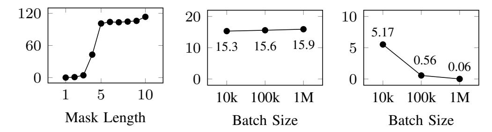
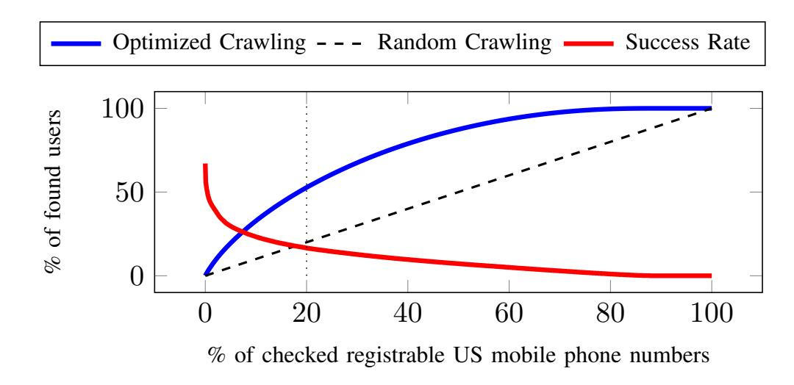
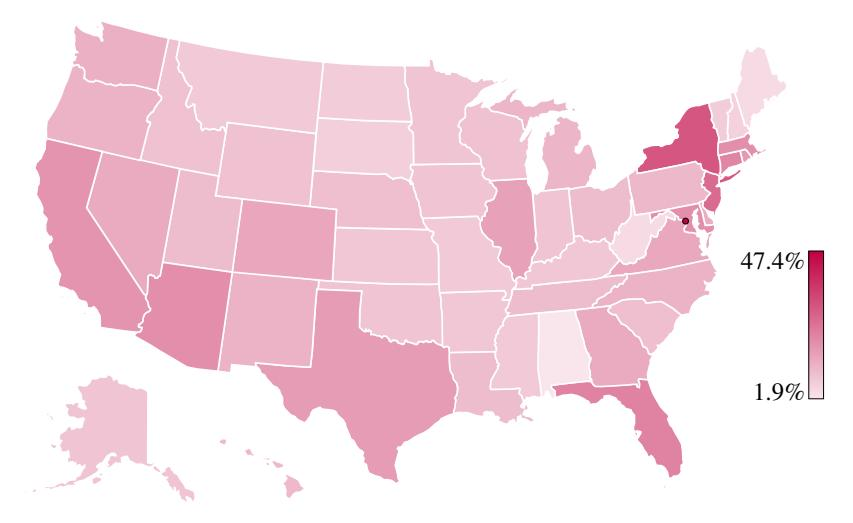
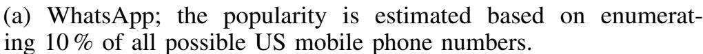
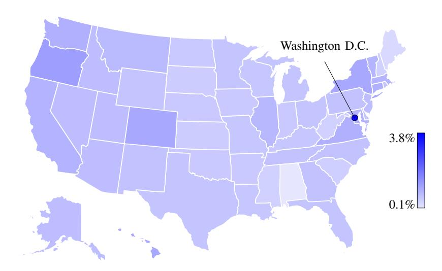
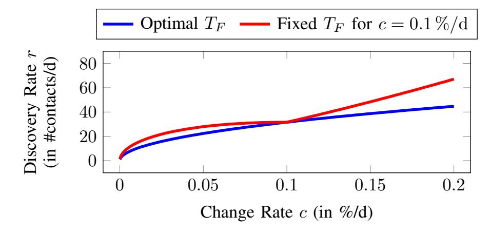

{0}------------------------------------------------

# All the Numbers are US: Large-scale Abuse of Contact Discovery in Mobile Messengers\*

Christoph Hagen<sup>†</sup>, Christian Weinert<sup>‡</sup>, Christoph Sendner<sup>†</sup>, Alexandra Dmitrienko<sup>†</sup>, Thomas Schneider<sup>‡</sup>

† University of Würzburg, Germany, {christoph.hagen,christoph.sendner,alexandra.dmitrienko}@uni-wuerzburg.de

† Technical University of Darmstadt, Germany, {weinert,schneider}@encrypto.cs.tu-darmstadt.de

Abstract— Contact discovery allows users of mobile messengers to conveniently connect with people in their address book. In this work, we demonstrate that severe privacy issues exist in currently deployed contact discovery methods.

Our study of three popular mobile messengers (WhatsApp, Signal, and Telegram) shows that, contrary to expectations, large-scale crawling attacks are (still) possible. Using an accurate database of mobile phone number prefixes and very few resources, we have queried 10 % of US mobile phone numbers for WhatsApp and 100 % for Signal. For Telegram we find that its API exposes a wide range of sensitive information, even about numbers not registered with the service. We present interesting (cross-messenger) usage statistics, which also reveal that very few users change the default privacy settings. Regarding mitigations, we propose novel techniques to significantly limit the feasibility of our crawling attacks, especially a new incremental contact discovery scheme that strictly improves over Signal's current approach.

Furthermore, we show that currently deployed hashing-based contact discovery protocols are severely broken by comparing three methods for efficient hash reversal of mobile phone numbers. For this, we also propose a significantly improved rainbow table construction for non-uniformly distributed inputs that is of independent interest.

#### I. INTRODUCTION

<span id="page-0-2"></span>Contact discovery is a procedure run by mobile messaging applications to determine which of the contacts in the user's address book are registered with the messaging service. Newly registered users can thus conveniently and instantly start messaging existing contacts based on their phone number without the need to exchange additional information like user names, email addresses, or other identifiers<sup>1</sup>.

Centralized messaging platforms can generally learn the social graphs of their users by observing messages exchanged between them. Current approaches to protect against this type of traffic analysis are inefficient [81], with Signal attempting to improve their service in that regard [47]. While only active users are exposed to such analyses, the contact discovery process potentially reveals *all* contacts of users to the service provider, since they must in some way be matched with the server's database. This is one of the reasons why messengers like Whats-App might not be compliant with the European GDPR in a business context [21], [78].

Cryptographic protocols for private set intersection (PSI) can perform this matching securely. Unfortunately, they are currently not efficient enough for mobile applications with billions of users [38]. Furthermore, even when deploying PSI protocols, this does not resolve all privacy issues related to contact discovery as they cannot prevent enumeration attacks,

where an attacker attempts to discover which phone numbers are registered with the service.

Leaking Social Graphs. Worryingly, recent work [38] has shown that many mobile messengers (including WhatsApp) facilitate contact discovery by simply uploading *all* contacts from the user's address book<sup>2</sup> to the service provider and even store them on the server if no match is found [2]. The server can then notify the user about newly registered users, but can also construct the full social graph of each user. These graphs can be enriched with additional information linked to the phone numbers from other sources [12], [29], [30]. The main privacy issue here is that sensitive contact relationships can become known and could be used to scam, discriminate, or blackmail users, harm their reputation, or make them the target of an investigation. The server could also be compromised, resulting in the exposure of such sensitive information even if the provider is honest.

To alleviate these concerns, some mobile messaging applications (including Signal) implement a hashing-based contact discovery protocol, where phone numbers are transmitted to the server in hashed form [38]. Unfortunately, the low entropy of phone numbers indicates that it is most likely feasible for service providers to reverse the received hash values [51] and therefore, albeit all good intentions, there is no gain in privacy.

**Crawling.** Unfortunately, curious or compromised service providers are not the only threat. Malicious users or external parties might also be interested in extracting information about others. Since there are usually no noteworthy restrictions for signing up with such services, any third party can create a large number of user accounts to crawl this database for information by requesting data for (randomly) chosen phone numbers.

Such enumeration attacks cannot be fully prevented, since legitimate users must be able to query the database for contacts. In practice, rate-limiting is a well-established measure to effectively mitigate such attacks at a large scale, and one would assume that service providers apply reasonable limits to protect their platforms. As we show in § IV, this is not the case.

The simple information whether a specific phone number is registered with a certain messaging service can be sensitive in many ways, especially when it can be linked to a person. For example, in areas where some services are strictly forbidden, disobeying citizens can be identified and persecuted.

Comprehensive databases of phone numbers registered to a particular service can also allow attackers to perform exploitation at a larger scale. Since registering a phone number usually implies that the phone is active, such databases can be used as a reliable basis for automated sales or phishing calls. Such "robocalls" are already a massive problem in the US [80]

<span id="page-0-0"></span><sup>\*</sup>Please cite the conference version of this paper at NDSS'21 [31].

<sup>&</sup>lt;sup>1</sup>Some mobile applications of social networks perform contact discovery also using email addresses stored in the address book.

<span id="page-0-1"></span><sup>&</sup>lt;sup>2</sup>Assuming that users give the app permission to access contacts, which is very likely since otherwise they must manually enter their messenger contacts.

{1}------------------------------------------------

and recent studies show that telephone scams are unexpectedly successful [\[79\]](#page-14-5). Two recent WhatsApp vulnerabilities, where spyware could be injected via voice calls [\[74\]](#page-14-6) or where remote code execution was possible through specially crafted MP4 files [\[26\]](#page-13-7), could have been used together with such a database to quickly compromise a significant number of mobile devices.

Which information can be collected with enumeration attacks depends on the service provider and the privacy settings (both in terms of which settings are chosen by the user and which are available). Examples for personal (meta) data that can commonly be extracted from a user's account include profile picture(s), nickname, status message, and the last time the user was online. In order to obtain such information, one can simply discover specific numbers, or randomly search for users [\[72\]](#page-14-7). By tracking such data over time, it is possible to build accurate behavior models [\[8\]](#page-13-8), [\[73\]](#page-14-8), [\[88\]](#page-15-0). Matching such information with other social networks and publicly available data sources allows third parties to build even more detailed profiles [\[12\]](#page-13-4), [\[29\]](#page-13-5), [\[30\]](#page-13-6). From a commercial perspective, such knowledge can be utilized for targeted advertisement or scams; from a personal perspective for discrimination, blackmailing, or planning a crime; and from a nation state perspective to closely monitor or persecute citizens [\[14\]](#page-13-9). A feature of Telegram, the possibility to determine phone numbers associated with nicknames appearing in group chats, lead to the identification of "Comrade Major" [\[86\]](#page-15-1) and potentially endangered many Hong Kong protesters [\[14\]](#page-13-9).

Our Contributions. We illustrate severe privacy issues that exist in currently deployed contact discovery methods by performing practical attacks both from the perspective of a curious service provider as well as malicious users.

*a) Hash Reversal Attacks:* Curious service providers can exploit currently deployed hashing-based contact discovery methods, which are known to be vulnerable [\[20\]](#page-13-10), [\[49\]](#page-14-9), [\[51\]](#page-14-3). We quantify the practical efforts for service providers (or an attacker who gains access to the server) for efficiently reversing hash values received from users by evaluating three approaches: (i) generating large-scale key-value stores of phone numbers and corresponding hash values for instantaneous dictionary lookups, (ii) hybrid brute-force attacks based on hashcat [\[75\]](#page-14-10), and (iii) a novel rainbow table construction.

In particular, we compile an accurate database of worldwide mobile phone prefixes (cf. § [II\)](#page-1-0) and demonstrate in § [III](#page-2-0) that their hashes can be reversed in just 0.1 ms amortized time per hash using a lookup database or 57 ms when bruteforcing. Our rainbow table construction incorporates the nonuniform structure of all possible phone numbers and is of independent interest. We show that one can achieve a hit rate of over 99.99 % with an amortized lookup time of 52 ms while only requiring 24 GB storage space, which improves over classical rainbow tables by more than factor 9,400x in storage.

*b) Crawling Attacks:* For malicious registered users and outside attackers, we demonstrate that crawling the global databases of the major mobile messaging services WhatsApp, Signal, and Telegram is feasible. Within a few weeks time, we were able to query 10 % of all US mobile phone numbers for WhatsApp and 100 % for Signal. Our attack uses very few resources: the free Hushed [\[1\]](#page-13-11) application for registering clients with new phone numbers, a VPN subscription for rotating IP addresses, and a single laptop running multiple Android emulators. We report the rate limits and countermeasures

experienced during the process, as well as other interesting findings and statistics. We also find that Telegram's API reveals sensitive personal (meta) data, most notably how many users include non-registered numbers in their contacts.

*c) Mitigations:* We propose a novel incremental contact discovery scheme that does not require server-side storage of client contacts (cf. § [V\)](#page-8-0). Our evaluation reveals that our approach enables deploying much stricter rate limits without degrading usability or privacy. In particular, the currently deployed rate-limiting by Signal can be improved by a factor of 31.6x at the cost of negligible overhead (assuming the database of registered users changes 0.1 % per day). Furthermore, we provide a comprehensive discussion on potential mitigation techniques against both hash reversal and enumeration attacks in § [VI,](#page-9-0) ranging from database partitioning and selective contact permissions to limiting contact discovery to mutual contacts.

Overall, our work provides a comprehensive study of privacy issues in mobile contact discovery and the methods deployed by three popular applications with billions of users. We investigate three attack strategies for hash reversal, explore enumeration attacks at a much larger scale than previous works [\[30\]](#page-13-6), [\[72\]](#page-14-7), and discuss a wide range of mitigation strategies, including our novel incremental contact discovery that has the potential of real-world impact through deployment by Signal.

Outline. We first describe our approach to compile an accurate database of mobile phone numbers (§ [II\)](#page-1-0), which we use to demonstrate efficient reversal of phone number hashes (§ [III\)](#page-2-0). We also use this information to crawl WhatsApp, Signal, and Telegram, and present insights and statistics (§ [IV\)](#page-4-0). Regarding mitigations, we present our incremental contact discovery scheme (§ [V\)](#page-8-0) and discuss further techniques (§ [VI\)](#page-9-0). We then provide an overview of related work (§ [VII\)](#page-11-0) and conclude with a report on our responsible disclosure process [\(§ VIII\)](#page-12-0).

#### <span id="page-1-0"></span>II. MOBILE PHONE NUMBER PREFIX DATABASE

In the following sections, we demonstrate privacy issues in currently deployed contact discovery methods by showing how alarmingly fast hashes of mobile phone numbers can be reversed (cf. § [III\)](#page-2-0) and that the database crawling of popular mobile messaging services is feasible (cf. § [IV\)](#page-4-0). Both attacks can be performed more efficiently with an accurate database of all possible mobile phone number prefixes[3](#page-1-1) . Hence, we first show how such a database can be built.

# *A. Phone Number Structure*

International phone numbers conform to a specific structure to be globally unique: Each number starts with a country code (defined by the ITU-T standards E.123 and E.164, e.g., +1 for the US), followed by a country-specific prefix and a subscriber number. Valid prefixes for a country are usually determined by a government body and assigned to one or more telecommunication companies. These prefixes have blocks of subscriber numbers assigned to them, from which numbers can be chosen by the provider to be handed out to customers. The length of the subscriber numbers is specific for each prefix and can be fixed or in a specified range.

<span id="page-1-1"></span><sup>3</sup>Some messengers like WhatsApp and Signal also allow to register with landline phone numbers. We assume that very few users make use of this option, and also argue that gathering landline phone numbers is less attractive for attackers (e.g., when the goal is to infect smartphones with malware).

{2}------------------------------------------------

In the following, we describe how an accurate list of (mobile) phone number prefixes can be compiled, including the possible length of the subscriber number. A numbering plan database is maintained by the *International Telecommunication Union* (ITU) [\[37\]](#page-13-12) and further national numbering plans are linked therein. This database comprises more than 250 countries (including autonomous cities, city states, oversea territories, and remote island groups) and more than 9,000 providers in total. In our experiments in § [IV,](#page-4-0) we focus on the US, where there are 3,794 providers (including local branches). Considering the specified minimum and maximum length of phone numbers, the prefix database allows for ≈52 trillion possible phone numbers (≈1.6 billion in the US). However, when limiting the selection to mobile numbers only, the search space is reduced to ≈758 billion (≈0.5 billion in the US).

#### <span id="page-2-3"></span>*B. Database Preprocessing*

As it turned out in our experiments, some of the numbers that are supposed to be valid according to the ITU still cannot be registered with the examined messaging applications. Therefore, we perform two additional preprocessing steps.

Google's libphonenumber library [\[27\]](#page-13-13) can validate phone numbers against a rule-based representation of international numbering plans and is commonly used in Android applications to filter user inputs. By filtering out invalid numbers, the amount of possible mobile phone numbers can be reduced to ≈353 billion (no prefixes from the US are rejected).

Furthermore, WhatsApp performs an online validation of the numbers before registration to check, for example, whether the respective number was banned before. This allows us to check all remaining prefixes against the WhatsApp registration/login API by requesting the registration of one number for each prefix and each possible length of the subscriber number. Several more prefixes are rejected by WhatsApp for reasons like "too long" or "too short". Our final database for our further experiments thus contains up to ≈118 billion mobile phone numbers (≈0.5 billion in the US[4](#page-2-1) ). In § [A](#page-15-2) we detail interesting relative differences in the amount of registrable mobile phone numbers between countries.

# III. MOBILE PHONE NUMBER HASH REVERSAL

<span id="page-2-0"></span>Although the possibility of reversing phone number hashes has been acknowledged before [\[20\]](#page-13-10), [\[49\]](#page-14-9), [\[51\]](#page-14-3), the severity of the problem has not been quantified. The amount of possible mobile phone numbers that we determined in § [II](#page-1-0) indicates the feasibility of determining numbers based on their hash values. In the following, we show that *real-time* hash reversal is practical not only for service providers and adversaries with powerful resources, but even at a large scale using commodity hardware only.

Threat Model. Here we consider the scenario where users provide hashed mobile phone numbers of their address book entries to the service provider of a mobile messaging application during contact discovery. The adversary's goal is to learn the numbers from their hashed representation. For this, we assume the adversary has full access to the hashes received by the service provider. The adversary therefore might be the service provider itself (being "curious"), an insider (e.g., an administrator of the service provider), a third party who compromised the service provider's infrastructure, or a law enforcement or intelligence agency who forces the service provider to hand out information. Importantly, we assume the adversary has no control over the users and does not tamper with the contact discovery protocol.

We compare three different approaches to reverse hashes of mobile phone numbers, each suitable for different purposes and available resources. In order to ensure comparability and uniqueness, phone numbers are processed as strings without spaces or dashes, and including their country code. Some applications add the "+"-sign as a prefix to conform to the E.164 format. In our experiments, numbers only consist of digits, but all approaches work similarly for other formats. We choose SHA-1 as our exemplary hash function, which is also used by Signal for contact discovery[5](#page-2-2) .

## <span id="page-2-5"></span>*A. Hash Database*

The limited amount of possible mobile phone numbers combined with the rapid increase in affordable storage capacity makes it feasible to create key-value databases of phone numbers indexed by their hashes and then to perform constanttime lookups for each given hash value. We demonstrate this by using a high-performance cluster to create an inmemory database of all 118 billion possible mobile phone numbers from [§ II-B](#page-2-3) (i.e., mobile phone numbers allowed by Google's libphonenumber and the WhatsApp registration API) paired with their SHA-1 hashes.

Benchmarks. We use one node in our cluster, consisting of 48 Intel Skylake cores at 2.3 GHz, 630 GB of RAM, and 1 TB of disk storage. We choose a Redis database due to its robustness, in-memory design, and near constant lookuptime [\[71\]](#page-14-11). Since one Redis instance cannot handle the required number of keys, we construct a cluster of 120 instances on our node. Populating the table requires ≈13 h in our experiments due to several bottlenecks, e.g., the interface to the Redis cluster can only be accessed through a network interface. Unfortunately, only 8 billion hashes (roughly 6.8 % of the considered number space) can fit into the RAM with our test setup. We perform batched lookups of 10,000 items, which on average take 1.0 s, resulting in an amortized lookup time of 0.1 ms.

To cover the entire mobile phone number space, a system with several Terabytes of RAM would be necessary, which makes this type of hash reversal feasible for attackers with moderate financial resources, such as large companies or nation state actors. For attackers with consumer hardware, it would also be feasible to store a full database on disk, which requires roughly 3.3 TB of storage space[6](#page-2-4) , but results in significantly higher lookup times due to disk access latencies.

## <span id="page-2-6"></span>*B. Brute-Force*

Another possibility to reverse phone number hashes is to iteratively hash every element of the input domain until a matching hash is found. A popular choice for this task is the open-source tool hashcat [\[75\]](#page-14-10), which is often used to bruteforce password hashes. Hashcat can efficiently parallelize the brute-force process and additionally utilize GPUs to maximize

<span id="page-2-1"></span><sup>4</sup>libphonenumber and WhatsApp reject no US mobile prefixes.

<span id="page-2-2"></span><sup>5</sup>Signal truncates the SHA-1 output to 10 B to reduce communication overhead while still producing unique hashes for all possible phone numbers.

<span id="page-2-4"></span><sup>6</sup>Assuming SHA-1 hashes of 20 bytes and 64-bit encoded phone numbers.

{3}------------------------------------------------

<span id="page-3-0"></span>

(a) Hash rates in MH/s. (b) Total times in h. (c) Amort. times in s.

Figure 1: Brute-force benchmark results.

performance. With its *hybrid* brute-forcing mode it is possible to specify *masks* that constrain the inputs according to a given structure. We use this mode to model our input space of 118 billion mobile phone numbers (cf. [§ II-B\)](#page-2-3).

Benchmarks. We perform lookups of phone number hashes on one node of our high-performance cluster with two Intel Xeon Gold 6134 (8 physical cores at 3.2 GHz), 384 GB of RAM, and two NVIDIA Tesla P100 GPUs (16 GB of RAM each). Our setup has a theoretical rate of 9.5 GHashes/s according to the hashcat benchmark. This would allow us to search the full mobile phone number space in less than 13 seconds.

However, the true hash rate is significantly lower due to the overhead introduced by hashcat when distributing loads for processing. Since many of the prefixes have short subscriber numbers (e.g., 158,903 prefixes with length 4 digits), the overhead of distributing the masks is the bottleneck for the calculations, dropping the true hash rate to 4.3 MHashes/s for 3-digit masks (less than 0.05 % efficiency). The hash rate reaches its plateau at around 105 MHashes/s for masks larger than 4 digits (cf. [Fig. 1a\)](#page-3-0), which is still only 1.1 % of the theoretical hash rate.

A full search over the number space can be completed in 15.3 hours for batches of 10,000 hashes. While the total time only slightly increases with larger batch sizes (cf. [Fig. 1b\)](#page-3-0), the amortized lookup rate drops significantly, to only 57 ms per hash for batches of 1 million hashes (cf. [Fig. 1c\)](#page-3-0). Consequently, the practical results show that theoretical hash rates cannot be reached by simply deploying hashcat and that additional engineering effort would be required to optimize brute-force software for efficient phone number hash reversal.

# <span id="page-3-4"></span>*C. Optimized Rainbow Tables*

Rainbow tables are an interesting time-memory trade-off to reverse hashes (or any one-way function) from a limited input domain. Based on work from Hellman [\[33\]](#page-13-14) and Oechslin [\[56\]](#page-14-12), they consist of precomputed chains of plaintexts from the input domain and their corresponding hashes. These are chained together by a set of reduction functions, which map each hash back to a plaintext. By using this mapping in a deterministic chain, only the start and end of the chain must be stored to be able to search for all plaintexts in the chain. A large number of chains with random start points form a rainbow table, which can be searched by computing the chain for the given hash, and checking if the end point matches one of the entries in the table. If a match is found, then the chain can be computed from the corresponding start index to reveal the original plaintext. The length of the chains determines the time-memory tradeoff: shorter chain lengths require more chains to store the same number of plaintexts, while longer chains increase the

<span id="page-3-2"></span>

| Country code + prefix | Subscriber numbers | Offset     |
|-----------------------|--------------------|------------|
| 1982738               | 10,000             | 0          |
| 172193                | 100,000            | 10,000     |
| 491511                | 10,000,000         | 110,000    |
| 49176                 | 10,000,000         | 10,110,000 |

Table I: Example for selecting the next phone number from a hash value for our improved rainbow table construction.

computation time for lookups. The success rate of lookups is determined by the number of chains, where special care has to be taken to limit the number of duplicate entries in the table by carefully choosing the reduction functions.

Each rainbow table is specific to the hash algorithm being used, as well as the specifications of the input domain, which determines the reduction functions. Conventional rainbow tables work by using a specific alphabet as well as a maximum input length, e.g., 8-digit ASCII numbers[7](#page-3-1) . While they can be used to work on phone numbers as well, they are extremely inefficient for this purpose: to cover numbers conforming to the E.164 standard (up to 15 digits), the size of the input domain would be 10<sup>15</sup>, requiring either huge storage capacity or extremely long chains to achieve acceptable hit rates.

By designing new reduction functions that always map a hash back into a valid phone number, we improve performance significantly. While we use our approach to optimize rainbow tables for phone numbers, our construction can also find application in other areas, e.g., advanced password cracking.

Specialized Reduction Functions. Our optimization relies on the specific structure of international phone numbers, which consist of a country code, the mobile prefix, and a subscriber number of a specific length (cf. [§ II-B\)](#page-2-3). Conventional reduction functions simply perform a modulo operation to map each hash back to the input domain, with additional arithmetic to reduce the number of collisions in the table.

Our algorithm uses the first 64 bits of each hash as an index to select a valid phone number in the input domain. To efficiently calculate this number from the index, we store each prefix in a table together with its amount of possible subscriber numbers and its offset in the full number range. [Tab. I](#page-3-2) contains an exemplary table to illustrate this selection. Given the index of the next phone number, we can perform a binary search in the *offset* column to select the appropriate prefix, and then calculate the subscriber number by subtracting the corresponding offset. In practice, our algorithm includes additional inputs (e.g., the current chain position) in the calculation to limit the number of collisions and duplicate chains. The full specification is given in [§ B.](#page-15-3)

Implementation. We implement our optimized rainbow table construction based on the open-source version 1.2[8](#page-3-3) of RainbowCrack [\[36\]](#page-13-15). To improve table generation and lookup performance, we add multi-threading to parts of the program via OpenMP [\[58\]](#page-14-13). SHA-1 hash calculations are performed using OpenSSL [\[59\]](#page-14-14). The table generation is modified to receive

<span id="page-3-1"></span><sup>7</sup>There are implementations that allow per-character alphabets [\[7\]](#page-13-16), which is not applicable to phone numbers, since the allowed digits for each position strongly depend on the previous characters. More details are given in [§ C.](#page-15-4)

<span id="page-3-3"></span><sup>8</sup>Newer versions of RainbowCrack that support multi-threading and GPU acceleration exist, but are not open-source [\[69\]](#page-14-15).

{4}------------------------------------------------

the number specification as an additional parameter (a file with a list of phone number prefixes and the length of their subscriber numbers). Our open-source implementation is available at [https://contact-discovery.github.io/.](https://contact-discovery.github.io/)

Benchmarks. We generate a table of SHA-1 hashes for all registrable mobile phone numbers (118 billion numbers, cf. § [II\)](#page-1-0) and determine its creation time and size depending on the desired success rate for lookups, as well as lookup rates.

Our test system has an Intel Core i7-9800X with 16 physical cores and 64 GB RAM (only 2 GB are used), and can perform over 17 million hash-reduce operations per second.

We store 100 million chains of length 1,000 in each file, which results in files of 1.6 GB with a creation time of ≈98 minutes each. For a single file, we already achieve a success rate of over 50 % and an amortized lookup time of less than 26 ms for each hash when testing batches of 10,000 items. With 15 files (24 GB, created within 24.5 hours) the success rate is more than 99.99 % with an amortized lookup time of 52 ms.

In comparison, a conventional rainbow table of all 7 to 15 digit numbers has an input domain more than 9,400x larger than ours, and (with similar success rates and the same chain length) would require approximately 230 TB of storage and a creation time of more than 26 years on our test system (which is a one-time expense). The table size can be reduced by increasing the chain length, but this would result in much slower lookups.

These measurements show that our improved rainbow table construction makes large-scale hash reversal of phone numbers practical even with commodity hardware and limited financial investments. Since the created tables have a size of only a few gigabytes, they can also be easily distributed.

#### *D. Comparison of Hash Reversal Methods*

Our results for the three different approaches are summarized in [Tab. II.](#page-4-1) Each approach is suitable for different application scenarios, as we discuss in the following. In § [D,](#page-16-0) we discuss further optimizations for the presented methods.

A full in-memory hash database (cf. [§ III-A\)](#page-2-5) is an option only for well-funded adversaries that require real-time reversal of hashes. It is superior to the brute-force method and rainbow tables when considering lookup latencies and total runtimes.

Brute-force cracking (cf. [§ III-B\)](#page-2-6) is an option for a range of adversaries, from nation state actors to attackers with consumergrade hardware, but requires non-trivial effort to perform efficiently, because publicly available tools do not perform well for phone numbers. Batching allows to significantly improve the amortized lookup rate, making brute-force cracking more suitable when a large number of hashes is to be reversed, e.g., when an attacker compromised a database.

Our optimized rainbow tables (cf. [§ III-C\)](#page-3-4) are the approach most suited for adversaries with commodity hardware, since these tables can be calculated in reasonable time, require only a few gigabytes of storage, can be easily customized to specific countries or number ranges and types, and can reverse dozens of phone number hashes per second. It is also possible to easily share and use precomputed rainbow tables, which is done for conventional rainbow tables as well [\[68\]](#page-14-16), despite their significantly larger size.

For other hash functions than SHA-1, we expect reversal and generation times to vary by a constant factor, depending

<span id="page-4-1"></span>

| Evaluation Criteria          | Hash Database | Brute-Force | Rainbow Tables |
|------------------------------|---------------|-------------|----------------|
|                              | § III-A       | § III-B     | § III-C        |
| Generation Time              | 13 h          | –           | 24.5 h         |
| RAM / Storage Requirements   | ≥ 3.3 TB      | – / –       | 2 GB / 24 GB   |
| Lookup Time per 10k Batch    | 1 s           | 15.3 h      | 520 s          |
| Best Amortized Time per Hash | 0.1 ms        | 57 ms       | 52 ms          |
| GPU Acceleration             | ✗             | ✓           | (✓)            |

Table II: Comparison of phone number hash reversal methods.

on the computation time of the hash function [\[32\]](#page-13-17) (except for hash databases where look-up times remain constant).

Our results show that hashing phone numbers for privacy reasons does not provide any protection, as it is easily possible to recover the original number from the hash. Thus, we strictly advise against the use of hashing-based protocols in their current form for contact discovery when users are identified by lowentropy identifiers such as phone numbers, short user names, or email addresses. In [§ VI-A,](#page-9-1) we discuss multiple ideas how to at least strengthen hashing-based protocols against the presented hash reversal methods.

## IV. USER DATABASE CRAWLING

<span id="page-4-0"></span>We study three popular mobile messengers to quantify the threat of enumeration attacks based on our accurate phone number database from [§ II-B:](#page-2-3) WhatsApp, Signal, and Telegram. All three messengers discover contacts based on phone numbers, yet differ in their implementation of the discovery service and the information exposed about registered users.

Threat Model. Here we consider an adversary who is a registered user and can query the contact discovery API of the service provider of a mobile messaging application. For each query containing a list of mobile phone numbers (e.g., in hashed form) an adversary can learn which of the provided numbers are registered with the service along with further information about the associated accounts (e.g., profile pictures). The concrete contact discovery implementation is irrelevant and it might be even based on PSI (cf. [§ VI-A\)](#page-9-1). The adversary's goal is to check as many numbers as possible and also collect all additional information and meta data provided for the associated accounts. The adversary may control one user account or even multiple accounts, and is restricted to (ab)use the contact discovery API with well-formed queries. This implies that we assume no invasive attacks, e.g., compromising other users or the service provider's infrastructure.

## *A. Investigated Messengers*

WhatsApp. WhatsApp is currently one of the most popular messengers in the world, with 2.0 billion users [\[25\]](#page-13-18). Launched in 2009, it was acquired by Facebook in 2014 for approximately 19.3 billion USD.

Signal. The Signal Messenger is an increasingly popular messenger focused on privacy. Their end-to-end-encryption protocol is also being used by other applications, such as WhatsApp, Facebook, and Skype. There are no recent statistics available regarding Signal's growth and active user base.

Telegram. Telegram is a cloud-based messenger that reported 400 million users in April 2020 [\[23\]](#page-13-19).

{5}------------------------------------------------

#### *B. Differences in Contact Discovery*

Both WhatsApp and Telegram transmit the contacts of users in clear text to their servers (but encrypted during transit), where they are stored to allow the services to push updates (such as newly registered contacts) to the clients. WhatsApp stores phone numbers of its users in clear text on the server, while phone numbers not registered with WhatsApp are MD5-hashed with the country prefix prepended (according to court documents from 2014 [\[2\]](#page-13-3)).

Signal does not store contacts on the server. Instead, each client periodically sends hashes of the phone numbers stored in the address book to the service, which matches them against the list of registered users and responds with the intersection.

The different procedures illustrate a trade-off between usability and privacy: the approach of WhatsApp and Telegram can provide faster updates to the user with less communication overhead, but needs to store sensitive data on the servers.

#### *C. Test Setups*

We evaluate the resistance of these three messengers against large-scale enumeration attacks with different setups.

WhatsApp. Because WhatsApp is closed source, we run the official Android application in an emulator, and use the Android UI Automator framework to control the user interface. First, we insert 60,000 new phone numbers into the address book of the device, then start the client to initiate the contact discovery. After synchronization, we can automatically extract profile information about the registered users by stepping through the contact list. New accounts are registered manually following the standard sign-up procedure with phone numbers obtained from the free Hushed [\[1\]](#page-13-11) application.

Interestingly, if the number provided by Hushed was previously registered by another user, the WhatsApp account is "inherited", including group memberships. A non-negligible percentage of the accounts we registered had been in active use, with personal and/or group messages arriving after account takeover. This in itself presents a significant privacy risk for these users, comparable to (and possibly worse than) privacy issues associated with disposable email addresses [\[34\]](#page-13-20). We did not use such accounts for our crawling attempts.

Signal. The Android client of Signal is open-source, which allows us to extract the requests for registration and contact discovery, and perform them efficiently through a Python script. We register new clients manually and use the authentication tokens created upon registration to perform subsequent calls to the contact discovery API. Signal uses truncated SHA-1 hashes of the phone numbers in the contact discovery request[9](#page-5-0) . The response from the Signal server is either an error message if the rate limit has been reached, or the hashes of the phone numbers registered with Signal.

Telegram. Interactions with the Telegram service can be made through the official library TDLib [\[77\]](#page-14-17), which is available for many systems and programming languages. In order to create a functioning client, each project using TDLib has to be registered with Telegram to receive an authentication token, which can be done with minimal effort. We use the C++ version to perform registration and contact discovery, and to potentially

<span id="page-5-0"></span><sup>9</sup>We use the legacy API; the new Intel SGX service does not use hashes.

download additional information about Telegram users. The registration of phone numbers is done manually by requesting a phone call to authenticate the number.

## <span id="page-5-2"></span>*D. Ethical and Legal Considerations*

We excessively query the contact discovery services of major mobile messengers, which we think is the only way to reliably estimate the success of our attacks in the real world. Similar considerations were made in previous works that evaluate attacks by crawling user data from production systems (e.g., [\[83\]](#page-14-18)). We do not interfere with the smooth operation of the services or negatively affect other users.

In coordination with the legal department of our institution, we design the data collection process as a pipeline creating only aggregate statistics to preserve user privacy and to comply with all requirements under the European General Data Protection Regulation (GDPR) [\[57\]](#page-14-19), especially the data minimization principle (Article 5c) and regulations of the collection of data for scientific use (Article 89). Privacy sensitive information such as profile pictures are never stored, and all data processing is performed on a dedicated local machine.

## *E. Rate Limits and Abuse Protection*

Each messenger applies different types of protection mechanisms to prevent abuse of the contact discovery service[10](#page-5-1) .

WhatsApp. WhatsApp does not disclose how it protects against data scraping. Our experiments in September 2019 show that accounts get banned when excessively using the contact discovery service. We observe that the rate limits have a leaky bucket structure, where new requests fill a virtual bucket of a certain size, which slowly empties over time according to a specified leak rate. Once a request exceeds the currently remaining bucket size, the rate limit is reached, and the request will be denied. We estimate the bucket size to be close to 120,000 contacts, while our crawling was stable when checking 60,000 new numbers per day. There seems to be no total limit of contacts per account: some of our test accounts were able to check over 2.8 million different numbers.

Signal. According to the source code [\[48\]](#page-14-20), the Signal servers use a leaky bucket structure. However, the parameters are not publicly available. Our measurements show that the bucket size is 50,000 contacts, while the leak rate is approximately 200,000 new numbers per day. There are no bans for clients that exceed these limits: The requests simply fail, and can be tried again later. There is no global limit for an account, as the server does not store the contacts or hashes, and thus cannot determine how many different numbers each account has already checked.

While we only use Signal's hashing-based legacy API, current Android clients also sync with the new API based on Intel SGX and compare the results. We found that the new API has the same rate limits as the legacy API, allowing an attacker to use both with different inputs, and thus double the effective crawling rate.

Signal clients use an additional API to download encrypted profile pictures of discovered contacts. Separate rate limits exist to protect this data, with a leaky bucket size of 4,000 and a leak rate of around 180 profiles per hour.

<span id="page-5-1"></span><sup>10</sup>There might be additional protections not triggered by our experiments.

{6}------------------------------------------------

Telegram. The mechanism used by Telegram to limit the contact discovery process differs from WhatsApp and Signal. Telegram allows each account to add a maximum of 5,000 contacts, irrespective of the rate. Once this limit is exceeded, each account is limited to 100 new numbers per day. More requests result in a rate limit error, with multiple violations resulting in the ban of the phone number from the contact discovery service. The batch size for contact requests is 100 and performing consecutive requests with a delay of less than ≈8.3 s results in an immediate ban from the service.

In a response to the privacy issue discovered in August 2019 [\[14\]](#page-13-9), where group members with hidden phone numbers can be identified through enumeration attacks, Telegram stated that once phone numbers are banned from contact discovery, they can only sync 5 contacts per day. We were not able to reproduce this behavior. Following our responsible disclosure, Telegram detailed additional defenses not triggered by our experiments (cf. [§ VIII\)](#page-12-0).

#### *F. Exposed User Data*

All three messengers differ significantly regarding the amount of user data that is exposed.

WhatsApp. Users registered with WhatsApp can always be discovered by anyone through their phone number, yet the app has customizable settings for the profile picture, *About* text, and *Last Seen* information. The default for all these settings is *Everybody*, with the other options being *My Contacts* or *Nobody*. In recent Android versions it is no longer possible to save the profile picture of users through the UI, but it is possible to create screenshots through the Android Debug Bridge (ADB). The status text can be read out through the UI Automator framework by accessing the text fields in the contact list view.

Signal. The Signal messenger is primarily focused on user privacy, and thus exposes almost no information about users through the contact discovery service. The only information available about registered users is their ability to receive voice and video calls. It is also possible to retrieve the encrypted profile picture of registered users through a separate API call, if they have set any [\[85\]](#page-14-21). However, user name and avatar can only be decrypted if the user has consented to this explicitly for the user requesting the information and has exchanged at least one message with them [\[46\]](#page-14-22).

Telegram. Telegram exposes a variety of information about users through the contact discovery process. It is possible to access first, last, and user name, a short bio (similar to WhatsApp's *About*), a hint when the user was last online, all profile pictures of the user (up to 100), and the number of common groups. Some of this information can be restricted to contacts only by changing the default privacy settings of the account. There is also additional management information (such as the Telegram ID), which we do not detail here.

Surprisingly, Telegram also discloses information about numbers not registered with the service through an integer labeled importer\_count. According to the API documentation [\[76\]](#page-14-23), it indicates how many users store this number in their address book, and is 0 for registered users[11](#page-6-0). Importantly, it represents the *current* state of a number, and thus decrements

<span id="page-6-2"></span>

Figure 2: Optimized crawling compared to random crawling based on the non-uniform distribution of registered WhatsApp users across the US mobile phone number space.

once users remove the number from their contacts. As such, the importer\_count is a source of interesting meta data when keeping a specific target under surveillance. Also, when crawlers attempt to compile comprehensive databases of likely active numbers for conducting sales or phishing calls (as motivated in [§](#page-0-2) I), having access to the importer\_count increases the efficiency. And finally, numbers with non-zero values are good candidates to check on other messengers.

## *G. Our Evaluation Approach*

We perform random lookups for mobile phone numbers in the US and collect statistics about the number of registered users, as well as the information exposed by them. The number space consists of 505.7 million mobile phone numbers (cf. [§ II-B\)](#page-2-3). We assume that almost all users sign up for these messengers with mobile numbers, and thus exclude landline and VoIP numbers from our search space. The US numbering plan currently includes 301 3-digit area codes, which are split into 1,000 subranges of 10,000 numbers each. These subranges are handed out individually to phone companies, and only 50,573 of the 301,000 possible subranges are currently in use for mobile phone numbers. To reach our crawling targets, we select numbers evenly from all subranges. While the enumeration success rate could be increased by using telephone number lists or directories as used for telephone surveys [\[45\]](#page-14-24), this would come at the expense of lower coverage.

## <span id="page-6-3"></span>*H. Our Crawling Results*

The messengers have different rate limits, amount of available user information, and setup complexity. This results in different crawling speeds and number space coverage, and affects the type of statistics that can be generated.

WhatsApp. For WhatsApp we use 25 accounts[12](#page-6-1) over 34 days, each testing 60,000 numbers daily, which allows us to check 10 % of all US mobile phone numbers. For a subset of discovered users, we also check if they have public profile pictures by comparing their thumbnails to the default icon.

Our data shows that 5 million out of 50.5 million checked numbers are registered with WhatsApp, resulting in an average success rate of 9.8 % for enumerating random mobile phone numbers. The highest average for a single area code is 35.4 % for 718 (New York) and 35 % for 305 (Florida), while there are 209 subranges with a success rate higher than 50 % (the

<span id="page-6-0"></span><sup>11</sup>Telegram clients use this count to suggest contacts who would benefit the most from registering.

<span id="page-6-1"></span><sup>12</sup>Less than 100 for Signal due to the overhead of running Android emulators.

{7}------------------------------------------------

<span id="page-7-2"></span>





(b) Signal; Washington D.C. numbers are more than twice as likely to be registered with Signal than for any other area in the US.

Figure 3: Number of registered WhatsApp and Signal accounts of US states and Washington D.C. in relation to their population.

<span id="page-7-1"></span>

| Messengers                          | WhatsApp     | Signal                | Telegram       |
|-------------------------------------|--------------|-----------------------|----------------|
| Contact Discovery Method            | Clear        | Hashing               | Clear          |
| Rate Limits                         | 60k / d      | 120k / d              | 5k + (100 / d) |
| Our Crawling Method                 | UI Automator | (Legacy) API          | API            |
| # US Numbers Checked                | 46.2 M       | 505.7 M               | 0.1 M          |
| Coverage of US Numbers              | 10 %         | 100 %                 | < 0.02 %       |
| Success Rate for Random US Number   | 9.8 %        | 0.5 %                 | 0.9%           |
| # US Users Found                    | 5.0 M        | 2.5 M                 | 908            |
| # US Users (estimated)              | 49.6 M       | 2.5 M                 | 4.6 M          |
| Default Privacy Settings /          |              |                       |                |
| Information Exposure                |              |                       |                |
| Profile Picture                     | Public       | <b>Explicit Share</b> | Public         |
| Status                              | Public       | _                     | Public         |
| Last Online                         | Public       | _                     | Public         |
| Option to Hide Being Online         | ×            | ✓                     | ✓              |
| Option to Disable Contact Discovery | ×            | X                     | ✓              |

Table III: Comparison of surveyed messengers.

<span id="page-7-0"></span>

| Users of also use | WhatsApp | Signal | Telegram |
|-------------------|----------|--------|----------|
| WhatsApp          | _        | 2.2 %  | 5.1 %    |
| Signal            | 42.3 %   | _      | 8.6%     |
| Telegram          | 46.5 %   | 5.3 %  | -        |

Table IV: Cross-messenger statistics for US users.

maximum is 67% for a prefix in Florida). The non-uniform user distribution across the phone number space can be exploited to increase the initial success rate when enumerating entire countries, as shown in Fig. 2 for the US: with 20% effort it is possible to discover more than 50% of the registered users.

Extrapolating this data allows us to estimate the total number of WhatsApp accounts registered to US mobile phone numbers at 49.6 million. While there are no official numbers available, estimates from other sources place the number of monthly active WhatsApp users in the US at 25 million [16]. Our estimate deviates from this number, because our results include all registered numbers, not only active ones. Another statistic [17] estimates the number of US mobile phone numbers that accessed WhatsApp in 2019 at 68.1 million, which seems to be an overestimation based on our results.

For a random subset of 150,000 users we also analyzed the availability of profile pictures and *About* texts: 49.6% have a publicly available profile picture and 89.7% have a public *About* text. An analysis of the most popular *About* texts shows that the predefined (language-dependent) text is the most

popular (77.6%), followed by "Available" (6.71%), and the empty string (0.81%, including "." and "\*\*\* no status \*\*\*"), while very few users enter custom texts.

**Signal.** Our script for Signal uses 100 accounts over 25 days to check all 505 million mobile phone numbers in the US. Our results show that Signal currently has 2.5 million users registered in the US, of which 82.3 % have set an encrypted user name, and 47.8 % use an encrypted profile picture. We also cross-checked with WhatsApp to see if Signal users differ in their use of public profile pictures, and found that 42.3 % of Signal users are also registered on WhatsApp (cf. Tab. IV), and 46.3 % of them have a public profile picture there. While this is slightly lower than the average WhatsApp user (49.6 %), it is not sufficient to indicate an increased privacy-awareness of Signal's users, at least for profile pictures.

**Telegram.** For Telegram we use 20 accounts running for 20 days on random US mobile phone numbers. Since Telegram's rate limits are very strict, only 100,000 numbers were checked during that time: 0.9% of those are registered and 41.9% have a non-zero importer\_count. These numbers have a higher probability than random ones to be present on other messengers, with 20.2% of the numbers being registered with WhatsApp and 1.1% registered with Signal, compared to the average success rates of 9.8% and 0.9%, respectively. Of the discovered Telegram users, 44% of the crawled users have at least one public profile picture, with 2% of users having more than 10 pictures available.

**Summary and Comparison.** An overview of the tested messengers, our crawling setup, and our most important results is given in Tab. III. Our crawling of WhatsApp, Signal, and Telegram provides insight into privacy aspects of these messengers with regard to their contact discovery service. The first notable difference is the storage of the users' contact information, where both WhatsApp and Telegram retain this information on the server, while Signal chooses not to maintain a server-side state in order to better preserve the users' privacy. This practice unfortunately requires significantly higher ratelimits for the contact discovery process, since all of a user's contacts are compared on every sync, and the server has no possibility to compare them to previously synced numbers. While Telegram uses the server-side storage of contacts to enforce strict rate limits, WhatsApp nevertheless lets individual clients check millions of numbers.

{8}------------------------------------------------

With its focus on privacy, Signal excels in exposing almost no information about registered users, apart from their phone number. In contrast, WhatsApp exposes profile pictures and the *About* text for registered numbers, and requires users to opt-out of sharing this data by changing the default settings. Our results show that only half of all US users prevent such sharing by either not uploading an image or changing the settings. Telegram behaves even worse: it allows crawling multiple images and also additional information for each user. The importer\_count offered by its API even provides information about users not registered with the service. This can help attackers to acquire likely active numbers, which can be searched on other platforms.

Our results also show that many users are registered with multiple services (cf. [Tab. IV\)](#page-7-0), with 42.3 % of Signal users also being active on WhatsApp. We only found 2 out of 10,129 checked users on all three platforms (i.e., less than 0.02 %). In [Fig. 3,](#page-7-2) we visualize the popularity of WhatsApp and Signal for the individual US states and Washington D.C. On average, about 10 % of residents have mobile numbers from another state [\[22\]](#page-13-23), which may obscure these results to some extent. Interestingly, Washington D.C. numbers are more than twice as often registered on Signal than numbers from any other state, with Washington D.C. also being the region with the most non-local numbers (55 %) [\[22\]](#page-13-23).

#### V. INCREMENTAL CONTACT DISCOVERY

<span id="page-8-0"></span>We propose a new rate-limiting scheme for contact discovery in messengers without server-side contact storage such as Signal. Setting strict limits for services without server-side contact storage is difficult, since the server cannot determine if the user's input in discovery requests changes significantly with each invocation. We name our new approach *incremental contact discovery* and shared the details with the Signal developers who consider to implement a similar approach (cf. § [VIII\)](#page-12-0). Our approach provides strict improvements over existing solutions, as it enables the service to enforce stricter rate limits with negligible overhead and without degrading usability or privacy.

## *A. Approach*

Incremental contact discovery is based on the observation that the database of registered users changes only gradually over time. Similarly, the contacts of legitimate users change only slowly. Given that clients are able to store the last state for each of their contacts, they only need to query the server for changes since the last synchronization. Hence, if the server tracks database changes (new and unsubscribed users), clients who connect regularly only need to synchronize with the set of recent database changes. This enables the server to enforce stricter rate limits on the full database, which is only needed for initial synchronization, for newly added client contacts, and whenever the client fails to regularly synchronize with the set of changes. Conversely, enumeration attacks require frequent changes to the client set, and thus will quickly exceed the rate limits when syncing with the full database.

Assumptions. Based on Signal's current rate limits, we assume that each user has at most m = 50,000 contacts that are synced up to 4 times per day. This set changes slowly, i.e., only by several contacts per day. Another reasonable assumption is that the server database of registered users does not significantly change within short time periods, e.g., only 0.5 % of users join or leave the service per day (cf. [§ V-C\)](#page-9-2).

Algorithm. The server of the service provider stores two sets of contacts: the full set S<sup>F</sup> and the delta set SD. S<sup>F</sup> contains all registered users, while S<sup>D</sup> contains only information about users that registered or unregistered within the last T<sup>F</sup> days. Both sets, S<sup>F</sup> and SD, are associated with their own leaky buckets of (the same) size m, which are empty after T<sup>F</sup> and T<sup>D</sup> days, respectively. The server stores leaky bucket values t<sup>F</sup> and t<sup>D</sup> for each client, which represent the (future) points in time when the leaky buckets will be empty for requests to S<sup>F</sup> and SD, respectively.

A newly registered client syncs with the full set S<sup>F</sup> to receive the current state of the user's contacts. For subsequent syncs, the client only syncs with S<sup>D</sup> to receive recently changed contacts, provided that it synchronizes at least every T<sup>F</sup> days. If the client is offline for a longer period of time, it can sync with S<sup>F</sup> again, since the leaky bucket associated with it will be empty. New contacts added by the user are initially synced with S<sup>F</sup> in order to learn their current state.

The synchronization with S<sup>F</sup> is given in [Alg. 1.](#page-8-1) It takes as inputs the server's set S<sup>F</sup> , the maximum number of contacts m, and the associated time T<sup>F</sup> after which the bucket will be empty. The client provides the set of contacts C<sup>F</sup> and the server provides the client's corresponding bucket parameter t<sup>F</sup> . The output is the set D which is the intersection of C<sup>F</sup> with S<sup>F</sup> , or an error, if the rate limit is exceeded.

When a client initiates a sync with S<sup>F</sup> , the algorithm calculates tnew, the new (future) timestamp when the client's leaky bucket would be empty (line 1). Here, |C<sup>F</sup> |/m × T<sup>F</sup> represents the additional time which the bucket needs to drain. If tnew is further into the future than T<sup>F</sup> (line 2), this indicates that the maximum bucket size is reached, and the request will abort with an error (line 3). Otherwise, the leaky bucket is updated for the client (line 4), and the intersection between the client set C<sup>F</sup> and the server set S<sup>F</sup> is returned (line 5).

The synchronization for a client with S<sup>D</sup> shown in [Alg. 2](#page-9-3) is quite similar. Here, the server supplies S<sup>F</sup> , SD, TD, and tD, and the client provides the previously synced contacts CD. The main difference to [Alg. 1](#page-8-1) is that the client receives RD, a record of the current state of the requested contacts which changed (registered or unregistered) within the last T<sup>F</sup> days (line 5). Note that S<sup>F</sup> is only used to look up the state for changed contacts in SD.

```
Algorithm 1 Synchronization with full set SF
```

```
Input: SF , m, TF , CF , tF
Output: D
 1: tnew ← max(tF , current time) + |CF |/m × TF
 2: if tnew > current time + TF then
 3: raise RateLimitExceededError
 4: tF ← tnew
 5: return CF ∩ SF
```

#### *B. Implementation*

We provide an open-source proof-of-concept implementation of our incremental contact discovery scheme[13](#page-8-2). It is written in Python and uses Flask [\[55\]](#page-14-25) to provide a REST API for performing contact discovery. While not yet optimized for

<span id="page-8-2"></span><sup>13</sup><https://contact-discovery.github.io/>

{9}------------------------------------------------

#### <span id="page-9-3"></span>Algorithm 2 Synchronization with delta set S<sup>D</sup> Input: S<sup>F</sup> , SD, m, TD, CD, t<sup>D</sup> Output: R<sup>D</sup> 1: tnew ← max(tD, current time) + |CD|/m × T<sup>D</sup> 2: if tnew > current time + T<sup>D</sup> then 3: raise RateLimitExceededError 4: t<sup>D</sup> ← tnew

5: return {(x, x ∈ S<sup>F</sup> ) for x ∈ C<sup>D</sup> ∩ SD}

performance, our implementation can be useful for service providers and their developers, and in particular can facilitate integration of our idea into real-world applications.

#### <span id="page-9-2"></span>*C. Evaluation*

Overhead. Our incremental contact discovery introduces only minimal server-side storage overhead, since the only additional information is the set S<sup>D</sup> (which is small compared to S<sup>F</sup> ), as well as the additional leaky bucket states for each user. The runtime is even improved, since subsequent contact discovery requests are only compared to the smaller set SD.

On the client side, the additional storage overhead is introduced by the need to store a timestamp of the last sync to select the appropriate set to sync with, as well as a set of previously unsynced contacts CD.

Improvement. To evaluate our construction, we compare it to the leaky bucket approach currently deployed by Signal. Concretely, we compare the *discovery rate* of the schemes, i.e., the number of users that can be found by a single client within one day with a random lookup strategy. Rate-limiting schemes should minimize this rate for attackers without impacting usability for legitimate users. For Signal, the discovery rate is r = s · 4 · 50,000/day, where s is the success rate for a single lookup, i.e., the ratio between registered users and all possible (mobile) phone numbers. Based on our findings in [§ IV-H,](#page-6-3) we assume s = 0.5 %, which results in a discovery rate of r = 1,000/day for Signal's leaky bucket approach.

For our construction, the discovery rate is the sum of the rates r<sup>F</sup> and r<sup>D</sup> for the buckets S<sup>F</sup> and SD, respectively. While r<sup>F</sup> is calculated (similar to Signal) as r<sup>F</sup> = s · m/T<sup>F</sup> , r<sup>D</sup> is calculated as r<sup>D</sup> = s · m · c · T<sup>F</sup> /TD, where c is the change rate of the server database. To minimize r, we have to set T<sup>F</sup> = p TD/c. With Signal's parameters s = 0.5 %, m = 50,000, and T<sup>D</sup> = 0.25 d, the total discovery rate for our construction therefore is r = 1,000 · √ c/day, and the improvement factor is exactly 1/ √ c.

In reality, the expected change rate depends on the popularity of the platform: Telegram saw 1.5 M new registrations per day while growing from 300 M to 400 M users [\[23\]](#page-13-19), corresponding to a daily change rate of ≈0.5 %. Whats-App, reporting 2 billion users in February 2020 [\[25\]](#page-13-18) (up from 1.5 billion in January 2018 [\[18\]](#page-13-24)), increases its userbase by an average of 0.05 % per day. Compared to Signal's rate limiting scheme, incremental contact discovery results in an improvement of 14.1x and 44.7x, respectively (cf. [Tab. V\)](#page-9-4). Even at a theoretical change rate of 25 % per day, incremental discovery is twice as effective as Signal's current approach. Crawling entire countries would only be feasible for very powerful attackers, as it would require over 100k registered accounts (at c = 0.05 %) to crawl, e.g., the US in 24 hours.

<span id="page-9-4"></span>

| c (in %/d) | TF (in d) | r (in #contacts/d) | Improvement |
|------------|-----------|--------------------|-------------|
| 0.01       | 50.0      | 10.0               | 100.0x      |
| 0.05       | 22.4      | 22.4               | 44.7x       |
| 0.1        | 15.8      | 31.6               | 31.6x       |
| 0.5        | 7.1       | 70.7               | 14.1x       |
| 1.0        | 5.0       | 100.0              | 10.0x       |
| 2.0        | 3.5       | 141.4              | 7.1x        |

Table V: Effect of change rate c on the optimal choice for T<sup>F</sup> , the discovery rate r for our incremental contact discovery, and the improvement compared to Signal's leaky bucket approach.

It should be noted that in practice the change rate c will fluctuate over time. The resulting efficiency impact of nonoptimal choices for T<sup>F</sup> is further analyzed in [§ E.](#page-16-1)

Privacy Considerations. If attackers can cover the whole number space every T<sup>F</sup> days, it is possible to find all newly registered users and to maintain an accurate database. This is not different from today, as attackers with this capacity can sweep the full number space as well. Using the result from [Alg. 2,](#page-9-3) users learn if a contact in their set has (un)registered in the last T<sup>F</sup> days, but this information can currently also be retrieved by simply storing past discovery results.

## *D. Generalization*

Our construction can be generalized to further decrease an attacker's efficiency. This can be achieved by using multiple sets containing the incremental changes of the server set over different time periods (e.g., one month, week, and day) such that the leak rate of S<sup>F</sup> can be further decreased. It is even possible to use sets dynamically chosen by the service without modifying the client: each client sends its timestamp of the last sync to the service, which can be used to perform contact discovery with the appropriate set.

#### VI. MITIGATION TECHNIQUES

<span id="page-9-0"></span>We now discuss countermeasures and (mostly known) mitigation techniques for both hash reversal and enumeration attacks. We discuss further supplemental techniques in [§ F.](#page-16-2)

#### <span id="page-9-1"></span>*A. Hash Reversal Mitigations*

Private set intersection (PSI) protocols (cf. [§ VII-A\)](#page-11-1) can compute the intersection between the registered user database and the users' address books in a privacy-preserving manner. Thus, utilizing provably secure PSI protocols in contact discovery entirely prevents attacks where curious service providers can learn the user's social graph when receiving hashes of low-entropy contact identifiers such as phone numbers.

However, even with PSI, protocol participants can still perform enumeration attacks. Even with actively secure constructions (where privacy is still guaranteed despite arbitrary deviations from the protocol), it is possible to choose different inputs for each execution. In fact, the privacy provided by PSI interferes with efforts to detect if the respective other party replaced the majority of inputs compared to the last execution. Thus, these protocols must be combined with protections against enumeration attacks by restricting the number of protocol executions and inputs to the minimum (cf. [§ VI-B](#page-10-0) and [§ V\)](#page-8-0).

Moreover, PSI protocols currently do not achieve practical performance for a very large number of users (cf. [§ VII-A\)](#page-11-1). For 

{10}------------------------------------------------

example, for the current amount of about 2 billion WhatsApp users [\[25\]](#page-13-18), each user has to initially download an encrypted and compressed database of ≈8 GiB [\[38\]](#page-13-1). More practical PSI designs either rely on rather unrealistic trust assumptions (e.g., non-colluding servers) or on trusted hardware [\[50\]](#page-14-26) that provides no provable security guarantees and often suffers from sidechannel vulnerabilities [\[9\]](#page-13-25). Hence, we discuss reasonable performance/privacy trade-offs for contact discovery next.

Database Partitioning. To reduce the communication overhead of PSI protocols to practical levels, the user database can be partitioned based on number prefixes into continents, countries, states, or even regions. This limits the service provider to learning only incomplete information about a user's social graph [\[38\]](#page-13-1). There are limitations to the practicality of this approach, mainly that users with diverse contacts will incur a heavy performance penalty by having to match with many partitions. For example, when partitioning based on country prefixes, a German WhatsApp user with a single contact from the US would have to additionally transfer more than 200 MiB (based on our estimates of registered US users, cf. [§ IV-H\)](#page-6-3).[14](#page-10-1) Also, the mere fact that a user checks contacts from a specific country might be privacy-sensitive.

Strengthened Hashing-based Protocols. Given the current scalability issues of PSI protocols, a first step could be to patch the currently deployed hashing-based protocols. One could introduce a global salt for such protocols to prevent reusable rainbow tables (cf. [§ III-C\)](#page-3-4). Rotating the salt in short intervals also makes hash databases (cf. [§ III-A\)](#page-2-5) less attractive.

Another alternative is to increase the calculation time of each hash, either by performing multiple rounds of the hash function or by using hash functions like bcrypt [\[67\]](#page-14-27) or Argon2 [\[6\]](#page-13-26), which are specifically designed to resist brute-force attacks. Existing benchmarks show that with bcrypt only 2.9 kHashes/s and with Argon2 only 2.6 Hashes/s can be computed on a GPU compared to 794.6 MHashes/s with SHA-1 [\[32\]](#page-13-17).

These measures will not be sufficient against very powerful adversaries, but can at least increase the costs of hash reversal attacks by a factor of even millions. However, the performance penalty will also affect clients when hashing their contacts, as well as the server, when updating the database.

Alternative Identifiers. It should be possible for privacyconcerned users to provide another form of identifier (e.g., a user name or email address, as is the standard for social networks) instead of their phone number. This increases the search space for an attacker and also improves resistance of hashes against reversal. Especially random or user-chosen identifiers with high entropy would offer better protection. However, this requires to share additional data when exchanging contact information and therefore reduces usability. Signal nevertheless plans to introduce alternative identifiers [\[52\]](#page-14-28).

Selective Contact Permissions. iOS and Android require apps to ask for permission to access the user's address book, which is currently an all or nothing choice. Mobile operating systems could implement a functionality in their address book apps to allow users to declare certain contacts as "sensitive" or "private", e.g., via a simple check box. Mobile messengers then are not able to access such protected contacts and therefore cannot leak them to the service provider.

Also the existing groups in the address book could be extended for this, e.g., declare the group of health-related contacts as sensitive and do not use them for contact discovery. There already exist wrapper apps for specific messengers with similar functionality (e.g., WhatsBox [\[3\]](#page-13-27) for WhatsApp), but a system-wide option would be preferable.

Furthermore, users may hide contacts they deem sensitive (e.g., doctors) by not storing them in the phone's address book if messengers have access permissions. Alternatively, users can revoke access permissions for such applications.

## <span id="page-10-0"></span>*B. Crawling Mitigations*

In the following, we discuss several possible mitigation strategies that have the potential to increase resilience against crawling attacks. Furthermore, since many messenger apps give users the possibility to add additional information to their profile, we also discuss countermeasures that can prevent, or at least limit, the exposure of sensitive private information through the scraping of user profiles.

Stricter Rate Limits. Rate limits are a trade-off between user experience and protection of the service. If set too low, users with no malicious intent but unusual usage patterns (e.g., a large number of contacts) will exceed these limits and suffer from a bad user experience. This is especially likely for services with a large and diverse user base.

However, we argue that private users have no more than 10,000 contacts in their address book (Signal states similar numbers [\[38\]](#page-13-1) and Google's contact management service limits the maximum number to 25,000 [\[28\]](#page-13-28)). Therefore, the contact discovery service should not allow syncing more numbers than in this order of magnitude at any point in time. Exceptions could be made for businesses, non-profit organizations, or celebrities after performing extended validation.

We furthermore argue that private users do not change many of their contacts frequently. The operators of Writethat.name observed that even professional users have only about 250 new contacts per year [\[84\]](#page-14-29). Therefore, service providers could penalize users when detecting frequent contact changes. Additional total limits for the number of contacts can detect accounts crawling at slow rates.

Facebook (WhatsApp's parent company) informed us during responsible disclosure that they see legitimate use cases where users synchronize more contacts (e.g., enterprises with 200,000 contacts)[15](#page-10-2). We recommend to handle such business customers differently than private users. In response to our findings showing that data scraping is currently possible even at a country level scale (cf. § [IV\)](#page-4-0), Facebook informed us that they have improved WhatsApp's contact synchronization feature to detect such attacks much earlier (cf. [§ VIII\)](#page-12-0).

Limiting Exposure of Sensitive Information. Since preventing enumeration attacks entirely is impossible, the information collected about users through this process should be kept minimal. While Signal behaves exemplarily and reveals no public profile pictures or status information, WhatsApp and Telegram should set corresponding default settings. Furthermore, users themselves may take actions to protect themselves from exposure of private information by thinking carefully

<span id="page-10-1"></span><sup>14</sup>The PSI protocols of [\[38\]](#page-13-1) initially transfer 4.19 MB per 1 M users.

<span id="page-10-2"></span><sup>15</sup>This definition of "legitimate" is interesting, since WhatsApp's terms of service prohibit *non-personal* use of their services [\[82\]](#page-14-30).

{11}------------------------------------------------

what information to include into public fields, such as profile pictures and status text, and checking whether there are privacy settings that can limit the visibility of this information.

Mutual Contacts. Mobile messengers could offer a setting for users to let them only be discovered on the service by contacts in their address book to prevent third parties from obtaining any information about them.

## VII. RELATED WORK

<span id="page-11-0"></span>We review related work from four research domains: PSI protocols, enumeration attacks, user tracking, and hash reversal.

## <span id="page-11-1"></span>*A. Private Set Intersection (PSI)*

PSI protocols can be used for mobile private contact discovery to hinder hash reversal attacks (cf. § [III\)](#page-2-0). Most PSI protocols consider a scenario where the input sets of both parties have roughly the same size (e.g., [\[44\]](#page-14-31), [\[61\]](#page-14-32), [\[62\]](#page-14-33), [\[63\]](#page-14-34), [\[64\]](#page-14-35), [\[65\]](#page-14-36)). However, in contact discovery, the provider has orders of magnitude more entries in the server database than users have contacts in their address book. Thus, there has been research on *unbalanced* PSI protocols, where the input set of one party is much larger than the other [\[10\]](#page-13-29), [\[11\]](#page-13-30), [\[38\]](#page-13-1), [\[42\]](#page-14-37).

Today's best known protocols [\[38\]](#page-13-1) also provide efficient implementations with reasonable runtimes on modern smartphones. Unfortunately, their limitation is the amount of data that needs to be transferred to the client in order to obtain an encrypted representation of the server's database: for 2 <sup>28</sup> registered users (the estimated number of active users on Telegram [\[15\]](#page-13-31)) it is necessary to transfer ≈1 GiB, for 2 <sup>31</sup> registered users (a bit more than the estimated number of users on WhatsApp [\[15\]](#page-13-31)) even ≈8 GiB are necessary. Moreover, even PSI protocols cannot prevent enumeration attacks, as discussed in [§ VI-A.](#page-9-1)

The Signal developers concluded that current PSI protocols are not practical for deployment [\[50\]](#page-14-26), and also argue that the required non-collusion assumption for more efficient solutions with multiple servers [\[38\]](#page-13-1) is unrealistic. Instead, they introduced a beta version [\[50\]](#page-14-26) that utilizes Intel Software Guard Extensions (SGX) for securely performing contact discovery in a trusted execution environment. However, Intel SGX provides no provable security guarantees and there have been many severe attacks (most notably "Foreshadow" [\[9\]](#page-13-25)). Given the scope of such attacks and that fixes often require hardware changes, the Intel SGX-based contact discovery service is less secure than cryptographic PSI protocols.

#### *B. Enumeration Attacks*

Popular applications for enumeration attacks include, e.g., finding vulnerable devices by scanning all IPv4 addresses and ports. In the following, we focus on such attacks on social networks and mobile messengers.

For eight popular social networks, Balduzzi et al. [\[4\]](#page-13-32) fed about 10 million cleverly generated email addresses into the search interface, allowing them to identify 1.2 million user profiles without experiencing any form of countermeasure. After crawling these profiles with methods similar to [\[5\]](#page-13-33), they correlated the profiles from different networks to obtain a combined profile that in many cases contained friend lists, location information, and sexual preferences. Upon the responsible disclosure of their findings, Facebook and XING quickly established reasonable rate limits for search queries. We

hope for similar deployment of countermeasures by responsively disclosing our findings on mobile messengers (cf. [§ VIII\)](#page-12-0).

Schrittwieser et al. [\[54\]](#page-14-38), [\[72\]](#page-14-7) were the first to investigate enumeration attacks on mobile messengers, including Whats-App. For the area code of San Diego, they automatically tested 10 million numbers within 2.5 hours without noticing severe limitations. Since then, service providers established at least some countermeasures. We revisit enumeration attacks at a substantially larger scale (cf. § [IV\)](#page-4-0) and demonstrate that the currently deployed countermeasures are insufficient to prevent large-scale enumeration attacks.

For the Korean messenger KakaoTalk, enumeration attacks were demonstrated in [\[39\]](#page-13-34), [\[40\]](#page-13-35). The authors automatically collected ≈50,000 user profiles by enumerating 100,000 number sequences that could potentially be phone numbers. They discovered a method to obtain the user names associated with these profiles and found that ≈70 % of users chose their real name (or at least a name that could be a real name), allowing identification of many users. As countermeasures, the authors propose the detection of certain known misuse patterns as well as anomaly detection for repeated queries. In contrast, in § [IV](#page-4-0) we automatically perform enumeration attacks at a much larger scale on popular messaging applications used world-wide. By testing only valid mobile phone numbers, we increase the efficiency of our attacks. We propose further mitigations in § [VI.](#page-9-0)

In [\[12\]](#page-13-4), the authors describe a simple Android-based system to automatically conduct enumeration attacks for different mobile messengers by triggering and recording API calls via the debug bridge. In their evaluation, they enumerate 100,000 Chinese numbers for WeChat and correlate the results with other messengers. We perform evaluations of different messengers at a larger scale, also assessing currently deployed countermeasures against enumeration attacks (cf. [§ IV\)](#page-4-0).

Gupta et al. [\[29\]](#page-13-5), [\[30\]](#page-13-6) obtained personal information from reverse-lookup services, which they correlated with public profiles on social networks like Facebook, in order to then run personalized phishing attacks on messengers like WhatsApp. From about 1 million enumerated Indian numbers, they were able to target about 250,000 users across different platforms.

Enumeration attacks were also used to automatically harvest Facebook profiles associated with phone numbers even when the numbers are hidden in the profiles [\[41\]](#page-14-39). The authors experienced rather strict countermeasures that limit the number of possible queries to 300 before a "security check" in form of a CAPTCHA is triggered. By automatically creating many fake accounts and setting appropriately slow crawling rates, it was still possible to test around 200,000 Californian and Korean phone numbers within 15 days, leading to a success rate of 12 % and 25 %, respectively. While acquiring phone numbers is more cumbersome than generating email addresses, we nevertheless report much faster enumeration attacks that harvest profiles of mobile messenger users (cf. [§ IV\)](#page-4-0).

In 2017, Loran Kloeze developed the Chrome extension "WhatsAllApp" that allows to misuse WhatsApp's web interface for enumeration attacks and collecting profile pictures, display names, and status information [\[43\]](#page-14-40). After disclosing his approach, Facebook pointed out (non-default) privacy settings available to the user to hide this information, and stated that WhatsApp detects abuse based on measures that identify and block data scraping [\[19\]](#page-13-36). In § [IV,](#page-4-0) we investigate the

{12}------------------------------------------------

effectiveness of their measures and find that we can perform attacks at a country-level scale, even with few resources. We also observe that few users change the default settings.

There exist other open-source projects that enable automated crawling of WhatsApp users and extracting personal information, e.g., [\[24\]](#page-13-37), [\[66\]](#page-14-41). However, frequent changes of the WhatsApp API and code often break these tools, which are mostly abandoned after some time, or cease operation after receiving legal threats [\[35\]](#page-13-38).

#### *C. User Tracking*

In 2014, Buchenscheit et al. [\[8\]](#page-13-8) conducted a user study where they tracked online status of participants for one month, which allowed them to infer much about the participants' daily routines and conversations (w.r.t. duration and chat partners). Other user studies report the "Last Seen" feature as the users' biggest privacy concern in WhatsApp [\[13\]](#page-13-39), [\[70\]](#page-14-42).

Researchers also monitored the online status of 1,000 randomly selected users from different countries for 9 months [\[73\]](#page-14-8). They published statistics on the observed behavior w.r.t. the average usage time per day and the usage throughout the day. Despite the clearly anomalous usage patterns of the monitoring, the authors did not experience any countermeasures.

"WhatsSpy" is an open-source tool that monitors the online status, profile pictures, and status messages of selected numbers—provided the default privacy options are set [\[88\]](#page-15-0). It abuses the fact that WhatsApp indicates whether a user is online [\[89\]](#page-15-5), even when the "Last Seen" feature is disabled. The tool was discontinued in 2016 to prevent low-level abuse [\[90\]](#page-15-6), since the developer found more than 45,000 active installations and companies trying to use the prototype commercially.

In this context, our user database crawling attacks could be used to efficiently find new users to track and our discovery of Telegram's importer\_count label gives even more monitoring possibilities (cf. [§ IV\)](#page-4-0).

## *D. Hash Reversal*

Reversing hashes is mostly used for "recovering" passwords, which are commonly stored only in hashed form. Various hash reversal tools exist, either relying on brute-forcing [\[60\]](#page-14-43), [\[75\]](#page-14-10) or rainbow tables [\[69\]](#page-14-15). The practice of adding a unique salt to each hash makes reversal hard at a large scale, but is not suitable for contact discovery [\[38\]](#page-13-1), [\[49\]](#page-14-9). In contrast, our mitigation proposed in [§ VI-A](#page-9-1) uses a *global* salt.

It is well known that hashing of personally identifiable information (PII), including phone numbers, is not sufficient due to the small pre-image space [\[20\]](#page-13-10), [\[49\]](#page-14-9). The PSI literature therefore has proposed many secure alternatives for matching PII, which are currently orders of magnitudes slower than insecure hashing-based protocols (cf. [§ VII-A\)](#page-11-1).

In [\[51\]](#page-14-3), the authors show that the specific structure of PII makes attacks much easier in practice. Regarding phone numbers, they give an upper bound of 811 trillion possible numbers world-wide, for which brute-forcing takes around 11 days assuming SHA-256 hashes and a hash rate of 844 MH/s. For specific countries, they also run experiments showing that reversing an MD5 or SHA-256 hash for a German phone number takes at most 2.5 hours. In § [II,](#page-1-0) we give much more accurate estimations for the amount of possible (mobile) phone numbers and show in § [III](#page-2-0) that using novel techniques and optimizations, hash reversal is much faster and can even be performed on-the-fly.

#### VIII. CONCLUSION

<span id="page-12-0"></span>Mobile contact discovery is a challenging topic for privacy researchers in many aspects. In this paper, we took an attacker's perspective and scrutinized currently deployed contact discovery services of three popular mobile messengers: WhatsApp, Signal, and Telegram. We revisited known attacks and using novel techniques we quantified the efforts required for curious service providers and malicious users to collect sensitive user data at a large scale. Shockingly, we were able to demonstrate that still almost nothing prevents even resource-constraint attackers from collecting data of billions of users that can be abused for various purposes. While we proposed several technical mitigations for service providers to prevent such attacks in the future, currently the most effective protection measure for users is to revise the existing privacy settings. Thus, we advocate to raise awareness among regular users about the seriousness of privacy issues in mobile messengers and educate them about the precautions they can take right now.

Responsible Disclosure. In our paper, we demonstrate methods that allow to invade the privacy of billions of mobile messenger users by using only very few resources. We therefore initiated the official responsible disclosure process with all messengers we investigated (WhatsApp, Signal, and Telegram) before the paper submission and shared our findings to prevent exploitation by maleficent imitators.

Signal acknowledged the issue of enumeration attacks as not fully preventable, yet nevertheless adjusted their rate limits in the weeks following our disclosure and implemented further defenses against crawling. Facebook acknowledged and rewarded our findings as part of their bug bounty program, and has deployed improved defenses for WhatsApp's contact synchronization. Telegram responded to our responsible disclosure by elaborating on additional data scraping countermeasures beyond the rate limits detected by us. They are allegedly triggered when attackers use existing databases of active phone numbers and higher conversion rates than ours occur. In such cases, contact discovery is stopped after 20 to 100 matches, instead of 5,000 as measured by us.

Ethical Considerations. The experiments in this work were conducted in coordination with the ethical and legal departments of our institution. Special care was taken to ensure the privacy of the affected users, as detailed in [§ IV-D.](#page-5-2)

## ACKNOWLEDGMENTS

We thank Lukas Nothelfer, Florian Plesker, Oliver Schick, and Sebastian Schindler for their invaluable help with the implementation of our attacks.

This project has received funding from the European Research Council (ERC) under the European Union's Horizon 2020 research and innovation programme (grant agreement No. 850990 PSOTI). It was supported by the DFG as part of project E4 within the CRC 1119 CROSSING and project A.1 within the RTG 2050 "Privacy and Trust for Mobile Users", and by the BMBF and HMWK within CRISP and ATHENE.

{13}------------------------------------------------

#### REFERENCES

- <span id="page-13-11"></span>[1] Affinityclick, "Hushed - Private Phone Numbers, Talk and Text," 2019. [Online]. Available:<https://hushed.com/>
- <span id="page-13-3"></span>[2] P. Aftab, "Findings under the Personal Information Protection and Electronic Documents Act (PIPEDA)," 2014. [Online]. Available: [https://parryaftab.blogspot.com/2014/03/what-does-whatsap](https://parryaftab.blogspot.com/2014/03/what-does-whatsapp-collect-that.html) [p-collect-that.html](https://parryaftab.blogspot.com/2014/03/what-does-whatsapp-collect-that.html)
- <span id="page-13-27"></span>[3] Backes SRT, "WhatsBox - GDPR Compliant WhatsApp," 2013. [Online]. Available:<https://www.backes-srt.com/en/solutions-2/whatsbox/>
- <span id="page-13-32"></span>[4] M. Balduzzi, C. Platzer, T. Holz, E. Kirda, D. Balzarotti, and C. Kruegel, "Abusing Social Networks for Automated User Profiling," in *Recent Advances in Intrusion Detection (RAID)*. Springer, 2010, pp. 422–441. [Online]. Available: [https://doi.org/10.1007/978-3-642-15512-3](https://doi.org/10.1007/978-3-642-15512-3_22) 22
- <span id="page-13-33"></span>[5] L. Bilge, T. Strufe, D. Balzarotti, and E. Kirda, "All Your Contacts Are Belong to Us: Automated Identity Theft Attacks on Social Networks," in *International Conference on World Wide Web (WWW)*. ACM, 2009, pp. 551–560. [Online]. Available:<https://doi.org/10.1145/1526709.1526784>
- <span id="page-13-26"></span>[6] A. Biryukov, D. Dinu, and D. Khovratovich, "Argon2: New Generation of Memory-Hard Functions for Password Hashing and Other Applications," in *EuroS&P*. IEEE, 2016, pp. 292–302. [Online]. Available:<https://doi.org/10.1109/EuroSP.2016.31>
- <span id="page-13-16"></span>[7] BitWeasil, "Cryptohaze," 2012. [Online]. Available: [http://www.crypto](http://www.cryptohaze.com) [haze.com](http://www.cryptohaze.com)
- <span id="page-13-8"></span>[8] A. Buchenscheit, B. Konings, A. Neubert, F. Schaub, M. Schneider, ¨ and F. Kargl, "Privacy Implications of Presence Sharing in Mobile Messaging Applications," in *International Conference on Mobile and Ubiquitous Multimedia*. ACM, 2014, pp. 20–29. [Online]. Available: <https://doi.org/10.1145/2677972.2677980>
- <span id="page-13-25"></span>[9] J. V. Bulck, M. Minkin, O. Weisse, D. Genkin, B. Kasikci, F. Piessens, M. Silberstein, T. F. Wenisch, Y. Yarom, and R. Strackx, "Foreshadow: Extracting the Keys to the Intel SGX Kingdom with Transient Out-of-Order Execution," in *USENIX Security*. USENIX, 2018, pp. 991–1008. [Online]. Available: [https://www.usenix.org/system/files/con](https://www.usenix.org/system/files/conference/usenixsecurity18/sec18-van_bulck.pdf) [ference/usenixsecurity18/sec18-van](https://www.usenix.org/system/files/conference/usenixsecurity18/sec18-van_bulck.pdf) bulck.pdf
- <span id="page-13-29"></span>[10] H. Chen, Z. Huang, K. Laine, and P. Rindal, "Labeled PSI from Fully Homomorphic Encryption with Malicious Security," in *CCS*. ACM, 2018, pp. 1223–1237. [Online]. Available: [https:](https://doi.org/10.1145/3243734.3243836) [//doi.org/10.1145/3243734.3243836](https://doi.org/10.1145/3243734.3243836)
- <span id="page-13-30"></span>[11] H. Chen, K. Laine, and P. Rindal, "Fast Private Set Intersection from Homomorphic Encryption," in *CCS*. ACM, 2017, pp. 1243–1255. [Online]. Available:<https://doi.org/10.1145/3133956.3134061>
- <span id="page-13-4"></span>[12] Y. Cheng, L. Ying, S. Jiao, P. Su, and D. Feng, "Bind Your Phone Number with Caution: Automated User Profiling Through Address Book Matching on Smartphone," in *ASIACCS*. ACM, 2013, pp. 335–340. [Online]. Available:<https://doi.org/10.1145/2484313.2484356>
- <span id="page-13-39"></span>[13] K. Church and R. de Oliveira, "What's Up with WhatsApp? Comparing Mobile Instant Messaging Behaviors with Traditional SMS," in *Human-Computer Interaction with Mobile Devices and Services (MobileHCI)*. ACM, 2013, pp. 352–361. [Online]. Available: <https://doi.org/10.1145/2493190.2493225>
- <span id="page-13-9"></span>[14] C. Cimpanu, "Hong Kong Protesters Warn of Telegram Feature that can Disclose Their Identities," 2019. [Online]. Available: [https://www.zdnet.com/article/hong-kong-protesters-warn-o](https://www.zdnet.com/article/hong-kong-protesters-warn-of-telegram-feature-that-can-disclose-their-identities/) [f-telegram-feature-that-can-disclose-their-identities/](https://www.zdnet.com/article/hong-kong-protesters-warn-of-telegram-feature-that-can-disclose-their-identities/)
- <span id="page-13-31"></span>[15] J. Clement, "Most Popular Global Mobile Messenger Apps," 2019. [Online]. Available: [https://www.statista.com/statistics/258749/most-pop](https://www.statista.com/statistics/258749/most-popular-global-mobile-messenger-apps) [ular-global-mobile-messenger-apps](https://www.statista.com/statistics/258749/most-popular-global-mobile-messenger-apps)
- <span id="page-13-21"></span>[16] ——, "Most Popular Mobile Messaging Apps in the United States as of June 2019," 2019. [Online]. Available: [https://www.statista.com/stati](https://www.statista.com/statistics/350461/mobile-messenger-app-usage-usa/) [stics/350461/mobile-messenger-app-usage-usa/](https://www.statista.com/statistics/350461/mobile-messenger-app-usage-usa/)
- <span id="page-13-22"></span>[17] ——, "Number of WhatsApp Users in the United States from 2019 to 2023," 2019. [Online]. Available: [https://www.statista.com/statistics/](https://www.statista.com/statistics/558290/number-of-whatsapp-users-usa/) [558290/number-of-whatsapp-users-usa/](https://www.statista.com/statistics/558290/number-of-whatsapp-users-usa/)
- <span id="page-13-24"></span>[18] J. Constine, "WhatsApp hits 1.5 billion monthly users. \$19B? Not so bad." 2018. [Online]. Available: [https://techcrunch.com/2018/01/31/wh](https://techcrunch.com/2018/01/31/whatsapp-hits-1-5-billion-monthly-users-19b-not-so-bad/) [atsapp-hits-1-5-billion-monthly-users-19b-not-so-bad/](https://techcrunch.com/2018/01/31/whatsapp-hits-1-5-billion-monthly-users-19b-not-so-bad/)
- <span id="page-13-36"></span>[19] J. Cox, "Collecting Huge Amounts of Data with WhatsApp," 2017. [Online]. Available: https://www.vice.com/en [us/article/gvzw5x/secure-mes](https://www.vice.com/en_us/article/gvzw5x/secure-messaging-app-wire-stores-everyone-youve-ever-contacted-in-plain-text) [saging-app-wire-stores-everyone-youve-ever-contacted-in-plain-text](https://www.vice.com/en_us/article/gvzw5x/secure-messaging-app-wire-stores-everyone-youve-ever-contacted-in-plain-text)

- <span id="page-13-10"></span>[20] L. Demir, A. Kumar, M. Cunche, and C. Lauradoux, "The Pitfalls of Hashing for Privacy," *IEEE Communications Surveys and Tutorials*, vol. 20, no. 1, pp. 551–565, 2018. [Online]. Available: <https://doi.org/10.1109/COMST.2017.2747598>
- <span id="page-13-0"></span>[21] Deutsche Welle, "New EU Data Law Forces Firms to Ban WhatsApp, Snapchat from Phones," 2019. [Online]. Available: [https://www.dw.com/en/new-eu-data-law-forces-firms-to-ban](https://www.dw.com/en/new-eu-data-law-forces-firms-to-ban-whatsapp-snapchat-from-phones/a-44076861) [-whatsapp-snapchat-from-phones/a-44076861](https://www.dw.com/en/new-eu-data-law-forces-firms-to-ban-whatsapp-snapchat-from-phones/a-44076861)
- <span id="page-13-23"></span>[22] M. Dost and K. McGeeney, "Moving Without Changing Your Cellphone Number: A Predicament for Pollsters," 2016. [Online]. Available: [https://www.pewresearch.org/methods/2016/08/01/moving-w](https://www.pewresearch.org/methods/2016/08/01/moving-without-changing-your-cellphone-number-a-predicament-for-pollsters/) [ithout-changing-your-cellphone-number-a-predicament-for-pollsters/](https://www.pewresearch.org/methods/2016/08/01/moving-without-changing-your-cellphone-number-a-predicament-for-pollsters/)
- <span id="page-13-19"></span>[23] P. Durov, "400 Million Users, 20,000 Stickers, Quizzes 2.0 and 400K EUR for Creators of Educational Tests," 2020. [Online]. Available: <https://telegram.org/blog/400-million>
- <span id="page-13-37"></span>[24] J. Estrada, "WhatsApp Scraping," 2019. [Online]. Available: [https:](https://github.com/JMGama/WhatsApp-Scraping) [//github.com/JMGama/WhatsApp-Scraping](https://github.com/JMGama/WhatsApp-Scraping)
- <span id="page-13-18"></span>[25] I. Facebook, "Two Billion Users — Connecting the World Privately," 2020. [Online]. Available: [https://about.fb.com/news/2020/02/two-billi](https://about.fb.com/news/2020/02/two-billion-users/) [on-users/](https://about.fb.com/news/2020/02/two-billion-users/)
- <span id="page-13-7"></span>[26] Forbes, "New WhatsApp Threat Confirmed: Android And iOS Users At Risk From Malicious Video Files," 2019. [Online]. Available: [https:](https://www.forbes.com/sites/zakdoffman/2019/11/16/new-whatsapp-threat-confirmed-android-and-ios-users-at-risk-from-malicious-video-files/) [//www.forbes.com/sites/zakdoffman/2019/11/16/new-whatsapp-threat-c](https://www.forbes.com/sites/zakdoffman/2019/11/16/new-whatsapp-threat-confirmed-android-and-ios-users-at-risk-from-malicious-video-files/) [onfirmed-android-and-ios-users-at-risk-from-malicious-video-files/](https://www.forbes.com/sites/zakdoffman/2019/11/16/new-whatsapp-threat-confirmed-android-and-ios-users-at-risk-from-malicious-video-files/)
- <span id="page-13-13"></span>[27] Google, "Google's Common Java, C++ and JavaScript Library for Parsing, Formatting, and Validating International Phone Numbers," 2019. [Online]. Available:<https://github.com/google/libphonenumber>
- <span id="page-13-28"></span>[28] Google, "I'm getting a Contacts error - Contacts Help," 2019. [Online]. Available:<https://support.google.com/contacts/answer/148779>
- <span id="page-13-5"></span>[29] S. Gupta, "Emerging Threats Abusing Phone Numbers Exploiting Cross-Platform Features," in *International Conference on Advances in Social Networks Analysis and Mining (ASONAM)*. IEEE, 2016, pp. 1339–1341. [Online]. Available:<https://doi.org/10.1109/ASONAM.2016.7752410>
- <span id="page-13-6"></span>[30] S. Gupta, P. Gupta, M. Ahamad, and P. Kumaraguru, "Exploiting Phone Numbers and Cross-Application Features in Targeted Mobile Attacks," in *Workshop on Security and Privacy in Smartphones and Mobile Devices (SPSM@CCS)*. ACM, 2016, pp. 73–82. [Online]. Available: <https://doi.org/10.1145/2994459.2994471>
- <span id="page-13-2"></span>[31] C. Hagen, C. Weinert, C. Sendner, A. Dmitrienko, and T. Schneider, "All the Numbers are US: Large-scale Abuse of Contact Discovery in Mobile Messengers," in *NDSS*. Internet Society, 2021, to appear.
- <span id="page-13-17"></span>[32] G. Hatzivasilis, "Password-Hashing Status," *Cryptography*, vol. 1, no. 2, p. 10, 2017. [Online]. Available: [https://doi.org/10.3390/cryptography](https://doi.org/10.3390/cryptography1020010) [1020010](https://doi.org/10.3390/cryptography1020010)
- <span id="page-13-14"></span>[33] M. Hellman, "A Cryptanalytic Time-Memory Trade-Off," *Transactions on Information Theory*, vol. 26, no. 4, pp. 401–406, 1980. [Online]. Available:<https://doi.org/10.1109/TIT.1980.1056220>
- <span id="page-13-20"></span>[34] H. Hu, P. Peng, and G. Wang, "Characterizing Pixel Tracking through the Lens of Disposable Email Services," in *S&P*. IEEE, 2019, pp. 365–379. [Online]. Available:<https://doi.org/10.1109/SP.2019.00033>
- <span id="page-13-38"></span>[35] A. Hubail, "Interface to WhatsApp Messenger—Fed up with the F\*\*king Legal Threats," 2015. [Online]. Available: [https:](https://github.com/venomous0x/WhatsAPI) [//github.com/venomous0x/WhatsAPI](https://github.com/venomous0x/WhatsAPI)
- <span id="page-13-15"></span>[36] inAudible-NG, "RainbowCrack-NG: Free and Open-Source Software to Generate and Use Rainbow Tables," 2017. [Online]. Available: <https://github.com/inAudible-NG/RainbowCrack-NG>
- <span id="page-13-12"></span>[37] ITU Telecommunication Standardization Sector, "National Numbering Plans," 2019. [Online]. Available: [https://www.itu.int/oth/T0202.aspx?p](https://www.itu.int/oth/T0202.aspx?parent=T0202) [arent=T0202](https://www.itu.int/oth/T0202.aspx?parent=T0202)
- <span id="page-13-1"></span>[38] D. Kales, C. Rechberger, M. Senker, T. Schneider, and C. Weinert, "Mobile Private Contact Discovery at Scale," in *USENIX Security*. USENIX, 2019, pp. 1447–1464. [Online]. Available: [https://ia.cr/2019/](https://ia.cr/2019/517) [517](https://ia.cr/2019/517)
- <span id="page-13-34"></span>[39] E. Kim, K. Park, H. Kim, and J. Song, "I've Got Your Number: - Harvesting Users' Personal Data via Contacts Sync for the KakaoTalk Messenger," in *Workshop on Information Security Applications (WISA)*. Springer, 2014, pp. 55–67. [Online]. Available: [https://doi.org/10.1007/978-3-319-15087-1](https://doi.org/10.1007/978-3-319-15087-1_5) 5
- <span id="page-13-35"></span>[40] ——, "Design and Analysis of Enumeration Attacks on Finding Friends with Phone Numbers: A Case Study with KakaoTalk,"

{14}------------------------------------------------

- *Computers & Security*, vol. 52, pp. 267–275, 2015. [Online]. Available: <https://doi.org/10.1016/j.cose.2015.04.008>
- <span id="page-14-39"></span>[41] J. Kim, K. Kim, J. Cho, H. Kim, and S. Schrittwieser, "Hello, Facebook! Here Is the Stalkers' Paradise!: Design and Analysis of Enumeration Attack Using Phone Numbers on Facebook," in *Information Security Practice and Experience*. Springer, 2017, pp. 663–677. [Online]. Available: [https://doi.org/10.1007/978-3-319-72359-4](https://doi.org/10.1007/978-3-319-72359-4_41) 41
- <span id="page-14-37"></span>[42] A. Kiss, J. Liu, T. Schneider, N. Asokan, and B. Pinkas, "Private ´ Set Intersection for Unequal Set Sizes with Mobile Applications," *PoPETs*, vol. 2017, no. 4, pp. 177–197, 2017. [Online]. Available: <https://doi.org/10.1515/popets-2017-0044>
- <span id="page-14-40"></span>[43] L. Kloeze, "Collecting Huge Amounts of Data with WhatsApp," 2017. [Online]. Available: [https://www.lorankloeze.nl/2017/05/07/collecting-h](https://www.lorankloeze.nl/2017/05/07/collecting-huge-amounts-of-data-with-whatsapp/) [uge-amounts-of-data-with-whatsapp/](https://www.lorankloeze.nl/2017/05/07/collecting-huge-amounts-of-data-with-whatsapp/)
- <span id="page-14-31"></span>[44] V. Kolesnikov, R. Kumaresan, M. Rosulek, and N. Trieu, "Efficient Batched Oblivious PRF with Applications to Private Set Intersection," in *CCS*. ACM, 2016, pp. 818–829. [Online]. Available: [https:](https://doi.org/10.1145/2976749.2978381) [//doi.org/10.1145/2976749.2978381](https://doi.org/10.1145/2976749.2978381)
- <span id="page-14-24"></span>[45] J. M. Lepkowski, "Telephone Sampling: Frames and Selection Techniques," in *International Encyclopedia of Statistical Science*. Springer, 2011, pp. 1585–1586. [Online]. Available: [https://doi.org/10.](https://doi.org/10.1007/978-3-642-04898-2_96) [1007/978-3-642-04898-2](https://doi.org/10.1007/978-3-642-04898-2_96) 96
- <span id="page-14-22"></span>[46] J. Lund, "Encrypted Profiles for Signal Now in Public Beta," 2017. [Online]. Available:<https://signal.org/blog/signal-profiles-beta/>
- <span id="page-14-1"></span>[47] ——, "Technology Preview: Sealed Sender for Signal," 2018. [Online]. Available:<https://signal.org/blog/sealed-sender/>
- <span id="page-14-20"></span>[48] ——, "Signal-Server," 2019. [Online]. Available: [https://github.com/sig](https://github.com/signalapp/Signal-Server) [nalapp/Signal-Server](https://github.com/signalapp/Signal-Server)
- <span id="page-14-9"></span>[49] M. Marlinspike, "The Difficulty Of Private Contact Discovery," 2014. [Online]. Available:<https://signal.org/blog/contact-discovery/>
- <span id="page-14-26"></span>[50] ——, "Technology Preview: Private Contact Discovery for Signal," 2017. [Online]. Available:<https://signal.org/blog/private-contact-discovery>
- <span id="page-14-3"></span>[51] M. Marx, E. Zimmer, T. Mueller, M. Blochberger, and H. Federrath, "Hashing of Personally Identifiable Information is Not Sufficient," in *Sicherheit*. Gesellschaft fur Informatik e.V., 2018, pp. 55–68. [Online]. ¨ Available: [https://doi.org/10.18420/sicherheit2018](https://doi.org/10.18420/sicherheit2018_04) 04
- <span id="page-14-28"></span>[52] S. Messenger, "Introducing Signal PINs," 2020. [Online]. Available: <https://signal.org/blog/signal-pins/>
- <span id="page-14-44"></span>[53] M. Motoyama, K. Levchenko, C. Kanich, D. McCoy, G. M. Voelker, and S. Savage, "Re: CAPTCHAs-Understanding CAPTCHA-Solving Services in an Economic Context," in *USENIX Security*. USENIX, 2010, pp. 435–462. [Online]. Available: [http://www.usenix.org/events/se](http://www.usenix.org/events/sec10/tech/full_papers/Motoyama.pdf) c10/tech/full [papers/Motoyama.pdf](http://www.usenix.org/events/sec10/tech/full_papers/Motoyama.pdf)
- <span id="page-14-38"></span>[54] R. Mueller, S. Schrittwieser, P. Fruhwirt, P. Kieseberg, and E. R. ¨ Weippl, "What's New with WhatsApp & Co.? Revisiting the Security of Smartphone Messaging Applications," in *Information Integration and Web-based Applications & Services*. ACM, 2014, pp. 142–151. [Online]. Available:<https://doi.org/10.1145/2684200.2684328>
- <span id="page-14-25"></span>[55] A. Monnich, "Flask," 2019. [Online]. Available: [https://palletsprojects.](https://palletsprojects.com/p/flask) ¨ [com/p/flask](https://palletsprojects.com/p/flask)
- <span id="page-14-12"></span>[56] P. Oechslin, "Making a Faster Cryptanalytic Time-Memory Trade-Off," in *CRYPTO*. Springer, 2003, pp. 617–630. [Online]. Available: [https://doi.org/10.1007/978-3-540-45146-4](https://doi.org/10.1007/978-3-540-45146-4_36) 36
- <span id="page-14-19"></span>[57] Official Journal of the European Union, "Regulation (EU) 2016/679 of the European Parliament and of the Council," 2016. [Online]. Available: [https://eur-lex.europa.eu/legal-content/EN/TXT/HTML/?uri=](https://eur-lex.europa.eu/legal-content/EN/TXT/HTML/?uri=CELEX:32016R0679&from=EN) [CELEX:32016R0679&from=EN](https://eur-lex.europa.eu/legal-content/EN/TXT/HTML/?uri=CELEX:32016R0679&from=EN)
- <span id="page-14-13"></span>[58] OpenMP. (2019) The OpenMP API Specification for Parallel Programming. [Online]. Available:<https://www.openmp.org>
- <span id="page-14-14"></span>[59] OpenSSL Software Foundation, "OpenSSL: Cryptography and SSL/TLS Toolkit," 2018. [Online]. Available:<https://www.openssl.org>
- <span id="page-14-43"></span>[60] Openwall, "John the Ripper Password Cracker," 2019. [Online]. Available:<https://www.openwall.com/john/>
- <span id="page-14-32"></span>[61] B. Pinkas, M. Rosulek, N. Trieu, and A. Yanai, "SpOT-Light: Lightweight Private Set Intersection from Sparse OT Extension," in *CRYPTO*. Springer, 2019, pp. 401–431. [Online]. Available: [https://doi.org/10.1007/978-3-030-26954-8](https://doi.org/10.1007/978-3-030-26954-8_13) 13
- <span id="page-14-33"></span>[62] B. Pinkas, T. Schneider, G. Segev, and M. Zohner, "Phasing: Private Set

- Intersection Using Permutation-based Hashing," in *USENIX Security*. USENIX, 2015, pp. 515–530. [Online]. Available:<http://ia.cr/2015/634>
- <span id="page-14-34"></span>[63] B. Pinkas, T. Schneider, C. Weinert, and U. Wieder, "Efficient Circuit-Based PSI via Cuckoo Hashing," in *EUROCRYPT*. Springer, 2018, pp. 125–157. [Online]. Available: [https://doi.org/10.1007/](https://doi.org/10.1007/978-3-319-78372-7_5) [978-3-319-78372-7](https://doi.org/10.1007/978-3-319-78372-7_5) 5
- <span id="page-14-35"></span>[64] B. Pinkas, T. Schneider, and M. Zohner, "Faster Private Set Intersection Based on OT Extension," in *USENIX Security*. USENIX, 2014, pp. 797–812. [Online]. Available:<http://ia.cr/2014/447>
- <span id="page-14-36"></span>[65] ——, "Scalable Private Set Intersection Based on OT Extension," *Transactions on Privacy and Security (TOPS)*, vol. 21, no. 2, pp. 7:1–7:35, 2018. [Online]. Available:<https://doi.org/10.1145/3154794>
- <span id="page-14-41"></span>[66] S. PJ, "WhatsApp Crawler," 2017. [Online]. Available: [https:](https://gitlab.com/jishnutp/whatsapp-crawler) [//gitlab.com/jishnutp/whatsapp-crawler](https://gitlab.com/jishnutp/whatsapp-crawler)
- <span id="page-14-27"></span>[67] N. Provos and D. Mazieres, "A Future-Adaptable Password Scheme," ` in *USENIX Annual Technical Conference (ATC)*. USENIX, 1999, pp. 81–91. [Online]. Available: [https://www.usenix.org/legacy/events/useni](https://www.usenix.org/legacy/events/usenix99/provos/provos.pdf) [x99/provos/provos.pdf](https://www.usenix.org/legacy/events/usenix99/provos/provos.pdf)
- <span id="page-14-16"></span>[68] RainbowCrack Project, "List of Rainbow Tables," 2019. [Online]. Available:<http://project-rainbowcrack.com/table.htm>
- <span id="page-14-15"></span>[69] ——, "RainbowCrack," 2019. [Online]. Available: [http://project-rainb](http://project-rainbowcrack.com/) [owcrack.com/](http://project-rainbowcrack.com/)
- <span id="page-14-42"></span>[70] Y. Rashidi, K. Vaniea, and L. J. Camp, "Understanding Saudis' Privacy Concerns When Using WhatsApp," in *Workshop on Usable Security (USEC)*. Internet Society, 2016. [Online]. Available: [https://www.ndss-symposium.org/wp-content/uploads/2017/](https://www.ndss-symposium.org/wp-content/uploads/2017/09/understanding-saudis-privacy-concerns-when-using-whatsapp.pdf) [09/understanding-saudis-privacy-concerns-when-using-whatsapp.pdf](https://www.ndss-symposium.org/wp-content/uploads/2017/09/understanding-saudis-privacy-concerns-when-using-whatsapp.pdf)
- <span id="page-14-11"></span>[71] S. Sanfilippo, "Redis Commands - GET," 2019. [Online]. Available: <https://redis.io/commands/get>
- <span id="page-14-7"></span>[72] S. Schrittwieser, P. Fruhwirt, P. Kieseberg, M. Leithner, M. Mulazzani, ¨ M. Huber, and E. R. Weippl, "Guess Who's Texting You? Evaluating the Security of Smartphone Messaging Applications," in *NDSS*. Internet Society, 2012. [Online]. Available: [https:](https://www.ndss-symposium.org/wp-content/uploads/2017/09/07_1.pdf) [//www.ndss-symposium.org/wp-content/uploads/2017/09/07](https://www.ndss-symposium.org/wp-content/uploads/2017/09/07_1.pdf) 1.pdf
- <span id="page-14-8"></span>[73] Security Research Group FAU Erlangen-Nurnberg, "Online Status ¨ Monitor," 2014. [Online]. Available:<https://onlinestatusmonitor.com/>
- <span id="page-14-6"></span>[74] M. Srivastava, "WhatsApp Voice Calls Used to Inject Israeli Spyware on Phones," 2019. [Online]. Available: [https://www.ft.com/content/4d](https://www.ft.com/content/4da1117e-756c-11e9-be7d-6d846537acab) [a1117e-756c-11e9-be7d-6d846537acab](https://www.ft.com/content/4da1117e-756c-11e9-be7d-6d846537acab)
- <span id="page-14-10"></span>[75] J. Steube and G. Gristina, "hashcat - World's Fastest and Most Advanced Password Recovery Utility," 2019. [Online]. Available: <https://hashcat.net/>
- <span id="page-14-23"></span>[76] Telegram, "TDLib: importedContacts Class Reference," 2019. [Online]. Available: [https://core.telegram.org/tdlib/docs/classtd](https://core.telegram.org/tdlib/docs/classtd_1_1td__api_1_1imported_contacts.html) 1 1td api 1 1i mported [contacts.html](https://core.telegram.org/tdlib/docs/classtd_1_1td__api_1_1imported_contacts.html)
- <span id="page-14-17"></span>[77] ——, "Telegram Database Library," 2019. [Online]. Available: <https://core.telegram.org/tdlib>
- <span id="page-14-2"></span>[78] Tom Slack, "Is WhatsApp in Breach of the GDPR? A Lawyer's View," 2019. [Online]. Available: [https://guild.co/blog/is-whatsapp-in-breach-o](https://guild.co/blog/is-whatsapp-in-breach-of-the-gdpr-a-lawyers-view/) [f-the-gdpr-a-lawyers-view/](https://guild.co/blog/is-whatsapp-in-breach-of-the-gdpr-a-lawyers-view/)
- <span id="page-14-5"></span>[79] H. Tu, A. Doupe, Z. Zhao, and G. Ahn, "Users Really Do Answer ´ Telephone Scams," in *USENIX Security*. USENIX, 2019, pp. 1327–1340. [Online]. Available:<https://www.usenix.org/system/files/sec19-tu.pdf>
- <span id="page-14-4"></span>[80] L. Vaas, "Robocalls Now Flooding US Phones with 200m Calls per Day," 2019. [Online]. Available: [https://nakedsecurity.sophos.com/2019/](https://nakedsecurity.sophos.com/2019/09/17/robocalls-now-flooding-us-phones-with-200m-calls-per-day/) [09/17/robocalls-now-flooding-us-phones-with-200m-calls-per-day/](https://nakedsecurity.sophos.com/2019/09/17/robocalls-now-flooding-us-phones-with-200m-calls-per-day/)
- <span id="page-14-0"></span>[81] J. van den Hooff, D. Lazar, M. Zaharia, and N. Zeldovich, "Vuvuzela: Scalable Private Messaging Resistant to Traffic Analysis," in *Symposium on Operating Systems Principles (SOSP)*. ACM, 2015, pp. 137–152. [Online]. Available:<https://doi.org/10.1145/2815400.2815417>
- <span id="page-14-30"></span>[82] WhatsApp Inc., "WhatsApp Legal Info," 2019. [Online]. Available: <https://www.whatsapp.com/legal?eea=0#terms-of-service>
- <span id="page-14-18"></span>[83] G. Wondracek, T. Holz, E. Kirda, and C. Kruegel, "A Practical Attack to De-anonymize Social Network Users," in *S&P*. IEEE, 2010, pp. 223–238. [Online]. Available:<https://doi.org/10.1109/SP.2010.21>
- <span id="page-14-29"></span>[84] WriteThat.Name, "Your Address Book Automagically Updated," 2013. [Online]. Available:<http://writethat.name/>
- <span id="page-14-21"></span>[85] x0rz, "A Look Into Signal's Encrypted Profiles," 2018. [Online].

{15}------------------------------------------------

- Available: [https://blog.0day.rocks/a-look-into-signals-encrypted-profiles](https://blog.0day.rocks/a-look-into-signals-encrypted-profiles-5491908186c1) [-5491908186c1](https://blog.0day.rocks/a-look-into-signals-encrypted-profiles-5491908186c1)
- <span id="page-15-1"></span>[86] L. Yapparova and A. Kovalev, "Comrade Major," 2019. [Online]. Available:<https://meduza.io/en/feature/2019/08/11/comrade-major>
- <span id="page-15-10"></span>[87] G. Ye, Z. Tang, D. Fang, Z. Zhu, Y. Feng, P. Xu, X. Chen, and Z. Wang, "Yet Another Text CAPTCHA Solver: A Generative Adversarial Network Based Approach," in *CCS*. ACM, 2018, pp. 332–348. [Online]. Available:<https://doi.org/10.1145/3243734.3243754>
- <span id="page-15-0"></span>[88] M. Zweerink, "WhatsApp Privacy is Broken!" 2015. [Online]. Available: <https://maikel.pro/blog/en-whatsapp-privacy-options-are-illusions/>
- <span id="page-15-5"></span>[89] ——, "WhatsApp Privacy Problem Explained in Detail," 2015. [Online]. Available: [https://maikel.pro/blog/en-whatsapp-privacy-problem-explain](https://maikel.pro/blog/en-whatsapp-privacy-problem-explained-in-detail/) [ed-in-detail/](https://maikel.pro/blog/en-whatsapp-privacy-problem-explained-in-detail/)
- <span id="page-15-6"></span>[90] ——, "PoC WhatsSpy Public Support Ending Today," 2016. [Online]. Available:<https://maikel.pro/blog/whatsspy-public-support-ending-today>

#### APPENDIX

#### <span id="page-15-2"></span>*A. Differences in the Number Spaces*

Interestingly, the amount of registrable mobile phone numbers greatly differs between countries and is not necessarily proportional to the country's population. In [Tab. VI](#page-15-7) we list a selection of countries with their amount of registrable mobile phone numbers (i.e., filtered by libphonenumber and our WhatsApp registration API check) and set it in relation to the population. The ratio between the number space and the population indicates whether the amount of resources spent enumerating the entire number space can yield a satisfactory amount of matches. For example, while the US and Germany have roughly the same amount of registrable mobile phone numbers, one would expect to find many more active phone numbers in the US due to the much larger population.

Our results show that small as well as less developed countries often have a limited number space and therefore can be crawled with very little effort. On the other hand, we observe some outliers: Austria, for example, has such a large number space that for every citizen there are more than 10,000 registrable mobile phone numbers available. While such a ratio seems to make crawling infeasible, one can still exploit the fact that the phone numbers are typically not uniformly distributed, but given away in blocks. Hence, one could follow the strategy to first randomly check a few numbers for each possible prefix and then focus on the most fruitful prefixes to still cover a good portion of the population.

## <span id="page-15-3"></span>*B. Reduction Function for Our Optimized Rainbow Tables*

The reduction function for our optimized rainbow tables converts a hash value back to a valid (mobile) phone num-

<span id="page-15-7"></span>

| Country       | # Numbers (in million) | # Numbers / Population |
|---------------|------------------------|------------------------|
| Cuba          | 0.3                    | 0.03                   |
| Moldova       | 6.3                    | 1.9                    |
| Australia     | 48.6                   | 1.9                    |
| Canada        | 76.0                   | 2.0                    |
| Japan         | 127.9                  | 1.0                    |
| Russia        | 327.0                  | 2.2                    |
| United States | 505.7                  | 1.5                    |
| Germany       | 538.3                  | 6.5                    |
| China         | 4,496.0                | 3.2                    |
| Austria       | 93,658.7               | 10,573.4               |

Table VI: Comparison of countries with regard to their amount and density of registrable mobile phone numbers.

ber (cf. [§ III-C\)](#page-3-4). A trivial reduction function could be defined by taking the first 64 bit h<sup>64</sup> of hash h and calculating the modulus with the total amount of phone numbers N, giving us the index of the phone number in the table of all numbers.

However, the modulo operation introduces non-uniformity in the output of the reduction function: The lower parts of the number space are more likely to be chosen if N is not a divisor of 2 <sup>64</sup>. We therefore introduce an offset into the calculation that varies for every chain index i<sup>C</sup> . By choosing the offset as the division of N by the chain length l<sup>C</sup> , each chunk of the phone number space is more likely for one chain index, producing a uniform distribution overall.

Another issue is collisions in the reduction function: As soon as two different hashes produce the same phone number, then all successive elements of the chain would be duplicate entries. To prevent this, we vary our reduction function with every chain index as well as with every table[16](#page-15-8) .

Therefore, we define our reduction function as follows:

$$i = \left(h_{64} + \left(\left\lfloor \frac{N}{l_C} \right\rfloor + 65,536 \times i_T\right) \times i_C\right) \mod N,$$

where the different parameters are explained in [Tab. VII.](#page-15-9)

<span id="page-15-9"></span>

| Parameter | Explanation                                           |
|-----------|-------------------------------------------------------|
| h64       | First 64 bit of hash h encoded as an unsigned integer |
| N         | Number of possible plaintexts                         |
| lC        | Length of the chains                                  |
| iT        | Index of the currently generated table                |
| iC        | Current index in the chain                            |

Table VII: Parameters for our reduction function.

The "magic" number 65,536 for the table offset was kept from the original RainbowCrack implementation [\[36\]](#page-13-15), since it produces reasonable results.

#### <span id="page-15-4"></span>*C. A Note on Per-Character Alphabets*

Rainbow table implementations like CryptoHaze [\[7\]](#page-13-16) allow to specify individual alphabets for each character position of the input domain. While this might appear to be a solution to optimize rainbow tables for (mobile) phone numbers, the unique structure of phone numbers limits the usefulness of this technique: the possibilities for each digit in a phone number are strongly dependent on the preceding digits.

German mobile phone numbers can be used to illustrate this point, since they always start with the digits +491. If one were to limit the third character of the input domain only to 1, the input space of the rainbow table could be reduced by a factor of 10x. However, phone numbers from all other countries where the third digit is not 1 would be missing from the resulting table. While it would be possible to generate rainbow tables with different alphabets for each country or even mobile prefix, this would require considerable effort and performance overhead, and ultimately closely resemble our approach (at least conceptually).

<span id="page-15-8"></span><sup>16</sup>Rainbow tables are usually split into several files due to their large size.

{16}------------------------------------------------

<span id="page-16-3"></span>

Figure 4: Minimal discovery rate for different change rates c with optimal choices for T<sup>F</sup> (for Signal's parameters) compared to the discovery rate for fixed T<sup>F</sup> when estimating c = 0.1 %/d.

## <span id="page-16-0"></span>*D. Further Optimizations for Hash Reversal Methods*

Given that the mobile number prefixes in our rainbow table construction can be chosen freely (cf. [§ III-C\)](#page-3-4), it is possible to construct tables for arbitrary subsets of all phone numbers, such as for one or multiple countries, or limited to a certain length or type. As a result, storage space requirements and lookup time can further be reduced for specific applications.

Splitting the tables into countries also allows probabilistic searches based on some known or learned user distribution (e.g., if most users of a service are from the US, the rainbow table containing US phone numbers will be searched first), or other available meta data (e.g., IP addresses, or previously cracked numbers from the same address book).

Our experiments also reveal non-uniform distributions of phone numbers within single countries (cf. § [IV\)](#page-4-0), which could be used to further speed up the reversal process.

Hybrid constructions of hash databases (cf. [§ III-A\)](#page-2-5) and brute-force (cf. [§ III-B\)](#page-2-6) can outperform each individual method, since small batches of numbers, for which hashcat has significant overhead, can be handled efficiently by the hash database.

#### <span id="page-16-1"></span>*E. Optimal Parameters for Incremental Contact Discovery*

Given that the popularity of mobile messengers fluctuates over time, the change rate c of the server database is not a fixed value but varies continuously. This results in different optimal choices for the time T<sup>F</sup> . The inevitable non-optimal values for T<sup>F</sup> between adjustments result in higher discovery rates than the possible minimum: If c is higher than expected, more users can be found by observing SD. If c is lower than expected, the rate limits for S<sup>F</sup> are too generous.

The relative error between the minimal and the actual discovery rate can be calculated as e = 0.5·|1−c/c*est*|, where c is the actual change rate and c*est* is the estimated one used for setting T<sup>F</sup> . Thus, if the real change rate is underestimated by a factor of 2x, the discovery rate will be 50 % higher than intended. For the parameters used by Signal (cf. § [V\)](#page-8-0), [Fig. 4](#page-16-3) shows how the discovery rate behaves compared to the minimal one when a constant change rate of c = 0.1 %/d is assumed. Obviously, underestimating the change rate is more problematic than overestimating it. In a production environment it therefore may be beneficial to set c slightly higher than the expected value to deal with fluctuations. An implementation with dynamic sets, as outlined in § [V,](#page-8-0) could be an option for platforms where the change rate fluctuates more strongly and frequent adjustments of T<sup>F</sup> are required.

#### <span id="page-16-2"></span>*F. Supplemental Mitigation Techniques*

A number of additional strategies could potentially supplement the mitigations discussed in § [VI,](#page-9-0) such as CAPTCHAs for users with unusual contact discovery patterns, honeypot numbers [\[41\]](#page-14-39) to detect enumeration attacks, modeling user behavior for anomaly detection, or the increase of the phone number space by telecommunications providers. Yet these approaches are either impractical (larger phone number space), can result in a high number of false positives (honeypot numbers, behavioral analysis), require the processing of user data (behavioral analysis), or decrease usability (CAPTCHAs). For the sake of completeness, we nevertheless discuss each of these techniques shortly in the following.

Increased Phone Number Entropy. In § [A,](#page-15-2) we observed that some countries have a much larger number space than others, which makes crawling these countries much more difficult. Telecommunication companies of vulnerable countries could therefore agree to maintain larger number blocks to increase the search space for attackers. However, it is important that the numbers are randomly distributed such that there are no clusters that can be efficiently crawled once detected by an attacker. While this approach also makes hash reversal more difficult, we demonstrated in § [III](#page-2-0) that it is feasible even for countries with a large number space (e.g., Austria).

CAPTCHAs. In countless web applications, CAPTCHAs are in place to prevent automated API abuse. Even though there are ways to circumvent CAPTCHAs [\[53\]](#page-14-44), [\[87\]](#page-15-10), they still can significantly slow down an attack or at least increase the cost of abuse. Therefore, we suggest to also use CAPTCHAs in mobile messaging applications to differentiate legitimate users with unusual contact discovery patterns from abusers.

Modeling User Behavior. Service providers could use heuristics to detect abnormal user behavior that indicates a crawling attempt. Such heuristics could include an unusually large amount of contacts in the address book, exceptionally many syncing requests, and constantly changing contacts. However, using such heuristics to automatically ban accounts is error-prone. This kind of detection can also be circumvented by more sophisticated attackers that adapt their behavior to evade detection.

Honeypot Numbers. Rate limits can be bypassed by sophisticated attackers, e.g., by crawling with a low rate. As was also suggested in [\[41\]](#page-14-39), service providers could use honeypots for detection of such attackers: They could acquire several phone numbers themselves and detect if any of these numbers are matched during contact discovery. A positive match would indicate either a false positive (e.g., a typo when storing a contact) or an attempt of crawling. Due to the potential of false positives, it would be more reasonable to closely monitor the activity of such accounts rather than blocking them instantly.

Educating Users. Users might not be aware of the fact that their public information is indeed easily accessible to third parties that perform data scraping. Messaging applications therefore could show reminders about this fact whenever users are in the process of sharing personal information publicly, e.g., when uploading a public profile picture.

Additionally, on-device machine learning techniques could be applied to automatically educate users about the sensitivity of shared content, e.g., when extended nudity or children are detected in uploaded profile pictures.