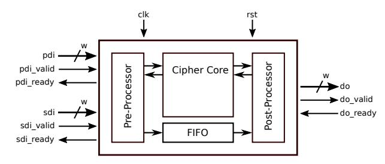
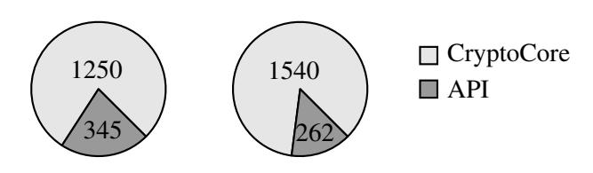
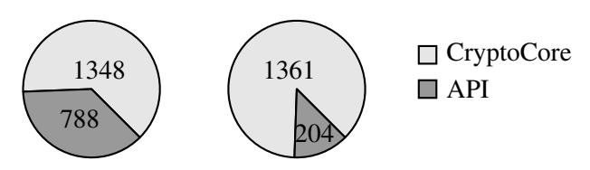
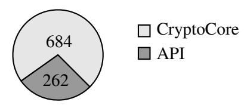

# A Detailed Report on the Overhead of Hardware APIs for Lightweight Cryptography

Patrick Karl and Michael Tempelmeier Technical University of Munich, Germany Department of Electrical and Computer Engineering Chair of Security in Information Technology {patrick.karl, michael.tempelmeier}@tum.de

*Abstract*—The "Competition for Authenticated Encryption: Security, Applicability, and Robustness" (CAESAR) was the first cryptographic competition that required designers to use a mandatory hardware API for their implementations. Recently, a similar hardware API for the NIST Lightweight Cryptography (LWC) project was proposed. Both APIs feature an accompanying development package to help designers implementing the API.

In this paper, we have an in-depth look on these packages. We analyze the features of both packages, discuss their resource utilization, and demonstrate their impact on Ascon128, SpoC-64, and Gimli implementations on a modern Artix-7 FPGA. Finally, we provide some tweaks and enhancements to further optimize the development package for the LWC API.

#### I. INTRODUCTION

As embedded systems and sensor networks become ubiquitous, the demand for resource and energy efficient cryptography increases. Therefore, in 2016, the NIST initiated the Lightweight Cryptography project (LWC) for Authenticated Encryption with Associated Data (AEAD) and Hash functions [1]. Its goal is to identify suitable cryptographic primitives that can be efficiently implemented in hardware and software. By the year of 2019, 57 algorithms were submitted. 56 of those were considered as first round candidates and 32 were selected for the currently ongoing second round, which focuses on benchmarking the candidates in terms of security and performance.

For a fair comparison of cryptographic software implementations, benchmarking suits like SUPERCOP [2] were introduced during the ECRYPT Stream Cipher Project (eSTREAM) [3]. For hardware implementations, this idea was realized in the Automated Tool for Hardware EvaluatioN (ATHENa) [4]. However, a benchmarking suite, that finds the best synthesis parameter, is not enough for a fair comparison of different hardware implementations; especially, if they all make different assumptions on the used interface. Thus, a common hardware interface is needed [5].

The first proposal for a uniform hardware interface was during the SHA-3 competition [6]. Also for the Post-Quantum project an hardware API was proposed [7].

During the CAESAR contest, a hardware API for AEAD [8] was proposed, and for the first time, officially included into a cryptographic competition. A corresponding development package for hardware implementations [9] increased the design process significantly. This enabled a fair comparison of different hardware implementations in [10].

Consequently, also for the NIST Lightweight Cryptography project a Hardware API [11] with corresponding development package [12] was proposed. This development package is based on the CAESAR development package but adds additional features and claims to be more resource efficient.

In the following, we analyze whether this claim holds true and show the impact of the development packages on exemplary designs. We show, that modifying the development package can lead to false impressions on resource requirements. However, under equal preconditions the API and its development package provide useful content towards a fair comparison of hardware implementations. Finally, we propose some minor modifications for the Development Package.

### II. RELATED WORK

In [8], a Hardware API for high-speed implementations for the CAESAR contest was proposed. In addition to that, the authors provided a development package for hardware implementations. The current release also introduces a much requested extension to support lightweight cipher cores [9]. With this extension, several CAESAR lightweight candidates were implemented and evaluated in [13].

This release is also used in the implementations of [14], where three NIST LWC candidates, i.e. SpoC, Spook and GIFT-COFB are evaluated with respect to their resource consumption and performance, and finally compared to CAESAR lightweight candidates.

In [10], a hardware benchmarking framework was presented that incorporates the CAESAR API package on a real SoC. Eleven hardware implementations of the final round CAESAR candidates were evaluated with respect to area and throughput. In [15], this framework was extended to also provide power and energy measurements.

Although, there has been a lot of research on providing an environment for fair comparison of hardware implementations, to the best of our knowledge, there is no work that analyzes the efficiency of the environment itself, i.e. the API development package.

### III. API COMPLIANT DEVELOPMENT PACKAGE

In order to speed up the design process of hardware implementations, the CAESAR and LWC API both feature a corresponding development package and an Implementer's Guide [9], [16]. As the LWC development package emerged from the CAESAR package, both designs consist of the same modules, i.e. the *PreProcessor*, a *FIFO*, the *PostProcessor* and the *Cipher*/*CryptoCore*1 .

Figure 1 provides an overview of the structure and the modules in the CAESAR and LWC development packages. The PreProcessor receives data via the publicdata-input (pdi) and secret-data-input (sdi) ports. It then removes the header information and stimulates the CipherCore which implements the actual cryptographic primitive. The PostProcessor receives the cipher's output, adds API specific header data and sends it to the dataoutput (do) port. Parts of the pdi-header is passed from PreProcessor to PostProcessor via the FIFO. In the following we will refer to that FIFO as *HeaderFifo*.

Although both packages have the same structure, they slightly differ in their implemented features. As mentioned in [16], the LWC packages fully supports hash algorithms. In addition to that, a width conversion feature is provided. Therefore, we distinguish between two different interfaces. The pdi, sdi and do ports make up the *external* interface, whereas the connection between Pre- and PostProcessor and CipherCore will be referred

Fig. 1: Modules and Overview of the CAESAR/LWC Development Package.

to as *internal* interface. The CAESAR package already supported multiple interface widths. However, there was no distinction between external and internal interfaces, such that both had the same width. With the width conversion feature in the LWC package, a designer can configure different widths for the internal and external interface. Thus, the same test framework can be used for CipherCore implementations with different data path widths. Width conversion also allows integrating 8- or 16-bit ciphers into – in embedded systems widely used – 32-bit designs. As the community demanded support for 8- and 16-bit external interfaces, they are also supported.

With the additional features implemented, the question of how the development packages compare in terms of resource consumption arises. On the one hand, more features require more resources. On the other hand, an API for lightweight applications should not dominate the resource cost of the actual cipher implementation.

# IV. RESOURCE ANALYSIS

In order to evaluate the effects of the additional features and the lightweight rework of the development package, we synthesized the underlying modules of both support packages with different I/O widths in standalone mode. That means, only the module itself without the possibility of optimizations across module borders is synthesized. For synthesis we used the Xilinx Vivado Design Suite v.2018.3 with default synthesis parameters for an Artix-7 FPGA. The resource consumption of FPGA designs is stated in terms of (Slice-) LUTs and (Slice-) registers, i.e. Flip-Flops. However, there are two types of Slice-LUTs. Whereas both types can be used for implementing logic, only one of them can be used as a memory element, i.e. LUTRAM. Therefore, we will abbreviate the overall number of occupied Slice-LUTs as LUTs, of which a subset will be explicitly used as LUTRAM.

1The module was renamed from CipherCore in CAESAR to CryptoCore in LWC.

#### *A. PreProcessor*

The PreProcessor's synthesis results are shown in the upper part of Table I. For the 32-bit PreProcessor version it shows that the LWC version requires less LUTs but two additional Flip-Flops (FFs) compared to the CAESAR design. The additional registers implement flags used for hash support in the LWC version. The 16 and 8-bit versions both consume more LUTs. The 16-bit version consumes one additional FF whereas the 8-bit version saves 22 FFs. By using the width conversions feature, additional FFs are required. However, a conversion from 32-bit to 16- or 8-bit still consumes less LUTs than a plain 16- or 8-bit version. This is due to the fact that the 32-bit FSM implementation requires less logic than the 16- or 8-bit implementation.

### *B. PostProcessor*

The LWC PostProcessor can be implemented to make use of two different flags, either the last\_flit or the end\_of\_block signal, to determine the end of a transmission. They are both passed from the CryptoCore to the PostProcessor. The last\_flit version allows using multiple data segments per message, thus allowing message sizes larger than 2 16 − 1 bytes, which is required to fulfill the NIST requirement to support at least messages of 2 50−1 bytes. The end\_of\_block version however is more resource efficient but only allows transmitting messages up to 2 16−1 bytes, which is sufficient for most use cases. Although the PostProcessor in the lightweight version of the CAESAR package could make similar differentiations, the corresponding PreProcessor does not support splitting messages over multiple segments. Therefore, a different analysis of the PostProcessor is omitted and the default implementation with the last\_flit flag is used. The PostProcessor synthesis results are shown in the lower part of Table I.

For the last\_flit configuration, the LWC PostProcessor requires in general more LUTs and FFs compared to the CAESAR version. The only exception is the FF requirement in the 8-bit case, where the LWC version saves 11 FFs. As one can expect, using the width conversion functionality results in an additional overhead, because the PostProcessor requires additional resources for data alignment.

When using the end\_of\_block flag, the LWC Post-Processor saves a significant amount of FFs compared to the CAESAR version, while still implementing the same functionality regarding message sizes. Even if the PostProcessor is configured to convert between internal and external widths, the amount of required FFs is reduced compared to the last\_flit version. The 32- and 16-bit versions without conversion save LUTs, whereas the 8-bit version and the ones with width conversion require more LUTs compared to the plain CAESAR versions.

As the message size of lightweight ciphers is unlikely to exceed 2 16 − 1 bytes, the end\_of\_block version is the appropriate configuration in terms of efficiency.

| Module         |      | I/O Width | CAESAR |    | LWC |    |
|----------------|------|-----------|--------|----|-----|----|
|                | ext. | int.      | LUT    | FF | LUT | FF |
|                | 32   | 32        | 95     | 33 | 88  | 35 |
|                | 16   | 16        | 111    | 24 | 124 | 25 |
| PreProcessor   | 8    | 8         | 137    | 56 | 159 | 34 |
|                | 32   | 16        | –      | –  | 114 | 37 |
|                | 32   | 8         | –      | –  | 111 | 39 |
|                | 32   | 32        | 87     | 20 | 92  | 28 |
| PostProcessor  | 16   | 16        | 77     | 21 | 86  | 22 |
| (last_flit)    | 8    | 8         | 67     | 42 | 111 | 31 |
|                | 32   | 16        | –      | –  | 105 | 45 |
|                | 32   | 8         | –      | –  | 112 | 54 |
|                | 32   | 32        | –      | –  | 67  | 12 |
| PostProcessor  | 16   | 16        | –      | –  | 62  | 6  |
| (end_of_block) | 8    | 8         | –      | –  | 78  | 15 |
|                | 32   | 16        | –      | –  | 81  | 29 |
|                | 32   | 8         | –      | –  | 88  | 38 |

TABLE I: Resource comparison of Pre- and PostProcessor.

#### *C. HeaderFifo*

For the LWC package, the design of the HeaderFifo has been replaced after routing problems occurred on some hardware platforms. The development package of the CAESAR API supports a feature where the tag verification is performed inside the PostProcessor and thus, the tag is passed from the PreProcessor to the PostProcessor. That means, the HeaderFifo must be large enough to buffer the tag plus the header information. For the provided dummy ciphers the tag is 128-bits. Therefore, the minimum size of the fifo would be 128 bits plus the size of two additional words for the header. In other words, a 32-bit implementation of a cipher with 128-bit tag requires a fifo with a depth of 6 words. As the fifo depths must be of power of two, a fifo buffering 8 words would suffice. That still differs by a factor of 128 from the default 1024 word configuration which might lead to suboptimal design optimization. However, for reasons of comparison, the CAESAR and LWC HeaderFifos were set to a depth of 4 words which is the default configuration in the LWC package. The standalone synthesis results for different word widths are shown in Table II. It shows a significant decrease in resource consumption for all of the three word widths.

| W  |     | CAESAR |        | LWC |    |        |  |
|----|-----|--------|--------|-----|----|--------|--|
|    | LUT | FF     | LUTRAM | LUT | FF | LUTRAM |  |
| 32 | 110 | 39     | 64     | 32  | 7  | 24     |  |
| 16 | 61  | 23     | 32     | 20  | 7  | 12     |  |
| 8  | 37  | 15     | 16     | 16  | 7  | 8      |  |

TABLE II: Synthesis results for the HeaderFifo, 4 words (LWC default).

#### *D. CipherCore / CryptoCore*

Both development packages provide a dummy cipher implementation to demonstrate the design's functionality. For the AEAD scheme, they implement the same specification; whereas hash support is only implemented in the LWC CryptoCore. Just as for the other modules, we synthesized the Cipher/CryptoCore as standalone modules to compare them. Since the LWC API supports hash functionality, the corresponding core was synthesized twice. The first version is unchanged, i.e. with hash support, whereas in the second run the CryptoCore's hash\_in port was removed. Internally tying the hash\_in flag to zero allows the synthesis tool to remove most of the logic required for hash support.

Table III shows the results for all three word sizes. It shows, that the savings of the LWC core depend on the configuration. In the 32-bit version, the LWC saves resource even if hash functionality is implemented. For the 8-bit case, the LWC core uses around 50 extra LUTs when implementing hash functionality and 7 extra LUTs when deactivating it. The reason for that difference is the impact of the LUTRAM. Whereas the CAESAR core makes use of 5 internal RAMs, the LWC core only uses 3 RAMs, i.e. 60%. As the absolute number of allocated LUTRAM cells decreases, the savings of the LWC core also decrease.

Comparing the LWC versions with and without hash support also shows that the absolute cost of the additional hash support stays relatively equal. This shows that in relative terms, additional features become more costly the smaller the overall design is.

| W  |     | CAESAR |        | LWC (with/without hash) |       |        |  |
|----|-----|--------|--------|-------------------------|-------|--------|--|
|    | LUT | FF     | LUTRAM | LUT                     | FF    | LUTRAM |  |
| 32 | 524 | 119    | 160    | 458/405                 | 96/94 | 96/96  |  |
| 16 | 317 | 113    | 80     | 347/301                 | 97/95 | 48/48  |  |
| 8  | 209 | 113    | 40     | 258/216                 | 98/95 | 24/24  |  |

TABLE III: Synthesis results of the provided Cipher-Core (CAESAR) and CryptoCore (LWC).

#### *E. Bringing it together*

Standalone synthesis prevents the tool from optimizing logic across module borders. In order to compare the development packages of both APIs, we synthesized the whole package with its corresponding dummy cipher implementations: First, both HeaderFifos were set to a depth of 1024, which is the default value in the CAESAR package. The synthesis results are shown in Table IVa. For every width, the LWC design consumes less resources. Although only a few LUTs are saved in the 8-bit version, the 32-bit version saves 622 LUTs, which is a saving of about 31% compared to CAESAR's LUTs. Reason for that is again, the huge amount of LUTRAM allocation in the CAESAR version. The LWC PostProcessor was configured to make use of the last\_flit flag, supporting multi-segment messages2 . Hash support was enabled in the LWC version as a mechanism for disabling hash was not intended in the original package.

As the HeaderFifo dominated the size of the whole design, we reduced the fifos' sizes in the second run. Since the default value is four words in the LWC package, we configure the CAESAR fifo to its minimal size, which is the size of the tag plus four additional words. As mentioned in Section IV-C, the depth must be a power of two. This results in depths of 8, 16 and 32 words for the 32-, 16- and 8-bit CAESAR versions. Table IVb shows the synthesis results. Now as the HeaderFifo is not the dominant factor anymore, the resource comparison follows the observations in Table III. As the design becomes smaller, the CAESAR version's overhead decreases and the additional hash support becomes an increasing factor.

Comparing the default configurations i.e. Table IVa for CAESAR and Table IVb for LWC, it shows that the 32 bit LWC version saves around 1304 LUTs due to a large saving in LUTRAM. For the 16- and 8-bit versions, the

2This is the default LWC configuration. As already mentioned, the lightweight CAESAR package does not provide support for multisegment messages. So, the LWC implementation is not only smaller, but also supports more features.

| W   |     | CAESAR |     | LWC    |      |     |        |
|-----|-----|--------|-----|--------|------|-----|--------|
| ext | int | LUT    | FF  | LUTRAM | LUT  | FF  | LUTRAM |
| 32  | 32  | 2009   | 266 | 1184   | 1387 | 209 | 672    |
| 16  | 16  | 1226   | 212 | 592    | 1025 | 188 | 400    |
| 8   | 8   | 793    | 250 | 296    | 786  | 194 | 216    |
| 32  | 16  | –      | –   | –      | 1328 | 229 | 624    |
| 32  | 8   | –      | –   | –      | 1194 | 234 | 600    |

(a) Equally sized HeaderFifo, i.e. 1024 words.

| W   |     | CAESAR |     | LWC    |     |     |        |
|-----|-----|--------|-----|--------|-----|-----|--------|
| ext | int | LUT    | FF  | LUTRAM | LUT | FF  | LUTRAM |
| 32  | 32  | 771    | 213 | 224    | 705 | 166 | 116    |
| 16  | 16  | 588    | 185 | 112    | 564 | 151 | 60     |
| 8   | 8   | 458    | 232 | 56     | 518 | 170 | 32     |
| 32  | 16  | –      | –   | –      | 624 | 186 | 68     |
| 32  | 8   | –      | –   | –      | 496 | 198 | 44     |

(b) Minimum sized HeaderFifo.

TABLE IV: Synthesis results of the development packages implementing the dummy cipher for different HeaderFifo dimensions.

savings decrease but are still significant. The same holds true for the FF savings.

Using the CAESAR package with default configuration for lightweight cipher comparison might therefore distort the comparison of ciphers because the package is likely to dominate the resource requirements.

Table IV also shows the influence of the width conversion feature: As expected it requires additional FF for data alignment. However, the overhead/saving in terms of logic depends on the size of the fifo, because the fifo's width equals the external width by default. Thus, for small fifos, the 32/8-bit version even saves LUTs compared to the pure 8-bit implementation.

## V. EXEMPLARY ANALYSIS OF PUBLISHED IMPLEMENTATIONS

In the following, the impact of the API packages on the resource consumption of different cipher implementations is analyzed. For evaluating the CAESAR package, the Ascon128 implementation from [17] and the SpoC-64 implementation from [18] are taken. For the LWC package, we took the Ascon128 implementation (without hash support) from [18] and the SpoC-64 implementation from [18]. The CAESAR and LWC variants for both, the Ascon128 and SpoC-64 implementations where configured with the same parameter set. However, the CAESAR Ascon128 was implemented using the development package version 1.0.3, which is a highspeed variant. The lightweight support for the CAESAR package was first introduced in the current release 2.0. According to the authors, the Ascon128 LWC version requires more cycles per associated data block (factor of 1.5) and message blocks (factor of 1.7) compared to the CAESAR high-speed version.

In addition to that, the Gimli implementation from [19] was included to demonstrate the package overhead for extremely constrained implementations. The hash support for the Gimli implementation was manually deactivated3 for comparability.

Table V lists the synthesis results for the 32-bit implementations. For the CAESAR implementations, Ascon128 requires less resources than SpoC-64, especially in terms of LUTRAM consumption. This is due to the different parameterization of the HeaderFifo. For SpoC-64, the fifo was configured to a word width of 32-bits and depth of 512 words. In the Ascon128 implementation, however, the fifo width was trimmed to 24-bits4 and the depth set to 4 words.

For the LWC implementations with equally sized HeaderFifos, Ascon128 requires more LUTs than the SpoC-64 implementation, but less FFs. As the Gimli implementation is specifically opted for resource optimization, it requires less LUTs and FFs than the other implementations. The increased LUTRAM requirements come from the fact that the 384-bit Gimli-state is implemented in LUTRAM. This reduces the amount of required FFs but decreases performance because only parts of the state are accessible in each clock cycle.

As previously stated, the sizes of the HeaderFifos for the CAESAR implementations were manually adjusted: The implementation from [17], reduced the fifo to its minimum size such that functional correctness is guaranteed. Due to the different parameterization, Table V does not allow a fair comparison of the cipher implementations itself, as the overhead added by the API package's modules is not comparable. Figure 2 visualizes the LUT ratio of the API package modules and the actual CipherCores of the implementations shown in Table V.

For Ascon128, Figure 2a shows that the LWC Crypto-Core requires more resources than the CAESAR version. This overhead is mitigated by the LWC API package that saves around 80 LUTs. Nevertheless, the CAESAR

3The CryptoCore's hash\_in port was removed and an internal hash\_in flag was tied to zero. This allows the synthesis tool to trim most of the hash-logic in the CryptoCore.

4Only 24-bits of the 32-bit header word are actually used.

| Cipher                     | LUT    | FF  | LUTRAM |  |  |
|----------------------------|--------|-----|--------|--|--|
| Сірпсі                     | CAESAR |     |        |  |  |
| Ascon128 1 [17] | 1595   | 818 | 42     |  |  |
| SpoC-64 2 [18]  | 2136   | 876 | 416    |  |  |
|                            | LWC    |     |        |  |  |
| Ascon128 [18]              | 1802   | 539 | 20     |  |  |
| SpoC-64 [18]               | 1565   | 728 | 20     |  |  |
| Gimli 3 [19]    | 946    | 235 | 84     |  |  |

 $^{1}$  HeaderFifo:  $24 \times 4$ .  $^{2}$  HeaderFifo:  $32 \times 512$ .

TABLE V: Resource table of available ciphers implemented with the CAESAR and LWC package.

version is a high-speed implementation, which of course adds additional overhead to the API package. Considering the whole design, the CAESAR implementation delivers more performance at less resource consumption than the LWC implementation.

Comparing the SpoC-64 implementations in Figure 2b shows a significant difference in the impact of the API modules; whereas both CryptoCore implementations are roughly of equal size, the development packages' almost differ by a factor of 4.

By taking only the CryptoCore LUTs into account, the comparison of the CAESAR implementations of Ascon128 and SpoC-64 is not as drastically as it seemed looking at Table V. In Figure 3, the same separation is done for the LWC Gimli implementation. It shows, that for small ciphers the API package has a significant impact. In this specific case, the API package makes up around 28% of the overall LUT requirements. Nevertheless, the number of LUT resources allocated by the LWC package is the same for the Ascon128 and the Gimli implementation. In that case, the API package adds the same overhead for both ciphers and allows for a fair comparison.

For the Spoc-64 implementation, the LWC package requires less resources. At first glance this might indicate better optimization results but the opposite is the case: The 32-bit versions of Pre-, PostProcessor and Header-Fifo sum up to 212 LUTs in total, which is only a small extra compared to the 204 LUTs in the SpoC-64 design but less than in the case of Ascon128 and Gimli. Analyzing the synthesized SpoC-64 schematic shows, that the internal interface is preserved and not further optimized. The difference of 58 LUTs compared to the Ascon128 and Gimli implementation is caused

by the logic of a counter located in the PreProcessor. This counter indicates the number of remaining segments of the current type. For Ascon128 and Gimli, the optimization step shares the counter's logic with the CryptoCore and as a result, some extra logic is attributed to the PreProcessor. An out-of-context synthesis of the CryptoCore results in 62 additional LUTs. That means, sharing information with the PreProcessor as in the case of Ascon128 and Gimli results in 58 aditional LUTs in the PreProcessor, but saves 4 LUTs in total.

It is not clear why this optimization is not performed for the SpoC-64 design. An educated guess is that the cross-boundary optimization is limited for mixed language designs, which is the case for the SpoC-64; its CryptoCore is implemented in Verilog while the remaining components are written in VHDL.

(a) Ascon128 with CAESAR (left) and LWC (right).

(b) SpoC-64 with CAESAR (left) and LWC (right).

Fig. 2: Distribution of allocated LUTs for SpoC (2b) and Ascon128 (2a). The CAESAR package is shown on the left, whereas the LWC package is depicted on the right.

Fig. 3: Distribution of LUT allocation for a constrained Gimli LWC implementation.

#### VI. TWEAKING THE DEVELOPMENT PACKAGE

The fact that different HeaderFifo dimensionings can lead to different impressions when comparing cipher implementations brings up the question whether the fifo is required at all.

&lt;sup>3 Hash deactivated for comparability.

The drawbacks of removing the fifo is that there is a combinatorial path from the input of the PreProcessor to the output of the PostProcessor. However, for lightweight implementations where high frequencies are not necessarily a concern, removing the fifo would save additional resources and improve comparability with respect to resource consumption.

When removing the HeaderFifo, it turned out that there are some implementation flaws in the PreProcessor regarding the valid/ready handshaking. We submitted a patch for the PreProcessor that fixes this issue such that the HeaderFifo can be removed. The modification in the PreProcessor did not change the resource requirements significantly.

Table VI shows the synthesis results of the LWC development package and its dummy cipher without HeaderFifo and with modified PreProcessor. Comparing these numbers with the LWC default configuration in Table IVb shows that additional resources can be saved. Although the savings in that case are not very large, it further reduces the impact of the API package and increases accuracy when comparing cipher implementations.

| W   |     | LUT | FF  | LUTRAM |
|-----|-----|-----|-----|--------|
| ext | int |     |     |        |
| 32  | 32  | 684 | 159 | 96     |
| 16  | 16  | 550 | 144 | 48     |
| 8   | 8   | 504 | 163 | 24     |
| 32  | 16  | 585 | 179 | 48     |
| 32  | 8   | 475 | 191 | 24     |

TABLE VI: LWC development package without Header-Fifo and with the provided dummy CryptoCore.

# VII. CONCLUSION

In this work, we presented a detailed report on the resource utilization of the accompanying development packages of the CAESAR and LWC API.

We showed that the overhead of the additional hash support and width conversion is justifiable, and that the claim holds true that the new LWC development package is more resource efficient than the one for CAESAR. However, the overall overhead of the development packages is not negligible for lightweight implementations and must be thoroughly reported.

Furthermore, when comparing optimized synthesis results, it is crucial to check whether the actual cipher or the surrounding modules were optimized. Otherwise, this might lead to false impressions, as the parameters of the development packages leave room for improvements. Especially, the used HeaderFifo has a huge influence: First, the version used in the LWC package is significantly smaller than the one in CAESAR. Next, although the reviewed implementations had the same datapath width, the width of the fifos differed. Finally, the fifo can be omitted, if the PreProcessor is patched.

Nevertheless, as previous paper stated, a defined interface is also crucial for a fair comparison of implementations. Therefore, it might be worth considering the internal interface as the boundary for synthesis reports. Thus, one could benefit from the existing frameworks for a fair benchmarking and limit the risk of blurred synthesis results at the same time.

# REFERENCES

- [1] "Lightweight Cryptography," 2016. [Online]. Available: https: //csrc.nist.gov/projects/lightweight-cryptography
- [2] D. J. Bernstein and T. Lange, "System for Unified Performance Evaluation Related to Cryptographic Operations and Primitives," 23.01.2020. [Online]. Available: https://bench.cr.yp.to/supercop.html
- [3] "eSTREAM: The ECRYPT Stream Cipher Project," 2004. [Online]. Available: https://www.ecrypt.eu.org/stream/index.html
- [4] K. Gaj, J.-P. Kaps, V. Amirineni, M. Rogawski, E. Homsirikamol, and B. Y. Brewster, "ATHENa - Automated Tool for Hardware EvaluatioN: Toward Fair and Comprehensive Benchmarking of Cryptographic Hardware Using FPGAs," in *2010 International Conference on Field Programmable Logic and Applications*. IEEE, aug 2010.
- [5] M. Tempelmeier, F. D. Santis, J.-P. Kaps, and G. Sigl, "An areaoptimized serial implementation of ICEPOLE authenticated encryption schemes," *2016 IEEE International Symposium on Hardware Oriented Security and Trust (HOST)*, pp. 49–54, May 2016.
- [6] G. M. University, "The GMU Interface & Communication Protocol Used in the Implementations of the SHA-3 Round 3 Candidates." [Online]. Available: https://cryptography.gmu.edu/ athena/interfaces/GMU\_interface\_and\_protocol\_Round\_3.pdf
- [7] A. Ferozpuri, F. Farahmand, V. Dang, M. U. Sharif, J.- P. Kaps, and K. Gaj, "Hardware API for Post-Quantum Public Key Cryptosystems," 2018. [Online]. Available: https: //cryptography.gmu.edu/athena/PQC/PQC\_HW\_API.pdf
- [8] E. Homsirikamol, W. Diehl, A. Ferozpuri, F. Farahmand, P. Yalla, J.-P. Kaps, and K. Gaj, "CAESAR Hardware API," Cryptology ePrint Archive, Report 2016/626, 2016. [Online]. Available: https://eprint.iacr.org/2016/626/20160617:192254
- [9] E. Homsirikamol, P. Yalla, F. Farahmand, W. Diehl, A. Ferozpuri, J.-P. Kaps, and K. Gaj, "Implementer's Guide to Hardware Implementations Compliant with the CAESAR Hardware API version 2.0," 2017. [Online]. Available: https://cryptography.gmu.edu/athena/CAESAR\_HW\_API/ CAESAR\_HW\_Implementers\_Guide\_v2.0.pdf
- [10] M. Tempelmeier, F. D. Santis, G. Sigl, and J.-P. Kaps, "The CAESAR-API in the real world — Towards a fair evaluation of hardware CAESAR candidates," in *2018 IEEE International Symposium on Hardware Oriented Security and Trust (HOST)*. IEEE, apr 2018.

- [11] J.-P. Kaps, W. Diehl, M. Tempelmeier, E. Homsirikamol, and K. Gaj, "Hardware API for Lightweight Cryptography," 2019, https://cryptography.gmu.edu/athena/index.php?id=LWC.
- [12] Cryptographic Engineering Research Group, George Mason University. Accessed: 13.1.2020. [Online]. Available: https: //github.com/GMUCERG/LWC
- [13] F. Farahmand, W. Diehl, A. Abdulgadir, J.-P. Kaps, and K. Gaj, "Improved Lightweight Implementations of CAESAR Authenticated Ciphers," Cryptology ePrint Archive, Report 2018/573, 2018. [Online]. Available: https://eprint.iacr.org/ 2018/573/20180605:174842
- [14] B. Rezvani and W. Diehl, "Hardware Implementations of NIST Lightweight Cryptographic Candidates: A First Look," Cryptology ePrint Archive, Report 2019/824, 2019. [Online]. Available: https://eprint.iacr.org/2019/824/20190716:135314
- [15] M. Tempelmeier, G. Sigl, and J.-P. Kaps, "Experimental Power and Performance Evaluation of CAESAR Hardware Finalists," in *2018 International Conference on ReConFigurable Computing and FPGAs (ReConFig)*. IEEE, dec 2018.
- [16] M. Tempelmeier, F. Farahmand, E. Homsirikamol, W. Diehl, J.-P. Kaps, and K. Gaj, "Implementer's Guide to Hardware Implementations Compliant with the Hardware API for Lightweight Cryptography," 2019. [Online]. Available: https://cryptography.gmu.edu/athena/LWC/ LWC\_HW\_Implementers\_Guide.pdf
- [17] Institute of Applied Information Processing and Communications (IAIK), Graz University of Technology. 15.1.2020. [Online]. Available: https://github.com/IAIK/ascon\_hardware/ tree/master/caesar\_hardware\_api\_v\_1\_0\_3/ASCON\_ASCON
- [18] Signatures Analysis Laboratory, Virginia Tech. Accessed: 13.1.2020. [Online]. Available: https://github.com/vtsal?tab= repositories
- [19] Chair of Security in Information Technology, Technical University of Munich. 13.1.2020. [Online]. Available: https://gitlab. lrz.de/tueisec/crypto-implementations/tree/master/LWC/GIMLI